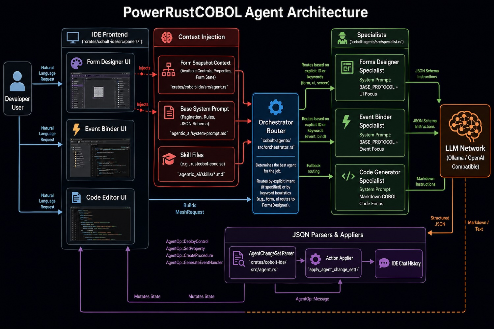

<!--
SPDX-License-Identifier: Apache-2.0
Copyright (c) 2026 Emerson Lopes and PowerRustCOBOL contributors

Licensed under the Apache License, Version 2.0.
See the LICENSE file in the project root for full license information.
-->

<p align="center">
  
</p>

<p align="center">
  <em>A modern, Rust-powered RAD (Rapid Application Development) environment for COBOL —<br>
  design forms visually, run them on a fast tree-walking runtime, and compile to a single self-contained binary.</em>
</p>

<p align="center">
  <a href="#license"></a>
  
  
</p>

---

## Overview

**PowerRustCOBOL** brings COBOL into a modern desktop development experience. It pairs a
practical subset of the **COBOL-85 standard** with a visual form designer, a rich widget
toolbox, an interactive debugger, and a compiler that turns a project into one
**self-contained native binary** — no COBOL source shipped inside it.

| Name | Role |
|------|------|
| **RustCOBOL** | The language and compiler (a COBOL dialect with visual RAD extensions). |
| **PowerRustCOBOL AI** | The RAD IDE — the desktop application you design and build with. Window titles, the welcome screen and the About dialog all show the product under this name; folder names on disk keep the original spelling. |
| **rcrun** | The command-line runtime/build tool. |

> ⚠️ COBOL data-item names, paragraph names, and all generated COBOL source always remain
> in **English**, regardless of the IDE's selected interface language.

## Goals

- **Make COBOL approachable** with a visual, drag-and-drop form designer and live preview.
- **Run COBOL fast** on a clean tree-walking interpreter — no external runtime required.
- **Ship real apps**: compile a project into a single native executable that embeds its
  forms and program logic.
- **Stay self-contained**: the default toolchain needs no system COBOL, no FFmpeg, and no
  proprietary dependencies.
- **Be honest about scope**: implement the parts of COBOL-85 that matter for building
  applications today, and clearly mark what is partial or out of scope.

## What's implemented

### The IDE (PowerRustCOBOL)
- **Visual form designer**: Complete design canvas supporting multiple themes (**Liquid Glass** and **Cobalt Steel**), grid snapping, drag-resize of controls and the canvas, multi-select alignment tools, and z-ordering.
- **Unified rendering engine**: Ensures 100% pixel-parity between the visual designer, the form previewer, the running application, and the compiled native binary outputs.
- **Universal corner radius & rounded clipping**: GroupBoxes, Panels, and other containers support configurable `CornerRadius`. Nested child controls (e.g. PictureBoxes, Panels) clip perfectly to their parent's rounded border, utilizing custom corner-notch masking.
- **42 widgets** across Common, Container, Data, Graphics, Menu, Non-visual, and Charts categories — including the **Animator** widget which natively renders **GIF / WebP / APNG** assets, plus **Knob** (rotary dial with bipolar fill), **Gauge** (radial/linear/donut KPI with automatic warning and critical zones), **Switch**, **FileDropZone** (drag-and-drop or native picker), **Maps**, and **Web Search**.
- **Transparency on every control**: `Transparency` (0 = opaque … 100 = fully see-through) fades a control's face, frame and shadow while its text, glyphs and border stay legible, so what sits behind shows through. A **CheckBox** defaults to fully transparent — it is a tick and a caption, not a card — and its drop shadow follows suit: the whole frame casts while the face is solid, the tick box alone once the background is see-through. Captions that would fall below WCAG AA against whatever is behind them are automatically flipped to the pole that reads.
- **Advanced Menu editor**: A visual tree editor for menus, featuring 122 built-in vector icons, pulldown hierarchical nesting, and HMAC configuration integrity signatures to prevent tampering.
- **Data binding & Control arrays**: Direct binding to SQL/Data sources. Dynamic *Visual Repeating Groups* expand GroupBox or Panel control arrays automatically based on runtime `DataSource` queries and row counts.
- **Visual validation & Form inspector**: Real-time error badges highlight malformed event handlers, incomplete bindings, and layout anomalies. Integrated `rcrun` process manager tracks CPU%, RSS memory, active logs, and thread counts live from inside the IDE.
- **Properties inspector**, **toolbox** with vector icons, **forms list**, **project tree**, and a dockable **output panel**.
- **System-font picker**: Choose any installed system font (rendered in its own typeface), applied live across the designer canvas, previews, and running forms.
- **Form Debugger (RAD debugging)**: Opens as a standalone, always-on-top OS window featuring breakpoints, step execution (In, Out, Over), visual variable inspector, and custom animation playback controls (advancing execution at 1-10 lines/second).
- **Agentic AI assistant mesh**: A **rig-core** powered LLM orchestrator (supporting Ollama, OpenAI, Groq, Alibaba Model Studio, and other cloud APIs) running a multi-agent mesh (Dev Agent, Editor Assistant, History Compactor). Includes a live observability activity log (duration, HTTP status, token counts) and an interactive chat pane with bubble styled history. The "Thinking…" indicator carries a live `↑input ↓output` reading, fed by every completed model call on every surface.

  
- **Grace, the orchestrator**: Grace decomposes a request into tasks, routes each to the specialist that owns it (Form Designer, COBOL Event Handler, Data/Indexed File, Documentation, Version Control), and enforces a one-to-one **Pedantic reviewer** on every result — no specialist approves its own work. She rates a request for clarity before any retrieval happens and asks rather than guessing, keeps per-agent performance ratings across runs, feeds specialists *lessons* rather than scores, and answers investigative questions about the open project from the real project state instead of from memory.
- **A project-wide COBOL code standard the agents write against**: application data under meaningful `01 … GLOBAL` records, `OCCURS` tables instead of repeated fields, reusable numeric-edited buffers matched to their source picture, currency edited with the required digit before the separator, table values initialized procedurally in a dedicated `INITIALIZE-… SECTION`, and a `MAIN SECTION` that only orchestrates. Form data is initialized in a common procedure invoked from the form's `onLoad` — never from a control's handler, which re-runs on every user action. The Pedantic reviewer enforces the same standard, so the pair cannot disagree.
- **Chunked Knowledge Base with RAG**: Reference documentation is indexed one record per subject rather than per file, so retrieval returns the paragraph that answers the question. The IDE ships its System KB store **pre-embedded**, embeddings run on the **GPU with a cool-running CPU fallback** under one policy, an indexing progress bar shows the work, and **File → Reindex Knowledge Bases** re-runs it on demand.
- **Form lifecycle and windowing**: Every project designates one **main form** (which alone carries the taskbar icon); per-form window chrome and state are honoured by the run-form host; a `Waiting` **FormState** cannot be dismissed by the user; `OpenFormSync` / `OpenFormAsync` open one form from another; and a form's **window position** is a design-time property. **Entrance and exit window effects** are configured once per project and play with no chrome, over the desktop.
- **Multi-window runtime**: Preview and run screens rendered in dedicated OS viewports via egui multi-viewport.
- **Internationalised UI**: Built-in support for 6 interface languages (English, Spanish, Portuguese, Japanese, Chinese, French).
- **Non-blocking native file dialogs** (open/save/browse) that never stall the UI event loop.

### The RustCOBOL language & runtime
- **Fixed-form and free-form** source.
- **Divisions**: IDENTIFICATION, ENVIRONMENT (INPUT-OUTPUT / FILE-CONTROL), DATA, PROCEDURE.
- **DATA sections**: WORKING-STORAGE, LOCAL-STORAGE, LINKAGE, FILE.
- **Data description**: `PIC` X / A / 9 / S / V with `(n)` repetition; `USAGE` DISPLAY,
  COMP/BINARY, COMP-1/2, COMP-3/PACKED-DECIMAL, COMP-5, INDEX, POINTER; `OCCURS`
  (fixed and `DEPENDING ON`); level numbers incl. 01/77/88; `VALUE`; group items; `FILLER`;
  88-level condition names.
- **Verbs**: MOVE, DISPLAY, ACCEPT (`FROM DATE/TIME/DAY/DAY-OF-WEEK/ENVIRONMENT`),
  ADD / SUBTRACT / MULTIPLY / DIVIDE (multiple `GIVING` receivers, `REMAINDER`,
  per-receiver `ROUNDED`) / COMPUTE, IF…ELSE…END-IF, EVALUATE…WHEN / `ALSO` /
  `WHEN NOT` / WHEN OTHER, PERFORM (inline, `TIMES`, `UNTIL` with `TEST
  BEFORE/AFTER`, `VARYING…AFTER`, `THRU`, out-of-line `para VARYING`), GO TO
  [`DEPENDING ON`], CONTINUE, STOP RUN, GOBACK, EXIT (`PERFORM [CYCLE]` /
  `PARAGRAPH` / `SECTION` / `PROGRAM`), SET (incl. `UP/DOWN BY`, 88-`TO TRUE`),
  INITIALIZE (category-aware + `REPLACING`), STRING / UNSTRING (with
  `ON OVERFLOW`), INSPECT (`TALLYING`/`REPLACING` combined, `BEFORE/AFTER
  INITIAL`, `CONVERTING`), SEARCH / SEARCH ALL, SORT / MERGE / RELEASE / RETURN,
  ALTER, UNLOCK, CANCEL, COMMIT, ROLLBACK, NEXT SENTENCE, pointer `SET ADDRESS
  OF` / `SET … TO ADDRESS OF`; `OPEN … SHARING/WITH LOCK`, `READ … WITH [NO] LOCK`.
- **Reference modification** `data-item(start:length)` on any operand (read and
  write); **abbreviated conditions** — operator-prefixed (`a > 1 AND < 9`) and
  literal-object (`a = 1 OR 2 OR 3`).
- **CALL**: COBOL-85 **nested programs** *and* multiple sequential program units in one file,
  `USING BY REFERENCE/CONTENT/VALUE`, `RETURNING`, `ON EXCEPTION` / `NOT ON
  EXCEPTION`; plus a library of runtime built-ins (see below).
- **INVOKE & Rust FFI repository**: Native bridge to call custom Rust compiled plugins. External modules are configured under `REPOSITORY` and dispatched via `INVOKE` or direct property mappings.
- **User procedures**: Shared COBOL procedures editable in the IDE, callable from event handlers via `CALL "PROCEDURE-NAME"`.
- **Concise property expressions**: Get/set properties directly using the `::` operator inside formulas (`COMPUTE Output::Value = Input-1::Value * Input-2::Value`) eliminating temporary working-storage variables.
- **Intrinsic functions**: `LENGTH`, `UPPER-CASE`, `LOWER-CASE`, `NUMVAL`, `NUMVAL-C`,
  `MAX`, `MIN`, `SQRT`, `MOD`, `REM`, `ABS`, `INTEGER`, `INTEGER-PART`, `RANDOM`,
  `CURRENT-DATE`, `TRIM`, `REVERSE`, `CONCATENATE`, `ORD`, `CHAR`, `ORD-MAX`,
  `ORD-MIN`, `SUM`, `MEAN`, `MEDIAN`, `MIDRANGE`, `RANGE`, `VARIANCE`,
  `STANDARD-DEVIATION`, `FACTORIAL`, `SIN`, `COS`, `TAN`, `ASIN`, `ACOS`, `ATAN`,
  `LOG`, `LOG10`, `EXP`, `EXP10`, `PI`, `STORED-CHAR-LENGTH`, `WHEN-COMPILED`,
  `INTEGER-OF-DATE`, `DATE-OF-INTEGER`, `INTEGER-OF-DAY`, `DAY-OF-INTEGER`,
  `FRACTION-PART`, `ANNUITY`, `PRESENT-VALUE`, `YEAR-TO-YYYY`, `BYTE-LENGTH`,
  `NUMVAL-F`, `TEST-NUMVAL` — the complete COBOL-85 standard intrinsic set.
- COBOL-correct alphanumeric comparison (space-padded) and figurative constants
  (SPACES, ZEROS, HIGH/LOW-VALUES, QUOTES, NULLS).

### File I/O
- **`ORGANIZATION IS SEQUENTIAL`** (fixed-length records) and **`LINE SEQUENTIAL`**
  (newline-terminated text; trailing spaces dropped on write).
- **`ORGANIZATION IS INDEXED`** (ISAM) — a built-in, **dependency-free** keyed-file
  engine: primary `RECORD KEY` + `ALTERNATE RECORD KEY [WITH DUPLICATES]`,
  records kept in ascending key order on disk, journaled with `COMMIT`/`ROLLBACK`.
  - **`STORAGE [MODE] IS MEMORY | DISK [WITH [DATA] COMPRESSION]`** (PowerRustCOBOL
    extension) selects the backend per file (`MODE` optional). **`DISK` is the
    default** (when no `STORAGE` clause is present): a **persistent paged B+tree**
    engine — records and indexes live in the `ASSIGN` file and are read on demand
    (free-list page reuse + a `RecordId` directory), so RAM is bounded for very
    large files. `MEMORY` is the in-RAM engine (whole file in memory, persisted
    to the `ASSIGN` path on close). `WITH COMPRESSION` (a.k.a. `WITH DATA
    COMPRESSING`) applies to either mode: a fast, dependency-free RLE that crushes
    the padded runs in typical COBOL records well past 50 %. `ASSIGN TO` is always
    required.
    ```cobol
    SELECT CUSTOMER-FILE
        STORAGE IS DISK WITH COMPRESSION
        ASSIGN TO "customers.dat"
        ORGANIZATION IS INDEXED
        ACCESS MODE IS DYNAMIC
        RECORD KEY IS CUSTOMER-ID
        ALTERNATE RECORD KEY IS CUSTOMER-ZIP WITH DUPLICATES
        FILE STATUS IS CUSTOMER-STATUS.
    ```
  - `ACCESS MODE SEQUENTIAL / RANDOM / DYNAMIC` all execute.
  - `READ` (random by key, and `READ … NEXT/PREVIOUS` sequential), `WRITE`,
    `REWRITE`, `DELETE`, and `START … KEY IS = / > / >= / < / <=` (incl.
    `GREATER/LESS THAN`, `NOT LESS THAN`, …).
  - `INVALID KEY` / `NOT INVALID KEY` phrases and full **FILE STATUS** codes
    (00/02/10/22/23/…).
  - Engine selectable via `rcrun --indexed-engine <rust|rm-cobol85|fujitsu|redb>`
    or the `COBOL_INDEXED_ENGINE` env var (all behaviour-compatible; `rust` default).
  - **`redb` — crash-safe engine** (opt-in): a `STORAGE IS DISK` engine on the
    pure-Rust **redb** ACID store. **O(1) OPEN** (no directory load / recovery
    scan, ~5 ms at 200 k records), working-set RAM (≥250 M records), and ACID
    `COMMIT`/`ROLLBACK` that survives power loss with no index corruption. Same
    observable COBOL behavior as the default engine. Optional per-file
    transaction log via `--indexed-log <basic|full>` → `<assign-path>.log`
    (timestamps, record/byte counts, throughput, key-ordering quality, and—at
    `full`—index page stats), in logfmt or **Grafana/Loki-ready NDJSON**
    (`--indexed-log-format json`) — see
    [`docs/observability.md`](docs/observability.md). Engine details:
    [`docs/indexed-redb-engine.md`](docs/indexed-redb-engine.md).
  - **Self-describing `PRCIDX1` container** — embeds the file schema (record
    format + key descriptors) so files are discoverable and a future Fujitsu
    importer can write faithful data; strict open-time validation maps schema
    mismatch → `39`, missing file → `35`. Not byte-compatible with Fujitsu. See
    [`docs/indexed-file-format.md`](docs/indexed-file-format.md).
- `SELECT … ASSIGN TO … ORGANIZATION … [ACCESS MODE …] [RECORD KEY …] [FILE STATUS IS …]`.
- File verbs are dispatched by each file's declared `ORGANIZATION` (per its
  `SELECT`), so sequential and indexed files share `OPEN`/`CLOSE`/`READ`/`WRITE`
  while each honours its own organization-specific semantics.
- `OPEN INPUT/OUTPUT/EXTEND/I-O`, `READ … [INTO] [AT END / NOT AT END]`,
  `WRITE … [FROM]`, `CLOSE`, with **FILE STATUS** codes (00/10/30/35/…).

### Built-in integrations (runtime `CALL`s and `INVOKE`)
- **SQL (SQLite, PostgreSQL, MySQL)** — open/exec/fetch/row-count/close. One
  identical CALL surface for all three; the backend is chosen from the
  connection string (`:memory:` / `sqlite:` / `postgres://` / `mysql://`). All
  drivers are pure Rust (no system libraries). See
  [`docs/database-runtime.md`](docs/database-runtime.md).
- **HTTP / REST** — GET/POST/PUT/DELETE with custom headers.
- **GUI** — `COBOL-WAIT-EVENT`, `COBOL-SET-PROPERTY`, `COBOL-GET-PROPERTY`, `COBOL-INIT-FORM`.
- **Charts** — 6 chart types bound to COBOL tables (bar/line/pie/area/scatter/donut).
- **Text files** — `COBOL-APPEND-FILE` / `COBOL-WRITE-FILE` helpers.
- **Timers** and an **AI agent** object hook.

### The compiler (single-binary)
- Serialises the program AST with `bincode` + `flate2`, embeds it and all forms via
  `include_bytes!`, builds with `cargo build --release`, and emits one native binary in
  `bin/` — **with no `.cbl` source included**.
- The output `bin/` automatically receives `LICENSE`, `NOTICE`, and a redistribution
  notice, so distributions carry the required Apache-2.0 notices.

## Getting started

Get from a clean machine to the running IDE in four steps. For the full per-OS
walkthrough — package lists for Debian/Ubuntu, Fedora and Arch, where the
artifacts land, and what to do when the build fails — see
**[docs/BUILDING.md](docs/BUILDING.md)**.

### 1. Install the requirements

| Requirement | Why | Install |
|-------------|-----|---------|
| **Rust toolchain** (stable, **1.92 or newer**) | builds the whole workspace | [rustup.rs](https://rustup.rs) — `curl --proto '=https' --tlsv1.2 -sSf https://sh.rustup.rs \| sh` |
| **Git** | clone the repository | [git-scm.com](https://git-scm.com/downloads) |
| **A C toolchain + native GUI libraries** | the platform linker Rust itself needs, two C dependencies (bundled SQLite and the Oniguruma regex engine), and the native file dialogs | see the per-OS notes below |

There is **no Python, Node, JVM, CMake, NASM or C++ compiler** anywhere in the
build — a C compiler and a linker are the whole of it, and on every platform they
arrive with the package Rust already needs in order to link.

Per-OS native dependencies:

- **macOS** — install the Xcode Command Line Tools: `xcode-select --install`. Nothing else is needed.

- **Windows** — install the **Visual Studio Build Tools** with the *"Desktop
  development with C++"* workload ([download](https://visualstudio.microsoft.com/downloads/#build-tools-for-visual-studio-2022)),
  then install Rust from [rustup.rs](https://rustup.rs) — it selects the MSVC
  toolchain automatically. That single workload provides everything: `link.exe`
  and the Windows SDK (which rustc requires for *any* Rust binary, C code or not)
  and `cl.exe` for the two C dependencies. Nothing else to download.

  ```powershell
  # after both installs, from a normal PowerShell prompt
  rustc --version
  cargo build --release -p cobolt-ide -p cobolt-cli
  ```

- **Linux (Debian/Ubuntu)** — install the build + GUI/dialog libraries:

  ```sh
  sudo apt update && sudo apt install -y \
      build-essential pkg-config \
      libgtk-3-dev libxcb-render0-dev libxcb-shape0-dev libxcb-xfixes0-dev \
      libxkbcommon-dev libssl-dev
  ```

  (Fedora: `gtk3-devel`, `libxcb-devel`, `libxkbcommon-devel`, `openssl-devel`, `@development-tools`.)

  `libssl-dev` / `openssl-devel` is load-bearing on Linux: HTTPS goes through the
  operating system's TLS (schannel on Windows, Security.framework on macOS,
  OpenSSL here) rather than through a bundled crypto library that would have to
  be compiled from C on every machine.

Verify Rust is ready:

```sh
rustc --version && cargo --version
```

### 2. Download the code

```sh
git clone https://github.com/CloudLandBeta/PowerRustCOBOL.git
cd PowerRustCOBOL
```

### 3. Build (downloads + compiles all dependencies)

```sh
cargo build
```

> The first build fetches every crate and compiles the workspace, so it takes a
> few minutes and the `target/` cache grows to ~1.5 GB. Later builds are
> incremental and fast. Run `cargo clean` to reclaim the space at any time.

### 4. Launch the IDE

```sh
cargo run -p cobolt-ide
```

> **Tip:** for the smoothest UI, run a release build: `cargo run --release -p cobolt-ide`
> (slower to compile the first time, much faster at runtime).

That's it — the **PowerRustCOBOL** window opens and you can start designing forms
and writing RustCOBOL. To work from the command line instead, see
[Run / check a program from the CLI](#run--check-a-program-from-the-cli-rcrun) below.

## Running applications

A PowerRustCOBOL **project** is a directory with a `cobolt.toml` manifest plus its
`.cbl` sources and `.cfrm` forms:

```toml
[project]
name = "MyApp"
version = "1.0.0"
main = "main.cbl"

[files]
sources = ["main.cbl"]
forms   = ["main-form.cfrm"]
assets  = []
```

### Launch the IDE

```sh
cargo run -p cobolt-ide
```

### Run / check a program from the CLI (`rcrun`)

```sh
# Run a COBOL program
cargo run -p cobolt-cli -- run main.cbl

# Parse + semantic analysis only (no execution)
cargo run -p cobolt-cli -- check main.cbl
```

### Generate a standalone binary

A **single console-only program** needs no `cobolt.toml` — just point `build` at
the `.cbl` file:

```sh
# Compile one source file → ./bin/<file-stem>  (native binary, next to the source)
cargo run -p cobolt-cli -- build hello.cbl
./bin/hello
```

For a **project** (multiple sources and/or forms), pass the manifest:

```sh
# From inside the project directory:
cargo run -p cobolt-cli -- build cobolt.toml
#   → produces ./bin/<app-name>  (self-contained native executable)
#   → plus ./bin/LICENSE, ./bin/NOTICE, ./bin/POWERRUSTCOBOL-NOTICE.txt

# Then just run it — no IDE, no source, no runtime install:
./bin/<app-name>
```

`rcrun build` decides by the argument: a `.cbl`/`.cob`/`.cbk`/`.cpy` file is a
standalone build (project metadata is synthesized from the file name); anything
else is treated as a `cobolt.toml` manifest. If the project has forms, the binary
launches the GUI application; otherwise it runs headless. The compressed AST and
forms are embedded inside the executable.

### Package a project for distribution

```sh
cargo run -p cobolt-cli -- package cobolt.toml --output myapp.zip
```

The zip bundles the manifest, sources, forms, assets, an optional runner, and the
required `LICENSE` / `NOTICE` / runtime-notice files.

> Prefer a short command? Build once with `cargo build --release` and use the produced
> `target/release/rcrun` binary directly: `rcrun run main.cbl`, `rcrun build cobolt.toml`, …

## Powered by PowerRustCOBOL

<p align="center">
  
</p>

Built something with PowerRustCOBOL? Show it off — add the **"Powered by
PowerRustCOBOL"** badge to your application's **About box** (and, if you like, your
own README).

- Badge image: [`assets/images/made-with-powerrustcobol.png`](assets/images/made-with-powerrustcobol.png) (800×268, transparent PNG).
- Need it larger / for print? A high-resolution master is provided at
  [`assets/images/made-with-powerrustcobol.webp`](assets/images/made-with-powerrustcobol.webp)
  (6785×2270) — scale it down to whatever size you need.

Markdown:

```markdown
[](https://github.com/CloudLandBeta/PowerRustCOBOL)
```

HTML:

```html
<a href="https://github.com/CloudLandBeta/PowerRustCOBOL">
  
</a>
```

## COBOL-85 standard support

PowerRustCOBOL targets a **practical, application-oriented subset** of COBOL-85 plus
visual RAD extensions. It is **not** (yet) a certified COBOL-85 implementation. Here is an
honest map of where things stand.

### ✅ Supported
- Fixed-form & free-form source; all four divisions.
- WORKING-STORAGE / LOCAL-STORAGE / LINKAGE / FILE sections.
- PICTURE (X/A/9/S/V with repetition counts), USAGE clauses, OCCURS, 01/77/88 levels,
  VALUE, group items, FILLER, condition-names.
- The procedural verbs and intrinsic functions listed above.
- Nested programs and multiple program units; `CALL` dispatch.
- **SEQUENTIAL**, **LINE SEQUENTIAL** and **INDEXED** (ISAM) file I/O with FILE STATUS.
- **Exact fixed-point arithmetic** — `ADD`/`SUBTRACT`/`MULTIPLY`/`DIVIDE`/`COMPUTE`
  run on an `i128` integer mantissa (no `f64` round-trips), so up to **18-digit**
  standard and **31-digit** extended precision stay exact. `ROUNDED` (round half
  away from zero) and `ON SIZE ERROR` / `NOT ON SIZE ERROR` are honored, and
  decimal literals are carried exactly from the lexer. Verified end-to-end by the
  COBOL suite at [`tests/cobol/numeric-precision/numprec.cbl`](tests/cobol/numeric-precision/numprec.cbl).
- **Numeric-edited PICTUREs** — the edit engine applies `Z` zero-suppression,
  `*` check-protection, fixed and floating `$`, fixed and floating `+`/`-` signs,
  `,` and `.` insertion, `B`/`0`/`/` insertion, and `CR`/`DB` on `MOVE`/`DISPLAY`
  into an edited field (e.g. `PIC ZZZ,ZZ9.99`, `$$$,$$9.99`, `9(6).99CR`). Plain
  numeric `DISPLAY` is rendered at full PIC width with leading zeros. Verified by
  [`tests/cobol/numeric-edited-pic/numedit.cbl`](tests/cobol/numeric-edited-pic/numedit.cbl).
- **`COPY` / `REPLACE` copybooks** — a preprocessor expands `COPY name [OF lib]
  [REPLACING ==a== BY ==b== …]` (pseudo-text and word replacement), resolves
  copybooks next to the source (`.cpy`/`.cbl`/`.cob`/…, case-insensitive),
  expands nested `COPY` recursively, and applies `REPLACE … BY …` / `REPLACE
  OFF` to following text. Verified by
  [`tests/cobol/copy-replace/copytest.cbl`](tests/cobol/copy-replace/copytest.cbl).
- **Reference modification** `data-item(start:length)` (read and spliced write),
  **category-aware `INITIALIZE`** (numeric → ZERO, others → SPACE, recursing
  groups), **`SET … UP/DOWN BY`**, **`STRING`/`UNSTRING … ON OVERFLOW`**,
  **`COMPUTE` with multiple receivers + per-receiver `ROUNDED`**, **operator-
  prefixed abbreviated conditions** (`a > 1 AND < 9`), and **`CALL … ON
  EXCEPTION`** (runs on an unresolved CALL). See the
  [supported-syntax reference](docs/cobol85-supported-syntax.md).
- **Hierarchical / occurrence-aware tables (1.5.0)** — **runtime table
  subscripting** `t(i)` / `t(i, j)` (per-occurrence storage, variable
  subscripts), **qualified-name disambiguation** `id OF/IN group` (a leaf name
  declared under more than one group resolves to independent storage),
  **`MOVE`/`ADD`/`SUBTRACT CORRESPONDING`** (group-subfield matching), and
  **functional `SEARCH` / `SEARCH ALL`** (drives the table index / `INDEXED BY`,
  runs the first matching `WHEN`, else `AT END`).
- **Verb completeness (1.6.0)** — multi-receiver `MULTIPLY`/`DIVIDE GIVING` with
  per-receiver `ROUNDED` (also on `ADD`/`SUBTRACT`); `EXIT PERFORM [CYCLE]` /
  `EXIT PARAGRAPH` / `EXIT SECTION`; `CALL … NOT ON EXCEPTION`; combined
  `INSPECT TALLYING REPLACING` with `BEFORE/AFTER INITIAL`; date/`ANNUITY`
  intrinsics; literal-object abbreviated conditions (`A = 1 OR 2 OR 3`);
  `EVALUATE … ALSO` and `WHEN NOT`; real **88-level condition-names**
  (`SET … TO TRUE`); `PERFORM para VARYING`; and a functional **`SORT` / `MERGE`**
  runtime (`RELEASE`/`RETURN`, `USING`/`GIVING`, `INPUT`/`OUTPUT PROCEDURE`).
- **Full avoid-list clearance (1.7.0)** — identifier-object abbreviated
  conditions (`a = b OR c`); `INITIALIZE … REPLACING`; **`66 RENAMES`**;
  **pointers** (`USAGE POINTER`, `SET ADDRESS OF` / `SET … TO ADDRESS OF` / `NULL`,
  alias read+write); `ALTER` / `UNLOCK`; **faithful `NEXT SENTENCE`**; the
  remaining standard intrinsics; and extended **screen `ACCEPT`/`DISPLAY`**
  (`AT`/`WITH` via ANSI in CLI mode). The COBOL-85 verb/clause set is now fully
  covered.
- **`INDEXED` (ISAM) files** — a built-in, dependency-free keyed-file engine with
  primary + alternate keys (with/without duplicates), ascending on-disk key
  order, **program-controlled `COMMIT`/`ROLLBACK` transactions** (real undo log,
  memory + disk engines), record locking, `ACCESS MODE SEQUENTIAL/RANDOM/DYNAMIC`,
  and the full `READ`/`WRITE`/`REWRITE`/`DELETE`/`START` verb set with
  `INVALID KEY` phrases, plus `STORAGE IS MEMORY | DISK [WITH COMPRESSION]`. File
  verbs dispatch by each `SELECT`'s declared `ORGANIZATION`. Engine selectable
  (`--indexed-engine` / `COBOL_INDEXED_ENGINE`). Verified by the File I/O suite
  [`tests/cobol/fileio/`](tests/cobol/fileio/).

### 🚧 Partial / in progress
- **SCREEN SECTION** — extended `ACCEPT`/`DISPLAY` `AT`/`WITH` phrases execute via
  ANSI in CLI mode; full field-level screen editing is superseded by the visual
  form designer in GUI mode.
- **File sharing / locking** — `OPEN … SHARING/WITH LOCK`, `READ … WITH [NO]
  LOCK`, and `UNLOCK` parse and drive the INDEXED engine's per-run record locks,
  but are not enforced across separate OS processes (single run-unit model).

### ⛔ Not yet implemented (planned)
- **RELATIVE** file organization; cross-process (multi-OS-process) file sharing /
  record locking enforcement.
- Object-Oriented COBOL **class/method definitions** (`INVOKE` is supported for
  GUI and runtime objects only).

### 🚫 Explicitly out of scope — by design (will never be implemented)
- **COMMUNICATION SECTION** (`CD` entries, message control / teleprocessing).
- **REPORT WRITER SECTION** (`RD` entries, `GENERATE` / `INITIATE` / `TERMINATE`).
- **ActiveX / OLE / COM** controls.

## Repository layout

PowerRustCOBOL is a Rust workspace. The internal build crates use a `cobolt-*` prefix
(build-only identifiers; the product is **PowerRustCOBOL**, the language **RustCOBOL**,
the CLI **rcrun**):

| Path | Responsibility |
|------|----------------|
| `specs/` | Spec-driven development — steering docs, templates, and per-feature `NNN-<slug>/` specs (`specs/README.md`). |
| `.claude/skills/` | Slash-command skills for the workflow (`/specify`, `/plan`, `/implement`, `/docsync`, …). |
| `docs/` | Developer guide (English canonical), language reference, and internals docs. |
| `tests/cobol/` | COBOL integration programs exercised against the runtime. |

| Crate | Responsibility |
|-------|----------------|
| `cobolt-lexer` | COBOL tokenizer (fixed + free form). |
| `cobolt-ast` | AST node types. |
| `cobolt-parser` | Recursive-descent parser. |
| `cobolt-semantic` | Semantic analysis / diagnostics. |
| `cobolt-runtime` | Tree-walking interpreter, file I/O, SQL/HTTP/GUI built-ins. |
| `cobolt-stdlib` | Standard-library support. |
| `cobolt-forms` | `.cfrm` form model + XML serialization. |
| `cobolt-media` | Animated-image (GIF/WebP/APNG) decode + playback for the Animator. |
| `cobolt-codegen` | Form → RustCOBOL source generator. |
| `cobolt-compiler` | Embed-and-bundle single-binary compiler. |
| `cobolt-cli` | The `rcrun` command-line tool. |
| `cobolt-ide` | The PowerRustCOBOL desktop app (egui/eframe). |

```sh
# Build everything
cargo build

# Run the test suite
cargo test
```

## License

PowerRustCOBOL is licensed under the **Apache License, Version 2.0**.

Applications, source code, forms, assets, project files, binaries, and packages **created
by users** with PowerRustCOBOL are owned by their respective authors and may be licensed
under any terms they choose, including proprietary commercial terms.

PowerRustCOBOL's own components (runtime, standard library, compiler support code,
generated support modules, form-engine components, templates, helper libraries, and any
other PowerRustCOBOL-provided components bundled with a user application) remain
PowerRustCOBOL components licensed under the Apache License, Version 2.0. Distributions
that include them must preserve the required copyright, license, attribution, and NOTICE
information.

See [`LICENSE`](LICENSE), [`NOTICE`](NOTICE), and [`docs/licensing/`](docs/licensing/)
(runtime license, generated-code policy, third-party notices, and per-file header
templates) for the full details.
