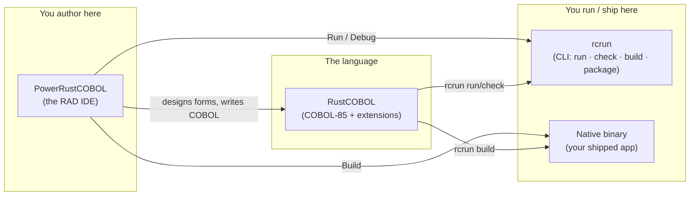
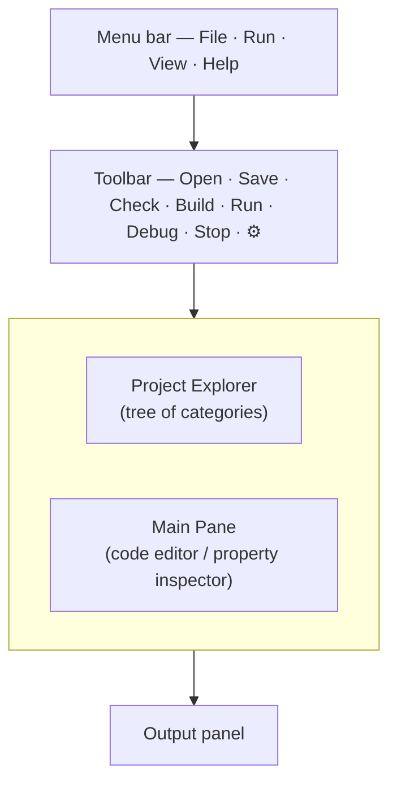
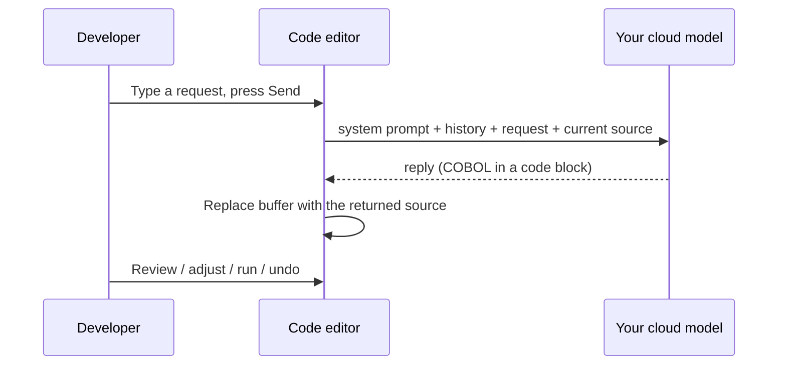
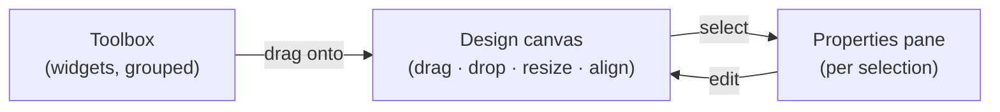
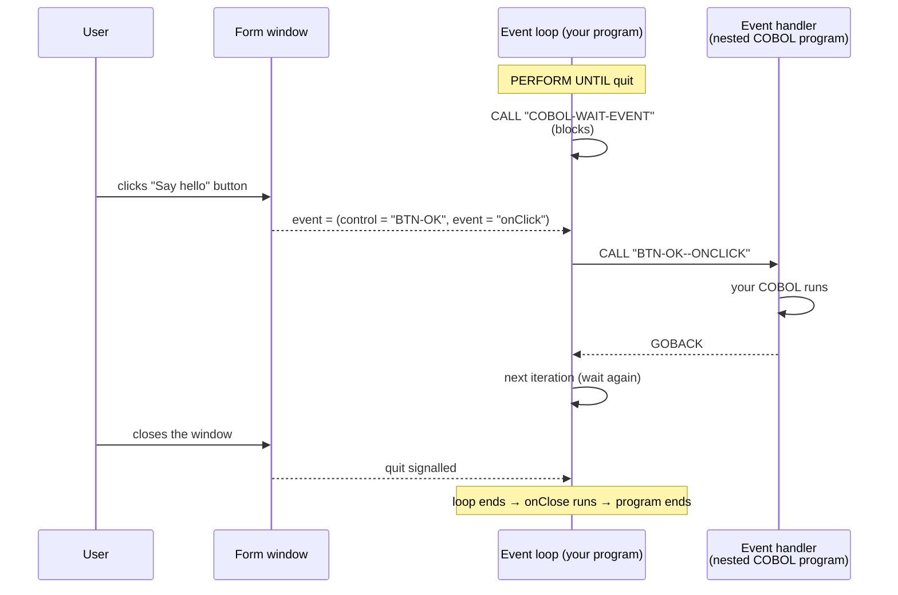
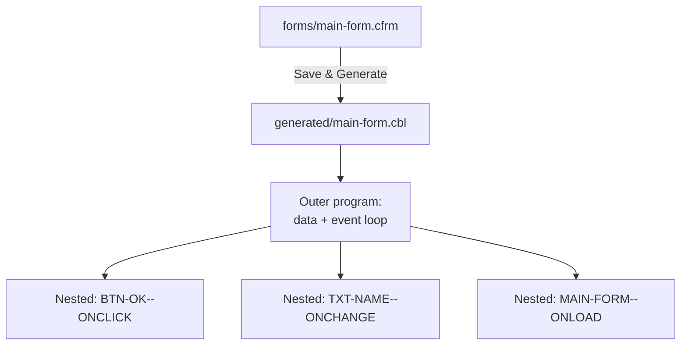
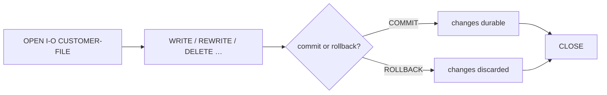
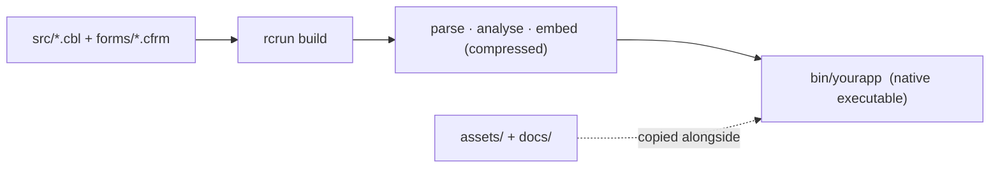

<!--
SPDX-License-Identifier: Apache-2.0
Copyright (c) 2026 Emerson Lopes and PowerRustCOBOL contributors

Licensed under the Apache License, Version 2.0.
See the LICENSE file in the project root for full license information.
-->

# Guía del Developer de PowerRustCOBOL

*Una guía práctica para construir aplicaciones COBOL gráficas con PowerRustCOBOL.*

> **Para quién es esta guía.** Ya escribes COBOL y has construido aplicaciones de pantalla
> o basadas en ventanas con un toolset GUI COBOL — por ejemplo Fujitsu
> **PowerCOBOL for Windows** o **Veryant isCOBOL**. Conoces `IDENTIFICATION
> DIVISION`, `PERFORM`, `OPEN`/`READ`/`WRITE`, indexed files, y la idea de un
> *form* con *controls* que disparan *events*. Esta guía mapea esos instintos
> hacia PowerRustCOBOL y te muestra todo lo que es nuevo. **No se asume ni se requiere
> conocimiento previo del host implementation language** — nunca necesitarás leer
> o escribir nada que no sea COBOL para construir una application.

---

## Índice

1. [Qué es PowerRustCOBOL y por qué existe](#1-qué-es-powerrustcobol-y-por-qué-existe)
2. [Las tres piezas: RustCOBOL, PowerRustCOBOL, rcrun](#2-las-tres-piezas)
3. [Instalación y lanzamiento](#3-instalación-y-lanzamiento)
4. [Tu primera application: Hello, Form](#4-tu-primera-application-hello-form)
5. [La IDE de un vistazo](#5-la-ide-de-un-vistazo)
6. [Projects y el project model](#6-projects-y-el-project-model)
7. [El Form Designer (RAD)](#7-el-form-designer-rad)
8. [El widget catalogue](#8-el-widget-catalogue)
9. [Properties](#9-properties)
10. [Event-driven programming](#10-event-driven-programming)
11. [Hablar con la UI desde COBOL](#11-hablar-con-la-ui-desde-cobol)
12. [Generated code](#12-generated-code)
13. [El RustCOBOL language](#13-el-rustcobol-language)
14. [Indexed files — un recurso first-class](#14-indexed-files--un-recurso-first-class)
15. [SQL databases](#15-sql-databases)
16. [HTTP / REST y AI agents](#16-http--rest-y-ai-agents)
17. [La command line (rcrun)](#17-la-command-line-rcrun)
18. [Construir un distributable binary](#18-construir-un-distributable-binary)
19. [Debugging](#19-debugging)
20. [Appearance e internationalisation](#20-appearance-e-internationalisation)
21. [Caveats y limitaciones actuales](#21-caveats-y-limitaciones-actuales)
22. [Appendix A — Coming from PowerCOBOL / isCOBOL](#appendix-a--coming-from-powercobol--iscobol)
23. [Appendix B — Glossary](#appendix-b--glossary)

---

## 1. Qué es PowerRustCOBOL y por qué existe

Durante décadas, la única manera de escribir **windowed, event-driven COBOL** fue comprar un
proprietary toolchain atado a un único operating system, un único vendor y un único
licensing model. Esas herramientas fueron excelentes en su época, pero la mayoría hoy están
atadas a Windows, son closed, y cada vez son más difíciles de desplegar en máquinas modernas. Una
generación de business logic — payroll, inventory, banking back-offices — está escrita
en ese estilo y no tiene un lugar moderno a donde ir.

**PowerRustCOBOL existe para dar a ese estilo de development un hogar nuevo y open.**
Es un Rapid Application Development (RAD) environment donde tú:

- diseñas windows ("forms") arrastrando controls sobre un canvas,
- adjuntas **COBOL** event handlers a esos controls,
- y ejecutas, depuras y distribuyes el resultado como un **single self-contained native
  executable** — sin runtime que instalar en la target machine.

Sus design goals, en términos simples:

| Goal | Qué significa para ti |
|------|------------------------|
| **COBOL-first** | La application *es* COBOL. El designer genera COBOL; tus handlers son COBOL paragraphs y nested programs. Nunca sales del language. |
| **Cross-platform** | La IDE y los binaries producidos no están atados a un único OS. |
| **Self-contained** | Una built application embebe todo lo que necesita; el end user no instala PowerRustCOBOL. |
| **Modern data access** | Crash-safe indexed (ISAM) files, SQL (SQLite / PostgreSQL / MySQL) y HTTP/REST son accesibles mediante statements `CALL` ordinarios. |
| **Open** | Licensed bajo Apache-2.0. |

> **Note.** PowerRustCOBOL está *inspirado por* la productividad de los GUI COBOL
> RADs clásicos, pero es una implementation independiente y original. Concepts como
> "form", "control" y "event" son industry-standard; la syntax, file
> formats, generated code y built-in services descritos aquí son específicos de
> PowerRustCOBOL y no son compatibles con las herramientas de ningún otro vendor.

---

## 2. Las tres piezas

PowerRustCOBOL se entrega como tres tools cooperantes. Saber cuál es cuál elimina mucha
confusión al principio.



| Name | Role | Piensa en ello como… |
|------|------|----------------------|
| **RustCOBOL** | El COBOL-85 language dialect más las extensions de PowerRustCOBOL (GUI calls, indexed-file clauses, SQL/HTTP). | El compiler/runtime "language". |
| **PowerRustCOBOL** | La desktop IDE: project explorer, code editor, **Form Designer**, debugger. | El "Workbench" / "Studio". |
| **rcrun** | El command-line runtime, checker, packager y binary compiler. | El "runtime + build tool" que puedes scriptar en CI. |

> ⚠️ **Naming caveat.** Internamente, algunos build artefacts y folders se llaman
> `cobolt-*`. Eso es un implementation detail; los user-facing names son
> **RustCOBOL**, **PowerRustCOBOL** y **rcrun**.

---

## 3. Instalación y lanzamiento

> 📷 **Screenshot needed — `install-launch.png`.** Proporciona una captura del
> icono de la application PowerRustCOBOL en el OS launcher/dock **y** de la ventana vacía
> de la IDE inmediatamente después del primer launch (sin project abierto). Esto fijará
> la expectativa de "lo que deberías ver" para newcomers.

Lanza la IDE; en el primer run verás un workspace vacío y el
prompt *"Open a COBOL file to get started."* Puedes abrir un único archivo `.cbl`
o crear un **project** completo (recommended — ver §6).

Desde un terminal también puedes manejar todo headlessly con `rcrun` (ver §17),
que es lo que usan los continuous-integration pipelines.

---

## 4. Tu primera application: Hello, Form

Este walkthrough produce una ventana con un botón que muestra un message.

1. **Crea un project.** `File ▸ New Project…`, dale un name (por ejemplo
   `HelloPower`) y un main program. La IDE crea el folder layout estándar
   en disk **y un starter `main` program ejecutable** (un pequeño `DISPLAY`/`GOBACK`
   que puedes Run inmediatamente), y luego lo abre en el editor (ver §6).
2. **Crea un form.** En el project tree, haz clic en el **➕** junto a **Forms**.
   Esto abre el *New Form* dialog — define un name (`main-form`), un title y un
   size, y crea el form. El form se guarda bajo `forms/` y se abre en el **Form
   Designer**.
3. **Coloca un button.** Arrastra un **Button** desde la toolbox hasta el canvas. Con
   él seleccionado, define su `Caption` como `Say hello` en el properties pane.
4. **Adjunta un handler.** Aún en el button, busca su event **`onClick`** y
   haz clic para abrir el COBOL event editor. Escribe, por ejemplo:

   ```cobol
              DISPLAY "Hello from PowerRustCOBOL".
   ```

5. **Run.** Presiona **Run** en la toolbar (o el ▶ en el designer). Aparece el form;
   al hacer click en el button se ejecuta tu handler.

> 📷 **Screenshot needed — `first-form-designer.png`.** Captura el Form Designer
> con el button seleccionado y el event `onClick` destacado en el properties pane.

> **Note.** Cuando guardas o ejecutas un form, PowerRustCOBOL **genera** un COBOL
> source file para él (ver §12). Nunca edites ese archivo manualmente — es un build
> artefact.

---

## 5. La IDE de un vistazo



- **Project Explorer (left).** Un tree con raíz en tu project. Cinco categorías
  fijas — **Forms**, **Common Code**, **Generated Code**, **Assets**,
  **Documentation** — cada una con un botón **➕**. A la izquierda de cada item hay un
  status "knob": 🟢 green = checked/tested OK, 🟡 yellow = changed since last
  check, 🔴 red = a problem was reported. Los forms se expanden para mostrar sus controls,
  agrupados por toolbox category, y cada control se expande hasta sus **Events**.
- **Toolbar (top).** `Open · Save · Check · Build · Run · Debug · Stop · ⚙`.
  *Run* interpreta el program; *Build* compila un native binary; *Check* ejecuta
  solo parse + semantic analysis; *Debug* se habilita cuando un Generated Code item
  está seleccionado. ⚙ abre **Settings** (el **AI assistant** más **Appearance**
  por project — theme + background image).
- **Main Pane (centre).** Muestra el code editor o el **property inspector** cuando
  haces clic en un form/control en el tree. El code editor tiene una **status bar**
  al pie — caret `Ln, Col`, modo **Insert/Overwrite** (toggle con la tecla
  `Insert`), un toggle **Trim on save** (elimina trailing whitespace al guardar) y
  un comando **Beautify** (un ajuste seguro de whitespace que nunca altera las
  significant columns de COBOL).
- **Output panel (bottom).** Program `DISPLAY` output, build logs y status
  messages.

> 📷 **Screenshot needed — `ide-overview.png`.** Una captura de pantalla completa con un
> project abierto, un form seleccionado (para que se vea el property inspector) y algo
> de texto en el Output panel. Anota las cuatro regions si puedes.

### El AI assistant (optional)

PowerRustCOBOL puede poner un cloud language model — uno que tú proveas, idealmente trained
en esta documentación — justo encima del code editor. El assistant es **completamente
optional y off by default**: hasta que completes los connection details, el prompt bar nunca aparece.

**Configúralo una vez (⚙ → AI assistant).** Los settings son *globales* para tu
máquina, no se guardan en ningún project, por lo que el API key nunca viaja en un repository:

| Field | Meaning |
|-------|---------|
| **Endpoint URL** | La full chat-completions URL de tu model (un OpenAI-compatible endpoint, e.g. `https://…/v1/chat/completions`). |
| **API key** | Se envía como `Authorization: Bearer …`. Déjalo vacío para un key-less local endpoint. |
| **Model** | El model identifier enviado en cada request. |
| **Temperature** | Sampling randomness (0 = deterministic). |
| **Standard system prompt** | Las instructions enviadas en cada request. Se provee un sensible default; edítalo para tu model. |

Un botón **Test connection** envía una tiny request a tu endpoint y reporta si el
model es reachable y si el key/model son aceptados — úsalo para confirmar la configuración
antes de depender de ella. El assistant queda available tan pronto como **Endpoint URL** y
**Model** estén definidos. Borra el endpoint para ocultarlo otra vez.

**Uso.** Abre un COBOL file, escribe una request en el prompt bar (por ejemplo
*"add a paragraph that totals WS-LINES and DISPLAYs it"*) y presiona **Send**.
El model recibe, en este orden:

1. tu **standard system prompt**;
2. el **conversation history** de *este file* (se recuerda entre sessions, por source file);
3. tu **request** junto con el **current source** del file.

Cuando llega la reply, PowerRustCOBOL extrae el COBOL de ella y **actualiza
el editor buffer in place** — así puedes revisar, ajustar, ejecutar o deshacer
(Ctrl/Cmd-Z) el resultado como cualquier otra edit. El transcript en ejecución se
muestra bajo el prompt bar (💬), y **Clear conversation** (🗑) olvida el
history para ese file. Read-only Generated Code nunca se modifica.

**También en el inspector.** El mismo prompt bar aparece arriba del inline
form/control inspector, con el **generated COBOL** del form como contexto
(read-only) — útil para preguntar cómo cablear un event handler. Como el generated code
nunca se edita manualmente, las replies allí se muestran en el transcript como referencia
en lugar de aplicarse.

**Dónde vive la conversation.** El history *no* se guarda en una hidden cache — se
almacena en el folder `data/` del project en el **own indexed (ISAM) file** de
PowerRustCOBOL (`data/conversations.dat`), el mismo formato `ORGANIZATION IS INDEXED`
que usan tus COBOL programs, keyed por la relative path del source file. (Hacemos dog-food
de nuestro propio runtime.) Las conversations por lo tanto viajan con el project y requieren
un project abierto para persistir; sin uno, el assistant aún funciona pero solo para la
current session.



> 📷 **Screenshot needed — `ide-ai-assistant.png`.** El code editor con el AI
> prompt bar visible encima y un conversation transcript expandido.

> **Privacy note.** Tu prompt, el conversation history y el **full source
> del open file** se envían al endpoint que configures. Apúntalo solo a un model
> en el que confíes.

---

## 6. Projects y el project model

Un **project** es un folder que contiene un manifest file, `cobolt.toml`, además de tus
sources, forms y assets. El manifest registra el project name, version, main
program y los files en cada category.

### Folder layout

Cuando creas un project, PowerRustCOBOL genera esta estructura en disk:

```text
HelloPower/
├── cobolt.toml         ← project manifest
├── src/                ← Common Code  (hand-written COBOL programs/copybooks)
├── forms/              ← Forms        (.cfrm designer files)
├── generated/          ← Generated Code (RAD-produced .cbl — read-only)
├── assets/             ← Assets       (images, audio, fonts, data files)
├── docs/               ← Documentation
├── bin/                ← built binaries
├── debug/              ← debugging working files
├── temp/               ← temporary files
├── dist/               ← (reserved) self-contained distribution bundle
└── data/               ← project data files (e.g. the AI conversation store)
```

Un new project también recibe un **starter `main` program ejecutable** (por default
`src/main.cbl`) — un mínimo `IDENTIFICATION DIVISION` / `DISPLAY` / `GOBACK` que
puedes **Run** de inmediato y luego hacer crecer.

> **Form-first projects.** Si borras el starter `main` y construyes un project
> hecho solo de forms, **Build** y **Run** aún funcionan: cuando el
> `[project].main` file está ausente, PowerRustCOBOL usa el **primer generated form
> program** (`generated/*.cbl`) como entry point. Define `[project].main` para un
> program específico cuando quieras control explícito sobre cuál inicia.

> **Note.** Abrir un older project anterior a este layout **back-fills cualquier
> standard folder faltante** automáticamente, de modo que cada project termina con
> la misma estructura.

### Las cinco tree categories

| Category | Contiene | Editable? |
|----------|----------|-----------|
| **Forms** | `.cfrm` form-designer files | vía el Designer |
| **Common Code** | hand-written COBOL que `CALL` desde forms o ejecutas directamente | sí |
| **Generated Code** | los `.cbl` que PowerRustCOBOL genera desde cada form | **read-only** (blue, lock icon) |
| **Assets** | images, audio, fonts, data files bundled con la app | imported |
| **Documentation** | Markdown / text / PDF notes | sí |

### Creating vs. importing

El **➕** en una category **crea un new item**:

- **Forms ➕** → *New Form* dialog.
- **Common Code ➕** → un nuevo `.cbl` desde un starter template, abierto en el editor.
- **Documentation ➕** → un nuevo Markdown file.
- **Assets ➕** → file picker (assets se author externally, así que "create" = import).

Para **importar un existing file** dentro de una category, **right-click el ➕** y elige
*Import existing…*. (El `File` menu *Import Form…* hace lo mismo para forms.)

> **Note.** Los generated `.cbl` files viven en `generated/`, se trackean
> automáticamente y se abren read-only. La edición pertenece al form (el Designer)
> o al Common Code — nunca al generated output.

---

## 7. El Form Designer (RAD)

El Form Designer es donde diseñas windows. Cada open form es su **propia OS
window**, de modo que puedes tener varios designers y running forms lado a lado.



- **Toolbox (left).** Widgets agrupados en **Non-Visual**, **Common**,
  **Container**, **Data**, **Graphics**, **Menu**, **Charts** y **Dialogs**.
  Arrastra cualquier widget al canvas.
- **Canvas (centre).** Mueve, redimensiona (arrastrando los border grips), alinea y
  distribuye controls. Un snap-to-grid mantiene todo ordenado. Puedes redimensionar el
  **form itself** arrastrando sus edges.
- **Properties pane (right).** Edita el selected control — o, sin selección, el
  **form** itself. El pane está organizado en **section cards** colapsables
  (Form Properties, Target Device, Appearance, Background Image, Size, Events).
  Arrastra su edge para hacerlo más ancho.

Designer toolbar essentials: **Save & Generate**, **Generate only**, **Preview**
(un render no interactivo), **Run Form** (live, interactive), grid toggle, glass
toggle, alignment tools, undo/redo.

### Target devices

La section **Target Device** permite dimensionar el form para un real device profile
(varios presets de iPhone, iPad, Apple Watch, Android phone/tablet/watch) o un
custom size, con switch portrait/landscape. Es una ayuda de design — define el
width/height del form al profile elegido.

> 📷 **Screenshot needed — `form-designer-full.png`.** El Designer con la toolbox,
> un canvas que contenga varios controls (un label, un text box, un button y un chart),
> y el properties pane mostrando los section cards. Idealmente usa un project con
> background image para que se vea el glass styling.

> **Note (non-visual widgets).** Timer, AI Agent, REST Client y SQL Database
> son **non-visual**: aparecen en el canvas como glass "chips" etiquetados en
> design time pero no renderizan nada en run time. Existen para ser configurados y para
> disparar events / ser `CALL`ed desde tu COBOL.

---

## 8. El widget catalogue

PowerRustCOBOL incluye los siguientes controls. Visual controls renderizan en run time;
los non-visual son services.

**Common / input**
: Label, Button, TextBox, CheckBox, RadioButton, ComboBox, ListBox,
  NumericUpDown, DateTimePicker, Slider, ProgressBar, PictureBox.

**Containers / layout**
: GroupBox, Panel, TabControl, Splitter, MenuBar, ToolBar, StatusBar.

**Data**
: DataGrid, TreeView.

**Graphics / media**
: Line, Shape, Animator.

**Charts**
: BarChart, LineChart, PieChart, AreaChart, ScatterChart, DonutChart.

**Dialogs / windows**
: ModalWindow.

**Non-visual services**
: Timer, AgentObject (AI agent), RestClient, SqlDatabase.

> **Note.** Existe un control type `Custom` como extension point para
> bespoke/vendor controls; trátalo como advanced.

> 📷 **Screenshot needed — `widget-gallery.png`.** Un single form (o la preview
> window) mostrando uno de cada major widget para que los newcomers los reconozcan.
> Los charts se benefician especialmente de un visual.

---

## 9. Properties

Cada control expone **properties** — su appearance, behaviour y data bindings —
editables en el properties pane y almacenadas en el `.cfrm` file.

PowerRustCOBOL usa **fully spelled-out property names** (sin abreviaciones crípticas).
Algunas que usarás constantemente:

| Property | Meaning |
|----------|---------|
| `Caption` / `Text` | El texto del control (`Caption` para labels/buttons; `Text` para text boxes). |
| `BackgroundColor` / `ForegroundColor` | Colours (hex, e.g. `#1E3A5F`). |
| `FontName`, `FontSize`, `Bold`, `Italic` | Typography. |
| `Visible`, `Enabled` | State. |
| `TextAlignment` | Text justification. |
| `DataItem` | El COBOL working-storage item que este control lee/escribe. |

> **Note.** Standard acronyms se mantienen (`CSV`, `URL`, `API`, `TLS`); todo lo
> demás se escribe completo — por ejemplo `BackgroundColor` (no `BackColor`),
> `MaximumLength` (no `MaxLength`), `PasswordCharacter` (no `PasswordChar`),
> y cada referencia `…Paragraph` (no `…Para`).

> **Caption rules.** Solo Label, Button, CheckBox, RadioButton y GroupBox usan
> `Caption`; TextBox usa `Text`; otros controls usan keys específicos por type
> (`Value`, `Items`, …).

> **Control IDs.** Cuando colocas un control, recibe un ID legible, por type —
> `Button-1`, `Button-2`, `TextBox-1`, `ComboBox-1`, … — que se convierte en su COBOL
> data-name (`WS-BUTTON-1`) y en la base de su handler paragraph
> (`BUTTON-1--ONCLICK`). Puedes renombrar el ID de un control a algo significativo
> (e.g. `BTN-SAVE`) en el properties pane; mantenlo como valid COBOL word (letters,
> digits, hyphens; sin leading/trailing hyphen).

---

## 10. Event-driven programming

Este es el corazón de GUI COBOL, y funciona como esperas: el form queda en un
**event loop**, esperando; cuando el user hace algo, se ejecuta el **handler** correspondiente.

### El form event loop



En palabras:

1. El generated program entra en un loop y llama al built-in
   **`COBOL-WAIT-EVENT`**, que bloquea hasta que el user interactúa con el form.
2. Cuando ocurre un event, el runtime devuelve **qué control** y **qué
   event** (e.g. `BTN-OK` / `onClick`).
3. El loop despacha al handler de ese par — un **nested COBOL-85
   program** nombrado por control y event (`BTN-OK--ONCLICK`).
4. El handler se ejecuta y hace `GOBACK`; el loop espera de nuevo.
5. Cerrar la window termina el loop; el handler `onClose` del form se ejecuta al final.

### Events que puedes manejar

- **Widget events** siguen la convención `on` + action: `onClick`, `onChange`,
  `onDoubleClick`, `onMouseEnter`, `onGotFocus`, etc. Cada control expone
  el set que tiene sentido para él (un Button tiene `onClick`/`onDblClick`/mouse
  events; un TextBox tiene `onChange`/`onKeyPress`/focus events; charts tienen
  `onDataChanged`; etc.).
- **Form events** — la window itself soporta un rich set, agrupado en
  **Lifecycle, Activation & Focus, Window State, Layout & Painting, Mouse,
  Touch & Pointer, Scrolling, Drag & Drop, Clipboard, System / OS, and Error
  Handling**. El lifecycle pair `onLoad` (justo antes de mostrar la window) y
  `onClose` (mientras cierra) se pre-crean para cada form; el resto lo adjuntas según
  lo necesites.

> ⚠️ **Caveat — designable vs. fired.** Todo listed event es **designable**: puedes
> adjuntar un COBOL handler a cualquiera de ellos hoy y será generado. El
> **runtime currently fires** form `onLoad`/`onClose`, y para widgets:
> `onClick`, `onChange`, el focus pair `onGotFocus`/`onLostFocus`, y el
> pointer set `onDblClick`, `onMouseDown`, `onMouseUp`, `onMouseEnter`,
> `onMouseLeave`. Más events (keyboard, scrolling y los form-level
> window-state events como `onResize`/`onShow`) se están cableando en el live
> runtime con el tiempo. Adjunta handlers libremente, pero verifica en una *Run Form* session
> cuáles se disparan antes de depender de, por ejemplo, `onPaint` o `onPowerSuspend`.

### Añadir un handler

En el tree o el properties pane, haz clic en un event para abrir el COBOL editor para él.
Un handler es un **nested program** self-contained, y editas todo su body en
**un** editor — no hay una caja separada para working-storage.

El event editor es el **mismo full editor que el main code editor**: **IntelliSense**
as-you-type (keywords, verbs y los control names del form; `Ctrl+Space` para
trigger), **Find/Replace** (`Cmd/Ctrl+F`, con *Replace* y *Replace All*) en la
parte superior derecha, y la **status bar** al pie (caret `Ln, Col`,
**Insert/Overwrite** vía la tecla `Insert`, **Trim on save** y **Beautify**). Se
abre al 70 % de la window y es freely resizable.

La **primera vez** que abres un handler sin escribir, el editor lo inicializa con el
standard skeleton para que solo completes los blanks:

```cobol
       ENVIRONMENT DIVISION.
       DATA DIVISION.
       WORKING-STORAGE SECTION.
       LINKAGE SECTION.

       PROCEDURE DIVISION.
           CONTINUE.
```

Todo desde `ENVIRONMENT DIVISION` hasta tus statements es tuyo para editar;
PowerRustCOBOL solo provee el header `IDENTIFICATION DIVISION` / `PROGRAM-ID` y
el cierre `GOBACK` / `END PROGRAM` (mostrados en gris alrededor del editor).

- **Local scratch variables** van directamente en el propio
  `WORKING-STORAGE SECTION` de este handler.
- **Shared state** vive en el global working-storage del form (visible para todos
  los handlers porque se declara `GLOBAL` en el outer program).
- **Event data** — cuando un event entrega data a su handler, esos items
  aparecen en el `LINKAGE SECTION` y se enlazan mediante `PROCEDURE DIVISION USING …`.
  Por ejemplo, un handler que recibe solo el clicked node's index se inicializaría así:

  ```cobol
       ENVIRONMENT DIVISION.
       DATA DIVISION.
       WORKING-STORAGE SECTION.
       LINKAGE SECTION.
       01 COBOL-EVENT-DATA.
          05 COBOL-ARRAY-INDEX        PIC S9(9) COMP-5.

       PROCEDURE DIVISION USING COBOL-ARRAY-INDEX.
  ```

  Events que no cargan data simplemente tienen un `LINKAGE SECTION` vacío y un
  `PROCEDURE DIVISION.` simple (sin `USING`).

> Si dejas el seeded template sin cambios y cierras el editor, nada se guarda — el
> handler permanece "unwritten" hasta que realmente agregas code.

---

## 11. Hablar con la UI desde COBOL

### Property reference syntax (the concise way)

Puedes leer y escribir properties de un control **directamente como COBOL operands**,
como hace PowerCOBOL — un quoted property name `OF` el control:

```cobol
      *> Write a property (literal → property)
           MOVE "Hello!" TO "Caption" OF CmStatic1.

      *> Read a property into a data item — no temporary needed
           MOVE "Caption" OF CmStatic1 TO WS-NAME.

      *> Property → property, directly. The type is inferred, so you do NOT
      *> declare a temp data item to shuttle the value:
           MOVE "Caption" OF CmStatic1 TO "Text" OF "ListItems" (4) OF Listview1.
```

El **IntelliSense** del editor te guía por esta syntax: escribe `"` y lista cada
property alfabéticamente; sigue escribiendo para filtrar (`"Capt…"` → `Caption`) y
aceptar la suggestion cierra la quote (`"Caption"`). Luego ofrece el qualifier `OF`,
y después de `OF` lista los **widgets que realmente exponen esa property**
(`"Caption" OF Bu…` → `Button-1`, `Button-2`, …). Para COBOL ordinario, aceptar
una reserved word simplemente inserta la word y un space, y espera lo que escribas después —
sin auto-filled template.

Un property reference funciona como **sending** y **receiving** operand con
**cualquier verb** — no solo `MOVE`. Por ejemplo:

```cobol
           COMPUTE "Value" OF Slider1 = "Value" OF Slider1 + 1.
           ADD 10 TO "Value" OF Spinner1.
           STRING "First" OF Person DELIMITED BY SPACE
                  " "                DELIMITED BY SIZE
                  "Last"  OF Person  DELIMITED BY SPACE
                  INTO "Caption" OF FullNameLabel.
           IF "Text" OF TextBox1 = SPACES
               DISPLAY "empty".
```

El rightmost name es el control; los quoted names son sus properties, leídas
control-outward, y un name puede llevar un 1-based subscript (`"ListItems" (4)`).
Property names son exactamente los del properties pane (e.g. `"Caption"`, `"Text"`,
`"BackgroundColor"`, `"Value"`).

> **Type inference.** Como el runtime lleva el property value directamente,
> `MOVE propertyA TO propertyB` no requiere **ningún intermediate `PIC` data item** —
> un paso que el classic GUI COBOL te obliga a hacer.

### Calling widget methods

Properties describen *qué es un widget*; **methods** describen *qué puede hacer* —
mostrarlo, moverlo, incrementar un value, agregar un list item, disparar un HTTP
request. Cada widget entiende un set de **universal** methods más sus propios
**type-specific** ones. Puedes llamar un method de tres maneras, todas equivalentes:

```cobol
      *> 1. Inline call — reads like a sentence, no result kept
           Lbl-Out::SetCaption("Saved.").

      *> 2. As an expression — the return value flows into a MOVE / IF / COMPUTE
           MOVE Txt-Name::GetText() TO WS-NAME.
           IF Chk-Agree::IsChecked() = "1"
               PERFORM SUBMIT-ORDER
           END-IF.

      *> 3. INVOKE verb — when you prefer the spelled-out keyword, with optional
      *>    USING arguments and RETURNING receiver
           INVOKE Db-1 "query"
               USING "SELECT id, name FROM customer"
               RETURNING WS-ROWS.
```

Arguments van entre parentheses (inline / expression form) o después de `USING`
(`INVOKE` form); un method que devuelve value puede usarse directamente en una
expression o capturarse con `RETURNING`. El IntelliSense del editor lista los methods
de un widget después de que escribes `::`, cada uno con una one-line description.

**Universal methods** (cada visible widget):

| Method | Effect |
|--------|--------|
| `Show` / `Hide` | Define la property `Visible` on u off. |
| `Enable` / `Disable` | Define la property `Enabled` on u off. |
| `SetFocus` | Da keyboard focus al widget. |
| `MoveTo(x, y)` | Reposiciona el widget (define `X` / `Y`). |
| `Resize(w, h)` | Cambia su size (define `Width` / `Height`). |
| `BringToFront` / `SendToBack` | Cambia stacking order. |
| `SetProperty(name, value)` / `GetProperty(name)` | Generic access a cualquier property por name. |

**Type-specific highlights** (la full list está en IntelliSense):

| Widget | Methods |
|--------|---------|
| Label / Button | `SetCaption`, `GetCaption` |
| Text box | `SetText`, `GetText`, `AppendText`, `Clear` |
| Check box / radio | `IsChecked`, `SetChecked`, `Toggle`, `Select` |
| Progress / slider / numeric | `SetValue`, `GetValue`, `Increment`, `Decrement`, `Reset` |
| List / combo | `AddItem`, `RemoveItem`, `GetCount`, `GetSelected`, `SetIndex` |
| Timer | `Start`, `Stop`, `SetInterval`, `IsEnabled` |
| REST Client | `get`, `post`, `put`, `delete`, `call`, `setHeader`, `clearHeaders` |
| SQL Database | `open`, `execute`, `query`, `fetch`, `fetchAll`, `close` |
| AI Agent | `Ask`, `SetPrompt`, `SetModel`, `Stop` |

Un method que cambia una property actualiza el **running form inmediatamente** — el
mismo channel que usa la property syntax — así que `Lbl-Out::SetCaption("Done")`
repaint el label en el momento en que corre. Methods y property syntax son completamente
intercambiables; elige el que se lea mejor para la línea que estás escribiendo.

> **Designed values are available before you set anything.** Cuando un form inicia,
> cada control se seed con los values del properties pane, por lo que
> `Txt-Name::GetText()` (o `"Text" OF Txt-Name`) devuelve el texto que escribiste
> en design time incluso antes del primer setter.

### Property access via CALL (also supported)

La forma explícita `CALL` sigue disponible y es intercambiable con la syntax anterior:

| `CALL` | Purpose |
|--------|---------|
| `"COBOL-WAIT-EVENT"` | Bloquea hasta el siguiente UI event (usado por el generated loop). |
| `"COBOL-GET-PROPERTY"` | Lee una control property dentro de un data item. |
| `"COBOL-SET-PROPERTY"` | Escribe una control property desde un data item. |

Un handler típico que lee un text box y actualiza un label:

```cobol
       BTN-GREET--ONCLICK.
           CALL "COBOL-GET-PROPERTY"
               USING "TXT-NAME" "Text" WS-NAME.
           STRING "Hello, " DELIMITED BY SIZE
                  WS-NAME    DELIMITED BY SPACE
                  INTO WS-MESSAGE.
           CALL "COBOL-SET-PROPERTY"
               USING "LBL-OUT" "Caption" WS-MESSAGE.
           GOBACK.
```

Otros built-in services disponibles via `CALL` (cubiertos en sus secciones):

- **Charts:** `COBOL-CHART-ADD-POINT`, `COBOL-CHART-SET-TABLE`,
  `COBOL-CHART-CLEAR`, `COBOL-CHART-REFRESH`.
- **SQL:** `COBOL-OPEN-DB`, `COBOL-EXEC-SQL`, `COBOL-FETCH-ROW`,
  `COBOL-NEXT-ROW`, `COBOL-ROW-COUNT`, `COBOL-CLOSE-DB`.
- **HTTP:** `COBOL-HTTP-GET/POST/PUT/DELETE`, `COBOL-HTTP-SET-HEADER`,
  `COBOL-HTTP-CLEAR-HEADERS`.
- **Lifecycle:** `COBOL-INIT-FORM`, `COBOL-QUIT`.

> **Note.** Property names pasados a `GET`/`SET` son exactamente los names mostrados en
> el properties pane (e.g. `"Text"`, `"Caption"`, `"BackgroundColor"`,
> `"Value"`). Control IDs son los IDs mostrados en el tree (e.g. `"BTN-GREET"`).

---

## 12. Generated code

Cuando guardas/generas un form, PowerRustCOBOL escribe un `.cbl` en `generated/`.
Su shape es predecible:

- un **PROGRAM-ID** para el form;
- working-storage para el state de cada control;
- el **event loop** (el `PERFORM UNTIL` alrededor de `COBOL-WAIT-EVENT`);
- un **nested COBOL-85 program** por event handler, nombrado
  `CONTROL-ID--EVENTNAME` (uppercased, e.g. `BTN-OK--ONCLICK`); el `onLoad`
  del form corre en start-up y `onClose` en shutdown.



> ⚠️ **Caveat.** Generated `.cbl` es un build artefact. Se regenera siempre que
> el form cambia, por lo que **no lo edites manualmente** — tus cambios serían sobrescritos.
> Pon reusable logic en **Common Code** y `CALL` it desde handlers.

---

## 13. El RustCOBOL language

RustCOBOL implementa un substantial subset de **COBOL-85**, más PowerRustCOBOL
extensions. Highlights que un working COBOL programmer usará:

- **Data & structure:** group items, `OCCURS` (con subscripts/indices),
  `REDEFINES`, `RENAMES` (66 level), condition-names (88 level con `VALUE` /
  `THRU`), `USAGE` incl. `POINTER`.
- **Arithmetic:** `ADD/SUBTRACT/MULTIPLY/DIVIDE/COMPUTE` con múltiples receivers
  y per-receiver `ROUNDED`; numeric-edited `PICTURE` editing.
- **Control flow:** `IF/ELSE`, `EVALUATE` (con `ALSO` y `WHEN NOT`), inline and
  out-of-line `PERFORM` (incl. `VARYING`, `UNTIL`, `TIMES`), `GO TO`, `ALTER`,
  `EXIT PERFORM/PARAGRAPH/SECTION`, faithful `NEXT SENTENCE`.
- **Strings:** `STRING`, `UNSTRING`, `INSPECT` (`TALLYING` + `REPLACING`, con
  `BEFORE/AFTER INITIAL`), `INITIALIZE … REPLACING`.
- **Tables:** `SORT` / `MERGE` (con `INPUT`/`OUTPUT PROCEDURE`, `USING`/`GIVING`,
  `RELEASE`/`RETURN`).
- **Sub-programs:** `CALL … USING`, `CANCEL`, `GOBACK`/`EXIT PROGRAM`, nested
  programs.
- **Intrinsics:** la standard library de `FUNCTION`s, incluyendo date/time
  y financial functions.
- **Screen ACCEPT/DISPLAY** para character-mode interaction (cuando no construyes
  un windowed form).

> **Ground truth.** La authoritative, always-current list de supported syntax es
> `docs/cobol85-supported-syntax.md`; la verb-by-verb test matrix es
> `docs/cobol85-verb-test-matrix.md`. Ante la duda, esos files (y el test
> suite) son definitivos.

> ⚠️ **Out of scope (today):** RELATIVE file organisation, cross-process record
> locking y OO `CLASS`/`METHOD` definitions no están implemented.

### Unique declarations are enforced

Cada program unit debe declarar sus mandatory structural elements **una y solo una vez**.
PowerRustCOBOL verifica esto mientras lee tu source y **rechaza ejecutar el program**
hasta que lo corrijas — igual que un compiler marcaría un redeclared symbol. La regla cubre:

- un único `PROGRAM-ID`;
- como máximo un header `ENVIRONMENT`, `DATA` y `PROCEDURE` DIVISION;
- **section** names únicos dentro del program, y **paragraph** names únicos dentro de
  su section (o dentro del program cuando no se usan sections).

Por ejemplo, esto se rechaza porque el program se nombra dos veces:

```cobol
       IDENTIFICATION DIVISION.
       PROGRAM-ID. MYPROG.
       PROCEDURE DIVISION.
           DISPLAY "Hello".
       PROGRAM-ID. MYPROGNEWNAME.   *> ✗ PROGRAM-ID declared more than once
           STOP RUN.
```

La IDE muestra el error en el **Problems** panel (y la CLI lo imprime) con la
línea offending, y la action Run/Build se bloquea hasta remover el duplicate. Legitimate
multi-unit sources — sibling programs secuenciales cada uno cerrado por `END PROGRAM name.`,
o true nested programs — **no** se ven afectados: cada unit recibe su propio
`IDENTIFICATION DIVISION` y se valida independientemente.

> Esto es un structural check, no una style suggestion. No hay flag para
> override; redeclarar un unique element siempre es un error.

### `STRING` with smart default delimiters

Standard COBOL te obliga a escribir `DELIMITED BY` en **cada** operand de `STRING`,
incluso cuando la elección obvia es la única sensata. RustCOBOL mantiene funcionando
esa forma explícita, pero cuando **omites** `DELIMITED BY` elige el default correcto
a partir de la category del operand — así el common case se lee como plain text:

| Operand | Default | Why |
|---------|---------|-----|
| String literal (`" earns "`) | `DELIMITED BY SIZE` | toma el literal tal cual, incluyendo spaces |
| Alphanumeric item (`PIC X`/`A`) | `DELIMITED BY SPACES` | descarta el trailing space padding |
| Numeric item (`PIC 9`/`S9`) | `DELIMITED BY SIZE` | mueve los caracteres del field |
| Numeric-edited (`PIC ZZ9.99`) | `DELIMITED BY SIZE` | mueve los edited characters |
| `FUNCTION …` / expression | `DELIMITED BY SIZE` | mueve el computed value completo |

Un data item se mueve **en su field form** — exactamente los characters que almacena: un
`PIC S9(9)` con `100000` aporta `000100000` (full PIC width), un
`PIC ZZZ,ZZ9.99` aporta su edited text. Entonces esto:

```cobol
       01 NAME-X        PIC X(40)        VALUE "Joe".
       01 SALARY        PIC S9(09)       VALUE 100000.
       01 SALARY-EDITED PIC ZZZ,ZZZ,ZZ9.99.
       01 TEXT-OUT      PIC X(100).
       ...
           MOVE SALARY TO SALARY-EDITED
           STRING NAME-X
                  " earns "
                  SALARY
                  " or US$"
                  FUNCTION TRIM(SALARY-EDITED)
             INTO TEXT-OUT
```

produce:

```text
Joe earns 000100000 or US$100,000.00
```

`DELIMITED BY SPACES` aquí conserva cualquier **internal** spaces (`"Joe Smith"` queda
`"Joe Smith"`) y recorta solo el trailing pad. Escribir un explicit
`DELIMITED BY …` en cualquier operand siempre override su default.

---

## 14. Indexed files — un recurso first-class

Indexed (ISAM) files reciben soporte inusualmente profundo y **original** en PowerRustCOBOL —
este es uno de sus recursos destacados. Los usas mediante standard COBOL verbs
(`OPEN`, `READ`, `WRITE`, `REWRITE`, `DELETE`, `START`), despachados automáticamente
por el `ORGANIZATION` del file. Además, PowerRustCOBOL agrega:

### Two storage modes (a SELECT-clause extension)

```cobol
       SELECT CUSTOMER-FILE ASSIGN TO "customers.idx"
           ORGANIZATION IS INDEXED
           ACCESS MODE IS DYNAMIC
           RECORD KEY IS CUST-ID
           ALTERNATE RECORD KEY IS CUST-NAME WITH DUPLICATES
           STORAGE MODE IS DISK WITH DATA COMPRESSION.
```

- **`STORAGE [MODE] IS MEMORY | DISK`** elige una in-RAM table o un persistent
  on-disk store. **Default is DISK.**
- **`WITH [DATA] COMPRESSION`** comprime records de forma transparente (sin external
  dependencies).
- **Composite and alternate keys**, ascending key order y `WITH DUPLICATES`
  semantics son respetados.

### Crash-safe transactions

Los COBOL verbs **`COMMIT`** y **`ROLLBACK`** aplican a tus *open indexed
files*: un `COMMIT` hace durable las operaciones pendientes `WRITE`/`REWRITE`/`DELETE`;
un `ROLLBACK` las descarta. (Estas son **file** transactions — para SQL transactions
usa `COBOL-EXEC-SQL` con `BEGIN`/`COMMIT`/`ROLLBACK`.)



### Pluggable storage engines

Elige el engine con `rcrun --indexed-engine <name>` (o la environment variable
`COBOL_INDEXED_ENGINE`):

| Engine | Use it for |
|--------|------------|
| `rust` (default) | El built-in B-tree store; in-memory y on-disk paged formats. |
| `redb` | Un **crash-safe, ACID** on-disk engine (copy-on-write B-tree, checksums, dual meta pages) — `COMMIT` sobrevive a power loss; instant `OPEN` en very large datasets. |
| `rm` / `fujitsu` | Reserved engine names que actualmente se comportan igual que el built-in store (native formats son future work). |

### Operations log (observability)

Para diagnostics puedes activar un **per-file operations log**
(`rcrun --indexed-log basic|full`, format `--indexed-log-format text|json`).
Registra una línea por `OPEN`/`COMMIT`/`ROLLBACK`/`CLOSE` con timestamps,
write/rewrite/delete counts, byte and throughput figures, y key-order quality —
listo para alimentar log tooling. El log rota automáticamente bajo un size cap.

### Recording the operator

```cobol
           OPEN I-O CUSTOMER-FILE WITH REGISTERED USER WS-OPERATOR
```

`OPEN … WITH REGISTERED [USER] {literal | data-item}` registra *quién* abrió el
file en el operations log. Esto es **solo observacional** — PowerRustCOBOL no provee
un authentication o authorisation engine; el field simplemente etiqueta log entries con
el operator que provees.

> **Note.** El default disk format es self-describing y almacena el full key
> schema, por lo que un file puede inspeccionarse y validarse en `OPEN` (mismatches salen
> como standard file-status codes). El format **no** es binary-compatible con ningún
> third-party ISAM; no asumas interchange con files de otros vendors.

> ⚠️ **Caveat.** Record locking es single-process (VSAM/RLS-style semantics
> dentro de un running program). Cross-*process* locking no está implemented.

---

## 15. SQL databases

Relational access se expone detrás de una única surface `CALL`, con el backend
elegido a partir de la connection string:

| Connection string starts with… | Backend |
|---------------------------------|---------|
| `:memory:`, `sqlite:`, or a file path | SQLite (bundled) |
| `postgres://` / `postgresql://` | PostgreSQL |
| `mysql://` | MySQL |

Typical flow:

```cobol
           CALL "COBOL-OPEN-DB"   USING "sqlite:app.db".
           CALL "COBOL-EXEC-SQL"  USING
               "SELECT id, name FROM customers WHERE active = 1".
           PERFORM UNTIL WS-NO-MORE-ROWS
               CALL "COBOL-FETCH-ROW" USING WS-ID WS-NAME
               ...
               CALL "COBOL-NEXT-ROW"
           END-PERFORM.
           CALL "COBOL-CLOSE-DB".
```

Los drivers son pure y bundled (no necesitas instalar `libpq`/OpenSSL). Usa
`COBOL-EXEC-SQL` con `BEGIN`/`COMMIT`/`ROLLBACK` para SQL transactions. Full
reference: `docs/database-runtime.md`.

> **Note.** Puedes modelar una database connection visualmente con el **SQL Database**
> non-visual widget (sus properties guardan la connection string, driver y los
> data items que sus events pueblan), o manejarlo completamente desde code con los
> `CALL`s anteriores.

---

## 16. HTTP / REST y AI agents

- **HTTP/REST.** `COBOL-HTTP-GET/POST/PUT/DELETE` emiten requests;
  `COBOL-HTTP-SET-HEADER` / `COBOL-HTTP-CLEAR-HEADERS` gestionan headers. El
  **REST Client** non-visual widget te da un designable endpoint con events para
  responses, errors, timeouts y progress.
- **AI agents.** El **AI Agent** non-visual widget modela una connection a un
  language model (endpoint, model, system prompt, temperature, token limits) y
  dispara events como `onResponse`, `onStreamChunk`, `onError` y
  `onThinking`, que consumen tus COBOL handlers.

> ⚠️ **Caveat.** Network features acceden al outside world — maneja errors y
> timeouts en COBOL, y nunca embebas secrets (API keys, tokens) en un form que
> pretendas distribuir. Trátalos como runtime configuration.

---

## 17. La command line (rcrun)

Todo lo que hace la IDE puede scriptarse con `rcrun`:

```text
rcrun run     <file.cbl>        # interpret a COBOL source file
rcrun check   <file.cbl>        # parse + semantic analysis only (no run)
rcrun build   <file.cbl>        # compile a single console program → bin/<name>
rcrun build   [cobolt.toml]     # compile a project → one native binary in bin/
rcrun package [cobolt.toml]     # package the project into a .zip
rcrun version                   # print version
```

Useful flags (indexed files): `--indexed-engine <rust|redb|…>`,
`--indexed-log <basic|full>`, `--indexed-log-format <text|json>`. Cada uno también tiene
una environment-variable equivalent (`COBOL_INDEXED_ENGINE`, etc.), útil en CI.

> 📷 **Screenshot needed — `rcrun-terminal.png`.** Una terminal session mostrando
> `rcrun check`, luego `rcrun run`, sobre un small program, con el output. Ayuda a
> newcomers a ver que la CLI es approachable.

---

## 18. Construir un distributable binary

`rcrun build` (o el botón **Build** de la IDE) produce un **single self-contained
native executable** en `bin/`. El parsed program de la application y sus forms se
embeben dentro del binary; no se distribuye `.cbl` source, y el end user **no** instala
PowerRustCOBOL.



- Tracked **Assets** (y Documentation) se copian junto al binary para que el
  program los encuentre por relative path en run time.
- Required licence/notice files se colocan automáticamente junto al binary.
- **`dist/`** queda reservado para una future feature de "bundle everything needed to run
  on a machine without PowerRustCOBOL" (binary + assets + cualquier libraries +
  launcher). Por ahora, distribuye `bin/` y los copied assets.

> **Note.** Los forms se cargan **lazily** dentro del binary: una 20-form application
> arranca instantáneamente incluso si el user solo llega a abrir un form.

---

## 19. Debugging

Selecciona un Generated Code item y presiona **Debug** para iniciar una session. Obtienes:

- **Breakpoints** en el editor gutter,
- **step** controls y **continue** (F5 / F10 mientras debugging),
- un **variable watch** panel.

Durante una session aparece un control *Stop Debug*; si no, debugging se inicia desde
el botón **Debug** de la toolbar (a la derecha de **Run**).

> 📷 **Screenshot needed — `debugger.png`.** Una debug session pausada en un
> breakpoint, con el variable-watch panel poblado.

---

## 20. Appearance e internationalisation

- **Themes.** ⚙ ▸ *Settings* ofrece 28 colour themes — dark (Dark Glass
  [default], Deep Blue, Dark+, Monokai, Solarized Dark, Nord, Dracula, y más),
  light (Light+, GitHub Light, One Light, Gruvbox Light, Ayu Light,
  Quiet Light, Tomorrow, Material Lighter, Nord Light, Rosé Pine Dawn,
  Catppuccin Latte, Solarized Light), y **Classic**, un fiel Windows
  95 look (silver chrome, navy selection) para la full retro-RAD experience.
  También hay un optional **background image** con opacity control.
  Los settings se guardan **per project** en `cobolt.toml`. El project tree y
  panel text adaptan automáticamente su contrast al theme — light text on
  dark themes, dark text on light ones.
- **IDE languages.** La IDE interface está disponible en **English, Spanish,
  Portuguese, Japanese, and Chinese** (toolbar language selector).

> ⚠️ **Critical rule.** El IDE language traduce **solo la interface**. Tus
> **COBOL data names, paragraph names y todo generated COBOL source permanecen en
> English** independientemente del selected UI language. Esto mantiene el code portable y
> reviewable entre teams.

---

## 21. Caveats y limitaciones actuales

Una consolidated list para que nada te sorprenda:

- **Event firing.** Todos los form/widget events son *designable*; solo el core set es
  *fired* por el runtime hoy (ver §10). Verifica en *Run Form*.
- **File organisations.** SEQUENTIAL, LINE SEQUENTIAL e INDEXED son
  supported; **RELATIVE is planned**.
- **Locking.** Single-process record locking only.
- **OO COBOL.** `CLASS`/`METHOD` definitions están fuera de scope.
- **ISAM interchange.** El on-disk format es original y **no** es
  binary-compatible con ningún third-party ISAM.
- **Generated code is read-only.** Edita forms o Common Code, nunca `generated/`.
- **`dist/` is reserved**, aún no poblado por tooling.
- **Secrets** no deben embebirse en shipped forms.

---

## Appendix A — Coming from PowerCOBOL / isCOBOL

Un rough mental map para acelerar tu adaptación. Son *analogies*, no equivalents exactos.

| You knew (PowerCOBOL / isCOBOL) | In PowerRustCOBOL |
|---------------------------------|-------------------|
| A *sheet* / *form* with controls | A **form** (`.cfrm`) edited in the **Form Designer** |
| Property sheet | The **properties pane** (collapsible section cards) |
| Event procedure attached to a control | A COBOL **event handler** (`CONTROL-ID--EVENTNAME` nested program) |
| The event loop hidden by the runtime | The explicit **`COBOL-WAIT-EVENT`** loop in generated code |
| `INVOKE`/method calls on controls | The same — `Ctrl::Method(args)`, `INVOKE Ctrl "Method" USING …`, or the `COBOL-GET/SET-PROPERTY` calls |
| Vendor ISAM | PowerRustCOBOL **indexed files** (`STORAGE IS MEMORY/DISK`, `redb`, `COMMIT`/`ROLLBACK`) |
| Embedded SQL / ODBC | `COBOL-OPEN-DB` + `COBOL-EXEC-SQL` (SQLite/PostgreSQL/MySQL) |
| Building an `.exe` with a runtime DLL | `rcrun build` → **one self-contained binary**, no runtime to install |
| Project/workspace file | `cobolt.toml` + the standard folder layout |

> ⚠️ **Do not** expect source-level, file-format o binary compatibility con
> ningún producto de vendor anterior. Los concepts se transfieren; los artefacts no.

---

## Appendix B — Glossary

- **Form** — una window que diseñas; almacenada como `.cfrm` file.
- **Control / widget** — un element en un form (button, text box, chart, …).
- **Property** — un named attribute de un control o form.
- **Event** — algo que el user (o system) hace; named `onSomething`.
- **Handler** — el COBOL que corre para un event; un nested program.
- **Generated code** — el read-only `.cbl` que PowerRustCOBOL produce desde un form.
- **Common Code** — tu hand-written COBOL.
- **Non-visual widget** — un service sin run-time appearance (Timer, SQL,
  REST, AI Agent).
- **rcrun** — el command-line runtime / checker / packager / compiler.
- **Indexed file** — un ISAM file (`ORGANIZATION IS INDEXED`).
- **Engine** — el storage backend para indexed files (`rust`, `redb`, …).

---

*Esta guía es un living document. Se expande cada vez que se agrega una feature o cambia un
behaviour — si algo aquí discrepa con la running tool, la tool
(y los `docs/` reference files y test suite) son authoritative; por favor reporta
la discrepancy.*
