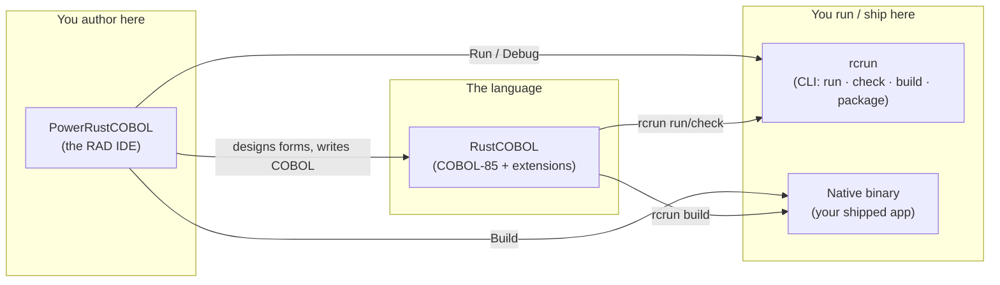
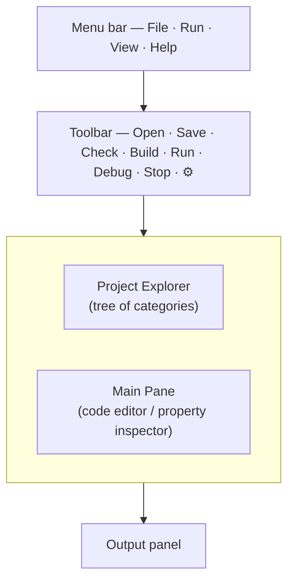
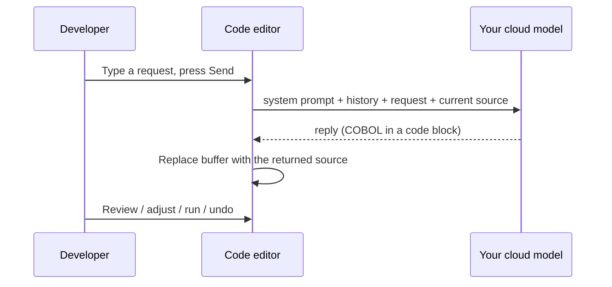
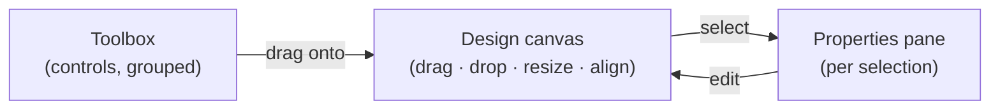
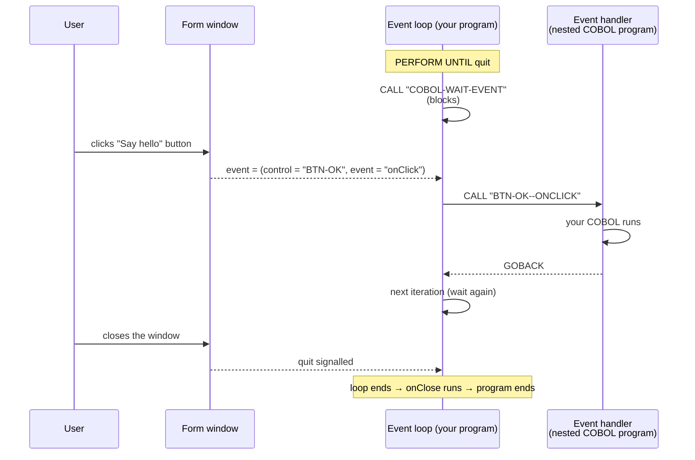
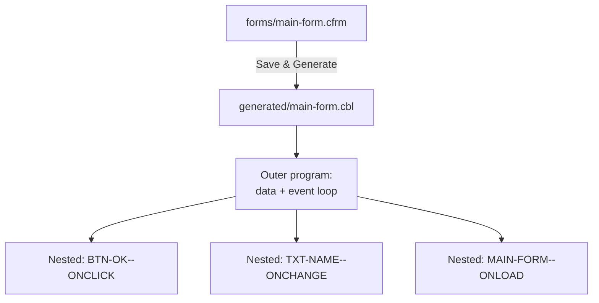
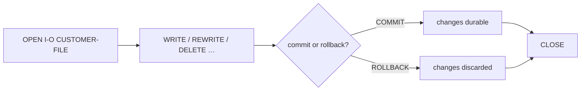
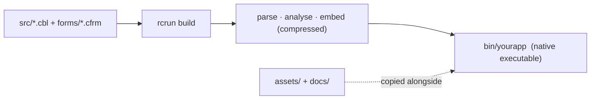

<!--
SPDX-License-Identifier: Apache-2.0
Copyright (c) 2026 Emerson Lopes and PowerRustCOBOL contributors

Licensed under the Apache License, Version 2.0.
See the LICENSE file in the project root for full license information.
-->

# PowerRustCOBOL Developer's Guide

*A practical guide to building graphical COBOL applications with PowerRustCOBOL.*

> **Who this guide is for.** You already write COBOL, and you have built screen
> or window-based applications with a GUI COBOL toolset — for example Fujitsu
> **PowerCOBOL for Windows** or **Veryant isCOBOL**. You know `IDENTIFICATION
> DIVISION`, `PERFORM`, `OPEN`/`READ`/`WRITE`, indexed files, and the idea of a
> *form* with *controls* that raise *events*. This guide maps those instincts
> onto PowerRustCOBOL and shows you everything that is new. **No prior knowledge
> of the host implementation language is assumed or required** — you will never
> need to read or write anything other than COBOL to build an application.

---

## Table of contents

1. [What PowerRustCOBOL is, and why it exists](#1-what-powerrustcobol-is-and-why-it-exists)
2. [The three pieces: RustCOBOL, PowerRustCOBOL, rcrun](#2-the-three-pieces)
3. [Installing and launching](#3-installing-and-launching)
4. [Your first application: Hello, Form](#4-your-first-application-hello-form)
5. [The IDE at a glance](#5-the-ide-at-a-glance)
6. [Projects and the project model](#6-projects-and-the-project-model)
7. [The Form Designer (RAD)](#7-the-form-designer-rad)
8. [The control catalogue](#8-the-control-catalogue)
9. [Properties](#9-properties)
10. [Event-driven programming](#10-event-driven-programming)
11. [Talking to the UI from COBOL](#11-talking-to-the-ui-from-cobol)
12. [Generated code](#12-generated-code)
13. [The RustCOBOL language](#13-the-rustcobol-language)
14. [Indexed files — a first-class resource](#14-indexed-files--a-first-class-resource)
15. [SQL databases](#15-sql-databases)
16. [HTTP / REST and AI agents](#16-http--rest-and-ai-agents)
17. [The command line (rcrun)](#17-the-command-line-rcrun)
18. [Building a distributable binary](#18-building-a-distributable-binary)
19. [Debugging](#19-debugging)
20. [Appearance and internationalisation](#20-appearance-and-internationalisation)
21. [Caveats and current limitations](#21-caveats-and-current-limitations)
22. [Appendix A — Coming from PowerCOBOL / isCOBOL](#appendix-a--coming-from-powercobol--iscobol)
23. [Appendix B — Glossary](#appendix-b--glossary)

---

## 1. What PowerRustCOBOL is, and why it exists

For decades, the only way to write **windowed, event-driven COBOL** was to buy a
proprietary toolchain tied to one operating system, one vendor, and one
licensing model. Those tools were excellent in their day, but most are now
Windows-bound, closed, and increasingly hard to deploy on modern machines. A
generation of business logic — payroll, inventory, banking back-offices — is
written in that style and has nowhere modern to go.

**PowerRustCOBOL exists to give that style of development a fresh, open home.**
It is a Rapid Application Development (RAD) environment where you:

- design windows ("forms") by dragging controls onto a canvas,
- attach **COBOL** event handlers to those controls,
- and run, debug, and ship the result as a **single self-contained native
  executable** — no runtime to install on the target machine.

Its design goals, in plain terms:

| Goal | What it means for you |
|------|-----------------------|
| **COBOL-first** | The application *is* COBOL. The designer generates COBOL; your handlers are COBOL paragraphs and nested programs. You never leave the language. |
| **Cross-platform** | The IDE and the produced binaries are not tied to one OS. |
| **Self-contained** | A built application embeds everything it needs; the end user does not install PowerRustCOBOL. |
| **Modern data access** | Crash-safe indexed (ISAM) files, SQL (SQLite / PostgreSQL / MySQL), and HTTP/REST are reachable through ordinary `CALL` statements. |
| **Open** | Apache-2.0 licensed. |

> **Note.** PowerRustCOBOL is *inspired by* the productivity of classic GUI COBOL
> RADs, but it is an independent, original implementation. Concepts such as
> "form", "control", and "event" are industry-standard; the syntax, file
> formats, generated code, and built-in services described here are specific to
> PowerRustCOBOL and are not compatible with any other vendor's tools.

---

## 2. The three pieces

PowerRustCOBOL ships as three cooperating tools. Knowing which is which removes a
lot of confusion early on.



| Name | Role | Think of it as… |
|------|------|-----------------|
| **RustCOBOL** | The COBOL-85 language dialect plus PowerRustCOBOL's extensions (GUI calls, indexed-file clauses, SQL/HTTP). | The compiler/runtime "language". |
| **PowerRustCOBOL** | The desktop IDE: project explorer, code editor, **Form Designer**, debugger. | The "Workbench" / "Studio". |
| **rcrun** | The command-line runtime, checker, packager, and binary compiler. | The "runtime + build tool" you can script in CI. |

> ⚠️ **Naming caveat.** Internally some build artefacts and folders are named
> `cobolt-*`. That is an implementation detail; the user-facing names are
> **RustCOBOL**, **PowerRustCOBOL**, and **rcrun**.

---

## 3. Installing and launching

> 📷 **Screenshot needed — `install-launch.png`.** Please provide a capture of
> the PowerRustCOBOL application icon in your OS launcher/dock **and** the empty
> IDE window immediately after first launch (no project open). This will anchor
> the "what you should see" expectation for newcomers.

Launch the IDE; on first run you are greeted with an empty workspace and the
prompt *"Open a COBOL file to get started."* You can either open a single `.cbl`
file or create a full **project** (recommended — see §6).

From a terminal you can also drive everything headlessly with `rcrun` (see §17),
which is what continuous-integration pipelines use.

### 首次运行时的 Rust 检查

IDE 自己就能设计 form 并*运行*程序。**Build** 是例外：它通过 **Rust 工具链**
（§18）把您的项目编译成原生应用程序，运行任何包含 `EXEC RUST` 块的程序也走同一
条路径。因此 PowerRustCOBOL 在首次运行时会查找 Rust — 找到可用的版本时，它什么
也不说。

找不到时，它会告诉您属于哪种情况 — 没有安装 Rust，还是版本低于 PowerRustCOBOL
要求的 **1.92** — 并显示 [rustup.rs](https://rustup.rs) 的官方命令，同时提出替您
执行。如果您拒绝，它会再问一次，因为拒绝是有代价的，值得说清楚：

| 没有 Rust 会失去 | 仍然保留 |
|---|---|
| **Build** — 没有原生可执行文件，也无法打包 | Form Designer |
| 运行任何包含 `EXEC RUST` 块的程序 | 代码编辑器与 COBOL 工具 |
| | **Run**（解释执行）与调试器 |

第二次拒绝即为定论，此后不再询问。以后从 [rustup.rs](https://rustup.rs) 安装
Rust，**Build** 就会直接开始工作 — 无需告知 IDE。

> **注意** — rustup 把 Rust 装在 `~/.cargo/bin`，该路径由您的 *shell 配置文件*
> 加入 `PATH`。从 Finder 或 Windows 桌面启动的应用程序不会读取该配置文件，因此
> PowerRustCOBOL 会自行查看该位置并使用在那里找到的版本。您不必为了 **Build**
> 而从终端启动 IDE。

---

## 4. Your first application: Hello, Form

This walkthrough produces a one-button window that shows a message.

1. **Create a project.** `File ▸ New Project…`, give it a name (e.g.
   `HelloPower`) and a main program. The IDE creates the standard folder layout
   on disk **and a runnable starter `main` program** (a tiny `DISPLAY`/`GOBACK`
   you can Run immediately), then opens it in the editor (see §6).
2. **Create a form.** In the project tree, click the **➕** next to **Forms**.
   This opens the *New Form* dialog — set a name (`main-form`), a title, and a
   size, then create. The form is saved under `forms/` and opens in the **Form
   Designer**.
3. **Drop a button.** Drag a **Button** from the toolbox onto the canvas. With
   it selected, set its `Caption` to `Say hello` in the properties pane.
4. **Attach a handler.** Still on the button, find its **`onClick`** event and
   click it to open the COBOL event editor. Type, for example:

   ```cobol
              DISPLAY "Hello from PowerRustCOBOL".
   ```

5. **Run.** Press **Run** on the toolbar (or the ▶ in the designer). The form
   appears; clicking the button executes your handler.

> 📷 **Screenshot needed — `first-form-designer.png`.** Capture the Form Designer
> with the single button selected and the `onClick` event highlighted in the
> properties pane.

> **Note.** When you save or run a form, PowerRustCOBOL **generates** a COBOL
> source file for it (see §12). You never edit that file by hand — it is a build
> artefact.

---

## 5. The IDE at a glance



- **Project Explorer (left).** A tree rooted at your project. Five fixed
  categories — **Forms**, **Common Code**, **Generated Code**, **Assets**,
  **Documentation** — each with a **➕** button. To the left of each item is a
  **status "knob"**: 🟢 green = checked/tested OK, 🟡 yellow = changed since last
  check, 🔴 red = a problem was reported. Forms expand to show their controls,
  grouped by toolbox category, and each control expands to its **Events**.
  **Click the root node at the very top** (📁 YourProjectName) at any time to
  bring up the full project settings form in the main work area.
- **Toolbar (top).** `Open · Save · Check · Build · Run · Debug · Stop`, plus
  language selector on the far right. *Run* interprets the program; *Build*
  compiles a native binary; *Check* runs parse + semantic analysis only;
  *Debug* is enabled when a Generated Code item is selected.
- **Main Pane (centre / right of the tree).** Shows the code editor, the
  **property inspector** (when you click a form or control in the tree), **or
  the project settings form** (when you click the project root at the top of
  the tree, or automatically when the IDE first opens a project — with no
  editor visible). It uses the exact same glass pane construction
  (CentralPanel + glass frame) as the control properties inspector for
  consistent width (no shortfall at the right border) and full 100% height
  behaviour (the pane grows/shrinks with the available area above the Output
  panel on window or splitter resize). The card's rounded bottom border/stroke
  is kept clearly above the output/console with a visible gap via the frame's
  bottom outer margin; the Save/Cancel buttons sit at the bottom of the card.
  Click the top of the project tree (the 📁 ProjectName line) at any time to
  open it. It has a single continuous vertical resizer line running
  top-to-bottom through the content. Labels on the left never word-wrap; they
  are truncated with `…` (e.g. `Standard system p…`) and the developer can
  drag the resizer freely (the split moves independently of any label length,
  up to 80 % of the pane width). Controls on the right are elastic and all
  start at the same x position after a 10 px gap, giving perfect vertical
  alignment of every property value. Sections: Project, License, Appearance,
  AI assistant, Runtime. Explicit **Save** and **Cancel** buttons at the bottom
  of the card (Cancel enabled only after changes; reverts to last saved). The
  resizer line follows the current theme (brighter when hovered or dragged).
  The code editor (when visible) carries a **status bar** along the bottom —
  caret `Ln, Col`, the **Insert/Overwrite** mode (toggle with the `Insert`
  key), a **Trim on save** toggle (strips trailing whitespace when you save),
  and a **Beautify** command (a safe whitespace tidy that never disturbs
  COBOL's significant columns).

> 📷 **Screenshot needed — `project-settings-form.png`**. Show the left tree
> with the root node highlighted (hand cursor), and the main area with the
> two-column settings form inside its glass card (single continuous vertical
> resizer line, labels truncated with … before the line, all value controls
> aligned on the right, Save/Cancel at the bottom of the card). The card's
> rounded bottom border must be clearly visible above the Output panel with a
> gap (no border going under the console). Note the theme colours on the
> resizer and that it can be dragged well past the longest label ("Standard
> system prompt:").

- **Output panel (bottom).** Program `DISPLAY` output, build logs, and status
  messages.

> 📷 **Screenshot needed — `ide-overview.png`.** A full-window capture with a
> project open, a form selected (so the property inspector is visible), and some
> text in the Output panel. Annotate the four regions if you can.

### The AI assistant (optional)

PowerRustCOBOL can put a cloud language model — one you provide, ideally trained
on this documentation — right above the code editor. The assistant is **entirely
optional and off by default**: until you fill in the connection details, the
prompt bar never appears.

**Configure it via the project root settings form.** Click the top node of the
project tree (the 📁 line with your project name). In the **AI assistant** section
of the form you can enter the connection details. The settings (except the
per-project Appearance options) are global to your machine, not stored in any
project, so the API key never travels in a repository:

| Field | Meaning |
|-------|---------|
| **Endpoint URL** | The full chat-completions URL of your model (an OpenAI-compatible endpoint, e.g. `https://…/v1/chat/completions`). |
| **API key** | Sent as `Authorization: Bearer …`. Leave empty for a key-less local endpoint. |
| **Model** | The model identifier passed in each request. |
| **Temperature** | Sampling randomness (0 = deterministic). |
| **Standard system prompt** | The instructions sent on every request. A sensible default is provided; edit it to suit your model. |

A **Test connection** button sends a tiny request to your endpoint and reports
whether the model is reachable and the key/model are accepted — use it to
confirm the setup before relying on it. The assistant becomes available as soon
as **Endpoint URL** and **Model** are both set. Clear the endpoint to hide it
again.

**Using it.** Open a COBOL file, type a request in the prompt bar (for example
*"add a paragraph that totals WS-LINES and DISPLAYs it"*), and press **Send**.
The model receives, in this order:

1. your **standard system prompt**;
2. the **conversation history** for *this file* (it is remembered between
   sessions, per source file);
3. your **request** together with the **current source** of the file.

When the reply arrives, PowerRustCOBOL extracts the COBOL from it and **updates
the editor buffer in place** — so you can immediately review, tweak, run, or
undo (Ctrl/Cmd-Z) the result like any other edit. The running transcript is
shown under the prompt bar (💬), and **Clear conversation** (🗑) forgets the
history for that file. Read-only Generated Code is never modified.

**Also in the inspector.** The same prompt bar appears above the inline
form/control inspector, with the form's **generated COBOL** as its (read-only)
context — handy for asking how to wire an event handler. Because generated code
is never hand-edited, replies there are shown in the transcript for reference
rather than applied.

**Where the conversation lives.** History is *not* kept in a hidden cache — it is
stored in the project's `data/` folder in PowerRustCOBOL's **own indexed (ISAM)
file** (`data/conversations.dat`), the very `ORGANIZATION IS INDEXED` format your
COBOL programs use, keyed by the source file's relative path. (We dog-food our
own runtime.) Conversations therefore travel with the project and require an open
project to persist; without one, the assistant still works but only for the
current session.



> 📷 **Screenshot needed — `ide-ai-assistant.png`.** The code editor with the AI
> prompt bar visible above it and an expanded conversation transcript.

> **Privacy note.** Your prompt, the conversation history, and the **full source
> of the open file** are sent to whatever endpoint you configure. Point it only
> at a model you trust.

---

## 6. Projects and the project model

A **project** is a folder containing a manifest file, `cobolt.toml`, plus your
sources, forms, and assets. The manifest records the project name, version, main
program, and the files in each category.

### Folder layout

When you create a project, PowerRustCOBOL scaffolds this structure on disk:

```text
HelloPower/
├── cobolt.toml         ← project manifest
├── src/                ← Common Code  (hand-written COBOL programs/copybooks)
├── forms/              ← Forms        (.cfrm designer files)
├── generated/          ← Generated Code (RAD-produced .cbl — read-only)
├── assets/             ← Assets       (images, audio, fonts, data files)
├── docs/               ← Documentation
├── bin/                ← built binaries
├── debug/              ← debugging working files
├── temp/               ← temporary files
├── dist/               ← (reserved) self-contained distribution bundle
└── data/               ← project data files (e.g. the AI conversation store)
```

A new project also gets a **runnable starter `main` program** (by default
`src/main.cbl`) — a minimal `IDENTIFICATION DIVISION` / `DISPLAY` / `GOBACK` that
you can **Run** straight away and then grow.

> **Form-first projects.** If you delete the starter `main` and build a project
> made of nothing but forms, **Build** and **Run** still work: when the
> `[project].main` file is absent, PowerRustCOBOL uses the **first generated form
> program** (`generated/*.cbl`) as the entry point. Set `[project].main` to a
> specific program once you want explicit control over which one starts.

> **Note.** Opening an older project that predates this layout **back-fills any
> missing standard folders** automatically, so every project ends up with the
> same structure.

### The five tree categories

| Category | Holds | Editable? |
|----------|-------|-----------|
| **Forms** | `.cfrm` form-designer files | via the Designer |
| **Common Code** | hand-written COBOL you `CALL` from forms or run directly | yes |
| **Generated Code** | the `.cbl` PowerRustCOBOL generates from each form | **read-only** (blue, lock icon) |
| **Assets** | images, audio, fonts, data files bundled with the app | imported |
| **Documentation** | Markdown / text / PDF notes | yes |

### Creating vs. importing

The **➕** on a category **creates a new item**:

- **Forms ➕** → *New Form* dialog.
- **Common Code ➕** → a new `.cbl` from a starter template, opened in the editor.
- **Documentation ➕** → a new Markdown file.
- **Assets ➕** → file picker (assets are authored externally, so "create" = import).

To **import an existing file** into a category, **right-click the ➕** and choose
*Import existing…*. (The `File` menu's *Import Form…* does the same for forms.)

> **Note.** Generated `.cbl` files live in `generated/`, are tracked
> automatically, and open read-only. Editing belongs in the form (the Designer)
> or in Common Code — never in generated output.

---

## 7. The Form Designer (RAD)

The Form Designer is where you lay out windows. Each open form is its **own OS
window**, so you can have several designers and running forms side by side.



- **Toolbox (left).** Widgets grouped into **Non-Visual**, **Common**,
  **Container**, **Data**, **Graphics**, **Menu**, **Charts**, and **Dialogs**.
  Drag any control onto the canvas.
- **Canvas (centre).** Move, resize (drag the border grips), align, and
  distribute controls. A snap-to-grid keeps things tidy. You can resize the
  **form itself** by dragging its edges.
- **Properties pane (right).** Edits the selected control — or, with nothing
  selected, the **form** itself. The pane is organised into collapsible
  **section cards** (Form Properties, Target Device, Appearance, Background
  Image, Size, Events). Drag its edge to widen it.

Designer toolbar essentials: **Save & Generate**, **Generate only**, **Preview**
(a non-interactive render), **Run Form** (live, interactive), grid toggle, glass
toggle, alignment tools, undo/redo.

> **WYSIWYG.** Preview and Run Form draw each control with the **same renderer
> the designer canvas uses**, driven by the control's designed properties —
> background and foreground colours, fonts, corner radius, shadows, checked
> state, progress value. What you style on the canvas is exactly what runs;
> the runtime only adds the live behaviour (press feedback, focus, input).

#### 选中多个控件

有两种方式，并且可以配合使用：

- **在空白画布上拖出套索** —— 矩形碰到的控件都会被选中。
- **按住 Command（macOS）或 Control（Windows/Linux）再单击** —— 把控件加入选
  区；若它已在选区内，则移出。对尚未选中的控件按住修饰键拖动，会先把它加入选
  区，再用同一个手势移动整个选区。

选中**容器**时，就移动而言它的子控件也一并被选中，因此 GroupBox 会带着整棵子
树一起移动，布局保持不变。最先选中的控件是**主控件**：对齐和调整尺寸的命令都
以它为基准，属性面板也读取它的值。

**拖动选区是刚性的。** 整组按同一个位移移动，该位移取自指针下的那个控件，所以
你排好的间距在移动后依然保持——即使控件并没有落在网格线上。

**属性面板会编辑整个选区。** 选中多个控件时，它显示这些控件的共有属性，并把每
一次修改应用到全部控件：

- **类型相同** —— 完整面板。一个 Button 有的属性，选中的五个 Button 都有。
- **类型不同** —— 只显示这些类型确实共有的属性；只有部分控件才有的那一行，看
  起来生效了，实际上对其余控件毫无作用。

一次修改就是**一步撤销**，不管它涉及多少个控件。没有该属性的控件保持原样，而
不会因此获得该属性；身份信息——控件 ID、Tab 顺序和父控件——永远不共享，因为两个
控件不能拥有相同的身份。

### Target devices

The **Target Device** section lets you size the form for a real device profile
(various iPhone, iPad, Apple Watch, Android phone/tablet/watch presets) or a
custom size, with a portrait/landscape switch. This is a design aid — it sets the
form's width/height to the chosen profile.

> 📷 **Screenshot needed — `form-designer-full.png`.** The Designer with the
> toolbox, a canvas containing several controls (a label, a text box, a button,
> and a chart), and the properties pane showing the section cards. Ideally use
> a project with a background image so the glass styling is visible.

> **Note (non-visual controls).** Timer, AI Agent, REST Client, and SQL Database
> are **non-visual**: they appear on the canvas as labelled glass "chips" at
> design time but render nothing at run time. They exist to be configured and to
> raise events / be `CALL`ed from your COBOL.

---

## 8. The control catalogue

PowerRustCOBOL ships the following controls. Visual controls render at run time;
non-visual ones are services.

**Common / input**
: Label, Button, TextBox, CheckBox, RadioButton, ComboBox, ListBox,
  NumericUpDown, DateTimePicker, Slider, ProgressBar, PictureBox.

**Containers / layout**
: GroupBox, Panel, TabControl, Splitter, MenuBar, ToolBar, StatusBar.

  **Splitter 是一个被分成两半的面板**——和上面三个一样，它是容器。放置一个
  Splitter 后，树中会出现**三个**控件：Splitter 本身，以及它拥有的两个窗格
  `<id>-Pane1` 和 `<id>-Pane2`。窗格就是普通的 Panel（初始无边框、背景透明），
  因此可以像对待任何 Panel 一样把控件放进去、设置样式和绑定数据。您**不能**
  设置的只有它们的位置和大小：那由分隔线决定。

  - **Orientation**描述的是**窗格的排列方式**，而不是分隔线的方向。
    `Horizontal` 把**窗格 1 放在左边、窗格 2 放在右边**，用一条垂直线分开；
    `Vertical` 把**窗格 1 放在上面、窗格 2 放在下面**，用一条水平线分开。
  - **SplitPosition** 是内部宽度（Horizontal）或内部高度（Vertical）的
    **百分比，0–100**。因为它是比例而不是像素偏移，所以在调整窗体或 Splitter
    大小后，分隔位置仍保持不变。COBOL 可以读取它
    （`MOVE Splitter-1::GetProperty("SplitPosition") TO WS-N`），也可以设置它
    （`SET Splitter-1::SplitPosition TO 30`）。
  - **拖动分隔线**——线上任意位置皆可，不限于手柄——两个窗格就会随指针重新
    分配空间。指针移到线上时会变成**抓取手形**，**双击可让分隔位置回到
    50 %**。同样的操作在设计器画布和运行中的窗体上都有效。
  - **0 % 与 100 % 都是合法的。** 一个窗格完全关闭，另一个占据全部空间；手柄会
    被 Splitter 自身的边缘裁剪，内侧的一半仍然可见，可以抓住它拖回来。
  - **分隔线的外观**：用 `LineColor` 和 `LineSize` 设置线条，用 `GripStyle`
    （`FilledPill`、`HollowPill`、`FilledCircle`、`HollowCircle`）、`GripSize`
    和 `GripColor` 设置手柄。颜色留空则跟随窗体主题。面板本身同样跟随主题，
    直到您设置 `BackgroundColor`、`BorderStyle` 或 `BorderColor`。

  - **分隔线移动时窗格内容如何跟随**由每个窗格自行决定，设置在窗格（而不是
    Splitter）的属性 **Pane Left/Right Resize Behavior** 上：

    | 行为 | 该窗格内控件的表现 |
    |---|---|
    | **Translate with divider**（默认） | 每个控件都保持与分隔线的距离，两个窗格都是如此：把线向右拖 40pt，两侧的内容都向右移动 40pt。控件可能被带到窗格另一侧边缘之外，并在那里被裁剪。 |
    | **Scale within the pane** | 每个控件按其在窗格中的*比例*保持位置，因此窗格变大时内容散开，变小时聚拢。尺寸从不缩放——只有位置改变——所以不会变形，也不会移出窗格。 |
    | **Anchor to the outer edge** | 每个控件保持与自身窗格前缘的距离。窗格 1 的前缘就是 Splitter 的边缘、从不移动，所以其内容原地不动；窗格 2 的前缘*就是*分隔线，所以其内容随线移动。这就是普通容器的行为。 |

    两个窗格互相独立：一侧是固定的控件条、另一侧是随之缩放的画布，只需把一个窗格
    设为 *Anchor*、另一个设为 *Scale*。

    在设计器中拖动分隔线会**真正移动控件**：它们的 X/Y 会被改写并保存，而整次拖动
    （分隔线以及被它带动的一切）是一个撤销步骤。


  > **注意** — 窗格的矩形由分隔位置推导而来，因此手动移动或调整窗格没有效果：
  > 它会立即弹回原位。要移动两个窗格，请移动 **Splitter**；要改变它们各自的
  > 占比，请拖动**分隔线**。

  > ⚠️ **1.61.164 的变更。** 此前 Splitter 是*放在两个相邻控件之间的一根条*，
  > `Orientation` 描述的是这根条自身的方向——`Horizontal` 指一条上下分隔的横
  > 条，与现在的含义相反。更早保存的窗体打开后窗格左右（或上下）会对调，其
  > `SplitPosition`（当时是像素偏移）会重置为 50 %。请选择所需的方向并把分隔线
  > 拖到位：这是一次性的调整，窗体上放置的内容不会丢失。

**Data**
: DataGrid, TreeView.

**Graphics / media**
: Line, Shape, Animator.

**Charts**
: BarChart, LineChart, PieChart, AreaChart, ScatterChart, DonutChart.

**Dialogs / windows**
: ModalWindow.

**Non-visual services**
: Timer, AgentObject (AI agent), RestClient, SqlDatabase.

> **Note.** A `Custom` control type exists as an extension point for
> bespoke/vendor controls; treat it as advanced.

> 📷 **Screenshot needed — `control-gallery.png`.** A single form (or the preview
> window) showing one of each major control so newcomers can recognise them. The
> charts especially benefit from a visual.

---

## 9. Properties

Every control exposes **properties** — its appearance, behaviour, and data
bindings — editable in the properties pane and stored in the `.cfrm` file.

PowerRustCOBOL uses **fully spelled-out property names** (no cryptic
abbreviations). A few you will use constantly:

| Property | Meaning |
|----------|---------|
| `Caption` / `Text` | The control's text (`Caption` for labels/buttons; `Text` for text boxes). |
| `BackgroundColor` / `ForegroundColor` | Colours (hex, e.g. `#1E3A5F`). |
| `FontName`, `FontSize`, `Bold`, `Italic` | Typography. |
| `Visible`, `Enabled` | State. |
| `TextAlignment` | Text justification. |
| `DataItem` | The COBOL working-storage item this control reads/writes. |

> **Note.** Standard acronyms are kept (`CSV`, `URL`, `API`, `TLS`); everything
> else is written in full — for example `BackgroundColor` (not `BackColor`),
> `MaximumLength` (not `MaxLength`), `PasswordCharacter` (not `PasswordChar`),
> and every `…Paragraph` reference (not `…Para`).

> **Caption rules.** Only Label, Button, CheckBox, RadioButton, and GroupBox use
> `Caption`; TextBox uses `Text`; other controls use type-specific keys
> (`Value`, `Items`, …).

> **Label 的文字可以选中并复制。** 运行时 Label 的 `Caption` 是活的文字，而不是
> 文字的图片：操作员拖动即可选中，`Cmd`/`Ctrl`+`C` 把选区放进剪贴板。从一个 Label
> 开始、在另一个 Label 结束的拖动会同时选中两者，因此可以把一个数值连同为它命名的
> caption 一起复制。没有需要打开的开关：既没有 property，也不用写 COBOL。
>
> 从 PowerCOBOL 或 isCOBOL 过来的开发者会认为静态文字控件是惰性的，而这里是
> PowerRustCOBOL 少数几处遵循现代桌面习惯的地方之一。Label 的其他行为都没有变：
> 绑定了 `onClick` 的 Label 依然会触发，`TAB` 依然越过 label 走向你设计的控件，
> 在 designer 画布上拖动依然是移动控件，而不是选中它的文字。
>
> 注意。在此之前，要有可复制的文字就得用带 `ReadOnly` 的 TextBox。那种做法仍然
> 有效，当文字是操作员之后可能要更正的 *值* 时，它依然是正确的控件——只是不再需要
> 仅仅为了让别人复制一个 caption 而使用它了。

> **始终可读的文字。** form 并不知道它的 theme 会画成什么样，因此那些承载含义
> 的颜色都会与文字真正落在的表面作对照：CheckBox 或 RadioButton 的 caption、
> CheckBox 的 `CheckColor` 勾选标记、ListBox 的 items，以及文本光标。只要在那
> 个表面上仍然可读，你设定的颜色就会被原样使用；读不出来时，painter 才改用黑
> 色或白色中更清楚的那一个。若要把颜色完全钉死，请挑一个在你所发布的 theme 上
> 读得清楚的颜色。
>
> **各自与哪个表面对照。** 与文字真正落在的那个表面。CheckBox 有两个表面（见
> 下文）：caption 落在**外框**上，与 `BackgroundColor` 对照；而 `CheckColor`
> 勾选标记在**方框**里面，与 `CheckBoxColor` 对照。给 check box 设一个深色外框
> 不会再把勾选标记翻成白色，给方框上色也不会再把 caption 翻成白色。
>
> **透明的外框交给你自己决定。** 一旦 `Transparency` 超过 70，外框画出的东西
> 太少而无从判读，而 caption 真正落在的东西 — form、GroupBox、背景图 — 控件
> 是看不到的。那里不作任何对照，你的 `ForegroundColor` 就按设定原样使用。
> CheckBox 默认是 100 % 透明，所以这才是常态：请挑一个在你所放置的 form 上读
> 得清楚的 caption 颜色。
>
> CheckBox 的 caption 在方框右侧，RadioButton 的 caption 在选择圆圈右侧，两者
> 距离相同。

> **CheckBox 有两个表面，各有各的 properties。** 从 PowerCOBOL 或 isCOBOL 过来
> 的人会以为只有一个 background、一个 border；在这里方框本身就是一个独立的表
> 面，所以两者各有一套。哪个 property 指哪个表面，从不因控件而异：
>
> | 表面 | 是什么 | 它的 properties |
> |------|--------|-----------------|
> | **外框** | caption **和**方框背后的那块底 — 整个控件矩形 | `BackgroundColor`（或那对渐变），`BorderStyle`，`BorderColor`，`BorderWidth` |
> | **方框** | 勾选方框本身 — RadioButton 中即选择圆圈 | `CheckBoxColor`，`CheckBoxBorderStyle`，`CheckBoxBorderColor`，`CheckBoxBorderWidth` |
>
> `CheckColor` 和 `CheckSize` 含义不变：画在方框**里面**的勾选标记，以及它占方
> 框的比例。
>
> 因此 `BackgroundColor` 在 CheckBox 上的含义，与它在 Label、TextBox 或 Panel
> 上完全一致 — 控件自身的面。check box 初始为 100 % 透明且 `BorderStyle` 为
> `None`，所以在你明确设定之前外框什么也不显示；而方框初始时 `CheckBoxColor`
> 为空，保持当前 theme 所绘制的样子。一旦你指定颜色，就以你的为准。
>
> ```cobol
>     MOVE "#1E3A5F" TO CHK-AGREE::BackgroundColor
>     MOVE "Single"  TO CHK-AGREE::BorderStyle
>     MOVE "#FFFFFF" TO CHK-AGREE::CheckBoxColor
> ```
>
> ⚠️ **注意。** border 和面是两个独立的决定。没有外框的控件 — 保持透明的
> CheckBox、没有 background 的 Label — 仍会把你要求的 border 画出来，画在空处。
> 这是有意为之：以前 `BorderStyle` 在这两者上完全无效，那才更令人费解。

> **Control IDs.** When you drop a control, it gets a readable, per-type ID —
> `Button-1`, `Button-2`, `TextBox-1`, `ComboBox-1`, … — which becomes its COBOL
> data-name (`WS-BUTTON-1`) and the base of its handler paragraph
> (`BUTTON-1--ONCLICK`). You can rename a control's ID to something meaningful
> (e.g. `BTN-SAVE`) in the properties pane; keep it a valid COBOL word (letters,
> digits, hyphens; no leading/trailing hyphen).

### 圆角与控件的阴影

`CornerRadius` 会把控件的背景和边框变成圆角，并把内容裁剪成圆角形状。该值最大
只能取较短边的一半，因此不会超过完全圆的形状（"胶囊"或圆形）；`0` 表示直角，
且不做任何裁剪。

被圆角切掉的区域不再属于该控件。你在那里看到的是控件**背后**的东西：窗体的表
面，**以及控件投在窗体上的阴影**。正是这种连续性，让圆角控件看起来是放在窗体
上的，而不是从窗体里抠出来的；**Shadow distance** 和 **Shadow blur** 设得越
大，这一点越明显。

同样的圆角半径和裁剪规则，在设计画布、预览和运行中的窗体上完全一致。

**每一种边框样式都遵循该圆角半径**，在所有带边框的控件上都是如此。属性面板中的
`BorderStyle` 有五个取值：

| 样式 | 绘制内容 |
|---|---|
| `None` | 完全不画边框。 |
| `Single` | 一条以 `BorderColor` 绘制、粗细为 `BorderWidth` 的线，沿着圆角走。 |
| `Fixed3D`、`Raised` | 光源在左上方的浮雕：上边和左边用 `BorderColor` 较亮的色调，下边和右边用较暗的色调，两段在圆角弧线的中点相接。 |
| `Sunken` | 同样的浮雕反转过来，使控件看起来像被按进窗体里。 |

浮雕与 `Single` 一样精确地跟随圆角半径——在 1.61.170 之前，它画的是外接矩形上的
四条直线，在每个角都会跑到弧线外面。无论控件的表面由什么绘制——玻璃样式、背景
渐变、窗体主题还是素材包——浮雕的画法都完全相同。

> ⚠️ **Neumorphic 是例外。** 该样式使用与整个窗体相同的阴影堆栈绘制自己的柔和
> 浮雕（左上受光、右下投影），因此上述四种可见样式在它下面会合并为一种。需要
> 浮雕效果时请选择 Neumorphic，而不是靠 `BorderStyle`。

---

## 10. Event-driven programming

This is the heart of GUI COBOL, and it works the way you expect: the form sits in
an **event loop**, waiting; when the user does something, the matching **handler**
runs.

### The form event loop



In words:

1. The generated program enters a loop and calls the built-in
   **`COBOL-WAIT-EVENT`**, which blocks until the user interacts with the form.
2. When an event occurs, the runtime hands back **which control** and **which
   event** (e.g. `BTN-OK` / `onClick`).
3. The loop dispatches to the handler for that pair — a **nested COBOL-85
   program** named after the control and event (`BTN-OK--ONCLICK`).
4. The handler runs and `GOBACK`s; the loop waits again.
5. Closing the window ends the loop; the form's `onClose` handler runs last.

### Events you can handle

- **Widget events** follow the convention `on` + action: `onClick`, `onChange`,
  `onDoubleClick`, `onMouseEnter`, `onGotFocus`, and so on. Each control exposes
  the set that makes sense for it (a Button has `onClick`/`onDblClick`/mouse
  events; a TextBox has `onChange`/`onKeyPress`/focus events; charts have
  `onDataChanged`; etc.).
- **Form events** — the window itself supports a rich set, grouped into
  **Lifecycle, Activation & Focus, Window State, Layout & Painting, Mouse,
  Touch & Pointer, Scrolling, Drag & Drop, Clipboard, System / OS, and Error
  Handling**. The lifecycle pair `onLoad` (just before the window is shown) and
  `onClose` (as it closes) are pre-created for every form; the rest you attach as
  needed.

> **Events fire at run time.** Every event a control lists in its catalogue can
> be handled *and* actually fires in a *Run Form* session — the runtime no
> longer supports only a subset. Coverage:
>
> - **Every visual control** gets the universal pointer set — `onClick`,
>   `onDblClick`, `onMouseDown`, `onMouseUp`, `onMouseEnter`, `onMouseLeave` —
>   whenever the gesture happens (only the ones the control actually declares).
> - **Value controls** fire `onChange` plus their semantic aliases:
>   `onCheckedChanged` (check box / radio), `onSelectedIndexChanged`
>   (list / combo), and the combo's `onDropDown` on open.
> - **Text input** fires `onGotFocus`/`onEnter`, `onLostFocus`/`onLeave`, and
>   `onKeyDown`/`onKeyUp`/`onKeyPress` while focused.
> - **Timer** 在启用期间每隔 `Interval` 毫秒触发一次 `onTick`（`Start`/`Stop`）。
>   **`Enabled` 是定时器自己的开关**——它决定定时器是否运行，而不是控件是否变灰。
>   若希望定时器等待手动启动，请在属性面板中取消勾选 **Enabled at start**；在
>   COBOL 中用 `SET Timer-1::Enabled TO 1` / `TO 0` 开启或停止它。（在 1.61.164
>   之前两者都无效：它们写入的是控件通用标志，而定时器并不读取该标志，因此定时器
>   根本无法停止。）
> - **Form-level** fires `onLoad`/`onClose` (at start-up / shutdown),
>   `onShow`/`onActivate` (when the run window first appears) and `onResize`
>   (when its size changes).
>
> A handful of events are tied to conditions the lightweight *Run Form* preview
> doesn't fully model yet — back-end completions (`onResponseReceived`,
> `onQueryComplete`, the AI agent's `onResponse`/`onError`) and a few
> control-internal ones (`onNodeExpand`, `onCellChange`). They are still
> designable and generate correctly; a compiled binary wires them to their real
> sources. When in doubt, confirm in a *Run Form* session.

### Adding a handler

In the tree or the properties pane, click an event to open the COBOL editor for
it. A handler is a self-contained **nested program**, and you edit its whole body
in **one** editor — there is no separate box for working-storage.

The event editor is the **same full editor as the main code editor**: as-you-type
**IntelliSense** (keywords, verbs, and the form's control names; `Ctrl+Space` to
trigger), **Find/Replace** (`Cmd/Ctrl+F`, with *Replace* and *Replace All*) in the
top-right, and the **status bar** along the bottom (caret `Ln, Col`,
**Insert/Overwrite** via the `Insert` key, **Trim on save**, and **Beautify**). It
opens at 70 % of the window and is freely resizable.

The **first time** you open an unwritten handler, the editor seeds it with the
standard skeleton so you only fill in the blanks:

```cobol
       ENVIRONMENT DIVISION.
       DATA DIVISION.
       WORKING-STORAGE SECTION.
       LINKAGE SECTION.

       PROCEDURE DIVISION.
           CONTINUE.
```

Everything from `ENVIRONMENT DIVISION` down to your statements is yours to edit;
PowerRustCOBOL supplies only the `IDENTIFICATION DIVISION` / `PROGRAM-ID` header
and the closing `GOBACK` / `END PROGRAM` (shown greyed-out around the editor).

- **Local scratch variables** go straight into this handler's own
  `WORKING-STORAGE SECTION`.
- **Shared state** lives in the form's global working-storage (visible to every
  handler because it is declared `GLOBAL` in the outer program).
- **Event data** — when an event delivers data to its handler, those items
  appear in the `LINKAGE SECTION` and are bound by `PROCEDURE DIVISION USING …`.
  For example, a handler that receives only the clicked node's index would be
  seeded as:

  ```cobol
       ENVIRONMENT DIVISION.
       DATA DIVISION.
       WORKING-STORAGE SECTION.
       LINKAGE SECTION.
       01 COBOL-EVENT-DATA.
          05 COBOL-ARRAY-INDEX        PIC S9(9) COMP-5.

       PROCEDURE DIVISION USING COBOL-ARRAY-INDEX.
  ```

  Events that carry no data simply have an empty `LINKAGE SECTION` and a plain
  `PROCEDURE DIVISION.` (no `USING`).

> If you leave the seeded template untouched and close the editor, nothing is
> saved — the handler stays "unwritten" until you actually add code.

---

## 11. Talking to the UI from COBOL

### Property reference syntax (the concise way)

You can read and write a control's properties **directly as COBOL operands**,
the way PowerCOBOL does — a quoted property name `OF` the control:

```cobol
      *> Write a property (literal → property)
           MOVE "Hello!" TO "Caption" OF CmStatic1.

      *> Read a property into a data item — no temporary needed
           MOVE "Caption" OF CmStatic1 TO WS-NAME.

      *> Property → property, directly. The type is inferred, so you do NOT
      *> declare a temp data item to shuttle the value:
           MOVE "Caption" OF CmStatic1 TO "Text" OF "ListItems" (4) OF Listview1.
```

The editor's **IntelliSense guides you through this syntax**: type `"` and it
lists every property alphabetically; keep typing to filter (`"Capt…"` → `Caption`)
and accepting the suggestion closes the quote (`"Caption"`). Then it offers the
`OF` qualifier, and after `OF` it lists the **controls that actually expose that
property** (`"Caption" OF Bu…` → `Button-1`, `Button-2`, …). For ordinary COBOL,
accepting a reserved word simply inserts the word and a space and waits for what
you type next — no auto-filled template.

A property reference works as both a **sending** and a **receiving** operand with
**any verb** — not just `MOVE`. For example:

```cobol
           COMPUTE "Value" OF Slider1 = "Value" OF Slider1 + 1.
           ADD 10 TO "Value" OF Spinner1.
           STRING "First" OF Person DELIMITED BY SPACE
                  " "                DELIMITED BY SIZE
                  "Last"  OF Person  DELIMITED BY SPACE
                  INTO "Caption" OF FullNameLabel.
           IF "Text" OF TextBox1 = SPACES
               DISPLAY "empty".
```

The rightmost name is the control; the quoted names are its properties, read
control-outward, and a name may carry a 1-based subscript
(`"ListItems" (4)`). Property names are exactly the ones in the properties pane
(e.g. `"Caption"`, `"Text"`, `"BackgroundColor"`, `"Value"`).

> **Type inference.** Because the runtime carries the property value directly,
> `MOVE propertyA TO propertyB` needs **no intermediate `PIC` data item** — a
> step that classic GUI COBOL forces on you.

### Calling control methods

Properties describe *what a control is*; **methods** describe *what it can do* —
showing it, moving it, ticking a value up, adding a list item, firing an HTTP
request. Every control understands a set of **universal** methods plus its own
**type-specific** ones. You can call a method three ways, all equivalent:

```cobol
      *> 1. Inline call — reads like a sentence, no result kept
           Lbl-Out::SetCaption("Saved.").

      *> 2. As an expression — the return value flows into a MOVE / IF / COMPUTE
           MOVE Txt-Name::GetText() TO WS-NAME.
           IF Chk-Agree::IsChecked() = "1"
               PERFORM SUBMIT-ORDER
           END-IF.

      *> 3. INVOKE verb — when you prefer the spelled-out keyword, with optional
      *>    USING arguments and RETURNING receiver
           INVOKE Db-1 "query"
               USING "SELECT id, name FROM customer"
               RETURNING WS-ROWS.
```

Arguments go in parentheses (inline / expression form) or after `USING`
(`INVOKE` form); a method that returns a value can be used directly in an
expression or captured with `RETURNING`. The editor's IntelliSense lists a
control's methods after you type `::`, each with a one-line description.

**Universal methods** (every visible control):

| Method | Effect |
|--------|--------|
| `Show` / `Hide` | Set the `Visible` property on or off. |
| `Enable` / `Disable` | Set the `Enabled` property on or off. |
| `SetFocus` | Give the control keyboard focus. |
| `MoveTo(x, y)` | Reposition the control (sets `X` / `Y`). |
| `Resize(w, h)` | Change its size (sets `Width` / `Height`). |
| `BringToFront` / `SendToBack` | Change stacking order. |
| `SetProperty(name, value)` / `GetProperty(name)` | Generic access to any property by name. |

**Type-specific highlights** (the full list is in IntelliSense):

| Widget | Methods |
|--------|---------|
| Label / Button | `SetCaption`, `GetCaption` |
| Text box | `SetText`, `GetText`, `AppendText`, `Clear` |
| Check box / radio | `IsChecked`, `SetChecked`, `Toggle`, `Select` |
| Progress / slider / numeric | `SetValue`, `GetValue`, `Increment`, `Decrement`, `Reset` |
| List / combo | `AddItem`, `RemoveItem`, `GetCount`, `GetSelected`, `SetIndex` |
| Timer | `Start`, `Stop`, `SetInterval`, `IsEnabled` |
| REST Client | `get`, `post`, `put`, `delete`, `call`, `setHeader`, `clearHeaders` |
| SQL Database | `open`, `execute`, `query`, `fetch`, `fetchAll`, `close` |
| AI Agent | `Ask`, `SetPrompt`, `SetModel`, `Stop` |

A method that changes a property updates the **running form immediately** — the
same channel the property syntax uses — so `Lbl-Out::SetCaption("Done")` repaints
the label the moment it runs. Methods and the property syntax are fully
interchangeable; pick whichever reads best for the line you are writing.

> **Designed values are available before you set anything.** When a form starts,
> every control is seeded with the values from its properties pane, so
> `Txt-Name::GetText()` (or `"Text" OF Txt-Name`) returns the text you typed at
> design time even before the first setter runs.

### Property access via CALL (also supported)

The explicit `CALL` form remains available and is interchangeable with the
syntax above:

| `CALL` | Purpose |
|--------|---------|
| `"COBOL-WAIT-EVENT"` | Block until the next UI event (used by the generated loop). |
| `"COBOL-GET-PROPERTY"` | Read a control property into a data item. |
| `"COBOL-SET-PROPERTY"` | Write a control property from a data item. |

A typical handler that reads a text box and updates a label:

```cobol
       BTN-GREET--ONCLICK.
           CALL "COBOL-GET-PROPERTY"
               USING "TXT-NAME" "Text" WS-NAME.
           STRING "Hello, " DELIMITED BY SIZE
                  WS-NAME    DELIMITED BY SPACE
                  INTO WS-MESSAGE.
           CALL "COBOL-SET-PROPERTY"
               USING "LBL-OUT" "Caption" WS-MESSAGE.
           GOBACK.
```

Other built-in services available via `CALL` (covered in their sections):

- **Charts:** `COBOL-CHART-ADD-POINT`, `COBOL-CHART-SET-TABLE`,
  `COBOL-CHART-CLEAR`, `COBOL-CHART-REFRESH`.
- **SQL:** `COBOL-OPEN-DB`, `COBOL-EXEC-SQL`, `COBOL-FETCH-ROW`,
  `COBOL-NEXT-ROW`, `COBOL-ROW-COUNT`, `COBOL-CLOSE-DB`.
- **HTTP:** `COBOL-HTTP-GET/POST/PUT/DELETE`, `COBOL-HTTP-SET-HEADER`,
  `COBOL-HTTP-CLEAR-HEADERS`.
- **Lifecycle:** `COBOL-INIT-FORM`, `COBOL-QUIT`.

> **Note.** Property names passed to `GET`/`SET` are exactly the names shown in
> the properties pane (e.g. `"Text"`, `"Caption"`, `"BackgroundColor"`,
> `"Value"`). Control IDs are the IDs shown in the tree (e.g. `"BTN-GREET"`).

---

## 12. Generated code

When you save/generate a form, PowerRustCOBOL writes a `.cbl` into `generated/`.
Its shape is predictable:

- a **PROGRAM-ID** for the form;
- working-storage for each control's state;
- the **event loop** (the `PERFORM UNTIL` around `COBOL-WAIT-EVENT`);
- one **nested COBOL-85 program** per event handler, named
  `CONTROL-ID--EVENTNAME` (uppercased, e.g. `BTN-OK--ONCLICK`); the form's
  `onLoad` runs at start-up and `onClose` at shutdown.



> ⚠️ **Caveat.** Generated `.cbl` is a build artefact. It is regenerated whenever
> the form changes, so **do not hand-edit it** — your edits would be overwritten.
> Put reusable logic in **Common Code** and `CALL` it from handlers.

---

## 13. The RustCOBOL language

RustCOBOL implements a substantial subset of **COBOL-85**, plus PowerRustCOBOL
extensions. Highlights a working COBOL programmer will rely on:

- **Data & structure:** group items, `OCCURS` (with subscripts/indices),
  `REDEFINES`, `RENAMES` (66 level), condition-names (88 level with `VALUE` /
  `THRU`), `USAGE` incl. `POINTER`.
- **Arithmetic:** `ADD/SUBTRACT/MULTIPLY/DIVIDE/COMPUTE` with multiple receivers
  and per-receiver `ROUNDED`; numeric-edited `PICTURE` editing.
- **Control flow:** `IF/ELSE`, `EVALUATE` (with `ALSO` and `WHEN NOT`), inline and
  out-of-line `PERFORM` (incl. `VARYING`, `UNTIL`, `TIMES`), `GO TO`, `ALTER`,
  `EXIT PERFORM/PARAGRAPH/SECTION`, faithful `NEXT SENTENCE`.
- **Strings:** `STRING`, `UNSTRING`, `INSPECT` (`TALLYING` + `REPLACING`, with
  `BEFORE/AFTER INITIAL`), `INITIALIZE … REPLACING`.
- **Tables:** `SORT` / `MERGE` (with `INPUT`/`OUTPUT PROCEDURE`, `USING`/`GIVING`,
  `RELEASE`/`RETURN`).
- **Sub-programs:** `CALL … USING`, `CANCEL`, `GOBACK`/`EXIT PROGRAM`, nested
  programs.
- **Intrinsics:** the standard library of `FUNCTION`s, including the date/time
  and financial functions.
- **Screen ACCEPT/DISPLAY** for character-mode interaction (when you are not
  building a windowed form).

> **Ground truth.** The authoritative, always-current list of supported syntax is
> `docs/cobol85-supported-syntax.md`; the verb-by-verb test matrix is
> `docs/cobol85-verb-test-matrix.md`. When in doubt, those files (and the test
> suite) are definitive.

> ⚠️ **Out of scope (today):** RELATIVE file organisation, cross-process record
> locking, and OO `CLASS`/`METHOD` definitions are not implemented.

### Unique declarations are enforced

Every program unit must declare its mandatory structural elements **once and only
once**. PowerRustCOBOL checks this while it reads your source and **refuses to
run the program** until you fix it — exactly as a compiler would flag a redeclared
symbol. The rule covers:

- a single `PROGRAM-ID`;
- at most one `ENVIRONMENT`, `DATA`, and `PROCEDURE` DIVISION header;
- unique **section** names within the program, and unique **paragraph** names
  within their section (or within the program when no sections are used).

For example, this is rejected because the program names itself twice:

```cobol
       IDENTIFICATION DIVISION.
       PROGRAM-ID. MYPROG.
       PROCEDURE DIVISION.
           DISPLAY "Hello".
       PROGRAM-ID. MYPROGNEWNAME.   *> ✗ PROGRAM-ID declared more than once
           STOP RUN.
```

The IDE shows the error in the **Problems** panel (and the CLI prints it) with the
offending line, and the Run/Build action is blocked until the duplicate is
removed. Legitimate multi-unit sources — sequential sibling programs each closed
by `END PROGRAM name.`, or true nested programs — are **not** affected: each unit
gets its own `IDENTIFICATION DIVISION` and is validated independently.

> This is a structural check, not a style suggestion. There is no flag to
> override it; redeclaring a unique element is always an error.

### `STRING` with smart default delimiters

Standard COBOL makes you write `DELIMITED BY` on **every** `STRING` operand, even
when the obvious choice is the only sensible one. RustCOBOL keeps that explicit
form working, but when you **omit** `DELIMITED BY` it picks the right default from
the operand's category — so the common case reads like plain text:

| Operand | Default | Why |
|---------|---------|-----|
| String literal (`" earns "`) | `DELIMITED BY SIZE` | take it verbatim, spaces included |
| Alphanumeric item (`PIC X`/`A`) | `DELIMITED BY SPACES` | drop the trailing space padding |
| Numeric item (`PIC 9`/`S9`) | `DELIMITED BY SIZE` | move the field's characters |
| Numeric-edited (`PIC ZZ9.99`) | `DELIMITED BY SIZE` | move the edited characters |
| `FUNCTION …` / expression | `DELIMITED BY SIZE` | move the whole computed value |

A data item is moved **in its field form** — exactly the characters it stores: a
`PIC S9(9)` holding `100000` contributes `000100000` (full PIC width), a
`PIC ZZZ,ZZ9.99` contributes its edited text. So this:

```cobol
       01 NAME-X        PIC X(40)        VALUE "Joe".
       01 SALARY        PIC S9(09)       VALUE 100000.
       01 SALARY-EDITED PIC ZZZ,ZZZ,ZZ9.99.
       01 TEXT-OUT      PIC X(100).
       ...
           MOVE SALARY TO SALARY-EDITED
           STRING NAME-X
                  " earns "
                  SALARY
                  " or US$"
                  FUNCTION TRIM(SALARY-EDITED)
             INTO TEXT-OUT
```

produces:

```text
Joe earns 000100000 or US$100,000.00
```

`DELIMITED BY SPACES` here keeps any **internal** spaces (`"Joe Smith"` stays
`"Joe Smith"`) and trims only the trailing pad. Writing an explicit
`DELIMITED BY …` on any operand always overrides its default.

---

## 14. Indexed files — a first-class resource

Indexed (ISAM) files get unusually deep, **original** support in PowerRustCOBOL —
this is one of its standout resources. You use them through standard COBOL verbs
(`OPEN`, `READ`, `WRITE`, `REWRITE`, `DELETE`, `START`), dispatched automatically
by the file's `ORGANIZATION`. On top of that, PowerRustCOBOL adds:

### Two storage modes (a SELECT-clause extension)

```cobol
       SELECT CUSTOMER-FILE ASSIGN TO "customers.idx"
           ORGANIZATION IS INDEXED
           ACCESS MODE IS DYNAMIC
           RECORD KEY IS CUST-ID
           ALTERNATE RECORD KEY IS CUST-NAME WITH DUPLICATES
           STORAGE MODE IS DISK WITH DATA COMPRESSION.
```

- **`STORAGE [MODE] IS MEMORY | DISK`** chooses an in-RAM table or a persistent
  on-disk store. **Default is DISK.**
- **`WITH [DATA] COMPRESSION`** transparently compresses records (no external
  dependencies).
- **Composite and alternate keys**, ascending key order, and `WITH DUPLICATES`
  semantics are honoured.

### Crash-safe transactions

The COBOL verbs **`COMMIT`** and **`ROLLBACK`** apply to your *open indexed
files*: a `COMMIT` makes pending `WRITE`/`REWRITE`/`DELETE` operations durable; a
`ROLLBACK` discards them. (These are **file** transactions — for SQL transactions
use `COBOL-EXEC-SQL` with `BEGIN`/`COMMIT`/`ROLLBACK`.)



### Pluggable storage engines

Choose the engine with `rcrun --indexed-engine <name>` (or the
`COBOL_INDEXED_ENGINE` environment variable):

| Engine | Use it for |
|--------|-----------|
| `rust` (default) | The built-in B-tree store; in-memory and on-disk paged formats. |
| `redb` | A **crash-safe, ACID** on-disk engine (copy-on-write B-tree, checksums, dual meta pages) — `COMMIT` survives power loss; instant `OPEN` on very large datasets. |
| `rm` / `fujitsu` | Reserved engine names that currently behave identically to the built-in store (native formats are future work). |

### Operations log (observability)

For diagnostics you can switch on a **per-file operations log**
(`rcrun --indexed-log basic|full`, format `--indexed-log-format text|json`).
It records one line per `OPEN`/`COMMIT`/`ROLLBACK`/`CLOSE` with timestamps,
write/rewrite/delete counts, byte and throughput figures, and key-order quality —
ready to feed into log tooling. The log rotates automatically under a size cap.

### Recording the operator

```cobol
           OPEN I-O CUSTOMER-FILE WITH REGISTERED USER WS-OPERATOR
```

`OPEN … WITH REGISTERED [USER] {literal | data-item}` records *who* opened the
file in the operations log. This is **observational only** — PowerRustCOBOL does
not provide an authentication or authorisation engine; the field simply tags log
entries with the operator you supply.

> **Note.** The default disk format is self-describing and stores the full key
> schema, so a file can be inspected and validated on `OPEN` (mismatches surface
> as standard file-status codes). The format is **not** binary-compatible with
> any third-party ISAM; do not assume interchange with other vendors' files.

> ⚠️ **Caveat.** Record locking is single-process (VSAM/RLS-style semantics
> within one running program). Cross-*process* locking is not implemented.

---

## 15. SQL databases

Relational access is exposed behind a single `CALL` surface, with the backend
chosen from the connection string:

| Connection string starts with… | Backend |
|---------------------------------|---------|
| `:memory:`, `sqlite:`, or a file path | SQLite (bundled) |
| `postgres://` / `postgresql://` | PostgreSQL |
| `mysql://` | MySQL |

Typical flow:

```cobol
           CALL "COBOL-OPEN-DB"   USING "sqlite:app.db".
           CALL "COBOL-EXEC-SQL"  USING
               "SELECT id, name FROM customers WHERE active = 1".
           PERFORM UNTIL WS-NO-MORE-ROWS
               CALL "COBOL-FETCH-ROW" USING WS-ID WS-NAME
               ...
               CALL "COBOL-NEXT-ROW"
           END-PERFORM.
           CALL "COBOL-CLOSE-DB".
```

The drivers are pure and bundled (no `libpq`/OpenSSL to install). Use
`COBOL-EXEC-SQL` with `BEGIN`/`COMMIT`/`ROLLBACK` for SQL transactions. Full
reference: `docs/database-runtime.md`.

> **Note.** You can model a database connection visually with the **SQL Database**
> non-visual control (its properties hold the connection string, driver, and the
> data items its events populate), or drive it entirely from code with the
> `CALL`s above.

---

## 16. HTTP / REST and AI agents

- **HTTP/REST.** `COBOL-HTTP-GET/POST/PUT/DELETE` issue requests;
  `COBOL-HTTP-SET-HEADER` / `COBOL-HTTP-CLEAR-HEADERS` manage headers. The
  **REST Client** non-visual control gives you a designable endpoint with events
  for responses, errors, timeouts, and progress.
- **AI agents.** The **AI Agent** non-visual control models a connection to a
  language model (endpoint, model, system prompt, temperature, token limits) and
  raises events such as `onResponse`, `onStreamChunk`, `onError`, and
  `onThinking`, which your COBOL handlers consume.

> ⚠️ **Caveat.** Network features reach the outside world — handle errors and
> timeouts in COBOL, and never embed secrets (API keys, tokens) in a form you
> intend to ship. Treat those as runtime configuration.

---

## 17. The command line (rcrun)

Everything the IDE does can be scripted with `rcrun`:

```text
rcrun run     <file.cbl>        # interpret a COBOL source file
rcrun check   <file.cbl>        # parse + semantic analysis only (no run)
rcrun build   <file.cbl>        # compile a single console program → bin/<name>
rcrun build   [cobolt.toml]     # compile a project → one native binary in bin/
rcrun package [cobolt.toml]     # package the project into a .zip
rcrun version                   # print version
```

Useful flags (indexed files): `--indexed-engine <rust|redb|…>`,
`--indexed-log <basic|full>`, `--indexed-log-format <text|json>`. Each also has
an environment-variable equivalent (`COBOL_INDEXED_ENGINE`, etc.), handy in CI.

> 📷 **Screenshot needed — `rcrun-terminal.png`.** A terminal session showing
> `rcrun check`, then `rcrun run`, on a small program, with the output. Helps
> newcomers see the CLI is approachable.

---

## 18. Building a distributable binary

`rcrun build` (or the IDE **Build** button) produces a **single self-contained
native executable** in `bin/`. The application's parsed program and its forms are
embedded inside the binary; no `.cbl` source is shipped, and the end user does
**not** install PowerRustCOBOL.



- Tracked **Assets** (and Documentation) are copied next to the binary so the
  program finds them by relative path at run time.
- Required licence/notice files are placed alongside the binary automatically.
- **`dist/`** is reserved for a future "bundle everything needed to run on a
  machine without PowerRustCOBOL" feature (binary + assets + any libraries +
  launcher). For now, ship `bin/` and the copied assets.

> **Note.** Forms are loaded **lazily** inside the binary: a 20-form application
> starts instantly even if the user only ever opens one form.

---

## 19. Debugging

Select a Generated Code item and press **Debug** to start a session. You get:

- **Breakpoints** in the editor gutter,
- **step** controls and **continue** (F5 / F10 while debugging),
- a **variable watch** panel.

During a session a *Stop Debug* control appears; otherwise debugging starts from
the toolbar **Debug** button (to the right of **Run**).

> 📷 **Screenshot needed — `debugger.png`.** A debug session paused on a
> breakpoint, with the variable-watch panel populated.

---

## 20. Appearance and internationalisation

- **Themes.** ⚙ ▸ *Settings* offers 28 colour themes — dark (Dark Glass
  [default], Deep Blue, Dark+, Monokai, Solarized Dark, Nord, Dracula, and
  more), light (Light+, GitHub Light, One Light, Gruvbox Light, Ayu Light,
  Quiet Light, Tomorrow, Material Lighter, Nord Light, Rosé Pine Dawn,
  Catppuccin Latte, Solarized Light), and **Classic**, a faithful Windows
  95 look (silver chrome, navy selection) for the full retro-RAD experience.
  There is also an optional **background image** with an opacity control.
  Settings are saved **per project** in `cobolt.toml`. The project tree and
  panel text automatically adapt their contrast to the theme — light text on
  dark themes, dark text on light ones.
- **IDE languages.** The IDE interface is available in **English, Spanish,
  Portuguese, Japanese, and Chinese** (toolbar language selector).

> ⚠️ **Critical rule.** The IDE language translates the **interface only**. Your
> **COBOL data names, paragraph names, and all generated COBOL source remain in
> English** regardless of the selected UI language. This keeps code portable and
> reviewable across teams.

---

## 21. Caveats and current limitations

A consolidated list so you are never surprised:

- **Event firing.** All form/control events are *designable*; only the core set is
  *fired* by the runtime today (see §10). Verify in *Run Form*.
- **File organisations.** SEQUENTIAL, LINE SEQUENTIAL, and INDEXED are
  supported; **RELATIVE is planned**.
- **Locking.** Single-process record locking only.
- **OO COBOL.** `CLASS`/`METHOD` definitions are out of scope.
- **ISAM interchange.** The on-disk format is original and **not**
  binary-compatible with any third-party ISAM.
- **Generated code is read-only.** Edit forms or Common Code, never `generated/`.
- **`dist/` is reserved**, not yet populated by tooling.
- **Secrets** must not be embedded in shipped forms.

---

## Appendix A — Coming from PowerCOBOL / isCOBOL

A rough mental map to speed you up. These are *analogies*, not exact equivalents.

| You knew (PowerCOBOL / isCOBOL) | In PowerRustCOBOL |
|---------------------------------|-------------------|
| A *sheet* / *form* with controls | A **form** (`.cfrm`) edited in the **Form Designer** |
| Property sheet | The **properties pane** (collapsible section cards) |
| Event procedure attached to a control | A COBOL **event handler** (`CONTROL-ID--EVENTNAME` nested program) |
| The event loop hidden by the runtime | The explicit **`COBOL-WAIT-EVENT`** loop in generated code |
| `INVOKE`/method calls on controls | The same — `Ctrl::Method(args)`, `INVOKE Ctrl "Method" USING …`, or the `COBOL-GET/SET-PROPERTY` calls |
| Vendor ISAM | PowerRustCOBOL **indexed files** (`STORAGE IS MEMORY/DISK`, `redb`, `COMMIT`/`ROLLBACK`) |
| Embedded SQL / ODBC | `COBOL-OPEN-DB` + `COBOL-EXEC-SQL` (SQLite/PostgreSQL/MySQL) |
| Building an `.exe` with a runtime DLL | `rcrun build` → **one self-contained binary**, no runtime to install |
| Project/workspace file | `cobolt.toml` + the standard folder layout |

> ⚠️ **Do not** expect source-level, file-format, or binary compatibility with
> any prior vendor's product. The concepts transfer; the artefacts do not.

---

## Appendix B — Glossary

- **Form** — a window you design; stored as a `.cfrm` file.
- **Control / control** — an element on a form (button, text box, chart, …).
- **Property** — a named attribute of a control or form.
- **Event** — something the user (or system) does; named `onSomething`.
- **Handler** — the COBOL that runs for an event; a nested program.
- **Generated code** — the read-only `.cbl` PowerRustCOBOL produces from a form.
- **Common Code** — your hand-written COBOL.
- **Non-visual control** — a service with no run-time appearance (Timer, SQL,
  REST, AI Agent).
- **rcrun** — the command-line runtime / checker / packager / compiler.
- **Indexed file** — an ISAM file (`ORGANIZATION IS INDEXED`).
- **Engine** — the storage backend for indexed files (`rust`, `redb`, …).

---

*This guide is a living document. It is expanded whenever a feature is added or a
behaviour changes — if something here disagrees with the running tool, the tool
(and the `docs/` reference files and test suite) are authoritative; please report
the discrepancy.*
