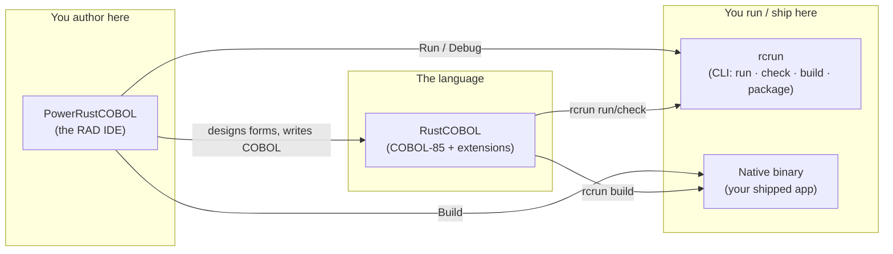
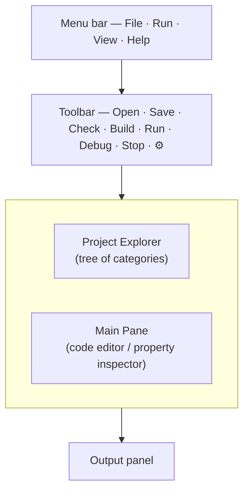
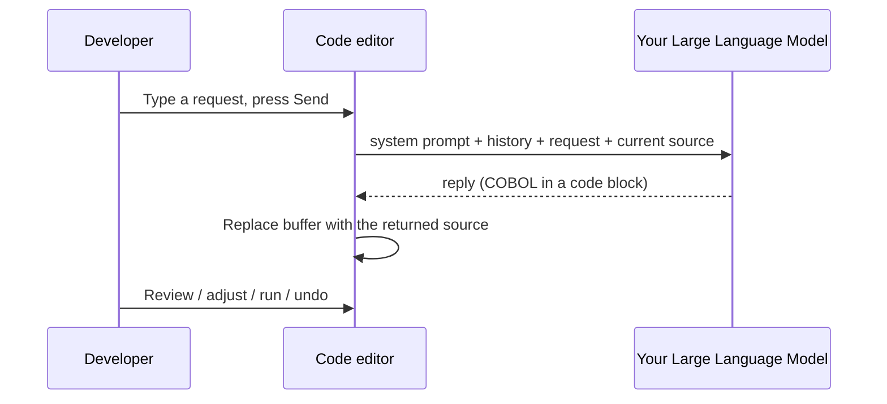
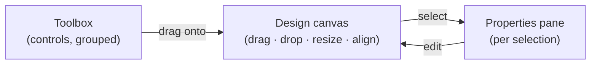
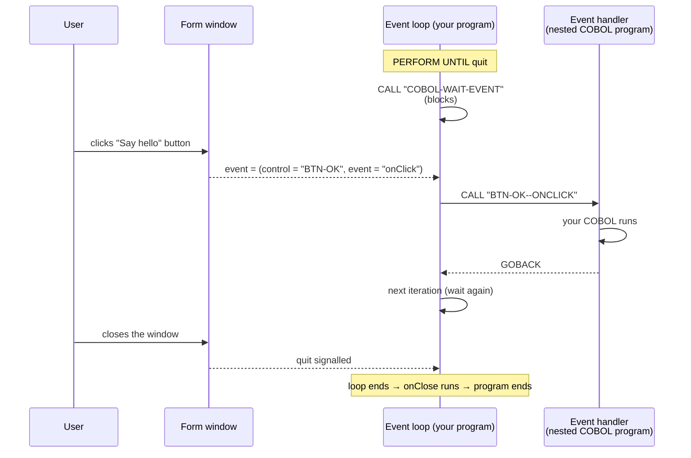
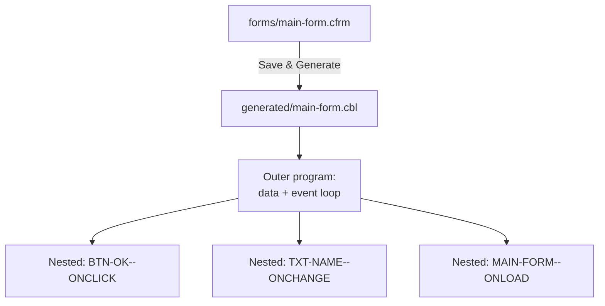
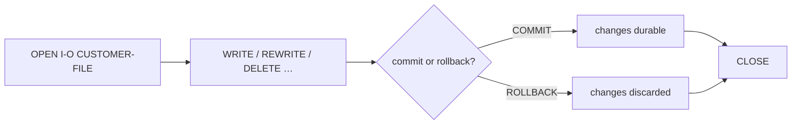
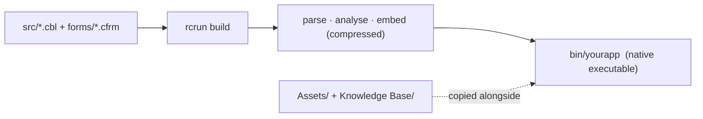
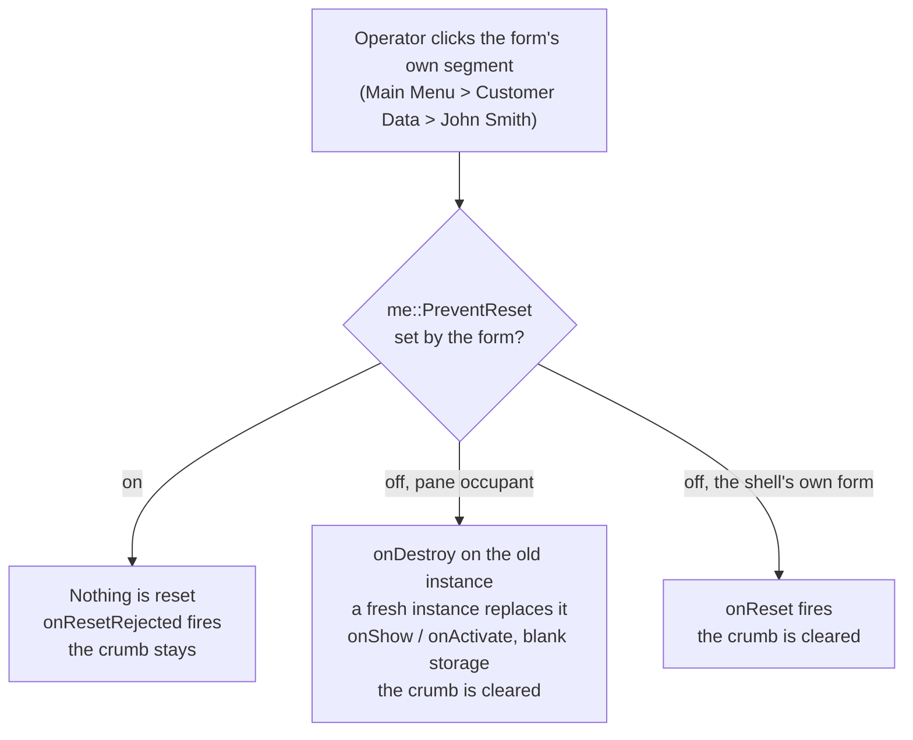

<!--
SPDX-License-Identifier: Apache-2.0
Copyright (c) 2026 Emerson Lopes and PowerRustCOBOL contributors

Licensed under the Apache License, Version 2.0.
See the LICENSE file in the project root for full license information.
-->

<!-- powerrustcobol: 1.65.124 -->

# PowerRustCOBOL AI 开发者指南 RC4

<p align="center">
  
</p>


*用 PowerRustCOBOL 构建图形化 COBOL 应用程序的实用指南。*

> **本指南面向谁。** 你已经在写 COBOL，并且用图形化的 COBOL 工具集构建过基于屏幕或
> 窗口的应用程序——例如富士通的 **PowerCOBOL for Windows** 或 **Veryant isCOBOL**。
> 你熟悉 `IDENTIFICATION DIVISION`、`PERFORM`、`OPEN`/`READ`/`WRITE`、索引文件，
> 以及带有触发*事件*的*控件*的*窗体*这一概念。本指南把这些直觉迁移到
> PowerRustCOBOL 上，并向你展示所有新增的东西。**不预设也不要求任何宿主实现语言的
> 先备知识**——构建一个应用程序，你永远不需要读写 COBOL 以外的任何东西。

---

## 目录

1. [PowerRustCOBOL 是什么，以及它为何存在](#1-powerrustcobol-是什么以及它为何存在)
2. [三个部件：RustCOBOL、PowerRustCOBOL、rcrun](#2-三个部件)
3. [安装与启动](#3-安装与启动)
4. [你的第一个应用程序：Hello, Form](#4-你的第一个应用程序hello-form)
5. [IDE 一览](#5-ide-一览)
   - [窗口效果](#窗口效果)
6. [项目与项目模型](#6-项目与项目模型)
7. [Form Designer（RAD）](#7-form-designerrad)
8. [控件目录](#8-控件目录)
9. [属性](#9-属性)
10. [事件驱动的编程](#10-事件驱动的编程)
11. [从 COBOL 与界面对话](#11-从-cobol-与界面对话)
12. [生成的代码](#12-生成的代码)
13. [RustCOBOL 语言](#13-rustcobol-语言)
    - [按标准允许的写法来写](#按标准允许的写法来写)
    - [把一整张表交给一个函数](#把一整张表交给一个函数)
    - [把一个文件彻底关掉：`WITH LOCK`](#把一个文件彻底关掉with-lock)
    - [调试行](#调试行)
    - [又长又别扭的文本：块字面量](#又长又别扭的文本块字面量)
    - [不用 `FD` 写一个文本文件](#不用-fd-写一个文本文件)
14. [索引文件——一等公民级的资源](#14-索引文件一等公民级的资源)
15. [SQL 数据库](#15-sql-数据库)
16. [HTTP / REST 与 AI 代理](#16-http--rest-与-ai-代理)
17. [命令行（rcrun）](#17-命令行rcrun)
18. [构建一个可分发的二进制](#18-构建一个可分发的二进制)
19. [调试](#19-调试)
    - [诊断开关（Help → Debug Settings）](#诊断开关help--debug-settings)
20. [外观与国际化](#20-外观与国际化)
21. [COBOL Structure 与共享数据](#21-cobol-structure-与共享数据)
22. [应用外壳与 `super` 接收者](#22-应用外壳与-super-接收者)
23. [注意事项与当前限制](#23-注意事项与当前限制)
24. [附录 A —— 从 PowerCOBOL / isCOBOL 过来](#附录-a--从-powercobol--iscobol-过来)
25. [附录 B —— 术语表](#附录-b--术语表)

---

## 1. PowerRustCOBOL 是什么，以及它为何存在

<!-- 📷 welcome.png — the welcome screen as it appears on first launch, before any project is open. -->

<p align="center"></p>


几十年来，编写**带窗口、由事件驱动的 COBOL** 的唯一途径，就是购买一套绑定于某一个
操作系统、某一家厂商、某一种授权模式的专有工具链。那些工具在当年都很出色，但如今
大多被困在 Windows 上，封闭，而且越来越难部署到现代机器上。整整一代业务逻辑——薪资、
库存、银行后台——都是以这种风格写成的，而它们无处可去。

**PowerRustCOBOL 的存在，就是为了给这种开发风格一个崭新而开放的归宿。** 它是一个
快速应用开发（RAD）环境，你可以在其中：

- 把控件拖到画布上来设计窗口（“窗体”），
- 为这些控件挂上用 **COBOL** 写的事件处理程序，
- 然后运行、调试，并把结果作为**单个自包含的原生可执行文件**交付——目标机器上无需
  安装任何运行时。

用平实的话说，它的设计目标是：


| 目标 | 对你意味着什么 |
| ---- | -------------- |
| **COBOL 优先** | 应用程序*就是* COBOL。设计器生成 COBOL；你的事件处理程序是 COBOL-85 嵌套程序。你从不离开这门语言。 |
| **跨平台** | IDE 和生成的可执行文件都不绑定于单一操作系统。 |
| **自包含** | 构建出的应用程序内嵌了它所需的一切；最终用户不必安装 PowerRustCOBOL。 |
| **现代数据访问** | 抗崩溃的索引（ISAM）文件、SQL（SQLite / PostgreSQL / MySQL）以及 HTTP/REST，都通过普通的 `CALL` 语句触达。 |
| **开放** | 采用 Apache-2.0 许可。 |

> **注意。** PowerRustCOBOL *借鉴*了经典图形化 COBOL RAD 的生产力，但它是一个独立
> 的原创实现。“窗体”“控件”“事件”这类概念属于行业通用；而这里描述的语法、文件格式、
> 生成代码和内置服务都是 PowerRustCOBOL 特有的，与任何其他厂商的工具都不兼容。

---

## 2. 三个部件

PowerRustCOBOL 以三个互相配合的工具的形式发布。弄清楚哪个是哪个，能在一开始就免去
许多困惑。




| 名称 | 角色 | 可以把它看作…… |
| ---- | ---- | -------------- |
| **RustCOBOL** | COBOL-85 语言方言，加上 PowerRustCOBOL 的扩展（GUI 调用、索引文件子句、SQL/HTTP）。 | 编译器/运行时的“语言”。 |
| **PowerRustCOBOL** | 桌面 IDE：项目浏览器、代码编辑器、**Form Designer**、调试器。 | “工作台”/“Studio”。 |
| **rcrun** | 命令行运行时、检查器、打包器和二进制编译器。 | 可在 CI 中编写脚本的“运行时 + 构建工具”。 |


> ⚠️ **命名提醒。** 在内部，一些构建产物和文件夹的名字是 `cobolt-*`。那是实现细节；
> 面向用户的名称是 **RustCOBOL**、**PowerRustCOBOL** 和 **rcrun**。

---

## 3. 安装与启动

每个发行版都为各平台提供**两种下载**，任选其一都是完整的——它们带的是同一个应用
程序、同一个 `rcrun`、同样的主题、示例和平台 SDK。

| 你的机器 | 安装程序 | 压缩包 |
| --- | --- | --- |
| Windows 10 / 11，64 位 | `.msi`——双击，或用 `msiexec /i … /quiet` 静默部署 | `.zip` |
| Apple Silicon 的 Mac | `.dmg`——把 PowerRustCOBOL 拖到 Applications | `.tar.gz` |
| Intel 的 Mac | `.dmg` | `.tar.gz` |
| Debian、Ubuntu、Mint 及其亲缘发行版 | `.deb`——`sudo apt install ./PowerRustCOBOL-*.deb` | `.tar.gz` |
| Fedora、RHEL、CentOS Stream、openSUSE | `.rpm`——`sudo dnf install ./PowerRustCOBOL-*.rpm` | `.tar.gz` |
| 其他任何 64 位 Linux | — | `.tar.gz` |

如果你想要那些常规的便利——开始菜单或 Applications 里的条目、桌面启动器、`PATH` 中
的 `rcrun`，以及日后干净卸载的办法——就选**安装程序**。如果你宁愿什么都不装，就选
**压缩包**：解压到任何地方就能运行，包括从 U 盘运行，或在你无权安装软件的机器上
运行。两种 Linux 包都会把应用程序放进 `/opt/powerrustcobol`，并把
`powerrustcobol` 和 `rcrun` 链接到 `/usr/bin`；在其他发行版上，压缩包就是发行形式。

> ⚠️ **两者都尚未签名**，所以每个平台在首次运行时都会警告一次。在 **macOS** 上：
> 右键点击应用程序并选择 *Open*，或用
> `xattr -dr com.apple.quarantine PowerRustCOBOL.app` 清除隔离标记。在 **Windows**
> 上：SmartScreen 会给出 *More info* → *Run anyway*。在这件事上安装程序并不比压缩包
> 更受信任——警告针对的是缺失的证书，而不是格式。

Linux 需要 glibc 2.35 或更高（Ubuntu 22.04+、Debian 12+、Fedora 36+），以及你的
桌面环境已经提供的 OpenGL、X11 或 Wayland 库。

启动 IDE；首次运行时迎接你的是一个空工作区，以及提示
*“Open a COBOL file to get started.”* 你可以打开单个 `.cbl` 文件，也可以创建一个
完整的**项目**（推荐——见 §6）。

<p align="center"></p>


在终端里，你也可以用 `rcrun` 无界面地驱动一切（见 §17），持续集成流水线用的正是它。

### 首次运行的 Rust 检查


IDE 自己就能设计窗体并*运行*程序。**Build** 是例外：它通过 **Rust 工具链**（§18）
把你的项目编译成原生应用程序；任何运行含 `EXEC RUST` 块的程序也一样。所以
PowerRustCOBOL 在首次运行时会寻找 Rust——找到可用的，它什么也不说。

找不到时，它会告诉你属于哪种情况——没有 Rust，或者版本低于 PowerRustCOBOL 要求的
**1.92**——并给出官方的 [rustup.rs](https://rustup.rs) 命令，同时提出替你执行。
你若拒绝，它会再问一次，因为拒绝是有代价的，而这代价值得说明：


| 没有 Rust 你会失去 | 你仍然拥有 |
| ------------------ | ---------- |
| **Build**——没有原生可执行文件，也没有可打包的东西 | Form Designer |
| 运行任何含 `EXEC RUST` 块的程序 | 代码编辑器和 COBOL 工具链 |
|  | **Run**（解释执行）和调试器 |

第二次拒绝就此定案，此后不再询问。日后从 [rustup.rs](https://rustup.rs) 安装
Rust，**Build** 便会自行开始工作——不需要告诉 IDE 任何事。

> **注意**——rustup 把 Rust 装在 `~/.cargo/bin`，而把它加入 `PATH` 的是你的
> *shell 配置文件*。从 Finder 或 Windows 桌面启动的应用程序从不读取那个配置文件，
> 所以 PowerRustCOBOL 会自己去那个位置查找，并使用在那里找到的东西。你不必从终端
> 启动 IDE，**Build** 也能工作。

#### Rust 装好了，Build 仍然完不成

还有第二个前提条件，rustup 既不安装也不提及：**链接器**。编译产出的是机器码；把
这些机器码汇集成一个可执行文件的是链接器，而它属于操作系统，不属于 Rust。

| 平台 | 由什么提供链接器 |
| ---- | ---------------- |
| **Windows** | 微软的 C++ 生成工具——带 **Desktop development with C++** 工作负载的 *Build Tools for Visual Studio*（或 Visual Studio）。Visual Studio Code 是另一个产品，并不提供它们。 |
| **macOS**   | 苹果的命令行开发者工具——`xcode-select --install` |
| **Linux**   | 你所用发行版的 C 工具链——Debian 和 Ubuntu 上是 `build-essential`，Fedora 和 RHEL 上是 *Development Tools* |

首次运行的检查也会回答这个问题：它让 Rust 去链接一个什么都不做的程序。这是唯一
可靠的判断方式，因为在 Windows 上链接器是通过 Visual Studio 的安装被找到的，而不是
通过 `PATH`。如果链接不成，IDE 会在首次运行时说明，指出链接器的名字，并给出安装
它的命令。这里没有什么可接受或拒绝的——它不是一个选择，只是还缺的那一样东西。

要是你到后来才遇上它——在构建的末尾，那正是它过去暴露的地方——**Build** 会用同样的
措辞报告同一件事，而不是丢给你编译器自己的输出。在此期间其他一切照常工作：
Form Designer、编辑器、**Run** 和调试器从来都不需要链接器。

---

## 4. 你的第一个应用程序：Hello, Form

这段演练会做出一个只有一个按钮、点击后显示消息的窗口。

1. **创建项目。** `File ▸ New Project…`，给它一个名字（例如 `HelloPower`）和一个
   主程序。IDE 会在磁盘上创建标准的文件夹布局，**并生成一个可直接运行的 `main`
   起步程序**（一小段可以立刻 Run 的 `DISPLAY`/`GOBACK`），然后在编辑器中打开它
   （见 §6）。
2. **创建窗体。** 在项目树中点击 **Forms** 旁边的 **➕**。这会打开 *New Form*
   对话框——设定名称（`main-form`）、标题和尺寸，然后创建。窗体保存在 `forms/`
   下，并在 **Form Designer** 中打开。
3. **放一个按钮。** 从工具箱把 **Button** 拖到画布上。选中它，在属性面板里把它的
   `Caption` 设为 `Say hello`。
4. **放一个标签。** 从工具箱把 **Label** 拖到画布上。
5. **挂上处理程序。** 仍然选中按钮，找到它的 **`onClick`** 事件并点击，打开 COBOL
   事件编辑器。例如输入：

   ```cobol
              SET Label-1::Caption TO "Hello from COBOL!".
   ```

<!-- 📷 first-form-designer.png — Capture the Form Designer with the single button selected and the `onClick` event highlighted in the properties pane. -->
<p align="center"></p>


6. **运行。** 按工具栏上的 **Run**（或设计器里的 ▶）。窗体出现；点击按钮就会执行
   你的处理程序。

<!-- 📷 firstform.png — Capture the running form after the button has been clicked, with the greeting showing in the label. -->
<p align="center"></p>


> **注意。** 当你保存或运行一个窗体时，PowerRustCOBOL 会为它**生成**一个 COBOL
> 源文件（见 §12）。你永远不用手工编辑那个文件——它是构建产物。


---

## 5. IDE 一览



- **Project Explorer（左侧）。** 一棵以你的项目为根的树。七个固定类别——
  **Forms**、**Indexed Files**、**Common Code**、**Generated Code**、
  **Project's Crates (Beta)**、**Assets**、**Knowledge Base**——每个都带一个
  **➕** 按钮，**Generated Code** 除外：它由 Form Designer 自行填充，你永远不用
  手工往里添加。每一项的左边有一个**状态“旋钮”**：🟢 绿色 = 已检查/测试通过，
  🟡 黄色 = 自上次检查以来有改动，🔴 红色 = 报告过问题。窗体展开后会按工具箱类别
  分组显示其控件，每个控件再展开则是它的 **Events**。索引文件展开后显示记录字段
  （就像窗体的控件一样）。**随时点击最顶端的根节点**（📁 你的项目名）即可在主
  工作区调出完整的项目设置窗体。

### 用文件夹组织项目树

每个类别都可以容纳任意层级的**文件夹**，让大型的企业级项目保持可浏览（例如
`forms/customers/`、`src/billing/`）。

- **创建文件夹。** 点击类别标题上的 **📁+** 按钮，在该类别根部添加一个文件夹；或
  右键点击任意文件夹并选择 **New folder…**，在其中嵌套一个。
- **重命名文件夹。** 右键点击该文件夹并选择 **Rename folder…**。项目在该文件夹下
  跟踪的每一个文件——以及任何指向它们的已打开编辑器标签页——都会自动跟随这次改动。
- **删除文件夹。** 右键点击并选择 **Delete folder…**。确认之后，该文件夹及
  **其中的一切都会从磁盘上被永久移除**，这些文件会从项目中剔除，正在显示它们的
  编辑器也会关闭。此操作无法撤销。

文件夹路径始终**相对于项目文件夹**保存，因此项目可以被移动、打包或共享，而不会破坏
任何引用。

### 移动文件：拖放

- **在树内。** 把一个文件拖到另一个文件夹（或某个类别标题）上即可移动它；文件会在
  磁盘上被移动，它在项目中的条目也会更新。文件不能覆盖同名的已有文件，文件夹也不能
  被拖放到它自己里面。
- **从操作系统。** 把文件从 Finder/资源管理器拖到某个文件夹或类别上即可导入。它们
  会被复制进项目，并以相对路径被跟踪。类型与目标类别不匹配的文件（例如把 `.cfrm`
  拖到 Common Code 上）会被拒绝。

### 键盘导航

把指针停在项目树上，你就能不用鼠标四处移动：

- **↑ / ↓**——移到上一个／下一个可见行。元素会立刻载入（它的属性或编辑器，和单击
  一样），并且树会按需滚动，使高亮行始终可见，并与顶端或底端保持一行的间隔。
- **→**——展开折叠的文件夹；如果它已经展开，则进入它的第一个子项。
- **←**——回到父文件夹。
- **Enter**——打开选中的项（与单击相同）。

首次启动时（或任何没有打开项目的时候），IDE 会显示一个整块的欢迎面板：在菜单栏/
工具栏下方的可用区域正中，是一整块居中的信息（标题 + 许可证 + 一个空行 + 引语 +
作者）：

Welcome to PowerRustCOBOL <版本>
License: Apache 2.0

<空行>
<绿色的引语文本，每个周期从内置列表中随机选出>
— <浅蓝色的作者名>

引语每 7.5 秒随机轮换一次（1 秒淡入，6 秒可见，0.5 秒淡出）。左侧的树、编辑器、
输出面板以及编辑器专有的控件都处于隐藏状态，直到你使用 File → New Project 或
File → Open Project。项目一旦打开，常规的三栏工作区就会出现。完整指南在 docs/
文件夹中。

- **工具栏（顶部）。** `Open · Save · Check · Build · Run · Debug · Stop`，
  最右端还有语言选择器。*Run* 解释执行程序；*Build* 编译出原生二进制文件；
  *Check* 只做语法与语义分析；*Debug* 在选中某个 Generated Code 项时才可用。
- **主面板（居中／树的右侧）。** 显示代码编辑器、**属性检查器**（当你在树中点击
  某个窗体或控件时），**或者项目设置窗体**（当你点击树顶端的项目根节点时，或者在
  IDE 首次打开一个项目时自动显示——此时看不到编辑器）。项目树上方的 **👑 Grace**
  按钮会在这个面板里打开覆盖整个项目的 Grace 聊天机器人。它采用与控件属性检查器
  完全相同的玻璃面板构造（CentralPanel + 玻璃边框），以获得一致的宽度（右边框处
  不会短一截）和完整的 100 % 高度行为（窗口或分割条调整大小时，面板会随 Output
  面板上方的可用区域一起伸缩）。借助边框的下外边距，卡片圆角的下边线被明确地保持
  在输出/控制台之上，中间留有可见的间隙；Save/Cancel 按钮位于卡片底部。随时点击
  项目树顶端（📁 项目名 那一行）即可打开它。它有一条贯穿内容、自上而下连续的竖直
  调整线。左侧的标签从不换行；它们会以 `…` 截断（例如 `Standard system p…`），
  开发者可以自由拖动调整线（分割位置与任何标签的长度无关地移动，最多到面板宽度的
  80 %）。右侧的控件是弹性的，全都在 10 px 的间隔之后从同一个 x 位置开始，使每个
  属性值都在竖直方向上完美对齐。各节依次为：Project、AI assistant、Appearance、
  License、Integrations、Runtime——AI 设置（Agents Manager、Model Providers
  Manager、Model Leaderboard）紧挨在 Project 下面，你无需滚动越过那段设置一次、
  此后极少改动的许可证文本就能够到它们。卡片底部有明确的 **Save** 和 **Cancel**
  按钮（Cancel 仅在有改动之后才启用；它会回到上次保存的状态）。调整线跟随当前
  主题（悬停或拖动时更亮）。代码编辑器（可见时）底部带有一条**状态栏**——插入符的
  `Ln, Col`、**Insert/Overwrite** 模式（用 `Insert` 键切换）、**Trim on save**
  开关（保存时去掉行尾空白），以及对非 Markdown 文档提供的 **Beautify** 命令，
  它会按下文 *Beautify——排版规则* 所述的规则重新排版 COBOL。Markdown 文件没有
  Beautify，因为 COBOL 的排版规则对它们不适用。

<!-- 📷 project-settings-form.png — Show the left tree with the root node highlighted (hand cursor), and the main area with the two-column settings form inside its glass card (single continuous vertical resizer line, labels truncated with … before the line, all value controls aligned on the right, Save/Cancel at the bottom of the card). The card's rounded bottom border must be clearly visible above the Output panel with a gap (no… -->

<p align="center"></p>

- **Output 面板（底部）。** 程序的 `DISPLAY` 输出、构建日志和状态消息。

<!-- 📷 ide-overview.png — A full-window capture with a project open, a form selected (so the property inspector is visible), and some text in the Output panel. Annotate the four regions if you can. -->

<p align="center"></p>

### AI 助手（可选）

PowerRustCOBOL 可以把一个大语言模型——由你提供，最好是用这份文档训练过的——直接放
在代码编辑器上方。这个助手**完全可选，且默认关闭**：在你填入连接信息之前，提示栏
从不出现。

**通过项目根设置窗体来配置它。** 点击项目树的顶层节点（带有你项目名的 📁 那一行）。
在窗体的 **AI assistant** 一节里，你可以填写连接信息。AI 行为和各个智能体属于当前
打开的项目，随它的 `cobolt.toml` 和 `agentic_ai/` 目录一起走；而提供商配置和 API
密钥是本机的，绝不随仓库走：


| 字段 | 含义 |
| ---- | ---- |
| **Endpoint URL** | 模型的完整 URL。使用与 OpenAI 兼容的聊天端点，例如 `https://…/v1/chat/completions`，或 xAI/Grok 的 Responses 端点 `https://api.x.ai/v1/responses`。未经改动的提供商默认值会自动获得其惯用的请求路径；一旦你编辑过此字段，IDE 就完全按你输入的 URL 使用。 |
| **API key** | 以 `Authorization: Bearer …` 发送。本地免密钥端点可留空。在此填入的密钥会配置**它所属的提供商**，与 Model Providers Manager 的效果完全相同，并且只存储在本机。留空表示此处没有为那个提供商保存任何凭据。 |
| **Model** | 每次请求中传递的模型标识符。 |
| **Reviewer model (Pedantic Agent)** | 可选的第二个模型，以毫不妥协的严苛审阅主智能体的答复。若设置，它必须不同于主模型（IDE 会强制这一点）。配置了审阅者之后，**COBOL Proficiency** 检查会同时运行：主模型作答，Pedantic Agent 以主提示词为权威规范进行审阅，发现缺陷时要求完整地重新提交订正稿，再审阅这份修订，最后给出毫不留情的诚实评估——此时仪表盘显示的是*审阅者的*评分，而不是模型的自评。 |
| **Temperature** | 采样的随机性（0 = 确定性）。连接测试使用的正是这个值，因为有些模型只接受其提供商定义的默认值，通常是 `1.0`。 |
| **Standard system prompt** | 每次请求都会发送的指令。已提供一个合理的默认值；请按你的模型调整。 |

**Model Providers Manager。** 在项目设置中 *Manage agents…* 的旁边是
**Model Providers Manager…**。你在这里配置一个**提供商**——它的端点和它的 API
密钥——仅此而已。从某个提供商的密钥生效那一刻起，**该提供商提供的每一个模型都会
对任何智能体可用**；没有逐个模型的设置要做。在左侧列表中选一个提供商（实心圆点
标记已配置者），如果需要不同的主机就调整它的端点，粘贴密钥，然后用
**Refresh models** 拉取当前目录。**Test** 会发送一次请求，好让你在依赖它之前确认
凭据。

**当调用失败时。** 错误窗口打开时，原因单独占据顶部一行，位于一条分隔线之上，下面
是完整的连接日志。标题就是提供商自己的那句话，原样引用——*“You exceeded your
current quota, please check your plan and billing details”*、*“'temperature' is
not supported with this model”*——如果那句话本身没有提到，就在下面显示它点名的请求
字段或错误码。下方的日志保持原样且完整；**Copy** 和 **Save…** 拿走的是全部内容，
而不是标题。负载中没有这类句子的错误则没有标题：你绝不会被展示一段并未被说出的
内容的摘要。

**注意——推理模型能通过测试。** *Test* 只问一个问题：这个模型可达并且在回应吗？
有些模型会先思考再开口，面对这么小的请求只返回隐藏的推理——端点解析成功、密钥被
接受、有 token 返回，但没有可见文本。这算通过，结果里也会这么说。只有智能体才需要
可见文本：它们要把答复解析成对窗体的操作，而它们看不到的推理无法被应用——所以一个
只用隐藏推理回应智能体的模型，在*那边*仍然会被报告为不可用，并附上同样的建议：为
它关闭思考。

右侧的提供商面板是**可滚动的**——无论你把窗口缩得多小，端点、密钥、模型和
*Where keys are kept* 都能够到，而左侧的提供商列表独立滚动。

提供商配置是**全机范围**的，保存在你其他的本机设置旁边，而不是在项目里。配置一次
Anthropic，本机上的每个项目都能用。API 密钥**绝不会**被写进项目文件、生成的 COBOL，
或已编译、已打包的应用程序。本地的 Ollama 根本不需要密钥——一个可达的端点就够了。

> **注意。** 这取代了旧的 *Models Manager*：在那里，连接是按*模型*定义一次的，形成
> 一个具名的“模型配置档”，供智能体引用。若要使用你已经付费的某个提供商的第二个
> 模型，就得再建一整份配置档，并把同一个密钥再粘贴一遍。
>
> **你已有的项目会自行迁移。** 首次打开时，每个智能体会接管它所引用配置档的提供商、
> 模型、温度、输出 token 上限和超时，而每个提供商则由那些配置档已知的信息配置出来。
> 不需要你做任何事，也不需要重新输入任何东西。⚠️ 现在一个提供商只能持有**一个**
> 密钥，所以如果你在同一个提供商下有多份配置档、各带*不同*的密钥，那么最近保存的
> 那个会被保留，其余的会在 Output 面板中被点名——如果你要的是别的那个，就在
> Model Providers Manager 里重新输入一次。

#### 你的密钥保存在哪里

默认情况下，一个密钥只活**一次运行**。什么也不会写到磁盘上，下次打开 IDE 时它会再
问一遍。这是有意的——落在磁盘上的密钥就是可以被复制、被备份、被提交的密钥——但这
确实烦人，所以在 Model Providers Manager 的底部，你可以自己决定：


| 选择 | 会发生什么 |
| ---- | ---------- |
| **Not kept** | 默认。密钥只存在于本进程中，下次运行会再次询问。 |
| **A local file** | 整份模型配置（包括密钥）被写入一个你命名的文件。该文件创建时仅所有者可读（在 macOS 和 Linux 上是 `0600`），顶部带有一行明文警告。重新打开 IDE 会直接把密钥取回。 |
| **The OS credential store** | 你所在平台自己的保险库——Keychain、Credential Manager、Secret Service。已列出但**尚不可选：它会在正式发行版中到来**，等到它有了能查看、轮换和清除所存内容的界面之后。 |

**文件绝不能位于 git 仓库之内。** 这不是一项偏好，也没有任何绕过的办法。如果你选择
的路径处于某个 `.git` 之下的任何位置——仓库根目录、往下十层的文件夹里，或者某个
子模块或 `git worktree` 检出中——它会被拒绝，而且拒绝信息会点名那个仓库，好让你知道
撞上的是哪一个。被提交的密钥就是已发布的密钥，而已发布的密钥收不回来。

`/tmp/llm_config.json` 被优先提供，正是出于这个原因：`/tmp` 里的东西无法被提交，
而且它撑不过一次重启——对凭据而言，这是优点。点击一个建议路径或自己输入一个，按
**Use this file**，配置保存时密钥就会被写入。**Forget the file** 会删除该文件，并
回到完全不保存密钥的状态。

全机范围的配置文件没有变化：它依然**不携带任何凭据**，只保存你对密钥去向的选择和
你挑的那个路径。在管理器里删除一个密钥依然是真的删除——显式删除永远压过一个还记着
它的文件。

> ⚠️ **注意事项。** 文件以明文保存你的密钥。保护它的只有文件权限：任何以你的身份
> 运行的东西都能读到它，而且它会出现在任何复制该文件夹的备份里。如果这不可接受，
> 就把选择留在 **Not kept**，直到操作系统凭据保险库在正式发行版中到来。

**Agents Manager。** *AI agents* 那一行会打开项目已配备的智能体数据库，分三个标签页。

**标签页 1 — Agent × Model。** 每个智能体一行——Grace、每个专家、每个审阅者以及
COBOL Proficiency Judge——列出决定该智能体如何运行的各项内容。


| 列 | 含义 |
| -- | ---- |
| **Agents** | 该行所配置的智能体。 |
| **Models** | 它运行在哪个模型上，从表格上方 **Model provider** 框中所选的提供商里挑。选 **— no model —** 可以有意让某个智能体保持未配置。 |
| **Rating** | Leaderboard 对那个模型的了解；若从未评测过则显示 *Not tested*。 |
| **Temp** | 仅针对这个智能体的采样随机性（0 = 确定性）。 |
| **Output Tokens** | 这个智能体可以产出的最长答复。 |
| **Timeout** | 等它多久，以秒计。 |

**Model provider** 框是一个*挑选范围*，而不是覆盖整个项目的开关。它决定你在配置
期间 Models 列会提供哪个提供商的模型，并且不会改动任何你没碰过的智能体——所以
Grace 可以跑在云端提供商上，而你的专家们跑在本地 Ollama 上。每个智能体都记得自己
的模型来自哪个提供商。有些提供商提供数百个模型，选择器旁边的搜索框可以收窄列表。

若某一行的模型被保留给了另一个角色，智能体名字旁会显示警告：专家不能使用 Grace
的模型，也不能用 Judge 的。（Judge *可以*与 Grace 共用模型，只要没有专家在用它。）

**当提供商停用某个模型时。** 模型会被退役——Anthropic、OpenAI、Meta 等等都按各自的
节奏撤下它们——而一个已不存在的模型的排名比没有排名更糟：它会引你去选它。所以，
如果在 Model Providers Manager 中的一次刷新带回了目录，它也会把该提供商在目录中已
不再列出的模型从 Leaderboard 上撤下，并在 Output 面板中说明是哪些。

只有**确实列出了模型**的刷新才能这么做，而且只针对它所列出的那个提供商。失败的请求、
过期的密钥，以及你尚未刷新过的提供商，都会产出一个空列表，而空列表并不能说明什么
存在、什么不存在——所以空结果不会移除任何东西。你也可以自己退役一个模型：
Leaderboard 的每一行都有 **Remove**，适用于提供商已经关停某个模型、而它的目录还没
跟上的情形。它会先询问，因为一次排名要花掉实实在在的 token 和时间。

如果某个智能体正用着那个消失的模型，Agents Manager 会直接打开到该智能体，好让你
立刻给它换一个——指向已撤下模型的智能体，才是真正会让一次运行失败的那部分，而等到
下一个工作流才以连接错误的形式发现，是代价高昂的学法。

移除是持久的：退役的模型不会被下一次项目同步放回来，也不会被归档评测报告的重放放
回来。你在 `agentic_ai/model-benchmarks.jsonl` 中的归档丝毫未动——那些报告是你运行
过、付过费的记录，这里的任何操作都不会删除它们。**再测一次已退役的模型就会把它带
回来**，并带上新的结果，所以一次你不认同的退役，花一次运行就能撤销。

**标签页 2 — Agent Configuration。** 左侧的智能体列表驱动右侧的详情面板：
**Agent Details**（id、名称、种类、专长、用途、是否启用）、提示词编辑器、能力、
知识与关系。

**标签页 3 — User Guide。** 一份讲述模型与智能体如何配合的书面指南，以你的界面语言
呈现。它的四节各自先给出朴素的解释，然后深入，最后陈述确切的版本——读到对你有用的
地方就停下。它涵盖了智能体与模型的搭配和共用规则、每项设置的作用、为什么你最强的
模型该放在审阅者和 Judge 而不是写作者身上，以及相关术语（模型、智能体、Pedantic
审阅者、Judge、token 及其成本、本地模型、量化，以及为什么 VRAM 才是决定一个本地
模型能否使用的那个数字）。搜索会高亮匹配项并在其间跳转，文字大小可调，目录可跳转，
**Export PDF** 会把整份指南导出。

页脚有 **Cancel**、**Apply**（保存并继续工作）和 **Save**。内部的 `agentic_ai/`
目录被有意地从项目树中隐藏；请用 Agents Manager 配置智能体，而 Grace 会自动把它的
工作流记录留在那里。提示词编辑器在竖直方向可从四行调整到二十行；更长的提示词会在
编辑器内部滚动，而不是把它撑高。**New Agent** 和 **Delete Agent** 目前被隐藏，因为
完整的内置智能体网是随项目一起创建和修复的。这两条流程仍保留实现，以备将来维护。
一个智能体住在你项目的 `agentic_ai/<智能体名>/` 下——多行的智能体提示词在
`<智能体名>_prompt.md`，另外还有 `steering/`、`policies.md`、`skills/`、`mcp.json`、
`knowledge/` 和 `agent.json`（身份与运行时配置——API 密钥**绝不**保存在项目里；密钥
留在你的机器上，每个模型只问一次）。智能体的名字唯一且在创建时固定，因为它就是
文件夹的名字。每个主智能体都可以指定一个审阅其回复的**迂腐伙伴**——主体与它自己的
伙伴必须使用不同的模型，而互不相关的智能体之间可以自由共用模型。这种关系是一对一
的：一个编排者或专家至多有一个 Pedantic 伙伴，一个 Pedantic 审阅者至多属于一个被审
智能体。你可以从主智能体的 **Companion (Pedantic reviewer)** 一节选择这层关系，也
可以从 Pedantic 智能体可编辑的 **Pedantic Companion for** 一节选择；两个选择器写入
的是同一份项目配置。Grace 的规划器和参与的智能体在运行时收到的是确切的关系，因此
审阅者不能被替换，也不能被挪用给另一个智能体。创建项目时会配备固定的专家——
**Form Designer Agent**、**COBOL Event Handler Script Agent**、
**Documentation Agent**、**Data (Indexed File) Agent** 和 **Version Control Agent**
——外加编排者 **Grace**。每一个后面都紧跟着它自己的审阅者，其规范名称就是主体名字
加上后缀 **Pedantic Reviewer**：

- **Grace Pedantic Reviewer**
- **Form Designer Agent Pedantic Reviewer**
- **COBOL Event Handler Script Agent Pedantic Reviewer**
- **Documentation Agent Pedantic Reviewer**
- **Data (Indexed File) Agent Pedantic Reviewer**
- **Version Control Agent Pedantic Reviewer**

每个审阅者在创建时都带有针对其用途的提示词、描述、路由契约，以及一对一的伙伴链接。
开发者为它选择模型配置并可调整其提示词、技能、工具与知识；没有哪个审阅者需要手工
搭建或关联。打开一个已有项目会执行同样的幂等修复：缺失的内置审阅者会被重建并重新
链接，而非空的项目提示词和开发者的其他配置仍然具有权威性。旧的审阅者名称会就地
迁移，不改变它们稳定的 ID，也不改变已选的配置档。

Grace 依然是唯一的协调权威（👑，永远叫 Grace，不可删除）：它规划多智能体的工作，
按种类和专长委派给专家，强制执行每一道迂腐审阅关卡，并组装出最终经过验证的结果。
**Grace Pedantic Reviewer** 的默认提示词会审阅请求覆盖度、任务分解、归属、依赖、
文档治理、证据、跨智能体集成、失败情况以及完成声明。项目本地的审阅者提示词仍可在
Agents Manager 中编辑，固定智能体的修复会保留这些编辑。在启用某个审阅者的审阅连接
之前，请先在运行时表格中给它一个模型；主体与它的 Pedantic 伙伴不能使用同一个模型。

**当 Grace 发问而不是动手时。** 一个允许多种解读的请求得到的是提问而非猜测——同一
对话中的一个红色气泡，准确点出哪里含糊。就在同一个输入框里回答，多短都行（“the
Caption”“UUID”“aas-clientes”）：答案会带着它所回答的那个问题一起回去，于是 Grace
带着你的决定继续原来的请求。你不必把先前的要求重述一遍。如果你改而输入了别的内容，
那就成了新的请求，先前的提问会被丢弃。

内置的路由契约是明确的：Form Designer Agent 负责 RAD 窗体设计，并把事件实现委派
出去；COBOL Event Handler Script Agent 恰好实现那些被委派的行为；只有 Documentation
Agent 撰写项目文档并准备规范化的索引文件模式交接；只有 Data (Indexed File) Agent
通过 Indexed File 的界面模型维护 `.cidx` 定义；Version Control Agent 负责带证据和
确认关卡的项目 Git 操作；而 Grace Pedantic Reviewer 只审阅 Grace 的编排。每个智能体
都会收到一份针对其角色的默认提示词。空的或已知的旧默认值会被修复，而项目中编辑过
的非空提示词仍然具有权威性。已有的 `DocumentationAgent`、`Pedantic Grace Reviewer`、
`Grace Pedantic Reviewer Agent`、`Pedantic UI Agent` 和 `Pedantic COBOL Companion`
记录会在磁盘上被改名，但不改变它们稳定的 ID 与模型。冗余的
`Orchestrator Pedantic Reviewer Agent` 会被并入 **Grace Pedantic Reviewer** 并删除。

项目树上方的 **👑 Grace** 按钮会填满当前树面板的宽度（最小 150 px），并在你调整
面板大小时跟随。点击它会在主面板中打开一段项目范围的对话，带有持久的历史记录、
工作流进度，以及针对受关卡约束操作的审批控件。它在属性面板中的标题把它标识为
**👑 Grace - The PowerRustCOBOL Agentic AI Orchestrator**。

**选择东西放到哪里。** 由于项目树支持文件夹，同一个名字可能存在于多个位置。当你请
Grace **创建**一个元素（窗体、索引文件、公共代码源文件、文档文件或资源）时，它会
打开一个居中的小窗口显示项目树，让你挑选目标**文件夹**——你也可以当场在那里新建一个
文件夹。当你请 Grace 按名字**编辑**一个元素、而有多个元素同名时，同一个窗口让你挑
**哪一个**；若只有一个匹配，Grace 就直接编辑它。取消这个窗口会中止操作，Grace 会
报告什么都没有创建或编辑。（这个询问出现在项目的完整 Grace 对话中；编辑器/设计器
里那种紧凑的对话界面无法显示它，所以在那里发出含糊的请求时，会让你改用项目的
Grace 对话。）

IDE 中每一个聊天机器人都经由 Grace。界面一侧提供的是一种建议性的偏好：RAD Form
Designer 偏好 Form Designer Agent，它的事件编辑器偏好 COBOL Event Handler Script
Agent，而代码编辑器则请 Grace 按能力挑选。这种偏好从不具有排他性。Grace 可以把一个
请求拆分给任意已启用的专家，因此“创建一个按钮并接上它的 `onClick` 行为”这样的请求
可以同时协调窗体设计与事件处理两类任务。每个工作流都会执行其配置好的迂腐审阅、流式
输出进度，并在 `agentic_ai/Grace/runs/` 下保存一份可审计的记录。

**实时动作状态。** 当 Grace 和专家们工作时，对话会以一行简短的状态显示每个智能体
此刻正在*做什么*——例如 `Form Designer Agent: Drafting response — T1` 或
`Grace: Retrieving context`——每秒最多更新一次，好让长时间的运行不至于看起来卡住。
每一步也会落入一条 **Agent actions (N)** 条目，它在对话中保持折叠；展开它即可查看
本次运行按智能体排列的有序步骤序列。它会与聊天历史和工作流记录一起保存，因此在你
重新打开项目之后仍可查阅。状态行只点名**动作**，并以你的界面语言显示。某个动作产出
或消耗的内容——检索到的知识、工具输出、模型推理——从不出现在对话里：完整的轨迹存在于
Output 面板的 AI 日志、诊断转储（当某个调试开关打开时），以及
`agentic_ai/Grace/runs/` 下保存的运行记录中。启用项目的 **verbose** AI 设置后，动作
流会获得更细的步骤（每次工具调用、每轮审阅）——粒度更高，但依然从不含内容。verbose
模式还会在每次运行后向对话追加一行 **Token savings**——检索层把索引化知识库语料中的
多大比例挡在了上下文*之外*（检索到的记录数对整个语料，按每 token ≈4 个字符估算）
——好让你看到检索层为你省下了什么。

**分块检索。** 知识库文档被索引两次：作为整篇文档（用于文档管理），以及作为一个
**分块存储**，其中每个控件、属性、方法、事件和散文小节各自成为一条记录，带有一个
`PIC X(512)` 的内容字段——更长的内容会延续到链接至前一条的记录中，检索时再把这条链
重新拼起来。每条记录的文本被单独嵌入，所以当你向 Grace 询问，比方说 DataGrid 的
事件时，上下文收到的是 DataGrid 的那些记录——而不是整本控件目录。IDE 自身的参考资料
位于 `~/PowerRustCOBOL/data/chunked.data`；每个项目把自己的文档放在
`data/<项目名>-chunked.data`。保存、编辑或删除一篇知识库文档，文件本身不受影响，
只在下一次运行时对该文档的记录重新分块并重新嵌入。

IDE 的分块存储**随 IDE 本身一同发布**，并已用语义模型预先嵌入：全新克隆或安装一开始
索引就是现成的，除非知识库文档被移除、更改或替换，否则永远不会重新嵌入参考资料。
在尚未下载语义模型的机器上，随附的记录会被保留，并以词法方式检索，直到模型到位
——什么都不会被丢弃。每当确实需要（重新）嵌入记录时——一篇改动过的文档，或你自己的
项目文档——对话中会出现一个**进度条**（`Indexing Knowledge Base (n of m records)`），
好让漫长的索引过程不至于看起来卡住。

### 项目范围的代码搜索

如果你维护过 PowerCOBOL 应用程序，想必记得那套流程：要弄清“我还在哪儿用过
`CUST-BALANCE`？”，就得把每一张表单和每一段事件过程挨个手动打开。PowerRustCOBOL
在一个窗口里就回答了它：**View ▸ Code Search…**、工具栏上的 🔍 **Search** 按钮，
或 **Ctrl+Shift+F**（macOS 上是 **Cmd+Shift+F**）都会打开搜索窗口；而单独的
**Ctrl+F** 保持它原来的含义——在当前编辑器标签页中查找。

输入一段纯文本查询并按 **Search**。扫描覆盖项目中**你能写 COBOL 的每一个地方**：
每个控件的事件处理程序、每个窗体的 `onLoad`/`onClose`、每个用户过程、每个窗体的
五个结构小节（`SPECIAL-NAMES`、`REPOSITORY`、`FILE-CONTROL`、`FILE SECTION`、
`WORKING-STORAGE`）——已打开的窗体读取的是它们**实时的、哪怕尚未保存的**文本——
再加上每一个 Common Code 文件。

- 结果先按窗体、再按位置分组，每一行显示*该处理程序或小节内部*的行号，以及高亮了
  匹配处的那一行；合计行统计出现次数和不同的位置数。
- **Case sensitive** 和 **Whole word** 默认都是关闭的。Whole word 懂得 COBOL 的
  词法：`BAL` 不会匹配到 `CUST-BAL` 的内部。
- **双击**某条结果，IDE 就会打开它所属的编辑器——事件模态窗口、COBOL Structure
  窗口，或用于 Common Code 的代码编辑器——并把插入符放在那一行；若窗体的设计器尚未
  打开，会先把它打开。
- 这个窗口在你关闭之前一直归你：你四处跳转、编辑、重新 Check 时它都保持打开，只有
  你拖动它的角部手柄时才改变大小，也只有按它的 **✕** 或 **Cancel** 才会关闭。

它有意**不**搜索的东西：生成的 `.cbl` 文件（构建产物——其中的每一处命中都是真实位置
上某处命中的副本）以及已删除代码的回收站。

<!-- 📷 code-search.png — The search window over a project, showing grouped results with highlighted matches and the totals line. -->
<p align="center"></p>

### 窗口效果

每个项目都可以给自己的窗口配上标志性的**进场与退场效果**，在项目设置（Appearance
一节）中配置一次，便应用于该项目的**所有**窗体：挑一种效果、一个时长（100–3000 ms；
Matrix 字符雨用它自己的 1500–4000 ms 区间，而 Transporter II 固定为整整 4000 ms），
以及每个方向的缓动。目录从经典转场——淡入淡出、dBASE 风格的方框**缩放**、各种滑入、
从标题栏展开——一路延伸到带遮罩的揭示（**雷达扫掠**、光圈、百叶窗、棋盘格），再到
**Matrix 坠落代码**字符雨（经典的片假名和数字字形，从上边缘之外落到一扇完全透明的
窗口上；每一列尾迹的末端——那个淡淡的顶部字符——沿着自己的条带向下走，逐步揭开它背后
的东西，于是最后一个字符离开的那一刻，窗体恰好完整。各列按真实时钟到达，最初几列相隔
25 ms，其余则以各自的速度彼此落后 10–25 ms；唯独这个效果忽略缓动设置，按线性时间
运行），一种精灵般的挤压，以及 **Transporter II**。新项目以 Matrix 进场、无退场效果
起步；在此功能之前创建的项目，则保持窗口瞬间出现，直到你另作选择。

**Transporter II** 是一段电影感的物质化揭示，也是唯一时长固定的效果：它恰好运行
**4000 ms**，分两个阶段。

1. 两道细细的水平光束，各约窗体宽度的一半并水平居中，起初**在竖直中线上彼此重叠**，
   随后分开——一道升向上边缘，一道落向下边缘。它们之间张开的缝隙里，填满一团浓密的
   白色与黄色粒子，闪烁、飘移，并以变化的不透明度发光：一个充满能量却完全透明的
   物质化场。
2. 水平光束落到边缘时便淡去，两道**满高的竖直光束**在水平中心淡入。它们向左右两侧
   边缘扫去，你的窗体就在它们之间不断变宽的带子里显现，粒子云在光束扫过之处消散。
   在收尾的那段时间里，粒子、辉光乃至光束本身都缓缓归于无，于是光束抵达边框的那一刻
   光已消失，完成的窗体独自立在那里。

每一道光束都是分层的半透明渐变——轴线上是白色，两侧是暖黄，外面裹着柔和的光晕——
绝不是一条实心横条或硬边的线。这个效果在透明窗口上播放，所以窗体是在你的桌面上被
揭示出来，而不是在一块填色矩形上。作为退场时，它把整段序列倒着走一遍，把窗体
**去物质化**；这使它成为唯一值得在两个方向上都设置的效果：把窗口送上屏幕的那些光束，
也把它带走。

> **注意。** 这个效果的时长微调框固定在 4000 ms，缓动设置也不适用——两个阶段、光束
> 的交接和最后的淡出，全都按那一个时钟裁剪好了，拉伸或加缓动都会让它们偏离节拍。
> 这与 Matrix 字符雨按线性时间运行是同一个道理。

进场或退场效果运行期间，窗口**不戴标题栏**，这样动画播放时就没有任何东西是静止的；
标题栏与完成的窗体一同到来（而且只有当那个窗体被设计成要显示标题栏时才会）。那些只是
移动、缩放或淡化窗体自身表面的效果——淡入淡出、缩放、各种滑入、从标题栏展开以及精灵
效果——更进一步，会打开一扇**透明窗口**，于是窗体在桌面上自由地动；Matrix 字符雨也是
如此（它只把窗体画到每一列坠落尾迹的末端，所以未被触及的地方根本不会被绘制），
Transporter II 亦然（它通过裁剪到两束光之间的带子来揭示窗体，所以光束尚未抵达的地方
同样不会被绘制）。在这些窗口上，窗体的 **Transparency** 属性也真正作用到桌面，而且
macOS 不会在窗口周围绘制投影（那会把看不见的窗口描出轮廓，况且平台只在窗口创建时才
提供这个开关）。只有带遮罩的揭示保持窗口不透明：它们靠在窗体上绘制遮盖物来隐藏它，
而任何透明手段都撤销不了这一点。

窗体从不挑选自己的效果——一个项目一种观感——但任何窗体都可以用其 Form 属性中的
`WindowEffects` 复选框**退出**（这样在应用其余部分播放动画时，模态警告仍可立即弹出）。
进场在窗口第一次打开时播放；启用 **“Play entrance when restored”**，用户还原最小化
窗口时也会重播它（只是视觉上的重播——不会触发任何窗体事件）。控件的载入动画会等进场
结束，于是窗口先物质化，控件紧接着活过来；COBOL `onLoad` 的时机没有变化。

*带有*载入动画的控件会**被扣住，直到进场结束**——它根本不会被画进进场里，而是在效果
结束的那一刻靠自己登场。这正是你想要的：一个被设为从左侧飞入的按钮，不该在窗口物质化
时就已经坐在原位，然后又跳回左边缘再飞一次。没有载入动画的控件，一如既往地随窗口一起
出现。

> ⚠️ **在 1.61.5 之前**，每个控件都会被画进进场里，所以带动画的控件会先随窗口物质化，
> 然后再飞一次。如果你当初靠给控件加延时来绕开这一点，请把那个延时去掉。

退场效果在窗口真正关闭之前播放——但处于 `Waiting` FormState 的窗体会在任何动画*之前*
就拒绝关闭，所以被否决的关闭什么也不会播放，而 `onClose` 仍然在真正关闭时恰好触发
一次。

效果会在**你窗体的每一个宿主**中播放：IDE 的 Run Form 与**构建出的应用程序**都一样
（两者运行的是同一个窗口宿主，所以你在 Run Form 下看到的，就是你的用户从 `dist/` 里
的可执行文件看到的）。这些设置在构建时被带进二进制文件——交付的应用程序旁边不需要
项目文件。设计好的**窗口属性与生命周期**也是如此：构建出的应用程序以窗体自己的标题
打开（只有当设计的标题为空时才回退到 *“AppName vVersion”*），遵守 `TitleVisible`、
最小化/最大化按钮、全屏、开启时的 WindowState 与 StartPosition，在程序结束时关闭它的
窗口（若设置了退场效果，则经由该效果），并且像 Run Form 一样精确地触发
`onShow`/`onActivate`/`onClose`。

两点实务说明。效果是画在窗口内部的：原生标题栏可见时，动画覆盖的是内容区；一个无边框
的窗体（关掉 `TitleVisible`）加上透明度，则把整个窗口矩形交给效果。另外，全机范围的
总开关在 **Help → Debug Settings → “Disable window effects”**——不必碰任何项目就能让
所有地方的窗口瞬间出现，适用于对动态敏感、GPU 孱弱或自动化的场合
（`PRC_NO_WINDOW_FX=1` 对裸的 `rcrun run-form` **或构建出的应用程序**有同样效果，
两者都遵守同一个变量）。

**嵌入设备。** 一套策略同时管辖 System KB 和每个项目 KB，索引与检索一视同仁：当有受
支持的 GPU 可用时，嵌入器以**全速**使用它——macOS 上是 Metal，NVIDIA 的 Linux/Windows
上是 CUDA（用 `embed-cuda` 选项构建的版本）——否则退回 CPU 的**低功耗**模式，把计算
线程限制为两个，好让漫长的重新索引安安静静地进行，而不是把每个核心都占满。高级用户
两边都可以覆盖：设置 `RAYON_NUM_THREADS` 来选择 CPU 线程数，或用
`PRC_EMBED_DEVICE=cpu|metal|cuda` 强制某个后端（被强制而失败的 GPU 仍会退回 CPU，
而不是崩溃）。当前使用的设备会显示在 Models 模态窗口中语义模型状态的旁边，命令行
重新索引时也会打印出来（`embedding device: …`）。Linux/Windows 上的 AMD 和 Intel GPU
不被推理后端支持，走 CPU 路径。

当智能体在窗体上**重新摆放控件**时，受影响的控件会从旧位置**滑**向新位置——全部一起，
历时约一秒——这样你能看到布局变化逐渐成形，而不是看到控件瞬移。智能体**创建**的控件
也以同样方式宣告自己：它会在一秒内播放一次性的 **ZoomOut** 脉冲——满尺寸，缩到约四分
之一，再回到满尺寸——好让你一眼看出窗体上什么是新的。一次请求所创建的一切会一起脉动，
与移动共用同一个时钟，于是一整组改动读起来就像一个动作。智能体只是重发的控件（智能体
经常把整组改动重复一遍）不会再次脉动。

这两种动画都纯属视觉：窗体、它保存的 `.cfrm` 以及它生成的代码，立刻就持有最终位置和
完成态的控件，而脉冲从不会被写进控件——它不会跟着你的窗体进入构建出的应用程序。

**你按下 Send 的那一刻会发生什么。** 在 Form Designer 的 AI Assistant 中，工作流不会
立刻开始：Grace 先把你的请求读回一遍以求清晰，把它改写成专家们将被要求遵守的措辞，并
标出任何仍有两种读法的段落。这一趟耗时相当于一次模型调用，其间面板会如实说明——一个
旋转指示和 *Grace is reviewing the request…*，以 IDE 的语言，既出现在提示框下方那一行，
也作为记录中的最后一个气泡。完成后你会拿到这份复述去读、去改、去批准；只有到那时工作
才开始。复述若失败或返回得无法阅读，你什么也不损失：你的请求会原封不动地按你所写发出。

每个聊天机器人的输入区都把 **Send** 紧挨着放在提示框右侧。提示框吃掉剩余的宽度，而
在聊天面板被调整大小时这个命令始终可见；多行输入区也不会把 Send 挪到下面一行。已完成
的智能体回复气泡带有纯图标的 **Copy** 和 **Save as Markdown** 命令，悬停时有提示。
Save 会在当前项目的 `Knowledge Base/` 文件夹中打开，要求目标必须留在该文件夹内，写出
一个 `.md` 文件，把它索引进项目的向量 Knowledge Base 索引，并刷新项目树的
Knowledge Base 分支。开发者消息、静态欢迎文本，以及仍在流式输出中的气泡，不显示这些
回复操作。

Grace 区分只读的交谈与对项目的改动。像 **What can you do?** 这样关于能力和帮助的问题，
连同要求描述、解释、总结、比较、建议或推荐的请求，都会得到直接的 Markdown 回复，而不
会凭空造出一个工作流。对这些被动请求而言，Markdown 正是期望的聊天机器人格式，不会因为
缺少工作流 JSON 而被拒。如果一个请求同时要求 Grace 创建、修改、保存、删除、实现，或
以其他方式改变项目资源，那它就需要可执行的工作流 JSON。项目中命名的智能体只使用它们
在项目里定义的提示词；网状传输层从不追加无关的 CodeGenerator、FormsDesigner 或
EventBinder 前言。如果一个需要动作的请求返回了格式错误的工作流 JSON，Grace 会收到一次
明确的纠正请求。第二次仍然格式错误，就会打开错误模态窗口，并把两次解析失败以及完整的
已纠正负载记入 IDE 日志。

<!-- 📷 project-grace-chat.png — Show the width-responsive 👑 Grace button above the project tree and the project-wide Grace conversation open in the Main Pane, including transcript, prompt, and conversation controls. -->
<p align="center"></p>

一段空白的 Grace 对话打开时，会附上针对 Indexed Files、CRUD 窗体、数据绑定 DataGrid，
以及“计划 → 任务 → 实现”工作流的实用示例。对于长期保存的项目文档，Grace 总是委派给
固定且不可删除的 **Documentation Agent**。它是唯一被允许排版、创建或更新项目文档的
专家。领域专家们准备权威的素材；Grace 把这次交接表达为任务依赖，工作流则把每一份经过
批准的源输出交给 Documentation Agent。例如，一个“为某窗体编写文档”的请求，会先向
Form Designer Agent 询问控件、布局、绑定和事件，然后请 Documentation Agent 把这份
已批准的素材排版并保存。Documentation Agent 不得臆造缺失的领域事实。

Documentation Agent 只能在项目的 `Knowledge Base/` 文件夹之下创建、读取和列出文本
文档。写入成功后会立即被项目跟踪，并索引进位于 `data/project-knowledge.redb` 的项目本地
向量索引（纯 Rust，嵌入式）。Grace 在执行前会校验这套协作结构；当某个文档工作流把
“写”的任务派给了别的专家，或漏掉了必需的源依赖时，它会要求一份纠正后的计划。

被检索的知识库始终是两个，而不是一个。**System Knowledge Base** 是平台自身的参考资料
——控件及其属性、事件和方法，RustCOBOL 扩展，窗体主题，布局模型，项目模型——它位于所有
项目之外，因此绝不会被复制进你的项目。**项目 Knowledge Base** 则是你自己的素材：你和
Grace 写在项目 `Knowledge Base/` 文件夹下的那些文档。每次向 Grace 发起请求之前——哪怕
是一个只读问题——IDE 都会同步这两个索引并检索两者；摘录到达时标注了它们来自哪个库，
而 Grace 只会为你自己的文档引用项目相对路径。

相关摘录优先于模型的一般训练知识；当两个知识库都没有相关证据时，Grace 会明说，为任何
一般性建议加上标注，并索要缺失的项目事实，而不是把它们编出来。每个专家都获得对这同样
两个库的、受治理的只读 `knowledge.search` 访问权，因此平台事实与先前的项目决定，在后
续工作中都能被取回。

索引文件的工作采用由 Grace 协调的、强制的两专家交接。Documentation Agent 先取得缺失的
文件名，从请求中推导出文件用途，检索项目知识，并在第一（1NF）、第二（2NF）、第三
（3NF）范式之下分析结构。它会识别出为消除重复组、部分依赖或传递依赖所需的每一个辅助
索引文件。对每个 ID 字段，它都请开发者选择 **UUID** 或提供确切的 COBOL **PIC** 定义；
智能体绝不靠假设来挑选 ID 的表示形式。缺失的决定会产生一次澄清询问，而不是对文件的
改动。

准备、提出或规范化这份模式交接属于 Documentation Agent 的分析，而不是索引文件的改动。
只有真正的 `indexed_file.write` 或显式的 `.cidx` 保存才算改动，而那是保留给
Data (Indexed File) Agent 的。

在这份模式交接通过 Documentation Agent 的 Pedantic 审阅之后，Grace 会把每一个定义委派给
**Data (Indexed File) Agent**。这个专家只能通过受治理的 `indexed_file.*` 工具来列出、
检查和写入索引定义，而这些工具背后正是 Indexed File 界面所用的同一个模型。一次成功的
写入会校验记录与键、保存 `.cidx`、重新生成索引 COBOL 和 copybook、仅在所指派的数据文件
尚不存在时才初始化数据，并刷新项目的 Indexed Files 树。在模式维护过程中，既有的索引
数据绝不会被截断。每一个辅助关系都是一个独立的定义。已定稿的定义保留 Indexed File
界面的结构锁；开发者必须先在界面中显式解除定稿，智能体才能更改它的模式。在 Grace 报告
完成之前，每一项结果都必须通过 **Data (Indexed File) Agent Pedantic Reviewer**。

**专家会执行它们的工具。** 在 Grace 之下，智能体不只是描述工作——它们会把工作做完，但
只通过受治理、留有证据的通道。一个智能体只能调用已授予它的工具（它的 `mcp.json` /
能力）；未声明或臆造的工具会被当作使任务失败的严重缺陷。当 **Form Designer Agent** 的
工作被它的迂腐伙伴*批准*后，其结果会经由你手工使用的那条同样经过审阅的预览/应用路径，
作为**一次可撤销的改动**应用到打开的窗体上——绝不会悄悄重写窗体。Form Designer 也可以
*查看*正在运行的窗体（对已渲染控件的只读视图）来核对自己的工作；它从不通过驱动界面来
编辑。**Version Control Agent** 只在**你打开的那个项目的仓库里**运行真正的 Git（绝不
在 PowerRustCOBOL 自己的仓库里）：日常的本地操作（status、diff、log、add、commit、
branch、checkout、stash）自行执行，而任何触及网络或改写历史的操作——push、fetch、pull、
rebase、`reset --hard`——都会**停下来等你明确批准**，并在执行前把确切的命令展示给你。
每一次工具调用，连同它真实的输出和退出状态，都会记进工作流记录；失败的命令会被报告为
失败，绝不粉饰成成功。

**Test connection** 按钮会向你的端点发送一个极小的请求，并报告模型是否可达、密钥与
模型是否被接受——在依赖这套配置之前用它确认一下。只要 **Endpoint URL** 和 **Model**
两项都已设置，助手就会可用。清空端点即可再次把它隐藏起来。

**怎么用。** 打开一个 COBOL 文件，在提示栏里输入一个请求（例如
*“add a paragraph that totals WS-LINES and DISPLAYs it”*），然后按 **Send**。模型
按这个顺序收到：

1. 你的 **standard system prompt**；
2. *这个文件*的**对话历史**（它按源文件逐个记住，并跨会话保留）；
3. 你的**请求**，连同该文件的**当前源码**。

答复到达时，PowerRustCOBOL 会从中提取 COBOL 并**就地更新编辑器缓冲区**——于是你可以
立刻像对待任何其他编辑那样复查、微调、运行或撤销（Ctrl/Cmd-Z）这个结果。滚动的对话
记录显示在提示栏下方（💬），而 **Clear conversation**（🗑）会忘掉该文件的历史。只读的
Generated Code 永远不会被修改。

**检查器里也有。** 同一条提示栏也出现在内嵌的窗体/控件检查器上方，以该窗体的
**生成 COBOL** 作为（只读的）上下文——很适合用来询问怎么接一个事件处理程序。由于生成
的代码从不手工编辑，那里的答复只会显示在对话记录中供参考，而不会被应用。

**对话存在哪里。** 历史*不*保存在隐藏的缓存里——它存放在项目的 `data/` 文件夹中，用的
是 PowerRustCOBOL **自己的索引（ISAM）文件**（`data/conversations.dat`），正是你的
COBOL 程序所使用的那种 `ORGANIZATION IS INDEXED` 格式，以源文件的相对路径为键。
（我们吃自己做的狗粮。）因此对话随项目一起走，并且需要有打开的项目才能持久保存；没有
项目时助手仍然能用，但只限于当前会话。



<!-- 📷 ide-ai-assistant.png — The code editor with the AI prompt bar visible above it and an expanded conversation transcript. -->
<p align="center"></p>

> **隐私提示。** 你的提示词、对话历史，以及**打开文件的完整源码**，都会被发送到你所
> 配置的那个端点，不论它是什么。只把它指向你信任的模型。

### 当处理程序失败时（`onUnhandledException`）

事件处理程序内部的 COBOL 失败**不会**关闭你的窗体。出错的那个处理程序被放弃，事件
循环继续处理下一个事件，所以一条糟糕的路径不会让操作员失去屏幕上的一切。

在窗体上绑定 **`onUnhandledException`** 即可接管。详情会作为窗体自身的
**`LastException`** 送达：

```cobol
       PROCEDURE DIVISION.
           SET Lbl-Status::Caption TO me::LastException
           DISPLAY "handled: " me::LastException.
```

什么都不绑定，操作员看到的就是一条**严重通知**：

> A critical exception has occurred: &lt;details&gt;. Implement the event handler
> onUnhandledException to get better control over the exception.

它永不过期，带有把它关掉的 ✕，而且窗体上不需要任何 Snackbar 控件。

**未加防护的溢出错误是一个异常。** 当结果放不下时——包括除以零——`COMPUTE`、`ADD`、
`SUBTRACT`、`MULTIPLY` 和 `DIVIDE` 会引发 SIZE ERROR 条件。声明 `ON SIZE ERROR`，
它就归你处理：

```cobol
           DIVIDE WS-A BY WS-Z GIVING WS-A
               ON SIZE ERROR DISPLAY "cannot divide by zero"
           END-DIVIDE
```

什么都不声明，就等于没人在处理它，于是该语句会引发一个异常，而不是悄悄地不动接收
项——一个错误的合计正是这样悄无声息地进入报表的。用 `TRY … CATCH` 包住该语句，就能
像捕获其他异常一样捕获它；没有 `CATCH` 时，它会抵达 `onUnhandledException`。

> ⚠️ 在 `onUnhandledException` **内部**引发的异常不会被交回给它——那会形成循环。
> 它会像任何其他失败一样被报告。
>
> 这只适用于窗体，上面那条溢出规则也一样。失败的控制台程序仍然是向它的调用者失败
> ——它没有窗口可供报告——而那里未加防护的溢出错误保持标准所规定的沉默，因为在缺少
> 该子句时 COBOL-85 让结果保持未定义，而 CCVS85 测试套件正依赖于被允许继续执行。

### 示例项目（Help → Examples）

**Help → Examples** 会打开 **PowerDemo3**，这个项目为工具箱里的每一个控件都带了一个
演示窗体——每个控件都已接好线并能运行，旁边就是它的 COBOL。这是看清一个控件究竟怎么
驱动的最快途径。

IDE 会自己找到这个项目，所以你不需要知道它在哪儿：在安装版中它在可执行文件旁边；
当你从源码运行时，它在 IDE 构建所用的那棵树里。如果你在别处另存了一份，就把
`PRC_EXAMPLES_ROOT` 指向它。在不附带示例的构建中，该菜单项会变灰，把指针悬停上去
会显示原因。

> **注意。** 打开它会替换你当前打开的项目，效果与 *File → Open Project* 完全相同。
> 请先保存你的工作。

### 在 IDE 中阅读文档（Help → Documentation）

**Help → Documentation** 会打开一个专用窗口，渲染本指南和 PowerRustCOBOL 的其他
手册——包括它们的 **Mermaid 图**和**屏幕截图**，都就地绘制（以纯 Rust 渲染，不需要
任何浏览器）。文档随 IDE 一起打包，所以离线也能用；`Cmd+O` 也能打开任意本地
Markdown 文件，其中的图片会在它旁边被找到。

窗口左侧是可搜索的**文档列表**，右侧是渲染后的文档，另有一条**图标工具栏**和
**File / View / Help** 菜单。文档内的**搜索**会高亮匹配项（黄底蓝字）；按 **Go** 或
**Enter** 跳到第一处，用 **◀ / ▶**（或 `,` / `.`）在其间逐个移动，并有一个实时的
`n/total` 计数器。**目录**可点击——侧边的**大纲**和文档内的 `[…](#…)` 链接都会跳到
对应小节。

**在文档中移动**的方式，正是一份文档该有的样子。**方向键**滚动它：轻按一下移动一行，
按住不放则从同样的阅读节奏起步并加速到四倍，于是一本长手册不必松手就能走完。
`PageUp` / `PageDown` 每次移动一屏，`Home` 和 `End` 到达两端。你也可以**用鼠标抓住
页面并把它甩出去**——按下、拖动、松开，它便滑行至停。抓取必须从文档之上开始，但此后
这个手势就归你了：拖动会跟着指针去往任何地方，而且**你可以在屏幕上的任何位置松手**
——在工具栏上、在文档列表上，或者在窗口之外——页面照样飞。在手已经停住时松开，它就
乖乖留在你放下的地方；按一下抓住正在移动的页面，它会当场停住。（当插入符在搜索框
里时，方向键归搜索框所有，因此在那里是输入而不是滚动。）

长手册依然灵敏，一是因为窗口只对你正在看的那部分做排版，并预先备好左右各几屏；二是
因为在你选中某份文档的那一刻，图表和截图就在**后台线程**上解码了——远在你滚动到它们
之前。仍在准备中的图片会在原处显示一个占位符。

你还会得到一个可调、并且*在会话之间被记住*的**字号**，以及缩放、全屏、置顶
（`⌘T`）、打开本地 Markdown 文件（`⌘O`）和查看源码的模态窗口（`⌥⌘U`）。
**Print**（`⌘P`）会把文档——连同 Mermaid 图——导出为 PDF 并在你的系统查看器中打开，
在那里系统打印对话框只有一步之遥。该窗口是一块半透明的**磨砂玻璃**面板，跟随 IDE
的主题与语言。

每份手册都以六种界面语言各自成文件的形式发布，列表显示**每份手册一行**——即你所选
语言的那一份。若某个译本尚未写出，该行会回退到英文正文而不是消失，所以无论你用哪种
语言阅读，列表的长度都一样。

### 导览

在一台新机器上第一次打开项目时，IDE 会把自己调暗，并逐个介绍它的六个主要部分：
**Project settings**、**Forms**、**Indexed Files**、**Assets**、**Knowledge Base**
以及 **Output pane**。每一步都会点亮它正在描述的那个部件，并把一个对话气泡指向它，
所以绝不会弄不清说的是窗口的哪一块。

用 **Next** 和 **Back** 前后移动，用 **Skip** 或 `Esc` 随时离开。它显示期间 IDE 的
其他部分都不响应——这是有意为之，免得一次误点把它关掉一半。

它**每台机器只运行一次**，而不是每个项目一次：它描述的是 IDE，而 IDE 你只需要学一遍。
无论你怎样离开——走完、Skip 还是 `Esc`——它都不会自己再冒出来。

> **重新播放。** **Help → IDE Walkthrough seen** 是一个勾选框，表示你是否已经走过
> 一遍。把勾去掉，导览就立刻重新开始。在没有打开项目时，该菜单项会说明需要先有一个
> 项目——它所指的六个部分中有五个是项目树里的节点，而在项目加载之前它们并不存在。

导览从不重新摆布任何东西。它会滚动项目树好让正在描述的部分可见，但它不会展开类别、
不会打开窗体，也不会改变你原本屏幕上的内容。结束时，你正好就在你离开的地方。

📷 需要截图 — `walkthrough-step.png`。在一台尚未运行过导览的机器上打开一个项目
（或清除 **Help → IDE Walkthrough seen** 的勾选），然后截取第 2 步——指向
**Forms** 的那一步——使调暗的 IDE、被点亮的树行以及气泡的尾巴都出现在同一帧里。

---

## 6. 项目与项目模型

一个**项目**就是一个文件夹，里面有一份清单文件 `cobolt.toml`，外加你的源文件、窗体和
资源。清单记录项目名称、版本、主程序，以及每个类别下的文件。

### 文件夹布局

当你创建一个项目时，PowerRustCOBOL 会在磁盘上搭出这样的结构：

```text
HelloPower/
├── cobolt.toml         ← project manifest
├── src/                ← Common Code  (hand-written COBOL programs/copybooks)
├── forms/              ← Forms        (.cfrm designer files)
├── indexed/            ← Indexed Files (.cidx definitions)
├── generated/          ← Generated Code (RAD-produced .cbl — read-only)
├── COPYBOOKS/          ← per indexed file: its SELECT, its FD, and the
│                         editable COBOL descriptor the raw editor uses
├── crates/             ← Project's Crates (appears once you register one)
├── Assets/             ← Assets       (images, audio, fonts, data files)
├── Knowledge Base/     ← project-specific documents and indexed knowledge
├── bin/                ← built binaries
├── debug/              ← debugging working files
├── temp/               ← temporary files
├── dist/               ← (reserved) self-contained distribution bundle
└── data/               ← project data files (e.g. the AI conversation store)
```

新项目还会得到一个**可直接运行的 `main` 起步程序**（默认是 `src/main.cbl`）——一段
最小的 `IDENTIFICATION DIVISION` / `DISPLAY` / `GOBACK`，你可以马上 **Run**，再慢慢
把它养大。

> **只有窗体的项目。** 如果你删掉起步的 `main`，做一个除了窗体别无他物的项目，
> **Build** 和 **Run** 仍然能用——而且值得弄清楚究竟哪个程序会启动，因为窗体压过清单。
>
> 有窗体的项目总是从它**主窗体**的生成程序（§11）开始，而且即使清单指名了一个确实
> 存在的文件，这一条也压过 `[project].main`。这是有意的：IDE 创建的窗体项目同样带着
> 那七行起步 `main`，而当起步程序获胜时，你得到的二进制文件会先画出窗体，然后运行那段
> 存根——每个按钮都是死的，因为编译后的程序里根本没有任何处理程序。如果没有哪个窗体
> 带有该指定，就用第一个窗体。
>
> 只有当项目**一个窗体都没有**时，`[project].main` 才说了算。若连它也没有，就用第一个
> 生成程序，再不行就用磁盘上存在的第一个普通源文件。

> **注意。** 打开一个早于此布局的旧项目时，**缺失的标准文件夹会被自动补回**。旧的项目
> 文件夹 `Documentation/` 和 `docs/` 中的内容会被移进 `Knowledge Base/`，并且不会覆盖
> 有冲突的文件。

### 树的七个类别


| 类别 | 装什么 | 可编辑吗？ |
| ---- | ------ | ---------- |
| **Forms** | 窗体设计器的 `.cfrm` 文件 | 通过 Designer |
| **Indexed Files** | 索引文件的 `.cidx` 定义 | 通过 Indexed File Editor |
| **Common Code** | 手写的 COBOL，你从窗体中 `CALL` 它或直接运行 | 是 |
| **Generated Code** | PowerRustCOBOL 从每个窗体或 `.cidx` 生成的 `.cbl` | **只读**（蓝色，锁形图标） |
| **Project's Crates (Beta)** | 你为 `EXEC RUST` 块登记的第三方库 | 通过 External Crates 对话框 |
| **Assets** | 与应用一起打包的图片、音频、字体、数据文件 | 导入 |
| **Knowledge Base** | 项目专属的 Markdown / 文本 / PDF 材料 | 是 |

### 创建与导入

类别上的 **➕** 是**新建一个条目**：

- **Forms ➕** → *New Form* 对话框。
- **Indexed Files ➕** → *New Indexed File* 向导（名称、assign 路径、记录布局、键、
  存储）。
- **Common Code ➕** → 从起步模板生成一个新的 `.cbl`，并在编辑器中打开。
- **Knowledge Base ➕** → 一个新的 Markdown 文件。
- **Assets ➕** → 文件选择器（资源是在外部制作的，所以“创建”＝导入）。

用 **Knowledge Base** 旁边的“文件夹加号”命令可以创建一个顶层子文件夹。右键点击
Knowledge Base 的任意子文件夹，可以在其中创建子文件夹，或删除该文件夹。删除文件夹需要
确认，并会递归地移除其中的文档、嵌套文件夹、项目清单条目，以及过时的向量索引条目。
`Knowledge Base/` 根目录本身不能被删除。

要把一个**已有文件导入**某个类别，请**右键点击 ➕** 并选择 *Import existing…*。对
**Indexed Files** 而言，这会挑选磁盘上的一个 `.idx`（或类似的）数据文件，并在该文件
带有自描述模式时构建出相匹配的 `.cidx`。

> **注意。** 生成的 `.cbl` 文件位于 `generated/`，自动被跟踪，并以只读方式打开。编辑
> 属于窗体（Designer）、`.cidx`（Indexed File Editor）或 Common Code——绝不属于生成的
> 输出。

### 在项目之间复制窗体

在 **Forms** 树里右键点击任意窗体，选择 **Copy Form**。这会把关于它的*一切*——每个
控件的属性、每个已绑定事件完整的 COBOL 处理程序正文、动画，以及数据绑定——复制到你
操作系统的剪贴板，而不仅仅是应用内部的一块草稿空间。切换到（或打开）另一个项目——在
同一个正在运行的 PowerRustCOBOL 窗口里，或者在完全另开的一个窗口里——右键点击 **Forms**
类别，选择 **Paste Form**。窗体会在那里被原样创建：没有哪个控件 ID 或事件段落需要改名，
因为每个窗体本就编译成它自己那份自包含的 COBOL 程序——粘贴进来的窗体里的 `BUTTON1`，
不可能与该项目中另一个毫不相干的窗体内部恰好用到的 `BUTTON1` 冲突。它的 Generated Code
会立刻产出，所以粘贴后的窗体不必先单独 Build 就能 Run。

如果目标项目里已经有同名窗体，PowerRustCOBOL 会询问该怎么办，而不是自作主张：把传入的
窗体**改名**（输入一个新名字，并对照已有内容实时复查），或者**替换**已有的那个——替换
会在删除任何东西之前另行请求它自己的确认，与直接从树里删除一个窗体完全一样。

> **注意。** 如果窗体正在某个 Designer 中打开并且有未保存的改动，Copy Form 读取的是
> 此刻屏幕上的内容——“复制”永远意味着“复制我正在看的东西”，而不是先前那次陈旧的保存。
> 粘贴一个其代码块引用了目标项目尚不具备之物（一个 Project's Crates 的固定项、一份
> 资源、一个被数据绑定点名的索引文件）的窗体时，*引用*会被忠实地带过去，但被引用的
> 资源本身不会——请在目标项目里补上一个相匹配的，就跟你在那边手工写下这个引用时一样。

### Indexed File Editor 与 Grid Browser

> 📷 **需要截图 — `indexed-file-editor.png`** —— Indexed File Editor 的视口，含字段
> 列表、属性面板和工具栏（Save / Save & Generate / Finalize / Open Grid Browser）。

双击 **Indexed Files** 下的一个条目，即可在它自己的窗口中打开 **Indexed File
Editor**（与 Form Designer 相同的多窗口模式）。中间的面板列出记录字段；下方的面板显示
文件级或字段级的属性。**Finalize** 会在磁盘上创建数据文件，并锁定结构性字段（PIC、
偏移、键、存储）。注释和逐字段的**网格控件**在此之后仍可编辑。

**Open Grid Browser**（在 finalize 之后）会打开第二个视口：一张架在活的索引数据文件
之上的虚拟化表格，支持新增 / 编辑 / 删除、**Commit** / **Rollback**，以及当磁盘上的
文件不再与 `.cidx` 相符时的模式漂移保护。

每个 `.cidx` 都会产出 `generated/<stem>-indexed.cbl`（`SELECT` / `FD` 片段），并像窗体
输出一样，在 **Build / Run / Debug / Check** 时重新生成。

---

## 7. Form Designer（RAD）

Form Designer 是你摆布窗口的地方。每个打开的窗体都是**它自己的操作系统窗口**，所以你
可以让好几个设计器和正在运行的窗体并排摆着。在 IDE 项目树里或某个设计器的 **Forms**
列表里双击一个窗体即可打开它；若它已经打开，它的窗口会被还原并提到最前。



- **Toolbox（左侧）。** 控件分为七组，顺序是：**Common**、**Containers**、**Data**、
  **Graphics**、**Menus & Bars**、**Non-Visual** 和 **Charts**。把任意控件拖到画布上。
  用 **◀** 箭头把侧边栏收成一条窄窄的**图标轨**（从轨上拖动依然有效），用 **▶** 展开；
  拖动它的边可以调整宽度，而你设定的宽度会在重新展开时恢复。
- **画布（中间）。** 移动、调整大小（拖动边框手柄）、对齐并分布控件。网格吸附让一切
  保持整齐。你也可以拖动**窗体本身**的边来改变它的大小。
- **属性面板（右侧）。** 编辑选中的控件——若什么都没选中，则编辑**窗体**本身。面板被
  组织成可折叠的**分节卡片**；对窗体而言依次是 **Form Properties**、
  **COBOL Structure**、**Target Device**、**Window**、**Appearance**、**Form Events**
  和 **Animations**。拖动它的**左边框**可以加宽——指针悬停时边框会变亮。它是一个
  **抽屉**：竖直居中的 **◀** 标签把它收起（留下一个细细的 **▶** 标签把它滑回来），
  再打开时会回到你上次设定的宽度。

设计器工具栏的要点：**Save & Generate**、**Generate only**、**Preview**（一种不可交互
的渲染）、**Run Form**（实时、可交互）、网格开关、**Theme**（程序化风格：Classic /
Enhanced / Neumorphic Light / Neumorphic Dark）、对齐工具、撤销/重做。

> **所见即所得——每个表面共用一个渲染器。** Form Designer 的画布、实时 Preview、
> Run Form 以及编译出的二进制文件，全都通过 `cobolt-forms` 中的**单一渲染引擎**绘制
> （可交互表面用 `render::render_form`，设计器画布用 `render::render_faces`）。它把
> 共享的表面绘制器 `draw_control` 包起来，连同那些过去分散在四条独立绘制循环中、彼此
> 走样的窗体级关切：背景、渲染顺序、容器裁剪、祖先不透明度和标签页可见性。每个表面通过
> `FormState` trait 插入自己的实时取值（设计器＝所设计的窗体，预览＝一张取值表，运行＝
> `CtrlState`，二进制＝编译后的状态）。结果是：同样的窗体加同样的状态，永远产生同样的
> 像素——你在画布上调出来的样子，正是运行时的样子。

> **窗口改变大小时窗体不动，背景伸展。** 当用户把正在运行的窗体最大化，或者把它的边框
> 往外拖时，控件仍然停在你设计的位置、保持你设计的大小——只有**背景**跟着窗口走，于是
> 渐变（或背景图）覆盖整片区域，而不是停在窗体的边缘。把窗口拖得比窗体*更小*并不会裁
> 掉背景：背景保持窗体的尺寸，窗体在其中滚动。窗口进场效果动画呈现的正是同一幅画面，
> 背景也包含在内。
>
> **在 Preview 里，颜色跟着窗口走，图片不跟。** Preview 是一扇真正的窗口，你可以把它
> 拖得比窗体还宽，而它的背景**颜色**（或渐变）会覆盖整扇窗——所以比图片更大的窗体看起来
> 就是更大，而不是被切掉一块。背景**图片**则仍然钉在你设计的尺寸上，并在*那里*继续
> 遵守它的 Mode：Fit 依旧在窗体内部留出黑边，Fill 依旧按窗体裁剪，Tile 依旧在窗体边缘
> 停下。图片之外的地方就只是背景色——这也让你在编辑时仍能看出所设计的范围到哪里为止。
> 在 1.62.135 之前，那片区域根本不绘制：标题栏一路变大，而它下面的窗体戛然而止，IDE
> 就从那道缝里透出来。
>
> **背景跟随的是“表面”，而表面并不总等于窗口。** 载入到某个外壳 ContentPane 中的窗体
> 只占窗口的一部分，而不是全部——因侧边栏轨道而更窄，因面包屑带而更矮。它的背景是相对
> **那个面板**布局的，所以 *Fit* 在面板内部留黑边，*Center* 以面板的中心为中心。在
> 1.62.132 之前，面板里的内容是相对整扇窗口布局的：黑边落在可见区域之外，于是每种模式
> 看起来都像 *Stretch*。

### 背景图片模式

窗体的 **Image path** 接受一张图片；**Mode** 决定它如何与表面相遇。五种模式都保留图片
自身的像素——它们的区别只在于如何缩放和摆放。


| 模式 | 做什么 | 会变形吗？ | 会裁剪吗？ | 会留边吗？ |
| ---- | ------ | ---------- | ---------- | ---------- |
| **Stretch** | 把图片精确拉到表面大小 | **会** | 不会 | 不会 |
| **Fill** | 保持比例放大直到铺满 | 不会 | 会 | 不会 |
| **Fit** | 保持比例缩放直到整张放得下 | 不会 | 不会 | **会** |
| **Center** | 按它自己的尺寸画在正中 | 不会 | 更大时会 | 更小时会 |
| **Tile** | 按它自己的尺寸重复，像墙纸一样 | 不会 | 仅边缘 | 不会 |

> **注意——比例相符时 Fit、Fill 和 Stretch 会重合。** 如果图片的比例本就等于表面的
> 比例，三者产生的画面完全相同，并没有出错。1600×1000 的图片放在 1600×1000 的窗体上，
> 既没有黑边可留，也没有东西可裁。想*看出*三者的差别，就试一张刻意做得很高或很宽的
> 图片。

> ⚠️ **注意事项——Center 不做缩放。** 比窗体大得多的图片只会露出中间部分，小图片则漂
> 在背景色里。这正是该模式在正常工作：想让它按窗体调整尺寸，就选 *Fit* 或 *Fill*。

> **Tile 是真的在平铺。** 在 1.62.130 之前，*Tile* 画的是一张被拉伸的副本——它与
> *Stretch* 共用一条代码路径，这个模式什么也没做。现在它从表面的左上角开始，按图片的
> 原始尺寸重复它。DataGrid 自己的**网格背景图片模式**在 1.62.132 得到了同样的修复。

> **窗体边缘之外的空间——窗口变大时才现身的控件。** 你设计的尺寸是**下限**，不是上限。
> 在画布上把一个控件放到右边或下边的边缘之外，它会被原样保留在你放置的位置；只是在窗口
> 还只有窗体那么宽的时候，它无处落脚罢了。把那扇窗口最大化——或者把它拖大——控件就会出现
> 在腾出来的空间里。什么都不会被拉伸，也不会被重新布局，这与上面那条规则一致：控件按你
> 给它的位置和尺寸绘制，唯一会切到它的只有窗口自己的边。这是一种有意的做法，把可选的
> 侧面板、装饰性图形或宽幅图表留给屏幕足够大的操作员。
>
> **补充。** 嵌套没有变——Panel 或 GroupBox 里的控件仍然被裁剪到它的容器内，无论窗口
> 变得多大；不再是墙的只是*窗体*自己的边。设计器画布本来就绘制这些控件，所以你编辑时
> 看到的，如今就是运行时的样子。
>
> ⚠️ **注意事项。** 比窗体*更小*的窗口会让窗体滚动，但它不会一直滚到某个放在设计边缘
> 之外的控件那里：可滚动区域就是窗体所设计的那个矩形。凡是操作员必须随时能够到的东西，
> 都该放在它里面——把边缘之外的空间当作额外的赠品，绝不要当作接触某个控件的唯一途径。

> **Run Form 的隔离（性能）。** 为了在窗体运行期间（尤其是有定时器、循环或繁重渲染时）
> 保持 IDE 的响应并避免 CPU 尖峰，`Run Form` 会派生一个隔离的 `rcrun` 子进程。IDE 与
> 子进程通过 stdio 上带帧的 bincode IPC 通道通信（`FormIpcMessage` 承载事件、输入、
> 状态快照、显示、错误、完成）。IDE 把 stdout 抽到本地通道，并经由 stdin 把界面事件转
> 发回去。这也使 **Run-Form Inspector**（CPU %、RSS、子进程、系统内存、进程树、异常
> 检测）成为可能。IDE 可执行文件旁边的 “rcrun” 也使用同样的二进制路径解析。

运行时的表面只是添上活的行为（按下反馈、焦点、文本输入、滑块拖动），而设计器则在上面
叠加它的编辑层（选择手柄、徽标、放置提示）。

#### 选中多个控件

两种办法，而且可以组合：

- **在空白画布上拖一个套索**——矩形碰到的每个控件都会被选中。
- **按住 Command（macOS）或 Control（Windows/Linux）再点击**——把一个控件加入选择，
  若它本来就在其中则移出。按住修饰键拖动一个尚未被选中的控件，会把它加进来，并在同一
  个动作里移动整组选择。

选中一个**容器**时，就移动而言它的子控件也会随之被选中，所以 GroupBox 会拖着它整棵
子树走，并保持布局不变。第一个被选中的控件是**主控件**：对齐和调整尺寸的命令都以它为
基准来度量，属性面板读的也是它的值。

**拖动一组选择是刚性的。** 整组按同一个位移移动，这个位移取自指针下方的那个控件，所以
你安排好的间距在移动后依然成立——即使这些控件并没有落在网格线上。

**属性面板编辑整组选择。** 选中多个控件时，它显示它们的共同之处，并把每一次改动应用到
全部：

- **同一类型**——完整的面板。Button 有的每一项属性，选中的五个 Button 都有。
- **不同类型**——只显示它们的类型真正共有的属性，因为一行若只有其中一些控件具备，看起来
  像是生效了，实际上对其余控件毫无改变。

一次编辑就是**一步撤销**，无论它触及了多少个控件。没有该属性的控件会被原样放过，而不是
被硬加上；而身份相关的东西——控件 ID、Tab 顺序和父控件——从不共享，因为两个控件不可能
拥有同一个。

### 目标设备

**Target Device** 一节让你按真实设备的配置（各种 iPhone、iPad、Apple Watch、Android
手机/平板/手表的预设）或自定义尺寸来设定窗体大小，并带有竖屏/横屏切换。这是一项设计
辅助——它把窗体的宽高设为所选的配置。

> 📷 **需要截图 — `form-designer-full.png`。** 带工具箱的 Designer，画布上放着若干
> 控件（一个标签、一个文本框、一个按钮和一张图表），属性面板显示着各分节卡片。最好用
> 一个带背景图的项目，好让 Neumorphic 或玻璃质感的样式清晰可见。

> **注意（非可视控件）。** Timer、AI Agent、REST Client、SQL Database、Indexed File、
> WebSearch 和 Snackbar 都是**非可视**的：设计时它们在画布上表现为带标签的玻璃“筹码”，
> 运行时则什么也不渲染。它们的存在是为了被配置、触发事件，以及被你的 COBOL `CALL`。
>
> 每个筹码都带着自己的字形，以及一句报出你最需要一眼看到的那项设置的说明：Timer 的
> 间隔、AI Agent 的模型、REST Client 的默认方法、SQL Database 的驱动、Indexed File
> 的打开模式、Snackbar 的类别，以及 WebSearch 控件的搜索引擎 id——在你设置
> `SearchEngineId` 之前它显示 `no engine`，因为没有它，那个控件会通过 `onError` 作答
> 而不是去搜索。字形和说明的着色都是相对于它们所在的卡片决定的，所以在浅色窗体主题上
> 和在深色主题上一样清晰可读。

---

## 8. 控件目录

PowerRustCOBOL 提供下列控件。可视控件在运行时渲染；非可视控件则是服务。

**Common / 输入**
: Label、Button、TextBox、CheckBox、RadioButton、ComboBox、ListBox、
NumericUpDown、DateTimePicker、Slider、ProgressBar、PictureBox、**Switch**、
**Knob**、**Gauge**、**FileDropZone**。
**TextBox** 遵守五项输入属性，PowerCOBOL 开发者一上手就会去找它们：


| 属性 | 它做什么 |
| ---- | -------- |
| `Picture` | **框内内容所遵循的 COBOL `PICTURE`**——见下文。 |
| `ReadOnly` | 显示它的值，允许你选中并复制，但不接受编辑——也不会触发 `onChange`，因为什么都没变。这是*只读*，不是*禁用*：被禁用的字段连选中都不行，而且你的 COBOL 仍然可以往 `Text` 里写。 |
| `PasswordCharacter` | 把值画成**你选定的那个字符**，值里每个字符对应一个。值本身毫发无损：`Text` 里仍然是输入的内容，所以你的程序照常读取密码。 |
| `MaximumLength` | 输入到该字符数为止。默认的 `0` 表示不限。当设置了 `Picture` 时它被忽略：picture 自身的宽度就是上限。 |
| `ScrollBars` | 在 **Multiline** 框上取 `None` / `Vertical` / `Horizontal` / `Both`。`None` 照样滚动；它只是不画滚动条，所以框里显示不下的文字绝不会变得够不着。`Horizontal` 和 `Both` 会关掉自动换行，这样才有可以横向滚动的东西。 |

**`Picture`——框装的就是数据项装的。** 给它一个 COBOL picture（`9(6)`、`ZZ9.99`、
`A(20)`、`X(30)`、`$$,$$9.99CR`），随之而来两件事。

它会在你输入时**逐字符位置校验**：`PIC A(3)` 接受字母和空格，`PIC 9(3)` 接受数字，
`PIC X(3)` 接受任意字符。这是 COBOL-85 对 `A`、`9`、`X` 的读法，而不是一种宽松的读法。
输入仍然是普通文本——这个框**不会**预先摆好分组符号、再逼着你用插入符从它们上面走过。
你直接敲 `1234.56`；由框来判断每一次击键是否被允许。

它还会**遮罩**：数字编辑型 picture 在框失去焦点时显示它的编辑形式，获得焦点时显示存着
的原始值。装着 `12.34` 的 `PIC ZZ9.99` 在静止时读作 `" 12.34"`——前面一个空格，因为这个
picture 有六个字符位置那么宽——而在插入符之下则是 `12.34`。

小数分隔符和货币符号来自**窗体的 `SPECIAL-NAMES`**，而不是 picture，所以在
`DECIMAL-POINT IS COMMA` 之下，逗号是小数点，句点用于分组。正在运行的窗体和它生成的
COBOL 在这件事上不可能各说各话。

最要紧的是，**生成的数据项带着同一个 picture**。一个 `PIC 9(6)V99` 的框会生成一个
`PIC 9(6)V99` 的数据项，于是针对它的算术和比较都遵循 COBOL 自己的规则——运行时不会在
你背后转换任何东西。

> **注意。** 把 `Picture` 留空意味着“未设置”，框的行为与以往完全一致：实际的 picture
> 是按 `MaximumLength` 定尺寸的 `X(n)`。在这个属性出现之前构建的窗体不受影响。

**Containers / 布局**
: GroupBox、Panel、TabControl、Splitter、MenuBar、ToolBar、StatusBar、**SideMenu**。
**GroupBox、Panel 和 TabControl 是真正的容器**——见下文*容器与嵌套*。
**Splitter 是一块被分成两半的面板**——和上面三个一样，是容器。放下一个，树里就会出现
**三个**控件：splitter 本身，以及它拥有的两个窗格 `<id>-Pane1` 和 `<id>-Pane2`。窗格就是
普通的 Panel——起初无边框且透明——所以你往里放控件、给它们设样式、做绑定，和对待任何
Panel 完全一样。你**不去**设定的，是它们坐在哪儿：那由分割线决定。

- **Orientation** 说的是**窗格**如何排布，而不是线怎么走。`Horizontal` 把**窗格 1 放
  左边、窗格 2 放右边**，由一条竖线分开；`Vertical` 把**窗格 1 放上面、窗格 2 放下面**，
  由一条横线分开。
- **SplitPosition** 是 splitter 内部宽度（Horizontal）或高度（Vertical）的
  **0–100 百分比**。因为它是一个比例而不是像素偏移，所以窗体或 splitter 改变大小时，
  分割仍停在你放的位置。你的 COBOL 可以读它——
  `MOVE Splitter-1::GetProperty("SplitPosition") TO WS-N`——也可以设它：
  `SET Splitter-1::SplitPosition TO 30`。
- **拖动那条线**——沿线任何位置都行，不限于手柄——两个窗格便在指针之下重新分配。光标在
  线上会变成一只**抓取的手**，而**双击它会把分割放回 50 %**。同样的手势在设计器画布上
  和在运行中的窗体里都管用。
- **0 % 和 100 % 都是合法的。** 一个窗格完全闭合，另一个占满全部；手柄被 splitter
  自身的边缘裁掉，所以还留着一半可见，供你把它拖回来。
- **给线设样式**：线条用 `LineColor` 和 `LineSize`，手柄用 `GripStyle`
  （`FilledPill`、`HollowPill`、`FilledCircle`、`HollowCircle`）、`GripSize` 和
  `GripColor`。把颜色留空，它就跟随窗体主题。面板本身也跟随主题，直到你设置
  `BackgroundColor`、`BorderStyle` 或 `BorderColor`。
- **线移动时里面的内容怎么办**，由每个窗格自己决定，设置在窗格上（不是 splitter 上），
  名为 **Pane Left/Right Resize Behavior**：


  | 行为 | 该窗格内的控件会怎样 |
  | ---- | -------------------- |
  | **Translate with divider**（默认） | 每个控件都保持它与分割线的距离，两个窗格都如此：把线往右拖 40pt，两半里的一切都往右移 40pt。控件可能被带过它所在窗格的远端边缘，在那里被裁掉。 |
  | **Scale within the pane** | 每个控件都把自己的位置保持为窗格的一个*比例*，所以窗格变大时内容散开，变小时挤拢。尺寸从不被缩放——只有位置会变——因此没有东西被扭曲，也没有东西离开窗格。 |
  | **Anchor to the outer edge** | 每个控件都保持它与自己窗格前缘的距离。窗格 1 的前缘就是 splitter 的边，从不移动，所以它的内容原地不动；窗格 2 的前缘*就是*分割线，所以它的内容随线而行。普通容器就是这么表现的。 |

  两个窗格互相独立——一侧是固定的控件条、另一侧是会伸缩的画布，不过就是一个窗格设为
  *Anchor*、另一个设为 *Scale* 罢了。

  **窗格里的容器会带着它的内容走**：你放进窗格的 Panel、GroupBox 或 TabControl 作为
  一整块移动，其中的控件随之而行——在 *Scale* 下也一样，容器取它的比例位置，里面的一切
  刚性地跟着它，而不是被摊开。无论嵌套多深都成立，**包括窗格里的 splitter**：内层的
  splitter 随外层分割而行，而它自己的窗格及其内容又随它而行。


  > **窗格绝不会改变里面东西的大小。** 移动分割改变的是窗格自己的矩形，以及其内容的
  > *位置*——绝不是它们的 `Width` 或 `Height`。窗格是一个**视口**：放不下的控件会被窗格
  > 的边缘裁掉，而不是被缩小塞进去。
  >

  **在设计器里拖动分割，控件是真的会动**：它们的 X/Y 会被改写并保存，而整次拖动——线
  以及它带走的一切——是一步撤销。

> **注意**——窗格自己的矩形是由分割推导出来的，所以手工移动或调整窗格的大小毫无作用：
> 它会立刻弹回去。移动**splitter** 可以移动两个窗格，拖动那条**线**可以改变它们的占比。

> ⚠️ **在 1.61.164 有所变更。** 在此之前，Splitter 是*两个相邻控件之间的一根条*，而
> `Orientation` 指的是条自身的方向——`Horizontal` 意味着一根把上下分开的横条，正好与它
> 现在的含义相反。更早保存的窗体打开时窗格会左右（或上下）对调，而它的 `SplitPosition`
> （过去是像素偏移）会被重置为 50 %。设定你想要的方向，再把线拖回位置——这是一次性的
> 更正，你放在窗体上的东西不会丢失。

**StatusBar** 永远是它所在窗口的宽度。你不设置它的 `X` 或 `Width`——那是窗体的，它们
会自行跟随窗体的大小变化，设计器会把它们显示为灰色，并且只提供上下两个调整手柄。它的
`Y` 和 `Height` 仍归你：它沿着下边缘坐在哪儿、有多高，由你决定。它也是**唯一不能放进
容器的控件**——把它放到或拖到 Panel、GroupBox、Splitter 的窗格或某个标签页上，它照样属于
*窗体*，也不会有任何容器亮起来充当落点。状态栏报告的是整扇窗口的情况，所以一条比窗口窄、
或者被裁在某个面板里的条带，就不是状态栏。（这与 MenuBar 的 `MenuBarStyle` 不同，那是
一个选择，默认取你所画的宽度；状态栏没有这样的选择。）

> **SideMenu** 是唯一会改变整个应用程序启动方式的控件：把它放在主窗体上，应用程序就会
> 作为带导航侧边栏的 *shell* 打开，而不是一个窗体一扇窗——见
> [应用外壳](#22-应用外壳与-super-接收者)。

**Data**
: DataGrid、TreeView。

**图形 / 媒体**
: Line、Shape、Animator、**Maps**。
**Shape** 可以画 Rectangle、Circle 或 Triangle。它在 *Basic properties* 里有自己的
**FillColor**、**FillStyle**、**LineColor**、**LineStyle** 和 **LineThickness**，并且
也遵守 *Appearance* 里的 **Background gradient**：勾上它，渐变便盖过填充，三种轮廓都
如此。圆形和三角形是沿着形状本身着色的，而不是透过围着它们画的方框，所以 Radial 渐变在
每一种上都读得对。不勾它，形状就穿上 **FillColor**（或者在你没设 FillColor 时，穿上
Appearance 的 **Background color**）。

**Charts**
: BarChart、LineChart、PieChart、AreaChart、ScatterChart、DonutChart。
每种图表都有一个 **Hide background** 属性：勾选后，图表面板的填充和边框都不绘制，于是
只显示图表内容（网格、坐标轴、标签、数据）——让图表透明地坐在窗体上。
图表还有 **Monochrome** 模式：勾上它，并从 256 色样选择器里挑一个**基色**，图表便用那
一种颜色可区分的明暗变体来渲染数据，而不用多色调色板。网格线与轴线变成柔和的粉彩变体，
扇区/柱体的边框变成更浅或更深的变体；标签、图例和标题保持前景色，面积图与堆叠图的透明度
不变。网格的可见性仍然由现有的 **Show grid lines** 开关控制。**Gradient** 选项给每个
数据元素配上它自己 ±20 % 的色调渐变（柱体竖向着色；散点气泡与饼图/环图扇区则径向着色），
而折线图和面积图会得到一层竖向填充，靠近线处明亮，向基线方向淡去。基色选择器中还包含一
列灰色。折线图和面积图遵守 **Smooth** 属性（Catmull-Rom 曲线）。
图表也遵守它自己的**标题、标签和图例**：


| 属性 | 它做什么 |
| ---- | -------- |
| `Title` | 印在绘图区上方的标题。留空则不画，也不占地方。 |
| `TitleFontSize` | 标题自己的字号。默认的 **0** 让它跟随图表的 `FontSize`。绘图区上方的带子会随它增高，所以大标题是占地方，而不是印到数据上。 |
| `TitleColor` | 标题自己的颜色。默认的**留空**保留自动选择：在承得住的底色上显示为深色，承不住时切换到可读的那一极。 |
| `XAxisLabel` / `YAxisLabel` | 自由文本的轴标题。边距里会为它们预留空间，所以标题绝不会压到数据上。留空则没有标题，也不占空间。 |
| `ShowLegend` | 饼图或环图旁边的扇区名；柱状、折线、面积或散点图下方的系列名。**默认勾选。** |
| `ShowLabels` | 每个饼/环扇区上的标签。**默认勾选。** |
| `LabelFormat` | 那个标签说什么：`percent`（该扇区的占比）、`value`（数值）或 `label`（它的名字）。 |
| `PointRadius` | 折线与散点标记的半径，以像素计。 |
| `FillAlpha` | 面积图填充的不透明度，0–100 %。 |
| `AnimateValues` | 为**数据变化**做动画：图表从它正在显示的值移动到新值，而不是直接切过去。默认关闭。 |
| `AnimationDuration` | 那次移动耗时多久，以毫秒计。仅在 `AnimateValues` 勾选时显示。默认 2000；低于 250 的值会被提高到 250。 |

> **图表其余的字体尺寸跟随 `FontSize`。** 图例、轴标题和数值标签，全都按图表自己的
> `FontSize` 定尺寸，就像任何其他控件里的文字一样——所以一个属性就能放大整张图表的字，
> 而 `TitleFontSize` 是留给“只有标题需要不同”那种情况的。每条预留的带子都随字号增长，
> 于是更大的文字是占地方，而不是盖住绘图区。

**为数据变化做动画。** 勾上 `AnimateValues`，之后每一次推送——`AddPoint`、`Clear`、一次
`DataSource` 刷新——都是*移动过去*，而不是跳过去。**整个系列一起移动**，历时
`AnimationDuration`，所以无论四个点还是四十个点，图表都在同样的时间里安定下来；新数据集
新增的点会在别的点移动时从零升起，被它丢掉的点则干脆不再绘制。标签从第一帧起就是新数据
集的，所以一次播到一半的移动，绝不会让某个点顶着它以前的名字。若在移动途中再次改动数据，
它会**从屏幕上当前这一帧**重新瞄准，而不是从它原本要去的那个数据集，所以图表绝不会倒退
回去再出发。

> **第一次填充不做动画，也不可能做。** 绘图区会按它自己的最大值自动缩放，所以一个从零
> 均匀上升的系列，一路画出来的柱子完全一样——动画照跑，却什么也不会动。只有数值*彼此
> 之间*关系的变化才看得见，所以那才是唯一会移动的东西。因此在加载时填充一次的图表会立刻
> 出现，而这本来也正是你想要的。

> ⚠️ `ShowLegend` 和 `ShowLabels` 自图表诞生起就是勾选的，但直到 1.61.97 之前都不起
> 作用，所以你在那之前构建的图表会多出图例和扇区标签。想要旧的观感，就把它们取消勾选。

> **尚未生效。** `ValueFields`、`SeriesLabels`、`Stacked`、`LabelField`、`BubbleField`
> 和 `BubbleScale` 描述的都是从绑定表的子字段中取出的**多个**数据系列；而今天的图表只
> 接收一个系列，由 COBOL 以 `label<TAB>value` 行的形式推送过来，所以还没有东西供它们
> 施展。`ShowTooltips` 和 `AnimateOnLoad` 需要指针和时钟，而图表绘制器并不具备。
> （上面的 `AnimateValues` 是另一回事，它*确实*生效：它的时钟在运行中的窗体里，而不在
> 绘制器里，这也正是设计器画布从不做动画的原因。）

**非可视服务**
: Timer、AgentObject（AI 智能体）、RestClient、SqlDatabase、**IndexedFile**、
**WebSearch**（Google、Brave、Serper、Tavily，或你自建的 SearXNG 实例）、
**Snackbar**（瞬时通知）。
**IndexedFile** 控件是索引文件在设计器一侧的门面。记录及其键在项目的索引文件定义
（一个 `.cidx`）里描述一次，`SELECT` 和 `FD` 正是由它生成；随后控件指向那份定义，并把
驱动它所需的管道交给窗体——`OpenMode`、`LoadStrategy`、`AutoOpen`，以及一个状态数据项
——见 [索引文件](#14-索引文件一等公民级的资源)。

> **注意。** 存在一种 `Custom` 控件类型，作为定制或第三方控件的扩展点；把它当作高阶
> 用法看待。

### 容器与嵌套

**GroupBox**、**Panel** 和 **TabControl** 是真正的**容器**：放进其中的控件成为它的
**子控件**，并随它一起移动、一起被裁剪、一起隐藏。容器可以任意组合地自由嵌套（一个
Panel 在一个 GroupBox 里，而后者又在一个 TabControl 页面里，如此等等）。

- **把控件放进容器**——拖动它（从工具箱，或从它现在所在的位置），让它落在容器的
  **内容区**上；它就成为那个容器的子控件。此后移动容器，就会移动它的全部内容。
- **把控件取出来**——把它拖到裸露的窗体上，就重新挂回窗体；把它拖到另一个容器上，就移到
  那里去。把控件落在一个**不是容器**的控件上，会让它成为那个控件的兄弟（同一个父）。
- **裁剪与圆角**——子控件被裁剪到容器的内容区之内。每个控件都有一个 **Corner radius**
  属性（见下文*圆角半径*），用来把容器的边框变圆。
- **不透明度**——容器的 **Opacity**（0–100）会把容器*连同它的子控件一起*淡化，所以你可以
  一次性把一整组压暗。
- **Enabled**——禁用一个容器就禁用了它里面的一切，所以 `SET MY-GROUP::Enabled TO 0`
  一次关掉整页字段，而 `SET MY-GROUP::Enabled TO 1` 再把它们打开。与可见性一样，子控件
  自己的 `Enabled` 从不会被写入：你单独禁用过的控件——比方说一个在窗体校验通过前一直按不
  下去的 Save 按钮——在组回来时仍然是禁用的。
- **可见性**——隐藏一个容器就隐藏了它里面的一切。没有被绘制的容器也就没有可供绘制的内部，
  所以 `SET MY-GROUP::Visible TO 0` 会把它的子控件一并带走，而
  `SET MY-GROUP::Visible TO 1` 把它们带回来。子控件自己的 `Visible` 从不会被触碰，所以
  你单独隐藏过的控件在组回来时依然隐藏——显示一个组，恢复的正是之前显示着的那些，而不是
  它里面的全部。
- **Auto-scroll**——如果某个容器的子控件可能超出它的边界，就把 **Auto-scroll** 打开。
  （关闭时，溢出的内容会被直接裁掉。）
- **TabControl 的页面**——每个标签页拥有它自己的一组子控件。在设计器中点击某个标签页即可
  编辑那一页；无论设计时还是运行时，都只显示选中标签页的控件，也只有它们可交互。

删除一个容器会删除它里面的控件。控件无论身在何处都保留它唯一的 id，所以
`control::property` 访问和事件绑定不受嵌套影响。

#### 剪贴板

Form Designer 备有一个控件剪贴板，用于快速排布：

- **复制**——选中一个或多个控件，按 `Cmd/Ctrl+C`。
- **剪切**——按 `Cmd/Ctrl+X`；控件及其子控件会从画布上移除并放入剪贴板。
- **粘贴**——按 `Cmd/Ctrl+V`；粘贴出来的控件会得到全新的 ID，保持它们彼此的相对布局，
  并被放在当前指针/画布焦点附近。
- **再制**——按 `Cmd/Ctrl+D`；这相当于复制加粘贴一步完成。

同样的操作也可以从 RAD 工具栏和画布的右键菜单使用，所以以鼠标为主的排布工作并不需要
键盘快捷键。

在所复制的选择内部，容器归属会被保留。如果你复制一个带子控件的 GroupBox，粘贴出来的
副本会有一个新的 GroupBox ID，而子控件会被重新挂到那个新容器之下。事件处理程序的代码在
被复制的控件上得以保留，但粘贴出来的控件会根据它们的新 ID 获得重新生成的处理程序名。

#### 圆角半径（所有带边框的控件）

每一个会画边框的控件——按钮、文本框、组合框/列表框、图片框、数据网格、数值/日期选择器、
进度条、滑块、形状、图表，以及各类容器——都有一个 **Corner radius** 属性：

- 控件的**背景和边框会按该半径变圆**。
- **内容会被裁剪成圆角形状。** **PictureBox** 的图片会被修到圆角之内（在任何背景之上都
  如此，包括窗体的背景图），图表的边框也会变圆。
- **Corner radius = 0** 表示方角且**不做裁剪**——这是默认值，所以既有窗体看起来与从前
  分毫不差。该值会被夹紧，永不超过控件较短边的一半（即一个完全浑圆的“药丸”或圆形）。
- **控件自己的投影会从圆角处透出来。** 半径削掉的那块区域已不再属于控件，所以那里背后
  是什么——窗体的表面*以及*控件投在它上面的影子——你看到的就是什么。正是这份连续性，让一个
  圆角控件看起来像是坐在窗体上，而不是从窗体里抠出来的；在 **Shadow distance** 和
  **Shadow blur** 给得慷慨时最为明显。

同样的半径和裁剪，在设计画布、实时预览和运行中的窗体上表现完全一致。*限制：*运行时输入
控件中可编辑的文本/滚动层（例如正在输入的 TextBox）在它的圆角框内仍然是方的，而容器的
**子控件**被裁剪到矩形的内容区（圆角只是边框上的装饰）。

**每一种边框样式都遵循那个半径**，在每一个拥有边框的控件上都是如此。`BorderStyle` 在
属性面板中取五个值：


| 样式 | 它画什么 |
| ---- | -------- |
| `None` | 完全不画边框。 |
| `Single` | 一条 `BorderWidth` 粗、`BorderColor` 色的线，沿着圆角半径走。 |
| `Fixed3D`、`Raised` | 一种自左上方受光的浮雕：上边和左边用 `BorderColor` 更浅的色调，下边和右边用更深的，在角部圆弧的中途相接。 |
| `Sunken` | 同样的浮雕反转过来，于是控件读起来像是被按进窗体里。 |

这种浮雕与 `Single` 一样精确地沿着圆角半径走——在 1.61.170 之前，它在外接矩形上画四条
直线，每个角都会跑到圆弧之外。而且，无论是什么在绘制控件的表面——玻璃样式、背景渐变、
窗体主题还是资源包——它的画法都完全相同。

> **注意——Neumorphic。** 这种样式会自己绘制柔和的浮雕，自左上方受光，取自赋予整张窗体
> 观感的同一叠阴影，所以 `Fixed3D`、`Raised` 和 `Single` 在那里读起来都是凸起的。
> **`Sunken` 把那层浮雕翻了过来**——阴影在上和左，高光在下和右——于是设成它的控件读起来
> 就像被按*进*窗体里。在 Neumorphic 之下，`BorderStyle` 的全部就是这么两样：凸起，或者
> 按下。

> 用过容器 **Border radius** 的旧窗体依然能正确加载并变圆——它会被当作 **Corner
> radius** 的别名来读取。

#### GroupBox 的外观

除了容器共有的属性之外，**GroupBox** 还在属性面板的 **Appearance** 一节里增添了视觉
选项：

- **Hide caption**——保留这个盒子作为容器，但不绘制标题文字。
- **Hide background**——让盒子变透明（没有填充也没有边框），而它的子控件依然可见。
- **Background color**——纯色填充的颜色。
- **Background gradient**——开启双色渐变填充，带一个**起始**色、一个**终止**色和一个
  **方向**。方向以罗盘方位给出——*North*、*NorthEast*、*East*、*SouthEast*、*South*、
  *SouthWest*、*West* 或 *NorthWest*——新建的渐变从 *South* 开始，自上而下。（渲染器
  也认得 *Radial*，以及线性的别名 *Vertical*、*Horizontal*、*DiagonalUp* 和
  *DiagonalDown*，以应对从 COBOL 设定或由主题提供的值；选择器本身只列出这八个罗盘
  方位。）

#### 重复组（GroupBox 数组）

**GroupBox** 可以变成一个**重复组**——一个在运行时被重复的视觉模板，数组的每个元素对应
一个实例。把这个组设计一次（它的子控件就是模板），然后右键点击它 →
**Set as Repeating Group**（再次右键即可 **Unset Repeating Group**）。设计器里会用一个
小小的 **▦ ARRAY** 徽标标出重复组。

于是属性面板中出现一个 **Repeating Group** 小节：

- **Array name**——数组的逻辑名称（默认取 GroupBox 的 id）。
- **Item count**——运行时的实例个数。
- **Data source**——用来填充实例的可选数据源。
- **Layout direction**——*Vertical*、*Horizontal* 或 *Grid*。
- **Item spacing**——实例之间的间隙。
- **Items per row**——当布局为 *Grid* 时的列数。
- **Placement effect**——可选的卡片就位动画：*None*、*Deal*、*FadeIn*、*ZoomIn* 或
  *ZoomOut*。缩放类效果让每张卡片锚定在它最终的布局位置上，并以弹性缓动缩放整组卡片。
- **Auto-scroll parent**——当实例溢出时让父容器滚动（把这个组放进一个开启了
  **Auto-scroll** 的 **Panel** 里）。
- **Clone events**——某个子控件的所有实例共用一个事件处理程序。
- **Preview items**——**设计器**预览多少个实例（它们只是用于渲染的幻影；它们*不会*被加进
  你的窗体，所以选择和撤销都不受影响）。

运行时，每个实例及其子控件通过成员访问语法按下标寻址，例如
`CustomerCard(3)::CustomerName::Caption`——下标从 **1** 开始。子控件的事件处理程序为所有
实例共用，而它通过设计器为它预置的 `CONTROL-ARRAY-INDEX` linkage 数据项得知是哪一张卡片
触发的（§10）：

```cobol
       LINKAGE SECTION.
       01 CONTROL-ARRAY-INDEX     PIC S9(4) COMP-5.

       PROCEDURE DIVISION USING CONTROL-ARRAY-INDEX.
           DISPLAY "card " CONTROL-ARRAY-INDEX " was clicked".
```

要固定卡片数量就设置 `ItemCount`，要让数据说了算就绑定 `DataSource`；在你改动
working-storage 之后，对该组调用 `RefreshBinding()` 会用它重新填充这些卡片。

#### 数据绑定与 Guardian

数据绑定被配置为一项**窗体级绑定**，而不是每个标量控件上的独立属性。在 Form Designer
里选中一个被认可的目标，然后用属性面板中的 **Data Binding** 一节，从下列源家族之一创建
绑定：

- **Indexed**——项目的一份 `.cidx` 定义及其记录字段。
- **SQL**——一个 `SqlDatabase` 控件、一条查询和一个结果集。
- **COBOL table**——内存中的 COBOL 表或数组数据项。
- **REST**——一个 `RestClient` 响应数据项、已保存的模式，或一份样例负载。
- **Agent AI**——`AgentObject` 的结构化输出。

被认可的绑定目标被有意限制在能够显示或编辑结构化行的控件上：

- **DataGrid**——把字段映射到稳定的网格列。
- **Charts**——把一个字段映射到类别，把一个或多个数值字段映射到数值系列。
- **ComboBox** 和 **ListBox**——映射显示文本，以及可选的选中值。
- **Knob**、**Gauge** 和 **Switch**——*标量*目标：一个源字段驱动 `Value`（Knob、Gauge）
  或 `Checked`（Switch），无需重复组。它们是下面那条规则的例外。
- **Maps**——一个标记集合：每一行成为一个标记。
- **显式控件数组**——在重复 GroupBox 或等价的数组契约内部，把字段映射到子控件的属性。

除上述三个标量目标之外，像单个 TextBox 或 Label 这样孤立的标量控件**不会**暴露数据绑定
信息。如果一个标量控件属于某个显式控件数组，它只能显示由数组持有的映射上下文；它不能
自行挑选数据源。这样可以防止某个字段悄悄地偏离行契约。

> **哪些组合在运行时真的会被填充（1.63.33）。** Designer 允许你把任意源家族与任意被认可
> 的目标配对——绑定编辑器校验的是映射本身，而不是这种配对在窗体跑起来之后会不会做事。
> 目前，**DataGrid** 可以从 **Indexed** 源填充（直接读取 `.cidx` 所指的文件，按主键
> 顺序——你的程序里不需要 `SELECT`/FD），也可以从 **COBOL table** 源填充（由你自己的代码
> 填表；填完之后调用 `RefreshBinding()`）。Indexed→DataGrid 的绑定在绑定加载的那一刻就
> 自行刷新，不需要任何调用——根本没有需要等待的填充步骤。其他所有源×目标的配对——针对任何
> 目标的 SQL、REST、Agent AI；针对 Chart、ComboBox、ListBox 或控件数组的 Indexed——都可以
> 配置并通过校验，但目前还没有东西去填充它们。请按这里写明可用的部分来构建，而不是按
> Designer 仅仅允许你配置的部分。

**Indexed 绑定到哪里去找它的文件。** 涉及两条路径，而且两条都**相对于你的项目**保存：
记录在绑定里的那个 `.cidx`，以及记录在该 `.cidx` 自己的 assign 路径里的那个数据文件。
两者都相对于**项目文件夹**解析——而不是相对于程序从哪个目录被启动——所以同一个绑定，在
Designer 的 Indexed File Browser 里、在 **Run Form** 之下、以及在构建出的应用程序中，
读到的是同一批记录。把路径指向项目之外，它就会以绝对路径保存，这同样照常工作；而相对
路径只是随项目一起走，所以一个提交进仓库、又克隆到另一台机器上的窗体，依然找得到它的
数据。

> ⚠️ **构建出的应用程序对“项目”有它自己的理解。** 它以含有 `assets/` 的那个文件夹为锚
> ——开发期间是项目内的 `bin/`，交付时则是 `dist/` 里的那个文件夹。把 `indexed/` 和数据
> 文件夹一并放在旁边，保持与你项目相同的相对布局，绑定就会以完全相同的方式解析。

每个绑定都会把它的源描述符、目标描述符、有序的字段映射、只读/可写模式、已保存的源元
数据，以及一份校验快照，保存在 `.cfrm` 文件中。没有绑定元数据的既有窗体照常加载和保存；
旧的标量 `DataItem`/`DataFormat` 值仍然能原样往返，但新的绑定行为来自顶层的绑定列表。

**Data Binding Guardian** 会在保存窗体、运行窗体、开始调试、运行 Check、开始 Build 或
创建安装包之前校验绑定。发现的问题分三个严重级别：

- **Blocker**——操作被中止。例如：目标控件已被删除、源字段缺失、目标不受支持、仅大小写
  不同的歧义标识符、可写绑定缺少行身份，或 Agent AI 的目标范围不安全。
- **Warning**——操作可以继续，但请复核映射。例如：可强制转换的类型转换、由可空映射到
  必填，或 REST/Agent 的模式信息不完整。
- **Info**——不影响操作的提示性信息。

REST 与 Agent AI 的校验是本地且离线的。Guardian 使用已保存的模式、已保存的样例、响应
数据项的名称以及显式映射；它不需要一次真实的网络调用。除非你提供了显式的更新元数据——
请求模式、键/行身份字段，以及一份被认可的目标清单——否则 REST 和 Agent AI 的绑定都是
只读的。

可写绑定必须保住源的身份。可写的 Indexed、SQL、COBOL table、REST 或 Agent 绑定都需要一个
键或行身份字段，这样更新才能命中正确的记录。初次加载会填充目标，但不会把它标记为已修改。
用户的编辑会作为待定的绑定状态保留，直到一个显式的更新助手，或你窗体自己的事件契约，把
它们提交为止；万一更新失败，待定的编辑和行身份仍然可以找回。

修复操作只触及元数据，并保住视觉布局和事件处理程序：

- 为缺失的字段重新映射；
- 移除过时的映射；
- 把绑定标记为只读；
- 从已保存的模式或样例元数据刷新字段；
- 从项目中可用的源刷新字段；
- 重新选择目标控件。

#### 高级 DataGrid

**DataGrid** 是面向行的表格数据绑定目标，也是设计器里信息密度最高的可视控件。为兼容
起见它保留了旧的 `Columns` 和 `Rows` 属性，而较新的布局与格式设置则作为高级元数据存放
在网格上（包括逐列的背景/前景）。

**外观与边框规则（在所有表面上统一）**

- 在外观里定义的背景，现在能正确应用到**最后一个数据绑定列**，以及它之后所有
  **未绑定数据的列**。
- **网格线的背景**（分隔列/行的那些填充）遵守网格外观设置中所定的背景。
- **外边框**使用 DataGrid 设置中的 `GridLineStyle`（Solid/Dash/Dots/None），当半径大于
  0 时以内缩的圆角描边绘制。
- 所有外观、线条样式和边框行为，在设计器画布、Preview、Run Form 和编译出的二进制文件中
  完全一致（统一渲染引擎）。

**其他特性**

- 虚拟滚动、可调整大小的列/行、重新排序（仅显示顺序；源字段的身份保持不变）、以 AND
  串联的过滤器、冻结窗格、仪表、样式规则、可选中的文本加 `CopySelection`、`ExportCSV`、
  `RefreshBinding()` 等等。
- **网格字体**与**网格线样式**。
- 遵守控件/容器的 `CornerRadius`（内容和边框都会被裁剪）。
- 对于表绑定，`RefreshBinding()` 会从 working-storage 重新填充。

绑定时，高级元数据（宽度、样式、顺序、过滤器……）会为匹配上的字段保留下来；Data Binding
Guardian 防止它们走样。完整的集合请见属性面板。

#### 给 DataGrid 的过滤行上色

打开 `ShowColumnFilters`，每一列的标题下方就会多出一个小小的输入框；操作员在那里键入的
内容会过滤网格。这个输入框坐落在标题带*内部*，所以它需要自己的颜色——标题的文字颜色属于
标题，而不属于一个输入框。

有两个属性承载它们：


| 属性 | 它给什么上色 |
| ---- | ------------ |
| `FilterBackgroundColor` | 过滤输入框的填充 |
| `FilterForegroundColor` | 操作员在其中键入的文字 |

两者都在 DataGrid 的样式面板里，紧挨着 `HeaderBackgroundColor` 和
`HeaderForegroundColor`，而且两者**默认都是空的**。空并不意味着黑色——它意味着*让窗体
主题来决定*。因此一个未经改动的网格，会用 TextBox 所使用的同一批调色板条目（输入凹槽和
正文文字）来绘制它的过滤行，于是无论窗体穿着哪一种主题它都保持可读，并且随主题一同变化，
而不是把某一个主题的颜色钉死在所有主题上。

设置其中任何一个，你给的值就会被原样使用：

```cobol
           MOVE "#0B1F2A" TO GRID-ACTORS::FilterBackgroundColor.
           MOVE "#E8F4F8" TO GRID-ACTORS::FilterForegroundColor.
```

它们同样可以在设计器里设定一次，而在代码中从不提及。

> **注意——刻意做得低调的过滤行会被尊重。** 当你选定颜色时，它们会被按你写的那样使用，
> 即便这一对的对比度非常低。只有*由主题推导出来*的默认值才会被检查可读性，所以调色板
> 永远不会递给你一个读不出来的过滤框；而你自己的选择从不会被二次揣测。

> ⚠️ **注意事项——占位提示不是正文。** 空框里显示的灰色 `Filter...` 提示，是用
> `FilterForegroundColor` 的一种变暗形式绘制的，而不是另一种颜色。如果你挑的前景色与
> 背景色非常接近，提示会比键入的文字更早淡去——挑这一对时要看着空的那一列，而不是填满
> 的那一列。

从 PowerCOBOL 过来的人，本能地会去找一个带自己属性表的嵌套“过滤控件”。并没有这样的东西：
过滤行是 DataGrid 的一部分，而这两个属性就是它样式的全部。

#### 给 Slider 上色

Slider 的滑轨由三个分别着色的部分组成，而它为每一部分都准备了一个属性：


| 属性 | 绘制什么 |
| ---- | -------- |
| `FillColor` | **已走过**的那一段——从 `Minimum` 到 `Value` |
| `TrackColor` | **剩余**的那一段——从 `Value` 到 `Maximum` |
| `ThumbColor` | 滑块本身 |

保持默认时，当前主题会把这三部分都画出来，而已走过的那一段是被突出的那一段。这三个属性
压过 Appearance 一节里的 `BackgroundColor`（滑轨）和 `ForegroundColor`（滑块），后两者
对已经设置了它们的窗体仍然有效。

> **注意。** 如果你从 PowerCOBOL 过来，这正是你对轨道条所期待的分法：“已完成”的一侧带着
> 颜色，尚待走过的一侧保持中性。

#### 给 ProgressBar 设样式

进度条报告 `Value` 处在 `Minimum` 与 `Maximum` 之间的什么位置。这几个属性决定这份读数
长什么样：


| 属性 | 绘制什么 |
| ---- | -------- |
| `Orientation` | `Horizontal` 从左往右填充；`Vertical` **自下而上**填充，像一根往上长的柱子。 |
| `Style` | `Continuous` 画出一段不间断的颜色；`Blocks` 画出一排分段。 |
| `BlockSize` | 沿着进度条前进的那个轴向，一个块有多长，以像素计。只有 `Blocks` 会用到它，所以当你选定那种样式时，这一行才会出现在属性面板里。默认的 **0** 会按进度条自身的厚度来定每个块的尺寸，于是高的条得到长块，细的条得到短块。 |
| `BarColor` | 已填充的那部分——它已经走了多远。保持默认时，进度条取当前主题的绿色，于是它像其他任何控件一样融入周围的调色板；你挑的任何颜色都会胜出。 |
| `BackgroundColor` | **凹槽**——尚未走过的那部分；这是 Appearance 面板里的 *Back colour* 那一行。保持默认时它跟随当前主题，一如既往；你挑的任何颜色都会胜出。现在进度条的两半都归你了：这一行以前在这里毫无作用，因为凹槽从来只问主题。 |
| `ShowValue` | 在进度条中间画出百分比。 |
| `ForegroundColor` | 百分比的颜色。保持默认时，进度条会挑一个能在主题所绘凹槽上读得清的颜色。 |

`CornerRadius` 让进度条变圆的方式，与它让其他每一个带边框的控件变圆的方式一样（见上文
*圆角半径*）——凹槽、已填充部分和边框一起变圆，在 `0` 时为方角。进度条是唯一一个**不**从
`0` 起步的控件：它生来就是圆的，取 `10`。边框本身遵从与其他带边框控件相同的
`BorderStyle`、`BorderColor` 和 `BorderWidth`，而 `BorderStyle = None` 会让这条进度条
完全没有边框。

> **注意。** `Blocks` 样式的进度条从不会把很小的进度藏起来：最后一个块会被修剪到 `Value`
> 实际到达的位置，所以走到 3 % 的进度条显示的是一小条，而不是什么都没有。

> **从 PowerCOBOL 过来？** 这正是你在 Windows 进度控件上已经熟悉的两种样式——平滑的和
> 分段的——区别在于块的长度掌握在你手里，而不是由控件的高度定死。

#### Knob、Gauge 与 Switch

**Knob** 是一个旋钮，用户拖动它，在 `Minimum..Maximum`（默认 0–100）之间设定一个数值
`Value`。属性有：`Step`（`Increment()`/`Decrement()` 的步长）、`DefaultValue`（重置回到
的值）、`Accent`（弧线和指示器的颜色——任意颜色，取自属性面板的选择器）、`Bipolar`
（填充从中心向外生长，而不是从 `Minimum` 开始）、`ShowValue`（画出数值读数），以及
`Label`（旋钮下方的说明文字）。

另有三个属性绘制旋钮盘面本身，这部分过去完全归主题所有：`FaceColor`（指示器在其上转动
的圆形盘面）、`RimColor`（盘面周围的外圈和那道细细的内环），以及 `TrackColor`（弧线上
尚未走过的部分，从 `Value` 绕到 `Maximum`）。它们默认都是空的，空意味着由当前主题按从前
的方式绘制那一部分，所以你从未上过色的旋钮看起来毫无变化。`Accent` 依然同时管着已走过的
弧线和指示器。外圈的填充是盘面颜色调亮而来，所以只设 `FaceColor` 就能带动整个盘面。

它的主要事件是 `onChange`（也叫 `onValueChanged`），在用户拖动时触发。方法有：
`SetValue()` / `GetValue()` / `Increment()` / `Decrement()` / `Reset()`——与
`Slider`/`NumericUpDown` 相同的数值控件契约。

**Gauge** 是一个**只读**的 KPI 显示器——它从不因用户交互而改变，只由你自己的 COBOL 改变
（`SetValue()` 或 `SET Gauge1::Value TO …`）。`GaugeStyle` 挑选底层的样子：`Radial`
（指针 + 刻度，外加 `ShowNeedle`/`ShowScale`）、`Linear`（一根水平条，外加
`BarHeight`/`ShowThumb`），或 `Donut`（一个完整的圆环，外加 `StrokeWidth`——而且它会画出
与 Radial 相同的 `ShowNeedle` 指针，从顶端起扫过整个圆周，用仪表自己的颜色）。`Color`
覆盖填充色（留空 = 主题强调色）；`NeedleColor` 给指针及其轴心一份独立于仪表的颜色
（留空 = 仪表的颜色，那曾是指针唯一拥有的墨色）；`Unit` 在每种样式下都给数值读数追加
一个后缀；`Text` 则覆盖整条读数字符串。

`Unit` 与数字之间的间隔，按读者书写时的习惯来定：以字母或数字开头的单位会得到一个空格
——`"Parts"` 读作 `23 Parts`，`"rpm"` 读作 `1450 rpm`——而符号则紧贴着它：`"%"` 读作
`23%`，`"°C"` 读作 `19°C`，`"$"` 读作 `40$`。你自己键入的前导空格会被原样保留，所以
`" rpm"` 依然读作 `1450 rpm`。

`ReadoutPosition` 决定 **Radial** 把这份读数印在哪里：`Up`（默认）在盘面内部、指针支点
上方，或者 `Down` 在支点下方 5 px 处，也就是速度表印数字的地方。取 `Down` 时盘面会让出
那么多高度，所以读数总是落在控件内部。这个属性仅适用于 Radial——`Donut` 在它圆环的中央
读数，`Linear` 在它的条旁边读数，两者都没有第二个可放的位置。

把 `WarningThreshold` 和 `CriticalThreshold` **两个都**设上——它们是 `Minimum..Maximum`
跨度的比例，介于 `0.0` 和 `1.0` 之间——即可开启自动的分区着色。此时填充会
**让每个分区在自己那一段上保持各自的颜色**：到警告刻度为止是绿色，从那里到临界刻度是
琥珀色，再往后是红色。一个刻度设在 70 和 90、读数为 88 的仪表，到 70 为绿色，70 到 88
为琥珀色——完全没有红色，因为读数根本没到那里。指针（以及 `Linear` 的滑块）取读数*所在*
分区的颜色，所以它依然一眼就说明你处在哪个区。分区开启期间由它们掌管填充颜色，因此
`Color` 被忽略；把任一阈值留空，分区就保持关闭，`Color` 继续做主。

**那三种颜色归你** ——检查器里的 **Normal zone**、**Warning zone** 和 **Critical zone**
（`NormalColor`、`WarningColor`、`CriticalColor`），每一个都来自同一个取色器、同一份颜色
记忆，与 IDE 里其他每一行颜色一样。它们都以空值起步，意味着仪表一直以来所绘的内置绿色
`#2E7D32`、琥珀色 `#F57C00` 和红色 `#C62828`，所以一个你从未重新配色的仪表看起来与从前
分毫不差。在 1.61.154 之前，这三种颜色是被固定在平台里的——而这个控件的其他每一种颜色
都是属性。

> ⚠️ **注意事项。** 阈值是跨度的比例，而不是跨度上的读数。在一个 `0..250` 的仪表上，
> `0.8` 是位于 200 的警告刻度——不是 `200`。

**Switch** 是一个布尔的开/关切换：`Checked`（布尔值），以及它 ON 状态轨道的颜色，检查器
把它叫作 **Checked color**——任意颜色，取自与其他每一行颜色相同的取色器（和相同的颜色
记忆）。被保存的属性仍然是 `Accent`，而 `Blue` / `Green` / `Red` / `Purple` / `Amber` /
`Sky` 这六个名字依然可以解析，所以用其中之一保存过的窗体会保住它；在 1.61.152 之前，
Switch 所接受的就只有这六个，标签还是从某个主题的调色板借来的。它的主要事件是 `onClick`；
方法为 `IsChecked()` / `SetChecked()` / `Toggle()`——与 `CheckBox` 相同的勾选控件契约，
只是少了 `Select()`（Switch 没有单选组这一概念）。

这三者都**可以作为独立的标量目标进行数据绑定**——与上面 DataGrid/Chart/ComboBox/数组这
几类目标不同，单独一个 Knob、Gauge 或 Switch 可以直接绑定到一个源字段，不需要任何重复组。
每当绑定刷新时，被绑定的字段就会自动驱动 `Value`（Knob/Gauge）或 `Checked`（Switch）。

#### ListBox——活动行、选择集与勾选集

一个 ListBox 承载三样彼此独立的东西，窗体按需读取其中之一：


| 属性 | 它保存什么 |
| ---- | ---------- |
| `Value` / `SelectedIndex` | **活动**行——光标所在的那一行，以完整高亮绘制。 |
| `SelectedItems` | 用户用 Ctrl 点击（Mac 上是 Cmd）建立起来的**选择集**，以同一种高亮的变暗版本绘制。需要 `MultiSelect`。 |
| `CheckedItems` | 当 `ShowCheckBoxes` 打开时，被**勾选**的那些行。 |

它们是有意分开的。点击某一行会让它成为活动行，*并且*开始一个单行的选择；Ctrl 点击则把一行
加入选择集或从中移除，而且无论哪种情况都会把光标移到那里。勾选一个复选框只改变
`CheckedItems`——活动行不会动——并触发 `onItemChecked`，所以一个列表可以同时是一组选项和
一个光标。`CheckedItems` 保持用户勾选的先后顺序，连同其间的空档；它不是一段连续的范围。

```cobol
      *>   every ticked row, one per line:
           MOVE LIST-1::CheckedItems TO WS-TICKED
      *>   …and the row the cursor is on:
           MOVE LIST-1::Value        TO WS-ACTIVE
```

**操作员如何在列表里移动。** 三种手势，而且它们都在两端停住，既不回绕也不冲出去：


| 手势 | 它做什么 |
| ---- | -------- |
| **点击** | 让该行成为活动行，并开始一个单行的选择。 |
| **按住并拖动** | 以按下的那一行为锚点，一直延伸到指针下方的那一行——*向上或向下都行*。反向移动会把范围**收回来**。往第一行之上拖会停在第一行；往最后一行之下拖会停在最后一行。 |
| **↑ / ↓** | 在列表被点击过（或用 Tab 到达）之后，把活动行移动一行。 |

无论是什么让活动行移动了，列表都会**滚动以保持它可见**，把它落在第一或最后一个可见行上
——所以一次越过框底的拖动会把视图一起带走，操作员绝不会选中一个自己看不见的行。滚轮和滚动
条仍然各自滚动列表；拖动是选择，不是划动。

**这张脸归你。** ListBox（以及 TreeView）会穿上你设计的背景——**Background color**，或者
带起点、终点和方向的 **Background gradient**——连同它的边框和圆角半径，在每一个表面上都
如此：设计器画布、预览、Run Form 和编译出的二进制文件。

> **TreeView，自 1.61.153 起。** `Items` **就是**这棵树：一行一个节点，每一层用**两个
> 空格**（或一个制表符）缩进。它在画布上和在运行中的窗体里由同一个渲染器绘制，所以你摆出
> 来的就是跑起来的样子——在此之前，画布上显示的是一个没有任何节点的 `[TreeView]` 占位符，
> 而运行中的窗体显示的是一份固定 12pt 字体的扁平项目符号列表。
>
> 这棵树用控件自己的 **FontName / FontSize / Foreground color** 书写它的节点，按
> **Show lines** / **Root lines** 以 **LineColor** 绘制连接线，在 **Checkboxes** 之下给
> 每个节点一个勾选框，并在 **Hot tracking** 之下把指针下的那一行提亮。点击表示选中
> （`SelectedNode`、`onNodeClick` / `onNodeSelect`）；而点在**勾选框上**则改为勾选，被
> 勾选的节点都在 `CheckedNodes` 里，一行一个，由 `onNodeCheck` 点名是哪个节点。它还获得了
> **Border style** 和 **Border width**：从前它有 `BorderColor`，却无从选择正在被上色的
> 是哪种边框。
>
> **它会折叠，自 1.61.157 起。** 下面挂着东西的节点会画出一个展开箭头——合上时朝右，展开时
> 朝下。点击它会写入 **`CollapsedNodes`**（一份*合上*了的清单，所以空就表示整棵树都是展开
> 的），并触发 `onNodeCollapse` / `onNodeExpand` 点名那个节点；处理程序正是借此在首次展开
> 时加载子节点，而不必自己去跟踪状态。从 COBOL 写 `CollapsedNodes`，就能把一棵树折成任意
> 形状，而完全不碰 `Items`。
>
> **它还有图标**——来自平台自己的目录，与菜单和工具栏取用的是同样那 1100 多个图标。节点在
> 它 `Items` 那一行的 **TAB** 之后点名自己的图标，就像 Marker 和 Route 点名它们的一样：
>
> ```text
> Warehouse	box
>   Bolts	wrench
> ```
>
> 自 1.61.161 起，这三者是**挑选**出来的，而不是拼写出来的：检查器里的每一行都带一个 **…**
> 按钮，点开图标目录——与工具栏编辑器所用的是同一个——以及一个 **✕**，把该行清回平台自己的
> 默认值。清除写入的是*空*，而不是今天的默认名称，所以这一行会继续跟随平台，而不是把某个
> 答案冻进 `.cfrm` 里。预览、两个按钮和名称，全都待在那一个带标签的单元格里，就像 Button
> 的图像行一样。
>
> **Nodes** 框本身上限为十二行，超出便滚动，所以一棵六十个节点的树，不会再把它下面的每一项
> 属性挤出面板底部。
>
> 没有点名图标的节点会取 **Folder icon (shut)** / **(open)** / **Leaf icon**——默认分别是
> `folder`、`folder-open` 和 `doc-text`，所以一棵树不必动手就长得像一棵树。**Show icons**
> 会关掉那一列，标签便收回那块地方。
>
> **关于一行，如今没有什么是写死的了：** **Row height**、**Indent per level**、
> **Icon size** 和 **Checkbox size** 都是属性，**Icon color**、**Selected row** 和
> **Hot-track row** 也是。无论节点是否可折叠，箭头的位置在*每一*行上都被预留，所以标签能
> 排成一列——只给父节点预留时，叶子的标签会滑到它自己父节点标签的左边去。
>
> **高对比度文字默认开启。** 节点的墨色是按与树实际被绘制于其上的那张面的对比度挑出来的，
> 所以无论在白色的面上、深色的卡片上还是玻璃表面上，它都不用被告知就保持可读。想要主题
> 自己的文字颜色，就把 **High-contrast text** 关掉；而一个明确的 **Foreground color** 压过
> 这两者。
>
> **是哪个节点触发的？** 每个节点事件都会把节点交给它的处理程序，装在一个由设计器为你生成
> 的 LINKAGE 组里：
>
> ```cobol
>        LINKAGE SECTION.
>        01 CONTROL-NODE-DATA.
>           05 CONTROL-NODE                 PIC X(256).
>           05 CONTROL-NODE-INDEX           PIC S9(4) COMP-5.
>           05 CONTROL-NODE-LEVEL           PIC S9(4) COMP-5.
>           05 CONTROL-NODE-CHECKED         PIC 9.
>
>        PROCEDURE DIVISION USING CONTROL-NODE-DATA.
> ```
>
> `CONTROL-NODE` 是标签——`SelectedNode`、`CheckedNodes` 和 `CollapsedNodes` 用的都是这个
> 键。`CONTROL-NODE-INDEX` 是它在 `Items` 中**按你所写**的、从 1 开始的行号，所以 `Sorted`
> 可以重排显示而不必给你的处理程序重新编号；`CONTROL-NODE-LEVEL` 是它从 1 开始的深度；
> `CONTROL-NODE-CHECKED` 在它的框被勾选时为 `1`，未勾选（或这棵树没有勾选框）时为 `0`。
> 这是平台的第二份事件负载，与 `CONTROL-ARRAY-INDEX` 并列——在 1.61.158 之前，
> `onNodeCheck`、`onNodeCollapse` 或 `onNodeExpand` 的处理程序根本无从得知是哪个节点动了。
>
> **在树中行走，自 1.61.159 起。** 知道是哪个节点触发的只是一半；另一半是从那里找到路。
> `CONTROL-NODE-INDEX` **就是节点的句柄**——下面每一个调用都接收它，而遍历类调用又*返回*
> 一个，所以它们可以串起来：
>
> ```cobol
>       *> Climb from the node that fired to the one it hangs under.
>            MOVE TREE-1::NodeParent(CONTROL-NODE-INDEX) TO WS-IDX
>            IF WS-IDX >= 0
>                MOVE TREE-1::NodeText(WS-IDX) TO WS-PARENT-NAME
>            END-IF
>
>       *> Run along everything under it — and no further.
>            MOVE TREE-1::NodeFirstChild(CONTROL-NODE-INDEX) TO WS-IDX
>            PERFORM UNTIL WS-IDX < 0
>                MOVE TREE-1::NodeText(WS-IDX) TO WS-NAME
>                DISPLAY "child: " WS-NAME
>                MOVE TREE-1::NodeNextSibling(WS-IDX) TO WS-IDX
>            END-PERFORM
> ```
>
> **`-1` 表示没有这样的节点**——根之上没有父，最后一个之后没有兄弟——正是它结束了循环。在
> 兄弟之间行走绝不会下潜到子节点，也绝不会溜进下一个父节点。
>
>
> | 调用 | 回答什么 |
> | ---- | -------- |
> | `NodeParent(i)` | 它挂在哪个节点之下，根上返回 `-1` |
> | `NodeFirstChild(i)` / `NodeLastChild(i)` | 它的第一个 / 最后一个直接子节点 |
> | `NodeNextSibling(i)` / `NodePrevSibling(i)` | 同一层、同一个父之下的下一个 / 上一个节点 |
> | `NodeChildCount(i)` / `NodeHasChildren(i)` | 只算直接子节点——孙节点不是子节点 |
> | `NodeText(i)` / `NodePath(i)` / `NodeLevel(i)` | 它的标签、它的 `Root/Child/Leaf` 路径、它的深度 |
> | `NodeIcon(i)` / `NodeColor(i)` / `NodeBackColor(i)` | 节点自身携带的东西 |
> | `NodeChecked(i)` / `NodeCollapsed(i)` | `1`/`0`，读自实时的 `CheckedNodes` / `CollapsedNodes` |
> | `NodeCount()` / `NodeIndexOf(text)` | 有多少节点；你已经知道的某个标签对应的句柄 |
>
> 这里有意**没有可以攥在手里的节点对象**。你留下的句柄会在 `Items` 于它之下改变的那一刻
> 变陈旧；而一个下标只是对着树此刻所持有的内容重新读一遍罢了。出于同样的原因，询问一个
> 并不存在的节点会回答*空*，而不是抛出错误——行走走到树的尽头是设计使然，`-1` 是那道守卫，
> 而不是每个循环都得去捕获的一个错误。
>
> **从 COBOL 构建一棵树：**用 `AddNode`，**不要**用 `AddItem`。
>
> ```cobol
>            TREE-1::AddNode(0, "Warehouse")
>            TREE-1::AddNode(1, "Inbound")
>            TREE-1::AddNode(2, "Dock A")
> ```
>
> ⚠️ `AddItem` **会修剪它的参数**——它不得不如此，因为 `PIC X` 字段送达时补满了空格——而
> 节点的层级*正是*前导空格，所以一个缩进的字面量根本不可能构建出子节点。`AddNode` 以数字
> 接收层级，把一对空格只能暗示的东西明明白白说了出来。
>
> **节点可以自己打扮，自 1.61.159 起。** `Items` 的一行是 `标签`，随后最多跟三个以 TAB
> 分隔、属于它自己的字段：
>
> ```text
> label ⇥ icon ⇥ colour ⇥ background
> ```
>
> 所以 `Overdue⇥⇥#C81E1E` 是一个用红色书写、图标交给树去定的节点——每个字段都是可选的，而
> 留空则意味着“照树画的那样”。行的颜色画在选中色带**之下**，所以一个上了色的行在它被选中时
> 依然显现。`AddNode` 也能写这些：
> `TREE-1::AddNode(1, "Overdue", "alert", "#C81E1E", " ")`。
>
> **勾选框像 CheckBox 那样被装扮，自 1.61.159 起。** 它拥有同样的五项属性，含义也相同：
> **Box colour**、**Box border**（连同它的颜色和宽度）、**Tick colour** 和 **Tick size %**
> ——而且它画的是同一个对勾。在此之前，它是一口黑井、一圈 1px 的边，加上一个占框 28 % 的
> 对勾：绘制器里的三个数字，一个也够不着。
>
>> **注意。** **Checkbox size** 指的是框，以点为单位；**Tick size %** 指的是对勾填满那个
>> 框的多少。这与 CheckBox 的划分相同，在那里框由字体决定，只有对勾带百分比。
>>
>
> **它会滚动，自 1.61.160 起。** 比你所画控件更高的树，从前会把溢出的部分丢在地上——节点
> 就在那儿，却什么也够不到它们。移动它有三种方式，而且全都不需要任何属性：
>
> - 指针位于树上方时的**滚轮**；
> - 在树上任意位置的**拖动**（点击仍然表示选中——两者靠指针是否移动来分辨）；
> - 它取得焦点之后的 **Up / Down / Home / End**，而焦点由一次点击给予。选择会走过树所显示
>   的每一行，包括那些已被滚出视野的行，而视图**只跟到必须的程度**，好把新的那一行带上
>   屏幕。
>
> 跨在边缘上的行会被绘制并裁剪，而不是被丢掉，所以树是滑动的，而不是一行一行地跳——而那
> 半行，正是操作员得知下面还有内容的方式。
>
>> **注意。** 一棵树能滚多远，是对着它*所显示*的那些行来度量的，所以折起一个分支就会把它
>> 变短。而且这里有意**没有滚动属性**：操作员滚到了哪里属于视图状态，不属于设计，因此不会
>> 被写进 `.cfrm`。
>>
>
> **一行绝不会缩到比它所容纳的还小。** `RowHeight` 是一个下限，所以加大 **Icon size** 或
> **Checkbox size** 会让行跟着长高，而不是任由一个大图标画到邻居身上；**Gap between
> nodes**（`NodeSpacing`）则在此之上再添间距。
>
> ⚠️ **它仍然做不到的一件事：****AllowEdit** 不会重命名任何东西，因为还没有哪个表面提供
> 就地编辑。要在窗体运行时改变树的文字，请写 `Items`。

**高亮也一样。** 高亮行背后的颜色和其他属性一样，也是一个属性；之所以有两个，是因为列表
高亮的是两样不同的东西：


| 属性 | 检查器中的行 | 背后的高亮 |
| ---- | ------------ | ---------- |
| `ActiveItemColor` | **Active row** | 活动行——`Value` / `SelectedIndex` 所报告的那一行。 |
| `SelectedItemsColor` | **Selected rows** | `MultiSelect` 选择集里*其余*的那些行——`SelectedItems` 所报告的那些。 |

把其中任何一个留**空**，意思就是*你还没有选*：活动行取主题自己的选中色，而选择集取那个
颜色调暗到 45 % 的样子——这正是这些属性出现之前列表所绘的样子，所以你已经设计好的东西
不会有任何变化。调暗的颜色跟随活动色最终成为什么，所以单独设置 **Active row** 就能给整个
列表换装，并且让两者保持关联。一旦你设定了颜色，它就被钉住；该行的 **↺** 把它交还给主题。

钉住这件事比看上去更要紧。主题色并非只有一种：IDE 内的预览带的是 IDE 主题的颜色，而编译出
的二进制文件带的是它自己的。点名了自己高亮色的列表，才是在设计器里、在 Run Form 之下、以及
在你交付的应用程序中都长得一样的那个列表。

两者都接受运行时写入，所以高亮可以回应数据：

```cobol
      *>   an overdrawn account highlights in red while it is being reviewed
           IF WS-BALANCE < 0
              MOVE "#B00020" TO ACCOUNTS-LIST::ActiveItemColor
           ELSE
              MOVE "#1B7F3B" TO ACCOUNTS-LIST::ActiveItemColor
           END-IF
```

> **注意。** ListBox 不能被画得比它自己一行文字还矮——设计器的尺寸调整到此为止，而这个下限
> 会随 `FontSize` 一同上升。

> **设计这些条目。** 检查器的 **Items (one per line)** 框显示五行，超出便滚动，所以一份
> 五十项的列表不会再把检查器的其余部分挤出面板。

#### ComboBox——手势、面，以及展开下拉列表的颜色

**操作员如何在下拉列表里移动。** 与 ListBox 所响应的三种手势相同，而且它们都在两端停住，
既不回绕也不冲出去：


| 手势 | 它做什么 |
| ---- | -------- |
| **点击表头** | 展开列表。它*不会*顺带选中指针下方的那一项。 |
| **按住并拖动** | 按住表头，拖进列表，在某一项上松手即可选中它——这是经典的组合框手势。高亮随指针*上下*移动；反向移动会把它带回来。往第一项之上拖会停在第一项；往最后一项之下拖会停在最后一项，所以一次离开控件的拖动会停在某一项上，而不是什么都不选。 |
| **↑ / ↓** | 在组合框被点击过（或用 Tab 到达）之后，逐项移动。 |

方向键*意味着*什么，取决于列表是否展开：


| 列表处于 | ↑ / ↓ | Enter | Escape |
| -------- | ----- | ----- | ------ |
| **合上** | 直接改变取值，并像一次点击那样如实报告 `onChange` 和 `onSelectedIndexChanged` | — | — |
| **展开** | 移动高亮，什么也不提交 | 提交被高亮的那一项 | 关闭，取值保持原样 |

> **注意。** `Editable` 对方向键毫无影响。方向键属于列表，而插入符——如果组合框哪天长出
> 一个的话——属于 ← 和 →。

列表会**滚动以保持被高亮的项可见**，把它落在第一或最后一个可见行上；而展开列表时会径直
滚到它已经持有的那个取值——所以一个装着两百个国家的组合框，展开时显示的是你选过的那个，
而不是字母 A。滚轮和滚动条仍然各自滚动列表；拖动是选择，不是划动。

**给条目排序。** 勾上 **Sorted**，列表就按字母顺序显示它的条目。有三件事值得知道：

- 它**按文本排序，忽略大小写**——这正是每个 RAD 所说的“已排序”，也正是列表条目的本来
  面目。因此数字会按它们本来就是的字符串来排：`1`、`10`、`11`、`2`、…… `9`。想要数值顺序，
  就补齐到固定宽度——`01`、`02`、…… `11`——它们便会如你所愿地排列。
- 它只改变**显示出来的东西**。你键入的 `Items` 被原样保留，所以取消勾选就立刻还你自己的
  顺序。
- `SelectedIndex` 是**按显示顺序**的条目下标，因此与操作员所选的那一项相符。`Value` 是
  条目的文本，两种情况下都一样。

> **TreeView** 也带有 `Sorted`，并且自 1.61.153 起会照办——办法是给**兄弟节点**排序，让
> 每个子节点仍待在你把它写在其下的那个父节点之下。（平铺式的排序会让节点井然有序，而让
> 树彻底坍塌。）事件所点名的节点，仍是你写下的那一行，无论排序把它挪到了哪里。

**列表有多高。** 有它的条目所需要的那么高——再加上它与自身边框之间保留的那一点点边距——
上限为 `DropDownHeight`（检查器里的 **DropDownHeight** 行，默认 200 px），超出便滚动。
无论有多少条目，每一条都够得着；而短到放得下的列表不会滚动。滚动条贴着边框内侧走，
与 ListBox 的一样。

**这张脸归你。** ComboBox 会穿上你设计的背景——**Background color**，或者带起点、终点和
方向的 **Background gradient**——连同它的边框和圆角半径，在合上的表头上*以及*展开的列表上
都如此，而且在每个表面上都如此：设计器画布、预览、Run Form 和编译出的二进制文件。

> ⚠️ **一个你从未设计过的组合框，现在是方角的。** 从前无论 `CornerRadius` 怎么说，表头都
> 按固定的 6 px 变圆，而设计器画布却把它画成方的。如今表头遵循该属性——而它的初始值是
> **0**——于是画布和运行中的窗体达成一致。把 **Corner radius** 设为 6 即可找回旧的圆角，
> 这一次四个表面上都会如此。

**字体也归你。** 条目是用控件自己的 `FontName`、`FontSize` 和 `ForegroundColor` 排版的，
每一条都是那种文字的一行外加一点余白——而从前这一切都写死在代码里，以至于一个 20 pt 的
组合框，会把 20 pt 的取值画在一列 12 pt 的条目之上。

高亮本身被面板自己的圆角裁切，并在四面都停在边框之前，在两者之间留下一发之细的面板——
与 ListBox 的行完全一样，走的是同一段代码，所以两者不可能各走各的。

**高亮也归你。** 一个展开的下拉列表会高亮两样东西，而两样都归你：


| 属性 | 检查器中的行 | 背后的高亮 |
| ---- | ------------ | ---------- |
| `ActiveItemColor` | **Selected item** | `Value` / `SelectedIndex` 所报告的那一项。 |
| `HoverItemColor` | **Hovered item** | 指针、拖动或方向键正停在其上的那一项。 |

`ActiveItemColor` 有意与 **ListBox 所带的是同一个属性**：在两种控件上它都给
`Value` / `SelectedIndex` 所报告的那一项上色，所以你在一个上学会的，在另一个上早已会了。

与列表相比，有两点差别值得知道：

- **没有 `SelectedItemsColor`。** ComboBox 只选中一项或一项都不选，所以列表里那第二重
  *选择*在这里无物可上色。ComboBox 拥有的是*悬停*，那是另一回事，并有它自己的属性。
- **两者互相独立。** 在 ListBox 上，变暗的颜色跟随活动色；而在这里，设置 **Selected
  item** 不会动 **Hovered item** 分毫。重新配色时请把两个都设上，否则指针仍会在你的新
  颜色上闪出旧的蓝色。

留空时，两者各自回退到下拉列表一直以来所绘的那种高亮——而不是回退到主题，那是 ListBox
的回退去处。这两者从来就不是从调色板取的，所以*留空*意味着*它从前所绘的样子*，你更早
设计过的 ComboBox 丝毫不受影响。悬停的默认值有意是两者中更淡的那个，好让悬停在某一项上
永远不会看起来像选中了它；如果你自己设定，也请保住这份差别，否则下拉列表会变得难以辨读。

两者都接受运行时写入，与列表的那些一样。

#### ToolBar

**ToolBar** 就是**一组一组的按钮**。每个组是一个带自己边框和圆角半径的框；一个看不见的
分隔符把一个组与下一个隔开；而组内的每个元素都是一个由你完全掌控的按钮。

> **从 PowerCOBOL 或 isCOBOL 过来？** 它们的工具栏是一条扁平的命令按钮带。这一个更接近
> 功能区分组：分组本身是模型的一部分，而不是你用间距假装出来的东西。

**一切都在 Toolbar Editor 里设定。** 属性面板只给一个按钮——**Edit Toolbar…**——因为工具栏
的旋钮远比一块面板装得下的多，而且它是那种要一边看一边摆弄的东西。编辑器左边是分组及其
按钮的树，右边是当前所选之物的属性，顶部是这条工具栏的实时预览，由运行中的窗体所用的
同一个渲染器绘制。在你按下 **Save** 之前，什么都不会写进控件，所以 Cancel 是真的取消。

**一个组**拥有：边框样式（`Single` / `None` / `Fixed3D`）、边框颜色和宽度、圆角半径、它
自己在框与按钮之间的内边距、一个背景，以及带宽度的 *Separator after this group*。`None`
依然在分组——内边距和分隔符照样生效——它只是不画框而已。

**一个按钮**拥有：一个标签**或**一个图标、一条提示、一个启用标志、一项**动作**，以及一副
外观——图标尺寸和颜色、宽度和高度、圆角半径、背景（纯色，或带起止色和方向的渐变）、前景色，
以及投影（颜色、不透明度、距离、模糊）。

**标签和图标互斥。** 工具栏按钮只显示一样东西，所以设了标签就会清掉图标，选了图标就会
清掉标签。想用图标时，把文字放到提示里去。

**圆角半径默认为 10**，组和按钮都一样。

##### 外观的三个层级

按钮自己的取值胜出。按钮没说的地方，由它的**组**决定。组也没说的地方，由**窗体的主题**
决定。

这正是分组值得存在的理由：在组上把图标尺寸、背景或投影设定一次，组里的每个按钮都会跟随
——而某一个按钮仍然可以逐字段地持不同意见。在编辑器里，继承而来的行被标注为 `group`
（在组上则是 `theme`），而你所设定的值旁边的 ✕ 会把它放回继承状态。

> **回退到主题时，读的是你窗体自己的背景。** 一路继承到主题的按钮或组，会得到一副按与它
> 实际所处窗体的对比度挑选出来的面和墨色——而不是为某一类窗体调好的固定观感。一条保持
> 默认的工具栏，无论它背后的窗体是深是浅，都保持可读。

**新增一个按钮会复制前一个的外观**——它的尺寸、颜色、渐变和投影，但绝不会复制它的图标、
提示或动作。搭一条工具栏通常就是六个只在图标和动作上不同的按钮，所以外观你只需设定一次。

##### 工具栏自身的框

与分组无关，ToolBar 控件本身在属性面板里也有 `BorderStyle`、`BorderColor`、
`BorderWidth`、`CornerRadius`、`Transparency` 和 `BackgroundColor`。

一条新的工具栏是**圆角 10、没有边框、100 % 透明**的——所以它读起来像是坐落在你窗体上的
一排按钮，而不是铺在窗体之上的一块面板。当你希望这条带子本身可见时，再把边框打开。

> **给工具栏一个 `BackgroundColor` 就会打开它的框。** 你不必再去找到 `Transparency` 并
> 把它调低：那个 100 是每条工具栏出厂自带的，而不是你选的，所以选定一个颜色就被当作那个
> 决定。你*确实*动过的 `Transparency` 仍会像在任何其他控件上那样淡化这张面，而一条你从未
> 碰过颜色的工具栏依旧是隐形的。
>
> 你点名的颜色就是被绘制的颜色——当前主题无权拿它自己的卡片填充来替换它。（在 1.61.150
> 之前，选定的背景完全不起作用：那个预置的透明度把整张面直接跳过，而在途中，主题用它自己
> 的填充作答，从未抵达你的那一个。）

一条新工具栏到手时还带着**一个组，组里有一个 folder-open 按钮**，好让你刚放下的 ToolBar
展示出工具栏是什么样子，而不是一条空带子。删掉它、给它改名，或者围着它去搭都行。

##### 按钮做什么


| 动作 | 效果 |
| ---- | ---- |
| `event` | 触发工具栏的 `onClick`，并带上该按钮的 id。这是默认值。 |
| `procedure` | 按名字运行窗体的某个过程。 |
| `open-modal` | 把一个**独立**窗体作为模态窗口打开——这次按下会一直等到那扇窗关闭。只能是独立窗体：嵌入式窗体属于 ContentPane。 |
| `print` | 在平台的查看器中打开指定文档，它的打印对话框就在那里。 |
| `share` | 抓取本窗体的窗口，并把图像交给操作系统去分享。 |
| `screenshot` | 把本窗体窗口的图像放进剪贴板。 |
| `copy` / `cut` / `paste` | 操作系统的剪贴板，作用于你刚才所在的那个字段——见下文。 |
| `run-app` | 启动另一个应用程序。 |
| `open-terminal` | 打开一个终端，可以指定在某个文件夹里。 |

每一次平台动作的按下都会报告它的结果——它做了什么，或者为什么做不了——以一条简短的提示
出现在运行中窗体窗口的底部，所以按一下绝不会看起来毫无动静。位于 SideMenu 页脚面板中的
工具栏，执行平台动作与其他任何工具栏一样。

##### 剪贴板按钮

`copy`、`cut` 和 `paste` 作用于按钮被按下时**曾经**持有键盘焦点的那个文本字段——按工具栏
按钮本身就是在别处点击一下，会把焦点从字段拿走，所以算数的是你刚才所在的那个字段。三者
事后都会把焦点**还回去**，并把插入符放在编辑结束的位置，好让键入从中断处继续。


| 动作 | 有选中文本时 | 没有选中任何东西时 |
| ---- | ------------ | ------------------ |
| `copy` | **只复制选区**；插入符落在所复制的最后一个字符之后。 | 复制整个字段；插入符落在它的末尾。 |
| `cut` | 复制并移除选区；插入符落在被移除文本原本开始的位置。 | 取走整个字段并把它清空。 |
| `paste` | **替换选区**；插入符落在所粘贴的最后一个字符之后。 | **在插入符处插入**；插入符落在所粘贴的最后一个字符之后。 |

若根本没有字段持有焦点，`paste` 什么也不改，并如实说明。一个你还没键入过的字段，交出的
是你设计它时所写的文本。这些规则数的是**字符**，不是字节，所以带重音的文字和 CJK 文字
绝不会被从一个字符的中间切开。

无论那项动作还做了什么，窗体**始终**都会把这次按下当作工具栏上的一次 `onClick` 来听
——所以一个处理程序就能通过读出是哪个按钮，来服务整条工具栏（按钮也可以带**它自己的**
处理程序；见下文）：

```cobol
      *>   in the TOOLBAR-1 onClick handler:
           EVALUATE TOOLBAR-1::LastButton
               WHEN "button-1"  PERFORM SAVE-RECORD
               WHEN "button-2"  PERFORM DELETE-RECORD
               WHEN OTHER       CONTINUE
           END-EVALUATE
```

##### 给按钮配上它自己的处理程序

按钮可以带上**它自己的 COBOL**，而不必让工具栏上的一个 `onClick` 去判断按下的是哪个
按钮。在 Toolbar Editor 里选中一个按钮，看 **Events** 之下：一个带圆点的 `onClick`
——没有代码时是空心，有代码时是实心——以及 **Edit code**。

点击它会像 **Save** 一样原封不动地保住工具栏，并把控制权交给 COBOL 编辑器，所以你永远
不会同时面对两个各带一个 Save 的模态窗口。写好处理程序，保存，它就回到工具栏里。

`onClick` 是按钮所提供的唯一事件，因为那是平台唯一能为按钮抬起的事件：工具栏只知道哪个
按钮被按下了，关于它再无所知。一个你能绑定却永远不会触发的事件，比没有事件更糟。

两条路径同时有效，而且顺序固定：

1. 工具栏的 `onClick`（`LastButton` 点名是哪个按钮），
2. 按钮自己的 `onClick`，
3. 最后才是按钮的**动作**，如果它有的话。

所以，一个由处理程序先备好过程或窗体所需之物的 `procedure` 或 `open-modal` 按钮，会按你
所写的那样工作——处理程序先跑。

##### 在窗体运行时改变按钮

按钮允许你的 COBOL 改动它的**颜色**和它的**提示**：

```cobol
           MOVE "#204080FF" TO TOOLBAR-1-GROUP-1-BUTTON-1::BackgroundColor.
           MOVE "Record saved" TO TOOLBAR-1-GROUP-1-BUTTON-1::Tooltip.
```


| 可写 | |
| ---- | - |
| `Tooltip` | 悬停时的文字。 |
| `BackgroundColor`、`ForegroundColor`、`IconColor` | 按钮的面、它的文字和它的图标。 |
| `GradientStartColor`、`GradientEndColor` | 它的渐变，如果它有的话。 |
| `ShadowColor` | 它的投影。 |

把某个颜色设为**空格**，就会把它放回继承——先从它的组，再从窗体的主题——与编辑器里它旁边
那个 ✕ 所做的完全一样。

**其余一切都会被拒绝，而且是出声地拒绝。** 对按钮的宽度、高度、圆角半径、标签、图标、
启用标志或动作的写入，都是一个**运行时错误**，并点名该属性以及改为允许的是什么：

```cobol
      *>   this stops the form with an error, on purpose:
           MOVE "200" TO TOOLBAR-1-GROUP-1-BUTTON-1::Width.
```

这是有意的。布局归工具栏所有——正是它让按钮保持你搭建时的排布，而一个能自己挪动的按钮，
会让人无从把它放回去。一次悄无声息、什么也没做的写入，正是一个下午凭空消失的方式，所以
窗体选择说出来。COBOL 编辑器也知道这件事：一个会被拒绝的属性，在你敲字的时候就被标出，
远在你运行窗体之前。

##### 按钮如何抵达你的代码

工具栏按钮**不是**一个控件。布局归工具栏所有——正是它让按钮排得整齐，并远离设计器的拖动
手柄——所以按钮在窗体的控件之中没有自己的条目。

它仍然需要一个名字，因为有两样东西必须就同一个名字达成一致：这次按下，以及分派它的那段
生成的事件循环。那个名字是推导出来的，形如大写的 `<toolbar>-<group>-<button>`：

```text
   ToolBar  TOOLBAR-1
     group  group-1
    button  button-2      ⇒   TOOLBAR-1-GROUP-1-BUTTON-2
```

你不需要在任何地方键入它——`procedure` 和 `open-modal` 已经替你借由它接好线了——但它就是
你会在生成代码里看到的东西，是这次按下所携带的 id，也是你的 COBOL 寻址这个按钮的方式：

> **按钮属于它们自己的窗体。** ToolBar 在 **Standalone** 窗体里和在载入 ContentPane 的
> **Embedded** 窗体里工作方式相同，而且两种情况下它的按钮都存在于**那个窗体的**程序里
> ——也就是持有这条工具栏的那个窗体。就从那个窗体的 COBOL 去读它们、给它们换色、处理
> 它们，和你对待一个控件完全一样。两个带着同名工具栏的窗体，永远看不见彼此的按钮。

```cobol
      *>   generated, in COBOL-EVENT-LOOP:
           EVALUATE COBOL-CONTROL-ID
               WHEN "TOOLBAR-1-GROUP-1-BUTTON-1"
                   EVALUATE COBOL-EVENT-ID
                       WHEN "onClick"
                           CALL "UPDATE-TOTAL"
                   END-EVALUATE
               WHEN "TOOLBAR-1-GROUP-1-BUTTON-2"
                   EVALUATE COBOL-EVENT-ID
                       WHEN "onClick"
                           INVOKE ME::"OpenFormSync"("CUST-LOOKUP")
                   END-EVALUATE
           END-EVALUATE
```

> ⚠️ **注意事项。** `COBOL-CONTROL-ID` 装 **64 个字符**，所以这三个名字加起来必须塞进
> 64 个字符。一个推导出的 id 超长的按钮无法被分派；PowerRustCOBOL 不会生成一个永远不可能
> 触发的分支，而是在生成的源码里写下一条注释，告诉你那是哪个按钮、该缩短什么。一个什么
> 都没点名的 `procedure` 或 `open-modal` 按钮也会得到同样的待遇。

> **注意。** `run-app` 和 `open-terminal` 会启动一个进程。目标按空白拆分后**直接交给操作
> 系统——绝不经过 shell**，所以一个由数据项拼出来的路径不可能摇身变成 shell 命令。但这
> 仍然是你的窗体在启动一个真实的程序：请把这个目标当作代码，而不是数据。

##### 在 Preview 里试用工具栏

你不必运行窗体就能按下一个按钮。**Preview 会自己执行那六项平台动作**——`print`、
`run-app`、`open-terminal`、`copy`、`cut` 和 `paste`——并把发生了什么、或者为什么不行，
写进 **Output** 面板。工具栏正是在那里搭建的，所以它的按钮也必须在那里就能用。

另外五项在 Preview 里**不会**运行——而且每一项都会在 Output 面板里说明，而不是留你去猜：


| 动作 | 为什么不行 |
| ---- | ---------- |
| `screenshot`、`share` | 它们抓取的是窗体**自己的窗口**。在 Preview 里窗体只是 IDE 内部的一块面板，所以抓取会递给你一张 IDE 的图。Preview 会照直说明，而不是悄悄返回一张错的图——请用 **Run Form**。 |
| `event`、`procedure`、`open-modal` | 这些是你窗体的 COBOL。Preview 只绘制窗体，并不运行解释器，所以它点出动作的名字，把它留给 **Run Form**。 |

> ⚠️ **注意事项。** 比所在控件更宽的工具栏，会从右端整组整组地丢掉，而不是画出半个组。
> 属性面板会显示它所需要的宽度，并在控件过窄时发出警告。

> **既有的工具栏照常工作。** 在分组出现之前搭建的 ToolBar——那种只有一份朴素 `Items`
> 列表的——会被读作一个**没有框**的单一分组，里面按顺序排着带标签的按钮。它看起来与从前
> 分毫不差；是打开编辑器这个动作，把它提升成了一条真正的工具栏。

📷 需要截图 — `toolbar-editor.png`
: 打开一个带 ToolBar 的窗体，按下 **Edit Toolbar…**，搭出两个组——一个装三个图标按钮，
另一个只装一个按钮——并在它们之间放一个分隔符。请把整个模态窗口都截进去，好让树、属性
面板和实时预览条都清晰可见。

#### FileDropZone

**FileDropZone** 在精神上是非可视的，却实实在在被绘制出来：用户把文件拖到它上面，或者
点击它以打开平台原生的文件选取器。无论哪种方式，这个区域都会施加它的接收规则，被它接受的
文件落进 `DroppedFiles`——一行一个绝对路径——并触发 `onFilesDropped`。

**没有 COBOL 方法**用来打开选取器或以编程方式读取一次拖放——把文件弄进来纯粹是一个界面
动作。事件触发之后，照常规方式去读结果：

```cobol
      *>   in the FDZ-1 onFilesDropped handler:
           MOVE FDZ-1::DroppedFiles TO WS-PATHS
      *>   WS-PATHS is newline-separated; UNSTRING or SEARCH it as usual.
```

这个区域恰好只有一个方法 `CommitFiles()`，它属于下文所述的“先确认再复制”流程。

**这个区域接受什么，又把它放到哪里。** 三项设计时属性说了算，而两条入口——拖放和文件选取
器——都遵守它们，所以一个文件无论怎样到来，都会被同样地判定：


| 属性 | 含义 |
| ---- | ---- |
| `AllowedExtensions` | `csv, xlsx`——这个区域接受什么。不分大小写，点号可有可无，用逗号、分号或空格分隔。留空则接受任何文件。 |
| `MaximumFileSizeKB` | 该区域接受的最大文件，以 KB 计。`0` 表示不限。 |
| `DestinationFolder` | 被接受的文件会被**复制**进去的一个本地文件夹。留空则让文件留在原处。 |
| `StageOnly` | 关闭（默认）：一次拖放立刻复制。打开：一次拖放只是把文件*留住*供操作员审阅，由你的 COBOL 调用 `CommitFiles()` 来复制它们。 |
| `FileListControl` | 用于审阅暂存内容的那个 ListBox 的 id。设计器在新建区域旁边创建的那个伙伴会被填进来；留空则表示没有列表。 |

设计器里的 **Destination** 行带一个 **📂** 按钮，可打开你系统的文件夹选择器，还有一个
**✕** 用来重新清除这个选择。选择器有意把文件夹写回成**绝对**路径：运行中的窗体会完全按照
所写的 `DestinationFolder` 去复制，不会暗中补上项目文件夹，所以相对路径会落到程序碰巧被
启动的那个地方去。当你确实想要相对路径时，仍然可以手工键入。清除这一行会把属性留成
**空**，而不是把它移除——而空正意味着“让文件留在原处”。

一旦设了目的地，文件夹若不存在就会被创建，而既有文件**绝不会**被覆盖：第二个
`report.csv` 会落成 `report (2).csv`，第三个落成 `report (3).csv`。此后 `DroppedFiles`
会以新路径报告每个文件——也就是你的程序所拥有的那份副本，而不是用户拖来的那个原件。

被区域挡回去的文件不会悄无声息地消失。它们落进 `RejectedFiles`，一行一个，格式是路径、
一个 TAB，再加上原因——`extension` 或 `too-big`——并触发 `onFilesRejected`。一次拖入十个
文件、其中三个被拒，会触发**两个**事件，所以窗体既能接受那七个，又能说清其余那些的下落：

```cobol
      *>   in the FDZ-1 onFilesRejected handler:
           MOVE FDZ-1::RejectedFiles TO WS-REFUSED
           UNSTRING WS-REFUSED DELIMITED BY X"09"
               INTO WS-PATH WS-REASON
           STRING "Not accepted: " WS-PATH " (" WS-REASON ")"
               DELIMITED BY SIZE INTO WS-MESSAGE
           MOVE WS-MESSAGE TO LABEL-STATUS::Caption
```

> **注意。** 平台无法测量的文件（读不了的路径、不肯报告大小的文件系统）会被**接受**而不是
> 被拒——区域不该把一个它只是没能查看成功的文件吞掉。

> ⚠️ **注意事项。** 复制会在窗体运行的任何地方发生，包括在 IDE 的 **Preview** 里——这正是
> 预览之所以忠实的原因。在设计期间，请把 `DestinationFolder` 指向一个临时文件夹。

##### 在任何东西被复制之前，让操作员先确认

默认情况下，文件一落地就会被复制，这让操作员没有反悔的余地——一次拖错的操作已经进了文件
夹。勾上 **Confirm before copying**（`StageOnly`），一次拖放就*什么也不*复制：

1. 这次拖放会完全按上文判定——被拒的文件照样触发 `onFilesRejected`——而被接受的那些会以
   它们的原始路径**留**在 `StagedFiles` 里。`onFilesDropped` 触发。`DestinationFolder`
   甚至不会被创建。
2. 它们出现在由 `FileListControl` 点名的那个 ListBox 里，每个占一行、各带一个勾选框，
   显示路径和大小：`/Users/ana/report.csv (12.345 MB)`。`CommitSummary` 读作
   `3 files staged, 24.310 MB`。
3. 操作员把本不打算发送的那些取消勾选。被取消勾选的行会**留在**列表里，标着
   `(excluded)`，好让这次排除清晰可见，也好让他把它放回来。
4. 确认意味着什么由你的窗体决定——一个 Submit 按钮、一个通过校验的字段、一位主管的密码
   ——然后调用 `CommitFiles()`。被勾选的文件按上面的规则复制；未勾选的则跳过。
5. 每一行变成 `✓ <新路径> (12.345 MB)` 或 `✗ <路径> (12.345 MB) — <原因>`。
   `CommitSummary` 变成 `7 of 8 copied, 24.310 MB`，这也正是该方法的返回值，而区域会把它
   绘在自己的下边缘。`DroppedFiles` 变成那些被纳入的文件及其新路径。

```cobol
      *>   in the SUBMIT-BUTTON onClick handler:
           MOVE FDZ-1::CommitFiles() TO WS-SUMMARY
           MOVE WS-SUMMARY TO LABEL-STATUS::Caption
      *>   Now the files are in the folder — hand them to the application.
           MOVE FDZ-1::DroppedFiles TO WS-PATHS
           PERFORM SEND-TO-APPLICATION
```

**审阅列表就是一个普通的 ListBox。** 在设计器里放下一个 FileDropZone，会在它正下方创建
一个，尺寸与区域相同、勾选框已打开，并把它的名字填进区域的 `FileListControl`。从那一刻
起，它就是一个与其他别无二致的 ListBox：挪动它、调整大小、重新配色、放到另一个标签页
——或者删掉它，区域照样能在没有列表的情况下工作。`FileListControl` 指向一个已不存在的
控件，与什么都不指是一个意思。

第二次拖放是往已暂存的内容上**追加**，而不是替换它，而同一个文件拖两次只会被留住一次。
在什么都没暂存的区域上调用 `CommitFiles()` 并不是错误：它会报告
`0 of 0 copied, 0.000 MB`。

> **注意。** 尺寸把一兆字节算作 1,000,000 字节，与操作员自己的文件浏览器一致，所以列表里
> 的数字与他在 Finder 或资源管理器中看到的数字相符。

> ⚠️ **注意事项。** 在提交时复制失败的文件——不可写的文件夹、满了的磁盘、此后被移走的源
> 文件——会以 `✗` 连同原因被报告，而它在 `DroppedFiles` 中的条目是**原始**路径。你的程序
> 仍然拿到了交给它的那个文件；在把一批当作已完成之前，请查看 `CommitSummary`（或者数一数
> 行数）。

> ⚠️ **注意事项。** `CommitFiles()` 会在你调用它的那一刻复制当时被勾选的东西。它既不与
> 窗体的关闭绑定，也不与任何内建的“提交”概念绑定——PowerRustCOBOL 根本没有这个概念。如果
> 有两个按钮都可能提交，那两个都必须调用它；而调用两次就会把被勾选的文件复制两份（落成
> `report (2).csv`）。

`FileDropZone` 有意**不是** Data Binding Guardian 的目标——它的输出是事件形状的（由用户
动作填充），而不是某个被绑定的源所驱动的取值。

#### User Control

**User Control** 是一个以 GroupBox 为基础、可复用并保存在项目中的组件。设计一个带子控件的
GroupBox，选中这个 GroupBox，然后右键点击并选择 **Create User Control**。给它起一个由
字母、数字和连字符组成的名字；它必须以字母开头。设计器会拒绝重名，也会拒绝循环定义，
包括间接嵌套。

User Control 出现在工具箱的 **User Controls** 之下。把其中一个拖到窗体上，或者点击它，
让它落在画布中央附近。部署会创建一个真正的 GroupBox 实例，外加一批真正的子控件。ID 以
实例 ID 为前缀加以限定，例如 `CustomerCard-1-Button1`，所以每个已部署的实例都是独立的，
并且仍然使用普通的渲染、选择、属性和事件分派。

要定制某一个已部署的实例，请选中 User Control 的根。它的属性中有一个可折叠的
**Child Controls** 小节，把可编辑的子控件属性按 `ChildId.PropertyName = 值` 归拢起来。
这些编辑只影响那一个已部署的实例；项目一级的 User Control 定义仍是日后部署所用的模板。

COBOL 可以通过 User Control 的根触达子控件的属性：

```cobol
INVOKE CustomerCard-1 "SetProperty"
    USING "Button1.Caption" "Save"
INVOKE CustomerCard-1 "GetProperty"
    USING "Button1.Caption"
    RETURNING WS-CAPTION.
```

运行时，`Button1.Caption` 会解析到已部署的子控件 `CustomerCard-1-Button1` 及其 `Caption`
属性。如果不存在匹配的子控件，这个带点的名字就被当作根上的一个普通属性来处理，从而保住
那些直接使用带点属性名的旧窗体。

子控件的事件使用已部署子控件的限定 ID。`CustomerCard-1` 内一个名为 `Button1` 的子按钮，
会在 `WHEN "CustomerCard-1-Button1"` 之下被分派，而它的处理程序名由那个完整 ID 推导而来，
例如 `CUSTOMERCARD-1-BUTTON1--ONCLICK`。

User Control 可以包含别的 User Control。部署时，嵌套的控件会被递归展开，并在外层实例之下
获得限定的 ID。要把一份定义从项目中移除，请在设计器中右键点击并选择
**Remove User Control**；窗体上已有的实例会作为普通控件保留下来。

> 📷 **需要截图 — `control-gallery.png`。** 一张窗体（或预览窗口），上面每种主要控件各放
> 一个，好让初来者能认出它们。图表尤其受益于一张图。

### 逐个控件的示例

仓库里发布了**一个**演示每一种控件的应用程序：`examples/PowerDemo3`，在 `forms/` 之下共
**42 个窗体**。打开项目时出现的 `sidebar-form` 位于根部；其余 41 个按工具箱所用的同一批
类别归档——`Common/`（15）、`Non-Visual/`（7）、`Graphics/`（6）、`Containers/`（4）、
`Menus & Bars/`（4）、`General/`（2），以及 `Charts/`、`Data/`、`Rust/` 各一个。窗体以它
的控件命名，所以你正在读的那一项，其演示就在你以为的地方：
`forms/Common/knob-form.cfrm`、`forms/Containers/splitter-form.cfrm`、
`forms/Non-Visual/websearch-form.cfrm`。

每一个都摆好那个控件、接好它所支持的事件，并为每一项属性配一个从 COBOL 改动它的按钮
——所以它同时也是一份接事件、从代码设属性的参考。这些处理程序是用**扩展方言**写的，而不是
冗长写法（控件上的内联调用、对属性的直接写入、`::` 链式调用、块字面量）；其中 30 个窗体
在每一行用到扩展的代码之上都带一条注释，覆盖全部六种界面语言：英语、葡萄牙语、西班牙语、
法语、日语和中文，每种各 462 条。

用 **File ▸ Open Project** 打开这个项目并运行它——它会从一个能通往每个演示的侧边栏窗体
开始。任何单个窗体也可以从设计器里单独运行，那是试用某一个控件的快捷办法。从命令行：

```sh
rcrun build examples/PowerDemo3/PowerDemo3.project.toml
```

它是一个真正的项目，而不是一个陈列柜：它带着自己的 `src/`、`COPYBOOKS/`、一份索引定义
（`indexed/actors.cidx`）及其位于 `data/` 之下的数据、资源、一个知识库，还有一个随仓库
附带的 Project's Crates 库，由 `forms/Rust/ferris-says-form.cfrm` 从一个 `EXEC RUST` 块
调用。

Non-Visual 演示中有三个会伸到机器之外——`agent-form`、`restapi-form` 和 `websearch-form`。
它们离线也能打开和构建，但要做点什么，就需要它们的服务可达，或者凭据已配置。
`sqldatabase-form` 不在此列：它连的是 `sqlite::memory:`，而 SQLite 是内置的，所以它什么
都不用装就能跑。

> **没能跑通的东西也写下来了。** `forms/DEMOS-TO-FIX.md` 是构建这些演示期间维护的清单
> ——每一条都是对着源码核实过的，而不是想当然，而且其中有些至今仍活在已发布的演示里。在你
> 断定某个演示向你展示的就是某控件的真实行为之前，请先读一读它。

### Default Theme Settings（在*你的*项目里，主题意味着什么）

主题决定窗体上每个控件长什么样。**Project settings → Default Theme Settings** 就是你说明
那副样子的地方。

PowerCOBOL 里没有完全对应的东西：在那边，控件的外观是你逐个控件设置的属性，而“主题”是你
靠手工维持的一种约定。在这里，主题是一张*表*，这张表属于项目，而把某个窗体切到某个主题，
就是给它盖上那个印。

```
[Theme]  [Glass style]        [form ▼] [📥 Import from a form…]
Every control          <property, value>
Exceptions by type     [control type ▼]  <property, value>
```

**基准加例外。** 多数主题是统一的：到处都是同一个圆角半径、同一种边框样式、同一种投影。
有些则不然——凸起的 Button、扁平的 Label 和*凹陷*的 TextBox，是同一副观感之内的三种不同
答案。所以这张表有一个所有控件都会取用的基准，以及压在它上面的、按控件类型划分的例外。
例外是**逐个属性**取胜的：说“Label 没有投影”，并不等于也说了它们没有圆角半径。

**靠导入来创作。** 你不必把主题一项项敲进去。把一个窗体调成你想让主题呈现的样子——设计器
正是干这个用的——然后在窗体列表里选中它，按下 **Import from a form**。获得最多控件*类型*
认同的取值成为基准，而每一个持异议的类型成为一条例外。投票的是类型，不是控件：一个装着
十一个 Label 和一个 Button 的窗体，并不是一个由 Label 构成的主题。

**它管什么，又从不碰什么。** 只管外观：`BackgroundColor`、`ForegroundColor`、
`CornerRadius`、`BorderStyle`、整个 `Shadow*` 家族，以及背景渐变。标题和 `Text`、`Items`
和 `Value`、几何尺寸、Tab 顺序、`Enabled`/`Visible`、事件绑定和数据绑定都**归你**，切换
主题绝不会重写它们。

> **注意。** *你*在某个具体控件上设定的取值，能挺过一次主题切换。切换只清除主题可能写下的
> 那些印记，所以一个需要某个控件不同于其主题的窗体，只管把它设好并保持即可。
>
> **注意。** 这张表存放在 `cobolt.toml` 的 `theme_defaults` 之下，以主题和玻璃样式为键，
> 是你可以手工阅读和编辑的朴素取值：
>
> ```toml
> [ide.theme_defaults."elegance/Classic".base]
> CornerRadius = 10
> BorderStyle = "None"
> ShadowEnabled = false
>
> [ide.theme_defaults."elegance/Classic".overrides.Label]
> BackgroundColor = "#00000000"
> ```
>
> ⚠️ **注意事项。** 这张表属于项目，不属于窗体。两个共享同一个 `.cfrm` 的项目，并不共享
> 它的主题意味着什么——想要同样的观感，就把 `theme_defaults` 那一块也抄过去。

📷 需要截图 — `default-theme-settings.png`
*打开项目设置，按下主题那一行下方的 Default Theme Settings 按钮，把整个模态窗口截下来，
其中勾上几项基准属性，并在 Exceptions 之下选中一个控件类型。*

### DateTimePicker（日期*和*时间）

**DateTimePicker** 是一个会弹出选取器的字段。它弹出什么——日历、时钟，还是两者——由它的
**`Format`** 属性决定，而同一个属性也决定字段显示什么。


| `Format` | 弹出面板提供 | 字段显示 |
| -------- | ------------ | -------- |
| `Short`、`Long` | 一份月历 | 日期 |
| `Time` | 一个时/分时钟 | 时间 |
| `Custom` | `CustomFormat` 所要求的 | 相应的那几半 |

在 `Custom` 之下，由格式串自己的字母说了算：`y`、`M` 或 `d` 要一份日历，`H`、`h` 或 `m`
要一个时钟，而两者都有的格式——常见的 `dd/MM/yyyy HH:mm`——则两者都给。**在这个控件上，
大小写只在这里有意义**：`M` 是月，`m` 是分。

**无论 `Format` 显示什么，`Value` 永远是 ISO：**


| 选取器编辑的是 | `Value` 保存 |
| -------------- | ------------ |
| 一个日期 | `YYYY-MM-DD` |
| 一个时间 | `HH:MM` |
| 两者 | `YYYY-MM-DD HH:MM` |

这种分离是有意的。PowerCOBOL 开发者习惯于显示格式与存储值本是一回事，而这恰恰是窗体里
日期处理脆弱的根源：为了一张报表改一下格式，每一条读过该字段的 `MOVE` 就开始看到别的东西。
在这里，显示属于呈现，`Value` 属于数据，所以你的程序可以只依赖一种形状：

```cobol
       01  WS-BOOKING.
           05  WS-BOOKING-DATE     PIC X(10).
           05  FILLER              PIC X.
           05  WS-BOOKING-TIME     PIC X(5).

       GET-BOOKING.
           MOVE DateTimePicker-1::Value TO WS-BOOKING
           DISPLAY "Booked for " WS-BOOKING-DATE
                   " at "        WS-BOOKING-TIME.
```

**从 COBOL 设置它**是同一种形状的反向操作——写入 ISO，字段便按 `Format` 所说的样子显示：

```cobol
       SET-DEFAULT-SLOT.
           MOVE "2026-09-03 09:30" TO DateTimePicker-1::Value.
```

**时钟。** 两个步进器，时和分。两者都会**回绕**——`23 ▶` 变 `00`，`59 ▶` 变 `00`——而分的
步进器有意**不**向时进位：一个会改动你并未指着的字段的步进器，正是你不知不觉设错时间的
缘由。每按一次都会写入 `Value` 并立刻触发 `onChange`，而弹出面板保持打开，好让你一次把
时和分都设好。在同时编辑两半的选取器上，点击某一天会保住已设好的时间，并让弹出面板为时钟
继续开着；在只选日期的选取器上，点日期会把它关掉，一如既往。

> **注意。** 控件既读不成日期、也读不成时间的 `Value`，会按你设定的样子原样显示，而不会
> 被清空。那是你的数据，把它藏起来会让人以为控件把它弄丢了。
>
> ⚠️ **注意事项。** `MinimumDate` / `MaximumDate` 只约束日期。并没有最小或最大*时间*。

📷 需要截图 — `datetimepicker-clock.png`
*在窗体上放一个 DateTimePicker，把 `Format` 设为 `Custom`、`CustomFormat` 设为
`dd/MM/yyyy HH:mm`，运行窗体并点击该字段让弹出面板打开。把整个弹出面板截下来——月份网格
以及它下方的时/分条——并让指针停在小时的 `▶` 箭头上。*

### MenuBar（下拉菜单）

**MenuBar** 控件为你的应用程序提供一套 3 层的下拉菜单系统。菜单在 IDE 内的**树形编辑器**
中编写，并作为一个 YAML 文件与 `.cfrm` 存放在一起。

**编辑菜单。** 在设计器里选中 MenuBar 控件，然后在它的属性中点击 “Edit Menu...”。树形
编辑器让你添加、移除并重新排序条目，最深可到 3 层。每个条目都有：

- **Label**——在菜单中显示的文字。
- **Icon**——来自内置目录的一个可选图标：**37 个类别、1112 个纯矢量图标**——文档、编辑、
  导航、通讯、媒体、商务、薪资、应收、付款、库存管理、运输、物流、财务、公司**部门**、
  交易类型（买入、卖出、退货、拒付、……）、民用**车辆**、**军用**车辆与装备、**设备**
  （计算机、复古计算机、平板、智能手机、可穿戴设备）、**SaaS** 应用（CRM、ERP、BI、LMS、
  CMS、ITSM、POS、聊天机器人、……）、**PaaS** 服务（从 aPaaS 到 AIaaS）、**ERP 模块**
  （FI、CO、SD、MM、PP、QM、PM、SCM）、**选择**工具（选框、全选/全不选/反选、套索、
  移动）、**设计**工具（油漆桶、填充、调色板、旋转、翻转、适应窗口、缩略图），以及
  **应用程序**对象（窗口、窗体、应用程序、包、组件、查找与替换、拼写、语音、睡眠、退出、
  地球、本地），1.62.132 新增的三组——**PowerRustCOBOL 控件**、**计算机科学**和
  **用户界面**，紧接着在下面说明——还有**国旗**（`flag-br`、`flag-jp`、`flag-gb`、……
  涵盖每一个联合国会员国，外加圣座、巴勒斯坦和科索沃）。图标以与分辨率无关的线条绘制
  ——同一个图标在 16 px 的菜单行里和 128 px 的方块里一样清晰——并取用菜单条目的颜色。引擎
  还能为任何图标渲染第二种强调色、一层投影，或者一种新拟态的浮雕。

  > ⚠️ **注意事项——国旗是线描画。** 目录里的每个图标都是单色的：它从你这里取一种颜色，
  > 而一面旗帜多半是由它的颜色来定义的。所以这些旗帜携带的是它们的**几何形状**——条带、
  > 十字、旗角、新月、星星、尼泊尔的三角旗、巴西的菱形——而仅在颜色上不同的旗帜在这里看
  > 起来是一样的。`flag-it` 和 `flag-ie` 都是三道竖条。请把它们用在国家名已经写在旁边
  > 那一行的场合，而不要拿它们作为区分国家的唯一手段。
  >

  > **每个控件一个图标（1.62.132）。** 过去，做一个*关于*控件的演示、调色板或帮助页，
  > 就意味着手头没有它们的任何图片：工具箱自己的那些画存在 IDE 里，从来不曾提供给你的
  > 应用程序。现在每个控件都有一个目录图标，命名为 `control-` 加上该控件类型的小写连字符
  > 形式——`control-button`、`control-data-grid`、`control-date-time-picker`、
  > `control-side-menu`、`control-file-drop-zone`。每个控件都有一个，包括供插件控件使用的
  > `control-custom`。在选择器的 **Find** 框里输入 `control`，就能看到整组。
  >
  > **还有你用来讲道理的那些词。** 随它们一起落地的还有两组，供每个真实应用程序迟早都会
  > 长出来的示意图和管理界面使用：
  >
  > - **计算机科学（79）**——`array`、`stack-structure`、`queue-structure`、
  >   `linked-list`、`hash-table`、`binary-tree`、`graph-nodes`、`compiler`、`parser`、
  >   `recursion`、`thread`、`mutex`、`deadlock`、`breakpoint`、`async`、`callback`、
  >   `event-loop`、`socket`、`packet`、`firewall`、`load-balancer`、`microservice`、
  >   `webhook`、`encryption`、`key-pair`、`two-factor`、`schema`、`primary-key`、
  >   `foreign-key`、`join-tables`、`replication`、`sharding`、`query`、`git-branch`、
  >   `git-merge`、`pull-request`、`diff`、`ci-cd`、`sorting`、`binary-search`、
  >   `state-machine`、`neural-network` 等等。
  > - **用户界面（49）**——`modal`、`dialog`、`tooltip`、`popover`、`dropdown`、
  >   `accordion`、`breadcrumb`、`pagination`、`stepper`、`wizard`、`carousel`、
  >   `drawer`、`toast`、`chip`、`skeleton`、`scrollbar`、`search-field`、
  >   `empty-state`、`wireframe`、`responsive`、`dark-mode`、`light-mode`、
  >   `accessibility`、`keyboard-shortcut`、`cursor-pointer`、`drag-drop`、`click`、
  >   `swipe`、`z-index`、`flex-layout`、`grid-layout`、`padding`、`margin`、
  >   `border-radius`、`drop-shadow`、`opacity`、`gradient`、`ruler`、`viewport`、
  >   `snap-grid` 等等。
  >
  > 没有任何既有图标为腾地方而被移除或改名：**名字是稳定的 API**，你已经写进某个
  > `.menu.yaml` 的名字依然解析得出来。
  >
- **移动条目。** 除了 *Move Up*/*Move Down*，**Indent** 按钮会把选中的条目变成它上方那个
  条目的子项，而 **Outdent** 把它提升回到父项旁边——两者合起来，就能把一个条目在任意小节
  和层级之间搬动（最多三层）。
- **Accelerator**——一个键盘快捷键（例如 `Cmd+N`、`Shift+Ctrl+S`）。以平台原生的符号
  绘制。
- **Action**——条目被点击时会发生什么：

  - *Event*——触发 `onMenuClick`（做什么由你的事件处理程序决定）。
  - *Open form*——打开或切换到一个指定的窗体。
  - *Set property*——设置某个控件属性（例如 `BUTTON-1.Enabled=false`）。
  - *Close application*——终止正在运行的应用程序。
- **Enabled**——该条目是否可点击（禁用时显示为灰色）。

**YAML 文件。** 菜单结构保存为 `<control-id>.menu.yaml`，与 `.cfrm` 位于同一目录。文件
中含有一个 HMAC-SHA256 完整性哈希；运行时会校验该哈希，被篡改的文件会被拒绝。

**颜色属性。** MenuBar 暴露四个颜色属性：`HighlightBgColor`、`HighlightFgColor`（悬停
颜色），`SelectedBgColor`、`SelectedFgColor`（菜单展开时的颜色）。`BackgroundColor` 和
`ForegroundColor` 也在那里，供你想亲自挑选菜单栏自身的面和标题墨色时使用；若不去动它，
菜单栏会读取它周围的环境——在 Neumorphic 的窗体风格之下它会取一张柔和的面，并挑一种与它
最终所处之物形成对比的标题墨色，所以一条你没有重新上色的菜单栏，在深色和浅色窗体上都
保持可见且可读。

**事件。** 当任何一个动作条目被点击、或它的快捷键被按下时，`onMenuClick` 触发。被点击
条目的 `id` 作为事件值传出。`onMenuOpen` / `onMenuClose` 在下拉展开/收起时触发。

**启用与禁用条目。** 每个条目都带一个你在菜单编辑器里设定的 **enabled** 标志，被禁用的
条目会画成灰色，并且不会抬起 `onMenuClick`。

> ⚠️ **这个标志是设计时的设置。** 没有任何 COBOL 调用能在应用程序运行期间开启或关闭一个
> 菜单条目。如果某项动作在某些状态下必须不可用，请在该条目处理程序的开头检查那个状态并
> 返回，而不要试图把条目置灰。

### Snackbar（瞬时通知）

**Snackbar** 在不打断操作员的前提下告诉他一件事。它是一条简短的消息，出现在窗体之上，
等上几秒，然后自行离开——没有用来关闭它的 OK 按钮，没有模态循环，也不期待任何回答。

如果你曾为了说一句*“记录已保存”*或*“无法连接服务器”*而去够消息框，那么你想要的就是这个。
消息框要求操作员先点一下才能继续；而 Snackbar 根本不打断他。请把消息框留给那些你确实需要
答案的问题。

**你放下的那个控件是模板，不是消息。** 这是必须弄对的一点，而且它与多数控件不同。
Snackbar 住在设计器的非可视托盘里，紧挨着 `Timer` 和 `IndexedFile`——它在画布上既没有尺寸
也没有位置，也不在那里绘制任何东西。它所持有的是那些*默认值*。每一次 `Show()` 都会以那一
刻的取值铸出一条**新的**通知：

```cobol
       MOVE "Record saved" TO SNACK-1::Text
       INVOKE SNACK-1::Show()
       MOVE "Index rebuilt" TO SNACK-1::Text
       INVOKE SNACK-1::Show()
```

这会在屏幕上放出**两条**消息，一上一下地叠着。第一条仍然写着 `Record saved`——通知是一张
快照，所以事后改动 `Text` 绝不会重写一条已经显示出来的消息。

> **注意。** 在其他任何控件上，`Show()` 意味着“让这个控件可见”。Snackbar 是非可视的，
> 没有什么可以变得可见，所以在那里 `Show()` 意味着“抬起一条通知”。这对你已有的窗体毫无
> 影响：`BTN-OK::Show()` 依然显示那个按钮。

**类别替你完成配色。** 设定 `Category`，颜色、图标和超时便随之而来：


| `Category` | 背景 | 墨色 | 图标 | 超时 | 用于 |
| ---------- | ---- | ---- | ---- | ---- | ---- |
| `Info` | `#1E4E8C` 深蓝 | `#F2F7FF` | `info-circle` | 4000 ms | 确认、进度，以及任何中性的内容 |
| `Question` | `#4B3A8C` 靛蓝 | `#F5F2FF` | `help-circle` | 6000 ms | 邀请做一个决定 |
| `Warning` | `#8A5A0B` 深琥珀 | `#FFF7E8` | `warning-triangle` | 6000 ms | 有些地方不对劲，但工作继续了 |
| `Error` | `#8C2323` 红 | `#FFF0F0` | `error-circle` | 8000 ms | 某次操作失败了 |
| `Critical` | `#5A0F0F` 深红 | `#FFEAEA` | `critical-octagon` | 一直留到被关闭 | 严重；必须被确认 |

每一种墨色都是它自身背景的浅色调，所以类别永远读得清。`Critical` 有意比 `Error` 更深，
并且带的是八边形而不是圆形。

这些是默认值，不是定死的观感。任何属性你自己设了，你的就胜出——而且是*单独*胜出，所以选了
`BackgroundColor` 并不会动到类别的图标和墨色。把某个颜色留**空**就表示“由类别决定”，正是
这一点让一次对 `Category` 的 `MOVE` 就能重塑整条消息的样子：

```cobol
       MOVE "Cannot reach the server" TO SNACK-1::Text
       MOVE "Error" TO SNACK-1::Category
       INVOKE SNACK-1::Show()
```

> ⚠️ **一次覆盖会盖住类别，而且很容易在无意间设上。** Snackbar 的 `BackgroundColor`、
> `ForegroundColor` 和 `CategoryIconColor` 有意以空值起步。在检查器里，每一行都显示通知
> 实际将要绘制的颜色，并在未设定时读作 **“default”**；一旦你挑了一个，该行就显示你的十六
> 进制值，并给出一个 **↺** 把它放回“由类别决定”。如果一条 `Critical` 消息不是红的，先去
> 那里看看——一个明确的 `BackgroundColor` 通常就是原因。

**Timeout** 以毫秒计。默认的 `-1` 表示“用类别的那个”。`0` 表示它一直留到被什么东西关闭。
任何大于 0 的值就是那么多毫秒：

```cobol
       MOVE 2500 TO SNACK-1::Timeout      *> two and a half seconds
       MOVE 0    TO SNACK-1::Timeout      *> stays until dismissed
       MOVE -1   TO SNACK-1::Timeout      *> back to the category default
```

当指针停在一条通知上时，它的超时会被**按住**，并在指针离开时从当初剩下的分毫处继续——正在
读消息的操作员，绝不会眼看着它在光标底下消失。用 `PauseTimeoutOnHover` 可以关掉这一点。

**每条通知右上角都有一个内建的关闭按钮**（1.63.30）——无论 `Category` 是什么，也无论你声明
了哪些按钮。这是操作员自己关掉某**一**条消息的方式，包括一条从不自行超时的 `Critical`。
它触发它自己的关闭原因 `User`——与 `Timeout`（自行到期）、`Action`（某个按钮的
`dismiss=true`）和 `Programmatic`（`DismissAll()`）相区别——所以读取关闭原因的处理程序
始终能分清这四者。它只是界面上的一个便利：并没有可从 COBOL 调用的等价物，用来按 CALL 关闭
单独一条通知；`DismissAll()` 仍是唯一的程序化关闭方式，而它会清掉这个控件抬起的每一条在世
通知，不只是一条。

**按钮。** 最多三个，在 `Buttons` 属性里一行一个，字段用 `|` 分隔。末尾的字段可以省略：

```
retry|Retry|refresh|Left|true
later|Later|||false
```

这些字段是 `id|文本|图标|位置|dismiss`。**id** 是你的处理程序要读的东西——它是你给这个按钮
起的名字，并且像其他每个 COBOL 标识符一样保持英文。**图标**是目录里的任意图标名
（`refresh`、`x-mark`、`undo`、`check`），**位置**取 `None`、`Left` 或 `Right`，而
**dismiss** 决定点击是否关闭这条通知（默认 `true`）。

按钮对指针的回应方式和工具栏上的一样：指针之下它的凹槽会变亮，按住鼠标键时会变深，所以
在处理程序运行之前，这次按下就已经在屏幕上得到了确认。

**从 COBOL 声明按钮——`Clear()` 与 `AddButton()`。** 上面那个属性是*设计器*写一整行的
方式。在处理程序里，不要直接写 `Buttons`：分隔符是换行，而 COBOL 字面量里放不下换行，所以
一次对 `Buttons` 的 `MOVE`，无论带多少个 `|`，都只能声明**一个**按钮。请改为一次一个调用地
声明它们：

```cobol
           INVOKE SNACK-1::Clear()
           INVOKE SNACK-1::AddButton("id=undo,caption=Undo,icon=undo,position=1")
           INVOKE SNACK-1::AddButton("id=later,caption=Later,position=2,dismiss=false")

           MOVE "Saved. Undo?" TO SNACK-1::Text
           MOVE "Warning"      TO SNACK-1::Category
           INVOKE SNACK-1::Show()
```

`AddButton` 接受以逗号分隔的 `键=值` 对。除 **`id`** 外每个键都是可选的——`id` 正是
`onButtonClick` 所报告的东西，所以缺了它的说明不会声明出任何按钮，并且会在诊断轨迹里如实
说明，而不是显示一个空白按钮：


| 键 | 含义 |
| -- | ---- |
| `id` | **必填。** 你自己的英文名字；会作为 `LastButtonId` 回来。 |
| `caption`（或 `text`） | 按钮上的措辞。想要纯图标就省略它。 |
| `icon` | 目录里的一个图标名（`undo`、`refresh`、`x-mark`、`check`、……）。 |
| `position` | 按钮的序号，**从 1 开始，自左向右**。省略即排到末尾，按调用顺序。 |
| `dismiss` | `true`（默认）点击时关闭通知；`false` 让它留着。 |
| `iconposition` | `None`、`Left` 或 `Right`。省略时，若给了图标则为 `Left`。 |

Snackbar 上的 `Clear()` 只清空**按钮那一行，别的什么都不动**——文本、类别和颜色都保持原样。
这与 TextBox 或列表上的 `Clear()` 有意不同，那些会抹掉内容：在这里，把处理程序正要显示的
消息清掉，会是个陷阱。它只影响模板，所以已经在屏幕上的通知丝毫不受影响。

不调用 `Clear()` 时，`AddButton` 是往设计器设好的那一行上**追加**，这正是你给固定的两个按钮
再附上一个视情况而定的按钮的办法。`position` 是插入点而不是固定卡位，所以两个按钮绝不可能
同时占住同一个位置。标题里的逗号会被保留（`caption=Saved, undo?` 是一个标题）；而 `|` 会被
剥掉，因为那是这一行自己的分隔符。声明第四个按钮会被报告，绝不会被悄悄丢弃：设计器会标出
来，运行时则进入诊断轨迹。

绑定 `onButtonClick`，读出被按下的是哪一个：

```cobol
       IDENTIFICATION DIVISION.
       PROGRAM-ID. SNACK-1--ONBUTTONCLICK.
       PROCEDURE DIVISION.
           EVALUATE SNACK-1::LastButtonId
               WHEN "retry"
                   PERFORM SEND-THE-RECORD-AGAIN
               WHEN "later"
                   CONTINUE
           END-EVALUATE.
```

**它们出现在哪里。** `StackAnchor` 从九个位置中挑一个——`TopLeft`、`TopCenter`、
`TopRight`、`CenterLeft`、`Center`、`CenterRight`、`BottomLeft`、`BottomCenter`、
`BottomRight`——而 `Margin` 设定与边缘的间隙。这个堆叠**只有竖直方向**：顶部锚点向下生长，
底部锚点向上生长，而两种情况下最新的消息都离锚点最近。关掉中间的一条，其余会立刻把空档
合拢。

锚点是相对**你窗体自己的表面**度量的，而不是相对屏幕。在应用外壳中，一个 `Embedded` 窗体
的消息出现在它的 ContentPane 内部——绝不会盖在外壳的侧栏或面包屑上——所以它们落在操作员
本来就在看的地方。

> ⚠️ **是 `StackAnchor`，不是 `Anchor`。** 每个控件都已经有一个 `Anchor` 属性，而那完全是
> 另一回事：一个勾选框，用来锁住控件不让它在设计画布上被拖动。Snackbar 的摆放用的是
> `StackAnchor`，它与 `StackSpacing` 和 `StackOrder` 放在一起。

**当多条同时到来。** `MaximumVisible`（默认 5）限定同一个 Snackbar 的消息最多同时显示几条，
而 `OverflowBehavior` 决定再来一次 `Show()` 会怎样：

- `Queue`——先把它扣住，等有空位时再抬起来。它的超时于是从它*变得可见*时才开始计，所以
  排过队的消息照样被完整看到。
- `DiscardOldest`——关掉最老的那条来腾地方。
- `DiscardNewest`——丢掉新到的这条。

**它们怎么动。** 通知是有动画的，而这些效果按固定时长运行：

- 正在到来的那条，会在它将要占据的位置上**放大并淡入**，历时 **600 ms**——它不会从屏幕外
  飞进来。`Critical` 的消息改为 **200 ms**：最紧急的那个类别，应当在操作员抬头时就已经在
  那儿了。效果的其他方面都不取决于类别。
- 已经在场的通知会在 **300 ms** 内向上或向下（取决于锚点的堆叠方向）**滑行**以腾出位置，
  并在有一条离开时滑回来合拢空档。它们从不跳跃。
- 离开的通知——到期、被关闭，或被 `OverflowBehavior` 挤出去——会在它原处**淡出**，历时
  **300 ms**。它不会缩小，而幸存的那些会在它离去的同时把它周围的空档合拢。

**它们一条一条地到达。** 同一个处理程序里的两次 `Show()` 会放出两条消息，但它们不会一起
进场：第二条要等第一条到达完毕，然后已经在场的那些滑开让位，它才开始在那块空间里显现。所以
一口气抬起三条，大约要两秒半才全都出现在屏幕上，并按抬起的先后顺序进场。锚在*不同*角落的
消息属于不同的堆叠，彼此从不等待——队列是按锚点分的。

一条消息的 `Timeout` 从它**变得可见**那一刻起算，而不是从抬起它的那次 `Show()` 起算，所以
排在第三位的那条照样被完整地读上它该有的时长。

这里没有哪一点是交给你去驱动的：效果是自动的，而通知的事件**不会**等它们。`onClosing` 和
`onClosed` 在它关闭的那一刻就触发，它占着的位置立刻空出来供下一次 `Show()` 使用——逗留
300 ms 的是那幅画面，不是那条通知。

**把它们清掉。** `DismissAll()` 会关闭**这个**控件抬起的每一条通知，并丢弃它排着队的那些。
窗体上其他的 Snackbar 控件不受影响：

```cobol
       INVOKE SNACK-1::DismissAll()
```

并没有可从 COBOL 调用、针对单条通知的 `Hide()`。既然 `Show()` 每次都铸出一条新通知，
`Hide()` 也就说不清它指的是*哪一条*——那正是操作员自己那个关闭按钮的用处（见上）；它属于
界面，不是你的处理程序能够去够的 CALL。

**事件。** 消息加入堆叠时触发 `onShown`，它的时间耗尽时触发 `onTimeout`，随后在它离开时
触发 `onClosing` 和 `onClosed`——两者都带上原因（`Timeout`、`User`、`Action`、
`Programmatic`、`Overflow`）——而按钮被按下时触发 `onButtonClick`。`dismiss` 为 `true` 的
按钮会**先**触发 `onButtonClick`，然后才关闭，所以你的处理程序仍然读得到它被点击时所在的
那条通知。

> ⚠️ **`onShown`对应的是 `Show()`，不是画面。** 它在消息被接纳进堆叠时触发，那是在它于
> 到达队列中排过队之前，也在它放大完毕之前。这是有意的：没有任何事件会去等一段动画。如果
> 你需要在消息真正显示在屏幕上时做点什么，你手上有的就是 `onShown` 加上面那段到达时间
> ——并不存在单独的“到达完毕”事件。

> **注意。** `Text` 是数据，不是格式串——不会有任何东西被替换进去。请先在 COBOL 里把消息
> 拼好，就像你对待任何其他标题那样：
>
> ```cobol
>        STRING "Saved " DELIMITED BY SIZE
>               FUNCTION TRIM(WS-CUSTOMER-NAME) DELIMITED BY SIZE
>               INTO WS-MESSAGE
>        MOVE FUNCTION TRIM(WS-MESSAGE) TO SNACK-1::Text
>        INVOKE SNACK-1::Show()
> ```

> ⚠️ **注意事项——通知不是对话框。** 它从不阻塞、从不抢焦点、也从不等待。如果你的程序在
> 操作员回答之前不得继续，那么 Snackbar 就是选错了控件：`Show()` 之后的下一条语句会立刻
> 执行，而消息还在屏幕上。

> ⚠️ **注意事项——`Size` 限制文本。** `Small`、`Medium` 和 `Large` 分别允许一行、两行和
> 三行；超出的部分会被省略号截断，而不是把通知撑大。窗口永远不会为了容纳一条消息而改变
> 自己的大小。

📷 需要截图 — `snackbar-stack.png`。运行一个带 Snackbar、锚点为 `BottomRight` 的窗体，
从一个按钮的处理程序里抬起三条不同类别的通知（Info、Warning、Error），并在三条都叠着的
时候把窗口截下来，好让竖直堆叠、类别配色和图标都清晰可见。

---

## 9. 属性

每个控件都暴露一批**属性**——它的外观、行为和数据绑定——可在属性面板中编辑，并保存在
`.cfrm` 文件里。

PowerRustCOBOL 使用**完整拼写的属性名**（没有晦涩的缩写）。有几个你会一直用到：


| 属性 | 含义 |
| ---- | ---- |
| `Caption` / `Text` | 控件的文字（标签和按钮用 `Caption`；文本框用 `Text`）。 |
| `BackgroundColor` / `ForegroundColor` | 颜色（十六进制，例如 `#1E3A5F`）。 |
| `FontName`、`FontSize`、`Bold`、`Italic` | 字体排印。 |
| `Visible`、`Enabled` | 状态。 |
| `TextAlignment` | 文字对齐。 |
| `DataItem` | 这个控件读写的那个 COBOL working-storage 数据项。 |

> **注意。** 通行的缩略语保留（`CSV`、`URL`、`API`、`TLS`）；其余一律写全——例如
> `BackgroundColor`（而不是 `BackColor`）、`MaximumLength`（而不是 `MaxLength`）、
> `PasswordCharacter`（而不是 `PasswordChar`），属性名一律完整书写，不作缩写。

> **Caption 的规矩。** 只有 Label、Button、CheckBox、RadioButton 和 GroupBox 使用
> `Caption`；TextBox 使用 `Text`；其他控件使用各自类型专有的键（`Value`、`Items`、……）。

> **Label 的文字可以被选中和复制。** 运行时，Label 的 `Caption` 是活的文本，而不是一张
> 文字的图片：操作员在它上面拖动即可选中，`Cmd`/`Ctrl`+`C` 会把选区放进剪贴板。一次从
> 某个 Label 开始、在另一个 Label 结束的拖动会把两者都圈进来，于是一个数字可以连同点明
> 它的那句标题一起被复制。没有什么需要打开——没有属性，也不用写 COBOL。
>
> 从 PowerCOBOL 或 isCOBOL 过来，你会以为静态文本控件是死的，而这正是 PowerRustCOBOL
> 选择跟随现代桌面的地方之一。Label 的其余一切都没有变：绑定了 `onClick` 的 Label 照样
> 触发，`TAB` 照样越过标签走向你设计的那些控件，而在设计器画布上，拖动依旧是移动控件，
> 而不是选中它的文字。
>
> 注意。在此之前，可复制的文字意味着一个设了 `ReadOnly` 的 TextBox。那依然可行，而且当
> 这段文字是操作员日后可能想更正的一个*值*时，它仍然是正确的控件——只是，若仅仅为了让人
> 复制一句标题，你不必再去够它了。

> **你总能读得清的文字。** 窗体并不知道它的主题会画出什么，所以那些承载意义的颜色都会
> 对着它们所落的表面做检查：CheckBox 或 RadioButton 的标题、CheckBox 的 `CheckColor`
> 对勾、ListBox 的条目，以及文本插入符。只要你的颜色在那张表面上仍然可读，就被原样采用；
> 若会读不出来，绘制方会退到黑或白——哪个读得清用哪个。这正是为什么你不碰任何属性、只把
> 深色主题换成浅色主题，同一张窗体依然可用。要把某个颜色钉死，就挑一个在你所交付的主题上
> 读得清的颜色。
>
> **每一个是对着哪张表面度量的。** 对着文字真正落到的那一张。CheckBox 有两张表面（见
> 下文）：标题坐在**外框**上，对着 `BackgroundColor` 检查；而 `CheckColor` 的对勾位于
> **方框**之内，对着 `CheckBoxColor` 检查。所以给复选框一个深色外框，不会再把它的对勾
> 变白；而给方框上色，也不会再把标题变白。
>
> **透明的外框交由你负责。** 一旦 `Transparency` 超过 70，外框画出来的东西就少到读不出
> 了，而标题真正坐在其上的东西——窗体、一个 GroupBox、一张背景图——并不是控件看得见的。
> 那里什么都不度量，你的 `ForegroundColor` 被原样采用。CheckBox 默认 100 % 透明，所以
> 这就是常态：请挑一个在你所放置的窗体上读得清的标题颜色。
>
> CheckBox 的标题位于它方框的右侧，RadioButton 的标题位于它选择圆圈的右侧，两者的间距
> 相同。

> **单选按钮在每一种主题上都是一个圆**——被选中时是实心，未选中时是一圈空的轮廓。它是
> 画出来的，不是打出来的：更早的版本在除 Elegance 以外的每种主题上，都把 `(●)` 或
> `( )` 塞进标题里，所以那时根本没有可上色的东西。
>
> 若某个主题描述了它自己的切换观感，就由那个主题来上色——Elegance 会涂上你在它自己的
> 窗体里看到的那种绿色。其他地方，这个圆取控件的 **`CheckColor`**（与给 CheckBox 对勾
> 上色的是同一个属性；单选的那个点就是那个对勾），而 **`CheckBoxColor`** 则在你需要时
> 设定这个圆的面。未被选中的那个圆，它的轮廓是按与你放置控件之处的**对比度**挑出来的，
> 所以无论在深色窗体上还是在浅色卡片上，它都不用被告知就清晰可见。
>
> ⚠️ **注意事项。** 单选按钮如今需要为那个圆留出位置，所以**新放下的**一个宽度是 140 点
> 而不是 120——足够以预置字体容纳它自己的标题。你已经保存过的窗体保留它们当初得到的宽度；
> 不会有任何东西在你脚下移动。

> **单选是 `Selected`；复选框是 `Checked`（1.62.131）。** 属性网格过去给 RadioButton
> 提供的是 `Checked` 属性——那是 CheckBox 的用词。RadioButton 现在带的是 **`Selected`**；
> CheckBox 和 Switch 保持 **`Checked`**，没有变化。
>
> ```cobol
> SET RADIO-CREDIT::SELECTED TO 1
> IF RADIO-CREDIT::SELECTED = 1
>     PERFORM CHARGE-THE-CARD
> END-IF
> ```
>
> **你已经写下的东西一样都不会坏。** 这两种写法在运行时彼此解析，所以写着
> `RADIO-CREDIT::CHECKED` 的处理程序照常工作，而 `ISCHECKED` / `SETCHECKED` 仍与
> `ISSELECTED` / `SETSELECTED` 并列作答。在改名之前保存的窗体，会在加载时被升级：旧的键
> 被改名，它的取值被保住。新代码里请优先用 `Selected`——属性网格显示的是它，生成代码写出
> 来的也是它。

> **CheckBox 有两张表面，各自拥有自己的属性。** 从 PowerCOBOL 或 isCOBOL 过来，你会预期
> 只有一个背景和一条边框；而在这里，那个对勾方框本身就是一张表面，所以两者各有两份。某个
> 属性指的是哪一张，从不取决于控件：
>
>
> | 表面 | 它是什么 | 它的属性 |
> | ---- | -------- | -------- |
> | **外框** | 标题*和*方框背后的那张卡片——整个控件矩形 | `BackgroundColor`（或渐变的那一对）、`BorderStyle`、`BorderColor`、`BorderWidth` |
> | **方框** | 对勾所在的那个小方块本身——在 RadioButton 上是选择圆圈 | `CheckBoxColor`、`CheckBoxBorderStyle`、`CheckBoxBorderColor`、`CheckBoxBorderWidth` |
>
> `CheckColor` 和 `CheckSize` 一如既往：画在方框*内部*的那个对勾，以及它填满方框的
> 比例。
>
> 因此，`BackgroundColor` 在 CheckBox 上的含义，与它在 Label、TextBox 或 Panel 上的含义
> 完全一致——控件自己的那张面。复选框以 100 % 透明起步，它的 `BorderStyle` 以 `None`
> 起步，所以在你开口之前，外框什么也不显示；而方框那边以空的 `CheckBoxColor` 起步，于是
> 它穿的是当前主题所绘的东西。指定一个颜色，你的那个就领头。
>
> ```cobol
>     MOVE "#1E3A5F" TO CHK-AGREE::BackgroundColor
>     MOVE "Single"  TO CHK-AGREE::BorderStyle
>     MOVE "#FFFFFF" TO CHK-AGREE::CheckBoxColor
> ```
>
> ⚠️ **注意事项。** 边框和面是两个分开的决定。一个没有外框的控件——保持透明的 CheckBox、
> 没有背景的 Label——照样会把你要的边框画出来，画在空无之上。这是有意的：从前
> `BorderStyle` 在这两者身上完全不起作用，而那才是更让人意外的行为。

> **控件 ID。** 当你放下一个控件时，它会得到一个按类型编号、可读的 ID——`Button-1`、
> `Button-2`、`TextBox-1`、`ComboBox-1`、……——它会成为该控件的 COBOL 数据名
> （`WS-BUTTON-1`），以及它那个嵌套事件处理程序（`BUTTON-1--ONCLICK`）的基名。你可以在
> 属性面板里把控件的 ID 改成有意义的名字（例如 `BTN-SAVE`）；请保持它是一个合法的 COBOL
> 词（字母、数字、连字符；首尾不得为连字符）。

### 窗体主题与样式

**主题**让你的窗体拥有一副鲜明的观感，而不必逐个控件手工上样式。主题由设计器、预览、
Run Form 和编译后的应用程序共用的那个渲染器来施加（`cobolt-forms` 统一渲染引擎，见
spec 017），所以一张带主题的窗体在任何地方看起来都一模一样。

**Theme** 下拉框（在窗体的 *Appearance* 中）现在选择的是程序化的表面风格：

- **Classic**——最初的磨砂玻璃观感。
- **Enhanced**——加上内描边、高光带、微噪点和结构化状态（完整的 Liquid Glass 配方）。
- **Neumorphic**——100 % 程序化的软 UI“黏土”/挤出式浮雕（不用图片）。光自左上而来。
  低对比、大圆角、柔和的分层阴影（左上高光、右下阴影）、若隐若现的内圈，以及一圈可选的
  三边着色边框（右上 → 右下 → 左下），它遵循控件的 `CornerRadius`。

资源包形式的“皮肤”（来自 `assets/themes/<id>/` 的 9-slice PNG）仍然受支持，用于完整的
照片级观感，并且可以在项目一级组合；选择某种程序化风格会清除该窗体上按窗体设定的资源包
覆盖。

**怎么选。**

- 项目默认：*Settings → Appearance → Default form theme*。
- 按窗体：设计器中窗体的 *Appearance → Theme*（或者留空以继承）。
- 创建时：*File → New Form → Theme*，列出同一份目录，默认继承项目的设定。

解析顺序：按窗体 → 项目默认 → Classic/Liquid Glass。

一个没有设定自己 Theme 的窗体，会显示它所继承的那个，并标注 **(from project)**，所以
选择器报出来的，永远就是这张窗体实际渲染时所用的。

#### Elegance

**Elegance** 是第二个内置主题，从与 Liquid Glass 和任何已安装资源包相同的 Theme 下拉框
中选取。Liquid Glass 是半透明、磨砂的，而 Elegance 是**平整、不透明**的：深石板色的表面、
每个控件上一道发丝般的边框，以及一种始终如一地用于按钮、选中和焦点的冷色强调色。它适合
业务窗体——密集录入、网格、仪表盘——在那些场合，磨砂面板会与数据争夺注意力。

选择它与选择其他任何主题没有分别：

```text
Project-wide   Settings → Appearance → Default form theme → Elegance
One form only  Designer → form Appearance → Theme → Elegance
```

窗体上的一切会一次性接受这个主题——面板和 group box、按钮、文本框、复选框和单选按钮、
列表和组合框、滑块、进度条、标签页、菜单栏/工具栏/状态栏、树视图、数据网格、全部六种
图表，以及 knob、gauge、switch 和 file-drop 控件。图表会用主题的强调色系来画它的系列，
而不是内置的那套颜色，于是图表是坐落在窗体*之中*，而不是浮在它之上。

#### 拥有整副观感的主题

有些主题只提供外观的*一部分*，让 Liquid Glass 补齐其余。另一些则定义**完整的**观感，
并且不希望有任何东西叠在它上面——Elegance 就是其中之一。主题会声明自己属于哪一类，而 IDE
在所有地方都遵从那份声明。

对于拥有整副观感的主题：

- **Glass 风格那一行会变灰**，并附一条说明缘由的注记。Classic、Enhanced 和 Neumorphic
  Light/Dark 都是 Liquid Glass *的*变体；一个平整的主题既无磨砂也无浮起的浮雕可供它们
  去变。提供了选择却又忽略它，才是令人困惑的部分，所以 IDE 干脆不再提供。你上一次的
  选择会被记住，并在你回到 Liquid Glass 的那一刻回来。
- **选择它不会改变你窗体文件里的任何东西。** 选择主题从不会重写你的背景色、渐变设置或
  逐控件的阴影属性，所以来回切换是无损的：你原来的窗体，就是你拿回来的窗体。
- **你自己的属性依然全部有效。** *Back color*、*Fore color*、*Corner radius*、
  *Transparency*、*Shadow*——任何你在控件上设定的东西都压过主题。特别是，你打开的投影
  **一定会被画出来**，不论主题是什么。

> ⚠️ **注意事项——这一点在 1.61.37 有所改变。** 在那个版本之前，当一个自足的主题处于
> 活动状态时选择 Neumorphic Light 或 Neumorphic Dark，会悄悄压掉窗体上的每一处投影，并
> 可能在平坦表面上画出凸起的边圈。如果你当初是靠把 Glass 风格留在 Classic 来绕过它的，
> 那个变通如今不再需要：阴影在四种设定之下的表现现在完全一致，因为这个设定已经根本触及
> 不到主题了。

另有两件值得知道的事：

- **你自己的颜色依然胜出。** 带有明确 *Back color* 或 *Fore color* 的控件会保住它。主题
  只提供默认值，所以你可以给整张窗体上主题，同时仍让某一个字段是红的。
- **Elegance 拥有整副观感**，所以在它被选中期间，Glass 风格那一行是禁用的——见上文。

Elegance 只是一个控件主题：它不提供窗体背景，所以窗体自己的 *Back color* /
*Background Image* 与从前完全一样地生效。

📷 需要截图 — `elegance-theme.png`
打开一张混放着多种控件的窗体（一个装着文本框和组合框的 group box、一张带几行数据的数据
网格、两三个按钮，以及一张图表），把 *Appearance → Theme* 设为 **Elegance**，然后截取
设计器画布。再把同一张窗体在 Theme = Liquid Glass 下截一张，命名为
`liquid-glass-theme.png`，好让两者能并排展示。

当 **Neumorphic**处于活动状态时，除非你设定了明确的背景色，否则窗体页面会自动取用该配方
那种极浅的中性背景（#ECEFF4）。

**Neumorphic 专有属性**（仅在 Theme = Neumorphic 时出现）：

- **Illum. grad.**——左上方照明（高光）效果所用渐变的两种颜色。
- **Shadow grad.**——右下方阴影渐变的两种颜色。
- **Illum. blur** / **Shadow blur**——各自的柔和度／层数。
- **Transparency**——所有浮雕元素的总体透明度（0–100 %）。
- **Distance**——阴影/照明的基准偏移（类似投影距离）。
- **Rim tint**——那圈额外三边边框的颜色。
- **Rim weight**——那圈边框的粗细。
- **Rim blur**——那圈额外边框的柔和度（分层偏移）。

它们都使用控件的 `CornerRadius`，所以圆角的面板、图表等在右下和左下能得到正确的曲面
浮雕（而那圈额外的边框也能妥帖地够到右上和左下的边框接缝）。照明与阴影效果是用多个向外
扩张的圆角矩形加上透明度衰减实现的，无需真正的模糊就能得到令人信服的柔和度。

**带主题的背景与资源包。** 资源包可以提供一张背景 PNG。请使用 *Use theme background*。
资源包还提供图表调色板。设了明确前景/背景色的控件会压过资源包。

**添加资源包。** 放入 `assets/themes/<id>/`，其中含 `theme.toml` 与 9-slice 图片。参见
参考包 `cobalt-steel`，或示例包 `neumorphic`。

`theme.toml` 的片段示例（资源包是叠加式的；程序化的 Neumorphic 不加载任何图片）：

```toml
id = "my-neumorphic"
display_name = "My Neumorphic"

[controls.panel]
image = "panel/panel_normal_ref.png"
slice = [20, 20, 20, 20]
```

（完整细节与 9-slice 规则见随附的参考资源包。）

> **mermaid 图：主题的解析**
>
> ```mermaid
> flowchart TD
>     A[Form Appearance → Theme] --> B{Procedural?}
>     B -->|Classic/Enhanced/Neumorphic| C[draw_neumorphic or glass]
>     B -->|pack id| D[9-slice from assets/themes/id/ + palette]
>     E[Project default] -->|fallback| F[Liquid Glass / Classic]
>     C --> G[unified renderer]
>     D --> G
>     F --> G
>     G --> H[Designer canvas / Preview / Run Form / binary]
> ```

---

## 10. 事件驱动的编程

这是图形 COBOL 的核心，而它的工作方式正如你所料：窗体停在一个**事件循环**里
等待；用户做了什么，对应的**处理程序**就运行。

### 窗体的事件循环



用文字来说：

1. 生成的程序进入一个循环，调用内置的 **`COBOL-WAIT-EVENT`**，它会一直阻塞，
   直到用户与窗体发生交互。
2. 事件发生时，运行时会交还**是哪个控件**以及**是哪个事件**（例如 `BTN-OK` /
   `onClick`）。
3. 循环把它派发给那一对所对应的处理程序——一个按控件名和事件名命名的**嵌套
   COBOL-85 程序**（`BTN-OK--ONCLICK`）。
4. 处理程序运行完毕并 `GOBACK`；循环重新回到等待。
5. 关闭窗口会结束循环；窗体的 `onClose` 处理程序最后运行。

### 你可以处理的事件

- **控件事件**遵循 `on` + 动作这个约定：`onClick`、`onChange`、
  `onDoubleClick`、`onMouseEnter`、`onGotFocus`，等等。每个控件只公开对它自己有
  意义的那一套（Button 有 `onClick`/`onDblClick`/鼠标类事件；TextBox 有
  `onChange`/`onKeyPress`/焦点类事件；图表有 `onDataChanged`；如此等等）。
- **窗体事件**——窗口本身支持一整套丰富的事件，分为**生命周期、激活与焦点、
  窗口状态、布局与绘制、鼠标、触摸与指针、滚动、拖放、剪贴板、系统 / 操作系统，
  以及错误处理**。生命周期这一对 `onLoad`（就在窗口显示之前）和 `onClose`
  （窗口关闭时）对每个窗体都已预先建好；其余的按需要自行挂接。

> **设计视图里的每一个事件在运行时都会发火。**控件事件在 *Run Form* 和编译产物
> 中都经由同一个生成的事件循环来处理，按族分组如下：
>
> - **每个可见控件**都获得通用的指针一套——`onClick`、
>   `onDblClick`/`onDoubleClick`、`onRightClick`、`onMiddleClick`、
>   `onContextMenu`、`onMouseDown`、`onMouseUp`、`onMouseMove`、`onMouseEnter`、
>   `onMouseLeave`、`onMouseWheel`、`onHoverEnter`、`onHoverLeave`（在控件的
>   `HoverDelayMs` 之后，默认 200 毫秒），以及 `onLoad`——再加上**几何**一套
>   `onResize`/`onResized` 和 `onMove`/`onMoved`，以及**状态**这一对
>   `onVisibleChanged`/`onEnabledChanged`。
> - **可获得焦点的控件**（Button、CheckBox、RadioButton、Slider、
>   NumericUpDown、DateTimePicker、TextBox……）会发出
>   `onGotFocus`/`onLostFocus`，以及持有焦点期间的键盘一套
>   `onKeyDown`/`onKeyUp`/`onKeyPress`、`onEnterPressed`、`onEscapePressed`。
> - **带值的控件**会发出 `onChange`，以及它们语义上的别名：
>   `onCheckedChanged`/`onValueChanged`（复选框 / 单选钮）、
>   `onSelectedIndexChanged` 和 `onItemDoubleClick`（列表）、组合框的
>   `onDropDown`/`onDropDownClosed`、Slider 在拖动结束时的 `onValueChanged`，
>   以及 COBOL 写入其 Value 时 ProgressBar 的
>   `onValueChanged`/`onCompleted`。
> - **文本输入**还会额外发出 `onEnter`/`onLeave` 和 `onTextChanged`。
> - **容器与复合控件**——TabControl 的 `onTabClick`/`onTabChanged`；TreeView 的
>   `onNodeClick`/`onNodeSelect`/`onNodeDblClick`；Panel 的 `onScroll`
>   （开了 AutoScroll 时）；MenuBar 的 `onMenuOpen`/`onMenuClose`；DataGrid 的
>   `onCellClick`/`onCellDoubleClick`/`onRowDoubleClick`/`onColumnClick`/
>   `onScroll`，以及它的选择类事件。
> - **媒体与图表**——PictureBox 的 `onImageLoaded`/`onImageError`；Animator 的
>   `onStarted`/`onFrameChanged`/`onLooped`/`onEnded`；图表在数据属性变化时的
>   `onDataChanged`。
> - **数据类控件**——SqlDatabase 在 `Open` 上发出
>   `onConnectOk`/`onConnectError`，在 `Query`/`Execute` 上发出
>   `onQueryComplete`/`onQueryError`，在 `Fetch` 上发出 `onRowFetched`；
>   RestClient 发出异步生命周期
>   （`onComplete`/`onError`/`onCancelled`/`onTimeout`——§16）；AI 代理在 `Ask`
>   返回答复时发出 `onResponse`。这些都在下一次 `COBOL-WAIT-EVENT` 返回时派发。
> - **Timer** 在启用期间每 `Interval` 毫秒发出一次 `onTick`（`Start`/`Stop`）。
>   **`Enabled` 是计时器自己的开关**——它决定计时器是否运行，而不是某个控件是否
>   显示为灰色。想让计时器等着被启动，就在属性面板里取消勾选 **Enabled at
>   start**，并从 COBOL 用 `SET Timer-1::Enabled TO 1` / `TO 0` 开关它。（在
>   1.61.164 之前，这两者都不起作用：两者写的都是控件通用的那个标志，而计时器并
>   不读它，所以计时器根本没法停下来。）Timer 保持**稳定的节拍**：每一次滴答都把
>   下一次安排在一个间隔之后，因此节奏不会随着帧怎么落下而漂移。它也从不**补回**
>   错过的时间——如果你的处理程序耗时超过了间隔，或者窗体曾被卡住，回来时你只会
>   得到一次滴答，而不是错过的那一串。落后得很厉害的处理程序（队列里积了八个
>   事件）的滴答会被合并，直到它追上来；而一次点击、一次编辑或一次焦点变化永远
>   不会被合并。
> - **窗体这一层**会发出 `onLoad`/`onClose`（启动与结束时）、
>   `onShow`/`onActivate`（运行窗口首次出现时）和 `onResize`（其尺寸变化时）。
>
> 背后没有任何引擎支撑的事件（拖放、列排序与列宽调整、图表缩放、树节点的展开与
> 复选状态……）已不再列在设计视图里——你能绑定的事件，就是会发火的事件。

### 添加一个处理程序

在树里或属性面板里点击一个事件，就会打开它的 COBOL 编辑器。一个处理程序是一个
自成一体的**嵌套程序**，你在**一个**编辑器里编辑它的整个主体——没有另设一个
放 working-storage 的框。

事件编辑器就是**与主代码编辑器完全相同的那个完整编辑器**：随打随现的
**IntelliSense**（关键字、动词，以及本窗体的控件名；`Ctrl+Space` 唤出）、右上角的
**Find/Replace**（`Cmd/Ctrl+F`，带 *Replace* 和 *Replace All*），以及下沿的
**状态栏**（光标的 `Ln, Col`、用 `Insert` 键切换的 **Insert/Overwrite**、
**Trim on save** 和 **Beautify**）。它以窗口的 70 % 打开，可以自由调整大小。

**第一次**打开一个尚未写过的处理程序时，编辑器会为你播下标准骨架，你只需填空：

```cobol
       ENVIRONMENT DIVISION.
       DATA DIVISION.
       WORKING-STORAGE SECTION.
       LINKAGE SECTION.

       PROCEDURE DIVISION.
           CONTINUE.
```

从 `ENVIRONMENT DIVISION` 一直到你写的语句，全都归你编辑；PowerRustCOBOL 只提供
`IDENTIFICATION DIVISION` / `PROGRAM-ID` 这段头部，以及收尾的 `GOBACK` /
`END PROGRAM`（在编辑器四周以灰显示出）。

- **局部的临时变量**直接放进这个处理程序自己的
  `WORKING-STORAGE SECTION`。
- **共享状态**放在窗体的全局 working-storage 里（因为它在外层程序中声明为
  `GLOBAL`，所以每个处理程序都看得见）。
- **事件数据**——当一个事件把数据交给它的处理程序时，那些数据项会出现在
  `LINKAGE SECTION` 里，并由 `PROCEDURE DIVISION USING …` 绑定。整个平台里这样的
  载荷恰好有**两种**，设计器会替你把每一种都播下来。

  位于**重复分组**内的控件，会收到发火的那张卡片从 1 起算的序号：

  ```cobol
       LINKAGE SECTION.
       01 CONTROL-ARRAY-INDEX     PIC S9(4) COMP-5.

       PROCEDURE DIVISION USING CONTROL-ARRAY-INDEX.
  ```

  **TreeView 的节点事件**——`onNodeClick`、`onNodeSelect`、`onNodeDblClick`、
  `onNodeCheck`、`onNodeCollapse`、`onNodeExpand`——收到的是节点本身，作为一个
  分组，这样只想要文字的处理程序仍可单独读 `CONTROL-NODE`：

  ```cobol
       LINKAGE SECTION.
       01 CONTROL-NODE-DATA.
          05 CONTROL-NODE           PIC X(256).
          05 CONTROL-NODE-INDEX     PIC S9(4) COMP-5.
          05 CONTROL-NODE-LEVEL     PIC S9(4) COMP-5.
          05 CONTROL-NODE-CHECKED   PIC 9.

       PROCEDURE DIVISION USING CONTROL-NODE-DATA.
  ```

  `CONTROL-NODE` 是节点的标签——TreeView 的每个属性都用这个键——
  `CONTROL-NODE-INDEX` 是它在 `Items` 中**按写入顺序**从 1 起算的行号，所以
  `Sorted` 无法重新编号；`CONTROL-NODE-LEVEL` 是它从 1 起算的深度；而
  `CONTROL-NODE-CHECKED` 在它的复选框被勾上时是 `1`，未勾上、或这棵树根本没有
  复选框时是 `0`。

  其余所有事件都不带数据：一个空的 `LINKAGE SECTION`，以及一个不带 `USING` 的
  朴素 `PROCEDURE DIVISION.`。

> 如果你对播下的模板不作任何改动就关掉编辑器，什么也不会被保存——直到你真的添上
> 代码，这个处理程序都还算“未写过”。

---
## 11. 从 COBOL 与界面对话

### 读写属性

控件的属性用成员语法 **`::`** 或 **`INVOKE`** 动词来读写——和方法用的是同一套
写法。成员就是属性名；触碰属性只有**一条**一致的路子。

**读（GET）**——`控件::属性` 是一个到处都能用的值（DISPLAY、MOVE 的来源、IF、
COMPUTE），也可以用 `INVOKE … RETURNING` 读出来：

```cobol
      *> inline — used directly as a value
           DISPLAY Button-1::Caption.
           MOVE Button-1::Caption TO WS-NAME.
           IF TextBox-1::Text = SPACES
               DISPLAY "empty".

      *> quoted member name — identical
           MOVE Button-1::"Caption" TO WS-NAME.

      *> INVOKE verb (optionally the explicit GET- prefix)
           INVOKE Button-1 "Caption"     RETURNING WS-NAME.
           INVOKE Button-1 "GET-Caption" RETURNING WS-NAME.
```

**写（SET）**——用 `MOVE`/`SET` 赋给 `控件::属性`，或者用 `INVOKE … USING` 把值
传进去：

```cobol
      *> inline — MOVE or SET into the property
           MOVE "Hello!" TO Button-1::Caption.
           SET Button-1::"Caption" TO "Hello!".

      *> INVOKE verb (a USING argument means set; SET- is the explicit prefix)
           INVOKE Button-1 "Caption"     USING "Hello!".
           INVOKE Button-1 "SET-Caption" USING "Hello!".
```

属性名**不区分大小写**，而且和属性面板里的完全一样（`Caption`、`Text`、
`BackgroundColor`、`Value`……）。**数值**属性读出来就是数，所以
`IF Slider1::Value > 50` 是代数式的比较；你也可以在数据项与属性之间搬移或计算——例如 `MOVE WS-N TO Spinner1::Value`——中间不需要任何 `PIC` 项。

> **IntelliSense。**在控件 id 后面敲 `::`（或 `::"`），编辑器就会列出那个控件的
> **属性（绿色）**和**方法（浅蓝色）**；继续敲可以过滤（`Button-1::Cap…` →
> `Caption`）。单独一个 `"` 只是字符串字面量——它不会弹出任何东西。这份清单是完整
> 的——所有匹配项，可滚动，绝不是截断的样本——而且**Form Designer 的事件处理程序**
> 用的是同一个编辑器，所以它在那里的行为完全一致。
>
> 接收者就是 `::` 左边的那个表达式，不论它位于何处。一个左圆括号或一个逗号会结束
> 本语句的操作数并开始一个新名字，就跟一个空格一样，所以下面这些都能补全：
>
> ```cobol
>            COMPUTE WS-HALF = (Form-1::Width / 2) * 4
>            Grid-1::Fill(Slider-1::Value)
>            Grid-1::Fill(WS-ROW, Slider-1::Value)
> ```
>
> 在第二个和第三个里面，正在敲的那个成员属于**内层**控件——是 `Slider-1`，不是
> `Grid-1`。下标始终属于它自己的表达式，所以像 `Grid-1::Rows(0)::` 这样的链尾
> 列出的依然是 `Grid-1` 的成员。

### 调用控件的方法

属性描述*一个控件是什么*；**方法**描述*它能做什么*——显示它、移动它、把一个值
往上拨一格、给列表添一项、发出一个 HTTP 请求。每个控件都懂一套**通用**方法，加上
它自己的**类型专属**方法。调用方法有三种写法，全都等价：

```cobol
      *> 1. Inline call — reads like a sentence, no result kept
           Lbl-Out::SetCaption("Saved.").

      *> 2. As an expression — the return value flows into a MOVE / IF / COMPUTE
           MOVE Txt-Name::GetText() TO WS-NAME.
           IF Chk-Agree::IsChecked() = "1"
               PERFORM SUBMIT-ORDER
           END-IF.

      *> 3. INVOKE verb — when you prefer the spelled-out keyword, with optional
      *>    USING arguments and RETURNING receiver
           INVOKE Db-1 "query"
               USING "SELECT id, name FROM customer"
               RETURNING WS-ROWS.
```

参数放在圆括号里（内联 / 表达式写法）或放在 `USING` 之后（`INVOKE` 写法）；有返回
值的方法可以直接用在表达式里，也可以用 `RETURNING` 接住。你敲下 `::` 之后，编辑器
的 IntelliSense 就会列出这个控件的方法，每个都带一行说明。

> ⚠️ **方法调用是一条语句，绝不是接收字段——留意句点。**属性可以接收值；方法调用
> 不行。把它当成 `MOVE`/`SET` 的目标，会在运行时抛出 *"is a method call, not a
> receiving field"*，也就是说处理程序编译得过、读起来也对，却在点击时炸掉。
>
> 你几乎绝不会故意那样写。真正会发生的是漏了句点：一句 COBOL 一直延续到它的句点
> 为止，所以写在一个没有收尾的 `MOVE` 下面的 `::` 调用，会变成那条语句的**第二个
> 接收字段**——中间隔了多少空行都一样。
>
> ```cobol
>       *> WRONG — the MOVE never ended, so AddRow(...) is one of its receivers
>            MOVE GLOBAL-TOTAL TO GLOBAL-TOTAL-ED
>
>            dgReceipt::AddRow("Total", GLOBAL-TOTAL-ED).
>
>       *> RIGHT — close the MOVE, and the call stands on its own
>            MOVE GLOBAL-TOTAL TO GLOBAL-TOTAL-ED.
>
>            dgReceipt::AddRow("Total", GLOBAL-TOTAL-ED).
> ```
>
> 一个 `MOVE` 下面有好几个接收者是完全合法的，只要它们全都*是*接收者：
> `MOVE GLOBAL-TOTAL TO GLOBAL-TOTAL-ED  dgReceipt::X.` 会同时写入那个编辑项**和**
> `X` 属性，这是个有用的惯用法。只有其中夹了个方法才是错。修法是在上一行打个句点，
> 或者写成完整的 `INVOKE dgReceipt "AddRow" USING …`——后者绝不可能被读成接收字段。

**通用方法**（每个可见控件都有）：


| 方法 | 效果 |
| ---- | ---- |
| `Show` / `Hide` | 把 `Visible` 属性打开或关掉。 |
| `Enable` / `Disable` | 把 `Enabled` 属性打开或关掉。 |
| `SetFocus` | 把键盘焦点给这个控件。 |
| `MoveTo(x, y)` | 重新摆放控件（设定 `X` / `Y`）。 |
| `Resize(w, h)` | 改变它的尺寸（设定 `Width` / `Height`）。 |
| `BringToFront` / `SendToBack` | 改变堆叠次序。 |
| `SetProperty(name, value)` / `GetProperty(name)` | 按名字通用地存取任意属性。 |

**各类型的要点**（完整清单在 IntelliSense 里）：


| 控件 | 方法 |
| ---- | ---- |
| Label / Button | `SetCaption`, `GetCaption` |
| 文本框 | `SetText`, `GetText`, `AppendText`, `Clear` |
| 复选框 / 单选钮 | `IsChecked`, `SetChecked`, `Toggle`, `Select` |
| 进度条 / 滑块 / 数值框 | `SetValue`, `GetValue`, `Increment`, `Decrement`, `Reset` |
| 列表 / 组合框 | `AddItem`, `RemoveItem`, `GetCount`, `GetSelected`, `SetIndex` |
| Timer | `Start`, `Stop`, `SetInterval`, `IsEnabled` |
| REST Client | `get`, `post`, `put`, `delete`, `call`, `setHeader`, `clearHeaders` |
| SQL Database | `open`, `execute`, `query`, `fetch`, `fetchAll`, `close` |
| AI Agent | `Ask`, `SetPrompt`, `SetModel`, `Stop` |
| DataGrid | `RefreshBinding`, `ExportCSV`, `SetFilter`, `ClearFilters`, `FreezeColumns`, `FreezeRows`, `SetRowHeight`, `SetColumnWidth`, `GetSelectedText`, `CopySelection` |

改变属性的方法会**立刻**更新**正在运行的窗体**——走的就是属性语法所用的那条通道
——所以 `Lbl-Out::SetCaption("Done")` 在运行的那一刻就把标签重绘了。方法和属性语法
完全可以互换；就你正在写的这一行，挑读起来更顺的那个。

> **设计时的值在你设定任何东西之前就已备好。**窗体启动时，每个控件都以它属性面板
> 里的值作为种子，所以即便第一个设值器还没运行，`Txt-Name::GetText()`（或
> `Txt-Name::Text`）也会返回你在设计时敲进去的那段文字。

### 成员访问链与集合

`::` 运算符可以**串接**，于是你能用同一套一致的语法，任意深地取到成员的成员。下标
`(n)` 索引一个集合（网格的行、列表的项、一行的列）；光秃秃的名字是属性；带 `()` 的
名字是方法调用：

```cobol
      *> read a nested cell, then a method on its value
           DISPLAY Grid-1::Rows(I)::Columns(2)::Value.
           DISPLAY Grid-1::Rows(I)::Columns(2)::Value::toUpperCase().

      *> write a nested cell — the structure is created on demand
           MOVE "Total" TO Grid-1::Rows(0)::Columns(0)::Value.

      *> a method on a collection element (mutates it)
           List-1::Rows(I)::Delete().

      *> index the legacy item list; count its entries
           DISPLAY List-1::Items(3).
           DISPLAY List-1::Items::Count().
```

**属性是接收字段；方法的结果不是。**以**光秃秃的属性**（或一个带下标的单元）结尾的
链是*可读也可赋值*的——所以任何改动内容的动词都可以往它里面写，不只是
`MOVE`/`SET`：

```cobol
           MOVE  WS-TEXT       TO Label-1::Caption.
           ADD   1             TO Counter-1::Value.
           STRING WS-A WS-B DELIMITED BY SIZE INTO Label-1::Caption.
           COMPUTE Slider-1::Value = Slider-1::Value * 2.
```

以**方法调用** `()` 结尾的链只是一个值：

```cobol
           MOVE name TO obj::UpperCase().   *> INVALID — not a receiving field
           SET  name TO obj::UpperCase().   *> valid — reads the transformed value
           obj::UpperCase().                *> valid as a statement, but changes nothing
```

链上某个元素可用的**集合 / 值辅助方法**：`Count` / `Size`（条目数）、`Delete` /
`Remove`、`Clear`、`Add` / `Append`，以及取值变换 `toUpperCase`、`toLowerCase`、
`trim`、`len`。

**对控件用 INITIALIZE。**初始化一个控件会重置它的 **`Value`** 属性；你也可以显式
指定某一个属性，还可以把控件和普通数据项混在一起写——每个操作数各按自己的规则来：

```cobol
           INITIALIZE Spinner-1.            *> resets Spinner-1::Value
           INITIALIZE Spinner-1::Value.     *> the same, explicitly
           INITIALIZE Spinner-1 WS-COUNT.   *> control → Value, data item → PIC default
```

### 通过 CALL 访问属性（同样支持）

显式的 `CALL` 写法依然可用，并且与上面的语法可以互换：


| `CALL` | 用途 |
| ------ | ---- |
| `"COBOL-WAIT-EVENT"` | 阻塞直到下一个界面事件（生成的循环就用它）。 |
| `"COBOL-GET-PROPERTY"` | 把一个控件属性读进某个数据项。 |
| `"COBOL-SET-PROPERTY"` | 从某个数据项写入一个控件属性。 |

一个处理程序是一个嵌套程序，不是一个段落，它的主体就是你写的那些——IDE 提供
`IDENTIFICATION DIVISION` / `PROGRAM-ID` 这段头部和 `END PROGRAM` 收尾。同一个
问候处理程序，用 `::` 写出来是：

```cobol
       ENVIRONMENT DIVISION.
       DATA DIVISION.
       WORKING-STORAGE SECTION.
       01 WS-NAME     PIC X(40).
       01 WS-MESSAGE  PIC X(60).

       PROCEDURE DIVISION.
           MOVE TXT-NAME::Text TO WS-NAME.
           STRING "Hello, " DELIMITED BY SIZE
                  WS-NAME    DELIMITED BY SPACE
                  INTO WS-MESSAGE.
           SET LBL-OUT::Caption TO WS-MESSAGE.
           GOBACK.
```

若改用 `CALL` 原语来写，那两行属性操作会是
`CALL "COBOL-GET-PROPERTY" USING "TXT-NAME" "Text" WS-NAME` 和
`CALL "COBOL-SET-PROPERTY" USING "LBL-OUT" "Caption" WS-MESSAGE`。它们照旧能用，
但该写的形式是 `::`——各个代理都被要求，访问控件时绝不输出这些原语。

通过 `CALL` 可用的其他内置服务（各自在对应章节里讲）：

- **图表：**`COBOL-CHART-ADD-POINT`、`COBOL-CHART-SET-TABLE`、
  `COBOL-CHART-CLEAR`、`COBOL-CHART-REFRESH`。
- **SQL：**`COBOL-OPEN-DB`、`COBOL-EXEC-SQL`、`COBOL-FETCH-ROW`、
  `COBOL-NEXT-ROW`、`COBOL-ROW-COUNT`、`COBOL-CLOSE-DB`。
- **HTTP：**`COBOL-HTTP-GET/POST/PUT/DELETE`、`COBOL-HTTP-SET-HEADER`、
  `COBOL-HTTP-CLEAR-HEADERS`。
- **文本文件：**`COBOL-WRITE-FILE`、`COBOL-APPEND-FILE`。
- **生命周期：**`COBOL-INIT-FORM`、`COBOL-QUIT`。

> **注意。**传给 `GET`/`SET` 的属性名，就是属性面板里显示的那些名字（例如
> `"Text"`、`"Caption"`、`"BackgroundColor"`、`"Value"`）。控件 ID 就是树里显示的
> 那些 ID（例如 `"BTN-GREET"`）。

### 多窗体应用与主窗体

每个项目都恰好有**一个主窗体**——应用最先显示的那个窗体，也是这个应用在操作系统
任务栏 / Dock 里唯一的身份。你创建的第一个窗体自动担起这个角色；要挪动它，就在
另一个窗体的 Window 属性里勾上 **Main form**（当前持有者的复选框是只读的，所以一个
项目永远不会落到一个都没有的地步）。Forms 树会给主窗体标上一顶**王冠**。万一某个
项目加载时标记数为零或有好几个，项目列表里的第一个窗体胜出，状态行会把这件事说
出来。

#### 只有主窗体能启动一个应用

IDE 会运行你让它运行的任何窗体——设计器就是干这个的。*运行时*不会。编译出的二进制
和 `rcrun` 永远只打开项目的主窗体，别的都不开。当主窗体就是你的登录窗体时，正是这
条规则挡住了别人直接启动第三个窗体、绕过登录。

这个指定被记录了**两处**，而两处记录必须一致：

- **在窗体里**——它的 `.cfrm` 内部那个 `main-form` 标记，IDE 只会把它保持在恰好
  一个窗体上。
- **在项目文件里**——`[forms]` 下面的 `main-form`，连同 `main-form-seal`，也就是
  对该指定和项目窗体清单所作的摘要。

这两处你都无需手工维护：IDE 每次保存都会把两者重写一遍。运行时会从窗体文件重新推出
这个指定，再与项目文件比对。若两者不符——标记挪到了别的窗体、`[forms] main-form` 指向了别处、封印被删掉——应用就会报告
**应用已损坏**，并立刻退出，连窗口都不开：

```text
run-form: CORRUPTED APPLICATION — the main-form seal does not match this
project's forms.
This application will not start. Restore it from its original distribution.
```

向运行时索要一个仅仅*不是*主窗体的窗体，并不是损坏。这会被拒绝，而消息里会点明
应用实际是从哪个窗体启动的。用平常的方式打开那个窗体——在运行中的应用里用
`OpenFormSync` / `OpenFormAsync`，或者一个菜单项——不受影响：由应用自己决定谁能
通过，这正是要点所在。

> **注意。**文件早于封印的项目照旧能用。既然没有记录指定，运行时就退回到被标为
> 主窗体的那个——或者，在比标记还老的项目里，退回到项目中的第一个窗体——并就项目
> 未加封印这件事警告一次。

**更新一个较老的项目。**在 PowerRustCOBOL 里打开它，它会主动提出升级——
*Update this project's structure*，列出会变什么、能换来什么。接受，指定就被记录并
加封。拒绝，则**什么都不变**：你没要求改的项目，IDE 不会去动它的形状，连保存时也
不动；而下次你打开它时，这个提议会再次出现。

这套机制是通用的。`[project] structure` 给项目文件的形状编了号；PowerRustCOBOL 会
把当前的号写进它创建的每个项目，而任何低于该号的项目都会被提供把它升上来的步骤。
项目文件将来的变化也以同样的方式抵达——作为一个用你的语言描述的提议，你有权拒绝。

⚠️ **警告——封印是什么，又不是什么。**它能察觉一个被*编辑过*的项目，而这正是本条
规则说的事。它不是一把锁。它的密钥随工具一同发布，所以任何拿着项目文件夹和
PowerRustCOBOL 的人都可以指定另一个主窗体并重新加封——就跟他们打开项目改了它一模
一样，因为他们干的就是这件事。真正硬的那一手是**编译出的二进制**：它的窗体住在
可执行文件内部，它的主窗体在构建时就定下了，磁盘上再没有什么可编辑的东西。当你要
保护的正是登录窗体时，就把应用以编译二进制的形式交付。

主窗体的 Window 一节还提供 **Taskbar icon**——那个唯一的任务栏 / Dock 条目所用的
图像。从其他窗体打开的窗口从不创建任务栏条目。分系统说明：在 macOS 上，Dock 本来
就是每个应用显示一个图标；在 Windows/Linux 上，子窗口是带着「跳过任务栏」标志创建
的。

**窗口外框与状态。**每个窗体都有 `CanMinimize` / `CanMaximize`（标题栏按钮）、
`TitleVisible`（`false` = 无外框的窗口）、`WindowState`（`Normal` / `Minimized` /
`Maximized`——窗口打开时所处的状态，运行时可设）以及 `FullScreen`（与 WindowState
互不相干：离开全屏会回到先前的状态）。运行时：

```cobol
    INVOKE me "SetWindowState"  USING "Maximized".
    INVOKE me "SetFullScreen"   USING "true".
    INVOKE me "SetTitleVisible" USING "false".
```

每一次**真正发生**的全屏切换都会触发窗体的 `onFullScreenChanged` 事件（操作系统
可能拒绝一个请求——事件跟着现实走，每发生一次真实变化触发一次；新值请读 `me` 的
`FullScreen`）。

**FormState——保护未保存的工作。**`FormState` 是一个只在运行时存在的窗体属性，有
两个值：`Ready`（默认）和 `Waiting`。当一个窗体处于 `Waiting` 时，它无法被任何
途径关掉——标题栏按钮、`windowHandler` 的 `Close`，或者一次连带关闭——取而代之的是
它的 `onCloseRejected` 事件被触发。典型套路：在 `onTextChanged` 处理程序里设为
`Waiting`，保存成功之后设回 `Ready`：

```cobol
    INVOKE me "SetProperty" USING "FormState" "Waiting".
    *> … after saving …
    INVOKE me "SetProperty" USING "FormState" "Ready".
```

**从 COBOL 里打开窗体。**`me` 上的两个方法，各有两种语法：

```cobol
    *> Comma form — trailing parameters are OPTIONAL and default to the
    *> target form's designed properties; modal defaults to true.
    INVOKE me::"OpenFormSync"("DETAIL-FORM") RETURNING WS-H.
    INVOKE me::"OpenFormAsync"("DETAIL-FORM", "Maximized", 100, 80)
        RETURNING WS-H.

    *> COBOL-standard space form — ALL parameters are required; a missing or
    *> wrongly-typed parameter is a COMPILE-TIME error.
    INVOKE me "OpenFormSync"
        USING "DETAIL-FORM" "Normal" 100 80 640 480 "true"
        RETURNING WS-H.
```

`WS-H` 是一个 **windowHandler**（把它声明为 `USAGE OBJECT`）。通过它你可以
`Close`、`Focus`（会先把最小化的窗口还原）、`SetWindowState`、`SetFullScreen`、
`SetTitleVisible`，还能读 `WS-H::FormState`。一个窗体关闭时，所有引用过它的
windowHandler 都会自动变成 **NULL**；通过一个 NULL 句柄去调用是运行时错误。

**生命周期规则。**

- **主窗体是单例**：在它运行期间再打开它，只会把焦点给正在运行的那个实例，并返回
  它已有的句柄。其他窗体可以同时运行任意多个实例。
- **Sync** 子窗体与调用它的一方一同关闭——而只要它的任一个 Sync 子窗体处于
  `Waiting`，调用方就关不掉（它也会收到 `onCloseRejected`）。
- **Async** 子窗体在调用方关闭之后仍然活着——唯一例外是**主窗体**关闭时：那时所有
  窗体都会关闭，应用随之退出。
- **模态**的 Sync 子窗体会挡住调用方的输入及其 COBOL 流程，直到子窗体关闭；等调用
  方恢复时，`RETURNING` 拿到的句柄已经是 NULL 了。

> **进展。**上面那些窗口生命周期规则（FormState 的否决、`onCloseRejected`、窗口
> 命令、`onFullScreenChanged`）在今天的运行窗体运行时里已经是活的。承载
> OpenForm* 的**子窗口**正随多视口宿主一起落地；在那之前，打开子窗体的请求会被
> 接受、记到 stderr、并立即释放（它的句柄读出来是 NULL），所以程序绝不会死锁。

---
## 12. 生成的代码

当你保存或生成一个窗体时，PowerRustCOBOL 会往 `generated/` 里写一个 `.cbl`。它的
形状是可预料的：

- 一个属于该窗体的 **PROGRAM-ID**；
- 供每个控件保存状态用的 working-storage；
- **事件循环**（围着 `COBOL-WAIT-EVENT` 的那个 `PERFORM UNTIL`）；
- 每个事件处理程序对应一个**嵌套的 COBOL-85 程序**，名字是
  `CONTROL-ID--EVENTNAME`（大写，例如 `BTN-OK--ONCLICK`）；窗体的 `onLoad` 在启动
  时运行，`onClose` 在收尾时运行。



每个生成的文件都以一段写给你的 `*>` 注释横幅开头：它声明这个文件由
PowerRustCOBOL RAD 产出、你不该直接编辑它，以及它的结构可能在版本之间变化（出于
性能、可观测性或缺陷修复），而不会破坏你的代码。

> ⚠️ **警告。**生成的 `.cbl` 是构建产物，所以**不要手工编辑它**——你的改动会被
> 覆盖掉。每当你对项目做 **Build、Run、Debug 或 Check，PowerRustCOBOL 都会自动
> 重新生成每个窗体的 COBOL**（打开着的设计器用它们活着的状态，即便尚未保存；其他
> 窗体则从各自的 `.cfrm` 重新载入），所以编译并运行的东西始终与你的窗体一致。把
> 可复用的逻辑放进 **Common Code**，再从处理程序里 `CALL` 它。

### 读一条诊断

由于编译器看到的是织好的 `.cbl`，以前错误是针对那个产物报出来的——
`842:17: ✖ error: …`，你从未写过的某个文件的第 842 行。现在 Check 报的是**你**写
的那个地方。Output 里的一行读起来是这样：

```
MAIN-FORM ▸ BTN-OK ▸ onClick — 3:12: ✖ error: syntax error near "DISPLYA"
    3 │            DISPLYA "HELLO".
      │            ^
```

- 左边那一段是**位置路径**——窗体，然后是控件与事件（或者过程名，或者节的关键字，
  例如 `MAIN-FORM ▸ WORKING-STORAGE`）。它的读法与你在 RAD 里的浏览方式一致。
- 行号与列号是**在那个处理程序或那一节自己的文本之内**的，正如编辑器所显示的那样
  ——不是生成文件的编号。
- 出问题的那一行会被引出来并标出列位置，因此这条消息自己就说明了位置——在截图里、
  在论坛帖子里，或是有人从你肩后看过来时。
- 这一行是一个**链接**：点它，IDE 就打开归属它的编辑器——处理程序对应事件模态框，
  节或过程对应 COBOL Structure 窗口，Common Code 文件对应代码编辑器——并把光标放在
  那一行上。生成的 `.cbl` 从不会被打开。

有些行属于生成器本身（事件循环，或某个尚未写过的处理程序的桩）。落在这些行上的
诊断会被标上 `[generated code]`，连同生成文件与行号，并且刻意**不**归到你的任何
处理程序名下——你要是看见一条，毛病出在 PowerRustCOBOL 的管路里，或者出在某个属性
是怎么设定的，而不在你能编辑的代码里。

> **注意。**这种位置信息覆盖的是**编译期**诊断（Check，以及在 Build/Run/Debug 之前
> 跑的那趟解析与分析）。运行期的中止目前仍然报告生成程序里的位置。

---
## 13. RustCOBOL 语言

RustCOBOL 实现了 **COBOL-85** 相当大的一个子集，外加 PowerRustCOBOL 的扩展。一位在
职的 COBOL 程序员会倚重的要点如下：

- **数据与结构：**组项、`OCCURS`（带下标 / 索引）、`REDEFINES`、`RENAMES`
  （66 层）、条件名（88 层，带 `VALUE` / `THRU`）、包括 `POINTER` 在内的 `USAGE`。

> **`PERFORM a THRU b` 是一段段落范围。**一个 `GO TO` 若点名范围*之内*的某个段落，
> 就在范围内部转移控制；而当范围的最后一个段落结束时，`PERFORM` 便返回它的调用方
> ——哪怕那个段落是靠 `GO TO` 到达的也一样。这就是经典的出口段落写法，它照写就能
> 用：
>
> ```cobol
>            PERFORM CHECK-IT THRU CHECK-IT-EX.
>        CHECK-IT.
>            IF WS-VALUE = SPACE GO TO CHECK-IT-EX.
>            MOVE "NON-BLANK" TO WS-NOTE.
>        CHECK-IT-EX. EXIT.
> ```
>
> 目标落在范围**之外**的 `GO TO` 依然会离开这个 `PERFORM`，正如标准所要求的——控制
> 不会回来。

> **一个组就是它的那些子项。**组项没有自己的存储：它就是它下面那些项首尾相接排成
> 一列，不论子项是什么它都是字母数字型的，而它的大小是子项大小之和。读一个组项拿到
> 的是整条记录，写一个组项则按宽度把字节摊到各个子项上，而对任何子项的改动都会立刻
> 透过组项显现出来。`FILLER` 也算在内——它跟别的项一样持有自己的字节和自己的
> `VALUE`——而这个词本身是可省的，所以 `05 PIC X VALUE ":".` 就是个完全好用的
> 分隔符：
>
> ```cobol
>        01 EDITED-TIME.
>           05 HH PIC 99.
>           05    PIC X VALUE ":".
>           05 MM PIC 99.
> ```
>
> 当 `HH` = 09 而 `MM` = 30 时，`DISPLAY EDITED-TIME` 显示 `09:30`。这就是用零件
> 拼出一个带格式字段的寻常做法，也正是一个组项从来不需要自己的 `PIC` 的原因。
>
> ⚠️ **引用修饰数的是字符，不是值。**`T(1:2)` 取的是 `T` 的头两个*字符位置*，所以
> 一个装着 `00224845` 的 `PIC 9(8)` 给出的是 `"00"`——前导零是这个项的一部分。正是
> 这一点让经典的拆包（`MOVE T(1:2) TO HH`、`MOVE T(3:2) TO MM`、……）对得上。

- **算术：**带多个接收者以及逐个接收者 `ROUNDED` 的
  `ADD/SUBTRACT/MULTIPLY/DIVIDE/COMPUTE`；数字编辑型 `PICTURE` 的编辑。

> **一个溢出子句会保护接收者——两个半边中的任一个都算。**如果一条语句带了
> `ON SIZE ERROR` *或* `NOT ON SIZE ERROR`，那么装不下自己结果的那个接收者会保留
> 它原有的值，而其余接收者照样拿到各自的结果。若完全没有溢出子句，结果就会被截断
> 塞进字段里。这一点常让人吃亏，因为这层保护读起来像是属于 `ON SIZE ERROR` 的；它
> 属于整条语句。
>
> ```cobol
> ADD  WS-BIG  6  GIVING WS-A WS-B
>      NOT ON SIZE ERROR  MOVE "OK" TO WS-FLAG.
> *>   WS-A and WS-B are unchanged if the sum will not fit them,
> *>   and WS-FLAG stays as it was.
> ```

- **控制流：**`IF/ELSE`、`EVALUATE`（带 `ALSO` 和 `WHEN NOT`）、行内与行外的
  `PERFORM`（含 `VARYING`、`UNTIL`、`TIMES`）、`GO TO`、`ALTER`、
  `EXIT PERFORM/PARAGRAPH/SECTION`，以及忠实的 `NEXT SENTENCE`。
- **字符串：**`STRING`、`UNSTRING`、`INSPECT`（`TALLYING` + `REPLACING`，带
  `BEFORE/AFTER INITIAL`）、`INITIALIZE … REPLACING`。

> **完整的 `UNSTRING`。**每个子句都被照办：`DELIMITED BY [ALL] … OR …`、
> `DELIMITER IN`、`COUNT IN`、`WITH POINTER`、`TALLYING`，以及
> `ON OVERFLOW` / `NOT ON OVERFLOW`。有三处细节值得知道，因为手写的拆包程序通常
> 就是在那里出错：
>
> - **`WITH POINTER` 既被读也被写。**扫描从那个项所指的字符开始（从 1 起算），
>   而这个项会被留在所检查的最后一个字符再往后一位的位置上，于是下一个 `UNSTRING`
>   就从这一个停下的地方接着来。指到源之外的指针会引发溢出，而且什么都不搬。
> - **`ALL` 吞掉一整串，却只交出一个。**对 `"1200000"` 使用
>   `DELIMITED BY ALL ZERO` 会跳过全部五个零，而 `DELIMITER IN` 收到的是单独一个
>   `"0"`。
> - **没有 `DELIMITED BY` 就意味着“按大小”。**每个接收者依次取走恰好与它自身宽度
>   相同的那么多字符。
>
> ```cobol
> 01  WS-LINE   PIC X(7) VALUE "1200000".
> 01  WS-FIELD  PIC X.
> 01  WS-DELIM  PIC X(4).
> 01  WS-COUNT  PIC 99.
> 01  WS-PTR    PIC 99  VALUE 1.
> 01  WS-TALLY  PIC 99  VALUE 0.
> ...
>     UNSTRING WS-LINE DELIMITED BY ALL ZERO
>         INTO WS-FIELD DELIMITER IN WS-DELIM COUNT IN WS-COUNT
>         WITH POINTER WS-PTR TALLYING WS-TALLY.
> *>   WS-FIELD = "1"   (the field is "12", cut to one character)
> *>   WS-DELIM = "0"   WS-COUNT = 02   WS-PTR = 08   WS-TALLY = 01
> ```
>
> **`INSPECT … LEADING` / `TRAILING` 数的是整个模式。**`FOR LEADING "AH"` 数的是
> `"AH"` *从区域开头起连续*重复了多少次——在 `"AH YES AH YES"` 里是一次，不是两次，
> 也不是“出现在该模式中的那些字符”。
>
> **一串 `TALLYING` 操作数共用对字段的一趟扫描，而你写它们的顺序决定了答案。**
> 字段只被检查一次，从左到右；在每个字符位置上，各操作数按写下的顺序被试一遍，第一个
> 匹配上的就占下这个位置，扫描随后从它取走的字符之后继续。没有任何东西会被数两次。
>
> ```cobol
>        01  SUBJ  PIC X(4)  VALUE "AABA".
>            INSPECT SUBJ TALLYING T1 FOR ALL "AA"  T2 FOR ALL "A".
>        *>  T1 = 1, T2 = 1   — "AA" takes positions 1-2, so only the last
>        *>                     "A" is left for T2
>            INSPECT SUBJ TALLYING T1 FOR ALL "A"   T2 FOR ALL "AA".
>        *>  T1 = 3, T2 = 0   — the same statement, operands swapped
> ```
>
> 这一点常让人吃亏的是 `CHARACTERS`，它只数没有被更早的操作数占下的那些位置；还有
> `LEADING`，它那一串必须从其区域的最头一个位置开始：在它前面放一个在那里就能匹配
> 的 `ALL` 操作数，`LEADING` 那一串就在开始之前已经结束了。
>
> **`REPLACING` 的工作方式一样，而它的 `BEFORE`/`AFTER` 定界符是在任何替换发生之前
> 就被找好的。**这才是值得知道的那一部分：某个操作数可以锚在更早的操作数会覆盖掉的
> 字符上，而它照样找得到它们，因为所有这些窗口都是针对字段送达时的样子固定下来的。
>
> ```cobol
>        01  SUBJ  PIC X(20).
>            MOVE "CAN NOT BE ALL BAD." TO SUBJ.
>            INSPECT SUBJ REPLACING
>                FIRST "L "  BY "ZZ"  AFTER INITIAL "AL"
>                FIRST "BAD" BY "ZZZ" AFTER "L "
>                ALL   "."   BY "Z"   AFTER "AL".
>        *>  SUBJ = "CAN NOT BE ALZZZZZZ"
> ```
>
> 要是每个子句都各自独立地在整个字段上施行一遍，第一个就会把第二个所锚定的 `"L "`
> 抹掉，而 `"BAD"` 就还会留在那里。
>
> ⚠️ **一个带符号的数字项并没有一个可数的减号。**`INSPECT` 读的是一个项实际占用的
> 字符位置，而一个装着 `-12345` 的 `PIC S9(5)` 占用五个位置，全都是数字——符号是作为
> 某个数字上的重叠打孔而随行的，并不是它自己的一个字符。所以
> `INSPECT AMT TALLYING T FOR ALL "-"` 给出的是**零**，而在这些数字上做 `REPLACING`
> 不会碰到符号。若你希望符号占一个字符位置，就声明 `SIGN IS LEADING SEPARATE`；那时
> 它就像别的字符一样被数。这是标准 COBOL 的行为，也是某个校验例程试图靠找 `"-"` 来
> 揪出负数时一贯的意外。

- **表：**`SORT` / `MERGE`（带 `INPUT`/`OUTPUT PROCEDURE`、`USING`/`GIVING`、
  `RELEASE`/`RETURN`）；`SEARCH`（顺序查找）与 `SEARCH ALL`（在带
  `ASCENDING`/`DESCENDING KEY` 的表上做二分查找）。
- **子程序：**`CALL … USING`（带 `ON EXCEPTION` / `NOT ON EXCEPTION`）、
  `CANCEL`、`GOBACK`/`EXIT PROGRAM`、嵌套程序。
- **错误处理：**带 `USE AFTER STANDARD ERROR PROCEDURE` 的 `DECLARATIVES`，用于
  集中处理文件错误。
- **内在函数：**标准的 `FUNCTION` 库，包括日期 / 时间函数与财务函数。
- **屏幕 ACCEPT/DISPLAY**，用于字符模式的交互（当你并不是在构建一个带窗口的窗体
  时）。
- **作用域终结符：**COBOL-85 的那一整套（`END-IF`、`END-PERFORM`、`END-READ`、
  `END-EVALUATE`、`END-STRING`，以及其余的）外加 `END-ACCEPT` 和 `END-DISPLAY`。
  它们每一个都是可省的——一个句点同样能把语句关掉——但 `END-DISPLAY` 是那个能改变一
  行含义的，因为它关掉的是**操作数清单**：

  ```cobol
           DISPLAY "A" END-DISPLAY
           DISPLAY "B".
  ```

  是两条语句。没有终结符时，一个 `DISPLAY` 会一直延续到遇上句点或它认得的某个子句
  为止，所以把这两条写在各自的行上、中间既无终结符也无句点，就会让 `"B"` 变成第一个
  `DISPLAY` 的第三个操作数。如果你习惯把每个动词都显式收尾，这个习惯到这里原样
  适用。

> **权威依据。**受支持语法那份有权威性、始终最新的清单是
> `docs/cobol85-supported-syntax-en.md`；逐个动词的测试矩阵是
> `docs/cobol85-verb-test-matrix-en.md`。有疑问时，以那些文件（以及测试套件）为准。

> ⚠️ **（当前）不在范围内：**跨进程的记录锁定与面向对象的 `CLASS`/`METHOD` 定义
> 尚未实现。**RELATIVE 文件组织则已经实现** ——见
> [按编号寻址记录](#按编号寻址记录organization-is-relative)。
### 按标准允许的写法来写

COBOL-85 允许好几种写法，是 PowerCOBOL 或 isCOBOL 开发者手指头早就记住的。它们全都
能用，而且没有哪一种是必须的。

**逗号和分号只是装饰。**一个*后面跟着空格*的 `,` 或 `;` 是一个**分隔符**：它可以出现
在任何空格能出现的地方，含义与一个空格完全相同。对编译器来说，这四行是同一条语句：

```cobol
       MOVE ZERO TO DN3, DN4.
       MOVE ZERO TO DN3 DN4.
       CALL "SUB" USING TABLE-1, TABLE-2, DN1.
       READ CUSTOMER-FILE ; AT END GO TO EOF-ROUTINE.
```

> ⚠️ **后面不带空格的逗号是另一回事。**正是这样，小数逗号（在
> `DECIMAL-POINT IS COMMA` 之下的 `1,5`）和 PICTURE 编辑用的逗号
> （`PIC ZZ,ZZ9.99`）才继续有效。这条规则是标准自己的：分隔用的逗号，是*后面跟着
> 空格*的逗号。

**一个编辑过的 picture 仍然是数字项。**`Z`、`*` 以及浮动的 `$`、`+` 或 `-` 都是数字
位置，所以数字编辑项是 `COMPUTE`、`ADD`、`SUBTRACT`、`MULTIPLY` 和
`DIVIDE … GIVING` 的合法接收者——编辑结果本来就是声明这么一个项的理由。编辑点后面可以
跟一位数字，而一个 picture 完全不带 `9` 也行：

```cobol
       01  DIV9        PICTURE IS ZZ,ZZZ.9.
       01  NET-PAY     PIC $**.**CR.
       01  RUNNING-QTY PIC ZZZZ.
           DIVIDE GROSS BY 12 GIVING DIV9.
           SUBTRACT TAX FROM GROSS GIVING NET-PAY.
```

> **注意。**值是以它*编辑后*的形式存放的，所以接收者读回来就是你在报表上看到的那些
> 字符。用一个普通数字项去计算，等你两边都需要时再把结果搬进编辑项里。

**支票保护（`*`）在值为零时填满整个字段。**在支票或汇款行上，这正是它的用意——空白处
再写不进任何东西。每一个字符位置都变成星号，唯独小数点例外，而这包括一个固定的 `$`
以及末尾的 `CR` 或 `DB`：

```cobol
       01  NET-PAY  PIC $**.**CR.
           MOVE ZERO TO NET-PAY.     *> ***.****
           MOVE -2.34 TO NET-PAY.    *> $*2.34CR
```

第二行是寻常情形：值不为零时只有*前导零*受保护，所以那个固定的 `$` 保住自己的位置，
而 `CR` 之所以打印出来是因为值为负。第一次用的时候，值得拿一个零去对一对字段声明的
宽度——`PIC $**.**CR` 是八个字符位置，因为 `CR` 占两个。

**货币符号由你来挑。**`SPECIAL-NAMES. CURRENCY [SIGN] [IS] literal` 指定填入货币位置
的那个字符，此后每一条 picture 规则都改为作用在那个字符上，而不是 `$`——浮动的那一串
也包括在内，那里重复的符号会向右漂移，直到紧靠第一个有效数字：

```cobol
       ENVIRONMENT DIVISION.
       CONFIGURATION SECTION.
       SPECIAL-NAMES.
           CURRENCY SIGN IS "£".
       ...
       01  INVOICE-TOTAL  PICTURE £(3),£££.99.
           MOVE 1234 TO INVOICE-TOTAL.      *> reads  £1,234.00
           MOVE ZERO TO INVOICE-TOTAL.      *> reads       £.00
```

> ⚠️ **它是取代 `$`，不是与 `$` 并存。**一旦某个程序声明了货币符号，在那个程序里
> `$` 就不再是 picture 字符了，而仍然用着 `$` 的 picture 会被拒绝。如果你正在移植一个
> 两者混用的程序，就在同一次修改里把每个 picture 都改掉。
>
> 这个字面量是一个字符，而标准排除了任何会与 picture 字符或分隔符相撞的字符：不能是
> 数字，不能是 `A B C D E G N P R S V X Z` 之一，也不能是
> `space * + - , . ; ( ) " / =` 中的任何一个。

**一个数字接收者只装得下它声明的那些位——两头都是。**`MOVE` 先按小数点对齐，然后把
装不下的丢掉。低位那一头是大家熟悉的；高位那一头被切掉时同样不声不响：

```cobol
       01  M   PICTURE 99V999.
       01  W   PICTURE 9999V9.
           MOVE 123.45 TO M.        *> 23.450  — the hundreds digit is gone
           MOVE 123.45 TO W.        *> 123.4   — the hundredths digit is gone
```

> ⚠️ **这是无声的。**什么也不会报出来，因为标准把它定义成结果，而不是错误。如果丢掉
> 高位数字在你的程序里算个缺陷，那就把接收者声明得足够宽——或者改用一条带
> `ON SIZE ERROR` 的算术语句，它会*先*检验接收者的容量，并且转而让它保持原样。

**`P` 挪动小数点而不存放数字。**picture 里的 `P` 是一个项所*跨越*却不*持有*的数字
位置——当某个字段记的是千位、或者千分位，而首尾的零会白占字节时，它就有用：

```cobol
       01  IN-HUNDREDS  PICTURE S999PP.     *> 3 digits, value × 100
       01  IN-TEN-THOUS PICTURE PP99.       *> 2 digits, value ÷ 10 000
           MOVE 12300 TO IN-HUNDREDS.       *> stored exactly
           MOVE 12345 TO IN-HUNDREDS.       *> stored as 12300
```

> **注意。**那些 `P` 所代表的位置读回来永远是零，而且它们**不占用任何字节**——
> `PIC S999PP` 在一条记录里是三个字符位置，不是五个。比较与算术用的是缩放后的值，
> 所以上面的 `IF IN-HUNDREDS = 12300` 为真。

**`REDEFINES` 是同一批字节的第二种读法，不是第二个字段。**redefines 项不给记录添任何
东西：它描述的是它的目标已经拥有的存储，而通过任一种描述写进去的内容，会立刻从另一种
描述里看到——也会从它们二者之上的那个组项里看到。报表程序就是建在这个写法之上的：

```cobol
       01  TEST-CORRECT.
           02  FILLER      PIC X(17) VALUE "       CORRECT =".
           02  CORRECT-X.
               03  CORRECT-A               PIC X(20) VALUE SPACE.
               03  CORRECT-N REDEFINES CORRECT-A  PIC -9(9).9(9).
           ...
           MOVE 242.4332220110 TO CORRECT-N.
           MOVE TEST-CORRECT   TO PRINT-REC.   *> the edited number is there
```

> ⚠️ **警告——很大的重叠。**让两种描述保持同步，代价是每次写入都要在两边各走一遍。
> 超过 256 个存储位置时——比如一个被重定义的 10×10×10 表——PowerRustCOBOL 就不再镜像
> 了，而是给每种描述各自的存储，因为每次 `MOVE` 都刷新一千个出现会让程序没法用。要
> 重定义的是记录，不是大表；如果你两种读法都要，就在它们之间显式地 `MOVE`。

**一个 redefines 描述不必有名字。**大型主机的布局常常用一个无名的组去重新描述某个
字段，好让只有那些零件才有名字：

```cobol
       01  IN-RECORD.
           02  IN-DATE                     PIC X(8).
           02  FILLER REDEFINES IN-DATE.
               03  IN-DATE-YYYY            PIC X(4).
               03  IN-DATE-MM              PIC XX.
               03  IN-DATE-DD              PIC XX.
```

于是 `MOVE "20260828" TO IN-DATE` 之后，`IN-DATE-MM` 读出来是 `08`。那些子项**按布局
顺序**把目标的字节分摊给彼此，与它们在一个有名的组之下时完全一样——一个无名的重叠是
一种描述，而不是它第一个子项的另一个名字。

> **注意——同一个字段的两个重叠，都从它的第一个字节起算。**把
> `02 FILLER REDEFINES IN-DATE.` 声明两次，得到的是两种互不相干的读法，每一种都从
> `IN-DATE` 的第一个字符开始。第二个重叠*并不*接着第一个停下的地方往下走。要够到字段
> 更后面的部分，就在同一个重叠内部、在它前面放一个宽度合适的 `FILLER`。

> **注意——重叠可以嵌套，而一次写入会走遍整条链。**一个 `REDEFINES` 可以位于一条
> 本身被重定义的记录之内，而在*那个*重叠之内还能再有一个。通过最外层描述写进去的两个
> 字节，无论嵌得多深，都能从这些字节的每一种读法里看到——包括从声明在最内层项上的一个
> 条件名看到：
>
> ```cobol
>        01  REC-10.
>            02  PART-A.
>                08  FILLER   PIC X(6).
>                08  CODE-X   PIC XX99.
>            02  PART-B REDEFINES PART-A.
>                03  FILLER   PIC X(8).
>                03  FLAGS    PIC 99.
>                03  FLAG-BITS REDEFINES FLAGS.
>                    04  FLAG-1  PIC 9.
>                    04  FLAG-2  PIC 9.
>                        88  SOFT  VALUE 1.
>        01  REC-12 REDEFINES REC-10.
>            02  FILLER       PIC X(24).
>            02  STATUS-CODE  PIC 99.
>
>            MOVE 11 TO STATUS-CODE.     *> SOFT is now true
> ```
>
> 每种描述在每次写入时只重绘一遍，所以这仍然是一项固定开销——但它*确实*是开销。很大
> 的重叠（一个被重定义的 10×10×10 表）会退出这套机制，转而保有自己的存储；见语法参考
> 里的那条警告。

**`MOVE CORRESPONDING` 按名字给项配对，而一对里只需有一个是基本项。**这是把一条记录
拷进另一条次序不同的记录的捷径：两个组按名字共有的那些项会被搬移，只存在于其中之一的
项被留着不动，而彼此对应的子组则会被走进去。

```cobol
       01  IN-REC.
           05  CUST-NO    PIC 9(6).
           05  CUST-NAME  PIC X(30).
           05  FILLER     PIC X(4).
       01  OUT-REC.
           05  CUST-NAME  PIC X(30).
           05  CUST-NO    PIC 9(6).
           MOVE CORRESPONDING IN-REC TO OUT-REC.   *> reordered, by name
```

配对是按名字，**不是**按位置——这正是它的全部用意，也正是它的陷阱：在一侧把某个字段
改个名，它就悄无声息地不再被拷贝了。

> **注意。**一对里可以是一个**组**对着一个基本项；标准只要求两者之一是基本项。跨过
> 它们的搬移是一次普通的字母数字搬移，所以一个 `PIC XXX` 送进一个由 `999` + `XXX`
> 组成的组里，会把六个字符全填满。两个*组*彼此相对时则改为走进去，把它们的子项配对。

> ⚠️ **有些项从不参与。**用 `REDEFINES` 或 `RENAMES` 描述的项会被排除在配对之外，
> 从属于它的一切也一并排除。这是标准的规定，它的用意是防止同一批字节以两个名字被搬
> 两次——一个 `66` 重组与它改名的那些项是同一块存储。要是某个字段莫名其妙拷不过去，
> 就看看它是不是坐在某条 `REDEFINES` 分支之下。

> **注意——一个 `66` 重组属于它的那条记录，并且能像别的东西一样被限定。**`66` 位于
> 层级体系之外，这让它看上去像是没有归属，但它其实从属于那条被它改名了项的记录。所以
> 同一个 `66` 名字可以每条记录出现一次，并用 `OF`/`IN` 区分开来，读和写都一样：
>
> ```cobol
>        01  T-DATA.
>            02  TAG-1.
>                03  TAG-1A     PIC XXXX.
>                03  TAG-1B     PIC XXXXXX.
>        66  SPAN RENAMES TAG-1A THRU TAG-1B.
>        01  U-DATA.
>            02  UNIT-1.
>                03  UNIT-1A    PIC X(7).
>                03  UNIT-1B    PIC XXXX.
>        66  SPAN RENAMES UNIT-1A THRU UNIT-1B.
>
>            MOVE "CALIFORNIA" TO SPAN OF T-DATA.   *> TAG-1, not UNIT-1
> ```
>
> 从“一个 `66` 就是它所覆盖的那些项”还能推出另外两件事。一个跨过某张表的重组，覆盖
> 的是它的**每一个出现**，而不只是第一个——当 `TABLE-2` 是 `PIC XXX OCCURS 5` 时，
> `66 R RENAMES ITEM-1 THRU TABLE-2` 宽二十个字符。而**恰好一个**项的重组，会接过那个
> 项的整份描述：当 `W` 是 `PIC 9(4)` 时，`66 R RENAMES W` 是一个四位的数字项，因此在
> 它装着 8000 的情况下 `ADD 3500 TO R` 会引发 `ON SIZE ERROR` 并且不去动它，与
> `ADD 3500 TO W` 的表现一模一样。

**表的一个出现是个正当的操作数。**给组加上下标，配对就会写那个出现自己的字段：

```cobol
       01  A-FLOCK.
           05  B-FLOCK OCCURS 4 TIMES.
               10  C-FLOCK.
                   15  CUST-NO    PIC 9(6).
                   15  CUST-NAME  PIC X(30).
           MOVE CORRESPONDING IN-REC TO C-FLOCK (4).   *> the 4th entry only
```
### 拿一个数去和文字比

`IF` 比较两个数时是**按代数方式**来的——按值、连符号一起。它比较两段文字时是**逐个
字符**来的。当你把两者混在一起时它会怎么做，才是值得知道的那条规则，因为屏幕字段、
文件记录和报表行全都是文字：

> **一个数字操作数加一个非数字操作数，会让整个比较变成非数字的。**那个数会被当作已经
> 搬进了一个**与它自身大小相同**的字母数字项，然后两者作为文字来比较。那次搬移带着的
> 是该项的各个字符位置，而**不是它的符号**。

```cobol
       01  WS-AMOUNT   PIC S9(18).
       01  WS-TYPED    PIC X(18).
           MOVE -123456789012345678 TO WS-AMOUNT.
           MOVE "123456789012345678" TO WS-TYPED.
           IF WS-AMOUNT = WS-TYPED           *> TRUE — the sign is not compared
```

这条规则究竟适不适用，由三处细节决定：

- **那个数必须是整数。**一个 `PIC S9(9)V9(9)` 项并没有留给小数点的字符位置，所以它
  没有可供比较的文字形态。标准不允许这样的比较，而 PowerRustCOBOL 会让这种关系保持
  原样，而不是凭空编出一个答案。
- **“文字”指的是被*声明*为文字。**一个 `PIC 99` 项即便在恰好装着字符的那一刻——比如
  在一次组 `MOVE` 之后——也仍然是数字型的，所以 `IF WS-COUNT = 0` 依旧是一次普通的
  数值比较。
- **`ALL "x"` 取的是另一个操作数的大小**，那也是它唯一能有的大小：对着一个 `PIC 9`
  项时，`ALL "00"` 就是一个字符。

> ⚠️ **被比较的是那个项的宽度，不是值的宽度。**装着 12 的 `PIC 9(4)` 就是 `0012` 这
> 四个字符，所以它等于 `"0012"`，而*不*等于 `"12"`。如果你要拿一个数去和用户输入的
> 东西比，就跟一个以相同宽度声明的字段比，或者先把这个数 `MOVE` 进一个编辑项再比
> 那个。

**下标之间只需要一个空格。**逗号在那里同样是可省的：

```cobol
       MOVE 1 TO CELL (1 2).
       MOVE 1 TO CELL (1, 2).
       MOVE W-3 TO CELL OF COLS OF ROWS (IDX-A IDX-B).
```

最后一行值得留意：下标跟在**完整的**限定名之后，这正是标准所规定的次序。

**索引名、字面量与相对索引可以自由混用。**一张以 `INDEXED BY` 声明的表，可以用它的
索引名来下标，也可以用字面量，或者在同一个引用里两者并用——而下标还可以是*相对*的，
即一个索引名加上或减去一个整数：

```cobol
       01  GRP-TAB1.
           02  GRP-1 OCCURS 6 TIMES INDEXED BY IN1.
               03  ELEM1 PIC XXX OCCURS 4 TIMES INDEXED BY IN2.
           ...
           MOVE ELEM1 (IN1, 1)     TO TEMP.
           MOVE ELEM1 (1 IN2)      TO TEMP.
           MOVE ELEM1 (IN1 - 1, 3) TO TEMP.
           MOVE ELEM1 (IN1 +3)     TO TEMP.
```

> ⚠️ **空格放在哪里，决定了那个符号是什么意思。**`IN1 - 1`——两边都有空格——是*相对
> 索引*：**一个**下标，比索引小一。`IN1 +3`——符号紧贴着它的数字——是一个*开启下一个
> 下标的带符号字面量*：**两个**下标，等同于 `IN1, +3`。而两边都紧贴的 `I+1` 则是普通
> 的算术。这是标准自己的规则，也正是让 `3-DEM-TBL` 成为一个名字而不是一次减法的那条
> 空格规则。

**一张由组构成的表，是一次寻址一个出现。**上面的 `GRP-1 (2)` 并不是自己的一个槽位：
它*就是* `ELEM1 (2,1)` 到 `ELEM1 (2,4)`。写它会把字节摊到那四个上面，读它会把它们
接起来；而 `GRP-TAB1`——表之上的那条记录——就是每个出现首尾相接排成一列，所以一次
`MOVE` 就把整张表拷走了：

```cobol
           MOVE "AAABBBCCCDDD" TO GRP-1 (1).
           MOVE ELEM1 (1, 3)   TO TEMP.        *> CCC
           MOVE GRP-TAB1       TO GRP-TAB2.    *> the entire table
```

**一个名字可以以数字开头。**用户自定义的词取自 `A-Z`、`0-9` 和连字符；只有*数据名*
必须含有至少一个字母，而段落名或节名连这一点都不需要：

```cobol
       01  25COUNT       PICTURE 99.
       01  3-DEM-TBL     REDEFINES 3-DIMENSION-TBL.
       0 SECTION.
```

> ⚠️ **运算符需要两边留空格。**`B - C` 是一次减法；`B-C` 是一个数据名。这是标准的
> 规定，也正是它让 `3-DEM-TBL` 和 `WRK-DS-18V00-S` 各自读作它们本来的那一个名字。如果
> 你是想做减法，就在符号两边留空格。

**一个字面量靠把定界符写两遍来转义它自己的定界符。**COBOL 没有反斜杠：

```cobol
       DISPLAY 'IT''S WORKING'.          *> IT'S WORKING
       DISPLAY "HE SAID ""HI""".         *> HE SAID "HI"
```

另一种定界符完全不需要转义，所以 `"IT'S"` 通常更简单。

**放在表意常量之前的 `ALL` 是多余的，但允许。**`MOVE ALL ZEROS` 就是 `MOVE ZEROS`。
放在一个字面量之前时，`ALL` 会把它*重复*开来，填满整个接收字段：

```cobol
       01  WS-BAR PIC X(10).
           MOVE ALL "-" TO WS-BAR.       *> ----------
           MOVE ALL "ab" TO WS-BAR.      *> ababababab
```

**一个条件子句到句点为止。**`ON SIZE ERROR`、`AT END`、`INVALID KEY`、`ON OVERFLOW`
和 `ON EXCEPTION` 各自带一个*命令式*语句，而结束这句话的那个句点也把这个子句一并结束
了。这一点值得知道，因为它出错的方式是无声的：你本打算无条件执行的一切，反而只会在
条件触发时才执行。

```cobol
           DIVIDE A INTO B GIVING C
               ON SIZE ERROR MOVE "P" TO FLAG.
           DISPLAY FLAG.               *> always runs — the period closed the phrase
```

当你想关掉这个子句却不结束整句话时，就写 `END-DIVIDE`——正是它让一条算术语句能待在一个
`IF` 里头：

```cobol
           IF READY
               DIVIDE A INTO B GIVING C
                   ON SIZE ERROR MOVE "P" TO FLAG
               END-DIVIDE
               DISPLAY FLAG
           END-IF.
```

**`INTO` 与 `BY` 以相反的次序点名操作数。**这一点在每种 COBOL 方言里都让人绊跤，所以
值得直白说清：被除数是 `INTO` 所*指向*的那个操作数，也是 `BY` 所*出发*的那一个。

```cobol
           DIVIDE 20 BY 5 GIVING C.        *> C = 4   — 20 ÷ 5
           DIVIDE 5 INTO 20 GIVING C.      *> C = 4   — 20 ÷ 5, written backwards
           DIVIDE 5 INTO B.                *> B = B ÷ 5, in place
           DIVIDE 2 INTO A B.              *> halves A, and halves B
```

> **注意——`REMAINDER` 用的是你实际存下的那个商。**余数是被除数减去*接收者的值*乘以
> 除数，并截断到那个接收者的 PICTURE——而不是一个整数商。当 `C PIC 999V99` 时，
> `DIVIDE 7 INTO 23 GIVING C REMAINDER R` 给出 `C = 3.28` 和 `R = 0.04`，因为
> 23 − (3.28 × 7) 是 0.04。若你想要整数除法的余数，就把 `C` 声明成整数。

**同一个 `FD` 之下的每个 `01` 描述的都是同一块记录区。**一个 FD 只拥有一个缓冲区；
每个 `01` 都是对它的一种不同读法，与 `REDEFINES` 完全一样。通过其中一个搬进去的值，
立刻就能从其余各个那里看到，而 `WRITE` 点名哪一种描述都行，哪个方便用哪个：

```cobol
       FD  PRINT-FILE.
       01  PRINT-REC     PICTURE X(120).
       01  DUMMY-RECORD  PICTURE X(120).
       ...
           MOVE REPORT-LINE TO PRINT-REC.
           WRITE DUMMY-RECORD AFTER ADVANCING 1 LINES.   *> writes REPORT-LINE
```

**对一个节名做 `PERFORM`，整节就会运行。**一个节就是它的那些段落，从它的节头直到下一
个节头；一个点名了某个节的 `THRU`，在那个节的最后一个段落处结束。目标落在范围之内的
`GO TO` 会留在范围里，而范围结束时 `PERFORM` 照旧返回：

```cobol
           PERFORM CLEAN-UP-SECTION.
           PERFORM OPEN-FILES THRU CLEAN-UP-SECTION.
```

**`PERFORM … VARYING` 有三条会让人绊跤的规则。**三条都是标准 COBOL，而且一旦某个循环
做的事比“从 1 开始数”稍微不寻常一点，三条都要紧。

*`WITH TEST AFTER` 会先跑循环体，然后才去检验任何东西。*写在这个子句的哪一边都行，
行内行外都行，它把循环变成 do-while：不管条件怎么说，循环体都先跑一遍，只有在那之后
才检验各个条件——**从最内层开始**。条件判为假的那一层会被步进，它内部的每一层都从各自
的 `FROM` 值重新开始，然后循环体再跑一遍。一个变量只在它自己的检验为假时才被步进，所以
结束这个循环的那次检验，会让它保持循环体离开时的样子。

```cobol
           PERFORM COUNT-IT WITH TEST AFTER
                   VARYING WS-I FROM 9 BY 1 UNTIL WS-I > 5.
       *>  COUNT-IT runs once; WS-I is still 9 afterwards.
```

*一个 `AFTER` 变量在它自己的循环结束时，会回到它的 `FROM` 值。*只有最外层的 `VARYING`
变量保住了终结它的那个值。所以在

```cobol
           PERFORM COUNT-IT
                   VARYING WS-A FROM 2 BY 2 UNTIL WS-A > 4
                     AFTER WS-B FROM 10 BY -5 UNTIL WS-B = 0.
```

之后，`WS-A` 是 6，而 `WS-B` 是 **10**，不是 0。想在循环之后读一个内层索引来弄清它停在
哪里，是问不出来的——请用你自己的变量把那个值带出来。

*一个带下标的 `VARYING` 标识符跟着它的下标走。*它点名的是那一刻下标所选中的那个出现，
所以一个会挪动下标的循环体，就会把整张表走一遍：

```cobol
           PERFORM STEP-IT
                   VARYING TBL (S1) FROM 10 BY INC (S2)
                   UNTIL TBL (S1) > 70.
```

如果 `STEP-IT` 给 `S1` 加 1，那么每一趟步进的都是*下一个*元素。这在标准里是刻意为之
的，也有用——但要是你本意只针对一个元素，就别把下标放进循环体。

**段落名可以在不同的节里重复——用限定来说明是哪一个。**那个用来消解数据名歧义的
`OF`/`IN`，同样消解过程名的歧义，而且它在 `GO TO` 上和在 `PERFORM` 上一样管用：

```cobol
       VALIDATE SECTION.
       WRITE-ERROR.
           MOVE "VALIDATION" TO ERR-STAGE.
           GO TO WRITE-ERROR IN REPORTING.
       ...
       REPORTING SECTION.
       WRITE-ERROR.
           WRITE ERR-LINE.
```

不带限定时，这一跳会去到程序里叫这个名字的**第一个**段落，而那很少是你想去的那一个。
限定里点名了一个并不存在的节时，会被忽略而不是致命的——用的是那个未限定的段落——所以
节名里的一个拼写错误，表现出来是错误的分支在跑，而不是一条诊断。
`GO TO … DEPENDING ON` 接的是一个朴素清单，不接限定。

**限定可以按需要一直深下去。**`OF` 与 `IN` 是同一个词，可以混着用，而标准允许多到 49
层——足以让任何重名都能靠点出它足够多的上层而变得唯一：

```cobol
           ADD TBL-ITEM-1 OF TABLE-LEVEL-1A IN TABLE-LEVEL-2A
                          OF TABLE-LEVEL-3A IN TABLE-LEVEL-4A
                          OF TABLE-LEVEL-5A
               TO ACCUMULATOR1.
```

> **注意。**你只需要足够消解歧义的那些限定词，而且它们必须按从内到外的次序出现——但
> 它们不必是*连续的*层级。
### 把一整张表交给一个函数

统计类内在函数接受可变数目的实参，而 COBOL-85 允许你用保留字 `ALL` 给一张表加下标，
从而把整张表传进去：

```cobol
       01  READINGS.
           05  SAMPLE PIC 9(4) OCCURS 5 TIMES.
       ...
           COMPUTE WS-PEAK = FUNCTION MAX(SAMPLE(ALL)).
           COMPUTE WS-AVG  = FUNCTION MEAN(SAMPLE(ALL)).
```

写下的一个实参，会变成每个出现对应一个实参。它适用于 `MAX`、`MIN`、`SUM`、`MEAN`、
`MEDIAN`、`MIDRANGE`、`RANGE`、`VARIANCE`、`STANDARD-DEVIATION`、`ORD-MAX` 和
`ORD-MIN`。

`ALL` 可以占据一张多维表的某一个维度，而其余维度用普通下标，并且按行优先的次序展开
——所以下面这个求的是某一列的和：

```cobol
           COMPUTE WS-COL2 = FUNCTION SUM(CELL(ALL, 2)).
```

一张 `OCCURS … DEPENDING ON` 表，会按函数被调用那一刻的计数值来展开。

> **一个你并未实现的函数名，现在是一个编译错误。**过去一个无法识别的 `FUNCTION` 会
> 静悄悄地返回 **0**，于是一个拼写错误便产出一个自信满满的错误答案，而且没有任何东西
> 报出来。`FUNCTION SQRTT(4)` 现在会编译失败，并且说
> *did you mean FUNCTION SQRT?*
### 把一个文件彻底关掉：`WITH LOCK`

```cobol
       CLOSE CUSTOMER-FILE WITH LOCK.
```

用 `WITH LOCK` 关掉的文件，在同一次运行里不能再被打开。之后的 `OPEN` 不会成功，而是
置上 **file status 38**，所以这道锁是一项真正的保证，而不是一句注释。那些磁带用的
子句在语法上能通过，在磁盘上被当作什么也不做而接受：

```cobol
       CLOSE REEL-FILE REEL FOR REMOVAL.
       CLOSE TAPE-FILE WITH NO REWIND.
```
### 调试行

**第 7 列**上的一个 `D` 标记出一个*调试行*。除非程序主动要它，它就是一条**注释**：

```cobol
       SOURCE-COMPUTER. XYZ WITH DEBUGGING MODE.
```

没有那个子句时这一行不会被编译——这正是标准自身的默认，也是这个特性的用意所在：你把
自己的痕迹留在源程序里，只在需要时才把它们打开。

> ⚠️ **仅限固定格式。**自由格式没有指示符区，所以它也没有调试行：那里的一个 `D` 就是
> 一个普通的 COBOL 词。
### 又长又别扭的文本：块字面量

**这是 PowerRustCOBOL 的扩展，不是 COBOL-85。**标准里根本没有多行字面量——续行是一种
固定格式的列机制——所以自由格式的源程序既无法写出一个多行字面量，也无法在不把每一个
引号都写两遍的情况下写出一个满是引号的字面量。

块字面量的围栏写法与 Markdown 代码块一样。文本就是两道围栏*之间*的那些行，**原样**
取用：

````cobol
       MOVE
```
Hello, World!
```
       TO WS-GREETING.
````

`WS-GREETING` 收到 `Hello, World!`。

规则很短：


|                                                        |                                                                           |
| ------------------------------------------------------ | ------------------------------------------------------------------------- |
| 文本从开头围栏的**下一行**开始                          | 那一行上 ``` 之后的内容是一个标签，就像 Markdown 的 `json`                |
| 收尾围栏所在的那一行**不是**文本                        | 它前面的换行也不是，所以单行的块没有末尾换行                              |
| 内部的换行**会**保留                                    | 这正是全部用意                                                            |
| **没有转义**                                            | 引号和撇号都是字面字符                                                    |

这就让嵌入的 JSON、SQL 和 HTML 变得可读：

````cobol
       MOVE
```json
{"name": "O'Brien", "tags": ["a", "b"], "ok": true}
```
       TO WS-PAYLOAD.
       CALL "COBOL-HTTP-POST" USING WS-URL WS-PAYLOAD WS-RESPONSE.
````

> ⚠️ **仅限自由格式。**固定格式有一个指示符列和一个序号区，所以那里的一行反引号意味着
> 别的东西，会被拒绝。
### 声明的唯一性会被强制

每个程序单元都必须**一次且仅一次**地声明它那些必备的结构元素。PowerRustCOBOL 在读你的
源程序时就查这一点，并且在你改好之前**拒绝运行这个程序**——正如一个编译器会标出一个被
重复声明的符号那样。这条规则管的是：

- 只有一个 `PROGRAM-ID`；
- `ENVIRONMENT`、`DATA` 和 `PROCEDURE` 这几个 DIVISION 的头部各至多一个；
- 节名在程序范围内唯一，而段落名在其所属的节内唯一（若不使用节，则在程序范围内
  唯一）。

举例来说，下面这个会被拒绝，因为这个程序给自己起了两次名：

```cobol
       IDENTIFICATION DIVISION.
       PROGRAM-ID. MYPROG.
       PROCEDURE DIVISION.
           DISPLAY "Hello".
       PROGRAM-ID. MYPROGNEWNAME.   *> ✗ PROGRAM-ID declared more than once
           STOP RUN.
```

IDE 会在 **Problems** 面板里连着出问题的那一行显示这个错误（CLI 则把它打印出来），并且
在那个重复项被去掉之前，Run/Build 这个操作都是被挡住的。正当的多单元源程序——各自由
`END PROGRAM name.` 收尾的一串同级程序，或者真正的嵌套程序——**不**受影响：每个单元都
有自己的 `IDENTIFICATION DIVISION`，并且被各自独立地校验。

> 这是一项结构检查，不是风格上的建议。没有任何开关能压过它；把一个应当唯一的元素重复
> 声明，永远是个错误。
### 带聪明默认定界符的 `STRING`

> **先说这件事所倚仗的那条标准规则：一个 `DELIMITED BY` 管着写在它之前的每一个发送
> 项。**这个子句管的是整个*系列*，而不是恰好挨着它的那个发送项：
>
> ```cobol
>            STRING WS-FIRST WS-MIDDLE WS-LAST
>                DELIMITED BY SPACE INTO WS-FULL-NAME
> ```
>
> 把三个都定界了。写好几个子句时，每一个管的是自上一个子句以来的那些发送项，所以下面
> 这个把前一对按空格切开，把后一对按逗号切开：
>
> ```cobol
>            STRING WS-FIRST WS-LAST   DELIMITED BY SPACE
>                   WS-CITY  WS-REGION DELIMITED BY ","
>                INTO WS-LINE
> ```
>
> 写在最后一个子句之后的发送项，各自被整个取用。

标准 COBOL 逼你在 `STRING` 的**每一个**操作数上都写 `DELIMITED BY`，即便显而易见的那个
选择本就是唯一说得通的。RustCOBOL 让那种显式写法照旧有效，但当**没有任何子句管着某个
操作数**时，它会依据该操作数的类别挑出合适的默认值——于是常见情形读起来就跟普通文字
一样：


| 操作数                          | 默认                  | 为什么                              |
| ------------------------------- | --------------------- | ----------------------------------- |
| 字符串字面量（`" earns "`）     | `DELIMITED BY SIZE`   | 原样取用，连空格一起                |
| 字母数字项（`PIC X`/`A`）       | `DELIMITED BY SPACES` | 丢掉末尾用来补位的空格              |
| 数字项（`PIC 9`/`S9`）          | `DELIMITED BY SIZE`   | 搬移该字段的那些字符                |
| 数字编辑型（`PIC ZZ9.99`）      | `DELIMITED BY SIZE`   | 搬移编辑后的那些字符                |
| `FUNCTION …` / 表达式           | `DELIMITED BY SIZE`   | 搬移整个算出来的值                  |

一个数据项是**以它的字段形态**被搬移的——恰好就是它所存放的那些字符：一个装着
`100000` 的 `PIC S9(9)` 贡献的是 `000100000`（PIC 的完整宽度），一个
`PIC ZZZ,ZZ9.99` 贡献的是它编辑后的文本。所以下面这个：

```cobol
       01 NAME-X        PIC X(40)        VALUE "Joe".
       01 SALARY        PIC S9(09)       VALUE 100000.
       01 SALARY-EDITED PIC ZZZ,ZZZ,ZZ9.99.
       01 TEXT-OUT      PIC X(100).
       ...
           MOVE SALARY TO SALARY-EDITED
           STRING NAME-X
                  " earns "
                  SALARY
                  " or US$"
                  FUNCTION TRIM(SALARY-EDITED)
             INTO TEXT-OUT
```

产出：

```text
Joe earns 000100000 or US$100,000.00
```

这里的 `DELIMITED BY SPACES` 会保住任何**内部**空格（`"Joe Smith"` 仍是
`"Joe Smith"`），只把末尾的补位修掉。写一个显式的 `DELIMITED BY …` 子句，对它所管的
每一个发送项，永远压过默认值。

**`INTO` 一个组项**也行得通，它会把结果分摊到该组下属的各个项上，按它们各自的宽度从
左到右填过去——一个 `STRING … INTO` 到由 `PIC XX` 和 `PIC XXX` 组成的五字节组里，会把
头两个字符留在一个里，接下来三个留在另一个里。

结果是**一个字节一个字节**攒起来的，所以 `STRING HIGH-VALUE` 贡献的是它所点名的那一个
字节，并且恰好占用接收者的一个字符位置。
### 在表里查找：`SEARCH` 与 `SEARCH ALL`

COBOL 表查找的这两种形式，都作用在一张声明了 `INDEXED BY` 索引的 `OCCURS` 表上。

- **`SEARCH`** 是**顺序**扫描：它从索引*当前*的值往上走过这张表，执行条件为真的第一个
  `WHEN`，或者在走出末尾时执行 `AT END` 子句。查找之前先设定索引
  （`SET idx TO 1`），以便掌握扫描从哪里开始。
- **`SEARCH ALL`** 是**二分**查找，在大表上快得惊人。它要求这张表按其
  `ASCENDING KEY`（或 `DESCENDING KEY`）子句所点名的键**排好序**，并且每个 `WHEN`
  都必须对那个键做相等判断。RustCOBOL 做的是真正的二分：平均下来它探查 `log₂(n)` 个
  条目，而不是 `n` 个。

```cobol
       01  CITY-TABLE.
           05  CITY-ENTRY OCCURS 5 TIMES
               ASCENDING KEY IS CITY-CODE
               INDEXED BY CITY-IX.
               10 CITY-CODE PIC 9(2).
               10 CITY-NAME PIC X(12).
       ...
           SEARCH ALL CITY-ENTRY
               AT END   DISPLAY "not found"
               WHEN CITY-CODE (CITY-IX) = WS-WANTED
                   DISPLAY "found: " CITY-NAME (CITY-IX)
           END-SEARCH
```

> ⚠️ `SEARCH ALL` 假定这张表确实是按它的键排好序的。与标准 COBOL 一样，用
> `SEARCH ALL` 去查一张未排序的表，结果是未定义的——如果数据并非按键的次序排列，就用
> 顺序的 `SEARCH`。
### 集中处理文件错误：`DECLARATIVES`

在 `PROCEDURE DIVISION` 开头放一个 `DECLARATIVES … END DECLARATIVES` 块，就能在一个
地方处理文件错误，而不必在每条语句上都写一个 `INVALID KEY` / `AT END` 子句。每个声明
段都是一个 `SECTION`，它的第一条语句是
`USE AFTER STANDARD ERROR PROCEDURE ON …`：

```cobol
       PROCEDURE DIVISION.
       DECLARATIVES.
       CUST-ERROR SECTION.
           USE AFTER STANDARD ERROR PROCEDURE ON CUSTOMER-FILE.
       REPORT-IT.
           DISPLAY "I/O error on customer file, status " CUST-STATUS.
       END DECLARATIVES.
       MAIN SECTION.
       MAIN-PARA.
           OPEN INPUT CUSTOMER-FILE.   *> if this fails, REPORT-IT runs
           ...
```

`USE` 的对象可以是一个或多个**文件名**（`ON file-1 file-2`）、一种**打开方式**
（`ON INPUT`、`ON OUTPUT`、`ON I-O`、`ON EXTEND`），也可以什么都不写（一个覆盖所有
文件的通吃写法）。**`ON` 是可省的**——`USE AFTER STANDARD ERROR PROCEDURE OUTPUT.` 与 `… PROCEDURE ON OUTPUT.` 意思相同，而一个
程序可以在它的各个处理段之间混用这两种写法。当一次文件操作（`OPEN`、`READ`、`WRITE`、
`REWRITE`、`DELETE`、`START`、`CLOSE`）以一个**错误**类的 `FILE STATUS` 告终（除 `0x`
以外的任何类别），对应的那个声明段就会运行——除非那同一条语句自己带了 `AT END` /
`INVALID KEY` 子句，那总是优先。声明段返回之后，控制从失败那次操作之后的语句继续。
（一个声明段自己的 I/O 不会把它自己再触发一遍。）

**一个处理段是一个节，带着真正的段落。**进入它是从它那一节的顶部开始，然后顺着各个段落
流到这一节的末尾，而那些段落保留着自己的名字——所以一个处理段可以像你写任何别的过程那样
去写：

```cobol
       DECLARATIVES.
       CUST-ERROR SECTION.
           USE AFTER STANDARD ERROR PROCEDURE ON CUSTOMER-FILE.
       CLASSIFY.
           IF CUST-STATUS = "35"
               PERFORM REPORT-MISSING
               GO TO CUST-ERROR-EXIT.
           PERFORM REPORT-OTHER.
       REPORT-MISSING.
           DISPLAY "Customer file not found.".
       REPORT-OTHER.
           DISPLAY "I/O error, status " CUST-STATUS.
       CUST-ERROR-EXIT.
           EXIT.
       END DECLARATIVES.
```

处理段内部的 `PERFORM` 与 `GO TO`，能够到这一节的段落、任何*别的*声明节的段落，以及
普通主体的段落。

> ⚠️ **警告——这两部分不会流进彼此。**声明段是一块独立的过程区域：你的主体绝不会*掉进*
> 某个处理段，而一个处理段在它自己那一节的末尾就结束，不会接着往下一节延续。如果某个段
> 落名在两部分里都声明了，那么在处理段里做出的引用解析到声明段那一份，在主体里做出的
> 引用解析到主体那一份。从 PowerCOBOL 或 isCOBOL 过来的话，这就是那条熟悉的规则；值得
> 记住的一点是，它是被强制的，不是碰巧如此。

**有些状态只有声明段才会告诉你。**顺序类动词报出的三条错误路径很容易被漏掉，因为再没有
别的东西会把它们浮上来：


| 情形                                                                                            | `FILE STATUS` |
| ----------------------------------------------------------------------------------------------- | ------------: |
| 对一个**已经打开**的文件做 `OPEN`（文件保持原样——它*不会*被重新打开）                           |          `41` |
| 在 `AT END` **之后**做一次顺序 `READ`——末尾并没有留下有效的下一条记录                           |          `46` |
| 对一个从未被打开的文件做 `CLOSE`                                                                |          `42` |

`46` 是一个 4 类状态，所以 `AT END` 和 `NOT AT END` 都不会为它运行：一个声明段（或者一次
显式的 `FILE STATUS` 判断）是看见它的唯一办法。一次新的 `OPEN`，或者一次成功的
`START`，会重新建立起一条记录。

> **注意。**`FILE STATUS` 除了可以点名一个普通的 `PIC XX`，也可以点名一个两字符的**组**
> 项——`01 CUST-STATUS. 03 CS-1 PIC X. 03 CS-2 PIC X.`。两者都会收到这个代码。
### 打开一个可能并不存在的文件：`SELECT OPTIONAL`

只有 `OPEN OUTPUT` 会创建文件。`OPEN INPUT`、`OPEN I-O` 和 `OPEN EXTEND` 都指望文件已经
存在，而它的缺失就是 `FILE STATUS` **`35`**——这通常正是你想要的，因为一个主文件不见了，
是个值得为之停下来的问题。

当它*不是*问题时——一个可选的交易文件，一份首次运行时从空开始的日志——就在 `SELECT` 里
说明：

```cobol
       FILE-CONTROL.
           SELECT OPTIONAL DAILY-TRANSACTIONS
               ASSIGN TO "trans.dat"
               ORGANIZATION IS SEQUENTIAL
               FILE STATUS IS TRANS-STATUS.
```

现在，缺失的文件会被创建而不是被拒绝，而 `OPEN` 报出 **`05`**，好让程序能把两种情形区分
开来——`00` 意味着文件本来就在，`05` 意味着它本来不在。以 `INPUT` 打开时，一个本来不在
的文件表现得就像一个空文件：第一次 `READ` 便引发 `AT END`。
### 结束一卷磁带：`CLOSE … REEL` / `CLOSE … UNIT`

`CLOSE file REEL` 与 `CLOSE file UNIT` 结束的是一卷多卷磁带中的一*卷*。它们**并不**
关闭文件——文件仍然开着，下一次 `READ` 或 `WRITE` 照旧进行。磁盘上没有卷这回事，所以这
条语句报出 **`07`**：成功了，但这个文件并不在盘卷 / 装置一类的介质上。

> ⚠️ `07` 是一个 0 类（成功）状态，所以它不会运行 `USE` 声明段。如果你正在移植一个磁带
> 作业，要检查的事情是：你的代码有没有把 `CLOSE … REEL` 当成“文件完了”——它从来就不是
> 那个意思。
### 一条记录有多长？FD 的 `RECORD` 子句

从 PowerCOBOL 或 isCOBOL 过来的话，你大多数时候写的都是单一固定大小的记录，而那也仍然
是默认：没有 `RECORD` 子句时，`01` 记录描述给出长度，文件就是一串大小相同的记录。

这个子句要紧的时候，是记录长度**会变**的时候。它有三种写法。

**固定**——既是文档，也是对记录描述的一道检查：

```cobol
       FD  LEDGER-FILE
           RECORD CONTAINS 120 CHARACTERS.
       01  LEDGER-RECORD PIC X(120).
```

**可变，由你所写的那条记录来定大小。**给出一个范围，然后按大小各声明一个记录描述。每次
`WRITE` 送出的字符数与它所点名的那条记录一样多，而每次 `READ` 交还的正是当初写进去的
那些：

```cobol
       FD  CUSTOMER-FILE
           RECORD CONTAINS 120 TO 151 CHARACTERS.
       01  SHORT-RECORD.
           02  CUST-KEY    PIC X(120).
       01  LONG-RECORD.
           02  CUST-KEY-2  PIC X(120).
           02  CUST-NOTES  PIC X(31).
       ...
           WRITE SHORT-RECORD.     *> 120 characters
           WRITE LONG-RECORD.      *> 151 characters
```

**可变，由一个数据项来定大小**——`DEPENDING ON` 让某个项*就是*那个长度，而且它双向
都管用：

```cobol
       FD  CUSTOMER-FILE
           RECORD IS VARYING IN SIZE FROM 120 TO 151 CHARACTERS
             DEPENDING ON WS-RECORD-LENGTH.
       ...
       WORKING-STORAGE SECTION.
       01  WS-RECORD-LENGTH PIC 999.
       ...
           MOVE 151 TO WS-RECORD-LENGTH.
           WRITE LONG-RECORD.              *> writes 151 characters
           ...
           READ CUSTOMER-FILE
               AT END SET END-OF-FILE TO TRUE
           END-READ.
           DISPLAY "read " WS-RECORD-LENGTH " characters".
```

在 `WRITE` 之前设定它；在 `READ` 之后读它。落在所声明的 `FROM … TO` 范围之外的长度是一
次边界违规——`FILE STATUS` **`44`**，而且什么也不会被写进去。它不会被悄悄地圆到范围里：
一条 FD 所不容的记录，是个值得让你听见的缺陷。

> **注意。**一个 FD 若它的那些 `01` 记录**大小不同**，那它就是一个变长文件，不管有没有
> 这么写——`RECORD` 子句是可省的，真正算数的是那些记录描述。如果你本意是定长记录，就把
> 各个描述保持成同样的大小（或者写上 `RECORD CONTAINS n CHARACTERS`）。

> ⚠️ **变长文件与定长文件不能互换。**变长文件的记录自带各自的长度，因为那是 `READ`
> 得知每条记录在哪里结束的唯一办法。通过一个定长 FD 写出的文件，无法被一个变长 FD 正确
> 读出，反之亦然——所以如果两个程序共用一个文件，就给它们同样的 `RECORD` 子句。

**一个 FD 之下的每个 `01` 描述的都是同一块存储。**它们不是各自独立的缓冲区：上面的
`SHORT-RECORD` 与 `LONG-RECORD` 是对同一块记录区的两种读法，与你早已在写的 COBOL 完全
一样。所以一次 `READ` 会把两者都填上——读过一条长记录之后，长记录的 `CUST-NOTES` 就在
那里——而一次 `WRITE` 送出的是整块区域，包括所点名的那条记录只用 `FILLER` 覆盖着的任何
部分。

**`FILLER` 持有它的字节。**记录描述里一个没有名字的项，是你无法按名字寻址的空间，而不是
会消失掉的空间：`02 FILLER PIC X(120).` 就是这条记录的 120 个字符，而一条完全由
`FILLER` 搭起来的记录，照样载着一次组 `MOVE` 放进去的东西。

**`SIGN IS SEPARATE CHARACTER` 要多花一个字符。**`PIC S9(5)` 占五个位置，符号骑在某个
数字上；`PIC S9(5) SIGN IS LEADING SEPARATE CHARACTER` 占**六**个，多出来的那一个装着一
个字面的 `+` 或 `-`。当你手工排布一条记录时，把它算进去。
### 直接读进工作存储：`READ … INTO`

`READ file INTO identifier` 就是那次 `READ`，后面再跟一次把记录组 `MOVE` 到
`identifier` 的搬移——这一点值得直白说清，因为它意味着这次搬移遵循的是**组搬移规则**，
而不是接收项的 `PICTURE`：

```cobol
       01  WS-SUMMARY-AREA.
           02  WS-ACCOUNT  PIC X(12).
           02  WS-BALANCE  PIC X(10).
       ...
           READ LEDGER-FILE INTO WS-SUMMARY-AREA
               AT END SET END-OF-FILE TO TRUE
           END-READ.
```

记录的那些字符会从左到右铺到接收者下属的各个项上，每个各取自己的宽度，而记录会**在接收
者的总宽度处被切断**——一条 120 字符的记录送进一个 22 字符的组里，交付的是头 22 个字符，
而声明在这个组之后的一切都不受触动。因此一个比记录更短的接收者是正常的，不是错误。

接收者可以带下标（`READ LEDGER-FILE INTO TABLE-ENTRY (WS-I)`），而记录区本身也仍然装着
那条记录，所以你同样可以通过 `01` 去读它。
### 就地更新一个顺序文件：`REWRITE`

`REWRITE` 替换掉上一次 `READ` 交付的那条记录。文件必须以 `I-O` 打开，而套路永远是先读
再重写：

```cobol
           OPEN I-O LEDGER-FILE.
           READ LEDGER-FILE
               AT END SET END-OF-FILE TO TRUE
           END-READ.
           MOVE "SETTLED" TO LEDGER-STATUS.
           REWRITE LEDGER-RECORD.
```

读取位置不会被打乱：下一次 `READ` 仍然给出你所替换的那条记录*之后*的那一条，所以一个
读-改-重写的循环恰好把文件走一遍。

它会拒绝的三件事，每一件都带着一个值得去判断的 `FILE STATUS`：


| 情形                                                                                                                | 状态 |
| ------------------------------------------------------------------------------------------------------------------- | ---- |
| 文件不是以 `I-O` 打开的                                                                                             | `49` |
| 没有一次成功的 `READ` 建立起记录——在 `AT END` 之后也算，中间不夹 `READ` 的第二次 `REWRITE` 也算                      | `43` |
| 新记录与读到的那条长度不同                                                                                          | `44` |

长度这条规则，正是让从索引文件过来的人吃惊的那一条。顺序文件没有余地就地把一条记录变长
——它后面的一切都得挪动——所以在一个 `RECORD … DEPENDING ON` 文件上，`REWRITE` 那一刻该
项的值必须等于 `READ` 所报告的长度。改动它再重写，正是你*索要*另一个长度的方式，而
`44` 就是答复。

> **注意。**`REWRITE` 从不重新定位文件，所以并不存在“重写我三次读取之前读到的那条记录”
> 这回事。把循环保持得紧凑：读、改、重写、再读。
### 按编号寻址记录：`ORGANIZATION IS RELATIVE`

一个**相对**文件是一张带编号槽位的表，而不是一串记录。第 *n* 个槽位要么装着一条记录，
要么是空的，而空槽位保留它的编号：删掉第 7 条记录不会把第 8 条重新编号。如果你在
PowerCOBOL 或 isCOBOL 里用过相对文件，这个模型就是你熟悉的那一个，而且它稳稳地落在
两侧那两种组织方式之间——顺序文件你只能一路走过去，索引文件你用记录*里面*的一个键来
寻址，而相对文件你用记录的*位置*来寻址。

那个编号住在 `RELATIVE KEY` 项里，而它位于 WORKING-STORAGE，**不在记录里**：

```cobol
       SELECT CUSTOMER-FILE ASSIGN TO "customers.rel"
           ORGANIZATION IS RELATIVE
           ACCESS MODE IS DYNAMIC
           RELATIVE KEY IS CUST-SLOT
           FILE STATUS IS CUST-STATUS.
```

`RELATIVE KEY` 对 `RANDOM` 和 `DYNAMIC` 访问以及对 `START` 都是必需的；一个你只用
`ACCESS MODE IS SEQUENTIAL` 走一遍的文件可以不写它。`KEY` 和 `IS` 都是可省的，所以
`RELATIVE KEY RK` 与朴素的 `RELATIVE RK` 点名的是同一个项——读老源程序时值得知道。

**创建一个文件。**在顺序访问方式下，编号不由你挑——每次 `WRITE` 取走下一个槽位，而引擎
把它用掉的那个编号放进 `RELATIVE KEY` 项里。一个创建文件的程序，正是这样得知自己那些
记录编号的：

```cobol
           OPEN OUTPUT CUSTOMER-FILE.
           PERFORM 1000-BUILD-ONE UNTIL NO-MORE-INPUT.
      *    After each WRITE, CUST-SLOT holds the number just assigned.
```

**直接寻址一条记录。**在 `RANDOM` 或 `DYNAMIC` 之下，你先设定编号，然后每个动词都作用
在那个槽位上：

```cobol
           MOVE 417 TO CUST-SLOT.
           READ CUSTOMER-FILE
               INVALID KEY DISPLAY "NO RECORD 417"
           END-READ.
```

**走遍它。**`READ … NEXT` 与 `READ … PREVIOUS` 按编号次序访问被占用的槽位，跳过空的，
而每次读取都在 `RELATIVE KEY` 项里报告它交付的那个槽位——这是得知你刚读到的那条记录
究竟*在哪里*的唯一办法。

**定位而不读取。**`START` 移到第一个满足比较的槽位，什么也不交付；紧随其后的
`READ NEXT` 才返回那条记录：

```cobol
           MOVE 400 TO CUST-SLOT.
           START CUSTOMER-FILE KEY IS NOT LESS THAN CUST-SLOT
               INVALID KEY SET NO-SUCH-RECORD TO TRUE
           END-START.
           READ CUSTOMER-FILE NEXT RECORD AT END ...
```

**修改与移除。**在随机或动态访问下，`REWRITE` 与 `DELETE` 用编号点名它们的记录；在顺序
访问方式下，它们作用于上一次 `READ` 交付的那条记录。`DELETE` 把槽位清空；那个编号仍然
可以寻址，而后面的记录**不会**往下挪。

值得去判断的那些状态：


| 情形                                                                                   | 状态             |
| -------------------------------------------------------------------------------------- | ---------------- |
| 对一个已经装着记录的槽位做 `WRITE`                                                     | `22`             |
| `RELATIVE KEY` 为零时做 `WRITE`、`READ`、`REWRITE` 或 `DELETE`                          | `24`             |
| 对一个空槽位、或越过末尾一格的槽位做 `READ`、`REWRITE`、`DELETE` 或 `START`              | `23`             |
| 已无后续记录时做 `READ NEXT` / `PREVIOUS`                                                | `10`             |
| 一次顺序 `READ`，其记录编号装不进 `RELATIVE KEY` 项                                      | `14`             |
| 前面没有 `READ` 就做顺序 `REWRITE` 或 `DELETE`                                           | `43`             |
| 文件没有以该动词所需的方式打开                                                          | `47`、`48`、`49` |

**给键项定的大小要够整个文件用。**那张表里让人吃亏的是状态 `14`，因为它是由一次*声明*
造成的，而不是由程序做了什么造成的。`RELATIVE KEY` 那个 PICTURE 的宽度，决定了能报出
多大的记录编号，所以一个 `PIC 99` 的键用在 500 条记录的文件上，会兴高采烈地走到第 99
条，然后就说不出自己在哪里了：

```cobol
       01  CUST-SLOT PIC 99.      *> reads 1-99, then status 14
```

`14` 与 `10` 一样是文件末尾类的条件，所以处理它的是 `AT END` 子句——这意味着一个只检查
`AT END` 的循环会提早停下，而从外面看上去，就像文件干脆结束了一样。

存储遵循与索引文件相同的 `STORAGE [MODE] IS MEMORY | DISK` 子句（见 §14），而这两种
容器被要求给出完全相同的答复——程序不该有办法分辨自己跑在哪一种之上。
`RECORD IS VARYING` 在这里的表现与别处一样：每个槽位存放它自己那条记录的长度，所以短记录不会被补位补到含混不清。

> ⚠️ **警告。**槽位编号从 **1** 开始，绝不会是 0，而一次越过文件当前末尾的随机
> `WRITE` 是合法的——它跳过的那些槽位会成为文件的一部分，并读作空的。一个最高槽位是
> 10 000、里头只有三条记录的文件，也是一个完全寻常的相对文件，所以请有意识地规划你的
> 编号，而不要拿比如说客户编号直接来用。
### 带分页控制的打印报表：`LINAGE`

如果你一直在手工数行，以决定何时打印页脚，那么 `LINAGE` 会替你来做。它把打印文件划成一
段上边距、一个若干行的**正文**，和一段下边距，并给你一个计数器和一个条件：

```cobol
       FD  PRINT-FILE
           LINAGE IS 60 LINES
               WITH FOOTING AT 55
               LINES AT TOP 3
               LINES AT BOTTOM 3.
       01  PRINT-REC PIC X(132).
```

`LINAGE-COUNTER` 装着正文当前的行号，从 1 起算，并且每次文件被打开时都被置回 1。
`WRITE` 多了一个页溢出子句：

```cobol
           WRITE PRINT-REC AFTER ADVANCING 1 LINE
               AT END-OF-PAGE     PERFORM PAGE-TRAILER
               NOT AT END-OF-PAGE ADD 1 TO WS-LINES-ON-PAGE
           END-WRITE.
```

`AT END-OF-PAGE`（或 `AT EOP`）从**脚注**行起就为真——上面例子里的第 55 行——正是它给了
你在正文填满之前打印一段页脚的余地。没有 `FOOTING` 子句时，这个条件会一直等到正文填满。
`WRITE … AFTER ADVANCING PAGE` 开启新的一页并把计数器复位。

**每一个值都可以是一个数据项而不是一个数字**，这就是你在运行期决定页面尺寸的办法——来自
一条控制记录、一个参数文件，或者操作员：

```cobol
       FD  PRINT-FILE
           LINAGE LINAGE-CTR
               FOOTING FOOT-CTR
               TOP TOP-CTR
               BOTTOM BOTTOM-CTR.
       ...
       WORKING-STORAGE SECTION.
       77  LINAGE-CTR PIC 999 VALUE 66.
       01  FOOT-CTR   PIC 999 VALUE 60.
       01  TOP-CTR    PIC 999 VALUE 3.
       01  BOTTOM-CTR PIC 999 VALUE 3.
```

页面是在每次 `WRITE` 时依据那些项来量的，所以在两次写入之间改动其中一个，就会从那一点
起改变页面。

> ⚠️ **一个没有 `LINAGE` 子句的文件没有页面**，所以在它上面的 `AT END-OF-PAGE` 永远不
> 可能变成真。于是一个写成“一直写到页尾为止”的循环，就永远不会结束。如果你的某个报表
> 失控跑飞了，`LINAGE` 子句是第一个要查的东西。
### 不用 `FD` 写一个文本文件

一行日志、一条审计轨迹、一次小小的导出——这类活儿不值得为区区一次 `WRITE` 配上一个
`SELECT`、一个 `FD` 和一对 `OPEN`/`CLOSE`。两个内置调用写完一行就完事：

```cobol
           CALL "COBOL-WRITE-FILE"  USING WS-PATH WS-LINE WS-STATUS.
           CALL "COBOL-APPEND-FILE" USING WS-PATH WS-LINE WS-STATUS.
```


|                       |                                                                     |
| --------------------- | ------------------------------------------------------------------- |
| `COBOL-WRITE-FILE`    | **替换**这个文件——第一行、也就是表头那一行，就是这样写的             |
| `COBOL-APPEND-FILE`   | **追加**到末尾——它之后的每一行都是这样写的                           |

两者在文件不存在时都会创建它，而且两者写出的文本**后面都跟一个换行**，所以你永远不必
自己去加一个。

这三个实参是按位置来的：


| 实参                      | 它做什么                                                                                                                              |
| ------------------------- | ------------------------------------------------------------------------------------------------------------------------------------- |
| 1 — 路径                  | 写到哪里。**两端**的空格都会被去掉，所以一个装着短路径的 `PIC X(120)` 项照原样就能用                                                   |
| 2 — 文本                  | 那一行本身。**末尾**的空格会被去掉，所以一个 `PIC X(200)` 项不会把文件撑到 200 列宽                                                    |
| 3 — 状态 *（可选）*       | 行写成功时被置为空格，没写成时则置为操作系统自己的错误文本                                                                             |

一行表头、然后是数据行，整个套路就这些：

```cobol
       WORKING-STORAGE SECTION.
       01  WS-PATH    PIC X(120) VALUE "audit.csv".
       01  WS-LINE    PIC X(200).
       01  WS-STATUS  PIC X(120).
      *> ...
       PROCEDURE DIVISION.
           CALL "COBOL-WRITE-FILE" USING WS-PATH "id,name,total" WS-STATUS.
           IF WS-STATUS NOT = SPACES
               DISPLAY "Cannot write the export: " WS-STATUS
               GOBACK
           END-IF.

           PERFORM VARYING WS-I FROM 1 BY 1 UNTIL WS-I > WS-COUNT
               STRING CUST-ID   (WS-I) DELIMITED BY SIZE
                      ","             DELIMITED BY SIZE
                      CUST-NAME (WS-I) DELIMITED BY SIZE
                   INTO WS-LINE
               CALL "COBOL-APPEND-FILE" USING WS-PATH WS-LINE WS-STATUS
           END-PERFORM.
```

> **注意。**只要这个文件要紧，就把状态实参要上。把它省掉，那么一次失败——一个你写不进去
> 的文件夹、一个并不存在的路径——会让程序像那一行已经写好了一样继续走下去。

> ⚠️ **每次调用都会打开并关闭文件。**正是这一点让这两个调用对付几行字很便利，而对付十万
> 行就不对了。要做大批量输出，就声明一个普通的 `LINE SEQUENTIAL` 文件并往它 `WRITE`，
> 那会在整个运行期间把文件保持打开。
### COBOL 里的 Rust——`EXEC RUST`

`EXEC RUST … END-EXEC` 嵌入的是**真正的 Rust**，编译进你的程序。不是一个子集，也不是
解释出来的仿制品：闭包、泛型、迭代器链、`match`、`?` 以及整个 `std` 都能用，因为每个块
都会变成 PowerRustCOBOL 早已替你构建的那个 crate 里的一个普通 Rust 函数。

```cobol
       01 USER-NAME USAGE IS OBJECT REFERENCE RUST-STRING VALUE "ada".
       ...
           EXEC RUST
           user_name.push_str("-lovelace");
           let vowels = user_name.chars().filter(|c| "aeiou".contains(*c)).count();
           println!("{vowels} vowels");
           END-EXEC.
```

> **用空格缩进，不要用制表符。**IDE 的编辑器在你按 Tab 时插入的是**两个空格**，所以你
> 在这里敲进去的代码永远不含制表符。如果你从别处*粘贴* Rust，请以空格粘贴。制表符在
> COBOL 源程序里不只是外观问题：当一个文件以固定格式被读入时，第 1–6 列是序号区、第 7
> 列是指示符，而这两者在解析之前都会被剥掉——所以一行用制表符缩进的代码可能丢掉它开头
> 的字符。一个用制表符缩进的 `END-EXEC.` 抵达解析器时成了 `D-EXEC.`，就会让这个块没有
> 收尾，于是错误被报在程序的末尾，而不是那一行上。

**含有块的程序在运行之前会先构建。***Run* 会执行这次构建并启动构建出的二进制；那段停顿
会在 Output 面板里报出来。不含块的程序则照旧保持解释器的快速路径。构建需要一套 Rust
工具链（从 [https://rustup.rs](https://rustup.rs) 安装）——**而你产出的那个应用不需要**：
它能在没装 Rust 的机器上运行。构建只针对宿主操作系统，所以 Windows 应用要在 Windows 上
构建，macOS 应用要在 macOS 上构建。

> **是否构建这个问题，是对整个项目发问的，而这对 Run Form 很要紧。**任何地方有一个块
> ——哪怕是在一个你并不运行的窗体里——都意味着那个项目里的每一次 Run Form 都走构建路径。
> 必须如此：一个应用会打开子窗体，每个子窗体运行自己的程序，而它们全都共用一份编译好的
> 块登记表；只针对你按下 Run 的那个窗体发问，会让子窗体处理程序里的一个块在按钮被点击
> 时才失败，而不是在 Run 时。
>
> 由此推出的事情值得知道。**Run Form 运行的仍然是你按下它的那个窗体**，而不是应用的主
> 窗体——IDE 点名它想要的那个窗体，而构建出的应用就打开那一个，运行*它的*程序。（在
> 1.62.137 之前它打开的是主窗体，因为一个构建出的应用通常拒绝从别处启动；那道拒绝如今
> 仍然守护着你已经分发出去的应用。）而且 **Stop 能把它停下**：只要一个构建出的应用还
> 开着，工具栏的 Run 按钮就变成 Stop，与解释运行的窗体完全一样。

#### 两种块


| 种类                | 位置                                                                                             | 里面放什么                                                                                     |
| ------------------- | ------------------------------------------------------------------------------------------------ | ---------------------------------------------------------------------------------------------- |
| **项级**            | `CONFIGURATION SECTION`，在 `REPOSITORY` 之后（只在最外层程序里，和那里的其他一切一样）          | Rust 的 *item*：`struct`、`enum`、`impl`、`trait`、`use`——对程序里每个块都可见                  |
| **语句级**          | `PROCEDURE DIVISION`，任何能放语句的地方——包括事件处理程序里                                      | Rust 的*语句*：实际的活儿                                                                       |

> **在一个窗体里，到底该敲在哪儿？**窗体没有 DIVISION 头部供你瞄准——它有的是 COBOL
> Structure 的那些块。项级的块放进 **REPOSITORY** 块里、`CLASS` 那些条目的下面，因为那个
> 块是被织进 `CONFIGURATION SECTION` 的：
>
> ```cobol
>     CLASS RUST-STRING IS "Rust.String".
>     EXEC RUST
>         pub fn shout(s: &str) -> String { s.to_uppercase() }
>     END-EXEC
> ```
>
> **不是 WORKING-STORAGE**——那个块是被织进 `DATA DIVISION` 的，而块在那里会被拒绝。
> 语句级的块放进事件处理程序或一个公共过程里，它们都是 `PROCEDURE DIVISION` 的代码。

#### 什么东西能跨进一个块

只有 `CLASS` 点名了某个 Rust 类型的 `USAGE OBJECT REFERENCE` 项。`PIC` 项会被指名拒绝：
它的值是一个带标度的十进制数，或者一个定宽补齐的字段，而没有哪个 Rust 类型*就是*它。
这样的值请在进入块之前，用 `INVOKE` 经由一个对象搬过去。

Rust 那边的变量名就是你的 COBOL 名字，小写，连字符变成下划线：`WS-USER-NAME` 变成
`ws_user_name`。一个恰好撞上 Rust 关键字的名字（`01 TYPE` → `type`），或者不能作为标识
符开头的名字（`01 1ST-FLAG`），都会被拒绝——请给那个项改名。

**一个绑定过来的名字是 `&mut T`，不是 `T`。**正是这一点让你能通过它赋值，而方法调用会
像平常一样自动解引用：

```rust
*counter = 10;              // assign through the name
text.push_str("x");         // method call — no `*` needed
let n = text.chars().count();
```

每一个整数类都绑定为 `i64`，两个浮点类都绑定为 `f64`，因为对象桥就是这么存的：`INVOKE`
和块永远看到同一个值。**一个 `CLASS RUST-I32` 项在块里面是个 `i64`**——你为填充它而写的
函数必须返回 `i64`，不是 `i32`。集合装的是桥自己的值类型，所以一个由 `INVOKE` 填好的
`Rust.Vec` 和一个在块里填好的，装的是同样的东西。

**从 COBOL 读一个绑定过的项，得到的是它的值。**在一个块跑过之后，
`DISPLAY clicked-button`、`MOVE clicked-button TO WS-N` 和
`SET Label-1::Caption TO clicked-button` 都看得到那个块写下的东西——字符串、任意宽度的
整数、浮点数和布尔值。集合以及你自己的类型没有单一的可打印值；读它们得到的是一个内部
id，所以对它们请改走 `INVOKE`/`::方法`。

> ⚠️ **在 1.60.23 之前，每一次这样的读取得到的都是那个内部 id**——一个按声明顺序排下来
> 的小整数，所以一个读自己第二个项的程序，无论块算出了什么，显示的永远是“2”。如果某个
> 标签在本该出现结果的地方显示一个恒定的小数字，请用当前版本重新构建。

**从 COBOL 写一个绑定过的项，会抵达那个 Rust 值。**`MOVE 5 TO clicked-button` 和
`SET cobol-text TO TextBox-1::Text` 更新的是该项所点名的那个对象，所以下一个块看到的
就是 COBOL 写进去的东西——把操作员的输入交给一个块，正是这样做的：

```cobol
       01 cobol-text  USAGE IS OBJECT REFERENCE RUST-STRING.
       01 rust-result USAGE IS OBJECT REFERENCE RUST-STRING.
       ...
           SET cobol-text TO TextBox-1::Text
           EXEC RUST
           *rust_result = ferris_say(cobol_text);
           END-EXEC
           SET Label-1::Caption TO rust-result
```

接受这种写入的类，是那些只有单一标量值的类：`RUST-STRING`、任意宽度的整数、那些浮点
类，以及 `RUST-BOOL`。一个集合、或者你自己的某个类型，没有标量可写，所以往里面 `MOVE`
会被报成错误——那些请在块里面填。

> ⚠️ **在 1.61.2 之前，这次写入落到的是该项的内部句柄，而不是它的对象**，这让那个对象
> 变得够不着了：下一个绑定该项的块会以
> `EXEC RUST cannot bind <ITEM>: handle 0 is not live` 失败，通常表现为处理程序的
> `CATCH RUST-EXCEPTION` 里冒出的 `FFI failed:`。请用当前版本重新构建。

> ⚠️ **在 1.63.28 之前，一个不是作为你项目主窗口打开的窗体**——从侧边栏或菜单挑进某个内容
> 面板的，或者用 `OPEN FORM … AS WINDOW` 打开的——**可能撞上同样的 `handle is not live`
> 失败；更糟的是，往它自己的某个 `OBJECT REFERENCE` 项里做一次普通的 `MOVE`，可能悄无
> 声息地覆盖掉属于另一个打开着的窗体的、毫不相干的对象，**而且完全没有错误。作为项目主
> 窗口运行的窗体从未出现过这个问题。请用当前版本重新构建——你写 `EXEC RUST` 的方式没有
> 任何变化。

#### 块可以出现在哪里

任何能出现语句的地方——包括 `IF`、`EVALUATE`、`PERFORM`、`ON SIZE ERROR`、
`INVALID KEY`、`AT END` 之内，以及 `TRY … END-TRY` 之内；当你想接住它可能干出的事情
时，就把它放在那里。

#### 你自己的 Rust 类型

随附的那 48 个 `CLASS RUST-*` 类型是地板，不是天花板。在一个项级的块里声明一个类型，用
一个 `CLASS` 给它起名，然后就能像用别的类型一样用它：

```cobol
       REPOSITORY.
           CLASS MY-POINT IS "Rust.Point"
       EXEC RUST
       #[derive(Default)]
       pub struct Point { pub x: i64, pub y: i64 }
       impl Point {
           pub fn shift(&mut self, dx: i64, dy: i64) { self.x += dx; self.y += dy; }
       }
       END-EXEC.
```

你的类型必须实现 `Default`——第一个碰到该项的块，就是从那里把它起头的。

#### 一个块的行为

- **一个块的主体是一个返回 `Result<(), Box<dyn Error>>` 的 Rust 函数体，**正是这一点
  让 `?` 在里面能用。要提前离开，写 `return Ok(())`，不要写 `return;`。一个传播出去的
  错误会变成一个 `RUST-EXCEPTION`。
- **panic 是可以接住的。**`TRY … CATCH RUST-EXCEPTION e … END-TRY` 会接住它，
  `DISPLAY e` 把这个 panic 的消息按纯文本打印出来，而程序继续往下走。一个朴素的
  `CATCH EXCEPTION` *接不住* panic，而一个 COBOL 的 `THROW` 也永远到不了
  `RUST-EXCEPTION` 子句——同一个 `TRY` 可以同时带这两个子句，各管各的那一类。
- **状态在整个运行期间是共享的。**位于不同段落里的两个块，或者窗体事件处理程序里的块，
  看到的是同一批对象。`CANCEL` 不会把它重置。
- **一个事件处理程序可以声明它自己的 `OBJECT REFERENCE` 项。**处理程序是一个带着自己
  `WORKING-STORAGE` 的嵌套程序；在那里声明的项，可绑定性与在窗体里声明的完全一样，而
  它的对象的寿命与整次运行一样长——这个处理程序下一次被点击时，看到的是上一次留下的
  东西。只有那一个处理程序用它时就在处理程序里声明，若有好几个要用，就在窗体里声明为
  `GLOBAL`。⚠️ **在 1.61.2 之前只有窗体自己的项才会被赋予对象**，所以处理程序内的项会
  以 `handle 0 is not live` 失败；把它挪到窗体里并标上 `GLOBAL` 是当时的绕行办法，如今
  已不再需要。
- **Crate**：`std`，外加 `eframe`、`egui`、`egui_extras`，以及 PowerRustCOBOL 自己的那些
  crate。一个含有任何块的程序，即便一个窗体也没有，也会链接进图形界面的那些 crate，所以
  一个控制台程序也能开出一扇窗。`use` 别的任何东西都会被拒绝，并点出那个 crate 的名字；
  任意依赖目前尚不支持。
- **错误是按你的说法报出来的。**块里面的一个 Rust 类型错误，会在*你自己*那行
  `EXEC RUST` 的行列位置上让构建失败，而不是在生成的代码里。

#### 调试一个含有块的程序

你可以调试它。像对待任何别的窗体那样按 **Debug** 就行。

有一件事要知道，而它解释了其余的一切：一个含有块的程序在运行之前总是会被**构建**，
Debug 也不例外。IDE 会在 Output 面板里这么说，先构建，然后把调试器挂到构建产出的那个
应用上。这不是在绕开某个限制——这是唯一一种在你单步前进时你的 Rust 真正在执行的安排，
而那正是你对一个调试器的期待。

**一个块就是一步。**单步会停在 `EXEC RUST` 那一行上，因为语句就在那里。从那里迈一步，
就会把*整个*块跑完，然后落在下一句 COBOL 上。没有办法在 Rust 里一行一行地走：那些行根本
没有被解释——在程序开始之前它们就已经被编译成机器码了。

**断点。**在你的 COBOL 里哪儿都能下，包括 `EXEC RUST` 那一行本身。试着在块*内部*的某一
行下断点，IDE 会拒绝并告诉你为什么，而不是接下一个它永远无法兑现的断点。

其余一切都是那个寻常的调试器：Continue、Step、Pause、每次停下时的变量快照，以及用来跳过
生成脚手架的 **Only my code**。你的 COBOL 数据项读起来与任何别的会话里完全一样——包括被
某个块写过的那些项，因为在下一次停下之前，那个块是真的跑过了。

> **注意——从 PowerCOBOL 或 isCOBOL 过来的话。**直觉会说“编译过的”和“可调试的”是对立
> 的，因为你习惯的那个调试器走的是解释代码。在这里，构建出的那个应用*就是*被调试者：
> 它自己就说调试器的协议，所以构建替你换来了真正能跑的 Rust，而没有让你赔上调试会话。

> ⚠️ **警告——构建先发生，而且该花多久就花多久。**对一个含有块的程序按 Debug，不像对
> 一个纯 COBOL 窗体那样是瞬时的。Output 面板会说构建已经开始；构建完成后，调试器窗口
> 才会打开，停在第 1 行上。一次失败的构建会报出失败，并且什么也不启动——你不会被撂在
> 那里，干等一个永远不会到来的会话。

#### 一个完整的例子：从 COBOL 弹出一个对话框

这个例子作为控制台程序构建并运行。它在一个项级的块里定义了一个 `eframe` 应用，然后从一个
放在 `TRY` 之内的语句级块里调用它，这样一次失败会以 `RUST-EXCEPTION` 的形式到来，而不是
把整次运行弄死。

请注意是 `fn ui`，不是 `fn update`：PowerRustCOBOL 链接的是 **eframe 0.36**，它的 `App`
trait 要求 `fn ui(&mut self, ui: &mut egui::Ui, frame: &mut Frame)`。那些展示 `update`
的旧 eframe 教程，在这里编译不过。

```cobol
       IDENTIFICATION DIVISION.
       PROGRAM-ID. WINDEMO.
       ENVIRONMENT DIVISION.
       CONFIGURATION SECTION.
       REPOSITORY.
           CLASS RUST-STRING IS "Rust.String"
           CLASS RUST-I32    IS "Rust.i32"

      *> Item-level block: items only. Emitted at module scope, so every
      *> statement-level block in the program can see these.
       EXEC RUST
           use eframe::egui;
           use std::sync::{Arc, Mutex};

           pub struct ButtonDialog {
               pub clicked: Arc<Mutex<i64>>,
           }

           impl eframe::App for ButtonDialog {
               fn ui(&mut self, ui: &mut egui::Ui, _f: &mut eframe::Frame) {
                   ui.horizontal(|ui| {
                       for caption in [1_i64, 2_i64] {
                           if ui.button(caption.to_string()).clicked() {
                               *self.clicked.lock().unwrap() = caption;
                               ui.ctx().send_viewport_cmd(egui::ViewportCommand::Close);
                           }
                       }
                   });
               }
           }

      *> Opens the window, blocks until a button closes it, and returns the
      *> caption. Zero means the window was closed instead.
           pub fn ask(title: &str) -> i64 {
               let clicked = Arc::new(Mutex::new(0_i64));
               let out = clicked.clone();
               let _ = eframe::run_native(
                   title,
                   eframe::NativeOptions::default(),
                   Box::new(move |_cc| Ok(Box::new(ButtonDialog { clicked: out }))),
               );
               let v = *clicked.lock().unwrap();
               v
           }
       END-EXEC.

       DATA DIVISION.
       WORKING-STORAGE SECTION.
      *> Only USAGE OBJECT REFERENCE items may cross into a block, and their
      *> names must convert to valid Rust identifiers:
      *> window-title -> window_title, clicked-button -> clicked_button.
       01 window-title    USAGE IS OBJECT REFERENCE RUST-STRING
                          VALUE "Hello, From COBOL".
       01 clicked-button  USAGE IS OBJECT REFERENCE RUST-I32.
       01 ws-error        PIC X(120).

       PROCEDURE DIVISION.
       MAIN.
           TRY
               EXEC RUST
      *> `clicked_button` is a `&mut i64` — assign through it. `RUST-I32`
      *> binds as i64, which is why `ask` returns i64.
                   *clicked_button = ask(window_title.as_str());
               END-EXEC
           CATCH RUST-EXCEPTION ws-error
               DISPLAY "Window failed: " ws-error
           END-TRY.

           DISPLAY clicked-button.
           GOBACK.
```

> ### ⚠️ 不要把这个抄进窗体的事件处理程序里
>
> **构建会拦住你**——自 1.60.14 起，一个带窗体、而其块调用了 `run_native` 的项目会构建
> 失败，就报在你自己那一行那一列上：
>
> ```
> EXEC RUST error in 'checkboxes-form.cbl' at line 97, column 32:
> `run_native` cannot open a window from a form application …
> ```
>
> 在那之前它能构建通过，然后**什么也不做**——没有窗口，没有错误，没有输出——这正是现在
> 构建要拒绝它的原因。
>
> 一个窗体应用已经拥有了本进程唯一的那个 winit 事件循环，它建在主线程上，而 COBOL 解释器
> 跑在一个工作线程上。winit 针对第二个事件循环的防护是进程级的，它返回
> `Err(EventLoopError::RecreationAttempt)`。它**不会** panic，所以
> `CATCH RUST-EXCEPTION` 永远不会触发，而惯用的
> `let _ = eframe::run_native(...)` 又把那个错误丢掉了。这次失败的一切痕迹都消失了。
>
> 也没有靠视口绕过去的办法：一个块收到的是 `env`、`objects` 和 `bridge`，所以它手上并没有
> 一个可用来开视口的 `egui::Context`。**在处理程序里，请通过 `cobolt_objects` 去驱动窗体
> 自己的控件，或者显示一个在设计器里做好的第二个窗体。**`run_native` 是给控制台程序用的，
> 在那里主线程归解释器所有。
### 从一个块里面改动一个控件

一个块会被交给 `cobolt_objects`，也就是正在运行的程序的对象登记表。往那里写一个控件
属性，窗口就会在这个块返回时被重绘：

```cobol
       PROCEDURE DIVISION.
       MAIN.
           EXEC RUST
           cobolt_objects.set_property("LABEL-1", "Caption", "Done");
           END-EXEC.
           GOBACK.
```

> **注意。**属性名在这里不区分大小写，与 PowerRustCOBOL 里别的一切地方一样：
> `Caption`、`CAPTION` 和 `caption` 寻址的是同一个属性。
>
> ⚠️ **在 1.60.14 之前，这些写入什么也不做。**块的执行没有通往窗口的通道，所以控件
> 在内存里变了，而窗体从未把它显示出来。如果你当时是用 `COBOL-SET-PROPERTY` 绕过去
> 的，那个办法照旧有效，也不需要改动。
>
> ⚠️ **用 `set_property` 来写；不要去抓 `get_mut(..).unwrap()`。**一个正在运行的窗体，
> 是在有东西第一次往某个控件写入时才登记它的，所以对一个你还没写过的控件，`get_mut`
> 什么也不返回，而那个 `unwrap` 就会 panic。出于同样的原因，一个块**读**不到某个控件
> 的设计时取值——只能读到它自己设进去的那个。要读操作员敲进去的内容，请在 COBOL 里用
> `TextBox-1::Text`，并把那个项传进块里。
### 从一个块里开一扇窗

一个块可以开出属于它自己的一扇窗，并在里面画它想画的任何 egui。请用
`cobolt_windows`，它在每个块里都在作用域内：

```cobol
       PROCEDURE DIVISION.
       MAIN.
           EXEC RUST
           let picked = std::sync::Arc::new(std::sync::Mutex::new(0_i64));
           let out = picked.clone();

           let win = cobolt_windows::open(
               "pick-a-number",
               eframe::egui::ViewportBuilder::default().with_title("Pick"),
               move |ui, _class| {
                   ui.horizontal(|ui| {
                       for n in [1_i64, 2_i64] {
                           if ui.button(n.to_string()).clicked() {
                               *out.lock().unwrap() = n;
                           }
                       }
                   });
               },
           );

           win.wait();
           cobolt_objects.set_property("Label-1", "Caption",
                                       picked.lock().unwrap().to_string());
           END-EXEC.

           GOBACK.
```

`open` 接受一个 id、一个 `egui::ViewportBuilder`，以及那个负责画这扇窗的闭包。它返回
一个句柄：


| 句柄            | 它做什么                                             |
| --------------- | ---------------------------------------------------- |
| `win.wait()`    | 把处理程序停住，直到这扇窗关闭                       |
| `win.is_open()` | 只要这扇窗还开着就是 `true`                          |
| `win.close()`   | 从 COBOL 这一侧关掉这扇窗                            |

`cobolt_windows::is_open(id)` 与 `cobolt_windows::close(id)` 从任何地方按 id 做同样的
事。打开一个已经开着的 id，会替换掉它所画的内容。

> ### ⚠️ 请用 `cobolt_windows::close` 关窗，不要用 `send_viewport_cmd`
>
> 要从这扇窗自己的绘制闭包里把它关掉——那个 OK 按钮、一个选中的值——请调用
> `cobolt_windows::close("your-id")`：
>
> ```rust
> if ui.button(caption.to_string()).clicked() {
>     *out.lock().unwrap() = caption;
>     cobolt_windows::close("ask");     // ← closes THIS window
> }
> ```
>
> 在那里**绝不要**写 `ui.ctx().send_viewport_cmd(egui::ViewportCommand::Close)`，不管
> 有多少 eframe 教程那么演示。那个命令针对的是本趟绘制中当前的那个视口——也就是**父
> 视口**——所以它会把整个应用关掉。对话框确实消失了，这正是这个错误能活下来的原因：窗体
> 也跟着一起消失，而 `win.wait()` 之后的任何 COBOL（比如根据结果去设一个标签）于是就和
> 关停过程赛跑，所以那个标签有时更新、有时不更新。

> **`wait()` 是安全的。**你的处理程序会阻塞，但窗体不会：解释器跑在它自己的线程上，
> 所以在处理程序等待期间，这扇窗照旧绘制，也照旧响应。

> **用一个 `Arc<Mutex<..>>` 来共享状态。**绘制闭包跑在 UI 线程上，不在处理程序的线程
> 上，所以这两半就是这样对话的——与上面那个例子完全一样。这也正是那个闭包必须是
> `Send + Sync` 的原因。

> ⚠️ **仅限有窗体时。**在一个没有窗体的程序里，没有任何东西在绘制，于是 `open` 会把这
> 件事告诉你，而不是登记一扇永远不会出现的窗。控制台程序用的是 `eframe::run_native`，
> 它在那里能用，因为主线程归解释器所有。

**为什么是你去注册一个闭包，而不是被交给一个 `egui::Context`。**`Context` 并不是障碍
——它完全乐意旅行到你处理程序所在的线程。障碍在于 egui 的 `show_viewport_deferred`
必须**在 UI 线程上、在这扇窗应当存在的每一帧**都被调用：它把该视口标记为本趟已使用，
否则就把它丢掉。你的块只在主线程之外跑一次，所以它做不到这件事。它交出去的是“该画什么”，
而窗体应用替你在每一帧重放它。
### Project's Crates (Beta)——给你的块用的第三方库

> **Beta。**这个功能已经完备并经过测试，而树里把它叫作 *Project's Crates (Beta)*，是
> 想让你知道它的边边角角还在被摸索——`cobolt.toml` 里的固定格式、冲突的措辞，以及这个
> 对话框，都还可能挪动。今天某个项目记录下来的东西，往后仍然管用。

开箱状态下，一个块能用的是 Rust 标准库，以及每个程序都已经链接进去的那套图形界面。
其余的一切都来自 **Project's Crates**：一份项目级的第三方库目录，由你从社区注册表
（crates.io）里挑选，就像你当年为 PowerCOBOL 或 isCOBOL 项目挑 OCX 或 `.jar` 文件那样
——只不过这份目录可以在 IDE 内部搜索，而下载、版本固定和许可证文书都替你办好了。

**添一个。**在项目树里，**Project's Crates (Beta)** 这个节点位于 Generated Code 下面。
点它的 `[+]`（或者任意一行 crate）来打开对话框：

📷 需要截图 —— project-crates-dialog.png（Project's Crates 对话框盖在一个项目之上：
一次对 "csv" 的搜索，显示着结果表，下方列表里有一个已登记的 crate，日志窗格正在叙述
一次添加。请在添加 `csv` 之后截取。）

1. **搜索**——敲入你要的东西（"csv"、"regex"、"barcode"）然后按回车。匹配项以一张表
   的形式到来——**crate、版本、下载量、描述**——每页 50 条，下面配有 `◀` / `▶` 和一个
   "Page 2/7 — 318 results" 的计数，这样你可以把注册表里的东西都翻一遍，而不是只看被
   截断的一小把。下载量以缩写显示（`1.2K`、`3.4M`），所以一眼就能分辨一个站得住脚的库
   与一个被弃置的实验；点 **Crate** 或 **Downloads** 表头可按名字或按真实热度给本页
   排序，再点一次则反向。请**点表里的 crate 名**来挑中它——那是填下面那个名字字段的
   *唯一*途径；那个字段没法打字进去，所以你添的永远是你真的找到过的东西。取值列只占它
   内容那么宽，好让描述拿到其余的地方；拖动任何列的边界都能改变这个分配。

   一个默认隐藏的 **System** 列，会标出那些已经属于你应用一部分的结果：黄色表示
   PowerRustCOBOL 直接链接的 crate（`egui`、`eframe`、……），灰色表示只是作为某个被链接
   之物的依赖而被捎带进来的。这两种都无法登记——搜索照样找得到它们，但 Add 会在不碰网络
   的情况下拒绝，因为没有什么可取的。勾上搜索按钮旁边的 **Show System crates**，就能看到
   这一列并照样翻看它们（在给自己挑一个兼容版本之前，用来查清某个东西的哪个版本已经在
   你的应用里，很有用）。
2. **版本要求**（可选）——留空则取最新的稳定发布，或者写一个 cargo 风格的要求，比如
   `^1.3` 或 `=1.3.6`，把某条线守住。
3. **Features**（可选，用逗号分隔）——有些库把自己的一部分放在带名字的开关后面；那个
   crate 自己的页面（那个 ↗ 链接）列着它们。举例来说，`serde` 需要它的 `derive` feature
   才有用。
4. **Add**——IDE 会解析出满足你要求的最新版本，拿它与 PowerRustCOBOL 自己链接的一切核
   对一遍，把它的源码下载进项目的 `crates/` 文件夹，并在项目里记录下来。

从那以后，块只要点它的名字就行——没有别的仪式：

```cobol
           EXEC RUST
           use csv::ReaderBuilder;
           let mut rows = 0_i64;
           let mut rdr = ReaderBuilder::new()
               .from_reader(order_data.as_bytes());
           for rec in rdr.records() {
               let _ = rec?;
               rows += 1;
           }
           END-EXEC.
```

带连字符的库名，在块里面要写成下划线：登记 `serde-json`，写
`use serde_json::…;`。

**固定就是真的固定。**这次添加记录的是*确切的*版本，并且把它的源码保存在你的项目里。
构建只用那一份副本，别的都不用——下个月互联网上出个新版本，在这里什么也不会变。当
*你*想要更新的时候，就对某个 crate 按 **Update**，或者对这个类别按 **Update All**；
每个 crate 会移到它所记录的要求允许的最新版本，而对话框会逐个 crate 报出
`old → new`、`current` 或 `failed`。一个用 `=1.3.6` 添进来的 crate 会永远报
`current`——确切固定就是干这个用的；要改那个要求本身，请移除后重新添加。

**冲突是在你添加时就了结的，不是在构建时。**三种结局：

- *Already available*——你要的东西每个程序反正都链接（`egui`、`eframe`、……）。没什么
  可添的；直接用就是。
- *Refused*——这个库无法与 PowerRustCOBOL 所链接的东西共存，例如同一个原生库有两个
  索要者。对话框会给出确切的原因。你的项目不受触动。
- *Allowed with a warning*——这个库会拖进某个已经在场之物的第二份、互不兼容的副本。
  它能用，但两份副本不会混在一起；警告会把它们点出来，好让意外发生在现在，而不是凌晨
  三点。

**当你真的需要 PowerRustCOBOL 已经链接的某个东西的另一个版本时。**比如说你的块出于你
自己的理由需要 `egui` 0.29，而平台本身链接的是 `egui` 0.36——通常这就是一句干脆的拒绝
（"already available" / "clashes with the built-in"）。恰恰为了这种情形——一个名字与某个
被链接的 crate 直接相撞，而它的版本又确实无法与被链接的那个共存——对话框不会只是拒绝，
而是给出另一条路：以一个**别名**（`prj_egui`）把它添进来，一份与平台自己那份并存的、
独立的第二副本。接受这个提议，你的块就写 `use prj_egui::…` 而不是 `use egui::…`；
`rust_manifest.md` 和树里该 crate 的条目都会记下这个别名。这是*唯一*会提供别名的情形
——其余每一次添加仍旧使用库自己的名字并照常统一；而一个仅仅是某个被链接之物的**依赖**
的 crate（上面那种灰色的 System 依赖情形）根本不会被提供别名；它总是被直接拒绝，因为
你的块本来就不会按名字去引用它。

> ⚠️ **一份带别名的副本，与平台自己那份并不互通。**用 `prj_egui::Color32` 造出来的值，
> 没法交给一个期待 `egui::Color32` 的 PowerRustCOBOL API——它们是刻意为之的两个不同
> crate，只是恰好共用一个名字。只有当你的块对这个库的用法是自成一体时，才去动用它。

**交付出去的是什么。**已登记的 crate 会像别的一切那样被编译进你程序那唯一的一个二进制
里——最终用户仍然什么都不用装。每次构建还会在目标文件夹（除非你另选，否则是 `dist/`）
里、二进制旁边写出一份 **`rust_manifest.md`**：一张表，列出这个二进制里每一个外部
crate——名字、确切版本，以及它出自的那个注册表页面——正是审计人员会索要的那份文件。一次
不含外部 crate 的构建会把过期的清单删掉，所以那个文件夹绝不会声称含有二进制里并没有的
代码。

**移除。**那个 ✖ 按钮会要求确认，然后删掉那条记录和下载来的源码——绝不会删你的 COBOL。
一个仍然点着这个 crate 名字的块，会在下一次 Check 时失败，并给出一条指回 Project's
Crates 的消息。

> **注记**
>
> - 添加与更新需要网络；构建不需要（源码已经在你的项目里了）。添加之后的第一次构建，
>   仍然可能去取这个库自己的依赖。
> - 被搜索的那个注册表是一项 IDE 级的设置，显示在对话框顶部——把它指向公司的镜像，此后
>   每一次搜索、添加与更新都会用那个镜像；已经固定下来的 crate 在你更新之前不受触动。
> - `crates/` 文件夹归 Project's Crates 所有。不要手工编辑存放在那里的东西（更新会把它
>   替换掉）；而如果 `crates/` 上已经坐着一个属于你自己的文件夹，对话框会拒绝去碰它，
>   并把这件事说出来。
> - ⚠️ 在**较旧**的 PowerRustCOBOL 里打开一个用了 Project's Crates 的项目，构建时不会
>   带上它们，于是那些块会以“未登记 crate”的错误在 Check 时失败——请升级 IDE，而不是把
>   它们重新添一遍。

---
## 14. 索引文件——一等公民级的资源

索引（ISAM）文件在 PowerRustCOBOL 里得到了异常深入、而且是**原创**的支持——这是它最
拿得出手的资源之一。你通过标准 COBOL 动词（`OPEN`、`READ`、`WRITE`、`REWRITE`、
`DELETE`、`START`）来使用它们，而这些动词按文件的 `ORGANIZATION` 自动派发。在此之上，
PowerRustCOBOL 还添了这些：

### 两种存储方式（一项 SELECT 子句扩展）

```cobol
       SELECT CUSTOMER-FILE ASSIGN TO "customers.idx"
           ORGANIZATION IS INDEXED
           ACCESS MODE IS DYNAMIC
           RECORD KEY IS CUST-ID
           ALTERNATE RECORD KEY IS CUST-NAME WITH DUPLICATES
           STORAGE MODE IS DISK WITH DATA COMPRESSION.
```

- **`STORAGE [MODE] IS MEMORY | DISK`** 在内存中的表与磁盘上的持久仓库之间做选择。
  **默认是 DISK。**
- **`WITH [DATA] COMPRESSION`** 透明地压缩记录（不引入任何外部依赖）。
- **`WITH PERSISTENCE`**（仅 MEMORY 可用）让一个内存文件在 `CLOSE` 时把自己保存到
  磁盘。没有它，一个 `STORAGE IS MEMORY` 文件就是**转瞬即逝**的（见下一节）。这些子句
  可以组合：`STORAGE IS MEMORY WITH COMPRESSION WITH PERSISTENCE`。
- **复合键与备用键**、键的升序次序，以及 `WITH DUPLICATES` 的语义，都被照办。

### 数据何时抵达磁盘（持久化的时机）

这两种存储方式的差别在于一条记录究竟*何时*落到磁盘上——这对性能，以及对哪些东西能跨越
多次运行留存下来，都很要紧：

- **`STORAGE IS MEMORY`** 在文件打开期间把整个文件留在内存里。
  `WRITE`/`REWRITE`/`DELETE` 只改动内存中的那份映像，而 `COMMIT`/`ROLLBACK` 纯粹是
  **内存中的事务边界**——**`COMMIT` 绝不往磁盘写**（那就把内存文件的意义给毁了）。默认
  情况下一个 MEMORY 文件是**转瞬即逝**的：什么都不会写回去，所以它的内容在 `CLOSE` 之后
  就没了。`OPEN` 仍然会在磁盘上确有一个既存文件时把它*装载*进内存。
  - 加上 **`WITH PERSISTENCE`**，文件就会**只在 `CLOSE` 时**（绝不在 `COMMIT` 时）被
    写进它的磁盘容器。这就是让一个内存文件跨越多次运行留存下来、而磁盘代价只在关闭时
    付一次的办法。
  - **`OPEN OUTPUT` 在两种方式下都总会（重新）创建磁盘文件**——所以即便是一个转瞬即逝
    的文件，它在磁盘上也是存在的（只不过内容会是空的，除非 `WITH PERSISTENCE` 在
    `CLOSE` 时保存了数据）。
- **`STORAGE IS DISK`**（默认的存储方式）会**在操作发生的当时**就把每条记录及其索引页
  写进文件，并在 **`COMMIT` 和 `CLOSE` 时**刷出记录目录外加一次耐久性同步
  （`fsync`）。它是被连续写入的，并在那些时点上被弄成完全一致且耐久。
- **`WITH [DATA] COMPRESSION`** 与这两者彼此独立：记录在容器里是压缩存放的，但键永远是
  在**未压缩的逻辑记录**上求值的，所以查找次序与键比较都不受影响。

> ⚠️ **关于耐久性的警告。**一个朴素的 `STORAGE IS MEMORY` 文件*什么都不*保留：在
> `CLOSE` 时它内存中的内容会被丢弃。当数据必须留存时请用 `WITH PERSISTENCE`，并记住它
> 只在 `CLOSE` 时被保存——如果程序崩溃，或者在一次干净的 `CLOSE` 之前就 `STOP RUN`，
> 那些内存中的改动就丢了。（对 `STORAGE IS DISK` 来说，耐久性改为落在每一次
> `COMMIT`/`CLOSE` 上。）`ROLLBACK` 在两种方式下都总是在内存里撤销自上一次
> `COMMIT`/`OPEN` 以来的改动。

### `ACCESS MODE` 会改变写入与更新的哪些方面

`ACCESS MODE IS SEQUENTIAL` 不只是另一种读法——它把文件置于 `RANDOM` 和 `DYNAMIC` 所
没有的次序规则之下。如果你从 PowerCOBOL 或 isCOBOL 过来，这是熟悉的地盘，但值得显式地
去判断它，因为那些状态是看见它的唯一途径。


| 语句，`ACCESS MODE IS SEQUENTIAL`                                             | `FILE STATUS` |
| ---------------------------------------------------------------------------- | ------------- |
| `RECORD KEY` **不大于**上一次所写的那个的 `WRITE`                              | `21`          |
| 紧前没有一次成功 `READ` 的 `REWRITE` 或 `DELETE`                               | `43`          |
| 中间不夹 `READ` 的第二次 `REWRITE`/`DELETE`                                    | `43`          |
| 在一次 `START`、`OPEN`、`WRITE`，或一次失败的 `READ` 之后的 `REWRITE`/`DELETE`   | `43`          |

```cobol
       SELECT LEDGER-FILE ASSIGN TO "ledger.idx"
           ORGANIZATION IS INDEXED
           ACCESS MODE IS SEQUENTIAL
           RECORD KEY IS LEDGER-ID
           FILE STATUS IS LEDGER-STATUS.
      *
       OPEN OUTPUT LEDGER-FILE.
       MOVE 100 TO LEDGER-ID.  WRITE LEDGER-RECORD.   *> 00
       MOVE 200 TO LEDGER-ID.  WRITE LEDGER-RECORD.   *> 00
       MOVE 150 TO LEDGER-ID.  WRITE LEDGER-RECORD.   *> 21 — out of order
       MOVE 300 TO LEDGER-ID.  WRITE LEDGER-RECORD.   *> 00
```

**注记。**

- 一次被拒的 `WRITE` 什么都不存，而且**不会**把序列往前推，所以下一个键是拿实际写成的
  那个最后的键来判定的——上面的 `300` 接的是 `200`，不是那个被拒的 `150`。
- 一个仅仅与上一个*相等*的键并不大于它，所以它同样是 `21`——而不是你在 `RANDOM` 或
  `DYNAMIC` 之下会得到的那个重复键 `22`。
- `START` 只给文件定位，并不交付记录。它满足不了 `REWRITE`/`DELETE` 的那项要求；只有一次
  成功的 `READ` 才行。
- 在 `RANDOM` 或 `DYNAMIC` 之下，这些统统不适用：你想按什么次序写就按什么次序写，而且可以
  不经在前的 `READ`、直接用 `RECORD KEY` 的值来寻址 `REWRITE`/`DELETE`。在那里与一条既存
  记录相撞，得到的是 `22`。

> ⚠️ **警告。**状态 `43` 属于第 4 类，不是一个 `INVALID KEY` 条件，所以一个
> `INVALID KEY` 子句接不住它。请判断 `FILE STATUS`，或者让这个文件的
> `USE AFTER STANDARD ERROR` 声明段去处理它。

### 用 `OF` / `IN` 把同名的键区分开

一个文件可能声明好几个数据名完全相同的键，它们之间仅靠各自所在的那个组来区分。请像在
COBOL 里别的任何地方那样去限定它们：

```cobol
       SELECT ORDER-FILE ASSIGN TO "orders.idx"
           ORGANIZATION IS INDEXED
           ACCESS MODE IS DYNAMIC
           RECORD KEY IS ORDER-KEY IN PRIME-AREA
           ALTERNATE RECORD KEY IS ORDER-KEY OF ALT-AREA
           FILE STATUS IS ORDER-STATUS.
      *
       FD  ORDER-FILE.
       01  ORDER-RECORD.
           05  PRIME-AREA.
               10  ORDER-KEY   PIC X(10).
           05  ALT-AREA.
               10  ORDER-KEY   PIC X(10).
           05  ORDER-DETAIL    PIC X(60).
```

限定属于这个键身份的一部分，所以你在点名参照键时也要用同样的写法：

```cobol
       MOVE "AX-4471" TO ORDER-KEY IN ALT-AREA.
       READ ORDER-FILE KEY IS ORDER-KEY IN ALT-AREA
           INVALID KEY     DISPLAY "no such order"
           NOT INVALID KEY DISPLAY ORDER-DETAIL
       END-READ.
```

**注记。**

- 限定靠的是*包含关系*，不是直接的父子关系：`ORDER-KEY OF ORDER-RECORD` 即便在那个字段
  深处一层或更多层组之内时，也照样点得到它。
- 一个不带限定的名字仍然意味着叫这个名字的第一个字段，所以对“一个名字只有一个键”这种
  寻常情形，什么也没有变。
- `START … KEY IS` 也是一样。

### 只用键的一部分来定位：通用 `START`

`START` 不一定要点名整个键。它可以点名键的一个**下属项**——最左边那一部分——于是文件就
在那个*前缀*上被定位。这就是通用键的写法，也是你在不知道键其余部分的情况下扫过一族相关
记录的办法：

```cobol
       FD  ORDER-FILE.
       01  ORDER-RECORD.
           05  ORDER-KEY.
               10  ORDER-BRANCH  PIC X(5).
               10  ORDER-SEQ     PIC X(8).
           05  ORDER-DETAIL      PIC X(60).
      *
       MOVE SPACES  TO ORDER-KEY.
       MOVE "LONDN" TO ORDER-BRANCH.
       START ORDER-FILE KEY IS EQUAL TO ORDER-BRANCH
           INVALID KEY DISPLAY "no orders for that branch"
       END-START.
       PERFORM UNTIL FINISHED
           READ ORDER-FILE NEXT AT END EXIT PERFORM END-READ
           IF ORDER-BRANCH NOT = "LONDN" EXIT PERFORM END-IF
           DISPLAY ORDER-DETAIL
       END-PERFORM.
```

**注记。**

- `EQUAL TO` 定位到键以该值开头的**第一条**记录，而不是整键的精确匹配。
- `GREATER THAN` 会越过共享该前缀的**每一条**记录，落到它们之后的第一条上——所以上面那个
  例子可以用 `KEY IS GREATER THAN ORDER-BRANCH` 直接跳到下一个分行。
- `NOT LESS THAN` 的行为等同于 `GREATER THAN OR EQUAL`，定位到前缀够到该值的第一条
  记录。
- 那个项必须与键起始于同一个字符位置。点名键中间的某个项，不算通用键。
- `ALTERNATE RECORD KEY` 也是一样。
- 点名整个键，只是前缀恰好等于整个键的那个特例，所以寻常的 `START` 不受影响。

> **注意。**只有 `START` 会通用地读一个键。`READ … KEY IS` 寻址的是一条记录，它需要完整
> 的键值。

### 抗崩溃的事务

COBOL 的动词 **`COMMIT`** 与 **`ROLLBACK`** 作用于你那些*打开着的索引文件*：一次
`COMMIT` 确认那些待定的 `WRITE`/`REWRITE`/`DELETE` 操作（此后一次 `ROLLBACK` 就再也
撤不掉它们了）；一次 `ROLLBACK` 丢弃自上一次 `COMMIT`/`OPEN` 以来所作的改动。对
**`STORAGE IS DISK`** 来说，一次 `COMMIT` 还会让那些改动*在磁盘上变得耐久*；对
**`STORAGE IS MEMORY`** 来说，它纯粹是一个内存中的边界（若想要耐久性，那来自 `CLOSE`
时的 `WITH PERSISTENCE`——见上文）。（这些是**文件**事务——SQL 事务请用
`COBOL-EXEC-SQL` 配 `BEGIN`/`COMMIT`/`ROLLBACK`。）



### 可替换的存储引擎

用 `rcrun --indexed-engine <name>`（或环境变量 `COBOL_INDEXED_ENGINE`）来选引擎：


| 引擎             | 用它来做什么                                                                                                                                                      |
| ---------------- | --------------------------------------------------------------------------------------------------------------------------------------------------------------- |
| `rust`（默认）   | 内置的 B 树仓库；含内存中的与磁盘上的分页格式。                                                                                                                   |
| `redb`           | 一个**抗崩溃、ACID** 的磁盘引擎（写时复制 B 树、校验和、双元数据页）——`COMMIT` 能在断电中存活；在极大的数据集上 `OPEN` 也是瞬时的。                                 |
| `rm` / `fujitsu` | 保留的引擎名字，目前的行为与内置仓库完全一致（原生格式属于将来的工作）。                                                                                           |

### 操作日志（可观测性）

为了诊断，你可以打开一份**按文件计的操作日志**（`rcrun --indexed-log basic|full`，
格式用 `--indexed-log-format text|json`）。它为每一次
`OPEN`/`COMMIT`/`ROLLBACK`/`CLOSE` 记一行，带时间戳、写入 / 重写 / 删除的计数、字节数与
吞吐数字，以及键次序的优劣——可以直接喂给日志工具链。日志会在一个大小上限之下自动轮转。

### 记录操作员

```cobol
           OPEN I-O CUSTOMER-FILE WITH REGISTERED USER WS-OPERATOR
```

`OPEN … WITH REGISTERED [USER] {literal | data-item}` 把*谁*打开了这个文件记进操作
日志。这**仅仅是观察性的**——PowerRustCOBOL 并不提供认证或授权引擎；这个字段只是给日志
条目贴上你所提供的那个操作员的标签。

> **注意。**默认的磁盘格式是自描述的，并且存有完整的键模式，所以一个文件可以在 `OPEN`
> 时被检视和校验（不一致会以标准的 file status 代码浮现出来）。这个格式与任何第三方
> ISAM **都不**二进制兼容；请不要假定能与别家厂商的文件互换。

> ⚠️ **警告。**记录锁定是单进程的（一个正在运行的程序内部的 VSAM/RLS 式语义）。跨*进程*
> 的锁定尚未实现。

---
## 15. SQL 数据库

关系型访问被安置在单一的一层 `CALL` 界面之后，而用哪个后端则由连接字符串决定：


| 连接字符串以……开头                    | 后端             |
| ------------------------------------- | ---------------- |
| `:memory:`、`sqlite:`，或者一个文件路径 | SQLite（随附）  |
| `postgres://` / `postgresql://`       | PostgreSQL       |
| `mysql://`                            | MySQL            |

典型的流程：

```cobol
           CALL "COBOL-OPEN-DB"   USING "sqlite:app.db".
           CALL "COBOL-EXEC-SQL"  USING
               "SELECT id, name FROM customers WHERE active = 1".
           PERFORM UNTIL WS-NO-MORE-ROWS
               CALL "COBOL-FETCH-ROW" USING WS-ID WS-NAME
               ...
               CALL "COBOL-NEXT-ROW"
           END-PERFORM.
           CALL "COBOL-CLOSE-DB".
```

这些驱动都是纯的，并且随附在内（不用去装 `libpq` 或 OpenSSL）。SQL 事务请用
`COBOL-EXEC-SQL` 配 `BEGIN`/`COMMIT`/`ROLLBACK`。完整参考：
`docs/database-runtime-en.md`。

> **注意。**你可以用非可视控件 **SQL Database** 以可视的方式把一个数据库连接搭出来
> （它的属性里放着连接字符串、驱动，以及它那些事件要填充的数据项），也可以完全用上面
> 那些 `CALL` 从代码里驱动它。

---
## 16. HTTP / REST 与 AI 代理

- **HTTP/REST。**`COBOL-HTTP-GET/POST/PUT/DELETE` 发出请求；
  `COBOL-HTTP-SET-HEADER` / `COBOL-HTTP-CLEAR-HEADERS` 管理请求头。非可视控件
  **REST Client** 给你一个可以在设计器里摆布的端点，带四个可绑定的事件：
  `onComplete`、`onError`、`onTimeout` 和 `onCancelled`。
- **AI 代理。**非可视控件 **AI Agent** 为一个通往大语言模型的连接建模——它的端点、
  模型、系统提示、温度以及 token 上限——并为你的 COBOL 处理程序抬起两个事件：答复到来
  时的 `onResponse`，以及答复没有到来时的 `onError`。

> ⚠️ **警告。**网络类功能会伸向外部世界——错误与超时请在 COBOL 里处理。请把凭据当作
> 运行期配置，绝不要当成设计的一部分。
>
> **一个窗体文件承载不了凭据。**那三个会保存凭据的属性——REST Client 的 `AuthToken`、
> Web Search 的 `ApiKey`、Agent Object 的 `AgentAPIKey`——都存放**在你的机器上**，不在
> `.cfrm` 里。在属性面板里敲进一个密钥，它就去到本机的凭据文件；运行中的窗体在启动时
> 被交给它。保存窗体，再用文本编辑器打开那个 `.cfrm`，那个属性就在那里，而且是空的。
> 无论那个密钥是怎么输入的都如此，所以一个密钥不可能因为在设计器里敲进去又被忘掉，
> 就抵达你团队共用的那个仓库。
>
> 那个框会告诉你它空的是哪一种：当该控件确有密钥在册时显示 *stored on this machine*，
> 没有时显示 *no key on file*。把这个框清空，也会把密钥从机器上收回——一个空框绝不意味
> 着某个被忘掉的凭据还在以你的名义做认证。
>
> 对好几个窗体共用的凭据，请优先用一个**named connection**（REST 与 Web Search）或
> 一个 **Model Provider**（Agent Object）：输入它只有一个地方，轮换它也只有一个地方，
> 而各个窗体只承载它的 id。
### 配置 REST Client

这个控件的属性配置的是**它所发出的每一个请求**，所以一个处理程序通常就一行——地址和凭据
住在属性面板里，不必在你的 COBOL 里重复一遍又一遍。

#### 本地设置，还是一个项目连接

每个 `RestClient` 都有一个 **`Configuration`** 属性，由它决定这个控件的连接从哪里来：

- **`(Local)`**——默认值，也是迄今为止搭出的每个窗体所用的：下面那些控件自己的属性。
- **一个具名的项目连接**——它的地址、方法、认证方案、请求头和超时，会在窗体运行之前把
  控件自己的那些替换掉。

连接在 **Settings → Integrations → REST connections** 里定义（点项目树最上面那个节点
→ *Settings*）。给其中一个起个名字、一个基础 URL、一个默认方法、一个认证方案、一个超时，
以及它的 API 密钥。然后你想让多少个窗体指向它都行：地址改一次，用到它的每个窗体都跟着
变，而不是六个窗体各自漂开。

> **两半各自存在哪里——在你提交之前，这件事很要紧。**连接本身（名字、URL、方法、认证
> *方案*、请求头、超时）保存在 `cobolt.toml` 里，而且**本来就是要被提交的**：一位签出这个
> 项目的同事会拿到你的那些连接。**API 密钥不属于它的一部分。**密钥保存在项目之外一个本机
> 的仓库里，绝不会被写进 `cobolt.toml`、写进某个 `.cfrm`，也不会写进生成的 COBOL——所以每
> 位开发者各自提供自己的那一个，而一个共享的仓库从不携带任何密钥。
>
> ⚠️ 本机的意思是*在这台机器上、在一个文件里*——它还不是操作系统的钥匙串。请把它当作你
> 对待任何本地凭据文件那样来对待。

> **注记。**这个控件保存的是连接的 **id**，不是它的名字，所以在 Settings 里给一个连接
> 改名，不会把用着它的那些窗体弄坏。当某个连接被选中时，控件自己的设置仍被保留着，并在
> 你切回 `(Local)` 的那一刻重新生效。如果某个窗体点名了一个项目里已经没有的连接，这件事
> 会被报出来，而不是悄悄退回到本地设置——这个控件被告知要忽略那些设置，而悄悄地去用它们，
> 就会把请求发往一个你早已改掉的地址。

##### 交付一个用到连接的应用

连接会随着构建一起走：`rcrun build` 把项目的那些连接烘进二进制里，所以一个构建出的应用
即便旁边没有 `cobolt.toml` 也能把它们解析出来。**密钥不随构建一起走**——把它留在项目之外
的用意正在此——所以运行这个应用的那台机器通过环境变量来提供它，每个连接一个：

```bash
COBOLT_CONNECTION_KEY_<CONNECTION-ID> = <the key>
```

连接的 id 就是某个连接缺失时属性面板里显示的那个，把其中的短横写成下划线，整个改成大写
——所以一个 id 为 `3f2a-91bc` 的连接，是从 `COBOLT_CONNECTION_KEY_3F2A_91BC` 读出来的。
之所以是每个连接一个变量、而不是一整块编码后的东西，是为了让一份部署脚本能恰好设上那台
机器该持有的那些密钥，也为了让运维团队看得出哪个值该去哪里。

> **注记。**你在 IDE 里做事的时候从不需要设这些：**Run Form** 会从你本机的仓库里解析出
> 每个密钥，并亲自把它交给正在运行的窗体，而且只交那个窗体真正用到的那些连接的。项目内
> 的 `rcrun run-form` 也是一样。一个缺了密钥的控件，表现得与任何未认证的请求无异——服务
> 会以 401 作答，而它像任何别的失败那样抵达 `onError`。

- **`BaseURL`**——这个控件所请求的地址。一个**不带实参**调用的动词会照原样用它，这也是
  寻常情形：

  ```cobol
           RestClient-1::get()
  ```

  一个**相对**实参会被接到它后面（`orders/42` 变成
  `https://api.example.com/v1/orders/42`）；一个以 `?` 开头的实参会给它附上一段查询串；
  而一个自带协议方案的实参（`https://...`）则原样使用——所以一个本来就传完整 URL 的处理
  程序，表现与以前完全一样。
- **`AuthType`** 与 **`AuthToken`**——施加于每一个请求：


  | `AuthType` | 发出的请求头                                                                                    |
  | ---------- | ----------------------------------------------------------------------------------------------- |
  | `None`     | *（没有）*                                                                                      |
  | `Bearer`   | `Authorization: Bearer <AuthToken>`                                                             |
  | `Basic`    | `Authorization: Basic <AuthToken>`——当令牌写成 `user:password` 时会替你编码                     |
  | `APIKey`   | `X-API-Key: <AuthToken>`                                                                        |

  一个**空的 `AuthToken` 根本不发请求头**，而不是发一个空的，所以一个没配置好的控件会以
  “未认证”的方式失败，而不是看起来像服务器出了故障。若某个 API 想把它的密钥放在另一个
  请求头名字下面，请用 `DefaultHeaders` 来办。
- **`DefaultHeaders`**——`key: value`，每行一个，随每个请求一起发出。没有冒号的行会被
  忽略。运行时用 `COBOL-HTTP-SET-HEADER` 设的请求头会**压过**这里点名的那个：一次显式的
  调用比设计时的配置更具体。
- **`DefaultMethod`**——当 `Call()` 没被给方法实参时它所用的那个动词。那些具名的动词
  （`get`、`post`、`put`、`delete`）永远用它们自己的。
- **`FollowRedirects`**——跟随 `3xx` 响应（默认：是）。关掉之后，交付的就是那个重定向
  响应本身。
- **`VerifyTLS`**——校验服务器的证书与主机名（默认：是）。
- **`TimeoutSeconds`** / **`TimeoutMs`**——在 `Sync` 和 `Async` **两种**方式下都给请求
  设上界限。

一对完整的处理程序，其余一切都在设计器里配好了：

```cobol
      *> Button-1 :: onClick
           RestClient-1::get()

      *> RestClient-1 :: onComplete
           MOVE RestClient-1::ResponseBody TO TextBox-1::Text

      *> RestClient-1 :: onError
           MOVE RestClient-1::LastError TO TextBox-1::Text
```

> **注意。**`Call()` 把动词当作它的第一个实参——
> `RestClient-1::Call("PATCH", "orders/42", WS-BODY)`——你就是这样够到 `PATCH`，以及任何
> 没有自己具名方法的别的动词。用一个空动词调用它时，它用 `DefaultMethod`。

> ⚠️ **警告。**只在对着一台带自签名证书的开发服务器时才关掉 `VerifyTLS`。校验关掉之后，
> 就没有任何东西能把真正的服务器与在那个地址上应答的别的什么区分开来——绝不要那样交付一
> 个窗体。`AuthToken` 不需要这样的小心：窗体文件承载不了它（见上面那条警告），所以不论你
> 是否有意如此，它都是运行期配置。
### 异步 I/O（`Mode`、`Busy`、`TimeoutMs`、`Cancel()`）

一次 `RestClient` 调用不再在运行期间把整个窗体卡住。这个控件**默认是异步的**：
`GET` / `POST` / `PUT` / `DELETE` 会起一个后台工人，把控件的 `Busy` 标志立起来，然后
立刻返回。事件循环照旧派发（计时器滴答、点击、别的控件），而响应稍后以同一个控件上的一个
事件的形式到来：

- `onComplete`——响应到了；在处理程序里读 `ResponseBody` / `StatusCode`。
- `onError`——传输失败了（没有 HTTP 状态）；`LastError` 里是那条消息，而 `StatusCode`
  是 `0`。
- `onCancelled`——你在一个请求还在途中时调用了 `Cancel()`。
- `onTimeout`——这个请求超过了 `TimeoutMs` 却还没完成。

控件这一层的面貌，在 `RestClient`、`WebSearch`、`SqlDatabase` 和 `IndexedFile` 上都
一样：

- **`Mode`**（`Async` / `Sync`）——那两个会伸向网络的控件，`RestClient` 与
  `WebSearch`，默认是 `Async`；`SqlDatabase` 与 `IndexedFile` 默认是 `Sync`（它们的
  操作都在本地而且很快，而且今天它们总是同步执行——这个属性和那些事件在它们身上存在，是
  为了将来的兼容）。
- **`Busy`**（只读）——有操作在途中时为 `1`。在 `Busy` 期间的第二次调用会被忽略；请轮询
  `Busy`，或者等那个生命周期事件。
- **`TimeoutMs`**——按控件计的超时，以毫秒为单位；`0` 则退回到旧的
  `TimeoutSeconds × 1000`。到期时控件会发出 `onTimeout` 并清掉 `Busy`。
- **`Cancel()`**——立刻放弃在途中的那个操作：`Busy` 被清掉，`onCancelled` 发出，而被
  放弃的那个工人任何迟到的结果都会被安全丢弃。在什么都不在途中时调用 `Cancel()` 什么也
  不做。

> ⚠️ **兼容性。**一个在 `GET` *之后*那条语句里就读 `ResponseBody` 的既有窗体，倚仗的是
> 旧的阻塞行为。把那个控件的 `Mode` 设成 `Sync` 以保住原来那种同一语句内就有结果的做法，
> 或者把这次读取挪进一个 `onComplete` 处理程序。`COBOL-HTTP-*` 这层 `CALL` 界面没有变，
> 而且始终是同步的。
### Maps（位置与路线）

**Maps** 控件是一个嵌入式的、可平移可缩放的 **OpenStreetMap** 视图，并可选地由真正的
Google Maps API 在背后支撑，用于路线、地理编码、地点和距离数据。底图与数据 API 是两个
彼此独立的半边，各自对凭据的需求也不同：

- **底图完全不需要 API 密钥。**`CenterLat` / `CenterLng` / `Zoom` 给视图定位；用户用拖动
  和滚轮来交互式缩放，这么做时会触发 `onBoundsChanged`（并更新那三个属性）。在属性面板里
  设定**地图打开在哪里**——*Start latitude*、*Start longitude* 和 *Start zoom*，以十进制
  度为单位——而画布会在你设计时就显示那个视图。从 COBOL 里写那三个属性就能挪动地图：

  ```cobol
  MOVE "-23.5614" TO MAP-1::CenterLat
  MOVE "-46.6558" TO MAP-1::CenterLng
  MOVE 16         TO MAP-1::Zoom
  ```

  **缩放是连续的。**滚轮一格仍是一级，一如从前，但地图是在若干帧之内*滑*过去的，而不是
  一步到位：在它移动的途中，它被画在两级**之间**，把已有的瓦片缩放着用，而指针底下的
  东西全程都留在指针底下。标记、路线和区域都随底图一起缩放，所以滑动途中没有任何东西
  会漂开。

  `Zoom` 仍然是一个整数——是要去取瓦片的那一级，也是处理程序读或写的那个值。地图在滑动
  途中所持有的那个小数部分属于视图状态，从不对外公布，所以 `onBoundsChanged` 报的仍是
  整数级，而一句 `MOVE 16 TO MAP-1::Zoom` 仍然精确落在 16。

  **一块还没到的瓦片显示的是地面，不是一个洞。**新一级的图像要过一会儿才下来，而地图手上
  已经有同一片地面在另一个比例下的图像——于是它就用上，正如每个地图客户端都会做的：往
  **里**缩放时，把较低一级中已加载的最近那块瓦片放大，并裁到你正看的那一小片；往**外**
  缩放时，把你刚离开那一级的四块瓦片缩小画进各自的四分之一里。真正的图像随后是落*在一幅
  图像之上*，只是把它变清晰，而不是替换掉一块灰方块。只有当无可借用时你才会看到
  `TileLoadingColor`——某个地方的头一眼，或者一块加载失败的瓦片。

  ⚠️ **一张只剩标记的灰色地图**意味着瓦片没有到达——控件没事，是下载有事。瓦片来自
  `tile.openstreetmap.org`，走 HTTPS，不需要密钥，所以通常的原因是没有网络，或者中间挡着
  一个代理。一次会话里的第一次失败会在控制台里说明；居中和标记不管怎样照旧有效，正因如此
  一张空白底图否则会被当成一幅公海的地图。
- **行车时间是以数字回来的**，不只是文字。`Directions` 在 `onComplete` 上以七个用 TAB
  分隔的字段作答：文本形式的距离与时长、路线摘要，然后是以**米**计的距离、以**秒**计的
  时长、路线的编码折线，以及**含当前路况**的时长（以秒计；Google 没给时为 0）。请用那些
  数字来算；绝不要从 `"72,4 km"` 里再把数值抠出来。

  那条折线就是道路本身，**一步一步**的——不是 Google 同时也公布的那份缩略图级别的摘要
  ——所以据它画出的轨迹是压在高速公路上，而不是在它旁边。它绝不会超过 **4,000 个字符**：
  请为它声明 `PIC X(4096)`。一条长到需要更多字符的路线，会在直行段上放弃它那些多余的
  点，而保住它的弯——正因如此，形状才经得住这番修剪。

  ⚠️ 路况**只以数字**提供。Google 是通过它自己的 JavaScript 与移动端 SDK 来暴露它的路况
  *图层*的，从不以地图瓦片的形式，所以没有彩色叠加层可画——但“现在出发，这趟要多久”正是
  由最后那个字段来回答的。
- **路线**在地图上描线——一条计划中的巡回、一趟开过的路程。在 `Routes` 属性里每条路线
  一行（`id`⇥`颜色`⇥`线宽`⇥`几何`），或者用
  `AddRoute(id, colour, width, geometry)` / `RemoveRoute(id)` / `ClearRoutes()`。几何
  要么是一条**编码折线**——`Directions` 答复的第六个字段，所以 Google 自己的路线轨迹无需
  任何转换——要么是一串你自己算出来的显式 `lat,lng;lat,lng;…` 列表。**不需要 API
  密钥**：底图是 OpenStreetMap，而几何是你的。

  ⚠️ **一条路线贴近道路的程度，恰恰只等于你给它的那些点。**地图会画出每一个点，且绝不
  自己编造，所以一份手写的十来个途经点的列表是一条*计划中的走廊*，不是一条道路——它会
  把点与点之间的每一道弯都切掉，而你越放大，它离开柏油路面就越明显。道路几何必须来自
  一个路径服务：`Directions` 答复的第 6 个字段**一步一步**地承载着道路，正是它让一条
  轨迹压在高速公路上而不是在旁边。没有任何设置能让一份简短的途经点列表去贴合道路；要么
  加点，要么去问一个路径服务。
- **不用 Google 密钥的道路路线**——`TraceRoad(apiKey, fromLat, fromLng, toLat, toLng)`
  改问 **OpenRouteService**，并在 `onComplete` 上以三个用 TAB 分隔的字段作答：以**米**
  计的距离、以**秒**计的时长，以及给 `AddRoute` 用的编码折线。与 `Directions` 一样受
  4,000 字符的界限，所以一个 `PIC X(4096)` 装得下这两种答复中的任何一种。

  **密钥是一个实参，不是一项设置。**去向你的操作员要它——用一个设了
  `PasswordCharacter` 的 `TextBox`——然后把他们敲进去的东西传过去：

  ```cobol
       MOVE TXT-ORS-KEY::Text TO WS-ORS-KEY
       IF WS-ORS-KEY = SPACES
           MOVE "Enter your OpenRouteService key first." TO LBL-STATUS::Caption
       ELSE
           INVOKE MAP-1 "TraceRoad" USING
               WS-ORS-KEY "40.4168" "-3.7038" "37.1773" "-3.5986"
       END-IF
  ```

  PowerRustCOBOL 从不保存那个密钥：不存在窗体里，不存在项目清单里，也不存在任何文件里。
  一个写进项目文件的密钥，会跟着这个项目旅行到每一个与之共享的人手上，原因就在此。一个
  空白的密钥会在 `onError` 上失败，而且不会发起网络调用。

  > **注意。**`Directions` 与 `TraceRoad` 两者都在同一个 `onComplete` 事件上作答，
  > 而且**答复的形状并不相同**——七个字段对三个。请记住你调用的是哪一个（在
  > WORKING-STORAGE 里放一个一字符的标志就够了）并据此分支，否则处理程序会把米读成距离
  > *文本*，把折线读成路线摘要。
  >
- **区域**填充面——销售辖区、配送区、覆盖范围。每个区域一行
  （`id`⇥`填充`⇥`描边`⇥`线宽`⇥`几何`），或者用 `AddRegion` / `RemoveRegion` /
  `ClearRegions`。请给填充带上一个 alpha（`#RRGGBBAA`），好让它底下的街道仍然看得清。一个
  区域**可以是凹的**——一块沿着海岸线走的辖区也能正确填充。这同样不需要 API 密钥。

  重复使用一个 id 会**替换**那条路线或那个区域。一张随自己数据变化而重绘的地图，否则就会
  堆起一批它再也挪不动的重复项。
- **地图所画的每一种颜色都是一个属性**——地图上没有任何东西是被平台钉死的。它们位于
  Maps 控件在检视器里的 **Basic properties** 一节，而每一个都能像别的属性那样从 COBOL
  里写：


  | 属性                  | 它给什么上色                                                                                          |
  | --------------------- | ----------------------------------------------------------------------------------------------------- |
  | `MarkerColor`         | 图钉本身                                                                                              |
  | `MarkerBorderColor`   | 图钉周围的那圈环，好让它在繁忙的底图上也读得出来                                                      |
  | `RouteColor`          | 自己那一行没有点名颜色的路线                                                                          |
  | `RouteCasingColor`    | **每一条**路线底下的衬边——那道让细线在混杂地形上也读得清的亮光晕                                        |
  | `RegionFillColor`     | 自己那一行没有点名填充的区域                                                                          |
  | `RegionBorderColor`   | 自己那一行没有点名描边的区域                                                                          |
  | `TileBackgroundColor` | 整张地图的底下，在任何瓦片到达之前                                                                    |
  | `TileLoadingColor`    | 某一块还没到的瓦片                                                                                    |

  每一个都以**空**起头，意思是地图一向所画的那个颜色，所以一个一个都没设的窗体，看起来
  与从前完全一样。由**数据携带的颜色仍然胜出**：一条由 `AddRoute` 带着自己颜色画出的路线
  会保住它，`AddRegion` 的填充与描边也一样——区域和路线那三个属性，只是一行什么都没点名
  时所退到的那个后备。

  其中三个是设定它们颜色的*唯一*途径，因为数据里没有相应的字段：一个标记没有颜色实参，
  所以 `MarkerColor` 与 `MarkerBorderColor` 就是全部；而 `RouteCasingColor` 作用于每一条
  路线，不论路线自己点名了什么颜色。


  ```cobol
           MOVE "#0F7B6C" TO MAP-1::MarkerColor
           MOVE "#FFFFFF" TO MAP-1::MarkerBorderColor
  ```

  > ⚠️ **警告。**`RegionBorderColor` 是那个“空”不是一种颜色而是一个决定的属性：自己那一行
  > 没有点名描边的区域，是**不带边框**画出来的。在这里点名一个颜色，会给每一个这样的区域
  > 都加上轮廓——在一张有许多小块辖区的地图上，那可能比你想要的多。
  >

  📄 **完整例子**——演示项目里的 `forms/maps/maps-demo.cfrm`：五名销售作为标记、五块着色
  的辖区、马德里 → 格拉纳达的轨迹，以及以公里、分钟和费用表示的行车时间。除了那个写明它
  会调用 Google 的按钮之外，每个按钮在没有配置任何凭据的情况下都能用。
- **标记**是地图上的图钉：在 `Markers` 属性里每个标记一行，用 TAB 分隔
  （`id`⇥`lat`⇥`lng`⇥`标签`⇥`信息`）。请优先用
  `AddMarker(id, lat, lng, label, info)` / `RemoveMarker(id)`，而不是自己手工拼那个
  字符串。点击底图会触发 `onMapClick`（主事件）；点击一个标记会触发 `onMarkerClick`
  并设上 `SelectedMarkerId`。
- **下面这五个数据方法调用的是真正的 Google Maps API**，需要为整个项目配置一次
  **Google Maps API 密钥**（见下文*数据与凭据*）。在没有配置密钥的情况下，它们每一个都会
  立刻失败——`LastError` 会解释，`onError` 会触发——绝不会崩溃，也绝不会悄悄发起网络
  尝试：

⚠️ **这五个全都是异步的——它们并不返回答案。**这次调用启动查询，把 `Busy` 置为 `1`，然后
带着一个**空字符串**立刻返回；结果稍后在 `onComplete` 事件上、在 `ResponseBody` 属性里
到来。没有同步模式。所以下面这样*行不通*，不管它读起来多么像应该行得通：

> **注意——`ResponseBody`、`StatusCode`、`LastError` 和 `Busy` 是只读的运行期属性。**
> 不要在属性检视器里找它们：运行时是在有东西可报时才写它们的，所以它们没有设计时取值、
> 没有默认值，也不会被存进窗体。它们读起来与别的属性完全一样，而且只有读它们才有意义
> ——一个答案不是一项设置。

```cobol
      *> WRONG — Geocode returns immediately, before any answer exists,
      *> so WS-GEOCODE-RESULT is always empty.
           MOVE Map1::Geocode("1600 Amphitheatre Parkway") TO WS-GEOCODE-RESULT.
```

在一个处理程序里启动查询，在另一个里读答案：

```cobol
      *> Btn-Find :: onClick — start it
       FIND-ADDRESS-PARA.
           Map1::Geocode("1600 Amphitheatre Parkway, Mountain View").

      *> Map1 :: onComplete — the answer landed in ResponseBody
       ADDRESS-FOUND-PARA.
           MOVE Map1::ResponseBody TO WS-GEOCODE-RESULT.
      *>   WS-GEOCODE-RESULT = "lat<TAB>lng<TAB>formatted address"
           UNSTRING WS-GEOCODE-RESULT DELIMITED BY X"09"
               INTO WS-LAT WS-LNG WS-ADDRESS.
           MOVE WS-LAT TO Map1::CenterLat.
           MOVE WS-LNG TO Map1::CenterLng.
           MOVE 16     TO Map1::Zoom.

      *> Map1 :: onError — LastError says why
       ADDRESS-FAILED-PARA.
           DISPLAY "Lookup failed: " Map1::LastError.
```


| 方法                                  | `onComplete` 在 `ResponseBody` 里留下什么                       |
| ------------------------------------- | -------------------------------------------------------------- |
| `Geocode(address)`                    | `lat`⇥`lng`⇥`formatted_address`                              |
| `ReverseGeocode(lat, lng)`            | 格式化后的地址                                                 |
| `Directions(origin, destination)`     | `distance_text`⇥`duration_text`⇥`route_summary`              |
| `DistanceMatrix(origin, destination)` | `distance_text`⇥`duration_text`                               |
| `PlacesSearch(query, radiusMeters)`   | 每个结果一行 `place_id`⇥`name`⇥`address`⇥`lat`⇥`lng`        |

和别的每一个异步控件一样，Maps 也提供那四个生命周期事件——`onComplete`、`onError`、
`onTimeout` 和 `onCancelled`——与它自己的 `onMapClick` / `onMarkerClick` /
`onBoundsChanged` 并列。

> **注意。**上面的 `X"09"` 是表示一个 TAB 的标准十六进制字面量。任何字节都可以那样写
> （`X"0D0A"` 是 CR LF）；每*两位*十六进制数字构成一个字符，所以位数总是偶数。

**数据绑定。**一个 Maps 控件可以独立作为绑定目标：把它的 `Markers` 集合绑定到一个映射了
`Lat`/`Lng`/`Label` 字段的数据源（这三个都是 Guardian 要求的；`Id`/`Info` 可选），于是
每一行被绑定的数据都变成一个标记，其刷新方式与一个绑定了的 DataGrid 刷新它的 `Rows`
一样。
### Web Search（五家提供方）

**WebSearch** 控件是一个非可视的搜索客户端，具有与 `RestClient` 相同的异步生命周期
（`Mode`、`Busy`、`onComplete`/`onError`/`onCancelled`/`onTimeout`，外加它自己的
`onResultsReceived` 作为主事件）。

它**并不绑定在某一个搜索引擎上**。`Provider` 属性选择后端，而每一个后端都通过同一批访问
器来作答，所以切换提供方**不需要改动你的 COBOL**——不论你落在下面这张表的哪一行上，下面
那个处理程序都是同一个：

| `Provider` | 凭据 | 还需要 | `NumResults` 上限 | `SafeSearch` |
|---|---|---|---|---|
| `Google`（默认） | Custom Search API 密钥 | `SearchEngineId`（那个 "cx" 值——一个朴素的 id，不是机密） | 10 | `Off` → 关，`Medium`/`High` → 开 |
| `Brave` | Brave Search API 密钥 | — | 20 | `Off` / `Medium` / `High` |
| `Serper` | Serper API 密钥 | — | 100 | **被忽略** |
| `Tavily` | Tavily API 密钥 | — | 20 | **被忽略** |
| `SearXNG` | **不需要** | `Endpoint`——你自己运行的那个实例的地址 | 50 | `Off` / `Medium` / `High` |

`Provider` 默认是 `Google`，而一个无法识别的取值也会退回到它，所以一个在这个控件还没有
选择余地的年代搭出来的窗体，表现与从前完全一样。

> ⚠️ **`SafeSearch` 并非放之四海。**Serper 与 Tavily 都不公开过滤级别，所以这个属性干脆
> 不会发给它们。不要以为在那两家那里有过滤在起作用。

> **注记。**`NumResults` 会被夹到所选提供方自己的上限，而不是原样透传，因为向一家提供方
> 索要超过它所允许的数量，得到的是一个 HTTP 错误，不是更多结果。`SearchEngineId` 只被
> Google 读取——其余几家在没人告诉它们去哪儿找的情况下就搜索整个网络。一个 **SearXNG**
> 实例必须在它自己的设置里启用 `format=json`；那一项默认是关的，而一个禁用了 JSON 的实例
> 返回的是控件读不懂的一个页面（你会得到零个结果，而不是一个错误）。

设好 `Query`、`NumResults` 和 `SafeSearch`，然后调用 `Search()`：

结果在 **`onResultsReceived`** 上到来，那是这个控件的主事件，也是双击所绑定的那一个。统一
的 `onComplete` 紧随其后被抬起，所以在两者中任一个上写处理程序都行——挑读起来更顺的那个
去绑，不要两个都绑：

```cobol
       SEARCH-1--ONRESULTSRECEIVED.
           MOVE SEARCH-1::TopTitle   TO WS-TITLE
           MOVE SEARCH-1::TopSnippet TO WS-SNIPPET
           MOVE SEARCH-1::TopLink    TO WS-LINK
      *>   or walk every result:
           MOVE SEARCH-1::ResultCount TO WS-N
           PERFORM VARYING WS-I FROM 1 BY 1 UNTIL WS-I > WS-N
               MOVE SEARCH-1::GetResult(WS-I) TO WS-RESULT-LINE
      *>       WS-RESULT-LINE = "title<TAB>snippet<TAB>link"
           END-PERFORM.
```

#### 一个搜索引擎，还是好几个

上面这一切配置的是**一个** WebSearch 控件。一个要从好几个窗体里搜索的项目——或者一个在某
处需要 Brave、在另一处需要自建 SearXNG 的项目——会改为定义**具名的搜索连接**，与它为
`RestClient` 所做的完全一样：

- **`Configuration` = `(Local)`**——默认值：这个控件自己的 `Provider`、
  `Endpoint`/`SearchEngineId`、`NumResults` 和 `SafeSearch`，而密钥来自项目那唯一的
  **Web Search API key**。
- **`Configuration` = 一个具名连接**——上面那些全都改从这个连接来，连它自己的密钥也
  一样。本地那几行会从面板上消失，因为它们每一个都由这个连接说了算。

在 **Settings → Integrations → Web search connections** 里定义它们：一个名字、一家提供
方、它的引擎 id（Google）或实例 URL（SearXNG），以及它的 API 密钥。SearXNG 不会被问密钥，
因为它没有账号。

> **一个连接不承载 `NumResults`，也不承载 `SafeSearch`。**那两个留在控件上，因为它们是
> 逐次调用的设置，是你的 COBOL 在运行期会改的东西——在一次 `Search()` 之前写
> `MOVE 10 TO Search-1::NumResults` 是再寻常不过的事。一个承载了它们的连接，会把你设计好
> 的东西覆盖掉，还会悄悄压过你的程序在启动时设下的任何取值。

> 与 REST 连接同样的存储切分方式：连接保存在 `cobolt.toml` 里，而且本来就是要被提交的，
> 而密钥绝不会。一个构建出的应用把那些连接烘在里面带着走，并在运行它的那台机器上从
> `COBOLT_CONNECTION_KEY_<ID>` 读取每一个密钥。

#### 当一次搜索看起来什么也没做

把控件上的 **`Verbose`** 打开。运行时随后会把整次调用叙述进程序的输出里——提供方、方法与
URL、请求头、发出的主体、它是走了异步还是同步，然后是 HTTP 状态以及**未经删减的原始响应**
——好让你拿它去对照提供方自己的文档。配置上的错误也会在那里报出来，而且是在任何东西被发出
之前。

它之所以存在，是因为一次什么也没返回的搜索，与一次根本没跑起来的搜索，产生的是同样
的沉默。`Verbose` 就是把这两者分开的东西。

> **凭据是被遮掉的。**请求头里的密钥，或者 Google 为之签名的 URL 查询里的密钥，会以它开头
> 的几个字符加上一个长度的形式打印出来——足以看出有密钥在场、也足以把两个区分开，同时又不
> 会把它放进那种最后会被贴进缺陷报告里的输出。

**密钥从哪里来。**对一个处在 `(Local)` 的控件：来自项目一级的搜索凭据
（Settings → Integrations），与 Maps 解析它自己密钥的方式相同。当某一个窗体必须以不同于
项目默认的账号去搜索时，控件可以用它自己的 `ApiKey` 属性把它盖过去——把 `ApiKey` 留空，
用的就是项目的那个密钥。`SearXNG` 完全不需要密钥；它需要的是 `Endpoint`。无论哪一种，
检查都发生在**任何东西被发出之前**：一个缺了密钥（或者对 SearXNG 而言缺了 `Endpoint`）的
控件会立刻以 `onError` 失败，而 `LastError` 会点明提供方和那项缺失的设置，并且不会发出
任何请求。

一个 `WebSearch` 控件也会得到一个生成的 `<id>-SEARCH` 段落
（`PERFORM SEARCH-1-SEARCH`）作为低层的退路，但它做的是朴素、**未编码**的字符串拼接
（一个多词的 `Query` 会在它的第一个空格处截断），从不携带密钥，而且**只支持 Google**——
它不跟随 `Provider`，因为其中两家提供方需要一个带认证头的 POST，而 `COBOL-HTTP-GET` 发不
出那个。**请优先用 `Search()`**，它会把查询做百分号编码、解析凭据，并且遵从 `Provider`。

#### 一个代理的凭据住在哪里

一个 `AgentObject` 也有一个 **`Configuration`** 属性，但它并不指向某个项目连接。它指向你
在 IDE 里配置好的那些 **Model Providers** 之一（Settings → Models）——与 Grace 和那些专家
所用的是同一份清单。

- **`(Local)`**——默认值：这个控件自己的 `AgentAPI`、`URL` 和 `API Key`。
- **一个已配置的提供方**——改用它的协议、端点和 API 密钥，而且 **`API Key` 那一行会从
  属性面板上消失**。这正是全部用意所在：一家提供方的密钥只输入一次、只在一个地方，而且
  绝不会被抄到某个窗体上。一个 `.cfrm` 是人们会提交的文件。

**模型和那些调校仍然归你**：`Model`、`Temperature`、`Maximum tokens` 和 `Timeout` 即便在
它已被绑定时也仍留在控件上，因为一家提供方提供许多模型，而这个代理用的是哪一个，是这个
代理自己的属性。

> ⚠️ **这层绑定以机器为范围。**Model Providers 是按机器配置的，不是按项目——配置一次
> Anthropic 就服务于每一个项目——所以一位打开你项目的同事，或者一台运行你构建出的应用的
> 机器，同样需要配置好那家提供方。控件会把这件事直说出来
> （"this machine has no such model provider configured"），而不是假装项目出了毛病。一个
> 已部署的应用通过环境变量 `COBOLT_AGENT_PROVIDERS` 收到它们，而每个密钥则通过
> `COBOLT_CONNECTION_KEY_<PROVIDER>`。

**与一个 AI Agent 搭配。**一个常见的套路：跑一次搜索，然后让一个 `AgentObject` 把结果总结
进一个多行 TextBox 里。

`Ask` 是**异步的**。它把这次调用交给一个后台工人，然后立刻返回，所以在模型思考期间，窗体
照旧绘制、照旧应答点击。因此答案是在*第二个*处理程序——`onResponse`——里到来的，并且从
`LastReply` 读出：

```cobol
       SEARCH-1--ONCOMPLETE.
           MOVE SPACES TO WS-SUMMARY-PROMPT
           STRING "Summarise these search results in three bullet points: "
                  SEARCH-1::TopTitle " — " SEARCH-1::TopSnippet
             INTO WS-SUMMARY-PROMPT
           Agent1::Ask(WS-SUMMARY-PROMPT).

       AGENT1--ONRESPONSE.
           MOVE Agent1::LastReply TO Summary-Box::Text.

       AGENT1--ONERROR.
           MOVE Agent1::LastError TO Summary-Box::Text.
```

> ⚠️ **不要写 `MOVE Agent1::Ask(...) TO X`。**`Ask` 返回的是空字符串——语句结束时那个答复
> 还不存在——所以那句 `MOVE` 会悄悄把接收字段清空。这是别的每一个非可视控件都遵循的同一个
> 约定（`RestClient::Get`、`Maps::Geocode`、`WebSearch::Search`）：动词启动这份工作，事件
> 把它交付出来。
>
> **注记。**从 `Ask` 起直到 `onResponse`、`onError` 或 `onTimeout` 触发为止，`Busy` 都为
> 真，而在它为真期间的第二次 `Ask` 会被忽略而不是去竞争——如果用户可能按两下，就判断
> `Busy`（或者把按钮禁用掉）。`TimeoutSeconds` 给这次等待设上界限；把 `MaximumTokens`
> 调高会让答复变长，所以请把超时一起调高。

`WebSearch` 被归类为一种 `RestApi` 类的绑定**源**（与 `RestClient` 所用的是同一类——并没有
单独的 `WebSearch` 源类别），所以它的响应可以像一个 RestClient 响应那样，去喂给
DataGrid / Chart / ComboBox / 数组的绑定。
### 数据与凭据

**google_maps** 密钥（Maps 的 Directions/Geocoding/Places/Distance-Matrix 这几个方法）
以及**搜索 API 密钥**加 **Search Engine id**（WebSearch），都是每个项目配置一次的，配在
项目 Settings 的 **Integrations** 一节里（点项目树最上面那个节点 → *Integrations*）——
与 AI 提供方密钥早已采用的那套本机模式相同（见上文*AI 助手*）：


| 字段                      | 含义                                                                                            |
| ------------------------- | ----------------------------------------------------------------------------------------------- |
| **Google Maps API key**   | 由 Maps 的那五个数据方法使用。OSM 底图本身完全不需要密钥。                                       |
| **Search API key**        | 由 `WebSearch` 的 `Search()` 使用——是该控件所设定的那个 `Provider`（Google、Brave、Serper 或 Tavily）的密钥。`SearXNG` 一个都不需要。控件可以用它自己的 `ApiKey` 属性把它盖过去。 |
| **Search Engine id (cx)** | 要查询哪一个 Google Custom Search 引擎——一个朴素的、非机密的 id，与密钥分开输入。只在 `Provider` 为 `Google` 时才被读取。 |

这两个密钥都是**本机的，绝不会被写进 `cobolt.toml`、`.cfrm` 窗体文件，也不会写进任何生成
的 `.cbl`**——正是 AI 助手自己的 API 密钥早已遵守的那套纪律。运行一个窗体时，解析出来的
密钥是作为一个只存在于运行期的值播进解释器的；它绝不会变成生成源程序里的字面文本，所以它
不可能通过一个共享的 `.cbl` 文件泄漏出去（Build 与 Run 编译的是完全相同的生成源程序）。
### 用 AI 代理来驾驭 IDE（MCP）

IDE 本身也是可以由代理操作的。启动时它在 `127.0.0.1:5719` 上提供 **egui 检视协议**
（端口在 ⚙ *Settings* → AI 下更改——重启后生效；Output 控制台会显示监听地址）。通过它，
一个代理可以读取活着的控件树，在真实的 IDE 控件上点击和输入，调整窗口大小，并抓取截图。

- **外部代理**（Claude 以及别的 MCP 客户端）通过官方的 `egui-mcp` 桥接来连接——把它配置
  成一个指向 IDE 地址的 MCP 服务器，代理就获得了对 IDE 每一个界面的“看得见、驾驭得动”的
  权限。
- **内置的 AI 助手**在进程内用的是同一套机械：每次请求都把渲染出来的控件树的一份快照与
  窗体模型一并带上，于是模型是就你的窗体实际长什么样来推理的——而在施加改动之后，它会
  重新读一遍那棵树来核验它们。

> ⚠️ **警告。**这个端点只绑定在 `127.0.0.1` 上——它绝不可能从网络上够到。而且它**只存在
> 于 IDE 里**：你构建并交付的那些应用，以及 `rcrun`，都完全不含任何检视端点。

---
## 17. 命令行（rcrun）

IDE 所做的一切都能用 `rcrun` 写成脚本：

```text
rcrun run      <file.cbl> [args…]       # interpret a COBOL source file
rcrun run-form <form.cfrm> <file.cbl>   # run the project's MAIN form in its own GUI window
rcrun check    <file.cbl>               # parse + semantic analysis only (no run)
rcrun build    <file.cbl>               # compile a single console program → bin/<name>
rcrun build    [cobolt.toml]            # compile a project → one native binary in bin/
rcrun package  [cobolt.toml]            # package the project into a .zip
rcrun version                           # print version
rcrun help                              # print usage
```

在 `rcrun run` 里位于源程序路径之后的任何东西，都会被交给程序本身，所以一个程序可以像
别的任何命令那样，从一个 shell 脚本里被驱动。

**开关**


| 命令           | 开关                               | 它做什么                                                                                                                                                                                                                        |
| -------------- | ---------------------------------- | ------------------------------------------------------------------------------------------------------------------------------------------------------------------------------------------------------------------------------- |
| `run`、`check` | `--source-format <fmt>`            | `free`（默认）、`fixed`、`fixed-relaxed`、`auto`——见下文**把卡片映像式源程序搬过来**                                                                                                                                              |
| `run`          | `--indexed-engine <name>`、`-I`    | ISAM 引擎：`rust`（默认）、`rm-cobol85`、`fujitsu`、`redb`                                                                                                                                                                        |
| `run`          | `--indexed-log <basic|full>`       | 按文件计的 INDEXED 事务日志 → `<assign-path>.log`                                                                                                                                                                                |
| `run`          | `--indexed-log-format <text|json>` | 日志行格式；`json` 是给 Grafana/Loki 用的 NDJSON                                                                                                                                                                                  |
| `run`          | `--switch <NAME>=<ON|OFF>`         | 一个 `SPECIAL-NAMES` 外部开关的初始状态，按它的实现者名字指定（可重复）——见**外部开关与用户定义类**                                                                                                                                |
| `run-form`     | `--debug`                          | 经由 stdin/stdout 的调试器控制（`@DBG` 行）                                                                                                                                                                                       |
| `run-form`     | `--designer`                       | 即便所点名的窗体不是主窗体也照样运行它。IDE 会为 **Run Form** 传这个；一个交付出去的应用绝不会传。它会在 stderr 上自报身份，所以一次来自设计器的运行不会被误当成应用本身的启动方式。                                                |
| `build`        | `--full`、`--clean`                | 丢掉每一件缓存下来的产物，从头重建                                                                                                                                                                                               |
| `build`        | `--quiet`、`-q`                    | 只报结果，不报进度                                                                                                                                                                                                               |
| `package`      | `--output <path.zip>`              | 覆盖输出压缩包的路径                                                                                                                                                                                                             |

> **退出码。**当应用已损坏时——它那些主窗体记录彼此矛盾——`rcrun run-form` 返回 **3**；
> 当所索要的窗体不是主窗体时返回 **4**。这两者都与寻常的失败码不同，所以一个启动器能把
> 一份被动过手脚的副本，与一个仅仅失败了的程序区分开来。

> **注意。**当一次构建在 PowerRustCOBOL 升级之后表现得古怪时，请伸手去用
> `rcrun build --full`。生成的源程序在每次构建时都会被重写，但 cargo 自己的产物会留存
> 下来，所以一次增量构建可能链接进由较旧版本产出的目标文件。

**环境变量**——同样那些设置，在 CI 里很方便：


| 变量                       | 它设定什么                                                                                                    |
| -------------------------- | ------------------------------------------------------------------------------------------------------------- |
| `COBOLT_LOG`               | 日志过滤，例如 `warn`、`debug`、`cobolt-runtime=trace`                                                          |
| `COBOLT_SOURCE_FORMAT`     | `--source-format` 的默认值                                                                                     |
| `COBOLT_FIXED`             | 设为 `1` 以强制按固定格式解析源程序                                                                            |
| `COBOL_INDEXED_ENGINE`     | 与 `--indexed-engine` 相同的那些选项                                                                           |
| `COBOL_INDEXED_LOG`        | `off`（默认）、`basic`、`full`                                                                                  |
| `COBOL_INDEXED_LOG_FORMAT` | `text`（默认）或 `json`                                                                                        |
| `COBOL_SWITCHES`           | `SPECIAL-NAMES` 的外部开关，写成 `NAME=ON|OFF`，用逗号分隔——与重复写 `--switch NAME=ON` 等效                     |

一个开关永远压过它对应的环境变量。

> 📷 **需要截图 —— `rcrun-terminal.png`。**一段终端会话，对一个小程序先跑
> `rcrun check`、再跑 `rcrun run`，连输出一起。有助于新来的人看出这个 CLI 是好接近的。

### 把卡片映像式源程序搬过来

你在 PowerCOBOL 或 isCOBOL 里写的源程序，极有可能是**经典参考格式**——也就是穿孔卡片
的版式：第 1–6 列放序号，第 7 列是指示符，程序住在第 8 到第 72 列，而第 73–80 列放着一个
编译器会忽略的程序戳记。从大型主机上下来的文件几乎总是 80 字符宽，不论今天还有没有人把
它们当卡片看。

PowerRustCOBOL 自己的项目是**自由格式**——完全没有列规则——而那也是默认。所以对一个导入
进来的文件，得告诉它它是什么：

```bash
rcrun check --source-format=fixed  PAYROLL.CBL
rcrun run   --source-format=fixed  PAYROLL.CBL
```

那会一次性把所有列规则都打开，包括续行——自由格式对续行没有任何对应物：

```cobol
011700     02 FILLER PICTURE IS X(54) VALUE IS "------------------------
011800-    "------------------------------".
```

第 7 列上的连字符说的是“这一行接着上一行”。对一个字面量来说，被接续的那一行没有收尾的
引号，而续行用一个引号重新打开；那个字面量就是两半拼起来的结果。对一个词来说，两半就
直接接上：

```cobol
004700 01  WRK-DS-18V00-CONTIN
004800-    UED PICTURE X.
```

⚠️ **不要对自由格式的源程序传 `--source-format=fixed`。**那不是一次无害的重新解读：第
72 列之后的一切都会被丢掉，而你写在前七列里的东西会被读作序号和指示符。一句写长了的
`MOVE` 会不声不响地丢掉它的尾巴。

⚠️ **一个被接续的字面量只有在 `fixed` 之下才是逐字节精确的。**规则是：被接续的那个片段
一直延伸到第 72 列，末尾的空格也算在内——所以一行即便在第 72 列之前就停了，那些空格照样
会算进这个字面量。没有第 72 列，也就没有什么可以补到的地方。

**注意。**如果你希望序号区和指示符列被照办，却*不*要第 72 列那一刀——这对多年来被反复重
排过格式的源程序很有用——请用 `--source-format=fixed-relaxed`。

---
## 18. 构建一个可分发的二进制

`rcrun build`（或者 IDE 的 **Build** 按钮）会在 `bin/` 里产出一个**自成一体的单个原生
可执行文件**。应用那份已解析的程序和它的窗体都被嵌进这个二进制里面；不会有任何 `.cbl`
源程序被交付出去，而最终用户**不**需要安装 PowerRustCOBOL。



- 被跟踪的 **Assets** 与 **Knowledge Base** 文件会被复制到二进制旁边，好让程序在运行期
  按相对路径找到它们。
- 必需的许可证 / 告示文件会自动被放到二进制近旁。

> ⚠️ **警告。**你应用的*最终用户*什么都不用装，但**构建**它的那台机器需要两样东西：
> Rust 工具链，以及平台自己的源码。构建是一次真正的编译，不是一次导出。一份在自己可执行
> 文件旁边随附了平台 SDK 的 PowerRustCOBOL 安装，本身就满足这一点；如果你那份没有，
> Build 会停下来，并把它搜过的每一个文件夹都点出来。用 **Help → Platform SDK
> Location** 把它指向一份副本，或者参看 `BUILDING-en.md` 里的
> *Installing the IDE elsewhere*。

> **注记——一次构建会链接什么，以及那要付什么代价。**SQL 桥（`COBOL-OPEN-DB` 及其同伴）
> 会把 SQLite 一起带来，而 SQLite 是 C 写的：链接它就意味着构建机器还需要一个 **C
> 编译器**——在 Windows 上是 Visual Studio Build Tools 里的 `link.exe`，在别处是
> `build-essential` 或 Xcode Command Line Tools 里的 `cc`。所以构建会先读你的程序，只在
> 其中确有东西伸向它们时才链接数据库驱动。一个从不打开数据库的程序，是**只用 Rust**
> 构建出来的。
>
> **这条注记*并不*免掉你什么。**只有当确有 C 的东西要被构建时，才需要一个 C *编译器*。
> 而**链接器**每次都需要，因为每一个可执行文件都得被链接——所以一个从不打开数据库的程序，
> 仍然需要装好平台的构建工具（§3）。在 Windows 和 macOS 上，以及在大多数 Linux 发行版
> 上，同一个软件包同时提供这两者，这正是两者容易被搞混的原因：会变的是 C 编译器，从不变
> 的是链接器。
>
> 这项判读宁可偏向链接，因为猜错的代价是一个在 *Run Form* 下能跑、只有构建之后才失败的
> 程序。任何它拿不定的情形——一个动词名字住在数据项里而不是写在引号里的 `CALL`，一个点名
> 了数据库模块的 `EXEC RUST` 块——都会把驱动链接进去。你不必声明任何东西；这里的要点只
> 是：一个朴素的程序不再为一个它从不打开的数据库付代价。
>
> 网络也是同理。`COBOL-HTTP-*` 会伸向操作系统的 TLS 栈，而在 **Linux** 上那就是
> OpenSSL——又一个 C 库，又一个要装的开发包。一个不调用任何 HTTP 动词的控制台程序，构建
> 时不带它。Maps 客户端又是另一回事，它是在你项目里确有某个窗体带着 **Maps** 或
> **WebSearch** 控件时才被链接的；一个都没有的项目不为它付代价。
>
> ⚠️ 一个**窗体**应用永远会链接 TLS，不论它的 COBOL 做什么：地图底图是由 Form Designer
> 自己的渲染器经 HTTPS 取来的，所以那套栈无论如何都在。在 Linux 上，这意味着一个窗体应用
> 仍然想要系统的 TLS 开发包。只用 Rust 就能构建出来的，是那些**控制台**程序。

- **`dist/`** 是为将来一项“把在没有 PowerRustCOBOL 的机器上运行所需的一切打成一包”的
  功能预留的（二进制 + assets + 任何库 + 启动器）。目前请交付 `bin/` 以及那些被复制过去
  的 assets。

### 完整构建与被记录下来的版本

一个项目会记录下最后一次**完整**构建过它的那个 PowerRustCOBOL 版本。当你打开一个上次
完整构建是由**较旧的** PowerRustCOBOL 做的项目——或者一个从未被完整构建过的项目——
**Build** 按钮会执行一次**完整**构建：所有缓存下来的编译产物先被丢掉，好让旧版本产出的
任何东西都不可能存活到新的可执行文件里。它明显比一次寻常构建更久，而 Output 面板会说明
它为什么这么做。

那次构建一旦成功，版本就被记录下来，此后的 Build 点击又回到寻常的增量构建——那次漫长的
构建**每次升级只发生一回**，不是每次点击一回。在一个仍然需要它的项目上按 **Run**，会在
启动任何东西之前先向你提出同样的完整构建。

从命令行：

```text
rcrun build --full  [cobolt.toml]   # discard cached artefacts, then build
rcrun build --clean [cobolt.toml]   # same thing, spelled the other way
```

> ⚠️ **警告。**只有完整构建才会更新被记录的版本，而这是刻意的：一次寻常的增量构建无法
> 保证由早先版本编译出的东西不再被链接进结果里。

> **注意。**窗体在二进制内部是**惰性**加载的：一个有 20 个窗体的应用，即便用户从头到尾
> 只打开一个窗体，也是瞬间启动的。

<!-- 📷 everopen.png — a built application starting and opening one form, showing
     that the other forms cost nothing until they are asked for. -->
<p align="center"></p>

### “Powered by PowerRustCOBOL”徽章

如果你交付一个用 PowerRustCOBOL 构建的应用，请把 **“Powered by PowerRustCOBOL”**
徽章加到你应用的 **About 框**里（如果愿意，也可以加到你的 README 里）：

<p align="center">
  
</p>

- 标准徽章：`assets/images/made-with-powerrustcobol.png`（800×268，透明）。
- 高分辨率母版（用于印刷或大屏）：`assets/images/made-with-powerrustcobol.webp`
  （6785×2270）——把它缩到你需要的任何尺寸。

IDE 自己的 **Help → About** 框也显示同一个徽章，所以你可以确切看到它在一个应用里是什么
样子。

---
## 19. 调试

选中一个 Generated Code 项，按 **Debug** 就开始一次会话。你会得到：

- 编辑器边槽里**以及调试器窗口自己那条边槽里**的**断点**——在这两个地方的任何一行旁边点
  一下都行，会话之前或会话进行中都可以。你在程序停住时设下、挪动或清掉的断点，从紧接着
  的下一条语句起就生效；你不必为了改主意而重启。
- **单步**控制与**继续**（调试时按 F5 / F10），
- 一个**变量监视**面板，
- **Only my code**，默认开着：单步会一路穿过那些生成的脚手架——首先就是那个事件循环
  ——而只在你自己写的处理程序与过程里停下。当你想看看那套机械时，就在调试器工具栏里把它
  关掉。断点永远不会被它筛掉：你设在一行生成代码上的断点照旧会在那里停住，因为设下它是
  你的决定。

会话进行中会出现一个 *Stop Debug* 控件；否则调试就从工具栏的 **Debug** 按钮（在 **Run**
右边）开始。

> ⚠️ **要在一个事件处理程序里停住，请调试那个窗体——不是它生成的 `.cbl`。**对一个窗体按
> **Debug** 会把它当成一扇真正的窗口启动，于是它的处理程序真的会运行，你设在里面的断点也
> 就被走到了。从编辑器里对那个生成文件按 **Debug**，运行的是一个没有挂上窗口的程序：
> `COBOL-WAIT-EVENT` 找不到可等的窗体，立刻结束事件循环，于是没有任何处理程序会被派发
> ——所以设在其中的断点永远不会被经过，不论它设得多么正确。

> 📷 **需要截图 —— `debugger.png`。**一次停在断点上的调试会话，变量监视面板里有内容。

### 诊断开关（Help → Debug Settings）

有些毛病，在 IDE 把自己正在做什么讲出来的时候，要好找得多。**Help → Debug Settings**
把每一个这样的开关都聚到一个模态框里，分成五个页签：**User Interface**、
**Data Binding**、**Events**、**Indexed Files** 和 **Logging**。

它们是**机器的设置，不是项目数据**——保存在 IDE 自己的设置文件夹里，绝不会写进
`cobolt.toml`。所以它们跟着你从一个项目到另一个项目，绝不会随一次提交旅行到同事那里，
而且即便没有加载任何项目，这个模态框也打得开。


| 页签               | 开关                         | 它给你什么                                                                                                                                                                                                           |
| ------------------ | ---------------------------- | -------------------------------------------------------------------------------------------------------------------------------------------------------------------------------------------------------------------- |
| **User Interface** | Frame diagnostics overlay    | 把每个控件的各层——阴影、面、边框、内容、轮廓——拆成带颜色、相互错开的一组框。一个角上的瑕疵、或者一层圆角做错了，就是这样变得可见的                                                                                      |
| **User Interface** | DataGrid component frames    | 给一个 DataGrid 的每一个内部部件都描上轮廓——表头、主体、每一列、每一行与每个可见单元格、冻结窗格、滚动条——各用各自的颜色                                                                                                |
| **User Interface** | Disable window effects       | 一个项目、一个窗体都不用改，就跳过所有窗口的入场与退场效果——为了对动效敏感的人、为了弱一点的 GPU，或者为了自动化                                                                                                        |
| **Data Binding**   | Data-bind trace              | 写出 `databinding.log`：重复分组的播种，以及逐行的控件数组绑定                                                                                                                                                         |
| **Events**         | Event trace                  | 每个界面事件在通道**两端**各一行——发出它的宿主，以及派发它的解释器——并与你自己的 `DISPLAY` 输出交错写进 `prc-event-trace.log`                                                                                            |
| **Indexed Files**  | Transaction log, and format  | §14 里讲过的那份按文件计的 INDEXED 操作日志，以及每一行是写成 logfmt 文本还是写成 JSON                                                                                                                                  |
| **Logging**        | Tracing filter               | 运行时自己的追踪过滤器——`warn`，或者像 `cobolt-runtime=trace` 那样更窄的东西                                                                                                                                            |

那些追踪文件落在机器的临时文件夹里：macOS 与 Linux 上是 `/tmp`，Windows 上是 `%TEMP%`。

用 **event trace** 时，真正值回本钱的是那些行的*顺序*。它把“因为事件被投递了两次而运行了
两次的处理程序”与“在一次投递里就运行了两次的处理程序”分开——这是两种从处理程序内部看起来
一模一样的毛病。

一个开关**立刻**生效：设计画布在下一帧就接上它，而 **Run Form** 在窗体那个进程启动时就
被交给它，所以你从不需要为了改主意去重启 IDE。只要有任何一项诊断是开着的，IDE 还会写出
一份以项目命名的、按控件计的诊断转储。

> **注意。**每一个开关都映照着运行时一向就在读的某个环境变量，所以一次独立的 `rcrun`
> 运行，仍然会照办你手工 export 的那一个。这个模态框是通向它们的一道更友善的正门，不是
> 它们的替代品。

> **注意。****User Interface** 页签上还有一个绑定到 F12 的截图开关。那一个是用来产出本
> 文档图片的写作工具，而不是你构建的应用会需要的东西。

---
## 20. 外观与国际化

- **主题。**⚙ ▸ *Settings* 提供 32 种配色主题——深色的（Dark Glass［默认］、
  Deep Blue、Dark+、Monokai、Solarized Dark、Nord、Dracula，等等）、浅色的
  （Light+、GitHub Light、One Light、Gruvbox Light、Ayu Light、Quiet Light、
  Tomorrow、Material Lighter、Nord Light、Rosé Pine Dawn、Catppuccin Latte、
  Solarized Light）、**Classic**——一副忠实的 Windows 95 面貌（银色边框、藏青色选中），
  好让你把复古 RAD 的体验完整地过一遍——以及三套 **Neumorphic** 配色：Light、Dark 和
  Cobalt，它们柔和的浮雕与 Neumorphic 的窗体样式相配。
  另外还有一张可选的**背景图**，带一个不透明度控制。设置是**按项目**保存在
  `cobolt.toml` 里的。项目树与各面板的文字会自动把自己的对比度适配到主题上——深色主题上
  用浅色文字，浅色主题上用深色文字。
- **IDE 语言。**IDE 界面提供**六**种语言——**英语、葡萄牙语、西班牙语、法语、日语
  （日本語）和中文**——从工具栏的语言选择器里挑。CJK 字形是通过随附的后备字体渲染的，
  所以 日本語 / 中文 在任何系统上都能正确显示。
- **文字渲染。**IDE 用界面框架现代的字体引擎来渲染文字（启用了 hinting），所以在小字号
  下字形明显比早先的版本更清晰。窗体的 **Font** 属性照旧与以前完全一样地有效：引擎无法
  光栅化的字体（例如某种只有点阵的系统字体）会被跳过，而控件会退回到 Arial，而不是
  失败。
- **品牌。**IDE 用 PowerRustCOBOL 的图标作为它的窗口 / 任务栏图标（在配置目录里放一个
  `app-icon.png` 即可覆盖它）。**Help → About** 会显示那只吉祥物、版本号，以及
  Apache-2.0 许可证。

> ⚠️ **关键规则。**IDE 的语言只翻译**界面**。你的 **COBOL 数据名、段落名，以及所有生成
> 的 COBOL 源程序都保持英文**，与所选的界面语言无关。这让代码在各个团队之间都是可移植
> 的、也是可评审的。

---
## 21. COBOL Structure 与共享数据

一个窗体模块不只是它的控件和事件处理程序——它是一个真正的 COBOL 程序，带着一个
`ENVIRONMENT DIVISION` 和一个 `DATA DIVISION`。**COBOL Structure** 编辑器让你直接撰写那些
共享的部分，而运行时给你贯穿整个模块与运行单元、忠于 COBOL 的 `GLOBAL` / `EXTERNAL`
数据共享。

### 这个编辑器

选中窗体本身（点空白画布，或者点窗体那个节点），然后在属性检视器里打开 **COBOL Structure**
一节。它列出那五个共享块——每一个都按正确的 DIVISION / SECTION 次序原样织进生成的程序里
——外加这个窗体的用户过程：


| 块                | 进到哪里              | 用它来做什么                                                                                      |
| ----------------- | --------------------- | ------------------------------------------------------------------------------------------------- |
| `SPECIAL-NAMES`   | CONFIGURATION SECTION | `DECIMAL-POINT IS COMMA`、助记名、货币符号、外部开关、用户定义类                                     |
| `REPOSITORY`      | CONFIGURATION SECTION | 类名——Rust-FFI 的类型桥（见下文）                                                                  |
| `FILE-CONTROL`    | INPUT-OUTPUT SECTION  | 这个窗体所打开文件的 `SELECT … ASSIGN`                                                             |
| `FILE SECTION`    | DATA DIVISION         | 那些文件的 `FD`                                                                                    |
| `WORKING-STORAGE` | DATA DIVISION         | 这个窗体的共享数据项                                                                               |

点一行就会打开一个只编辑**那一个块**的弹窗。代码框打开时大约十二行高，而且只有在你拖动它
右下角那个把手时才改变尺寸——窗口跟着框走，而不论那个块有多长，两者都绝不会自己长大。用户
过程列在这些节的下面——**➕ Add** 新建一个，名字和主体都在同一个弹窗里编辑，而 🗑 移除一个。
每一次编辑都会把窗体标记为已改动，所以下一次 **Build / Run / Debug / Check** 就会带着你的
改动重新生成那份 `.cbl`。

### 外部开关与用户定义类

`SPECIAL-NAMES` 承载着两项 COBOL-85 的设施，你在桌面上也许一直不需要它们，但一旦某个程序
必须为某一次特定的运行表现得不一样——一趟夜间批处理、一次空跑、一次针对特定客户的处理
——你就会想要它们。

**一个开关是从程序外部设下的运行期标志。**你要声明实现者那边的开关名、给它的一个助记名，
以及每个状态对应的一个条件名：

```cobol
       SPECIAL-NAMES.
           SWITCH-1 IS SW-REPRINT
               ON  STATUS IS REPRINTING
               OFF STATUS IS NOT-REPRINTING.
```

之后就像判断任何别的条件名那样判断它，需要时也可以从程序里设定它：

```cobol
           IF  REPRINTING
               PERFORM RE-PRINT-INVOICES
           ELSE
               PERFORM PRINT-NEW-INVOICES.

           SET SW-REPRINT TO OFF.
```

**COBOL 内部没有任何东西能在运行开始之前设定一个开关**——那正是它的全部用意——所以
`rcrun` 从命令行或环境里取得初始状态，按*实现者*那边的名字来索引（助记名也管用）：

```bash
rcrun run invoices.cbl --switch SWITCH-1=ON
```

```bash
COBOL_SWITCHES=SWITCH-1=ON,SWITCH-2=OFF rcrun run invoices.cbl
```

`--switch` 可以重复；`ON`/`1`/`TRUE`/`YES` 与 `OFF`/`0`/`FALSE`/`NO` 都被接受。没人设定的
开关以**关**起头。

**一个类给一组字符起名**，你随后就能拿一个项去对着它判断，省得把同一串 `OR` 在五个地方各
写一遍：

```cobol
       SPECIAL-NAMES.
           CLASS VALID-GRADE  IS "A" THRU "D" "F"
           CLASS HEX-DIGIT    IS "0" THRU "9" "A" THRU "F".
```

```cobol
           IF  WS-GRADE IS VALID-GRADE
               PERFORM RECORD-GRADE.

           IF  WS-TOKEN IS NOT HEX-DIGIT
               MOVE "BAD CHECKSUM" TO WS-ERROR.
```

要让这个判断为真，该项的**每一个**字符都必须属于那个类——与内置的 `NUMERIC` 和
`ALPHABETIC` 判断所遵循的、同样那条“全部字符”规则。`IS` 是可省的，内置的类判断也一样。

> ⚠️ 一个类名是一个*类*，不是一个数据项：它没有存储，不能被搬进搬出，而且只会出现在一个
> 条件里 `IS [NOT]` 的后面。

### 给控制台起名：助记设备名

`SPECIAL-NAMES` 做的第三件事，是给操作员的终端起一个属于你的名字，好让程序的其余部分通过
那个名字来读写，而不是就地点名某个设备：

```cobol
       SPECIAL-NAMES.
           CONSOLE IS OPERATOR-CONSOLE.
```

```cobol
           DISPLAY "ENTER THE RUN DATE (YYYYMMDD):"
                                   UPON OPERATOR-CONSOLE.
           ACCEPT  WS-RUN-DATE     FROM OPERATOR-CONSOLE.
```

`ACCEPT … FROM <mnemonic>` 是**格式 1**——与一句朴素的 `ACCEPT WS-RUN-DATE` 做的事完全
一样。它从操作员那里读一行，而这一行会被铺到接收项上：一个组接收者按其下属各项的宽度被切
分，而比该项更短的一行会被补空格补到末尾。`IS` 是可省的，就像 `SPECIAL-NAMES` 里别的地方
一样。

这是大型主机和验证套件里的 COBOL 到处都在用的写法，而且即便你只有一个控制台，也值得给它
起个名：日后如果这个程序改从别处驱动，助记名就是唯一需要改的那一处。

> **注意——一个助记名和一个环境变量是两个不同的来源。**PowerRustCOBOL 也允许
> `ACCEPT id FROM SOME-NAME` 去读**环境变量** `SOME-NAME`，但那是一项扩展，不是 COBOL-85。
> 你得到哪一种由声明决定：`SPECIAL-NAMES` 声明过的名字读操作员，它没有声明的名字读环境。
> 所以正是声明那个助记名，才让这次读取成为标准的做法——而如果某次 `ACCEPT` 出人意料地什么
> 也没返回，请先确认那个名字已被声明，再去别处找。

### 右对齐的接收者与字母数字编辑字段

PowerCOBOL 开发者在报表行上会伸手去用的两项 `PICTURE` 级设施：

```cobol
       01  WS-RIGHT      PIC X(10) JUSTIFIED RIGHT.
       01  WS-NAME       PIC A(5)  JUSTIFIED RIGHT.
       01  WS-PART-NO    PIC XXBXX/XX.
```

`JUSTIFIED RIGHT` 把一个字母数字接收者的对齐规则反过来：偏短的发送项会在**左边**补位，
而偏长的会丢掉它**最左边**的那些字符。`MOVE "AB" TO WS-RIGHT` 留下 `"        AB"`。

这个子句对一个**字母型**（`PIC A`）接收者的作用方式完全相同。
`MOVE "ABC" TO WS-NAME` 留下 `"  ABC"`，而把十五个字符 `"ABCDEFGHIJKLMNO"` 搬进去则留下
`"KLMNO"`——活下来的是*右*端，与一个未右对齐的项恰好相反。

> ⚠️ 丢掉最左边的字符，是让人吃惊的那一部分。在一个普通的项上，过大的发送项是在右边被切
> 的，所以一个被截断的账号仍然以正确的数字开头；而在一个 `JUSTIFIED` 的项上，它反而以正确
> 的数字结尾。请按你所预期的最宽的发送项来给接收者定尺寸。

一个**字母数字编辑型**的 picture 拥有它自己的插入字符——`B` 打印一个空格、`0` 一个零、
`/` 一个斜线——而发送项只填那些 `X`、`A` 和 `9` 的位置。
`MOVE "AB12CD" TO WS-PART-NO` 得到 `"AB 12/CD"`。往里搬空格会让那些插入字符留在原处
（`"   /  "`），而这也正是 `INITIALIZE` 对这样一个字段所做的事。

### 一个组操作数会让接收者的 PICTURE 歇着

这是最常用来解释一句“什么正经事都没干”的 `MOVE` 的那条规则。当一个 `MOVE` 的**任一个**
操作数是组项时，标准就把整次搬移变成字母数字的：字节从左到右被拷过去，而另一个操作数的
`PICTURE` 只决定其中**有多少**装得下。没有编辑，没有反编辑，没有数值转换。

```cobol
       01  SRC-GRP.
           05  SRC-N   PIC 999  VALUE 123.
           05  SRC-A   PIC AAA  VALUE "ABC".
       01  RCV-EDITED  PIC 0XXXXX0.
       01  RCV-NUM     PIC 9999V999.
       01  RCV-CHAR    REDEFINES RCV-NUM PIC X(7).
           MOVE SRC-GRP TO RCV-EDITED.  *> "123ABC " — the 0s are NOT inserted
           MOVE SRC-GRP TO RCV-NUM.     *> RCV-CHAR reads "123ABC "
```

接收者还能插上话的只有 `JUSTIFIED RIGHT` 这一件，因为那是一次字母数字搬移的对齐规则。

同一条规则在往下一层也照样跑，也就是当一个组把它的字节交给自己那些字段时：每个子项**原样**
取走它那一份，不管它的 `PICTURE` 怎么说。一个装着字母的 `PIC 99` 子项，正是程序所要求的
样子——你此后不该做的，是拿它去做算术。

> **一个组上的 `VALUE` 子句也是同样的道理。**它初始化这个组的字节，而这些字节按宽度被摊到
> 各个子项上，所以
> `01 MONEY-GRP VALUE "$123.45". 05 MONEY-EDITED PIC $999.99.` 会让 `MONEY-EDITED` 装着
> `"$123.45"`——已经是编辑过的样子，而不是被重新编辑了一遍。

### 限定一个条件名

一个 `88` 可以被声明在不止一个组之下——三张表可以各自带着自己的 `EQUALS-A`——而 `OF`/`IN`
把它们区分开的方式，与它对数据名所做的完全一样。中间的层级可以跳过，而那个下标属于**宿主**
项，由它来选择它的那些 `VALUE` 是对着哪一个出现来判断的：

```cobol
           IF EQUALS-M OF TABLE-LEVEL-5 OF TABLE-LEVEL-4
                    IN TABLE-LEVEL-3 OF TABLE-LEVEL-2
                    OF GROUP-1-TABLE (13)
               PERFORM FOUND-IT.
```

> ⚠️ 对一个被声明了不止一次的条件名做**不带限定**的引用，在标准之下是有歧义的。RustCOBOL
> 取第一个声明，而不是拒绝这个程序——与它对待一个有歧义的数据名时做的是同一件事——所以请
> 把它限定起来，不要去依赖哪一个胜出。

### 表意常量取它所遇之物的大小

一个表意常量没有属于自己的宽度。它会被重复，直到填满它所面对的那个东西，而这条规则伸到三
个值得知道的地方：

```cobol
       01  WS-BANNER   PIC X(6) VALUE ALL "ABC".
       01  WS-MARKS    PIC XXX  VALUE QUOTES.
```

- **在一个 `VALUE` 子句里**它填满这个项。`WS-BANNER` 装着 `"ABCABC"`，而一个 `PIC X(9)`
  里的 `ALL "XY"` 装着 `"XYXYXYXYX"`——最后一个单元在该项结束处被切断。
- **在一次比较里**它被重复到*另一个*操作数的大小，所以 `IF WS-MARKS = QUOTE` 为真：三个
  引号对三个。
- **在一次 `MOVE` 里**它填满接收者，不论接收者是什么。对 `WS-KEY PIC X(10)` 做
  `MOVE HIGH-VALUE TO WS-KEY` 会设满十个字节；而一个**组**接收者则会把这份填充分摊到它
  每一个字段上——这就是你在扫一张表之前，把一整条记录清成一个哨兵值的办法。一个字母数字
  **编辑型**的接收者仍然会摆上它自己的插入字符，所以一个 `PIC XX0XXBXXX` 会保住它的 `0`
  和那个空位，并填满它们周围那七个位置。
- **放在另一个表意常量之前的 `ALL` 是多余的**，含义相同——`ALL SPACES` 就是 `SPACES`。

> **`HIGH-VALUE` 与 `LOW-VALUE` 是字节，不是字母。**它们是排序序列中最高和最低的那两个字节
> 值，而且无论出现在哪里，都各自恰好占用一个字符位置——在一条记录里、在一次组 `MOVE` 里，
> 以及作为一个 `STRING` 的发送项。它们是索引文件里哨兵键的惯用之选。`DISPLAY` 无法把它们
> 有意义地呈现出来，所以请拿它们与常量作比较，而不要在控制台上去读它们。

### `NUMERIC` 类判断比一次解析更严格

`IF WS-FIELD IS NUMERIC` 问的是**每一个字符位置是否都装着一个数字**——而不是这些字符能不能
被读成一个数。对一个 `PICTURE` 里不带运算符号的项来说，下面这些**都不**是数值的：

```text
       "+1234"    a sign the PICTURE does not provide for
       "1.234"    a decimal point is not a digit
       "12 45"    a space is not a digit
       "123  "    trailing pad from a shorter MOVE
```

最后那一个让人吃亏。当 `WS-X5` 是 `PIC X(5)` 时，`MOVE "123" TO WS-X5` 留下 `"123  "`，
而类判断说不是。如果你在校验操作员的输入，请把它搬进一个数值项，再判断*那一个*；或者先查
一下该字段已用的长度。

### 把一个编辑过的字段读回来——反编辑

把一个数值**编辑型**的项搬到一个数值项，取回的是它那些字符所拼出来的*值*，而不是那些字符
本身。货币符号、分组用的逗号、星号保护、`/` 和 `B` 插入字符以及空位都会被丢掉；字段中任何
位置上的 `CR`、`DB` 或 `-` 都会让它变成负数：

```cobol
       01  WS-SHOWN   PIC $(4)9.99CR.
       01  WS-VALUE   PIC S9(4)V99.
...
           MOVE -123.45 TO WS-SHOWN.     *> WS-SHOWN  = "$ 123.45CR"
           MOVE WS-SHOWN TO WS-VALUE.    *> WS-VALUE  = -123.45
```

这是标准自己的规定，也正是你可以放心地从一行报表上把一个打印出来的金额读回来、而不必另留
一份副本的原因。

### Beautify——排版规则

每一个提供 **✨ Beautify** 的编辑器（代码编辑器的各个页签、事件编辑器、COBOL Structure 的
块弹窗，以及 Indexed 编辑器的规范排版）都按同一套规则重排。如果你用过大型主机或 PowerCOBOL
的美化工具，这些会让你感到熟悉：

- **段落**位于第 8 列；**过程语句**从第 12 列开始。
- **层号**：`01`/`77`/`78` 在第 8 列，每加深一层嵌套就再往里 3 个空格（`88`/`66` 位于它们
  所属项之下一档）。
- **一条数据描述占一行**——被折断的子句会被接回来——而连续几条声明的 `PIC` 与 `VALUE` 子句
  **从同一列开始**，好让一块项目读起来像一张表。
- **嵌套按结构化代码的方式缩进**，每层 4 个空格；`END-IF`、`END-PERFORM`、`END-TRY`、
  `ELSE`、`WHEN`、`CATCH` 和 `FINALLY` 与开启它们作用域的那个动词对齐。
- **`EXEC … END-EXEC` 的内部从不被触碰**——嵌入的代码逐字节保持它自己的格式。
- **块字面量同样从不被触碰**——那两道 `` ``` `` 围栏，以及它们之间的一切。那段文本就是这个
  字面量的*值*，所以给某一行重新缩进、把一串空格压掉，或者改一个词的大小写，都会改变你的
  程序所搬移的东西。那条 256 字符的上限在它内部也不施行：一行很长的 JSON 仍然是一行很长
  的。一道**没有收尾的围栏就是一个错误**，会像别的错误一样把这次美化停下来。
- 每一个 **`SECTION` 头部上面都会得到一个空行**（绝不会是两个），好让一个长程序的各个分部
  保持容易扫读。
- **缺失的句点**只在 COBOL 确实要求的地方才会被补上（一个段落头之前、`CATCH`/`FINALLY`
  之前、一条后面紧跟着下一条的数据描述末尾）；已经存在的句点绝不会被加倍。
- 输出的行被限制在 **256 个字符**：一个过长的字面量会拆到一行第 7 列的续行上、其余部分被
  重新加上引号，其他任何东西则在词的边界处折行。

点 Beautify 会先打开一个带两项选择的小对话框，它会被记住作为你的默认：**COBOL 动词**如何
处理大小写（照原样 / 全大写 / 全小写 / 首字母大写——标识符与字面量绝不被触碰），以及
**注释**是完全保持原样、还是与周围的代码对齐。

⚠️ **有错的代码绝不会被美化。**代码先被检查一遍（整个程序走的是真正的编译器前端）；若它有
错误，一个对话框会把它们列出来，而文本被逐字节留着不动——把坏掉的代码重排一遍，只会把你
正需要去改的那一行埋起来。而万一某个结果让你吃惊，**撤销（⌘Z / Ctrl+Z）会一步把先前的文本
原样还回来**。

> **注意。****✨ Beautify 对一个块字面量完全不动手**——两道围栏，以及它们之间的每一行。
> 既然那段文本就是这个字面量的值，那里面就没有什么是格式化器能整理而又不改变你程序行为的。
> 周围的代码你想怎么排都行；围栏里面的东西是你的。

### GLOBAL、EXTERNAL 与 GLOBAL EXTERNAL

这些共享子句由你自己来写，完全照 COBOL-85 的定义，写在 `WORKING-STORAGE` 里的 `01`/`77`
项上：

- **`GLOBAL`**——对该程序*所包含*的那些程序可见。事件处理程序和用户过程都嵌在窗体模块
  之内，所以窗体 WORKING-STORAGE 里的一个 `GLOBAL` 项，在每个处理程序里都可读可写，不必
  一路传递。`GLOBAL` 在一个 **`FD`** 上也有效——`FD F IS GLOBAL` 让这个文件及它的记录区
  对窗体的各个过程可见，于是一个处理程序或用户过程就能对窗体所打开的文件做 `READ`/`WRITE`。
- **`EXTERNAL`**——*整个运行单元*范围内共享的一份物理副本，按该项真正的名字来配对。**每个
  窗体模块都是它自己的运行单元**，所以一个 `EXTERNAL` 项是在这个窗体与它所 `CALL`、且同样
  把该项声明为 `EXTERNAL` 的每个程序之间共享的；两个*不同的*窗体若各自声明
  `01 WS-COUNTER PIC 9(4) EXTERNAL`，得到的是彼此分开的存储。要够到另一个窗体的数据，请给
  引用加上限定（见下文）。`EXTERNAL` 只在 `01`/`77` 项和 `FD` 上有效——放在别处，检查器会
  标出来。
- **`GLOBAL EXTERNAL`**——两者兼备：既在运行单元范围内共享，*又*对所包含的程序可见。

```cobol
       01  WS-SESSION-ID   PIC X(32) GLOBAL.
       01  WS-OPEN-FORMS   PIC 9(4)  EXTERNAL.
       01  WS-APP-CONFIG   PIC X(80) GLOBAL EXTERNAL.
```

### 够到另一个窗体的数据——带限定的 `EXTERNAL`

如果你用 PowerCOBOL 搭过东西，你会认得这个问题的形状。每个窗体都是一个闭合的运行单元，所以
一个窗体里的网格事件，没法直接去更新另一个窗体正在显示的东西。数据必须被搬过那条边界，而
搬运它的那套管路，正是操作员感受到的卡顿。

PowerRustCOBOL 保住了 `EXTERNAL` 的标准含义，并添了一件事：一个 `EXTERNAL` 项可以**由声明
它的那个窗体模块来限定**。

窗体 `CRM-MAIN` 公布当前的选择：

```cobol
       01  WS-SELECTED-CUSTOMER EXTERNAL.
           05  WS-CUST-ID     PIC X(10).
           05  WS-CUST-NAME   PIC X(40).
```

任何别的窗体都通过点名主人来读它或写它：

```cobol
           MOVE WS-CUST-ID OF CRM-MAIN  TO WS-ORDER-CUSTOMER.
           MOVE "ACME LTD"              TO WS-CUST-NAME OF CRM-MAIN.
```

窗体名是**最外层**的限定，所以当某个名字否则会有歧义时，普通的组限定在它里面照旧管用：

```cobol
           MOVE WS-CUST-ID OF WS-SELECTED-CUSTOMER OF CRM-MAIN
             TO WS-ORDER-CUSTOMER.
```

该预期什么：


| 规则                       | 该预期什么                                                                                                                                                                                                 |
| -------------------------- | ---------------------------------------------------------------------------------------------------------------------------------------------------------------------------------------------------------- |
| **什么是够得到的**         | 只有目标窗体声明为 `EXTERNAL` 的那些项。限定不是一道通往某个窗体普通 `WORKING-STORAGE` 的后门。                                                                                                              |
| **命名**                   | 限定符就是那个窗体的名字，它必须是一个合法的 COBOL 词。                                                                                                                                                      |
| **寿命**                   | 这块存储属于应用的这一次运行，不属于那个窗体的窗口。不论目标窗体是否打开它都存在，而且在那个窗体关闭之后仍保住它的内容。                                                                                       |
| **初始内容**               | COBOL-85 禁止在一个 `EXTERNAL` 项上写 `VALUE` 子句，所以必须由某个窗体显式地设下初始内容。                                                                                                                    |
| **`CANCEL`**               | 不会把它重置。取消一个程序会清掉那个程序自己的 `WORKING-STORAGE`；`EXTERNAL` 存储比它活得更久。                                                                                                                |
| **描述必须一致**           | 同一个 `EXTERNAL` 名字，在它被声明的每一处都必须被描述得完全一致。由于构建看得到项目里的每一个窗体，不一致会在你构建时被报出来，而不是在运行期把数据弄坏。                                                       |

> **注意——共享不等于通知。**往另一个窗体的数据里写，改变的是数据，不是屏幕上的画面。另一
> 个窗体是在有东西告诉它的时候才重绘；那个共享项不会自己推送一次更新。

> ⚠️ **这是 PowerRustCOBOL 的一项扩展。**标准 COBOL-85 没有办法用拥有某个 `EXTERNAL` 项的
> 模块去限定它——`OF`/`IN` 限定的是包含它的那个*组*，从不是程序。不带限定的 `EXTERNAL` 仍是
> 可移植的 COBOL-85；而一次带限定的引用则不是，它在别家厂商的编译器上编译不过。请把它留给
> 那些真正需要跨窗体数据的地方。

> ⚠️ **可用性。**带限定的 `EXTERNAL` 要求一个应用的各个窗体运行在一个共享的运行单元里。那种
> 共享在当前的构建里并未启用——每个运行中的窗体仍然各自得到私有的 `EXTERNAL` 存储——所以这
> 里所描述的带限定形式，是已定义的行为，还不是已交付的行为。

### 过程：窗体模块这套模型

每个窗体都成为**它自己的那个 COBOL 程序模块**（`PROGRAM-ID` 就是窗体名）；一个项目由一个或
多个这样的模块组成。在一个模块内部，每一个过程——**每个事件处理程序和每个用户过程**——都被
生成为一个标了 **`IS COMMON`** 的内嵌（嵌套）程序，所以*任何*过程都能从这个模块里的任何地方
被调用：一个处理程序可以 `CALL` 另一个处理程序，一个用户过程可以调用一个处理程序，如此
等等。运行时系统把操作系统的事件喂进这个模块的事件循环，而循环再分支到对应的那个事件过程。

```cobol
      *> in a button handler — call a user procedure, or another handler
           CALL "RECALC-TOTAL".
```

一个用户过程，就是你通过 **➕ Add**（COBOL Structure 那个列表）添加的一个具名过程；它看得见
窗体的 `GLOBAL` 数据，并且可以按名字被调用。

**过程的局部数据是私有的。**一个过程可以声明它自己的 `WORKING-STORAGE`；那些项只在它内部
可见。给一个过程局部项加上 `GLOBAL` 子句，对外不共享任何东西（这个过程是一片叶子——它下面
没有任何嵌套的东西）。

**过程是静态的。**一个过程的局部数据只被初始化**一次**，而它们的值**在多次调用之间留存**
——重新进入一个处理程序不会把它的 WORKING-STORAGE 重置，退出它也不会把它取消。如果你想要
每次进入都拿到新鲜的值，那是你的决定：对你想重置的那些项用 COBOL 的 **`INITIALIZE`** 动词，
或者用 `CANCEL "<name>"` 把整个过程的状态重置掉。

### Rust-FFI 类型桥（预览）

一个新窗体的 `REPOSITORY` 一开始就预先填好了一套精选的 Rust 类型，它们被声明成 COBOL 的类
——所有的基本类型，加上标准库里常见的那些类型——好让你立刻就能写对象引用：

```cobol
       REPOSITORY.
           CLASS RUST-STRING IS "Rust.String"
           CLASS RUST-I32 IS "Rust.i32"
           CLASS RUST-VEC IS "Rust.Vec"
      *> … 45 more
```

```cobol
       01  WS-NAME  USAGE IS OBJECT REFERENCE RUST-STRING.
```

那个字面量是该类型在 Rust 层级里的路径（可以想想 .NET 里的 `System.String`）。如果你把
`REPOSITORY` 清空，它会在下一次加载时重新播上种；而你自己写进去的任何内容都会被留着不动，
即便你把那些 Rust 条目删掉也一样。

**调用**一个 Rust 方法有两种写法——`INVOKE` 动词，或者内联的 `object::method(…)` 形式，后者
在 `DISPLAY`/`MOVE`/`COMPUTE` 里还可以当作一个**值**来用：

```cobol
       01  S  USAGE IS OBJECT REFERENCE RUST-STRING VALUE "hello".
       01  N  PIC 9(4).
      *> verb form, result into N
           INVOKE S "len" RETURNING N.
      *> inline form, used directly as a value
           DISPLAY S::len().
           MOVE S::len() TO N.
```

---
## 22. 应用外壳与 `super` 接收者

如果你搭过一个大型的 PowerCOBOL 应用，你知道它会长成什么样：几十扇窗口，每一扇都是自己的
孤岛。PowerRustCOBOL 为企业级应用添了另一条路——一个**应用外壳**：一扇窗口，划成一个菜单
窗格、一条面包屑，以及一块窗体就地载入其中的内容区。想想一个 ERP，它的主菜单列着各个子系统
（CRM、人事、销售）；进入其中一个，就把那个子系统的菜单挂上，并把它的那些屏幕载入同一扇
窗口。

### 把外壳打开

在你的**主窗体**上放一个 **SideMenu** 控件。这就是全部的开关：

- 主窗体上有 SideMenu → 应用以**外壳模式**启动。
- 没有 SideMenu——包括一个带着经典 `MenuBar` 的窗体——→ 每个窗体都在它自己的窗口里打开，与
  以前完全一样。一个既有的项目绝不可能一不小心就变成一个外壳应用。

你在**与 `MenuBar` 所用的同一个菜单编辑器**里填这条侧边栏：选中那个 SideMenu，在属性检视器
里按 **Edit Menu…**。你早已熟悉的一切都照搬过来——条目、子菜单、分隔符、快捷键、图标、每个
条目所执行的动作——因为菜单是存在一个按控件（而不是按控件种类）索引的伴随文件里的。
SideMenu 唯一添的东西，是那些会载入窗体的条目上的 **Preserve previous form**（见*导航
链路*）。

### 侧边栏布局——真正要紧的那两个属性

**FullHeight**（默认开着）表示侧边栏占据窗口整个竖向的范围，而面包屑从它的右边缘开始。把它
关掉，面包屑改为横贯整个宽度，而侧边栏填满它下面的高度。无论哪一种，侧边栏都到达窗口的底部；
这个属性所选择的，是这两者中谁占据左上角。

只要 FullHeight 开着，SideMenu 的 **Y** 与 **Height** 就归外壳来定，所以检视器把它们置灰，
而控件在设计器里是沿着窗体的整个高度画出来的——改变窗体尺寸，侧边栏就跟着变。它的 **Width**
仍然归你。

**Collapsed**（默认关着）是应用*打开时*所处的状态。一旦操作员自己动过那个 ☰，他们自己最后
一次的选择就会按应用被记住，并从那时起优先——所以这个属性定的是第一印象，不是一项永久设置。
设计器画布显示的是你所选中的那个状态，所以你设计出来的就是启动时的样子。

> **注意。**操作员随时都能用侧边栏自己顶部那个 **☰** 按钮来折叠和打开侧边栏，*包括在你还
> 一个菜单条目都没添的时候*。能把那块宽度收回来，是操作员对这扇窗口的掌控，所以它绝不取决
> 于你往菜单里放了什么。COBOL 可以用 `super::<menu-id>::Collapse()` / `::Open()` 驱动同
> 一件事。

**当这条轨道关上时，你的控件会移动——在画布上也一样。**折叠侧边栏会把它的宽度交还给内容，
而内容会向左滑过去接住它；设计器画布所显示的那次滑动，与运行中的应用将要做的完全一致。什么
都没有被编辑：你 `.cfrm` 里的那些矩形毫发无损，检视器报告的仍是你给出的位置，而打开轨道会
把一切放回原处。点击会在你看见它的地方抓到那个控件，两种状态下都如此——所以你可以在轨道关着
的情况下排布一个窗体，并且知道它在轨道打开时仍然站得住。

侧边栏所画的一切都锚在它的**顶部**并向下生长——先是 ☰，然后才是菜单条目。侧边栏是一条轨道，
不是一条居中的标题。

**头部的徽标。****HeaderImage** 是一条**打开着的**侧边栏最上方的那张图。它的框是
**270 x 80 点**，而那个框是一道**上限**，不是一个要去填满的形状：

- 一个能装进 270 x 80 的徽标，会以**它自己的尺寸**居中画出。
- 比那更大的徽标会被**缩小到装得下**，并保持它的**长宽比**——所以一条 540 x 80 的横幅会被画
  成 270 x 40，一个 270 x 240 的竖长标记会被画成 90 x 80，而一个方的仍然是方的。

按 270 x 80 来设计，它就正好落定；设计得更大，它会被适配，而绝不会被挤变形。SideMenu 默认的
**HeaderHeight** 是 120，装得下整个框，所以你不必改任何东西就能把它用足——但一个比大约 88 点
更矮的头部，或者一条折叠起来的轨道，会把这个框缩小（保持它 27:8 的形状），徽标也随之缩小。

把 **HeaderImage** 留空，那个框会改为**画出轮廓**，这样你在还没有徽标之前，就能看见徽标要放
在哪里、会有多大。

一条**折叠着的**轨道根本不显示徽标：它显示 **HeaderIcon**，一个专门做的 45 x 45 的标记，因为
一张为 270 点宽的头部画出来的图，在轨道那么窄的宽度上是读不出来的。不设 **HeaderIcon**，窗格
就改画那个**折叠 / 展开箭头**，好让一条折叠的轨道总是显示着那个能把它重新打开的控件，而不是
一条空白的窄条。这一点在**嵌入式窗体**里最要紧，因为那里的轨道是 ContentPane 上一个普通的
控件，它上面并没有属于自己的面包屑来承载那个控件。

**页脚面板是你的。**每个 SideMenu 都在它的页脚带里拥有一个 Panel，而它就是一个普通的容器：往
里丢控件、通过检视器给它上样式、给你放进去的东西做绑定和事件处理。一个时钟、一枚用户徽章、
一串版本号和一个注销按钮，是那里常住的住客。

你*不*拥有的，是这个 Panel 坐在哪里。它的矩形在每次变动时都会被重新钉到页脚带上，所以它会跟
着窗体改尺寸、跟着一次 **FooterHeight** 的修改、跟着一次折叠走，而不需要你去挪它——拖动它并
不是给它定位的办法，**FooterHeight** 才是。

> **注意。**在外壳里，这条轨道是画在 ContentPane 旁边的外框装饰，所以页脚的 Panel 及其内容是
> 由**轨道**画的，不是跟着窗体其余部分一起画的。这对你是不可见的——一个控件就待在设计器显示
> 它的地方，它的事件也照旧触发——但这正是为什么页脚里的控件，是唯一一处控件的设计时 X 不是从
> 窗体左边缘量起的地方。（在 1.61.151 之前，页脚的内容是跟着窗体内容一起画的，所以它们在设计
> 器里看着没错，运行时却浮现在轨道*旁边*。）
> **侧边栏里的图标。**每个菜单条目的图标（在菜单编辑器里挑）在每一个面上都画在它的标签旁边
> ——设计器画布、预览、Run Form 窗格，以及运行中外壳的 MenuPane。SideMenu 的 **IconEffect**
> 属性（`None` | `Shadow` | `Neumorphic`）选择这些图标怎么画——`Neumorphic` 与 IDE 的
> Neumorphic 表面样式相配。

**每种轨道状态各有一个图标尺寸。**检视器提供两个：


| 属性                | 检视器里的那一行          | 它定的是什么尺寸                                                   |
| ------------------- | ------------------------- | ------------------------------------------------------------------ |
| `IconSize`          | **Icon size (Open)**      | 侧边栏打开时，紧挨着标签的那些菜单条目图标。                        |
| `IconSizeCollapsed` | **Icon size (Collapsed)** | 折叠轨道上的菜单条目图标，在那里图标*就是*那一行。                  |

两者默认都是 22 点，并接受 8 到 64 之间的任何值。它们之所以分开，是因为这两种状态是两套设计：
挨着一个标签时，图标不该压过文字；而在窄轨道上孤零零地待着时，同样的尺寸读起来又像是丢了。
图标是以矢量画的，所以任何取值都是一次干净的缩放，而不是一张被拉扯的位图。

> **注意。**一个在 **Icon size (Collapsed)** 还不存在的年代设计出来的窗体，会在两种状态下都
> 用它打开时的尺寸，所以在你去设它之前，你已经画好的东西什么都不会变。

**折叠轨道的宽度同样归你。****Collapsed width** 这一行（`CollapsedWidth`，默认 48，从 24 到
200 点）设定侧边栏折叠期间那条图标轨道有多宽——而且它是**在每一个面上都用的同一个值**：运行
中应用的窗格、设计器画布和预览，全都把轨道收窄到恰好这个值，所以你据以设计的那条轨道，就是你
用户看到的那条轨道。当轨道折叠时，**内容也在那些面上跟着它的边缘走**——轨道右边的一切都向左
滑过轨道让出的那一列，与运行中的外壳挪动它内容窗格的做法一模一样，而在轨道打开时又滑回去。
*打开*着的窗格不需要属性：它就是你画那个控件时的宽度。小于 24 的取值会被提到 24——再窄下去，
一行图标就没有地方可容身了——而一个在这个属性还不存在时设计的窗体，仍旧照它一向的那样折叠
到 48。

**折叠轨道承载些什么。**这条轨道只有一个图标宽，所以一个条目只有在能*靠它的图标*被够到时才在
上面挣得一席：它得**有一个图标**、得**有一个动作**，而且**不是一个分组**。


| 被落下的，以及为什么                                                                                                                                                                              |
| ------------------------------------------------------------------------------------------------------------------------------------------------------------------------------------------------- |
| **一个分组。**它的含义就是它所打开的那张列表，而一条轨道没有地方去打开一张列表。取而代之的是，它那些合格的子项会**顶到它的位置上**来——轨道是你的快捷方式，不是你的结构。                             |
| **一个有动作但没有图标的条目。**没有可画的东西，也没有可瞄的目标。                                                                                                                                 |
| **一个有图标但没有动作的条目。**一个披着图画的标签；而轨道没有地方放标签。                                                                                                                         |

于是一个由 *Home*、*Samples*（一个装着 *Dashboard*、*Form 1*、*Form 2* 和一个无图标的 *CMS*
的分组）和 *SaaS* 组成的菜单，会折叠成五个图标：Home、Dashboard、Form 1、Form 2、SaaS。
**当前打开窗体的各项操作**遵循同一条规则，出现在一道分隔线的下面。没有任何东西是按名字特殊对待
的——*Home* 在那里，是因为它有图标也有动作。

> **注意。**这是那条要*照着去设计*的规则：如果你想让某个屏幕上轨道，就给它的菜单条目一个图标
> 和一个动作。一个你也希望能够到的分组，应该有属于它自己的一个叶子条目，而不是去指望那个分组
> 行。

**缩进。**一个分组的各条目会在它之下**逐级缩进**。整行一起移动：一个有图标的条目会把那个图标
连同它的标签一起带进来，所以图标在每一级都保住它紧挨文字的位置，而每一级都有自己的一列可以
从上往下读。

**Home 在轨道上自成一格。**在折叠的轨道上，动作为 **Home (main content pane)** 的那个条目之后
会跟着整整一行份额的额外间距，所以从它到下面那个图标的距离，是任何其他两个图标之间距离的两
倍。挣得这段间距的是那个条目的*动作*，不是它的标签——把一行叫作 "Home" 却不给它 Home 动作，它
就只是一个普通图标；而如果你把那个动作挪到别处，间距也跟着动作走。（如果 Home 下面本来就已经
落着一道分节线，那就什么也不添：分隔线已经在分隔了。）

**侧边栏在预览和 Run Form 里是活的。**点 ☰ 会折叠并打开轨道（触发
`onMenuOpen`/`onMenuClose`），而点一个条目行会设上 `SelectedItemId` 并触发
`onMenuItemClick`——与外壳交付的行为一致，所以你在预览里试出来的，就是最终发布的样子。

外壳窗口有三块固定的区域：


| 区域            | 它是什么                                                                                                                                                                                                                                                                             |
| --------------- | ------------------------------------------------------------------------------------------------------------------------------------------------------------------------------------------------------------------------------------------------------------------------------------ |
| **MenuPane**    | 主窗体的菜单（*根*槽位，始终在场）加上当前子系统的菜单（*上下文*槽位，整块替换）。打开或折叠——折叠时是一条窄窄的图标轨道；两种状态都带着那个 ☰ 开关，而这个状态是按应用记住的，跨重启也算。                                                                                           |
| **Breadcrumb**  | 导航链路每走一步就有一个段（`Main › CRM › Customers`）。点一个段就回到那里。由外壳来画——被载入窗体的颜色绝不会影响它。                                                                                                                                                              |
| **ContentPane** | 被载入的那个窗体，位于左上角，按它设计时的尺寸摆放。                                                                                                                                                                                                                                 |

> **一个自带 SideMenu 的目标窗体会在一扇新窗口里打开，而不是在 ContentPane 里**（1.63.29）。
> 把一个轨道形状的窗体载到外壳自己那条轨道旁边，等于两条侧边栏在争抢屏幕的同一条边——所以一个
> 指向这种窗体的菜单条目，行为完全等同于一个 **open-standalone** 条目：它自己的顶层窗口、可以
> 独立关闭、外壳的 ContentPane 毫发无损。一个带普通 `MenuBar` 的目标（一条水平的带子，不是
> 轨道）仍旧照常载入 ContentPane——只有 `SideMenu` 会触发这件事。

### 面包屑框

面包屑是一个**框**，不只是一行文字。它总是从侧边栏的右边缘一直走到窗口的右边缘——没有宽度或
位置可设，因为它只有一个地方可待——而侧边栏拥有那五件归你选择的事：


| 属性（在 SideMenu 上）      | 检视器里的那一行              | 它做什么                                                                                                                                                                                                                                                                                                                                                                                                                                                                                          |
| --------------------------- | ----------------------------- | ------------------------------------------------------------------------------------------------------------------------------------------------------------------------------------------------------------------------------------------------------------------------------------------------------------------------------------------------------------------------------------------------------------------------------------------------------------------------------------------------- |
| `BreadcrumbHeight`          | **Breadcrumb height**         | 这个框被画成多高，16 到 200 点。默认 28。                                                                                                                                                                                                                                                                                                                                                                                                                                                         |
| `BreadcrumbBackgroundColor` | **Breadcrumb background**     | 这个框自己的颜色。把它留**空**，框就继续跟随内容窗格的背景，那也是它一向的做法。                                                                                                                                                                                                                                                                                                                                                                                                                    |
| `BreadcrumbTextAlign`       | **Breadcrumb vertical align** | 链路**以及那个打开 / 折叠开关**在框里坐在哪儿：`Top`、`Middle`（默认）或 `Bottom`。它们作为一组一起移动：对齐方式先安置这一对，然后链路再按那个开关自己的中线居中，所以不管那个图标多大，文字在 `Top` 和 `Bottom` 时坐在图标的正中，与在 `Middle` 时完全一样。若改成各自对齐到框自己的边，就会让一个高图标和一个小字号的中心彼此错开，读起来像两个互不相干的控件。 |
| `BreadcrumbFontSize`        | **Breadcrumb font size**      | 链路自己那段文字的字号。`0`——默认值——让它继续跟随侧边栏的 `FontSize`，一如从前。                                                                                                                                                                                                                                                                                                                                                                                                                  |
| `BreadcrumbIconSize`        | **Breadcrumb icon size**      | 那个打开 / 折叠开关自己的尺寸。`0`——默认值——让它保持为一个与框等高的方块，一如从前。它绝不会被画得比框还高。                                                                                                                                                                                                                                                                                                                                                                                       |

你所选的颜色可以带 alpha，那样窗格就会从它后面透出来——但这个框最终总是被画成**不透明**的，
因为它是外框装饰：上面开个洞就会露出桌面。

**高度、字号和图标尺寸是三个各自独立的旋钮。**这一点值得直白说出来，因为它曾经是一个旋钮假装
成三个：

- 改 **`BreadcrumbHeight`** 只挪动这个框，别的都不动。对它来说太大的文字会被这个框*切掉*，而
  不是溢到外面去，所以你设的高度就是你得到的高度。
- 改 **`BreadcrumbFontSize`** 只挪动链路的文字，别的都不动。链路过去是与菜单标签共用侧边栏的
  `FontSize` 的，所以调一个的大小总会把另一个也调了；现在菜单标签待着不动。
- 改 **`BreadcrumbIconSize`** 只挪动那个开关，别的都不动。那个开关过去是一个与框等高的方块，
  所以为了容纳你自己的控件而把这条带子加高，那个箭头也跟着一起变大。

把后两个留在 `0`，一切的表现就与从前完全一样——你已经画好的任何窗体外观都不会变。从
PowerCOBOL 过来的话，这就是“各部分靠副作用彼此决定尺寸的一条带子”与“每个部分都是一项由你设定
的属性的一条带子”之间的差别。

正是那种彼此独立，才让这个对齐值得拥有：设一个 64 点高的框，链路就有了移动的余地，于是由你来
决定它是贴着上边、居中，还是贴着下边。

**你可以把控件摆在这个框上面。**给它一些高度，它就成了一条你可以在里面设计的带子：一个标题、
一个搜索框、一个状态标签、一条属于你自己的工具栏。在设计器里把控件画在框上面，应用运行时它就
画在框上面——画布上、预览里和外壳里都是同一幅画面。

> **注意。**这个框**不是一个容器**。摆在它上面的控件，就是一个恰好重叠在那儿的普通窗体控件：
> 它不是任何人的子项、不被这个框裁剪、不随它移动或滚动，而且保留着它在窗体上任何别处都会有的
> 每一项属性和每一个事件。它只是画在上面，并且接住点击——这个框绝不会从你的控件那里抢走一次
> 点击。

> ⚠️ **这一条适用于外壳窗体自己的控件，也只适用于那些。**一个**被载入内容窗格**的窗体是另一个
> 窗体，有属于它自己的坐标空间，而且它是从这个框**下面**开始的。它第一排控件绝不可能落到那条
> 导航链路上，不管你把这条带子做得多高——你不必在每个嵌入式窗体的顶部都留一道边距来躲它。

📷 需要截图 —— `breadcrumb-frame.png`。在 Form Designer 里，选中一个外壳窗体上的 SideMenu，
把 **Breadcrumb height** 设成 64、把 **Breadcrumb background** 设成一个与窗体形成对比的颜色，
然后往这个框上面丢一个 Label 和一个 TextBox。截取画布，让那条变高了的带色框和坐在它上面的那两
个控件都清楚可见。

### 给你正在处理的东西起名——细节层

一个面包屑段命名的是一个*屏幕*。操作员往往需要知道那个屏幕正握着*哪一条记录*。请在当前窗体
自己的名字之后，从窗体自身加上一个**细节层**：

```cobol
      *> Main Menu > Customer Data > John Smith
           INVOKE me "SetBreadcrumbDetail" USING WS-CUSTOMER-NAME.
      *> ...and back to just Main Menu > Customer Data
           INVOKE me "ClearBreadcrumbDetail".
```

值得知道的规则：

- 这个细节属于设下它的那个窗体，也属于它被显示的那一刻。往任何地方导航——另一个屏幕、一个面包
  屑段、**Home**——它都会被丢掉；进来的那个窗体从一条干净的面包屑起头，并设下它自己的。
- 只有**正在显示**的那个窗体能设一个。一个在窗格之外运行的窗体，在上面没有名字可以挂细节，
  所以它的调用会被忽略，而不是去劫走别人的那个段。
- 设一段空文本，与把它清掉是一回事。
- 它是一层，不是一个栈：再设一次就是替换掉。

### 点自己的名字——重来

一旦某个细节层正在显示，这个窗体自己那个段就不再是“你在哪儿”，而变成了一个链接。点它会**让那
个窗体重新开始**：



**最后拍板的是窗体。**只要你手上正握着值得心疼的东西，就把那道守卫立起来；不再握着时，就把它
撤掉：

```cobol
       CUSTOMER-CHANGED SECTION.        *> any field's onChange
           MOVE 1 TO me::PreventReset.

       SAVE-CUSTOMER SECTION.           *> after a successful write
           MOVE 0 TO me::PreventReset.

       RESET-REFUSED SECTION.           *> onResetRejected
           MOVE "Save or cancel first" TO Label-Status::Caption.
```

`PreventReset` 是通用窗体界面的一部分，与 `Title` 或 `FormState` 一样，所以它在构建时就被检查，
而且能从另一个窗体通过 `super::` 读到。

**“重新开始”是什么意思**，取决于正在显示的是哪个窗体：

- 一个**被载入 ContentPane** 的窗体会被重建：它的 `onDestroy` 运行（关文件、COMMIT），它的实例
  与 WORKING-STORAGE 被释放，而一个全新的实例接替它的位置——同一个屏幕，空得像它第一次打开的
  那天，在链路里的同一个位置上。一次重来**不是**一次导航：链路不会动。
- 外壳**自己的主窗体**没有第二个实例可以换上——重启它就等于重启这个应用——所以它收到的是
  **`onReset`**，并且自己去做收拾（`INITIALIZE`、重读默认值、清屏）。

> ⚠️ **警告。**这个框是**内容区**最上面的那条带子，所以控件只有在侧边栏的 **FullHeight** 开着
> （默认）时才能坐在它上面。FullHeight 关掉之后，面包屑就成了整扇窗口之上的一条窄条——也在侧
> 边栏之上——而它底下并没有窗体可供你摆放控件。

### FormFormat——一个窗体可以怎样被载入

每个窗体都在属性检视器里声明这一点：

- **Standalone**（默认）——它自己的窗口，用 `OpenFormSync` / `OpenFormAsync` 打开。也就是 §21
  那个时代的应用今天所做的一切。
- **Embedded**——由一个菜单条目载入 ContentPane。
- **Both**——一个在两条路上都成立的可复用屏幕（一个客户查找界面，从销售那边是一个模态对话框，
  而在 CRM 内部是一个浏览窗格）。

**构建会检查这对配对关系**：一个指向 Standalone 窗体的菜单条目，或者一个点名了 Embedded 窗体
的 `OpenFormSync` 调用，都是一个会点出该窗体名字的编译错误。主窗体永远是 Standalone——窗口归
它所有。

当一个窗体处于嵌入状态时，它那些只属于窗口的属性（WindowState、FullScreen、TitleVisible、
CanMinimize、CanMaximize）都是不起作用的，并在检视器里置灰显示；`Width`/`Height` 报告的是
**设计时**的取值。窗口的入场与退场效果只为 standalone 窗体演出——一个嵌入式窗体只是在那里而
已。

**背景那条规则。**被载入窗体的背景绘制的是**整个 ContentPane**——颜色、渐变或图像皆然，而图像
和渐变的几何是针对那个*窗格*、而不是针对窗体矩形来算的。窗体滚动期间（比窗格更大的窗体会在它
内部滚动），背景保持不动。一个完全透明的窗体（Transparency = 100）会让桌面从窗格那块区域透出
来——菜单和面包屑仍然不透明。

> ⚠️ **警告。**因此同一个 `Both` 窗体在嵌入时（按窗格大小、固定）与在 standalone 时（按窗口的
> 规则，spec 037）显示背景的方式并不相同。这是刻意为之；请照此来设计背景。

### 把一个 Embedded 窗体的尺寸配到 ContentPane

一个 Embedded 窗体保持你设计的尺寸。窗格**不会**为了装下它而拉伸，窗体也**不会**为了装得下而
被缩小——所以如果窗体比窗格大，多出来的部分就滚动，而窗格住客之上的滚动条是那种不占预留槽的
细长浮动式。屏幕上没有任何东西会宣告这个窗体在边缘之外还有内容，所以外面那些控件读起来像是
*不见了*，而不是*在屏幕之外*。

在设计这个窗体之前，先把窗格算出来：

```text
ContentPane width  = main form width  − SideMenu width
ContentPane height = main form height − BreadcrumbHeight
```

这两个数都来自**主窗体**：轨道是你画出来的那个 SideMenu 控件（不是某个固定的默认值），而那条
带子是同一个控件的 `BreadcrumbHeight` 属性。一个 1584x936 的主窗体，配一个 296 宽的 SideMenu
和默认 28 点的面包屑，给出的窗格是 **1288x908**——所以一个设计成 1320 宽的 Embedded 窗体，有
32 点是永远上不了屏幕的，而随着操作员把窗口调小，这个缺口还会变大。

哪些控件会消失，是由每个控件的**右边缘**决定的，不是由它从哪里开始决定的：一个在 x=32、宽 456
的控件（右边缘 488），能在比一个在 x=568、宽 704 的控件（右边缘 1272）窄得多的窗格里活下来。

Form Designer 会在尺寸还归你选的时候就提醒你——画布上方一条琥珀色的窄条，点出这个窗体的尺寸、
窗格的尺寸，以及多出来的部分：

> ⚠️ 这个 Embedded 窗体是 1320x720；主窗体的 ContentPane 是 1288x908 —— 32px 会滚出可见范围。

补救办法是把这个 Embedded 窗体调窄，或者把主窗体调宽（也可以把它的窗格调宽，办法是把 SideMenu
画窄一些）。窗体一装得下，这条窄条就自己消失。

> **注意。**这个警告只对 Embedded 窗体出现。一个 Standalone 窗体拥有它自己的窗口，没有窗格可
> 溢出；而 `Both` 窗体是按 Embedded 的方式来量的，因为那才是它们会被裁掉的那条路。

> ⚠️ **警告。**这条窄条比的是主窗体**设计时**的尺寸。一个把运行中的窗口拖得比那更窄的操作员会
> 丢得更多，而一个把它最大化的操作员会把多出来的部分拿回去。请按设计尺寸来设计，并把窗格边缘
> 之外的一切都当作可有可无的。

### 导航链路

从菜单载入的那些窗体形成一条链路——主窗体 → 子系统 → 屏幕。链路**之中的每个窗体都常驻**：它的
WORKING-STORAGE 活着，它的菜单处理程序照旧触发，即便它的主体并没有在显示。面包屑**就是**那条
链路。点一个段会把它下面的一切销毁（最深的先销），把那个窗体的菜单重新挂上，并重新显示它的
主体。

有两种菜单行为掌管同级之间的切换（在菜单编辑器里，按条目设）：

- 默认：从屏幕 A 切到屏幕 B 会**销毁** A。
- 勾上 **Preserve previous form**：A 会被保持常驻，而回到 A 是瞬时的，它的数据一如离开时的
  模样。

有两个窗体事件把这两者分开——像绑别的事件一样绑它们：

- **onDeactivate**——主体离开了窗格；窗体仍然常驻。*不要*在这里关文件。
- **onDestroy**——存储即将被释放。请在这里关文件、COMMIT、释放资源。

### `super`——那个载入了我的窗体

`me` 寻址的是当前窗体；而 **`super`** 寻址的是载入或打开了它的那个窗体——两条路上都算，菜单
载入与 `OpenFormSync`/`OpenFormAsync` 皆然：

```cobol
      *> read and change the parent form's properties
           MOVE super::Title TO WS-T.
           MOVE "Processing…" TO super::Title.
      *> drive its window (any windowHandler method)
           INVOKE super::"SetWindowState"("Minimized").
      *> walk further up: one loader per super
           MOVE super::super::Title TO WS-T.
      *> drive the menu pane (state persists per application)
           super::SIDE-1::Collapse().
           super::SIDE-1::Open().
```

该预期的规则：

- **光秃秃的属性在构建时被检查**，对照的是通用窗体界面（Name、Title、Width、Height、X、Y、
  WindowState、FullScreen、TitleVisible、CanMinimize、CanMaximize、FormState、FormFormat、
  BackgroundColor、Transparency、PreventReset）——一个像 `super::Widht` 这样的拼写错误，在任何
  深度上都会让构建失败。窗体专有的过程要用圆括号（`super::"RecalcTotals"()`），并在运行期
  派发。
- **`super` 可以是 NULL**：在主窗体里，以及在一个以异步方式打开、而打开它的那一方已经关闭了的
  窗体里（子窗体绝不会把打开它的那一方留着不放）。引用一个 NULL 的 `super` 会抛出标准的运行期
  错误。
- `me::<property>` 在窗体自己的界面上以同样的方式工作——`me::Width`、
  `MOVE "New" TO me::Title`——而 `me` 与窗体自己的名字寻址的是同一个东西。

### 打开窗体——三道门

一个应用同时握着许多活着的窗体。每个被打开的窗体都作为**它自己的程序**、带着**它自己的
WORKING-STORAGE** 运行——窗体之间绝不会去读彼此的数据项。它们通过上面说的那些界面来交谈：已公开
的窗体属性、`super::X`，以及 windowHandler 的那些方法。

打开一个窗体有三种办法，而 **Form format** 属性决定其中哪一种可以载入它：

1. **载入 ContentPane**——一个带 **Open form** 动作的侧边栏条目。目标需要是 `Embedded` 或
   `Both` 格式。要离开的那个住客会被停用（而当所点的那个条目勾了 *Preserve previous form* 时，
   它会被停放起来）；面包屑跟着走。
2. **作为一扇子窗口、从 COBOL 打开**——`INVOKE me "OpenFormSync"` / `"OpenFormAsync"`，以调用方
   窗体为父。目标需要是 `Standalone` 或 `Both`。
3. **作为一扇子窗口、从侧边栏打开**——**Open Stand Alone Form (Sync)** / **(Async)** 这两个菜单
   动作，或者通过 SideMenu 控件本身用程序来做：

```cobol
      *> block until the report window closes (Sync is implicitly modal —
      *> the whole shell waits with you)
           INVOKE SideMenu-1 "OpenStandAloneFormSync"
               USING "RPT-MONTH" "Normal" 80 80 640 480 "true".
      *> or open it modeless and keep its handle
           INVOKE SideMenu-1::"OpenStandAloneFormAsync"("MONITOR")
               RETURNING WS-H.
           INVOKE WS-H "Focus".
```

以这种方式打开的窗口，不论是哪个窗体执行了那次 INVOKE，都以**外壳**为父——关掉这个应用就会把
它们一起关掉。目标需要是 `Standalone` 或 `Both`。

> **一个自带 SideMenu 的目标，会保住它那个打开 / 折叠控件。**把这样的窗体单独运行，它就作为一
> 个外壳打开，而它的面包屑在开头处带着那个控件。作为子窗口打开时，它是一扇上面没有外壳的普通
> 窗口，于是它自己去画那条窄条：同样那个活的开关，以及一个点出窗体名字的静态段。没有导航链路
> 可显示——链路是外壳的事实，而一扇子窗口并不在一条链路里。

**Sync 隐含就是模态的。**不论来自一次菜单点击还是来自 COBOL：只要一扇以 Sync 打开的窗口活着，
它父窗体的整张脸——连外壳的外框装饰也算——都不接受输入。Async 的窗口从不是模态的。

#### 回到外壳自己的窗格——Home 动作

外壳窗体有它自己的 ContentPane 内容：也就是你在那个承载 SideMenu 的窗体上画的东西。一旦某个
菜单条目往那个窗格里载入了另一个窗体，外壳自己的内容就被挡在它后面了。**Home** 动作把它带回来
——所以一个“主屏幕”**根本不需要属于它自己的窗体**。

给任意一个侧边栏条目配上 **Home (main content pane)** 动作。它不接受目标，因为它什么都不打开：
它只是把这条侧边栏所属的那个窗体显示出来。

> **Home 从不销毁。**原先在窗格上的那个窗体是被**停放**，不是被关闭：没有 `onDestroy` 触发，
> 它的 WORKING-STORAGE 完好无损，而稍后再次载入它，复活的是那一个实例本身，而不是新起一个
> ——正是 *Preserve previous form* 给你的那种“瞬时返回”。其他每一个活着的窗体都不受触动，子窗口
> 也包括在内：在你待在 Home 的时候，它们照旧运行，也照旧保着自己的状态。
>
> 面包屑会收拢成只剩外壳窗体本身，因为窗格显示的就是它；而上下文菜单那一节也出于同样的原因变
> 空。已经在 Home 时再按 Home，完全什么都不做——没有 `onDeactivate`，也没有 `onActivate`。

⚠️ **Home 只是 SideMenu 的一个动作。**一个用 MenuBar 的窗体没有 ContentPane 可以还原，所以那里
不会提供这个动作。

菜单编辑器的 **Target** 列表只列出所选动作依法可以载入的那些窗体，而构建对写在 COBOL 里的字面
窗体 id 也施加同一条规则——不匹配是一个编译错误，不是运行期的一个意外。

**停放着的窗体仍然活着。**一个被保住的住客既保着它的存储，而且它那些启用了的 Timer 控件在离开
窗格期间也照旧在滴答——计时器处理程序一直在跑，而当窗体的事件队列繁忙时，成串的滴答会被合并。

> ⚠️ **警告。**一次无法被满足的打开——一个什么都对不上的窗体 id，或者一个在应用构建时其生成程序
> 缺失了的窗体——会抛出一个可见的运行期错误，并把句柄留成 NULL。请检查你构建的输出里有没有
> “form … omitted”这类警告。

---
## 23. 注意事项与当前限制

一份汇总的清单，好让你永远不会被意外撞上：

- **事件的发火。**所有窗体 / 控件事件都是*可设计的*；但今天由运行时*发火*的只有那一套
  核心的（见 §10）。请在 *Run Form* 里核实。
- **文件组织方式。**四种全都支持——SEQUENTIAL、LINE SEQUENTIAL、INDEXED 和 RELATIVE
  （§13）。每个动词都按文件所声明的 `ORGANIZATION` 来派发。
- **锁定。**仅支持单进程的记录锁定。
- **一个 INDEXED 文件，两个活着的窗体。**每个窗体都是它自己的程序，所以两个往*同一个*
  INDEXED 文件里写的窗体，就是两个各自独立的写入者——它们的记录锁不会跨窗体彼此协调。请
  给每个数据文件指定一个作为主人的窗体，而把取值改为通过已公开的窗体属性传递。
- **跨窗体的 EXEC RUST。**对象桥是每个*应用*一份：在任何一个窗体的块里创建的句柄，在其他
  每一个窗体的块里都解析得到，而来自不同窗体的块会轮流用它。正因如此，通过这座桥保存的值
  必须是线程安全的（`Send`）。
- **`rcrun build` 信任磁盘。**IDE 会在 Build/Run/Debug/Check 之前把每个窗体的 COBOL 都
  重新生成一遍；而单独跑一个 `rcrun build`，编译的是磁盘上已有的那份生成代码。编辑过窗体
  之后，请至少从 IDE 里构建一次。
- **面向对象的 COBOL。**`CLASS`/`METHOD` 定义不在范围之内。
- **ISAM 互换。**磁盘上的格式是原创的，并且与任何第三方 ISAM **都不**二进制兼容。
- **生成的代码是只读的。**要编辑就编辑窗体或 Common Code，绝不要编辑 `generated/`。
- **`dist/` 是预留的**，工具链还没有往里填东西。
- **机密**绝不可嵌入交付出去的窗体里。
- **窗体主题 / 程序化样式。**Appearance 的 "Theme" 下拉框可选 Classic / Enhanced /
  Neumorphic Light / Neumorphic Dark（程序化的浮雕，带完整的渐变、模糊、距离、镶边控制）。
  资源包的选择由项目 / toml 驱动；一部分按窗体计的资源包界面仍在演进中。

---
## 附录 A —— 从 PowerCOBOL / isCOBOL 过来

一份大致的心智地图，好让你上手更快。这些是*类比*，不是精确的等价物。


| 你原本熟悉的（PowerCOBOL / isCOBOL） | 在 PowerRustCOBOL 里                                                                              |
| ------------------------------------ | ------------------------------------------------------------------------------------------------ |
| 一张带控件的 *sheet* / *form*        | 一个在 **Form Designer** 里编辑的**窗体**（`.cfrm`）                                               |
| 属性表                               | **属性面板**（可折叠的分节卡片）                                                                  |
| 挂在某个控件上的事件过程             | 一个 COBOL **事件处理程序**（名为 `CONTROL-ID--EVENTNAME` 的嵌套程序）                            |
| 被运行时藏起来的那个事件循环         | 生成代码里那个显式的 **`COBOL-WAIT-EVENT`** 循环                                                  |
| 对控件做 `INVOKE` / 方法调用         | 一样 ——`Ctrl::Method(args)`、`INVOKE Ctrl "Method" USING …`，或者 `COBOL-GET/SET-PROPERTY` 那些调用 |
| 厂商的 ISAM                          | PowerRustCOBOL 的**索引文件**（`STORAGE IS MEMORY/DISK`、`redb`、`COMMIT`/`ROLLBACK`）             |
| 嵌入式 SQL / ODBC                    | `COBOL-OPEN-DB` + `COBOL-EXEC-SQL`（SQLite/PostgreSQL/MySQL）                                     |
| 连着一个运行时 DLL 构建出 `.exe`     | `rcrun build` → **一个自成一体的二进制**，没有运行时要装                                        |
| 项目 / 工作区文件                    | `cobolt.toml` 加上那套标准的文件夹布局                                                            |

> ⚠️ **不要**指望与此前任何厂商的产品在源码级、文件格式级或二进制级上兼容。概念可以搬过
> 来；产物搬不过来。

---
## 附录 B —— 术语表

- **应用外壳**——主窗体上的 **SideMenu** 所开启的那种单窗口安排：一个菜单窗格、一条
  面包屑，以及一个供窗体就地载入的 **ContentPane**（§22）。
- **块字面量**——一个用反引号围起来的多行字面量，原样取用。这是 PowerRustCOBOL 的扩展；
  只在自由格式下可用（§13）。
- **面包屑**——横贯外壳窗口顶部、标明导航链路的那一条框。它的尺寸与颜色由 SideMenu 的
  `Breadcrumb*` 属性决定（§22）。
- **Common Code**——你手写的 COBOL，位于 `src/`。可编辑，并可从处理程序里用 `CALL`
  调用。
- **ContentPane**——外壳窗口中容纳所载入窗体的那块区域。它等于主窗体的尺寸减去
  SideMenu 的宽度和面包屑的高度。
- **控件**——窗体上的一个元素：按钮、文本框、图表，等等。
- **数据绑定**——一种窗体一级的映射，从某个数据源（索引文件、SQL、COBOL 表、REST、AI
  代理）映到一个获批的目标控件（§8）。
- **Data Binding Guardian**——在保存、运行、调试、Check、Build 或打包之前检查各项绑定的
  那个校验器，报出 Blockers、Warnings 和 Info。
- **引擎**——索引文件背后的存储后端，用 `rcrun --indexed-engine` 来选。默认是抗崩溃的
  **`redb`** 引擎；更旧的那个分页式 `rust` 引擎按名字仍然在。
- **事件**——用户或系统所做的某件事；命名为 `onSomething`。
- **`EXEC RUST` 块**——嵌在某个处理程序里的一段宿主语言代码，在 Build 时被编译进应用
  （§13）。它通过 `cobolt_objects` 够到窗体，并能通过 `cobolt_windows` 开出属于它自己的
  一扇窗。
- **窗体**——你所设计的一扇窗口；以一个 `.cfrm` 文件保存。
- **窗体形态**——一个窗体是可以在它自己的窗口里打开（`Standalone`）、可以被载入一个
  ContentPane（`Embedded`），还是两者皆可（`Both`）（§22）。
- **生成的代码**——PowerRustCOBOL 从一个窗体产出的那份只读 `.cbl`，位于 `generated/`。
  绝不手工编辑；在每一次 Build、Run、Debug 和 Check 时重新生成。
- **处理程序**——为某个事件而运行的那段 COBOL；生成为一个名叫
  `CONTROL-ID--EVENTNAME` 的嵌套程序。
- **索引文件**——一个 ISAM 文件（`ORGANIZATION IS INDEXED`），在项目里由一份 `.cidx`
  定义来描述。
- **Knowledge Base**——项目里那个类别，装着 AI 助手可以取用的 Markdown、文本与 PDF
  材料。
- **主窗体**——一个项目里被标记为应用入口的那唯一一个窗体。一个构建出的二进制启动时进入
  的，就是它的生成程序。
- **`me`**——指代当前窗体的那个接收者，如 `me::Title`。
- **非可视控件**——一项在运行期没有外观的服务：Timer、AI Agent、REST Client、
  SQL Database、Indexed File、Web Search、Snackbar。
- **Project's Crates**——项目一级的第三方库目录，登记在册以供 `EXEC RUST` 块使用
  （§13）。
- **属性**——一个控件或窗体的具名特性，用 `::` 成员语法来读写。
- **rcrun**——那个命令行的运行时、检查器、打包器与二进制编译器。
- **重复分组**——一个被变成卡片模板、按数组元素逐个重复的 GroupBox；其中某个成员的处理
  程序，会通过 `CONTROL-ARRAY-INDEX` 被告知是哪张卡片发的火（§8）。
- **位置路径**——一条诊断用来点明*你*所写的那个地方、而不是生成代码某一行的方式：
  `MAIN-FORM ▸ BTN-OK ▸ onClick`（§12）。
- **存储方式**——加在一个 `SELECT` 上的 `STORAGE [MODE] IS MEMORY | DISK` 子句，在内存
  中的表与磁盘上的持久仓库之间做选择。默认是 **DISK**（§14）。
- **`super`**——指代那个载入或打开了本窗体的窗体的接收者，如 `super::Title`。在主窗体
  里它是 NULL（§22）。
- **User Control**——一个以 GroupBox 为基础、可复用的组件，保存在项目里，并以带限定 id
  的真实控件形式被部署出来（§8）。

---

*本指南是一份活的文档。每当添加一项功能或改变一种行为时，它就会被扩充——如果这里的某处
与正在运行的工具有出入，那么以工具（以及 `docs/` 下的参考文件与测试套件）为准；请把那处
不一致报告出来。*

.<<
