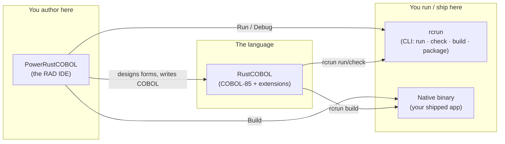
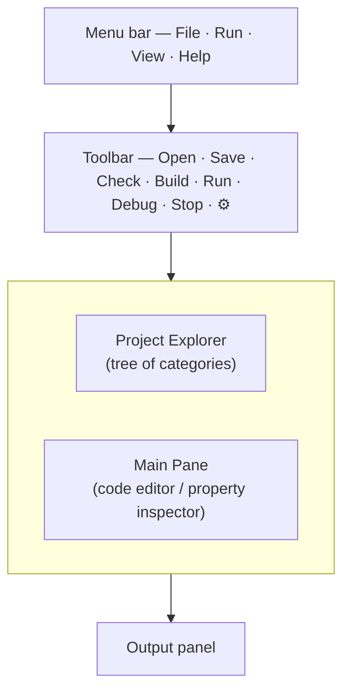
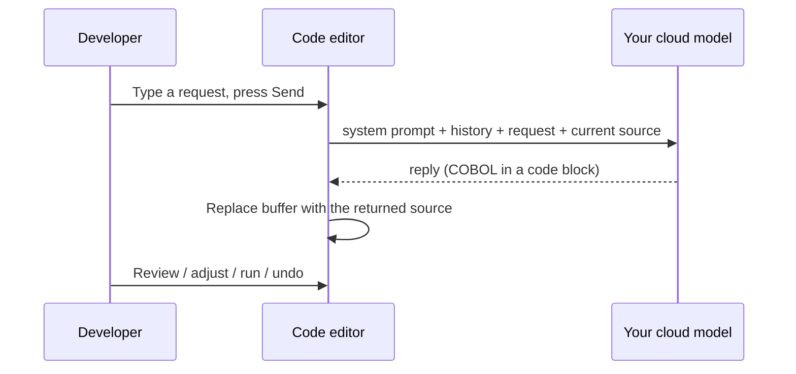
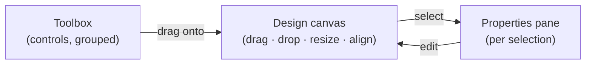
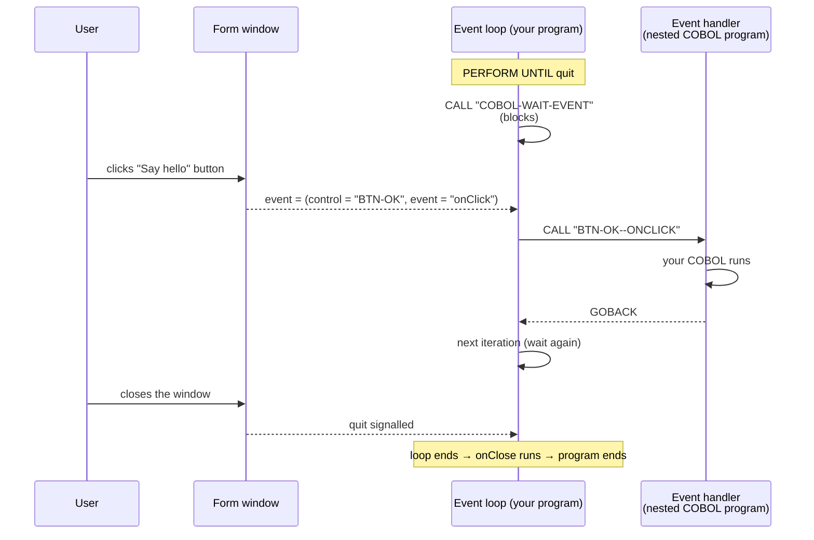
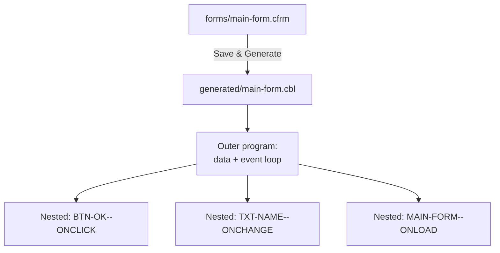
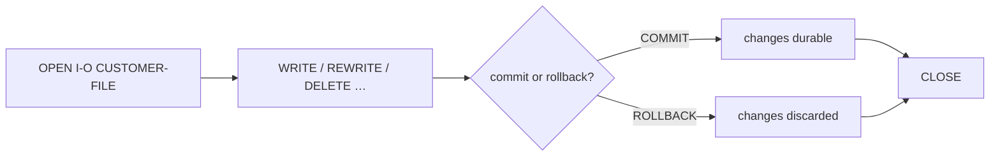
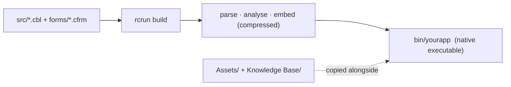

<!--
SPDX-License-Identifier: Apache-2.0
Copyright (c) 2026 Emerson Lopes and PowerRustCOBOL contributors

Licensed under the Apache License, Version 2.0.
See the LICENSE file in the project root for full license information.
-->

# PowerRustCOBOL AI Developer's Guide

> The product name is **PowerRustCOBOL AI** — in the IDE the "AI" is always
> shown in the brand cyan (`#70f3fc`). On-disk folder names
> (`~/PowerRustCOBOL`, project files) keep the original spelling.

<p align="center">
  
</p>

*A practical guide to building graphical COBOL applications with PowerRustCOBOL.*

> **Who this guide is for.** You already write COBOL, and you have built screen
> or window-based applications with a GUI COBOL toolset — for example Fujitsu
> **PowerCOBOL for Windows** or **Veryant isCOBOL**. You know `IDENTIFICATION
> DIVISION`, `PERFORM`, `OPEN`/`READ`/`WRITE`, indexed files, and the idea of a
> *form* with *controls* that raise *events*. This guide maps those instincts
> onto PowerRustCOBOL and shows you everything that is new. **No prior knowledge
> of the host implementation language is assumed or required** — you will never
> need to read or write anything other than COBOL to build an application.

---

## Table of contents

1. [What PowerRustCOBOL is, and why it exists](#1-what-powerrustcobol-is-and-why-it-exists)
2. [The three pieces: RustCOBOL, PowerRustCOBOL, rcrun](#2-the-three-pieces)
3. [Installing and launching](#3-installing-and-launching)
4. [Your first application: Hello, Form](#4-your-first-application-hello-form)
5. [The IDE at a glance](#5-the-ide-at-a-glance)
6. [Projects and the project model](#6-projects-and-the-project-model)
7. [The Form Designer (RAD)](#7-the-form-designer-rad)
8. [The control catalogue](#8-the-control-catalogue)
9. [Properties](#9-properties)
10. [Event-driven programming](#10-event-driven-programming)
11. [Talking to the UI from COBOL](#11-talking-to-the-ui-from-cobol)
12. [Generated code](#12-generated-code)
13. [The RustCOBOL language](#13-the-rustcobol-language)
14. [Indexed files — a first-class resource](#14-indexed-files--a-first-class-resource)
15. [SQL databases](#15-sql-databases)
16. [HTTP / REST and AI agents](#16-http--rest-and-ai-agents)
17. [The command line (rcrun)](#17-the-command-line-rcrun)
18. [Building a distributable binary](#18-building-a-distributable-binary)
19. [Debugging](#19-debugging)
20. [Appearance and internationalisation](#20-appearance-and-internationalisation)
21. [COBOL Structure and shared data](#21-cobol-structure-and-shared-data)
22. [Caveats and current limitations](#22-caveats-and-current-limitations)
23. [Appendix A — Coming from PowerCOBOL / isCOBOL](#appendix-a--coming-from-powercobol--iscobol)
24. [Appendix B — Glossary](#appendix-b--glossary)

---

## 1. What PowerRustCOBOL is, and why it exists

For decades, the only way to write **windowed, event-driven COBOL** was to buy a
proprietary toolchain tied to one operating system, one vendor, and one
licensing model. Those tools were excellent in their day, but most are now
Windows-bound, closed, and increasingly hard to deploy on modern machines. A
generation of business logic — payroll, inventory, banking back-offices — is
written in that style and has nowhere modern to go.

**PowerRustCOBOL exists to give that style of development a fresh, open home.**
It is a Rapid Application Development (RAD) environment where you:

- design windows ("forms") by dragging controls onto a canvas,
- attach **COBOL** event handlers to those controls,
- and run, debug, and ship the result as a **single self-contained native
  executable** — no runtime to install on the target machine.

Its design goals, in plain terms:

| Goal | What it means for you |
|------|-----------------------|
| **COBOL-first** | The application *is* COBOL. The designer generates COBOL; your event handlers are COBOL-85 nested programs. You never leave the language. |
| **Cross-platform** | The IDE and the produced binaries are not tied to one OS. |
| **Self-contained** | A built application embeds everything it needs; the end user does not install PowerRustCOBOL. |
| **Modern data access** | Crash-safe indexed (ISAM) files, SQL (SQLite / PostgreSQL / MySQL), and HTTP/REST are reachable through ordinary `CALL` statements. |
| **Open** | Apache-2.0 licensed. |

> **Note.** PowerRustCOBOL is *inspired by* the productivity of classic GUI COBOL
> RADs, but it is an independent, original implementation. Concepts such as
> "form", "control", and "event" are industry-standard; the syntax, file
> formats, generated code, and built-in services described here are specific to
> PowerRustCOBOL and are not compatible with any other vendor's tools.

---

## 2. The three pieces

PowerRustCOBOL ships as three cooperating tools. Knowing which is which removes a
lot of confusion early on.



| Name | Role | Think of it as… |
|------|------|-----------------|
| **RustCOBOL** | The COBOL-85 language dialect plus PowerRustCOBOL's extensions (GUI calls, indexed-file clauses, SQL/HTTP). | The compiler/runtime "language". |
| **PowerRustCOBOL** | The desktop IDE: project explorer, code editor, **Form Designer**, debugger. | The "Workbench" / "Studio". |
| **rcrun** | The command-line runtime, checker, packager, and binary compiler. | The "runtime + build tool" you can script in CI. |

> ⚠️ **Naming caveat.** Internally some build artefacts and folders are named
> `cobolt-*`. That is an implementation detail; the user-facing names are
> **RustCOBOL**, **PowerRustCOBOL**, and **rcrun**.

---

## 3. Installing and launching

> 📷 **Screenshot needed — `install-launch.png`.** Please provide a capture of
> the PowerRustCOBOL application icon in your OS launcher/dock **and** the empty
> IDE window immediately after first launch (no project open). This will anchor
> the "what you should see" expectation for newcomers.

Launch the IDE; on first run you are greeted with an empty workspace and the
prompt *"Open a COBOL file to get started."* You can either open a single `.cbl`
file or create a full **project** (recommended — see §6).

From a terminal you can also drive everything headlessly with `rcrun` (see §17),
which is what continuous-integration pipelines use.

---

## 4. Your first application: Hello, Form

This walkthrough produces a one-button window that shows a message.

1. **Create a project.** `File ▸ New Project…`, give it a name (e.g.
   `HelloPower`) and a main program. The IDE creates the standard folder layout
   on disk **and a runnable starter `main` program** (a tiny `DISPLAY`/`GOBACK`
   you can Run immediately), then opens it in the editor (see §6).
2. **Create a form.** In the project tree, click the **➕** next to **Forms**.
   This opens the *New Form* dialog — set a name (`main-form`), a title, and a
   size, then create. The form is saved under `forms/` and opens in the **Form
   Designer**.
3. **Drop a button.** Drag a **Button** from the toolbox onto the canvas. With
   it selected, set its `Caption` to `Say hello` in the properties pane.
4. **Attach a handler.** Still on the button, find its **`onClick`** event and
   click it to open the COBOL event editor. Type, for example:

   ```cobol
              DISPLAY "Hello from PowerRustCOBOL".
   ```

5. **Run.** Press **Run** on the toolbar (or the ▶ in the designer). The form
   appears; clicking the button executes your handler.

> 📷 **Screenshot needed — `first-form-designer.png`.** Capture the Form Designer
> with the single button selected and the `onClick` event highlighted in the
> properties pane.

> **Note.** When you save or run a form, PowerRustCOBOL **generates** a COBOL
> source file for it (see §12). You never edit that file by hand — it is a build
> artefact.

---

## 5. The IDE at a glance



- **Project Explorer (left).** A tree rooted at your project. Six fixed
  categories — **Forms**, **Indexed Files**, **Common Code**, **Generated Code**,
  **Assets**, **Knowledge Base** — each with a **➕** button. To the left of each
  item is a **status "knob"**: 🟢 green = checked/tested OK, 🟡 yellow = changed
  since last check, 🔴 red = a problem was reported. Forms expand to show their
  controls, grouped by toolbox category, and each control expands to its
  **Events**. Indexed Files expand to show record fields (like form controls).
  **Click the root node at the very top** (📁 YourProjectName) at any time to
  bring up the full project settings form in the main work area.

#### Organising the project tree with folders

Every category can hold an arbitrary hierarchy of **folders**, so large,
enterprise-grade projects stay navigable (for example `forms/customers/`,
`src/billing/`).

- **Create a folder.** Click the **📁+** button on a category header to add a
  folder at its root, or right-click any folder and choose **New folder…** to
  nest one inside it.
- **Rename a folder.** Right-click the folder and choose **Rename folder…**.
  Every file the project tracks under that folder — and any open editor tab
  pointing at one — follows the change automatically.
- **Delete a folder.** Right-click and choose **Delete folder…**. After you
  confirm, the folder and **everything inside it is permanently removed from
  disk**, the files are dropped from the project, and any editors showing them
  are closed. This cannot be undone.

Folder paths are always stored **relative to the project folder**, so a project
can be moved, zipped, or shared without breaking any references.

#### Moving files: drag-and-drop

- **Within the tree.** Drag a file onto another folder (or onto a category
  header) to move it there; the file is moved on disk and its project entry is
  updated. A file cannot overwrite an existing one of the same name, and a
  folder cannot be dropped into itself.
- **From the operating system.** Drag files from Finder/Explorer onto a folder
  or category to import them. They are copied into the project and tracked with a
  relative path. A file whose type does not match the destination category (for
  example a `.cfrm` dropped on Common Code) is rejected.

#### Keyboard navigation

With the pointer over the project tree you can move around without the mouse:

- **↑ / ↓** — move to the previous / next visible row. The element loads
  immediately (its properties or editor, just like a single click), and the tree
  scrolls as needed to keep the highlighted row in view, one row clear of the top
  or bottom edge.
- **→** — expand a collapsed folder; if it is already open, move into its first
  child.
- **←** — move up to the parent folder.
- **Enter** — open the selected item (the same as a single click).

On first launch (or any time no project is open) the IDE shows a single full
welcome pane that is a single centered block of information (title + license +
one blank line + quote + author) in the middle of the available area below the
menubar/toolbar:

Welcome to PowerRustCOBOL <version>
License: Apache 2.0

<blank line>
<quote text in green, randomly selected on each cycle from a built-in list>
— <author in light blue>

The quote cycles randomly every 7.5 seconds (1 s fade-in, 6 s visible, 0.5 s fade-out). The left tree, editor, output and editor-specific controls are hidden until you use File → New Project or File → Open Project. Once a project is open the normal three-pane workspace appears. The full guide is available in the docs/ folder.
- **Toolbar (top).** `Open · Save · Check · Build · Run · Debug · Stop`, plus
  language selector on the far right. *Run* interprets the program; *Build*
  compiles a native binary; *Check* runs parse + semantic analysis only;
  *Debug* is enabled when a Generated Code item is selected.
- **Main Pane (centre / right of the tree).** Shows the code editor, the
  **property inspector** (when you click a form or control in the tree), **or
  the project settings form** (when you click the project root at the top of
  the tree, or automatically when the IDE first opens a project — with no
  editor visible). The **👑 Grace** button above the project tree opens the
  project-wide Grace chatbot in this pane. It uses the exact same glass pane
  construction
  (CentralPanel + glass frame) as the control properties inspector for
  consistent width (no shortfall at the right border) and full 100% height
  behaviour (the pane grows/shrinks with the available area above the Output
  panel on window or splitter resize). The card's rounded bottom border/stroke
  is kept clearly above the output/console with a visible gap via the frame's
  bottom outer margin; the Save/Cancel buttons sit at the bottom of the card.
  Click the top of the project tree (the 📁 ProjectName line) at any time to
  open it. It has a single continuous vertical resizer line running
  top-to-bottom through the content. Labels on the left never word-wrap; they
  are truncated with `…` (e.g. `Standard system p…`) and the developer can
  drag the resizer freely (the split moves independently of any label length,
  up to 80 % of the pane width). Controls on the right are elastic and all
  start at the same x position after a 10 px gap, giving perfect vertical
  alignment of every property value. Sections: Project, License, Appearance,
  AI assistant, Runtime. Explicit **Save** and **Cancel** buttons at the bottom
  of the card (Cancel enabled only after changes; reverts to last saved). The
  resizer line follows the current theme (brighter when hovered or dragged).
  The code editor (when visible) carries a **status bar** along the bottom —
  caret `Ln, Col`, the **Insert/Overwrite** mode (toggle with the `Insert`
  key), a **Trim on save** toggle (strips trailing whitespace when you save),
  and, for non-Markdown documents, a **Beautify** command that reformats the
  COBOL to the layout rules described in *Beautify — the layout rules* below.
  Markdown files omit Beautify because COBOL formatting does not apply to
  them.

> 📷 **Screenshot needed — `project-settings-form.png`**. Show the left tree
> with the root node highlighted (hand cursor), and the main area with the
> two-column settings form inside its glass card (single continuous vertical
> resizer line, labels truncated with … before the line, all value controls
> aligned on the right, Save/Cancel at the bottom of the card). The card's
> rounded bottom border must be clearly visible above the Output panel with a
> gap (no border going under the console). Note the theme colours on the
> resizer and that it can be dragged well past the longest label ("Standard
> system prompt:").

- **Output panel (bottom).** Program `DISPLAY` output, build logs, and status
  messages.

> 📷 **Screenshot needed — `ide-overview.png`.** A full-window capture with a
> project open, a form selected (so the property inspector is visible), and some
> text in the Output panel. Annotate the four regions if you can.

### The AI assistant (optional)

PowerRustCOBOL can put a cloud language model — one you provide, ideally trained
on this documentation — right above the code editor. The assistant is **entirely
optional and off by default**: until you fill in the connection details, the
prompt bar never appears.

**Configure it via the project root settings form.** Click the top node of the
project tree (the 📁 line with your project name). In the **AI assistant** section
of the form you can enter the connection details. AI behavior and agents belong
to the open project and travel in its `cobolt.toml` and `agentic_ai/` directory;
provider configuration and API keys are machine-local and never travel in a
repository:

| Field | Meaning |
|-------|---------|
| **Endpoint URL** | The full model URL. Use an OpenAI-compatible chat endpoint such as `https://…/v1/chat/completions`, or the xAI/Grok Responses endpoint `https://api.x.ai/v1/responses`. An untouched provider default receives its conventional request path automatically; after you edit this field, the IDE uses the URL exactly as entered. |
| **API key** | Sent as `Authorization: Bearer …`. Leave empty for a key-less local endpoint. A key entered here configures its **provider**, exactly as the Model Providers Manager does, and is stored only on this machine. An empty field means no credential is stored for that provider here. |
| **Model** | The model identifier passed in each request. |
| **Reviewer model (Pedantic Agent)** | Optional second model that reviews the primary agent's answers with uncompromising scrutiny. If set, it must differ from the primary model (the IDE enforces this). With a reviewer configured, the **COBOL Proficiency** check runs in tandem: the primary model answers, the Pedantic Agent reviews it against the primary prompt as the authoritative specification, demands a full corrected resubmission when defects are found, re-reviews the revision, and produces the final brutally honest assessment — the dashboard then shows the *reviewer's* scores, not the model's self-scores. |
| **Temperature** | Sampling randomness (0 = deterministic). The connection test uses this exact value because some models accept only their provider-defined default, commonly `1.0`. |
| **Standard system prompt** | The instructions sent on every request. A sensible default is provided; edit it to suit your model. |

**Model Providers Manager.** Next to *Manage agents…* in Project settings is
**Model Providers Manager…**. You configure a **provider** here — its endpoint
and its API key — and nothing else. From the moment a provider's key works,
**every model that provider offers becomes available** to any agent; there is
no per-model setup to do. Pick a provider from the list on the left (a filled
dot marks one that is configured), adjust its endpoint if you need a different
host, paste the key, and use **Refresh models** to pull the current catalogue.
**Test** sends one request so you can confirm the credential before relying on
it.

Provider configuration is **machine-wide**, stored beside your other
machine-local settings rather than in the project. Configure Anthropic once and
every project on this machine can use it. The API key is **never** written into
a project file, generated COBOL, or a compiled or packaged application. A local
Ollama needs no key at all — a reachable endpoint is enough.

> **Note.** This replaces the older *Models Manager*, where a connection was
> defined once per *model* as a named "model profile" and agents referenced it.
> Using a second model from a provider you had already paid for meant building
> a whole second profile and pasting the same key again.
>
> **Your existing projects migrate themselves.** The first time you open one,
> each agent takes over the provider, model, temperature, output-token cap and
> timeout of the profile it referenced, and each provider is configured from
> what those profiles knew. Nothing is asked of you and nothing needs
> re-entering. ⚠️ One provider can now hold **one** key, so if you had several
> profiles on the same provider with *different* keys, the most recently stored
> one is kept and the others are named in the Output panel — re-enter one in
> the Model Providers Manager if it was the one you wanted.

**Agents Manager.** The *AI agents* row opens the project's provisioned agent
database, in three tabs.

**Tab 1 — Agent × Model.** One row per agent — Grace, every specialist, every
reviewer and the COBOL Proficiency Judge — with the things that decide how that
agent runs.

| Column | Meaning |
|--------|---------|
| **Agents** | The agent the row configures. |
| **Models** | Which model it runs on, chosen from the provider selected in the **Model provider** box above the table. Choose **— no model —** to leave an agent unconfigured on purpose. |
| **Rating** | What the Leaderboard knows about that model, or *Not tested* if it has never been benchmarked. |
| **Temp** | Sampling randomness for this agent alone (0 = deterministic). |
| **Output Tokens** | The largest answer this agent may produce. |
| **Timeout** | How long to wait for it, in seconds. |

The **Model provider** box is a *picker scope*, not a project-wide switch. It
decides which provider's models the Models column offers while you are
configuring, and changes no agent that you do not touch — so Grace can run on a
cloud provider while your specialists run a local Ollama. Each agent remembers
the provider its model came from. With hundreds of models on offer from some
providers, the search box beside the picker narrows the list.

A row whose model is reserved for another role shows a warning beside the agent
name: a specialist may not run Grace's model, nor the Judge's. (The Judge *may*
share Grace's model, as long as no specialist is on it.)

**Tab 2 — Agent Configuration.** The agent list on the left drives the detail
pane on the right: **Agent Details** (id, name, kind, specialisation, purpose,
enabled), the prompt editor, capabilities, knowledge and relationships.

**Tab 3 — User Guide.** A written guide to how models and agents fit together,
in your interface language. Each of its four sections opens with a plain
explanation, then goes deeper, then states the precise version — read as far as
is useful and stop. It covers pairing agents with models and the sharing rule,
what each setting does, why your strongest model belongs on the reviewers and
the Judge rather than the writer, and the vocabulary (models, agents, Pedantic
reviewers, the Judge, tokens and what they cost, local models, quantization,
and why VRAM is the number that decides whether a local model is usable).
Search highlights matches and steps between them, the text size is adjustable,
the table of contents jumps, and **Export PDF** writes the whole guide out.

The footer carries **Cancel**, **Apply** (save and keep working) and **Save**. The internal `agentic_ai/` directory is intentionally hidden from
the project tree; use Agents Manager for agent configuration while Grace keeps
its workflow records there automatically. The prompt editor is vertically
resizable from four to twenty text rows; longer prompts scroll inside the
editor rather than increasing its height. **New Agent** and **Delete Agent**
are currently hidden because the complete built-in mesh is created and repaired
with the project. Both workflows remain implemented for future maintenance.
An agent lives in your project at `agentic_ai/<agent name>/` — the multi-line
agent prompt in `<agent name>_prompt.md`, plus `steering/`, `policies.md`,
`skills/`, `mcp.json`, `knowledge/`, and `agent.json` (identity and runtime
configuration — the API key is **never** stored in the project; keys stay on
your machine, asked once per model). Agent names are unique and fixed at
creation, because they name the folder. Every primary agent may name a
**pedantic companion** that reviews its responses — a primary and its own
companion must use different models, while unrelated agents may share models
freely. The relationship is one-to-one: an orchestrator or specialist can have
at most one Pedantic companion, and a Pedantic reviewer can belong to at most
one reviewed agent. Select the relationship from either the primary agent's
**Companion (Pedantic reviewer)** section or the Pedantic agent's editable
**Pedantic Companion for** section; both selectors write the same project
configuration. Grace's planner and the participating agents receive the exact
relationship at runtime, so a reviewer cannot be substituted or reused for a
different agent. Project creation provisions the fixed specialists — the
**Form Designer Agent**, **COBOL Event Handler Script Agent**,
**Documentation Agent**, **Data (Indexed File) Agent**, and **Version Control
Agent** — plus **Grace**, the orchestrator. Each is immediately followed by its
own reviewer, whose canonical name is the primary name suffixed with **Pedantic
Reviewer**:

- **Grace Pedantic Reviewer**
- **Form Designer Agent Pedantic Reviewer**
- **COBOL Event Handler Script Agent Pedantic Reviewer**
- **Documentation Agent Pedantic Reviewer**
- **Data (Indexed File) Agent Pedantic Reviewer**
- **Version Control Agent Pedantic Reviewer**

Every reviewer is created with a purpose-specific prompt, description, routing
contract, and one-to-one companion link. The developer selects its model
profile and may tailor its prompt, skills, tools, and knowledge; no reviewer
must be built or associated manually. Opening an existing project runs the same
idempotent repair: a missing built-in reviewer is recreated and relinked, while
non-empty project prompts and other developer configuration remain
authoritative. Older reviewer names are migrated in place without changing
their stable IDs or selected profiles.

Grace remains the single coordination
authority (👑, always named Grace, never deletable) that plans multi-agent
work, delegates to specialists by kind and specialization, enforces every
pedantic review gate, and assembles the final validated result. The default
prompt for **Grace Pedantic Reviewer** reviews request coverage, task
decomposition, ownership, dependencies, documentation governance, evidence,
cross-agent integration, failures, and completion claims. The project-local
reviewer prompts remain editable in Agents Manager and fixed-agent repair
preserves those edits. Give each reviewer a model in the runtime table before
enabling its review connection; a primary and its Pedantic companion cannot use
the same model.

The built-in routing contracts are explicit: Form Designer Agent owns RAD form
design and delegates event implementation; COBOL Event Handler Script Agent
implements those exact delegated behaviors; Documentation Agent alone writes
project documentation and prepares normalized indexed-file schema handoffs;
Data (Indexed File) Agent alone maintains `.cidx` definitions through the
Indexed File UI model; Version Control Agent owns evidenced project Git
operations and confirmation gates; and Grace Pedantic Reviewer reviews only
Grace's orchestration. Each agent receives a role-specific default prompt.
Empty or known legacy defaults are repaired,
while non-empty project-edited prompts remain authoritative. Existing
`DocumentationAgent`, `Pedantic Grace Reviewer`, `Grace Pedantic Reviewer
Agent`, `Pedantic UI Agent`, and `Pedantic COBOL Companion` records are renamed
on disk without changing their stable IDs or their models. A redundant
`Orchestrator Pedantic Reviewer Agent` is merged into **Grace Pedantic
Reviewer** and removed.

The **👑 Grace** button above the project tree fills the current tree-pane width
(with a 150 px minimum) and follows the pane when you resize it. It opens a
project-scoped conversation in the Main Pane, with persistent history, workflow
progress, and approval controls for gated operations.
Its property-pane header identifies it as
**👑 Grace - The PowerRustCOBOL Agentic AI Orchestrator**.

**Choosing where things go.** Because the project tree supports folders, a name
can exist in more than one place. When you ask Grace to **create** an element
(a form, indexed file, common-code source, documentation file, or asset), it
opens a small centered window showing the project tree so you pick the
destination **folder** — you can also create a new folder there on the spot.
When you ask Grace to **edit** an element by name and more than one element
shares that name, the same window lets you pick **which one**; if only one
matches, Grace just edits it. Cancelling the window stops the operation, and
Grace reports that nothing was created or edited. (This prompt appears in the
full project Grace chat; the compact editor/designer chat surfaces cannot show
it, so an ambiguous request there asks you to use the project Grace chat.)

Every IDE chatbot routes through Grace. The surface supplies an advisory
preference: the RAD Form Designer prefers the Form Designer Agent, its event
editor prefers the COBOL Event Handler Script Agent, and the code editor asks
Grace to select by capability. The preference is never exclusive. Grace can
split a request across any enabled specialists, so a request to create a button
and wire its `onClick` behavior can coordinate both form-design and event-handler
tasks. Each workflow runs its configured pedantic reviews, streams progress,
and saves an auditable record under `agentic_ai/Grace/runs/`.

**Live action status.** While Grace and the specialists work, the conversation
shows what each agent is *doing* right now as a short status line — for
example `Form Designer Agent: Drafting response — T1` or
`Grace: Retrieving context` — updated at most once per second so long runs
never look stuck. Every step also lands in an **Agent actions (N)** entry that
stays collapsed in the conversation; expand it to review the ordered,
per-agent sequence of steps the run took, and it is saved with the chat
history and the workflow record, so it remains reviewable after you reopen the
project. Status lines name **actions only** and are shown in your interface
language. The content an action produced or consumed — retrieved knowledge,
tool output, model reasoning — never appears in the conversation: the full
trace lives in the Output panel's AI log, the diagnostics dump (when a debug
switch is on), and the saved run record under `agentic_ai/Grace/runs/`. With
the project's **verbose** AI setting enabled, the action stream gains finer
steps (per tool call, per review round) — more granularity, still never
content. Verbose mode also appends a **Token savings** line to the
conversation after each run — the percentage of the indexed Knowledge Base
corpus that retrieval kept *out* of the context (retrieved records vs. the
whole corpus, estimated at ≈4 characters per token) — so you can see what the
retrieval layer is buying you.

**Chunked retrieval.** Knowledge Base documents are indexed twice: whole
documents (for document management) and as a **chunked store** where every
control, property, method, event, and prose section is its own record with a
`PIC X(512)` content field — longer content continues in records linked to
the previous one, and search reassembles the chain. Each record's text is
embedded individually, so when you ask Grace about, say, DataGrid events, the
context receives the DataGrid records — not the whole controls catalogue.
The IDE's own reference material lives in `~/PowerRustCOBOL/data/chunked.data`;
each project keeps its documentation in `data/<project-name>-chunked.data`.
Saving, editing, or deleting a Knowledge Base document keeps the file itself
untouched and re-chunks and re-embeds only that document's records on the
next run.

The IDE's chunked store **ships inside the IDE itself**, pre-embedded with
the semantic model: a fresh clone or install starts with its index ready and
never re-embeds the reference material unless a Knowledge Base document is
removed, changed, or replaced. On a machine that has not downloaded the
semantic model yet, the shipped records are preserved and searched lexically
until the model arrives — nothing is thrown away. Whenever records do need
(re)embedding — a changed document, or your own project documentation — the
conversation shows a **progress bar** (`Indexing Knowledge Base (n of m
records)`) so a long index never looks stuck.

## Window effects

Every project can give its windows a signature **entrance and exit effect**,
configured once in the project settings (Appearance section) and applied to
**all** the project's forms: pick an effect, a duration (100–3000 ms; the
Matrix rain uses its own 1500–4000 ms band, and Transporter II is fixed at
exactly 4000 ms) and an easing for each
direction. The catalogue ranges from classic transitions — fade, a
dBASE-style box **zoom**, slides, expand-from-title-bar — through masked
reveals (**radar wipe**, iris, venetian blinds, checkerboard) to the
**Matrix falling code** rain (classic katakana and digit glyphs falling in
from above the top edge over a completely see-through window; each line's
end of trail — the faint top glyph — walks down its band and progressively
uncovers what stands behind it, so the form is complete exactly when the
last character leaves. Lines arrive on a real clock, the first ones 25 ms
apart and the rest 10–25 ms behind each other at their own speeds; this one
effect ignores the easing setting and runs on linear time), a
genie-style squash, and **Transporter II**. New projects start with the
Matrix entrance and no exit effect; projects created before this feature keep
instant windows until you choose otherwise.

**Transporter II** is a cinematic materialisation reveal, and the one effect
with a fixed length: it runs for exactly **4000 ms**, in two phases.

1. Two thin horizontal beams, each about half the form's width and
   horizontally centred, start **overlapped on the vertical centre line** and
   separate — one climbing to the top edge, one falling to the bottom. The gap
   opening between them fills with a dense cloud of white and yellow particles
   that flicker, drift and glow at varying opacity: an energetic but wholly
   transparent materialisation field.
2. As the horizontal beams land on the edges they fade out, and two
   **full-height vertical beams** fade in at the horizontal centre. Those sweep
   outward to the left and right edges, and your form is revealed in the band
   widening between them, the particle cloud dissolving wherever a beam has
   passed. Through the closing stretch the particles, the glow and the beams
   themselves ease down to nothing, so the light is gone at the instant the
   beams reach the borders and the finished form stands alone.

Every beam is a layered translucent gradient — white on its axis, warm yellow
at its flanks, wrapped in a soft bloom — never a solid bar or a hard-edged
line. The effect plays over a see-through window, so the form is revealed
against your desktop rather than against a filled rectangle. As an exit it runs
the whole sequence backwards and **dematerialises** the form, which makes it
the one effect worth setting in both directions: the same beams that put a
window on screen take it away again.

> **Note.** The duration spinner is fixed at 4000 ms for this effect, and the
> easing setting does not apply — the two phases, the beam hand-over and the
> final fade are all cut to that one clock, and stretching or easing it would
> slide them off their beats. This is the same reasoning that makes the Matrix
> rain run on linear time.

While an entrance or exit effect runs, the window wears **no title bar**, so
nothing stands still while the animation plays; the bar arrives together with
the finished form (and only if that form was designed to show one). The
effects that simply move, scale or fade the form's own face — fade, zoom, the
slides, expand-from-title-bar and genie — go further and open a **see-through
window**, so the form animates loose on the desktop, and so do the Matrix
rain (it paints the form only down to each falling line's tail, so untouched
ground is never painted at all) and Transporter II (it reveals the form by
clipping to the band between its beams, so ground the beams have not reached
is never painted either). On those windows the form's **Transparency**
property also reaches the desktop for real, and macOS draws no drop shadow
around the window (it would outline the invisible window, and the platform
only offers that switch when the window is created). Only the masked reveals
keep an opaque window: they hide the form by painting covers over it, which
nothing transparent can undo.

Forms never pick their own effect — one look per project — but any form can
**opt out** with the `WindowEffects` checkbox in its Form properties (a modal
alert can appear instantly while the rest of the app animates). The entrance
plays on a window's first opening; enable **"Play entrance when restored"**
to also replay it when the user restores a minimized window (a visual replay
only — no form events fire). Control load-time animations wait for the
entrance to finish, so the window materialises first and the controls come
alive immediately after; the COBOL `onLoad` timing is unchanged.

A control that *has* a load-time animation is **held back until the entrance
finishes** — it is not painted into the entrance at all, and it arrives under
its own power the instant the effect ends. That is what you want: a button set
to fly in from the left should not already be sitting in place while the window
materialises, only to jump back to the left edge and travel in a second time.
Controls with no load animation appear with the window, as always.

> ⚠️ **Before 1.61.5** every control was painted into the entrance, so an
> animated one did materialise with the window and then fly in again. If you
> designed around that by giving a control a delay, remove the delay.

An exit effect plays before the window actually closes — but a form in
`Waiting` FormState refuses the close *before* any animation, so a vetoed close
plays nothing, and `onClose` still fires exactly once at the real close.

Effects play in **every host of your form**: Run Form from the IDE and the
**built application** alike (both run the same window host, so what you see
under Run Form is what your users see from the executable in `dist/`). The
settings travel into the binary at build time — a shipped application needs
no project file beside it. The same is true of the designed **window
properties and lifecycle**: the built application opens with the form's own
title (falling back to *"AppName vVersion"* only when the designed title is
blank), honours `TitleVisible`, the minimize/maximize buttons, full screen,
the opening WindowState and StartPosition, closes its window when the program
ends (through the exit effect, when one is set), and fires
`onShow`/`onActivate`/`onClose` exactly as Run Form does.

Two practical notes. Effects paint inside the window: with the native title
bar visible, the animation covers the content area; a chromeless form
(`TitleVisible` off) with transparency gives an effect the whole window
rectangle. And a machine-wide kill-switch lives in **Help → Debug Settings →
"Disable window effects"** — instant windows everywhere without touching any
project, for motion sensitivity, weak GPUs, or automation
(`PRC_NO_WINDOW_FX=1` does the same for a bare `rcrun run-form` **or a built
application**, which honours the same variable).

**Embedding device.** One policy covers the System KB and every project KB,
for indexing and searches alike: when a supported GPU is available the
embedder uses it at **full speed** — Metal on macOS, CUDA on NVIDIA
Linux/Windows (a build made with the `embed-cuda` option) — and otherwise it
falls back to the CPU in **low-power** mode, capping its compute threads at
two so a long reindex stays quiet instead of pinning every core. Power
users can override either side: set `RAYON_NUM_THREADS` to choose the CPU
thread count, or `PRC_EMBED_DEVICE=cpu|metal|cuda` to force a backend (a
forced GPU that fails still falls back to the CPU rather than crashing).
The active device is shown in the Models modal next to the semantic model's
status, and printed by the command-line reindex (`embedding device: …`).
AMD and Intel GPUs on Linux/Windows are not supported by the inference
backend and use the CPU path.

When the agent **repositions controls** on a form, the affected controls
**glide** from their old places to the new ones — all at once, over about a
second — so you can see the layout change take shape instead of the controls
jumping. The animation is purely visual: the form and its generated code hold the
final positions immediately.

Every chatbot composer keeps **Send** immediately to the right of its prompt.
The prompt consumes the remaining width while the command stays visible as the
chat pane is resized; multiline composers do not move Send to a row below.
Completed agent-response balloons include icon-only **Copy** and **Save as
Markdown** commands with hover tooltips. Save opens in the current project's
`Knowledge Base/` folder, requires the destination to remain inside that folder,
writes a `.md` file, indexes it in the project's vector Knowledge Base index, and
refreshes the Knowledge Base branch of the project tree. Developer messages,
static welcome text, and in-progress streaming balloons do not show these
response actions.

Grace distinguishes read-only conversation from project work. Capability and
help questions such as **What can you do?**, together with requests to describe,
explain, summarize, compare, suggest, or recommend, receive a direct Markdown
response without creating a synthetic workflow. Markdown is the expected
chatbot format for these passive requests and is not rejected for lacking
workflow JSON. If a request also asks Grace to create, modify, save, delete,
implement, or otherwise change project resources, it requires executable
workflow JSON. Named project agents use only their project-defined prompts;
mesh transport never appends an unrelated
CodeGenerator, FormsDesigner, or EventBinder preamble. If an actionable request
returns malformed workflow JSON, Grace receives one explicit correction
request. A second malformed result opens the error modal and records both
parser failures plus the complete corrected payload in the IDE log.

> 📷 **Screenshot needed — `project-grace-chat.png`**. Show the width-responsive
> 👑 Grace button above the project tree and the project-wide Grace conversation
> open in the Main Pane, including transcript, prompt, and conversation controls.

An empty Grace conversation opens with practical examples for Indexed Files,
CRUD forms, data-bound DataGrids, and the plan → tasks → implementation workflow.
For durable project documentation, Grace always delegates to the fixed,
non-deletable **Documentation Agent**. It is the only specialist allowed to
format, create, or update project documentation. Domain specialists prepare the
authoritative source material; Grace expresses that handoff as task
dependencies, and the workflow supplies each approved source output to the
Documentation Agent. For example, a request to document a form first asks the
Form Designer Agent for the controls, layout, bindings, and events, then asks
the Documentation Agent to format and save that approved material. The
Documentation Agent must not invent missing domain facts.

The Documentation Agent can create, read, and list text documents only under the
project's `Knowledge Base/` folder. Successful writes are
immediately tracked by the project and indexed in the project-local vector
index at `data/project-knowledge.redb` (pure Rust, embedded). Grace validates this
coordination structure before execution and requests one corrected plan when a
documentation workflow assigns writing to another specialist or omits a
required source dependency.

Before every Grace request, including a read-only question, the IDE synchronizes
textual files added to the project Knowledge Base by either Grace or the
developer and searches the project-local index. Relevant excerpts take
precedence over general model training for project-specific answers, and Grace
cites their project-relative paths. When the Knowledge Base has no relevant
evidence, Grace says so, labels any general guidance, and asks for missing
project facts rather than inventing them. Every specialist receives governed,
read-only `knowledge.search` access so approved plans, requirements, task lists,
and prior project decisions can be retrieved in later work.

Indexed-file work uses a mandatory two-specialist handoff coordinated by Grace.
Documentation Agent first obtains a missing file name, derives the file purpose
from the request, searches project knowledge, and analyzes the structure under
First (1NF), Second (2NF), and Third (3NF) Normal Forms. It identifies every
helper indexed file needed to remove repeating groups, partial dependencies, or
transitive dependencies. For each ID field it asks the developer to choose
**UUID** or provide an exact COBOL **PIC** definition; the agents never select an
ID representation by assumption. Missing decisions produce a clarification
instead of a file mutation.

Preparing, proposing, or normalizing this schema handoff is Documentation
Agent analysis, not indexed-file mutation. Only an actual `indexed_file.write`
or explicit `.cidx` save is mutation reserved for Data (Indexed File) Agent.

After that schema handoff passes Documentation Agent's Pedantic review, Grace
delegates each definition to **Data (Indexed File) Agent**. This specialist can
list, inspect, and write indexed definitions only through governed
`indexed_file.*` tools backed by the same model used by the Indexed File UI. A
successful write validates the record and keys, saves the `.cidx`, regenerates
the indexed COBOL and copybooks, initializes data only when the assigned data
file does not already exist, and refreshes the project's Indexed Files tree.
Existing indexed data is never truncated during schema maintenance. Each helper
relation is a separate definition. A finalized definition keeps the Indexed
File UI's structural lock; the developer must explicitly unfinalize it in the
UI before an agent can change its schema. Every result must pass **Data (Indexed
File) Agent Pedantic Reviewer** before Grace reports completion.

**Specialists execute their tools.** Under Grace, agents don't just describe
work — they carry it out, but only through governed, evidenced channels. An
agent may call only the tools it has been granted (its `mcp.json` / capabilities);
an undeclared or invented tool is treated as a critical defect that fails the
task. When the **Form Designer Agent's** work is *approved* by its pedantic
companion, its result is applied to the open form as **one undoable change**
through the same reviewed preview/apply path you use by hand — never by silently
rewriting the form. The Form Designer can also *look* at the live form (a
read-only view of the rendered widgets) to check its work; it never edits by
driving the UI. The **Version Control Agent** runs real Git **inside your open
project's repository only** (never PowerRustCOBOL's own): everyday, local
operations (status, diff, log, add, commit, branch, checkout, stash) run on their
own, while anything that reaches the network or rewrites history — push, fetch,
pull, rebase, `reset --hard` — **pauses for your explicit approval**, showing you
the exact command before it runs. Every tool call, with its real output and exit
status, is recorded in the workflow record; a command that fails is reported as a
failure, never glossed as success.

A **Test connection** button sends a tiny request to your endpoint and reports
whether the model is reachable and the key/model are accepted — use it to
confirm the setup before relying on it. The assistant becomes available as soon
as **Endpoint URL** and **Model** are both set. Clear the endpoint to hide it
again.

**Using it.** Open a COBOL file, type a request in the prompt bar (for example
*"add a paragraph that totals WS-LINES and DISPLAYs it"*), and press **Send**.
The model receives, in this order:

1. your **standard system prompt**;
2. the **conversation history** for *this file* (it is remembered between
   sessions, per source file);
3. your **request** together with the **current source** of the file.

When the reply arrives, PowerRustCOBOL extracts the COBOL from it and **updates
the editor buffer in place** — so you can immediately review, tweak, run, or
undo (Ctrl/Cmd-Z) the result like any other edit. The running transcript is
shown under the prompt bar (💬), and **Clear conversation** (🗑) forgets the
history for that file. Read-only Generated Code is never modified.

**Also in the inspector.** The same prompt bar appears above the inline
form/control inspector, with the form's **generated COBOL** as its (read-only)
context — handy for asking how to wire an event handler. Because generated code
is never hand-edited, replies there are shown in the transcript for reference
rather than applied.

**Where the conversation lives.** History is *not* kept in a hidden cache — it is
stored in the project's `data/` folder in PowerRustCOBOL's **own indexed (ISAM)
file** (`data/conversations.dat`), the very `ORGANIZATION IS INDEXED` format your
COBOL programs use, keyed by the source file's relative path. (We dog-food our
own runtime.) Conversations therefore travel with the project and require an open
project to persist; without one, the assistant still works but only for the
current session.



> 📷 **Screenshot needed — `ide-ai-assistant.png`.** The code editor with the AI
> prompt bar visible above it and an expanded conversation transcript.

> **Privacy note.** Your prompt, the conversation history, and the **full source
> of the open file** are sent to whatever endpoint you configure. Point it only
> at a model you trust.

### Reading the docs in the IDE (Help → Documentation)

**Help → Documentation** opens a dedicated window that renders this guide and the
other PowerRustCOBOL manuals — including their **Mermaid diagrams**, drawn inline
(rendered in pure Rust, no browser required). The docs are bundled with the IDE,
so it works offline; `Cmd+O` opens any local Markdown file too.

The window has a searchable **document list** on the left and the rendered
document on the right, plus an **icon toolbar** and **File / View / Help** menus.
In-document **search** highlights matches (blue on yellow); press **Go** or
**Enter** to jump to the first match and **◀ / ▶** (or `,` / `.`) to step through
them with a live `n/total` counter. The **table of contents** is clickable — both
the side **outline** and the in-document `[…](#…)` links jump to their section.
You also get an adjustable **font size** that is *remembered between sessions*,
zoom, full screen, keep-on-top (`⌘T`), open a local Markdown file (`⌘O`), and a
view-source modal (`⌥⌘U`). **Print** (`⌘P`) exports the document — Mermaid
diagrams included — to a PDF and opens it in your OS viewer, where the system
print dialog is one click away. The window is a translucent **frosted-glass**
panel and follows the IDE's theme and language.

---

## 6. Projects and the project model

A **project** is a folder containing a manifest file, `cobolt.toml`, plus your
sources, forms, and assets. The manifest records the project name, version, main
program, and the files in each category.

### Folder layout

When you create a project, PowerRustCOBOL scaffolds this structure on disk:

```text
HelloPower/
├── cobolt.toml         ← project manifest
├── src/                ← Common Code  (hand-written COBOL programs/copybooks)
├── forms/              ← Forms        (.cfrm designer files)
├── indexed/            ← Indexed Files (.cidx definitions)
├── generated/          ← Generated Code (RAD-produced .cbl — read-only)
├── assets/             ← Assets       (images, audio, fonts, data files)
├── Knowledge Base/     ← project-specific documents and indexed knowledge
├── bin/                ← built binaries
├── debug/              ← debugging working files
├── temp/               ← temporary files
├── dist/               ← (reserved) self-contained distribution bundle
└── data/               ← project data files (e.g. the AI conversation store)
```

A new project also gets a **runnable starter `main` program** (by default
`src/main.cbl`) — a minimal `IDENTIFICATION DIVISION` / `DISPLAY` / `GOBACK` that
you can **Run** straight away and then grow.

> **Form-first projects.** If you delete the starter `main` and build a project
> made of nothing but forms, **Build** and **Run** still work: when the
> `[project].main` file is absent, PowerRustCOBOL uses the **first generated form
> program** (`generated/*.cbl`) as the entry point. Set `[project].main` to a
> specific program once you want explicit control over which one starts.

> **Note.** Opening an older project that predates this layout **back-fills any
> missing standard folders** automatically. Content under the legacy
> `Documentation/` and `docs/` project folders is moved into `Knowledge Base/`
> without overwriting conflicting files.

### The six tree categories

| Category | Holds | Editable? |
|----------|-------|-----------|
| **Forms** | `.cfrm` form-designer files | via the Designer |
| **Indexed Files** | `.cidx` indexed-file definitions | via the Indexed File Editor |
| **Common Code** | hand-written COBOL you `CALL` from forms or run directly | yes |
| **Generated Code** | the `.cbl` PowerRustCOBOL generates from each form or `.cidx` | **read-only** (blue, lock icon) |
| **Assets** | images, audio, fonts, data files bundled with the app | imported |
| **Knowledge Base** | project-specific Markdown / text / PDF material | yes |

### Creating vs. importing

The **➕** on a category **creates a new item**:

- **Forms ➕** → *New Form* dialog.
- **Indexed Files ➕** → *New Indexed File* wizard (name, assign path, record layout, keys, storage).
- **Common Code ➕** → a new `.cbl` from a starter template, opened in the editor.
- **Knowledge Base ➕** → a new Markdown file.
- **Assets ➕** → file picker (assets are authored externally, so "create" = import).

Use the folder-plus command beside **Knowledge Base** to create a top-level
subfolder. Right-click any Knowledge Base subfolder to create a child folder or
delete that folder. Folder deletion requires confirmation and recursively
removes its documents, nested folders, project-manifest entries, and stale
vector-index entries. The `Knowledge Base/` root itself cannot be deleted.

To **import an existing file** into a category, **right-click the ➕** and choose
*Import existing…*. For **Indexed Files**, this picks an on-disk `.idx` (or similar)
data file and builds a matching `.cidx` when the file carries a self-describing
schema.

> **Note.** Generated `.cbl` files live in `generated/`, are tracked
> automatically, and open read-only. Editing belongs in the form (the Designer),
> the `.cidx` (Indexed File Editor), or in Common Code — never in generated output.

### Copying a form between projects

Right-click any form in the **Forms** tree and choose **Copy Form**. This
copies *everything* about it — every control's properties, every bound
event's complete COBOL handler body, animations, and data bindings — to your
operating system's clipboard, not just an in-app scratch space. Switch to (or
open) a different project — in the same running PowerRustCOBOL window, or in
a second one entirely — right-click the **Forms** category, and choose
**Paste Form**. The form is created there exactly as it was: no control ID or
event paragraph needs renaming, because each form already compiles to its own
self-contained COBOL program — a `BUTTON1` in the pasted form cannot collide
with a `BUTTON1` some other, unrelated form in that project happens to use
internally. Its Generated Code is produced immediately, so the pasted form is
ready to Run without a separate Build step first.

If the target project already has a form with the same name, PowerRustCOBOL
asks what to do rather than guessing: **rename** the incoming form (typing a
new name, re-checked live against what's already there) or **replace** the
existing one — replacing asks for its own separate confirmation before
anything is deleted, exactly like deleting a form from the tree directly.

> **Note.** Copy Form reads whatever is currently on screen if the form is
> open in a Designer with unsaved changes — "copy" always means "copy what
> I'm looking at," not a stale save from earlier. Pasting a form whose blocks
> reference something the target project doesn't have yet (a Project's
> Crates pin, an asset, an indexed file a data binding names) carries the
> *reference* faithfully, but not the referenced resource itself — add a
> matching one in the target project, the same as if you'd typed the
> reference there by hand.

### Indexed File Editor & Grid Browser

> 📷 **Screenshot needed — `indexed-file-editor.png`** — Indexed File Editor
> viewport with field list, properties pane, and toolbar (Save / Save & Generate /
> Finalize / Open Grid Browser).

Double-click an **Indexed Files** entry to open the **Indexed File Editor** in its
own window (same multi-window pattern as the Form Designer). The centre pane lists
record fields; the lower pane shows file- or field-level properties. **Finalize**
creates the on-disk data file and locks structural fields (PIC, offsets, keys,
storage). Comments and per-field **grid controls** stay editable afterward.

**Open Grid Browser** (after finalize) opens a second viewport: a virtualized table
over the live indexed data file with add / edit / delete, **Commit** / **Rollback**,
and schema-drift protection when the on-disk file no longer matches the `.cidx`.

Each `.cidx` produces `generated/<stem>-indexed.cbl` (`SELECT` / `FD` fragment),
regenerated on **Build / Run / Debug / Check** like form output.

---

## 7. The Form Designer (RAD)

The Form Designer is where you lay out windows. Each open form is its **own OS
window**, so you can have several designers and running forms side by side.
Double-clicking a form in either the IDE project tree or a designer's **Forms**
list opens it; if it is already open, its window is restored and brought to the
front.



- **Toolbox (left).** Widgets grouped into **Non-Visual**, **Common**,
  **Container**, **Data**, **Graphics**, **Menu**, **Charts**, and **Dialogs**.
  Drag any control onto the canvas. Use the **◀** chevron to collapse the sidebar
  to a narrow **icon rail** (drag from the rail still works) and **▶** to expand
  it; drag its edge to resize it, and the width you set is restored when you
  re-expand.
- **Canvas (centre).** Move, resize (drag the border grips), align, and
  distribute controls. A snap-to-grid keeps things tidy. You can resize the
  **form itself** by dragging its edges.
- **Properties pane (right).** Edits the selected control — or, with nothing
  selected, the **form** itself. The pane is organised into collapsible
  **section cards** (Form Properties, Target Device, Appearance, Background
  Image, Size, Events). Drag its edge to widen it. It is a **drawer**: the
  vertically-centered **◀** tab hides it (leaving a thin **▶** tab to slide it
  back), and it reopens at the width you last set.

Designer toolbar essentials: **Save & Generate**, **Generate only**, **Preview**
(a non-interactive render), **Run Form** (live, interactive), grid toggle, **Theme**
( procedural style: Classic / Enhanced / Neumorphic ), alignment tools, undo/redo.

> **WYSIWYG — one renderer for every surface.** The Form Designer canvas, the
> live Preview, the Run Form, and the compiled binary all draw through a **single
> rendering engine** in `cobolt-forms` (`render::render_form` for the interactive
> surfaces, `render::render_faces` for the designer canvas), which wraps the
> shared `draw_control` face painter with the form-level concerns that used to
> diverge across four separate draw loops: background, render order, container
> clipping, ancestor opacity, and tab visibility. Each surface plugs in its own
> live values through the `FormState` trait (designer = the designed form,
> preview = a value map, run = `CtrlState`, binary = compiled state). The result:
> the same form + state always produces the same pixels — what you style on the
> canvas is exactly what runs.

> **A resized window keeps the form, stretches the background.** When the user
> maximizes a running form or drags its border out, the controls stay exactly
> where and how big you designed them — only the **background** follows the
> window, so the gradient (or the background image) covers the whole thing
> instead of stopping at the form's edge. Dragging the window *smaller* than
> the form does not crop the background: it stays at the form's size, and the
> form scrolls inside it. The designer canvas and the Preview always show the
> backdrop at the form's size, so the designed extent stays visible while you
> edit. Window entrance effects animate this same picture, background
> included.

> **Run Form isolation (performance).** To keep the IDE responsive and avoid CPU
> spikes while a form is running (especially with timers, loops, or heavy
> rendering), `Run Form` spawns an isolated child `rcrun` process. The IDE and
> child communicate over a framed bincode IPC channel on stdio (`FormIpcMessage`
> for events, input, state snapshots, display, errors, done). The IDE pumps
> stdout to local channels and forwards UI events back via stdin. This also
> enables the **Run-Form Inspector** (CPU %, RSS, children, system mem, process
> tree, anomaly detection). The same binary path resolution is used for "rcrun"
> next to the IDE executable.

The runtime surfaces only add live behaviour (press feedback, focus, text input,
slider drag), and the designer adds its editor overlay (selection handles,
badges, drop hints) on top.

### Target devices

The **Target Device** section lets you size the form for a real device profile
(various iPhone, iPad, Apple Watch, Android phone/tablet/watch presets) or a
custom size, with a portrait/landscape switch. This is a design aid — it sets the
form's width/height to the chosen profile.

> 📷 **Screenshot needed — `form-designer-full.png`.** The Designer with the
> toolbox, a canvas containing several controls (a label, a text box, a button,
> and a chart), and the properties pane showing the section cards. Ideally use
> a project with a background image so the Neumorphic or glass styling is visible.

> **Note (non-visual controls).** Timer, AI Agent, REST Client, and SQL Database
> are **non-visual**: they appear on the canvas as labelled glass "chips" at
> design time but render nothing at run time. They exist to be configured and to
> raise events / be `CALL`ed from your COBOL.

---

## 8. The control catalogue

PowerRustCOBOL ships the following controls. Visual controls render at run time;
non-visual ones are services.

**Common / input**
: Label, Button, TextBox, CheckBox, RadioButton, ComboBox, ListBox,
  NumericUpDown, DateTimePicker, Slider, ProgressBar, PictureBox, **Switch**,
  **Knob**, **Gauge**, **FileDropZone**.

**Containers / layout**
: GroupBox, Panel, TabControl, Splitter, MenuBar, ToolBar, StatusBar.
  **GroupBox, Panel and TabControl are true containers** — see *Containers and
  nesting* below.

**Data**
: DataGrid, TreeView.

**Graphics / media**
: Line, Shape, Animator, **Maps**.

**Charts**
: BarChart, LineChart, PieChart, AreaChart, ScatterChart, DonutChart.
  Every chart has a **Hide background** property: when checked, the chart's panel
  fill and border frame are not drawn, so only the chart content (grid, axes,
  labels, data) shows — letting the chart sit transparently on the form.
  Charts also have a **Monochrome** mode: tick it and pick a **base colour** from
  the 256-swatch selector, and the chart renders its data in distinguishable
  tonal variations of that one colour instead of the multi-colour palette. Grid
  and axis lines become soft pastel variants and slice/bar borders a
  lighter/darker variant; labels, legends and titles keep the foreground colour,
  and area/stacked transparency is unchanged. Grid visibility stays on the
  existing **Show grid lines** toggle. A **Gradient** option gives each data
  element its own ±20% tonal gradient (bars shade vertically; scatter bubbles and
  pie/donut slices radially), while line and area charts get a vertical fill that
  is bright at the line and fades toward the baseline. The base-colour selector
  includes a column of greys. Line and area charts honour the **Smooth** property
  (Catmull-Rom curve).

**Non-visual services**
: Timer, AgentObject (AI agent), RestClient, SqlDatabase, **WebSearch**
  (Google Custom Search).

> **Note.** A `Custom` control type exists as an extension point for
> bespoke/vendor controls; treat it as advanced.

### Containers and nesting

**GroupBox**, **Panel**, and **TabControl** are real **containers**: a control
placed inside one becomes its **child** and moves, clips, and hides with it.
Containers nest freely in any combination (a Panel inside a GroupBox inside a
TabControl page, and so on).

- **Put a control in a container** — drag it (from the toolbox or an existing
  spot) so it lands over the container's **content area**; it becomes that
  container's child. Moving the container then moves its whole contents.
- **Take a control out** — drag it onto the bare form to re-parent it back to the
  form; drag it over a different container to move it there. Dropping a control
  over a **non-container** control makes it a sibling (same parent) of that
  control.
- **Clipping & corners** — children are clipped to the container's content area.
  Every control has a **Corner radius** property (see *Corner radius* below) that
  rounds the container's frame.
- **Opacity** — a container's **Opacity** (0–100) fades the container *and its
  children together*, so you can dim a whole group at once.
- **Auto-scroll** — turn **Auto-scroll** on for a container whose children may
  overflow its bounds. (When off, overflowing content is simply clipped.)
- **TabControl pages** — each tab owns its own set of children. Click a tab in
  the designer to edit that page; only the selected tab's controls are shown and
  interactive, at design time and at run time.

Deleting a container deletes the controls inside it. A control keeps its unique
id wherever it lives, so `control::property` access and event bindings are
unaffected by nesting.

#### Clipboard

The Form Designer has a control clipboard for fast layout work:

- **Copy** — select one or more controls and press `Cmd+C`.
- **Cut** — press `Cmd+X`; controls and their children are removed from the
  canvas and placed on the clipboard.
- **Paste** — press `Cmd+V`; pasted controls get fresh IDs, keep their relative
  layout, and are placed near the current pointer/canvas focus.
- **Duplicate** — press `Cmd+D`; this is copy + paste in one step.

The same actions are also available from the RAD toolbar and from the canvas
right-click menu, so mouse-driven layout work does not require keyboard
shortcuts.

Container membership is preserved inside the copied selection. If you copy a
GroupBox with child controls, the pasted copy has a new GroupBox ID and the
children are re-parented to that new container. Event handler code is preserved
on copied controls, but pasted controls receive regenerated handler names based
on their new IDs.

#### Corner radius (all bordered controls)

Every control that draws a border — buttons, text boxes, combo/list boxes,
picture boxes, data grids, numeric/date pickers, progress bars, sliders, shapes,
charts, and the containers — has a **Corner radius** property:

- The control's **background and border are rounded** to the radius.
- **Content is clipped to the rounded shape.** A **PictureBox** image is trimmed
  to the rounded corners (over any background, including a form background
  image), and chart frames round too.
- **Corner radius = 0** means square corners and **no clipping** — the default,
  so existing forms look exactly as before. The value is clamped so it never
  exceeds half the control's smaller side (a fully rounded "pill"/circle).

The same radius and clipping apply identically on the design canvas, the live
preview, and the running form. *Limitation:* the editable text/scroll layer of
run-time inputs (e.g. a TextBox while typing) stays square inside its rounded
frame, and container **children** are clipped to the rectangular content area
(the rounded corners are cosmetic on the frame).

> Older forms that used a container **Border radius** still load and round
> correctly — it is read as an alias for **Corner radius**.

#### GroupBox appearance

Beyond the shared container properties, a **GroupBox** adds visual options in the
**Appearance** section of the properties pane:

- **Hide caption** — keep the box as a container but draw no title text.
- **Hide background** — make the box transparent (no fill or border) while its
  children stay visible.
- **Background color** — the solid fill colour.
- **Background gradient** — turn on a two-colour gradient fill with a **start**
  and **end** colour and a **direction**: *Vertical*, *Horizontal*,
  *DiagonalDown*, *DiagonalUp*, or *Radial*.

#### Repeating groups (GroupBox arrays)

A **GroupBox** can be turned into a **repeating group** — a visual template that
is repeated at run time, one instance per array element. Design the group once
(its child controls are the template) and right-click it → **Set as Repeating
Group** (right-click again for **Unset Repeating Group**). A small **▦ ARRAY**
badge marks a repeating group in the designer.

A **Repeating Group** section then appears in the properties pane:

- **Array name** — logical name of the array (defaults to the GroupBox id).
- **Item count** — number of instances at run time.
- **Data source** — optional source used to populate instances.
- **Layout direction** — *Vertical*, *Horizontal*, or *Grid*.
- **Item spacing** — gap between instances.
- **Items per row** — columns when the layout is *Grid*.
- **Placement effect** — optional card placement animation: *None*, *Deal*,
  *FadeIn*, *ZoomIn*, or *ZoomOut*. Zoom effects keep each card anchored at its
  final layout position and scale the whole card group with elastic easing.
- **Auto-scroll parent** — let the parent container scroll when instances
  overflow (place the group inside a **Panel** with **Auto-scroll** on).
- **Clone events** — all instances of a child control share one event handler.
- **Preview items** — how many instances the **designer** previews (these are
  render-only ghosts; they are *not* added to your form, so selection and undo
  are unaffected).

At run time each instance and its children are addressed by index using the
member-access syntax, e.g. `CustomerCard(3)::CustomerName::Caption`. A child's
event handler is shared across every instance and receives the firing instance's
index. *(Runtime instancing, indexed event dispatch, and data binding are
delivered in later phases.)*

#### Data binding and the Guardian

Data binding is configured as a **form-level binding**, not as a standalone
property on every scalar control. Select an approved target in the Form Designer
and use the **Data Binding** section in the properties pane to create a binding
from one of these source families:

- **Indexed** — a project `.cidx` definition and its record fields.
- **SQL** — a `SqlDatabase` control, query, and result set.
- **COBOL table** — an in-memory COBOL table or array item.
- **REST** — a `RestClient` response data item, saved schema, or sample payload.
- **Agent AI** — a structured `AgentObject` output.

Approved binding targets are deliberately limited to controls that can display
or edit structured rows:

- **DataGrid** — maps fields to stable grid columns.
- **Charts** — maps one field to categories and one or more numeric fields to
  value series.
- **ComboBox** and **ListBox** — maps display text and an optional selected
  value.
- **Explicit control arrays** — maps fields to child control properties inside a
  repeating GroupBox or equivalent array contract.

Standalone scalar controls such as a single TextBox or Label do **not** expose
data-binding information. If a scalar control belongs to an explicit control
array, it can show only the array-owned mapping context; it cannot choose its own
source. This keeps one field from silently drifting away from the row contract.

Each binding stores its source descriptor, target descriptor, ordered field
mappings, read-only/writable mode, saved source metadata, and validation
snapshot in the `.cfrm` file. Existing forms without binding metadata load and
save normally; old scalar `DataItem`/`DataFormat` values still round-trip, but
new binding behavior comes from the top-level binding list.

The **Data Binding Guardian** validates bindings before a form is saved, a form
is run, debugging starts, Check runs, Build starts, or a package is created.
Findings have three severities:

- **Blocker** — the action is stopped. Examples: deleted target controls,
  missing source fields, unsupported targets, ambiguous case-only identifiers,
  missing row identity for writable bindings, or unsafe Agent AI target scope.
- **Warning** — the action may continue, but review the mapping. Examples:
  coercible type conversions, nullable-to-required mappings, or partial
  REST/Agent schema information.
- **Info** — advisory information that does not affect the action.

REST and Agent AI validation is local and offline. The Guardian uses saved
schemas, saved samples, response data-item names, and explicit mappings; it does
not need a live network call. REST and Agent AI bindings are read-only unless
you provide explicit update metadata: request schema, key/row identity fields,
and an approved target list.

Writable bindings must preserve source identity. A writable Indexed, SQL, COBOL
table, REST, or Agent binding needs a key or row identity field so updates can
target the correct record. Initial loads populate the target without marking it
dirty. User edits are kept as pending binding state until an explicit update
helper or your form's own event contract commits them; if an update fails, the
pending edit and row identity remain recoverable.

Repair actions are metadata-only and preserve visual layout and event handlers:

- remap a missing field;
- remove a stale mapping;
- mark the binding read-only;
- refresh fields from saved schema or sample metadata;
- refresh fields from an available project source;
- reselect the target control.

#### Advanced DataGrid

The **DataGrid** is the row-oriented binding target for tabular data and the
highest-density visual control in the designer. It keeps the legacy `Columns`
and `Rows` properties for compatibility, while newer layout and formatting
settings are stored as advanced metadata on the grid (including per-column
background/foreground).

**Appearance & border rules (unified across all surfaces)**

- Background defined in appearance now correctly applies to the **last
  data-bound column** and all **non-data-bound columns** that follow it.
- **Grid line backgrounds** (the fills separating columns/rows) obey the
  background set in the grid's appearance settings.
- The **outer border** uses the `GridLineStyle` (Solid/Dash/Dots/None) from the
  DataGrid settings and is rendered as an inset rounded stroke when radius > 0.
- All appearance, line style, and border behaviour is identical in the designer
  canvas, Preview, Run Form, and compiled binary (unified render engine).

**Other features**

- Virtual scrolling, resizable columns/rows, reorder (display order only; source
  field identity preserved), AND-chained filters, freeze panes, gauges, style
  rules, selectable text + `CopySelection`, `ExportCSV`, `RefreshBinding()`,
  etc.
- **Grid fonts** and **Grid line styles**.
- Honours the control/container `CornerRadius` (content + borders clipped).
- For table bindings, `RefreshBinding()` repopulates from working-storage.

When binding, advanced metadata (widths, styles, order, filters…) is preserved
for matching fields; the Data Binding Guardian prevents drift. See the
properties pane for the complete set.

#### Colouring a Slider

A Slider's rail is three separately coloured parts, and it has one property for
each:

| Property | Paints |
|---|---|
| `FillColor` | the **travelled** part — `Minimum` up to `Value` |
| `TrackColor` | the **remaining** part — `Value` up to `Maximum` |
| `ThumbColor` | the knob itself |

Left at their defaults, the active theme paints all three, and the travelled
part is the highlighted one. These three outrank the Appearance section's
`BackgroundColor` (the rail) and `ForegroundColor` (the knob), which still work
for forms that set them.

> **Note.** If you are coming from PowerCOBOL, this is the split you expect
> from a track bar: the "done" side carries the colour, and the side still to
> travel stays neutral.

#### Styling a ProgressBar

A progress bar reports where `Value` sits between `Minimum` and `Maximum`.
These properties decide how that reading looks:

| Property | Paints |
|---|---|
| `Orientation` | `Horizontal` fills left to right; `Vertical` fills **bottom to top**, like a column rising. |
| `Style` | `Continuous` paints one unbroken run of colour; `Blocks` paints a row of segments. |
| `Block size` | How long one block is, in pixels, along the axis the bar travels. Only `Blocks` uses it, so the row appears in the properties pane once you choose that style. **0** — the default — sizes each block from the bar's own thickness, so a tall bar gets long blocks and a thin one short. |
| `BarColor` | The filled part. Left at its default, the bar takes the active theme's green, so it belongs to the palette around it the way every other control does; any colour you pick wins. The trough behind it belongs to the theme. |
| `ShowValue` | Draws the percentage across the middle of the bar. |
| `ForegroundColor` | The percentage's colour. Left at its default, the bar picks a colour that reads on the trough the theme painted. |

`CornerRadius` rounds a progress bar the way it rounds every other bordered
control (see *Corner radius* above) — trough, filled part and border together,
square at `0`. A progress bar is the one control that does **not** start at `0`:
it is born rounded, at `10`. The frame itself answers to the same `BorderStyle`,
`BorderColor` and `BorderWidth` as any other bordered control, and
`BorderStyle = None` leaves the bar with no frame at all.

> **Note.** A `Blocks` bar never hides small progress: the last block is trimmed
> to wherever `Value` reached, so a bar 3 % along shows a sliver rather than
> nothing at all.

> **Coming from PowerCOBOL?** These are the two styles you already know from a
> Windows progress control — smooth and segmented — with the block length in
> your hands rather than fixed by the control's height.

#### Knob, Gauge, and Switch

**Knob** is a rotary dial the user drags to set a numeric `Value` within
`Minimum..Maximum` (default 0-100). Properties: `Step` (increment for
`Increment()`/`Decrement()`), `DefaultValue` (what a reset returns to),
`Accent` (the colour of the arc and the indicator — any colour, from the
properties pane's picker), `Bipolar` (the fill grows from the centre
outward instead of from `Minimum`), `ShowValue` (draws the numeric readout),
and `Label` (a caption under the dial). Its primary event is `onChange`
(also `onValueChanged`), fired as the user drags. Methods: `SetValue()` /
`GetValue()` / `Increment()` / `Decrement()` / `Reset()` — the same
value-control contract as `Slider`/`NumericUpDown`.

**Gauge** is a **read-only** KPI display — it never changes from user
interaction, only from your own COBOL (`SetValue()` or `SET Gauge1::Value TO
…`). `GaugeStyle` picks the underlying look: `Radial` (needle + scale, plus
`ShowNeedle`/`ShowScale`), `Linear` (a horizontal bar, plus `BarHeight`/
`ShowThumb`), or `Donut` (a full ring, plus `StrokeWidth` — and it draws the
same `ShowNeedle` needle as the Radial, sweeping the full circle from the
top, in the gauge's own colour). `Color` overrides the
fill (empty = theme accent); `NeedleColor` gives the needle and its hub a
colour of their own, independent of the meter's (empty = the meter's colour,
which is the only ink the needle used to have); `Unit` appends a suffix to
the numeric readout in every style; `Text` overrides the whole readout
string.

`Unit` is spaced off the number the way a reader would write it: a unit that
begins with a letter or a digit gets one space — `"Parts"` reads `23 Parts`,
`"rpm"` reads `1450 rpm` — while a symbol stays welded to it: `"%"` reads
`23%`, `"°C"` reads `19°C`, `"$"` reads `40$`. Leading spaces you type are
kept exactly as typed, so `" rpm"` still reads `1450 rpm`.

`ReadoutPosition` chooses where a **Radial** prints that reading: `Up` (the
default) inside the dial above the needle's pivot, or `Down` 5 px below the
pivot, where a speedometer prints its number. On `Down` the dial gives up
that much height, so the reading always lands inside the control. The
property is Radial-only — a `Donut` reads out in the middle of its ring and
a `Linear` beside its bar, and neither has a second place to put it.

Set **both** `WarningThreshold` and `CriticalThreshold` — fractions of the
`Minimum..Maximum` span, between `0.0` and `1.0` — to turn on automatic zone
colouring: the fill is green below the warning mark, amber from it, and red
from the critical one. While zones are on they own the fill colour, so
`Color` is ignored; leave either threshold empty to keep zones off and
`Color` in charge.

> ⚠️ **Caveat.** The thresholds are fractions of the span, not readings on
> it. On a `0..250` gauge, `0.8` is the warning mark at 200 — not `200`.

**Switch** is a boolean on/off toggle: `Checked` (Boolean) and `Accent`
(one of `Blue` / `Green` / `Red` / `Purple` / `Amber` / `Sky`). Its primary
event is `onClick`; methods are
`IsChecked()` / `SetChecked()` / `Toggle()` — the same check-control
contract as `CheckBox`, minus `Select()` (there is no radio-group concept
for a Switch).

All three are **data-bindable as standalone scalar targets** — unlike the
DataGrid/Chart/ComboBox/array targets above, a lone Knob, Gauge, or Switch
can bind directly to one source field with no repeating group needed. The
bound field drives `Value` (Knob/Gauge) or `Checked` (Switch) automatically
whenever the binding refreshes.

#### ListBox — the active row, the selection, and the ticked set

A ListBox carries three separate things, and a form reads whichever it needs:

| Property | What it holds |
|----------|---------------|
| `Value` / `SelectedIndex` | The **active** row — the one the cursor is on, drawn in a full highlight. |
| `SelectedItems` | The **selection** the user built with Ctrl-click (Cmd on a Mac), drawn in a dimmed version of the same highlight. Needs `MultiSelect`. |
| `CheckedItems` | The **ticked** rows, when `ShowCheckBoxes` is on. |

They are separate on purpose. Clicking a row makes it active *and* starts a
one-row selection; Ctrl-clicking adds a row to the selection or takes it back
out, and moves the cursor there either way. Ticking a box changes only
`CheckedItems` — the active row does not move — and fires `onItemChecked`, so a
list can be a set of choices and a cursor at the same time. `CheckedItems` keeps
the order the user ticked in, gaps and all; it is not a contiguous range.

```cobol
      *>   every ticked row, one per line:
           MOVE LIST-1::CheckedItems TO WS-TICKED
      *>   …and the row the cursor is on:
           MOVE LIST-1::Value        TO WS-ACTIVE
```

> **Note.** A ListBox cannot be drawn shorter than one line of its own text —
> the designer's resize stops there, and the floor rises with `FontSize`.

#### ToolBar

A **ToolBar** is **groups of buttons**. Each group is a frame with its own
border and corner radius; an invisible separator sets one group apart from the
next; and every element inside a group is a button you control completely.

> **Coming from PowerCOBOL or isCOBOL?** Their toolbars are a flat strip of
> command buttons. This one is closer to a ribbon group: the grouping is part of
> the model, not something you fake with spacing.

**Everything is set in the Toolbar Editor.** The properties pane offers one
button — **Edit Toolbar…** — because a toolbar has far more knobs than a pane
can hold, and it is a thing you arrange while looking at it. The editor shows
the tree of groups and their buttons on the left, the properties of whatever is
selected on the right, and a live preview of the bar along the top, drawn by the
same renderer the running form uses. Nothing is written to the control until you
press **Save**, so Cancel really cancels.

**A group** has: a border style (`Single` / `None` / `Fixed3D`), border colour
and width, corner radius, its own padding between frame and buttons, a
background, and *Separator after this group* with a width. `None` still groups —
the padding and the separator still apply — it simply draws no frame.

**A button** has: a label **or** an icon, a tooltip, an enabled flag, an
**action**, and an appearance — icon size and colour, a width and height, a
corner radius, a background (solid, or a gradient with start/end colours and a
direction), a foreground colour and a drop shadow (colour, opacity, distance,
blur).

**A label and an icon are mutually exclusive.** A toolbar button shows one
thing, so setting a label clears the icon and choosing an icon clears the
label. Use the tooltip for the words when you want an icon.

**Corner radius defaults to 10** on both groups and buttons.

##### Three levels of appearance

A button's own value wins. Where the button says nothing, its **group**
decides. Where the group says nothing either, the **form's theme** does.

That is what makes a group worth having: set the icon size, or the background,
or the shadow once on the group and every button in it follows — and one button
can still disagree, field by field. In the editor an inherited row is marked
`group` (or `theme` on a group), and the ✕ beside a value you have set puts it
back to inheriting.

**Adding a button copies the previous one's appearance** — its size, colours,
gradient and shadow, but never its icon, tooltip or action. Building a toolbar
is usually six buttons that differ only in icon and action, so you set the look
once.

##### The bar's own frame

Separately from the groups, the ToolBar control itself has `BorderStyle`,
`BorderColor`, `BorderWidth`, `CornerRadius`, `Transparency` and
`BackgroundColor` in the properties pane.

A new toolbar is **rounded at 10, has no border, and is 100 % transparent** — so
it reads as buttons sitting on your form rather than as a panel laid over it.
Turn the border on when you want the strip to be visible in its own right.

A new toolbar also arrives holding **one group with one folder-open button**, so
a ToolBar you have just dropped shows what a toolbar is instead of an empty
strip. Delete it, rename it, or build around it.

##### What a button does

| Action | Effect |
|---|---|
| `event` | Fires the toolbar's `onClick`, carrying the button's id. The default. |
| `procedure` | `PERFORM`s one of the form's procedures. |
| `open-modal` | Opens a **standalone** form as a modal window. Standalone only — an embedded form belongs in a ContentPane. |
| `print` | Opens the named document in the platform's viewer, where its print dialog is. |
| `share` | Captures this form's window and hands the image to the OS for sharing. |
| `screenshot` | Puts an image of this form's window on the clipboard. |
| `copy` / `cut` / `paste` | The OS clipboard, acting on whichever control has keyboard focus. |
| `run-app` | Launches another application. |
| `open-terminal` | Opens a terminal, optionally in a given folder. |

The form **always** hears the press as an `onClick` on the toolbar, whatever else
the action does — so one handler can serve a whole toolbar by reading which
button it was:

```cobol
      *>   in the TOOLBAR-1 onClick handler:
           EVALUATE TOOLBAR-1::LastButton
               WHEN "button-1"  PERFORM SAVE-RECORD
               WHEN "button-2"  PERFORM DELETE-RECORD
               WHEN OTHER       CONTINUE
           END-EVALUATE
```

> **Note.** `run-app` and `open-terminal` start a process. The target is split on
> whitespace and handed to the OS **directly — never to a shell**, so a path
> built out of a data item cannot turn into a shell command. It is still your
> form launching a real program: treat the target as code, not as data.

> ⚠️ **Caveat.** A toolbar wider than the control it sits on loses whole groups
> off the right-hand end rather than drawing half of one. The properties pane
> shows the width it needs and warns when the control is too narrow.

> **Existing toolbars keep working.** A ToolBar built before groups existed —
> one with a plain `Items` list — is read as a single **unframed** group of
> labelled buttons, in order. It looks exactly as it did; opening the editor is
> what promotes it to a real toolbar.

📷 Screenshot needed — `toolbar-editor.png`
: Open a form with a ToolBar, press **Edit Toolbar…**, and build two groups —
  one with three icon buttons, one with a single button — with a separator
  between them. Capture the whole modal so the tree, the properties pane and the
  live preview strip are all visible.

#### FileDropZone

**FileDropZone** is a non-visual-in-spirit but visibly-rendered drop target:
the user drags files onto it, or clicks it to open the platform's native
file picker. Either way, the zone applies its intake rules, the files it
accepts land in `DroppedFiles` — one absolute path per line — and
`onFilesDropped` fires.

There is **no COBOL method** to open the picker or read a drop
programmatically — getting files in is purely a UI gesture. Read the result
the normal way once the event fires:

```cobol
      *>   in the FDZ-1 onFilesDropped handler:
           MOVE FDZ-1::DroppedFiles TO WS-PATHS
      *>   WS-PATHS is newline-separated; UNSTRING or SEARCH it as usual.
```

The zone has exactly one method, `CommitFiles()`, and it belongs to the
confirm-before-copying flow described further down.

**What the zone accepts, and where it puts it.** Three design-time
properties decide, and both routes in — a drop and the file picker — obey
them, so a file is judged the same way however it arrived:

| Property | Meaning |
|----------|---------|
| `AllowedExtensions` | `csv, xlsx` — what the zone takes. Case-blind, dots optional, separated by commas, semicolons or spaces. Blank accepts any file. |
| `MaximumFileSizeKB` | The largest file the zone takes, in KB. `0` means no limit. |
| `DestinationFolder` | A local folder that accepted files are **copied** into. Blank leaves files where they are. |
| `StageOnly` | Off (default): a drop copies immediately. On: a drop only *holds* the files for the operator to review, and your COBOL calls `CommitFiles()` to copy them. |
| `FileListControl` | The id of the ListBox that reviews a staged intake. Seeded with the companion the designer creates next to a new zone; blank means no list. |

With a destination set, the folder is created if it does not exist, and an
existing file is **never** overwritten: a second `report.csv` lands as
`report (2).csv`, a third as `report (3).csv`. `DroppedFiles` then reports
each file at its new path — the copy your program owns, not the original the
user dragged.

Files the zone turns away are not lost in silence. They land in
`RejectedFiles`, one per line as the path, a TAB, and the reason —
`extension` or `too-big` — and `onFilesRejected` fires. A drop of ten files
where three are refused fires **both** events, so a form can accept the
seven and still say what happened to the rest:

```cobol
      *>   in the FDZ-1 onFilesRejected handler:
           MOVE FDZ-1::RejectedFiles TO WS-REFUSED
           UNSTRING WS-REFUSED DELIMITED BY X"09"
               INTO WS-PATH WS-REASON
           STRING "Not accepted: " WS-PATH " (" WS-REASON ")"
               DELIMITED BY SIZE INTO WS-MESSAGE
           MOVE WS-MESSAGE TO LABEL-STATUS::Caption
```

> **Note.** A file the platform cannot measure (an unreadable path, a
> filesystem that will not report a size) is **accepted** rather than
> refused — a zone must not swallow a file it merely failed to stat.

> ⚠️ **Caveat.** The copy happens wherever the form runs, including in the
> IDE's **Preview** — that is what makes the preview faithful. Point
> `DestinationFolder` at a scratch folder while you are designing.

##### Letting the operator confirm before anything is copied

By default the copy happens the moment the file lands, which leaves the
operator no room to change their mind — a mis-drag is already in the folder.
Tick **Confirm before copying** (`StageOnly`) and a drop copies *nothing*:

1. The drop is judged exactly as above — refused files still fire
   `onFilesRejected` — and the accepted ones are **held** at their original
   paths in `StagedFiles`. `onFilesDropped` fires. `DestinationFolder` is not
   even created.
2. They appear in the ListBox named by `FileListControl`, one tick-boxed row
   each, reading the path and the size: `/Users/ana/report.csv (12.345 MB)`.
   `CommitSummary` reads `3 files staged, 24.310 MB`.
3. The operator unticks anything they did not mean to send. An unticked row
   **stays** in the list, marked `(excluded)`, so the exclusion is visible
   and they can put it back.
4. Your form decides what confirmation means — a Submit button, a validated
   field, a supervisor's password — and calls `CommitFiles()`. Ticked files
   are copied by the rules above; unticked ones are skipped.
5. Each row becomes `✓ <new path> (12.345 MB)` or `✗ <path> (12.345 MB) —
   <reason>`. `CommitSummary` becomes `7 of 8 copied, 24.310 MB`, which is
   also what the method returns, and the zone paints it along its own bottom
   edge. `DroppedFiles` becomes the included files at their new paths.

```cobol
      *>   in the SUBMIT-BUTTON onClick handler:
           MOVE FDZ-1::CommitFiles() TO WS-SUMMARY
           MOVE WS-SUMMARY TO LABEL-STATUS::Caption
      *>   Now the files are in the folder — hand them to the application.
           MOVE FDZ-1::DroppedFiles TO WS-PATHS
           PERFORM SEND-TO-APPLICATION
```

**The review list is an ordinary ListBox.** Dropping a FileDropZone in the
designer creates one directly beneath it, at the zone's own size, with tick
boxes switched on, and names it in the zone's `FileListControl`. From that
moment it is a ListBox like any other: move it, resize it, restyle it, put it
on another tab — or delete it, and the zone simply works without a list.
`FileListControl` naming a control that no longer exists means the same thing
as naming nothing.

A second drop **adds** to what is already staged rather than replacing it,
and the same file dropped twice is held once. Calling `CommitFiles()` on a
zone holding nothing is not an error: it reports `0 of 0 copied, 0.000 MB`.

> **Note.** Sizes count a megabyte as 1,000,000 bytes, the way the operator's
> own file browser does, so a number in the list matches the number they see
> in Finder or Explorer.

> ⚠️ **Caveat.** A file whose copy fails at commit time — an unwritable
> folder, a full disk, a source that has since been moved — is reported `✗`
> with the reason, and its entry in `DroppedFiles` is the **original** path.
> Your program still receives the file it was handed; check `CommitSummary`
> (or count the lines) before treating a batch as complete.

> ⚠️ **Caveat.** `CommitFiles()` copies whatever is ticked, whenever you call
> it. It is not tied to a form closing or to any built-in notion of "submit"
> — PowerRustCOBOL has none. If two buttons can both submit, both must call
> it, and calling it twice copies the ticked files twice (landing as
> `report (2).csv`).

`FileDropZone` is deliberately **not** a Data Binding Guardian target — its
output is event-shaped (populated by user action), not a value a bound
source drives.

#### User Controls

A **User Control** is a reusable GroupBox-based component stored in the project.
Design a GroupBox with its child controls, select the GroupBox, then right-click
and choose **Create User Control**. Give it a name made from letters, digits, and
hyphens; it must start with a letter. The designer refuses duplicate names and
circular definitions, including indirect nesting.

User Controls appear in the toolbox under **User Controls**. Drag one onto the
form, or click it to place it near the canvas centre. Deployment creates a real
GroupBox instance plus real child controls. IDs are qualified from the instance
ID, for example `CustomerCard-1-Button1`, so every deployed instance is
independent and still uses ordinary control rendering, selection, properties,
and event dispatch.

To customise one deployed instance, select the User Control root. Its properties
include a collapsible **Child Controls** section that groups editable child
properties as `ChildId.PropertyName = value`. These edits affect only that
deployed instance; the project-level User Control definition remains the
template for future deployments.

COBOL can reach child properties through the User Control root:

```cobol
INVOKE CustomerCard-1 "SetProperty"
    USING "Button1.Caption" "Save"
INVOKE CustomerCard-1 "GetProperty"
    USING "Button1.Caption"
    RETURNING WS-CAPTION.
```

At run time `Button1.Caption` resolves to the deployed child control
`CustomerCard-1-Button1` and its `Caption` property. If no matching child exists,
the dotted name is treated as a normal property on the root, preserving older
forms that used dotted property names directly.

Child events use the deployed qualified child ID. A child button inside
`CustomerCard-1` named `Button1` dispatches under
`WHEN "CustomerCard-1-Button1"`, and its handler name is derived from that full
ID, for example `CUSTOMERCARD-1-BUTTON1--ONCLICK`.

User Controls can contain other User Controls. When deployed, nested controls are
expanded recursively and receive qualified IDs under the outer instance. To
remove a definition from the project, right-click in the designer and choose
**Remove User Control**; existing form instances remain as ordinary controls.

> 📷 **Screenshot needed — `control-gallery.png`.** A single form (or the preview
> window) showing one of each major control so newcomers can recognise them. The
> charts especially benefit from a visual.

### Per-control examples

The repository ships a runnable test project for **every** control under
`examples/<control>/`. Each one places a single instance of the control, prints
a console line for every event it supports (`DISPLAY "<Event> working"`), and
gives you one button per property that changes it from COBOL via
`INVOKE … "SetProperty"`. They double as a reference for wiring events and
setting properties from code.

```sh
rcrun build examples/label/cobolt.toml     # build one
examples/build-all.sh                      # build them all (reports 0 failed)
```

The service controls (`agent-object`, `rest-client`, `sql-database`) build
offline but need their local service to run; each project's `README.md` says
which. See `examples/README.md` for the full index.

### MenuBar (pulldown menus)

The **MenuBar** control provides a 3-level pulldown menu system for your
application. Menus are authored in a **tree editor** inside the IDE and stored
as a YAML file alongside the `.cfrm`.

**Editing menus.** Select the MenuBar control in the designer, then click
"Edit Menu..." in its properties. The tree editor lets you add, remove, and
reorder items up to 3 levels deep. Each item has:

- **Label** — the text shown in the menu.
- **Icon** — an optional icon from the built-in catalogue: **700+ pure-vector
  icons in 30 categories** — documents, editing, navigation, communication,
  media, commerce, payroll, receivables, payments, stock control,
  transportation, logistics, financial, company **departments**, transaction
  kinds (buy, sell, return, chargeback, …), civilian **vehicles**,
  **military** vehicles & equipment, **devices** (computers, retro-computers,
  tablets, smartphones, wearables), **SaaS** applications (CRM, ERP, BI, LMS,
  CMS, ITSM, POS, chatbot, …), **PaaS** services (aPaaS through AIaaS) and
  **ERP modules** (FI, CO, SD, MM, PP, QM, PM, SCM). Icons are drawn as
  resolution-independent line work — the same icon is crisp in a 16 px menu
  row or a 128 px tile — and take the menu item's colour. The engine can also
  render any icon with a second accent colour, a drop shadow, or a neumorphic
  emboss.
- **Moving items.** Besides *Move Up*/*Move Down*, the **Indent** button makes
  the selected item a child of the item above it, and **Outdent** promotes it
  back beside its parent — together they move an item between any sections and
  levels (three levels maximum).
- **Accelerator** — a keyboard shortcut (e.g. `Cmd+N`, `Shift+Ctrl+S`).
  Rendered with platform-native symbols.
- **Action** — what happens when the item is clicked:
  - *Event* — fires `onMenuClick` (your event handler decides what to do).
  - *Open form* — opens/switches to a named form.
  - *Set property* — sets a control property (e.g. `BUTTON-1.Enabled=false`).
  - *Close application* — terminates the running application.
- **Enabled** — whether the item is clickable (dimmed when disabled).

**YAML file.** The menu structure is saved as `<control-id>.menu.yaml` in the
same directory as the `.cfrm`. The file includes an HMAC-SHA256 integrity hash;
at runtime the hash is validated and a tampered file is rejected.

**Colour properties.** The MenuBar exposes four colour properties:
`HighlightBgColor`, `HighlightFgColor` (hover colours), `SelectedBgColor`,
`SelectedFgColor` (open-menu colours).

**Events.** `onMenuClick` fires when any action item is clicked or its
accelerator key is pressed. The clicked item's `id` is passed as the event
value. `onMenuOpen` / `onMenuClose` fire when dropdowns open/close.

**Programmatic enable/disable.** From COBOL:

```cobol
INVOKE MENU1 'SetItemEnabled'
    USING BY VALUE 'file-save' BY VALUE WS-FALSE
SET WS-RESULT TO MENU1::GetItemEnabled('file-save')
```

---

## 9. Properties

Every control exposes **properties** — its appearance, behaviour, and data
bindings — editable in the properties pane and stored in the `.cfrm` file.

PowerRustCOBOL uses **fully spelled-out property names** (no cryptic
abbreviations). A few you will use constantly:

| Property | Meaning |
|----------|---------|
| `Caption` / `Text` | The control's text (`Caption` for labels/buttons; `Text` for text boxes). |
| `BackgroundColor` / `ForegroundColor` | Colours (hex, e.g. `#1E3A5F`). |
| `FontName`, `FontSize`, `Bold`, `Italic` | Typography. |
| `Visible`, `Enabled` | State. |
| `TextAlignment` | Text justification. |
| `DataItem` | The COBOL working-storage item this control reads/writes. |

> **Note.** Standard acronyms are kept (`CSV`, `URL`, `API`, `TLS`); everything
> else is written in full — for example `BackgroundColor` (not `BackColor`),
> `MaximumLength` (not `MaxLength`), `PasswordCharacter` (not `PasswordChar`),
> and property names are written in full (not abbreviated).

> **Caption rules.** Only Label, Button, CheckBox, RadioButton, and GroupBox use
> `Caption`; TextBox uses `Text`; other controls use type-specific keys
> (`Value`, `Items`, …).

> **Text you can always read.** A form does not know what its theme paints, so
> the colours that carry meaning are checked against the surface they land on: a
> CheckBox or RadioButton caption, a CheckBox's `CheckColor` tick, a ListBox's
> items, and the text caret. Your colour is used exactly as set while it stays
> legible on that surface; where it would not be, the painter falls back to
> black or white — whichever reads. This is why the same form stays usable when
> you switch a dark theme for a light one without touching a property. To pin a
> colour absolutely, choose one that reads on the theme you ship.
>
> A CheckBox's caption sits to the right of its box, and a RadioButton's to the
> right of its selection circle, at the same distance in both.

> **Control IDs.** When you drop a control, it gets a readable, per-type ID —
> `Button-1`, `Button-2`, `TextBox-1`, `ComboBox-1`, … — which becomes its COBOL
> data-name (`WS-BUTTON-1`) and the base of its nested event-handler program
> (`BUTTON-1--ONCLICK`). You can rename a control's ID to something meaningful
> (e.g. `BTN-SAVE`) in the properties pane; keep it a valid COBOL word (letters,
> digits, hyphens; no leading/trailing hyphen).

### Form themes and styles

A **theme** gives your forms a distinctive look without styling every control by
hand. Themes are applied by the same renderer the designer, the preview, the
Run Form, and the compiled app all use (`cobolt-forms` unified render engine per
spec 017), so a themed form looks identical everywhere.

The **Theme** dropdown (in form *Appearance*) now selects the procedural surface
style:

- **Classic** — original frosted-glass look.
- **Enhanced** — adds inner stroke, highlight band, micro-noise, and structural
  states (the full Liquid Glass recipe).
- **Neumorphic** — 100 % procedural soft-UI "clay" / extruded relief (no images).
  Light from top-left. Low-contrast, large radii, soft layered shadows (highlight
  top-left, shadow bottom-right), subtle inner rims, and an optional extra 3-sided
  tinted border (top-right → bottom-right → bottom-left) that obeys the control's
  `CornerRadius`.

Asset-pack "skins" (9-slice PNGs from `assets/themes/<id>/`) are still supported
for full photoreal looks and can be combined at project level; selecting a
procedural style clears any per-form pack override for that form.

**Choosing.** 

- Project default: *Settings → Appearance → Default form theme*.
- Per-form: Designer form *Appearance → Theme* (or leave to inherit).
- At creation: *File → New Form → Theme*, which lists the same catalogue and
  defaults to inheriting the project's.

Resolution: per-form → project default → Classic/Liquid Glass.

A form that leaves its own Theme unset shows the inherited one marked
**(from project)**, so what the picker reports is always what the form actually
renders with.

#### Elegance

**Elegance** is a second built-in theme, chosen from the same Theme dropdown as
Liquid Glass and any installed pack. Where Liquid Glass is translucent and
frosted, Elegance is **flat and opaque**: deep slate surfaces, a hairline border
on every control, and one cool accent colour used consistently for buttons,
selection, and focus. It suits business forms — dense data entry, grids,
dashboards — where frosted panels compete with the data for attention.

Choosing it is no different from any other theme:

```text
Project-wide   Settings → Appearance → Default form theme → Elegance
One form only  Designer → form Appearance → Theme → Elegance
```

Everything on the form takes the theme at once — panels and group boxes, buttons,
text boxes, check boxes and radio buttons, lists and combo boxes, sliders,
progress bars, tabs, menu/tool/status bars, tree views, data grids, all six chart
types, and the knob, gauge, switch and file-drop controls. Charts draw their
series in the theme's accent family instead of the built-in colours, so a chart
sits inside the form rather than on top of it.

#### Themes that own the whole look

Some themes supply only *part* of the appearance and let Liquid Glass fill in the
rest. Others define the **complete** look and want nothing layered over it —
Elegance is one of these. A theme declares which kind it is, and the IDE follows
that declaration everywhere.

For a theme that owns the whole look:

- **The Glass style row is greyed out**, with a note explaining why. Classic,
  Enhanced and Neumorphic Light/Dark are variations *of* Liquid Glass; a flat
  theme has no frost and no raised relief for them to vary. Offering the choice
  while ignoring it was the confusing part, so the IDE no longer offers it. Your
  last choice is remembered, and comes back the moment you return to Liquid
  Glass.
- **Choosing it changes nothing in your form file.** Picking a theme never
  rewrites your background colours, gradient settings or per-control shadow
  properties, so switching back and forth is lossless: the form you had is the
  form you get.
- **Your own properties still apply, all of them.** *Back color*, *Fore color*,
  *Corner radius*, *Transparency*, *Shadow* — anything you set on a control wins
  over the theme. In particular a drop shadow you switch on **is drawn**, whatever
  the theme.

> ⚠️ **Caveat — this changed in 1.61.37.** Before that release, selecting
> Neumorphic Light or Neumorphic Dark while a self-contained theme was active
> silently suppressed every drop shadow on the form, and could paint raised rims
> on flat surfaces. If you worked around it by leaving Glass style on Classic,
> that workaround is no longer needed: shadows now behave the same under all four
> settings, because the setting no longer reaches the theme at all.

Two more things worth knowing:

- **Your own colours still win.** A control with an explicit *Back color* or
  *Fore color* keeps it. The theme only supplies the defaults, so you can theme a
  whole form and still make one field red.
- **Elegance owns the whole look**, so the Glass style row is disabled while it
  is selected — see above.

Elegance is a control theme only: it does not supply a form background, so the
form's own *Back color* / *Background Image* applies exactly as before.

📷 Screenshot needed — `elegance-theme.png`
Open a form containing a mix of controls (a group box with text boxes and a
combo box, a data grid with a few rows, a couple of buttons, and one chart),
set *Appearance → Theme* to **Elegance**, and capture the designer canvas.
Capture the same form with Theme = Liquid Glass as `liquid-glass-theme.png` so
the two can be shown side by side.

When **Neumorphic** is active, the form page auto-defaults to the recipe's very
light neutral background (#ECEFF4) unless you set an explicit background colour.

**Neumorphic-specific properties** (appear only when Theme = Neumorphic):

- **Illum. grad.** — two colours for the top-left illumination (highlight) effect
  gradient.
- **Shadow grad.** — two colours for the bottom-right shadow gradient.
- **Illum. blur** / **Shadow blur** — softness / layer count for each.
- **Transparency** — master alpha for all relief elements (0–100 %).
- **Distance** — base shadow/illum offset (like drop-shadow distance).
- **Rim tint** — colour for the extra 3-sided border.
- **Rim weight** — thickness of that border.
- **Rim blur** — softness of the extra border (layered offsets).

These use the control's `CornerRadius` so rounded panels, charts, etc. get correct
curved relief at BR/BL (and the extra rim reaches the top-right and bottom-left
border junctions properly). The illumination and shadow effects are implemented
with multiple expanded rounded rects + alpha falloff for convincing softness
without real blur.

**Themed backgrounds and packs.** Packs may supply a background PNG. Use *Use
theme background*. Packs also supply chart palettes. Controls with explicit
Foreground/Background colours override the pack.

**Adding packs.** Drop `assets/themes/<id>/` with `theme.toml` + 9-slice images.
See the `cobalt-steel` reference or `neumorphic` example pack.

Example `theme.toml` excerpt (packs are additive; procedural Neumorphic does not
load images):

```toml
id = "my-neumorphic"
display_name = "My Neumorphic"

[controls.panel]
image = "panel/panel_normal_ref.png"
slice = [20, 20, 20, 20]
```

(Full details and 9-slice rules in the bundled reference packs.)

> **Mermaid diagram: theme resolution**
>
> ```mermaid
> flowchart TD
>     A[Form Appearance → Theme] --> B{Procedural?}
>     B -->|Classic/Enhanced/Neumorphic| C[draw_neumorphic or glass]
>     B -->|pack id| D[9-slice from assets/themes/id/ + palette]
>     E[Project default] -->|fallback| F[Liquid Glass / Classic]
>     C --> G[unified renderer]
>     D --> G
>     F --> G
>     G --> H[Designer canvas / Preview / Run Form / binary]
> ```

---

## 10. Event-driven programming

This is the heart of GUI COBOL, and it works the way you expect: the form sits in
an **event loop**, waiting; when the user does something, the matching **handler**
runs.

### The form event loop



In words:

1. The generated program enters a loop and calls the built-in
   **`COBOL-WAIT-EVENT`**, which blocks until the user interacts with the form.
2. When an event occurs, the runtime hands back **which control** and **which
   event** (e.g. `BTN-OK` / `onClick`).
3. The loop dispatches to the handler for that pair — a **nested COBOL-85
   program** named after the control and event (`BTN-OK--ONCLICK`).
4. The handler runs and `GOBACK`s; the loop waits again.
5. Closing the window ends the loop; the form's `onClose` handler runs last.

### Events you can handle

- **Widget events** follow the convention `on` + action: `onClick`, `onChange`,
  `onDoubleClick`, `onMouseEnter`, `onGotFocus`, and so on. Each control exposes
  the set that makes sense for it (a Button has `onClick`/`onDblClick`/mouse
  events; a TextBox has `onChange`/`onKeyPress`/focus events; charts have
  `onDataChanged`; etc.).
- **Form events** — the window itself supports a rich set, grouped into
  **Lifecycle, Activation & Focus, Window State, Layout & Painting, Mouse,
  Touch & Pointer, Scrolling, Drag & Drop, Clipboard, System / OS, and Error
  Handling**. The lifecycle pair `onLoad` (just before the window is shown) and
  `onClose` (as it closes) are pre-created for every form; the rest you attach as
  needed.

> **Every event in the design view fires at run time.** Control events are
> handled through the same generated event loop in *Run Form* and compiled
> output, grouped by family:
>
> - **Every visual control** gets the universal pointer set — `onClick`,
>   `onDblClick`/`onDoubleClick`, `onRightClick`, `onMiddleClick`,
>   `onContextMenu`, `onMouseDown`, `onMouseUp`, `onMouseMove`,
>   `onMouseEnter`, `onMouseLeave`, `onMouseWheel`, `onHoverEnter`,
>   `onHoverLeave` (after the control's `HoverDelayMs`, default 200 ms), and
>   `onLoad` — plus the **geometry** set `onResize`/`onResized` and
>   `onMove`/`onMoved`, and the **state** pair
>   `onVisibleChanged`/`onEnabledChanged`.
> - **Focusable controls** (Button, CheckBox, RadioButton, Slider,
>   NumericUpDown, DateTimePicker, TextBox…) fire `onGotFocus`/`onLostFocus`
>   and the keyboard set `onKeyDown`/`onKeyUp`/`onKeyPress`,
>   `onEnterPressed`, `onEscapePressed` while focused.
> - **Value controls** fire `onChange` plus their semantic aliases:
>   `onCheckedChanged`/`onValueChanged` (check box / radio),
>   `onSelectedIndexChanged` and `onItemDoubleClick` (list), the combo's
>   `onDropDown`/`onDropDownClosed`, Slider `onValueChanged` on drag end, and
>   ProgressBar `onValueChanged`/`onCompleted` as COBOL writes its Value.
> - **Text input** additionally fires `onEnter`/`onLeave` and `onTextChanged`.
> - **Containers & composites** — TabControl `onTabClick`/`onTabChanged`;
>   TreeView `onNodeClick`/`onNodeSelect`/`onNodeDblClick`; Panel `onScroll`
>   (AutoScroll); MenuBar `onMenuOpen`/`onMenuClose`; DataGrid
>   `onCellClick`/`onCellDoubleClick`/`onRowDoubleClick`/`onColumnClick`/
>   `onScroll` plus its selection events.
> - **Media & charts** — PictureBox `onImageLoaded`/`onImageError`; Animator
>   `onStarted`/`onFrameChanged`/`onLooped`/`onEnded`; charts `onDataChanged`
>   when their data properties change.
> - **Data controls** — SqlDatabase fires `onConnectOk`/`onConnectError` on
>   `Open`, `onQueryComplete`/`onQueryError` on `Query`/`Execute`, and
>   `onRowFetched` on `Fetch`; RestClient fires the async lifecycle
>   (`onComplete`/`onError`/`onCancelled`/`onTimeout` — §16); the AI agent
>   fires `onResponse` when `Ask` returns a reply. These dispatch on the next
>   `COBOL-WAIT-EVENT` return.
> - **Timer** fires `onTick` every `Interval` ms while enabled (`Start`/`Stop`).
> - **Form-level** fires `onLoad`/`onClose` (at start-up / shutdown),
>   `onShow`/`onActivate` (when the run window first appears) and `onResize`
>   (when its size changes).
>
> Events with no engine behind them (drag-and-drop, column sorting/resizing,
> chart zoom, tree-node expand/checkbox states…) are no longer listed in the
> design view — an event you can bind is an event that fires.

### Adding a handler

In the tree or the properties pane, click an event to open the COBOL editor for
it. A handler is a self-contained **nested program**, and you edit its whole body
in **one** editor — there is no separate box for working-storage.

The event editor is the **same full editor as the main code editor**: as-you-type
**IntelliSense** (keywords, verbs, and the form's control names; `Ctrl+Space` to
trigger), **Find/Replace** (`Cmd/Ctrl+F`, with *Replace* and *Replace All*) in the
top-right, and the **status bar** along the bottom (caret `Ln, Col`,
**Insert/Overwrite** via the `Insert` key, **Trim on save**, and **Beautify**). It
opens at 70 % of the window and is freely resizable.

The **first time** you open an unwritten handler, the editor seeds it with the
standard skeleton so you only fill in the blanks:

```cobol
       ENVIRONMENT DIVISION.
       DATA DIVISION.
       WORKING-STORAGE SECTION.
       LINKAGE SECTION.

       PROCEDURE DIVISION.
           CONTINUE.
```

Everything from `ENVIRONMENT DIVISION` down to your statements is yours to edit;
PowerRustCOBOL supplies only the `IDENTIFICATION DIVISION` / `PROGRAM-ID` header
and the closing `GOBACK` / `END PROGRAM` (shown greyed-out around the editor).

- **Local scratch variables** go straight into this handler's own
  `WORKING-STORAGE SECTION`.
- **Shared state** lives in the form's global working-storage (visible to every
  handler because it is declared `GLOBAL` in the outer program).
- **Event data** — when an event delivers data to its handler, those items
  appear in the `LINKAGE SECTION` and are bound by `PROCEDURE DIVISION USING …`.
  For example, a handler that receives only the clicked node's index would be
  seeded as:

  ```cobol
       ENVIRONMENT DIVISION.
       DATA DIVISION.
       WORKING-STORAGE SECTION.
       LINKAGE SECTION.
       01 COBOL-EVENT-DATA.
          05 COBOL-ARRAY-INDEX        PIC S9(9) COMP-5.

       PROCEDURE DIVISION USING COBOL-ARRAY-INDEX.
  ```

  Events that carry no data simply have an empty `LINKAGE SECTION` and a plain
  `PROCEDURE DIVISION.` (no `USING`).

> If you leave the seeded template untouched and close the editor, nothing is
> saved — the handler stays "unwritten" until you actually add code.

---

## 11. Talking to the UI from COBOL

### Reading and writing properties

A control's properties are read and written with the **`::`** member syntax or
the **`INVOKE`** verb — the same forms used for methods. The member is just the
property name; there is **one** consistent way to touch a property.

**Read (GET)** — `control::property` is a value usable anywhere (DISPLAY, a MOVE
source, IF, COMPUTE), or read with `INVOKE … RETURNING`:

```cobol
      *> inline — used directly as a value
           DISPLAY Button-1::Caption.
           MOVE Button-1::Caption TO WS-NAME.
           IF TextBox-1::Text = SPACES
               DISPLAY "empty".

      *> quoted member name — identical
           MOVE Button-1::"Caption" TO WS-NAME.

      *> INVOKE verb (optionally the explicit GET- prefix)
           INVOKE Button-1 "Caption"     RETURNING WS-NAME.
           INVOKE Button-1 "GET-Caption" RETURNING WS-NAME.
```

**Write (SET)** — assign to `control::property` with `MOVE`/`SET`, or pass the
value with `INVOKE … USING`:

```cobol
      *> inline — MOVE or SET into the property
           MOVE "Hello!" TO Button-1::Caption.
           SET Button-1::"Caption" TO "Hello!".

      *> INVOKE verb (a USING argument means set; SET- is the explicit prefix)
           INVOKE Button-1 "Caption"     USING "Hello!".
           INVOKE Button-1 "SET-Caption" USING "Hello!".
```

Property names are **case-insensitive** and are exactly the ones in the
properties pane (`Caption`, `Text`, `BackgroundColor`, `Value`, …). A **numeric**
property reads as a number, so `IF Slider1::Value > 50` is algebraic, and you can
move or compute between a data item and a property — e.g. `MOVE WS-N TO
Spinner1::Value` — with no intermediate `PIC` item.

> **IntelliSense.** Type `::` (or `::"`) after a control id and the editor lists
> that control's **properties (green)** and **methods (light blue)**; keep typing
> to filter (`Button-1::Cap…` → `Caption`). A plain `"` is just a string literal —
> it opens no popup.

### Calling control methods

Properties describe *what a control is*; **methods** describe *what it can do* —
showing it, moving it, ticking a value up, adding a list item, firing an HTTP
request. Every control understands a set of **universal** methods plus its own
**type-specific** ones. You can call a method three ways, all equivalent:

```cobol
      *> 1. Inline call — reads like a sentence, no result kept
           Lbl-Out::SetCaption("Saved.").

      *> 2. As an expression — the return value flows into a MOVE / IF / COMPUTE
           MOVE Txt-Name::GetText() TO WS-NAME.
           IF Chk-Agree::IsChecked() = "1"
               PERFORM SUBMIT-ORDER
           END-IF.

      *> 3. INVOKE verb — when you prefer the spelled-out keyword, with optional
      *>    USING arguments and RETURNING receiver
           INVOKE Db-1 "query"
               USING "SELECT id, name FROM customer"
               RETURNING WS-ROWS.
```

Arguments go in parentheses (inline / expression form) or after `USING`
(`INVOKE` form); a method that returns a value can be used directly in an
expression or captured with `RETURNING`. The editor's IntelliSense lists a
control's methods after you type `::`, each with a one-line description.

> ⚠️ **A method call is a statement, never a receiving field — mind the period.**
> A property can receive a value; a method call cannot. Using one as a
> `MOVE`/`SET` target raises *"is a method call, not a receiving field"* at run
> time, so the handler compiles, reads correctly, and throws on the click.
>
> You will almost never write that on purpose. What happens instead is a missing
> period: a COBOL sentence runs until its period, so a `::` call written under an
> unclosed `MOVE` becomes that statement's **second receiving field**, however
> many blank lines sit between them.
>
> ```cobol
>       *> WRONG — the MOVE never ended, so AddRow(...) is one of its receivers
>            MOVE GLOBAL-TOTAL TO GLOBAL-TOTAL-ED
>
>            dgReceipt::AddRow("Total", GLOBAL-TOTAL-ED).
>
>       *> RIGHT — close the MOVE, and the call stands on its own
>            MOVE GLOBAL-TOTAL TO GLOBAL-TOTAL-ED.
>
>            dgReceipt::AddRow("Total", GLOBAL-TOTAL-ED).
> ```
>
> Several receivers under one `MOVE` stay perfectly legal as long as all of them
> *are* receivers: `MOVE GLOBAL-TOTAL TO GLOBAL-TOTAL-ED  dgReceipt::X.` writes
> the edited item **and** the `X` property, which is a useful idiom. Only a
> method among them is the mistake. Fix it with a period on the line above, or by
> writing the spelled-out `INVOKE dgReceipt "AddRow" USING …`, which can never be
> read as a receiving field.

**Universal methods** (every visible control):

| Method | Effect |
|--------|--------|
| `Show` / `Hide` | Set the `Visible` property on or off. |
| `Enable` / `Disable` | Set the `Enabled` property on or off. |
| `SetFocus` | Give the control keyboard focus. |
| `MoveTo(x, y)` | Reposition the control (sets `X` / `Y`). |
| `Resize(w, h)` | Change its size (sets `Width` / `Height`). |
| `BringToFront` / `SendToBack` | Change stacking order. |
| `SetProperty(name, value)` / `GetProperty(name)` | Generic access to any property by name. |

**Type-specific highlights** (the full list is in IntelliSense):

| Widget | Methods |
|--------|---------|
| Label / Button | `SetCaption`, `GetCaption` |
| Text box | `SetText`, `GetText`, `AppendText`, `Clear` |
| Check box / radio | `IsChecked`, `SetChecked`, `Toggle`, `Select` |
| Progress / slider / numeric | `SetValue`, `GetValue`, `Increment`, `Decrement`, `Reset` |
| List / combo | `AddItem`, `RemoveItem`, `GetCount`, `GetSelected`, `SetIndex` |
| Timer | `Start`, `Stop`, `SetInterval`, `IsEnabled` |
| REST Client | `get`, `post`, `put`, `delete`, `call`, `setHeader`, `clearHeaders` |
| SQL Database | `open`, `execute`, `query`, `fetch`, `fetchAll`, `close` |
| AI Agent | `Ask`, `SetPrompt`, `SetModel`, `Stop` |
| DataGrid | `RefreshBinding`, `ExportCSV`, `SetFilter`, `ClearFilters`, `FreezeColumns`, `FreezeRows`, `SetRowHeight`, `SetColumnWidth`, `GetSelectedText`, `CopySelection` |

A method that changes a property updates the **running form immediately** — the
same channel the property syntax uses — so `Lbl-Out::SetCaption("Done")` repaints
the label the moment it runs. Methods and the property syntax are fully
interchangeable; pick whichever reads best for the line you are writing.

> **Designed values are available before you set anything.** When a form starts,
> every control is seeded with the values from its properties pane, so
> `Txt-Name::GetText()` (or `Txt-Name::Text`) returns the text you typed at
> design time even before the first setter runs.

### Member-access chains and collections

The `::` operator **chains**, so you can reach a member of a member to any depth
with one consistent syntax. A subscript `(n)` indexes a collection (a grid's
rows, a list's items, a row's columns); a bare name is a property; a name with
`()` is a method call:

```cobol
      *> read a nested cell, then a method on its value
           DISPLAY Grid-1::Rows(I)::Columns(2)::Value.
           DISPLAY Grid-1::Rows(I)::Columns(2)::Value::toUpperCase().

      *> write a nested cell — the structure is created on demand
           MOVE "Total" TO Grid-1::Rows(0)::Columns(0)::Value.

      *> a method on a collection element (mutates it)
           List-1::Rows(I)::Delete().

      *> index the legacy item list; count its entries
           DISPLAY List-1::Items(3).
           DISPLAY List-1::Items::Count().
```

**A property is a receiving field; a method result is not.** A chain that ends in
a **bare property** (or an indexed cell) is *readable and assignable* — so every
content-changing verb may write to it, not just `MOVE`/`SET`:

```cobol
           MOVE  WS-TEXT       TO Label-1::Caption.
           ADD   1             TO Counter-1::Value.
           STRING WS-A WS-B DELIMITED BY SIZE INTO Label-1::Caption.
           COMPUTE Slider-1::Value = Slider-1::Value * 2.
```

A chain that ends in a **method call** `()` is a value only:

```cobol
           MOVE name TO obj::UpperCase().   *> INVALID — not a receiving field
           SET  name TO obj::UpperCase().   *> valid — reads the transformed value
           obj::UpperCase().                *> valid as a statement, but changes nothing
```

**Collection / value helper methods** available on a chain element:
`Count` / `Size` (number of entries), `Delete` / `Remove`, `Clear`, `Add` /
`Append`, and the value transforms `toUpperCase`, `toLowerCase`, `trim`, `len`.

**INITIALIZE on a control.** Initialising a control resets its **`Value`**
property; you can also target one property explicitly, and mix controls with
ordinary data items — each operand follows its own rules:

```cobol
           INITIALIZE Spinner-1.            *> resets Spinner-1::Value
           INITIALIZE Spinner-1::Value.     *> the same, explicitly
           INITIALIZE Spinner-1 WS-COUNT.   *> control → Value, data item → PIC default
```

### Property access via CALL (also supported)

The explicit `CALL` form remains available and is interchangeable with the
syntax above:

| `CALL` | Purpose |
|--------|---------|
| `"COBOL-WAIT-EVENT"` | Block until the next UI event (used by the generated loop). |
| `"COBOL-GET-PROPERTY"` | Read a control property into a data item. |
| `"COBOL-SET-PROPERTY"` | Write a control property from a data item. |

A handler is a nested program, not a paragraph, and its body is what you write
— the IDE supplies the `IDENTIFICATION DIVISION` / `PROGRAM-ID` header and the
`END PROGRAM` terminator. The same greeting handler, using `::`:

```cobol
       ENVIRONMENT DIVISION.
       DATA DIVISION.
       WORKING-STORAGE SECTION.
       01 WS-NAME     PIC X(40).
       01 WS-MESSAGE  PIC X(60).

       PROCEDURE DIVISION.
           MOVE TXT-NAME::Text TO WS-NAME.
           STRING "Hello, " DELIMITED BY SIZE
                  WS-NAME    DELIMITED BY SPACE
                  INTO WS-MESSAGE.
           SET LBL-OUT::Caption TO WS-MESSAGE.
           GOBACK.
```

Written with the `CALL` primitives instead, the two property lines would read
`CALL "COBOL-GET-PROPERTY" USING "TXT-NAME" "Text" WS-NAME` and
`CALL "COBOL-SET-PROPERTY" USING "LBL-OUT" "Caption" WS-MESSAGE`. They still
work, but `::` is the form to write — the agents are instructed never to emit
these primitives for control access.

Other built-in services available via `CALL` (covered in their sections):

- **Charts:** `COBOL-CHART-ADD-POINT`, `COBOL-CHART-SET-TABLE`,
  `COBOL-CHART-CLEAR`, `COBOL-CHART-REFRESH`.
- **SQL:** `COBOL-OPEN-DB`, `COBOL-EXEC-SQL`, `COBOL-FETCH-ROW`,
  `COBOL-NEXT-ROW`, `COBOL-ROW-COUNT`, `COBOL-CLOSE-DB`.
- **HTTP:** `COBOL-HTTP-GET/POST/PUT/DELETE`, `COBOL-HTTP-SET-HEADER`,
  `COBOL-HTTP-CLEAR-HEADERS`.
- **Lifecycle:** `COBOL-INIT-FORM`, `COBOL-QUIT`.

> **Note.** Property names passed to `GET`/`SET` are exactly the names shown in
> the properties pane (e.g. `"Text"`, `"Caption"`, `"BackgroundColor"`,
> `"Value"`). Control IDs are the IDs shown in the tree (e.g. `"BTN-GREET"`).

### Multi-form applications and the main form

Every project has exactly **one main form** — the form the application shows
first and the app's single identity in the OS taskbar/dock. The first form you
create takes the role automatically; move it by checking **Main form** in
another form's Window properties (the current holder's checkbox is read-only,
so a project can never end up without one). The Forms tree marks the main form
with a **crown**. If a project ever loads with zero or several forms marked,
the first form in the project list wins and the status line says so.

The main form's Window section also offers **Taskbar icon** — the image the
single taskbar/dock entry uses. Windows opened from other forms never create
taskbar entries. Per-OS note: on macOS the Dock naturally shows one icon per
application; on Windows/Linux child windows are created with the skip-taskbar
flag.

**Window chrome & state.** Every form has `CanMinimize` / `CanMaximize`
(title-bar buttons), `TitleVisible` (`false` = chromeless window),
`WindowState` (`Normal` / `Minimized` / `Maximized` — the state the window
opens in, settable at runtime) and `FullScreen` (orthogonal to WindowState:
leaving fullscreen returns to the previous state). At runtime:

```cobol
    INVOKE me "SetWindowState"  USING "Maximized".
    INVOKE me "SetFullScreen"   USING "true".
    INVOKE me "SetTitleVisible" USING "false".
```

Each **actual** fullscreen transition fires the form's `onFullScreenChanged`
event (the OS may refuse a request — the event follows reality, once per real
change; read `me`'s `FullScreen` for the new value).

**FormState — protecting unsaved work.** `FormState` is a runtime-only form
property with two values, `Ready` (default) and `Waiting`. While a form is
`Waiting` it cannot be closed by ANY path — the title-bar button, a
`windowHandler` `Close`, or a cascade — and its `onCloseRejected` event fires
instead. Typical pattern: set `Waiting` in `onTextChanged` handlers, set
`Ready` after a successful save:

```cobol
    INVOKE me "SetProperty" USING "FormState" "Waiting".
    *> … after saving …
    INVOKE me "SetProperty" USING "FormState" "Ready".
```

**Opening forms from COBOL.** Two methods on `me`, each in two syntaxes:

```cobol
    *> Comma form — trailing parameters are OPTIONAL and default to the
    *> target form's designed properties; modal defaults to true.
    INVOKE me::"OpenFormSync"("DETAIL-FORM") RETURNING WS-H.
    INVOKE me::"OpenFormAsync"("DETAIL-FORM", "Maximized", 100, 80)
        RETURNING WS-H.

    *> COBOL-standard space form — ALL parameters are required; a missing or
    *> wrongly-typed parameter is a COMPILE-TIME error.
    INVOKE me "OpenFormSync"
        USING "DETAIL-FORM" "Normal" 100 80 640 480 "true"
        RETURNING WS-H.
```

`WS-H` is a **windowHandler** (declare it `USAGE OBJECT`). Through it you can
`Close`, `Focus` (restores a minimized window first), `SetWindowState`,
`SetFullScreen`, `SetTitleVisible`, and read `WS-H::FormState`. When a form
closes, every windowHandler that referred to it becomes **NULL**
automatically; invoking through a NULL handle is a runtime error.

**Lifecycle rules.**

- The **main form is a singleton**: opening it while it runs focuses the
  running instance and returns its existing handle. Other forms may run any
  number of concurrent instances.
- **Sync** children close together with their caller — and a caller cannot
  close while any of its Sync children is `Waiting` (it gets
  `onCloseRejected` too).
- **Async** children survive their caller's close — except when the **main
  form** closes: then every form closes and the application exits.
- A **modal** Sync child blocks the caller's input and its COBOL flow until
  the child closes; the `RETURNING` handle is NULL by the time the caller
  resumes.

> **Status.** The window-lifecycle rules above (FormState vetoes,
> `onCloseRejected`, window commands, `onFullScreenChanged`) are live in the
> run-form runtime today. Hosting the OpenForm* **child windows** is landing
> with the multi-viewport host; until then a child open is accepted, logged
> to stderr, and immediately released (its handle reads NULL), so programs
> never deadlock.

---

## 12. Generated code

When you save/generate a form, PowerRustCOBOL writes a `.cbl` into `generated/`.
Its shape is predictable:

- a **PROGRAM-ID** for the form;
- working-storage for each control's state;
- the **event loop** (the `PERFORM UNTIL` around `COBOL-WAIT-EVENT`);
- one **nested COBOL-85 program** per event handler, named
  `CONTROL-ID--EVENTNAME` (uppercased, e.g. `BTN-OK--ONCLICK`); the form's
  `onLoad` runs at start-up and `onClose` at shutdown.



Every generated file opens with a `*>` comment banner addressed to you: it states
the file was produced by PowerRustCOBOL RAD, that you must not edit it directly,
and that its structure may change between versions (for performance, observability
or bug fixes) without breaking your code.

> ⚠️ **Caveat.** Generated `.cbl` is a build artefact, so **do not hand-edit it** —
> your edits would be overwritten. PowerRustCOBOL **regenerates every form's COBOL
> automatically each time you Build, Run, Debug, or Check** the project (open
> designers use their live, even unsaved, state; other forms reload from their
> `.cfrm`), so what compiles and runs always matches your forms. Put reusable
> logic in **Common Code** and `CALL` it from handlers.

---

## 13. The RustCOBOL language

RustCOBOL implements a substantial subset of **COBOL-85**, plus PowerRustCOBOL
extensions. Highlights a working COBOL programmer will rely on:

- **Data & structure:** group items, `OCCURS` (with subscripts/indices),
  `REDEFINES`, `RENAMES` (66 level), condition-names (88 level with `VALUE` /
  `THRU`), `USAGE` incl. `POINTER`.
- **Arithmetic:** `ADD/SUBTRACT/MULTIPLY/DIVIDE/COMPUTE` with multiple receivers
  and per-receiver `ROUNDED`; numeric-edited `PICTURE` editing.
- **Control flow:** `IF/ELSE`, `EVALUATE` (with `ALSO` and `WHEN NOT`), inline and
  out-of-line `PERFORM` (incl. `VARYING`, `UNTIL`, `TIMES`), `GO TO`, `ALTER`,
  `EXIT PERFORM/PARAGRAPH/SECTION`, faithful `NEXT SENTENCE`.
- **Strings:** `STRING`, `UNSTRING`, `INSPECT` (`TALLYING` + `REPLACING`, with
  `BEFORE/AFTER INITIAL`), `INITIALIZE … REPLACING`.
- **Tables:** `SORT` / `MERGE` (with `INPUT`/`OUTPUT PROCEDURE`, `USING`/`GIVING`,
  `RELEASE`/`RETURN`); `SEARCH` (serial) and `SEARCH ALL` (binary search over an
  `ASCENDING`/`DESCENDING KEY` table).
- **Sub-programs:** `CALL … USING` (with `ON EXCEPTION` / `NOT ON EXCEPTION`),
  `CANCEL`, `GOBACK`/`EXIT PROGRAM`, nested programs.
- **Error handling:** `DECLARATIVES` with `USE AFTER STANDARD ERROR PROCEDURE`
  for centralised file-error handling.
- **Intrinsics:** the standard library of `FUNCTION`s, including the date/time
  and financial functions.
- **Screen ACCEPT/DISPLAY** for character-mode interaction (when you are not
  building a windowed form).

> **Ground truth.** The authoritative, always-current list of supported syntax is
> `docs/cobol85-supported-syntax.md`; the verb-by-verb test matrix is
> `docs/cobol85-verb-test-matrix.md`. When in doubt, those files (and the test
> suite) are definitive.

> ⚠️ **Out of scope (today):** RELATIVE file organisation, cross-process record
> locking, and OO `CLASS`/`METHOD` definitions are not implemented.

### Unique declarations are enforced

Every program unit must declare its mandatory structural elements **once and only
once**. PowerRustCOBOL checks this while it reads your source and **refuses to
run the program** until you fix it — exactly as a compiler would flag a redeclared
symbol. The rule covers:

- a single `PROGRAM-ID`;
- at most one `ENVIRONMENT`, `DATA`, and `PROCEDURE` DIVISION header;
- unique **section** names within the program, and unique **paragraph** names
  within their section (or within the program when no sections are used).

For example, this is rejected because the program names itself twice:

```cobol
       IDENTIFICATION DIVISION.
       PROGRAM-ID. MYPROG.
       PROCEDURE DIVISION.
           DISPLAY "Hello".
       PROGRAM-ID. MYPROGNEWNAME.   *> ✗ PROGRAM-ID declared more than once
           STOP RUN.
```

The IDE shows the error in the **Problems** panel (and the CLI prints it) with the
offending line, and the Run/Build action is blocked until the duplicate is
removed. Legitimate multi-unit sources — sequential sibling programs each closed
by `END PROGRAM name.`, or true nested programs — are **not** affected: each unit
gets its own `IDENTIFICATION DIVISION` and is validated independently.

> This is a structural check, not a style suggestion. There is no flag to
> override it; redeclaring a unique element is always an error.

### `STRING` with smart default delimiters

Standard COBOL makes you write `DELIMITED BY` on **every** `STRING` operand, even
when the obvious choice is the only sensible one. RustCOBOL keeps that explicit
form working, but when you **omit** `DELIMITED BY` it picks the right default from
the operand's category — so the common case reads like plain text:

| Operand | Default | Why |
|---------|---------|-----|
| String literal (`" earns "`) | `DELIMITED BY SIZE` | take it verbatim, spaces included |
| Alphanumeric item (`PIC X`/`A`) | `DELIMITED BY SPACES` | drop the trailing space padding |
| Numeric item (`PIC 9`/`S9`) | `DELIMITED BY SIZE` | move the field's characters |
| Numeric-edited (`PIC ZZ9.99`) | `DELIMITED BY SIZE` | move the edited characters |
| `FUNCTION …` / expression | `DELIMITED BY SIZE` | move the whole computed value |

A data item is moved **in its field form** — exactly the characters it stores: a
`PIC S9(9)` holding `100000` contributes `000100000` (full PIC width), a
`PIC ZZZ,ZZ9.99` contributes its edited text. So this:

```cobol
       01 NAME-X        PIC X(40)        VALUE "Joe".
       01 SALARY        PIC S9(09)       VALUE 100000.
       01 SALARY-EDITED PIC ZZZ,ZZZ,ZZ9.99.
       01 TEXT-OUT      PIC X(100).
       ...
           MOVE SALARY TO SALARY-EDITED
           STRING NAME-X
                  " earns "
                  SALARY
                  " or US$"
                  FUNCTION TRIM(SALARY-EDITED)
             INTO TEXT-OUT
```

produces:

```text
Joe earns 000100000 or US$100,000.00
```

`DELIMITED BY SPACES` here keeps any **internal** spaces (`"Joe Smith"` stays
`"Joe Smith"`) and trims only the trailing pad. Writing an explicit
`DELIMITED BY …` on any operand always overrides its default.

### Searching tables: `SEARCH` and `SEARCH ALL`

Both forms of the COBOL table search work over an `OCCURS` table that declares an
`INDEXED BY` index.

- **`SEARCH`** is a **serial** scan: it walks the table from the *current* index
  value upward, running the first `WHEN` whose condition is true, or the
  `AT END` phrase if it runs off the end. Set the index (`SET idx TO 1`) before
  searching to control where the scan starts.

- **`SEARCH ALL`** is a **binary** search and is dramatically faster on large
  tables. It requires the table to be **sorted** on the key named in its
  `ASCENDING KEY` (or `DESCENDING KEY`) clause, and each `WHEN` must test that key
  for equality. RustCOBOL performs a true bisection: on average it probes
  `log₂(n)` entries instead of `n`.

```cobol
       01  CITY-TABLE.
           05  CITY-ENTRY OCCURS 5 TIMES
               ASCENDING KEY IS CITY-CODE
               INDEXED BY CITY-IX.
               10 CITY-CODE PIC 9(2).
               10 CITY-NAME PIC X(12).
       ...
           SEARCH ALL CITY-ENTRY
               AT END   DISPLAY "not found"
               WHEN CITY-CODE (CITY-IX) = WS-WANTED
                   DISPLAY "found: " CITY-NAME (CITY-IX)
           END-SEARCH
```

> ⚠️ `SEARCH ALL` assumes the table really is ordered on its key. As in standard
> COBOL, searching an unsorted table with `SEARCH ALL` gives an undefined result —
> use the serial `SEARCH` if the data is not in key order.

### Centralised file-error handling: `DECLARATIVES`

A `DECLARATIVES … END DECLARATIVES` block at the head of the `PROCEDURE DIVISION`
lets you handle file errors in one place instead of writing an `INVALID KEY` /
`AT END` phrase on every statement. Each declarative is a `SECTION` whose first
statement is `USE AFTER STANDARD ERROR PROCEDURE ON …`:

```cobol
       PROCEDURE DIVISION.
       DECLARATIVES.
       CUST-ERROR SECTION.
           USE AFTER STANDARD ERROR PROCEDURE ON CUSTOMER-FILE.
       REPORT-IT.
           DISPLAY "I/O error on customer file, status " CUST-STATUS.
       END DECLARATIVES.
       MAIN SECTION.
       MAIN-PARA.
           OPEN INPUT CUSTOMER-FILE.   *> if this fails, REPORT-IT runs
           ...
```

The `USE` target can be one or more **file names** (`ON file-1 file-2`), an
**open mode** (`ON INPUT`, `ON OUTPUT`, `ON I-O`, `ON EXTEND`), or nothing (a
catch-all that covers every file). When a file operation (`OPEN`, `READ`,
`WRITE`, `REWRITE`, `DELETE`, `START`, `CLOSE`) finishes with an **error**
`FILE STATUS` (any class other than `0x`), the matching declarative runs — unless
that same statement carried its own `AT END` / `INVALID KEY` phrase, which always
takes precedence. After the declarative returns, control continues with the
statement after the failed operation. (A declarative's own I/O does not
re-trigger itself.)

> **Note.** A declarative handler is straight-line: its statements run top to
> bottom. `GO TO` *out of* a declarative section is not supported; keep the
> handler self-contained (typically a `DISPLAY` plus flag setting).

### Rust inside COBOL — `EXEC RUST`

`EXEC RUST … END-EXEC` embeds **real Rust**, compiled into your program. Not a
subset, not an interpreted imitation: closures, generics, iterator chains,
`match`, `?` and the whole of `std` work, because each block becomes an ordinary
Rust function inside the crate PowerRustCOBOL already builds for you.

```cobol
       01 USER-NAME USAGE IS OBJECT REFERENCE RUST-STRING VALUE "ada".
       ...
           EXEC RUST
           user_name.push_str("-lovelace");
           let vowels = user_name.chars().filter(|c| "aeiou".contains(*c)).count();
           println!("{vowels} vowels");
           END-EXEC.
```

> **Indent with spaces, not tabs.** The IDE's editors insert **two spaces** when
> you press Tab, so code you type here is always tab-free. If you *paste* Rust
> from elsewhere, paste it with spaces. A tab is not merely cosmetic in COBOL
> source: when a file is read in fixed form, columns 1–6 are the sequence area
> and column 7 the indicator, and both are stripped before parsing — so a
> tab-indented line can lose its first characters. A tab-indented `END-EXEC.`
> reaching the parser as `D-EXEC.` leaves the block unterminated, and the error
> is then reported at the end of the program rather than at the offending line.

**A program with a block is built before it runs.** *Run* performs that build and
starts the built binary; the pause is reported in the Output panel. A program
with no block keeps the fast interpreter path exactly as before. Building needs a
Rust toolchain (install it from <https://rustup.rs>) — **the application you
produce does not**: it runs on machines with no Rust installed. Builds target the
host operating system only, so build a Windows application on Windows and a macOS
one on macOS.

#### Two kinds of block

| Kind | Where | What it holds |
| --- | --- | --- |
| **Item-level** | `CONFIGURATION SECTION`, after `REPOSITORY` (outermost program only, like everything else there) | Rust *items*: `struct`, `enum`, `impl`, `trait`, `use` — visible to every block in the program |
| **Statement-level** | `PROCEDURE DIVISION`, anywhere a statement may go — including an event handler | Rust *statements*: the work |

> **In a form, where do you actually type it?** A form has no division headers
> for you to aim at — it has COBOL Structure blocks. An item-level block goes in
> the **REPOSITORY** block, below the `CLASS` entries, because that block is
> woven into the `CONFIGURATION SECTION`:
>
> ```cobol
>     CLASS RUST-STRING IS "Rust.String".
>     EXEC RUST
>         pub fn shout(s: &str) -> String { s.to_uppercase() }
>     END-EXEC
> ```
>
> **Not WORKING-STORAGE** — that block is woven into the `DATA DIVISION`, where a
> block is rejected. A statement-level block goes in an event handler or a common
> procedure, which are `PROCEDURE DIVISION` code.

#### What may cross into a block

Only a `USAGE OBJECT REFERENCE` item whose `CLASS` names a Rust type. A `PIC`
item is rejected by name: its value is a scaled decimal or a fixed-width padded
field, and there is no Rust type it *is*. Move such a value through an object
with `INVOKE` before the block.

The Rust variable is your COBOL name, lowercased, hyphens turned into
underscores: `WS-USER-NAME` becomes `ws_user_name`. A name that lands on a Rust
keyword (`01 TYPE` → `type`) or cannot start an identifier (`01 1ST-FLAG`) is
rejected — rename the item.

**A bound name is a `&mut T`, not a `T`.** That is what lets you assign through
it, and method calls auto-dereference as usual:

```rust
*counter = 10;              // assign through the name
text.push_str("x");         // method call — no `*` needed
let n = text.chars().count();
```

Every integer class binds as `i64` and both float classes as `f64`, because that
is how the object bridge stores them: `INVOKE` and a block always see the same
value. **A `CLASS RUST-I32` item is an `i64` inside the block** — a function you
write to fill it must return `i64`, not `i32`. Collections hold the bridge's own
value type, so a `Rust.Vec` filled by `INVOKE` and one filled inside a block hold
the same things.

**Reading a bound item from COBOL yields its value.** After a block runs,
`DISPLAY clicked-button`, `MOVE clicked-button TO WS-N` and
`SET Label-1::Caption TO clicked-button` all see what the block wrote —
strings, any integer width, floats and booleans. Collections and your own types
have no single printable value; reading those yields an internal id, so go
through `INVOKE`/`::methods` for them instead.

> ⚠️ **Before 1.60.23 every such read yielded the internal id** — a small
> integer that follows declaration order, so a program reading its second item
> always showed "2" no matter what the block computed. If a label shows a
> constant small number where a result should be, rebuild with a current
> version.

**Writing a bound item from COBOL reaches the Rust value.** `MOVE 5 TO
clicked-button` and `SET cobol-text TO TextBox-1::Text` update the object the
item names, so the next block sees what COBOL wrote — that is how you hand the
operator's input to a block:

```cobol
       01 cobol-text  USAGE IS OBJECT REFERENCE RUST-STRING.
       01 rust-result USAGE IS OBJECT REFERENCE RUST-STRING.
       ...
           SET cobol-text TO TextBox-1::Text
           EXEC RUST
           *rust_result = ferris_say(cobol_text);
           END-EXEC
           SET Label-1::Caption TO rust-result
```

The classes that accept such a write are the ones with a single scalar value:
`RUST-STRING`, every integer width, the floats, and `RUST-BOOL`. A collection or
one of your own types has no scalar to write, so a `MOVE` into one is reported as
an error — fill those inside a block.

> ⚠️ **Before 1.61.2 the write landed on the item's internal handle instead of
> its object**, which left the object unreachable: the next block that bound the
> item failed with `EXEC RUST cannot bind <ITEM>: handle 0 is not live`, usually
> seen as `FFI failed:` from the handler's `CATCH RUST-EXCEPTION`. Rebuild with a
> current version.

#### Where a block may appear

Anywhere a statement may appear — including inside `IF`, `EVALUATE`, `PERFORM`,
`ON SIZE ERROR`, `INVALID KEY`, `AT END`, and inside `TRY … END-TRY`, which is
where you put one when you want to catch what it might do.

#### Your own Rust types

The 48 shipped `CLASS RUST-*` types are a floor, not a ceiling. Declare a type in
an item-level block, name it with a `CLASS`, and use it like any other:

```cobol
       REPOSITORY.
           CLASS MY-POINT IS "Rust.Point"
       EXEC RUST
       #[derive(Default)]
       pub struct Point { pub x: i64, pub y: i64 }
       impl Point {
           pub fn shift(&mut self, dx: i64, dy: i64) { self.x += dx; self.y += dy; }
       }
       END-EXEC.
```

Your type must implement `Default` — that is what the first block to touch the
item starts it from.

#### How a block behaves

- **A block body is a Rust function body returning `Result<(), Box<dyn Error>>`,**
  which is what makes `?` usable inside it. To leave early write `return Ok(())`,
  not `return;`. An error that propagates out becomes a `RUST-EXCEPTION`.
- **A panic is catchable.** `TRY … CATCH RUST-EXCEPTION e … END-TRY` catches it,
  `DISPLAY e` prints the panic's message as plain text, and the program carries
  on. A plain `CATCH EXCEPTION` does *not* catch a panic, and a COBOL `THROW`
  never reaches a `RUST-EXCEPTION` clause — one `TRY` may carry both clauses and
  each gets its own kind.
- **State is shared for the whole run.** Two blocks in different paragraphs, or
  in a form event handler, see the same objects. `CANCEL` does not reset it.
- **An event handler may declare its own `OBJECT REFERENCE` items.** A handler is
  a nested program with its own `WORKING-STORAGE`; an item declared there is
  bindable exactly like one declared in the form, and its object lives as long as
  the run — the handler's next click sees what the last one left. Declare it in
  the handler when only that handler uses it, and in the form as `GLOBAL` when
  several do. ⚠️ **Before 1.61.2 only the form's own items were given objects**,
  so a handler-local one failed with `handle 0 is not live`; moving it to the
  form and marking it `GLOBAL` was the workaround, and is no longer needed.
- **Crates**: `std`, plus `eframe`, `egui`, `egui_extras` and PowerRustCOBOL's own
  crates. A program containing any block links the GUI crates even when it has no
  forms, so a console program can open a window. A `use` of anything else is
  rejected, naming the crate; arbitrary dependencies are not supported yet.
- **Errors are reported in your terms.** A Rust type error inside a block fails
  the build at *your* `EXEC RUST` line and column, not at generated code.

#### A worked example: a dialog from COBOL

This builds and runs as a console program. It defines an `eframe` application in
an item-level block, then calls it from a statement-level block inside a `TRY`,
so a failure arrives as a `RUST-EXCEPTION` rather than killing the run.

Note `fn ui`, not `fn update`: PowerRustCOBOL links **eframe 0.36**, whose `App`
trait requires `fn ui(&mut self, ui: &mut egui::Ui, frame: &mut Frame)`. Older
eframe tutorials showing `update` will not compile here.

```cobol
       IDENTIFICATION DIVISION.
       PROGRAM-ID. WINDEMO.
       ENVIRONMENT DIVISION.
       CONFIGURATION SECTION.
       REPOSITORY.
           CLASS RUST-STRING IS "Rust.String"
           CLASS RUST-I32    IS "Rust.i32"

      *> Item-level block: items only. Emitted at module scope, so every
      *> statement-level block in the program can see these.
       EXEC RUST
           use eframe::egui;
           use std::sync::{Arc, Mutex};

           pub struct ButtonDialog {
               pub clicked: Arc<Mutex<i64>>,
           }

           impl eframe::App for ButtonDialog {
               fn ui(&mut self, ui: &mut egui::Ui, _f: &mut eframe::Frame) {
                   ui.horizontal(|ui| {
                       for caption in [1_i64, 2_i64] {
                           if ui.button(caption.to_string()).clicked() {
                               *self.clicked.lock().unwrap() = caption;
                               ui.ctx().send_viewport_cmd(egui::ViewportCommand::Close);
                           }
                       }
                   });
               }
           }

      *> Opens the window, blocks until a button closes it, and returns the
      *> caption. Zero means the window was closed instead.
           pub fn ask(title: &str) -> i64 {
               let clicked = Arc::new(Mutex::new(0_i64));
               let out = clicked.clone();
               let _ = eframe::run_native(
                   title,
                   eframe::NativeOptions::default(),
                   Box::new(move |_cc| Ok(Box::new(ButtonDialog { clicked: out }))),
               );
               let v = *clicked.lock().unwrap();
               v
           }
       END-EXEC.

       DATA DIVISION.
       WORKING-STORAGE SECTION.
      *> Only USAGE OBJECT REFERENCE items may cross into a block, and their
      *> names must convert to valid Rust identifiers:
      *> window-title -> window_title, clicked-button -> clicked_button.
       01 window-title    USAGE IS OBJECT REFERENCE RUST-STRING
                          VALUE "Hello, From COBOL".
       01 clicked-button  USAGE IS OBJECT REFERENCE RUST-I32.
       01 ws-error        PIC X(120).

       PROCEDURE DIVISION.
       MAIN.
           TRY
               EXEC RUST
      *> `clicked_button` is a `&mut i64` — assign through it. `RUST-I32`
      *> binds as i64, which is why `ask` returns i64.
                   *clicked_button = ask(window_title.as_str());
               END-EXEC
           CATCH RUST-EXCEPTION ws-error
               DISPLAY "Window failed: " ws-error
           END-TRY.

           DISPLAY clicked-button.
           GOBACK.
```

> ### ⚠️ Do not copy this into a form's event handler
>
> **The build will stop you** — since 1.60.14, a project with forms whose block
> calls `run_native` fails to build, at your own line and column:
>
> ```
> EXEC RUST error in 'checkboxes-form.cbl' at line 97, column 32:
> `run_native` cannot open a window from a form application …
> ```
>
> Before that it built, and then did **nothing at all** — no window, no error, no
> output — which is why the build now refuses.
>
> A form application already owns the process's one winit event loop, created on
> the main thread, while the COBOL interpreter runs on a worker thread. winit's
> guard against a second event loop is process-global and returns
> `Err(EventLoopError::RecreationAttempt)`. It does **not** panic, so
> `CATCH RUST-EXCEPTION` never fires, and the customary
> `let _ = eframe::run_native(...)` throws the error away. Every trace of the
> failure disappears.
>
> There is no viewport workaround either: a block receives `env`, `objects` and
> `bridge`, so it has no `egui::Context` with which to open one. **From a
> handler, drive the form's own controls through `cobolt_objects`, or show a
> second form built in the designer.** `run_native` is for console programs,
> where the interpreter owns the main thread.

### Changing a control from inside a block

A block is handed `cobolt_objects`, the running program's object registry. Write
a control property there and the window is repainted when the block returns:

```cobol
       PROCEDURE DIVISION.
       MAIN.
           EXEC RUST
           cobolt_objects.set_property("LABEL-1", "Caption", "Done");
           END-EXEC.
           GOBACK.
```

> **Note.** Property names are case-insensitive here, as everywhere else in
> PowerRustCOBOL: `Caption`, `CAPTION` and `caption` address the same property.
>
> ⚠️ **Before 1.60.14 these writes did nothing.** Block execution had no channel
> to the window, so the control changed in memory and the form never showed it.
> If you worked around that with `COBOL-SET-PROPERTY`, that still works and needs
> no change.
>
> ⚠️ **Write with `set_property`; do not reach for `get_mut(..).unwrap()`.** A
> running form registers a control the first time something writes to it, so
> `get_mut` returns nothing for a control you have not written yet and the
> `unwrap` panics. For the same reason a block cannot **read** a control's
> designed value — only one it set itself. To read what the operator typed, use
> `TextBox-1::Text` in COBOL and pass the item into the block.

### Opening a window from a block

A block can open a window of its own and draw whatever egui it likes in it. Use
`cobolt_windows`, which is in scope in every block:

```cobol
       PROCEDURE DIVISION.
       MAIN.
           EXEC RUST
           let picked = std::sync::Arc::new(std::sync::Mutex::new(0_i64));
           let out = picked.clone();

           let win = cobolt_windows::open(
               "pick-a-number",
               eframe::egui::ViewportBuilder::default().with_title("Pick"),
               move |ui, _class| {
                   ui.horizontal(|ui| {
                       for n in [1_i64, 2_i64] {
                           if ui.button(n.to_string()).clicked() {
                               *out.lock().unwrap() = n;
                           }
                       }
                   });
               },
           );

           win.wait();
           cobolt_objects.set_property("Label-1", "Caption",
                                       picked.lock().unwrap().to_string());
           END-EXEC.

           GOBACK.
```

`open` takes an id, an `egui::ViewportBuilder` and the closure that draws the
window. It returns a handle:

| Handle | What it does |
|--------|--------------|
| `win.wait()` | Parks the handler until the window closes |
| `win.is_open()` | `true` while the window is still up |
| `win.close()` | Closes the window from COBOL's side |

`cobolt_windows::is_open(id)` and `cobolt_windows::close(id)` do the same by id,
from anywhere. Opening an id that is already open replaces what it draws.

> ### ⚠️ Close the window with `cobolt_windows::close`, not `send_viewport_cmd`
>
> To close the window from inside its own drawing closure — the OK button, a
> picked value — call `cobolt_windows::close("your-id")`:
>
> ```rust
> if ui.button(caption.to_string()).clicked() {
>     *out.lock().unwrap() = caption;
>     cobolt_windows::close("ask");     // ← closes THIS window
> }
> ```
>
> **Never** `ui.ctx().send_viewport_cmd(egui::ViewportCommand::Close)` there,
> however many eframe tutorials show it. That command targets the viewport
> current during the pass — the **parent** — so it closes the whole
> application. The dialog does disappear, which is why the mistake survives:
> the form disappears with it, and any COBOL after `win.wait()` (setting a
> label from the result) then races the shutdown, so the label updates
> sometimes and not others.

> **`wait()` is safe.** Your handler blocks, but the form does not: the
> interpreter runs on its own thread, so the window keeps painting and stays
> responsive while the handler waits.

> **Share state with an `Arc<Mutex<..>>`.** The drawing closure runs on the UI
> thread, not the handler's, so that is how the two halves talk — exactly as in
> the example above. It is also why the closure must be `Send + Sync`.

> ⚠️ **Forms only.** In a program with no form there is nothing painting, and
> `open` tells you so instead of registering a window that never appears. A
> console program uses `eframe::run_native`, which works there because the
> interpreter owns the main thread.

**Why you register a closure instead of being handed an `egui::Context`.** The
`Context` is not the obstacle — it would travel to your handler's thread quite
happily. The obstacle is that egui's `show_viewport_deferred` must be called
**on the UI thread, on every frame the window should exist**: it marks the
viewport as used for the current pass and drops it otherwise. Your block runs
once, off the main thread, so it cannot do that. It hands over what to draw, and
the form application replays it every frame on your behalf.

### Project's Crates (Beta) — third-party libraries for your blocks

> **Beta.** The feature is complete and tested, and the tree calls it
> *Project's Crates (Beta)* so you know its edges are still being found —
> the pin format in `cobolt.toml`, the conflict wording and the dialog may
> still move. What a project records today keeps working.

Out of the box a block may use the Rust standard library and the GUI stack
every program already links. Everything else comes from **Project's Crates**:
a project-level catalogue of third-party libraries you pick from the community
registry (crates.io), the way you once picked OCXs or `.jar` files for
PowerCOBOL or isCOBOL projects — except the catalogue is searchable from
inside the IDE and the download, version pinning and licensing paperwork are
handled for you.

**Adding one.** In the project tree, the **Project's Crates (Beta)** node
sits below Generated Code. Click its `[+]` (or any crate row) to open the
dialog:

📷 Screenshot needed — project-crates-dialog.png (the Project's Crates dialog
over a project: a search for "csv" showing the results table, one crate
registered in the list below, the log pane narrating an add. Capture after
adding `csv`.)

1. **Search** — type what you need ("csv", "regex", "barcode") and press
   Enter. The matches arrive as a table — **crate, version, downloads,
   description** — 50 to a page, with `◀` / `▶` and a "Page 2/7 — 318
   results" counter beneath it, so you can browse everything the registry has
   rather than a truncated handful. Download counts show abbreviated
   (`1.2K`, `3.4M`) so a glance tells an established library from an
   abandoned experiment; click either the **Crate** or **Downloads** header
   to sort the page by name or by true popularity, click again to reverse.
   **Click a crate name** in the table to pick it — that is the *only* way
   to fill the name field below; it cannot be typed into, so what you add is
   always something you actually found. Value columns are only as wide as
   their contents so the description gets the rest of the room; drag any
   column boundary to change that split.

   A **System** column, hidden by default, marks results already part of
   your application: yellow for a crate PowerRustCOBOL links directly
   (`egui`, `eframe`, …), gray for one only pulled in as a dependency of
   something linked. Neither can be registered — searching still finds them,
   but Add refuses without touching the network, since there's nothing to
   fetch. Tick **Show System crates** next to the search button to see the
   column and browse them anyway (useful for checking what version of
   something is already in your app before picking a compatible one of your
   own).
2. **Version requirement** (optional) — leave it empty to take the newest
   stable release, or write a cargo-style requirement such as `^1.3` or
   `=1.3.6` to hold a line.
3. **Features** (optional, comma-separated) — some libraries keep parts of
   themselves behind named switches; the crate's own page (the ↗ link) lists
   them. `serde` needs its `derive` feature to be useful, for example.
4. **Add** — the IDE resolves the newest version matching your requirement,
   checks it against everything PowerRustCOBOL itself links, downloads its
   source into the project's `crates/` folder, and records it in the project.

From then on the block simply names it — no other ceremony:

```cobol
           EXEC RUST
           use csv::ReaderBuilder;
           let mut rows = 0_i64;
           let mut rdr = ReaderBuilder::new()
               .from_reader(order_data.as_bytes());
           for rec in rdr.records() {
               let _ = rec?;
               rows += 1;
           }
           END-EXEC.
```

A library name with a hyphen is written with an underscore inside the block:
register `serde-json`, write `use serde_json::…;`.

**Pinned means pinned.** The add records the *exact* version and keeps its
source inside your project. Builds use that copy and nothing else — a release
on the internet next month changes nothing here. When *you* want newer, press
**Update** on one crate or **Update All** on the category; each crate moves to
the newest version its recorded requirement allows and the dialog reports
`old → new`, `current`, or `failed` per crate. A crate added with `=1.3.6`
reports `current` forever — that is what an exact pin is for; to change the
requirement itself, remove and re-add.

**Conflicts are settled when you add, not when you build.** Three outcomes:

- *Already available* — you asked for something every program links anyway
  (`egui`, `eframe`, …). Nothing to add; use it directly.
- *Refused* — the library cannot coexist with what PowerRustCOBOL links, for
  example two claimants for one native library. The dialog shows the exact
  reason. Your project is left untouched.
- *Allowed with a warning* — the library drags in a second, incompatible copy
  of something already present. It works, but the two copies do not mix; the
  warning names them so the surprise is now, not at three in the morning.

**When you genuinely need a different version of something PowerRustCOBOL
already links.** Say your block needs `egui` 0.29 for a reason of your own,
but the platform itself links `egui` 0.36 — ordinarily that is a plain
refusal ("already available" / "clashes with the built-in"). For exactly
this case — a name that collides directly with a linked crate, at a version
that genuinely cannot coexist with the linked one — the dialog offers an
alternative instead of just refusing: add it under an **alias**
(`prj_egui`), a second, independent copy living alongside the platform's
own. Accept the offer and your block writes `use prj_egui::…` instead of
`use egui::…`; both `rust_manifest.md` and the crate's entry in the tree
note the alias. This is the *only* situation aliasing is offered — every
other add still uses the library's own name and unifies normally, and a
crate that is merely a **dependency** of something linked (the gray
System-dependency case above) is never offered an alias at all; it is
always refused outright, since your block was never going to reference it
by name in the first place.

> ⚠️ **An aliased copy does not interoperate with the platform's own.** A
> value built with `prj_egui::Color32` cannot be handed to a PowerRustCOBOL
> API expecting `egui::Color32` — they are, deliberately, two different
> crates that happen to share a name. Reach for this only when your block's
> use of the library is self-contained.

**What ships.** Registered crates are compiled into your program's single
binary like everything else — end users still install nothing. Every build
also writes **`rust_manifest.md`** next to the binary in the destination
folder (`dist/` unless you chose otherwise): a table of every external crate
in the binary — name, exact version, and the registry page it came from — the
document an auditor asks for. A build with no external crates removes a stale
manifest, so the folder never claims code the binary does not contain.

**Removing.** The ✖ button asks for confirmation, then deletes the record and
the downloaded source — never your COBOL. A block still naming the crate
fails the next Check with a message pointing back at Project's Crates.

> **Notes**
>
> - Adding and updating need the network; building does not (the source is
>   already in your project). The first build after an add may still fetch
>   the library's own dependencies.
> - The registry searched is an IDE-wide setting shown at the top of the
>   dialog — point it at a company mirror and every search, add and update
>   uses the mirror; crates already pinned are untouched until you update.
> - The `crates/` folder belongs to Project's Crates. Don't hand-edit what is
>   vendored there (updates replace it), and if a folder of your own already
>   sits at `crates/`, the dialog refuses to touch it and says so.
> - ⚠️ Opening a project that uses Project's Crates in an **older**
>   PowerRustCOBOL builds without them, and blocks then fail Check with an
>   unregistered-crate error — upgrade the IDE rather than re-adding.

---

## 14. Indexed files — a first-class resource

Indexed (ISAM) files get unusually deep, **original** support in PowerRustCOBOL —
this is one of its standout resources. You use them through standard COBOL verbs
(`OPEN`, `READ`, `WRITE`, `REWRITE`, `DELETE`, `START`), dispatched automatically
by the file's `ORGANIZATION`. On top of that, PowerRustCOBOL adds:

### Two storage modes (a SELECT-clause extension)

```cobol
       SELECT CUSTOMER-FILE ASSIGN TO "customers.idx"
           ORGANIZATION IS INDEXED
           ACCESS MODE IS DYNAMIC
           RECORD KEY IS CUST-ID
           ALTERNATE RECORD KEY IS CUST-NAME WITH DUPLICATES
           STORAGE MODE IS DISK WITH DATA COMPRESSION.
```

- **`STORAGE [MODE] IS MEMORY | DISK`** chooses an in-RAM table or a persistent
  on-disk store. **Default is DISK.**
- **`WITH [DATA] COMPRESSION`** transparently compresses records (no external
  dependencies).
- **`WITH PERSISTENCE`** (MEMORY only) makes an in-RAM file save itself to disk
  on `CLOSE`. Without it, a `STORAGE IS MEMORY` file is **ephemeral** (see the
  next section). The phrases combine: `STORAGE IS MEMORY WITH COMPRESSION WITH
  PERSISTENCE`.
- **Composite and alternate keys**, ascending key order, and `WITH DUPLICATES`
  semantics are honoured.

### When data reaches disk (persistence timing)

The two storage modes differ in *when* a record actually lands on disk — this
matters for performance and for what survives across runs:

- **`STORAGE IS MEMORY`** keeps the whole file in RAM while it is open.
  `WRITE`/`REWRITE`/`DELETE` mutate only the in-memory image, and `COMMIT`/
  `ROLLBACK` are pure **in-RAM transaction boundaries** — **`COMMIT` never
  writes to disk** (that would defeat the point of an in-memory file). By
  default a MEMORY file is **ephemeral**: nothing is written back, so its
  contents are gone after `CLOSE`. `OPEN` still *loads* an existing disk file
  into RAM if one is present.
  - Add **`WITH PERSISTENCE`** to have the file written to its disk container
    **on `CLOSE` only** (never on `COMMIT`). That is how you keep an in-RAM file
    between runs while paying the disk cost just once, at close.
  - **`OPEN OUTPUT` always (re)creates the disk file**, in either mode — so the
    file exists on disk even for an ephemeral file (it will simply be empty
    unless `WITH PERSISTENCE` saved data at `CLOSE`).
- **`STORAGE IS DISK`** (the default storage mode) writes each record and its
  index pages to the file **as the operation happens**, and flushes the record
  directory plus a durability sync (`fsync`) **on `COMMIT` and on `CLOSE`**. It
  is continuously written and made fully consistent/durable at those points.
- **`WITH [DATA] COMPRESSION`** is orthogonal to both: records are stored
  compressed in the container, but keys are always evaluated on the
  **uncompressed logical record**, so search order and key comparisons are
  unaffected.

> ⚠️ **Durability caveat.** A plain `STORAGE IS MEMORY` file keeps *nothing*: at
> `CLOSE` its in-RAM contents are discarded. Use `WITH PERSISTENCE` when the data
> must survive, remembering it is saved only at `CLOSE` — if the program crashes
> or `STOP RUN`s before a clean `CLOSE`, the in-RAM changes are lost. (For
> `STORAGE IS DISK`, durability lands at each `COMMIT`/`CLOSE` instead.)
> `ROLLBACK` always undoes changes since the last `COMMIT`/`OPEN`, in RAM, for
> both modes.

### Crash-safe transactions

The COBOL verbs **`COMMIT`** and **`ROLLBACK`** apply to your *open indexed
files*: a `COMMIT` confirms the pending `WRITE`/`REWRITE`/`DELETE` operations
(so a later `ROLLBACK` can no longer undo them); a `ROLLBACK` discards changes
made since the last `COMMIT`/`OPEN`. For **`STORAGE IS DISK`** a `COMMIT` also
makes those changes *durable on disk*; for **`STORAGE IS MEMORY`** it is purely
an in-RAM boundary (durability, if wanted, comes from `WITH PERSISTENCE` at
`CLOSE` — see above). (These are **file** transactions — for SQL transactions use
`COBOL-EXEC-SQL` with `BEGIN`/`COMMIT`/`ROLLBACK`.)



### Pluggable storage engines

Choose the engine with `rcrun --indexed-engine <name>` (or the
`COBOL_INDEXED_ENGINE` environment variable):

| Engine | Use it for |
|--------|-----------|
| `rust` (default) | The built-in B-tree store; in-memory and on-disk paged formats. |
| `redb` | A **crash-safe, ACID** on-disk engine (copy-on-write B-tree, checksums, dual meta pages) — `COMMIT` survives power loss; instant `OPEN` on very large datasets. |
| `rm` / `fujitsu` | Reserved engine names that currently behave identically to the built-in store (native formats are future work). |

### Operations log (observability)

For diagnostics you can switch on a **per-file operations log**
(`rcrun --indexed-log basic|full`, format `--indexed-log-format text|json`).
It records one line per `OPEN`/`COMMIT`/`ROLLBACK`/`CLOSE` with timestamps,
write/rewrite/delete counts, byte and throughput figures, and key-order quality —
ready to feed into log tooling. The log rotates automatically under a size cap.

### Recording the operator

```cobol
           OPEN I-O CUSTOMER-FILE WITH REGISTERED USER WS-OPERATOR
```

`OPEN … WITH REGISTERED [USER] {literal | data-item}` records *who* opened the
file in the operations log. This is **observational only** — PowerRustCOBOL does
not provide an authentication or authorisation engine; the field simply tags log
entries with the operator you supply.

> **Note.** The default disk format is self-describing and stores the full key
> schema, so a file can be inspected and validated on `OPEN` (mismatches surface
> as standard file-status codes). The format is **not** binary-compatible with
> any third-party ISAM; do not assume interchange with other vendors' files.

> ⚠️ **Caveat.** Record locking is single-process (VSAM/RLS-style semantics
> within one running program). Cross-*process* locking is not implemented.

---

## 15. SQL databases

Relational access is exposed behind a single `CALL` surface, with the backend
chosen from the connection string:

| Connection string starts with… | Backend |
|---------------------------------|---------|
| `:memory:`, `sqlite:`, or a file path | SQLite (bundled) |
| `postgres://` / `postgresql://` | PostgreSQL |
| `mysql://` | MySQL |

Typical flow:

```cobol
           CALL "COBOL-OPEN-DB"   USING "sqlite:app.db".
           CALL "COBOL-EXEC-SQL"  USING
               "SELECT id, name FROM customers WHERE active = 1".
           PERFORM UNTIL WS-NO-MORE-ROWS
               CALL "COBOL-FETCH-ROW" USING WS-ID WS-NAME
               ...
               CALL "COBOL-NEXT-ROW"
           END-PERFORM.
           CALL "COBOL-CLOSE-DB".
```

The drivers are pure and bundled (no `libpq`/OpenSSL to install). Use
`COBOL-EXEC-SQL` with `BEGIN`/`COMMIT`/`ROLLBACK` for SQL transactions. Full
reference: `docs/database-runtime.md`.

> **Note.** You can model a database connection visually with the **SQL Database**
> non-visual control (its properties hold the connection string, driver, and the
> data items its events populate), or drive it entirely from code with the
> `CALL`s above.

---

## 16. HTTP / REST and AI agents

- **HTTP/REST.** `COBOL-HTTP-GET/POST/PUT/DELETE` issue requests;
  `COBOL-HTTP-SET-HEADER` / `COBOL-HTTP-CLEAR-HEADERS` manage headers. The
  **REST Client** non-visual control gives you a designable endpoint with events
  for responses, errors, timeouts, and progress.
- **AI agents.** The **AI Agent** non-visual control models a connection to a
  language model (endpoint, model, system prompt, temperature, token limits) and
  raises events such as `onResponse`, `onStreamChunk`, `onError`, and
  `onThinking`, which your COBOL handlers consume.

> ⚠️ **Caveat.** Network features reach the outside world — handle errors and
> timeouts in COBOL, and never embed secrets (API keys, tokens) in a form you
> intend to ship. Treat those as runtime configuration.

### Asynchronous I/O (`Mode`, `Busy`, `TimeoutMs`, `Cancel()`)

A `RestClient` call no longer blocks the whole form while it runs. The control
is **asynchronous by default**: `GET` / `POST` / `PUT` / `DELETE` start a
background worker, set the control's `Busy` flag, and return immediately. The
event loop keeps dispatching (timer ticks, clicks, other controls), and the
response arrives later as an event on the same control:

- `onComplete` — the response arrived; read `ResponseBody` / `StatusCode` in
  the handler.
- `onError` — the transport failed (no HTTP status); `LastError` has the
  message and `StatusCode` is `0`.
- `onCancelled` — you called `Cancel()` while a request was in flight.
- `onTimeout` — the request exceeded `TimeoutMs` without completing.

The control surface, on `RestClient`, `SqlDatabase`, and `IndexedFile` alike:

- **`Mode`** (`Async` / `Sync`) — `RestClient` defaults to `Async`;
  `SqlDatabase` and `IndexedFile` default to `Sync` (their operations are
  local and fast, and today they always execute synchronously — the property
  and events exist on them for forward compatibility).
- **`Busy`** (read-only) — `1` while an operation is in flight. A second call
  while `Busy` is ignored; poll `Busy` or wait for the lifecycle event.
- **`TimeoutMs`** — per-control timeout in milliseconds; `0` falls back to the
  legacy `TimeoutSeconds × 1000`. On expiry the control fires `onTimeout` and
  clears `Busy`.
- **`Cancel()`** — abandon the in-flight operation immediately: `Busy` clears,
  `onCancelled` fires, and any late result from the abandoned worker is
  discarded safely. Calling `Cancel()` with nothing in flight is a no-op.

> ⚠️ **Compatibility.** An existing form that reads `ResponseBody` on the
> statement *after* a `GET` relies on the old blocking behaviour. Set that
> control's `Mode` to `Sync` to keep the original same-statement result, or
> move the read into an `onComplete` handler. The `COBOL-HTTP-*` CALL surface
> is unchanged and always synchronous.

### Maps (location & directions)

The **Maps** control is an embedded, pannable/zoomable **OpenStreetMap**
view, optionally backed by the real Google Maps API for directions,
geocoding, places, and distance data. The basemap and the data API are
independent halves with different credential needs:

- **The basemap needs no API key at all.** `CenterLat` / `CenterLng` /
  `Zoom` position the view; the user pans and scrolls the wheel to zoom
  interactively, firing `onBoundsChanged` (and updating those three
  properties) when they do.
- **Markers** are pins on the map: one line per marker in the `Markers`
  property, TAB-separated (`id`⇥`lat`⇥`lng`⇥`label`⇥`info`). Prefer
  `AddMarker(id, lat, lng, label, info)` / `RemoveMarker(id)` over
  hand-formatting that string yourself. Clicking the basemap fires
  `onMapClick` (the primary event); clicking a marker fires `onMarkerClick`
  and sets `SelectedMarkerId`.
- **The five data methods below call the real Google Maps API** and need a
  **Google Maps API key** configured once for the whole project (see *Data
  & credentials* below). With no key configured, each one fails immediately
  — `LastError` explains it, `onError` fires — never a crash and never a
  silent network attempt:

⚠️ **All five are asynchronous — they do not return the answer.** The call
starts the lookup, sets `Busy` to `1` and comes straight back with an **empty
string**; the result arrives later on the `onComplete` event, in the
`ResponseBody` property. There is no synchronous mode. So this does *not*
work, however much it reads like it should:

```cobol
      *> WRONG — Geocode returns immediately, before any answer exists,
      *> so WS-GEOCODE-RESULT is always empty.
           MOVE Map1::Geocode("1600 Amphitheatre Parkway") TO WS-GEOCODE-RESULT.
```

Start the lookup in one handler and read the answer in the other:

```cobol
      *> Btn-Find :: onClick — start it
       FIND-ADDRESS-PARA.
           Map1::Geocode("1600 Amphitheatre Parkway, Mountain View").

      *> Map1 :: onComplete — the answer landed in ResponseBody
       ADDRESS-FOUND-PARA.
           MOVE Map1::ResponseBody TO WS-GEOCODE-RESULT.
      *>   WS-GEOCODE-RESULT = "lat<TAB>lng<TAB>formatted address"
           UNSTRING WS-GEOCODE-RESULT DELIMITED BY X"09"
               INTO WS-LAT WS-LNG WS-ADDRESS.
           MOVE WS-LAT TO Map1::CenterLat.
           MOVE WS-LNG TO Map1::CenterLng.
           MOVE 16     TO Map1::Zoom.

      *> Map1 :: onError — LastError says why
       ADDRESS-FAILED-PARA.
           DISPLAY "Lookup failed: " Map1::LastError.
```

| Method | `onComplete` leaves in `ResponseBody` |
|---|---|
| `Geocode(address)` | `lat`⇥`lng`⇥`formatted_address` |
| `ReverseGeocode(lat, lng)` | the formatted address |
| `Directions(origin, destination)` | `distance_text`⇥`duration_text`⇥`route_summary` |
| `DistanceMatrix(origin, destination)` | `distance_text`⇥`duration_text` |
| `PlacesSearch(query, radiusMeters)` | one `place_id`⇥`name`⇥`address`⇥`lat`⇥`lng` line per result |

Like every other async control, Maps offers the four lifecycle events —
`onComplete`, `onError`, `onTimeout` and `onCancelled` — alongside its own
`onMapClick` / `onMarkerClick` / `onBoundsChanged`.

> **Note.** `X"09"` above is the standard hexadecimal literal for a TAB. Write
> any byte that way (`X"0D0A"` is CR LF); each *pair* of hex digits is one
> character, so the digit count is always even.

**Data binding.** A Maps control can be a standalone binding target: bind
its `Markers` collection to a source with `Lat`/`Lng`/`Label` fields mapped
(all three required by the Guardian; `Id`/`Info` are optional) and each
bound row becomes one marker, refreshed the same way a bound DataGrid
refreshes its `Rows`.

### Web Search (Google Custom Search)

The **WebSearch** control is a non-visual client for the **Google Custom
Search JSON API** — the same async lifecycle as `RestClient` (`Mode`,
`Busy`, `onComplete`/`onError`/`onCancelled`/`onTimeout`, plus its own
`onResultsReceived` as primary event). Set `SearchEngineId` (the Custom
Search "cx" value — a plain id, not a secret), `Query`, `NumResults`
(1-10), and `SafeSearch` (`Off` / `Medium` / `High` — the real API only has
two levels, so `Medium` and `High` both request the stricter one), then
call `Search()`:

```cobol
       SEARCH-1--ONCOMPLETE.
           MOVE SEARCH-1::TopTitle   TO WS-TITLE
           MOVE SEARCH-1::TopSnippet TO WS-SNIPPET
           MOVE SEARCH-1::TopLink    TO WS-LINK
      *>   or walk every result:
           MOVE SEARCH-1::ResultCount TO WS-N
           PERFORM VARYING WS-I FROM 1 BY 1 UNTIL WS-I > WS-N
               MOVE SEARCH-1::GetResult(WS-I) TO WS-RESULT-LINE
      *>       WS-RESULT-LINE = "title<TAB>snippet<TAB>link"
           END-PERFORM.
```

Like Maps, `Search()` needs a project-level **Custom Search API key** (see
below) — with none configured it fails immediately with `onError`, no
request sent. A `WebSearch` control also gets a generated `<id>-SEARCH`
paragraph (`PERFORM SEARCH-1-SEARCH`) as a low-level fallback, but it does
plain, **unencoded** string concatenation (a multi-word `Query` truncates
at its first space) and never carries the key — **prefer `Search()`**,
which percent-encodes the query and resolves the credential automatically.

**Combining with an AI Agent.** A common pattern: run a search, then ask an
`AgentObject` to summarise the results into a multiline TextBox:

```cobol
       SEARCH-1--ONCOMPLETE.
           MOVE SPACES TO WS-SUMMARY-PROMPT
           STRING "Summarise these search results in three bullet points: "
                  SEARCH-1::TopTitle " — " SEARCH-1::TopSnippet
             INTO WS-SUMMARY-PROMPT
           MOVE Agent1::Ask(WS-SUMMARY-PROMPT) TO Summary-Box::Text.
```

`WebSearch` is classified as a `RestApi`-kind binding **source** (the same
kind `RestClient` uses — there is no separate `WebSearch` source kind), so
its response can feed a DataGrid/Chart/ComboBox/array binding the same way
a RestClient response can.

### Data & credentials

The **google_maps** key (Maps' Directions/Geocoding/Places/Distance-Matrix
methods) and the **Custom Search** key + **Search Engine id** (WebSearch)
are configured once per project, in the **Integrations** section of
project Settings (click the project tree's top node → *Integrations*) —
the same machine-local pattern already used for AI provider keys (see *The
AI assistant* above):

| Field | Meaning |
|---|---|
| **Google Maps API key** | Used by Maps' five data methods. The OSM basemap itself needs no key at all. |
| **Custom Search API key** | Used by `WebSearch`'s `Search()`. |
| **Search Engine id (cx)** | Which Custom Search engine to query — a plain, non-secret id, entered separately from the key. |

Both keys are **machine-local, never written to `cobolt.toml`, the `.cfrm`
form file, or any generated `.cbl`** — the same discipline the AI
assistant's own API key already follows. Running a form seeds the resolved
key into the interpreter as a runtime-only value; it never becomes literal
generated-source text, so it cannot leak through a shared `.cbl` file
(Build and Run compile the exact same generated source).

### Driving the IDE with an AI agent (MCP)

The IDE itself is agent-operable. At startup it serves the **egui inspection
protocol** on `127.0.0.1:5719` (change the port under ⚙ *Settings* → AI —
takes effect on restart; the Output console shows the listen address). Through
it an agent can read the live widget tree, click and type on real IDE
controls, resize the window, and capture screenshots.

- **External agents** (Claude and other MCP clients) connect through the
  official `egui-mcp` bridge — configure it as an MCP server pointing at the
  IDE's address, and the agent gets see-and-drive access to every IDE surface.
- **The built-in AI assistant** uses the same machinery in-process: each
  request includes a snapshot of the rendered widget tree alongside the form
  model, so the model reasons about what your form actually looks like — and
  after applying changes it re-reads the tree to verify them.

> ⚠️ **Caveat.** The endpoint is bound to `127.0.0.1` only — it is never
> reachable from the network. It also exists **only in the IDE**: applications
> you build and ship, and `rcrun`, contain no inspection endpoint at all.

---

## 17. The command line (rcrun)

Everything the IDE does can be scripted with `rcrun`:

```text
rcrun run     <file.cbl>        # interpret a COBOL source file
rcrun check   <file.cbl>        # parse + semantic analysis only (no run)
rcrun build   <file.cbl>        # compile a single console program → bin/<name>
rcrun build   [cobolt.toml]     # compile a project → one native binary in bin/
rcrun package [cobolt.toml]     # package the project into a .zip
rcrun version                   # print version
```

Useful flags (indexed files): `--indexed-engine <rust|redb|…>`,
`--indexed-log <basic|full>`, `--indexed-log-format <text|json>`. Each also has
an environment-variable equivalent (`COBOL_INDEXED_ENGINE`, etc.), handy in CI.

> 📷 **Screenshot needed — `rcrun-terminal.png`.** A terminal session showing
> `rcrun check`, then `rcrun run`, on a small program, with the output. Helps
> newcomers see the CLI is approachable.

---

## 18. Building a distributable binary

`rcrun build` (or the IDE **Build** button) produces a **single self-contained
native executable** in `bin/`. The application's parsed program and its forms are
embedded inside the binary; no `.cbl` source is shipped, and the end user does
**not** install PowerRustCOBOL.



- Tracked **Assets** and **Knowledge Base** files are copied next to the binary so the
  program finds them by relative path at run time.
- Required licence/notice files are placed alongside the binary automatically.
- **`dist/`** is reserved for a future "bundle everything needed to run on a
  machine without PowerRustCOBOL" feature (binary + assets + any libraries +
  launcher). For now, ship `bin/` and the copied assets.

### Full builds and the recorded version

A project records the PowerRustCOBOL version that last **fully** built it. When
you open a project that was last fully built by an **older** PowerRustCOBOL — or
that has never been fully built at all — the **Build** button performs a **full**
build: every cached compilation artefact is discarded first, so nothing produced
by the older version can survive into the new executable. It takes noticeably
longer than an ordinary build, and the Output panel says why it is doing so.

Once that build succeeds the version is recorded, and later Build clicks are
ordinary incremental builds again — the long build happens **once per upgrade**,
not once per click. Pressing **Run** on a project that still needs one offers you
the same full build before it starts anything.

From the command line:

```text
rcrun build --full  [cobolt.toml]   # discard cached artefacts, then build
rcrun build --clean [cobolt.toml]   # same thing, spelled the other way
```

> ⚠️ **Caveat.** Only a full build updates the recorded version, and that is
> deliberate: an ordinary incremental build cannot promise that nothing compiled
> by the earlier version is still linked into the result.

> **Note.** Forms are loaded **lazily** inside the binary: a 20-form application
> starts instantly even if the user only ever opens one form.

### The "Powered by PowerRustCOBOL" badge

If you ship an application built with PowerRustCOBOL, please add the **"Powered by
PowerRustCOBOL"** badge to your app's **About box** (and, optionally, your README):

<p align="center">
  
</p>

- Standard badge: `assets/images/made-with-powerrustcobol.png` (800×268, transparent).
- High-resolution master (for print or large displays): `assets/images/made-with-powerrustcobol.webp`
  (6785×2270) — scale it down to whatever size you need.

The IDE's own **Help → About** box shows the same badge, so you can see exactly how
it looks in an application.

---

## 19. Debugging

Select a Generated Code item and press **Debug** to start a session. You get:

- **Breakpoints** in the editor gutter,
- **step** controls and **continue** (F5 / F10 while debugging),
- a **variable watch** panel.

During a session a *Stop Debug* control appears; otherwise debugging starts from
the toolbar **Debug** button (to the right of **Run**).

> 📷 **Screenshot needed — `debugger.png`.** A debug session paused on a
> breakpoint, with the variable-watch panel populated.

---

## 20. Appearance and internationalisation

- **Themes.** ⚙ ▸ *Settings* offers 28 colour themes — dark (Dark Glass
  [default], Deep Blue, Dark+, Monokai, Solarized Dark, Nord, Dracula, and
  more), light (Light+, GitHub Light, One Light, Gruvbox Light, Ayu Light,
  Quiet Light, Tomorrow, Material Lighter, Nord Light, Rosé Pine Dawn,
  Catppuccin Latte, Solarized Light), and **Classic**, a faithful Windows
  95 look (silver chrome, navy selection) for the full retro-RAD experience.
  There is also an optional **background image** with an opacity control.
  Settings are saved **per project** in `cobolt.toml`. The project tree and
  panel text automatically adapt their contrast to the theme — light text on
  dark themes, dark text on light ones.
- **IDE languages.** The IDE interface is available in **six** languages —
  **English, Português, Español, Français, Japanese (日本語), and Chinese (中文)**
  — chosen from the toolbar language selector. CJK glyphs render via bundled font
  fallbacks, so 日本語 / 中文 display correctly on any system.
- **Text rendering.** The IDE renders text with the UI framework's modern font
  engine (hinting enabled), so glyphs are noticeably crisper at small sizes than
  in earlier releases. Form **Font** properties keep working exactly as before:
  a face the engine cannot rasterise (for example a bitmap-only system font)
  is skipped and the control falls back to Arial instead of failing.
- **Branding.** The IDE uses the PowerRustCOBOL icon for its window/taskbar
  (override it with an `app-icon.png` in the config directory). **Help → About**
  shows the mascot, the version, and the Apache-2.0 licence.

> ⚠️ **Critical rule.** The IDE language translates the **interface only**. Your
> **COBOL data names, paragraph names, and all generated COBOL source remain in
> English** regardless of the selected UI language. This keeps code portable and
> reviewable across teams.

---

## 21. COBOL Structure and shared data

A form module is more than its controls and event handlers — it is a real COBOL
program with an `ENVIRONMENT DIVISION` and a `DATA DIVISION`. The **COBOL
Structure** editor lets you author those shared parts directly, and the runtime
gives you COBOL-faithful `GLOBAL` / `EXTERNAL` data sharing across the module and
the run unit.

### The editor

Select the form itself (click empty canvas, or the form node), then open the
**COBOL Structure** section in the property inspector. It lists the five shared
blocks — each woven verbatim into the generated program in the correct
division/section order — plus the form's user procedures:

| Block | Goes into | Use it for |
|-------|-----------|------------|
| `SPECIAL-NAMES`    | CONFIGURATION SECTION | `DECIMAL-POINT IS COMMA`, mnemonic names, currency signs |
| `REPOSITORY`       | CONFIGURATION SECTION | class names — the Rust-FFI type bridge (see below) |
| `FILE-CONTROL`     | INPUT-OUTPUT SECTION  | `SELECT … ASSIGN` for files the form opens |
| `FILE SECTION`     | DATA DIVISION         | the `FD`s for those files |
| `WORKING-STORAGE`  | DATA DIVISION         | the form's shared data items |

Click a row to open a popup that edits **that one block**. The code box opens
at about twelve lines and changes size only when you drag the grip in its
bottom-right corner — the window follows the box, and neither ever grows on its
own, however long the block is. User procedures are
listed below the sections — **➕ Add** creates one, the name and body are edited
in the same popup, and 🗑 removes it. Every edit marks the form dirty, so the
next **Build / Run / Debug / Check** regenerates the `.cbl` with your changes.

### Beautify — the layout rules

Every editor that offers **✨ Beautify** (the code editor tabs, the event
editor, the COBOL Structure block popups, and the Indexed editor's canonical
layout) reformats to one set of rules. If you have used a mainframe or
PowerCOBOL pretty-printer, these will feel familiar:

- **Paragraphs** sit at column 8; **procedure statements** start at column 12.
- **Level numbers**: `01`/`77`/`78` at column 8, each nesting depth 3 more
  spaces in (`88`/`66` sit one step under their item).
- A **data entry occupies one line** — wrapped clauses are joined — and the
  `PIC` and `VALUE` clauses of consecutive declarations **start on the same
  column**, so a block of items reads as a table.
- **Nesting is indented like structured code**, 4 spaces per level;
  `END-IF`, `END-PERFORM`, `END-TRY`, `ELSE`, `WHEN`, `CATCH` and `FINALLY`
  align with the verb that opened their scope.
- **`EXEC … END-EXEC` interiors are never touched** — embedded code keeps
  its own formatting, byte for byte.
- Every **`SECTION` header gets one blank line above it** (never two), so
  the divisions of a long program stay easy to scan.
- A **missing sentence period** is added only where COBOL requires one
  (before a paragraph header, before `CATCH`/`FINALLY`, at the end of a data
  entry followed by the next); an existing period is never doubled.
- Emitted lines are capped at **256 characters**: an overlong literal splits
  onto a column-7 continuation line with the remainder re-quoted, anything
  else wraps at a word boundary.

Clicking Beautify first opens a small dialog with two choices, remembered as
your defaults: how to case **COBOL verbs** (leave as written / UPPERCASE /
lowercase / Capitalized — identifiers and literals are never touched), and
whether **comments** stay exactly as authored or align with the surrounding
code.

⚠️ **Erroneous code is never beautified.** The code is checked first (whole
programs through the real compiler front end); if it has errors, a dialog
lists them and the text is left byte-for-byte untouched — reformatting broken
code buries the very line you need to fix. And if a result ever surprises
you, **undo (⌘Z / Ctrl+Z) restores the exact previous text** in one step.

### GLOBAL, EXTERNAL, and GLOBAL EXTERNAL

You write the sharing clauses yourself, exactly as COBOL-85 defines them, on
`01`/`77` items in `WORKING-STORAGE`:

- **`GLOBAL`** — visible to the program's *contained* programs. The event
  handlers and user procedures are nested in the form module, so a `GLOBAL`
  item in the form's WORKING-STORAGE is readable and writable from every handler
  without passing it around. `GLOBAL` is also valid on an **`FD`** — `FD F IS
  GLOBAL` makes the file and its record area visible to the form's procedures, so
  a handler or user procedure can `READ`/`WRITE` a file the form opened.
- **`EXTERNAL`** — one physical copy shared *run-unit-wide*, matched by the
  item's real name. **Each form module is its own run unit**, so an `EXTERNAL`
  item is shared between the form and every program it `CALL`s that declares the
  same item `EXTERNAL`; two *different* forms that each declare
  `01 WS-COUNTER PIC 9(4) EXTERNAL` get separate storage. To reach another
  form's data, qualify the reference (below). `EXTERNAL` is valid only on
  `01`/`77` items and `FD`s — the checker flags it anywhere else.
- **`GLOBAL EXTERNAL`** — both at once: run-unit-shared *and* visible to
  contained programs.

```cobol
       01  WS-SESSION-ID   PIC X(32) GLOBAL.
       01  WS-OPEN-FORMS   PIC 9(4)  EXTERNAL.
       01  WS-APP-CONFIG   PIC X(80) GLOBAL EXTERNAL.
```

### Reaching another form's data — qualified `EXTERNAL`

If you have built with PowerCOBOL you will recognise the shape of this problem.
Each form is a closed run unit, so a grid event in one form cannot simply update
what another form is showing. The data has to be carried across the boundary,
and the plumbing that carries it is what the operator feels as lag.

PowerRustCOBOL keeps the standard meaning of `EXTERNAL` and adds one thing: an
`EXTERNAL` item may be **qualified by the form module that declares it**.

Form `CRM-MAIN` publishes the current selection:

```cobol
       01  WS-SELECTED-CUSTOMER EXTERNAL.
           05  WS-CUST-ID     PIC X(10).
           05  WS-CUST-NAME   PIC X(40).
```

Any other form reads or writes it by naming the owner:

```cobol
           MOVE WS-CUST-ID OF CRM-MAIN  TO WS-ORDER-CUSTOMER.
           MOVE "ACME LTD"              TO WS-CUST-NAME OF CRM-MAIN.
```

The form name is the **outermost** qualifier, so ordinary group qualification
still works inside it when a name would otherwise be ambiguous:

```cobol
           MOVE WS-CUST-ID OF WS-SELECTED-CUSTOMER OF CRM-MAIN
             TO WS-ORDER-CUSTOMER.
```

What to expect:

| Rule | What to expect |
|------|----------------|
| **What is reachable** | Only items the target form declares `EXTERNAL`. Qualification is not a back door into a form's ordinary `WORKING-STORAGE`. |
| **Naming** | The qualifier is the form's name, which must be a valid COBOL word. |
| **Lifetime** | The storage belongs to the application run, not to the form's window. It exists whether or not the target form is open, and keeps its contents after that form closes. |
| **Initial content** | COBOL-85 forbids a `VALUE` clause on an `EXTERNAL` item, so some form must set the initial contents explicitly. |
| **`CANCEL`** | Does not reset it. Cancelling a program clears that program's own `WORKING-STORAGE`; `EXTERNAL` storage outlives it. |
| **Descriptions must agree** | The same `EXTERNAL` name must be described identically everywhere it is declared. Because the build sees every form in the project, a mismatch is reported when you build instead of corrupting data at run time. |

> **Note — sharing is not notifying.** Writing into another form's data changes
> the data, not the picture on screen. The other form repaints when something
> tells it to; the shared item does not push an update by itself.

> ⚠️ **This is a PowerRustCOBOL extension.** Standard COBOL-85 has no way to
> qualify an `EXTERNAL` item by the module that owns it — `OF`/`IN` qualifies by
> containing *group*, never by program. Unqualified `EXTERNAL` stays portable
> COBOL-85; a qualified reference does not, and will not compile on another
> vendor's compiler. Reserve it for the places that genuinely need cross-form
> data.

> ⚠️ **Availability.** Qualified `EXTERNAL` requires the forms of one
> application to run in a shared run unit. That sharing is not active in current
> builds — every running form still gets its own private `EXTERNAL` storage — so
> the qualified form described here is the defined behaviour, not yet the
> shipped one.

### Procedures: the form-module model

Each form becomes its **own COBOL program module** (`PROGRAM-ID` = the form
name); a project is one or more such modules. Inside a module, every procedure —
**each event handler and each user procedure** — is generated as an embedded
(nested) program marked **`IS COMMON`**, so *any* procedure is callable from
anywhere in the module: a handler may `CALL` another handler, a user procedure
may call a handler, and so on. The run-time system feeds OS events into the
module's event loop, which branches to the matching event procedure.

```cobol
      *> in a button handler — call a user procedure, or another handler
           CALL "RECALC-TOTAL".
```

A user procedure is just a named procedure you add via **➕ Add** (the COBOL
Structure list); it sees the form's `GLOBAL` data and is callable by name.

**Procedure-local data is private.** A procedure may declare its own
`WORKING-STORAGE`; those items are visible only inside it. A `GLOBAL` clause on a
procedure-local item shares nothing outward (the procedure is a leaf — there is
nothing nested below it).

**Procedures are static.** A procedure's local data is initialised **once** and
its values **persist between calls** — re-entering a handler does not reset its
WORKING-STORAGE, and exiting does not cancel it. If you want a fresh value on
each entry, that is your decision: use the COBOL **`INITIALIZE`** verb for the
items you want reset, or `CANCEL "<name>"` to reset the whole procedure's state.

### The Rust-FFI type bridge (preview)

A new form's `REPOSITORY` starts pre-populated with a curated set of Rust types
declared as COBOL classes — all primitives plus the common standard-library
types — so you can write object references immediately:

```cobol
       REPOSITORY.
           CLASS RUST-STRING IS "Rust.String"
           CLASS RUST-I32 IS "Rust.i32"
           CLASS RUST-VEC IS "Rust.Vec"
      *> … 45 more
```

```cobol
       01  WS-NAME  USAGE IS OBJECT REFERENCE RUST-STRING.
```

The literal is the type's path in the Rust hierarchy (think `System.String` in
.NET). If you clear `REPOSITORY` to empty it is re-seeded on the next load; any
content you write is left untouched, even if you delete the Rust entries.

You **invoke** a Rust method two ways — the `INVOKE` verb, or the inline
`object::method(…)` form, which also works as a **value** inside
`DISPLAY`/`MOVE`/`COMPUTE`:

```cobol
       01  S  USAGE IS OBJECT REFERENCE RUST-STRING VALUE "hello".
       01  N  PIC 9(4).
      *> verb form, result into N
           INVOKE S "len" RETURNING N.
      *> inline form, used directly as a value
           DISPLAY S::len().
           MOVE S::len() TO N.
```

---

## 22. The application shell and the `super` receiver

If you have built a large PowerCOBOL application, you know the shape it takes:
dozens of windows, each its own island. PowerRustCOBOL adds an alternative for
enterprise applications — an **application shell**: one window, divided into a
menu pane, a breadcrumb, and a content area where forms are loaded in place.
Think of an ERP whose main menu lists subsystems (CRM, HR, Sales); entering
one mounts its menu and loads its screens into the same window.

### Turning the shell on

Place a **SideMenu** control on your **main form**. That is the whole switch:

- Main form with a SideMenu → the application starts in **shell mode**.
- No SideMenu — including a form with a classic `MenuBar` — → every form opens
  in its own window, exactly as before. An existing project can never become a
  shell application by accident.

You fill the sidebar in the **same menu editor a `MenuBar` uses**: select the
SideMenu and press **Edit Menu…** in the property inspector. Everything you
already know carries over — items, submenus, separators, accelerators, icons,
the action each item performs — because the menu is stored in a sidecar file
keyed by the control, not by the kind of control. The one thing a SideMenu adds
is **Preserve previous form** on items that load a form (see *The navigation
chain*).

### Sidebar layout — the two properties that matter

**FullHeight** (on by default) says the sidebar owns the window's whole vertical
extent, with the breadcrumb starting at its right edge. Turn it off and the
breadcrumb spans the full width instead, with the sidebar filling the height
beneath it. Either way the sidebar reaches the bottom of the window; the
property chooses which of the two owns the top-left corner.

While FullHeight is on, the SideMenu's **Y** and **Height** are the shell's to
decide, so the inspector greys them and the control is drawn down the form's
full height in the designer — resize the form and the sidebar follows. Its
**Width** stays yours.

**Collapsed** (off by default) is the state the application *opens* in. Once the
operator has worked the ☰ themselves, their own last choice is remembered per
application and takes precedence from then on — so this property sets the first
impression, not a permanent setting. The designer canvas shows whichever state
you have selected, so what you design is what starts.

> **Note.** The operator can always collapse and open the sidebar with the **☰**
> button at the top of the sidebar itself, *including before you have added a
> single menu item*. Being able to reclaim the width is the operator's control
> over the window, so it never depends on what you put in the menu. COBOL can
> drive the same thing with `super::<menu-id>::Collapse()` / `::Open()`.

Everything the sidebar draws is anchored to its **top** and grows downward — the
☰ first, then the menu items. A sidebar is a rail, not a centred caption.

**Icons in the sidebar.** Each menu item's icon (picked in the menu editor)
renders beside its label on every surface — the designer canvas, the preview,
the Run Form pane and the running shell's MenuPane. The **collapsed rail is
icon-only**: an item shows its icon, or its first letter if it has none, so
every item stays reachable at rail width. The SideMenu's **IconEffect**
property (`None` | `Shadow` | `Neumorphic`) chooses how those icons are
painted — `Neumorphic` matches the IDE's Neumorphic surface style.

**The sidebar is live in Preview and Run Form.** Clicking the ☰ collapses and
opens the rail (firing `onMenuOpen`/`onMenuClose`), and clicking an item row
sets `SelectedItemId` and fires `onMenuItemClick` — the same behaviour the
shell delivers, so what you try in preview is what ships.

The shell window has three fixed regions:

| Region | What it is |
|--------|-----------|
| **MenuPane** | The main form's menu (the *root* slot, always present) plus the current subsystem's menu (the *contextual* slot, swapped whole). Open or Collapsed — collapsed is a narrow icon rail; both states carry the ☰ toggle, and the state is remembered per application, across restarts. |
| **Breadcrumb** | One segment per step of the navigation chain (`Main › CRM › Customers`). Clicking a segment goes back there. Painted by the shell — a loaded form's colours never affect it. |
| **ContentPane** | The loaded form, top-left, at its designed size. |

### FormFormat — how a form may be loaded

Every form declares it in the property inspector:

- **Standalone** (default) — its own window, opened with `OpenFormSync` /
  `OpenFormAsync`. Everything §21-era applications do today.
- **Embedded** — loaded into the ContentPane by a menu item.
- **Both** — a reusable screen valid on either path (a customer lookup that is
  a modal dialog from Sales and a browsing pane inside CRM).

The **build checks the pairing**: a menu item pointing at a Standalone form,
or an `OpenFormSync` call naming an Embedded one, is a compile error naming
the form. The main form is always Standalone — it owns the window.

While a form is embedded, its window-only properties (WindowState, FullScreen,
TitleVisible, CanMinimize, CanMaximize) are inert and shown greyed in the
inspector; `Width`/`Height` report the **designed** values. Entrance and exit
window effects play only for standalone forms — an embedded form is simply
present.

**The background rule.** The loaded form's background paints the **whole
ContentPane** — colour, gradient, or image, with the image/gradient geometry
computed against the *pane*, not the form rectangle. While the form scrolls
(a form larger than the pane scrolls inside it), the background stays put.
A fully transparent form (Transparency = 100) shows the desktop through the
pane region — the menu and breadcrumb stay opaque.

> ⚠️ **Caveat.** The same `Both` form therefore shows its background
> differently embedded (pane-sized, fixed) and standalone (window rules,
> spec 037). This is by design; design backgrounds accordingly.

### The navigation chain

Forms loaded from menus form a chain — main form → subsystem → screen. Every
form **in the chain stays resident**: its WORKING-STORAGE lives, its menu
handlers keep firing, even while its body is not displayed. The breadcrumb IS
that chain. Clicking a segment destroys everything below it (deepest first),
remounts that form's menu, and shows its body again.

Two menu behaviours control sibling switches (menu editor, per item):

- Default: switching from screen A to screen B **destroys** A.
- **Preserve previous form** checked: A is kept resident, and returning to A
  is instant, with its data exactly as left.

Two form events tell them apart — bind them like any other:

- **onDeactivate** — the body left the pane; the form is still resident. Do
  *not* close files here.
- **onDestroy** — storage is about to be released. Close files, COMMIT, free
  resources here.

### `super` — the form that loaded me

`me` addresses the current form; **`super`** addresses the form that loaded
or opened it — on both paths, menu loads and `OpenFormSync`/`OpenFormAsync`:

```cobol
      *> read and change the parent form's properties
           MOVE super::Title TO WS-T.
           MOVE "Processing…" TO super::Title.
      *> drive its window (any windowHandler method)
           INVOKE super::"SetWindowState"("Minimized").
      *> walk further up: one loader per super
           MOVE super::super::Title TO WS-T.
      *> drive the menu pane (state persists per application)
           super::SIDE-1::Collapse().
           super::SIDE-1::Open().
```

Rules to expect:

- **Bare properties are checked at build time** against the universal form
  surface (Name, Title, Width, Height, X, Y, WindowState, FullScreen,
  TitleVisible, CanMinimize, CanMaximize, FormState, FormFormat,
  BackgroundColor, Transparency) — a typo like `super::Widht` fails the
  build at any depth. Form-specific procedures use parentheses
  (`super::"RecalcTotals"()`) and dispatch at run time.
- **`super` can be NULL**: in the main form, and in an async-opened form
  whose opener has closed (the child never keeps its opener alive).
  Referencing a NULL `super` raises the standard runtime error.
- `me::<property>` works the same way on the form's own surface —
  `me::Width`, `MOVE "New" TO me::Title` — and `me` and the form's own name
  address the same thing.

### Opening forms — the three doors

An application holds many live forms at once. Each opened form runs as its
**own program** with its **own WORKING-STORAGE** — forms never read each
other's data items. They talk through the surfaces above: published form
properties, `super::X`, and windowHandler methods.

There are three ways to open a form, and the **Form format** property decides
which of them may load it:

1. **Into the ContentPane** — a sidebar item with the **Open form** action.
   The target needs format `Embedded` or `Both`. The outgoing occupant
   deactivates (and parks, when the clicking item checked *Preserve previous
   form*); the breadcrumb follows.
2. **As a child window from COBOL** — `INVOKE me "OpenFormSync"` /
   `"OpenFormAsync"`, parented to the calling form. The target needs
   `Standalone` or `Both`.
3. **As a child window from the sidebar** — the **Open Stand Alone Form
   (Sync)** / **(Async)** menu actions, or programmatically through the
   SideMenu control itself:

```cobol
      *> block until the report window closes (Sync is implicitly modal —
      *> the whole shell waits with you)
           INVOKE SideMenu-1 "OpenStandAloneFormSync"
               USING "RPT-MONTH" "Normal" 80 80 640 480 "true".
      *> or open it modeless and keep its handle
           INVOKE SideMenu-1::"OpenStandAloneFormAsync"("MONITOR")
               RETURNING WS-H.
           INVOKE WS-H "Focus".
```

   Windows opened this way are parented to the **shell**, whichever form ran
   the INVOKE — closing the application closes them. The target needs
   `Standalone` or `Both`.

**Sync is implicitly modal.** From a menu click or from COBOL: while a
Sync-opened window lives, its parent's whole face — the shell's chrome
included — takes no input. Async windows are never modal.

#### Going back to the shell's own pane — the Home action

The shell form has its own ContentPane content: whatever you drew on the
form that carries the SideMenu. Once a menu item has loaded another form into
that pane, the shell's own content is behind it. The **Home** action brings it
back — so a "main screen" needs **no form of its own**.

Give any sidebar item the **Home (main content pane)** action. It takes no
target, because it opens nothing: it simply shows the form the sidebar
belongs to.

> **Home never destroys.** The form that was on the pane is **parked**, not
> closed: no `onDestroy` fires, its WORKING-STORAGE is intact, and loading it
> again later revives that very instance rather than starting a fresh one —
> the same "instant return" *Preserve previous form* gives you. Every other
> live form is untouched, child windows included: they keep running and keep
> their own state while you are at Home.
>
> The breadcrumb collapses to the shell form alone, since that is what the
> pane is showing, and the contextual menu section empties for the same
> reason. Home while already at Home does nothing at all — no `onDeactivate`,
> no `onActivate`.

⚠️ **Home is a SideMenu action only.** A MenuBar form has no ContentPane to
restore, so the action is not offered there.

The menu editor's **Target** list only offers the forms the chosen action may
legally load, and the build enforces the same rule for literal form ids in
COBOL — a mismatch is a compile error, not a surprise at run time.

**Parked forms stay alive.** A preserved occupant keeps its storage AND its
enabled Timer controls keep ticking while off-pane — timer handlers run the
whole time, with bursts coalesced when the form's event queue is busy.

> ⚠️ **Caveat.** An open that cannot be satisfied — a form id nothing
> matches, or a form whose generated program was missing when the
> application was built — raises a visible runtime error and leaves the
> handle NULL. Check your build output for "form … omitted" warnings.

---

## 23. Caveats and current limitations

A consolidated list so you are never surprised:

- **Event firing.** All form/control events are *designable*; only the core set is
  *fired* by the runtime today (see §10). Verify in *Run Form*.
- **File organisations.** SEQUENTIAL, LINE SEQUENTIAL, and INDEXED are
  supported; **RELATIVE is planned**.
- **Locking.** Single-process record locking only.
- **One INDEXED file, two live forms.** Each form is its own program, so two
  forms writing the *same* INDEXED file are two independent writers — their
  record locks do not coordinate across forms. Give each data file one owner
  form and pass values through published form properties instead.
- **EXEC RUST across forms.** The object bridge is one per *application*:
  a handle created in any form's block resolves in every other form's
  blocks, and blocks from different forms take turns on it. Values stored
  through the bridge must be thread-safe (`Send`) for that reason.
- **`rcrun build` trusts the disk.** The IDE regenerates every form's COBOL
  before Build/Run/Debug/Check; a bare `rcrun build` compiles whatever
  generated code is already on disk. Build from the IDE at least once after
  editing forms.
- **OO COBOL.** `CLASS`/`METHOD` definitions are out of scope.
- **ISAM interchange.** The on-disk format is original and **not**
  binary-compatible with any third-party ISAM.
- **Generated code is read-only.** Edit forms or Common Code, never `generated/`.
- **`dist/` is reserved**, not yet populated by tooling.
- **Secrets** must not be embedded in shipped forms.
- **Form Theme / procedural styles.** The Appearance "Theme" dropdown selects
  Classic / Enhanced / Neumorphic (procedural relief with full gradient, blur,
  distance, rim controls). Asset-pack selection is project / toml driven; some
  per-form pack UI is still evolving.

---

## Appendix A — Coming from PowerCOBOL / isCOBOL

A rough mental map to speed you up. These are *analogies*, not exact equivalents.

| You knew (PowerCOBOL / isCOBOL) | In PowerRustCOBOL |
|---------------------------------|-------------------|
| A *sheet* / *form* with controls | A **form** (`.cfrm`) edited in the **Form Designer** |
| Property sheet | The **properties pane** (collapsible section cards) |
| Event procedure attached to a control | A COBOL **event handler** (`CONTROL-ID--EVENTNAME` nested program) |
| The event loop hidden by the runtime | The explicit **`COBOL-WAIT-EVENT`** loop in generated code |
| `INVOKE`/method calls on controls | The same — `Ctrl::Method(args)`, `INVOKE Ctrl "Method" USING …`, or the `COBOL-GET/SET-PROPERTY` calls |
| Vendor ISAM | PowerRustCOBOL **indexed files** (`STORAGE IS MEMORY/DISK`, `redb`, `COMMIT`/`ROLLBACK`) |
| Embedded SQL / ODBC | `COBOL-OPEN-DB` + `COBOL-EXEC-SQL` (SQLite/PostgreSQL/MySQL) |
| Building an `.exe` with a runtime DLL | `rcrun build` → **one self-contained binary**, no runtime to install |
| Project/workspace file | `cobolt.toml` + the standard folder layout |

> ⚠️ **Do not** expect source-level, file-format, or binary compatibility with
> any prior vendor's product. The concepts transfer; the artefacts do not.

---

## Appendix B — Glossary

- **Form** — a window you design; stored as a `.cfrm` file.
- **Control / control** — an element on a form (button, text box, chart, …).
- **Property** — a named attribute of a control or form.
- **Event** — something the user (or system) does; named `onSomething`.
- **Handler** — the COBOL that runs for an event; a nested program.
- **Generated code** — the read-only `.cbl` PowerRustCOBOL produces from a form.
- **Common Code** — your hand-written COBOL.
- **Non-visual control** — a service with no run-time appearance (Timer, SQL,
  REST, AI Agent).
- **rcrun** — the command-line runtime / checker / packager / compiler.
- **Indexed file** — an ISAM file (`ORGANIZATION IS INDEXED`).
- **Engine** — the storage backend for indexed files (`rust`, `redb`, …).

---

*This guide is a living document. It is expanded whenever a feature is added or a
behaviour changes — if something here disagrees with the running tool, the tool
(and the `docs/` reference files and test suite) are authoritative; please report
the discrepancy.*
