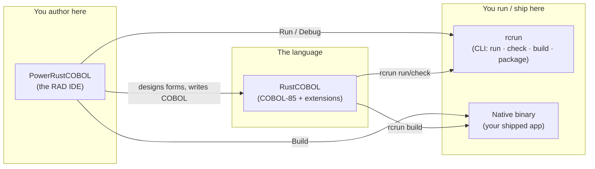
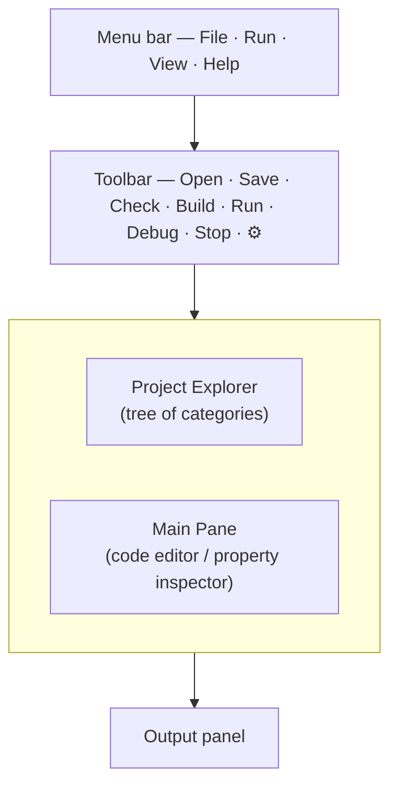
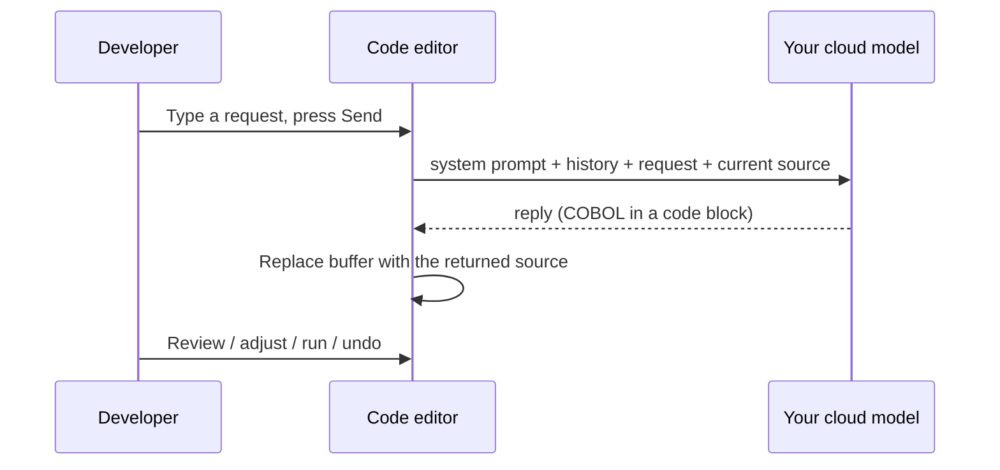
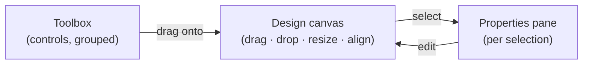
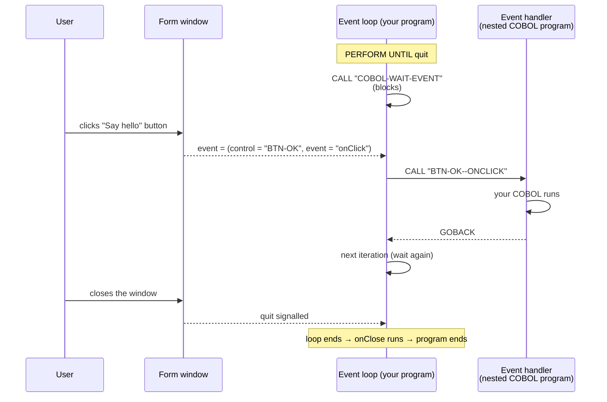
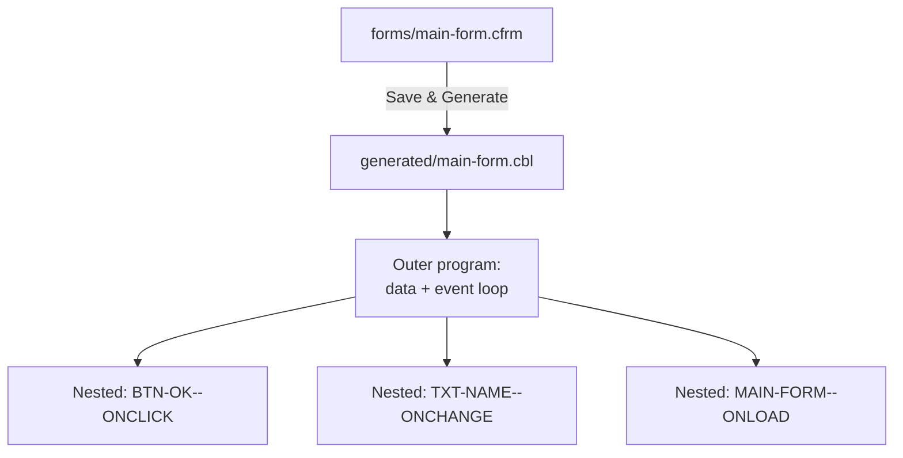
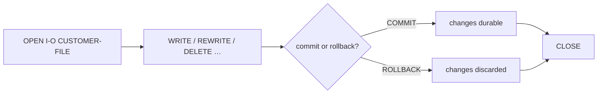
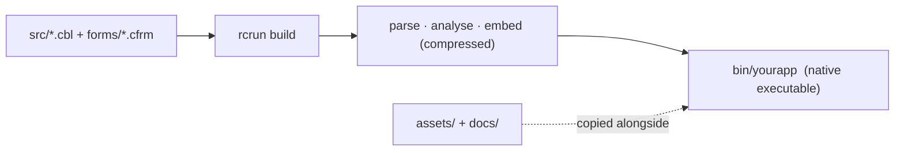

<!--
SPDX-License-Identifier: Apache-2.0
Copyright (c) 2026 Emerson Lopes and PowerRustCOBOL contributors

Licensed under the Apache License, Version 2.0.
See the LICENSE file in the project root for full license information.
-->

# PowerRustCOBOL Developer's Guide

<p align="center">
  
</p>

*A practical guide to building graphical COBOL applications with PowerRustCOBOL.*

> **Who this guide is for.** You already write COBOL, and you have built screen
> or window-based applications with a GUI COBOL toolset — for example Fujitsu
> **PowerCOBOL for Windows** or **Veryant isCOBOL**. You know `IDENTIFICATION
> DIVISION`, `PERFORM`, `OPEN`/`READ`/`WRITE`, indexed files, and the idea of a
> *form* with *controls* that raise *events*. This guide maps those instincts
> onto PowerRustCOBOL and shows you everything that is new. **No prior knowledge
> of the host implementation language is assumed or required** — you will never
> need to read or write anything other than COBOL to build an application.

---

## Table of contents

1. [What PowerRustCOBOL is, and why it exists](#1-what-powerrustcobol-is-and-why-it-exists)
2. [The three pieces: RustCOBOL, PowerRustCOBOL, rcrun](#2-the-three-pieces)
3. [Installing and launching](#3-installing-and-launching)
4. [Your first application: Hello, Form](#4-your-first-application-hello-form)
5. [The IDE at a glance](#5-the-ide-at-a-glance)
6. [Projects and the project model](#6-projects-and-the-project-model)
7. [The Form Designer (RAD)](#7-the-form-designer-rad)
8. [The control catalogue](#8-the-control-catalogue)
9. [Properties](#9-properties)
10. [Event-driven programming](#10-event-driven-programming)
11. [Talking to the UI from COBOL](#11-talking-to-the-ui-from-cobol)
12. [Generated code](#12-generated-code)
13. [The RustCOBOL language](#13-the-rustcobol-language)
14. [Indexed files — a first-class resource](#14-indexed-files--a-first-class-resource)
15. [SQL databases](#15-sql-databases)
16. [HTTP / REST and AI agents](#16-http--rest-and-ai-agents)
17. [The command line (rcrun)](#17-the-command-line-rcrun)
18. [Building a distributable binary](#18-building-a-distributable-binary)
19. [Debugging](#19-debugging)
20. [Appearance and internationalisation](#20-appearance-and-internationalisation)
21. [COBOL Structure and shared data](#21-cobol-structure-and-shared-data)
22. [Caveats and current limitations](#22-caveats-and-current-limitations)
23. [Appendix A — Coming from PowerCOBOL / isCOBOL](#appendix-a--coming-from-powercobol--iscobol)
24. [Appendix B — Glossary](#appendix-b--glossary)

---

## 1. What PowerRustCOBOL is, and why it exists

For decades, the only way to write **windowed, event-driven COBOL** was to buy a
proprietary toolchain tied to one operating system, one vendor, and one
licensing model. Those tools were excellent in their day, but most are now
Windows-bound, closed, and increasingly hard to deploy on modern machines. A
generation of business logic — payroll, inventory, banking back-offices — is
written in that style and has nowhere modern to go.

**PowerRustCOBOL exists to give that style of development a fresh, open home.**
It is a Rapid Application Development (RAD) environment where you:

- design windows ("forms") by dragging controls onto a canvas,
- attach **COBOL** event handlers to those controls,
- and run, debug, and ship the result as a **single self-contained native
  executable** — no runtime to install on the target machine.

Its design goals, in plain terms:

| Goal | What it means for you |
|------|-----------------------|
| **COBOL-first** | The application *is* COBOL. The designer generates COBOL; your handlers are COBOL paragraphs and nested programs. You never leave the language. |
| **Cross-platform** | The IDE and the produced binaries are not tied to one OS. |
| **Self-contained** | A built application embeds everything it needs; the end user does not install PowerRustCOBOL. |
| **Modern data access** | Crash-safe indexed (ISAM) files, SQL (SQLite / PostgreSQL / MySQL), and HTTP/REST are reachable through ordinary `CALL` statements. |
| **Open** | Apache-2.0 licensed. |

> **Note.** PowerRustCOBOL is *inspired by* the productivity of classic GUI COBOL
> RADs, but it is an independent, original implementation. Concepts such as
> "form", "control", and "event" are industry-standard; the syntax, file
> formats, generated code, and built-in services described here are specific to
> PowerRustCOBOL and are not compatible with any other vendor's tools.

---

## 2. The three pieces

PowerRustCOBOL ships as three cooperating tools. Knowing which is which removes a
lot of confusion early on.



| Name | Role | Think of it as… |
|------|------|-----------------|
| **RustCOBOL** | The COBOL-85 language dialect plus PowerRustCOBOL's extensions (GUI calls, indexed-file clauses, SQL/HTTP). | The compiler/runtime "language". |
| **PowerRustCOBOL** | The desktop IDE: project explorer, code editor, **Form Designer**, debugger. | The "Workbench" / "Studio". |
| **rcrun** | The command-line runtime, checker, packager, and binary compiler. | The "runtime + build tool" you can script in CI. |

> ⚠️ **Naming caveat.** Internally some build artefacts and folders are named
> `cobolt-*`. That is an implementation detail; the user-facing names are
> **RustCOBOL**, **PowerRustCOBOL**, and **rcrun**.

---

## 3. Installing and launching

> 📷 **Screenshot needed — `install-launch.png`.** Please provide a capture of
> the PowerRustCOBOL application icon in your OS launcher/dock **and** the empty
> IDE window immediately after first launch (no project open). This will anchor
> the "what you should see" expectation for newcomers.

Launch the IDE; on first run you are greeted with an empty workspace and the
prompt *"Open a COBOL file to get started."* You can either open a single `.cbl`
file or create a full **project** (recommended — see §6).

From a terminal you can also drive everything headlessly with `rcrun` (see §17),
which is what continuous-integration pipelines use.

---

## 4. Your first application: Hello, Form

This walkthrough produces a one-button window that shows a message.

1. **Create a project.** `File ▸ New Project…`, give it a name (e.g.
   `HelloPower`) and a main program. The IDE creates the standard folder layout
   on disk **and a runnable starter `main` program** (a tiny `DISPLAY`/`GOBACK`
   you can Run immediately), then opens it in the editor (see §6).
2. **Create a form.** In the project tree, click the **➕** next to **Forms**.
   This opens the *New Form* dialog — set a name (`main-form`), a title, and a
   size, then create. The form is saved under `forms/` and opens in the **Form
   Designer**.
3. **Drop a button.** Drag a **Button** from the toolbox onto the canvas. With
   it selected, set its `Caption` to `Say hello` in the properties pane.
4. **Attach a handler.** Still on the button, find its **`onClick`** event and
   click it to open the COBOL event editor. Type, for example:

   ```cobol
              DISPLAY "Hello from PowerRustCOBOL".
   ```

5. **Run.** Press **Run** on the toolbar (or the ▶ in the designer). The form
   appears; clicking the button executes your handler.

> 📷 **Screenshot needed — `first-form-designer.png`.** Capture the Form Designer
> with the single button selected and the `onClick` event highlighted in the
> properties pane.

> **Note.** When you save or run a form, PowerRustCOBOL **generates** a COBOL
> source file for it (see §12). You never edit that file by hand — it is a build
> artefact.

---

## 5. The IDE at a glance



- **Project Explorer (left).** A tree rooted at your project. Six fixed
  categories — **Forms**, **Indexed Files**, **Common Code**, **Generated Code**,
  **Assets**, **Documentation** — each with a **➕** button. To the left of each
  item is a **status "knob"**: 🟢 green = checked/tested OK, 🟡 yellow = changed
  since last check, 🔴 red = a problem was reported. Forms expand to show their
  controls, grouped by toolbox category, and each control expands to its
  **Events**. Indexed Files expand to show record fields (like form controls).
  **Click the root node at the very top** (📁 YourProjectName) at any time to
  bring up the full project settings form in the main work area.

On first launch (or any time no project is open) the IDE shows a single full
welcome pane that is a single centered block of information (title + license +
one blank line + quote + author) in the middle of the available area below the
menubar/toolbar:

Welcome to PowerRustCOBOL <version>
License: Apache 2.0

<blank line>
<quote text in green, randomly selected on each cycle from a built-in list>
— <author in light blue>

The quote cycles randomly every 7.5 seconds (1 s fade-in, 6 s visible, 0.5 s fade-out). The left tree, editor, output and editor-specific controls are hidden until you use File → New Project or File → Open Project. Once a project is open the normal three-pane workspace appears. The full guide is available in the docs/ folder.
- **Toolbar (top).** `Open · Save · Check · Build · Run · Debug · Stop`, plus
  language selector on the far right. *Run* interprets the program; *Build*
  compiles a native binary; *Check* runs parse + semantic analysis only;
  *Debug* is enabled when a Generated Code item is selected.
- **Main Pane (centre / right of the tree).** Shows the code editor, the
  **property inspector** (when you click a form or control in the tree), **or
  the project settings form** (when you click the project root at the top of
  the tree, or automatically when the IDE first opens a project — with no
  editor visible). It uses the exact same glass pane construction
  (CentralPanel + glass frame) as the control properties inspector for
  consistent width (no shortfall at the right border) and full 100% height
  behaviour (the pane grows/shrinks with the available area above the Output
  panel on window or splitter resize). The card's rounded bottom border/stroke
  is kept clearly above the output/console with a visible gap via the frame's
  bottom outer margin; the Save/Cancel buttons sit at the bottom of the card.
  Click the top of the project tree (the 📁 ProjectName line) at any time to
  open it. It has a single continuous vertical resizer line running
  top-to-bottom through the content. Labels on the left never word-wrap; they
  are truncated with `…` (e.g. `Standard system p…`) and the developer can
  drag the resizer freely (the split moves independently of any label length,
  up to 80 % of the pane width). Controls on the right are elastic and all
  start at the same x position after a 10 px gap, giving perfect vertical
  alignment of every property value. Sections: Project, License, Appearance,
  AI assistant, Runtime. Explicit **Save** and **Cancel** buttons at the bottom
  of the card (Cancel enabled only after changes; reverts to last saved). The
  resizer line follows the current theme (brighter when hovered or dragged).
  The code editor (when visible) carries a **status bar** along the bottom —
  caret `Ln, Col`, the **Insert/Overwrite** mode (toggle with the `Insert`
  key), a **Trim on save** toggle (strips trailing whitespace when you save),
  and a **Beautify** command (a safe whitespace tidy that never disturbs
  COBOL's significant columns).

> 📷 **Screenshot needed — `project-settings-form.png`**. Show the left tree
> with the root node highlighted (hand cursor), and the main area with the
> two-column settings form inside its glass card (single continuous vertical
> resizer line, labels truncated with … before the line, all value controls
> aligned on the right, Save/Cancel at the bottom of the card). The card's
> rounded bottom border must be clearly visible above the Output panel with a
> gap (no border going under the console). Note the theme colours on the
> resizer and that it can be dragged well past the longest label ("Standard
> system prompt:").

- **Output panel (bottom).** Program `DISPLAY` output, build logs, and status
  messages.

> 📷 **Screenshot needed — `ide-overview.png`.** A full-window capture with a
> project open, a form selected (so the property inspector is visible), and some
> text in the Output panel. Annotate the four regions if you can.

### The AI assistant (optional)

PowerRustCOBOL can put a cloud language model — one you provide, ideally trained
on this documentation — right above the code editor. The assistant is **entirely
optional and off by default**: until you fill in the connection details, the
prompt bar never appears.

**Configure it via the project root settings form.** Click the top node of the
project tree (the 📁 line with your project name). In the **AI assistant** section
of the form you can enter the connection details. The settings (except the
per-project Appearance options) are global to your machine, not stored in any
project, so the API key never travels in a repository:

| Field | Meaning |
|-------|---------|
| **Endpoint URL** | The full chat-completions URL of your model (an OpenAI-compatible endpoint, e.g. `https://…/v1/chat/completions`). |
| **API key** | Sent as `Authorization: Bearer …`. Leave empty for a key-less local endpoint. |
| **Model** | The model identifier passed in each request. |
| **Temperature** | Sampling randomness (0 = deterministic). |
| **Standard system prompt** | The instructions sent on every request. A sensible default is provided; edit it to suit your model. |

A **Test connection** button sends a tiny request to your endpoint and reports
whether the model is reachable and the key/model are accepted — use it to
confirm the setup before relying on it. The assistant becomes available as soon
as **Endpoint URL** and **Model** are both set. Clear the endpoint to hide it
again.

**Using it.** Open a COBOL file, type a request in the prompt bar (for example
*"add a paragraph that totals WS-LINES and DISPLAYs it"*), and press **Send**.
The model receives, in this order:

1. your **standard system prompt**;
2. the **conversation history** for *this file* (it is remembered between
   sessions, per source file);
3. your **request** together with the **current source** of the file.

When the reply arrives, PowerRustCOBOL extracts the COBOL from it and **updates
the editor buffer in place** — so you can immediately review, tweak, run, or
undo (Ctrl/Cmd-Z) the result like any other edit. The running transcript is
shown under the prompt bar (💬), and **Clear conversation** (🗑) forgets the
history for that file. Read-only Generated Code is never modified.

**Also in the inspector.** The same prompt bar appears above the inline
form/control inspector, with the form's **generated COBOL** as its (read-only)
context — handy for asking how to wire an event handler. Because generated code
is never hand-edited, replies there are shown in the transcript for reference
rather than applied.

**Where the conversation lives.** History is *not* kept in a hidden cache — it is
stored in the project's `data/` folder in PowerRustCOBOL's **own indexed (ISAM)
file** (`data/conversations.dat`), the very `ORGANIZATION IS INDEXED` format your
COBOL programs use, keyed by the source file's relative path. (We dog-food our
own runtime.) Conversations therefore travel with the project and require an open
project to persist; without one, the assistant still works but only for the
current session.



> 📷 **Screenshot needed — `ide-ai-assistant.png`.** The code editor with the AI
> prompt bar visible above it and an expanded conversation transcript.

> **Privacy note.** Your prompt, the conversation history, and the **full source
> of the open file** are sent to whatever endpoint you configure. Point it only
> at a model you trust.

### Reading the docs in the IDE (Help → Documentation)

**Help → Documentation** opens a dedicated window that renders this guide and the
other PowerRustCOBOL manuals — including their **Mermaid diagrams**, drawn inline
(rendered in pure Rust, no browser required). The docs are bundled with the IDE,
so it works offline; `Cmd+O` opens any local Markdown file too.

The window has a searchable **document list** on the left and the rendered
document on the right, plus an **icon toolbar** and **File / View / Help** menus.
In-document **search** highlights matches (blue on yellow); press **Go** or
**Enter** to jump to the first match and **◀ / ▶** (or `,` / `.`) to step through
them with a live `n/total` counter. The **table of contents** is clickable — both
the side **outline** and the in-document `[…](#…)` links jump to their section.
You also get an adjustable **font size** that is *remembered between sessions*,
zoom, full screen, keep-on-top (`⌘T`), open a local Markdown file (`⌘O`), and a
view-source modal (`⌥⌘U`). **Print** (`⌘P`) exports the document — Mermaid
diagrams included — to a PDF and opens it in your OS viewer, where the system
print dialog is one click away. The window is a translucent **frosted-glass**
panel and follows the IDE's theme and language.

---

## 6. Projects and the project model

A **project** is a folder containing a manifest file, `cobolt.toml`, plus your
sources, forms, and assets. The manifest records the project name, version, main
program, and the files in each category.

### Folder layout

When you create a project, PowerRustCOBOL scaffolds this structure on disk:

```text
HelloPower/
├── cobolt.toml         ← project manifest
├── src/                ← Common Code  (hand-written COBOL programs/copybooks)
├── forms/              ← Forms        (.cfrm designer files)
├── indexed/            ← Indexed Files (.cidx definitions)
├── generated/          ← Generated Code (RAD-produced .cbl — read-only)
├── assets/             ← Assets       (images, audio, fonts, data files)
├── docs/               ← Documentation
├── bin/                ← built binaries
├── debug/              ← debugging working files
├── temp/               ← temporary files
├── dist/               ← (reserved) self-contained distribution bundle
└── data/               ← project data files (e.g. the AI conversation store)
```

A new project also gets a **runnable starter `main` program** (by default
`src/main.cbl`) — a minimal `IDENTIFICATION DIVISION` / `DISPLAY` / `GOBACK` that
you can **Run** straight away and then grow.

> **Form-first projects.** If you delete the starter `main` and build a project
> made of nothing but forms, **Build** and **Run** still work: when the
> `[project].main` file is absent, PowerRustCOBOL uses the **first generated form
> program** (`generated/*.cbl`) as the entry point. Set `[project].main` to a
> specific program once you want explicit control over which one starts.

> **Note.** Opening an older project that predates this layout **back-fills any
> missing standard folders** automatically, so every project ends up with the
> same structure.

### The six tree categories

| Category | Holds | Editable? |
|----------|-------|-----------|
| **Forms** | `.cfrm` form-designer files | via the Designer |
| **Indexed Files** | `.cidx` indexed-file definitions | via the Indexed File Editor |
| **Common Code** | hand-written COBOL you `CALL` from forms or run directly | yes |
| **Generated Code** | the `.cbl` PowerRustCOBOL generates from each form or `.cidx` | **read-only** (blue, lock icon) |
| **Assets** | images, audio, fonts, data files bundled with the app | imported |
| **Documentation** | Markdown / text / PDF notes | yes |

### Creating vs. importing

The **➕** on a category **creates a new item**:

- **Forms ➕** → *New Form* dialog.
- **Indexed Files ➕** → *New Indexed File* wizard (name, assign path, record layout, keys, storage).
- **Common Code ➕** → a new `.cbl` from a starter template, opened in the editor.
- **Documentation ➕** → a new Markdown file.
- **Assets ➕** → file picker (assets are authored externally, so "create" = import).

To **import an existing file** into a category, **right-click the ➕** and choose
*Import existing…*. For **Indexed Files**, this picks an on-disk `.idx` (or similar)
data file and builds a matching `.cidx` when the file carries a self-describing
schema.

> **Note.** Generated `.cbl` files live in `generated/`, are tracked
> automatically, and open read-only. Editing belongs in the form (the Designer),
> the `.cidx` (Indexed File Editor), or in Common Code — never in generated output.

### Indexed File Editor & Grid Browser

> 📷 **Screenshot needed — `indexed-file-editor.png`** — Indexed File Editor
> viewport with field list, properties pane, and toolbar (Save / Save & Generate /
> Finalize / Open Grid Browser).

Double-click an **Indexed Files** entry to open the **Indexed File Editor** in its
own window (same multi-window pattern as the Form Designer). The centre pane lists
record fields; the lower pane shows file- or field-level properties. **Finalize**
creates the on-disk data file and locks structural fields (PIC, offsets, keys,
storage). Comments and per-field **grid controls** stay editable afterward.

**Open Grid Browser** (after finalize) opens a second viewport: a virtualized table
over the live indexed data file with add / edit / delete, **Commit** / **Rollback**,
and schema-drift protection when the on-disk file no longer matches the `.cidx`.

Each `.cidx` produces `generated/<stem>-indexed.cbl` (`SELECT` / `FD` fragment),
regenerated on **Build / Run / Debug / Check** like form output.

---

## 7. The Form Designer (RAD)

The Form Designer is where you lay out windows. Each open form is its **own OS
window**, so you can have several designers and running forms side by side.



- **Toolbox (left).** Widgets grouped into **Non-Visual**, **Common**,
  **Container**, **Data**, **Graphics**, **Menu**, **Charts**, and **Dialogs**.
  Drag any control onto the canvas.
- **Canvas (centre).** Move, resize (drag the border grips), align, and
  distribute controls. A snap-to-grid keeps things tidy. You can resize the
  **form itself** by dragging its edges.
- **Properties pane (right).** Edits the selected control — or, with nothing
  selected, the **form** itself. The pane is organised into collapsible
  **section cards** (Form Properties, Target Device, Appearance, Background
  Image, Size, Events). Drag its edge to widen it.

Designer toolbar essentials: **Save & Generate**, **Generate only**, **Preview**
(a non-interactive render), **Run Form** (live, interactive), grid toggle, glass
toggle, alignment tools, undo/redo.

> **WYSIWYG.** Preview, Run Form, and compiled binaries draw each control's
> graphical face with the **exact same renderer** (now in `cobolt-forms` paint
> module, originally the designer canvas `draw_control` + glass helpers) driven
> by the control's designed properties —
> background and foreground colours, fonts, corner radius, shadows, checked
> state, progress value. What you style on the canvas is exactly what runs;
> the runtime only adds the live behaviour (press feedback, focus, input).

### Target devices

The **Target Device** section lets you size the form for a real device profile
(various iPhone, iPad, Apple Watch, Android phone/tablet/watch presets) or a
custom size, with a portrait/landscape switch. This is a design aid — it sets the
form's width/height to the chosen profile.

> 📷 **Screenshot needed — `form-designer-full.png`.** The Designer with the
> toolbox, a canvas containing several controls (a label, a text box, a button,
> and a chart), and the properties pane showing the section cards. Ideally use
> a project with a background image so the glass styling is visible.

> **Note (non-visual controls).** Timer, AI Agent, REST Client, and SQL Database
> are **non-visual**: they appear on the canvas as labelled glass "chips" at
> design time but render nothing at run time. They exist to be configured and to
> raise events / be `CALL`ed from your COBOL.

---

## 8. The control catalogue

PowerRustCOBOL ships the following controls. Visual controls render at run time;
non-visual ones are services.

**Common / input**
: Label, Button, TextBox, CheckBox, RadioButton, ComboBox, ListBox,
  NumericUpDown, DateTimePicker, Slider, ProgressBar, PictureBox.

**Containers / layout**
: GroupBox, Panel, TabControl, Splitter, MenuBar, ToolBar, StatusBar.

**Data**
: DataGrid, TreeView.

**Graphics / media**
: Line, Shape, Animator.

**Charts**
: BarChart, LineChart, PieChart, AreaChart, ScatterChart, DonutChart.

**Non-visual services**
: Timer, AgentObject (AI agent), RestClient, SqlDatabase.

> **Note.** A `Custom` control type exists as an extension point for
> bespoke/vendor controls; treat it as advanced.

> 📷 **Screenshot needed — `control-gallery.png`.** A single form (or the preview
> window) showing one of each major control so newcomers can recognise them. The
> charts especially benefit from a visual.

### Per-control examples

The repository ships a runnable test project for **every** control under
`examples/<control>/`. Each one places a single instance of the control, prints
a console line for every event it supports (`DISPLAY "<Event> working"`), and
gives you one button per property that changes it from COBOL via
`INVOKE … "SetProperty"`. They double as a reference for wiring events and
setting properties from code.

```sh
rcrun build examples/label/cobolt.toml     # build one
examples/build-all.sh                      # build them all (reports 0 failed)
```

The service controls (`agent-object`, `rest-client`, `sql-database`) build
offline but need their local service to run; each project's `README.md` says
which. See `examples/README.md` for the full index.

---

## 9. Properties

Every control exposes **properties** — its appearance, behaviour, and data
bindings — editable in the properties pane and stored in the `.cfrm` file.

PowerRustCOBOL uses **fully spelled-out property names** (no cryptic
abbreviations). A few you will use constantly:

| Property | Meaning |
|----------|---------|
| `Caption` / `Text` | The control's text (`Caption` for labels/buttons; `Text` for text boxes). |
| `BackgroundColor` / `ForegroundColor` | Colours (hex, e.g. `#1E3A5F`). |
| `FontName`, `FontSize`, `Bold`, `Italic` | Typography. |
| `Visible`, `Enabled` | State. |
| `TextAlignment` | Text justification. |
| `DataItem` | The COBOL working-storage item this control reads/writes. |

> **Note.** Standard acronyms are kept (`CSV`, `URL`, `API`, `TLS`); everything
> else is written in full — for example `BackgroundColor` (not `BackColor`),
> `MaximumLength` (not `MaxLength`), `PasswordCharacter` (not `PasswordChar`),
> and every `…Paragraph` reference (not `…Para`).

> **Caption rules.** Only Label, Button, CheckBox, RadioButton, and GroupBox use
> `Caption`; TextBox uses `Text`; other controls use type-specific keys
> (`Value`, `Items`, …).

> **Control IDs.** When you drop a control, it gets a readable, per-type ID —
> `Button-1`, `Button-2`, `TextBox-1`, `ComboBox-1`, … — which becomes its COBOL
> data-name (`WS-BUTTON-1`) and the base of its handler paragraph
> (`BUTTON-1--ONCLICK`). You can rename a control's ID to something meaningful
> (e.g. `BTN-SAVE`) in the properties pane; keep it a valid COBOL word (letters,
> digits, hyphens; no leading/trailing hyphen).

### Form themes

A **theme** gives your forms a distinctive look without styling every control by
hand. Themes are applied by the same renderer the designer, the preview, and the
compiled app all use, so a themed form looks identical everywhere.

There are two kinds of theme, listed together in one picker:

- **Liquid Glass** — the built-in, default look, drawn procedurally. Existing
  forms use it and are unchanged.
- **Asset-pack themes** — photoreal "skins" supplied as a folder of images. The
  catalogue grows simply by dropping a new pack into `assets/themes/` — no rebuild.

**Choosing a theme.** A theme is selected at two levels:

- **Project default** — *Settings → Appearance → Default form theme*. Every form
  in the project uses it unless overridden.
- **Per-form override** — in the Designer, the form's *Appearance → Form theme*
  property. Leave it on **Inherit project default** to follow the project, or pick
  a specific theme for this one form.

The effective theme is resolved as **per-form override → project default → Liquid
Glass**. The designer re-renders immediately when you change either.

**Themed background.** A pack may include a background image. Switch on the form's
*Appearance → Use theme background* to show it; otherwise the form's own Back color
/ Background image applies.

**What gets themed.** A theme skins all the standard controls (panels, buttons,
text fields, lists, …) and their states, **including the chart controls** — pie
slices, line strokes, and bars take on the theme's palette and material. A control
a pack doesn't cover falls back to Liquid Glass, so a partial pack never breaks a
form. A control's own explicit *Foreground/Background color* still wins over the
theme's defaults.

**Adding a theme pack.** A pack is a self-describing folder
`assets/themes/<id>/` containing a `theme.toml` manifest plus its images:

```toml
id = "stainless-steel"
display_name = "Stainless Steel"

[background]
image = "background.png"      # optional themed background

[palette]
foreground = "#dfe7ff"
chart = ["#4C9BE8", "#E87A4C", "#4CE87A", "#E84C9B"]   # chart data palette

[chart_style]
stroke_width = 2.0

[controls.button]             # one entry per control kind
image    = "button.png"
slice    = [12, 12, 12, 12]   # 9-slice insets: left, top, right, bottom
hover    = "button_hover.png" # optional per-state images
pressed  = "button_pressed.png"
```

Images use **9-slice** scaling: the four corners keep their size while the edges
and centre stretch, so one image fits any control size. Drop the folder in,
restart the IDE, and the theme appears in the picker. (The bundled
`cobalt-steel` pack is a small, procedurally generated reference you can copy.)

---

## 10. Event-driven programming

This is the heart of GUI COBOL, and it works the way you expect: the form sits in
an **event loop**, waiting; when the user does something, the matching **handler**
runs.

### The form event loop



In words:

1. The generated program enters a loop and calls the built-in
   **`COBOL-WAIT-EVENT`**, which blocks until the user interacts with the form.
2. When an event occurs, the runtime hands back **which control** and **which
   event** (e.g. `BTN-OK` / `onClick`).
3. The loop dispatches to the handler for that pair — a **nested COBOL-85
   program** named after the control and event (`BTN-OK--ONCLICK`).
4. The handler runs and `GOBACK`s; the loop waits again.
5. Closing the window ends the loop; the form's `onClose` handler runs last.

### Events you can handle

- **Widget events** follow the convention `on` + action: `onClick`, `onChange`,
  `onDoubleClick`, `onMouseEnter`, `onGotFocus`, and so on. Each control exposes
  the set that makes sense for it (a Button has `onClick`/`onDblClick`/mouse
  events; a TextBox has `onChange`/`onKeyPress`/focus events; charts have
  `onDataChanged`; etc.).
- **Form events** — the window itself supports a rich set, grouped into
  **Lifecycle, Activation & Focus, Window State, Layout & Painting, Mouse,
  Touch & Pointer, Scrolling, Drag & Drop, Clipboard, System / OS, and Error
  Handling**. The lifecycle pair `onLoad` (just before the window is shown) and
  `onClose` (as it closes) are pre-created for every form; the rest you attach as
  needed.

> **Events fire at run time.** Every event a control lists in its catalogue can
> be handled *and* actually fires in a *Run Form* session — the runtime no
> longer supports only a subset. Coverage:
>
> - **Every visual control** gets the universal pointer set — `onClick`,
>   `onDblClick`, `onMouseDown`, `onMouseUp`, `onMouseEnter`, `onMouseLeave` —
>   whenever the gesture happens (only the ones the control actually declares).
> - **Value controls** fire `onChange` plus their semantic aliases:
>   `onCheckedChanged` (check box / radio), `onSelectedIndexChanged`
>   (list / combo), and the combo's `onDropDown` on open.
> - **Text input** fires `onGotFocus`/`onEnter`, `onLostFocus`/`onLeave`, and
>   `onKeyDown`/`onKeyUp`/`onKeyPress` while focused.
> - **Timer** fires `onTick` every `Interval` ms while enabled (`Start`/`Stop`).
> - **Form-level** fires `onLoad`/`onClose` (at start-up / shutdown),
>   `onShow`/`onActivate` (when the run window first appears) and `onResize`
>   (when its size changes).
>
> A handful of events are tied to conditions the lightweight *Run Form* preview
> doesn't fully model yet — back-end completions (`onResponseReceived`,
> `onQueryComplete`, the AI agent's `onResponse`/`onError`) and a few
> control-internal ones (`onNodeExpand`, `onCellChange`). They are still
> designable and generate correctly; a compiled binary wires them to their real
> sources. When in doubt, confirm in a *Run Form* session.

### Adding a handler

In the tree or the properties pane, click an event to open the COBOL editor for
it. A handler is a self-contained **nested program**, and you edit its whole body
in **one** editor — there is no separate box for working-storage.

The event editor is the **same full editor as the main code editor**: as-you-type
**IntelliSense** (keywords, verbs, and the form's control names; `Ctrl+Space` to
trigger), **Find/Replace** (`Cmd/Ctrl+F`, with *Replace* and *Replace All*) in the
top-right, and the **status bar** along the bottom (caret `Ln, Col`,
**Insert/Overwrite** via the `Insert` key, **Trim on save**, and **Beautify**). It
opens at 70 % of the window and is freely resizable.

The **first time** you open an unwritten handler, the editor seeds it with the
standard skeleton so you only fill in the blanks:

```cobol
       ENVIRONMENT DIVISION.
       DATA DIVISION.
       WORKING-STORAGE SECTION.
       LINKAGE SECTION.

       PROCEDURE DIVISION.
           CONTINUE.
```

Everything from `ENVIRONMENT DIVISION` down to your statements is yours to edit;
PowerRustCOBOL supplies only the `IDENTIFICATION DIVISION` / `PROGRAM-ID` header
and the closing `GOBACK` / `END PROGRAM` (shown greyed-out around the editor).

- **Local scratch variables** go straight into this handler's own
  `WORKING-STORAGE SECTION`.
- **Shared state** lives in the form's global working-storage (visible to every
  handler because it is declared `GLOBAL` in the outer program).
- **Event data** — when an event delivers data to its handler, those items
  appear in the `LINKAGE SECTION` and are bound by `PROCEDURE DIVISION USING …`.
  For example, a handler that receives only the clicked node's index would be
  seeded as:

  ```cobol
       ENVIRONMENT DIVISION.
       DATA DIVISION.
       WORKING-STORAGE SECTION.
       LINKAGE SECTION.
       01 COBOL-EVENT-DATA.
          05 COBOL-ARRAY-INDEX        PIC S9(9) COMP-5.

       PROCEDURE DIVISION USING COBOL-ARRAY-INDEX.
  ```

  Events that carry no data simply have an empty `LINKAGE SECTION` and a plain
  `PROCEDURE DIVISION.` (no `USING`).

> If you leave the seeded template untouched and close the editor, nothing is
> saved — the handler stays "unwritten" until you actually add code.

---

## 11. Talking to the UI from COBOL

### Reading and writing properties

A control's properties are read and written with the **`::`** member syntax or
the **`INVOKE`** verb — the same forms used for methods. The member is just the
property name; there is **one** consistent way to touch a property.

**Read (GET)** — `control::property` is a value usable anywhere (DISPLAY, a MOVE
source, IF, COMPUTE), or read with `INVOKE … RETURNING`:

```cobol
      *> inline — used directly as a value
           DISPLAY Button-1::Caption.
           MOVE Button-1::Caption TO WS-NAME.
           IF TextBox-1::Text = SPACES
               DISPLAY "empty".

      *> quoted member name — identical
           MOVE Button-1::"Caption" TO WS-NAME.

      *> INVOKE verb (optionally the explicit GET- prefix)
           INVOKE Button-1 "Caption"     RETURNING WS-NAME.
           INVOKE Button-1 "GET-Caption" RETURNING WS-NAME.
```

**Write (SET)** — assign to `control::property` with `MOVE`/`SET`, or pass the
value with `INVOKE … USING`:

```cobol
      *> inline — MOVE or SET into the property
           MOVE "Hello!" TO Button-1::Caption.
           SET Button-1::"Caption" TO "Hello!".

      *> INVOKE verb (a USING argument means set; SET- is the explicit prefix)
           INVOKE Button-1 "Caption"     USING "Hello!".
           INVOKE Button-1 "SET-Caption" USING "Hello!".
```

Property names are **case-insensitive** and are exactly the ones in the
properties pane (`Caption`, `Text`, `BackgroundColor`, `Value`, …). A **numeric**
property reads as a number, so `IF Slider1::Value > 50` is algebraic, and you can
move or compute between a data item and a property — e.g. `MOVE WS-N TO
Spinner1::Value` — with no intermediate `PIC` item.

> **IntelliSense.** Type `::` (or `::"`) after a control id and the editor lists
> that control's **properties (green)** and **methods (light blue)**; keep typing
> to filter (`Button-1::Cap…` → `Caption`). A plain `"` is just a string literal —
> it opens no popup.

### Calling control methods

Properties describe *what a control is*; **methods** describe *what it can do* —
showing it, moving it, ticking a value up, adding a list item, firing an HTTP
request. Every control understands a set of **universal** methods plus its own
**type-specific** ones. You can call a method three ways, all equivalent:

```cobol
      *> 1. Inline call — reads like a sentence, no result kept
           Lbl-Out::SetCaption("Saved.").

      *> 2. As an expression — the return value flows into a MOVE / IF / COMPUTE
           MOVE Txt-Name::GetText() TO WS-NAME.
           IF Chk-Agree::IsChecked() = "1"
               PERFORM SUBMIT-ORDER
           END-IF.

      *> 3. INVOKE verb — when you prefer the spelled-out keyword, with optional
      *>    USING arguments and RETURNING receiver
           INVOKE Db-1 "query"
               USING "SELECT id, name FROM customer"
               RETURNING WS-ROWS.
```

Arguments go in parentheses (inline / expression form) or after `USING`
(`INVOKE` form); a method that returns a value can be used directly in an
expression or captured with `RETURNING`. The editor's IntelliSense lists a
control's methods after you type `::`, each with a one-line description.

**Universal methods** (every visible control):

| Method | Effect |
|--------|--------|
| `Show` / `Hide` | Set the `Visible` property on or off. |
| `Enable` / `Disable` | Set the `Enabled` property on or off. |
| `SetFocus` | Give the control keyboard focus. |
| `MoveTo(x, y)` | Reposition the control (sets `X` / `Y`). |
| `Resize(w, h)` | Change its size (sets `Width` / `Height`). |
| `BringToFront` / `SendToBack` | Change stacking order. |
| `SetProperty(name, value)` / `GetProperty(name)` | Generic access to any property by name. |

**Type-specific highlights** (the full list is in IntelliSense):

| Widget | Methods |
|--------|---------|
| Label / Button | `SetCaption`, `GetCaption` |
| Text box | `SetText`, `GetText`, `AppendText`, `Clear` |
| Check box / radio | `IsChecked`, `SetChecked`, `Toggle`, `Select` |
| Progress / slider / numeric | `SetValue`, `GetValue`, `Increment`, `Decrement`, `Reset` |
| List / combo | `AddItem`, `RemoveItem`, `GetCount`, `GetSelected`, `SetIndex` |
| Timer | `Start`, `Stop`, `SetInterval`, `IsEnabled` |
| REST Client | `get`, `post`, `put`, `delete`, `call`, `setHeader`, `clearHeaders` |
| SQL Database | `open`, `execute`, `query`, `fetch`, `fetchAll`, `close` |
| AI Agent | `Ask`, `SetPrompt`, `SetModel`, `Stop` |

A method that changes a property updates the **running form immediately** — the
same channel the property syntax uses — so `Lbl-Out::SetCaption("Done")` repaints
the label the moment it runs. Methods and the property syntax are fully
interchangeable; pick whichever reads best for the line you are writing.

> **Designed values are available before you set anything.** When a form starts,
> every control is seeded with the values from its properties pane, so
> `Txt-Name::GetText()` (or `Txt-Name::Text`) returns the text you typed at
> design time even before the first setter runs.

### Property access via CALL (also supported)

The explicit `CALL` form remains available and is interchangeable with the
syntax above:

| `CALL` | Purpose |
|--------|---------|
| `"COBOL-WAIT-EVENT"` | Block until the next UI event (used by the generated loop). |
| `"COBOL-GET-PROPERTY"` | Read a control property into a data item. |
| `"COBOL-SET-PROPERTY"` | Write a control property from a data item. |

A typical handler that reads a text box and updates a label:

```cobol
       BTN-GREET--ONCLICK.
           CALL "COBOL-GET-PROPERTY"
               USING "TXT-NAME" "Text" WS-NAME.
           STRING "Hello, " DELIMITED BY SIZE
                  WS-NAME    DELIMITED BY SPACE
                  INTO WS-MESSAGE.
           CALL "COBOL-SET-PROPERTY"
               USING "LBL-OUT" "Caption" WS-MESSAGE.
           GOBACK.
```

Other built-in services available via `CALL` (covered in their sections):

- **Charts:** `COBOL-CHART-ADD-POINT`, `COBOL-CHART-SET-TABLE`,
  `COBOL-CHART-CLEAR`, `COBOL-CHART-REFRESH`.
- **SQL:** `COBOL-OPEN-DB`, `COBOL-EXEC-SQL`, `COBOL-FETCH-ROW`,
  `COBOL-NEXT-ROW`, `COBOL-ROW-COUNT`, `COBOL-CLOSE-DB`.
- **HTTP:** `COBOL-HTTP-GET/POST/PUT/DELETE`, `COBOL-HTTP-SET-HEADER`,
  `COBOL-HTTP-CLEAR-HEADERS`.
- **Lifecycle:** `COBOL-INIT-FORM`, `COBOL-QUIT`.

> **Note.** Property names passed to `GET`/`SET` are exactly the names shown in
> the properties pane (e.g. `"Text"`, `"Caption"`, `"BackgroundColor"`,
> `"Value"`). Control IDs are the IDs shown in the tree (e.g. `"BTN-GREET"`).

---

## 12. Generated code

When you save/generate a form, PowerRustCOBOL writes a `.cbl` into `generated/`.
Its shape is predictable:

- a **PROGRAM-ID** for the form;
- working-storage for each control's state;
- the **event loop** (the `PERFORM UNTIL` around `COBOL-WAIT-EVENT`);
- one **nested COBOL-85 program** per event handler, named
  `CONTROL-ID--EVENTNAME` (uppercased, e.g. `BTN-OK--ONCLICK`); the form's
  `onLoad` runs at start-up and `onClose` at shutdown.



Every generated file opens with a `*>` comment banner addressed to you: it states
the file was produced by PowerRustCOBOL RAD, that you must not edit it directly,
and that its structure may change between versions (for performance, observability
or bug fixes) without breaking your code.

> ⚠️ **Caveat.** Generated `.cbl` is a build artefact, so **do not hand-edit it** —
> your edits would be overwritten. PowerRustCOBOL **regenerates every form's COBOL
> automatically each time you Build, Run, Debug, or Check** the project (open
> designers use their live, even unsaved, state; other forms reload from their
> `.cfrm`), so what compiles and runs always matches your forms. Put reusable
> logic in **Common Code** and `CALL` it from handlers.

---

## 13. The RustCOBOL language

RustCOBOL implements a substantial subset of **COBOL-85**, plus PowerRustCOBOL
extensions. Highlights a working COBOL programmer will rely on:

- **Data & structure:** group items, `OCCURS` (with subscripts/indices),
  `REDEFINES`, `RENAMES` (66 level), condition-names (88 level with `VALUE` /
  `THRU`), `USAGE` incl. `POINTER`.
- **Arithmetic:** `ADD/SUBTRACT/MULTIPLY/DIVIDE/COMPUTE` with multiple receivers
  and per-receiver `ROUNDED`; numeric-edited `PICTURE` editing.
- **Control flow:** `IF/ELSE`, `EVALUATE` (with `ALSO` and `WHEN NOT`), inline and
  out-of-line `PERFORM` (incl. `VARYING`, `UNTIL`, `TIMES`), `GO TO`, `ALTER`,
  `EXIT PERFORM/PARAGRAPH/SECTION`, faithful `NEXT SENTENCE`.
- **Strings:** `STRING`, `UNSTRING`, `INSPECT` (`TALLYING` + `REPLACING`, with
  `BEFORE/AFTER INITIAL`), `INITIALIZE … REPLACING`.
- **Tables:** `SORT` / `MERGE` (with `INPUT`/`OUTPUT PROCEDURE`, `USING`/`GIVING`,
  `RELEASE`/`RETURN`); `SEARCH` (serial) and `SEARCH ALL` (binary search over an
  `ASCENDING`/`DESCENDING KEY` table).
- **Sub-programs:** `CALL … USING` (with `ON EXCEPTION` / `NOT ON EXCEPTION`),
  `CANCEL`, `GOBACK`/`EXIT PROGRAM`, nested programs.
- **Error handling:** `DECLARATIVES` with `USE AFTER STANDARD ERROR PROCEDURE`
  for centralised file-error handling.
- **Intrinsics:** the standard library of `FUNCTION`s, including the date/time
  and financial functions.
- **Screen ACCEPT/DISPLAY** for character-mode interaction (when you are not
  building a windowed form).

> **Ground truth.** The authoritative, always-current list of supported syntax is
> `docs/cobol85-supported-syntax.md`; the verb-by-verb test matrix is
> `docs/cobol85-verb-test-matrix.md`. When in doubt, those files (and the test
> suite) are definitive.

> ⚠️ **Out of scope (today):** RELATIVE file organisation, cross-process record
> locking, and OO `CLASS`/`METHOD` definitions are not implemented.

### Unique declarations are enforced

Every program unit must declare its mandatory structural elements **once and only
once**. PowerRustCOBOL checks this while it reads your source and **refuses to
run the program** until you fix it — exactly as a compiler would flag a redeclared
symbol. The rule covers:

- a single `PROGRAM-ID`;
- at most one `ENVIRONMENT`, `DATA`, and `PROCEDURE` DIVISION header;
- unique **section** names within the program, and unique **paragraph** names
  within their section (or within the program when no sections are used).

For example, this is rejected because the program names itself twice:

```cobol
       IDENTIFICATION DIVISION.
       PROGRAM-ID. MYPROG.
       PROCEDURE DIVISION.
           DISPLAY "Hello".
       PROGRAM-ID. MYPROGNEWNAME.   *> ✗ PROGRAM-ID declared more than once
           STOP RUN.
```

The IDE shows the error in the **Problems** panel (and the CLI prints it) with the
offending line, and the Run/Build action is blocked until the duplicate is
removed. Legitimate multi-unit sources — sequential sibling programs each closed
by `END PROGRAM name.`, or true nested programs — are **not** affected: each unit
gets its own `IDENTIFICATION DIVISION` and is validated independently.

> This is a structural check, not a style suggestion. There is no flag to
> override it; redeclaring a unique element is always an error.

### `STRING` with smart default delimiters

Standard COBOL makes you write `DELIMITED BY` on **every** `STRING` operand, even
when the obvious choice is the only sensible one. RustCOBOL keeps that explicit
form working, but when you **omit** `DELIMITED BY` it picks the right default from
the operand's category — so the common case reads like plain text:

| Operand | Default | Why |
|---------|---------|-----|
| String literal (`" earns "`) | `DELIMITED BY SIZE` | take it verbatim, spaces included |
| Alphanumeric item (`PIC X`/`A`) | `DELIMITED BY SPACES` | drop the trailing space padding |
| Numeric item (`PIC 9`/`S9`) | `DELIMITED BY SIZE` | move the field's characters |
| Numeric-edited (`PIC ZZ9.99`) | `DELIMITED BY SIZE` | move the edited characters |
| `FUNCTION …` / expression | `DELIMITED BY SIZE` | move the whole computed value |

A data item is moved **in its field form** — exactly the characters it stores: a
`PIC S9(9)` holding `100000` contributes `000100000` (full PIC width), a
`PIC ZZZ,ZZ9.99` contributes its edited text. So this:

```cobol
       01 NAME-X        PIC X(40)        VALUE "Joe".
       01 SALARY        PIC S9(09)       VALUE 100000.
       01 SALARY-EDITED PIC ZZZ,ZZZ,ZZ9.99.
       01 TEXT-OUT      PIC X(100).
       ...
           MOVE SALARY TO SALARY-EDITED
           STRING NAME-X
                  " earns "
                  SALARY
                  " or US$"
                  FUNCTION TRIM(SALARY-EDITED)
             INTO TEXT-OUT
```

produces:

```text
Joe earns 000100000 or US$100,000.00
```

`DELIMITED BY SPACES` here keeps any **internal** spaces (`"Joe Smith"` stays
`"Joe Smith"`) and trims only the trailing pad. Writing an explicit
`DELIMITED BY …` on any operand always overrides its default.

### Searching tables: `SEARCH` and `SEARCH ALL`

Both forms of the COBOL table search work over an `OCCURS` table that declares an
`INDEXED BY` index.

- **`SEARCH`** is a **serial** scan: it walks the table from the *current* index
  value upward, running the first `WHEN` whose condition is true, or the
  `AT END` phrase if it runs off the end. Set the index (`SET idx TO 1`) before
  searching to control where the scan starts.

- **`SEARCH ALL`** is a **binary** search and is dramatically faster on large
  tables. It requires the table to be **sorted** on the key named in its
  `ASCENDING KEY` (or `DESCENDING KEY`) clause, and each `WHEN` must test that key
  for equality. RustCOBOL performs a true bisection: on average it probes
  `log₂(n)` entries instead of `n`.

```cobol
       01  CITY-TABLE.
           05  CITY-ENTRY OCCURS 5 TIMES
               ASCENDING KEY IS CITY-CODE
               INDEXED BY CITY-IX.
               10 CITY-CODE PIC 9(2).
               10 CITY-NAME PIC X(12).
       ...
           SEARCH ALL CITY-ENTRY
               AT END   DISPLAY "not found"
               WHEN CITY-CODE (CITY-IX) = WS-WANTED
                   DISPLAY "found: " CITY-NAME (CITY-IX)
           END-SEARCH
```

> ⚠️ `SEARCH ALL` assumes the table really is ordered on its key. As in standard
> COBOL, searching an unsorted table with `SEARCH ALL` gives an undefined result —
> use the serial `SEARCH` if the data is not in key order.

### Centralised file-error handling: `DECLARATIVES`

A `DECLARATIVES … END DECLARATIVES` block at the head of the `PROCEDURE DIVISION`
lets you handle file errors in one place instead of writing an `INVALID KEY` /
`AT END` phrase on every statement. Each declarative is a `SECTION` whose first
statement is `USE AFTER STANDARD ERROR PROCEDURE ON …`:

```cobol
       PROCEDURE DIVISION.
       DECLARATIVES.
       CUST-ERROR SECTION.
           USE AFTER STANDARD ERROR PROCEDURE ON CUSTOMER-FILE.
       REPORT-IT.
           DISPLAY "I/O error on customer file, status " CUST-STATUS.
       END DECLARATIVES.
       MAIN SECTION.
       MAIN-PARA.
           OPEN INPUT CUSTOMER-FILE.   *> if this fails, REPORT-IT runs
           ...
```

The `USE` target can be one or more **file names** (`ON file-1 file-2`), an
**open mode** (`ON INPUT`, `ON OUTPUT`, `ON I-O`, `ON EXTEND`), or nothing (a
catch-all that covers every file). When a file operation (`OPEN`, `READ`,
`WRITE`, `REWRITE`, `DELETE`, `START`, `CLOSE`) finishes with an **error**
`FILE STATUS` (any class other than `0x`), the matching declarative runs — unless
that same statement carried its own `AT END` / `INVALID KEY` phrase, which always
takes precedence. After the declarative returns, control continues with the
statement after the failed operation. (A declarative's own I/O does not
re-trigger itself.)

> **Note.** A declarative handler is straight-line: its statements run top to
> bottom. `GO TO` *out of* a declarative section is not supported; keep the
> handler self-contained (typically a `DISPLAY` plus flag setting).

---

## 14. Indexed files — a first-class resource

Indexed (ISAM) files get unusually deep, **original** support in PowerRustCOBOL —
this is one of its standout resources. You use them through standard COBOL verbs
(`OPEN`, `READ`, `WRITE`, `REWRITE`, `DELETE`, `START`), dispatched automatically
by the file's `ORGANIZATION`. On top of that, PowerRustCOBOL adds:

### Two storage modes (a SELECT-clause extension)

```cobol
       SELECT CUSTOMER-FILE ASSIGN TO "customers.idx"
           ORGANIZATION IS INDEXED
           ACCESS MODE IS DYNAMIC
           RECORD KEY IS CUST-ID
           ALTERNATE RECORD KEY IS CUST-NAME WITH DUPLICATES
           STORAGE MODE IS DISK WITH DATA COMPRESSION.
```

- **`STORAGE [MODE] IS MEMORY | DISK`** chooses an in-RAM table or a persistent
  on-disk store. **Default is DISK.**
- **`WITH [DATA] COMPRESSION`** transparently compresses records (no external
  dependencies).
- **`WITH PERSISTENCE`** (MEMORY only) makes an in-RAM file save itself to disk
  on `CLOSE`. Without it, a `STORAGE IS MEMORY` file is **ephemeral** (see the
  next section). The phrases combine: `STORAGE IS MEMORY WITH COMPRESSION WITH
  PERSISTENCE`.
- **Composite and alternate keys**, ascending key order, and `WITH DUPLICATES`
  semantics are honoured.

### When data reaches disk (persistence timing)

The two storage modes differ in *when* a record actually lands on disk — this
matters for performance and for what survives across runs:

- **`STORAGE IS MEMORY`** keeps the whole file in RAM while it is open.
  `WRITE`/`REWRITE`/`DELETE` mutate only the in-memory image, and `COMMIT`/
  `ROLLBACK` are pure **in-RAM transaction boundaries** — **`COMMIT` never
  writes to disk** (that would defeat the point of an in-memory file). By
  default a MEMORY file is **ephemeral**: nothing is written back, so its
  contents are gone after `CLOSE`. `OPEN` still *loads* an existing disk file
  into RAM if one is present.
  - Add **`WITH PERSISTENCE`** to have the file written to its disk container
    **on `CLOSE` only** (never on `COMMIT`). That is how you keep an in-RAM file
    between runs while paying the disk cost just once, at close.
  - **`OPEN OUTPUT` always (re)creates the disk file**, in either mode — so the
    file exists on disk even for an ephemeral file (it will simply be empty
    unless `WITH PERSISTENCE` saved data at `CLOSE`).
- **`STORAGE IS DISK`** (the default storage mode) writes each record and its
  index pages to the file **as the operation happens**, and flushes the record
  directory plus a durability sync (`fsync`) **on `COMMIT` and on `CLOSE`**. It
  is continuously written and made fully consistent/durable at those points.
- **`WITH [DATA] COMPRESSION`** is orthogonal to both: records are stored
  compressed in the container, but keys are always evaluated on the
  **uncompressed logical record**, so search order and key comparisons are
  unaffected.

> ⚠️ **Durability caveat.** A plain `STORAGE IS MEMORY` file keeps *nothing*: at
> `CLOSE` its in-RAM contents are discarded. Use `WITH PERSISTENCE` when the data
> must survive, remembering it is saved only at `CLOSE` — if the program crashes
> or `STOP RUN`s before a clean `CLOSE`, the in-RAM changes are lost. (For
> `STORAGE IS DISK`, durability lands at each `COMMIT`/`CLOSE` instead.)
> `ROLLBACK` always undoes changes since the last `COMMIT`/`OPEN`, in RAM, for
> both modes.

### Crash-safe transactions

The COBOL verbs **`COMMIT`** and **`ROLLBACK`** apply to your *open indexed
files*: a `COMMIT` confirms the pending `WRITE`/`REWRITE`/`DELETE` operations
(so a later `ROLLBACK` can no longer undo them); a `ROLLBACK` discards changes
made since the last `COMMIT`/`OPEN`. For **`STORAGE IS DISK`** a `COMMIT` also
makes those changes *durable on disk*; for **`STORAGE IS MEMORY`** it is purely
an in-RAM boundary (durability, if wanted, comes from `WITH PERSISTENCE` at
`CLOSE` — see above). (These are **file** transactions — for SQL transactions use
`COBOL-EXEC-SQL` with `BEGIN`/`COMMIT`/`ROLLBACK`.)



### Pluggable storage engines

Choose the engine with `rcrun --indexed-engine <name>` (or the
`COBOL_INDEXED_ENGINE` environment variable):

| Engine | Use it for |
|--------|-----------|
| `rust` (default) | The built-in B-tree store; in-memory and on-disk paged formats. |
| `redb` | A **crash-safe, ACID** on-disk engine (copy-on-write B-tree, checksums, dual meta pages) — `COMMIT` survives power loss; instant `OPEN` on very large datasets. |
| `rm` / `fujitsu` | Reserved engine names that currently behave identically to the built-in store (native formats are future work). |

### Operations log (observability)

For diagnostics you can switch on a **per-file operations log**
(`rcrun --indexed-log basic|full`, format `--indexed-log-format text|json`).
It records one line per `OPEN`/`COMMIT`/`ROLLBACK`/`CLOSE` with timestamps,
write/rewrite/delete counts, byte and throughput figures, and key-order quality —
ready to feed into log tooling. The log rotates automatically under a size cap.

### Recording the operator

```cobol
           OPEN I-O CUSTOMER-FILE WITH REGISTERED USER WS-OPERATOR
```

`OPEN … WITH REGISTERED [USER] {literal | data-item}` records *who* opened the
file in the operations log. This is **observational only** — PowerRustCOBOL does
not provide an authentication or authorisation engine; the field simply tags log
entries with the operator you supply.

> **Note.** The default disk format is self-describing and stores the full key
> schema, so a file can be inspected and validated on `OPEN` (mismatches surface
> as standard file-status codes). The format is **not** binary-compatible with
> any third-party ISAM; do not assume interchange with other vendors' files.

> ⚠️ **Caveat.** Record locking is single-process (VSAM/RLS-style semantics
> within one running program). Cross-*process* locking is not implemented.

---

## 15. SQL databases

Relational access is exposed behind a single `CALL` surface, with the backend
chosen from the connection string:

| Connection string starts with… | Backend |
|---------------------------------|---------|
| `:memory:`, `sqlite:`, or a file path | SQLite (bundled) |
| `postgres://` / `postgresql://` | PostgreSQL |
| `mysql://` | MySQL |

Typical flow:

```cobol
           CALL "COBOL-OPEN-DB"   USING "sqlite:app.db".
           CALL "COBOL-EXEC-SQL"  USING
               "SELECT id, name FROM customers WHERE active = 1".
           PERFORM UNTIL WS-NO-MORE-ROWS
               CALL "COBOL-FETCH-ROW" USING WS-ID WS-NAME
               ...
               CALL "COBOL-NEXT-ROW"
           END-PERFORM.
           CALL "COBOL-CLOSE-DB".
```

The drivers are pure and bundled (no `libpq`/OpenSSL to install). Use
`COBOL-EXEC-SQL` with `BEGIN`/`COMMIT`/`ROLLBACK` for SQL transactions. Full
reference: `docs/database-runtime.md`.

> **Note.** You can model a database connection visually with the **SQL Database**
> non-visual control (its properties hold the connection string, driver, and the
> data items its events populate), or drive it entirely from code with the
> `CALL`s above.

---

## 16. HTTP / REST and AI agents

- **HTTP/REST.** `COBOL-HTTP-GET/POST/PUT/DELETE` issue requests;
  `COBOL-HTTP-SET-HEADER` / `COBOL-HTTP-CLEAR-HEADERS` manage headers. The
  **REST Client** non-visual control gives you a designable endpoint with events
  for responses, errors, timeouts, and progress.
- **AI agents.** The **AI Agent** non-visual control models a connection to a
  language model (endpoint, model, system prompt, temperature, token limits) and
  raises events such as `onResponse`, `onStreamChunk`, `onError`, and
  `onThinking`, which your COBOL handlers consume.

> ⚠️ **Caveat.** Network features reach the outside world — handle errors and
> timeouts in COBOL, and never embed secrets (API keys, tokens) in a form you
> intend to ship. Treat those as runtime configuration.

---

## 17. The command line (rcrun)

Everything the IDE does can be scripted with `rcrun`:

```text
rcrun run     <file.cbl>        # interpret a COBOL source file
rcrun check   <file.cbl>        # parse + semantic analysis only (no run)
rcrun build   <file.cbl>        # compile a single console program → bin/<name>
rcrun build   [cobolt.toml]     # compile a project → one native binary in bin/
rcrun package [cobolt.toml]     # package the project into a .zip
rcrun version                   # print version
```

Useful flags (indexed files): `--indexed-engine <rust|redb|…>`,
`--indexed-log <basic|full>`, `--indexed-log-format <text|json>`. Each also has
an environment-variable equivalent (`COBOL_INDEXED_ENGINE`, etc.), handy in CI.

> 📷 **Screenshot needed — `rcrun-terminal.png`.** A terminal session showing
> `rcrun check`, then `rcrun run`, on a small program, with the output. Helps
> newcomers see the CLI is approachable.

---

## 18. Building a distributable binary

`rcrun build` (or the IDE **Build** button) produces a **single self-contained
native executable** in `bin/`. The application's parsed program and its forms are
embedded inside the binary; no `.cbl` source is shipped, and the end user does
**not** install PowerRustCOBOL.



- Tracked **Assets** (and Documentation) are copied next to the binary so the
  program finds them by relative path at run time.
- Required licence/notice files are placed alongside the binary automatically.
- **`dist/`** is reserved for a future "bundle everything needed to run on a
  machine without PowerRustCOBOL" feature (binary + assets + any libraries +
  launcher). For now, ship `bin/` and the copied assets.

> **Note.** Forms are loaded **lazily** inside the binary: a 20-form application
> starts instantly even if the user only ever opens one form.

### The "Powered by PowerRustCOBOL" badge

If you ship an application built with PowerRustCOBOL, please add the **"Powered by
PowerRustCOBOL"** badge to your app's **About box** (and, optionally, your README):

<p align="center">
  
</p>

- Standard badge: `assets/images/made-with-powerrustcobol.png` (800×268, transparent).
- High-resolution master (for print or large displays): `assets/images/made-with-powerrustcobol.webp`
  (6785×2270) — scale it down to whatever size you need.

The IDE's own **Help → About** box shows the same badge, so you can see exactly how
it looks in an application.

---

## 19. Debugging

Select a Generated Code item and press **Debug** to start a session. You get:

- **Breakpoints** in the editor gutter,
- **step** controls and **continue** (F5 / F10 while debugging),
- a **variable watch** panel.

During a session a *Stop Debug* control appears; otherwise debugging starts from
the toolbar **Debug** button (to the right of **Run**).

> 📷 **Screenshot needed — `debugger.png`.** A debug session paused on a
> breakpoint, with the variable-watch panel populated.

---

## 20. Appearance and internationalisation

- **Themes.** ⚙ ▸ *Settings* offers 28 colour themes — dark (Dark Glass
  [default], Deep Blue, Dark+, Monokai, Solarized Dark, Nord, Dracula, and
  more), light (Light+, GitHub Light, One Light, Gruvbox Light, Ayu Light,
  Quiet Light, Tomorrow, Material Lighter, Nord Light, Rosé Pine Dawn,
  Catppuccin Latte, Solarized Light), and **Classic**, a faithful Windows
  95 look (silver chrome, navy selection) for the full retro-RAD experience.
  There is also an optional **background image** with an opacity control.
  Settings are saved **per project** in `cobolt.toml`. The project tree and
  panel text automatically adapt their contrast to the theme — light text on
  dark themes, dark text on light ones.
- **IDE languages.** The IDE interface is available in **six** languages —
  **English, Português, Español, Français, Japanese (日本語), and Chinese (中文)**
  — chosen from the toolbar language selector. CJK glyphs render via bundled font
  fallbacks, so 日本語 / 中文 display correctly on any system.
- **Branding.** The IDE uses the PowerRustCOBOL icon for its window/taskbar
  (override it with an `app-icon.png` in the config directory). **Help → About**
  shows the mascot, the version, and the Apache-2.0 licence.

> ⚠️ **Critical rule.** The IDE language translates the **interface only**. Your
> **COBOL data names, paragraph names, and all generated COBOL source remain in
> English** regardless of the selected UI language. This keeps code portable and
> reviewable across teams.

---

## 21. COBOL Structure and shared data

A form module is more than its controls and event handlers — it is a real COBOL
program with an `ENVIRONMENT DIVISION` and a `DATA DIVISION`. The **COBOL
Structure** editor lets you author those shared parts directly, and the runtime
gives you COBOL-faithful `GLOBAL` / `EXTERNAL` data sharing across the module and
the run unit.

### The editor

Select the form itself (click empty canvas, or the form node), then open the
**COBOL Structure** section in the property inspector. It lists the five shared
blocks — each woven verbatim into the generated program in the correct
division/section order — plus the form's user procedures:

| Block | Goes into | Use it for |
|-------|-----------|------------|
| `SPECIAL-NAMES`    | CONFIGURATION SECTION | `DECIMAL-POINT IS COMMA`, mnemonic names, currency signs |
| `REPOSITORY`       | CONFIGURATION SECTION | class names — the Rust-FFI type bridge (see below) |
| `FILE-CONTROL`     | INPUT-OUTPUT SECTION  | `SELECT … ASSIGN` for files the form opens |
| `FILE SECTION`     | DATA DIVISION         | the `FD`s for those files |
| `WORKING-STORAGE`  | DATA DIVISION         | the form's shared data items |

Click a row to open a popup that edits **that one block**. User procedures are
listed below the sections — **➕ Add** creates one, the name and body are edited
in the same popup, and 🗑 removes it. Every edit marks the form dirty, so the
next **Build / Run / Debug / Check** regenerates the `.cbl` with your changes.

### GLOBAL, EXTERNAL, and GLOBAL EXTERNAL

You write the sharing clauses yourself, exactly as COBOL-85 defines them, on
`01`/`77` items in `WORKING-STORAGE`:

- **`GLOBAL`** — visible to the program's *contained* programs. The event
  handlers and user procedures are nested in the form module, so a `GLOBAL`
  item in the form's WORKING-STORAGE is readable and writable from every handler
  without passing it around. `GLOBAL` is also valid on an **`FD`** — `FD F IS
  GLOBAL` makes the file and its record area visible to the form's procedures, so
  a handler or user procedure can `READ`/`WRITE` a file the form opened.
- **`EXTERNAL`** — one physical copy shared *run-unit-wide* by its real name.
  Two form modules that each declare `01 WS-COUNTER PIC 9(4) EXTERNAL` see and
  update the same storage. `EXTERNAL` is valid only on `01`/`77` items and `FD`s
  — the checker flags it anywhere else.
- **`GLOBAL EXTERNAL`** — both at once: run-unit-shared *and* visible to
  contained programs.

```cobol
       01  WS-SESSION-ID   PIC X(32) GLOBAL.
       01  WS-OPEN-FORMS   PIC 9(4)  EXTERNAL.
       01  WS-APP-CONFIG   PIC X(80) GLOBAL EXTERNAL.
```

### Procedures: the form-module model

Each form becomes its **own COBOL program module** (`PROGRAM-ID` = the form
name); a project is one or more such modules. Inside a module, every procedure —
**each event handler and each user procedure** — is generated as an embedded
(nested) program marked **`IS COMMON`**, so *any* procedure is callable from
anywhere in the module: a handler may `CALL` another handler, a user procedure
may call a handler, and so on. The run-time system feeds OS events into the
module's event loop, which branches to the matching event procedure.

```cobol
      *> in a button handler — call a user procedure, or another handler
           CALL "RECALC-TOTAL".
```

A user procedure is just a named procedure you add via **➕ Add** (the COBOL
Structure list); it sees the form's `GLOBAL` data and is callable by name.

**Procedure-local data is private.** A procedure may declare its own
`WORKING-STORAGE`; those items are visible only inside it. A `GLOBAL` clause on a
procedure-local item shares nothing outward (the procedure is a leaf — there is
nothing nested below it).

**Procedures are static.** A procedure's local data is initialised **once** and
its values **persist between calls** — re-entering a handler does not reset its
WORKING-STORAGE, and exiting does not cancel it. If you want a fresh value on
each entry, that is your decision: use the COBOL **`INITIALIZE`** verb for the
items you want reset, or `CANCEL "<name>"` to reset the whole procedure's state.

### The Rust-FFI type bridge (preview)

A new form's `REPOSITORY` starts pre-populated with a curated set of Rust types
declared as COBOL classes — all primitives plus the common standard-library
types — so you can write object references immediately:

```cobol
       REPOSITORY.
           CLASS RUST-STRING IS "Rust.String"
           CLASS RUST-I32 IS "Rust.i32"
           CLASS RUST-VEC IS "Rust.Vec"
      *> … 45 more
```

```cobol
       01  WS-NAME  USAGE IS OBJECT REFERENCE RUST-STRING.
```

The literal is the type's path in the Rust hierarchy (think `System.String` in
.NET). If you clear `REPOSITORY` to empty it is re-seeded on the next load; any
content you write is left untouched, even if you delete the Rust entries.

You **invoke** a Rust method two ways — the `INVOKE` verb, or the inline
`object::method(…)` form, which also works as a **value** inside
`DISPLAY`/`MOVE`/`COMPUTE`:

```cobol
       01  S  USAGE IS OBJECT REFERENCE RUST-STRING VALUE "hello".
       01  N  PIC 9(4).
      *> verb form, result into N
           INVOKE S "len" RETURNING N.
      *> inline form, used directly as a value
           DISPLAY S::len().
           MOVE S::len() TO N.
```

---

## 22. Caveats and current limitations

A consolidated list so you are never surprised:

- **Event firing.** All form/control events are *designable*; only the core set is
  *fired* by the runtime today (see §10). Verify in *Run Form*.
- **File organisations.** SEQUENTIAL, LINE SEQUENTIAL, and INDEXED are
  supported; **RELATIVE is planned**.
- **Locking.** Single-process record locking only.
- **OO COBOL.** `CLASS`/`METHOD` definitions are out of scope.
- **ISAM interchange.** The on-disk format is original and **not**
  binary-compatible with any third-party ISAM.
- **Generated code is read-only.** Edit forms or Common Code, never `generated/`.
- **`dist/` is reserved**, not yet populated by tooling.
- **Secrets** must not be embedded in shipped forms.

---

## Appendix A — Coming from PowerCOBOL / isCOBOL

A rough mental map to speed you up. These are *analogies*, not exact equivalents.

| You knew (PowerCOBOL / isCOBOL) | In PowerRustCOBOL |
|---------------------------------|-------------------|
| A *sheet* / *form* with controls | A **form** (`.cfrm`) edited in the **Form Designer** |
| Property sheet | The **properties pane** (collapsible section cards) |
| Event procedure attached to a control | A COBOL **event handler** (`CONTROL-ID--EVENTNAME` nested program) |
| The event loop hidden by the runtime | The explicit **`COBOL-WAIT-EVENT`** loop in generated code |
| `INVOKE`/method calls on controls | The same — `Ctrl::Method(args)`, `INVOKE Ctrl "Method" USING …`, or the `COBOL-GET/SET-PROPERTY` calls |
| Vendor ISAM | PowerRustCOBOL **indexed files** (`STORAGE IS MEMORY/DISK`, `redb`, `COMMIT`/`ROLLBACK`) |
| Embedded SQL / ODBC | `COBOL-OPEN-DB` + `COBOL-EXEC-SQL` (SQLite/PostgreSQL/MySQL) |
| Building an `.exe` with a runtime DLL | `rcrun build` → **one self-contained binary**, no runtime to install |
| Project/workspace file | `cobolt.toml` + the standard folder layout |

> ⚠️ **Do not** expect source-level, file-format, or binary compatibility with
> any prior vendor's product. The concepts transfer; the artefacts do not.

---

## Appendix B — Glossary

- **Form** — a window you design; stored as a `.cfrm` file.
- **Control / control** — an element on a form (button, text box, chart, …).
- **Property** — a named attribute of a control or form.
- **Event** — something the user (or system) does; named `onSomething`.
- **Handler** — the COBOL that runs for an event; a nested program.
- **Generated code** — the read-only `.cbl` PowerRustCOBOL produces from a form.
- **Common Code** — your hand-written COBOL.
- **Non-visual control** — a service with no run-time appearance (Timer, SQL,
  REST, AI Agent).
- **rcrun** — the command-line runtime / checker / packager / compiler.
- **Indexed file** — an ISAM file (`ORGANIZATION IS INDEXED`).
- **Engine** — the storage backend for indexed files (`rust`, `redb`, …).

---

*This guide is a living document. It is expanded whenever a feature is added or a
behaviour changes — if something here disagrees with the running tool, the tool
(and the `docs/` reference files and test suite) are authoritative; please report
the discrepancy.*
