<!--
SPDX-License-Identifier: Apache-2.0
Copyright (c) 2026 Emerson Lopes and PowerRustCOBOL contributors

Licensed under the Apache License, Version 2.0.
See the LICENSE file in the project root for full license information.
-->

<!-- powerrustcobol: 1.65.124 -->

# Guía del desarrollador de PowerRustCOBOL AI RC4

<p align="center">
  
</p>


*Una guía práctica para construir aplicaciones COBOL gráficas con PowerRustCOBOL.*

> **Para quién es esta guía.** Ya escribes COBOL y has construido aplicaciones de
> pantalla o de ventanas con un juego de herramientas COBOL gráfico — por ejemplo
> Fujitsu **PowerCOBOL for Windows** o **Veryant isCOBOL**. Conoces
> `IDENTIFICATION DIVISION`, `PERFORM`, `OPEN`/`READ`/`WRITE`, los ficheros
> indexados y la idea de un *formulario* con *controles* que lanzan *eventos*.
> Esta guía traslada esos instintos a PowerRustCOBOL y te muestra todo lo que es
> nuevo. **No se presupone ni se exige ningún conocimiento previo del lenguaje de
> implementación anfitrión** — nunca necesitarás leer ni escribir nada que no sea
> COBOL para construir una aplicación.

---

## Tabla de contenidos

1. [Qué es PowerRustCOBOL y por qué existe](#1-qué-es-powerrustcobol-y-por-qué-existe)
2. [Las tres piezas: RustCOBOL, PowerRustCOBOL, rcrun](#2-las-tres-piezas)
3. [Instalación y arranque](#3-instalación-y-arranque)
4. [Tu primera aplicación: Hola, formulario](#4-tu-primera-aplicación-hola-formulario)
5. [El IDE a primera vista](#5-el-ide-a-primera-vista)
   - [Efectos de ventana](#efectos-de-ventana)
6. [Los proyectos y el modelo de proyecto](#6-los-proyectos-y-el-modelo-de-proyecto)
7. [El Form Designer (RAD)](#7-el-form-designer-rad)
8. [El catálogo de controles](#8-el-catálogo-de-controles)
9. [Las propiedades](#9-las-propiedades)
10. [Programación dirigida por eventos](#10-programación-dirigida-por-eventos)
11. [Hablar con la interfaz desde COBOL](#11-hablar-con-la-interfaz-desde-cobol)
12. [El código generado](#12-el-código-generado)
13. [El lenguaje RustCOBOL](#13-el-lenguaje-rustcobol)
    - [Escribirlo como el estándar te lo permite](#escribirlo-como-el-estándar-te-lo-permite)
    - [Entregar una tabla entera a una función](#entregar-una-tabla-entera-a-una-función)
    - [Cerrar un fichero para siempre: `WITH LOCK`](#cerrar-un-fichero-para-siempre-with-lock)
    - [Líneas de depuración](#líneas-de-depuración)
    - [Texto largo e incómodo: el literal de bloque](#texto-largo-e-incómodo-el-literal-de-bloque)
    - [Escribir un fichero de texto sin una `FD`](#escribir-un-fichero-de-texto-sin-una-fd)
14. [Ficheros indexados — un recurso de primera clase](#14-ficheros-indexados--un-recurso-de-primera-clase)
15. [Bases de datos SQL](#15-bases-de-datos-sql)
16. [HTTP / REST y agentes de IA](#16-http--rest-y-agentes-de-ia)
17. [La línea de órdenes (rcrun)](#17-la-línea-de-órdenes-rcrun)
18. [Construir un binario distribuible](#18-construir-un-binario-distribuible)
19. [Depuración](#19-depuración)
    - [Interruptores de diagnóstico (Help → Debug Settings)](#interruptores-de-diagnóstico-help--debug-settings)
20. [Aspecto e internacionalización](#20-aspecto-e-internacionalización)
21. [COBOL Structure y los datos compartidos](#21-cobol-structure-y-los-datos-compartidos)
22. [El shell de la aplicación y el receptor `super`](#22-el-shell-de-la-aplicación-y-el-receptor-super)
23. [Salvedades y limitaciones actuales](#23-salvedades-y-limitaciones-actuales)
24. [Apéndice A — Si vienes de PowerCOBOL / isCOBOL](#apéndice-a--si-vienes-de-powercobol--iscobol)
25. [Apéndice B — Glosario](#apéndice-b--glosario)

---

## 1. Qué es PowerRustCOBOL y por qué existe

<!-- 📷 welcome.png — the welcome screen as it appears on first launch, before any project is open. -->

<p align="center">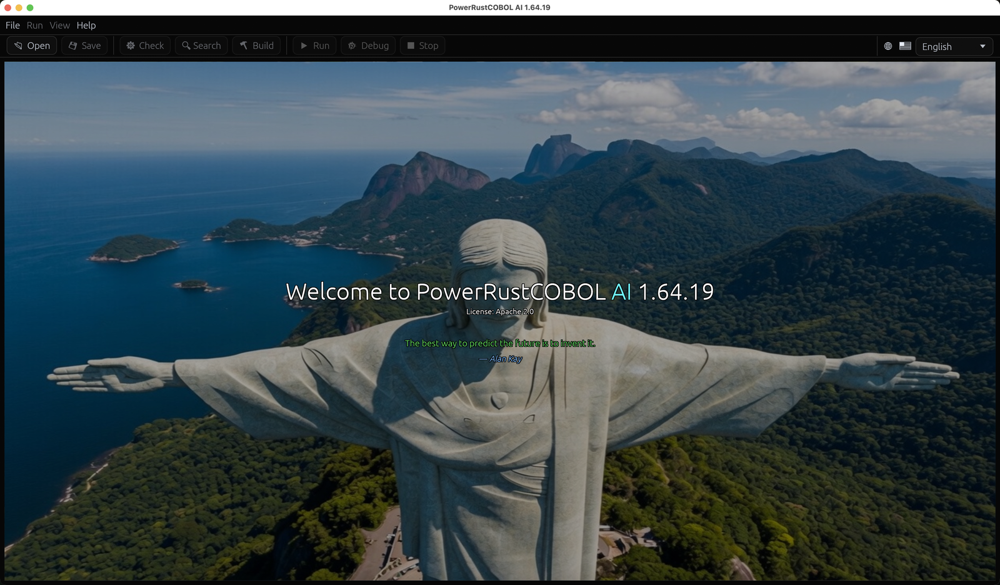</p>


Durante décadas, la única forma de escribir **COBOL con ventanas y dirigido por
eventos** era comprar una cadena de herramientas propietaria atada a un sistema
operativo, a un proveedor y a un modelo de licencias. Aquellas herramientas eran
excelentes en su momento, pero la mayoría están hoy sujetas a Windows, cerradas y
cada vez más difíciles de desplegar en máquinas modernas. Toda una generación de
lógica de negocio — nóminas, inventarios, trastiendas bancarias — está escrita en
ese estilo y no tiene adónde ir en el presente.

**PowerRustCOBOL existe para dar a ese estilo de desarrollo un hogar nuevo y
abierto.** Es un entorno de desarrollo rápido de aplicaciones (RAD) en el que:

- diseñas ventanas («formularios») arrastrando controles a un lienzo,
- asocias manejadores de eventos en **COBOL** a esos controles,
- y ejecutas, depuras y distribuyes el resultado como un **único ejecutable
  nativo autocontenido** — sin ningún runtime que instalar en la máquina de
  destino.

Sus objetivos de diseño, en términos sencillos:


| Objetivo                     | Qué significa para ti                                                                                                                                          |
| ---------------------------- | -------------------------------------------------------------------------------------------------------------------------------------------------------------- |
| **COBOL primero**            | La aplicación *es* COBOL. El diseñador genera COBOL; tus manejadores de eventos son programas COBOL-85 anidados. Nunca sales del lenguaje.                      |
| **Multiplataforma**          | Ni el IDE ni los binarios producidos están atados a un solo sistema operativo.                                                                                 |
| **Autocontenido**            | Una aplicación construida incorpora todo lo que necesita; el usuario final no instala PowerRustCOBOL.                                                           |
| **Acceso a datos moderno**   | Los ficheros indexados (ISAM) a prueba de caídas, SQL (SQLite / PostgreSQL / MySQL) y HTTP/REST se alcanzan mediante sentencias `CALL` ordinarias.              |
| **Abierto**                  | Con licencia Apache-2.0.                                                                                                                                       |

> **Nota.** PowerRustCOBOL está *inspirado* en la productividad de los RAD COBOL
> gráficos clásicos, pero es una implementación independiente y original.
> Conceptos como «formulario», «control» y «evento» son estándar del sector; la
> sintaxis, los formatos de fichero, el código generado y los servicios
> integrados que se describen aquí son propios de PowerRustCOBOL y no son
> compatibles con las herramientas de ningún otro proveedor.

---

## 2. Las tres piezas

PowerRustCOBOL se distribuye como tres herramientas que cooperan. Saber cuál es
cuál elimina mucha confusión desde el principio.

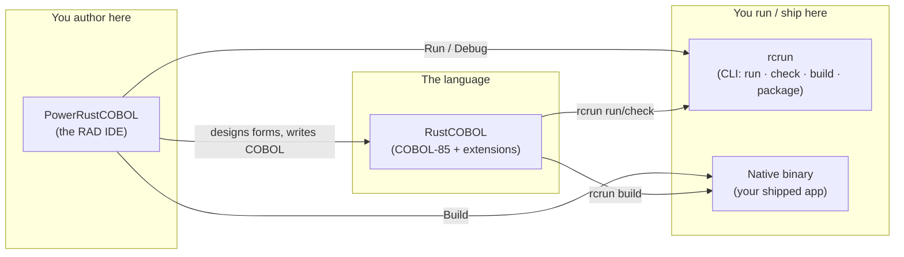


| Nombre             | Función                                                                                                                        | Piénsalo como…                                          |
| ------------------ | ------------------------------------------------------------------------------------------------------------------------------ | ------------------------------------------------------- |
| **RustCOBOL**      | El dialecto del lenguaje COBOL-85 más las extensiones de PowerRustCOBOL (llamadas a la GUI, cláusulas de ficheros indexados, SQL/HTTP). | El «lenguaje» del compilador/runtime.                   |
| **PowerRustCOBOL** | El IDE de escritorio: explorador de proyecto, editor de código, **Form Designer**, depurador.                                    | El «Workbench» / «Studio».                              |
| **rcrun**          | El runtime de línea de órdenes, el verificador, el empaquetador y el compilador de binarios.                                   | El «runtime + herramienta de construcción» que puedes guionizar en CI. |


> ⚠️ **Salvedad de nomenclatura.** Internamente, algunos artefactos de
> construcción y algunas carpetas se llaman `cobolt-*`. Ese es un detalle de
> implementación; los nombres de cara al usuario son **RustCOBOL**,
> **PowerRustCOBOL** y **rcrun**.

---

## 3. Instalación y arranque

Cada versión ofrece **dos descargas** por plataforma, y cualquiera de las dos es
completa — llevan la misma aplicación, el mismo `rcrun`, los mismos temas,
ejemplos y SDK de plataforma.

| Tu máquina | Instalador | Archivo comprimido |
| --- | --- | --- |
| Windows 10 / 11, 64 bits | `.msi` — doble clic, o `msiexec /i … /quiet` para desplegarlo en silencio | `.zip` |
| Macs con Apple Silicon | `.dmg` — arrastra PowerRustCOBOL a Applications | `.tar.gz` |
| Macs con Intel | `.dmg` | `.tar.gz` |
| Debian, Ubuntu, Mint y afines | `.deb` — `sudo apt install ./PowerRustCOBOL-*.deb` | `.tar.gz` |
| Fedora, RHEL, CentOS Stream, openSUSE | `.rpm` — `sudo dnf install ./PowerRustCOBOL-*.rpm` | `.tar.gz` |
| Cualquier otro Linux, 64 bits | — | `.tar.gz` |

Toma el **instalador** si quieres las cosas de siempre: una entrada en el menú
Inicio o en Applications, un lanzador de escritorio, `rcrun` en tu `PATH` y una
forma limpia de desinstalarlo más adelante. Toma el **archivo comprimido** si
prefieres no instalar nada — descomprímelo donde sea y ejecútalo, incluso desde
una memoria USB o desde una máquina en la que no puedas instalar software. Los dos
paquetes de Linux ponen la aplicación en `/opt/powerrustcobol` y enlazan
`powerrustcobol` y `rcrun` en `/usr/bin`; en cualquier otra distribución el
archivo comprimido es la descarga.

> ⚠️ **Ninguno de los dos está firmado todavía**, así que cada plataforma avisa
> una vez en la primera ejecución. En **macOS**: haz clic derecho en la
> aplicación y elige *Open*, o quita la marca de cuarentena con
> `xattr -dr com.apple.quarantine PowerRustCOBOL.app`. En **Windows**: SmartScreen
> ofrece *More info* → *Run anyway*. Un instalador no goza aquí de más confianza
> que un archivo comprimido — el aviso es por el certificado que falta, no por el
> formato.

Linux necesita glibc 2.35 o posterior (Ubuntu 22.04+, Debian 12+, Fedora 36+) y
las bibliotecas de OpenGL, X11 o Wayland que tu escritorio ya proporciona.

Arranca el IDE; en la primera ejecución te recibe un espacio de trabajo vacío y
el mensaje *«Open a COBOL file to get started.»* Puedes abrir un único fichero
`.cbl` o crear un **proyecto** completo (recomendado — véase §6).

<p align="center">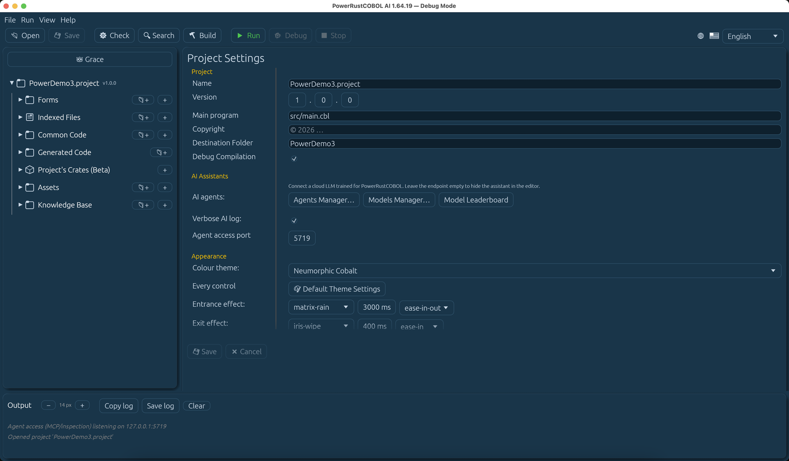</p>


Desde un terminal también puedes manejarlo todo sin interfaz con `rcrun` (véase
§17), que es lo que usan las canalizaciones de integración continua.

### La comprobación de Rust en la primera ejecución


El IDE diseña formularios y *ejecuta* programas por sí solo. **Build** es la
excepción: compila tu proyecto en una aplicación nativa a través de la **cadena
de herramientas de Rust** (§18), y lo mismo hace cualquier Run de un programa que
contenga un bloque `EXEC RUST`. Así que en su primera ejecución PowerRustCOBOL
busca Rust — y cuando encuentra uno utilizable, no dice nada en absoluto.

Cuando no lo encuentra, te dice en qué caso estás — Rust ausente, o una versión
anterior a la **1.92** que PowerRustCOBOL exige —, muestra la orden oficial de
[rustup.rs](https://rustup.rs) y se ofrece a ejecutarla por ti. Si rehúsas, se te
pregunta una vez más, porque rehusar tiene un precio que merece decirse:


| Sin Rust pierdes                                                  | Conservas                                   |
| ----------------------------------------------------------------- | ------------------------------------------- |
| **Build** — sin ejecutable nativo, nada que empaquetar            | El Form Designer                            |
| Ejecutar cualquier programa que contenga un bloque `EXEC RUST`    | El editor de código y las herramientas COBOL |
|                                                                   | **Run** (interpretado) y el depurador       |

Rehusar una segunda vez lo zanja y la pregunta no se vuelve a hacer. Instala Rust
más adelante desde [rustup.rs](https://rustup.rs) y **Build** simplemente
empezará a funcionar — no hay que avisar de nada al IDE.

> **Nota** — rustup pone Rust en `~/.cargo/bin`, que tu *perfil de shell* añade
> al `PATH`. Una aplicación arrancada desde el Finder o desde el escritorio de
> Windows nunca lee ese perfil, así que PowerRustCOBOL mira él mismo en esa
> ubicación y usa lo que encuentra allí. No hace falta arrancar el IDE desde un
> terminal para que **Build** funcione.

#### Rust está instalado y Build sigue sin poder terminar

Hay un segundo requisito previo, y rustup ni lo instala ni lo menciona: el
**enlazador**. Compilar produce código de máquina; el enlazador es lo que reúne
ese código en un fichero ejecutable, y pertenece al sistema operativo y no a
Rust.

| Plataforma  | Qué proporciona el enlazador                                        |
| ----------- | ------------------------------------------------------------------- |
| **Windows** | Las herramientas de compilación de C++ de Microsoft — *Build Tools for Visual Studio* (o Visual Studio) con la carga de trabajo **Desktop development with C++**. Visual Studio Code es un producto distinto y no las proporciona. |
| **macOS**   | Las herramientas de desarrollo de línea de órdenes de Apple — `xcode-select --install` |
| **Linux**   | La cadena de herramientas de C de tu distribución — `build-essential` en Debian y Ubuntu, *Development Tools* en Fedora y RHEL |

La comprobación de la primera ejecución también hace esta pregunta, haciendo que
Rust enlace un programa que no hace nada: la única forma fiable de saberlo, ya
que en Windows el enlazador se encuentra a través de la instalación de Visual
Studio y no a través del `PATH`. Si no puede, el IDE lo dice en la primera
ejecución, nombra el enlazador y muestra la orden que lo instala. No hay nada que
aceptar ni rehusar — no es una elección, solo lo único que sigue faltando.

Si te lo encuentras más tarde en su lugar — al final de una construcción, que es
donde esto solía aparecer —, **Build** informa de lo mismo con las mismas
palabras en lugar de con la salida del propio compilador. Mientras tanto todo lo
demás sigue funcionando: el Form Designer, el editor, **Run** y el depurador
nunca necesitaron un enlazador.

---

## 4. Tu primera aplicación: Hola, formulario

Este recorrido produce una ventana de un solo botón que muestra un mensaje.

1. **Crea un proyecto.** `File ▸ New Project…`, dale un nombre (por ejemplo
   `HelloPower`) y un programa principal. El IDE crea en disco la disposición de
   carpetas estándar **y un programa `main` inicial ejecutable** (un pequeño
   `DISPLAY`/`GOBACK` que puedes ejecutar de inmediato) y luego lo abre en el
   editor (véase §6).
2. **Crea un formulario.** En el árbol del proyecto, haz clic en el **➕** que
   está junto a **Forms**. Eso abre el diálogo *New Form* — pon un nombre
   (`main-form`), un título y un tamaño, y créalo. El formulario se guarda bajo
   `forms/` y se abre en el **Form Designer**.
3. **Suelta un botón.** Arrastra un **Button** desde la caja de herramientas al
   lienzo. Con él seleccionado, pon su `Caption` a `Say hello` en el panel de
   propiedades.
4. **Suelta una etiqueta.** Arrastra un **Label** desde la caja de herramientas
   al lienzo.
5. **Asocia un manejador.** Todavía sobre el botón, busca su evento **`onClick`**
   y haz clic en él para abrir el editor de eventos COBOL. Escribe, por ejemplo:

   ```cobol
              SET Label-1::Caption TO "Hello from COBOL!".
   ```

<!-- 📷 first-form-designer.png — Capture the Form Designer with the single button selected and the `onClick` event highlighted in the properties pane. -->
<p align="center">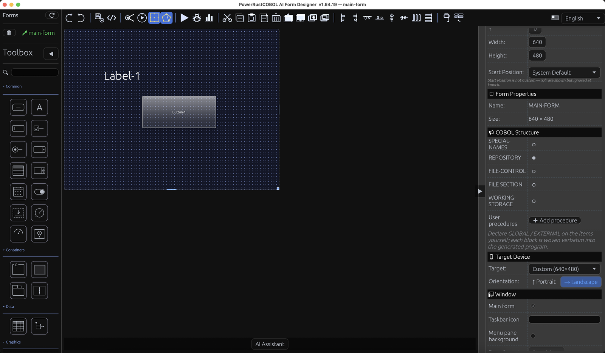</p>


6. **Ejecútalo.** Pulsa **Run** en la barra de herramientas (o el ▶ del
   diseñador). Aparece el formulario; al hacer clic en el botón se ejecuta tu
   manejador.

<!-- 📷 firstform.png — Capture the running form after the button has been clicked, with the greeting showing in the label. -->
<p align="center">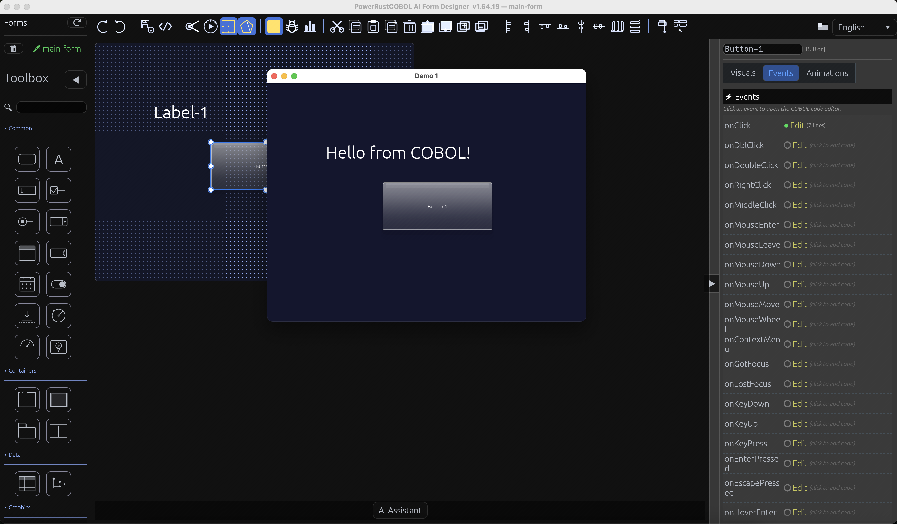</p>


> **Nota.** Cuando guardas o ejecutas un formulario, PowerRustCOBOL **genera** un
> fichero fuente COBOL para él (véase §12). Ese fichero no se edita nunca a mano
> — es un artefacto de construcción.


---

## 5. El IDE a primera vista

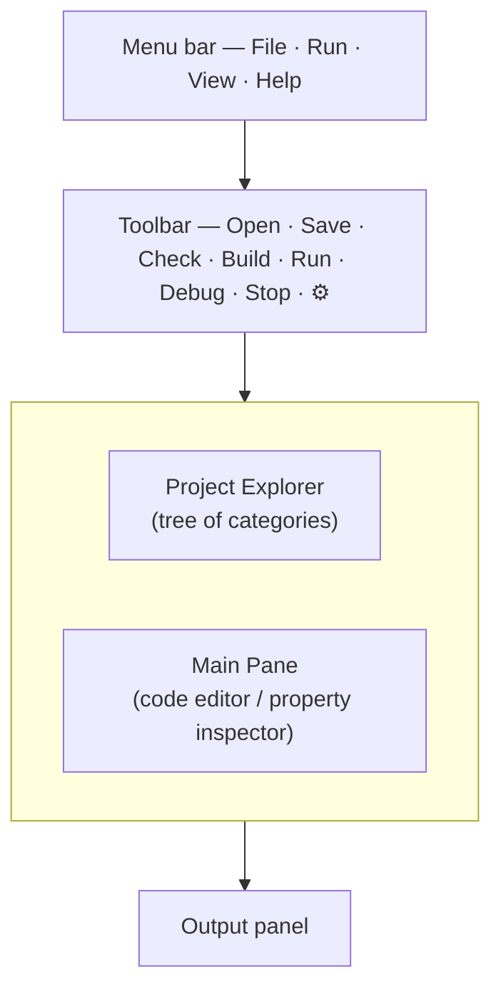

- **Project Explorer (izquierda).** Un árbol con la raíz en tu proyecto. Siete
  categorías fijas — **Forms**, **Indexed Files**, **Common Code**,
  **Generated Code**, **Project's Crates (Beta)**, **Assets**,
  **Knowledge Base** —, cada una con un botón **➕**, salvo **Generated Code**,
  que el Form Designer rellena por sí solo y al que nunca añades nada a mano. A la
  izquierda de cada elemento hay un **«mando» de estado**: 🟢 verde = verificado /
  probado correctamente, 🟡 amarillo = modificado desde la última verificación,
  🔴 rojo = se informó de un problema. Los formularios se despliegan para mostrar
  sus controles, agrupados por categoría de la caja de herramientas, y cada
  control se despliega hasta sus **Events**. Los Indexed Files se despliegan para
  mostrar los campos del registro (igual que los controles de un formulario).
  **Haz clic en el nodo raíz de arriba** (📁 NombreDeTuProyecto) en cualquier
  momento para abrir en el área de trabajo principal el formulario completo de
  ajustes del proyecto.

### Organizar el árbol del proyecto con carpetas

Cada categoría puede contener una jerarquía arbitraria de **carpetas**, de modo
que los proyectos grandes, de nivel empresarial, sigan siendo navegables (por
ejemplo `forms/customers/`, `src/billing/`).

- **Crear una carpeta.** Haz clic en el botón **📁+** de la cabecera de una
  categoría para añadir una carpeta en su raíz, o haz clic derecho en cualquier
  carpeta y elige **New folder…** para anidar una dentro de ella.
- **Renombrar una carpeta.** Haz clic derecho en la carpeta y elige
  **Rename folder…**. Todos los ficheros que el proyecto sigue bajo esa carpeta —
  y cualquier pestaña de editor abierta que apunte a uno de ellos — acompañan el
  cambio automáticamente.
- **Eliminar una carpeta.** Haz clic derecho y elige **Delete folder…**. Tras
  confirmarlo, la carpeta y **todo lo que hay dentro se elimina permanentemente
  del disco**, los ficheros se retiran del proyecto y se cierra cualquier editor
  que los estuviera mostrando. Esto no se puede deshacer.

Las rutas de las carpetas se almacenan siempre **relativas a la carpeta del
proyecto**, así que un proyecto se puede mover, comprimir o compartir sin romper
ninguna referencia.

### Mover ficheros: arrastrar y soltar

- **Dentro del árbol.** Arrastra un fichero sobre otra carpeta (o sobre la
  cabecera de una categoría) para moverlo allí; el fichero se mueve en disco y su
  entrada en el proyecto se actualiza. Un fichero no puede sobrescribir a otro
  existente con el mismo nombre, y una carpeta no se puede soltar dentro de sí
  misma.
- **Desde el sistema operativo.** Arrastra ficheros desde el Finder o el
  Explorador sobre una carpeta o una categoría para importarlos. Se copian dentro
  del proyecto y se siguen con una ruta relativa. Un fichero cuyo tipo no
  corresponda a la categoría de destino (por ejemplo un `.cfrm` soltado en Common
  Code) se rechaza.

### Navegación con el teclado

Con el puntero sobre el árbol del proyecto puedes desplazarte sin el ratón:

- **↑ / ↓** — ir a la fila visible anterior / siguiente. El elemento se carga de
  inmediato (sus propiedades o su editor, igual que con un solo clic), y el árbol
  se desplaza lo necesario para mantener a la vista la fila resaltada, dejando una
  fila libre respecto al borde superior o inferior.
- **→** — desplegar una carpeta plegada; si ya está abierta, entrar en su primer
  hijo.
- **←** — subir a la carpeta padre.
- **Enter** — abrir el elemento seleccionado (lo mismo que un solo clic).

En la primera ejecución (o en cualquier momento en que no haya ningún proyecto
abierto) el IDE muestra un único panel de bienvenida completo que es un solo
bloque de información centrado (título + licencia + una línea en blanco + cita +
autor) en medio del área disponible bajo la barra de menús y la barra de
herramientas:

Welcome to PowerRustCOBOL <versión>
License: Apache 2.0

<línea en blanco>
<texto de la cita en verde, elegido al azar en cada ciclo de una lista integrada>
— <autor en azul claro>

La cita rota al azar cada 7,5 segundos (1 s de aparición gradual, 6 s visible, 0,5 s de desaparición gradual). El árbol de la izquierda, el editor, la salida y los controles propios del editor quedan ocultos hasta que usas File → New Project o File → Open Project. Una vez abierto un proyecto aparece el espacio de trabajo normal de tres paneles. La guía completa está disponible en la carpeta docs/.

- **Barra de herramientas (arriba).** `Open · Save · Check · Build · Run · Debug ·
  Stop`, más el selector de idioma en el extremo derecho. *Run* interpreta el
  programa; *Build* compila un binario nativo; *Check* ejecuta solo el análisis
  sintáctico y semántico; *Debug* se habilita cuando hay seleccionado un elemento
  de Generated Code.
- **Panel principal (centro / a la derecha del árbol).** Muestra el editor de
  código, el **inspector de propiedades** (cuando haces clic en un formulario o
  control del árbol) **o el formulario de ajustes del proyecto** (cuando haces
  clic en la raíz del proyecto en lo alto del árbol, o automáticamente cuando el
  IDE abre un proyecto por primera vez — sin ningún editor visible). El botón
  **👑 Grace** que está sobre el árbol del proyecto abre en este panel el chatbot
  Grace de alcance global del proyecto. Usa exactamente la misma construcción de
  panel de cristal (CentralPanel + marco de cristal) que el inspector de
  propiedades de los controles, para lograr un ancho coherente (sin quedarse corto
  en el borde derecho) y un comportamiento de altura al 100 % completo (el panel
  crece y se encoge con el área disponible por encima del panel Output cuando se
  redimensiona la ventana o el divisor). El borde y el trazo inferiores
  redondeados de la tarjeta se mantienen claramente por encima de la salida y la
  consola, con un hueco visible gracias al margen exterior inferior del marco; los
  botones Save/Cancel se sitúan en la parte inferior de la tarjeta. Haz clic en lo
  alto del árbol del proyecto (la línea 📁 NombreDelProyecto) en cualquier momento
  para abrirlo. Tiene una única línea de redimensionado vertical continua que
  recorre el contenido de arriba abajo. Las etiquetas de la izquierda nunca parten
  palabras; se truncan con `…` (por ejemplo `Standard system p…`) y el
  desarrollador puede arrastrar libremente el redimensionador (la división se
  mueve con independencia de la longitud de cualquier etiqueta, hasta el 80 % del
  ancho del panel). Los controles de la derecha son elásticos y todos empiezan en
  la misma posición x tras un hueco de 10 px, lo que da una alineación vertical
  perfecta de todos los valores de propiedad. Secciones, en orden: Project, AI
  assistant, Appearance, License, Integrations, Runtime — los ajustes de IA
  (Agents Manager, Model Providers Manager, Model Leaderboard) quedan justo debajo
  de Project, donde los alcanzas sin tener que pasar por delante de un texto de
  licencia que fijas una vez y rara vez vuelves a tocar. Botones **Save** y
  **Cancel** explícitos en la parte inferior de la tarjeta (Cancel se habilita
  solo después de que haya cambios; revierte a lo último guardado). La línea del
  redimensionador sigue el tema actual (más brillante al pasar el puntero o al
  arrastrarla). El editor de código (cuando está visible) lleva una **barra de
  estado** a lo largo del borde inferior — el cursor `Ln, Col`, el modo
  **Insert/Overwrite** (se alterna con la tecla `Insert`), un interruptor
  **Trim on save** (quita el espacio en blanco final al guardar) y, para los
  documentos que no son Markdown, una orden **Beautify** que reformatea el COBOL
  según las reglas de disposición descritas más abajo en *Beautify — las reglas de
  disposición*. Los ficheros Markdown no tienen Beautify porque el formateo de
  COBOL no se les aplica.

<!-- 📷 project-settings-form.png — Show the left tree with the root node highlighted (hand cursor), and the main area with the two-column settings form inside its glass card (single continuous vertical resizer line, labels truncated with … before the line, all value controls aligned on the right, Save/Cancel at the bottom of the card). The card's rounded bottom border must be clearly visible above the Output panel with a gap (no… -->

<p align="center">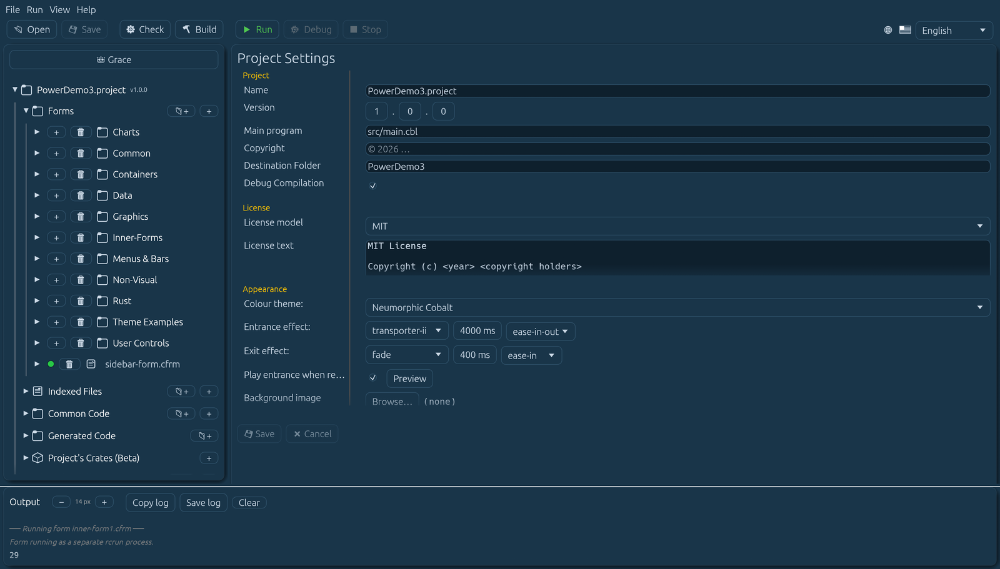</p>

- **Panel Output (abajo).** La salida de `DISPLAY` del programa, los registros de
  construcción y los mensajes de estado.

<!-- 📷 ide-overview.png — A full-window capture with a project open, a form selected (so the property inspector is visible), and some text in the Output panel. Annotate the four regions if you can. -->

<p align="center"></p>

### El asistente de IA (opcional)

PowerRustCOBOL puede poner un modelo de lenguaje grande — uno que proporciones tú,
idealmente entrenado con esta documentación — justo encima del editor de código. El
asistente es **totalmente opcional y está desactivado por omisión**: hasta que no
rellenes los datos de conexión, la barra de instrucciones no aparece nunca.

**Configúralo desde el formulario de ajustes de la raíz del proyecto.** Haz clic en
el nodo superior del árbol del proyecto (la línea 📁 con el nombre de tu proyecto).
En la sección **AI assistant** del formulario puedes introducir los datos de
conexión. El comportamiento de la IA y los agentes pertenecen al proyecto abierto y
viajan en su `cobolt.toml` y en su directorio `agentic_ai/`; la configuración del
proveedor y las claves de API son locales de la máquina y no viajan nunca en un
repositorio:


| Campo                               | Significado                                                                                                                                                                                                                                                                                                                                                                                                                                                                                                                                                                                        |
| ----------------------------------- | --------------------------------------------------------------------------------------------------------------------------------------------------------------------------------------------------------------------------------------------------------------------------------------------------------------------------------------------------------------------------------------------------------------------------------------------------------------------------------------------------------------------------------------------------------------------------------------------------- |
| **Endpoint URL**                    | La URL completa del modelo. Usa un punto final de chat compatible con OpenAI, como `https://…/v1/chat/completions`, o el punto final Responses de xAI/Grok `https://api.x.ai/v1/responses`. Un valor por omisión de proveedor que no hayas tocado recibe automáticamente su ruta de petición convencional; después de que edites este campo, el IDE usa la URL exactamente como la hayas introducido. |
| **API key**                         | Se envía como `Authorization: Bearer …`. Déjalo vacío para un punto final local sin clave. Una clave introducida aquí configura su **proveedor**, exactamente igual que hace el Model Providers Manager, y se almacena solo en esta máquina. Un campo vacío significa que aquí no se almacena ninguna credencial para ese proveedor. |
| **Model**                           | El identificador del modelo que se pasa en cada petición.                                                                                                                                                                                                                                                                                                                                                                                                                                                                                                                                          |
| **Reviewer model (Pedantic Agent)** | Un segundo modelo opcional que revisa las respuestas del agente principal con un escrutinio sin concesiones. Si se establece, debe ser distinto del modelo principal (el IDE lo impone). Con un revisor configurado, la comprobación de **COBOL Proficiency** se ejecuta en tándem: el modelo principal responde, el Pedantic Agent lo revisa contra la instrucción principal como especificación autorizada, exige un reenvío corregido completo cuando encuentra defectos, vuelve a revisar la revisión y produce la valoración final brutalmente honesta — el panel muestra entonces las puntuaciones del *revisor*, no las autopuntuaciones del modelo. |
| **Temperature**                     | Aleatoriedad del muestreo (0 = determinista). La prueba de conexión usa exactamente este valor, porque algunos modelos solo aceptan el valor por omisión definido por su proveedor, habitualmente `1.0`.                                                                                                                                                                                                                                                                                                                                                                                            |
| **Standard system prompt**          | Las instrucciones que se envían en cada petición. Se proporciona un valor por omisión razonable; edítalo para adaptarlo a tu modelo.                                                                                                                                                                                                                                                                                                                                                                                                                                                                |

**Model Providers Manager.** Junto a *Manage agents…* en los ajustes del proyecto
está **Model Providers Manager…**. Aquí configuras un **proveedor** — su punto
final y su clave de API — y nada más. Desde el momento en que la clave de un
proveedor funciona, **todos los modelos que ese proveedor ofrece quedan
disponibles** para cualquier agente; no hay ninguna configuración por modelo que
hacer. Elige un proveedor de la lista de la izquierda (un punto relleno marca uno
que está configurado), ajusta su punto final si necesitas otro anfitrión, pega la
clave y usa **Refresh models** para traer el catálogo actual. **Test** envía una
petición para que puedas confirmar la credencial antes de fiarte de ella.

**Cuando una llamada falla.** La ventana de error se abre con el motivo en su
propia línea arriba, sobre una regla, y con el registro completo de la conexión
debajo. El titular es la frase del propio proveedor, citada — *«You exceeded your
current quota, please check your plan and billing details»*, *«'temperature' is not
supported with this model»* — con el campo de la petición o el código de error que
haya nombrado mostrado debajo cuando la frase no los diga ya. El registro de abajo
queda sin cambios y completo; **Copy** y **Save…** se llevan todo, no el titular.
Un error cuya carga útil no lleve tal frase no recibe titular: nunca se te muestra
un resumen de algo que no se dijo.

**Nota — los modelos de razonamiento pasan la prueba.** *Test* hace una sola
pregunta: ¿este modelo es alcanzable y responde? Algunos modelos piensan antes de
hablar y devuelven solo razonamiento oculto en una petición tan pequeña como esta
— el punto final se resolvió, la clave se aceptó, volvieron tokens, pero no volvió
texto visible. Eso cuenta como aprobado, y el resultado lo dice así. Son solo los
agentes los que necesitan texto visible: convierten una respuesta en operaciones
sobre el formulario, y un razonamiento que nunca ven no se puede aplicar — así que
un modelo que responde a los agentes solo con razonamiento oculto sigue
reportándose como inutilizable *ahí*, con el mismo consejo de desactivarle el
pensamiento.

El panel del proveedor a la derecha **se desplaza** — el punto final, la clave, los
modelos y *Where keys are kept* son todos alcanzables por pequeña que hagas la
ventana, y la lista de proveedores de la izquierda se desplaza de forma
independiente.

La configuración del proveedor es **de toda la máquina**, almacenada junto a tus
demás ajustes locales de máquina y no en el proyecto. Configura Anthropic una vez y
todos los proyectos de esta máquina podrán usarlo. La clave de API **nunca** se
escribe en un fichero de proyecto, en COBOL generado ni en una aplicación
compilada o empaquetada. Un Ollama local no necesita clave alguna — un punto final
alcanzable es suficiente.

> **Nota.** Esto sustituye al antiguo *Models Manager*, donde una conexión se
> definía una vez por *modelo* como un «perfil de modelo» con nombre y los agentes
> lo referenciaban. Usar un segundo modelo de un proveedor que ya habías pagado
> significaba construir todo un segundo perfil y volver a pegar la misma clave.
>
> **Tus proyectos existentes se migran solos.** La primera vez que abras uno, cada
> agente adopta el proveedor, el modelo, la temperatura, el tope de tokens de
> salida y el tiempo de espera del perfil que referenciaba, y cada proveedor se
> configura a partir de lo que esos perfiles sabían. No se te pide nada y no hay
> nada que volver a introducir. ⚠️ Un proveedor puede tener ahora **una** clave,
> así que si tenías varios perfiles del mismo proveedor con claves *distintas*, se
> conserva la almacenada más recientemente y las demás se nombran en el panel
> Output — vuelve a introducir una en el Model Providers Manager si era la que
> querías.

#### Dónde se guardan tus claves

Por omisión una clave vive durante **una sola ejecución**. No se escribe nada en
disco, y la próxima vez que abras el IDE volverá a preguntar. Eso es deliberado —
una clave en disco es una clave que se puede copiar, respaldar o publicar en un
repositorio — pero es tedioso, así que al pie del Model Providers Manager decides
por ti mismo:


| Elección                    | Qué ocurre                                                                                                                                                                                                                                              |
| --------------------------- | ------------------------------------------------------------------------------------------------------------------------------------------------------------------------------------------------------------------------------------------------------- |
| **Not kept**                | El valor por omisión. Las claves viven solo en este proceso y se vuelven a pedir en la ejecución siguiente.                                                                                                                                             |
| **A local file**            | Toda la configuración de modelos, claves incluidas, se escribe en un fichero que nombres tú. Se crea legible solo por su propietario (modo `0600` en macOS y Linux) y lleva un aviso en texto plano arriba. Al reabrir el IDE se recuperan las claves directamente. |
| **The OS credential store** | El almacén propio de tu plataforma — Keychain, Credential Manager, Secret Service. Se ofrece pero **todavía no es seleccionable: llegará en la versión oficial**, en cuanto tenga una interfaz capaz de inspeccionar, rotar y borrar lo que guarda.       |

**Un fichero no puede vivir nunca dentro de un repositorio git.** Esto no es una
preferencia y no hay forma de anularlo. Si la ruta que elijas está en cualquier
punto bajo un `.git` — en la raíz del repositorio, enterrada diez carpetas más
abajo, o en un submódulo o en una copia de `git worktree` — se rechaza, y el
rechazo nombra el repositorio para que sepas con cuál te has topado. Una clave
publicada en un repositorio es una clave publicada, y una clave publicada no se
puede retirar.

`/tmp/llm_config.json` se ofrece primero justamente por eso: nada de lo que hay en
`/tmp` se puede publicar en un repositorio, y no sobrevive a un reinicio — lo cual,
para una credencial, es una virtud. Haz clic en una ruta sugerida o escribe la
tuya, pulsa **Use this file**, y las claves se escriben cuando se guarde la
configuración. **Forget the file** lo elimina y vuelve a no guardar claves en
absoluto.

El fichero de configuración de toda la máquina no cambia: sigue sin llevar
**ninguna credencial**, solo tu elección de dónde van las claves y la ruta que
escogiste. Borrar una clave en el gestor sigue borrándola — una eliminación
explícita siempre gana a un fichero que recuerda.

> ⚠️ **Salvedad.** Un fichero guarda tus claves en texto claro. Está protegido por
> los permisos del fichero y por nada más: cualquier cosa que se ejecute como tú
> puede leerlo, y estará en cualquier copia de seguridad que copie la carpeta. Si
> eso no es aceptable, deja la elección en **Not kept** hasta que el almacén de
> credenciales del sistema operativo llegue en la versión oficial.

**Agents Manager.** La fila *AI agents* abre la base de datos de agentes
aprovisionados del proyecto, en tres pestañas.

**Pestaña 1 — Agent × Model.** Una fila por agente — Grace, cada especialista,
cada revisor y el COBOL Proficiency Judge — con las cosas que deciden cómo se
ejecuta ese agente.


| Columna           | Significado                                                                                                                                                                  |
| ----------------- | ---------------------------------------------------------------------------------------------------------------------------------------------------------------------------- |
| **Agents**        | El agente que configura la fila.                                                                                                                                             |
| **Models**        | En qué modelo se ejecuta, elegido entre los del proveedor seleccionado en el cuadro **Model provider** que está sobre la tabla. Elige **— no model —** para dejar un agente sin configurar a propósito. |
| **Rating**        | Lo que el Leaderboard sabe de ese modelo, o *Not tested* si nunca se ha evaluado.                                                                                            |
| **Temp**          | Aleatoriedad del muestreo solo para este agente (0 = determinista).                                                                                                          |
| **Output Tokens** | La respuesta más grande que este agente puede producir.                                                                                                                      |
| **Timeout**       | Cuánto esperarlo, en segundos.                                                                                                                                               |

El cuadro **Model provider** es un *ámbito de selección*, no un interruptor de
alcance global del proyecto. Decide qué modelos de proveedor ofrece la columna
Models mientras estás configurando, y no cambia ningún agente que no toques — así
que Grace puede ejecutarse en un proveedor en la nube mientras tus especialistas se
ejecutan en un Ollama local. Cada agente recuerda el proveedor del que vino su
modelo. Con cientos de modelos ofrecidos por algunos proveedores, el cuadro de
búsqueda junto al selector acota la lista.

Una fila cuyo modelo está reservado para otro papel muestra un aviso junto al
nombre del agente: un especialista no puede ejecutarse en el modelo de Grace, ni en
el del Judge. (El Judge *sí puede* compartir el modelo de Grace, siempre que no
haya ningún especialista en él.)

**Cuando un proveedor retira un modelo.** Los modelos se dan de baja — Anthropic,
OpenAI, Meta y los demás los retiran según su propio calendario — y una
clasificación para un modelo que ya no existe es peor que no tener ninguna: te
invita a elegirlo. Así que un refresco en el Model Providers Manager que vuelva con
un catálogo retira también del Leaderboard cualquiera de los modelos de ese
proveedor que el catálogo ya no liste, y dice cuáles en el panel Output.

Solo un refresco que **listara modelos de verdad** puede hacer esto, y solo para el
proveedor que listó. Una petición fallida, una clave caducada y un proveedor que
todavía no has refrescado producen todos una lista vacía, que no dice nada sobre lo
que existe — así que un resultado vacío no retira nada en absoluto. También puedes
retirar un modelo tú mismo: cada fila del Leaderboard tiene **Remove**, para el caso
en que un proveedor haya cerrado un modelo antes de que su catálogo se haya puesto
al día. Pregunta primero, porque una clasificación cuesta tokens reales y tiempo
real.

Si un agente estaba ejecutándose en el modelo que desapareció, el Agents Manager se
abre en ese agente para que puedas darle otro de inmediato — un agente que apunta a
un modelo retirado es la parte que de verdad rompe una ejecución, y enterarse en el
siguiente flujo de trabajo, como un error de conexión, es la forma cara de
aprenderlo.

Una retirada se mantiene: un modelo retirado no lo devuelve la siguiente
sincronización del proyecto, ni tampoco la reproducción de informes de evaluación
archivados. Tu archivo en `agentic_ai/model-benchmarks.jsonl` queda intacto — esos
informes son el registro de lo que ejecutaste y pagaste, y nada de esto los elimina.
**Volver a probar un modelo retirado lo trae de vuelta**, con su nuevo resultado,
así que una retirada con la que no estés de acuerdo cuesta una ejecución deshacerla.

**Pestaña 2 — Agent Configuration.** La lista de agentes de la izquierda maneja el
panel de detalle de la derecha: **Agent Details** (id, nombre, tipo,
especialización, propósito, habilitado), el editor de instrucciones, las
capacidades, el conocimiento y las relaciones.

**Pestaña 3 — User Guide.** Una guía escrita sobre cómo encajan los modelos y los
agentes, en el idioma de tu interfaz. Cada una de sus cuatro secciones empieza con
una explicación sencilla, luego profundiza y luego expone la versión precisa — lee
hasta donde te sea útil y detente. Cubre el emparejamiento de agentes con modelos y
la regla de compartición, qué hace cada ajuste, por qué tu modelo más potente
corresponde a los revisores y al Judge en lugar de al que escribe, y el vocabulario
(modelos, agentes, revisores Pedantic, el Judge, los tokens y lo que cuestan, los
modelos locales, la cuantización, y por qué la VRAM es la cifra que decide si un
modelo local es utilizable). La búsqueda resalta las coincidencias y salta entre
ellas, el tamaño del texto es ajustable, la tabla de contenidos salta, y
**Export PDF** escribe la guía completa.

El pie lleva **Cancel**, **Apply** (guardar y seguir trabajando) y **Save**. El
directorio interno `agentic_ai/` está oculto a propósito del árbol del proyecto;
usa el Agents Manager para configurar agentes mientras Grace mantiene ahí sus
registros de flujo de trabajo automáticamente. El editor de instrucciones es
redimensionable en vertical de cuatro a veinte filas de texto; las instrucciones más
largas se desplazan dentro del editor en lugar de aumentar su altura. **New Agent** y
**Delete Agent** están ocultos por ahora porque la malla integrada completa se crea
y se repara junto con el proyecto. Los dos flujos de trabajo siguen implementados
para el mantenimiento futuro. Un agente vive en tu proyecto en
`agentic_ai/<agent name>/` — la instrucción multilínea del agente en
`<agent name>_prompt.md`, más `steering/`, `policies.md`, `skills/`, `mcp.json`,
`knowledge/` y `agent.json` (identidad y configuración de ejecución — la clave de
API **nunca** se almacena en el proyecto; las claves se quedan en tu máquina y se
piden una vez por modelo). Los nombres de agente son únicos y quedan fijados al
crearlos, porque dan nombre a la carpeta. Cada agente principal puede nombrar un
**compañero pedante** que revise sus respuestas — un principal y su propio compañero
deben usar modelos distintos, mientras que agentes no relacionados pueden compartir
modelos libremente. La relación es uno a uno: un orquestador o un especialista puede
tener como máximo un compañero Pedantic, y un revisor Pedantic puede pertenecer como
máximo a un agente revisado. Selecciona la relación desde la sección
**Companion (Pedantic reviewer)** del agente principal o desde la sección editable
**Pedantic Companion for** del agente Pedantic; los dos selectores escriben la misma
configuración de proyecto. El planificador de Grace y los agentes participantes
reciben la relación exacta en tiempo de ejecución, de modo que un revisor no se puede
sustituir ni reutilizar para otro agente. La creación del proyecto aprovisiona los
especialistas fijos — el **Form Designer Agent**, el **COBOL Event Handler Script
Agent**, el **Documentation Agent**, el **Data (Indexed File) Agent** y el
**Version Control Agent** — más **Grace**, la orquestadora. A cada uno le sigue
inmediatamente su propio revisor, cuyo nombre canónico es el nombre del principal con
el sufijo **Pedantic Reviewer**:

- **Grace Pedantic Reviewer**
- **Form Designer Agent Pedantic Reviewer**
- **COBOL Event Handler Script Agent Pedantic Reviewer**
- **Documentation Agent Pedantic Reviewer**
- **Data (Indexed File) Agent Pedantic Reviewer**
- **Version Control Agent Pedantic Reviewer**

Cada revisor se crea con una instrucción, una descripción, un contrato de
encaminamiento y un enlace de compañero uno a uno específicos de su propósito. El
desarrollador selecciona su perfil de modelo y puede adaptar su instrucción, sus
habilidades, sus herramientas y su conocimiento; ningún revisor hay que construirlo
ni asociarlo a mano. Abrir un proyecto existente ejecuta la misma reparación
idempotente: un revisor integrado que falte se vuelve a crear y a enlazar, mientras
que las instrucciones no vacías del proyecto y el resto de la configuración del
desarrollador siguen siendo las autorizadas. Los nombres de revisor antiguos se
migran en su sitio sin cambiar sus identificadores estables ni sus perfiles
seleccionados.

Grace sigue siendo la única autoridad de coordinación (👑, siempre llamada Grace,
nunca eliminable) que planifica el trabajo multiagente, delega en los especialistas
por tipo y especialización, impone cada puerta de revisión pedante y ensambla el
resultado final validado. La instrucción por omisión de **Grace Pedantic Reviewer**
revisa la cobertura de la petición, la descomposición en tareas, la titularidad, las
dependencias, el gobierno de la documentación, las evidencias, la integración entre
agentes, los fallos y las afirmaciones de finalización. Las instrucciones de revisor
locales del proyecto siguen siendo editables en el Agents Manager y la reparación de
agentes fijos preserva esas ediciones. Dale un modelo a cada revisor en la tabla de
ejecución antes de habilitar su conexión de revisión; un principal y su compañero
Pedantic no pueden usar el mismo modelo.

**Cuando Grace pregunta en lugar de actuar.** Una petición que admite más de una
lectura recibe una pregunta en lugar de una conjetura — un globo rojo en el mismo
chat, nombrando exactamente qué es lo ambiguo. Contéstala en el mismo cuadro, tan
brevemente como quieras («el Caption», «UUID», «aas-clientes»): la respuesta vuelve
llevando la pregunta que responde, de modo que Grace reanuda la petición original
con tu decisión aplicada. No tienes que volver a exponer lo que pediste. Si en su
lugar escribes otra cosa, eso pasa a ser la petición y las preguntas se descartan.

Los contratos de encaminamiento integrados son explícitos: el Form Designer Agent
es dueño del diseño RAD de formularios y delega la implementación de eventos; el
COBOL Event Handler Script Agent implementa exactamente esos comportamientos
delegados; el Documentation Agent es el único que escribe la documentación del
proyecto y prepara las entregas normalizadas de esquemas de ficheros indexados; el
Data (Indexed File) Agent es el único que mantiene las definiciones `.cidx` a través
del modelo de interfaz de Indexed File; el Version Control Agent es dueño de las
operaciones de Git del proyecto con evidencias y de las puertas de confirmación; y
Grace Pedantic Reviewer revisa únicamente la orquestación de Grace. Cada agente
recibe una instrucción por omisión específica de su papel. Los valores por omisión
vacíos o heredados conocidos se reparan, mientras que las instrucciones no vacías
editadas en el proyecto siguen siendo las autorizadas. Los registros existentes
`DocumentationAgent`, `Pedantic Grace Reviewer`, `Grace Pedantic Reviewer Agent`,
`Pedantic UI Agent` y `Pedantic COBOL Companion` se renombran en disco sin cambiar
sus identificadores estables ni sus modelos. Un `Orchestrator Pedantic Reviewer
Agent` redundante se fusiona en **Grace Pedantic Reviewer** y se elimina.

El botón **👑 Grace** que está sobre el árbol del proyecto ocupa el ancho actual del
panel del árbol (con un mínimo de 150 px) y acompaña al panel cuando lo
redimensionas. Abre en el panel principal una conversación de alcance de proyecto,
con historial persistente, progreso del flujo de trabajo y controles de aprobación
para las operaciones con puerta. La cabecera de su panel de propiedades la identifica
como **👑 Grace - The PowerRustCOBOL Agentic AI Orchestrator**.

**Elegir dónde van las cosas.** Como el árbol del proyecto admite carpetas, un
nombre puede existir en más de un lugar. Cuando le pides a Grace que **cree** un
elemento (un formulario, un fichero indexado, un fuente de código común, un fichero
de documentación o un activo), abre una pequeña ventana centrada que muestra el
árbol del proyecto para que elijas la **carpeta** de destino — también puedes crear
allí mismo una carpeta nueva. Cuando le pides a Grace que **edite** un elemento por
su nombre y más de un elemento comparte ese nombre, la misma ventana te permite
elegir **cuál**; si solo coincide uno, Grace simplemente lo edita. Cancelar la
ventana detiene la operación, y Grace informa de que no se creó ni se editó nada.
(Esta pregunta aparece en el chat de Grace de proyecto completo; las superficies de
chat compactas del editor y del diseñador no pueden mostrarla, así que una petición
ambigua allí te pide usar el chat de Grace del proyecto.)

Todos los chatbots del IDE se encaminan a través de Grace. La superficie aporta una
preferencia orientativa: el Form Designer RAD prefiere el Form Designer Agent, su
editor de eventos prefiere el COBOL Event Handler Script Agent, y el editor de
código pide a Grace que seleccione por capacidad. La preferencia no es nunca
exclusiva. Grace puede repartir una petición entre cualesquiera especialistas
habilitados, así que una petición de crear un botón y cablear su comportamiento
`onClick` puede coordinar tareas tanto de diseño de formulario como de manejador de
eventos. Cada flujo de trabajo ejecuta sus revisiones pedantes configuradas, emite el
progreso en directo y guarda un registro auditable bajo `agentic_ai/Grace/runs/`.

**Estado de la acción en directo.** Mientras Grace y los especialistas trabajan, la
conversación muestra qué está *haciendo* ahora mismo cada agente como una línea de
estado breve — por ejemplo `Form Designer Agent: Drafting response — T1` o
`Grace: Retrieving context` —, actualizada como máximo una vez por segundo para que
las ejecuciones largas no parezcan nunca atascadas. Cada paso aterriza además en una
entrada **Agent actions (N)** que permanece plegada en la conversación; despliégala
para revisar la secuencia ordenada de pasos por agente que tomó la ejecución, y se
guarda con el historial del chat y con el registro del flujo de trabajo, de modo que
sigue siendo revisable después de reabrir el proyecto. Las líneas de estado nombran
**solo acciones** y se muestran en el idioma de tu interfaz. El contenido que una
acción produjo o consumió — conocimiento recuperado, salida de herramientas,
razonamiento del modelo — no aparece nunca en la conversación: el rastro completo
vive en el registro de IA del panel Output, en el volcado de diagnóstico (cuando hay
un interruptor de depuración activado) y en el registro de ejecución guardado bajo
`agentic_ai/Grace/runs/`. Con el ajuste de IA **verbose** del proyecto habilitado, el
flujo de acciones gana pasos más finos (por llamada de herramienta, por ronda de
revisión) — más granularidad, pero seguirá sin haber contenido. El modo verbose
añade también una línea **Token savings** a la conversación después de cada ejecución
— el porcentaje del corpus indexado de la Knowledge Base que la recuperación mantuvo
*fuera* del contexto (registros recuperados frente al corpus completo, estimado a
≈4 caracteres por token) — para que puedas ver qué te está comprando la capa de
recuperación.

**Recuperación por fragmentos.** Los documentos de la Knowledge Base se indexan dos
veces: como documentos completos (para la gestión de documentos) y como un **almacén
fragmentado** en el que cada control, propiedad, método, evento y sección de prosa es
su propio registro con un campo de contenido `PIC X(512)` — el contenido más largo
continúa en registros enlazados al anterior, y la búsqueda vuelve a ensamblar la
cadena. El texto de cada registro se incrusta individualmente, así que cuando le
preguntas a Grace, por ejemplo, por los eventos de DataGrid, el contexto recibe los
registros de DataGrid — no el catálogo completo de controles. El material de
referencia propio del IDE vive en `~/PowerRustCOBOL/data/chunked.data`; cada proyecto
guarda su documentación en `data/<project-name>-chunked.data`. Guardar, editar o
eliminar un documento de la Knowledge Base deja el fichero en sí intacto y vuelve a
fragmentar y a incrustar solo los registros de ese documento en la siguiente
ejecución.

El almacén fragmentado del IDE **se distribuye dentro del propio IDE**, ya incrustado
con el modelo semántico: un clon o una instalación recién hechos arrancan con su
índice listo y no vuelven a incrustar el material de referencia salvo que se elimine,
se cambie o se sustituya un documento de la Knowledge Base. En una máquina que
todavía no haya descargado el modelo semántico, los registros distribuidos se
preservan y se buscan léxicamente hasta que el modelo llegue — no se descarta nada.
Cuando unos registros sí necesitan (re)incrustarse — un documento cambiado, o la
documentación de tu propio proyecto —, la conversación muestra una **barra de
progreso** (`Indexing Knowledge Base (n of m records)`) para que un indexado largo no
parezca nunca atascado.

### Búsqueda de código en todo el proyecto

Si mantenías aplicaciones en PowerCOBOL recordarás la rutina: «¿en qué otro sitio
usé `CUST-BALANCE`?» significaba abrir a mano cada hoja y cada procedimiento de
evento. PowerRustCOBOL lo responde en una sola ventana: **View ▸ Code Search…**,
el botón 🔍 **Search** de la barra de herramientas, o **Ctrl+Shift+F**
(**Cmd+Shift+F** en macOS) abre la ventana de búsqueda; el **Ctrl+F** simple
conserva su significado antiguo, buscar en la pestaña del editor actual.

Escribe una consulta de texto plano y pulsa **Search**. El barrido cubre **todos
los lugares en los que puedes escribir COBOL** en el proyecto: cada manejador de
evento de control, el `onLoad`/`onClose` de cada formulario, cada procedimiento de
usuario, las cinco secciones de estructura (`SPECIAL-NAMES`, `REPOSITORY`,
`FILE-CONTROL`, `FILE SECTION`, `WORKING-STORAGE`) de cada formulario — los
formularios abiertos se leen de su texto **vivo, incluso sin guardar** — más cada
fichero de Common Code.

- Los resultados se agrupan por formulario y luego por sitio, y cada fila muestra
  el número de línea *dentro de ese manejador o sección* y la línea coincidente
  con la coincidencia resaltada; la línea de totales cuenta las apariciones y los
  sitios distintos.
- **Case sensitive** y **Whole word** están ambos desactivados por omisión.
  Whole word entiende las palabras de COBOL: `BAL` no coincide dentro de
  `CUST-BAL`.
- **Haz doble clic** en un resultado y el IDE abre el editor propietario — la
  ventana modal del evento, la ventana COBOL Structure o el editor de código para
  Common Code — con el cursor en esa línea, abriendo primero el diseñador del
  formulario si no estaba abierto.
- La ventana es tuya hasta que la cierres: se queda abierta mientras saltas de un
  lado a otro, editas y vuelves a hacer Check; se redimensiona solo cuando
  arrastras su tirador de esquina, y se cierra solo con su **✕** o con **Cancel**.

Lo que deliberadamente **no** busca: los ficheros `.cbl` generados (artefactos de
construcción — cada acierto en uno de ellos es un duplicado de un acierto en su
sitio real) y la papelera de código eliminado.

<!-- 📷 code-search.png — The search window over a project, showing grouped results with highlighted matches and the totals line. -->
<p align="center">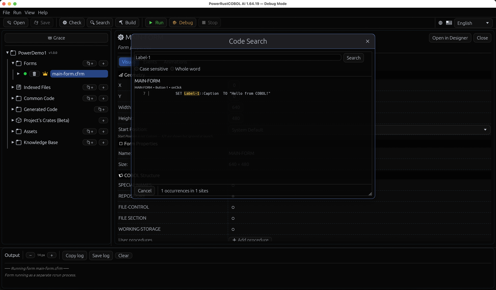</p>

### Efectos de ventana

Cada proyecto puede dar a sus ventanas un **efecto de entrada y de salida**
distintivo, configurado una vez en los ajustes del proyecto (sección Appearance) y
aplicado a **todos** los formularios del proyecto: elige un efecto, una duración
(100–3000 ms; la lluvia Matrix usa su propia banda de 1500–4000 ms, y Transporter II
está fijado exactamente en 4000 ms) y una función de suavizado para cada dirección.
El catálogo va desde las transiciones clásicas — fundido, un **zoom** de caja al
estilo dBASE, deslizamientos, expandir desde la barra de título — pasando por
revelados con máscara (**barrido de radar**, iris, persianas venecianas, tablero de
ajedrez) hasta la lluvia de **código en caída Matrix** (glifos clásicos de katakana y
dígitos cayendo desde encima del borde superior sobre una ventana completamente
transparente; el final de la estela de cada línea — el glifo tenue de arriba —
desciende por su banda y descubre progresivamente lo que hay detrás, de modo que el
formulario está completo exactamente cuando sale el último carácter. Las líneas
llegan con un reloj real, las primeras a 25 ms de distancia y el resto entre 10 y
25 ms detrás unas de otras a sus propias velocidades; este único efecto ignora el
ajuste de suavizado y corre en tiempo lineal), un achatamiento estilo genio, y
**Transporter II**. Los proyectos nuevos empiezan con la entrada Matrix y sin efecto
de salida; los proyectos creados antes de esta característica conservan ventanas
instantáneas hasta que elijas otra cosa.

**Transporter II** es un revelado cinematográfico de materialización, y el único
efecto con una duración fija: corre durante exactamente **4000 ms**, en dos fases.

1. Dos haces horizontales finos, cada uno de aproximadamente la mitad del ancho del
   formulario y centrados horizontalmente, empiezan **superpuestos sobre la línea
   central vertical** y se separan — uno subiendo hacia el borde superior y otro
   cayendo hacia el inferior. El hueco que se abre entre ellos se llena con una nube
   densa de partículas blancas y amarillas que parpadean, derivan y brillan con
   opacidad variable: un campo de materialización enérgico pero completamente
   transparente.
2. A medida que los haces horizontales aterrizan en los bordes se desvanecen, y dos
   **haces verticales de altura completa** aparecen gradualmente en el centro
   horizontal. Esos barren hacia fuera hacia los bordes izquierdo y derecho, y tu
   formulario se revela en la banda que se ensancha entre ellos, disolviéndose la
   nube de partículas por donde ha pasado un haz. En el tramo de cierre, las
   partículas, el brillo y los propios haces bajan suavemente hasta nada, de modo que
   la luz ha desaparecido en el instante en que los haces alcanzan los bordes y el
   formulario terminado queda solo.

Cada haz es un degradado translúcido por capas — blanco en su eje, amarillo cálido en
sus flancos, envuelto en un halo suave —, nunca una barra sólida ni una línea de
bordes duros. El efecto se reproduce sobre una ventana transparente, así que el
formulario se revela contra tu escritorio y no contra un rectángulo rellenado. Como
salida ejecuta toda la secuencia al revés y **desmaterializa** el formulario, lo que
lo convierte en el único efecto que merece la pena poner en las dos direcciones: los
mismos haces que ponen una ventana en pantalla se la llevan otra vez.

> **Nota.** El selector de duración está fijado en 4000 ms para este efecto, y el
> ajuste de suavizado no se aplica — las dos fases, el relevo de los haces y el
> desvanecimiento final están todos cortados a ese único reloj, y estirarlo o
> suavizarlo los desplazaría de su compás. Este es el mismo razonamiento que hace que
> la lluvia Matrix corra en tiempo lineal.

Mientras se ejecuta un efecto de entrada o de salida, la ventana no lleva **ninguna
barra de título**, así que nada se queda quieto mientras se reproduce la animación;
la barra llega junto con el formulario terminado (y solo si ese formulario se diseñó
para mostrar una). Los efectos que simplemente mueven, escalan o funden la propia
cara del formulario — fundido, zoom, los deslizamientos, expandir desde la barra de
título y el genio — van más allá y abren una **ventana transparente**, de modo que el
formulario se anima libre sobre el escritorio, y lo mismo hacen la lluvia Matrix
(pinta el formulario solo hasta la estela de cada línea que cae, así que el terreno
intacto no se pinta en absoluto) y Transporter II (revela el formulario recortando a
la banda entre sus haces, así que el terreno al que los haces no han llegado tampoco
se pinta nunca). En esas ventanas la propiedad **Transparency** del formulario
también alcanza el escritorio de verdad, y macOS no dibuja ninguna sombra alrededor
de la ventana (delinearía la ventana invisible, y la plataforma solo ofrece ese
interruptor cuando se crea la ventana). Solo los revelados con máscara conservan una
ventana opaca: ocultan el formulario pintando cubiertas sobre él, y nada transparente
puede deshacer eso.

Los formularios nunca eligen su propio efecto — un aspecto por proyecto —, pero
cualquier formulario puede **quedar al margen** con la casilla `WindowEffects` de sus
propiedades de Form (un aviso modal puede aparecer al instante mientras el resto de
la aplicación se anima). La entrada se reproduce en la primera apertura de una
ventana; habilita **«Play entrance when restored»** para reproducirla también cuando
el usuario restaure una ventana minimizada (solo una repetición visual — no se
disparan eventos del formulario). Las animaciones de carga de los controles esperan a
que termine la entrada, así que la ventana se materializa primero y los controles se
animan inmediatamente después; la temporización de `onLoad` en COBOL no cambia.

Un control que *sí tiene* animación de carga **se retiene hasta que termina la
entrada** — no se pinta en la entrada en absoluto, y llega por su propia cuenta en el
instante en que el efecto acaba. Eso es lo que quieres: un botón configurado para
entrar volando desde la izquierda no debería estar ya colocado en su sitio mientras
la ventana se materializa, para luego saltar de vuelta al borde izquierdo y volver a
viajar una segunda vez. Los controles sin animación de carga aparecen con la ventana,
como siempre.

> ⚠️ **Antes de 1.61.5** todos los controles se pintaban en la entrada, así que uno
> animado sí se materializaba con la ventana y luego volvía a entrar volando. Si
> diseñaste algo contando con eso dándole un retardo a un control, quita el retardo.

Un efecto de salida se reproduce antes de que la ventana se cierre realmente — pero
un formulario en FormState `Waiting` rechaza el cierre *antes* de cualquier animación,
así que un cierre vetado no reproduce nada, y `onClose` sigue disparándose exactamente
una vez en el cierre real.

Los efectos se reproducen en **todos los anfitriones de tu formulario**: tanto en Run
Form desde el IDE como en la **aplicación construida** (los dos ejecutan el mismo
anfitrión de ventanas, así que lo que ves con Run Form es lo que ven tus usuarios
desde el ejecutable en `dist/`). Los ajustes viajan al binario en el momento de la
construcción — una aplicación distribuida no necesita ningún fichero de proyecto a su
lado. Lo mismo vale para las **propiedades de ventana y el ciclo de vida** diseñados:
la aplicación construida se abre con el título propio del formulario (recurriendo a
*«AppName vVersion»* solo cuando el título diseñado está en blanco), respeta
`TitleVisible`, los botones de minimizar y maximizar, la pantalla completa, el
WindowState y el StartPosition de apertura, cierra su ventana cuando el programa
termina (a través del efecto de salida, cuando hay uno puesto) y dispara
`onShow`/`onActivate`/`onClose` exactamente como lo hace Run Form.

Dos notas prácticas. Los efectos pintan dentro de la ventana: con la barra de título
nativa visible, la animación cubre el área de contenido; un formulario sin adornos
(`TitleVisible` desactivado) con transparencia le da a un efecto el rectángulo
completo de la ventana. Y un interruptor de anulación para toda la máquina vive en
**Help → Debug Settings → «Disable window effects»** — ventanas instantáneas en todas
partes sin tocar ningún proyecto, para sensibilidad al movimiento, GPU débiles o
automatización (`PRC_NO_WINDOW_FX=1` hace lo mismo para un `rcrun run-form` pelado
**o para una aplicación construida**, que respeta la misma variable).

**Dispositivo de incrustación.** Una única política cubre la System KB y todas las KB
de proyecto, tanto para el indexado como para las búsquedas: cuando hay una GPU
compatible disponible, el incrustador la usa a **plena velocidad** — Metal en macOS,
CUDA en Linux/Windows con NVIDIA (una construcción hecha con la opción `embed-cuda`)
— y en otro caso recurre a la CPU en modo de **bajo consumo**, limitando sus hilos de
cómputo a dos para que un reindexado largo se mantenga discreto en lugar de clavar
todos los núcleos. Los usuarios avanzados pueden anular cualquiera de las dos partes:
pon `RAYON_NUM_THREADS` para elegir el número de hilos de CPU, o
`PRC_EMBED_DEVICE=cpu|metal|cuda` para forzar un backend (una GPU forzada que falle
sigue recurriendo a la CPU en lugar de caerse). El dispositivo activo se muestra en la
ventana modal Models junto al estado del modelo semántico, y lo imprime el reindexado
de línea de órdenes (`embedding device: …`). Las GPU de AMD e Intel en Linux/Windows
no están soportadas por el backend de inferencia y usan la ruta de CPU.

Cuando el agente **reposiciona controles** en un formulario, los controles afectados
**se deslizan** desde sus sitios antiguos a los nuevos — todos a la vez, en cerca de
un segundo — para que puedas ver cómo toma forma el cambio de disposición en lugar de
ver los controles saltar. Un control que el agente **crea** se anuncia del mismo modo:
reproduce un pulso **ZoomOut** único durante un segundo — tamaño completo, bajando a
cerca de un cuarto, de vuelta al tamaño completo — para que veas de un vistazo qué hay
nuevo en el formulario. Todo lo que crea una misma petición pulsa al unísono, con el
mismo reloj que los movimientos, así que un único conjunto de cambios se lee como un
único gesto. Un control que el agente simplemente reenvía (los agentes repiten
rutinariamente todo un conjunto de cambios) no vuelve a pulsar.

Las dos animaciones son puramente visuales: el formulario, su `.cfrm` guardado y su
código generado contienen las posiciones finales y los controles terminados de
inmediato, y el pulso no se escribe nunca dentro del control — no acompaña a tu
formulario hasta la aplicación construida.

**Qué ocurre en el momento en que pulsas Send.** En el AI Assistant del Form Designer
el flujo de trabajo no arranca de inmediato: Grace lee primero tu petición en voz
alta buscando claridad, reescribiéndola en la redacción a la que se atendrán los
especialistas y marcando cualquier pasaje que siga admitiendo dos lecturas. Esa pasada
tarda lo que tarda una llamada a un modelo, y mientras se ejecuta el panel lo dice —
un indicador giratorio y *Grace is reviewing the request…*, en el idioma del IDE,
tanto en la fila bajo el cuadro de la instrucción como en el último globo de la
transcripción. Cuando termina obtienes la revisión para leerla, editarla y aprobarla;
solo entonces empieza el trabajo. Una revisión que falle o que vuelva ilegible no te
cuesta nada: tu petición se envía exactamente como la escribiste.

Todos los redactores de los chatbots mantienen **Send** inmediatamente a la derecha de
su cuadro de instrucción. La instrucción consume el ancho restante mientras la orden
permanece visible al redimensionar el panel del chat; los redactores multilínea no
mueven Send a una fila inferior. Los globos de respuesta de agente completados
incluyen las órdenes **Copy** y **Save as Markdown** solo con icono y con rótulo
emergente al pasar el puntero. Save abre en la carpeta `Knowledge Base/` del proyecto
actual, exige que el destino siga estando dentro de esa carpeta, escribe un fichero
`.md`, lo indexa en el índice vectorial de la Knowledge Base del proyecto y refresca
la rama Knowledge Base del árbol del proyecto. Los mensajes del desarrollador, el
texto estático de bienvenida y los globos de emisión en curso no muestran estas
acciones de respuesta.

Grace distingue la conversación de solo lectura del trabajo sobre el proyecto. Las
preguntas sobre capacidades y ayuda como **What can you do?**, junto con las
peticiones de describir, explicar, resumir, comparar, sugerir o recomendar, reciben una
respuesta directa en Markdown sin crear un flujo de trabajo sintético. Markdown es el
formato de chatbot esperado para estas peticiones pasivas y no se rechaza por carecer
de JSON de flujo de trabajo. Si una petición pide además a Grace crear, modificar,
guardar, eliminar, implementar o cambiar de otro modo recursos del proyecto, exige JSON
de flujo de trabajo ejecutable. Los agentes con nombre del proyecto usan únicamente sus
instrucciones definidas en el proyecto; el transporte de la malla nunca añade un
preámbulo ajeno de CodeGenerator, FormsDesigner ni EventBinder. Si una petición
ejecutable devuelve JSON de flujo de trabajo mal formado, Grace recibe una única
petición explícita de corrección. Un segundo resultado mal formado abre la ventana
modal de error y registra los dos fallos del analizador más la carga corregida completa
en el registro del IDE.

<!-- 📷 project-grace-chat.png — Show the width-responsive 👑 Grace button above the project tree and the project-wide Grace conversation open in the Main Pane, including transcript, prompt, and conversation controls. -->
<p align="center">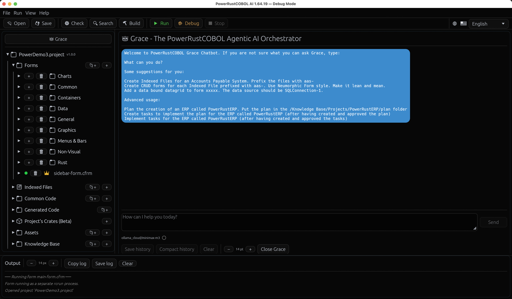</p>

Una conversación de Grace vacía se abre con ejemplos prácticos de Indexed Files,
formularios CRUD, DataGrid con datos vinculados y el flujo de trabajo plan → tareas →
implementación. Para la documentación duradera del proyecto, Grace delega siempre en el
**Documentation Agent** fijo y no eliminable. Es el único especialista al que se le
permite formatear, crear o actualizar la documentación del proyecto. Los especialistas
del dominio preparan el material de origen autorizado; Grace expresa esa entrega como
dependencias entre tareas, y el flujo de trabajo suministra cada salida de origen
aprobada al Documentation Agent. Por ejemplo, una petición de documentar un formulario
pide primero al Form Designer Agent los controles, la disposición, los vínculos y los
eventos, y luego pide al Documentation Agent que formatee y guarde ese material
aprobado. El Documentation Agent no debe inventar hechos del dominio que falten.

El Documentation Agent puede crear, leer y listar documentos de texto únicamente bajo
la carpeta `Knowledge Base/` del proyecto. Las escrituras correctas quedan seguidas de
inmediato por el proyecto e indexadas en el índice vectorial local del proyecto en
`data/project-knowledge.redb` (Rust puro, incrustado). Grace valida esta estructura de
coordinación antes de la ejecución y pide un único plan corregido cuando un flujo de
trabajo de documentación asigna la escritura a otro especialista u omite una dependencia
de origen obligatoria.

Se buscan dos Knowledge Bases, nunca una. La **System Knowledge Base** es la referencia
propia de la plataforma — los controles con sus propiedades, eventos y métodos, las
extensiones de RustCOBOL, los temas de formulario, el modelo de disposición, el modelo
de proyecto — y vive fuera de todos los proyectos, así que nunca se copia dentro del
tuyo. La **Knowledge Base del proyecto** es tu propio material: los documentos que tú y
Grace escribís bajo la carpeta `Knowledge Base/` del proyecto. Antes de cada petición a
Grace, incluida una pregunta de solo lectura, el IDE sincroniza los dos índices y busca
en los dos; los extractos llegan etiquetados con el almacén del que vinieron, y Grace
cita una ruta relativa al proyecto solo para tus propios documentos.

Los extractos relevantes tienen prioridad sobre el entrenamiento general del modelo, y
cuando ninguna de las dos Knowledge Bases contiene evidencia relevante, Grace lo dice,
etiqueta cualquier orientación general y pide los hechos del proyecto que falten en
lugar de inventarlos. Todos los especialistas reciben acceso gobernado y de solo
lectura mediante `knowledge.search` sobre esos mismos dos almacenes, así que tanto un
hecho de la plataforma como una decisión previa del proyecto se pueden recuperar en
trabajos posteriores.

El trabajo con ficheros indexados usa una entrega obligatoria entre dos especialistas
coordinada por Grace. El Documentation Agent obtiene primero el nombre de fichero que
falte, deriva el propósito del fichero a partir de la petición, busca en el conocimiento
del proyecto y analiza la estructura bajo la primera (1FN), la segunda (2FN) y la
tercera (3FN) formas normales. Identifica todos los ficheros indexados auxiliares que
se necesiten para eliminar grupos repetitivos, dependencias parciales o dependencias
transitivas. Para cada campo de identificador pide al desarrollador que elija **UUID** o
que proporcione una definición **PIC** de COBOL exacta; los agentes nunca seleccionan
una representación de identificador por suposición. Las decisiones que falten producen
una aclaración en lugar de una mutación de fichero.

Preparar, proponer o normalizar esta entrega de esquema es análisis del Documentation
Agent, no mutación de ficheros indexados. Solo un `indexed_file.write` real o un guardado
explícito de `.cidx` es mutación, y queda reservado al Data (Indexed File) Agent.

Después de que esa entrega de esquema pase la revisión Pedantic del Documentation Agent,
Grace delega cada definición al **Data (Indexed File) Agent**. Este especialista puede
listar, inspeccionar y escribir definiciones indexadas únicamente a través de las
herramientas gobernadas `indexed_file.*`, respaldadas por el mismo modelo que usa la
interfaz de Indexed File. Una escritura correcta valida el registro y las claves, guarda
el `.cidx`, regenera el COBOL indexado y los copybooks, inicializa los datos solo cuando
el fichero de datos asignado no existe ya, y refresca el árbol de Indexed Files del
proyecto. Los datos indexados existentes no se truncan nunca durante el mantenimiento
del esquema. Cada relación auxiliar es una definición aparte. Una definición finalizada
conserva el bloqueo estructural de la interfaz de Indexed File; el desarrollador debe
quitarle explícitamente la finalización en la interfaz para que un agente pueda cambiar
su esquema. Todos los resultados deben pasar por el **Data (Indexed File) Agent Pedantic
Reviewer** antes de que Grace informe de la finalización.

**Los especialistas ejecutan sus herramientas.** Bajo Grace, los agentes no solo
describen el trabajo — lo llevan a cabo, pero únicamente a través de canales gobernados
y con evidencias. Un agente solo puede llamar a las herramientas que se le han concedido
(su `mcp.json` / sus capacidades); una herramienta no declarada o inventada se trata como
un defecto crítico que hace fallar la tarea. Cuando el trabajo del **Form Designer
Agent** es *aprobado* por su compañero pedante, su resultado se aplica al formulario
abierto como **un único cambio deshacible** por la misma ruta revisada de previsualizar
y aplicar que usas a mano — nunca reescribiendo el formulario en silencio. El Form
Designer puede además *mirar* el formulario vivo (una vista de solo lectura de los
widgets representados) para comprobar su trabajo; nunca edita manejando la interfaz. El
**Version Control Agent** ejecuta Git de verdad **únicamente dentro del repositorio de
tu proyecto abierto** (nunca el de PowerRustCOBOL): las operaciones locales de cada día
(status, diff, log, add, commit, branch, checkout, stash) se ejecutan por su cuenta,
mientras que cualquier cosa que alcance la red o reescriba la historia — push, fetch,
pull, rebase, `reset --hard` — **se detiene a esperar tu aprobación explícita**,
mostrándote la orden exacta antes de ejecutarla. Cada llamada a una herramienta, con su
salida real y su estado de terminación, se registra en el registro del flujo de trabajo;
una orden que falla se reporta como un fallo, nunca se disfraza de éxito.

Un botón **Test connection** envía una petición mínima a tu punto final e informa de si
el modelo es alcanzable y si la clave y el modelo se aceptan — úsalo para confirmar la
configuración antes de fiarte de ella. El asistente queda disponible en cuanto
**Endpoint URL** y **Model** están puestos los dos. Vacía el punto final para volver a
ocultarlo.

**Cómo usarlo.** Abre un fichero COBOL, escribe una petición en la barra de
instrucciones (por ejemplo *«add a paragraph that totals WS-LINES and DISPLAYs it»*) y
pulsa **Send**. El modelo recibe, en este orden:

1. tu **standard system prompt**;
2. el **historial de la conversación** de *este fichero* (se recuerda entre sesiones,
   por fichero fuente);
3. tu **petición** junto con el **fuente actual** del fichero.

Cuando llega la respuesta, PowerRustCOBOL extrae el COBOL de ella y **actualiza el búfer
del editor en su sitio** — así puedes revisar, retocar, ejecutar o deshacer (Ctrl/Cmd-Z)
el resultado de inmediato como cualquier otra edición. La transcripción en curso se
muestra bajo la barra de instrucciones (💬), y **Clear conversation** (🗑) olvida el
historial de ese fichero. El Generated Code de solo lectura no se modifica nunca.

**También en el inspector.** La misma barra de instrucciones aparece sobre el inspector
en línea de formulario y controles, con el **COBOL generado** del formulario como
contexto (de solo lectura) — útil para preguntar cómo cablear un manejador de eventos.
Como el código generado no se edita nunca a mano, las respuestas de ahí se muestran en la
transcripción como referencia en lugar de aplicarse.

**Dónde vive la conversación.** El historial *no* se guarda en una caché oculta — se
almacena en la carpeta `data/` del proyecto en el **propio fichero indexado (ISAM)** de
PowerRustCOBOL (`data/conversations.dat`), el mismísimo formato `ORGANIZATION IS INDEXED`
que usan tus programas COBOL, con clave en la ruta relativa del fichero fuente. (Usamos
nuestro propio runtime.) Las conversaciones viajan por tanto con el proyecto y necesitan
un proyecto abierto para persistir; sin uno, el asistente sigue funcionando pero solo
para la sesión actual.

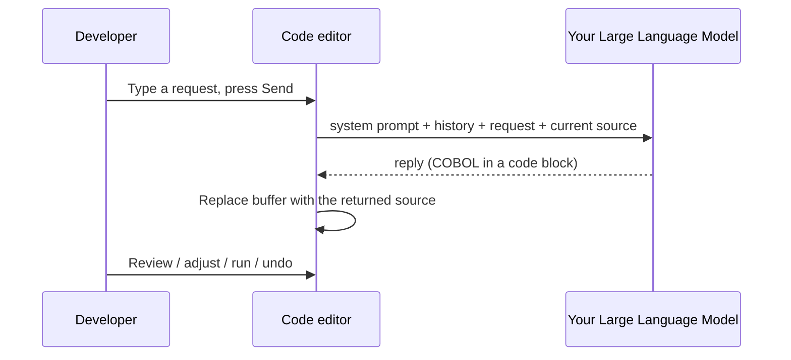

<!-- 📷 ide-ai-assistant.png — The code editor with the AI prompt bar visible above it and an expanded conversation transcript. -->
<p align="center">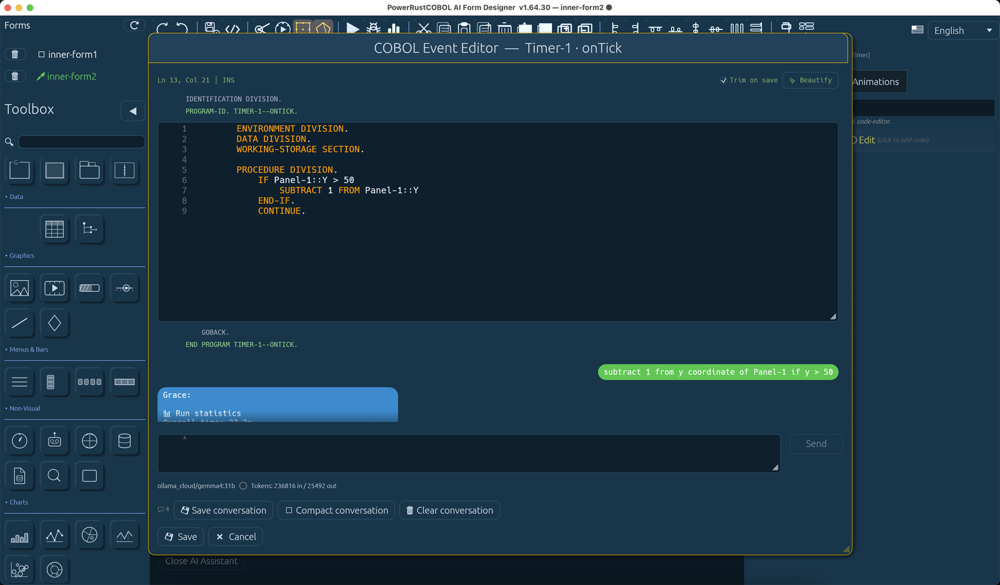</p>

> **Nota de privacidad.** Tu instrucción, el historial de la conversación y el **fuente
> completo del fichero abierto** se envían al punto final que configures. Apúntalo solo a
> un modelo en el que confíes.

### Cuando un manejador falla (`onUnhandledException`)

Un fallo de COBOL dentro de un manejador de eventos **no** cierra tu formulario.
Se abandona el manejador que falla y el bucle de eventos continúa con el siguiente
evento, de modo que un camino defectuoso no le cuesta al operador todo lo que
tiene en pantalla.

Vincula **`onUnhandledException`** en el formulario para tomar el control. Los
detalles llegan como **`LastException`** en el propio formulario:

```cobol
       PROCEDURE DIVISION.
           SET Lbl-Status::Caption TO me::LastException
           DISPLAY "handled: " me::LastException.
```

Si no vinculas nada, el operador ve en su lugar una **notificación crítica**:

> A critical exception has occurred: &lt;details&gt;. Implement the event handler
> onUnhandledException to get better control over the exception.

No caduca nunca y lleva la ✕ que la descarta, y no necesita ningún control
Snackbar en el formulario.

**Un error de tamaño sin proteger es una excepción.** `COMPUTE`, `ADD`,
`SUBTRACT`, `MULTIPLY` y `DIVIDE` levantan la condición SIZE ERROR cuando un
resultado no va a caber — la división por cero incluida. Declara `ON SIZE ERROR` y
es tuya:

```cobol
           DIVIDE WS-A BY WS-Z GIVING WS-A
               ON SIZE ERROR DISPLAY "cannot divide by zero"
           END-DIVIDE
```

Si no declaras nada, nadie lo está atendiendo, así que la sentencia levanta una
excepción en lugar de dejar el receptor calladamente intacto — que es la forma en
que un total equivocado llega a un informe sin ninguna señal de que algo fuera
mal. Un `TRY … CATCH` alrededor de la sentencia la captura como cualquier otra;
sin `CATCH`, llega a `onUnhandledException`.

> ⚠️ Una excepción levantada **dentro** de `onUnhandledException` no se le
> devuelve a él — eso daría un bucle. Se reporta como cualquier otro fallo.
>
> Esto es solo para formularios, y lo mismo vale para la regla del error de tamaño
> de más arriba. Un programa de consola que falla sigue fallando hacia quien lo
> llamó — no tiene ventana en la que informar — y allí un error de tamaño sin
> proteger conserva el silencio del estándar, porque COBOL-85 deja el resultado
> indefinido cuando la frase está ausente y la suite CCVS85 cuenta con que se le
> permita continuar.
### El proyecto de ejemplo (Help → Examples)

**Help → Examples** abre **PowerDemo3**, el proyecto que lleva un formulario de
demostración por cada control de la caja de herramientas — cada widget, cableado y
en funcionamiento, con su COBOL al lado. Es la forma más rápida de ver cómo se
maneja realmente un control.

El IDE encuentra el proyecto por sí mismo, así que no necesitas saber dónde
reside: junto al ejecutable en una instalación, o en el árbol desde el que se
construyó el IDE cuando lo estás ejecutando desde el código fuente. Apunta
`PRC_EXAMPLES_ROOT` a otra copia si guardas una en otro sitio. La entrada aparece
atenuada, con el motivo al pasar el puntero, en una construcción que no incluya
ejemplos.

> **Nota.** Abrirlo sustituye al proyecto que tengas abierto en ese momento,
> exactamente igual que lo haría *File → Open Project*. Guarda tu trabajo antes.
### Leer la documentación dentro del IDE (Help → Documentation)

**Help → Documentation** abre una ventana dedicada que representa esta guía y los
demás manuales de PowerRustCOBOL — incluidos sus **diagramas Mermaid** y sus
**capturas de pantalla**, dibujados en línea (representados en Rust puro, sin
necesidad de navegador). La documentación se distribuye con el IDE, así que funciona
sin conexión; `Cmd+O` abre además cualquier fichero Markdown local, y sus imágenes
se buscan junto a él.

La ventana tiene una **lista de documentos** con búsqueda a la izquierda y el
documento representado a la derecha, más una **barra de iconos** y los menús
**File / View / Help**. La **búsqueda** dentro del documento resalta las
coincidencias (azul sobre amarillo); pulsa **Go** o **Enter** para saltar a la
primera coincidencia y **◀ / ▶** (o `,` / `.`) para recorrerlas con un contador
`n/total` en vivo. La **tabla de contenidos** es pulsable — tanto el **esquema**
lateral como los enlaces `[…](#…)` del propio documento saltan a su sección.
**Moverse por un documento** funciona como debe funcionar un documento. Las **teclas
de flecha** lo desplazan: un toque mueve una línea, y mantener una pulsada arranca a
ese mismo ritmo de lectura y acelera hasta cuatro veces, de modo que un manual largo
se puede recorrer sin soltar. `PageUp` / `PageDown` mueven una pantalla a la vez, y
`Home` y `End` van a los extremos. También puedes **agarrar la página con el ratón y
lanzarla** — presiona, arrastra, suelta, y se desliza hasta detenerse. El agarre
tiene que empezar sobre el documento, pero a partir de ahí el gesto es tuyo: el
arrastre sigue al puntero adonde vaya, y **puedes soltar en cualquier punto de la
pantalla** — sobre la barra de herramientas, sobre la lista de documentos o fuera de
la ventana — y la página vuela igual. Suelta cuando tu mano ya esté quieta y
simplemente se queda donde la pusiste; atrapa una página en movimiento con una
pulsación y se detiene en seco. (Las flechas pertenecen al cuadro de búsqueda
mientras el cursor está en él, así que allí escriben en lugar de desplazar.)

Los manuales largos siguen respondiendo porque la ventana solo compone la parte que
estás mirando, manteniendo un par de pantallas preparadas a cada lado, y porque los
diagramas y las capturas se descodifican en un **hilo en segundo plano** en el
momento en que seleccionas un documento — mucho antes de que te desplaces hasta
ellos. Una imagen que aún se está preparando muestra un marcador de posición en su
lugar.

Tienes también un **tamaño de letra** ajustable que se *recuerda entre sesiones*,
zoom, pantalla completa, mantener encima (`⌘T`), abrir un fichero Markdown local
(`⌘O`) y una ventana modal de ver el fuente (`⌥⌘U`). **Print** (`⌘P`) exporta el
documento — diagramas Mermaid incluidos — a un PDF y lo abre en el visor de tu
sistema operativo, donde el diálogo de impresión del sistema queda a un clic. La
ventana es un panel translúcido de **cristal esmerilado** y sigue el tema y el
idioma del IDE.

Cada manual se distribuye en los seis idiomas de interfaz como su propio fichero, y
la lista muestra **una fila por manual** — la copia en el idioma que hayas
seleccionado. Cuando una traducción no se ha escrito todavía, esa fila recurre al
texto en inglés en lugar de desaparecer, así que la lista tiene la misma longitud en
cualquier idioma en el que leas.

### El recorrido guiado

La primera vez que abres un proyecto en una máquina nueva, el IDE se atenúa y
presenta sus seis partes principales, una a una: **Project settings**, **Forms**,
**Indexed Files**, **Assets**, la **Knowledge Base** y el **panel Output**. Cada
paso ilumina el componente que está describiendo y le apunta con un globo de
diálogo, así que nunca hay duda de qué parte de la ventana se quiere decir.

Usa **Next** y **Back** para avanzar por él, y **Skip** o `Esc` para salir en
cualquier momento. Nada más en el IDE responde mientras está activo — eso es
deliberado, para que un clic perdido no lo descarte a medias.

Se ejecuta **una vez por máquina**, no una vez por proyecto: describe el IDE, y el
IDE solo hace falta aprenderlo una vez. Como quiera que salgas de él — terminándolo,
con Skip o con `Esc` —, no vuelve por su cuenta.

> **Volver a verlo.** **Help → IDE Walkthrough seen** es una casilla que muestra si
> ya has pasado por él. Quita la marca y el recorrido empieza de nuevo
> inmediatamente. Sin ningún proyecto abierto, la entrada explica que primero hace
> falta uno — cinco de las seis partes a las que apunta son nodos del árbol del
> proyecto, y no existen hasta que se carga un proyecto.

El recorrido no reorganiza nada. Desplazará el árbol del proyecto para que la parte
que está describiendo quede visible, pero no despliega categorías, no abre
formularios y no cambia lo que tuvieras en pantalla. Cuando termina estás exactamente
donde lo dejaste.

📷 Se necesita captura — `walkthrough-step.png`. Abre un proyecto en una máquina
donde el recorrido no se haya ejecutado (o quita la marca de
**Help → IDE Walkthrough seen**) y captura el paso 2 — el que apunta a **Forms** —
de modo que el IDE atenuado, la fila iluminada del árbol y la cola del globo queden
todos visibles en un mismo fotograma.

---

## 6. Los proyectos y el modelo de proyecto

Un **proyecto** es una carpeta que contiene un fichero de manifiesto,
`cobolt.toml`, más tus fuentes, formularios y activos. El manifiesto registra el
nombre del proyecto, la versión, el programa principal y los ficheros de cada
categoría.

### Disposición de carpetas

Cuando creas un proyecto, PowerRustCOBOL construye esta estructura en disco:

```text
HelloPower/
├── cobolt.toml         ← project manifest
├── src/                ← Common Code  (hand-written COBOL programs/copybooks)
├── forms/              ← Forms        (.cfrm designer files)
├── indexed/            ← Indexed Files (.cidx definitions)
├── generated/          ← Generated Code (RAD-produced .cbl — read-only)
├── COPYBOOKS/          ← per indexed file: its SELECT, its FD, and the
│                         editable COBOL descriptor the raw editor uses
├── crates/             ← Project's Crates (appears once you register one)
├── Assets/             ← Assets       (images, audio, fonts, data files)
├── Knowledge Base/     ← project-specific documents and indexed knowledge
├── bin/                ← built binaries
├── debug/              ← debugging working files
├── temp/               ← temporary files
├── dist/               ← (reserved) self-contained distribution bundle
└── data/               ← project data files (e.g. the AI conversation store)
```

Un proyecto nuevo recibe además un **programa `main` inicial ejecutable** (por
omisión `src/main.cbl`) — un `IDENTIFICATION DIVISION` / `DISPLAY` / `GOBACK`
mínimo que puedes **ejecutar** enseguida y luego hacer crecer.

> **Proyectos hechos solo de formularios.** Si eliminas el `main` inicial y
> construyes un proyecto compuesto únicamente de formularios, **Build** y **Run**
> siguen funcionando — y merece la pena saber exactamente qué programa arranca,
> porque un formulario tiene más rango que el manifiesto.
>
> Un proyecto que tiene formularios arranca siempre en el programa generado de su
> **formulario principal** (§11), y eso gana a `[project].main` incluso cuando el
> manifiesto nombra un fichero que existe. Es deliberado: un proyecto de
> formularios creado por el IDE lleva también el `main` inicial de siete líneas, y
> mientras el inicial ganaba, obtenías un binario que dibujaba el formulario y
> luego ejecutaba el esbozo — con todos los botones muertos, porque en el programa
> compilado no había ningún manejador. Si ningún formulario lleva la designación,
> se usa el primero.
>
> `[project].main` decide únicamente cuando el proyecto **no tiene formularios**.
> A falta de eso se usa el primer programa generado, y luego el primer fuente
> ordinario que exista en disco.

> **Nota.** Abrir un proyecto antiguo anterior a esta disposición **rellena
> automáticamente cualquier carpeta estándar que falte**. El contenido de las
> carpetas heredadas `Documentation/` y `docs/` del proyecto se traslada a
> `Knowledge Base/` sin sobrescribir ficheros en conflicto.

### Las siete categorías del árbol


| Categoría          | Contiene                                                        | ¿Editable?                       |
| ------------------ | --------------------------------------------------------------- | -------------------------------- |
| **Forms**          | ficheros `.cfrm` del diseñador de formularios                   | mediante el diseñador            |
| **Indexed Files**  | definiciones `.cidx` de ficheros indexados                      | mediante el Indexed File Editor  |
| **Common Code**    | COBOL escrito a mano que llamas con `CALL` desde los formularios o que ejecutas directamente | sí        |
| **Generated Code** | el `.cbl` que PowerRustCOBOL genera de cada formulario o `.cidx` | **solo lectura** (azul, icono de candado) |
| **Project's Crates (Beta)** | bibliotecas de terceros que registras para los bloques `EXEC RUST` | mediante el diálogo External Crates |
| **Assets**         | imágenes, audio, tipografías y ficheros de datos incluidos con la aplicación | importados           |
| **Knowledge Base** | material Markdown / texto / PDF específico del proyecto          | sí                               |

### Crear frente a importar

El **➕** de una categoría **crea un elemento nuevo**:

- **Forms ➕** → diálogo *New Form*.
- **Indexed Files ➕** → asistente *New Indexed File* (nombre, ruta de asignación,
  disposición del registro, claves, almacenamiento).
- **Common Code ➕** → un `.cbl` nuevo a partir de una plantilla inicial, abierto en
  el editor.
- **Knowledge Base ➕** → un fichero Markdown nuevo.
- **Assets ➕** → selector de ficheros (los activos se crean fuera, así que «crear»
  = importar).

Usa la orden de carpeta con signo más que está junto a **Knowledge Base** para
crear una subcarpeta de primer nivel. Haz clic derecho en cualquier subcarpeta de
Knowledge Base para crear una carpeta hija o para eliminar esa carpeta. Eliminar
una carpeta exige confirmación y retira recursivamente sus documentos, sus
carpetas anidadas, las entradas del manifiesto del proyecto y las entradas
obsoletas del índice vectorial. La raíz `Knowledge Base/` en sí no se puede
eliminar.

Para **importar un fichero existente** a una categoría, **haz clic derecho en el
➕** y elige *Import existing…*. Para **Indexed Files**, eso elige un fichero de
datos `.idx` (o similar) en disco y construye un `.cidx` a juego cuando el fichero
lleva un esquema autodescriptivo.

> **Nota.** Los ficheros `.cbl` generados viven en `generated/`, se siguen
> automáticamente y se abren en modo de solo lectura. La edición corresponde al
> formulario (el diseñador), al `.cidx` (Indexed File Editor) o a Common Code —
> nunca a la salida generada.

### Copiar un formulario entre proyectos

Haz clic derecho en cualquier formulario del árbol **Forms** y elige **Copy Form**.
Eso copia *todo* lo relativo a él — las propiedades de todos los controles, el
cuerpo COBOL completo del manejador de cada evento vinculado, las animaciones y los
vínculos de datos — al portapapeles de tu sistema operativo, no solo a un espacio
temporal interno de la aplicación. Cambia a otro proyecto (o ábrelo) — en la misma
ventana de PowerRustCOBOL en ejecución, o en otra completamente distinta —, haz
clic derecho en la categoría **Forms** y elige **Paste Form**. El formulario se
crea allí exactamente como estaba: no hay que renombrar ningún identificador de
control ni ningún párrafo de evento, porque cada formulario ya compila a su propio
programa COBOL autocontenido — un `BUTTON1` del formulario pegado no puede
colisionar con un `BUTTON1` que algún otro formulario no relacionado de ese
proyecto use internamente. Su Generated Code se produce de inmediato, así que el
formulario pegado está listo para ejecutarse sin necesidad de un paso de Build
previo.

Si el proyecto de destino ya tiene un formulario con el mismo nombre,
PowerRustCOBOL pregunta qué hacer en lugar de adivinar: **renombrar** el formulario
entrante (escribiendo un nombre nuevo, que se vuelve a comprobar en vivo contra lo
que ya hay) o **reemplazar** el existente — reemplazar pide su propia confirmación
aparte antes de eliminar nada, exactamente igual que eliminar un formulario
directamente del árbol.

> **Nota.** Copy Form lee lo que esté en pantalla en ese momento si el formulario
> está abierto en un diseñador con cambios sin guardar — «copiar» significa siempre
> «copiar lo que estoy mirando», no un guardado anticuado de antes. Pegar un
> formulario cuyos bloques referencian algo que el proyecto de destino todavía no
> tiene (una fijación de Project's Crates, un activo, un fichero indexado que
> nombra un vínculo de datos) lleva la *referencia* con fidelidad, pero no el
> recurso referenciado en sí — añade uno a juego en el proyecto de destino, igual
> que si hubieras escrito la referencia allí a mano.

### Indexed File Editor y explorador de cuadrícula

> 📷 **Se necesita captura — `indexed-file-editor.png`** — el área de trabajo del
> Indexed File Editor con la lista de campos, el panel de propiedades y la barra de
> herramientas (Save / Save & Generate / Finalize / Open Grid Browser).

Haz doble clic en una entrada de **Indexed Files** para abrir el **Indexed File
Editor** en su propia ventana (el mismo patrón multiventana que el Form Designer).
El panel central lista los campos del registro; el panel inferior muestra las
propiedades de fichero o de campo. **Finalize** crea el fichero de datos en disco y
bloquea los campos estructurales (PIC, desplazamientos, claves, almacenamiento).
Los comentarios y los **controles de cuadrícula** por campo siguen siendo editables
después.

**Open Grid Browser** (después de finalizar) abre una segunda vista: una tabla
virtualizada sobre el fichero de datos indexado vivo con añadir / editar /
eliminar, **Commit** / **Rollback**, y protección contra desviación de esquema
cuando el fichero en disco ya no coincide con el `.cidx`.

Cada `.cidx` produce `generated/<stem>-indexed.cbl` (fragmento `SELECT` / `FD`),
regenerado en **Build / Run / Debug / Check** igual que la salida de los
formularios.

---

## 7. El Form Designer (RAD)

El Form Designer es donde compones las ventanas. Cada formulario abierto es **su
propia ventana del sistema operativo**, así que puedes tener varios diseñadores y
varios formularios en ejecución uno al lado del otro. Al hacer doble clic en un
formulario, ya sea en el árbol del proyecto del IDE o en la lista **Forms** de un
diseñador, se abre; si ya está abierto, su ventana se restaura y se trae al frente.

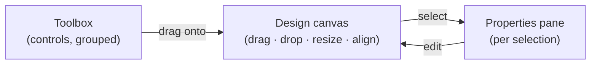

- **Caja de herramientas (izquierda).** Widgets en siete grupos, en este orden:
  **Common**, **Containers**, **Data**, **Graphics**, **Menus & Bars**,
  **Non-Visual** y **Charts**. Arrastra cualquier control al lienzo. Usa el
  galón **◀** para plegar la barra lateral a un estrecho **riel de iconos**
  (arrastrar desde el riel sigue funcionando) y **▶** para desplegarla; arrastra su
  borde para redimensionarla, y el ancho que fijes se restaura al volver a
  desplegarla.
- **Lienzo (centro).** Mueve, redimensiona (arrastrando los tiradores del borde),
  alinea y distribuye controles. Un ajuste a la cuadrícula mantiene el orden.
  Puedes redimensionar el **formulario en sí** arrastrando sus bordes.
- **Panel de propiedades (derecha).** Edita el control seleccionado — o, sin nada
  seleccionado, el **formulario** mismo. El panel está organizado en **tarjetas de
  sección** plegables; para el formulario son **Form Properties**,
  **COBOL Structure**, **Target Device**, **Window**, **Appearance**,
  **Form Events** y **Animations**, en ese orden. Arrastra su **borde izquierdo**
  para ensancharlo — el borde se ilumina al pasar el puntero por encima. Es un
  **cajón**: la pestaña **◀** centrada verticalmente lo oculta (dejando una fina
  pestaña **▶** para volver a deslizarlo), y se reabre con el ancho que fijaste la
  última vez.

Lo esencial de la barra de herramientas del diseñador: **Save & Generate**,
**Generate only**, **Preview** (una representación no interactiva), **Run Form**
(en vivo, interactivo), alternar la cuadrícula, **Theme** (estilo procedimental:
Classic / Enhanced / Neumorphic Light / Neumorphic Dark), herramientas de
alineación, deshacer y rehacer.

> **WYSIWYG — un solo representador para todas las superficies.** El lienzo del
> Form Designer, el Preview en vivo, el Run Form y el binario compilado dibujan
> todos a través de un **único motor de representación** en `cobolt-forms`
> (`render::render_form` para las superficies interactivas, `render::render_faces`
> para el lienzo del diseñador), que envuelve al pintor de caras compartido
> `draw_control` con los asuntos de nivel de formulario que antes divergían entre
> cuatro bucles de dibujo distintos: el fondo, el orden de representación, el
> recorte de los contenedores, la opacidad heredada y la visibilidad de las
> pestañas. Cada superficie conecta sus propios valores vivos a través del rasgo
> `FormState` (diseñador = el formulario diseñado, preview = un mapa de valores,
> run = `CtrlState`, binario = estado compilado). El resultado: el mismo formulario
> más el mismo estado producen siempre los mismos píxeles — lo que estilas en el
> lienzo es exactamente lo que se ejecuta.

> **Una ventana redimensionada conserva el formulario y estira el fondo.** Cuando
> el usuario maximiza un formulario en ejecución o arrastra su borde hacia fuera,
> los controles se quedan exactamente donde y del tamaño que los diseñaste — solo
> el **fondo** acompaña a la ventana, de modo que el degradado (o la imagen de
> fondo) lo cubre todo en lugar de detenerse en el borde del formulario. Arrastrar
> la ventana para hacerla *más pequeña* que el formulario no recorta el fondo: se
> queda al tamaño del formulario, y el formulario se desplaza dentro de él. Los
> efectos de entrada de ventana animan esta misma imagen, fondo incluido.
>
> **En el Preview el color acompaña a la ventana; la imagen, no.** El Preview es
> una ventana real que puedes arrastrar más ancha que el formulario, y su **color**
> de fondo (o su degradado) lo cubre todo — así que un formulario más grande que su
> imagen se ve más grande, no cortado. La **imagen** de fondo se queda anclada al
> tamaño que diseñaste y sigue obedeciendo a su Mode *ahí*: Fit sigue poniendo
> bandas dentro del formulario, Fill sigue recortando a su medida, Tile sigue
> deteniéndose en su borde. Lo que queda más allá de la imagen es simplemente color
> de fondo — que es también la forma de seguir viendo dónde acaba la extensión
> diseñada mientras editas. Antes de 1.62.135 esa zona no se pintaba en absoluto:
> la barra de título seguía creciendo mientras el formulario de debajo se detenía
> en seco, y el IDE se transparentaba por el hueco.
>
> **El fondo acompaña a la SUPERFICIE, que no siempre es la ventana.** Un
> formulario cargado en el ContentPane de un shell ocupa parte de la ventana, no
> toda — más estrecho por el riel de la barra lateral, más bajo por la banda de la
> ruta de navegación. Su fondo se compone contra **ese panel**, así que *Fit* pone
> bandas dentro del panel y *Center* centra en el medio del panel. Antes de
> 1.62.132 el ocupante del panel se componía contra la ventana completa: las bandas
> caían fuera del área visible y todos los modos parecían *Stretch*.

### Modos de imagen de fondo

El **Image path** de un formulario toma una imagen; **Mode** decide cómo se
encuentra con la superficie. Los cinco conservan los píxeles propios de la imagen —
solo se diferencian en cómo se escala y se coloca.


| Modo        | Qué hace                                                  | ¿Distorsiona? | ¿Recorta?     | ¿Deja márgenes? |
| ----------- | --------------------------------------------------------- | ------------- | ------------- | --------------- |
| **Stretch** | Estira la imagen hasta la superficie exactamente          | **Sí**        | No            | No              |
| **Fill**    | La agranda hasta que cubre, conservando la forma          | No            | Sí            | No              |
| **Fit**     | La escala hasta que cabe entera, conservando la forma     | No            | No            | **Sí**          |
| **Center**  | La dibuja a su tamaño propio, en el medio                 | No            | Si es mayor   | Si es menor     |
| **Tile**    | La repite a su tamaño propio, como un papel pintado       | No            | Solo el borde | No              |

> **Nota — Fit, Fill y Stretch coinciden cuando las formas encajan.** Si las
> proporciones de la imagen son ya las proporciones de la superficie, los tres
> producen exactamente la misma imagen, y no hay nada mal. Una imagen de 1600×1000
> en un formulario de 1600×1000 no tiene nada que enmarcar ni nada que recortar.
> Prueba con una imagen deliberadamente alta o ancha si quieres *ver* a los tres
> comportarse de forma distinta.

> ⚠️ **Salvedad — Center no escala.** Una imagen mucho más grande que el formulario
> muestra solo su parte central, y una pequeña flota en el color de fondo. Eso es el
> modo funcionando: elige *Fit* o *Fill* si quieres que se ajuste al formulario.

> **Tile de verdad hace mosaico.** Antes de 1.62.130 *Tile* dibujaba una única copia
> estirada — compartía ruta de código con *Stretch* y el modo no hacía nada. Ahora
> repite la imagen a su tamaño nativo desde la esquina superior izquierda de la
> superficie. El propio **Grid background image mode** de un DataGrid recibió la
> misma corrección en 1.62.132.

> **Espacio más allá del borde del formulario — controles que llegan cuando la
> ventana crece.** El tamaño que diseñas es un *suelo*, no un techo. Suelta un
> control más allá del borde derecho o inferior en el lienzo y se conserva
> exactamente donde lo colocaste; simplemente no tiene dónde aterrizar mientras la
> ventana sea solo tan ancha como el formulario. Maximiza esa ventana — o
> arrástrala hacia fuera — y el control aparece en el espacio que se ha abierto. No
> se estira nada y no se recompone nada, en consonancia con la regla de arriba: el
> control se dibuja en la posición y con el tamaño que le diste, y el borde de la
> propia ventana es lo único que lo corta alguna vez. Es una forma deliberada de
> reservar un panel lateral opcional, un gráfico decorativo o un diagrama ancho
> para los operadores que tengan pantalla para ello.
>
> **Notas.** El anidamiento no cambia — un control dentro de un Panel o de un
> GroupBox sigue estando recortado a su contenedor, por grande que se haga la
> ventana; solo el borde del *formulario* dejó de ser un muro. El lienzo del
> diseñador ya dibujaba estos controles, así que lo que ves mientras editas es
> ahora lo que se ejecuta.
>
> ⚠️ **Salvedad.** Una ventana *más pequeña* que el formulario desplaza el
> formulario, pero no se desplazará hasta un control colocado más allá del borde
> diseñado: el área desplazable es el rectángulo diseñado del formulario. Todo
> aquello que el operador deba poder alcanzar siempre corresponde a su interior —
> trata el espacio de más allá del borde como una ventaja, nunca como la única
> forma de llegar a un control.

> **Aislamiento de Run Form (rendimiento).** Para mantener el IDE respondiendo y
> evitar picos de CPU mientras se ejecuta un formulario (especialmente con
> temporizadores, bucles o representación pesada), `Run Form` lanza un proceso hijo
> `rcrun` aislado. El IDE y el hijo se comunican por un canal IPC de bincode con
> tramas sobre la entrada y salida estándar (`FormIpcMessage` para eventos,
> entrada, instantáneas de estado, salida, errores y finalización). El IDE bombea la
> salida estándar a canales locales y reenvía los eventos de interfaz por la entrada
> estándar. Esto habilita además el **Run-Form Inspector** (% de CPU, RSS, hijos,
> memoria del sistema, árbol de procesos, detección de anomalías). Se usa la misma
> resolución de ruta de binario para «rcrun» junto al ejecutable del IDE.

Las superficies de ejecución solo añaden comportamiento vivo (respuesta a la
pulsación, foco, entrada de texto, arrastre de un deslizador), y el diseñador añade
por encima su capa de editor (tiradores de selección, distintivos, pistas de
soltado).

#### Seleccionar más de un control

Dos formas, y se combinan:

- **Arrastra un lazo** sobre lienzo vacío — se selecciona cada control que toque el
  rectángulo.
- **Mantén Command (macOS) o Control (Windows/Linux) y haz clic** — añade un control
  a la selección, o lo quita si ya estaba dentro. Arrastrar con el modificador un
  control que todavía no esté seleccionado lo añade y mueve toda la selección en un
  solo gesto.

Seleccionar un **contenedor** selecciona con él a sus hijos para lo que se refiere a
mover, de modo que un GroupBox arrastra todo su subárbol y mantiene rígida su
disposición. El primer control seleccionado es el **principal**: las órdenes de
alineación y de dimensionado se miden contra él, y el panel de propiedades lee sus
valores.

**Arrastrar una selección es rígido.** Todo el grupo se mueve con un único
desplazamiento, tomado del control que está bajo el puntero, así que el espaciado que
dispusiste sobrevive al movimiento — incluso cuando los controles no se asientan
sobre líneas de la cuadrícula.

**El panel de propiedades edita toda la selección.** Con más de un control
seleccionado muestra lo que tienen en común y aplica cada cambio a todos ellos:

- **Del mismo tipo** — el panel completo. Todas las propiedades que tiene un Button,
  las tienen cinco Button seleccionados.
- **De tipos distintos** — solo las propiedades que sus tipos comparten de verdad,
  porque una fila que solo algunos de ellos llevan parecería funcionar y no cambiaría
  nada en el resto.

Una edición es **un solo paso de deshacer**, por muchos controles que haya tocado.
Los controles que no tienen la propiedad se dejan en paz en lugar de que se les
otorgue, y la identidad — el identificador del control, el orden de tabulación y el
padre — no se comparte nunca, porque dos controles no pueden tener la misma.

### Dispositivos de destino

La sección **Target Device** te permite dimensionar el formulario para un perfil de
dispositivo real (diversos preajustes de iPhone, iPad, Apple Watch, y de teléfono,
tableta y reloj Android) o para un tamaño personalizado, con un conmutador de
vertical y horizontal. Es una ayuda de diseño — fija el ancho y la altura del
formulario al perfil elegido.

> 📷 **Se necesita captura — `form-designer-full.png`.** El diseñador con la caja de
> herramientas, un lienzo que contenga varios controles (una etiqueta, un cuadro de
> texto, un botón y un diagrama) y el panel de propiedades mostrando las tarjetas de
> sección. Lo ideal es usar un proyecto con imagen de fondo para que se vea el
> estilo neumórfico o de cristal.

> **Nota (controles no visuales).** Timer, AI Agent, REST Client, SQL Database,
> Indexed File, WebSearch y Snackbar son **no visuales**: aparecen en el lienzo como
> «fichas» de cristal etiquetadas en tiempo de diseño pero no representan nada en
> tiempo de ejecución. Existen para ser configurados y para lanzar eventos o para
> que los llames con `CALL` desde tu COBOL.
>
> Cada ficha lleva su propio glifo y un rótulo que informa del único ajuste que más
> necesitas ver de un vistazo: el intervalo del Timer, el modelo del AI Agent, el
> método por omisión del REST Client, el controlador del SQL Database, el modo de
> apertura del Indexed File, la categoría del Snackbar y el identificador de motor de
> búsqueda del control WebSearch — que se lee como `no engine` hasta que pones
> `SearchEngineId`, ya que sin uno ese control responde por `onError` en lugar de
> buscar. El glifo y el rótulo se entintan contra la tarjeta sobre la que se asientan,
> así que siguen siendo legibles con un tema de formulario claro con la misma
> facilidad que con uno oscuro.

---

## 8. El catálogo de controles

PowerRustCOBOL incluye los siguientes controles. Los controles visuales se
representan en tiempo de ejecución; los no visuales son servicios.

**Comunes / de entrada**
: Label, Button, TextBox, CheckBox, RadioButton, ComboBox, ListBox,
NumericUpDown, DateTimePicker, Slider, ProgressBar, PictureBox, **Switch**,
**Knob**, **Gauge**, **FileDropZone**.
Un **TextBox** respeta cinco propiedades de entrada a las que un desarrollador de
PowerCOBOL recurrirá de inmediato:


| Propiedad           | Qué hace                                                                                                                                                                                                                                                                       |
| ------------------- | ------------------------------------------------------------------------------------------------------------------------------------------------------------------------------------------------------------------------------------------------------------------------------ |
| `Picture`           | El **`PICTURE` de COBOL al que obedece el contenido del cuadro** — véase más abajo.                                                                                                                                                                                            |
| `ReadOnly`          | Muestra su valor y te deja seleccionarlo y copiarlo, pero no admite edición — y no dispara `onChange`, porque nada cambió. Esto es *solo lectura*, no *deshabilitado*: un campo deshabilitado no se puede ni seleccionar, y tu COBOL sigue pudiendo escribir en `Text`.          |
| `PasswordCharacter` | Pinta el valor como **el carácter que hayas elegido**, uno por cada carácter del valor. El valor en sí queda intacto: `Text` sigue conteniendo lo que se escribió, así que tu programa lee la contraseña con normalidad.                                                         |
| `MaximumLength`     | La escritura se detiene en ese número de caracteres. `0` — el valor por omisión — significa sin límite. Se ignora cuando `Picture` está puesto: el límite es el ancho propio de la picture.                                                                                      |
| `ScrollBars`        | `None` / `Vertical` / `Horizontal` / `Both`, en un cuadro **Multiline**. `None` sigue desplazando; simplemente no dibuja barras, así que el texto que el cuadro no puede mostrar nunca queda inalcanzable. `Horizontal` y `Both` impiden que el texto se ajuste, para que haya algo a lo que desplazarse lateralmente. |

**`Picture` — el cuadro contiene lo que contiene el dato.** Ponla a una picture de
COBOL (`9(6)`, `ZZ9.99`, `A(20)`, `X(30)`, `$$,$$9.99CR`) y se siguen dos cosas.

**Valida**, por posición de carácter, mientras escribes: `PIC A(3)` admite letras y
espacios, `PIC 9(3)` admite dígitos, `PIC X(3)` admite cualquier carácter. Esa es la
lectura que COBOL-85 hace de `A`, `9` y `X`, no una permisiva. La entrada sigue
siendo texto ordinario — el cuadro **no** siembra por adelantado los caracteres de
agrupación para hacerte recorrer el cursor por encima de ellos. Escribes `1234.56`;
el cuadro decide si cada pulsación está permitida.

También **enmascara**: una picture numérica editada muestra su forma editada cuando
el cuadro no tiene el foco y el valor almacenado en bruto cuando sí lo tiene. Un
`PIC ZZ9.99` que contiene `12.34` se lee `" 12.34"` en reposo — un espacio a la
izquierda, porque la picture tiene seis posiciones de carácter de ancho — y `12.34`
bajo el cursor.

El separador decimal y el carácter de moneda vienen del **`SPECIAL-NAMES` del
formulario**, no de la picture, así que bajo `DECIMAL-POINT IS COMMA` la coma es el
punto decimal y el punto agrupa. El formulario en ejecución y el COBOL que genera no
pueden discrepar en eso.

Lo más importante: **el dato generado lleva la misma picture**. Un cuadro con
`PIC 9(6)V99` genera un dato `PIC 9(6)V99`, así que la aritmética y las
comparaciones contra él obedecen las reglas propias de COBOL — nada se convierte a
tus espaldas en tiempo de ejecución.

> **Nota.** Dejar `Picture` vacía significa «sin poner», y el cuadro se comporta
> exactamente como siempre: la picture efectiva es `X(n)`, dimensionada a partir de
> `MaximumLength`. Los formularios construidos antes de que esta propiedad existiera
> no se ven afectados.

**Contenedores / disposición**
: GroupBox, Panel, TabControl, Splitter, MenuBar, ToolBar, StatusBar,
**SideMenu**.
**GroupBox, Panel y TabControl son contenedores de verdad** — véase *Contenedores y
anidamiento* más abajo.
Un **Splitter es un panel dividido en dos** — un contenedor, como los tres
anteriores. Suelta uno y obtienes **tres** controles en el árbol: el propio splitter
y los dos paneles que posee, `<id>-Pane1` y `<id>-Pane2`. Los paneles son Panel
ordinarios — sin borde y transparentes al principio — así que sueltas controles
dentro de ellos, los estilas y los vinculas exactamente como harías con cualquier
Panel. Lo que **no** fijas es dónde se sitúan: eso lo decide la línea de división.

- **Orientation** nombra cómo se disponen los **paneles**, no cómo corre la línea.
  `Horizontal` pone el **panel 1 a la izquierda y el panel 2 a la derecha**,
  divididos por una línea vertical; `Vertical` pone el **panel 1 arriba y el panel 2
  abajo**, divididos por una horizontal.
- **SplitPosition** es un **porcentaje, de 0 a 100**, del ancho interior del
  splitter (Horizontal) o de su altura (Vertical). Como es una proporción y no un
  desplazamiento en píxeles, la división se queda donde la pusiste cuando se
  redimensiona el formulario o el splitter. Tu COBOL puede leerla —
  `MOVE Splitter-1::GetProperty("SplitPosition") TO WS-N` — o fijarla:
  `SET Splitter-1::SplitPosition TO 30`.
- **Arrastra la línea** — en cualquier punto de su recorrido, no solo por el tirador
  — y los dos paneles se redistribuyen bajo el puntero. El cursor se convierte en
  una **mano de agarre** sobre la línea, y **hacer doble clic en ella devuelve la
  división al 50 %**. El mismo gesto funciona en el lienzo del diseñador y en el
  formulario en ejecución.
- **0 % y 100 % son legales.** Un panel se cierra por completo y el otro lo contiene
  todo; el tirador queda recortado por el borde propio del splitter, así que la
  mitad de él sigue visible para arrastrarlo de vuelta.
- **Estilar la línea**: `LineColor` y `LineSize` para la regla, `GripStyle`
  (`FilledPill`, `HollowPill`, `FilledCircle`, `HollowCircle`), `GripSize` y
  `GripColor` para el asa. Deja un color vacío y seguirá el tema del formulario. El
  propio panel sigue también el tema, hasta que fijes `BackgroundColor`,
  `BorderStyle` o `BorderColor`.
- **Qué hace el contenido cuando la línea se mueve** es decisión de cada panel,
  fijada en el panel (no en el splitter) como **Pane Left/Right Resize Behavior**:


  | Comportamiento                            | Qué hacen los controles de dentro de ese panel                                                                                                                                                                                                                     |
  | ----------------------------------------- | -------------------------------------------------------------------------------------------------------------------------------------------------------------------------------------------------------------------------------------------------------------------- |
  | **Translate with divider** (por omisión)  | Cada control mantiene su distancia a la línea de división, en los dos paneles: arrastra la línea 40 pt a la derecha y todo lo de las dos mitades se mueve 40 pt a la derecha. Un control puede quedar llevado más allá del borde lejano de su panel, donde se recorta. |
  | **Scale within the pane**                 | Cada control mantiene su posición como una *fracción* del panel, así que agrandar el panel reparte su contenido y encogerlo lo junta. Los tamaños no se escalan nunca — solo las posiciones — así que nada se distorsiona y nada sale del panel.                      |
  | **Anchor to the outer edge**              | Cada control mantiene su distancia al borde de cabecera de su propio panel. El borde de cabecera del panel 1 es el del splitter y no se mueve nunca, así que su contenido se queda quieto; el del panel 2 *es* la línea de división, así que su contenido viaja con ella. Así se comporta un contenedor normal. |

  Los dos paneles son independientes — una franja fija de controles a un lado y un
  lienzo que escala al otro es simplemente un panel puesto en *Anchor* y el otro en
  *Scale*.

  Un **contenedor dentro de un panel se lleva su contenido**: un Panel, un GroupBox
  o un TabControl que hayas soltado en un panel se mueve como una sola pieza, y sus
  controles viajan con él — también bajo *Scale*, donde el contenedor toma su
  posición fraccionaria y todo lo de dentro le sigue rígidamente en lugar de
  repartirse fuera de él. Esto se cumple por profundamente que se aniden las cosas,
  **un splitter dentro de un panel incluido**: el splitter interior viaja con la
  división exterior, y sus propios paneles y su contenido viajan con él.


  > **Un panel nunca redimensiona lo que hay en él.** Mover la división cambia el
  > rectángulo propio del panel y las *posiciones* de su contenido — nunca su
  > `Width` ni su `Height`. El panel es una **ventana de visualización**: un control
  > demasiado grande para él queda recortado por el borde del panel, no encogido
  > para que quepa.
  >

  Arrastrar la división **en el diseñador mueve los controles de verdad**: su X/Y se
  reescriben y se guardan, y todo el arrastre — la línea y todo lo que llevó — es un
  único paso de deshacer.

> **Nota** — el rectángulo propio de un panel se deriva de la división, así que
> mover o redimensionar un panel a mano no hace nada: vuelve de golpe a su sitio.
> Mueve el **splitter** para mover los dos paneles, y arrastra la **línea** para
> cambiar su reparto.

> ⚠️ **Cambiado en 1.61.164.** Antes de esto el Splitter era una *barra entre dos
> controles vecinos*, y `Orientation` nombraba la dirección de la propia barra —
> `Horizontal` significaba una barra ancha separando arriba de abajo, lo contrario
> de lo que significa ahora. Un formulario guardado antes se abre con sus paneles
> del revés, y su `SplitPosition` (que antes era un desplazamiento en píxeles) se
> reinicia al 50 %. Pon la orientación que quieras y arrastra la línea de vuelta a
> su sitio — es una corrección de una sola vez, y no se pierde nada de lo que
> pusieras en el formulario.

Una **StatusBar** tiene siempre el ancho de su ventana. No fijas su `X` ni su
`Width` — son los del formulario, siguen por su cuenta un redimensionado del
formulario, y el diseñador los muestra atenuados y ofrece solo los tiradores de
redimensionado superior e inferior. Su `Y` y su `Height` siguen siendo tuyos: dónde
se sitúa a lo largo del borde inferior, y qué altura tiene, son tu decisión. Es
además **el único control que no puede ir dentro de un contenedor** — suéltalo o
arrástralo sobre un Panel, un GroupBox, un panel de Splitter o una página de pestaña
y pertenecerá igualmente al *formulario*, sin que ningún contenedor se ilumine como
destino. Una barra de estado informa sobre la ventana, así que una franja más
estrecha que la ventana, o recortada dentro de un panel, no lo es. (Esto no es el
`MenuBarStyle` del MenuBar, que es una elección y por omisión toma el ancho que
dibujaste; una barra de estado no tiene tal elección.)

> Un **SideMenu** es el único control que cambia cómo arranca la aplicación entera:
> ponlo en el formulario principal y la aplicación se abre como un *shell* con una
> barra lateral de navegación en lugar de una ventana por formulario — véase
> [El shell de la aplicación](#22-el-shell-de-la-aplicación-y-el-receptor-super).

**Datos**
: DataGrid, TreeView.

**Gráficos / medios**
: Line, Shape, Animator, **Maps**.
Un **Shape** dibuja un rectángulo, un círculo o un triángulo. Tiene su propio
**FillColor**, **FillStyle**, **LineColor**, **LineStyle** y **LineThickness** en
*Basic properties*, y respeta además el **Background gradient** de *Appearance*:
márcalo y el degradado manda sobre el relleno, en las tres siluetas. Un círculo y un
triángulo se sombrean siguiendo la propia forma, no a través de un recuadro dibujado
a su alrededor, así que un degradado Radial se lee correctamente en cada uno. Déjalo
sin marcar y la forma lleva **FillColor** (o el **Background color** de Appearance
cuando no hayas fijado un FillColor).

**Diagramas**
: BarChart, LineChart, PieChart, AreaChart, ScatterChart, DonutChart.
Todos los diagramas tienen una propiedad **Hide background**: cuando está marcada,
el relleno del panel del diagrama y su marco de borde no se dibujan, así que solo se
muestra el contenido del diagrama (rejilla, ejes, etiquetas, datos) — lo que permite
que el diagrama se asiente de forma transparente sobre el formulario.
Los diagramas tienen además un modo **Monochrome**: márcalo y elige un **color
base** en el selector de 256 muestras, y el diagrama representa sus datos en
variaciones tonales distinguibles de ese único color en lugar de con la paleta
multicolor. Las líneas de rejilla y de ejes pasan a ser variantes pastel suaves, y
los bordes de sectores y barras variantes más claras o más oscuras; las etiquetas,
las leyendas y los títulos conservan el color de primer plano, y la transparencia de
áreas y apilados no cambia. La visibilidad de la rejilla sigue en el interruptor
existente **Show grid lines**. Una opción **Gradient** da a cada elemento de datos su
propio degradado tonal de ±20 % (las barras se sombrean en vertical; las burbujas de
dispersión y los sectores de tarta y de anillo, radialmente), mientras que los
diagramas de líneas y de áreas obtienen un relleno vertical que es brillante en la
línea y se desvanece hacia la línea base. El selector de color base incluye una
columna de grises. Los diagramas de líneas y de áreas respetan la propiedad
**Smooth** (curva de Catmull-Rom).
Un diagrama respeta también sus propios **títulos, etiquetas y leyenda**:


| Propiedad                   | Qué hace                                                                                                                                               |
| --------------------------- | ------------------------------------------------------------------------------------------------------------------------------------------------------ |
| `Title`                     | El título impreso sobre el trazado. Vacío no dibuja ninguno y no ocupa sitio.                                                                            |
| `TitleFontSize`             | El tamaño de puntos propio del título. **0** — el valor por omisión — lo deja siguiendo al `FontSize` del diagrama. La banda sobre el trazado crece con él, así que un título grande ocupa sitio en lugar de imprimirse sobre los datos. |
| `TitleColor`                | El color propio del título. **Vacío** — el valor por omisión — mantiene la elección automática, que se lee oscura sobre una cara que pueda sostenerla y cambia al polo legible cuando no puede. |
| `XAxisLabel` / `YAxisLabel` | Títulos de eje de texto libre. Se reserva sitio para ellos en los márgenes, así que un título nunca cruza por encima de los datos. Vacío significa ningún título y ningún espacio ocupado. |
| `ShowLegend`                | Los nombres de los sectores junto a una tarta o un anillo; los nombres de las series bajo un diagrama de barras, de líneas, de áreas o de dispersión. **Marcada por omisión.** |
| `ShowLabels`                | Una etiqueta en cada sector de tarta o de anillo. **Marcada por omisión.**                                                                               |
| `LabelFormat`               | Qué dice esa etiqueta: `percent` (la parte del sector), `value` (el número) o `label` (su nombre).                                                       |
| `PointRadius`               | El radio de los marcadores de líneas y de dispersión, en píxeles.                                                                                       |
| `FillAlpha`                 | La opacidad con la que rellena un diagrama de áreas, de 0 a 100 %.                                                                                      |
| `AnimateValues`             | Animar un **cambio de datos**: el diagrama viaja desde los valores que está mostrando hasta los nuevos en lugar de cortar a ellos. Desactivada por omisión. |
| `AnimationDuration`         | Cuánto tarda ese movimiento, en milisegundos. Se muestra solo mientras `AnimateValues` está marcada. Por omisión 2000; cualquier cosa por debajo de 250 se sube a 250. |

> **El resto de la tipografía de un diagrama sigue a `FontSize`.** La leyenda, los
> títulos de los ejes y las etiquetas de valor se dimensionan todos a partir del
> `FontSize` propio del diagrama, como el texto de cualquier otro control — así que
> una sola propiedad agranda todas las letras del diagrama, y `TitleFontSize` está
> ahí para cuando el título por sí solo deba diferir. Cada banda reservada crece con
> la tipografía, así que un texto más grande ocupa sitio en lugar de solaparse con el
> trazado.

**Animar un cambio de datos.** Marca `AnimateValues` y a cada empuje posterior —
`AddPoint`, `Clear`, un refresco de `DataSource` — se *viaja* en lugar de saltar. La
**serie entera se mueve junta** a lo largo de `AnimationDuration`, así que un diagrama
se asienta en el mismo tiempo con cuatro puntos o con cuarenta; un punto que el
conjunto nuevo haya añadido sube desde cero mientras los demás se mueven, y uno que
haya soltado simplemente deja de dibujarse. Las etiquetas son las del conjunto nuevo
desde el primer fotograma, así que un movimiento a medias no muestra nunca un punto
bajo el nombre que solía tener. Cambia los datos otra vez a mitad del movimiento y
vuelve a apuntar **desde el fotograma que está en pantalla**, no desde el conjunto
hacia el que iba, así que el diagrama nunca salta hacia atrás para volver a arrancar.

> **El primer llenado no se anima, y no podría.** Un trazado se autoescala a su
> propio valor mayor, así que una serie que suba uniformemente desde cero pinta
> exactamente las mismas barras en todo el recorrido — la animación se ejecutaría y
> no se movería nada. Solo es visible un cambio en cómo se relacionan los valores
> *entre sí*, así que eso es lo único que viaja. Un diagrama llenado una sola vez al
> cargar aparece por tanto de inmediato, que es lo que quieres de todos modos.

> ⚠️ `ShowLegend` y `ShowLabels` han estado marcadas desde que existen los diagramas
> y no hacían nada hasta 1.61.97, así que los diagramas que construyeras antes de
> entonces ganan una leyenda y etiquetas de sector. Desmárcalas para el aspecto
> antiguo.

> **Todavía no respetadas.** `ValueFields`, `SeriesLabels`, `Stacked`, `LabelField`,
> `BubbleField` y `BubbleScale` describen todas **varias** series de datos extraídas
> de los subcampos de una tabla vinculada; hoy un diagrama recibe una sola serie,
> empujada desde COBOL como líneas `label<TAB>value`, así que todavía no hay nada
> sobre lo que puedan actuar. `ShowTooltips` y `AnimateOnLoad` necesitan un puntero y
> un reloj, que el pintor del diagrama no tiene. (`AnimateValues`, más arriba, es una
> cosa distinta y *sí* se respeta: su reloj vive en el formulario en ejecución, no en
> el pintor, que es la razón por la que el lienzo del diseñador nunca anima.)

**Servicios no visuales**
: Timer, AgentObject (agente de IA), RestClient, SqlDatabase, **IndexedFile**,
**WebSearch** (Google, Brave, Serper, Tavily o una instancia de SearXNG que alojes
tú), **Snackbar** (notificaciones transitorias).
Un control **IndexedFile** es la cara del lado del diseñador de un fichero indexado.
El registro y sus claves se describen una sola vez en la definición de fichero
indexado del proyecto (un `.cidx`), que es de donde se generan el `SELECT` y el `FD`;
el control apunta entonces a esa definición y da al formulario la fontanería para
manejarla — `OpenMode`, `LoadStrategy`, `AutoOpen` y un dato de estado — véase
[Ficheros indexados](#14-ficheros-indexados--un-recurso-de-primera-clase).

> **Nota.** Existe un tipo de control `Custom` como punto de extensión para controles
> a medida o de terceros; trátalo como avanzado.
### Contenedores y anidamiento

**GroupBox**, **Panel** y **TabControl** son **contenedores** de verdad: un control
colocado dentro de uno pasa a ser su **hijo** y se mueve, se recorta y se oculta con
él. Los contenedores se anidan libremente en cualquier combinación (un Panel dentro
de un GroupBox dentro de una página de TabControl, y así sucesivamente).

- **Meter un control en un contenedor** — arrástralo (desde la caja de herramientas o
  desde un sitio existente) de modo que aterrice sobre el **área de contenido** del
  contenedor; pasa a ser hijo de ese contenedor. Mover el contenedor mueve entonces
  todo su contenido.
- **Sacar un control** — arrástralo al formulario desnudo para reasignarle el
  formulario como padre; arrástralo sobre otro contenedor para moverlo allí. Soltar un
  control sobre un control que **no es contenedor** lo convierte en hermano (mismo
  padre) de ese control.
- **Recorte y esquinas** — los hijos se recortan al área de contenido del contenedor.
  Todos los controles tienen una propiedad **Corner radius** (véase *Corner radius*
  más abajo) que redondea el marco del contenedor.
- **Opacidad** — la **Opacity** de un contenedor (0–100) funde el contenedor *y sus
  hijos juntos*, así que puedes atenuar todo un grupo de una vez.
- **Enabled** — deshabilitar un contenedor deshabilita todo lo que hay dentro, así que
  `SET MY-GROUP::Enabled TO 0` apaga toda una página de campos de una vez y
  `SET MY-GROUP::Enabled TO 1` los vuelve a encender. Igual que con la visibilidad, el
  `Enabled` propio de los hijos no se escribe nunca: un control que deshabilitaste por
  su cuenta — un botón Save retenido hasta que el formulario valide, por ejemplo —
  sigue deshabilitado cuando el grupo vuelve.
- **Visibilidad** — ocultar un contenedor oculta todo lo que hay dentro. Un contenedor
  que no se dibuja no tiene interior en el que dibujar, así que
  `SET MY-GROUP::Visible TO 0` se lleva a sus hijos con él y
  `SET MY-GROUP::Visible TO 1` los devuelve. El `Visible` propio de los hijos no se
  toca nunca, así que un control que hubieras ocultado individualmente sigue oculto
  cuando el grupo vuelve — mostrar un grupo restaura exactamente lo que se mostraba
  antes, no todo lo que hay en él.
- **Desplazamiento automático** — activa **Auto-scroll** para un contenedor cuyos
  hijos puedan desbordar sus límites. (Cuando está desactivado, el contenido que
  desborda simplemente se recorta.)
- **Páginas de TabControl** — cada pestaña posee su propio conjunto de hijos. Haz clic
  en una pestaña en el diseñador para editar esa página; solo se muestran y son
  interactivos los controles de la pestaña seleccionada, tanto en tiempo de diseño
  como en tiempo de ejecución.

Eliminar un contenedor elimina los controles que hay dentro. Un control conserva su
identificador único donde sea que viva, así que el acceso `control::property` y las
vinculaciones de eventos no se ven afectados por el anidamiento.

#### Portapapeles

El Form Designer tiene un portapapeles de controles para trabajar rápido la
disposición:

- **Copiar** — selecciona uno o más controles y pulsa `Cmd/Ctrl+C`.
- **Cortar** — pulsa `Cmd/Ctrl+X`; los controles y sus hijos se retiran del lienzo y
  se ponen en el portapapeles.
- **Pegar** — pulsa `Cmd/Ctrl+V`; los controles pegados reciben identificadores
  nuevos, conservan su disposición relativa y se colocan cerca del puntero o del foco
  actual del lienzo.
- **Duplicar** — pulsa `Cmd/Ctrl+D`; esto es copiar y pegar en un solo paso.

Las mismas acciones están disponibles también en la barra de herramientas RAD y en el
menú del clic derecho del lienzo, así que el trabajo de disposición con el ratón no
exige atajos de teclado.

La pertenencia al contenedor se preserva dentro de la selección copiada. Si copias un
GroupBox con controles hijos, la copia pegada tiene un identificador de GroupBox nuevo
y los hijos se reasignan a ese contenedor nuevo. El código de los manejadores de
eventos se preserva en los controles copiados, pero los controles pegados reciben
nombres de manejador regenerados a partir de sus nuevos identificadores.

#### Radio de esquina (todos los controles con borde)

Todos los controles que dibujan un borde — botones, cuadros de texto, cuadros
combinados y de lista, cuadros de imagen, cuadrículas de datos, selectores numéricos
y de fecha, barras de progreso, deslizadores, formas, diagramas y los contenedores —
tienen una propiedad **Corner radius**:

- El **fondo y el borde** del control **se redondean** al radio.
- **El contenido se recorta a la forma redondeada.** La imagen de un **PictureBox** se
  recorta a las esquinas redondeadas (sobre cualquier fondo, incluida una imagen de
  fondo del formulario), y los marcos de los diagramas también se redondean.
- **Corner radius = 0** significa esquinas cuadradas y **sin recorte** — el valor por
  omisión, así que los formularios existentes se ven exactamente como antes. El valor
  se acota para que nunca supere la mitad del lado menor del control (una «píldora» o
  círculo completamente redondeado).
- **La propia sombra del control se transparenta por la esquina redondeada.** El área
  que un radio recorta ya no forma parte del control, así que lo que hay detrás ahí —
  la superficie del formulario *y* la sombra que el control proyecta sobre ella — es lo
  que ves. Esa continuidad es lo que hace que un control redondeado parezca asentado
  sobre el formulario en lugar de recortado de él, y es más visible con una **Shadow
  distance** y un **Shadow blur** generosos.

El mismo radio y el mismo recorte se aplican de forma idéntica en el lienzo de diseño,
en la previsualización en vivo y en el formulario en ejecución. *Limitación:* la capa
editable de texto y desplazamiento de las entradas en tiempo de ejecución (por ejemplo
un TextBox mientras se escribe) se queda cuadrada dentro de su marco redondeado, y los
**hijos** de un contenedor se recortan al área de contenido rectangular (las esquinas
redondeadas son cosméticas en el marco).

**Todos los estilos de borde siguen ese radio**, en todos los controles que tienen
uno. `BorderStyle` admite cinco valores en el panel de propiedades:


| Estilo              | Qué dibuja                                                                                                                                                                          |
| ------------------- | ----------------------------------------------------------------------------------------------------------------------------------------------------------------------------------- |
| `None`              | Ningún borde en absoluto.                                                                                                                                                           |
| `Single`            | Una línea de `BorderWidth` en `BorderColor`, siguiendo el radio de esquina.                                                                                                          |
| `Fixed3D`, `Raised` | Un relieve iluminado desde arriba a la izquierda: los bordes superior e izquierdo en un tono más claro de `BorderColor`, los inferior y derecho en uno más oscuro, encontrándose a mitad de camino de los arcos de las esquinas. |
| `Sunken`            | El mismo relieve invertido, de modo que el control se lee como hundido en el formulario.                                                                                             |

El relieve sigue el radio de esquina exactamente igual que lo hace `Single` — antes de
1.61.170 dibujaba cuatro líneas rectas sobre el rectángulo envolvente y se salía más
allá del arco en cada esquina. Se dibuja además de forma idéntica sea lo que sea lo
que pinte la cara del control: los estilos de cristal, un degradado de fondo, un tema
de formulario o un paquete de activos.

> **Nota — Neumórfico.** Ese estilo pinta su propio relieve suave, iluminado desde
> arriba a la izquierda, a partir de la misma pila de sombras que da su aspecto a todo
> el formulario, así que `Fixed3D`, `Raised` y `Single` se leen todos como elevados
> ahí. **`Sunken` le da la vuelta a ese relieve** — sombra arriba y a la izquierda,
> realce abajo y a la derecha — de modo que un control puesto en él se lee como hundido
> *en* el formulario. Eso es todo `BorderStyle` bajo Neumórfico: elevado, o hundido.

> Los formularios antiguos que usaban un **Border radius** de contenedor se siguen
> cargando y redondeando correctamente — se lee como un alias de **Corner radius**.

#### Aspecto del GroupBox

Más allá de las propiedades compartidas de contenedor, un **GroupBox** añade opciones
visuales en la sección **Appearance** del panel de propiedades:

- **Hide caption** — conservar el cuadro como contenedor pero no dibujar ningún texto
  de título.
- **Hide background** — hacer el cuadro transparente (sin relleno ni borde) mientras
  sus hijos siguen visibles.
- **Background color** — el color de relleno macizo.
- **Background gradient** — activar un relleno de degradado de dos colores con un
  color **inicial** y otro **final** y una **dirección**. La dirección se da como un
  punto cardinal — *North*, *NorthEast*, *East*, *SouthEast*, *South*, *SouthWest*,
  *West* o *NorthWest* — y un degradado recién creado empieza en *South*, corriendo de
  arriba abajo. (El representador entiende además *Radial* y los alias lineales
  *Vertical*, *Horizontal*, *DiagonalUp* y *DiagonalDown*, para un valor fijado desde
  COBOL o suministrado por un tema; el selector en sí lista los ocho puntos
  cardinales.)

#### Grupos repetitivos (arrays de GroupBox)

Un **GroupBox** se puede convertir en un **grupo repetitivo** — una plantilla visual
que se repite en tiempo de ejecución, una instancia por elemento del array. Diseña el
grupo una vez (sus controles hijos son la plantilla) y haz clic derecho en él →
**Set as Repeating Group** (haz clic derecho otra vez para **Unset Repeating Group**).
Un pequeño distintivo **▦ ARRAY** marca un grupo repetitivo en el diseñador.

Aparece entonces una sección **Repeating Group** en el panel de propiedades:

- **Array name** — el nombre lógico del array (por omisión, el identificador del
  GroupBox).
- **Item count** — el número de instancias en tiempo de ejecución.
- **Data source** — un origen opcional que se usa para poblar las instancias.
- **Layout direction** — *Vertical*, *Horizontal* o *Grid*.
- **Item spacing** — el hueco entre instancias.
- **Items per row** — las columnas cuando la disposición es *Grid*.
- **Placement effect** — una animación opcional de colocación de tarjetas: *None*,
  *Deal*, *FadeIn*, *ZoomIn* o *ZoomOut*. Los efectos de zoom mantienen cada tarjeta
  anclada en su posición final de disposición y escalan todo el grupo de tarjetas con
  un suavizado elástico.
- **Auto-scroll parent** — permitir que el contenedor padre se desplace cuando las
  instancias desbordan (coloca el grupo dentro de un **Panel** con **Auto-scroll**
  activado).
- **Clone events** — todas las instancias de un control hijo comparten un mismo
  manejador de eventos.
- **Preview items** — cuántas instancias previsualiza el **diseñador** (son fantasmas
  de solo representación; *no* se añaden a tu formulario, así que la selección y el
  deshacer no se ven afectados).

En tiempo de ejecución cada instancia y sus hijos se direccionan por índice con la
sintaxis de acceso a miembros, por ejemplo
`CustomerCard(3)::CustomerName::Caption` — el índice **empieza en 1**. El manejador de
eventos de un hijo se comparte entre todas las instancias y se le informa de qué
tarjeta lo disparó a través del dato de enlace `CONTROL-ARRAY-INDEX` que el diseñador
le siembra (§10):

```cobol
       LINKAGE SECTION.
       01 CONTROL-ARRAY-INDEX     PIC S9(4) COMP-5.

       PROCEDURE DIVISION USING CONTROL-ARRAY-INDEX.
           DISPLAY "card " CONTROL-ARRAY-INDEX " was clicked".
```

Fija `ItemCount` para un número fijo de tarjetas, o vincula `DataSource` y deja que los
datos decidan; `RefreshBinding()` sobre el grupo repuebla las tarjetas a partir de la
working-storage después de que la cambies.
#### La vinculación de datos y el Guardian

La vinculación de datos se configura como una **vinculación de nivel de formulario**,
no como una propiedad independiente en cada control escalar. Selecciona un destino
aprobado en el Form Designer y usa la sección **Data Binding** del panel de
propiedades para crear una vinculación a partir de una de estas familias de origen:

- **Indexed** — una definición `.cidx` del proyecto y los campos de su registro.
- **SQL** — un control `SqlDatabase`, una consulta y un conjunto de resultados.
- **COBOL table** — una tabla COBOL en memoria o un elemento de array.
- **REST** — un dato de respuesta de un `RestClient`, un esquema guardado o una carga
  de muestra.
- **Agent AI** — una salida estructurada de un `AgentObject`.

Los destinos de vinculación aprobados se limitan deliberadamente a los controles que
pueden mostrar o editar filas estructuradas:

- **DataGrid** — asigna campos a columnas de cuadrícula estables.
- **Diagramas** — asigna un campo a las categorías y uno o más campos numéricos a
  series de valores.
- **ComboBox** y **ListBox** — asigna el texto que se muestra y un valor seleccionado
  opcional.
- **Knob**, **Gauge** y **Switch** — un destino *escalar*: un solo campo de origen
  maneja `Value` (Knob, Gauge) o `Checked` (Switch), sin necesidad de ningún grupo
  repetitivo. Estos son la excepción a la regla de abajo.
- **Maps** — una colección de marcadores: cada fila se convierte en un marcador.
- **Arrays explícitos de controles** — asigna campos a propiedades de controles hijos
  dentro de un GroupBox repetitivo o de un contrato de array equivalente.

Aparte de los tres destinos escalares de arriba, un control escalar independiente como
un único TextBox o Label **no** expone información de vinculación de datos. Si un
control escalar pertenece a un array explícito de controles, puede mostrar únicamente
el contexto de asignación que posee el array; no puede elegir su propio origen. Esto
evita que un campo se aparte en silencio del contrato de la fila.

> **Qué combinaciones se pueblan realmente en tiempo de ejecución (1.63.33).** El
> diseñador te deja emparejar cualquier familia de origen con cualquier destino
> aprobado — el editor de vinculaciones valida la asignación, no si ese
> emparejamiento hace algo una vez que el formulario se ejecuta. Hoy, un **DataGrid**
> se puebla desde un origen **Indexed** (leyendo directamente el fichero del `.cidx`,
> en orden de clave primaria — sin necesidad de `SELECT` ni de FD en tu programa) y
> desde un origen **COBOL table** (tu propio código rellena la tabla; llama a
> `RefreshBinding()` cuando lo haya hecho). Una vinculación Indexed→DataGrid se
> refresca sola en el momento en que la vinculación se carga, sin necesidad de ninguna
> llamada — no hay ningún paso de llenado que esperar. Todos los demás
> emparejamientos de origen × destino — SQL, REST, Agent AI contra cualquier destino;
> Indexed contra un diagrama, un ComboBox, un ListBox o un array de controles — son
> configurables y se validan, pero todavía no se puebla nada. Construye contra lo que
> aquí se documenta como funcionando, no contra lo que el diseñador simplemente te
> deja configurar.

**Dónde busca sus ficheros una vinculación Indexed.** Intervienen dos rutas, y las dos
se almacenan **relativas a tu proyecto**: el `.cidx` registrado en la vinculación, y
el fichero de datos registrado en la propia ruta de asignación de ese `.cidx`. Las dos
se resuelven contra la **carpeta del proyecto** — no contra el directorio desde el que
se lanzara el programa — así que la misma vinculación lee los mismos registros en el
Indexed File Browser del diseñador, bajo **Run Form** y en una aplicación construida.
Apunta una ruta fuera del proyecto y se almacena absoluta, lo cual también sigue
funcionando; una ruta relativa simplemente viaja con el proyecto, así que un formulario
publicado en un repositorio y clonado en otra máquina sigue encontrando sus datos.

> ⚠️ **Una aplicación construida lleva su propia idea de «el proyecto».** Se ancla en
> la carpeta que contiene `assets/` — `bin/` dentro del proyecto durante el
> desarrollo, y la carpeta de entrega en `dist/`. Distribuye las carpetas `indexed/` y
> de datos junto a ella, manteniendo la misma disposición relativa que usa tu
> proyecto, y la vinculación se resolverá igual.

Cada vinculación almacena en el fichero `.cfrm` su descriptor de origen, su descriptor
de destino, las asignaciones de campos ordenadas, el modo de solo lectura o de
escritura, los metadatos de origen guardados y la instantánea de validación. Los
formularios existentes sin metadatos de vinculación se cargan y se guardan con
normalidad; los valores escalares antiguos `DataItem`/`DataFormat` siguen conservándose
en el ciclo de ida y vuelta, pero el comportamiento nuevo de vinculación viene de la
lista de vinculaciones de nivel superior.

El **Data Binding Guardian** valida las vinculaciones antes de que se guarde un
formulario, de que se ejecute un formulario, de que arranque la depuración, de que se
ejecute Check, de que empiece Build o de que se cree un paquete. Los hallazgos tienen
tres severidades:

- **Blocker** — la acción se detiene. Ejemplos: controles de destino eliminados,
  campos de origen que faltan, destinos no soportados, identificadores ambiguos que
  solo se distinguen por la caja, falta de identidad de fila para vinculaciones de
  escritura, o un alcance de destino de Agent AI inseguro.
- **Warning** — la acción puede continuar, pero revisa la asignación. Ejemplos:
  conversiones de tipo forzables, asignaciones de un origen que admite nulos a un
  destino obligatorio, o información parcial de esquema de REST o de Agent.
- **Info** — información orientativa que no afecta a la acción.

La validación de REST y de Agent AI es local y sin conexión. El Guardian usa los
esquemas guardados, las muestras guardadas, los nombres de los datos de respuesta y
las asignaciones explícitas; no necesita ninguna llamada de red en vivo. Las
vinculaciones de REST y de Agent AI son de solo lectura salvo que proporciones
metadatos de actualización explícitos: el esquema de la petición, los campos de clave o
de identidad de fila, y una lista de destinos aprobados.

Las vinculaciones de escritura deben preservar la identidad del origen. Una
vinculación de escritura de Indexed, de SQL, de tabla COBOL, de REST o de Agent
necesita un campo de clave o de identidad de fila para que las actualizaciones puedan
apuntar al registro correcto. Las cargas iniciales pueblan el destino sin marcarlo como
sucio. Las ediciones del usuario se mantienen como estado de vinculación pendiente
hasta que un asistente de actualización explícito o el propio contrato de eventos de tu
formulario las confirme; si una actualización falla, la edición pendiente y la
identidad de la fila siguen siendo recuperables.

Las acciones de reparación son solo de metadatos y preservan la disposición visual y
los manejadores de eventos:

- reasignar un campo que falta;
- retirar una asignación obsoleta;
- marcar la vinculación como de solo lectura;
- refrescar los campos a partir del esquema guardado o de los metadatos de muestra;
- refrescar los campos a partir de un origen del proyecto disponible;
- volver a seleccionar el control de destino.

#### DataGrid avanzado

El **DataGrid** es el destino de vinculación orientado a filas para datos tabulares y
el control visual de mayor densidad del diseñador. Conserva las propiedades heredadas
`Columns` y `Rows` por compatibilidad, mientras que los ajustes más nuevos de
disposición y de formateo se almacenan como metadatos avanzados en la cuadrícula
(incluidos el fondo y el primer plano por columna).

**Reglas de aspecto y de borde (unificadas en todas las superficies)**

- El fondo definido en el aspecto se aplica ahora correctamente a la **última columna
  vinculada a datos** y a todas las **columnas no vinculadas a datos** que la siguen.
- Los **fondos de las líneas de cuadrícula** (los rellenos que separan columnas y
  filas) obedecen al fondo fijado en los ajustes de aspecto de la cuadrícula.
- El **borde exterior** usa el `GridLineStyle` (Solid/Dash/Dots/None) de los ajustes
  del DataGrid y se representa como un trazo redondeado interior cuando el radio es
  mayor que 0.
- Todo el comportamiento de aspecto, de estilo de línea y de borde es idéntico en el
  lienzo del diseñador, en el Preview, en Run Form y en el binario compilado (motor de
  representación unificado).

**Otras características**

- Desplazamiento virtual, columnas y filas redimensionables, reordenación (solo del
  orden de presentación; la identidad del campo de origen se preserva), filtros
  encadenados con AND, paneles congelados, indicadores, reglas de estilo, texto
  seleccionable más `CopySelection`, `ExportCSV`, `RefreshBinding()`, etc.
- **Grid fonts** y **Grid line styles**.
- Respeta el `CornerRadius` del control o del contenedor (contenido y bordes
  recortados).
- Para las vinculaciones a tabla, `RefreshBinding()` repuebla desde la
  working-storage.

Al vincular, los metadatos avanzados (anchos, estilos, orden, filtros…) se preservan
para los campos que coinciden; el Data Binding Guardian evita la desviación. Consulta
el panel de propiedades para el conjunto completo.

#### Colorear la fila de filtros del DataGrid

Activa `ShowColumnFilters` y cada columna gana un pequeño campo de entrada bajo su
encabezado; lo que el operador escribe ahí filtra la cuadrícula. Ese campo se sitúa
*dentro* de la banda del encabezado, así que necesita colores propios — el color del
texto del encabezado corresponde al título, no a un campo de entrada.

Dos propiedades los llevan:


| Propiedad               | Qué colorea                                |
| ----------------------- | ------------------------------------------ |
| `FilterBackgroundColor` | El relleno del campo de entrada del filtro |
| `FilterForegroundColor` | El texto que el operador escribe en él     |

Las dos están en el panel de estilado del DataGrid junto a `HeaderBackgroundColor` y
`HeaderForegroundColor`, y las dos están **vacías por omisión**. Vacío no significa
negro — significa *deja que decida el tema del formulario*. Una cuadrícula sin tocar
dibuja por tanto su fila de filtros con las mismas entradas de paleta que usa un
TextBox (el pozo de entrada y el texto del cuerpo), así que sigue siendo legible con
cualquier tema que lleve el formulario, y cambia con el tema en lugar de clavar los
colores de un tema sobre todos los demás.

Fija cualquiera de las dos y se usa la tuya exactamente como la des:

```cobol
           MOVE "#0B1F2A" TO GRID-ACTORS::FilterBackgroundColor.
           MOVE "#E8F4F8" TO GRID-ACTORS::FilterForegroundColor.
```

Igualmente se pueden fijar una vez en el diseñador y no mencionarse nunca en el código.

> **Nota — una fila de filtros deliberadamente discreta se respeta.** Cuando eliges tú
> los colores, se usan tal como los escribes, incluso si el par tiene muy poco
> contraste. Solo se comprueba la legibilidad del valor por omisión *derivado del
> tema*, así que una paleta no puede entregarte nunca un campo de filtro ilegible; tu
> propia elección no se pone nunca en duda.

> ⚠️ **Salvedad — el texto sugerido no es el texto.** La indicación gris `Filter...`
> que se muestra en un campo vacío se dibuja como una forma atenuada de
> `FilterForegroundColor`, no como un color aparte. Si eliges un primer plano muy
> cercano al fondo, la indicación se desvanece antes que el texto escrito — elige el
> par mirando una columna vacía, no una llena.

Viniendo de PowerCOBOL, el instinto es buscar un «control de filtro» anidado con su
propia hoja de propiedades. No hay ninguno: la fila de filtros es parte del DataGrid, y
estas dos propiedades son todo su estilado.

#### Colorear un Slider

El carril de un Slider son tres partes coloreadas por separado, y tiene una propiedad
para cada una:


| Propiedad    | Pinta                                                 |
| ------------ | ----------------------------------------------------- |
| `FillColor`  | la parte **recorrida** — de `Minimum` hasta `Value`   |
| `TrackColor` | la parte **restante** — de `Value` hasta `Maximum`    |
| `ThumbColor` | el propio mando                                       |

Dejadas en sus valores por omisión, el tema activo pinta las tres, y la parte recorrida
es la resaltada. Estas tres tienen más rango que el `BackgroundColor` (el carril) y el
`ForegroundColor` (el mando) de la sección Appearance, que siguen funcionando para los
formularios que los fijen.

> **Nota.** Si vienes de PowerCOBOL, esta es la división que esperas de una barra de
> recorrido: el lado «hecho» lleva el color, y el lado que queda por recorrer se
> mantiene neutro.
#### Estilar una ProgressBar

Una barra de progreso informa de dónde se sitúa `Value` entre `Minimum` y `Maximum`.
Estas propiedades deciden qué aspecto tiene esa lectura:


| Propiedad                | Pinta                                                                                                                                                                                                                                                                                    |
| ------------------------ | ---------------------------------------------------------------------------------------------------------------------------------------------------------------------------------------------------------------------------------------------------------------------------------------- |
| `Orientation`            | `Horizontal` rellena de izquierda a derecha; `Vertical` rellena **de abajo arriba**, como una columna que sube.                                                                                                                                                                            |
| `Style`                  | `Continuous` pinta una única tirada de color ininterrumpida; `Blocks` pinta una hilera de segmentos.                                                                                                                                                                                       |
| `BlockSize`              | La longitud de un bloque, en píxeles, a lo largo del eje por el que viaja la barra. Solo `Blocks` lo usa, así que la fila aparece en el panel de propiedades en cuanto eliges ese estilo. **0** — el valor por omisión — dimensiona cada bloque a partir del grosor propio de la barra, así que una barra alta recibe bloques largos y una fina, cortos. |
| `BarColor`               | La parte rellena — cuánto ha recorrido. Dejada en su valor por omisión, la barra toma el verde del tema activo, así que pertenece a la paleta que la rodea igual que cualquier otro control; cualquier color que elijas gana.                                                                |
| `BackgroundColor`        | El **canal** — la parte que todavía no se ha recorrido; es la fila *Back colour* del panel Appearance. Dejada en su valor por omisión sigue al tema activo, como siempre hizo; cualquier color que elijas gana. Las dos mitades de la barra son ahora tuyas: esta fila no hacía nada aquí, porque el canal solo le preguntaba al tema. |
| `ShowValue`              | Dibuja el porcentaje a lo ancho del centro de la barra.                                                                                                                                                                                                                                   |
| `ForegroundColor`        | El color del porcentaje. Dejado en su valor por omisión, la barra elige un color que se lee sobre el canal que pintó el tema.                                                                                                                                                              |

`CornerRadius` redondea una barra de progreso igual que redondea todos los demás
controles con borde (véase *Corner radius* más arriba) — el canal, la parte rellena y
el borde juntos, cuadrados en `0`. Una barra de progreso es el único control que **no**
empieza en `0`: nace redondeada, en `10`. El marco en sí responde al mismo
`BorderStyle`, `BorderColor` y `BorderWidth` que cualquier otro control con borde, y
`BorderStyle = None` deja la barra sin marco en absoluto.

> **Nota.** Una barra `Blocks` no oculta nunca un progreso pequeño: el último bloque se
> recorta hasta donde haya llegado `Value`, así que una barra al 3 % muestra una astilla
> en lugar de nada en absoluto.

> **¿Vienes de PowerCOBOL?** Estos son los dos estilos que ya conoces de un control de
> progreso de Windows — suave y segmentado — con la longitud del bloque en tus manos en
> lugar de fijada por la altura del control.

#### Knob, Gauge y Switch

**Knob** es un dial rotatorio que el usuario arrastra para fijar un `Value` numérico
dentro de `Minimum..Maximum` (por omisión 0-100). Propiedades: `Step` (el incremento
para `Increment()`/`Decrement()`), `DefaultValue` (a lo que vuelve un reinicio),
`Accent` (el color del arco y del indicador — cualquier color, desde el selector del
panel de propiedades), `Bipolar` (el relleno crece desde el centro hacia fuera en lugar
de desde `Minimum`), `ShowValue` (dibuja la lectura numérica) y `Label` (un rótulo bajo
el dial).

Tres propiedades más pintan el dial en sí, que antes era propiedad absoluta del tema:
`FaceColor` (la cara redonda sobre la que gira el indicador), `RimColor` (el aro y el
fino anillo interior alrededor de esa cara) y `TrackColor` (la parte del arco que queda
por recorrer, de `Value` hasta `Maximum`). Cada una está vacía por omisión, y vacía
significa que el tema activo pinta esa parte exactamente como antes, así que un knob que
nunca hayas coloreado se ve igual. `Accent` sigue cubriendo juntos el arco recorrido y
el indicador. El relleno del aro es el color de la cara aclarado, así que fijar solo
`FaceColor` arrastra todo el dial.

Su evento principal es `onChange` (también `onValueChanged`), disparado mientras el
usuario arrastra. Métodos: `SetValue()` / `GetValue()` / `Increment()` / `Decrement()` /
`Reset()` — el mismo contrato de control de valor que `Slider`/`NumericUpDown`.

**Gauge** es un indicador de KPI de **solo lectura** — no cambia nunca por la
interacción del usuario, solo por tu propio COBOL (`SetValue()` o
`SET Gauge1::Value TO …`). `GaugeStyle` elige el aspecto subyacente: `Radial` (aguja +
escala, más `ShowNeedle`/`ShowScale`), `Linear` (una barra horizontal, más
`BarHeight`/`ShowThumb`) o `Donut` (un anillo completo, más `StrokeWidth` — y dibuja la
misma aguja de `ShowNeedle` que el Radial, barriendo el círculo completo desde arriba,
con el color propio del indicador). `Color` anula el relleno (vacío = el acento del
tema); `NeedleColor` da a la aguja y a su cubo un color propio, independiente del del
medidor (vacío = el color del medidor, que era la única tinta que la aguja tenía antes);
`Unit` añade un sufijo a la lectura numérica en todos los estilos; `Text` anula la
cadena de lectura completa.

`Unit` se separa del número como lo escribiría un lector: una unidad que empieza por
letra o por dígito recibe un espacio — `"Parts"` se lee `23 Parts`, `"rpm"` se lee
`1450 rpm` — mientras que un símbolo queda soldado a él: `"%"` se lee `23%`, `"°C"` se
lee `19°C`, `"$"` se lee `40$`. Los espacios iniciales que escribas se conservan
exactamente como los escribas, así que `" rpm"` sigue leyéndose `1450 rpm`.

`ReadoutPosition` elige dónde imprime esa lectura un **Radial**: `Up` (el valor por
omisión) dentro del dial, por encima del pivote de la aguja, o `Down` 5 px por debajo
del pivote, donde un velocímetro imprime su número. En `Down` el dial cede esa altura,
así que la lectura aterriza siempre dentro del control. La propiedad es solo para
Radial — un `Donut` hace su lectura en el medio de su anillo y un `Linear` junto a su
barra, y ninguno de los dos tiene un segundo sitio donde ponerla.

Fija **los dos**, `WarningThreshold` y `CriticalThreshold` — fracciones del intervalo
`Minimum..Maximum`, entre `0.0` y `1.0` —, para activar el coloreado automático por
zonas. El relleno **conserva entonces el color de cada zona a lo largo de su propio
tramo**: verde hasta la marca de aviso, ámbar desde ahí hasta la crítica, y rojo más
allá. Un indicador que marca 88 contra marcas en 70 y 90 es verde hasta 70 y ámbar de
70 a 88 — sin nada de rojo en absoluto, porque la lectura nunca lo alcanzó. La aguja (y
el mando de un `Linear`) toma el color de la zona en la que *está* la lectura, así que
sigue diciendo de un vistazo en qué zona te encuentras. Mientras las zonas están
activas son ellas las dueñas del color de relleno, así que `Color` se ignora; deja
cualquiera de los dos umbrales vacío para mantener las zonas desactivadas y `Color` al
mando.

**Esos tres colores son tuyos** — **Normal zone**, **Warning zone** y **Critical zone**
en el inspector (`NormalColor`, `WarningColor`, `CriticalColor`), cada uno desde el
mismo selector de color, con la misma memoria de colores, que cualquier otra fila de
color del IDE. Cada uno empieza vacío, lo que significa el verde integrado `#2E7D32`, el
ámbar `#F57C00` y el rojo `#C62828` que el medidor ha pintado siempre, así que un
indicador que nunca hayas reestilado se ve exactamente como se veía. Antes de 1.61.154
esos tres estaban fijados en la plataforma, en un control cuyos demás colores eran todos
una propiedad.

> ⚠️ **Salvedad.** Los umbrales son fracciones del intervalo, no lecturas sobre él. En
> un indicador de `0..250`, `0.8` es la marca de aviso en 200 — no `200`.

**Switch** es un conmutador booleano de encendido y apagado: `Checked` (booleano) y el
color de su carril de encendido, al que el inspector llama **Checked color** — cualquier
color, desde el mismo selector (y con la misma memoria de colores) que usa cualquier
otra fila de color. La propiedad almacenada sigue siendo `Accent`, y los seis nombres
`Blue` / `Green` / `Red` / `Purple` / `Amber` / `Sky` siguen resolviéndose, así que un
formulario guardado con uno lo conserva; antes de 1.61.152 esos seis eran todo lo que un
Switch admitía, bajo un rótulo prestado de la paleta de un tema. Su evento principal es
`onClick`; los métodos son `IsChecked()` / `SetChecked()` / `Toggle()` — el mismo
contrato de control de marcado que `CheckBox`, menos `Select()` (no hay concepto de
grupo de radio para un Switch).

Los tres son **vinculables a datos como destinos escalares independientes** — a
diferencia de los destinos DataGrid, diagrama, ComboBox y array de más arriba, un Knob,
un Gauge o un Switch solitario pueden vincularse directamente a un solo campo de origen
sin necesidad de ningún grupo repetitivo. El campo vinculado maneja `Value`
(Knob/Gauge) o `Checked` (Switch) automáticamente cada vez que la vinculación se
refresca.
#### ListBox — la fila activa, la selección y el conjunto marcado

Un ListBox lleva tres cosas separadas, y un formulario lee la que necesite:


| Propiedad                 | Qué contiene                                                                                                                                       |
| ------------------------- | -------------------------------------------------------------------------------------------------------------------------------------------------- |
| `Value` / `SelectedIndex` | La fila **activa** — aquella sobre la que está el cursor, dibujada con el resaltado completo.                                                        |
| `SelectedItems`           | La **selección** que el usuario construyó con Ctrl-clic (Cmd en un Mac), dibujada con una versión atenuada del mismo resaltado. Necesita `MultiSelect`. |
| `CheckedItems`            | Las filas **marcadas**, cuando `ShowCheckBoxes` está activado.                                                                                       |

Están separadas a propósito. Hacer clic en una fila la vuelve activa *y* empieza una
selección de una sola fila; Ctrl-clic añade una fila a la selección o la vuelve a
sacar, y mueve el cursor allí en cualquiera de los dos casos. Marcar una casilla cambia
solo `CheckedItems` — la fila activa no se mueve — y dispara `onItemChecked`, así que
una lista puede ser un conjunto de elecciones y un cursor al mismo tiempo.
`CheckedItems` conserva el orden en el que el usuario fue marcando, huecos incluidos; no
es un rango contiguo.

```cobol
      *>   every ticked row, one per line:
           MOVE LIST-1::CheckedItems TO WS-TICKED
      *>   …and the row the cursor is on:
           MOVE LIST-1::Value        TO WS-ACTIVE
```

**Cómo se mueve el operador por una lista.** Tres gestos, y todos ellos se detienen en
los extremos en lugar de dar la vuelta o salirse:


| Gesto                   | Qué hace                                                                                                                                                                                     |
| ----------------------- | -------------------------------------------------------------------------------------------------------------------------------------------------------------------------------------------- |
| **Clic**                | Vuelve la fila activa y empieza una selección de una sola fila.                                                                                                                               |
| **Pulsar y arrastrar**  | Se ancla en la fila pulsada y se extiende hasta la fila que está bajo el puntero — *hacia arriba o hacia abajo*. Invertir la dirección **encoge** el rango de vuelta. Arrastrar por encima de la primera fila se queda en la primera; por debajo de la última, en la última. |
| **↑ / ↓**               | Mueve la fila activa una línea, una vez que se ha hecho clic en la lista (o se ha llegado a ella con el tabulador).                                                                             |

Sea lo que sea lo que mueva la fila activa, la lista **se desplaza para mantenerla a la
vista**, dejándola en la primera o en la última línea visible — así que un arrastre que
se pase del fondo del marco se lleva la vista con él, y el operador nunca selecciona una
fila que no puede ver. La rueda y la barra de desplazamiento siguen desplazando la lista
por su cuenta; un arrastre es una selección, no un barrido.

**La cara es tuya.** Un ListBox (y un TreeView) lleva el fondo que diseñaste —
**Background color**, o **Background gradient** con su inicio, su fin y su dirección —,
junto con su borde y su radio de esquina, en todas las superficies: el lienzo del
diseñador, la previsualización, Run Form y el binario compilado.

> **El TreeView, desde 1.61.153.** `Items` **es** el árbol: un nodo por línea, **dos
> espacios** (o un tabulador) de sangrado por nivel. Lo dibuja un único representador en
> el lienzo y en el formulario en ejecución, así que lo que compones es lo que se
> ejecuta — antes de esto el lienzo mostraba un marcador `[TreeView]` sin ningún nodo, y
> el formulario en ejecución una lista plana con viñetas en una fuente fija de 12 pt.
>
> El árbol escribe sus nodos con el **FontName / FontSize / Foreground color** propios
> del control, dibuja sus líneas de conexión según **Show lines** / **Root lines** en
> **LineColor**, da a cada nodo una casilla de marcado bajo **Checkboxes**, y eleva la
> fila que está bajo el puntero bajo **Hot tracking**. Un clic selecciona
> (`SelectedNode`, `onNodeClick` / `onNodeSelect`); un clic **en una casilla de marcado**
> marca en su lugar, y los nodos marcados están en `CheckedNodes`, uno por línea, con
> `onNodeCheck` nombrando el nodo. Ganó además **Border style** y **Border width**: tenía
> `BorderColor` y ninguna forma de elegir el borde que se estaba coloreando.
>
> **Se pliega, desde 1.61.157.** Un nodo con algo debajo dibuja una flecha de
> despliegue — a la derecha cuando está cerrado, hacia abajo cuando está abierto. Hacer
> clic en ella escribe **`CollapsedNodes`** (una lista de lo que está *cerrado*, así que
> vacía significa que todo el árbol está abierto) y dispara `onNodeCollapse` /
> `onNodeExpand` nombrando ese nodo, que es la forma en que un manejador carga hijos en
> la primera apertura sin llevar él mismo la cuenta del estado. Escribir
> `CollapsedNodes` desde COBOL pliega un árbol con cualquier forma sin tocar `Items`.
>
> **Y tiene iconos** — del catálogo propio de la plataforma, los mismos más de 1100
> iconos de los que dibujan los menús y las barras de herramientas. Un nodo nombra el
> suyo tras un **TABULADOR** en su línea de `Items`, igual que los Markers y las Routes
> nombran los suyos:
>
> ```text
> Warehouse	box
>   Bolts	wrench
> ```
>
> Desde 1.61.161 esos tres se **eligen** en lugar de escribirse: cada fila del inspector
> lleva un botón **…** que abre el catálogo de iconos — el mismo que usa el editor de la
> barra de herramientas — y una **✕** que devuelve la fila al valor propio por omisión de
> la plataforma. Vaciarla escribe *vacío*, no el nombre por omisión de hoy, así que la
> fila sigue acompañando a la plataforma en lugar de congelar una respuesta dentro del
> `.cfrm`. La previsualización, los dos botones y el nombre se sitúan todos en la única
> celda etiquetada, igual que la fila de imagen de un Button.
>
> La caja **Nodes** en sí está limitada a doce líneas y se desplaza más allá de eso, así
> que un árbol con sesenta nodos ya no empuja todas las propiedades de debajo fuera del
> fondo del panel.
>
> Los nodos que no nombran ninguno toman **Folder icon (shut)** / **(open)** /
> **Leaf icon** — `folder`, `folder-open` y `doc-text` por omisión, así que un árbol
> parece un árbol sin que lo toques. **Show icons** desactiva la columna y las etiquetas
> reclaman el espacio.
>
> **Nada de una fila está ya fijado:** **Row height**, **Indent per level**,
> **Icon size** y **Checkbox size** son propiedades, igual que **Icon color**,
> **Selected row** y **Hot-track row**. El hueco de la flecha se reserva en *todas* las
> filas, plieguen o no los nodos, así que las etiquetas se alinean en una columna —
> reservarlo solo para los padres permitía que la etiqueta de una hoja se deslizara a la
> izquierda de la de su propio padre.
>
> **El texto de alto contraste está activado por omisión.** La tinta de los nodos se
> elige por relación de contraste contra la cara sobre la que el árbol está realmente
> pintado, así que sigue siendo legible sobre una cara blanca, una tarjeta oscura o una
> superficie de cristal sin que haya que decírselo. Desactiva **High-contrast text** para
> el color de texto propio del tema; un **Foreground color** explícito tiene más rango
> que ambos.
>
> **¿Qué nodo disparó?** Todos los eventos de nodo entregan el nodo a su manejador, en un
> grupo de LINKAGE que el diseñador genera para ti:
>
> ```cobol
>        LINKAGE SECTION.
>        01 CONTROL-NODE-DATA.
>           05 CONTROL-NODE                 PIC X(256).
>           05 CONTROL-NODE-INDEX           PIC S9(4) COMP-5.
>           05 CONTROL-NODE-LEVEL           PIC S9(4) COMP-5.
>           05 CONTROL-NODE-CHECKED         PIC 9.
>
>        PROCEDURE DIVISION USING CONTROL-NODE-DATA.
> ```
>
> `CONTROL-NODE` es la etiqueta — la clave que usan `SelectedNode`, `CheckedNodes` y
> `CollapsedNodes`. `CONTROL-NODE-INDEX` es su línea, empezando en 1, dentro de `Items`
> **tal como tú la escribiste**, así que `Sorted` puede reordenar la presentación sin
> renumerar tu manejador; `CONTROL-NODE-LEVEL` es su profundidad empezando en 1; y
> `CONTROL-NODE-CHECKED` es `1` cuando su casilla está marcada y `0` cuando no lo está
> (o cuando el árbol no tiene casillas). Esta es la segunda carga de evento de la
> plataforma, junto a `CONTROL-ARRAY-INDEX` — antes de 1.61.158 un manejador de
> `onNodeCheck`, `onNodeCollapse` u `onNodeExpand` no tenía forma de saber qué nodo se
> había movido.
>
> **Recorrer el árbol, desde 1.61.159.** Saber qué nodo disparó es la mitad; la otra
> mitad es encontrar el camino desde ahí. `CONTROL-NODE-INDEX` **es el asa del nodo** —
> todas las llamadas de abajo la toman, y las llamadas de recorrido *devuelven* una, así
> que se encadenan:
>
> ```cobol
>       *> Climb from the node that fired to the one it hangs under.
>            MOVE TREE-1::NodeParent(CONTROL-NODE-INDEX) TO WS-IDX
>            IF WS-IDX >= 0
>                MOVE TREE-1::NodeText(WS-IDX) TO WS-PARENT-NAME
>            END-IF
>
>       *> Run along everything under it — and no further.
>            MOVE TREE-1::NodeFirstChild(CONTROL-NODE-INDEX) TO WS-IDX
>            PERFORM UNTIL WS-IDX < 0
>                MOVE TREE-1::NodeText(WS-IDX) TO WS-NAME
>                DISPLAY "child: " WS-NAME
>                MOVE TREE-1::NodeNextSibling(WS-IDX) TO WS-IDX
>            END-PERFORM
> ```
>
> **`-1` significa que no hay tal nodo** — ningún padre por encima de una raíz, ningún
> hermano más allá del último —, que es lo que termina el bucle. Un recorrido de
> hermanos nunca desciende a los hijos y nunca se escapa al padre siguiente.
>
>
> | Llamada                                             | Responde                                                        |
> | --------------------------------------------------- | --------------------------------------------------------------- |
> | `NodeParent(i)`                                     | el nodo del que pende,`-1` en una raíz                          |
> | `NodeFirstChild(i)` / `NodeLastChild(i)`            | su primer / último hijo directo                                 |
> | `NodeNextSibling(i)` / `NodePrevSibling(i)`         | el nodo siguiente / anterior del mismo nivel y del mismo padre  |
> | `NodeChildCount(i)` / `NodeHasChildren(i)`          | solo los hijos directos — los nietos no son hijos              |
> | `NodeText(i)` / `NodePath(i)` / `NodeLevel(i)`      | su etiqueta, su ruta `Root/Child/Leaf`, su profundidad           |
> | `NodeIcon(i)` / `NodeColor(i)` / `NodeBackColor(i)` | lo que el nodo lleva por sí mismo                               |
> | `NodeChecked(i)` / `NodeCollapsed(i)`               | `1`/`0`, leídos de los `CheckedNodes` / `CollapsedNodes` vivos  |
> | `NodeCount()` / `NodeIndexOf(text)`                 | cuántos nodos hay; el asa de una etiqueta que ya conoces        |
>
> Deliberadamente **no hay ningún objeto de nodo que retener**. Un asa que guardaras se
> quedaría anticuada en el momento en que `Items` cambiara bajo ella; un índice
> simplemente se vuelve a leer contra lo que el árbol contenga ahora. Por la misma razón,
> preguntar por un nodo que no está responde *vacío* en lugar de levantar un error — un
> recorrido se sale del final de un árbol por diseño, y el `-1` es la guarda, no un error
> que todos los bucles tendrían que atrapar.
>
> **Construir un árbol desde COBOL:** usa `AddNode`, **no** `AddItem`.
>
> ```cobol
>            TREE-1::AddNode(0, "Warehouse")
>            TREE-1::AddNode(1, "Inbound")
>            TREE-1::AddNode(2, "Dock A")
> ```
>
> ⚠️ `AddItem` **recorta su argumento** — tiene que hacerlo, porque un campo `PIC X`
> llega rellenado con espacios — y el nivel de un nodo *son* espacios a la izquierda, así
> que un literal sangrado nunca habría podido construir un hijo. `AddNode` toma el nivel
> como un número, que dice lo que un par de espacios solo insinúa.
>
> **Un nodo puede vestirse a sí mismo, desde 1.61.159.** Una línea de `Items` es
> `etiqueta` y luego hasta tres campos propios separados por TABULADOR:
>
> ```text
> label ⇥ icon ⇥ colour ⇥ background
> ```
>
> Así que `Overdue⇥⇥#C81E1E` es un nodo escrito en rojo con su icono dejado al árbol —
> todos los campos son opcionales, y uno vacío significa «como lo dibuje el árbol». El
> color de la fila pinta **por debajo** de la banda de selección, así que una fila
> coloreada sigue mostrándose cuando es la seleccionada. `AddNode` escribe estos
> también: `TREE-1::AddNode(1, "Overdue", "alert", "#C81E1E", " ")`.
>
> **La casilla de marcado se viste como un CheckBox, desde 1.61.159.** Lleva las mismas
> cinco propiedades, que significan las mismas cosas: **Box colour**, **Box border** (con
> su color y su ancho), **Tick colour** y **Tick size %** — y dibuja la misma marca de
> verificación. Antes de esto era un pozo negro, un reborde de 1 px y una marca al 28 %
> de la casilla: tres números en el pintor, ninguno de ellos alcanzable.
>
>> **Nota.** **Checkbox size** es la casilla, en puntos; **Tick size %** es cuánto de esa
>> casilla rellena la marca. Esa es la misma división que hace un CheckBox, donde la
>> casilla viene de la fuente y solo la marca tiene un porcentaje.
>>
>
> **Se desplaza, desde 1.61.160.** Un árbol más alto que el control que dibujaste solía
> dejar caer el desbordamiento al suelo — los nodos estaban ahí, y nada podía
> alcanzarlos. Tres formas de moverlo, y no necesitas ninguna propiedad para ninguna de
> ellas:
>
> - la **rueda**, mientras el puntero esté sobre el árbol;
> - un **arrastre** en cualquier punto de él (un clic sigue seleccionando — los dos se
>   distinguen por si el puntero se movió);
> - **Arriba / Abajo / Inicio / Fin** una vez que tiene el foco, que un clic le da. La
>   selección recorre todas las filas que el árbol muestra, incluidas las que están
>   desplazadas fuera de la vista, y la vista le sigue **solo hasta donde deba** para
>   traer la fila nueva a la pantalla.
>
> Una fila que queda a caballo de un borde se dibuja y se recorta en lugar de dejarse
> caer, así que el árbol se desliza en lugar de saltar de fila en fila — y esa media fila
> es la forma en que el operador sabe que hay más abajo.
>
>> **Nota.** Cuánto puede desplazarse un árbol se mide contra las filas que *muestra*,
>> así que plegar una rama lo acorta. Y deliberadamente **no hay ninguna propiedad de
>> desplazamiento**: hasta dónde ha desplazado un operador es estado de vista, no de
>> diseño, y no se escribe en el `.cfrm`.
>>
>
> **Una fila nunca se encoge por debajo de lo que contiene.** `RowHeight` es un suelo,
> así que aumentar **Icon size** o **Checkbox size** aumenta la fila con ellos en lugar
> de dejar que un icono grande pinte sobre sus vecinos; **Gap between nodes**
> (`NodeSpacing`) añade espacio por encima de eso.
>
> ⚠️ **Una cosa que sigue sin hacer:** **AllowEdit** no renombra nada, porque ninguna
> superficie ofrece todavía una edición en el sitio. Para cambiar el texto de un árbol
> mientras el formulario se ejecuta, escribe `Items`.

**Y los resaltados también.** El color que hay detrás de una fila resaltada es una
propiedad como cualquier otra, y hay dos porque una lista resalta dos cosas distintas:


| Propiedad            | Fila del inspector | El resaltado que hay detrás                                                                    |
| -------------------- | ------------------ | ---------------------------------------------------------------------------------------------- |
| `ActiveItemColor`    | **Active row**     | La fila activa — la que informan `Value` / `SelectedIndex`.                                    |
| `SelectedItemsColor` | **Selected rows**  | Las *otras* filas de una selección con `MultiSelect` — las que informa `SelectedItems`.        |

Deja cualquiera de las dos **vacía** y significa *no has elegido*: la fila activa toma el
color de selección propio del tema, y la selección toma ese color atenuado al 45 % — que
es lo que dibujaba una lista antes de que estas propiedades existieran, así que nada de
lo que ya hayas diseñado cambia. El color atenuado sigue a cualquier cosa en que resulte
ser el color activo, así que fijar **Active row** por sí sola reestila toda la lista y
mantiene relacionados los dos. Una vez que fijas un color queda clavado; la **↺** de la
fila lo devuelve al tema.

Clavarlo importa más de lo que parece. El color del tema no es un color: la
previsualización dentro del IDE lleva el del tema del IDE, y un binario compilado lleva el
suyo propio. Una lista que nombra su resaltado es la que se ve igual en el diseñador, bajo
Run Form y en la aplicación que distribuyes.

Las dos aceptan una escritura en tiempo de ejecución, así que un resaltado puede responder
a los datos:

```cobol
      *>   an overdrawn account highlights in red while it is being reviewed
           IF WS-BALANCE < 0
              MOVE "#B00020" TO ACCOUNTS-LIST::ActiveItemColor
           ELSE
              MOVE "#1B7F3B" TO ACCOUNTS-LIST::ActiveItemColor
           END-IF
```

> **Nota.** Un ListBox no se puede dibujar más bajo que una línea de su propio texto — el
> redimensionado del diseñador se detiene ahí, y el suelo sube con `FontSize`.

> **Diseñar los elementos.** La caja **Items (one per line)** del inspector muestra cinco
> líneas y se desplaza más allá de eso, así que una lista de cincuenta elementos ya no
> empuja el resto del inspector fuera del panel.
#### ComboBox — los gestos, la cara y los colores de una lista desplegada

**Cómo se mueve el operador por una lista desplegable.** Los mismos tres gestos a los
que responde un ListBox, y todos ellos se detienen en los extremos en lugar de dar la
vuelta o salirse:


| Gesto                       | Qué hace                                                                                                                                                                                                                                                                                                                     |
| --------------------------- | ---------------------------------------------------------------------------------------------------------------------------------------------------------------------------------------------------------------------------------------------------------------------------------------------------------------------------- |
| **Clic en la cabecera**     | Abre la lista. *No* elige además lo que haya bajo el puntero.                                                                                                                                                                                                                                                                 |
| **Pulsar y arrastrar**      | Pulsa la cabecera, arrastra hacia dentro de la lista, suelta sobre un elemento para elegirlo — el gesto clásico de un combo. El resaltado sigue al puntero *hacia arriba o hacia abajo*; invertir la dirección lo hace retroceder. Arrastrar por encima del primer elemento se queda en el primero; por debajo del último, en el último, así que un arrastre que abandone el control se detiene en un elemento en lugar de no elegir nada. |
| **↑ / ↓**                   | Recorren los elementos, una vez que se ha hecho clic en el combo (o se ha llegado a él con el tabulador).                                                                                                                                                                                                                      |

Lo que *significan* las flechas depende de si la lista está desplegada:


| La lista está | ↑ / ↓                                                                                                          | Enter                            | Escape                                      |
| ------------- | --------------------------------------------------------------------------------------------------------------- | -------------------------------- | ------------------------------------------- |
| **cerrada**   | cambian el valor directamente, informando de `onChange` y de `onSelectedIndexChanged` exactamente como hace un clic | —                               | —                                          |
| **abierta**   | mueven el resaltado, sin confirmar nada                                                                          | confirma el elemento resaltado   | cierra, dejando el valor donde estaba       |

> **Nota.** `Editable` no cambia nada para las flechas. Pertenecen a la lista, y el
> cursor — si un combo llega alguna vez a tener uno — a ← y →.

La lista **se desplaza para mantener a la vista el elemento resaltado**, dejándolo en la
primera o en la última línea visible, y abrir la lista se desplaza directamente al valor
que ya contiene — así que un combo de doscientos países se abre mostrando el que
elegiste, no la letra A. La rueda y la barra de desplazamiento siguen desplazando la
lista por su cuenta; un arrastre es una selección, no un barrido.

**Ordenar los elementos.** Marca **Sorted** y la lista muestra sus elementos en orden
alfabético. Tres cosas que merece la pena saber:

- Ordena **por texto, ignorando la caja** — que es lo que todos los RAD entienden por
  «ordenado», y lo que son los elementos de una lista. Los números se ordenan por tanto
  como las cadenas que son: `1`, `10`, `11`, `2`, … `9`. Para un orden numérico, rellena
  a un ancho fijo — `01`, `02`, … `11` — y se ordenan como esperas.
- Cambia solo lo que se **muestra**. Los `Items` que escribiste se conservan exactamente
  como los escribiste, así que vaciar la casilla te devuelve tu propio orden de
  inmediato.
- `SelectedIndex` es el índice del elemento **tal como se muestra**, así que coincide con
  lo que el operador eligió. `Value` es el texto del elemento y es el mismo en cualquiera
  de los dos casos.

> Un **TreeView** lleva también `Sorted`, y desde 1.61.153 actúa sobre él — ordenando
> **hermanos** y dejando cada hijo bajo el padre bajo el que lo escribiste. (Una
> ordenación plana pondría los nodos en orden y el árbol en ruinas.) El nodo que nombra un
> evento sigue siendo la línea que escribiste, con lo que la ordenación haya hecho con
> ella.

**Qué altura tiene la lista.** La que necesiten sus elementos — más el pequeño margen que
guarda respecto a su propio borde —, hasta `DropDownHeight` (la fila **DropDownHeight**
del inspector, 200 px por omisión), y se desplaza más allá de eso. Todos los elementos
son alcanzables por muchos que haya, y una lista lo bastante corta para caber no se
desplaza. La barra de desplazamiento va pegada al interior del borde, como la de un
ListBox.

**La cara es tuya.** Un ComboBox lleva el fondo que diseñaste — **Background color**, o
**Background gradient** con su inicio, su fin y su dirección —, junto con su borde y su
radio de esquina, en la cabecera cerrada *y* en la lista abierta, en todas las
superficies: el lienzo del diseñador, la previsualización, Run Form y el binario
compilado.

> ⚠️ **Un combo que nunca diseñaste tiene ahora las esquinas cuadradas.** La cabecera
> solía redondearse a unos fijos 6 px dijera lo que dijera `CornerRadius`, mientras que el
> lienzo del diseñador la dibujaba cuadrada. La cabecera sigue ahora la propiedad — que se
> siembra a **0** —, así que el lienzo y el formulario en ejecución coinciden. Pon
> **Corner radius** a 6 para recuperar el redondeo antiguo, esta vez en las cuatro
> superficies.

**Y la tipografía también.** Los elementos se escriben con el `FontName`, el `FontSize` y
el `ForegroundColor` propios del control, y cada uno es una línea de ese texto más aire —
donde antes todo eso estaba fijado en el código, así que un combo de 20 pt dibujaba un
valor de 20 pt sobre una lista de elementos de 12 pt.

El resaltado en sí queda cortado por la propia esquina redondeada del panel y se queda
corto respecto al borde por todos los lados, dejando una línea capilar de panel entre los
dos — exactamente como hace una fila de ListBox, mediante el mismo código, así que los dos
no pueden separarse.

**Y los resaltados también.** Una lista desplegada resalta dos cosas, y las dos son
tuyas:


| Propiedad         | Fila del inspector | El resaltado que hay detrás                                        |
| ----------------- | ------------------ | ------------------------------------------------------------------ |
| `ActiveItemColor` | **Selected item**  | El elemento que informan `Value` / `SelectedIndex`.                |
| `HoverItemColor`  | **Hovered item**   | El elemento sobre el que está el puntero, el arrastre o las flechas. |

`ActiveItemColor` es deliberadamente **la misma propiedad que lleva un ListBox**: en los
dos controles colorea el elemento que informan `Value` / `SelectedIndex`, así que lo que
aprendes en uno ya lo sabes en el otro.

Dos diferencias respecto a la lista merecen conocerse:

- **No hay `SelectedItemsColor`.** Un ComboBox selecciona un elemento o ninguno, así que
  la segunda *selección* de la lista no tiene nada que colorear aquí. Lo que un ComboBox
  tiene en su lugar es el *paso del puntero*, que es una cosa distinta y tiene su propia
  propiedad.
- **Las dos son independientes.** En un ListBox el color atenuado sigue al activo; aquí,
  fijar **Selected item** deja **Hovered item** exactamente donde estaba. Fija los dos
  cuando reestiles, o el puntero seguirá destellando el azul antiguo sobre tu color nuevo.

Dejada vacía, cada una recurre al resaltado que la lista desplegable ha pintado siempre —
no al tema, que es a lo que recurre un ListBox. Estas dos nunca se sacaron de la paleta,
así que *vacío* significa *lo que dibujaba antes*, y un ComboBox que diseñaras antes queda
intacto. El valor por omisión del paso del puntero es deliberadamente el más tenue de los
dos, así que pasar el puntero por un elemento no parece nunca seleccionarlo; si fijas los
tuyos, conserva esa diferencia o la lista desplegable se volverá difícil de leer.

Las dos aceptan una escritura en tiempo de ejecución, igual que las de la lista.

#### ToolBar

Una **ToolBar** son **grupos de botones**. Cada grupo es un marco con su propio borde y su
propio radio de esquina; un separador invisible aparta un grupo del siguiente; y cada
elemento dentro de un grupo es un botón que controlas por completo.

> **¿Vienes de PowerCOBOL o de isCOBOL?** Sus barras de herramientas son una franja plana
> de botones de orden. Esta se parece más a un grupo de cinta: la agrupación es parte del
> modelo, no algo que finges con espaciado.

**Todo se fija en el Toolbar Editor.** El panel de propiedades ofrece un solo botón —
**Edit Toolbar…** — porque una barra de herramientas tiene muchos más mandos de los que un
panel puede contener, y es una cosa que se dispone mirándola. El editor muestra el árbol de
los grupos y de sus botones a la izquierda, las propiedades de lo que esté seleccionado a
la derecha, y una previsualización en vivo de la barra arriba, dibujada por el mismo
representador que usa el formulario en ejecución. No se escribe nada en el control hasta
que pulsas **Save**, así que Cancel cancela de verdad.

**Un grupo** tiene: un estilo de borde (`Single` / `None` / `Fixed3D`), color y ancho de
borde, radio de esquina, su propio relleno entre el marco y los botones, un fondo, y
*Separator after this group* con un ancho. `None` sigue agrupando — el relleno y el
separador se siguen aplicando —, simplemente no dibuja ningún marco.

**Un botón** tiene: un rótulo **o** un icono, un texto de ayuda, una marca de habilitado,
una **acción** y un aspecto — tamaño y color del icono, un ancho y una altura, un radio de
esquina, un fondo (macizo, o un degradado con colores inicial y final y una dirección), un
color de primer plano y una sombra (color, opacidad, distancia, desenfoque).

**Un rótulo y un icono son mutuamente excluyentes.** Un botón de barra de herramientas
muestra una cosa, así que fijar un rótulo limpia el icono y elegir un icono limpia el
rótulo. Usa el texto de ayuda para las palabras cuando quieras un icono.

**El radio de esquina es 10 por omisión** tanto en los grupos como en los botones.

##### Tres niveles de aspecto

El valor propio de un botón gana. Donde el botón no dice nada, decide su **grupo**. Donde
el grupo tampoco dice nada, decide el **tema del formulario**.

Eso es lo que hace que merezca la pena tener un grupo: fija el tamaño del icono, o el
fondo, o la sombra una vez en el grupo y todos los botones de dentro le siguen — y un solo
botón puede seguir discrepando, campo a campo. En el editor una fila heredada se marca con
`group` (o con `theme` en un grupo), y la ✕ que está junto a un valor que hayas fijado lo
devuelve a heredar.

> **El respaldo del tema lee el propio fondo de tu formulario.** Un botón o un grupo que
> hereda hasta el final, hasta el tema, obtiene una cara y una tinta elegidas para
> contrastar con el formulario sobre el que realmente está asentado — no un aspecto fijo
> afinado para un tipo de formulario. Una barra de herramientas dejada en sus valores por
> omisión sigue siendo legible esté el formulario que hay detrás oscuro o claro.

**Añadir un botón copia el aspecto del anterior** — su tamaño, sus colores, su degradado y
su sombra, pero nunca su icono, su texto de ayuda ni su acción. Construir una barra de
herramientas suele ser seis botones que solo se diferencian en el icono y en la acción, así
que el aspecto lo fijas una vez.

##### El marco propio de la barra

Aparte de los grupos, el propio control ToolBar tiene `BorderStyle`, `BorderColor`,
`BorderWidth`, `CornerRadius`, `Transparency` y `BackgroundColor` en el panel de
propiedades.

Una barra de herramientas nueva está **redondeada a 10, no tiene borde y es 100 %
transparente** — así que se lee como botones asentados sobre tu formulario en lugar de
como un panel colocado encima. Activa el borde cuando quieras que la franja sea visible por
derecho propio.

> **Dar a la barra un `BackgroundColor` activa su marco.** No tienes que ir además a buscar
> `Transparency` y bajarlo: ese 100 es con lo que viene toda barra de herramientas, no algo
> que eligieras tú, así que elegir un color se toma como la decisión. Un `Transparency` que
> *sí* muevas sigue fundiendo la cara igual que en cualquier otro control, y una barra de
> herramientas cuyo color no hayas tocado nunca se queda invisible.
>
> El color que nombres es el color que se pinta — el tema activo no puede sustituirlo por
> su propio relleno de tarjeta. (Antes de 1.61.150 un fondo elegido no hacía nada en
> absoluto: la transparencia sembrada se saltaba la cara por completo, y de camino, el tema
> respondía con su propio relleno y nunca llegaba al tuyo.)

Una barra de herramientas nueva llega además conteniendo **un grupo con un botón de carpeta
abierta**, así que una ToolBar que acabes de soltar muestra qué es una barra de herramientas
en lugar de una franja vacía. Elimínalo, renómbralo o construye alrededor de él.

##### Qué hace un botón


| Acción                   | Efecto                                                                                                                                                       |
| ------------------------ | ------------------------------------------------------------------------------------------------------------------------------------------------------------ |
| `event`                  | Dispara el `onClick` de la barra de herramientas, llevando el identificador del botón. El valor por omisión.                                                  |
| `procedure`              | Ejecuta uno de los procedimientos del formulario, por su nombre.                                                                                              |
| `open-modal`             | Abre un formulario **Standalone** como ventana modal — la pulsación espera hasta que esa ventana se cierre. Solo Standalone: un formulario incrustado corresponde a un ContentPane. |
| `print`                  | Abre el documento nombrado en el visor de la plataforma, donde está su diálogo de impresión.                                                                  |
| `share`                  | Captura la ventana de este formulario y entrega la imagen al sistema operativo para compartirla.                                                             |
| `screenshot`             | Pone una imagen de la ventana de este formulario en el portapapeles.                                                                                         |
| `copy` / `cut` / `paste` | El portapapeles del sistema operativo, actuando sobre el campo en el que estuvieras — véase más abajo.                                                       |
| `run-app`                | Lanza otra aplicación.                                                                                                                                       |
| `open-terminal`          | Abre un terminal, opcionalmente en una carpeta dada.                                                                                                         |

Todas las pulsaciones de plataforma informan de su resultado — qué hicieron, o por qué no
pudieron — como un aviso breve en la parte inferior de la ventana del formulario en
ejecución, así que una pulsación nunca parece no hacer nada. Una barra de herramientas en el
panel de pie de un SideMenu lleva a cabo las acciones de plataforma como cualquier otra.

##### Los botones de portapapeles

`copy`, `cut` y `paste` actúan sobre el campo de texto que **tenía** el foco de teclado
cuando se pulsó el botón — pulsar un botón de barra de herramientas es un clic en otro
sitio, que le quita el foco al campo, así que el que cuenta es el campo en el que estabas.
Cada uno devuelve el foco **después**, con el cursor donde terminó la edición, así que
seguir escribiendo continúa donde lo dejaste.


| Verbo   | Con texto seleccionado                                                                | Sin nada seleccionado                                                          |
| ------- | ------------------------------------------------------------------------------------- | ------------------------------------------------------------------------------ |
| `copy`  | Copia **solo la selección**; el cursor queda justo tras el último carácter copiado.     | Copia el campo completo; el cursor al final.                                   |
| `cut`   | Copia y retira la selección; el cursor donde empezaba el texto retirado.               | Toma el campo completo y lo vacía.                                             |
| `paste` | **Reemplaza la selección**; el cursor justo tras el último carácter pegado.             | **Inserta en el cursor**; el cursor justo tras el último carácter pegado.        |

Sin ningún campo con el foco, `paste` no cambia nada y lo dice. Un campo en el que no hayas
escrito entrega el texto con el que lo diseñaste. Las reglas cuentan **caracteres**, no
bytes, así que el texto acentuado y el CJK no se cortan nunca por la mitad de un carácter.

El formulario **siempre** oye la pulsación como un `onClick` en la barra de herramientas,
haga lo que haga además la acción — así que un solo manejador puede servir a toda una barra
leyendo de qué botón se trataba (un botón puede llevar además su **propio** manejador;
véase más abajo):

```cobol
      *>   in the TOOLBAR-1 onClick handler:
           EVALUATE TOOLBAR-1::LastButton
               WHEN "button-1"  PERFORM SAVE-RECORD
               WHEN "button-2"  PERFORM DELETE-RECORD
               WHEN OTHER       CONTINUE
           END-EVALUATE
```

##### Dar a un botón su propio manejador

Un botón puede llevar su **propio COBOL**, en lugar de que un `onClick` de la barra de
herramientas tenga que averiguar qué botón se pulsó. En el Toolbar Editor, selecciona un
botón y mira bajo **Events**: `onClick` con un punto — hueco cuando no hay código, relleno
cuando lo hay — y **Edit code**.

Hacer clic en él conserva la barra de herramientas exactamente como lo haría **Save** y
entrega el control al editor de COBOL, así que nunca estás mirando dos ventanas modales con
dos Save. Escribe el manejador, guárdalo, y vuelve a la barra de herramientas.

`onClick` es el único evento que ofrece un botón, porque es el único que la plataforma
puede levantar para un botón: la barra de herramientas sabe qué botón se pulsó y nada más
sobre él. Un evento que pudieras vincular pero que nunca se disparara sería peor que ningún
evento.

Las dos vías funcionan a la vez, y en un orden fijo:

1. el `onClick` de la barra de herramientas (con `LastButton` nombrando el botón),
2. el `onClick` propio del botón,
3. y finalmente la **acción** del botón, si tiene una.

Así que un botón `procedure` u `open-modal` cuyo manejador prepara lo que el procedimiento o
el formulario necesitan funciona como lo escribirías — el manejador se ejecuta primero.

##### Cambiar un botón mientras el formulario se ejecuta

Un botón permite a tu COBOL cambiar sus **colores** y su **texto de ayuda**:

```cobol
           MOVE "#204080FF" TO TOOLBAR-1-GROUP-1-BUTTON-1::BackgroundColor.
           MOVE "Record saved" TO TOOLBAR-1-GROUP-1-BUTTON-1::Tooltip.
```


| Escribible                                        |                                                     |
| ------------------------------------------------- | --------------------------------------------------- |
| `Tooltip`                                         | El texto que aparece al pasar el puntero.           |
| `BackgroundColor`, `ForegroundColor`, `IconColor` | La cara del botón, su texto y su icono.             |
| `GradientStartColor`, `GradientEndColor`          | Su degradado, cuando tiene uno.                     |
| `ShadowColor`                                     | Su sombra.                                          |

Fijar un color a **espacios** lo devuelve a heredar — de su grupo, y luego del tema del
formulario —, exactamente lo que hace la ✕ que tiene al lado en el editor.

**Todo lo demás se rechaza, y se rechaza en voz alta.** Una escritura al ancho, a la
altura, al radio de esquina, al rótulo, al icono, a la marca de habilitado o a la acción de
un botón es un **error de ejecución** que nombra la propiedad y lo que está permitido en su
lugar:

```cobol
      *>   this stops the form with an error, on purpose:
           MOVE "200" TO TOOLBAR-1-GROUP-1-BUTTON-1::Width.
```

Eso es deliberado. La barra de herramientas es dueña de la disposición — es lo que mantiene
los botones dispuestos como los construiste, y un botón que pudiera moverse solo no dejaría
nada que lo devolviera a su sitio. Una escritura que no hiciera nada en silencio es la forma
en que se pierde una tarde, así que el formulario lo dice en su lugar. El editor de COBOL lo
sabe también: una propiedad rechazada se señala mientras escribes, antes de que llegues a
ejecutar el formulario.

##### Cómo llega un botón a tu código

Un botón de barra de herramientas **no** es un control. La barra de herramientas es dueña de
la disposición — eso es lo que mantiene los botones alineados y fuera de los tiradores de
arrastre del diseñador —, así que un botón no tiene ninguna entrada propia entre los
controles del formulario.

Sigue necesitando un nombre, porque hay dos cosas que tienen que coincidir en uno: la
pulsación y el bucle de eventos generado que la despacha. Ese nombre se deriva, y es
`<toolbar>-<group>-<button>` en mayúsculas:

```text
   ToolBar  TOOLBAR-1
     group  group-1
    button  button-2      ⇒   TOOLBAR-1-GROUP-1-BUTTON-2
```

No lo escribes en ninguna parte — `procedure` y `open-modal` se cablean a través de él por
ti —, pero es lo que verás en el código generado, es el identificador bajo el que llega la
pulsación, y es la forma en que tu COBOL direcciona el botón:

> **Los botones pertenecen a su propio formulario.** Una ToolBar funciona igual en un
> formulario **Standalone** y en uno **Embedded** cargado en un ContentPane, y en los dos
> casos sus botones existen en el programa de **ese formulario** — el que contiene la barra
> de herramientas. Léelos, recolorealos y atiéndelos desde el COBOL de ese formulario,
> exactamente como harías con un control. Dos formularios que lleven barras de herramientas
> con nombres idénticos no ven nunca los botones del otro.

```cobol
      *>   generated, in COBOL-EVENT-LOOP:
           EVALUATE COBOL-CONTROL-ID
               WHEN "TOOLBAR-1-GROUP-1-BUTTON-1"
                   EVALUATE COBOL-EVENT-ID
                       WHEN "onClick"
                           CALL "UPDATE-TOTAL"
                   END-EVALUATE
               WHEN "TOOLBAR-1-GROUP-1-BUTTON-2"
                   EVALUATE COBOL-EVENT-ID
                       WHEN "onClick"
                           INVOKE ME::"OpenFormSync"("CUST-LOOKUP")
                   END-EVALUATE
           END-EVALUATE
```

> ⚠️ **Salvedad.** `COBOL-CONTROL-ID` contiene **64 caracteres**, así que los tres nombres
> juntos deben caber en 64. Un botón cuyo identificador derivado sea más largo no se puede
> despachar; en lugar de generar una rama que nunca podría dispararse, PowerRustCOBOL
> escribe un comentario en el fuente generado diciéndote de qué botón se trataba y qué
> acortar. Lo mismo le ocurre a un botón `procedure` u `open-modal` que no nombre nada en
> absoluto.

> **Nota.** `run-app` y `open-terminal` arrancan un proceso. El destino se parte por los
> espacios en blanco y se entrega al sistema operativo **directamente — nunca a un shell**,
> así que una ruta construida a partir de un dato no puede convertirse en una orden de
> shell. Sigue siendo tu formulario lanzando un programa real: trata el destino como
> código, no como dato.

##### Probar una barra de herramientas en Preview

No hace falta ejecutar el formulario para pulsar un botón. **La Preview lleva a cabo ella
misma las seis acciones de plataforma** — `print`, `run-app`, `open-terminal`, `copy`, `cut`
y `paste` — y escribe qué ocurrió, o por qué no pudo, en el panel **Output**. Ahí es donde
se construye una barra de herramientas, así que ahí es donde sus botones tienen que
funcionar.

Las otras cinco **no** se ejecutan en Preview — y cada una lo dice en el panel Output en
lugar de dejarte adivinando:


| Acción                             | Por qué no                                                                                                                                                                                                                        |
| ---------------------------------- | --------------------------------------------------------------------------------------------------------------------------------------------------------------------------------------------------------------------------------- |
| `screenshot`, `share`              | Capturan la **propia ventana** del formulario. En Preview el formulario es un panel dentro del IDE, así que una captura te entregaría una imagen del IDE en su lugar. La Preview lo dice en lugar de devolver calladamente la imagen equivocada — usa **Run Form**. |
| `event`, `procedure`, `open-modal` | Estas son el COBOL de tu formulario. La Preview dibuja el formulario pero no ejecuta ningún intérprete, así que nombra la acción y la deja para **Run Form**.                                                                       |

> ⚠️ **Salvedad.** Una barra de herramientas más ancha que el control sobre el que se asienta
> pierde grupos enteros por el extremo derecho en lugar de dibujar la mitad de uno. El panel
> de propiedades muestra el ancho que necesita y avisa cuando el control es demasiado
> estrecho.

> **Las barras de herramientas existentes siguen funcionando.** Una ToolBar construida antes
> de que existieran los grupos — una con una lista `Items` simple — se lee como un único
> grupo **sin marco** de botones con rótulo, en orden. Se ve exactamente como se veía; abrir
> el editor es lo que la promueve a una barra de herramientas de verdad.

📷 Se necesita captura — `toolbar-editor.png`
: Abre un formulario con una ToolBar, pulsa **Edit Toolbar…** y construye dos grupos — uno
con tres botones de icono y otro con un solo botón — con un separador entre ellos. Captura
toda la ventana modal de modo que el árbol, el panel de propiedades y la franja de
previsualización en vivo queden todos visibles.
#### FileDropZone

**FileDropZone** es un destino de soltado no visual de espíritu pero visiblemente
representado: el usuario arrastra ficheros sobre él, o hace clic en él para abrir el
selector de ficheros nativo de la plataforma. De cualquiera de las dos formas, la zona
aplica sus reglas de admisión, los ficheros que acepta aterrizan en `DroppedFiles` — una
ruta absoluta por línea — y se dispara `onFilesDropped`.

**No hay ningún método COBOL** para abrir el selector ni para leer un soltado de forma
programática — meter ficheros es puramente un gesto de interfaz. Lee el resultado de la
forma normal una vez que el evento se dispare:

```cobol
      *>   in the FDZ-1 onFilesDropped handler:
           MOVE FDZ-1::DroppedFiles TO WS-PATHS
      *>   WS-PATHS is newline-separated; UNSTRING or SEARCH it as usual.
```

La zona tiene exactamente un método, `CommitFiles()`, y pertenece al flujo de confirmar
antes de copiar que se describe más abajo.

**Qué acepta la zona, y dónde lo pone.** Deciden tres propiedades de tiempo de diseño, y
las dos vías de entrada — un soltado y el selector de ficheros — las obedecen, así que un
fichero se juzga de la misma forma haya llegado como haya llegado:


| Propiedad           | Significado                                                                                                                                                      |
| ------------------- | ---------------------------------------------------------------------------------------------------------------------------------------------------------------- |
| `AllowedExtensions` | `csv, xlsx` — lo que la zona admite. Ciega a la caja, los puntos son opcionales, separadas por comas, puntos y comas o espacios. En blanco acepta cualquier fichero. |
| `MaximumFileSizeKB` | El fichero más grande que la zona admite, en KB. `0` significa sin límite.                                                                                         |
| `DestinationFolder` | Una carpeta local a la que se **copian** los ficheros aceptados. En blanco deja los ficheros donde están.                                                          |
| `StageOnly`         | Desactivado (por omisión): un soltado copia de inmediato. Activado: un soltado solo *retiene* los ficheros para que el operador los revise, y tu COBOL llama a `CommitFiles()` para copiarlos. |
| `FileListControl`   | El identificador del ListBox que revisa una admisión retenida. Se siembra con el acompañante que el diseñador crea junto a una zona nueva; en blanco significa ninguna lista. |

La fila **Destination** del diseñador lleva un botón **📂** que abre el selector de
carpetas de tu sistema, y una **✕** que vuelve a vaciar la elección. El selector escribe
de vuelta la carpeta como una ruta **absoluta** a propósito: un formulario en ejecución
copia a `DestinationFolder` exactamente como esté escrito, sin dar por supuesta ninguna
carpeta de proyecto, así que una ruta relativa aterrizaría donde el programa hubiera sido
arrancado. Sigues pudiendo escribir a mano una ruta relativa cuando sea eso lo que
quieras. Vaciar la fila deja la propiedad **en blanco** en lugar de retirarla — y en
blanco es lo que significa «deja los ficheros donde están».

Con un destino fijado, la carpeta se crea si no existe, y un fichero existente **nunca**
se sobrescribe: un segundo `report.csv` aterriza como `report (2).csv`, un tercero como
`report (3).csv`. `DroppedFiles` informa entonces de cada fichero en su ruta nueva — la
copia de la que es dueño tu programa, no el original que el usuario arrastró.

Los ficheros que la zona rechaza no se pierden en silencio. Aterrizan en `RejectedFiles`,
uno por línea como la ruta, un TABULADOR y el motivo — `extension` o `too-big` — y se
dispara `onFilesRejected`. Un soltado de diez ficheros donde tres se rechazan dispara
**los dos** eventos, así que un formulario puede aceptar los siete y aun así decir qué
pasó con el resto:

```cobol
      *>   in the FDZ-1 onFilesRejected handler:
           MOVE FDZ-1::RejectedFiles TO WS-REFUSED
           UNSTRING WS-REFUSED DELIMITED BY X"09"
               INTO WS-PATH WS-REASON
           STRING "Not accepted: " WS-PATH " (" WS-REASON ")"
               DELIMITED BY SIZE INTO WS-MESSAGE
           MOVE WS-MESSAGE TO LABEL-STATUS::Caption
```

> **Nota.** Un fichero que la plataforma no puede medir (una ruta ilegible, un sistema de
> ficheros que no informa de un tamaño) se **acepta** en lugar de rechazarse — una zona
> no debe tragarse un fichero cuyo tamaño simplemente no consiguió consultar.

> ⚠️ **Salvedad.** La copia ocurre donde sea que se ejecute el formulario, incluida la
> **Preview** del IDE — eso es lo que hace fiel la previsualización. Apunta
> `DestinationFolder` a una carpeta de borradores mientras estés diseñando.

##### Dejar que el operador confirme antes de que se copie nada

Por omisión la copia ocurre en el momento en que el fichero aterriza, lo que no deja al
operador margen para cambiar de opinión — un arrastre equivocado ya está en la carpeta.
Marca **Confirm before copying** (`StageOnly`) y un soltado no copia *nada*:

1. El soltado se juzga exactamente como arriba — los ficheros rechazados siguen
   disparando `onFilesRejected` — y los aceptados quedan **retenidos** en sus rutas
   originales en `StagedFiles`. Se dispara `onFilesDropped`. `DestinationFolder` ni
   siquiera se crea.
2. Aparecen en el ListBox nombrado por `FileListControl`, una fila con casilla de marcado
   cada uno, leyendo la ruta y el tamaño: `/Users/ana/report.csv (12.345 MB)`.
   `CommitSummary` se lee `3 files staged, 24.310 MB`.
3. El operador desmarca cualquier cosa que no quisiera enviar. Una fila desmarcada
   **permanece** en la lista, marcada `(excluded)`, así que la exclusión es visible y
   puede volver a incluirla.
4. Tu formulario decide qué significa la confirmación — un botón Submit, un campo
   validado, la contraseña de un supervisor — y llama a `CommitFiles()`. Los ficheros
   marcados se copian según las reglas de arriba; los desmarcados se omiten.
5. Cada fila pasa a ser `✓ <ruta nueva> (12.345 MB)` o
   `✗ <ruta> (12.345 MB) — <motivo>`. `CommitSummary` pasa a ser
   `7 of 8 copied, 24.310 MB`, que es además lo que devuelve el método, y la zona lo
   pinta a lo largo de su propio borde inferior. `DroppedFiles` pasa a ser los ficheros
   incluidos en sus rutas nuevas.

```cobol
      *>   in the SUBMIT-BUTTON onClick handler:
           MOVE FDZ-1::CommitFiles() TO WS-SUMMARY
           MOVE WS-SUMMARY TO LABEL-STATUS::Caption
      *>   Now the files are in the folder — hand them to the application.
           MOVE FDZ-1::DroppedFiles TO WS-PATHS
           PERFORM SEND-TO-APPLICATION
```

**La lista de revisión es un ListBox ordinario.** Soltar un FileDropZone en el diseñador
crea uno justo debajo, del tamaño propio de la zona, con las casillas de marcado
activadas, y lo nombra en el `FileListControl` de la zona. Desde ese momento es un
ListBox como cualquier otro: muévelo, redimensiónalo, reestílalo, ponlo en otra pestaña —
o elimínalo, y la zona simplemente funciona sin lista. Que `FileListControl` nombre un
control que ya no existe significa lo mismo que no nombrar ninguno.

Un segundo soltado **añade** a lo que ya está retenido en lugar de sustituirlo, y el mismo
fichero soltado dos veces se retiene una. Llamar a `CommitFiles()` en una zona que no
retiene nada no es un error: informa de `0 of 0 copied, 0.000 MB`.

> **Nota.** Los tamaños cuentan un megabyte como 1.000.000 de bytes, igual que hace el
> propio explorador de ficheros del operador, así que un número de la lista coincide con
> el número que ve en el Finder o en el Explorador.

> ⚠️ **Salvedad.** Un fichero cuya copia falla en el momento de confirmar — una carpeta
> en la que no se puede escribir, un disco lleno, un origen que se ha movido desde
> entonces — se informa con `✗` y el motivo, y su entrada en `DroppedFiles` es la ruta
> **original**. Tu programa sigue recibiendo el fichero que se le entregó; comprueba
> `CommitSummary` (o cuenta las líneas) antes de tratar un lote como completo.

> ⚠️ **Salvedad.** `CommitFiles()` copia lo que esté marcado, cuando lo llames. No está
> atado a que un formulario se cierre ni a ninguna noción integrada de «enviar» —
> PowerRustCOBOL no tiene ninguna. Si dos botones pueden enviar los dos, los dos deben
> llamarlo, y llamarlo dos veces copia los ficheros marcados dos veces (aterrizando como
> `report (2).csv`).

`FileDropZone` deliberadamente **no** es un destino del Data Binding Guardian — su salida
tiene forma de evento (poblada por la acción del usuario), no es un valor que maneje un
origen vinculado.

#### Controles de usuario

Un **User Control** es un componente reutilizable basado en un GroupBox y almacenado en
el proyecto. Diseña un GroupBox con sus controles hijos, selecciona el GroupBox y luego
haz clic derecho y elige **Create User Control**. Dale un nombre hecho de letras,
dígitos y guiones; debe empezar por una letra. El diseñador rechaza los nombres
duplicados y las definiciones circulares, incluido el anidamiento indirecto.

Los User Control aparecen en la caja de herramientas bajo **User Controls**. Arrastra
uno al formulario, o haz clic en él para colocarlo cerca del centro del lienzo. El
despliegue crea una instancia real de GroupBox más controles hijos reales. Los
identificadores se cualifican a partir del identificador de la instancia, por ejemplo
`CustomerCard-1-Button1`, así que cada instancia desplegada es independiente y sigue
usando la representación, la selección, las propiedades y el despacho de eventos
ordinarios de los controles.

Para personalizar una instancia desplegada, selecciona la raíz del User Control. Sus
propiedades incluyen una sección plegable **Child Controls** que agrupa las propiedades
editables de los hijos como `ChildId.PropertyName = valor`. Estas ediciones afectan solo
a esa instancia desplegada; la definición del User Control de nivel de proyecto sigue
siendo la plantilla para despliegues futuros.

COBOL puede alcanzar las propiedades de los hijos a través de la raíz del User Control:

```cobol
INVOKE CustomerCard-1 "SetProperty"
    USING "Button1.Caption" "Save"
INVOKE CustomerCard-1 "GetProperty"
    USING "Button1.Caption"
    RETURNING WS-CAPTION.
```

En tiempo de ejecución `Button1.Caption` resuelve al control hijo desplegado
`CustomerCard-1-Button1` y a su propiedad `Caption`. Si no existe ningún hijo que
coincida, el nombre con punto se trata como una propiedad normal de la raíz, lo que
preserva los formularios antiguos que usaban nombres de propiedad con punto
directamente.

Los eventos de los hijos usan el identificador cualificado del hijo desplegado. Un botón
hijo dentro de `CustomerCard-1` llamado `Button1` despacha bajo
`WHEN "CustomerCard-1-Button1"`, y el nombre de su manejador se deriva de ese
identificador completo, por ejemplo `CUSTOMERCARD-1-BUTTON1--ONCLICK`.

Los User Control pueden contener otros User Control. Al desplegarlos, los controles
anidados se expanden recursivamente y reciben identificadores cualificados bajo la
instancia exterior. Para retirar una definición del proyecto, haz clic derecho en el
diseñador y elige **Remove User Control**; las instancias existentes en los formularios
permanecen como controles ordinarios.

> 📷 **Se necesita captura — `control-gallery.png`.** Un único formulario (o la ventana
> de previsualización) mostrando uno de cada control principal para que los recién
> llegados puedan reconocerlos. Los diagramas en particular se benefician de una imagen.
### Ejemplos por control

El repositorio incluye **una** aplicación que demuestra todos los controles:
`examples/PowerDemo3`, **42 formularios** bajo `forms/`. El `sidebar-form` con el que se
abre el proyecto está en la raíz; los otros 41 están archivados en las mismas categorías
que usa la caja de herramientas — `Common/` (15), `Non-Visual/` (7), `Graphics/` (6),
`Containers/` (4), `Menus & Bars/` (4), `General/` (2), y uno en cada uno de `Charts/`,
`Data/` y `Rust/`. Un formulario lleva el nombre de su control, así que la demostración
de aquello sobre lo que estés leyendo está donde esperarías:
`forms/Common/knob-form.cfrm`, `forms/Containers/splitter-form.cfrm`,
`forms/Non-Visual/websearch-form.cfrm`.

Cada uno coloca el control, cablea los eventos que admite y te da un botón por propiedad
que la cambia desde COBOL — así que sirve además como referencia para cablear eventos y
fijar propiedades desde el código. Los manejadores están escritos en el **dialecto
extendido** en lugar de en la forma larga (una llamada en línea sobre un control, una
escritura directa a una propiedad, encadenamiento con `::`, literales de bloque), y 30 de
los formularios llevan un comentario encima de cada línea que usa una extensión, en los
seis idiomas de interfaz: 462 de ellos en cada uno de inglés, portugués, español, francés,
japonés y chino.

Abre el proyecto con **File ▸ Open Project** y ejecútalo — arranca en un formulario de
barra lateral que alcanza todas las demostraciones. Cualquier formulario individual se
ejecuta también por su cuenta desde el diseñador, que es la forma rápida de probar un
control. Desde la línea de órdenes:

```sh
rcrun build examples/PowerDemo3/PowerDemo3.project.toml
```

Es un proyecto real y no una galería: lleva su propio `src/`, `COPYBOOKS/`, una
definición indexada (`indexed/actors.cidx`) con sus datos bajo `data/`, activos, una
Knowledge Base y una biblioteca de Project's Crates incorporada a la que
`forms/Rust/ferris-says-form.cfrm` llama desde un bloque `EXEC RUST`.

Tres de las demostraciones no visuales alcanzan el exterior de la máquina —
`agent-form`, `restapi-form` y `websearch-form`. Se abren y se construyen sin conexión,
pero necesitan que su servicio sea alcanzable, o que su credencial esté configurada, para
hacer algo. `sqldatabase-form` no es una de ellas: se conecta a `sqlite::memory:`, y
SQLite va incluido, así que se ejecuta sin nada instalado.

> **Lo que no funcionó también está escrito.** `forms/DEMOS-TO-FIX.md` es el catálogo que
> se fue llevando mientras se construían las demostraciones — cada entrada verificada
> contra el código fuente y no supuesta, y algunas de ellas están vivas en una
> demostración distribuida. Léelo antes de concluir que una demostración te está mostrando
> el comportamiento real de un control.

### Default Theme Settings (qué significa un tema en *tu* proyecto)

Un tema decide el aspecto de todos los controles de un formulario.
**Project settings → Default Theme Settings** es donde dices cuál es ese aspecto.

PowerCOBOL no tiene nada del todo parecido a esto: allí, el aspecto de un control es una
propiedad que fijas en cada control, uno a uno, y un «tema» es una convención que
mantienes a mano. Aquí un tema es una *tabla*, la tabla pertenece al proyecto, y cambiar
un formulario a un tema lo estampa.

```
[Theme]  [Glass style]        [form ▼] [📥 Import from a form…]
Every control          <property, value>
Exceptions by type     [control type ▼]  <property, value>
```

**Base más excepciones.** La mayoría de los temas son uniformes: un radio de esquina, un
estilo de borde, una sombra, en todas partes. Algunos no lo son — un Button elevado, un
Label plano y un TextBox *hundido* son tres respuestas distintas dentro de un mismo
aspecto. Así que la tabla tiene una base que toman todos los controles, y excepciones por
tipo de control por encima. Una excepción gana **propiedad a propiedad**: decir «los
Label no tienen sombra» no dice además que no tengan radio de esquina.

**Crear un tema importándolo.** No hace falta que escribas un tema. Estila un formulario
hasta que tenga el aspecto que quieres que tenga el tema — para eso está el diseñador — y
luego elígelo en la lista de formularios y pulsa **Import from a form**. El valor en el
que coinciden más *tipos* de control pasa a ser la base, y cada tipo que discrepa pasa a
ser una excepción. Votan los tipos, no los controles: un formulario con once Label y un
Button no es un tema hecho de Label.

**Qué gobierna, y qué no toca nunca.** Solo el aspecto: `BackgroundColor`,
`ForegroundColor`, `CornerRadius`, `BorderStyle`, toda la familia `Shadow*` y el
degradado de fondo. Los rótulos y `Text`, `Items` y `Value`, la geometría, el orden de
tabulación, `Enabled`/`Visible`, las vinculaciones de eventos y las vinculaciones de datos
son **tuyas**, y un cambio de tema no las reescribe nunca.

> **Nota.** Un valor que *tú* fijes en un control concreto sobrevive a un cambio de tema.
> Un cambio solo limpia las marcas que un tema podría haber escrito, así que un formulario
> que necesita que un control sea distinto de su tema simplemente lo fija y lo conserva.
>
> **Nota.** La tabla vive en `cobolt.toml` bajo `theme_defaults`, con clave en el tema y
> en el estilo de cristal, como valores simples que puedes leer y editar a mano:
>
> ```toml
> [ide.theme_defaults."elegance/Classic".base]
> CornerRadius = 10
> BorderStyle = "None"
> ShadowEnabled = false
>
> [ide.theme_defaults."elegance/Classic".overrides.Label]
> BackgroundColor = "#00000000"
> ```
>
> ⚠️ **Salvedad.** La tabla es del proyecto, no del formulario. Dos proyectos que
> comparten un `.cfrm` no comparten lo que significa su tema — copia el bloque
> `theme_defaults` de uno a otro si quieres el mismo aspecto.

📷 Se necesita captura — `default-theme-settings.png`
*Abre los ajustes del proyecto, pulsa el botón Default Theme Settings que está bajo la
fila del tema, y captura toda la ventana modal con unas cuantas propiedades base marcadas
y un tipo de control seleccionado bajo Exceptions.*

### DateTimePicker (fechas *y* horas)

El **DateTimePicker** es un campo que despliega un selector. Lo que despliega — un
calendario, un reloj o los dos — lo decide su propiedad **`Format`**, y la misma
propiedad decide qué muestra el campo.


| `Format`        | La ventana emergente ofrece         | El campo muestra   |
| --------------- | ----------------------------------- | ------------------ |
| `Short`, `Long` | un calendario mensual               | la fecha           |
| `Time`          | un reloj de horas y minutos         | la hora            |
| `Custom`        | lo que pida `CustomFormat`          | las mismas mitades |

Bajo `Custom`, deciden las propias letras del patrón: `y`, `M` o `d` piden un calendario,
`H`, `h` o `m` piden un reloj, y un patrón con los dos — el habitual
`dd/MM/yyyy HH:mm` — obtiene los dos. **La caja importa aquí y en ningún otro sitio de
este control**: `M` es el mes, `m` es el minuto.

**`Value` es siempre ISO**, muestre lo que muestre `Format`:


| El selector edita | `Value` contiene   |
| ----------------- | ------------------ |
| una fecha         | `YYYY-MM-DD`       |
| una hora          | `HH:MM`            |
| las dos           | `YYYY-MM-DD HH:MM` |

Esa separación es deliberada. Un desarrollador de PowerCOBOL está acostumbrado a que un
formato de presentación y un valor almacenado sean la misma cosa, y es lo que hace frágil
el manejo de fechas en un formulario: cambia el formato para un informe y todos los `MOVE`
que leían el campo empiezan a ver otra cosa. Aquí la presentación es presentación y
`Value` es dato, así que tu programa puede confiar en una sola forma:

```cobol
       01  WS-BOOKING.
           05  WS-BOOKING-DATE     PIC X(10).
           05  FILLER              PIC X.
           05  WS-BOOKING-TIME     PIC X(5).

       GET-BOOKING.
           MOVE DateTimePicker-1::Value TO WS-BOOKING
           DISPLAY "Booked for " WS-BOOKING-DATE
                   " at "        WS-BOOKING-TIME.
```

**Fijarlo desde COBOL** es la misma forma al revés — escribe ISO y el campo lo muestra
como diga `Format`:

```cobol
       SET-DEFAULT-SLOT.
           MOVE "2026-09-03 09:30" TO DateTimePicker-1::Value.
```

**El reloj.** Dos selectores, horas y minutos. Los dos **dan la vuelta** — `23 ▶` es
`00`, `59 ▶` es `00` — y el selector de minutos deliberadamente **no** lleva al de horas:
un selector que cambiara un campo al que no estabas apuntando es la forma de fijar la hora
equivocada sin darte cuenta. Cada pulsación escribe `Value` y dispara `onChange` de
inmediato, y la ventana emergente se queda abierta para que puedas fijar la hora y el
minuto en una sola visita. En un selector que edita las dos mitades, hacer clic en un día
conserva la hora ya fijada y deja la ventana abierta para el reloj; en un selector de solo
fecha el clic en el día la cierra, como siempre ha hecho.

> **Nota.** Un `Value` que el control no puede leer como fecha ni como hora se muestra
> exactamente como lo fijaras, no se vacía. Es tu dato, y ocultarlo parecería que el
> control lo hubiera perdido.
>
> ⚠️ **Salvedad.** `MinimumDate` / `MaximumDate` acotan solo la fecha. No hay ninguna hora
> mínima ni máxima.

📷 Se necesita captura — `datetimepicker-clock.png`
*Coloca un DateTimePicker en un formulario, pon `Format` en `Custom` y `CustomFormat` en
`dd/MM/yyyy HH:mm`, ejecuta el formulario y haz clic en el campo para que se abra la
ventana emergente. Captura toda la ventana emergente — la rejilla del mes con la franja de
horas y minutos debajo — con el puntero descansando sobre la flecha `▶` de las horas.*
### MenuBar (menús desplegables)

El control **MenuBar** proporciona un sistema de menús desplegables de 3 niveles para tu
aplicación. Los menús se crean en un **editor de árbol** dentro del IDE y se almacenan
como un fichero YAML junto al `.cfrm`.

**Editar menús.** Selecciona el control MenuBar en el diseñador y luego haz clic en
«Edit Menu...» en sus propiedades. El editor de árbol te permite añadir, retirar y
reordenar elementos hasta 3 niveles de profundidad. Cada elemento tiene:

- **Label** — el texto que se muestra en el menú.
- **Icon** — un icono opcional del catálogo integrado: **1112 iconos puramente
  vectoriales en 37 categorías** — documentos, edición, navegación, comunicación,
  medios, comercio, nóminas, cuentas a cobrar, pagos, control de existencias,
  transporte, logística, financiero, **departamentos** de empresa, tipos de transacción
  (compra, venta, devolución, contracargo, …), **vehículos** civiles, vehículos y equipo
  **militares**, **dispositivos** (ordenadores, ordenadores retro, tabletas, teléfonos
  inteligentes, dispositivos ponibles), aplicaciones **SaaS** (CRM, ERP, BI, LMS, CMS,
  ITSM, POS, chatbot, …), servicios **PaaS** (de aPaaS a AIaaS), **módulos de ERP** (FI,
  CO, SD, MM, PP, QM, PM, SCM), herramientas de **selección** (marco, seleccionar
  todo/nada/invertir, lazo, mover), herramientas de **diseño** (cubo de pintura, relleno,
  paleta, rotar, voltear, ajustar a la ventana, miniaturas) y objetos de **aplicación**
  (ventana, formulario, aplicación, paquete, componente, buscar y reemplazar, ortografía,
  voz, suspensión, salir, globo, local), los tres conjuntos añadidos en 1.62.132 —
  **controles de PowerRustCOBOL**, **informática** e **interfaz de usuario**, descritos
  justo debajo — y **banderas nacionales** (`flag-br`, `flag-jp`, `flag-gb`, … — todos los
  estados miembros de la ONU, más la Santa Sede, Palestina y Kosovo). Los iconos se
  dibujan como trazos independientes de la resolución — el mismo icono es nítido en una
  fila de menú de 16 px o en una baldosa de 128 px — y toman el color del elemento de
  menú. El motor puede además representar cualquier icono con un segundo color de acento,
  una sombra o un relieve neumórfico.

  > ⚠️ **Salvedad — las banderas nacionales son dibujos de línea.** Todos los iconos del
  > catálogo son monocromos: toman un color de ti, y una bandera se define en gran parte
  > por sus colores. Así que las banderas llevan su **geometría** — bandas, cruces,
  > cantones, medias lunas, estrellas, el gallardete de Nepal, el rombo de Brasil — y las
  > banderas que solo se diferencian en el color se ven igual aquí. `flag-it` y `flag-ie`
  > son las dos tres bandas verticales. Úsalas donde el país ya esté nombrado en la fila
  > que tienen al lado, no como la única forma de distinguir un país de otro.
  >

  > **Un icono para cada control (1.62.132).** Construir una demostración, una paleta o
  > una página de ayuda *sobre* los controles significaba antes no tener ninguna imagen de
  > ellos: los dibujos propios de la caja de herramientas viven en el IDE y nunca
  > estuvieron disponibles para tu aplicación. Ahora hay un icono de catálogo por control,
  > llamado `control-` seguido del tipo del control en minúsculas con guiones —
  > `control-button`, `control-data-grid`, `control-date-time-picker`,
  > `control-side-menu`, `control-file-drop-zone`. Todos los controles tienen uno,
  > incluido `control-custom` para un control proporcionado por un complemento. Escribe
  > `control` en la casilla **Find** del selector para ver el conjunto completo.
  >
  > **Y las palabras con las que discutes.** Otros dos conjuntos llegaron con ellos, para
  > los diagramas y las pantallas de administración que toda aplicación real acaba
  > teniendo:
  >
  > - **Informática (79)** — `array`, `stack-structure`, `queue-structure`,
  >   `linked-list`, `hash-table`, `binary-tree`, `graph-nodes`, `compiler`, `parser`,
  >   `recursion`, `thread`, `mutex`, `deadlock`, `breakpoint`, `async`, `callback`,
  >   `event-loop`, `socket`, `packet`, `firewall`, `load-balancer`, `microservice`,
  >   `webhook`, `encryption`, `key-pair`, `two-factor`, `schema`, `primary-key`,
  >   `foreign-key`, `join-tables`, `replication`, `sharding`, `query`, `git-branch`,
  >   `git-merge`, `pull-request`, `diff`, `ci-cd`, `sorting`, `binary-search`,
  >   `state-machine`, `neural-network` y más.
  > - **Interfaz de usuario (49)** — `modal`, `dialog`, `tooltip`, `popover`, `dropdown`,
  >   `accordion`, `breadcrumb`, `pagination`, `stepper`, `wizard`, `carousel`, `drawer`,
  >   `toast`, `chip`, `skeleton`, `scrollbar`, `search-field`, `empty-state`,
  >   `wireframe`, `responsive`, `dark-mode`, `light-mode`, `accessibility`,
  >   `keyboard-shortcut`, `cursor-pointer`, `drag-drop`, `click`, `swipe`, `z-index`,
  >   `flex-layout`, `grid-layout`, `padding`, `margin`, `border-radius`, `drop-shadow`,
  >   `opacity`, `gradient`, `ruler`, `viewport`, `snap-grid` y más.
  >
  > No se retiró ni se renombró ningún icono existente para hacer sitio: **los nombres son
  > una API estable**, y un nombre que ya hubieras escrito en un `.menu.yaml` sigue
  > resolviéndose.
  >
- **Mover elementos.** Además de *Move Up*/*Move Down*, el botón **Indent** convierte el
  elemento seleccionado en hijo del elemento de encima, y **Outdent** lo promueve de vuelta
  junto a su padre — juntos mueven un elemento entre cualquier sección y cualquier nivel
  (tres niveles como máximo).
- **Accelerator** — un atajo de teclado (por ejemplo `Cmd+N`, `Shift+Ctrl+S`). Se
  representa con los símbolos nativos de la plataforma.
- **Action** — qué ocurre cuando se hace clic en el elemento:

  - *Event* — dispara `onMenuClick` (tu manejador de eventos decide qué hacer).
  - *Open form* — abre un formulario con nombre o cambia a él.
  - *Set property* — fija una propiedad de un control (por ejemplo
    `BUTTON-1.Enabled=false`).
  - *Close application* — termina la aplicación en ejecución.
- **Enabled** — si el elemento es pulsable (se atenúa cuando está deshabilitado).

**Fichero YAML.** La estructura del menú se guarda como `<control-id>.menu.yaml` en el
mismo directorio que el `.cfrm`. El fichero incluye un hash de integridad HMAC-SHA256; en
tiempo de ejecución el hash se valida y un fichero manipulado se rechaza.

**Propiedades de color.** El MenuBar expone cuatro propiedades de color:
`HighlightBgColor`, `HighlightFgColor` (colores al pasar el puntero), `SelectedBgColor`,
`SelectedFgColor` (colores del menú abierto). `BackgroundColor` y `ForegroundColor` están
también ahí para cuando quieras elegir tú mismo la cara de la barra y la tinta de sus
rótulos; si los dejas en paz, la barra lee su entorno en su lugar — toma una superficie
suave bajo un estilo de formulario neumórfico y elige para los rótulos una tinta que
contraste con aquello sobre lo que acabe asentándose, así que una barra de menús que no
hayas recoloreado sigue siendo visible y legible tanto en un formulario oscuro como en uno
claro.

**Eventos.** `onMenuClick` se dispara cuando se hace clic en cualquier elemento de acción
o se pulsa su tecla aceleradora. El `id` del elemento pulsado se pasa como valor del
evento. `onMenuOpen` / `onMenuClose` se disparan cuando las listas desplegables se abren y
se cierran.

**Habilitar y deshabilitar elementos.** Todos los elementos llevan una marca **enabled**
que fijas en el editor de menús, y un elemento deshabilitado se dibuja atenuado y no
levanta ningún `onMenuClick`.

> ⚠️ **La marca es un ajuste de tiempo de diseño.** No hay ninguna llamada COBOL que
> encienda o apague un elemento de menú mientras la aplicación se está ejecutando. Si una
> acción debe estar no disponible en algunos estados, comprueba ese estado al principio del
> manejador del elemento y vuelve, en lugar de intentar atenuar el elemento.
### Snackbar (notificaciones transitorias)

Un **Snackbar** le dice algo al operador sin detenerlo. Es un mensaje corto que aparece
sobre el formulario, espera unos segundos y se marcha por sí solo — sin botón OK que
descartar, sin bucle modal, sin esperar respuesta.

Si has recurrido a un cuadro de mensaje para decir *«Registro guardado»* o *«No se pudo
alcanzar el servidor»*, esto es lo que querías. Un cuadro de mensaje exige un clic antes de
que el operador pueda continuar; un Snackbar no lo interrumpe en absoluto. Guarda el cuadro
de mensaje para una pregunta que de verdad necesites que se responda.

**El control que sueltas es una plantilla, no un mensaje.** Esta es la idea que hay que
entender bien, y es distinta de la de la mayoría de los controles. Un Snackbar vive en la
bandeja no visual del diseñador, junto a `Timer` y a `IndexedFile` — no tiene tamaño ni
posición en el lienzo, y no pinta nada allí. Lo que contiene son los *valores por omisión*.
Cada `Show()` acuña una notificación **nueva** a partir de cuales sean esos valores en ese
momento:

```cobol
       MOVE "Record saved" TO SNACK-1::Text
       INVOKE SNACK-1::Show()
       MOVE "Index rebuilt" TO SNACK-1::Text
       INVOKE SNACK-1::Show()
```

Eso pone **dos** mensajes en pantalla, apilados uno encima del otro. El primero sigue
diciendo `Record saved` — una notificación es una instantánea, así que cambiar `Text`
después no reescribe nunca un mensaje que ya se está mostrando.

> **Nota.** En todos los demás controles `Show()` significa «haz visible este control». Un
> Snackbar es no visual y no tiene nada que hacer visible, así que allí `Show()` significa
> «levanta una notificación». No cambia nada para tus formularios existentes:
> `BTN-OK::Show()` sigue mostrando el botón.

**Las categorías hacen el estilado por ti.** Fija `Category` y los colores, el icono y el
tiempo de espera le siguen:


| `Category` | Fondo | Tinta | Icono | Tiempo | Úsala para |
| ---------- | ----- | ----- | ----- | ------ | ---------- |
| `Info` | `#1E4E8C` azul profundo | `#F2F7FF` | `info-circle` | 4000 ms | Confirmación, progreso, cualquier cosa neutra |
| `Question` | `#4B3A8C` índigo | `#F5F2FF` | `help-circle` | 6000 ms | Invitar a una decisión |
| `Warning` | `#8A5A0B` ámbar oscuro | `#FFF7E8` | `warning-triangle` | 6000 ms | Algo parece ir mal pero el trabajo continuó |
| `Error` | `#8C2323` rojo | `#FFF0F0` | `error-circle` | 8000 ms | Una operación falló |
| `Critical` | `#5A0F0F` rojo profundo | `#FFEAEA` | `critical-octagon` | permanece hasta que se descarte | Grave; debe reconocerse |

Todas las tintas son un matiz pálido de su propio fondo, así que una categoría se lee
siempre. `Critical` es deliberadamente más oscuro que `Error`, y lleva el octógono en lugar
de un círculo.

Estos son valores por omisión, no un aspecto fijo. Fija tú cualquier propiedad y gana la
tuya — y gana *sola*, así que elegir un `BackgroundColor` deja en su sitio el icono y la
tinta de la categoría. Deja un color **vacío** para significar «decide la categoría», que
es lo que permite que un solo `MOVE` a `Category` reestile todo el mensaje:

```cobol
       MOVE "Cannot reach the server" TO SNACK-1::Text
       MOVE "Error" TO SNACK-1::Category
       INVOKE SNACK-1::Show()
```

> ⚠️ **Una anulación oculta la categoría, y es fácil fijar una por accidente.** El
> `BackgroundColor`, el `ForegroundColor` y el `CategoryIconColor` de un Snackbar empiezan
> vacíos a propósito. En el inspector cada fila muestra el color que la notificación
> pintará realmente y se lee **«default»** mientras esté sin fijar; en cuanto eliges uno, la
> fila muestra tu hexadecimal y ofrece una **↺** que lo devuelve a «decide la categoría».
> Si un mensaje `Critical` no es rojo, mira ahí primero — un `BackgroundColor` explícito es
> el motivo habitual.

**Timeout** va en milisegundos. `-1` — el valor por omisión — significa «usa el de la
categoría». `0` significa que permanece hasta que algo la descarte. Cualquier cosa por
encima de 0 son esos milisegundos:

```cobol
       MOVE 2500 TO SNACK-1::Timeout      *> two and a half seconds
       MOVE 0    TO SNACK-1::Timeout      *> stays until dismissed
       MOVE -1   TO SNACK-1::Timeout      *> back to the category default
```

Mientras el puntero descansa sobre una notificación su tiempo de espera queda **retenido**,
y se reanuda con exactamente lo que quedaba cuando el puntero se aparta — un operador que
está leyendo un mensaje no lo ve desaparecer nunca bajo el cursor. Desactiva eso con
`PauseTimeoutOnHover`.

**Todas las notificaciones tienen un cierre integrado, arriba a la derecha** (1.63.30) —
independientemente de `Category` o de los botones que declarases. Esta es la forma propia
del operador de descartar UN mensaje, incluido uno `Critical` que nunca caduca por sí solo.
Dispara su propio motivo de descarte, `User` — distinto de `Timeout` (caducó por su cuenta),
`Action` (el `dismiss=true` de un botón) y `Programmatic` (`DismissAll()`) —, así que un
manejador que lea el motivo del descarte siempre puede distinguir los cuatro. Es únicamente
una prestación de interfaz: no hay ningún equivalente llamable desde COBOL para descartar
una sola notificación mediante CALL; `DismissAll()` sigue siendo el único descarte
programático, y limpia todas las notificaciones vivas que ese control haya levantado, no
solo una.

**Botones.** Hasta tres, uno por línea en la propiedad `Buttons`, con los campos separados
por `|`. Los campos finales se pueden omitir:

```
retry|Retry|refresh|Left|true
later|Later|||false
```

Los campos son `id|text|icon|position|dismiss`. El **id** es lo que lee tu manejador — es tu
propio nombre para el botón y se queda en inglés, como cualquier otro identificador de
COBOL. **icon** es cualquier nombre de icono del catálogo (`refresh`, `x-mark`, `undo`,
`check`), **position** es `None`, `Left` o `Right`, y **dismiss** decide si hacer clic cierra
la notificación (por omisión `true`).

Un botón responde al puntero como lo hacen los de la barra de herramientas: su pozo se
ilumina bajo el puntero y se ahonda mientras se mantiene pulsado el botón del ratón, así que
una pulsación se reconoce en pantalla antes de que el manejador se ejecute.

**Declarar botones desde COBOL — `Clear()` y `AddButton()`.** La propiedad de arriba es la
forma del *diseñador* de escribir una fila. Desde un manejador, no escribas `Buttons`
directamente: el separador es un salto de línea y un literal de COBOL no puede contener uno,
así que un `MOVE` a `Buttons` solo puede declarar un **único** botón por muchos `|` que
lleve. Declara los botones de uno en uno en su lugar:

```cobol
           INVOKE SNACK-1::Clear()
           INVOKE SNACK-1::AddButton("id=undo,caption=Undo,icon=undo,position=1")
           INVOKE SNACK-1::AddButton("id=later,caption=Later,position=2,dismiss=false")

           MOVE "Saved. Undo?" TO SNACK-1::Text
           MOVE "Warning"      TO SNACK-1::Category
           INVOKE SNACK-1::Show()
```

`AddButton` toma pares `clave=valor` separados por comas. Todas las claves son opcionales
salvo **`id`** — es lo que informa `onButtonClick`, así que una especificación sin él no
declara ningún botón y lo dice en el rastro de diagnóstico en lugar de mostrar un botón en
blanco:


| Clave                 | Significa                                                                                   |
| --------------------- | ------------------------------------------------------------------------------------------- |
| `id`                  | **Obligatoria.** Tu propio nombre en inglés; vuelve como `LastButtonId`.                     |
| `caption` (o `text`)  | La redacción del botón. Omítela para un botón de solo icono.                                  |
| `icon`                | Un nombre de icono del catálogo (`undo`, `refresh`, `x-mark`, `check`, …).                   |
| `position`            | El ordinal del botón, **empezando en 1, de izquierda a derecha**. Omitida = al final, en orden de llamada. |
| `dismiss`             | `true` (por omisión) cierra la notificación al hacer clic; `false` la deja levantada.        |
| `iconposition`        | `None`, `Left` o `Right`. Omitida = `Left` cuando se da un icono.                             |

`Clear()` en un Snackbar vacía **la fila de botones y nada más** — el texto, la categoría y
los colores conservan lo que contengan. Eso es deliberadamente distinto de `Clear()` en un
TextBox o en una lista, que borra el contenido: aquí, limpiar el mensaje que el manejador
está a punto de mostrar sería una trampa. Afecta solo a la plantilla, así que una
notificación que ya esté en pantalla queda intacta.

Sin `Clear()`, `AddButton` **añade a** la fila que fijó el diseñador, que es la forma de
añadir un botón circunstancial a un par fijo. `position` es un punto de inserción más que
una ranura fija, así que dos botones nunca pueden reclamar los dos el mismo sitio. Una coma
dentro de un rótulo se conserva (`caption=Saved, undo?` es un solo rótulo); un `|` se quita,
porque es el separador propio de la fila. Declarar un cuarto botón se reporta, nunca se
descarta en silencio: el diseñador lo señala, y en tiempo de ejecución va al rastro de
diagnóstico.

Vincula `onButtonClick` y lee cuál se pulsó:

```cobol
       IDENTIFICATION DIVISION.
       PROGRAM-ID. SNACK-1--ONBUTTONCLICK.
       PROCEDURE DIVISION.
           EVALUATE SNACK-1::LastButtonId
               WHEN "retry"
                   PERFORM SEND-THE-RECORD-AGAIN
               WHEN "later"
                   CONTINUE
           END-EVALUATE.
```

**Dónde aparecen.** `StackAnchor` elige una de nueve posiciones — `TopLeft`, `TopCenter`,
`TopRight`, `CenterLeft`, `Center`, `CenterRight`, `BottomLeft`, `BottomCenter`,
`BottomRight` — y `Margin` fija el hueco respecto al borde. La pila es **solo vertical**: un
anclaje Top crece hacia abajo, un anclaje Bottom crece hacia arriba, y en los dos casos el
mensaje más nuevo es el más cercano al anclaje. Descarta uno del medio y el resto cierran el
hueco de inmediato.

El anclaje se mide contra **la propia superficie de tu formulario**, no contra la pantalla.
En un shell de aplicación los mensajes de un formulario `Embedded` aparecen dentro de su
ContentPane — nunca sobre el riel ni sobre la ruta de navegación del shell —, así que
aterrizan donde el operador ya está mirando.

> ⚠️ **`StackAnchor`, no `Anchor`.** Todos los controles tienen ya una propiedad `Anchor`, y
> es una cosa completamente distinta: una casilla que impide que el control se arrastre en el
> lienzo de diseño. La colocación del Snackbar es `StackAnchor`, que va junto a
> `StackSpacing` y `StackOrder`.

**Cuando llegan varios a la vez.** `MaximumVisible` (5 por omisión) limita cuántos mensajes
de un mismo Snackbar están levantados juntos, y `OverflowBehavior` decide qué hace un
`Show()` posterior:

- `Queue` — retenerlo y levantarlo cuando se libere una ranura. Su tiempo de espera empieza
  entonces cuando *se vuelve visible*, así que un mensaje en cola se sigue viendo completo.
- `DiscardOldest` — cerrar el más antiguo para hacer sitio.
- `DiscardNewest` — descartar el que llega.

**Cómo se mueven.** Las notificaciones están animadas, y los efectos corren a duraciones
fijas:

- La que llega **hace zoom hacia arriba y aparece gradualmente** durante **600 ms** en el
  lugar que va a ocupar — no entra volando desde fuera de la pantalla. Un mensaje `Critical`
  tarda **200 ms** en su lugar: la categoría más urgente es la que debería estar ya ahí
  cuando el operador levante la vista. Nada más de un efecto depende de la categoría.
- Las notificaciones existentes **se deslizan** hacia arriba o hacia abajo (según hacia
  dónde apile el anclaje) durante **300 ms** para hacer sitio, y se deslizan de vuelta para
  cerrar el hueco cuando una se marcha. Nunca saltan.
- Una notificación que se marcha — caducada, descartada o expulsada por `OverflowBehavior`
  — **se desvanece** donde estaba durante **300 ms**. No hace zoom hacia fuera, y las
  supervivientes cierran el hueco a su alrededor mientras se va.

**Llegan de una en una.** Dos llamadas a `Show()` en el mismo manejador levantan dos
mensajes, pero no entran juntos: el segundo espera hasta que el primero haya terminado de
llegar, luego los que ya están levantados se deslizan para dejar sitio, y solo en ese espacio
empieza a aparecer. Así que tres levantados a la vez tardan unos dos segundos y medio en
estar todos en pantalla, entrando en el orden en que se levantaron. Los mensajes anclados a
esquinas *distintas* son pilas separadas y nunca se esperan entre sí — la cola es por
anclaje.

El `Timeout` de un mensaje cuenta desde el momento en que **se vuelve visible**, no desde el
`Show()` que lo levantó, así que uno que sea el tercero de la cola se lee igualmente durante
toda su duración.

Nada de esto es tuyo para manejarlo: los efectos son automáticos, y los eventos de una
notificación **no** esperan por ellos. `onClosing` y `onClosed` se disparan en el momento en
que se cierra, y la ranura que ocupaba queda libre para el siguiente `Show()` de inmediato —
lo que se demora 300 ms es la imagen, no la notificación.

**Limpiarlas.** `DismissAll()` cierra todas las notificaciones que **ese** control haya
levantado, y descarta cualquier cosa que tuviera en cola. Los demás controles Snackbar del
formulario quedan intactos:

```cobol
       INVOKE SNACK-1::DismissAll()
```

No hay ningún `Hide()` llamable desde COBOL para una sola notificación. Con `Show()`
acuñando una notificación nueva cada vez, `Hide()` no podría decir *cuál* quiere decir — para
eso está el botón de cierre propio del operador (más arriba); es interfaz, no un CALL al que
tu manejador pueda recurrir.

**Eventos.** `onShown` cuando un mensaje se une a la pila, `onTimeout` cuando se le acaba el
tiempo, y luego `onClosing` y `onClosed` mientras se marcha — los dos llevando el motivo
(`Timeout`, `User`, `Action`, `Programmatic`, `Overflow`) — y `onButtonClick` cuando se pulsa
un botón. Un botón cuyo `dismiss` es `true` dispara `onButtonClick` **primero** y cierra
después, así que tu manejador todavía puede leer la notificación sobre la que se hizo clic.

> ⚠️ **`onShown` es el `Show()`, no la imagen.** Se dispara cuando el mensaje se acepta en la
> pila, que es antes de que haya esperado su turno en la cola de llegada y antes de que haya
> terminado de hacer zoom. Eso es deliberado: ningún evento espera nunca por una animación.
> Si necesitas actuar cuando un mensaje está genuinamente en pantalla, `onShown` más el
> tiempo de llegada de arriba es lo que tienes — no hay ningún evento aparte de «terminó de
> llegar».

> **Nota.** `Text` es dato, no una cadena de formato — no se sustituye nada dentro. Construye
> el mensaje en COBOL primero, como harías con cualquier otro rótulo:
>
> ```cobol
>        STRING "Saved " DELIMITED BY SIZE
>               FUNCTION TRIM(WS-CUSTOMER-NAME) DELIMITED BY SIZE
>               INTO WS-MESSAGE
>        MOVE FUNCTION TRIM(WS-MESSAGE) TO SNACK-1::Text
>        INVOKE SNACK-1::Show()
> ```

> ⚠️ **Salvedad — una notificación no es un diálogo.** Nunca bloquea, nunca toma el foco y
> nunca espera. Si tu programa no debe continuar hasta que el operador responda, un Snackbar
> es el control equivocado: la sentencia siguiente a `Show()` se ejecuta de inmediato,
> mientras el mensaje sigue en pantalla.

> ⚠️ **Salvedad — `Size` limita el texto.** `Small`, `Medium` y `Large` permiten una, dos y
> tres líneas respectivamente; cualquier cosa más larga se recorta con puntos suspensivos en
> lugar de hacer crecer la notificación. Una ventana no se redimensiona nunca para que quepa
> un mensaje.

📷 Se necesita captura — `snackbar-stack.png`. Ejecuta un formulario con un Snackbar anclado
en `BottomRight`, levanta tres notificaciones de categorías distintas (Info, Warning, Error)
desde el manejador de un solo botón, y captura la ventana mientras las tres están apiladas,
de modo que el apilado vertical, los colores de las categorías y los iconos queden todos
visibles.

---

## 9. Las propiedades

Todos los controles exponen **propiedades** — su aspecto, su comportamiento y sus
vinculaciones de datos —, editables en el panel de propiedades y almacenadas en el fichero
`.cfrm`.

PowerRustCOBOL usa **nombres de propiedad escritos por completo** (sin abreviaturas
crípticas). Unas cuantas que usarás constantemente:


| Propiedad                                | Significado                                                                            |
| ---------------------------------------- | -------------------------------------------------------------------------------------- |
| `Caption` / `Text`                       | El texto del control (`Caption` para etiquetas y botones; `Text` para cuadros de texto). |
| `BackgroundColor` / `ForegroundColor`    | Colores (hexadecimal, por ejemplo `#1E3A5F`).                                            |
| `FontName`, `FontSize`, `Bold`, `Italic` | Tipografía.                                                                             |
| `Visible`, `Enabled`                     | Estado.                                                                                 |
| `TextAlignment`                          | Justificación del texto.                                                                |
| `DataItem`                               | El elemento de working-storage de COBOL que este control lee y escribe.                  |

> **Nota.** Los acrónimos estándar se conservan (`CSV`, `URL`, `API`, `TLS`); todo lo demás
> se escribe completo — por ejemplo `BackgroundColor` (no `BackColor`), `MaximumLength` (no
> `MaxLength`), `PasswordCharacter` (no `PasswordChar`), y los nombres de propiedad se
> escriben completos (no abreviados).

> **Reglas de Caption.** Solo Label, Button, CheckBox, RadioButton y GroupBox usan
> `Caption`; TextBox usa `Text`; los demás controles usan claves específicas de su tipo
> (`Value`, `Items`, …).

> **El texto de un Label se puede seleccionar y copiar.** En tiempo de ejecución el
> `Caption` de un Label es texto vivo, no una imagen de texto: el operador arrastra por
> encima para seleccionar, y `Cmd`/`Ctrl`+`C` pone la selección en el portapapeles. Un
> arrastre que empieza en un Label y termina en otro abarca los dos, así que una cifra se
> puede copiar junto con el rótulo que la nombra. No hay nada que activar — ninguna
> propiedad, y ningún COBOL que escribir.
>
> Viniendo de PowerCOBOL o de isCOBOL esperarás que un control de texto estático sea inerte,
> y este es uno de los sitios en los que PowerRustCOBOL sigue al escritorio moderno en su
> lugar. Todo lo demás de un Label no cambia: uno con un `onClick` vinculado lo sigue
> disparando, `TAB` sigue pasando por delante de las etiquetas hasta los controles que
> diseñaste, y en el lienzo del diseñador un arrastre sigue moviendo el control en lugar de
> seleccionar su texto.
>
> Nota. Antes de esto, texto copiable significaba un TextBox con `ReadOnly` fijado. Eso
> sigue funcionando y sigue siendo el control correcto cuando el texto es un *valor* que el
> operador puede querer corregir más tarde — pero ya no es a lo que recurres simplemente
> para dejar que alguien copie un rótulo.

> **Texto que siempre puedes leer.** Un formulario no sabe qué pinta su tema, así que los
> colores que portan significado se comprueban contra la superficie sobre la que aterrizan:
> el rótulo de un CheckBox o de un RadioButton, la marca `CheckColor` de un CheckBox, los
> elementos de un ListBox y el cursor de texto. Tu color se usa exactamente como lo fijaste
> mientras siga siendo legible sobre esa superficie; donde no lo fuera, el pintor recurre al
> negro o al blanco — el que se lea. Por esto el mismo formulario sigue siendo utilizable
> cuando cambias un tema oscuro por uno claro sin tocar ninguna propiedad. Para clavar un
> color de forma absoluta, elige uno que se lea sobre el tema que distribuyas.
>
> **Contra qué superficie se mide cada uno.** Contra aquella sobre la que el texto aterriza
> de verdad. Un CheckBox tiene dos superficies (véase más abajo): el rótulo se asienta sobre
> el **marco** y se comprueba contra `BackgroundColor`, mientras que la marca de
> `CheckColor` se asienta dentro de la **casilla** y se comprueba contra `CheckBoxColor`.
> Dar a una casilla de verificación un color de marco oscuro ya no vuelve blanca su marca, y
> colorear la casilla ya no vuelve blanco el rótulo.
>
> **Un marco transparente se deja en tus manos.** Una vez que `Transparency` está por
> encima de 70 el marco pinta demasiado poco para leerse, y aquello sobre lo que el rótulo
> se asienta de verdad — el formulario, un GroupBox, una imagen de fondo — no es algo que el
> control pueda ver. Ahí no se mide nada y tu `ForegroundColor` se usa exactamente como lo
> fijaste. Un CheckBox es 100 % transparente por omisión, así que este es el caso normal:
> elige un color de rótulo que se lea sobre el formulario en el que lo pongas.
>
> El rótulo de un CheckBox se asienta a la derecha de su casilla, y el de un RadioButton a
> la derecha de su círculo de selección, a la misma distancia en los dos.

> **Un botón de radio es un círculo en todos los temas** — relleno cuando es el elegido, un
> reborde vacío cuando no lo es. Se dibuja, no se escribe: las construcciones anteriores
> ponían `(●)` o `( )` en el rótulo en todos los temas menos Elegance, que es la razón por
> la que no había nada que colorear.
>
> Donde un tema describe su propio aspecto de conmutador, ese tema lo colorea — Elegance
> pinta el verde que ves en sus propios formularios. En todas las demás partes el círculo
> toma el **`CheckColor`** del control (la misma propiedad que colorea la marca de un
> CheckBox; el punto de un radio *es* esa marca), y **`CheckBoxColor`** fija la cara del
> círculo si quieres una. El reborde del círculo no elegido se escoge por **contraste**
> contra aquello sobre lo que hayas soltado el control, así que es visible en un formulario
> oscuro y en una tarjeta pálida sin que haya que decírselo.
>
> ⚠️ **Salvedad.** Un radio necesita ahora sitio para ese círculo, así que uno **recién
> soltado** tiene 140 puntos de ancho en lugar de 120 — suficiente para contener su propio
> rótulo con la fuente sembrada. Los formularios que ya hayas guardado conservan el ancho
> que se les dio; no se mueve nada por debajo.

> **Un radio es `Selected`; una casilla es `Checked` (1.62.131).** La rejilla de propiedades
> ofrecía antes a un RadioButton una propiedad `Checked` — la palabra del CheckBox. Un
> RadioButton lleva ahora **`Selected`**; CheckBox y Switch conservan **`Checked`** y no
> cambiaron.
>
> ```cobol
> SET RADIO-CREDIT::SELECTED TO 1
> IF RADIO-CREDIT::SELECTED = 1
>     PERFORM CHARGE-THE-CARD
> END-IF
> ```
>
> **Nada de lo que ya hayas escrito se rompe.** Las dos grafías se resuelven la una a la
> otra en tiempo de ejecución, así que un manejador que diga `RADIO-CREDIT::CHECKED` sigue
> funcionando, y `ISCHECKED` / `SETCHECKED` siguen respondiendo junto a `ISSELECTED` /
> `SETSELECTED`. Un formulario guardado antes del cambio de nombre se actualiza cuando se
> carga: la clave antigua se renombra y su valor se preserva. Prefiere `Selected` en el
> código nuevo — es lo que muestra la rejilla de propiedades y lo que escribe el código
> generado.

> **Un CheckBox tiene dos superficies, y cada una tiene sus propias propiedades.** Viniendo
> de PowerCOBOL o de isCOBOL esperarás un fondo y un borde; aquí la casilla de marcado es
> una superficie por derecho propio, así que hay dos de cada. Cuál de las dos quiere decir
> una propiedad no depende nunca del control:
>
>
> | Superficie | Qué es                                                                        | Sus propiedades                                                                        |
> | ---------- | ----------------------------------------------------------------------------- | -------------------------------------------------------------------------------------- |
> | **Marco**  | La tarjeta que hay detrás del rótulo *y* de la casilla — todo el rectángulo del control | `BackgroundColor` (o el par del degradado), `BorderStyle`, `BorderColor`, `BorderWidth` |
> | **Casilla**| El cuadrado de marcado en sí — el círculo de selección de un RadioButton     | `CheckBoxColor`, `CheckBoxBorderStyle`, `CheckBoxBorderColor`, `CheckBoxBorderWidth`   |
>
> `CheckColor` y `CheckSize` siguen siendo lo que siempre fueron: la marca dibujada
> *dentro* de la casilla, y cuánto de la casilla rellena.
>
> `BackgroundColor` significa por tanto en un CheckBox exactamente lo que significa en un
> Label, en un TextBox o en un Panel — la cara propia del control. Una casilla de
> verificación empieza 100 % transparente y su `BorderStyle` empieza en `None`, así que el
> marco no muestra nada en absoluto hasta que lo pidas; la casilla, por su parte, empieza con
> `CheckBoxColor` vacío, lo que la deja llevando lo que pinte el tema activo. Nombra un color
> y manda el tuyo.
>
> ```cobol
>     MOVE "#1E3A5F" TO CHK-AGREE::BackgroundColor
>     MOVE "Single"  TO CHK-AGREE::BorderStyle
>     MOVE "#FFFFFF" TO CHK-AGREE::CheckBoxColor
> ```
>
> ⚠️ **Salvedad.** Un borde y una cara son decisiones separadas. Un control sin marco — un
> CheckBox dejado transparente, un Label sin fondo — sigue dibujando un borde que hayas
> pedido, sobre nada. Eso es deliberado: `BorderStyle` no tenía antes ningún efecto en esos
> dos, que es el comportamiento más sorprendente.

> **Identificadores de control.** Cuando sueltas un control, recibe un identificador legible
> y por tipo — `Button-1`, `Button-2`, `TextBox-1`, `ComboBox-1`, … —, que pasa a ser su
> nombre de dato de COBOL (`WS-BUTTON-1`) y la base de su programa anidado de manejo de
> eventos (`BUTTON-1--ONCLICK`). Puedes renombrar el identificador de un control a algo
> significativo (por ejemplo `BTN-SAVE`) en el panel de propiedades; mantenlo como una
> palabra de COBOL válida (letras, dígitos, guiones; sin guion inicial ni final).

### Los temas y los estilos de formulario

Un **tema** da a tus formularios un aspecto distintivo sin tener que estilar todos los
controles a mano. Los temas los aplica el mismo representador que usan el diseñador, la
previsualización, Run Form y la aplicación compilada (el motor de representación unificado
`cobolt-forms`, según la spec 017), así que un formulario con tema se ve igual en todas
partes.

La lista desplegable **Theme** (en el *Appearance* del formulario) selecciona ahora el
estilo de superficie procedimental:

- **Classic** — el aspecto original de cristal esmerilado.
- **Enhanced** — añade un trazo interior, una banda de realce, microruido y estados
  estructurales (la receta completa de Liquid Glass).
- **Neumorphic** — «arcilla» de interfaz suave o relieve extruido, 100 % procedimental (sin
  imágenes). Luz desde arriba a la izquierda. Bajo contraste, radios grandes, sombras suaves
  por capas (realce arriba a la izquierda, sombra abajo a la derecha), rebordes interiores
  sutiles, y un borde teñido adicional de 3 lados opcional (arriba a la derecha → abajo a la
  derecha → abajo a la izquierda) que obedece al `CornerRadius` del control.

Las «pieles» de los paquetes de activos (PNG de 9 sectores de `assets/themes/<id>/`) siguen
estando soportadas para aspectos fotorrealistas completos y se pueden combinar a nivel de
proyecto; seleccionar un estilo procedimental limpia cualquier anulación de paquete por
formulario para ese formulario.

**Cómo elegir.**

- Valor por omisión del proyecto: *Settings → Appearance → Default form theme*.
- Por formulario: el *Appearance → Theme* del formulario en el diseñador (o déjalo para que
  se herede).
- Al crearlo: *File → New Form → Theme*, que lista el mismo catálogo y por omisión hereda
  el del proyecto.

Resolución: por formulario → valor por omisión del proyecto → Classic/Liquid Glass.

Un formulario que deja su propio Theme sin fijar muestra el heredado marcado
**(from project)**, así que lo que informa el selector es siempre aquello con lo que el
formulario se representa realmente.

#### Elegance

**Elegance** es un segundo tema integrado, elegido desde la misma lista desplegable Theme
que Liquid Glass y que cualquier paquete instalado. Donde Liquid Glass es translúcido y
esmerilado, Elegance es **plano y opaco**: superficies de pizarra profunda, un borde capilar
en todos los controles, y un único color de acento frío usado de forma coherente para los
botones, la selección y el foco. Le va bien a los formularios de gestión — entrada de datos
densa, cuadrículas, paneles — donde los paneles esmerilados compiten con los datos por la
atención.

Elegirlo no es distinto de elegir cualquier otro tema:

```text
Project-wide   Settings → Appearance → Default form theme → Elegance
One form only  Designer → form Appearance → Theme → Elegance
```

Todo lo del formulario toma el tema de una vez — paneles y cuadros de grupo, botones,
cuadros de texto, casillas de verificación y botones de radio, listas y cuadros combinados,
deslizadores, barras de progreso, pestañas, barras de menú, de herramientas y de estado,
vistas de árbol, cuadrículas de datos, los seis tipos de diagrama, y los controles knob,
gauge, switch y de soltado de ficheros. Los diagramas dibujan sus series en la familia de
acento del tema en lugar de con los colores integrados, así que un diagrama se asienta
dentro del formulario en lugar de encima de él.

#### Los temas que son dueños de todo el aspecto

Algunos temas suministran solo *parte* del aspecto y dejan que Liquid Glass rellene el resto.
Otros definen el aspecto **completo** y no quieren que se les superponga nada — Elegance es
uno de estos. Un tema declara de qué clase es, y el IDE sigue esa declaración en todas
partes.

Para un tema que es dueño de todo el aspecto:

- **La fila Glass style se atenúa**, con una nota que explica por qué. Classic, Enhanced y
  Neumorphic Light/Dark son variaciones *de* Liquid Glass; un tema plano no tiene escarcha
  ni relieve elevado que puedan variar. Ofrecer la elección e ignorarla era la parte
  confusa, así que el IDE ya no la ofrece. Tu última elección se recuerda, y vuelve en el
  momento en que regreses a Liquid Glass.
- **Elegirlo no cambia nada en el fichero de tu formulario.** Elegir un tema no reescribe
  nunca tus colores de fondo, tus ajustes de degradado ni tus propiedades de sombra por
  control, así que cambiar de uno a otro y volver es sin pérdidas: el formulario que tenías
  es el formulario que obtienes.
- **Tus propias propiedades siguen aplicándose, todas ellas.** *Back color*, *Fore color*,
  *Corner radius*, *Transparency*, *Shadow* — cualquier cosa que fijes en un control gana
  sobre el tema. En particular, una sombra que actives **se dibuja**, sea cual sea el tema.

> ⚠️ **Salvedad — esto cambió en 1.61.37.** Antes de esa versión, seleccionar Neumorphic
> Light o Neumorphic Dark mientras estaba activo un tema autocontenido suprimía en silencio
> todas las sombras del formulario, y podía pintar rebordes elevados sobre superficies
> planas. Si lo sorteabas dejando Glass style en Classic, ese rodeo ya no es necesario: las
> sombras se comportan ahora igual con los cuatro ajustes, porque el ajuste ya no llega al
> tema en absoluto.

Dos cosas más que merece la pena saber:

- **Tus propios colores siguen ganando.** Un control con un *Back color* o un *Fore color*
  explícitos lo conserva. El tema solo suministra los valores por omisión, así que puedes
  ponerle tema a un formulario completo y aun así hacer que un campo sea rojo.
- **Elegance es dueño de todo el aspecto**, así que la fila Glass style está deshabilitada
  mientras esté seleccionado — véase más arriba.

Elegance es un tema solo de controles: no suministra un fondo de formulario, así que el
*Back color* / la *Background Image* propios del formulario se aplican exactamente como
antes.

📷 Se necesita captura — `elegance-theme.png`
Abre un formulario que contenga una mezcla de controles (un cuadro de grupo con cuadros de
texto y un cuadro combinado, una cuadrícula de datos con unas cuantas filas, un par de
botones y un diagrama), pon *Appearance → Theme* en **Elegance** y captura el lienzo del
diseñador. Captura el mismo formulario con Theme = Liquid Glass como
`liquid-glass-theme.png` para que los dos se puedan mostrar uno al lado del otro.

Cuando **Neumorphic** está activo, la página del formulario adopta por omisión el fondo
neutro muy claro de la receta (#ECEFF4) salvo que fijes un color de fondo explícito.

**Propiedades específicas de Neumorphic** (aparecen solo cuando Theme = Neumorphic):

- **Illum. grad.** — dos colores para el degradado del efecto de iluminación (realce) de
  arriba a la izquierda.
- **Shadow grad.** — dos colores para el degradado de sombra de abajo a la derecha.
- **Illum. blur** / **Shadow blur** — suavidad y número de capas de cada uno.
- **Transparency** — alfa maestro de todos los elementos de relieve (0–100 %).
- **Distance** — desplazamiento base de sombra e iluminación (como la distancia de una
  sombra).
- **Rim tint** — color del borde adicional de 3 lados.
- **Rim weight** — grosor de ese borde.
- **Rim blur** — suavidad del borde adicional (desplazamientos por capas).

Estos usan el `CornerRadius` del control, de modo que los paneles redondeados, los diagramas,
etc., obtienen el relieve curvo correcto abajo a la derecha y abajo a la izquierda (y el
reborde adicional alcanza correctamente las uniones de borde de arriba a la derecha y de
abajo a la izquierda). Los efectos de iluminación y de sombra se implementan con múltiples
rectángulos redondeados expandidos más una caída de alfa, para lograr una suavidad
convincente sin desenfoque real.

**Fondos con tema y paquetes.** Los paquetes pueden suministrar un PNG de fondo. Usa
*Use theme background*. Los paquetes suministran además paletas para los diagramas. Los
controles con colores de primer plano o de fondo explícitos anulan al paquete.

**Añadir paquetes.** Suelta `assets/themes/<id>/` con `theme.toml` + imágenes de 9 sectores.
Véase el paquete de referencia `cobalt-steel` o el paquete de ejemplo `neumorphic`.

Extracto de ejemplo de `theme.toml` (los paquetes son aditivos; el Neumorphic procedimental
no carga imágenes):

```toml
id = "my-neumorphic"
display_name = "My Neumorphic"

[controls.panel]
image = "panel/panel_normal_ref.png"
slice = [20, 20, 20, 20]
```

(Los detalles completos y las reglas de los 9 sectores están en los paquetes de referencia
incluidos.)

> **Diagrama Mermaid: resolución del tema**
>
> ```mermaid
> flowchart TD
>     A[Form Appearance → Theme] --> B{Procedural?}
>     B -->|Classic/Enhanced/Neumorphic| C[draw_neumorphic or glass]
>     B -->|pack id| D[9-slice from assets/themes/id/ + palette]
>     E[Project default] -->|fallback| F[Liquid Glass / Classic]
>     C --> G[unified renderer]
>     D --> G
>     F --> G
>     G --> H[Designer canvas / Preview / Run Form / binary]
> ```

---

## 10. Programación dirigida por eventos

Este es el corazón del COBOL gráfico, y funciona como esperas: el formulario se sienta en
un **bucle de eventos**, esperando; cuando el usuario hace algo, se ejecuta el **manejador**
correspondiente.

### El bucle de eventos del formulario

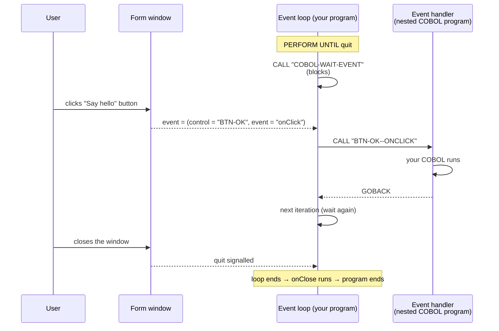

En palabras:

1. El programa generado entra en un bucle y llama a la función integrada
   **`COBOL-WAIT-EVENT`**, que se bloquea hasta que el usuario interactúa con el
   formulario.
2. Cuando ocurre un evento, el runtime devuelve **qué control** y **qué evento** (por
   ejemplo `BTN-OK` / `onClick`).
3. El bucle despacha al manejador de ese par — un **programa COBOL-85 anidado** llamado
   según el control y el evento (`BTN-OK--ONCLICK`).
4. El manejador se ejecuta y hace `GOBACK`; el bucle vuelve a esperar.
5. Cerrar la ventana termina el bucle; el manejador `onClose` del formulario se ejecuta al
   final.

### Eventos que puedes atender

- **Los eventos de widget** siguen la convención `on` + acción: `onClick`, `onChange`,
  `onDoubleClick`, `onMouseEnter`, `onGotFocus`, y así sucesivamente. Cada control expone el
  conjunto que tiene sentido para él (un Button tiene `onClick`/`onDblClick`/eventos de
  ratón; un TextBox tiene `onChange`/`onKeyPress`/eventos de foco; los diagramas tienen
  `onDataChanged`; etc.).
- **Los eventos de formulario** — la ventana en sí admite un conjunto rico, agrupado en
  **ciclo de vida, activación y foco, estado de la ventana, disposición y pintado, ratón,
  táctil y puntero, desplazamiento, arrastrar y soltar, portapapeles, sistema operativo y
  manejo de errores**. El par del ciclo de vida `onLoad` (justo antes de que la ventana se
  muestre) y `onClose` (mientras se cierra) se crean por adelantado para todos los
  formularios; el resto los asocias según los necesites.

> **Todos los eventos de la vista de diseño se disparan en tiempo de ejecución.** Los
> eventos de control se atienden a través del mismo bucle de eventos generado en *Run Form*
> y en la salida compilada, agrupados por familias:
>
> - **Todos los controles visuales** obtienen el conjunto universal de puntero —
>   `onClick`, `onDblClick`/`onDoubleClick`, `onRightClick`, `onMiddleClick`,
>   `onContextMenu`, `onMouseDown`, `onMouseUp`, `onMouseMove`, `onMouseEnter`,
>   `onMouseLeave`, `onMouseWheel`, `onHoverEnter`, `onHoverLeave` (tras el
>   `HoverDelayMs` del control, 200 ms por omisión) y `onLoad` — más el conjunto de
>   **geometría** `onResize`/`onResized` y `onMove`/`onMoved`, y el par de **estado**
>   `onVisibleChanged`/`onEnabledChanged`.
> - **Los controles enfocables** (Button, CheckBox, RadioButton, Slider, NumericUpDown,
>   DateTimePicker, TextBox…) disparan `onGotFocus`/`onLostFocus` y el conjunto de teclado
>   `onKeyDown`/`onKeyUp`/`onKeyPress`, `onEnterPressed`, `onEscapePressed` mientras tienen
>   el foco.
> - **Los controles de valor** disparan `onChange` más sus alias semánticos:
>   `onCheckedChanged`/`onValueChanged` (casilla / radio), `onSelectedIndexChanged` y
>   `onItemDoubleClick` (lista), el `onDropDown`/`onDropDownClosed` del combo, el
>   `onValueChanged` del Slider al terminar el arrastre, y el
>   `onValueChanged`/`onCompleted` de la ProgressBar a medida que COBOL escribe su Value.
> - **La entrada de texto** dispara además `onEnter`/`onLeave` y `onTextChanged`.
> - **Contenedores y compuestos** — TabControl `onTabClick`/`onTabChanged`; TreeView
>   `onNodeClick`/`onNodeSelect`/`onNodeDblClick`; Panel `onScroll` (con AutoScroll);
>   MenuBar `onMenuOpen`/`onMenuClose`; DataGrid
>   `onCellClick`/`onCellDoubleClick`/`onRowDoubleClick`/`onColumnClick`/`onScroll` más sus
>   eventos de selección.
> - **Medios y diagramas** — PictureBox `onImageLoaded`/`onImageError`; Animator
>   `onStarted`/`onFrameChanged`/`onLooped`/`onEnded`; los diagramas `onDataChanged` cuando
>   cambian sus propiedades de datos.
> - **Controles de datos** — SqlDatabase dispara `onConnectOk`/`onConnectError` en `Open`,
>   `onQueryComplete`/`onQueryError` en `Query`/`Execute`, y `onRowFetched` en `Fetch`;
>   RestClient dispara el ciclo de vida asíncrono
>   (`onComplete`/`onError`/`onCancelled`/`onTimeout` — §16); el agente de IA dispara
>   `onResponse` cuando `Ask` devuelve una respuesta. Estos se despachan en el siguiente
>   retorno de `COBOL-WAIT-EVENT`.
> - **Timer** dispara `onTick` cada `Interval` ms mientras está habilitado
>   (`Start`/`Stop`). **`Enabled` es el interruptor propio del temporizador** — decide si el
>   temporizador corre, no si un control aparece atenuado. Desmarca **Enabled at start** en
>   el panel de propiedades para un temporizador que espere a que se lo arranque, y
>   enciéndelo y apágalo desde COBOL con `SET Timer-1::Enabled TO 1` / `TO 0`. (Antes de
>   1.61.164 ninguno de los dos hacía nada: los dos escribían la marca genérica del control,
>   que el temporizador no lee, así que un temporizador no se podía detener en absoluto.)
>   Un Timer mantiene una **cadencia constante**: cada tic programa el siguiente un
>   intervalo después, así que el ritmo no se desvía según cómo caigan los fotogramas.
>   Tampoco **recupera** nunca el tiempo perdido — si tu manejador tarda más que el
>   intervalo, o el formulario se quedó parado, obtienes un tic cuando vuelva, no una
>   ráfaga de los que te perdiste. A un manejador que se haya quedado muy atrás (ocho
>   eventos en cola) se le fusionan los tics hasta que se ponga al día; un clic, una edición
>   o un cambio de foco no se fusionan nunca.
> - **A nivel de formulario** se disparan `onLoad`/`onClose` (al arrancar y al terminar),
>   `onShow`/`onActivate` (cuando la ventana de ejecución aparece por primera vez) y
>   `onResize` (cuando cambia su tamaño).
>
> Los eventos que no tienen ningún motor detrás (arrastrar y soltar, ordenar y redimensionar
> columnas, zoom en diagramas, estados de despliegue y de casilla de los nodos de un
> árbol…) ya no se listan en la vista de diseño — un evento que puedes vincular es un
> evento que se dispara.

### Añadir un manejador

En el árbol o en el panel de propiedades, haz clic en un evento para abrir su editor de
COBOL. Un manejador es un **programa anidado** autocontenido, y editas todo su cuerpo en
**un** editor — no hay ninguna casilla aparte para la working-storage.

El editor de eventos es el **mismo editor completo que el editor de código principal**:
**IntelliSense** mientras escribes (palabras clave, verbos y los nombres de los controles
del formulario; `Ctrl+Space` para invocarlo), **Find/Replace** (`Cmd/Ctrl+F`, con *Replace*
y *Replace All*) arriba a la derecha, y la **barra de estado** en el borde inferior (el
cursor `Ln, Col`, **Insert/Overwrite** con la tecla `Insert`, **Trim on save** y
**Beautify**). Se abre al 70 % de la ventana y es libremente redimensionable.

La **primera vez** que abres un manejador no escrito, el editor lo siembra con el esqueleto
estándar para que solo tengas que rellenar los huecos:

```cobol
       ENVIRONMENT DIVISION.
       DATA DIVISION.
       WORKING-STORAGE SECTION.
       LINKAGE SECTION.

       PROCEDURE DIVISION.
           CONTINUE.
```

Todo lo que va desde `ENVIRONMENT DIVISION` hasta tus sentencias es tuyo para editarlo;
PowerRustCOBOL suministra únicamente la cabecera `IDENTIFICATION DIVISION` / `PROGRAM-ID` y
el `GOBACK` / `END PROGRAM` de cierre (que se muestran atenuados alrededor del editor).

- **Las variables locales de borrador** van directamente a la
  `WORKING-STORAGE SECTION` propia de este manejador.
- **El estado compartido** vive en la working-storage global del formulario (visible para
  todos los manejadores porque se declara `GLOBAL` en el programa exterior).
- **Los datos del evento** — cuando un evento entrega datos a su manejador, esos elementos
  aparecen en la `LINKAGE SECTION` y quedan ligados por `PROCEDURE DIVISION USING …`. Hay
  exactamente **dos** cargas de ese tipo en la plataforma, y el diseñador te siembra cada
  una.

  Un control dentro de un **grupo repetitivo** recibe el índice, empezando en 1, de la
  tarjeta que disparó:

  ```cobol
       LINKAGE SECTION.
       01 CONTROL-ARRAY-INDEX     PIC S9(4) COMP-5.

       PROCEDURE DIVISION USING CONTROL-ARRAY-INDEX.
  ```

  Un **evento de nodo de TreeView** — `onNodeClick`, `onNodeSelect`, `onNodeDblClick`,
  `onNodeCheck`, `onNodeCollapse`, `onNodeExpand` — recibe el nodo en sí, como un grupo, de
  modo que un manejador que solo quiera el texto siga leyendo `CONTROL-NODE` por su cuenta:

  ```cobol
       LINKAGE SECTION.
       01 CONTROL-NODE-DATA.
          05 CONTROL-NODE           PIC X(256).
          05 CONTROL-NODE-INDEX     PIC S9(4) COMP-5.
          05 CONTROL-NODE-LEVEL     PIC S9(4) COMP-5.
          05 CONTROL-NODE-CHECKED   PIC 9.

       PROCEDURE DIVISION USING CONTROL-NODE-DATA.
  ```

  `CONTROL-NODE` es la etiqueta del nodo — la clave que usan todas las propiedades del
  TreeView —, `CONTROL-NODE-INDEX` su línea, empezando en 1, dentro de `Items` **tal como se
  escribió**, así que `Sorted` no puede renumerarla, `CONTROL-NODE-LEVEL` su profundidad
  empezando en 1, y `CONTROL-NODE-CHECKED` es `1` cuando su casilla está marcada y `0`
  cuando no lo está, o cuando el árbol no tiene casillas en absoluto.

  Todos los demás eventos no llevan datos: una `LINKAGE SECTION` vacía y una
  `PROCEDURE DIVISION.` simple sin `USING`.

> Si dejas la plantilla sembrada sin tocar y cierras el editor, no se guarda nada — el
> manejador sigue «sin escribir» hasta que añadas código de verdad.

---

## 11. Hablar con la interfaz desde COBOL

### Leer y escribir propiedades

Las propiedades de un control se leen y se escriben con la sintaxis de miembro **`::`** o
con el verbo **`INVOKE`** — las mismas formas que se usan para los métodos. El miembro es
simplemente el nombre de la propiedad; hay **una** forma coherente de tocar una propiedad.

**Lectura (GET)** — `control::property` es un valor utilizable en cualquier sitio (DISPLAY,
origen de un MOVE, IF, COMPUTE), o se lee con `INVOKE … RETURNING`:

```cobol
      *> inline — used directly as a value
           DISPLAY Button-1::Caption.
           MOVE Button-1::Caption TO WS-NAME.
           IF TextBox-1::Text = SPACES
               DISPLAY "empty".

      *> quoted member name — identical
           MOVE Button-1::"Caption" TO WS-NAME.

      *> INVOKE verb (optionally the explicit GET- prefix)
           INVOKE Button-1 "Caption"     RETURNING WS-NAME.
           INVOKE Button-1 "GET-Caption" RETURNING WS-NAME.
```

**Escritura (SET)** — asigna a `control::property` con `MOVE`/`SET`, o pasa el valor con
`INVOKE … USING`:

```cobol
      *> inline — MOVE or SET into the property
           MOVE "Hello!" TO Button-1::Caption.
           SET Button-1::"Caption" TO "Hello!".

      *> INVOKE verb (a USING argument means set; SET- is the explicit prefix)
           INVOKE Button-1 "Caption"     USING "Hello!".
           INVOKE Button-1 "SET-Caption" USING "Hello!".
```

Los nombres de propiedad **no distinguen mayúsculas de minúsculas** y son exactamente los
del panel de propiedades (`Caption`, `Text`, `BackgroundColor`, `Value`, …). Una propiedad
**numérica** se lee como un número, así que `IF Slider1::Value > 50` es algebraico, y puedes
mover o calcular entre un dato y una propiedad — por ejemplo
`MOVE WS-N TO Spinner1::Value` — sin ningún elemento `PIC` intermedio.

> **IntelliSense.** Escribe `::` (o `::"`) tras el identificador de un control y el editor
> lista las **propiedades (verde)** y los **métodos (azul claro)** de ese control; sigue
> escribiendo para filtrar (`Button-1::Cap…` → `Caption`). Una `"` a secas es simplemente un
> literal de cadena — no abre ninguna ventana emergente. La lista es completa — todas las
> coincidencias, con desplazamiento, nunca una muestra limitada — y se usa el mismo editor
> para los **manejadores de eventos del Form Designer**, así que allí se comporta de forma
> idéntica.
>
> El receptor es simplemente la expresión que está a la izquierda de `::`, donde sea que
> esté. Un paréntesis de apertura o una coma terminan el operando de la sentencia y empiezan
> un nombre nuevo, exactamente como haría un espacio, así que todos estos se completan:
>
> ```cobol
>            COMPUTE WS-HALF = (Form-1::Width / 2) * 4
>            Grid-1::Fill(Slider-1::Value)
>            Grid-1::Fill(WS-ROW, Slider-1::Value)
> ```
>
> En el segundo y en el tercero es el control **interior** el dueño del miembro que se está
> escribiendo — `Slider-1`, no `Grid-1`. Un subíndice sigue siendo parte de su propia
> expresión, así que una cola de cadena como `Grid-1::Rows(0)::` sigue listando los miembros
> de `Grid-1`.

### Llamar a los métodos de un control

Las propiedades describen *qué es un control*; los **métodos** describen *qué puede hacer* —
mostrarlo, moverlo, subir un valor un paso, añadir un elemento a una lista, lanzar una
petición HTTP. Todos los controles entienden un conjunto de métodos **universales** más los
suyos **específicos de su tipo**. Puedes llamar a un método de tres formas, todas
equivalentes:

```cobol
      *> 1. Inline call — reads like a sentence, no result kept
           Lbl-Out::SetCaption("Saved.").

      *> 2. As an expression — the return value flows into a MOVE / IF / COMPUTE
           MOVE Txt-Name::GetText() TO WS-NAME.
           IF Chk-Agree::IsChecked() = "1"
               PERFORM SUBMIT-ORDER
           END-IF.

      *> 3. INVOKE verb — when you prefer the spelled-out keyword, with optional
      *>    USING arguments and RETURNING receiver
           INVOKE Db-1 "query"
               USING "SELECT id, name FROM customer"
               RETURNING WS-ROWS.
```

Los argumentos van entre paréntesis (forma en línea o de expresión) o tras `USING` (forma
`INVOKE`); un método que devuelve un valor se puede usar directamente en una expresión o
capturarse con `RETURNING`. El IntelliSense del editor lista los métodos de un control
después de que escribas `::`, cada uno con una descripción de una línea.

> ⚠️ **Una llamada a un método es una sentencia, nunca un campo receptor — cuidado con el
> punto.** Una propiedad puede recibir un valor; una llamada a un método no. Usar una como
> destino de un `MOVE`/`SET` levanta *«is a method call, not a receiving field»* en tiempo de
> ejecución, así que el manejador compila, se lee correctamente y lanza el error al hacer
> clic.
>
> Casi nunca escribirás eso a propósito. Lo que ocurre en su lugar es un punto que falta:
> una frase de COBOL se prolonga hasta su punto, así que una llamada `::` escrita bajo un
> `MOVE` sin cerrar pasa a ser el **segundo campo receptor** de esa sentencia, por muchas
> líneas en blanco que haya entre ellos.
>
> ```cobol
>       *> WRONG — the MOVE never ended, so AddRow(...) is one of its receivers
>            MOVE GLOBAL-TOTAL TO GLOBAL-TOTAL-ED
>
>            dgReceipt::AddRow("Total", GLOBAL-TOTAL-ED).
>
>       *> RIGHT — close the MOVE, and the call stands on its own
>            MOVE GLOBAL-TOTAL TO GLOBAL-TOTAL-ED.
>
>            dgReceipt::AddRow("Total", GLOBAL-TOTAL-ED).
> ```
>
> Varios receptores bajo un mismo `MOVE` siguen siendo perfectamente legales mientras todos
> ellos *sean* receptores: `MOVE GLOBAL-TOTAL TO GLOBAL-TOTAL-ED  dgReceipt::X.` escribe el
> elemento editado **y** la propiedad `X`, que es un modismo útil. Solo un método entre ellos
> es el error. Arréglalo con un punto en la línea de arriba, o escribiendo el
> `INVOKE dgReceipt "AddRow" USING …` explícito, que no se puede leer nunca como un campo
> receptor.

**Métodos universales** (todos los controles visibles):


| Método                                           | Efecto                                             |
| ------------------------------------------------ | -------------------------------------------------- |
| `Show` / `Hide`                                  | Activan o desactivan la propiedad `Visible`.       |
| `Enable` / `Disable`                             | Activan o desactivan la propiedad `Enabled`.       |
| `SetFocus`                                       | Dan al control el foco de teclado.                 |
| `MoveTo(x, y)`                                   | Reposicionan el control (fijan `X` / `Y`).         |
| `Resize(w, h)`                                   | Cambian su tamaño (fijan `Width` / `Height`).      |
| `BringToFront` / `SendToBack`                    | Cambian el orden de apilado.                       |
| `SetProperty(name, value)` / `GetProperty(name)` | Acceso genérico a cualquier propiedad por su nombre. |

**Lo más destacado por tipo** (la lista completa está en IntelliSense):


| Widget                            | Métodos                                                                                                                                                         |
| --------------------------------- | --------------------------------------------------------------------------------------------------------------------------------------------------------------- |
| Label / Button                    | `SetCaption`, `GetCaption`                                                                                                                                      |
| Cuadro de texto                   | `SetText`, `GetText`, `AppendText`, `Clear`                                                                                                                     |
| Casilla / radio                   | `IsChecked`, `SetChecked`, `Toggle`, `Select`                                                                                                                   |
| Progreso / deslizador / numérico  | `SetValue`, `GetValue`, `Increment`, `Decrement`, `Reset`                                                                                                       |
| Lista / combo                     | `AddItem`, `RemoveItem`, `GetCount`, `GetSelected`, `SetIndex`                                                                                                  |
| Timer                             | `Start`, `Stop`, `SetInterval`, `IsEnabled`                                                                                                                     |
| REST Client                       | `get`, `post`, `put`, `delete`, `call`, `setHeader`, `clearHeaders`                                                                                             |
| SQL Database                      | `open`, `execute`, `query`, `fetch`, `fetchAll`, `close`                                                                                                        |
| AI Agent                          | `Ask`, `SetPrompt`, `SetModel`, `Stop`                                                                                                                          |
| DataGrid                          | `RefreshBinding`, `ExportCSV`, `SetFilter`, `ClearFilters`, `FreezeColumns`, `FreezeRows`, `SetRowHeight`, `SetColumnWidth`, `GetSelectedText`, `CopySelection` |

Un método que cambia una propiedad actualiza el **formulario en ejecución de inmediato** —
el mismo canal que usa la sintaxis de propiedades —, así que `Lbl-Out::SetCaption("Done")`
repinta la etiqueta en el momento en que se ejecuta. Los métodos y la sintaxis de propiedades
son completamente intercambiables; elige la que mejor se lea para la línea que estés
escribiendo.

> **Los valores diseñados están disponibles antes de que fijes nada.** Cuando un formulario
> arranca, todos los controles se siembran con los valores de su panel de propiedades, así
> que `Txt-Name::GetText()` (o `Txt-Name::Text`) devuelve el texto que escribiste en tiempo
> de diseño incluso antes de que se ejecute el primer asignador.

### Cadenas de acceso a miembros y colecciones

El operador `::` **se encadena**, así que puedes alcanzar un miembro de un miembro a
cualquier profundidad con una sintaxis coherente. Un subíndice `(n)` indexa una colección
(las filas de una cuadrícula, los elementos de una lista, las columnas de una fila); un
nombre a secas es una propiedad; un nombre con `()` es una llamada a un método:

```cobol
      *> read a nested cell, then a method on its value
           DISPLAY Grid-1::Rows(I)::Columns(2)::Value.
           DISPLAY Grid-1::Rows(I)::Columns(2)::Value::toUpperCase().

      *> write a nested cell — the structure is created on demand
           MOVE "Total" TO Grid-1::Rows(0)::Columns(0)::Value.

      *> a method on a collection element (mutates it)
           List-1::Rows(I)::Delete().

      *> index the legacy item list; count its entries
           DISPLAY List-1::Items(3).
           DISPLAY List-1::Items::Count().
```

**Una propiedad es un campo receptor; el resultado de un método no lo es.** Una cadena que
termina en una **propiedad a secas** (o en una celda indexada) es *legible y asignable* —
así que todos los verbos que cambian contenido pueden escribir en ella, no solo
`MOVE`/`SET`:

```cobol
           MOVE  WS-TEXT       TO Label-1::Caption.
           ADD   1             TO Counter-1::Value.
           STRING WS-A WS-B DELIMITED BY SIZE INTO Label-1::Caption.
           COMPUTE Slider-1::Value = Slider-1::Value * 2.
```

Una cadena que termina en una **llamada a un método** `()` es solo un valor:

```cobol
           MOVE name TO obj::UpperCase().   *> INVALID — not a receiving field
           SET  name TO obj::UpperCase().   *> valid — reads the transformed value
           obj::UpperCase().                *> valid as a statement, but changes nothing
```

**Métodos auxiliares de colección y de valor** disponibles en un elemento de cadena:
`Count` / `Size` (el número de entradas), `Delete` / `Remove`, `Clear`, `Add` / `Append`, y
las transformaciones de valor `toUpperCase`, `toLowerCase`, `trim`, `len`.

**INITIALIZE sobre un control.** Inicializar un control reinicia su propiedad **`Value`**;
también puedes apuntar a una propiedad explícitamente, y mezclar controles con datos
ordinarios — cada operando sigue sus propias reglas:

```cobol
           INITIALIZE Spinner-1.            *> resets Spinner-1::Value
           INITIALIZE Spinner-1::Value.     *> the same, explicitly
           INITIALIZE Spinner-1 WS-COUNT.   *> control → Value, data item → PIC default
```

### Acceso a propiedades mediante CALL (también soportado)

La forma explícita con `CALL` sigue disponible y es intercambiable con la sintaxis de
arriba:


| `CALL`                 | Propósito                                                                 |
| ---------------------- | ------------------------------------------------------------------------- |
| `"COBOL-WAIT-EVENT"`   | Bloquearse hasta el siguiente evento de interfaz (lo usa el bucle generado). |
| `"COBOL-GET-PROPERTY"` | Leer una propiedad de un control en un dato.                               |
| `"COBOL-SET-PROPERTY"` | Escribir una propiedad de un control desde un dato.                        |

Un manejador es un programa anidado, no un párrafo, y su cuerpo es lo que tú escribes — el
IDE suministra la cabecera `IDENTIFICATION DIVISION` / `PROGRAM-ID` y el terminador
`END PROGRAM`. El mismo manejador de saludo, usando `::`:

```cobol
       ENVIRONMENT DIVISION.
       DATA DIVISION.
       WORKING-STORAGE SECTION.
       01 WS-NAME     PIC X(40).
       01 WS-MESSAGE  PIC X(60).

       PROCEDURE DIVISION.
           MOVE TXT-NAME::Text TO WS-NAME.
           STRING "Hello, " DELIMITED BY SIZE
                  WS-NAME    DELIMITED BY SPACE
                  INTO WS-MESSAGE.
           SET LBL-OUT::Caption TO WS-MESSAGE.
           GOBACK.
```

Escritas con las primitivas `CALL` en su lugar, las dos líneas de propiedad se leerían
`CALL "COBOL-GET-PROPERTY" USING "TXT-NAME" "Text" WS-NAME` y
`CALL "COBOL-SET-PROPERTY" USING "LBL-OUT" "Caption" WS-MESSAGE`. Siguen funcionando, pero
`::` es la forma que hay que escribir — los agentes tienen instrucciones de no emitir nunca
estas primitivas para acceder a controles.

Otros servicios integrados disponibles mediante `CALL` (cubiertos en sus secciones):

- **Diagramas:** `COBOL-CHART-ADD-POINT`, `COBOL-CHART-SET-TABLE`, `COBOL-CHART-CLEAR`,
  `COBOL-CHART-REFRESH`.
- **SQL:** `COBOL-OPEN-DB`, `COBOL-EXEC-SQL`, `COBOL-FETCH-ROW`, `COBOL-NEXT-ROW`,
  `COBOL-ROW-COUNT`, `COBOL-CLOSE-DB`.
- **HTTP:** `COBOL-HTTP-GET/POST/PUT/DELETE`, `COBOL-HTTP-SET-HEADER`,
  `COBOL-HTTP-CLEAR-HEADERS`.
- **Ficheros de texto:** `COBOL-WRITE-FILE`, `COBOL-APPEND-FILE`.
- **Ciclo de vida:** `COBOL-INIT-FORM`, `COBOL-QUIT`.

> **Nota.** Los nombres de propiedad que se pasan a `GET`/`SET` son exactamente los nombres
> que se muestran en el panel de propiedades (por ejemplo `"Text"`, `"Caption"`,
> `"BackgroundColor"`, `"Value"`). Los identificadores de control son los identificadores
> que se muestran en el árbol (por ejemplo `"BTN-GREET"`).

### Aplicaciones de varios formularios y el formulario principal

Todos los proyectos tienen exactamente **un formulario principal** — el formulario que la
aplicación muestra primero y la identidad única de la aplicación en la barra de tareas o el
dock del sistema operativo. El primer formulario que creas toma el papel automáticamente;
muévelo marcando **Main form** en las propiedades de Window de otro formulario (la casilla
del titular actual es de solo lectura, así que un proyecto no puede quedarse nunca sin
ninguno). El árbol Forms marca el formulario principal con una **corona**. Si un proyecto
llega a cargarse con cero o con varios formularios marcados, gana el primer formulario de la
lista del proyecto y la línea de estado lo dice.

#### Solo el formulario principal arranca una aplicación

El IDE ejecuta el formulario que le pidas — para eso está un diseñador. Un *runtime* no. Un
binario construido y `rcrun` abren siempre el formulario principal del proyecto, y nada más.
Cuando el formulario principal es tu formulario de inicio de sesión, esa regla es lo que
impide que alguien arranque directamente el tercer formulario y lo esquive.

La designación se registra **dos veces**, y los dos registros deben coincidir:

- **En el formulario** — la marca `main-form` dentro de su `.cfrm`, que el IDE mantiene en
  exactamente un formulario.
- **En el fichero del proyecto** — `main-form` bajo `[forms]`, junto con `main-form-seal`,
  un resumen sobre la designación y la lista de formularios del proyecto.

Nunca mantienes ninguno de los dos a mano: el IDE reescribe los dos cada vez que guarda. Un
runtime vuelve a derivar la designación de los ficheros de formulario y la compara con el
fichero del proyecto. Si discrepan — una marca movida a otro formulario, un
`[forms] main-form` apuntando a otro sitio, un sello eliminado —, la aplicación informa de
una **aplicación corrupta** y sale de inmediato, sin abrir ninguna ventana:

```text
run-form: CORRUPTED APPLICATION — the main-form seal does not match this
project's forms.
This application will not start. Restore it from its original distribution.
```

Pedirle a un runtime un formulario que simplemente *no* es el principal no es corrupción. Se
rechaza, y el mensaje nombra el formulario en el que la aplicación sí arranca. Abrir ese
formulario por la vía ordinaria — `OpenFormSync` / `OpenFormAsync` desde una aplicación en
ejecución, o un elemento de menú — no se ve afectado: es la propia aplicación la que decide
quién pasa, que es de lo que se trata.

> **Nota.** Un proyecto cuyos ficheros son anteriores al sello sigue funcionando. Sin
> designación registrada, el runtime recurre al formulario marcado como principal — o, en un
> proyecto más antiguo que el marcador, al primer formulario del proyecto — y avisa una vez
> de que el proyecto está sin sellar.

**Actualizar un proyecto antiguo.** Abre uno en PowerRustCOBOL y te ofrece la actualización
— *Update this project's structure*, listando qué cambia y qué se gana. Acéptala y la
designación queda registrada y sellada. Rehúsala y **no cambia nada**: el IDE no toca la
forma de un proyecto que no le hayas pedido que cambie, ni siquiera al guardar, y la oferta
vuelve la próxima vez que lo abras.

El mecanismo es general. `[project] structure` numera la forma de un fichero de proyecto;
PowerRustCOBOL escribe el número actual en todos los proyectos que crea, y a cualquier
proyecto por debajo de él se le ofrecen los pasos que lo ponen al día. Los cambios futuros en
el fichero del proyecto llegan por la misma vía — como una oferta, descrita en tu idioma, que
eres libre de rehusar.

⚠️ **Salvedad — qué es y qué no es el sello.** Detecta un proyecto *editado*, que es de lo
que va esta regla. No es un cerrojo. Su clave se distribuye con las herramientas, así que
cualquiera que tenga la carpeta del proyecto y PowerRustCOBOL puede designar otro formulario
principal y sellarlo — exactamente como si hubiera abierto el proyecto y lo hubiera cambiado,
porque es lo que hizo. El caso fuerte es un **binario construido**: sus formularios viven
dentro del ejecutable, su formulario principal se elige en el momento de la construcción, y no
queda nada en disco que editar. Distribuye las aplicaciones como binarios construidos cuando
el formulario de inicio de sesión sea lo que estés protegiendo.

La sección Window del formulario principal ofrece además **Taskbar icon** — la imagen que usa
la única entrada de la barra de tareas o del dock. Las ventanas abiertas desde otros
formularios no crean nunca entradas en la barra de tareas. Nota por sistema operativo: en
macOS el Dock muestra de forma natural un icono por aplicación; en Windows y Linux las
ventanas hijas se crean con la marca de omitir la barra de tareas.

**Adornos y estado de la ventana.** Todos los formularios tienen `CanMinimize` /
`CanMaximize` (los botones de la barra de título), `TitleVisible` (`false` = ventana sin
adornos), `WindowState` (`Normal` / `Minimized` / `Maximized` — el estado en el que se abre
la ventana, fijable en tiempo de ejecución) y `FullScreen` (ortogonal a WindowState: salir de
la pantalla completa devuelve al estado anterior). En tiempo de ejecución:

```cobol
    INVOKE me "SetWindowState"  USING "Maximized".
    INVOKE me "SetFullScreen"   USING "true".
    INVOKE me "SetTitleVisible" USING "false".
```

Cada transición **real** a pantalla completa dispara el evento `onFullScreenChanged` del
formulario (el sistema operativo puede rechazar una petición — el evento sigue a la realidad,
una vez por cambio real; lee el `FullScreen` de `me` para el valor nuevo).

**FormState — proteger el trabajo sin guardar.** `FormState` es una propiedad de formulario
solo de tiempo de ejecución con dos valores, `Ready` (por omisión) y `Waiting`. Mientras un
formulario está en `Waiting` no se puede cerrar por NINGUNA vía — el botón de la barra de
título, un `Close` de un `windowHandler` o una cascada — y en su lugar se dispara su evento
`onCloseRejected`. El patrón típico: poner `Waiting` en los manejadores de `onTextChanged`, y
poner `Ready` tras un guardado correcto:

```cobol
    INVOKE me "SetProperty" USING "FormState" "Waiting".
    *> … after saving …
    INVOKE me "SetProperty" USING "FormState" "Ready".
```

**Abrir formularios desde COBOL.** Dos métodos sobre `me`, cada uno en dos sintaxis:

```cobol
    *> Comma form — trailing parameters are OPTIONAL and default to the
    *> target form's designed properties; modal defaults to true.
    INVOKE me::"OpenFormSync"("DETAIL-FORM") RETURNING WS-H.
    INVOKE me::"OpenFormAsync"("DETAIL-FORM", "Maximized", 100, 80)
        RETURNING WS-H.

    *> COBOL-standard space form — ALL parameters are required; a missing or
    *> wrongly-typed parameter is a COMPILE-TIME error.
    INVOKE me "OpenFormSync"
        USING "DETAIL-FORM" "Normal" 100 80 640 480 "true"
        RETURNING WS-H.
```

`WS-H` es un **windowHandler** (declárala `USAGE OBJECT`). A través de ella puedes hacer
`Close`, `Focus` (que restaura primero una ventana minimizada), `SetWindowState`,
`SetFullScreen`, `SetTitleVisible`, y leer `WS-H::FormState`. Cuando un formulario se cierra,
todos los windowHandler que se referían a él pasan a ser **NULL** automáticamente; invocar a
través de una referencia NULL es un error de ejecución.

**Reglas del ciclo de vida.**

- El **formulario principal es un singleton**: abrirlo mientras está en ejecución enfoca la
  instancia en ejecución y devuelve su referencia existente. Los demás formularios pueden
  ejecutar cualquier número de instancias concurrentes.
- Los hijos **Sync** se cierran junto con quien los llamó — y quien los llamó no puede
  cerrarse mientras alguno de sus hijos Sync esté en `Waiting` (también recibe
  `onCloseRejected`).
- Los hijos **Async** sobreviven al cierre de quien los llamó — salvo cuando se cierra el
  **formulario principal**: entonces se cierran todos los formularios y la aplicación
  termina.
- Un hijo Sync **modal** bloquea la entrada de quien lo llamó y su flujo de COBOL hasta que
  el hijo se cierre; la referencia de `RETURNING` es NULL para cuando quien lo llamó se
  reanuda.

> **Estado.** Las reglas de ciclo de vida de ventana de arriba (los vetos de FormState,
> `onCloseRejected`, las órdenes de ventana, `onFullScreenChanged`) están vivas hoy en el
> runtime de run-form. El alojamiento de las **ventanas hijas** de OpenForm* está llegando
> con el anfitrión multivista; hasta entonces la apertura de un hijo se acepta, se registra en
> la salida de error estándar y se libera de inmediato (su referencia se lee como NULL), así
> que los programas no se bloquean nunca.

---

## 12. El código generado

Cuando guardas o generas un formulario, PowerRustCOBOL escribe un `.cbl` en
`generated/`. Su forma es predecible:

- un **PROGRAM-ID** para el formulario;
- working-storage para el estado de cada control;
- el **bucle de eventos** (el `PERFORM UNTIL` alrededor de `COBOL-WAIT-EVENT`);
- un **programa COBOL-85 anidado** por manejador de eventos, llamado
  `CONTROL-ID--EVENTNAME` (en mayúsculas, por ejemplo `BTN-OK--ONCLICK`); el `onLoad` del
  formulario se ejecuta al arrancar y el `onClose` al terminar.

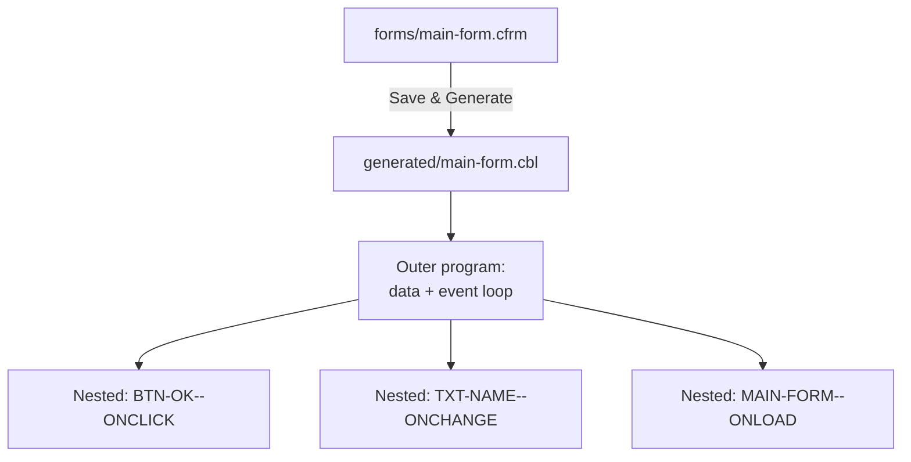

Todos los ficheros generados empiezan con una franja de comentarios `*>` dirigida a ti:
declara que el fichero lo produjo el RAD de PowerRustCOBOL, que no debes editarlo
directamente, y que su estructura puede cambiar entre versiones (por rendimiento, por
observabilidad o por corrección de errores) sin romper tu código.

> ⚠️ **Salvedad.** El `.cbl` generado es un artefacto de construcción, así que **no lo
> edites a mano** — tus ediciones se sobrescribirían. PowerRustCOBOL **regenera el COBOL
> de todos los formularios automáticamente cada vez que haces Build, Run, Debug o Check**
> del proyecto (los diseñadores abiertos usan su estado vivo, incluso sin guardar; los
> demás formularios se recargan de su `.cfrm`), así que lo que compila y se ejecuta
> siempre coincide con tus formularios. Pon la lógica reutilizable en **Common Code** y
> llámala con `CALL` desde los manejadores.

### Leer un diagnóstico

Como el compilador ve el `.cbl` tejido, un error se reportaba antes contra ese artefacto —
`842:17: ✖ error: …`, la línea 842 de un fichero que nunca escribiste. Un Check reporta
ahora el lugar que **tú** escribiste. Una fila de Output se lee:

```
MAIN-FORM ▸ BTN-OK ▸ onClick — 3:12: ✖ error: syntax error near "DISPLYA"
    3 │            DISPLYA "HELLO".
      │            ^
```

- La parte izquierda es la **ruta del sitio** — el formulario, luego el control y el
  evento (o el nombre del procedimiento, o la palabra clave de la sección, por ejemplo
  `MAIN-FORM ▸ WORKING-STORAGE`). Se lee como navegas por el RAD.
- La línea y la columna son **dentro del texto propio de ese manejador o de esa sección**,
  exactamente como lo muestra el editor — no la numeración del fichero generado.
- La línea ofensora se cita con la columna marcada, así que el mensaje dice dónde por sí
  solo — en una captura de pantalla, en un mensaje de foro o por encima del hombro.
- La fila es un **enlace**: haz clic en ella y el IDE abre el editor propietario — la
  ventana modal del evento para un manejador, la ventana COBOL Structure para una sección
  o un procedimiento, el editor de código para un fichero de Common Code — con el cursor
  en esa línea. El `.cbl` generado no se abre nunca.

Algunas líneas pertenecen al propio generador (el bucle de eventos, el esbozo de un
manejador no escrito). Un diagnóstico sobre una de esas se etiqueta como
`[generated code]` con el fichero y la línea generados, y deliberadamente **no** se
atribuye a ninguno de tus manejadores — si ves uno, el fallo está en la fontanería de
PowerRustCOBOL o en cómo se fija una propiedad, no en código que puedas editar.

> **Nota.** Las localizaciones de sitio cubren los diagnósticos de **tiempo de
> compilación** (Check, y la pasada de análisis sintáctico y semántico previa a
> Build/Run/Debug). Un aborto en tiempo de ejecución sigue reportando por ahora la
> localización del programa generado.

---

## 13. El lenguaje RustCOBOL

RustCOBOL implementa un subconjunto sustancial de **COBOL-85**, más las extensiones de
PowerRustCOBOL. Lo más destacado en lo que se apoyará un programador COBOL en activo:

- **Datos y estructura:** elementos de grupo, `OCCURS` (con subíndices e índices), `REDEFINES`,
  `RENAMES` (nivel 66), nombres‑condición (nivel 88 con `VALUE` / `THRU`), `USAGE` incluido
  `POINTER`.

> **`PERFORM a THRU b` es un rango de párrafos.** Un `GO TO` que nombre un párrafo *dentro* del
> rango transfiere el control dentro del rango, y el `PERFORM` vuelve a quien lo llamó cuando
> termina el último párrafo del rango — incluso cuando a ese párrafo se llegó por el `GO TO`. Este
> es el modismo clásico del párrafo de salida, y funciona tal como se escribe:
>
> ```cobol
>            PERFORM CHECK-IT THRU CHECK-IT-EX.
>        CHECK-IT.
>            IF WS-VALUE = SPACE GO TO CHECK-IT-EX.
>            MOVE "NON-BLANK" TO WS-NOTE.
>        CHECK-IT-EX. EXIT.
> ```
>
> Un `GO TO` cuyo destino queda **fuera** del rango sigue abandonando el `PERFORM`, como exige el
> estándar — el control no vuelve.

> **Un grupo son sus hijos.** Un elemento de grupo no tiene almacenamiento propio: son los
> elementos que hay bajo él puestos uno tras otro, es alfanumérico sean ellos lo que sean, y su
> tamaño es la suma de los de ellos. Leer uno te da el registro completo, escribir uno reparte los
> bytes entre los hijos según su ancho, y un cambio en cualquier hijo se transparenta a través del
> grupo de inmediato. `FILLER` cuenta — retiene sus bytes y su `VALUE` como cualquier otro elemento
> — y la palabra en sí es opcional, así que `05 PIC X VALUE ":".` es un separador perfectamente
> válido:
>
> ```cobol
>        01 EDITED-TIME.
>           05 HH PIC 99.
>           05    PIC X VALUE ":".
>           05 MM PIC 99.
> ```
>
> Con `HH` = 09 y `MM` = 30, `DISPLAY EDITED-TIME` muestra `09:30`. Esta es la forma ordinaria de
> construir un campo formateado a partir de piezas, y es la razón por la que un grupo no necesita
> nunca una `PIC` propia.
>
> ⚠️ **La modificación de referencia cuenta caracteres, no valores.** `T(1:2)` toma las dos primeras
> *posiciones de carácter* de `T`, así que un `PIC 9(8)` que contiene `00224845` da `"00"` — los
> ceros a la izquierda son parte del elemento. Eso es lo que hace que el desempaquetado clásico
> (`MOVE T(1:2) TO HH`, `MOVE T(3:2) TO MM`, …) cuadre.

- **Aritmética:** `ADD/SUBTRACT/MULTIPLY/DIVIDE/COMPUTE` con múltiples receptores y `ROUNDED` por
  receptor; edición de `PICTURE` numérica editada.

> **Una frase de error de tamaño protege a los receptores — cualquiera de sus dos mitades.** Si una
> sentencia lleva `ON SIZE ERROR` *o* `NOT ON SIZE ERROR`, un receptor que no puede contener su
> resultado conserva el valor que ya tenía, y los demás receptores siguen recibiendo el suyo. Sin
> ninguna frase de error de tamaño el resultado se trunca dentro del campo en su lugar. Esto pilla a
> la gente porque la protección se lee como si perteneciera a `ON SIZE ERROR`; pertenece a la
> sentencia.
>
> ```cobol
> ADD  WS-BIG  6  GIVING WS-A WS-B
>      NOT ON SIZE ERROR  MOVE "OK" TO WS-FLAG.
> *>   WS-A and WS-B are unchanged if the sum will not fit them,
> *>   and WS-FLAG stays as it was.
> ```

- **Control de flujo:** `IF/ELSE`, `EVALUATE` (con `ALSO` y `WHEN NOT`), `PERFORM` en línea y fuera
  de línea (incluidos `VARYING`, `UNTIL`, `TIMES`), `GO TO`, `ALTER`,
  `EXIT PERFORM/PARAGRAPH/SECTION`, `NEXT SENTENCE` fiel.
- **Cadenas:** `STRING`, `UNSTRING`, `INSPECT` (`TALLYING` + `REPLACING`, con
  `BEFORE/AFTER INITIAL`), `INITIALIZE … REPLACING`.

> **`UNSTRING` completo.** Se respetan todas las frases: `DELIMITED BY [ALL] … OR …`,
> `DELIMITER IN`, `COUNT IN`, `WITH POINTER`, `TALLYING` y `ON OVERFLOW` / `NOT ON OVERFLOW`. Tres
> detalles merecen conocerse porque son donde suelen equivocarse los desempaquetadores escritos a
> mano:
>
> - **`WITH POINTER` se lee *y* se escribe.** El barrido empieza en el carácter que ese elemento
>   nombra (contando desde 1) y el elemento queda apuntando una posición más allá del último
>   carácter examinado, así que el siguiente `UNSTRING` continúa donde este se detuvo. Un puntero
>   fuera del origen levanta desbordamiento y no mueve nada en absoluto.
> - **`ALL` consume la serie pero entrega uno.** `DELIMITED BY ALL ZERO` sobre `"1200000"` se salta
>   los cinco ceros, y `DELIMITER IN` recibe un único `"0"`.
> - **Sin `DELIMITED BY` significa «por tamaño».** Cada receptor toma exactamente tantos caracteres
>   como sea ancho, por turnos.
>
> ```cobol
> 01  WS-LINE   PIC X(7) VALUE "1200000".
> 01  WS-FIELD  PIC X.
> 01  WS-DELIM  PIC X(4).
> 01  WS-COUNT  PIC 99.
> 01  WS-PTR    PIC 99  VALUE 1.
> 01  WS-TALLY  PIC 99  VALUE 0.
> ...
>     UNSTRING WS-LINE DELIMITED BY ALL ZERO
>         INTO WS-FIELD DELIMITER IN WS-DELIM COUNT IN WS-COUNT
>         WITH POINTER WS-PTR TALLYING WS-TALLY.
> *>   WS-FIELD = "1"   (the field is "12", cut to one character)
> *>   WS-DELIM = "0"   WS-COUNT = 02   WS-PTR = 08   WS-TALLY = 01
> ```
>
> **`INSPECT … LEADING` / `TRAILING` cuentan patrones completos.** `FOR LEADING "AH"` cuenta cuántas
> veces se repite `"AH"` *de forma contigua desde el principio* de la región — una, en
> `"AH YES AH YES"`, no dos, y no «caracteres que aparecen en el patrón».
>
> **Una serie de operandos `TALLYING` comparte una sola pasada sobre el campo, y el orden en que los
> escribes decide la respuesta.** El campo se inspecciona una vez, de izquierda a derecha; en cada
> posición de carácter los operandos se prueban en el orden escrito, el primero que coincide reclama
> la posición, y el barrido continúa más allá de los caracteres que tomó. Nada se cuenta dos veces.
>
> ```cobol
>        01  SUBJ  PIC X(4)  VALUE "AABA".
>            INSPECT SUBJ TALLYING T1 FOR ALL "AA"  T2 FOR ALL "A".
>        *>  T1 = 1, T2 = 1   — "AA" takes positions 1-2, so only the last
>        *>                     "A" is left for T2
>            INSPECT SUBJ TALLYING T1 FOR ALL "A"   T2 FOR ALL "AA".
>        *>  T1 = 3, T2 = 0   — the same statement, operands swapped
> ```
>
> Esto pilla a la gente con `CHARACTERS`, que cuenta solo las posiciones que ningún operando
> anterior reclamó, y con `LEADING`, cuya serie debe empezar en la primerísima posición de su
> región: pon delante de él un operando `ALL` que coincida ahí, y la serie de `LEADING` habrá
> terminado antes de empezar.
>
> **`REPLACING` funciona igual, y sus delimitadores `BEFORE`/`AFTER` se encuentran antes de que se
> reemplace nada.** Esa es la parte que merece conocerse: un operando puede estar anclado en
> caracteres que otro operando anterior sobrescribe, y los sigue encontrando, porque las ventanas se
> fijaron todas contra el campo tal como llegó.
>
> ```cobol
>        01  SUBJ  PIC X(20).
>            MOVE "CAN NOT BE ALL BAD." TO SUBJ.
>            INSPECT SUBJ REPLACING
>                FIRST "L "  BY "ZZ"  AFTER INITIAL "AL"
>                FIRST "BAD" BY "ZZZ" AFTER "L "
>                ALL   "."   BY "Z"   AFTER "AL".
>        *>  SUBJ = "CAN NOT BE ALZZZZZZ"
> ```
>
> Si cada frase se hubiera aplicado por su cuenta sobre todo el campo, la primera habría borrado el
> `"L "` en el que está anclada la segunda y `"BAD"` seguiría ahí.
>
> ⚠️ **Un elemento numérico con signo no tiene ningún signo menos que contar.** `INSPECT` lee las
> posiciones de carácter que un elemento ocupa realmente, y un `PIC S9(5)` que contiene `-12345`
> ocupa cinco de ellas, todas dígitos — el signo viaja como una sobreperforación sobre un dígito, no
> como un carácter propio. Así que `INSPECT AMT TALLYING T FOR ALL "-"` da **cero**, y un
> `REPLACING` sobre los dígitos deja el signo intacto. Declara `SIGN IS LEADING SEPARATE` si quieres
> que el signo sea una posición de carácter; entonces se cuenta como cualquier otra. Este es
> comportamiento COBOL estándar, y es la sorpresa habitual cuando una rutina de validación intenta
> detectar negativos buscando `"-"`.

- **Tablas:** `SORT` / `MERGE` (con `INPUT`/`OUTPUT PROCEDURE`, `USING`/`GIVING`,
  `RELEASE`/`RETURN`); `SEARCH` (serie) y `SEARCH ALL` (búsqueda binaria sobre una tabla con
  `ASCENDING`/`DESCENDING KEY`).
- **Subprogramas:** `CALL … USING` (con `ON EXCEPTION` / `NOT ON EXCEPTION`), `CANCEL`,
  `GOBACK`/`EXIT PROGRAM`, programas anidados.
- **Manejo de errores:** `DECLARATIVES` con `USE AFTER STANDARD ERROR PROCEDURE` para el manejo
  centralizado de errores de fichero.
- **Intrínsecas:** la biblioteca estándar de `FUNCTION`, incluidas las funciones de fecha y hora y
  las financieras.
- **`ACCEPT`/`DISPLAY` de pantalla** para la interacción en modo carácter (cuando no estás
  construyendo un formulario con ventanas).
- **Terminadores de ámbito:** el conjunto de COBOL-85 (`END-IF`, `END-PERFORM`, `END-READ`,
  `END-EVALUATE`, `END-STRING` y los demás) más `END-ACCEPT` y `END-DISPLAY`. Todos ellos son
  opcionales — un punto cierra la sentencia igual de bien —, pero `END-DISPLAY` es el que puede
  cambiar lo que significa una línea, porque cierra la **lista de operandos**:

  ```cobol
           DISPLAY "A" END-DISPLAY
           DISPLAY "B".
  ```

  son dos sentencias. Sin el terminador, un `DISPLAY` se prolonga hasta encontrar un punto o una
  frase que reconozca, así que escribir las dos en líneas separadas sin terminador y sin punto entre
  medias convierte `"B"` en un tercer operando del primer `DISPLAY`. Si estás acostumbrado a cerrar
  todos los verbos explícitamente, ese hábito se traslada aquí sin cambios.

> **Verdad de campo.** La lista autorizada y siempre al día de la sintaxis soportada es
> `docs/cobol85-supported-syntax-es.md`; la matriz de pruebas verbo a verbo es
> `docs/cobol85-verb-test-matrix-es.md`. En caso de duda, esos ficheros (y la suite de pruebas) son
> los definitivos.

> ⚠️ **Fuera de alcance (hoy):** el bloqueo de registros entre procesos y las definiciones
> `CLASS`/`METHOD` orientadas a objetos no están implementados. **La organización de ficheros
> RELATIVE sí está implementada** — véase
> [Direccionar registros por número](#direccionar-registros-por-número-organization-is-relative).

### Escribirlo como el estándar te lo permite

COBOL-85 admite varias grafías que un desarrollador de PowerCOBOL o de isCOBOL tendrá ya en los
dedos. Todas estas funcionan, y ninguna es obligatoria.

**Las comas y los puntos y comas son decoración.** Una `,` o un `;` *seguidos de un espacio* son un
**separador**: pueden aparecer en cualquier sitio en el que pueda aparecer un espacio, y significan
exactamente lo que significa un espacio. Estas cuatro líneas son la misma sentencia para el
compilador:

```cobol
       MOVE ZERO TO DN3, DN4.
       MOVE ZERO TO DN3 DN4.
       CALL "SUB" USING TABLE-1, TABLE-2, DN1.
       READ CUSTOMER-FILE ; AT END GO TO EOF-ROUTINE.
```

> ⚠️ **Una coma sin espacio detrás es otra cosa.** Así es como siguen funcionando la coma decimal
> (`1,5` bajo `DECIMAL-POINT IS COMMA`) y la coma de edición de PICTURE (`PIC ZZ,ZZ9.99`). La regla
> es del propio estándar: una coma separadora es una coma *seguida de un espacio*.

**Una picture editada sigue siendo un elemento numérico.** `Z`, `*` y un `$`, `+` o `-` flotantes
son posiciones de dígito, así que un elemento numérico‑editado es un receptor legal para `COMPUTE`,
`ADD`, `SUBTRACT`, `MULTIPLY` y `DIVIDE … GIVING` — editar el resultado es la razón de declarar
uno. El punto de edición puede ir seguido de un único dígito, y una picture no necesita llevar
ningún `9` en absoluto:

```cobol
       01  DIV9        PICTURE IS ZZ,ZZZ.9.
       01  NET-PAY     PIC $**.**CR.
       01  RUNNING-QTY PIC ZZZZ.
           DIVIDE GROSS BY 12 GIVING DIV9.
           SUBTRACT TAX FROM GROSS GIVING NET-PAY.
```

> **Nota.** El valor se almacena en su forma *editada*, así que el receptor se vuelve a leer como
> los caracteres que ves en un informe. Calcula con un elemento numérico llano y mueve el resultado
> al editado cuando necesites los dos.

**La protección con asteriscos (`*`) rellena todo el campo cuando el valor es cero.** Eso es el
sentido que tiene en un cheque o en una línea de remesa — no se puede escribir nada dentro del
hueco. Todas las posiciones de carácter pasan a ser un asterisco, con la única excepción del punto
decimal, y eso incluye un `$` fijo y un `CR` o `DB` final:

```cobol
       01  NET-PAY  PIC $**.**CR.
           MOVE ZERO TO NET-PAY.     *> ***.****
           MOVE -2.34 TO NET-PAY.    *> $*2.34CR
```

La segunda línea es el caso ordinario: con un valor distinto de cero solo se protegen los *ceros a
la izquierda*, así que el `$` fijo conserva su propia posición y `CR` se imprime porque el valor es
negativo. Merece la pena comprobar un cero contra el ancho declarado del campo la primera vez que
uses uno — `PIC $**.**CR` son ocho posiciones de carácter, porque `CR` ocupa dos.

**El símbolo de moneda es tuyo para elegirlo.** `SPECIAL-NAMES. CURRENCY [SIGN] [IS] literal`
nombra el carácter que rellena una posición de moneda, y todas las reglas de picture se aplican
entonces a ese carácter en lugar de a `$` — incluida la serie flotante, donde un símbolo repetido se
desplaza a la derecha hasta pegarse al primer dígito significativo:

```cobol
       ENVIRONMENT DIVISION.
       CONFIGURATION SECTION.
       SPECIAL-NAMES.
           CURRENCY SIGN IS "£".
       ...
       01  INVOICE-TOTAL  PICTURE £(3),£££.99.
           MOVE 1234 TO INVOICE-TOTAL.      *> reads  £1,234.00
           MOVE ZERO TO INVOICE-TOTAL.      *> reads       £.00
```

> ⚠️ **Sustituye a `$`, no se le suma.** En cuanto un programa declara un signo de moneda, `$` deja
> de ser un carácter de picture en ese programa, y una picture que siga usando uno se rechaza. Si
> estás portando un programa que mezcla los dos, cambia todas las pictures en la misma edición.
>
> El literal es de un carácter, y el estándar descarta cualquiera que colisionaría con un carácter
> de picture o con un separador: no un dígito, no uno de `A B C D E G N P R S V X Z`, y ninguno de
> `space * + - , . ; ( ) " / =`.

**Un receptor numérico contiene exactamente sus dígitos declarados — por los dos extremos.** Un
`MOVE` alinea por el punto decimal y luego descarta lo que no cabe. El extremo de orden bajo es el
conocido; el de orden alto se corta con el mismo silencio:

```cobol
       01  M   PICTURE 99V999.
       01  W   PICTURE 9999V9.
           MOVE 123.45 TO M.        *> 23.450  — the hundreds digit is gone
           MOVE 123.45 TO W.        *> 123.4   — the hundredths digit is gone
```

> ⚠️ **Esto es silencioso.** No se reporta nada, porque el estándar lo define como el resultado y no
> como un error. Si perder los dígitos de orden alto sería un error en tu programa, declara el
> receptor lo bastante ancho — o usa una sentencia aritmética con `ON SIZE ERROR`, que prueba
> *primero* la capacidad del receptor y lo deja intacto en su lugar.

**`P` mueve el punto decimal sin almacenar un dígito.** Una `P` en una picture es una posición de
dígito que el elemento *abarca* pero no *contiene* — útil cuando un campo registra miles, o
milésimas, y los ceros finales o iniciales serían bytes desperdiciados:

```cobol
       01  IN-HUNDREDS  PICTURE S999PP.     *> 3 digits, value × 100
       01  IN-TEN-THOUS PICTURE PP99.       *> 2 digits, value ÷ 10 000
           MOVE 12300 TO IN-HUNDREDS.       *> stored exactly
           MOVE 12345 TO IN-HUNDREDS.       *> stored as 12300
```

> **Nota.** Las posiciones que representan las `P` se leen siempre como cero, y **no ocupan bytes**
> — `PIC S999PP` son tres posiciones de carácter en un registro, no cinco. Las comparaciones y la
> aritmética usan el valor escalado, así que `IF IN-HUNDREDS = 12300` es verdadera arriba.

**`REDEFINES` es una segunda lectura de los mismos bytes, no un segundo campo.** El elemento
redefinidor no añade nada al registro: describe almacenamiento que su objetivo ya posee, y una
escritura a través de cualquiera de las dos descripciones es inmediatamente visible a través de la
otra — y a través del grupo que está por encima de las dos. Este es el modismo sobre el que se
construyen los programas de informes:

```cobol
       01  TEST-CORRECT.
           02  FILLER      PIC X(17) VALUE "       CORRECT =".
           02  CORRECT-X.
               03  CORRECT-A               PIC X(20) VALUE SPACE.
               03  CORRECT-N REDEFINES CORRECT-A  PIC -9(9).9(9).
           ...
           MOVE 242.4332220110 TO CORRECT-N.
           MOVE TEST-CORRECT   TO PRINT-REC.   *> the edited number is there
```

> ⚠️ **Salvedad — superposiciones muy grandes.** Mantener dos descripciones sincronizadas cuesta una
> pasada sobre las dos en cada escritura. Por encima de 256 posiciones de almacenamiento — una tabla
> 10×10×10 redefinida, por ejemplo —, PowerRustCOBOL deja de reflejar y da a cada descripción su
> propio almacenamiento, porque refrescar mil ocurrencias en cada `MOVE` haría inutilizable el
> programa. Redefine registros, no tablas grandes; si necesitas las dos lecturas de una tabla, haz
> `MOVE` entre ellas explícitamente.

**Una descripción redefinidora no necesita tener nombre.** Las disposiciones de mainframe suelen
volver a describir un campo con un grupo sin nombre, para que solo las piezas tengan nombre:

```cobol
       01  IN-RECORD.
           02  IN-DATE                     PIC X(8).
           02  FILLER REDEFINES IN-DATE.
               03  IN-DATE-YYYY            PIC X(4).
               03  IN-DATE-MM              PIC XX.
               03  IN-DATE-DD              PIC XX.
```

`MOVE "20260828" TO IN-DATE` deja entonces a `IN-DATE-MM` leyéndose `08`. Los hijos se reparten los
bytes del objetivo entre ellos **en orden de disposición**, exactamente como lo harían bajo un grupo
con nombre — una superposición sin nombre es una descripción, no otro nombre para su primer hijo.

> **Nota — dos superposiciones de un campo empiezan las dos en su primer byte.** Declarar
> `02 FILLER REDEFINES IN-DATE.` dos veces da dos lecturas independientes, cada una empezando en el
> primer carácter de `IN-DATE`. Una segunda superposición *no* continúa donde la primera lo dejó.
> Para alcanzar una parte posterior del campo, pon delante un `FILLER` del ancho adecuado dentro de
> la misma superposición.

> **Nota — las superposiciones se anidan, y una escritura recorre toda la cadena.** Un `REDEFINES`
> puede estar dentro de un registro que a su vez esté redefinido, y dentro de *esa* superposición
> otra. Dos bytes escritos a través de la descripción más exterior son visibles a través de todas
> las lecturas de esos bytes, por profundas que sean — incluido un nombre‑condición declarado sobre
> el elemento más interno:
>
> ```cobol
>        01  REC-10.
>            02  PART-A.
>                08  FILLER   PIC X(6).
>                08  CODE-X   PIC XX99.
>            02  PART-B REDEFINES PART-A.
>                03  FILLER   PIC X(8).
>                03  FLAGS    PIC 99.
>                03  FLAG-BITS REDEFINES FLAGS.
>                    04  FLAG-1  PIC 9.
>                    04  FLAG-2  PIC 9.
>                        88  SOFT  VALUE 1.
>        01  REC-12 REDEFINES REC-10.
>            02  FILLER       PIC X(24).
>            02  STATUS-CODE  PIC 99.
>
>            MOVE 11 TO STATUS-CODE.     *> SOFT is now true
> ```
>
> Cada descripción se vuelve a materializar una vez por escritura, así que esto sigue siendo un
> coste fijo — pero *es* un coste. Una superposición muy grande (una tabla 10×10×10 redefinida) se
> queda al margen y conserva su propio almacenamiento en su lugar; véase la salvedad en la
> referencia de sintaxis.

**`MOVE CORRESPONDING` empareja elementos por nombre, y solo uno del par necesita ser elemental.**
Este es el atajo para copiar un registro en otro ordenado de forma distinta: los elementos que los
dos grupos comparten por nombre se mueven, los elementos que solo están en uno de ellos se dejan en
paz, y los subgrupos que coinciden se recorren por dentro.

```cobol
       01  IN-REC.
           05  CUST-NO    PIC 9(6).
           05  CUST-NAME  PIC X(30).
           05  FILLER     PIC X(4).
       01  OUT-REC.
           05  CUST-NAME  PIC X(30).
           05  CUST-NO    PIC 9(6).
           MOVE CORRESPONDING IN-REC TO OUT-REC.   *> reordered, by name
```

El emparejamiento es por nombre, **no** por posición — eso es el sentido de todo, y es también la
trampa: renombra un campo en un lado y deja de copiarse en silencio.

> **Nota.** Un par puede poner un **grupo** frente a un elemento elemental; el estándar solo pide
> que uno de los dos sea elemental. El movimiento entre ellos es uno alfanumérico ordinario, así que
> un `PIC XXX` que envía a un grupo de `999` + `XXX` rellena los seis caracteres. Dos *grupos*
> enfrentados se recorren por dentro en su lugar, emparejando a sus hijos.

> ⚠️ **Algunos elementos no participan nunca.** Un elemento descrito con `REDEFINES` o con
> `RENAMES` queda fuera del emparejamiento, y también todo lo subordinado a él. Esa es la regla del
> estándar, y está ahí para impedir que los mismos bytes se muevan dos veces bajo dos nombres — una
> reagrupación `66` y los elementos que renombra son el mismo almacenamiento. Si un campo
> misteriosamente no se copia, comprueba si está bajo una rama `REDEFINES`.

> **Nota — una reagrupación `66` pertenece a su registro, y se puede cualificar como cualquier otra
> cosa.** Un `66` queda fuera de la jerarquía de niveles, lo que hace que parezca suelto, pero está
> subordinado al registro cuyos elementos renombra. Así que el mismo nombre de `66` puede aparecer
> una vez por registro y distinguirse con `OF`/`IN`, en lecturas y en escrituras:
>
> ```cobol
>        01  T-DATA.
>            02  TAG-1.
>                03  TAG-1A     PIC XXXX.
>                03  TAG-1B     PIC XXXXXX.
>        66  SPAN RENAMES TAG-1A THRU TAG-1B.
>        01  U-DATA.
>            02  UNIT-1.
>                03  UNIT-1A    PIC X(7).
>                03  UNIT-1B    PIC XXXX.
>        66  SPAN RENAMES UNIT-1A THRU UNIT-1B.
>
>            MOVE "CALIFORNIA" TO SPAN OF T-DATA.   *> TAG-1, not UNIT-1
> ```
>
> De «un `66` son sus elementos cubiertos» se siguen dos cosas más. Una reagrupación que se extiende
> sobre una tabla cubre **todas las ocurrencias** de ella, no solo la primera —
> `66 R RENAMES ITEM-1 THRU TABLE-2` donde `TABLE-2` es `PIC XXX OCCURS 5` tiene veinte caracteres
> de ancho. Y una reagrupación de **exactamente un** elemento toma la descripción completa de ese
> elemento: `66 R RENAMES W` donde `W` es `PIC 9(4)` es un elemento numérico de cuatro dígitos, así
> que `ADD 3500 TO R` con 8000 dentro provoca `ON SIZE ERROR` y lo deja en paz, exactamente como lo
> haría `ADD 3500 TO W`.

**Una ocurrencia de una tabla es un operando legítimo.** Pon subíndice al grupo y el emparejamiento
escribe los campos propios de esa ocurrencia:

```cobol
       01  A-FLOCK.
           05  B-FLOCK OCCURS 4 TIMES.
               10  C-FLOCK.
                   15  CUST-NO    PIC 9(6).
                   15  CUST-NAME  PIC X(30).
           MOVE CORRESPONDING IN-REC TO C-FLOCK (4).   *> the 4th entry only
```

### Comparar un número con texto

`IF` compara dos números **algebraicamente** — por valor, con signo y todo. Compara dos trozos de
texto **carácter a carácter**. Lo que hace cuando los mezclas es la regla que merece conocerse,
porque un campo de pantalla, un registro de fichero y una línea de informe son todos texto:

> **Un operando numérico y uno no numérico hacen que toda la comparación sea no numérica.** El número
> se trata como si se hubiera movido a un elemento alfanumérico **de su propio tamaño**, y los dos se
> comparan entonces como texto. Ese movimiento transporta las posiciones de carácter del elemento y
> **no su signo**.

```cobol
       01  WS-AMOUNT   PIC S9(18).
       01  WS-TYPED    PIC X(18).
           MOVE -123456789012345678 TO WS-AMOUNT.
           MOVE "123456789012345678" TO WS-TYPED.
           IF WS-AMOUNT = WS-TYPED           *> TRUE — the sign is not compared
```

Tres detalles deciden si la regla se aplica siquiera:

- **El número debe ser un entero.** Un elemento `PIC S9(9)V9(9)` no tiene ninguna posición de
  carácter para su punto decimal, así que no tiene forma de texto con la que comparar. El estándar no
  permite la comparación, y PowerRustCOBOL deja tal relación en paz en lugar de inventarse una
  respuesta.
- **«Texto» significa *declarado* como texto.** Un elemento `PIC 99` es numérico incluso en un
  momento en que resulte contener caracteres — después de un `MOVE` de grupo, digamos —, así que
  `IF WS-COUNT = 0` sigue siendo una comparación numérica ordinaria.
- **`ALL "x"` toma el tamaño del otro operando**, que es el único tamaño que tiene: contra un
  elemento `PIC 9`, `ALL "00"` es un carácter.

> ⚠️ **Lo que se compara es el ancho del elemento, no el del valor.** Un `PIC 9(4)` que contiene 12
> son los cuatro caracteres `0012`, así que es igual a `"0012"` y *no* es igual a `"12"`. Si estás
> comparando un número con algo que un usuario escribió, compara contra un campo declarado con el
> mismo ancho, o mueve primero el número a un elemento editado y compara ese.

**Los subíndices solo necesitan un espacio entre ellos.** La coma también es opcional ahí:

```cobol
       MOVE 1 TO CELL (1 2).
       MOVE 1 TO CELL (1, 2).
       MOVE W-3 TO CELL OF COLS OF ROWS (IDX-A IDX-B).
```

La última línea merece señalarse: el subíndice sigue al nombre cualificado **completo**, que es el
orden que especifica el estándar.

**Los nombres de índice, los literales y la indexación relativa se mezclan libremente.** Una tabla
declarada `INDEXED BY` puede llevar como subíndice sus nombres de índice, literales, o los dos en la
misma referencia — y un subíndice puede ser *relativo*, un nombre de índice más o menos un entero:

```cobol
       01  GRP-TAB1.
           02  GRP-1 OCCURS 6 TIMES INDEXED BY IN1.
               03  ELEM1 PIC XXX OCCURS 4 TIMES INDEXED BY IN2.
           ...
           MOVE ELEM1 (IN1, 1)     TO TEMP.
           MOVE ELEM1 (1 IN2)      TO TEMP.
           MOVE ELEM1 (IN1 - 1, 3) TO TEMP.
           MOVE ELEM1 (IN1 +3)     TO TEMP.
```

> ⚠️ **Dónde van los espacios decide qué significa el signo.** `IN1 - 1` — espacios a los dos lados
> — es *indexación relativa*: **un** subíndice, uno menos que el índice. `IN1 +3` — el signo pegado
> a sus dígitos — es un *literal con signo que abre el siguiente subíndice*: **dos** subíndices, lo
> mismo que `IN1, +3`. Y `I+1`, pegado por los dos lados, es aritmética ordinaria. Esta es la regla
> propia del estándar, y es la misma regla de espaciado que hace de `3-DEM-TBL` un nombre en lugar de
> una resta.

**Una tabla de grupos se direcciona de una ocurrencia a la vez.** El `GRP-1 (2)` de arriba no es una
ranura propia: *es* `ELEM1 (2,1)` hasta `ELEM1 (2,4)`. Escribirlo reparte los bytes entre esos
cuatro, leerlo los concatena, y `GRP-TAB1` — el registro que está por encima de la tabla — son todas
las ocurrencias puestas una tras otra, así que un solo `MOVE` copia la tabla completa:

```cobol
           MOVE "AAABBBCCCDDD" TO GRP-1 (1).
           MOVE ELEM1 (1, 3)   TO TEMP.        *> CCC
           MOVE GRP-TAB1       TO GRP-TAB2.    *> the entire table
```

**Un nombre puede empezar por un dígito.** Una palabra definida por el usuario se saca de `A-Z`,
`0-9` y el guion; solo un *nombre de dato* tiene que contener al menos una letra, y un nombre de
párrafo o de sección no necesita ni eso:

```cobol
       01  25COUNT       PICTURE 99.
       01  3-DEM-TBL     REDEFINES 3-DIMENSION-TBL.
       0 SECTION.
```

> ⚠️ **Un operador necesita espacios a su alrededor.** `B - C` es una resta; `B-C` es un nombre de
> dato. Esa es la regla del estándar y es lo que hace que `3-DEM-TBL` y `WRK-DS-18V00-S` se lean como
> los nombres únicos que son. Si lo que quieres es restar, pon espacios alrededor del signo.

**Un literal escapa su propio delimitador duplicándolo.** COBOL no tiene barra invertida:

```cobol
       DISPLAY 'IT''S WORKING'.          *> IT'S WORKING
       DISPLAY "HE SAID ""HI""".         *> HE SAID "HI"
```

El otro delimitador no necesita ningún escape, así que `"IT'S"` suele ser más sencillo.

**`ALL` delante de una constante figurativa es redundante y se admite.** `MOVE ALL ZEROS` es
`MOVE ZEROS`. Delante de un literal, `ALL` lo *repite* para rellenar todo el campo receptor:

```cobol
       01  WS-BAR PIC X(10).
           MOVE ALL "-" TO WS-BAR.       *> ----------
           MOVE ALL "ab" TO WS-BAR.      *> ababababab
```

**Una frase condicional termina en el punto.** `ON SIZE ERROR`, `AT END`, `INVALID KEY`,
`ON OVERFLOW` y `ON EXCEPTION` toman cada una un *imperativo*, y el punto que termina la frase
termina con ella la cláusula. Esto merece conocerse porque el modo de fallo es silencioso: todo lo
que querías que se ejecutara sin condiciones se ejecutaría en su lugar solo cuando la condición se
disparara.

```cobol
           DIVIDE A INTO B GIVING C
               ON SIZE ERROR MOVE "P" TO FLAG.
           DISPLAY FLAG.               *> always runs — the period closed the phrase
```

Escribe `END-DIVIDE` cuando quieras cerrar la frase sin terminar la sentencia, que es lo que permite
que una sentencia aritmética viva dentro de un `IF`:

```cobol
           IF READY
               DIVIDE A INTO B GIVING C
                   ON SIZE ERROR MOVE "P" TO FLAG
               END-DIVIDE
               DISPLAY FLAG
           END-IF.
```

**`INTO` y `BY` nombran los operandos en órdenes opuestos.** Esto hace tropezar a la gente en todos
los dialectos de COBOL, así que merece decirse con claridad: el dividendo es el operando al que
`INTO` *apunta*, y el operando *desde* el que apunta `BY`.

```cobol
           DIVIDE 20 BY 5 GIVING C.        *> C = 4   — 20 ÷ 5
           DIVIDE 5 INTO 20 GIVING C.      *> C = 4   — 20 ÷ 5, written backwards
           DIVIDE 5 INTO B.                *> B = B ÷ 5, in place
           DIVIDE 2 INTO A B.              *> halves A, and halves B
```

> **Nota — `REMAINDER` usa el cociente que realmente almacenaste.** El resto es el dividendo menos
> *el valor del receptor* por el divisor, truncado a la PICTURE de ese receptor — no un cociente
> entero. Con `C PIC 999V99`, `DIVIDE 7 INTO 23 GIVING C REMAINDER R` da `C = 3.28` y `R = 0.04`,
> porque 23 − (3,28 × 7) es 0,04. Declara `C` como entero si quieres el resto de la división entera.

**Todos los `01` bajo una misma `FD` describen la misma área de registro.** Una FD posee un búfer;
cada `01` es una lectura distinta de él, exactamente como `REDEFINES`. Un valor movido a través de
uno está inmediatamente ahí a través de los otros, y `WRITE` nombra la descripción que resulte
conveniente:

```cobol
       FD  PRINT-FILE.
       01  PRINT-REC     PICTURE X(120).
       01  DUMMY-RECORD  PICTURE X(120).
       ...
           MOVE REPORT-LINE TO PRINT-REC.
           WRITE DUMMY-RECORD AFTER ADVANCING 1 LINES.   *> writes REPORT-LINE
```

**Haz `PERFORM` de un nombre de sección y se ejecuta toda la sección.** Una sección son sus
párrafos, desde su cabecera hasta la siguiente; un `THRU` que nombra una sección termina en el último
párrafo de esa sección. Un `GO TO` cuyo destino está dentro del rango se queda dentro de él, y el
`PERFORM` sigue volviendo cuando el rango termina:

```cobol
           PERFORM CLEAN-UP-SECTION.
           PERFORM OPEN-FILES THRU CLEAN-UP-SECTION.
```

**`PERFORM … VARYING` tiene tres reglas que pillan a la gente.** Las tres son COBOL estándar, y las
tres importan en el momento en que un bucle hace algo menos ordinario que contar desde 1.

*`WITH TEST AFTER` ejecuta el cuerpo antes de probar nada.* Escrito a cualquiera de los dos lados de
la frase, y en línea o fuera de línea, convierte el bucle en un «hacer‑mientras»: el cuerpo se
ejecuta una vez diga lo que diga la condición, y solo entonces se prueban las condiciones — **de
dentro hacia fuera**. El nivel cuya condición resulta falsa se incrementa, cada nivel interior a él
reinicia en su valor `FROM`, y el cuerpo se ejecuta de nuevo. Una variable se incrementa solo cuando
su propia prueba es falsa, así que la prueba que termina el bucle la deja exactamente como la dejó el
cuerpo.

```cobol
           PERFORM COUNT-IT WITH TEST AFTER
                   VARYING WS-I FROM 9 BY 1 UNTIL WS-I > 5.
       *>  COUNT-IT runs once; WS-I is still 9 afterwards.
```

*Una variable `AFTER` vuelve a su valor `FROM` cuando su propio bucle termina.* Solo la variable
`VARYING` más exterior conserva el valor que lo terminó. Así que después de

```cobol
           PERFORM COUNT-IT
                   VARYING WS-A FROM 2 BY 2 UNTIL WS-A > 4
                     AFTER WS-B FROM 10 BY -5 UNTIL WS-B = 0.
```

`WS-A` es 6 y `WS-B` es **10**, no 0. Leer un índice interior después del bucle para averiguar dónde
se detuvo no te lo dirá — saca el valor en una variable propia.

*Un identificador `VARYING` con subíndice sigue a su subíndice.* Nombra la ocurrencia que el subíndice
seleccione en ese momento, así que un cuerpo que mueva el subíndice recorre la tabla:

```cobol
           PERFORM STEP-IT
                   VARYING TBL (S1) FROM 10 BY INC (S2)
                   UNTIL TBL (S1) > 70.
```

Si `STEP-IT` suma 1 a `S1`, cada pasada incrementa el elemento *siguiente*. Eso es deliberado en el
estándar y es útil — pero si querías decir un solo elemento, mantén el subíndice fuera del cuerpo.

**Un nombre de párrafo puede repetirse entre secciones — cualifícalo para decir cuál.** El mismo
`OF`/`IN` que desambigua un nombre de dato desambigua un nombre de procedimiento, y funciona en
`GO TO` igual que en `PERFORM`:

```cobol
       VALIDATE SECTION.
       WRITE-ERROR.
           MOVE "VALIDATION" TO ERR-STAGE.
           GO TO WRITE-ERROR IN REPORTING.
       ...
       REPORTING SECTION.
       WRITE-ERROR.
           WRITE ERR-LINE.
```

Sin el cualificador el salto va al **primer** párrafo de ese nombre del programa, que rara vez es el
que querías. Una sección nombrada en un cualificador que no existe se ignora en lugar de ser fatal —
se usa el párrafo sin cualificar —, así que un error de tecleo en el nombre de la sección se
manifiesta como que se ejecuta la rama equivocada, no como un diagnóstico. `GO TO … DEPENDING ON`
toma una lista llana y ningún cualificador.

**La cualificación va tan profunda como haga falta.** `OF` e `IN` son la misma palabra, se pueden
mezclar, y el estándar permite hasta 49 niveles — suficiente para que cualquier nombre duplicado se
pueda hacer único nombrando tantos de sus padres como sea necesario:

```cobol
           ADD TBL-ITEM-1 OF TABLE-LEVEL-1A IN TABLE-LEVEL-2A
                          OF TABLE-LEVEL-3A IN TABLE-LEVEL-4A
                          OF TABLE-LEVEL-5A
               TO ACCUMULATOR1.
```

> **Nota.** Solo necesitas los cualificadores suficientes para no ser ambiguo, y deben aparecer en
> orden de dentro hacia fuera — pero no necesitan ser niveles *consecutivos*.

### Entregar una tabla entera a una función

Las intrínsecas estadísticas toman un número variable de argumentos, y COBOL-85 te permite
pasar una tabla completa poniéndole como subíndice la palabra reservada `ALL`:

```cobol
       01  READINGS.
           05  SAMPLE PIC 9(4) OCCURS 5 TIMES.
       ...
           COMPUTE WS-PEAK = FUNCTION MAX(SAMPLE(ALL)).
           COMPUTE WS-AVG  = FUNCTION MEAN(SAMPLE(ALL)).
```

Un argumento escrito se convierte en un argumento por ocurrencia. Funciona con `MAX`, `MIN`,
`SUM`, `MEAN`, `MEDIAN`, `MIDRANGE`, `RANGE`, `VARIANCE`, `STANDARD-DEVIATION`, `ORD-MAX` y
`ORD-MIN`.

`ALL` puede ocupar una dimensión de una tabla multidimensional con subíndices ordinarios en
las demás, y se expande en orden de filas — así que esto suma una columna:

```cobol
           COMPUTE WS-COL2 = FUNCTION SUM(CELL(ALL, 2)).
```

Una tabla `OCCURS … DEPENDING ON` se expande contra su cuenta en el momento en que se llama a
la función.

> **Un nombre de función que no hayas implementado es ahora un error de compilación.** Una
> `FUNCTION` no reconocida devolvía antes **0** en silencio, así que un error de tecleo
> producía una respuesta equivocada con aplomo que nada reportaba. `FUNCTION SQRTT(4)` ahora
> no compila y dice *did you mean FUNCTION SQRT?*

### Cerrar un fichero para siempre: `WITH LOCK`

```cobol
       CLOSE CUSTOMER-FILE WITH LOCK.
```

Un fichero cerrado con `WITH LOCK` no se puede reabrir en la misma ejecución. Un `OPEN`
posterior fija el **estado de fichero 38** en lugar de tener éxito, así que el bloqueo es una
garantía real y no un comentario. Las frases de cinta se analizan y se aceptan como
no‑operaciones en disco:

```cobol
       CLOSE REEL-FILE REEL FOR REMOVAL.
       CLOSE TAPE-FILE WITH NO REWIND.
```

### Líneas de depuración

Una `D` en la **columna 7** marca una *línea de depuración*. Es un **comentario** salvo que
el programa la pida:

```cobol
       SOURCE-COMPUTER. XYZ WITH DEBUGGING MODE.
```

Sin esa cláusula la línea no se compila — que es el valor por omisión del estándar, y el
sentido de la característica: dejas tus rastros en el fuente y los enciendes solo cuando los
necesitas.

> ⚠️ **Solo formato fijo.** El formato libre no tiene área indicadora, así que no tiene
> líneas de depuración: allí una `D` es una palabra COBOL ordinaria.

### Texto largo e incómodo: el literal de bloque

**Esto es una extensión de PowerRustCOBOL, no COBOL-85.** El estándar no tiene ningún literal
multilínea en absoluto — la continuación es un mecanismo de columnas del formato fijo —, así
que el fuente en formato libre no tenía forma de escribir uno, ni forma de escribir un literal
lleno de comillas sin duplicarlas todas.

Un literal de bloque se delimita igual que un bloque de código de Markdown. El texto son las
líneas *entre* las vallas, tomadas **literalmente**:

````cobol
       MOVE
```
Hello, World!
```
       TO WS-GREETING.
````

`WS-GREETING` recibe `Hello, World!`.

Las reglas son cortas:


|                                                            |                                                                                               |
| ---------------------------------------------------------- | --------------------------------------------------------------------------------------------- |
| El texto empieza en la **línea siguiente** a la valla de apertura | cualquier cosa que haya tras ``` en esa línea es una etiqueta, como el `json` de Markdown |
| La línea de la valla de cierre **no** es texto              | ni tampoco el salto de línea que la precede, así que un bloque de una línea no tiene salto de línea final |
| Los saltos de línea interiores **sí** se conservan          | de eso se trata precisamente                                                                  |
| **Sin escapes**                                             | las comillas y los apóstrofos son caracteres literales                                        |

Lo que hace legibles el JSON, el SQL y el HTML incrustados:

````cobol
       MOVE
```json
{"name": "O'Brien", "tags": ["a", "b"], "ok": true}
```
       TO WS-PAYLOAD.
       CALL "COBOL-HTTP-POST" USING WS-URL WS-PAYLOAD WS-RESPONSE.
````

> ⚠️ **Solo formato libre.** El formato fijo tiene una columna indicadora y un área de
> secuencia, así que allí una línea de acentos graves significa otra cosa y se rechaza.

### Las declaraciones únicas se imponen

Todas las unidades de programa deben declarar sus elementos estructurales obligatorios **una
vez y solo una**. PowerRustCOBOL lo comprueba mientras lee tu fuente y **se niega a ejecutar
el programa** hasta que lo arregles — exactamente como un compilador señalaría un símbolo
redeclarado. La regla cubre:

- un único `PROGRAM-ID`;
- como máximo una cabecera de `ENVIRONMENT`, de `DATA` y de `PROCEDURE` DIVISION;
- nombres de **sección** únicos dentro del programa, y nombres de **párrafo** únicos dentro de
  su sección (o dentro del programa cuando no se usan secciones).

Por ejemplo, esto se rechaza porque el programa se nombra dos veces:

```cobol
       IDENTIFICATION DIVISION.
       PROGRAM-ID. MYPROG.
       PROCEDURE DIVISION.
           DISPLAY "Hello".
       PROGRAM-ID. MYPROGNEWNAME.   *> ✗ PROGRAM-ID declared more than once
           STOP RUN.
```

El IDE muestra el error en el panel **Problems** (y la CLI lo imprime) con la línea ofensora,
y la acción de Run o de Build queda bloqueada hasta que se retire el duplicado. Los fuentes
legítimos de varias unidades — programas hermanos secuenciales cada uno cerrado por
`END PROGRAM name.`, o programas anidados de verdad — **no** se ven afectados: cada unidad
recibe su propia `IDENTIFICATION DIVISION` y se valida de forma independiente.

> Esta es una comprobación estructural, no una sugerencia de estilo. No hay ninguna opción para
> anularla; redeclarar un elemento único es siempre un error.

### `STRING` con delimitadores por omisión inteligentes

> **Primero, la regla del estándar sobre la que esto se construye: un `DELIMITED BY` cubre
> todos los emisores escritos antes de él.** La frase rige toda la *serie*, no el emisor junto
> al que resulta estar:
>
> ```cobol
>            STRING WS-FIRST WS-MIDDLE WS-LAST
>                DELIMITED BY SPACE INTO WS-FULL-NAME
> ```
>
> delimita los tres. Escribe varias frases y cada una rige los emisores desde la anterior, así
> que esto parte el primer par por un espacio y el segundo por una coma:
>
> ```cobol
>            STRING WS-FIRST WS-LAST   DELIMITED BY SPACE
>                   WS-CITY  WS-REGION DELIMITED BY ","
>                INTO WS-LINE
> ```
>
> Los emisores escritos después de la última frase se toman completos.

El COBOL estándar te obliga a escribir `DELIMITED BY` en **todos** los operandos de `STRING`,
incluso cuando la elección obvia es la única sensata. RustCOBOL mantiene funcionando esa forma
explícita, pero cuando **ninguna frase rige un operando** elige el valor por omisión correcto
a partir de la categoría del operando — así que el caso común se lee como texto llano:


| Operando                             | Por omisión           | Por qué                                        |
| ------------------------------------ | --------------------- | ---------------------------------------------- |
| Literal de cadena (`" earns "`)      | `DELIMITED BY SIZE`   | tomarlo literalmente, espacios incluidos       |
| Elemento alfanumérico (`PIC X`/`A`)  | `DELIMITED BY SPACES` | descartar el relleno de espacios finales       |
| Elemento numérico (`PIC 9`/`S9`)     | `DELIMITED BY SIZE`   | mover los caracteres del campo                 |
| Numérico‑editado (`PIC ZZ9.99`)      | `DELIMITED BY SIZE`   | mover los caracteres editados                  |
| `FUNCTION …` / expresión             | `DELIMITED BY SIZE`   | mover el valor calculado completo              |

Un dato se mueve **en su forma de campo** — exactamente los caracteres que almacena: un
`PIC S9(9)` que contiene `100000` aporta `000100000` (todo el ancho de la PIC), y un
`PIC ZZZ,ZZ9.99` aporta su texto editado. Así que esto:

```cobol
       01 NAME-X        PIC X(40)        VALUE "Joe".
       01 SALARY        PIC S9(09)       VALUE 100000.
       01 SALARY-EDITED PIC ZZZ,ZZZ,ZZ9.99.
       01 TEXT-OUT      PIC X(100).
       ...
           MOVE SALARY TO SALARY-EDITED
           STRING NAME-X
                  " earns "
                  SALARY
                  " or US$"
                  FUNCTION TRIM(SALARY-EDITED)
             INTO TEXT-OUT
```

produce:

```text
Joe earns 000100000 or US$100,000.00
```

`DELIMITED BY SPACES` aquí conserva cualquier espacio **interno** (`"Joe Smith"` sigue siendo
`"Joe Smith"`) y recorta solo el relleno final. Escribir una frase `DELIMITED BY …` explícita
anula siempre el valor por omisión para todos los emisores que rige.

**`INTO` un elemento de grupo** funciona y distribuye el resultado entre los elementos
subordinados del grupo, rellenándolos de izquierda a derecha según sus propios anchos — un
`STRING … INTO` un grupo de cinco bytes hecho de `PIC XX` y `PIC XXX` deja los dos primeros
caracteres en uno y los tres siguientes en el otro.

El resultado se construye **byte a byte**, así que `STRING HIGH-VALUE` aporta el único byte que
nombra y ocupa exactamente una posición de carácter del receptor.

### Buscar en tablas: `SEARCH` y `SEARCH ALL`

Las dos formas de la búsqueda en tablas de COBOL funcionan sobre una tabla `OCCURS` que declara
un índice `INDEXED BY`.

- **`SEARCH`** es un barrido **serie**: recorre la tabla desde el valor *actual* del índice
  hacia arriba, ejecutando el primer `WHEN` cuya condición sea verdadera, o la frase `AT END`
  si se sale del final. Fija el índice (`SET idx TO 1`) antes de buscar para controlar dónde
  empieza el barrido.
- **`SEARCH ALL`** es una búsqueda **binaria** y es dramáticamente más rápida en tablas
  grandes. Exige que la tabla esté **ordenada** por la clave nombrada en su cláusula
  `ASCENDING KEY` (o `DESCENDING KEY`), y cada `WHEN` debe probar esa clave por igualdad.
  RustCOBOL hace una bisección de verdad: de media sondea `log₂(n)` entradas en lugar de `n`.

```cobol
       01  CITY-TABLE.
           05  CITY-ENTRY OCCURS 5 TIMES
               ASCENDING KEY IS CITY-CODE
               INDEXED BY CITY-IX.
               10 CITY-CODE PIC 9(2).
               10 CITY-NAME PIC X(12).
       ...
           SEARCH ALL CITY-ENTRY
               AT END   DISPLAY "not found"
               WHEN CITY-CODE (CITY-IX) = WS-WANTED
                   DISPLAY "found: " CITY-NAME (CITY-IX)
           END-SEARCH
```

> ⚠️ `SEARCH ALL` da por supuesto que la tabla está realmente ordenada por su clave. Como en el
> COBOL estándar, buscar en una tabla sin ordenar con `SEARCH ALL` da un resultado indefinido —
> usa el `SEARCH` serie si los datos no están en orden de clave.

### Manejo centralizado de errores de fichero: `DECLARATIVES`

Un bloque `DECLARATIVES … END DECLARATIVES` al principio de la `PROCEDURE DIVISION` te permite
atender los errores de fichero en un solo lugar en lugar de escribir una frase `INVALID KEY` /
`AT END` en cada sentencia. Cada declarativo es una `SECTION` cuya primera sentencia es
`USE AFTER STANDARD ERROR PROCEDURE ON …`:

```cobol
       PROCEDURE DIVISION.
       DECLARATIVES.
       CUST-ERROR SECTION.
           USE AFTER STANDARD ERROR PROCEDURE ON CUSTOMER-FILE.
       REPORT-IT.
           DISPLAY "I/O error on customer file, status " CUST-STATUS.
       END DECLARATIVES.
       MAIN SECTION.
       MAIN-PARA.
           OPEN INPUT CUSTOMER-FILE.   *> if this fails, REPORT-IT runs
           ...
```

El destino del `USE` puede ser uno o más **nombres de fichero** (`ON file-1 file-2`), un **modo
de apertura** (`ON INPUT`, `ON OUTPUT`, `ON I-O`, `ON EXTEND`) o nada (un atrapatodo que cubre
todos los ficheros). **`ON` es opcional** — `USE AFTER STANDARD ERROR PROCEDURE OUTPUT.`
significa lo mismo que `… PROCEDURE ON OUTPUT.`, y un programa puede mezclar las dos grafías
entre sus manejadores. Cuando una operación de fichero (`OPEN`, `READ`, `WRITE`, `REWRITE`,
`DELETE`, `START`, `CLOSE`) termina con un `FILE STATUS` de **error** (cualquier clase distinta
de `0x`), se ejecuta el declarativo correspondiente — salvo que esa misma sentencia llevara su
propia frase `AT END` / `INVALID KEY`, que siempre tiene precedencia. Después de que el
declarativo vuelva, el control continúa con la sentencia siguiente a la operación que falló.
(La E/S propia de un declarativo no se vuelve a disparar a sí misma.)

**Un manejador es una sección, con párrafos de verdad.** Se entra por el principio de su sección
y fluye por los párrafos hasta el final de la sección, y esos párrafos conservan sus nombres —
así que un manejador se puede escribir como escribirías cualquier otro procedimiento:

```cobol
       DECLARATIVES.
       CUST-ERROR SECTION.
           USE AFTER STANDARD ERROR PROCEDURE ON CUSTOMER-FILE.
       CLASSIFY.
           IF CUST-STATUS = "35"
               PERFORM REPORT-MISSING
               GO TO CUST-ERROR-EXIT.
           PERFORM REPORT-OTHER.
       REPORT-MISSING.
           DISPLAY "Customer file not found.".
       REPORT-OTHER.
           DISPLAY "I/O error, status " CUST-STATUS.
       CUST-ERROR-EXIT.
           EXIT.
       END DECLARATIVES.
```

`PERFORM` y `GO TO` dentro de un manejador alcanzan los párrafos de esa sección, los párrafos de
*cualquier otra* sección declarativa, y los párrafos del cuerpo ordinario.

> ⚠️ **Salvedad — las dos porciones no se meten una en otra.** Los declarativos son un área de
> procedimiento aparte: tu cuerpo principal nunca *cae* dentro de un manejador, y un manejador
> termina al final de su propia sección en lugar de continuar en la siguiente. Si un nombre de
> párrafo se declara en las dos porciones, una referencia hecha dentro de un manejador resuelve
> a la copia del declarativo y una hecha en el cuerpo resuelve a la del cuerpo. Viniendo de
> PowerCOBOL o de isCOBOL esta es la regla conocida; lo que merece recordarse es que se impone,
> no es incidental.

**Hay estados de los que solo te informará un declarativo.** Tres rutas de error que reportan
los verbos secuenciales son fáciles de pasar por alto porque nada más las saca a la luz:


| Situación                                                                                                | `FILE STATUS` |
| -------------------------------------------------------------------------------------------------------- | ------------: |
| `OPEN` de un fichero que **ya está abierto** (el fichero se deja como estaba — *no* se reabre)            |          `41` |
| Un `READ` secuencial **después** de `AT END` — el final no dejó un siguiente registro válido              |          `46` |
| `CLOSE` de un fichero que nunca se abrió                                                                 |          `42` |

`46` es un estado de clase 4, así que ni `AT END` ni `NOT AT END` se ejecutan para él: un
declarativo (o una prueba explícita de `FILE STATUS`) es la única forma de verlo. Un `OPEN`
nuevo, o un `START` con éxito, vuelve a establecer un registro.

> **Nota.** `FILE STATUS` puede nombrar un elemento de **grupo** de dos caracteres —
> `01 CUST-STATUS. 03 CS-1 PIC X. 03 CS-2 PIC X.` — igual que un `PIC XX` ordinario. Los dos
> reciben el código.

### Abrir un fichero que puede no estar: `SELECT OPTIONAL`

Solo `OPEN OUTPUT` crea un fichero. `OPEN INPUT`, `OPEN I-O` y `OPEN EXTEND` esperan todos que
el fichero exista, y su ausencia es `FILE STATUS` **`35`** — que suele ser lo que quieres,
porque un fichero maestro que falta es un problema por el que merece la pena detenerse.

Cuando *no* es un problema — un fichero de transacciones opcional, un registro que empieza vacío
en la primera ejecución —, dilo en el `SELECT`:

```cobol
       FILE-CONTROL.
           SELECT OPTIONAL DAILY-TRANSACTIONS
               ASSIGN TO "trans.dat"
               ORGANIZATION IS SEQUENTIAL
               FILE STATUS IS TRANS-STATUS.
```

Ahora un fichero que falta se crea en lugar de rechazarse, y el `OPEN` informa de **`05`** para
que el programa pueda distinguir los dos casos — `00` significa que el fichero ya estaba ahí,
`05` significa que no estaba. Abierto como `INPUT`, un fichero que no estaba se comporta como
uno vacío: el primer `READ` levanta `AT END`.

### Terminar un volumen de cinta: `CLOSE … REEL` / `CLOSE … UNIT`

`CLOSE file REEL` y `CLOSE file UNIT` terminan un *volumen* de una cinta de varios volúmenes.
**No** cierran el fichero — sigue abierto y el siguiente `READ` o `WRITE` continúa. En disco no
hay volúmenes, así que la sentencia informa de **`07`**: con éxito, pero este fichero no está en
un medio de bobina o de unidad.

> ⚠️ `07` es un estado de clase 0 (éxito), así que no ejecuta ningún declarativo `USE`. Si estás
> portando un trabajo de cinta, lo que hay que comprobar es que tu código no trate
> `CLOSE … REEL` como «el fichero ha terminado» — nunca lo fue.

### ¿Cuánto mide un registro? La cláusula `RECORD` de la FD

Viniendo de PowerCOBOL o de isCOBOL habrás escrito registros de un tamaño fijo la mayor parte
del tiempo, y eso sigue siendo el valor por omisión: sin ninguna cláusula `RECORD`, la
descripción de registro `01` da la longitud, y el fichero es una tirada llana de registros del
mismo tamaño.

La cláusula importa cuando los registros **varían**. Tiene tres grafías.

**Fija** — documentación, y una comprobación de la descripción del registro:

```cobol
       FD  LEDGER-FILE
           RECORD CONTAINS 120 CHARACTERS.
       01  LEDGER-RECORD PIC X(120).
```

**Variable, dimensionada por el registro que escribes.** Da un rango y luego declara una
descripción de registro por tamaño. Cada `WRITE` envía tantos caracteres como el registro que
nombra, y cada `READ` devuelve exactamente lo que se escribió:

```cobol
       FD  CUSTOMER-FILE
           RECORD CONTAINS 120 TO 151 CHARACTERS.
       01  SHORT-RECORD.
           02  CUST-KEY    PIC X(120).
       01  LONG-RECORD.
           02  CUST-KEY-2  PIC X(120).
           02  CUST-NOTES  PIC X(31).
       ...
           WRITE SHORT-RECORD.     *> 120 characters
           WRITE LONG-RECORD.      *> 151 characters
```

**Variable, dimensionada por un dato** — `DEPENDING ON` hace que un elemento *sea* la longitud,
y funciona en las dos direcciones:

```cobol
       FD  CUSTOMER-FILE
           RECORD IS VARYING IN SIZE FROM 120 TO 151 CHARACTERS
             DEPENDING ON WS-RECORD-LENGTH.
       ...
       WORKING-STORAGE SECTION.
       01  WS-RECORD-LENGTH PIC 999.
       ...
           MOVE 151 TO WS-RECORD-LENGTH.
           WRITE LONG-RECORD.              *> writes 151 characters
           ...
           READ CUSTOMER-FILE
               AT END SET END-OF-FILE TO TRUE
           END-READ.
           DISPLAY "read " WS-RECORD-LENGTH " characters".
```

Fíjalo antes del `WRITE`; léelo después del `READ`. Una longitud fuera del rango `FROM … TO`
declarado es una violación de límites — `FILE STATUS` **`44`**, y no se escribe nada. No se
redondea calladamente hasta el rango: un registro que la FD prohíbe es un error del que merece
la pena enterarse.

> **Nota.** Una FD cuyos registros `01` son de **tamaños distintos** es un fichero de longitud
> variable lo diga o no — la cláusula `RECORD` es opcional y lo que cuenta son las descripciones
> de registro. Si querías registros de longitud fija, mantén las descripciones del mismo tamaño
> (o di `RECORD CONTAINS n CHARACTERS`).

> ⚠️ **Un fichero de longitud variable no es intercambiable con uno de longitud fija.** Sus
> registros llevan sus propias longitudes, porque es la única forma en que `READ` puede saber
> dónde termina cada uno. Un fichero escrito a través de una FD de longitud fija no se lee
> correctamente a través de una FD de longitud variable, ni al contrario — así que si dos
> programas comparten un fichero, dales la misma cláusula `RECORD`.

**Todos los `01` bajo una FD describen el mismo almacenamiento.** No son búferes separados:
`SHORT-RECORD` y `LONG-RECORD` de arriba son dos lecturas de una misma área de registro,
exactamente como en el COBOL que ya escribes. Así que un `READ` rellena los dos — el
`CUST-NOTES` del registro largo está ahí después de leer un registro largo — y un `WRITE` envía
el área completa, incluida cualquier parte que el registro que nombra cubra solo con `FILLER`.

**`FILLER` retiene sus bytes.** Un elemento sin nombre en una descripción de registro es espacio
que no puedes direccionar por su nombre, no espacio que desaparece: `02 FILLER PIC X(120).` son
120 caracteres del registro, y un registro construido enteramente de `FILLER` sigue llevando lo
que un `MOVE` de grupo haya puesto dentro.

**`SIGN IS SEPARATE CHARACTER` cuesta un carácter.** `PIC S9(5)` ocupa cinco posiciones con el
signo cabalgando sobre un dígito; `PIC S9(5) SIGN IS LEADING SEPARATE CHARACTER` ocupa **seis**,
y el adicional contiene un `+` o un `-` literales. Cuéntalo cuando estés disponiendo un registro
a mano.

### Leer directamente a la working storage: `READ … INTO`

`READ file INTO identifier` es el `READ` seguido de un `MOVE` de grupo del registro a
`identifier` — lo cual merece decirse con claridad, porque significa que el movimiento sigue las
**reglas del movimiento de grupo** y no la `PICTURE` del elemento receptor:

```cobol
       01  WS-SUMMARY-AREA.
           02  WS-ACCOUNT  PIC X(12).
           02  WS-BALANCE  PIC X(10).
       ...
           READ LEDGER-FILE INTO WS-SUMMARY-AREA
               AT END SET END-OF-FILE TO TRUE
           END-READ.
```

Los caracteres del registro se disponen a lo largo de los elementos subordinados del receptor de
izquierda a derecha, tomando cada uno su propio ancho, y el registro se **corta al ancho total
del receptor** — un registro de 120 caracteres hacia un grupo de 22 caracteres entrega los
primeros 22 caracteres y deja en paz todo lo declarado después del grupo. Un receptor más corto
que el registro es por tanto normal, no un error.

El receptor puede llevar subíndice (`READ LEDGER-FILE INTO TABLE-ENTRY (WS-I)`), y el área de
registro en sí queda conteniendo también el registro, así que lo puedes leer a través del `01`
igualmente.

### Actualizar un fichero secuencial en su sitio: `REWRITE`

`REWRITE` reemplaza el registro que entregó el último `READ`. El fichero debe estar abierto en
`I-O`, y el patrón es siempre leer y luego reescribir:

```cobol
           OPEN I-O LEDGER-FILE.
           READ LEDGER-FILE
               AT END SET END-OF-FILE TO TRUE
           END-READ.
           MOVE "SETTLED" TO LEDGER-STATUS.
           REWRITE LEDGER-RECORD.
```

La posición de lectura no se altera: el siguiente `READ` sigue dando el registro que *va después*
del que reemplazaste, así que un bucle de leer, modificar y reescribir recorre el fichero
exactamente una vez.

Tres cosas que rechazará, cada una con un `FILE STATUS` por el que merece la pena preguntar:


| Situación                                                                                                              | Estado |
| ---------------------------------------------------------------------------------------------------------------------- | ------ |
| El fichero no está abierto en `I-O`                                                                                    | `49`   |
| Ningún `READ` con éxito estableció un registro — incluido después de `AT END`, y un segundo `REWRITE` sin `READ` entre medias | `43`   |
| El registro nuevo no tiene la misma longitud que el leído                                                              | `44`   |

La regla de la longitud es la que sorprende a quien viene de los ficheros indexados. Un fichero
secuencial no tiene espacio para hacer crecer un registro en su sitio — todo lo que viene después
tendría que moverse —, así que en un fichero `RECORD … DEPENDING ON` el valor del elemento en el
momento del `REWRITE` debe ser igual a la longitud que informó el `READ`. Cambiarlo y reescribir
es la forma de *pedir* otra longitud, y `44` es la respuesta.

> **Nota.** `REWRITE` no reposiciona nunca el fichero, así que no existe tal cosa como reescribir
> «el registro que leí hace tres lecturas». Mantén el bucle apretado: leer, cambiar, reescribir,
> leer otra vez.

### Direccionar registros por número: `ORGANIZATION IS RELATIVE`

Un fichero **relativo** es una tabla de ranuras numeradas, no una lista de registros. La ranura
*n* contiene un registro o está vacía, y una ranura vacía conserva su número: eliminar el
registro 7 no renumera el registro 8. Si has usado ficheros relativos en PowerCOBOL o en isCOBOL
el modelo es el conocido, y encaja limpiamente entre las dos organizaciones que tiene a los
lados — un fichero secuencial que solo puedes recorrer, un fichero indexado que direccionas por
una clave que está dentro del registro, y un fichero relativo que direccionas por la *posición*
del registro.

Ese número vive en el elemento `RELATIVE KEY`, que está en WORKING-STORAGE, **no en el
registro**:

```cobol
       SELECT CUSTOMER-FILE ASSIGN TO "customers.rel"
           ORGANIZATION IS RELATIVE
           ACCESS MODE IS DYNAMIC
           RELATIVE KEY IS CUST-SLOT
           FILE STATUS IS CUST-STATUS.
```

`RELATIVE KEY` es obligatoria para el acceso `RANDOM` y `DYNAMIC` y para `START`; un fichero que
solo recorras con `ACCESS MODE IS SEQUENTIAL` puede omitirla. Tanto `KEY` como `IS` son
opcionales, así que `RELATIVE KEY RK` y `RELATIVE RK` a secas nombran el mismo elemento — útil
saberlo al leer fuentes antiguos.

**Crear un fichero.** En el modo de acceso secuencial no eliges tú los números — cada `WRITE`
toma la siguiente ranura, y el motor pone el número que usó en el elemento `RELATIVE KEY`. Así
es como un programa que crea un fichero aprende sus propios números de registro:

```cobol
           OPEN OUTPUT CUSTOMER-FILE.
           PERFORM 1000-BUILD-ONE UNTIL NO-MORE-INPUT.
      *    After each WRITE, CUST-SLOT holds the number just assigned.
```

**Direccionar un registro directamente.** Bajo `RANDOM` o `DYNAMIC` fijas primero el número, y
todos los verbos actúan sobre esa ranura:

```cobol
           MOVE 417 TO CUST-SLOT.
           READ CUSTOMER-FILE
               INVALID KEY DISPLAY "NO RECORD 417"
           END-READ.
```

**Recorrerlo.** `READ … NEXT` y `READ … PREVIOUS` visitan las ranuras ocupadas en orden de
número y se saltan las vacías, y cada lectura informa de la ranura que entregó en el elemento
`RELATIVE KEY` — la única forma de saber *dónde* se asienta realmente el registro que acabas de
leer.

**Posicionarse sin leer.** `START` se mueve a la primera ranura que cumpla la comparación y no
entrega nada; el `READ NEXT` siguiente devuelve ese registro:

```cobol
           MOVE 400 TO CUST-SLOT.
           START CUSTOMER-FILE KEY IS NOT LESS THAN CUST-SLOT
               INVALID KEY SET NO-SUCH-RECORD TO TRUE
           END-START.
           READ CUSTOMER-FILE NEXT RECORD AT END ...
```

**Cambiar y retirar.** `REWRITE` y `DELETE` nombran su registro por número bajo acceso aleatorio
o dinámico, o actúan sobre el registro que entregó el último `READ` en el modo de acceso
secuencial. `DELETE` vacía la ranura; el número sigue siendo direccionable y los registros
posteriores **no** bajan.

Los estados por los que merece la pena preguntar:


| Situación                                                                                    | Estado           |
| -------------------------------------------------------------------------------------------- | ---------------- |
| `WRITE` sobre una ranura que ya contiene un registro                                         | `22`             |
| `WRITE`, `READ`, `REWRITE` o `DELETE` con una `RELATIVE KEY` de cero                         | `24`             |
| `READ`, `REWRITE`, `DELETE` o `START` sobre una ranura vacía, o una más allá del final       | `23`             |
| `READ NEXT` / `PREVIOUS` sin ningún registro más                                             | `10`             |
| Un `READ` secuencial cuyo número de registro no cabe en el elemento `RELATIVE KEY`           | `14`             |
| `REWRITE` o `DELETE` secuenciales sin ningún `READ` antes                                    | `43`             |
| El fichero no está abierto en el modo que el verbo necesita                                  | `47`, `48`, `49` |

**Dimensiona el elemento de clave para el fichero completo.** El estado `14` es el de esa lista
que pilla a la gente, porque lo causa una *declaración* y no nada que el programa haga. El ancho
de la PICTURE de `RELATIVE KEY` decide lo grande que puede ser un número de registro reportado,
así que una clave `PIC 99` sobre un fichero de 500 registros recorre alegremente hasta el
registro 99 y luego no puede decir dónde está:

```cobol
       01  CUST-SLOT PIC 99.      *> reads 1-99, then status 14
```

`14` es una condición de clase de fin como `10`, así que la frase `AT END` es lo que la atiende
— lo que significa que un bucle que solo compruebe `AT END` se detendrá antes de tiempo y
parecerá, desde fuera, como si el fichero simplemente hubiera terminado.

El almacenamiento sigue la misma cláusula `STORAGE [MODE] IS MEMORY | DISK` que los ficheros
indexados (véase §14), y los dos contenedores tienen que responder de forma idéntica — un
programa no debe poder saber sobre cuál de los dos se está ejecutando. `RECORD IS VARYING`
funciona como en cualquier otro sitio: cada ranura almacena la longitud propia de su registro,
así que un registro corto no queda rellenado hasta la ambigüedad.

> ⚠️ **Salvedad.** Los números de ranura empiezan en **1**, nunca en 0, y un `WRITE` aleatorio
> más allá del final actual del fichero es legal — las ranuras que se salta pasan a formar parte
> del fichero y se leen como vacías. Un fichero cuya ranura más alta es 10 000 con tres registros
> dentro es un fichero relativo perfectamente ordinario, así que dimensiona tu numeración
> deliberadamente en lugar de usar, digamos, un número de cliente directamente.

### Informes impresos con control de página: `LINAGE`

Si has estado contando líneas a mano para decidir cuándo imprimir un pie de página, `LINAGE` lo
hace por ti. Divide el fichero de impresión en un margen superior, un **cuerpo** de tantas líneas
y un margen inferior, y te da un contador y una condición:

```cobol
       FD  PRINT-FILE
           LINAGE IS 60 LINES
               WITH FOOTING AT 55
               LINES AT TOP 3
               LINES AT BOTTOM 3.
       01  PRINT-REC PIC X(132).
```

`LINAGE-COUNTER` contiene la línea actual del cuerpo, contando desde 1, y se devuelve a 1 cada
vez que se abre el fichero. `WRITE` gana una frase de desbordamiento de página:

```cobol
           WRITE PRINT-REC AFTER ADVANCING 1 LINE
               AT END-OF-PAGE     PERFORM PAGE-TRAILER
               NOT AT END-OF-PAGE ADD 1 TO WS-LINES-ON-PAGE
           END-WRITE.
```

`AT END-OF-PAGE` (o `AT EOP`) se vuelve verdadera desde la línea de **pie** en adelante — la
línea 55 de arriba —, que es lo que te da espacio para imprimir un pie antes de que el cuerpo
esté lleno. Sin una cláusula `FOOTING` la condición espera hasta que el cuerpo esté lleno.
`WRITE … AFTER ADVANCING PAGE` empieza una página nueva y reinicia el contador.

**Todos los valores pueden ser un dato en lugar de un número**, que es la forma de dimensionar
una página en tiempo de ejecución — a partir de un registro de control, de un fichero de
parámetros o del operador:

```cobol
       FD  PRINT-FILE
           LINAGE LINAGE-CTR
               FOOTING FOOT-CTR
               TOP TOP-CTR
               BOTTOM BOTTOM-CTR.
       ...
       WORKING-STORAGE SECTION.
       77  LINAGE-CTR PIC 999 VALUE 66.
       01  FOOT-CTR   PIC 999 VALUE 60.
       01  TOP-CTR    PIC 999 VALUE 3.
       01  BOTTOM-CTR PIC 999 VALUE 3.
```

La página se mide a partir de esos elementos en cada `WRITE`, así que cambiar uno entre
escrituras cambia la página desde ese punto en adelante.

> ⚠️ **Un fichero sin cláusula `LINAGE` no tiene página**, así que `AT END-OF-PAGE` sobre él no
> puede volverse verdadera nunca. Un bucle escrito como «sigue escribiendo hasta el final de la
> página» no termina entonces nunca. Si un informe tuyo se desboca, la cláusula `LINAGE` es lo
> primero que hay que comprobar.

### Escribir un fichero de texto sin una `FD`

Una línea de registro, un rastro de auditoría, una exportación pequeña — trabajo que no merece un
`SELECT`, una `FD` y un par `OPEN`/`CLOSE` alrededor de un único `WRITE`. Dos llamadas integradas
escriben una línea y ya está:

```cobol
           CALL "COBOL-WRITE-FILE"  USING WS-PATH WS-LINE WS-STATUS.
           CALL "COBOL-APPEND-FILE" USING WS-PATH WS-LINE WS-STATUS.
```


|                       |                                                                                    |
| --------------------- | ---------------------------------------------------------------------------------- |
| `COBOL-WRITE-FILE`    | **Reemplaza** el fichero — así es como escribes la primera línea, la de cabecera    |
| `COBOL-APPEND-FILE`   | **Añade** al final — así es como escribes cada línea posterior                      |

Las dos crean el fichero cuando no está, y las dos escriben el texto **seguido de un salto de
línea**, así que nunca añades uno tú.

Los tres argumentos son posicionales:


| Argumento                  | Qué hace                                                                                                                                      |
| -------------------------- | --------------------------------------------------------------------------------------------------------------------------------------------- |
| 1 — ruta                   | Dónde escribir. Los espacios de **los dos extremos** se quitan, así que un elemento `PIC X(120)` que contiene una ruta corta funciona tal cual |
| 2 — texto                  | La línea en sí. Los espacios **finales** se quitan, así que un elemento `PIC X(200)` no rellena el fichero hasta 200 columnas                  |
| 3 — estado *(opcional)*    | Se pone a espacios cuando la línea se escribió, o al texto de error propio del sistema operativo cuando no                                     |

Una línea de cabecera y luego las filas es todo el patrón:

```cobol
       WORKING-STORAGE SECTION.
       01  WS-PATH    PIC X(120) VALUE "audit.csv".
       01  WS-LINE    PIC X(200).
       01  WS-STATUS  PIC X(120).
      *> ...
       PROCEDURE DIVISION.
           CALL "COBOL-WRITE-FILE" USING WS-PATH "id,name,total" WS-STATUS.
           IF WS-STATUS NOT = SPACES
               DISPLAY "Cannot write the export: " WS-STATUS
               GOBACK
           END-IF.

           PERFORM VARYING WS-I FROM 1 BY 1 UNTIL WS-I > WS-COUNT
               STRING CUST-ID   (WS-I) DELIMITED BY SIZE
                      ","             DELIMITED BY SIZE
                      CUST-NAME (WS-I) DELIMITED BY SIZE
                   INTO WS-LINE
               CALL "COBOL-APPEND-FILE" USING WS-PATH WS-LINE WS-STATUS
           END-PERFORM.
```

> **Nota.** Pide el argumento de estado siempre que el fichero importe. Omítelo y un fallo — una
> carpeta en la que no puedes escribir, una ruta que no está — deja que el programa continúe como
> si la línea se hubiera escrito.

> ⚠️ **Cada llamada abre y cierra el fichero.** Eso es exactamente lo que hace que estas dos sean
> cómodas para un puñado de líneas y equivocadas para cien mil. Para salida masiva declara un
> fichero `LINE SEQUENTIAL` ordinario y escríbele con `WRITE`, que mantiene el fichero abierto a
> lo largo de la ejecución.

### Rust dentro de COBOL — `EXEC RUST`

`EXEC RUST … END-EXEC` incrusta **Rust de verdad**, compilado dentro de tu programa. No un
subconjunto, no una imitación interpretada: los cierres, los genéricos, las cadenas de iteradores,
`match`, `?` y todo `std` funcionan, porque cada bloque se convierte en una función Rust ordinaria
dentro del crate que PowerRustCOBOL ya construye para ti.

```cobol
       01 USER-NAME USAGE IS OBJECT REFERENCE RUST-STRING VALUE "ada".
       ...
           EXEC RUST
           user_name.push_str("-lovelace");
           let vowels = user_name.chars().filter(|c| "aeiou".contains(*c)).count();
           println!("{vowels} vowels");
           END-EXEC.
```

> **Sangra con espacios, no con tabuladores.** Los editores del IDE insertan **dos espacios** cuando
> pulsas Tab, así que el código que escribes aquí está siempre libre de tabuladores. Si *pegas* Rust
> de otro sitio, pégalo con espacios. Un tabulador no es meramente cosmético en un fuente COBOL:
> cuando un fichero se lee en forma fija, las columnas 1–6 son el área de secuencia y la columna 7 la
> indicadora, y las dos se retiran antes del análisis — así que una línea sangrada con tabulador
> puede perder sus primeros caracteres. Un `END-EXEC.` sangrado con tabulador que llega al analizador
> como `D-EXEC.` deja el bloque sin terminar, y el error se reporta entonces al final del programa en
> lugar de en la línea ofensora.

**Un programa con un bloque se construye antes de ejecutarse.** *Run* hace esa construcción y arranca
el binario construido; la pausa se reporta en el panel Output. Un programa sin ningún bloque conserva
la ruta rápida del intérprete exactamente como antes. Construir necesita una cadena de herramientas
de Rust (instálala desde [https://rustup.rs](https://rustup.rs)) — **la aplicación que produces no**:
se ejecuta en máquinas sin Rust instalado. Las construcciones apuntan únicamente al sistema operativo
anfitrión, así que construye una aplicación de Windows en Windows y una de macOS en macOS.

> **La pregunta de la construcción se le hace a TODO el proyecto, y eso importa para Run Form.** Un
> solo bloque en cualquier sitio — incluso en un formulario que no estés ejecutando — significa que
> todos los Run Form de ese proyecto toman la ruta de construcción. Tiene que ser así: una aplicación
> abre formularios hijos, cada uno ejecuta su propio programa, y todos comparten un único registro de
> bloques compilados, así que preguntar solo por el formulario en el que pulsaste Run permitía que un
> bloque del manejador de un formulario hijo fallara al hacer clic en el botón en lugar de al Run.
>
> Lo que se sigue de eso merece conocerse. **Run Form sigue ejecutando el formulario en el que lo
> pulsaste**, no el formulario principal de la aplicación — el IDE nombra el formulario que quiere y
> la aplicación construida abre ese, ejecutando *su* programa. (Antes de 1.62.137 abría en su lugar el
> formulario principal, porque una aplicación construida normalmente se niega a arrancar en otro
> sitio; esa negativa sigue protegiendo una aplicación que hayas distribuido.) Y **Stop lo detiene**:
> el botón Run de la barra de herramientas pasa a ser Stop mientras haya una aplicación construida
> levantada, exactamente como hace con un formulario interpretado.

#### Dos clases de bloque


| Clase                     | Dónde                                                                                                             | Qué contiene                                                                                              |
| ------------------------- | ----------------------------------------------------------------------------------------------------------------- | --------------------------------------------------------------------------------------------------------- |
| **De nivel de elemento**  | `CONFIGURATION SECTION`, después de `REPOSITORY` (solo en el programa más exterior, como todo lo demás de allí)     | *Elementos* de Rust: `struct`, `enum`, `impl`, `trait`, `use` — visibles para todos los bloques del programa |
| **De nivel de sentencia** | `PROCEDURE DIVISION`, en cualquier sitio donde pueda ir una sentencia — incluido un manejador de eventos            | *Sentencias* de Rust: el trabajo                                                                           |

> **En un formulario, ¿dónde lo escribes realmente?** Un formulario no tiene cabeceras de división a
> las que apuntar — tiene bloques de COBOL Structure. Un bloque de nivel de elemento va en el bloque
> **REPOSITORY**, bajo las entradas `CLASS`, porque ese bloque se teje dentro de la
> `CONFIGURATION SECTION`:
>
> ```cobol
>     CLASS RUST-STRING IS "Rust.String".
>     EXEC RUST
>         pub fn shout(s: &str) -> String { s.to_uppercase() }
>     END-EXEC
> ```
>
> **No en WORKING-STORAGE** — ese bloque se teje dentro de la `DATA DIVISION`, donde un bloque se
> rechaza. Un bloque de nivel de sentencia va en un manejador de eventos o en un procedimiento común,
> que son código de la `PROCEDURE DIVISION`.

#### Qué puede cruzar a un bloque

Solo un elemento `USAGE OBJECT REFERENCE` cuya `CLASS` nombre un tipo de Rust. Un elemento `PIC` se
rechaza por su nombre: su valor es un decimal escalado o un campo rellenado a ancho fijo, y no hay
ningún tipo de Rust que *sea*. Mueve tal valor a través de un objeto con `INVOKE` antes del bloque.

La variable de Rust es tu nombre COBOL, en minúsculas, con los guiones convertidos en subrayados:
`WS-USER-NAME` pasa a ser `ws_user_name`. Un nombre que aterriza en una palabra clave de Rust
(`01 TYPE` → `type`) o que no puede empezar un identificador (`01 1ST-FLAG`) se rechaza — renombra el
elemento.

**Un nombre ligado es un `&mut T`, no un `T`.** Eso es lo que te permite asignar a través de él, y las
llamadas a métodos desreferencian automáticamente como de costumbre:

```rust
*counter = 10;              // assign through the name
text.push_str("x");         // method call — no `*` needed
let n = text.chars().count();
```

Todas las clases enteras se ligan como `i64` y las dos clases de coma flotante como `f64`, porque así
las almacena el puente de objetos: `INVOKE` y un bloque ven siempre el mismo valor. **Un elemento
`CLASS RUST-I32` es un `i64` dentro del bloque** — una función que escribas para rellenarlo debe
devolver `i64`, no `i32`. Las colecciones contienen el tipo de valor propio del puente, así que un
`Rust.Vec` rellenado por `INVOKE` y uno rellenado dentro de un bloque contienen las mismas cosas.

**Leer un elemento ligado desde COBOL da su valor.** Después de que un bloque se ejecute,
`DISPLAY clicked-button`, `MOVE clicked-button TO WS-N` y `SET Label-1::Caption TO clicked-button` ven
todos lo que el bloque escribió — cadenas, enteros de cualquier ancho, flotantes y booleanos. Las
colecciones y tus propios tipos no tienen un único valor imprimible; leer esos da un identificador
interno, así que pasa por `INVOKE`/`::métodos` para ellos.

> ⚠️ **Antes de 1.60.23 cada una de esas lecturas daba el identificador interno** — un entero pequeño
> que sigue el orden de declaración, así que un programa que leía su segundo elemento mostraba siempre
> «2» por mucho que calculara el bloque. Si una etiqueta muestra un número pequeño constante donde
> debería haber un resultado, reconstruye con una versión actual.

**Escribir un elemento ligado desde COBOL alcanza el valor de Rust.** `MOVE 5 TO clicked-button` y
`SET cobol-text TO TextBox-1::Text` actualizan el objeto que el elemento nombra, así que el bloque
siguiente ve lo que COBOL escribió — así es como entregas la entrada del operador a un bloque:

```cobol
       01 cobol-text  USAGE IS OBJECT REFERENCE RUST-STRING.
       01 rust-result USAGE IS OBJECT REFERENCE RUST-STRING.
       ...
           SET cobol-text TO TextBox-1::Text
           EXEC RUST
           *rust_result = ferris_say(cobol_text);
           END-EXEC
           SET Label-1::Caption TO rust-result
```

Las clases que aceptan tal escritura son las que tienen un único valor escalar: `RUST-STRING`, todos
los anchos de entero, los flotantes y `RUST-BOOL`. Una colección o uno de tus propios tipos no tienen
escalar que escribir, así que un `MOVE` a uno de ellos se reporta como error — rellena esos dentro de
un bloque.

> ⚠️ **Antes de 1.61.2 la escritura aterrizaba en la referencia interna del elemento en lugar de en su
> objeto**, lo que dejaba el objeto inalcanzable: el siguiente bloque que ligara el elemento fallaba
> con `EXEC RUST cannot bind <ITEM>: handle 0 is not live`, que se veía normalmente como `FFI failed:`
> desde el `CATCH RUST-EXCEPTION` del manejador. Reconstruye con una versión actual.

> ⚠️ **Antes de 1.63.28, un formulario abierto de cualquier forma que no fuera como ventana principal
> de tu proyecto** — elegido desde una barra lateral o un menú hacia un panel de contenido, o abierto
> con `OPEN FORM … AS WINDOW` — **podía dar el mismo fallo de `handle is not live`, o peor: un `MOVE`
> simple a uno de sus propios elementos `OBJECT REFERENCE` podía sobrescribir en silencio un objeto no
> relacionado que perteneciera a otro formulario abierto,** sin ningún error en absoluto. Un
> formulario que se ejecutara como ventana principal de tu proyecto no mostraba nunca esto.
> Reconstruye con una versión actual — nada de cómo escribes `EXEC RUST` cambia.

#### Dónde puede aparecer un bloque

En cualquier sitio donde pueda aparecer una sentencia — incluido dentro de `IF`, `EVALUATE`,
`PERFORM`, `ON SIZE ERROR`, `INVALID KEY`, `AT END`, y dentro de `TRY … END-TRY`, que es donde pones
uno cuando quieres atrapar lo que pueda hacer.

#### Tus propios tipos de Rust

Los 48 tipos `CLASS RUST-*` que se distribuyen son un suelo, no un techo. Declara un tipo en un
bloque de nivel de elemento, nómbralo con un `CLASS`, y úsalo como cualquier otro:

```cobol
       REPOSITORY.
           CLASS MY-POINT IS "Rust.Point"
       EXEC RUST
       #[derive(Default)]
       pub struct Point { pub x: i64, pub y: i64 }
       impl Point {
           pub fn shift(&mut self, dx: i64, dy: i64) { self.x += dx; self.y += dy; }
       }
       END-EXEC.
```

Tu tipo debe implementar `Default` — eso es de lo que parte el primer bloque que toque el elemento.

#### Cómo se comporta un bloque

- **El cuerpo de un bloque es el cuerpo de una función Rust que devuelve
  `Result<(), Box<dyn Error>>`,** que es lo que hace utilizable `?` dentro de él. Para salir antes
  escribe `return Ok(())`, no `return;`. Un error que se propague hacia fuera se convierte en un
  `RUST-EXCEPTION`.
- **Un pánico se puede atrapar.** `TRY … CATCH RUST-EXCEPTION e … END-TRY` lo atrapa, `DISPLAY e`
  imprime el mensaje del pánico como texto llano, y el programa continúa. Un `CATCH EXCEPTION` simple
  *no* atrapa un pánico, y un `THROW` de COBOL no llega nunca a una cláusula `RUST-EXCEPTION` — un
  mismo `TRY` puede llevar las dos cláusulas y cada una recibe su propia clase.
- **El estado se comparte durante toda la ejecución.** Dos bloques en párrafos distintos, o en un
  manejador de eventos de un formulario, ven los mismos objetos. `CANCEL` no lo reinicia.
- **Un manejador de eventos puede declarar sus propios elementos `OBJECT REFERENCE`.** Un manejador es
  un programa anidado con su propia `WORKING-STORAGE`; un elemento declarado allí es ligable
  exactamente como uno declarado en el formulario, y su objeto vive tanto como la ejecución — el
  siguiente clic del manejador ve lo que dejó el último. Declárarlo en el manejador cuando solo ese
  manejador lo use, y en el formulario como `GLOBAL` cuando lo usen varios. ⚠️ **Antes de 1.61.2 solo
  se daban objetos a los elementos propios del formulario**, así que uno local del manejador fallaba
  con `handle 0 is not live`; moverlo al formulario y marcarlo `GLOBAL` era el rodeo, y ya no hace
  falta.
- **Crates**: `std`, más `eframe`, `egui`, `egui_extras` y los crates propios de PowerRustCOBOL. Un
  programa que contenga algún bloque enlaza los crates de GUI incluso cuando no tiene formularios, así
  que un programa de consola puede abrir una ventana. Un `use` de cualquier otra cosa se rechaza,
  nombrando el crate; las dependencias arbitrarias todavía no están soportadas.
- **Los errores se reportan en tus términos.** Un error de tipos de Rust dentro de un bloque hace
  fallar la construcción en *tu* línea y columna de `EXEC RUST`, no en el código generado.

#### Depurar un programa que contiene un bloque

Puedes depurarlo. Pulsa **Debug** exactamente como lo harías para cualquier otro formulario.

Hay una cosa que saber, y explica todo lo demás: un programa con un bloque se **construye** siempre
antes de ejecutarse, y Debug no es una excepción. El IDE lo dice en el panel Output, construye, y luego
engancha el depurador a la aplicación que la construcción produjo. Eso no es una limitación que se
esté sorteando — es la única disposición en la que tu Rust se ejecuta realmente mientras avanzas paso
a paso, que es lo que quieres de un depurador.

**Un bloque es un paso.** Los pasos se detienen en la línea `EXEC RUST`, porque ahí está la sentencia.
Un paso desde ahí ejecuta el bloque *completo* y aterriza en la siguiente frase de COBOL. No hay pasos
línea a línea por el Rust: esas líneas no se están interpretando en absoluto — se compilaron a código
de máquina antes de que el programa arrancara.

**Puntos de ruptura.** Fíjalos en cualquier punto de tu COBOL, incluida la propia línea `EXEC RUST`.
Intenta fijar uno en una línea *dentro* de un bloque y el IDE lo declina y te dice por qué, en lugar
de aceptar un punto de ruptura que nunca podría respetar.

Todo lo demás es el depurador ordinario: Continue, Step, Pause, la instantánea de variables en cada
parada, y **Only my code** para saltarse el andamiaje generado. Tus datos de COBOL se leen exactamente
como en cualquier otra sesión — incluidos los elementos en los que escribió un bloque, ya que el
bloque se ejecuta de verdad antes de la siguiente parada.

> **Nota — si vienes de PowerCOBOL o de isCOBOL.** El instinto es que «compilado» y «depurable» son
> opuestos, porque el depurador al que estás acostumbrado avanza por código interpretado. Aquí la
> aplicación construida *es* el depurado: habla ella misma el protocolo del depurador, así que
> construir te compra Rust funcionando sin costarte la sesión.

> ⚠️ **Salvedad — la construcción ocurre primero, y tarda lo que tarda una construcción.** Pulsar
> Debug en un programa con un bloque no es instantáneo como lo es en un formulario de COBOL puro. El
> panel Output dice que ha empezado una construcción; la ventana del depurador se abre, detenida en la
> línea 1, cuando termina. Una construcción que falla reporta el fallo y no arranca nada — no te
> quedas esperando una sesión que no llegará nunca.

#### Un ejemplo trabajado: un diálogo desde COBOL

Esto se construye y se ejecuta como un programa de consola. Define una aplicación de `eframe` en un
bloque de nivel de elemento y luego la llama desde un bloque de nivel de sentencia dentro de un `TRY`,
de modo que un fallo llegue como un `RUST-EXCEPTION` en lugar de matar la ejecución.

Fíjate en `fn ui`, no en `fn update`: PowerRustCOBOL enlaza **eframe 0.36**, cuyo rasgo `App` exige
`fn ui(&mut self, ui: &mut egui::Ui, frame: &mut Frame)`. Los tutoriales de eframe más antiguos que
muestran `update` no compilarán aquí.

```cobol
       IDENTIFICATION DIVISION.
       PROGRAM-ID. WINDEMO.
       ENVIRONMENT DIVISION.
       CONFIGURATION SECTION.
       REPOSITORY.
           CLASS RUST-STRING IS "Rust.String"
           CLASS RUST-I32    IS "Rust.i32"

      *> Item-level block: items only. Emitted at module scope, so every
      *> statement-level block in the program can see these.
       EXEC RUST
           use eframe::egui;
           use std::sync::{Arc, Mutex};

           pub struct ButtonDialog {
               pub clicked: Arc<Mutex<i64>>,
           }

           impl eframe::App for ButtonDialog {
               fn ui(&mut self, ui: &mut egui::Ui, _f: &mut eframe::Frame) {
                   ui.horizontal(|ui| {
                       for caption in [1_i64, 2_i64] {
                           if ui.button(caption.to_string()).clicked() {
                               *self.clicked.lock().unwrap() = caption;
                               ui.ctx().send_viewport_cmd(egui::ViewportCommand::Close);
                           }
                       }
                   });
               }
           }

      *> Opens the window, blocks until a button closes it, and returns the
      *> caption. Zero means the window was closed instead.
           pub fn ask(title: &str) -> i64 {
               let clicked = Arc::new(Mutex::new(0_i64));
               let out = clicked.clone();
               let _ = eframe::run_native(
                   title,
                   eframe::NativeOptions::default(),
                   Box::new(move |_cc| Ok(Box::new(ButtonDialog { clicked: out }))),
               );
               let v = *clicked.lock().unwrap();
               v
           }
       END-EXEC.

       DATA DIVISION.
       WORKING-STORAGE SECTION.
      *> Only USAGE OBJECT REFERENCE items may cross into a block, and their
      *> names must convert to valid Rust identifiers:
      *> window-title -> window_title, clicked-button -> clicked_button.
       01 window-title    USAGE IS OBJECT REFERENCE RUST-STRING
                          VALUE "Hello, From COBOL".
       01 clicked-button  USAGE IS OBJECT REFERENCE RUST-I32.
       01 ws-error        PIC X(120).

       PROCEDURE DIVISION.
       MAIN.
           TRY
               EXEC RUST
      *> `clicked_button` is a `&mut i64` — assign through it. `RUST-I32`
      *> binds as i64, which is why `ask` returns i64.
                   *clicked_button = ask(window_title.as_str());
               END-EXEC
           CATCH RUST-EXCEPTION ws-error
               DISPLAY "Window failed: " ws-error
           END-TRY.

           DISPLAY clicked-button.
           GOBACK.
```

> ### ⚠️ No copies esto en el manejador de eventos de un formulario
>
> **La construcción te detendrá** — desde 1.60.14, un proyecto con formularios cuyo bloque llame a
> `run_native` no consigue construirse, en tu propia línea y columna:
>
> ```
> EXEC RUST error in 'checkboxes-form.cbl' at line 97, column 32:
> `run_native` cannot open a window from a form application …
> ```
>
> Antes de eso se construía, y luego **no hacía nada en absoluto** — ninguna ventana, ningún error,
> ninguna salida —, que es la razón por la que ahora la construcción se niega.
>
> Una aplicación de formularios ya es dueña del único bucle de eventos de winit del proceso, creado en
> el hilo principal, mientras el intérprete de COBOL corre en un hilo trabajador. La guarda de winit
> contra un segundo bucle de eventos es global al proceso y devuelve
> `Err(EventLoopError::RecreationAttempt)`. **No** provoca un pánico, así que `CATCH RUST-EXCEPTION`
> no se dispara nunca, y el habitual `let _ = eframe::run_native(...)` tira el error a la basura. Todo
> rastro del fallo desaparece.
>
> Tampoco hay un rodeo con vistas: un bloque recibe `env`, `objects` y `bridge`, así que no tiene
> ningún `egui::Context` con el que abrir una. **Desde un manejador, maneja los propios controles del
> formulario a través de `cobolt_objects`, o muestra un segundo formulario construido en el
> diseñador.** `run_native` es para programas de consola, donde el intérprete es dueño del hilo
> principal.

### Cambiar un control desde dentro de un bloque

A un bloque se le entrega `cobolt_objects`, el registro de objetos del programa en ejecución.
Escribe ahí una propiedad de un control y la ventana se repinta cuando el bloque vuelva:

```cobol
       PROCEDURE DIVISION.
       MAIN.
           EXEC RUST
           cobolt_objects.set_property("LABEL-1", "Caption", "Done");
           END-EXEC.
           GOBACK.
```

> **Nota.** Los nombres de propiedad no distinguen mayúsculas de minúsculas aquí, como en todas
> las demás partes de PowerRustCOBOL: `Caption`, `CAPTION` y `caption` direccionan la misma
> propiedad.
>
> ⚠️ **Antes de 1.60.14 estas escrituras no hacían nada.** La ejecución de bloques no tenía canal
> con la ventana, así que el control cambiaba en memoria y el formulario no lo mostraba nunca. Si
> lo sorteabas con `COBOL-SET-PROPERTY`, eso sigue funcionando y no necesita ningún cambio.
>
> ⚠️ **Escribe con `set_property`; no recurras a `get_mut(..).unwrap()`.** Un formulario en
> ejecución registra un control la primera vez que algo le escribe, así que `get_mut` no devuelve
> nada para un control al que todavía no hayas escrito y el `unwrap` provoca un pánico. Por la
> misma razón un bloque no puede **leer** el valor diseñado de un control — solo uno que él mismo
> haya fijado. Para leer lo que el operador escribió, usa `TextBox-1::Text` en COBOL y pasa el
> elemento al bloque.

### Abrir una ventana desde un bloque

Un bloque puede abrir una ventana propia y dibujar en ella el egui que le apetezca. Usa
`cobolt_windows`, que está en ámbito en todos los bloques:

```cobol
       PROCEDURE DIVISION.
       MAIN.
           EXEC RUST
           let picked = std::sync::Arc::new(std::sync::Mutex::new(0_i64));
           let out = picked.clone();

           let win = cobolt_windows::open(
               "pick-a-number",
               eframe::egui::ViewportBuilder::default().with_title("Pick"),
               move |ui, _class| {
                   ui.horizontal(|ui| {
                       for n in [1_i64, 2_i64] {
                           if ui.button(n.to_string()).clicked() {
                               *out.lock().unwrap() = n;
                           }
                       }
                   });
               },
           );

           win.wait();
           cobolt_objects.set_property("Label-1", "Caption",
                                       picked.lock().unwrap().to_string());
           END-EXEC.

           GOBACK.
```

`open` toma un identificador, un `egui::ViewportBuilder` y el cierre que dibuja la ventana.
Devuelve una referencia:


| Referencia      | Qué hace                                              |
| --------------- | ----------------------------------------------------- |
| `win.wait()`    | Aparca el manejador hasta que la ventana se cierre     |
| `win.is_open()` | `true` mientras la ventana siga levantada              |
| `win.close()`   | Cierra la ventana desde el lado de COBOL               |

`cobolt_windows::is_open(id)` y `cobolt_windows::close(id)` hacen lo mismo por identificador,
desde cualquier sitio. Abrir un identificador que ya está abierto reemplaza lo que dibuja.

> ### ⚠️ Cierra la ventana con `cobolt_windows::close`, no con `send_viewport_cmd`
>
> Para cerrar la ventana desde dentro de su propio cierre de dibujo — el botón OK, un valor
> elegido —, llama a `cobolt_windows::close("your-id")`:
>
> ```rust
> if ui.button(caption.to_string()).clicked() {
>     *out.lock().unwrap() = caption;
>     cobolt_windows::close("ask");     // ← closes THIS window
> }
> ```
>
> **Nunca** `ui.ctx().send_viewport_cmd(egui::ViewportCommand::Close)` ahí, por muchos tutoriales
> de eframe que lo muestren. Esa orden apunta a la vista actual durante la pasada — la **padre** —
> así que cierra toda la aplicación. El diálogo sí desaparece, que es por lo que el error
> sobrevive: el formulario desaparece con él, y cualquier COBOL posterior a `win.wait()` (fijar
> una etiqueta a partir del resultado) compite entonces con el apagado, así que la etiqueta se
> actualiza unas veces y otras no.

> **`wait()` es seguro.** Tu manejador se bloquea, pero el formulario no: el intérprete corre en
> su propio hilo, así que la ventana sigue pintando y sigue respondiendo mientras el manejador
> espera.

> **Comparte estado con un `Arc<Mutex<..>>`.** El cierre de dibujo corre en el hilo de la
> interfaz, no en el del manejador, así que así es como hablan las dos mitades — exactamente como
> en el ejemplo de arriba. Es también la razón por la que el cierre debe ser `Send + Sync`.

> ⚠️ **Solo formularios.** En un programa sin formulario no hay nada pintando, y `open` te lo
> dice en lugar de registrar una ventana que no aparecerá nunca. Un programa de consola usa
> `eframe::run_native`, que funciona allí porque el intérprete es dueño del hilo principal.

**Por qué registras un cierre en lugar de que se te entregue un `egui::Context`.** El `Context`
no es el obstáculo — viajaría al hilo de tu manejador encantado. El obstáculo es que el
`show_viewport_deferred` de egui debe llamarse **en el hilo de la interfaz, en cada fotograma en
el que la ventana deba existir**: marca la vista como usada en la pasada actual y la descarta si
no. Tu bloque se ejecuta una vez, fuera del hilo principal, así que no puede hacer eso. Entrega
qué dibujar, y la aplicación del formulario lo reproduce cada fotograma en tu nombre.

### Project's Crates (Beta) — bibliotecas de terceros para tus bloques

> **Beta.** La característica está completa y probada, y el árbol la llama *Project's Crates (Beta)*
> para que sepas que sus bordes se están todavía encontrando — el formato de fijación en
> `cobolt.toml`, la redacción de los conflictos y el diálogo pueden moverse aún. Lo que un proyecto
> registre hoy seguirá funcionando.

De serie, un bloque puede usar la biblioteca estándar de Rust y la pila de GUI que todos los programas
ya enlazan. Todo lo demás viene de **Project's Crates**: un catálogo de nivel de proyecto de
bibliotecas de terceros que eliges del registro de la comunidad (crates.io), igual que antaño elegías
OCX o ficheros `.jar` para los proyectos de PowerCOBOL o de isCOBOL — salvo que el catálogo se puede
buscar desde dentro del IDE y la descarga, la fijación de versiones y el papeleo de licencias se
gestionan por ti.

**Añadir uno.** En el árbol del proyecto, el nodo **Project's Crates (Beta)** está debajo de
Generated Code. Haz clic en su `[+]` (o en cualquier fila de crate) para abrir el diálogo:

📷 Se necesita captura — project-crates-dialog.png (el diálogo Project's Crates sobre un proyecto: una
búsqueda de «csv» mostrando la tabla de resultados, un crate registrado en la lista de abajo, y el
panel de registro narrando una adición. Captura después de añadir `csv`.)

1. **Buscar** — escribe lo que necesites («csv», «regex», «barcode») y pulsa Enter. Las coincidencias
   llegan como una tabla — **crate, versión, descargas, descripción** —, 50 por página, con `◀` / `▶` y
   un contador «Page 2/7 — 318 results» debajo, así que puedes examinar todo lo que el registro tiene
   en lugar de un puñado truncado. Los recuentos de descargas se muestran abreviados (`1.2K`, `3.4M`)
   para que un vistazo distinga una biblioteca establecida de un experimento abandonado; haz clic en la
   cabecera **Crate** o en la de **Downloads** para ordenar la página por nombre o por popularidad
   real, y haz clic otra vez para invertir. **Haz clic en el nombre de un crate** de la tabla para
   elegirlo — esa es la *única* forma de rellenar el campo de nombre de abajo; no se puede escribir en
   él, así que lo que añades es siempre algo que has encontrado de verdad. Las columnas de valores son
   solo tan anchas como su contenido para que la descripción se lleve el resto del espacio; arrastra
   cualquier límite de columna para cambiar ese reparto.

   Una columna **System**, oculta por omisión, marca los resultados que ya forman parte de tu
   aplicación: amarillo para un crate que PowerRustCOBOL enlaza directamente (`egui`, `eframe`, …), y
   gris para uno que solo entra como dependencia de algo enlazado. Ninguno se puede registrar — la
   búsqueda los sigue encontrando, pero Add se niega sin tocar la red, ya que no hay nada que
   descargar. Marca **Show System crates** junto al botón de búsqueda para ver la columna y examinarlos
   igualmente (útil para comprobar qué versión de algo hay ya en tu aplicación antes de elegir una
   propia compatible).
2. **Requisito de versión** (opcional) — déjalo vacío para tomar la versión estable más reciente, o
   escribe un requisito al estilo de cargo como `^1.3` o `=1.3.6` para mantener una línea.
3. **Características** (opcional, separadas por comas) — algunas bibliotecas guardan partes de sí
   mismas detrás de interruptores con nombre; la página propia del crate (el enlace ↗) las lista.
   `serde`, por ejemplo, necesita su característica `derive` para ser útil.
4. **Add** — el IDE resuelve la versión más reciente que cumpla tu requisito, la comprueba contra todo
   lo que PowerRustCOBOL enlaza por sí mismo, descarga su fuente en la carpeta `crates/` del proyecto,
   y lo registra en el proyecto.

Desde ese momento el bloque simplemente lo nombra — sin ninguna otra ceremonia:

```cobol
           EXEC RUST
           use csv::ReaderBuilder;
           let mut rows = 0_i64;
           let mut rdr = ReaderBuilder::new()
               .from_reader(order_data.as_bytes());
           for rec in rdr.records() {
               let _ = rec?;
               rows += 1;
           }
           END-EXEC.
```

Un nombre de biblioteca con un guion se escribe con un subrayado dentro del bloque: registra
`serde-json`, escribe `use serde_json::…;`.

**Fijado significa fijado.** La adición registra la versión *exacta* y guarda su fuente dentro de tu
proyecto. Las construcciones usan esa copia y nada más — un lanzamiento en internet el mes que viene no
cambia nada aquí. Cuando *tú* quieras algo más nuevo, pulsa **Update** en un crate o **Update All** en
la categoría; cada crate se mueve a la versión más reciente que su requisito registrado permita y el
diálogo informa de `antiguo → nuevo`, `current` o `failed` por crate. Un crate añadido con `=1.3.6`
informa de `current` para siempre — para eso está una fijación exacta; para cambiar el requisito en sí,
retíralo y vuelve a añadirlo.

**Los conflictos se zanjan cuando añades, no cuando construyes.** Tres resultados:

- *Already available* — pediste algo que todos los programas enlazan de todos modos (`egui`,
  `eframe`, …). No hay nada que añadir; úsalo directamente.
- *Refused* — la biblioteca no puede coexistir con lo que PowerRustCOBOL enlaza, por ejemplo dos
  aspirantes a una misma biblioteca nativa. El diálogo muestra el motivo exacto. Tu proyecto queda
  intacto.
- *Allowed with a warning* — la biblioteca arrastra una segunda copia incompatible de algo que ya está
  presente. Funciona, pero las dos copias no se mezclan; el aviso las nombra para que la sorpresa sea
  ahora, y no a las tres de la mañana.

**Cuando de verdad necesitas una versión distinta de algo que PowerRustCOBOL ya enlaza.** Digamos que
tu bloque necesita `egui` 0.29 por una razón propia, pero la plataforma enlaza `egui` 0.36 —
ordinariamente eso es una negativa lisa y llana («already available» / choca con el integrado). Para
exactamente este caso — un nombre que colisiona directamente con un crate enlazado, en una versión que
genuinamente no puede coexistir con la enlazada —, el diálogo ofrece una alternativa en lugar de
limitarse a negarse: añadirlo bajo un **alias** (`prj_egui`), una segunda copia independiente que vive
junto a la propia de la plataforma. Acepta la oferta y tu bloque escribe `use prj_egui::…` en lugar de
`use egui::…`; tanto `rust_manifest.md` como la entrada del crate en el árbol anotan el alias. Esta es
la *única* situación en la que se ofrece un alias — cualquier otra adición sigue usando el nombre
propio de la biblioteca y unifica con normalidad, y a un crate que es meramente una **dependencia** de
algo enlazado (el caso gris de dependencia de sistema de arriba) no se le ofrece nunca un alias; se
rechaza siempre sin más, ya que tu bloque no iba a referenciarlo por su nombre de todos modos.

> ⚠️ **Una copia con alias no interopera con la propia de la plataforma.** Un valor construido con
> `prj_egui::Color32` no se puede entregar a una API de PowerRustCOBOL que espere `egui::Color32` — son,
> deliberadamente, dos crates distintos que resulta que comparten un nombre. Recurre a esto solo cuando
> el uso que tu bloque hace de la biblioteca sea autocontenido.

**Qué se distribuye.** Los crates registrados se compilan dentro del binario único de tu programa como
todo lo demás — los usuarios finales siguen sin instalar nada. Cada construcción escribe además
**`rust_manifest.md`** junto al binario en la carpeta de destino (`dist/`, salvo que eligieras otra
cosa): una tabla de todos los crates externos que hay en el binario — nombre, versión exacta y la
página del registro de la que vino —, el documento que pide un auditor. Una construcción sin crates
externos retira un manifiesto anticuado, así que la carpeta no reclama nunca código que el binario no
contiene.

**Retirar.** El botón ✖ pide confirmación y luego elimina el registro y el fuente descargado — nunca tu
COBOL. Un bloque que siga nombrando el crate falla el siguiente Check con un mensaje que apunta de
vuelta a Project's Crates.

> **Notas**
>
> - Añadir y actualizar necesitan la red; construir no (el fuente ya está en tu proyecto). La primera
>   construcción tras una adición puede seguir descargando las dependencias propias de la biblioteca.
> - El registro en el que se busca es un ajuste de todo el IDE que se muestra en lo alto del diálogo —
>   apúntalo a un espejo de la empresa y todas las búsquedas, las adiciones y las actualizaciones usarán
>   el espejo; los crates ya fijados quedan intactos hasta que los actualices.
> - La carpeta `crates/` pertenece a Project's Crates. No edites a mano lo que se ha copiado ahí (las
>   actualizaciones lo reemplazan), y si una carpeta tuya ya está en `crates/`, el diálogo se niega a
>   tocarla y lo dice.
> - ⚠️ Abrir en un PowerRustCOBOL **más antiguo** un proyecto que usa Project's Crates construye sin
>   ellos, y los bloques fallan entonces el Check con un error de crate no registrado — actualiza el IDE
>   en lugar de volver a añadirlos.

---

## 14. Ficheros indexados — un recurso de primera clase

Los ficheros indexados (ISAM) reciben en PowerRustCOBOL un soporte **original** inusualmente profundo
— este es uno de sus recursos más destacados. Los usas mediante verbos COBOL estándar (`OPEN`, `READ`,
`WRITE`, `REWRITE`, `DELETE`, `START`), despachados automáticamente por la `ORGANIZATION` del fichero.
Por encima de eso, PowerRustCOBOL añade:

### Dos modos de almacenamiento (una extensión de la cláusula SELECT)

```cobol
       SELECT CUSTOMER-FILE ASSIGN TO "customers.idx"
           ORGANIZATION IS INDEXED
           ACCESS MODE IS DYNAMIC
           RECORD KEY IS CUST-ID
           ALTERNATE RECORD KEY IS CUST-NAME WITH DUPLICATES
           STORAGE MODE IS DISK WITH DATA COMPRESSION.
```

- **`STORAGE [MODE] IS MEMORY | DISK`** elige una tabla en RAM o un almacén persistente en disco. **El
  valor por omisión es DISK.**
- **`WITH [DATA] COMPRESSION`** comprime los registros de forma transparente (sin dependencias
  externas).
- **`WITH PERSISTENCE`** (solo MEMORY) hace que un fichero en RAM se guarde a sí mismo en disco al
  hacer `CLOSE`. Sin ella, un fichero `STORAGE IS MEMORY` es **efímero** (véase la sección siguiente).
  Las frases se combinan: `STORAGE IS MEMORY WITH COMPRESSION WITH PERSISTENCE`.
- Se respetan las **claves compuestas y alternativas**, el orden ascendente de claves y la semántica de
  `WITH DUPLICATES`.

### Cuándo llegan los datos al disco (el momento de la persistencia)

Los dos modos de almacenamiento difieren en *cuándo* aterriza realmente un registro en disco — esto
importa para el rendimiento y para lo que sobrevive entre ejecuciones:

- **`STORAGE IS MEMORY`** mantiene el fichero completo en RAM mientras está abierto.
  `WRITE`/`REWRITE`/`DELETE` mutan solo la imagen en memoria, y `COMMIT`/`ROLLBACK` son puros
  **límites de transacción en RAM** — **`COMMIT` no escribe nunca en disco** (eso frustraría el
  sentido de un fichero en memoria). Por omisión un fichero MEMORY es **efímero**: no se escribe nada
  de vuelta, así que su contenido desaparece después del `CLOSE`. `OPEN` sigue *cargando* en RAM un
  fichero de disco existente si hay uno.
  - Añade **`WITH PERSISTENCE`** para que el fichero se escriba en su contenedor de disco **solo en el
    `CLOSE`** (nunca en el `COMMIT`). Así es como conservas un fichero en RAM entre ejecuciones pagando
    el coste de disco una sola vez, al cerrar.
  - **`OPEN OUTPUT` (re)crea siempre el fichero de disco**, en cualquiera de los dos modos — así que el
    fichero existe en disco incluso para un fichero efímero (simplemente estará vacío salvo que
    `WITH PERSISTENCE` guardara datos en el `CLOSE`).
- **`STORAGE IS DISK`** (el modo de almacenamiento por omisión) escribe cada registro y sus páginas de
  índice en el fichero **a medida que ocurre la operación**, y vuelca el directorio de registros más
  una sincronización de durabilidad (`fsync`) **en el `COMMIT` y en el `CLOSE`**. Se escribe
  continuamente y se hace completamente consistente y durable en esos puntos.
- **`WITH [DATA] COMPRESSION`** es ortogonal a los dos: los registros se almacenan comprimidos en el
  contenedor, pero las claves se evalúan siempre sobre el **registro lógico sin comprimir**, así que el
  orden de búsqueda y las comparaciones de claves no se ven afectados.

> ⚠️ **Salvedad de durabilidad.** Un fichero `STORAGE IS MEMORY` simple no conserva *nada*: en el
> `CLOSE` su contenido en RAM se descarta. Usa `WITH PERSISTENCE` cuando los datos deban sobrevivir,
> recordando que se guardan solo en el `CLOSE` — si el programa se cae o hace `STOP RUN` antes de un
> `CLOSE` limpio, los cambios en RAM se pierden. (Para `STORAGE IS DISK`, la durabilidad aterriza en
> cada `COMMIT`/`CLOSE` en su lugar.) `ROLLBACK` deshace siempre los cambios desde el último
> `COMMIT`/`OPEN`, en RAM, en los dos modos.

### Qué cambia `ACCESS MODE` respecto a escribir y actualizar

`ACCESS MODE IS SEQUENTIAL` no es meramente otra forma de leer — pone el fichero bajo reglas de orden
que `RANDOM` y `DYNAMIC` no tienen. Si vienes de PowerCOBOL o de isCOBOL este es terreno conocido, pero
merece la pena comprobarlo explícitamente, porque los estados son la única forma de verlo.


| Sentencia, `ACCESS MODE IS SEQUENTIAL`                                                | `FILE STATUS` |
| ------------------------------------------------------------------------------------- | ------------- |
| `WRITE` cuya `RECORD KEY` **no es mayor** que la anterior escrita                     | `21`          |
| `REWRITE` o `DELETE` sin ningún `READ` con éxito inmediatamente antes                 | `43`          |
| Un segundo `REWRITE`/`DELETE` sin ningún `READ` entre medias                          | `43`          |
| `REWRITE`/`DELETE` después de un `START`, un `OPEN`, un `WRITE` o un `READ` que falló | `43`          |

```cobol
       SELECT LEDGER-FILE ASSIGN TO "ledger.idx"
           ORGANIZATION IS INDEXED
           ACCESS MODE IS SEQUENTIAL
           RECORD KEY IS LEDGER-ID
           FILE STATUS IS LEDGER-STATUS.
      *
       OPEN OUTPUT LEDGER-FILE.
       MOVE 100 TO LEDGER-ID.  WRITE LEDGER-RECORD.   *> 00
       MOVE 200 TO LEDGER-ID.  WRITE LEDGER-RECORD.   *> 00
       MOVE 150 TO LEDGER-ID.  WRITE LEDGER-RECORD.   *> 21 — out of order
       MOVE 300 TO LEDGER-ID.  WRITE LEDGER-RECORD.   *> 00
```

**Notas.**

- Un `WRITE` rechazado no almacena nada y **no** hace avanzar la secuencia, así que la clave siguiente
  se juzga contra la última clave realmente escrita — el `300` de arriba sigue al `200`, no al `150`
  rechazado.
- Una clave meramente *igual* a la anterior no es mayor, así que también es `21` — no el `22` de clave
  duplicada que obtendrías bajo `RANDOM` o `DYNAMIC`.
- `START` posiciona el fichero pero no entrega ningún registro. No satisface el requisito de
  `REWRITE`/`DELETE`; solo lo hace un `READ` con éxito.
- Bajo `RANDOM` o `DYNAMIC` nada de esto se aplica: escribe en el orden que quieras, y direcciona
  `REWRITE`/`DELETE` por el valor de la `RECORD KEY` sin ningún `READ` previo. Un choque con un
  registro existente allí es `22`.

> ⚠️ **Salvedad.** El estado `43` es de clase 4, no una condición `INVALID KEY`, así que una frase
> `INVALID KEY` no lo atrapará. Comprueba `FILE STATUS`, o deja que lo atienda el declarativo
> `USE AFTER STANDARD ERROR` del fichero.

### Distinguir claves con el mismo nombre con `OF` / `IN`

Un fichero puede declarar varias claves cuyos nombres de dato sean idénticos y que se separen solo por
el grupo en el que está cada una. Cualifícalas exactamente como lo harías en cualquier otro sitio de
COBOL:

```cobol
       SELECT ORDER-FILE ASSIGN TO "orders.idx"
           ORGANIZATION IS INDEXED
           ACCESS MODE IS DYNAMIC
           RECORD KEY IS ORDER-KEY IN PRIME-AREA
           ALTERNATE RECORD KEY IS ORDER-KEY OF ALT-AREA
           FILE STATUS IS ORDER-STATUS.
      *
       FD  ORDER-FILE.
       01  ORDER-RECORD.
           05  PRIME-AREA.
               10  ORDER-KEY   PIC X(10).
           05  ALT-AREA.
               10  ORDER-KEY   PIC X(10).
           05  ORDER-DETAIL    PIC X(60).
```

El cualificador pertenece a la identidad de la clave, así que usa la misma forma cuando nombres la
clave de referencia:

```cobol
       MOVE "AX-4471" TO ORDER-KEY IN ALT-AREA.
       READ ORDER-FILE KEY IS ORDER-KEY IN ALT-AREA
           INVALID KEY     DISPLAY "no such order"
           NOT INVALID KEY DISPLAY ORDER-DETAIL
       END-READ.
```

**Notas.**

- La cualificación es por *contención*, no por paternidad inmediata:
  `ORDER-KEY OF ORDER-RECORD` nombra el campo incluso cuando está uno o más grupos más abajo.
- Un nombre sin cualificar sigue significando el primer campo con ese nombre, así que nada cambia para
  el caso ordinario de una clave por nombre.
- Lo mismo vale para `START … KEY IS`.

### Posicionarse sobre parte de una clave: el `START` genérico

`START` no tiene que nombrar la clave completa. Puede nombrar un **elemento subordinado** de ella — la
parte más a la izquierda — y el fichero se posiciona entonces sobre ese *prefijo*. Esta es la forma de
clave genérica, y es la manera de barrer una familia de registros relacionados sin conocer el resto de
la clave:

```cobol
       FD  ORDER-FILE.
       01  ORDER-RECORD.
           05  ORDER-KEY.
               10  ORDER-BRANCH  PIC X(5).
               10  ORDER-SEQ     PIC X(8).
           05  ORDER-DETAIL      PIC X(60).
      *
       MOVE SPACES  TO ORDER-KEY.
       MOVE "LONDN" TO ORDER-BRANCH.
       START ORDER-FILE KEY IS EQUAL TO ORDER-BRANCH
           INVALID KEY DISPLAY "no orders for that branch"
       END-START.
       PERFORM UNTIL FINISHED
           READ ORDER-FILE NEXT AT END EXIT PERFORM END-READ
           IF ORDER-BRANCH NOT = "LONDN" EXIT PERFORM END-IF
           DISPLAY ORDER-DETAIL
       END-PERFORM.
```

**Notas.**

- `EQUAL TO` posiciona sobre el **primer** registro cuya clave empieza por el valor, no sobre una
  coincidencia exacta de la clave completa.
- `GREATER THAN` pasa **todos** los registros que comparten el prefijo y aterriza en el primero que
  queda más allá — así que el ejemplo de arriba podría saltar directamente a la siguiente sucursal con
  `KEY IS GREATER THAN ORDER-BRANCH`.
- `NOT LESS THAN` se comporta como `GREATER THAN OR EQUAL`, posicionándose sobre el primer registro cuyo
  prefijo alcanza el valor.
- El elemento debe empezar en la misma posición de carácter que la clave. Nombrar un elemento en medio
  de la clave no es una clave genérica.
- Lo mismo vale para una `ALTERNATE RECORD KEY`.
- Nombrar la clave completa es solo el caso especial en el que el prefijo es toda la clave, así que el
  `START` ordinario no se ve afectado.

> **Nota.** Solo `START` lee una clave de forma genérica. `READ … KEY IS` direcciona un registro y
> necesita el valor completo de la clave.

### Transacciones a prueba de caídas

Los verbos COBOL **`COMMIT`** y **`ROLLBACK`** se aplican a tus *ficheros indexados abiertos*: un
`COMMIT` confirma las operaciones `WRITE`/`REWRITE`/`DELETE` pendientes (de modo que un `ROLLBACK`
posterior ya no puede deshacerlas); un `ROLLBACK` descarta los cambios hechos desde el último
`COMMIT`/`OPEN`. Para **`STORAGE IS DISK`** un `COMMIT` hace además esos cambios *durables en disco*;
para **`STORAGE IS MEMORY`** es puramente un límite en RAM (la durabilidad, si se quiere, viene de
`WITH PERSISTENCE` en el `CLOSE` — véase más arriba). (Estas son transacciones de **fichero** — para
transacciones SQL usa `COBOL-EXEC-SQL` con `BEGIN`/`COMMIT`/`ROLLBACK`.)

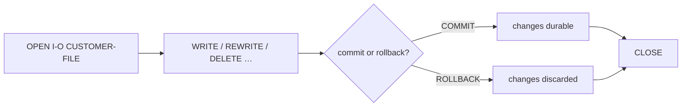

### Motores de almacenamiento conectables

Elige el motor con `rcrun --indexed-engine <name>` (o con la variable de entorno
`COBOL_INDEXED_ENGINE`):


| Motor                 | Úsalo para                                                                                                                                                                         |
| --------------------- | ---------------------------------------------------------------------------------------------------------------------------------------------------------------------------------- |
| `rust` (por omisión)  | El almacén B‑tree integrado; formatos en memoria y paginado en disco.                                                                                                               |
| `redb`                | Un motor en disco **a prueba de caídas y ACID** (B‑tree de copia al escribir, sumas de comprobación, páginas meta duales) — el `COMMIT` sobrevive a un corte de luz; `OPEN` instantáneo en conjuntos de datos muy grandes. |
| `rm` / `fujitsu`      | Nombres de motor reservados que actualmente se comportan de forma idéntica al almacén integrado (los formatos nativos son trabajo futuro).                                           |

### Registro de operaciones (observabilidad)

Para diagnóstico puedes activar un **registro de operaciones por fichero**
(`rcrun --indexed-log basic|full`, con formato `--indexed-log-format text|json`). Anota una línea por
`OPEN`/`COMMIT`/`ROLLBACK`/`CLOSE` con marcas de tiempo, recuentos de escritura, reescritura y
eliminación, cifras de bytes y de rendimiento, y la calidad del orden de claves — listo para
alimentar herramientas de registro. El registro rota automáticamente bajo un tope de tamaño.

### Registrar al operador

```cobol
           OPEN I-O CUSTOMER-FILE WITH REGISTERED USER WS-OPERATOR
```

`OPEN … WITH REGISTERED [USER] {literal | data-item}` anota *quién* abrió el fichero en el registro de
operaciones. Esto es **únicamente observacional** — PowerRustCOBOL no proporciona ningún motor de
autenticación ni de autorización; el campo simplemente etiqueta las entradas del registro con el
operador que suministres.

> **Nota.** El formato de disco por omisión es autodescriptivo y almacena el esquema completo de
> claves, así que un fichero se puede inspeccionar y validar en el `OPEN` (las discrepancias se
> manifiestan como códigos de estado de fichero estándar). El formato **no** es compatible a nivel
> binario con ningún ISAM de terceros; no supongas que puedes intercambiar ficheros con los de otros
> proveedores.

> ⚠️ **Salvedad.** El bloqueo de registros es de un solo proceso (semántica al estilo VSAM/RLS dentro
> de un programa en ejecución). El bloqueo entre *procesos* no está implementado.

---

## 15. Bases de datos SQL

El acceso relacional se expone tras una única superficie de `CALL`, con el backend elegido a
partir de la cadena de conexión:


| La cadena de conexión empieza por…      | Backend          |
| --------------------------------------- | ---------------- |
| `:memory:`, `sqlite:` o una ruta de fichero | SQLite (incluido) |
| `postgres://` / `postgresql://`         | PostgreSQL       |
| `mysql://`                              | MySQL            |

El flujo típico:

```cobol
           CALL "COBOL-OPEN-DB"   USING "sqlite:app.db".
           CALL "COBOL-EXEC-SQL"  USING
               "SELECT id, name FROM customers WHERE active = 1".
           PERFORM UNTIL WS-NO-MORE-ROWS
               CALL "COBOL-FETCH-ROW" USING WS-ID WS-NAME
               ...
               CALL "COBOL-NEXT-ROW"
           END-PERFORM.
           CALL "COBOL-CLOSE-DB".
```

Los controladores son puros y van incluidos (no hay que instalar `libpq` ni OpenSSL). Usa
`COBOL-EXEC-SQL` con `BEGIN`/`COMMIT`/`ROLLBACK` para las transacciones SQL. Referencia completa:
`docs/database-runtime-es.md`.

> **Nota.** Puedes modelar una conexión a base de datos visualmente con el control no visual
> **SQL Database** (sus propiedades contienen la cadena de conexión, el controlador y los datos
> que pueblan sus eventos), o manejarla enteramente desde el código con los `CALL` de arriba.

---

## 16. HTTP / REST y agentes de IA

- **HTTP/REST.** `COBOL-HTTP-GET/POST/PUT/DELETE` emiten peticiones;
  `COBOL-HTTP-SET-HEADER` / `COBOL-HTTP-CLEAR-HEADERS` gestionan las cabeceras. El control no
  visual **REST Client** te da un punto final diseñable con cuatro eventos que vincular:
  `onComplete`, `onError`, `onTimeout` y `onCancelled`.
- **Agentes de IA.** El control no visual **AI Agent** modela una conexión a un modelo de
  lenguaje grande — su punto final, su modelo, su instrucción de sistema, su temperatura y sus
  límites de tokens — y levanta dos eventos para tus manejadores COBOL: `onResponse` cuando llega
  la respuesta, y `onError` cuando no.

> ⚠️ **Salvedad.** Las características de red alcanzan el mundo exterior — atiende los errores y
> los tiempos de espera en COBOL. Trata las credenciales como configuración de ejecución, nunca
> como parte del diseño.
>
> **Un fichero de formulario no puede llevar una credencial.** Las tres propiedades que contienen
> una — el `AuthToken` de un REST Client, la `ApiKey` de un Web Search, la `AgentAPIKey` de un
> Agent Object — se almacenan **en tu máquina**, no en el `.cfrm`. Escribe una clave en el panel
> de propiedades y va al fichero local de credenciales; al formulario en ejecución se le entrega
> cuando arranca. Guarda el formulario, abre el `.cfrm` en un editor de texto, y la propiedad está
> ahí y vacía. Eso se cumple sea como sea que se introdujera la clave, así que una clave no puede
> llegar al repositorio que comparte tu equipo por haberse escrito en el diseñador y haberse
> olvidado.
>
> La casilla te dice de qué vacío se trata: *stored on this machine* cuando hay una clave
> registrada para ese control, y *no key on file* cuando no hay ninguna. Vaciar la casilla retira
> la clave también de la máquina — una casilla vacía no significa nunca que una credencial
> olvidada siga autenticando en tu nombre.
>
> Para una credencial que compartan varios formularios, prefiere una **conexión con nombre** (REST
> y Web Search) o un **Model Provider** (Agent Object): un solo lugar donde introducirla, un solo
> lugar donde rotarla, y los formularios llevan solo su identificador.

### Configurar el REST Client

Las propiedades del control configuran **todas las peticiones que envía**, así que un manejador suele
ser una sola línea — la dirección y las credenciales viven en el panel de propiedades, no repetidas a
lo largo de tu COBOL.

#### Ajustes locales, o una conexión de proyecto

Todos los `RestClient` tienen una propiedad **`Configuration`** que decide de dónde viene su conexión:

- **`(Local)`** — el valor por omisión, y lo que usan todos los formularios construidos hasta ahora:
  las propiedades propias del control que hay más abajo.
- **una conexión de proyecto con nombre** — su dirección, su método, su esquema de autenticación, sus
  cabeceras y sus tiempos de espera sustituyen a los propios del control antes de que el formulario se
  ejecute.

Define las conexiones en **Settings → Integrations → REST connections** (haz clic en el nodo superior
del árbol del proyecto → *Settings*). Dale a una un nombre, una URL base, un método por omisión, un
esquema de autenticación, un tiempo de espera y su clave de API. Luego apunta a ella tantos formularios
como quieras: cambia la dirección una vez y todos los formularios que la usan la siguen, en lugar de
que seis formularios se vayan separando.

> **Dónde se almacena cada mitad — esto importa antes de publicar.** La conexión en sí (nombre, URL,
> método, *esquema* de autenticación, cabeceras, tiempos de espera) se guarda en `cobolt.toml` y **está
> pensada para publicarse**: un colega que se descargue el proyecto recibe tus conexiones. **La clave
> de API no forma parte de ella.** Las claves se guardan en un almacén local de la máquina fuera del
> proyecto y no se escriben nunca en `cobolt.toml`, en un `.cfrm` ni en COBOL generado — así que cada
> desarrollador suministra la suya, y un repositorio compartido no lleva nunca ninguna.
>
> ⚠️ Local de la máquina significa *en esta máquina, en un fichero* — todavía no es el llavero del
> sistema operativo. Trátalo como tratarías cualquier fichero local de credenciales.

> **Notas.** El control almacena el **identificador** de la conexión, no su nombre, así que renombrar
> una conexión en Settings no rompe los formularios que la usan. Los ajustes propios del control se
> conservan mientras haya una conexión seleccionada y vuelven a aplicarse en el momento en que cambies
> de nuevo a `(Local)`. Si un formulario nombra una conexión que el proyecto ya no tiene, eso se
> reporta en lugar de recurrir calladamente a los ajustes locales — al control se le dijo que los
> ignorara, y usarlos en silencio enviaría peticiones a una dirección que ya habías anulado.

##### Distribuir una aplicación que usa una conexión

La conexión viaja con la construcción: `rcrun build` incorpora las conexiones del proyecto al binario,
así que una aplicación construida las resuelve sin ningún `cobolt.toml` a su lado. **La clave no viaja
con la construcción** — de eso se trata al mantenerla fuera del proyecto —, así que la máquina que
ejecuta la aplicación la suministra mediante una variable de entorno, una por conexión:

```bash
COBOLT_CONNECTION_KEY_<CONNECTION-ID> = <the key>
```

El identificador de la conexión es el que se muestra en el panel de propiedades cuando falta una
conexión, con los guiones escritos como subrayados y todo en mayúsculas — así que una conexión cuyo
identificador es `3f2a-91bc` se lee de `COBOLT_CONNECTION_KEY_3F2A_91BC`. Una variable por conexión en
lugar de un único bloque codificado, para que un guion de despliegue pueda fijar exactamente las claves
que esa máquina deba tener, y un equipo de operaciones pueda ver qué valor va dónde.

> **Notas.** Mientras trabajas en el IDE nunca fijas estas: **Run Form** resuelve cada clave de tu
> almacén local de máquina y se la entrega él mismo al formulario en ejecución, y solo para las
> conexiones que ese formulario usa realmente. Lo mismo vale para `rcrun run-form` dentro de un
> proyecto. Un control al que le falte la clave se comporta como cualquier petición no autenticada — el
> servicio responde con un 401, que llega a `onError` como cualquier otro fallo.

- **`BaseURL`** — la dirección a la que el control hace la petición. Un verbo llamado **sin argumento**
  la usa tal cual, que es el caso ordinario:

  ```cobol
           RestClient-1::get()
  ```

  Un argumento **relativo** se une a ella (`orders/42` pasa a ser
  `https://api.example.com/v1/orders/42`); un argumento que empieza por `?` le adjunta una cadena de
  consulta; y un argumento que lleva su propio esquema (`https://...`) se usa sin cambios — así que un
  manejador que ya pasa una URL completa se comporta exactamente como antes.
- **`AuthType`** y **`AuthToken`** — se aplican a todas las peticiones:


  | `AuthType` | Cabecera enviada                                                                                     |
  | ---------- | ---------------------------------------------------------------------------------------------------- |
  | `None`     | *(ninguna)*                                                                                          |
  | `Bearer`   | `Authorization: Bearer <AuthToken>`                                                                   |
  | `Basic`    | `Authorization: Basic <AuthToken>` — codificado por ti cuando el token se escribe `user:password`    |
  | `APIKey`   | `X-API-Key: <AuthToken>`                                                                              |

  Un **`AuthToken` vacío no envía ninguna cabecera** en lugar de una vacía, así que un control sin
  configurar falla como «no autenticado» en lugar de parecer un fallo del servidor. Una API que quiera
  su clave bajo otro nombre de cabecera usa `DefaultHeaders` para ello.
- **`DefaultHeaders`** — `clave: valor`, una por línea, enviadas con todas las peticiones. Una línea sin
  dos puntos se ignora. Una cabecera fijada en tiempo de ejecución con `COBOL-HTTP-SET-HEADER`
  **anula** la nombrada aquí: una llamada explícita es más específica que la configuración de tiempo de
  diseño.
- **`DefaultMethod`** — el verbo que usa `Call()` cuando no se le da ningún argumento de método. Los
  verbos con nombre (`get`, `post`, `put`, `delete`) usan siempre el suyo.
- **`FollowRedirects`** — seguir las respuestas `3xx` (por omisión, sí). Desactivado, se entrega la
  propia respuesta de redirección.
- **`VerifyTLS`** — verificar el certificado y el nombre de anfitrión del servidor (por omisión, sí).
- **`TimeoutSeconds`** / **`TimeoutMs`** — acotan la petición en **los dos** modos, `Sync` y `Async`.

Un par completo de manejadores, con todo lo demás configurado en el diseñador:

```cobol
      *> Button-1 :: onClick
           RestClient-1::get()

      *> RestClient-1 :: onComplete
           MOVE RestClient-1::ResponseBody TO TextBox-1::Text

      *> RestClient-1 :: onError
           MOVE RestClient-1::LastError TO TextBox-1::Text
```

> **Nota.** `Call()` toma el verbo como su primer argumento —
> `RestClient-1::Call("PATCH", "orders/42", WS-BODY)` —, que es la forma de alcanzar `PATCH` y
> cualquier otro verbo que no tenga método propio con nombre. Llamado con un verbo vacío usa
> `DefaultMethod`.

> ⚠️ **Salvedad.** Desactiva `VerifyTLS` solo contra un servidor de desarrollo con un certificado
> autofirmado. Con la verificación desactivada, nada distingue al servidor real de cualquier otra cosa
> que responda en esa dirección — no distribuyas nunca un formulario así. `AuthToken` no necesita tal
> cuidado: el fichero del formulario no puede llevarlo (véase la salvedad de arriba), así que es
> configuración de tiempo de ejecución lo quisieras o no.

### E/S asíncrona (`Mode`, `Busy`, `TimeoutMs`, `Cancel()`)

Una llamada de un `RestClient` ya no bloquea todo el formulario mientras se ejecuta. El control es
**asíncrono por omisión**: `GET` / `POST` / `PUT` / `DELETE` arrancan un trabajador en segundo
plano, fijan la marca `Busy` del control y vuelven de inmediato. El bucle de eventos sigue
despachando (tics de temporizador, clics, otros controles), y la respuesta llega más tarde como un
evento en el mismo control:

- `onComplete` — la respuesta llegó; lee `ResponseBody` / `StatusCode` en el manejador.
- `onError` — el transporte falló (sin estado HTTP); `LastError` tiene el mensaje y `StatusCode`
  es `0`.
- `onCancelled` — llamaste a `Cancel()` mientras una petición estaba en vuelo.
- `onTimeout` — la petición excedió `TimeoutMs` sin completarse.

La superficie del control, igual en `RestClient`, en `WebSearch`, en `SqlDatabase` y en
`IndexedFile`:

- **`Mode`** (`Async` / `Sync`) — los dos controles que alcanzan la red, `RestClient` y
  `WebSearch`, toman `Async` por omisión; `SqlDatabase` e `IndexedFile` toman `Sync` (sus
  operaciones son locales y rápidas, y hoy se ejecutan siempre de forma sincrónica — la propiedad y
  los eventos existen en ellos por compatibilidad futura).
- **`Busy`** (solo lectura) — `1` mientras haya una operación en vuelo. Una segunda llamada
  mientras está `Busy` se ignora; consulta `Busy` o espera el evento del ciclo de vida.
- **`TimeoutMs`** — el tiempo de espera por control en milisegundos; `0` recurre al antiguo
  `TimeoutSeconds × 1000`. Al caducar, el control dispara `onTimeout` y limpia `Busy`.
- **`Cancel()`** — abandona de inmediato la operación en vuelo: `Busy` se limpia, se dispara
  `onCancelled`, y cualquier resultado tardío del trabajador abandonado se descarta con seguridad.
  Llamar a `Cancel()` sin nada en vuelo es una no‑operación.

> ⚠️ **Compatibilidad.** Un formulario existente que lee `ResponseBody` en la sentencia *siguiente*
> a un `GET` depende del antiguo comportamiento bloqueante. Pon el `Mode` de ese control en `Sync`
> para conservar el resultado original en la misma sentencia, o traslada la lectura a un manejador
> `onComplete`. La superficie de `CALL` de `COBOL-HTTP-*` no cambia y es siempre sincrónica.

### Maps (ubicación e indicaciones)

El control **Maps** es una vista de **OpenStreetMap** incrustada, desplazable y con zoom, respaldada
opcionalmente por la API real de Google Maps para las indicaciones, la geocodificación, los lugares y
los datos de distancia. El mapa base y la API de datos son dos mitades independientes con necesidades
de credencial distintas:

- **El mapa base no necesita ninguna clave de API.** `CenterLat` / `CenterLng` / `Zoom` posicionan la
  vista; el usuario desplaza y gira la rueda para hacer zoom de forma interactiva, disparando
  `onBoundsChanged` (y actualizando esas tres propiedades) cuando lo hace. Fija **dónde se abre el
  mapa** en el panel de propiedades — *Start latitude*, *Start longitude* y *Start zoom*, en grados
  decimales — y el lienzo muestra esa vista mientras diseñas. Escribir esos tres desde COBOL mueve el
  mapa:

  ```cobol
  MOVE "-23.5614" TO MAP-1::CenterLat
  MOVE "-46.6558" TO MAP-1::CenterLng
  MOVE 16         TO MAP-1::Zoom
  ```

  **El zoom es continuo.** Un paso de la rueda es un nivel, como siempre lo fue, pero el mapa *se
  desliza* hasta allí durante un puñado de fotogramas en lugar de llegar de golpe: mientras viaja se
  dibuja **entre** niveles, escalando las teselas que ya tiene, y lo que esté bajo el puntero se queda
  bajo el puntero todo el camino. Los marcadores, las rutas y las regiones escalan con el mapa base,
  así que nada se desplaza a mitad del deslizamiento.

  `Zoom` sigue siendo un número entero — el nivel cuyas teselas se descargan, y el valor que un
  manejador lee o escribe. La fracción que el mapa mantiene a mitad del deslizamiento es estado de
  vista y no se publica nunca, así que `onBoundsChanged` sigue informando de niveles enteros y un
  `MOVE 16 TO MAP-1::Zoom` sigue aterrizando exactamente en 16.

  **Una tesela que no ha llegado muestra el terreno, no un hueco.** Las imágenes del nivel nuevo tardan
  un momento en bajar, y el mapa ya tiene una imagen de ese mismo terreno a otra escala — así que la
  usa, como hacen todos los clientes de mapas: al hacer zoom **de acercamiento**, la tesela cargada más
  cercana de un nivel inferior se amplía y se recorta al trozo que estás mirando; al hacer zoom **de
  alejamiento**, las cuatro teselas del nivel que acabas de dejar se dibujan encogidas en sus cuartos.
  La imagen real llega entonces *sobre una imagen* y simplemente se afila, en lugar de sustituir un
  bloque gris. `TileLoadingColor` es lo que ves solo cuando no hay nada prestado que tomar — la
  primerísima vista de un lugar, o una tesela que falló.

  ⚠️ **Un mapa gris con solo sus marcadores encima** significa que las teselas no están llegando — el
  control está bien, la descarga no. Las teselas vienen de `tile.openstreetmap.org` por HTTPS y no
  necesitan clave, así que las causas habituales son que no hay red o que hay un proxy por medio. El
  primer fallo de una sesión lo dice en la consola; el centrado y los marcadores siguen funcionando de
  todos modos, que es la razón por la que un mapa base vacío puede pasar por lo demás por un mapa de
  mar abierto.
- **El tiempo de conducción vuelve como números**, no solo como palabras. `Directions` responde en
  `onComplete` con siete campos separados por TABULADOR: la distancia y la duración como texto, el
  resumen de la ruta, luego la distancia en **metros**, la duración en **segundos**, la polilínea
  codificada de la ruta, y la duración **con el tráfico actual** en segundos (0 cuando Google no
  suministró ninguna). Calcula a partir de los números; no extraigas nunca una cifra de vuelta de
  `"72,4 km"`.

  La polilínea es la carretera en sí, **paso a paso** — no el resumen de calidad de miniatura que
  Google publica también —, así que un trazo dibujado a partir de ella se asienta sobre la autopista en
  lugar de cerca de ella. Nunca excede los **4.000 caracteres**: declara `PIC X(4096)` para ella. Una
  ruta lo bastante larga como para necesitar más que eso renuncia a sus puntos redundantes en los
  tramos rectos y conserva sus curvas, que es la razón por la que la forma sobrevive al recorte.

  ⚠️ El tráfico está disponible **solo como número**. Google expone su *capa* de tráfico a través de sus
  propios SDK de JavaScript y móviles, nunca como teselas de mapa, así que no hay ninguna superposición
  coloreada que dibujar — pero «cuánto va a tardar esto, saliendo ahora» lo responde ese último campo.
- **Las rutas** trazan líneas sobre el mapa — una ronda planificada, un recorrido hecho. Una línea por
  ruta en la propiedad `Routes` (`id`⇥`color`⇥`ancho`⇥`geometría`), o
  `AddRoute(id, colour, width, geometry)` / `RemoveRoute(id)` / `ClearRoutes()`. La geometría es o una
  **polilínea codificada** — el sexto campo de una respuesta de `Directions`, así que las rutas propias
  de Google se trazan sin ninguna conversión — o una lista explícita `lat,lng;lat,lng;…` que hayas
  calculado tú. **Sin clave de API**: el mapa base es OpenStreetMap y la geometría es tuya.

  ⚠️ **Una ruta está exactamente tan cerca de la carretera como los puntos que le des.** El mapa dibuja
  todos los puntos y no inventa ninguno, así que una lista escrita a mano de una docena de puntos de paso
  es un *corredor planificado*, no una carretera — corta todas las curvas entre ellos, y cuanto más te
  acercas con el zoom más claramente abandona el asfalto. La geometría de carretera tiene que venir de un
  servicio de rutas: el campo 6 de una respuesta de `Directions` lleva la carretera **paso a paso**, que
  es lo que hace que un trazo se asiente sobre la autopista en lugar de cerca de ella. No hay ningún
  ajuste que haga que una lista corta de puntos de paso siga una carretera; o añades puntos o le
  preguntas a un servicio de rutas.
- **Una ruta de carretera sin clave de Google** — `TraceRoad(apiKey, fromLat, fromLng, toLat, toLng)` le
  pregunta a **OpenRouteService** en su lugar, y responde en `onComplete` con tres campos separados por
  TABULADOR: la distancia en **metros**, la duración en **segundos**, y la polilínea codificada para
  `AddRoute`. El mismo límite de 4.000 caracteres que `Directions`, así que un solo `PIC X(4096)`
  contiene cualquiera de las dos respuestas.

  **La clave es un argumento, no un ajuste.** Pídesela a tu operador — un `TextBox` con
  `PasswordCharacter` fijado — y pasa lo que escriba:

  ```cobol
       MOVE TXT-ORS-KEY::Text TO WS-ORS-KEY
       IF WS-ORS-KEY = SPACES
           MOVE "Enter your OpenRouteService key first." TO LBL-STATUS::Caption
       ELSE
           INVOKE MAP-1 "TraceRoad" USING
               WS-ORS-KEY "40.4168" "-3.7038" "37.1773" "-3.5986"
       END-IF
  ```

  PowerRustCOBOL no almacena nunca esa clave: ni en el formulario, ni en el manifiesto del proyecto, ni
  en ningún fichero. Una clave escrita en un fichero de proyecto viaja a todos aquellos con los que se
  comparte el proyecto, y esa es la razón. Una clave en blanco falla en `onError` sin ninguna llamada de
  red.

  > **Nota.** `Directions` y `TraceRoad` responden las dos en el mismo evento `onComplete` y **no
  > responden con la misma forma** — siete campos frente a tres. Registra a cuál llamaste (una marca de
  > un carácter en WORKING-STORAGE es suficiente) y ramifica según eso, o el manejador leerá los metros
  > como un *texto* de distancia y la polilínea como un resumen de ruta.
  >
- **Las regiones** rellenan áreas — territorios de venta, zonas de reparto, cobertura. Una línea por
  región (`id`⇥`relleno`⇥`trazo`⇥`ancho`⇥`geometría`), o `AddRegion` / `RemoveRegion` /
  `ClearRegions`. Dale al relleno un canal alfa (`#RRGGBBAA`) para que las calles sigan siendo legibles
  debajo. Una región **puede ser cóncava** — un territorio que sigue una costa se rellena
  correctamente. Tampoco necesita clave de API.

  Reutilizar un identificador **reemplaza** esa ruta o esa región. Un mapa que se redibuja a sí mismo a
  medida que cambian sus datos apilaría en otro caso duplicados que no podría volver a mover nunca.
- **Todos los colores que el mapa pinta son una propiedad** — nada de un mapa está fijado por la
  plataforma. Están en la sección **Basic properties** del inspector para el control Maps, y cada uno se
  puede escribir desde COBOL como cualquier otra propiedad:


  | Propiedad             | Qué colorea                                                                                                      |
  | --------------------- | ---------------------------------------------------------------------------------------------------------------- |
  | `MarkerColor`         | El propio alfiler                                                                                                |
  | `MarkerBorderColor`   | El anillo alrededor de un alfiler, para que se lea sobre un mapa base cargado                                     |
  | `RouteColor`          | Una ruta cuya propia línea no nombra ningún color                                                                |
  | `RouteCasingColor`    | El envolvente que hay bajo **todas** las rutas — el halo brillante que hace legible una línea fina sobre terreno mixto |
  | `RegionFillColor`     | Una región cuya propia línea no nombra ningún relleno                                                            |
  | `RegionBorderColor`   | Una región cuya propia línea no nombra ningún trazo                                                              |
  | `TileBackgroundColor` | Bajo todo el mapa, antes de que haya llegado ninguna tesela                                                      |
  | `TileLoadingColor`    | Una tesela concreta que todavía no ha llegado                                                                    |

  Cada uno empieza **vacío**, lo que significa el color que el mapa ha pintado siempre, así que un
  formulario que no fije ninguno de ellos se ve exactamente como se veía. El color que llevan los
  **datos sigue ganando**: una ruta dibujada por `AddRoute` con su propio color lo conserva, y lo mismo
  hacen el relleno y el trazo de `AddRegion` — las tres propiedades de región y de ruta son solo aquello
  a lo que recurre una línea que no nombra ninguno.

  Tres son la *única* forma de fijar su color, porque los datos no tienen ningún campo para él: un
  marcador no tiene argumento de color, así que `MarkerColor` y `MarkerBorderColor` son todo lo que hay,
  y `RouteCasingColor` se aplica a todas las rutas sea cual sea el color que la propia ruta nombre.


  ```cobol
           MOVE "#0F7B6C" TO MAP-1::MarkerColor
           MOVE "#FFFFFF" TO MAP-1::MarkerBorderColor
  ```

  > ⚠️ **Salvedad.** `RegionBorderColor` es aquel en el que vacío no es un color sino una decisión: una
  > región cuya propia línea no nombra ningún trazo se dibuja **sin borde**. Nombrar un color aquí da a
  > todas esas regiones un contorno — lo que puede ser más de lo que querías en un mapa de muchos
  > territorios pequeños.
  >

  📄 **Ejemplo trabajado** — `forms/maps/maps-demo.cfrm` en el proyecto de demostración: cinco
  comerciales como marcadores, cinco territorios coloreados, Madrid → Granada trazado, y el tiempo de
  conducción en kilómetros, minutos y coste. Todos los botones funcionan sin ninguna credencial
  configurada excepto el que dice que llama a Google.
- **Los marcadores** son alfileres sobre el mapa: una línea por marcador en la propiedad `Markers`,
  separada por TABULADORES (`id`⇥`lat`⇥`lng`⇥`etiqueta`⇥`info`). Prefiere
  `AddMarker(id, lat, lng, label, info)` / `RemoveMarker(id)` a formatear esa cadena a mano tú mismo.
  Hacer clic en el mapa base dispara `onMapClick` (el evento principal); hacer clic en un marcador
  dispara `onMarkerClick` y fija `SelectedMarkerId`.
- **Los cinco métodos de datos de abajo llaman a la API real de Google Maps** y necesitan una **clave de
  API de Google Maps** configurada una vez para todo el proyecto (véase *Datos y credenciales* más
  abajo). Sin ninguna clave configurada, cada uno falla de inmediato — `LastError` lo explica, se dispara
  `onError` —, nunca una caída y nunca un intento de red silencioso:

⚠️ **Los cinco son asíncronos — no devuelven la respuesta.** La llamada arranca la consulta, pone `Busy`
a `1` y vuelve de inmediato con una **cadena vacía**; el resultado llega más tarde en el evento
`onComplete`, en la propiedad `ResponseBody`. No hay modo sincrónico. Así que esto *no* funciona, por
mucho que se lea como si debiera:

> **Nota — `ResponseBody`, `StatusCode`, `LastError` y `Busy` son propiedades de tiempo de ejecución de
> solo lectura.** No las busques en el inspector de propiedades: el runtime las escribe cuando tiene algo
> que reportar, así que no tienen valor de tiempo de diseño, no tienen valor por omisión y no se
> almacenan en el formulario. Se leen exactamente como cualquier otra propiedad, y solo leerlas tiene
> sentido — una respuesta no es un ajuste.

```cobol
      *> WRONG — Geocode returns immediately, before any answer exists,
      *> so WS-GEOCODE-RESULT is always empty.
           MOVE Map1::Geocode("1600 Amphitheatre Parkway") TO WS-GEOCODE-RESULT.
```

Arranca la consulta en un manejador y lee la respuesta en el otro:

```cobol
      *> Btn-Find :: onClick — start it
       FIND-ADDRESS-PARA.
           Map1::Geocode("1600 Amphitheatre Parkway, Mountain View").

      *> Map1 :: onComplete — the answer landed in ResponseBody
       ADDRESS-FOUND-PARA.
           MOVE Map1::ResponseBody TO WS-GEOCODE-RESULT.
      *>   WS-GEOCODE-RESULT = "lat<TAB>lng<TAB>formatted address"
           UNSTRING WS-GEOCODE-RESULT DELIMITED BY X"09"
               INTO WS-LAT WS-LNG WS-ADDRESS.
           MOVE WS-LAT TO Map1::CenterLat.
           MOVE WS-LNG TO Map1::CenterLng.
           MOVE 16     TO Map1::Zoom.

      *> Map1 :: onError — LastError says why
       ADDRESS-FAILED-PARA.
           DISPLAY "Lookup failed: " Map1::LastError.
```


| Método                                | `onComplete` deja en `ResponseBody`                              |
| ------------------------------------- | ---------------------------------------------------------------- |
| `Geocode(address)`                    | `lat`⇥`lng`⇥`formatted_address`                                |
| `ReverseGeocode(lat, lng)`            | la dirección formateada                                          |
| `Directions(origin, destination)`     | `distance_text`⇥`duration_text`⇥`route_summary`                |
| `DistanceMatrix(origin, destination)` | `distance_text`⇥`duration_text`                                 |
| `PlacesSearch(query, radiusMeters)`   | una línea `place_id`⇥`name`⇥`address`⇥`lat`⇥`lng` por resultado |

Como todos los demás controles asíncronos, Maps ofrece los cuatro eventos del ciclo de vida —
`onComplete`, `onError`, `onTimeout` y `onCancelled` — junto a sus propios `onMapClick` /
`onMarkerClick` / `onBoundsChanged`.

> **Nota.** El `X"09"` de arriba es el literal hexadecimal estándar para un TABULADOR. Escribe cualquier
> byte de esa forma (`X"0D0A"` es CR LF); cada *par* de dígitos hexadecimales es un carácter, así que el
> número de dígitos es siempre par.

**Vinculación de datos.** Un control Maps puede ser un destino de vinculación independiente: vincula su
colección `Markers` a un origen con los campos `Lat`/`Lng`/`Label` asignados (los tres los exige el
Guardian; `Id`/`Info` son opcionales) y cada fila vinculada se convierte en un marcador, refrescado de
la misma forma que un DataGrid vinculado refresca sus `Rows`.

### Web Search (cinco proveedores)

El control **WebSearch** es un cliente de búsqueda no visual con el mismo ciclo de vida asíncrono que
`RestClient` (`Mode`, `Busy`, `onComplete`/`onError`/`onCancelled`/`onTimeout`, más su propio
`onResultsReceived` como evento principal).

**No está atado a un solo motor de búsqueda.** La propiedad `Provider` elige el backend, y todos los
backends responden a través de los mismos accesores, así que cambiar de proveedor **no exige ningún
cambio en tu COBOL** — el manejador de abajo es el mismo esté en la fila de esta tabla en la que
estés:

| `Provider` | Credencial | Necesita además | Tope de `NumResults` | `SafeSearch` |
|---|---|---|---|---|
| `Google` (por omisión) | Clave de la API de Custom Search | `SearchEngineId` (el valor «cx» — un identificador llano, no un secreto) | 10 | `Off` → desactivado, `Medium`/`High` → activado |
| `Brave` | Clave de la API de Brave Search | — | 20 | `Off` / `Medium` / `High` |
| `Serper` | Clave de la API de Serper | — | 100 | **se ignora** |
| `Tavily` | Clave de la API de Tavily | — | 20 | **se ignora** |
| `SearXNG` | **ninguna** | `Endpoint` — la dirección de la instancia que ejecutas tú | 50 | `Off` / `Medium` / `High` |

`Provider` toma `Google` por omisión, y un valor no reconocido recurre a él, así que un formulario
construido antes de que el control tuviera elección se comporta exactamente como antes.

> ⚠️ **`SafeSearch` no es universal.** Serper y Tavily no exponen ningún nivel de filtrado, así que la
> propiedad simplemente no se les envía. No des por supuesto que hay un filtro funcionando en esos dos.

> **Notas.** `NumResults` se acota al tope propio del proveedor elegido en lugar de pasarse tal cual,
> porque pedirle a un proveedor más de lo que permite es un error HTTP, no más resultados.
> `SearchEngineId` lo lee solo Google — los demás buscan en toda la web sin que se les diga dónde. Una
> instancia de **SearXNG** debe tener `format=json` habilitado en sus propios ajustes; eso está
> desactivado por omisión, y una instancia con JSON deshabilitado devuelve una página que el control no
> puede leer (obtendrás cero resultados en lugar de un error).

Fija `Query`, `NumResults` y `SafeSearch`, y luego llama a `Search()`:

Los resultados llegan en **`onResultsReceived`**, el evento principal del control y el que vincula un
doble clic. El `onComplete` uniforme se levanta justo después, así que un manejador en cualquiera de los
dos funciona — vincula el que mejor se lea, no los dos:

```cobol
       SEARCH-1--ONRESULTSRECEIVED.
           MOVE SEARCH-1::TopTitle   TO WS-TITLE
           MOVE SEARCH-1::TopSnippet TO WS-SNIPPET
           MOVE SEARCH-1::TopLink    TO WS-LINK
      *>   or walk every result:
           MOVE SEARCH-1::ResultCount TO WS-N
           PERFORM VARYING WS-I FROM 1 BY 1 UNTIL WS-I > WS-N
               MOVE SEARCH-1::GetResult(WS-I) TO WS-RESULT-LINE
      *>       WS-RESULT-LINE = "title<TAB>snippet<TAB>link"
           END-PERFORM.
```

#### Un motor de búsqueda, o varios

Todo lo anterior configura **un** control WebSearch. Un proyecto que busca desde varios formularios — o
que necesita Brave en un sitio y un SearXNG privado en otro — define en su lugar **conexiones de
búsqueda con nombre**, exactamente como lo hace para `RestClient`:

- **`Configuration` = `(Local)`** — el valor por omisión: el `Provider`,
  `Endpoint`/`SearchEngineId`, `NumResults` y `SafeSearch` propios de este control, con la clave
  tomada de la única **Web Search API key** del proyecto.
- **`Configuration` = una conexión con nombre** — todos esos vienen de la conexión en su lugar,
  incluida su propia clave. Las filas locales desaparecen del panel, porque todas ellas las dicta la
  conexión.

Defínelas en **Settings → Integrations → Web search connections**: un nombre, un proveedor, su
identificador de motor (Google) o la URL de la instancia (SearXNG), y su clave de API. A SearXNG no se
le pide clave, porque no tiene cuenta.

> **Una conexión no lleva `NumResults` ni `SafeSearch`.** Esos se quedan en el control, porque son
> ajustes por llamada que tu COBOL cambia en tiempo de ejecución — `MOVE 10 TO Search-1::NumResults`
> antes de un `Search()` es algo ordinario de escribir. Una conexión que los llevara sobrescribiría lo
> que diseñaste, y ganaría en silencio a cualquier valor que tu programa fijara al arrancar.

> La misma división de almacenamiento que en las conexiones REST: la conexión se guarda en
> `cobolt.toml` y está pensada para publicarse, la clave nunca. Una aplicación construida lleva las
> conexiones incorporadas y lee cada clave de `COBOLT_CONNECTION_KEY_<ID>` en la máquina que la
> ejecuta.

#### Cuando una búsqueda parece no hacer nada

Activa **`Verbose`** en el control. El runtime narra entonces toda la llamada en la salida del programa
— el proveedor, el método y la URL, las cabeceras de la petición, el cuerpo enviado, si fue asíncrona o
sincrónica, y luego el estado HTTP y la **respuesta cruda, sin cortar**, para que la puedas comparar
con la documentación propia del proveedor. Una mala configuración se reporta también ahí, antes de que
se envíe nada.

Existe porque una búsqueda que no devolvió nada y una búsqueda que no se ejecutó nunca producen el
mismo silencio. `Verbose` es lo que las separa.

> **Las credenciales se enmascaran.** Una clave en una cabecera de petición, o en la consulta de la URL
> donde Google la firma, se imprime como sus primeros caracteres y una longitud — suficiente para ver
> que hay una clave presente y para distinguir dos, sin ponerla en una salida que acaba pegada en un
> informe de error.

**De dónde viene la clave.** Para un control en `(Local)`: la credencial de búsqueda de nivel de
proyecto (Settings → Integrations), igual que Maps resuelve su clave. Un control puede anularla con su
propia propiedad `ApiKey` cuando un formulario tiene que buscar con una cuenta distinta de la del
proyecto — deja `ApiKey` vacía y se usa la clave del proyecto. `SearXNG` no necesita clave alguna;
necesita `Endpoint`. En cualquier caso la comprobación ocurre **antes de que se envíe nada**: a un
control al que le falte su clave (o, para SearXNG, su `Endpoint`) le falla de inmediato con `onError` y
`LastError` nombrando el proveedor y el ajuste que falta, sin hacer ninguna petición.

Un control `WebSearch` recibe además un párrafo generado `<id>-SEARCH`
(`PERFORM SEARCH-1-SEARCH`) como respaldo de bajo nivel, pero hace concatenación de cadenas llana y
**sin codificar** (una `Query` de varias palabras se trunca en su primer espacio), no lleva nunca la
clave, y es **solo para Google** — no sigue a `Provider`, porque dos de los proveedores necesitan un
POST con una cabecera de autenticación y `COBOL-HTTP-GET` no puede enviar una. **Prefiere `Search()`**,
que codifica la consulta con porcentajes, resuelve la credencial y respeta `Provider`.

#### Dónde viven las credenciales de un agente

Un `AgentObject` tiene también una propiedad **`Configuration`**, pero no apunta a una conexión de
proyecto. Apunta a uno de los **Model Providers** que hayas configurado en el IDE (Settings → Models)
— la misma lista que usan Grace y los especialistas.

- **`(Local)`** — el valor por omisión: el `AgentAPI`, la `URL` y la `API Key` propios de este control.
- **un proveedor configurado** — se usan su protocolo, su punto final y su clave de API en su lugar, y
  **la fila `API Key` desaparece del panel de propiedades**. De eso se trata precisamente: la clave de
  un proveedor se introduce una vez, en un solo sitio, y no se copia nunca a un formulario. Un `.cfrm`
  es un fichero que la gente publica.

**El modelo y el ajuste siguen siendo tuyos**: `Model`, `Temperature`, `Maximum tokens` y `Timeout`
permanecen en el control incluso mientras esté vinculado, porque un proveedor ofrece muchos modelos y
cuál use este agente es una propiedad de este agente.

> ⚠️ **Esta vinculación tiene alcance de máquina.** Los Model Providers se configuran por máquina, no
> por proyecto — configurar Anthropic una vez sirve para todos los proyectos —, así que un colega que
> abra tu proyecto, o una máquina que ejecute tu aplicación construida, necesita también ese proveedor
> configurado. El control lo dice con claridad («this machine has no such model provider configured»)
> en lugar de fingir que el proyecto está roto. Una aplicación desplegada los recibe a través de la
> variable de entorno `COBOLT_AGENT_PROVIDERS`, y cada clave a través de
> `COBOLT_CONNECTION_KEY_<PROVIDER>`.

**Combinarlo con un AI Agent.** Un patrón habitual: ejecutar una búsqueda y luego pedirle a un
`AgentObject` que resuma los resultados en un TextBox multilínea.

`Ask` es **asíncrono**. Entrega la llamada a un trabajador en segundo plano y vuelve de inmediato, así
que el formulario sigue pintando y sigue respondiendo a los clics mientras el modelo piensa. La
respuesta llega por tanto en un *segundo* manejador — `onResponse` — y se lee de `LastReply`:

```cobol
       SEARCH-1--ONCOMPLETE.
           MOVE SPACES TO WS-SUMMARY-PROMPT
           STRING "Summarise these search results in three bullet points: "
                  SEARCH-1::TopTitle " — " SEARCH-1::TopSnippet
             INTO WS-SUMMARY-PROMPT
           Agent1::Ask(WS-SUMMARY-PROMPT).

       AGENT1--ONRESPONSE.
           MOVE Agent1::LastReply TO Summary-Box::Text.

       AGENT1--ONERROR.
           MOVE Agent1::LastError TO Summary-Box::Text.
```

> ⚠️ **No escribas `MOVE Agent1::Ask(...) TO X`.** `Ask` devuelve la cadena vacía — la respuesta no
> existe todavía cuando la sentencia termina —, así que ese `MOVE` vacía en silencio el campo receptor.
> Esta es la misma convención que siguen todos los demás controles no visuales (`RestClient::Get`,
> `Maps::Geocode`, `WebSearch::Search`): el verbo empieza el trabajo, el evento lo entrega.
>
> **Notas.** `Busy` es verdadero desde el `Ask` hasta que se dispara `onResponse`, `onError` u
> `onTimeout`, y un segundo `Ask` mientras es verdadero se ignora en lugar de competir — comprueba
> `Busy` (o deshabilita el botón) si el usuario puede pulsar dos veces. `TimeoutSeconds` acota la
> espera; subir `MaximumTokens` alarga la respuesta, así que sube el tiempo de espera con él.

`WebSearch` se clasifica como una **fuente** de vinculación de la clase `RestApi` (la misma clase que
usa `RestClient` — no hay ninguna clase de fuente `WebSearch` aparte), así que su respuesta puede
alimentar una vinculación a un DataGrid, a un diagrama, a un ComboBox o a un array igual que puede
hacerlo una respuesta de RestClient.

### Datos y credenciales

La clave de **google_maps** (los métodos de Directions, Geocoding, Places y Distance-Matrix de
Maps) y la **clave de la API de búsqueda** más el **identificador del motor de búsqueda**
(WebSearch) se configuran una vez por proyecto, en la sección **Integrations** de los Settings del
proyecto (haz clic en el nodo superior del árbol del proyecto → *Integrations*) — el mismo patrón
local de máquina que ya se usa para las claves de los proveedores de IA (véase *El asistente de
IA* más arriba):


| Campo                        | Significado                                                                                     |
| ---------------------------- | ----------------------------------------------------------------------------------------------- |
| **Google Maps API key**      | La usan los cinco métodos de datos de Maps. El mapa base de OSM en sí no necesita clave alguna.  |
| **Search API key**           | La usa el `Search()` de `WebSearch` — la clave del `Provider` al que esté puesto el control (Google, Brave, Serper o Tavily). `SearXNG` no necesita ninguna. Un control puede anularla con su propia propiedad `ApiKey`. |
| **Search Engine id (cx)**    | Qué motor de Google Custom Search consultar — un identificador llano, no secreto, introducido aparte de la clave. Se lee solo cuando `Provider` es `Google`. |

Las dos claves son **locales de la máquina, y nunca se escriben en `cobolt.toml`, en el fichero de
formulario `.cfrm` ni en ningún `.cbl` generado** — la misma disciplina que sigue ya la propia
clave de API del asistente de IA. Ejecutar un formulario siembra la clave resuelta en el intérprete
como un valor solo de tiempo de ejecución; no llega nunca a ser texto literal del fuente generado,
así que no se puede filtrar a través de un fichero `.cbl` compartido (Build y Run compilan
exactamente el mismo fuente generado).

### Manejar el IDE con un agente de IA (MCP)

El IDE en sí es operable por agentes. Al arrancar sirve el **protocolo de inspección de egui** en
`127.0.0.1:5719` (cambia el puerto en ⚙ *Settings* → AI — surte efecto al reiniciar; la consola de
Output muestra la dirección de escucha). A través de él un agente puede leer el árbol de widgets
vivo, hacer clic y escribir en controles reales del IDE, redimensionar la ventana y capturar
pantallas.

- **Los agentes externos** (Claude y otros clientes MCP) se conectan a través del puente oficial
  `egui-mcp` — configúralo como un servidor MCP que apunte a la dirección del IDE, y el agente
  obtiene acceso de ver y manejar a todas las superficies del IDE.
- **El asistente de IA integrado** usa la misma maquinaria dentro del proceso: cada petición
  incluye una instantánea del árbol de widgets representado junto al modelo del formulario, de modo
  que el modelo razona sobre el aspecto real de tu formulario — y después de aplicar cambios vuelve
  a leer el árbol para verificarlos.

> ⚠️ **Salvedad.** El punto final está ligado únicamente a `127.0.0.1` — no es alcanzable nunca
> desde la red. Existe además **solo en el IDE**: las aplicaciones que construyes y distribuyes, y
> `rcrun`, no contienen ningún punto final de inspección.

---

## 17. La línea de órdenes (rcrun)

Todo lo que hace el IDE se puede guionizar con `rcrun`:

```text
rcrun run      <file.cbl> [args…]       # interpret a COBOL source file
rcrun run-form <form.cfrm> <file.cbl>   # run the project's MAIN form in its own GUI window
rcrun check    <file.cbl>               # parse + semantic analysis only (no run)
rcrun build    <file.cbl>               # compile a single console program → bin/<name>
rcrun build    [cobolt.toml]            # compile a project → one native binary in bin/
rcrun package  [cobolt.toml]            # package the project into a .zip
rcrun version                           # print version
rcrun help                              # print usage
```

Cualquier cosa que vaya después de la ruta del fuente en `rcrun run` se entrega al propio programa,
así que un programa se puede manejar desde un guion de shell igual que cualquier otra orden.

**Opciones**


| Orden          | Opción                             | Qué hace                                                                                                                                                                                                                                    |
| -------------- | ---------------------------------- | ------------------------------------------------------------------------------------------------------------------------------------------------------------------------------------------------------------------------------------------- |
| `run`, `check` | `--source-format <fmt>`            | `free` (por omisión), `fixed`, `fixed-relaxed`, `auto` — véase **Traer fuente de imagen de tarjeta** más abajo                                                                                                                              |
| `run`          | `--indexed-engine <name>`, `-I`    | Motor ISAM: `rust` (por omisión), `rm-cobol85`, `fujitsu`, `redb`                                                                                                                                                                            |
| `run`          | `--indexed-log <basic|full>`       | Registro de transacciones INDEXED por fichero → `<assign-path>.log`                                                                                                                                                                          |
| `run`          | `--indexed-log-format <text|json>` | Formato de las líneas del registro; `json` es NDJSON para Grafana/Loki                                                                                                                                                                        |
| `run`          | `--switch <NAME>=<ON|OFF>`         | Estado inicial de un interruptor externo de `SPECIAL-NAMES`, por su nombre de implementador (repetible) — véase **Los interruptores externos y las clases definidas por el usuario**                                                          |
| `run-form`     | `--debug`                          | Control del depurador por la entrada y la salida estándar (líneas `@DBG`)                                                                                                                                                                    |
| `run-form`     | `--designer`                       | Ejecutar el formulario nombrado aunque no sea el principal. El IDE pasa esto para **Run Form**; una aplicación distribuida nunca lo hace. Se anuncia en la salida de error estándar, así que una ejecución de diseñador no se puede confundir con la forma en que arranca la aplicación. |
| `build`        | `--full`, `--clean`                | Descartar todos los artefactos en caché y reconstruir de cero                                                                                                                                                                               |
| `build`        | `--quiet`, `-q`                    | Reportar solo el resultado, no el progreso                                                                                                                                                                                                  |
| `package`      | `--output <path.zip>`              | Anular la ruta del archivo de salida                                                                                                                                                                                                       |

> **Códigos de salida.** `rcrun run-form` devuelve **3** cuando la aplicación está corrupta — sus
> registros de formulario principal discrepan — y **4** cuando el formulario que se pide no es el
> principal. Los dos son distintos del código de fallo ordinario, así que un lanzador puede distinguir
> una copia manipulada de un programa que simplemente falló.

> **Nota.** Recurre a `rcrun build --full` cuando una construcción se comporte de forma extraña tras
> una actualización de PowerRustCOBOL. Los fuentes generados se reescriben en cada construcción, pero
> los artefactos propios de cargo sobreviven, así que una construcción incremental puede enlazar
> objetos producidos por una versión más antigua.

**Variables de entorno** — los mismos ajustes, cómodos en CI:


| Variable                   | Qué fija                                                                                                        |
| -------------------------- | --------------------------------------------------------------------------------------------------------------- |
| `COBOLT_LOG`               | El filtro de registro, por ejemplo `warn`, `debug`, `cobolt-runtime=trace`                                        |
| `COBOLT_SOURCE_FORMAT`     | El valor por omisión de `--source-format`                                                                        |
| `COBOLT_FIXED`             | Ponla a `1` para forzar el análisis de fuente en forma fija                                                       |
| `COBOL_INDEXED_ENGINE`     | Las mismas opciones que `--indexed-engine`                                                                       |
| `COBOL_INDEXED_LOG`        | `off` (por omisión), `basic`, `full`                                                                             |
| `COBOL_INDEXED_LOG_FORMAT` | `text` (por omisión) o `json`                                                                                    |
| `COBOL_SWITCHES`           | Los interruptores externos de `SPECIAL-NAMES`, `NAME=ON|OFF`, separados por comas — lo mismo que repetir `--switch NAME=ON` |

Una opción gana siempre sobre su variable de entorno.

> 📷 **Se necesita captura — `rcrun-terminal.png`.** Una sesión de terminal mostrando `rcrun check` y
> luego `rcrun run` sobre un programa pequeño, con la salida. Ayuda a los recién llegados a ver que la
> CLI es accesible.

### Traer fuente de imagen de tarjeta

El fuente que escribiste en PowerCOBOL o en isCOBOL está muy probablemente en el **formato de
referencia clásico** — la disposición de tarjeta perforada, donde las columnas 1-6 contienen un número
de secuencia, la columna 7 es la indicadora, el programa vive en las columnas 8 a 72, y las columnas
73-80 contienen un sello de programa que el compilador ignora. Los ficheros que salieron de un
mainframe tienen casi siempre 80 caracteres de ancho, piense o no alguien todavía en ellos como
tarjetas.

Los propios proyectos de PowerRustCOBOL son de **formato libre** — sin ninguna regla de columnas —, y
eso es el valor por omisión. Así que a un fichero importado hay que decirle qué es:

```bash
rcrun check --source-format=fixed  PAYROLL.CBL
rcrun run   --source-format=fixed  PAYROLL.CBL
```

Eso activa todas las reglas de columnas de una vez, incluidas las líneas de continuación, para las que
el formato libre no tiene equivalente:

```cobol
011700     02 FILLER PICTURE IS X(54) VALUE IS "------------------------
011800-    "------------------------------".
```

El guion de la columna 7 dice «esta línea continúa la anterior». Para un literal, la línea continuada
no tiene comilla de cierre y la línea de continuación reabre con una; el literal es las dos mitades
unidas. Para una palabra, las mitades simplemente se juntan:

```cobol
004700 01  WRK-DS-18V00-CONTIN
004800-    UED PICTURE X.
```

⚠️ **No pases `--source-format=fixed` para fuente en formato libre.** No es una reinterpretación
inocua: todo lo que pase de la columna 72 se descarta, y cualquier cosa que hayas escrito en las siete
primeras columnas se lee como un número de secuencia y un indicador. Un `MOVE` que se alargara perdería
calladamente su cola.

⚠️ **Un literal continuado solo es exacto byte a byte bajo `fixed`.** La regla es que el fragmento
continuado llega hasta la columna 72, espacios finales incluidos — así que una línea que se queda corta
de la columna 72 sigue aportando esos espacios al literal. Sin una columna 72 no hay nada a lo que
rellenar.

**Nota.** Si quieres que se respeten el área de secuencia y la columna indicadora pero *no* el corte
en la columna 72 — útil para fuente que se ha reformateado a lo largo de los años —, usa
`--source-format=fixed-relaxed`.

---

## 18. Construir un binario distribuible

`rcrun build` (o el botón **Build** del IDE) produce un **único ejecutable nativo
autocontenido** en `bin/`. El programa analizado de la aplicación y sus formularios quedan
incrustados dentro del binario; no se distribuye ningún fuente `.cbl`, y el usuario final **no**
instala PowerRustCOBOL.

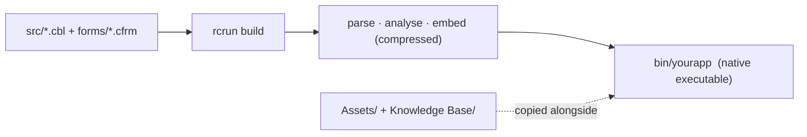

- Los ficheros de **Assets** y de **Knowledge Base** que el proyecto sigue se copian junto al
  binario para que el programa los encuentre por ruta relativa en tiempo de ejecución.
- Los ficheros de licencia y de aviso obligatorios se colocan junto al binario automáticamente.

> ⚠️ **Salvedad.** El *usuario final* de tu aplicación no instala nada, pero la máquina que la
> **construye** necesita dos cosas: la cadena de herramientas de Rust y los fuentes propios de la
> plataforma. Construir es una compilación de verdad, no una exportación. Una instalación de
> PowerRustCOBOL que distribuya el SDK de plataforma junto a su ejecutable satisface esto por sí
> sola; si la tuya no lo hace, Build se detiene y nombra todas las carpetas en las que buscó.
> Apúntalo a una copia en **Help → Platform SDK Location**, o véase *Installing the IDE elsewhere*
> en `BUILDING-es.md`.

> **Nota — qué enlaza una construcción, y qué cuesta eso.** El puente de SQL (`COBOL-OPEN-DB` y
> sus compañeros) trae SQLite consigo, y SQLite es C: enlazarlo significa que la máquina de
> construcción necesita además un **compilador de C** — `link.exe` de las Visual Studio Build
> Tools en Windows, `cc` de `build-essential` o de las Xcode Command Line Tools en los demás.
> Así que la construcción lee primero tu programa y enlaza los controladores de base de datos solo
> cuando algo dentro de él los alcanza. Un programa que nunca abre una base de datos se construye
> **solo con Rust**.
>
> **De qué *no* te libra esta nota.** Un *compilador* de C se necesita solo cuando se construye
> algo en C de verdad. El **enlazador** se necesita siempre, porque todos los ejecutables tienen
> que enlazarse — así que un programa que nunca abre una base de datos sigue necesitando las
> herramientas de construcción de la plataforma instaladas (§3). En Windows y en macOS, y en la
> mayoría de las distribuciones de Linux, el mismo paquete único proporciona las dos cosas, que es
> la razón por la que es fácil confundirlas: lo que varía es el compilador de C, y lo que no varía
> nunca es el enlazador.
>
> La lectura se inclina a enlazar, porque el coste de equivocarse es un programa que funciona bajo
> *Run Form* y falla solo una vez construido. Cualquier cosa que no pueda zanjar — un `CALL` cuyo
> nombre de verbo vive en un dato en lugar de entre comillas, un bloque `EXEC RUST` que nombra los
> módulos de base de datos — enlaza los controladores. No tienes que declarar nada; lo único que se
> quiere decir es que un programa llano ya no paga por una base de datos que nunca abre.
>
> Lo mismo vale para la red. `COBOL-HTTP-*` alcanza la pila TLS del sistema operativo, que en
> **Linux** es OpenSSL — otra biblioteca en C, y otro paquete de desarrollo que instalar. Un
> programa de consola que no llama a ningún verbo HTTP se construye sin ella. El cliente de Maps
> es otra cosa aparte, y se enlaza cuando un formulario de tu proyecto lleva realmente un control
> **Maps** o **WebSearch**; un proyecto sin ninguno no paga por él.
>
> ⚠️ Una aplicación de **formularios** enlaza siempre TLS, haga lo que haga su COBOL: el mapa base
> se obtiene por HTTPS mediante el propio representador del Form Designer, así que la pila está ahí
> de todos modos. En Linux, eso significa que una aplicación de formularios sigue queriendo el
> paquete de desarrollo de TLS del sistema. Son los programas de **consola** los que se construyen
> solo con Rust.

- **`dist/`** está reservado para una futura característica de «empaquetar todo lo necesario para
  ejecutar en una máquina sin PowerRustCOBOL» (binario + activos + las bibliotecas que haga falta +
  lanzador). Por ahora, distribuye `bin/` y los activos copiados.

### Las construcciones completas y la versión registrada

Un proyecto registra la versión de PowerRustCOBOL que lo construyó **completamente** por última
vez. Cuando abres un proyecto que fue construido completamente por última vez por un
PowerRustCOBOL **más antiguo** — o que nunca se ha construido completamente en absoluto —, el
botón **Build** hace una construcción **completa**: todos los artefactos de compilación en caché
se descartan primero, para que nada producido por la versión más antigua pueda sobrevivir dentro
del ejecutable nuevo. Tarda notablemente más que una construcción ordinaria, y el panel Output dice
por qué lo está haciendo.

En cuanto esa construcción tiene éxito la versión se registra, y los clics de Build posteriores
vuelven a ser construcciones incrementales ordinarias — la construcción larga ocurre **una vez por
actualización**, no una vez por clic. Pulsar **Run** en un proyecto que todavía necesita una te
ofrece esa misma construcción completa antes de arrancar nada.

Desde la línea de órdenes:

```text
rcrun build --full  [cobolt.toml]   # discard cached artefacts, then build
rcrun build --clean [cobolt.toml]   # same thing, spelled the other way
```

> ⚠️ **Salvedad.** Solo una construcción completa actualiza la versión registrada, y eso es
> deliberado: una construcción incremental ordinaria no puede prometer que nada compilado por la
> versión anterior siga enlazado en el resultado.

> **Nota.** Los formularios se cargan de forma **perezosa** dentro del binario: una aplicación de
> 20 formularios arranca al instante aunque el usuario solo llegue a abrir uno.

<!-- 📷 everopen.png — a built application starting and opening one form, showing
     that the other forms cost nothing until they are asked for. -->
<p align="center">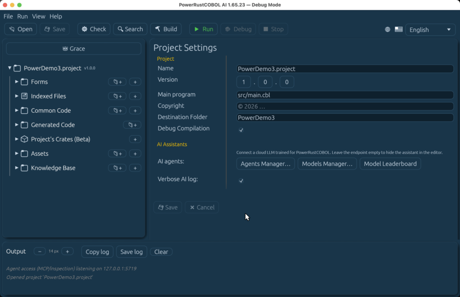</p>

### El distintivo «Powered by PowerRustCOBOL»

Si distribuyes una aplicación construida con PowerRustCOBOL, añade por favor el distintivo
**«Powered by PowerRustCOBOL»** al cuadro **About** de tu aplicación (y, opcionalmente, a tu
README):

<p align="center">
  
</p>

- Distintivo estándar: `assets/images/made-with-powerrustcobol.png` (800×268, transparente).
- Maestro de alta resolución (para impresión o pantallas grandes):
  `assets/images/made-with-powerrustcobol.webp` (6785×2270) — redúcelo al tamaño que necesites.

El propio cuadro **Help → About** del IDE muestra el mismo distintivo, así que puedes ver
exactamente cómo queda en una aplicación.

---

## 19. Depuración

Selecciona un elemento de Generated Code y pulsa **Debug** para iniciar una sesión. Obtienes:

- **Puntos de ruptura** en el margen del editor **y en el margen propio de la ventana del
  depurador** — haz clic junto a cualquier línea en cualquiera de los dos sitios, antes de la
  sesión o durante ella. Un punto de ruptura que fijes, muevas o quites mientras el programa está
  detenido surte efecto en la siguiente sentencia; no reinicias para cambiar de opinión.
- Controles de **paso** y **continuar** (F5 / F10 mientras depuras),
- un panel de **observación de variables**,
- **Only my code**, activado por omisión: los pasos atraviesan directamente el andamiaje generado
  — el bucle de eventos por encima de todo — y se detienen solo en los manejadores y los
  procedimientos que escribiste tú. Desactívalo en la barra de herramientas del depurador cuando
  quieras ver la maquinaria. Los puntos de ruptura no los filtra nunca: uno que fijes en una línea
  generada sigue deteniéndose ahí, porque fijarlo fue tu decisión.

Durante una sesión aparece un control *Stop Debug*; en otro caso la depuración se inicia desde el
botón **Debug** de la barra de herramientas (a la derecha de **Run**).

> ⚠️ **Para detenerte dentro de un manejador de eventos, depura el formulario — no su `.cbl`
> generado.** Pulsar **Debug** en un formulario lo lanza como una ventana real, así que sus
> manejadores se ejecutan de verdad y tus puntos de ruptura en ellos se alcanzan. Pulsar **Debug**
> en el fichero generado desde el editor ejecuta el programa sin ninguna ventana asociada:
> `COBOL-WAIT-EVENT` no encuentra ningún formulario que esperar, termina el bucle de eventos de
> inmediato, y no se despacha nunca ningún manejador — así que un punto de ruptura dentro de uno no
> se pasa nunca, por correctamente que esté fijado.

> 📷 **Se necesita captura — `debugger.png`.** Una sesión de depuración detenida en un punto de
> ruptura, con el panel de observación de variables poblado.

### Interruptores de diagnóstico (Help → Debug Settings)

Algunos fallos son mucho más fáciles de encontrar con el IDE narrando lo que hace.
**Help → Debug Settings** reúne todos esos interruptores en una única ventana modal, dispuesta en
cinco pestañas: **User Interface**, **Data Binding**, **Events**, **Indexed Files** y **Logging**.

Son **ajustes de máquina, no datos de proyecto** — se guardan en la carpeta de ajustes propia del
IDE y no se escriben nunca en `cobolt.toml`. Así que te acompañan de proyecto en proyecto, no
viajan nunca a un colega dentro de una publicación, y la ventana modal se abre incluso sin ningún
proyecto cargado.


| Pestaña            | Interruptor                  | Qué te da                                                                                                                                                                                                             |
| ------------------ | ---------------------------- | --------------------------------------------------------------------------------------------------------------------------------------------------------------------------------------------------------------------- |
| **User Interface** | Frame diagnostics overlay    | Despliega las capas de cada control — sombra, cara, borde, contenido, contorno — en marcos coloreados y desplazados. Así es como un artefacto de esquina o una capa mal redondeada se vuelven visibles                   |
| **User Interface** | DataGrid component frames    | Contornea todas las partes internas de un DataGrid — cabecera, cuerpo, cada columna, cada fila y celda visibles, paneles congelados, barra de desplazamiento —, cada una en su propio color                              |
| **User Interface** | Disable window effects       | Se salta todos los efectos de entrada y de salida de ventana sin editar ni un solo proyecto ni formulario — para sensibilidad al movimiento, una GPU débil o automatización                                              |
| **Data Binding**   | Data-bind trace              | Escribe `databinding.log`: la siembra de los grupos repetitivos y la vinculación de arrays de controles por fila                                                                                                        |
| **Events**         | Event trace                  | Una línea por evento de interfaz en **los dos** extremos del canal — el anfitrión enviándolo y el intérprete despachándolo —, entremezcladas con tu propia salida de `DISPLAY` en `prc-event-trace.log`                 |
| **Indexed Files**  | Transaction log, and format  | El registro de operaciones INDEXED por fichero descrito en §14, y si cada línea se escribe como texto logfmt o como JSON                                                                                                |
| **Logging**        | Tracing filter               | El filtro de trazado propio del runtime — `warn`, o algo más estrecho como `cobolt-runtime=trace`                                                                                                                       |

Los ficheros de trazado aterrizan en la carpeta temporal de la máquina: `/tmp` en macOS y en
Linux, `%TEMP%` en Windows.

Con el **trazado de eventos** es el *orden* de las líneas lo que hace que valga la pena. Separa un
manejador que se ejecutó dos veces porque el evento se entregó dos veces de un manejador que se
ejecutó dos veces con una sola entrega — dos fallos que parecen idénticos desde dentro del
manejador.

Un interruptor surte efecto **de inmediato**: el lienzo de diseño lo recoge en el siguiente
fotograma, y a **Run Form** se le entrega cuando arranca el proceso del formulario, así que nunca
reinicias el IDE para cambiar de opinión. Mientras haya algún diagnóstico activado, el IDE escribe
además un volcado de diagnóstico por control con el nombre del proyecto.

> **Nota.** Cada interruptor refleja una variable de entorno que el runtime ha leído siempre, así
> que una ejecución de `rcrun` independiente sigue respetando una que exportes a mano. La ventana
> modal es una puerta de entrada más amable a ellas, no un sustituto de ellas.

> **Nota.** La pestaña **User Interface** lleva además un interruptor de captura de pantalla
> asociado a F12. Ese es una herramienta de creación usada para producir las imágenes de esta
> documentación, no algo que necesite nunca una aplicación que construyas.

---
## 20. Aspecto e internacionalización

- **Temas.** ⚙ ▸ *Settings* ofrece 32 temas de color — oscuros (Dark Glass [por omisión], Deep
  Blue, Dark+, Monokai, Solarized Dark, Nord, Dracula y más), claros (Light+, GitHub Light, One
  Light, Gruvbox Light, Ayu Light, Quiet Light, Tomorrow, Material Lighter, Nord Light, Rosé Pine
  Dawn, Catppuccin Latte, Solarized Light), **Classic**, un aspecto fiel de Windows 95 (cromados
  plateados, selección azul marino) para la experiencia RAD retro completa, y tres paletas
  **Neumorphic** — Light, Dark y Cobalt — cuyo relieve suave hace juego con los estilos de
  formulario neumórficos. Hay además una **imagen de fondo** opcional con un control de opacidad.
  Los ajustes se guardan **por proyecto** en `cobolt.toml`. El árbol del proyecto y el texto de los
  paneles adaptan automáticamente su contraste al tema — texto claro en los temas oscuros, texto
  oscuro en los claros.
- **Idiomas del IDE.** La interfaz del IDE está disponible en **seis** idiomas — **inglés,
  português, español, français, japonés (日本語) y chino (中文)** —, elegidos en el selector de
  idioma de la barra de herramientas. Los glifos CJK se representan mediante fuentes de reserva
  incluidas, así que 日本語 / 中文 se muestran correctamente en cualquier sistema.
- **Representación del texto.** El IDE representa el texto con el motor de fuentes moderno del
  entorno de interfaz (con el ajuste de contornos activado), así que los glifos son notablemente
  más nítidos a tamaños pequeños que en versiones anteriores. Las propiedades **Font** de los
  formularios siguen funcionando exactamente como antes: una tipografía que el motor no puede
  rasterizar (por ejemplo una fuente de sistema solo de mapa de bits) se omite y el control recurre
  a Arial en lugar de fallar.
- **Imagen de marca.** El IDE usa el icono de PowerRustCOBOL para su ventana y su barra de tareas
  (anúlalo con un `app-icon.png` en el directorio de configuración). **Help → About** muestra la
  mascota, la versión y la licencia Apache-2.0.

> ⚠️ **Regla crítica.** El idioma del IDE traduce **únicamente la interfaz**. Tus **nombres de
> datos de COBOL, tus nombres de párrafo y todo el fuente COBOL generado siguen en inglés**,
> independientemente del idioma de interfaz seleccionado. Esto mantiene el código portable y
> revisable entre equipos.

---

## 21. COBOL Structure y los datos compartidos

Un módulo de formulario es más que sus controles y sus manejadores de eventos — es un programa COBOL de
verdad con una `ENVIRONMENT DIVISION` y una `DATA DIVISION`. El editor de **COBOL Structure** te permite
crear esas partes compartidas directamente, y el runtime te da compartición de datos `GLOBAL` /
`EXTERNAL` fiel a COBOL entre el módulo y la unidad de ejecución.

### El editor

Selecciona el formulario en sí (haz clic en el lienzo vacío, o en el nodo del formulario) y luego abre la
sección **COBOL Structure** del inspector de propiedades. Lista los cinco bloques compartidos — cada uno
tejido literalmente dentro del programa generado en el orden correcto de división y sección — más los
procedimientos de usuario del formulario:


| Bloque            | Va dentro de          | Úsalo para                                                                                                            |
| ----------------- | --------------------- | --------------------------------------------------------------------------------------------------------------------- |
| `SPECIAL-NAMES`   | CONFIGURATION SECTION | `DECIMAL-POINT IS COMMA`, nombres mnemónicos, signos de moneda, interruptores externos, clases definidas por el usuario |
| `REPOSITORY`      | CONFIGURATION SECTION | nombres de clase — el puente de tipos de la FFI de Rust (véase más abajo)                                              |
| `FILE-CONTROL`    | INPUT-OUTPUT SECTION  | `SELECT … ASSIGN` para los ficheros que el formulario abre                                                             |
| `FILE SECTION`    | DATA DIVISION         | las `FD` de esos ficheros                                                                                             |
| `WORKING-STORAGE` | DATA DIVISION         | los datos compartidos del formulario                                                                                  |

Haz clic en una fila para abrir una ventana emergente que edita **ese único bloque**. La caja de código se
abre con unas doce líneas y cambia de tamaño solo cuando arrastras el tirador de su esquina inferior
derecha — la ventana acompaña a la caja, y ninguna de las dos crece nunca por su cuenta, por largo que sea
el bloque. Los procedimientos de usuario se listan bajo las secciones — **➕ Add** crea uno, el nombre y el
cuerpo se editan en la misma ventana emergente, y 🗑 lo retira. Cada edición marca el formulario como
sucio, así que el siguiente **Build / Run / Debug / Check** regenera el `.cbl` con tus cambios.

### Los interruptores externos y las clases definidas por el usuario

`SPECIAL-NAMES` lleva dos facilidades de COBOL-85 que puede que no hayas necesitado en el escritorio pero
que querrás en el momento en que un programa tenga que comportarse de forma distinta para una ejecución
concreta — un lote nocturno, una prueba en seco, una pasada específica de un cliente.

**Un interruptor es una marca de tiempo de ejecución fijada desde fuera del programa.** Declaras el nombre
de interruptor del implementador, un mnemónico para él, y un nombre‑condición para cada estado:

```cobol
       SPECIAL-NAMES.
           SWITCH-1 IS SW-REPRINT
               ON  STATUS IS REPRINTING
               OFF STATUS IS NOT-REPRINTING.
```

Luego pruébalo como cualquier otro nombre‑condición, y fíjalo desde el programa cuando lo necesites:

```cobol
           IF  REPRINTING
               PERFORM RE-PRINT-INVOICES
           ELSE
               PERFORM PRINT-NEW-INVOICES.

           SET SW-REPRINT TO OFF.
```

**Nada dentro de COBOL puede fijar un interruptor antes de que la ejecución empiece** — eso es todo el
sentido que tiene —, así que `rcrun` toma el estado inicial de la línea de órdenes o del entorno, con clave
en el nombre del *implementador* (el mnemónico también funciona):

```bash
rcrun run invoices.cbl --switch SWITCH-1=ON
```

```bash
COBOL_SWITCHES=SWITCH-1=ON,SWITCH-2=OFF rcrun run invoices.cbl
```

`--switch` se puede repetir; se aceptan `ON`/`1`/`TRUE`/`YES` y `OFF`/`0`/`FALSE`/`NO`. Un interruptor que
nadie fije empieza **apagado**.

**Una clase nombra un conjunto de caracteres** contra el que puedes luego probar un elemento, lo que te
ahorra escribir la misma cadena de `OR` en cinco sitios:

```cobol
       SPECIAL-NAMES.
           CLASS VALID-GRADE  IS "A" THRU "D" "F"
           CLASS HEX-DIGIT    IS "0" THRU "9" "A" THRU "F".
```

```cobol
           IF  WS-GRADE IS VALID-GRADE
               PERFORM RECORD-GRADE.

           IF  WS-TOKEN IS NOT HEX-DIGIT
               MOVE "BAD CHECKSUM" TO WS-ERROR.
```

**Todos** los caracteres del elemento deben pertenecer a la clase para que la prueba sea verdadera — la
misma regla de todos los caracteres que siguen las pruebas integradas `NUMERIC` y `ALPHABETIC`. El `IS` es
opcional, como en las pruebas de clase integradas.

> ⚠️ Un nombre de clase es una *clase*, no un dato: no tiene almacenamiento, no se puede mover a él ni
> desde él, y solo aparece después de `IS [NOT]` en una condición.

### Nombrar la consola: los nombres mnemónicos de dispositivo

La tercera cosa que hace `SPECIAL-NAMES` es dar al terminal del operador un nombre propio tuyo, para que el
resto del programa lea y escriba a través de ese nombre en lugar de nombrar un dispositivo en línea:

```cobol
       SPECIAL-NAMES.
           CONSOLE IS OPERATOR-CONSOLE.
```

```cobol
           DISPLAY "ENTER THE RUN DATE (YYYYMMDD):"
                                   UPON OPERATOR-CONSOLE.
           ACCEPT  WS-RUN-DATE     FROM OPERATOR-CONSOLE.
```

`ACCEPT … FROM <mnemónico>` es el **Formato 1** — exactamente lo que hace un `ACCEPT WS-RUN-DATE` a secas.
Lee una línea del operador, y la línea se dispone a lo largo del elemento receptor: un receptor de grupo se
reparte entre sus elementos subordinados según sus anchos, y una línea más corta que el elemento se rellena
con espacios hasta el final. El `IS` es opcional, como en todo lo demás de `SPECIAL-NAMES`.

Esta es la forma que usa en todas partes el COBOL de mainframe y el de las suites de validación, y merece la
pena nombrar la consola incluso cuando solo tienes una: el mnemónico es el único sitio que hay que cambiar
si el programa se maneja más tarde desde otro lugar.

> **Nota — un mnemónico y una variable de entorno son fuentes distintas.** PowerRustCOBOL permite además
> que `ACCEPT id FROM SOME-NAME` lea la **variable de entorno** `SOME-NAME`, lo cual es una extensión y no
> COBOL-85. La declaración decide cuál obtienes: un nombre que `SPECIAL-NAMES` declara lee del operador, y
> un nombre que no declara lee del entorno. Así que declarar el mnemónico es lo que hace estándar la
> lectura — y si un `ACCEPT` devuelve inesperadamente nada, comprueba que el nombre esté declarado antes de
> mirar en otro sitio.

### Receptores justificados y campos alfanuméricos editados

Dos facilidades a nivel de `PICTURE` a las que los desarrolladores de PowerCOBOL recurren en las líneas de
informe:

```cobol
       01  WS-RIGHT      PIC X(10) JUSTIFIED RIGHT.
       01  WS-NAME       PIC A(5)  JUSTIFIED RIGHT.
       01  WS-PART-NO    PIC XXBXX/XX.
```

`JUSTIFIED RIGHT` invierte la regla de alineación para un receptor alfanumérico: un emisor corto se rellena
**por la izquierda** y uno largo pierde sus caracteres **más a la izquierda**. `MOVE "AB" TO WS-RIGHT` deja
`"        AB"`.

La cláusula se aplica a un receptor **alfabético** (`PIC A`) exactamente de la misma forma.
`MOVE "ABC" TO WS-NAME` deja `"  ABC"`, y mover dentro los quince caracteres `"ABCDEFGHIJKLMNO"` deja
`"KLMNO"` — sobrevive el extremo *derecho*, que es lo contrario de lo que hace un elemento sin justificar.

> ⚠️ Perder los caracteres de la izquierda es la parte que sorprende a la gente. En un elemento ordinario un
> emisor demasiado grande se corta por la derecha, así que un número de cuenta truncado sigue empezando por
> los dígitos correctos; en uno `JUSTIFIED` termina con ellos en su lugar. Dimensiona el receptor para el
> emisor más ancho que esperes.

Una picture **alfanumérica‑editada** es dueña de sus caracteres de inserción — `B` imprime un espacio, `0`
un cero, `/` una barra — y el emisor rellena solo las posiciones `X`, `A` y `9`.
`MOVE "AB12CD" TO WS-PART-NO` da `"AB 12/CD"`. Mover espacios dentro deja las inserciones en su sitio
(`"   /  "`), que es lo que `INITIALIZE` le hace a un campo así.

### Un operando de grupo suspende la PICTURE del receptor

Esta es la regla que más a menudo explica un `MOVE` que «no hizo nada sensato». Cuando **cualquiera** de los
operandos de un `MOVE` es un elemento de grupo, el estándar hace que todo el movimiento sea alfanumérico:
los bytes se copian de izquierda a derecha, y la `PICTURE` del otro operando decide solo **cuántos** de
ellos caben. Sin edición, sin des‑edición, sin conversión numérica.

```cobol
       01  SRC-GRP.
           05  SRC-N   PIC 999  VALUE 123.
           05  SRC-A   PIC AAA  VALUE "ABC".
       01  RCV-EDITED  PIC 0XXXXX0.
       01  RCV-NUM     PIC 9999V999.
       01  RCV-CHAR    REDEFINES RCV-NUM PIC X(7).
           MOVE SRC-GRP TO RCV-EDITED.  *> "123ABC " — the 0s are NOT inserted
           MOVE SRC-GRP TO RCV-NUM.     *> RCV-CHAR reads "123ABC "
```

`JUSTIFIED RIGHT` es lo único en lo que el receptor sigue teniendo algo que decir, porque es una regla de
alineación para un movimiento alfanumérico.

La misma regla corre un nivel más abajo, cuando un grupo entrega sus bytes a sus propios campos: cada hijo
toma su porción **literalmente**, diga lo que diga su `PICTURE`. Un hijo `PIC 99` que queda conteniendo
letras es exactamente lo que el programa pidió — lo que no debes hacer entonces es aritmética sobre él.

> **Una cláusula `VALUE` sobre un grupo funciona igual.** Inicializa los bytes del grupo y estos se reparten
> entre los hijos por ancho, así que `01 MONEY-GRP VALUE "$123.45". 05 MONEY-EDITED PIC $999.99.` deja a
> `MONEY-EDITED` conteniendo `"$123.45"` — ya editado, no reeditado.

### Cualificar un nombre‑condición

Un `88` puede declararse bajo más de un grupo — tres tablas pueden llevar cada una su propio `EQUALS-A` — y
`OF`/`IN` los distingue exactamente como lo hace para un nombre de dato. Los niveles intermedios se pueden
omitir, y el subíndice pertenece al elemento **anfitrión**, eligiendo contra qué ocurrencia se prueban sus
`VALUE`:

```cobol
           IF EQUALS-M OF TABLE-LEVEL-5 OF TABLE-LEVEL-4
                    IN TABLE-LEVEL-3 OF TABLE-LEVEL-2
                    OF GROUP-1-TABLE (13)
               PERFORM FOUND-IT.
```

> ⚠️ Una referencia **sin cualificar** a un nombre‑condición declarado más de una vez es ambigua bajo el
> estándar. RustCOBOL toma la primera declaración en lugar de rechazar el programa — lo mismo que hace con un
> nombre de dato ambiguo —, así que cualifícalo y no dependas de cuál gana.

### Las constantes figurativas toman el tamaño de con lo que se encuentran

Una constante figurativa no tiene ancho propio. Se repite para rellenar aquello contra lo que se escriba, y
esa regla alcanza tres sitios que merece la pena conocer:

```cobol
       01  WS-BANNER   PIC X(6) VALUE ALL "ABC".
       01  WS-MARKS    PIC XXX  VALUE QUOTES.
```

- **En una cláusula `VALUE`** rellena el elemento. `WS-BANNER` contiene `"ABCABC"`, y `ALL "XY"` en un
  `PIC X(9)` contiene `"XYXYXYXYX"` — la última unidad se corta donde el elemento termina.
- **En una comparación** se repite hasta el tamaño del *otro* operando, así que `IF WS-MARKS = QUOTE` es
  verdadera: tres comillas contra tres.
- **En un `MOVE`** rellena el receptor, sea lo que sea el receptor. `MOVE HIGH-VALUE TO WS-KEY` con
  `WS-KEY PIC X(10)` fija los diez bytes, y en un receptor de **grupo** el relleno se reparte entre todos sus
  campos — que es la forma de limpiar todo un registro a un valor centinela antes de un barrido de tabla. Un
  receptor alfanumérico‑**editado** sigue colocando sus propios caracteres de inserción, así que un
  `PIC XX0XXBXXX` conserva su `0` y su blanco y rellena las siete posiciones que los rodean.
- **`ALL` delante de otra constante figurativa es redundante** y significa lo mismo — `ALL SPACES` es
  `SPACES`.

> **`HIGH-VALUE` y `LOW-VALUE` son bytes, no letras.** Son los valores de byte más alto y más bajo de la
> secuencia de ordenación, y ocupan exactamente una posición de carácter cada uno donde sea que aparezcan —
> en un registro, en un `MOVE` de grupo y como emisor de `STRING`. Son la elección habitual para una clave
> centinela en un fichero indexado. `DISPLAY` no los puede representar de forma significativa, así que
> compara contra la constante en lugar de leerlos de la consola.

### La prueba de clase `NUMERIC` es más estricta que un análisis

`IF WS-FIELD IS NUMERIC` pregunta si **todas las posiciones de carácter contienen un dígito** — no si los
caracteres se podrían leer como un número. Para un elemento cuya `PICTURE` no lleva signo operacional,
ninguno de estos es numérico:

```text
       "+1234"    a sign the PICTURE does not provide for
       "1.234"    a decimal point is not a digit
       "12 45"    a space is not a digit
       "123  "    trailing pad from a shorter MOVE
```

Ese último pilla a la gente. `MOVE "123" TO WS-X5` donde `WS-X5` es `PIC X(5)` deja `"123  "`, y la prueba
de clase dice que no. Si estás validando la entrada del operador, muévela a un elemento numérico y prueba
*ese*, o comprueba primero la longitud usada del campo.

### Volver a leer un campo editado — la des‑edición

Mover un elemento numérico‑**editado** a uno numérico recupera el *valor* que sus caracteres representan, no
los caracteres. Los signos de moneda, las comas de agrupación, la protección con asteriscos, las inserciones
`/` y `B` y los blancos se descartan; un `CR`, un `DB` o un `-` en cualquier parte del campo lo hacen
negativo:

```cobol
       01  WS-SHOWN   PIC $(4)9.99CR.
       01  WS-VALUE   PIC S9(4)V99.
...
           MOVE -123.45 TO WS-SHOWN.     *> WS-SHOWN  = "$ 123.45CR"
           MOVE WS-SHOWN TO WS-VALUE.    *> WS-VALUE  = -123.45
```

Esta es la regla propia del estándar, y es la razón por la que puedes volver a leer con seguridad un importe
impreso de una línea de informe en lugar de guardar una segunda copia de él.

### Beautify — las reglas de disposición

Todos los editores que ofrecen **✨ Beautify** (las pestañas del editor de código, el editor de eventos, las
ventanas emergentes de los bloques de COBOL Structure, y la disposición canónica del editor de indexados)
reformatean a un mismo conjunto de reglas. Si has usado un embellecedor de mainframe o de PowerCOBOL, estas
te resultarán familiares:

- **Los párrafos** se sitúan en la columna 8; **las sentencias de procedimiento** empiezan en la columna 12.
- **Los números de nivel**: `01`/`77`/`78` en la columna 8, y cada profundidad de anidamiento 3 espacios más
  adentro (`88`/`66` se sitúan un paso bajo su elemento).
- Una **entrada de datos ocupa una línea** — las cláusulas partidas se unen — y las cláusulas `PIC` y `VALUE`
  de declaraciones consecutivas **empiezan en la misma columna**, para que un bloque de elementos se lea como
  una tabla.
- **El anidamiento se sangra como código estructurado**, 4 espacios por nivel; `END-IF`, `END-PERFORM`,
  `END-TRY`, `ELSE`, `WHEN`, `CATCH` y `FINALLY` se alinean con el verbo que abrió su ámbito.
- **Los interiores de `EXEC … END-EXEC` no se tocan nunca** — el código incrustado conserva su propio
  formato, byte a byte.
- **Los literales de bloque tampoco se tocan nunca** — las vallas `` ``` `` y todo lo que hay entre ellas.
  Ese texto es el *valor* del literal, así que volver a sangrar una línea, colapsar una serie de espacios o
  cambiar la caja de una palabra cambiaría lo que tu programa mueve. El tope de 256 caracteres tampoco se
  aplica dentro de uno: una línea larga de JSON se queda como una línea larga. Una **valla sin cerrar es un
  error**, y detiene el embellecido como cualquier otro.
- Todas las **cabeceras `SECTION` reciben una línea en blanco encima** (nunca dos), para que las divisiones de
  un programa largo sigan siendo fáciles de recorrer con la vista.
- Un **punto de frase que falta** se añade solo donde COBOL exige uno (antes de una cabecera de párrafo, antes
  de `CATCH`/`FINALLY`, al final de una entrada de datos seguida por la siguiente); un punto existente no se
  duplica nunca.
- Las líneas emitidas se limitan a **256 caracteres**: un literal demasiado largo se parte en una línea de
  continuación en la columna 7 con el resto vuelto a entrecomillar, y cualquier otra cosa se parte en un
  límite de palabra.

Hacer clic en Beautify abre primero un pequeño diálogo con dos elecciones, que se recuerdan como tus valores
por omisión: cómo poner la caja de los **verbos de COBOL** (dejar como se escribió / MAYÚSCULAS / minúsculas /
Capitalizado — los identificadores y los literales no se tocan nunca), y si los **comentarios** se quedan
exactamente como se escribieron o se alinean con el código que los rodea.

⚠️ **El código erróneo no se embellece nunca.** El código se comprueba primero (los programas completos a
través del front end real del compilador); si tiene errores, un diálogo los lista y el texto se deja intacto
byte a byte — reformatear código roto entierra precisamente la línea que necesitas arreglar. Y si un
resultado te sorprende alguna vez, **deshacer (⌘Z / Ctrl+Z) restaura el texto anterior exacto** en un solo
paso.

> **Nota.** **✨ Beautify deja un literal de bloque completamente en paz** — las dos vallas y todas las
> líneas que hay entre ellas. Como el texto es el valor del literal, no hay nada ahí dentro que el formateador
> pudiera ordenar sin cambiar lo que tu programa hace. Formatea el código de alrededor tan libremente como
> quieras; lo que hay dentro de las vallas es tuyo.

### GLOBAL, EXTERNAL y GLOBAL EXTERNAL

Las cláusulas de compartición las escribes tú, exactamente como las define COBOL-85, en elementos `01`/`77`
de `WORKING-STORAGE`:

- **`GLOBAL`** — visible para los programas *contenidos* del programa. Los manejadores de eventos y los
  procedimientos de usuario están anidados en el módulo del formulario, así que un elemento `GLOBAL` de la
  WORKING-STORAGE del formulario se puede leer y escribir desde todos los manejadores sin pasarlo de un lado a
  otro. `GLOBAL` es válido también en una **`FD`** — `FD F IS GLOBAL` hace visibles el fichero y su área de
  registro para los procedimientos del formulario, así que un manejador o un procedimiento de usuario puede
  hacer `READ`/`WRITE` de un fichero que el formulario abrió.
- **`EXTERNAL`** — una única copia física compartida *en toda la unidad de ejecución*, emparejada por el
  nombre real del elemento. **Cada módulo de formulario es su propia unidad de ejecución**, así que un elemento
  `EXTERNAL` se comparte entre el formulario y todos los programas a los que llame con `CALL` que declaren el
  mismo elemento como `EXTERNAL`; dos formularios *distintos* que declaren cada uno
  `01 WS-COUNTER PIC 9(4) EXTERNAL` obtienen almacenamientos separados. Para alcanzar los datos de otro
  formulario, cualifica la referencia (más abajo). `EXTERNAL` solo es válido en elementos `01`/`77` y en `FD` —
  el verificador lo señala en cualquier otro sitio.
- **`GLOBAL EXTERNAL`** — las dos cosas a la vez: compartido en toda la unidad de ejecución *y* visible para
  los programas contenidos.

```cobol
       01  WS-SESSION-ID   PIC X(32) GLOBAL.
       01  WS-OPEN-FORMS   PIC 9(4)  EXTERNAL.
       01  WS-APP-CONFIG   PIC X(80) GLOBAL EXTERNAL.
```

### Alcanzar los datos de otro formulario — el `EXTERNAL` cualificado

Si has construido con PowerCOBOL reconocerás la forma de este problema. Cada formulario es una unidad de
ejecución cerrada, así que un evento de cuadrícula de un formulario no puede simplemente actualizar lo que
otro formulario está mostrando. Los datos tienen que llevarse a través de la frontera, y la fontanería que los
lleva es lo que el operador siente como lentitud.

PowerRustCOBOL conserva el significado estándar de `EXTERNAL` y añade una cosa: un elemento `EXTERNAL` puede
**cualificarse por el módulo de formulario que lo declara**.

El formulario `CRM-MAIN` publica la selección actual:

```cobol
       01  WS-SELECTED-CUSTOMER EXTERNAL.
           05  WS-CUST-ID     PIC X(10).
           05  WS-CUST-NAME   PIC X(40).
```

Cualquier otro formulario la lee o la escribe nombrando al propietario:

```cobol
           MOVE WS-CUST-ID OF CRM-MAIN  TO WS-ORDER-CUSTOMER.
           MOVE "ACME LTD"              TO WS-CUST-NAME OF CRM-MAIN.
```

El nombre del formulario es el cualificador **más exterior**, así que la cualificación de grupo ordinaria
sigue funcionando dentro de él cuando un nombre sería ambiguo de otro modo:

```cobol
           MOVE WS-CUST-ID OF WS-SELECTED-CUSTOMER OF CRM-MAIN
             TO WS-ORDER-CUSTOMER.
```

Qué esperar:


| Regla                                | Qué esperar                                                                                                                                                                                                                             |
| ------------------------------------ | --------------------------------------------------------------------------------------------------------------------------------------------------------------------------------------------------------------------------------------- |
| **Qué es alcanzable**                | Solo los elementos que el formulario de destino declara `EXTERNAL`. La cualificación no es una puerta trasera a la `WORKING-STORAGE` ordinaria de un formulario.                                                                          |
| **Nomenclatura**                     | El cualificador es el nombre del formulario, que debe ser una palabra COBOL válida.                                                                                                                                                      |
| **Tiempo de vida**                   | El almacenamiento pertenece a la ejecución de la aplicación, no a la ventana del formulario. Existe esté o no abierto el formulario de destino, y conserva su contenido después de que ese formulario se cierre.                           |
| **Contenido inicial**                | COBOL-85 prohíbe una cláusula `VALUE` en un elemento `EXTERNAL`, así que algún formulario debe fijar el contenido inicial explícitamente.                                                                                                 |
| **`CANCEL`**                         | No lo reinicia. Cancelar un programa limpia la `WORKING-STORAGE` propia de ese programa; el almacenamiento `EXTERNAL` le sobrevive.                                                                                                       |
| **Las descripciones deben coincidir** | El mismo nombre `EXTERNAL` debe describirse de forma idéntica en todos los sitios en los que se declare. Como la construcción ve todos los formularios del proyecto, una discrepancia se reporta al construir en lugar de corromper datos en tiempo de ejecución. |

> **Nota — compartir no es notificar.** Escribir en los datos de otro formulario cambia los datos, no la
> imagen de la pantalla. El otro formulario se repinta cuando algo se lo dice; el elemento compartido no
> empuja una actualización por sí mismo.

> ⚠️ **Esto es una extensión de PowerRustCOBOL.** El COBOL-85 estándar no tiene ninguna forma de cualificar un
> elemento `EXTERNAL` por el módulo que lo posee — `OF`/`IN` cualifica por *grupo* contenedor, nunca por
> programa. El `EXTERNAL` sin cualificar sigue siendo COBOL-85 portable; una referencia cualificada no lo es, y
> no compilará en el compilador de otro proveedor. Resérvalo para los sitios que necesiten genuinamente datos
> entre formularios.

> ⚠️ **Disponibilidad.** El `EXTERNAL` cualificado exige que los formularios de una aplicación se ejecuten en
> una unidad de ejecución compartida. Esa compartición no está activa en las construcciones actuales — todos
> los formularios en ejecución siguen recibiendo su propio almacenamiento `EXTERNAL` privado —, así que la
> forma cualificada que se describe aquí es el comportamiento definido, todavía no el distribuido.

### Los procedimientos: el modelo de módulo de formulario

Cada formulario se convierte en **su propio módulo de programa COBOL** (`PROGRAM-ID` = el nombre del
formulario); un proyecto es uno o más de esos módulos. Dentro de un módulo, todos los procedimientos — **cada
manejador de eventos y cada procedimiento de usuario** — se generan como un programa incrustado (anidado)
marcado **`IS COMMON`**, de modo que *cualquier* procedimiento es llamable desde cualquier punto del módulo:
un manejador puede hacer `CALL` a otro manejador, un procedimiento de usuario puede llamar a un manejador, y
así sucesivamente. El sistema de ejecución alimenta los eventos del sistema operativo al bucle de eventos del
módulo, que ramifica al procedimiento de evento correspondiente.

```cobol
      *> in a button handler — call a user procedure, or another handler
           CALL "RECALC-TOTAL".
```

Un procedimiento de usuario es simplemente un procedimiento con nombre que añades mediante **➕ Add** (la
lista de COBOL Structure); ve los datos `GLOBAL` del formulario y es llamable por su nombre.

**Los datos locales de un procedimiento son privados.** Un procedimiento puede declarar su propia
`WORKING-STORAGE`; esos elementos son visibles solo dentro de él. Una cláusula `GLOBAL` en un elemento local
de un procedimiento no comparte nada hacia fuera (el procedimiento es una hoja — no hay nada anidado debajo).

**Los procedimientos son estáticos.** Los datos locales de un procedimiento se inicializan **una vez** y sus
valores **persisten entre llamadas** — volver a entrar en un manejador no reinicia su WORKING-STORAGE, y salir
no lo cancela. Si quieres un valor nuevo en cada entrada, eso es tu decisión: usa el verbo **`INITIALIZE`** de
COBOL para los elementos que quieras reiniciar, o `CANCEL "<nombre>"` para reiniciar el estado completo del
procedimiento.

### El puente de tipos de la FFI de Rust (previsualización)

El `REPOSITORY` de un formulario nuevo empieza prerrellenado con un conjunto curado de tipos de Rust
declarados como clases de COBOL — todos los primitivos más los tipos comunes de la biblioteca estándar —, así
que puedes escribir referencias a objetos de inmediato:

```cobol
       REPOSITORY.
           CLASS RUST-STRING IS "Rust.String"
           CLASS RUST-I32 IS "Rust.i32"
           CLASS RUST-VEC IS "Rust.Vec"
      *> … 45 more
```

```cobol
       01  WS-NAME  USAGE IS OBJECT REFERENCE RUST-STRING.
```

El literal es la ruta del tipo en la jerarquía de Rust (piensa en `System.String` en .NET). Si vacías
`REPOSITORY` por completo se vuelve a sembrar en la siguiente carga; cualquier contenido que escribas se deja
intacto, incluso si eliminas las entradas de Rust.

**Invocas** un método de Rust de dos formas — el verbo `INVOKE`, o la forma en línea
`object::method(…)`, que funciona además como **valor** dentro de `DISPLAY`/`MOVE`/`COMPUTE`:

```cobol
       01  S  USAGE IS OBJECT REFERENCE RUST-STRING VALUE "hello".
       01  N  PIC 9(4).
      *> verb form, result into N
           INVOKE S "len" RETURNING N.
      *> inline form, used directly as a value
           DISPLAY S::len().
           MOVE S::len() TO N.
```

---

## 22. El shell de la aplicación y el receptor `super`

Si has construido una aplicación grande en PowerCOBOL, conoces la forma que toma: docenas de ventanas,
cada una su propia isla. PowerRustCOBOL añade una alternativa para las aplicaciones de empresa — un
**shell de aplicación**: una ventana, dividida en un panel de menú, una ruta de navegación y un área de
contenido donde los formularios se cargan en el sitio. Piensa en un ERP cuyo menú principal lista
subsistemas (CRM, RRHH, Ventas); entrar en uno monta su menú y carga sus pantallas en la misma ventana.

### Activar el shell

Coloca un control **SideMenu** en tu **formulario principal**. Ese es todo el interruptor:

- Formulario principal con un SideMenu → la aplicación arranca en **modo shell**.
- Sin SideMenu — incluido un formulario con un `MenuBar` clásico — → todos los formularios se abren en su
  propia ventana, exactamente como antes. Un proyecto existente no puede convertirse nunca en una
  aplicación de shell por accidente.

Rellenas la barra lateral en el **mismo editor de menús que usa un `MenuBar`**: selecciona el SideMenu y
pulsa **Edit Menu…** en el inspector de propiedades. Todo lo que ya conoces se traslada — elementos,
submenús, separadores, aceleradores, iconos, la acción que cada elemento realiza — porque el menú se
almacena en un fichero acompañante con clave en el control, no en la clase de control. Lo único que un
SideMenu añade es **Preserve previous form** en los elementos que cargan un formulario (véase *La cadena
de navegación*).

### La disposición de la barra lateral — las dos propiedades que importan

**FullHeight** (activada por omisión) dice que la barra lateral es dueña de toda la extensión vertical de
la ventana, con la ruta de navegación empezando en su borde derecho. Desactívala y la ruta de navegación
abarca en su lugar todo el ancho, con la barra lateral rellenando la altura por debajo. En cualquiera de
los dos casos la barra lateral llega hasta el fondo de la ventana; la propiedad elige cuál de las dos es
dueña de la esquina superior izquierda.

Mientras FullHeight está activada, la **Y** y la **Height** del SideMenu son del shell para decidirlas,
así que el inspector las atenúa y el control se dibuja a lo largo de toda la altura del formulario en el
diseñador — redimensiona el formulario y la barra lateral le sigue. Su **Width** sigue siendo tuya.

**Collapsed** (desactivada por omisión) es el estado en el que la aplicación *se abre*. En cuanto el
operador haya usado el ☰ por sí mismo, su propia última elección se recuerda por aplicación y tiene
precedencia desde entonces — así que esta propiedad fija la primera impresión, no un ajuste permanente.
El lienzo del diseñador muestra el estado que hayas seleccionado, así que lo que diseñas es lo que
arranca.

> **Nota.** El operador puede plegar y abrir siempre la barra lateral con el botón **☰** que está en lo
> alto de la propia barra lateral, *incluso antes de que hayas añadido un solo elemento de menú*. Poder
> reclamar el ancho es el control que el operador tiene sobre la ventana, así que no depende nunca de lo
> que pongas en el menú. COBOL puede manejar lo mismo con `super::<menu-id>::Collapse()` / `::Open()`.

**Tus controles se mueven cuando el riel se cierra — también en el lienzo.** Plegar la barra lateral
devuelve su ancho al contenido, que se desliza a la izquierda para tomarlo, y el lienzo del diseñador
muestra ese deslizamiento exactamente como lo hará la aplicación en ejecución. No se ha editado nada: los
rectángulos de tu `.cfrm` quedan intactos, el inspector sigue informando de las posiciones que diste, y
abrir el riel lo devuelve todo a su sitio. Al hacer clic se elige el control donde lo ves, en cualquiera
de los dos estados — así que puedes disponer un formulario con el riel cerrado y saber que se mantendrá
cuando se abra.

Todo lo que la barra lateral dibuja está anclado a su **parte superior** y crece hacia abajo — primero el
☰ y luego los elementos del menú. Una barra lateral es un riel, no un rótulo centrado.

**El logotipo de la cabecera.** **HeaderImage** es la imagen que está en lo alto de una barra lateral
**abierta**. Su caja es de **270 x 80 puntos**, y esa caja es un **límite** más que una forma que
rellenar:

- Un logotipo que cabe dentro de 270 x 80 se dibuja a **su propio tamaño**, centrado.
- Un logotipo más grande que eso se **escala hacia abajo para que quepa**, conservando su **relación de
  aspecto** — así que un banner de 540 x 80 se dibuja a 270 x 40, una marca alta de 270 x 240 se dibuja a
  90 x 80, y una cuadrada se queda cuadrada.

Diseña a 270 x 80 y aterriza exactamente; diseña más grande y se ajusta, nunca se deforma. La
**HeaderHeight** por omisión del SideMenu, de 120, sostiene la caja completa, así que no necesitas cambiar
nada para usarla toda — pero una cabecera más corta que unos 88 puntos, o un riel plegado, encoge la caja
(conservando su forma 27:8) y el logotipo con ella.

Deja **HeaderImage** vacía y la caja se **contornea** en su lugar, para que puedas ver dónde va el
logotipo y qué tamaño tendrá antes de tener uno.

Un riel **plegado** no muestra el logotipo en absoluto: muestra **HeaderIcon**, una marca de 45 x 45 hecha
a propósito, porque una imagen dibujada para una cabecera de 270 puntos no se puede leer al ancho del
riel. No fijes ningún **HeaderIcon** y el panel dibuja en su lugar la **flecha de plegar y desplegar**,
así que un riel plegado muestra siempre el control que lo vuelve a abrir en lugar de una franja en blanco.
Eso importa sobre todo en un **formulario incrustado**, donde el riel es un control ordinario del
ContentPane y no hay ninguna ruta de navegación propia por encima que lleve ese control.

**El panel de pie es tuyo.** Todos los SideMenu poseen un Panel en su banda de pie, y es un contenedor
ordinario: suelta controles dentro, estílalo desde el inspector, vincula y atiende eventos en lo que
pongas ahí. Un reloj, un distintivo de usuario, una cadena de versión y un botón de cerrar sesión son los
inquilinos habituales.

Lo que **no** posees es dónde se sitúa el Panel. Su rectángulo se vuelve a anclar a la banda de pie en
cada cambio, así que acompaña un redimensionado del formulario, una edición de **FooterHeight** y un
plegado sin que lo muevas — arrastrarlo no es la forma de posicionarlo, y **FooterHeight** sí.

> **Nota.** En un shell el riel es cromado pintado junto al ContentPane, así que el Panel de pie y su
> contenido los dibuja el **riel**, no el resto del formulario. Eso es invisible para ti — un control se
> sitúa donde el diseñador lo mostró, y sus eventos se disparan como siempre lo hicieron —, pero es la
> razón por la que un control del pie es el único sitio en el que la X diseñada de un control no se mide
> desde el borde izquierdo del formulario. (Antes de 1.61.151 el contenido del pie se dibujaba con el
> contenido del formulario en su lugar, así que en tiempo de ejecución afloraba *al lado* del riel aunque
> se viera correcto en el diseñador.)
> **Los iconos de la barra lateral.** El icono de cada elemento de menú (elegido en el editor de menús) se
> representa junto a su etiqueta en todas las superficies — el lienzo del diseñador, la previsualización,
> el panel de Run Form y el MenuPane del shell en ejecución. La propiedad **IconEffect** del SideMenu
> (`None` | `Shadow` | `Neumorphic`) elige cómo se pintan esos iconos — `Neumorphic` hace juego con el
> estilo de superficie neumórfico del IDE.

**Un tamaño de icono por estado del riel.** El inspector ofrece dos:


| Propiedad           | Fila del inspector        | Qué dimensiona                                                                    |
| ------------------- | ------------------------- | --------------------------------------------------------------------------------- |
| `IconSize`          | **Icon size (Open)**      | Los iconos de los elementos de menú mientras la barra lateral está abierta, junto a sus etiquetas. |
| `IconSizeCollapsed` | **Icon size (Collapsed)** | Los iconos de los elementos de menú en el riel plegado, donde el icono *es* la fila. |

Los dos toman 22 puntos por omisión y admiten cualquier valor de 8 a 64. Están separados porque los dos
estados son dos diseños: junto a una etiqueta un icono no debe dominar al texto, mientras que solo en el
riel estrecho ese mismo tamaño se lee como perdido. Los iconos se dibujan como vectores, así que cualquier
valor es un escalado limpio en lugar de un mapa de bits estirado.

> **Nota.** Un formulario diseñado antes de que existiera **Icon size (Collapsed)** simplemente usa su
> tamaño de abierto en los dos estados, así que nada de lo que ya hayas dibujado cambia hasta que lo fijes.

**El ancho del riel plegado también es tuyo.** La fila **Collapsed width** (`CollapsedWidth`, 48 por
omisión, de 24 a 200 puntos) fija lo ancho que es el riel de iconos mientras la barra lateral está plegada
— y es **un mismo valor en todas las superficies**: el panel de la aplicación en ejecución, el lienzo del
diseñador y la previsualización estrechan todos el riel exactamente a él, así que el riel contra el que
diseñas es el riel que ven tus usuarios. Cuando el riel se pliega, el **contenido acompaña a su borde**
también en esas superficies — todo lo que está a la derecha del riel se desliza a la izquierda sobre la
columna que el riel cedió, exactamente como mueve su panel de contenido el shell en ejecución, y se
desliza de vuelta cuando el riel se abre. El panel *abierto* no necesita ninguna propiedad: es tan ancho
como dibujaste el control. Los valores por debajo de 24 se suben a 24 — por debajo de eso una fila de
icono no tiene dónde caber — y un formulario diseñado antes de que la propiedad existiera sigue plegándose
a 48, como siempre hizo.

**Qué lleva el riel plegado.** El riel tiene el ancho de un icono, así que un elemento se gana un sitio en
él solo cuando se puede alcanzar *por su icono*: tiene **un icono**, tiene **una acción**, y **no es un
grupo**.


| Se queda fuera, y por qué                                                                                                                                                                                         |
| ----------------------------------------------------------------------------------------------------------------------------------------------------------------------------------------------------------------- |
| **Un grupo.** Su significado es la lista que abre, y un riel no tiene dónde abrir una. Sus hijos que cumplen los requisitos suben **en su lugar** — el riel son tus atajos, no tu estructura.                     |
| **Un elemento con acción pero sin icono.** Nada que dibujar y nada a lo que apuntar.                                                                                                                              |
| **Un elemento con icono pero sin acción.** Una etiqueta que lleva una imagen; el riel no tiene sitio para etiquetas.                                                                                               |

Así que un menú de *Home*, *Samples* (un grupo que contiene *Dashboard*, *Form 1*, *Form 2* y un *CMS* sin
icono) y *SaaS* se pliega a cinco iconos: Home, Dashboard, Form 1, Form 2, SaaS. Las **operaciones del
formulario abierto** siguen la misma regla y aparecen bajo un divisor. Nada se trata de forma especial por
su nombre — *Home* está ahí porque tiene un icono y una acción.

> **Nota.** Esta es la regla a la que hay que diseñar: si quieres una pantalla en el riel, dale a su
> elemento de menú un icono y una acción. Un grupo que quieras además alcanzable debería tener un elemento
> hoja propio, en lugar de depender de la fila del grupo.

**Sangrado.** Los elementos de un grupo se **sangran** bajo él, un nivel a la vez. Toda la fila se mueve:
un elemento que tiene un icono lleva ese icono adentro con su etiqueta, así que el icono conserva su sitio
junto al texto en todos los niveles y cada nivel tiene su propia columna que leer hacia abajo.

**Home queda aparte en el riel.** En el riel plegado, un elemento cuya acción es **Home (main content
pane)** va seguido del espacio de toda una fila, así que la distancia de él al icono de debajo es el doble
de la distancia entre dos iconos cualesquiera. Es la *acción* del elemento la que se gana el espacio, no su
etiqueta — llama «Home» a una fila sin la acción Home y es un icono ordinario, y el espacio acompaña a la
acción si la mueves a otro sitio. (Donde ya cae un divisor de sección debajo de Home, no se añade nada: el
divisor separa.)

**La barra lateral está viva en Preview y en Run Form.** Hacer clic en el ☰ pliega y abre el riel
(disparando `onMenuOpen`/`onMenuClose`), y hacer clic en la fila de un elemento fija `SelectedItemId` y
dispara `onMenuItemClick` — el mismo comportamiento que entrega el shell, así que lo que pruebas en la
previsualización es lo que se distribuye.

La ventana del shell tiene tres regiones fijas:


| Región          | Qué es                                                                                                                                                                                                                                                                                              |
| --------------- | ---------------------------------------------------------------------------------------------------------------------------------------------------------------------------------------------------------------------------------------------------------------------------------------------------- |
| **MenuPane**    | El menú del formulario principal (la ranura *raíz*, siempre presente) más el menú del subsistema actual (la ranura *contextual*, que se intercambia completa). Abierto o plegado — plegado es un riel estrecho de iconos; los dos estados llevan el conmutador ☰, y el estado se recuerda por aplicación, entre reinicios. |
| **Breadcrumb**  | Un segmento por paso de la cadena de navegación (`Main › CRM › Customers`). Hacer clic en un segmento vuelve allí. Lo pinta el shell — los colores de un formulario cargado no le afectan nunca.                                                                                                       |
| **ContentPane** | El formulario cargado, arriba a la izquierda, a su tamaño diseñado.                                                                                                                                                                                                                                    |

> **Un formulario de destino que lleva su propio SideMenu se abre en una ventana nueva en lugar de en el
> ContentPane** (1.63.29). Un formulario con forma de riel cargado junto al riel propio del shell son dos
> barras laterales peleándose por el mismo borde de la pantalla — así que un elemento de menú apuntado a
> uno se comporta exactamente como un elemento **open-standalone**: su propia ventana de primer nivel,
> cerrable por su cuenta, y el ContentPane del shell intacto. Un destino con un `MenuBar` ordinario (una
> franja horizontal, no un riel) sigue cargándose en el ContentPane como siempre — solo un `SideMenu`
> dispara esto.

### El marco de la ruta de navegación

La ruta de navegación es un **marco**, no solo una línea de texto. Va siempre desde el borde derecho de la
barra lateral hasta el borde derecho de la ventana — no hay ancho ni posición que fijar, porque solo hay un
sitio en el que puede estar — y la barra lateral es dueña de las cinco cosas que son tuyas para elegirlas:


| Propiedad (en el SideMenu)  | Fila del inspector            | Qué hace                                                                                                                                                                                                                                                                                                                                            |
| --------------------------- | ----------------------------- | --------------------------------------------------------------------------------------------------------------------------------------------------------------------------------------------------------------------------------------------------------------------------------------------------------------------------------------------------- |
| `BreadcrumbHeight`          | **Breadcrumb height**         | Qué altura se dibuja el marco, de 16 a 200 puntos. Por omisión 28.                                                                                                                                                                                                                                                                                   |
| `BreadcrumbBackgroundColor` | **Breadcrumb background**     | El color propio del marco. Déjalo **vacío** y el marco sigue acompañando al fondo del panel de contenido, que es lo que ha hecho siempre.                                                                                                                                                                                                            |
| `BreadcrumbTextAlign`       | **Breadcrumb vertical align** | Dónde se sitúan la cadena **y el conmutador de abierto y plegado** dentro del marco: `Top`, `Middle` (el valor por omisión) o `Bottom`. Se mueven como un grupo: la alineación coloca la pareja, y la cadena se centra entonces sobre la propia línea del conmutador, así que el texto se asienta sobre el medio del icono en `Top` y en `Bottom` exactamente igual que en `Middle`, por grande que sea el icono. Alinear cada uno al borde propio del marco dejaba un icono alto y una fuente pequeña con sus centros separados, leyéndose como dos controles sin relación. |
| `BreadcrumbFontSize`        | **Breadcrumb font size**      | El tamaño de texto propio de la cadena. `0` — el valor por omisión — lo deja acompañando al `FontSize` de la barra lateral, como siempre hizo.                                                                                                                                                                                                        |
| `BreadcrumbIconSize`        | **Breadcrumb icon size**      | El tamaño propio del conmutador de abierto y plegado. `0` — el valor por omisión — lo mantiene como un cuadrado de la altura del marco, como siempre hizo. No se dibuja nunca más alto que el marco.                                                                                                                                                  |

Un color que elijas puede llevar canal alfa, en cuyo caso el panel se transparenta a través de él — pero
el marco se pinta siempre **opaco** al final, porque es cromado: un agujero en él mostraría el escritorio.

**La altura, el tamaño del texto y el tamaño del icono son tres mandos separados.** Esto merece decirse con
claridad, porque antes era un solo mando fingiendo ser tres:

- Cambiar **`BreadcrumbHeight`** mueve el marco y nada más. El texto demasiado grande para él lo corta *el*
  marco en lugar de derramarse por fuera, así que la altura que fijas es la altura que obtienes.
- Cambiar **`BreadcrumbFontSize`** mueve el texto de la cadena y nada más. La cadena solía compartir el
  `FontSize` de la barra lateral con las etiquetas del menú, así que dimensionar uno dimensionaba siempre
  el otro; ahora las etiquetas del menú se quedan quietas.
- Cambiar **`BreadcrumbIconSize`** mueve el conmutador y nada más. El conmutador solía ser un cuadrado de la
  altura del marco, así que hacer la banda más alta para que sostuviera tus propios controles hacía crecer
  la flecha con ella.

Deja los dos últimos en `0` y todo se comporta exactamente como antes — ningún formulario que ya hayas
dibujado cambia de aspecto. Viniendo de PowerCOBOL, esta es la diferencia entre una banda cuyas partes se
dimensionan unas a otras por efecto colateral y una en la que cada parte es una propiedad que fijas.

Esa independencia es lo que hace que la alineación merezca la pena: fija un marco de 64 puntos y la cadena
tiene espacio para moverse, así que decides tú si se asienta contra la parte de arriba, en el medio o
contra la de abajo.

**Puedes colocar controles sobre el marco.** Dale algo de altura y se convierte en una banda en la que
puedes diseñar: un título, un cuadro de búsqueda, una etiqueta de estado, una barra de herramientas tuya.
Dibuja el control sobre el marco en el diseñador y se dibuja sobre el marco cuando la aplicación se ejecuta
— la misma imagen en el lienzo, en la previsualización y en el shell.

> **Nota.** El marco **no es un contenedor**. Un control que está sobre él es un control de formulario
> ordinario que resulta que se solapa: no es hijo de nadie, no lo recorta el marco, no se mueve ni se
> desplaza con él, y conserva todas las propiedades y todos los eventos que tendría en cualquier otro sitio
> del formulario. Simplemente pinta encima, y se lleva el clic — el marco no le roba nunca uno a tu
> control.

> ⚠️ **Esto se aplica a los propios controles del formulario del shell, y solo a esos.** Un formulario
> **cargado en el panel de contenido** es un formulario distinto con un espacio de coordenadas propio, y
> empieza **debajo** del marco. Su primera fila de controles no puede aterrizar nunca sobre la cadena de
> navegación, por alta que hagas la banda — no tienes que dejar un margen en lo alto de todos los
> formularios incrustados para evitarlo.

📷 Se necesita captura — `breadcrumb-frame.png`. En el Form Designer, selecciona el SideMenu de un
formulario de shell, pon **Breadcrumb height** en 64 y **Breadcrumb background** en un color que contraste
con el formulario, y luego suelta un Label y un TextBox sobre el marco. Captura el lienzo de modo que se
vean tanto el marco coloreado más alto como los dos controles asentados sobre él.

### Nombrar aquello en lo que trabajas — el nivel de detalle

Un segmento de la ruta de navegación nombra una *pantalla*. A menudo el operador necesita saber *qué
registro* está sosteniendo esa pantalla. Añade un **nivel de detalle** después del nombre propio del
formulario actual, desde el propio formulario:

```cobol
      *> Main Menu > Customer Data > John Smith
           INVOKE me "SetBreadcrumbDetail" USING WS-CUSTOMER-NAME.
      *> ...and back to just Main Menu > Customer Data
           INVOKE me "ClearBreadcrumbDetail".
```

Reglas que merece conocer:

- El detalle pertenece al formulario que lo fijó y al momento en que se muestra. Navega a cualquier sitio —
  a otra pantalla, a un segmento de la ruta, a **Home** — y se descarta; el formulario entrante empieza con
  una miga limpia y fija la suya.
- Solo el formulario **mostrado** puede fijar uno. Un formulario que corre fuera del panel no tiene ningún
  nombre ahí arriba del que colgar un detalle, así que su llamada se ignora en lugar de secuestrar el
  segmento de otro.
- Fijar un texto vacío es lo mismo que limpiarlo.
- Es un nivel, no una pila: fijarlo otra vez lo reemplaza.

### Hacer clic en tu propio nombre — el reinicio

En cuanto se muestra un nivel de detalle, el segmento propio del formulario deja de ser «dónde estás» y
pasa a ser un enlace. Hacer clic en él **empieza ese formulario de nuevo**:

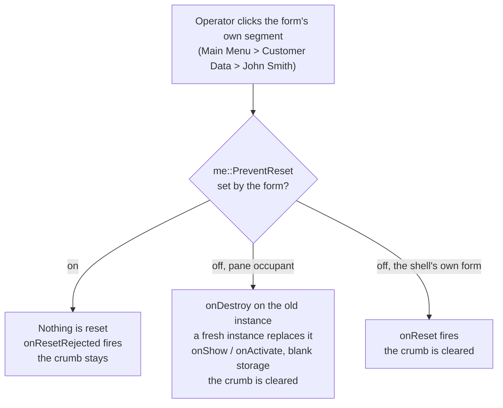

**El formulario tiene la última palabra.** Fija la guarda siempre que estés sosteniendo algo que merezca la
pena no perder, y límpiala cuando no:

```cobol
       CUSTOMER-CHANGED SECTION.        *> any field's onChange
           MOVE 1 TO me::PreventReset.

       SAVE-CUSTOMER SECTION.           *> after a successful write
           MOVE 0 TO me::PreventReset.

       RESET-REFUSED SECTION.           *> onResetRejected
           MOVE "Save or cancel first" TO Label-Status::Caption.
```

`PreventReset` forma parte de la superficie universal de los formularios, como `Title` o `FormState`, así
que se comprueba en el momento de la construcción y se puede leer a través de `super::` desde otro
formulario.

**Qué significa «empezar de nuevo»** depende de qué formulario esté mostrado:

- Un formulario **cargado en el ContentPane** se reconstruye: se ejecuta su `onDestroy` (cerrar ficheros,
  hacer COMMIT), su instancia y su WORKING-STORAGE se liberan, y una instancia completamente nueva ocupa su
  sitio — la misma pantalla, en blanco como el día en que se abrió por primera vez, en la misma posición de
  la cadena. Un reinicio **no** es una navegación: la cadena no se mueve.
- El **formulario principal propio** del shell no tiene ninguna segunda instancia que intercambiar —
  reiniciarlo reiniciaría la aplicación —, así que recibe **`onReset`** y hace su propia limpieza
  (`INITIALIZE`, volver a leer los valores por omisión, limpiar la pantalla).

> ⚠️ **Salvedad.** El marco es la banda superior del **área de contenido**, así que los controles solo
> pueden asentarse sobre él mientras la **FullHeight** de la barra lateral esté activada (el valor por
> omisión). Con FullHeight desactivada la ruta de navegación es una franja por encima de toda la ventana —
> por encima de la barra lateral también — y no hay ningún formulario debajo de ella en el que colocar un
> control.

### FormFormat — cómo se puede cargar un formulario

Todos los formularios lo declaran en el inspector de propiedades:

- **Standalone** (por omisión) — su propia ventana, abierta con `OpenFormSync` / `OpenFormAsync`. Todo lo
  que hacen hoy las aplicaciones de la época del §21.
- **Embedded** — cargado en el ContentPane por un elemento de menú.
- **Both** — una pantalla reutilizable válida por cualquiera de las dos vías (una búsqueda de clientes que
  es un diálogo modal desde Ventas y un panel de navegación dentro de CRM).

La **construcción comprueba el emparejamiento**: un elemento de menú que apunte a un formulario Standalone,
o una llamada a `OpenFormSync` que nombre uno Embedded, es un error de compilación que nombra el
formulario. El formulario principal es siempre Standalone — es dueño de la ventana.

Mientras un formulario está incrustado, sus propiedades exclusivas de ventana (WindowState, FullScreen,
TitleVisible, CanMinimize, CanMaximize) están inertes y se muestran atenuadas en el inspector;
`Width`/`Height` informan de los valores **diseñados**. Los efectos de entrada y de salida de ventana se
reproducen solo para los formularios independientes — un formulario incrustado simplemente está presente.

**La regla del fondo.** El fondo del formulario cargado pinta **todo el ContentPane** — color, degradado o
imagen, con la geometría de la imagen y del degradado calculada contra el *panel*, no contra el rectángulo
del formulario. Mientras el formulario se desplaza (un formulario más grande que el panel se desplaza
dentro de él), el fondo se queda quieto. Un formulario completamente transparente (Transparency = 100)
muestra el escritorio a través de la región del panel — el menú y la ruta de navegación se mantienen
opacos.

> ⚠️ **Salvedad.** El mismo formulario `Both` muestra por tanto su fondo de forma distinta incrustado (del
> tamaño del panel, fijo) e independiente (reglas de ventana, spec 037). Esto es por diseño; diseña los
> fondos en consecuencia.

### Dimensionar un formulario Embedded al ContentPane

Un formulario Embedded conserva el tamaño que diseñaste. El panel **no** se estira para sostenerlo y el
formulario **no** se escala hacia abajo para que quepa — así que si el formulario es más grande que el
panel, el excedente se desplaza, y las barras de desplazamiento sobre un ocupante de panel son del tipo
fino y flotante que no reserva ninguna canaleta. Nada en pantalla anuncia que el formulario continúa más
allá del borde, así que los controles que quedan ahí fuera se leen como *ausentes* en lugar de como *fuera
de pantalla*.

Calcula el panel antes de diseñar el formulario:

```text
ContentPane width  = main form width  − SideMenu width
ContentPane height = main form height − BreadcrumbHeight
```

Los dos números vienen del **formulario principal**: el riel es el control SideMenu tal como lo dibujaste
(no un valor fijo por omisión), y la banda es la propiedad `BreadcrumbHeight` de ese mismo control. Un
formulario principal de 1584x936 con un SideMenu de 296 de ancho y la ruta de navegación por omisión de 28
puntos da un panel de **1288x908** — así que un formulario Embedded diseñado con 1320 de ancho tiene 32
puntos que no pueden estar nunca en pantalla, y el hueco crece a medida que el operador hace la ventana más
pequeña.

Qué controles desaparecen lo decide el **borde derecho** de cada control, no dónde empieza: un control en
x=32 que mide 456 de ancho (borde derecho 488) sobrevive a un panel mucho más estrecho que uno en x=568 que
mide 704 de ancho (borde derecho 1272).

El Form Designer te avisa de esto mientras el tamaño sigue siendo tuyo para elegirlo — una franja ámbar
sobre el lienzo que nombra el tamaño del formulario, el tamaño del panel y el excedente:

> ⚠️ Este formulario Embedded mide 1320x720; el ContentPane del formulario principal es 1288x908 — 32 px se
> desplazarán fuera de la vista.

El remedio es estrechar el formulario Embedded, o ensanchar el formulario principal (o su panel, dibujando
un SideMenu más estrecho). La franja se limpia sola en el momento en que el formulario cabe.

> **Nota.** El aviso aparece solo para los formularios Embedded. Un formulario Standalone es dueño de su
> ventana y no tiene ningún panel que desbordar, y los formularios `Both` se miden igual que los Embedded
> porque esa es la vía en la que se los puede recortar.

> ⚠️ **Salvedad.** La franja compara contra el tamaño **diseñado** del formulario principal. Un operador
> que arrastre la ventana en ejecución más estrecha que eso pierde más, y uno que la maximice recupera el
> excedente. Diseña para el tamaño diseñado y trata cualquier cosa más allá del borde del panel como
> opcional.

### La cadena de navegación

Los formularios cargados desde los menús forman una cadena — formulario principal → subsistema → pantalla.
Todos los formularios **de la cadena siguen residentes**: su WORKING-STORAGE vive, sus manejadores de menú
siguen disparándose, incluso mientras su cuerpo no está mostrado. La ruta de navegación ES esa cadena.
Hacer clic en un segmento destruye todo lo que hay por debajo (lo más profundo primero), vuelve a montar el
menú de ese formulario y muestra su cuerpo de nuevo.

Dos comportamientos de menú controlan los cambios entre hermanos (editor de menús, por elemento):

- Por omisión: cambiar de la pantalla A a la pantalla B **destruye** A.
- Con **Preserve previous form** marcada: A se mantiene residente, y volver a A es instantáneo, con sus
  datos exactamente como los dejaste.

Dos eventos de formulario los distinguen — vincúlalos como cualquier otro:

- **onDeactivate** — el cuerpo dejó el panel; el formulario sigue residente. **No** cierres ficheros aquí.
- **onDestroy** — el almacenamiento está a punto de liberarse. Cierra los ficheros, haz COMMIT y libera los
  recursos aquí.

### `super` — el formulario que me cargó

`me` direcciona el formulario actual; **`super`** direcciona el formulario que lo cargó o lo abrió — en las
dos vías, las cargas de menú y `OpenFormSync`/`OpenFormAsync`:

```cobol
      *> read and change the parent form's properties
           MOVE super::Title TO WS-T.
           MOVE "Processing…" TO super::Title.
      *> drive its window (any windowHandler method)
           INVOKE super::"SetWindowState"("Minimized").
      *> walk further up: one loader per super
           MOVE super::super::Title TO WS-T.
      *> drive the menu pane (state persists per application)
           super::SIDE-1::Collapse().
           super::SIDE-1::Open().
```

Reglas que esperar:

- **Las propiedades a secas se comprueban en el momento de la construcción** contra la superficie universal
  de los formularios (Name, Title, Width, Height, X, Y, WindowState, FullScreen, TitleVisible, CanMinimize,
  CanMaximize, FormState, FormFormat, BackgroundColor, Transparency, PreventReset) — un error de tecleo
  como `super::Widht` hace fallar la construcción a cualquier profundidad. Los procedimientos específicos
  de un formulario usan paréntesis (`super::"RecalcTotals"()`) y se despachan en tiempo de ejecución.
- **`super` puede ser NULL**: en el formulario principal, y en un formulario abierto de forma asíncrona
  cuyo abridor se ha cerrado (el hijo no mantiene nunca vivo a su abridor). Referenciar un `super` NULL
  levanta el error de ejecución estándar.
- `me::<propiedad>` funciona igual sobre la superficie propia del formulario — `me::Width`,
  `MOVE "New" TO me::Title` — y `me` y el nombre propio del formulario direccionan lo mismo.

### Abrir formularios — las tres puertas

Una aplicación sostiene muchos formularios vivos a la vez. Cada formulario abierto se ejecuta como **su
propio programa** con **su propia WORKING-STORAGE** — los formularios no leen nunca los datos de los
demás. Hablan a través de las superficies de arriba: las propiedades publicadas de los formularios,
`super::X` y los métodos de windowHandler.

Hay tres formas de abrir un formulario, y la propiedad **Form format** decide cuál de ellas puede
cargarlo:

1. **En el ContentPane** — un elemento de la barra lateral con la acción **Open form**. El destino necesita
   el formato `Embedded` o `Both`. El ocupante saliente se desactiva (y se aparca, cuando el elemento
   pulsado tenía marcada *Preserve previous form*); la ruta de navegación le sigue.
2. **Como ventana hija desde COBOL** — `INVOKE me "OpenFormSync"` / `"OpenFormAsync"`, con el formulario
   que llama como padre. El destino necesita `Standalone` o `Both`.
3. **Como ventana hija desde la barra lateral** — las acciones de menú **Open Stand Alone Form (Sync)** /
   **(Async)**, o de forma programática a través del propio control SideMenu:

```cobol
      *> block until the report window closes (Sync is implicitly modal —
      *> the whole shell waits with you)
           INVOKE SideMenu-1 "OpenStandAloneFormSync"
               USING "RPT-MONTH" "Normal" 80 80 640 480 "true".
      *> or open it modeless and keep its handle
           INVOKE SideMenu-1::"OpenStandAloneFormAsync"("MONITOR")
               RETURNING WS-H.
           INVOKE WS-H "Focus".
```

Las ventanas abiertas de esta forma tienen como padre el **shell**, sea cual sea el formulario que ejecutó
el INVOKE — cerrar la aplicación las cierra. El destino necesita `Standalone` o `Both`.

> **Un destino que tiene su propio SideMenu conserva su control de abierto y plegado.** Ejecuta un
> formulario así por su cuenta y se abre como un shell, cuya ruta de navegación lleva ese control en su
> cabecera. Abierto como ventana hija es una ventana llana sin ningún shell por encima, así que dibuja la
> franja él mismo: el mismo conmutador vivo, y un único segmento estático que nombra el formulario. No hay
> ninguna cadena de navegación que mostrar — una cadena es un hecho del shell, y una ventana hija no está
> en una.

**Sync es implícitamente modal.** Desde un clic de menú o desde COBOL: mientras vive una ventana abierta de
forma Sync, toda la cara de su padre — el cromado del shell incluido — no admite ninguna entrada. Las
ventanas Async no son nunca modales.

#### Volver al panel propio del shell — la acción Home

El formulario del shell tiene su propio contenido de ContentPane: lo que dibujaras en el formulario que
lleva el SideMenu. En cuanto un elemento de menú haya cargado otro formulario en ese panel, el contenido
propio del shell queda detrás. La acción **Home** lo trae de vuelta — así que una «pantalla principal» no
necesita **ningún formulario propio**.

Dale a cualquier elemento de la barra lateral la acción **Home (main content pane)**. No toma ningún
destino, porque no abre nada: simplemente muestra el formulario al que pertenece la barra lateral.

> **Home no destruye nunca.** El formulario que estaba en el panel queda **aparcado**, no cerrado: no se
> dispara ningún `onDestroy`, su WORKING-STORAGE está intacta, y volver a cargarlo más tarde revive esa
> misma instancia en lugar de arrancar una nueva — el mismo «retorno instantáneo» que te da *Preserve
> previous form*. Todos los demás formularios vivos quedan intactos, las ventanas hijas incluidas: siguen
> ejecutándose y conservan su propio estado mientras estás en Home.
>
> La ruta de navegación se colapsa al formulario del shell solo, ya que eso es lo que el panel está
> mostrando, y la sección contextual del menú se vacía por la misma razón. Home cuando ya estás en Home no
> hace nada en absoluto — ni `onDeactivate`, ni `onActivate`.

⚠️ **Home es una acción solo de SideMenu.** Un formulario con MenuBar no tiene ningún ContentPane que
restaurar, así que la acción no se ofrece ahí.

La lista **Target** del editor de menús ofrece solo los formularios que la acción elegida puede cargar
legalmente, y la construcción impone la misma regla para los identificadores de formulario literales en
COBOL — una discrepancia es un error de compilación, no una sorpresa en tiempo de ejecución.

**Los formularios aparcados siguen vivos.** Un ocupante preservado conserva su almacenamiento Y sus
controles Timer habilitados siguen haciendo tic mientras está fuera del panel — los manejadores de
temporizador se ejecutan todo el tiempo, con las ráfagas fusionadas cuando la cola de eventos del
formulario está ocupada.

> ⚠️ **Salvedad.** Una apertura que no se puede satisfacer — un identificador de formulario con el que no
> coincide nada, o un formulario cuyo programa generado faltaba cuando se construyó la aplicación —
> levanta un error de ejecución visible y deja la referencia NULL. Comprueba la salida de tu construcción
> buscando avisos de «form … omitted».

---

## 23. Salvedades y limitaciones actuales

Una lista consolidada para que nunca te sorprendan:

- **Disparo de eventos.** Todos los eventos de formulario y de control son *diseñables*; hoy el
  runtime solo *dispara* el conjunto principal (véase §10). Verifícalo en *Run Form*.
- **Organizaciones de fichero.** Las cuatro están soportadas — SEQUENTIAL, LINE SEQUENTIAL,
  INDEXED y RELATIVE (§13). Cada verbo se despacha según la `ORGANIZATION` declarada del fichero.
- **Bloqueo.** Solo bloqueo de registros dentro de un mismo proceso.
- **Un fichero INDEXED, dos formularios vivos.** Cada formulario es su propio programa, así que dos
  formularios que escriban el *mismo* fichero INDEXED son dos escritores independientes — sus
  bloqueos de registro no se coordinan entre formularios. Dale a cada fichero de datos un
  formulario propietario y pasa los valores a través de propiedades de formulario publicadas.
- **EXEC RUST entre formularios.** El puente de objetos es uno por *aplicación*: una referencia
  creada en el bloque de cualquier formulario resuelve en los bloques de todos los demás, y los
  bloques de formularios distintos se turnan sobre ella. Por esa razón los valores almacenados a
  través del puente deben ser seguros para hilos (`Send`).
- **`rcrun build` se fía del disco.** El IDE regenera el COBOL de todos los formularios antes de
  Build/Run/Debug/Check; un `rcrun build` pelado compila el código generado que ya haya en disco.
  Construye desde el IDE al menos una vez después de editar formularios.
- **COBOL orientado a objetos.** Las definiciones `CLASS`/`METHOD` quedan fuera de alcance.
- **Intercambio ISAM.** El formato en disco es original y **no** es compatible a nivel binario con
  ningún ISAM de terceros.
- **El código generado es de solo lectura.** Edita los formularios o Common Code, nunca
  `generated/`.
- **`dist/` está reservado**, y las herramientas todavía no lo pueblan.
- **Los secretos** no deben incrustarse en los formularios que distribuyas.
- **Tema de formulario / estilos procedimentales.** La lista desplegable «Theme» de Appearance
  selecciona Classic / Enhanced / Neumorphic Light / Neumorphic Dark (relieve procedimental con
  controles completos de degradado, desenfoque, distancia y reborde). La selección de paquetes de
  activos se maneja por proyecto o por toml; parte de la interfaz de paquetes por formulario sigue
  evolucionando.

---

## Apéndice A — Si vienes de PowerCOBOL / isCOBOL

Un mapa mental aproximado para que vayas más rápido. Son *analogías*, no equivalencias exactas.


| Lo que conocías (PowerCOBOL / isCOBOL)        | En PowerRustCOBOL                                                                                       |
| --------------------------------------------- | ------------------------------------------------------------------------------------------------------- |
| Una *hoja* o *formulario* con controles       | Un **formulario** (`.cfrm`) editado en el **Form Designer**                                              |
| Hoja de propiedades                           | El **panel de propiedades** (tarjetas de sección plegables)                                              |
| Procedimiento de evento asociado a un control | Un **manejador de eventos** COBOL (el programa anidado `CONTROL-ID--EVENTNAME`)                          |
| El bucle de eventos que el runtime ocultaba   | El bucle **`COBOL-WAIT-EVENT`** explícito del código generado                                            |
| Llamadas a `INVOKE` y a métodos en controles   | Lo mismo — `Ctrl::Method(args)`, `INVOKE Ctrl "Method" USING …`, o las llamadas `COBOL-GET/SET-PROPERTY` |
| ISAM del proveedor                            | Los **ficheros indexados** de PowerRustCOBOL (`STORAGE IS MEMORY/DISK`, `redb`, `COMMIT`/`ROLLBACK`)     |
| SQL incrustado / ODBC                         | `COBOL-OPEN-DB` + `COBOL-EXEC-SQL` (SQLite/PostgreSQL/MySQL)                                            |
| Construir un `.exe` con una DLL de runtime    | `rcrun build` → **un único binario autocontenido**, sin runtime que instalar                            |
| Fichero de proyecto o de espacio de trabajo   | `cobolt.toml` + la disposición de carpetas estándar                                                     |

> ⚠️ **No** esperes compatibilidad a nivel de fuente, de formato de fichero ni binaria con el
> producto de ningún proveedor anterior. Los conceptos se transfieren; los artefactos no.

---

## Apéndice B — Glosario

- **Shell de aplicación** — la disposición de una sola ventana que activa un **SideMenu** en el
  formulario principal: un panel de menú, una ruta de navegación y un **ContentPane** en el que los
  formularios se cargan en el sitio (§22).
- **Literal de bloque** — un literal multilínea delimitado con acentos graves, tomado
  literalmente. Una extensión de PowerRustCOBOL; solo en formato libre (§13).
- **Ruta de navegación** — el marco que recorre la parte superior de la ventana de un shell
  nombrando la cadena de navegación. Dimensionado y coloreado por las propiedades `Breadcrumb*` del
  SideMenu (§22).
- **Common Code** — tu COBOL escrito a mano, en `src/`. Editable, y llamado con `CALL` desde los
  manejadores.
- **ContentPane** — el área de la ventana de un shell que contiene el formulario cargado. Es el
  tamaño del formulario principal menos el ancho del SideMenu y la altura de la ruta de navegación.
- **Control** — un elemento de un formulario: botón, cuadro de texto, diagrama, y así
  sucesivamente.
- **Vinculación de datos** — una asignación de nivel de formulario de un origen (fichero indexado,
  SQL, tabla COBOL, REST, agente de IA) a un control de destino aprobado (§8).
- **Data Binding Guardian** — el validador que comprueba las vinculaciones antes de un guardado, de
  una ejecución, de una depuración, de un Check, de un Build o de un empaquetado, reportando
  Blockers, Warnings e Info.
- **Motor** — el backend de almacenamiento de los ficheros indexados, elegido con
  `rcrun --indexed-engine`. El valor por omisión es el motor **`redb`** a prueba de caídas; el
  motor paginado `rust`, más antiguo, sigue estando ahí por su nombre.
- **Evento** — algo que hace el usuario o el sistema; se nombra `onAlgo`.
- **Bloque `EXEC RUST`** — un bloque de código del lenguaje anfitrión incrustado en un manejador,
  compilado dentro de la aplicación en el Build (§13). Alcanza el formulario a través de
  `cobolt_objects` y puede abrir su propia ventana a través de `cobolt_windows`.
- **Formulario** — una ventana que diseñas; se almacena como un fichero `.cfrm`.
- **Formato de formulario** — si un formulario puede abrirse en su propia ventana (`Standalone`),
  cargarse en un ContentPane (`Embedded`), o cualquiera de las dos cosas (`Both`) (§22).
- **Código generado** — el `.cbl` de solo lectura que PowerRustCOBOL produce a partir de un
  formulario, en `generated/`. No se edita nunca a mano; se regenera en cada Build, Run, Debug y
  Check.
- **Manejador** — el COBOL que se ejecuta para un evento; se genera como un programa anidado
  llamado `CONTROL-ID--EVENTNAME`.
- **Fichero indexado** — un fichero ISAM (`ORGANIZATION IS INDEXED`), descrito en el proyecto por
  una definición `.cidx`.
- **Knowledge Base** — la categoría del proyecto que contiene el material Markdown, de texto y PDF
  del que el asistente de IA puede tirar.
- **Formulario principal** — el único formulario de un proyecto marcado como punto de entrada de la
  aplicación. Su programa generado es donde arranca un binario construido.
- **`me`** — el receptor que nombra el formulario actual, como en `me::Title`.
- **Control no visual** — un servicio sin aspecto en tiempo de ejecución: Timer, AI Agent, REST
  Client, SQL Database, Indexed File, Web Search, Snackbar.
- **Project's Crates** — el catálogo de nivel de proyecto de bibliotecas de terceros registradas
  para que las usen los bloques `EXEC RUST` (§13).
- **Propiedad** — un atributo con nombre de un control o de un formulario, leído y escrito con la
  sintaxis de miembro `::`.
- **rcrun** — el runtime de línea de órdenes, el verificador, el empaquetador y el compilador de
  binarios.
- **Grupo repetitivo** — un GroupBox convertido en una plantilla de tarjeta repetida una vez por
  elemento de un array; al manejador de un miembro se le informa de qué tarjeta disparó a través de
  `CONTROL-ARRAY-INDEX` (§8).
- **Ruta del sitio** — cómo nombra un diagnóstico el lugar que *tú* escribiste, en lugar de una
  línea de código generado: `MAIN-FORM ▸ BTN-OK ▸ onClick` (§12).
- **Modo de almacenamiento** — la cláusula `STORAGE [MODE] IS MEMORY | DISK` de un `SELECT`, que
  elige una tabla en RAM o un almacén persistente en disco. **DISK** es el valor por omisión (§14).
- **`super`** — el receptor que nombra el formulario que cargó o abrió este, como en `super::Title`.
  Es NULL en el formulario principal (§22).
- **User Control** — un componente reutilizable basado en un GroupBox, almacenado en el proyecto y
  desplegado como controles reales con identificadores cualificados (§8).

---

*Esta guía es un documento vivo. Se amplía cada vez que se añade una característica o cambia un
comportamiento — si algo de aquí discrepa de la herramienta en ejecución, la herramienta (y los
ficheros de referencia de `docs/` y la suite de pruebas) son los autorizados; informa por favor de
la discrepancia.*

.<<
