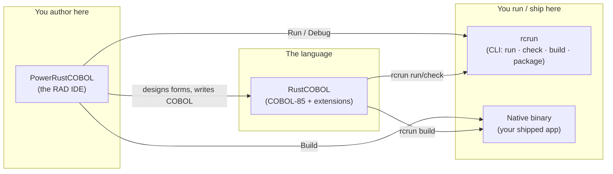
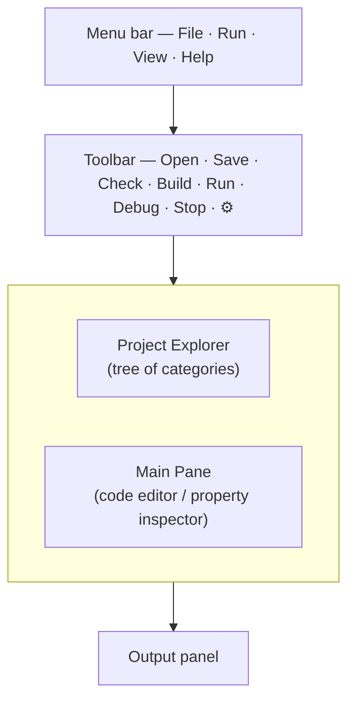
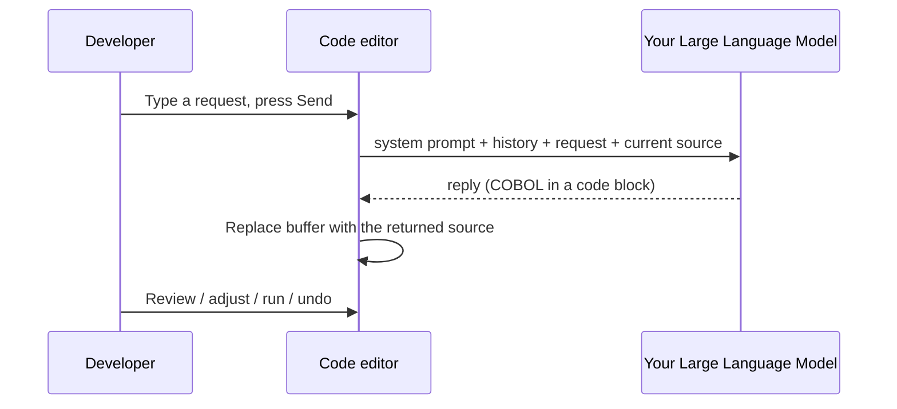
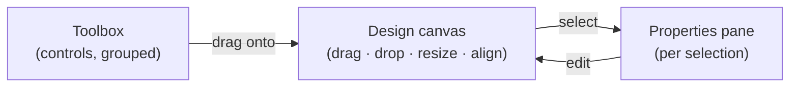
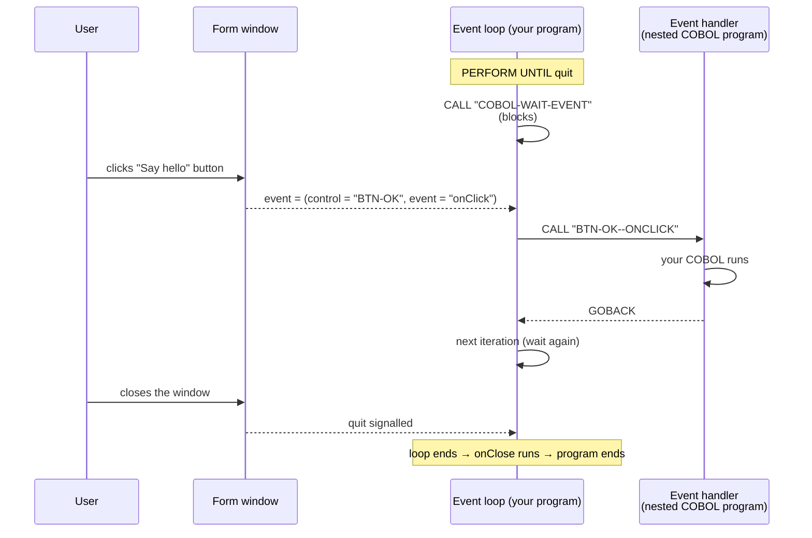
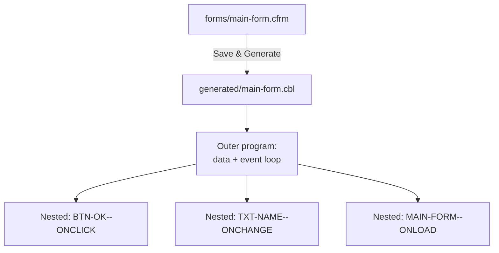
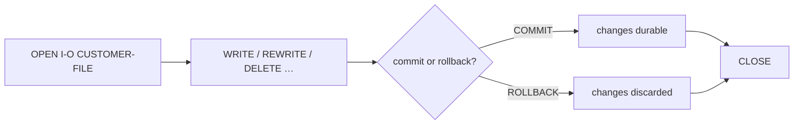
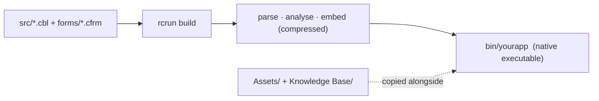
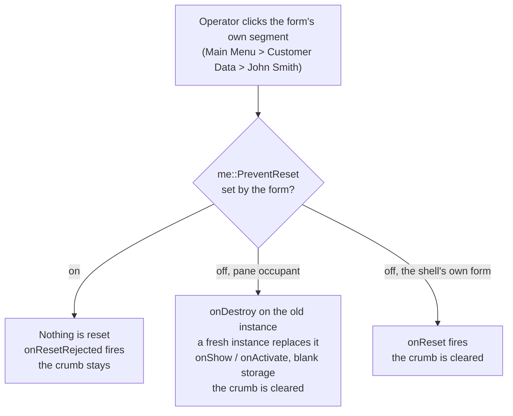

<!--
SPDX-License-Identifier: Apache-2.0
Copyright (c) 2026 Emerson Lopes and PowerRustCOBOL contributors

Licensed under the Apache License, Version 2.0.
See the LICENSE file in the project root for full license information.
-->

<!-- powerrustcobol: 1.65.124 -->

# Guide du développeur PowerRustCOBOL AI RC4

<p align="center">
  
</p>


*Un guide pratique pour construire des applications COBOL graphiques avec PowerRustCOBOL.*

> **À qui s'adresse ce guide.** Vous écrivez déjà du COBOL et vous avez construit
> des applications à écrans ou à fenêtres avec un outillage COBOL graphique — par
> exemple Fujitsu **PowerCOBOL for Windows** ou **Veryant isCOBOL**. Vous
> connaissez `IDENTIFICATION DIVISION`, `PERFORM`, `OPEN`/`READ`/`WRITE`, les
> fichiers indexés et l'idée d'un *formulaire* doté de *contrôles* qui lèvent des
> *événements*. Ce guide transpose ces réflexes vers PowerRustCOBOL et vous montre
> tout ce qui est nouveau. **Aucune connaissance préalable du langage
> d'implémentation hôte n'est supposée ni exigée** — vous n'aurez jamais à lire ni
> à écrire autre chose que du COBOL pour construire une application.

---

## Table des matières

1. [Ce qu'est PowerRustCOBOL, et pourquoi il existe](#1-ce-quest-powerrustcobol-et-pourquoi-il-existe)
2. [Les trois pièces : RustCOBOL, PowerRustCOBOL, rcrun](#2-les-trois-pièces)
3. [Installation et démarrage](#3-installation-et-démarrage)
4. [Votre première application : Bonjour, formulaire](#4-votre-première-application--bonjour-formulaire)
5. [L'IDE en un coup d'œil](#5-lide-en-un-coup-dœil)
   - [Effets de fenêtre](#effets-de-fenêtre)
6. [Les projets et le modèle de projet](#6-les-projets-et-le-modèle-de-projet)
7. [Le Form Designer (RAD)](#7-le-form-designer-rad)
8. [Le catalogue des contrôles](#8-le-catalogue-des-contrôles)
9. [Propriétés](#9-propriétés)
10. [La programmation dirigée par les événements](#10-la-programmation-dirigée-par-les-événements)
11. [Dialoguer avec l'interface depuis COBOL](#11-dialoguer-avec-linterface-depuis-cobol)
12. [Le code généré](#12-le-code-généré)
13. [Le langage RustCOBOL](#13-le-langage-rustcobol)
    - [L'écrire comme la norme vous le permet](#lécrire-comme-la-norme-vous-le-permet)
    - [Confier une table entière à une fonction](#confier-une-table-entière-à-une-fonction)
    - [Fermer un fichier pour de bon : `WITH LOCK`](#fermer-un-fichier-pour-de-bon--with-lock)
    - [Les lignes de débogage](#les-lignes-de-débogage)
    - [Texte long et malcommode : le littéral de bloc](#texte-long-et-malcommode--le-littéral-de-bloc)
    - [Écrire un fichier texte sans `FD`](#écrire-un-fichier-texte-sans-fd)
14. [Les fichiers indexés — une ressource de premier rang](#14-les-fichiers-indexés--une-ressource-de-premier-rang)
15. [Les bases de données SQL](#15-les-bases-de-données-sql)
16. [HTTP / REST et agents d'IA](#16-http--rest-et-agents-dia)
17. [La ligne de commande (rcrun)](#17-la-ligne-de-commande-rcrun)
18. [Construire un binaire distribuable](#18-construire-un-binaire-distribuable)
19. [Le débogage](#19-le-débogage)
    - [Les commutateurs de diagnostic (Help → Debug Settings)](#les-commutateurs-de-diagnostic-help--debug-settings)
20. [Apparence et internationalisation](#20-apparence-et-internationalisation)
21. [COBOL Structure et données partagées](#21-cobol-structure-et-données-partagées)
22. [Le shell d'application et le receveur `super`](#22-le-shell-dapplication-et-le-receveur-super)
23. [Réserves et limitations actuelles](#23-réserves-et-limitations-actuelles)
24. [Annexe A — En venant de PowerCOBOL / isCOBOL](#annexe-a--en-venant-de-powercobol--iscobol)
25. [Annexe B — Glossaire](#annexe-b--glossaire)

---

## 1. Ce qu'est PowerRustCOBOL, et pourquoi il existe

<!-- 📷 welcome.png — the welcome screen as it appears on first launch, before any project is open. -->

<p align="center"></p>


Pendant des décennies, la seule façon d'écrire du **COBOL fenêtré et piloté par
les événements** était d'acheter une chaîne d'outils propriétaire liée à un
système d'exploitation, à un éditeur et à un modèle de licence. Ces outils
étaient excellents en leur temps, mais la plupart sont aujourd'hui cantonnés à
Windows, fermés et de plus en plus difficiles à déployer sur des machines
modernes. Toute une génération de logique métier — paie, stocks, arrière-guichets
bancaires — est écrite dans ce style et n'a nulle part où aller aujourd'hui.

**PowerRustCOBOL existe pour offrir à ce style de développement un foyer neuf et
ouvert.** C'est un environnement de développement rapide d'applications (RAD)
dans lequel vous :

- dessinez des fenêtres (« formulaires ») en faisant glisser des contrôles sur un
  canevas,
- attachez à ces contrôles des gestionnaires d'événements écrits en **COBOL**,
- puis exécutez, déboguez et livrez le résultat sous la forme d'un **exécutable
  natif autonome unique** — aucun runtime à installer sur la machine cible.

Ses objectifs de conception, en termes simples :


| Objectif                | Ce que cela signifie pour vous                                                                                                                     |
| ----------------------- | ---------------------------------------------------------------------------------------------------------------------------------------------------- |
| **COBOL d'abord**       | L'application *est* du COBOL. Le concepteur génère du COBOL ; vos gestionnaires d'événements sont des programmes COBOL-85 imbriqués. Vous ne quittez jamais le langage. |
| **Multiplateforme**     | Ni l'IDE ni les binaires produits ne sont liés à un seul système d'exploitation.                                                                    |
| **Autonome**            | Une application construite embarque tout ce dont elle a besoin ; l'utilisateur final n'installe pas PowerRustCOBOL.                                 |
| **Accès aux données moderne** | Les fichiers indexés (ISAM) résistants aux pannes, SQL (SQLite / PostgreSQL / MySQL) et HTTP/REST s'atteignent par de simples instructions `CALL`. |
| **Ouvert**              | Sous licence Apache-2.0.                                                                                                                           |

> **Note.** PowerRustCOBOL s'*inspire* de la productivité des RAD COBOL
> graphiques classiques, mais c'est une implémentation indépendante et originale.
> Des notions telles que « formulaire », « contrôle » et « événement » sont
> standard dans l'industrie ; la syntaxe, les formats de fichiers, le code généré
> et les services intégrés décrits ici sont propres à PowerRustCOBOL et ne sont
> compatibles avec les outils d'aucun autre éditeur.

---

## 2. Les trois pièces

PowerRustCOBOL est livré sous la forme de trois outils qui coopèrent. Savoir
lequel fait quoi dissipe beaucoup de confusion dès le départ.




| Nom                | Rôle                                                                                                                             | Voyez-le comme…                                        |
| ------------------ | ---------------------------------------------------------------------------------------------------------------------------------- | ------------------------------------------------------- |
| **RustCOBOL**      | Le dialecte du langage COBOL-85 plus les extensions de PowerRustCOBOL (appels GUI, clauses de fichiers indexés, SQL/HTTP).         | Le « langage » du compilateur/runtime.                  |
| **PowerRustCOBOL** | L'IDE de bureau : explorateur de projet, éditeur de code, **Form Designer**, débogueur.                                           | L'« atelier » / le « studio ».                          |
| **rcrun**          | Le runtime en ligne de commande, le vérificateur, l'empaqueteur et le compilateur de binaires.                                    | Le « runtime + outil de build » scriptable en CI.       |


> ⚠️ **Réserve de nommage.** En interne, certains artefacts de build et certains
> dossiers portent le nom `cobolt-*`. C'est un détail d'implémentation ; les noms
> visibles par l'utilisateur sont **RustCOBOL**, **PowerRustCOBOL** et **rcrun**.

---

## 3. Installation et démarrage

Chaque version propose **deux téléchargements** par plateforme, et l'un comme
l'autre est complet — ils embarquent la même application, le même `rcrun`, les
mêmes thèmes, exemples et SDK de plateforme.

| Votre machine | Programme d'installation | Archive |
| --- | --- | --- |
| Windows 10 / 11, 64 bits | `.msi` — double-clic, ou `msiexec /i … /quiet` pour un déploiement silencieux | `.zip` |
| Macs à puce Apple Silicon | `.dmg` — faites glisser PowerRustCOBOL vers Applications | `.tar.gz` |
| Macs Intel | `.dmg` | `.tar.gz` |
| Debian, Ubuntu, Mint et apparentées | `.deb` — `sudo apt install ./PowerRustCOBOL-*.deb` | `.tar.gz` |
| Fedora, RHEL, CentOS Stream, openSUSE | `.rpm` — `sudo dnf install ./PowerRustCOBOL-*.rpm` | `.tar.gz` |
| Toute autre distribution Linux, 64 bits | — | `.tar.gz` |

Prenez le **programme d'installation** si vous voulez les commodités habituelles :
une entrée dans le menu Démarrer ou dans Applications, un lanceur sur le bureau,
`rcrun` dans votre `PATH`, et un moyen propre de le désinstaller plus tard.
Prenez l'**archive** si vous préférez ne rien installer — décompressez-la où bon
vous semble et lancez-la, y compris depuis une clé USB ou une machine sur
laquelle vous ne pouvez pas installer de logiciel. Les deux paquets Linux placent
l'application dans `/opt/powerrustcobol` et créent des liens vers
`powerrustcobol` et `rcrun` dans `/usr/bin` ; sur toute autre distribution,
l'archive est le téléchargement.

> ⚠️ **Aucun des deux n'est encore signé**, si bien que chaque plateforme
> avertit une fois au premier lancement. Sous **macOS** : clic droit sur
> l'application puis *Open*, ou retirez l'indicateur de quarantaine avec
> `xattr -dr com.apple.quarantine PowerRustCOBOL.app`. Sous **Windows** :
> SmartScreen propose *More info* → *Run anyway*. Un programme d'installation
> n'inspire ici pas plus confiance qu'une archive — l'avertissement porte sur le
> certificat manquant, pas sur le format.

Linux exige glibc 2.35 ou plus récent (Ubuntu 22.04+, Debian 12+, Fedora 36+)
ainsi que les bibliothèques OpenGL, X11 ou Wayland que votre bureau fournit déjà.

Lancez l'IDE ; au premier démarrage, un espace de travail vide vous accueille
avec le message *« Open a COBOL file to get started. »* Vous pouvez ouvrir un
seul fichier `.cbl` ou créer un **projet** complet (recommandé — voir §6).

<p align="center"></p>


Depuis un terminal, vous pouvez aussi tout piloter sans interface avec `rcrun`
(voir §17), ce qu'utilisent les chaînes d'intégration continue.

### La vérification de Rust au premier lancement


L'IDE conçoit des formulaires et *exécute* des programmes par lui-même. **Build**
fait exception : il compile votre projet en une application native au moyen de la
**chaîne d'outils Rust** (§18), et il en va de même pour toute exécution d'un
programme contenant un bloc `EXEC RUST`. C'est pourquoi, à son premier
démarrage, PowerRustCOBOL cherche Rust — et lorsqu'il en trouve un utilisable, il
ne dit rien du tout.

Dans le cas contraire, il vous indique dans quelle situation vous êtes — Rust
absent, ou une version antérieure à la **1.92** qu'exige PowerRustCOBOL —,
affiche la commande officielle de [rustup.rs](https://rustup.rs) et propose de
l'exécuter pour vous. Refusez, et la question vous est posée une seconde fois,
car refuser a un coût qu'il vaut la peine d'énoncer :


| Sans Rust, vous perdez | Vous conservez |
| ---------------------- | -------------- |
| **Build** — aucun exécutable natif, rien à empaqueter | Le Form Designer |
| L'exécution de tout programme contenant un bloc `EXEC RUST` | L'éditeur de code et l'outillage COBOL |
|  | **Run** (interprété) et le débogueur |

Refuser une seconde fois tranche la question, qui n'est plus posée. Installez
Rust plus tard depuis [rustup.rs](https://rustup.rs) et **Build** se met
simplement à fonctionner — rien dans l'IDE n'a besoin d'être prévenu.

> **Note** — rustup installe Rust dans `~/.cargo/bin`, que le *profil de votre
> shell* ajoute au `PATH`. Une application lancée depuis le Finder ou depuis le
> bureau Windows ne lit jamais ce profil ; PowerRustCOBOL va donc regarder
> lui-même à cet endroit et utilise ce qu'il y trouve. Vous n'avez pas besoin de
> lancer l'IDE depuis un terminal pour que **Build** fonctionne.

#### Rust est installé et Build n'aboutit toujours pas

Il existe un second prérequis, que rustup n'installe ni ne mentionne : l'**éditeur
de liens**. La compilation produit du code machine ; l'éditeur de liens est ce
qui rassemble ce code en un fichier exécutable, et il relève du système
d'exploitation plutôt que de Rust.

| Plateforme | Ce qui fournit l'éditeur de liens |
| ---------- | --------------------------------- |
| **Windows** | Les outils de génération C++ de Microsoft — *Build Tools for Visual Studio* (ou Visual Studio) avec la charge de travail **Desktop development with C++**. Visual Studio Code est un autre produit et ne les fournit pas. |
| **macOS**   | Les outils de développement en ligne de commande d'Apple — `xcode-select --install` |
| **Linux**   | La chaîne d'outils C de votre distribution — `build-essential` sous Debian et Ubuntu, *Development Tools* sous Fedora et RHEL |

La vérification du premier lancement pose également cette question, en faisant
lier par Rust un programme qui ne fait rien : c'est le seul moyen fiable de
savoir, puisque sous Windows l'éditeur de liens se trouve via l'installation de
Visual Studio et non via le `PATH`. S'il n'y parvient pas, l'IDE le signale dès
le premier lancement, nomme l'éditeur de liens et affiche la commande qui
l'installe. Il n'y a rien à accepter ni à refuser — ce n'est pas un choix, juste
la seule chose qui manque encore.

Si vous le rencontrez plus tard — à la fin d'une compilation, là où cela
apparaissait autrefois —, **Build** signale la même chose dans les mêmes termes
plutôt que de vous renvoyer la sortie du compilateur. Tout le reste continue de
fonctionner entre-temps : le Form Designer, l'éditeur, **Run** et le débogueur
n'ont jamais eu besoin d'un éditeur de liens.

---

## 4. Votre première application : Bonjour, formulaire

Cette marche à suivre produit une fenêtre à un seul bouton qui affiche un
message.

1. **Créez un projet.** `File ▸ New Project…`, donnez-lui un nom (par exemple
   `HelloPower`) et un programme principal. L'IDE crée sur le disque
   l'arborescence de dossiers standard **ainsi qu'un programme `main` de départ
   exécutable** (un petit `DISPLAY`/`GOBACK` que vous pouvez lancer
   immédiatement), puis l'ouvre dans l'éditeur (voir §6).
2. **Créez un formulaire.** Dans l'arborescence du projet, cliquez sur le **➕**
   à côté de **Forms**. Cela ouvre la boîte de dialogue *New Form* — indiquez un
   nom (`main-form`), un titre et une taille, puis créez-le. Le formulaire est
   enregistré sous `forms/` et s'ouvre dans le **Form Designer**.
3. **Déposez un bouton.** Faites glisser un **Button** depuis la boîte à outils
   sur le canevas. Une fois sélectionné, donnez à son `Caption` la valeur
   `Say hello` dans le volet des propriétés.
4. **Déposez une étiquette.** Faites glisser un **Label** depuis la boîte à
   outils sur le canevas.
5. **Attachez un gestionnaire.** Toujours sur le bouton, repérez son événement
   **`onClick`** et cliquez dessus pour ouvrir l'éditeur d'événements COBOL.
   Saisissez, par exemple :

   ```cobol
              SET Label-1::Caption TO "Hello from COBOL!".
   ```

<!-- 📷 first-form-designer.png — Capture the Form Designer with the single button selected and the `onClick` event highlighted in the properties pane. -->
<p align="center"></p>


6. **Exécutez.** Appuyez sur **Run** dans la barre d'outils (ou sur le ▶ du
   concepteur). Le formulaire apparaît ; cliquer sur le bouton exécute votre
   gestionnaire.

<!-- 📷 firstform.png — Capture the running form after the button has been clicked, with the greeting showing in the label. -->
<p align="center"></p>


> **Note.** Lorsque vous enregistrez ou exécutez un formulaire, PowerRustCOBOL
> **génère** un fichier source COBOL correspondant (voir §12). Vous n'éditez
> jamais ce fichier à la main — c'est un artefact de compilation.


---

## 5. L'IDE en un coup d'œil



- **Project Explorer (à gauche).** Une arborescence enracinée dans votre projet.
  Sept catégories fixes — **Forms**, **Indexed Files**, **Common Code**,
  **Generated Code**, **Project's Crates (Beta)**, **Assets**,
  **Knowledge Base** — chacune dotée d'un bouton **➕**, sauf **Generated Code**,
  que le Form Designer remplit de lui-même et à laquelle vous n'ajoutez jamais
  rien à la main. À gauche de chaque élément se trouve un **« bouton » d'état** :
  🟢 vert = vérifié/testé sans problème, 🟡 jaune = modifié depuis la dernière
  vérification, 🔴 rouge = un problème a été signalé. Les formulaires se
  déploient pour montrer leurs contrôles, groupés par catégorie de la boîte à
  outils, et chaque contrôle se déploie sur ses **Events**. Les fichiers indexés
  se déploient pour montrer les champs de l'enregistrement (comme les contrôles
  d'un formulaire). **Cliquez sur le nœud racine tout en haut**
  (📁 NomDeVotreProjet) à tout moment pour faire apparaître le formulaire complet
  des paramètres du projet dans la zone de travail principale.

### Organiser l'arborescence du projet avec des dossiers

Chaque catégorie peut accueillir une hiérarchie quelconque de **dossiers**, afin
que les projets vastes, de qualité professionnelle, restent navigables (par
exemple `forms/customers/`, `src/billing/`).

- **Créer un dossier.** Cliquez sur le bouton **📁+** de l'en-tête d'une
  catégorie pour ajouter un dossier à sa racine, ou faites un clic droit sur
  n'importe quel dossier et choisissez **New folder…** pour en imbriquer un à
  l'intérieur.
- **Renommer un dossier.** Clic droit sur le dossier, puis **Rename folder…**.
  Chaque fichier que le projet suit sous ce dossier — ainsi que tout onglet
  d'éditeur ouvert qui pointe vers l'un d'eux — suit le changement
  automatiquement.
- **Supprimer un dossier.** Clic droit, puis **Delete folder…**. Après
  confirmation, le dossier et **tout ce qu'il contient sont définitivement
  supprimés du disque**, les fichiers sont retirés du projet, et tout éditeur qui
  les affichait est fermé. Cette action est irréversible.

Les chemins de dossiers sont toujours enregistrés **relativement au dossier du
projet** : un projet peut donc être déplacé, compressé ou partagé sans casser la
moindre référence.

### Déplacer des fichiers : glisser-déposer

- **Au sein de l'arborescence.** Faites glisser un fichier sur un autre dossier
  (ou sur l'en-tête d'une catégorie) pour l'y déplacer ; le fichier est déplacé
  sur le disque et son entrée dans le projet est mise à jour. Un fichier ne peut
  pas en écraser un autre portant le même nom, et un dossier ne peut pas être
  déposé en lui-même.
- **Depuis le système d'exploitation.** Faites glisser des fichiers depuis le
  Finder ou l'Explorateur sur un dossier ou une catégorie pour les importer. Ils
  sont copiés dans le projet et suivis par un chemin relatif. Un fichier dont le
  type ne correspond pas à la catégorie de destination (par exemple un `.cfrm`
  déposé sur Common Code) est refusé.

### Navigation au clavier

Le pointeur placé au-dessus de l'arborescence du projet, vous pouvez vous
déplacer sans la souris :

- **↑ / ↓** — passe à la ligne visible précédente / suivante. L'élément se charge
  immédiatement (ses propriétés ou l'éditeur, exactement comme un simple clic),
  et l'arborescence défile autant qu'il le faut pour garder la ligne en
  surbrillance visible, à une ligne du bord haut ou bas.
- **→** — déploie un dossier replié ; s'il est déjà ouvert, entre dans son
  premier enfant.
- **←** — remonte au dossier parent.
- **Entrée** — ouvre l'élément sélectionné (comme un simple clic).

Au premier lancement (ou chaque fois qu'aucun projet n'est ouvert), l'IDE affiche
un unique volet d'accueil plein, constitué d'un seul bloc d'informations centré
(titre + licence + une ligne vide + citation + auteur) au milieu de la zone
disponible sous la barre de menus et la barre d'outils :

Welcome to PowerRustCOBOL <version>
License: Apache 2.0

<ligne vide>
<texte de la citation en vert, choisi au hasard à chaque cycle dans une liste intégrée>
— <auteur en bleu clair>

La citation change au hasard toutes les 7,5 secondes (1 s d'apparition en fondu,
6 s visible, 0,5 s de disparition en fondu). L'arborescence de gauche,
l'éditeur, la sortie et les contrôles propres à l'éditeur restent masqués
jusqu'à ce que vous utilisiez File → New Project ou File → Open Project. Une fois
un projet ouvert, l'espace de travail habituel à trois volets apparaît. Le guide
complet est disponible dans le dossier docs/.

- **Barre d'outils (en haut).** `Open · Save · Check · Build · Run · Debug ·
  Stop`, plus le sélecteur de langue tout à droite. *Run* interprète le
  programme ; *Build* compile un binaire natif ; *Check* n'exécute que l'analyse
  syntaxique et sémantique ; *Debug* est actif lorsqu'un élément de Generated
  Code est sélectionné.
- **Volet principal (au centre / à droite de l'arborescence).** Affiche
  l'éditeur de code, l'**inspecteur de propriétés** (quand vous cliquez sur un
  formulaire ou un contrôle dans l'arborescence), **ou le formulaire des
  paramètres du projet** (quand vous cliquez sur la racine du projet en haut de
  l'arborescence, ou automatiquement lorsque l'IDE ouvre un projet pour la
  première fois — sans aucun éditeur visible). Le bouton **👑 Grace**, au-dessus
  de l'arborescence, ouvre dans ce volet le chatbot Grace à l'échelle du projet.
  Il emploie exactement la même construction de volet de verre (CentralPanel +
  cadre de verre) que l'inspecteur de propriétés des contrôles, pour une largeur
  cohérente (aucun manque au bord droit) et un comportement en hauteur à 100 %
  (le volet grandit et rétrécit avec la zone disponible au-dessus du panneau
  Output lors d'un redimensionnement de la fenêtre ou du séparateur). La bordure
  inférieure arrondie de la carte reste nettement au-dessus de la
  sortie/console, avec un espace visible, grâce à la marge externe basse du
  cadre ; les boutons Save/Cancel se trouvent en bas de la carte. Cliquez à tout
  moment en haut de l'arborescence (la ligne 📁 NomDuProjet) pour l'ouvrir. Il
  comporte une unique ligne de redimensionnement verticale continue, qui
  traverse le contenu de haut en bas. Les libellés de gauche ne reviennent
  jamais à la ligne ; ils sont tronqués par `…` (par exemple
  `Standard system p…`) et le développeur peut faire glisser le séparateur
  librement (la coupure se déplace indépendamment de la longueur des libellés,
  jusqu'à 80 % de la largeur du volet). Les contrôles de droite sont élastiques
  et commencent tous à la même abscisse après un espace de 10 px, ce qui donne
  un alignement vertical parfait de chaque valeur de propriété. Les sections,
  dans l'ordre : Project, AI assistant, Appearance, License, Integrations,
  Runtime — les réglages d'IA (Agents Manager, Model Providers Manager, Model
  Leaderboard) se placent directement sous Project, où vous les atteignez sans
  défiler au-delà d'un texte de licence que l'on règle une fois et que l'on
  retouche rarement. Des boutons explicites **Save** et **Cancel** figurent en
  bas de la carte (Cancel n'est actif qu'après une modification ; il revient au
  dernier état enregistré). La ligne de redimensionnement suit le thème courant
  (plus claire au survol ou pendant le glissement). L'éditeur de code (lorsqu'il
  est visible) porte une **barre d'état** en bas — le curseur `Ln, Col`, le mode
  **Insert/Overwrite** (bascule avec la touche `Insert`), une bascule
  **Trim on save** (supprime les espaces en fin de ligne à l'enregistrement) et,
  pour les documents non Markdown, une commande **Beautify** qui reformate le
  COBOL selon les règles de mise en page décrites plus loin dans
  *Beautify — les règles de mise en page*. Les fichiers Markdown n'ont pas
  Beautify, le formatage COBOL ne s'y appliquant pas.

<!-- 📷 project-settings-form.png — Show the left tree with the root node highlighted (hand cursor), and the main area with the two-column settings form inside its glass card (single continuous vertical resizer line, labels truncated with … before the line, all value controls aligned on the right, Save/Cancel at the bottom of the card). The card's rounded bottom border must be clearly visible above the Output panel with a gap (no… -->

<p align="center"></p>

- **Panneau Output (en bas).** La sortie `DISPLAY` du programme, les journaux de
  compilation et les messages d'état.

<!-- 📷 ide-overview.png — A full-window capture with a project open, a form selected (so the property inspector is visible), and some text in the Output panel. Annotate the four regions if you can. -->

<p align="center"></p>

### L'assistant IA (facultatif)

PowerRustCOBOL peut placer un grand modèle de langage — que vous fournissez,
idéalement entraîné sur cette documentation — juste au-dessus de l'éditeur de
code. L'assistant est **entièrement facultatif et désactivé par défaut** : tant
que vous ne renseignez pas les informations de connexion, la barre d'invite
n'apparaît jamais.

**Configurez-le depuis le formulaire des paramètres à la racine du projet.**
Cliquez sur le nœud supérieur de l'arborescence (la ligne 📁 portant le nom de
votre projet). Dans la section **AI assistant** du formulaire, vous pouvez saisir
les informations de connexion. Le comportement de l'IA et les agents
appartiennent au projet ouvert et voyagent dans son `cobolt.toml` et son
répertoire `agentic_ai/` ; la configuration des fournisseurs et les clés d'API
sont locales à la machine et ne voyagent jamais dans un dépôt :


| Champ | Signification |
| ----- | ------------- |
| **Endpoint URL** | L'URL complète du modèle. Utilisez un point d'accès de discussion compatible OpenAI tel que `https://…/v1/chat/completions`, ou le point d'accès Responses de xAI/Grok `https://api.x.ai/v1/responses`. Un fournisseur laissé à sa valeur par défaut reçoit automatiquement son chemin de requête conventionnel ; dès que vous modifiez ce champ, l'IDE utilise l'URL exactement telle que saisie. |
| **API key** | Envoyée sous la forme `Authorization: Bearer …`. Laissez vide pour un point d'accès local sans clé. Une clé saisie ici configure **son fournisseur**, exactement comme le fait le Model Providers Manager, et n'est stockée que sur cette machine. Un champ vide signifie qu'aucune information d'identification n'est conservée ici pour ce fournisseur. |
| **Model** | L'identifiant de modèle transmis à chaque requête. |
| **Reviewer model (Pedantic Agent)** | Un second modèle facultatif qui relit les réponses de l'agent principal avec une rigueur sans concession. S'il est défini, il doit différer du modèle principal (l'IDE l'impose). Avec un relecteur configuré, le contrôle **COBOL Proficiency** s'exécute de concert : le modèle principal répond, le Pedantic Agent le relit en prenant l'invite principale comme spécification faisant autorité, exige une resoumission corrigée complète lorsqu'il trouve des défauts, relit la révision, puis produit l'évaluation finale d'une franchise brutale — le tableau de bord affiche alors les notes *du relecteur*, et non celles que le modèle s'est attribuées. |
| **Temperature** | Caractère aléatoire de l'échantillonnage (0 = déterministe). Le test de connexion emploie exactement cette valeur, car certains modèles n'acceptent que la valeur par défaut définie par leur fournisseur, couramment `1.0`. |
| **Standard system prompt** | Les instructions envoyées à chaque requête. Une valeur par défaut raisonnable est fournie ; modifiez-la pour l'adapter à votre modèle. |

**Model Providers Manager.** À côté de *Manage agents…* dans les paramètres du
projet se trouve **Model Providers Manager…**. Vous y configurez un
**fournisseur** — son point d'accès et sa clé d'API — et rien d'autre. Dès lors
que la clé d'un fournisseur fonctionne, **tous les modèles qu'il propose
deviennent disponibles** pour n'importe quel agent ; il n'y a aucune
configuration par modèle à effectuer. Choisissez un fournisseur dans la liste de
gauche (un point plein signale ceux qui sont configurés), ajustez son point
d'accès si vous avez besoin d'un autre hôte, collez la clé, et utilisez
**Refresh models** pour récupérer le catalogue courant. **Test** envoie une
requête afin de confirmer l'identifiant avant de compter dessus.

**Lorsqu'un appel échoue.** La fenêtre d'erreur s'ouvre avec la raison sur une
ligne à elle en haut, au-dessus d'un filet, et le journal de connexion complet
en dessous. Le titre est la phrase du fournisseur lui-même, citée —
*« You exceeded your current quota, please check your plan and billing details »*,
*« 'temperature' is not supported with this model »* — avec, en dessous, le champ
de requête ou le code d'erreur qu'il a nommé lorsque la phrase ne les dit pas
déjà. Le journal du dessous reste inchangé et complet ; **Copy** et **Save…**
emportent l'ensemble, pas le titre. Une erreur dont la charge utile ne comporte
aucune phrase de ce genre n'obtient aucun titre : on ne vous montre jamais le
résumé de quelque chose qui n'a pas été dit.

**Note — les modèles de raisonnement réussissent le test.** *Test* pose une seule
question : ce modèle est-il joignable et répond-il ? Certains modèles réfléchissent
avant de parler et ne renvoient qu'un raisonnement caché sur une requête aussi
brève — le point d'accès a été résolu, la clé a été acceptée, des jetons sont
revenus, mais aucun texte visible. Cela compte comme une réussite, et le résultat
le dit. Seuls les agents ont besoin de texte visible : ils analysent une réponse
pour en tirer des opérations sur le formulaire, et un raisonnement qu'ils ne
voient jamais ne peut pas être appliqué — un modèle qui ne répond aux agents que
par un raisonnement caché est donc toujours signalé comme inutilisable *là*, avec
le même conseil d'y désactiver la réflexion.

Le panneau de fournisseur, à droite, **défile** — point d'accès, clé, modèles et
*Where keys are kept* restent tous accessibles quelle que soit la petitesse de
votre fenêtre, et la liste des fournisseurs à gauche défile indépendamment.

La configuration des fournisseurs vaut pour **toute la machine** ; elle est
enregistrée auprès de vos autres réglages locaux plutôt que dans le projet.
Configurez Anthropic une fois et tous les projets de cette machine peuvent s'en
servir. La clé d'API n'est **jamais** écrite dans un fichier de projet, dans du
COBOL généré, ni dans une application compilée ou empaquetée. Un Ollama local n'a
besoin d'aucune clé — un point d'accès joignable suffit.

> **Note.** Ceci remplace l'ancien *Models Manager*, où une connexion se
> définissait une fois par *modèle*, sous la forme d'un « profil de modèle »
> nommé auquel les agents faisaient référence. Utiliser un second modèle chez un
> fournisseur que vous payiez déjà imposait de bâtir un second profil entier et
> d'y recoller la même clé.
>
> **Vos projets existants migrent d'eux-mêmes.** À la première ouverture, chaque
> agent reprend le fournisseur, le modèle, la température, le plafond de jetons
> de sortie et le délai d'attente du profil auquel il se référait, et chaque
> fournisseur est configuré à partir de ce que ces profils savaient. On ne vous
> demande rien et rien n'est à ressaisir. ⚠️ Un fournisseur ne peut désormais
> détenir qu'**une** clé : si vous aviez plusieurs profils chez le même
> fournisseur avec des clés *différentes*, la plus récemment enregistrée est
> conservée et les autres sont nommées dans le panneau Output — ressaisissez-en
> une dans le Model Providers Manager si c'était celle que vous vouliez.

#### Où sont conservées vos clés

Par défaut, une clé vit le temps d'**une exécution**. Rien n'est écrit sur le
disque, et à la prochaine ouverture de l'IDE la question revient. C'est
délibéré — une clé sur le disque est une clé qui peut être copiée, sauvegardée ou
validée dans un dépôt — mais c'est fastidieux ; aussi, au bas du Model Providers
Manager, vous décidez vous-même :


| Choix | Ce qui se passe |
| ----- | --------------- |
| **Not kept** | La valeur par défaut. Les clés ne vivent que dans ce processus et sont redemandées à l'exécution suivante. |
| **A local file** | Toute la configuration des modèles, clés comprises, est écrite dans un fichier que vous nommez. Il est créé lisible par son seul propriétaire (mode `0600` sous macOS et Linux) et porte un avertissement en texte clair en tête. Rouvrir l'IDE reprend les clés directement. |
| **The OS credential store** | Le coffre-fort de votre plateforme — Keychain, Credential Manager, Secret Service. Proposé mais **pas encore sélectionnable : il arrivera dans la version officielle**, une fois doté d'une interface capable d'inspecter, de renouveler et d'effacer ce qu'il contient. |

**Un fichier ne peut jamais se trouver dans un dépôt git.** Ce n'est pas une
préférence et il n'existe aucun contournement. Si le chemin que vous choisissez
se situe n'importe où sous un `.git` — à la racine du dépôt, enfoui dix dossiers
plus bas, ou dans un sous-module ou une copie de travail `git worktree` — il est
refusé, et le refus nomme le dépôt afin que vous sachiez lequel vous avez
rencontré. Une clé validée dans un dépôt est une clé publiée, et une clé publiée
ne se reprend pas.

`/tmp/llm_config.json` est proposé en premier précisément pour cette raison :
rien dans `/tmp` ne peut être validé dans un dépôt, et ce répertoire ne survit pas
à un redémarrage — ce qui, pour une information d'identification, est une qualité.
Cliquez sur un chemin suggéré ou saisissez le vôtre, appuyez sur
**Use this file**, et les clés sont écrites au moment où la configuration est
enregistrée. **Forget the file** supprime le fichier et revient à ne conserver
aucune clé.

Le fichier de configuration valable pour toute la machine reste inchangé : il ne
porte toujours **aucune information d'identification**, seulement votre choix de
l'endroit où vont les clés et le chemin que vous avez retenu. Supprimer une clé
dans le gestionnaire la supprime bel et bien — une suppression explicite l'emporte
toujours sur un fichier qui se souvient.

> ⚠️ **Réserve.** Un fichier conserve vos clés en clair. Il n'est protégé que par
> les permissions de fichier : tout ce qui s'exécute sous votre identité peut le
> lire, et il figurera dans toute sauvegarde qui copie le dossier. Si cela n'est
> pas acceptable, laissez le choix sur **Not kept** jusqu'à l'arrivée du coffre de
> la plateforme dans la version officielle.

**Agents Manager.** La ligne *AI agents* ouvre la base des agents provisionnés du
projet, en trois onglets.

**Onglet 1 — Agent × Model.** Une ligne par agent — Grace, chaque spécialiste,
chaque relecteur et le COBOL Proficiency Judge — avec ce qui détermine la façon
dont cet agent s'exécute.


| Colonne | Signification |
| ------- | ------------- |
| **Agents** | L'agent que la ligne configure. |
| **Models** | Le modèle sur lequel il s'exécute, choisi chez le fournisseur sélectionné dans la case **Model provider** au-dessus du tableau. Choisissez **— no model —** pour laisser sciemment un agent non configuré. |
| **Rating** | Ce que le Leaderboard sait de ce modèle, ou *Not tested* s'il n'a jamais été évalué. |
| **Temp** | Caractère aléatoire de l'échantillonnage pour ce seul agent (0 = déterministe). |
| **Output Tokens** | La plus longue réponse que cet agent est autorisé à produire. |
| **Timeout** | Combien de temps l'attendre, en secondes. |

La case **Model provider** est une *portée de sélection*, non un commutateur
valable pour tout le projet. Elle décide des modèles que la colonne Models propose
pendant que vous configurez, et ne modifie aucun agent auquel vous ne touchez
pas — Grace peut donc s'exécuter chez un fournisseur dans le nuage pendant que vos
spécialistes tournent sur un Ollama local. Chaque agent se souvient du fournisseur
d'où vient son modèle. Certains fournisseurs proposant des centaines de modèles,
le champ de recherche voisin du sélecteur restreint la liste.

Une ligne dont le modèle est réservé à un autre rôle affiche un avertissement à
côté du nom de l'agent : un spécialiste ne peut pas utiliser le modèle de Grace,
ni celui du Judge. (Le Judge *peut* partager le modèle de Grace, tant qu'aucun
spécialiste ne s'y trouve.)

**Lorsqu'un fournisseur retire un modèle.** Les modèles sont mis hors service —
Anthropic, OpenAI, Meta et les autres les retirent selon leur propre calendrier —
et un classement portant sur un modèle qui n'existe plus est pire que pas de
classement du tout : il vous invite à le choisir. Aussi, un rafraîchissement dans
le Model Providers Manager qui revient avec un catalogue retire également du
Leaderboard tous les modèles de ce fournisseur que le catalogue ne liste plus, et
indique lesquels dans le panneau Output.

Seul un rafraîchissement ayant **effectivement listé des modèles** peut le faire,
et uniquement pour le fournisseur qu'il a listé. Une requête en échec, une clé
expirée et un fournisseur que vous n'avez pas encore rafraîchi produisent tous une
liste vide, laquelle ne dit rien de ce qui existe — un résultat vide ne retire
donc rien du tout. Vous pouvez aussi retirer un modèle vous-même : chaque ligne du
Leaderboard dispose de **Remove**, pour le cas où un fournisseur a fermé un modèle
avant que son catalogue ne l'ait enregistré. Une confirmation est demandée, car un
classement coûte de vrais jetons et du vrai temps.

Si un agent utilisait le modèle disparu, l'Agents Manager s'ouvre sur cet agent
afin que vous lui en donniez un autre sur-le-champ — un agent pointant vers un
modèle retiré est ce qui casse réellement une exécution, et l'apprendre au workflow
suivant, sous la forme d'une erreur de connexion, est la manière coûteuse de le
découvrir.

Un retrait tient : un modèle retiré n'est pas remis en place par la prochaine
synchronisation du projet, ni par la relecture des rapports d'évaluation archivés.
Votre archive dans `agentic_ai/model-benchmarks.jsonl` demeure intacte — ces
rapports sont la trace de ce que vous avez exécuté et payé, et rien de tout ceci
ne les supprime. **Tester à nouveau un modèle retiré le ramène**, avec son nouveau
résultat : un retrait dont vous jugez qu'il est une erreur coûte une exécution à
annuler.

**Onglet 2 — Agent Configuration.** La liste d'agents de gauche pilote le volet de
détail de droite : **Agent Details** (id, nom, genre, spécialisation, objet,
activé), l'éditeur d'invite, les capacités, les connaissances et les relations.

**Onglet 3 — User Guide.** Un guide rédigé sur la façon dont modèles et agents
s'articulent, dans la langue de votre interface. Chacune de ses quatre sections
s'ouvre sur une explication simple, puis approfondit, puis énonce la version
précise — lisez aussi loin que cela vous est utile, puis arrêtez-vous. Il traite de
l'appariement des agents avec les modèles et de la règle de partage, de ce que
fait chaque réglage, des raisons pour lesquelles votre modèle le plus solide
revient aux relecteurs et au Judge plutôt qu'à celui qui écrit, et du vocabulaire
(modèles, agents, relecteurs Pedantic, le Judge, les jetons et ce qu'ils coûtent,
les modèles locaux, la quantification, et pourquoi la VRAM est le chiffre qui
décide qu'un modèle local est utilisable ou non). La recherche met en évidence les
correspondances et permet de passer de l'une à l'autre, la taille du texte est
réglable, la table des matières permet de sauter, et **Export PDF** écrit le guide
entier.

Le pied de page porte **Cancel**, **Apply** (enregistrer et continuer à
travailler) et **Save**. Le répertoire interne `agentic_ai/` est délibérément
masqué dans l'arborescence du projet ; servez-vous de l'Agents Manager pour
configurer les agents, tandis que Grace y conserve automatiquement ses relevés de
workflow. L'éditeur d'invite est redimensionnable verticalement de quatre à vingt
lignes de texte ; les invites plus longues défilent à l'intérieur plutôt que
d'accroître sa hauteur. **New Agent** et **Delete Agent** sont pour l'instant
masqués, car le maillage intégré complet est créé et réparé avec le projet. Les
deux flux restent implémentés pour une maintenance future. Un agent vit dans votre
projet sous `agentic_ai/<nom de l'agent>/` — l'invite multiligne de l'agent dans
`<nom de l'agent>_prompt.md`, plus `steering/`, `policies.md`, `skills/`,
`mcp.json`, `knowledge/` et `agent.json` (identité et configuration d'exécution —
la clé d'API n'est **jamais** stockée dans le projet ; les clés restent sur votre
machine, demandées une fois par modèle). Les noms d'agents sont uniques et fixés à
la création, car ils nomment le dossier. Tout agent principal peut désigner un
**compagnon pédant** qui relit ses réponses — un principal et son propre compagnon
doivent employer des modèles différents, tandis que des agents sans lien entre eux
peuvent partager librement des modèles. La relation est de un à un : un
orchestrateur ou un spécialiste a au plus un compagnon Pedantic, et un relecteur
Pedantic appartient au plus à un agent relu. Sélectionnez la relation soit depuis
la section **Companion (Pedantic reviewer)** de l'agent principal, soit depuis la
section modifiable **Pedantic Companion for** de l'agent Pedantic ; les deux
sélecteurs écrivent la même configuration de projet. Le planificateur de Grace et
les agents participants reçoivent la relation exacte à l'exécution, de sorte qu'un
relecteur ne peut être ni remplacé ni réemployé pour un autre agent. La création
du projet provisionne les spécialistes fixes — le **Form Designer Agent**, le
**COBOL Event Handler Script Agent**, le **Documentation Agent**, le
**Data (Indexed File) Agent** et le **Version Control Agent** — ainsi que
**Grace**, l'orchestratrice. Chacun est immédiatement suivi de son propre
relecteur, dont le nom canonique est celui du principal suffixé de **Pedantic
Reviewer** :

- **Grace Pedantic Reviewer**
- **Form Designer Agent Pedantic Reviewer**
- **COBOL Event Handler Script Agent Pedantic Reviewer**
- **Documentation Agent Pedantic Reviewer**
- **Data (Indexed File) Agent Pedantic Reviewer**
- **Version Control Agent Pedantic Reviewer**

Chaque relecteur est créé avec une invite propre à son objet, une description, un
contrat de routage et un lien de compagnon de un à un. Le développeur choisit son
profil de modèle et peut adapter son invite, ses compétences, ses outils et ses
connaissances ; aucun relecteur n'a besoin d'être construit ou associé à la main.
L'ouverture d'un projet existant exécute la même réparation idempotente : un
relecteur intégré manquant est recréé et relié, tandis que les invites de projet
non vides et les autres réglages du développeur restent prioritaires. Les anciens
noms de relecteurs sont migrés sur place, sans changer leurs identifiants stables
ni les profils choisis.

Grace demeure l'unique autorité de coordination (👑, toujours nommée Grace, jamais
supprimable) : elle planifie le travail multi-agents, délègue aux spécialistes par
genre et par spécialisation, fait respecter chaque barrière de relecture pédante
et assemble le résultat final validé. L'invite par défaut du **Grace Pedantic
Reviewer** relit la couverture de la demande, la décomposition en tâches, les
responsabilités, les dépendances, la gouvernance documentaire, les preuves,
l'intégration entre agents, les échecs et les affirmations d'achèvement. Les
invites de relecteurs locales au projet restent modifiables dans l'Agents Manager,
et la réparation des agents fixes préserve ces modifications. Donnez un modèle à
chaque relecteur dans le tableau d'exécution avant d'activer sa connexion de
relecture ; un principal et son compagnon Pedantic ne peuvent pas employer le même
modèle.

**Quand Grace interroge au lieu d'agir.** Une demande qui admet plus d'une lecture
reçoit une question plutôt qu'une supposition — une bulle rouge dans la même
conversation, nommant exactement ce qui est ambigu. Répondez dans la même case,
aussi brièvement que vous le souhaitez (« le Caption », « UUID »,
« aas-clientes ») : la réponse repart en portant la question à laquelle elle
répond, si bien que Grace reprend la demande d'origine avec votre décision
appliquée. Vous n'avez pas à redire ce que vous aviez demandé. Si vous saisissez
autre chose à la place, cela devient la demande et les questions sont abandonnées.

Les contrats de routage intégrés sont explicites : le Form Designer Agent est
responsable de la conception des formulaires RAD et délègue l'implémentation des
événements ; le COBOL Event Handler Script Agent implémente exactement ces
comportements délégués ; le Documentation Agent est seul à rédiger la
documentation du projet et à préparer des transferts normalisés de schémas de
fichiers indexés ; le Data (Indexed File) Agent est seul à maintenir les
définitions `.cidx` via le modèle d'interface Indexed File ; le Version Control
Agent est responsable des opérations Git du projet, preuves et barrières de
confirmation à l'appui ; et le Grace Pedantic Reviewer ne relit que
l'orchestration de Grace. Chaque agent reçoit une invite par défaut propre à son
rôle. Les valeurs par défaut vides ou anciennes et reconnues comme telles sont
réparées, tandis que les invites non vides modifiées dans le projet restent
prioritaires. Les enregistrements existants `DocumentationAgent`,
`Pedantic Grace Reviewer`, `Grace Pedantic Reviewer Agent`, `Pedantic UI Agent` et
`Pedantic COBOL Companion` sont renommés sur le disque sans changer leurs
identifiants stables ni leurs modèles. Un `Orchestrator Pedantic Reviewer Agent`
redondant est fusionné dans **Grace Pedantic Reviewer** puis supprimé.

Le bouton **👑 Grace** au-dessus de l'arborescence occupe toute la largeur
courante du volet (avec un minimum de 150 px) et suit le volet lorsque vous le
redimensionnez. Il ouvre dans le volet principal une conversation à l'échelle du
projet, avec un historique persistant, la progression des workflows et des
contrôles d'approbation pour les opérations sous barrière. L'en-tête de son volet
de propriétés l'identifie comme
**👑 Grace - The PowerRustCOBOL Agentic AI Orchestrator**.

**Choisir où vont les choses.** Comme l'arborescence du projet accepte des
dossiers, un nom peut exister à plus d'un endroit. Lorsque vous demandez à Grace
de **créer** un élément (formulaire, fichier indexé, source de code commun,
fichier de documentation ou ressource), elle ouvre une petite fenêtre centrée
montrant l'arborescence pour que vous choisissiez le **dossier** de
destination — vous pouvez d'ailleurs y créer un nouveau dossier sur-le-champ.
Lorsque vous demandez à Grace de **modifier** un élément par son nom et que
plusieurs éléments portent ce nom, la même fenêtre vous laisse choisir
**lequel** ; s'il n'y en a qu'un, Grace le modifie sans plus. Annuler la fenêtre
interrompt l'opération, et Grace signale que rien n'a été créé ni modifié. (Cette
invite apparaît dans la conversation Grace complète du projet ; les surfaces de
conversation compactes de l'éditeur et du concepteur ne peuvent pas l'afficher,
aussi une demande ambiguë y renvoie-t-elle vers la conversation Grace du projet.)

Tout robot conversationnel de l'IDE passe par Grace. La surface fournit une
préférence indicative : le Form Designer RAD préfère le Form Designer Agent, son
éditeur d'événements préfère le COBOL Event Handler Script Agent, et l'éditeur de
code demande à Grace de choisir par capacité. La préférence n'est jamais
exclusive. Grace peut répartir une demande entre tous les spécialistes activés :
une demande consistant à créer un bouton et à câbler son comportement `onClick`
peut ainsi coordonner à la fois des tâches de conception de formulaire et des
tâches de gestionnaire d'événements. Chaque workflow exécute ses relectures
pédantes configurées, diffuse sa progression et enregistre une trace auditable
sous `agentic_ai/Grace/runs/`.

**État des actions en direct.** Pendant que Grace et les spécialistes travaillent,
la conversation montre ce que chaque agent *fait* à l'instant, sous la forme d'une
courte ligne d'état — par exemple `Form Designer Agent: Drafting response — T1` ou
`Grace: Retrieving context` — actualisée au plus une fois par seconde, afin qu'une
longue exécution ne paraisse jamais bloquée. Chaque étape atterrit également dans
une entrée **Agent actions (N)** qui reste repliée dans la conversation ;
déployez-la pour revoir la suite ordonnée, agent par agent, des étapes
parcourues. Elle est enregistrée avec l'historique de la conversation et la trace
du workflow, et reste donc consultable après réouverture du projet. Les lignes
d'état nomment **uniquement des actions** et s'affichent dans la langue de votre
interface. Le contenu qu'une action a produit ou consommé — connaissances
récupérées, sortie d'outil, raisonnement du modèle — n'apparaît jamais dans la
conversation : la trace complète vit dans le journal IA du panneau Output, dans le
vidage de diagnostic (lorsqu'un interrupteur de débogage est actif) et dans la
trace d'exécution enregistrée sous `agentic_ai/Grace/runs/`. Avec le réglage IA
**verbose** du projet activé, le flux d'actions gagne des étapes plus fines (par
appel d'outil, par tour de relecture) — davantage de granularité, jamais de
contenu pour autant. Le mode verbeux ajoute aussi à la conversation une ligne
**Token savings** après chaque exécution — le pourcentage du corpus indexé de la
base de connaissances que la récupération a maintenu *hors* du contexte
(enregistrements récupérés par rapport au corpus entier, estimé à ≈4 caractères
par jeton) — pour que vous voyiez ce que la couche de récupération vous rapporte.

**Récupération par fragments.** Les documents de la base de connaissances sont
indexés deux fois : en tant que documents entiers (pour la gestion documentaire)
et sous forme d'un **magasin fragmenté** où chaque contrôle, propriété, méthode,
événement et section de prose constitue son propre enregistrement, doté d'un champ
de contenu `PIC X(512)` — un contenu plus long se poursuit dans des
enregistrements liés au précédent, et la recherche recompose la chaîne. Le texte
de chaque enregistrement est vectorisé individuellement : lorsque vous interrogez
Grace sur, disons, les événements du DataGrid, le contexte reçoit les
enregistrements du DataGrid — et non tout le catalogue des contrôles. La
documentation de référence de l'IDE lui-même vit dans
`~/PowerRustCOBOL/data/chunked.data` ; chaque projet conserve la sienne dans
`data/<nom-du-projet>-chunked.data`. Enregistrer, modifier ou supprimer un
document de la base de connaissances laisse le fichier lui-même intact et ne
refragmente et revectorise que les enregistrements de ce document, à l'exécution
suivante.

Le magasin fragmenté de l'IDE **est livré à l'intérieur de l'IDE**, déjà vectorisé
avec le modèle sémantique : un clonage ou une installation neuve démarre avec son
index prêt et ne revectorise jamais la documentation de référence, sauf si un
document de la base de connaissances est supprimé, modifié ou remplacé. Sur une
machine qui n'a pas encore téléchargé le modèle sémantique, les enregistrements
livrés sont conservés et interrogés lexicalement jusqu'à l'arrivée du modèle —
rien n'est jeté. Chaque fois que des enregistrements doivent effectivement être
(re)vectorisés — un document modifié, ou la documentation de votre propre
projet — la conversation affiche une **barre de progression**
(`Indexing Knowledge Base (n of m records)`), afin qu'une indexation longue ne
paraisse jamais bloquée.

### Recherche de code dans tout le projet

Si vous avez maintenu des applications sous PowerCOBOL, vous vous souvenez de la
corvée : « où ai-je encore utilisé `CUST-BALANCE` ? » signifiait ouvrir à la main
chaque feuille et chaque procédure d'événement. PowerRustCOBOL y répond dans une
seule fenêtre : **View ▸ Code Search…**, le bouton 🔍 **Search** de la barre
d'outils, ou **Ctrl+Shift+F** (**Cmd+Shift+F** sous macOS) ouvrent la fenêtre de
recherche ; le simple **Ctrl+F** garde son sens habituel, chercher dans l'onglet
d'éditeur courant.

Saisissez une requête en texte brut et appuyez sur **Search**. Le balayage couvre
**tous les endroits où vous pouvez écrire du COBOL** dans le projet : chaque
gestionnaire d'événement de contrôle, les `onLoad`/`onClose` de chaque
formulaire, chaque procédure utilisateur, les cinq sections de structure
(`SPECIAL-NAMES`, `REPOSITORY`, `FILE-CONTROL`, `FILE SECTION`,
`WORKING-STORAGE`) de chaque formulaire — les formulaires ouverts sont lus depuis
leur texte **vivant, même non enregistré** — ainsi que chaque fichier de Common
Code.

- Les résultats sont groupés par formulaire, puis par emplacement, chaque ligne
  indiquant le numéro de ligne *au sein de ce gestionnaire ou de cette section*
  et la ligne correspondante avec l'occurrence mise en évidence ; la ligne de
  totaux compte les occurrences et les emplacements distincts.
- **Case sensitive** et **Whole word** sont tous deux désactivés par défaut.
  Whole word comprend les mots COBOL : `BAL` ne correspond pas à l'intérieur de
  `CUST-BAL`.
- **Double-cliquez** sur un résultat et l'IDE ouvre l'éditeur propriétaire — la
  fenêtre modale d'événement, la fenêtre COBOL Structure, ou l'éditeur de code
  pour Common Code — avec le curseur sur cette ligne, en ouvrant au préalable le
  concepteur du formulaire s'il ne l'était pas.
- La fenêtre vous appartient jusqu'à ce que vous la fermiez : elle reste ouverte
  pendant que vous sautez d'un endroit à l'autre, éditez et relancez Check, ne
  change de taille que si vous tirez sa poignée d'angle, et ne se ferme que par
  son **✕** ou par **Cancel**.

Ce qu'elle ne cherche délibérément **pas** : les fichiers `.cbl` générés
(artefacts de compilation — toute occurrence dans l'un d'eux double une
occurrence à son emplacement réel) et la corbeille de code supprimé.

<!-- 📷 code-search.png — The search window over a project, showing grouped results with highlighted matches and the totals line. -->
<p align="center"></p>

### Effets de fenêtre

Chaque projet peut donner à ses fenêtres un **effet d'entrée et de sortie**
caractéristique, configuré une fois dans les paramètres du projet (section
Appearance) et appliqué à **tous** les formulaires du projet : choisissez un
effet, une durée (100–3000 ms ; la pluie Matrix utilise sa propre plage de
1500–4000 ms, et Transporter II est fixé à exactement 4000 ms) et une
accélération pour chaque direction. Le catalogue va des transitions classiques —
fondu, un **zoom** de boîte à la manière de dBASE, glissements, dépliage depuis
la barre de titre — aux révélations masquées (**balayage radar**, iris, stores
vénitiens, damier), jusqu'à la pluie de **code tombant du Matrix** (glyphes
classiques de katakana et de chiffres tombant depuis au-dessus du bord supérieur
sur une fenêtre entièrement transparente ; la fin de traîne de chaque ligne — le
glyphe pâle du haut — descend le long de sa bande et découvre progressivement ce
qui se tient derrière, si bien que le formulaire est complet exactement quand le
dernier caractère s'en va. Les lignes arrivent sur une horloge réelle, les
premières à 25 ms d'intervalle et les suivantes 10–25 ms derrière les autres, à
leur propre vitesse ; cet effet-là seul ignore le réglage d'accélération et
s'exécute en temps linéaire), un écrasement façon génie, et **Transporter II**.
Les nouveaux projets démarrent avec l'entrée Matrix et sans effet de sortie ; les
projets créés avant cette fonctionnalité conservent des fenêtres instantanées
jusqu'à ce que vous en décidiez autrement.

**Transporter II** est une révélation par matérialisation, de facture
cinématographique, et le seul effet de durée fixe : il dure exactement
**4000 ms**, en deux phases.

1. Deux minces faisceaux horizontaux, larges chacun d'environ la moitié du
   formulaire et centrés horizontalement, partent **superposés sur l'axe vertical
   médian** et se séparent — l'un montant vers le bord supérieur, l'autre
   descendant vers le bord inférieur. L'intervalle qui s'ouvre entre eux se
   remplit d'un nuage dense de particules blanches et jaunes qui scintillent,
   dérivent et rayonnent à des opacités variables : un champ de matérialisation
   énergique, mais parfaitement transparent.
2. Dès que les faisceaux horizontaux se posent sur les bords, ils s'effacent, et
   deux **faisceaux verticaux pleine hauteur** apparaissent au centre horizontal.
   Ceux-ci balaient vers l'extérieur, vers les bords gauche et droit, et votre
   formulaire se révèle dans la bande qui s'élargit entre eux, le nuage de
   particules se dissolvant partout où un faisceau est passé. Sur la dernière
   portion, les particules, la lueur et les faisceaux eux-mêmes s'estompent
   jusqu'au néant, de sorte que la lumière disparaît à l'instant où les faisceaux
   atteignent les bordures et où le formulaire achevé se tient seul.

Chaque faisceau est un dégradé translucide en couches — blanc sur son axe, jaune
chaud sur ses flancs, enveloppé d'un halo doux — jamais une barre pleine ni une
ligne à bord dur. L'effet se joue sur une fenêtre transparente : le formulaire se
révèle donc sur votre bureau plutôt que sur un rectangle rempli. En sortie, il
déroule toute la séquence à l'envers et **dématérialise** le formulaire, ce qui en
fait le seul effet qu'il vaille la peine de régler dans les deux sens : les mêmes
faisceaux qui posent une fenêtre à l'écran la remportent.

> **Note.** Le sélecteur de durée est bloqué à 4000 ms pour cet effet, et le
> réglage d'accélération ne s'applique pas — les deux phases, le relais entre
> faisceaux et le fondu final sont tous taillés sur cette unique horloge, et les
> étirer ou les adoucir les ferait glisser hors de leurs temps. C'est le même
> raisonnement qui fait tourner la pluie Matrix en temps linéaire.

Pendant qu'un effet d'entrée ou de sortie se joue, la fenêtre ne porte **aucune
barre de titre**, afin que rien ne reste immobile pendant l'animation ; la barre
arrive avec le formulaire achevé (et seulement si ce formulaire a été conçu pour
en montrer une). Les effets qui se contentent de déplacer, de mettre à l'échelle
ou d'estomper la face du formulaire — fondu, zoom, glissements, dépliage depuis
la barre de titre et génie — vont plus loin et ouvrent une **fenêtre
transparente**, si bien que le formulaire s'anime librement sur le bureau ; il en
va de même de la pluie Matrix (elle ne peint le formulaire que jusqu'à la traîne
de chaque ligne qui tombe, de sorte qu'un terrain intact n'est jamais peint du
tout) et de Transporter II (il révèle le formulaire en le découpant à la bande
comprise entre ses faisceaux, de sorte que le terrain que les faisceaux n'ont pas
atteint n'est pas peint non plus). Sur ces fenêtres, la propriété
**Transparency** du formulaire atteint aussi réellement le bureau, et macOS ne
dessine aucune ombre portée autour de la fenêtre (elle détourerait la fenêtre
invisible, et la plateforme n'offre ce commutateur qu'à la création de la
fenêtre). Seules les révélations masquées conservent une fenêtre opaque : elles
cachent le formulaire en peignant des caches par-dessus, ce que rien de
transparent ne peut défaire.

Les formulaires ne choisissent jamais leur propre effet — une allure par
projet — mais tout formulaire peut **se retirer** grâce à la case
`WindowEffects` de ses propriétés de Form (une alerte modale peut apparaître
instantanément pendant que le reste de l'application s'anime). L'entrée se joue à
la première ouverture d'une fenêtre ; activez **« Play entrance when restored »**
pour la rejouer aussi lorsque l'utilisateur restaure une fenêtre réduite (une
simple reprise visuelle — aucun événement de formulaire ne se déclenche). Les
animations de chargement des contrôles attendent la fin de l'entrée : la fenêtre
se matérialise d'abord et les contrôles s'animent juste après ; le moment du
`onLoad` COBOL est inchangé.

Un contrôle qui *possède* une animation de chargement est **retenu jusqu'à la fin
de l'entrée** — il n'est pas peint dans l'entrée du tout, et il arrive par ses
propres moyens à l'instant où l'effet se termine. C'est ce que l'on veut : un
bouton réglé pour arriver en vol depuis la gauche ne devrait pas être déjà en
place pendant que la fenêtre se matérialise, pour ensuite ressauter au bord
gauche et refaire le trajet une seconde fois. Les contrôles sans animation de
chargement apparaissent avec la fenêtre, comme toujours.

> ⚠️ **Avant la 1.61.5**, chaque contrôle était peint dans l'entrée : un contrôle
> animé se matérialisait donc avec la fenêtre puis arrivait en vol une seconde
> fois. Si vous aviez contourné cela en donnant un délai à un contrôle, retirez
> le délai.

Un effet de sortie se joue avant que la fenêtre ne se ferme réellement — mais un
formulaire en FormState `Waiting` refuse la fermeture *avant* toute animation :
une fermeture refusée ne joue donc rien, et `onClose` se déclenche toujours
exactement une fois à la fermeture réelle.

Les effets se jouent dans **tous les hôtes de votre formulaire** : Run Form
depuis l'IDE comme l'**application construite** (tous deux exécutent le même hôte
de fenêtre, donc ce que vous voyez sous Run Form est ce que vos utilisateurs
voient depuis l'exécutable de `dist/`). Les réglages voyagent dans le binaire au
moment de la compilation — une application livrée n'a besoin d'aucun fichier de
projet à côté d'elle. Il en va de même des **propriétés et du cycle de vie de la
fenêtre** tels que conçus : l'application construite s'ouvre avec le titre propre
du formulaire (ne se rabattant sur *« AppName vVersion »* que lorsque le titre
conçu est vide), respecte `TitleVisible`, les boutons réduire/agrandir, le plein
écran, le WindowState et la StartPosition d'ouverture, ferme sa fenêtre quand le
programme se termine (au travers de l'effet de sortie, lorsqu'il y en a un) et
déclenche `onShow`/`onActivate`/`onClose` exactement comme le fait Run Form.

Deux remarques pratiques. Les effets peignent à l'intérieur de la fenêtre : avec
la barre de titre native visible, l'animation couvre la zone de contenu ; un
formulaire sans encadrement (`TitleVisible` désactivé) et transparent donne à
l'effet tout le rectangle de la fenêtre. Et un interrupteur général à l'échelle de
la machine se trouve dans **Help → Debug Settings → « Disable window effects »** —
des fenêtres instantanées partout sans toucher au moindre projet, pour la
sensibilité au mouvement, les GPU faibles ou l'automatisation
(`PRC_NO_WINDOW_FX=1` fait de même pour un `rcrun run-form` nu **ou pour une
application construite**, qui respecte la même variable).

**Périphérique de vectorisation.** Une seule politique couvre la System KB et
toute KB de projet, pour l'indexation comme pour les recherches : lorsqu'un GPU
pris en charge est disponible, le vectoriseur l'utilise à **pleine vitesse** —
Metal sous macOS, CUDA sur NVIDIA Linux/Windows (une compilation faite avec
l'option `embed-cuda`) — et sinon il se rabat sur le CPU en mode **basse
consommation**, plafonnant ses fils de calcul à deux afin qu'une longue
réindexation reste discrète au lieu de saturer tous les cœurs. Les utilisateurs
avertis peuvent forcer l'un ou l'autre : définissez `RAYON_NUM_THREADS` pour
choisir le nombre de fils CPU, ou `PRC_EMBED_DEVICE=cpu|metal|cuda` pour imposer
un moteur (un GPU imposé qui échoue se rabat quand même sur le CPU au lieu de
planter). Le périphérique actif est affiché dans la fenêtre Models à côté de
l'état du modèle sémantique, et imprimé par la réindexation en ligne de commande
(`embedding device: …`). Les GPU AMD et Intel sous Linux/Windows ne sont pas pris
en charge par le moteur d'inférence et empruntent le chemin CPU.

Lorsque l'agent **repositionne des contrôles** sur un formulaire, les contrôles
concernés **glissent** de leurs anciennes places vers les nouvelles — tous à la
fois, en une seconde environ — afin que vous voyiez le changement de disposition
prendre forme au lieu de voir les contrôles sauter. Un contrôle que l'agent
**crée** s'annonce de la même manière : il joue une unique pulsation **ZoomOut**
sur une seconde — taille pleine, plongeant à un quart environ, retour à la taille
pleine — afin que vous voyiez d'un coup d'œil ce qui est neuf sur le formulaire.
Tout ce qu'une même demande crée pulse ensemble, sur la même horloge que les
déplacements : un unique jeu de modifications se lit donc comme un unique geste.
Un contrôle que l'agent se contente de renvoyer (les agents répètent couramment un
jeu de modifications entier) ne pulse pas à nouveau.

Les deux animations sont purement visuelles : le formulaire, son `.cfrm`
enregistré et son code généré portent immédiatement les positions finales et les
contrôles achevés, et la pulsation n'est jamais écrite dans le contrôle — elle ne
suit pas votre formulaire jusqu'à l'application construite.

**Ce qui se passe à l'instant où vous appuyez sur Send.** Dans l'AI Assistant du
Form Designer, le workflow ne démarre pas tout de suite : Grace commence par vous
relire votre demande pour en vérifier la clarté, en la réécrivant dans les termes
auxquels les spécialistes seront tenus et en signalant tout passage qui se lit
encore de deux façons. Cette passe dure le temps d'un appel de modèle, et pendant
qu'elle s'exécute le volet le dit — un indicateur d'activité et *Grace is
reviewing the request…*, dans la langue de l'IDE, à la fois sur la ligne sous la
zone de saisie et comme dernière bulle de la transcription. Une fois terminée,
vous recevez la relecture à lire, modifier et approuver ; le travail ne commence
qu'ensuite. Une relecture qui échoue ou revient illisible ne vous coûte rien :
votre demande est envoyée exactement telle que vous l'avez écrite.

Tout compositeur de robot conversationnel garde **Send** immédiatement à droite de
sa zone de saisie. La saisie occupe la largeur restante tandis que la commande
reste visible quand on redimensionne le volet de conversation ; les compositeurs
multilignes ne déplacent pas Send sur une ligne en dessous. Les bulles de réponse
d'agent achevées comportent des commandes en icône seule **Copy** et
**Save as Markdown**, avec info-bulles au survol. Save s'ouvre dans le dossier
`Knowledge Base/` du projet courant, exige que la destination reste à l'intérieur
de ce dossier, écrit un fichier `.md`, l'indexe dans l'index vectoriel de la
Knowledge Base du projet, et rafraîchit la branche Knowledge Base de
l'arborescence. Les messages du développeur, le texte d'accueil statique et les
bulles encore en cours de diffusion n'affichent pas ces actions de réponse.

Grace distingue la conversation en lecture seule du travail sur le projet. Les
questions de capacité et d'aide telles que **What can you do?**, ainsi que les
demandes de décrire, expliquer, résumer, comparer, suggérer ou recommander,
reçoivent une réponse directe en Markdown, sans création d'un workflow factice. Le
Markdown est le format de robot conversationnel attendu pour ces demandes passives
et n'est pas rejeté au motif qu'il ne contient pas de JSON de workflow. Si une
demande prie en outre Grace de créer, modifier, enregistrer, supprimer,
implémenter ou autrement changer des ressources du projet, elle exige un JSON de
workflow exécutable. Les agents nommés du projet n'utilisent que leurs invites
définies dans le projet ; le transport du maillage n'ajoute jamais un préambule
étranger de CodeGenerator, FormsDesigner ou EventBinder. Si une demande
actionnable renvoie un JSON de workflow malformé, Grace reçoit une unique demande
explicite de correction. Un second résultat malformé ouvre la fenêtre d'erreur et
consigne les deux échecs d'analyse, ainsi que la charge corrigée complète, dans le
journal de l'IDE.

<!-- 📷 project-grace-chat.png — Show the width-responsive 👑 Grace button above the project tree and the project-wide Grace conversation open in the Main Pane, including transcript, prompt, and conversation controls. -->
<p align="center"></p>

Une conversation Grace vide s'ouvre sur des exemples pratiques pour les Indexed
Files, les formulaires CRUD, les DataGrids liés aux données, et le workflow
plan → tâches → implémentation. Pour la documentation durable du projet, Grace
délègue toujours au **Documentation Agent**, fixe et non supprimable. C'est le
seul spécialiste autorisé à mettre en forme, créer ou mettre à jour la
documentation du projet. Les spécialistes du domaine préparent la matière
première faisant autorité ; Grace exprime ce passage de relais sous forme de
dépendances entre tâches, et le workflow fournit au Documentation Agent chaque
sortie source approuvée. Par exemple, une demande de documenter un formulaire
interroge d'abord le Form Designer Agent sur les contrôles, la disposition, les
liaisons et les événements, puis demande au Documentation Agent de mettre en forme
et d'enregistrer cette matière approuvée. Le Documentation Agent ne doit pas
inventer les faits de domaine qui manquent.

Le Documentation Agent ne peut créer, lire et lister des documents texte que sous
le dossier `Knowledge Base/` du projet. Les écritures réussies sont immédiatement
suivies par le projet et indexées dans l'index vectoriel local au projet, à
`data/project-knowledge.redb` (Rust pur, embarqué). Grace valide cette structure
de coordination avant l'exécution et réclame un plan corrigé lorsqu'un workflow de
documentation confie l'écriture à un autre spécialiste ou omet une dépendance
source obligatoire.

Deux bases de connaissances sont interrogées, jamais une seule. La **System
Knowledge Base** est la référence de la plateforme elle-même — les contrôles avec
leurs propriétés, événements et méthodes, les extensions RustCOBOL, les thèmes de
formulaire, le modèle de disposition, le modèle de projet — et elle vit hors de
tout projet : elle n'est donc jamais copiée dans le vôtre. La **Knowledge Base du
projet**, c'est votre propre matière : les documents que vous et Grace écrivez
sous le dossier `Knowledge Base/` du projet. Avant chaque demande à Grace, y
compris une question en lecture seule, l'IDE synchronise les deux index et
interroge les deux ; les extraits arrivent étiquetés du magasin dont ils viennent,
et Grace ne cite un chemin relatif au projet que pour vos propres documents.

Les extraits pertinents l'emportent sur l'entraînement général du modèle, et
lorsque aucune des deux bases ne détient de preuve pertinente, Grace le dit,
étiquette toute recommandation générale et réclame les faits de projet manquants
au lieu de les inventer. Chaque spécialiste reçoit un accès gouverné et en lecture
seule `knowledge.search` sur ces deux mêmes magasins, de sorte qu'un fait de
plateforme et une décision de projet antérieure soient tous deux récupérables lors
des travaux ultérieurs.

Le travail sur les fichiers indexés emprunte un passage de relais obligatoire entre
deux spécialistes, coordonné par Grace. Le Documentation Agent obtient d'abord un
nom de fichier manquant, déduit l'objet du fichier à partir de la demande, fouille
la connaissance du projet et analyse la structure selon les première (1FN),
deuxième (2FN) et troisième (3FN) formes normales. Il identifie chaque fichier
indexé auxiliaire nécessaire pour éliminer les groupes répétitifs, les dépendances
partielles ou les dépendances transitives. Pour chaque champ d'identifiant, il
demande au développeur de choisir **UUID** ou de fournir une définition **PIC**
COBOL exacte ; les agents ne choisissent jamais une représentation d'identifiant
par supposition. Les décisions manquantes produisent une demande de clarification
plutôt qu'une mutation de fichier.

Préparer, proposer ou normaliser ce passage de schéma relève de l'analyse du
Documentation Agent, non d'une mutation de fichier indexé. Seul un véritable
`indexed_file.write` ou un enregistrement explicite de `.cidx` constitue une
mutation, réservée au Data (Indexed File) Agent.

Une fois ce passage de schéma validé par la relecture Pedantic du Documentation
Agent, Grace délègue chaque définition au **Data (Indexed File) Agent**. Ce
spécialiste ne peut lister, inspecter et écrire des définitions indexées qu'au
travers d'outils gouvernés `indexed_file.*`, adossés au même modèle que celui
qu'emploie l'interface Indexed File. Une écriture réussie valide l'enregistrement
et les clés, enregistre le `.cidx`, régénère le COBOL indexé et les copybooks,
initialise les données uniquement lorsque le fichier de données assigné n'existe
pas encore, et rafraîchit l'arborescence Indexed Files du projet. Les données
indexées existantes ne sont jamais tronquées pendant la maintenance de schéma.
Chaque relation auxiliaire constitue une définition distincte. Une définition
finalisée conserve le verrou structurel de l'interface Indexed File ; le
développeur doit explicitement la définaliser dans l'interface avant qu'un agent
puisse en changer le schéma. Chaque résultat doit passer le **Data (Indexed File)
Agent Pedantic Reviewer** avant que Grace n'annonce l'achèvement.

**Les spécialistes exécutent leurs outils.** Sous Grace, les agents ne se
contentent pas de décrire le travail — ils l'accomplissent, mais uniquement par
des canaux gouvernés et documentés. Un agent ne peut appeler que les outils qui
lui ont été accordés (son `mcp.json` / ses capacités) ; un outil non déclaré ou
inventé est traité comme un défaut critique qui fait échouer la tâche. Lorsque le
travail du **Form Designer Agent** est *approuvé* par son compagnon pédant, son
résultat est appliqué au formulaire ouvert comme **une seule modification
annulable**, par le même chemin relu d'aperçu/application que vous employez à la
main — jamais en réécrivant le formulaire en silence. Le Form Designer peut aussi
*regarder* le formulaire vivant (une vue en lecture seule des widgets rendus) pour
vérifier son travail ; il n'édite jamais en pilotant l'interface. Le **Version
Control Agent** exécute du vrai Git **uniquement dans le dépôt de votre projet
ouvert** (jamais celui de PowerRustCOBOL lui-même) : les opérations locales
quotidiennes (status, diff, log, add, commit, branch, checkout, stash) s'exécutent
d'elles-mêmes, tandis que tout ce qui atteint le réseau ou réécrit l'historique —
push, fetch, pull, rebase, `reset --hard` — **s'interrompt pour votre approbation
explicite**, en vous montrant la commande exacte avant de l'exécuter. Chaque appel
d'outil, avec sa sortie réelle et son code de retour, est consigné dans la trace du
workflow ; une commande qui échoue est signalée comme un échec, jamais maquillée
en succès.

Un bouton **Test connection** envoie une requête minuscule à votre point d'accès
et indique si le modèle est joignable et si la clé et le modèle sont acceptés —
servez-vous-en pour confirmer la configuration avant de compter dessus.
L'assistant devient disponible dès que **Endpoint URL** et **Model** sont tous
deux renseignés. Effacez le point d'accès pour le masquer à nouveau.

**L'utiliser.** Ouvrez un fichier COBOL, saisissez une demande dans la barre
d'invite (par exemple *« add a paragraph that totals WS-LINES and DISPLAYs it »*)
et appuyez sur **Send**. Le modèle reçoit, dans cet ordre :

1. votre **standard system prompt** ;
2. l'**historique de conversation** de *ce fichier* (il est mémorisé d'une session
   à l'autre, par fichier source) ;
3. votre **demande** accompagnée du **source courant** du fichier.

Quand la réponse arrive, PowerRustCOBOL en extrait le COBOL et **met à jour le
tampon de l'éditeur sur place** — vous pouvez donc immédiatement relire, ajuster,
exécuter ou annuler (Ctrl/Cmd-Z) le résultat comme n'importe quelle autre
modification. La transcription en cours s'affiche sous la barre d'invite (💬), et
**Clear conversation** (🗑) oublie l'historique de ce fichier. Le Generated Code,
en lecture seule, n'est jamais modifié.

**Également dans l'inspecteur.** La même barre d'invite apparaît au-dessus de
l'inspecteur intégré de formulaire/contrôle, avec le **COBOL généré** du
formulaire pour contexte (en lecture seule) — pratique pour demander comment
câbler un gestionnaire d'événement. Comme le code généré n'est jamais édité à la
main, les réponses y sont affichées dans la transcription à titre de référence
plutôt qu'appliquées.

**Où vit la conversation.** L'historique n'est *pas* conservé dans un cache
caché — il est stocké dans le dossier `data/` du projet, dans le **propre fichier
indexé (ISAM)** de PowerRustCOBOL (`data/conversations.dat`), ce format
`ORGANIZATION IS INDEXED` même qu'emploient vos programmes COBOL, avec pour clé le
chemin relatif du fichier source. (Nous mangeons notre propre cuisine.) Les
conversations voyagent donc avec le projet et exigent un projet ouvert pour
persister ; sans projet, l'assistant fonctionne toujours, mais pour la session en
cours seulement.



<!-- 📷 ide-ai-assistant.png — The code editor with the AI prompt bar visible above it and an expanded conversation transcript. -->
<p align="center"></p>

> **Note de confidentialité.** Votre invite, l'historique de la conversation et le
> **source complet du fichier ouvert** sont envoyés au point d'accès que vous
> configurez, quel qu'il soit. Ne le dirigez que vers un modèle de confiance.

### Quand un gestionnaire échoue (`onUnhandledException`)

Une défaillance COBOL à l'intérieur d'un gestionnaire d'événement ne ferme
**pas** votre formulaire. Le gestionnaire fautif est abandonné et la boucle
d'événements poursuit avec l'événement suivant : un mauvais chemin ne coûte donc
pas à l'opérateur tout ce qu'il a à l'écran.

Liez **`onUnhandledException`** sur le formulaire pour prendre la main. Les
détails arrivent sous la forme de **`LastException`** sur le formulaire
lui-même :

```cobol
       PROCEDURE DIVISION.
           SET Lbl-Status::Caption TO me::LastException
           DISPLAY "handled: " me::LastException.
```

Ne liez rien et l'opérateur voit à la place une **notification critique** :

> A critical exception has occurred: &lt;details&gt;. Implement the event handler
> onUnhandledException to get better control over the exception.

Elle n'expire jamais et porte le ✕ qui la referme ; elle n'exige aucun contrôle
Snackbar sur le formulaire.

**Une erreur de taille non gardée est une exception.** `COMPUTE`, `ADD`,
`SUBTRACT`, `MULTIPLY` et `DIVIDE` lèvent la condition SIZE ERROR lorsqu'un
résultat ne tient pas — division par zéro comprise. Déclarez `ON SIZE ERROR` et
elle vous appartient :

```cobol
           DIVIDE WS-A BY WS-Z GIVING WS-A
               ON SIZE ERROR DISPLAY "cannot divide by zero"
           END-DIVIDE
```

Ne déclarez rien et personne ne la traite : l'instruction lève alors une
exception au lieu de laisser le récepteur discrètement intact — c'est ainsi qu'un
total faux atteint un état sans le moindre signe que quelque chose a mal tourné.
Un `TRY … CATCH` autour de l'instruction l'attrape comme n'importe quelle autre ;
sans `CATCH`, elle parvient à `onUnhandledException`.

> ⚠️ Une exception levée **à l'intérieur** de `onUnhandledException` ne lui est
> pas rendue — cela boucherait. Elle est signalée comme n'importe quelle autre
> défaillance.
>
> Ceci ne concerne que les formulaires, de même que la règle d'erreur de taille
> ci-dessus. Un programme console qui échoue échoue toujours auprès de son
> appelant — il n'a aucune fenêtre où rendre compte — et une erreur de taille non
> gardée y conserve le silence de la norme, car COBOL-85 laisse le résultat
> indéfini lorsque la clause est absente et la suite CCVS85 compte sur la
> possibilité de poursuivre.

### Le projet d'exemple (Help → Examples)

**Help → Examples** ouvre **PowerDemo3**, le projet qui porte un formulaire de
démonstration par contrôle de la boîte à outils — chaque widget, câblé et en
fonctionnement, avec son COBOL à côté. C'est le moyen le plus rapide de voir
comment un contrôle se pilote réellement.

L'IDE trouve le projet tout seul : vous n'avez donc pas besoin de savoir où il se
trouve — à côté de l'exécutable dans une installation, ou dans l'arborescence à
partir de laquelle l'IDE a été compilé lorsque vous l'exécutez depuis les
sources. Faites pointer `PRC_EXAMPLES_ROOT` vers une autre copie si vous en
conservez une ailleurs. L'entrée est grisée, avec la raison au survol, dans une
compilation qui ne livre aucun exemple.

> **Note.** L'ouvrir remplace le projet actuellement ouvert, exactement comme le
> ferait *File → Open Project*. Enregistrez votre travail au préalable.

### Lire la documentation dans l'IDE (Help → Documentation)

**Help → Documentation** ouvre une fenêtre dédiée qui affiche ce guide et les
autres manuels de PowerRustCOBOL — y compris leurs **diagrammes Mermaid** et
leurs **captures d'écran**, dessinés sur place (rendus en Rust pur, sans le
moindre navigateur). La documentation est livrée avec l'IDE : cela fonctionne
donc hors ligne ; `Cmd+O` ouvre aussi n'importe quel fichier Markdown local, et
ses images sont trouvées à côté de lui.

La fenêtre comporte à gauche une **liste de documents** interrogeable et à droite
le document rendu, plus une **barre d'icônes** et les menus
**File / View / Help**. La **recherche** dans le document met les occurrences en
évidence (bleu sur jaune) ; appuyez sur **Go** ou **Entrée** pour sauter à la
première et sur **◀ / ▶** (ou `,` / `.`) pour les parcourir avec un compteur
`n/total` en direct. La **table des matières** est cliquable — le **sommaire**
latéral comme les liens `[…](#…)` dans le document sautent à leur section.

**Se déplacer dans un document** fonctionne comme un document devrait le faire.
Les **touches fléchées** le font défiler : une pression avance d'une ligne, et
une pression maintenue démarre à ce même rythme de lecture puis accélère jusqu'à
quatre fois, si bien qu'un long manuel se traverse sans lâcher. `PageUp` /
`PageDown` avancent d'un écran, `Home` et `End` vont aux extrémités. Vous pouvez
aussi **saisir la page à la souris et la lancer** — appuyez, tirez, relâchez, et
elle glisse jusqu'à l'arrêt. La saisie doit commencer au-dessus du document, mais
ensuite le geste vous appartient : le glissement suit le pointeur où qu'il aille,
et **vous pouvez relâcher n'importe où à l'écran** — sur la barre d'outils, sur
la liste des documents, ou hors de la fenêtre — la page s'envole quand même.
Relâchez alors que votre main est déjà immobile et elle reste simplement où vous
l'avez mise ; rattrapez une page en mouvement par une pression et elle s'arrête
net. (Les flèches appartiennent au champ de recherche tant que le curseur s'y
trouve : elles y saisissent du texte au lieu de faire défiler.)

Les longs manuels restent réactifs parce que la fenêtre ne met en page que la
portion que vous regardez, en gardant d'avance quelques écrans de part et
d'autre, et parce que les diagrammes et les captures d'écran sont décodés dans un
**fil d'arrière-plan** dès l'instant où vous sélectionnez un document — bien
avant que vous n'y arriviez en défilant. Une image encore en préparation affiche
un espace réservé à sa place.

Vous disposez également d'une **taille de police** réglable qui est *mémorisée
d'une session à l'autre*, d'un zoom, du plein écran, du maintien au premier plan
(`⌘T`), de l'ouverture d'un fichier Markdown local (`⌘O`) et d'une fenêtre
d'affichage du source (`⌥⌘U`). **Print** (`⌘P`) exporte le document — diagrammes
Mermaid compris — vers un PDF et l'ouvre dans la visionneuse de votre système, où
la boîte de dialogue d'impression est à un clic. La fenêtre est un panneau
translucide en **verre dépoli** et suit le thème et la langue de l'IDE.

Chaque manuel est livré dans les six langues de l'interface sous la forme d'un
fichier distinct, et la liste affiche **une ligne par manuel** — l'exemplaire
dans la langue que vous avez choisie. Là où une traduction n'a pas encore été
écrite, cette ligne se rabat sur le texte anglais plutôt que de disparaître : la
liste a donc la même longueur quelle que soit la langue dans laquelle vous lisez.

### La visite guidée

La première fois que vous ouvrez un projet sur une machine neuve, l'IDE
s'assombrit et présente ses six parties principales, une à la fois :
**Project settings**, **Forms**, **Indexed Files**, **Assets**, la
**Knowledge Base** et le **Output pane**. Chaque étape éclaire le composant
qu'elle décrit et pointe vers lui une bulle de dialogue, de sorte qu'il n'y a
jamais de doute sur la partie de la fenêtre dont il est question.

Utilisez **Next** et **Back** pour la parcourir, **Skip** ou `Esc` pour la
quitter à tout moment. Rien d'autre dans l'IDE ne répond tant qu'elle est
affichée — c'est délibéré, afin qu'un clic égaré ne puisse pas la congédier à
moitié.

Elle s'exécute **une fois par machine**, et non une fois par projet : elle décrit
l'IDE, et vous n'avez besoin d'apprendre l'IDE qu'une seule fois. Quelle que soit
la manière dont vous la quittez — en la terminant, par Skip ou par `Esc` — elle
ne revient pas d'elle-même.

> **La rejouer.** **Help → IDE Walkthrough seen** est une case à cocher indiquant
> si vous l'avez suivie. Décochez-la et la visite redémarre immédiatement. Sans
> projet ouvert, l'entrée explique qu'il en faut un d'abord — cinq des six
> parties qu'elle désigne sont des nœuds de l'arborescence du projet, et ils
> n'existent pas tant qu'un projet n'est pas chargé.

La visite ne réorganise jamais rien. Elle fait défiler l'arborescence du projet
pour rendre visible la partie qu'elle décrit, mais elle ne déploie aucune
catégorie, n'ouvre aucun formulaire et ne change rien à ce que vous aviez à
l'écran. Lorsqu'elle se termine, vous êtes exactement là où vous vous étiez
arrêté.

📷 Capture nécessaire — `walkthrough-step.png`. Ouvrez un projet sur une machine
où la visite n'a pas encore été lancée (ou décochez
**Help → IDE Walkthrough seen**), et capturez l'étape 2 — celle qui désigne
**Forms** — de sorte que l'IDE assombri, la ligne éclairée de l'arborescence et
la pointe de la bulle soient tous visibles sur une même image.

---

## 6. Les projets et le modèle de projet

Un **projet** est un dossier contenant un fichier manifeste, `cobolt.toml`, plus
vos sources, vos formulaires et vos ressources. Le manifeste consigne le nom du
projet, sa version, le programme principal et les fichiers de chaque catégorie.

### Disposition des dossiers

Lorsque vous créez un projet, PowerRustCOBOL échafaude cette structure sur le
disque :

```text
HelloPower/
├── cobolt.toml         ← project manifest
├── src/                ← Common Code  (hand-written COBOL programs/copybooks)
├── forms/              ← Forms        (.cfrm designer files)
├── indexed/            ← Indexed Files (.cidx definitions)
├── generated/          ← Generated Code (RAD-produced .cbl — read-only)
├── COPYBOOKS/          ← per indexed file: its SELECT, its FD, and the
│                         editable COBOL descriptor the raw editor uses
├── crates/             ← Project's Crates (appears once you register one)
├── Assets/             ← Assets       (images, audio, fonts, data files)
├── Knowledge Base/     ← project-specific documents and indexed knowledge
├── bin/                ← built binaries
├── debug/              ← debugging working files
├── temp/               ← temporary files
├── dist/               ← (reserved) self-contained distribution bundle
└── data/               ← project data files (e.g. the AI conversation store)
```

Un nouveau projet reçoit également un **programme `main` de départ exécutable**
(par défaut `src/main.cbl`) — un `IDENTIFICATION DIVISION` / `DISPLAY` / `GOBACK`
minimal que vous pouvez **Run** tout de suite et faire grandir ensuite.

> **Projets faits de formulaires seulement.** Si vous supprimez le `main` de
> départ et bâtissez un projet qui n'est fait que de formulaires, **Build** et
> **Run** fonctionnent toujours — et il vaut la peine de savoir précisément quel
> programme démarre, car un formulaire l'emporte sur le manifeste.
>
> Un projet qui possède des formulaires démarre toujours par le programme généré
> de son **formulaire principal** (§11), et cela l'emporte sur `[project].main`
> même lorsque le manifeste nomme un fichier qui existe. C'est délibéré : un
> projet de formulaires créé par l'IDE porte aussi le `main` de départ de sept
> lignes et, tant que le `main` de départ gagnait, vous obteniez un binaire qui
> dessinait le formulaire puis exécutait l'ébauche — tous les boutons morts,
> parce qu'aucun gestionnaire ne figurait dans le programme compilé. Si aucun
> formulaire ne porte la désignation, le premier formulaire est utilisé.
>
> `[project].main` ne tranche que lorsque le projet **n'a aucun formulaire**. À
> défaut, le premier programme généré est utilisé, puis la première source
> ordinaire présente sur le disque.

> **Note.** Ouvrir un projet plus ancien, antérieur à cette disposition,
> **recrée automatiquement les dossiers standard manquants**. Le contenu des
> anciens dossiers de projet `Documentation/` et `docs/` est déplacé vers
> `Knowledge Base/` sans écraser les fichiers en conflit.

### Les sept catégories de l'arborescence


| Catégorie | Contient | Modifiable ? |
| --------- | -------- | ------------ |
| **Forms** | les fichiers `.cfrm` du concepteur de formulaires | par le Designer |
| **Indexed Files** | les définitions `.cidx` de fichiers indexés | par l'Indexed File Editor |
| **Common Code** | du COBOL écrit à la main, que vous appelez par `CALL` depuis les formulaires ou exécutez directement | oui |
| **Generated Code** | le `.cbl` que PowerRustCOBOL génère à partir de chaque formulaire ou `.cidx` | **lecture seule** (bleu, icône de cadenas) |
| **Project's Crates (Beta)** | les bibliothèques tierces que vous déclarez pour les blocs `EXEC RUST` | par la fenêtre External Crates |
| **Assets** | images, audio, polices, fichiers de données livrés avec l'application | importés |
| **Knowledge Base** | matière Markdown / texte / PDF propre au projet | oui |

### Créer ou importer

Le **➕** d'une catégorie **crée un nouvel élément** :

- **Forms ➕** → boîte de dialogue *New Form*.
- **Indexed Files ➕** → assistant *New Indexed File* (nom, chemin d'affectation,
  disposition de l'enregistrement, clés, stockage).
- **Common Code ➕** → un nouveau `.cbl` issu d'un modèle de départ, ouvert dans
  l'éditeur.
- **Knowledge Base ➕** → un nouveau fichier Markdown.
- **Assets ➕** → sélecteur de fichiers (les ressources sont créées ailleurs, donc
  « créer » = importer).

Utilisez la commande dossier-plus à côté de **Knowledge Base** pour créer un
sous-dossier de premier niveau. Faites un clic droit sur n'importe quel
sous-dossier de la Knowledge Base pour y créer un dossier enfant ou le supprimer.
La suppression d'un dossier demande confirmation et retire récursivement ses
documents, ses dossiers imbriqués, ses entrées dans le manifeste du projet et les
entrées périmées de l'index vectoriel. La racine `Knowledge Base/` elle-même ne
peut pas être supprimée.

Pour **importer un fichier existant** dans une catégorie, **faites un clic droit
sur le ➕** et choisissez *Import existing…*. Pour **Indexed Files**, cela
sélectionne un fichier de données `.idx` (ou similaire) présent sur le disque et
construit un `.cidx` correspondant lorsque le fichier porte un schéma
auto-descriptif.

> **Note.** Les fichiers `.cbl` générés vivent dans `generated/`, sont suivis
> automatiquement et s'ouvrent en lecture seule. L'édition se fait dans le
> formulaire (le Designer), dans le `.cidx` (Indexed File Editor) ou dans Common
> Code — jamais dans la sortie générée.

### Copier un formulaire d'un projet à l'autre

Faites un clic droit sur n'importe quel formulaire de l'arborescence **Forms** et
choisissez **Copy Form**. Cela copie *tout* de lui — les propriétés de chaque
contrôle, le corps COBOL complet de chaque événement lié, les animations et les
liaisons de données — vers le presse-papiers de votre système d'exploitation, et
pas seulement vers un espace de travail interne à l'application. Passez à (ou
ouvrez) un autre projet — dans la même fenêtre PowerRustCOBOL en cours
d'exécution, ou dans une seconde entièrement —, faites un clic droit sur la
catégorie **Forms**, et choisissez **Paste Form**. Le formulaire y est créé
exactement tel qu'il était : aucun identifiant de contrôle ni paragraphe
d'événement n'a besoin d'être renommé, car chaque formulaire se compile déjà en
son propre programme COBOL autonome — un `BUTTON1` du formulaire collé ne peut pas
entrer en collision avec un `BUTTON1` qu'un autre formulaire sans rapport utilise
en interne dans ce projet. Son Generated Code est produit immédiatement : le
formulaire collé est donc prêt à être exécuté sans passer d'abord par un Build
séparé.

Si le projet cible possède déjà un formulaire du même nom, PowerRustCOBOL demande
quoi faire plutôt que de deviner : **renommer** le formulaire entrant (en tapant
un nouveau nom, revérifié en direct contre ce qui existe déjà) ou **remplacer**
l'existant — remplacer demande sa propre confirmation distincte avant que quoi
que ce soit ne soit supprimé, exactement comme la suppression d'un formulaire
depuis l'arborescence.

> **Note.** Copy Form lit ce qui est à l'écran à cet instant si le formulaire est
> ouvert dans un Designer avec des modifications non enregistrées — « copier »
> veut toujours dire « copier ce que je regarde », et non un enregistrement
> périmé d'avant. Coller un formulaire dont les blocs font référence à quelque
> chose que le projet cible n'a pas encore (une épingle de Project's Crates, une
> ressource, un fichier indexé qu'une liaison de données nomme) emporte
> fidèlement la *référence*, mais pas la ressource référencée elle-même —
> ajoutez-en une correspondante dans le projet cible, exactement comme si vous
> aviez tapé la référence là à la main.

### Indexed File Editor et Grid Browser

> 📷 **Capture nécessaire — `indexed-file-editor.png`** — la vue de l'Indexed
> File Editor avec la liste des champs, le volet des propriétés et la barre
> d'outils (Save / Save & Generate / Finalize / Open Grid Browser).

Double-cliquez sur une entrée d'**Indexed Files** pour ouvrir l'**Indexed File
Editor** dans sa propre fenêtre (le même schéma multi-fenêtres que le Form
Designer). Le volet central liste les champs de l'enregistrement ; le volet
inférieur montre les propriétés au niveau du fichier ou du champ. **Finalize**
crée le fichier de données sur le disque et verrouille les champs structurels
(PIC, décalages, clés, stockage). Les commentaires et les **contrôles de grille**
par champ restent modifiables ensuite.

**Open Grid Browser** (après la finalisation) ouvre une seconde vue : une table
virtualisée au-dessus du fichier indexé vivant, avec ajout / modification /
suppression, **Commit** / **Rollback**, et une protection contre la dérive de
schéma lorsque le fichier sur le disque ne correspond plus au `.cidx`.

Chaque `.cidx` produit `generated/<stem>-indexed.cbl` (fragment `SELECT` / `FD`),
régénéré lors d'un **Build / Run / Debug / Check**, comme la sortie des
formulaires.

---

## 7. Le Form Designer (RAD)

Le Form Designer est l'endroit où vous disposez vos fenêtres. Chaque formulaire
ouvert occupe **sa propre fenêtre système**, ce qui vous permet d'avoir plusieurs
concepteurs et formulaires en cours d'exécution côte à côte. Un double-clic sur un
formulaire, dans l'arborescence de projet de l'IDE comme dans la liste **Forms**
d'un concepteur, l'ouvre ; s'il l'est déjà, sa fenêtre est restaurée et ramenée au
premier plan.



- **Toolbox (à gauche).** Des widgets en sept groupes, dans cet ordre :
  **Common**, **Containers**, **Data**, **Graphics**, **Menus & Bars**,
  **Non-Visual** et **Charts**. Faites glisser n'importe quel contrôle sur le
  canevas. Le chevron **◀** replie la barre latérale en un étroit **rail
  d'icônes** (le glisser-déposer depuis le rail fonctionne toujours) et **▶** la
  déploie ; tirez son bord pour la redimensionner, et la largeur que vous fixez
  est restituée au redéploiement.
- **Canevas (au centre).** Déplacez, redimensionnez (en tirant les poignées de
  bordure), alignez et répartissez les contrôles. Un magnétisme sur grille garde
  l'ensemble net. Vous pouvez redimensionner le **formulaire lui-même** en tirant
  ses bords.
- **Volet des propriétés (à droite).** Il modifie le contrôle sélectionné — ou,
  quand rien n'est sélectionné, le **formulaire** lui-même. Le volet est organisé
  en **cartes de section** repliables ; pour le formulaire il s'agit de
  **Form Properties**, **COBOL Structure**, **Target Device**, **Window**,
  **Appearance**, **Form Events** et **Animations**, dans cet ordre. Tirez son
  **bord gauche** pour l'élargir — le bord s'éclaircit au survol. C'est un
  **tiroir** : l'onglet **◀** centré verticalement le masque (laissant un mince
  onglet **▶** pour le faire revenir), et il se rouvre à la largeur que vous aviez
  fixée.

L'essentiel de la barre d'outils du concepteur : **Save & Generate**,
**Generate only**, **Preview** (un rendu non interactif), **Run Form** (vivant,
interactif), bascule de grille, **Theme** (style procédural : Classic / Enhanced /
Neumorphic Light / Neumorphic Dark), outils d'alignement, annuler/rétablir.

> **WYSIWYG — un seul moteur de rendu pour toutes les surfaces.** Le canevas du
> Form Designer, le Preview en direct, le Run Form et le binaire compilé dessinent
> tous à travers un **unique moteur de rendu** dans `cobolt-forms`
> (`render::render_form` pour les surfaces interactives, `render::render_faces`
> pour le canevas du concepteur), qui enveloppe le peintre de faces partagé
> `draw_control` avec les préoccupations de niveau formulaire qui divergeaient
> autrefois entre quatre boucles de dessin distinctes : arrière-plan, ordre de
> rendu, découpe des conteneurs, opacité des ancêtres et visibilité des onglets.
> Chaque surface branche ses propres valeurs vivantes via le trait `FormState`
> (concepteur = le formulaire conçu, aperçu = une table de valeurs, exécution =
> `CtrlState`, binaire = état compilé). Résultat : le même formulaire + le même
> état produisent toujours les mêmes pixels — ce que vous stylez sur le canevas
> est exactement ce qui s'exécute.

> **Une fenêtre redimensionnée conserve le formulaire et étire l'arrière-plan.**
> Lorsque l'utilisateur agrandit un formulaire en cours d'exécution ou en tire la
> bordure, les contrôles restent exactement là et à la taille où vous les avez
> conçus — seul l'**arrière-plan** suit la fenêtre, si bien que le dégradé (ou
> l'image de fond) couvre l'ensemble au lieu de s'arrêter au bord du formulaire.
> Réduire la fenêtre au-dessous de la taille du formulaire ne rogne pas
> l'arrière-plan : il reste à la taille du formulaire, et le formulaire défile à
> l'intérieur. Les effets d'entrée de fenêtre animent cette même image,
> arrière-plan compris.
>
> **Dans le Preview, la couleur suit la fenêtre, pas l'image.** Le Preview est une
> vraie fenêtre que vous pouvez tirer plus large que le formulaire, et sa
> **couleur** de fond (ou son dégradé) la couvre entièrement — un formulaire plus
> grand que son image paraît donc plus grand, et non tranché. L'**image** de fond,
> elle, reste épinglée à la taille que vous avez conçue et continue d'obéir à son
> Mode *là* : Fit ajoute toujours des bandes à l'intérieur du formulaire, Fill le
> rogne toujours, Tile s'arrête toujours à son bord. Ce qui se trouve au-delà de
> l'image n'est que couleur de fond — ce qui est aussi ce qui vous permet de
> continuer à voir où s'arrête l'étendue conçue pendant que vous éditez. Avant la
> 1.62.135, cette zone n'était pas peinte du tout : la barre de titre continuait
> de grandir tandis que le formulaire s'arrêtait net en dessous, et l'IDE
> transparaissait dans l'écart.
>
> **L'arrière-plan suit la SURFACE, qui n'est pas toujours la fenêtre.** Un
> formulaire chargé dans le ContentPane d'un shell occupe une partie de la
> fenêtre, pas la totalité — plus étroit du rail latéral, plus court de la bande
> de fil d'Ariane. Son arrière-plan est disposé par rapport à **ce volet** : *Fit*
> ajoute donc ses bandes à l'intérieur du volet et *Center* centre sur le milieu
> du volet. Avant la 1.62.132, l'occupant du volet était disposé par rapport à la
> fenêtre entière : les bandes du letterbox tombaient hors de la zone visible et
> tous les modes ressemblaient à *Stretch*.

### Modes d'image de fond

Le champ **Image path** d'un formulaire reçoit une image ; le **Mode** décide de
la manière dont elle rencontre la surface. Les cinq conservent les pixels propres
de l'image — ils ne diffèrent que par la mise à l'échelle et le placement.


| Mode | Ce qu'il fait | Déforme ? | Rogne ? | Laisse des marges ? |
| ---- | ------------- | --------- | ------- | ------------------- |
| **Stretch** | Tire l'image exactement aux dimensions de la surface | **Oui** | Non | Non |
| **Fill** | L'agrandit jusqu'à recouvrir, en conservant les proportions | Non | Oui | Non |
| **Fit** | La met à l'échelle jusqu'à ce qu'elle tienne entièrement, en conservant les proportions | Non | Non | **Oui** |
| **Center** | La dessine à sa taille propre, au milieu | Non | Si plus grande | Si plus petite |
| **Tile** | La répète à sa taille propre, comme un papier peint | Non | Aux bords seulement | Non |

> **Note — Fit, Fill et Stretch coïncident quand les proportions s'accordent.** Si
> les proportions de l'image sont déjà celles de la surface, les trois produisent
> exactement la même image, et rien n'est cassé. Une image de 1600×1000 sur un
> formulaire de 1600×1000 n'a ni bandes à poser ni rien à rogner. Essayez une
> image délibérément haute ou large si vous voulez *voir* les trois se comporter
> différemment.

> ⚠️ **Réserve — Center ne met pas à l'échelle.** Une image beaucoup plus grande
> que le formulaire n'en montre que le milieu, et une petite flotte dans la
> couleur de fond. C'est le mode qui fonctionne : choisissez *Fit* ou *Fill* si
> vous la voulez ajustée au formulaire.

> **Tile carrelle vraiment.** Avant la 1.62.130, *Tile* dessinait une unique copie
> étirée — il partageait un chemin de code avec *Stretch* et le mode ne faisait
> rien. Il répète désormais l'image à sa taille native depuis le coin supérieur
> gauche de la surface. Le **mode d'image de fond de grille** propre à un DataGrid
> a reçu le même correctif en 1.62.132.

> **De la place au-delà du bord du formulaire — des contrôles qui arrivent quand
> la fenêtre grandit.** La taille que vous concevez est un *plancher*, pas un
> plafond. Déposez un contrôle au-delà du bord droit ou inférieur sur le canevas
> et il est conservé exactement là où vous l'avez placé ; il n'a simplement nulle
> part où se poser tant que la fenêtre n'est large que comme le formulaire.
> Agrandissez cette fenêtre — ou tirez-la — et le contrôle apparaît dans la place
> qui s'est ouverte. Rien n'est étiré et rien n'est redisposé, conformément à la
> règle ci-dessus : le contrôle est dessiné à la position et à la taille que vous
> lui avez données, et le bord de la fenêtre est la seule chose qui le coupe
> jamais. C'est une façon délibérée de réserver un panneau latéral facultatif, un
> graphisme décoratif ou un large graphique aux opérateurs qui ont l'écran pour.
>
> **Notes.** L'imbrication est inchangée — un contrôle à l'intérieur d'un Panel ou
> d'un GroupBox reste découpé à son conteneur, si grande que devienne la fenêtre ;
> seul le bord du *formulaire* a cessé d'être un mur. Le canevas du concepteur
> dessinait déjà ces contrôles : ce que vous voyez en éditant est désormais ce qui
> s'exécute.
>
> ⚠️ **Réserve.** Une fenêtre *plus petite* que le formulaire fait défiler le
> formulaire, mais elle ne défilera pas jusqu'à un contrôle placé au-delà du bord
> conçu : la zone défilante est le rectangle conçu du formulaire. Tout ce que
> l'opérateur doit toujours pouvoir atteindre a sa place à l'intérieur — traitez
> l'espace au-delà du bord comme un bonus, jamais comme le seul moyen d'atteindre
> un contrôle.

> **Isolation de Run Form (performances).** Pour garder l'IDE réactif et éviter
> les pics de processeur pendant qu'un formulaire s'exécute (surtout avec des
> minuteries, des boucles ou un rendu lourd), `Run Form` engendre un processus
> enfant `rcrun` isolé. L'IDE et l'enfant communiquent par un canal IPC bincode
> encadré sur stdio (`FormIpcMessage` pour les événements, les saisies, les
> instantanés d'état, l'affichage, les erreurs, la fin). L'IDE pompe stdout vers
> des canaux locaux et renvoie les événements d'interface par stdin. Cela permet
> également le **Run-Form Inspector** (% CPU, RSS, enfants, mémoire système,
> arbre de processus, détection d'anomalies). La même résolution de chemin de
> binaire sert pour le « rcrun » voisin de l'exécutable de l'IDE.

Les surfaces d'exécution n'ajoutent que le comportement vivant (retour d'appui,
focus, saisie de texte, glissement de curseur), et le concepteur ajoute par-dessus
sa surcouche d'édition (poignées de sélection, badges, indications de dépôt).

#### Sélectionner plus d'un contrôle

Deux façons, et elles se combinent :

- **Tirez un lasso** sur le canevas vide — tout contrôle que le rectangle touche
  est sélectionné.
- **Maintenez Command (macOS) ou Control (Windows/Linux) et cliquez** — ajoute un
  contrôle à la sélection, ou l'en retire s'il y était déjà. Glisser avec le
  modificateur un contrôle qui n'est pas encore sélectionné l'ajoute et déplace
  toute la sélection d'un seul geste.

Sélectionner un **conteneur** sélectionne ses enfants avec lui pour les besoins du
déplacement : un GroupBox emporte donc tout son sous-arbre et garde sa disposition
rigide. Le premier contrôle sélectionné est le **principal** : les commandes
d'alignement et de dimensionnement se mesurent par rapport à lui, et le volet des
propriétés lit ses valeurs.

**Le glissement d'une sélection est rigide.** Tout le groupe se déplace d'un seul
décalage, pris sur le contrôle situé sous le pointeur, de sorte que l'espacement
que vous aviez arrangé survit au déplacement — y compris quand les contrôles ne
sont pas posés sur les lignes de la grille.

**Le volet des propriétés modifie toute la sélection.** Avec plus d'un contrôle
sélectionné, il montre ce qu'ils ont en commun et applique chaque modification à
tous :

- **Même type** — le volet complet. Toute propriété qu'un Button possède, cinq
  Buttons sélectionnés la possèdent.
- **Types différents** — seulement les propriétés que leurs types partagent
  réellement, car une ligne que quelques-uns seulement porteraient semblerait
  fonctionner sans rien changer pour les autres.

Une modification est **une étape d'annulation**, quel que soit le nombre de
contrôles touchés. Les contrôles dépourvus de la propriété sont laissés tels
quels plutôt que de se la voir attribuer, et l'identité — l'identifiant du
contrôle, l'ordre de tabulation et le parent — n'est jamais partagée, puisque deux
contrôles ne peuvent pas avoir la même.

### Appareils cibles

La section **Target Device** vous permet de dimensionner le formulaire pour un
profil d'appareil réel (divers préréglages iPhone, iPad, Apple Watch, téléphone /
tablette / montre Android) ou pour une taille personnalisée, avec un commutateur
portrait/paysage. C'est une aide à la conception — elle fixe la largeur et la
hauteur du formulaire au profil choisi.

> 📷 **Capture nécessaire — `form-designer-full.png`.** Le Designer avec la boîte à
> outils, un canevas contenant plusieurs contrôles (une étiquette, une zone de
> texte, un bouton et un graphique), et le volet des propriétés montrant les cartes
> de section. Idéalement, utilisez un projet avec une image de fond afin que le
> style Neumorphic ou verre soit visible.

> **Note (contrôles non visuels).** Timer, AI Agent, REST Client, SQL Database,
> Indexed File, WebSearch et Snackbar sont **non visuels** : ils apparaissent sur
> le canevas comme des « jetons » de verre étiquetés au moment de la conception,
> mais ne rendent rien à l'exécution. Ils existent pour être configurés, pour
> lever des événements et pour être appelés par `CALL` depuis votre COBOL.
>
> Chaque jeton porte son propre glyphe et une légende rapportant le réglage que
> vous avez le plus besoin de voir d'un coup d'œil : l'intervalle du Timer, le
> modèle de l'AI Agent, la méthode par défaut du REST Client, le pilote de la SQL
> Database, le mode d'ouverture de l'Indexed File, la catégorie du Snackbar, et
> l'identifiant du moteur de recherche du contrôle WebSearch — qui affiche
> `no engine` tant que vous n'avez pas renseigné `SearchEngineId`, puisque sans
> lui ce contrôle répond par `onError` au lieu de chercher. Le glyphe et la
> légende sont encrés par rapport à la carte sur laquelle ils reposent : ils
> restent donc aussi lisibles sur un thème de formulaire clair que sur un sombre.

---

## 8. Le catalogue des contrôles

PowerRustCOBOL livre les contrôles suivants. Les contrôles visuels sont rendus à
l'exécution ; les non visuels sont des services.

**Common / saisie**
: Label, Button, TextBox, CheckBox, RadioButton, ComboBox, ListBox,
NumericUpDown, DateTimePicker, Slider, ProgressBar, PictureBox, **Switch**,
**Knob**, **Gauge**, **FileDropZone**.
Un **TextBox** honore cinq propriétés de saisie qu'un développeur PowerCOBOL
cherchera immédiatement :


| Propriété | Ce qu'elle fait |
| --------- | --------------- |
| `Picture` | Le **`PICTURE` COBOL auquel obéit le contenu de la zone** — voir ci-dessous. |
| `ReadOnly` | Affiche sa valeur et vous laisse la sélectionner et la copier, mais n'accepte aucune modification — et ne déclenche pas `onChange`, puisque rien n'a changé. C'est *lecture seule*, pas *désactivé* : un champ désactivé ne peut même pas être sélectionné, et votre COBOL peut toujours écrire dans `Text`. |
| `PasswordCharacter` | Peint la valeur avec **le caractère que vous avez choisi**, un par caractère de la valeur. La valeur elle-même reste intacte : `Text` contient toujours ce qui a été saisi, si bien que votre programme lit le mot de passe normalement. |
| `MaximumLength` | La saisie s'arrête à ce nombre de caractères. `0` — la valeur par défaut — signifie aucune limite. Ignorée lorsque `Picture` est renseignée : la largeur de la picture est alors la limite. |
| `ScrollBars` | `None` / `Vertical` / `Horizontal` / `Both`, sur une zone **Multiline**. `None` défile quand même ; il ne dessine simplement aucune barre, de sorte que le texte que la zone ne peut pas montrer ne devient jamais inaccessible. `Horizontal` et `Both` empêchent le retour à la ligne, afin qu'il y ait quelque chose vers quoi défiler latéralement. |

**`Picture` — la zone contient ce que contient l'élément.** Donnez-lui une
picture COBOL (`9(6)`, `ZZ9.99`, `A(20)`, `X(30)`, `$$,$$9.99CR`) et deux
conséquences s'ensuivent.

Elle **valide**, position de caractère par position de caractère, au fil de la
frappe : `PIC A(3)` accepte lettres et espaces, `PIC 9(3)` accepte des chiffres,
`PIC X(3)` accepte n'importe quel caractère. C'est la lecture que COBOL-85 fait
de `A`, `9` et `X`, et non une lecture permissive. La saisie reste du texte
ordinaire — la zone ne pré-remplit **pas** les caractères de groupement pour vous
obliger à promener le curseur par-dessus. Vous tapez `1234.56` ; la zone décide
si chaque frappe est autorisée.

Elle **masque** également : une picture numérique éditée montre sa forme éditée
lorsque la zone n'a pas le focus, et la valeur brute stockée lorsqu'elle l'a. Un
`PIC ZZ9.99` contenant `12.34` se lit `" 12.34"` au repos — une espace en tête,
parce que la picture fait six positions de caractère — et `12.34` sous le
curseur.

Le séparateur décimal et le caractère monétaire viennent du **`SPECIAL-NAMES` du
formulaire**, non de la picture : sous `DECIMAL-POINT IS COMMA`, la virgule est
donc le point décimal et le point groupe. Le formulaire en cours d'exécution et
le COBOL qu'il génère ne peuvent pas diverger là-dessus.

Plus important encore, **l'élément de données généré porte la même picture**. Une
zone en `PIC 9(6)V99` génère un élément `PIC 9(6)V99` : l'arithmétique et les
comparaisons le concernant obéissent donc aux règles propres de COBOL — rien
n'est converti dans votre dos à l'exécution.

> **Note.** Laisser `Picture` vide signifie « non renseignée », et la zone se
> comporte exactement comme elle l'a toujours fait : la picture effective est
> `X(n)`, dimensionnée depuis `MaximumLength`. Les formulaires construits avant
> l'existence de cette propriété ne sont pas affectés.

**Containers / disposition**
: GroupBox, Panel, TabControl, Splitter, MenuBar, ToolBar, StatusBar,
**SideMenu**.
**GroupBox, Panel et TabControl sont de véritables conteneurs** — voir
*Conteneurs et imbrication*, plus bas.
Un **Splitter est un panneau divisé en deux** — un conteneur, comme les trois
ci-dessus. Déposez-en un et vous obtenez **trois** contrôles dans
l'arborescence : le splitter lui-même et les deux volets qu'il possède,
`<id>-Pane1` et `<id>-Pane2`. Les volets sont des Panels ordinaires — sans
bordure et transparents au départ — vous y déposez donc des contrôles, vous les
stylez et vous les liez exactement comme n'importe quel Panel. Ce que vous ne
réglez **pas**, c'est leur emplacement : c'est la ligne de séparation qui en
décide.

- **Orientation** nomme la manière dont les **volets** sont disposés, et non la
  direction de la ligne. `Horizontal` met **le volet 1 à gauche et le volet 2 à
  droite**, séparés par une ligne verticale ; `Vertical` met **le volet 1 en haut
  et le volet 2 en bas**, séparés par une ligne horizontale.
- **SplitPosition** est un **pourcentage, 0–100**, de la largeur intérieure du
  splitter (Horizontal) ou de sa hauteur (Vertical). Comme il s'agit d'une
  proportion et non d'un décalage en pixels, la séparation reste là où vous
  l'avez mise lorsque le formulaire ou le splitter est redimensionné. Votre COBOL
  peut la lire — `MOVE Splitter-1::GetProperty("SplitPosition") TO WS-N` — ou la
  fixer : `SET Splitter-1::SplitPosition TO 30`.
- **Tirez la ligne** — n'importe où le long d'elle, et pas seulement sur la
  poignée — et les deux volets se redistribuent sous le pointeur. Le curseur
  devient une **main qui agrippe** au-dessus de la ligne, et **un double-clic
  dessus remet la séparation à 50 %**. Le même geste fonctionne sur le canevas du
  concepteur et dans le formulaire en cours d'exécution.
- **0 % et 100 % sont permis.** Un volet se ferme complètement et l'autre prend
  tout ; la poignée est rognée par le bord du splitter, si bien que la moitié en
  reste visible pour la ramener.
- **Styler la ligne** : `LineColor` et `LineSize` pour le filet, `GripStyle`
  (`FilledPill`, `HollowPill`, `FilledCircle`, `HollowCircle`), `GripSize` et
  `GripColor` pour la poignée. Laissez une couleur vide et elle suit le thème du
  formulaire. Le panneau lui-même suit également le thème, jusqu'à ce que vous
  renseigniez `BackgroundColor`, `BorderStyle` ou `BorderColor`.
- **Ce que fait le contenu quand la ligne bouge** est le choix de chaque volet,
  réglé sur le volet (et non sur le splitter) sous le nom **Pane Left/Right
  Resize Behavior** :


  | Comportement | Ce que font les contrôles de ce volet |
  | ------------ | ------------------------------------- |
  | **Translate with divider** (défaut) | Chaque contrôle conserve sa distance à la ligne de séparation, dans les deux volets : tirez la ligne de 40 pt vers la droite et tout, dans les deux moitiés, se déplace de 40 pt vers la droite. Un contrôle peut être emporté au-delà du bord opposé de son volet, où il est rogné. |
  | **Scale within the pane** | Chaque contrôle conserve sa position comme une *fraction* du volet : agrandir le volet écarte donc son contenu et le rétrécir le resserre. Les tailles ne sont jamais mises à l'échelle — seulement les positions — de sorte que rien n'est déformé et que rien ne quitte le volet. |
  | **Anchor to the outer edge** | Chaque contrôle conserve sa distance au bord d'attaque de son propre volet. Le bord d'attaque du volet 1 est celui du splitter et ne bouge jamais : son contenu reste en place ; celui du volet 2 *est* la ligne de séparation : son contenu voyage donc avec elle. C'est ainsi que se comporte un conteneur ordinaire. |

  Les deux volets sont indépendants — une bande de contrôles fixe d'un côté et un
  canevas qui s'adapte de l'autre, ce n'est qu'un volet réglé sur *Anchor* et
  l'autre sur *Scale*.

  Un **conteneur à l'intérieur d'un volet emporte son contenu** : un Panel, un
  GroupBox ou un TabControl que vous avez déposé dans un volet se déplace d'un
  seul bloc, ses contrôles voyageant avec lui — y compris sous *Scale*, où le
  conteneur prend sa position fractionnaire et où tout ce qu'il contient le suit
  rigidement au lieu d'en être écarté. Cela vaut quelle que soit la profondeur de
  l'imbrication, **y compris pour un splitter à l'intérieur d'un volet** : le
  splitter intérieur voyage avec la séparation extérieure, et ses propres volets
  et leur contenu voyagent avec lui.


  > **Un volet ne redimensionne jamais ce qu'il contient.** Déplacer la
  > séparation change le rectangle propre du volet et les *positions* de son
  > contenu — jamais leur `Width` ni leur `Height`. Le volet est une
  > **fenêtre d'affichage** : un contrôle trop grand pour lui est rogné par le
  > bord du volet, non rétréci pour y tenir.
  >

  Tirer la séparation **dans le concepteur déplace réellement les contrôles** :
  leurs X/Y sont réécrits et enregistrés, et tout le glissement — la ligne et tout
  ce qu'elle a emporté — constitue une seule étape d'annulation.

> **Note** — le rectangle d'un volet découle de la séparation : déplacer ou
> redimensionner un volet à la main ne fait donc rien, il revient aussitôt en
> place. Déplacez le **splitter** pour déplacer les deux volets, et tirez la
> **ligne** pour changer leur part.

> ⚠️ **Changé en 1.61.164.** Auparavant, le Splitter était une *barre entre deux
> contrôles voisins*, et `Orientation` nommait la direction de la barre
> elle-même — `Horizontal` désignait une barre large séparant le haut du bas,
> l'inverse de ce qu'il signifie aujourd'hui. Un formulaire enregistré plus tôt
> s'ouvre avec ses volets inversés, et son `SplitPosition` (qui était un décalage
> en pixels) est remis à 50 %. Choisissez l'orientation voulue et remettez la
> ligne en place en la tirant — c'est une correction unique, et rien de ce que
> vous aviez posé sur le formulaire n'est perdu.

Une **StatusBar** fait toujours la largeur de sa fenêtre. Vous ne réglez ni son
`X` ni sa `Width` — ce sont ceux du formulaire, ils suivent d'eux-mêmes un
redimensionnement du formulaire, et le concepteur les montre grisés en n'offrant
que les poignées de redimensionnement du haut et du bas. Son `Y` et sa `Height`
vous appartiennent toujours : où elle se place le long du bord inférieur, et
quelle hauteur elle a, sont votre décision. C'est aussi **le seul contrôle qui ne
peut pas entrer dans un conteneur** — déposez-la ou faites-la glisser sur un
Panel, un GroupBox, un volet de Splitter ou une page d'onglet et elle appartiendra
tout de même au *formulaire*, sans qu'aucun conteneur ne s'allume comme cible. Une
barre d'état rend compte de la fenêtre : une bande plus étroite que la fenêtre, ou
rognée dans un panneau, n'en est donc pas une. (Ceci n'est pas le `MenuBarStyle`
de la MenuBar, qui est un choix et prend par défaut la largeur que vous avez
dessinée ; une barre d'état n'a pas ce choix.)

> Un **SideMenu** est le seul contrôle qui change la façon dont toute
> l'application démarre : posez-le sur le formulaire principal et l'application
> s'ouvre comme un *shell* doté d'une barre latérale de navigation, au lieu d'une
> fenêtre par formulaire — voir
> [Le shell d'application](#22-le-shell-dapplication-et-le-receveur-super).

**Data**
: DataGrid, TreeView.

**Graphismes / média**
: Line, Shape, Animator, **Maps**.
Un **Shape** dessine un Rectangle, un Circle ou un Triangle. Il possède ses
propres **FillColor**, **FillStyle**, **LineColor**, **LineStyle** et
**LineThickness** dans *Basic properties*, et il honore également le **Background
gradient** d'*Appearance* : cochez-le et le dégradé prend le pas sur le
remplissage, sur les trois silhouettes. Un cercle et un triangle sont ombrés le
long de la forme elle-même, et non au travers d'une boîte dessinée autour d'eux,
si bien qu'un dégradé Radial se lit correctement sur chacun. Laissez la case
décochée et la forme porte **FillColor** (ou la **Background color**
d'Appearance, quand vous n'avez pas renseigné de FillColor).

**Charts**
: BarChart, LineChart, PieChart, AreaChart, ScatterChart, DonutChart.
Chaque graphique possède une propriété **Hide background** : lorsqu'elle est
cochée, le remplissage du panneau du graphique et son cadre de bordure ne sont
pas dessinés, de sorte que seul le contenu (grille, axes, étiquettes, données)
apparaît — le graphique repose alors de façon transparente sur le formulaire.
Les graphiques disposent aussi d'un mode **Monochrome** : cochez-le, choisissez
une **couleur de base** dans le sélecteur de 256 échantillons, et le graphique
rend ses données en variations tonales distinguables de cette unique couleur au
lieu de la palette multicolore. Les lignes de grille et d'axe deviennent de
douces variantes pastel, et les bordures de parts ou de barres une variante plus
claire ou plus sombre ; les étiquettes, les légendes et les titres gardent la
couleur de premier plan, et la transparence des aires et des empilements est
inchangée. La visibilité de la grille reste sur la bascule **Show grid lines**
existante. Une option **Gradient** donne à chaque élément de données son propre
dégradé tonal de ±20 % (les barres s'ombrent verticalement ; les bulles de nuage
de points et les parts de camembert ou d'anneau, radialement), tandis que les
graphiques en courbes et en aires reçoivent un remplissage vertical, vif près de
la courbe et s'estompant vers la ligne de base. Le sélecteur de couleur de base
comporte une colonne de gris. Les graphiques en courbes et en aires honorent la
propriété **Smooth** (courbe de Catmull-Rom).
Un graphique honore aussi ses propres **titres, étiquettes et légende** :


| Propriété | Ce qu'elle fait |
| --------- | --------------- |
| `Title` | Le titre imprimé au-dessus de la zone de tracé. Vide, il n'en dessine aucun et ne prend aucune place. |
| `TitleFontSize` | Le corps propre du titre. **0** — la valeur par défaut — le laisse suivre le `FontSize` du graphique. La bande au-dessus de la zone de tracé grandit avec lui, de sorte qu'un grand titre prend de la place au lieu de s'imprimer par-dessus les données. |
| `TitleColor` | La couleur propre du titre. **Vide** — la valeur par défaut — conserve le choix automatique, qui se lit sombre sur une face qui le supporte et bascule vers le pôle lisible quand elle ne le supporte pas. |
| `XAxisLabel` / `YAxisLabel` | Des titres d'axe en texte libre. De la place leur est réservée dans les marges, afin qu'un titre ne coure jamais sur les données. Vide signifie aucun titre et aucune place prise. |
| `ShowLegend` | Les noms des parts à côté d'un camembert ou d'un anneau ; les noms de séries sous un graphique en barres, en courbes, en aires ou en nuage de points. **Coché par défaut.** |
| `ShowLabels` | Une étiquette sur chaque part de camembert ou d'anneau. **Coché par défaut.** |
| `LabelFormat` | Ce que dit cette étiquette : `percent` (la part), `value` (le nombre) ou `label` (son nom). |
| `PointRadius` | Le rayon des marqueurs de courbe et de nuage de points, en pixels. |
| `FillAlpha` | L'opacité de remplissage d'un graphique en aires, 0–100 %. |
| `AnimateValues` | Anime un **changement de données** : le graphique voyage des valeurs qu'il affiche vers les nouvelles au lieu d'y couper. Désactivé par défaut. |
| `AnimationDuration` | La durée de ce déplacement, en millisecondes. Affiché seulement tant que `AnimateValues` est coché. 2000 par défaut ; toute valeur inférieure à 250 est relevée à 250. |

> **Le reste de la typographie d'un graphique suit `FontSize`.** La légende, les
> titres d'axe et les étiquettes de valeur sont tous dimensionnés depuis le
> `FontSize` propre du graphique, comme le texte de n'importe quel autre
> contrôle — une seule propriété agrandit donc toute la lettre du graphique, et
> `TitleFontSize` est là pour le cas où seul le titre doit différer. Chaque bande
> réservée grandit avec la typographie, si bien qu'un texte plus grand prend de la
> place au lieu de recouvrir la zone de tracé.

**Animer un changement de données.** Cochez `AnimateValues` et chaque envoi
ultérieur — `AddPoint`, `Clear`, un rafraîchissement de `DataSource` — devient un
*voyage* plutôt qu'un saut. **Toute la série se déplace ensemble** sur
`AnimationDuration` : un graphique se pose donc dans le même temps avec quatre
points ou quarante ; un point que le nouveau jeu a ajouté monte depuis zéro
pendant que les autres se déplacent, et un point abandonné cesse simplement d'être
dessiné. Les étiquettes sont celles du nouveau jeu dès la première image, si bien
qu'un déplacement à moitié joué ne montre jamais un point sous le nom qu'il
portait avant. Changez à nouveau les données en plein déplacement et il se rejoue
**depuis l'image à l'écran**, non depuis le jeu vers lequel il allait : le
graphique ne saute donc jamais en arrière pour repartir.

> **Le premier remplissage n'est pas animé, et ne pourrait pas l'être.** Une zone
> de tracé se met à l'échelle sur sa propre plus grande valeur : une série qui
> monte uniformément depuis zéro peint donc exactement les mêmes barres tout du
> long — l'animation se jouerait et rien ne bougerait. Seul un changement dans la
> façon dont les valeurs se rapportent *les unes aux autres* est visible, et c'est
> donc la seule chose qui voyage. Un graphique rempli une fois au chargement
> apparaît par conséquent immédiatement, ce qui est de toute façon ce que l'on
> veut.

> ⚠️ `ShowLegend` et `ShowLabels` sont cochés depuis que les graphiques existent
> et ne faisaient rien jusqu'à la 1.61.97 : les graphiques que vous aviez
> construits avant gagnent donc une légende et des étiquettes de parts.
> Décochez-les pour retrouver l'ancien rendu.

> **Pas encore honorés.** `ValueFields`, `SeriesLabels`, `Stacked`, `LabelField`,
> `BubbleField` et `BubbleScale` décrivent tous **plusieurs** séries de données
> tirées des sous-champs d'une table liée ; un graphique reçoit aujourd'hui une
> seule série, poussée depuis COBOL sous forme de lignes `label<TAB>value` : il
> n'y a donc encore rien sur quoi ils puissent agir. `ShowTooltips` et
> `AnimateOnLoad` réclament un pointeur et une horloge, dont le peintre du
> graphique ne dispose pas. (`AnimateValues` ci-dessus est autre chose et *est*
> honoré : son horloge vit dans le formulaire en cours d'exécution, pas dans le
> peintre, ce qui explique que le canevas du concepteur n'anime jamais.)

**Services non visuels**
: Timer, AgentObject (agent IA), RestClient, SqlDatabase, **IndexedFile**,
**WebSearch** (Google, Brave, Serper, Tavily ou une instance SearXNG que vous
hébergez), **Snackbar** (notifications éphémères).
Un contrôle **IndexedFile** est le visage, côté concepteur, d'un fichier indexé.
L'enregistrement et ses clés sont décrits une fois dans la définition de fichier
indexé du projet (un `.cidx`), d'où sont générés le `SELECT` et le `FD` ; le
contrôle pointe ensuite vers cette définition et donne au formulaire la
tuyauterie pour la piloter — `OpenMode`, `LoadStrategy`, `AutoOpen` et un élément
de données d'état — voir
[Les fichiers indexés](#14-les-fichiers-indexés--une-ressource-de-premier-rang).

> **Note.** Un type de contrôle `Custom` existe comme point d'extension pour des
> contrôles sur mesure ou d'éditeurs tiers ; considérez-le comme avancé.

### Conteneurs et imbrication

**GroupBox**, **Panel** et **TabControl** sont de véritables **conteneurs** : un
contrôle placé dans l'un d'eux en devient l'**enfant** et se déplace, se découpe
et se masque avec lui. Les conteneurs s'imbriquent librement dans n'importe
quelle combinaison (un Panel dans un GroupBox dans une page de TabControl, et
ainsi de suite).

- **Mettre un contrôle dans un conteneur** — faites-le glisser (depuis la boîte à
  outils ou depuis un emplacement existant) de sorte qu'il se pose sur la **zone
  de contenu** du conteneur ; il devient l'enfant de ce conteneur. Déplacer le
  conteneur déplace dès lors tout son contenu.
- **Sortir un contrôle** — faites-le glisser sur le formulaire nu pour le
  rattacher au formulaire ; faites-le glisser sur un autre conteneur pour l'y
  déplacer. Déposer un contrôle sur un contrôle **qui n'est pas un conteneur**
  en fait un frère (même parent) de ce contrôle.
- **Découpe et coins** — les enfants sont découpés à la zone de contenu du
  conteneur. Chaque contrôle possède une propriété **Corner radius** (voir *Rayon
  des coins*, plus bas) qui arrondit le cadre du conteneur.
- **Opacité** — l'**Opacity** (0–100) d'un conteneur estompe le conteneur *et ses
  enfants ensemble* : vous pouvez donc atténuer tout un groupe d'un coup.
- **Enabled** — désactiver un conteneur désactive tout ce qu'il contient :
  `SET MY-GROUP::Enabled TO 0` éteint donc toute une page de champs d'un coup, et
  `SET MY-GROUP::Enabled TO 1` les rallume. Comme pour la visibilité, le
  `Enabled` propre des enfants n'est jamais écrit : un contrôle que vous aviez
  désactivé de votre côté — un bouton Save retenu jusqu'à la validation du
  formulaire, par exemple — reste désactivé au retour du groupe.
- **Visibilité** — masquer un conteneur masque tout ce qu'il contient. Un
  conteneur qui n'est pas dessiné n'a pas d'intérieur où dessiner :
  `SET MY-GROUP::Visible TO 0` emporte donc ses enfants et
  `SET MY-GROUP::Visible TO 1` les ramène. Le `Visible` propre des enfants n'est
  jamais touché : un contrôle que vous aviez masqué individuellement reste masqué
  au retour du groupe — afficher un groupe restitue exactement ce qui était
  affiché avant, et non tout ce qu'il contient.
- **Auto-scroll** — activez **Auto-scroll** pour un conteneur dont les enfants
  risquent de déborder ses limites. (Désactivé, le contenu qui déborde est
  simplement découpé.)
- **Pages de TabControl** — chaque onglet possède son propre jeu d'enfants.
  Cliquez sur un onglet dans le concepteur pour éditer cette page ; seuls les
  contrôles de l'onglet sélectionné sont affichés et interactifs, au moment de la
  conception comme à l'exécution.

Supprimer un conteneur supprime les contrôles qu'il contient. Un contrôle conserve
son identifiant unique où qu'il vive : l'accès `control::property` et les liaisons
d'événements ne sont donc pas affectés par l'imbrication.

#### Presse-papiers

Le Form Designer dispose d'un presse-papiers de contrôles pour un travail de
disposition rapide :

- **Copier** — sélectionnez un ou plusieurs contrôles et appuyez sur
  `Cmd/Ctrl+C`.
- **Couper** — appuyez sur `Cmd/Ctrl+X` ; les contrôles et leurs enfants sont
  retirés du canevas et placés dans le presse-papiers.
- **Coller** — appuyez sur `Cmd/Ctrl+V` ; les contrôles collés reçoivent de
  nouveaux identifiants, conservent leur disposition relative et sont placés près
  du pointeur ou du point de focus courant du canevas.
- **Dupliquer** — appuyez sur `Cmd/Ctrl+D` ; c'est un copier-coller en une seule
  étape.

Les mêmes actions sont également accessibles depuis la barre d'outils RAD et
depuis le menu contextuel du canevas : le travail de disposition à la souris
n'exige donc aucun raccourci clavier.

L'appartenance aux conteneurs est préservée à l'intérieur de la sélection copiée.
Si vous copiez un GroupBox avec ses contrôles enfants, la copie collée reçoit un
nouvel identifiant de GroupBox et les enfants sont rattachés à ce nouveau
conteneur. Le code des gestionnaires d'événements est conservé sur les contrôles
copiés, mais les contrôles collés reçoivent des noms de gestionnaires régénérés à
partir de leurs nouveaux identifiants.

#### Rayon des coins (tous les contrôles à bordure)

Tout contrôle qui dessine une bordure — boutons, zones de texte, listes
déroulantes et listes, zones d'image, grilles de données, sélecteurs numériques et
de date, barres de progression, curseurs, formes, graphiques et les conteneurs —
possède une propriété **Corner radius** :

- Le **fond et la bordure** du contrôle sont **arrondis** au rayon.
- **Le contenu est découpé à la forme arrondie.** L'image d'un **PictureBox** est
  rognée aux coins arrondis (par-dessus n'importe quel fond, y compris une image
  de fond du formulaire), et les cadres de graphiques s'arrondissent aussi.
- **Corner radius = 0** signifie des coins droits et **aucune découpe** — c'est la
  valeur par défaut, de sorte que les formulaires existants ont exactement
  l'aspect d'avant. La valeur est bornée pour ne jamais dépasser la moitié du plus
  petit côté du contrôle (une « pastille » ou un cercle parfaitement arrondi).
- **L'ombre portée propre au contrôle transparaît dans le coin arrondi.** La zone
  qu'un rayon retranche ne fait plus partie du contrôle : ce qui est derrière
  elle — la surface du formulaire *et* l'ombre que le contrôle y projette — est
  donc ce que vous voyez. C'est cette continuité qui fait qu'un contrôle arrondi
  paraît posé sur le formulaire plutôt que découpé dedans, et elle est surtout
  visible avec un **Shadow distance** et un **Shadow blur** généreux.

Le même rayon et la même découpe s'appliquent à l'identique sur le canevas de
conception, dans l'aperçu en direct et dans le formulaire en cours d'exécution.
*Limitation :* la couche éditable de texte et de défilement des saisies à
l'exécution (une TextBox pendant la frappe, par exemple) reste rectangulaire à
l'intérieur de son cadre arrondi, et les **enfants** d'un conteneur sont découpés
à la zone de contenu rectangulaire (les coins arrondis sont cosmétiques, sur le
cadre).

**Chaque style de bordure suit ce rayon**, sur tout contrôle qui en possède un.
`BorderStyle` prend cinq valeurs dans le volet des propriétés :


| Style | Ce qu'il dessine |
| ----- | ---------------- |
| `None` | Aucune bordure. |
| `Single` | Une ligne de `BorderWidth` en `BorderColor`, suivant le rayon des coins. |
| `Fixed3D`, `Raised` | Un relief éclairé depuis le coin supérieur gauche : les bords haut et gauche dans une teinte plus claire de `BorderColor`, les bords bas et droit dans une plus sombre, se rejoignant à mi-chemin des arcs de coin. |
| `Sunken` | Le même relief inversé, de sorte que le contrôle se lit comme enfoncé dans le formulaire. |

Le relief suit le rayon des coins exactement comme le fait `Single` — avant la
1.61.170, il dessinait quatre lignes droites sur la boîte englobante et débordait
de l'arc à chaque coin. Il se dessine aussi à l'identique quoi qui peigne la face
du contrôle : les styles de verre, un dégradé de fond, un thème de formulaire ou
un pack de ressources.

> **Note — Neumorphic.** Ce style peint son propre relief doux, éclairé depuis le
> coin supérieur gauche, à partir de la même pile d'ombres qui donne au formulaire
> entier son allure : `Fixed3D`, `Raised` et `Single` s'y lisent donc tous comme
> saillants. **`Sunken` retourne ce relief** — ombre en haut et à gauche, lumière
> en bas et à droite — si bien qu'un contrôle réglé ainsi se lit comme enfoncé
> *dans* le formulaire. C'est là tout `BorderStyle` sous Neumorphic : saillant, ou
> enfoncé.

> Les formulaires plus anciens qui utilisaient un **Border radius** de conteneur
> se chargent et s'arrondissent toujours correctement — il est lu comme un alias
> de **Corner radius**.

#### Apparence du GroupBox

Au-delà des propriétés de conteneur partagées, un **GroupBox** ajoute des options
visuelles dans la section **Appearance** du volet des propriétés :

- **Hide caption** — garde la boîte comme conteneur mais ne dessine aucun texte
  de titre.
- **Hide background** — rend la boîte transparente (ni remplissage ni bordure)
  tandis que ses enfants restent visibles.
- **Background color** — la couleur de remplissage uni.
- **Background gradient** — active un remplissage en dégradé bicolore, avec une
  couleur de **début**, une de **fin** et une **direction**. La direction est
  donnée par un point cardinal — *North*, *NorthEast*, *East*, *SouthEast*,
  *South*, *SouthWest*, *West* ou *NorthWest* — et un nouveau dégradé part de
  *South*, du haut vers le bas. (Le moteur de rendu comprend aussi *Radial* ainsi
  que les alias linéaires *Vertical*, *Horizontal*, *DiagonalUp* et
  *DiagonalDown*, pour une valeur fixée depuis COBOL ou fournie par un thème ; le
  sélecteur, lui, ne liste que les huit points cardinaux.)

#### Groupes répétés (tableaux de GroupBox)

Un **GroupBox** peut être transformé en **groupe répété** — un gabarit visuel
répété à l'exécution, une instance par élément de tableau. Concevez le groupe une
fois (ses contrôles enfants constituent le gabarit) puis faites un clic droit
dessus → **Set as Repeating Group** (un nouveau clic droit donne
**Unset Repeating Group**). Un petit badge **▦ ARRAY** signale un groupe répété
dans le concepteur.

Une section **Repeating Group** apparaît alors dans le volet des propriétés :

- **Array name** — nom logique du tableau (par défaut l'identifiant du GroupBox).
- **Item count** — nombre d'instances à l'exécution.
- **Data source** — source facultative servant à peupler les instances.
- **Layout direction** — *Vertical*, *Horizontal* ou *Grid*.
- **Item spacing** — l'écart entre les instances.
- **Items per row** — le nombre de colonnes lorsque la disposition est *Grid*.
- **Placement effect** — animation facultative de placement des cartes : *None*,
  *Deal*, *FadeIn*, *ZoomIn* ou *ZoomOut*. Les effets de zoom gardent chaque carte
  ancrée à sa position finale et mettent tout le groupe de cartes à l'échelle avec
  une accélération élastique.
- **Auto-scroll parent** — laisse le conteneur parent défiler lorsque les
  instances débordent (placez le groupe dans un **Panel** dont **Auto-scroll** est
  activé).
- **Clone events** — toutes les instances d'un contrôle enfant partagent un seul
  gestionnaire d'événement.
- **Preview items** — le nombre d'instances que le **concepteur** prévisualise (ce
  sont des fantômes de rendu seulement ; ils ne sont *pas* ajoutés à votre
  formulaire, la sélection et l'annulation n'en sont donc pas affectées).

À l'exécution, chaque instance et ses enfants sont adressés par indice au moyen de
la syntaxe d'accès aux membres, par exemple
`CustomerCard(3)::CustomerName::Caption` — l'indice commence à **1**. Le
gestionnaire d'événement d'un enfant est partagé par toutes les instances, et il
apprend quelle carte a déclenché grâce à l'élément de linkage
`CONTROL-ARRAY-INDEX` que le concepteur lui sème (§10) :

```cobol
       LINKAGE SECTION.
       01 CONTROL-ARRAY-INDEX     PIC S9(4) COMP-5.

       PROCEDURE DIVISION USING CONTROL-ARRAY-INDEX.
           DISPLAY "card " CONTROL-ARRAY-INDEX " was clicked".
```

Fixez `ItemCount` pour un nombre de cartes déterminé, ou liez `DataSource` et
laissez les données décider ; `RefreshBinding()` sur le groupe repeuple les cartes
depuis la working-storage après que vous l'avez modifiée.

#### Liaison de données et le Guardian

La liaison de données se configure comme une **liaison au niveau du formulaire**,
et non comme une propriété autonome sur chaque contrôle scalaire. Sélectionnez une
cible approuvée dans le Form Designer et servez-vous de la section **Data
Binding** du volet des propriétés pour créer une liaison depuis l'une de ces
familles de sources :

- **Indexed** — une définition `.cidx` du projet et les champs de son
  enregistrement.
- **SQL** — un contrôle `SqlDatabase`, une requête et un jeu de résultats.
- **COBOL table** — une table COBOL en mémoire ou un élément de tableau.
- **REST** — un élément de données de réponse `RestClient`, un schéma enregistré
  ou une charge utile d'exemple.
- **Agent AI** — une sortie structurée d'`AgentObject`.

Les cibles de liaison approuvées sont délibérément limitées aux contrôles capables
d'afficher ou de modifier des lignes structurées :

- **DataGrid** — associe des champs à des colonnes de grille stables.
- **Charts** — associe un champ aux catégories et un ou plusieurs champs
  numériques aux séries de valeurs.
- **ComboBox** et **ListBox** — associent le texte affiché et, facultativement,
  une valeur sélectionnée.
- **Knob**, **Gauge** et **Switch** — une cible *scalaire* : un champ source
  pilote `Value` (Knob, Gauge) ou `Checked` (Switch), sans aucun groupe répété.
  Ce sont les exceptions à la règle ci-dessous.
- **Maps** — une collection de repères : chaque ligne devient un repère.
- **Tableaux de contrôles explicites** — associent des champs à des propriétés de
  contrôles enfants à l'intérieur d'un GroupBox répété ou d'un contrat de tableau
  équivalent.

Hormis les trois cibles scalaires ci-dessus, un contrôle scalaire isolé — une
simple TextBox ou un Label — n'expose **pas** d'information de liaison de données.
Si un contrôle scalaire appartient à un tableau de contrôles explicite, il ne peut
montrer que le contexte d'association détenu par le tableau ; il ne peut pas
choisir sa propre source. Cela empêche un champ de s'écarter silencieusement du
contrat de la ligne.

> **Quelles combinaisons se remplissent réellement à l'exécution (1.63.33).** Le
> Designer vous laisse apparier n'importe quelle famille de sources avec n'importe
> quelle cible approuvée — l'éditeur de liaison valide l'association, et non le
> fait que cet appariement produise quoi que ce soit une fois le formulaire en
> marche. Aujourd'hui, un **DataGrid** se remplit depuis une source **Indexed**
> (en lisant directement le fichier du `.cidx`, dans l'ordre de la clé primaire —
> aucun `SELECT`/FD n'est nécessaire dans votre programme) et depuis une source
> **COBOL table** (votre propre code remplit la table ; appelez
> `RefreshBinding()` une fois que c'est fait). Une liaison Indexed→DataGrid se
> rafraîchit d'elle-même dès le chargement de la liaison, sans le moindre appel —
> il n'y a aucune étape de remplissage à attendre. Tout autre appariement
> source × cible — SQL, REST, Agent AI vers n'importe quelle cible ; Indexed vers
> un Chart, une ComboBox, une ListBox ou un tableau de contrôles — est
> configurable et validé, mais rien ne le remplit encore. Construisez sur ce qui
> est documenté ici comme fonctionnant, et non sur ce que le Designer se contente
> de vous laisser configurer.

**Où une liaison Indexed cherche ses fichiers.** Deux chemins interviennent, et
tous deux sont enregistrés **relativement à votre projet** : le `.cidx` consigné
dans la liaison, et le fichier de données consigné dans le chemin d'affectation de
ce `.cidx`. Les deux sont résolus par rapport au **dossier du projet** — et non
par rapport au répertoire depuis lequel le programme a été lancé — si bien que la
même liaison lit les mêmes enregistrements dans l'Indexed File Browser du
Designer, sous **Run Form**, et dans une application construite. Pointez un chemin
hors du projet et il est enregistré en absolu, ce qui fonctionne également ; un
chemin relatif voyage simplement avec le projet, de sorte qu'un formulaire validé
dans un dépôt puis cloné sur une autre machine retrouve toujours ses données.

> ⚠️ **Une application construite a sa propre idée de « le projet ».** Elle
> s'ancre sur le dossier qui contient `assets/` — `bin/` dans le projet pendant le
> développement, et le dossier de livraison dans `dist/`. Livrez les dossiers
> `indexed/` et de données à côté, en conservant la même disposition relative que
> celle de votre projet, et la liaison se résout à l'identique.

Chaque liaison enregistre dans le fichier `.cfrm` son descripteur de source, son
descripteur de cible, les associations de champs ordonnées, le mode lecture
seule/écriture, les métadonnées de source enregistrées et un instantané de
validation. Les formulaires existants sans métadonnées de liaison se chargent et
s'enregistrent normalement ; les anciennes valeurs scalaires `DataItem` et
`DataFormat` font toujours l'aller-retour, mais le nouveau comportement de liaison
provient de la liste de liaisons de niveau supérieur.

Le **Data Binding Guardian** valide les liaisons avant l'enregistrement d'un
formulaire, son exécution, le démarrage du débogage, l'exécution de Check, le
démarrage d'un Build ou la création d'un paquet. Les constats ont trois niveaux de
gravité :

- **Blocker** — l'action est arrêtée. Exemples : contrôles cibles supprimés,
  champs sources manquants, cibles non prises en charge, identifiants ambigus ne
  différant que par la casse, identité de ligne manquante pour des liaisons en
  écriture, ou portée de cible Agent AI non sûre.
- **Warning** — l'action peut se poursuivre, mais revoyez l'association.
  Exemples : conversions de type coercibles, associations de nullable vers
  obligatoire, ou information de schéma REST/Agent partielle.
- **Info** — une information consultative qui n'affecte pas l'action.

La validation REST et Agent AI est locale et hors ligne. Le Guardian emploie des
schémas enregistrés, des échantillons enregistrés, des noms d'éléments de données
de réponse et des associations explicites ; il n'a besoin d'aucun appel réseau en
direct. Les liaisons REST et Agent AI sont en lecture seule, sauf si vous
fournissez des métadonnées de mise à jour explicites : schéma de requête, champs
de clé ou d'identité de ligne, et une liste de cibles approuvées.

Les liaisons en écriture doivent préserver l'identité de la source. Une liaison en
écriture Indexed, SQL, COBOL table, REST ou Agent a besoin d'un champ de clé ou
d'identité de ligne, afin que les mises à jour visent le bon enregistrement. Les
chargements initiaux remplissent la cible sans la marquer comme modifiée. Les
modifications de l'utilisateur sont conservées comme état de liaison en attente
jusqu'à ce qu'un assistant de mise à jour explicite, ou le contrat d'événements
propre à votre formulaire, les valide ; si une mise à jour échoue, la modification
en attente et l'identité de la ligne restent récupérables.

Les actions de réparation ne touchent que les métadonnées et préservent la
disposition visuelle ainsi que les gestionnaires d'événements :

- réassocier un champ manquant ;
- retirer une association périmée ;
- marquer la liaison en lecture seule ;
- rafraîchir les champs depuis le schéma enregistré ou les métadonnées
  d'échantillon ;
- rafraîchir les champs depuis une source de projet disponible ;
- resélectionner le contrôle cible.

#### DataGrid avancé

Le **DataGrid** est la cible de liaison orientée lignes pour les données
tabulaires, et le contrôle visuel le plus dense du concepteur. Il conserve les
anciennes propriétés `Columns` et `Rows` par compatibilité, tandis que les
réglages plus récents de disposition et de mise en forme sont stockés comme
métadonnées avancées sur la grille (y compris le fond et le premier plan par
colonne).

**Règles d'apparence et de bordure (unifiées sur toutes les surfaces)**

- Le fond défini dans l'apparence s'applique désormais correctement à la
  **dernière colonne liée aux données** et à toutes les **colonnes non liées**
  qui la suivent.
- Les **fonds des lignes de grille** (les remplissages qui séparent colonnes et
  lignes) obéissent au fond défini dans les réglages d'apparence de la grille.
- La **bordure extérieure** emploie le `GridLineStyle` (Solid/Dash/Dots/None) des
  réglages du DataGrid et est rendue comme un trait arrondi en retrait lorsque le
  rayon est > 0.
- Tout le comportement d'apparence, de style de ligne et de bordure est identique
  sur le canevas du concepteur, dans le Preview, dans Run Form et dans le binaire
  compilé (moteur de rendu unifié).

**Autres fonctionnalités**

- Défilement virtuel, colonnes et lignes redimensionnables, réorganisation (ordre
  d'affichage seulement ; l'identité du champ source est préservée), filtres
  chaînés par ET, volets figés, jauges, règles de style, texte sélectionnable +
  `CopySelection`, `ExportCSV`, `RefreshBinding()`, etc.
- **Polices de grille** et **styles de lignes de grille**.
- Honore le `CornerRadius` du contrôle ou du conteneur (contenu et bordures
  découpés).
- Pour les liaisons de table, `RefreshBinding()` repeuple depuis la
  working-storage.

Lors d'une liaison, les métadonnées avancées (largeurs, styles, ordre, filtres…)
sont préservées pour les champs correspondants ; le Data Binding Guardian empêche
la dérive. Consultez le volet des propriétés pour l'ensemble complet.

#### Colorer la ligne de filtres du DataGrid

Activez `ShowColumnFilters` et chaque colonne gagne un petit champ de saisie sous
son en-tête ; ce que l'opérateur y tape filtre la grille. Ce champ se trouve *à
l'intérieur* de la bande d'en-tête : il lui faut donc ses propres couleurs — la
couleur de texte de l'en-tête appartient au titre, pas à une saisie.

Deux propriétés les portent :


| Propriété | Ce qu'elle colore |
| --------- | ----------------- |
| `FilterBackgroundColor` | Le remplissage du champ de saisie du filtre |
| `FilterForegroundColor` | Le texte que l'opérateur y tape |

Toutes deux se trouvent dans le panneau de style du DataGrid, à côté de
`HeaderBackgroundColor` et `HeaderForegroundColor`, et toutes deux sont **vides
par défaut**. Vide ne veut pas dire noir — cela veut dire *laissez le thème du
formulaire décider*. Une grille à laquelle on n'a pas touché dessine donc sa ligne
de filtres à partir des mêmes entrées de palette qu'emploie une TextBox (le puits
de saisie et le texte courant) : elle reste lisible quel que soit le thème que
porte le formulaire, et elle change avec le thème au lieu d'épingler les couleurs
d'un thème sur tous les autres.

Renseignez l'une ou l'autre et la vôtre est employée exactement telle quelle :

```cobol
           MOVE "#0B1F2A" TO GRID-ACTORS::FilterBackgroundColor.
           MOVE "#E8F4F8" TO GRID-ACTORS::FilterForegroundColor.
```

Elles peuvent tout aussi bien être fixées une fois dans le concepteur et n'être
jamais mentionnées dans le code.

> **Note — une ligne de filtres délibérément discrète est respectée.** Quand vous
> choisissez les couleurs, elles sont employées telles qu'écrites, même si la
> paire est très peu contrastée. Seule la valeur par défaut *dérivée du thème* est
> vérifiée pour la lisibilité : une palette ne peut donc jamais vous livrer un
> champ de filtre illisible, et votre propre choix n'est jamais remis en question.

> ⚠️ **Réserve — l'invite n'est pas le texte.** Le message grisé `Filter...`
> affiché dans un champ vide est dessiné comme une forme atténuée de
> `FilterForegroundColor`, et non comme une couleur distincte. Si vous choisissez
> un premier plan très proche du fond, l'invite s'efface avant le texte saisi —
> choisissez la paire en regardant une colonne vide, pas une colonne remplie.

Venant de PowerCOBOL, l'instinct est de chercher un « contrôle de filtre »
imbriqué avec sa propre feuille de propriétés. Il n'y en a pas : la ligne de
filtres fait partie du DataGrid, et ces deux propriétés constituent tout son
habillage.

#### Colorer un Slider

Le rail d'un Slider comporte trois parties colorées séparément, et il possède une
propriété pour chacune :


| Propriété | Ce qu'elle peint |
| --------- | ---------------- |
| `FillColor` | la partie **parcourue** — de `Minimum` jusqu'à `Value` |
| `TrackColor` | la partie **restante** — de `Value` jusqu'à `Maximum` |
| `ThumbColor` | le curseur lui-même |

Laissées à leurs valeurs par défaut, le thème actif peint les trois, et c'est la
partie parcourue qui est mise en valeur. Ces trois-là l'emportent sur le
`BackgroundColor` (le rail) et le `ForegroundColor` (le curseur) de la section
Appearance, qui fonctionnent toujours pour les formulaires qui les renseignent.

> **Note.** Si vous venez de PowerCOBOL, c'est la répartition que vous attendez
> d'une barre de défilement graduée : le côté « fait » porte la couleur, et le
> côté qu'il reste à parcourir demeure neutre.

#### Habiller une ProgressBar

Une barre de progression indique où se situe `Value` entre `Minimum` et
`Maximum`. Ces propriétés décident de l'aspect de cette lecture :


| Propriété | Ce qu'elle peint |
| --------- | ---------------- |
| `Orientation` | `Horizontal` remplit de gauche à droite ; `Vertical` remplit **de bas en haut**, comme une colonne qui monte. |
| `Style` | `Continuous` peint une coulée de couleur ininterrompue ; `Blocks` peint une rangée de segments. |
| `BlockSize` | La longueur d'un bloc, en pixels, le long de l'axe que parcourt la barre. Seul `Blocks` s'en sert : la ligne apparaît donc dans le volet des propriétés dès que vous choisissez ce style. **0** — la valeur par défaut — dimensionne chaque bloc d'après l'épaisseur propre de la barre : une barre haute reçoit donc des blocs longs, une barre fine des blocs courts. |
| `BarColor` | La partie remplie — la distance déjà parcourue. Laissée à sa valeur par défaut, la barre prend le vert du thème actif : elle appartient ainsi à la palette qui l'entoure comme n'importe quel autre contrôle ; toute couleur que vous choisissez l'emporte. |
| `BackgroundColor` | Le **lit** — la partie qui reste à parcourir ; c'est la ligne *Back colour* du volet Appearance. Laissée à sa valeur par défaut, elle suit le thème actif, comme elle l'a toujours fait ; toute couleur que vous choisissez l'emporte. Les deux moitiés de la barre vous appartiennent désormais : cette ligne ne faisait rien ici, parce que le lit ne consultait jamais que le thème. |
| `ShowValue` | Dessine le pourcentage au milieu de la barre. |
| `ForegroundColor` | La couleur du pourcentage. Laissée à sa valeur par défaut, la barre choisit une couleur qui se lit sur le lit peint par le thème. |

`CornerRadius` arrondit une barre de progression comme il arrondit tout autre
contrôle à bordure (voir *Rayon des coins*, plus haut) — le lit, la partie
remplie et la bordure ensemble, à angles droits à `0`. Une barre de progression
est le seul contrôle qui ne **démarre pas** à `0` : elle naît arrondie, à `10`. Le
cadre lui-même répond aux mêmes `BorderStyle`, `BorderColor` et `BorderWidth` que
n'importe quel autre contrôle à bordure, et `BorderStyle = None` laisse la barre
sans aucun cadre.

> **Note.** Une barre `Blocks` ne masque jamais une petite progression : le dernier
> bloc est rogné là où `Value` est parvenu, si bien qu'une barre à 3 % montre un
> filet plutôt que rien du tout.

> **Vous venez de PowerCOBOL ?** Ce sont les deux styles que vous connaissez déjà
> d'un contrôle de progression Windows — lisse et segmenté — avec la longueur du
> bloc entre vos mains plutôt que fixée par la hauteur du contrôle.

#### Knob, Gauge et Switch

Le **Knob** est un cadran rotatif que l'utilisateur tire pour fixer une `Value`
numérique dans `Minimum..Maximum` (0–100 par défaut). Propriétés : `Step`
(incrément pour `Increment()`/`Decrement()`), `DefaultValue` (la valeur vers
laquelle une réinitialisation revient), `Accent` (la couleur de l'arc et de
l'indicateur — n'importe quelle couleur, depuis le sélecteur du volet des
propriétés), `Bipolar` (le remplissage croît depuis le centre vers l'extérieur au
lieu de partir de `Minimum`), `ShowValue` (dessine la lecture numérique) et
`Label` (une légende sous le cadran).

Trois autres propriétés peignent le cadran lui-même, que le thème possédait
naguère entièrement : `FaceColor` (la face ronde au-dessus de laquelle tourne
l'indicateur), `RimColor` (le pourtour et le fin anneau intérieur autour de cette
face) et `TrackColor` (la portion de l'arc qu'il reste à parcourir, de `Value`
jusqu'à `Maximum`). Chacune est vide par défaut, et vide signifie que le thème
actif peint cette partie exactement comme avant : un bouton que vous n'avez jamais
coloré reste donc inchangé. `Accent` couvre toujours l'arc parcouru et
l'indicateur ensemble. Le remplissage du pourtour est la couleur de la face
éclaircie : renseigner `FaceColor` seul emporte donc tout le cadran.

Son événement principal est `onChange` (aussi `onValueChanged`), déclenché pendant
que l'utilisateur tire. Méthodes : `SetValue()` / `GetValue()` / `Increment()` /
`Decrement()` / `Reset()` — le même contrat de contrôle de valeur que
`Slider`/`NumericUpDown`.

Le **Gauge** est un afficheur de KPI **en lecture seule** — il ne change jamais
par interaction de l'utilisateur, seulement depuis votre propre COBOL
(`SetValue()` ou `SET Gauge1::Value TO …`). `GaugeStyle` choisit l'allure de
base : `Radial` (aiguille + graduation, plus `ShowNeedle`/`ShowScale`), `Linear`
(une barre horizontale, plus `BarHeight`/`ShowThumb`) ou `Donut` (un anneau
complet, plus `StrokeWidth` — et il dessine la même aiguille `ShowNeedle` que le
Radial, balayant le cercle entier depuis le haut, dans la couleur propre de la
jauge). `Color` prime sur le remplissage (vide = l'accent du thème) ;
`NeedleColor` donne à l'aiguille et à son moyeu une couleur qui leur est propre,
indépendante de celle de l'instrument (vide = la couleur de l'instrument, la seule
encre dont l'aiguille disposait auparavant) ; `Unit` ajoute un suffixe à la
lecture numérique dans tous les styles ; `Text` prime sur toute la chaîne de
lecture.

`Unit` est espacé du nombre comme un lecteur l'écrirait : une unité qui commence
par une lettre ou un chiffre reçoit une espace — `"Parts"` se lit `23 Parts`,
`"rpm"` se lit `1450 rpm` — tandis qu'un symbole y reste soudé : `"%"` se lit
`23%`, `"°C"` se lit `19°C`, `"$"` se lit `40$`. Les espaces de tête que vous
tapez sont conservés exactement tels quels : `" rpm"` se lit donc toujours
`1450 rpm`.

`ReadoutPosition` choisit où un **Radial** imprime cette lecture : `Up` (la valeur
par défaut) à l'intérieur du cadran, au-dessus du pivot de l'aiguille, ou `Down`
5 px sous le pivot, là où un compteur de vitesse imprime son nombre. En `Down`, le
cadran cède cette hauteur : la lecture atterrit donc toujours à l'intérieur du
contrôle. La propriété est propre au Radial — un `Donut` affiche sa lecture au
milieu de son anneau et un `Linear` à côté de sa barre, et ni l'un ni l'autre n'a
d'autre endroit où la mettre.

Renseignez **les deux** `WarningThreshold` et `CriticalThreshold` — des fractions
de l'étendue `Minimum..Maximum`, entre `0.0` et `1.0` — pour activer la coloration
automatique par zones. Le remplissage **garde alors la couleur de chaque zone sur
sa propre portion** : vert jusqu'au repère d'avertissement, ambre de là jusqu'au
repère critique, et rouge au-delà. Une jauge affichant 88 avec des repères à 70 et
90 est verte jusqu'à 70 et ambre de 70 à 88 — sans le moindre rouge, puisque la
lecture ne l'a jamais atteint. L'aiguille (et le curseur d'un `Linear`) prend la
couleur de la zone *dans laquelle* se trouve la lecture : elle dit donc toujours
d'un coup d'œil dans quelle zone vous êtes. Tant que les zones sont actives, ce
sont elles qui possèdent la couleur de remplissage, et `Color` est ignoré ;
laissez l'un des deux seuils vide pour garder les zones désactivées et `Color` aux
commandes.

**Ces trois couleurs vous appartiennent** — **Normal zone**, **Warning zone** et
**Critical zone** dans l'inspecteur (`NormalColor`, `WarningColor`,
`CriticalColor`), chacune depuis le même sélecteur de couleurs, avec la même
mémoire des couleurs, que toute autre ligne de couleur de l'IDE. Chacune démarre
vide, ce qui signifie le vert intégré `#2E7D32`, l'ambre `#F57C00` et le rouge
`#C62828` que l'instrument a toujours peints : une jauge que vous n'avez jamais
restylée a donc exactement l'aspect d'avant. Avant la 1.61.154, ces trois-là
étaient figées dans la plateforme, sur un contrôle dont toutes les autres couleurs
étaient des propriétés.

> ⚠️ **Réserve.** Les seuils sont des fractions de l'étendue, non des lectures sur
> celle-ci. Sur une jauge `0..250`, `0.8` est le repère d'avertissement à 200 — et
> non `200`.

Le **Switch** est une bascule booléenne marche/arrêt : `Checked` (booléen) et la
couleur de son rail ON, que l'inspecteur appelle **Checked color** — n'importe
quelle couleur, depuis le même sélecteur (et la même mémoire des couleurs)
qu'emploie toute autre ligne de couleur. La propriété stockée reste `Accent`, et
les six noms `Blue` / `Green` / `Red` / `Purple` / `Amber` / `Sky` se résolvent
toujours : un formulaire enregistré avec l'un d'eux le conserve donc. Avant la
1.61.152, ces six-là étaient tout ce qu'un Switch acceptait, sous une légende
empruntée à la palette d'un thème. Son événement principal est `onClick` ; ses
méthodes sont `IsChecked()` / `SetChecked()` / `Toggle()` — le même contrat de
contrôle à cocher que `CheckBox`, moins `Select()` (il n'existe pas de notion de
groupe d'options pour un Switch).

Tous trois sont **liables aux données comme cibles scalaires autonomes** — à la
différence des cibles DataGrid/Chart/ComboBox/tableau ci-dessus, un Knob, un Gauge
ou un Switch isolé peut se lier directement à un champ source sans aucun groupe
répété. Le champ lié pilote automatiquement `Value` (Knob/Gauge) ou `Checked`
(Switch) chaque fois que la liaison se rafraîchit.

#### ListBox — la ligne active, la sélection et l'ensemble coché

Une ListBox porte trois choses distinctes, et un formulaire lit celle dont il a
besoin :


| Propriété | Ce qu'elle contient |
| --------- | ------------------- |
| `Value` / `SelectedIndex` | La ligne **active** — celle où se trouve le curseur, dessinée en surbrillance pleine. |
| `SelectedItems` | La **sélection** que l'utilisateur a construite au Ctrl-clic (Cmd sur un Mac), dessinée dans une version atténuée de la même surbrillance. Exige `MultiSelect`. |
| `CheckedItems` | Les lignes **cochées**, lorsque `ShowCheckBoxes` est actif. |

Elles sont séparées à dessein. Cliquer sur une ligne la rend active *et* démarre
une sélection d'une ligne ; le Ctrl-clic ajoute une ligne à la sélection ou l'en
retire, et déplace le curseur là dans les deux cas. Cocher une case ne change que
`CheckedItems` — la ligne active ne bouge pas — et déclenche `onItemChecked` : une
liste peut donc être à la fois un ensemble de choix et un curseur. `CheckedItems`
conserve l'ordre dans lequel l'utilisateur a coché, trous compris ; ce n'est pas
une plage contiguë.

```cobol
      *>   every ticked row, one per line:
           MOVE LIST-1::CheckedItems TO WS-TICKED
      *>   …and the row the cursor is on:
           MOVE LIST-1::Value        TO WS-ACTIVE
```

**Comment l'opérateur se déplace dans une liste.** Trois gestes, et tous
s'arrêtent aux extrémités au lieu de boucler ou de filer :


| Geste | Ce qu'il fait |
| ----- | ------------- |
| **Clic** | Rend la ligne active et démarre une sélection d'une ligne. |
| **Presser et tirer** | S'ancre sur la ligne pressée et s'étend jusqu'à la ligne sous le pointeur — *vers le haut ou vers le bas*. Inverser le sens **rétrécit** la plage. Tirer au-dessus de la première ligne s'arrête à la première ; au-dessous de la dernière, à la dernière. |
| **↑ / ↓** | Déplace la ligne active d'une ligne, une fois que la liste a été cliquée (ou atteinte par Tab). |

Quoi qui déplace la ligne active, la liste **défile pour la garder en vue**, en la
posant sur la première ou la dernière ligne visible — un glissement qui dépasse le
bas du cadre emporte donc la vue avec lui, et l'opérateur ne sélectionne jamais une
ligne qu'il ne peut pas voir. La molette et la barre de défilement font toujours
défiler la liste de leur côté ; un glissement est une sélection, pas un balayage.

**La face vous appartient.** Une ListBox (et une TreeView) porte le fond que vous
avez conçu — **Background color**, ou **Background gradient** avec son début, sa
fin et sa direction — ainsi que sa bordure et son rayon de coins, sur toutes les
surfaces : le canevas du concepteur, l'aperçu, Run Form et le binaire compilé.

> **La TreeView, depuis la 1.61.153.** `Items` **est** l'arbre : un nœud par
> ligne, **deux espaces** (ou une tabulation) de retrait par niveau. Elle est
> dessinée par un seul moteur de rendu sur le canevas et dans le formulaire en
> cours d'exécution, si bien que ce que vous disposez est ce qui s'exécute — avant
> cela, le canevas montrait un substitut `[TreeView]` sans le moindre nœud, et le
> formulaire en cours d'exécution une liste à puces plate dans une police fixe de
> 12 pt.
>
> L'arbre écrit ses nœuds dans les **FontName / FontSize / Foreground color**
> propres au contrôle, dessine ses lignes de liaison selon **Show lines** /
> **Root lines** en **LineColor**, donne à chaque nœud une case à cocher sous
> **Checkboxes**, et met en relief la ligne sous le pointeur sous **Hot tracking**.
> Un clic sélectionne (`SelectedNode`, `onNodeClick` / `onNodeSelect`) ; un clic
> **sur une case** coche à la place, et les nœuds cochés sont dans `CheckedNodes`,
> un par ligne, avec `onNodeCheck` qui nomme le nœud. Elle a également gagné
> **Border style** et **Border width** : elle avait `BorderColor` et aucun moyen de
> choisir la bordure que l'on colorait.
>
> **Elle se replie, depuis la 1.61.157.** Un nœud ayant quoi que ce soit
> au-dessous de lui dessine une flèche d'ouverture — vers la droite fermé, vers le
> bas ouvert. Cliquer dessus écrit **`CollapsedNodes`** (une liste de ce qui est
> *fermé* : vide signifie donc que tout l'arbre est ouvert) et déclenche
> `onNodeCollapse` / `onNodeExpand` en nommant ce nœud, ce qui permet à un
> gestionnaire de charger les enfants à la première ouverture sans suivre l'état
> lui-même. Écrire `CollapsedNodes` depuis COBOL replie un arbre selon n'importe
> quelle forme sans toucher à `Items`.
>
> **Et elle a des icônes** — issues du catalogue propre à la plateforme, les mêmes
> 1100 icônes et plus dont se servent les menus et les barres d'outils. Un nœud
> nomme la sienne après une **TABULATION** dans sa ligne d'`Items`, comme le font
> les Marqueurs et les Itinéraires :
>
> ```text
> Warehouse	box
>   Bolts	wrench
> ```
>
> Depuis la 1.61.161 vous **choisissez** ces trois-là au lieu de les épeler :
> chaque ligne de l'inspecteur porte un bouton **…** qui ouvre le catalogue
> d'icônes — le même qu'emploie l'éditeur de barre d'outils — et un **✕** qui
> ramène la ligne au défaut propre à la plateforme. Effacer écrit *vide*, et non le
> nom par défaut d'aujourd'hui : la ligne continue donc de suivre la plateforme au
> lieu de figer une réponse dans le `.cfrm`. L'aperçu, les deux boutons et le nom
> tiennent tous dans la seule cellule étiquetée, comme le fait la ligne d'image
> d'un Button.
>
> La boîte **Nodes** elle-même est plafonnée à douze lignes et défile au-delà : un
> arbre de soixante nœuds ne pousse donc plus toutes les propriétés qui le suivent
> hors du bas du volet.
>
> Les nœuds qui n'en nomment aucune prennent **Folder icon (shut)** / **(open)** /
> **Leaf icon** — `folder`, `folder-open` et `doc-text` par défaut : un arbre
> ressemble donc à un arbre sans qu'on y touche. **Show icons** éteint la colonne
> et les libellés récupèrent la place.
>
> **Plus rien d'une ligne n'est figé :** **Row height**, **Indent per level**,
> **Icon size** et **Checkbox size** sont des propriétés, tout comme **Icon
> color**, **Selected row** et **Hot-track row**. L'emplacement de la flèche est
> réservé sur *chaque* ligne, que le nœud se replie ou non, de sorte que les
> libellés s'alignent en colonne — ne le réserver qu'aux parents laissait le
> libellé d'une feuille glisser à gauche de celui de son propre parent.
>
> **Le texte à fort contraste est actif par défaut.** L'encre des nœuds est
> choisie par rapport de contraste avec la face sur laquelle l'arbre est
> réellement peint : elle reste donc lisible sur une face blanche, une carte
> sombre ou une surface de verre sans qu'on le lui dise. Désactivez
> **High-contrast text** pour la couleur de texte du thème ; une **Foreground
> color** explicite l'emporte sur les deux.
>
> **Quel nœud a déclenché ?** Chaque événement de nœud remet le nœud à son
> gestionnaire, dans un groupe LINKAGE que le concepteur génère pour vous :
>
> ```cobol
>        LINKAGE SECTION.
>        01 CONTROL-NODE-DATA.
>           05 CONTROL-NODE                 PIC X(256).
>           05 CONTROL-NODE-INDEX           PIC S9(4) COMP-5.
>           05 CONTROL-NODE-LEVEL           PIC S9(4) COMP-5.
>           05 CONTROL-NODE-CHECKED         PIC 9.
>
>        PROCEDURE DIVISION USING CONTROL-NODE-DATA.
> ```
>
> `CONTROL-NODE` est le libellé — la clé qu'emploient `SelectedNode`,
> `CheckedNodes` et `CollapsedNodes`. `CONTROL-NODE-INDEX` est sa ligne, à partir
> de 1, dans `Items` **tel que vous l'avez écrit** : `Sorted` peut donc réordonner
> l'affichage sans renuméroter votre gestionnaire ; `CONTROL-NODE-LEVEL` est sa
> profondeur, à partir de 1 ; `CONTROL-NODE-CHECKED` vaut `1` quand sa case est
> cochée et `0` sinon (ou quand l'arbre n'a pas de cases). C'est la deuxième charge
> utile d'événement de la plateforme, aux côtés de `CONTROL-ARRAY-INDEX` — avant la
> 1.61.158, un gestionnaire de `onNodeCheck`, `onNodeCollapse` ou `onNodeExpand`
> n'avait aucun moyen de savoir quel nœud avait bougé.
>
> **Parcourir l'arbre, depuis la 1.61.159.** Savoir quel nœud a déclenché n'est
> que la moitié ; l'autre moitié consiste à trouver son chemin à partir de là.
> `CONTROL-NODE-INDEX` **est la poignée du nœud** — chaque appel ci-dessous la
> prend, et les appels de parcours en *renvoient* une : ils s'enchaînent donc :
>
> ```cobol
>       *> Climb from the node that fired to the one it hangs under.
>            MOVE TREE-1::NodeParent(CONTROL-NODE-INDEX) TO WS-IDX
>            IF WS-IDX >= 0
>                MOVE TREE-1::NodeText(WS-IDX) TO WS-PARENT-NAME
>            END-IF
>
>       *> Run along everything under it — and no further.
>            MOVE TREE-1::NodeFirstChild(CONTROL-NODE-INDEX) TO WS-IDX
>            PERFORM UNTIL WS-IDX < 0
>                MOVE TREE-1::NodeText(WS-IDX) TO WS-NAME
>                DISPLAY "child: " WS-NAME
>                MOVE TREE-1::NodeNextSibling(WS-IDX) TO WS-IDX
>            END-PERFORM
> ```
>
> **`-1` signifie qu'il n'y a pas de tel nœud** — pas de parent au-dessus d'une
> racine, pas de frère après le dernier — et c'est ce qui met fin à la boucle. Un
> parcours entre frères ne descend jamais dans les enfants et ne s'échappe jamais
> vers le parent suivant.
>
>
> | Appel | Répond |
> | ----- | ------ |
> | `NodeParent(i)` | le nœud sous lequel il pend, `-1` sur une racine |
> | `NodeFirstChild(i)` / `NodeLastChild(i)` | son premier / dernier enfant direct |
> | `NodeNextSibling(i)` / `NodePrevSibling(i)` | le nœud suivant / précédent au même niveau, même parent |
> | `NodeChildCount(i)` / `NodeHasChildren(i)` | les enfants directs seulement — les petits-enfants ne sont pas des enfants |
> | `NodeText(i)` / `NodePath(i)` / `NodeLevel(i)` | son libellé, son chemin `Root/Child/Leaf`, sa profondeur |
> | `NodeIcon(i)` / `NodeColor(i)` / `NodeBackColor(i)` | ce que le nœud porte lui-même |
> | `NodeChecked(i)` / `NodeCollapsed(i)` | `1`/`0`, lus depuis les `CheckedNodes` / `CollapsedNodes` vivants |
> | `NodeCount()` / `NodeIndexOf(text)` | combien de nœuds ; la poignée d'un libellé que vous connaissez déjà |
>
> Il n'y a délibérément **aucun objet nœud à conserver**. Une poignée que vous
> auriez gardée deviendrait périmée dès qu'`Items` changerait sous elle ; un indice
> est simplement relu par rapport à ce que l'arbre contient maintenant. Pour la
> même raison, interroger un nœud qui n'est pas là répond *vide* plutôt que de
> lever une erreur — un parcours sort du bout d'un arbre par construction, et le
> `-1` est la garde, non une erreur que chaque boucle devrait intercepter.
>
> **Construire un arbre depuis COBOL :** employez `AddNode`, **pas** `AddItem`.
>
> ```cobol
>            TREE-1::AddNode(0, "Warehouse")
>            TREE-1::AddNode(1, "Inbound")
>            TREE-1::AddNode(2, "Dock A")
> ```
>
> ⚠️ `AddItem` **rogne son argument** — il le doit, puisqu'un champ `PIC X` arrive
> complété par des espaces — et le niveau d'un nœud *est* fait d'espaces de tête :
> un littéral indenté n'aurait donc jamais pu construire un enfant. `AddNode` prend
> le niveau sous forme de nombre, lequel dit ce qu'une paire d'espaces ne fait que
> suggérer.
>
> **Un nœud peut s'habiller lui-même, depuis la 1.61.159.** Une ligne d'`Items`
> est un `libellé`, suivi d'au plus trois champs qui lui sont propres, séparés par
> des tabulations :
>
> ```text
> label ⇥ icon ⇥ colour ⇥ background
> ```
>
> Ainsi `Overdue⇥⇥#C81E1E` est un nœud écrit en rouge dont l'icône est laissée à
> l'arbre — chaque champ est facultatif, et un champ vide signifie « comme l'arbre
> le dessine ». La couleur de ligne peint **sous** la bande de sélection : une
> ligne colorée se voit donc encore lorsqu'elle est la ligne sélectionnée.
> `AddNode` écrit cela aussi :
> `TREE-1::AddNode(1, "Overdue", "alert", "#C81E1E", " ")`.
>
> **La case à cocher s'habille comme une CheckBox, depuis la 1.61.159.** Elle
> porte les mêmes cinq propriétés, avec les mêmes significations : **Box colour**,
> **Box border** (avec sa couleur et sa largeur), **Tick colour** et
> **Tick size %** — et elle dessine la même coche. Auparavant, c'était un puits
> noir, un liseré d'1 px et une coche à 28 % de la case : trois nombres dans le
> peintre, aucun accessible.
>
>> **Note.** **Checkbox size** est la case, en points ; **Tick size %** est la
>> part de cette case que remplit la coche. C'est la même répartition que fait une
>> CheckBox, où la case vient de la police et où seule la coche a un pourcentage.
>>
>
> **Elle défile, depuis la 1.61.160.** Un arbre plus haut que le contrôle que vous
> aviez dessiné laissait autrefois le débordement par terre — les nœuds étaient
> là, et rien ne pouvait les atteindre. Trois façons de le déplacer, et aucune
> n'exige la moindre propriété :
>
> - la **molette**, tant que le pointeur est au-dessus de l'arbre ;
> - un **glissement** n'importe où dessus (un clic sélectionne toujours — les deux
>   se distinguent selon que le pointeur a bougé ou non) ;
> - **Up / Down / Home / End** une fois qu'il a le focus, qu'un clic lui donne. La
>   sélection parcourt chaque ligne que l'arbre montre, y compris celles sorties de
>   vue par le défilement, et la vue ne suit **que ce qu'il faut** pour amener la
>   nouvelle ligne à l'écran.
>
> Une ligne à cheval sur un bord est dessinée et découpée plutôt que lâchée :
> l'arbre glisse donc au lieu de sauter d'une ligne à l'autre — et cette demi-ligne
> est ce qui dit à l'opérateur qu'il y a encore quelque chose plus bas.
>
>> **Note.** Jusqu'où un arbre peut défiler se mesure aux lignes qu'il *montre* :
>> replier une branche le raccourcit donc. Et il n'y a délibérément **aucune
>> propriété de défilement** : l'endroit où un opérateur a fait défiler relève de
>> l'état d'affichage, non de la conception, et n'est pas écrit dans le `.cfrm`.
>>
>
> **Une ligne ne rétrécit jamais au-dessous de ce qu'elle contient.** `RowHeight`
> est un plancher : augmenter **Icon size** ou **Checkbox size** grandit donc la
> ligne avec, au lieu de laisser une grande icône peindre par-dessus ses voisines ;
> **Gap between nodes** (`NodeSpacing`) ajoute de l'espace par-dessus cela.
>
> ⚠️ **Une chose qu'elle ne fait toujours pas :** **AllowEdit** ne renomme rien,
> car aucune surface n'offre encore d'édition sur place. Pour changer le texte d'un
> arbre pendant que le formulaire s'exécute, écrivez `Items`.

**Les surbrillances aussi.** La couleur derrière une ligne en surbrillance est une
propriété comme une autre, et il y en a deux parce qu'une liste met en évidence
deux choses différentes :


| Propriété | Ligne de l'inspecteur | La surbrillance derrière |
| --------- | --------------------- | ------------------------ |
| `ActiveItemColor` | **Active row** | La ligne active — celle que rapportent `Value` / `SelectedIndex`. |
| `SelectedItemsColor` | **Selected rows** | Les *autres* lignes d'une sélection `MultiSelect` — celles que rapporte `SelectedItems`. |

Laissez l'une ou l'autre **vide** et cela signifie *vous n'avez pas choisi* : la
ligne active prend la couleur de sélection propre au thème, et la sélection prend
cette couleur atténuée à 45 % — ce que dessinait une liste avant l'existence de
ces propriétés : rien de ce que vous avez déjà conçu ne change donc. La couleur
atténuée suit la couleur active quelle qu'elle devienne : renseigner **Active
row** seule restyle donc toute la liste et garde les deux liées. Dès que vous
fixez une couleur, elle est épinglée ; le **↺** de la ligne la rend au thème.

L'épinglage compte plus qu'il n'y paraît. La couleur du thème n'est pas une seule
couleur : l'aperçu dans l'IDE porte celle du thème de l'IDE, et un binaire compilé
porte la sienne. Une liste qui nomme sa surbrillance est celle qui a le même aspect
dans le concepteur, sous Run Form et dans l'application que vous livrez.

Toutes deux acceptent une écriture à l'exécution : une surbrillance peut donc
répondre aux données :

```cobol
      *>   an overdrawn account highlights in red while it is being reviewed
           IF WS-BALANCE < 0
              MOVE "#B00020" TO ACCOUNTS-LIST::ActiveItemColor
           ELSE
              MOVE "#1B7F3B" TO ACCOUNTS-LIST::ActiveItemColor
           END-IF
```

> **Note.** Une ListBox ne peut pas être dessinée plus basse qu'une ligne de son
> propre texte — le redimensionnement du concepteur s'arrête là, et ce plancher
> monte avec `FontSize`.

> **Concevoir les éléments.** La boîte **Items (one per line)** de l'inspecteur
> montre cinq lignes et défile au-delà : une liste de cinquante éléments ne pousse
> donc plus le reste de l'inspecteur hors du volet.

#### ComboBox — les gestes, la face et les couleurs d'une liste déroulée

**Comment l'opérateur se déplace dans une liste déroulante.** Les trois mêmes
gestes auxquels répond une ListBox, et tous s'arrêtent aux extrémités au lieu de
boucler ou de filer :


| Geste | Ce qu'il fait |
| ----- | ------------- |
| **Cliquer l'en-tête** | Ouvre la liste. Il ne choisit *pas* en même temps ce qui se trouve sous le pointeur. |
| **Presser et tirer** | Pressez l'en-tête, tirez dans la liste, relâchez sur un élément pour le choisir — le geste classique de la combo. La surbrillance suit le pointeur *vers le haut ou vers le bas* ; inverser le sens la ramène. Tirer au-dessus du premier élément s'arrête au premier ; au-dessous du dernier, au dernier : un glissement qui quitte le contrôle s'arrête donc sur un élément plutôt que de ne rien choisir. |
| **↑ / ↓** | Parcourent les éléments, une fois la combo cliquée (ou atteinte par Tab). |

Ce que *signifient* les flèches dépend de l'ouverture de la liste :


| La liste est | ↑ / ↓ | Entrée | Échap |
| ------------ | ----- | ------ | ----- |
| **fermée** | changent la valeur immédiatement, en signalant `onChange` et `onSelectedIndexChanged` exactement comme le fait un clic | — | — |
| **ouverte** | déplacent la surbrillance, sans rien valider | valide l'élément en surbrillance | referme, en laissant la valeur telle quelle |

> **Note.** `Editable` ne change rien aux flèches. Elles appartiennent à la liste,
> et le curseur de saisie — si une combo en acquiert un un jour — appartient à ←
> et →.

La liste **défile pour garder en vue l'élément en surbrillance**, en le posant sur
la première ou la dernière ligne visible, et ouvrir la liste défile directement
jusqu'à la valeur qu'elle contient déjà — une combo de deux cents pays s'ouvre
donc sur celui que vous avez choisi, et non sur la lettre A. La molette et la
barre de défilement font toujours défiler la liste de leur côté ; un glissement
est une sélection, pas un balayage.

**Trier les éléments.** Cochez **Sorted** et la liste montre ses éléments par
ordre alphabétique. Trois choses valent d'être sues :

- Elle trie **par texte, sans tenir compte de la casse** — c'est ce que tout RAD
  entend par « trié », et c'est ce que sont les éléments d'une liste. Les nombres
  se trient donc comme les chaînes qu'ils sont : `1`, `10`, `11`, `2`, … `9`. Pour
  un ordre numérique, complétez à une largeur fixe — `01`, `02`, … `11` — et ils
  se trient comme vous l'attendez.
- Elle ne change que ce qui est **affiché**. Les `Items` que vous avez tapés sont
  conservés exactement tels quels : décocher la case vous rend donc aussitôt votre
  propre ordre.
- `SelectedIndex` est l'indice de l'élément **tel qu'affiché** : il correspond
  donc à ce que l'opérateur a choisi. `Value` est le texte de l'élément et reste
  le même dans les deux cas.

> Une **TreeView** porte aussi `Sorted`, et depuis la 1.61.153 elle en tient
> compte — en ordonnant les **frères**, en laissant chaque enfant sous le parent
> sous lequel vous l'avez écrit. (Un tri à plat mettrait les nœuds en ordre et
> l'arbre en ruine.) Le nœud que nomme un événement reste la ligne que vous avez
> écrite, quoi que le tri en ait fait.

**Quelle hauteur fait la liste.** Aussi haute que ses éléments l'exigent — plus la
petite marge qu'elle garde de sa propre bordure — jusqu'à `DropDownHeight` (la
ligne **DropDownHeight** de l'inspecteur, 200 px par défaut), et elle défile
au-delà. Chaque élément est atteignable quel qu'en soit le nombre, et une liste
assez courte pour tenir ne défile pas. La barre de défilement longe l'intérieur de
la bordure, comme celle d'une ListBox.

**La face vous appartient.** Une ComboBox porte le fond que vous avez conçu —
**Background color**, ou **Background gradient** avec son début, sa fin et sa
direction — ainsi que sa bordure et son rayon de coins, sur l'en-tête fermé *et*
sur la liste ouverte, sur toutes les surfaces : le canevas du concepteur,
l'aperçu, Run Form et le binaire compilé.

> ⚠️ **Une combo que vous n'avez jamais conçue a désormais des coins droits.**
> L'en-tête était naguère arrondi à 6 px fixes quoi que dise `CornerRadius`, tandis
> que le canevas du concepteur le dessinait droit. L'en-tête suit maintenant la
> propriété — semée à **0** — si bien que le canevas et le formulaire en cours
> d'exécution s'accordent. Mettez **Corner radius** à 6 pour retrouver l'ancien
> arrondi, cette fois sur les quatre surfaces.

**Et la typographie aussi.** Les éléments sont composés dans les `FontName`,
`FontSize` et `ForegroundColor` propres au contrôle, et chacun est une ligne de ce
texte plus de l'air — là où tout cela était figé dans le code, de sorte qu'une
combo de 20 pt dessinait une valeur de 20 pt au-dessus d'une liste d'éléments de
12 pt.

La surbrillance elle-même est découpée par le coin arrondi du panneau et s'arrête
avant la bordure de tous les côtés, laissant un cheveu de panneau entre les deux —
exactement comme le fait une ligne de ListBox, par le même code, de sorte que les
deux ne peuvent pas diverger.

**Les surbrillances aussi.** Une liste déroulée met en évidence deux choses, et
les deux vous appartiennent :


| Propriété | Ligne de l'inspecteur | La surbrillance derrière |
| --------- | --------------------- | ------------------------ |
| `ActiveItemColor` | **Selected item** | L'élément que rapportent `Value` / `SelectedIndex`. |
| `HoverItemColor` | **Hovered item** | L'élément sur lequel se trouvent le pointeur, le glissement ou les flèches. |

`ActiveItemColor` est délibérément **la même propriété que porte une ListBox** :
sur les deux contrôles elle colore l'élément que rapportent `Value` /
`SelectedIndex`, si bien que ce que vous apprenez sur l'un, vous le savez déjà sur
l'autre.

Deux différences avec la liste valent d'être connues :

- **Il n'y a pas de `SelectedItemsColor`.** Une ComboBox sélectionne un élément ou
  aucun : la seconde *sélection* de la liste n'a donc rien à colorer ici. Ce
  qu'une ComboBox possède à la place, c'est le *survol*, qui est autre chose et a
  sa propre propriété.
- **Les deux sont indépendantes.** Sur une ListBox, la couleur atténuée suit
  l'active ; ici, renseigner **Selected item** laisse **Hovered item** exactement
  là où il était. Renseignez les deux quand vous restylez, ou le pointeur fera
  encore clignoter l'ancien bleu par-dessus votre nouvelle couleur.

Laissée vide, chacune se rabat sur la surbrillance que la liste déroulante a
toujours peinte — et non sur le thème, sur lequel se rabat une ListBox. Ces deux-là
n'ont jamais été tirées de la palette : *vide* signifie donc *ce qu'elle dessinait
avant*, et une ComboBox que vous aviez conçue plus tôt reste intacte. La valeur de
survol par défaut est délibérément la plus discrète des deux, afin que survoler un
élément ne ressemble jamais à le sélectionner ; si vous fixez les vôtres, gardez
cet écart, sans quoi la liste devient difficile à lire.

Toutes deux acceptent une écriture à l'exécution, comme celles de la liste.

#### ToolBar

Une **ToolBar**, ce sont des **groupes de boutons**. Chaque groupe est un cadre
doté de sa propre bordure et de son rayon de coins ; un séparateur invisible
détache un groupe du suivant ; et chaque élément dans un groupe est un bouton que
vous maîtrisez entièrement.

> **Vous venez de PowerCOBOL ou d'isCOBOL ?** Leurs barres d'outils sont une bande
> plate de boutons de commande. Celle-ci est plus proche d'un groupe de ruban : le
> regroupement fait partie du modèle, ce n'est pas quelque chose que vous simulez
> avec des espacements.

**Tout se règle dans le Toolbar Editor.** Le volet des propriétés n'offre qu'un
bouton — **Edit Toolbar…** — parce qu'une barre d'outils compte bien plus de
réglages qu'un volet ne peut en contenir, et que c'est une chose que l'on agence en
la regardant. L'éditeur montre l'arborescence des groupes et de leurs boutons à
gauche, les propriétés de ce qui est sélectionné à droite, et un aperçu en direct
de la barre en haut, dessiné par le moteur de rendu qu'emploie le formulaire en
cours d'exécution. Rien n'est écrit dans le contrôle avant que vous n'appuyiez sur
**Save** : Cancel annule donc réellement.

**Un groupe** possède : un style de bordure (`Single` / `None` / `Fixed3D`), une
couleur et une largeur de bordure, un rayon de coins, sa propre marge intérieure
entre le cadre et les boutons, un fond, et *Separator after this group* avec une
largeur. `None` groupe quand même — la marge et le séparateur s'appliquent
toujours — il ne dessine simplement aucun cadre.

**Un bouton** possède : un libellé **ou** une icône, une info-bulle, un indicateur
d'activation, une **action**, et une apparence — taille et couleur d'icône, une
largeur et une hauteur, un rayon de coins, un fond (uni, ou un dégradé avec ses
couleurs de début et de fin et une direction), une couleur de premier plan et une
ombre portée (couleur, opacité, distance, flou).

**Un libellé et une icône s'excluent mutuellement.** Un bouton de barre d'outils
montre une seule chose : renseigner un libellé efface donc l'icône, et choisir une
icône efface le libellé. Servez-vous de l'info-bulle pour les mots quand vous
voulez une icône.

**Le rayon de coins vaut 10 par défaut**, tant sur les groupes que sur les boutons.

##### Trois niveaux d'apparence

La valeur propre au bouton l'emporte. Là où le bouton ne dit rien, c'est son
**groupe** qui décide. Là où le groupe ne dit rien non plus, c'est le **thème du
formulaire**.

C'est ce qui rend un groupe utile : réglez la taille d'icône, ou le fond, ou
l'ombre une seule fois sur le groupe et chaque bouton qu'il contient suit — et un
bouton peut toujours diverger, champ par champ. Dans l'éditeur, une ligne héritée
est marquée `group` (ou `theme` sur un groupe), et le ✕ à côté d'une valeur que
vous avez fixée la remet en héritage.

> **Le repli sur le thème lit le fond de votre propre formulaire.** Un bouton ou un
> groupe qui hérite jusqu'au bout, jusqu'au thème, reçoit une face et une encre
> choisies pour contraster avec le formulaire sur lequel il repose réellement — et
> non un aspect figé, accordé à un seul genre de formulaire. Une barre d'outils
> laissée à ses valeurs par défaut reste lisible que le formulaire derrière elle
> soit sombre ou clair.

**Ajouter un bouton copie l'apparence du précédent** — sa taille, ses couleurs, son
dégradé et son ombre, mais jamais son icône, son info-bulle ni son action.
Construire une barre d'outils, c'est le plus souvent six boutons qui ne diffèrent
que par l'icône et l'action : vous réglez donc l'aspect une fois.

##### Le cadre de la barre elle-même

Indépendamment des groupes, le contrôle ToolBar lui-même dispose de `BorderStyle`,
`BorderColor`, `BorderWidth`, `CornerRadius`, `Transparency` et `BackgroundColor`
dans le volet des propriétés.

Une nouvelle barre d'outils est **arrondie à 10, sans bordure, et transparente à
100 %** — elle se lit donc comme des boutons posés sur votre formulaire plutôt que
comme un panneau étalé par-dessus. Activez la bordure quand vous voulez que la
bande soit visible en tant que telle.

> **Donner un `BackgroundColor` à la barre active son cadre.** Vous n'avez pas en
> plus à retrouver `Transparency` et à le baisser : ce 100 est ce avec quoi chaque
> barre d'outils est livrée, non quelque chose que vous auriez choisi ; choisir une
> couleur vaut donc décision. Un `Transparency` que vous déplacez *vraiment* estompe
> toujours la face comme sur n'importe quel autre contrôle, et une barre dont vous
> n'avez jamais touché la couleur reste invisible.
>
> La couleur que vous nommez est la couleur peinte — le thème actif n'a pas le droit
> de lui substituer son propre remplissage de carte. (Avant la 1.61.150, un fond
> choisi ne faisait rien du tout : la transparence semée sautait entièrement la
> face et, chemin faisant, le thème répondait avec son propre remplissage sans
> jamais atteindre le vôtre.)

Une nouvelle barre arrive également en portant **un groupe doté d'un bouton
folder-open**, afin qu'une ToolBar que vous venez de déposer montre ce qu'est une
barre d'outils au lieu d'une bande vide. Supprimez-le, renommez-le, ou construisez
autour de lui.

##### Ce que fait un bouton


| Action | Effet |
| ------ | ----- |
| `event` | Déclenche le `onClick` de la barre, en portant l'identifiant du bouton. La valeur par défaut. |
| `procedure` | Exécute l'une des procédures du formulaire, par son nom. |
| `open-modal` | Ouvre un formulaire **autonome** comme fenêtre modale — l'appui attend la fermeture de cette fenêtre. Autonome seulement : un formulaire intégré a sa place dans un ContentPane. |
| `print` | Ouvre le document nommé dans la visionneuse de la plateforme, là où se trouve sa boîte de dialogue d'impression. |
| `share` | Capture la fenêtre de ce formulaire et remet l'image au système d'exploitation pour le partage. |
| `screenshot` | Place une image de la fenêtre de ce formulaire dans le presse-papiers. |
| `copy` / `cut` / `paste` | Le presse-papiers du système, agissant sur le champ où vous étiez — voir plus bas. |
| `run-app` | Lance une autre application. |
| `open-terminal` | Ouvre un terminal, éventuellement dans un dossier donné. |

Chaque appui sur une action de plateforme signale son issue — ce qu'il a fait, ou
pourquoi il ne l'a pas pu — sous la forme d'un bref message au bas de la fenêtre du
formulaire en cours d'exécution : un appui ne paraît donc jamais ne rien faire. Une
barre d'outils placée dans le panneau de pied d'un SideMenu exécute les actions de
plateforme comme n'importe quelle autre.

##### Les boutons de presse-papiers

`copy`, `cut` et `paste` agissent sur le champ de texte qui **avait** le focus
clavier au moment où le bouton a été pressé — appuyer sur un bouton de barre
d'outils est un clic ailleurs, qui ôte le focus au champ : c'est donc le champ où
vous étiez qui compte. Chacun rend ensuite le focus, avec le curseur là où
l'édition s'est terminée, afin que la frappe reprenne où elle s'était arrêtée.


| Verbe | Avec du texte sélectionné | Sans rien de sélectionné |
| ----- | ------------------------- | ------------------------ |
| `copy` | Copie **la sélection seulement** ; curseur juste après le dernier caractère copié. | Copie le champ entier ; curseur à sa fin. |
| `cut` | Copie et retire la sélection ; curseur là où le texte retiré commençait. | Prend le champ entier et le vide. |
| `paste` | **Remplace la sélection** ; curseur juste après le dernier caractère collé. | **Insère au curseur** ; curseur juste après le dernier caractère collé. |

Sans aucun champ ayant le focus, `paste` ne change rien et le dit. Un champ dans
lequel vous n'avez pas tapé livre le texte avec lequel vous l'avez conçu. Les
règles comptent des **caractères**, non des octets : le texte accentué ou CJK n'est
donc jamais coupé au milieu d'un caractère.

Le formulaire entend **toujours** l'appui comme un `onClick` sur la barre d'outils,
quoi que fasse l'action par ailleurs — un seul gestionnaire peut donc servir toute
une barre en lisant de quel bouton il s'agissait (un bouton peut aussi porter son
**propre** gestionnaire ; voir plus bas) :

```cobol
      *>   in the TOOLBAR-1 onClick handler:
           EVALUATE TOOLBAR-1::LastButton
               WHEN "button-1"  PERFORM SAVE-RECORD
               WHEN "button-2"  PERFORM DELETE-RECORD
               WHEN OTHER       CONTINUE
           END-EVALUATE
```

##### Donner à un bouton son propre gestionnaire

Un bouton peut porter son **propre COBOL**, au lieu qu'un `onClick` sur la barre
détermine quel bouton a été pressé. Dans le Toolbar Editor, sélectionnez un bouton
et regardez sous **Events** : `onClick` avec un point — creux quand il n'y a pas de
code, plein quand il y en a — et **Edit code**.

Cliquer dessus conserve la barre exactement comme le ferait **Save** et passe la
main à l'éditeur COBOL : vous ne vous retrouvez donc jamais devant deux fenêtres
modales avec deux Save. Écrivez le gestionnaire, enregistrez-le, et vous revenez
dans la barre d'outils.

`onClick` est le seul événement qu'offre un bouton, parce que c'est le seul que la
plateforme puisse lever pour un bouton : la barre sait quel bouton a été pressé, et
rien d'autre à son sujet. Un événement que vous pourriez lier mais qui ne se
déclencherait jamais serait pire que pas d'événement du tout.

Les deux voies fonctionnent en même temps, et dans un ordre fixe :

1. le `onClick` de la barre (avec `LastButton` nommant le bouton),
2. le `onClick` propre au bouton,
3. et enfin l'**action** du bouton, s'il en a une.

Ainsi, un bouton `procedure` ou `open-modal` dont le gestionnaire prépare ce dont la
procédure ou le formulaire a besoin fonctionne comme vous l'écririez — le
gestionnaire s'exécute d'abord.

##### Changer un bouton pendant que le formulaire s'exécute

Un bouton laisse votre COBOL changer ses **couleurs** et son **info-bulle** :

```cobol
           MOVE "#204080FF" TO TOOLBAR-1-GROUP-1-BUTTON-1::BackgroundColor.
           MOVE "Record saved" TO TOOLBAR-1-GROUP-1-BUTTON-1::Tooltip.
```


| Accessible en écriture | |
| ---------------------- | - |
| `Tooltip` | Le texte au survol. |
| `BackgroundColor`, `ForegroundColor`, `IconColor` | La face du bouton, son texte et son icône. |
| `GradientStartColor`, `GradientEndColor` | Son dégradé, quand il en a un. |
| `ShadowColor` | Son ombre portée. |

Mettre une couleur à **espaces** la remet en héritage — depuis son groupe, puis
depuis le thème du formulaire — exactement ce que fait le ✕ à côté d'elle dans
l'éditeur.

**Tout le reste est refusé, et refusé à voix haute.** Une écriture dans la largeur,
la hauteur, le rayon de coins, le libellé, l'icône, l'indicateur d'activation ou
l'action d'un bouton est une **erreur d'exécution** qui nomme la propriété et ce
qui est permis à la place :

```cobol
      *>   this stops the form with an error, on purpose:
           MOVE "200" TO TOOLBAR-1-GROUP-1-BUTTON-1::Width.
```

C'est délibéré. La barre d'outils possède la disposition — c'est elle qui garde les
boutons agencés comme vous les avez construits, et un bouton qui pourrait se
déplacer lui-même ne laisserait rien pour le remettre en place. Une écriture qui ne
ferait silencieusement rien, c'est ainsi qu'un après-midi se perd : le formulaire le
dit donc. L'éditeur COBOL le sait aussi : une propriété refusée est signalée au fil
de la frappe, avant même que vous n'exécutiez le formulaire.

##### Comment un bouton atteint votre code

Un bouton de barre d'outils n'est **pas** un contrôle. La barre possède la
disposition — c'est ce qui garde les boutons alignés et hors des poignées de
glissement du concepteur — un bouton n'a donc pas d'entrée propre parmi les
contrôles du formulaire.

Il lui faut tout de même un nom, car deux choses doivent s'accorder sur un seul :
l'appui, et la boucle d'événements générée qui le distribue. Ce nom est dérivé, et
c'est `<toolbar>-<group>-<button>` en majuscules :

```text
   ToolBar  TOOLBAR-1
     group  group-1
    button  button-2      ⇒   TOOLBAR-1-GROUP-1-BUTTON-2
```

Vous ne le tapez nulle part — `procedure` et `open-modal` sont câblés à travers lui
pour vous — mais c'est ce que vous verrez dans le code généré, c'est l'identifiant
sous lequel l'appui arrive, et c'est ainsi que votre COBOL adresse le bouton :

> **Les boutons appartiennent à leur propre formulaire.** Une ToolBar fonctionne de
> la même façon dans un formulaire **Standalone** et dans un formulaire
> **Embedded** chargé dans un ContentPane, et dans les deux cas ses boutons existent
> dans le programme de **ce formulaire-là** — celui qui porte la barre d'outils.
> Lisez-les, recolorez-les et traitez-les depuis le COBOL de ce formulaire,
> exactement comme vous le feriez d'un contrôle. Deux formulaires portant des barres
> d'outils aux noms identiques ne voient jamais les boutons l'un de l'autre.

```cobol
      *>   generated, in COBOL-EVENT-LOOP:
           EVALUATE COBOL-CONTROL-ID
               WHEN "TOOLBAR-1-GROUP-1-BUTTON-1"
                   EVALUATE COBOL-EVENT-ID
                       WHEN "onClick"
                           CALL "UPDATE-TOTAL"
                   END-EVALUATE
               WHEN "TOOLBAR-1-GROUP-1-BUTTON-2"
                   EVALUATE COBOL-EVENT-ID
                       WHEN "onClick"
                           INVOKE ME::"OpenFormSync"("CUST-LOOKUP")
                   END-EVALUATE
           END-EVALUATE
```

> ⚠️ **Réserve.** `COBOL-CONTROL-ID` contient **64 caractères** : les trois noms
> réunis doivent donc tenir dans 64. Un bouton dont l'identifiant dérivé est plus
> long ne peut pas être distribué ; plutôt que de générer une branche qui ne
> pourrait jamais se déclencher, PowerRustCOBOL écrit un commentaire dans le source
> généré en vous disant de quel bouton il s'agissait et quoi raccourcir. Il en va de
> même pour un bouton `procedure` ou `open-modal` qui ne nomme rien du tout.

> **Note.** `run-app` et `open-terminal` démarrent un processus. La cible est
> découpée sur les espaces et remise au système d'exploitation
> **directement — jamais à un shell** : un chemin construit à partir d'un élément de
> données ne peut donc pas se muer en commande shell. Cela reste votre formulaire
> lançant un vrai programme : traitez la cible comme du code, non comme des données.

##### Essayer une barre d'outils dans le Preview

Vous n'avez pas besoin d'exécuter le formulaire pour presser un bouton. **Le
Preview effectue lui-même les six actions de plateforme** — `print`, `run-app`,
`open-terminal`, `copy`, `cut` et `paste` — et écrit ce qui s'est passé, ou pourquoi
il ne l'a pas pu, dans le volet **Output**. C'est là qu'une barre d'outils se
construit, c'est donc là que ses boutons doivent fonctionner.

Les cinq autres ne s'exécutent **pas** dans le Preview — et chacune le dit dans le
volet Output plutôt que de vous laisser deviner :


| Action | Pourquoi non |
| ------ | ------------ |
| `screenshot`, `share` | Elles capturent la **fenêtre propre** du formulaire. Dans le Preview, le formulaire est un volet à l'intérieur de l'IDE : une capture vous remettrait donc une image de l'IDE. Le Preview le dit plutôt que de renvoyer discrètement la mauvaise image — servez-vous de **Run Form**. |
| `event`, `procedure`, `open-modal` | Ce sont le COBOL de votre formulaire. Le Preview dessine le formulaire mais n'exécute aucun interpréteur : il nomme donc l'action et la laisse à **Run Form**. |

> ⚠️ **Réserve.** Une barre d'outils plus large que le contrôle sur lequel elle
> repose perd des groupes entiers par l'extrémité droite, plutôt que d'en dessiner
> la moitié d'un. Le volet des propriétés affiche la largeur dont elle a besoin et
> avertit lorsque le contrôle est trop étroit.

> **Les barres d'outils existantes continuent de fonctionner.** Une ToolBar
> construite avant l'existence des groupes — avec une simple liste `Items` — est lue
> comme un unique groupe **sans cadre** de boutons étiquetés, dans l'ordre. Elle a
> exactement l'aspect qu'elle avait ; c'est l'ouverture de l'éditeur qui la promeut
> en véritable barre d'outils.

📷 Capture nécessaire — `toolbar-editor.png`
: Ouvrez un formulaire doté d'une ToolBar, pressez **Edit Toolbar…**, et construisez
deux groupes — l'un avec trois boutons à icône, l'autre avec un seul bouton — avec
un séparateur entre eux. Capturez toute la fenêtre modale afin que l'arborescence,
le volet des propriétés et la bande d'aperçu en direct soient tous visibles.

#### FileDropZone

**FileDropZone** est une cible de dépôt non visuelle dans l'esprit mais
visiblement rendue : l'utilisateur y fait glisser des fichiers, ou clique dessus
pour ouvrir le sélecteur de fichiers natif de la plateforme. Dans les deux cas, la
zone applique ses règles d'admission, les fichiers qu'elle accepte atterrissent
dans `DroppedFiles` — un chemin absolu par ligne — et `onFilesDropped` se
déclenche.

Il n'existe **aucune méthode COBOL** pour ouvrir le sélecteur ou lire un dépôt par
programme — faire entrer des fichiers est purement un geste d'interface. Lisez le
résultat de la manière habituelle, une fois l'événement déclenché :

```cobol
      *>   in the FDZ-1 onFilesDropped handler:
           MOVE FDZ-1::DroppedFiles TO WS-PATHS
      *>   WS-PATHS is newline-separated; UNSTRING or SEARCH it as usual.
```

La zone possède exactement une méthode, `CommitFiles()`, et elle appartient au flux
de confirmation-avant-copie décrit plus bas.

**Ce que la zone accepte, et où elle le met.** Trois propriétés de conception en
décident, et les deux voies d'entrée — un dépôt et le sélecteur de fichiers — leur
obéissent : un fichier est donc jugé de la même façon quelle qu'ait été son
arrivée.


| Propriété | Signification |
| --------- | ------------- |
| `AllowedExtensions` | `csv, xlsx` — ce que la zone accepte. Insensible à la casse, points facultatifs, séparés par des virgules, des points-virgules ou des espaces. Vide accepte n'importe quel fichier. |
| `MaximumFileSizeKB` | Le plus gros fichier que la zone accepte, en Ko. `0` signifie sans limite. |
| `DestinationFolder` | Un dossier local dans lequel les fichiers acceptés sont **copiés**. Vide laisse les fichiers là où ils sont. |
| `StageOnly` | Désactivé (défaut) : un dépôt copie immédiatement. Activé : un dépôt ne fait que *retenir* les fichiers pour que l'opérateur les examine, et votre COBOL appelle `CommitFiles()` pour les copier. |
| `FileListControl` | L'identifiant de la ListBox qui examine une admission en attente. Semé avec la compagne que le concepteur crée à côté d'une nouvelle zone ; vide signifie aucune liste. |

La ligne **Destination** du concepteur porte un bouton **📂** qui ouvre le
sélecteur de dossiers de votre système, et un **✕** qui efface de nouveau le choix.
Le sélecteur réécrit le dossier comme un chemin **absolu**, à dessein : un
formulaire en cours d'exécution copie dans `DestinationFolder` exactement tel
qu'écrit, sans dossier de projet sous-entendu ; un chemin relatif atterrirait donc
là d'où le programme a été lancé. Vous pouvez toujours taper un chemin relatif à la
main quand c'est ce que vous voulez. Effacer la ligne laisse la propriété **vide**
plutôt que de la retirer — et vide est ce que signifie « laissez les fichiers où
ils sont ».

Avec une destination fixée, le dossier est créé s'il n'existe pas, et un fichier
existant n'est **jamais** écrasé : un second `report.csv` atterrit comme
`report (2).csv`, un troisième comme `report (3).csv`. `DroppedFiles` rapporte
alors chaque fichier à son nouveau chemin — la copie que votre programme possède,
non l'original que l'utilisateur a fait glisser.

Les fichiers que la zone refuse ne se perdent pas en silence. Ils atterrissent dans
`RejectedFiles`, un par ligne sous la forme du chemin, d'une tabulation et du motif
— `extension` ou `too-big` — et `onFilesRejected` se déclenche. Un dépôt de dix
fichiers dont trois sont refusés déclenche **les deux** événements : un formulaire
peut donc accepter les sept et dire malgré tout ce qu'il est advenu du reste.

```cobol
      *>   in the FDZ-1 onFilesRejected handler:
           MOVE FDZ-1::RejectedFiles TO WS-REFUSED
           UNSTRING WS-REFUSED DELIMITED BY X"09"
               INTO WS-PATH WS-REASON
           STRING "Not accepted: " WS-PATH " (" WS-REASON ")"
               DELIMITED BY SIZE INTO WS-MESSAGE
           MOVE WS-MESSAGE TO LABEL-STATUS::Caption
```

> **Note.** Un fichier que la plateforme ne parvient pas à mesurer (un chemin
> illisible, un système de fichiers qui refuse d'en donner la taille) est
> **accepté** plutôt que refusé — une zone ne doit pas avaler un fichier qu'elle a
> simplement échoué à examiner.

> ⚠️ **Réserve.** La copie a lieu partout où le formulaire s'exécute, y compris
> dans le **Preview** de l'IDE — c'est ce qui rend l'aperçu fidèle. Faites pointer
> `DestinationFolder` vers un dossier de brouillon pendant que vous concevez.

##### Laisser l'opérateur confirmer avant que quoi que ce soit ne soit copié

Par défaut, la copie a lieu à l'instant où le fichier atterrit, ce qui ne laisse à
l'opérateur aucune marge pour changer d'avis — un mauvais glisser est déjà dans le
dossier. Cochez **Confirm before copying** (`StageOnly`) et un dépôt ne copie
*rien* :

1. Le dépôt est jugé exactement comme ci-dessus — les fichiers refusés déclenchent
   toujours `onFilesRejected` — et les acceptés sont **retenus** à leurs chemins
   d'origine dans `StagedFiles`. `onFilesDropped` se déclenche. `DestinationFolder`
   n'est même pas créé.
2. Ils apparaissent dans la ListBox nommée par `FileListControl`, à raison d'une
   ligne à case à cocher chacun, donnant le chemin et la taille :
   `/Users/ana/report.csv (12.345 MB)`. `CommitSummary` indique
   `3 files staged, 24.310 MB`.
3. L'opérateur décoche ce qu'il n'avait pas l'intention d'envoyer. Une ligne
   décochée **reste** dans la liste, marquée `(excluded)`, afin que l'exclusion soit
   visible et qu'il puisse revenir en arrière.
4. Votre formulaire décide de ce que signifie confirmer — un bouton Submit, un champ
   validé, le mot de passe d'un superviseur — et appelle `CommitFiles()`. Les
   fichiers cochés sont copiés selon les règles ci-dessus ; les décochés sont
   ignorés.
5. Chaque ligne devient `✓ <nouveau chemin> (12.345 MB)` ou
   `✗ <chemin> (12.345 MB) — <motif>`. `CommitSummary` devient
   `7 of 8 copied, 24.310 MB`, ce que renvoie également la méthode, et la zone
   l'inscrit le long de son propre bord inférieur. `DroppedFiles` devient les
   fichiers retenus, à leurs nouveaux chemins.

```cobol
      *>   in the SUBMIT-BUTTON onClick handler:
           MOVE FDZ-1::CommitFiles() TO WS-SUMMARY
           MOVE WS-SUMMARY TO LABEL-STATUS::Caption
      *>   Now the files are in the folder — hand them to the application.
           MOVE FDZ-1::DroppedFiles TO WS-PATHS
           PERFORM SEND-TO-APPLICATION
```

**La liste d'examen est une ListBox ordinaire.** Déposer un FileDropZone dans le
concepteur en crée une juste en dessous, à la taille de la zone, cases à cocher
activées, et la nomme dans le `FileListControl` de la zone. À partir de cet instant
c'est une ListBox comme une autre : déplacez-la, redimensionnez-la, restylez-la,
mettez-la sur un autre onglet — ou supprimez-la, et la zone fonctionne simplement
sans liste. Un `FileListControl` nommant un contrôle qui n'existe plus veut dire la
même chose que ne rien nommer.

Un second dépôt **s'ajoute** à ce qui est déjà retenu plutôt que de le remplacer,
et le même fichier déposé deux fois n'est retenu qu'une. Appeler `CommitFiles()`
sur une zone qui ne retient rien n'est pas une erreur : elle rapporte
`0 of 0 copied, 0.000 MB`.

> **Note.** Les tailles comptent un mégaoctet comme 1 000 000 d'octets, à la
> manière du navigateur de fichiers de l'opérateur : un nombre de la liste
> correspond donc à celui qu'il voit dans le Finder ou l'Explorateur.

> ⚠️ **Réserve.** Un fichier dont la copie échoue au moment de la validation — un
> dossier non inscriptible, un disque plein, une source déplacée depuis — est
> rapporté avec `✗` et le motif, et son entrée dans `DroppedFiles` est le chemin
> **d'origine**. Votre programme reçoit tout de même le fichier qui lui a été
> remis ; vérifiez `CommitSummary` (ou comptez les lignes) avant de considérer un
> lot comme complet.

> ⚠️ **Réserve.** `CommitFiles()` copie ce qui est coché, au moment où vous
> l'appelez. Il n'est lié ni à la fermeture d'un formulaire ni à quelque notion
> intégrée de « soumission » — PowerRustCOBOL n'en a aucune. Si deux boutons peuvent
> tous deux soumettre, tous deux doivent l'appeler, et l'appeler deux fois copie
> deux fois les fichiers cochés (qui atterrissent comme `report (2).csv`).

`FileDropZone` n'est délibérément **pas** une cible du Data Binding Guardian — sa
sortie a la forme d'un événement (peuplée par l'action de l'utilisateur), et non
d'une valeur qu'une source liée piloterait.

#### User Controls

Un **User Control** est un composant réutilisable, fondé sur un GroupBox et
conservé dans le projet. Concevez un GroupBox avec ses contrôles enfants,
sélectionnez le GroupBox, puis faites un clic droit et choisissez **Create User
Control**. Donnez-lui un nom fait de lettres, de chiffres et de traits d'union ;
il doit commencer par une lettre. Le concepteur refuse les noms en double et les
définitions circulaires, y compris par imbrication indirecte.

Les User Controls apparaissent dans la boîte à outils sous **User Controls**.
Faites-en glisser un sur le formulaire, ou cliquez dessus pour le poser près du
centre du canevas. Le déploiement crée une véritable instance de GroupBox ainsi
que de véritables contrôles enfants. Les identifiants sont qualifiés à partir de
celui de l'instance, par exemple `CustomerCard-1-Button1` : chaque instance
déployée est donc indépendante et emploie malgré tout le rendu, la sélection, les
propriétés et la distribution d'événements ordinaires.

Pour personnaliser une instance déployée, sélectionnez la racine du User Control.
Ses propriétés comprennent une section repliable **Child Controls** qui regroupe
les propriétés modifiables des enfants sous la forme
`ChildId.PropertyName = valeur`. Ces modifications n'affectent que cette instance
déployée ; la définition du User Control au niveau du projet reste le gabarit des
déploiements à venir.

COBOL peut atteindre les propriétés des enfants par la racine du User Control :

```cobol
INVOKE CustomerCard-1 "SetProperty"
    USING "Button1.Caption" "Save"
INVOKE CustomerCard-1 "GetProperty"
    USING "Button1.Caption"
    RETURNING WS-CAPTION.
```

À l'exécution, `Button1.Caption` se résout vers le contrôle enfant déployé
`CustomerCard-1-Button1` et sa propriété `Caption`. S'il n'existe pas d'enfant
correspondant, le nom pointé est traité comme une propriété ordinaire sur la
racine, ce qui préserve les formulaires plus anciens qui employaient directement
des noms de propriétés pointés.

Les événements des enfants emploient l'identifiant qualifié de l'enfant déployé.
Un bouton enfant nommé `Button1` à l'intérieur de `CustomerCard-1` est distribué
sous `WHEN "CustomerCard-1-Button1"`, et le nom de son gestionnaire dérive de cet
identifiant complet, par exemple `CUSTOMERCARD-1-BUTTON1--ONCLICK`.

Les User Controls peuvent en contenir d'autres. Au déploiement, les contrôles
imbriqués sont dépliés récursivement et reçoivent des identifiants qualifiés sous
l'instance extérieure. Pour retirer une définition du projet, faites un clic droit
dans le concepteur et choisissez **Remove User Control** ; les instances existantes
dans les formulaires demeurent comme des contrôles ordinaires.

> 📷 **Capture nécessaire — `control-gallery.png`.** Un seul formulaire (ou la
> fenêtre d'aperçu) montrant un exemplaire de chaque contrôle majeur, afin que les
> nouveaux venus puissent les reconnaître. Les graphiques, en particulier, gagnent
> à être montrés.

### Exemples par contrôle

Le dépôt livre **une** application qui démontre chaque contrôle :
`examples/PowerDemo3`, **42 formulaires** sous `forms/`. Le `sidebar-form` qui
ouvre le projet se trouve à la racine ; les 41 autres sont rangés dans les mêmes
catégories qu'emploie la boîte à outils — `Common/` (15), `Non-Visual/` (7),
`Graphics/` (6), `Containers/` (4), `Menus & Bars/` (4), `General/` (2), et un
chacun dans `Charts/`, `Data/` et `Rust/`. Un formulaire porte le nom de son
contrôle : la démonstration de ce que vous êtes en train de lire se trouve donc là
où vous l'attendez — `forms/Common/knob-form.cfrm`,
`forms/Containers/splitter-form.cfrm`, `forms/Non-Visual/websearch-form.cfrm`.

Chacun place le contrôle, câble les événements qu'il prend en charge et vous donne
un bouton par propriété pour la changer depuis COBOL — il sert donc aussi de
référence pour câbler des événements et fixer des propriétés depuis le code. Les
gestionnaires sont écrits dans le **dialecte étendu** plutôt que dans la forme
longue (un appel en ligne sur un contrôle, une écriture directe dans une
propriété, un chaînage par `::`, des littéraux de bloc), et 30 des formulaires
portent un commentaire au-dessus de chaque ligne qui emploie une extension, dans
les six langues de l'interface : 462 dans chacune — anglais, portugais, espagnol,
français, japonais et chinois.

Ouvrez le projet avec **File ▸ Open Project** et exécutez-le — il démarre sur un
formulaire à barre latérale qui donne accès à toutes les démonstrations. Un
formulaire isolé s'exécute également seul depuis le concepteur, ce qui est la
façon rapide d'essayer un contrôle. Depuis la ligne de commande :

```sh
rcrun build examples/PowerDemo3/PowerDemo3.project.toml
```

C'est un vrai projet plutôt qu'une galerie : il porte son propre `src/`, ses
`COPYBOOKS/`, une définition indexée (`indexed/actors.cidx`) avec ses données sous
`data/`, des ressources, une Knowledge Base, et une bibliothèque Project's Crates
embarquée que `forms/Rust/ferris-says-form.cfrm` appelle depuis un bloc
`EXEC RUST`.

Trois des démonstrations Non-Visual sortent de la machine — `agent-form`,
`restapi-form` et `websearch-form`. Elles s'ouvrent et se compilent hors ligne,
mais il leur faut un service joignable, ou leur identifiant configuré, pour faire
quoi que ce soit. `sqldatabase-form` n'en fait pas partie : il se connecte à
`sqlite::memory:`, et SQLite est livré avec, si bien qu'il fonctionne sans rien
installer.

> **Ce qui n'a pas marché est également consigné.** `forms/DEMOS-TO-FIX.md` est le
> catalogue tenu pendant la construction des démonstrations — chaque entrée
> vérifiée contre le source plutôt que supposée, et certaines sont bien vivantes
> dans une démonstration livrée. Lisez-le avant de conclure qu'une démonstration
> vous montre le comportement réel d'un contrôle.

### Default Theme Settings (ce qu'un thème signifie dans *votre* projet)

Un thème décide de l'aspect de chaque contrôle d'un formulaire. **Project
settings → Default Theme Settings** est l'endroit où vous dites quel est cet
aspect.

PowerCOBOL n'a rien de tout à fait semblable : là-bas, l'apparence d'un contrôle
est une propriété que vous fixez sur chaque contrôle, un à un, et un « thème » est
une convention que vous tenez à la main. Ici, un thème est une *table*, la table
appartient au projet, et faire passer un formulaire à un thème l'estampille.

```
[Theme]  [Glass style]        [form ▼] [📥 Import from a form…]
Every control          <property, value>
Exceptions by type     [control type ▼]  <property, value>
```

**Une base, plus des exceptions.** La plupart des thèmes sont uniformes : un
rayon de coins, un style de bordure, une ombre, partout. Certains ne le sont pas —
un Button en relief, un Label plat et une TextBox *enfoncée* sont trois réponses
différentes au sein d'un même aspect. La table comporte donc une base que prend
chaque contrôle, et des exceptions par type de contrôle par-dessus. Une exception
l'emporte **propriété par propriété** : dire « les Labels n'ont pas d'ombre » ne
dit pas aussi qu'ils n'ont pas de rayon de coins.

**Composer par importation.** Vous n'avez pas à taper un thème. Habillez un
formulaire jusqu'à ce qu'il ait l'aspect que vous voulez donner au thème — c'est à
cela que sert le concepteur — puis choisissez-le dans la liste des formulaires et
pressez **Import from a form**. La valeur sur laquelle s'accordent le plus de
*types* de contrôles devient la base, et chaque type qui diverge devient une
exception. Ce sont les types qui votent, non les contrôles : un formulaire portant
onze Labels et un Button n'est pas un thème fait de Labels.

**Ce qu'il gouverne, et ce à quoi il ne touche jamais.** L'apparence seulement :
`BackgroundColor`, `ForegroundColor`, `CornerRadius`, `BorderStyle`, toute la
famille `Shadow*` et le dégradé de fond. Les légendes et `Text`, `Items` et
`Value`, la géométrie, l'ordre de tabulation, `Enabled`/`Visible`, les liaisons
d'événements et les liaisons de données sont **à vous**, et un changement de thème
ne les réécrit jamais.

> **Note.** Une valeur que *vous* avez fixée sur un contrôle donné survit à un
> changement de thème. Un changement n'efface que les marques qu'un thème aurait pu
> écrire : un formulaire qui a besoin qu'un contrôle diffère de son thème n'a donc
> qu'à le fixer et à le garder.
>
> **Note.** La table vit dans `cobolt.toml` sous `theme_defaults`, indexée par
> thème et par style de verre, sous forme de valeurs simples que vous pouvez lire
> et modifier à la main :
>
> ```toml
> [ide.theme_defaults."elegance/Classic".base]
> CornerRadius = 10
> BorderStyle = "None"
> ShadowEnabled = false
>
> [ide.theme_defaults."elegance/Classic".overrides.Label]
> BackgroundColor = "#00000000"
> ```
>
> ⚠️ **Réserve.** La table appartient au projet, non au formulaire. Deux projets
> qui partagent un `.cfrm` ne partagent pas ce que son thème signifie — recopiez le
> bloc `theme_defaults` si vous voulez le même aspect.

📷 Capture nécessaire — `default-theme-settings.png`
*Ouvrez les paramètres du projet, pressez le bouton Default Theme Settings sous la
ligne du thème, et capturez toute la fenêtre modale avec quelques propriétés de
base cochées et un type de contrôle sélectionné sous Exceptions.*

### DateTimePicker (des dates *et* des heures)

Le **DateTimePicker** est un champ qui déroule un sélecteur. Ce qu'il déroule —
un calendrier, une horloge, ou les deux — est décidé par sa propriété
**`Format`**, et la même propriété décide de ce que le champ affiche.


| `Format` | La fenêtre offre | Le champ montre |
| -------- | ---------------- | --------------- |
| `Short`, `Long` | un calendrier mensuel | la date |
| `Time` | une horloge heures/minutes | l'heure |
| `Custom` | ce que demande `CustomFormat` | les mêmes moitiés |

Sous `Custom`, ce sont les lettres du motif qui décident : `y`, `M` ou `d`
réclament un calendrier, `H`, `h` ou `m` une horloge, et un motif comportant les
deux — l'habituel `dd/MM/yyyy HH:mm` — obtient les deux. **La casse compte ici et
nulle part ailleurs sur ce contrôle** : `M` est le mois, `m` la minute.

**`Value` est toujours en ISO**, quoi qu'affiche `Format` :


| Le sélecteur édite | `Value` contient |
| ------------------ | ---------------- |
| une date | `YYYY-MM-DD` |
| une heure | `HH:MM` |
| les deux | `YYYY-MM-DD HH:MM` |

Cette séparation est délibérée. Un développeur PowerCOBOL est habitué à ce qu'un
format d'affichage et une valeur stockée ne fassent qu'un, et c'est précisément ce
qui rend le traitement des dates fragile dans un formulaire : changez le format
pour un état, et chaque `MOVE` qui lisait le champ se met à voir autre chose. Ici
l'affichage est de la présentation et `Value` est de la donnée : votre programme
peut donc compter sur une seule forme.

```cobol
       01  WS-BOOKING.
           05  WS-BOOKING-DATE     PIC X(10).
           05  FILLER              PIC X.
           05  WS-BOOKING-TIME     PIC X(5).

       GET-BOOKING.
           MOVE DateTimePicker-1::Value TO WS-BOOKING
           DISPLAY "Booked for " WS-BOOKING-DATE
                   " at "        WS-BOOKING-TIME.
```

**Le fixer depuis COBOL** est la même forme à l'envers — écrivez de l'ISO et le
champ l'affiche comme le dit `Format` :

```cobol
       SET-DEFAULT-SLOT.
           MOVE "2026-09-03 09:30" TO DateTimePicker-1::Value.
```

**L'horloge.** Deux compteurs, les heures et les minutes. Tous deux **bouclent** —
`23 ▶` donne `00`, `59 ▶` donne `00` — et le compteur des minutes ne reporte
délibérément **pas** sur l'heure : un compteur qui changerait un champ que vous ne
visiez pas, c'est ainsi que l'on règle la mauvaise heure sans s'en apercevoir.
Chaque appui écrit `Value` et déclenche `onChange` immédiatement, et la fenêtre
reste ouverte afin que vous régliez l'heure et la minute en une seule visite. Sur
un sélecteur qui édite les deux moitiés, cliquer un jour conserve l'heure déjà
fixée et laisse la fenêtre ouverte pour l'horloge ; sur un sélecteur de date seule,
le clic sur le jour la referme, comme il l'a toujours fait.

> **Note.** Une `Value` que le contrôle ne sait lire ni comme date ni comme heure
> est affichée exactement telle que vous l'avez fixée, et non effacée. C'est votre
> donnée, et la cacher donnerait l'impression que le contrôle l'a perdue.
>
> ⚠️ **Réserve.** `MinimumDate` / `MaximumDate` ne bornent que la date. Il n'existe
> ni heure minimale ni heure maximale.

📷 Capture nécessaire — `datetimepicker-clock.png`
*Placez un DateTimePicker sur un formulaire, mettez `Format` à `Custom` et
`CustomFormat` à `dd/MM/yyyy HH:mm`, exécutez le formulaire et cliquez le champ
pour que la fenêtre s'ouvre. Capturez toute la fenêtre — la grille du mois avec la
bande heures/minutes en dessous — le pointeur posé sur la flèche `▶` des heures.*

### MenuBar (menus déroulants)

Le contrôle **MenuBar** fournit à votre application un système de menus
déroulants à 3 niveaux. Les menus se composent dans un **éditeur arborescent** au
sein de l'IDE et sont enregistrés sous forme de fichier YAML à côté du `.cfrm`.

**Éditer les menus.** Sélectionnez le contrôle MenuBar dans le concepteur, puis
cliquez sur « Edit Menu... » dans ses propriétés. L'éditeur arborescent vous
permet d'ajouter, de retirer et de réordonner des éléments jusqu'à 3 niveaux de
profondeur. Chaque élément possède :

- **Label** — le texte affiché dans le menu.
- **Icon** — une icône facultative issue du catalogue intégré : **1112 icônes
  purement vectorielles réparties en 37 catégories** — documents, édition,
  navigation, communication, médias, commerce, paie, créances, paiements, gestion
  des stocks, transport, logistique, finance, **services** d'entreprise, natures
  de transaction (achat, vente, retour, rétrofacturation, …), **véhicules**
  civils, véhicules et équipements **militaires**, **appareils** (ordinateurs,
  rétro-ordinateurs, tablettes, smartphones, objets portés), applications **SaaS**
  (CRM, ERP, BI, LMS, CMS, ITSM, POS, agent conversationnel, …), services **PaaS**
  (d'aPaaS à AIaaS), **modules ERP** (FI, CO, SD, MM, PP, QM, PM, SCM), outils de
  **sélection** (rectangle, tout/rien/inverser, lasso, déplacer), outils de
  **dessin** (pot de peinture, remplissage, palette, rotation, miroir, ajuster à
  la fenêtre, vignettes) et objets d'**application** (fenêtre, formulaire,
  application, paquet, composant, rechercher et remplacer, orthographe, parole,
  veille, quitter, globe, local), les trois jeux ajoutés en 1.62.132 — **contrôles
  PowerRustCOBOL**, **informatique** et **interface utilisateur**, décrits juste
  en dessous — et les **drapeaux nationaux** (`flag-br`, `flag-jp`, `flag-gb`, …
  — chaque État membre de l'ONU, plus le Saint-Siège, la Palestine et le Kosovo).
  Les icônes sont dessinées en traits indépendants de la résolution — la même
  icône est nette dans une ligne de menu de 16 px comme dans une tuile de 128 px —
  et prennent la couleur de l'élément de menu. Le moteur sait aussi rendre
  n'importe quelle icône avec une seconde couleur d'accent, une ombre portée ou un
  relief neumorphique.

  > ⚠️ **Réserve — les drapeaux nationaux sont des dessins au trait.** Chaque icône
  > du catalogue est monochrome : elle reçoit une couleur de vous, or un drapeau se
  > définit surtout par ses couleurs. Les drapeaux portent donc leur **géométrie** —
  > bandes, croix, cantons, croissants, étoiles, le fanion du Népal, le losange du
  > Brésil — et des drapeaux qui ne diffèrent que par la couleur se ressemblent ici.
  > `flag-it` et `flag-ie` sont tous deux trois bandes verticales. Employez-les là
  > où le pays est déjà nommé dans la ligne voisine, et non comme seul moyen de
  > distinguer un pays d'un autre.
  >

  > **Une icône par contrôle (1.62.132).** Construire une démonstration, une
  > palette ou une page d'aide *au sujet* des contrôles signifiait n'avoir aucune
  > image d'eux : les dessins de la boîte à outils vivent dans l'IDE et n'ont jamais
  > été disponibles pour votre application. Il existe désormais une icône de
  > catalogue par contrôle, nommée `control-` suivi du type du contrôle en
  > minuscules avec des tirets — `control-button`, `control-data-grid`,
  > `control-date-time-picker`, `control-side-menu`, `control-file-drop-zone`.
  > Chaque contrôle en a une, y compris `control-custom` pour un contrôle fourni par
  > un plugin. Tapez `control` dans le champ **Find** du sélecteur pour voir tout le
  > jeu.
  >
  > **Et les mots avec lesquels vous argumentez.** Deux autres jeux sont arrivés
  > avec eux, pour les diagrammes et les écrans d'administration que toute
  > application réelle finit par produire :
  >
  > - **Informatique (79)** — `array`, `stack-structure`, `queue-structure`,
  >   `linked-list`, `hash-table`, `binary-tree`, `graph-nodes`, `compiler`,
  >   `parser`, `recursion`, `thread`, `mutex`, `deadlock`, `breakpoint`, `async`,
  >   `callback`, `event-loop`, `socket`, `packet`, `firewall`, `load-balancer`,
  >   `microservice`, `webhook`, `encryption`, `key-pair`, `two-factor`, `schema`,
  >   `primary-key`, `foreign-key`, `join-tables`, `replication`, `sharding`,
  >   `query`, `git-branch`, `git-merge`, `pull-request`, `diff`, `ci-cd`,
  >   `sorting`, `binary-search`, `state-machine`, `neural-network`, et d'autres.
  > - **Interface utilisateur (49)** — `modal`, `dialog`, `tooltip`, `popover`,
  >   `dropdown`, `accordion`, `breadcrumb`, `pagination`, `stepper`, `wizard`,
  >   `carousel`, `drawer`, `toast`, `chip`, `skeleton`, `scrollbar`,
  >   `search-field`, `empty-state`, `wireframe`, `responsive`, `dark-mode`,
  >   `light-mode`, `accessibility`, `keyboard-shortcut`, `cursor-pointer`,
  >   `drag-drop`, `click`, `swipe`, `z-index`, `flex-layout`, `grid-layout`,
  >   `padding`, `margin`, `border-radius`, `drop-shadow`, `opacity`, `gradient`,
  >   `ruler`, `viewport`, `snap-grid`, et d'autres.
  >
  > Aucune icône existante n'a été retirée ni renommée pour faire de la place : **les
  > noms sont une API stable**, et un nom que vous avez déjà écrit dans un
  > `.menu.yaml` se résout toujours.
  >
- **Déplacer des éléments.** Outre *Move Up*/*Move Down*, le bouton **Indent** fait
  de l'élément sélectionné un enfant de l'élément au-dessus, et **Outdent** le
  repromeut à côté de son parent — ensemble, ils déplacent un élément entre
  n'importe quelles sections et niveaux (trois niveaux au maximum).
- **Accelerator** — un raccourci clavier (par exemple `Cmd+N`, `Shift+Ctrl+S`).
  Rendu avec les symboles natifs de la plateforme.
- **Action** — ce qui se produit lorsque l'élément est cliqué :

  - *Event* — déclenche `onMenuClick` (votre gestionnaire d'événement décide quoi
    faire).
  - *Open form* — ouvre un formulaire nommé, ou bascule vers lui.
  - *Set property* — fixe une propriété de contrôle (par exemple
    `BUTTON-1.Enabled=false`).
  - *Close application* — met fin à l'application en cours d'exécution.
- **Enabled** — si l'élément est cliquable (grisé lorsqu'il est désactivé).

**Fichier YAML.** La structure du menu est enregistrée sous
`<control-id>.menu.yaml`, dans le même répertoire que le `.cfrm`. Le fichier
comporte une empreinte d'intégrité HMAC-SHA256 ; à l'exécution l'empreinte est
vérifiée et un fichier altéré est rejeté.

**Propriétés de couleur.** La MenuBar expose quatre propriétés de couleur :
`HighlightBgColor`, `HighlightFgColor` (couleurs de survol), `SelectedBgColor`,
`SelectedFgColor` (couleurs de menu ouvert). `BackgroundColor` et
`ForegroundColor` sont là également, pour quand vous voulez choisir vous-même la
face de la barre et l'encre des libellés ; laissée tranquille, la barre lit ce qui
l'entoure — elle prend une surface douce sous un style de formulaire Neumorphic et
choisit une encre de libellé qui contraste avec ce sur quoi elle finit par
reposer : une barre de menus que vous n'avez pas recolorée reste donc visible et
lisible sur un formulaire sombre comme sur un formulaire clair.

**Événements.** `onMenuClick` se déclenche lorsqu'un élément d'action est cliqué
ou que sa touche d'accélérateur est pressée. L'`id` de l'élément cliqué est
transmis comme valeur de l'événement. `onMenuOpen` / `onMenuClose` se déclenchent
à l'ouverture et à la fermeture des déroulants.

**Activer et désactiver des éléments.** Chaque élément porte un indicateur
**enabled** que vous fixez dans l'éditeur de menus, et un élément désactivé est
dessiné grisé et ne lève aucun `onMenuClick`.

> ⚠️ **L'indicateur est un réglage de conception.** Il n'existe aucun appel COBOL
> qui active ou désactive un élément de menu pendant que l'application s'exécute.
> Si une action doit être indisponible dans certains états, vérifiez cet état en
> tête du gestionnaire de l'élément et revenez, plutôt que de tenter de griser
> l'élément.

### Snackbar (notifications éphémères)

Un **Snackbar** dit quelque chose à l'opérateur sans l'arrêter. C'est un message
bref qui apparaît par-dessus le formulaire, patiente quelques secondes et s'en va
de lui-même — aucun bouton OK pour le congédier, aucune boucle modale, aucune
réponse attendue.

Si vous avez déjà eu recours à une boîte de message pour dire *« Enregistrement
sauvegardé »* ou *« Impossible de joindre le serveur »*, c'est cela que vous
vouliez. Une boîte de message exige un clic avant que l'opérateur puisse
continuer ; un Snackbar ne l'interrompt pas du tout. Gardez la boîte de message
pour une question à laquelle vous avez réellement besoin d'une réponse.

**Le contrôle que vous déposez est un gabarit, pas un message.** C'est l'idée
qu'il faut saisir, et elle diffère de la plupart des contrôles. Un Snackbar vit
dans le bac des non-visuels du concepteur, à côté de `Timer` et `IndexedFile` —
il n'a ni taille ni position sur le canevas, et n'y peint rien. Ce qu'il contient,
ce sont les *valeurs par défaut*. Chaque `Show()` frappe une **nouvelle**
notification à partir de ce que valent ces réglages à cet instant :

```cobol
       MOVE "Record saved" TO SNACK-1::Text
       INVOKE SNACK-1::Show()
       MOVE "Index rebuilt" TO SNACK-1::Text
       INVOKE SNACK-1::Show()
```

Cela met **deux** messages à l'écran, empilés l'un au-dessus de l'autre. Le
premier dit toujours `Record saved` — une notification est un instantané : changer
`Text` ensuite ne réécrit donc jamais un message déjà affiché.

> **Note.** Sur tout autre contrôle, `Show()` veut dire « rends ce contrôle
> visible ». Un Snackbar est non visuel et n'a rien à rendre visible : `Show()` y
> veut donc dire « lève une notification ». Rien ne change pour vos formulaires
> existants : `BTN-OK::Show()` affiche toujours le bouton.

**Les catégories font l'habillage pour vous.** Renseignez `Category` et les
couleurs, l'icône et le délai suivent :


| `Category` | Fond | Encre | Icône | Délai | À employer pour |
| ---------- | ---- | ----- | ----- | ----- | --------------- |
| `Info` | `#1E4E8C` bleu profond | `#F2F7FF` | `info-circle` | 4000 ms | Confirmation, progression, tout ce qui est neutre |
| `Question` | `#4B3A8C` indigo | `#F5F2FF` | `help-circle` | 6000 ms | Inviter à une décision |
| `Warning` | `#8A5A0B` ambre foncé | `#FFF7E8` | `warning-triangle` | 6000 ms | Quelque chose semble anormal mais le travail a continué |
| `Error` | `#8C2323` rouge | `#FFF0F0` | `error-circle` | 8000 ms | Une opération a échoué |
| `Critical` | `#5A0F0F` rouge profond | `#FFEAEA` | `critical-octagon` | reste jusqu'à congédiement | Grave ; doit être acquitté |

Chaque encre est une teinte pâle de son propre fond : une catégorie se lit donc
toujours. `Critical` est délibérément plus sombre qu'`Error`, et porte l'octogone
plutôt qu'un cercle.

Ce sont des valeurs par défaut, non un aspect figé. Renseignez vous-même n'importe
quelle propriété et la vôtre l'emporte — et elle l'emporte *seule* : choisir un
`BackgroundColor` laisse donc en place l'icône et l'encre de la catégorie. Laissez
une couleur **vide** pour signifier « c'est la catégorie qui décide », ce qui
permet à un seul `MOVE` vers `Category` de restyler tout le message :

```cobol
       MOVE "Cannot reach the server" TO SNACK-1::Text
       MOVE "Error" TO SNACK-1::Category
       INVOKE SNACK-1::Show()
```

> ⚠️ **Une valeur explicite masque la catégorie, et il est facile d'en poser une
> par mégarde.** Les `BackgroundColor`, `ForegroundColor` et `CategoryIconColor`
> d'un Snackbar démarrent vides à dessein. Dans l'inspecteur, chaque ligne montre
> la couleur que la notification peindra réellement et affiche **« default »**
> tant qu'elle n'est pas fixée ; une fois que vous en choisissez une, la ligne
> montre votre hexadécimal et offre un **↺** qui la remet à « c'est la catégorie
> qui décide ». Si un message `Critical` n'est pas rouge, regardez là en premier —
> un `BackgroundColor` explicite en est la raison habituelle.

**Timeout** est en millisecondes. `-1` — la valeur par défaut — signifie « emploie
celui de la catégorie ». `0` signifie qu'il reste jusqu'à ce que quelque chose le
congédie. Toute valeur supérieure à 0 vaut ce nombre de millisecondes :

```cobol
       MOVE 2500 TO SNACK-1::Timeout      *> two and a half seconds
       MOVE 0    TO SNACK-1::Timeout      *> stays until dismissed
       MOVE -1   TO SNACK-1::Timeout      *> back to the category default
```

Tant que le pointeur repose sur une notification, son délai est **retenu**, et il
reprend exactement là où il en était lorsque le pointeur s'éloigne — un opérateur
en train de lire un message ne le voit jamais s'évanouir sous le curseur.
Désactivez cela avec `PauseTimeoutOnHover`.

**Chaque notification a une fermeture intégrée, en haut à droite** (1.63.30) —
quelles que soient la `Category` et les boutons que vous avez déclarés. C'est le
moyen propre à l'opérateur de congédier UN message, y compris un `Critical` qui
n'expire jamais de lui-même. Elle déclenche son propre motif de congédiement,
`User` — distinct de `Timeout` (expiré de lui-même), `Action` (le `dismiss=true`
d'un bouton) et `Programmatic` (`DismissAll()`) — de sorte qu'un gestionnaire
lisant le motif peut toujours distinguer les quatre. C'est une commodité
d'interface seulement : il n'existe aucun équivalent appelable depuis COBOL pour
congédier une notification unique ; `DismissAll()` reste le seul congédiement
programmatique, et il efface toutes les notifications vivantes qu'a levées ce
contrôle, pas seulement une.

**Boutons.** Jusqu'à trois, un par ligne dans la propriété `Buttons`, champs
séparés par `|`. Les champs de fin peuvent être omis :

```
retry|Retry|refresh|Left|true
later|Later|||false
```

Les champs sont `id|texte|icône|position|dismiss`. L'**id** est ce que lit votre
gestionnaire — c'est votre propre nom pour le bouton et il reste en anglais, comme
tout autre identifiant COBOL. **icône** est n'importe quel nom d'icône du
catalogue (`refresh`, `x-mark`, `undo`, `check`), **position** vaut `None`, `Left`
ou `Right`, et **dismiss** décide si cliquer referme la notification (`true` par
défaut).

Un bouton répond au pointeur comme le font ceux de la barre d'outils : son puits
s'éclaircit sous le pointeur et se creuse tant que le bouton de la souris est
maintenu, si bien qu'un appui est acquitté à l'écran avant que le gestionnaire ne
s'exécute.

**Déclarer des boutons depuis COBOL — `Clear()` et `AddButton()`.** La propriété
ci-dessus est la façon qu'a le *concepteur* d'écrire une rangée. Depuis un
gestionnaire, n'écrivez pas `Buttons` directement : le séparateur est un saut de
ligne, et un littéral COBOL ne peut pas en contenir ; un `MOVE` dans `Buttons` ne
peut donc jamais déclarer qu'un **seul** bouton, quel que soit le nombre de `|`
qu'il porte. Déclarez-les plutôt un appel à la fois :

```cobol
           INVOKE SNACK-1::Clear()
           INVOKE SNACK-1::AddButton("id=undo,caption=Undo,icon=undo,position=1")
           INVOKE SNACK-1::AddButton("id=later,caption=Later,position=2,dismiss=false")

           MOVE "Saved. Undo?" TO SNACK-1::Text
           MOVE "Warning"      TO SNACK-1::Category
           INVOKE SNACK-1::Show()
```

`AddButton` prend des paires `clé=valeur` séparées par des virgules. Chaque clé est
facultative sauf **`id`** — c'est ce que rapporte `onButtonClick` : une
spécification sans lui ne déclare donc aucun bouton et le dit dans la trace de
diagnostic, plutôt que d'en afficher un vide.


| Clé | Signifie |
| --- | -------- |
| `id` | **Obligatoire.** Votre propre nom anglais ; revient comme `LastButtonId`. |
| `caption` (ou `text`) | Le libellé du bouton. Omettez-le pour un bouton à icône seule. |
| `icon` | Un nom d'icône du catalogue (`undo`, `refresh`, `x-mark`, `check`, …). |
| `position` | Le rang du bouton, **à partir de 1, de gauche à droite**. Omis = la fin, dans l'ordre des appels. |
| `dismiss` | `true` (défaut) referme la notification au clic ; `false` la laisse en place. |
| `iconposition` | `None`, `Left` ou `Right`. Omis = `Left` lorsqu'une icône est donnée. |

`Clear()` sur un Snackbar vide **la rangée de boutons et rien d'autre** — le texte,
la catégorie et les couleurs gardent ce qu'ils portent. C'est délibérément
différent de `Clear()` sur une TextBox ou une liste, qui en efface le contenu :
ici, effacer le message que le gestionnaire s'apprête à montrer serait un piège.
Cela n'affecte que le gabarit : une notification déjà à l'écran n'est pas touchée.

Sans `Clear()`, `AddButton` **s'ajoute** à la rangée fixée par le concepteur, ce
qui est la façon d'accoler un bouton circonstanciel à une paire figée. `position`
est un point d'insertion plutôt qu'un emplacement fixe : deux boutons ne peuvent
donc jamais revendiquer la même place. Une virgule à l'intérieur d'un libellé est
conservée (`caption=Saved, undo?` est un seul libellé) ; un `|` est retiré, car
c'est le séparateur de la rangée. Déclarer un quatrième bouton est signalé, jamais
abandonné en silence : le concepteur l'indique, et à l'exécution cela part dans la
trace de diagnostic.

Liez `onButtonClick` et lisez lequel a été pressé :

```cobol
       IDENTIFICATION DIVISION.
       PROGRAM-ID. SNACK-1--ONBUTTONCLICK.
       PROCEDURE DIVISION.
           EVALUATE SNACK-1::LastButtonId
               WHEN "retry"
                   PERFORM SEND-THE-RECORD-AGAIN
               WHEN "later"
                   CONTINUE
           END-EVALUATE.
```

**Où elles apparaissent.** `StackAnchor` choisit l'une de neuf positions —
`TopLeft`, `TopCenter`, `TopRight`, `CenterLeft`, `Center`, `CenterRight`,
`BottomLeft`, `BottomCenter`, `BottomRight` — et `Margin` fixe l'écart au bord. La
pile est **verticale seulement** : une ancre haute croît vers le bas, une ancre
basse vers le haut, et dans les deux cas le message le plus récent est celui le
plus proche de l'ancre. Congédiez-en un au milieu et les autres referment l'écart
immédiatement.

L'ancre se mesure par rapport à **la surface propre de votre formulaire**, non par
rapport à l'écran. Dans un shell d'application, les messages d'un formulaire
`Embedded` apparaissent à l'intérieur de son ContentPane — jamais par-dessus le
rail ou le fil d'Ariane du shell — ils atterrissent donc là où l'opérateur regarde
déjà.

> ⚠️ **`StackAnchor`, et non `Anchor`.** Chaque contrôle possède déjà une propriété
> `Anchor`, et c'est tout autre chose : une case à cocher qui verrouille le contrôle
> contre tout glissement sur le canevas de conception. Le placement du Snackbar,
> c'est `StackAnchor`, qui voisine avec `StackSpacing` et `StackOrder`.

**Quand plusieurs arrivent en même temps.** `MaximumVisible` (5 par défaut)
plafonne le nombre de messages d'un même Snackbar affichés ensemble, et
`OverflowBehavior` décide de ce que fait un `Show()` supplémentaire :

- `Queue` — le retenir et le lever quand une place se libère. Son délai démarre
  alors au moment où il *devient visible* : un message en file est donc tout de
  même vu en entier.
- `DiscardOldest` — refermer le plus ancien pour faire de la place.
- `DiscardNewest` — abandonner l'arrivant.

**Comment ils bougent.** Les notifications sont animées, et les effets s'exécutent
sur des durées fixes :

- Celui qui arrive **grandit et apparaît en fondu** sur **600 ms**, à la place
  qu'il va occuper — il n'entre pas en vol depuis hors de l'écran. Un message
  `Critical` prend **200 ms** à la place : la catégorie la plus urgente est celle
  qui devrait déjà être là quand l'opérateur lève les yeux. Rien d'autre, dans un
  effet, ne dépend de la catégorie.
- Les notifications déjà présentes **glissent** vers le haut ou vers le bas (selon
  le sens d'empilement de l'ancre) sur **300 ms** pour faire de la place, et
  reglissent pour refermer l'écart quand l'une s'en va. Elles ne sautent jamais.
- Une notification qui part — expirée, congédiée, ou chassée par
  `OverflowBehavior` — **disparaît en fondu** là où elle était, sur **300 ms**.
  Elle ne rapetisse pas, et les survivantes referment l'écart autour d'elle
  pendant qu'elle s'en va.

**Elles arrivent une à une.** Deux appels `Show()` dans le même gestionnaire
affichent deux messages, mais ils n'entrent pas ensemble : le second attend que le
premier ait fini d'arriver, puis ceux déjà affichés glissent pour dégager la place,
et ce n'est que dans cet espace qu'il commence à apparaître. Trois levés d'un coup
mettent donc environ deux secondes et demie à être tous à l'écran, entrant dans
l'ordre où ils ont été levés. Des messages ancrés à des coins *différents* sont des
piles distinctes et ne s'attendent jamais — la file est par ancre.

Le `Timeout` d'un message se compte à partir du moment où il **devient visible**,
non du `Show()` qui l'a levé : un troisième en file est donc tout de même lu
pendant toute sa durée.

Rien de tout cela n'est à vous de piloter : les effets sont automatiques, et les
événements d'une notification ne les **attendent pas**. `onClosing` et `onClosed`
se déclenchent à l'instant où elle se referme, et la place qu'elle occupait est
libre pour le `Show()` suivant immédiatement — ce qui s'attarde 300 ms, c'est
l'image, pas la notification.

**Les effacer.** `DismissAll()` referme toutes les notifications qu'a levées **ce**
contrôle, et abandonne tout ce qu'il avait mis en file. Les autres contrôles
Snackbar du formulaire ne sont pas touchés :

```cobol
       INVOKE SNACK-1::DismissAll()
```

Il n'existe pas de `Hide()` appelable depuis COBOL pour une notification. Comme
`Show()` frappe une nouvelle notification à chaque fois, `Hide()` ne pourrait pas
dire *laquelle* il vise — c'est à cela que sert le bouton de fermeture de
l'opérateur (ci-dessus) ; c'est de l'interface, non un CALL auquel votre
gestionnaire puisse recourir.

**Événements.** `onShown` quand un message rejoint la pile, `onTimeout` quand son
temps s'épuise, puis `onClosing` et `onClosed` quand il part — tous deux portant le
motif (`Timeout`, `User`, `Action`, `Programmatic`, `Overflow`) — et
`onButtonClick` quand un bouton est pressé. Un bouton dont `dismiss` vaut `true`
déclenche `onButtonClick` **d'abord** et se referme ensuite, afin que votre
gestionnaire puisse encore lire la notification sur laquelle il a été cliqué.

> ⚠️ **`onShown` est le `Show()`, pas l'image.** Il se déclenche quand le message
> est accepté sur la pile, ce qui précède son attente dans la file d'arrivée et la
> fin de son agrandissement. C'est délibéré : aucun événement n'attend jamais une
> animation. Si vous devez agir lorsqu'un message est véritablement à l'écran,
> `onShown` plus le temps d'arrivée ci-dessus est ce dont vous disposez — il
> n'existe pas d'événement distinct « fini d'arriver ».

> **Note.** `Text` est une donnée, non une chaîne de format — rien n'y est
> substitué. Construisez le message en COBOL d'abord, comme vous le feriez de
> n'importe quel autre libellé :
>
> ```cobol
>        STRING "Saved " DELIMITED BY SIZE
>               FUNCTION TRIM(WS-CUSTOMER-NAME) DELIMITED BY SIZE
>               INTO WS-MESSAGE
>        MOVE FUNCTION TRIM(WS-MESSAGE) TO SNACK-1::Text
>        INVOKE SNACK-1::Show()
> ```

> ⚠️ **Réserve — une notification n'est pas un dialogue.** Elle ne bloque jamais,
> ne prend jamais le focus et n'attend jamais. Si votre programme ne doit pas
> continuer avant que l'opérateur ne réponde, le Snackbar est le mauvais contrôle :
> l'instruction suivant `Show()` s'exécute immédiatement, alors que le message est
> encore à l'écran.

> ⚠️ **Réserve — `Size` plafonne le texte.** `Small`, `Medium` et `Large`
> autorisent respectivement une, deux et trois lignes ; tout ce qui dépasse est
> tronqué par des points de suspension plutôt que d'agrandir la notification. Une
> fenêtre ne se redimensionne jamais pour loger un message.

📷 Capture nécessaire — `snackbar-stack.png`. Exécutez un formulaire doté d'un
Snackbar ancré en `BottomRight`, levez trois notifications de catégories
différentes (Info, Warning, Error) depuis le gestionnaire d'un seul bouton, et
capturez la fenêtre pendant que les trois sont empilées, afin que l'empilement
vertical, les couleurs des catégories et les icônes soient tous visibles.

---

## 9. Propriétés

Chaque contrôle expose des **propriétés** — son apparence, son comportement et ses
liaisons de données — modifiables dans le volet des propriétés et enregistrées dans
le fichier `.cfrm`.

PowerRustCOBOL emploie des **noms de propriétés écrits en toutes lettres** (pas
d'abréviations obscures). Quelques-unes vous serviront constamment :


| Propriété | Signification |
| --------- | ------------- |
| `Caption` / `Text` | Le texte du contrôle (`Caption` pour les étiquettes et les boutons ; `Text` pour les zones de texte). |
| `BackgroundColor` / `ForegroundColor` | Les couleurs (hexadécimal, par exemple `#1E3A5F`). |
| `FontName`, `FontSize`, `Bold`, `Italic` | La typographie. |
| `Visible`, `Enabled` | L'état. |
| `TextAlignment` | La justification du texte. |
| `DataItem` | L'élément de working-storage COBOL que ce contrôle lit et écrit. |

> **Note.** Les sigles consacrés sont conservés (`CSV`, `URL`, `API`, `TLS`) ; tout
> le reste est écrit en entier — par exemple `BackgroundColor` (et non
> `BackColor`), `MaximumLength` (et non `MaxLength`), `PasswordCharacter` (et non
> `PasswordChar`), et les noms de propriétés s'écrivent en toutes lettres, jamais
> abrégés.

> **Règles du Caption.** Seuls Label, Button, CheckBox, RadioButton et GroupBox
> emploient `Caption` ; la TextBox emploie `Text` ; les autres contrôles emploient
> des clés propres à leur type (`Value`, `Items`, …).

> **Le texte d'un Label peut être sélectionné et copié.** À l'exécution, le
> `Caption` d'un Label est du texte vivant, non une image de texte : l'opérateur
> glisse dessus pour sélectionner, et `Cmd`/`Ctrl`+`C` met la sélection dans le
> presse-papiers. Un glissement qui commence sur un Label et se termine sur un
> autre englobe les deux, si bien qu'un chiffre peut être copié avec la légende qui
> le nomme. Il n'y a rien à activer — aucune propriété, et aucun COBOL à écrire.
>
> Venant de PowerCOBOL ou d'isCOBOL, vous vous attendez à ce qu'un contrôle de
> texte statique soit inerte, et c'est l'un des endroits où PowerRustCOBOL suit
> plutôt le bureau moderne. Tout le reste d'un Label est inchangé : un Label dont
> l'`onClick` est lié se déclenche toujours, `TAB` passe toujours devant les
> étiquettes pour aller aux contrôles que vous avez conçus, et sur le canevas du
> concepteur un glissement déplace toujours le contrôle plutôt que d'en sélectionner
> le texte.
>
> Note. Auparavant, du texte copiable voulait dire une TextBox avec `ReadOnly`.
> Cela fonctionne toujours et reste le bon contrôle lorsque le texte est une
> *valeur* que l'opérateur pourrait vouloir corriger plus tard — mais ce n'est plus
> ce vers quoi l'on se tourne simplement pour permettre à quelqu'un de copier une
> légende.

> **Du texte que vous pouvez toujours lire.** Un formulaire ignore ce que peint son
> thème : les couleurs qui portent du sens sont donc vérifiées contre la surface sur
> laquelle elles atterrissent — la légende d'une CheckBox ou d'un RadioButton, la
> coche `CheckColor` d'une CheckBox, les éléments d'une ListBox, et le curseur de
> saisie. Votre couleur est employée exactement telle que fixée tant qu'elle reste
> lisible sur cette surface ; là où elle ne le serait pas, le peintre se rabat sur
> le noir ou le blanc — celui qui se lit. C'est pourquoi le même formulaire reste
> utilisable quand vous échangez un thème sombre pour un clair sans toucher à une
> propriété. Pour épingler une couleur absolument, choisissez-en une qui se lise sur
> le thème que vous livrez.
>
> **Contre quelle surface chacune est mesurée.** Celle sur laquelle le texte
> atterrit réellement. Une CheckBox a deux surfaces (voir plus bas) : la légende
> repose sur le **cadre** et est vérifiée contre `BackgroundColor`, tandis que la
> coche `CheckColor` se trouve à l'intérieur de la **case** et est vérifiée contre
> `CheckBoxColor`. Donner à une case à cocher une couleur de cadre sombre ne rend
> donc plus sa coche blanche, et colorer la case ne rend plus la légende blanche.
>
> **Un cadre transparent vous est laissé.** Dès que `Transparency` dépasse 70, le
> cadre peint trop peu pour être lu, et ce sur quoi la légende repose réellement —
> le formulaire, un GroupBox, une image de fond — n'est pas quelque chose que le
> contrôle puisse voir. Rien n'y est mesuré et votre `ForegroundColor` est employé
> exactement tel que fixé. Une CheckBox est transparente à 100 % par défaut : c'est
> donc le cas normal — choisissez une couleur de légende qui se lise sur le
> formulaire où vous la posez.
>
> La légende d'une CheckBox se place à droite de sa case, et celle d'un RadioButton
> à droite de son cercle de sélection, à la même distance dans les deux cas.

> **Un bouton radio est un cercle sur tous les thèmes** — plein lorsqu'il est
> l'élu, un simple liseré lorsqu'il ne l'est pas. Il est dessiné, non composé : les
> versions antérieures mettaient `(●)` ou `( )` dans la légende sur tous les thèmes
> sauf Elegance, ce qui explique qu'il n'y avait rien à colorer.
>
> Là où un thème décrit son propre aspect de bascule, c'est ce thème qui le colore —
> Elegance peint le vert que vous voyez dans ses propres formulaires. Partout
> ailleurs, le cercle prend le **`CheckColor`** du contrôle (la propriété même qui
> colore la coche d'une CheckBox ; le point d'un radio *est* cette coche), et
> **`CheckBoxColor`** fixe la face du cercle si vous en voulez une. Le liseré du
> cercle non choisi est choisi par **contraste** avec ce sur quoi vous avez déposé
> le contrôle : il est donc visible sur un formulaire sombre comme sur une carte
> pâle, sans qu'on le lui dise.
>
> ⚠️ **Réserve.** Un radio a désormais besoin de place pour ce cercle : un radio
> **nouvellement déposé** fait donc 140 points de large au lieu de 120 — de quoi
> loger sa propre légende dans la police semée. Les formulaires que vous avez déjà
> enregistrés gardent la largeur qu'ils avaient reçue ; rien ne bouge sous vos pieds.

> **Un radio est `Selected` ; une case à cocher est `Checked` (1.62.131).** La
> grille de propriétés offrait naguère à un RadioButton une propriété `Checked` —
> le mot de la CheckBox. Un RadioButton porte désormais **`Selected`** ; CheckBox et
> Switch conservent **`Checked`** et n'ont pas changé.
>
> ```cobol
> SET RADIO-CREDIT::SELECTED TO 1
> IF RADIO-CREDIT::SELECTED = 1
>     PERFORM CHARGE-THE-CARD
> END-IF
> ```
>
> **Rien de ce que vous avez déjà écrit ne casse.** Les deux orthographes se
> résolvent l'une vers l'autre à l'exécution : un gestionnaire qui dit
> `RADIO-CREDIT::CHECKED` continue donc de fonctionner, et `ISCHECKED` /
> `SETCHECKED` répondent toujours à côté d'`ISSELECTED` / `SETSELECTED`. Un
> formulaire enregistré avant le renommage est mis à niveau au chargement :
> l'ancienne clé est renommée, sa valeur préservée. Préférez `Selected` dans du code
> neuf — c'est ce que montre la grille de propriétés et ce qu'écrit le code généré.

> **Une CheckBox a deux surfaces, et chacune a ses propres propriétés.** Venant de
> PowerCOBOL ou d'isCOBOL, vous attendez un fond et une bordure ; ici la case à
> cocher est une surface à part entière, il y a donc deux de chaque. Ce que désigne
> une propriété ne dépend jamais du contrôle :
>
>
> | Surface | Ce que c'est | Ses propriétés |
> | ------- | ------------ | -------------- |
> | **Cadre** | La carte derrière la légende *et* la case — tout le rectangle du contrôle | `BackgroundColor` (ou la paire du dégradé), `BorderStyle`, `BorderColor`, `BorderWidth` |
> | **Case** | Le carré de la coche lui-même — le cercle de sélection d'un RadioButton | `CheckBoxColor`, `CheckBoxBorderStyle`, `CheckBoxBorderColor`, `CheckBoxBorderWidth` |
>
> `CheckColor` et `CheckSize` restent ce qu'ils ont toujours été : la coche dessinée
> *à l'intérieur* de la case, et la part de la case qu'elle remplit.
>
> `BackgroundColor` signifie donc sur une CheckBox exactement ce qu'il signifie sur
> un Label, une TextBox ou un Panel — la face propre du contrôle. Une case à cocher
> démarre transparente à 100 % et son `BorderStyle` démarre à `None` : le cadre ne
> montre donc rien du tout tant que vous ne le demandez pas ; la case, elle, démarre
> avec `CheckBoxColor` vide, ce qui la laisse porter ce que peint le thème actif.
> Nommez une couleur et la vôtre mène.
>
> ```cobol
>     MOVE "#1E3A5F" TO CHK-AGREE::BackgroundColor
>     MOVE "Single"  TO CHK-AGREE::BorderStyle
>     MOVE "#FFFFFF" TO CHK-AGREE::CheckBoxColor
> ```
>
> ⚠️ **Réserve.** Une bordure et une face sont deux décisions distinctes. Un contrôle
> sans cadre — une CheckBox laissée transparente, un Label sans fond — dessine tout
> de même une bordure que vous avez demandée, par-dessus rien. C'est délibéré :
> `BorderStyle` n'avait auparavant aucun effet sur ces deux-là, ce qui est le
> comportement le plus surprenant.

> **Identifiants de contrôles.** Quand vous déposez un contrôle, il reçoit un
> identifiant lisible par type — `Button-1`, `Button-2`, `TextBox-1`, `ComboBox-1`,
> … — qui devient son nom de donnée COBOL (`WS-BUTTON-1`) et la base de son
> programme imbriqué de gestionnaire d'événement (`BUTTON-1--ONCLICK`). Vous pouvez
> renommer l'identifiant d'un contrôle en quelque chose de parlant (par exemple
> `BTN-SAVE`) dans le volet des propriétés ; gardez-en un mot COBOL valide (lettres,
> chiffres, traits d'union ; pas de trait d'union en tête ni en queue).

### Thèmes et styles de formulaire

Un **thème** donne à vos formulaires un aspect caractéristique sans habiller chaque
contrôle à la main. Les thèmes sont appliqués par le moteur de rendu qu'emploient
le concepteur, l'aperçu, Run Form et l'application compilée (le moteur de rendu
unifié `cobolt-forms`, cf. spec 017) : un formulaire à thème a donc exactement le
même aspect partout.

La liste **Theme** (dans l'*Appearance* du formulaire) sélectionne désormais le
style de surface procédural :

- **Classic** — l'aspect d'origine en verre dépoli.
- **Enhanced** — ajoute un trait intérieur, une bande de lumière, un micro-bruit et
  des états structurels (la recette Liquid Glass complète).
- **Neumorphic** — une « argile » soft-UI ou un relief extrudé 100 % procédural
  (sans images). Lumière venant du coin supérieur gauche. Contraste faible, grands
  rayons, ombres douces en couches (lumière en haut à gauche, ombre en bas à
  droite), liserés intérieurs discrets, et une bordure teintée supplémentaire à
  3 côtés facultative (haut-droite → bas-droite → bas-gauche) qui obéit au
  `CornerRadius` du contrôle.

Les « skins » sous forme de packs de ressources (PNG 9-slice depuis
`assets/themes/<id>/`) restent prises en charge pour des aspects photoréalistes
complets et peuvent être combinées au niveau du projet ; choisir un style procédural
efface toute surcharge de pack propre à ce formulaire.

**Choisir.**

- Défaut du projet : *Settings → Appearance → Default form theme*.
- Par formulaire : *Appearance → Theme* du formulaire dans le concepteur (ou
  laissez hériter).
- À la création : *File → New Form → Theme*, qui liste le même catalogue et hérite
  par défaut de celui du projet.

Résolution : par formulaire → défaut du projet → Classic/Liquid Glass.

Un formulaire qui laisse son propre Theme non renseigné affiche celui dont il
hérite, marqué **(from project)** : ce que rapporte le sélecteur est donc toujours
ce avec quoi le formulaire est effectivement rendu.

#### Elegance

**Elegance** est un second thème intégré, choisi dans la même liste Theme que
Liquid Glass et que tout pack installé. Là où Liquid Glass est translucide et
dépoli, Elegance est **plat et opaque** : des surfaces ardoise profondes, une
bordure d'un cheveu sur chaque contrôle, et une unique couleur d'accent froide
employée de façon cohérente pour les boutons, la sélection et le focus. Il convient
aux formulaires de gestion — saisie dense, grilles, tableaux de bord — où des
panneaux dépolis disputent l'attention aux données.

Le choisir ne diffère en rien de n'importe quel autre thème :

```text
Project-wide   Settings → Appearance → Default form theme → Elegance
One form only  Designer → form Appearance → Theme → Elegance
```

Tout, sur le formulaire, prend le thème d'un coup — panneaux et group boxes,
boutons, zones de texte, cases à cocher et boutons radio, listes et listes
déroulantes, curseurs, barres de progression, onglets, barres de menu, d'outils et
d'état, arbres, grilles de données, les six types de graphiques, ainsi que les
contrôles knob, gauge, switch et file-drop. Les graphiques dessinent leurs séries
dans la famille d'accent du thème au lieu des couleurs intégrées : un graphique se
tient donc dans le formulaire plutôt que par-dessus.

#### Les thèmes qui possèdent tout l'aspect

Certains thèmes ne fournissent qu'une *partie* de l'apparence et laissent Liquid
Glass compléter le reste. D'autres définissent l'aspect **complet** et ne veulent
rien par-dessus — Elegance est de ceux-là. Un thème déclare de quel genre il est,
et l'IDE suit cette déclaration partout.

Pour un thème qui possède tout l'aspect :

- **La ligne du style Glass est grisée**, avec une note expliquant pourquoi.
  Classic, Enhanced et Neumorphic Light/Dark sont des variations *de* Liquid
  Glass ; un thème plat n'a ni dépoli ni relief à faire varier. Offrir le choix tout
  en l'ignorant était la partie déroutante : l'IDE ne l'offre donc plus. Votre
  dernier choix est mémorisé et revient dès que vous retournez à Liquid Glass.
- **Le choisir ne change rien dans votre fichier de formulaire.** Choisir un thème
  ne réécrit jamais vos couleurs de fond, vos réglages de dégradé ni vos propriétés
  d'ombre par contrôle : basculer d'un thème à l'autre est donc sans perte — le
  formulaire que vous aviez est celui que vous récupérez.
- **Vos propres propriétés s'appliquent toujours, toutes.** *Back color*, *Fore
  color*, *Corner radius*, *Transparency*, *Shadow* — tout ce que vous fixez sur un
  contrôle l'emporte sur le thème. En particulier, une ombre portée que vous activez
  **est dessinée**, quel que soit le thème.

> ⚠️ **Réserve — ceci a changé en 1.61.37.** Avant cette version, choisir
> Neumorphic Light ou Neumorphic Dark alors qu'un thème autonome était actif
> supprimait silencieusement toutes les ombres portées du formulaire, et pouvait
> peindre des liserés en relief sur des surfaces plates. Si vous aviez contourné le
> problème en laissant le style Glass sur Classic, ce contournement n'est plus
> nécessaire : les ombres se comportent désormais de la même façon sous les quatre
> réglages, parce que le réglage n'atteint plus du tout le thème.

Deux autres choses à savoir :

- **Vos propres couleurs l'emportent toujours.** Un contrôle doté d'une *Back
  color* ou d'une *Fore color* explicite la conserve. Le thème ne fournit que les
  valeurs par défaut : vous pouvez donc habiller tout un formulaire et faire malgré
  tout un champ en rouge.
- **Elegance possède tout l'aspect** : la ligne du style Glass est donc désactivée
  tant qu'il est choisi — voir ci-dessus.

Elegance est un thème de contrôles uniquement : il ne fournit pas de fond de
formulaire, si bien que la *Back color* / l'*Background Image* propres au
formulaire s'appliquent exactement comme avant.

📷 Capture nécessaire — `elegance-theme.png`
Ouvrez un formulaire contenant un assortiment de contrôles (un group box avec des
zones de texte et une liste déroulante, une grille de données avec quelques lignes,
deux ou trois boutons, et un graphique), mettez *Appearance → Theme* sur
**Elegance**, et capturez le canevas du concepteur. Capturez le même formulaire
avec Theme = Liquid Glass sous le nom `liquid-glass-theme.png`, afin de pouvoir
montrer les deux côte à côte.

Lorsque **Neumorphic** est actif, la page du formulaire prend par défaut le fond
neutre très clair de la recette (#ECEFF4), à moins que vous ne fixiez une couleur de
fond explicite.

**Propriétés propres au Neumorphic** (elles n'apparaissent que si Theme =
Neumorphic) :

- **Illum. grad.** — deux couleurs pour le dégradé de l'effet d'illumination
  (lumière) du coin supérieur gauche.
- **Shadow grad.** — deux couleurs pour le dégradé d'ombre du coin inférieur droit.
- **Illum. blur** / **Shadow blur** — la douceur et le nombre de couches de chacun.
- **Transparency** — l'alpha maître de tous les éléments de relief (0–100 %).
- **Distance** — le décalage de base de l'ombre et de la lumière (comme la distance
  d'une ombre portée).
- **Rim tint** — la couleur de la bordure supplémentaire à 3 côtés.
- **Rim weight** — l'épaisseur de cette bordure.
- **Rim blur** — la douceur de la bordure supplémentaire (décalages en couches).

Ces réglages emploient le `CornerRadius` du contrôle, afin que panneaux arrondis,
graphiques et consorts reçoivent un relief courbe correct en bas à droite et en bas
à gauche (et que la bordure supplémentaire atteigne proprement les jonctions
supérieure droite et inférieure gauche). Les effets d'illumination et d'ombre sont
réalisés au moyen de plusieurs rectangles arrondis dilatés et d'une décroissance
d'alpha, pour une douceur convaincante sans véritable flou.

**Fonds et packs à thème.** Les packs peuvent fournir un PNG de fond. Employez
*Use theme background*. Les packs fournissent aussi des palettes de graphiques. Les
contrôles dotés de couleurs de premier plan ou de fond explicites l'emportent sur
le pack.

**Ajouter des packs.** Déposez `assets/themes/<id>/` avec un `theme.toml` et des
images 9-slice. Voyez la référence `cobalt-steel` ou le pack d'exemple
`neumorphic`.

Extrait d'exemple de `theme.toml` (les packs sont additifs ; le Neumorphic
procédural ne charge aucune image) :

```toml
id = "my-neumorphic"
display_name = "My Neumorphic"

[controls.panel]
image = "panel/panel_normal_ref.png"
slice = [20, 20, 20, 20]
```

(Détails complets et règles du 9-slice dans les packs de référence livrés.)

> **Diagramme mermaid : résolution du thème**
>
> ```mermaid
> flowchart TD
>     A[Form Appearance → Theme] --> B{Procedural?}
>     B -->|Classic/Enhanced/Neumorphic| C[draw_neumorphic or glass]
>     B -->|pack id| D[9-slice from assets/themes/id/ + palette]
>     E[Project default] -->|fallback| F[Liquid Glass / Classic]
>     C --> G[unified renderer]
>     D --> G
>     F --> G
>     G --> H[Designer canvas / Preview / Run Form / binary]
> ```

---

## 10. La programmation dirigée par les événements

C'est le cœur du COBOL graphique, et cela fonctionne comme vous vous y attendez :
le formulaire reste dans une **boucle d'événements**, à attendre ; quand
l'utilisateur fait quelque chose, le **gestionnaire** correspondant s'exécute.

### La boucle d'événements du formulaire



En clair :

1. Le programme généré entre dans une boucle et appelle la routine intégrée
   **`COBOL-WAIT-EVENT`**, qui bloque jusqu'à ce que l'utilisateur interagisse
   avec le formulaire.
2. Quand un événement survient, le runtime renvoie **quel contrôle** et **quel
   événement** (par exemple `BTN-OK` / `onClick`).
3. La boucle aiguille vers le gestionnaire de ce couple — un **programme
   COBOL-85 imbriqué** nommé d'après le contrôle et l'événement
   (`BTN-OK--ONCLICK`).
4. Le gestionnaire s'exécute puis fait `GOBACK` ; la boucle se remet à attendre.
5. Fermer la fenêtre met fin à la boucle ; le gestionnaire `onClose` du
   formulaire s'exécute en dernier.

### Les événements que vous pouvez traiter

- **Les événements de widget** suivent la convention `on` + action : `onClick`,
  `onChange`, `onDoubleClick`, `onMouseEnter`, `onGotFocus`, et ainsi de suite.
  Chaque contrôle expose l'ensemble qui a un sens pour lui (un Button a
  `onClick`/`onDblClick`/les événements de souris ; un TextBox a
  `onChange`/`onKeyPress`/les événements de focus ; les diagrammes ont
  `onDataChanged` ; etc.).
- **Les événements de formulaire** — la fenêtre elle-même admet un ensemble
  riche, regroupé en **cycle de vie, activation et focus, état de la fenêtre,
  disposition et tracé, souris, tactile et pointeur, défilement, glisser-déposer,
  presse-papiers, système d'exploitation et traitement des erreurs**. Le couple
  de cycle de vie `onLoad` (juste avant que la fenêtre soit affichée) et
  `onClose` (au moment où elle se ferme) est créé d'avance pour tout formulaire ;
  les autres, vous les rattachez selon vos besoins.

> **Tous les événements de la vue de conception se déclenchent à l'exécution.**
> Les événements de contrôle sont traités par la même boucle d'événements
> générée dans *Run Form* et dans la sortie compilée, regroupés par familles :
>
> - **Tout contrôle visuel** reçoit l'ensemble universel de pointeur —
>   `onClick`, `onDblClick`/`onDoubleClick`, `onRightClick`, `onMiddleClick`,
>   `onContextMenu`, `onMouseDown`, `onMouseUp`, `onMouseMove`, `onMouseEnter`,
>   `onMouseLeave`, `onMouseWheel`, `onHoverEnter`, `onHoverLeave` (après le
>   `HoverDelayMs` du contrôle, 200 ms par défaut) et `onLoad` — plus l'ensemble
>   de **géométrie** `onResize`/`onResized` et `onMove`/`onMoved`, et le couple
>   d'**état** `onVisibleChanged`/`onEnabledChanged`.
> - **Les contrôles focalisables** (Button, CheckBox, RadioButton, Slider,
>   NumericUpDown, DateTimePicker, TextBox…) déclenchent
>   `onGotFocus`/`onLostFocus` et l'ensemble clavier
>   `onKeyDown`/`onKeyUp`/`onKeyPress`, `onEnterPressed`, `onEscapePressed`
>   tant qu'ils ont le focus.
> - **Les contrôles de valeur** déclenchent `onChange` ainsi que leurs alias
>   sémantiques : `onCheckedChanged`/`onValueChanged` (case à cocher / radio),
>   `onSelectedIndexChanged` et `onItemDoubleClick` (liste), les
>   `onDropDown`/`onDropDownClosed` du combo, le `onValueChanged` du Slider à la
>   fin du glissement, et les `onValueChanged`/`onCompleted` de la ProgressBar à
>   mesure que COBOL écrit son Value.
> - **La saisie de texte** déclenche en outre `onEnter`/`onLeave` et
>   `onTextChanged`.
> - **Conteneurs et composites** — TabControl `onTabClick`/`onTabChanged` ;
>   TreeView `onNodeClick`/`onNodeSelect`/`onNodeDblClick` ; Panel `onScroll`
>   (avec AutoScroll) ; MenuBar `onMenuOpen`/`onMenuClose` ; DataGrid
>   `onCellClick`/`onCellDoubleClick`/`onRowDoubleClick`/`onColumnClick`/
>   `onScroll` ainsi que ses événements de sélection.
> - **Médias et diagrammes** — PictureBox `onImageLoaded`/`onImageError` ;
>   Animator `onStarted`/`onFrameChanged`/`onLooped`/`onEnded` ; les diagrammes
>   `onDataChanged` quand leurs propriétés de données changent.
> - **Contrôles de données** — SqlDatabase déclenche
>   `onConnectOk`/`onConnectError` sur `Open`,
>   `onQueryComplete`/`onQueryError` sur `Query`/`Execute`, et `onRowFetched`
>   sur `Fetch` ; RestClient déclenche le cycle de vie asynchrone
>   (`onComplete`/`onError`/`onCancelled`/`onTimeout` — §16) ; l'agent d'IA
>   déclenche `onResponse` quand `Ask` renvoie une réponse. Ceux-là sont aiguillés
>   au retour suivant de `COBOL-WAIT-EVENT`.
> - **Timer** déclenche `onTick` toutes les `Interval` ms tant qu'il est activé
>   (`Start`/`Stop`). **`Enabled` est l'interrupteur propre de la minuterie** —
>   il décide si la minuterie tourne, non si un contrôle apparaît grisé.
>   Décochez **Enabled at start** dans le volet des propriétés pour une minuterie
>   qui attend d'être démarrée, et allumez-la ou éteignez-la depuis COBOL avec
>   `SET Timer-1::Enabled TO 1` / `TO 0`. (Avant la 1.61.164, aucun des deux ne
>   faisait quoi que ce soit : tous deux écrivaient l'indicateur générique du
>   contrôle, que la minuterie ne lit pas, de sorte qu'on ne pouvait pas arrêter
>   une minuterie du tout.) Une minuterie tient une **cadence régulière** :
>   chaque tic programme le suivant un intervalle plus loin, de sorte que le
>   rythme ne dérive pas au gré de la retombée des images. Elle ne **rattrape**
>   jamais non plus le temps perdu — si votre gestionnaire dure plus longtemps
>   que l'intervalle, ou si le formulaire est resté bloqué, vous obtenez un tic
>   à son retour, pas une rafale de ceux que vous avez manqués. Un gestionnaire
>   très en retard (huit événements en file) voit ses tics fusionnés jusqu'à ce
>   qu'il rattrape son retard ; un clic, une saisie ou un changement de focus ne
>   sont jamais fusionnés.
> - **Au niveau du formulaire** se déclenchent `onLoad`/`onClose` (au démarrage
>   et à l'arrêt), `onShow`/`onActivate` (quand la fenêtre d'exécution apparaît
>   pour la première fois) et `onResize` (quand sa taille change).
>
> Les événements qui n'ont aucun moteur derrière eux (glisser-déposer, tri et
> redimensionnement de colonnes, zoom des diagrammes, états de dépliage et de
> case à cocher des nœuds d'un arbre…) ne sont plus listés dans la vue de
> conception — un événement que vous pouvez lier est un événement qui se
> déclenche.

### Ajouter un gestionnaire

Dans l'arborescence ou dans le volet des propriétés, cliquez sur un événement
pour ouvrir son éditeur COBOL. Un gestionnaire est un **programme imbriqué**
autonome, et vous en éditez tout le corps dans **un seul** éditeur — il n'y a pas
de case à part pour la working-storage.

L'éditeur d'événements est le **même éditeur complet que l'éditeur de code
principal** : **IntelliSense** à la frappe (mots-clés, verbes et noms des
contrôles du formulaire ; `Ctrl+Space` pour l'appeler), **Find/Replace**
(`Cmd/Ctrl+F`, avec *Replace* et *Replace All*) en haut à droite, et la **barre
d'état** le long du bord inférieur (le curseur `Ln, Col`,
**Insert/Overwrite** par la touche `Insert`, **Trim on save** et **Beautify**).
Il s'ouvre à 70 % de la fenêtre et est librement redimensionnable.

La **première fois** que vous ouvrez un gestionnaire encore vierge, l'éditeur
l'amorce avec le squelette standard pour qu'il ne vous reste que les blancs à
remplir :

```cobol
       ENVIRONMENT DIVISION.
       DATA DIVISION.
       WORKING-STORAGE SECTION.
       LINKAGE SECTION.

       PROCEDURE DIVISION.
           CONTINUE.
```

Tout ce qui va de `ENVIRONMENT DIVISION` jusqu'à vos instructions vous
appartient ; PowerRustCOBOL ne fournit que l'en-tête `IDENTIFICATION DIVISION` /
`PROGRAM-ID` et le `GOBACK` / `END PROGRAM` de clôture (affichés grisés autour de
l'éditeur).

- **Les variables locales de brouillon** vont directement dans la
  `WORKING-STORAGE SECTION` propre à ce gestionnaire.
- **L'état partagé** vit dans la working-storage globale du formulaire (visible
  de tous les gestionnaires parce qu'elle est déclarée `GLOBAL` dans le programme
  extérieur).
- **Les données de l'événement** — quand un événement livre des données à son
  gestionnaire, ces éléments apparaissent dans la `LINKAGE SECTION` et sont liés
  par `PROCEDURE DIVISION USING …`. Il y a exactement **deux** charges de ce
  genre dans la plate-forme, et le concepteur vous amorce chacune d'elles.

  Un contrôle situé dans un **groupe répétitif** reçoit l'indice, à partir de 1,
  de la carte qui a déclenché :

  ```cobol
       LINKAGE SECTION.
       01 CONTROL-ARRAY-INDEX     PIC S9(4) COMP-5.

       PROCEDURE DIVISION USING CONTROL-ARRAY-INDEX.
  ```

  Un **événement de nœud de TreeView** — `onNodeClick`, `onNodeSelect`,
  `onNodeDblClick`, `onNodeCheck`, `onNodeCollapse`, `onNodeExpand` — reçoit le
  nœud lui-même, sous forme de groupe, de sorte qu'un gestionnaire qui ne veut
  que le texte continue de lire `CONTROL-NODE` tout seul :

  ```cobol
       LINKAGE SECTION.
       01 CONTROL-NODE-DATA.
          05 CONTROL-NODE           PIC X(256).
          05 CONTROL-NODE-INDEX     PIC S9(4) COMP-5.
          05 CONTROL-NODE-LEVEL     PIC S9(4) COMP-5.
          05 CONTROL-NODE-CHECKED   PIC 9.

       PROCEDURE DIVISION USING CONTROL-NODE-DATA.
  ```

  `CONTROL-NODE` est le libellé du nœud — la clé qu'utilisent toutes les
  propriétés du TreeView —, `CONTROL-NODE-INDEX` sa ligne, à partir de 1, dans
  `Items` **telle qu'elle est écrite**, de sorte que `Sorted` ne peut pas la
  renuméroter, `CONTROL-NODE-LEVEL` sa profondeur à partir de 1, et
  `CONTROL-NODE-CHECKED` vaut `1` quand sa case est cochée et `0` quand elle ne
  l'est pas, ou quand l'arbre n'a pas de case du tout.

  Tous les autres événements ne portent pas de données : une `LINKAGE SECTION`
  vide et un simple `PROCEDURE DIVISION.` sans `USING`.

> Si vous laissez le modèle amorcé intact et fermez l'éditeur, rien n'est
> enregistré — le gestionnaire reste « vierge » jusqu'à ce que vous ajoutiez
> vraiment du code.

---
## 11. Dialoguer avec l'interface depuis COBOL

### Lire et écrire les propriétés

Les propriétés d'un contrôle se lisent et s'écrivent avec la syntaxe de membre
**`::`** ou avec le verbe **`INVOKE`** — les mêmes formes que pour les méthodes.
Le membre n'est que le nom de la propriété ; il y a **une** façon cohérente de
toucher à une propriété.

**Lire (GET)** — `contrôle::propriété` est une valeur utilisable partout
(DISPLAY, source d'un MOVE, IF, COMPUTE), ou bien lue avec
`INVOKE … RETURNING` :

```cobol
      *> inline — used directly as a value
           DISPLAY Button-1::Caption.
           MOVE Button-1::Caption TO WS-NAME.
           IF TextBox-1::Text = SPACES
               DISPLAY "empty".

      *> quoted member name — identical
           MOVE Button-1::"Caption" TO WS-NAME.

      *> INVOKE verb (optionally the explicit GET- prefix)
           INVOKE Button-1 "Caption"     RETURNING WS-NAME.
           INVOKE Button-1 "GET-Caption" RETURNING WS-NAME.
```

**Écrire (SET)** — affectez à `contrôle::propriété` avec `MOVE`/`SET`, ou passez
la valeur avec `INVOKE … USING` :

```cobol
      *> inline — MOVE or SET into the property
           MOVE "Hello!" TO Button-1::Caption.
           SET Button-1::"Caption" TO "Hello!".

      *> INVOKE verb (a USING argument means set; SET- is the explicit prefix)
           INVOKE Button-1 "Caption"     USING "Hello!".
           INVOKE Button-1 "SET-Caption" USING "Hello!".
```

Les noms de propriété sont **insensibles à la casse** et sont exactement ceux du
volet des propriétés (`Caption`, `Text`, `BackgroundColor`, `Value`, …). Une
propriété **numérique** se lit comme un nombre, de sorte que
`IF Slider1::Value > 50` est algébrique, et vous pouvez déplacer ou calculer entre
un élément de données et une propriété — par exemple `MOVE WS-N TO Spinner1::Value` — sans aucun élément `PIC` intermédiaire.

> **IntelliSense.** Tapez `::` (ou `::"`) après l'id d'un contrôle et l'éditeur
> liste les **propriétés (en vert)** et les **méthodes (en bleu clair)** de ce
> contrôle ; continuez à taper pour filtrer (`Button-1::Cap…` → `Caption`). Un
> `"` seul n'est qu'un littéral de chaîne — il n'ouvre aucune fenêtre. La liste
> est complète — toutes les correspondances, avec défilement, jamais un
> échantillon tronqué — et le même éditeur sert aux **gestionnaires d'événements
> du Form Designer**, où il se comporte donc à l'identique.
>
> Le receveur est simplement l'expression à gauche du `::`, où qu'elle se trouve.
> Une parenthèse ouvrante ou une virgule termine l'opérande de l'instruction et
> commence un nouveau nom, exactement comme le ferait une espace, de sorte que
> tous ceux-ci se complètent :
>
> ```cobol
>            COMPUTE WS-HALF = (Form-1::Width / 2) * 4
>            Grid-1::Fill(Slider-1::Value)
>            Grid-1::Fill(WS-ROW, Slider-1::Value)
> ```
>
> Dans le deuxième et le troisième, c'est le contrôle **intérieur** qui possède
> le membre en cours de saisie — `Slider-1`, pas `Grid-1`. Un indice reste partie
> de sa propre expression, de sorte qu'une fin de chaîne telle que
> `Grid-1::Rows(0)::` liste toujours les membres de `Grid-1`.

### Appeler les méthodes d'un contrôle

Les propriétés décrivent *ce qu'un contrôle est* ; les **méthodes** décrivent *ce
qu'il sait faire* — l'afficher, le déplacer, incrémenter une valeur, ajouter un
élément de liste, lancer une requête HTTP. Tout contrôle comprend un ensemble de
méthodes **universelles** plus les siennes, **propres à son type**. Vous pouvez
appeler une méthode de trois façons, toutes équivalentes :

```cobol
      *> 1. Inline call — reads like a sentence, no result kept
           Lbl-Out::SetCaption("Saved.").

      *> 2. As an expression — the return value flows into a MOVE / IF / COMPUTE
           MOVE Txt-Name::GetText() TO WS-NAME.
           IF Chk-Agree::IsChecked() = "1"
               PERFORM SUBMIT-ORDER
           END-IF.

      *> 3. INVOKE verb — when you prefer the spelled-out keyword, with optional
      *>    USING arguments and RETURNING receiver
           INVOKE Db-1 "query"
               USING "SELECT id, name FROM customer"
               RETURNING WS-ROWS.
```

Les arguments vont entre parenthèses (forme en ligne / d'expression) ou après
`USING` (forme `INVOKE`) ; une méthode qui renvoie une valeur peut servir
directement dans une expression ou être capturée avec `RETURNING`. L'IntelliSense
de l'éditeur liste les méthodes d'un contrôle dès que vous tapez `::`, chacune
avec une description d'une ligne.

> ⚠️ **Un appel de méthode est une instruction, jamais un champ récepteur —
> attention au point.** Une propriété peut recevoir une valeur ; un appel de
> méthode, non. En utiliser un comme cible de `MOVE`/`SET` lève *"is a method
> call, not a receiving field"* à l'exécution : le gestionnaire compile, se lit
> correctement, et échoue au clic.
>
> Vous n'écrirez presque jamais cela exprès. Ce qui arrive, en réalité, c'est un
> point manquant : une phrase COBOL court jusqu'à son point, de sorte qu'un appel
> `::` écrit sous un `MOVE` non clos devient le **deuxième champ récepteur** de
> cette instruction, quel que soit le nombre de lignes vides entre les deux.
>
> ```cobol
>       *> WRONG — the MOVE never ended, so AddRow(...) is one of its receivers
>            MOVE GLOBAL-TOTAL TO GLOBAL-TOTAL-ED
>
>            dgReceipt::AddRow("Total", GLOBAL-TOTAL-ED).
>
>       *> RIGHT — close the MOVE, and the call stands on its own
>            MOVE GLOBAL-TOTAL TO GLOBAL-TOTAL-ED.
>
>            dgReceipt::AddRow("Total", GLOBAL-TOTAL-ED).
> ```
>
> Plusieurs receveurs sous un même `MOVE` restent parfaitement licites tant
> qu'ils *sont* tous receveurs :
> `MOVE GLOBAL-TOTAL TO GLOBAL-TOTAL-ED  dgReceipt::X.` écrit l'élément édité
> **et** la propriété `X`, ce qui est un idiome utile. Seule une méthode parmi eux
> constitue l'erreur. Corrigez avec un point à la ligne du dessus, ou en écrivant
> le `INVOKE dgReceipt "AddRow" USING …` en toutes lettres, qui ne peut jamais
> être lu comme un champ récepteur.

**Méthodes universelles** (tout contrôle visible) :


| Méthode | Effet |
| ------- | ----- |
| `Show` / `Hide` | Active ou désactive la propriété `Visible`. |
| `Enable` / `Disable` | Active ou désactive la propriété `Enabled`. |
| `SetFocus` | Donne au contrôle le focus clavier. |
| `MoveTo(x, y)` | Repositionne le contrôle (fixe `X` / `Y`). |
| `Resize(w, h)` | Change sa taille (fixe `Width` / `Height`). |
| `BringToFront` / `SendToBack` | Change l'ordre d'empilement. |
| `SetProperty(name, value)` / `GetProperty(name)` | Accès générique à n'importe quelle propriété par son nom. |

**Points saillants par type** (la liste complète est dans l'IntelliSense) :


| Widget | Méthodes |
| ------ | -------- |
| Label / Button | `SetCaption`, `GetCaption` |
| Zone de texte | `SetText`, `GetText`, `AppendText`, `Clear` |
| Case à cocher / radio | `IsChecked`, `SetChecked`, `Toggle`, `Select` |
| Progression / slider / numérique | `SetValue`, `GetValue`, `Increment`, `Decrement`, `Reset` |
| Liste / combo | `AddItem`, `RemoveItem`, `GetCount`, `GetSelected`, `SetIndex` |
| Timer | `Start`, `Stop`, `SetInterval`, `IsEnabled` |
| REST Client | `get`, `post`, `put`, `delete`, `call`, `setHeader`, `clearHeaders` |
| SQL Database | `open`, `execute`, `query`, `fetch`, `fetchAll`, `close` |
| AI Agent | `Ask`, `SetPrompt`, `SetModel`, `Stop` |
| DataGrid | `RefreshBinding`, `ExportCSV`, `SetFilter`, `ClearFilters`, `FreezeColumns`, `FreezeRows`, `SetRowHeight`, `SetColumnWidth`, `GetSelectedText`, `CopySelection` |

Une méthode qui change une propriété met à jour le **formulaire en cours
d'exécution immédiatement** — le canal même qu'emprunte la syntaxe de propriété —
de sorte que `Lbl-Out::SetCaption("Done")` repeint l'étiquette à l'instant où
elle s'exécute. Les méthodes et la syntaxe de propriété sont pleinement
interchangeables ; choisissez celle qui se lit le mieux pour la ligne que vous
écrivez.

> **Les valeurs de conception sont disponibles avant que vous ne fixiez quoi que
> ce soit.** Au démarrage d'un formulaire, chaque contrôle est amorcé avec les
> valeurs de son volet de propriétés, de sorte que `Txt-Name::GetText()` (ou
> `Txt-Name::Text`) renvoie le texte que vous avez saisi à la conception, même
> avant le premier appel d'un mutateur.

### Chaînes d'accès aux membres et collections

L'opérateur `::` se **chaîne**, si bien que vous pouvez atteindre un membre d'un
membre à n'importe quelle profondeur avec une syntaxe unique. Un indice `(n)`
indexe une collection (les lignes d'une grille, les éléments d'une liste, les
colonnes d'une ligne) ; un nom nu est une propriété ; un nom suivi de `()` est un
appel de méthode :

```cobol
      *> read a nested cell, then a method on its value
           DISPLAY Grid-1::Rows(I)::Columns(2)::Value.
           DISPLAY Grid-1::Rows(I)::Columns(2)::Value::toUpperCase().

      *> write a nested cell — the structure is created on demand
           MOVE "Total" TO Grid-1::Rows(0)::Columns(0)::Value.

      *> a method on a collection element (mutates it)
           List-1::Rows(I)::Delete().

      *> index the legacy item list; count its entries
           DISPLAY List-1::Items(3).
           DISPLAY List-1::Items::Count().
```

**Une propriété est un champ récepteur ; le résultat d'une méthode ne l'est
pas.** Une chaîne qui se termine par une **propriété nue** (ou une cellule
indexée) est *lisible et affectable* — donc tout verbe qui change un contenu peut
y écrire, pas seulement `MOVE`/`SET` :

```cobol
           MOVE  WS-TEXT       TO Label-1::Caption.
           ADD   1             TO Counter-1::Value.
           STRING WS-A WS-B DELIMITED BY SIZE INTO Label-1::Caption.
           COMPUTE Slider-1::Value = Slider-1::Value * 2.
```

Une chaîne qui se termine par un **appel de méthode** `()` n'est qu'une valeur :

```cobol
           MOVE name TO obj::UpperCase().   *> INVALID — not a receiving field
           SET  name TO obj::UpperCase().   *> valid — reads the transformed value
           obj::UpperCase().                *> valid as a statement, but changes nothing
```

**Méthodes auxiliaires de collection / de valeur** disponibles sur un élément de
chaîne : `Count` / `Size` (nombre d'entrées), `Delete` / `Remove`, `Clear`,
`Add` / `Append`, et les transformations de valeur `toUpperCase`, `toLowerCase`,
`trim`, `len`.

**INITIALIZE sur un contrôle.** Initialiser un contrôle réinitialise sa propriété
**`Value`** ; vous pouvez aussi viser une propriété explicitement, et mélanger
contrôles et éléments de données ordinaires — chaque opérande suit ses propres
règles :

```cobol
           INITIALIZE Spinner-1.            *> resets Spinner-1::Value
           INITIALIZE Spinner-1::Value.     *> the same, explicitly
           INITIALIZE Spinner-1 WS-COUNT.   *> control → Value, data item → PIC default
```

### Accès aux propriétés par CALL (également pris en charge)

La forme explicite avec `CALL` reste disponible et est interchangeable avec la
syntaxe ci-dessus :


| `CALL` | À quoi il sert |
| ------ | -------------- |
| `"COBOL-WAIT-EVENT"` | Bloque jusqu'au prochain événement d'interface (utilisé par la boucle générée). |
| `"COBOL-GET-PROPERTY"` | Lit une propriété de contrôle dans un élément de données. |
| `"COBOL-SET-PROPERTY"` | Écrit une propriété de contrôle depuis un élément de données. |

Un gestionnaire est un programme imbriqué, non un paragraphe, et son corps est ce
que vous écrivez — l'IDE fournit l'en-tête `IDENTIFICATION DIVISION` /
`PROGRAM-ID` et le terminateur `END PROGRAM`. Le même gestionnaire de salutation,
écrit avec `::` :

```cobol
       ENVIRONMENT DIVISION.
       DATA DIVISION.
       WORKING-STORAGE SECTION.
       01 WS-NAME     PIC X(40).
       01 WS-MESSAGE  PIC X(60).

       PROCEDURE DIVISION.
           MOVE TXT-NAME::Text TO WS-NAME.
           STRING "Hello, " DELIMITED BY SIZE
                  WS-NAME    DELIMITED BY SPACE
                  INTO WS-MESSAGE.
           SET LBL-OUT::Caption TO WS-MESSAGE.
           GOBACK.
```

Écrites avec les primitives `CALL`, les deux lignes de propriété donneraient
`CALL "COBOL-GET-PROPERTY" USING "TXT-NAME" "Text" WS-NAME` et
`CALL "COBOL-SET-PROPERTY" USING "LBL-OUT" "Caption" WS-MESSAGE`. Elles
fonctionnent toujours, mais `::` est la forme à écrire — les agents ont pour
consigne de ne jamais émettre ces primitives pour accéder à un contrôle.

Autres services intégrés disponibles par `CALL` (traités dans leurs sections) :

- **Diagrammes :** `COBOL-CHART-ADD-POINT`, `COBOL-CHART-SET-TABLE`,
  `COBOL-CHART-CLEAR`, `COBOL-CHART-REFRESH`.
- **SQL :** `COBOL-OPEN-DB`, `COBOL-EXEC-SQL`, `COBOL-FETCH-ROW`,
  `COBOL-NEXT-ROW`, `COBOL-ROW-COUNT`, `COBOL-CLOSE-DB`.
- **HTTP :** `COBOL-HTTP-GET/POST/PUT/DELETE`, `COBOL-HTTP-SET-HEADER`,
  `COBOL-HTTP-CLEAR-HEADERS`.
- **Fichiers texte :** `COBOL-WRITE-FILE`, `COBOL-APPEND-FILE`.
- **Cycle de vie :** `COBOL-INIT-FORM`, `COBOL-QUIT`.

> **Note.** Les noms de propriété passés à `GET`/`SET` sont exactement ceux
> affichés dans le volet des propriétés (par exemple `"Text"`, `"Caption"`,
> `"BackgroundColor"`, `"Value"`). Les ID de contrôle sont les ID affichés dans
> l'arborescence (par exemple `"BTN-GREET"`).

### Applications à plusieurs formulaires et formulaire principal

Tout projet possède exactement **un formulaire principal** — le formulaire que
l'application affiche en premier et l'identité unique de l'application dans la
barre des tâches ou le Dock du système. Le premier formulaire que vous créez
endosse ce rôle automatiquement ; déplacez-le en cochant **Main form** dans les
propriétés Window d'un autre formulaire (la case du détenteur actuel est en
lecture seule, si bien qu'un projet ne peut jamais se retrouver sans aucun).
L'arborescence des Forms marque le formulaire principal d'une **couronne**. Si un
projet se charge un jour avec zéro ou plusieurs formulaires marqués, le premier
formulaire de la liste du projet l'emporte et la ligne d'état le signale.

#### Seul le formulaire principal démarre une application

L'IDE exécute le formulaire que vous lui demandez — c'est à cela que sert un
concepteur. Un *runtime*, non. Un binaire compilé et `rcrun` ouvrent toujours le
formulaire principal du projet, et rien d'autre. Là où le formulaire principal
est votre formulaire d'authentification, c'est cette règle qui empêche quelqu'un
de démarrer directement le troisième formulaire et de passer outre.

La désignation est consignée **deux fois**, et les deux consignations doivent
concorder :

- **Dans le formulaire** — la marque `main-form` à l'intérieur de son `.cfrm`,
  que l'IDE garde sur exactement un formulaire.
- **Dans le fichier de projet** — `main-form` sous `[forms]`, avec
  `main-form-seal`, une empreinte portant sur la désignation et sur la liste des
  formulaires du projet.

Vous n'entretenez jamais ni l'une ni l'autre à la main : l'IDE réécrit les deux à
chaque enregistrement. Un runtime redéduit la désignation à partir des fichiers de
formulaire et la compare au fichier de projet. En cas de désaccord — une marque
passée sur un autre formulaire, un `[forms] main-form` pointant ailleurs, un sceau supprimé — l'application signale une
**application corrompue** et sort aussitôt, sans ouvrir de fenêtre :

```text
run-form: CORRUPTED APPLICATION — the main-form seal does not match this
project's forms.
This application will not start. Restore it from its original distribution.
```

Demander à un runtime un formulaire qui n'est simplement *pas* le principal n'est
pas une corruption. C'est refusé, et le message nomme le formulaire sur lequel
l'application démarre bel et bien. Ouvrir ce formulaire par la voie ordinaire —
`OpenFormSync` / `OpenFormAsync` depuis une application en cours d'exécution, ou
un élément de menu — n'est pas affecté : c'est l'application elle-même qui décide
qui passe, et c'est précisément le but.

> **Note.** Un projet dont les fichiers précèdent le sceau continue de
> fonctionner. Sans désignation consignée, le runtime se rabat sur le formulaire
> marqué principal — ou, dans un projet plus ancien que le marqueur, sur le
> premier formulaire du projet — et avertit une fois que le projet n'est pas
> scellé.

**Mettre à jour un projet plus ancien.** Ouvrez-en un dans PowerRustCOBOL et il
vous propose la mise à niveau — *Update this project's structure*, en énumérant ce
qui change et ce que cela apporte. Acceptez, et la désignation est consignée et
scellée. Refusez, et **rien ne change** : l'IDE ne touche pas à la forme d'un
projet que vous ne lui avez pas demandé de changer, pas même à l'enregistrement,
et la proposition revient la prochaine fois que vous l'ouvrez.

Le mécanisme est général. `[project] structure` numérote la forme d'un fichier de
projet ; PowerRustCOBOL écrit le numéro courant dans chaque projet qu'il crée, et
tout projet en dessous se voit proposer les étapes qui l'y amènent. Les évolutions
futures du fichier de projet arrivent de la même manière — comme une proposition,
décrite dans votre langue, que vous êtes libre de refuser.

⚠️ **Réserve — ce que le sceau est et ce qu'il n'est pas.** Il détecte un projet
*modifié*, ce qui est l'objet de cette règle. Ce n'est pas un verrou. Sa clé est
livrée avec les outils : quiconque détient le dossier du projet et
PowerRustCOBOL peut donc désigner un autre formulaire principal et le sceller —
exactement comme s'il avait ouvert le projet et l'avait changé, car c'est ce
qu'il a fait. Le cas solide est un **binaire compilé** : ses formulaires vivent
à l'intérieur de l'exécutable, son formulaire principal est choisi à la
compilation, et il ne reste rien sur le disque à modifier. Livrez vos
applications sous forme de binaires compilés quand c'est le formulaire
d'authentification que vous protégez.

La section Window du formulaire principal propose aussi **Taskbar icon** —
l'image qu'utilise l'unique entrée de la barre des tâches ou du Dock. Les
fenêtres ouvertes depuis d'autres formulaires ne créent jamais d'entrée dans la
barre des tâches. Note par système : sous macOS, le Dock montre naturellement une
icône par application ; sous Windows et Linux, les fenêtres filles sont créées
avec l'indicateur « ignorer la barre des tâches ».

**Habillage et état de la fenêtre.** Tout formulaire possède `CanMinimize` /
`CanMaximize` (boutons de la barre de titre), `TitleVisible` (`false` = fenêtre
sans habillage), `WindowState` (`Normal` / `Minimized` / `Maximized` — l'état dans
lequel la fenêtre s'ouvre, réglable à l'exécution) et `FullScreen` (orthogonal à
WindowState : quitter le plein écran ramène à l'état précédent). À l'exécution :

```cobol
    INVOKE me "SetWindowState"  USING "Maximized".
    INVOKE me "SetFullScreen"   USING "true".
    INVOKE me "SetTitleVisible" USING "false".
```

Chaque transition de plein écran **réelle** déclenche l'événement
`onFullScreenChanged` du formulaire (le système peut refuser une demande —
l'événement suit la réalité, une fois par changement réel ; lisez le `FullScreen`
de `me` pour connaître la nouvelle valeur).

**FormState — protéger un travail non enregistré.** `FormState` est une propriété
de formulaire propre à l'exécution, avec deux valeurs, `Ready` (par défaut) et
`Waiting`. Tant qu'un formulaire est `Waiting`, il ne peut être fermé par AUCUNE
voie — le bouton de la barre de titre, un `Close` de `windowHandler`, ou une
cascade — et son événement `onCloseRejected` se déclenche à la place. Motif
habituel : passer à `Waiting` dans les gestionnaires `onTextChanged`, revenir à
`Ready` après un enregistrement réussi :

```cobol
    INVOKE me "SetProperty" USING "FormState" "Waiting".
    *> … after saving …
    INVOKE me "SetProperty" USING "FormState" "Ready".
```

**Ouvrir des formulaires depuis COBOL.** Deux méthodes sur `me`, chacune en deux
syntaxes :

```cobol
    *> Comma form — trailing parameters are OPTIONAL and default to the
    *> target form's designed properties; modal defaults to true.
    INVOKE me::"OpenFormSync"("DETAIL-FORM") RETURNING WS-H.
    INVOKE me::"OpenFormAsync"("DETAIL-FORM", "Maximized", 100, 80)
        RETURNING WS-H.

    *> COBOL-standard space form — ALL parameters are required; a missing or
    *> wrongly-typed parameter is a COMPILE-TIME error.
    INVOKE me "OpenFormSync"
        USING "DETAIL-FORM" "Normal" 100 80 640 480 "true"
        RETURNING WS-H.
```

`WS-H` est un **windowHandler** (déclarez-le `USAGE OBJECT`). Par son
intermédiaire vous pouvez `Close`, `Focus` (qui restaure d'abord une fenêtre
minimisée), `SetWindowState`, `SetFullScreen`, `SetTitleVisible`, et lire
`WS-H::FormState`. Quand un formulaire se ferme, chaque windowHandler qui s'y
référait devient **NULL** automatiquement ; invoquer à travers une poignée NULL
est une erreur d'exécution.

**Règles de cycle de vie.**

- Le **formulaire principal est un singleton** : l'ouvrir alors qu'il tourne
  donne le focus à l'instance en cours et renvoie la poignée qu'elle possède
  déjà. Les autres formulaires peuvent faire tourner autant d'instances
  simultanées que voulu.
- Les enfants **Sync** se ferment avec leur appelant — et un appelant ne peut pas
  se fermer tant que l'un de ses enfants Sync est `Waiting` (il reçoit
  `onCloseRejected` lui aussi).
- Les enfants **Async** survivent à la fermeture de leur appelant — sauf quand le
  **formulaire principal** se ferme : alors tous les formulaires se ferment et
  l'application sort.
- Un enfant Sync **modal** bloque la saisie de l'appelant et son flot COBOL
  jusqu'à la fermeture de l'enfant ; la poignée de `RETURNING` vaut déjà NULL
  quand l'appelant reprend.

> **État d'avancement.** Les règles de cycle de vie de fenêtre ci-dessus (vetos
> de FormState, `onCloseRejected`, commandes de fenêtre,
> `onFullScreenChanged`) sont actives dès aujourd'hui dans le runtime
> d'exécution de formulaire. L'hébergement des **fenêtres filles** d'OpenForm*
> arrive avec l'hôte multi-viewport ; d'ici là une ouverture d'enfant est
> acceptée, journalisée sur stderr et relâchée aussitôt (sa poignée vaut NULL),
> de sorte que les programmes ne se bloquent jamais.

---
## 12. Le code généré

Quand vous enregistrez ou générez un formulaire, PowerRustCOBOL écrit un `.cbl`
dans `generated/`. Sa forme est prévisible :

- un **PROGRAM-ID** pour le formulaire ;
- de la working-storage pour l'état de chaque contrôle ;
- la **boucle d'événements** (le `PERFORM UNTIL` autour de
  `COBOL-WAIT-EVENT`) ;
- un **programme COBOL-85 imbriqué** par gestionnaire d'événement, nommé
  `CONTROL-ID--EVENTNAME` (en majuscules, par exemple `BTN-OK--ONCLICK`) ; le
  `onLoad` du formulaire s'exécute au démarrage et le `onClose` à l'arrêt.



Tout fichier généré s'ouvre sur un bandeau de commentaires `*>` qui vous est
adressé : il indique que le fichier a été produit par PowerRustCOBOL RAD, que
vous ne devez pas l'éditer directement, et que sa structure peut changer d'une
version à l'autre (pour les performances, l'observabilité ou la correction d'un
défaut) sans casser votre code.

> ⚠️ **Réserve.** Le `.cbl` généré est un artefact de compilation : **ne
> l'éditez donc pas à la main** — vos modifications seraient écrasées.
> PowerRustCOBOL **régénère le COBOL de chaque formulaire automatiquement à
> chaque Build, Run, Debug ou Check** du projet (les concepteurs ouverts
> utilisent leur état vivant, même non enregistré ; les autres formulaires sont
> rechargés depuis leur `.cfrm`), de sorte que ce qui compile et s'exécute
> correspond toujours à vos formulaires. Placez la logique réutilisable dans
> **Common Code** et appelez-la depuis les gestionnaires avec `CALL`.

### Lire un diagnostic

Comme le compilateur voit le `.cbl` tissé, une erreur était signalée sur cet
artefact — `842:17: ✖ error: …`, ligne 842 d'un fichier que vous n'avez jamais
écrit. Un Check signale désormais l'endroit que **vous** avez écrit. Une ligne de
l'Output se lit ainsi :

```
MAIN-FORM ▸ BTN-OK ▸ onClick — 3:12: ✖ error: syntax error near "DISPLYA"
    3 │            DISPLYA "HELLO".
      │            ^
```

- La partie de gauche est le **chemin du site** — le formulaire, puis le contrôle
  et l'événement (ou le nom de la procédure, ou le mot-clé de la section, par
  exemple `MAIN-FORM ▸ WORKING-STORAGE`). Elle se lit comme vous naviguez dans
  le RAD.
- La ligne et la colonne sont **dans le texte propre de ce gestionnaire ou de
  cette section**, exactement comme l'éditeur les affiche — et non dans la
  numérotation du fichier généré.
- La ligne fautive est citée avec la colonne marquée, de sorte que le message se
  suffit à lui-même — dans une capture d'écran, dans un message de forum, ou
  par-dessus l'épaule de quelqu'un.
- La ligne est un **lien** : cliquez-la et l'IDE ouvre l'éditeur propriétaire —
  la fenêtre modale d'événement pour un gestionnaire, la fenêtre COBOL Structure
  pour une section ou une procédure, l'éditeur de code pour un fichier de Common
  Code — avec le curseur sur cette ligne. Le `.cbl` généré n'est jamais ouvert.

Certaines lignes appartiennent au générateur lui-même (la boucle d'événements, le
squelette d'un gestionnaire non écrit). Un diagnostic sur l'une d'elles porte
l'étiquette `[generated code]` avec le fichier généré et la ligne, et n'est
délibérément **pas** attribué à l'un de vos gestionnaires — si vous en voyez un,
la faute est dans la plomberie de PowerRustCOBOL ou dans la façon dont une
propriété est renseignée, non dans du code que vous pouvez éditer.

> **Note.** Les localisations de site couvrent les diagnostics de **compilation**
> (le Check, et la passe d'analyse effectuée avant Build/Run/Debug). Un abandon à
> l'exécution signale encore, pour l'instant, la position dans le programme
> généré.

---
## 13. Le langage RustCOBOL

RustCOBOL met en œuvre un sous-ensemble substantiel de **COBOL-85**, plus les
extensions PowerRustCOBOL. Les points saillants sur lesquels un programmeur COBOL
en activité s'appuiera :

- **Données et structure :** éléments de groupe, `OCCURS` (avec indices),
  `REDEFINES`, `RENAMES` (niveau 66), noms-conditions (niveau 88 avec `VALUE` /
  `THRU`), `USAGE` y compris `POINTER`.

> **`PERFORM a THRU b` est une plage de paragraphes.** Un `GO TO` qui nomme un
> paragraphe *à l'intérieur* de la plage transfère le contrôle au sein de
> celle-ci, et le `PERFORM` rend la main à son appelant quand le dernier
> paragraphe de la plage se termine — y compris lorsque ce paragraphe a été
> atteint par le `GO TO`. C'est l'idiome classique du paragraphe de sortie, et il
> fonctionne tel quel :
>
> ```cobol
>            PERFORM CHECK-IT THRU CHECK-IT-EX.
>        CHECK-IT.
>            IF WS-VALUE = SPACE GO TO CHECK-IT-EX.
>            MOVE "NON-BLANK" TO WS-NOTE.
>        CHECK-IT-EX. EXIT.
> ```
>
> Un `GO TO` dont la cible se trouve **hors** de la plage quitte toujours le
> `PERFORM`, comme la norme l'exige — le contrôle ne revient pas.

> **Un groupe, ce sont ses enfants.** Un élément de groupe n'a pas de stockage
> propre : il est les éléments qui le composent mis bout à bout, il est
> alphanumérique quels qu'ils soient, et sa taille est la somme des leurs. En
> lire un vous donne l'enregistrement entier, en écrire un répartit les octets
> entre les enfants selon leur largeur, et une modification de n'importe quel
> enfant se voit immédiatement à travers le groupe. `FILLER` compte — il détient
> ses octets et sa `VALUE` comme tout autre élément — et le mot lui-même est
> facultatif, de sorte que `05 PIC X VALUE ":".` fait un parfait séparateur :
>
> ```cobol
>        01 EDITED-TIME.
>           05 HH PIC 99.
>           05    PIC X VALUE ":".
>           05 MM PIC 99.
> ```
>
> Avec `HH` = 09 et `MM` = 30, `DISPLAY EDITED-TIME` affiche `09:30`. C'est la
> façon ordinaire de composer un champ formaté à partir de morceaux, et c'est
> pourquoi un groupe n'a jamais besoin d'un `PIC` à lui.
>
> ⚠️ **La modification de référence compte des caractères, pas des valeurs.**
> `T(1:2)` prend les deux premières *positions de caractère* de `T` : un
> `PIC 9(8)` contenant `00224845` donne donc `"00"` — les zéros de tête font
> partie de l'élément. C'est ce qui fait tomber juste le dépaquetage classique
> (`MOVE T(1:2) TO HH`, `MOVE T(3:2) TO MM`, …).

- **Arithmétique :** `ADD/SUBTRACT/MULTIPLY/DIVIDE/COMPUTE` avec plusieurs
  receveurs et un `ROUNDED` par receveur ; édition par `PICTURE`
  numérique-édité.

> **Une clause d'erreur de taille protège les receveurs — que ce soit l'une ou
> l'autre moitié.** Si une instruction porte `ON SIZE ERROR` *ou*
> `NOT ON SIZE ERROR`, un receveur incapable de contenir son résultat conserve la
> valeur qu'il avait déjà, et les autres receveurs reçoivent tout de même le
> leur. Sans aucune clause d'erreur de taille, le résultat est au contraire
> tronqué dans le champ. Cela surprend, parce que la protection a l'air
> d'appartenir à `ON SIZE ERROR` ; elle appartient à l'instruction.
>
> ```cobol
> ADD  WS-BIG  6  GIVING WS-A WS-B
>      NOT ON SIZE ERROR  MOVE "OK" TO WS-FLAG.
> *>   WS-A and WS-B are unchanged if the sum will not fit them,
> *>   and WS-FLAG stays as it was.
> ```

- **Flot de contrôle :** `IF/ELSE`, `EVALUATE` (avec `ALSO` et `WHEN NOT`),
  `PERFORM` en ligne et hors ligne (y compris `VARYING`, `UNTIL`, `TIMES`),
  `GO TO`, `ALTER`, `EXIT PERFORM/PARAGRAPH/SECTION`, un `NEXT SENTENCE` fidèle.
- **Chaînes :** `STRING`, `UNSTRING`, `INSPECT` (`TALLYING` + `REPLACING`, avec
  `BEFORE/AFTER INITIAL`), `INITIALIZE … REPLACING`.

> **`UNSTRING` en entier.** Toutes les clauses sont honorées :
> `DELIMITED BY [ALL] … OR …`, `DELIMITER IN`, `COUNT IN`, `WITH POINTER`,
> `TALLYING`, ainsi que `ON OVERFLOW` / `NOT ON OVERFLOW`. Trois détails méritent
> d'être connus, car c'est là que les dépaqueteurs écrits à la main se trompent
> d'ordinaire :
>
> - **`WITH POINTER` est lu *et* écrit.** Le balayage commence au caractère que
>   cet élément désigne (à partir de 1) et l'élément est laissé pointant un cran
>   après le dernier caractère examiné, si bien que l'`UNSTRING` suivant reprend
>   là où celui-ci s'est arrêté. Un pointeur hors de la source déclenche un
>   débordement et ne déplace rien du tout.
> - **`ALL` consomme la série mais n'en livre qu'un.** `DELIMITED BY ALL ZERO`
>   sur `"1200000"` saute les cinq zéros, et `DELIMITER IN` reçoit un seul `"0"`.
> - **Sans `DELIMITED BY`, c'est « par taille ».** Chaque receveur prend, à son
>   tour, exactement autant de caractères qu'il est large.
>
> ```cobol
> 01  WS-LINE   PIC X(7) VALUE "1200000".
> 01  WS-FIELD  PIC X.
> 01  WS-DELIM  PIC X(4).
> 01  WS-COUNT  PIC 99.
> 01  WS-PTR    PIC 99  VALUE 1.
> 01  WS-TALLY  PIC 99  VALUE 0.
> ...
>     UNSTRING WS-LINE DELIMITED BY ALL ZERO
>         INTO WS-FIELD DELIMITER IN WS-DELIM COUNT IN WS-COUNT
>         WITH POINTER WS-PTR TALLYING WS-TALLY.
> *>   WS-FIELD = "1"   (the field is "12", cut to one character)
> *>   WS-DELIM = "0"   WS-COUNT = 02   WS-PTR = 08   WS-TALLY = 01
> ```
>
> **`INSPECT … LEADING` / `TRAILING` comptent des motifs entiers.**
> `FOR LEADING "AH"` compte combien de fois `"AH"` se répète *de façon contiguë
> depuis le début* de la région — une fois dans `"AH YES AH YES"`, pas deux, et
> non pas « les caractères qui figurent dans le motif ».
>
> **Une série d'opérandes `TALLYING` partage un seul passage sur le champ, et
> l'ordre dans lequel vous les écrivez décide de la réponse.** Le champ est
> inspecté une fois, de gauche à droite ; à chaque position de caractère les
> opérandes sont essayés dans l'ordre écrit, le premier qui correspond s'empare
> de la position, et le balayage reprend après les caractères qu'il a pris. Rien
> n'est compté deux fois.
>
> ```cobol
>        01  SUBJ  PIC X(4)  VALUE "AABA".
>            INSPECT SUBJ TALLYING T1 FOR ALL "AA"  T2 FOR ALL "A".
>        *>  T1 = 1, T2 = 1   — "AA" takes positions 1-2, so only the last
>        *>                     "A" is left for T2
>            INSPECT SUBJ TALLYING T1 FOR ALL "A"   T2 FOR ALL "AA".
>        *>  T1 = 3, T2 = 0   — the same statement, operands swapped
> ```
>
> Cela surprend avec `CHARACTERS`, qui ne compte que les positions qu'aucun
> opérande antérieur n'a prises, et avec `LEADING`, dont la série doit commencer
> à la toute première position de sa région : placez devant lui un opérande `ALL`
> qui y corresponde, et la série du `LEADING` est finie avant d'avoir commencé.
>
> **`REPLACING` fonctionne de la même manière, et ses délimiteurs
> `BEFORE`/`AFTER` sont trouvés avant que quoi que ce soit ne soit remplacé.**
> C'est la part qui mérite d'être connue : un opérande peut être ancré sur des
> caractères qu'un opérande antérieur écrase, et il les trouve quand même, parce
> que les fenêtres ont toutes été fixées sur le champ tel qu'il est arrivé.
>
> ```cobol
>        01  SUBJ  PIC X(20).
>            MOVE "CAN NOT BE ALL BAD." TO SUBJ.
>            INSPECT SUBJ REPLACING
>                FIRST "L "  BY "ZZ"  AFTER INITIAL "AL"
>                FIRST "BAD" BY "ZZZ" AFTER "L "
>                ALL   "."   BY "Z"   AFTER "AL".
>        *>  SUBJ = "CAN NOT BE ALZZZZZZ"
> ```
>
> Si chaque clause avait été appliquée seule sur tout le champ, la première
> aurait effacé le `"L "` sur lequel la seconde est ancrée et `"BAD"` serait
> encore là.
>
> ⚠️ **Un élément numérique signé n'a pas de signe moins à compter.** `INSPECT`
> lit les positions de caractère qu'un élément occupe réellement, et un
> `PIC S9(5)` contenant `-12345` en occupe cinq, toutes des chiffres — le signe
> voyage en surperforation sur un chiffre, non comme un caractère à lui. Ainsi
> `INSPECT AMT TALLYING T FOR ALL "-"` donne **zéro**, et un `REPLACING` sur les
> chiffres laisse le signe intact. Déclarez `SIGN IS LEADING SEPARATE` si vous
> voulez que le signe soit une position de caractère ; il est alors compté comme
> n'importe quelle autre. C'est le comportement normalisé de COBOL, et c'est la
> surprise habituelle quand une routine de contrôle tente de repérer les négatifs
> en cherchant `"-"`.

- **Tables :** `SORT` / `MERGE` (avec `INPUT`/`OUTPUT PROCEDURE`,
  `USING`/`GIVING`, `RELEASE`/`RETURN`) ; `SEARCH` (série) et `SEARCH ALL`
  (recherche binaire sur une table à `ASCENDING`/`DESCENDING KEY`).
- **Sous-programmes :** `CALL … USING` (avec `ON EXCEPTION` /
  `NOT ON EXCEPTION`), `CANCEL`, `GOBACK`/`EXIT PROGRAM`, programmes imbriqués.
- **Traitement des erreurs :** `DECLARATIVES` avec
  `USE AFTER STANDARD ERROR PROCEDURE` pour un traitement centralisé des erreurs
  de fichier.
- **Fonctions intrinsèques :** la bibliothèque normalisée de `FUNCTION`, y
  compris les fonctions de date/heure et les fonctions financières.
- **ACCEPT/DISPLAY d'écran** pour l'interaction en mode caractère (quand vous ne
  construisez pas un formulaire fenêtré).
- **Terminateurs de portée :** l'ensemble COBOL-85 (`END-IF`, `END-PERFORM`,
  `END-READ`, `END-EVALUATE`, `END-STRING`, et les autres) plus `END-ACCEPT` et
  `END-DISPLAY`. Tous sont facultatifs — un point ferme l'instruction tout aussi
  bien — mais `END-DISPLAY` est celui qui peut changer le sens d'une ligne, parce
  qu'il ferme la **liste des opérandes** :

  ```cobol
           DISPLAY "A" END-DISPLAY
           DISPLAY "B".
  ```

  fait deux instructions. Sans le terminateur, un `DISPLAY` court jusqu'à
  rencontrer un point ou une clause qu'il reconnaît : écrire les deux sur des
  lignes séparées, sans terminateur ni point entre elles, fait de `"B"` un
  troisième opérande du premier `DISPLAY`. Si vous avez l'habitude de fermer
  explicitement chaque verbe, cette habitude se transpose ici sans changement.

> **Référence de vérité.** La liste faisant autorité, toujours à jour, de la
> syntaxe prise en charge est `docs/cobol85-supported-syntax-en.md` ; la matrice
> de tests verbe par verbe est `docs/cobol85-verb-test-matrix-en.md`. En cas de
> doute, ces fichiers (et la suite de tests) font foi.

> ⚠️ **Hors périmètre (aujourd'hui) :** le verrouillage d'enregistrements entre
> processus et les définitions objet `CLASS`/`METHOD` ne sont pas mis en œuvre.
> **L'organisation de fichiers RELATIVE, elle, est mise en œuvre** — voir
> [Adresser les enregistrements par numéro](#adresser-les-enregistrements-par-numéro--organization-is-relative).
### L'écrire comme la norme vous le permet

COBOL-85 admet plusieurs graphies qu'un développeur PowerCOBOL ou isCOBOL a déjà
dans les doigts. Toutes fonctionnent, et aucune n'est obligatoire.

**Les virgules et les points-virgules sont décoratifs.** Une `,` ou un `;` *suivi
d'une espace* est un **séparateur** : il peut figurer partout où une espace peut
figurer, et il signifie exactement ce que signifie une espace. Ces quatre lignes
sont, pour le compilateur, la même instruction :

```cobol
       MOVE ZERO TO DN3, DN4.
       MOVE ZERO TO DN3 DN4.
       CALL "SUB" USING TABLE-1, TABLE-2, DN1.
       READ CUSTOMER-FILE ; AT END GO TO EOF-ROUTINE.
```

> ⚠️ **Une virgule sans espace après elle est autre chose.** C'est ainsi que la
> virgule décimale (`1,5` sous `DECIMAL-POINT IS COMMA`) et la virgule d'édition
> de PICTURE (`PIC ZZ,ZZ9.99`) continuent de fonctionner. La règle est celle de la
> norme elle-même : une virgule séparatrice est une virgule *suivie d'une espace*.

**Un picture édité reste un élément numérique.** `Z`, `*` et un `$`, `+` ou `-`
flottant sont des positions de chiffre : un élément numérique-édité est donc un
receveur licite pour `COMPUTE`, `ADD`, `SUBTRACT`, `MULTIPLY` et
`DIVIDE … GIVING` — éditer le résultat est la raison même d'en déclarer un. Le
point d'édition peut être suivi d'un seul chiffre, et un picture n'a pas besoin de
porter le moindre `9` :

```cobol
       01  DIV9        PICTURE IS ZZ,ZZZ.9.
       01  NET-PAY     PIC $**.**CR.
       01  RUNNING-QTY PIC ZZZZ.
           DIVIDE GROSS BY 12 GIVING DIV9.
           SUBTRACT TAX FROM GROSS GIVING NET-PAY.
```

> **Note.** La valeur est stockée sous sa forme *éditée* : le receveur se relit
> donc comme les caractères que vous voyez sur un état. Calculez avec un élément
> numérique ordinaire et déplacez le résultat dans l'élément édité quand vous avez
> besoin des deux.

**La protection de chèque (`*`) remplit tout le champ quand la valeur est
nulle.** C'est bien là son intérêt sur un chèque ou une ligne de règlement — rien
ne peut être écrit dans le blanc. Chaque position de caractère devient un
astérisque, le point décimal seul excepté, et cela comprend un `$` fixe ainsi
qu'un `CR` ou `DB` final :

```cobol
       01  NET-PAY  PIC $**.**CR.
           MOVE ZERO TO NET-PAY.     *> ***.****
           MOVE -2.34 TO NET-PAY.    *> $*2.34CR
```

La deuxième ligne est le cas ordinaire : avec une valeur non nulle, seuls les
*zéros de tête* sont protégés, si bien que le `$` fixe garde sa propre position et
que `CR` s'imprime parce que la valeur est négative. Il vaut la peine de vérifier
un zéro contre la largeur déclarée du champ la première fois que vous en utilisez
un — `PIC $**.**CR` fait huit positions de caractère, parce que `CR` en occupe
deux.

**Le symbole monétaire est le vôtre.** `SPECIAL-NAMES. CURRENCY [SIGN] [IS] literal` nomme le caractère qui remplit une position monétaire, et toute règle de
picture s'applique dès lors à ce caractère plutôt qu'à `$` — y compris la série
flottante, où un symbole répété dérive vers la droite pour venir se coller au
premier chiffre significatif :

```cobol
       ENVIRONMENT DIVISION.
       CONFIGURATION SECTION.
       SPECIAL-NAMES.
           CURRENCY SIGN IS "£".
       ...
       01  INVOICE-TOTAL  PICTURE £(3),£££.99.
           MOVE 1234 TO INVOICE-TOTAL.      *> reads  £1,234.00
           MOVE ZERO TO INVOICE-TOTAL.      *> reads       £.00
```

> ⚠️ **Il remplace `$`, il ne s'y ajoute pas.** Dès qu'un programme déclare un
> symbole monétaire, `$` cesse d'être un caractère de picture dans ce programme, et
> un picture qui en utilise encore un est rejeté. Si vous portez un programme qui
> mélange les deux, changez tous les pictures dans la même modification.
>
> Le littéral fait un caractère, et la norme écarte tous ceux qui entreraient en
> collision avec un caractère de picture ou un séparateur : pas un chiffre, aucun
> de `A B C D E G N P R S V X Z`, et aucun de `space * + - , . ; ( ) " / =`.

**Un receveur numérique contient exactement les chiffres qu'il déclare — aux deux
extrémités.** Un `MOVE` s'aligne sur le point décimal, puis laisse tomber ce qui
ne rentre pas. L'extrémité de poids faible est celle que l'on connaît ; celle de
poids fort est coupée tout aussi silencieusement :

```cobol
       01  M   PICTURE 99V999.
       01  W   PICTURE 9999V9.
           MOVE 123.45 TO M.        *> 23.450  — the hundreds digit is gone
           MOVE 123.45 TO W.        *> 123.4   — the hundredths digit is gone
```

> ⚠️ **Cela se fait en silence.** Rien n'est signalé, parce que la norme en fait
> le résultat et non une erreur. Si perdre les chiffres de poids fort serait un
> défaut dans votre programme, déclarez le receveur suffisamment large — ou
> utilisez une instruction arithmétique avec `ON SIZE ERROR`, qui éprouve la
> capacité du receveur *d'abord* et le laisse intact à la place.

**`P` déplace le point décimal sans stocker de chiffre.** Un `P` dans un picture
est une position de chiffre que l'élément *couvre* mais ne *contient* pas — utile
quand un champ enregistre des milliers, ou des millièmes, et que les zéros de
queue ou de tête seraient des octets perdus :

```cobol
       01  IN-HUNDREDS  PICTURE S999PP.     *> 3 digits, value × 100
       01  IN-TEN-THOUS PICTURE PP99.       *> 2 digits, value ÷ 10 000
           MOVE 12300 TO IN-HUNDREDS.       *> stored exactly
           MOVE 12345 TO IN-HUNDREDS.       *> stored as 12300
```

> **Note.** Les positions que représentent les `P` se relisent toujours comme des
> zéros, et elles n'occupent **aucun octet** — `PIC S999PP` fait trois positions de
> caractère dans un enregistrement, non cinq. Les comparaisons et l'arithmétique
> emploient la valeur mise à l'échelle, donc `IF IN-HUNDREDS = 12300` est vrai
> ci-dessus.

**`REDEFINES` est une seconde lecture des mêmes octets, non un second champ.**
L'élément redéfinissant n'ajoute rien à l'enregistrement : il décrit un stockage
que sa cible possède déjà, et une écriture par l'une ou l'autre description est
immédiatement visible par l'autre — et par le groupe au-dessus des deux. C'est
l'idiome sur lequel sont bâtis les programmes d'états :

```cobol
       01  TEST-CORRECT.
           02  FILLER      PIC X(17) VALUE "       CORRECT =".
           02  CORRECT-X.
               03  CORRECT-A               PIC X(20) VALUE SPACE.
               03  CORRECT-N REDEFINES CORRECT-A  PIC -9(9).9(9).
           ...
           MOVE 242.4332220110 TO CORRECT-N.
           MOVE TEST-CORRECT   TO PRINT-REC.   *> the edited number is there
```

> ⚠️ **Réserve — les recouvrements très grands.** Tenir deux descriptions au pas
> coûte un passage sur les deux à chaque écriture. Au-delà de 256 positions de
> stockage — une table 10×10×10 redéfinie, par exemple — PowerRustCOBOL cesse de
> refléter et donne à chaque description son propre stockage, car rafraîchir mille
> occurrences à chaque `MOVE` rendrait le programme inutilisable. Redéfinissez des
> enregistrements, pas de grandes tables ; s'il vous faut les deux lectures d'une
> table, faites un `MOVE` explicite entre elles.

**Une description redéfinissante n'a pas besoin de nom.** Les dispositions de
mainframe redécrivent souvent un champ par un groupe anonyme, de sorte que seuls
les morceaux sont nommés :

```cobol
       01  IN-RECORD.
           02  IN-DATE                     PIC X(8).
           02  FILLER REDEFINES IN-DATE.
               03  IN-DATE-YYYY            PIC X(4).
               03  IN-DATE-MM              PIC XX.
               03  IN-DATE-DD              PIC XX.
```

`MOVE "20260828" TO IN-DATE` laisse alors `IN-DATE-MM` à `08`. Les enfants se
partagent les octets de la cible **dans l'ordre de la disposition**, exactement
comme ils le feraient sous un groupe nommé — un recouvrement anonyme est une
description, non un autre nom pour son premier enfant.

> **Note — deux recouvrements d'un même champ commencent tous deux à son premier
> octet.** Déclarer `02 FILLER REDEFINES IN-DATE.` deux fois donne deux lectures
> indépendantes, chacune commençant au premier caractère de `IN-DATE`. Un second
> recouvrement ne *continue pas* là où le premier s'est arrêté. Pour atteindre une
> partie plus lointaine du champ, placez devant elle un `FILLER` de la bonne
> largeur, à l'intérieur du même recouvrement.

> **Note — les recouvrements s'imbriquent, et une écriture parcourt toute la
> chaîne.** Un `REDEFINES` peut se trouver dans un enregistrement lui-même
> redéfini, et dans *ce* recouvrement un autre encore. Deux octets écrits par la
> description la plus extérieure sont visibles par chaque lecture de ces octets,
> aussi profonde soit-elle — y compris par un nom-condition déclaré sur l'élément
> le plus intérieur :
>
> ```cobol
>        01  REC-10.
>            02  PART-A.
>                08  FILLER   PIC X(6).
>                08  CODE-X   PIC XX99.
>            02  PART-B REDEFINES PART-A.
>                03  FILLER   PIC X(8).
>                03  FLAGS    PIC 99.
>                03  FLAG-BITS REDEFINES FLAGS.
>                    04  FLAG-1  PIC 9.
>                    04  FLAG-2  PIC 9.
>                        88  SOFT  VALUE 1.
>        01  REC-12 REDEFINES REC-10.
>            02  FILLER       PIC X(24).
>            02  STATUS-CODE  PIC 99.
>
>            MOVE 11 TO STATUS-CODE.     *> SOFT is now true
> ```
>
> Chaque description est reconstituée une fois par écriture : cela reste donc un
> coût fixe — mais c'en *est* un. Un recouvrement très grand (une table 10×10×10
> redéfinie) se retire du dispositif et garde son propre stockage ; voyez la
> réserve dans la référence de syntaxe.

**`MOVE CORRESPONDING` apparie les éléments par leur nom, et un seul des deux d'une
paire doit être élémentaire.** C'est le raccourci pour copier un enregistrement
dans un autre différemment ordonné : les éléments que les deux groupes partagent
par leur nom sont déplacés, ceux qui ne figurent que dans l'un sont laissés
tranquilles, et les sous-groupes qui se correspondent sont parcourus.

```cobol
       01  IN-REC.
           05  CUST-NO    PIC 9(6).
           05  CUST-NAME  PIC X(30).
           05  FILLER     PIC X(4).
       01  OUT-REC.
           05  CUST-NAME  PIC X(30).
           05  CUST-NO    PIC 9(6).
           MOVE CORRESPONDING IN-REC TO OUT-REC.   *> reordered, by name
```

L'appariement se fait par le nom, **non** par la position — c'est tout l'intérêt,
et c'est aussi le piège : renommez un champ d'un côté et il cesse silencieusement
d'être copié.

> **Note.** Une paire peut mettre un **groupe** en face d'un élément élémentaire ;
> la norme demande seulement que l'un des deux soit élémentaire. Le déplacement
> qui les relie est un déplacement alphanumérique ordinaire : un `PIC XXX` qui
> émet vers un groupe de `999` + `XXX` remplit donc les six caractères. Deux
> *groupes* face à face sont parcourus à la place, en appariant leurs enfants.

> ⚠️ **Certains éléments n'y prennent jamais part.** Un élément décrit avec
> `REDEFINES` ou `RENAMES` est laissé hors de l'appariement, et tout ce qui lui
> est subordonné avec lui. C'est la règle de la norme, et elle est là pour empêcher
> que les mêmes octets soient déplacés deux fois sous deux noms — un regroupement
> `66` et les éléments qu'il renomme sont le même stockage. Si un champ refuse
> mystérieusement de se copier, vérifiez s'il ne se trouve pas sous une branche
> `REDEFINES`.

> **Note — un regroupement `66` appartient à son enregistrement, et se qualifie
> comme n'importe quoi d'autre.** Un `66` se tient hors de la hiérarchie des
> niveaux, ce qui le fait paraître flottant, mais il est subordonné à
> l'enregistrement dont il renomme les éléments. Le même nom `66` peut donc figurer
> une fois par enregistrement et se distinguer par `OF`/`IN`, en lecture comme en
> écriture :
>
> ```cobol
>        01  T-DATA.
>            02  TAG-1.
>                03  TAG-1A     PIC XXXX.
>                03  TAG-1B     PIC XXXXXX.
>        66  SPAN RENAMES TAG-1A THRU TAG-1B.
>        01  U-DATA.
>            02  UNIT-1.
>                03  UNIT-1A    PIC X(7).
>                03  UNIT-1B    PIC XXXX.
>        66  SPAN RENAMES UNIT-1A THRU UNIT-1B.
>
>            MOVE "CALIFORNIA" TO SPAN OF T-DATA.   *> TAG-1, not UNIT-1
> ```
>
> Deux autres choses découlent de « un `66` est les éléments qu'il couvre ». Un
> regroupement qui s'étend sur une table en couvre **toutes les occurrences**, non
> seulement la première — `66 R RENAMES ITEM-1 THRU TABLE-2`, où `TABLE-2` est
> `PIC XXX OCCURS 5`, fait vingt caractères de large. Et un regroupement
> d'**exactement un** élément reprend toute la description de cet élément :
> `66 R RENAMES W`, où `W` est `PIC 9(4)`, est un élément numérique de quatre
> chiffres, si bien que `ADD 3500 TO R` avec 8000 dedans déclenche
> `ON SIZE ERROR` et le laisse tranquille, exactement comme le ferait
> `ADD 3500 TO W`.

**Une occurrence d'une table est un opérande légitime.** Indicez le groupe et
l'appariement écrit les champs propres à cette occurrence :

```cobol
       01  A-FLOCK.
           05  B-FLOCK OCCURS 4 TIMES.
               10  C-FLOCK.
                   15  CUST-NO    PIC 9(6).
                   15  CUST-NAME  PIC X(30).
           MOVE CORRESPONDING IN-REC TO C-FLOCK (4).   *> the 4th entry only
```
### Comparer un nombre à du texte

`IF` compare deux nombres **algébriquement** — par la valeur, signe compris. Il
compare deux morceaux de texte **caractère par caractère**. Ce qu'il fait quand
vous mélangez les deux est la règle qui vaut d'être connue, car un champ d'écran,
un enregistrement de fichier et une ligne d'état sont tous du texte :

> **Un opérande numérique et un opérande non numérique rendent toute la
> comparaison non numérique.** Le nombre est traité comme s'il avait été déplacé
> dans un élément alphanumérique **de sa propre taille**, et les deux sont ensuite
> comparés comme du texte. Ce déplacement emporte les positions de caractère de
> l'élément et **non son signe**.

```cobol
       01  WS-AMOUNT   PIC S9(18).
       01  WS-TYPED    PIC X(18).
           MOVE -123456789012345678 TO WS-AMOUNT.
           MOVE "123456789012345678" TO WS-TYPED.
           IF WS-AMOUNT = WS-TYPED           *> TRUE — the sign is not compared
```

Trois détails décident si la règle s'applique du tout :

- **Le nombre doit être un entier.** Un élément `PIC S9(9)V9(9)` n'a aucune
  position de caractère pour son point décimal : il n'a donc pas de forme
  textuelle à comparer. La norme n'autorise pas la comparaison, et
  PowerRustCOBOL laisse une telle relation tranquille plutôt que d'inventer une
  réponse.
- **« Texte » veut dire *déclaré* comme texte.** Un élément `PIC 99` est numérique
  même à un instant où il se trouve contenir des caractères — après un `MOVE` de
  groupe, par exemple — de sorte que `IF WS-COUNT = 0` reste une comparaison
  numérique ordinaire.
- **`ALL "x"` prend la taille de l'autre opérande**, qui est la seule taille qu'il
  possède : face à un élément `PIC 9`, `ALL "00"` fait un caractère.

> ⚠️ **C'est la largeur de l'élément qui est comparée, non celle de la valeur.**
> Un `PIC 9(4)` contenant 12 vaut les quatre caractères `0012` : il est donc égal
> à `"0012"` et *non* égal à `"12"`. Si vous comparez un nombre à quelque chose
> qu'un utilisateur a saisi, comparez-le à un champ déclaré à la même largeur, ou
> déplacez d'abord le nombre dans un élément édité et comparez celui-là.

**Les indices n'ont besoin que d'une espace entre eux.** La virgule y est aussi
facultative :

```cobol
       MOVE 1 TO CELL (1 2).
       MOVE 1 TO CELL (1, 2).
       MOVE W-3 TO CELL OF COLS OF ROWS (IDX-A IDX-B).
```

La dernière ligne mérite d'être notée : l'indice suit le nom qualifié
**complet**, ce qui est l'ordre que la norme prescrit.

**Noms-index, littéraux et indexation relative se mélangent librement.** Une
table déclarée `INDEXED BY` peut être indicée par ses noms-index, par des
littéraux, ou par les deux dans la même référence — et un indice peut être
*relatif*, un nom-index plus ou moins un entier :

```cobol
       01  GRP-TAB1.
           02  GRP-1 OCCURS 6 TIMES INDEXED BY IN1.
               03  ELEM1 PIC XXX OCCURS 4 TIMES INDEXED BY IN2.
           ...
           MOVE ELEM1 (IN1, 1)     TO TEMP.
           MOVE ELEM1 (1 IN2)      TO TEMP.
           MOVE ELEM1 (IN1 - 1, 3) TO TEMP.
           MOVE ELEM1 (IN1 +3)     TO TEMP.
```

> ⚠️ **L'emplacement des espaces décide du sens du signe.** `IN1 - 1` — des
> espaces des deux côtés — est de l'*indexation relative* : **un** indice, un de
> moins que l'index. `IN1 +3` — le signe collé à ses chiffres — est un *littéral
> signé qui ouvre l'indice suivant* : **deux** indices, la même chose que
> `IN1, +3`. Et `I+1`, collé des deux côtés, est de l'arithmétique ordinaire.
> C'est la règle de la norme elle-même, et c'est la même règle d'espacement qui
> fait de `3-DEM-TBL` un nom plutôt qu'une soustraction.

**Une table de groupes s'adresse une occurrence à la fois.** `GRP-1 (2)` ci-dessus
n'est pas un emplacement à lui : il *est* `ELEM1 (2,1)` jusqu'à `ELEM1 (2,4)`.
L'écrire répartit les octets entre ces quatre, le lire les concatène, et
`GRP-TAB1` — l'enregistrement au-dessus de la table — est chaque occurrence mise
bout à bout, si bien qu'un seul `MOVE` copie toute la table :

```cobol
           MOVE "AAABBBCCCDDD" TO GRP-1 (1).
           MOVE ELEM1 (1, 3)   TO TEMP.        *> CCC
           MOVE GRP-TAB1       TO GRP-TAB2.    *> the entire table
```

**Un nom peut commencer par un chiffre.** Un mot défini par l'utilisateur se tire
de `A-Z`, `0-9` et du trait d'union ; seul un *nom de donnée* doit contenir au
moins une lettre, et un nom de paragraphe ou de section n'en a même pas besoin :

```cobol
       01  25COUNT       PICTURE 99.
       01  3-DEM-TBL     REDEFINES 3-DIMENSION-TBL.
       0 SECTION.
```

> ⚠️ **Un opérateur a besoin d'espaces autour de lui.** `B - C` est une
> soustraction ; `B-C` est un nom de donnée. C'est la règle de la norme, et c'est
> elle qui fait lire `3-DEM-TBL` et `WRK-DS-18V00-S` comme les noms uniques qu'ils
> sont. Si vous voulez soustraire, mettez des espaces autour du signe.

**Un littéral échappe son propre délimiteur en le doublant.** COBOL n'a pas de
barre oblique inverse :

```cobol
       DISPLAY 'IT''S WORKING'.          *> IT'S WORKING
       DISPLAY "HE SAID ""HI""".         *> HE SAID "HI"
```

L'autre délimiteur n'a besoin d'aucun échappement, si bien que `"IT'S"` est
d'ordinaire plus simple.

**`ALL` devant une constante figurative est redondant et permis.** `MOVE ALL ZEROS` vaut `MOVE ZEROS`. Devant un littéral, `ALL` le *répète* pour remplir tout
le champ receveur :

```cobol
       01  WS-BAR PIC X(10).
           MOVE ALL "-" TO WS-BAR.       *> ----------
           MOVE ALL "ab" TO WS-BAR.      *> ababababab
```

**Une clause conditionnelle finit au point.** `ON SIZE ERROR`, `AT END`,
`INVALID KEY`, `ON OVERFLOW` et `ON EXCEPTION` prennent chacune un *impératif*,
et le point qui termine la phrase termine la clause avec elle. Cela mérite d'être
connu parce que le mode de défaillance est silencieux : tout ce que vous vouliez
exécuter inconditionnellement ne s'exécuterait qu'au déclenchement de la
condition.

```cobol
           DIVIDE A INTO B GIVING C
               ON SIZE ERROR MOVE "P" TO FLAG.
           DISPLAY FLAG.               *> always runs — the period closed the phrase
```

Écrivez `END-DIVIDE` quand vous voulez fermer la clause sans terminer la phrase,
ce qui est justement ce qui permet à une instruction arithmétique de tenir dans un
`IF` :

```cobol
           IF READY
               DIVIDE A INTO B GIVING C
                   ON SIZE ERROR MOVE "P" TO FLAG
               END-DIVIDE
               DISPLAY FLAG
           END-IF.
```

**`INTO` et `BY` nomment les opérandes dans des ordres opposés.** Cela fait
trébucher tout le monde, dans tous les dialectes COBOL : il vaut donc la peine de
le dire clairement — le dividende est l'opérande que `INTO` désigne, et celui
*depuis* lequel `BY` part.

```cobol
           DIVIDE 20 BY 5 GIVING C.        *> C = 4   — 20 ÷ 5
           DIVIDE 5 INTO 20 GIVING C.      *> C = 4   — 20 ÷ 5, written backwards
           DIVIDE 5 INTO B.                *> B = B ÷ 5, in place
           DIVIDE 2 INTO A B.              *> halves A, and halves B
```

> **Note — `REMAINDER` emploie le quotient que vous avez réellement stocké.** Le
> reste est le dividende moins *la valeur du receveur* multipliée par le diviseur,
> tronqué au PICTURE de ce receveur — non un quotient entier. Avec
> `C PIC 999V99`, `DIVIDE 7 INTO 23 GIVING C REMAINDER R` donne `C = 3.28` et
> `R = 0.04`, parce que 23 − (3,28 × 7) fait 0,04. Déclarez `C` comme un entier si
> vous voulez le reste de la division entière.

**Tous les `01` sous un même `FD` décrivent la même zone d'enregistrement.** Un
FD possède un seul tampon ; chaque `01` en est une lecture différente, exactement
comme `REDEFINES`. Une valeur déplacée par l'un est immédiatement là pour les
autres, et `WRITE` nomme la description qui vous arrange :

```cobol
       FD  PRINT-FILE.
       01  PRINT-REC     PICTURE X(120).
       01  DUMMY-RECORD  PICTURE X(120).
       ...
           MOVE REPORT-LINE TO PRINT-REC.
           WRITE DUMMY-RECORD AFTER ADVANCING 1 LINES.   *> writes REPORT-LINE
```

**Faites un `PERFORM` sur un nom de section et toute la section s'exécute.** Une
section, ce sont ses paragraphes, de son en-tête jusqu'au suivant ; un `THRU` qui
nomme une section s'arrête au dernier paragraphe de cette section. Un `GO TO` dont
la cible est dans la plage y reste, et le `PERFORM` rend tout de même la main
quand la plage s'achève :

```cobol
           PERFORM CLEAN-UP-SECTION.
           PERFORM OPEN-FILES THRU CLEAN-UP-SECTION.
```

**`PERFORM … VARYING` a trois règles qui font trébucher.** Les trois sont du COBOL
normalisé, et les trois comptent dès qu'une boucle fait quelque chose de moins
ordinaire que compter à partir de 1.

*`WITH TEST AFTER` exécute le corps avant d'éprouver quoi que ce soit.* Écrit d'un
côté ou de l'autre de la clause, en ligne ou hors ligne, il transforme la boucle
en do-while : le corps s'exécute une fois quoi que dise la condition, et les
conditions ne sont éprouvées qu'ensuite — **la plus intérieure d'abord**. Le
niveau dont la condition ressort fausse est incrémenté, chaque niveau situé à
l'intérieur repart de sa valeur `FROM`, et le corps s'exécute de nouveau. Une
variable n'est incrémentée que lorsque son propre test est faux : le test qui
termine la boucle la laisse donc exactement telle que le corps l'a laissée.

```cobol
           PERFORM COUNT-IT WITH TEST AFTER
                   VARYING WS-I FROM 9 BY 1 UNTIL WS-I > 5.
       *>  COUNT-IT runs once; WS-I is still 9 afterwards.
```

*Une variable d'`AFTER` revient à sa valeur `FROM` quand sa propre boucle
s'achève.* Seule la variable `VARYING` la plus extérieure garde la valeur qui l'a
terminée. Ainsi, après

```cobol
           PERFORM COUNT-IT
                   VARYING WS-A FROM 2 BY 2 UNTIL WS-A > 4
                     AFTER WS-B FROM 10 BY -5 UNTIL WS-B = 0.
```

`WS-A` vaut 6 et `WS-B` vaut **10**, non 0. Lire un index intérieur après la
boucle pour savoir où il s'est arrêté ne vous l'apprendra pas — emportez la valeur
au-dehors dans une variable à vous.

*Un identifiant `VARYING` indicé suit son indice.* Il désigne l'occurrence que
l'indice sélectionne à cet instant : un corps qui déplace l'indice parcourt donc
la table :

```cobol
           PERFORM STEP-IT
                   VARYING TBL (S1) FROM 10 BY INC (S2)
                   UNTIL TBL (S1) > 70.
```

Si `STEP-IT` ajoute 1 à `S1`, chaque passage incrémente l'élément *suivant*. C'est
voulu par la norme et c'est utile — mais si vous n'en visiez qu'un seul, gardez
l'indice hors du corps.

**Un nom de paragraphe peut se répéter d'une section à l'autre — qualifiez-le pour
dire lequel.** Le même `OF`/`IN` qui lève l'ambiguïté d'un nom de donnée lève
celle d'un nom de procédure, et il fonctionne sur `GO TO` autant que sur
`PERFORM` :

```cobol
       VALIDATE SECTION.
       WRITE-ERROR.
           MOVE "VALIDATION" TO ERR-STAGE.
           GO TO WRITE-ERROR IN REPORTING.
       ...
       REPORTING SECTION.
       WRITE-ERROR.
           WRITE ERR-LINE.
```

Sans le qualifiant, le saut va au **premier** paragraphe de ce nom dans le
programme, qui est rarement celui que vous visiez. Une section nommée dans un
qualifiant mais inexistante est ignorée plutôt que fatale — le paragraphe non
qualifié est utilisé — de sorte qu'une faute de frappe dans le nom de section se
manifeste par le mauvais branchement exécuté, non par un diagnostic.
`GO TO … DEPENDING ON` prend une simple liste et aucun qualifiant.

**La qualification descend aussi profond qu'il le faut.** `OF` et `IN` sont le
même mot, ils peuvent se mélanger, et la norme autorise jusqu'à 49 niveaux —
assez pour que tout nom dupliqué puisse être rendu unique en nommant autant de ses
parents qu'il est nécessaire :

```cobol
           ADD TBL-ITEM-1 OF TABLE-LEVEL-1A IN TABLE-LEVEL-2A
                          OF TABLE-LEVEL-3A IN TABLE-LEVEL-4A
                          OF TABLE-LEVEL-5A
               TO ACCUMULATOR1.
```

> **Note.** Il ne vous faut que juste assez de qualifiants pour lever
> l'ambiguïté, et ils doivent apparaître du plus intérieur au plus extérieur —
> mais ils n'ont pas besoin d'être des niveaux *consécutifs*.
### Confier une table entière à une fonction

Les fonctions statistiques intrinsèques prennent un nombre variable d'arguments,
et COBOL-85 vous laisse passer une table entière en l'indiçant par le mot réservé
`ALL` :

```cobol
       01  READINGS.
           05  SAMPLE PIC 9(4) OCCURS 5 TIMES.
       ...
           COMPUTE WS-PEAK = FUNCTION MAX(SAMPLE(ALL)).
           COMPUTE WS-AVG  = FUNCTION MEAN(SAMPLE(ALL)).
```

Un argument écrit devient un argument par occurrence. Cela fonctionne pour `MAX`,
`MIN`, `SUM`, `MEAN`, `MEDIAN`, `MIDRANGE`, `RANGE`, `VARIANCE`,
`STANDARD-DEVIATION`, `ORD-MAX` et `ORD-MIN`.

`ALL` peut occuper une dimension d'une table multidimensionnelle, avec des indices
ordinaires dans les autres, et se développe en ordre ligne par ligne — ceci
somme donc une colonne :

```cobol
           COMPUTE WS-COL2 = FUNCTION SUM(CELL(ALL, 2)).
```

Une table `OCCURS … DEPENDING ON` se développe selon son compte au moment où la
fonction est appelée.

> **Un nom de fonction que vous n'avez pas implémenté est désormais une erreur de
> compilation.** Une `FUNCTION` non reconnue renvoyait auparavant **0** en
> silence : une faute de frappe produisait donc une réponse fausse et assurée que
> rien ne signalait. `FUNCTION SQRTT(4)` échoue maintenant à la compilation et dit
> *did you mean FUNCTION SQRT?*
### Fermer un fichier pour de bon : `WITH LOCK`

```cobol
       CLOSE CUSTOMER-FILE WITH LOCK.
```

Un fichier fermé `WITH LOCK` ne peut pas être réouvert dans la même exécution. Un
`OPEN` ultérieur porte le **file status 38** au lieu de réussir : le verrou est
donc une véritable garantie, et non un commentaire. Les clauses de bande sont
analysées et acceptées comme des instructions sans effet sur disque :

```cobol
       CLOSE REEL-FILE REEL FOR REMOVAL.
       CLOSE TAPE-FILE WITH NO REWIND.
```
### Les lignes de débogage

Un `D` en **colonne 7** marque une *ligne de débogage*. C'est un **commentaire**
à moins que le programme ne la réclame :

```cobol
       SOURCE-COMPUTER. XYZ WITH DEBUGGING MODE.
```

Sans cette clause la ligne n'est pas compilée — c'est le comportement par défaut
de la norme, et tout l'intérêt du dispositif : vous laissez vos traces dans le
source et vous ne les activez que lorsque vous en avez besoin.

> ⚠️ **Format fixe seulement.** Le format libre n'a pas de zone d'indicateur : il
> n'a donc pas de lignes de débogage, et un `D` y est un mot COBOL ordinaire.
### Texte long et malcommode : le littéral de bloc

**Ceci est une extension PowerRustCOBOL, non du COBOL-85.** La norme n'a aucun
littéral multiligne — la continuation est un mécanisme de colonnes du format fixe
— si bien qu'un source en format libre n'avait aucun moyen d'en écrire un, ni
d'écrire un littéral truffé de guillemets sans doubler chacun d'eux.

Un littéral de bloc est encadré comme l'est un bloc de code Markdown. Le texte,
ce sont les lignes *entre* les clôtures, prises **verbatim** :

````cobol
       MOVE
```
Hello, World!
```
       TO WS-GREETING.
````

`WS-GREETING` reçoit `Hello, World!`.

Les règles sont brèves :


|                                                        |                                                                           |
| ------------------------------------------------------ | ------------------------------------------------------------------------- |
| Le texte commence à la **ligne suivant** la clôture ouvrante | ce qui suit ``` sur cette ligne est une étiquette, comme le `json` de Markdown |
| La ligne de la clôture fermante n'est **pas** du texte  | ni le saut de ligne qui la précède : un bloc d'une ligne n'a donc pas de saut final |
| Les sauts de ligne intérieurs **sont** conservés        | c'est tout l'intérêt                                                      |
| **Aucun échappement**                                   | guillemets et apostrophes sont des caractères littéraux                   |

Ce qui rend lisibles le JSON, le SQL et le HTML incorporés :

````cobol
       MOVE
```json
{"name": "O'Brien", "tags": ["a", "b"], "ok": true}
```
       TO WS-PAYLOAD.
       CALL "COBOL-HTTP-POST" USING WS-URL WS-PAYLOAD WS-RESPONSE.
````

> ⚠️ **Format libre seulement.** Le format fixe a une colonne d'indicateur et une
> zone de séquence : une ligne d'accents graves y signifie donc autre chose et est
> refusée.
### Les déclarations uniques sont imposées

Toute unité de programme doit déclarer ses éléments structurels obligatoires **une
et une seule fois**. PowerRustCOBOL le vérifie pendant qu'il lit votre source et
**refuse d'exécuter le programme** jusqu'à ce que vous corrigiez — exactement comme
un compilateur signalerait un symbole redéclaré. La règle couvre :

- un seul `PROGRAM-ID` ;
- au plus un en-tête de `ENVIRONMENT`, `DATA` et `PROCEDURE` DIVISION ;
- des noms de **section** uniques dans le programme, et des noms de **paragraphe**
  uniques dans leur section (ou dans le programme quand aucune section n'est
  employée).

Ainsi, ceci est rejeté parce que le programme se nomme deux fois :

```cobol
       IDENTIFICATION DIVISION.
       PROGRAM-ID. MYPROG.
       PROCEDURE DIVISION.
           DISPLAY "Hello".
       PROGRAM-ID. MYPROGNEWNAME.   *> ✗ PROGRAM-ID declared more than once
           STOP RUN.
```

L'IDE montre l'erreur dans le volet **Problems** (et la CLI l'imprime) avec la
ligne fautive, et l'action Run/Build est bloquée jusqu'à ce que le doublon soit
retiré. Les sources légitimes à plusieurs unités — des programmes frères
séquentiels, chacun clos par `END PROGRAM name.`, ou de véritables programmes
imbriqués — ne sont **pas** concernés : chaque unité reçoit son propre
`IDENTIFICATION DIVISION` et est validée indépendamment.

> C'est un contrôle structurel, non une suggestion de style. Il n'existe aucun
> indicateur pour passer outre ; redéclarer un élément unique est toujours une
> erreur.
### `STRING` avec des délimiteurs par défaut intelligents

> **D'abord, la règle normalisée sur laquelle ceci s'appuie : un `DELIMITED BY`
> couvre tous les émetteurs écrits avant lui.** La clause régit toute la *série*,
> non l'émetteur à côté duquel elle se trouve :
>
> ```cobol
>            STRING WS-FIRST WS-MIDDLE WS-LAST
>                DELIMITED BY SPACE INTO WS-FULL-NAME
> ```
>
> délimite les trois. Écrivez plusieurs clauses et chacune régit les émetteurs
> depuis la précédente : ceci découpe donc la première paire sur une espace et la
> seconde sur une virgule :
>
> ```cobol
>            STRING WS-FIRST WS-LAST   DELIMITED BY SPACE
>                   WS-CITY  WS-REGION DELIMITED BY ","
>                INTO WS-LINE
> ```
>
> Les émetteurs écrits après la dernière clause sont pris en entier.

Le COBOL normalisé vous fait écrire `DELIMITED BY` sur **chaque** opérande de
`STRING`, même quand le choix évident est le seul sensé. RustCOBOL garde cette
forme explicite en état de marche, mais quand **aucune clause ne régit un
opérande** il choisit la bonne valeur par défaut d'après la catégorie de
l'opérande — de sorte que le cas courant se lit comme du texte ordinaire :


| Opérande                        | Par défaut            | Pourquoi                            |
| ------------------------------- | --------------------- | ----------------------------------- |
| Littéral de chaîne (`" earns "`) | `DELIMITED BY SIZE`   | le prendre verbatim, espaces comprises |
| Élément alphanumérique (`PIC X`/`A`) | `DELIMITED BY SPACES` | laisser tomber le remplissage d'espaces final |
| Élément numérique (`PIC 9`/`S9`) | `DELIMITED BY SIZE`   | déplacer les caractères du champ    |
| Numérique-édité (`PIC ZZ9.99`)  | `DELIMITED BY SIZE`   | déplacer les caractères édités      |
| `FUNCTION …` / expression       | `DELIMITED BY SIZE`   | déplacer toute la valeur calculée   |

Un élément de données est déplacé **sous sa forme de champ** — exactement les
caractères qu'il stocke : un `PIC S9(9)` contenant `100000` contribue `000100000`
(toute la largeur du PIC), un `PIC ZZZ,ZZ9.99` contribue son texte édité. Ainsi,
ceci :

```cobol
       01 NAME-X        PIC X(40)        VALUE "Joe".
       01 SALARY        PIC S9(09)       VALUE 100000.
       01 SALARY-EDITED PIC ZZZ,ZZZ,ZZ9.99.
       01 TEXT-OUT      PIC X(100).
       ...
           MOVE SALARY TO SALARY-EDITED
           STRING NAME-X
                  " earns "
                  SALARY
                  " or US$"
                  FUNCTION TRIM(SALARY-EDITED)
             INTO TEXT-OUT
```

produit :

```text
Joe earns 000100000 or US$100,000.00
```

`DELIMITED BY SPACES` conserve ici toutes les espaces **intérieures**
(`"Joe Smith"` reste `"Joe Smith"`) et ne rogne que le remplissage final. Écrire
une clause `DELIMITED BY …` explicite l'emporte toujours sur la valeur par défaut,
pour chaque émetteur qu'elle régit.

**`INTO` un élément de groupe** fonctionne et répartit le résultat entre les
éléments subordonnés du groupe, en les remplissant de gauche à droite selon leurs
propres largeurs — un `STRING … INTO` un groupe de cinq octets fait d'un `PIC XX`
et d'un `PIC XXX` laisse les deux premiers caractères dans l'un et les trois
suivants dans l'autre.

Le résultat est bâti **octet par octet** : `STRING HIGH-VALUE` contribue donc
l'unique octet qu'il désigne et occupe exactement une position de caractère du
receveur.
### Chercher dans les tables : `SEARCH` et `SEARCH ALL`

Les deux formes de la recherche en table de COBOL opèrent sur une table `OCCURS`
qui déclare un index `INDEXED BY`.

- **`SEARCH`** est un balayage **séquentiel** : il parcourt la table depuis la
  valeur *courante* de l'index vers le haut, en exécutant le premier `WHEN` dont
  la condition est vraie, ou la clause `AT END` s'il déborde. Fixez l'index
  (`SET idx TO 1`) avant de chercher pour maîtriser où le balayage commence.
- **`SEARCH ALL`** est une recherche **binaire**, et elle est spectaculairement
  plus rapide sur les grandes tables. Elle exige que la table soit **triée** sur
  la clé nommée dans sa clause `ASCENDING KEY` (ou `DESCENDING KEY`), et chaque
  `WHEN` doit éprouver cette clé par égalité. RustCOBOL pratique une véritable
  bissection : en moyenne il sonde `log₂(n)` entrées au lieu de `n`.

```cobol
       01  CITY-TABLE.
           05  CITY-ENTRY OCCURS 5 TIMES
               ASCENDING KEY IS CITY-CODE
               INDEXED BY CITY-IX.
               10 CITY-CODE PIC 9(2).
               10 CITY-NAME PIC X(12).
       ...
           SEARCH ALL CITY-ENTRY
               AT END   DISPLAY "not found"
               WHEN CITY-CODE (CITY-IX) = WS-WANTED
                   DISPLAY "found: " CITY-NAME (CITY-IX)
           END-SEARCH
```

> ⚠️ `SEARCH ALL` suppose que la table est réellement ordonnée sur sa clé. Comme
> en COBOL normalisé, chercher dans une table non triée avec `SEARCH ALL` donne un
> résultat indéfini — employez le `SEARCH` séquentiel si les données ne sont pas
> dans l'ordre de la clé.
### Traitement centralisé des erreurs de fichier : `DECLARATIVES`

Un bloc `DECLARATIVES … END DECLARATIVES` en tête de la `PROCEDURE DIVISION` vous
laisse traiter les erreurs de fichier en un seul endroit, au lieu d'écrire une
clause `INVALID KEY` / `AT END` sur chaque instruction. Chaque déclarative est une
`SECTION` dont la première instruction est
`USE AFTER STANDARD ERROR PROCEDURE ON …` :

```cobol
       PROCEDURE DIVISION.
       DECLARATIVES.
       CUST-ERROR SECTION.
           USE AFTER STANDARD ERROR PROCEDURE ON CUSTOMER-FILE.
       REPORT-IT.
           DISPLAY "I/O error on customer file, status " CUST-STATUS.
       END DECLARATIVES.
       MAIN SECTION.
       MAIN-PARA.
           OPEN INPUT CUSTOMER-FILE.   *> if this fails, REPORT-IT runs
           ...
```

La cible du `USE` peut être un ou plusieurs **noms de fichier**
(`ON file-1 file-2`), un **mode d'ouverture** (`ON INPUT`, `ON OUTPUT`,
`ON I-O`, `ON EXTEND`), ou rien du tout (un fourre-tout qui couvre tous les
fichiers). **`ON` est facultatif** — `USE AFTER STANDARD ERROR PROCEDURE OUTPUT.` veut dire la même chose que
`… PROCEDURE ON OUTPUT.`, et un programme peut mélanger les deux graphies d'un
gestionnaire à l'autre. Quand une opération de fichier (`OPEN`, `READ`, `WRITE`,
`REWRITE`, `DELETE`, `START`, `CLOSE`) s'achève sur un `FILE STATUS` d'**erreur**
(toute classe autre que `0x`), la déclarative correspondante s'exécute — à moins
que cette même instruction n'ait porté sa propre clause `AT END` /
`INVALID KEY`, laquelle a toujours la priorité. Après le retour de la
déclarative, le contrôle reprend à l'instruction qui suit l'opération en échec.
(Les E/S d'une déclarative ne la redéclenchent pas elle-même.)

**Un gestionnaire est une section, avec de vrais paragraphes.** On y entre en tête
de sa section et l'on s'écoule à travers les paragraphes jusqu'à la fin de la
section, et ces paragraphes gardent leurs noms — un gestionnaire peut donc s'écrire
comme vous écririez n'importe quelle autre procédure :

```cobol
       DECLARATIVES.
       CUST-ERROR SECTION.
           USE AFTER STANDARD ERROR PROCEDURE ON CUSTOMER-FILE.
       CLASSIFY.
           IF CUST-STATUS = "35"
               PERFORM REPORT-MISSING
               GO TO CUST-ERROR-EXIT.
           PERFORM REPORT-OTHER.
       REPORT-MISSING.
           DISPLAY "Customer file not found.".
       REPORT-OTHER.
           DISPLAY "I/O error, status " CUST-STATUS.
       CUST-ERROR-EXIT.
           EXIT.
       END DECLARATIVES.
```

`PERFORM` et `GO TO` à l'intérieur d'un gestionnaire atteignent les paragraphes de
cette section, ceux de n'importe quelle *autre* section déclarative, et ceux du
corps ordinaire.

> ⚠️ **Réserve — les deux portions ne se déversent pas l'une dans l'autre.** Les
> déclaratives sont une zone de procédure séparée : votre corps principal ne
> *tombe* jamais dans un gestionnaire, et un gestionnaire s'arrête à la fin de sa
> propre section au lieu de se poursuivre dans la suivante. Si un nom de
> paragraphe est déclaré dans les deux portions, une référence faite dans un
> gestionnaire se résout vers la copie de la déclarative et une référence faite
> dans le corps vers celle du corps. Venant de PowerCOBOL ou d'isCOBOL c'est la
> règle familière ; ce qui vaut d'être retenu, c'est qu'elle est imposée et non
> accessoire.

**Certains statuts, seule une déclarative vous en parlera.** Trois chemins
d'erreur que signalent les verbes séquentiels sont faciles à manquer, parce que
rien d'autre ne les fait remonter :


| Situation                                                                                       | `FILE STATUS` |
| ----------------------------------------------------------------------------------------------- | ------------: |
| `OPEN` d'un fichier **déjà ouvert** (le fichier reste tel quel — il n'est *pas* réouvert)       |          `41` |
| Un `READ` séquentiel **après** `AT END` — la fin n'a laissé aucun enregistrement suivant valide |          `46` |
| `CLOSE` d'un fichier qui n'a jamais été ouvert                                                  |          `42` |

`46` est un statut de classe 4 : ni `AT END` ni `NOT AT END` ne s'exécutent pour
lui — une déclarative (ou un test explicite de `FILE STATUS`) est le seul moyen de
le voir. Un nouvel `OPEN`, ou un `START` réussi, rétablit un enregistrement.

> **Note.** `FILE STATUS` peut désigner un élément de **groupe** de deux
> caractères — `01 CUST-STATUS. 03 CS-1 PIC X. 03 CS-2 PIC X.` — aussi bien qu'un
> `PIC XX` ordinaire. Les deux reçoivent le code.
### Ouvrir un fichier qui pourrait ne pas être là : `SELECT OPTIONAL`

Seul `OPEN OUTPUT` crée un fichier. `OPEN INPUT`, `OPEN I-O` et `OPEN EXTEND`
attendent tous que le fichier existe, et son absence vaut `FILE STATUS` **`35`** —
ce qui est d'ordinaire ce que vous voulez, car un fichier maître manquant est un
problème pour lequel il valait la peine de s'arrêter.

Quand ce n'est *pas* un problème — un fichier de mouvements facultatif, un journal
qui part vide à la première exécution — dites-le dans le `SELECT` :

```cobol
       FILE-CONTROL.
           SELECT OPTIONAL DAILY-TRANSACTIONS
               ASSIGN TO "trans.dat"
               ORGANIZATION IS SEQUENTIAL
               FILE STATUS IS TRANS-STATUS.
```

Désormais un fichier manquant est créé au lieu d'être refusé, et l'`OPEN` signale
**`05`** pour que le programme puisse distinguer les deux cas — `00` veut dire que
le fichier était déjà là, `05` qu'il n'y était pas. Ouvert en `INPUT`, un fichier
qui n'était pas là se comporte comme un fichier vide : le premier `READ` déclenche
`AT END`.
### Terminer un volume de bande : `CLOSE … REEL` / `CLOSE … UNIT`

`CLOSE file REEL` et `CLOSE file UNIT` terminent un *volume* d'une bande
multivolume. Ils ne ferment **pas** le fichier — il reste ouvert et le `READ` ou
le `WRITE` suivant continue. Sur disque il n'y a pas de volumes : l'instruction
signale donc **`07`** — réussie, mais ce fichier n'est pas sur un support à
bobine ou à unité.

> ⚠️ `07` est un statut de classe 0 (succès) : il n'exécute donc pas de
> déclarative `USE`. Si vous portez un travail sur bande, la chose à vérifier est
> que votre code ne traite pas `CLOSE … REEL` comme « le fichier est terminé » —
> il ne l'a jamais été.
### Quelle est la longueur d'un enregistrement ? La clause `RECORD` du FD

Venant de PowerCOBOL ou d'isCOBOL, vous aurez la plupart du temps écrit des
enregistrements d'une seule taille fixe, et cela reste le comportement par défaut :
sans clause `RECORD`, la description d'enregistrement `01` donne la longueur, et le
fichier est une simple suite d'enregistrements de taille égale.

La clause compte quand les enregistrements **varient**. Elle a trois graphies.

**Fixe** — de la documentation, et un contrôle de la description
d'enregistrement :

```cobol
       FD  LEDGER-FILE
           RECORD CONTAINS 120 CHARACTERS.
       01  LEDGER-RECORD PIC X(120).
```

**Variable, dimensionnée par l'enregistrement que vous écrivez.** Donnez une plage,
puis déclarez une description d'enregistrement par taille. Chaque `WRITE` envoie
autant de caractères que l'enregistrement qu'il nomme, et chaque `READ` rend
exactement ce qui a été écrit :

```cobol
       FD  CUSTOMER-FILE
           RECORD CONTAINS 120 TO 151 CHARACTERS.
       01  SHORT-RECORD.
           02  CUST-KEY    PIC X(120).
       01  LONG-RECORD.
           02  CUST-KEY-2  PIC X(120).
           02  CUST-NOTES  PIC X(31).
       ...
           WRITE SHORT-RECORD.     *> 120 characters
           WRITE LONG-RECORD.      *> 151 characters
```

**Variable, dimensionnée par un élément de données** — `DEPENDING ON` fait qu'un
élément *est* la longueur, et cela fonctionne dans les deux sens :

```cobol
       FD  CUSTOMER-FILE
           RECORD IS VARYING IN SIZE FROM 120 TO 151 CHARACTERS
             DEPENDING ON WS-RECORD-LENGTH.
       ...
       WORKING-STORAGE SECTION.
       01  WS-RECORD-LENGTH PIC 999.
       ...
           MOVE 151 TO WS-RECORD-LENGTH.
           WRITE LONG-RECORD.              *> writes 151 characters
           ...
           READ CUSTOMER-FILE
               AT END SET END-OF-FILE TO TRUE
           END-READ.
           DISPLAY "read " WS-RECORD-LENGTH " characters".
```

Renseignez-le avant le `WRITE` ; lisez-le après le `READ`. Une longueur hors de la
plage `FROM … TO` déclarée est une violation de limite — `FILE STATUS` **`44`**, et
rien n'est écrit. Elle n'est pas ramenée en silence dans la plage : un
enregistrement que le FD interdit est un défaut dont il vaut la peine d'être
averti.

> **Note.** Un FD dont les enregistrements `01` sont de **tailles différentes** est
> un fichier à longueur variable, qu'il le dise ou non — la clause `RECORD` est
> facultative et ce sont les descriptions d'enregistrement qui comptent. Si vous
> visiez des enregistrements de longueur fixe, gardez les descriptions de la même
> taille (ou écrivez `RECORD CONTAINS n CHARACTERS`).

> ⚠️ **Un fichier à longueur variable n'est pas interchangeable avec un fichier à
> longueur fixe.** Ses enregistrements portent leurs propres longueurs, car c'est
> le seul moyen pour `READ` de savoir où chacun s'achève. Un fichier écrit par un
> FD à longueur fixe n'est pas lu correctement par un FD à longueur variable, ni
> l'inverse — si deux programmes partagent un fichier, donnez-leur la même clause
> `RECORD`.

**Tous les `01` sous un FD décrivent le même stockage.** Ce ne sont pas des tampons
distincts : `SHORT-RECORD` et `LONG-RECORD` ci-dessus sont deux lectures d'une
seule zone d'enregistrement, exactement comme dans le COBOL que vous écrivez déjà.
Un `READ` renseigne donc les deux — le `CUST-NOTES` de l'enregistrement long est là
après la lecture d'un enregistrement long — et un `WRITE` envoie toute la zone, y
compris toute partie que l'enregistrement nommé ne couvre qu'avec du `FILLER`.

**`FILLER` détient ses octets.** Un élément sans nom dans une description
d'enregistrement est de l'espace que vous ne pouvez pas adresser par un nom, non de
l'espace qui disparaît : `02 FILLER PIC X(120).` fait 120 caractères de
l'enregistrement, et un enregistrement bâti entièrement de `FILLER` porte tout de
même ce qu'un `MOVE` de groupe y a mis.

**`SIGN IS SEPARATE CHARACTER` coûte un caractère.** `PIC S9(5)` occupe cinq
positions, le signe chevauchant un chiffre ; `PIC S9(5) SIGN IS LEADING SEPARATE CHARACTER` en occupe **six**, la position
supplémentaire portant un `+` ou un `-` littéral. Comptez-la quand vous dessinez un
enregistrement à la main.
### Lire directement dans la working storage : `READ … INTO`

`READ file INTO identifier` est le `READ` suivi d'un `MOVE` de groupe de
l'enregistrement vers `identifier` — ce qui vaut d'être dit clairement, car cela
signifie que le déplacement suit les **règles du déplacement de groupe** et non le
`PICTURE` de l'élément receveur :

```cobol
       01  WS-SUMMARY-AREA.
           02  WS-ACCOUNT  PIC X(12).
           02  WS-BALANCE  PIC X(10).
       ...
           READ LEDGER-FILE INTO WS-SUMMARY-AREA
               AT END SET END-OF-FILE TO TRUE
           END-READ.
```

Les caractères de l'enregistrement sont étalés sur les éléments subordonnés du
receveur de gauche à droite, chacun prenant sa propre largeur, et l'enregistrement
est **coupé à la largeur totale du receveur** — un enregistrement de 120 caractères
vers un groupe de 22 caractères livre les 22 premiers caractères et laisse
tranquille tout ce qui est déclaré après le groupe. Un receveur plus court que
l'enregistrement est donc normal, non une erreur.

Le receveur peut être indicé (`READ LEDGER-FILE INTO TABLE-ENTRY (WS-I)`), et la
zone d'enregistrement elle-même reste également porteuse de l'enregistrement : vous
pouvez donc le lire aussi par le `01`.
### Mettre à jour un fichier séquentiel sur place : `REWRITE`

`REWRITE` remplace l'enregistrement que le dernier `READ` a livré. Le fichier doit
être ouvert en `I-O`, et le motif est toujours lire-puis-réécrire :

```cobol
           OPEN I-O LEDGER-FILE.
           READ LEDGER-FILE
               AT END SET END-OF-FILE TO TRUE
           END-READ.
           MOVE "SETTLED" TO LEDGER-STATUS.
           REWRITE LEDGER-RECORD.
```

La position de lecture n'est pas perturbée : le `READ` suivant donne encore
l'enregistrement qui *suit* celui que vous avez remplacé — une boucle
lire-modifier-réécrire parcourt donc le fichier exactement une fois.

Trois choses qu'il refusera, chacune avec un `FILE STATUS` qu'il vaut la peine
d'éprouver :


| Situation                                                                                                           | Statut |
| ------------------------------------------------------------------------------------------------------------------- | ------ |
| Le fichier n'est pas ouvert en `I-O`                                                                                 | `49`   |
| Aucun `READ` réussi n'a établi d'enregistrement — y compris après `AT END`, et un second `REWRITE` sans `READ` entre les deux | `43`   |
| Le nouvel enregistrement n'a pas la même longueur que celui qui a été lu                                             | `44`   |

La règle de longueur est celle qui surprend ceux qui viennent des fichiers
indexés. Un fichier séquentiel n'a pas de place pour agrandir un enregistrement sur
place — tout ce qui le suit devrait bouger — donc sur un fichier
`RECORD … DEPENDING ON` la valeur de l'élément au moment du `REWRITE` doit être
égale à la longueur que le `READ` a signalée. La changer et réécrire, c'est ainsi
que l'on *demande* une longueur différente, et `44` est la réponse.

> **Note.** `REWRITE` ne repositionne jamais le fichier : il n'existe donc pas de
> « réécrire l'enregistrement que j'ai lu trois lectures plus tôt ». Gardez la
> boucle serrée : lire, modifier, réécrire, lire de nouveau.
### Adresser les enregistrements par numéro : `ORGANIZATION IS RELATIVE`

Un fichier **relatif** est une table d'emplacements numérotés, non une liste
d'enregistrements. L'emplacement *n* contient un enregistrement ou bien il est
vide, et un emplacement vide garde son numéro : supprimer l'enregistrement 7 ne
renumérote pas l'enregistrement 8. Si vous avez employé des fichiers relatifs sous
PowerCOBOL ou isCOBOL, le modèle est celui que vous connaissez, et il se place
proprement entre les deux organisations qui l'encadrent — un fichier séquentiel que
vous ne pouvez que parcourir, un fichier indexé que vous adressez par une clé
située dans l'enregistrement, et un fichier relatif que vous adressez par la
*position* de l'enregistrement.

Ce numéro vit dans l'élément `RELATIVE KEY`, qui se trouve en WORKING-STORAGE,
**non dans l'enregistrement** :

```cobol
       SELECT CUSTOMER-FILE ASSIGN TO "customers.rel"
           ORGANIZATION IS RELATIVE
           ACCESS MODE IS DYNAMIC
           RELATIVE KEY IS CUST-SLOT
           FILE STATUS IS CUST-STATUS.
```

`RELATIVE KEY` est obligatoire pour les accès `RANDOM` et `DYNAMIC` ainsi que pour
`START` ; un fichier que vous ne faites que parcourir avec
`ACCESS MODE IS SEQUENTIAL` peut l'omettre. `KEY` et `IS` sont tous deux
facultatifs, si bien que `RELATIVE KEY RK` et le simple `RELATIVE RK` désignent le
même élément — utile à savoir quand on lit du source ancien.

**Créer un fichier.** Dans le mode d'accès séquentiel vous ne choisissez pas les
numéros — chaque `WRITE` prend l'emplacement suivant, et le moteur place le numéro
qu'il a employé dans l'élément `RELATIVE KEY`. C'est ainsi qu'un programme qui crée
un fichier apprend ses propres numéros d'enregistrement :

```cobol
           OPEN OUTPUT CUSTOMER-FILE.
           PERFORM 1000-BUILD-ONE UNTIL NO-MORE-INPUT.
      *    After each WRITE, CUST-SLOT holds the number just assigned.
```

**Adresser un enregistrement directement.** Sous `RANDOM` ou `DYNAMIC` vous
renseignez d'abord le numéro, et chaque verbe agit sur cet emplacement :

```cobol
           MOVE 417 TO CUST-SLOT.
           READ CUSTOMER-FILE
               INVALID KEY DISPLAY "NO RECORD 417"
           END-READ.
```

**Le parcourir.** `READ … NEXT` et `READ … PREVIOUS` visitent les emplacements
occupés dans l'ordre des numéros et sautent les vides, et chaque lecture signale
dans l'élément `RELATIVE KEY` l'emplacement qu'elle a livré — le seul moyen de
savoir *où* se trouve réellement l'enregistrement que vous venez de lire.

**Se positionner sans lire.** `START` se déplace jusqu'au premier emplacement qui
satisfait la comparaison et ne livre rien ; le `READ NEXT` qui suit renvoie cet
enregistrement :

```cobol
           MOVE 400 TO CUST-SLOT.
           START CUSTOMER-FILE KEY IS NOT LESS THAN CUST-SLOT
               INVALID KEY SET NO-SUCH-RECORD TO TRUE
           END-START.
           READ CUSTOMER-FILE NEXT RECORD AT END ...
```

**Modifier et retirer.** `REWRITE` et `DELETE` désignent leur enregistrement par
son numéro sous les accès aléatoire ou dynamique, ou agissent sur l'enregistrement
que le dernier `READ` a livré dans le mode d'accès séquentiel. `DELETE` vide
l'emplacement ; le numéro reste adressable et les enregistrements suivants ne
descendent **pas**.

Les statuts qu'il vaut la peine d'éprouver :


| Situation                                                                              | Statut           |
| -------------------------------------------------------------------------------------- | ---------------- |
| `WRITE` sur un emplacement qui contient déjà un enregistrement                         | `22`             |
| `WRITE`, `READ`, `REWRITE` ou `DELETE` avec un `RELATIVE KEY` nul                      | `24`             |
| `READ`, `REWRITE`, `DELETE` ou `START` sur un emplacement vide, ou un cran au-delà de la fin | `23`        |
| `READ NEXT` / `PREVIOUS` sans enregistrement suivant                                    | `10`             |
| Un `READ` séquentiel dont le numéro d'enregistrement n'entre pas dans l'élément `RELATIVE KEY` | `14`      |
| `REWRITE` ou `DELETE` séquentiel sans `READ` avant lui                                  | `43`             |
| Le fichier n'est pas ouvert dans le mode dont le verbe a besoin                         | `47`, `48`, `49` |

**Dimensionnez l'élément de clé pour tout le fichier.** Le statut `14` est celui de
cette liste qui fait trébucher, parce qu'il est causé par une *déclaration* et non
par quoi que ce soit que le programme fasse. La largeur du PICTURE du
`RELATIVE KEY` décide de la taille du numéro d'enregistrement qui peut être
signalé : une clé `PIC 99` sur un fichier de 500 enregistrements marche donc
allègrement jusqu'à l'enregistrement 99, puis ne peut plus dire où elle est :

```cobol
       01  CUST-SLOT PIC 99.      *> reads 1-99, then status 14
```

`14` est une condition de classe fin-de-fichier comme `10` : c'est donc la clause
`AT END` qui la traite — ce qui signifie qu'une boucle qui ne contrôle que `AT END`
s'arrêtera trop tôt et aura l'air, vue de l'extérieur, d'un fichier simplement
terminé.

Le stockage suit la même clause `STORAGE [MODE] IS MEMORY | DISK` que les fichiers
indexés (voir §14), et les deux conteneurs sont tenus de répondre à l'identique — un
programme ne doit pas pouvoir dire sur lequel il tourne. `RECORD IS VARYING` fonctionne comme ailleurs : chaque emplacement stocke la longueur propre de son
enregistrement, si bien qu'un enregistrement court n'est pas complété jusqu'à
l'ambiguïté.

> ⚠️ **Réserve.** Les numéros d'emplacement commencent à **1**, jamais à 0, et un
> `WRITE` aléatoire au-delà de la fin actuelle du fichier est licite — les
> emplacements qu'il saute deviennent partie du fichier et se lisent comme vides. Un
> fichier dont l'emplacement le plus haut est 10 000 avec trois enregistrements
> dedans est un fichier relatif parfaitement ordinaire : dimensionnez donc votre
> numérotation à dessein, plutôt que d'employer, mettons, un numéro de client
> directement.
### États imprimés avec contrôle de page : `LINAGE`

Si vous comptiez les lignes à la main pour décider quand imprimer un pied de page,
`LINAGE` le fait pour vous. Il divise le fichier d'impression en une marge
supérieure, un **corps** de tant de lignes et une marge inférieure, et vous donne un
compteur et une condition :

```cobol
       FD  PRINT-FILE
           LINAGE IS 60 LINES
               WITH FOOTING AT 55
               LINES AT TOP 3
               LINES AT BOTTOM 3.
       01  PRINT-REC PIC X(132).
```

`LINAGE-COUNTER` contient la ligne courante du corps, comptée à partir de 1, et est
remis à 1 chaque fois que le fichier est ouvert. `WRITE` gagne une clause de
débordement de page :

```cobol
           WRITE PRINT-REC AFTER ADVANCING 1 LINE
               AT END-OF-PAGE     PERFORM PAGE-TRAILER
               NOT AT END-OF-PAGE ADD 1 TO WS-LINES-ON-PAGE
           END-WRITE.
```

`AT END-OF-PAGE` (ou `AT EOP`) devient vrai à partir de la ligne de **pied** — la
ligne 55 ci-dessus — et c'est ce qui vous laisse la place d'imprimer un pied avant
que le corps ne soit plein. Sans clause `FOOTING`, la condition attend que le corps
soit plein. `WRITE … AFTER ADVANCING PAGE` commence une nouvelle page et remet le
compteur à zéro.

**Chaque valeur peut être un élément de données au lieu d'un nombre**, et c'est
ainsi que vous dimensionnez une page à l'exécution — depuis un enregistrement de
contrôle, un fichier de paramètres, ou l'opérateur :

```cobol
       FD  PRINT-FILE
           LINAGE LINAGE-CTR
               FOOTING FOOT-CTR
               TOP TOP-CTR
               BOTTOM BOTTOM-CTR.
       ...
       WORKING-STORAGE SECTION.
       77  LINAGE-CTR PIC 999 VALUE 66.
       01  FOOT-CTR   PIC 999 VALUE 60.
       01  TOP-CTR    PIC 999 VALUE 3.
       01  BOTTOM-CTR PIC 999 VALUE 3.
```

La page est mesurée d'après ces éléments à chaque `WRITE` : en changer un entre deux
écritures change donc la page à partir de ce point.

> ⚠️ **Un fichier sans clause `LINAGE` n'a pas de page**, si bien que
> `AT END-OF-PAGE` sur lui ne peut jamais devenir vrai. Une boucle écrite comme
> « continuer d'écrire jusqu'à la fin de page » ne s'achève alors jamais. Si l'un de
> vos états s'emballe, la clause `LINAGE` est la première chose à vérifier.
### Écrire un fichier texte sans `FD`

Une ligne de journal, une piste d'audit, un petit export — du travail qui ne mérite
pas un `SELECT`, un `FD` et une paire `OPEN`/`CLOSE` autour d'un unique `WRITE`.
Deux appels intégrés écrivent une ligne et c'est fini :

```cobol
           CALL "COBOL-WRITE-FILE"  USING WS-PATH WS-LINE WS-STATUS.
           CALL "COBOL-APPEND-FILE" USING WS-PATH WS-LINE WS-STATUS.
```


|                       |                                                                     |
| --------------------- | ------------------------------------------------------------------- |
| `COBOL-WRITE-FILE`    | **Remplace** le fichier — c'est ainsi que vous écrivez la première ligne, celle d'en-tête |
| `COBOL-APPEND-FILE`   | **Ajoute** à la fin — c'est ainsi que vous écrivez toutes les lignes suivantes |

Les deux créent le fichier quand il n'est pas là, et les deux écrivent le texte
**suivi d'un saut de ligne** : vous n'en ajoutez donc jamais un vous-même.

Les trois arguments sont positionnels :


| Argument                  | Ce qu'il fait                                                                                                                          |
| ------------------------- | ------------------------------------------------------------------------------------------------------------------------------------- |
| 1 — chemin                | Où écrire. Les espaces aux **deux bouts** sont retirées : un élément `PIC X(120)` contenant un chemin court fonctionne tel quel          |
| 2 — texte                 | La ligne elle-même. Les espaces **de fin** sont retirées : un élément `PIC X(200)` ne gonfle donc pas le fichier jusqu'à 200 colonnes    |
| 3 — statut *(facultatif)* | Mis à des espaces quand la ligne a été écrite, ou au texte d'erreur propre au système d'exploitation quand elle ne l'a pas été           |

Une ligne d'en-tête puis les lignes de données, et c'est tout le motif :

```cobol
       WORKING-STORAGE SECTION.
       01  WS-PATH    PIC X(120) VALUE "audit.csv".
       01  WS-LINE    PIC X(200).
       01  WS-STATUS  PIC X(120).
      *> ...
       PROCEDURE DIVISION.
           CALL "COBOL-WRITE-FILE" USING WS-PATH "id,name,total" WS-STATUS.
           IF WS-STATUS NOT = SPACES
               DISPLAY "Cannot write the export: " WS-STATUS
               GOBACK
           END-IF.

           PERFORM VARYING WS-I FROM 1 BY 1 UNTIL WS-I > WS-COUNT
               STRING CUST-ID   (WS-I) DELIMITED BY SIZE
                      ","             DELIMITED BY SIZE
                      CUST-NAME (WS-I) DELIMITED BY SIZE
                   INTO WS-LINE
               CALL "COBOL-APPEND-FILE" USING WS-PATH WS-LINE WS-STATUS
           END-PERFORM.
```

> **Note.** Demandez l'argument de statut dès que le fichier compte. Omettez-le et
> un échec — un dossier où vous ne pouvez pas écrire, un chemin qui n'existe pas —
> laisse le programme continuer comme si la ligne avait été écrite.

> ⚠️ **Chaque appel ouvre et ferme le fichier.** C'est exactement ce qui rend ces
> deux appels commodes pour une poignée de lignes et inadaptés pour cent mille.
> Pour une sortie en masse, déclarez un fichier `LINE SEQUENTIAL` ordinaire et
> faites un `WRITE` dessus, ce qui garde le fichier ouvert pendant toute
> l'exécution.
### Du Rust dans COBOL — `EXEC RUST`

`EXEC RUST … END-EXEC` incorpore du **vrai Rust**, compilé dans votre programme.
Pas un sous-ensemble, pas une imitation interprétée : les fermetures, les
génériques, les chaînes d'itérateurs, `match`, `?` et toute la `std` fonctionnent,
parce que chaque bloc devient une fonction Rust ordinaire dans le crate que
PowerRustCOBOL construit déjà pour vous.

```cobol
       01 USER-NAME USAGE IS OBJECT REFERENCE RUST-STRING VALUE "ada".
       ...
           EXEC RUST
           user_name.push_str("-lovelace");
           let vowels = user_name.chars().filter(|c| "aeiou".contains(*c)).count();
           println!("{vowels} vowels");
           END-EXEC.
```

> **Indentez avec des espaces, non des tabulations.** Les éditeurs de l'IDE
> insèrent **deux espaces** quand vous appuyez sur Tab : le code que vous tapez ici
> est donc toujours sans tabulation. Si vous *collez* du Rust venu d'ailleurs,
> collez-le avec des espaces. Une tabulation n'est pas seulement cosmétique dans un
> source COBOL : quand un fichier est lu en forme fixe, les colonnes 1 à 6 sont la
> zone de séquence et la colonne 7 l'indicateur, et les deux sont retirées avant
> l'analyse — une ligne indentée par tabulation peut donc perdre ses premiers
> caractères. Un `END-EXEC.` indenté par tabulation qui parvient à l'analyseur sous
> la forme `D-EXEC.` laisse le bloc non terminé, et l'erreur est alors signalée à
> la fin du programme plutôt qu'à la ligne fautive.

**Un programme qui contient un bloc est construit avant de s'exécuter.** *Run*
effectue cette construction et lance le binaire produit ; la pause est signalée
dans le volet Output. Un programme sans bloc garde exactement comme avant le chemin
rapide de l'interpréteur. Construire exige une chaîne d'outils Rust
(installez-la depuis [https://rustup.rs](https://rustup.rs)) — **l'application que
vous produisez, non** : elle tourne sur des machines où Rust n'est pas installé.
Les constructions ne visent que le système d'exploitation hôte : construisez donc
une application Windows sous Windows et une application macOS sous macOS.

> **La question de la construction est posée au PROJET ENTIER, et cela compte pour
> Run Form.** Un seul bloc n'importe où — même dans un formulaire que vous
> n'exécutez pas — signifie que tout Run Form de ce projet prend le chemin de la
> construction. Il le faut : une application ouvre des formulaires enfants, chacun
> exécute son propre programme, et tous partagent un unique registre de blocs
> compilés ; ne poser la question que pour le formulaire sur lequel vous avez
> appuyé sur Run laissait un bloc dans le gestionnaire d'un formulaire enfant
> échouer au clic du bouton au lieu d'échouer au Run.
>
> Ce qui en découle vaut d'être connu. **Run Form exécute toujours le formulaire
> sur lequel vous avez appuyé**, non le formulaire principal de l'application —
> l'IDE nomme le formulaire qu'il veut et l'application construite ouvre celui-là,
> en exécutant *son* programme. (Avant la 1.62.137 elle ouvrait le formulaire
> principal, parce qu'une application construite refuse normalement de démarrer
> ailleurs ; ce refus protège toujours une application que vous avez distribuée.)
> Et **Stop l'arrête** : le bouton Run de la barre d'outils devient Stop tant
> qu'une application construite est en l'air, exactement comme pour un formulaire
> interprété.

#### Deux sortes de bloc


| Sorte               | Où                                                                                               | Ce qu'il contient                                                                              |
| ------------------- | ------------------------------------------------------------------------------------------------ | ---------------------------------------------------------------------------------------------- |
| **De niveau item**  | `CONFIGURATION SECTION`, après `REPOSITORY` (programme le plus extérieur seulement, comme tout le reste là) | Des *items* Rust : `struct`, `enum`, `impl`, `trait`, `use` — visibles de tout bloc du programme |
| **De niveau instruction** | `PROCEDURE DIVISION`, partout où une instruction peut aller — y compris un gestionnaire d'événement | Des *instructions* Rust : le travail                                                     |

> **Dans un formulaire, où le tapez-vous concrètement ?** Un formulaire n'a pas
> d'en-têtes de division à viser — il a des blocs COBOL Structure. Un bloc de
> niveau item va dans le bloc **REPOSITORY**, sous les entrées `CLASS`, parce que ce
> bloc est tissé dans la `CONFIGURATION SECTION` :
>
> ```cobol
>     CLASS RUST-STRING IS "Rust.String".
>     EXEC RUST
>         pub fn shout(s: &str) -> String { s.to_uppercase() }
>     END-EXEC
> ```
>
> **Pas WORKING-STORAGE** — ce bloc-là est tissé dans la `DATA DIVISION`, où un
> bloc est rejeté. Un bloc de niveau instruction va dans un gestionnaire
> d'événement ou dans une procédure commune, qui sont du code de la
> `PROCEDURE DIVISION`.

#### Ce qui peut passer dans un bloc

Seul un élément `USAGE OBJECT REFERENCE` dont la `CLASS` nomme un type Rust. Un
élément `PIC` est rejeté nommément : sa valeur est un décimal mis à l'échelle ou un
champ complété de largeur fixe, et il n'existe aucun type Rust qu'il *soit*.
Déplacez une telle valeur à travers un objet avec `INVOKE` avant le bloc.

La variable Rust est votre nom COBOL, en minuscules, les traits d'union devenant
des soulignés : `WS-USER-NAME` devient `ws_user_name`. Un nom qui tombe sur un mot
réservé de Rust (`01 TYPE` → `type`) ou qui ne peut pas commencer un identifiant
(`01 1ST-FLAG`) est rejeté — renommez l'élément.

**Un nom lié est un `&mut T`, non un `T`.** C'est ce qui vous permet d'affecter à
travers lui, et les appels de méthode déréférencent automatiquement comme
d'habitude :

```rust
*counter = 10;              // assign through the name
text.push_str("x");         // method call — no `*` needed
let n = text.chars().count();
```

Toute classe entière se lie comme `i64` et les deux classes flottantes comme
`f64`, parce que c'est ainsi que le pont d'objets les stocke : `INVOKE` et un bloc
voient toujours la même valeur. **Un élément `CLASS RUST-I32` est un `i64` à
l'intérieur du bloc** — une fonction que vous écrivez pour le remplir doit renvoyer
`i64`, non `i32`. Les collections contiennent le type de valeur propre au pont : un
`Rust.Vec` rempli par `INVOKE` et un rempli dans un bloc contiennent donc les mêmes
choses.

**Lire un élément lié depuis COBOL donne sa valeur.** Après l'exécution d'un bloc,
`DISPLAY clicked-button`, `MOVE clicked-button TO WS-N` et
`SET Label-1::Caption TO clicked-button` voient tous ce que le bloc a écrit —
chaînes, entiers de toute largeur, flottants et booléens. Les collections et vos
propres types n'ont pas de valeur imprimable unique ; en lire une donne un
identifiant interne — passez donc par `INVOKE`/`::méthodes` pour celles-là.

> ⚠️ **Avant la 1.60.23 chacune de ces lectures donnait l'identifiant interne** —
> un petit entier qui suit l'ordre de déclaration, si bien qu'un programme lisant
> son deuxième élément affichait toujours « 2 » quoi que le bloc ait calculé. Si une
> étiquette affiche un petit nombre constant là où un résultat devrait être,
> reconstruisez avec une version à jour.

**Écrire un élément lié depuis COBOL atteint la valeur Rust.** `MOVE 5 TO clicked-button` et `SET cobol-text TO TextBox-1::Text` mettent à jour l'objet que
l'élément désigne : le bloc suivant voit donc ce que COBOL a écrit — c'est ainsi que
vous confiez la saisie de l'opérateur à un bloc :

```cobol
       01 cobol-text  USAGE IS OBJECT REFERENCE RUST-STRING.
       01 rust-result USAGE IS OBJECT REFERENCE RUST-STRING.
       ...
           SET cobol-text TO TextBox-1::Text
           EXEC RUST
           *rust_result = ferris_say(cobol_text);
           END-EXEC
           SET Label-1::Caption TO rust-result
```

Les classes qui acceptent une telle écriture sont celles qui ont une unique valeur
scalaire : `RUST-STRING`, toute largeur d'entier, les flottants, et `RUST-BOOL`.
Une collection ou l'un de vos propres types n'a pas de scalaire à écrire : un `MOVE`
dans l'un d'eux est donc signalé comme une erreur — remplissez ceux-là dans un
bloc.

> ⚠️ **Avant la 1.61.2 l'écriture atterrissait sur la poignée interne de l'élément
> au lieu de son objet**, ce qui rendait l'objet inatteignable : le bloc suivant qui
> liait l'élément échouait avec
> `EXEC RUST cannot bind <ITEM>: handle 0 is not live`, vu d'ordinaire comme
> `FFI failed:` depuis le `CATCH RUST-EXCEPTION` du gestionnaire. Reconstruisez avec
> une version à jour.

> ⚠️ **Avant la 1.63.28, un formulaire ouvert autrement que comme la fenêtre
> principale de votre projet** — choisi depuis une barre latérale ou un menu vers un
> volet de contenu, ou ouvert avec `OPEN FORM … AS WINDOW` — **pouvait subir le même
> échec `handle is not live`, ou pire : un simple `MOVE` dans l'un de ses propres
> éléments `OBJECT REFERENCE` pouvait écraser en silence un objet sans rapport
> appartenant à un autre formulaire ouvert,** sans la moindre erreur. Un formulaire
> tournant comme la fenêtre principale de votre projet n'a jamais montré cela.
> Reconstruisez avec une version à jour — rien ne change dans la façon dont vous
> écrivez `EXEC RUST`.

#### Où un bloc peut apparaître

Partout où une instruction peut apparaître — y compris dans `IF`, `EVALUATE`,
`PERFORM`, `ON SIZE ERROR`, `INVALID KEY`, `AT END`, et dans `TRY … END-TRY`, où
vous en mettez un quand vous voulez attraper ce qu'il pourrait faire.

#### Vos propres types Rust

Les 48 types `CLASS RUST-*` livrés sont un plancher, non un plafond. Déclarez un
type dans un bloc de niveau item, nommez-le par une `CLASS`, et employez-le comme
n'importe quel autre :

```cobol
       REPOSITORY.
           CLASS MY-POINT IS "Rust.Point"
       EXEC RUST
       #[derive(Default)]
       pub struct Point { pub x: i64, pub y: i64 }
       impl Point {
           pub fn shift(&mut self, dx: i64, dy: i64) { self.x += dx; self.y += dy; }
       }
       END-EXEC.
```

Votre type doit implémenter `Default` — c'est de là que le premier bloc qui touche
l'élément le fait partir.

#### Comment un bloc se comporte

- **Le corps d'un bloc est un corps de fonction Rust renvoyant
  `Result<(), Box<dyn Error>>`,** ce qui rend `?` utilisable à l'intérieur. Pour
  sortir tôt, écrivez `return Ok(())`, non `return;`. Une erreur qui se propage au
  dehors devient un `RUST-EXCEPTION`.
- **Un panic est rattrapable.** `TRY … CATCH RUST-EXCEPTION e … END-TRY`
  l'attrape, `DISPLAY e` imprime le message du panic en texte simple, et le
  programme continue. Un simple `CATCH EXCEPTION` n'attrape *pas* un panic, et un
  `THROW` COBOL n'atteint jamais une clause `RUST-EXCEPTION` — un même `TRY` peut
  porter les deux clauses et chacune reçoit sa propre sorte.
- **L'état est partagé pour toute l'exécution.** Deux blocs situés dans des
  paragraphes différents, ou dans un gestionnaire d'événement de formulaire, voient
  les mêmes objets. `CANCEL` ne le réinitialise pas.
- **Un gestionnaire d'événement peut déclarer ses propres éléments
  `OBJECT REFERENCE`.** Un gestionnaire est un programme imbriqué avec sa propre
  `WORKING-STORAGE` ; un élément déclaré là est liable exactement comme un élément
  déclaré dans le formulaire, et son objet vit aussi longtemps que l'exécution — le
  clic suivant du gestionnaire voit ce que le précédent a laissé. Déclarez-le dans
  le gestionnaire quand lui seul l'emploie, et dans le formulaire en `GLOBAL` quand
  plusieurs l'emploient. ⚠️ **Avant la 1.61.2 seuls les éléments propres au
  formulaire recevaient des objets** : un élément local au gestionnaire échouait
  donc avec `handle 0 is not live` ; le déplacer dans le formulaire et le marquer
  `GLOBAL` était le contournement, et il n'est plus nécessaire.
- **Crates** : `std`, plus `eframe`, `egui`, `egui_extras` et les crates propres à
  PowerRustCOBOL. Un programme contenant un bloc quelconque lie les crates
  graphiques même s'il n'a aucun formulaire : un programme console peut donc ouvrir
  une fenêtre. Un `use` de quoi que ce soit d'autre est rejeté, en nommant le
  crate ; les dépendances arbitraires ne sont pas encore prises en charge.
- **Les erreurs sont signalées dans vos termes.** Une erreur de type Rust à
  l'intérieur d'un bloc fait échouer la construction à *votre* ligne et colonne
  d'`EXEC RUST`, non dans du code généré.

#### Déboguer un programme qui contient un bloc

Vous pouvez le déboguer. Appuyez sur **Debug** exactement comme pour n'importe quel
autre formulaire.

Il y a une chose à savoir, et elle explique tout le reste : un programme qui
contient un bloc est toujours **construit** avant de s'exécuter, et Debug n'y fait
pas exception. L'IDE le dit dans le volet Output, construit, puis attache le
débogueur à l'application que la construction a produite. Ce n'est pas une
limitation que l'on contourne — c'est le seul agencement dans lequel votre Rust
s'exécute réellement pendant que vous avancez pas à pas, ce qui est précisément ce
que l'on attend d'un débogueur.

**Un bloc, c'est un pas.** L'avance s'arrête sur la ligne `EXEC RUST`, parce que
c'est là que se trouve l'instruction. Un pas depuis là exécute le bloc *entier* et
atterrit sur la phrase COBOL suivante. Il n'y a pas d'avance ligne par ligne dans le
Rust : ces lignes ne sont pas interprétées du tout — elles ont été compilées en code
machine avant le démarrage du programme.

**Points d'arrêt.** Posez-les n'importe où dans votre COBOL, y compris sur la ligne
`EXEC RUST` elle-même. Essayez d'en poser un sur une ligne *à l'intérieur* d'un
bloc et l'IDE le décline en vous disant pourquoi, plutôt que d'accepter un point
d'arrêt qu'il ne pourrait jamais honorer.

Tout le reste est le débogueur ordinaire : Continue, Step, Pause, l'instantané des
variables à chaque arrêt, et **Only my code** pour sauter l'échafaudage généré. Vos
éléments de données COBOL se lisent exactement comme dans n'importe quelle autre
session — y compris ceux dans lesquels un bloc a écrit, puisque le bloc s'exécute
pour de vrai avant l'arrêt suivant.

> **Note — en venant de PowerCOBOL ou d'isCOBOL.** L'instinct dit que « compilé » et
> « débogable » sont contraires, parce que le débogueur auquel vous êtes habitué
> avance dans du code interprété. Ici l'application construite *est* le débogué :
> elle parle elle-même le protocole du débogueur, si bien que construire vous achète
> du Rust qui fonctionne sans vous coûter la session.

> ⚠️ **Réserve — la construction a lieu d'abord, et prend le temps qu'une
> construction prend.** Appuyer sur Debug pour un programme contenant un bloc n'est
> pas instantané comme pour un formulaire purement COBOL. Le volet Output annonce
> qu'une construction a commencé ; la fenêtre du débogueur s'ouvre, en pause à la
> ligne 1, quand elle s'achève. Une construction qui échoue signale l'échec et ne
> démarre rien — vous n'êtes pas laissé à attendre une session qui n'arrivera
> jamais.

#### Un exemple travaillé : une boîte de dialogue depuis COBOL

Ceci se construit et s'exécute comme un programme console. Il définit une
application `eframe` dans un bloc de niveau item, puis l'appelle depuis un bloc de
niveau instruction placé dans un `TRY`, de sorte qu'un échec arrive en
`RUST-EXCEPTION` au lieu de tuer l'exécution.

Notez `fn ui`, non `fn update` : PowerRustCOBOL lie **eframe 0.36**, dont le trait
`App` exige `fn ui(&mut self, ui: &mut egui::Ui, frame: &mut Frame)`. Les
didacticiels eframe plus anciens qui montrent `update` ne compileront pas ici.

```cobol
       IDENTIFICATION DIVISION.
       PROGRAM-ID. WINDEMO.
       ENVIRONMENT DIVISION.
       CONFIGURATION SECTION.
       REPOSITORY.
           CLASS RUST-STRING IS "Rust.String"
           CLASS RUST-I32    IS "Rust.i32"

      *> Item-level block: items only. Emitted at module scope, so every
      *> statement-level block in the program can see these.
       EXEC RUST
           use eframe::egui;
           use std::sync::{Arc, Mutex};

           pub struct ButtonDialog {
               pub clicked: Arc<Mutex<i64>>,
           }

           impl eframe::App for ButtonDialog {
               fn ui(&mut self, ui: &mut egui::Ui, _f: &mut eframe::Frame) {
                   ui.horizontal(|ui| {
                       for caption in [1_i64, 2_i64] {
                           if ui.button(caption.to_string()).clicked() {
                               *self.clicked.lock().unwrap() = caption;
                               ui.ctx().send_viewport_cmd(egui::ViewportCommand::Close);
                           }
                       }
                   });
               }
           }

      *> Opens the window, blocks until a button closes it, and returns the
      *> caption. Zero means the window was closed instead.
           pub fn ask(title: &str) -> i64 {
               let clicked = Arc::new(Mutex::new(0_i64));
               let out = clicked.clone();
               let _ = eframe::run_native(
                   title,
                   eframe::NativeOptions::default(),
                   Box::new(move |_cc| Ok(Box::new(ButtonDialog { clicked: out }))),
               );
               let v = *clicked.lock().unwrap();
               v
           }
       END-EXEC.

       DATA DIVISION.
       WORKING-STORAGE SECTION.
      *> Only USAGE OBJECT REFERENCE items may cross into a block, and their
      *> names must convert to valid Rust identifiers:
      *> window-title -> window_title, clicked-button -> clicked_button.
       01 window-title    USAGE IS OBJECT REFERENCE RUST-STRING
                          VALUE "Hello, From COBOL".
       01 clicked-button  USAGE IS OBJECT REFERENCE RUST-I32.
       01 ws-error        PIC X(120).

       PROCEDURE DIVISION.
       MAIN.
           TRY
               EXEC RUST
      *> `clicked_button` is a `&mut i64` — assign through it. `RUST-I32`
      *> binds as i64, which is why `ask` returns i64.
                   *clicked_button = ask(window_title.as_str());
               END-EXEC
           CATCH RUST-EXCEPTION ws-error
               DISPLAY "Window failed: " ws-error
           END-TRY.

           DISPLAY clicked-button.
           GOBACK.
```

> ### ⚠️ Ne copiez pas ceci dans le gestionnaire d'événement d'un formulaire
>
> **La construction vous en empêchera** — depuis la 1.60.14, un projet avec des
> formulaires dont un bloc appelle `run_native` échoue à la construction, à votre
> propre ligne et colonne :
>
> ```
> EXEC RUST error in 'checkboxes-form.cbl' at line 97, column 32:
> `run_native` cannot open a window from a form application …
> ```
>
> Avant cela il se construisait, puis ne faisait **absolument rien** — pas de
> fenêtre, pas d'erreur, pas de sortie — et c'est pourquoi la construction refuse
> désormais.
>
> Une application de formulaire possède déjà l'unique boucle d'événements winit du
> processus, créée sur le fil principal, tandis que l'interpréteur COBOL tourne sur
> un fil de travail. La garde de winit contre une seconde boucle d'événements est
> globale au processus et renvoie `Err(EventLoopError::RecreationAttempt)`. Elle ne
> **panique pas**, si bien que `CATCH RUST-EXCEPTION` ne se déclenche jamais, et
> l'habituel `let _ = eframe::run_native(...)` jette l'erreur. Toute trace de
> l'échec disparaît.
>
> Il n'y a pas non plus de contournement par viewport : un bloc reçoit `env`,
> `objects` et `bridge`, il n'a donc aucun `egui::Context` avec lequel en ouvrir un.
> **Depuis un gestionnaire, pilotez les propres contrôles du formulaire via
> `cobolt_objects`, ou montrez un second formulaire construit dans le
> concepteur.** `run_native` est fait pour les programmes console, où
> l'interpréteur possède le fil principal.
### Changer un contrôle depuis l'intérieur d'un bloc

Un bloc reçoit `cobolt_objects`, le registre d'objets du programme en cours
d'exécution. Écrivez-y une propriété de contrôle et la fenêtre est repeinte au
retour du bloc :

```cobol
       PROCEDURE DIVISION.
       MAIN.
           EXEC RUST
           cobolt_objects.set_property("LABEL-1", "Caption", "Done");
           END-EXEC.
           GOBACK.
```

> **Note.** Les noms de propriété sont ici insensibles à la casse, comme partout
> ailleurs dans PowerRustCOBOL : `Caption`, `CAPTION` et `caption` adressent la même
> propriété.
>
> ⚠️ **Avant la 1.60.14 ces écritures ne faisaient rien.** L'exécution d'un bloc
> n'avait aucun canal vers la fenêtre : le contrôle changeait donc en mémoire et le
> formulaire ne le montrait jamais. Si vous avez contourné cela avec
> `COBOL-SET-PROPERTY`, cela fonctionne toujours et ne demande aucun changement.
>
> ⚠️ **Écrivez avec `set_property` ; n'allez pas chercher
> `get_mut(..).unwrap()`.** Un formulaire en cours d'exécution enregistre un
> contrôle la première fois que quelque chose y écrit : `get_mut` ne renvoie donc
> rien pour un contrôle dans lequel vous n'avez pas encore écrit, et l'`unwrap`
> panique. Pour la même raison, un bloc ne peut pas **lire** la valeur de conception
> d'un contrôle — seulement celle qu'il a lui-même posée. Pour lire ce que
> l'opérateur a saisi, employez `TextBox-1::Text` en COBOL et passez l'élément dans
> le bloc.
### Ouvrir une fenêtre depuis un bloc

Un bloc peut ouvrir une fenêtre à lui et y dessiner tout l'egui qu'il veut.
Employez `cobolt_windows`, qui est visible dans chaque bloc :

```cobol
       PROCEDURE DIVISION.
       MAIN.
           EXEC RUST
           let picked = std::sync::Arc::new(std::sync::Mutex::new(0_i64));
           let out = picked.clone();

           let win = cobolt_windows::open(
               "pick-a-number",
               eframe::egui::ViewportBuilder::default().with_title("Pick"),
               move |ui, _class| {
                   ui.horizontal(|ui| {
                       for n in [1_i64, 2_i64] {
                           if ui.button(n.to_string()).clicked() {
                               *out.lock().unwrap() = n;
                           }
                       }
                   });
               },
           );

           win.wait();
           cobolt_objects.set_property("Label-1", "Caption",
                                       picked.lock().unwrap().to_string());
           END-EXEC.

           GOBACK.
```

`open` prend un id, un `egui::ViewportBuilder` et la fermeture qui dessine la
fenêtre. Il renvoie une poignée :


| Poignée         | Ce qu'elle fait                                      |
| --------------- | ---------------------------------------------------- |
| `win.wait()`    | Met le gestionnaire en attente jusqu'à la fermeture  |
| `win.is_open()` | `true` tant que la fenêtre est encore en l'air       |
| `win.close()`   | Ferme la fenêtre depuis le côté COBOL                |

`cobolt_windows::is_open(id)` et `cobolt_windows::close(id)` font la même chose par
id, de n'importe où. Ouvrir un id déjà ouvert remplace ce qu'il dessine.

> ### ⚠️ Fermez la fenêtre avec `cobolt_windows::close`, non avec `send_viewport_cmd`
>
> Pour fermer la fenêtre depuis l'intérieur de sa propre fermeture de dessin — le
> bouton OK, une valeur choisie — appelez `cobolt_windows::close("your-id")` :
>
> ```rust
> if ui.button(caption.to_string()).clicked() {
>     *out.lock().unwrap() = caption;
>     cobolt_windows::close("ask");     // ← closes THIS window
> }
> ```
>
> **Jamais** `ui.ctx().send_viewport_cmd(egui::ViewportCommand::Close)` là, quel que
> soit le nombre de didacticiels eframe qui le montrent. Cette commande visse le
> viewport courant pendant la passe — le **parent** — et elle ferme donc toute
> l'application. La boîte de dialogue disparaît bel et bien, et c'est pourquoi
> l'erreur survit : le formulaire disparaît avec elle, et tout COBOL placé après
> `win.wait()` (renseigner une étiquette d'après le résultat) entre alors en course
> avec l'arrêt, si bien que l'étiquette se met à jour une fois sur deux.

> **`wait()` est sans danger.** Votre gestionnaire se bloque, mais le formulaire
> non : l'interpréteur tourne sur son propre fil, de sorte que la fenêtre continue
> de se peindre et reste réactive pendant que le gestionnaire attend.

> **Partagez l'état avec un `Arc<Mutex<..>>`.** La fermeture de dessin s'exécute sur
> le fil de l'interface, non sur celui du gestionnaire : c'est donc ainsi que les
> deux moitiés se parlent — exactement comme dans l'exemple ci-dessus. C'est aussi
> pourquoi la fermeture doit être `Send + Sync`.

> ⚠️ **Formulaires seulement.** Dans un programme sans formulaire il n'y a rien qui
> peint, et `open` vous le dit au lieu d'enregistrer une fenêtre qui n'apparaîtra
> jamais. Un programme console emploie `eframe::run_native`, qui fonctionne là parce
> que l'interpréteur possède le fil principal.

**Pourquoi vous enregistrez une fermeture au lieu de recevoir un
`egui::Context`.** Le `Context` n'est pas l'obstacle — il voyagerait très bien
jusqu'au fil de votre gestionnaire. L'obstacle est que le
`show_viewport_deferred` d'egui doit être appelé **sur le fil de l'interface, à
chaque image où la fenêtre doit exister** : il marque le viewport comme employé pour
la passe courante et l'abandonne sinon. Votre bloc s'exécute une fois, hors du fil
principal : il ne peut donc pas faire cela. Il remet ce qu'il faut dessiner, et
l'application de formulaire le rejoue pour vous à chaque image.
### Project's Crates (Beta) — des bibliothèques tierces pour vos blocs

> **Beta.** La fonction est complète et éprouvée, et l'arborescence l'appelle
> *Project's Crates (Beta)* pour que vous sachiez que ses bords se cherchent encore
> — le format d'épinglage dans `cobolt.toml`, la formulation des conflits et la
> boîte de dialogue peuvent encore bouger. Ce qu'un projet consigne aujourd'hui
> continuera de fonctionner.

Par défaut, un bloc peut employer la bibliothèque standard de Rust et la pile
graphique que tout programme lie déjà. Tout le reste vient de **Project's
Crates** : un catalogue, au niveau du projet, de bibliothèques tierces que vous
choisissez dans le registre de la communauté (crates.io), comme vous choisissiez
autrefois des OCX ou des fichiers `.jar` pour des projets PowerCOBOL ou isCOBOL —
sauf que le catalogue se cherche depuis l'IDE et que le téléchargement,
l'épinglage de version et la paperasse de licence sont pris en charge pour vous.

**En ajouter une.** Dans l'arborescence du projet, le nœud **Project's Crates
(Beta)** se trouve sous Generated Code. Cliquez sur son `[+]` (ou sur n'importe
quelle ligne de crate) pour ouvrir la boîte de dialogue :

📷 Capture d'écran nécessaire — project-crates-dialog.png (la boîte de dialogue
Project's Crates par-dessus un projet : une recherche de « csv » montrant le
tableau de résultats, un crate enregistré dans la liste du dessous, le volet de
journal racontant un ajout. À capturer après avoir ajouté `csv`.)

1. **Recherche** — tapez ce dont vous avez besoin (« csv », « regex »,
   « barcode ») et appuyez sur Entrée. Les correspondances arrivent en tableau —
   **crate, version, téléchargements, description** — 50 par page, avec `◀` / `▶`
   et un compteur « Page 2/7 — 318 results » en dessous, de sorte que vous puissiez
   parcourir tout ce que le registre contient plutôt qu'une poignée tronquée. Les
   compteurs de téléchargement s'affichent en abrégé (`1.2K`, `3.4M`) : un coup
   d'œil distingue donc une bibliothèque établie d'une expérience abandonnée ;
   cliquez l'en-tête **Crate** ou **Downloads** pour trier la page par nom ou par
   popularité réelle, cliquez de nouveau pour inverser. **Cliquez le nom d'un
   crate** dans le tableau pour le choisir — c'est le *seul* moyen de renseigner le
   champ de nom en dessous ; on ne peut pas y taper, de sorte que ce que vous
   ajoutez est toujours quelque chose que vous avez réellement trouvé. Les colonnes
   de valeurs ne sont larges que de leur contenu, pour que la description reçoive
   tout le reste de la place ; faites glisser n'importe quelle limite de colonne
   pour changer ce partage.

   Une colonne **System**, masquée par défaut, signale les résultats qui font déjà
   partie de votre application : jaune pour un crate que PowerRustCOBOL lie
   directement (`egui`, `eframe`, …), gris pour un crate seulement entraîné comme
   dépendance de quelque chose de lié. Ni l'un ni l'autre ne peut être enregistré —
   la recherche les trouve toujours, mais Add refuse sans toucher au réseau,
   puisqu'il n'y a rien à récupérer. Cochez **Show System crates** à côté du bouton
   de recherche pour voir la colonne et les parcourir quand même (utile pour
   vérifier quelle version de quelque chose est déjà dans votre application avant
   d'en choisir une compatible pour vous).
2. **Exigence de version** (facultatif) — laissez vide pour prendre la plus récente
   version stable, ou écrivez une exigence à la manière de cargo, comme `^1.3` ou
   `=1.3.6`, pour tenir une ligne.
3. **Features** (facultatif, séparées par des virgules) — certaines bibliothèques
   gardent des parties d'elles-mêmes derrière des interrupteurs nommés ; la page du
   crate lui-même (le lien ↗) les énumère. `serde` a besoin de sa feature `derive`
   pour être utile, par exemple.
4. **Add** — l'IDE résout la plus récente version qui satisfait votre exigence, la
   confronte à tout ce que PowerRustCOBOL lie lui-même, télécharge sa source dans le
   dossier `crates/` du projet, et l'enregistre dans le projet.

Dès lors le bloc se contente de la nommer — aucune autre cérémonie :

```cobol
           EXEC RUST
           use csv::ReaderBuilder;
           let mut rows = 0_i64;
           let mut rdr = ReaderBuilder::new()
               .from_reader(order_data.as_bytes());
           for rec in rdr.records() {
               let _ = rec?;
               rows += 1;
           }
           END-EXEC.
```

Un nom de bibliothèque comportant un trait d'union s'écrit avec un souligné dans le
bloc : enregistrez `serde-json`, écrivez `use serde_json::…;`.

**Épinglé veut dire épinglé.** L'ajout consigne la version *exacte* et garde sa
source à l'intérieur de votre projet. Les constructions emploient cette copie et
rien d'autre — une publication sur internet le mois prochain n'y change rien. Quand
*vous* voulez du plus récent, appuyez sur **Update** pour un crate ou sur
**Update All** pour la catégorie ; chaque crate passe à la plus récente version que
son exigence consignée autorise, et la boîte de dialogue signale `old → new`,
`current` ou `failed` pour chacun. Un crate ajouté avec `=1.3.6` signale `current`
pour toujours — c'est à cela que sert un épinglage exact ; pour changer l'exigence
elle-même, retirez-le et rajoutez-le.

**Les conflits se règlent à l'ajout, non à la construction.** Trois issues :

- *Already available* — vous avez demandé quelque chose que tout programme lie de
  toute façon (`egui`, `eframe`, …). Rien à ajouter ; employez-le directement.
- *Refused* — la bibliothèque ne peut pas coexister avec ce que PowerRustCOBOL lie,
  par exemple deux prétendants à une même bibliothèque native. La boîte de dialogue
  montre la raison exacte. Votre projet est laissé intact.
- *Allowed with a warning* — la bibliothèque entraîne une seconde copie,
  incompatible, de quelque chose déjà présent. Cela fonctionne, mais les deux copies
  ne se mélangent pas ; l'avertissement les nomme, pour que la surprise soit
  maintenant et non à trois heures du matin.

**Quand vous avez véritablement besoin d'une version différente de quelque chose que
PowerRustCOBOL lie déjà.** Mettons que votre bloc ait besoin d'`egui` 0.29 pour une
raison qui vous appartient, tandis que la plate-forme elle-même lie `egui` 0.36 —
d'ordinaire c'est un refus tout simple (« already available » / « clashes with the
built-in »). Pour exactement ce cas — un nom qui entre directement en collision avec
un crate lié, à une version qui véritablement ne peut pas coexister avec la version
liée — la boîte de dialogue propose une solution au lieu de refuser sèchement :
ajoutez-le sous un **alias** (`prj_egui`), une seconde copie indépendante vivant à
côté de celle de la plate-forme. Acceptez la proposition et votre bloc écrit
`use prj_egui::…` au lieu de `use egui::…` ; `rust_manifest.md` comme l'entrée du
crate dans l'arborescence notent l'alias. C'est la *seule* situation où un alias est
proposé — tout autre ajout emploie toujours le nom propre de la bibliothèque et
s'unifie normalement, et un crate qui n'est qu'une **dépendance** de quelque chose de
lié (le cas gris de dépendance System ci-dessus) ne se voit jamais proposer d'alias ;
il est toujours refusé d'emblée, puisque votre bloc n'allait de toute façon jamais
le référencer par son nom.

> ⚠️ **Une copie sous alias n'interopère pas avec celle de la plate-forme.** Une
> valeur bâtie avec `prj_egui::Color32` ne peut pas être remise à une API
> PowerRustCOBOL qui attend `egui::Color32` — ce sont, délibérément, deux crates
> différents qui se trouvent partager un nom. N'y recourez que lorsque l'usage que
> votre bloc fait de la bibliothèque se suffit à lui-même.

**Ce qui est livré.** Les crates enregistrés sont compilés dans le binaire unique de
votre programme comme tout le reste — les utilisateurs finaux n'installent toujours
rien. Chaque construction écrit aussi **`rust_manifest.md`** à côté du binaire dans
le dossier de destination (`dist/`, sauf si vous en avez choisi un autre) : un
tableau de chaque crate externe présent dans le binaire — nom, version exacte, et la
page du registre d'où il vient — le document qu'un auditeur réclame. Une construction
sans crate externe supprime un manifeste périmé, de sorte que le dossier ne prétend
jamais contenir du code que le binaire ne contient pas.

**Retirer.** Le bouton ✖ demande confirmation, puis supprime l'enregistrement et la
source téléchargée — jamais votre COBOL. Un bloc qui nomme encore le crate échoue au
Check suivant, avec un message qui renvoie à Project's Crates.

> **Notes**
>
> - Ajouter et mettre à jour demandent le réseau ; construire non (la source est
>   déjà dans votre projet). La première construction après un ajout peut encore
>   récupérer les dépendances propres à la bibliothèque.
> - Le registre interrogé est un réglage valable pour tout l'IDE, affiché en haut de
>   la boîte de dialogue — pointez-le vers un miroir d'entreprise et chaque
>   recherche, ajout et mise à jour emploie le miroir ; les crates déjà épinglés
>   restent intacts jusqu'à ce que vous les mettiez à jour.
> - Le dossier `crates/` appartient à Project's Crates. N'éditez pas à la main ce
>   qui y est vendu (les mises à jour le remplacent), et si un dossier à vous se
>   trouve déjà à `crates/`, la boîte de dialogue refuse d'y toucher et vous le dit.
> - ⚠️ Ouvrir un projet qui emploie Project's Crates dans un PowerRustCOBOL **plus
>   ancien** construit sans elles, et les blocs échouent alors au Check avec une
>   erreur de crate non enregistré — mettez l'IDE à niveau plutôt que de les
>   rajouter.

---
## 14. Les fichiers indexés — une ressource de premier rang

Les fichiers indexés (ISAM) bénéficient dans PowerRustCOBOL d'une prise en charge
**originale** et inhabituellement profonde — c'est l'une de ses ressources
marquantes. Vous les employez par les verbes COBOL normalisés (`OPEN`, `READ`,
`WRITE`, `REWRITE`, `DELETE`, `START`), aiguillés automatiquement d'après
l'`ORGANIZATION` du fichier. Par-dessus cela, PowerRustCOBOL ajoute :

### Deux modes de stockage (une extension de clause SELECT)

```cobol
       SELECT CUSTOMER-FILE ASSIGN TO "customers.idx"
           ORGANIZATION IS INDEXED
           ACCESS MODE IS DYNAMIC
           RECORD KEY IS CUST-ID
           ALTERNATE RECORD KEY IS CUST-NAME WITH DUPLICATES
           STORAGE MODE IS DISK WITH DATA COMPRESSION.
```

- **`STORAGE [MODE] IS MEMORY | DISK`** choisit une table en RAM ou un magasin
  persistant sur disque. **Le défaut est DISK.**
- **`WITH [DATA] COMPRESSION`** comprime les enregistrements de façon transparente
  (sans dépendance externe).
- **`WITH PERSISTENCE`** (en MEMORY seulement) fait qu'un fichier en RAM
  s'enregistre sur disque au `CLOSE`. Sans cela, un fichier `STORAGE IS MEMORY` est
  **éphémère** (voyez la section suivante). Les clauses se combinent :
  `STORAGE IS MEMORY WITH COMPRESSION WITH PERSISTENCE`.
- **Les clés composites et alternatives**, l'ordre ascendant des clés et la
  sémantique de `WITH DUPLICATES` sont honorés.

### Quand les données atteignent le disque (le moment de la persistance)

Les deux modes de stockage diffèrent quant au *moment* où un enregistrement
atterrit réellement sur le disque — cela compte pour les performances et pour ce
qui survit d'une exécution à l'autre :

- **`STORAGE IS MEMORY`** garde tout le fichier en RAM pendant qu'il est ouvert.
  `WRITE`/`REWRITE`/`DELETE` ne modifient que l'image en mémoire, et `COMMIT`/
  `ROLLBACK` sont de pures **frontières de transaction en RAM** — le **`COMMIT`
  n'écrit jamais sur le disque** (cela ruinerait l'intérêt d'un fichier en
  mémoire). Par défaut un fichier MEMORY est **éphémère** : rien n'est réécrit, de
  sorte que son contenu a disparu après le `CLOSE`. L'`OPEN` *charge* tout de même
  en RAM un fichier disque existant s'il y en a un.
  - Ajoutez **`WITH PERSISTENCE`** pour que le fichier soit écrit dans son
    conteneur disque **au `CLOSE` seulement** (jamais au `COMMIT`). C'est ainsi que
    vous conservez un fichier en RAM d'une exécution à l'autre en ne payant le coût
    disque qu'une fois, à la fermeture.
  - L'**`OPEN OUTPUT` (re)crée toujours le fichier disque**, dans l'un ou l'autre
    mode — le fichier existe donc sur disque même pour un fichier éphémère (il sera
    simplement vide, à moins que `WITH PERSISTENCE` n'ait enregistré des données au
    `CLOSE`).
- **`STORAGE IS DISK`** (le mode de stockage par défaut) écrit chaque
  enregistrement et ses pages d'index dans le fichier **au moment où l'opération a
  lieu**, et vide le répertoire des enregistrements plus une synchronisation de
  durabilité (`fsync`) **au `COMMIT` et au `CLOSE`**. Il est écrit en continu et
  rendu pleinement cohérent et durable à ces points-là.
- **`WITH [DATA] COMPRESSION`** est orthogonal aux deux : les enregistrements sont
  stockés comprimés dans le conteneur, mais les clés sont toujours évaluées sur
  l'**enregistrement logique décomprimé**, de sorte que l'ordre de recherche et les
  comparaisons de clés ne sont pas affectés.

> ⚠️ **Réserve sur la durabilité.** Un simple fichier `STORAGE IS MEMORY` ne garde
> *rien* : au `CLOSE`, son contenu en RAM est jeté. Employez `WITH PERSISTENCE`
> quand les données doivent survivre, en vous rappelant qu'il n'est enregistré qu'au
> `CLOSE` — si le programme plante ou fait `STOP RUN` avant un `CLOSE` propre, les
> modifications en RAM sont perdues. (Pour `STORAGE IS DISK`, la durabilité
> atterrit à chaque `COMMIT`/`CLOSE`.) Le `ROLLBACK` annule toujours les
> modifications faites depuis le dernier `COMMIT`/`OPEN`, en RAM, dans les deux
> modes.

### Ce que change l'`ACCESS MODE` pour écrire et mettre à jour

`ACCESS MODE IS SEQUENTIAL` n'est pas simplement une autre façon de lire — il place
le fichier sous des règles d'ordre que `RANDOM` et `DYNAMIC` n'ont pas. Si vous
venez de PowerCOBOL ou d'isCOBOL, c'est un terrain connu, mais il vaut la peine de
l'éprouver explicitement, car les statuts sont le seul moyen de le voir.


| Instruction,`ACCESS MODE IS SEQUENTIAL`                                       | `FILE STATUS` |
| ---------------------------------------------------------------------------- | ------------- |
| `WRITE` dont la `RECORD KEY` **n'est pas supérieure** à la précédente écrite  | `21`          |
| `REWRITE` ou `DELETE` sans `READ` réussi immédiatement avant                  | `43`          |
| Un second `REWRITE`/`DELETE` sans `READ` entre les deux                       | `43`          |
| `REWRITE`/`DELETE` après un `START`, un `OPEN`, un `WRITE`, ou un `READ` échoué | `43`        |

```cobol
       SELECT LEDGER-FILE ASSIGN TO "ledger.idx"
           ORGANIZATION IS INDEXED
           ACCESS MODE IS SEQUENTIAL
           RECORD KEY IS LEDGER-ID
           FILE STATUS IS LEDGER-STATUS.
      *
       OPEN OUTPUT LEDGER-FILE.
       MOVE 100 TO LEDGER-ID.  WRITE LEDGER-RECORD.   *> 00
       MOVE 200 TO LEDGER-ID.  WRITE LEDGER-RECORD.   *> 00
       MOVE 150 TO LEDGER-ID.  WRITE LEDGER-RECORD.   *> 21 — out of order
       MOVE 300 TO LEDGER-ID.  WRITE LEDGER-RECORD.   *> 00
```

**Notes.**

- Un `WRITE` rejeté ne stocke rien et ne fait **pas** avancer la séquence : la clé
  suivante est donc jugée par rapport à la dernière clé réellement écrite — le `300`
  ci-dessus suit le `200`, non le `150` rejeté.
- Une clé simplement *égale* à la précédente n'est pas supérieure : c'est donc `21`
  aussi — non le `22` de clé dupliquée que vous obtiendriez sous `RANDOM` ou
  `DYNAMIC`.
- `START` positionne le fichier mais ne livre aucun enregistrement. Il ne satisfait
  pas l'exigence du `REWRITE`/`DELETE` ; seul un `READ` réussi la satisfait.
- Sous `RANDOM` ou `DYNAMIC`, rien de tout ceci ne s'applique : écrivez dans
  l'ordre qui vous plaît, et adressez `REWRITE`/`DELETE` par la valeur de la
  `RECORD KEY` sans `READ` préalable. Une collision avec un enregistrement existant
  y vaut `22`.

> ⚠️ **Réserve.** Le statut `43` est de classe 4, non une condition `INVALID KEY` :
> une clause `INVALID KEY` ne l'attrapera donc pas. Éprouvez le `FILE STATUS`, ou
> laissez la déclarative `USE AFTER STANDARD ERROR` du fichier s'en charger.

### Distinguer des clés de même nom avec `OF` / `IN`

Un fichier peut déclarer plusieurs clés dont les noms de donnée sont identiques et
que seul distingue le groupe où chacune se trouve. Qualifiez-les exactement comme
vous le feriez partout ailleurs en COBOL :

```cobol
       SELECT ORDER-FILE ASSIGN TO "orders.idx"
           ORGANIZATION IS INDEXED
           ACCESS MODE IS DYNAMIC
           RECORD KEY IS ORDER-KEY IN PRIME-AREA
           ALTERNATE RECORD KEY IS ORDER-KEY OF ALT-AREA
           FILE STATUS IS ORDER-STATUS.
      *
       FD  ORDER-FILE.
       01  ORDER-RECORD.
           05  PRIME-AREA.
               10  ORDER-KEY   PIC X(10).
           05  ALT-AREA.
               10  ORDER-KEY   PIC X(10).
           05  ORDER-DETAIL    PIC X(60).
```

Le qualifiant appartient à l'identité de la clé : employez donc la même forme quand
vous nommez la clé de référence :

```cobol
       MOVE "AX-4471" TO ORDER-KEY IN ALT-AREA.
       READ ORDER-FILE KEY IS ORDER-KEY IN ALT-AREA
           INVALID KEY     DISPLAY "no such order"
           NOT INVALID KEY DISPLAY ORDER-DETAIL
       END-READ.
```

**Notes.**

- La qualification va par *contenance*, non par filiation immédiate : `ORDER-KEY OF ORDER-RECORD` nomme le champ même lorsqu'il se trouve un ou plusieurs groupes plus bas.
- Un nom non qualifié désigne toujours le premier champ de ce nom : rien ne change
  donc pour le cas ordinaire d'une clé par nom.
- La même chose vaut pour `START … KEY IS`.

### Se positionner sur une partie de clé : le `START` générique

`START` n'a pas à nommer toute la clé. Il peut nommer un **élément subordonné** de
celle-ci — la partie la plus à gauche — et le fichier est alors positionné sur ce
*préfixe*. C'est la forme à clé générique, et c'est ainsi que vous balayez une
famille d'enregistrements apparentés sans connaître le reste de la clé :

```cobol
       FD  ORDER-FILE.
       01  ORDER-RECORD.
           05  ORDER-KEY.
               10  ORDER-BRANCH  PIC X(5).
               10  ORDER-SEQ     PIC X(8).
           05  ORDER-DETAIL      PIC X(60).
      *
       MOVE SPACES  TO ORDER-KEY.
       MOVE "LONDN" TO ORDER-BRANCH.
       START ORDER-FILE KEY IS EQUAL TO ORDER-BRANCH
           INVALID KEY DISPLAY "no orders for that branch"
       END-START.
       PERFORM UNTIL FINISHED
           READ ORDER-FILE NEXT AT END EXIT PERFORM END-READ
           IF ORDER-BRANCH NOT = "LONDN" EXIT PERFORM END-IF
           DISPLAY ORDER-DETAIL
       END-PERFORM.
```

**Notes.**

- `EQUAL TO` positionne sur le **premier** enregistrement dont la clé commence par
  la valeur, non sur une correspondance exacte de la clé entière.
- `GREATER THAN` passe **tous** les enregistrements qui partagent le préfixe et
  atterrit sur le premier au-delà d'eux — l'exemple ci-dessus pourrait donc sauter
  directement à l'agence suivante avec `KEY IS GREATER THAN ORDER-BRANCH`.
- `NOT LESS THAN` se comporte comme `GREATER THAN OR EQUAL`, en se positionnant sur
  le premier enregistrement dont le préfixe atteint la valeur.
- L'élément doit commencer à la même position de caractère que la clé. Nommer un
  élément au milieu de la clé n'est pas une clé générique.
- La même chose vaut pour une `ALTERNATE RECORD KEY`.
- Nommer la clé entière n'est que le cas particulier où le préfixe est toute la
  clé : le `START` ordinaire n'est donc pas affecté.

> **Note.** Seul `START` lit une clé de façon générique. `READ … KEY IS` adresse un
> enregistrement et a besoin de la valeur complète de la clé.

### Des transactions à l'épreuve des plantages

Les verbes COBOL **`COMMIT`** et **`ROLLBACK`** s'appliquent à vos *fichiers
indexés ouverts* : un `COMMIT` confirme les opérations `WRITE`/`REWRITE`/`DELETE`
en attente (de sorte qu'un `ROLLBACK` ultérieur ne peut plus les annuler) ; un
`ROLLBACK` jette les modifications faites depuis le dernier `COMMIT`/`OPEN`. Pour
**`STORAGE IS DISK`**, un `COMMIT` rend aussi ces modifications *durables sur
disque* ; pour **`STORAGE IS MEMORY`**, c'est purement une frontière en RAM (la
durabilité, si on la veut, vient de `WITH PERSISTENCE` au `CLOSE` — voyez plus
haut). (Ce sont des transactions de **fichier** — pour les transactions SQL,
employez `COBOL-EXEC-SQL` avec `BEGIN`/`COMMIT`/`ROLLBACK`.)



### Des moteurs de stockage interchangeables

Choisissez le moteur avec `rcrun --indexed-engine <name>` (ou la variable
d'environnement `COBOL_INDEXED_ENGINE`) :


| Moteur           | À employer pour                                                                                                                                                  |
| ---------------- | --------------------------------------------------------------------------------------------------------------------------------------------------------------- |
| `rust` (défaut)  | Le magasin B-tree intégré ; formats paginés en mémoire et sur disque.                                                                                             |
| `redb`           | Un moteur sur disque **à l'épreuve des plantages, ACID** (B-tree en copie-sur-écriture, sommes de contrôle, doubles pages méta) — le `COMMIT` survit à une coupure de courant ; `OPEN` instantané sur de très grands jeux de données. |
| `rm` / `fujitsu` | Des noms de moteur réservés, qui se comportent actuellement à l'identique du magasin intégré (les formats natifs sont un travail à venir).                        |

### Journal des opérations (observabilité)

Pour le diagnostic vous pouvez activer un **journal des opérations par fichier**
(`rcrun --indexed-log basic|full`, format `--indexed-log-format text|json`). Il
consigne une ligne par `OPEN`/`COMMIT`/`ROLLBACK`/`CLOSE` avec des horodatages, les
comptes d'écritures, de réécritures et de suppressions, les chiffres d'octets et de
débit, et la qualité de l'ordre des clés — prêt à alimenter un outillage de
journaux. Le journal tourne automatiquement sous un plafond de taille.

### Consigner l'opérateur

```cobol
           OPEN I-O CUSTOMER-FILE WITH REGISTERED USER WS-OPERATOR
```

`OPEN … WITH REGISTERED [USER] {literal | data-item}` consigne *qui* a ouvert le
fichier dans le journal des opérations. C'est **purement observationnel** —
PowerRustCOBOL ne fournit pas de moteur d'authentification ni d'autorisation ; le
champ étiquette simplement les entrées du journal avec l'opérateur que vous
fournissez.

> **Note.** Le format disque par défaut est auto-descriptif et stocke le schéma de
> clés complet : un fichier peut donc être inspecté et validé à l'`OPEN` (les écarts
> affleurent sous forme de codes de file status normalisés). Le format n'est **pas**
> compatible au niveau binaire avec un quelconque ISAM tiers ; ne présumez pas d'un
> échange avec les fichiers d'autres éditeurs.

> ⚠️ **Réserve.** Le verrouillage d'enregistrements est mono-processus (sémantique
> de style VSAM/RLS au sein d'un seul programme en cours d'exécution). Le
> verrouillage entre *processus* n'est pas mis en œuvre.

---
## 15. Les bases de données SQL

L'accès relationnel est exposé derrière une unique surface de `CALL`, le moteur
étant choisi d'après la chaîne de connexion :


| La chaîne de connexion commence par…  | Moteur           |
| ------------------------------------- | ---------------- |
| `:memory:`, `sqlite:`, ou un chemin de fichier | SQLite (fourni) |
| `postgres://` / `postgresql://`       | PostgreSQL       |
| `mysql://`                            | MySQL            |

Déroulement typique :

```cobol
           CALL "COBOL-OPEN-DB"   USING "sqlite:app.db".
           CALL "COBOL-EXEC-SQL"  USING
               "SELECT id, name FROM customers WHERE active = 1".
           PERFORM UNTIL WS-NO-MORE-ROWS
               CALL "COBOL-FETCH-ROW" USING WS-ID WS-NAME
               ...
               CALL "COBOL-NEXT-ROW"
           END-PERFORM.
           CALL "COBOL-CLOSE-DB".
```

Les pilotes sont purs et fournis d'office (pas de `libpq` ni d'OpenSSL à
installer). Employez `COBOL-EXEC-SQL` avec `BEGIN`/`COMMIT`/`ROLLBACK` pour les
transactions SQL. Référence complète : `docs/database-runtime-en.md`.

> **Note.** Vous pouvez modéliser une connexion de base de données visuellement
> avec le contrôle non visuel **SQL Database** (ses propriétés portent la chaîne de
> connexion, le pilote, et les éléments de données que ses événements
> renseignent), ou la piloter entièrement depuis le code avec les `CALL` ci-dessus.

---
## 16. HTTP / REST et agents d'IA

- **HTTP/REST.** `COBOL-HTTP-GET/POST/PUT/DELETE` émettent des requêtes ;
  `COBOL-HTTP-SET-HEADER` / `COBOL-HTTP-CLEAR-HEADERS` gèrent les en-têtes. Le
  contrôle non visuel **REST Client** vous donne un point de terminaison que l'on
  peut concevoir, avec quatre événements à lier : `onComplete`, `onError`,
  `onTimeout` et `onCancelled`.
- **Agents d'IA.** Le contrôle non visuel **AI Agent** modélise une connexion à un
  Large Language Model — son point de terminaison, le modèle, l'invite système, la
  température et les limites de jetons — et lève deux événements pour vos
  gestionnaires COBOL : `onResponse` quand la réponse arrive, et `onError` quand
  elle n'arrive pas.

> ⚠️ **Réserve.** Les fonctions réseau atteignent le monde extérieur — traitez les
> erreurs et les délais dépassés en COBOL. Traitez les identifiants comme de la
> configuration d'exécution, jamais comme une partie de la conception.
>
> **Un fichier de formulaire ne peut pas porter d'identifiant.** Les trois
> propriétés qui en contiennent un — l'`AuthToken` d'un REST Client, l'`ApiKey`
> d'un Web Search, l'`AgentAPIKey` d'un Agent Object — sont stockées **sur votre
> machine**, non dans le `.cfrm`. Tapez une clé dans le volet des propriétés et
> elle part vers le fichier local d'identifiants ; le formulaire en cours
> d'exécution la reçoit à son démarrage. Enregistrez le formulaire, ouvrez le
> `.cfrm` dans un éditeur de texte, et la propriété est bien là, et vide. Cela vaut
> quelle que soit la manière dont la clé a été saisie : une clé ne peut donc pas
> atteindre le dépôt que partage votre équipe pour avoir été tapée dans le
> concepteur puis oubliée.
>
> La case vous dit de quel vide il s'agit : *stored on this machine* quand une clé
> est en fichier pour ce contrôle, *no key on file* quand il n'y en a pas. Vider la
> case retire aussi la clé de la machine — une case vide ne signifie jamais qu'un
> identifiant oublié continue de s'authentifier en votre nom.
>
> Pour un identifiant que plusieurs formulaires partagent, préférez une **named
> connection** (REST et Web Search) ou un **Model Provider** (Agent Object) : un
> seul endroit pour le saisir, un seul pour le faire tourner, et les formulaires ne
> portent que son id.
### Configurer le REST Client

Les propriétés du contrôle configurent **chaque requête qu'il envoie** : un
gestionnaire tient donc d'ordinaire en une seule ligne — l'adresse et les
identifiants vivent dans le volet des propriétés, non répétés à travers votre COBOL.

#### Réglages locaux, ou une connexion de projet

Chaque `RestClient` possède une propriété **`Configuration`** qui décide d'où vient
sa connexion :

- **`(Local)`** — le défaut, et ce qu'emploie chaque formulaire bâti jusqu'ici : les
  propres propriétés du contrôle, ci-dessous.
- **une connexion de projet nommée** — son adresse, sa méthode, son schéma
  d'authentification, ses en-têtes et ses délais remplacent ceux du contrôle avant
  que le formulaire ne s'exécute.

Définissez les connexions dans **Settings → Integrations → REST connections**
(cliquez le nœud du haut de l'arborescence du projet → *Settings*). Donnez à l'une
un nom, une URL de base, une méthode par défaut, un schéma d'authentification, un
délai, et sa clé d'API. Puis faites pointer vers elle autant de formulaires que vous
voulez : changez l'adresse une fois et chaque formulaire qui l'emploie suit, au lieu
de six formulaires qui divergent.

> **Où chaque moitié est stockée — cela compte avant que vous ne validiez.** La
> connexion elle-même (nom, URL, méthode, *schéma* d'authentification, en-têtes,
> délais) est enregistrée dans `cobolt.toml` et **est faite pour être validée** : un
> collègue qui récupère le projet reçoit vos connexions. **La clé d'API n'en fait pas
> partie.** Les clés sont tenues dans un magasin local à la machine, hors du projet,
> et ne sont jamais écrites dans `cobolt.toml`, dans un `.cfrm`, ni dans le COBOL
> généré — chaque développeur fournit donc la sienne, et un dépôt partagé n'en porte
> jamais aucune.
>
> ⚠️ Local à la machine veut dire *sur cette machine, dans un fichier* — ce n'est pas
> encore le porte-clés du système d'exploitation. Traitez-le comme n'importe quel
> fichier local d'identifiants.

> **Notes.** Le contrôle stocke l'**id** de la connexion, non son nom : renommer une
> connexion dans Settings ne casse donc pas les formulaires qui l'emploient. Les
> réglages propres au contrôle sont conservés pendant qu'une connexion est
> sélectionnée et s'appliquent de nouveau dès que vous revenez à `(Local)`. Si un
> formulaire nomme une connexion que le projet n'a plus, cela est signalé plutôt que
> de se rabattre en silence sur les réglages locaux — le contrôle avait pour consigne
> de les ignorer, et les employer en silence enverrait des requêtes à une adresse que
> vous aviez déjà remplacée.

##### Livrer une application qui emploie une connexion

La connexion voyage avec la construction : `rcrun build` cuit les connexions du
projet dans le binaire, de sorte qu'une application construite les résout sans aucun
`cobolt.toml` à côté d'elle. **La clé ne voyage pas avec la construction** — c'est
tout l'intérêt de la garder hors du projet — la machine qui exécute l'application la
fournit donc par une variable d'environnement, une par connexion :

```bash
COBOLT_CONNECTION_KEY_<CONNECTION-ID> = <the key>
```

L'id de la connexion est celui qu'affiche le volet des propriétés quand une
connexion manque, les tirets écrits en soulignés et le tout en majuscules — une
connexion dont l'id est `3f2a-91bc` se lit donc dans
`COBOLT_CONNECTION_KEY_3F2A_91BC`. Une variable par connexion plutôt qu'un bloc
encodé, pour qu'un script de déploiement puisse poser exactement les clés que cette
machine doit détenir, et qu'une équipe d'exploitation voie quelle valeur va où.

> **Notes.** Pendant que vous travaillez dans l'IDE vous ne posez jamais celles-ci :
> **Run Form** résout chaque clé depuis votre magasin local à la machine et la remet
> lui-même au formulaire en cours d'exécution, et seulement pour les connexions que
> ce formulaire emploie réellement. Il en va de même pour `rcrun run-form` dans un
> projet. Un contrôle dont la clé manque se comporte comme n'importe quelle requête
> non authentifiée — le service répond par un 401, qui arrive dans `onError` comme
> n'importe quel autre échec.

- **`BaseURL`** — l'adresse que le contrôle interroge. Un verbe appelé **sans
  argument** l'emploie telle quelle, ce qui est le cas ordinaire :

  ```cobol
           RestClient-1::get()
  ```

  Un argument **relatif** y est raccordé (`orders/42` devient
  `https://api.example.com/v1/orders/42`) ; un argument commençant par `?` y attache
  une chaîne de requête ; et un argument portant son propre schéma (`https://...`)
  est employé tel quel — un gestionnaire qui passe déjà une URL complète se comporte
  donc exactement comme avant.
- **`AuthType`** et **`AuthToken`** — appliqués à chaque requête :


  | `AuthType` | En-tête envoyé                                                                                  |
  | ---------- | ----------------------------------------------------------------------------------------------- |
  | `None`     | *(aucun)*                                                                                       |
  | `Bearer`   | `Authorization: Bearer <AuthToken>`                                                             |
  | `Basic`    | `Authorization: Basic <AuthToken>` — encodé pour vous quand le jeton est écrit `user:password` |
  | `APIKey`   | `X-API-Key: <AuthToken>`                                                                        |

  Un **`AuthToken` vide n'envoie aucun en-tête** plutôt qu'un en-tête vide : un
  contrôle non configuré échoue donc en « non authentifié » au lieu d'avoir l'air
  d'une panne du serveur. Une API qui veut sa clé sous un autre nom d'en-tête emploie
  `DefaultHeaders` pour cela.
- **`DefaultHeaders`** — `key: value`, un par ligne, envoyés avec chaque requête. Une
  ligne sans deux-points est ignorée. Un en-tête posé à l'exécution avec
  `COBOL-HTTP-SET-HEADER` **l'emporte** sur celui nommé ici : un appel explicite est
  plus spécifique qu'une configuration faite à la conception.
- **`DefaultMethod`** — le verbe qu'emploie `Call()` quand on ne lui donne aucun
  argument de méthode. Les verbes nommés (`get`, `post`, `put`, `delete`) emploient
  toujours le leur.
- **`FollowRedirects`** — suivre les réponses `3xx` (défaut : oui). Désactivé, c'est
  la réponse de redirection elle-même qui est livrée.
- **`VerifyTLS`** — vérifier le certificat et le nom d'hôte du serveur (défaut :
  oui).
- **`TimeoutSeconds`** / **`TimeoutMs`** — bornent la requête dans les **deux** modes,
  `Sync` et `Async`.

Une paire complète de gestionnaires, tout le reste étant configuré dans le
concepteur :

```cobol
      *> Button-1 :: onClick
           RestClient-1::get()

      *> RestClient-1 :: onComplete
           MOVE RestClient-1::ResponseBody TO TextBox-1::Text

      *> RestClient-1 :: onError
           MOVE RestClient-1::LastError TO TextBox-1::Text
```

> **Note.** `Call()` prend le verbe comme premier argument —
> `RestClient-1::Call("PATCH", "orders/42", WS-BODY)` — et c'est ainsi que vous
> atteignez `PATCH` et tout autre verbe sans méthode nommée à lui. Appelé avec un
> verbe vide, il emploie `DefaultMethod`.

> ⚠️ **Réserve.** Ne désactivez `VerifyTLS` que contre un serveur de développement
> muni d'un certificat auto-signé. Vérification coupée, rien ne distingue le vrai
> serveur de n'importe quoi d'autre qui répondrait à cette adresse — ne livrez jamais
> un formulaire ainsi. `AuthToken` ne demande pas une telle précaution : le fichier
> de formulaire ne peut pas le porter (voyez la réserve ci-dessus), il est donc de la
> configuration d'exécution, que vous l'ayez voulu ou non.
### Les E/S asynchrones (`Mode`, `Busy`, `TimeoutMs`, `Cancel()`)

Un appel de `RestClient` ne bloque plus tout le formulaire pendant son exécution. Le
contrôle est **asynchrone par défaut** : `GET` / `POST` / `PUT` / `DELETE` lancent un
ouvrier d'arrière-plan, lèvent l'indicateur `Busy` du contrôle, et rendent la main
aussitôt. La boucle d'événements continue d'aiguiller (tics de minuterie, clics,
autres contrôles), et la réponse arrive plus tard sous forme d'événement sur le même
contrôle :

- `onComplete` — la réponse est arrivée ; lisez `ResponseBody` / `StatusCode` dans
  le gestionnaire.
- `onError` — le transport a échoué (aucun statut HTTP) ; `LastError` porte le
  message et `StatusCode` vaut `0`.
- `onCancelled` — vous avez appelé `Cancel()` alors qu'une requête était en vol.
- `onTimeout` — la requête a dépassé `TimeoutMs` sans s'achever.

La surface du contrôle, identique sur `RestClient`, `WebSearch`, `SqlDatabase` et
`IndexedFile` :

- **`Mode`** (`Async` / `Sync`) — les deux contrôles qui atteignent le réseau,
  `RestClient` et `WebSearch`, sont en `Async` par défaut ; `SqlDatabase` et
  `IndexedFile` sont en `Sync` (leurs opérations sont locales et rapides, et
  aujourd'hui elles s'exécutent toujours de façon synchrone — la propriété et les
  événements existent chez eux pour la compatibilité future).
- **`Busy`** (lecture seule) — `1` tant qu'une opération est en vol. Un second appel
  pendant que `Busy` est levé est ignoré ; interrogez `Busy` ou attendez l'événement
  de cycle de vie.
- **`TimeoutMs`** — délai par contrôle en millisecondes ; `0` se rabat sur l'ancien
  `TimeoutSeconds × 1000`. À l'expiration, le contrôle déclenche `onTimeout` et
  efface `Busy`.
- **`Cancel()`** — abandonne immédiatement l'opération en vol : `Busy` s'efface,
  `onCancelled` se déclenche, et tout résultat tardif de l'ouvrier abandonné est
  écarté sans risque. Appeler `Cancel()` sans rien en vol ne fait rien.

> ⚠️ **Compatibilité.** Un formulaire existant qui lit `ResponseBody` à
> l'instruction *suivant* un `GET` compte sur l'ancien comportement bloquant. Réglez
> le `Mode` de ce contrôle sur `Sync` pour garder le résultat original dans la même
> instruction, ou déplacez la lecture dans un gestionnaire `onComplete`. La surface
> de `CALL` des `COBOL-HTTP-*` est inchangée et toujours synchrone.
### Maps (localisation et itinéraires)

Le contrôle **Maps** est une vue **OpenStreetMap** incorporée, que l'on peut
déplacer et zoomer, adossée en option à la véritable API Google Maps pour les
itinéraires, le géocodage, les lieux et les données de distance. Le fond de carte et
l'API de données sont deux moitiés indépendantes, avec des besoins d'identifiants
différents :

- **Le fond de carte n'a besoin d'aucune clé d'API.** `CenterLat` / `CenterLng` /
  `Zoom` positionnent la vue ; l'utilisateur fait glisser et tourne la molette pour
  zoomer interactivement, ce qui déclenche `onBoundsChanged` (et met à jour ces trois
  propriétés). Réglez **où la carte s'ouvre** dans le volet des propriétés — *Start
  latitude*, *Start longitude* et *Start zoom*, en degrés décimaux — et le canevas
  montre cette vue pendant que vous concevez. Écrire ces trois valeurs depuis COBOL
  déplace la carte :

  ```cobol
  MOVE "-23.5614" TO MAP-1::CenterLat
  MOVE "-46.6558" TO MAP-1::CenterLng
  MOVE 16         TO MAP-1::Zoom
  ```

  **Le zoom est continu.** Un cran de molette vaut un niveau, comme toujours, mais la
  carte y *glisse* en quelques images au lieu d'y arriver d'un coup : pendant le
  trajet elle est dessinée **entre** deux niveaux, en mettant à l'échelle les tuiles
  qu'elle a déjà, et ce qui se trouve sous le pointeur y reste tout du long. Les
  repères, les itinéraires et les régions s'échelonnent avec le fond de carte : rien
  ne dérive en cours de glissement.

  `Zoom` reste un nombre entier — le niveau dont les tuiles sont récupérées, et la
  valeur qu'un gestionnaire lit ou écrit. La fraction que la carte détient en cours de
  glissement est un état de vue et n'est jamais publiée : `onBoundsChanged` signale
  donc toujours des niveaux entiers, et un `MOVE 16 TO MAP-1::Zoom` atterrit toujours
  exactement sur 16.

  **Une tuile qui n'est pas arrivée montre le terrain, non un trou.** Les images du
  nouveau niveau mettent un instant à descendre, et la carte a déjà une image de ce
  même terrain à une autre échelle — elle l'emploie donc, comme le fait tout client
  cartographique : en zoomant **vers l'intérieur**, la tuile chargée la plus proche
  d'un niveau inférieur est agrandie et recadrée sur le morceau que vous regardez ; en
  zoomant **vers l'extérieur**, les quatre tuiles du niveau que vous venez de quitter
  sont dessinées rétrécies dans leurs quartiers. L'image véritable arrive alors
  *par-dessus une image* et ne fait que l'affiner, au lieu de remplacer un bloc gris.
  `TileLoadingColor` est ce que vous voyez seulement quand il n'y a rien à emprunter —
  la toute première vue d'un lieu, ou une tuile qui a échoué.

  ⚠️ **Une carte grise portant seulement ses repères** signifie que les tuiles
  n'arrivent pas — le contrôle va bien, le téléchargement non. Les tuiles viennent de
  `tile.openstreetmap.org` en HTTPS et n'ont besoin d'aucune clé : les causes
  habituelles sont donc l'absence de réseau ou un proxy en travers. Le premier échec
  d'une session le dit sur la console ; le centrage et les repères continuent de
  fonctionner malgré tout, ce qui est pourquoi un fond de carte vide pourrait sinon
  passer pour une carte de pleine mer.
- **Le temps de trajet revient en chiffres**, non seulement en mots. `Directions`
  répond sur `onComplete` avec sept champs séparés par des TAB : la distance et la
  durée en texte, le résumé de l'itinéraire, puis la distance en **mètres**, la durée
  en **secondes**, la polyligne encodée de l'itinéraire, et la durée **avec le trafic
  actuel** en secondes (0 quand Google n'en a fourni aucune). Calculez à partir des
  chiffres ; n'extrayez jamais un nombre de `"72,4 km"`.

  La polyligne est la route elle-même, **pas à pas** — non le résumé de qualité
  vignette que Google publie aussi — de sorte qu'un tracé dessiné à partir d'elle est
  posé sur l'autoroute plutôt qu'à côté. Elle ne dépasse jamais **4 000 caractères** :
  déclarez `PIC X(4096)` pour elle. Un itinéraire assez long pour en exiger davantage
  abandonne ses points redondants sur les portions droites et garde ses virages, ce
  qui est pourquoi la forme survit à la coupe.

  ⚠️ Le trafic n'est disponible **qu'en chiffre**. Google expose sa *couche* de trafic
  par ses propres SDK JavaScript et mobiles, jamais sous forme de tuiles : il n'y a
  donc aucune surcouche colorée à dessiner — mais « combien de temps cela va-t-il
  prendre, en partant maintenant » est bien répondu par ce dernier champ.
- **Les itinéraires** tracent des lignes sur la carte — une tournée prévue, un trajet
  parcouru. Une ligne par itinéraire dans la propriété `Routes`
  (`id`⇥`couleur`⇥`largeur`⇥`géométrie`), ou
  `AddRoute(id, colour, width, geometry)` / `RemoveRoute(id)` / `ClearRoutes()`. La
  géométrie est soit une **polyligne encodée** — le sixième champ d'une réponse de
  `Directions`, donc les tracés d'itinéraire de Google lui-même sans conversion — soit
  une liste explicite `lat,lng;lat,lng;…` que vous avez calculée vous-même. **Aucune
  clé d'API** : le fond de carte est OpenStreetMap et la géométrie est la vôtre.

  ⚠️ **Un itinéraire est exactement aussi près de la route que les points que vous lui
  donnez.** La carte dessine chaque point et n'en invente aucun : une liste écrite à
  la main d'une douzaine de points de passage est donc un *couloir prévu*, non une
  route — elle coupe chaque courbe entre eux, et plus vous zoomez, plus elle quitte
  visiblement le bitume. La géométrie routière doit venir d'un service d'itinéraire :
  le champ 6 d'une réponse de `Directions` porte la route **pas à pas**, et c'est ce
  qui fait qu'un tracé est posé sur l'autoroute au lieu d'être à côté. Aucun réglage
  ne fera suivre une route à une courte liste de points de passage ; ou vous ajoutez
  des points, ou vous demandez à un service d'itinéraire.
- **Un itinéraire routier sans clé Google** — `TraceRoad(apiKey, fromLat, fromLng, toLat, toLng)` interroge plutôt **OpenRouteService**, et répond sur `onComplete`
  avec trois champs séparés par des TAB : la distance en **mètres**, la durée en
  **secondes**, et la polyligne encodée pour `AddRoute`. La même borne de
  4 000 caractères que `Directions` : un seul `PIC X(4096)` contient donc l'une ou
  l'autre réponse.

  **La clé est un argument, non un réglage.** Demandez-la à votre opérateur — une
  `TextBox` avec `PasswordCharacter` renseigné — et passez ce qu'il a tapé :

  ```cobol
       MOVE TXT-ORS-KEY::Text TO WS-ORS-KEY
       IF WS-ORS-KEY = SPACES
           MOVE "Enter your OpenRouteService key first." TO LBL-STATUS::Caption
       ELSE
           INVOKE MAP-1 "TraceRoad" USING
               WS-ORS-KEY "40.4168" "-3.7038" "37.1773" "-3.5986"
       END-IF
  ```

  PowerRustCOBOL ne stocke jamais cette clé : ni dans le formulaire, ni dans le
  manifeste du projet, ni dans aucun fichier. Une clé écrite dans un fichier de projet
  voyage jusqu'à tous ceux avec qui le projet est partagé, et c'est la raison. Une clé
  vide échoue sur `onError` sans appel réseau.

  > **Note.** `Directions` et `TraceRoad` répondent tous deux sur le même événement
  > `onComplete` et **ne répondent pas dans la même forme** — sept champs contre
  > trois. Notez lequel vous avez appelé (un indicateur d'un caractère en
  > WORKING-STORAGE suffit) et branchez dessus, sinon le gestionnaire lira des mètres
  > comme un *texte* de distance et la polyligne comme un résumé d'itinéraire.
  >
- **Les régions** remplissent des surfaces — territoires de vente, zones de livraison,
  couverture. Une ligne par région
  (`id`⇥`remplissage`⇥`contour`⇥`largeur`⇥`géométrie`), ou `AddRegion` /
  `RemoveRegion` / `ClearRegions`. Donnez au remplissage un alpha (`#RRGGBBAA`) pour
  que les rues restent lisibles dessous. Une région **peut être concave** — un
  territoire qui suit un littoral se remplit correctement. Sans clé d'API non plus.

  Réutiliser un id **remplace** cet itinéraire ou cette région. Une carte qui se
  redessine à mesure que ses données changent empilerait sinon des doublons qu'elle ne
  pourrait plus jamais déplacer.
- **Chaque couleur que la carte peint est une propriété** — rien sur une carte n'est
  fixé par la plate-forme. Elles se trouvent dans la section **Basic properties** de
  l'inspecteur pour le contrôle Maps, et chacune peut être écrite depuis COBOL comme
  n'importe quelle autre propriété :


  | Propriété             | Ce qu'elle colore                                                                                     |
  | --------------------- | ----------------------------------------------------------------------------------------------------- |
  | `MarkerColor`         | L'épingle elle-même                                                                                   |
  | `MarkerBorderColor`   | L'anneau autour d'une épingle, pour qu'elle se lise sur un fond de carte chargé                        |
  | `RouteColor`          | Un itinéraire dont la ligne propre ne nomme aucune couleur                                            |
  | `RouteCasingColor`    | Le gainage sous **chaque** itinéraire — le halo clair qui rend une ligne fine lisible sur un terrain mêlé |
  | `RegionFillColor`     | Une région dont la ligne propre ne nomme aucun remplissage                                            |
  | `RegionBorderColor`   | Une région dont la ligne propre ne nomme aucun contour                                                |
  | `TileBackgroundColor` | Sous toute la carte, avant qu'aucune tuile ne soit arrivée                                            |
  | `TileLoadingColor`    | Une tuile isolée qui n'est pas encore arrivée                                                         |

  Chacune part **vide**, ce qui veut dire la couleur que la carte a toujours peinte :
  un formulaire qui n'en renseigne aucune a donc exactement l'allure qu'il avait. La
  couleur portée par les **données l'emporte toujours** : un itinéraire dessiné par
  `AddRoute` avec sa couleur propre la garde, et de même pour le remplissage et le
  contour d'`AddRegion` — les trois propriétés de région et d'itinéraire ne sont que ce
  sur quoi se rabat une ligne qui n'en nomme aucune.

  Trois d'entre elles sont le *seul* moyen de fixer leur couleur, parce que les données
  n'ont aucun champ pour cela : un repère n'a pas d'argument de couleur, donc
  `MarkerColor` et `MarkerBorderColor` sont tout ce qu'il y a, et `RouteCasingColor`
  s'applique à chaque itinéraire quelle que soit la couleur que l'itinéraire lui-même
  nomme.


  ```cobol
           MOVE "#0F7B6C" TO MAP-1::MarkerColor
           MOVE "#FFFFFF" TO MAP-1::MarkerBorderColor
  ```

  > ⚠️ **Réserve.** `RegionBorderColor` est celle où vide n'est pas une couleur mais
  > une décision : une région dont la ligne propre ne nomme aucun contour est dessinée
  > **sans bordure**. Nommer une couleur ici donne un contour à chacune de ces
  > régions — ce qui peut être plus que vous ne vouliez sur une carte de nombreux
  > petits territoires.
  >

  📄 **Exemple travaillé** — `forms/maps/maps-demo.cfrm` dans le projet de
  démonstration : cinq commerciaux en repères, cinq territoires colorés, Madrid →
  Grenade tracé, et le temps de trajet en kilomètres, en minutes et en coût. Chaque
  bouton fonctionne sans identifiant configuré, sauf celui qui annonce qu'il appelle
  Google.
- **Les repères** sont des épingles sur la carte : une ligne par repère dans la
  propriété `Markers`, séparée par des TAB (`id`⇥`lat`⇥`lng`⇥`libellé`⇥`info`).
  Préférez `AddMarker(id, lat, lng, label, info)` / `RemoveMarker(id)` à formater
  cette chaîne à la main vous-même. Cliquer le fond de carte déclenche `onMapClick`
  (l'événement principal) ; cliquer un repère déclenche `onMarkerClick` et renseigne
  `SelectedMarkerId`.
- **Les cinq méthodes de données ci-dessous appellent la véritable API Google Maps**
  et exigent une **clé d'API Google Maps** configurée une fois pour tout le projet
  (voyez *Données et identifiants*, plus bas). Sans clé configurée, chacune échoue
  immédiatement — `LastError` l'explique, `onError` se déclenche — jamais un plantage
  et jamais une tentative réseau silencieuse :

⚠️ **Toutes les cinq sont asynchrones — elles ne renvoient pas la réponse.** L'appel
lance la recherche, met `Busy` à `1` et revient aussitôt avec une **chaîne vide** ; le
résultat arrive plus tard sur l'événement `onComplete`, dans la propriété
`ResponseBody`. Il n'y a pas de mode synchrone. Ceci ne fonctionne donc *pas*, quoi
qu'il y paraisse :

> **Note — `ResponseBody`, `StatusCode`, `LastError` et `Busy` sont des propriétés
> d'exécution, en lecture seule.** Ne les cherchez pas dans l'inspecteur de
> propriétés : le runtime les écrit quand il a quelque chose à signaler, elles n'ont
> donc aucune valeur de conception, aucun défaut, et ne sont pas stockées dans le
> formulaire. Elles se lisent exactement comme n'importe quelle autre propriété, et
> seule leur lecture a du sens — une réponse n'est pas un réglage.

```cobol
      *> WRONG — Geocode returns immediately, before any answer exists,
      *> so WS-GEOCODE-RESULT is always empty.
           MOVE Map1::Geocode("1600 Amphitheatre Parkway") TO WS-GEOCODE-RESULT.
```

Lancez la recherche dans un gestionnaire et lisez la réponse dans l'autre :

```cobol
      *> Btn-Find :: onClick — start it
       FIND-ADDRESS-PARA.
           Map1::Geocode("1600 Amphitheatre Parkway, Mountain View").

      *> Map1 :: onComplete — the answer landed in ResponseBody
       ADDRESS-FOUND-PARA.
           MOVE Map1::ResponseBody TO WS-GEOCODE-RESULT.
      *>   WS-GEOCODE-RESULT = "lat<TAB>lng<TAB>formatted address"
           UNSTRING WS-GEOCODE-RESULT DELIMITED BY X"09"
               INTO WS-LAT WS-LNG WS-ADDRESS.
           MOVE WS-LAT TO Map1::CenterLat.
           MOVE WS-LNG TO Map1::CenterLng.
           MOVE 16     TO Map1::Zoom.

      *> Map1 :: onError — LastError says why
       ADDRESS-FAILED-PARA.
           DISPLAY "Lookup failed: " Map1::LastError.
```


| Méthode                               | Ce qu'`onComplete` laisse dans `ResponseBody`                   |
| ------------------------------------- | -------------------------------------------------------------- |
| `Geocode(address)`                    | `lat`⇥`lng`⇥`formatted_address`                              |
| `ReverseGeocode(lat, lng)`            | l'adresse formatée                                             |
| `Directions(origin, destination)`     | `distance_text`⇥`duration_text`⇥`route_summary`              |
| `DistanceMatrix(origin, destination)` | `distance_text`⇥`duration_text`                               |
| `PlacesSearch(query, radiusMeters)`   | une ligne `place_id`⇥`name`⇥`address`⇥`lat`⇥`lng` par résultat |

Comme tout autre contrôle asynchrone, Maps offre les quatre événements de cycle de
vie — `onComplete`, `onError`, `onTimeout` et `onCancelled` — à côté de ses propres
`onMapClick` / `onMarkerClick` / `onBoundsChanged`.

> **Note.** `X"09"` ci-dessus est le littéral hexadécimal normalisé pour un TAB.
> Écrivez n'importe quel octet ainsi (`X"0D0A"` vaut CR LF) ; chaque *paire* de
> chiffres hexadécimaux fait un caractère, le compte de chiffres est donc toujours
> pair.

**La liaison de données.** Un contrôle Maps peut être une cible de liaison autonome :
liez sa collection `Markers` à une source dont les champs `Lat`/`Lng`/`Label` sont
associés (les trois exigés par le Guardian ; `Id`/`Info` sont facultatifs) et chaque
ligne liée devient un repère, rafraîchi de la même façon qu'un DataGrid lié rafraîchit
ses `Rows`.
### Web Search (cinq fournisseurs)

Le contrôle **WebSearch** est un client de recherche non visuel doté du même cycle de
vie asynchrone que `RestClient` (`Mode`, `Busy`,
`onComplete`/`onError`/`onCancelled`/`onTimeout`, plus son propre
`onResultsReceived` comme événement principal).

Il **n'est pas lié à un seul moteur de recherche**. La propriété `Provider` choisit le
moteur d'arrière-plan, et tous répondent par les mêmes accesseurs : changer de
fournisseur n'exige donc **aucune modification de votre COBOL** — le gestionnaire
ci-dessous est le même quelle que soit la ligne de ce tableau où vous vous trouvez :

| `Provider` | Identifiant | Exige aussi | Plafond de `NumResults` | `SafeSearch` |
|---|---|---|---|---|
| `Google` (défaut) | Clé de l'API Custom Search | `SearchEngineId` (la valeur « cx » — un id simple, non un secret) | 10 | `Off` → désactivé, `Medium`/`High` → activé |
| `Brave` | Clé de l'API Brave Search | — | 20 | `Off` / `Medium` / `High` |
| `Serper` | Clé de l'API Serper | — | 100 | **ignoré** |
| `Tavily` | Clé de l'API Tavily | — | 20 | **ignoré** |
| `SearXNG` | **aucun** | `Endpoint` — l'adresse de l'instance que vous exploitez | 50 | `Off` / `Medium` / `High` |

`Provider` vaut `Google` par défaut, et une valeur non reconnue s'y rabat : un
formulaire bâti avant que le contrôle n'ait le choix se comporte donc exactement comme
avant.

> ⚠️ **`SafeSearch` n'est pas universel.** Serper et Tavily n'exposent aucun niveau de
> filtrage, la propriété ne leur est donc simplement pas envoyée. Ne présumez pas qu'un
> filtre tourne chez ces deux-là.

> **Notes.** `NumResults` est ramené au plafond propre au fournisseur choisi plutôt que
> transmis tel quel, car demander à un fournisseur plus qu'il n'autorise donne une
> erreur HTTP, non davantage de résultats. `SearchEngineId` n'est lu que par Google —
> les autres cherchent sur tout le web sans qu'on leur dise où. Une instance **SearXNG**
> doit avoir `format=json` activé dans ses propres réglages ; c'est désactivé par
> défaut, et une instance sans JSON renvoie une page que le contrôle ne sait pas lire
> (vous obtiendrez zéro résultat plutôt qu'une erreur).

Renseignez `Query`, `NumResults` et `SafeSearch`, puis appelez `Search()` :

Les résultats arrivent sur **`onResultsReceived`**, l'événement principal du contrôle et
celui qu'un double-clic lie. L'`onComplete` uniforme est levé juste après lui : un
gestionnaire sur l'un ou l'autre fonctionne donc — liez celui qui se lit le mieux, non
les deux :

```cobol
       SEARCH-1--ONRESULTSRECEIVED.
           MOVE SEARCH-1::TopTitle   TO WS-TITLE
           MOVE SEARCH-1::TopSnippet TO WS-SNIPPET
           MOVE SEARCH-1::TopLink    TO WS-LINK
      *>   or walk every result:
           MOVE SEARCH-1::ResultCount TO WS-N
           PERFORM VARYING WS-I FROM 1 BY 1 UNTIL WS-I > WS-N
               MOVE SEARCH-1::GetResult(WS-I) TO WS-RESULT-LINE
      *>       WS-RESULT-LINE = "title<TAB>snippet<TAB>link"
           END-PERFORM.
```

#### Un moteur de recherche, ou plusieurs

Tout ce qui précède configure **un** contrôle WebSearch. Un projet qui cherche depuis
plusieurs formulaires — ou qui a besoin de Brave à un endroit et d'un SearXNG privé à un
autre — définit plutôt des **connexions de recherche nommées**, exactement comme il le
fait pour `RestClient` :

- **`Configuration` = `(Local)`** — le défaut : les `Provider`,
  `Endpoint`/`SearchEngineId`, `NumResults` et `SafeSearch` propres à ce contrôle, avec
  la clé venant de l'unique **Web Search API key** du projet.
- **`Configuration` = une connexion nommée** — tous ceux-là viennent de la connexion à
  la place, sa clé comprise. Les lignes locales disparaissent du volet, parce que
  chacune d'elles est dictée par la connexion.

Définissez-les dans **Settings → Integrations → Web search connections** : un nom, un
fournisseur, son id de moteur (Google) ou l'URL de l'instance (SearXNG), et sa clé
d'API. On ne demande pas de clé à SearXNG, puisqu'il n'a pas de compte.

> **Une connexion ne porte ni `NumResults` ni `SafeSearch`.** Ceux-là restent sur le
> contrôle, parce que ce sont des réglages par appel que votre COBOL change à
> l'exécution — `MOVE 10 TO Search-1::NumResults` avant un `Search()` est une chose
> ordinaire à écrire. Une connexion qui les porterait écraserait ce que vous avez conçu,
> et l'emporterait en silence sur toute valeur que votre programme aurait posée au
> démarrage.

> Le même partage de stockage que pour les connexions REST : la connexion est
> enregistrée dans `cobolt.toml` et est faite pour être validée, la clé jamais. Une
> application construite porte les connexions cuites à l'intérieur et lit chaque clé
> depuis `COBOLT_CONNECTION_KEY_<ID>` sur la machine qui l'exécute.

#### Quand une recherche semble ne rien faire

Activez **`Verbose`** sur le contrôle. Le runtime raconte alors tout l'appel dans la
sortie du programme — le fournisseur, la méthode et l'URL, les en-têtes de la requête,
le corps envoyé, si elle est partie en asynchrone ou en synchrone, puis le statut HTTP
et la **réponse brute, non coupée**, pour que vous puissiez la comparer à la
documentation du fournisseur lui-même. Une erreur de configuration y est signalée aussi,
avant que quoi que ce soit ne soit envoyé.

Cela existe parce qu'une recherche qui n'a rien renvoyé et une recherche qui n'a jamais
été lancée produisent le même silence. `Verbose` est ce qui les sépare.

> **Les identifiants sont masqués.** Une clé dans un en-tête de requête, ou dans la
> requête d'URL où Google la signe, s'imprime sous la forme de ses premiers caractères
> et d'une longueur — assez pour voir qu'une clé est présente et pour en distinguer
> deux, sans la mettre dans une sortie qui finit collée dans un rapport de bogue.

**D'où vient la clé.** Pour un contrôle sur `(Local)` : l'identifiant de recherche au
niveau du projet (Settings → Integrations), de la même façon que Maps résout sa clé. Un
contrôle peut la remplacer par sa propre propriété `ApiKey` quand un formulaire doit
chercher sous un autre compte que le défaut du projet — laissez `ApiKey` vide et c'est
la clé du projet qui sert. `SearXNG` n'a besoin d'aucune clé ; il a besoin
d'`Endpoint`. Dans les deux cas la vérification a lieu **avant que quoi que ce soit ne
soit envoyé** : un contrôle auquel manque sa clé (ou, pour SearXNG, son `Endpoint`)
échoue immédiatement avec `onError` et `LastError` nommant le fournisseur et le réglage
manquant, sans qu'aucune requête soit faite.

Un contrôle `WebSearch` reçoit aussi un paragraphe généré `<id>-SEARCH`
(`PERFORM SEARCH-1-SEARCH`) comme recours de bas niveau, mais il fait une concaténation
de chaînes simple et **non encodée** (une `Query` de plusieurs mots se tronque à sa
première espace), ne porte jamais la clé, et est **réservé à Google** — il ne suit pas
`Provider`, parce que deux des fournisseurs exigent un POST muni d'un en-tête
d'authentification et que `COBOL-HTTP-GET` ne peut pas en envoyer. **Préférez
`Search()`**, qui encode la requête en pourcents, résout l'identifiant, et honore
`Provider`.

#### Où vivent les identifiants d'un agent

Un `AgentObject` possède aussi une propriété **`Configuration`**, mais elle ne pointe
pas vers une connexion de projet. Elle pointe vers l'un des **Model Providers** que vous
avez configurés dans l'IDE (Settings → Models) — la même liste qu'emploient Grace et les
spécialistes.

- **`(Local)`** — le défaut : les `AgentAPI`, `URL` et `API Key` propres à ce contrôle.
- **un fournisseur configuré** — son protocole, son point de terminaison et sa clé
  d'API servent à la place, et **la ligne `API Key` disparaît du volet des
  propriétés**. C'est tout l'intérêt : la clé d'un fournisseur est saisie une fois, en
  un seul endroit, et jamais copiée sur un formulaire. Un `.cfrm` est un fichier que
  les gens valident.

Le **modèle et le réglage restent les vôtres** : `Model`, `Temperature`,
`Maximum tokens` et `Timeout` demeurent sur le contrôle même pendant qu'il est lié,
parce qu'un fournisseur offre de nombreux modèles et que celui dont cet agent se sert
est une propriété de cet agent.

> ⚠️ **Cette liaison a la machine pour portée.** Les Model Providers se configurent par
> machine, non par projet — configurer Anthropic une fois sert tous les projets — de
> sorte qu'un collègue qui ouvre votre projet, ou une machine qui exécute votre
> application construite, a besoin de ce fournisseur configuré lui aussi. Le contrôle le
> dit sans détour (« this machine has no such model provider configured ») plutôt que
> de faire comme si le projet était cassé. Une application déployée les reçoit par la
> variable d'environnement `COBOLT_AGENT_PROVIDERS`, et chaque clé par
> `COBOLT_CONNECTION_KEY_<PROVIDER>`.

**En combinaison avec un AI Agent.** Un motif courant : lancer une recherche, puis
demander à un `AgentObject` de résumer les résultats dans une TextBox multiligne.

`Ask` est **asynchrone**. Il confie l'appel à un ouvrier d'arrière-plan et rend la main
aussitôt, de sorte que le formulaire continue de se peindre et de répondre aux clics
pendant que le modèle réfléchit. La réponse arrive donc dans un *second* gestionnaire —
`onResponse` — et se lit depuis `LastReply` :

```cobol
       SEARCH-1--ONCOMPLETE.
           MOVE SPACES TO WS-SUMMARY-PROMPT
           STRING "Summarise these search results in three bullet points: "
                  SEARCH-1::TopTitle " — " SEARCH-1::TopSnippet
             INTO WS-SUMMARY-PROMPT
           Agent1::Ask(WS-SUMMARY-PROMPT).

       AGENT1--ONRESPONSE.
           MOVE Agent1::LastReply TO Summary-Box::Text.

       AGENT1--ONERROR.
           MOVE Agent1::LastError TO Summary-Box::Text.
```

> ⚠️ **N'écrivez pas `MOVE Agent1::Ask(...) TO X`.** `Ask` renvoie la chaîne vide — la
> réponse n'existe pas encore quand l'instruction s'achève — de sorte que ce `MOVE` vide
> en silence le champ récepteur. C'est la convention que suit tout autre contrôle non
> visuel (`RestClient::Get`, `Maps::Geocode`, `WebSearch::Search`) : le verbe lance le
> travail, l'événement le livre.
>
> **Notes.** `Busy` est vrai depuis l'`Ask` jusqu'à ce qu'`onResponse`, `onError` ou
> `onTimeout` se déclenche, et un second `Ask` pendant qu'il est vrai est ignoré plutôt
> que mis en concurrence — éprouvez `Busy` (ou désactivez le bouton) si l'utilisateur
> peut appuyer deux fois. `TimeoutSeconds` borne l'attente ; relever `MaximumTokens`
> allonge la réponse, relevez donc le délai avec lui.

`WebSearch` est classé comme **source** de liaison de type `RestApi` (le même type
qu'emploie `RestClient` — il n'existe pas de type de source `WebSearch` distinct), de
sorte que sa réponse peut alimenter une liaison de DataGrid, de Chart, de ComboBox ou de
tableau exactement comme peut le faire une réponse de RestClient.
### Données et identifiants

La clé **google_maps** (les méthodes Directions/Geocoding/Places/Distance-Matrix de
Maps) et la **clé d'API de recherche** + l'**id du Search Engine** (WebSearch) se
configurent une fois par projet, dans la section **Integrations** des Settings du
projet (cliquez le nœud du haut de l'arborescence du projet → *Integrations*) — le
même schéma local à la machine que celui déjà employé pour les clés des fournisseurs
d'IA (voyez *L'assistant d'IA*, plus haut) :


| Champ                     | Signification                                                                                   |
| ------------------------- | ----------------------------------------------------------------------------------------------- |
| **Google Maps API key**   | Employée par les cinq méthodes de données de Maps. Le fond de carte OSM lui-même n'a besoin d'aucune clé. |
| **Search API key**        | Employée par le `Search()` de `WebSearch` — la clé du `Provider` sur lequel le contrôle est réglé (Google, Brave, Serper ou Tavily). `SearXNG` n'en a besoin d'aucune. Un contrôle peut la remplacer par sa propre propriété `ApiKey`. |
| **Search Engine id (cx)** | Quel moteur Google Custom Search interroger — un id simple, non secret, saisi séparément de la clé. Lu seulement quand `Provider` vaut `Google`. |

Les deux clés sont **locales à la machine, jamais écrites dans `cobolt.toml`, dans le
fichier de formulaire `.cfrm`, ni dans aucun `.cbl` généré** — la même discipline que
suit déjà la clé d'API de l'assistant d'IA lui-même. Exécuter un formulaire sème la
clé résolue dans l'interpréteur comme une valeur propre à l'exécution ; elle ne
devient jamais du texte source généré littéral, elle ne peut donc pas fuir par un
fichier `.cbl` partagé (Build et Run compilent exactement le même source généré).
### Piloter l'IDE avec un agent d'IA (MCP)

L'IDE lui-même est pilotable par un agent. Au démarrage il sert le **protocole
d'inspection egui** sur `127.0.0.1:5719` (changez le port sous ⚙ *Settings* → AI —
effectif au redémarrage ; la console Output affiche l'adresse d'écoute). Par lui, un
agent peut lire l'arborescence vivante des widgets, cliquer et taper sur de vrais
contrôles de l'IDE, redimensionner la fenêtre, et capturer des écrans.

- **Les agents externes** (Claude et les autres clients MCP) se connectent par le
  pont officiel `egui-mcp` — configurez-le comme un serveur MCP pointant vers
  l'adresse de l'IDE, et l'agent obtient un accès voir-et-piloter à chaque surface de
  l'IDE.
- **L'assistant d'IA intégré** emploie la même machinerie dans le processus : chaque
  requête comprend un instantané de l'arborescence de widgets rendue à côté du modèle
  du formulaire, si bien que le modèle raisonne sur l'allure réelle de votre
  formulaire — et après avoir appliqué des changements il relit l'arborescence pour
  les vérifier.

> ⚠️ **Réserve.** Le point de terminaison est lié à `127.0.0.1` seulement — il n'est
> jamais joignable depuis le réseau. Il n'existe par ailleurs **que dans l'IDE** : les
> applications que vous construisez et livrez, ainsi que `rcrun`, ne contiennent aucun
> point de terminaison d'inspection.

---
## 17. La ligne de commande (rcrun)

Tout ce que fait l'IDE peut être scripté avec `rcrun` :

```text
rcrun run      <file.cbl> [args…]       # interpret a COBOL source file
rcrun run-form <form.cfrm> <file.cbl>   # run the project's MAIN form in its own GUI window
rcrun check    <file.cbl>               # parse + semantic analysis only (no run)
rcrun build    <file.cbl>               # compile a single console program → bin/<name>
rcrun build    [cobolt.toml]            # compile a project → one native binary in bin/
rcrun package  [cobolt.toml]            # package the project into a .zip
rcrun version                           # print version
rcrun help                              # print usage
```

Tout ce qui suit le chemin du source sur `rcrun run` est remis au programme lui-même :
un programme peut donc être piloté depuis un script shell comme n'importe quelle autre
commande.

**Indicateurs**


| Commande       | Indicateur                         | Ce qu'il fait                                                                                                                                                                                                                   |
| -------------- | ---------------------------------- | ------------------------------------------------------------------------------------------------------------------------------------------------------------------------------------------------------------------------------- |
| `run`, `check` | `--source-format <fmt>`            | `free` (défaut), `fixed`, `fixed-relaxed`, `auto` — voyez **Faire venir du source en image de carte**, plus bas                                                                                                                  |
| `run`          | `--indexed-engine <name>`, `-I`    | Moteur ISAM : `rust` (défaut), `rm-cobol85`, `fujitsu`, `redb`                                                                                                                                                                    |
| `run`          | `--indexed-log <basic|full>`       | Journal des transactions INDEXED par fichier → `<assign-path>.log`                                                                                                                                                               |
| `run`          | `--indexed-log-format <text|json>` | Format de ligne du journal ; `json` est du NDJSON pour Grafana/Loki                                                                                                                                                               |
| `run`          | `--switch <NAME>=<ON|OFF>`         | État initial d'un commutateur externe de `SPECIAL-NAMES`, par son nom d'implémenteur (répétable) — voyez **Commutateurs externes et classes définies par l'utilisateur**                                                          |
| `run-form`     | `--debug`                          | Contrôle du débogueur par stdin/stdout (lignes `@DBG`)                                                                                                                                                                            |
| `run-form`     | `--designer`                       | Exécute le formulaire nommé même quand il n'est pas le principal. L'IDE le passe pour **Run Form** ; une application livrée ne le fait jamais. Il s'annonce sur stderr, de sorte qu'une exécution de concepteur ne peut pas être prise pour la façon dont l'application démarre. |
| `build`        | `--full`, `--clean`                | Jette chaque artefact en cache et reconstruit de zéro                                                                                                                                                                            |
| `build`        | `--quiet`, `-q`                    | Ne signale que l'issue, non la progression                                                                                                                                                                                       |
| `package`      | `--output <path.zip>`              | Remplace le chemin de l'archive de sortie                                                                                                                                                                                        |

> **Codes de sortie.** `rcrun run-form` renvoie **3** quand l'application est
> corrompue — ses consignations de formulaire principal se contredisent — et **4**
> quand le formulaire demandé n'est pas le principal. Les deux se distinguent du code
> d'échec ordinaire : un lanceur peut donc discerner une copie trafiquée d'un programme
> qui a simplement échoué.

> **Note.** Ayez recours à `rcrun build --full` quand une construction se comporte
> bizarrement après une mise à niveau de PowerRustCOBOL. Les sources générés sont
> réécrits à chaque construction, mais les artefacts propres à cargo survivent : une
> construction incrémentale peut donc lier des objets produits par une version plus
> ancienne.

**Variables d'environnement** — les mêmes réglages, commodes en CI :


| Variable                   | Ce qu'elle règle                                                                                              |
| -------------------------- | ------------------------------------------------------------------------------------------------------------- |
| `COBOLT_LOG`               | Filtre de journalisation, par exemple `warn`, `debug`, `cobolt-runtime=trace`                                   |
| `COBOLT_SOURCE_FORMAT`     | Défaut pour `--source-format`                                                                                  |
| `COBOLT_FIXED`             | Mettez `1` pour forcer l'analyse de source en forme fixe                                                       |
| `COBOL_INDEXED_ENGINE`     | Les mêmes choix que `--indexed-engine`                                                                         |
| `COBOL_INDEXED_LOG`        | `off` (défaut), `basic`, `full`                                                                                |
| `COBOL_INDEXED_LOG_FORMAT` | `text` (défaut) ou `json`                                                                                      |
| `COBOL_SWITCHES`           | Commutateurs externes de `SPECIAL-NAMES`, `NAME=ON|OFF`, séparés par des virgules — la même chose que répéter `--switch NAME=ON` |

Un indicateur l'emporte toujours sur sa variable d'environnement.

> 📷 **Capture d'écran nécessaire — `rcrun-terminal.png`.** Une session de terminal
> montrant `rcrun check`, puis `rcrun run`, sur un petit programme, avec la sortie.
> Aide les nouveaux venus à voir que la CLI est abordable.

### Faire venir du source en image de carte

Le source que vous avez écrit en PowerCOBOL ou en isCOBOL est très probablement au
**format de référence classique** — la disposition de la carte perforée, où les
colonnes 1 à 6 portent un numéro de séquence, la colonne 7 est l'indicateur, le
programme vit dans les colonnes 8 à 72, et les colonnes 73 à 80 portent une estampille
de programme que le compilateur ignore. Les fichiers venus d'un mainframe font presque
toujours 80 caractères de large, que quiconque y pense encore comme à des cartes ou
non.

Les projets propres de PowerRustCOBOL sont en **format libre** — aucune règle de
colonne — et c'est le défaut. Il faut donc dire à un fichier importé ce qu'il est :

```bash
rcrun check --source-format=fixed  PAYROLL.CBL
rcrun run   --source-format=fixed  PAYROLL.CBL
```

Cela active toutes les règles de colonne d'un coup, y compris les lignes de
continuation, pour lesquelles le format libre n'a aucun équivalent :

```cobol
011700     02 FILLER PICTURE IS X(54) VALUE IS "------------------------
011800-    "------------------------------".
```

Le trait d'union en colonne 7 dit « cette ligne continue la précédente ». Pour un
littéral, la ligne continuée n'a pas de guillemet fermant et la ligne de continuation
en réouvre un ; le littéral est les deux moitiés jointes. Pour un mot, les moitiés se
rejoignent simplement :

```cobol
004700 01  WRK-DS-18V00-CONTIN
004800-    UED PICTURE X.
```

⚠️ **Ne passez pas `--source-format=fixed` pour du source en format libre.** Ce n'est
pas une réinterprétation anodine : tout ce qui dépasse la colonne 72 est jeté, et ce
que vous avez écrit dans les sept premières colonnes est lu comme un numéro de séquence
et un indicateur. Un `MOVE` un peu long en perdrait la queue sans un mot.

⚠️ **Un littéral continué n'est exact à l'octet que sous `fixed`.** La règle est que le
fragment continué court jusqu'à la colonne 72, espaces de fin comprises — de sorte
qu'une ligne qui s'arrête avant la colonne 72 apporte tout de même ces espaces au
littéral. Sans colonne 72, il n'y a rien jusqu'où compléter.

**Note.** Si vous voulez que la zone de séquence et la colonne d'indicateur soient
honorées mais *pas* la coupe à la colonne 72 — utile pour du source qui a été
reformaté au fil des ans — employez `--source-format=fixed-relaxed`.

---
## 18. Construire un binaire distribuable

`rcrun build` (ou le bouton **Build** de l'IDE) produit un **unique exécutable natif
autonome** dans `bin/`. Le programme analysé de l'application et ses formulaires sont
incorporés dans le binaire ; aucun source `.cbl` n'est livré, et l'utilisateur final
n'installe **pas** PowerRustCOBOL.



- Les fichiers d'**Assets** et de **Knowledge Base** suivis sont copiés à côté du
  binaire pour que le programme les trouve par chemin relatif à l'exécution.
- Les fichiers de licence et d'avis requis sont placés auprès du binaire
  automatiquement.

> ⚠️ **Réserve.** L'*utilisateur final* de votre application n'installe rien, mais la
> machine qui la **construit** a besoin de deux choses : la chaîne d'outils Rust, et
> les sources propres de la plate-forme. Construire est une véritable compilation, non
> un export. Une installation de PowerRustCOBOL qui livre le SDK de la plate-forme à
> côté de son exécutable y suffit d'elle-même ; si la vôtre ne le fait pas, Build
> s'arrête et nomme chaque dossier où il a cherché. Faites-le pointer vers une copie
> par **Help → Platform SDK Location**, ou voyez *Installing the IDE elsewhere* dans
> `BUILDING-en.md`.

> **Note — ce qu'une construction lie, et ce que cela coûte.** Le pont SQL
> (`COBOL-OPEN-DB` et ses compagnons) amène SQLite avec lui, et SQLite est du C : le
> lier signifie que la machine de construction a aussi besoin d'un **compilateur C** —
> `link.exe` des Visual Studio Build Tools sous Windows, `cc` de `build-essential` ou
> des Xcode Command Line Tools ailleurs. La construction lit donc d'abord votre
> programme et ne lie les pilotes de base de données que lorsque quelque chose en lui
> les atteint. Un programme qui n'ouvre jamais de base de données est construit **avec
> Rust seul**.
>
> **Ce dont cette note ne vous dispense *pas*.** Un *compilateur* C n'est nécessaire
> que lorsque quelque chose en C est effectivement construit. L'**éditeur de liens**
> est nécessaire chaque fois, parce que tout exécutable doit être lié — un programme
> qui n'ouvre jamais de base de données a donc tout de même besoin des outils de
> construction de la plate-forme installés (§3). Sous Windows et macOS, et sur la
> plupart des distributions Linux, le même paquet unique fournit les deux, ce qui est
> pourquoi on les confond aisément : ce qui varie est le compilateur C, et ce qui ne
> varie jamais est l'éditeur de liens.
>
> La lecture penche du côté de lier, parce que le coût d'une mauvaise supposition est
> un programme qui fonctionne sous *Run Form* et n'échoue qu'une fois construit. Tout
> ce qu'elle ne peut pas trancher — un `CALL` dont le nom de verbe habite un élément de
> données plutôt que des guillemets, un bloc `EXEC RUST` qui nomme les modules de base
> de données — lie les pilotes. Vous n'avez rien à déclarer ; le propos est seulement
> qu'un programme ordinaire ne paie plus pour une base de données qu'il n'ouvre jamais.
>
> La même chose vaut pour le réseau. `COBOL-HTTP-*` atteint la pile TLS du système
> d'exploitation, qui sous **Linux** est OpenSSL — une autre bibliothèque C, et un autre
> paquet de développement à installer. Un programme console qui n'appelle aucun verbe
> HTTP est construit sans elle. Le client Maps est encore à part, et il est lié quand un
> formulaire de votre projet porte effectivement un contrôle **Maps** ou
> **WebSearch** ; un projet sans aucun ne paie pas pour lui.
>
> ⚠️ Une application **de formulaire** lie toujours TLS, quoi que fasse son COBOL : le
> fond de carte est récupéré en HTTPS par le moteur de rendu propre au Form Designer, la
> pile est donc là de toute façon. Sous Linux, cela signifie qu'une application de
> formulaire veut tout de même le paquet de développement TLS du système. Ce sont les
> programmes **console** qui se construisent avec rien d'autre que Rust.

- **`dist/`** est réservé à une future fonction « empaqueter tout ce qu'il faut pour
  tourner sur une machine sans PowerRustCOBOL » (binaire + assets + bibliothèques
  éventuelles + lanceur). Pour l'instant, livrez `bin/` et les assets copiés.

### Les constructions complètes et la version consignée

Un projet consigne la version de PowerRustCOBOL qui l'a **complètement** construit pour
la dernière fois. Quand vous ouvrez un projet dont la dernière construction complète a
été faite par un PowerRustCOBOL **plus ancien** — ou qui n'a jamais été construit
complètement — le bouton **Build** effectue une construction **complète** : chaque
artefact de compilation en cache est jeté d'abord, pour que rien de produit par
l'ancienne version ne survive dans le nouvel exécutable. Cela prend nettement plus de
temps qu'une construction ordinaire, et le volet Output dit pourquoi il le fait.

Dès que cette construction réussit, la version est consignée, et les clics de Build
ultérieurs redeviennent des constructions incrémentales ordinaires — la construction
longue a lieu **une fois par mise à niveau**, non une fois par clic. Appuyer sur **Run**
sur un projet qui en a encore besoin vous propose la même construction complète avant de
démarrer quoi que ce soit.

Depuis la ligne de commande :

```text
rcrun build --full  [cobolt.toml]   # discard cached artefacts, then build
rcrun build --clean [cobolt.toml]   # same thing, spelled the other way
```

> ⚠️ **Réserve.** Seule une construction complète met à jour la version consignée, et
> c'est délibéré : une construction incrémentale ordinaire ne peut pas promettre que
> rien de compilé par la version antérieure n'est encore lié dans le résultat.

> **Note.** Les formulaires sont chargés **paresseusement** à l'intérieur du binaire :
> une application de 20 formulaires démarre instantanément même si l'utilisateur n'ouvre
> jamais qu'un seul formulaire.

<!-- 📷 everopen.png — a built application starting and opening one form, showing
     that the other forms cost nothing until they are asked for. -->
<p align="center"></p>

### Le badge « Powered by PowerRustCOBOL »

Si vous livrez une application construite avec PowerRustCOBOL, veuillez ajouter le badge
**« Powered by PowerRustCOBOL »** à la **boîte About** de votre application (et,
éventuellement, à votre README) :

<p align="center">
  
</p>

- Badge standard : `assets/images/made-with-powerrustcobol.png` (800×268,
  transparent).
- Original en haute résolution (pour l'impression ou les grands écrans) :
  `assets/images/made-with-powerrustcobol.webp` (6785×2270) — réduisez-le à la taille
  qu'il vous faut.

La boîte **Help → About** de l'IDE montre elle-même le même badge : vous pouvez donc
voir exactement l'allure qu'il a dans une application.

---
## 19. Le débogage

Sélectionnez un élément de Generated Code et appuyez sur **Debug** pour démarrer une
session. Vous obtenez :

- Des **points d'arrêt** dans la gouttière de l'éditeur **et dans la gouttière propre
  de la fenêtre du débogueur** — cliquez à côté de n'importe quelle ligne à l'un ou
  l'autre endroit, avant la session ou pendant. Un point d'arrêt que vous posez,
  déplacez ou effacez pendant que le programme est arrêté prend effet dès l'instruction
  suivante ; vous ne redémarrez pas pour changer d'avis.
- des commandes de **pas** et de **continuation** (F5 / F10 pendant le débogage),
- un volet de **surveillance des variables**,
- **Only my code**, actif par défaut : l'avance traverse d'un trait l'échafaudage
  généré — la boucle d'événements avant tout — et ne s'arrête que dans les
  gestionnaires et les procédures que vous avez écrits. Désactivez-le dans la barre
  d'outils du débogueur quand vous voulez regarder la machinerie. Les points d'arrêt ne
  sont jamais filtrés par lui : un point posé sur une ligne générée s'y arrête tout de
  même, parce que l'y poser était votre décision.

Pendant une session apparaît une commande *Stop Debug* ; sinon le débogage part du
bouton **Debug** de la barre d'outils (à droite de **Run**).

> ⚠️ **Pour vous arrêter à l'intérieur d'un gestionnaire d'événement, déboguez le
> formulaire — non son `.cbl` généré.** Appuyer sur **Debug** sur un formulaire le lance
> comme une véritable fenêtre : ses gestionnaires s'exécutent donc réellement et vos
> points d'arrêt qui y sont posés sont atteints. Appuyer sur **Debug** sur le fichier
> généré depuis l'éditeur exécute le programme sans fenêtre attachée :
> `COBOL-WAIT-EVENT` ne trouve aucun formulaire à attendre, met fin à la boucle
> d'événements aussitôt, et aucun gestionnaire n'est jamais aiguillé — un point d'arrêt
> placé dans l'un d'eux n'est donc jamais franchi, aussi correctement soit-il posé.

> 📷 **Capture d'écran nécessaire — `debugger.png`.** Une session de débogage en pause
> sur un point d'arrêt, avec le volet de surveillance des variables rempli.

### Les commutateurs de diagnostic (Help → Debug Settings)

Certaines pannes sont bien plus faciles à trouver quand l'IDE raconte ce qu'il fait.
**Help → Debug Settings** rassemble tous ces commutateurs dans une seule fenêtre
modale, rangés en cinq onglets : **User Interface**, **Data Binding**, **Events**,
**Indexed Files** et **Logging**.

Ce sont des **réglages de machine, non des données de projet** — tenus dans le dossier
de réglages propre à l'IDE et jamais écrits dans `cobolt.toml`. Ils vous suivent donc de
projet en projet, ne voyagent jamais chez un collègue dans un commit, et la fenêtre
s'ouvre même sans projet chargé.


| Onglet             | Commutateur                  | Ce qu'il vous donne                                                                                                                                                                                                  |
| ------------------ | ---------------------------- | -------------------------------------------------------------------------------------------------------------------------------------------------------------------------------------------------------------------- |
| **User Interface** | Frame diagnostics overlay    | Fait éclater les couches de chaque contrôle — ombre, face, bordure, contenu, contour — en cadres colorés et décalés. C'est ainsi qu'un artefact de coin ou une couche mal arrondie devient visible                     |
| **User Interface** | DataGrid component frames    | Détoure chaque partie interne d'un DataGrid — en-tête, corps, chaque colonne, chaque ligne et cellule visible, volets figés, barre de défilement — chacune dans sa propre couleur                                       |
| **User Interface** | Disable window effects       | Saute chaque effet d'entrée et de sortie de fenêtre sans éditer le moindre projet ni formulaire — pour la sensibilité au mouvement, un GPU faible, ou l'automatisation                                                 |
| **Data Binding**   | Data-bind trace              | Écrit `databinding.log` : l'amorçage des groupes répétitifs et la liaison des tableaux de contrôles ligne par ligne                                                                                                   |
| **Events**         | Event trace                  | Une ligne par événement d'interface aux **deux** bouts du canal — l'hôte qui l'envoie et l'interpréteur qui l'aiguille — entrelacée avec votre propre sortie `DISPLAY` dans `prc-event-trace.log`                       |
| **Indexed Files**  | Transaction log, and format  | Le journal des opérations INDEXED par fichier décrit au §14, et si chaque ligne est écrite en texte logfmt ou en JSON                                                                                                 |
| **Logging**        | Tracing filter               | Le filtre de traçage propre au runtime — `warn`, ou quelque chose de plus étroit comme `cobolt-runtime=trace`                                                                                                          |

Les fichiers de trace atterrissent dans le dossier temporaire de la machine : `/tmp`
sous macOS et Linux, `%TEMP%` sous Windows.

Avec l'**event trace**, c'est l'*ordre* des lignes qui rentabilise la chose. Il sépare
un gestionnaire qui s'est exécuté deux fois parce que l'événement a été livré deux fois
d'un gestionnaire qui s'est exécuté deux fois sur une seule livraison — deux pannes qui
paraissent identiques vues de l'intérieur du gestionnaire.

Un commutateur prend effet **immédiatement** : le canevas de conception le capte à
l'image suivante, et **Run Form** le reçoit au démarrage du processus du formulaire —
vous ne redémarrez donc jamais l'IDE pour changer d'avis. Tant qu'un diagnostic
quelconque est actif, l'IDE écrit aussi un vidage de diagnostic par contrôle, nommé
d'après le projet.

> **Note.** Chaque commutateur reflète une variable d'environnement que le runtime a
> toujours lue : une exécution autonome de `rcrun` honore donc encore celle que vous
> exportez à la main. La fenêtre est une porte d'entrée plus accueillante vers elles,
> non un remplacement.

> **Note.** L'onglet **User Interface** porte aussi un commutateur de capture d'écran
> lié à F12. Celui-là est un outil de rédaction employé pour produire les images de
> cette documentation, non quelque chose dont une application que vous construisez ait
> jamais besoin.

---
## 20. Apparence et internationalisation

- **Thèmes.** ⚙ ▸ *Settings* propose 32 thèmes de couleurs — sombres (Dark Glass
  [défaut], Deep Blue, Dark+, Monokai, Solarized Dark, Nord, Dracula, et
  d'autres), clairs (Light+, GitHub Light, One Light, Gruvbox Light, Ayu Light,
  Quiet Light, Tomorrow, Material Lighter, Nord Light, Rosé Pine Dawn, Catppuccin
  Latte, Solarized Light), **Classic**, une allure fidèle de Windows 95 (chrome
  argenté, sélection bleu marine) pour l'expérience RAD rétro complète, et trois
  palettes **Neumorphic** — Light, Dark et Cobalt — dont le relief doux s'accorde
  aux styles de formulaire Neumorphic.
  Il y a aussi une **image de fond** facultative avec un réglage d'opacité. Les
  réglages sont enregistrés **par projet** dans `cobolt.toml`. L'arborescence du
  projet et le texte des volets adaptent automatiquement leur contraste au thème —
  texte clair sur les thèmes sombres, texte sombre sur les clairs.
- **Langues de l'IDE.** L'interface de l'IDE est disponible en **six** langues —
  **anglais, portugais, espagnol, français, japonais (日本語) et chinois (中文)** —
  choisies dans le sélecteur de langue de la barre d'outils. Les glyphes CJK sont
  rendus par des polices de secours fournies, de sorte que 日本語 / 中文 s'affichent
  correctement sur n'importe quel système.
- **Rendu du texte.** L'IDE rend le texte avec le moteur de polices moderne du cadre
  d'interface (avec le hinting activé), de sorte que les glyphes sont nettement plus
  nets aux petites tailles que dans les versions antérieures. Les propriétés
  **Font** des formulaires continuent de fonctionner exactement comme avant : une
  fonte que le moteur ne sait pas rastériser (par exemple une police système
  uniquement bitmap) est ignorée et le contrôle se rabat sur Arial au lieu
  d'échouer.
- **Image de marque.** L'IDE emploie l'icône PowerRustCOBOL pour sa fenêtre et sa
  barre des tâches (remplacez-la par un `app-icon.png` dans le répertoire de
  configuration). **Help → About** montre la mascotte, la version et la licence
  Apache-2.0.

> ⚠️ **Règle critique.** La langue de l'IDE ne traduit que **l'interface**. Vos
> **noms de donnée COBOL, vos noms de paragraphe et tout le source COBOL généré
> restent en anglais** quelle que soit la langue d'interface choisie. Cela garde le
> code portable et relisable d'une équipe à l'autre.

---
## 21. COBOL Structure et données partagées

Un module de formulaire est plus que ses contrôles et ses gestionnaires d'événements —
c'est un véritable programme COBOL, avec une `ENVIRONMENT DIVISION` et une
`DATA DIVISION`. L'éditeur **COBOL Structure** vous laisse rédiger ces parties partagées
directement, et le runtime vous donne un partage de données `GLOBAL` / `EXTERNAL` fidèle
à COBOL à travers le module et l'unité d'exécution.

### L'éditeur

Sélectionnez le formulaire lui-même (cliquez sur le canevas vide, ou sur le nœud du
formulaire), puis ouvrez la section **COBOL Structure** dans l'inspecteur de propriétés.
Elle énumère les cinq blocs partagés — chacun tissé verbatim dans le programme généré,
dans le bon ordre de division et de section — plus les procédures utilisateur du
formulaire :


| Bloc              | Va dans               | À employer pour                                                                                   |
| ----------------- | --------------------- | ------------------------------------------------------------------------------------------------- |
| `SPECIAL-NAMES`   | CONFIGURATION SECTION | `DECIMAL-POINT IS COMMA`, les noms mnémoniques, les symboles monétaires, les commutateurs externes, les classes définies par l'utilisateur |
| `REPOSITORY`      | CONFIGURATION SECTION | les noms de classe — le pont de types Rust-FFI (voyez plus bas)                                     |
| `FILE-CONTROL`    | INPUT-OUTPUT SECTION  | le `SELECT … ASSIGN` des fichiers que le formulaire ouvre                                          |
| `FILE SECTION`    | DATA DIVISION         | les `FD` de ces fichiers                                                                           |
| `WORKING-STORAGE` | DATA DIVISION         | les éléments de données partagés du formulaire                                                     |

Cliquez une ligne pour ouvrir une fenêtre qui édite **ce seul bloc**. La zone de code
s'ouvre sur une douzaine de lignes environ et ne change de taille que lorsque vous tirez
la poignée de son coin inférieur droit — la fenêtre suit la zone, et ni l'une ni l'autre
ne grandit jamais d'elle-même, quelle que soit la longueur du bloc. Les procédures
utilisateur sont énumérées sous les sections — **➕ Add** en crée une, le nom et le corps
s'éditent dans la même fenêtre, et 🗑 en retire une. Chaque édition marque le formulaire
comme modifié : le **Build / Run / Debug / Check** suivant régénère donc le `.cbl` avec
vos changements.

### Commutateurs externes et classes définies par l'utilisateur

`SPECIAL-NAMES` porte deux facilités du COBOL-85 dont vous n'avez peut-être pas eu besoin
sur le bureau mais que vous voudrez dès qu'un programme devra se comporter différemment
pour une exécution particulière — un traitement de nuit, un essai à blanc, une passe
propre à un client.

**Un commutateur est un indicateur d'exécution posé depuis l'extérieur du programme.**
Vous déclarez le nom de commutateur de l'implémenteur, un mnémonique pour lui, et un
nom-condition par état :

```cobol
       SPECIAL-NAMES.
           SWITCH-1 IS SW-REPRINT
               ON  STATUS IS REPRINTING
               OFF STATUS IS NOT-REPRINTING.
```

Éprouvez-le ensuite comme n'importe quel autre nom-condition, et posez-le depuis le
programme quand il vous le faut :

```cobol
           IF  REPRINTING
               PERFORM RE-PRINT-INVOICES
           ELSE
               PERFORM PRINT-NEW-INVOICES.

           SET SW-REPRINT TO OFF.
```

**Rien à l'intérieur de COBOL ne peut poser un commutateur avant le début de
l'exécution** — c'est tout son intérêt — de sorte que `rcrun` prend l'état initial sur la
ligne de commande ou dans l'environnement, indexé par le nom de l'*implémenteur* (le
mnémonique marche aussi) :

```bash
rcrun run invoices.cbl --switch SWITCH-1=ON
```

```bash
COBOL_SWITCHES=SWITCH-1=ON,SWITCH-2=OFF rcrun run invoices.cbl
```

`--switch` peut être répété ; `ON`/`1`/`TRUE`/`YES` et `OFF`/`0`/`FALSE`/`NO` sont tous
acceptés. Un commutateur que personne ne pose part **éteint**.

**Une classe nomme un ensemble de caractères** contre lequel vous pouvez ensuite éprouver
un élément, ce qui évite d'écrire la même suite de `OR` en cinq endroits :

```cobol
       SPECIAL-NAMES.
           CLASS VALID-GRADE  IS "A" THRU "D" "F"
           CLASS HEX-DIGIT    IS "0" THRU "9" "A" THRU "F".
```

```cobol
           IF  WS-GRADE IS VALID-GRADE
               PERFORM RECORD-GRADE.

           IF  WS-TOKEN IS NOT HEX-DIGIT
               MOVE "BAD CHECKSUM" TO WS-ERROR.
```

**Chaque** caractère de l'élément doit appartenir à la classe pour que le test soit vrai —
la même règle du tous-les-caractères que suivent les tests intégrés `NUMERIC` et
`ALPHABETIC`. L'`IS` est facultatif, comme pour les tests de classe intégrés.

> ⚠️ Un nom de classe est une *classe*, non un élément de données : il n'a pas de
> stockage, on ne peut rien y déplacer ni en déplacer, et il n'apparaît jamais qu'après
> `IS [NOT]` dans une condition.

### Nommer la console : les noms mnémoniques de périphérique

La troisième chose que fait `SPECIAL-NAMES` est de donner au terminal de l'opérateur un
nom à vous, de sorte que le reste du programme lise et écrive par ce nom au lieu de nommer
un périphérique en ligne :

```cobol
       SPECIAL-NAMES.
           CONSOLE IS OPERATOR-CONSOLE.
```

```cobol
           DISPLAY "ENTER THE RUN DATE (YYYYMMDD):"
                                   UPON OPERATOR-CONSOLE.
           ACCEPT  WS-RUN-DATE     FROM OPERATOR-CONSOLE.
```

`ACCEPT … FROM <mnemonic>` est le **Format 1** — exactement ce que fait un simple
`ACCEPT WS-RUN-DATE`. Il lit une ligne de l'opérateur, et la ligne est étalée sur
l'élément receveur : un receveur de groupe est découpé entre ses éléments subordonnés
selon leurs largeurs, et une ligne plus courte que l'élément est complétée d'espaces
jusqu'au bout. L'`IS` est facultatif, comme partout ailleurs dans `SPECIAL-NAMES`.

C'est la forme que le COBOL de mainframe et celui des suites de validation emploient
partout, et il vaut la peine de nommer la console même quand vous n'en avez qu'une : le
mnémonique est le seul endroit à changer si le programme est plus tard piloté d'ailleurs.

> **Note — un mnémonique et une variable d'environnement sont deux sources
> différentes.** PowerRustCOBOL laisse aussi `ACCEPT id FROM SOME-NAME` lire la
> **variable d'environnement** `SOME-NAME`, ce qui est une extension et non du COBOL-85.
> La déclaration décide de ce que vous obtenez : un nom que `SPECIAL-NAMES` déclare lit
> l'opérateur, un nom qu'il ne déclare pas lit l'environnement. Déclarer le mnémonique est
> donc ce qui rend la lecture normalisée — et si un `ACCEPT` ne renvoie rien contre toute
> attente, vérifiez que le nom est déclaré avant de chercher ailleurs.

### Receveurs justifiés et champs alphanumériques édités

Deux facilités au niveau du `PICTURE` que les développeurs PowerCOBOL emploient sur les
lignes d'état :

```cobol
       01  WS-RIGHT      PIC X(10) JUSTIFIED RIGHT.
       01  WS-NAME       PIC A(5)  JUSTIFIED RIGHT.
       01  WS-PART-NO    PIC XXBXX/XX.
```

`JUSTIFIED RIGHT` inverse la règle d'alignement d'un receveur alphanumérique : un émetteur
court est complété **à gauche** et un émetteur long perd ses caractères **les plus à
gauche**. `MOVE "AB" TO WS-RIGHT` laisse `"        AB"`.

La clause s'applique à un receveur **alphabétique** (`PIC A`) exactement de la même façon.
`MOVE "ABC" TO WS-NAME` laisse `"  ABC"`, et y déplacer les quinze caractères
`"ABCDEFGHIJKLMNO"` laisse `"KLMNO"` — c'est l'extrémité *droite* qui survit, l'inverse de
ce que fait un élément non justifié.

> ⚠️ Perdre les caractères les plus à gauche est la part qui surprend. Sur un élément
> ordinaire, un émetteur trop grand est coupé à droite : un numéro de compte tronqué
> commence donc encore par les bons chiffres ; sur un élément `JUSTIFIED`, il finit par
> eux à la place. Dimensionnez le receveur pour l'émetteur le plus large que vous
> attendez.

Un picture **alphanumérique-édité** possède ses caractères d'insertion — `B` imprime une
espace, `0` un zéro, `/` une barre oblique — et l'émetteur ne remplit que les positions
`X`, `A` et `9`. `MOVE "AB12CD" TO WS-PART-NO` donne `"AB 12/CD"`. Y déplacer des espaces
laisse les insertions en place (`"   /  "`), ce qui est ce que fait `INITIALIZE` à un tel
champ.

### Un opérande de groupe suspend le PICTURE du receveur

C'est la règle qui explique le plus souvent un `MOVE` qui « n'a rien fait de sensé ».
Quand **l'un ou l'autre** opérande d'un `MOVE` est un élément de groupe, la norme rend
tout le déplacement alphanumérique : les octets sont copiés de gauche à droite, et le
`PICTURE` de l'autre opérande ne décide que de **combien** d'entre eux tiennent. Aucune
édition, aucune dé-édition, aucune conversion numérique.

```cobol
       01  SRC-GRP.
           05  SRC-N   PIC 999  VALUE 123.
           05  SRC-A   PIC AAA  VALUE "ABC".
       01  RCV-EDITED  PIC 0XXXXX0.
       01  RCV-NUM     PIC 9999V999.
       01  RCV-CHAR    REDEFINES RCV-NUM PIC X(7).
           MOVE SRC-GRP TO RCV-EDITED.  *> "123ABC " — the 0s are NOT inserted
           MOVE SRC-GRP TO RCV-NUM.     *> RCV-CHAR reads "123ABC "
```

`JUSTIFIED RIGHT` est la seule chose sur laquelle le receveur garde voix au chapitre,
parce que c'est une règle d'alignement pour un déplacement alphanumérique.

La même règle joue un niveau plus bas, quand un groupe remet ses octets à ses propres
champs : chaque enfant prend sa tranche **verbatim**, quoi que dise son `PICTURE`. Un
enfant `PIC 99` laissé porteur de lettres est exactement ce que le programme a demandé —
ce qu'il ne faut pas faire ensuite, c'est de l'arithmétique dessus.

> **Une clause `VALUE` sur un groupe fonctionne de la même façon.** Elle initialise les
> octets du groupe et ils sont répartis entre les enfants selon leur largeur, de sorte que
> `01 MONEY-GRP VALUE "$123.45". 05 MONEY-EDITED PIC $999.99.` laisse `MONEY-EDITED`
> portant `"$123.45"` — déjà édité, non ré-édité.

### Qualifier un nom-condition

Un `88` peut être déclaré sous plus d'un groupe — trois tables peuvent porter chacune leur
propre `EQUALS-A` — et `OF`/`IN` les distingue exactement comme pour un nom de donnée. Les
niveaux intermédiaires peuvent être sautés, et l'indice appartient à l'élément **hôte**, en
choisissant contre quelle occurrence ses `VALUE` sont éprouvés :

```cobol
           IF EQUALS-M OF TABLE-LEVEL-5 OF TABLE-LEVEL-4
                    IN TABLE-LEVEL-3 OF TABLE-LEVEL-2
                    OF GROUP-1-TABLE (13)
               PERFORM FOUND-IT.
```

> ⚠️ Une référence **non qualifiée** à un nom-condition déclaré plus d'une fois est
> ambiguë au regard de la norme. RustCOBOL prend la première déclaration plutôt que de
> rejeter le programme — la même chose qu'il fait d'un nom de donnée ambigu — alors
> qualifiez-le et ne comptez pas sur celui qui l'emporte.

### Les constantes figuratives prennent la taille de ce qu'elles rencontrent

Une constante figurative n'a pas de largeur propre. Elle est répétée pour remplir ce
contre quoi elle est écrite, et cette règle atteint trois endroits qui valent d'être
connus :

```cobol
       01  WS-BANNER   PIC X(6) VALUE ALL "ABC".
       01  WS-MARKS    PIC XXX  VALUE QUOTES.
```

- **Dans une clause `VALUE`** elle remplit l'élément. `WS-BANNER` contient `"ABCABC"`, et
  `ALL "XY"` dans un `PIC X(9)` contient `"XYXYXYXYX"` — la dernière unité est coupée là
  où l'élément s'achève.
- **Dans une comparaison** elle est répétée jusqu'à la taille de l'*autre* opérande, de
  sorte que `IF WS-MARKS = QUOTE` est vrai : trois guillemets contre trois.
- **Dans un `MOVE`** elle remplit le receveur, quel qu'il soit.
  `MOVE HIGH-VALUE TO WS-KEY` avec `WS-KEY PIC X(10)` pose les dix octets, et un receveur
  de **groupe** voit le remplissage réparti sur chacun de ses champs — c'est ainsi que
  l'on met tout un enregistrement à une sentinelle avant un balayage de table. Un receveur
  alphanumérique-**édité** place toujours ses propres caractères d'insertion : un
  `PIC XX0XXBXXX` garde donc son `0` et son blanc et remplit les sept positions autour
  d'eux.
- **`ALL` devant une autre constante figurative est redondant** et veut dire la même
  chose — `ALL SPACES` vaut `SPACES`.

> **`HIGH-VALUE` et `LOW-VALUE` sont des octets, non des lettres.** Ce sont les valeurs
> d'octet la plus haute et la plus basse de la séquence de classement, et elles occupent
> exactement une position de caractère chacune partout où elles paraissent — dans un
> enregistrement, dans un `MOVE` de groupe, et comme émetteur de `STRING`. Ce sont les
> choix habituels pour une clé sentinelle dans un fichier indexé. `DISPLAY` ne sait pas
> les rendre de façon parlante : comparez donc à la constante plutôt que de les lire sur
> la console.

### Le test de classe `NUMERIC` est plus strict qu'une analyse

`IF WS-FIELD IS NUMERIC` demande si **chaque position de caractère contient un chiffre** —
non si les caractères pourraient se lire comme un nombre. Pour un élément dont le
`PICTURE` ne porte aucun signe opérationnel, aucun de ceux-ci n'est numérique :

```text
       "+1234"    a sign the PICTURE does not provide for
       "1.234"    a decimal point is not a digit
       "12 45"    a space is not a digit
       "123  "    trailing pad from a shorter MOVE
```

Le dernier fait trébucher. `MOVE "123" TO WS-X5` où `WS-X5` est `PIC X(5)` laisse
`"123  "`, et le test de classe répond non. Si vous validez une saisie de l'opérateur,
déplacez-la dans un élément numérique et éprouvez *celui-là*, ou contrôlez d'abord la
longueur utilisée du champ.

### Relire un champ édité — la dé-édition

Déplacer un élément numérique-**édité** vers un élément numérique récupère la *valeur* que
ses caractères épellent, non les caractères. Les symboles monétaires, les virgules de
groupement, la protection par astérisques, les insertions `/` et `B` et les blancs sont
abandonnés ; un `CR`, un `DB` ou un `-` n'importe où dans le champ le rend négatif :

```cobol
       01  WS-SHOWN   PIC $(4)9.99CR.
       01  WS-VALUE   PIC S9(4)V99.
...
           MOVE -123.45 TO WS-SHOWN.     *> WS-SHOWN  = "$ 123.45CR"
           MOVE WS-SHOWN TO WS-VALUE.    *> WS-VALUE  = -123.45
```

C'est la règle de la norme elle-même, et c'est pourquoi vous pouvez relire sans risque un
montant imprimé sur une ligne d'état plutôt que d'en garder une seconde copie.

### Beautify — les règles de mise en page

Tout éditeur qui propose **✨ Beautify** (les onglets de l'éditeur de code, l'éditeur
d'événements, les fenêtres de bloc de COBOL Structure, et la mise en page canonique de
l'éditeur Indexed) reformate selon un seul ensemble de règles. Si vous avez employé un
pretty-printer de mainframe ou de PowerCOBOL, celles-ci vous sembleront familières :

- Les **paragraphes** se tiennent en colonne 8 ; les **instructions de procédure**
  commencent en colonne 12.
- **Numéros de niveau** : `01`/`77`/`78` en colonne 8, chaque profondeur d'imbrication
  3 espaces plus loin (`88`/`66` se tiennent un cran sous leur élément).
- Une **entrée de données occupe une ligne** — les clauses repliées sont rejointes — et les
  clauses `PIC` et `VALUE` de déclarations consécutives **commencent à la même colonne**,
  de sorte qu'un bloc d'éléments se lise comme un tableau.
- L'**imbrication est indentée comme du code structuré**, 4 espaces par niveau ; `END-IF`,
  `END-PERFORM`, `END-TRY`, `ELSE`, `WHEN`, `CATCH` et `FINALLY` s'alignent sur le verbe
  qui a ouvert leur portée.
- Les **intérieurs d'`EXEC … END-EXEC` ne sont jamais touchés** — le code incorporé garde
  sa propre mise en forme, octet pour octet.
- Les **littéraux de bloc ne sont jamais touchés non plus** — les clôtures `` ``` `` et
  tout ce qui est entre elles. Ce texte est la *valeur* du littéral : ré-indenter une
  ligne, réduire une suite d'espaces ou changer la casse d'un mot changerait ce que votre
  programme déplace. Le plafond de 256 caractères ne s'y applique pas non plus : une longue
  ligne de JSON reste une longue ligne. Une **clôture non fermée est une erreur**, et
  arrête le beautify comme n'importe quelle autre.
- Chaque **en-tête de `SECTION` reçoit une ligne vide au-dessus** (jamais deux), pour que
  les divisions d'un long programme restent faciles à parcourir.
- Un **point de phrase manquant** n'est ajouté que là où COBOL en exige un (avant un
  en-tête de paragraphe, avant `CATCH`/`FINALLY`, à la fin d'une entrée de données suivie
  de la suivante) ; un point existant n'est jamais doublé.
- Les lignes émises sont plafonnées à **256 caractères** : un littéral trop long se scinde
  sur une ligne de continuation en colonne 7 avec le reste remis entre guillemets, tout le
  reste se replie à une frontière de mot.

Cliquer sur Beautify ouvre d'abord une petite boîte de dialogue offrant deux choix,
retenus comme vos défauts : comment casser les **verbes COBOL** (laisser tels quels /
MAJUSCULES / minuscules / Capitalisés — les identifiants et les littéraux ne sont jamais
touchés), et si les **commentaires** restent exactement comme rédigés ou s'alignent sur le
code environnant.

⚠️ **Du code erroné n'est jamais embelli.** Le code est contrôlé d'abord (les programmes
entiers par la véritable façade du compilateur) ; s'il comporte des erreurs, une boîte de
dialogue les énumère et le texte est laissé intact octet pour octet — reformater du code
cassé enterre précisément la ligne qu'il vous faut corriger. Et si un résultat vous
surprend un jour, **l'annulation (⌘Z / Ctrl+Z) restaure le texte précédent exact** en une
seule étape.

> **Note.** **✨ Beautify laisse un littéral de bloc entièrement tranquille** — les deux
> clôtures et chaque ligne entre elles. Puisque le texte est la valeur du littéral, il n'y
> a rien là-dedans que le formateur puisse ranger sans changer ce que fait votre
> programme. Mettez en forme le code alentour autant qu'il vous plaît ; ce qui est à
> l'intérieur des clôtures est à vous.

### GLOBAL, EXTERNAL et GLOBAL EXTERNAL

Vous écrivez vous-même les clauses de partage, exactement comme COBOL-85 les définit, sur
des éléments `01`/`77` de la `WORKING-STORAGE` :

- **`GLOBAL`** — visible des programmes *contenus* du programme. Les gestionnaires
  d'événements et les procédures utilisateur sont imbriqués dans le module du formulaire :
  un élément `GLOBAL` de la WORKING-STORAGE du formulaire est donc lisible et inscriptible
  depuis chaque gestionnaire, sans qu'on le fasse circuler. `GLOBAL` est aussi valide sur
  un **`FD`** — `FD F IS GLOBAL` rend le fichier et sa zone d'enregistrement visibles des
  procédures du formulaire, de sorte qu'un gestionnaire ou une procédure utilisateur peut
  faire `READ`/`WRITE` sur un fichier que le formulaire a ouvert.
- **`EXTERNAL`** — une copie physique partagée à l'échelle de *l'unité d'exécution*,
  appariée par le vrai nom de l'élément. **Chaque module de formulaire est sa propre unité
  d'exécution** : un élément `EXTERNAL` est donc partagé entre le formulaire et chaque
  programme qu'il `CALL` et qui déclare le même élément `EXTERNAL` ; deux formulaires
  *différents* qui déclarent chacun `01 WS-COUNTER PIC 9(4) EXTERNAL` obtiennent des
  stockages séparés. Pour atteindre les données d'un autre formulaire, qualifiez la
  référence (plus bas). `EXTERNAL` n'est valide que sur les éléments `01`/`77` et les
  `FD` — le vérificateur le signale partout ailleurs.
- **`GLOBAL EXTERNAL`** — les deux à la fois : partagé à l'échelle de l'unité d'exécution
  *et* visible des programmes contenus.

```cobol
       01  WS-SESSION-ID   PIC X(32) GLOBAL.
       01  WS-OPEN-FORMS   PIC 9(4)  EXTERNAL.
       01  WS-APP-CONFIG   PIC X(80) GLOBAL EXTERNAL.
```

### Atteindre les données d'un autre formulaire — l'`EXTERNAL` qualifié

Si vous avez bâti avec PowerCOBOL, vous reconnaîtrez la forme de ce problème. Chaque
formulaire est une unité d'exécution fermée : un événement de grille dans un formulaire ne
peut donc pas simplement mettre à jour ce qu'un autre formulaire affiche. Les données
doivent être portées par-dessus la frontière, et la plomberie qui les porte est ce que
l'opérateur ressent comme de la lenteur.

PowerRustCOBOL garde le sens normalisé d'`EXTERNAL` et ajoute une chose : un élément
`EXTERNAL` peut être **qualifié par le module de formulaire qui le déclare**.

Le formulaire `CRM-MAIN` publie la sélection courante :

```cobol
       01  WS-SELECTED-CUSTOMER EXTERNAL.
           05  WS-CUST-ID     PIC X(10).
           05  WS-CUST-NAME   PIC X(40).
```

Tout autre formulaire la lit ou l'écrit en nommant le propriétaire :

```cobol
           MOVE WS-CUST-ID OF CRM-MAIN  TO WS-ORDER-CUSTOMER.
           MOVE "ACME LTD"              TO WS-CUST-NAME OF CRM-MAIN.
```

Le nom du formulaire est le qualifiant **le plus extérieur** : la qualification de groupe
ordinaire fonctionne donc encore à l'intérieur quand un nom serait sinon ambigu :

```cobol
           MOVE WS-CUST-ID OF WS-SELECTED-CUSTOMER OF CRM-MAIN
             TO WS-ORDER-CUSTOMER.
```

À quoi s'attendre :


| Règle                              | À quoi s'attendre                                                                                                                                                                                          |
| ---------------------------------- | ---------------------------------------------------------------------------------------------------------------------------------------------------------------------------------------------------------- |
| **Ce qui est atteignable**         | Seuls les éléments que le formulaire cible déclare `EXTERNAL`. La qualification n'est pas une porte dérobée vers la `WORKING-STORAGE` ordinaire d'un formulaire.                                              |
| **Nommage**                        | Le qualifiant est le nom du formulaire, qui doit être un mot COBOL valide.                                                                                                                                  |
| **Durée de vie**                   | Le stockage appartient à l'exécution de l'application, non à la fenêtre du formulaire. Il existe que le formulaire cible soit ouvert ou non, et garde son contenu après la fermeture de ce formulaire.         |
| **Contenu initial**                | COBOL-85 interdit une clause `VALUE` sur un élément `EXTERNAL` : un formulaire doit donc poser le contenu initial explicitement.                                                                              |
| **`CANCEL`**                       | Ne le réinitialise pas. Annuler un programme vide la `WORKING-STORAGE` propre à ce programme ; le stockage `EXTERNAL` lui survit.                                                                             |
| **Les descriptions doivent concorder** | Le même nom `EXTERNAL` doit être décrit à l'identique partout où il est déclaré. Comme la construction voit chaque formulaire du projet, un désaccord est signalé quand vous construisez, au lieu de corrompre des données à l'exécution. |

> **Note — partager n'est pas notifier.** Écrire dans les données d'un autre formulaire
> change les données, non l'image à l'écran. L'autre formulaire se repeint quand quelque
> chose lui dit de le faire ; l'élément partagé ne pousse pas de mise à jour de lui-même.

> ⚠️ **Ceci est une extension PowerRustCOBOL.** Le COBOL-85 normalisé n'a aucun moyen de
> qualifier un élément `EXTERNAL` par le module qui le possède — `OF`/`IN` qualifie par
> *groupe* contenant, jamais par programme. Un `EXTERNAL` non qualifié reste du COBOL-85
> portable ; une référence qualifiée ne l'est pas, et ne compilera pas sur le compilateur
> d'un autre éditeur. Réservez-la aux endroits qui ont véritablement besoin de données
> inter-formulaires.

> ⚠️ **Disponibilité.** L'`EXTERNAL` qualifié exige que les formulaires d'une application
> tournent dans une unité d'exécution partagée. Ce partage n'est pas actif dans les
> versions actuelles — chaque formulaire en cours d'exécution reçoit encore son propre
> stockage `EXTERNAL` privé — de sorte que la forme qualifiée décrite ici est le
> comportement défini, non encore celui qui est livré.

### Les procédures : le modèle du module de formulaire

Chaque formulaire devient **son propre module de programme COBOL** (`PROGRAM-ID` = le nom
du formulaire) ; un projet est un ou plusieurs de ces modules. À l'intérieur d'un module,
chaque procédure — **chaque gestionnaire d'événement et chaque procédure utilisateur** —
est générée comme un programme incorporé (imbriqué) marqué **`IS COMMON`**, de sorte que
*n'importe quelle* procédure est appelable de n'importe où dans le module : un gestionnaire
peut `CALL` un autre gestionnaire, une procédure utilisateur peut appeler un gestionnaire,
et ainsi de suite. Le système d'exécution verse les événements de l'OS dans la boucle
d'événements du module, qui branche vers la procédure d'événement correspondante.

```cobol
      *> in a button handler — call a user procedure, or another handler
           CALL "RECALC-TOTAL".
```

Une procédure utilisateur n'est qu'une procédure nommée que vous ajoutez par **➕ Add** (la
liste COBOL Structure) ; elle voit les données `GLOBAL` du formulaire et est appelable par
son nom.

**Les données locales d'une procédure sont privées.** Une procédure peut déclarer sa
propre `WORKING-STORAGE` ; ces éléments ne sont visibles qu'à l'intérieur d'elle. Une
clause `GLOBAL` sur un élément local à une procédure ne partage rien vers l'extérieur (la
procédure est une feuille — il n'y a rien d'imbriqué en dessous).

**Les procédures sont statiques.** Les données locales d'une procédure sont initialisées
**une fois** et leurs valeurs **persistent d'un appel à l'autre** — réentrer dans un
gestionnaire ne réinitialise pas sa WORKING-STORAGE, et en sortir ne l'annule pas. Si vous
voulez une valeur fraîche à chaque entrée, c'est votre décision : employez le verbe COBOL
**`INITIALIZE`** pour les éléments que vous voulez réinitialiser, ou
`CANCEL "<name>"` pour réinitialiser tout l'état de la procédure.

### Le pont de types Rust-FFI (avant-première)

Le `REPOSITORY` d'un formulaire neuf part prérempli d'un ensemble choisi de types Rust
déclarés comme des classes COBOL — tous les primitifs plus les types courants de la
bibliothèque standard — de sorte que vous puissiez écrire des références d'objet
immédiatement :

```cobol
       REPOSITORY.
           CLASS RUST-STRING IS "Rust.String"
           CLASS RUST-I32 IS "Rust.i32"
           CLASS RUST-VEC IS "Rust.Vec"
      *> … 45 more
```

```cobol
       01  WS-NAME  USAGE IS OBJECT REFERENCE RUST-STRING.
```

Le littéral est le chemin du type dans la hiérarchie Rust (pensez à `System.String` en
.NET). Si vous videz `REPOSITORY` jusqu'au vide, il est réamorcé au chargement suivant ;
tout contenu que vous écrivez est laissé intact, même si vous supprimez les entrées Rust.

Vous **invoquez** une méthode Rust de deux façons — le verbe `INVOKE`, ou la forme en ligne
`object::method(…)`, qui fonctionne aussi comme une **valeur** dans
`DISPLAY`/`MOVE`/`COMPUTE` :

```cobol
       01  S  USAGE IS OBJECT REFERENCE RUST-STRING VALUE "hello".
       01  N  PIC 9(4).
      *> verb form, result into N
           INVOKE S "len" RETURNING N.
      *> inline form, used directly as a value
           DISPLAY S::len().
           MOVE S::len() TO N.
```

---
## 22. Le shell d'application et le receveur `super`

Si vous avez bâti une grande application PowerCOBOL, vous connaissez la forme qu'elle
prend : des dizaines de fenêtres, chacune son île. PowerRustCOBOL ajoute une solution de
rechange pour les applications d'entreprise — un **shell d'application** : une fenêtre,
divisée en un volet de menu, un fil de navigation, et une zone de contenu où les
formulaires sont chargés sur place. Pensez à un ERP dont le menu principal énumère des
sous-systèmes (CRM, RH, Ventes) ; entrer dans l'un monte son menu et charge ses écrans dans
la même fenêtre.

### Activer le shell

Posez un contrôle **SideMenu** sur votre **formulaire principal**. C'est tout
l'interrupteur :

- Formulaire principal muni d'un SideMenu → l'application démarre en **mode shell**.
- Sans SideMenu — y compris un formulaire doté d'un `MenuBar` classique — → chaque
  formulaire s'ouvre dans sa propre fenêtre, exactement comme avant. Un projet existant ne
  peut jamais devenir une application shell par accident.

Vous garnissez la barre latérale dans le **même éditeur de menu qu'emploie un `MenuBar`** :
sélectionnez le SideMenu et appuyez sur **Edit Menu…** dans l'inspecteur de propriétés.
Tout ce que vous savez déjà se transpose — les éléments, les sous-menus, les séparateurs,
les accélérateurs, les icônes, l'action que chaque élément accomplit — parce que le menu
est stocké dans un fichier adjacent indexé par le contrôle, non par le genre de contrôle.
La seule chose qu'un SideMenu ajoute est **Preserve previous form** sur les éléments qui
chargent un formulaire (voyez *La chaîne de navigation*).

### La disposition de la barre latérale — les deux propriétés qui comptent

**FullHeight** (actif par défaut) dit que la barre latérale possède toute l'étendue
verticale de la fenêtre, le fil de navigation commençant à son bord droit. Désactivez-le et
le fil couvre au contraire toute la largeur, la barre latérale remplissant la hauteur en
dessous. Dans les deux cas la barre latérale atteint le bas de la fenêtre ; la propriété
choisit lequel des deux possède le coin supérieur gauche.

Tant que FullHeight est actif, le **Y** et la **Height** du SideMenu sont l'affaire du
shell : l'inspecteur les grise donc et le contrôle est dessiné sur toute la hauteur du
formulaire dans le concepteur — redimensionnez le formulaire et la barre latérale suit. Sa
**Width** reste la vôtre.

**Collapsed** (inactif par défaut) est l'état dans lequel l'application *s'ouvre*. Dès que
l'opérateur a manœuvré le ☰ lui-même, son dernier choix est retenu par application et
l'emporte à partir de là — cette propriété fixe donc la première impression, non un réglage
permanent. Le canevas du concepteur montre l'état que vous avez sélectionné : ce que vous
concevez est donc ce qui démarre.

> **Note.** L'opérateur peut toujours replier et ouvrir la barre latérale avec le bouton
> **☰** en haut de la barre latérale elle-même, *y compris avant que vous n'ayez ajouté le
> moindre élément de menu*. Pouvoir récupérer cette largeur est la maîtrise que l'opérateur
> a sur la fenêtre : cela ne dépend donc jamais de ce que vous mettez dans le menu. COBOL
> peut piloter la même chose avec `super::<menu-id>::Collapse()` / `::Open()`.

**Vos contrôles se déplacent quand le rail se ferme — sur le canevas aussi.** Replier la
barre latérale rend sa largeur au contenu, qui glisse vers la gauche pour la prendre, et le
canevas du concepteur montre ce glissement exactement comme le fera l'application en cours
d'exécution. Rien n'a été édité : les rectangles de votre `.cfrm` sont intacts,
l'inspecteur rapporte toujours les positions que vous avez données, et ouvrir le rail remet
tout en place. Cliquer attrape le contrôle là où vous le voyez, dans l'un ou l'autre état —
vous pouvez donc disposer un formulaire avec le rail fermé en sachant que cela tiendra
quand il s'ouvrira.

Tout ce que dessine la barre latérale est ancré à son **haut** et croît vers le bas — le ☰
d'abord, puis les éléments de menu. Une barre latérale est un rail, non une légende
centrée.

**Le logo d'en-tête.** **HeaderImage** est l'image en haut d'une barre latérale
**ouverte**. Sa boîte fait **270 x 80 points**, et cette boîte est une **limite** plutôt
qu'une forme à remplir :

- Un logo qui tient dans 270 x 80 est dessiné à **sa propre taille**, centré.
- Un logo plus grand est **réduit pour tenir**, en gardant son **rapport d'aspect** — une
  bannière de 540 x 80 est donc dessinée 270 x 40, une marque haute de 270 x 240 est
  dessinée 90 x 80, et une marque carrée reste carrée.

Concevez à 270 x 80 et elle tombe juste ; concevez plus grand et elle est ajustée, jamais
écrasée hors de forme. Le **HeaderHeight** par défaut de 120 du SideMenu contient toute la
boîte : vous n'avez donc rien à changer pour l'employer entièrement — mais un en-tête plus
court que 88 points environ, ou un rail replié, rétrécit la boîte (en gardant sa forme
27:8) et le logo avec elle.

Laissez **HeaderImage** vide et la boîte est **détourée** à la place, de sorte que vous
voyiez où va le logo et quelle taille il aura avant même d'en avoir un.

Un rail **replié** ne montre pas le logo du tout : il montre **HeaderIcon**, une marque de
45 x 45 faite exprès, parce qu'une image dessinée pour un en-tête de 270 points est
illisible à la largeur du rail. Ne posez pas de **HeaderIcon** et le volet dessine la
**flèche de pliage** à la place, de sorte qu'un rail replié montre toujours le contrôle qui
le rouvre plutôt qu'une bande vide. Cela compte surtout dans un **formulaire embarqué**, où
le rail est un contrôle ordinaire du ContentPane et où il n'y a pas de fil de navigation
propre au-dessus de lui pour porter ce contrôle.

**Le panneau de pied est à vous.** Chaque SideMenu possède un Panel dans sa bande de pied,
et c'est un conteneur ordinaire : déposez-y des contrôles, habillez-le par l'inspecteur,
liez et traitez les événements de ce que vous y mettez. Une horloge, un badge
d'utilisateur, une chaîne de version et un bouton de déconnexion en sont les locataires
habituels.

Ce que vous ne possédez *pas*, c'est l'endroit où le Panel se tient. Son rectangle est
ré-épinglé sur la bande de pied à chaque changement : il suit donc un redimensionnement du
formulaire, une modification de **FooterHeight** et un repli sans que vous le bougiez — le
faire glisser n'est pas la façon de le positionner, et **FooterHeight** l'est.

> **Note.** Dans un shell le rail est un habillage peint à côté du ContentPane : le Panel
> de pied et son contenu sont donc dessinés par le **rail**, non avec le reste du
> formulaire. C'est invisible pour vous — un contrôle se tient là où le concepteur l'a
> montré, et ses événements se déclenchent comme ils l'ont toujours fait — mais c'est la
> raison pour laquelle un contrôle du pied est le seul endroit où le X de conception d'un
> contrôle n'est pas mesuré depuis le bord gauche du formulaire. (Avant la 1.61.151 le
> contenu du pied était dessiné avec le contenu du formulaire : il affleurait donc *à côté*
> du rail à l'exécution tout en paraissant correct dans le concepteur.)
> **Les icônes de la barre latérale.** L'icône de chaque élément de menu (choisie dans
> l'éditeur de menu) se dessine à côté de son libellé sur chaque surface — le canevas du
> concepteur, l'aperçu, le volet Run Form et le MenuPane du shell en cours d'exécution. La
> propriété **IconEffect** du SideMenu (`None` | `Shadow` | `Neumorphic`) choisit comment
> ces icônes sont peintes — `Neumorphic` s'accorde au style de surface Neumorphic de l'IDE.

**Une taille d'icône par état du rail.** L'inspecteur en propose deux :


| Propriété           | Ligne de l'inspecteur     | Ce qu'elle dimensionne                                             |
| ------------------- | ------------------------- | ------------------------------------------------------------------ |
| `IconSize`          | **Icon size (Open)**      | Les icônes des éléments de menu tant que la barre latérale est ouverte, à côté de leurs libellés. |
| `IconSizeCollapsed` | **Icon size (Collapsed)** | Les icônes des éléments de menu sur le rail replié, où l'icône *est* la ligne. |

Les deux valent 22 points par défaut et acceptent toute valeur de 8 à 64. Elles sont
séparées parce que les deux états sont deux conceptions : à côté d'un libellé une icône ne
doit pas écraser le texte, alors que seule sur le rail étroit cette même taille se lit
comme perdue. Les icônes sont dessinées en vecteurs : toute valeur est donc une mise à
l'échelle propre et non un bitmap étiré.

> **Note.** Un formulaire conçu avant l'existence d'**Icon size (Collapsed)** emploie
> simplement sa taille ouverte dans les deux états : rien de ce que vous avez déjà dessiné
> ne change tant que vous ne la posez pas.

**La largeur du rail replié est aussi la vôtre.** La ligne **Collapsed width**
(`CollapsedWidth`, défaut 48, de 24 à 200 points) fixe la largeur du rail d'icônes tant que
la barre latérale est repliée — et c'est **une seule valeur sur chaque surface** : le volet
de l'application en cours d'exécution, le canevas du concepteur et l'aperçu resserrent tous
le rail exactement à elle, de sorte que le rail contre lequel vous concevez est le rail que
vos utilisateurs voient. Quand le rail se replie, le **contenu suit son bord** sur ces
surfaces aussi — tout ce qui est à droite du rail glisse vers la gauche par-dessus la
colonne que le rail a cédée, exactement comme le shell en cours d'exécution déplace son
volet de contenu, et reglisse quand le rail s'ouvre. Le volet *ouvert* n'a besoin d'aucune
propriété : il est aussi large que vous avez dessiné le contrôle. Les valeurs sous 24 sont
relevées à 24 — en dessous, une rangée d'icône n'a rien où tenir — et un formulaire conçu
avant l'existence de la propriété continue de se replier à 48, comme il l'a toujours fait.

**Ce que porte le rail replié.** Le rail fait une icône de large : un élément n'y gagne une
place que lorsqu'il peut être atteint *par son icône* — il a **une icône**, il a **une
action**, et il n'est **pas un groupe**.


| Laissé de côté, et pourquoi                                                                                                                                                                       |
| ------------------------------------------------------------------------------------------------------------------------------------------------------------------------------------------------- |
| **Un groupe.** Son sens est la liste qu'il ouvre, et un rail n'a nulle part où en ouvrir une. Ses enfants qualifiants remontent **à sa place** — le rail est vos raccourcis, non votre structure. |
| **Un élément muni d'une action mais sans icône.** Rien à dessiner et rien où viser.                                                                                                                |
| **Un élément muni d'une icône mais sans action.** Un libellé qui porte une image ; le rail n'a pas de place pour des libellés.                                                                      |

Ainsi un menu de *Home*, *Samples* (un groupe contenant *Dashboard*, *Form 1*, *Form 2* et
un *CMS* sans icône) et *SaaS* se replie en cinq icônes : Home, Dashboard, Form 1, Form 2,
SaaS. Les **opérations du formulaire ouvert** suivent la même règle et apparaissent sous un
séparateur. Rien n'est traité à part d'après son nom — *Home* est là parce qu'il a une icône
et une action.

> **Note.** C'est la règle vers laquelle concevoir : si vous voulez un écran sur le rail,
> donnez à son élément de menu une icône et une action. Un groupe que vous voulez aussi
> atteignable devrait avoir un élément feuille à lui, plutôt que de compter sur la ligne du
> groupe.

**L'indentation.** Les éléments d'un groupe sont **indentés** sous lui, un niveau à la
fois. Toute la rangée bouge : un élément qui a une icône emporte cette icône avec son
libellé, de sorte que l'icône garde sa place à côté du texte à chaque niveau et que chaque
niveau a sa propre colonne à parcourir.

**Home se tient à part sur le rail.** Sur le rail replié, un élément dont l'action est
**Home (main content pane)** est suivi d'une rangée entière d'espace supplémentaire : la
distance de lui à l'icône du dessous est donc le double de la distance entre deux autres
icônes. C'est l'*action* de l'élément qui gagne cet espace, non son libellé — appelez une
rangée « Home » sans l'action Home et c'est une icône ordinaire, et l'espace suit l'action
si vous la déplacez ailleurs. (Là où un séparateur de section tombe déjà sous Home, rien
n'est ajouté : le séparateur sépare.)

**La barre latérale est vivante dans l'aperçu et dans Run Form.** Cliquer le ☰ replie et
ouvre le rail (en déclenchant `onMenuOpen`/`onMenuClose`), et cliquer la rangée d'un élément
renseigne `SelectedItemId` et déclenche `onMenuItemClick` — le comportement même que livre
le shell, de sorte que ce que vous essayez dans l'aperçu est ce qui sera livré.

La fenêtre du shell a trois régions fixes :


| Région          | Ce que c'est                                                                                                                                                                                                                                                                         |
| --------------- | ------------------------------------------------------------------------------------------------------------------------------------------------------------------------------------------------------------------------------------------------------------------------------------ |
| **MenuPane**    | Le menu du formulaire principal (l'emplacement *racine*, toujours présent) plus le menu du sous-système courant (l'emplacement *contextuel*, échangé en entier). Ouvert ou Replié — replié est un rail d'icônes étroit ; les deux états portent la bascule ☰, et l'état est retenu par application, d'un lancement à l'autre. |
| **Breadcrumb**  | Un segment par étape de la chaîne de navigation (`Main › CRM › Customers`). Cliquer un segment y ramène. Peint par le shell — les couleurs d'un formulaire chargé ne l'affectent jamais.                                                                                            |
| **ContentPane** | Le formulaire chargé, en haut à gauche, à la taille où il a été conçu.                                                                                                                                                                                                                 |

> **Un formulaire cible qui porte son propre SideMenu s'ouvre dans une nouvelle fenêtre au
> lieu du ContentPane** (1.63.29). Un formulaire en forme de rail chargé à côté du rail
> propre du shell, ce sont deux barres latérales qui se disputent le même bord de l'écran —
> un élément de menu pointé vers un tel formulaire se comporte donc exactement comme un
> élément **open-standalone** : sa propre fenêtre de premier niveau, refermable
> indépendamment, le ContentPane du shell intact. Une cible dotée d'un `MenuBar` ordinaire
> (une bande horizontale, non un rail) se charge toujours dans le ContentPane comme
> d'habitude — seul un `SideMenu` déclenche ceci.

### Le cadre du fil de navigation

Le fil de navigation est un **cadre**, non une simple ligne de texte. Il court toujours du
bord droit de la barre latérale au bord droit de la fenêtre — il n'y a ni largeur ni
position à fixer, parce qu'il n'y a qu'un seul endroit où il puisse être — et la barre
latérale possède les cinq choses qui vous appartiennent :


| Propriété (sur le SideMenu) | Ligne de l'inspecteur         | Ce qu'elle fait                                                                                                                                                                                                                                                                                                                                                                                                                                                                                   |
| --------------------------- | ----------------------------- | ------------------------------------------------------------------------------------------------------------------------------------------------------------------------------------------------------------------------------------------------------------------------------------------------------------------------------------------------------------------------------------------------------------------------------------------------------------------------------------------------- |
| `BreadcrumbHeight`          | **Breadcrumb height**         | La hauteur à laquelle le cadre est dessiné, de 16 à 200 points. Défaut 28.                                                                                                                                                                                                                                                                                                                                                                                                                        |
| `BreadcrumbBackgroundColor` | **Breadcrumb background**     | La couleur propre du cadre. Laissez-la **vide** et le cadre continue de suivre le fond du volet de contenu, ce qu'il a toujours fait.                                                                                                                                                                                                                                                                                                                                                              |
| `BreadcrumbTextAlign`       | **Breadcrumb vertical align** | Où la chaîne **et la bascule Ouvert/Replié** se tiennent dans le cadre : `Top`, `Middle` (le défaut) ou `Bottom`. Ils se déplacent en groupe : l'alignement place la paire, et la chaîne se centre alors sur la ligne propre de la bascule, de sorte que le texte se tient au milieu de l'icône en `Top` et en `Bottom` exactement comme en `Middle`, quelle que soit la taille de l'icône. Aligner chacun sur le bord propre du cadre laissait une grande icône et une petite police avec leurs milieux séparés, se lisant comme deux contrôles sans rapport. |
| `BreadcrumbFontSize`        | **Breadcrumb font size**      | La taille du texte propre de la chaîne. `0` — le défaut — la laisse suivre le `FontSize` de la barre latérale, comme toujours.                                                                                                                                                                                                                                                                                                                                                                    |
| `BreadcrumbIconSize`        | **Breadcrumb icon size**      | La taille propre de la bascule Ouvert/Replié. `0` — le défaut — la garde carrée à la hauteur du cadre, comme toujours. Elle n'est jamais dessinée plus haute que le cadre.                                                                                                                                                                                                                                                                                                                         |

Une couleur que vous choisissez peut porter un alpha, auquel cas le volet se voit à
travers — mais le cadre est toujours peint **opaque** au bout du compte, parce que c'est un
habillage : un trou dedans montrerait le bureau.

**Hauteur, taille du texte et taille de l'icône sont trois molettes distinctes.** Cela vaut
d'être dit clairement, parce que ce fut longtemps une seule molette qui prétendait en être
trois :

- Changer **`BreadcrumbHeight`** déplace le cadre et rien d'autre. Un texte trop grand pour
  lui est coupé *par* le cadre au lieu de déborder au-dehors : la hauteur que vous fixez
  est donc la hauteur que vous obtenez.
- Changer **`BreadcrumbFontSize`** déplace le texte de la chaîne et rien d'autre. La chaîne
  partageait le `FontSize` de la barre latérale avec les libellés du menu : dimensionner
  l'un dimensionnait donc toujours l'autre ; désormais les libellés du menu ne bougent
  plus.
- Changer **`BreadcrumbIconSize`** déplace la bascule et rien d'autre. La bascule était un
  carré à la hauteur du cadre : rendre la bande plus haute pour y loger vos propres
  contrôles faisait donc grandir la flèche avec elle.

Laissez les deux dernières à `0` et tout se comporte exactement comme avant — aucun
formulaire que vous avez déjà dessiné ne change d'allure. En venant de PowerCOBOL, c'est la
différence entre une bande dont les parties se dimensionnent l'une l'autre par effet de
bord et une bande où chaque partie est une propriété que vous fixez.

C'est cette indépendance qui rend l'alignement digne d'intérêt : fixez un cadre de
64 points et la chaîne a de la place pour se déplacer — vous décidez donc si elle se tient
contre le haut, au milieu, ou contre le bas.

**Vous pouvez poser des contrôles par-dessus le cadre.** Donnez-lui de la hauteur et il
devient une bande où vous pouvez concevoir : un titre, une zone de recherche, un libellé
d'état, une barre d'outils à vous. Dessinez le contrôle par-dessus le cadre dans le
concepteur et il est dessiné par-dessus le cadre quand l'application tourne — la même image
sur le canevas, dans l'aperçu et dans le shell.

> **Note.** Le cadre **n'est pas un conteneur**. Un contrôle posé dessus est un contrôle de
> formulaire ordinaire qui se trouve chevaucher : il n'est l'enfant de personne, il n'est
> pas rogné par le cadre, il ne se déplace ni ne défile avec lui, et il garde chaque
> propriété et chaque événement qu'il aurait n'importe où ailleurs sur le formulaire. Il se
> contente de peindre par-dessus, et il prend le clic — le cadre n'en vole jamais un à
> votre contrôle.

> ⚠️ **Ceci s'applique aux contrôles propres du formulaire du shell, et à ceux-là seuls.**
> Un formulaire **chargé dans le volet de contenu** est un autre formulaire, avec un espace
> de coordonnées qui lui appartient, et il commence **sous** le cadre. Sa première rangée
> de contrôles ne peut jamais tomber sur la chaîne de navigation, quelle que soit la
> hauteur que vous donnez à la bande — vous n'avez pas à laisser une marge en haut de
> chaque formulaire embarqué pour l'éviter.

📷 Capture d'écran nécessaire — `breadcrumb-frame.png`. Dans le Form Designer, sélectionnez
le SideMenu d'un formulaire shell, portez **Breadcrumb height** à 64 et **Breadcrumb
background** à une couleur qui tranche avec le formulaire, puis déposez un Label et une
TextBox par-dessus le cadre. Capturez le canevas de sorte que le cadre coloré plus haut et
les deux contrôles posés dessus soient tous visibles.

### Nommer ce sur quoi vous travaillez — le niveau de détail

Un segment de fil nomme un *écran*. Souvent l'opérateur a besoin de savoir *quel
enregistrement* cet écran tient. Ajoutez un **niveau de détail** après le nom propre du
formulaire courant, depuis le formulaire lui-même :

```cobol
      *> Main Menu > Customer Data > John Smith
           INVOKE me "SetBreadcrumbDetail" USING WS-CUSTOMER-NAME.
      *> ...and back to just Main Menu > Customer Data
           INVOKE me "ClearBreadcrumbDetail".
```

Des règles qui valent d'être connues :

- Le détail appartient au formulaire qui l'a posé et au moment où il est affiché. Naviguez
  n'importe où — un autre écran, un segment du fil, **Home** — et il est abandonné ; le
  formulaire entrant part d'un fil propre et pose le sien.
- Seul le formulaire **affiché** peut en poser un. Un formulaire qui tourne hors du volet
  n'a là-haut aucun nom auquel accrocher un détail : son appel est donc ignoré plutôt que
  de détourner le segment de quelqu'un d'autre.
- Poser un texte vide revient à l'effacer.
- C'est un niveau, non une pile : le reposer le remplace.

### Cliquer son propre nom — la remise à zéro

Dès qu'un niveau de détail est affiché, le segment propre du formulaire cesse d'être « où
vous êtes » et devient un lien. Le cliquer **recommence ce formulaire** :



**Le formulaire a le dernier mot.** Posez le garde-fou dès que vous tenez quelque chose
qu'il serait dommage de perdre, et levez-le quand ce n'est plus le cas :

```cobol
       CUSTOMER-CHANGED SECTION.        *> any field's onChange
           MOVE 1 TO me::PreventReset.

       SAVE-CUSTOMER SECTION.           *> after a successful write
           MOVE 0 TO me::PreventReset.

       RESET-REFUSED SECTION.           *> onResetRejected
           MOVE "Save or cancel first" TO Label-Status::Caption.
```

`PreventReset` fait partie de la surface universelle du formulaire, comme `Title` ou
`FormState` : il est donc contrôlé à la construction et lisible par `super::` depuis un
autre formulaire.

**Ce que « recommencer » veut dire** dépend du formulaire affiché :

- Un formulaire **chargé dans le ContentPane** est reconstruit : son `onDestroy` s'exécute
  (fermer les fichiers, COMMIT), son instance et sa WORKING-STORAGE sont libérées, et une
  instance tout neuve prend sa place — le même écran, vierge comme au jour de sa première
  ouverture, à la même position dans la chaîne. Une remise à zéro **n'est pas** une
  navigation : la chaîne ne bouge pas.
- Le **formulaire principal** du shell n'a pas de seconde instance à mettre à la place — le
  redémarrer redémarrerait l'application — il reçoit donc **`onReset`** et fait son propre
  ménage (`INITIALIZE`, relire les valeurs par défaut, vider l'écran).

> ⚠️ **Réserve.** Le cadre est la bande supérieure de la **zone de contenu** : des contrôles
> ne peuvent donc s'y poser que tant que le **FullHeight** de la barre latérale est actif
> (le défaut). Avec FullHeight inactif, le fil est une bande au-dessus de toute la fenêtre —
> au-dessus de la barre latérale aussi — et il n'y a aucun formulaire dessous où poser un
> contrôle.

### FormFormat — comment un formulaire peut être chargé

Chaque formulaire le déclare dans l'inspecteur de propriétés :

- **Standalone** (défaut) — sa propre fenêtre, ouverte avec `OpenFormSync` /
  `OpenFormAsync`. Tout ce que font aujourd'hui les applications de l'ère du §21.
- **Embedded** — chargé dans le ContentPane par un élément de menu.
- **Both** — un écran réutilisable valide sur l'un ou l'autre chemin (une recherche de
  client qui est une boîte de dialogue modale depuis Ventes et un volet de consultation
  dans CRM).

La **construction contrôle l'appariement** : un élément de menu pointant vers un formulaire
Standalone, ou un appel `OpenFormSync` nommant un formulaire Embedded, est une erreur de
compilation qui nomme le formulaire. Le formulaire principal est toujours Standalone — il
possède la fenêtre.

Tant qu'un formulaire est embarqué, ses propriétés propres aux fenêtres (WindowState,
FullScreen, TitleVisible, CanMinimize, CanMaximize) sont inertes et grisées dans
l'inspecteur ; `Width`/`Height` rapportent les valeurs **de conception**. Les effets
d'entrée et de sortie de fenêtre ne jouent que pour les formulaires standalone — un
formulaire embarqué est simplement présent.

**La règle du fond.** Le fond du formulaire chargé peint **tout le ContentPane** —
couleur, dégradé ou image, la géométrie de l'image et du dégradé étant calculée contre le
*volet*, non contre le rectangle du formulaire. Pendant que le formulaire défile (un
formulaire plus grand que le volet défile dedans), le fond reste en place. Un formulaire
totalement transparent (Transparency = 100) laisse voir le bureau à travers la région du
volet — le menu et le fil restent opaques.

> ⚠️ **Réserve.** Le même formulaire `Both` montre donc son fond différemment en embarqué
> (à la taille du volet, fixe) et en standalone (règles de fenêtre, spec 037). C'est
> voulu ; concevez les fonds en conséquence.

### Dimensionner un formulaire Embedded au ContentPane

Un formulaire Embedded garde la taille que vous avez conçue. Le volet ne s'étire **pas**
pour le contenir et le formulaire n'est **pas** réduit pour tenir — si donc le formulaire
est plus grand que le volet, le surplus défile, et les barres de défilement au-dessus d'un
occupant de volet sont du type fin et flottant qui ne réserve aucune gouttière. Rien à
l'écran n'annonce que le formulaire continue au-delà du bord : les contrôles qui s'y
trouvent se lisent donc comme *manquants* plutôt que comme *hors écran*.

Calculez le volet avant de concevoir le formulaire :

```text
ContentPane width  = main form width  − SideMenu width
ContentPane height = main form height − BreadcrumbHeight
```

Les deux nombres viennent du **formulaire principal** : le rail est le contrôle SideMenu tel
que vous l'avez dessiné (non un défaut fixe), et la bande est la propriété
`BreadcrumbHeight` de ce même contrôle. Un formulaire principal de 1584x936 muni d'un
SideMenu de 296 de large et du fil par défaut de 28 points donne un volet de **1288x908** —
un formulaire Embedded conçu à 1320 de large a donc 32 points qui ne pourront jamais être à
l'écran, et l'écart grandit à mesure que l'opérateur rétrécit la fenêtre.

Quels contrôles disparaissent est décidé par le **bord droit** de chaque contrôle, non par
l'endroit où il commence : un contrôle en x=32 large de 456 (bord droit 488) survit à un
volet bien plus étroit qu'un contrôle en x=568 large de 704 (bord droit 1272).

Le Form Designer vous en avertit pendant que la taille est encore la vôtre à choisir — une
bande ambre au-dessus du canevas qui nomme la taille du formulaire, celle du volet et le
surplus :

> ⚠️ Ce formulaire Embedded fait 1320x720 ; le ContentPane du formulaire principal fait
> 1288x908 — 32px défileront hors de vue.

Le remède est de rétrécir le formulaire Embedded, ou d'élargir le formulaire principal (ou
son volet, en dessinant un SideMenu plus étroit). La bande s'efface d'elle-même dès que le
formulaire tient.

> **Note.** L'avertissement n'apparaît que pour les formulaires Embedded. Un formulaire
> Standalone possède sa fenêtre et n'a pas de volet à déborder, et les formulaires `Both`
> sont mesurés comme les Embedded parce que c'est le chemin où ils peuvent être rognés.

> ⚠️ **Réserve.** La bande compare à la taille **de conception** du formulaire principal. Un
> opérateur qui tire la fenêtre en cours d'exécution plus étroite que cela perd davantage,
> et celui qui la maximise récupère le surplus. Concevez pour la taille de conception et
> traitez tout ce qui dépasse le bord du volet comme facultatif.

### La chaîne de navigation

Les formulaires chargés depuis les menus forment une chaîne — formulaire principal →
sous-système → écran. Chaque formulaire **de la chaîne reste résident** : sa
WORKING-STORAGE vit, ses gestionnaires de menu continuent de se déclencher, même tant que
son corps n'est pas affiché. Le fil de navigation EST cette chaîne. Cliquer un segment
détruit tout ce qui est en dessous (le plus profond d'abord), remonte le menu de ce
formulaire, et montre de nouveau son corps.

Deux comportements de menu commandent les changements entre frères (éditeur de menu, par
élément) :

- Par défaut : passer de l'écran A à l'écran B **détruit** A.
- Avec **Preserve previous form** cochée : A est gardé résident, et revenir à A est
  instantané, avec ses données exactement telles qu'on les a laissées.

Deux événements de formulaire les distinguent — liez-les comme n'importe quel autre :

- **onDeactivate** — le corps a quitté le volet ; le formulaire est encore résident. Ne
  fermez *pas* de fichiers ici.
- **onDestroy** — le stockage est sur le point d'être libéré. Fermez les fichiers, faites
  COMMIT, libérez les ressources ici.

### `super` — le formulaire qui m'a chargé

`me` adresse le formulaire courant ; **`super`** adresse le formulaire qui l'a chargé ou
ouvert — sur les deux chemins, les chargements par menu et
`OpenFormSync`/`OpenFormAsync` :

```cobol
      *> read and change the parent form's properties
           MOVE super::Title TO WS-T.
           MOVE "Processing…" TO super::Title.
      *> drive its window (any windowHandler method)
           INVOKE super::"SetWindowState"("Minimized").
      *> walk further up: one loader per super
           MOVE super::super::Title TO WS-T.
      *> drive the menu pane (state persists per application)
           super::SIDE-1::Collapse().
           super::SIDE-1::Open().
```

Des règles à attendre :

- **Les propriétés nues sont contrôlées à la construction** contre la surface universelle
  du formulaire (Name, Title, Width, Height, X, Y, WindowState, FullScreen, TitleVisible,
  CanMinimize, CanMaximize, FormState, FormFormat, BackgroundColor, Transparency,
  PreventReset) — une faute de frappe comme `super::Widht` fait échouer la construction à
  n'importe quelle profondeur. Les procédures propres à un formulaire emploient des
  parenthèses (`super::"RecalcTotals"()`) et s'aiguillent à l'exécution.
- **`super` peut valoir NULL** : dans le formulaire principal, et dans un formulaire ouvert
  en asynchrone dont celui qui l'a ouvert s'est refermé (l'enfant ne garde jamais son
  ouvreur en vie). Référencer un `super` NULL lève l'erreur d'exécution normalisée.
- `me::<property>` fonctionne de la même façon sur la surface propre du formulaire —
  `me::Width`, `MOVE "New" TO me::Title` — et `me` et le nom propre du formulaire adressent
  la même chose.

### Ouvrir des formulaires — les trois portes

Une application tient de nombreux formulaires vivants à la fois. Chaque formulaire ouvert
s'exécute comme **son propre programme** avec sa **propre WORKING-STORAGE** — les
formulaires ne lisent jamais les éléments de données des autres. Ils se parlent par les
surfaces ci-dessus : les propriétés de formulaire publiées, `super::X`, et les méthodes de
windowHandler.

Il y a trois façons d'ouvrir un formulaire, et la propriété **Form format** décide
laquelle d'entre elles peut le charger :

1. **Dans le ContentPane** — un élément de barre latérale muni de l'action **Open form**.
   La cible a besoin du format `Embedded` ou `Both`. L'occupant sortant se désactive (et se
   met en attente, quand l'élément cliqué a coché *Preserve previous form*) ; le fil suit.
2. **Comme fenêtre fille depuis COBOL** — `INVOKE me "OpenFormSync"` /
   `"OpenFormAsync"`, rattachée au formulaire appelant. La cible a besoin de `Standalone`
   ou de `Both`.
3. **Comme fenêtre fille depuis la barre latérale** — les actions de menu **Open Stand
   Alone Form (Sync)** / **(Async)**, ou par programme à travers le contrôle SideMenu
   lui-même :

```cobol
      *> block until the report window closes (Sync is implicitly modal —
      *> the whole shell waits with you)
           INVOKE SideMenu-1 "OpenStandAloneFormSync"
               USING "RPT-MONTH" "Normal" 80 80 640 480 "true".
      *> or open it modeless and keep its handle
           INVOKE SideMenu-1::"OpenStandAloneFormAsync"("MONITOR")
               RETURNING WS-H.
           INVOKE WS-H "Focus".
```

Les fenêtres ouvertes ainsi sont rattachées au **shell**, quel que soit le formulaire qui a
exécuté l'INVOKE — fermer l'application les ferme. La cible a besoin de `Standalone` ou de
`Both`.

> **Une cible qui a son propre SideMenu garde son contrôle Ouvert/Replié.** Exécutez un tel
> formulaire tout seul et il s'ouvre comme un shell, dont le fil porte ce contrôle en tête.
> Ouvert comme fenêtre fille, c'est une fenêtre simple sans shell au-dessus : il dessine
> donc la bande lui-même — la même bascule vivante, et un unique segment statique nommant
> le formulaire. Il n'y a pas de chaîne de navigation à montrer — une chaîne est un fait du
> shell, et une fenêtre fille n'est pas dans une chaîne.

**Sync est implicitement modal.** Depuis un clic de menu ou depuis COBOL : tant qu'une
fenêtre ouverte en Sync vit, toute la face de son parent — l'habillage du shell compris —
n'accepte aucune saisie. Les fenêtres Async ne sont jamais modales.

#### Revenir au volet propre du shell — l'action Home

Le formulaire du shell a son propre contenu de ContentPane : ce que vous avez dessiné sur le
formulaire qui porte le SideMenu. Dès qu'un élément de menu a chargé un autre formulaire
dans ce volet, le contenu propre du shell est derrière lui. L'action **Home** le ramène —
un « écran principal » n'a donc besoin **d'aucun formulaire à lui**.

Donnez à n'importe quel élément de barre latérale l'action **Home (main content pane)**.
Elle ne prend pas de cible, parce qu'elle n'ouvre rien : elle montre simplement le
formulaire auquel la barre latérale appartient.

> **Home ne détruit jamais.** Le formulaire qui était sur le volet est **mis en attente**,
> non fermé : aucun `onDestroy` ne se déclenche, sa WORKING-STORAGE est intacte, et le
> recharger plus tard ranime cette instance même plutôt que d'en démarrer une neuve — le
> même « retour instantané » que vous donne *Preserve previous form*. Tout autre formulaire
> vivant reste intouché, fenêtres filles comprises : elles continuent de tourner et gardent
> leur état pendant que vous êtes à Home.
>
> Le fil se replie sur le seul formulaire du shell, puisque c'est ce que le volet montre, et
> la section de menu contextuelle se vide pour la même raison. Home alors qu'on est déjà à
> Home ne fait absolument rien — pas d'`onDeactivate`, pas d'`onActivate`.

⚠️ **Home est une action de SideMenu seulement.** Un formulaire à MenuBar n'a pas de
ContentPane à restaurer : l'action n'y est donc pas proposée.

La liste **Target** de l'éditeur de menu ne propose que les formulaires que l'action choisie
peut légalement charger, et la construction impose la même règle aux ids de formulaire
littéraux écrits en COBOL — un désaccord est une erreur de compilation, non une surprise à
l'exécution.

**Les formulaires en attente restent vivants.** Un occupant préservé garde son stockage ET
ses contrôles Timer activés continuent de battre hors du volet — les gestionnaires de
minuterie s'exécutent tout du long, avec des rafales fusionnées quand la file d'événements
du formulaire est chargée.

> ⚠️ **Réserve.** Une ouverture qui ne peut être satisfaite — un id de formulaire auquel
> rien ne correspond, ou un formulaire dont le programme généré manquait à la construction
> de l'application — lève une erreur d'exécution visible et laisse la poignée à NULL.
> Contrôlez la sortie de votre construction à la recherche d'avertissements « form …
> omitted ».

---
## 23. Réserves et limitations actuelles

Une liste consolidée, pour que vous ne soyez jamais pris au dépourvu :

- **Le déclenchement des événements.** Tous les événements de formulaire et de contrôle
  sont *concevables* ; seul l'ensemble de base est *déclenché* par le runtime
  aujourd'hui (voyez le §10). Vérifiez dans *Run Form*.
- **Les organisations de fichier.** Les quatre sont prises en charge — SEQUENTIAL,
  LINE SEQUENTIAL, INDEXED et RELATIVE (§13). Chaque verbe est aiguillé d'après
  l'`ORGANIZATION` déclarée du fichier.
- **Le verrouillage.** Verrouillage d'enregistrements mono-processus seulement.
- **Un fichier INDEXED, deux formulaires vivants.** Chaque formulaire est son propre
  programme : deux formulaires qui écrivent le *même* fichier INDEXED sont donc deux
  écrivains indépendants — leurs verrous d'enregistrement ne se coordonnent pas d'un
  formulaire à l'autre. Donnez à chaque fichier de données un formulaire propriétaire et
  faites plutôt passer les valeurs par des propriétés de formulaire publiées.
- **EXEC RUST d'un formulaire à l'autre.** Le pont d'objets est unique par
  *application* : une poignée créée dans le bloc de n'importe quel formulaire se résout
  dans les blocs de tous les autres, et les blocs de formulaires différents s'y relaient.
  C'est pourquoi les valeurs stockées à travers le pont doivent être sûres entre fils
  (`Send`).
- **`rcrun build` fait confiance au disque.** L'IDE régénère le COBOL de chaque
  formulaire avant Build/Run/Debug/Check ; un `rcrun build` seul compile le code généré
  qui se trouve déjà sur le disque. Construisez depuis l'IDE au moins une fois après
  avoir édité des formulaires.
- **COBOL objet.** Les définitions `CLASS`/`METHOD` sont hors périmètre.
- **L'échange ISAM.** Le format sur disque est original et n'est **pas** compatible au
  niveau binaire avec un quelconque ISAM tiers.
- **Le code généré est en lecture seule.** Éditez les formulaires ou Common Code, jamais
  `generated/`.
- **`dist/` est réservé**, et n'est pas encore rempli par l'outillage.
- **Les secrets** ne doivent pas être incorporés dans des formulaires livrés.
- **Thème de formulaire et styles procéduraux.** La liste « Theme » d'Appearance
  sélectionne Classic / Enhanced / Neumorphic Light / Neumorphic Dark (relief procédural
  avec réglages complets de dégradé, de flou, de distance et de liseré). Le choix des
  packs d'assets est piloté par le projet et le toml ; une partie de l'interface de pack
  par formulaire évolue encore.

---
## Annexe A — En venant de PowerCOBOL / isCOBOL

Une carte mentale approximative pour vous faire gagner du temps. Ce sont des
*analogies*, non des équivalences exactes.


| Ce que vous connaissiez (PowerCOBOL / isCOBOL) | Dans PowerRustCOBOL                                                                            |
| ---------------------------------------------- | ---------------------------------------------------------------------------------------------- |
| Une *sheet* / *form* avec des contrôles        | Un **formulaire** (`.cfrm`) édité dans le **Form Designer**                                     |
| Feuille de propriétés                          | Le **volet des propriétés** (cartes de sections repliables)                                      |
| Procédure d'événement attachée à un contrôle   | Un **gestionnaire d'événement** COBOL (programme imbriqué `CONTROL-ID--EVENTNAME`)               |
| La boucle d'événements cachée par le runtime   | La boucle **`COBOL-WAIT-EVENT`** explicite dans le code généré                                   |
| Appels d'`INVOKE` ou de méthode sur les contrôles | La même chose —`Ctrl::Method(args)`, `INVOKE Ctrl "Method" USING …`, ou les appels `COBOL-GET/SET-PROPERTY` |
| ISAM de l'éditeur                              | Les **fichiers indexés** de PowerRustCOBOL (`STORAGE IS MEMORY/DISK`, `redb`, `COMMIT`/`ROLLBACK`) |
| SQL incorporé / ODBC                           | `COBOL-OPEN-DB` + `COBOL-EXEC-SQL` (SQLite/PostgreSQL/MySQL)                                    |
| Construire un `.exe` avec une DLL de runtime   | `rcrun build` → **un binaire autonome**, aucun runtime à installer                             |
| Fichier de projet ou d'espace de travail       | `cobolt.toml` + la disposition standard des dossiers                                            |

> ⚠️ **N'attendez pas** de compatibilité au niveau du source, du format de fichier ni du
> binaire avec le produit d'un quelconque éditeur antérieur. Les concepts se
> transfèrent ; les artefacts non.

---
## Annexe B — Glossaire

- **Shell d'application** — la disposition en une seule fenêtre qu'active un
  **SideMenu** sur le formulaire principal : un volet de menu, un fil de navigation, et
  un **ContentPane** dans lequel les formulaires sont chargés sur place (§22).
- **Littéral de bloc** — un littéral multiligne encadré d'accents graves, pris
  verbatim. Une extension PowerRustCOBOL ; en format libre seulement (§13).
- **Fil de navigation** — le cadre qui traverse le haut de la fenêtre d'un shell en
  nommant la chaîne de navigation. Dimensionné et coloré par les propriétés
  `Breadcrumb*` du SideMenu (§22).
- **Common Code** — votre COBOL écrit à la main, dans `src/`. Éditable, et appelé par
  `CALL` depuis les gestionnaires.
- **ContentPane** — la zone de la fenêtre d'un shell qui contient le formulaire chargé.
  C'est la taille du formulaire principal moins la largeur du SideMenu et la hauteur du
  fil de navigation.
- **Contrôle** — un élément sur un formulaire : bouton, zone de texte, diagramme, et
  ainsi de suite.
- **Liaison de données** — une association, au niveau du formulaire, d'une source
  (fichier indexé, SQL, table COBOL, REST, agent d'IA) vers un contrôle cible approuvé
  (§8).
- **Data Binding Guardian** — le validateur qui contrôle les liaisons avant un
  enregistrement, une exécution, un débogage, un Check, un Build ou un empaquetage, en
  signalant des Blockers, des Warnings et des Info.
- **Moteur** — le magasin d'arrière-plan des fichiers indexés, choisi avec
  `rcrun --indexed-engine`. Le défaut est le moteur **`redb`**, à l'épreuve des
  plantages ; l'ancien moteur paginé `rust` est toujours là, par son nom.
- **Événement** — quelque chose que fait l'utilisateur ou le système ; nommé
  `onSomething`.
- **Bloc `EXEC RUST`** — un bloc de code dans le langage hôte incorporé dans un
  gestionnaire, compilé dans l'application au Build (§13). Il atteint le formulaire par
  `cobolt_objects` et peut ouvrir sa propre fenêtre par `cobolt_windows`.
- **Formulaire** — une fenêtre que vous concevez ; stockée comme un fichier `.cfrm`.
- **Format de formulaire** — si un formulaire peut s'ouvrir dans sa propre fenêtre
  (`Standalone`), être chargé dans un ContentPane (`Embedded`), ou l'un ou l'autre
  (`Both`) (§22).
- **Code généré** — le `.cbl` en lecture seule que PowerRustCOBOL produit à partir d'un
  formulaire, dans `generated/`. Jamais édité à la main ; régénéré à chaque Build, Run,
  Debug et Check.
- **Gestionnaire** — le COBOL qui s'exécute pour un événement ; généré comme un
  programme imbriqué nommé `CONTROL-ID--EVENTNAME`.
- **Fichier indexé** — un fichier ISAM (`ORGANIZATION IS INDEXED`), décrit dans le
  projet par une définition `.cidx`.
- **Knowledge Base** — la catégorie du projet qui contient le matériel en Markdown, en
  texte et en PDF dont l'assistant d'IA peut se servir.
- **Formulaire principal** — le seul formulaire d'un projet marqué comme point d'entrée
  de l'application. Son programme généré est là où démarre un binaire construit.
- **`me`** — le receveur qui nomme le formulaire courant, comme dans `me::Title`.
- **Contrôle non visuel** — un service sans apparence à l'exécution : Timer, AI Agent,
  REST Client, SQL Database, Indexed File, Web Search, Snackbar.
- **Project's Crates** — le catalogue, au niveau du projet, des bibliothèques tierces
  enregistrées pour que les blocs `EXEC RUST` s'en servent (§13).
- **Propriété** — un attribut nommé d'un contrôle ou d'un formulaire, lu et écrit avec
  la syntaxe de membre `::`.
- **rcrun** — le runtime en ligne de commande, vérificateur, empaqueteur et compilateur
  de binaires.
- **Groupe répétitif** — un GroupBox transformé en gabarit de carte répété une fois par
  élément de tableau ; le gestionnaire d'un membre apprend quelle carte a déclenché par
  `CONTROL-ARRAY-INDEX` (§8).
- **Chemin du site** — la façon dont un diagnostic nomme l'endroit que *vous* avez
  écrit, plutôt qu'une ligne de code généré : `MAIN-FORM ▸ BTN-OK ▸ onClick` (§12).
- **Mode de stockage** — la clause `STORAGE [MODE] IS MEMORY | DISK` sur un `SELECT`,
  qui choisit une table en RAM ou un magasin persistant sur disque. **DISK** est le
  défaut (§14).
- **`super`** — le receveur qui nomme le formulaire qui a chargé ou ouvert celui-ci,
  comme dans `super::Title`. Il vaut NULL dans le formulaire principal (§22).
- **User Control** — un composant réutilisable fondé sur un GroupBox, stocké dans le
  projet et déployé comme de vrais contrôles aux ids qualifiés (§8).

---

*Ce guide est un document vivant. Il est étoffé chaque fois qu'une fonction est ajoutée
ou qu'un comportement change — si quelque chose ici contredit l'outil en cours
d'exécution, c'est l'outil (avec les fichiers de référence de `docs/` et la suite de
tests) qui fait foi ; veuillez signaler l'écart.*

.<<
