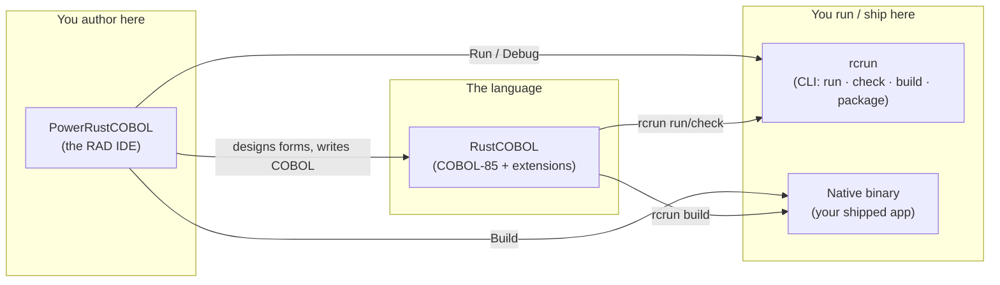
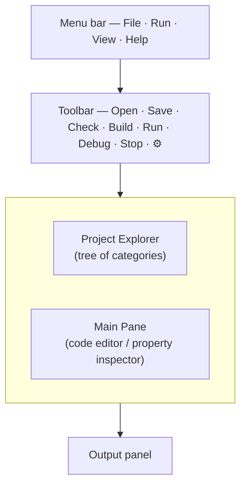
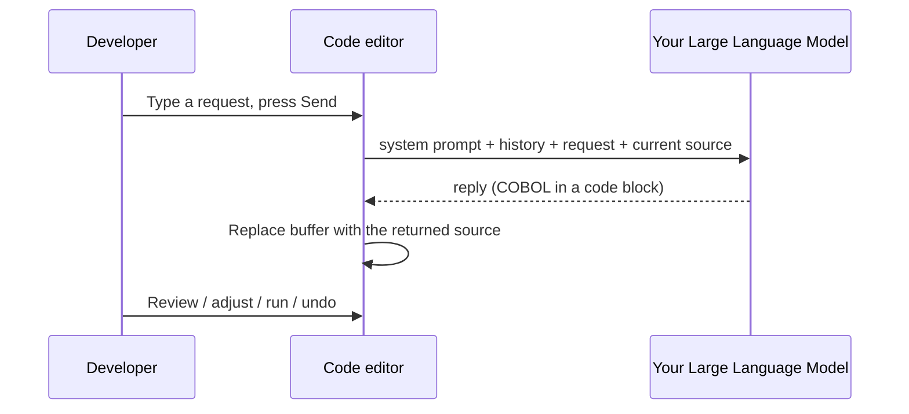
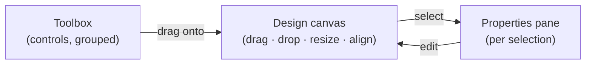
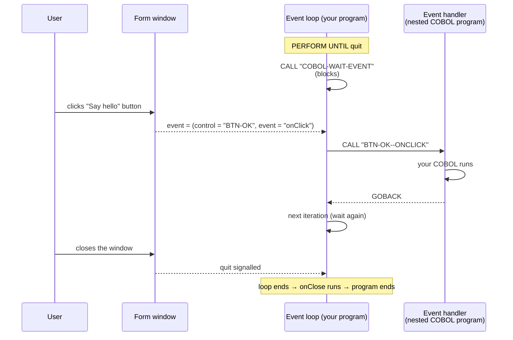
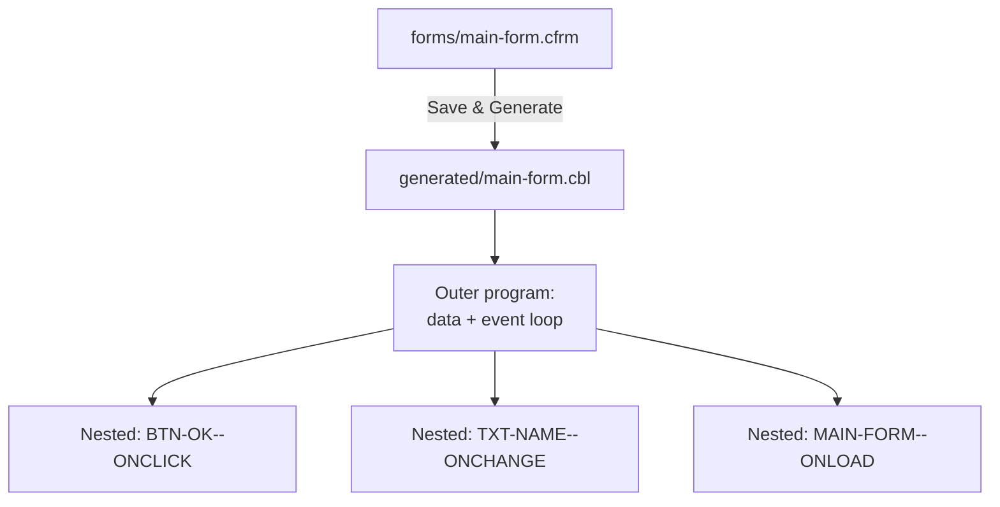
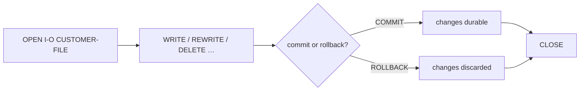
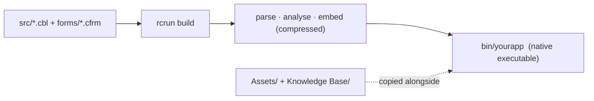
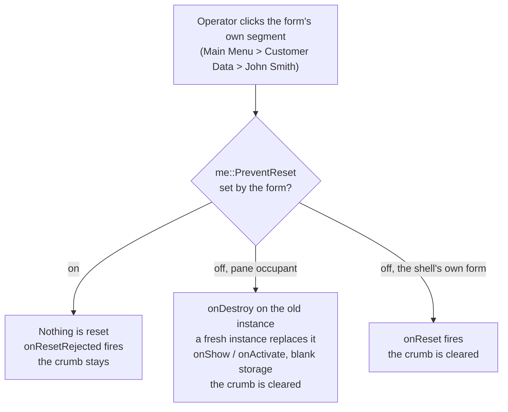

<!--
SPDX-License-Identifier: Apache-2.0
Copyright (c) 2026 Emerson Lopes and PowerRustCOBOL contributors

Licensed under the Apache License, Version 2.0.
See the LICENSE file in the project root for full license information.
-->

<!-- powerrustcobol: 1.65.124 -->

# PowerRustCOBOL AI 開発者ガイド RC4

<p align="center">
  
</p>


*PowerRustCOBOL でグラフィカルな COBOL アプリケーションを作るための実践ガイド。*

> **このガイドの対象読者。** すでに COBOL を書いていて、グラフィカルな COBOL ツール
> — たとえば富士通の **PowerCOBOL for Windows** や **Veryant isCOBOL** — で画面
> ベースやウィンドウベースのアプリケーションを作ったことがある方です。
> `IDENTIFICATION DIVISION`、`PERFORM`、`OPEN`/`READ`/`WRITE`、索引ファイル、そして
> *イベント* を発生させる *コントロール* を持つ *フォーム* という考え方をご存じで
> しょう。本ガイドは、その勘どころを PowerRustCOBOL に置き換え、新しくなった点を
> すべて示します。**ホスト実装言語の予備知識は前提とも要件ともしません** —
> アプリケーションを作るために COBOL 以外のものを読み書きする必要は一切ありません。

---

## 目次

1. [PowerRustCOBOL とは何か、なぜ存在するのか](#1-powerrustcobol-とは何かなぜ存在するのか)
2. [三つの部品: RustCOBOL、PowerRustCOBOL、rcrun](#2-三つの部品)
3. [インストールと起動](#3-インストールと起動)
4. [最初のアプリケーション: Hello, Form](#4-最初のアプリケーション-hello-form)
5. [IDE をひと目で](#5-ide-をひと目で)
   - [ウィンドウ効果](#ウィンドウ効果)
6. [プロジェクトとプロジェクトモデル](#6-プロジェクトとプロジェクトモデル)
7. [Form Designer (RAD)](#7-form-designer-rad)
8. [コントロールカタログ](#8-コントロールカタログ)
9. [プロパティ](#9-プロパティ)
10. [イベント駆動のプログラミング](#10-イベント駆動のプログラミング)
11. [COBOL から UI に話しかける](#11-cobol-から-ui-に話しかける)
12. [生成されるコード](#12-生成されるコード)
13. [RustCOBOL 言語](#13-rustcobol-言語)
    - [規格が許すとおりに書く](#規格が許すとおりに書く)
    - [表ぜんぶを関数に渡す](#表ぜんぶを関数に渡す)
    - [ファイルを本当に閉じる: `WITH LOCK`](#ファイルを本当に閉じる-with-lock)
    - [デバッグ行](#デバッグ行)
    - [長くて扱いにくい文字: ブロックリテラル](#長くて扱いにくい文字-ブロックリテラル)
    - [`FD` なしでテキストファイルを書く](#fd-なしでテキストファイルを書く)
14. [索引ファイル — 一級の資源](#14-索引ファイル--一級の資源)
15. [SQL データベース](#15-sql-データベース)
16. [HTTP / REST と AI エージェント](#16-http--rest-と-ai-エージェント)
17. [コマンドライン (rcrun)](#17-コマンドライン-rcrun)
18. [配布できるバイナリを作る](#18-配布できるバイナリを作る)
19. [デバッグ](#19-デバッグ)
    - [診断スイッチ (Help → Debug Settings)](#診断スイッチ-help--debug-settings)
20. [見た目と国際化](#20-見た目と国際化)
21. [COBOL Structure と共有データ](#21-cobol-structure-と共有データ)
22. [アプリケーションシェルと `super` の受け手](#22-アプリケーションシェルと-super-の受け手)
23. [注意点といまの限界](#23-注意点といまの限界)
24. [付録 A — PowerCOBOL / isCOBOL から来た方へ](#付録-a--powercobol--iscobol-から来た方へ)
25. [付録 B — 用語集](#付録-b--用語集)

---

## 1. PowerRustCOBOL とは何か、なぜ存在するのか

<!-- 📷 welcome.png — the welcome screen as it appears on first launch, before any project is open. -->

<p align="center"></p>


何十年ものあいだ、**ウィンドウを持つイベント駆動の COBOL** を書く唯一の方法は、
ひとつの OS、ひとつのベンダー、ひとつのライセンス形態に縛られた商用ツールチェーン
を買うことでした。それらは当時としては優れた道具でしたが、今ではほとんどが Windows
に閉じ込められ、閉鎖的で、現代のマシンへ配備するのがますます難しくなっています。
給与計算、在庫管理、銀行の後方事務といった一世代分の業務ロジックがこのスタイルで
書かれ、そして行き場を失っています。

**PowerRustCOBOL は、その開発スタイルに新しく開かれた住処を与えるために存在します。**
次のことができる高速アプリケーション開発 (RAD) 環境です。

- キャンバスにコントロールをドラッグしてウィンドウ (「フォーム」) を設計する、
- それらのコントロールに **COBOL** のイベントハンドラーを結び付ける、
- そして結果を **単一の自己完結型ネイティブ実行ファイル** として実行・デバッグ・
  出荷する — 配布先のマシンにランタイムを入れる必要はありません。

設計目標を平たく言えば次のとおりです。


| 目標 | あなたにとっての意味 |
| ---- | -------------------- |
| **COBOL ファースト** | アプリケーションそのものが COBOL です。デザイナーが COBOL を生成し、イベントハンドラーは COBOL-85 の入れ子プログラムです。言語から出ることは一度もありません。 |
| **クロスプラットフォーム** | IDE も生成される実行ファイルも、ひとつの OS に縛られません。 |
| **自己完結** | ビルドされたアプリケーションは必要なものをすべて内包します。エンドユーザーが PowerRustCOBOL を導入する必要はありません。 |
| **現代的なデータアクセス** | クラッシュに強い索引 (ISAM) ファイル、SQL (SQLite / PostgreSQL / MySQL)、HTTP/REST に、ふつうの `CALL` 文から手が届きます。 |
| **オープン** | Apache-2.0 ライセンスです。 |

> **注記。** PowerRustCOBOL は往年のグラフィカル COBOL RAD の生産性に*着想を得て*
> いますが、独立した独自の実装です。「フォーム」「コントロール」「イベント」と
> いった概念は業界標準のものですが、ここで説明する構文、ファイル形式、生成コード、
> 組み込みサービスは PowerRustCOBOL 固有であり、他のいかなるベンダーのツールとも
> 互換性はありません。

---

## 2. 三つの部品

PowerRustCOBOL は、協調して働く三つのツールとして配布されます。どれがどれかを知って
おくと、早い段階で多くの混乱がなくなります。




| 名前 | 役割 | こう考えるとよい |
| ---- | ---- | ---------------- |
| **RustCOBOL** | COBOL-85 言語方言に PowerRustCOBOL の拡張 (GUI 呼び出し、索引ファイル句、SQL/HTTP) を加えたもの。 | コンパイラー/ランタイムの「言語」。 |
| **PowerRustCOBOL** | デスクトップ IDE。プロジェクトエクスプローラー、コードエディター、**Form Designer**、デバッガー。 | 「ワークベンチ」「スタジオ」。 |
| **rcrun** | コマンドラインのランタイム、チェッカー、パッケージャー、バイナリコンパイラー。 | CI でスクリプト化できる「ランタイム + ビルドツール」。 |


> ⚠️ **名前についての注意。** 内部的には、一部のビルド生成物やフォルダーが
> `cobolt-*` という名前になっています。これは実装上の細部です。利用者から見える
> 名前は **RustCOBOL**、**PowerRustCOBOL**、**rcrun** です。

---

## 3. インストールと起動

リリースごとに、各プラットフォームへ **2 種類のダウンロード** が用意されます。
どちらも完全なもので、同じアプリケーション、同じ `rcrun`、同じテーマ・サンプル・
プラットフォーム SDK を含みます。

| お使いのマシン | インストーラー | アーカイブ |
| --- | --- | --- |
| Windows 10 / 11、64 ビット | `.msi` — ダブルクリック、または `msiexec /i … /quiet` で無人配備 | `.zip` |
| Apple Silicon の Mac | `.dmg` — PowerRustCOBOL を Applications へドラッグ | `.tar.gz` |
| Intel の Mac | `.dmg` | `.tar.gz` |
| Debian、Ubuntu、Mint とその系列 | `.deb` — `sudo apt install ./PowerRustCOBOL-*.deb` | `.tar.gz` |
| Fedora、RHEL、CentOS Stream、openSUSE | `.rpm` — `sudo dnf install ./PowerRustCOBOL-*.rpm` | `.tar.gz` |
| その他の 64 ビット Linux | — | `.tar.gz` |

ふつうに欲しいもの — スタートメニューや Applications への登録、デスクトップの
ランチャー、`PATH` の通った `rcrun`、そして後できれいに削除する手段 — が必要なら
**インストーラー** を選んでください。何もインストールしたくなければ
**アーカイブ** です。どこに展開しても実行でき、USB メモリーからでも、ソフトウェア
を導入できないマシンからでも動きます。Linux のパッケージはどちらもアプリケーション
を `/opt/powerrustcobol` に置き、`powerrustcobol` と `rcrun` を `/usr/bin` へ
リンクします。それ以外のディストリビューションではアーカイブが配布形式です。

> ⚠️ **どちらもまだ署名されていない** ため、各プラットフォームは初回実行時に一度
> 警告を出します。**macOS** では、アプリケーションを右クリックして *Open* を選ぶ
> か、`xattr -dr com.apple.quarantine PowerRustCOBOL.app` で検疫フラグを外して
> ください。**Windows** では SmartScreen が *More info* → *Run anyway* を提示
> します。ここではインストーラーがアーカイブより信頼されるということはありません。
> 警告は証明書がないことについてのものであって、形式についてではないからです。

Linux には glibc 2.35 以降 (Ubuntu 22.04+、Debian 12+、Fedora 36+) と、デスク
トップ環境がすでに提供している OpenGL、X11 または Wayland のライブラリーが必要です。

IDE を起動します。初回実行では空のワークスペースと
*「Open a COBOL file to get started.」* というメッセージが出迎えます。単一の
`.cbl` ファイルを開くことも、完全な **プロジェクト** を作ることもできます
(§6 参照。プロジェクトを推奨します)。

<p align="center"></p>


ターミナルからは `rcrun` ですべてを画面なしで動かすこともできます (§17)。継続的
インテグレーションのパイプラインが使っているのがこれです。

### 初回実行時の Rust チェック


IDE はフォームの設計とプログラムの *実行* を自力で行います。例外は **Build** です。
これは **Rust ツールチェーン** (§18) を通してプロジェクトをネイティブアプリケー
ションへコンパイルします。`EXEC RUST` ブロックを含むプログラムの Run も同様です。
そのため PowerRustCOBOL は初回実行時に Rust を探し — 使えるものが見つかれば、
何も言いません。

見つからないときは、どちらの状況なのか — Rust がない、あるいは PowerRustCOBOL が
要求する **1.92** より古い版である — を伝え、公式の [rustup.rs](https://rustup.rs)
のコマンドを示し、代わりに実行しましょうかと尋ねます。断るともう一度だけ尋ねます。
断ることには、述べておく価値のある代償があるからです。


| Rust なしで失うもの | 残るもの |
| ------------------- | -------- |
| **Build** — ネイティブ実行ファイルは作れず、パッケージするものもない | Form Designer |
| `EXEC RUST` ブロックを含むプログラムの実行 | コードエディターと COBOL のツール群 |
|  | **Run** (インタープリター実行) とデバッガー |

二度目に断ると決着し、以後この質問は出ません。あとから
[rustup.rs](https://rustup.rs) で Rust を入れれば **Build** はそのまま動き始めます。
IDE に何かを教える必要はありません。

> **注記** — rustup は Rust を `~/.cargo/bin` に置き、そこへ `PATH` を通すのは
> *シェルのプロファイル* です。Finder や Windows のデスクトップから起動した
> アプリケーションはそのプロファイルを読みません。そこで PowerRustCOBOL 自身が
> この場所を見に行き、見つけたものを使います。**Build** を動かすために IDE を
> ターミナルから起動する必要はありません。

#### Rust は入っているのに Build が最後まで通らない

前提条件はもう一つあり、rustup はそれを入れも触れもしません。**リンカー** です。
コンパイルが生むのは機械語で、その機械語を実行ファイルにまとめるのがリンカーです。
そしてリンカーは Rust ではなく OS 側のものです。

| プラットフォーム | リンカーを提供するもの |
| ---------------- | ---------------------- |
| **Windows** | Microsoft の C++ ビルドツール — *Build Tools for Visual Studio* (または Visual Studio) の **Desktop development with C++** ワークロード。Visual Studio Code は別の製品で、これは提供しません。 |
| **macOS**   | Apple のコマンドライン開発者ツール — `xcode-select --install` |
| **Linux**   | ディストリビューションの C ツールチェーン — Debian と Ubuntu では `build-essential`、Fedora と RHEL では *Development Tools* |

初回実行時のチェックはこの問いにも答えます。何もしないプログラムを Rust にリンク
させてみるのです。Windows ではリンカーが `PATH` ではなく Visual Studio の
インストールを通じて見つかるため、これが確実に知る唯一の方法だからです。リンクでき
なければ、IDE は初回実行時にそう伝え、リンカーの名前を挙げ、それを入れるコマンドを
示します。受け入れるか断るかというものではありません。選択ではなく、まだ足りない
唯一のものだからです。

もし後になって出くわした場合 — 以前はビルドの最後で表面化していました — **Build**
はコンパイラーの生の出力ではなく、同じことを同じ言葉で報告します。その間も他は
すべて動いています。Form Designer、エディター、**Run**、デバッガーはどれも
リンカーを必要としたことがありません。

---

## 4. 最初のアプリケーション: Hello, Form

この手順では、メッセージを表示するボタン 1 個のウィンドウを作ります。

1. **プロジェクトを作る。** `File ▸ New Project…` で名前 (たとえば
   `HelloPower`) とメインプログラムを指定します。IDE は標準のフォルダー構成を
   ディスク上に作り、**すぐ実行できる `main` の雛形プログラム** (その場で Run
   できる小さな `DISPLAY`/`GOBACK`) も併せて作って、エディターで開きます
   (§6 参照)。
2. **フォームを作る。** プロジェクトツリーで **Forms** の隣の **➕** を
   クリックします。*New Form* ダイアログが開くので、名前 (`main-form`)、
   タイトル、サイズを決めて作成します。フォームは `forms/` の下に保存され、
   **Form Designer** で開きます。
3. **ボタンを置く。** ツールボックスから **Button** をキャンバスへドラッグ
   します。選択した状態で、プロパティペインの `Caption` を `Say hello` に
   します。
4. **ラベルを置く。** ツールボックスから **Label** をキャンバスへドラッグ
   します。
5. **ハンドラーを結び付ける。** ボタンを選んだまま **`onClick`** イベントを
   見つけ、クリックして COBOL のイベントエディターを開きます。たとえば次のように
   入力します。

   ```cobol
              SET Label-1::Caption TO "Hello from COBOL!".
   ```

<!-- 📷 first-form-designer.png — Capture the Form Designer with the single button selected and the `onClick` event highlighted in the properties pane. -->
<p align="center"></p>


6. **実行する。** ツールバーの **Run** (またはデザイナーの ▶) を押します。
   フォームが現れ、ボタンをクリックするとハンドラーが実行されます。

<!-- 📷 firstform.png — Capture the running form after the button has been clicked, with the greeting showing in the label. -->
<p align="center"></p>


> **注記。** フォームを保存または実行すると、PowerRustCOBOL はそのフォームの
> COBOL ソースファイルを **生成** します (§12 参照)。このファイルを手で編集する
> ことは決してありません。ビルド生成物だからです。


---

## 5. IDE をひと目で



- **Project Explorer (左)。** プロジェクトを根とするツリーです。固定の 7 つの
  カテゴリー — **Forms**、**Indexed Files**、**Common Code**、
  **Generated Code**、**Project's Crates (Beta)**、**Assets**、
  **Knowledge Base** — があり、それぞれに **➕** ボタンが付きます。例外は
  **Generated Code** で、これは Form Designer が自分で埋めるため、手で追加する
  ことはありません。各項目の左には **状態の「つまみ」** があります。🟢 緑 =
  チェック/テスト済みで問題なし、🟡 黄 = 前回のチェック以降に変更あり、
  🔴 赤 = 問題が報告された、という意味です。フォームを展開するとコントロールが
  ツールボックスのカテゴリー別に並び、各コントロールを展開すると **Events** が
  現れます。索引ファイルを展開するとレコードの項目が (フォームのコントロールと
  同じように) 現れます。**いちばん上の根ノード** (📁 プロジェクト名) を
  いつでもクリックすれば、プロジェクト設定のフォーム全体がメイン作業領域に
  表示されます。

### フォルダーでプロジェクトツリーを整理する

どのカテゴリーも **フォルダー** の階層を自由に持てるので、大規模で業務向けの
プロジェクトでも見通しを保てます (たとえば `forms/customers/`、`src/billing/`)。

- **フォルダーを作る。** カテゴリーの見出しにある **📁+** ボタンを押すとその
  直下にフォルダーが増えます。任意のフォルダーを右クリックして
  **New folder…** を選べば、その中に入れ子で作れます。
- **フォルダーの名前を変える。** フォルダーを右クリックして
  **Rename folder…** を選びます。そのフォルダーの下でプロジェクトが管理している
  ファイルはすべて — そしてそれを指して開いているエディタータブも — 自動的に
  変更に追随します。
- **フォルダーを削除する。** 右クリックして **Delete folder…** を選びます。
  確認すると、そのフォルダーと **中身すべてがディスクから完全に削除され**、
  ファイルはプロジェクトから外れ、それらを表示していたエディターは閉じられます。
  取り消しはできません。

フォルダーのパスは常に **プロジェクトフォルダーからの相対** で保存されるため、
プロジェクトを移動しても、zip に固めても、共有しても、参照が壊れることはありません。

### ファイルの移動: ドラッグ & ドロップ

- **ツリーの内側で。** ファイルを別のフォルダー (またはカテゴリーの見出し) の上へ
  ドラッグすると、そこへ移動します。ディスク上でも移動し、プロジェクトの登録内容も
  更新されます。同じ名前の既存ファイルを上書きすることはできず、フォルダーを
  自分自身の中へ落とすこともできません。
- **OS から。** Finder やエクスプローラーからフォルダーやカテゴリーへファイルを
  ドラッグすると取り込めます。ファイルはプロジェクトの中へコピーされ、相対パスで
  管理されます。種類が行き先のカテゴリーに合わないファイル (たとえば `.cfrm` を
  Common Code に落とした場合) は受け付けられません。

### キーボード操作

ポインターをプロジェクトツリーの上に置いていれば、マウスなしで移動できます。

- **↑ / ↓** — ひとつ前 / 次の表示行へ移ります。要素はただちに読み込まれ
  (シングルクリックと同じく、プロパティまたはエディターが開きます)、強調表示中の
  行が上端・下端から 1 行分の余裕をもって見え続けるよう、ツリーは必要なだけ
  スクロールします。
- **→** — たたまれたフォルダーを開きます。すでに開いていれば最初の子へ移ります。
- **←** — 親フォルダーへ戻ります。
- **Enter** — 選択中の項目を開きます (シングルクリックと同じ)。

初回起動時 (またはプロジェクトを開いていないとき) は、メニューバー/ツールバーの
下の使用可能な領域の中央に、情報がひとかたまりに中央寄せされた
(タイトル + ライセンス + 空行 1 行 + 引用 + 著者) 全面のウェルカムペインが
ひとつだけ表示されます。

Welcome to PowerRustCOBOL <バージョン>
License: Apache 2.0

<空行>
<緑色の引用文。組み込みの一覧から周期ごとにランダムに選ばれる>
— <水色の著者名>

引用は 7.5 秒ごとにランダムに切り替わります (1 秒かけてフェードイン、6 秒表示、
0.5 秒かけてフェードアウト)。左のツリー、エディター、出力、そしてエディター固有の
コントロールは、File → New Project または File → Open Project を使うまで隠れて
います。プロジェクトを開くと、通常の 3 ペイン構成のワークスペースが現れます。
完全なガイドは docs/ フォルダーにあります。

- **ツールバー (上)。** `Open · Save · Check · Build · Run · Debug · Stop`、
  そして右端に言語セレクター。*Run* はプログラムをインタープリターで実行し、
  *Build* はネイティブバイナリをコンパイルし、*Check* は構文解析と意味解析だけを
  行います。*Debug* は Generated Code の項目を選んでいるときに有効になります。
- **メインペイン (中央 / ツリーの右)。** コードエディター、**プロパティ
  インスペクター** (ツリーでフォームやコントロールをクリックしたとき)、
  **またはプロジェクト設定フォーム** (ツリー最上部のプロジェクトルートを
  クリックしたとき、あるいは IDE がプロジェクトを最初に開いたとき — エディターは
  表示されません) を表示します。プロジェクトツリーの上にある **👑 Grace**
  ボタンは、プロジェクト全体を担当する Grace チャットボットをこのペインに
  開きます。これはコントロールのプロパティインスペクターとまったく同じガラス
  ペイン構成 (CentralPanel + ガラスフレーム) を使っており、幅が揃い (右端で
  足りなくなることがなく)、高さは 100 % で振る舞います (ウィンドウや分割線の
  サイズ変更時に、Output パネルより上の使用可能領域に合わせてペインが伸び縮み
  します)。カードの丸い下辺の枠線は、フレームの下側外マージンによって出力/
  コンソールのはっきり上に、目に見える間隔を空けて保たれます。Save/Cancel
  ボタンはカードの下部にあります。プロジェクトツリーの最上部 (📁 プロジェクト名
  の行) をいつクリックしても開けます。内容を上から下まで貫く、連続した縦の
  リサイザー線が 1 本あります。左のラベルは決して折り返さず、`…` で切り詰められ
  (たとえば `Standard system p…`)、開発者はリサイザーを自由にドラッグできます
  (分割位置はラベルの長さと無関係に、ペイン幅の 80 % まで動きます)。右の
  コントロールは伸縮し、10 px の間隔を置いてすべて同じ x 位置から始まるため、
  どのプロパティ値も縦にきれいに揃います。セクションは順に Project、
  AI assistant、Appearance、License、Integrations、Runtime です。AI の設定
  (Agents Manager、Model Providers Manager、Model Leaderboard) は Project の
  すぐ下にあり、一度決めたらめったに触らないライセンス本文をスクロールで
  通り過ぎずにたどり着けます。カードの下部には明示的な **Save** と **Cancel**
  のボタンがあります (Cancel は変更後にのみ有効になり、最後に保存した状態へ
  戻します)。リサイザー線は現在のテーマに従います (ポインターを乗せたときや
  ドラッグ中は明るくなります)。コードエディターは (表示されているとき) 下辺に
  **ステータスバー** を備えます — キャレットの `Ln, Col`、**Insert/Overwrite**
  モード (`Insert` キーで切り替え)、**Trim on save** の切り替え (保存時に行末の
  空白を取り除く)、そして Markdown 以外の文書では **Beautify** コマンド
  (後述の *Beautify — 整形規則* で説明する規則に従って COBOL を整形し直します)。
  Markdown ファイルに Beautify がないのは、COBOL の整形が当てはまらないからです。

<!-- 📷 project-settings-form.png — Show the left tree with the root node highlighted (hand cursor), and the main area with the two-column settings form inside its glass card (single continuous vertical resizer line, labels truncated with … before the line, all value controls aligned on the right, Save/Cancel at the bottom of the card). The card's rounded bottom border must be clearly visible above the Output panel with a gap (no… -->

<p align="center"></p>

- **Output パネル (下)。** プログラムの `DISPLAY` 出力、ビルドログ、状態
  メッセージ。

<!-- 📷 ide-overview.png — A full-window capture with a project open, a form selected (so the property inspector is visible), and some text in the Output panel. Annotate the four regions if you can. -->

<p align="center"></p>

### AI アシスタント (任意)

PowerRustCOBOL は、大規模言語モデル — ご自身で用意したもの、できればこの文書で
学習させたもの — をコードエディターのすぐ上に置けます。アシスタントは
**完全に任意で、既定では無効** です。接続情報を入力するまで、プロンプトバーは
一度も現れません。

**プロジェクトルートの設定フォームから設定します。** プロジェクトツリーの
最上位ノード (プロジェクト名の付いた 📁 の行) をクリックしてください。フォームの
**AI assistant** セクションで接続情報を入力できます。AI の振る舞いとエージェントは
開いているプロジェクトに属し、その `cobolt.toml` と `agentic_ai/` ディレクトリと
一緒に移動します。プロバイダーの設定と API キーはマシンローカルであり、
リポジトリに入って移動することは決してありません。


| 項目 | 意味 |
| ---- | ---- |
| **Endpoint URL** | モデルの完全な URL。`https://…/v1/chat/completions` のような OpenAI 互換のチャットエンドポイント、または xAI/Grok の Responses エンドポイント `https://api.x.ai/v1/responses` を使います。手を加えていないプロバイダー既定値には、慣例的なリクエストパスが自動的に付きます。この欄をいったん編集すると、IDE は入力されたとおりの URL を使います。 |
| **API key** | `Authorization: Bearer …` として送られます。キー不要のローカルエンドポイントでは空のままにします。ここに入力したキーは、Model Providers Manager と同じように、その **プロバイダー** を設定し、このマシンにのみ保存されます。空欄は、そのプロバイダーの資格情報がここに保存されていないことを意味します。 |
| **Model** | 各リクエストで渡すモデル識別子。 |
| **Reviewer model (Pedantic Agent)** | 主エージェントの回答を一切妥協なく精査する、任意の 2 つめのモデル。設定する場合は主モデルと別でなければなりません (IDE が強制します)。レビュアーを設定すると **COBOL Proficiency** のチェックが連動して動きます。主モデルが答え、Pedantic Agent が主プロンプトを正典の仕様として突き合わせ、欠陥が見つかれば完全に訂正した再提出を要求し、その改訂をもう一度レビューし、最終的に容赦なく率直な評価を出します。ダッシュボードに出るのは *レビュアーの* 点数であって、モデルの自己採点ではありません。 |
| **Temperature** | サンプリングのランダムさ (0 = 決定的)。接続テストはこの値をそのまま使います。プロバイダー既定値 — たいてい `1.0` — しか受け付けないモデルがあるためです。 |
| **Standard system prompt** | 毎回のリクエストで送られる指示。無難な既定値が用意されています。お使いのモデルに合わせて編集してください。 |

**Model Providers Manager。** プロジェクト設定の *Manage agents…* の隣に
**Model Providers Manager…** があります。ここで設定するのは **プロバイダー** —
そのエンドポイントと API キー — だけです。プロバイダーのキーが通った瞬間から、
**そのプロバイダーが提供するすべてのモデル** がどのエージェントからも使えるように
なります。モデルごとの設定は一切ありません。左の一覧からプロバイダーを選び
(塗りつぶしの点は設定済みを表します)、別のホストが必要ならエンドポイントを調整し、
キーを貼り付けて、**Refresh models** で現在のカタログを取得します。**Test** は
リクエストを 1 回送るので、頼りにする前に資格情報を確認できます。

**呼び出しが失敗したとき。** エラーウィンドウは、理由を最上部の独立した 1 行として、
罫線の上に表示し、その下に完全な接続ログを置きます。見出しはプロバイダー自身の
文をそのまま引用したもの — *「You exceeded your current quota, please check your
plan and billing details」*、*「'temperature' is not supported with this model」* —
で、その文が触れていない場合に限り、プロバイダーが挙げたリクエスト項目やエラー
コードを下に示します。下のログは元のまま完全です。**Copy** と **Save…** は見出し
ではなく全体を持っていきます。そうした文を含まない応答のエラーには見出しが付き
ません。言われていないことの要約を見せられることはありません。

**注記 — 推論モデルもテストには通ります。** *Test* が問うのは一つだけです。
このモデルに到達でき、応答があるか。モデルによっては話す前に考え、これほど小さな
リクエストでは隠れた推論しか返しません。エンドポイントは解決し、キーは受理され、
トークンは返ってきたが、目に見えるテキストは返らなかった、という状態です。これは
合格と数え、結果にもそう書かれます。目に見えるテキストを必要とするのは
エージェントだけです。エージェントは応答をフォーム操作として解釈するため、決して
見えない推論は適用できません。ですから、エージェントに隠れた推論だけを返すモデルは
*そちらでは* 使えないと報告され、そのモデルでは思考を切るようにという同じ助言が
付きます。

右側のプロバイダーパネルは **スクロールします** — エンドポイント、キー、モデル、
*Where keys are kept* のいずれも、ウィンドウをどれだけ小さくしても手が届き、
左のプロバイダー一覧はそれとは独立にスクロールします。

プロバイダーの設定は **マシン全体** に効き、プロジェクトではなく他のマシンローカル
設定の隣に保存されます。Anthropic を一度設定すれば、このマシンのどのプロジェクト
からも使えます。API キーがプロジェクトファイル、生成された COBOL、コンパイル済み
またはパッケージ済みのアプリケーションに書き込まれることは **決してありません**。
ローカルの Ollama にはキーそのものが不要で、到達できるエンドポイントがあれば
十分です。

> **注記。** これは以前の *Models Manager* を置き換えるものです。あちらでは接続を
> *モデル* ごとに一度定義し、名前付きの「モデルプロファイル」としてエージェントが
> 参照していました。すでに課金しているプロバイダーの 2 つめのモデルを使うには、
> プロファイルをまるごともう一つ作り、同じキーを貼り直す必要がありました。
>
> **既存のプロジェクトは自分で移行します。** 最初に開いたとき、各エージェントは
> 参照していたプロファイルのプロバイダー、モデル、温度、出力トークン上限、
> タイムアウトを引き継ぎ、各プロバイダーはそれらのプロファイルが知っていた内容から
> 設定されます。こちらから尋ねることはなく、入力し直すものもありません。
> ⚠️ 1 つのプロバイダーが持てるキーは **1 つ** になったので、同じプロバイダーに
> *異なる* キーのプロファイルが複数あった場合、いちばん新しく保存されたものが残り、
> 残りは Output パネルに名前が出ます。欲しかったのがそちらなら、Model Providers
> Manager で入力し直してください。

#### キーはどこに保管されるか

既定では、キーは **1 回の実行** のあいだだけ生きます。ディスクには何も書かれず、
次に IDE を開くとまた尋ねられます。これは意図的です — ディスク上のキーは、
コピーされ、バックアップされ、コミットされうるキーだからです — が、面倒ではある
ので、Model Providers Manager の下部で自分で決められます。


| 選択肢 | 何が起きるか |
| ------ | ------------ |
| **Not kept** | 既定。キーはこのプロセスの中だけに存在し、次回の実行でまた尋ねられます。 |
| **A local file** | モデル設定全体が、キーも含めて、指定した名前のファイルに書かれます。所有者だけが読める形で作成され (macOS と Linux では `0600`)、先頭に平文の警告が入ります。IDE を開き直すとキーをそのまま拾い直します。 |
| **The OS credential store** | プラットフォーム自身の保管庫 — Keychain、Credential Manager、Secret Service。提示はされますが **まだ選べません。正式リリースで入ります**。中身を確認・更新・消去できる UI が整ってからです。 |

**ファイルを git リポジトリの中に置くことは決してできません。** これは好みの問題
ではなく、上書きする手段もありません。選んだパスが `.git` の下のどこか — リポジトリ
のルート、10 階層下、サブモジュールや `git worktree` のチェックアウト — にあれば
拒否され、どのリポジトリに当たったのか分かるよう、拒否メッセージがリポジトリ名を
挙げます。コミットされたキーは公開されたキーであり、公開されたキーは取り戻せません。

`/tmp/llm_config.json` が最初に提示されるのは、まさにそのためです。`/tmp` の中身は
コミットできず、再起動で消えます — 資格情報にとって、それは長所です。提示された
パスをクリックするか自分で入力し、**Use this file** を押せば、設定を保存した時点で
キーが書き込まれます。**Forget the file** はそのファイルを削除し、キーを一切
保管しない状態に戻します。

マシン全体の設定ファイルは変わりません。相変わらず **資格情報は一切持たず**、
キーの置き場所という選択と、選んだパスだけを保持します。マネージャーでキーを削除
すれば、やはり削除されます — 明示的な削除は、覚えているファイルに常に優先します。

> ⚠️ **注意。** ファイルはキーを平文で保持します。守っているのはファイル権限だけ
> です。あなたの権限で動くものはすべて読めますし、そのフォルダーをコピーする
> バックアップにはすべて入ります。それが受け入れられないなら、OS の資格情報保管庫が
> 正式リリースで届くまで、選択は **Not kept** のままにしてください。

**Agents Manager。** *AI agents* の行は、プロジェクトに用意されたエージェントの
データベースを 3 つのタブで開きます。

**タブ 1 — Agent × Model。** エージェントごとに 1 行 — Grace、各スペシャリスト、
各レビュアー、そして COBOL Proficiency Judge — そのエージェントの動き方を決める
項目が並びます。


| 列 | 意味 |
| -- | ---- |
| **Agents** | その行が設定するエージェント。 |
| **Models** | どのモデルで動くか。表の上の **Model provider** ボックスで選んだプロバイダーから選びます。**— no model —** を選べば、意図的に未設定のままにできます。 |
| **Rating** | Leaderboard がそのモデルについて知っていること。一度も評価していなければ *Not tested*。 |
| **Temp** | このエージェントだけのサンプリングのランダムさ (0 = 決定的)。 |
| **Output Tokens** | このエージェントが生成してよい最大の回答長。 |
| **Timeout** | 何秒待つか。 |

**Model provider** ボックスは *選択の範囲* であって、プロジェクト全体の切り替えでは
ありません。設定作業中に Models 列がどのプロバイダーのモデルを出すかを決めるだけ
で、手を触れていないエージェントは何も変えません。ですから Grace はクラウドの
プロバイダーで動かしつつ、スペシャリストはローカルの Ollama で動かす、といったこと
ができます。各エージェントは自分のモデルがどのプロバイダー由来かを覚えています。
数百のモデルを出すプロバイダーもあるので、セレクターの隣の検索ボックスで一覧を
絞れます。

モデルが別の役割に予約されている行には、エージェント名の横に警告が出ます。
スペシャリストは Grace のモデルも Judge のモデルも使えません。(Judge は、
どのスペシャリストもそれを使っていない限り、Grace のモデルを *共有できます*。)

**プロバイダーがモデルを引退させたとき。** モデルは廃止されます — Anthropic、
OpenAI、Meta その他が、それぞれの都合で取り下げます — そして、もう存在しない
モデルの順位は、順位がないことより悪いのです。選びたくなってしまうからです。
そこで、Model Providers Manager での更新がカタログを返してきた場合、そのカタログに
もう載っていない当該プロバイダーのモデルを Leaderboard から外し、どれを外したかを
Output ペインに書きます。

これができるのは **実際にモデルを列挙できた** 更新だけで、しかも列挙したその
プロバイダーについてだけです。失敗したリクエスト、期限切れのキー、まだ更新して
いないプロバイダーは、いずれも空の一覧を返しますが、それは何が存在するかについて
何も語っていません。ですから空の結果は何も削除しません。自分で引退させることも
できます。Leaderboard の各行には **Remove** があり、カタログが追いつく前に
プロバイダーがモデルを止めてしまった場合に使えます。確認を求めるのは、順位付けが
実際のトークンと実際の時間を消費するからです。

なくなったモデルで動いていたエージェントがあれば、Agents Manager がその
エージェントを開いた状態で立ち上がるので、すぐ別のモデルを与えられます。
引退したモデルを指したままのエージェントこそが、実際に実行を壊す部分であり、
次のワークフローで接続エラーとして知るのは高くつく学び方です。

削除は残ります。引退したモデルは、次のプロジェクト同期でも、保存済みベンチマーク
レポートの再生でも、戻ってきません。`agentic_ai/model-benchmarks.jsonl` の保存分は
そのままです — それらのレポートは、あなたが何を実行し、いくら払ったかの記録であり、
ここでの処理はそれを消しません。**引退したモデルをもう一度テストすれば戻ってきます**。
新しい結果付きで戻るので、納得のいかない引退は 1 回の実行で取り消せます。

**タブ 2 — Agent Configuration。** 左のエージェント一覧が右の詳細ペインを動かします。
**Agent Details** (id、名前、種別、専門、目的、有効かどうか)、プロンプトエディター、
能力、知識、関係です。

**タブ 3 — User Guide。** モデルとエージェントがどう噛み合うのかを書いたガイドで、
インターフェイスの言語で表示されます。4 つの節はそれぞれ、まず平易な説明で始まり、
次に踏み込み、最後に正確な仕様を述べます — 役に立つところまで読んで、やめてください。
エージェントとモデルの組み合わせと共有の規則、各設定が何をするのか、なぜいちばん
強いモデルは書き手ではなくレビュアーと Judge に付けるべきなのか、そして語彙
(モデル、エージェント、Pedantic レビュアー、Judge、トークンとその費用、ローカル
モデル、量子化、そしてローカルモデルが使えるかどうかを決める数字がなぜ VRAM なのか)
を扱います。検索は一致箇所を強調して順に移動でき、文字サイズは調整でき、目次から
飛べ、**Export PDF** でガイド全体を書き出せます。

フッターには **Cancel**、**Apply** (保存して作業を続ける)、**Save** があります。
内部の `agentic_ai/` ディレクトリは意図的にプロジェクトツリーから隠されています。
エージェントの設定には Agents Manager を使ってください。Grace はそこにワークフローの
記録を自動で残します。プロンプトエディターは 4 行から 20 行まで縦に伸縮でき、
長いプロンプトは高さを増やす代わりにエディター内でスクロールします。**New Agent** と
**Delete Agent** は現在隠されています。組み込みのメッシュ一式はプロジェクトとともに
作られ、修復されるからです。どちらの手順も将来の保守のために実装は残っています。
エージェントはプロジェクト内の `agentic_ai/<エージェント名>/` に住みます —
複数行のエージェントプロンプトが `<エージェント名>_prompt.md`、加えて `steering/`、
`policies.md`、`skills/`、`mcp.json`、`knowledge/`、`agent.json` (識別情報と実行時
設定 — API キーがプロジェクトに保存されることは **決してありません**。キーはあなたの
マシンに留まり、モデルごとに一度だけ尋ねられます)。エージェント名はフォルダー名に
なるため、一意で作成時に固定されます。どの主エージェントも、自分の応答をレビューする
**ペダンティックな相棒** を指名できます。主とその相棒は別のモデルでなければ
なりませんが、関係のないエージェント同士は自由にモデルを共有できます。関係は
一対一です。オーケストレーターやスペシャリストが持てる Pedantic の相棒は多くても
1 つ、Pedantic レビュアーが属せるレビュー対象も多くても 1 つです。関係は、主
エージェントの **Companion (Pedantic reviewer)** セクションからでも、Pedantic
エージェントの編集可能な **Pedantic Companion for** セクションからでも選べます。
どちらのセレクターも同じプロジェクト設定に書き込みます。Grace のプランナーと参加
エージェントは実行時に正確な関係を受け取るので、レビュアーが差し替えられたり別の
エージェントに使い回されたりすることはありません。プロジェクトの作成時には、固定の
スペシャリスト — **Form Designer Agent**、**COBOL Event Handler Script Agent**、
**Documentation Agent**、**Data (Indexed File) Agent**、**Version Control Agent** —
と、オーケストレーターの **Grace** が用意されます。それぞれの直後に自分のレビュアーが
続き、その正式名は主の名前に **Pedantic Reviewer** を付けたものです。

- **Grace Pedantic Reviewer**
- **Form Designer Agent Pedantic Reviewer**
- **COBOL Event Handler Script Agent Pedantic Reviewer**
- **Documentation Agent Pedantic Reviewer**
- **Data (Indexed File) Agent Pedantic Reviewer**
- **Version Control Agent Pedantic Reviewer**

どのレビュアーも、目的に応じたプロンプト、説明、ルーティング契約、一対一の相棒
リンクを備えて作られます。開発者はそのモデルプロファイルを選び、プロンプト、
スキル、ツール、知識を整えられます。レビュアーを手作業で作ったり結び付けたりする
必要はありません。既存のプロジェクトを開くと、同じ冪等な修復が走ります。欠けている
組み込みレビュアーは再作成されて結び直され、中身のあるプロジェクトのプロンプトや
その他の開発者設定はそのまま優先されます。古いレビュアー名はその場で移行され、
安定した ID も選択済みのプロファイルも変わりません。

Grace は引き続き唯一の調整権限です (👑、常に Grace という名で、削除できません)。
複数エージェントの作業を計画し、種別と専門に応じてスペシャリストに委任し、
ペダンティックなレビュー関門をすべて守らせ、検証済みの最終成果をまとめます。
**Grace Pedantic Reviewer** の既定プロンプトは、要求の網羅、タスク分解、担当、
依存関係、文書の統制、証跡、エージェント間の統合、失敗、そして完了の主張を
レビューします。プロジェクトローカルのレビュアープロンプトは Agents Manager で
編集でき、固定エージェントの修復はその編集を保ちます。レビュー接続を有効にする前に、
実行時テーブルで各レビュアーにモデルを与えてください。主とその Pedantic の相棒は
同じモデルを使えません。

**Grace が動く代わりに尋ねるとき。** 2 通り以上に読める依頼には、当て推量ではなく
質問が返ります — 同じチャットの中の赤い吹き出しで、どこが曖昧なのかをはっきり
名指しします。同じ入力欄に、どれだけ短くても構わないので答えてください
(「the Caption」「UUID」「aas-clientes」)。答えは、それが答えている質問を伴って
戻るので、Grace はあなたの判断を反映したうえで元の依頼を再開します。何を頼んだのか
を言い直す必要はありません。代わりに別のことを入力すれば、それが新しい依頼となり、
質問は破棄されます。

組み込みのルーティング契約は明示的です。Form Designer Agent は RAD のフォーム設計を
担当し、イベントの実装は委任します。COBOL Event Handler Script Agent は、委任された
その振る舞いをそのまま実装します。プロジェクトの文書を書き、索引ファイルスキーマの
正規化された引き継ぎを用意するのは Documentation Agent だけです。Indexed File の
UI モデルを通じて `.cidx` 定義を保守するのは Data (Indexed File) Agent だけです。
Version Control Agent は、証跡と確認関門を伴うプロジェクトの Git 操作を担当します。
そして Grace Pedantic Reviewer がレビューするのは Grace のオーケストレーションだけ
です。各エージェントは役割ごとの既定プロンプトを受け取ります。空の既定値や、既知の
古い既定値は修復され、プロジェクトで編集された空でないプロンプトはそのまま優先
されます。既存の `DocumentationAgent`、`Pedantic Grace Reviewer`、
`Grace Pedantic Reviewer Agent`、`Pedantic UI Agent`、`Pedantic COBOL Companion` の
レコードは、安定した ID もモデルも変えずにディスク上で改名されます。重複していた
`Orchestrator Pedantic Reviewer Agent` は **Grace Pedantic Reviewer** に統合されて
削除されます。

プロジェクトツリーの上の **👑 Grace** ボタンは、ツリーペインの現在の幅いっぱいに
広がり (最小 150 px)、ペインをリサイズすると追随します。押すとメインペインに
プロジェクト単位の会話が開き、履歴は保存され、ワークフローの進捗と、関門のある
操作への承認コントロールが付きます。プロパティペインの見出しでは
**👑 Grace - The PowerRustCOBOL Agentic AI Orchestrator** と表示されます。

**どこに置くかを選ぶ。** プロジェクトツリーはフォルダーに対応しているので、同じ名前が
複数の場所に存在しえます。Grace に要素の **作成** を頼むと (フォーム、索引ファイル、
共通コードのソース、文書ファイル、アセット)、プロジェクトツリーを映した小さな
中央ウィンドウが開き、行き先の **フォルダー** を選べます — その場で新しいフォルダーを
作ることもできます。名前を指定して要素の **編集** を頼み、その名前を持つ要素が複数
ある場合は、同じウィンドウで **どれか** を選べます。1 つしか一致しなければ、Grace は
そのまま編集します。ウィンドウをキャンセルすると操作は中止され、Grace は何も作成も
編集もしなかったと報告します。(この確認はプロジェクト全体の Grace チャットに出ます。
エディターやデザイナーのコンパクトなチャット画面では表示できないため、そこで曖昧な
依頼をすると、プロジェクトの Grace チャットを使うよう促されます。)

IDE のチャットボットはすべて Grace を経由します。画面側は助言としての優先指定を
渡します。RAD の Form Designer は Form Designer Agent を、そのイベントエディターは
COBOL Event Handler Script Agent を好み、コードエディターは能力で選ぶよう Grace に
任せます。この優先指定が排他的になることは決してありません。Grace は依頼を有効な
スペシャリストのあいだで分割できるので、ボタンを作ってその `onClick` の振る舞いを
結び付けるという依頼は、フォーム設計とイベントハンドラーの両方のタスクを調整でき
ます。各ワークフローは設定されたペダンティックレビューを実行し、進捗を流し、
`agentic_ai/Grace/runs/` の下に監査可能な記録を保存します。

**実行中のアクション表示。** Grace とスペシャリストが働いているあいだ、会話には
それぞれのエージェントが今この瞬間に *何をしているか* が短い状態行として出ます —
たとえば `Form Designer Agent: Drafting response — T1` や
`Grace: Retrieving context` — 更新は毎秒 1 回までなので、長い実行が固まって見える
ことはありません。各ステップは **Agent actions (N)** という項目にも入り、会話の中で
折りたたまれたままになります。展開すれば、その実行がたどったエージェントごとの
順序付きステップを確認できます。これはチャット履歴とワークフロー記録と一緒に保存
されるので、プロジェクトを開き直したあとも確認できます。状態行が名指しするのは
**アクションだけ** で、インターフェイスの言語で表示されます。アクションが生み出した
り取り込んだりした内容 — 取得した知識、ツールの出力、モデルの推論 — が会話に現れる
ことはありません。完全な記録は Output パネルの AI ログ、(デバッグスイッチが入って
いれば) 診断ダンプ、そして `agentic_ai/Grace/runs/` に保存された実行記録にあります。
プロジェクトの AI 設定 **verbose** を有効にすると、アクションの流れはより細かい
ステップ (ツール呼び出しごと、レビューの回ごと) を得ます — 粒度は上がりますが、
やはり内容は出ません。verbose モードでは各実行のあと、会話に **Token savings** の
行も付きます — 索引済みナレッジベースのコーパスのうち、取得処理がコンテキストの
*外に* 置いた割合 (取得したレコード対コーパス全体、1 トークン ≈ 4 文字として概算)
— 取得層が何をもたらしているかが分かります。

**チャンク化された取得。** ナレッジベースの文書は二重に索引されます。文書まるごと
(文書管理のため) と、**チャンク化ストア** としてです。後者では、コントロール、
プロパティ、メソッド、イベント、そして地の文の各節が、それぞれ `PIC X(512)` の内容
フィールドを持つ 1 レコードになります — 長い内容は前のレコードに連なるレコードへ
続き、検索がその鎖をつなぎ直します。各レコードのテキストは個別に埋め込まれるので、
たとえば DataGrid のイベントについて Grace に尋ねると、コンテキストに入るのは
DataGrid のレコードであって、コントロールのカタログ全体ではありません。IDE 自身の
参照資料は `~/PowerRustCOBOL/data/chunked.data` にあり、各プロジェクトは自分の文書を
`data/<プロジェクト名>-chunked.data` に持ちます。ナレッジベースの文書を保存・編集・
削除しても、ファイル自体はそのままで、次の実行時にその文書のレコードだけが再度
チャンク化され、再埋め込みされます。

IDE のチャンク化ストアは **IDE 自体の中に同梱** され、意味モデルであらかじめ
埋め込み済みです。クローンやインストール直後から索引は出来上がっており、
ナレッジベースの文書が削除・変更・置換されない限り、参照資料を埋め込み直すことは
ありません。意味モデルをまだダウンロードしていないマシンでは、同梱のレコードは
保持され、モデルが届くまで字句的に検索されます — 捨てられるものはありません。
実際に (再) 埋め込みが必要になったとき — 変更された文書や、あなた自身のプロジェクト
文書 — 会話には **進捗バー** (`Indexing Knowledge Base (n of m records)`) が出るので、
長い索引付けが固まって見えることはありません。

### プロジェクト全体のコード検索

PowerCOBOL でアプリケーションを保守した経験があれば、あの作業を覚えているはずです。
「`CUST-BALANCE` を他のどこで使ったか」を知るには、シートとイベント手続きを一つずつ
手で開くしかありませんでした。PowerRustCOBOL はそれに 1 つのウィンドウで答えます。
**View ▸ Code Search…**、ツールバーの 🔍 **Search** ボタン、または
**Ctrl+Shift+F** (macOS では **Cmd+Shift+F**) で検索ウィンドウが開きます。
単独の **Ctrl+F** は従来どおり、現在のエディタータブ内の検索のままです。

平文の検索語を入力して **Search** を押します。走査は、プロジェクトの中で
**COBOL を書けるあらゆる場所** に及びます。コントロールの各イベントハンドラー、
各フォームの `onLoad`/`onClose`、各ユーザー手続き、各フォームの 5 つの構造セクション
(`SPECIAL-NAMES`、`REPOSITORY`、`FILE-CONTROL`、`FILE SECTION`、
`WORKING-STORAGE`) — 開いているフォームは **未保存でも生きている** テキストから
読まれます — に加えて、Common Code のすべてのファイルです。

- 結果はフォームごと、次に場所ごとにまとめられ、各行は *そのハンドラーまたは
  セクション内での* 行番号と、一致部分を強調した該当行を示します。合計行は
  出現回数と場所の数を数えます。
- **Case sensitive** と **Whole word** はどちらも既定で無効です。Whole word は
  COBOL の語を理解するので、`BAL` は `CUST-BAL` の内側には一致しません。
- 結果を **ダブルクリック** すると、IDE はそれを持つエディター — イベントのモーダル、
  COBOL Structure ウィンドウ、または Common Code のコードエディター — をその行に
  キャレットを置いて開きます。フォームのデザイナーが開いていなければ、先にそれを
  開きます。
- ウィンドウは閉じるまであなたのものです。あちこち飛び、編集し、もう一度 Check して
  いるあいだも開いたままで、角のグリップをドラッグしたときだけ大きさが変わり、
  **✕** か **Cancel** でだけ閉じます。

意図的に **検索しない** もの: 生成された `.cbl` ファイル (ビルド生成物 — その中の
一致は、本来の場所での一致の重複です) と、削除コードのごみ箱です。

<!-- 📷 code-search.png — The search window over a project, showing grouped results with highlighted matches and the totals line. -->
<p align="center"></p>

### ウィンドウ効果

どのプロジェクトも、自分のウィンドウに特徴的な **登場効果と退場効果** を与えられ
ます。プロジェクト設定 (Appearance セクション) で一度設定すれば、そのプロジェクトの
**すべての** フォームに適用されます。効果、時間 (100〜3000 ms。Matrix の雨は独自の
1500〜4000 ms の帯を使い、Transporter II はきっかり 4000 ms 固定)、そして向きごとの
イージングを選びます。カタログは、古典的なトランジション — フェード、dBASE 風の箱の
**ズーム**、スライド、タイトルバーからの展開 — から、マスクによる現し方
(**レーダーワイプ**、アイリス、ブラインド、市松模様)、さらに **Matrix の落ちる
コード** の雨 (完全に透けたウィンドウの上に、上端の外から古典的なカタカナと数字の
字形が降ってきます。各行の軌跡の末端 — かすかな先頭の字 — は自分の帯を下りながら、
背後にあるものを少しずつ現していくので、最後の文字が去るのとちょうど同時にフォームが
完成します。行は実時間で到着し、最初のいくつかは 25 ms 間隔、残りはそれぞれの速さで
互いに 10〜25 ms ずつ遅れて続きます。この効果だけはイージング設定を無視し、線形の
時間で走ります)、ジーニー風のつぶれ、そして **Transporter II** まであります。新規
プロジェクトは Matrix の登場と退場効果なしで始まります。この機能より前に作られた
プロジェクトは、あなたが選び直すまで即座に開くウィンドウのままです。

**Transporter II** は映画的な物質化による現し方で、長さが固定された唯一の効果です。
きっかり **4000 ms** を、2 つの段階で走ります。

1. フォーム幅のおよそ半分で水平方向に中央揃えされた細い光条が 2 本、**縦の中心線の
   上で重なった状態** から始まり、離れていきます — 一方は上端へ昇り、もう一方は下端へ
   降ります。その間に開く隙間は、明滅し、漂い、さまざまな不透明度で輝く白と黄の粒子の
   濃い雲で満たされます。力強く、それでいて完全に透明な物質化の場です。
2. 水平の光条が端に着くと消えていき、水平方向の中央に **画面高いっぱいの縦の光条**
   が 2 本現れます。それらが左右の端へ向かって掃いていき、間で広がっていく帯の中に
   フォームが現れます。粒子の雲は、光条が通ったところから溶けて消えます。終盤では
   粒子も輝きも光条自体も無へと収まっていくので、光条が縁に届いた瞬間に光は消え、
   完成したフォームだけが残ります。

どの光条も層になった半透明のグラデーション — 軸は白、脇は暖かい黄、柔らかなにじみに
包まれて — であり、べたの帯や硬い縁の線ではありません。効果は透けたウィンドウの上で
再生されるので、フォームは塗りつぶした矩形ではなくデスクトップを背に現れます。退場
として使えば、一連の流れをそっくり逆に走らせてフォームを **脱物質化** します。両方向
に設定する価値がある唯一の効果なのはそのためです。ウィンドウを画面に出したのと同じ
光条が、それを持ち去るのですから。

> **注記。** この効果では時間のスピナーは 4000 ms に固定され、イージング設定は適用
> されません — 2 つの段階、光条の受け渡し、最後のフェードは、すべてその一つの時計に
> 合わせて刻まれており、引き伸ばしたりイージングをかけたりすれば拍から外れてしまう
> からです。Matrix の雨が線形時間で走るのと同じ理屈です。

登場効果や退場効果が走っているあいだ、ウィンドウは **タイトルバーをまといません**。
アニメーションの最中に何かが静止していることのないようにするためです。バーは完成した
フォームと一緒に現れます (そしてそのフォームがバーを出すよう設計されていた場合だけ)。
フォーム自身の面をただ動かし、拡大縮小し、あるいは薄れさせる効果 — フェード、ズーム、
各種スライド、タイトルバーからの展開、ジーニー — はさらに一歩進んで **透けた
ウィンドウ** を開くので、フォームはデスクトップの上で自由に動きます。Matrix の雨
(落ちる各行の尾までしかフォームを描かないので、触れていない地は一度も描かれません) と
Transporter II (光条のあいだの帯に切り抜いてフォームを現すので、光条が届いていない地も
やはり描かれません) も同様です。これらのウィンドウでは、フォームの **Transparency**
プロパティも本当にデスクトップまで届き、macOS はウィンドウの周りに影を描きません
(見えないウィンドウの輪郭を描いてしまううえ、プラットフォームがその切り替えを提供する
のはウィンドウ生成時だけだからです)。不透明なウィンドウを保つのはマスクによる現し方
だけです。それらはフォームの上に覆いを描いて隠す方式なので、透明なものでは取り消せ
ません。

フォームが自分で効果を選ぶことは決してありません — プロジェクトにつき一つの見た目
です — が、どのフォームも Form プロパティの `WindowEffects` チェックボックスで
**対象から外れる** ことができます (アプリの他の部分がアニメーションしているあいだに、
モーダルの警告だけは即座に出せます)。登場はウィンドウの最初の表示時に再生されます。
**「Play entrance when restored」** を有効にすると、最小化されたウィンドウを利用者が
元に戻したときにも再生されます (見た目の再生だけで、フォームのイベントは発生しま
せん)。コントロールの読み込み時アニメーションは登場が終わるのを待つので、まず
ウィンドウが物質化し、そのすぐあとにコントロールが動き出します。COBOL の `onLoad` の
タイミングは変わりません。

読み込み時アニメーションを *持つ* コントロールは、**登場が終わるまで差し止められ**
ます — 登場の中では一切描かれず、効果が終わった瞬間に自分の力でやって来ます。それが
望ましい姿です。左から飛んでくるよう設定したボタンが、ウィンドウの物質化中にすでに
所定の位置に座っていて、そのあと左端へ飛び戻ってもう一度旅をする、というのは困ります。
読み込み時アニメーションのないコントロールは、従来どおりウィンドウと一緒に現れます。

> ⚠️ **1.61.5 より前** は、どのコントロールも登場の中に描かれていたので、アニメー
> ションのあるコントロールはウィンドウと一緒に物質化してから、もう一度飛んできて
> いました。それを見越してコントロールに遅延を与えていたなら、その遅延は外して
> ください。

退場効果はウィンドウが実際に閉じる前に再生されます — ただし FormState が `Waiting`
のフォームは、アニメーションの *前に* 閉じる操作を拒みます。ですから拒否された
クローズでは何も再生されず、`onClose` は本当に閉じるときにきっかり一度だけ発火します。

効果は **フォームのどのホストでも** 再生されます。IDE の Run Form でも、
**ビルドしたアプリケーション** でも同じです (どちらも同じウィンドウホストを走らせる
ので、Run Form で見えるものが `dist/` の実行ファイルから利用者に見えるものです)。
設定はビルド時にバイナリへ運び込まれるので、出荷したアプリケーションの隣にプロジェクト
ファイルは要りません。設計した **ウィンドウのプロパティとライフサイクル** についても
同じです。ビルドしたアプリケーションはフォーム自身のタイトルで開き (設計したタイトルが
空のときだけ *「AppName vVersion」* に戻ります)、`TitleVisible`、最小化/最大化ボタン、
全画面、開始時の WindowState と StartPosition を尊重し、プログラムが終われば
(退場効果が設定されていればそれを通して) ウィンドウを閉じ、`onShow`/`onActivate`/
`onClose` を Run Form とまったく同じように発火させます。

実務上の注意が 2 つ。効果はウィンドウの内側に描かれます。ネイティブのタイトルバーが
見えている状態では、アニメーションはコンテンツ領域を覆います。枠なしのフォーム
(`TitleVisible` を切った状態) で透明度があれば、効果はウィンドウの矩形全体を使えます。
そしてマシン全体の非常停止スイッチが **Help → Debug Settings →「Disable window
effects」** にあります — どのプロジェクトにも触れずに、どこでも即座に開くウィンドウに
できます。動きへの過敏さ、非力な GPU、自動化のためです (`PRC_NO_WINDOW_FX=1` は、
素の `rcrun run-form` **やビルドしたアプリケーション** に対して同じ働きをします。
どちらも同じ変数を尊重します)。

**埋め込みのデバイス。** System KB とすべてのプロジェクト KB に、索引付けでも検索でも
同じ方針が適用されます。対応している GPU が使えるときは **フルスピード** で使い —
macOS では Metal、NVIDIA の Linux/Windows では CUDA (`embed-cuda` オプション付きで
作ったビルド) — そうでなければ **低消費電力** モードで CPU にフォールバックし、計算
スレッドを 2 本に抑えます。長い再索引付けが全コアを占有せず静かに済むようにするため
です。上級者はどちらの側も上書きできます。`RAYON_NUM_THREADS` で CPU のスレッド数を
選ぶか、`PRC_EMBED_DEVICE=cpu|metal|cuda` でバックエンドを強制します (強制した GPU が
失敗しても、クラッシュせず CPU にフォールバックします)。使用中のデバイスは Models
モーダルで意味モデルの状態の隣に表示され、コマンドラインの再索引付けでも出力されます
(`embedding device: …`)。Linux/Windows の AMD と Intel の GPU は推論バックエンドが
対応しておらず、CPU の経路を使います。

エージェントがフォーム上で **コントロールの位置を変える** と、対象のコントロールは
元の場所から新しい場所へ **滑って** いきます — 全部いっぺんに、1 秒ほどかけて — ので、
コントロールが飛び移るのではなく、レイアウトの変化が形になっていくのが見えます。
エージェントが **作成した** コントロールも同じように自己紹介します。1 秒かけて
**ZoomOut** の脈動を一度だけ打ちます — 実寸から 4 分の 1 ほどまで縮み、実寸に戻る —
ので、フォームで何が新しいのかがひと目で分かります。ひとつの依頼が作ったものは、
移動と同じ時計に合わせていっせいに脈打つので、ひと組の変更はひとつの身ぶりとして
読めます。エージェントが単に送り直しただけのコントロール (エージェントは変更一式を
まるごと繰り返すのが常です) は、もう一度脈打つことはありません。

どちらのアニメーションも純粋に見た目だけのものです。フォーム、保存された `.cfrm`、
生成されたコードは、最終的な位置と完成したコントロールをただちに保持しており、脈動が
コントロールに書き込まれることは決してありません — ビルドしたアプリケーションまで
フォームについていくことはないのです。

**Send を押した瞬間に何が起きるか。** Form Designer の AI Assistant では、ワーク
フローはすぐには始まりません。Grace はまずあなたの依頼を明確さの観点から読み返し、
スペシャリストが守るべき言い回しへ書き直し、まだ二通りに読める箇所に印を付けます。
この処理にはモデル呼び出し 1 回分の時間がかかり、そのあいだペインはそう告げます —
スピナーと *Grace is reviewing the request…* が、IDE の言語で、プロンプトボックスの
下の行にも、記録の最後の吹き出しとしても出ます。終わると、その校閲を読み、直し、
承認できます。作業が始まるのはそのあとです。校閲が失敗したり読めない形で返ってきたり
しても、あなたには何の損もありません。依頼は書いたとおりそのまま送られます。

どのチャットボットの入力欄も、**Send** をプロンプトのすぐ右に置きます。プロンプトは
残りの幅を使い切り、チャットペインをリサイズしてもコマンドは見えたままです。複数行の
入力欄でも Send が下の行へ移ることはありません。完了したエージェント応答の吹き出しには、
アイコンだけの **Copy** と **Save as Markdown** のコマンドが付き、ポインターを乗せると
ヒントが出ます。Save は現在のプロジェクトの `Knowledge Base/` フォルダーで開き、保存先が
そのフォルダーの中に留まることを要求し、`.md` ファイルを書き、プロジェクトのベクトル
Knowledge Base 索引に登録し、プロジェクトツリーの Knowledge Base 枝を更新します。
開発者のメッセージ、静的な歓迎文、送信途中の吹き出しには、これらの応答アクションは
出ません。

Grace は読むだけの会話と、プロジェクトの作業とを区別します。**What can you do?** の
ような能力やヘルプについての質問、そして説明・解説・要約・比較・提案・推薦を求める依頼
には、見せかけのワークフローを作らずに Markdown で直接答えます。こうした受け身の依頼で
は Markdown が期待されるチャットボットの形式であり、ワークフロー JSON がないからと
いって拒否されることはありません。依頼が併せて、プロジェクトの資源を作る・変える・
保存する・削除する・実装する、あるいは他の形で変更するよう Grace に求めている場合は、
実行可能なワークフロー JSON が必要です。プロジェクトで命名されたエージェントは、その
プロジェクトで定義されたプロンプトだけを使います。メッシュの転送層が無関係な
CodeGenerator、FormsDesigner、EventBinder の前置きを付け足すことはありません。実行を
伴う依頼が不正なワークフロー JSON を返した場合、Grace は明示的な訂正依頼を 1 回受け
取ります。2 度目も不正なら、エラーモーダルが開き、2 回の解析失敗と訂正済みペイロード
全体が IDE のログに記録されます。

<!-- 📷 project-grace-chat.png — Show the width-responsive 👑 Grace button above the project tree and the project-wide Grace conversation open in the Main Pane, including transcript, prompt, and conversation controls. -->
<p align="center"></p>

空の Grace 会話は、Indexed Files、CRUD フォーム、データ連結した DataGrid、そして
計画 → タスク → 実装というワークフローについての実用的な例とともに開きます。
プロジェクトの恒久的な文書については、Grace は必ず、固定で削除できない
**Documentation Agent** に委任します。プロジェクトの文書を整形・作成・更新することを
許されている唯一のスペシャリストです。ドメインのスペシャリストたちが典拠となる素材を
用意し、Grace はその受け渡しをタスクの依存関係として表し、ワークフローが承認済みの
各出力を Documentation Agent に供給します。たとえばフォームを文書化する依頼では、
まず Form Designer Agent にコントロール、レイアウト、バインディング、イベントを尋ね、
次に Documentation Agent にその承認済みの素材を整形して保存させます。Documentation
Agent が足りないドメインの事実をでっち上げてはなりません。

Documentation Agent がテキスト文書を作成・読み取り・列挙できるのは、プロジェクトの
`Knowledge Base/` フォルダーの下だけです。書き込みに成功すると、ただちにプロジェクトの
管理下に入り、`data/project-knowledge.redb` にあるプロジェクトローカルのベクトル索引
(純 Rust、組み込み) に登録されます。Grace は実行前にこの調整構造を検証し、文書化の
ワークフローが書く仕事を別のスペシャリストに割り当てていたり、必要な出典の依存関係を
欠いていたりすれば、訂正した計画を 1 回要求します。

検索されるナレッジベースは常に 2 つで、1 つではありません。**System Knowledge Base**
はプラットフォーム自身の参照資料 — コントロールとそのプロパティ・イベント・メソッド、
RustCOBOL の拡張、フォームテーマ、レイアウトモデル、プロジェクトモデル — であり、
すべてのプロジェクトの外にあるので、あなたのプロジェクトへ複製されることはありません。
**プロジェクトの Knowledge Base** はあなた自身の素材です。あなたと Grace がプロジェクト
の `Knowledge Base/` フォルダーの下に書いた文書のことです。Grace への依頼のたびに、
読むだけの質問であっても、IDE は両方の索引を同期し、両方を検索します。抜粋はどちらの
ストア由来かのラベル付きで届き、Grace がプロジェクト相対のパスを示すのは、あなた自身の
文書についてだけです。

関連する抜粋はモデルの一般的な学習内容に優先し、どちらのナレッジベースにも関連する
根拠がないときは、Grace はそう告げ、一般的な助言にはその旨のラベルを付け、足りない
プロジェクトの事実を、でっち上げる代わりに尋ねます。すべてのスペシャリストは、同じ
2 つのストアに対する統制された読み取り専用の `knowledge.search` アクセスを受け取るので、
プラットフォームの事実も、過去のプロジェクトの決定も、あとの作業で取り出せます。

索引ファイルの作業では、Grace が取り仕切る 2 人のスペシャリストによる受け渡しが必須
です。まず Documentation Agent が、足りないファイル名を入手し、依頼からファイルの目的を
導き、プロジェクトの知識を検索し、第一 (1NF)・第二 (2NF)・第三 (3NF) 正規形のもとで
構造を分析します。繰り返し項目、部分関数従属、推移的関数従属を取り除くために必要な
補助の索引ファイルをすべて洗い出します。ID 項目ごとに、**UUID** か、正確な COBOL の
**PIC** 定義かを開発者に選んでもらいます。エージェントが ID の表現を憶測で選ぶことは
ありません。決まっていない事項は、ファイルの変更ではなく確認の問い合わせを生みます。

このスキーマ受け渡しを用意し、提案し、正規化することは Documentation Agent の分析で
あって、索引ファイルの変更ではありません。変更にあたるのは実際の `indexed_file.write`
か明示的な `.cidx` の保存だけで、それは Data (Indexed File) Agent に留保されています。

そのスキーマ受け渡しが Documentation Agent の Pedantic 校閲を通ったのち、Grace は各
定義を **Data (Indexed File) Agent** に委任します。このスペシャリストが索引定義を
列挙・調査・書き込みできるのは、Indexed File の UI が使うのと同じモデルに支えられた、
統制された `indexed_file.*` ツールを通じてだけです。書き込みに成功するとレコードとキーを
検証し、`.cidx` を保存し、索引 COBOL とコピーブックを生成し直し、割り当てられたデータ
ファイルがまだ存在しない場合にだけデータを初期化し、プロジェクトの Indexed Files ツリー
を更新します。スキーマの保守中に既存の索引データが切り詰められることはありません。
補助の関連はそれぞれ別個の定義です。確定した定義は Indexed File UI の構造ロックを保持
します。エージェントがそのスキーマを変えられるようにするには、開発者が UI で明示的に
確定を解除しなければなりません。Grace が完了を報告する前に、すべての結果が
**Data (Indexed File) Agent Pedantic Reviewer** を通る必要があります。

**スペシャリストは自分のツールを実行します。** Grace のもとでは、エージェントは作業を
述べるだけでなく実行します。ただし、統制され証跡の残る経路を通じてのみです。
エージェントが呼べるのは与えられたツール (その `mcp.json`／能力) だけで、宣言のない
ツールや作り話のツールは、タスクを不合格にする重大な欠陥として扱われます。
**Form Designer Agent** の作業がペダンティックな相棒に *承認* されると、その結果は、
あなたが手作業で使うのと同じ校閲済みのプレビュー／適用の経路を通って、開いている
フォームへ **取り消し可能なひとつの変更** として適用されます — 黙ってフォームを書き
換えることは決してありません。Form Designer は自分の仕事を確かめるために、生きている
フォームを *見る* こと (描画済みウィジェットの読み取り専用ビュー) もできますが、UI を
操作して編集することはありません。**Version Control Agent** は本物の Git を、
**あなたが開いているプロジェクトのリポジトリの中だけ** で実行します (PowerRustCOBOL
自身のリポジトリでは決してありません)。日々のローカル操作 (status、diff、log、add、
commit、branch、checkout、stash) は自分で実行しますが、ネットワークに触れるものや履歴を
書き換えるもの — push、fetch、pull、rebase、`reset --hard` — は **あなたの明示的な承認を
待って止まり**、実行前に正確なコマンドを見せます。ツール呼び出しは一つひとつ、実際の
出力と終了ステータスとともにワークフロー記録に残ります。失敗したコマンドは失敗として
報告され、成功のように取り繕われることはありません。

**Test connection** ボタンはあなたのエンドポイントへごく小さなリクエストを送り、
モデルに到達できるか、キーとモデルが受け入れられるかを報告します — 頼りにする前に
設定を確かめるのに使ってください。アシスタントは **Endpoint URL** と **Model** の両方が
設定された時点で使えるようになります。エンドポイントを消せば、また隠れます。

**使い方。** COBOL ファイルを開き、プロンプトバーに依頼を入力し (たとえば
*「add a paragraph that totals WS-LINES and DISPLAYs it」*)、**Send** を押します。
モデルはこの順で受け取ります。

1. あなたの **standard system prompt**、
2. *そのファイルの* **会話履歴** (ソースファイルごとに、セッションをまたいで記憶され
   ます)、
3. あなたの **依頼** と、そのファイルの **現在のソース**。

返事が届くと、PowerRustCOBOL はそこから COBOL を取り出し、**エディターのバッファーを
その場で更新** します — ですから、他の編集と同じようにすぐ見直し、手を入れ、実行し、
取り消す (Ctrl/Cmd-Z) ことができます。進行中の記録はプロンプトバーの下に表示され (💬)、
**Clear conversation** (🗑) はそのファイルの履歴を忘れます。読み取り専用の
Generated Code が書き換えられることはありません。

**インスペクターでも。** 同じプロンプトバーが、インラインのフォーム／コントロール
インスペクターの上にも現れ、フォームの **生成された COBOL** を (読み取り専用の)
文脈として使います — イベントハンドラーの結び付け方を尋ねるのに便利です。生成コードは
手で編集しないものなので、そこでの返事は適用されるのではなく、参考として記録に表示され
ます。

**会話はどこにあるか。** 履歴は隠しキャッシュに置かれるのでは *ありません* —
プロジェクトの `data/` フォルダーに、PowerRustCOBOL **自身の索引 (ISAM) ファイル**
(`data/conversations.dat`) として保存されます。あなたの COBOL プログラムが使うのと
まさに同じ `ORGANIZATION IS INDEXED` の形式で、ソースファイルの相対パスをキーにして
います。(自分たちのドッグフードを食べているわけです。) したがって会話はプロジェクトと
一緒に移動し、保存し続けるにはプロジェクトが開いている必要があります。開いていなくても
アシスタントは動きますが、そのセッション限りです。



<!-- 📷 ide-ai-assistant.png — The code editor with the AI prompt bar visible above it and an expanded conversation transcript. -->
<p align="center"></p>

> **プライバシーについて。** あなたのプロンプト、会話履歴、そして **開いている
> ファイルのソース全体** が、あなたが設定したエンドポイントへ送られます。信頼できる
> モデルにだけ向けてください。

### ハンドラーが失敗したとき (`onUnhandledException`)

イベントハンドラーの中で COBOL が失敗しても、フォームが閉じることは **ありません**。
失敗したハンドラーは打ち切られ、イベントループは次のイベントへ進みます。ひとつの
まずい経路のせいで、操作者が画面上のすべてを失うことはありません。

フォームに **`onUnhandledException`** を結び付ければ、制御はあなたのものです。
詳細はフォーム自身の **`LastException`** として届きます。

```cobol
       PROCEDURE DIVISION.
           SET Lbl-Status::Caption TO me::LastException
           DISPLAY "handled: " me::LastException.
```

何も結び付けなければ、操作者に代わりに **重大通知** が出ます。

> A critical exception has occurred: &lt;details&gt;. Implement the event handler
> onUnhandledException to get better control over the exception.

これは期限切れにならず、閉じるための ✕ を備えており、フォームに Snackbar
コントロールを置く必要もありません。

**ガードのない桁あふれは例外です。** `COMPUTE`、`ADD`、`SUBTRACT`、`MULTIPLY`、
`DIVIDE` は、結果が収まらないとき — ゼロ除算も含めて — SIZE ERROR 条件を発生させ
ます。`ON SIZE ERROR` を書けば、それはあなたのものです。

```cobol
           DIVIDE WS-A BY WS-Z GIVING WS-A
               ON SIZE ERROR DISPLAY "cannot divide by zero"
           END-DIVIDE
```

何も書かなければ誰も扱っていないことになるので、文は受取項目を黙ってそのままに
する代わりに例外を発生させます — 黙って放置するのは、誤った合計が何の兆候もなく
帳票に届く経路そのものです。文を `TRY … CATCH` で囲めば、他の例外と同じように
捕まえられます。`CATCH` がなければ `onUnhandledException` に届きます。

> ⚠️ `onUnhandledException` の **内部** で発生した例外は、そこへ戻されません —
> それでは無限に回ってしまいます。他の失敗と同じように報告されます。
>
> これはフォームだけの話で、上の桁あふれの規則も同様です。失敗したコンソール
> プログラムは、やはり呼び出し元に対して失敗します — 報告する窓を持たないからです —
> そしてそこでのガードのない桁あふれは標準どおり沈黙を守ります。COBOL-85 は句が
> ないときの結果を未定義としており、CCVS85 スイートはそのまま進めることを前提に
> しているからです。

### サンプルプロジェクト (Help → Examples)

**Help → Examples** は **PowerDemo3** を開きます。ツールボックスのコントロール
ひとつにつきデモフォームがひとつ用意されたプロジェクトで、どのウィジェットも配線
済みで動作し、その COBOL が隣にあります。コントロールが実際どう操られるのかを見る
いちばん速い方法です。

IDE はプロジェクトを自分で見つけるので、どこにあるかを知っている必要はありません。
インストール版では実行ファイルの隣、ソースから動かしている場合は IDE をビルドした
ツリーの中です。別の場所に控えを置いているなら `PRC_EXAMPLES_ROOT` をそちらへ
向けてください。サンプルを同梱しないビルドでは、この項目は灰色になり、理由が
ポインターを乗せたときに表示されます。

> **注記。** これを開くと、現在開いているプロジェクトは
> *File → Open Project* とまったく同じように置き換わります。先に作業を保存して
> ください。

### IDE の中で文書を読む (Help → Documentation)

**Help → Documentation** は専用のウィンドウを開き、このガイドと PowerRustCOBOL の
ほかのマニュアルを表示します — **Mermaid 図** と **スクリーンショット** も、その場に
描かれます (純粋な Rust でのレンダリングで、ブラウザーは不要です)。文書は IDE に
同梱されているのでオフラインでも動きます。`Cmd+O` でローカルの Markdown ファイルも
開け、その画像は同じ場所から見つけられます。

ウィンドウは左に検索できる **文書一覧**、右に描画された文書を持ち、さらに
**アイコンツールバー** と **File / View / Help** メニューがあります。文書内の
**検索** は一致箇所を強調し (黄色地に青)、**Go** または **Enter** で最初の一致へ
飛び、**◀ / ▶** (または `,` / `.`) で `n/total` のカウンターを見ながら順に移動でき
ます。**目次** はクリックでき、横の **アウトライン** も文書内の `[…](#…)` リンクも、
その節へ飛びます。

**文書の中を移動する** 操作は、文書らしくできています。**矢印キー** でスクロール
します。軽く押せば 1 行、押し続ければ同じ読む速さから始まり最大 4 倍まで上がるので、
長いマニュアルも指を離さずに渡りきれます。`PageUp` / `PageDown` は 1 画面ずつ、
`Home` と `End` は両端へ移動します。**マウスでページをつかんで放り投げる** ことも
できます — 押して、ドラッグして、離すと、滑って止まります。つかむ動作は文書の上から
始める必要がありますが、そこから先はあなたの思いのままです。ドラッグはポインターが
どこへ行っても追いかけ、**画面のどこで離してもかまいません** — ツールバーの上、
文書一覧の上、ウィンドウの外でも — ページはちゃんと飛びます。手が止まった状態で
離せば、置いた場所にそのまま留まります。動いているページを押して捕まえれば、
ぴたりと止まります。(キャレットが検索ボックスにあるあいだ、矢印キーはそちらのもの
なので、スクロールではなく入力に使われます。)

長いマニュアルでも反応が鈍らないのは、ウィンドウが今見ている部分だけをレイアウト
し、前後に数画面分だけをあらかじめ用意しておくからであり、また図とスクリーンショット
が、文書を選んだ瞬間に **バックグラウンドスレッド** でデコードされるからです —
そこまでスクロールするずっと前に。まだ準備中の画像は、その場所にプレースホルダーを
表示します。

さらに、*セッションをまたいで記憶される* 調整可能な **フォントサイズ**、ズーム、
全画面、最前面表示 (`⌘T`)、ローカルの Markdown ファイルを開く (`⌘O`)、ソース表示の
モーダル (`⌥⌘U`) が使えます。**Print** (`⌘P`) は文書を — Mermaid 図も含めて — PDF に
書き出し、OS のビューアーで開きます。そこからシステムの印刷ダイアログはワンクリック
です。ウィンドウは半透明の **すりガラス** のパネルで、IDE のテーマと言語に従います。

各マニュアルは 6 つのインターフェイス言語それぞれに別ファイルとして同梱され、一覧は
**マニュアルごとに 1 行** — あなたが選んだ言語の版 — を表示します。翻訳がまだ書かれて
いない場合、その行は消えるのではなく英語の本文にフォールバックするので、どの言語で
読んでも一覧の長さは同じです。

### ウォークスルー

新しいマシンで初めてプロジェクトを開くと、IDE は自身を暗くして、6 つの主要部分を
ひとつずつ紹介します。**Project settings**、**Forms**、**Indexed Files**、
**Assets**、**Knowledge Base**、そして **Output pane** です。各ステップは説明中の
コンポーネントを明るく照らし、そこへ吹き出しの先を向けるので、ウィンドウのどの部分
のことなのか迷うことはありません。

進むには **Next**、戻るには **Back**、いつでも抜けるには **Skip** か `Esc` を使い
ます。表示中は IDE の他の部分は反応しません — これは意図的で、誤ったクリックで
中途半端に消えてしまわないようにするためです。

これは **マシンごとに 1 回** 走ります。プロジェクトごとではありません。説明している
のは IDE であり、IDE を覚えるのは一度きりで足りるからです。どのように抜けても —
最後まで進んでも、Skip でも、`Esc` でも — ひとりでに戻ってくることはありません。

> **もう一度見る。** **Help → IDE Walkthrough seen** は、あなたが一度通ったかどうか
> を示すチェックボックスです。チェックを外すと、ツアーはすぐに始まります。
> プロジェクトを開いていない状態では、この項目は先にプロジェクトが必要だと説明
> します — 指し示す 6 つの部分のうち 5 つはプロジェクトツリーのノードであり、
> プロジェクトを読み込むまで存在しないからです。

ツアーが何かを並べ替えることは決してありません。説明している部分が見えるように
プロジェクトツリーをスクロールはしますが、カテゴリーを展開したり、フォームを開いたり、
画面にあったものを変えたりはしません。終わったとき、あなたは中断したまさにその場所に
います。

📷 スクリーンショットが必要 — `walkthrough-step.png`。ツアーをまだ実行していない
マシンでプロジェクトを開き (または **Help → IDE Walkthrough seen** のチェックを
外し)、ステップ 2 — **Forms** を指しているもの — を撮ってください。暗くなった
IDE、明るく照らされたツリーの行、そして吹き出しの尻尾が、すべて 1 枚に収まるように
します。

---

## 6. プロジェクトとプロジェクトモデル

**プロジェクト** とは、マニフェストファイル `cobolt.toml` に、あなたのソース、
フォーム、アセットを加えたものを収めたフォルダーです。マニフェストはプロジェクト名、
バージョン、メインプログラム、そして各カテゴリーのファイルを記録します。

### フォルダー構成

プロジェクトを作ると、PowerRustCOBOL はこの構造をディスク上に用意します。

```text
HelloPower/
├── cobolt.toml         ← project manifest
├── src/                ← Common Code  (hand-written COBOL programs/copybooks)
├── forms/              ← Forms        (.cfrm designer files)
├── indexed/            ← Indexed Files (.cidx definitions)
├── generated/          ← Generated Code (RAD-produced .cbl — read-only)
├── COPYBOOKS/          ← per indexed file: its SELECT, its FD, and the
│                         editable COBOL descriptor the raw editor uses
├── crates/             ← Project's Crates (appears once you register one)
├── Assets/             ← Assets       (images, audio, fonts, data files)
├── Knowledge Base/     ← project-specific documents and indexed knowledge
├── bin/                ← built binaries
├── debug/              ← debugging working files
├── temp/               ← temporary files
├── dist/               ← (reserved) self-contained distribution bundle
└── data/               ← project data files (e.g. the AI conversation store)
```

新しいプロジェクトには、**すぐ実行できる `main` の雛形プログラム** (既定では
`src/main.cbl`) も付きます — 最小限の `IDENTIFICATION DIVISION` / `DISPLAY` /
`GOBACK` で、そのまま **Run** でき、あとから育てていけます。

> **フォームだけのプロジェクト。** 雛形の `main` を消して、フォームしかない
> プロジェクトを作っても、**Build** と **Run** は動きます — そして、どのプログラムが
> 始まるのかを正確に知っておく価値があります。フォームはマニフェストに優先するから
> です。
>
> フォームを持つプロジェクトは、常にその **メインフォーム** の生成プログラム (§11)
> から始まり、これはマニフェストが実在するファイルを指していても `[project].main` に
> 勝ちます。これは意図的です。IDE が作ったフォームプロジェクトにも 7 行の雛形 `main`
> が入っており、雛形が勝っていたころは、フォームを描いたあとスタブを走らせるだけの
> バイナリができていました — ボタンはどれも反応しません。コンパイル後のプログラムに
> ハンドラーが一つも入っていないからです。どのフォームにも指定がなければ、最初の
> フォームが使われます。
>
> `[project].main` が決め手になるのは、プロジェクトに **フォームが一つもない** とき
> だけです。それもなければ、最初の生成プログラム、次にディスク上に実在する最初の
> 通常ソースが使われます。

> **注記。** この構成より前の古いプロジェクトを開くと、**足りない標準フォルダーは
> 自動的に補われます**。古いプロジェクトフォルダー `Documentation/` と `docs/` の
> 中身は、衝突するファイルを上書きせずに `Knowledge Base/` へ移されます。

### ツリーの 7 つのカテゴリー


| カテゴリー | 収めるもの | 編集できるか |
| ---------- | ---------- | ------------ |
| **Forms** | フォームデザイナーの `.cfrm` ファイル | Designer から |
| **Indexed Files** | 索引ファイルの `.cidx` 定義 | Indexed File Editor から |
| **Common Code** | 手書きの COBOL。フォームから `CALL` するか、直接実行します | はい |
| **Generated Code** | 各フォームや `.cidx` から PowerRustCOBOL が生成する `.cbl` | **読み取り専用** (青、鍵アイコン) |
| **Project's Crates (Beta)** | `EXEC RUST` ブロック向けに登録するサードパーティーのライブラリー | External Crates ダイアログから |
| **Assets** | アプリに同梱する画像、音声、フォント、データファイル | 取り込み |
| **Knowledge Base** | プロジェクト固有の Markdown / テキスト / PDF の資料 | はい |

### 作るのか、取り込むのか

カテゴリーの **➕** は **新しい項目を作ります**。

- **Forms ➕** → *New Form* ダイアログ。
- **Indexed Files ➕** → *New Indexed File* ウィザード (名前、assign のパス、
  レコードのレイアウト、キー、ストレージ)。
- **Common Code ➕** → 雛形テンプレートからの新しい `.cbl` が、エディターで開きます。
- **Knowledge Base ➕** → 新しい Markdown ファイル。
- **Assets ➕** → ファイル選択 (アセットは外部で作るものなので、「作る」＝取り込む
  です)。

**Knowledge Base** の隣のフォルダー追加コマンドで、最上位のサブフォルダーを作れます。
Knowledge Base のサブフォルダーを右クリックすれば、子フォルダーを作るか、そのフォルダー
を削除できます。フォルダーの削除には確認が必要で、その文書、入れ子のフォルダー、
プロジェクトマニフェストの項目、そして古くなったベクトル索引の項目を再帰的に取り除き
ます。`Knowledge Base/` のルート自体は削除できません。

カテゴリーへ **既存のファイルを取り込む** には、**➕ を右クリック** して
*Import existing…* を選びます。**Indexed Files** の場合は、ディスク上の `.idx`
(や類似の) データファイルを選び、そのファイルが自己記述的なスキーマを持っていれば、
対応する `.cidx` を組み立てます。

> **注記。** 生成された `.cbl` ファイルは `generated/` にあり、自動的に管理され、
> 読み取り専用で開きます。編集はフォーム (Designer)、`.cidx` (Indexed File Editor)、
> または Common Code で行うものであって、生成された出力では決して行いません。

### プロジェクト間でフォームをコピーする

**Forms** ツリーの任意のフォームを右クリックして **Copy Form** を選びます。これは
そのフォームについて *すべて* — 各コントロールのプロパティ、結び付いた各イベントの
COBOL ハンドラー本体すべて、アニメーション、データバインディング — を、アプリ内部の
控えではなく、OS のクリップボードへコピーします。別のプロジェクトへ切り替える (または
開く) — 実行中の同じ PowerRustCOBOL のウィンドウでも、まったく別の 2 つめのウィンドウ
でも構いません — そして **Forms** カテゴリーを右クリックし、**Paste Form** を選びます。
フォームはそこに元のままの姿で作られます。コントロール ID もイベントの段落も改名する
必要はありません。各フォームはすでに自己完結した COBOL プログラムにコンパイルされる
ので、貼り付けたフォームの `BUTTON1` が、そのプロジェクトの無関係な別のフォームが内部
で使っている `BUTTON1` とぶつかることはないのです。Generated Code はただちに作られる
ので、貼り付けたフォームは別途 Build を挟まずに Run できます。

貼り付け先のプロジェクトに同じ名前のフォームがすでにある場合、PowerRustCOBOL は
推測せずにどうするか尋ねます。入ってくるフォームを **改名** する (新しい名前を入力
すると、既にあるものと突き合わせて即座に再確認されます) か、既存のものを **置き換える**
か。置き換えは、何かが消される前に独自の確認を別途求めます。ツリーから直接フォームを
削除するときとまったく同じです。

> **注記。** フォームが Designer で未保存の変更を抱えたまま開かれている場合、
> Copy Form は今画面にあるものを読みます —「コピー」は常に「今見ているものをコピー
> する」であって、以前の古い保存ではありません。ブロックが、貼り付け先のプロジェクトに
> まだないもの (Project's Crates のピン、アセット、データバインディングが名指しする
> 索引ファイル) を参照しているフォームを貼り付けると、*参照* は忠実に運ばれますが、
> 参照先の資源そのものは運ばれません — 参照を手で書いた場合と同じように、対応するもの
> を貼り付け先のプロジェクトに追加してください。

### Indexed File Editor と Grid Browser

> 📷 **スクリーンショットが必要 — `indexed-file-editor.png`** — 項目一覧、
> プロパティペイン、ツールバー (Save / Save & Generate / Finalize /
> Open Grid Browser) を含む Indexed File Editor のビューポート。

**Indexed Files** の項目をダブルクリックすると、**Indexed File Editor** が専用の
ウィンドウで開きます (Form Designer と同じ複数ウィンドウの流儀です)。中央のペインは
レコードの項目を並べ、下のペインはファイル単位または項目単位のプロパティを表示します。
**Finalize** はディスク上にデータファイルを作り、構造に関わる項目 (PIC、オフセット、
キー、ストレージ) を固定します。コメントと項目ごとの **グリッドコントロール** は、
そのあとも編集できます。

**Open Grid Browser** (finalize のあと) は 2 つめのビューポートを開きます。生きている
索引データファイルの上に広がる仮想化されたテーブルで、追加 / 編集 / 削除、
**Commit** / **Rollback**、そしてディスク上のファイルが `.cidx` と食い違ったときの
スキーマずれ保護を備えます。

各 `.cidx` は `generated/<stem>-indexed.cbl` (`SELECT` / `FD` の断片) を生み、
フォームの出力と同じく **Build / Run / Debug / Check** のたびに生成し直されます。

---

## 7. Form Designer (RAD)

Form Designer はウィンドウを配置する場所です。開いているフォームはそれぞれ **独立した
OS ウィンドウ** なので、複数のデザイナーや実行中のフォームを並べて使えます。IDE の
プロジェクトツリーでも、デザイナーの **Forms** 一覧でも、フォームをダブルクリックすれば
開きます。すでに開いていれば、そのウィンドウが復元されて前面に出ます。



- **Toolbox (左)。** ウィジェットが 7 つのグループに、この順で並びます。
  **Common**、**Containers**、**Data**、**Graphics**、**Menus & Bars**、
  **Non-Visual**、**Charts**。任意のコントロールをキャンバスへドラッグします。
  **◀** の山形でサイドバーを細い **アイコンレール** に畳めます (レールからの
  ドラッグはそのまま使えます)。**▶** で広げます。端をドラッグすれば幅を変えられ、
  決めた幅は再度広げたときに復元されます。
- **キャンバス (中央)。** コントロールを移動し、(枠のグリップをドラッグして)
  サイズを変え、整列し、等間隔に配ります。グリッドへのスナップが全体をきれいに保ち
  ます。端をドラッグすれば **フォームそのもの** のサイズも変えられます。
- **プロパティペイン (右)。** 選択中のコントロールを編集します。何も選んでいなければ
  **フォーム** 自体を編集します。ペインは折りたためる **セクションカード** に整理
  されていて、フォームの場合は **Form Properties**、**COBOL Structure**、
  **Target Device**、**Window**、**Appearance**、**Form Events**、**Animations** の
  順です。**左の枠** をドラッグすれば広げられます — ポインターを乗せると枠が明るく
  なります。これは **引き出し** です。縦方向中央の **◀** タブで隠れ (細い **▶**
  タブが残り、そこから戻せます)、最後に決めた幅で開き直します。

デザイナーのツールバーの要点: **Save & Generate**、**Generate only**、**Preview**
(操作できない描画)、**Run Form** (生きた、操作できる形)、グリッド切り替え、**Theme**
(手続き的スタイル: Classic / Enhanced / Neumorphic Light / Neumorphic Dark)、
整列ツール、元に戻す/やり直し。

> **WYSIWYG — すべての面にただ一つのレンダラー。** Form Designer のキャンバス、
> 生きた Preview、Run Form、そしてコンパイル済みバイナリは、すべて `cobolt-forms` の
> **単一のレンダリングエンジン** を通して描きます (操作できる面には
> `render::render_form`、デザイナーのキャンバスには `render::render_faces`)。これは
> 共有の面ペインター `draw_control` を包み、かつては 4 つの別々の描画ループに散らばって
> 食い違っていたフォームレベルの関心事 — 背景、描画順、コンテナーのクリッピング、
> 先祖の不透明度、タブの可視性 — をまとめて引き受けます。各面は `FormState` トレイトを
> 通じて自分の生きた値を差し込みます (デザイナー＝設計されたフォーム、プレビュー＝値の
> マップ、実行＝`CtrlState`、バイナリ＝コンパイル済みの状態)。結果として、同じフォームと
> 同じ状態からは常に同じピクセルが生まれます — キャンバスで整えた見た目が、そのまま
> 走るのです。

> **ウィンドウのサイズを変えてもフォームはそのまま、背景が伸びます。** 実行中の
> フォームを利用者が最大化したり、枠を外へ引っ張ったりしても、コントロールはあなたが
> 設計したとおりの位置と大きさに留まります — ウィンドウに追随するのは **背景** だけな
> ので、グラデーション (や背景画像) がフォームの端で止まらず全体を覆います。
> フォームより *小さく* ドラッグしても背景は切り取られません。背景はフォームの大きさの
> まま留まり、フォームがその中でスクロールします。ウィンドウの登場効果も、背景を含めて
> この同じ絵をアニメーションさせます。
>
> **Preview では色はウィンドウに追随し、絵は追随しません。** Preview は本物の
> ウィンドウで、フォームより広くドラッグできます。その背景の **色** (やグラデーション)
> は全体を覆うので、絵より大きいフォームは切り落とされたようにではなく、大きく見え
> ます。背景の **画像** は設計した大きさに留め置かれ、*そこで* 自分の Mode に従い続け
> ます。Fit はフォームの内側に帯を残し、Fill はフォームに合わせて切り取り、Tile は
> フォームの端で止まります。絵の外側は単なる背景色です — これはまた、編集中に設計した
> 範囲がどこで終わるのかを見分ける手がかりでもあります。1.62.135 より前は、その領域が
> まったく塗られていませんでした。タイトルバーは伸び続けるのに、その下のフォームは
> ぴたりと止まり、すきまから IDE が透けていたのです。
>
> **背景は「面」に追随します。そして面は常にウィンドウとは限りません。** シェルの
> ContentPane に読み込まれたフォームは、ウィンドウの全部ではなく一部を占めます —
> サイドバーのレールのぶん狭く、パンくずの帯のぶん低くなります。その背景は **その
> ペインに対して** 配置されるので、*Fit* はペインの内側に帯を残し、*Center* はペインの
> 中央に合わせます。1.62.132 より前は、ペインの中身がウィンドウ全体に対して配置されて
> いました。レターボックスの帯は見える範囲の外に落ち、どのモードも *Stretch* のように
> 見えていたのです。

### 背景画像のモード

フォームの **Image path** に絵を与え、**Mode** がそれと面との出会い方を決めます。
5 つとも絵自身のピクセルは保ちます — 違うのは、どう拡大縮小し、どこに置くかだけです。


| モード | 何をするか | 歪む? | 切り取る? | 余白が出る? |
| ------ | ---------- | ----- | --------- | ----------- |
| **Stretch** | 画像を面にぴったり引き伸ばす | **はい** | いいえ | いいえ |
| **Fill** | 形を保ったまま、覆うまで拡大する | いいえ | はい | いいえ |
| **Fit** | 形を保ったまま、全体が収まるまで拡大縮小する | いいえ | いいえ | **はい** |
| **Center** | 自身の大きさのまま、中央に描く | いいえ | 大きければ | 小さければ |
| **Tile** | 自身の大きさのまま、壁紙のように繰り返す | いいえ | 端だけ | いいえ |

> **注記 — 形が合っていれば Fit と Fill と Stretch は一致します。** 画像の縦横比が
> すでに面の縦横比と同じなら、3 つはまったく同じ絵を生みます。壊れているわけでは
> ありません。1600×1000 のフォームに 1600×1000 の画像では、帯を置く余地も切り取る余地も
> ないのです。3 つの違いを *見たい* なら、わざと縦長か横長の画像で試してください。

> ⚠️ **注意 — Center は拡大縮小しません。** フォームよりずっと大きな絵は真ん中だけが
> 見え、小さな絵は背景色の中に浮かびます。それはモードが正しく働いている姿です。
> フォームに合わせたいなら *Fit* か *Fill* を選んでください。

> **Tile は本当に敷き詰めます。** 1.62.130 より前の *Tile* は、引き伸ばした 1 枚を
> 描いていました — *Stretch* とコード経路を共有しており、モードは何もしていなかったの
> です。今は面の左上から、画像を元の大きさで繰り返します。DataGrid 自身の
> **グリッド背景画像のモード** も 1.62.132 で同じ修正を受けました。

> **フォームの端の外の余地 — ウィンドウが広がると現れるコントロール。** 設計した
> 大きさは *下限* であって上限ではありません。キャンバス上で右端や下端の外に
> コントロールを置いても、置いたとおりに保たれます。ウィンドウがフォームと同じ幅で
> あるあいだ、降り立つ場所がないだけです。そのウィンドウを最大化するか外へ引っ張れば、
> 開いた余地にコントロールが現れます。引き伸ばされることも、配置し直されることも
> ありません。上の規則どおり、コントロールはあなたが与えた位置と大きさで描かれ、それを
> 切るのはウィンドウ自身の端だけです。画面に余裕のある操作者のために、任意のサイド
> パネル、装飾のグラフィック、幅の広いチャートを取っておく、意図的なやり方です。
>
> **補足。** 入れ子は変わりません — Panel や GroupBox の中のコントロールは、ウィンドウ
> がどれほど大きくなってもコンテナーに切り取られます。壁でなくなったのは *フォーム*
> 自身の端だけです。デザイナーのキャンバスはもともとこれらのコントロールを描いていた
> ので、編集中に見えるものが、そのまま走るようになりました。
>
> ⚠️ **注意。** フォームより *小さい* ウィンドウはフォームをスクロールさせますが、
> 設計した端の外に置かれたコントロールまではスクロールしません。スクロールできる範囲は
> フォームの設計上の矩形だからです。操作者が必ず手を届かせなければならないものは、その
> 内側に置いてください — 端の外の空間は、あくまでおまけであって、コントロールへ到達する
> 唯一の手段にしてはいけません。

> **Run Form の隔離 (性能)。** フォームの実行中 (とくにタイマー、ループ、重い描画が
> 絡むとき) に IDE の反応を保ち、CPU の急上昇を避けるため、`Run Form` は隔離された
> 子プロセス `rcrun` を生成します。IDE と子は、stdio 上のフレーム化された bincode の
> IPC チャネルでやり取りします (`FormIpcMessage` がイベント、入力、状態のスナップ
> ショット、表示、エラー、完了を運びます)。IDE は stdout をローカルのチャネルへ汲み
> 上げ、UI のイベントを stdin 経由で送り返します。これにより **Run-Form Inspector**
> (CPU %、RSS、子プロセス、システムメモリー、プロセスツリー、異常検知) も可能になり
> ます。IDE の実行ファイルの隣にある "rcrun" にも、同じバイナリパスの解決が使われます。

実行時の面は生きた振る舞い (押した手応え、フォーカス、テキスト入力、スライダーの
ドラッグ) を足すだけで、デザイナーはその上に編集用のオーバーレイ (選択ハンドル、
バッジ、ドロップの手がかり) を重ねます。

#### 複数のコントロールを選ぶ

方法は 2 つあり、組み合わせられます。

- **空のキャンバスで投げ縄をドラッグ** — 矩形が触れたコントロールがすべて選ばれます。
- **Command (macOS) または Control (Windows/Linux) を押しながらクリック** —
  コントロールを選択に加えます。すでに入っていれば外します。まだ選ばれていない
  コントロールを修飾キー付きでドラッグすると、それを加えたうえで選択全体をひと続きの
  動作で動かせます。

**コンテナー** を選ぶと、移動に関してはその子も一緒に選ばれるので、GroupBox は
部分木ごと引きずり、レイアウトを崩しません。最初に選んだコントロールが **主** です。
整列やサイズ変更のコマンドはそれを基準に測り、プロパティペインはその値を読みます。

**選択のドラッグは剛体です。** ポインターの下のコントロールから取った 1 つの
オフセットで、グループ全体が動きます。ですから、あなたが整えた間隔は移動しても
そのままです — コントロールがグリッド線に乗っていない場合も含めて。

**プロパティペインは選択全体を編集します。** 複数のコントロールを選んでいるとき、
ペインは共通するものを示し、変更をすべてに適用します。

- **同じ型** — ペインの全項目。Button が持つプロパティは、選んだ 5 つの Button も
  すべて持ちます。
- **異なる型** — それらの型が本当に共通して持つプロパティだけ。一部しか持っていない
  行は、効いたように見えて残りには何の変化も起こさないからです。

1 回の編集は、いくつのコントロールに触れたとしても **1 回の取り消し** です。その
プロパティを持たないコントロールは、与えられるのではなくそのままにされます。
そして識別に関わるもの — コントロール ID、タブ順、親 — は決して共有されません。
2 つのコントロールが同じものを持つことはできないからです。

### ターゲットデバイス

**Target Device** セクションでは、フォームを実在のデバイスプロファイル (各種 iPhone、
iPad、Apple Watch、Android のスマートフォン/タブレット/ウォッチのプリセット) や任意の
サイズに合わせられます。縦横の切り替えも付いています。これは設計の助けであり、
フォームの幅と高さを選んだプロファイルに設定します。

> 📷 **スクリーンショットが必要 — `form-designer-full.png`。** ツールボックス、
> いくつかのコントロール (ラベル、テキストボックス、ボタン、チャート) を置いた
> キャンバス、そしてセクションカードを表示したプロパティペインを備えた Designer。
> Neumorphic やガラスの装いが見えるよう、背景画像のあるプロジェクトを使うのが理想
> です。

> **注記 (非表示コントロール)。** Timer、AI Agent、REST Client、SQL Database、
> Indexed File、WebSearch、Snackbar は **非表示** です。設計時にはキャンバス上に
> ラベル付きのガラスの「チップ」として現れますが、実行時には何も描きません。設定され、
> イベントを起こし、あなたの COBOL から `CALL` されるために存在します。
>
> どのチップにも独自の字形と、ひと目で最も知りたい一つの設定を告げる見出しが付きます。
> Timer の間隔、AI Agent のモデル、REST Client の既定メソッド、SQL Database の
> ドライバー、Indexed File の開き方、Snackbar のカテゴリー、そして WebSearch
> コントロールの検索エンジン id — これは `SearchEngineId` を設定するまで `no engine`
> と表示されます。設定がなければ、そのコントロールは検索する代わりに `onError` で
> 応えるからです。字形も見出しも、載っているカードに対して色が決められるので、明るい
> フォームテーマでも暗いテーマと同じように読めます。

---

## 8. コントロールカタログ

PowerRustCOBOL は次のコントロールを提供します。表示コントロールは実行時に描画され、
非表示のものはサービスです。

**Common / 入力**
: Label、Button、TextBox、CheckBox、RadioButton、ComboBox、ListBox、
NumericUpDown、DateTimePicker、Slider、ProgressBar、PictureBox、**Switch**、
**Knob**、**Gauge**、**FileDropZone**。
**TextBox** は、PowerCOBOL の開発者がまず手を伸ばす 5 つの入力プロパティに従います。


| プロパティ | 何をするか |
| ---------- | ---------- |
| `Picture` | **ボックスの内容が従う COBOL の `PICTURE`** — 下記参照。 |
| `ReadOnly` | 値を表示し、選択してコピーできますが、編集は受け付けません。何も変わらないので `onChange` も発生しません。これは *読み取り専用* であって *無効* ではありません。無効な項目は選択すらできず、また COBOL からは引き続き `Text` に書き込めます。 |
| `PasswordCharacter` | 値を **指定した文字** で描きます。値 1 文字につき 1 つです。値そのものは手つかずで、`Text` には入力されたものが入ったままなので、プログラムはパスワードをふつうに読めます。 |
| `MaximumLength` | その文字数で入力が止まります。既定の `0` は無制限を意味します。`Picture` が設定されているときは無視されます。picture 自身の幅が上限になるからです。 |
| `ScrollBars` | **Multiline** のボックスでの `None` / `Vertical` / `Horizontal` / `Both`。`None` でもスクロールはします。バーを描かないだけなので、ボックスに収まらない文字が届かなくなることはありません。`Horizontal` と `Both` は折り返しを止めるので、横へスクロールする先ができます。 |

**`Picture` — ボックスは項目が持つものを持つ。** COBOL の picture (`9(6)`、
`ZZ9.99`、`A(20)`、`X(30)`、`$$,$$9.99CR`) を設定すると、2 つのことが起こります。

まず、入力しながら文字位置ごとに **検証** します。`PIC A(3)` は英字と空白を、
`PIC 9(3)` は数字を、`PIC X(3)` は任意の文字を受け付けます。これは COBOL-85 における
`A`、`9`、`X` の読み方であって、ゆるい解釈ではありません。入力はふつうのテキストの
ままです — ボックスが区切り文字をあらかじめ置いて、その上をキャレットで歩かせること
は **ありません**。`1234.56` と打てば、ボックスは 1 打鍵ごとに許されるかどうかを
決めます。

次に **マスク** します。数字編集の picture は、ボックスにフォーカスがないときは編集後
の形を、フォーカスがあるときは格納されている素の値を見せます。`12.34` を保持する
`PIC ZZ9.99` は、静止時には `" 12.34"` — picture の幅が 6 文字位置なので先頭に空白が
1 つ — と読め、キャレットの下では `12.34` になります。

小数点記号と通貨文字は picture ではなく **フォームの `SPECIAL-NAMES`** から来ます。
ですから `DECIMAL-POINT IS COMMA` のもとではコンマが小数点となり、ピリオドが桁を
区切ります。実行中のフォームと、それが生成する COBOL とが、この点で食い違うことは
ありえません。

そして何より、**生成されるデータ項目は同じ picture を持ちます**。`PIC 9(6)V99` の
ボックスは `PIC 9(6)V99` の項目を生成するので、それに対する演算や比較は COBOL 自身の
規則に従います — 実行時に裏で何かが変換されることはありません。

> **注記。** `Picture` を空のままにすると「未設定」の意味になり、ボックスは従来どおり
> に振る舞います。実効的な picture は `MaximumLength` から寸法を取った `X(n)` です。
> このプロパティができる前に作られたフォームは影響を受けません。

**Containers / レイアウト**
: GroupBox、Panel、TabControl、Splitter、MenuBar、ToolBar、StatusBar、
**SideMenu**。
**GroupBox、Panel、TabControl は本物のコンテナーです** — 後述の *コンテナーと入れ子*
を参照してください。
**Splitter は二つに分かれたパネル** であり、上の 3 つと同じくコンテナーです。1 つ
置くとツリーには **3 つ** のコントロールが現れます。splitter 自身と、それが持つ 2 つの
ペイン `<id>-Pane1` と `<id>-Pane2` です。ペインはふつうの Panel で、最初は枠なし・
透明なので、他の Panel とまったく同じようにコントロールを落とし、装いを整え、
バインドできます。**設定しない** のは、ペインがどこに座るかです。それを決めるのは
分割線だからです。

- **Orientation** は **ペイン** の並び方を指すのであって、線の走る向きではありません。
  `Horizontal` は **ペイン 1 を左、ペイン 2 を右** に置き、縦の線で分けます。
  `Vertical` は **ペイン 1 を上、ペイン 2 を下** に置き、横の線で分けます。
- **SplitPosition** は splitter の内側の幅 (Horizontal) または高さ (Vertical) に対する
  **0〜100 のパーセント** です。ピクセルのオフセットではなく比率なので、フォームや
  splitter のサイズが変わっても分割は置いた場所に留まります。COBOL から読むことも —
  `MOVE Splitter-1::GetProperty("SplitPosition") TO WS-N` — 設定することもできます。
  `SET Splitter-1::SplitPosition TO 30`。
- **線をドラッグ** すれば — つまみの上だけでなく、線のどこでも — 2 つのペインが
  ポインターの下で配分し直されます。線の上でカーソルは **つかむ手** になり、
  **ダブルクリックすると分割は 50 % に戻ります**。同じ操作がデザイナーのキャンバスでも、
  実行中のフォームでも使えます。
- **0 % と 100 % も正当です。** 片方のペインが完全に閉じ、もう片方がすべてを持ちます。
  つまみは splitter 自身の端で切り取られるので、半分は見えたままで、そこから引き戻せます。
- **線の装い**: 罫には `LineColor` と `LineSize`、つまみには `GripStyle`
  (`FilledPill`、`HollowPill`、`FilledCircle`、`HollowCircle`)、`GripSize`、
  `GripColor`。色を空にすればフォームテーマに従います。パネル自体も、
  `BackgroundColor`、`BorderStyle`、`BorderColor` を設定するまではテーマに従います。
- **線が動いたときに中身がどうなるか** は各ペインの選択で、splitter ではなくペインに
  **Pane Left/Right Resize Behavior** として設定します。


  | 振る舞い | そのペインの中のコントロールがすること |
  | -------- | -------------------------------------- |
  | **Translate with divider** (既定) | どのコントロールも分割線からの距離を保ちます。両方のペインでそうです。線を右へ 40pt ドラッグすれば、両側の中身がすべて右へ 40pt 動きます。コントロールはペインの反対側の端を越えて運ばれることがあり、そこで切り取られます。 |
  | **Scale within the pane** | どのコントロールもペインに対する *割合* として位置を保つので、ペインを広げれば中身は広がり、狭めれば寄り集まります。大きさは決して拡大縮小されず、位置だけが変わるので、何も歪まず、何もペインの外へ出ません。 |
  | **Anchor to the outer edge** | どのコントロールも、自分のペインの先頭側の端からの距離を保ちます。ペイン 1 の先頭側の端は splitter の端で動かないので中身はそのまま。ペイン 2 の先頭側の端は分割線 *そのもの* なので、中身は線と一緒に動きます。ふつうのコンテナーの振る舞いはこれです。 |

  2 つのペインは独立しています — 片側は固定のコントロール帯、もう片側は伸縮する
  キャンバス、というのは、一方を *Anchor*、他方を *Scale* にするだけのことです。

  **ペインの中のコンテナーは中身を連れていきます。** ペインに落とした Panel、
  GroupBox、TabControl はひと塊として動き、その中のコントロールも一緒に移ります —
  *Scale* でも同様で、コンテナーが割合の位置を取り、中身は広げられるのではなく、
  コンテナーに剛体として従います。これはどれだけ深く入れ子にしても成り立ち、
  **ペインの中の splitter** も含みます。内側の splitter は外側の分割と一緒に動き、
  その自分のペインと中身もそれについていきます。


  > **ペインが中身のサイズを変えることは決してありません。** 分割を動かすと、ペイン
  > 自身の矩形と中身の *位置* が変わります — 中身の `Width` や `Height` は変わりません。
  > ペインは **ビューポート** です。収まりきらないコントロールは、縮められるのではなく
  > ペインの端で切り取られます。
  >

  **デザイナーで分割をドラッグすると、コントロールは実際に動きます。** X/Y が書き換え
  られて保存され、ドラッグ全体 — 線と、それが運んだすべて — が 1 回の取り消しになります。

> **注記** — ペインの矩形は分割から導かれるので、ペインを手で動かしたりサイズを変えたり
> しても何も起きません。すぐ元に戻ります。両方のペインを動かすには **splitter** を
> 動かし、取り分を変えるには **線** をドラッグしてください。

> ⚠️ **1.61.164 で変わりました。** それ以前の Splitter は *隣り合う 2 つのコントロール
> のあいだの棒* で、`Orientation` は棒自身の向きを指していました — `Horizontal` は上下
> を分ける横長の棒という意味で、今とは逆です。それ以前に保存したフォームはペインが
> 入れ替わった状態で開き、`SplitPosition` (かつてはピクセルのオフセットでした) は 50 %
> に戻ります。望む向きを設定し、線をドラッグして戻してください — 一度きりの訂正で、
> フォームに置いたものが失われることはありません。

**StatusBar** は常にウィンドウの幅です。`X` も `Width` も設定しません — それらは
フォームのもので、フォームのサイズ変更に自分で追随し、デザイナーでは灰色で表示され、
上下のサイズ変更つまみだけが提供されます。`Y` と `Height` は引き続きあなたのものです。
下辺のどのあたりに座るのか、どれだけの高さなのかは、あなたの判断です。これはまた、
**コンテナーの中に入れられない唯一のコントロール** でもあります。Panel、GroupBox、
Splitter のペイン、タブページの上に落としても、ドラッグしても、それは同じように
*フォーム* に属し、コンテナーが受け入れ先として光ることもありません。ステータスバーは
ウィンドウについて報告するものですから、ウィンドウより狭い帯や、パネルの中で切り取られ
た帯は、ステータスバーではないのです。(これは MenuBar の `MenuBarStyle` とは別です。
あちらは選択肢であり、既定では描いた幅になります。ステータスバーにそうした選択肢は
ありません。)

> **SideMenu** は、アプリケーション全体の始まり方を変える唯一のコントロールです。
> メインフォームに置くと、アプリケーションはフォームごとに 1 ウィンドウではなく、
> ナビゲーションサイドバーを備えた *シェル* として開きます — 
> [アプリケーションシェル](#22-アプリケーションシェルと-super-の受け手) を
> 参照してください。

**Data**
: DataGrid、TreeView。

**グラフィックス / メディア**
: Line、Shape、Animator、**Maps**。
**Shape** は Rectangle、Circle、Triangle を描きます。*Basic properties* に独自の
**FillColor**、**FillStyle**、**LineColor**、**LineStyle**、**LineThickness** を持ち、
さらに *Appearance* の **Background gradient** にも従います。これをチェックすると、
3 つの輪郭すべてで、グラデーションが塗りより優先されます。円と三角は、周囲に描いた箱を
通してではなく形そのものに沿って陰影が付くので、Radial のグラデーションがそれぞれで
正しく読めます。チェックを外せば、形は **FillColor** (FillColor を設定していなければ
Appearance の **Background color**) をまといます。

**Charts**
: BarChart、LineChart、PieChart、AreaChart、ScatterChart、DonutChart。
どのチャートにも **Hide background** プロパティがあります。チェックすると、チャートの
パネルの塗りと枠が描かれなくなり、チャートの中身 (グリッド、軸、ラベル、データ) だけが
見えるので、チャートはフォームの上に透けて載ります。
チャートには **Monochrome** モードもあります。チェックして 256 色の見本から
**ベースカラー** を選ぶと、チャートは多色パレットの代わりに、その 1 色の見分けのつく
濃淡でデータを描きます。グリッド線と軸線は柔らかなパステルの変種になり、扇形や棒の枠は
明るめ・暗めの変種になります。ラベル、凡例、タイトルは前景色を保ち、エリアや積み上げの
透明度も変わりません。グリッドの表示は従来どおり **Show grid lines** の切り替えのままです。
**Gradient** オプションを使うと、データ要素ごとに ±20 % の独自の濃淡グラデーションが
付きます (棒は縦方向、散布の泡や円・ドーナツの扇形は放射状)。折れ線とエリアのチャートは、
線の近くが明るく、ベースラインへ向かって薄れていく縦方向の塗りになります。ベースカラーの
選択にはグレーの列も含まれます。折れ線とエリアのチャートは **Smooth** プロパティ
(Catmull-Rom 曲線) に従います。
チャートは自分の **タイトル、ラベル、凡例** にも従います。


| プロパティ | 何をするか |
| ---------- | ---------- |
| `Title` | 作図領域の上に印字される見出し。空なら描かれず、場所も取りません。 |
| `TitleFontSize` | タイトル自身のポイント数。既定の **0** は、チャートの `FontSize` に従わせます。作図領域の上の帯はこれに合わせて広がるので、大きなタイトルはデータの上に重なるのではなく、場所を取ります。 |
| `TitleColor` | タイトル自身の色。既定の **空** は自動選択を保ちます。支えられる面では濃く読め、支えられないときは読める側の極へ切り替わります。 |
| `XAxisLabel` / `YAxisLabel` | 自由記述の軸見出し。余白に場所が確保されるので、見出しがデータの上を走ることはありません。空なら見出しもなく、場所も取りません。 |
| `ShowLegend` | 円やドーナツの横に扇形の名前、棒・折れ線・エリア・散布の下に系列名。**既定でチェック済み。** |
| `ShowLabels` | 円やドーナツのすべての扇形にラベル。**既定でチェック済み。** |
| `LabelFormat` | そのラベルが言うこと: `percent` (扇形の割合)、`value` (数値)、`label` (名前)。 |
| `PointRadius` | 折れ線と散布のマーカー半径 (ピクセル)。 |
| `FillAlpha` | エリアチャートが塗る不透明度、0〜100 %。 |
| `AnimateValues` | **データの変化** をアニメーションさせます。チャートは今表示している値から新しい値へ、切り替わるのではなく移動します。既定はオフ。 |
| `AnimationDuration` | その移動にかける時間 (ミリ秒)。`AnimateValues` がチェックされているあいだだけ表示されます。既定 2000。250 未満は 250 に引き上げられます。 |

> **チャートの他の文字は `FontSize` に従います。** 凡例、軸見出し、値ラベルはすべて
> チャート自身の `FontSize` から寸法を取ります。他のコントロールの文字と同じです。
> ですから 1 つのプロパティでチャート全体の文字が大きくなり、`TitleFontSize` は
> タイトルだけを変えたいときのためにあります。確保された各帯は文字に合わせて広がるので、
> 大きな文字は作図領域に重なるのではなく場所を取ります。

**データの変化をアニメーションさせる。** `AnimateValues` をチェックすると、その後の
送り込み — `AddPoint`、`Clear`、`DataSource` の更新 — は飛び移るのではなく *移動* に
なります。**系列全体がまとまって** `AnimationDuration` のあいだに動くので、点が 4 つ
でも 40 でも、チャートは同じ時間で落ち着きます。新しい集合が加えた点は他が動くあいだに
ゼロから立ち上がり、外れた点は単に描かれなくなります。ラベルは最初のフレームから新しい
集合のものなので、途中まで再生された移動が、以前の名前の下に点を見せることはありません。
移動の途中でもう一度データを変えると、向かっていた集合からではなく **画面に出ている
フレームから** 狙い直すので、チャートが後ろへ跳ね戻って走り直すことはありません。

> **最初の塗りはアニメーションしませんし、できません。** 作図領域は自分の最大値に
> 合わせて自動で目盛りを取るので、ゼロから一様に上がる系列は最後までまったく同じ棒を
> 描きます — アニメーションは走っても、何も動かないのです。見えるのは値どうしの
> *関係* が変わったときだけなので、移動するのもそれだけです。したがって読み込み時に
> 一度だけ埋められるチャートは即座に現れます。どのみちそれが望ましい姿です。

> ⚠️ `ShowLegend` と `ShowLabels` はチャートができたときからチェックされていましたが、
> 1.61.97 までは何もしていませんでした。ですから、それ以前に作ったチャートには凡例と
> 扇形ラベルが付きます。以前の見た目にするにはチェックを外してください。

> **まだ効きません。** `ValueFields`、`SeriesLabels`、`Stacked`、`LabelField`、
> `BubbleField`、`BubbleScale` はいずれも、バインドされた表の下位項目から描く
> **複数の** データ系列を指します。今日のチャートが受け取るのは 1 系列で、COBOL から
> `label<TAB>value` の行として送られるので、これらが働く対象がまだありません。
> `ShowTooltips` と `AnimateOnLoad` にはポインターと時計が要りますが、チャートの
> ペインターはそれを持っていません。(上の `AnimateValues` は別物で、こちらは *効き
> ます*。その時計はペインターではなく実行中のフォームにあり、だからこそデザイナーの
> キャンバスは決してアニメーションしないのです。)

**非表示のサービス**
: Timer、AgentObject (AI エージェント)、RestClient、SqlDatabase、**IndexedFile**、
**WebSearch** (Google、Brave、Serper、Tavily、または自分で立てた SearXNG)、
**Snackbar** (一時的な通知)。
**IndexedFile** コントロールは、索引ファイルのデザイナー側の顔です。レコードとその
キーは、プロジェクトの索引ファイル定義 (`.cidx`) に一度だけ記述され、`SELECT` と `FD`
はそこから生成されます。コントロールはその定義を指し、フォームにそれを操るための配管 —
`OpenMode`、`LoadStrategy`、`AutoOpen`、そして状態用のデータ項目 — を与えます。
[索引ファイル](#14-索引ファイル--一級の資源) を参照してください。

> **注記。** `Custom` というコントロール型が、特注やベンダー製のコントロールのための
> 拡張点として存在します。上級者向けと考えてください。

### コンテナーと入れ子

**GroupBox**、**Panel**、**TabControl** は本物の **コンテナー** です。その中に置いた
コントロールはその **子** となり、一緒に動き、一緒に切り取られ、一緒に隠れます。
コンテナーはどんな組み合わせでも自由に入れ子にできます (TabControl のページの中の
GroupBox の中の Panel、といった具合に)。

- **コントロールをコンテナーに入れる** — (ツールボックスからでも、既にある場所からでも)
  コンテナーの **内容領域** の上に落ちるようにドラッグします。そのコンテナーの子に
  なります。以後、コンテナーを動かせば中身がまるごと動きます。
- **コントロールを外に出す** — 何もないフォームの上へドラッグすればフォームの子に
  戻ります。別のコンテナーの上へドラッグすればそちらへ移ります。**コンテナーでない**
  コントロールの上に落とすと、そのコントロールの兄弟 (同じ親) になります。
- **切り取りと角** — 子はコンテナーの内容領域に切り取られます。どのコントロールにも
  **Corner radius** プロパティ (後述の *角の丸み* を参照) があり、コンテナーの枠を
  丸めます。
- **不透明度** — コンテナーの **Opacity** (0〜100) は、コンテナー *と子をまとめて*
  薄くするので、グループ全体を一度に落とせます。
- **Enabled** — コンテナーを無効にすると中のすべてが無効になります。ですから
  `SET MY-GROUP::Enabled TO 0` は項目 1 ページ分をまとめて切り、
  `SET MY-GROUP::Enabled TO 1` で戻します。可視性と同じく、子自身の `Enabled` が
  書き換えられることはありません。あなたが個別に無効にしたコントロール — たとえば
  フォームの検証が通るまで押させない Save ボタン — は、グループが戻っても無効のままです。
- **可視性** — コンテナーを隠すと中のすべてが隠れます。描かれないコンテナーには描き込む
  内側がないので、`SET MY-GROUP::Visible TO 0` は子を連れて消え、
  `SET MY-GROUP::Visible TO 1` が連れ戻します。子自身の `Visible` には触れないので、
  個別に隠しておいたコントロールはグループが戻っても隠れたままです — グループを表示する
  と、中のすべてではなく、以前に表示されていたものがそのまま戻ります。
- **Auto-scroll** — 子が境界からあふれうるコンテナーでは **Auto-scroll** を入れて
  ください。(切っていると、あふれた内容はそのまま切り取られます。)
- **TabControl のページ** — タブごとに独自の子の集合を持ちます。デザイナーでタブを
  クリックするとそのページを編集できます。設計時も実行時も、選ばれたタブのコントロール
  だけが表示され、操作できます。

コンテナーを削除すると、中のコントロールも削除されます。コントロールはどこに住んでいても
固有の id を保つので、`control::property` によるアクセスもイベントの結び付けも入れ子の
影響を受けません。

#### クリップボード

Form Designer には、素早くレイアウト作業を進めるためのコントロール用クリップボードが
あります。

- **コピー** — 1 つ以上のコントロールを選んで `Cmd/Ctrl+C`。
- **切り取り** — `Cmd/Ctrl+X`。コントロールとその子がキャンバスから取り除かれ、
  クリップボードに入ります。
- **貼り付け** — `Cmd/Ctrl+V`。貼り付けたコントロールには新しい ID が付き、互いの相対
  的な配置は保たれ、現在のポインター/キャンバスの焦点の近くに置かれます。
- **複製** — `Cmd/Ctrl+D`。コピーと貼り付けをひと息で行います。

同じ操作は RAD のツールバーからも、キャンバスの右クリックメニューからも使えるので、
マウス中心のレイアウト作業にキーボードショートカットは要りません。

コピーした選択の内側では、コンテナーへの所属が保たれます。子コントロールを持つ GroupBox
をコピーすると、貼り付けられた複製の GroupBox には新しい ID が付き、子はその新しい
コンテナーに付け替えられます。イベントハンドラーのコードはコピーされたコントロールに
保たれますが、貼り付けられたコントロールには、新しい ID にもとづいて作り直された
ハンドラー名が与えられます。

#### 角の丸み (枠を持つすべてのコントロール)

枠を描くコントロールはすべて — ボタン、テキストボックス、コンボ/リストボックス、
ピクチャーボックス、データグリッド、数値/日付のピッカー、プログレスバー、スライダー、
シェイプ、チャート、そしてコンテナー — **Corner radius** プロパティを持ちます。

- コントロールの **背景と枠がその半径で丸められます**。
- **内容は丸い形に切り取られます。** **PictureBox** の画像は丸い角に合わせて刈り込まれ
  (どんな背景の上でも、フォームの背景画像の上でもです)、チャートの枠も丸くなります。
- **Corner radius = 0** は角が四角く、**切り取りもしない** という意味です。これが既定
  なので、既存のフォームは以前とまったく同じに見えます。値はコントロールの短い方の辺の
  半分を超えないよう抑えられます (完全に丸い「錠剤」や円の形です)。
- **コントロール自身の影が、丸い角を通して見えます。** 半径が削り取った領域はもはや
  コントロールの一部ではないので、そこで背後にあるもの — フォームの面 *と*、コントロール
  がそこへ落とす影 — がそのまま見えます。この連続性こそ、丸いコントロールがフォームから
  切り抜かれたのではなく、フォームの上に載っているように見せるものであり、**Shadow
  distance** と **Shadow blur** を大きめに取ったときにいちばんよく分かります。

同じ半径と切り取りが、設計キャンバスでも、生きたプレビューでも、実行中のフォームでも
まったく同じように働きます。*制限:* 実行時の入力の編集可能なテキスト/スクロール層
(入力中の TextBox など) は丸い枠の内側で四角のままであり、コンテナーの **子** は矩形の
内容領域に切り取られます (丸い角は枠の上の装飾です)。

**どの枠のスタイルもその半径に従います**。枠を持つすべてのコントロールでそうです。
`BorderStyle` はプロパティペインで 5 つの値を取ります。


| スタイル | 何を描くか |
| -------- | ---------- |
| `None` | 枠をまったく描きません。 |
| `Single` | `BorderColor` の色で `BorderWidth` の線を 1 本、角の丸みに沿って描きます。 |
| `Fixed3D`、`Raised` | 左上から照らされた浮き彫り。上と左の辺は `BorderColor` の明るめの色合い、下と右は暗めの色合いで、角の弧の中ほどで出会います。 |
| `Sunken` | 同じ浮き彫りを裏返したもの。コントロールはフォームに押し込まれたように読めます。 |

浮き彫りは `Single` とまったく同じように角の丸みに従います — 1.61.170 より前は外接
矩形に直線を 4 本描いていたので、どの角でも弧の外へはみ出していました。また、コントロール
の面を何が塗っていようと同じように描かれます。ガラスのスタイル、背景のグラデーション、
フォームテーマ、アセットパック、いずれでも同じです。

> **注記 — Neumorphic。** このスタイルは、フォーム全体の見た目を作っているのと同じ影の
> 重なりから、左上に照らされた柔らかな浮き彫りを自分で描きます。ですから `Fixed3D`、
> `Raised`、`Single` はそこではどれも浮き上がって見えます。**`Sunken` はその浮き彫りを
> 裏返します** — 上と左に影、下と右にハイライト — ので、それを設定したコントロールは
> フォームに押し込まれたように読めます。Neumorphic のもとでの `BorderStyle` はそれが
> すべてです。浮いているか、押し込まれているか。

> コンテナーの **Border radius** を使っていた古いフォームも、そのまま読み込まれ正しく
> 丸められます — **Corner radius** の別名として読まれるからです。

#### GroupBox の見た目

コンテナー共通のプロパティに加えて、**GroupBox** はプロパティペインの **Appearance**
セクションに見た目の選択肢を足します。

- **Hide caption** — 箱をコンテナーとして保ったまま、タイトルの文字を描きません。
- **Hide background** — 子は見えたまま、箱を透明にします (塗りも枠もなし)。
- **Background color** — 単色の塗りの色。
- **Background gradient** — 2 色のグラデーション塗りを入れます。**開始** 色、**終了**
  色、そして **方向** を指定します。方向は方位で与え — *North*、*NorthEast*、*East*、
  *SouthEast*、*South*、*SouthWest*、*West*、*NorthWest* — 新しいグラデーションは
  *South*、つまり上から下へ流れる向きで始まります。(レンダラーは *Radial* と、線形の
  別名 *Vertical*、*Horizontal*、*DiagonalUp*、*DiagonalDown* も解釈します。COBOL から
  設定された値やテーマが与えた値のためです。選択 UI そのものは 8 つの方位を並べます。)

#### 繰り返しグループ (GroupBox の配列)

**GroupBox** は **繰り返しグループ** に変えられます。実行時に、配列の要素ごとに 1
インスタンスずつ繰り返される視覚的なテンプレートです。グループを一度だけ設計し (その
子コントロールがテンプレートになります)、右クリックして **Set as Repeating Group** を
選びます (もう一度右クリックすると **Unset Repeating Group**)。デザイナーでは小さな
**▦ ARRAY** のバッジが繰り返しグループを示します。

するとプロパティペインに **Repeating Group** セクションが現れます。

- **Array name** — 配列の論理名 (既定は GroupBox の id)。
- **Item count** — 実行時のインスタンス数。
- **Data source** — インスタンスを埋めるために使う、任意のソース。
- **Layout direction** — *Vertical*、*Horizontal*、*Grid*。
- **Item spacing** — インスタンス間の間隔。
- **Items per row** — レイアウトが *Grid* のときの列数。
- **Placement effect** — 任意のカード配置アニメーション: *None*、*Deal*、*FadeIn*、
  *ZoomIn*、*ZoomOut*。ズーム系の効果は各カードを最終的なレイアウト位置に留めたまま、
  カードのまとまり全体を弾性のあるイージングで拡大縮小します。
- **Auto-scroll parent** — インスタンスがあふれたときに親コンテナーをスクロールさせ
  ます (グループを **Auto-scroll** を入れた **Panel** の中に置いてください)。
- **Clone events** — ある子コントロールのすべてのインスタンスが 1 つのイベント
  ハンドラーを共有します。
- **Preview items** — **デザイナー** がプレビューするインスタンスの数 (これは描画だけの
  幻で、フォームに追加されることは *ありません*。ですから選択や取り消しには影響しません)。

実行時には、各インスタンスとその子はメンバーアクセスの構文で添字によって指定します。
たとえば `CustomerCard(3)::CustomerName::Caption` です。添字は **1 から** 始まります。
子のイベントハンドラーはすべてのインスタンスで共有され、どのカードが起こしたのかは、
デザイナーがそのために用意する `CONTROL-ARRAY-INDEX` の LINKAGE 項目で伝えられます
(§10)。

```cobol
       LINKAGE SECTION.
       01 CONTROL-ARRAY-INDEX     PIC S9(4) COMP-5.

       PROCEDURE DIVISION USING CONTROL-ARRAY-INDEX.
           DISPLAY "card " CONTROL-ARRAY-INDEX " was clicked".
```

カードの数を固定するなら `ItemCount` を設定し、データに決めさせるなら `DataSource` を
バインドしてください。`RefreshBinding()` をグループに対して呼べば、WORKING-STORAGE を
変えたあとにカードを作り直します。

#### データバインディングと Guardian

データバインディングは、スカラーのコントロールごとに独立したプロパティとしてではなく、
**フォーム単位のバインディング** として設定します。Form Designer で承認された対象を選び、
プロパティペインの **Data Binding** セクションで、次のソース系統のいずれかからバイン
ディングを作ります。

- **Indexed** — プロジェクトの `.cidx` 定義と、そのレコードの項目。
- **SQL** — `SqlDatabase` コントロール、クエリ、結果セット。
- **COBOL table** — メモリー上の COBOL の表、または配列項目。
- **REST** — `RestClient` の応答データ項目、保存済みスキーマ、サンプルのペイロード。
- **Agent AI** — `AgentObject` の構造化された出力。

承認されるバインディング先は、構造化された行を表示または編集できるコントロールに意図的
に限られています。

- **DataGrid** — 項目を安定したグリッドの列に対応づけます。
- **Charts** — 1 つの項目をカテゴリーに、1 つ以上の数値項目を値の系列に対応づけます。
- **ComboBox** と **ListBox** — 表示テキストと、任意で選択値を対応づけます。
- **Knob**、**Gauge**、**Switch** — *スカラー* の対象です。ソースの 1 項目が `Value`
  (Knob、Gauge) または `Checked` (Switch) を動かし、繰り返しグループは要りません。
  これらが下の規則の例外です。
- **Maps** — マーカーの集まり。各行が 1 つのマーカーになります。
- **明示的なコントロール配列** — 繰り返し GroupBox や同等の配列契約の内側で、項目を
  子コントロールのプロパティに対応づけます。

上の 3 つのスカラー対象を除けば、単独の TextBox や Label のような独立したスカラー
コントロールは、データバインディングの情報を **公開しません**。スカラーのコントロールが
明示的なコントロール配列に属している場合、示せるのは配列が持つ対応づけの文脈だけであり、
自分でソースを選ぶことはできません。こうすることで、1 つの項目が黙って行の契約から
外れていくことを防ぎます。

> **どの組み合わせが実際に実行時に埋まるのか (1.63.33)。** Designer はどのソース系統と
> どの承認済み対象でも組み合わせさせてくれますが、バインディングエディターが検証するのは
> 対応づけであって、その組み合わせがフォームの実行時に何かをするかどうかではありません。
> 現在のところ、**DataGrid** は **Indexed** ソース (`.cidx` のファイルを主キー順に直接
> 読みます。あなたのプログラムに `SELECT`/FD は要りません) と **COBOL table** ソース
> (表を埋めるのはあなたのコードです。埋めたら `RefreshBinding()` を呼びます) から
> 埋まります。Indexed→DataGrid のバインディングは、バインディングが読み込まれた瞬間に
> 自分で更新されるので、呼び出しは不要です — 待つべき充填の段階がないのです。ほかの
> ソース×対象の組み合わせ — どの対象に対する SQL、REST、Agent AI も、Chart、ComboBox、
> ListBox、コントロール配列に対する Indexed も — は設定でき、検証もされますが、まだ何も
> 埋めません。Designer が設定させてくれるからではなく、ここで動くと書かれていることを
> 前提に作ってください。

**Indexed のバインディングがファイルを探す場所。** 関わるパスは 2 つあり、どちらも
**プロジェクトからの相対** で保存されます。バインディングに記録された `.cidx` と、その
`.cidx` 自身の assign パスに記録されたデータファイルです。どちらも、プログラムがどの
ディレクトリーから起動されたかではなく、**プロジェクトフォルダー** を基準に解決されます。
ですから同じバインディングが、Designer の Indexed File Browser でも、**Run Form** でも、
ビルドしたアプリケーションでも、同じレコードを読みます。プロジェクトの外を指すパスは
絶対パスで保存され、それもそのまま働きます。相対パスは単にプロジェクトと一緒に移動する
ので、リポジトリーにコミットして別のマシンへクローンしたフォームも、自分のデータを
見つけられます。

> ⚠️ **ビルドしたアプリケーションは「プロジェクト」についての独自の考えを持ち歩きます。**
> それは `assets/` を含むフォルダーを基準にします。開発中はプロジェクト内の `bin/`、
> 引き渡し時は `dist/` の中のフォルダーです。`indexed/` とデータのフォルダーを、
> プロジェクトで使っているのと同じ相対配置のまま隣に置いて配布すれば、バインディングは
> まったく同じように解決します。

各バインディングは、ソース記述子、対象記述子、順序付きの項目対応、読み取り専用/書き込み
可能のモード、保存されたソースのメタデータ、検証のスナップショットを `.cfrm` ファイルに
保存します。バインディングのメタデータを持たない既存のフォームも、ふつうに読み書きでき
ます。古いスカラーの `DataItem`/`DataFormat` の値も往復しますが、新しいバインディングの
振る舞いはトップレベルのバインディング一覧から来ます。

**Data Binding Guardian** は、フォームの保存前、フォームの実行前、デバッグの開始前、
Check の実行前、Build の開始前、パッケージの作成前に、バインディングを検証します。
指摘には 3 つの重大度があります。

- **Blocker** — 操作は止まります。例: 削除された対象コントロール、欠けているソース項目、
  対応していない対象、大文字小文字だけが違う曖昧な識別子、書き込み可能なバインディング
  に行の同一性がない、Agent AI の対象範囲が安全でない。
- **Warning** — 操作は続けられますが、対応づけを見直してください。例: 型変換で吸収
  できる違い、NULL 可から必須への対応づけ、REST/Agent のスキーマ情報が部分的である。
- **Info** — 操作に影響しない助言的な情報。

REST と Agent AI の検証はローカルかつオフラインです。Guardian は保存されたスキーマ、
保存されたサンプル、応答データ項目の名前、明示的な対応づけを使い、生きたネットワーク
呼び出しを必要としません。REST と Agent AI のバインディングは、更新のためのメタデータ —
リクエストスキーマ、キー/行の同一性の項目、承認された対象の一覧 — を明示的に与えない
限り、読み取り専用です。

書き込み可能なバインディングは、ソースの同一性を保たなければなりません。Indexed、SQL、
COBOL table、REST、Agent の書き込み可能なバインディングには、更新が正しいレコードを
狙えるよう、キーまたは行の同一性の項目が要ります。最初の読み込みは、対象を「変更あり」に
することなく埋めます。利用者の編集は、明示的な更新ヘルパーか、フォーム自身のイベント
契約が確定させるまで、保留中のバインディング状態として保たれます。更新が失敗しても、
保留中の編集と行の同一性は取り戻せます。

修復の操作はメタデータだけに触れ、見た目のレイアウトとイベントハンドラーを保ちます。

- 欠けている項目を対応づけ直す。
- 古くなった対応づけを取り除く。
- バインディングを読み取り専用にする。
- 保存されたスキーマやサンプルのメタデータから項目を取り直す。
- プロジェクトで利用できるソースから項目を取り直す。
- 対象のコントロールを選び直す。

#### 高度な DataGrid

**DataGrid** は表形式データのための行指向のバインディング先であり、デザイナーの中で
もっとも情報密度の高い表示コントロールです。互換のために従来の `Columns` と `Rows`
プロパティを保ちつつ、より新しいレイアウトと書式の設定は、グリッド上の高度なメタデータ
として保存されます (列ごとの背景/前景も含みます)。

**見た目と枠の規則 (すべての面で統一)**

- 見た目で定めた背景が、**データにバインドされた最後の列** と、そのあとに続く
  **バインドされていないすべての列** に正しく適用されるようになりました。
- **グリッド線の背景** (列や行を隔てる塗り) は、グリッドの見た目の設定で定めた背景に
  従います。
- **外枠** は DataGrid の設定にある `GridLineStyle` (Solid/Dash/Dots/None) を使い、
  半径が 0 より大きいときは内側に寄せた丸いストロークとして描かれます。
- 見た目、線のスタイル、枠の振る舞いはすべて、デザイナーのキャンバス、Preview、
  Run Form、コンパイル済みバイナリで同一です (統一されたレンダリングエンジン)。

**その他の機能**

- 仮想スクロール、サイズを変えられる列と行、並べ替え (表示順のみ。元の項目の同一性は
  保たれます)、AND で連ねるフィルター、ペインの固定、ゲージ、スタイル規則、選択できる
  テキストと `CopySelection`、`ExportCSV`、`RefreshBinding()` など。
- **グリッドのフォント** と **グリッド線のスタイル**。
- コントロール/コンテナーの `CornerRadius` に従います (内容も枠も切り取られます)。
- 表のバインディングでは、`RefreshBinding()` が WORKING-STORAGE から埋め直します。

バインドの際、高度なメタデータ (幅、スタイル、順序、フィルターなど) は一致する項目に
ついて保たれます。ずれは Data Binding Guardian が防ぎます。全体像はプロパティペインを
ご覧ください。

#### DataGrid のフィルター行に色を付ける

`ShowColumnFilters` を入れると、どの列にも見出しの下に小さな入力欄が付き、操作者がそこ
に打った内容でグリッドが絞り込まれます。この欄は見出し帯の *内側* にあるので、独自の色が
要ります。見出しの文字色は見出しのものであって、入力欄のものではないからです。

それを担うプロパティが 2 つあります。


| プロパティ | 何を塗るか |
| ---------- | ---------- |
| `FilterBackgroundColor` | フィルター入力欄の塗り |
| `FilterForegroundColor` | 操作者がそこに打つ文字 |

どちらも DataGrid のスタイルパネルで `HeaderBackgroundColor` と
`HeaderForegroundColor` の隣にあり、どちらも **既定では空** です。空は黒という意味では
なく、*フォームテーマに決めさせる* という意味です。ですから手つかずのグリッドは、
TextBox が使うのと同じパレット項目 (入力の窪みと本文の文字) からフィルター行を描き、
フォームがどのテーマをまとっていても読みやすいまま、テーマと一緒に変わります。ある
テーマの色をすべてのテーマに貼り付けてしまうことはありません。

どちらかを設定すれば、与えたとおりに使われます。

```cobol
           MOVE "#0B1F2A" TO GRID-ACTORS::FilterBackgroundColor.
           MOVE "#E8F4F8" TO GRID-ACTORS::FilterForegroundColor.
```

デザイナーで一度設定して、コードでは一切触れない、という使い方でも構いません。

> **注記 — わざと控えめにしたフィルター行は尊重されます。** あなたが色を選んだ場合、
> たとえ組み合わせのコントラストがとても低くても、書いたとおりに使われます。読みやすさが
> 確かめられるのは *テーマ由来* の既定値だけなので、パレットのせいで読めないフィルター欄
> を渡されることは決してありませんし、あなた自身の選択が後から疑われることもありません。

> ⚠️ **注意 — プレースホルダーは文字そのものではありません。** 空の欄に出る灰色の
> `Filter...` という案内は、別の色ではなく `FilterForegroundColor` を薄めた形で描かれ
> ます。前景色を背景色にとても近く選ぶと、打った文字より先に案内のほうが消えます。
> 組み合わせは、埋まった列ではなく空の列を見ながら選んでください。

PowerCOBOL から来ると、独自のプロパティシートを持つ入れ子の「フィルターコントロール」を
探したくなります。そんなものはありません。フィルター行は DataGrid の一部であり、この
2 つのプロパティがその装いのすべてです。

#### Slider に色を付ける

Slider のレールは別々に着色される 3 つの部分からできており、それぞれにプロパティが
あります。


| プロパティ | 塗るもの |
| ---------- | -------- |
| `FillColor` | **通り過ぎた** 部分 — `Minimum` から `Value` まで |
| `TrackColor` | **残っている** 部分 — `Value` から `Maximum` まで |
| `ThumbColor` | つまみそのもの |

既定のままにしておくと、有効なテーマが 3 つとも塗り、通り過ぎた部分が強調された側に
なります。この 3 つは Appearance セクションの `BackgroundColor` (レール) と
`ForegroundColor` (つまみ) に優先します。後者は、それらを設定しているフォームでは
引き続き働きます。

> **注記。** PowerCOBOL から来た方には、トラックバーに期待するとおりの分け方でしょう。
> 「済んだ」側が色を持ち、これから通る側は中立のままです。

#### ProgressBar の装い

プログレスバーは、`Value` が `Minimum` と `Maximum` のあいだのどこにあるかを示します。
その読み取りがどう見えるかは、次のプロパティが決めます。


| プロパティ | 塗るもの |
| ---------- | -------- |
| `Orientation` | `Horizontal` は左から右へ、`Vertical` は **下から上へ** 満ちていきます。柱が伸びるようにです。 |
| `Style` | `Continuous` は途切れのないひと続きの色を、`Blocks` は区切られた並びを描きます。 |
| `BlockSize` | バーが進む向きに沿った、1 ブロックの長さ (ピクセル)。使うのは `Blocks` だけなので、そのスタイルを選んだときにプロパティペインへ行が現れます。既定の **0** は、バー自身の厚みから各ブロックの寸法を決めます。ですから太いバーには長いブロックが、細いバーには短いブロックが付きます。 |
| `BarColor` | 満ちた部分 — どこまで進んだか。既定のままだと、バーは有効なテーマの緑を取るので、他のどのコントロールとも同じように周囲のパレットに馴染みます。あなたが選んだ色があれば、そちらが勝ちます。 |
| `BackgroundColor` | **溝** — まだ進んでいない部分。これは Appearance ペインの *Back colour* の行です。既定のままなら、従来どおり有効なテーマに従います。あなたが選んだ色があれば、そちらが勝ちます。バーの両側があなたのものになりました。以前ここでこの行は何もしていませんでした。溝がテーマにしか尋ねていなかったからです。 |
| `ShowValue` | バーの中ほどに百分率を描きます。 |
| `ForegroundColor` | 百分率の色。既定のままなら、テーマが塗った溝の上で読める色をバーが選びます。 |

`CornerRadius` は、枠を持つ他のすべてのコントロールと同じようにプログレスバーを丸めます
(前述の *角の丸み* を参照)。溝も、満ちた部分も、枠も一緒に丸まり、`0` なら四角です。
プログレスバーは `0` から始まら **ない** 唯一のコントロールで、`10` の丸みを持って
生まれます。枠そのものは、他の枠付きコントロールと同じ `BorderStyle`、`BorderColor`、
`BorderWidth` に従い、`BorderStyle = None` にすればバーに枠はまったく付きません。

> **注記。** `Blocks` のバーが小さな進捗を隠すことはありません。最後のブロックは `Value`
> が届いたところで刈り込まれるので、3 % のバーは何も出ないのではなく、細い切れ端を
> 見せます。

> **PowerCOBOL から来ましたか。** これは Windows の進捗コントロールでおなじみの 2 つの
> スタイル — なめらかなものと、区切られたもの — です。違うのは、ブロックの長さが
> コントロールの高さで決まるのではなく、あなたの手にあることです。

#### Knob、Gauge、Switch

**Knob** は、利用者がドラッグして `Minimum..Maximum` (既定は 0〜100) の範囲で数値の
`Value` を決める回転式のダイヤルです。プロパティは `Step`
(`Increment()`/`Decrement()` の刻み)、`DefaultValue` (リセットで戻る値)、`Accent`
(弧と指針の色。プロパティペインの選択 UI から任意の色)、`Bipolar` (塗りが `Minimum`
からではなく中央から外へ広がる)、`ShowValue` (数値の読みを描く)、`Label`
(ダイヤルの下の見出し) です。

さらに 3 つのプロパティがダイヤルそのものを塗ります。以前はテーマが丸ごと握っていた
部分です。`FaceColor` (指針が回る丸い面)、`RimColor` (その面を囲む縁と細い内側のリング)、
`TrackColor` (`Value` から `Maximum` まで、弧のまだ通っていない部分)。いずれも既定では
空で、空のときはそのパートを有効なテーマが以前とまったく同じように塗ります。ですから
色を付けたことのない knob は見た目が変わりません。`Accent` は引き続き、通り過ぎた弧と
指針をまとめて受け持ちます。縁の塗りは面の色を明るくしたものなので、`FaceColor` だけを
設定すればダイヤル全体がそれに従います。

主なイベントは `onChange` (`onValueChanged` も) で、利用者がドラッグしているあいだに
発生します。メソッドは `SetValue()` / `GetValue()` / `Increment()` / `Decrement()` /
`Reset()` — `Slider`/`NumericUpDown` と同じ値コントロールの約束です。

**Gauge** は **読み取り専用** の KPI 表示です。利用者の操作で変わることはなく、あなたの
COBOL からだけ変わります (`SetValue()` または `SET Gauge1::Value TO …`)。`GaugeStyle`
が基本の姿を選びます。`Radial` (針と目盛り、加えて `ShowNeedle`/`ShowScale`)、`Linear`
(横棒、加えて `BarHeight`/`ShowThumb`)、`Donut` (完全な輪、加えて `StrokeWidth` — そして
Radial と同じ `ShowNeedle` の針を、上から円を一周させて、ゲージ自身の色で描きます)。
`Color` は塗りを上書きします (空 = テーマのアクセント)。`NeedleColor` は針とその軸に、
計器とは独立した色を与えます (空 = 計器の色。以前は針にはそれしかありませんでした)。
`Unit` はどのスタイルでも数値の読みに接尾辞を足します。`Text` は読みの文字列全体を
上書きします。

`Unit` は、人が書くときと同じように数値との間隔が決まります。英字か数字で始まる単位には
空白が 1 つ入り — `"Parts"` は `23 Parts`、`"rpm"` は `1450 rpm` — 記号はそのまま
くっつきます。`"%"` は `23%`、`"°C"` は `19°C`、`"$"` は `40$` です。あなたが打った
先頭の空白はそのまま保たれるので、`" rpm"` はやはり `1450 rpm` と読めます。

`ReadoutPosition` は、**Radial** がその読みをどこに印字するかを選びます。既定の `Up` は
ダイヤルの内側、針の支点の上。`Down` は支点の 5 px 下で、速度計が数字を出す位置です。
`Down` ではダイヤルがその分の高さを譲るので、読みは必ずコントロールの内側に収まります。
このプロパティは Radial 専用です。`Donut` は輪の中央に、`Linear` は棒の脇に読みを出し、
どちらにも置き場所の第 2 候補がないからです。

`WarningThreshold` と `CriticalThreshold` の **両方** — `Minimum..Maximum` の幅に対する
`0.0` から `1.0` のあいだの割合 — を設定すると、ゾーンによる自動着色が入ります。塗りは
そのとき **各ゾーンの色を、それぞれの区間に沿って保ちます**。警告の目印までは緑、そこから
臨界の目印までは琥珀、その先は赤です。目印が 70 と 90 のゲージで 88 を指していれば、
70 までが緑、70 から 88 までが琥珀で、赤はまったく出ません。読みがそこへ届いていない
からです。針 (および `Linear` のつまみ) は、読みが *いる* ゾーンの色を取るので、今どの
ゾーンにいるかはひと目で分かります。ゾーンが有効なあいだは塗りの色をゾーンが握るので、
`Color` は無視されます。どちらかの閾値を空にしておけば、ゾーンは切れたままで `Color` が
主導します。

**その 3 色はあなたのものです** — インスペクターの **Normal zone**、**Warning zone**、
**Critical zone** (`NormalColor`、`WarningColor`、`CriticalColor`) で、IDE の他のどの色の
行とも同じ選択 UI、同じ色の履歴から選べます。いずれも空で始まり、その場合は計器がずっと
塗ってきた組み込みの緑 `#2E7D32`、琥珀 `#F57C00`、赤 `#C62828` を意味するので、
装いを変えたことのないゲージは以前のままに見えます。1.61.154 より前、その 3 つは
プラットフォーム側に固定されていました。他のすべての色がプロパティであるコントロールの
上で、です。

> ⚠️ **注意。** 閾値は幅に対する割合であって、その上の読みではありません。`0..250` の
> ゲージでは、`0.8` は 200 にある警告の目印です — `200` ではありません。

**Switch** は真偽のオン/オフ切り替えです。`Checked` (ブール値) と、オンのときのレールの
色 — インスペクターはこれを **Checked color** と呼びます — を持ち、色は他のどの色の行とも
同じ選択 UI (と同じ色の履歴) から任意に選べます。保存されるプロパティは引き続き
`Accent` で、`Blue` / `Green` / `Red` / `Purple` / `Amber` / `Sky` の 6 つの名前も解決
されるので、それで保存されたフォームはそのまま保たれます。1.61.152 より前は、その 6 つが
Switch の受け付けるすべてで、あるテーマのパレットから借りた見出しが付いていました。
主なイベントは `onClick`、メソッドは `IsChecked()` / `SetChecked()` / `Toggle()` —
`CheckBox` と同じチェックコントロールの約束から `Select()` を除いたものです (Switch には
ラジオグループという考え方がありません)。

3 つとも **単独のスカラー対象としてデータバインドできます**。上の
DataGrid/Chart/ComboBox/配列の対象とは違い、Knob、Gauge、Switch は単体で、繰り返し
グループなしに 1 つのソース項目へ直接バインドできます。バインドが更新されるたび、その
項目が `Value` (Knob/Gauge) または `Checked` (Switch) を自動で動かします。

#### ListBox — アクティブ行、選択、そしてチェックされた集合

ListBox は 3 つの別々のものを持ち、フォームは必要なものを読みます。


| プロパティ | 何を保持するか |
| ---------- | -------------- |
| `Value` / `SelectedIndex` | **アクティブ** な行 — カーソルのある行で、強調表示いっぱいに描かれます。 |
| `SelectedItems` | 利用者が Ctrl クリック (Mac では Cmd) で組み立てた **選択**。同じ強調表示を薄くした形で描かれます。`MultiSelect` が必要です。 |
| `CheckedItems` | `ShowCheckBoxes` が入っているときの、**チェックされた** 行。 |

これらが別なのは意図的です。行をクリックするとその行がアクティブになり、*同時に* 1 行
だけの選択が始まります。Ctrl クリックは行を選択に加えるか取り除き、どちらの場合もカーソル
をそこへ移します。チェックボックスを入れると変わるのは `CheckedItems` だけで — アクティブ
行は動きません — `onItemChecked` が発生します。ですからリストは、選択肢の集合であると同時に
カーソルでもありえます。`CheckedItems` は利用者がチェックした順序を、飛びも含めてそのまま
保ちます。連続した範囲ではありません。

```cobol
      *>   every ticked row, one per line:
           MOVE LIST-1::CheckedItems TO WS-TICKED
      *>   …and the row the cursor is on:
           MOVE LIST-1::Value        TO WS-ACTIVE
```

**操作者はリストの中をどう動くか。** 3 つの操作があり、どれも端で止まります。回り込んだり
行き過ぎたりはしません。


| 操作 | 何が起こるか |
| ---- | ------------ |
| **クリック** | その行をアクティブにし、1 行だけの選択を始めます。 |
| **押してドラッグ** | 押した行を起点にして、ポインターの下の行まで — *上でも下でも* — 広がります。向きを逆にすると範囲は **縮みます**。最初の行より上へドラッグすると最初の行で、最後の行より下へドラッグすると最後の行で止まります。 |
| **↑ / ↓** | リストをクリック (または Tab で到達) したあと、アクティブ行を 1 行動かします。 |

何がアクティブ行を動かしたとしても、リストは **それが見えるようにスクロール** し、
見えている最初か最後の行にそれを置きます。ですから枠の下を越えるドラッグは表示も一緒に
連れていき、操作者が見えない行を選んでしまうことはありません。ホイールとスクロールバーは
従来どおり自分でリストをスクロールさせます。ドラッグは選択であって、スワイプではありません。

**面はあなたのものです。** ListBox (と TreeView) は、あなたが設計した背景 —
**Background color**、あるいは開始・終了・方向を伴う **Background gradient** — を、枠と
角の丸みとともに、どの面でもまといます。デザイナーのキャンバス、プレビュー、Run Form、
コンパイル済みバイナリのすべてです。

> **TreeView、1.61.153 以降。** `Items` が木 **そのもの** です。1 行に 1 ノード、1 段
> あたり **空白 2 つ** (またはタブ 1 つ) の字下げです。キャンバスでも実行中のフォームでも
> 同じ 1 つのレンダラーが描くので、並べたとおりのものが動きます — これ以前、キャンバスは
> ノードのない `[TreeView]` というプレースホルダーを見せ、実行中のフォームは 12pt 固定の
> フォントで平らな箇条書きを見せていました。
>
> 木はノードをコントロール自身の **FontName / FontSize / Foreground color** で書き、
> **Show lines** / **Root lines** に従って **LineColor** で連結線を引き、**Checkboxes**
> のもとで各ノードにチェックボックスを与え、**Hot tracking** のもとでポインターの下の行を
> 持ち上げます。クリックは選択し (`SelectedNode`、`onNodeClick` / `onNodeSelect`)、
> **チェックボックス上の** クリックは代わりにチェックします。チェックされたノードは
> `CheckedNodes` に 1 行ずつ入り、`onNodeCheck` がそのノードを名指しします。さらに
> **Border style** と **Border width** も得ました。以前は `BorderColor` はあるのに、色を
> 付ける枠そのものを選ぶ手段がなかったのです。
>
> **たためます、1.61.157 以降。** 下に何かを持つノードは開閉の矢印を描きます — 閉じている
> ときは右、開いているときは下です。クリックすると **`CollapsedNodes`** (*閉じている* もの
> の一覧なので、空なら木全体が開いています) が書かれ、そのノードを名指しして
> `onNodeCollapse` / `onNodeExpand` が発生します。ハンドラーが状態を自分で追わずに、最初に
> 開かれたときだけ子を読み込めるのはこのためです。COBOL から `CollapsedNodes` を書けば、
> `Items` に触れずに木を好きな形にたためます。
>
> **アイコンもあります** — プラットフォーム自身のカタログから、メニューやツールバーが使う
> のと同じ 1100 を超えるアイコンです。ノードは自分のアイコンを、`Items` の行の **TAB** の
> あとで名指しします。Marker や Route が自分のものを名指しするのと同じやり方です。
>
> ```text
> Warehouse	box
>   Bolts	wrench
> ```
>
> 1.61.161 以降、その 3 つは綴るのではなく **選ぶ** ものになりました。インスペクターの各行
> には、アイコンカタログ — ツールバーエディターが使うのと同じもの — を開く **…** ボタンと、
> 行をプラットフォーム自身の既定へ戻す **✕** が付いています。消すと *空* が書かれ、今日の
> 既定の名前は書かれません。ですから行は、答えを `.cfrm` に凍らせるのではなく、
> プラットフォームに従い続けます。プレビュー、2 つのボタン、名前は、Button の画像の行と
> 同じように、ラベルの付いた 1 つのセルに収まります。
>
> **Nodes** のボックス自体は 12 行で頭打ちになり、それを超えるとスクロールします。ですから
> 60 ノードの木が、その下のプロパティをすべてペインの外へ押し出すことはもうありません。
>
> 何も名指ししないノードは **Folder icon (shut)** / **(open)** / **Leaf icon** を取ります。
> 既定は `folder`、`folder-open`、`doc-text` なので、手を加えなくても木は木らしく見えます。
> **Show icons** を切るとその列が消え、ラベルが場所を取り戻します。
>
> **行について固定のものはもう何もありません。** **Row height**、**Indent per level**、
> **Icon size**、**Checkbox size** はプロパティであり、**Icon color**、**Selected row**、
> **Hot-track row** も同様です。矢印の場所は、ノードがたためるかどうかに関わらず *すべての*
> 行で確保されるので、ラベルは列として揃います — 親にだけ確保していたころは、葉のラベルが
> 自分の親のラベルより左へずれてしまっていました。
>
> **高コントラストの文字が既定で入っています。** ノードの文字色は、木が実際に描かれている
> 面に対するコントラスト比で選ばれるので、白い面でも、暗いカードでも、ガラスの面でも、
> 何も言わずに読みやすいままです。テーマ自身の文字色にしたいときは **High-contrast text**
> を切ってください。明示的な **Foreground color** は両方に優先します。
>
> **どのノードが起こしたのか。** ノードのイベントはどれも、デザイナーが生成する LINKAGE
> のグループで、そのノードをハンドラーに渡します。
>
> ```cobol
>        LINKAGE SECTION.
>        01 CONTROL-NODE-DATA.
>           05 CONTROL-NODE                 PIC X(256).
>           05 CONTROL-NODE-INDEX           PIC S9(4) COMP-5.
>           05 CONTROL-NODE-LEVEL           PIC S9(4) COMP-5.
>           05 CONTROL-NODE-CHECKED         PIC 9.
>
>        PROCEDURE DIVISION USING CONTROL-NODE-DATA.
> ```
>
> `CONTROL-NODE` はラベルで、`SelectedNode`、`CheckedNodes`、`CollapsedNodes` がいずれも
> 使うキーです。`CONTROL-NODE-INDEX` は **あなたが書いたとおりの** `Items` における 1 から
> 始まる行番号なので、`Sorted` が表示を並べ替えてもハンドラーの番号を振り直す必要はありま
> せん。`CONTROL-NODE-LEVEL` は 1 から始まる深さ、`CONTROL-NODE-CHECKED` はチェックが入って
> いれば `1`、入っていなければ (または木にチェックボックスがなければ) `0` です。これは
> `CONTROL-ARRAY-INDEX` と並ぶ、プラットフォーム 2 つめのイベントペイロードです —
> 1.61.158 より前、`onNodeCheck`、`onNodeCollapse`、`onNodeExpand` のハンドラーには、どの
> ノードが動いたのかを知る手段がありませんでした。
>
> **木を歩く、1.61.159 以降。** どのノードが起こしたかを知るのは半分にすぎず、残りの半分は
> そこから道を見つけることです。`CONTROL-NODE-INDEX` が **ノードのハンドル** です。下の
> 呼び出しはどれもそれを受け取り、走査の呼び出しはそれを *返す* ので、数珠つなぎにできます。
>
> ```cobol
>       *> Climb from the node that fired to the one it hangs under.
>            MOVE TREE-1::NodeParent(CONTROL-NODE-INDEX) TO WS-IDX
>            IF WS-IDX >= 0
>                MOVE TREE-1::NodeText(WS-IDX) TO WS-PARENT-NAME
>            END-IF
>
>       *> Run along everything under it — and no further.
>            MOVE TREE-1::NodeFirstChild(CONTROL-NODE-INDEX) TO WS-IDX
>            PERFORM UNTIL WS-IDX < 0
>                MOVE TREE-1::NodeText(WS-IDX) TO WS-NAME
>                DISPLAY "child: " WS-NAME
>                MOVE TREE-1::NodeNextSibling(WS-IDX) TO WS-IDX
>            END-PERFORM
> ```
>
> **`-1` はそのようなノードが無いという意味です** — 根の上に親はなく、最後の先に兄弟は
> ありません — これがループを終わらせます。兄弟をたどる歩みが子へ降りることも、次の親へ
> 逃げ出すこともありません。
>
>
> | 呼び出し | 答えるもの |
> | -------- | ---------- |
> | `NodeParent(i)` | それがぶら下がっているノード。根では `-1` |
> | `NodeFirstChild(i)` / `NodeLastChild(i)` | 直接の子の最初 / 最後 |
> | `NodeNextSibling(i)` / `NodePrevSibling(i)` | 同じ段・同じ親における次 / 前のノード |
> | `NodeChildCount(i)` / `NodeHasChildren(i)` | 直接の子だけ — 孫は子ではありません |
> | `NodeText(i)` / `NodePath(i)` / `NodeLevel(i)` | ラベル、`Root/Child/Leaf` のパス、深さ |
> | `NodeIcon(i)` / `NodeColor(i)` / `NodeBackColor(i)` | そのノード自身が持っているもの |
> | `NodeChecked(i)` / `NodeCollapsed(i)` | `1`/`0`。生きた `CheckedNodes` / `CollapsedNodes` から読みます |
> | `NodeCount()` / `NodeIndexOf(text)` | ノードの数。すでに知っているラベルのハンドル |
>
> **持ち歩くノードオブジェクトは意図的にありません。** 取っておいたハンドルは、その下で
> `Items` が変わった瞬間に古くなります。添字なら、今その木が持っているものに対して読み直す
> だけです。同じ理由で、そこに無いノードについて尋ねると、例外ではなく *空* が返ります。
> 歩みが木の端を越えるのは設計どおりのことで、`-1` はその見張りであって、すべてのループが
> 捕まえなければならない誤りではないのです。
>
> **COBOL から木を組み立てる:** `AddItem` では **なく** `AddNode` を使ってください。
>
> ```cobol
>            TREE-1::AddNode(0, "Warehouse")
>            TREE-1::AddNode(1, "Inbound")
>            TREE-1::AddNode(2, "Dock A")
> ```
>
> ⚠️ `AddItem` は **引数を刈り込みます** — `PIC X` の項目は空白で埋められて届くので、
> そうせざるを得ません — そしてノードの段は先頭の空白 *そのもの* ですから、字下げした
> リテラルでは子を作れるはずがなかったのです。`AddNode` は段を数値で受け取ります。空白 2 つ
> がほのめかすだけのことを、数値ならはっきり言えます。
>
> **ノードは自分で装えます、1.61.159 以降。** `Items` の 1 行は `ラベル` に続けて、TAB で
> 区切られた自分用の項目を最大 3 つ持てます。
>
> ```text
> label ⇥ icon ⇥ colour ⇥ background
> ```
>
> ですから `Overdue⇥⇥#C81E1E` は、アイコンは木にまかせて赤で書かれるノードです。どの項目も
> 省略でき、空なら「木が描くとおりに」という意味になります。行の色は選択の帯の **下** に
> 塗られるので、色を付けた行は選択されているときでも見えます。`AddNode` でもこれを書けます。
> `TREE-1::AddNode(1, "Overdue", "alert", "#C81E1E", " ")`。
>
> **チェックボックスは CheckBox と同じ装いです、1.61.159 以降。** 同じ 5 つのプロパティを
> 同じ意味で持ちます。**Box colour**、**Box border** (色と太さ)、**Tick colour**、
> **Tick size %** — そして同じチェックマークを描きます。以前は黒い窪みと 1px の縁、そして
> ボックスの 28 % の大きさのチェックでした。ペインターの中の 3 つの数値で、どれにも手が
> 届きませんでした。
>
>> **注記。** **Checkbox size** はボックスの大きさ (ポイント)、**Tick size %** はその
>> ボックスのどれだけをチェックが埋めるかです。CheckBox と同じ分け方で、あちらではボックス
>> がフォントから決まり、割合を持つのはチェックだけです。
>>
>
> **スクロールします、1.61.160 以降。** 描いたコントロールより高い木は、かつてはあふれた分
> を床に落としていました。ノードはそこにあるのに、何もそこへ届かなかったのです。動かす方法
> は 3 つあり、どれにもプロパティは要りません。
>
> - ポインターが木の上にあるあいだの **ホイール**、
> - 木の上のどこででもの **ドラッグ** (クリックは従来どおり選択します。ポインターが動いた
>   かどうかで 2 つを見分けます)、
> - フォーカスを得たあとの **Up / Down / Home / End** (フォーカスはクリックが与えます)。
>   選択は、スクロールで見えなくなっている行も含め、木が見せるすべての行を 1 つずつ進み、
>   表示は新しい行を画面に入れるのに **必要なぶんだけ** 追いかけます。
>
> 端にまたがる行は落とされるのではなく、描かれて切り取られます。ですから木は 1 行ずつ跳ぶ
> のではなく滑り、その半端な行こそが、下にまだ続きがあると操作者に教えるのです。
>
>> **注記。** 木がどこまでスクロールできるかは、それが *見せている* 行に対して測られるので、
>> 枝をたためば短くなります。そして **スクロールのプロパティは意図的にありません**。操作者が
>> どこまでスクロールしたかは表示の状態であって設計ではなく、`.cfrm` には書かれません。
>>
>
> **行が、中身より小さくなることはありません。** `RowHeight` は下限なので、**Icon size**
> や **Checkbox size** を大きくすると行も一緒に伸び、大きなアイコンが隣に描きかぶさることは
> ありません。**Gap between nodes** (`NodeSpacing`) はその上にさらに間隔を足します。
>
> ⚠️ **まだできないことが 1 つ:** **AllowEdit** は何の名前も変えません。その場で編集できる
> 面がまだないからです。フォームの実行中に木の文字を変えるには、`Items` を書いてください。

**強調表示もそうです。** 強調された行の背後の色は、他と同じ 1 つのプロパティです。そして
2 つあるのは、リストが 2 つの異なるものを強調するからです。


| プロパティ | インスペクターの行 | 背後の強調 |
| ---------- | ------------------ | ---------- |
| `ActiveItemColor` | **Active row** | アクティブ行 — `Value` / `SelectedIndex` が報告する行。 |
| `SelectedItemsColor` | **Selected rows** | `MultiSelect` の選択のうち *その他* の行 — `SelectedItems` が報告する行。 |

どちらかを **空** にすると、それは *選んでいない* という意味になります。アクティブ行は
テーマ自身の選択色を取り、選択はその色を 45 % に薄めた色を取ります — これらのプロパティが
できる前にリストが描いていたものと同じなので、すでに設計したものは何も変わりません。
薄めた色はアクティブ色がどうなろうとそれに従うので、**Active row** だけを設定すればリスト
全体の装いが変わり、2 つは関連づいたままになります。いったん色を決めると固定されます。行の
**↺** がそれをテーマへ返します。

固定できることは見た目以上に大事です。テーマの色は 1 つではありません。IDE の中のプレビュー
は IDE テーマの色を、コンパイル済みバイナリは自分の色を持ちます。強調色を名指ししたリスト
こそが、デザイナーでも、Run Form でも、出荷するアプリケーションでも同じに見えるリストです。

どちらも実行時の書き込みを受け付けるので、強調はデータに応えられます。

```cobol
      *>   an overdrawn account highlights in red while it is being reviewed
           IF WS-BALANCE < 0
              MOVE "#B00020" TO ACCOUNTS-LIST::ActiveItemColor
           ELSE
              MOVE "#1B7F3B" TO ACCOUNTS-LIST::ActiveItemColor
           END-IF
```

> **注記。** ListBox は、自分の文字 1 行分より低く描くことはできません。デザイナーの
> サイズ変更はそこで止まり、その下限は `FontSize` とともに上がります。

> **項目を設計する。** インスペクターの **Items (one per line)** のボックスは 5 行を見せ、
> それを超えるとスクロールします。ですから 50 項目のリストが、インスペクターの残りをペイン
> の外へ押し出すことはもうありません。

#### ComboBox — 操作の仕方、面、そして開いたドロップダウンの色

**操作者はドロップダウンの中をどう動くか。** ListBox が応じるのと同じ 3 つの操作で、
どれも端で止まります。回り込んだり行き過ぎたりはしません。


| 操作 | 何が起こるか |
| ---- | ------------ |
| **ヘッダーをクリック** | リストを開きます。ポインターの下にあるものを *同時に* 選ぶことはしません。 |
| **押してドラッグ** | ヘッダーを押し、リストの中へドラッグし、項目の上で離して選びます — 昔ながらのコンボの操作です。強調表示はポインターに *上でも下でも* 従い、向きを逆にすれば戻ります。最初の項目より上へドラッグすると最初で、最後より下なら最後で止まるので、コントロールから外れたドラッグも、何も選ばないのではなく項目の上で止まります。 |
| **↑ / ↓** | コンボをクリック (または Tab で到達) したあと、項目をたどります。 |

矢印が何を *意味する* かは、リストが開いているかどうかで変わります。


| リストが | ↑ / ↓ | Enter | Escape |
| -------- | ----- | ----- | ------ |
| **閉じている** | 値をその場で変え、クリックとまったく同じように `onChange` と `onSelectedIndexChanged` を報告します | — | — |
| **開いている** | 強調表示を動かすだけで、何も確定しません | 強調されている項目を確定します | 閉じて、値は元のままにします |

> **注記。** `Editable` は矢印に何の違いも生みません。矢印はリストのもので、キャレットは
> — コンボがいつか持つとしても — ← と → のものです。

リストは **強調された項目が見えるようにスクロール** し、見えている最初か最後の行にそれを
置きます。そしてリストを開くと、すでに持っている値まで一気にスクロールします。ですから
200 か国のコンボは、A の文字ではなく、あなたが選んだ国を見せて開きます。ホイールと
スクロールバーは従来どおり自分でリストをスクロールさせます。ドラッグは選択であって、
スワイプではありません。

**項目を並べ替える。** **Sorted** をチェックすると、リストは項目をアルファベット順に
見せます。知っておく価値のあることが 3 つあります。

- 並べ替えは **大文字小文字を無視した文字列順** です。どの RAD も「ソート」でそれを意味し、
  リストの項目とはそういうものだからです。ですから数字も、それが実際そうである文字列として
  並びます。`1`、`10`、`11`、`2`、… `9`。数値の順にしたいなら、幅をそろえて詰めてください —
  `01`、`02`、… `11` — そうすれば期待どおりに並びます。
- 変わるのは **見せ方だけ** です。あなたが打った `Items` は打ったとおりに保たれるので、
  チェックを外せば自分の順序がそのまま戻ります。
- `SelectedIndex` は **表示されたとおりの** 項目の添字なので、操作者が選んだものと一致し
  ます。`Value` は項目の文字列で、どちらの場合でも同じです。

> **TreeView** も `Sorted` を持ち、1.61.153 以降はそれに従います — ただし **兄弟** を
> 並べ替えるだけで、子はあなたが書いた親の下に残ります。(平らに並べ替えれば、ノードは
> 整い、木は壊れます。) イベントが名指しするノードは、並べ替えが何をしようと、あなたが
> 書いたその行のままです。

**リストの高さ。** 項目が必要とするだけ — それに、自分の枠から取る小さな余白を足した分 —
で、`DropDownHeight` (インスペクターの **DropDownHeight** の行。既定は 200 px) が上限に
なり、それを超えるとスクロールします。項目がいくつあっても全部に手が届き、収まるだけの
短いリストはスクロールしません。スクロールバーは ListBox と同じく、枠の内側に沿って
走ります。

**面はあなたのものです。** ComboBox は、あなたが設計した背景 — **Background color**、
あるいは開始・終了・方向を伴う **Background gradient** — を、枠と角の丸みとともに、
閉じたヘッダーでも *開いたリストでも* まといます。デザイナーのキャンバス、プレビュー、
Run Form、コンパイル済みバイナリ、どの面でもです。

> ⚠️ **設計したことのないコンボは、今は角が四角です。** ヘッダーは以前、`CornerRadius` が
> 何と言おうと 6 px に固定で丸められ、一方でデザイナーのキャンバスは四角に描いていました。
> 今はヘッダーがプロパティに従い — その初期値は **0** です — キャンバスと実行中のフォームが
> 一致します。以前の丸みを取り戻すには **Corner radius** を 6 にしてください。今度は
> 4 つの面すべてでそうなります。

**文字もそうです。** 項目はコントロール自身の `FontName`、`FontSize`、`ForegroundColor`
で組まれ、1 項目はその文字 1 行分に余白を足した高さになります。以前はそのすべてがコードに
焼き込まれていたので、20 pt のコンボが 20 pt の値を、12 pt の項目のリストの上に描いて
いました。

強調表示そのものはパネルの丸い角で切り取られ、四方とも枠の手前で止まって、両者のあいだに
髪の毛ほどのパネルを残します — ListBox の行とまったく同じで、同じコードを通っているので、
2 つが食い違うことはありません。

**強調表示もそうです。** 開いたドロップダウンは 2 つのものを強調し、どちらもあなたの
ものです。


| プロパティ | インスペクターの行 | 背後の強調 |
| ---------- | ------------------ | ---------- |
| `ActiveItemColor` | **Selected item** | `Value` / `SelectedIndex` が報告する項目。 |
| `HoverItemColor` | **Hovered item** | ポインター、ドラッグ、矢印キーが乗っている項目。 |

`ActiveItemColor` は意図的に **ListBox が持つのと同じプロパティ** です。どちらの
コントロールでも `Value` / `SelectedIndex` が報告する項目を塗るので、片方で覚えたことは
もう片方でもそのまま通じます。

リストとの違いで知っておく価値があるのは 2 つです。

- **`SelectedItemsColor` はありません。** ComboBox が選ぶのは 1 項目か、なしです。ですから
  リストの 2 つめの *選択* に、ここで塗るものはありません。ComboBox が代わりに持つのは
  *ホバー* で、これは別のものであり、独自のプロパティを持ちます。
- **2 つは独立しています。** ListBox では薄めた色がアクティブ色に従いますが、ここでは
  **Selected item** を設定しても **Hovered item** はそのままです。装いを変えるときは両方を
  設定してください。さもないと、ポインターが新しい色の上に以前の青を閃かせます。

空のままなら、それぞれドロップダウンがこれまで塗ってきた強調色に落ち着きます。ListBox が
落ち着く先であるテーマではありません。この 2 つはもともとパレットから取られていなかった
ので、*空* は *以前描いていたもの* を意味し、以前に設計した ComboBox は手つかずのままです。
ホバーの既定は意図的に 2 つのうち淡いほうで、項目にポインターを乗せることが選択したように
見えないようにしてあります。自分で決める場合も、その差は保ってください。さもないと
ドロップダウンは読みにくくなります。

どちらも実行時の書き込みを受け付けます。リストのものと同じです。

#### ToolBar

**ToolBar** は **ボタンのグループ** です。各グループは独自の枠と角の丸みを持つ 1 つの
フレームであり、見えない区切りが次のグループとの境を作ります。そしてグループの中の
要素はどれも、あなたが完全に制御できるボタンです。

> **PowerCOBOL や isCOBOL から来ましたか。** あちらのツールバーはコマンドボタンが平らに
> 並んだ帯です。こちらはリボンのグループに近く、まとまりがモデルの一部になっています。
> 余白でそれらしく見せるものではありません。

**設定はすべて Toolbar Editor で行います。** プロパティペインにあるボタンは 1 つ —
**Edit Toolbar…** — だけです。ツールバーはペインに収まる以上のつまみを持ちますし、
見ながら並べるものだからです。エディターは左にグループとボタンのツリー、右に選択中の
ものプロパティ、そして上端に、実行中のフォームが使うのと同じレンダラーで描かれたバーの
生きたプレビューを見せます。**Save** を押すまでコントロールには何も書かれないので、
Cancel は本当に取り消します。

**グループ** が持つもの: 枠のスタイル (`Single` / `None` / `Fixed3D`)、枠の色と太さ、
角の丸み、フレームとボタンのあいだの自前の余白、背景、そして幅を伴う
*Separator after this group*。`None` でもまとまりは残ります — 余白も区切りも効きます —
ただフレームを描かないだけです。

**ボタン** が持つもの: ラベル **または** アイコン、ツールチップ、有効かどうかのフラグ、
**アクション**、そして見た目 — アイコンの大きさと色、幅と高さ、角の丸み、背景 (単色か、
開始/終了色と方向を持つグラデーション)、前景色、影 (色、不透明度、距離、ぼかし)。

**ラベルとアイコンは排他です。** ツールバーのボタンが見せるのは 1 つだけなので、ラベルを
設定するとアイコンが消え、アイコンを選ぶとラベルが消えます。アイコンにしたいときは、
言葉はツールチップに置いてください。

**角の丸みは既定で 10** です。グループでもボタンでも同じです。

##### 見た目は 3 段階

ボタン自身の値が勝ちます。ボタンが何も言わないところでは **グループ** が決めます。
グループも何も言わないところでは **フォームのテーマ** が決めます。

グループを持つ意味はここにあります。アイコンの大きさ、背景、影をグループに一度だけ
設定すれば、その中のすべてのボタンが従います — それでいて、1 つのボタンだけが項目ごとに
違うことを言えます。エディターでは、継承している行に `group` (グループでは `theme`) の
印が付き、あなたが設定した値の横の ✕ が継承へ戻します。

> **テーマへの退避は、あなたのフォーム自身の背景を読みます。** テーマまで継承しきった
> ボタンやグループは、実際に載っているフォームに対するコントラストで面と文字色を選び
> ます — ある種類のフォームに合わせた固定の見た目ではありません。既定のままのツールバーは、
> 背後のフォームが暗くても明るくても読めるままです。

**ボタンを増やすと、直前のボタンの見た目がコピーされます** — 大きさ、色、グラデーション、
影です。アイコン、ツールチップ、アクションは決してコピーされません。ツールバー作りは
たいてい、アイコンとアクションだけが違う 6 つのボタンなので、見た目は一度決めれば
済みます。

##### バー自身のフレーム

グループとは別に、ToolBar コントロール自体もプロパティペインに `BorderStyle`、
`BorderColor`、`BorderWidth`、`CornerRadius`、`Transparency`、`BackgroundColor` を
持ちます。

新しいツールバーは **丸み 10、枠なし、透明度 100 %** です — ですから、上にかぶせた
パネルではなく、フォームの上に置かれたボタンとして読めます。帯そのものを見せたいときは
枠を入れてください。

> **バーに `BackgroundColor` を与えると、そのフレームが入ります。** わざわざ
> `Transparency` を探して下げる必要はありません。あの 100 はどのツールバーにも付いてくる
> 値であって、あなたが選んだものではないので、色を選んだことが決定とみなされます。
> あなたが *実際に* 動かした `Transparency` は、他のコントロールと同じように面を薄くし
> 続けますし、色に一度も触れていないツールバーは見えないままです。
>
> あなたが名指しした色が、塗られる色です — 有効なテーマが自分のカードの塗りをそこへ
> 差し替えることはできません。(1.61.150 より前は、選んだ背景はまったく効きませんでした。
> 初期値の透明度が面を丸ごと飛ばし、その先でテーマが自分の塗りで応じて、あなたの色には
> 決してたどり着かなかったのです。)

新しいバーには **folder-open のボタンを 1 つ持つグループが 1 つ** 入った状態で届きます。
置いたばかりの ToolBar が空の帯ではなく、ツールバーとはどういうものかを見せるためです。
消しても、名前を変えても、その周りに作り足しても構いません。

##### ボタンは何をするか


| アクション | 効果 |
| ---------- | ---- |
| `event` | ツールバーの `onClick` を、ボタンの id を伴って発生させます。既定です。 |
| `procedure` | フォームの手続きのどれかを、名前で実行します。 |
| `open-modal` | **単独** のフォームをモーダルウィンドウとして開きます — 押した側はそのウィンドウが閉じるまで待ちます。単独のみです。埋め込みフォームは ContentPane に属します。 |
| `print` | 名指しした文書をプラットフォームのビューアーで開きます。印刷ダイアログはそこにあります。 |
| `share` | このフォームのウィンドウを取り込み、その画像を共有のために OS へ渡します。 |
| `screenshot` | このフォームのウィンドウの画像をクリップボードに置きます。 |
| `copy` / `cut` / `paste` | OS のクリップボード。あなたがいた項目に作用します — 下記参照。 |
| `run-app` | 別のアプリケーションを起動します。 |
| `open-terminal` | ターミナルを、必要ならば指定のフォルダーで開きます。 |

プラットフォーム系の押下はどれも結果を — 何をしたか、なぜできなかったかを — 実行中の
フォームのウィンドウ下部に短い知らせとして報告するので、押しても何も起きないように見える
ことはありません。SideMenu のフッターパネルにあるツールバーも、他と同じようにプラット
フォームのアクションを実行します。

##### クリップボードのボタン

`copy`、`cut`、`paste` は、ボタンが押された時点でキーボードフォーカスを **持っていた**
テキスト項目に作用します。ツールバーのボタンを押すのは別の場所のクリックであり、項目から
フォーカスを奪うので、数えるのは「あなたがいた項目」です。それぞれ、処理のあとフォーカス
を **返し**、編集が終わった位置にキャレットを置くので、入力は途切れたところから続きます。


| 動作 | 文字を選択している場合 | 何も選択していない場合 |
| ---- | ---------------------- | ---------------------- |
| `copy` | **選択部分だけ** をコピーします。キャレットはコピーした最後の文字の直後。 | 項目全体をコピーします。キャレットは末尾。 |
| `cut` | 選択部分をコピーして取り除きます。キャレットは取り除いた文字が始まっていた位置。 | 項目全体を取り、空にします。 |
| `paste` | **選択部分を置き換えます**。キャレットは貼り付けた最後の文字の直後。 | **キャレット位置に挿入します**。キャレットは貼り付けた最後の文字の直後。 |

フォーカスのある項目がまったくない場合、`paste` は何も変えず、そのことを告げます。まだ
入力していない項目は、あなたが設計した文字をそのまま渡します。規則が数えるのはバイトでは
なく **文字** なので、アクセント付きの文字や CJK が文字の途中で切られることはありません。

フォームは、アクションが他に何をしようとも、押下を **必ず** ツールバー上の `onClick` と
して受け取ります。ですからハンドラー 1 つで、どのボタンだったかを読むだけでツールバー
全体をまかなえます (ボタンは **自分自身の** ハンドラーを持つこともできます。下記参照)。

```cobol
      *>   in the TOOLBAR-1 onClick handler:
           EVALUATE TOOLBAR-1::LastButton
               WHEN "button-1"  PERFORM SAVE-RECORD
               WHEN "button-2"  PERFORM DELETE-RECORD
               WHEN OTHER       CONTINUE
           END-EVALUATE
```

##### ボタンに自分のハンドラーを与える

ボタンは、ツールバー上の 1 つの `onClick` がどのボタンかを見分ける代わりに、**自分の
COBOL** を持てます。Toolbar Editor でボタンを選び、**Events** を見てください。
`onClick` に丸が付いています — コードがなければ白抜き、あれば塗りつぶし — そして
**Edit code** があります。

これをクリックすると、ツールバーは **Save** を押したときとまったく同じように保たれ、
COBOL エディターへ引き継がれます。ですから Save が 2 つあるモーダルを 2 枚眺める羽目に
なることはありません。ハンドラーを書いて保存すれば、ツールバーへ戻ります。

ボタンが提供するイベントは `onClick` だけです。プラットフォームがボタンのために起こせる
のがそれだけだからです。ツールバーが知っているのは、どのボタンが押されたかということ
だけで、それ以外は何も知りません。結び付けられるのに決して発生しないイベントは、
イベントが無いことより悪いのです。

2 つの経路は同時に働き、順序は決まっています。

1. ツールバーの `onClick` (`LastButton` がボタンを名指しします)、
2. ボタン自身の `onClick`、
3. そして最後に、ボタンに **アクション** があればそれ。

ですから、手続きやフォームが必要とするものをハンドラーで整えてから動く `procedure` や
`open-modal` のボタンは、あなたが書くとおりに働きます — ハンドラーが先に走るからです。

##### フォームの実行中にボタンを変える

ボタンは、COBOL から **色** と **ツールチップ** を変えさせてくれます。

```cobol
           MOVE "#204080FF" TO TOOLBAR-1-GROUP-1-BUTTON-1::BackgroundColor.
           MOVE "Record saved" TO TOOLBAR-1-GROUP-1-BUTTON-1::Tooltip.
```


| 書き込めるもの | |
| -------------- | - |
| `Tooltip` | ポインターを乗せたときの文字。 |
| `BackgroundColor`、`ForegroundColor`、`IconColor` | ボタンの面、文字、アイコン。 |
| `GradientStartColor`、`GradientEndColor` | グラデーションがある場合のそれ。 |
| `ShadowColor` | 影。 |

色に **空白** を設定すると継承へ戻ります — グループ、次にフォームのテーマへ — エディター
で横の ✕ が行うのとまったく同じです。

**それ以外はすべて拒否され、しかも声に出して拒否されます。** ボタンの幅、高さ、角の丸み、
ラベル、アイコン、有効フラグ、アクションへの書き込みは **実行時エラー** となり、その
プロパティ名と、代わりに何が許されているかを告げます。

```cobol
      *>   this stops the form with an error, on purpose:
           MOVE "200" TO TOOLBAR-1-GROUP-1-BUTTON-1::Width.
```

これは意図的です。レイアウトを所有しているのはツールバーです — それこそが、あなたが
組んだとおりにボタンを保っているものであり、自分で動けるボタンがあったら、元へ戻すものが
なくなってしまいます。黙って何もしない書き込みは、午後を 1 つ失う道筋です。ですから
フォームはそう告げます。COBOL エディターも心得ていて、拒否されるプロパティは、フォームを
走らせる前、入力しているそばから印が付きます。

##### ボタンはどうやってあなたのコードへ届くのか

ツールバーのボタンはコントロールでは **ありません**。レイアウトを所有しているのは
ツールバーで — それがボタンを整列させ、デザイナーのドラッグハンドルから遠ざけています —
ですからボタンは、フォームのコントロール一覧に自分の項目を持ちません。

それでも名前は要ります。2 つのもの — 押下と、それを振り分ける生成済みのイベントループ —
が 1 つの名前で一致しなければならないからです。その名前は導出されたもので、大文字の
`<toolbar>-<group>-<button>` です。

```text
   ToolBar  TOOLBAR-1
     group  group-1
    button  button-2      ⇒   TOOLBAR-1-GROUP-1-BUTTON-2
```

どこかに打ち込む必要はありません — `procedure` と `open-modal` はそれを通して配線されて
います — が、生成されたコードで目にするのはこれであり、押下が届く id もこれであり、
あなたの COBOL がボタンを指すのもこれです。

> **ボタンは自分のフォームに属します。** ToolBar は **Standalone** のフォームでも、
> ContentPane に読み込まれた **Embedded** のフォームでも同じように働き、どちらの場合も
> そのボタンは **そのフォームの** プログラム — ツールバーを持っているほう — の中に存在
> します。そのフォームの COBOL から、コントロールと同じように読み、色を変え、扱って
> ください。同じ名前のツールバーを持つ 2 つのフォームが、互いのボタンを見ることは決して
> ありません。

```cobol
      *>   generated, in COBOL-EVENT-LOOP:
           EVALUATE COBOL-CONTROL-ID
               WHEN "TOOLBAR-1-GROUP-1-BUTTON-1"
                   EVALUATE COBOL-EVENT-ID
                       WHEN "onClick"
                           CALL "UPDATE-TOTAL"
                   END-EVALUATE
               WHEN "TOOLBAR-1-GROUP-1-BUTTON-2"
                   EVALUATE COBOL-EVENT-ID
                       WHEN "onClick"
                           INVOKE ME::"OpenFormSync"("CUST-LOOKUP")
                   END-EVALUATE
           END-EVALUATE
```

> ⚠️ **注意。** `COBOL-CONTROL-ID` は **64 文字** なので、3 つの名前を合わせて 64 に
> 収める必要があります。導出された id がそれより長いボタンは振り分けられません。決して
> 発火しない分岐を生成する代わりに、PowerRustCOBOL は生成されたソースにコメントを書き、
> どのボタンだったか、何を短くすべきかを伝えます。何も名指ししていない `procedure` や
> `open-modal` のボタンでも同じことが起こります。

> **注記。** `run-app` と `open-terminal` はプロセスを起動します。対象は空白で分割され、
> **シェルにではなく OS へ直接** 渡されるので、データ項目から組み立てたパスがシェルの
> コマンドに化けることはありません。それでも、本物のプログラムを起動しているのはあなたの
> フォームです。対象はデータではなくコードとして扱ってください。

##### Preview でツールバーを試す

ボタンを押すためにフォームを実行する必要はありません。**Preview はプラットフォームの
6 つのアクションを自分で実行し** — `print`、`run-app`、`open-terminal`、`copy`、`cut`、
`paste` — 何が起きたか、なぜできなかったかを **Output** ペインに書きます。ツールバーが
組み立てられるのはそこなので、ボタンが動かなければならないのもそこです。

残る 5 つは Preview では **動きません** — そして、あてずっぽうに任せるのではなく、
それぞれが Output ペインでそう告げます。


| アクション | なぜ動かないか |
| ---------- | -------------- |
| `screenshot`、`share` | これらはフォーム **自身のウィンドウ** を取り込みます。Preview ではフォームは IDE の中のペインなので、取り込めば IDE の画像が返ってしまいます。Preview は黙って誤った画像を返す代わりにそう告げます — **Run Form** を使ってください。 |
| `event`、`procedure`、`open-modal` | これらはあなたのフォームの COBOL です。Preview はフォームを描きますがインタープリターは走らせないので、アクション名を告げて **Run Form** に委ねます。 |

> ⚠️ **注意。** 載っているコントロールより幅のあるツールバーは、グループを半分だけ描く
> のではなく、右端からグループまるごとを落とします。プロパティペインは必要な幅を示し、
> コントロールが狭すぎるときは警告します。

> **既存のツールバーはそのまま動きます。** グループができる前に作られた ToolBar —
> 素の `Items` 一覧を持つもの — は、ラベル付きボタンが並んだ **枠のない** 単一グループ
> として読まれます。見た目は以前のままです。エディターを開くことが、それを本物の
> ツールバーへ昇格させます。

📷 スクリーンショットが必要 — `toolbar-editor.png`
: ToolBar のあるフォームを開き、**Edit Toolbar…** を押して、グループを 2 つ — 1 つは
アイコンボタン 3 個、もう 1 つはボタン 1 個 — 作り、そのあいだに区切りを入れてください。
ツリー、プロパティペイン、生きたプレビューの帯がすべて見えるよう、モーダル全体を撮って
ください。

#### FileDropZone

**FileDropZone** は、心構えとしては非表示でありながら、目に見える形で描かれるドロップ先
です。利用者はその上へファイルをドラッグするか、クリックしてプラットフォーム標準のファイル
選択ダイアログを開きます。どちらの場合も、ゾーンは受け入れ規則を適用し、受け入れられた
ファイルは `DroppedFiles` に — 1 行につき絶対パス 1 つ — 入り、`onFilesDropped` が
発生します。

選択ダイアログを開いたり、ドロップをプログラムから読んだりする **COBOL のメソッドは
ありません**。ファイルを入れるのは純粋に UI の動作です。イベントが発生したら、いつもの
やり方で結果を読んでください。

```cobol
      *>   in the FDZ-1 onFilesDropped handler:
           MOVE FDZ-1::DroppedFiles TO WS-PATHS
      *>   WS-PATHS is newline-separated; UNSTRING or SEARCH it as usual.
```

ゾーンが持つメソッドはちょうど 1 つ、`CommitFiles()` で、これは後述の「コピー前に確認する」
流れに属します。

**ゾーンが何を受け入れ、どこへ置くか。** 設計時のプロパティ 3 つが決め、入口の 2 つの
経路 — ドロップとファイル選択ダイアログ — がどちらもそれに従うので、ファイルはどう届いた
かによらず同じように判定されます。


| プロパティ | 意味 |
| ---------- | ---- |
| `AllowedExtensions` | `csv, xlsx` — ゾーンが受け入れるもの。大文字小文字を問わず、ドットは任意、コンマ・セミコロン・空白で区切ります。空ならどんなファイルでも受け入れます。 |
| `MaximumFileSizeKB` | ゾーンが受け入れる最大のファイルサイズ (KB)。`0` は無制限。 |
| `DestinationFolder` | 受け入れたファイルを **コピー** するローカルフォルダー。空ならファイルはその場に残ります。 |
| `StageOnly` | オフ (既定): ドロップで即コピーします。オン: ドロップはファイルを操作者が確認するために *留め置く* だけで、コピーはあなたの COBOL が `CommitFiles()` を呼んで行います。 |
| `FileListControl` | 留め置かれた受け入れ分を確認する ListBox の id。新しいゾーンの隣にデザイナーが作る相棒の id が初期値として入ります。空なら一覧なしです。 |

デザイナーの **Destination** の行には、システムのフォルダー選択を開く **📂** ボタンと、
選択を消す **✕** があります。選択したフォルダーは意図的に **絶対パス** として書き戻され
ます。実行中のフォームは `DestinationFolder` を書かれたとおりに使ってコピーし、プロジェクト
フォルダーを暗黙に補わないので、相対パスではプログラムが起動された場所を基準に着地して
しまうからです。そうしたいときは、相対パスを手で打ち込むこともできます。行を消すと
プロパティは取り除かれるのではなく **空** になります — そして空は「ファイルはその場に残す」
という意味です。

行き先を設定すると、フォルダーが無ければ作られ、既存のファイルが上書きされることは
**決してありません**。2 つめの `report.csv` は `report (2).csv` として、3 つめは
`report (3).csv` として着地します。`DroppedFiles` はその後、各ファイルを新しいパスで報告
します — 利用者がドラッグした元ではなく、あなたのプログラムが持つコピーのほうです。

ゾーンが撥ねたファイルが黙って消えることはありません。`RejectedFiles` に、1 行につき
パス、TAB、理由 — `extension` か `too-big` — の形で入り、`onFilesRejected` が発生します。
10 個のドロップのうち 3 個が撥ねられれば **両方の** イベントが発生するので、フォームは
7 個を受け入れつつ、残りに何が起きたかも伝えられます。

```cobol
      *>   in the FDZ-1 onFilesRejected handler:
           MOVE FDZ-1::RejectedFiles TO WS-REFUSED
           UNSTRING WS-REFUSED DELIMITED BY X"09"
               INTO WS-PATH WS-REASON
           STRING "Not accepted: " WS-PATH " (" WS-REASON ")"
               DELIMITED BY SIZE INTO WS-MESSAGE
           MOVE WS-MESSAGE TO LABEL-STATUS::Caption
```

> **注記。** プラットフォームが大きさを測れないファイル (読めないパス、サイズを報告しない
> ファイルシステム) は、撥ねられるのではなく **受け入れられます**。単に調べられなかった
> だけのファイルを、ゾーンが飲み込んでしまってはいけないからです。

> ⚠️ **注意。** コピーはフォームが動く場所ならどこでも起こります。IDE の **Preview** の
> 中でもです — プレビューが忠実であるのはそのためです。設計中は `DestinationFolder` を
> 使い捨てのフォルダーに向けておいてください。

##### 何かがコピーされる前に、操作者に確認させる

既定では、ファイルが着地した瞬間にコピーが起きます。これでは操作者に気を変える余地が
ありません — 誤ってドラッグしたものは、もうフォルダーの中です。**Confirm before copying**
(`StageOnly`) をチェックすると、ドロップは *何も* コピーしません。

1. ドロップは上とまったく同じように判定され — 撥ねられたファイルは相変わらず
   `onFilesRejected` を発生させます — 受け入れられたものは元のパスのまま `StagedFiles` に
   **留め置かれます**。`onFilesDropped` が発生します。`DestinationFolder` は作られすら
   しません。
2. それらは `FileListControl` が名指しする ListBox に、1 つにつきチェックボックス付きの
   1 行として現れ、パスとサイズを示します。`/Users/ana/report.csv (12.345 MB)`。
   `CommitSummary` は `3 files staged, 24.310 MB` と読めます。
3. 操作者は、送るつもりのなかったものをチェックから外します。外された行は `(excluded)` の
   印が付いて一覧に **残る** ので、除外したことが目に見え、戻すこともできます。
4. 確認が何を意味するかはフォームが決めます — Submit ボタン、検証された入力欄、監督者の
   パスワードなど — そして `CommitFiles()` を呼びます。チェックされたファイルは上の規則で
   コピーされ、外されたものは飛ばされます。
5. 各行は `✓ <新しいパス> (12.345 MB)` または `✗ <パス> (12.345 MB) — <理由>` になります。
   `CommitSummary` は `7 of 8 copied, 24.310 MB` になり、これはメソッドの戻り値でもあり、
   ゾーンは自分の下辺にそれを描きます。`DroppedFiles` は、含められたファイルの新しいパスに
   なります。

```cobol
      *>   in the SUBMIT-BUTTON onClick handler:
           MOVE FDZ-1::CommitFiles() TO WS-SUMMARY
           MOVE WS-SUMMARY TO LABEL-STATUS::Caption
      *>   Now the files are in the folder — hand them to the application.
           MOVE FDZ-1::DroppedFiles TO WS-PATHS
           PERFORM SEND-TO-APPLICATION
```

**確認用の一覧はふつうの ListBox です。** デザイナーで FileDropZone を置くと、そのすぐ下に
ゾーンと同じ大きさで、チェックボックスを入れた状態のものが作られ、ゾーンの
`FileListControl` にその名前が入ります。その瞬間から、それは他と同じ ListBox です。動かし、
サイズを変え、装いを整え、別のタブに置いてもかまいません — 消してしまっても、ゾーンは一覧
なしでそのまま動きます。もう存在しないコントロールを `FileListControl` が名指ししている
のは、何も名指ししていないのと同じ意味です。

2 度目のドロップは、すでに留め置かれているものを置き換えるのではなく **足します**。同じ
ファイルを 2 度落としても、留め置かれるのは 1 つです。何も留め置いていないゾーンで
`CommitFiles()` を呼んでもエラーではありません。`0 of 0 copied, 0.000 MB` と報告します。

> **注記。** サイズは、操作者自身のファイルブラウザーと同じように、1 メガバイトを
> 1,000,000 バイトとして数えます。ですから一覧の数字は、Finder やエクスプローラーで見る
> 数字と一致します。

> ⚠️ **注意。** コミット時にコピーが失敗したファイル — 書き込めないフォルダー、いっぱいの
> ディスク、その後移動された元ファイル — は `✗` と理由付きで報告され、`DroppedFiles` の
> その項目は **元の** パスになります。プログラムは渡されたファイルを受け取ってはいます。
> 一括処理を完了とみなす前に、`CommitSummary` を確かめる (か、行数を数える) ようにして
> ください。

> ⚠️ **注意。** `CommitFiles()` は、呼ばれたときに、チェックされているものをコピーします。
> フォームを閉じることにも、「送信」という組み込みの概念にも結び付いていません —
> PowerRustCOBOL にそんな概念はないからです。送信しうるボタンが 2 つあるなら、2 つとも
> これを呼ぶ必要があり、2 度呼べばチェック済みのファイルは 2 度コピーされます
> (`report (2).csv` として着地します)。

`FileDropZone` は意図的に Data Binding Guardian の対象では **ありません**。その出力は
(利用者の操作で埋まる) イベントの形をしたものであって、バインドされたソースが動かす値では
ないからです。

#### User Control

**User Control** は、GroupBox を土台にした再利用できる部品で、プロジェクトに保存され
ます。子コントロールを持つ GroupBox を設計し、その GroupBox を選んで右クリックし、
**Create User Control** を選びます。英字・数字・ハイフンからなる名前を付けてください。
先頭は英字でなければなりません。デザイナーは名前の重複と、間接的な入れ子を含む循環した
定義を拒みます。

User Control はツールボックスの **User Controls** の下に現れます。フォームへドラッグする
か、クリックしてキャンバスの中央付近に置きます。配置すると、本物の GroupBox インスタンス
と本物の子コントロールが作られます。ID はインスタンスの ID から修飾され、たとえば
`CustomerCard-1-Button1` となるので、配置されたインスタンスはそれぞれ独立しつつ、通常の
描画・選択・プロパティ・イベント振り分けをそのまま使います。

配置された 1 つのインスタンスだけを調整するには、User Control のルートを選びます。その
プロパティには折りたためる **Child Controls** セクションがあり、編集できる子のプロパティが
`ChildId.PropertyName = 値` の形でまとめられています。これらの編集が及ぶのはその配置済み
インスタンスだけで、プロジェクト側の User Control の定義は、今後の配置のためのテンプレート
のまま残ります。

COBOL からは、User Control のルートを通じて子のプロパティに手が届きます。

```cobol
INVOKE CustomerCard-1 "SetProperty"
    USING "Button1.Caption" "Save"
INVOKE CustomerCard-1 "GetProperty"
    USING "Button1.Caption"
    RETURNING WS-CAPTION.
```

実行時、`Button1.Caption` は配置された子コントロール `CustomerCard-1-Button1` とその
`Caption` プロパティに解決されます。一致する子が無ければ、点で区切られた名前はルート上の
ふつうのプロパティとして扱われるので、点付きのプロパティ名を直接使っていた古いフォームも
そのまま動きます。

子のイベントは、配置された子の修飾 ID を使います。`CustomerCard-1` の中にある `Button1`
という名前の子ボタンは `WHEN "CustomerCard-1-Button1"` で振り分けられ、そのハンドラー名は
その完全な ID から導かれます。たとえば `CUSTOMERCARD-1-BUTTON1--ONCLICK` です。

User Control は別の User Control を含められます。配置されるとき、入れ子のコントロールは
再帰的に展開され、外側のインスタンスの下で修飾された ID を受け取ります。定義をプロジェクト
から取り除くには、デザイナーで右クリックして **Remove User Control** を選びます。
フォームにある既存のインスタンスは、ふつうのコントロールとして残ります。

> 📷 **スクリーンショットが必要 — `control-gallery.png`。** 主要なコントロールを 1 つずつ
> 並べた 1 枚のフォーム (またはプレビューウィンドウ)。初めての方が見分けられるように
> します。とくにチャートは絵があると助かります。

### コントロールごとの例

リポジトリーには、すべてのコントロールを示す **1 つの** アプリケーションが入っています。
`examples/PowerDemo3` で、`forms/` の下に **42 のフォーム** があります。プロジェクトを
開いたときに出る `sidebar-form` はルートにあり、残る 41 はツールボックスと同じカテゴリー
に整理されています — `Common/` (15)、`Non-Visual/` (7)、`Graphics/` (6)、
`Containers/` (4)、`Menus & Bars/` (4)、`General/` (2)、そして `Charts/`、`Data/`、
`Rust/` に 1 つずつです。フォームはそのコントロールの名前を持つので、今読んでいるものの
デモは、思ったとおりの場所にあります。`forms/Common/knob-form.cfrm`、
`forms/Containers/splitter-form.cfrm`、`forms/Non-Visual/websearch-form.cfrm`。

どのフォームもコントロールを置き、そのコントロールが対応するイベントを結び、COBOL から
それを変えるボタンをプロパティごとに用意しています。ですから、イベントの結び方と、コード
からのプロパティの設定の手本にもなります。ハンドラーは長い書き方ではなく **拡張方言** で
書かれており (コントロールへのインライン呼び出し、プロパティへの直接の書き込み、`::` の
連鎖、ブロックリテラル)、30 のフォームでは、拡張を使っている行すべての上に、6 つの
インターフェイス言語でコメントが付いています。英語・ポルトガル語・スペイン語・フランス語・
日本語・中国語で、それぞれ 462 本です。

**File ▸ Open Project** でプロジェクトを開いて実行してください。すべてのデモへ行ける
サイドバーのフォームから始まります。単独のフォームもデザイナーからそれだけで実行でき、
1 つのコントロールを手早く試すにはこれが近道です。コマンドラインからなら次のとおりです。

```sh
rcrun build examples/PowerDemo3/PowerDemo3.project.toml
```

これはギャラリーではなく本物のプロジェクトです。独自の `src/`、`COPYBOOKS/`、
`data/` の下にデータを持つ索引定義 (`indexed/actors.cidx`)、アセット、ナレッジベース、
そして `forms/Rust/ferris-says-form.cfrm` が `EXEC RUST` ブロックから呼び出す、同梱された
Project's Crates のライブラリーを持っています。

Non-Visual のデモのうち 3 つはマシンの外へ手を伸ばします — `agent-form`、`restapi-form`、
`websearch-form` です。オフラインでも開けてビルドできますが、何かをするにはサービスに
到達できるか、資格情報が設定されている必要があります。`sqldatabase-form` はその 1 つでは
ありません。`sqlite::memory:` へつなぎ、SQLite は同梱されているので、何もインストール
しなくても動きます。

> **うまくいかなかったことも書いてあります。** `forms/DEMOS-TO-FIX.md` は、デモを作り
> ながら付けていた一覧です。各項目は推測ではなくソースに照らして確かめてあり、いくつかは
> 出荷されているデモの中で今も生きています。あるデモがコントロールの本当の振る舞いを
> 見せてくれていると結論づける前に、これを読んでください。

### Default Theme Settings (あなたの *プロジェクト* でテーマが意味するもの)

テーマは、フォーム上のすべてのコントロールの見た目を決めます。その見た目が何であるかを
述べる場所が **Project settings → Default Theme Settings** です。

PowerCOBOL にこれとそっくりのものはありません。あちらではコントロールの見た目はコントロール
ごとに 1 つずつ設定するプロパティであり、「テーマ」は手で守る取り決めでした。ここでは
テーマは *表* であり、その表はプロジェクトのものであり、フォームをあるテーマに切り替える
と、その印が押されます。

```
[Theme]  [Glass style]        [form ▼] [📥 Import from a form…]
Every control          <property, value>
Exceptions by type     [control type ▼]  <property, value>
```

**ベースと例外。** たいていのテーマは一様です。角の丸みも、枠のスタイルも、影も、どこでも
同じです。そうでないものもあります — 浮き上がった Button、平らな Label、*沈んだ* TextBox
は、1 つの見た目の中の 3 つの異なる答えです。ですから表には、すべてのコントロールが取る
ベースと、その上に重なるコントロール型ごとの例外があります。例外は **プロパティ単位で**
勝ちます。「Label に影はない」と言っても、「角の丸みもない」と言ったことにはなりません。

**取り込んで作る。** テーマを打ち込む必要はありません。テーマをこうしたいという姿になるまで
フォームを整えてください — デザイナーはそのためにあります — そのあとフォーム一覧でそれを
選び、**Import from a form** を押します。もっとも多くのコントロールの *型* が一致した値が
ベースになり、食い違う型がそれぞれ例外になります。投票するのは型であって、コントロールでは
ありません。Label が 11 個と Button が 1 個のフォームは、Label でできたテーマではないの
です。

**何を司り、何には決して触れないか。** 見た目だけです。`BackgroundColor`、
`ForegroundColor`、`CornerRadius`、`BorderStyle`、`Shadow*` の一族すべて、そして背景の
グラデーション。見出しや `Text`、`Items` や `Value`、寸法や位置、タブ順、
`Enabled`/`Visible`、イベントの結び付け、データバインディングは **あなたのもの** であり、
テーマの切り替えがそれらを書き換えることは決してありません。

> **注記。** *あなたが* 特定のコントロールに設定した値は、テーマの切り替えを生き延びます。
> 切り替えが消すのはテーマが書いたかもしれない印だけなので、1 つのコントロールだけをテーマ
> と違えたいフォームは、ただそれを設定して持ち続ければよいのです。
>
> **注記。** 表は `cobolt.toml` の `theme_defaults` にあり、テーマとガラススタイルを鍵と
> して、手で読んで編集できる素の値として並んでいます。
>
> ```toml
> [ide.theme_defaults."elegance/Classic".base]
> CornerRadius = 10
> BorderStyle = "None"
> ShadowEnabled = false
>
> [ide.theme_defaults."elegance/Classic".overrides.Label]
> BackgroundColor = "#00000000"
> ```
>
> ⚠️ **注意。** 表はプロジェクトのものであって、フォームのものではありません。`.cfrm` を
> 共有する 2 つのプロジェクトが、そのテーマの意味まで共有することはありません — 同じ
> 見た目にしたいなら、`theme_defaults` のブロックを写してください。

📷 スクリーンショットが必要 — `default-theme-settings.png`
*プロジェクト設定を開き、テーマの行の下にある Default Theme Settings ボタンを押して、
ベースのプロパティをいくつかチェックし、Exceptions の下でコントロール型を 1 つ選んだ状態
で、モーダル全体を撮ってください。*

### DateTimePicker (日付 *と* 時刻)

**DateTimePicker** は、ピッカーを落として開く入力欄です。何を開くのか — カレンダー、
時計、あるいは両方 — は **`Format`** プロパティが決め、欄に何を表示するかも同じプロパティ
が決めます。


| `Format` | ポップアップが出すもの | 欄が見せるもの |
| -------- | ---------------------- | -------------- |
| `Short`、`Long` | 月のカレンダー | 日付 |
| `Time` | 時と分の時計 | 時刻 |
| `Custom` | `CustomFormat` が求めるもの | 同じ半分ずつ |

`Custom` では、書式そのものの文字が決めます。`y`、`M`、`d` はカレンダーを、`H`、`h`、
`m` は時計を求め、両方を含む書式 — よくある `dd/MM/yyyy HH:mm` — は両方を得ます。
**このコントロールで大文字小文字が効くのはここだけです**。`M` は月、`m` は分です。

**`Value` は `Format` が何を表示しようと常に ISO** です。


| ピッカーが編集するもの | `Value` が持つもの |
| ---------------------- | ------------------ |
| 日付 | `YYYY-MM-DD` |
| 時刻 | `HH:MM` |
| 両方 | `YYYY-MM-DD HH:MM` |

この切り分けは意図的です。PowerCOBOL の開発者は、表示書式と格納値が同じものであることに
慣れていますが、フォームでの日付の扱いをもろくしているのはまさにそれです。帳票のために
書式を変えたとたん、その欄を読んでいたすべての `MOVE` が別のものを見始めます。ここでは
表示は見せ方、`Value` はデータなので、プログラムは 1 つの形に頼れます。

```cobol
       01  WS-BOOKING.
           05  WS-BOOKING-DATE     PIC X(10).
           05  FILLER              PIC X.
           05  WS-BOOKING-TIME     PIC X(5).

       GET-BOOKING.
           MOVE DateTimePicker-1::Value TO WS-BOOKING
           DISPLAY "Booked for " WS-BOOKING-DATE
                   " at "        WS-BOOKING-TIME.
```

**COBOL から設定する** のは、同じ形を逆にしたものです。ISO で書けば、欄は `Format` の
言うとおりに表示します。

```cobol
       SET-DEFAULT-SLOT.
           MOVE "2026-09-03 09:30" TO DateTimePicker-1::Value.
```

**時計。** ステッパーが 2 つ、時と分です。どちらも **一周します** — `23 ▶` は `00`、
`59 ▶` は `00` — そして分のステッパーは意図的に時へ **繰り上がりません**。指していない
欄を変えてしまうステッパーは、気づかないうちに違う時刻を設定する道筋だからです。押すたびに
`Value` が書かれ、`onChange` がすぐ発生し、ポップアップは開いたままなので、時と分を一度の
やり取りで決められます。両方の半分を編集するピッカーでは、日をクリックしても設定済みの
時刻はそのままで、時計のためにポップアップは開いたままです。日付だけのピッカーでは、
従来どおり日のクリックで閉じます。

> **注記。** コントロールが日付とも時刻とも読めない `Value` は、空にされるのではなく、
> 設定したとおりに表示されます。それはあなたのデータであり、隠せばコントロールがそれを
> 失くしたように見えてしまうからです。
>
> ⚠️ **注意。** `MinimumDate` / `MaximumDate` が縛るのは日付だけです。時刻の最小・最大は
> ありません。

📷 スクリーンショットが必要 — `datetimepicker-clock.png`
*フォームに DateTimePicker を置き、`Format` を `Custom`、`CustomFormat` を
`dd/MM/yyyy HH:mm` にして、フォームを実行し、欄をクリックしてポップアップを開いてください。
ポップアップ全体 — 月のグリッドと、その下の時分の帯 — を、ポインターを時の `▶` に乗せた
状態で撮ってください。*

### MenuBar (プルダウンメニュー)

**MenuBar** コントロールは、アプリケーションに 3 階層のプルダウンメニューの仕組みを
与えます。メニューは IDE 内の **ツリーエディター** で作り、`.cfrm` の隣に YAML ファイル
として保存されます。

**メニューを編集する。** デザイナーで MenuBar コントロールを選び、そのプロパティにある
「Edit Menu...」をクリックします。ツリーエディターでは、3 階層までの項目を追加・削除・
並べ替えできます。各項目が持つものは次のとおりです。

- **Label** — メニューに表示される文字。
- **Icon** — 組み込みカタログから選べる任意のアイコン。**37 カテゴリー、1112 個の純粋な
  ベクターアイコン** があります — 文書、編集、ナビゲーション、通信、メディア、商取引、
  給与、売掛、支払い、在庫管理、輸送、物流、財務、会社の **部門**、取引の種類 (購買、
  販売、返品、チャージバック、…)、民間の **車両**、**軍用** の車両と装備、**デバイス**
  (コンピューター、レトロコンピューター、タブレット、スマートフォン、ウェアラブル)、
  **SaaS** アプリケーション (CRM、ERP、BI、LMS、CMS、ITSM、POS、チャットボット、…)、
  **PaaS** サービス (aPaaS から AIaaS まで)、**ERP モジュール** (FI、CO、SD、MM、PP、
  QM、PM、SCM)、**選択** ツール (矩形選択、すべて/なし/反転、投げ縄、移動)、**デザイン**
  ツール (塗りつぶし、フィル、パレット、回転、反転、ウィンドウに合わせる、サムネイル)、
  **アプリケーション** の対象物 (ウィンドウ、フォーム、アプリケーション、バンドル、
  コンポーネント、検索と置換、スペル、読み上げ、スリープ、終了、地球、ローカル)、
  1.62.132 で加わった 3 つの組 — **PowerRustCOBOL のコントロール**、**コンピューター
  サイエンス**、**ユーザーインターフェイス**。これらはすぐ下で説明します — そして
  **国旗** (`flag-br`、`flag-jp`、`flag-gb`、… 国連加盟国すべてに、聖座、パレスチナ、
  コソボを加えたもの)。アイコンは解像度に依存しない線画として描かれ — 同じアイコンが
  16 px のメニュー行でも 128 px のタイルでも鮮明です — メニュー項目の色をまといます。
  エンジンは、どのアイコンも第 2 のアクセント色や影、ニューモーフィックの浮き彫りを付けて
  描くこともできます。

  > ⚠️ **注意 — 国旗は線画です。** カタログのアイコンはどれも単色で、色は 1 つあなたから
  > 受け取ります。ところが旗は、たいてい色によって定義されます。ですから旗が持つのは
  > **かたち** — 帯、十字、カントン、三日月、星、ネパールのペナント、ブラジルの菱形 —
  > であり、色しか違わない旗はここでは同じに見えます。`flag-it` と `flag-ie` はどちらも
  > 縦 3 本の帯です。隣の行ですでに国名が示されている場所で使ってください。国を見分ける
  > 唯一の手がかりにしてはいけません。
  >

  > **コントロールごとに 1 つのアイコン (1.62.132)。** コントロール *について* の
  > デモ、パレット、ヘルプページを作ろうとすると、その絵が 1 枚もない、という状態でした。
  > ツールボックス自身の絵は IDE の中にあり、あなたのアプリケーションからは使えなかった
  > のです。今はコントロールごとにカタログのアイコンが 1 つあり、`control-` にコントロール
  > 型を小文字とハイフンでつないだ名前が付いています — `control-button`、
  > `control-data-grid`、`control-date-time-picker`、`control-side-menu`、
  > `control-file-drop-zone`。プラグインが提供するコントロール用の `control-custom` も
  > 含め、すべてのコントロールに 1 つずつあります。選択 UI の **Find** 欄に `control` と
  > 打てば、組の全体が見られます。
  >
  > **そして、議論に使う言葉も。** 現実のアプリケーションがいずれ必要とする図や管理画面
  > のために、もう 2 つの組が一緒に届きました。
  >
  > - **コンピューターサイエンス (79)** — `array`、`stack-structure`、
  >   `queue-structure`、`linked-list`、`hash-table`、`binary-tree`、`graph-nodes`、
  >   `compiler`、`parser`、`recursion`、`thread`、`mutex`、`deadlock`、`breakpoint`、
  >   `async`、`callback`、`event-loop`、`socket`、`packet`、`firewall`、
  >   `load-balancer`、`microservice`、`webhook`、`encryption`、`key-pair`、
  >   `two-factor`、`schema`、`primary-key`、`foreign-key`、`join-tables`、
  >   `replication`、`sharding`、`query`、`git-branch`、`git-merge`、`pull-request`、
  >   `diff`、`ci-cd`、`sorting`、`binary-search`、`state-machine`、`neural-network`
  >   など。
  > - **ユーザーインターフェイス (49)** — `modal`、`dialog`、`tooltip`、`popover`、
  >   `dropdown`、`accordion`、`breadcrumb`、`pagination`、`stepper`、`wizard`、
  >   `carousel`、`drawer`、`toast`、`chip`、`skeleton`、`scrollbar`、`search-field`、
  >   `empty-state`、`wireframe`、`responsive`、`dark-mode`、`light-mode`、
  >   `accessibility`、`keyboard-shortcut`、`cursor-pointer`、`drag-drop`、`click`、
  >   `swipe`、`z-index`、`flex-layout`、`grid-layout`、`padding`、`margin`、
  >   `border-radius`、`drop-shadow`、`opacity`、`gradient`、`ruler`、`viewport`、
  >   `snap-grid` など。
  >
  > 場所を空けるために既存のアイコンが削られたり改名されたりしたことはありません。
  > **名前は安定した API** であり、すでに `.menu.yaml` に書いた名前は今も解決します。
  >
- **項目を動かす。** *Move Up*/*Move Down* に加えて、**Indent** ボタンは選択中の項目を
  すぐ上の項目の子にし、**Outdent** は親の隣へ戻します。2 つを合わせれば、項目をどの
  セクション・どの階層へも動かせます (最大 3 階層)。
- **Accelerator** — キーボードショートカット (たとえば `Cmd+N`、`Shift+Ctrl+S`)。
  プラットフォーム固有の記号で描かれます。
- **Action** — 項目がクリックされたときに何が起きるか。

  - *Event* — `onMenuClick` を発生させます (何をするかはあなたのイベントハンドラーが
    決めます)。
  - *Open form* — 名指しのフォームを開く、またはそれへ切り替えます。
  - *Set property* — コントロールのプロパティを設定します (たとえば
    `BUTTON-1.Enabled=false`)。
  - *Close application* — 実行中のアプリケーションを終了します。
- **Enabled** — その項目がクリックできるかどうか (無効のときは薄く描かれます)。

**YAML ファイル。** メニューの構造は `.cfrm` と同じディレクトリーに
`<control-id>.menu.yaml` として保存されます。ファイルには HMAC-SHA256 の整合性ハッシュが
入っており、実行時にハッシュが検証されて、改竄されたファイルは拒否されます。

**色のプロパティ。** MenuBar は 4 つの色プロパティを公開します。`HighlightBgColor`、
`HighlightFgColor` (ホバーの色)、`SelectedBgColor`、`SelectedFgColor` (メニューを開いて
いるときの色) です。バー自身の面と見出しの文字色を自分で選びたいときのために、
`BackgroundColor` と `ForegroundColor` もあります。手を触れなければ、バーは周囲を読み
ます — Neumorphic のフォームスタイルでは柔らかな面を取り、実際に載ることになった相手と
対比の付く見出しの文字色を選ぶので、色を変えていないメニューバーは、暗いフォームでも
明るいフォームでも見えて読めるままです。

**イベント。** `onMenuClick` は、アクション項目がクリックされたとき、またはその
アクセラレーターキーが押されたときに発生します。クリックされた項目の `id` がイベントの
値として渡されます。`onMenuOpen` / `onMenuClose` は、ドロップダウンが開いたとき・閉じた
ときに発生します。

**項目を有効/無効にする。** どの項目も、メニューエディターで設定する **enabled** の
フラグを持ちます。無効の項目は灰色で描かれ、`onMenuClick` を起こしません。

> ⚠️ **このフラグは設計時の設定です。** アプリケーションの実行中にメニュー項目を
> 有効・無効に切り替える COBOL の呼び出しはありません。ある状態では使えないようにしたい
> 操作があるなら、その項目のハンドラーの冒頭でその状態を確かめて戻るようにしてください。
> 項目を灰色にしようとするのではなく。

### Snackbar (一時的な通知)

**Snackbar** は、操作者の手を止めずに何かを伝えます。フォームの上に現れ、数秒待ち、
自分で去っていく短いメッセージです — 閉じるための OK ボタンも、モーダルのループも、
求められる返事もありません。

*「レコードを保存しました」* や *「サーバーに到達できません」* と伝えるためにメッセージ
ボックスに手を伸ばしたことがあるなら、欲しかったのはこれです。メッセージボックスは操作者が
先へ進む前にクリックを要求しますが、Snackbar は相手をまったく妨げません。メッセージ
ボックスは、本当に答えが必要な問いのために取っておいてください。

**置くコントロールは雛形であって、メッセージではありません。** ここが要で、ほとんどの
コントロールとは違うところです。Snackbar はデザイナーの非表示トレイに、`Timer` や
`IndexedFile` と並んで住みます — キャンバス上に大きさも位置も持たず、そこには何も描き
ません。それが保持しているのは *既定値* です。`Show()` のたびに、その時点の値から
**新しい** 通知が作られます。

```cobol
       MOVE "Record saved" TO SNACK-1::Text
       INVOKE SNACK-1::Show()
       MOVE "Index rebuilt" TO SNACK-1::Text
       INVOKE SNACK-1::Show()
```

これで画面には **2 つ** のメッセージが、上下に重なって出ます。1 つめは今も
`Record saved` のままです — 通知はスナップショットなので、あとから `Text` を変えても、
すでに出ているメッセージが書き換わることはありません。

> **注記。** 他のどのコントロールでも `Show()` は「このコントロールを見えるようにする」
> という意味です。Snackbar は非表示で、見えるようにするものを持たないので、そこでの
> `Show()` は「通知を上げる」という意味になります。既存のフォームには何の変化もありません。
> `BTN-OK::Show()` は今もボタンを表示します。

**カテゴリーが装いを引き受けます。** `Category` を設定すれば、色もアイコンも
タイムアウトも付いてきます。


| `Category` | 背景 | 文字 | アイコン | タイムアウト | こんなときに |
| ---------- | ---- | ---- | -------- | ------------ | ------------ |
| `Info` | `#1E4E8C` 深い青 | `#F2F7FF` | `info-circle` | 4000 ms | 確認、進捗、中立的なこと全般 |
| `Question` | `#4B3A8C` インディゴ | `#F5F2FF` | `help-circle` | 6000 ms | 判断を促す |
| `Warning` | `#8A5A0B` 濃い琥珀 | `#FFF7E8` | `warning-triangle` | 6000 ms | 何かおかしいが処理は続いた |
| `Error` | `#8C2323` 赤 | `#FFF0F0` | `error-circle` | 8000 ms | 操作が失敗した |
| `Critical` | `#5A0F0F` 深い赤 | `#FFEAEA` | `critical-octagon` | 閉じられるまで残る | 重大。必ず確認が要る |

どの文字色も自分の背景を淡くした色なので、カテゴリーはいつでも読めます。`Critical` は
意図的に `Error` より暗く、円ではなく八角形を持ちます。

これらは既定値であって、固定の見た目ではありません。どのプロパティでも自分で設定すれば
あなたのものが勝ちます — そして *それだけが* 勝つので、`BackgroundColor` を選んでも、
カテゴリーのアイコンと文字色はそのままです。色を **空** にしておけば「カテゴリーが決める」
という意味になり、だからこそ `Category` への `MOVE` 1 つでメッセージ全体の装いが変わります。

```cobol
       MOVE "Cannot reach the server" TO SNACK-1::Text
       MOVE "Error" TO SNACK-1::Category
       INVOKE SNACK-1::Show()
```

> ⚠️ **上書きはカテゴリーを隠しますし、うっかり設定しやすいものです。** Snackbar の
> `BackgroundColor`、`ForegroundColor`、`CategoryIconColor` は意図的に空で始まります。
> インスペクターでは各行が、通知が実際に塗る色を見せ、未設定のあいだは **「default」** と
> 表示します。いったん選ぶと、その行はあなたの 16 進表記を見せ、「カテゴリーが決める」へ
> 戻す **↺** を出します。`Critical` のメッセージが赤くないときは、まずそこを見てください。
> 明示的な `BackgroundColor` が、たいていの理由です。

**Timeout** はミリ秒です。既定の `-1` は「カテゴリーのものを使う」という意味です。`0` は
何かが閉じるまで残るという意味です。0 より大きい値は、そのミリ秒数そのものです。

```cobol
       MOVE 2500 TO SNACK-1::Timeout      *> two and a half seconds
       MOVE 0    TO SNACK-1::Timeout      *> stays until dismissed
       MOVE -1   TO SNACK-1::Timeout      *> back to the category default
```

ポインターが通知の上に留まっているあいだ、そのタイムアウトは **保留** され、ポインターが
離れたときに残っていたぶんちょうどから再開します — メッセージを読んでいる操作者の目の前で、
それがカーソルの下から消えることはありません。これを切るには `PauseTimeoutOnHover` を
使います。

**どの通知にも右上に閉じるボタンが組み込まれています** (1.63.30) — `Category` にも、
あなたが宣言したボタンにも関わりなくです。これは操作者自身が 1 つのメッセージを閉じる
ための手段で、自分では時間切れにならない `Critical` も含みます。これは独自の閉じた理由
`User` を発生させます — `Timeout` (自分で期限切れ)、`Action` (ボタンの `dismiss=true`)、
`Programmatic` (`DismissAll()`) とは区別されます — ので、閉じた理由を読むハンドラーは常に
4 つを見分けられます。これは UI の仕掛けにすぎません。CALL から 1 つの通知だけを閉じる
COBOL 側の同等物はありません。プログラムから閉じる手段は `DismissAll()` だけで、これは
このコントロールが上げた生きている通知をすべて消します。1 つだけではありません。

**ボタン。** 最大 3 つ。`Buttons` プロパティに 1 行 1 つずつ書き、項目は `|` で区切ります。
末尾の項目は省けます。

```
retry|Retry|refresh|Left|true
later|Later|||false
```

項目は `id|テキスト|アイコン|位置|dismiss` です。**id** はハンドラーが読むもので、あなたが
そのボタンに付ける名前であり、他の COBOL 識別子と同じく英語のままにします。**アイコン**
はカタログの任意のアイコン名 (`refresh`、`x-mark`、`undo`、`check`)、**位置** は `None`、
`Left`、`Right`、**dismiss** はクリックで通知を閉じるかどうかを決めます (既定は `true`)。

ボタンはツールバーのボタンと同じようにポインターに応えます。ポインターの下で窪みが明るく
なり、マウスボタンを押しているあいだは深くなるので、ハンドラーが走る前に、押されたことが
画面で示されます。

**COBOL からボタンを宣言する — `Clear()` と `AddButton()`。** 上のプロパティは
*デザイナー* が行を書くやり方です。ハンドラーからは `Buttons` を直接書かないでください。
区切りは改行であり、COBOL のリテラルに改行は入れられないので、`Buttons` への `MOVE` は
`|` をいくつ並べても **1 つ** のボタンしか宣言できません。代わりに、1 回の呼び出しで
1 つずつ宣言します。

```cobol
           INVOKE SNACK-1::Clear()
           INVOKE SNACK-1::AddButton("id=undo,caption=Undo,icon=undo,position=1")
           INVOKE SNACK-1::AddButton("id=later,caption=Later,position=2,dismiss=false")

           MOVE "Saved. Undo?" TO SNACK-1::Text
           MOVE "Warning"      TO SNACK-1::Category
           INVOKE SNACK-1::Show()
```

`AddButton` はコンマ区切りの `キー=値` の対を受け取ります。**`id`** を除いてどのキーも
省略できます。`id` は `onButtonClick` が報告するものなので、それがない指定はボタンを
1 つも宣言せず、空のボタンを出す代わりに診断トレースにそう書きます。


| キー | 意味 |
| ---- | ---- |
| `id` | **必須。** あなた自身の英語名。`LastButtonId` として返ってきます。 |
| `caption` (または `text`) | ボタンの文言。アイコンだけにしたいときは省きます。 |
| `icon` | カタログのアイコン名 (`undo`、`refresh`、`x-mark`、`check`、…)。 |
| `position` | ボタンの並び順。**1 から始まり、左から右へ**。省略すると、呼び出し順で末尾になります。 |
| `dismiss` | `true` (既定) はクリックで通知を閉じ、`false` は残します。 |
| `iconposition` | `None`、`Left`、`Right`。省略すると、アイコンがある場合は `Left`。 |

Snackbar の `Clear()` は **ボタンの並びだけ** を空にします — テキスト、カテゴリー、色は
持っているものをそのまま保ちます。TextBox やリストの `Clear()` が中身を消すのとは意図的に
違います。ここで、ハンドラーがこれから見せようとしているメッセージを消してしまったら罠に
なるからです。効くのは雛形に対してだけなので、すでに画面にある通知は手つかずです。

`Clear()` なしなら、`AddButton` はデザイナーが用意した並びに **足します**。固定の 2 つに
状況依存のボタンを 1 つ継ぎ足すのは、このやり方です。`position` は固定の枠ではなく挿入
位置なので、2 つのボタンが同じ場所を取り合うことはありません。見出しの中のコンマは保たれ
ます (`caption=Saved, undo?` はひとつの見出しです)。`|` は取り除かれます。行そのものの
区切りだからです。4 つめのボタンを宣言すると、黙って落とされるのではなく報告されます。
デザイナーは印を付け、実行時には診断トレースへ出ます。

`onButtonClick` を結び付けて、どれが押されたかを読みます。

```cobol
       IDENTIFICATION DIVISION.
       PROGRAM-ID. SNACK-1--ONBUTTONCLICK.
       PROCEDURE DIVISION.
           EVALUATE SNACK-1::LastButtonId
               WHEN "retry"
                   PERFORM SEND-THE-RECORD-AGAIN
               WHEN "later"
                   CONTINUE
           END-EVALUATE.
```

**どこに現れるか。** `StackAnchor` が 9 つの位置から 1 つを選びます — `TopLeft`、
`TopCenter`、`TopRight`、`CenterLeft`、`Center`、`CenterRight`、`BottomLeft`、
`BottomCenter`、`BottomRight` — そして `Margin` が端からの間隔を決めます。積み重なりは
**縦だけ** です。上のアンカーは下へ伸び、下のアンカーは上へ伸び、どちらの場合も最新の
メッセージがアンカーにいちばん近くなります。真ん中の 1 つを閉じれば、残りはすぐに隙間を
詰めます。

アンカーは画面ではなく **あなたのフォーム自身の面** に対して測られます。アプリケーション
シェルでは、`Embedded` のフォームのメッセージはその ContentPane の中に出ます — シェルの
レールやパンくずの上には決して出ません — ので、操作者がすでに見ている場所に着地します。

> ⚠️ **`Anchor` ではなく `StackAnchor` です。** どのコントロールにもすでに `Anchor`
> プロパティがありますが、それはまったく別のもので、設計キャンバス上でコントロールが
> ドラッグされないようにするチェックボックスです。Snackbar の配置は `StackAnchor` で、
> `StackSpacing` や `StackOrder` と並んでいます。

**いくつも同時に届いたとき。** `MaximumVisible` (既定 5) が、1 つの Snackbar のメッセージ
を同時に何件まで出すかを抑え、`OverflowBehavior` がそれ以上の `Show()` の扱いを決めます。

- `Queue` — 待たせておいて、枠が空いたら上げます。タイムアウトは *見えるようになった*
  ときから始まるので、待たされたメッセージもきちんと最後まで読まれます。
- `DiscardOldest` — いちばん古いものを閉じて場所を空けます。
- `DiscardNewest` — 届いたほうを捨てます。

**どう動くか。** 通知にはアニメーションがあり、効果は決まった長さで走ります。

- 到着するものは、占めることになる場所で **拡大しながらフェードイン** します。**600 ms**
  です — 画面の外から飛んでくるのではありません。`Critical` のメッセージは代わりに
  **200 ms** です。もっとも急を要するカテゴリーは、操作者が目を上げたときすでにそこに
  あるべきだからです。効果の他の点がカテゴリーに左右されることはありません。
- すでに出ている通知は、場所を空けるために **300 ms** かけて上下 (アンカーの積み方に
  応じて) へ **滑り**、1 つが去れば隙間を詰めるために滑り戻ります。跳ぶことはありません。
- 去る通知 — 期限切れ、閉じられた、`OverflowBehavior` に押し出された — は、あった場所で
  **300 ms** かけて **フェードアウト** します。縮みはしませんし、去るあいだに残りが周りの
  隙間を詰めます。

**1 つずつ到着します。** 同じハンドラーの中の 2 つの `Show()` は 2 件のメッセージを出し
ますが、一緒には入ってきません。2 つめは 1 つめが到着し終えるのを待ち、それからすでに
出ているものが滑ってどき、その空いた場所にようやく現れ始めます。ですから一度に 3 件
上げると、全部が画面に出そろうまでおよそ 2 秒半かかり、上げた順に入ってきます。*別の* 角に
アンカーされたメッセージは別の積み重なりなので、互いを待つことはありません — 列はアンカー
ごとです。

メッセージの `Timeout` は、それを上げた `Show()` からではなく、**見えるようになった**
瞬間から数えます。ですから列の 3 番目でも、きちんと所定の時間だけ読まれます。

このあたりはあなたが操るものではありません。効果は自動で、通知のイベントはそれを
**待ちません**。`onClosing` と `onClosed` は閉じた瞬間に発生し、そのメッセージが占めていた
枠はただちに次の `Show()` のために空きます — 300 ms 残るのは絵であって、通知ではないのです。

**まとめて消す。** `DismissAll()` は **この** コントロールが上げた通知をすべて閉じ、
待たせていたものも捨てます。フォーム上の他の Snackbar コントロールは手つかずです。

```cobol
       INVOKE SNACK-1::DismissAll()
```

1 つの通知に対する COBOL から呼べる `Hide()` はありません。`Show()` が毎回新しい通知を
作る以上、`Hide()` には *どれ* のことか言えないからです — それは操作者自身の閉じるボタン
(上記) の役目であり、UI であって、ハンドラーが手を伸ばせる CALL ではありません。

**イベント。** メッセージが積み重なりに加わると `onShown`、時間が尽きると `onTimeout`、
そして去るときに `onClosing` と `onClosed` — どちらも理由 (`Timeout`、`User`、`Action`、
`Programmatic`、`Overflow`) を伴います — ボタンが押されると `onButtonClick` です。
`dismiss` が `true` のボタンは `onButtonClick` を **先に** 発生させてから閉じるので、
ハンドラーはクリックされた通知をまだ読めます。

> ⚠️ **`onShown` は `Show()` であって、絵ではありません。** これはメッセージが積み重なり
> に受け入れられたときに発生します。つまり、到着待ちの列に並ぶ前であり、拡大し終える前
> です。これは意図的で、イベントがアニメーションを待つことは決してありません。メッセージが
> 本当に画面に出たときに何かをしたいなら、手元にあるのは `onShown` と上の到着時間だけ
> です — 「到着し終えた」という別のイベントはありません。

> **注記。** `Text` はデータであって書式文字列ではありません — 中に何かが差し込まれること
> はありません。他の見出しと同じように、まず COBOL でメッセージを組み立ててください。
>
> ```cobol
>        STRING "Saved " DELIMITED BY SIZE
>               FUNCTION TRIM(WS-CUSTOMER-NAME) DELIMITED BY SIZE
>               INTO WS-MESSAGE
>        MOVE FUNCTION TRIM(WS-MESSAGE) TO SNACK-1::Text
>        INVOKE SNACK-1::Show()
> ```

> ⚠️ **注意 — 通知は対話ではありません。** 決してブロックせず、フォーカスを奪わず、
> 待ちません。操作者が答えるまでプログラムが進んではいけないなら、Snackbar は選択を誤って
> います。`Show()` の次の文は、メッセージがまだ画面にあるうちに、すぐ実行されます。

> ⚠️ **注意 — `Size` が文字数を抑えます。** `Small`、`Medium`、`Large` はそれぞれ 1 行、
> 2 行、3 行までを許します。それより長いものは通知を大きくするのではなく省略記号で切られ
> ます。ウィンドウがメッセージに合わせて自分の大きさを変えることはありません。

📷 スクリーンショットが必要 — `snackbar-stack.png`。`BottomRight` にアンカーした
Snackbar のあるフォームを実行し、1 つのボタンのハンドラーからカテゴリーの異なる 3 件
(Info、Warning、Error) を上げて、3 件が積み重なっているあいだにウィンドウを撮ってください。
縦の積み重なり、カテゴリーの色、アイコンがすべて見えるようにします。

---

## 9. プロパティ

どのコントロールも **プロパティ** — 見た目、振る舞い、データバインディング — を公開し
ます。プロパティペインで編集でき、`.cfrm` ファイルに保存されます。

PowerRustCOBOL は **省略しないプロパティ名** を使います (謎めいた略語はありません)。
いつも使うことになるものをいくつか挙げます。


| プロパティ | 意味 |
| ---------- | ---- |
| `Caption` / `Text` | コントロールの文字 (ラベルやボタンは `Caption`、テキストボックスは `Text`)。 |
| `BackgroundColor` / `ForegroundColor` | 色 (16 進数、たとえば `#1E3A5F`)。 |
| `FontName`、`FontSize`、`Bold`、`Italic` | 文字の体裁。 |
| `Visible`、`Enabled` | 状態。 |
| `TextAlignment` | 文字の揃え。 |
| `DataItem` | このコントロールが読み書きする COBOL の WORKING-STORAGE 項目。 |

> **注記。** 定着した頭字語はそのままです (`CSV`、`URL`、`API`、`TLS`)。それ以外はすべて
> 省略せずに書きます — たとえば `BackgroundColor` (`BackColor` ではなく)、
> `MaximumLength` (`MaxLength` ではなく)、`PasswordCharacter` (`PasswordChar` ではなく)。
> プロパティ名は略さず、完全な形で書きます。

> **Caption の規則。** `Caption` を使うのは Label、Button、CheckBox、RadioButton、
> GroupBox だけです。TextBox は `Text` を使い、その他のコントロールは型ごとのキー
> (`Value`、`Items`、…) を使います。

> **Label の文字は選択してコピーできます。** 実行時、Label の `Caption` は文字の絵では
> なく生きたテキストです。操作者はその上をドラッグして選択でき、`Cmd`/`Ctrl`+`C` で選択
> 範囲がクリップボードに入ります。ある Label から始めて別の Label で終えたドラッグは両方
> を含むので、数値と、それを説明する見出しを一緒にコピーできます。有効にするものは何も
> ありません — プロパティも、書くべき COBOL もありません。
>
> PowerCOBOL や isCOBOL から来ると、静的なテキストコントロールは反応しないものだと思う
> でしょう。ここは PowerRustCOBOL が現代のデスクトップに倣っている箇所のひとつです。
> Label の他の点は変わりません。`onClick` を結び付けた Label は今も発火しますし、`TAB`
> は今もラベルを飛ばして、あなたが設計したコントロールへ進みます。デザイナーのキャンバス
> では、ドラッグは今もテキストの選択ではなくコントロールの移動です。
>
> 注記。これ以前、コピーできる文字といえば `ReadOnly` を設定した TextBox のことでした。
> それは今も動きますし、文字が操作者があとで直したくなるかもしれない *値* であるときには、
> やはりそちらが正しいコントロールです — ただ、見出しをコピーさせたいというだけの理由で
> 手を伸ばすものではなくなりました。

> **いつでも読める文字。** フォームは自分のテーマが何を塗るのかを知らないので、意味を
> 担う色は、それが載る面に対して確かめられます。CheckBox や RadioButton の見出し、
> CheckBox の `CheckColor` のチェック、ListBox の項目、そして文字カレットです。あなたの
> 色は、その面で読める限り、設定したとおりに使われます。読めなくなる場面では、塗る側が
> 黒か白 — 読めるほう — に退きます。プロパティに触れずに暗いテーマを明るいテーマへ入れ
> 替えても、同じフォームが使えるままなのはこのためです。色を絶対に固定したいなら、出荷
> するテーマの上で読める色を選んでください。
>
> **どれがどの面に対して測られるのか。** 文字が実際に載る面です。CheckBox には面が 2 つ
> あり (下記)、見出しは **枠** に載るので `BackgroundColor` に対して、`CheckColor` の
> チェックは **ボックス** の中にあるので `CheckBoxColor` に対して確かめられます。チェック
> ボックスの枠の色を暗くしても、もうチェックが白くなることはありませんし、ボックスに色を
> 付けても見出しが白くなることはありません。
>
> **透けた枠はあなたに委ねられます。** `Transparency` が 70 を超えると、枠は読めるほど
> には塗られなくなりますし、見出しが実際に載っているもの — フォーム、GroupBox、背景画像
> — はコントロールからは見えません。そこでは何も測られず、あなたの `ForegroundColor` が
> 設定どおりに使われます。CheckBox は既定で 100 % 透明なので、これがふつうの場合です。
> 置いたフォームの上で読める見出しの色を選んでください。
>
> CheckBox の見出しはボックスの右に、RadioButton の見出しは選択の円の右に、どちらも同じ
> 距離で置かれます。

> **ラジオボタンはどのテーマでも円です** — 選ばれているときは塗りつぶし、そうでないとき
> は輪郭だけです。これは打ち込まれた文字ではなく、描かれたものです。以前のビルドは
> Elegance 以外のすべてのテーマで見出しに `(●)` や `( )` を入れていました。色を付ける
> 対象がなかったのはそのためです。
>
> テーマが独自の切り替えの見た目を定めている場合は、そのテーマが色を決めます。Elegance
> は自分のフォームで見える緑を塗ります。それ以外ではこの円はコントロールの
> **`CheckColor`** をまとい (CheckBox のチェックを塗るのと同じプロパティです。ラジオの
> 点はそのチェックにあたります)、円の面を持たせたいときは **`CheckBoxColor`** で指定
> します。選ばれていない円の輪郭は、あなたがコントロールを置いた相手に対する **コントラ
> スト** で選ばれるので、暗いフォームでも淡いカードの上でも、何も言わずに見えます。
>
> ⚠️ **注意。** ラジオはその円のための場所を要するようになったので、**新しく置いた** もの
> は幅 120 ではなく 140 ポイントです — 初期フォントで自分の見出しを収めるのに足ります。
> すでに保存したフォームは与えられていた幅を保ちます。あなたの足元で何かが動くことは
> ありません。

> **ラジオは `Selected`、チェックボックスは `Checked` (1.62.131)。** プロパティグリッド
> は以前、RadioButton に `Checked` プロパティ — CheckBox の言葉 — を出していました。
> RadioButton は今 **`Selected`** を持ちます。CheckBox と Switch は **`Checked`** のまま
> で、変わっていません。
>
> ```cobol
> SET RADIO-CREDIT::SELECTED TO 1
> IF RADIO-CREDIT::SELECTED = 1
>     PERFORM CHARGE-THE-CARD
> END-IF
> ```
>
> **すでに書いたものが壊れることはありません。** 2 つの綴りは実行時に互いへ解決されるの
> で、`RADIO-CREDIT::CHECKED` と書いたハンドラーは今も動きますし、`ISCHECKED` /
> `SETCHECKED` も `ISSELECTED` / `SETSELECTED` と並んで答えます。改名より前に保存された
> フォームは、読み込み時に更新されます。古いキーは改名され、その値は保たれます。新しい
> コードでは `Selected` を選んでください — プロパティグリッドが見せるのも、生成コードが
> 書くのもそちらです。

> **CheckBox には面が 2 つあり、それぞれに独自のプロパティがあります。** PowerCOBOL や
> isCOBOL から来ると、背景 1 つと枠 1 つを想像しますが、ここではチェックのボックスも
> それ自体が 1 つの面なので、どちらも 2 つずつあります。あるプロパティがどちらを指すかが
> コントロールによって変わることはありません。
>
>
> | 面 | 何であるか | そのプロパティ |
> | -- | ---------- | -------------- |
> | **枠** | 見出し *と* ボックスの背後のカード — コントロールの矩形全体 | `BackgroundColor` (またはグラデーションの対)、`BorderStyle`、`BorderColor`、`BorderWidth` |
> | **ボックス** | チェックの四角そのもの — RadioButton では選択の円 | `CheckBoxColor`、`CheckBoxBorderStyle`、`CheckBoxBorderColor`、`CheckBoxBorderWidth` |
>
> `CheckColor` と `CheckSize` は従来どおりです。ボックスの *中* に描かれるチェックと、
> それがボックスのどれだけを埋めるかです。
>
> ですから `BackgroundColor` は、CheckBox でも、Label や TextBox や Panel とまったく同じ
> 意味を持ちます — コントロール自身の面です。チェックボックスは 100 % 透明から始まり、
> `BorderStyle` は `None` から始まるので、あなたが求めるまで枠は何も見せません。一方
> ボックスは `CheckBoxColor` が空の状態から始まるので、有効なテーマが塗るものをまといます。
> 色を指定すれば、あなたの色が主導します。
>
> ```cobol
>     MOVE "#1E3A5F" TO CHK-AGREE::BackgroundColor
>     MOVE "Single"  TO CHK-AGREE::BorderStyle
>     MOVE "#FFFFFF" TO CHK-AGREE::CheckBoxColor
> ```
>
> ⚠️ **注意。** 枠と面は別々の決定です。枠のないコントロール — 透明のままの CheckBox、
> 背景のない Label — でも、あなたが求めた枠は、何もないところの上に描かれます。これは
> 意図的です。以前この 2 つでは `BorderStyle` がまったく効かず、そちらのほうが驚きが
> 大きいからです。

> **コントロール ID。** コントロールを置くと、型ごとの読みやすい ID — `Button-1`、
> `Button-2`、`TextBox-1`、`ComboBox-1`、… — が付きます。これがその COBOL のデータ名
> (`WS-BUTTON-1`) になり、入れ子のイベントハンドラープログラム (`BUTTON-1--ONCLICK`) の
> 土台にもなります。プロパティペインでコントロールの ID を意味のあるもの (たとえば
> `BTN-SAVE`) に改名できます。有効な COBOL 語 (英字・数字・ハイフン。先頭と末尾の
> ハイフンは不可) にしてください。

### フォームのテーマとスタイル

**テーマ** は、コントロールを 1 つずつ整えなくても、フォームに特徴のある見た目を与えます。
テーマを適用するのは、デザイナー、プレビュー、Run Form、コンパイル済みアプリがすべて使う
のと同じレンダラー (spec 017 の統一レンダリングエンジン `cobolt-forms`) なので、テーマを
着せたフォームはどこでも同一に見えます。

**Theme** のドロップダウン (フォームの *Appearance* にあります) は、手続き的な面の
スタイルを選びます。

- **Classic** — もとのすりガラスの見た目。
- **Enhanced** — 内側のストローク、ハイライトの帯、微細なノイズ、構造的な状態を加えます
  (Liquid Glass の完全なレシピ)。
- **Neumorphic** — 100 % 手続き的なソフト UI の「粘土」/押し出し状の浮き彫り (画像なし)。
  光は左上から。低コントラスト、大きな丸み、柔らかな層状の影 (左上にハイライト、右下に
  影)、控えめな内側の縁、そして任意で、コントロールの `CornerRadius` に従う 3 辺の色付き
  枠 (右上 → 右下 → 左下)。

アセットパックの「スキン」(`assets/themes/<id>/` の 9-slice PNG) は、完全に写実的な見た目
のために今も対応しており、プロジェクト単位で組み合わせられます。手続き的なスタイルを選ぶ
と、そのフォームのパックによる上書きは解除されます。

**選び方。**

- プロジェクトの既定: *Settings → Appearance → Default form theme*。
- フォームごと: Designer のフォームの *Appearance → Theme* (または継承のまま)。
- 作成時: *File → New Form → Theme*。同じカタログを並べ、既定はプロジェクトのものを
  継承します。

解決の順序: フォームごと → プロジェクトの既定 → Classic/Liquid Glass。

自分の Theme を設定していないフォームは、継承しているものを **(from project)** の印付きで
見せます。ですから選択 UI が示すものは、常にそのフォームが実際に描画に使うものです。

#### Elegance

**Elegance** は 2 つめの組み込みテーマで、Liquid Glass や導入済みのパックと同じ Theme の
ドロップダウンから選びます。Liquid Glass が半透明ですりガラス状なのに対し、Elegance は
**平らで不透明** です。深いスレート色の面、どのコントロールにも髪の毛ほどの枠、そして
ボタン・選択・フォーカスに一貫して使われる 1 つの寒色のアクセント。すりガラスのパネルが
データと注意を奪い合ってしまう業務フォーム — 密度の高い入力、グリッド、ダッシュボード —
に向いています。

選び方は他のどのテーマとも変わりません。

```text
Project-wide   Settings → Appearance → Default form theme → Elegance
One form only  Designer → form Appearance → Theme → Elegance
```

フォーム上のすべてが一度にテーマを受け取ります — パネルとグループボックス、ボタン、
テキストボックス、チェックボックスとラジオボタン、リストとコンボボックス、スライダー、
プログレスバー、タブ、メニュー/ツール/ステータスバー、ツリービュー、データグリッド、
6 種類すべてのチャート、そして knob、gauge、switch、file-drop の各コントロール。チャートは
組み込みの色ではなくテーマのアクセント系統で系列を描くので、チャートはフォームの上に
載るのではなく、フォームの中に収まります。

#### 見た目を丸ごと所有するテーマ

テーマによっては見た目の *一部* だけを供給し、残りを Liquid Glass に埋めさせます。別の
テーマは **完全な** 見た目を定義し、その上に何かを重ねられることを望みません — Elegance
はそちらです。テーマは自分がどちらであるかを宣言し、IDE はどこでもその宣言に従います。

見た目を丸ごと所有するテーマでは、次のようになります。

- **Glass スタイルの行が灰色になり**、理由を添えた注記が付きます。Classic、Enhanced、
  Neumorphic Light/Dark は Liquid Glass *の* 変種です。平らなテーマには、それらが変える
  べきすりガラスも浮き彫りもありません。選ばせておいて無視するのが紛らわしかったので、
  IDE はもう選ばせません。最後の選択は覚えられていて、Liquid Glass に戻った瞬間に帰って
  きます。
- **選んでもフォームのファイルは何も変わりません。** テーマを選ぶことが、背景色、
  グラデーションの設定、コントロールごとの影のプロパティを書き換えることは決してないので、
  行ったり来たりしても失われるものはありません。持っていたフォームが、そのまま手に入り
  ます。
- **あなた自身のプロパティは、すべて引き続き効きます。** *Back color*、*Fore color*、
  *Corner radius*、*Transparency*、*Shadow* — コントロールに設定したものはテーマに勝ち
  ます。とくに、あなたが入れた影は、どのテーマでも **描かれます**。

> ⚠️ **注意 — これは 1.61.37 で変わりました。** そのリリースより前は、自己完結型のテーマ
> が有効なときに Neumorphic Light や Neumorphic Dark を選ぶと、フォーム上のすべての影が
> 黙って抑え込まれ、平らな面に浮き上がった縁が塗られることもありました。Glass スタイルを
> Classic のままにして回避していたなら、その回避はもう要りません。設定がそもそもテーマへ
> 届かなくなったので、影は 4 つの設定のどれでも同じように振る舞います。

さらに 2 つ、知っておく価値のあることがあります。

- **あなた自身の色は今も勝ちます。** 明示的な *Back color* や *Fore color* を持つコント
  ロールは、それを保ちます。テーマが供給するのは既定値だけなので、フォーム全体にテーマを
  着せたうえで、1 つの項目だけ赤くすることもできます。
- **Elegance は見た目を丸ごと所有する** ので、選ばれているあいだ Glass スタイルの行は
  無効になります — 上記参照。

Elegance はコントロールだけのテーマです。フォームの背景は供給しないので、フォーム自身の
*Back color* / *Background Image* は以前とまったく同じように効きます。

📷 スクリーンショットが必要 — `elegance-theme.png`
いろいろなコントロールが混ざったフォーム (テキストボックスとコンボボックスの入った
グループボックス、数行のデータグリッド、ボタン 2 つほど、チャート 1 つ) を開き、
*Appearance → Theme* を **Elegance** にして、デザイナーのキャンバスを撮ってください。
同じフォームを Theme = Liquid Glass にしたものを `liquid-glass-theme.png` として撮れば、
2 つを並べて示せます。

**Neumorphic** が有効なとき、フォームのページは、明示的な背景色を設定していない限り、
レシピのごく淡い中間色の背景 (#ECEFF4) を既定にします。

**Neumorphic 固有のプロパティ** (Theme = Neumorphic のときだけ現れます):

- **Illum. grad.** — 左上の照明 (ハイライト) 効果のグラデーション用の 2 色。
- **Shadow grad.** — 右下の影のグラデーション用の 2 色。
- **Illum. blur** / **Shadow blur** — それぞれの柔らかさ / 層の数。
- **Transparency** — 浮き彫り要素全体のマスターアルファ (0〜100 %)。
- **Distance** — 影と照明の基準オフセット (影の距離のようなもの)。
- **Rim tint** — 追加の 3 辺の枠の色。
- **Rim weight** — その枠の太さ。
- **Rim blur** — 追加の枠の柔らかさ (層状のオフセット)。

これらはコントロールの `CornerRadius` を使うので、丸みのあるパネルやチャートなどでも、
右下・左下で正しい曲面の浮き彫りになります (そして追加の枠が右上と左下の枠の継ぎ目まで
きちんと届きます)。照明と影の効果は、拡げた角丸矩形を複数重ね、アルファを落としていく
ことで実装されており、本物のぼかしを使わずに説得力のある柔らかさを出しています。

**テーマの背景とパック。** パックは背景の PNG を供給できます。*Use theme background* を
使ってください。パックはチャートのパレットも供給します。前景色・背景色を明示したコント
ロールは、パックに優先します。

**パックを足す。** `assets/themes/<id>/` に `theme.toml` と 9-slice の画像を置いてください。
リファレンスの `cobalt-steel` か、サンプルパックの `neumorphic` を参照してください。

`theme.toml` の抜粋の例 (パックは加算的です。手続き的な Neumorphic は画像を読み込みません):

```toml
id = "my-neumorphic"
display_name = "My Neumorphic"

[controls.panel]
image = "panel/panel_normal_ref.png"
slice = [20, 20, 20, 20]
```

(詳細と 9-slice の規則は、同梱のリファレンスパックにあります。)

> **mermaid の図: テーマの解決**
>
> ```mermaid
> flowchart TD
>     A[Form Appearance → Theme] --> B{Procedural?}
>     B -->|Classic/Enhanced/Neumorphic| C[draw_neumorphic or glass]
>     B -->|pack id| D[9-slice from assets/themes/id/ + palette]
>     E[Project default] -->|fallback| F[Liquid Glass / Classic]
>     C --> G[unified renderer]
>     D --> G
>     F --> G
>     G --> H[Designer canvas / Preview / Run Form / binary]
> ```

---

## 10. イベント駆動のプログラミング

これが GUI COBOL の心臓部で、期待どおりに働きます。フォームは **イベントループ**
の中で待っており、ユーザーが何かをすると、対応する **ハンドラー** が走ります。

### フォームのイベントループ



言葉で言えば、

1. 生成されたプログラムはループに入り、組み込みの **`COBOL-WAIT-EVENT`** を
   呼びます。これはユーザーがフォームを操作するまでブロックします。
2. イベントが起きると、ランタイムは **どのコントロール** と **どのイベント** かを
   返します (たとえば `BTN-OK` / `onClick`)。
3. ループはその組に対応するハンドラーへ振り分けます。ハンドラーはコントロール名と
   イベント名から名付けられた **入れ子の COBOL-85 プログラム**
   (`BTN-OK--ONCLICK`) です。
4. ハンドラーが走り、`GOBACK` します。ループはまた待ちに入ります。
5. ウィンドウを閉じるとループが終わり、フォームの `onClose` ハンドラーが最後に
   走ります。

### 扱えるイベント

- **ウィジェットのイベント** は `on` + 動作という約束に従います。`onClick`、
  `onChange`、`onDoubleClick`、`onMouseEnter`、`onGotFocus` などです。各
  コントロールは、それ自身にとって意味のある組を公開します (Button には
  `onClick`/`onDblClick`/マウス系のイベント、TextBox には
  `onChange`/`onKeyPress`/フォーカス系のイベント、チャートには `onDataChanged`
  など)。
- **フォームのイベント** — ウィンドウそのものも豊富な組に対応しており、
  **ライフサイクル、アクティブ化とフォーカス、ウィンドウの状態、レイアウトと描画、
  マウス、タッチとポインター、スクロール、ドラッグ & ドロップ、クリップボード、
  システム / OS、エラー処理** に分けられています。ライフサイクルの対
  `onLoad` (ウィンドウが表示される直前) と `onClose` (閉じられるとき) は
  どのフォームにもあらかじめ作られており、残りは必要に応じて結び付けます。

> **デザインビューに並ぶイベントは、すべて実行時に発火します。** コントロールの
> イベントは *Run Form* でもコンパイル済みの出力でも同じ生成イベントループを
> 通って処理され、次のように族ごとにまとまっています。
>
> - **すべての視覚コントロール** は共通のポインター一式を得ます —
>   `onClick`、`onDblClick`/`onDoubleClick`、`onRightClick`、`onMiddleClick`、
>   `onContextMenu`、`onMouseDown`、`onMouseUp`、`onMouseMove`、`onMouseEnter`、
>   `onMouseLeave`、`onMouseWheel`、`onHoverEnter`、`onHoverLeave` (コントロールの
>   `HoverDelayMs` の後、既定 200 ms)、そして `onLoad` — さらに **ジオメトリ**
>   の組 `onResize`/`onResized` と `onMove`/`onMoved`、**状態** の対
>   `onVisibleChanged`/`onEnabledChanged` も得ます。
> - **フォーカスを取れるコントロール** (Button、CheckBox、RadioButton、Slider、
>   NumericUpDown、DateTimePicker、TextBox…) は `onGotFocus`/`onLostFocus` と、
>   フォーカスがある間のキーボード一式 `onKeyDown`/`onKeyUp`/`onKeyPress`、
>   `onEnterPressed`、`onEscapePressed` を発火します。
> - **値を持つコントロール** は `onChange` と、その意味的な別名を発火します。
>   `onCheckedChanged`/`onValueChanged` (チェックボックス / ラジオ)、
>   `onSelectedIndexChanged` と `onItemDoubleClick` (リスト)、コンボの
>   `onDropDown`/`onDropDownClosed`、ドラッグ終了時の Slider の
>   `onValueChanged`、そして COBOL が Value を書くたびの ProgressBar の
>   `onValueChanged`/`onCompleted` です。
> - **テキスト入力** はさらに `onEnter`/`onLeave` と `onTextChanged` を
>   発火します。
> - **コンテナーと複合コントロール** — TabControl は
>   `onTabClick`/`onTabChanged`、TreeView は
>   `onNodeClick`/`onNodeSelect`/`onNodeDblClick`、Panel は `onScroll`
>   (AutoScroll のとき)、MenuBar は `onMenuOpen`/`onMenuClose`、DataGrid は
>   `onCellClick`/`onCellDoubleClick`/`onRowDoubleClick`/`onColumnClick`/
>   `onScroll` と選択系のイベントです。
> - **メディアとチャート** — PictureBox は `onImageLoaded`/`onImageError`、
>   Animator は `onStarted`/`onFrameChanged`/`onLooped`/`onEnded`、チャートは
>   データのプロパティが変わったときの `onDataChanged` です。
> - **データ系コントロール** — SqlDatabase は `Open` で
>   `onConnectOk`/`onConnectError`、`Query`/`Execute` で
>   `onQueryComplete`/`onQueryError`、`Fetch` で `onRowFetched` を発火します。
>   RestClient は非同期のライフサイクル
>   (`onComplete`/`onError`/`onCancelled`/`onTimeout` — §16) を発火し、AI
>   エージェントは `Ask` が返答を返したときに `onResponse` を発火します。これらは
>   次の `COBOL-WAIT-EVENT` の戻りで振り分けられます。
> - **Timer** は有効な間、`Interval` ミリ秒ごとに `onTick` を発火します
>   (`Start`/`Stop`)。**`Enabled` はタイマー自身のスイッチです** — これはタイマーが
>   走るかどうかを決めるもので、コントロールが淡く表示されるかどうかではありません。
>   開始を待つタイマーにしたいときはプロパティペインの **Enabled at start** の
>   チェックを外し、COBOL からは `SET Timer-1::Enabled TO 1` / `TO 0` で
>   入り切りします。(1.61.164 より前はどちらも何もしませんでした。両方が
>   コントロール共通のフラグを書いており、タイマーはそれを読まないので、タイマーを
>   止める手立てがまったくなかったのです。) Timer は **一定の拍** を保ちます。
>   各ティックが次を 1 間隔先に予約するので、フレームの落ち方に合わせて速さが
>   ずれることはありません。遅れた時間を **取り戻す** こともありません。ハンドラーが
>   間隔より長くかかったり、フォームが止まっていたりしても、戻ってきたときに得られる
>   のは 1 回のティックで、取りこぼした分がまとめて押し寄せることはありません。
>   大きく遅れたハンドラー (キューに 8 件) は、追いつくまでティックが束ねられます。
>   クリックや編集、フォーカスの移動は決して束ねられません。
> - **フォームの水準** では `onLoad`/`onClose` (起動時と終了時)、
>   `onShow`/`onActivate` (実行ウィンドウが最初に現れたとき)、`onResize`
>   (大きさが変わったとき) が発火します。
>
> 裏に何の仕掛けもないイベント (ドラッグ & ドロップ、列の並べ替えやサイズ変更、
> チャートのズーム、ツリーノードの展開やチェックの状態…) は、もうデザインビューに
> 並びません。結び付けられるイベントは、発火するイベントです。

### ハンドラーを足す

ツリーかプロパティペインでイベントをクリックすると、その COBOL エディターが
開きます。ハンドラーは自己完結した **入れ子のプログラム** で、その本体ぜんぶを
**一つの** エディターで編集します。working-storage のための別の欄はありません。

イベントエディターは **メインのコードエディターとまったく同じ完全なエディター**
です。打ちながらの **IntelliSense** (キーワード、動詞、そしてフォームの
コントロール名。`Ctrl+Space` で呼び出し)、右上の **Find/Replace**
(`Cmd/Ctrl+F`、*Replace* と *Replace All* つき)、そして下端の **ステータスバー**
(カーソルの `Ln, Col`、`Insert` キーによる **Insert/Overwrite**、
**Trim on save**、**Beautify**) があります。ウィンドウの 70 % で開き、自由に
大きさを変えられます。

まだ書いていないハンドラーを **初めて** 開くと、エディターは標準の骨組みを
種として置くので、空欄を埋めるだけで済みます。

```cobol
       ENVIRONMENT DIVISION.
       DATA DIVISION.
       WORKING-STORAGE SECTION.
       LINKAGE SECTION.

       PROCEDURE DIVISION.
           CONTINUE.
```

`ENVIRONMENT DIVISION` からあなたの文までは、すべてあなたが編集するものです。
PowerRustCOBOL が用意するのは `IDENTIFICATION DIVISION` / `PROGRAM-ID` の見出しと、
閉じの `GOBACK` / `END PROGRAM` だけです (エディターの周りに淡く表示されます)。

- **一時的なローカル変数** は、このハンドラー自身の
  `WORKING-STORAGE SECTION` にそのまま入れます。
- **共有する状態** はフォームのグローバルな working-storage に置きます (外側の
  プログラムで `GLOBAL` と宣言されているので、どのハンドラーからも見えます)。
- **イベントのデータ** — イベントがハンドラーにデータを渡すとき、その項目は
  `LINKAGE SECTION` に現れ、`PROCEDURE DIVISION USING …` で結ばれます。この
  プラットフォームにそうした積み荷はちょうど **2 種類** あり、デザイナーが
  それぞれを種として置いてくれます。

  **繰り返しグループ** の中のコントロールは、発火したカードの 1 から始まる
  番号を受け取ります。

  ```cobol
       LINKAGE SECTION.
       01 CONTROL-ARRAY-INDEX     PIC S9(4) COMP-5.

       PROCEDURE DIVISION USING CONTROL-ARRAY-INDEX.
  ```

  **TreeView のノードイベント** — `onNodeClick`、`onNodeSelect`、
  `onNodeDblClick`、`onNodeCheck`、`onNodeCollapse`、`onNodeExpand` — は
  ノードそのものを一つのグループとして受け取るので、文字だけが欲しい
  ハンドラーは `CONTROL-NODE` をそれ単独で読めば済みます。

  ```cobol
       LINKAGE SECTION.
       01 CONTROL-NODE-DATA.
          05 CONTROL-NODE           PIC X(256).
          05 CONTROL-NODE-INDEX     PIC S9(4) COMP-5.
          05 CONTROL-NODE-LEVEL     PIC S9(4) COMP-5.
          05 CONTROL-NODE-CHECKED   PIC 9.

       PROCEDURE DIVISION USING CONTROL-NODE-DATA.
  ```

  `CONTROL-NODE` はノードのラベル — TreeView のどのプロパティも使う鍵 — で、
  `CONTROL-NODE-INDEX` は `Items` の中の **書かれたままの** 1 から始まる行番号
  なので `Sorted` が振り直すことはできません。`CONTROL-NODE-LEVEL` は 1 から
  始まる深さ、`CONTROL-NODE-CHECKED` はそのボックスに印が付いていれば `1`、
  付いていないとき、あるいはツリーにボックスがそもそもないときは `0` です。

  ほかのイベントはどれもデータを運びません。`LINKAGE SECTION` は空で、
  `PROCEDURE DIVISION.` は `USING` のない素のものになります。

> 種として置かれたひな形に手を付けずエディターを閉じた場合、何も保存されません。
> 実際にコードを足すまで、ハンドラーは「まだ書かれていない」ままです。

---
## 11. COBOL から UI に話しかける

### プロパティを読む・書く

コントロールのプロパティは、メンバー構文 **`::`** か **`INVOKE`** 動詞で読み書き
します。メソッドに使うのと同じ形です。メンバーはプロパティ名そのもので、
プロパティに触る道筋は **一つ** に揃っています。

**読む (GET)** — `コントロール::プロパティ` はどこでも使える値です (DISPLAY、
MOVE の元、IF、COMPUTE)。`INVOKE … RETURNING` で読むこともできます。

```cobol
      *> inline — used directly as a value
           DISPLAY Button-1::Caption.
           MOVE Button-1::Caption TO WS-NAME.
           IF TextBox-1::Text = SPACES
               DISPLAY "empty".

      *> quoted member name — identical
           MOVE Button-1::"Caption" TO WS-NAME.

      *> INVOKE verb (optionally the explicit GET- prefix)
           INVOKE Button-1 "Caption"     RETURNING WS-NAME.
           INVOKE Button-1 "GET-Caption" RETURNING WS-NAME.
```

**書く (SET)** — `MOVE`/`SET` で `コントロール::プロパティ` に代入するか、
`INVOKE … USING` で値を渡します。

```cobol
      *> inline — MOVE or SET into the property
           MOVE "Hello!" TO Button-1::Caption.
           SET Button-1::"Caption" TO "Hello!".

      *> INVOKE verb (a USING argument means set; SET- is the explicit prefix)
           INVOKE Button-1 "Caption"     USING "Hello!".
           INVOKE Button-1 "SET-Caption" USING "Hello!".
```

プロパティ名は **大文字小文字を区別せず**、プロパティペインにあるものとそのまま
同じです (`Caption`、`Text`、`BackgroundColor`、`Value`、…)。**数値** の
プロパティは数として読まれるので `IF Slider1::Value > 50` は代数的な比較になり、
データ項目とプロパティのあいだで転記や計算ができます — たとえば `MOVE WS-N TO Spinner1::Value` — 途中に `PIC` 項目を挟む必要はありません。

> **IntelliSense。** コントロール id のあとに `::` (または `::"`) と打つと、
> エディターはそのコントロールの **プロパティ (緑)** と **メソッド (水色)** を
> 並べます。打ち続けると絞り込まれます (`Button-1::Cap…` → `Caption`)。素の `"`
> はただの文字列リテラルで、ポップアップは開きません。一覧は完全です — 一致する
> ものすべてがスクロールで並び、打ち切られた見本ではありません。同じエディターが
> **Form Designer のイベントハンドラー** にも使われるので、そちらでも同じように
> ふるまいます。
>
> 受け手は `::` の左にある式そのもので、どこに置かれていても同じです。開き括弧や
> コンマは、空白と同じように、その文のオペランドを終わらせて新しい名前を始めるので、
> 次のどれも補完できます。
>
> ```cobol
>            COMPUTE WS-HALF = (Form-1::Width / 2) * 4
>            Grid-1::Fill(Slider-1::Value)
>            Grid-1::Fill(WS-ROW, Slider-1::Value)
> ```
>
> 2 番目と 3 番目では、打っているメンバーの持ち主は **内側の** コントロール —
> `Grid-1` ではなく `Slider-1` — です。添字は自分の式の一部であり続けるので、
> `Grid-1::Rows(0)::` のような連鎖の末尾は、やはり `Grid-1` のメンバーを並べます。

### コントロールのメソッドを呼ぶ

プロパティは *コントロールが何であるか* を述べ、**メソッド** は *それが何を
できるか* を述べます — 見せる、動かす、値を一つ上げる、リストに項目を足す、HTTP
要求を投げる。どのコントロールも **共通** のメソッド一式と、自分の **型固有** の
メソッドを理解します。メソッドの呼び方は 3 通りあり、どれも等価です。

```cobol
      *> 1. Inline call — reads like a sentence, no result kept
           Lbl-Out::SetCaption("Saved.").

      *> 2. As an expression — the return value flows into a MOVE / IF / COMPUTE
           MOVE Txt-Name::GetText() TO WS-NAME.
           IF Chk-Agree::IsChecked() = "1"
               PERFORM SUBMIT-ORDER
           END-IF.

      *> 3. INVOKE verb — when you prefer the spelled-out keyword, with optional
      *>    USING arguments and RETURNING receiver
           INVOKE Db-1 "query"
               USING "SELECT id, name FROM customer"
               RETURNING WS-ROWS.
```

引数は括弧の中 (インライン / 式の形) か `USING` のあと (`INVOKE` の形) に置きます。
値を返すメソッドは式の中で直接使うか、`RETURNING` で受け取れます。エディターの
IntelliSense は、`::` と打つとそのコントロールのメソッドを 1 行の説明付きで
並べます。

> ⚠️ **メソッド呼び出しは文であり、決して受け取り側の欄ではありません。ピリオドに
> 気をつけてください。** プロパティは値を受け取れますが、メソッド呼び出しは
> 受け取れません。それを `MOVE`/`SET` の相手にすると実行時に *"is a method call,
> not a receiving field"* が上がります。つまりハンドラーはコンパイルでき、読んでも
> 正しく見え、クリックで落ちます。
>
> わざとそう書くことはほとんどありません。実際に起きるのはピリオドの抜けです。
> COBOL の文はピリオドまで続くので、閉じていない `MOVE` の下に書かれた `::`
> 呼び出しは、間に空行が何行あろうと、その文の **2 番目の受け取り欄** になって
> しまいます。
>
> ```cobol
>       *> WRONG — the MOVE never ended, so AddRow(...) is one of its receivers
>            MOVE GLOBAL-TOTAL TO GLOBAL-TOTAL-ED
>
>            dgReceipt::AddRow("Total", GLOBAL-TOTAL-ED).
>
>       *> RIGHT — close the MOVE, and the call stands on its own
>            MOVE GLOBAL-TOTAL TO GLOBAL-TOTAL-ED.
>
>            dgReceipt::AddRow("Total", GLOBAL-TOTAL-ED).
> ```
>
> 一つの `MOVE` の下に受け取り先がいくつも並ぶのは、それらが全部 *受け取り先で
> ある* かぎり、まったく正しい書き方です。
> `MOVE GLOBAL-TOTAL TO GLOBAL-TOTAL-ED  dgReceipt::X.` は編集済みの項目 **と**
> `X` プロパティの両方に書き込み、これは役に立つ書き方です。間違いになるのは、
> その中にメソッドが混じったときだけです。直し方は、上の行にピリオドを打つか、
> 書き下した `INVOKE dgReceipt "AddRow" USING …` にすることです。後者は受け取り欄
> として読まれようがありません。

**共通のメソッド** (すべての見えるコントロール):


| メソッド | 働き |
| -------- | ---- |
| `Show` / `Hide` | `Visible` プロパティを入れる・切る。 |
| `Enable` / `Disable` | `Enabled` プロパティを入れる・切る。 |
| `SetFocus` | コントロールにキーボードフォーカスを渡す。 |
| `MoveTo(x, y)` | コントロールを置き直す (`X` / `Y` を設定)。 |
| `Resize(w, h)` | 大きさを変える (`Width` / `Height` を設定)。 |
| `BringToFront` / `SendToBack` | 重なりの順を変える。 |
| `SetProperty(name, value)` / `GetProperty(name)` | 任意のプロパティに名前で汎用アクセスする。 |

**型固有のおもなもの** (完全な一覧は IntelliSense にあります):


| ウィジェット | メソッド |
| ------------ | -------- |
| Label / Button | `SetCaption`, `GetCaption` |
| テキストボックス | `SetText`, `GetText`, `AppendText`, `Clear` |
| チェックボックス / ラジオ | `IsChecked`, `SetChecked`, `Toggle`, `Select` |
| プログレス / スライダー / 数値 | `SetValue`, `GetValue`, `Increment`, `Decrement`, `Reset` |
| リスト / コンボ | `AddItem`, `RemoveItem`, `GetCount`, `GetSelected`, `SetIndex` |
| Timer | `Start`, `Stop`, `SetInterval`, `IsEnabled` |
| REST Client | `get`, `post`, `put`, `delete`, `call`, `setHeader`, `clearHeaders` |
| SQL Database | `open`, `execute`, `query`, `fetch`, `fetchAll`, `close` |
| AI Agent | `Ask`, `SetPrompt`, `SetModel`, `Stop` |
| DataGrid | `RefreshBinding`, `ExportCSV`, `SetFilter`, `ClearFilters`, `FreezeColumns`, `FreezeRows`, `SetRowHeight`, `SetColumnWidth`, `GetSelectedText`, `CopySelection` |

プロパティを変えるメソッドは、**走っているフォームをその場で** 更新します。
プロパティ構文が使うのと同じ経路です。ですから `Lbl-Out::SetCaption("Done")` は
走った瞬間にラベルを塗り直します。メソッドとプロパティ構文は完全に入れ替えが
きくので、いま書いている行にとって読みやすいほうを選んでください。

> **デザイン時の値は、何も設定しないうちから使えます。** フォームが始まるとき、
> どのコントロールもプロパティペインの値を種として持っているので、最初のセッターが
> 走る前でも `Txt-Name::GetText()` (や `Txt-Name::Text`) はデザイン時に打った
> 文字を返します。

### メンバーアクセスの連鎖とコレクション

`::` 演算子は **連鎖** するので、一貫した一つの構文でメンバーのメンバーへ、
どんな深さまでも届きます。添字 `(n)` はコレクションを指し (グリッドの行、
リストの項目、行の列)、裸の名前はプロパティ、`()` 付きの名前はメソッド呼び出し
です。

```cobol
      *> read a nested cell, then a method on its value
           DISPLAY Grid-1::Rows(I)::Columns(2)::Value.
           DISPLAY Grid-1::Rows(I)::Columns(2)::Value::toUpperCase().

      *> write a nested cell — the structure is created on demand
           MOVE "Total" TO Grid-1::Rows(0)::Columns(0)::Value.

      *> a method on a collection element (mutates it)
           List-1::Rows(I)::Delete().

      *> index the legacy item list; count its entries
           DISPLAY List-1::Items(3).
           DISPLAY List-1::Items::Count().
```

**プロパティは受け取り欄ですが、メソッドの結果はそうではありません。** **裸の
プロパティ** (または添字付きのセル) で終わる連鎖は *読めて代入もできる* ので、
`MOVE`/`SET` だけでなく、内容を変えるどの動詞もそこに書き込めます。

```cobol
           MOVE  WS-TEXT       TO Label-1::Caption.
           ADD   1             TO Counter-1::Value.
           STRING WS-A WS-B DELIMITED BY SIZE INTO Label-1::Caption.
           COMPUTE Slider-1::Value = Slider-1::Value * 2.
```

**メソッド呼び出し** `()` で終わる連鎖は値だけです。

```cobol
           MOVE name TO obj::UpperCase().   *> INVALID — not a receiving field
           SET  name TO obj::UpperCase().   *> valid — reads the transformed value
           obj::UpperCase().                *> valid as a statement, but changes nothing
```

連鎖の要素で使える **コレクション / 値の補助メソッド**: `Count` / `Size`
(項目数)、`Delete` / `Remove`、`Clear`、`Add` / `Append`、そして値の変換
`toUpperCase`、`toLowerCase`、`trim`、`len`。

**コントロールに対する INITIALIZE。** コントロールを初期化すると、その
**`Value`** プロパティが戻ります。プロパティを明示して狙うこともでき、
コントロールと普通のデータ項目を混ぜても構いません。オペランドはそれぞれ自分の
規則に従います。

```cobol
           INITIALIZE Spinner-1.            *> resets Spinner-1::Value
           INITIALIZE Spinner-1::Value.     *> the same, explicitly
           INITIALIZE Spinner-1 WS-COUNT.   *> control → Value, data item → PIC default
```

### CALL によるプロパティアクセス (これも使えます)

明示的な `CALL` の形も引き続き使え、上の構文と入れ替えがききます。


| `CALL` | 用途 |
| ------ | ---- |
| `"COBOL-WAIT-EVENT"` | 次の UI イベントまでブロックする (生成されたループが使います)。 |
| `"COBOL-GET-PROPERTY"` | コントロールのプロパティをデータ項目へ読む。 |
| `"COBOL-SET-PROPERTY"` | データ項目からコントロールのプロパティへ書く。 |

ハンドラーは段落ではなく入れ子のプログラムで、その本体はあなたが書くものです。
IDE は `IDENTIFICATION DIVISION` / `PROGRAM-ID` の見出しと `END PROGRAM` の
締めを用意します。同じあいさつのハンドラーを `::` で書くとこうなります。

```cobol
       ENVIRONMENT DIVISION.
       DATA DIVISION.
       WORKING-STORAGE SECTION.
       01 WS-NAME     PIC X(40).
       01 WS-MESSAGE  PIC X(60).

       PROCEDURE DIVISION.
           MOVE TXT-NAME::Text TO WS-NAME.
           STRING "Hello, " DELIMITED BY SIZE
                  WS-NAME    DELIMITED BY SPACE
                  INTO WS-MESSAGE.
           SET LBL-OUT::Caption TO WS-MESSAGE.
           GOBACK.
```

`CALL` の基本命令で書くなら、プロパティの 2 行は
`CALL "COBOL-GET-PROPERTY" USING "TXT-NAME" "Text" WS-NAME` と
`CALL "COBOL-SET-PROPERTY" USING "LBL-OUT" "Caption" WS-MESSAGE` になります。
これらもまだ働きますが、書くべき形は `::` です。エージェントには、コントロール
アクセスにこれらの基本命令をけっして出力しないよう指示してあります。

`CALL` で使えるほかの組み込みサービス (それぞれの節で扱います):

- **チャート:** `COBOL-CHART-ADD-POINT`、`COBOL-CHART-SET-TABLE`、
  `COBOL-CHART-CLEAR`、`COBOL-CHART-REFRESH`。
- **SQL:** `COBOL-OPEN-DB`、`COBOL-EXEC-SQL`、`COBOL-FETCH-ROW`、
  `COBOL-NEXT-ROW`、`COBOL-ROW-COUNT`、`COBOL-CLOSE-DB`。
- **HTTP:** `COBOL-HTTP-GET/POST/PUT/DELETE`、`COBOL-HTTP-SET-HEADER`、
  `COBOL-HTTP-CLEAR-HEADERS`。
- **テキストファイル:** `COBOL-WRITE-FILE`、`COBOL-APPEND-FILE`。
- **ライフサイクル:** `COBOL-INIT-FORM`、`COBOL-QUIT`。

> **注記。** `GET`/`SET` に渡すプロパティ名は、プロパティペインに表示される名前と
> そのまま同じです (たとえば `"Text"`、`"Caption"`、`"BackgroundColor"`、
> `"Value"`)。コントロール ID はツリーに表示される ID です (たとえば
> `"BTN-GREET"`)。

### 複数フォームのアプリケーションとメインフォーム

どのプロジェクトにもメインフォームはちょうど **一つ** あります。アプリケーションが
最初に見せるフォームであり、OS のタスクバーや Dock におけるアプリのただ一つの
身分です。最初に作ったフォームが自動でその役を負います。別のフォームの Window
プロパティで **Main form** にチェックを入れれば移せます (いま持っているフォームの
チェックボックスは読み取り専用なので、プロジェクトがメインフォームなしになることは
ありません)。Forms ツリーはメインフォームを **王冠** で示します。もしプロジェクトが
印ゼロ、あるいは複数の印付きで読み込まれた場合は、プロジェクト一覧の最初の
フォームが勝ち、ステータス行がそれを告げます。

#### アプリケーションを起こせるのはメインフォームだけ

IDE は、あなたが頼んだどのフォームでも走らせます。デザイナーとはそういうもの
です。*ランタイム* はそうしません。ビルドしたバイナリと `rcrun` は常に
プロジェクトのメインフォームを開き、それ以外は開きません。メインフォームが
サインオンのフォームである場合、誰かが 3 番目のフォームを直接起こして
そこを素通りするのを止めているのは、この規則です。

指定は **二重に** 記録され、二つの記録は一致しなければなりません。

- **フォームの中** — その `.cfrm` の内側にある `main-form` の印。IDE は
  ちょうど一つのフォームにだけこれを保ちます。
- **プロジェクトファイルの中** — `[forms]` の下の `main-form` と、指定と
  プロジェクトのフォーム一覧に対するダイジェストである `main-form-seal`。

どちらも手で保守することはありません。IDE は保存のたびに両方を書き直します。
ランタイムはフォームファイルから指定を作り直し、プロジェクトファイルのものと
比べます。食い違っていたら — 印が別のフォームへ移された、`[forms] main-form` が別の場所を指している、封が消された — アプリケーションは
**アプリケーションの破損** を報告し、ウィンドウを開かずにただちに終了します。

```text
run-form: CORRUPTED APPLICATION — the main-form seal does not match this
project's forms.
This application will not start. Restore it from its original distribution.
```

単にメインフォーム *ではない* フォームをランタイムに頼むことは、破損では
ありません。それは拒まれ、メッセージはアプリケーションが実際に起動するフォームの
名前を告げます。そのフォームを普通のやり方で開くこと — 走っている
アプリケーションからの `OpenFormSync` / `OpenFormAsync`、あるいはメニュー項目 —
には影響しません。誰を通すかはアプリケーション自身が決める、というのが要点です。

> **注記。** 封より前のファイルを持つプロジェクトも、そのまま働きます。指定が
> 記録されていなければ、ランタイムはメインと印されたフォームへ退き — 印より古い
> プロジェクトなら、プロジェクトの最初のフォームへ退き — プロジェクトが未封で
> あることを一度だけ警告します。

**古いプロジェクトを更新する。** PowerRustCOBOL で開くと、更新が提案されます —
*Update this project's structure* が、何が変わり何が得られるかを並べます。受け
入れれば指定が記録され、封がされます。断れば **何も変わりません**。IDE は、
あなたが変えてほしいと言っていないプロジェクトの形には、保存のときでさえ手を
触れません。そして次に開いたとき、提案がまた現れます。

この仕掛けは一般的なものです。`[project] structure` がプロジェクトファイルの形に
番号を付けます。PowerRustCOBOL は作るプロジェクトすべてに現在の番号を書き込み、
それより下のプロジェクトには、そこまで上げる手順が提案されます。プロジェクト
ファイルの今後の変更も同じ形で届きます — あなたの言語で説明された提案として、
断る自由とともに。

⚠️ **注意 — 封が何であり、何でないか。** 封は *編集された* プロジェクトを
見つけるものであり、それがこの規則の主題です。錠ではありません。その鍵は
ツールに同梱されているので、プロジェクトフォルダーと PowerRustCOBOL を持つ人は
誰でも別のメインフォームを指定して封をし直せます — プロジェクトを開いて
変えたのとまったく同じことで、実際そうしたのですから。強いのは **ビルドした
バイナリ** です。フォームは実行可能ファイルの中に住み、メインフォームはビルド時に
決まり、ディスク上に編集できるものは残りません。守りたいものがサインオンの
フォームなら、アプリケーションはビルドしたバイナリとして配ってください。

メインフォームの Window セクションには **Taskbar icon** もあります。ただ一つの
タスクバー / Dock の項目が使う画像です。ほかのフォームから開かれたウィンドウは
タスクバーの項目を作りません。OS ごとの注記: macOS では Dock がもともと
アプリケーションごとに 1 個のアイコンを見せます。Windows と Linux では、子
ウィンドウはタスクバーを飛ばすフラグ付きで作られます。

**ウィンドウの枠と状態。** どのフォームにも `CanMinimize` / `CanMaximize`
(タイトルバーのボタン)、`TitleVisible` (`false` なら枠なしのウィンドウ)、
`WindowState` (`Normal` / `Minimized` / `Maximized` — ウィンドウが開くときの
状態で、実行時にも設定できます)、`FullScreen` (WindowState とは独立で、全画面を
離れると前の状態に戻ります) があります。実行時には:

```cobol
    INVOKE me "SetWindowState"  USING "Maximized".
    INVOKE me "SetFullScreen"   USING "true".
    INVOKE me "SetTitleVisible" USING "false".
```

**実際に** 起きた全画面の切り替えごとに、フォームの `onFullScreenChanged`
イベントが発火します (OS が要求を拒むこともあります。イベントは現実に従い、
本当の変化 1 回につき 1 回です。新しい値は `me` の `FullScreen` を読んで
ください)。

**FormState — 保存していない作業を守る。** `FormState` は実行時だけのフォーム
プロパティで、値は `Ready` (既定) と `Waiting` の二つです。フォームが `Waiting`
のあいだは、**どの経路でも** 閉じられません — タイトルバーのボタン、
`windowHandler` の `Close`、連鎖的な閉じ — 代わりに `onCloseRejected` イベントが
発火します。よくある型は、`onTextChanged` ハンドラーで `Waiting` にし、保存が
成功したら `Ready` に戻すことです。

```cobol
    INVOKE me "SetProperty" USING "FormState" "Waiting".
    *> … after saving …
    INVOKE me "SetProperty" USING "FormState" "Ready".
```

**COBOL からフォームを開く。** `me` の 2 つのメソッドで、それぞれ 2 通りの構文が
あります。

```cobol
    *> Comma form — trailing parameters are OPTIONAL and default to the
    *> target form's designed properties; modal defaults to true.
    INVOKE me::"OpenFormSync"("DETAIL-FORM") RETURNING WS-H.
    INVOKE me::"OpenFormAsync"("DETAIL-FORM", "Maximized", 100, 80)
        RETURNING WS-H.

    *> COBOL-standard space form — ALL parameters are required; a missing or
    *> wrongly-typed parameter is a COMPILE-TIME error.
    INVOKE me "OpenFormSync"
        USING "DETAIL-FORM" "Normal" 100 80 640 480 "true"
        RETURNING WS-H.
```

`WS-H` は **windowHandler** です (`USAGE OBJECT` で宣言してください)。それを
通して `Close`、`Focus` (最小化されたウィンドウをまず元に戻します)、
`SetWindowState`、`SetFullScreen`、`SetTitleVisible` ができ、`WS-H::FormState` を
読めます。フォームが閉じると、それを指していた windowHandler はすべて自動的に
**NULL** になります。NULL のハンドル越しに呼ぶのは実行時エラーです。

**ライフサイクルの規則。**

- **メインフォームはシングルトン** です。走っている最中に開こうとすると、走って
  いる実体にフォーカスが移り、すでにあるハンドルが返ります。ほかのフォームは
  同時にいくつでも実体を走らせて構いません。
- **Sync** の子は呼び出した側と一緒に閉じます。そして呼び出した側は、Sync の子の
  どれかが `Waiting` のあいだは閉じられません (こちらも `onCloseRejected` を
  受け取ります)。
- **Async** の子は呼び出した側が閉じても生き残ります。ただし **メインフォーム**
  が閉じるときは別で、そのときはすべてのフォームが閉じ、アプリケーションが
  終了します。
- **モーダル** の Sync の子は、子が閉じるまで呼び出した側の入力と COBOL の流れを
  止めます。呼び出した側が再開するときには、`RETURNING` のハンドルはもう NULL に
  なっています。

> **状況。** 上のウィンドウライフサイクルの規則 (FormState による拒否、
> `onCloseRejected`、ウィンドウ命令、`onFullScreenChanged`) は、今日の
> フォーム実行ランタイムで生きています。OpenForm* の **子ウィンドウ** を
> 抱えるところは、マルチビューポートのホストと一緒に着地しつつあります。それまで
> 子を開く要求は受け付けられ、stderr に記録され、ただちに解放されます (ハンドルは
> NULL を読みます)。ですからプログラムがデッドロックすることはありません。

---
## 12. 生成されるコード

フォームを保存または生成すると、PowerRustCOBOL は `generated/` の中に `.cbl` を
書き出します。その形は決まっています。

- フォームのための **PROGRAM-ID**。
- 各コントロールの状態のための working-storage。
- **イベントループ** (`COBOL-WAIT-EVENT` を囲む `PERFORM UNTIL`)。
- イベントハンドラー 1 つにつき 1 つの **入れ子の COBOL-85 プログラム**。名前は
  `CONTROL-ID--EVENTNAME` (大文字。たとえば `BTN-OK--ONCLICK`) です。フォームの
  `onLoad` は起動時に、`onClose` は終了時に走ります。



生成されるファイルはどれも、あなたに向けた `*>` のコメント帯で始まります。その
ファイルが PowerRustCOBOL RAD によって作られたこと、直接編集してはいけないこと、
そして構造が版のあいだで変わりうること (性能、観測性、不具合の修正のため) が、
あなたのコードを壊さない形で書かれています。

> ⚠️ **注意。** 生成された `.cbl` はビルドの産物なので、**手で編集しないで
> ください** — あなたの編集は上書きされます。PowerRustCOBOL は、プロジェクトで
> **Build、Run、Debug、Check をするたびに、すべてのフォームの COBOL を自動で
> 作り直します** (開いているデザイナーは保存前でも生きた状態を使い、ほかの
> フォームは自分の `.cfrm` から読み直されます)。ですからコンパイルされ実行される
> ものは、いつでもあなたのフォームと一致します。使い回すロジックは
> **Common Code** に置き、ハンドラーから `CALL` してください。

### 診断の読み方

コンパイラーが見るのは織り上がった `.cbl` なので、以前はエラーがその産物に
対して報告されていました — `842:17: ✖ error: …`、あなたが書いたことのない
ファイルの 842 行目です。いまは Check が、**あなたが** 書いた場所を報告します。
Output の 1 行はこう読めます。

```
MAIN-FORM ▸ BTN-OK ▸ onClick — 3:12: ✖ error: syntax error near "DISPLYA"
    3 │            DISPLYA "HELLO".
      │            ^
```

- 左側は **場所の道筋** です — フォーム、続いてコントロールとイベント (あるいは
  手続きの名前、あるいはセクションのキーワード。たとえば
  `MAIN-FORM ▸ WORKING-STORAGE`)。RAD をたどるのと同じ読み方になります。
- 行と桁は **そのハンドラーやセクション自身の本文の中での** 位置で、エディターが
  見せるとおりです。生成ファイルの行番号ではありません。
- 問題の行が桁の目印付きで引用されるので、メッセージだけで場所が分かります —
  スクリーンショットでも、フォームの投稿でも、誰かの肩越しでも。
- その行は **リンク** です。クリックすると IDE が持ち主のエディターを開きます —
  ハンドラーならイベントのモーダル、セクションや手続きなら COBOL Structure の
  ウィンドウ、Common Code のファイルならコードエディター — カーソルをその行に
  置いて。生成された `.cbl` が開かれることはありません。

いくつかの行は生成器そのものに属します (イベントループ、まだ書かれていない
ハンドラーの骨組み)。そうした行の診断には、生成ファイルと行番号を添えて
`[generated code]` という札が付き、あなたのどのハンドラーにも意図して
**帰属させません**。もしそれを見たら、原因は PowerRustCOBOL の配管か、
プロパティの設定のしかたにあり、あなたが編集できるコードにはありません。

> **注記。** 場所の表示は **コンパイル時** の診断を対象とします (Check と、
> Build/Run/Debug の前に走る構文解析・解析のパスです)。実行時の異常終了は、
> いまのところまだ生成プログラムでの位置を報告します。

---
## 13. RustCOBOL 言語

RustCOBOL は **COBOL-85** のかなりの部分に加えて、PowerRustCOBOL の拡張を実装して
います。現役の COBOL プログラマーが頼りにする要点は次のとおりです。

- **データと構造:** 集団項目、`OCCURS` (添字・指標つき)、`REDEFINES`、
  `RENAMES` (66 レベル)、条件名 (88 レベル、`VALUE` / `THRU` つき)、`POINTER` を
  含む `USAGE`。

> **`PERFORM a THRU b` は段落の範囲です。** 範囲の *内側* の段落を名指しする
> `GO TO` は、その範囲の中で制御を移します。そして範囲の最後の段落が終われば
> `PERFORM` は呼び出し元へ戻ります — その段落へ `GO TO` で到達した場合も同じ
> です。これが古典的な出口段落の書き方で、書いたとおりに働きます。
>
> ```cobol
>            PERFORM CHECK-IT THRU CHECK-IT-EX.
>        CHECK-IT.
>            IF WS-VALUE = SPACE GO TO CHECK-IT-EX.
>            MOVE "NON-BLANK" TO WS-NOTE.
>        CHECK-IT-EX. EXIT.
> ```
>
> 行き先が範囲の **外** にある `GO TO` は、規格が求めるとおり、やはり `PERFORM`
> を抜けます。制御は戻ってきません。

> **集団項目とは、その子たちのことです。** 集団項目は自分の記憶領域を持ちません。
> それは配下の項目を端から端まで並べたものであり、子が何であれ英数字であり、
> 大きさは子たちの合計です。集団項目を読めばレコード全体が得られ、書けばバイトが
> 幅に応じて子へ振り分けられ、どの子を変えてもその場で集団項目に映ります。
> `FILLER` も数に入ります — ほかの項目と同じように自分のバイトと `VALUE` を持ちます
> — そしてその語そのものは省略できるので、`05 PIC X VALUE ":".` は立派な区切りに
> なります。
>
> ```cobol
>        01 EDITED-TIME.
>           05 HH PIC 99.
>           05    PIC X VALUE ":".
>           05 MM PIC 99.
> ```
>
> `HH` = 09、`MM` = 30 なら、`DISPLAY EDITED-TIME` は `09:30` と表示します。これが
> 部品から書式付きの欄を組み立てる普通のやり方であり、集団項目が自分の `PIC` を
> 決して必要としない理由です。
>
> ⚠️ **部分参照が数えるのは文字であって、値ではありません。** `T(1:2)` は `T` の
> 最初の 2 つの *文字位置* を取るので、`00224845` を収めた `PIC 9(8)` からは `"00"`
> が得られます — 先頭のゼロは項目の一部です。古典的なばらし
> (`MOVE T(1:2) TO HH`、`MOVE T(3:2) TO MM`、…) の桁が合うのは、そのおかげです。

- **算術:** 複数の受け取り先と受け取り先ごとの `ROUNDED` を伴う
  `ADD/SUBTRACT/MULTIPLY/DIVIDE/COMPUTE`、数字編集 `PICTURE` による編集。

> **桁あふれの指定は受け取り先を守ります — どちらの半分でも。** 文が
> `ON SIZE ERROR` *または* `NOT ON SIZE ERROR` を伴っていれば、結果を収めきれない
> 受け取り先はすでに持っていた値をそのまま保ち、ほかの受け取り先はちゃんと自分の
> 結果を受け取ります。桁あふれの指定がまったくなければ、結果は欄に切り詰められて
> 入ります。これで人がつまずくのは、この保護が `ON SIZE ERROR` のものに読めるから
> です。保護は文のものです。
>
> ```cobol
> ADD  WS-BIG  6  GIVING WS-A WS-B
>      NOT ON SIZE ERROR  MOVE "OK" TO WS-FLAG.
> *>   WS-A and WS-B are unchanged if the sum will not fit them,
> *>   and WS-FLAG stays as it was.
> ```

- **制御の流れ:** `IF/ELSE`、`EVALUATE` (`ALSO` と `WHEN NOT` つき)、行内と
  行外の `PERFORM` (`VARYING`、`UNTIL`、`TIMES` を含む)、`GO TO`、`ALTER`、
  `EXIT PERFORM/PARAGRAPH/SECTION`、忠実な `NEXT SENTENCE`。
- **文字列:** `STRING`、`UNSTRING`、`INSPECT` (`TALLYING` + `REPLACING`、
  `BEFORE/AFTER INITIAL` つき)、`INITIALIZE … REPLACING`。

> **`UNSTRING` は丸ごと。** どの指定も守られます。`DELIMITED BY [ALL] … OR …`、
> `DELIMITER IN`、`COUNT IN`、`WITH POINTER`、`TALLYING`、そして
> `ON OVERFLOW` / `NOT ON OVERFLOW`。知っておく値打ちのある点が 3 つあります。
> 手書きのばらし処理がたいてい間違えるのは、そこだからです。
>
> - **`WITH POINTER` は読まれ、*かつ* 書かれます。** 走査はその項目が指す文字
>   (1 から数えます) から始まり、項目は最後に調べた文字の 1 つ先を指した状態で
>   残されます。ですから次の `UNSTRING` は、今回が止まったところから続きます。
>   元の文字列の外を指すポインターはオーバーフローを起こし、何も移しません。
> - **`ALL` は連なりを飲み込み、渡すのは 1 つです。** `"1200000"` に対する
>   `DELIMITED BY ALL ZERO` は 5 つのゼロをすべて飛ばし、`DELIMITER IN` が
>   受け取るのは `"0"` 1 つです。
> - **`DELIMITED BY` がなければ「大きさで」です。** 受け取り先はそれぞれ、自分の
>   幅とちょうど同じ数の文字を順に取ります。
>
> ```cobol
> 01  WS-LINE   PIC X(7) VALUE "1200000".
> 01  WS-FIELD  PIC X.
> 01  WS-DELIM  PIC X(4).
> 01  WS-COUNT  PIC 99.
> 01  WS-PTR    PIC 99  VALUE 1.
> 01  WS-TALLY  PIC 99  VALUE 0.
> ...
>     UNSTRING WS-LINE DELIMITED BY ALL ZERO
>         INTO WS-FIELD DELIMITER IN WS-DELIM COUNT IN WS-COUNT
>         WITH POINTER WS-PTR TALLYING WS-TALLY.
> *>   WS-FIELD = "1"   (the field is "12", cut to one character)
> *>   WS-DELIM = "0"   WS-COUNT = 02   WS-PTR = 08   WS-TALLY = 01
> ```
>
> **`INSPECT … LEADING` / `TRAILING` が数えるのは、まとまった並びです。**
> `FOR LEADING "AH"` は、その領域の *先頭から続けて* `"AH"` が何回繰り返されるかを
> 数えます — `"AH YES AH YES"` では 1 回であって 2 回ではなく、「その並びに現れる
> 文字」でもありません。
>
> **一続きの `TALLYING` オペランドは欄を 1 回走査するのを共有し、書いた順番が
> 答えを決めます。** 欄は左から右へ 1 回だけ調べられます。各文字位置で、
> オペランドは書かれた順に試され、最初に合ったものがその位置を取り、走査は取った
> 文字の先から続きます。二重に数えられるものはありません。
>
> ```cobol
>        01  SUBJ  PIC X(4)  VALUE "AABA".
>            INSPECT SUBJ TALLYING T1 FOR ALL "AA"  T2 FOR ALL "A".
>        *>  T1 = 1, T2 = 1   — "AA" takes positions 1-2, so only the last
>        *>                     "A" is left for T2
>            INSPECT SUBJ TALLYING T1 FOR ALL "A"   T2 FOR ALL "AA".
>        *>  T1 = 3, T2 = 0   — the same statement, operands swapped
> ```
>
> これでつまずくのが `CHARACTERS` で、これは前のオペランドが取らなかった位置だけを
> 数えます。それと `LEADING` で、その連なりは領域のいちばん最初の位置から始まらねば
> なりません。そこに合う `ALL` オペランドを前に置けば、`LEADING` の連なりは始まる
> 前に終わっています。
>
> **`REPLACING` も同じ仕組みで働き、その `BEFORE`/`AFTER` の区切りは、何かが
> 置き換えられる前に見つけられます。** そこが知る値打ちのある点です。ある
> オペランドは、前のオペランドが上書きする文字に錨を下ろしていても、ちゃんと
> それを見つけます。窓はどれも、欄が届いたときの姿に対して固定されたからです。
>
> ```cobol
>        01  SUBJ  PIC X(20).
>            MOVE "CAN NOT BE ALL BAD." TO SUBJ.
>            INSPECT SUBJ REPLACING
>                FIRST "L "  BY "ZZ"  AFTER INITIAL "AL"
>                FIRST "BAD" BY "ZZZ" AFTER "L "
>                ALL   "."   BY "Z"   AFTER "AL".
>        *>  SUBJ = "CAN NOT BE ALZZZZZZ"
> ```
>
> もしそれぞれの指定が欄全体に対して単独で適用されていたら、最初のものが 2 つめの
> 錨である `"L "` を消してしまい、`"BAD"` はまだそこに残っていたでしょう。
>
> ⚠️ **符号つきの数字項目に、数えるべきマイナス記号はありません。** `INSPECT` は
> 項目が実際に占める文字位置を読みます。`-12345` を収めた `PIC S9(5)` が占めるのは
> 5 つで、すべて数字です — 符号は数字への重ね打ちとして運ばれ、独立した文字では
> ありません。ですから `INSPECT AMT TALLYING T FOR ALL "-"` は **ゼロ** になり、
> 数字に対する `REPLACING` は符号に触れません。符号を文字位置として扱いたければ
> `SIGN IS LEADING SEPARATE` と宣言してください。そうすればほかと同じように
> 数えられます。これは標準 COBOL のふるまいであり、検証ルーチンが `"-"` を探して
> 負数を見つけようとしたときの、おなじみの驚きです。

- **表:** `SORT` / `MERGE` (`INPUT`/`OUTPUT PROCEDURE`、`USING`/`GIVING`、
  `RELEASE`/`RETURN` つき)、`SEARCH` (逐次) と `SEARCH ALL`
  (`ASCENDING`/`DESCENDING KEY` の表に対する二分探索)。
- **副プログラム:** `CALL … USING` (`ON EXCEPTION` / `NOT ON EXCEPTION` つき)、
  `CANCEL`、`GOBACK`/`EXIT PROGRAM`、入れ子のプログラム。
- **エラー処理:** ファイルエラーを一元的に扱うための
  `USE AFTER STANDARD ERROR PROCEDURE` を伴う `DECLARATIVES`。
- **組み込み関数:** 日付・時刻の関数や財務関数を含む、標準の `FUNCTION`
  ライブラリ。
- **画面 ACCEPT/DISPLAY**。文字モードでのやり取り用です (ウィンドウのフォームを
  作っていないとき)。
- **有効範囲の終端子:** COBOL-85 の一式 (`END-IF`、`END-PERFORM`、`END-READ`、
  `END-EVALUATE`、`END-STRING`、そのほか) に加えて `END-ACCEPT` と
  `END-DISPLAY`。どれも省略できます — ピリオドでも同じように文を閉じられます —
  ただし `END-DISPLAY` は行の意味を変えうる一つです。**オペランドの並び** を
  閉じるからです。

  ```cobol
           DISPLAY "A" END-DISPLAY
           DISPLAY "B".
  ```

  これは 2 つの文です。終端子がないと、`DISPLAY` はピリオドか、自分が知っている
  指定に出会うまで走り続けます。ですから 2 つを別々の行に書き、そのあいだに終端子も
  ピリオドも置かなければ、`"B"` は最初の `DISPLAY` の 3 つめのオペランドに
  なります。どの動詞も明示的に閉じる習慣があるなら、その習慣はここでもそのまま
  通じます。

> **よりどころ。** 対応している構文の、権威ある、常に最新の一覧は
> `docs/cobol85-supported-syntax-en.md` です。動詞ごとのテスト表は
> `docs/cobol85-verb-test-matrix-en.md` です。迷ったら、それらのファイル
> (とテストスイート) が決定版です。

> ⚠️ **今のところ対象外:** プロセスをまたぐレコードロックと、オブジェクト指向の
> `CLASS`/`METHOD` 定義は実装されていません。**RELATIVE のファイル編成は実装
> されています** —
> [番号でレコードを指す](#レコードを番号で指す-organization-is-relative)
> を参照してください。
### 規格が許すとおりに書く

COBOL-85 は、PowerCOBOL や isCOBOL の開発者がすでに指に覚えているいくつもの書き方を
許しています。どれも働きますし、どれも必須ではありません。

**コンマとセミコロンは飾りです。** *空白が続く* `,` や `;` は **区切り** です。
空白が置ける場所ならどこにでも置けますし、意味は空白とまったく同じです。この 4 行は、
コンパイラーにとって同じ文です。

```cobol
       MOVE ZERO TO DN3, DN4.
       MOVE ZERO TO DN3 DN4.
       CALL "SUB" USING TABLE-1, TABLE-2, DN1.
       READ CUSTOMER-FILE ; AT END GO TO EOF-ROUTINE.
```

> ⚠️ **後ろに空白のないコンマは別物です。** そのおかげで小数点のコンマ
> (`DECIMAL-POINT IS COMMA` のもとでの `1,5`) と PICTURE 編集のコンマ
> (`PIC ZZ,ZZ9.99`) が働き続けます。この規則は規格そのもののものです。区切りの
> コンマとは、*空白が続く* コンマです。

**編集済みの picture も、やはり数字項目です。** `Z`、`*`、そして浮動する `$`、`+`、
`-` は数字の位置なので、数字編集項目は `COMPUTE`、`ADD`、`SUBTRACT`、`MULTIPLY`、
`DIVIDE … GIVING` の正当な受け取り先です — 結果を編集することが、そういう項目を
宣言する理由なのです。編集の点のあとには数字が 1 つ続いてもよく、picture が `9` を
まったく持たなくても構いません。

```cobol
       01  DIV9        PICTURE IS ZZ,ZZZ.9.
       01  NET-PAY     PIC $**.**CR.
       01  RUNNING-QTY PIC ZZZZ.
           DIVIDE GROSS BY 12 GIVING DIV9.
           SUBTRACT TAX FROM GROSS GIVING NET-PAY.
```

> **注記。** 値は *編集された* 形で格納されるので、受け取り先は帳票で目にする文字
> として読み戻されます。素の数字項目で計算し、両方が必要なときは結果を編集項目へ
> 移してください。

**小切手の保護 (`*`) は、値がゼロのとき欄を丸ごと埋めます。** 小切手や送金の行では、
それが狙いです — 空白に何かを書き込めなくなります。すべての文字位置がアスタリスクに
なり、小数点だけが例外で、固定の `$` や末尾の `CR`・`DB` もそれに含まれます。

```cobol
       01  NET-PAY  PIC $**.**CR.
           MOVE ZERO TO NET-PAY.     *> ***.****
           MOVE -2.34 TO NET-PAY.    *> $*2.34CR
```

2 行目がふつうの場合です。値がゼロでなければ保護されるのは *先頭のゼロ* だけなので、
固定の `$` は自分の位置を保ち、値が負なので `CR` が印字されます。初めて使うときは、
ゼロを欄の宣言された幅と照らし合わせてみる値打ちがあります — `PIC $**.**CR` は
8 つの文字位置です。`CR` が 2 つ占めるからです。

**通貨記号はあなたが選ぶものです。** `SPECIAL-NAMES. CURRENCY [SIGN] [IS] literal` は通貨の位置を埋める文字を指定し、以後 picture のどの規則も `$` ではなく
その文字に適用されます — 浮動する連なりも含みます。そこでは繰り返した記号が右へ
寄っていき、最初の有効数字に接して止まります。

```cobol
       ENVIRONMENT DIVISION.
       CONFIGURATION SECTION.
       SPECIAL-NAMES.
           CURRENCY SIGN IS "£".
       ...
       01  INVOICE-TOTAL  PICTURE £(3),£££.99.
           MOVE 1234 TO INVOICE-TOTAL.      *> reads  £1,234.00
           MOVE ZERO TO INVOICE-TOTAL.      *> reads       £.00
```

> ⚠️ **それは `$` を置き換えるもので、`$` に加わるものではありません。** プログラムが
> いったん通貨記号を宣言すると、そのプログラムでは `$` は picture の文字でなくなり、
> まだ `$` を使っている picture は拒まれます。両方が混ざったプログラムを移植する
> なら、すべての picture を同じ変更で直してください。
>
> リテラルは 1 文字で、規格は picture の文字や区切りとぶつかるものを除きます。数字は
> 不可、`A B C D E G N P R S V X Z` のどれも不可、`space * + - , . ; ( ) " / =` の
> どれも不可です。

**数字の受け取り先が保つのは、宣言したとおりの桁だけです — 両端ともに。** `MOVE` は
小数点で桁を合わせ、それから収まらないものを落とします。下位の端はおなじみですが、
上位の端も同じだけ静かに切られます。

```cobol
       01  M   PICTURE 99V999.
       01  W   PICTURE 9999V9.
           MOVE 123.45 TO M.        *> 23.450  — the hundreds digit is gone
           MOVE 123.45 TO W.        *> 123.4   — the hundredths digit is gone
```

> ⚠️ **これは何も言わずに起きます。** 規格がそれをエラーではなく結果として定めて
> いるので、何も報告されません。上位の桁を失うことがあなたのプログラムでは不具合に
> なるなら、受け取り先を十分に広く宣言してください — あるいは `ON SIZE ERROR` を
> 伴う算術文を使ってください。それは受け取り先の容量を *先に* 調べ、代わりに手を
> 触れずに残します。

**`P` は数字を格納せずに小数点を動かします。** picture の `P` は、項目が *およぶ* が
*保持しない* 数字の位置です — 欄が千単位や千分の一を記録していて、末尾や先頭のゼロが
無駄なバイトになるときに役立ちます。

```cobol
       01  IN-HUNDREDS  PICTURE S999PP.     *> 3 digits, value × 100
       01  IN-TEN-THOUS PICTURE PP99.       *> 2 digits, value ÷ 10 000
           MOVE 12300 TO IN-HUNDREDS.       *> stored exactly
           MOVE 12345 TO IN-HUNDREDS.       *> stored as 12300
```

> **注記。** `P` が表す位置は必ずゼロとして読み戻され、そして **バイトを 1 つも**
> 占めません — `PIC S999PP` はレコードの中で 3 つの文字位置であり、5 つではありません。
> 比較と算術は尺度を掛けた値を使うので、上の例では `IF IN-HUNDREDS = 12300` が真に
> なります。

**`REDEFINES` は同じバイトの 2 つめの読み方であって、2 つめの欄ではありません。**
再定義する項目はレコードに何も足しません。それは相手がすでに持っている記憶領域を
述べるものであり、どちらの記述を通した書き込みも、ただちにもう一方から見えます —
そして両方の上にある集団項目からも見えます。帳票プログラムはこの書き方の上に
組まれています。

```cobol
       01  TEST-CORRECT.
           02  FILLER      PIC X(17) VALUE "       CORRECT =".
           02  CORRECT-X.
               03  CORRECT-A               PIC X(20) VALUE SPACE.
               03  CORRECT-N REDEFINES CORRECT-A  PIC -9(9).9(9).
           ...
           MOVE 242.4332220110 TO CORRECT-N.
           MOVE TEST-CORRECT   TO PRINT-REC.   *> the edited number is there
```

> ⚠️ **注意 — とても大きな重ね合わせ。** 2 つの記述を歩調を合わせて保つには、書き込み
> ごとに両方をなめる手間がかかります。記憶位置が 256 を超えると — たとえば再定義した
> 10×10×10 の表 — PowerRustCOBOL は写し取るのをやめ、それぞれの記述に自分の記憶領域を
> 与えます。`MOVE` ごとに千個の出現を作り直したら、プログラムが使い物にならなく
> なるからです。再定義するのはレコードにして、大きな表にはしないでください。表の
> 両方の読み方が必要なら、明示的に `MOVE` で行き来してください。

**再定義する記述に名前は要りません。** メインフレームのレイアウトはしばしば、名前の
ない集団項目で欄を述べ直し、部分だけに名前を付けます。

```cobol
       01  IN-RECORD.
           02  IN-DATE                     PIC X(8).
           02  FILLER REDEFINES IN-DATE.
               03  IN-DATE-YYYY            PIC X(4).
               03  IN-DATE-MM              PIC XX.
               03  IN-DATE-DD              PIC XX.
```

そうすると `MOVE "20260828" TO IN-DATE` のあと、`IN-DATE-MM` は `08` を読みます。
子たちは相手のバイトを **レイアウトの順に** 分け合います。名前のある集団項目の下で
そうするのとまったく同じです — 名前のない重ね合わせは記述であって、最初の子の
別名ではありません。

> **注記 — 一つの欄に対する 2 つの重ね合わせは、どちらもその最初のバイトから
> 始まります。** `02 FILLER REDEFINES IN-DATE.` を 2 回宣言すると、独立した
> 2 つの読み方が得られ、どちらも `IN-DATE` の最初の文字から始まります。2 つめの
> 重ね合わせは、1 つめが終わったところから続くのでは *ありません*。欄のもっと先の
> 部分に届くには、同じ重ね合わせの中で、その手前に正しい幅の `FILLER` を置いて
> ください。

> **注記 — 重ね合わせは入れ子になり、書き込みは鎖の全体を伝わります。**
> `REDEFINES` は、それ自身が再定義されているレコードの中にも置けますし、*その*
> 重ね合わせの中にさらに別のものも置けます。いちばん外の記述を通して書かれた 2 バイト
> は、どれほど深くても、そのバイトのあらゆる読み方から見えます — いちばん内側の項目に
> 宣言された条件名からも見えます。
>
> ```cobol
>        01  REC-10.
>            02  PART-A.
>                08  FILLER   PIC X(6).
>                08  CODE-X   PIC XX99.
>            02  PART-B REDEFINES PART-A.
>                03  FILLER   PIC X(8).
>                03  FLAGS    PIC 99.
>                03  FLAG-BITS REDEFINES FLAGS.
>                    04  FLAG-1  PIC 9.
>                    04  FLAG-2  PIC 9.
>                        88  SOFT  VALUE 1.
>        01  REC-12 REDEFINES REC-10.
>            02  FILLER       PIC X(24).
>            02  STATUS-CODE  PIC 99.
>
>            MOVE 11 TO STATUS-CODE.     *> SOFT is now true
> ```
>
> それぞれの記述は書き込みごとに 1 度だけ作り直されるので、これは一定の費用のまま
> です — ただし費用では *あります*。とても大きな重ね合わせ (再定義した 10×10×10 の表)
> はこの仕組みから外れ、代わりに自分の記憶領域を保ちます。構文リファレンスの注意を
> 見てください。

**`MOVE CORRESPONDING` は項目を名前で組にし、組の片方だけが基本項目であれば足ります。**
これは、あるレコードを並び順の違うレコードへ写すための近道です。2 つの集団項目が
名前を共有する項目は移され、どちらか一方にしかない項目はそのままにされ、対応する
下位の集団項目は中へ分け入られます。

```cobol
       01  IN-REC.
           05  CUST-NO    PIC 9(6).
           05  CUST-NAME  PIC X(30).
           05  FILLER     PIC X(4).
       01  OUT-REC.
           05  CUST-NAME  PIC X(30).
           05  CUST-NO    PIC 9(6).
           MOVE CORRESPONDING IN-REC TO OUT-REC.   *> reordered, by name
```

組にするのは名前によるもので、位置によるものでは **ありません** — それがすべての
狙いであり、同時に落とし穴でもあります。片側で欄の名前を変えれば、それは黙って
写されなくなります。

> **注記。** 組は **集団項目** を基本項目の向かいに置けます。規格が求めるのは、2 つの
> うち一方が基本項目であることだけです。そのあいだの転記はふつうの英数字転記なので、
> `PIC XXX` が `999` + `XXX` の集団項目へ送ると 6 文字すべてが埋まります。*集団項目*
> 同士が向かい合う場合は、代わりに中へ分け入り、その子たちを組にします。

> ⚠️ **いくつかの項目は決して加わりません。** `REDEFINES` や `RENAMES` で述べられた
> 項目は組合せから外され、それに従属するものもすべて外されます。これは規格の規則で、
> 同じバイトが 2 つの名前で二度移されるのを防ぐためにあります — `66` の再編成と、それが
> 名を付け替える項目は同じ記憶領域です。ある欄がどうしても写らないときは、それが
> `REDEFINES` の枝の下にないか確かめてください。

> **注記 — `66` の再編成は自分のレコードに属し、ほかと同じように修飾できます。**
> `66` はレベルの階層の外にあるので、宙に浮いて見えますが、名を付け替える項目を持つ
> レコードに従属しています。ですから同じ `66` の名前がレコードごとに 1 つずつ現れて
> よく、読み書きのどちらでも `OF`/`IN` で見分けられます。
>
> ```cobol
>        01  T-DATA.
>            02  TAG-1.
>                03  TAG-1A     PIC XXXX.
>                03  TAG-1B     PIC XXXXXX.
>        66  SPAN RENAMES TAG-1A THRU TAG-1B.
>        01  U-DATA.
>            02  UNIT-1.
>                03  UNIT-1A    PIC X(7).
>                03  UNIT-1B    PIC XXXX.
>        66  SPAN RENAMES UNIT-1A THRU UNIT-1B.
>
>            MOVE "CALIFORNIA" TO SPAN OF T-DATA.   *> TAG-1, not UNIT-1
> ```
>
> 「`66` とは、それが覆う項目のことだ」から、さらに 2 つのことが出てきます。表を
> またいで届く再編成は、その **すべての出現** を覆い、最初の 1 つだけではありません —
> `TABLE-2` が `PIC XXX OCCURS 5` であるときの `66 R RENAMES ITEM-1 THRU TABLE-2` は、
> 幅 20 文字です。そして **ちょうど 1 つ** の項目の再編成は、その項目の記述を丸ごと
> 引き継ぎます。`W` が `PIC 9(4)` のときの `66 R RENAMES W` は 4 桁の数字項目なので、
> 8000 が入っている状態での `ADD 3500 TO R` は `ON SIZE ERROR` を上げてそれに手を
> 触れません。`ADD 3500 TO W` がそうするのとまったく同じです。

**表の 1 つの出現は、まっとうなオペランドです。** 集団項目に添字を付ければ、組合せは
その出現自身の欄に書き込みます。

```cobol
       01  A-FLOCK.
           05  B-FLOCK OCCURS 4 TIMES.
               10  C-FLOCK.
                   15  CUST-NO    PIC 9(6).
                   15  CUST-NAME  PIC X(30).
           MOVE CORRESPONDING IN-REC TO C-FLOCK (4).   *> the 4th entry only
```
### 数と文字を比べる

`IF` は 2 つの数を **代数的に** 比べます — 値と符号のすべてで。2 つの文字列は
**1 文字ずつ** 比べます。その 2 つを混ぜたときにどうなるかが、知っておく値打ちの
ある規則です。画面の欄、ファイルのレコード、帳票の行は、どれも文字だからです。

> **数字のオペランド 1 つと非数字のオペランド 1 つで、比較全体が非数字になります。**
> 数は **自分と同じ大きさの** 英数字項目へ転記されたかのように扱われ、そのうえで
> 2 つが文字として比べられます。その転記が運ぶのは項目の文字位置であって、
> **その符号ではありません**。

```cobol
       01  WS-AMOUNT   PIC S9(18).
       01  WS-TYPED    PIC X(18).
           MOVE -123456789012345678 TO WS-AMOUNT.
           MOVE "123456789012345678" TO WS-TYPED.
           IF WS-AMOUNT = WS-TYPED           *> TRUE — the sign is not compared
```

そもそもこの規則が当てはまるかどうかは、3 つの点で決まります。

- **数は整数でなければなりません。** `PIC S9(9)V9(9)` の項目には小数点のための
  文字位置がないので、比べるべき文字の姿を持ちません。規格はその比較を許しておらず、
  PowerRustCOBOL は答えをでっち上げるのではなく、そうした関係にそのまま手を触れずに
  おきます。
- **「文字」とは、文字として *宣言されている* ことです。** `PIC 99` の項目は、
  たまたま文字を収めている瞬間でも — たとえば集団項目の `MOVE` のあと — 数字項目です。
  ですから `IF WS-COUNT = 0` はふつうの数値比較のままです。
- **`ALL "x"` は相手のオペランドの大きさを取ります。** それがそれの持つ唯一の大きさ
  です。`PIC 9` の項目に対しては、`ALL "00"` は 1 文字です。

> ⚠️ **比べられるのは項目の幅であって、値の幅ではありません。** 12 を収めた
> `PIC 9(4)` は `0012` という 4 文字なので、`"0012"` と等しく、`"12"` とは等しく
> *ありません*。利用者が打ち込んだものと数を比べるなら、同じ幅で宣言した欄と
> 比べるか、先に数を編集項目へ `MOVE` してそれを比べてください。

**添字のあいだには空白 1 つあれば足ります。** そこでもコンマは省けます。

```cobol
       MOVE 1 TO CELL (1 2).
       MOVE 1 TO CELL (1, 2).
       MOVE W-3 TO CELL OF COLS OF ROWS (IDX-A IDX-B).
```

最後の行は注目に値します。添字は **完全な** 修飾名のあとに続きます。それが規格の
定める順序です。

**指標名、リテラル、相対指標づけは自由に混ぜられます。** `INDEXED BY` で宣言された
表は、その指標名でも、リテラルでも、同じ参照の中で両方でも添字を付けられます — そして
添字は *相対* にもでき、指標名に整数を足し引きした形にできます。

```cobol
       01  GRP-TAB1.
           02  GRP-1 OCCURS 6 TIMES INDEXED BY IN1.
               03  ELEM1 PIC XXX OCCURS 4 TIMES INDEXED BY IN2.
           ...
           MOVE ELEM1 (IN1, 1)     TO TEMP.
           MOVE ELEM1 (1 IN2)      TO TEMP.
           MOVE ELEM1 (IN1 - 1, 3) TO TEMP.
           MOVE ELEM1 (IN1 +3)     TO TEMP.
```

> ⚠️ **空白の置き方が、符号の意味を決めます。** `IN1 - 1` — 両側に空白 — は
> *相対指標づけ* で、添字は **1 つ**、指標より 1 小さい値です。`IN1 +3` — 符号が
> 数字にくっついている — は *次の添字を開く符号付きリテラル* で、添字は **2 つ**、
> `IN1, +3` と同じです。そして両側でくっついた `I+1` はふつうの算術です。これは
> 規格そのものの規則であり、`3-DEM-TBL` を減算ではなく名前にしているのと同じ
> 空白の規則です。

**集団項目の表は、一度に 1 つの出現を指します。** 上の `GRP-1 (2)` は自分の枠では
ありません。それは `ELEM1 (2,1)` から `ELEM1 (2,4)` *そのもの* です。書けばバイトが
その 4 つに散り、読めばそれらがつながり、そして `GRP-TAB1` — 表の上にあるレコード —
は各出現を端から端まで並べたものなので、`MOVE` 1 つで表ぜんぶが写ります。

```cobol
           MOVE "AAABBBCCCDDD" TO GRP-1 (1).
           MOVE ELEM1 (1, 3)   TO TEMP.        *> CCC
           MOVE GRP-TAB1       TO GRP-TAB2.    *> the entire table
```

**名前は数字で始まって構いません。** 利用者が定める語は `A-Z`、`0-9`、ハイフンから
作られます。少なくとも 1 文字の英字を含まねばならないのは *データ名* だけで、段落名や
セクション名にはそれさえ要りません。

```cobol
       01  25COUNT       PICTURE 99.
       01  3-DEM-TBL     REDEFINES 3-DIMENSION-TBL.
       0 SECTION.
```

> ⚠️ **演算子はまわりに空白を必要とします。** `B - C` は減算で、`B-C` はデータ名
> です。これは規格の規則であり、`3-DEM-TBL` や `WRK-DS-18V00-S` を、それぞれ一つの
> 名前として読ませているものです。引き算をするつもりなら、符号のまわりに空白を
> 置いてください。

**リテラルは、自分の区切り記号を二重にして逃がします。** COBOL にバックスラッシュは
ありません。

```cobol
       DISPLAY 'IT''S WORKING'.          *> IT'S WORKING
       DISPLAY "HE SAID ""HI""".         *> HE SAID "HI"
```

もう一方の区切り記号はまったく逃がす必要がないので、ふつうは `"IT'S"` のほうが
簡単です。

**表意定数の前の `ALL` は余分ですが、許されています。** `MOVE ALL ZEROS` は `MOVE ZEROS` です。リテラルの前では、`ALL` はそれを *繰り返して*
受け取る欄をぜんぶ埋めます。

```cobol
       01  WS-BAR PIC X(10).
           MOVE ALL "-" TO WS-BAR.       *> ----------
           MOVE ALL "ab" TO WS-BAR.      *> ababababab
```

**条件の指定はピリオドで終わります。** `ON SIZE ERROR`、`AT END`、`INVALID KEY`、
`ON OVERFLOW`、`ON EXCEPTION` はそれぞれ *命令* を取り、文を終わらせるピリオドが
その指定も一緒に終わらせます。これを知っておく値打ちがあるのは、失敗のしかたが
静かだからです。無条件に走らせるつもりだったものが、代わりに条件が成立したときだけ
走ることになります。

```cobol
           DIVIDE A INTO B GIVING C
               ON SIZE ERROR MOVE "P" TO FLAG.
           DISPLAY FLAG.               *> always runs — the period closed the phrase
```

文を終わらせずに指定を閉じたいときは `END-DIVIDE` と書いてください。それが算術文を
`IF` の中に置けるようにしているものです。

```cobol
           IF READY
               DIVIDE A INTO B GIVING C
                   ON SIZE ERROR MOVE "P" TO FLAG
               END-DIVIDE
               DISPLAY FLAG
           END-IF.
```

**`INTO` と `BY` は、オペランドを逆の順で名指します。** これはどの COBOL 方言でも人を
つまずかせるので、はっきり述べておく値打ちがあります。被除数は `INTO` が *指し示す*
側のオペランドであり、`BY` が *そこから* 指す側のオペランドです。

```cobol
           DIVIDE 20 BY 5 GIVING C.        *> C = 4   — 20 ÷ 5
           DIVIDE 5 INTO 20 GIVING C.      *> C = 4   — 20 ÷ 5, written backwards
           DIVIDE 5 INTO B.                *> B = B ÷ 5, in place
           DIVIDE 2 INTO A B.              *> halves A, and halves B
```

> **注記 — `REMAINDER` は、あなたが実際に格納した商を使います。** 剰余は、被除数から
> *受け取り先の値* に除数を掛けたものを引き、その受け取り先の PICTURE に切り詰めた
> ものです — 整数の商ではありません。`C PIC 999V99` なら
> `DIVIDE 7 INTO 23 GIVING C REMAINDER R` は `C = 3.28`、`R = 0.04` になります。
> 23 − (3.28 × 7) が 0.04 だからです。整数除算の剰余が欲しければ、`C` を整数として
> 宣言してください。

**一つの `FD` の下のすべての `01` は、同じレコード領域を述べます。** FD が持つ
バッファーは 1 つで、各 `01` はそれの別の読み方です。`REDEFINES` とまったく同じです。
一つを通して移した値は、ただちにほかを通してもそこにあり、`WRITE` は都合のよい記述を
名指します。

```cobol
       FD  PRINT-FILE.
       01  PRINT-REC     PICTURE X(120).
       01  DUMMY-RECORD  PICTURE X(120).
       ...
           MOVE REPORT-LINE TO PRINT-REC.
           WRITE DUMMY-RECORD AFTER ADVANCING 1 LINES.   *> writes REPORT-LINE
```

**セクション名に `PERFORM` をかければ、セクション全体が走ります。** セクションとは
その段落たちで、見出しから次の見出しまでです。セクションを名指す `THRU` は、その
セクションの最後の段落で終わります。行き先が範囲の内側にある `GO TO` は範囲の内に
とどまり、`PERFORM` は範囲が終われば変わらず戻ります。

```cobol
           PERFORM CLEAN-UP-SECTION.
           PERFORM OPEN-FILES THRU CLEAN-UP-SECTION.
```

**`PERFORM … VARYING` には人をつまずかせる規則が 3 つあります。** 3 つとも標準の
COBOL であり、3 つとも、ループが 1 から数えるより少しでも変わったことをした瞬間に
効いてきます。

*`WITH TEST AFTER` は、何かを調べる前に本体を走らせます。* 指定のどちら側に書いても、
行内でも行外でも、それはループを do-while に変えます。条件が何と言おうと本体が 1 度
走り、そのあとで初めて条件が調べられます — **いちばん内側から**。条件が偽と出た階層が
進められ、その内側のどの階層も自分の `FROM` の値から再開し、そして本体がまた走ります。
変数は自分の判定が偽のときだけ進められるので、ループを終わらせた判定は、本体が残した
ままの姿でそれを残します。

```cobol
           PERFORM COUNT-IT WITH TEST AFTER
                   VARYING WS-I FROM 9 BY 1 UNTIL WS-I > 5.
       *>  COUNT-IT runs once; WS-I is still 9 afterwards.
```

*`AFTER` の変数は、自分のループが終わると `FROM` の値へ戻ります。* それを終わらせた
値を保つのは、いちばん外側の `VARYING` 変数だけです。ですから

```cobol
           PERFORM COUNT-IT
                   VARYING WS-A FROM 2 BY 2 UNTIL WS-A > 4
                     AFTER WS-B FROM 10 BY -5 UNTIL WS-B = 0.
```

のあと、`WS-A` は 6 で、`WS-B` は 0 ではなく **10** です。内側の指標をループのあとで
読んで、どこで止まったか知ろうとしても分かりません — 自分の変数に値を持ち出して
ください。

*添字の付いた `VARYING` 識別子は、自分の添字に従います。* それはその瞬間に添字が選ぶ
出現を名指すので、添字を動かす本体は表を歩き回ります。

```cobol
           PERFORM STEP-IT
                   VARYING TBL (S1) FROM 10 BY INC (S2)
                   UNTIL TBL (S1) > 70.
```

`STEP-IT` が `S1` に 1 を足すなら、ひと回りごとに *次の* 要素が進められます。これは
規格が意図したことで、役にも立ちます — ただし 1 つの要素のつもりだったなら、添字は
本体の外に出しておいてください。

**段落名はセクションをまたいで重なって構いません — どちらかを言うには修飾してくだ
さい。** データ名のあいまいさを解くのと同じ `OF`/`IN` が、手続き名のあいまいさも
解きます。そして `PERFORM` と同じように `GO TO` でも働きます。

```cobol
       VALIDATE SECTION.
       WRITE-ERROR.
           MOVE "VALIDATION" TO ERR-STAGE.
           GO TO WRITE-ERROR IN REPORTING.
       ...
       REPORTING SECTION.
       WRITE-ERROR.
           WRITE ERR-LINE.
```

修飾がなければ、飛び先はプログラム中でその名前を持つ **最初の** 段落になります。
それはめったに意図した段落ではありません。修飾の中で名指されたセクションが存在しない
場合は、致命的ではなく無視され — 修飾なしの段落が使われ — ですからセクション名の打ち
間違いは、診断ではなく「間違った分岐が走る」という形で現れます。
`GO TO … DEPENDING ON` は素の一覧を取り、修飾は取りません。

**修飾は必要なだけ深くたどれます。** `OF` と `IN` は同じ語で、混ぜて使えます。そして
規格は 49 段階まで許します — どんな重複した名前も、必要なだけ親を名指せば一意にできる
だけの深さです。

```cobol
           ADD TBL-ITEM-1 OF TABLE-LEVEL-1A IN TABLE-LEVEL-2A
                          OF TABLE-LEVEL-3A IN TABLE-LEVEL-4A
                          OF TABLE-LEVEL-5A
               TO ACCUMULATOR1.
```

> **注記。** あいまいでなくなるだけの修飾があれば足り、それらは内側から外側の順に
> 並べなければなりません — ただし *連続した* 階層である必要はありません。
### 表ぜんぶを関数に渡す

統計の組み込み関数は引数の個数が可変で、COBOL-85 では予約語 `ALL` で添字を付けることで
表を丸ごと渡せます。

```cobol
       01  READINGS.
           05  SAMPLE PIC 9(4) OCCURS 5 TIMES.
       ...
           COMPUTE WS-PEAK = FUNCTION MAX(SAMPLE(ALL)).
           COMPUTE WS-AVG  = FUNCTION MEAN(SAMPLE(ALL)).
```

書いた引数 1 つが、出現 1 つあたりの引数になります。`MAX`、`MIN`、`SUM`、`MEAN`、
`MEDIAN`、`MIDRANGE`、`RANGE`、`VARIANCE`、`STANDARD-DEVIATION`、`ORD-MAX`、
`ORD-MIN` で働きます。

`ALL` は多次元の表の一つの次元に置き、ほかの次元にはふつうの添字を書けます。展開は
行優先の順なので、これは 1 つの列を合計します。

```cobol
           COMPUTE WS-COL2 = FUNCTION SUM(CELL(ALL, 2)).
```

`OCCURS … DEPENDING ON` の表は、関数が呼ばれた時点のその個数に合わせて展開されます。

> **実装していない関数名は、いまはコンパイルエラーになります。** 以前は認識できない
> `FUNCTION` が黙って **0** を返していたので、打ち間違いが、何も報告されないまま
> 自信たっぷりの誤った答えを生みました。`FUNCTION SQRTT(4)` はいまコンパイルに失敗し、
> *did you mean FUNCTION SQRT?* と告げます。
### ファイルを本当に閉じる: `WITH LOCK`

```cobol
       CLOSE CUSTOMER-FILE WITH LOCK.
```

`WITH LOCK` で閉じたファイルは、同じ実行の中では開き直せません。あとの `OPEN` は成功
するのではなく **file status 38** を立てるので、この錠はコメントではなく本物の保証
です。磁気テープ向けの指定は構文としては通り、ディスク上では何もしないものとして
受け付けられます。

```cobol
       CLOSE REEL-FILE REEL FOR REMOVAL.
       CLOSE TAPE-FILE WITH NO REWIND.
```
### デバッグ行

**7 桁目** の `D` は *デバッグ行* を示します。プログラムがそれを求めないかぎり、それは
**注記** です。

```cobol
       SOURCE-COMPUTER. XYZ WITH DEBUGGING MODE.
```

その句がなければ行はコンパイルされません — それが規格の既定であり、この仕掛けの狙い
です。原始プログラムに手がかりを残しておき、必要なときにだけ入れるのです。

> ⚠️ **固定形式のみ。** 自由形式には標識領域がないので、デバッグ行もありません。
> そこにある `D` はふつうの COBOL の語です。
### 長くて扱いにくい文字: ブロックリテラル

**これは PowerRustCOBOL の拡張で、COBOL-85 ではありません。** 規格には複数行の
リテラルがまったくありません — 継続は固定形式の桁の仕掛けです — ですから自由形式の
原始プログラムにはそれを書く手立てがなく、引用符だらけのリテラルを、一つ一つ二重に
せずに書く手立てもありませんでした。

ブロックリテラルは、Markdown のコードブロックと同じように囲みます。文字になるのは
囲みの *あいだ* の行で、**そのまま** 取られます。

````cobol
       MOVE
```
Hello, World!
```
       TO WS-GREETING.
````

`WS-GREETING` は `Hello, World!` を受け取ります。

規則は短いものです。


|                                                        |                                                                           |
| ------------------------------------------------------ | ------------------------------------------------------------------------- |
| 文字は開き囲みの **次の行** から始まります              | その行で ``` のあとに続くものは、Markdown の `json` のような札です        |
| 閉じ囲みの行は文字では **ありません**                   | その前の改行も文字ではないので、1 行のブロックには末尾の改行がありません |
| 内側の改行は **保たれます**                             | それがすべての狙いです                                                   |
| **逃がしはありません**                                  | 引用符もアポストロフィも、そのままの文字です                             |

おかげで、埋め込んだ JSON、SQL、HTML が読みやすくなります。

````cobol
       MOVE
```json
{"name": "O'Brien", "tags": ["a", "b"], "ok": true}
```
       TO WS-PAYLOAD.
       CALL "COBOL-HTTP-POST" USING WS-URL WS-PAYLOAD WS-RESPONSE.
````

> ⚠️ **自由形式のみ。** 固定形式には標識の桁と一連番号領域があるので、そこでの
> バッククォートの行は別の意味になり、拒まれます。
### 宣言の一意性は強制されます

どのプログラム単位も、必須の構造要素を **ただ一度だけ** 宣言しなければなりません。
PowerRustCOBOL は原始プログラムを読みながらこれを調べ、直すまで **プログラムの実行を
拒みます** — コンパイラーが二重に宣言された記号を指摘するのとまったく同じです。この
規則が扱うのは、

- `PROGRAM-ID` がただ一つであること。
- `ENVIRONMENT`、`DATA`、`PROCEDURE` の各 DIVISION の見出しが多くとも一つずつである
  こと。
- プログラムの中で **セクション** 名が一意であること、そして **段落** 名がその
  セクションの中で一意であること (セクションを使わない場合はプログラムの中で)。

たとえば、次はプログラムが自分に二度名前を付けているので拒まれます。

```cobol
       IDENTIFICATION DIVISION.
       PROGRAM-ID. MYPROG.
       PROCEDURE DIVISION.
           DISPLAY "Hello".
       PROGRAM-ID. MYPROGNEWNAME.   *> ✗ PROGRAM-ID declared more than once
           STOP RUN.
```

IDE は問題の行を添えて **Problems** パネルにこのエラーを示し (CLI はそれを印字します)、
重複が取り除かれるまで Run/Build の操作は止められます。まっとうな複数単位の原始
プログラム — それぞれ `END PROGRAM name.` で閉じられた並びの兄弟プログラムや、本物の
入れ子のプログラム — は影響を受け **ません**。各単位が自分の
`IDENTIFICATION DIVISION` を持ち、独立に検証されます。

> これは構造の検査であって、書き方の助言ではありません。押し切るための指定はあり
> ません。一意であるべき要素を二重に宣言するのは、つねにエラーです。
### 賢い既定の区切りを持つ `STRING`

> **まず、これが乗っている規格の規則: 一つの `DELIMITED BY` は、その前に書かれた
> すべての送り側にかかります。** その指定が支配するのは *並び* 全体であって、たまたま
> 隣にある送り側ではありません。
>
> ```cobol
>            STRING WS-FIRST WS-MIDDLE WS-LAST
>                DELIMITED BY SPACE INTO WS-FULL-NAME
> ```
>
> は 3 つとも区切ります。指定をいくつも書けば、それぞれが前の指定からの送り側を支配
> するので、これは最初の 2 つを空白で、次の 2 つをコンマで切ります。
>
> ```cobol
>            STRING WS-FIRST WS-LAST   DELIMITED BY SPACE
>                   WS-CITY  WS-REGION DELIMITED BY ","
>                INTO WS-LINE
> ```
>
> 最後の指定より後に書かれた送り側は、それぞれ丸ごと取られます。

標準の COBOL では、`STRING` の **すべての** オペランドに `DELIMITED BY` を書かされ
ます。当たり前の選択がただ一つの筋の通った選択であっても、です。RustCOBOL はその明示的
な書き方をそのまま働かせますが、**どの指定もあるオペランドを支配していない** とき、
オペランドの種類から正しい既定を選びます — おかげでよくある場合が素の文のように
読めます。


| オペランド                      | 既定                  | なぜ                                |
| ------------------------------- | --------------------- | ----------------------------------- |
| 文字リテラル (`" earns "`)      | `DELIMITED BY SIZE`   | 空白ごとそのまま取る                |
| 英数字項目 (`PIC X`/`A`)        | `DELIMITED BY SPACES` | 末尾を埋める空白を落とす            |
| 数字項目 (`PIC 9`/`S9`)         | `DELIMITED BY SIZE`   | 欄の文字を移す                      |
| 数字編集 (`PIC ZZ9.99`)         | `DELIMITED BY SIZE`   | 編集された文字を移す                |
| `FUNCTION …` / 式               | `DELIMITED BY SIZE`   | 計算された値を丸ごと移す            |

データ項目は **欄の姿のまま** 移されます — それが格納している文字そのままです。
`100000` を収めた `PIC S9(9)` は `000100000` を寄せ (PIC の幅いっぱい)、
`PIC ZZZ,ZZ9.99` は編集された文字を寄せます。ですから次は、

```cobol
       01 NAME-X        PIC X(40)        VALUE "Joe".
       01 SALARY        PIC S9(09)       VALUE 100000.
       01 SALARY-EDITED PIC ZZZ,ZZZ,ZZ9.99.
       01 TEXT-OUT      PIC X(100).
       ...
           MOVE SALARY TO SALARY-EDITED
           STRING NAME-X
                  " earns "
                  SALARY
                  " or US$"
                  FUNCTION TRIM(SALARY-EDITED)
             INTO TEXT-OUT
```

こうなります。

```text
Joe earns 000100000 or US$100,000.00
```

ここでの `DELIMITED BY SPACES` は **内側の** 空白は保ち (`"Joe Smith"` は
`"Joe Smith"` のままです)、末尾の詰め物だけを刈ります。`DELIMITED BY …` の指定を明示
して書けば、それが支配するすべての送り側について、つねに既定より優先します。

**集団項目への `INTO`** も働き、結果を集団項目の配下の項目へ、それぞれの幅にしたがって
左から右へ振り分けます — `PIC XX` と `PIC XXX` からできた 5 バイトの集団項目への
`STRING … INTO` は、最初の 2 文字を一方に、次の 3 文字をもう一方に残します。

結果は **1 バイトずつ** 組み立てられるので、`STRING HIGH-VALUE` はそれが名指す 1 バイト
を寄せ、受け取り先の文字位置をちょうど 1 つ占めます。
### 表を探す: `SEARCH` と `SEARCH ALL`

COBOL の表探索はどちらの形も、`INDEXED BY` の指標を宣言した `OCCURS` の表に対して
働きます。

- **`SEARCH`** は **逐次** の走査です。指標の *いまの* 値から上へ表をたどり、条件が
  真になる最初の `WHEN` を実行します。末尾を越えたら `AT END` の指定を実行します。
  走査の始まりを決めたいときは、探す前に指標を設定してください (`SET idx TO 1`)。
- **`SEARCH ALL`** は **二分** 探索で、大きな表では劇的に速くなります。表が
  `ASCENDING KEY` (または `DESCENDING KEY`) 句で名指した鍵で **整列** している必要が
  あり、どの `WHEN` もその鍵の等値を調べなければなりません。RustCOBOL は本物の二分を
  行います。平均して `n` ではなく `log₂(n)` 件を調べます。

```cobol
       01  CITY-TABLE.
           05  CITY-ENTRY OCCURS 5 TIMES
               ASCENDING KEY IS CITY-CODE
               INDEXED BY CITY-IX.
               10 CITY-CODE PIC 9(2).
               10 CITY-NAME PIC X(12).
       ...
           SEARCH ALL CITY-ENTRY
               AT END   DISPLAY "not found"
               WHEN CITY-CODE (CITY-IX) = WS-WANTED
                   DISPLAY "found: " CITY-NAME (CITY-IX)
           END-SEARCH
```

> ⚠️ `SEARCH ALL` は、表が本当にその鍵で並んでいることを前提とします。標準の COBOL と
> 同じで、整列していない表を `SEARCH ALL` で探すと結果は未定義です — データが鍵の順に
> なっていないなら、逐次の `SEARCH` を使ってください。
### ファイルエラーを一元的に扱う: `DECLARATIVES`

`PROCEDURE DIVISION` の先頭に置く `DECLARATIVES … END DECLARATIVES` のブロックを使えば、
すべての文に `INVALID KEY` / `AT END` の指定を書く代わりに、ファイルエラーを 1 か所で
扱えます。各宣言部分は `SECTION` であり、その最初の文が
`USE AFTER STANDARD ERROR PROCEDURE ON …` です。

```cobol
       PROCEDURE DIVISION.
       DECLARATIVES.
       CUST-ERROR SECTION.
           USE AFTER STANDARD ERROR PROCEDURE ON CUSTOMER-FILE.
       REPORT-IT.
           DISPLAY "I/O error on customer file, status " CUST-STATUS.
       END DECLARATIVES.
       MAIN SECTION.
       MAIN-PARA.
           OPEN INPUT CUSTOMER-FILE.   *> if this fails, REPORT-IT runs
           ...
```

`USE` の相手には、1 つ以上の **ファイル名** (`ON file-1 file-2`)、**開き方**
(`ON INPUT`、`ON OUTPUT`、`ON I-O`、`ON EXTEND`)、あるいは何も書かない形 (すべての
ファイルを覆う総受け) が指定できます。**`ON` は省略できます** — `USE AFTER STANDARD ERROR PROCEDURE OUTPUT.` は `… PROCEDURE ON OUTPUT.` と同じ意味
であり、一つのプログラムがハンドラーごとに両方の書き方を混ぜても構いません。ファイル
操作 (`OPEN`、`READ`、`WRITE`、`REWRITE`、`DELETE`、`START`、`CLOSE`) が **エラー** の
`FILE STATUS` (`0x` 以外のどの類でも) で終わると、当てはまる宣言部分が走ります — ただし
その同じ文が自分の `AT END` / `INVALID KEY` の指定を伴っていた場合は別で、そちらが
つねに優先します。宣言部分が戻ると、制御は失敗した操作の次の文から続きます。(宣言部分
自身の入出力が、それ自身をもう一度呼び起こすことはありません。)

**ハンドラーはセクションであり、本物の段落を持ちます。** そのセクションの先頭から
入り、段落をたどってセクションの終わりまで流れます。そしてそれらの段落は名前を保つ
ので、ハンドラーはほかの手続きと同じように書けます。

```cobol
       DECLARATIVES.
       CUST-ERROR SECTION.
           USE AFTER STANDARD ERROR PROCEDURE ON CUSTOMER-FILE.
       CLASSIFY.
           IF CUST-STATUS = "35"
               PERFORM REPORT-MISSING
               GO TO CUST-ERROR-EXIT.
           PERFORM REPORT-OTHER.
       REPORT-MISSING.
           DISPLAY "Customer file not found.".
       REPORT-OTHER.
           DISPLAY "I/O error, status " CUST-STATUS.
       CUST-ERROR-EXIT.
           EXIT.
       END DECLARATIVES.
```

ハンドラーの中の `PERFORM` と `GO TO` は、そのセクションの段落、*ほかの* どの宣言
セクションの段落、そしてふつうの本体の段落に届きます。

> ⚠️ **注意 — 2 つの部分は互いに流れ込みません。** 宣言部分は別の手続き領域です。
> あなたの主たる本体がハンドラーへ *落ち込む* ことはなく、ハンドラーは次のセクションへ
> 続くのではなく自分のセクションの終わりで終わります。同じ段落名が両方の部分で宣言
> されている場合、ハンドラーの中からの参照は宣言部分の側に解決され、本体からの参照は
> 本体の側に解決されます。PowerCOBOL や isCOBOL から来た方にはおなじみの規則ですが、
> 覚えておく値打ちがあるのは、それが偶然ではなく強制されているという点です。

**宣言部分だけが教えてくれる状態もあります。** 逐次系の動詞が報告する 3 つのエラーの
道筋は、ほかに表に出すものがないので見落としやすいものです。


| 状況                                                                                            | `FILE STATUS` |
| ----------------------------------------------------------------------------------------------- | ------------: |
| **すでに開いている** ファイルの `OPEN` (ファイルはそのままで、開き直され *ません*)              |          `41` |
| `AT END` の **あと** の逐次 `READ` — 終端は有効な次のレコードを残しませんでした                 |          `46` |
| 一度も開かれていないファイルの `CLOSE`                                                          |          `42` |

`46` は 4 類の状態なので、`AT END` も `NOT AT END` もそれでは走りません。宣言部分 (か、
明示的な `FILE STATUS` の判定) が、それを見る唯一の道です。新しい `OPEN` か、成功した
`START` が、レコードをもう一度確立します。

> **注記。** `FILE STATUS` には、ふつうの `PIC XX` だけでなく、2 文字の **集団** 項目も
> 指定できます — `01 CUST-STATUS. 03 CS-1 PIC X. 03 CS-2 PIC X.` のように。どちらも
> コードを受け取ります。
### ないかもしれないファイルを開く: `SELECT OPTIONAL`

ファイルを作るのは `OPEN OUTPUT` だけです。`OPEN INPUT`、`OPEN I-O`、`OPEN EXTEND` は
どれもファイルがあることを前提とし、ないときは `FILE STATUS` **`35`** になります —
ふつうはそれが望みどおりです。マスターファイルが見つからないのは、止まるだけの値打ちが
ある問題だからです。

問題 *でない* とき — 任意の取引ファイル、初回は空で始まるログ — は、`SELECT` でそう
言ってください。

```cobol
       FILE-CONTROL.
           SELECT OPTIONAL DAILY-TRANSACTIONS
               ASSIGN TO "trans.dat"
               ORGANIZATION IS SEQUENTIAL
               FILE STATUS IS TRANS-STATUS.
```

こうすると、ないファイルは拒まれるのではなく作られ、`OPEN` は **`05`** を報告します。
プログラムが 2 つの場合を見分けられるようにです — `00` はファイルがすでにあったこと、
`05` はなかったことを意味します。`INPUT` で開いた場合、なかったファイルは空の
ファイルとしてふるまいます。最初の `READ` が `AT END` を上げます。
### 磁気テープの巻を終える: `CLOSE … REEL` / `CLOSE … UNIT`

`CLOSE file REEL` と `CLOSE file UNIT` は、複数巻の磁気テープの *1 巻* を終えます。
ファイルを閉じるのでは **ありません** — ファイルは開いたままで、次の `READ` や `WRITE`
はそのまま続きます。ディスクに巻はないので、この文は **`07`** を報告します。成功では
ありますが、このファイルはリールやユニットの媒体には載っていません、という意味です。

> ⚠️ `07` は 0 類 (成功) の状態なので、`USE` の宣言部分は走りません。磁気テープの
> ジョブを移植するなら、確かめるべきことは、あなたのコードが `CLOSE … REEL` を
> 「ファイルは終わった」として扱っていないかどうかです — それは一度もそういう意味では
> ありませんでした。
### レコードの長さはいくつか — FD の `RECORD` 句

PowerCOBOL や isCOBOL から来た方は、ほとんどの場合、固定の 1 つの大きさのレコードを
書いてきたはずです。そしてそれはいまも既定です。`RECORD` 句がなければ `01` のレコード
記述が長さを与え、ファイルは同じ大きさのレコードが素直に並んだものになります。

この句が効いてくるのは、レコードの長さが **変わる** ときです。書き方は 3 つあります。

**固定** — 説明であり、レコード記述に対する検査でもあります。

```cobol
       FD  LEDGER-FILE
           RECORD CONTAINS 120 CHARACTERS.
       01  LEDGER-RECORD PIC X(120).
```

**可変。書いたレコードで大きさが決まる形。** 範囲を与え、それから大きさごとにレコード
記述を宣言します。`WRITE` はそれが名指すレコードの分だけ文字を送り、`READ` は書かれた
ものをそのまま返します。

```cobol
       FD  CUSTOMER-FILE
           RECORD CONTAINS 120 TO 151 CHARACTERS.
       01  SHORT-RECORD.
           02  CUST-KEY    PIC X(120).
       01  LONG-RECORD.
           02  CUST-KEY-2  PIC X(120).
           02  CUST-NOTES  PIC X(31).
       ...
           WRITE SHORT-RECORD.     *> 120 characters
           WRITE LONG-RECORD.      *> 151 characters
```

**可変。データ項目で大きさが決まる形** — `DEPENDING ON` は、ある項目を長さ *そのもの*
にします。そして双方向に働きます。

```cobol
       FD  CUSTOMER-FILE
           RECORD IS VARYING IN SIZE FROM 120 TO 151 CHARACTERS
             DEPENDING ON WS-RECORD-LENGTH.
       ...
       WORKING-STORAGE SECTION.
       01  WS-RECORD-LENGTH PIC 999.
       ...
           MOVE 151 TO WS-RECORD-LENGTH.
           WRITE LONG-RECORD.              *> writes 151 characters
           ...
           READ CUSTOMER-FILE
               AT END SET END-OF-FILE TO TRUE
           END-READ.
           DISPLAY "read " WS-RECORD-LENGTH " characters".
```

`WRITE` の前に設定し、`READ` のあとに読んでください。宣言した `FROM … TO` の範囲から
外れた長さは境界違反です — `FILE STATUS` **`44`** になり、何も書かれません。黙って範囲
内へ丸められることはありません。FD が禁じているレコードは、知らせてもらう値打ちのある
不具合です。

> **注記。** `01` のレコードが **別々の大きさ** である FD は、そう書いてあるかどうかに
> よらず可変長のファイルです — `RECORD` 句は省略でき、物を言うのはレコード記述です。
> 固定長のレコードのつもりなら、記述を同じ大きさに保つか、あるいは
> `RECORD CONTAINS n CHARACTERS` と書いてください。

> ⚠️ **可変長のファイルと固定長のファイルは、取り換えがききません。** 可変長の
> レコードは自分の長さを持ち歩きます。`READ` がそれぞれの終わりを知る手立てが、それ
> しかないからです。固定長の FD で書かれたファイルは可変長の FD では正しく読めず、逆も
> また同じです — ですから 2 つのプログラムがファイルを共有するなら、同じ `RECORD` 句を
> 与えてください。

**FD の下のすべての `01` は、同じ記憶領域を述べます。** 別々のバッファーではありません。
上の `SHORT-RECORD` と `LONG-RECORD` は、一つのレコード領域の 2 つの読み方であり、あなた
がすでに書いている COBOL とまったく同じです。ですから `READ` は両方を埋め — 長い
レコードを読んだあとには長いレコードの `CUST-NOTES` がそこにあります — `WRITE` は領域
ぜんぶを送ります。名指したレコードが `FILLER` でしか覆っていない部分も含めてです。

**`FILLER` は自分のバイトを持ちます。** レコード記述の中の名前のない項目は、名前で
指せない場所であって、消えてなくなる場所ではありません。`02 FILLER PIC X(120).` は
レコードの 120 文字であり、`FILLER` だけで組んだレコードも、集団項目の `MOVE` が入れた
ものをちゃんと運びます。

**`SIGN IS SEPARATE CHARACTER` は 1 文字ぶん高くつきます。** `PIC S9(5)` は 5 つの位置を
占め、符号は数字に乗ります。`PIC S9(5) SIGN IS LEADING SEPARATE CHARACTER` は **6 つ**
占め、増えた 1 つが文字としての `+` か `-` を持ちます。手でレコードを設計するときは
数に入れてください。
### 作業場所へ直に読む: `READ … INTO`

`READ file INTO identifier` は、`READ` に続けてレコードを `identifier` へ集団項目として
`MOVE` するものです — これをはっきり述べておく値打ちがあります。なぜなら転記が受け取り
項目の `PICTURE` ではなく **集団転記の規則** に従うということだからです。

```cobol
       01  WS-SUMMARY-AREA.
           02  WS-ACCOUNT  PIC X(12).
           02  WS-BALANCE  PIC X(10).
       ...
           READ LEDGER-FILE INTO WS-SUMMARY-AREA
               AT END SET END-OF-FILE TO TRUE
           END-READ.
```

レコードの文字は受け取り側の配下の項目へ左から右へ並べられ、それぞれが自分の幅を取り、
そしてレコードは **受け取り側の合計の幅で切られます** — 120 文字のレコードを 22 文字の
集団項目へ入れると、最初の 22 文字が届き、その集団項目より後に宣言されたものはすべて
そのままです。ですからレコードより短い受け取り側は、エラーではなくふつうのことです。

受け取り側には添字を付けられ (`READ LEDGER-FILE INTO TABLE-ENTRY (WS-I)`)、レコード
領域そのものにもレコードが残るので、`01` を通して読むこともできます。
### 順ファイルをその場で更新する: `REWRITE`

`REWRITE` は、最後の `READ` が届けたレコードを置き換えます。ファイルは `I-O` で開いて
いなければならず、型はいつでも「読んでから書き直す」です。

```cobol
           OPEN I-O LEDGER-FILE.
           READ LEDGER-FILE
               AT END SET END-OF-FILE TO TRUE
           END-READ.
           MOVE "SETTLED" TO LEDGER-STATUS.
           REWRITE LEDGER-RECORD.
```

読み取り位置は乱されません。次の `READ` は、置き換えたレコードの *次の* レコードを
やはり返すので、読む・直す・書き直す、というループはファイルをちょうど一度だけ
たどります。

拒まれることが 3 つあり、それぞれ判定する値打ちのある `FILE STATUS` を伴います。


| 状況                                                                                                                | 状態 |
| ------------------------------------------------------------------------------------------------------------------- | ---- |
| ファイルが `I-O` で開かれていない                                                                                   | `49` |
| 成功した `READ` がレコードを確立していない — `AT END` のあともそうで、あいだに `READ` のない 2 度目の `REWRITE` も同じ | `43` |
| 新しいレコードが、読んだものと同じ長さでない                                                                        | `44` |

長さの規則は、索引ファイルから来た人を驚かせるものです。順ファイルには、その場で
レコードを大きくする余地がありません — その後ろのすべてが動かなければならなくなります
— ですから `RECORD … DEPENDING ON` のファイルでは、`REWRITE` のときの項目の値が、
`READ` が報告した長さと等しくなければなりません。それを変えて書き直すことが、違う長さを
*求める* やり方であり、`44` がその答えです。

> **注記。** `REWRITE` はファイルの位置を決して動かさないので、「3 回前に読んだ
> レコードを書き直す」ということはありません。ループは締めて短く保ってください。読む、
> 直す、書き直す、また読む。
### レコードを番号で指す: `ORGANIZATION IS RELATIVE`

**相対** ファイルは、レコードの一覧ではなく、番号の付いた枠の表です。*n* 番の枠は
レコードを持っているか空であるかのどちらかで、空の枠も自分の番号を保ちます。7 番の
レコードを消しても 8 番が番号を振り直されることはありません。PowerCOBOL や isCOBOL で
相対ファイルを使ったことがあれば、その仕組みはおなじみのもので、両隣の 2 つの編成の
あいだにきれいに収まります — たどることしかできない順ファイル、レコードの中の鍵で指す
索引ファイル、そしてレコードの *位置* で指す相対ファイルです。

その番号は `RELATIVE KEY` の項目に住み、それは WORKING-STORAGE にあって
**レコードの中ではありません**。

```cobol
       SELECT CUSTOMER-FILE ASSIGN TO "customers.rel"
           ORGANIZATION IS RELATIVE
           ACCESS MODE IS DYNAMIC
           RELATIVE KEY IS CUST-SLOT
           FILE STATUS IS CUST-STATUS.
```

`RELATIVE KEY` は `RANDOM` と `DYNAMIC` のアクセス、そして `START` には必須です。
`ACCESS MODE IS SEQUENTIAL` でたどるだけのファイルなら省けます。`KEY` も `IS` も
省略できるので、`RELATIVE KEY RK` と素の `RELATIVE RK` は同じ項目を指します — 古い
原始プログラムを読むときに知っておくと役に立ちます。

**ファイルを作る。** 順アクセスの方式では番号を選びません — `WRITE` ごとに次の枠が
使われ、エンジンは使った番号を `RELATIVE KEY` の項目に入れます。ファイルを作る
プログラムが自分のレコード番号を知るのは、そうやってです。

```cobol
           OPEN OUTPUT CUSTOMER-FILE.
           PERFORM 1000-BUILD-ONE UNTIL NO-MORE-INPUT.
      *    After each WRITE, CUST-SLOT holds the number just assigned.
```

**レコードを直に指す。** `RANDOM` か `DYNAMIC` では、まず番号を設定し、どの動詞も
その枠に対して働きます。

```cobol
           MOVE 417 TO CUST-SLOT.
           READ CUSTOMER-FILE
               INVALID KEY DISPLAY "NO RECORD 417"
           END-READ.
```

**たどる。** `READ … NEXT` と `READ … PREVIOUS` は埋まっている枠を番号の順に訪れ、空の
枠は飛ばします。そして各読み取りは、届けた枠を `RELATIVE KEY` の項目で報告します —
たった今読んだレコードが実際に *どこに* あるかを知る、唯一の手立てです。

**読まずに位置を合わせる。** `START` は比較に合う最初の枠へ移り、何も届けません。
続く `READ NEXT` がそのレコードを返します。

```cobol
           MOVE 400 TO CUST-SLOT.
           START CUSTOMER-FILE KEY IS NOT LESS THAN CUST-SLOT
               INVALID KEY SET NO-SUCH-RECORD TO TRUE
           END-START.
           READ CUSTOMER-FILE NEXT RECORD AT END ...
```

**変える、取り除く。** `REWRITE` と `DELETE` は、ランダムまたは動的アクセスでは
レコードを番号で名指し、順アクセスの方式では最後の `READ` が届けたレコードに対して
働きます。`DELETE` は枠を空にします。番号は指せるままで、あとのレコードが繰り上がる
ことは **ありません**。

判定する値打ちのある状態は次のとおりです。


| 状況                                                                                   | 状態             |
| -------------------------------------------------------------------------------------- | ---------------- |
| すでにレコードが入っている枠への `WRITE`                                               | `22`             |
| `RELATIVE KEY` がゼロのままの `WRITE`、`READ`、`REWRITE`、`DELETE`                      | `24`             |
| 空の枠、あるいは末尾を 1 つ越えた枠に対する `READ`、`REWRITE`、`DELETE`、`START`         | `23`             |
| 次のレコードがない `READ NEXT` / `PREVIOUS`                                             | `10`             |
| レコード番号が `RELATIVE KEY` の項目に収まらない順 `READ`                                | `14`             |
| 前に `READ` のない順 `REWRITE` または `DELETE`                                          | `43`             |
| 動詞が必要とする方式でファイルが開かれていない                                          | `47`、`48`、`49` |

**鍵の項目はファイル全体に合わせて大きさを決めてください。** その一覧のうち人を
つまずかせるのは状態 `14` です。プログラムのふるまいではなく *宣言* が原因だからです。
`RELATIVE KEY` の PICTURE の幅が、報告できるレコード番号の上限を決めます。ですから
500 件のファイルに対する `PIC 99` の鍵は、99 番まで機嫌よく歩いたあと、自分がどこに
いるか言えなくなります。

```cobol
       01  CUST-SLOT PIC 99.      *> reads 1-99, then status 14
```

`14` は `10` と同じ末尾の類の条件なので、それを扱うのは `AT END` の指定です — つまり
`AT END` しか調べないループは早く止まり、外から見ると、ファイルがただ終わったかのように
見えるということです。

記憶方式は索引ファイルと同じ `STORAGE [MODE] IS MEMORY | DISK` 句に従い (§14 を参照)、
2 つの容器はまったく同じに答えることが求められます — プログラムがどちらの上で走っている
か見分けられてはなりません。`RECORD IS VARYING` はほかと同じように働きます。各枠が自分のレコードの長さを保つので、短い
レコードが詰め物であいまいにされることはありません。

> ⚠️ **注意。** 枠の番号は **1** から始まり、0 になることはありません。そしてファイルの
> いまの末尾を越えたところへのランダムな `WRITE` も正当です — 飛び越された枠はファイル
> の一部になり、空として読まれます。いちばん大きい枠が 10 000 で、中身が 3 件という
> ファイルも、まったくふつうの相対ファイルです。ですから番号づけは意図をもって
> 決めてください。たとえば顧客番号をそのまま使うようなことは避けましょう。
### ページ制御つきの印刷帳票: `LINAGE`

ページの末尾に何かを印字する頃合いを決めるために行を手で数えていたなら、`LINAGE` が
それを代わりにやってくれます。印刷ファイルを上の余白、何行かの **本体**、下の余白に
分け、カウンターと条件を与えてくれます。

```cobol
       FD  PRINT-FILE
           LINAGE IS 60 LINES
               WITH FOOTING AT 55
               LINES AT TOP 3
               LINES AT BOTTOM 3.
       01  PRINT-REC PIC X(132).
```

`LINAGE-COUNTER` は本体のいまの行を 1 から数えた値を持ち、ファイルが開かれるたびに
1 に戻されます。`WRITE` にはページあふれの指定が加わります。

```cobol
           WRITE PRINT-REC AFTER ADVANCING 1 LINE
               AT END-OF-PAGE     PERFORM PAGE-TRAILER
               NOT AT END-OF-PAGE ADD 1 TO WS-LINES-ON-PAGE
           END-WRITE.
```

`AT END-OF-PAGE` (または `AT EOP`) は **脚** の行から先で真になります — 上の例では
55 行目です — それが、本体が埋まる前に締めの行を印字する余地を与えてくれます。
`FOOTING` 句がなければ、条件は本体が埋まるまで待ちます。
`WRITE … AFTER ADVANCING PAGE` は新しいページを始め、カウンターを戻します。

**どの値も、数の代わりにデータ項目にできます。** それが実行時にページの大きさを決める
やり方です — 制御レコードから、パラメーターファイルから、あるいは操作員から。

```cobol
       FD  PRINT-FILE
           LINAGE LINAGE-CTR
               FOOTING FOOT-CTR
               TOP TOP-CTR
               BOTTOM BOTTOM-CTR.
       ...
       WORKING-STORAGE SECTION.
       77  LINAGE-CTR PIC 999 VALUE 66.
       01  FOOT-CTR   PIC 999 VALUE 60.
       01  TOP-CTR    PIC 999 VALUE 3.
       01  BOTTOM-CTR PIC 999 VALUE 3.
```

ページは `WRITE` ごとにそれらの項目から測られるので、書き込みのあいだに一つを変えれば、
その時点から先のページが変わります。

> ⚠️ **`LINAGE` 句のないファイルにページはありません。** ですからそれに対する
> `AT END-OF-PAGE` が真になることは決してありません。「ページの終わりまで書き続ける」
> と書いたループは、そうすると永遠に終わりません。帳票が止まらなくなったら、まず
> 確かめるのは `LINAGE` 句です。
### `FD` なしでテキストファイルを書く

ログの 1 行、監査の記録、ちょっとした書き出し — たった 1 回の `WRITE` のために
`SELECT` と `FD` と `OPEN`/`CLOSE` の対を用意するには値しない仕事です。組み込みの
呼び出し 2 つが 1 行を書いて、それで済みます。

```cobol
           CALL "COBOL-WRITE-FILE"  USING WS-PATH WS-LINE WS-STATUS.
           CALL "COBOL-APPEND-FILE" USING WS-PATH WS-LINE WS-STATUS.
```


|                       |                                                                     |
| --------------------- | ------------------------------------------------------------------- |
| `COBOL-WRITE-FILE`    | ファイルを **置き換えます** — 最初の見出し行を書くのはこれです       |
| `COBOL-APPEND-FILE`   | 末尾に **足します** — それより後のすべての行を書くのはこれです       |

どちらもファイルがないときは作り、どちらも文字のあとに **改行を付けて** 書くので、
自分で改行を足すことはありません。

3 つの引数は位置で決まります。


| 引数                      | 働き                                                                                                                                  |
| ------------------------- | ------------------------------------------------------------------------------------------------------------------------------------- |
| 1 — パス                  | 書き出す先。**両端** の空白は取り除かれるので、短いパスを収めた `PIC X(120)` の項目もそのまま使えます                                  |
| 2 — 文字                  | 行そのもの。**末尾** の空白は取り除かれるので、`PIC X(200)` の項目がファイルを 200 桁まで膨らませることはありません                    |
| 3 — 状態 *(省略可)*       | 行が書けたときは空白になり、書けなかったときは OS 自身のエラー文が入ります                                                             |

見出しの行、続けて明細の行 — 型はそれだけです。

```cobol
       WORKING-STORAGE SECTION.
       01  WS-PATH    PIC X(120) VALUE "audit.csv".
       01  WS-LINE    PIC X(200).
       01  WS-STATUS  PIC X(120).
      *> ...
       PROCEDURE DIVISION.
           CALL "COBOL-WRITE-FILE" USING WS-PATH "id,name,total" WS-STATUS.
           IF WS-STATUS NOT = SPACES
               DISPLAY "Cannot write the export: " WS-STATUS
               GOBACK
           END-IF.

           PERFORM VARYING WS-I FROM 1 BY 1 UNTIL WS-I > WS-COUNT
               STRING CUST-ID   (WS-I) DELIMITED BY SIZE
                      ","             DELIMITED BY SIZE
                      CUST-NAME (WS-I) DELIMITED BY SIZE
                   INTO WS-LINE
               CALL "COBOL-APPEND-FILE" USING WS-PATH WS-LINE WS-STATUS
           END-PERFORM.
```

> **注記。** ファイルが大事なときは、いつでも状態の引数を求めてください。それを省くと、
> 失敗 — 書き込めないフォルダー、存在しないパス — があっても、行が書かれたかのように
> プログラムが進んでしまいます。

> ⚠️ **呼び出しごとにファイルを開いて閉じます。** まさにそれが、この 2 つをひと握りの行
> には便利にし、10 万行には不適切にしています。大量の出力には、ふつうの
> `LINE SEQUENTIAL` のファイルを宣言してそれに `WRITE` してください。そうすれば実行の
> あいだファイルは開いたままです。
### COBOL の中の Rust — `EXEC RUST`

`EXEC RUST … END-EXEC` は **本物の Rust** を埋め込み、あなたのプログラムの中へ
コンパイルします。部分集合でも、解釈でまねたものでもありません。クロージャ、
ジェネリクス、イテレーターの連なり、`match`、`?`、そして `std` のすべてが働きます。
各ブロックが、PowerRustCOBOL がすでにあなたのために組み立てている crate の中の、
ふつうの Rust 関数になるからです。

```cobol
       01 USER-NAME USAGE IS OBJECT REFERENCE RUST-STRING VALUE "ada".
       ...
           EXEC RUST
           user_name.push_str("-lovelace");
           let vowels = user_name.chars().filter(|c| "aeiou".contains(*c)).count();
           println!("{vowels} vowels");
           END-EXEC.
```

> **タブではなく空白で字下げしてください。** IDE のエディターは Tab を押すと
> **空白 2 つ** を入れるので、ここで打ち込むコードにタブが混じることはありません。
> ほかから Rust を *貼り付ける* ときは、空白で貼ってください。COBOL の原始プログラム
> でタブは見た目だけの問題ではありません。ファイルが固定形式で読まれるとき、1〜6 桁は
> 一連番号領域、7 桁目は標識であり、どちらも解析の前に取り除かれます — ですからタブで
> 字下げした行は、最初の文字を失うことがあります。タブで字下げした `END-EXEC.` が
> `D-EXEC.` として解析器に届くと、ブロックは閉じられないままになり、エラーは問題の行
> ではなくプログラムの末尾で報告されることになります。

**ブロックを含むプログラムは、走る前にビルドされます。** *Run* がそのビルドを行い、
できたバイナリを起動します。その待ち時間は Output パネルに報告されます。ブロックのない
プログラムは、これまでどおり速い解釈実行の道を保ちます。ビルドには Rust のツール
チェーンが要ります ([https://rustup.rs](https://rustup.rs) から入れてください) —
**あなたが作るアプリケーションには要りません**。Rust の入っていないマシンでも動きます。
ビルドが狙うのは動かしている OS だけなので、Windows 向けは Windows で、macOS 向けは
macOS でビルドしてください。

> **ビルドするかどうかの問いは、プロジェクト全体に対して立てられます。そしてそれは
> Run Form にとって大事です。** どこかに 1 つでもブロックがあれば — 走らせていない
> フォームの中にあっても — そのプロジェクトのすべての Run Form がビルドの道を通ります。
> そうでなければなりません。アプリケーションは子フォームを開き、それぞれが自分の
> プログラムを走らせ、そのすべてが 1 つのコンパイル済みブロック登録簿を共有するから
> です。Run を押したフォームについてだけ問うていたころは、子フォームのハンドラーの
> ブロックが Run ではなくボタンのクリックで失敗していました。
>
> そこから出てくることは知っておく値打ちがあります。**Run Form はいまも、あなたが
> それを押したフォームを走らせます。** アプリケーションのメインフォームではありません
> — IDE が望みのフォームを名指し、ビルドされたアプリケーションがそれを開き、*その*
> プログラムを走らせます。(1.62.137 より前はメインフォームを開いていました。ビルド
> されたアプリケーションはふつう、ほかの場所から起動することを拒むからです。その拒否は
> いまも、配布したアプリケーションを守っています。) そして **Stop で止まります**。
> ビルドされたアプリケーションが上がっているあいだ、ツールバーの Run ボタンは Stop に
> なります。解釈実行のフォームのときとまったく同じです。

#### ブロックは 2 種類


| 種類                | どこに                                                                                           | 何を入れるか                                                                                   |
| ------------------- | ------------------------------------------------------------------------------------------------ | ---------------------------------------------------------------------------------------------- |
| **項目水準**        | `CONFIGURATION SECTION`、`REPOSITORY` のあと (そこのほかのすべてと同じく、いちばん外側のプログラムだけ) | Rust の *item*: `struct`、`enum`、`impl`、`trait`、`use` — プログラムのどのブロックからも見えます |
| **文水準**          | `PROCEDURE DIVISION`、文が置けるところならどこでも — イベントハンドラーの中も含みます             | Rust の *文*: 実際の仕事                                                                        |

> **フォームでは、実際どこに打ち込むのか。** フォームには狙うべき DIVISION の見出しが
> ありません — あるのは COBOL Structure のブロックです。項目水準のブロックは
> **REPOSITORY** のブロックの、`CLASS` の並びの下に置きます。そのブロックが
> `CONFIGURATION SECTION` に織り込まれるからです。
>
> ```cobol
>     CLASS RUST-STRING IS "Rust.String".
>     EXEC RUST
>         pub fn shout(s: &str) -> String { s.to_uppercase() }
>     END-EXEC
> ```
>
> **WORKING-STORAGE ではありません** — そちらのブロックは `DATA DIVISION` に
> 織り込まれ、そこではブロックが拒まれます。文水準のブロックは、イベントハンドラーか
> 共通の手続きに置きます。どちらも `PROCEDURE DIVISION` のコードです。

#### ブロックへ渡せるもの

`CLASS` が Rust の型を名指している `USAGE OBJECT REFERENCE` の項目だけです。`PIC` の
項目は名指しで拒まれます。その値は尺度つきの十進数か、固定幅で詰められた欄であり、それ
*である* ような Rust の型は存在しません。そうした値は、ブロックの前に `INVOKE` で
オブジェクトを通して移してください。

Rust の変数名はあなたの COBOL 名を小文字にし、ハイフンを下線に変えたものです。
`WS-USER-NAME` は `ws_user_name` になります。Rust のキーワードに当たってしまう名前
(`01 TYPE` → `type`) や、識別子の先頭になれない名前 (`01 1ST-FLAG`) は拒まれます —
項目の名前を変えてください。

**結び付けられた名前は `T` ではなく `&mut T` です。** それがそれを通した代入を可能に
しており、メソッド呼び出しはいつもどおり自動で参照外しされます。

```rust
*counter = 10;              // assign through the name
text.push_str("x");         // method call — no `*` needed
let n = text.chars().count();
```

どの整数クラスも `i64` として、2 つの浮動小数点クラスは `f64` として結び付けられます。
オブジェクトのブリッジがそう格納しているからです。`INVOKE` とブロックは、つねに同じ値
を見ます。**`CLASS RUST-I32` の項目は、ブロックの中では `i64` です** — それを埋める
ために書く関数は、`i32` ではなく `i64` を返さなければなりません。コレクションはブリッジ
自身の値型を持つので、`INVOKE` で埋めた `Rust.Vec` とブロックの中で埋めた `Rust.Vec`
は同じものを持ちます。

**結び付けた項目を COBOL から読むと、その値が得られます。** ブロックが走ったあと、
`DISPLAY clicked-button`、`MOVE clicked-button TO WS-N`、
`SET Label-1::Caption TO clicked-button` はどれもブロックが書いたものを見ます —
文字列、どの幅の整数、浮動小数点、真偽値です。コレクションとあなた自身の型には印字
できる単一の値がありません。それらを読むと内部の id が得られるので、そちらには
`INVOKE` や `::メソッド` を通してください。

> ⚠️ **1.60.23 より前は、そうした読み取りがどれも内部の id を返していました** —
> 宣言の順に付く小さな整数なので、2 番目の項目を読むプログラムは、ブロックが何を計算
> しようと必ず「2」を見せていました。結果が出るはずのところにラベルが小さな定数を
> 見せているなら、いまの版でビルドし直してください。

**結び付けた項目に COBOL から書くと、Rust の値に届きます。** `MOVE 5 TO clicked-button` や `SET cobol-text TO TextBox-1::Text` は、その項目が名指す
オブジェクトを更新するので、次のブロックは COBOL が書いたものを見ます — 操作員の入力を
ブロックへ渡すのは、そうやってです。

```cobol
       01 cobol-text  USAGE IS OBJECT REFERENCE RUST-STRING.
       01 rust-result USAGE IS OBJECT REFERENCE RUST-STRING.
       ...
           SET cobol-text TO TextBox-1::Text
           EXEC RUST
           *rust_result = ferris_say(cobol_text);
           END-EXEC
           SET Label-1::Caption TO rust-result
```

そうした書き込みを受け付けるクラスは、単一のスカラー値を持つものです。
`RUST-STRING`、どの幅の整数も、浮動小数点、そして `RUST-BOOL` です。コレクションや
あなた自身の型には書くべきスカラーがないので、そこへの `MOVE` はエラーとして報告され
ます — そういうものはブロックの中で埋めてください。

> ⚠️ **1.61.2 より前は、書き込みがオブジェクトではなく項目の内部ハンドルに着地して
> いました。** そのためオブジェクトに手が届かなくなり、その項目を結び付ける次のブロック
> が `EXEC RUST cannot bind <ITEM>: handle 0 is not live` で失敗しました。たいていは
> ハンドラーの `CATCH RUST-EXCEPTION` から出る `FFI failed:` として目にします。いまの
> 版でビルドし直してください。

> ⚠️ **1.63.28 より前は、プロジェクトのメインウィンドウ以外のやり方で開かれたフォーム**
> — サイドバーやメニューから内容ペインへ選ばれたもの、あるいは `OPEN FORM … AS WINDOW`
> で開かれたもの — **が同じ `handle is not live` の失敗に当たることがありました。さらに
> 悪いことに、自分の `OBJECT REFERENCE` 項目への素の `MOVE` が、別の開いているフォームに
> 属する無関係なオブジェクトを黙って上書きすることがありました。** エラーはまったく出ま
> せん。プロジェクトのメインウィンドウとして走っているフォームでは、これは一度も起きま
> せんでした。いまの版でビルドし直してください — `EXEC RUST` の書き方は何も変わりません。

#### ブロックを置ける場所

文が置けるところならどこでも — `IF`、`EVALUATE`、`PERFORM`、`ON SIZE ERROR`、
`INVALID KEY`、`AT END` の中も、そして `TRY … END-TRY` の中もです。ブロックがしでかす
かもしれないことを捕まえたいときは、そこに置きます。

#### 自分の Rust の型

出荷されている 48 個の `CLASS RUST-*` の型は床であって、天井ではありません。項目水準の
ブロックで型を宣言し、`CLASS` で名前を付ければ、ほかと同じように使えます。

```cobol
       REPOSITORY.
           CLASS MY-POINT IS "Rust.Point"
       EXEC RUST
       #[derive(Default)]
       pub struct Point { pub x: i64, pub y: i64 }
       impl Point {
           pub fn shift(&mut self, dx: i64, dy: i64) { self.x += dx; self.y += dy; }
       }
       END-EXEC.
```

あなたの型は `Default` を実装しなければなりません — その項目に最初に触れるブロックが、
そこから始めるからです。

#### ブロックのふるまい

- **ブロックの中身は `Result<(), Box<dyn Error>>` を返す Rust の関数本体です。**
  それが中で `?` を使えるようにしています。途中で抜けるには `return;` ではなく
  `return Ok(())` と書いてください。外へ伝わったエラーは `RUST-EXCEPTION` に
  なります。
- **panic は捕まえられます。** `TRY … CATCH RUST-EXCEPTION e … END-TRY` がそれを
  捕まえ、`DISPLAY e` が panic のメッセージを素の文字として印字し、プログラムは続き
  ます。素の `CATCH EXCEPTION` は panic を捕まえ *ません*。また COBOL の `THROW` が
  `RUST-EXCEPTION` の節に届くこともありません — 一つの `TRY` が両方の節を持つことが
  でき、それぞれが自分の種類を受け持ちます。
- **状態は実行のあいだ共有されます。** 別々の段落にある 2 つのブロックも、フォームの
  イベントハンドラーの中のブロックも、同じオブジェクトを見ます。`CANCEL` はそれを
  戻しません。
- **イベントハンドラーは自分の `OBJECT REFERENCE` 項目を宣言できます。** ハンドラーは
  自分の `WORKING-STORAGE` を持つ入れ子のプログラムです。そこで宣言した項目は、フォーム
  で宣言したものとまったく同じように結び付けられ、そのオブジェクトは実行が続くかぎり
  生きています — ハンドラーの次のクリックは、前のクリックが残したものを見ます。その
  ハンドラーだけが使うならハンドラーで宣言し、いくつものハンドラーが使うならフォームで
  `GLOBAL` として宣言してください。⚠️ **1.61.2 より前はフォーム自身の項目にしか
  オブジェクトが与えられなかった** ので、ハンドラー内の項目は `handle 0 is not live`
  で失敗しました。フォームへ移して `GLOBAL` を付けるのが回避策でしたが、もう要りません。
- **クレート**: `std` に加えて `eframe`、`egui`、`egui_extras`、そして PowerRustCOBOL
  自身のクレートです。ブロックを含むプログラムは、フォームが 1 つもなくても GUI の
  クレートを結合するので、コンソールのプログラムでもウィンドウを開けます。それ以外の
  `use` は、クレート名を告げて拒まれます。任意の依存はまだ対応していません。
- **エラーはあなたの言葉で報告されます。** ブロックの中の Rust の型エラーは、生成された
  コードではなく *あなたの* `EXEC RUST` の行と桁でビルドを失敗させます。

#### ブロックを含むプログラムをデバッグする

デバッグできます。ほかのどのフォームとも同じように **Debug** を押してください。

知っておくことが一つあり、それがほかのすべてを説明します。ブロックを含むプログラムは
走る前につねに **ビルド** され、Debug もその例外ではありません。IDE は Output ペインで
そう告げ、ビルドし、それからビルドが生んだアプリケーションにデバッガーを取り付けます。
これは回避している制限ではありません — 一歩ずつ進めているあいだ、あなたの Rust が本当に
実行される唯一の仕組みであり、デバッガーに望むのはまさにそれです。

**ブロックは 1 歩です。** 歩みは `EXEC RUST` の行で止まります。文がそこにあるからです。
そこから 1 歩進むとブロック *全体* が走り、次の COBOL の文に着地します。Rust を 1 行
ずつ進むことはできません。それらの行はまったく解釈されていないからです — プログラムが
始まる前に機械語へコンパイルされています。

**ブレークポイント。** COBOL のどこにでも置けます。`EXEC RUST` の行そのものにも置け
ます。ブロックの *内側* の行に置こうとすると、IDE は決して守れないブレークポイントを
受け付けるのではなく、それを断り、理由を告げます。

ほかはすべてふつうのデバッガーです。Continue、Step、Pause、停止のたびの変数の写し、
そして生成された足場を飛ばすための **Only my code**。COBOL のデータ項目は、ほかの
どのセッションともまったく同じに読めます — ブロックが書き込んだ項目も含めてです。
次の停止より前に、ブロックは本当に走っているからです。

> **注記 — PowerCOBOL や isCOBOL から来た方へ。** 「コンパイル済み」と「デバッグ
> できる」は反対のことだ、という勘が働くでしょう。慣れているデバッガーが解釈実行の
> コードを進むからです。ここではビルドされたアプリケーション *そのもの* がデバッグ
> 対象です。それ自身がデバッガーのプロトコルを話すので、ビルドすることは、セッションを
> 失わずに動く Rust を手に入れることになります。

> ⚠️ **注意 — ビルドが先に起き、ビルドにかかるだけの時間がかかります。** ブロックを
> 含むプログラムで Debug を押すのは、純粋な COBOL のフォームのように即座ではありま
> せん。Output ペインがビルドの開始を告げ、それが終わるとデバッガーのウィンドウが
> 1 行目で止まった状態で開きます。失敗したビルドは失敗を報告し、何も起動しません —
> 決して来ないセッションを待たされることはありません。

#### 実例: COBOL からのダイアログ

これはコンソールのプログラムとしてビルドされ、走ります。項目水準のブロックで `eframe`
のアプリケーションを定義し、それを `TRY` の中の文水準のブロックから呼ぶので、失敗は
実行を殺すのではなく `RUST-EXCEPTION` として届きます。

`fn update` ではなく `fn ui` であることに注意してください。PowerRustCOBOL が結合するのは
**eframe 0.36** で、その `App` トレイトは
`fn ui(&mut self, ui: &mut egui::Ui, frame: &mut Frame)` を求めます。`update` を見せて
いる古い eframe の解説は、ここではコンパイルできません。

```cobol
       IDENTIFICATION DIVISION.
       PROGRAM-ID. WINDEMO.
       ENVIRONMENT DIVISION.
       CONFIGURATION SECTION.
       REPOSITORY.
           CLASS RUST-STRING IS "Rust.String"
           CLASS RUST-I32    IS "Rust.i32"

      *> Item-level block: items only. Emitted at module scope, so every
      *> statement-level block in the program can see these.
       EXEC RUST
           use eframe::egui;
           use std::sync::{Arc, Mutex};

           pub struct ButtonDialog {
               pub clicked: Arc<Mutex<i64>>,
           }

           impl eframe::App for ButtonDialog {
               fn ui(&mut self, ui: &mut egui::Ui, _f: &mut eframe::Frame) {
                   ui.horizontal(|ui| {
                       for caption in [1_i64, 2_i64] {
                           if ui.button(caption.to_string()).clicked() {
                               *self.clicked.lock().unwrap() = caption;
                               ui.ctx().send_viewport_cmd(egui::ViewportCommand::Close);
                           }
                       }
                   });
               }
           }

      *> Opens the window, blocks until a button closes it, and returns the
      *> caption. Zero means the window was closed instead.
           pub fn ask(title: &str) -> i64 {
               let clicked = Arc::new(Mutex::new(0_i64));
               let out = clicked.clone();
               let _ = eframe::run_native(
                   title,
                   eframe::NativeOptions::default(),
                   Box::new(move |_cc| Ok(Box::new(ButtonDialog { clicked: out }))),
               );
               let v = *clicked.lock().unwrap();
               v
           }
       END-EXEC.

       DATA DIVISION.
       WORKING-STORAGE SECTION.
      *> Only USAGE OBJECT REFERENCE items may cross into a block, and their
      *> names must convert to valid Rust identifiers:
      *> window-title -> window_title, clicked-button -> clicked_button.
       01 window-title    USAGE IS OBJECT REFERENCE RUST-STRING
                          VALUE "Hello, From COBOL".
       01 clicked-button  USAGE IS OBJECT REFERENCE RUST-I32.
       01 ws-error        PIC X(120).

       PROCEDURE DIVISION.
       MAIN.
           TRY
               EXEC RUST
      *> `clicked_button` is a `&mut i64` — assign through it. `RUST-I32`
      *> binds as i64, which is why `ask` returns i64.
                   *clicked_button = ask(window_title.as_str());
               END-EXEC
           CATCH RUST-EXCEPTION ws-error
               DISPLAY "Window failed: " ws-error
           END-TRY.

           DISPLAY clicked-button.
           GOBACK.
```

> ### ⚠️ これをフォームのイベントハンドラーへ写さないでください
>
> **ビルドが止めてくれます** — 1.60.14 以降、ブロックが `run_native` を呼ぶフォームを
> 持つプロジェクトは、あなた自身の行と桁でビルドに失敗します。
>
> ```
> EXEC RUST error in 'checkboxes-form.cbl' at line 97, column 32:
> `run_native` cannot open a window from a form application …
> ```
>
> それより前はビルドが通り、そして **何一つ起きませんでした** — ウィンドウもエラーも
> 出力もなしです。だからいまはビルドが拒むのです。
>
> フォームのアプリケーションは、プロセスにただ一つの winit イベントループをすでに
> 持っており、それはメインスレッドで作られています。一方 COBOL の解釈系はワーカー
> スレッドで走ります。2 つめのイベントループに対する winit の守りはプロセス全体に
> 効くもので、`Err(EventLoopError::RecreationAttempt)` を返します。panic は
> **しない** ので `CATCH RUST-EXCEPTION` は決して発火せず、お決まりの
> `let _ = eframe::run_native(...)` がそのエラーを捨てます。失敗の痕跡がすべて
> 消えます。
>
> ビューポートによる回避策もありません。ブロックが受け取るのは `env`、`objects`、
> `bridge` なので、ビューポートを開くための `egui::Context` を持っていないのです。
> **ハンドラーからは、`cobolt_objects` を通してフォーム自身のコントロールを操るか、
> デザイナーで作った 2 つめのフォームを見せてください。** `run_native` は、解釈系が
> メインスレッドを持っているコンソールのプログラムのためのものです。
### ブロックの中からコントロールを変える

ブロックには `cobolt_objects` — 走っているプログラムのオブジェクト登録簿 — が
渡されます。そこにコントロールのプロパティを書けば、ブロックが戻ったときに
ウィンドウが塗り直されます。

```cobol
       PROCEDURE DIVISION.
       MAIN.
           EXEC RUST
           cobolt_objects.set_property("LABEL-1", "Caption", "Done");
           END-EXEC.
           GOBACK.
```

> **注記。** ここでのプロパティ名は、PowerRustCOBOL のほかのどこでもそうであるように
> 大文字小文字を区別しません。`Caption`、`CAPTION`、`caption` は同じプロパティを
> 指します。
>
> ⚠️ **1.60.14 より前は、この書き込みは何もしませんでした。** ブロックの実行には
> ウィンドウへの経路がなかったので、コントロールはメモリー上で変わり、フォームは
> それを一度も見せませんでした。`COBOL-SET-PROPERTY` でそれを回避していたなら、
> それはいまも働きますし、変える必要はありません。
>
> ⚠️ **書くときは `set_property` を使い、`get_mut(..).unwrap()` に手を伸ばさないで
> ください。** 走っているフォームは、何かが初めて書き込んだときにそのコントロールを
> 登録します。ですからまだ書き込んでいないコントロールに対して `get_mut` は何も
> 返さず、`unwrap` が panic します。同じ理由で、ブロックはコントロールのデザイン時の
> 値を **読め** ません — 自分が設定した値だけです。操作員が打ち込んだものを読むには、
> COBOL で `TextBox-1::Text` を使い、その項目をブロックへ渡してください。
### ブロックからウィンドウを開く

ブロックは自分のウィンドウを開き、その中に好きな egui を描けます。どのブロックでも
見えている `cobolt_windows` を使ってください。

```cobol
       PROCEDURE DIVISION.
       MAIN.
           EXEC RUST
           let picked = std::sync::Arc::new(std::sync::Mutex::new(0_i64));
           let out = picked.clone();

           let win = cobolt_windows::open(
               "pick-a-number",
               eframe::egui::ViewportBuilder::default().with_title("Pick"),
               move |ui, _class| {
                   ui.horizontal(|ui| {
                       for n in [1_i64, 2_i64] {
                           if ui.button(n.to_string()).clicked() {
                               *out.lock().unwrap() = n;
                           }
                       }
                   });
               },
           );

           win.wait();
           cobolt_objects.set_property("Label-1", "Caption",
                                       picked.lock().unwrap().to_string());
           END-EXEC.

           GOBACK.
```

`open` は id、`egui::ViewportBuilder`、そしてウィンドウを描くクロージャを取ります。
返るのはハンドルです。


| ハンドル        | 働き                                                 |
| --------------- | ---------------------------------------------------- |
| `win.wait()`    | ウィンドウが閉じるまでハンドラーを待たせます         |
| `win.is_open()` | ウィンドウがまだ上がっているあいだ `true` です       |
| `win.close()`   | COBOL の側からウィンドウを閉じます                   |

`cobolt_windows::is_open(id)` と `cobolt_windows::close(id)` は、どこからでも id で
同じことをします。すでに開いている id を開くと、描く内容が置き換わります。

> ### ⚠️ ウィンドウは `send_viewport_cmd` ではなく `cobolt_windows::close` で閉じてください
>
> ウィンドウを、その描画クロージャの中から閉じるには — OK ボタン、選ばれた値 —
> `cobolt_windows::close("your-id")` を呼んでください。
>
> ```rust
> if ui.button(caption.to_string()).clicked() {
>     *out.lock().unwrap() = caption;
>     cobolt_windows::close("ask");     // ← closes THIS window
> }
> ```
>
> そこで `ui.ctx().send_viewport_cmd(egui::ViewportCommand::Close)` は **決して**
> 使わないでください。eframe の解説がいくつそれを見せていようとです。あの命令が狙うのは
> そのパスで現在のビューポート — つまり **親** — なので、アプリケーション全体を閉じて
> しまいます。ダイアログはたしかに消えるので、この間違いは生き延びます。フォームも
> 一緒に消え、`win.wait()` のあとの COBOL (結果からラベルを設定する処理) が終了処理と
> 競走することになるので、ラベルは更新されることもされないこともあります。

> **`wait()` は安全です。** あなたのハンドラーは止まりますが、フォームは止まりません。
> 解釈系は自分のスレッドで走るので、ハンドラーが待っているあいだもウィンドウは描かれ
> 続け、応答し続けます。

> **状態は `Arc<Mutex<..>>` で共有してください。** 描画クロージャはハンドラーの
> スレッドではなく UI のスレッドで走るので、2 つの半分が話し合うのはそうやってです —
> 上の例とまったく同じです。クロージャが `Send + Sync` でなければならない理由も
> それです。

> ⚠️ **フォームのあるときだけ。** フォームのないプログラムでは描いているものが何も
> ないので、`open` は決して現れないウィンドウを登録するのではなく、そのことを告げます。
> コンソールのプログラムは `eframe::run_native` を使います。そこでは解釈系がメイン
> スレッドを持っているので、それが働きます。

**`egui::Context` を渡されるのではなく、クロージャを登録するのはなぜか。** 妨げは
`Context` ではありません — それはあなたのハンドラーのスレッドへ、まったく問題なく
旅していけます。妨げは、egui の `show_viewport_deferred` を **UI のスレッドで、
ウィンドウが存在すべき毎フレーム** 呼ばなければならないことです。それは現在のパスで
そのビューポートを使用済みと印し、そうでなければ捨てます。あなたのブロックは
メインスレッドの外で一度だけ走るので、それができません。だから何を描くかを引き渡し、
フォームのアプリケーションが毎フレームあなたの代わりにそれを再生するのです。
### Project's Crates (Beta) — ブロックのための第三者ライブラリ

> **Beta。** この機能は完成しており試験も済んでいますが、ツリーでは
> *Project's Crates (Beta)* と呼んでいます。まだ端のほうを探っている最中だと分かる
> ようにするためです — `cobolt.toml` での固定の書き方、衝突の文面、そしてダイアログは
> まだ動くかもしれません。いまプロジェクトが記録したものは、このあとも働き続けます。

素のままでは、ブロックが使えるのは Rust の標準ライブラリと、どのプログラムもすでに
結合している GUI の一群です。それ以外はすべて **Project's Crates** から来ます。
コミュニティのレジストリ (crates.io) から選ぶ、プロジェクト単位の第三者ライブラリの
目録です。かつて PowerCOBOL や isCOBOL のプロジェクトのために OCX や `.jar` を選んで
いたのと同じことですが、目録は IDE の中から検索でき、ダウンロード、版の固定、
ライセンスの手続きは代わりに面倒を見てもらえます。

**足す。** プロジェクトツリーで、**Project's Crates (Beta)** のノードは Generated
Code の下にあります。その `[+]` (またはどれかの crate の行) をクリックすると
ダイアログが開きます。

📷 スクリーンショットが必要 — project-crates-dialog.png (プロジェクトの上に重なった
Project's Crates のダイアログ。「csv」の検索結果の表、その下のリストに登録済みの
crate 1 つ、追加の経過を語るログペイン。`csv` を足したあとで撮ってください。)

1. **検索** — 必要なもの (「csv」「regex」「barcode」) を打ち、Enter を押します。
   一致したものは表で届きます — **crate、版、ダウンロード数、説明** — 1 ページ 50 件、
   下に `◀` / `▶` と「Page 2/7 — 318 results」の数え上げが付くので、切り詰められた
   ひと握りではなく、レジストリにあるものすべてを見て回れます。ダウンロード数は
   略して出るので (`1.2K`、`3.4M`)、ひと目で定着したライブラリと見捨てられた実験を
   見分けられます。**Crate** か **Downloads** の見出しをクリックすればページを名前順
   または本当の人気順に並べ替え、もう一度クリックすれば逆順になります。表の
   **crate 名をクリック** して選んでください — 下の名前欄を埋める道はそれ *だけ* です。
   そこには打ち込めないので、足すものはつねに実際に見つけたものになります。値の列は
   中身の幅しか取らないので、残りの場所は説明が受け取ります。列の境目をドラッグすれば
   その分け方を変えられます。

   既定では隠れている **System** の列は、すでにあなたのアプリケーションの一部である
   結果に印を付けます。PowerRustCOBOL が直に結合している crate (`egui`、`eframe`、…)
   は黄、結合されている何かの依存として引き込まれているだけの crate は灰です。
   どちらも登録できません — 検索では見つかりますが、取ってくるものが何もないので、
   Add はネットワークに触れずに断ります。検索ボタンの隣の **Show System crates** に
   印を付ければ、その列を見てそれらを見て回れます (自分用に互換のある版を選ぶ前に、
   何の版がすでにアプリケーションに入っているか確かめるのに役立ちます)。
2. **版の要求** (省略可) — 空のままにすれば最新の安定版を取ります。あるいは `^1.3` や
   `=1.3.6` のような cargo 流の要求を書いて、線を保ちます。
3. **Features** (省略可、コンマ区切り) — ライブラリの中には、自分の一部を名前の付いた
   スイッチの後ろに置いているものがあります。その crate 自身のページ (↗ のリンク) に
   一覧があります。たとえば `serde` は役に立つために `derive` の feature を必要と
   します。
4. **Add** — IDE はあなたの要求に合う最新の版を決め、PowerRustCOBOL 自身が結合して
   いるすべてと突き合わせ、そのソースをプロジェクトの `crates/` フォルダーへ
   ダウンロードし、プロジェクトに記録します。

それ以降、ブロックはただそれを名指すだけです — ほかの儀式はありません。

```cobol
           EXEC RUST
           use csv::ReaderBuilder;
           let mut rows = 0_i64;
           let mut rdr = ReaderBuilder::new()
               .from_reader(order_data.as_bytes());
           for rec in rdr.records() {
               let _ = rec?;
               rows += 1;
           }
           END-EXEC.
```

ハイフンを含むライブラリ名は、ブロックの中では下線で書きます。`serde-json` を登録し、
`use serde_json::…;` と書いてください。

**固定とは、本当に固定です。** 追加は *正確な* 版を記録し、そのソースをあなたの
プロジェクトの中に保ちます。ビルドはその写しだけを使い、ほかは使いません — 来月
インターネットで新しい版が出ても、ここでは何も変わりません。*あなたが* 新しいものを
望んだときは、crate 1 つに **Update** を、カテゴリーに **Update All** を押してください。
各 crate は記録された要求が許す最新の版へ移り、ダイアログは crate ごとに
`old → new`、`current`、`failed` を報告します。`=1.3.6` で足した crate はいつまでも
`current` と報告します — 正確な固定はそのためのものです。要求そのものを変えるには、
取り除いて足し直してください。

**衝突はビルドのときではなく、足すときに決着します。** 結末は 3 つです。

- *Already available* — どのプログラムもいずれ結合するものを求めました (`egui`、
  `eframe`、…)。足すものはありません。そのまま使ってください。
- *Refused* — そのライブラリは PowerRustCOBOL が結合しているものと共存できません。
  たとえば一つのネイティブライブラリに 2 つの名乗り手がある場合です。ダイアログが
  正確な理由を示します。あなたのプロジェクトは手を触れられずに残ります。
- *Allowed with a warning* — そのライブラリが、すでにあるものの、互換でない 2 つめの
  写しを引きずり込みます。働きはしますが、2 つの写しは混ざりません。警告が両方を
  名指すので、驚くのは午前 3 時ではなく、いまになります。

**PowerRustCOBOL がすでに結合しているものの、別の版がどうしても必要なとき。** あなたの
ブロックが自分の理由で `egui` 0.29 を必要とし、しかしプラットフォーム自身は `egui`
0.36 を結合しているとしましょう — ふつうならそれは素の拒否です
(「already available」/「clashes with the built-in」)。まさにこの場合のために —
結合されている crate と名前が直に衝突し、しかもその版が結合されている版とどうしても
共存できないとき — ダイアログはただ断るのではなく、別の道を差し出します。
**別名** (`prj_egui`) の下で足すのです。プラットフォーム自身のものと並んで生きる、
独立した 2 つめの写しです。その申し出を受ければ、あなたのブロックは `use egui::…` の
代わりに `use prj_egui::…` と書きます。`rust_manifest.md` も、ツリーのその crate の
項目も、別名を書き留めます。別名が差し出されるのはこの *唯一の* 場合だけです — ほかの
追加はどれもライブラリ自身の名前を使い、ふつうに一つにまとまります。そして結合されて
いる何かの **依存** にすぎない crate (上の灰色の System 依存の場合) には、別名が
差し出されることは一度もありません。つねにその場で断られます。あなたのブロックが
そもそもそれを名前で参照することはなかったからです。

> ⚠️ **別名の写しは、プラットフォーム自身のものと相互運用できません。**
> `prj_egui::Color32` で作った値を、`egui::Color32` を期待する PowerRustCOBOL の API
> へ渡すことはできません — 2 つは意図して、たまたま名前を共有している別の crate なの
> です。ブロックでのそのライブラリの使い方が自己完結しているときにだけ、これに手を
> 伸ばしてください。

**何が配られるか。** 登録された crate は、ほかのすべてと同じようにあなたのプログラムの
単一のバイナリへコンパイルされます — 使う人は依然として何も入れません。ビルドごとに、
行き先のフォルダー (ほかを選んでいなければ `dist/`) のバイナリの隣へ
**`rust_manifest.md`** も書き出されます。バイナリに入っている外部 crate すべての表 —
名前、正確な版、それが来たレジストリのページ — で、監査する人が求める文書です。外部
crate のないビルドは古くなった目録を取り除くので、フォルダーがバイナリに入っていない
コードを主張することはありません。

**取り除く。** ✖ のボタンは確認を求め、それから記録とダウンロードされたソースを
消します — あなたの COBOL は決して消しません。まだその crate を名指しているブロックは、
次の Check で失敗し、Project's Crates を指し返すメッセージが出ます。

> **注記**
>
> - 足すことと更新することにはネットワークが要ります。ビルドには要りません (ソースは
>   すでにあなたのプロジェクトの中にあります)。追加のあとの最初のビルドは、ライブラリ
>   自身の依存を取ってくることがまだあります。
> - 検索されるレジストリは IDE 全体の設定で、ダイアログの上部に示されます — 社内の
>   ミラーに向けておけば、検索・追加・更新のすべてがミラーを使います。すでに固定した
>   crate は、あなたが更新するまで手を触れられません。
> - `crates/` のフォルダーは Project's Crates のものです。そこに取り込まれたものを手で
>   編集しないでください (更新が置き換えます)。そして `crates/` にあなた自身のフォルダー
>   がすでにある場合、ダイアログはそれに触れることを断り、そう告げます。
> - ⚠️ Project's Crates を使うプロジェクトを **より古い** PowerRustCOBOL で開くと、それら
>   なしでビルドされ、ブロックは未登録 crate のエラーで Check に失敗します — 足し直す
>   のではなく、IDE を上げてください。

---
## 14. 索引ファイル — 一級の資源

索引 (ISAM) ファイルは、PowerRustCOBOL では異例なほど深く、**独自に** 支えられて
います — これはこの製品の目を引く資源の一つです。使うのは標準の COBOL の動詞
(`OPEN`、`READ`、`WRITE`、`REWRITE`、`DELETE`、`START`) で、ファイルの
`ORGANIZATION` によって自動で振り分けられます。そのうえに PowerRustCOBOL は次のものを
足します。

### 2 つの記憶方式 (SELECT 句の拡張)

```cobol
       SELECT CUSTOMER-FILE ASSIGN TO "customers.idx"
           ORGANIZATION IS INDEXED
           ACCESS MODE IS DYNAMIC
           RECORD KEY IS CUST-ID
           ALTERNATE RECORD KEY IS CUST-NAME WITH DUPLICATES
           STORAGE MODE IS DISK WITH DATA COMPRESSION.
```

- **`STORAGE [MODE] IS MEMORY | DISK`** は、RAM 上の表か、ディスク上の永続的な
  格納庫かを選びます。**既定は DISK です。**
- **`WITH [DATA] COMPRESSION`** はレコードを透過的に圧縮します (外部への依存は
  ありません)。
- **`WITH PERSISTENCE`** (MEMORY のときだけ) は、RAM 上のファイルが `CLOSE` で自分を
  ディスクへ保存するようにします。それがなければ `STORAGE IS MEMORY` のファイルは
  **はかない** ものです (次の節を見てください)。これらの指定は組み合わせられます。
  `STORAGE IS MEMORY WITH COMPRESSION WITH PERSISTENCE` のように。
- **複合鍵と代替鍵**、鍵の昇順、そして `WITH DUPLICATES` の意味づけが守られます。

### データがディスクに届くのはいつか (永続化のタイミング)

2 つの記憶方式は、レコードが実際にディスクへ *いつ* 着地するかで違います — これは
性能にとっても、実行をまたいで何が生き残るかにとっても大事です。

- **`STORAGE IS MEMORY`** は、開いているあいだファイル全体を RAM に保ちます。
  `WRITE`/`REWRITE`/`DELETE` はメモリー上の像だけを変え、`COMMIT`/`ROLLBACK` は
  純粋に **RAM 上のトランザクションの境目** です — **`COMMIT` がディスクへ書くことは
  決してありません** (それではメモリー上のファイルの意味がなくなります)。既定では
  MEMORY のファイルは **はかない** ものです。何も書き戻されないので、中身は `CLOSE` の
  あと消えています。それでも `OPEN` は、ディスクに既存のファイルがあればそれを RAM へ
  *読み込みます*。
  - **`WITH PERSISTENCE`** を足すと、ファイルは **`CLOSE` のときだけ** (`COMMIT` では
    決して) ディスクの格納庫へ書かれます。RAM 上のファイルを実行のあいだ保ちながら、
    ディスクの費用を閉じるときの 1 回だけ払うやり方です。
  - **`OPEN OUTPUT` はどちらの方式でも、つねにディスクのファイルを (再) 作ります** —
    ですからはかないファイルでも、ファイルはディスクに存在します (`WITH PERSISTENCE`
    が `CLOSE` でデータを保存していないかぎり、中身は空のままです)。
- **`STORAGE IS DISK`** (既定の記憶方式) は、各レコードとその索引のページを
  **操作が起きるそのときに** ファイルへ書き、レコードの目録と、耐久性のための同期
  (`fsync`) を **`COMMIT` と `CLOSE` で** 押し出します。絶えず書かれ、その時点で
  完全に整合し耐久化されます。
- **`WITH [DATA] COMPRESSION`** はその両方と直交します。レコードは格納庫の中で
  圧縮されて保たれますが、鍵はつねに **圧縮していない論理レコード** に対して評価される
  ので、探索の順序や鍵の比較には影響しません。

> ⚠️ **耐久性についての注意。** 素の `STORAGE IS MEMORY` のファイルは *何も* 保ちま
> せん。`CLOSE` のとき RAM 上の中身は捨てられます。データが生き残らなければならない
> ときは `WITH PERSISTENCE` を使い、保存されるのは `CLOSE` のときだけだと覚えておいて
> ください — プログラムが落ちたり、きれいな `CLOSE` より前に `STOP RUN` したりすれば、
> RAM 上の変更は失われます。(`STORAGE IS DISK` では、耐久性は各 `COMMIT`/`CLOSE` で
> 着地します。) `ROLLBACK` はつねに、どちらの方式でも、最後の `COMMIT`/`OPEN` 以降の
> 変更を RAM 上で取り消します。

### 書き込みと更新について `ACCESS MODE` が変えること

`ACCESS MODE IS SEQUENTIAL` は、単に読み方が違うというだけではありません。それは
`RANDOM` や `DYNAMIC` にはない順序の規則のもとにファイルを置きます。PowerCOBOL や
isCOBOL から来た方にはなじみのある土地ですが、明示的に判定する値打ちがあります。それを
見る手立ては状態しかないからです。


| 文、`ACCESS MODE IS SEQUENTIAL`                                               | `FILE STATUS` |
| ---------------------------------------------------------------------------- | ------------- |
| `RECORD KEY` が直前に書いたものより **大きくない** `WRITE`                     | `21`          |
| 直前に成功した `READ` のない `REWRITE` または `DELETE`                          | `43`          |
| あいだに `READ` のない 2 度目の `REWRITE`/`DELETE`                              | `43`          |
| `START`、`OPEN`、`WRITE`、あるいは失敗した `READ` のあとの `REWRITE`/`DELETE`   | `43`          |

```cobol
       SELECT LEDGER-FILE ASSIGN TO "ledger.idx"
           ORGANIZATION IS INDEXED
           ACCESS MODE IS SEQUENTIAL
           RECORD KEY IS LEDGER-ID
           FILE STATUS IS LEDGER-STATUS.
      *
       OPEN OUTPUT LEDGER-FILE.
       MOVE 100 TO LEDGER-ID.  WRITE LEDGER-RECORD.   *> 00
       MOVE 200 TO LEDGER-ID.  WRITE LEDGER-RECORD.   *> 00
       MOVE 150 TO LEDGER-ID.  WRITE LEDGER-RECORD.   *> 21 — out of order
       MOVE 300 TO LEDGER-ID.  WRITE LEDGER-RECORD.   *> 00
```

**注記。**

- 拒まれた `WRITE` は何も格納せず、並びを先へ進めることも **ありません**。ですから
  次の鍵は、実際に書かれた最後の鍵と比べて判定されます — 上の `300` は `200` に続き、
  拒まれた `150` に続くのではありません。
- 直前のものと単に *等しい* 鍵は大きくないので、それも `21` です — `RANDOM` や
  `DYNAMIC` で得られる重複鍵の `22` ではありません。
- `START` はファイルの位置を合わせますが、レコードは届けません。それは
  `REWRITE`/`DELETE` の要件を満たしません。満たすのは成功した `READ` だけです。
- `RANDOM` や `DYNAMIC` では、これらは何も当てはまりません。好きな順に書けますし、
  `REWRITE`/`DELETE` は先行する `READ` なしに `RECORD KEY` の値で指せます。そこで
  既存のレコードとぶつかった場合は `22` です。

> ⚠️ **注意。** 状態 `43` は 4 類であり、`INVALID KEY` の条件ではありません。ですから
> `INVALID KEY` の指定はそれを捕まえません。`FILE STATUS` を判定するか、そのファイルの
> `USE AFTER STANDARD ERROR` の宣言部分に扱わせてください。

### 同じ名前の鍵を `OF` / `IN` で見分ける

一つのファイルが、データ名が同一で、それぞれが属する集団項目によってだけ区別される鍵を
いくつも宣言することがあります。COBOL のほかの場所とまったく同じように修飾してください。

```cobol
       SELECT ORDER-FILE ASSIGN TO "orders.idx"
           ORGANIZATION IS INDEXED
           ACCESS MODE IS DYNAMIC
           RECORD KEY IS ORDER-KEY IN PRIME-AREA
           ALTERNATE RECORD KEY IS ORDER-KEY OF ALT-AREA
           FILE STATUS IS ORDER-STATUS.
      *
       FD  ORDER-FILE.
       01  ORDER-RECORD.
           05  PRIME-AREA.
               10  ORDER-KEY   PIC X(10).
           05  ALT-AREA.
               10  ORDER-KEY   PIC X(10).
           05  ORDER-DETAIL    PIC X(60).
```

修飾はその鍵の身元の一部なので、参照鍵を名指すときも同じ形を使ってください。

```cobol
       MOVE "AX-4471" TO ORDER-KEY IN ALT-AREA.
       READ ORDER-FILE KEY IS ORDER-KEY IN ALT-AREA
           INVALID KEY     DISPLAY "no such order"
           NOT INVALID KEY DISPLAY ORDER-DETAIL
       END-READ.
```

**注記。**

- 修飾は *包含* によるもので、直接の親子関係によるものではありません。`ORDER-KEY OF ORDER-RECORD` は、その欄が集団項目 1 つ以上ぶん深くにあっても、それを名指します。
- 修飾のない名前は、いまもその名前の最初の欄を意味します。ですから名前ごとに鍵が一つ、
  というふつうの場合には何も変わりません。
- `START … KEY IS` にも同じことが当てはまります。

### 鍵の一部で位置を合わせる — 総称の `START`

`START` は鍵の全体を名指さなくても構いません。その **配下の項目** — いちばん左の部分
— を名指すことができ、そのときファイルはその *前置部* で位置を合わせます。これが総称鍵
の形であり、鍵の残りを知らないまま、関連するレコードの一群を走査するやり方です。

```cobol
       FD  ORDER-FILE.
       01  ORDER-RECORD.
           05  ORDER-KEY.
               10  ORDER-BRANCH  PIC X(5).
               10  ORDER-SEQ     PIC X(8).
           05  ORDER-DETAIL      PIC X(60).
      *
       MOVE SPACES  TO ORDER-KEY.
       MOVE "LONDN" TO ORDER-BRANCH.
       START ORDER-FILE KEY IS EQUAL TO ORDER-BRANCH
           INVALID KEY DISPLAY "no orders for that branch"
       END-START.
       PERFORM UNTIL FINISHED
           READ ORDER-FILE NEXT AT END EXIT PERFORM END-READ
           IF ORDER-BRANCH NOT = "LONDN" EXIT PERFORM END-IF
           DISPLAY ORDER-DETAIL
       END-PERFORM.
```

**注記。**

- `EQUAL TO` は、鍵がその値で始まる **最初の** レコードで位置を合わせます。鍵全体の
  完全一致ではありません。
- `GREATER THAN` は、その前置部を共有する **すべての** レコードを通り過ぎ、その先の
  最初のものに着地します — ですから上の例は `KEY IS GREATER THAN ORDER-BRANCH` で、
  次の支店へ一気に飛べます。
- `NOT LESS THAN` は `GREATER THAN OR EQUAL` としてふるまい、前置部がその値に届く
  最初のレコードで位置を合わせます。
- その項目は、鍵と同じ文字位置から始まらなければなりません。鍵の途中の項目を名指すのは
  総称鍵ではありません。
- `ALTERNATE RECORD KEY` にも同じことが当てはまります。
- 鍵の全体を名指すのは、前置部が鍵まるごとという特別な場合にすぎないので、ふつうの
  `START` には影響しません。

> **注記。** 鍵を総称的に読むのは `START` だけです。`READ … KEY IS` は 1 つのレコードを
> 指すものであり、完全な鍵の値を必要とします。

### 落ちても壊れないトランザクション

COBOL の動詞 **`COMMIT`** と **`ROLLBACK`** は、*開いている索引ファイル* に働きます。
`COMMIT` は保留中の `WRITE`/`REWRITE`/`DELETE` の操作を確定します (ですからあとの
`ROLLBACK` はもうそれらを取り消せません)。`ROLLBACK` は最後の `COMMIT`/`OPEN` 以降の
変更を捨てます。**`STORAGE IS DISK`** では `COMMIT` がそれらの変更を *ディスク上で
耐久* にもします。**`STORAGE IS MEMORY`** では純粋に RAM 上の境目です (耐久性が欲しい
なら、それは `CLOSE` での `WITH PERSISTENCE` から来ます — 上を見てください)。(これらは
**ファイル** のトランザクションです — SQL のトランザクションには `COBOL-EXEC-SQL` に
`BEGIN`/`COMMIT`/`ROLLBACK` を渡してください。)



### 差し替えられる記憶エンジン

エンジンは `rcrun --indexed-engine <name>` (または環境変数
`COBOL_INDEXED_ENGINE`) で選びます。


| エンジン         | こういうときに使います                                                                                                                                            |
| ---------------- | --------------------------------------------------------------------------------------------------------------------------------------------------------------- |
| `rust` (既定)    | 組み込みの B木の格納庫。メモリー上とディスク上のページ形式があります。                                                                                            |
| `redb`           | **落ちても壊れない ACID** のディスクエンジン (書き込み時複写の B木、チェックサム、二重のメタページ) — `COMMIT` が停電を越えて生き残り、とても大きなデータでも `OPEN` が即座です。 |
| `rm` / `fujitsu` | 予約されたエンジン名で、いまは組み込みの格納庫とまったく同じにふるまいます (固有形式は今後の仕事です)。                                                            |

### 操作ログ (観測性)

診断のために、**ファイルごとの操作ログ** を入れられます
(`rcrun --indexed-log basic|full`、形式は `--indexed-log-format text|json`)。
`OPEN`/`COMMIT`/`ROLLBACK`/`CLOSE` ごとに 1 行を、時刻、書き込み・書き直し・削除の
件数、バイト数と処理量の数字、そして鍵の順序の良さとともに記録します — ログの道具へ
そのまま流し込める形です。ログは大きさの上限のもとで自動的に入れ替わります。

### 操作員を記録する

```cobol
           OPEN I-O CUSTOMER-FILE WITH REGISTERED USER WS-OPERATOR
```

`OPEN … WITH REGISTERED [USER] {literal | data-item}` は、*誰が* そのファイルを開いた
かを操作ログに記録します。これは **観察のためだけ** のものです — PowerRustCOBOL は
認証や認可のエンジンを用意していません。この欄は、あなたが与えた操作員をログの項目に
ただ札として付けるだけです。

> **注記。** 既定のディスク形式は自己記述的で、鍵の完全な図式を保持します。ですから
> ファイルは `OPEN` のときに調べられ、検証されます (食い違いは標準の file status の
> コードとして表に出ます)。この形式は、どの第三者の ISAM とも二進で互換では
> **ありません**。ほかのベンダーのファイルとやり取りできると当てにしないでください。

> ⚠️ **注意。** レコードのロックは単一プロセス内のものです (走っている一つの
> プログラムの中での VSAM/RLS 流の意味づけ)。*プロセス* をまたぐロックは実装されて
> いません。

---
## 15. SQL データベース

関係データベースへのアクセスは、たった一つの `CALL` の面の後ろに用意されています。
どのバックエンドを使うかは接続文字列から決まります。


| 接続文字列の始まり                    | バックエンド     |
| ------------------------------------- | ---------------- |
| `:memory:`、`sqlite:`、またはファイルのパス | SQLite (同梱) |
| `postgres://` / `postgresql://`       | PostgreSQL       |
| `mysql://`                            | MySQL            |

よくある流れは次のとおりです。

```cobol
           CALL "COBOL-OPEN-DB"   USING "sqlite:app.db".
           CALL "COBOL-EXEC-SQL"  USING
               "SELECT id, name FROM customers WHERE active = 1".
           PERFORM UNTIL WS-NO-MORE-ROWS
               CALL "COBOL-FETCH-ROW" USING WS-ID WS-NAME
               ...
               CALL "COBOL-NEXT-ROW"
           END-PERFORM.
           CALL "COBOL-CLOSE-DB".
```

ドライバーは純粋なもので同梱されています (`libpq` や OpenSSL を入れる必要はありま
せん)。SQL のトランザクションには `COBOL-EXEC-SQL` に `BEGIN`/`COMMIT`/`ROLLBACK` を
渡して使ってください。完全なリファレンスは `docs/database-runtime-en.md` です。

> **注記。** データベースの接続は、非表示コントロールの **SQL Database** で目に見える
> 形に組み立てることもできます (そのプロパティが接続文字列、ドライバー、そしてその
> イベントが埋めるデータ項目を持ちます)。あるいは上の `CALL` だけでコードから完全に
> 操ることもできます。

---
## 16. HTTP / REST と AI エージェント

- **HTTP/REST。** `COBOL-HTTP-GET/POST/PUT/DELETE` が要求を出し、
  `COBOL-HTTP-SET-HEADER` / `COBOL-HTTP-CLEAR-HEADERS` がヘッダーを扱います。
  非表示コントロールの **REST Client** は、デザインできるエンドポイントを与え、
  結び付けられるイベントが 4 つあります。`onComplete`、`onError`、`onTimeout`、
  `onCancelled` です。
- **AI エージェント。** 非表示コントロールの **AI Agent** は、大規模言語モデルへの接続
  — そのエンドポイント、モデル、システムプロンプト、温度、トークンの上限 — を組み立て、
  あなたの COBOL のハンドラーのために 2 つのイベントを上げます。返答が届いたときの
  `onResponse` と、届かなかったときの `onError` です。

> ⚠️ **注意。** ネットワークの機能は外の世界に手を伸ばします — エラーと時間切れは
> COBOL で扱ってください。資格情報は実行時の設定として扱い、決して設計の一部としては
> 扱わないでください。
>
> **フォームのファイルは資格情報を持ち運べません。** それを保持する 3 つのプロパティ —
> REST Client の `AuthToken`、Web Search の `ApiKey`、Agent Object の `AgentAPIKey` —
> は `.cfrm` ではなく **あなたのマシンに** 保管されます。プロパティペインで鍵を打ち
> 込むと、それは機械の中の資格情報ファイルへ行きます。走っているフォームは、始まるときに
> それを手渡されます。フォームを保存し、`.cfrm` をテキストエディターで開くと、その
> プロパティはそこにあり、空です。鍵をどのように入れたかによらずそうなるので、デザイナー
> で打ち込んで忘れたことによって鍵がチームの共有リポジトリへ届くことはありません。
>
> どちらの空なのかは、その欄が教えてくれます。そのコントロールについて鍵が記録されて
> いれば *stored on this machine*、なければ *no key on file* です。欄を空にすると、
> 鍵は機械からも引き上げられます — 空の欄が、忘れられた資格情報がまだあなたの名前で
> 認証を続けていることを意味することは、決してありません。
>
> いくつものフォームが共有する資格情報には、**named connection** (REST と Web Search)
> か **Model Provider** (Agent Object) を選んでください。入れる場所は一つ、入れ替える
> 場所も一つで、フォームはその id だけを持ち運びます。
### REST Client を設定する

このコントロールのプロパティは **それが送るすべての要求** を設定するので、ハンドラーは
たいてい 1 行で済みます — 宛先と資格情報はプロパティペインに住み、あなたの COBOL の中で
繰り返されることはありません。

#### 手元の設定か、プロジェクトの接続か

どの `RestClient` にも **`Configuration`** というプロパティがあり、接続がどこから来るか
を決めます。

- **`(Local)`** — 既定であり、ここまでに組んだどのフォームも使っているもの。すぐ下に
  ある、コントロール自身のプロパティです。
- **名前の付いたプロジェクトの接続** — その宛先、メソッド、認証方式、ヘッダー、
  時間切れが、フォームが走る前にコントロール自身のものを置き換えます。

接続は **Settings → Integrations → REST connections** で定義します (プロジェクト
ツリーのいちばん上のノード → *Settings*)。一つに名前、基底 URL、既定のメソッド、認証
方式、時間切れ、そして API キーを与えてください。それから、好きなだけフォームをそれに
向けられます。宛先を一度変えれば、それを使うすべてのフォームが付いてきます。6 つの
フォームがばらばらに離れていく代わりに。

> **どちらの半分がどこに保管されるか — コミットの前にこれが大事です。** 接続そのもの
> (名前、URL、メソッド、認証の *方式*、ヘッダー、時間切れ) は `cobolt.toml` に保存され、
> **コミットされることを意図しています**。プロジェクトをチェックアウトした同僚は、あなた
> の接続を受け取ります。**API キーはその一部ではありません。** キーはプロジェクトの外に
> ある機械ごとの格納庫に保たれ、`cobolt.toml` にも `.cfrm` にも生成された COBOL にも
> 決して書かれません — ですから開発者はそれぞれ自分のものを与え、共有のリポジトリが
> キーを運ぶことは一度もありません。
>
> ⚠️ 機械ごととは *この機械の、ファイルの中* という意味です — まだ OS のキーチェーンでは
> ありません。手元のどんな資格情報ファイルと同じように扱ってください。

> **注記。** コントロールが保管するのは接続の **id** であって名前ではないので、Settings
> で接続の名前を変えても、それを使っているフォームが壊れることはありません。コントロール
> 自身の設定は、接続が選ばれているあいだも保たれ、`(Local)` に戻した瞬間にまた効きます。
> フォームが、プロジェクトにもう存在しない接続を名指している場合、それは黙って手元の設定
> に退くのではなく報告されます — コントロールはそれらを無視せよと言われていたのであり、
> 黙ってそれらを使えば、すでに上書きしたはずの宛先へ要求を送ってしまいます。

##### 接続を使うアプリケーションを配る

接続はビルドと一緒に旅をします。`rcrun build` がプロジェクトの接続をバイナリに焼き込む
ので、ビルドされたアプリケーションは隣に `cobolt.toml` がなくてもそれらを解決します。
**キーはビルドと一緒に旅をしません** — それをプロジェクトの外に置いておくことの狙いが
それです — ですからアプリケーションを走らせる機械が、接続 1 つにつき 1 つの環境変数で
それを与えます。

```bash
COBOLT_CONNECTION_KEY_<CONNECTION-ID> = <the key>
```

接続の id は、接続が見つからないときプロパティペインに示されるもので、ハイフンを下線で
書き、全体を大文字にしたものです — ですから id が `3f2a-91bc` の接続は
`COBOLT_CONNECTION_KEY_3F2A_91BC` から読まれます。符号化した一塊ではなく接続ごとに
1 つの変数にしてあるので、配備のスクリプトはその機械が持つべきキーだけをちょうど設定
できますし、運用のチームはどの値がどこへ行くのかを見られます。

> **注記。** IDE で作業しているあいだ、あなたがこれらを設定することはありません。
> **Run Form** が各キーをあなたの機械の格納庫から解決し、走っているフォームへ自分で
> 手渡します。しかも、そのフォームが実際に使う接続の分だけです。プロジェクトの中の
> `rcrun run-form` も同じです。キーが見つからないコントロールは、認証していないどの
> 要求とも同じようにふるまいます — サービスは 401 で答え、それはほかのどの失敗とも同じ
> ように `onError` に届きます。

- **`BaseURL`** — コントロールが要求する宛先です。**引数なしで** 呼ばれた動詞は、それを
  そのまま使います。それがふつうの場合です。

  ```cobol
           RestClient-1::get()
  ```

  **相対的な** 引数はそれに継ぎ足されます (`orders/42` は
  `https://api.example.com/v1/orders/42` になります)。`?` で始まる引数はそれにクエリー
  文字列を付けます。そして自分のスキームを持つ引数 (`https://...`) はそのまま使われます
  — ですから、すでに完全な URL を渡しているハンドラーは、これまでとまったく同じに
  ふるまいます。
- **`AuthType`** と **`AuthToken`** — すべての要求に適用されます。


  | `AuthType` | 送られるヘッダー                                                                                |
  | ---------- | ----------------------------------------------------------------------------------------------- |
  | `None`     | *(なし)*                                                                                        |
  | `Bearer`   | `Authorization: Bearer <AuthToken>`                                                             |
  | `Basic`    | `Authorization: Basic <AuthToken>` — トークンを `user:password` と書けば符号化してくれます      |
  | `APIKey`   | `X-API-Key: <AuthToken>`                                                                        |

  **空の `AuthToken` は、空のヘッダーではなくヘッダーそのものを送りません**。ですから
  設定していないコントロールは、サーバーの障害のように見えるのではなく「認証していない」
  として失敗します。キーを別のヘッダー名の下に置きたい API には、`DefaultHeaders` を
  使ってください。
- **`DefaultHeaders`** — `key: value` を 1 行に 1 つ、すべての要求と一緒に送ります。
  コロンのない行は無視されます。実行時に `COBOL-HTTP-SET-HEADER` で設定したヘッダーは、
  ここで名指したものに **優先します**。明示的な呼び出しは、デザイン時の設定より具体的
  だからです。
- **`DefaultMethod`** — メソッドの引数を与えられなかったとき `Call()` が使う動詞です。
  名前の付いた動詞 (`get`、`post`、`put`、`delete`) は、つねに自分のものを使います。
- **`FollowRedirects`** — `3xx` の応答をたどります (既定: はい)。切ると、
  リダイレクトの応答そのものが届けられます。
- **`VerifyTLS`** — サーバーの証明書とホスト名を検証します (既定: はい)。
- **`TimeoutSeconds`** / **`TimeoutMs`** — `Sync` と `Async` の **両方の** 方式で要求に
  限りを与えます。

デザイナーで残りをすべて設定したうえでの、ハンドラーの完全な一組です。

```cobol
      *> Button-1 :: onClick
           RestClient-1::get()

      *> RestClient-1 :: onComplete
           MOVE RestClient-1::ResponseBody TO TextBox-1::Text

      *> RestClient-1 :: onError
           MOVE RestClient-1::LastError TO TextBox-1::Text
```

> **注記。** `Call()` は動詞を最初の引数として取ります —
> `RestClient-1::Call("PATCH", "orders/42", WS-BODY)` — これが `PATCH` や、自分の名前の
> 付いたメソッドがないほかの動詞へ届くやり方です。空の動詞で呼ぶと `DefaultMethod` を
> 使います。

> ⚠️ **注意。** `VerifyTLS` を切るのは、自己署名の証明書を持つ開発用サーバーに対してだけ
> にしてください。検証を切ると、本物のサーバーと、その宛先で答えているほかの何かを区別
> するものが何もなくなります — そういうフォームを決して配らないでください。`AuthToken`
> にはそうした用心は要りません。フォームのファイルはそれを運べない (上の注意を見て
> ください) ので、あなたがそのつもりだったかどうかによらず、実行時の設定です。
### 非同期の入出力 (`Mode`、`Busy`、`TimeoutMs`、`Cancel()`)

`RestClient` の呼び出しは、走っているあいだフォーム全体を止めることはもうありません。
このコントロールは **既定で非同期** です。`GET` / `POST` / `PUT` / `DELETE` は背後で
働き手を起こし、コントロールの `Busy` の印を立て、すぐに戻ります。イベントループは
振り分けを続け (タイマーのティック、クリック、ほかのコントロール)、応答はあとで同じ
コントロールのイベントとして届きます。

- `onComplete` — 応答が届きました。ハンドラーで `ResponseBody` / `StatusCode` を
  読んでください。
- `onError` — 転送が失敗しました (HTTP の状態はありません)。`LastError` にメッセージが
  入り、`StatusCode` は `0` です。
- `onCancelled` — 要求が飛んでいるあいだに `Cancel()` を呼びました。
- `onTimeout` — 要求が `TimeoutMs` を越えても終わりませんでした。

コントロールの面は、`RestClient`、`WebSearch`、`SqlDatabase`、`IndexedFile` で同じ
です。

- **`Mode`** (`Async` / `Sync`) — ネットワークに手を伸ばす 2 つのコントロール、
  `RestClient` と `WebSearch` は既定で `Async` です。`SqlDatabase` と `IndexedFile` は
  既定で `Sync` です (それらの操作は手元で速く、いまはつねに同期で実行されます —
  プロパティとイベントは先の互換のためにそれらにも用意されています)。
- **`Busy`** (読み取り専用) — 操作が飛んでいるあいだ `1` です。`Busy` のあいだの 2 度目
  の呼び出しは無視されます。`Busy` を見張るか、ライフサイクルのイベントを待って
  ください。
- **`TimeoutMs`** — コントロールごとの時間切れをミリ秒で指定します。`0` なら従来の
  `TimeoutSeconds × 1000` に退きます。切れるとコントロールは `onTimeout` を発火し、
  `Busy` を下ろします。
- **`Cancel()`** — 飛んでいる操作をただちに捨てます。`Busy` が下がり、`onCancelled` が
  発火し、捨てた働き手から遅れて届いた結果は安全に破棄されます。何も飛んでいないときに
  `Cancel()` を呼ぶのは何もしません。

> ⚠️ **互換性。** `GET` の *次の* 文で `ResponseBody` を読んでいる既存のフォームは、
> 昔の止まるふるまいに頼っています。そのコントロールの `Mode` を `Sync` にして元の
> 同じ文での結果を保つか、読み取りを `onComplete` のハンドラーへ移してください。
> `COBOL-HTTP-*` の `CALL` の面は変わっておらず、つねに同期です。
### Maps (位置と道順)

**Maps** コントロールは、埋め込まれた、動かせて拡大縮小できる **OpenStreetMap** の
ビューです。道順、ジオコーディング、場所、距離のデータのために、本物の Google Maps API
を後ろに付けることもできます。地図の下地とデータの API は独立した半分どうしで、必要な
資格情報も違います。

- **地図の下地に API キーはまったく要りません。** `CenterLat` / `CenterLng` / `Zoom`
  がビューの位置を決めます。利用者はドラッグし、ホイールを回して対話的に拡大縮小し、
  そのとき `onBoundsChanged` が発火します (そしてその 3 つのプロパティが更新されます)。
  **地図がどこで開くか** はプロパティペインで決めます — *Start latitude*、
  *Start longitude*、*Start zoom* を十進の度で — そしてキャンバスは、あなたが設計する
  あいだそのビューを見せます。その 3 つを COBOL から書けば地図が動きます。

  ```cobol
  MOVE "-23.5614" TO MAP-1::CenterLat
  MOVE "-46.6558" TO MAP-1::CenterLng
  MOVE 16         TO MAP-1::Zoom
  ```

  **拡大縮小は連続的です。** ホイールの 1 刻みは 1 段階で、それは昔からそうですが、
  地図は一気に着くのではなく、いくつかのフレームをかけてそこへ *滑っていきます*。
  移動のあいだ地図は段階の **あいだ** で描かれ、すでに持っているタイルを拡大縮小し、
  そしてポインターの下にあるものは、ずっとポインターの下にとどまります。マーカー、
  ルート、領域は下地と一緒に拡大縮小するので、滑っている途中で何かがずれることは
  ありません。

  `Zoom` は整数のままです — タイルが取ってこられる段階であり、ハンドラーが読み書きする
  値です。滑っている途中で地図が持っている小数部はビューの状態であり、公開されることは
  決してないので、`onBoundsChanged` はいまも整数の段階を報告し、
  `MOVE 16 TO MAP-1::Zoom` はいまもちょうど 16 に着地します。

  **まだ届いていないタイルは、穴ではなく地面を見せます。** 新しい段階の画像は降りて
  くるのに少し時間がかかりますが、地図はもう同じ地面の絵を別の縮尺で持っています —
  ですからそれを使います。どの地図クライアントもそうするように。**拡大** のときは、
  低い段階の読み込み済みのいちばん近いタイルを引き伸ばし、いま見ている部分に切り出し
  ます。**縮小** のときは、いま離れた段階の 4 枚のタイルを縮めて四分の一ずつに描きます。
  本物の画像はそのあと *絵の上に* 届き、灰色の塊を置き換えるのではなく、ただ鮮明に
  なります。`TileLoadingColor` が見えるのは、借りるものが何もないときだけです — ある
  場所のいちばん最初のビュー、あるいは失敗したタイルです。

  ⚠️ **マーカーだけが乗った灰色の地図** は、タイルが届いていないという意味です —
  コントロールは元気で、ダウンロードがそうではありません。タイルは
  `tile.openstreetmap.org` から HTTPS で来て、キャンバスは要らないので、よくある原因は
  ネットワークがないか、途中にプロキシがあるかです。セッションで最初に失敗したときは
  コンソールでそう告げます。中心合わせとマーカーはそれでも働き続けるので、空の下地は
  さもなければ外洋の地図として通ってしまいかねません。
- **走行時間は数として返ります。** 言葉だけではありません。`Directions` は
  `onComplete` で TAB 区切りの 7 つの欄で答えます。距離と所要時間の文字、経路の要約、
  それから **メートル** での距離、**秒** での所要時間、経路の符号化ポリライン、そして
  **いまの交通状況を含む** 所要時間を秒で (Google が何も与えなかったときは 0)。数から
  計算してください。`"72,4 km"` から数字を取り出そうとしては決していけません。

  ポリラインは道そのもので、**一歩ずつ** です — Google が併せて公開している縮小版
  相当の要約ではありません — ですからそれを描いた跡は、高速道路の近くではなく上に
  乗ります。これは **4,000 文字** を超えません。`PIC X(4096)` と宣言してください。それ
  より多くを必要とするほど長い経路は、直線部分の余分な点を手放し、曲がりを残します。
  だから形は刈り込みを生き延びるのです。

  ⚠️ 交通状況は **数としてだけ** 得られます。Google は交通の *レイヤー* を自社の
  JavaScript とモバイルの SDK を通してだけ公開し、地図タイルとしては決して出さないので、
  描くべき色付きの重ね合わせはありません — しかし「いま出たら、これはどれくらいかかる
  か」は、その最後の欄が答えます。
- **ルート** は地図の上に線を引きます — 計画した巡回、走った経路。`Routes` プロパティに
  ルート 1 本につき 1 行 (`id`⇥`色`⇥`太さ`⇥`形状`)、あるいは
  `AddRoute(id, colour, width, geometry)` / `RemoveRoute(id)` / `ClearRoutes()` を
  使います。形状は **符号化ポリライン** — `Directions` の答えの 6 番目の欄なので、
  Google 自身の経路の跡を変換なしに使えます — か、自分で求めた明示的な
  `lat,lng;lat,lng;…` の並びです。**API キーは要りません**。下地は OpenStreetMap で、
  形状はあなたのものです。

  ⚠️ **ルートが道に近いのは、あなたが与えた点のぶんだけです。** 地図はすべての点を描き、
  一つも作り出さないので、手書きの十数個の経由点の並びは *計画した回廊* であって、道では
  ありません。それは点と点のあいだの曲がりをすべて切り落とし、拡大するほどはっきりと
  舗装から離れていきます。道の形状は経路案内のサービスから来なければなりません。
  `Directions` の答えの 6 番目の欄は道を **一歩ずつ** 運び、それが跡を高速道路の近くでは
  なく上に乗せているものです。短い経由点の並びに道をたどらせる設定はありません。点を
  足すか、経路案内のサービスに尋ねるかです。
- **Google のキーなしの道の経路** — `TraceRoad(apiKey, fromLat, fromLng, toLat, toLng)`
  は代わりに **OpenRouteService** に尋ね、`onComplete` で TAB 区切りの 3 つの欄で
  答えます。**メートル** での距離、**秒** での所要時間、そして `AddRoute` のための
  符号化ポリラインです。`Directions` と同じ 4,000 文字の限りなので、一つの
  `PIC X(4096)` がどちらの答えも収めます。

  **キーは引数であって、設定ではありません。** 操作員に尋ねてください — `TextBox` に
  `PasswordCharacter` を設定して — そして打ち込まれたものを渡します。

  ```cobol
       MOVE TXT-ORS-KEY::Text TO WS-ORS-KEY
       IF WS-ORS-KEY = SPACES
           MOVE "Enter your OpenRouteService key first." TO LBL-STATUS::Caption
       ELSE
           INVOKE MAP-1 "TraceRoad" USING
               WS-ORS-KEY "40.4168" "-3.7038" "37.1773" "-3.5986"
       END-IF
  ```

  PowerRustCOBOL はそのキーを決して保管しません。フォームにも、プロジェクトの目録にも、
  どのファイルにもです。プロジェクトファイルに書かれたキーは、プロジェクトを共有する
  相手すべてへ旅していきます。それが理由です。空のキーは、ネットワークを呼ばずに
  `onError` で失敗します。

  > **注記。** `Directions` と `TraceRoad` はどちらも同じ `onComplete` イベントで答え、
  > しかも **同じ形では答えません** — 7 つの欄に対して 3 つです。どちらを呼んだかを
  > 記録し (WORKING-STORAGE の 1 文字の印で足ります) それで分岐してください。さもないと
  > ハンドラーはメートルを距離の *文字* として、ポリラインを経路の要約として読んで
  > しまいます。
  >
- **領域** は面を塗ります — 販売の区域、配達の区域、圏内。領域 1 つにつき 1 行
  (`id`⇥`塗り`⇥`線`⇥`太さ`⇥`形状`)、あるいは `AddRegion` / `RemoveRegion` /
  `ClearRegions` です。塗りにはアルファを付けて (`#RRGGBBAA`)、その下の道が読めるように
  してください。領域は **凹んでいても構いません** — 海岸線をたどる区域も正しく
  塗られます。こちらも API キーは要りません。

  id を使い回すと、そのルートや領域が **置き換わります**。データが変わるたびに自分を
  描き直す地図は、さもなければ二度と動かせない重複を積み上げてしまいます。
- **地図が塗るすべての色はプロパティです** — 地図の上で、プラットフォームが決めて
  しまっているものは何もありません。それらは Maps コントロールのインスペクターの
  **Basic properties** の節にあり、どれもほかのプロパティと同じように COBOL から
  書けます。


  | プロパティ            | 何を彩るか                                                                                            |
  | --------------------- | ----------------------------------------------------------------------------------------------------- |
  | `MarkerColor`         | ピンそのもの                                                                                          |
  | `MarkerBorderColor`   | ピンのまわりの輪。込み合った下地の上でも読めるように                                                  |
  | `RouteColor`          | 自分の行で色を名指していないルート                                                                    |
  | `RouteCasingColor`    | **すべての** ルートの下の縁取り — 細い線を入り混じった地形の上でも読めるようにする明るい光輪            |
  | `RegionFillColor`     | 自分の行で塗りを名指していない領域                                                                    |
  | `RegionBorderColor`   | 自分の行で線を名指していない領域                                                                      |
  | `TileBackgroundColor` | 地図全体の下。まだどのタイルも届いていないとき                                                        |
  | `TileLoadingColor`    | まだ届いていない 1 枚のタイル                                                                         |

  どれも **空** で始まり、それは地図が昔から塗ってきた色を意味します。ですから一つも
  設定しないフォームは、これまでとまったく同じに見えます。**データが運ぶ色はいまも勝ち
  ます**。自分の色を持って `AddRoute` で描かれたルートはそれを保ち、`AddRegion` の塗りと
  線も同じです — 領域とルートの 3 つのプロパティは、何も名指していない行が退く先に
  すぎません。

  そのうち 3 つは色を決める *唯一の* 道です。データにそのための欄がないからです。
  マーカーには色の引数がないので `MarkerColor` と `MarkerBorderColor` がそれであり、
  `RouteCasingColor` は、ルート自身がどんな色を名指していようと、すべてのルートに
  適用されます。


  ```cobol
           MOVE "#0F7B6C" TO MAP-1::MarkerColor
           MOVE "#FFFFFF" TO MAP-1::MarkerBorderColor
  ```

  > ⚠️ **注意。** `RegionBorderColor` は、空が色ではなく決定である唯一のものです。
  > 自分の行で線を名指していない領域は、**枠なしで** 描かれます。ここで色を名指すと、
  > そうした領域のすべてに輪郭が付きます — 小さな区域が多い地図では、望んだ以上
  > かもしれません。
  >

  📄 **実例** — デモプロジェクトの `forms/maps/maps-demo.cfrm`。5 人の営業をマーカーに、
  色分けした 5 つの区域、マドリード → グラナダの経路、そして走行時間をキロメートル、
  分、費用で。Google を呼ぶと書いてあるボタン以外は、どのボタンも資格情報の設定なしで
  働きます。
- **マーカー** は地図の上のピンです。`Markers` プロパティにマーカー 1 つにつき 1 行、
  TAB 区切りで (`id`⇥`lat`⇥`lng`⇥`ラベル`⇥`情報`)。その文字列を自分で組み立てるより、
  `AddMarker(id, lat, lng, label, info)` / `RemoveMarker(id)` を選んでください。下地を
  クリックすると `onMapClick` が発火し (こちらが主のイベントです)、マーカーをクリック
  すると `onMarkerClick` が発火して `SelectedMarkerId` が設定されます。
- **下の 5 つのデータメソッドは本物の Google Maps API を呼び**、プロジェクト全体に対して
  一度設定する **Google Maps の API キー** を必要とします (下の *データと資格情報* を
  見てください)。キーが設定されていなければ、それぞれがただちに失敗します —
  `LastError` が説明し、`onError` が発火します — 落ちることは決してなく、黙って
  ネットワークを試すことも決してありません。

⚠️ **5 つとも非同期で、答えを返しません。** 呼び出しは問い合わせを始め、`Busy` を `1` に
して、**空の文字列** とともにすぐ戻ります。結果はあとで `onComplete` イベントで、
`ResponseBody` プロパティに届きます。同期の方式はありません。ですから、いかにもそう
読めても、これは *働きません*。

> **注記 — `ResponseBody`、`StatusCode`、`LastError`、`Busy` は読み取り専用の実行時
> プロパティです。** プロパティインスペクターで探さないでください。ランタイムが報告する
> ことができたときにそれらを書くので、デザイン時の値も既定もなく、フォームに保管されま
> せん。ほかのどのプロパティともまったく同じように読めますし、読むことだけが意味を
> 持ちます — 答えは設定ではありません。

```cobol
      *> WRONG — Geocode returns immediately, before any answer exists,
      *> so WS-GEOCODE-RESULT is always empty.
           MOVE Map1::Geocode("1600 Amphitheatre Parkway") TO WS-GEOCODE-RESULT.
```

問い合わせは一方のハンドラーで始め、答えはもう一方で読んでください。

```cobol
      *> Btn-Find :: onClick — start it
       FIND-ADDRESS-PARA.
           Map1::Geocode("1600 Amphitheatre Parkway, Mountain View").

      *> Map1 :: onComplete — the answer landed in ResponseBody
       ADDRESS-FOUND-PARA.
           MOVE Map1::ResponseBody TO WS-GEOCODE-RESULT.
      *>   WS-GEOCODE-RESULT = "lat<TAB>lng<TAB>formatted address"
           UNSTRING WS-GEOCODE-RESULT DELIMITED BY X"09"
               INTO WS-LAT WS-LNG WS-ADDRESS.
           MOVE WS-LAT TO Map1::CenterLat.
           MOVE WS-LNG TO Map1::CenterLng.
           MOVE 16     TO Map1::Zoom.

      *> Map1 :: onError — LastError says why
       ADDRESS-FAILED-PARA.
           DISPLAY "Lookup failed: " Map1::LastError.
```


| メソッド                              | `onComplete` が `ResponseBody` に残すもの                      |
| ------------------------------------- | -------------------------------------------------------------- |
| `Geocode(address)`                    | `lat`⇥`lng`⇥`formatted_address`                              |
| `ReverseGeocode(lat, lng)`            | 整形された住所                                                 |
| `Directions(origin, destination)`     | `distance_text`⇥`duration_text`⇥`route_summary`              |
| `DistanceMatrix(origin, destination)` | `distance_text`⇥`duration_text`                               |
| `PlacesSearch(query, radiusMeters)`   | 結果 1 件につき `place_id`⇥`name`⇥`address`⇥`lat`⇥`lng` の 1 行 |

ほかのすべての非同期コントロールと同じく、Maps はライフサイクルの 4 つのイベント —
`onComplete`、`onError`、`onTimeout`、`onCancelled` — を、自分の `onMapClick` /
`onMarkerClick` / `onBoundsChanged` と並べて備えます。

> **注記。** 上の `X"09"` は TAB を表す標準の十六進リテラルです。どんなバイトもそう
> 書けます (`X"0D0A"` は CR LF)。十六進の数字 *2 桁* で 1 文字なので、桁数はつねに
> 偶数です。

**データ結合。** Maps コントロールは、それ自身が結合の相手になれます。`Markers` の
コレクションを、`Lat`/`Lng`/`Label` の欄を対応づけたデータ元に結び付けると
(3 つとも Guardian が必須とします。`Id`/`Info` は任意です)、結ばれた各行が 1 つの
マーカーになり、結合された DataGrid が `Rows` を更新するのと同じやり方で更新されます。
### Web Search (5 つの提供元)

**WebSearch** コントロールは非表示の検索クライアントで、`RestClient` と同じ非同期の
ライフサイクルを持ちます (`Mode`、`Busy`、
`onComplete`/`onError`/`onCancelled`/`onTimeout`、それに主のイベントとしての
`onResultsReceived`)。

これは **一つの検索エンジンに縛られていません**。`Provider` プロパティが背後の相手を
選び、どの相手も同じアクセサーを通して答えるので、提供元を切り替えても **あなたの
COBOL を変える必要はありません** — 下のハンドラーは、この表のどの行にいても同じです。

| `Provider` | 資格情報 | ほかに必要なもの | `NumResults` の上限 | `SafeSearch` |
|---|---|---|---|---|
| `Google` (既定) | Custom Search API のキー | `SearchEngineId` (「cx」の値 — 秘密ではない素の id) | 10 | `Off` → 切、`Medium`/`High` → 入 |
| `Brave` | Brave Search API のキー | — | 20 | `Off` / `Medium` / `High` |
| `Serper` | Serper API のキー | — | 100 | **無視されます** |
| `Tavily` | Tavily API のキー | — | 20 | **無視されます** |
| `SearXNG` | **なし** | `Endpoint` — あなたが運用しているインスタンスの宛先 | 50 | `Off` / `Medium` / `High` |

`Provider` の既定は `Google` で、認識できない値もそこへ退くので、コントロールに選択肢が
なかった時代に作られたフォームも、まったく同じにふるまいます。

> ⚠️ **`SafeSearch` は共通ではありません。** Serper と Tavily は絞り込みの水準を
> 公開していないので、このプロパティはそれらへ単に送られません。その 2 つで絞り込みが
> 働いていると当てにしないでください。

> **注記。** `NumResults` はそのまま渡されるのではなく、選んだ提供元自身の上限に
> 切り詰められます。提供元に許す以上を求めるのは、結果が増えることではなく HTTP の
> エラーだからです。`SearchEngineId` を読むのは Google だけです — ほかは、どこを探せと
> 言われずにウェブ全体を探します。**SearXNG** のインスタンスは、自分の設定で
> `format=json` を有効にしておかなければなりません。それは既定では切れており、JSON を
> 無効にしたインスタンスはコントロールが読めないページを返します (エラーではなく、
> 結果ゼロになります)。

`Query`、`NumResults`、`SafeSearch` を設定し、それから `Search()` を呼びます。

結果は **`onResultsReceived`** に届きます。これがコントロールの主のイベントであり、
ダブルクリックが結び付ける相手です。共通の `onComplete` はそのすぐあとに上がるので、
どちらのハンドラーでも働きます — 読みやすいほうを結び付けてください。両方ではなく。

```cobol
       SEARCH-1--ONRESULTSRECEIVED.
           MOVE SEARCH-1::TopTitle   TO WS-TITLE
           MOVE SEARCH-1::TopSnippet TO WS-SNIPPET
           MOVE SEARCH-1::TopLink    TO WS-LINK
      *>   or walk every result:
           MOVE SEARCH-1::ResultCount TO WS-N
           PERFORM VARYING WS-I FROM 1 BY 1 UNTIL WS-I > WS-N
               MOVE SEARCH-1::GetResult(WS-I) TO WS-RESULT-LINE
      *>       WS-RESULT-LINE = "title<TAB>snippet<TAB>link"
           END-PERFORM.
```

#### 検索エンジンは一つか、いくつか

ここまでのすべては **一つの** WebSearch コントロールを設定するものです。いくつもの
フォームから検索するプロジェクト — あるいはある場所では Brave、別の場所では自前の
SearXNG が必要なプロジェクト — は、代わりに **名前の付いた検索接続** を定義します。
`RestClient` と同じやり方です。

- **`Configuration` = `(Local)`** — 既定です。このコントロール自身の `Provider`、
  `Endpoint`/`SearchEngineId`、`NumResults`、`SafeSearch` を使い、キーはプロジェクトの
  ただ一つの **Web Search API key** から来ます。
- **`Configuration` = 名前の付いた接続** — それらすべてが代わりに接続から来ます。接続
  自身のキーも含みます。手元の行はペインから消えます。どれもが接続に決められている
  からです。

定義は **Settings → Integrations → Web search connections** で行います。名前、提供元、
そのエンジン id (Google) かインスタンスの URL (SearXNG)、そして API キーです。SearXNG
にキーは尋ねられません。アカウントがないからです。

> **接続は `NumResults` も `SafeSearch` も運びません。** それらはコントロールに残り
> ます。呼び出しごとの設定であり、あなたの COBOL が実行時に変えるものだからです —
> `Search()` の前の `MOVE 10 TO Search-1::NumResults` は、ごくふつうに書くものです。
> それらを運ぶ接続は、あなたが設計したものを上書きし、プログラムが起動時に設定した値も
> 黙って打ち負かしてしまいます。

> REST の接続と同じ保管の分け方です。接続は `cobolt.toml` に保存され、コミットされる
> ことを意図しており、キーは決してそうではありません。ビルドしたアプリケーションは接続を
> 中に焼き込んで持ち歩き、各キーは、それを走らせる機械の
> `COBOLT_CONNECTION_KEY_<ID>` から読みます。

#### 検索が何もしていないように見えるとき

コントロールの **`Verbose`** を入れてください。するとランタイムが呼び出しの全体を
プログラムの出力へ語ります — 提供元、メソッドと URL、要求のヘッダー、送った本体、非同期
で行ったか同期で行ったか、そして HTTP の状態と、**生の応答をそのまま切らずに** —
提供元自身の文書と見比べられるようにです。設定の誤りも、何かが送られる前にそこで
報告されます。

これがあるのは、何も返さなかった検索と、そもそも走らなかった検索が、同じ沈黙を生む
からです。`Verbose` がその 2 つを分けてくれます。

> **資格情報は覆い隠されます。** 要求ヘッダーの中のキーや、Google が署名する URL の
> クエリーの中のキーは、最初の数文字と長さとして印字されます — キーがあることを確かめ、
> 2 つを見分けるには足り、しかも不具合の報告に貼り付けられる出力にそれを載せずに
> 済みます。

**キーはどこから来るか。** `(Local)` のコントロールでは、プロジェクト水準の検索の資格
情報 (Settings → Integrations) からです。Maps が自分のキーを解決するのと同じやり方
です。一つのフォームがプロジェクトの既定とは別のアカウントで検索しなければならないとき
は、コントロールが自分の `ApiKey` プロパティでそれを上書きできます — `ApiKey` を空に
しておけばプロジェクトのキーが使われます。`SearXNG` にキーはまったく要りません。必要なの
は `Endpoint` です。いずれの場合も確認は **何かが送られる前に** 行われます。キーが
(SearXNG なら `Endpoint` が) 足りないコントロールは、`onError` とともにただちに失敗し、
`LastError` が提供元と足りない設定を名指します。要求は一つも出されません。

`WebSearch` のコントロールには、低い水準の逃げ道として生成された `<id>-SEARCH` の段落
(`PERFORM SEARCH-1-SEARCH`) も付きます。ただしそれは素の、**符号化しない** 文字列の
連結を行い (複数語の `Query` は最初の空白で切れます)、キーを決して運ばず、しかも
**Google 専用** です — `Provider` には従いません。提供元のうち 2 つは認証ヘッダー付きの
POST を必要とし、`COBOL-HTTP-GET` はそれを送れないからです。**`Search()` を選んで
ください。** それは問い合わせをパーセント符号化し、資格情報を解決し、`Provider` に
従います。

#### エージェントの資格情報はどこに住むか

`AgentObject` にも **`Configuration`** プロパティがありますが、それはプロジェクトの
接続を指すのではありません。それは IDE で設定した **Model Providers** の一つを指します
(Settings → Models) — Grace とスペシャリストが使うのと同じ一覧です。

- **`(Local)`** — 既定です。このコントロール自身の `AgentAPI`、`URL`、`API Key` を
  使います。
- **設定済みの提供元** — そのプロトコル、エンドポイント、API キーが代わりに使われ、そして **`API Key` の行がプロパティペインから消えます**。それが狙いの
  すべてです。提供元のキーは一度、一か所で入力され、フォームへ写されることは決して
  ありません。`.cfrm` は人がコミットするファイルです。

**モデルと調整はあなたのものです。** `Model`、`Temperature`、`Maximum tokens`、
`Timeout` は、結び付けられているあいだもコントロールに残ります。一つの提供元が多くの
モデルを出しており、このエージェントがどれを使うかは、このエージェントのプロパティだから
です。

> ⚠️ **この結び付きは機械を範囲とします。** Model Providers はプロジェクトごとではなく
> 機械ごとに設定されます — Anthropic を一度設定すればすべてのプロジェクトに効きます —
> ですからあなたのプロジェクトを開く同僚も、あなたのビルドしたアプリケーションを走らせる
> 機械も、その提供元を設定しておく必要があります。コントロールは、プロジェクトが壊れて
> いるふりをするのではなく、はっきりそう告げます
> (「this machine has no such model provider configured」)。配備されたアプリケーションは
> それらを環境変数 `COBOLT_AGENT_PROVIDERS` で受け取り、各キーを
> `COBOLT_CONNECTION_KEY_<PROVIDER>` で受け取ります。

**AI Agent と組み合わせる。** よくある型は、検索を走らせ、それから `AgentObject` に結果を
複数行の TextBox へ要約させることです。

`Ask` は **非同期** です。呼び出しを背後の働き手に渡してすぐ戻るので、モデルが考えて
いるあいだもフォームは描かれ続け、クリックに答え続けます。ですから答えは *2 つめの*
ハンドラー — `onResponse` — に届き、`LastReply` から読みます。

```cobol
       SEARCH-1--ONCOMPLETE.
           MOVE SPACES TO WS-SUMMARY-PROMPT
           STRING "Summarise these search results in three bullet points: "
                  SEARCH-1::TopTitle " — " SEARCH-1::TopSnippet
             INTO WS-SUMMARY-PROMPT
           Agent1::Ask(WS-SUMMARY-PROMPT).

       AGENT1--ONRESPONSE.
           MOVE Agent1::LastReply TO Summary-Box::Text.

       AGENT1--ONERROR.
           MOVE Agent1::LastError TO Summary-Box::Text.
```

> ⚠️ **`MOVE Agent1::Ask(...) TO X` と書かないでください。** `Ask` は空の文字列を
> 返します — 文が終わる時点で返答はまだ存在しません — ですからその `MOVE` は受け取り側の
> 欄を黙って消します。これは、ほかのすべての非表示コントロールが守っているのと同じ約束
> です (`RestClient::Get`、`Maps::Geocode`、`WebSearch::Search`)。動詞が仕事を始め、
> イベントがそれを届けます。
>
> **注記。** `Busy` は `Ask` から `onResponse`、`onError`、`onTimeout` のどれかが発火
> するまで真であり、真のあいだの 2 度目の `Ask` は競走させられるのではなく無視されます
> — 利用者が 2 回押せるなら `Busy` を判定してください (あるいはボタンを使えなくして
> ください)。`TimeoutSeconds` が待ちに限りを与えます。`MaximumTokens` を上げると答えが
> 長くなるので、時間切れも一緒に上げてください。

`WebSearch` は `RestApi` の種類の結合 **元** に分類されます (`RestClient` が使うのと同じ
種類で、`WebSearch` 専用の元の種類はありません)。ですからその応答は、RestClient の応答と
同じやり方で DataGrid や Chart、ComboBox、配列の結合に流し込めます。
### データと資格情報

**google_maps** のキー (Maps の Directions/Geocoding/Places/Distance-Matrix の
メソッド) と、**検索の API キー** + **Search Engine の id** (WebSearch) は、
プロジェクトごとに一度、プロジェクトの Settings の **Integrations** の節で設定します
(プロジェクトツリーのいちばん上のノード → *Integrations*)。AI プロバイダーのキーに
すでに使われているのと同じ、機械ごとの流儀です (上の *AI アシスタント* を見て
ください)。


| 欄                        | 意味                                                                                            |
| ------------------------- | ----------------------------------------------------------------------------------------------- |
| **Google Maps API key**   | Maps の 5 つのデータメソッドが使います。OSM の下地そのものにキーはまったく要りません。            |
| **Search API key**        | `WebSearch` の `Search()` が使います — コントロールが設定されている `Provider` (Google、Brave、Serper、Tavily) のキーです。`SearXNG` には要りません。コントロールは自分の `ApiKey` プロパティでこれを上書きできます。 |
| **Search Engine id (cx)** | どの Google Custom Search のエンジンに問い合わせるか — 秘密ではない素の id で、キーとは別に入力します。`Provider` が `Google` のときだけ読まれます。 |

どちらのキーも **機械ごとのもので、`cobolt.toml` にも、`.cfrm` のフォームファイルにも、
生成された `.cbl` にも決して書かれません** — AI アシスタント自身の API キーがすでに
守っているのと同じ規律です。フォームを走らせると、解決されたキーは実行時だけの値として
解釈系に種として置かれます。それが生成された原始プログラムの文字そのものになることは
決してないので、共有された `.cbl` のファイルから漏れることはありません (Build と Run は
まったく同じ生成原始プログラムをコンパイルします)。
### AI エージェントで IDE を操る (MCP)

IDE そのものもエージェントで操作できます。起動時に **egui 検査プロトコル** を
`127.0.0.1:5719` で提供します (ポートは ⚙ *Settings* → AI で変えられます — 再起動で
効きます。待ち受けの宛先は Output のコンソールに出ます)。それを通してエージェントは、
生きたウィジェットの木を読み、本物の IDE のコントロールをクリックしたり打ち込んだり
し、ウィンドウの大きさを変え、画面を撮れます。

- **外のエージェント** (Claude やほかの MCP クライアント) は公式の `egui-mcp` の橋で
  つながります — それを IDE の宛先を指す MCP サーバーとして設定すれば、エージェントは
  IDE のあらゆる面に対して「見て操る」権限を得ます。
- **組み込みの AI アシスタント** は、同じ仕掛けをプロセスの中で使います。要求ごとに、
  フォームのモデルと並べて、描かれたウィジェットの木の写しが含まれるので、モデルは
  あなたのフォームが実際にどう見えるかについて考えます — そして変更を適用したあと、
  それを確かめるために木をもう一度読みます。

> ⚠️ **注意。** この終端は `127.0.0.1` にだけ結び付けられています — ネットワークから
> 届くことは決してありません。またそれは **IDE の中にだけ** あります。あなたがビルドして
> 配るアプリケーションにも、`rcrun` にも、検査の終端はまったく含まれません。

---
## 17. コマンドライン (rcrun)

IDE がすることは、すべて `rcrun` でスクリプトにできます。

```text
rcrun run      <file.cbl> [args…]       # interpret a COBOL source file
rcrun run-form <form.cfrm> <file.cbl>   # run the project's MAIN form in its own GUI window
rcrun check    <file.cbl>               # parse + semantic analysis only (no run)
rcrun build    <file.cbl>               # compile a single console program → bin/<name>
rcrun build    [cobolt.toml]            # compile a project → one native binary in bin/
rcrun package  [cobolt.toml]            # package the project into a .zip
rcrun version                           # print version
rcrun help                              # print usage
```

`rcrun run` で原始プログラムのパスより後にあるものは、プログラム自身へ渡されるので、
プログラムはほかのどのコマンドとも同じように、シェルスクリプトから操れます。

**フラグ**


| コマンド       | フラグ                             | 働き                                                                                                                                                                                                                            |
| -------------- | ---------------------------------- | ------------------------------------------------------------------------------------------------------------------------------------------------------------------------------------------------------------------------------- |
| `run`、`check` | `--source-format <fmt>`            | `free` (既定)、`fixed`、`fixed-relaxed`、`auto` — 下の **カードイメージの原始プログラムを持ち込む** を見てください                                                                                                                |
| `run`          | `--indexed-engine <name>`、`-I`    | ISAM エンジン: `rust` (既定)、`rm-cobol85`、`fujitsu`、`redb`                                                                                                                                                                     |
| `run`          | `--indexed-log <basic|full>`       | ファイルごとの INDEXED トランザクションログ → `<assign-path>.log`                                                                                                                                                                 |
| `run`          | `--indexed-log-format <text|json>` | ログ行の形式。`json` は Grafana/Loki 向けの NDJSON です                                                                                                                                                                           |
| `run`          | `--switch <NAME>=<ON|OFF>`         | `SPECIAL-NAMES` の外部スイッチの初期状態を、その実装者名で指定します (繰り返せます) — **外部スイッチと利用者定義クラス** を見てください                                                                                            |
| `run-form`     | `--debug`                          | stdin/stdout によるデバッガー制御 (`@DBG` の行)                                                                                                                                                                                   |
| `run-form`     | `--designer`                       | 名指したフォームがメインでなくても走らせます。IDE は **Run Form** のためにこれを渡します。配布したアプリケーションは決して渡しません。これは stderr で自分を名乗るので、デザイナーからの実行が、アプリケーションの起動のしかたと取り違えられることはありません。 |
| `build`        | `--full`、`--clean`                | キャッシュされた成果物をすべて捨て、まっさらから作り直します                                                                                                                                                                      |
| `build`        | `--quiet`、`-q`                    | 途中の様子ではなく、結果だけを報告します                                                                                                                                                                                          |
| `package`      | `--output <path.zip>`              | 出力する書庫のパスを上書きします                                                                                                                                                                                                  |

> **終了コード。** `rcrun run-form` は、アプリケーションが壊れているとき — メイン
> フォームの記録が食い違っているとき — **3** を返し、求められたフォームがメインでない
> とき **4** を返します。どちらもふつうの失敗コードとは別なので、起動する側は、改ざん
> された写しと、単に失敗したプログラムを見分けられます。

> **注記。** PowerRustCOBOL を上げたあとビルドのふるまいがおかしいときは、
> `rcrun build --full` に手を伸ばしてください。生成される原始プログラムはビルドごとに
> 書き直されますが、cargo 自身の成果物は残るので、差分ビルドが古い版で作られた
> オブジェクトを結合してしまうことがあります。

**環境変数** — 同じ設定で、CI では便利です。


| 変数                       | 何を設定するか                                                                                                |
| -------------------------- | ------------------------------------------------------------------------------------------------------------- |
| `COBOLT_LOG`               | ログの絞り込み。たとえば `warn`、`debug`、`cobolt-runtime=trace`                                                |
| `COBOLT_SOURCE_FORMAT`     | `--source-format` の既定                                                                                       |
| `COBOLT_FIXED`             | `1` にすると固定形式での解析を強制します                                                                       |
| `COBOL_INDEXED_ENGINE`     | `--indexed-engine` と同じ選択肢                                                                                |
| `COBOL_INDEXED_LOG`        | `off` (既定)、`basic`、`full`                                                                                  |
| `COBOL_INDEXED_LOG_FORMAT` | `text` (既定) か `json`                                                                                        |
| `COBOL_SWITCHES`           | `SPECIAL-NAMES` の外部スイッチを `NAME=ON|OFF` のコンマ区切りで — `--switch NAME=ON` を繰り返すのと同じです      |

フラグは、対応する環境変数につねに優先します。

> 📷 **スクリーンショットが必要 — `rcrun-terminal.png`。** 小さなプログラムに対して
> `rcrun check`、続いて `rcrun run` を実行し、出力まで見せているターミナルの様子。
> 新しく来た方に、CLI が近づきやすいものだと分かってもらうのに役立ちます。

### カードイメージの原始プログラムを持ち込む

PowerCOBOL や isCOBOL で書いた原始プログラムは、おそらく **古典的な参照形式** です —
パンチカードの配置で、1〜6 桁が一連番号、7 桁目が標識、プログラムは 8〜72 桁に住み、
73〜80 桁はコンパイラーが無視するプログラムの刻印を持ちます。メインフレームから出てきた
ファイルは、いまでもそれをカードと思う人がいるかどうかによらず、ほとんどつねに 80 文字
幅です。

PowerRustCOBOL 自身のプロジェクトは **自由形式** です — 桁の規則はまったくありません —
そしてそれが既定です。ですから取り込んだファイルには、それが何であるかを告げる必要が
あります。

```bash
rcrun check --source-format=fixed  PAYROLL.CBL
rcrun run   --source-format=fixed  PAYROLL.CBL
```

これは桁の規則をすべて一度に入れます。自由形式に相当するものがない継続行も含めてです。

```cobol
011700     02 FILLER PICTURE IS X(54) VALUE IS "------------------------
011800-    "------------------------------".
```

7 桁目のハイフンは「この行は前の行の続きである」と言っています。リテラルの場合、続けられる
側の行に閉じの引用符はなく、継続行が引用符で開き直します。リテラルは 2 つの半分をつないだ
ものです。語の場合は、半分どうしが単につながります。

```cobol
004700 01  WRK-DS-18V00-CONTIN
004800-    UED PICTURE X.
```

⚠️ **自由形式の原始プログラムに `--source-format=fixed` を渡さないでください。** これは
無害な読み替えではありません。72 桁より後のすべてが捨てられ、最初の 7 桁に書いたものは
一連番号と標識として読まれます。長くなった `MOVE` は、その尻尾を黙って失います。

⚠️ **継続されたリテラルがバイト単位で正確なのは `fixed` のときだけです。** 規則は、
続けられる側の断片が 72 桁まで走るというもので、末尾の空白も含みます — ですから 72 桁より
手前で終わる行も、それらの空白をリテラルに寄せます。72 桁がなければ、埋める先がありません。

**注記。** 一連番号の領域と標識の桁は守ってほしいが、72 桁での切り落としは *してほしく
ない* 場合 — 何年ものあいだに書式を直されてきた原始プログラムに役立ちます —
`--source-format=fixed-relaxed` を使ってください。

---
## 18. 配布できるバイナリを作る

`rcrun build` (または IDE の **Build** ボタン) は、`bin/` に **自己完結した単一の
ネイティブ実行可能ファイル** を作ります。アプリケーションの解析済みプログラムと
フォームはバイナリの内側に埋め込まれます。`.cbl` の原始プログラムは配られませんし、
使う人が PowerRustCOBOL を入れることは **ありません**。



- 管理下の **Assets** と **Knowledge Base** のファイルはバイナリの隣へ写されるので、
  プログラムは実行時に相対パスでそれらを見つけます。
- 必要なライセンスや告知のファイルは、自動でバイナリのそばに置かれます。

> ⚠️ **注意。** あなたのアプリケーションを *使う人* は何も入れませんが、それを
> **作る** 機械には 2 つ必要です。Rust のツールチェーンと、プラットフォーム自身の
> 原始プログラムです。ビルドは本物のコンパイルであって、書き出しではありません。
> 実行可能ファイルの隣にプラットフォームの SDK を同梱している PowerRustCOBOL の
> インストールなら、それだけで足ります。あなたのものがそうでないなら、Build は止まり、
> 探したフォルダーをすべて名指します。**Help → Platform SDK Location** で写しを指す
> か、`BUILDING-en.md` の *Installing the IDE elsewhere* を見てください。

> **注記 — ビルドが何を結合し、それが何を要求するか。** SQL のブリッジ
> (`COBOL-OPEN-DB` とその仲間) は SQLite を連れてきます。そして SQLite は C です。
> それを結合するということは、ビルドする機械に **C コンパイラー** も必要だという
> ことです — Windows なら Visual Studio Build Tools の `link.exe`、ほかなら
> `build-essential` か Xcode Command Line Tools の `cc` です。ですからビルドは
> まずあなたのプログラムを読み、その中の何かがそこに手を伸ばしているときにだけ、
> データベースのドライバーを結合します。データベースを一度も開かないプログラムは
> **Rust だけで** 作られます。
>
> **この注記があなたを免じ *ない* こと。** C の *コンパイラー* が必要なのは、C のもの
> が実際に作られるときだけです。**リンカー** は毎回必要です。どの実行可能ファイルも
> 結合されなければならないからです — ですからデータベースを一度も開かないプログラムでも、
> プラットフォームのビルドツールを入れておく必要があります (§3)。Windows と macOS、
> そしてほとんどの Linux のディストリビューションでは、同じ一つのパッケージが両方を
> 提供します。だから 2 つは混同しやすいのです。変わるのは C コンパイラーで、決して
> 変わらないのがリンカーです。
>
> 読み取りは結合する側へ傾きます。読み違えた代償が、*Run Form* では動くのにビルドして
> 初めて失敗するプログラムだからです。決めきれないもの — 動詞の名前が引用符ではなく
> データ項目に住んでいる `CALL`、データベースのモジュールを名指す `EXEC RUST` の
> ブロック — はドライバーを結合します。何も宣言する必要はありません。要点は、素の
> プログラムが、一度も開かないデータベースの代償をもう払わないということだけです。
>
> ネットワークにも同じことが当てはまります。`COBOL-HTTP-*` は OS の TLS の一群に手を
> 伸ばし、**Linux** ではそれは OpenSSL です — また別の C ライブラリで、また別の開発
> パッケージを入れることになります。HTTP の動詞を一つも呼ばないコンソールのプログラム
> は、それなしで作られます。Maps のクライアントはさらに別で、あなたのプロジェクトの
> フォームが実際に **Maps** か **WebSearch** のコントロールを持っているときに結合され
> ます。どちらもないプロジェクトは、その代償を払いません。
>
> ⚠️ **フォームの** アプリケーションは、COBOL が何をしていようと、つねに TLS を結合し
> ます。地図の下地は Form Designer 自身のレンダラーが HTTPS で取ってくるので、その一群は
> どうであれそこにあります。Linux では、つまりフォームのアプリケーションもやはりシステム
> の TLS 開発パッケージを欲しがります。Rust だけで作られるのは **コンソール** の
> プログラムです。

- **`dist/`** は、「PowerRustCOBOL のない機械で動かすのに必要なものを一括りにする」と
  いう将来の機能のために取っておかれています (バイナリ + assets + 必要なライブラリ +
  起動役)。いまのところは `bin/` と写された assets を配ってください。

### 完全ビルドと記録された版

プロジェクトは、それを最後に **完全に** ビルドした PowerRustCOBOL の版を記録します。
最後の完全ビルドが **より古い** PowerRustCOBOL によるものだったプロジェクト — あるいは
一度も完全にビルドされていないプロジェクト — を開くと、**Build** ボタンは **完全な**
ビルドを行います。キャッシュされたコンパイルの成果物がまず全部捨てられるので、古い版が
作ったものが新しい実行可能ファイルへ生き残ることはありません。ふつうのビルドより
はっきり長くかかり、Output パネルがなぜそうしているかを告げます。

そのビルドが成功すれば版が記録され、あとの Build のクリックはまたふつうの差分ビルドに
戻ります — 長いビルドは **アップグレードごとに 1 回** で、クリックごとではありません。
まだそれが必要なプロジェクトで **Run** を押すと、何かを始める前に同じ完全ビルドを
提案します。

コマンドラインからは、

```text
rcrun build --full  [cobolt.toml]   # discard cached artefacts, then build
rcrun build --clean [cobolt.toml]   # same thing, spelled the other way
```

> ⚠️ **注意。** 記録された版を更新するのは完全ビルドだけであり、それは意図した
> ことです。ふつうの差分ビルドは、前の版でコンパイルされたものが結果にまだ結合されて
> いないと約束できないからです。

> **注記。** フォームはバイナリの中で **必要になってから** 読み込まれます。20 個の
> フォームを持つアプリケーションも、利用者が 1 つしか開かないなら、すぐに立ち上がります。

<!-- 📷 everopen.png — a built application starting and opening one form, showing
     that the other forms cost nothing until they are asked for. -->
<p align="center"></p>

### 「Powered by PowerRustCOBOL」の記章

PowerRustCOBOL で作ったアプリケーションを配るなら、**「Powered by PowerRustCOBOL」**
の記章を、あなたのアプリの **About の箱** に (よろしければ README にも) 加えて
ください。

<p align="center">
  
</p>

- 標準の記章: `assets/images/made-with-powerrustcobol.png` (800×268、透過)。
- 高解像度の原版 (印刷や大きな画面のため):
  `assets/images/made-with-powerrustcobol.webp` (6785×2270) — 必要な大きさまで
  縮めてください。

IDE 自身の **Help → About** の箱も同じ記章を見せるので、アプリケーションでどう見えるかを
そのまま確かめられます。

---
## 19. デバッグ

Generated Code の項目を選んで **Debug** を押すと、セッションが始まります。得られるのは、

- エディターの溝 **と、デバッガーのウィンドウ自身の溝** の両方に置ける
  **ブレークポイント** — どちらの場所でも、どの行の横でもクリックできます。セッションの
  前でも、その最中でもです。プログラムが止まっているあいだに置いたり動かしたり消したり
  したブレークポイントは、次の文からすぐ効きます。考えを変えるために再起動することは
  ありません。
- **ステップ** の操作と **続行** (デバッグ中は F5 / F10)。
- **変数の監視** パネル。
- **Only my code**。既定で入っています。歩みは生成された足場を — とりわけイベント
  ループを — まっすぐ通り抜け、あなたが書いたハンドラーと手続きの中でだけ止まります。
  仕掛けの様子を見たいときは、デバッガーのツールバーで切ってください。ブレークポイントが
  これで濾されることは決してありません。生成された行に置いたものも、やはりそこで止まり
  ます。それを置いたのはあなたの決めたことだからです。

セッション中は *Stop Debug* の操作が現れます。そうでないときは、ツールバーの **Debug**
ボタン (**Run** の右) からデバッグを始めます。

> ⚠️ **イベントハンドラーの中で止まりたいなら、生成された `.cbl` ではなくフォームを
> デバッグしてください。** フォームで **Debug** を押すと、それは本物のウィンドウとして
> 立ち上がるので、ハンドラーが実際に走り、その中のブレークポイントに届きます。エディター
> から生成ファイルで **Debug** を押すと、ウィンドウの付いていない状態でプログラムが走り
> ます。`COBOL-WAIT-EVENT` は待つべきフォームを見つけられず、イベントループをすぐに
> 終わらせ、ハンドラーは一つも振り分けられません — ですからその中のブレークポイントは、
> どれほど正しく置かれていても、決して通られません。

> 📷 **スクリーンショットが必要 — `debugger.png`。** ブレークポイントで止まっている
> デバッグセッションと、中身の入った変数監視パネル。

### 診断スイッチ (Help → Debug Settings)

不具合の中には、IDE が自分のしていることを語ってくれると、ずっと見つけやすくなるものが
あります。**Help → Debug Settings** は、そうしたスイッチを一つのモーダルにまとめ、5 つの
タブに並べます。**User Interface**、**Data Binding**、**Events**、**Indexed Files**、
**Logging** です。

これらは **機械の設定であって、プロジェクトのデータではありません** — IDE 自身の設定
フォルダーに保たれ、`cobolt.toml` に書かれることは決してありません。ですからプロジェクト
からプロジェクトへあなたに付いてきますし、コミットに乗って同僚のところへ旅することは
なく、プロジェクトを読み込んでいなくてもモーダルは開きます。


| タブ               | スイッチ                     | 何が得られるか                                                                                                                                                                                                       |
| ------------------ | ---------------------------- | -------------------------------------------------------------------------------------------------------------------------------------------------------------------------------------------------------------------- |
| **User Interface** | Frame diagnostics overlay    | 各コントロールの層を — 影、面、枠、内容、輪郭 — 色を付けてずらした枠に分解します。角の不具合や、丸めを誤った層が見えるようになるのはこれです                                                                            |
| **User Interface** | DataGrid component frames    | DataGrid の内部の部品すべてを — 見出し、本体、各列、見えている各行と各セル、固定した枠、スクロールバー — それぞれの色で囲みます                                                                                          |
| **User Interface** | Disable window effects       | プロジェクトもフォームも一つも編集せずに、ウィンドウの入場と退場の効果をすべて飛ばします — 動きに弱い方のため、弱い GPU のため、あるいは自動化のため                                                                    |
| **Data Binding**   | Data-bind trace              | `databinding.log` を書きます。繰り返しグループの種置きと、行ごとのコントロール配列の結合です                                                                                                                            |
| **Events**         | Event trace                  | UI のイベント 1 つにつき、経路の **両端** で 1 行 — 送る側のホストと、振り分ける側の解釈系 — を、あなた自身の `DISPLAY` の出力と交ぜて `prc-event-trace.log` に書きます                                                  |
| **Indexed Files**  | Transaction log, and format  | §14 で述べたファイルごとの INDEXED 操作ログと、各行を logfmt の文字として書くか JSON として書くか                                                                                                                      |
| **Logging**        | Tracing filter               | ランタイム自身の追跡の絞り込み — `warn`、あるいは `cobolt-runtime=trace` のようにもっと狭いもの                                                                                                                         |

追跡のファイルは機械の一時フォルダーに落ちます。macOS と Linux では `/tmp`、Windows では
`%TEMP%` です。

**event trace** では、行の *順序* がそれだけの値打ちを返してくれます。イベントが 2 回
届いたために 2 回走ったハンドラーと、1 回の配達で 2 回走ったハンドラーを分けてくれるので
す — ハンドラーの内側から見ると同じに見える 2 つの不具合です。

スイッチは **ただちに** 効きます。設計のキャンバスは次のフレームで受け取り、**Run Form**
はフォームのプロセスが始まるときに渡されるので、考えを変えるために IDE を再起動することは
ありません。どれか診断が入っているあいだ、IDE はプロジェクトの名を付けたコントロールごとの
診断の書き出しも行います。

> **注記。** 各スイッチは、ランタイムが昔から読んでいた環境変数を映したものなので、
> `rcrun` を単体で走らせる場合も、手で export したものはやはり守られます。モーダルは
> それらへの、より愛想のよい玄関であって、置き換えではありません。

> **注記。** **User Interface** のタブには、F12 に結び付けられた画面取り込みのスイッチ
> もあります。あれはこの文書の画像を作るために使う執筆の道具であって、あなたがビルドする
> アプリケーションに必要になるものではありません。

---
## 20. 見た目と国際化

- **テーマ。** ⚙ ▸ *Settings* は 32 の配色テーマを用意しています — 暗いもの
  (Dark Glass [既定]、Deep Blue、Dark+、Monokai、Solarized Dark、Nord、Dracula、
  ほか)、明るいもの (Light+、GitHub Light、One Light、Gruvbox Light、Ayu Light、
  Quiet Light、Tomorrow、Material Lighter、Nord Light、Rosé Pine Dawn、
  Catppuccin Latte、Solarized Light)、**Classic** — レトロな RAD の雰囲気を丸ごと
  味わうための、忠実な Windows 95 の見た目 (銀色の枠、紺色の選択) — そして 3 つの
  **Neumorphic** の配色 (Light、Dark、Cobalt)。その柔らかな起伏は Neumorphic の
  フォームの様式と揃います。
  不透明度の調整つきの **背景画像** も選べます。設定は `cobolt.toml` に
  **プロジェクトごとに** 保存されます。プロジェクトツリーとパネルの文字は、テーマに
  合わせて自分の明暗差を自動で合わせます — 暗いテーマでは明るい文字、明るいテーマでは
  暗い文字に。
- **IDE の言語。** IDE の画面は **6 つ** の言語で使えます — **英語、ポルトガル語、
  スペイン語、フランス語、日本語、中国語 (中文)** — ツールバーの言語選択から選びます。
  CJK の字形は同梱の代替フォントで描かれるので、日本語 / 中文 はどのシステムでも
  正しく表示されます。
- **文字の描画。** IDE は UI フレームワークの現代的なフォントエンジンで文字を描きます
  (ヒンティングを有効にして)。ですから小さな大きさでも、以前の版より目に見えて字形が
  きりっとしています。フォームの **Font** プロパティは、これまでとまったく同じに働き
  ます。エンジンがラスター化できない書体 (たとえばビットマップだけのシステムフォント)
  は飛ばされ、コントロールは失敗するのではなく Arial に退きます。
- **ブランド。** IDE は自分のウィンドウとタスクバーに PowerRustCOBOL のアイコンを使い
  ます (設定ディレクトリーに `app-icon.png` を置けば上書きできます)。
  **Help → About** はマスコット、版、そして Apache-2.0 のライセンスを見せます。

> ⚠️ **重大な規則。** IDE の言語が訳すのは **画面だけ** です。あなたの
> **COBOL のデータ名、段落名、そして生成されるすべての COBOL 原始プログラムは英語の
> ままです** — 選んだ画面の言語によりません。これがコードを、チームをまたいで移せる
> ものに、そして読み合えるものに保ちます。

---
## 21. COBOL Structure と共有データ

フォームのモジュールは、そのコントロールとイベントハンドラーだけのものではありません —
それは `ENVIRONMENT DIVISION` と `DATA DIVISION` を持つ、本物の COBOL プログラムです。
**COBOL Structure** の編集画面で、その共有される部分を直に書けます。そしてランタイムは、
モジュールと実行単位をまたいで COBOL に忠実な `GLOBAL` / `EXTERNAL` のデータ共有を
与えます。

### 編集画面

フォームそのものを選び (空のキャンバスか、フォームのノードをクリック)、プロパティ
インスペクターの **COBOL Structure** の節を開いてください。共有される 5 つのブロックが
並びます — それぞれが生成プログラムの、正しい DIVISION と SECTION の順に、そのまま
織り込まれます — その下にフォームの利用者手続きが続きます。


| ブロック          | 入る先                | 使いみち                                                                                          |
| ----------------- | --------------------- | ------------------------------------------------------------------------------------------------- |
| `SPECIAL-NAMES`   | CONFIGURATION SECTION | `DECIMAL-POINT IS COMMA`、記憶用の名前、通貨記号、外部スイッチ、利用者定義クラス                     |
| `REPOSITORY`      | CONFIGURATION SECTION | クラス名 — Rust-FFI の型の橋 (下を見てください)                                                     |
| `FILE-CONTROL`    | INPUT-OUTPUT SECTION  | フォームが開くファイルの `SELECT … ASSIGN`                                                          |
| `FILE SECTION`    | DATA DIVISION         | それらのファイルの `FD`                                                                             |
| `WORKING-STORAGE` | DATA DIVISION         | フォームの共有データ項目                                                                            |

行をクリックすると、**その一つのブロックだけ** を編集するポップアップが開きます。コードの
箱は 12 行ほどで開き、右下隅のつまみをドラッグしたときにだけ大きさが変わります — ウィンドウ
は箱に付いてきますし、ブロックがどれほど長くても、どちらも自分から大きくなることはありま
せん。利用者手続きは各節の下に並びます — **➕ Add** で 1 つ作り、名前と本体は同じポップ
アップで編集し、🗑 で取り除きます。どの編集もフォームを「未保存」にするので、次の
**Build / Run / Debug / Check** が、あなたの変更を入れて `.cbl` を作り直します。

### 外部スイッチと利用者定義クラス

`SPECIAL-NAMES` は COBOL-85 の 2 つの仕掛けを備えています。デスクトップでは必要になら
なかったかもしれませんが、ある実行のときだけプログラムのふるまいを変えなければならなく
なった瞬間に欲しくなるものです — 夜間のバッチ、空運転、特定の顧客向けの一回しです。

**スイッチは、プログラムの外から設定される実行時の旗です。** 実装者側のスイッチ名、それに
対する記憶用の名前、そして各状態に対する条件名を宣言します。

```cobol
       SPECIAL-NAMES.
           SWITCH-1 IS SW-REPRINT
               ON  STATUS IS REPRINTING
               OFF STATUS IS NOT-REPRINTING.
```

あとはほかの条件名と同じように判定し、必要なときはプログラムから設定します。

```cobol
           IF  REPRINTING
               PERFORM RE-PRINT-INVOICES
           ELSE
               PERFORM PRINT-NEW-INVOICES.

           SET SW-REPRINT TO OFF.
```

**COBOL の内側から、実行が始まる前にスイッチを設定できるものは何もありません** — それが
この仕掛けの狙いそのものです — ですから `rcrun` が初期状態をコマンドラインか環境から取り、
*実装者* 名で引きます (記憶用の名前でも通ります)。

```bash
rcrun run invoices.cbl --switch SWITCH-1=ON
```

```bash
COBOL_SWITCHES=SWITCH-1=ON,SWITCH-2=OFF rcrun run invoices.cbl
```

`--switch` は繰り返せます。`ON`/`1`/`TRUE`/`YES` と `OFF`/`0`/`FALSE`/`NO` はすべて
受け付けられます。誰も設定しないスイッチは **切** で始まります。

**クラスは文字の集まりに名前を付けます。** その集まりに対して項目を判定できるので、同じ
`OR` の並びを 5 か所に書かなくて済みます。

```cobol
       SPECIAL-NAMES.
           CLASS VALID-GRADE  IS "A" THRU "D" "F"
           CLASS HEX-DIGIT    IS "0" THRU "9" "A" THRU "F".
```

```cobol
           IF  WS-GRADE IS VALID-GRADE
               PERFORM RECORD-GRADE.

           IF  WS-TOKEN IS NOT HEX-DIGIT
               MOVE "BAD CHECKSUM" TO WS-ERROR.
```

判定が真になるには、項目の **すべての** 文字がそのクラスに属していなければなりません —
組み込みの `NUMERIC` と `ALPHABETIC` の判定が従うのと同じ、全文字の規則です。`IS` は
省略できます。組み込みのクラス判定と同じです。

> ⚠️ クラス名は *クラス* であって、データ項目ではありません。記憶領域を持たず、そこへ
> 転記することも、そこから転記することもできず、条件の中の `IS [NOT]` のあとにしか
> 現れません。

### コンソールに名前を付ける — 記憶用の装置名

`SPECIAL-NAMES` がする 3 つめのことは、操作員の端末にあなた自身の名前を与えることです。
そうすればプログラムの残りは、装置をその場で名指す代わりに、その名前を通して読み書きし
ます。

```cobol
       SPECIAL-NAMES.
           CONSOLE IS OPERATOR-CONSOLE.
```

```cobol
           DISPLAY "ENTER THE RUN DATE (YYYYMMDD):"
                                   UPON OPERATOR-CONSOLE.
           ACCEPT  WS-RUN-DATE     FROM OPERATOR-CONSOLE.
```

`ACCEPT … FROM <mnemonic>` は **形式 1** です — 素の `ACCEPT WS-RUN-DATE` とまったく同じ
ことをします。操作員から 1 行を読み、その行は受け取り項目の上に並べられます。集団項目の
受け取り先は配下の項目の幅で切り分けられ、項目より短い行は末尾まで空白で埋められます。
`IS` は省略できます。`SPECIAL-NAMES` のほかのどこでもそうです。

これはメインフレームや検証スイートの COBOL がどこでも使っている形であり、コンソールが
一つしかないときでも名前を付けておく値打ちがあります。のちにプログラムが別のところから
動かされるようになったとき、直す場所はその記憶用の名前ひとつだけになります。

> **注記 — 記憶用の名前と環境変数は、別のデータ元です。** PowerRustCOBOL では
> `ACCEPT id FROM SOME-NAME` が **環境変数** `SOME-NAME` を読むこともできますが、それは
> COBOL-85 ではなく拡張です。どちらになるかは宣言が決めます。`SPECIAL-NAMES` が宣言して
> いる名前は操作員を読み、宣言していない名前は環境を読みます。ですから記憶用の名前を
> 宣言することが、その読み取りを標準にしているのです — そして `ACCEPT` が思いがけず何も
> 返さないときは、ほかを探す前にその名前が宣言されているか確かめてください。

### 位置合わせされた受け取り先と、英数字編集の欄

PowerCOBOL の開発者が帳票の行で手を伸ばす、`PICTURE` 水準の 2 つの仕掛けです。

```cobol
       01  WS-RIGHT      PIC X(10) JUSTIFIED RIGHT.
       01  WS-NAME       PIC A(5)  JUSTIFIED RIGHT.
       01  WS-PART-NO    PIC XXBXX/XX.
```

`JUSTIFIED RIGHT` は英数字の受け取り先の位置合わせの規則を逆にします。短い送り側は
**左が** 埋められ、長い送り側は **いちばん左の** 文字を失います。
`MOVE "AB" TO WS-RIGHT` は `"        AB"` を残します。

この句は **英字** (`PIC A`) の受け取り先にもまったく同じように当てはまります。
`MOVE "ABC" TO WS-NAME` は `"  ABC"` を残し、15 文字の `"ABCDEFGHIJKLMNO"` を入れると
`"KLMNO"` が残ります — *右* の端が生き残るのであり、位置合わせのない項目とは逆です。

> ⚠️ いちばん左の文字を失うところが、人を驚かせる部分です。ふつうの項目では大きすぎる
> 送り側は右で切られるので、切り詰められた口座番号もはじめの桁は正しいままです。
> `JUSTIFIED` の項目では、代わりに終わりの桁が正しくなります。受け取り先は、想定される
> いちばん広い送り側に合わせて大きさを決めてください。

**英数字編集** の picture は、自分の挿入文字を持ちます — `B` は空白、`0` はゼロ、`/` は
斜線を印字します — そして送り側が埋めるのは `X`、`A`、`9` の位置だけです。
`MOVE "AB12CD" TO WS-PART-NO` は `"AB 12/CD"` になります。空白を入れると挿入はその場に
残り (`"   /  "`)、それがそういう欄に対して `INITIALIZE` がすることです。

### 集団項目のオペランドは、受け取り先の PICTURE を休ませます

「まともなことを何もしなかった」`MOVE` をいちばんよく説明するのが、この規則です。
`MOVE` の **どちらか** のオペランドが集団項目であれば、規格は転記の全体を英数字のものに
します。バイトが左から右へ写され、もう一方のオペランドの `PICTURE` が決めるのは、その
うち **いくつ** が収まるかだけです。編集も、編集の解除も、数値の変換もありません。

```cobol
       01  SRC-GRP.
           05  SRC-N   PIC 999  VALUE 123.
           05  SRC-A   PIC AAA  VALUE "ABC".
       01  RCV-EDITED  PIC 0XXXXX0.
       01  RCV-NUM     PIC 9999V999.
       01  RCV-CHAR    REDEFINES RCV-NUM PIC X(7).
           MOVE SRC-GRP TO RCV-EDITED.  *> "123ABC " — the 0s are NOT inserted
           MOVE SRC-GRP TO RCV-NUM.     *> RCV-CHAR reads "123ABC "
```

受け取り先にまだ言い分があるのは `JUSTIFIED RIGHT` だけです。それが英数字の転記における
位置合わせの規則だからです。

同じ規則が一つ下の階層でも働きます。集団項目が自分の欄たちへバイトを渡すときです。各子は
自分の分け前を **そのまま** 取ります。その `PICTURE` が何と言おうと関係ありません。文字を
収めたままの `PIC 99` の子は、プログラムがまさにそう頼んだ姿です — そのあとしてはいけない
のは、それで算術をすることです。

> **集団項目の `VALUE` 句も同じように働きます。** それは集団項目のバイトを初期化し、それ
> らは幅にしたがって子たちへ広げられます。ですから
> `01 MONEY-GRP VALUE "$123.45". 05 MONEY-EDITED PIC $999.99.` は `MONEY-EDITED` に
> `"$123.45"` を残します — すでに編集された姿で、編集し直されたのではありません。

### 条件名を修飾する

`88` は複数の集団項目の下に宣言できます — 3 つの表がそれぞれ自分の `EQUALS-A` を持てます
— そして `OF`/`IN` が、データ名のときとまったく同じようにそれらを見分けます。途中の階層は
飛ばせますし、添字は **宿主** の項目に属し、その `VALUE` がどの出現に対して判定されるかを
選びます。

```cobol
           IF EQUALS-M OF TABLE-LEVEL-5 OF TABLE-LEVEL-4
                    IN TABLE-LEVEL-3 OF TABLE-LEVEL-2
                    OF GROUP-1-TABLE (13)
               PERFORM FOUND-IT.
```

> ⚠️ 二度以上宣言された条件名への **修飾のない** 参照は、規格のもとではあいまいです。
> RustCOBOL はプログラムを拒むのではなく最初の宣言を取ります — あいまいなデータ名に対して
> するのと同じことです — ですから修飾してください。どちらが勝つかに頼らないことです。

### 表意定数は、出会った相手の大きさを取ります

表意定数には自分の幅がありません。それは、書かれた相手を埋めるまで繰り返されます。そして
その規則は、知っておく値打ちのある 3 か所に届きます。

```cobol
       01  WS-BANNER   PIC X(6) VALUE ALL "ABC".
       01  WS-MARKS    PIC XXX  VALUE QUOTES.
```

- **`VALUE` 句の中では** 項目を埋めます。`WS-BANNER` は `"ABCABC"` を持ち、`PIC X(9)` の
  中の `ALL "XY"` は `"XYXYXYXYX"` を持ちます — 最後の一組は項目が終わるところで切られ
  ます。
- **比較の中では** *相手の* オペランドの大きさまで繰り返されるので、
  `IF WS-MARKS = QUOTE` は真になります。引用符 3 つに対して 3 つです。
- **`MOVE` の中では** 受け取り先を埋めます。受け取り先が何であってもです。
  `WS-KEY PIC X(10)` に対する `MOVE HIGH-VALUE TO WS-KEY` は 10 バイトすべてを設定し、
  **集団項目** の受け取り先では、その埋めがすべての欄へ振り分けられます — 表を走査する前に
  レコード全体を番兵に清めるやり方がこれです。英数字 **編集** の受け取り先は、やはり自分の
  挿入文字を置くので、`PIC XX0XXBXXX` は自分の `0` と空白を保ち、そのまわりの 7 つの位置を
  埋めます。
- **ほかの表意定数の前の `ALL` は余分** で、意味は同じです — `ALL SPACES` は `SPACES`
  です。

> **`HIGH-VALUE` と `LOW-VALUE` はバイトであって、文字ではありません。** それらは照合
> 順序の中でいちばん高い値と低い値のバイトであり、現れるところではどこでも、ちょうど
> 1 つの文字位置を占めます — レコードの中でも、集団項目の `MOVE` でも、`STRING` の送り側
> としても。索引ファイルの番兵の鍵には、ふつうこれらを選びます。`DISPLAY` はこれらを
> 意味の分かる形に描けないので、コンソールで読み取るのではなく定数と比べてください。

### `NUMERIC` のクラス判定は、解釈よりも厳しい

`IF WS-FIELD IS NUMERIC` が問うのは、**すべての文字位置が数字を収めているか** であり、
その文字が数として読めるかどうかではありません。`PICTURE` に演算用の符号を持たない項目で
は、次のどれも数値では **ありません**。

```text
       "+1234"    a sign the PICTURE does not provide for
       "1.234"    a decimal point is not a digit
       "12 45"    a space is not a digit
       "123  "    trailing pad from a shorter MOVE
```

最後のものが人をつまずかせます。`WS-X5` が `PIC X(5)` のときの
`MOVE "123" TO WS-X5` は `"123  "` を残し、クラス判定はいいえと答えます。操作員の入力を
検証しているなら、それを数値項目へ移して *そちら* を判定するか、先に欄の使われた長さを
調べてください。

### 編集された欄を読み戻す — 編集の解除

数値 **編集** の項目を数値の項目へ移すと、その文字が綴っている *値* が取り戻されます。
文字そのものではありません。通貨記号、桁区切りのコンマ、アスタリスクによる保護、`/` と
`B` の挿入、そして空白は捨てられます。欄のどこかにある `CR`、`DB`、`-` は、それを負に
します。

```cobol
       01  WS-SHOWN   PIC $(4)9.99CR.
       01  WS-VALUE   PIC S9(4)V99.
...
           MOVE -123.45 TO WS-SHOWN.     *> WS-SHOWN  = "$ 123.45CR"
           MOVE WS-SHOWN TO WS-VALUE.    *> WS-VALUE  = -123.45
```

これは規格そのものの規則であり、印字された金額を帳票の行から安心して読み戻せる理由 —
2 つめの写しを取っておかなくてよい理由 — です。

### Beautify — 整形の規則

**✨ Beautify** を備えるどの編集画面も (コードエディターのタブ、イベントの編集画面、
COBOL Structure のブロックのポップアップ、そして Indexed の編集画面の正規の整形) 一つの
規則の組に従って書き直します。メインフレームや PowerCOBOL の整形器を使ったことがあれば、
なじみのある感じがするでしょう。

- **段落** は 8 桁目に置かれ、**手続きの文** は 12 桁目から始まります。
- **レベル番号**: `01`/`77`/`78` は 8 桁目、入れ子の深さごとに 3 つずつ内側へ
  (`88`/`66` は自分の項目より 1 段下に置かれます)。
- **データの記述は 1 行に収まります** — 折り返された句はつなげられます — そして続けて
  並ぶ宣言の `PIC` 句と `VALUE` 句は **同じ桁から始まる** ので、項目のかたまりが表のように
  読めます。
- **入れ子は構造化コードのように字下げされます。** 1 段につき 4 つの空白で、`END-IF`、
  `END-PERFORM`、`END-TRY`、`ELSE`、`WHEN`、`CATCH`、`FINALLY` は、その有効範囲を開いた
  動詞に揃います。
- **`EXEC … END-EXEC` の内側は決して触られません** — 埋め込まれたコードは、自分の書式を
  1 バイトも変えずに保ちます。
- **ブロックリテラルも決して触られません** — `` ``` `` の囲みと、そのあいだのすべてです。
  その文字はリテラルの *値* なので、行を字下げし直したり、空白の並びを縮めたり、語の
  大文字小文字を変えたりすれば、あなたのプログラムが転記するものが変わってしまいます。
  256 文字の上限も、その内側には当てはめられません。JSON の長い 1 行は長い 1 行のままです。
  **閉じていない囲みはエラー** で、ほかのエラーと同じように beautify を止めます。
- どの **`SECTION` の見出しも、上に空行 1 つ** を得ます (2 つにはなりません)。長い
  プログラムの区切りが、目で追いやすいままになります。
- **抜けている文のピリオド** は、COBOL がそれを要求する場所にだけ足されます (段落の見出しの
  前、`CATCH`/`FINALLY` の前、次の記述が続くデータ記述の終わり)。すでにあるピリオドが
  二重になることはありません。
- 出力される行は **256 文字** に抑えられます。長すぎるリテラルは 7 桁目の継続行へ分かれ、
  残りは引用符で開き直されます。それ以外は語の境目で折り返します。

Beautify をクリックすると、まず 2 つの選択を持つ小さなダイアログが開きます。あなたの既定
として覚えられます。**COBOL の動詞** の大文字小文字をどうするか (書いたまま / 大文字 /
小文字 / 先頭だけ大文字 — 識別子とリテラルは決して触られません)、そして **注記** を
書いたままにするか、まわりのコードに揃えるかです。

⚠️ **誤りのあるコードは決して整形されません。** まずコードが検査されます (プログラム全体は
本物のコンパイラー前段を通ります)。誤りがあればダイアログがそれらを並べ、本文は 1 バイトも
触られずに残ります — 壊れたコードを整形し直すことは、直すべきまさにその行を埋めてしまうこと
です。そして結果に驚くことがあれば、**取り消し (⌘Z / Ctrl+Z) が直前の本文をそのまま**
一手で戻します。

> **注記。** **✨ Beautify はブロックリテラルにまったく手を触れません** — 両方の囲みと、
> そのあいだのすべての行にです。その文字はリテラルの値なので、あなたのプログラムのする
> ことを変えずに整形器が整えられるものは、その中には何もありません。まわりのコードは
> 好きなだけ整えてください。囲みの内側はあなたのものです。

### GLOBAL、EXTERNAL、GLOBAL EXTERNAL

共有の句は、COBOL-85 が定めるとおりに、`WORKING-STORAGE` の `01`/`77` の項目へ自分で
書きます。

- **`GLOBAL`** — そのプログラムに *含まれる* プログラムから見えます。イベントハンドラーと
  利用者手続きはフォームのモジュールの中に入れ子になっているので、フォームの
  WORKING-STORAGE にある `GLOBAL` の項目は、受け渡ししなくてもどのハンドラーからも読み
  書きできます。`GLOBAL` は **`FD`** にも有効です — `FD F IS GLOBAL` はそのファイルと
  レコード領域をフォームの手続きから見えるようにするので、ハンドラーや利用者手続きが、
  フォームが開いたファイルに `READ`/`WRITE` できます。
- **`EXTERNAL`** — *実行単位の全体* で共有される、物理的に一つの写しで、項目の本当の名前で
  対応づけられます。**フォームのモジュールはそれぞれが自分の実行単位** なので、`EXTERNAL`
  の項目は、そのフォームと、同じ項目を `EXTERNAL` と宣言していて `CALL` されるすべての
  プログラムのあいだで共有されます。*別々の* 2 つのフォームがそれぞれ
  `01 WS-COUNTER PIC 9(4) EXTERNAL` と宣言した場合、記憶領域は別々になります。ほかの
  フォームのデータに手を届かせるには、参照を修飾してください (下)。`EXTERNAL` が有効なのは
  `01`/`77` の項目と `FD` だけです — ほかの場所にあれば検査役が指摘します。
- **`GLOBAL EXTERNAL`** — 両方を一度に。実行単位で共有され、*かつ* 含まれるプログラムから
  見えます。

```cobol
       01  WS-SESSION-ID   PIC X(32) GLOBAL.
       01  WS-OPEN-FORMS   PIC 9(4)  EXTERNAL.
       01  WS-APP-CONFIG   PIC X(80) GLOBAL EXTERNAL.
```

### ほかのフォームのデータに手を届かせる — 修飾つきの `EXTERNAL`

PowerCOBOL で作ったことがあれば、この問題の形に見覚えがあるでしょう。各フォームは閉じた
実行単位なので、あるフォームのグリッドのイベントが、別のフォームが見せているものをただ
更新することはできません。データは境目を越えて運ばれなければならず、それを運ぶ配管が、
操作員には遅さとして感じられます。

PowerRustCOBOL は `EXTERNAL` の標準の意味を保ち、一つだけ足します。`EXTERNAL` の項目は、
**それを宣言しているフォームのモジュールで修飾できます**。

フォーム `CRM-MAIN` が、いまの選択を公開します。

```cobol
       01  WS-SELECTED-CUSTOMER EXTERNAL.
           05  WS-CUST-ID     PIC X(10).
           05  WS-CUST-NAME   PIC X(40).
```

ほかのどのフォームも、持ち主を名指してそれを読み書きします。

```cobol
           MOVE WS-CUST-ID OF CRM-MAIN  TO WS-ORDER-CUSTOMER.
           MOVE "ACME LTD"              TO WS-CUST-NAME OF CRM-MAIN.
```

フォーム名は **いちばん外側の** 修飾なので、名前がさもなければあいまいになるときは、
その内側でふつうの集団項目の修飾もやはり働きます。

```cobol
           MOVE WS-CUST-ID OF WS-SELECTED-CUSTOMER OF CRM-MAIN
             TO WS-ORDER-CUSTOMER.
```

期待できること。


| 規則                             | 期待できること                                                                                                                                                                                             |
| -------------------------------- | ---------------------------------------------------------------------------------------------------------------------------------------------------------------------------------------------------------- |
| **何に手が届くか**               | 相手のフォームが `EXTERNAL` と宣言した項目だけです。修飾は、フォームのふつうの `WORKING-STORAGE` への裏口ではありません。                                                                                     |
| **名前**                         | 修飾はそのフォームの名前で、正しい COBOL の語でなければなりません。                                                                                                                                          |
| **寿命**                         | その記憶領域はアプリケーションの実行に属し、フォームのウィンドウには属しません。相手のフォームが開いているかどうかによらず存在し、そのフォームが閉じたあとも中身を保ちます。                                     |
| **最初の中身**                   | COBOL-85 は `EXTERNAL` の項目への `VALUE` 句を禁じているので、どれかのフォームが最初の中身を明示的に設定しなければなりません。                                                                                 |
| **`CANCEL`**                     | それを戻しません。プログラムを取り消すと、そのプログラム自身の `WORKING-STORAGE` は清められますが、`EXTERNAL` の記憶領域はそれより長生きします。                                                                |
| **記述は一致しなければなりません** | 同じ `EXTERNAL` の名前は、宣言されているどこでも同一に記述されなければなりません。ビルドはプロジェクトのすべてのフォームを見るので、食い違いは実行時にデータを壊すのではなく、ビルドのときに報告されます。       |

> **注記 — 共有することは、知らせることではありません。** ほかのフォームのデータへ書けば
> データは変わりますが、画面の絵は変わりません。相手のフォームは、何かがそうしろと告げた
> ときに塗り直します。共有された項目が自分から更新を押し出すことはありません。

> ⚠️ **これは PowerRustCOBOL の拡張です。** 標準の COBOL-85 には、`EXTERNAL` の項目を
> それを持つモジュールで修飾する手立てがありません — `OF`/`IN` が修飾するのは包含する
> *集団項目* であって、プログラムではありません。修飾のない `EXTERNAL` は移せる COBOL-85
> のままですが、修飾つきの参照はそうではなく、ほかのベンダーのコンパイラーでは通りません。
> フォームをまたぐデータが本当に必要な場所のためだけに取っておいてください。

> ⚠️ **利用できるかどうか。** 修飾つきの `EXTERNAL` は、一つのアプリケーションのフォームが
> 共有された実行単位で走ることを必要とします。その共有はいまのビルドでは有効ではなく —
> 走っているフォームはいまもそれぞれ自分専用の `EXTERNAL` の記憶領域を得ます — ですから
> ここで述べた修飾つきの形は、定められたふるまいであって、まだ出荷されたものではありません。

### 手続き — フォームモジュールの仕組み

各フォームは **それ自身の COBOL のプログラムモジュール** になります (`PROGRAM-ID` は
フォーム名)。プロジェクトはそうしたモジュールが 1 つ以上集まったものです。モジュールの中
では、すべての手続き — **イベントハンドラーそれぞれと、利用者手続きそれぞれ** — が
**`IS COMMON`** と印された埋め込み (入れ子) のプログラムとして生成されるので、*どの*
手続きもモジュールのどこからでも呼べます。ハンドラーが別のハンドラーを `CALL` してもよく、
利用者手続きがハンドラーを呼んでもよい、というわけです。実行時システムは OS のイベントを
モジュールのイベントループへ流し込み、ループが対応するイベント手続きへ分岐します。

```cobol
      *> in a button handler — call a user procedure, or another handler
           CALL "RECALC-TOTAL".
```

利用者手続きは、**➕ Add** (COBOL Structure の一覧) で足す名前の付いた手続きにすぎません。
フォームの `GLOBAL` のデータが見え、名前で呼べます。

**手続きの局所データは私的です。** 手続きは自分の `WORKING-STORAGE` を宣言できます。その
項目はその内側からだけ見えます。手続きの局所項目に `GLOBAL` 句を付けても、外へ何も共有
されません (手続きは葉であり、その下に入れ子になっているものはありません)。

**手続きは静的です。** 手続きの局所データは **一度だけ** 初期化され、その値は **呼び出しの
あいだ持ち越されます** — ハンドラーに再び入っても WORKING-STORAGE は戻りませんし、出ても
それが取り消されることはありません。入るたびに新しい値が欲しいなら、それはあなたの決める
ことです。戻したい項目には COBOL の **`INITIALIZE`** 動詞を使うか、手続きの状態をまるごと
戻すには `CANCEL "<name>"` を使ってください。

### Rust-FFI の型の橋 (先行披露)

新しいフォームの `REPOSITORY` は、COBOL のクラスとして宣言された Rust の型を選んで
あらかじめ入れた状態で始まります — すべての基本型に加えて、標準ライブラリのよくある型
です — ですからオブジェクト参照をすぐ書けます。

```cobol
       REPOSITORY.
           CLASS RUST-STRING IS "Rust.String"
           CLASS RUST-I32 IS "Rust.i32"
           CLASS RUST-VEC IS "Rust.Vec"
      *> … 45 more
```

```cobol
       01  WS-NAME  USAGE IS OBJECT REFERENCE RUST-STRING.
```

リテラルはその型の Rust 階層でのパスです (.NET の `System.String` を思ってください)。
`REPOSITORY` を空になるまで消しても、次に読み込むときに種が置き直されます。あなたが書いた
内容は、Rust の項目を消していても、そのまま残されます。

Rust のメソッドを **呼ぶ** 道は 2 つあります — `INVOKE` 動詞と、行内の
`object::method(…)` の形で、後者は `DISPLAY`/`MOVE`/`COMPUTE` の中で **値** としても
働きます。

```cobol
       01  S  USAGE IS OBJECT REFERENCE RUST-STRING VALUE "hello".
       01  N  PIC 9(4).
      *> verb form, result into N
           INVOKE S "len" RETURNING N.
      *> inline form, used directly as a value
           DISPLAY S::len().
           MOVE S::len() TO N.
```

---
## 22. アプリケーションシェルと `super` の受け手

大きな PowerCOBOL のアプリケーションを作ったことがあれば、その姿はご存じでしょう。何十もの
ウィンドウがあり、それぞれが孤島です。PowerRustCOBOL は、企業向けのアプリケーションのために
もう一つの道を足します — **アプリケーションシェル** です。一つのウィンドウを、メニューの
ペイン、パンくず、そしてフォームがその場に読み込まれる内容の領域に分けたものです。主メニュー
に部門システム (CRM、人事、販売) が並ぶ ERP を思ってください。一つに入るとその部門のメニュー
が載り、その画面が同じウィンドウへ読み込まれます。

### シェルを入れる

**メインフォーム** に **SideMenu** のコントロールを置いてください。それだけがスイッチです。

- SideMenu のあるメインフォーム → アプリケーションは **シェルモード** で始まります。
- SideMenu がない場合 — 古典的な `MenuBar` を持つフォームも含みます — → どのフォームも
  これまでとまったく同じように自分のウィンドウで開きます。既存のプロジェクトが、うっかり
  シェルのアプリケーションになってしまうことはありません。

サイドバーの中身は **`MenuBar` が使うのと同じメニュー編集画面** で埋めます。SideMenu を選び、
プロパティインスペクターの **Edit Menu…** を押してください。あなたがすでに知っていることは
すべて持ち越されます — 項目、サブメニュー、区切り、アクセラレーター、アイコン、各項目が行う
動作 — メニューは、コントロールの種類ではなくコントロールで引かれる横並びのファイルに保管
されるからです。SideMenu が足すものは一つだけで、フォームを読み込む項目についた
**Preserve previous form** です (*たどる道筋* を見てください)。

### サイドバーの配置 — 効いてくる 2 つのプロパティ

**FullHeight** (既定で入っています) は、サイドバーがウィンドウの縦の全体を持ち、パンくずは
その右端から始まる、という意味です。これを切るとパンくずが幅の全体にわたり、サイドバーはその
下で高さを埋めます。どちらにしてもサイドバーはウィンドウの底まで届きます。このプロパティが
決めるのは、左上の角をどちらが持つかです。

FullHeight が入っているあいだ、SideMenu の **Y** と **Height** はシェルが決めるものなので、
インスペクターはそれらを淡く表示し、コントロールは設計画面でもフォームの高さいっぱいに
描かれます — フォームの大きさを変えればサイドバーも付いてきます。**Width** はあなたのもの
です。

**Collapsed** (既定で切れています) は、アプリケーションが *開くときの* 状態です。操作員が
一度でも自分で ☰ を動かせば、その人自身の最後の選択がアプリケーションごとに覚えられ、それ以降
はそちらが優先します — ですからこのプロパティが決めるのは第一印象であって、恒久の設定では
ありません。設計画面はあなたが選んだ状態を見せるので、設計したものがそのまま始まります。

> **注記。** 操作員は、サイドバー自身の上端にある **☰** のボタンで、いつでもサイドバーを
> 畳んだり開いたりできます。*あなたがメニュー項目を 1 つも足していないうちからでも* です。
> その幅を取り戻せることは、操作員のウィンドウに対する権限なので、あなたがメニューに何を
> 置いたかに左右されることは決してありません。COBOL からは
> `super::<menu-id>::Collapse()` / `::Open()` で同じことを操れます。

**トレイが閉じるとあなたのコントロールは動きます — 設計画面でもです。** サイドバーを畳むと
その幅は内容へ返され、内容は左へ滑ってそれを取ります。そして設計画面は、その滑りを、走って
いるアプリケーションがするのとまったく同じに見せます。何も編集されていません。`.cfrm` の中の
矩形は手つかずで、インスペクターはあなたが与えた位置をそのまま報告し、トレイを開けばすべてが
元に戻ります。クリックはどちらの状態でも、見えているところのコントロールを拾います — ですから
トレイを閉じた状態でフォームを組み立てても、開いたときにそのまま保たれると分かります。

サイドバーが描くものはすべてその **上端** に錨を下ろし、下へ伸びます — まず ☰、それから
メニューの項目です。サイドバーはトレイであって、中央揃えの見出しではありません。

**見出しのロゴ。** **HeaderImage** は、**開いた** サイドバーのいちばん上にある絵です。その
箱は **270 x 80 ポイント** で、その箱は埋めるべき形ではなく **限り** です。

- 270 x 80 に収まるロゴは **それ自身の大きさで**、中央に描かれます。
- それより大きいロゴは **収まるまで縮められ**、**縦横比** を保ちます — ですから 540 x 80 の
  帯は 270 x 40 で描かれ、270 x 240 の縦長の印は 90 x 80 で描かれ、正方形のものは正方形の
  ままです。

270 x 80 で設計すればぴったり収まり、大きく設計すれば合わせられますが、形をつぶされることは
ありません。SideMenu の既定の **HeaderHeight** は 120 で、箱の全体を収めるので、全部を使うの
に何も変える必要はありません — ただし 88 ポイントより低い見出しや、畳まれたトレイでは、箱が
(27:8 の形を保ったまま) 縮み、ロゴもそれと一緒に縮みます。

**HeaderImage** を空のままにすると、代わりに箱が **枠線で** 示されるので、ロゴがどこに入り、
どれくらいの大きさになるかを、まだロゴがないうちから確かめられます。

**畳まれた** トレイはロゴをまったく見せません。見せるのは **HeaderIcon** で、それは 45 x 45
の目的に合わせた印です。270 ポイントの見出しのために描かれた画像は、トレイの幅では読めない
からです。**HeaderIcon** を設定しないと、ペインは代わりに **畳む・開くの矢印** を描くので、
畳まれたトレイはつねに、白い帯ではなく、それをまた開く操作を見せます。これがいちばん効くのは
**埋め込みフォーム** の中です。そこではトレイが ContentPane 上のふつうのコントロールであり、
その操作を載せる自分のパンくずが上にないからです。

**足元のパネルはあなたのものです。** どの SideMenu も足元の帯に Panel を持ち、それはふつうの
コンテナーです。そこへコントロールを落とし、インスペクターで装いを整え、そこに置いたものの
イベントを結び付けて扱えます。時計、利用者の名札、版の文字列、ログアウトのボタンが、よくある
住人です。

あなたのもの *でない* のは、その Panel が置かれる場所です。その矩形は変更のたびに足元の帯へ
留め直されるので、フォームの大きさの変更、**FooterHeight** の編集、畳み込みに、あなたが動かさ
なくても付いてきます — それを置く手立てはドラッグではなく、**FooterHeight** です。

> **注記。** シェルではトレイが ContentPane の横に描かれる枠飾りなので、足元の Panel とその
> 中身は、フォームのほかの部分と一緒ではなく **トレイ** によって描かれます。それはあなたには
> 見えません — コントロールは設計画面が見せた場所にあり、そのイベントはこれまでどおり発火
> します — しかしそれが、足元のコントロールだけ、設計した X がフォームの左端から測られない
> 理由です。(1.61.151 より前は足元の中身がフォームの内容と一緒に描かれていたので、設計画面では
> 正しく見えるのに、実行時にはトレイの *横* に現れていました。)
> **サイドバーのアイコン。** 各メニュー項目のアイコン (メニュー編集画面で選びます) は、どの
> 面でもラベルの横に描かれます — 設計画面、プレビュー、Run Form のペイン、そして走っている
> シェルの MenuPane です。SideMenu の **IconEffect** プロパティ
> (`None` | `Shadow` | `Neumorphic`) が、それらのアイコンの塗り方を選びます —
> `Neumorphic` は IDE の Neumorphic の面の様式と揃います。

**トレイの状態ごとにアイコンの大きさが 1 つ。** インスペクターは 2 つ用意しています。


| プロパティ          | インスペクターの行        | 何の大きさか                                                       |
| ------------------- | ------------------------- | ------------------------------------------------------------------ |
| `IconSize`          | **Icon size (Open)**      | サイドバーが開いているあいだ、ラベルの横に並ぶメニュー項目のアイコン。 |
| `IconSizeCollapsed` | **Icon size (Collapsed)** | 畳まれたトレイでのメニュー項目のアイコン。そこではアイコン *が* 行そのものです。 |

どちらも既定は 22 ポイントで、8 から 64 までの値を取ります。分かれているのは、2 つの状態が
2 つの設計だからです。ラベルの隣ではアイコンが文字を圧倒してはいけませんが、狭いトレイに一つ
きりで置かれると、その同じ大きさは迷子のように見えます。アイコンはベクトルで描かれるので、
どの値もきれいな拡大縮小になり、引き伸ばされたビットマップにはなりません。

> **注記。** **Icon size (Collapsed)** がまだなかった時代に設計されたフォームは、どちらの
> 状態でも開いているときの大きさをそのまま使うので、あなたがすでに描いたものは、それを設定
> するまで何も変わりません。

**畳まれたトレイの幅もあなたのものです。** **Collapsed width** の行 (`CollapsedWidth`、既定
48、24 から 200 ポイント) が、サイドバーが畳まれているあいだのアイコンのトレイの幅を決めます
— そしてそれは **どの面でも同じ一つの値** です。走っているアプリケーションのペイン、設計
画面、プレビューのすべてが、トレイをちょうどその幅まで狭めるので、あなたが設計に使うトレイ
が、利用者が見るトレイになります。トレイが畳まれると、それらの面でも **内容がその端に付いて
きます** — トレイの右にあるものすべてが、トレイが手放した列の上へ左へ滑ります。走っている
シェルが内容のペインを動かすのとまったく同じで、トレイが開けば滑って戻ります。*開いた*
ペインにプロパティは要りません。あなたがコントロールを描いた幅そのものです。24 より小さい値は
24 に上げられます — それより狭いとアイコンの行に収まる場所がありません — そしてこの
プロパティがまだなかった時代に設計されたフォームは、これまでどおり 48 まで畳まれ続けます。

**畳まれたトレイが載せるもの。** トレイの幅はアイコン一つぶんなので、項目がそこに席を得るの
は、*そのアイコンで* たどり着けるときだけです。**アイコンがあり**、**動作があり**、そして
**グループでない** ことです。


| 外されるもの、そしてその理由                                                                                                                                                                      |
| ------------------------------------------------------------------------------------------------------------------------------------------------------------------------------------------------- |
| **グループ。** その意味は、それが開く一覧そのものであり、トレイにはそれを開く先がありません。代わりに、資格のあるその子たちが **その場所に** 上がってきます — トレイはあなたの近道であって、構造ではありません。 |
| **動作はあるがアイコンのない項目。** 描くものがなく、狙う先もありません。                                                                                                                          |
| **アイコンはあるが動作のない項目。** 絵を着たラベルです。トレイにラベルのための場所はありません。                                                                                                   |

ですから *Home*、*Samples* (*Dashboard*、*Form 1*、*Form 2*、そしてアイコンのない *CMS* を
含むグループ)、*SaaS* というメニューは、5 つのアイコンに畳まれます。Home、Dashboard、
Form 1、Form 2、SaaS です。**開いているフォームの操作** も同じ規則に従い、区切りの下に
現れます。名前で特別扱いされるものはありません — *Home* がそこにあるのは、アイコンと動作を
持っているからです。

> **注記。** これは、そこへ向けて *設計する* ための規則です。ある画面をトレイに載せたければ、
> そのメニュー項目にアイコンと動作を与えてください。たどり着けるようにもしたいグループには、
> グループの行に頼るのではなく、それ自身の葉の項目を持たせるべきです。

**字下げ。** グループの項目は、その下へ **一段ずつ字下げ** されます。行ごと動きます。アイコン
を持つ項目は、そのアイコンをラベルと一緒に連れて入るので、アイコンはどの段でも文字の横の
自分の場所を保ち、各段が自分の列を持って上から下へ読めます。

**トレイでは Home が離れて立ちます。** 畳まれたトレイでは、動作が
**Home (main content pane)** の項目のあとに、行 1 つぶんの余白が丸ごと続くので、そこから下の
アイコンまでの距離が、ほかのどの 2 つのアイコンのあいだの距離の 2 倍になります。その余白を
得るのは項目の *動作* であって、ラベルではありません — Home の動作なしに行を「Home」と呼んで
も、それはふつうのアイコンですし、動作をほかへ移せば余白も付いていきます。(Home の下にすでに
区切りが来ている場合、何も足されません。区切りが分けてくれます。)

**サイドバーはプレビューと Run Form で生きています。** ☰ をクリックするとトレイが畳まれ、また
開き (`onMenuOpen`/`onMenuClose` が発火します)、項目の行をクリックすると `SelectedItemId` が
設定されて `onMenuItemClick` が発火します — シェルが届けるのと同じふるまいなので、プレビューで
試したものが、そのまま配られます。

シェルのウィンドウには、決まった 3 つの領域があります。


| 領域            | それは何か                                                                                                                                                                                                                                                                           |
| --------------- | ------------------------------------------------------------------------------------------------------------------------------------------------------------------------------------------------------------------------------------------------------------------------------------ |
| **MenuPane**    | メインフォームのメニュー (*根* の枠。つねにあります) と、いまの部門システムのメニュー (*文脈* の枠。丸ごと入れ替わります)。開いた状態か畳まれた状態のどちらか — 畳まれた状態は狭いアイコンのトレイです。どちらの状態も ☰ の切り替えを持ち、その状態はアプリケーションごとに、再起動をまたいで覚えられます。 |
| **Breadcrumb**  | たどる道筋の 1 段につき 1 つの区切り (`Main › CRM › Customers`)。区切りをクリックするとそこへ戻ります。シェルが描くので、読み込まれたフォームの色がこれに影響することは決してありません。                                                                                               |
| **ContentPane** | 読み込まれたフォーム。左上に、設計した大きさで置かれます。                                                                                                                                                                                                                             |

> **自分の SideMenu を持つ相手のフォームは、ContentPane ではなく新しいウィンドウで開きます**
> (1.63.29)。シェル自身のトレイの横にトレイ型のフォームを読み込むのは、画面の同じ端を 2 つの
> サイドバーが取り合うことです — ですからそれを指したメニュー項目は、**open-standalone** の
> 項目とまったく同じにふるまいます。自分の最上位のウィンドウを持ち、自分だけで閉じられ、
> シェルの ContentPane には手が触れられません。ふつうの `MenuBar` を持つ相手 (横の帯であって
> トレイではないもの) は、これまでどおり ContentPane へ読み込まれます — これを引き起こすのは
> `SideMenu` だけです。

### パンくずの枠

パンくずは **枠** であって、ただの一行の文字ではありません。それはつねにサイドバーの右端から
ウィンドウの右端まで走ります — 幅も位置も設定するものがありません。置ける場所が一つしかない
からです — そしてサイドバーが、あなたが選べる 5 つのものを持ちます。


| プロパティ (SideMenu 上)    | インスペクターの行            | 働き                                                                                                                                                                                                                                                                                                                                                                                                                                                                                              |
| --------------------------- | ----------------------------- | ------------------------------------------------------------------------------------------------------------------------------------------------------------------------------------------------------------------------------------------------------------------------------------------------------------------------------------------------------------------------------------------------------------------------------------------------------------------------------------------------- |
| `BreadcrumbHeight`          | **Breadcrumb height**         | 枠が描かれる高さ。16 から 200 ポイント。既定は 28。                                                                                                                                                                                                                                                                                                                                                                                                                                               |
| `BreadcrumbBackgroundColor` | **Breadcrumb background**     | 枠自身の色。**空** のままにすると、枠は内容ペインの背景に付いていきます。それが昔からのふるまいです。                                                                                                                                                                                                                                                                                                                                                                                              |
| `BreadcrumbTextAlign`       | **Breadcrumb vertical align** | 道筋 **と、開く・畳むの切り替え** が枠の中のどこに座るか。`Top`、`Middle` (既定)、`Bottom` です。2 つは一組として動きます。揃え方がその組を置き、それから道筋が切り替えの中心線に合わせて中央に来るので、アイコンがどれほど大きくても、`Top` でも `Bottom` でも `Middle` とまったく同じように、文字はアイコンの中心に座ります。それぞれを枠自身の端に揃えていたころは、大きなアイコンと小さな文字の中心が離れ、無関係な 2 つのコントロールのように見えていました。 |
| `BreadcrumbFontSize`        | **Breadcrumb font size**      | 道筋自身の文字の大きさ。`0` — 既定 — はサイドバーの `FontSize` に付いていかせます。昔からのふるまいです。                                                                                                                                                                                                                                                                                                                                                                                         |
| `BreadcrumbIconSize`        | **Breadcrumb icon size**      | 開く・畳むの切り替え自身の大きさ。`0` — 既定 — は枠の高さの正方形に保ちます。昔からのふるまいです。枠より高く描かれることは決してありません。                                                                                                                                                                                                                                                                                                                                                      |

あなたが選ぶ色はアルファを持てます。その場合ペインが透けて見えます — ただし枠は最後には
つねに **不透明に** 塗られます。それは枠飾りであり、そこに穴があればデスクトップが見えて
しまうからです。

**高さ、文字の大きさ、アイコンの大きさは、3 つの別々のつまみです。** これをはっきり述べておく
値打ちがあります。以前は一つのつまみが 3 つのふりをしていたからです。

- **`BreadcrumbHeight`** を変えると、枠だけが動きます。それに対して大きすぎる文字は、外へ
  こぼれるのではなく枠 *によって* 切られるので、設定した高さがそのまま得られる高さです。
- **`BreadcrumbFontSize`** を変えると、道筋の文字だけが動きます。以前は道筋がサイドバーの
  `FontSize` をメニューのラベルと共有していたので、一方の大きさを変えるとつねにもう一方も
  変わりました。いまはメニューのラベルは動きません。
- **`BreadcrumbIconSize`** を変えると、切り替えだけが動きます。以前は切り替えが枠の高さの
  正方形だったので、自分のコントロールを収めるために帯を高くすると、矢印も一緒に大きく
  なりました。

後ろの 2 つを `0` のままにすれば、すべてが以前とまったく同じにふるまいます — あなたがすでに
描いたフォームの見た目は何も変わりません。PowerCOBOL から来た方には、これが「部分どうしが
副作用で大きさを決める帯」と「各部分があなたが設定するプロパティである帯」の違いです。

その独立が、揃え方を持つ値打ちを生みます。64 ポイントの枠を設定すれば道筋には動く余地が
できるので、上に付けるか、真ん中にするか、下に付けるかを、あなたが決められます。

**枠の上にコントロールを置けます。** 高さを与えれば、それは設計できる帯になります。見出し、
検索の欄、状態のラベル、あなた自身のツールバー。設計画面で枠の上にコントロールを描けば、
アプリケーションが走るときも枠の上に描かれます — 設計画面でも、プレビューでも、シェルでも
同じ絵です。

> **注記。** 枠は **コンテナーではありません**。その上のコントロールは、たまたま重なっている
> ふつうのフォームのコントロールです。誰の子でもなく、枠で切り取られず、枠と一緒に動いたり
> スクロールしたりせず、フォームのほかのどこにあっても持つであろうプロパティとイベントを
> すべて保ちます。ただ上に塗られ、クリックを受け取ります — 枠があなたのコントロールから
> クリックを奪うことはありません。

> ⚠️ **これはシェルのフォーム自身のコントロールにだけ当てはまります。** **内容ペインへ
> 読み込まれた** フォームは別のフォームであり、自分の座標空間を持ち、枠の **下** から
> 始まります。その最初のコントロールの列が、たどる道筋の上に着地することは決してありません。
> 帯をどれほど高くしてもです — 埋め込みフォームのすべてに、それを避けるための余白を上に
> 取っておく必要はありません。

📷 スクリーンショットが必要 — `breadcrumb-frame.png`。Form Designer でシェルのフォームの
SideMenu を選び、**Breadcrumb height** を 64 に、**Breadcrumb background** をフォームと対比
する色にして、それから Label と TextBox を枠の上に落としてください。高くなって色の付いた枠と、
その上に座った 2 つのコントロールの両方が見えるように設計画面を撮ってください。

### いま扱っているものに名前を付ける — 詳細の段

パンくずの区切りは *画面* を名指します。操作員はしばしば、その画面が *どのレコード* を持って
いるかを知る必要があります。いまのフォーム自身の名前のあとに、フォーム自身から **詳細の段**
を足してください。

```cobol
      *> Main Menu > Customer Data > John Smith
           INVOKE me "SetBreadcrumbDetail" USING WS-CUSTOMER-NAME.
      *> ...and back to just Main Menu > Customer Data
           INVOKE me "ClearBreadcrumbDetail".
```

知っておく値打ちのある規則です。

- 詳細は、それを設定したフォームと、それが表示されている瞬間に属します。どこかへ移れば — 別の
  画面、パンくずの区切り、**Home** — それは落とされます。入ってくるフォームはきれいなパンくず
  から始まり、自分のものを設定します。
- 設定できるのは **表示されている** フォームだけです。ペインの外で走っているフォームには、
  詳細を掛ける名前が上にないので、その呼び出しは、他人の区切りを乗っ取るのではなく無視され
  ます。
- 空の文字を設定することは、消すことと同じです。
- それは 1 段であって、積み重ねではありません。もう一度設定すれば置き換わります。

### 自分の名前をクリックする — やり直し

詳細の段が出ているあいだ、そのフォーム自身の区切りは「いまいる場所」ではなくなり、リンクに
なります。それをクリックすると **そのフォームがやり直されます**。



**最後に言うのはフォームです。** 失いたくないものを抱えているときはいつでも守りを立て、
そうでなくなったら下ろしてください。

```cobol
       CUSTOMER-CHANGED SECTION.        *> any field's onChange
           MOVE 1 TO me::PreventReset.

       SAVE-CUSTOMER SECTION.           *> after a successful write
           MOVE 0 TO me::PreventReset.

       RESET-REFUSED SECTION.           *> onResetRejected
           MOVE "Save or cancel first" TO Label-Status::Caption.
```

`PreventReset` は `Title` や `FormState` と同じくフォームの共通の面の一部なので、ビルドのとき
に検査され、ほかのフォームから `super::` で読めます。

**「やり直す」が何を意味するか** は、どのフォームが表示されているかによります。

- **ContentPane へ読み込まれた** フォームは作り直されます。その `onDestroy` が走り (ファイルを
  閉じ、COMMIT し)、その実体と WORKING-STORAGE が解放され、まっさらな実体がその場所を取ります
  — 同じ画面が、初めて開いた日のように空で、道筋の同じ位置に。やり直しは移動では
  **ありません**。道筋は動きません。
- シェル **自身のメインフォーム** には、差し替える 2 つめの実体がありません — それを作り直せ
  ばアプリケーションを作り直すことになります — ですからそれは **`onReset`** を受け取り、自分の
  片付け (`INITIALIZE`、既定値の読み直し、画面の消去) をします。

> ⚠️ **注意。** 枠は **内容の領域** のいちばん上の帯なので、コントロールをその上に置けるのは、
> サイドバーの **FullHeight** が入っているあいだ (既定) だけです。FullHeight を切るとパンくずは
> ウィンドウ全体の上の帯になり — サイドバーの上にもなり — その下にコントロールを置くフォームは
> ありません。

### FormFormat — フォームがどう読み込まれうるか

どのフォームもプロパティインスペクターでそれを宣言します。

- **Standalone** (既定) — 自分のウィンドウで、`OpenFormSync` / `OpenFormAsync` で開かれます。
  §21 の時代のアプリケーションが今日していることすべてです。
- **Embedded** — メニュー項目によって ContentPane へ読み込まれます。
- **Both** — どちらの道筋でも通る、使い回せる画面です (販売からはモーダルのダイアログであり、
  CRM の中では閲覧のペインである顧客検索のような)。

**ビルドがこの組合せを検査します。** Standalone のフォームを指したメニュー項目や、Embedded の
フォームを名指した `OpenFormSync` の呼び出しは、そのフォームを名指すコンパイルエラーです。
メインフォームはつねに Standalone です — それがウィンドウを持つからです。

フォームが埋め込まれているあいだ、そのウィンドウ専用のプロパティ (WindowState、FullScreen、
TitleVisible、CanMinimize、CanMaximize) は働かず、インスペクターでは淡く表示されます。
`Width`/`Height` は **設計した** 値を報告します。ウィンドウの入場と退場の効果は standalone の
フォームのときだけ演じられます — 埋め込みのフォームは、ただそこにあります。

**背景の規則。** 読み込まれたフォームの背景が **ContentPane の全体** を塗ります — 色でも、
グラデーションでも、画像でも。画像とグラデーションの幾何は、フォームの矩形ではなく *ペイン*
に対して計算されます。フォームがスクロールしているあいだ (ペインより大きいフォームはその中で
スクロールします)、背景はその場に留まります。完全に透明なフォーム (Transparency = 100) は、
ペインの領域を通してデスクトップを見せます — メニューとパンくずは不透明のままです。

> ⚠️ **注意。** ですから同じ `Both` のフォームは、埋め込みのとき (ペインの大きさで、固定) と
> standalone のとき (ウィンドウの規則、spec 037) で背景の見え方が違います。これは意図した
> ことです。背景はそれに合わせて設計してください。

### Embedded のフォームを ContentPane に合わせる

Embedded のフォームは、あなたが設計した大きさを保ちます。ペインがそれを収めるために伸びること
は **なく**、フォームが収まるように縮められることも **ありません** — ですからフォームがペイン
より大きければ、余りはスクロールします。そしてペインの住人の上のスクロールバーは、溝を取らない
細い浮いた種類のものです。フォームが端の先へ続いていることを画面で告げるものは何もないので、
その外のコントロールは *画面の外にある* のではなく *なくなっている* ように読めます。

フォームを設計する前に、ペインを計算してください。

```text
ContentPane width  = main form width  − SideMenu width
ContentPane height = main form height − BreadcrumbHeight
```

どちらの数も **メインフォーム** から来ます。トレイはあなたが描いた SideMenu のコントロール
そのもので (決まった既定値ではありません)、帯はその同じコントロールの `BreadcrumbHeight`
プロパティです。1584x936 のメインフォームに幅 296 の SideMenu と既定の 28 ポイントのパンくずが
あれば、ペインは **1288x908** になります — ですから幅 1320 で設計した Embedded のフォームは、
決して画面に出られない 32 ポイントを抱え、操作員がウィンドウを小さくするほどその差は広がり
ます。

どのコントロールが消えるかは、各コントロールの **右端** で決まり、どこから始まるかでは
決まりません。x=32 にあって幅 456 のコントロール (右端 488) は、x=568 にあって幅 704 の
コントロール (右端 1272) よりはるかに狭いペインでも生き残ります。

Form Designer は、大きさがまだあなたが選べるうちに、これについて警告します — 設計画面の上に
出る琥珀色の帯が、フォームの大きさ、ペインの大きさ、そして余りを告げます。

> ⚠️ この Embedded のフォームは 1320x720 です。メインフォームの ContentPane は 1288x908 です
> — 32px が見えないところへスクロールします。

直し方は、Embedded のフォームを狭くするか、メインフォーム (あるいはそのペイン。SideMenu を
狭く描くことで) を広くすることです。フォームが収まった瞬間に、帯は自分で消えます。

> **注記。** この警告は Embedded のフォームにだけ出ます。Standalone のフォームは自分の
> ウィンドウを持ち、あふれるペインがありません。そして `Both` のフォームは Embedded と同じ
> やり方で測られます。切り取られうるのはその道筋だからです。

> ⚠️ **注意。** 帯が比べるのは、メインフォームの **設計した** 大きさです。走っている
> ウィンドウをそれより狭く引いた操作員はもっと失い、最大化した操作員は余りを取り戻します。
> 設計した大きさに向けて設計し、ペインの端より先にあるものは任意のものとして扱ってください。

### たどる道筋

メニューから読み込まれたフォームは道筋をなします — メインフォーム → 部門システム → 画面。
その道筋 **にあるフォームはすべて居残ります**。WORKING-STORAGE は生きており、メニューの
ハンドラーは発火し続けます。その本体が表示されていないあいだもです。パンくずが、その道筋そのもの
です。区切りをクリックすると、その下のすべてが (深いほうから) 壊され、そのフォームのメニューが
載り直され、その本体がまた見えます。

2 つのメニューのふるまいが、兄弟どうしの切り替えを決めます (メニュー編集画面で、項目ごとに)。

- 既定: 画面 A から画面 B へ切り替えると、A は **壊されます**。
- **Preserve previous form** に印を付けると、A は居残り、A へ戻るのは即座で、データは置いた
  ときのままです。

2 つのフォームのイベントがそれらを見分けます — ほかのイベントと同じように結び付けてください。

- **onDeactivate** — 本体がペインを離れました。フォームはまだ居残っています。ここでファイルを
  閉じては *いけません*。
- **onDestroy** — 記憶領域がまさに解放されます。ここでファイルを閉じ、COMMIT し、資源を
  手放してください。

### `super` — 私を読み込んだフォーム

`me` はいまのフォームを指し、**`super`** はそれを読み込んだ、あるいは開いたフォームを指します
— どちらの道筋でも、メニューからの読み込みでも `OpenFormSync`/`OpenFormAsync` でもです。

```cobol
      *> read and change the parent form's properties
           MOVE super::Title TO WS-T.
           MOVE "Processing…" TO super::Title.
      *> drive its window (any windowHandler method)
           INVOKE super::"SetWindowState"("Minimized").
      *> walk further up: one loader per super
           MOVE super::super::Title TO WS-T.
      *> drive the menu pane (state persists per application)
           super::SIDE-1::Collapse().
           super::SIDE-1::Open().
```

期待すべき規則です。

- **素のプロパティはビルドのときに検査されます。** フォームの共通の面 (Name、Title、Width、
  Height、X、Y、WindowState、FullScreen、TitleVisible、CanMinimize、CanMaximize、FormState、
  FormFormat、BackgroundColor、Transparency、PreventReset) に対してです — `super::Widht` の
  ような打ち間違いは、どんな深さでもビルドを失敗させます。フォーム固有の手続きは括弧を使い
  (`super::"RecalcTotals"()`)、実行時に振り分けられます。
- **`super` は NULL になりえます。** メインフォームでは、そして非同期で開かれたフォームで、
  それを開いた側が閉じてしまったときです (子が、自分を開いた側を生かしておくことはありません)。
  NULL の `super` を参照すると、標準の実行時エラーが上がります。
- `me::<property>` は、フォーム自身の面に対して同じように働きます — `me::Width`、
  `MOVE "New" TO me::Title` — そして `me` とフォーム自身の名前は、同じものを指します。

### フォームを開く — 3 つの扉

アプリケーションは一度に多くの生きたフォームを抱えます。開かれた各フォームは、**自分の
プログラム** として、**自分の WORKING-STORAGE** で走ります — フォームが互いのデータ項目を読む
ことは決してありません。話し合うのは上に述べた面を通してです。公開されたフォームのプロパティ、
`super::X`、そして windowHandler のメソッドです。

フォームを開く道は 3 つあり、そのどれで読み込めるかを **Form format** のプロパティが決めます。

1. **ContentPane へ** — **Open form** の動作を持つサイドバーの項目です。相手には `Embedded`
   か `Both` の形式が必要です。出ていく住人は非活性になり (クリックした項目が
   *Preserve previous form* に印を付けていれば、停めておかれます)、パンくずが付いてきます。
2. **COBOL からの子ウィンドウとして** — `INVOKE me "OpenFormSync"` / `"OpenFormAsync"` で、
   呼び出したフォームを親にします。相手には `Standalone` か `Both` が必要です。
3. **サイドバーからの子ウィンドウとして** — **Open Stand Alone Form (Sync)** / **(Async)** の
   メニュー動作、あるいは SideMenu のコントロール自身を通してプログラムから。

```cobol
      *> block until the report window closes (Sync is implicitly modal —
      *> the whole shell waits with you)
           INVOKE SideMenu-1 "OpenStandAloneFormSync"
               USING "RPT-MONTH" "Normal" 80 80 640 480 "true".
      *> or open it modeless and keep its handle
           INVOKE SideMenu-1::"OpenStandAloneFormAsync"("MONITOR")
               RETURNING WS-H.
           INVOKE WS-H "Focus".
```

こうして開かれたウィンドウは、INVOKE を走らせたのがどのフォームであれ、**シェル** を親に
します — アプリケーションを閉じればそれらも閉じます。相手には `Standalone` か `Both` が
必要です。

> **自分の SideMenu を持つ相手は、開く・畳むの操作を保ちます。** そういうフォームを単独で
> 走らせればシェルとして開き、そのパンくずの先頭にその操作が載ります。子ウィンドウとして
> 開かれた場合は、上にシェルのないただのウィンドウなので、自分で帯を描きます。同じ生きた
> 切り替えと、フォームを名指す静的な区切り 1 つです。見せるべき道筋はありません — 道筋は
> シェルの事実であり、子ウィンドウはその中にいません。

**Sync は暗黙にモーダルです。** メニューのクリックからでも COBOL からでも、Sync で開かれた
ウィンドウが生きているあいだ、その親の顔ぜんぶ — シェルの枠飾りも含めて — が入力を受け取り
ません。Async のウィンドウは決してモーダルになりません。

#### シェル自身のペインへ戻る — Home の動作

シェルのフォームには自分の ContentPane の内容があります。SideMenu を載せたフォームにあなたが
描いたものです。メニュー項目がいったんそのペインへ別のフォームを読み込むと、シェル自身の内容は
その後ろになります。**Home** の動作がそれを連れ戻します — ですから「主画面」に **自分の
フォームは要りません**。

どのサイドバーの項目にでも **Home (main content pane)** の動作を与えてください。それは相手を
取りません。何も開かないからです。ただ、そのサイドバーが属しているフォームを見せます。

> **Home は決して壊しません。** ペインにいたフォームは閉じられるのではなく **停められます**。
> `onDestroy` は発火せず、その WORKING-STORAGE は手つかずで、あとでまた読み込めば、新しく
> 始めるのではなくその同じ実体が生き返ります — *Preserve previous form* が与えてくれるのと
> 同じ「即座の帰還」です。ほかの生きているフォームはすべて手つかずで、子ウィンドウも含みます。
> あなたが Home にいるあいだも、それらは走り続け、自分の状態を保ち続けます。
>
> パンくずはシェルのフォームだけに畳まれます。ペインが見せているのがそれだからです。そして
> 同じ理由で、文脈のメニューの節は空になります。すでに Home にいるときの Home は、まったく
> 何もしません — `onDeactivate` も `onActivate` もありません。

⚠️ **Home は SideMenu だけの動作です。** MenuBar のフォームには戻すべき ContentPane がないので、
そこではこの動作が差し出されません。

メニュー編集画面の **Target** の一覧は、選んだ動作が正当に読み込めるフォームだけを差し出し、
ビルドは COBOL の中のリテラルのフォーム id にも同じ規則を課します — 食い違いはコンパイル
エラーであって、実行時の驚きではありません。

**停められたフォームは生きたままです。** 保たれた住人は記憶領域を保ち、そのうえ有効な Timer
のコントロールは、ペインの外にいるあいだも刻み続けます — タイマーのハンドラーはずっと走り、
フォームのイベントの待ち行列が混んでいるときは、まとまりが束ねられます。

> ⚠️ **注意。** 満たせない開き方 — 何にも当たらないフォーム id、あるいはアプリケーションが
> ビルドされたときに生成プログラムが見つからなかったフォーム — は、目に見える実行時エラーを
> 上げ、ハンドルを NULL のまま残します。ビルドの出力に「form … omitted」の警告がないか
> 確かめてください。

---
## 23. 注意点といまの限界

驚かされることがないように、一つにまとめた一覧です。

- **イベントの発火。** フォームとコントロールのイベントはすべて *設計できます* が、
  いまランタイムが *発火する* のは中核の一群だけです (§10 を見てください)。*Run Form*
  で確かめてください。
- **ファイル編成。** 4 つとも対応しています — SEQUENTIAL、LINE SEQUENTIAL、INDEXED、
  RELATIVE (§13)。どの動詞も、ファイルの宣言された `ORGANIZATION` によって
  振り分けられます。
- **ロック。** レコードのロックは単一プロセス内のものだけです。
- **1 つの INDEXED ファイルと、生きている 2 つのフォーム。** 各フォームはそれ自身の
  プログラムなので、*同じ* INDEXED ファイルに書く 2 つのフォームは、独立した 2 人の
  書き手です — そのレコードロックがフォームをまたいで足並みを揃えることはありません。
  データファイルごとに持ち主のフォームを 1 つ決め、値は代わりに公開されたフォームの
  プロパティを通して渡してください。
- **フォームをまたぐ EXEC RUST。** オブジェクトのブリッジは *アプリケーション* ごとに
  1 つです。どのフォームのブロックで作ったハンドルも、ほかのすべてのフォームのブロックで
  解決し、違うフォームのブロックが順番にそれを使います。そのため、ブリッジを通して
  格納する値はスレッド安全 (`Send`) でなければなりません。
- **`rcrun build` はディスクを信じます。** IDE は Build/Run/Debug/Check の前にすべての
  フォームの COBOL を作り直しますが、`rcrun build` を単体で走らせると、すでにディスクに
  ある生成コードをそのままコンパイルします。フォームを編集したあとは、少なくとも一度は
  IDE からビルドしてください。
- **オブジェクト指向の COBOL。** `CLASS`/`METHOD` の定義は対象外です。
- **ISAM のやり取り。** ディスク上の形式は独自のものであり、どの第三者の ISAM とも二進で
  互換では **ありません**。
- **生成コードは読み取り専用です。** 編集するのはフォームか Common Code で、
  `generated/` は決して編集しません。
- **`dist/` は取っておかれており**、まだツールが中身を入れることはありません。
- **秘密の情報** を、配るフォームに埋め込んではいけません。
- **フォームのテーマと手続き的な様式。** Appearance の「Theme」の一覧から Classic /
  Enhanced / Neumorphic Light / Neumorphic Dark を選べます (グラデーション、ぼかし、
  距離、縁の調整をすべて備えた手続き的な起伏です)。アセットパックの選択はプロジェクトと
  toml で決まります。フォームごとのパックの UI は、一部がまだ育っているところです。

---
## 付録 A — PowerCOBOL / isCOBOL から来た方へ

早く慣れていただくための、おおまかな見取り図です。これらは *たとえ* であって、厳密に
等しいものではありません。


| ご存じだったもの (PowerCOBOL / isCOBOL) | PowerRustCOBOL では                                                                              |
| --------------------------------------- | ------------------------------------------------------------------------------------------------ |
| コントロールの乗った *sheet* / *form*   | **Form Designer** で編集する **フォーム** (`.cfrm`)                                               |
| プロパティシート                        | **プロパティペイン** (畳めるセクションのカード)                                                   |
| コントロールに付いたイベント手続き      | COBOL の **イベントハンドラー** (`CONTROL-ID--EVENTNAME` という入れ子のプログラム)                |
| ランタイムが隠していたイベントループ    | 生成コードの中の、明示的な **`COBOL-WAIT-EVENT`** のループ                                        |
| コントロールへの `INVOKE` やメソッド呼び出し | 同じです —`Ctrl::Method(args)`、`INVOKE Ctrl "Method" USING …`、あるいは `COBOL-GET/SET-PROPERTY` の呼び出し |
| ベンダーの ISAM                         | PowerRustCOBOL の **索引ファイル** (`STORAGE IS MEMORY/DISK`、`redb`、`COMMIT`/`ROLLBACK`)         |
| 埋め込み SQL / ODBC                     | `COBOL-OPEN-DB` + `COBOL-EXEC-SQL` (SQLite/PostgreSQL/MySQL)                                      |
| ランタイム DLL を伴う `.exe` の作成     | `rcrun build` → **自己完結した 1 つのバイナリ**。入れるランタイムはありません                   |
| プロジェクト / ワークスペースのファイル | `cobolt.toml` と標準のフォルダー構成                                                              |

> ⚠️ これまでのどのベンダーの製品とも、原始プログラムの水準でも、ファイル形式でも、二進の
> 水準でも、互換性を期待しては **いけません**。考え方は移せますが、成果物は移せません。

---
## 付録 B — 用語集

- **アプリケーションシェル** — メインフォームの **SideMenu** が入れる、ひとつの
  ウィンドウで済ませる仕立て。メニューのペイン、パンくず、そしてフォームがその場に
  読み込まれる **ContentPane** から成ります (§22)。
- **ブロックリテラル** — バッククォートで囲んだ複数行のリテラルで、そのまま取られます。
  PowerRustCOBOL の拡張で、自由形式のときだけ使えます (§13)。
- **パンくず** — シェルのウィンドウの上を横切り、たどってきた道筋を示す枠。大きさと色は
  SideMenu の `Breadcrumb*` のプロパティで決まります (§22)。
- **Common Code** — `src/` にあるあなたの手書きの COBOL。編集でき、ハンドラーから
  `CALL` で呼べます。
- **ContentPane** — シェルのウィンドウのうち、読み込まれたフォームを収める領域。
  メインフォームの大きさから SideMenu の幅とパンくずの高さを引いたものです。
- **コントロール** — フォームの上の要素。ボタン、テキストボックス、チャートなど。
- **データ結合** — フォーム水準での、データ元 (索引ファイル、SQL、COBOL の表、REST、
  AI エージェント) から、認められた行き先のコントロールへの対応づけ (§8)。
- **Data Binding Guardian** — 保存、実行、デバッグ、Check、Build、パッケージングの前に
  結合を調べ、Blockers、Warnings、Info を報告する検証役。
- **エンジン** — 索引ファイルの記憶を受け持つ背後の仕組みで、`rcrun --indexed-engine`
  で選びます。既定は落ちても壊れない **`redb`** のエンジンです。古いページ式の `rust`
  のエンジンも名前で指せば残っています。
- **イベント** — 利用者かシステムがすること。`onSomething` という名前が付きます。
- **`EXEC RUST` のブロック** — ハンドラーに埋め込まれた、母体言語のコードのかたまりで、
  Build のときにアプリケーションへコンパイルされます (§13)。`cobolt_objects` を通して
  フォームに手が届き、`cobolt_windows` を通して自分のウィンドウを開けます。
- **フォーム** — あなたが設計するウィンドウ。`.cfrm` のファイルとして保管されます。
- **フォームの形式** — そのフォームが自分のウィンドウで開けるか (`Standalone`)、
  ContentPane に読み込まれるか (`Embedded`)、どちらでもよいか (`Both`) (§22)。
- **生成コード** — PowerRustCOBOL がフォームから作る読み取り専用の `.cbl` で、
  `generated/` にあります。手で編集することは決してなく、Build、Run、Debug、Check の
  たびに作り直されます。
- **ハンドラー** — あるイベントのために走る COBOL。`CONTROL-ID--EVENTNAME` という名前の
  入れ子のプログラムとして生成されます。
- **索引ファイル** — ISAM のファイル (`ORGANIZATION IS INDEXED`) で、プロジェクトでは
  `.cidx` の定義で述べられます。
- **Knowledge Base** — AI アシスタントが頼れる Markdown、テキスト、PDF の資料を収める
  プロジェクトのカテゴリー。
- **メインフォーム** — プロジェクトの中で、アプリケーションの入口として印を付けられた
  ただ一つのフォーム。ビルドしたバイナリが始まるのは、その生成プログラムです。
- **`me`** — いまのフォームを指す受け手。`me::Title` のように使います。
- **非表示コントロール** — 実行時に見た目を持たないサービス。Timer、AI Agent、
  REST Client、SQL Database、Indexed File、Web Search、Snackbar です。
- **Project's Crates** — `EXEC RUST` のブロックが使えるように登録された、第三者
  ライブラリのプロジェクト水準の目録 (§13)。
- **プロパティ** — コントロールやフォームの、名前の付いた属性。`::` のメンバー構文で
  読み書きします。
- **rcrun** — コマンドラインのランタイム、検査役、パッケージ役、そしてバイナリの
  コンパイラー。
- **繰り返しグループ** — 配列の要素 1 つにつき 1 回繰り返されるカードのひな形に変えた
  GroupBox。中のコントロールのハンドラーは、どのカードが発火したかを
  `CONTROL-ARRAY-INDEX` で知らされます (§8)。
- **場所の道筋** — 診断が、生成コードの行ではなく *あなたが* 書いた場所を名指すやり方。
  `MAIN-FORM ▸ BTN-OK ▸ onClick` のように示されます (§12)。
- **記憶方式** — `SELECT` に付ける `STORAGE [MODE] IS MEMORY | DISK` の句で、RAM 上の
  表か、ディスク上の永続的な格納庫かを選びます。既定は **DISK** です (§14)。
- **`super`** — このフォームを読み込んだ、あるいは開いたフォームを指す受け手。
  `super::Title` のように使います。メインフォームでは NULL です (§22)。
- **User Control** — GroupBox をもとにした使い回せる部品で、プロジェクトに保管され、
  修飾された id を持つ本物のコントロールとして配置されます (§8)。

---

*この手引きは生きている文書です。機能が加わるたび、ふるまいが変わるたびに書き足されます
— ここに書かれていることが走っている道具と食い違うなら、道具 (と `docs/` のリファレンス
ファイル、そしてテストスイート) が正です。その食い違いをぜひ知らせてください。*

.<<
