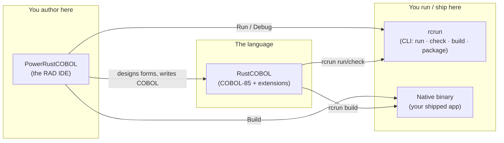
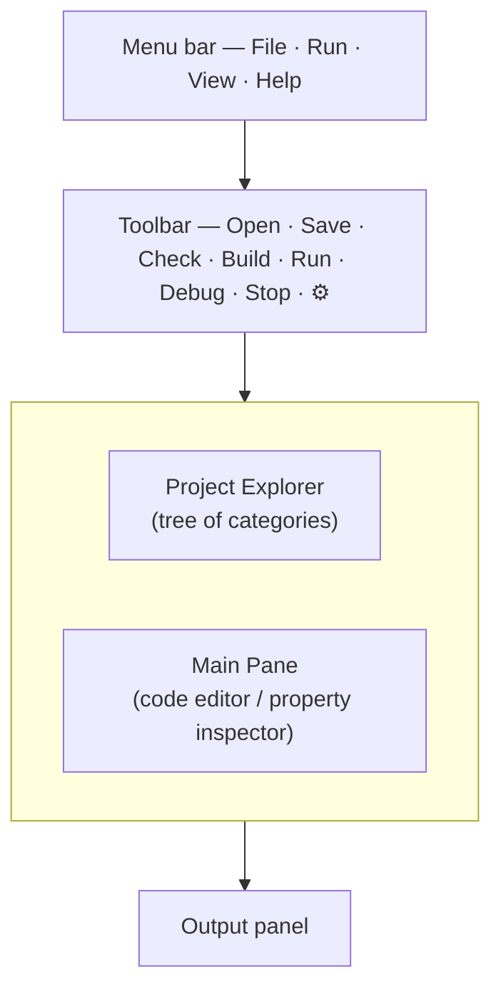
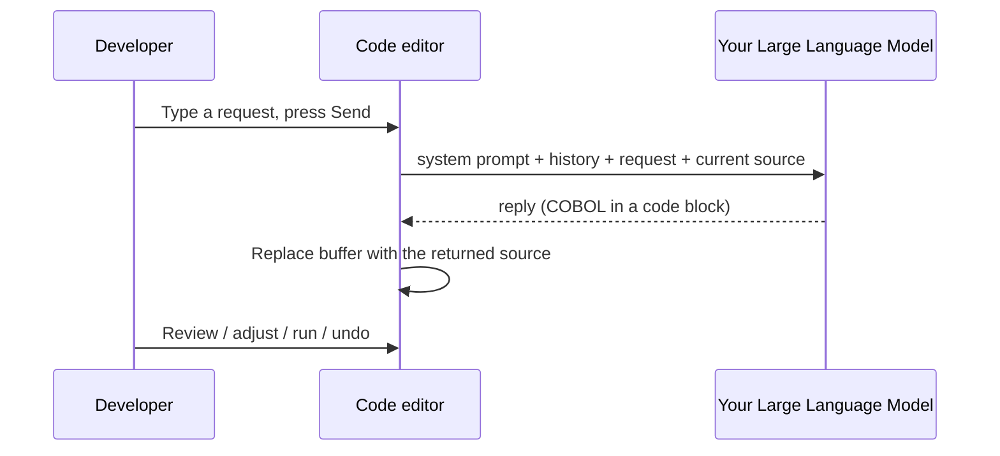
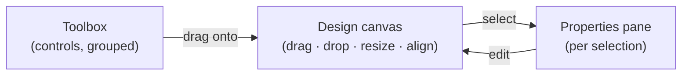
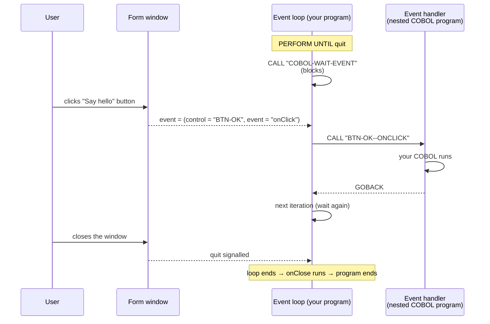
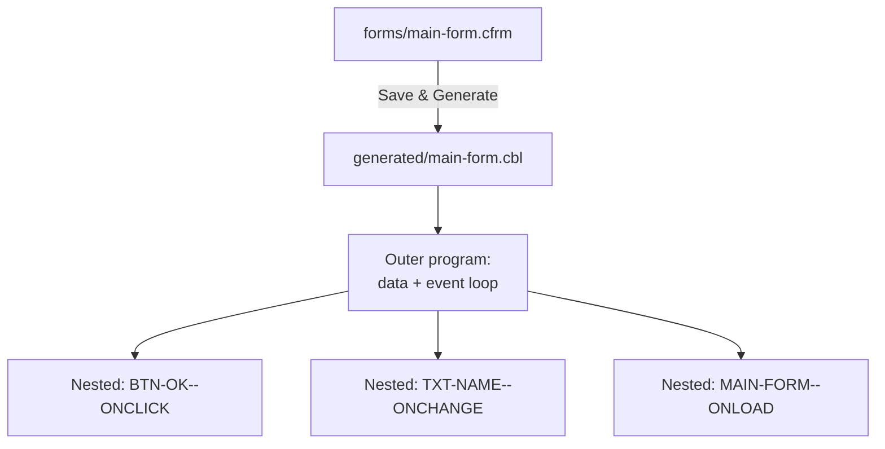
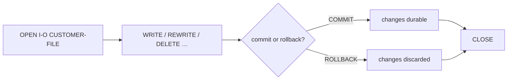
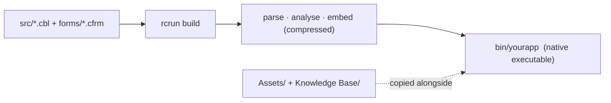
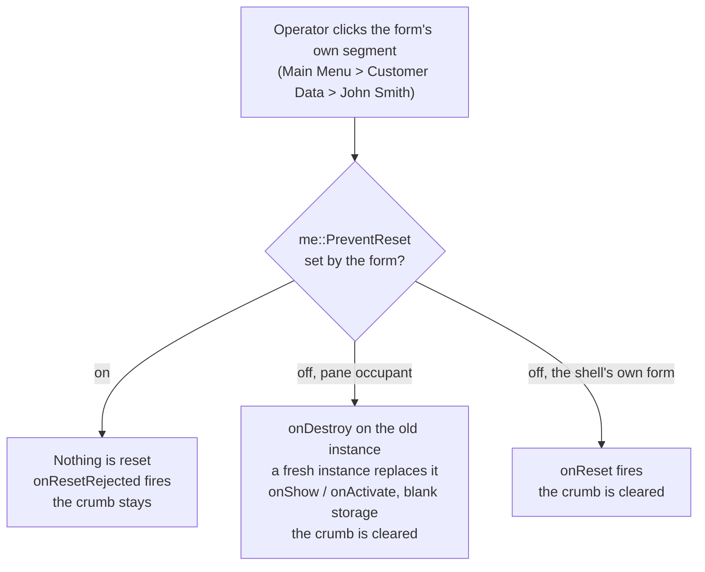

<!--
SPDX-License-Identifier: Apache-2.0
Copyright (c) 2026 Emerson Lopes and PowerRustCOBOL contributors

Licensed under the Apache License, Version 2.0.
See the LICENSE file in the project root for full license information.
-->

<!-- powerrustcobol: 1.65.124 -->

# Guia do desenvolvedor do PowerRustCOBOL AI RC4

<p align="center">
  
</p>


*Um guia prático para construir aplicações COBOL gráficas com o PowerRustCOBOL.*

> **Para quem é este guia.** Você já escreve COBOL e já construiu aplicações de
> tela ou de janelas com um conjunto de ferramentas COBOL gráfico — por exemplo o
> Fujitsu **PowerCOBOL for Windows** ou o **Veryant isCOBOL**. Você conhece
> `IDENTIFICATION DIVISION`, `PERFORM`, `OPEN`/`READ`/`WRITE`, os arquivos
> indexados e a ideia de um *formulário* com *controles* que disparam *eventos*.
> Este guia transpõe esses instintos para o PowerRustCOBOL e mostra tudo o que é
> novo. **Nenhum conhecimento prévio da linguagem de implementação hospedeira é
> pressuposto ou exigido** — você nunca vai precisar ler ou escrever nada que não
> seja COBOL para construir uma aplicação.

---

## Sumário

1. [O que é o PowerRustCOBOL e por que ele existe](#1-o-que-é-o-powerrustcobol-e-por-que-ele-existe)
2. [As três peças: RustCOBOL, PowerRustCOBOL, rcrun](#2-as-três-peças)
3. [Instalação e inicialização](#3-instalação-e-inicialização)
4. [Sua primeira aplicação: Olá, formulário](#4-sua-primeira-aplicação-olá-formulário)
5. [O IDE num relance](#5-o-ide-num-relance)
   - [Efeitos de janela](#efeitos-de-janela)
6. [Projetos e o modelo de projeto](#6-projetos-e-o-modelo-de-projeto)
7. [O Form Designer (RAD)](#7-o-form-designer-rad)
8. [O catálogo de controles](#8-o-catálogo-de-controles)
9. [Propriedades](#9-propriedades)
10. [Programação dirigida por eventos](#10-programação-dirigida-por-eventos)
11. [Conversando com a interface a partir do COBOL](#11-conversando-com-a-interface-a-partir-do-cobol)
12. [Código gerado](#12-código-gerado)
13. [A linguagem RustCOBOL](#13-a-linguagem-rustcobol)
    - [Escrevendo do jeito que o padrão permite](#escrevendo-do-jeito-que-o-padrão-permite)
    - [Entregando uma tabela inteira a uma função](#entregando-uma-tabela-inteira-a-uma-função)
    - [Fechando um arquivo de vez: `WITH LOCK`](#fechando-um-arquivo-de-vez-with-lock)
    - [Linhas de depuração](#linhas-de-depuração)
    - [Texto longo e incômodo: o literal de bloco](#texto-longo-e-incômodo-o-literal-de-bloco)
    - [Escrevendo um arquivo de texto sem um `FD`](#escrevendo-um-arquivo-de-texto-sem-um-fd)
14. [Arquivos indexados — um recurso de primeira classe](#14-arquivos-indexados--um-recurso-de-primeira-classe)
15. [Bancos de dados SQL](#15-bancos-de-dados-sql)
16. [HTTP / REST e agentes de IA](#16-http--rest-e-agentes-de-ia)
17. [A linha de comando (rcrun)](#17-a-linha-de-comando-rcrun)
18. [Compilando um binário distribuível](#18-compilando-um-binário-distribuível)
19. [Depuração](#19-depuração)
    - [Interruptores de diagnóstico (Help → Debug Settings)](#interruptores-de-diagnóstico-help--debug-settings)
20. [Aparência e internacionalização](#20-aparência-e-internacionalização)
21. [COBOL Structure e dados compartilhados](#21-cobol-structure-e-dados-compartilhados)
22. [O shell de aplicação e o receptor `super`](#22-o-shell-de-aplicação-e-o-receptor-super)
23. [Ressalvas e limitações atuais](#23-ressalvas-e-limitações-atuais)
24. [Apêndice A — Vindo do PowerCOBOL / isCOBOL](#apêndice-a--vindo-do-powercobol--iscobol)
25. [Apêndice B — Glossário](#apêndice-b--glossário)

---

## 1. O que é o PowerRustCOBOL e por que ele existe

<!-- 📷 welcome.png — the welcome screen as it appears on first launch, before any project is open. -->

<p align="center"></p>


Durante décadas, a única forma de escrever **COBOL com janelas e dirigido a
eventos** era comprar uma cadeia de ferramentas proprietária presa a um sistema
operacional, a um fornecedor e a um modelo de licenciamento. Aquelas ferramentas
eram excelentes em sua época, mas a maioria hoje está presa ao Windows, fechada e
cada vez mais difícil de implantar em máquinas modernas. Toda uma geração de
lógica de negócio — folha de pagamento, estoque, retaguarda bancária — está
escrita nesse estilo e não tem para onde ir no presente.

**O PowerRustCOBOL existe para dar a esse estilo de desenvolvimento uma casa nova
e aberta.** É um ambiente de desenvolvimento rápido de aplicações (RAD) no qual
você:

- desenha janelas ("formulários") arrastando controles para uma tela,
- associa a esses controles manipuladores de eventos escritos em **COBOL**,
- e executa, depura e distribui o resultado como um **único executável nativo
  autocontido** — sem nenhum runtime para instalar na máquina de destino.

Seus objetivos de projeto, em termos simples:


| Objetivo                    | O que significa para você                                                                                                                   |
| --------------------------- | -------------------------------------------------------------------------------------------------------------------------------------------- |
| **COBOL em primeiro lugar** | A aplicação *é* COBOL. O designer gera COBOL; seus manipuladores de eventos são programas COBOL-85 aninhados. Você nunca sai da linguagem.   |
| **Multiplataforma**         | Nem o IDE nem os binários produzidos estão presos a um único sistema operacional.                                                           |
| **Autocontido**             | Uma aplicação construída embute tudo de que precisa; o usuário final não instala o PowerRustCOBOL.                                          |
| **Acesso a dados moderno**  | Arquivos indexados (ISAM) à prova de falhas, SQL (SQLite / PostgreSQL / MySQL) e HTTP/REST são alcançados por instruções `CALL` comuns.      |
| **Aberto**                  | Licenciado sob a Apache-2.0.                                                                                                                |

> **Nota.** O PowerRustCOBOL é *inspirado* na produtividade dos RAD COBOL
> gráficos clássicos, mas é uma implementação independente e original. Conceitos
> como "formulário", "controle" e "evento" são padrão da indústria; a sintaxe, os
> formatos de arquivo, o código gerado e os serviços integrados aqui descritos
> são específicos do PowerRustCOBOL e não são compatíveis com as ferramentas de
> nenhum outro fornecedor.

---

## 2. As três peças

O PowerRustCOBOL é distribuído como três ferramentas que cooperam entre si. Saber
qual é qual elimina muita confusão logo no início.




| Nome               | Papel                                                                                                                           | Pense nele como…                                        |
| ------------------ | -------------------------------------------------------------------------------------------------------------------------------- | ------------------------------------------------------- |
| **RustCOBOL**      | O dialeto da linguagem COBOL-85 mais as extensões do PowerRustCOBOL (chamadas à GUI, cláusulas de arquivos indexados, SQL/HTTP). | A "linguagem" do compilador/runtime.                    |
| **PowerRustCOBOL** | O IDE de desktop: explorador de projeto, editor de código, **Form Designer**, depurador.                                         | O "Workbench" / o "Studio".                             |
| **rcrun**          | O runtime de linha de comando, o verificador, o empacotador e o compilador de binários.                                         | O "runtime + ferramenta de build" que você pode automatizar em CI. |


> ⚠️ **Ressalva de nomenclatura.** Internamente, alguns artefatos de build e
> algumas pastas se chamam `cobolt-*`. Isso é um detalhe de implementação; os
> nomes voltados ao usuário são **RustCOBOL**, **PowerRustCOBOL** e **rcrun**.

---

## 3. Instalação e inicialização

Cada versão oferece **dois downloads** por plataforma, e qualquer um deles é
completo — levam a mesma aplicação, o mesmo `rcrun`, os mesmos temas, exemplos e
SDK de plataforma.

| Sua máquina | Instalador | Arquivo compactado |
| --- | --- | --- |
| Windows 10 / 11, 64 bits | `.msi` — duplo clique, ou `msiexec /i … /quiet` para implantá-lo em silêncio | `.zip` |
| Macs com Apple Silicon | `.dmg` — arraste o PowerRustCOBOL para Applications | `.tar.gz` |
| Macs com Intel | `.dmg` | `.tar.gz` |
| Debian, Ubuntu, Mint e afins | `.deb` — `sudo apt install ./PowerRustCOBOL-*.deb` | `.tar.gz` |
| Fedora, RHEL, CentOS Stream, openSUSE | `.rpm` — `sudo dnf install ./PowerRustCOBOL-*.rpm` | `.tar.gz` |
| Qualquer outro Linux, 64 bits | — | `.tar.gz` |

Pegue o **instalador** se quiser as coisas de sempre: uma entrada no menu Iniciar
ou em Applications, um lançador na área de trabalho, o `rcrun` no seu `PATH` e um
jeito limpo de desinstalar depois. Pegue o **arquivo compactado** se preferir não
instalar nada — descompacte onde quiser e execute, inclusive de um pen drive ou
de uma máquina onde você não possa instalar software. Os dois pacotes de Linux
colocam a aplicação em `/opt/powerrustcobol` e ligam `powerrustcobol` e `rcrun`
em `/usr/bin`; em qualquer outra distribuição, o arquivo compactado é o download.

> ⚠️ **Nenhum dos dois está assinado ainda**, então cada plataforma avisa uma vez
> na primeira execução. No **macOS**: clique com o botão direito na aplicação e
> escolha *Open*, ou remova a marca de quarentena com
> `xattr -dr com.apple.quarantine PowerRustCOBOL.app`. No **Windows**: o
> SmartScreen oferece *More info* → *Run anyway*. Um instalador não goza aqui de
> mais confiança do que um arquivo compactado — o aviso é pelo certificado que
> falta, não pelo formato.

O Linux precisa de glibc 2.35 ou mais recente (Ubuntu 22.04+, Debian 12+,
Fedora 36+) e das bibliotecas de OpenGL, X11 ou Wayland que a sua área de
trabalho já fornece.

Inicie o IDE; na primeira execução você é recebido por um espaço de trabalho
vazio e pela mensagem *«Open a COBOL file to get started.»* Você pode abrir um
único arquivo `.cbl` ou criar um **projeto** completo (recomendado — veja §6).

<p align="center"></p>


A partir de um terminal você também pode dirigir tudo sem interface com o `rcrun`
(veja §17), que é o que as esteiras de integração contínua usam.

### A verificação do Rust na primeira execução


O IDE desenha formulários e *executa* programas por conta própria. O **Build** é
a exceção: ele compila o seu projeto em uma aplicação nativa através da **cadeia
de ferramentas Rust** (§18), e o mesmo vale para qualquer Run de um programa que
contenha um bloco `EXEC RUST`. Por isso, na primeira execução o PowerRustCOBOL
procura o Rust — e, quando encontra um que sirva, não diz absolutamente nada.

Quando não encontra, ele informa em qual caso você está — Rust ausente, ou uma
versão anterior à **1.92** que o PowerRustCOBOL exige —, mostra o comando oficial
do [rustup.rs](https://rustup.rs) e se oferece para executá-lo por você. Recuse e
você será perguntado mais uma vez, porque recusar tem um preço que vale a pena
declarar:


| Sem o Rust você perde | Você mantém |
| --------------------- | ----------- |
| **Build** — nenhum executável nativo, nada para empacotar | O Form Designer |
| Executar qualquer programa que contenha um bloco `EXEC RUST` | O editor de código e o ferramental COBOL |
|  | **Run** (interpretado) e o depurador |

Recusar uma segunda vez resolve o assunto e a pergunta não é feita de novo.
Instale o Rust mais tarde a partir do [rustup.rs](https://rustup.rs) e o **Build**
simplesmente passa a funcionar — nada no IDE precisa ser avisado.

> **Nota** — o rustup coloca o Rust em `~/.cargo/bin`, que o *perfil do seu
> shell* acrescenta ao `PATH`. Uma aplicação iniciada pelo Finder ou pela área de
> trabalho do Windows nunca lê esse perfil, então o PowerRustCOBOL procura nesse
> local ele mesmo e usa o que encontrar ali. Você não precisa iniciar o IDE a
> partir de um terminal para que o **Build** funcione.

#### O Rust está instalado e o Build ainda não termina

Há um segundo pré-requisito, e o rustup nem o instala nem o menciona: o
**linker**. Compilar produz código de máquina; o linker é o que reúne esse código
em um arquivo executável, e ele pertence ao sistema operacional, não ao Rust.

| Plataforma | O que fornece o linker |
| ---------- | ---------------------- |
| **Windows** | As ferramentas de build C++ da Microsoft — *Build Tools for Visual Studio* (ou o Visual Studio) com a carga de trabalho **Desktop development with C++**. O Visual Studio Code é outro produto e não as fornece. |
| **macOS**   | As ferramentas de linha de comando da Apple — `xcode-select --install` |
| **Linux**   | A cadeia de ferramentas C da sua distribuição — `build-essential` no Debian e no Ubuntu, *Development Tools* no Fedora e no RHEL |

A verificação de primeira execução também faz essa pergunta, mandando o Rust
linkar um programa que não faz nada: o único jeito confiável de saber, já que no
Windows o linker é encontrado pela instalação do Visual Studio e não pelo `PATH`.
Se não conseguir, o IDE avisa na primeira execução, nomeia o linker e mostra o
comando que o instala. Não há nada para aceitar ou recusar — não é uma escolha,
é apenas a única coisa que ainda falta.

Caso você esbarre nisso mais tarde — no fim de um build, que é onde isso
costumava aparecer —, o **Build** relata a mesma coisa com as mesmas palavras, em
vez da saída do próprio compilador. Todo o resto continua funcionando enquanto
isso: o Form Designer, o editor, o **Run** e o depurador nunca precisaram de um
linker.

---

## 4. Sua primeira aplicação: Olá, formulário

Este passo a passo produz uma janela de um único botão que mostra uma mensagem.

1. **Crie um projeto.** `File ▸ New Project…`, dê um nome (por exemplo
   `HelloPower`) e um programa principal. O IDE cria em disco a disposição de
   pastas padrão **e um programa `main` inicial executável** (um pequeno
   `DISPLAY`/`GOBACK` que você pode executar de imediato) e então o abre no
   editor (veja §6).
2. **Crie um formulário.** Na árvore do projeto, clique no **➕** ao lado de
   **Forms**. Isso abre o diálogo *New Form* — dê um nome (`main-form`), um
   título e um tamanho, e crie. O formulário é salvo em `forms/` e abre no
   **Form Designer**.
3. **Solte um botão.** Arraste um **Button** da caixa de ferramentas para a tela.
   Com ele selecionado, defina seu `Caption` como `Say hello` no painel de
   propriedades.
4. **Solte um rótulo.** Arraste um **Label** da caixa de ferramentas para a tela.
5. **Associe um manipulador.** Ainda sobre o botão, procure seu evento
   **`onClick`** e clique nele para abrir o editor de eventos COBOL. Digite, por
   exemplo:

   ```cobol
              SET Label-1::Caption TO "Hello from COBOL!".
   ```

<!-- 📷 first-form-designer.png — Capture the Form Designer with the single button selected and the `onClick` event highlighted in the properties pane. -->
<p align="center"></p>


6. **Execute.** Pressione **Run** na barra de ferramentas (ou o ▶ no designer). O
   formulário aparece; clicar no botão executa o seu manipulador.

<!-- 📷 firstform.png — Capture the running form after the button has been clicked, with the greeting showing in the label. -->
<p align="center"></p>


> **Nota.** Quando você salva ou executa um formulário, o PowerRustCOBOL **gera**
> um arquivo-fonte COBOL para ele (veja §12). Você nunca edita esse arquivo à
> mão — ele é um artefato de build.


---

## 5. O IDE num relance



- **Project Explorer (à esquerda).** Uma árvore enraizada no seu projeto. Sete
  categorias fixas — **Forms**, **Indexed Files**, **Common Code**,
  **Generated Code**, **Project's Crates (Beta)**, **Assets**,
  **Knowledge Base** — cada uma com um botão **➕**, exceto **Generated Code**,
  que o Form Designer preenche sozinho e à qual você nunca acrescenta nada à
  mão. À esquerda de cada item há um **"botão" de estado**: 🟢 verde =
  verificado/testado OK, 🟡 amarelo = alterado desde a última verificação,
  🔴 vermelho = foi relatado um problema. Os formulários se expandem para mostrar
  seus controles, agrupados por categoria da caixa de ferramentas, e cada
  controle se expande para seus **Events**. Os arquivos indexados se expandem
  para mostrar os campos do registro (como os controles de um formulário).
  **Clique no nó raiz, bem no topo** (📁 NomeDoSeuProjeto) a qualquer momento
  para trazer o formulário completo de configurações do projeto para a área de
  trabalho principal.

### Organizando a árvore do projeto com pastas

Toda categoria pode conter uma hierarquia arbitrária de **pastas**, de modo que
projetos grandes, de porte corporativo, continuem navegáveis (por exemplo
`forms/customers/`, `src/billing/`).

- **Criar uma pasta.** Clique no botão **📁+** no cabeçalho de uma categoria para
  acrescentar uma pasta na raiz dela, ou clique com o botão direito em qualquer
  pasta e escolha **New folder…** para aninhar uma dentro dela.
- **Renomear uma pasta.** Clique com o botão direito na pasta e escolha
  **Rename folder…**. Todo arquivo que o projeto acompanha sob aquela pasta — e
  qualquer aba de editor aberta apontando para um deles — segue a mudança
  automaticamente.
- **Excluir uma pasta.** Clique com o botão direito e escolha
  **Delete folder…**. Depois que você confirmar, a pasta e **tudo o que está
  dentro dela são removidos permanentemente do disco**, os arquivos saem do
  projeto e quaisquer editores que os estejam exibindo são fechados. Isso não
  pode ser desfeito.

Os caminhos das pastas são sempre armazenados **em relação à pasta do projeto**,
de modo que um projeto pode ser movido, compactado ou compartilhado sem quebrar
nenhuma referência.

### Movendo arquivos: arrastar e soltar

- **Dentro da árvore.** Arraste um arquivo para cima de outra pasta (ou para o
  cabeçalho de uma categoria) para movê-lo até lá; o arquivo é movido no disco e
  sua entrada no projeto é atualizada. Um arquivo não pode sobrescrever outro de
  mesmo nome, e uma pasta não pode ser solta dentro de si mesma.
- **A partir do sistema operacional.** Arraste arquivos do Finder/Explorer para
  uma pasta ou categoria para importá-los. Eles são copiados para dentro do
  projeto e acompanhados por um caminho relativo. Um arquivo cujo tipo não
  corresponde à categoria de destino (por exemplo um `.cfrm` solto em Common
  Code) é recusado.

### Navegação pelo teclado

Com o ponteiro sobre a árvore do projeto você pode se mover sem o mouse:

- **↑ / ↓** — vai para a linha visível anterior / seguinte. O elemento é
  carregado de imediato (suas propriedades ou o editor, exatamente como num
  clique simples), e a árvore rola conforme necessário para manter a linha
  destacada à vista, a uma linha de distância da borda superior ou inferior.
- **→** — expande uma pasta recolhida; se ela já estiver aberta, entra no seu
  primeiro filho.
- **←** — sobe para a pasta-mãe.
- **Enter** — abre o item selecionado (o mesmo que um clique simples).

Na primeira execução (ou sempre que nenhum projeto estiver aberto) o IDE mostra
um único painel de boas-vindas inteiro, que é um único bloco de informação
centralizado (título + licença + uma linha em branco + citação + autor) no meio
da área disponível abaixo da barra de menus/barra de ferramentas:

Welcome to PowerRustCOBOL <versão>
License: Apache 2.0

<linha em branco>
<texto da citação em verde, escolhido ao acaso a cada ciclo de uma lista embutida>
— <autor em azul-claro>

A citação gira ao acaso a cada 7,5 segundos (1 s de aparecimento gradual, 6 s
visível, 0,5 s de desaparecimento gradual). A árvore da esquerda, o editor, a
saída e os controles próprios do editor ficam ocultos até que você use
File → New Project ou File → Open Project. Uma vez aberto um projeto, aparece o
espaço de trabalho normal de três painéis. O guia completo está disponível na
pasta docs/.

- **Barra de ferramentas (topo).** `Open · Save · Check · Build · Run · Debug ·
  Stop`, mais o seletor de idioma na extremidade direita. *Run* interpreta o
  programa; *Build* compila um binário nativo; *Check* roda apenas a análise
  sintática e semântica; *Debug* fica habilitado quando um item de Generated
  Code está selecionado.
- **Painel principal (ao centro / à direita da árvore).** Mostra o editor de
  código, o **inspetor de propriedades** (quando você clica num formulário ou
  controle na árvore), **ou o formulário de configurações do projeto** (quando
  você clica na raiz do projeto no topo da árvore, ou automaticamente quando o
  IDE abre um projeto pela primeira vez — sem nenhum editor à vista). O botão
  **👑 Grace** acima da árvore do projeto abre neste painel o chatbot Grace de
  todo o projeto. Ele usa exatamente a mesma construção de painel de vidro
  (CentralPanel + moldura de vidro) que o inspetor de propriedades de controles,
  para largura consistente (sem falta de espaço na borda direita) e
  comportamento de altura 100 % (o painel cresce e encolhe com a área disponível
  acima do painel Output ao redimensionar a janela ou o divisor). A borda
  inferior arredondada do cartão é mantida claramente acima da saída/console,
  com um vão visível, graças à margem externa inferior da moldura; os botões
  Save/Cancel ficam na parte de baixo do cartão. Clique no topo da árvore do
  projeto (a linha 📁 NomeDoProjeto) a qualquer momento para abri-lo. Ele tem
  uma única linha divisória vertical contínua que corre de cima a baixo através
  do conteúdo. Os rótulos à esquerda nunca quebram linha; são truncados com `…`
  (por exemplo `Standard system p…`) e o desenvolvedor pode arrastar o divisor à
  vontade (a divisão se move independentemente do comprimento de qualquer
  rótulo, até 80 % da largura do painel). Os controles à direita são elásticos e
  todos começam na mesma posição x depois de um vão de 10 px, o que dá um
  alinhamento vertical perfeito a cada valor de propriedade. As seções, em
  ordem: Project, AI assistant, Appearance, License, Integrations, Runtime — as
  configurações de IA (Agents Manager, Model Providers Manager, Model
  Leaderboard) ficam logo abaixo de Project, onde você chega sem rolar por um
  texto de licença que se define uma vez e raramente se volta a tocar. Botões
  explícitos de **Save** e **Cancel** na parte de baixo do cartão (Cancel
  habilitado só depois de mudanças; reverte para o último estado salvo). A linha
  divisória segue o tema atual (mais clara sob o ponteiro ou ao ser arrastada).
  O editor de código (quando visível) traz uma **barra de status** ao longo da
  base — o cursor `Ln, Col`, o modo **Insert/Overwrite** (alterna com a tecla
  `Insert`), um botão **Trim on save** (remove espaços em branco no fim das
  linhas ao salvar) e, para documentos que não sejam Markdown, um comando
  **Beautify** que reformata o COBOL segundo as regras de disposição descritas
  em *Beautify — as regras de disposição*, mais adiante. Arquivos Markdown não
  têm Beautify porque a formatação COBOL não se aplica a eles.

<!-- 📷 project-settings-form.png — Show the left tree with the root node highlighted (hand cursor), and the main area with the two-column settings form inside its glass card (single continuous vertical resizer line, labels truncated with … before the line, all value controls aligned on the right, Save/Cancel at the bottom of the card). The card's rounded bottom border must be clearly visible above the Output panel with a gap (no… -->

<p align="center"></p>

- **Painel Output (embaixo).** Saída de `DISPLAY` do programa, registros de
  build e mensagens de estado.

<!-- 📷 ide-overview.png — A full-window capture with a project open, a form selected (so the property inspector is visible), and some text in the Output panel. Annotate the four regions if you can. -->

<p align="center"></p>

### O assistente de IA (opcional)

O PowerRustCOBOL pode colocar um Modelo de Linguagem Grande — um que você
forneça, idealmente treinado nesta documentação — logo acima do editor de código.
O assistente é **inteiramente opcional e vem desligado**: enquanto você não
preencher os dados de conexão, a barra de prompt nunca aparece.

**Configure-o pelo formulário de configurações da raiz do projeto.** Clique no nó
de topo da árvore do projeto (a linha 📁 com o nome do seu projeto). Na seção
**AI assistant** do formulário você pode informar os dados de conexão. O
comportamento de IA e os agentes pertencem ao projeto aberto e viajam no
`cobolt.toml` e no diretório `agentic_ai/` dele; a configuração de provedores e as
chaves de API são locais à máquina e nunca viajam num repositório:


| Campo | Significado |
| ----- | ----------- |
| **Endpoint URL** | A URL completa do modelo. Use um endpoint de chat compatível com OpenAI, como `https://…/v1/chat/completions`, ou o endpoint Responses da xAI/Grok `https://api.x.ai/v1/responses`. Um padrão de provedor que você não tenha tocado recebe automaticamente o caminho de requisição convencional; depois que você editar este campo, o IDE usa a URL exatamente como foi digitada. |
| **API key** | Enviada como `Authorization: Bearer …`. Deixe vazio para um endpoint local sem chave. Uma chave informada aqui configura o **provedor** dela, exatamente como faz o Model Providers Manager, e é guardada somente nesta máquina. Um campo vazio significa que nenhuma credencial está guardada aqui para aquele provedor. |
| **Model** | O identificador do modelo passado em cada requisição. |
| **Reviewer model (Pedantic Agent)** | Um segundo modelo opcional que revisa as respostas do agente principal com escrutínio implacável. Se definido, tem de ser diferente do modelo principal (o IDE impõe isso). Com um revisor configurado, a verificação de **COBOL Proficiency** roda em conjunto: o modelo principal responde, o Pedantic Agent revisa a resposta tendo o prompt principal como especificação autoritativa, exige um reenvio corrigido completo quando encontra defeitos, revisa de novo a revisão e produz a avaliação final brutalmente honesta — o painel então mostra as notas *do revisor*, não as autoatribuídas pelo modelo. |
| **Temperature** | Aleatoriedade da amostragem (0 = determinístico). O teste de conexão usa exatamente este valor, porque alguns modelos só aceitam o padrão definido pelo provedor, comumente `1.0`. |
| **Standard system prompt** | As instruções enviadas em toda requisição. Um padrão sensato é fornecido; edite-o para servir ao seu modelo. |

**Model Providers Manager.** Ao lado de *Manage agents…* nas configurações do
projeto está o **Model Providers Manager…**. Aqui você configura um **provedor** —
seu endpoint e sua chave de API — e mais nada. A partir do momento em que a chave
de um provedor funciona, **todo modelo que aquele provedor oferece fica
disponível** para qualquer agente; não há configuração por modelo a fazer.
Escolha um provedor na lista à esquerda (um ponto preenchido marca os que estão
configurados), ajuste o endpoint se precisar de outro host, cole a chave e use
**Refresh models** para puxar o catálogo atual. **Test** envia uma requisição para
você confirmar a credencial antes de depender dela.

**Quando uma chamada falha.** A janela de erro abre com o motivo em uma linha só
para ele no topo, acima de um traço, e o log de conexão completo por baixo. O
título é a frase do próprio provedor, citada — *"You exceeded your current quota,
please check your plan and billing details"*, *"'temperature' is not supported
with this model"* — com o campo da requisição ou o código de erro que ele nomeou
mostrado abaixo, quando a frase já não os diz. O log embaixo permanece inalterado
e completo; **Copy** e **Save…** levam a coisa toda, não o título. Um erro cujo
conteúdo não traz tal frase não ganha título: nunca lhe é mostrado um resumo de
algo que não foi dito.

**Nota — modelos de raciocínio passam no teste.** O *Test* faz uma única
pergunta: este modelo está alcançável e respondendo? Alguns modelos pensam antes
de falar e devolvem apenas raciocínio oculto numa requisição tão pequena — o
endpoint resolveu, a chave foi aceita, vieram tokens de volta, mas nenhum texto
visível. Isso conta como aprovação, e o resultado diz isso. São apenas os agentes
que precisam de texto visível: eles interpretam uma resposta como operações sobre
o formulário, e um raciocínio que nunca veem não pode ser aplicado — então um
modelo que responde aos agentes só com raciocínio oculto continua sendo relatado
como inutilizável *ali*, com o mesmo conselho de desligar o pensamento para ele.

O painel de provedor à direita **rola** — endpoint, chave, modelos e *Where keys
are kept* ficam todos alcançáveis por menor que você faça a janela, e a lista de
provedores à esquerda rola de forma independente.

A configuração de provedores vale para a **máquina inteira**, guardada junto das
suas outras configurações locais em vez de no projeto. Configure a Anthropic uma
vez e todo projeto nesta máquina pode usá-la. A chave de API **nunca** é escrita
num arquivo de projeto, no COBOL gerado ou numa aplicação compilada ou empacotada.
Um Ollama local não precisa de chave nenhuma — um endpoint alcançável basta.

> **Nota.** Isto substitui o antigo *Models Manager*, em que uma conexão era
> definida uma vez por *modelo*, como um "perfil de modelo" nomeado que os agentes
> referenciavam. Usar um segundo modelo de um provedor que você já pagava
> significava montar um perfil inteiro a mais e colar a mesma chave outra vez.
>
> **Seus projetos existentes migram sozinhos.** Na primeira vez que você abrir
> um, cada agente assume o provedor, o modelo, a temperatura, o limite de tokens
> de saída e o tempo-limite do perfil que referenciava, e cada provedor é
> configurado a partir do que aqueles perfis sabiam. Nada é pedido a você e nada
> precisa ser digitado de novo. ⚠️ Um provedor agora comporta **uma** chave, então
> se você tinha vários perfis no mesmo provedor com chaves *diferentes*, a
> guardada mais recentemente é mantida e as outras são nomeadas no painel Output —
> redigite uma no Model Providers Manager se era aquela que você queria.

#### Onde ficam as suas chaves

Por padrão, uma chave vive por **uma execução**. Nada é escrito em disco e, da
próxima vez que você abrir o IDE, ele pergunta de novo. Isso é deliberado — uma
chave em disco é uma chave que pode ser copiada, incluída num backup ou
commitada — mas é tedioso, então no pé do Model Providers Manager você decide por
si mesmo:


| Escolha | O que acontece |
| ------- | -------------- |
| **Not kept** | O padrão. As chaves vivem apenas neste processo e são pedidas de novo na execução seguinte. |
| **A local file** | Toda a configuração de modelos, chaves incluídas, é escrita num arquivo que você nomeia. Criado legível só pelo dono (modo `0600` no macOS e no Linux) e trazendo um aviso em texto puro no topo. Reabrir o IDE retoma as chaves direto dali. |
| **The OS credential store** | O cofre da sua própria plataforma — Keychain, Credential Manager, Secret Service. Oferecido, mas **ainda não selecionável: chega na versão oficial**, assim que tiver uma interface capaz de inspecionar, rotacionar e limpar o que guarda. |

**Um arquivo nunca pode ficar dentro de um repositório git.** Isso não é uma
preferência e não há como contornar. Se o caminho que você escolher estiver em
qualquer lugar sob um `.git` — na raiz do repositório, enterrado dez pastas
abaixo, ou num submódulo ou num checkout de `git worktree` — ele é recusado, e a
recusa nomeia o repositório para você saber em qual esbarrou. Uma chave commitada
é uma chave publicada, e uma chave publicada não pode ser recolhida.

`/tmp/llm_config.json` é oferecido primeiro exatamente por isso: nada em `/tmp`
pode ser commitado, e ele não sobrevive a uma reinicialização — o que, para uma
credencial, é uma virtude. Clique num caminho sugerido ou digite o seu, pressione
**Use this file**, e as chaves são escritas quando a configuração for salva.
**Forget the file** apaga o arquivo e volta a não guardar chave alguma.

O arquivo de configuração que vale para a máquina inteira permanece inalterado:
ele continua sem trazer **nenhuma credencial**, apenas a sua escolha de onde as
chaves vão e o caminho que você indicou. Apagar uma chave no gerenciador continua
apagando-a — uma exclusão explícita sempre vence um arquivo que se lembra.

> ⚠️ **Ressalva.** Um arquivo guarda as suas chaves em texto claro. Ele é
> protegido por permissões de arquivo e por nada mais: qualquer coisa rodando como
> você consegue lê-lo, e ele estará em qualquer backup que copie a pasta. Se isso
> não for aceitável, deixe a escolha em **Not kept** até que o cofre de
> credenciais do sistema operacional chegue na versão oficial.

**Agents Manager.** A linha *AI agents* abre o banco de agentes provisionados do
projeto, em três abas.

**Aba 1 — Agent × Model.** Uma linha por agente — Grace, cada especialista, cada
revisor e o COBOL Proficiency Judge — com as coisas que decidem como aquele agente
roda.


| Coluna | Significado |
| ------ | ----------- |
| **Agents** | O agente que a linha configura. |
| **Models** | Em qual modelo ele roda, escolhido a partir do provedor selecionado na caixa **Model provider** acima da tabela. Escolha **— no model —** para deixar um agente sem configuração de propósito. |
| **Rating** | O que o Leaderboard sabe sobre aquele modelo, ou *Not tested* se ele nunca foi avaliado. |
| **Temp** | Aleatoriedade da amostragem só para este agente (0 = determinístico). |
| **Output Tokens** | A maior resposta que este agente pode produzir. |
| **Timeout** | Quanto tempo esperar por ele, em segundos. |

A caixa **Model provider** é um *escopo de escolha*, não um interruptor de todo o
projeto. Ela decide de qual provedor a coluna Models oferece modelos enquanto
você configura, e não muda nenhum agente em que você não toque — de modo que a
Grace pode rodar num provedor na nuvem enquanto os seus especialistas rodam num
Ollama local. Cada agente se lembra do provedor de onde veio o seu modelo. Com
centenas de modelos oferecidos por alguns provedores, a caixa de busca ao lado do
seletor estreita a lista.

Uma linha cujo modelo está reservado para outro papel mostra um aviso ao lado do
nome do agente: um especialista não pode rodar o modelo da Grace, nem o do Judge.
(O Judge *pode* compartilhar o modelo da Grace, desde que nenhum especialista
esteja nele.)

**Quando um provedor aposenta um modelo.** Modelos são descomissionados — a
Anthropic, a OpenAI, a Meta e as demais os retiram no seu próprio calendário — e
uma nota para um modelo que já não existe é pior do que nota nenhuma: ela convida
você a escolhê-lo. Então um refresh no Model Providers Manager que volte com um
catálogo também retira do Leaderboard quaisquer modelos daquele provedor que o
catálogo já não liste, e diz quais no painel Output.

Só um refresh que **realmente listou modelos** pode fazer isso, e só para o
provedor que ele listou. Uma requisição que falhou, uma chave expirada e um
provedor que você ainda não atualizou produzem todos uma lista vazia, o que nada
diz sobre o que existe — então um resultado vazio não remove nada. Você também
pode aposentar um modelo por conta própria: cada linha do Leaderboard tem
**Remove**, para o caso de um provedor ter desligado um modelo antes de o catálogo
acompanhar. Ele pergunta antes, porque uma nota custa tokens e tempo de verdade.

Se um agente estava rodando o modelo que se foi, o Agents Manager abre naquele
agente para você lhe dar outro de imediato — um agente apontando para um modelo
retirado é a parte que de fato quebra uma execução, e descobrir isso no próximo
fluxo de trabalho, como um erro de conexão, é a maneira cara de aprender.

Uma remoção fica: um modelo aposentado não é reposto pela próxima sincronização
do projeto, nem pela repetição de relatórios de avaliação arquivados. O seu
arquivo em `agentic_ai/model-benchmarks.jsonl` permanece intocado — aqueles
relatórios são o registro do que você rodou e pagou, e nada disso os apaga.
**Testar de novo um modelo aposentado o traz de volta**, com o seu novo resultado,
de modo que uma aposentadoria da qual você discorde custa uma execução para
desfazer.

**Aba 2 — Agent Configuration.** A lista de agentes à esquerda comanda o painel de
detalhes à direita: **Agent Details** (id, nome, tipo, especialização, propósito,
habilitado), o editor de prompt, capacidades, conhecimento e relacionamentos.

**Aba 3 — User Guide.** Um guia escrito sobre como modelos e agentes se encaixam,
no idioma da sua interface. Cada uma das suas quatro seções começa com uma
explicação simples, depois aprofunda, depois enuncia a versão precisa — leia até
onde for útil e pare. Ele cobre o emparelhamento de agentes com modelos e a regra
de compartilhamento, o que cada ajuste faz, por que o seu modelo mais forte
pertence aos revisores e ao Judge em vez de a quem escreve, e o vocabulário
(modelos, agentes, revisores Pedantic, o Judge, tokens e quanto custam, modelos
locais, quantização, e por que a VRAM é o número que decide se um modelo local é
utilizável). A busca destaca as ocorrências e salta entre elas, o tamanho do texto
é ajustável, o índice navega, e **Export PDF** escreve o guia inteiro.

O rodapé traz **Cancel**, **Apply** (salvar e continuar trabalhando) e **Save**. O
diretório interno `agentic_ai/` é intencionalmente ocultado da árvore do projeto;
use o Agents Manager para configurar agentes, enquanto a Grace mantém ali os seus
registros de fluxo de trabalho automaticamente. O editor de prompt é
redimensionável na vertical de quatro a vinte linhas de texto; prompts mais longos
rolam dentro do editor em vez de aumentar a sua altura. **New Agent** e
**Delete Agent** estão ocultos no momento porque a malha embutida completa é criada
e reparada junto com o projeto. Ambos os fluxos continuam implementados para
manutenção futura. Um agente vive no seu projeto em `agentic_ai/<nome do agente>/`
— o prompt multilinha do agente em `<nome do agente>_prompt.md`, mais `steering/`,
`policies.md`, `skills/`, `mcp.json`, `knowledge/` e `agent.json` (identidade e
configuração de execução — a chave de API **nunca** é guardada no projeto; as
chaves ficam na sua máquina, pedidas uma vez por modelo). Os nomes de agentes são
únicos e fixos na criação, porque dão nome à pasta. Todo agente principal pode
nomear um **companheiro pedante** que revisa as suas respostas — um principal e o
seu próprio companheiro têm de usar modelos diferentes, ao passo que agentes sem
relação entre si podem compartilhar modelos livremente. A relação é de um para um:
um orquestrador ou especialista pode ter no máximo um companheiro Pedantic, e um
revisor Pedantic pode pertencer no máximo a um agente revisado. Selecione a
relação pela seção **Companion (Pedantic reviewer)** do agente principal ou pela
seção editável **Pedantic Companion for** do agente Pedantic; os dois seletores
escrevem a mesma configuração de projeto. O planejador da Grace e os agentes
participantes recebem a relação exata em tempo de execução, de modo que um revisor
não pode ser substituído nem reaproveitado para outro agente. A criação do projeto
provisiona os especialistas fixos — o **Form Designer Agent**, o **COBOL Event
Handler Script Agent**, o **Documentation Agent**, o **Data (Indexed File) Agent**
e o **Version Control Agent** — mais a **Grace**, a orquestradora. Cada um é
imediatamente seguido do seu próprio revisor, cujo nome canônico é o nome do
principal com o sufixo **Pedantic Reviewer**:

- **Grace Pedantic Reviewer**
- **Form Designer Agent Pedantic Reviewer**
- **COBOL Event Handler Script Agent Pedantic Reviewer**
- **Documentation Agent Pedantic Reviewer**
- **Data (Indexed File) Agent Pedantic Reviewer**
- **Version Control Agent Pedantic Reviewer**

Todo revisor é criado com um prompt específico ao seu propósito, uma descrição, um
contrato de roteamento e um vínculo de companheiro um para um. O desenvolvedor
escolhe o seu perfil de modelo e pode ajustar o seu prompt, habilidades,
ferramentas e conhecimento; nenhum revisor precisa ser construído ou associado à
mão. Abrir um projeto existente roda o mesmo reparo idempotente: um revisor
embutido que esteja faltando é recriado e revinculado, enquanto prompts de projeto
não vazios e outras configurações do desenvolvedor permanecem autoritativos. Nomes
de revisores antigos são migrados no lugar, sem mudar os seus IDs estáveis nem os
perfis escolhidos.

A Grace continua sendo a única autoridade de coordenação (👑, sempre chamada
Grace, nunca apagável), que planeja o trabalho multiagente, delega a especialistas
por tipo e especialização, faz valer cada portão de revisão pedante e monta o
resultado final validado. O prompt padrão do **Grace Pedantic Reviewer** revisa a
cobertura do pedido, a decomposição em tarefas, a titularidade, as dependências, a
governança da documentação, as evidências, a integração entre agentes, as falhas e
as alegações de conclusão. Os prompts de revisor locais ao projeto continuam
editáveis no Agents Manager, e o reparo de agentes fixos preserva essas edições. Dê
a cada revisor um modelo na tabela de execução antes de habilitar a sua conexão de
revisão; um principal e o seu companheiro Pedantic não podem usar o mesmo modelo.

**Quando a Grace pergunta em vez de agir.** Um pedido que admite mais de uma
leitura recebe uma pergunta em vez de um palpite — um balão vermelho no mesmo
chat, nomeando exatamente o que está ambíguo. Responda na mesma caixa, tão
brevemente quanto quiser ("o Caption", "UUID", "aas-clientes"): a resposta volta
carregando a pergunta que responde, de modo que a Grace retoma o pedido original
com a sua decisão aplicada. Você não precisa repetir o que pediu. Se em vez disso
você digitar outra coisa, ela passa a ser o pedido e as perguntas são descartadas.

Os contratos de roteamento embutidos são explícitos: o Form Designer Agent é dono
do desenho de formulários RAD e delega a implementação de eventos; o COBOL Event
Handler Script Agent implementa exatamente esses comportamentos delegados; o
Documentation Agent é o único que escreve a documentação do projeto e prepara
entregas normalizadas de esquema de arquivos indexados; o Data (Indexed File)
Agent é o único que mantém as definições `.cidx` através do modelo de interface de
Indexed File; o Version Control Agent é dono das operações de Git do projeto com
evidências e portões de confirmação; e o Grace Pedantic Reviewer revisa apenas a
orquestração da Grace. Cada agente recebe um prompt padrão específico ao seu
papel. Padrões vazios ou reconhecidamente antigos são reparados, ao passo que
prompts não vazios editados no projeto permanecem autoritativos. Registros
existentes de `DocumentationAgent`, `Pedantic Grace Reviewer`,
`Grace Pedantic Reviewer Agent`, `Pedantic UI Agent` e `Pedantic COBOL Companion`
são renomeados em disco sem mudar os seus IDs estáveis nem os seus modelos. Um
`Orchestrator Pedantic Reviewer Agent` redundante é fundido no **Grace Pedantic
Reviewer** e removido.

O botão **👑 Grace** acima da árvore do projeto preenche a largura atual do painel
da árvore (com um mínimo de 150 px) e acompanha o painel quando você o
redimensiona. Ele abre no Painel principal uma conversa de escopo do projeto, com
histórico persistente, progresso do fluxo de trabalho e controles de aprovação
para operações com portão. O cabeçalho do seu painel de propriedades o identifica
como **👑 Grace - The PowerRustCOBOL Agentic AI Orchestrator**.

**Escolhendo para onde as coisas vão.** Como a árvore do projeto aceita pastas, um
nome pode existir em mais de um lugar. Quando você pede à Grace que **crie** um
elemento (um formulário, um arquivo indexado, um fonte de código comum, um arquivo
de documentação ou um recurso), ela abre uma pequena janela centralizada mostrando
a árvore do projeto para você escolher a **pasta** de destino — e ali mesmo você
também pode criar uma pasta nova. Quando você pede à Grace que **edite** um
elemento pelo nome e mais de um elemento tem aquele nome, a mesma janela deixa você
escolher **qual**; se só um corresponder, a Grace simplesmente o edita. Cancelar a
janela interrompe a operação, e a Grace relata que nada foi criado ou editado.
(Esse pedido aparece no chat completo da Grace do projeto; as superfícies compactas
de chat do editor/designer não conseguem mostrá-lo, então um pedido ambíguo ali lhe
pede para usar o chat da Grace do projeto.)

Todo chatbot do IDE passa pela Grace. A superfície fornece uma preferência
consultiva: o Form Designer RAD prefere o Form Designer Agent, o seu editor de
eventos prefere o COBOL Event Handler Script Agent, e o editor de código pede à
Grace que escolha por capacidade. A preferência nunca é exclusiva. A Grace pode
dividir um pedido entre quaisquer especialistas habilitados, de modo que um pedido
para criar um botão e ligar o comportamento do seu `onClick` pode coordenar tanto
tarefas de desenho de formulário quanto de manipulador de eventos. Cada fluxo de
trabalho roda as suas revisões pedantes configuradas, transmite o progresso e salva
um registro auditável em `agentic_ai/Grace/runs/`.

**Estado das ações ao vivo.** Enquanto a Grace e os especialistas trabalham, a
conversa mostra o que cada agente está *fazendo* neste instante, como uma linha
curta de estado — por exemplo `Form Designer Agent: Drafting response — T1` ou
`Grace: Retrieving context` — atualizada no máximo uma vez por segundo, para que
execuções longas nunca pareçam travadas. Cada passo também vai parar numa entrada
**Agent actions (N)** que fica recolhida na conversa; expanda-a para rever a
sequência ordenada de passos por agente que a execução percorreu. Ela é salva junto
com o histórico do chat e o registro do fluxo de trabalho, de modo que continua
revisável depois de você reabrir o projeto. As linhas de estado nomeiam **apenas
ações** e são mostradas no idioma da sua interface. O conteúdo que uma ação
produziu ou consumiu — conhecimento recuperado, saída de ferramenta, raciocínio do
modelo — nunca aparece na conversa: o rastro completo vive no log de IA do painel
Output, no despejo de diagnóstico (quando um interruptor de depuração está ligado)
e no registro de execução salvo em `agentic_ai/Grace/runs/`. Com o ajuste de IA
**verbose** do projeto habilitado, o fluxo de ações ganha passos mais finos (por
chamada de ferramenta, por rodada de revisão) — mais granularidade, ainda nunca
conteúdo. O modo verbose também acrescenta à conversa uma linha de **Token
savings** depois de cada execução — a porcentagem do corpus indexado da Base de
Conhecimento que a recuperação manteve *fora* do contexto (registros recuperados
versus o corpus inteiro, estimado a ≈4 caracteres por token) — para que você veja
o que a camada de recuperação está lhe rendendo.

**Recuperação em pedaços.** Os documentos da Base de Conhecimento são indexados
duas vezes: como documentos inteiros (para a gestão documental) e como um
**armazém em pedaços**, em que cada controle, propriedade, método, evento e seção
de prosa é um registro próprio, com um campo de conteúdo `PIC X(512)` — conteúdos
mais longos continuam em registros ligados ao anterior, e a busca remonta a
corrente. O texto de cada registro é embutido individualmente, de modo que quando
você pergunta à Grace sobre, digamos, os eventos do DataGrid, o contexto recebe os
registros do DataGrid — não o catálogo inteiro de controles. O material de
referência do próprio IDE vive em `~/PowerRustCOBOL/data/chunked.data`; cada
projeto guarda a sua documentação em `data/<nome-do-projeto>-chunked.data`. Salvar,
editar ou apagar um documento da Base de Conhecimento deixa o arquivo em si
intocado e refaz os pedaços e as incorporações apenas dos registros daquele
documento, na execução seguinte.

O armazém em pedaços do IDE **vem dentro do próprio IDE**, já incorporado com o
modelo semântico: um clone ou instalação recém-feita começa com o seu índice pronto
e nunca reincorpora o material de referência, a menos que um documento da Base de
Conhecimento seja removido, alterado ou substituído. Numa máquina que ainda não
baixou o modelo semântico, os registros que vieram junto são preservados e
pesquisados lexicalmente até o modelo chegar — nada é jogado fora. Sempre que
registros realmente precisarem ser (re)incorporados — um documento alterado, ou a
documentação do seu próprio projeto — a conversa mostra uma **barra de progresso**
(`Indexing Knowledge Base (n of m records)`), para que uma indexação longa nunca
pareça travada.

### Busca de código em todo o projeto

Se você manteve aplicações no PowerCOBOL, vai lembrar da rotina: "onde mais eu
usei `CUST-BALANCE`?" significava abrir à mão cada folha e cada procedimento de
evento. O PowerRustCOBOL responde a isso numa só janela: **View ▸ Code Search…**,
o botão 🔍 **Search** da barra de ferramentas, ou **Ctrl+Shift+F**
(**Cmd+Shift+F** no macOS) abrem a janela de busca; o **Ctrl+F** simples mantém
o seu antigo significado, procurar na aba de editor atual.

Digite uma consulta em texto puro e pressione **Search**. A varredura cobre
**todo lugar em que você pode escrever COBOL** no projeto: cada manipulador de
evento de controle, o `onLoad`/`onClose` de cada formulário, cada procedimento do
usuário, as cinco seções de estrutura (`SPECIAL-NAMES`, `REPOSITORY`,
`FILE-CONTROL`, `FILE SECTION`, `WORKING-STORAGE`) de cada formulário — os
formulários abertos são lidos a partir do seu texto **vivo, mesmo não salvo** —
além de cada arquivo de Common Code.

- Os resultados são agrupados por formulário e depois por local, cada linha
  mostrando o número da linha *dentro daquele manipulador ou seção* e a linha
  correspondente com a ocorrência destacada; a linha de totais conta ocorrências
  e locais distintos.
- **Case sensitive** e **Whole word** vêm ambos desligados. Whole word entende
  palavras COBOL: `BAL` não casa dentro de `CUST-BAL`.
- **Clique duplo** num resultado e o IDE abre o editor dono dele — o modal de
  evento, a janela COBOL Structure ou o editor de código para Common Code — com
  o cursor naquela linha, abrindo antes o designer do formulário se ele não
  estava aberto.
- A janela é sua até você fechá-la: ela permanece aberta enquanto você salta de
  um lado para o outro, edita e faz Check de novo; só muda de tamanho quando
  você arrasta o puxador do canto, e só fecha no seu **✕** ou em **Cancel**.

O que ela deliberadamente **não** busca: arquivos `.cbl` gerados (artefatos de
build — toda ocorrência num deles é duplicata de uma ocorrência no local de
verdade) e a lixeira de código excluído.

<!-- 📷 code-search.png — The search window over a project, showing grouped results with highlighted matches and the totals line. -->
<p align="center"></p>

### Efeitos de janela

Todo projeto pode dar às suas janelas um **efeito de entrada e de saída**
característico, configurado uma vez nas configurações do projeto (seção
Appearance) e aplicado a **todos** os formulários do projeto: escolha um efeito,
uma duração (100–3000 ms; a chuva Matrix usa a sua própria faixa de 1500–4000 ms,
e o Transporter II é fixo em exatamente 4000 ms) e uma suavização para cada
direção. O catálogo vai de transições clássicas — fade, um **zoom** de caixa ao
estilo dBASE, deslizes, expandir-a-partir-da-barra-de-título — passando por
revelações mascaradas (**radar wipe**, íris, persianas, tabuleiro de xadrez) até
a chuva de **código caindo do Matrix** (glifos clássicos de katakana e dígitos
caindo de acima da borda superior sobre uma janela completamente transparente; o
fim do rastro de cada linha — o glifo pálido do topo — desce pela sua faixa e vai
descobrindo progressivamente o que está atrás, de modo que o formulário fica
completo exatamente quando o último caractere sai. As linhas chegam num relógio
real, as primeiras a 25 ms de distância e as demais 10–25 ms atrás umas das
outras, cada uma na sua velocidade; este efeito, sozinho, ignora a configuração
de suavização e roda em tempo linear), um esmagamento estilo gênio e o
**Transporter II**. Projetos novos começam com a entrada Matrix e sem efeito de
saída; projetos criados antes deste recurso mantêm janelas instantâneas até que
você escolha outra coisa.

O **Transporter II** é uma revelação cinematográfica de materialização, e o único
efeito com duração fixa: ele roda por exatamente **4000 ms**, em duas fases.

1. Dois feixes horizontais finos, cada um com cerca de metade da largura do
   formulário e centrados na horizontal, começam **sobrepostos na linha central
   vertical** e se separam — um subindo até a borda de cima, outro descendo até a
   de baixo. O vão que se abre entre eles se enche de uma nuvem densa de
   partículas brancas e amarelas que tremulam, derivam e brilham com opacidade
   variável: um campo de materialização enérgico, mas totalmente transparente.
2. Assim que os feixes horizontais pousam nas bordas, eles se apagam, e dois
   **feixes verticais de altura total** surgem no centro horizontal. Esses varrem
   para fora, até as bordas esquerda e direita, e o seu formulário é revelado na
   faixa que se alarga entre eles, com a nuvem de partículas se dissolvendo por
   onde um feixe passou. No trecho final, as partículas, o brilho e os próprios
   feixes vão diminuindo até o nada, de modo que a luz some no instante em que os
   feixes alcançam as bordas e o formulário pronto fica sozinho.

Todo feixe é um gradiente translúcido em camadas — branco no seu eixo, amarelo
quente nos flancos, envolto num halo suave — nunca uma barra sólida ou uma linha
de borda dura. O efeito acontece sobre uma janela transparente, então o
formulário é revelado contra a sua área de trabalho, e não contra um retângulo
preenchido. Como saída, ele roda a sequência inteira de trás para frente e
**desmaterializa** o formulário, o que faz dele o único efeito que vale a pena
definir nas duas direções: os mesmos feixes que põem uma janela na tela também a
levam embora.

> **Nota.** O seletor de duração fica travado em 4000 ms para este efeito, e a
> configuração de suavização não se aplica — as duas fases, a passagem de bastão
> entre os feixes e o esmaecimento final estão todos cortados para aquele único
> relógio, e esticá-lo ou suavizá-lo os tiraria do compasso. É o mesmo raciocínio
> que faz a chuva Matrix rodar em tempo linear.

Enquanto um efeito de entrada ou de saída roda, a janela não veste **barra de
título alguma**, de modo que nada fica parado enquanto a animação acontece; a
barra chega junto com o formulário pronto (e só se aquele formulário tiver sido
desenhado para mostrar uma). Os efeitos que simplesmente movem, escalam ou
esmaecem a face do próprio formulário — fade, zoom, os deslizes,
expandir-a-partir-da-barra-de-título e gênio — vão além e abrem uma **janela
transparente**, de modo que o formulário anima solto na área de trabalho; o mesmo
vale para a chuva Matrix (ela pinta o formulário apenas até a cauda de cada linha
que cai, então o terreno intocado nunca chega a ser pintado) e para o Transporter
II (ele revela o formulário recortando-o à faixa entre os seus feixes, então o
terreno que os feixes não alcançaram também nunca é pintado). Nessas janelas, a
propriedade **Transparency** do formulário também chega de verdade à área de
trabalho, e o macOS não desenha sombra ao redor da janela (ela contornaria a
janela invisível, e a plataforma só oferece esse interruptor no momento em que a
janela é criada). Só as revelações mascaradas mantêm uma janela opaca: elas
escondem o formulário pintando coberturas por cima dele, e nada transparente pode
desfazer isso.

Os formulários nunca escolhem o seu próprio efeito — um visual por projeto — mas
qualquer formulário pode **ficar de fora** com a caixa de marcação
`WindowEffects` nas suas propriedades de Form (um alerta modal pode aparecer
instantaneamente enquanto o resto da aplicação anima). A entrada acontece na
primeira abertura de uma janela; habilite **"Play entrance when restored"** para
também repeti-la quando o usuário restaurar uma janela minimizada (uma repetição
apenas visual — nenhum evento de formulário dispara). As animações de carga dos
controles esperam a entrada terminar, de modo que a janela se materializa
primeiro e os controles ganham vida logo em seguida; o momento do `onLoad` em
COBOL não muda.

Um controle que *tem* animação de carga é **segurado até a entrada terminar** —
ele não é pintado na entrada de jeito nenhum, e chega por conta própria no
instante em que o efeito acaba. É isso que você quer: um botão configurado para
voar da esquerda não deveria já estar no lugar enquanto a janela se materializa,
só para depois saltar de volta à borda esquerda e fazer a viagem uma segunda vez.
Controles sem animação de carga aparecem com a janela, como sempre.

> ⚠️ **Antes da 1.61.5** todo controle era pintado na entrada, então um controle
> animado se materializava com a janela e depois voava de novo. Se você desenhou
> em torno disso dando um atraso a um controle, remova o atraso.

Um efeito de saída acontece antes de a janela de fato fechar — mas um formulário
em FormState `Waiting` recusa o fechamento *antes* de qualquer animação, de modo
que um fechamento vetado não toca nada, e o `onClose` ainda dispara exatamente
uma vez no fechamento de verdade.

Os efeitos acontecem em **todo host do seu formulário**: tanto no Run Form do IDE
quanto na **aplicação construída** (os dois rodam o mesmo host de janela, então o
que você vê no Run Form é o que os seus usuários veem a partir do executável em
`dist/`). As configurações viajam para dentro do binário no momento do build —
uma aplicação distribuída não precisa de arquivo de projeto ao lado. O mesmo vale
para as **propriedades e o ciclo de vida da janela** desenhados: a aplicação
construída abre com o título do próprio formulário (recorrendo a
*"AppName vVersion"* apenas quando o título desenhado estiver em branco), honra
`TitleVisible`, os botões de minimizar/maximizar, a tela cheia, o WindowState e o
StartPosition iniciais, fecha a sua janela quando o programa termina (através do
efeito de saída, quando há um) e dispara `onShow`/`onActivate`/`onClose`
exatamente como o Run Form faz.

Duas notas práticas. Os efeitos pintam dentro da janela: com a barra de título
nativa à vista, a animação cobre a área de conteúdo; um formulário sem moldura
(`TitleVisible` desligado) com transparência dá ao efeito o retângulo inteiro da
janela. E existe um interruptor geral da máquina em **Help → Debug Settings →
"Disable window effects"** — janelas instantâneas em todo lugar sem tocar em
projeto nenhum, para sensibilidade a movimento, GPUs fracas ou automação
(`PRC_NO_WINDOW_FX=1` faz o mesmo para um `rcrun run-form` puro **ou para uma
aplicação construída**, que honra a mesma variável).

**Dispositivo de incorporação.** Uma única política cobre a System KB e toda KB de
projeto, tanto para indexação quanto para buscas: quando há uma GPU suportada
disponível, o incorporador a usa em **velocidade plena** — Metal no macOS, CUDA em
NVIDIA no Linux/Windows (uma compilação feita com a opção `embed-cuda`) — e, caso
contrário, recai para a CPU em modo de **baixo consumo**, limitando as suas
threads de cálculo a duas, de modo que uma reindexação longa fique quieta em vez
de prender todos os núcleos. Usuários avançados podem sobrepor qualquer um dos
lados: defina `RAYON_NUM_THREADS` para escolher a quantidade de threads de CPU, ou
`PRC_EMBED_DEVICE=cpu|metal|cuda` para forçar um backend (uma GPU forçada que
falhe ainda recai para a CPU em vez de quebrar). O dispositivo ativo é mostrado no
modal de Models ao lado do estado do modelo semântico, e é impresso pela
reindexação de linha de comando (`embedding device: …`). GPUs AMD e Intel no
Linux/Windows não são suportadas pelo backend de inferência e usam o caminho da
CPU.

Quando o agente **reposiciona controles** num formulário, os controles afetados
**deslizam** dos seus lugares antigos para os novos — todos de uma vez, ao longo
de cerca de um segundo — para que você veja a mudança de layout tomar forma em vez
de os controles saltarem. Um controle que o agente **cria** se anuncia do mesmo
jeito: ele toca um pulso **ZoomOut** único ao longo de um segundo — tamanho cheio,
mergulhando a cerca de um quarto, de volta ao tamanho cheio — para que você veja
de relance o que é novo no formulário. Tudo o que um pedido cria pulsa junto, no
mesmo relógio dos movimentos, de modo que um único conjunto de mudanças se lê como
um único gesto. Um controle que o agente apenas reenvia (os agentes rotineiramente
repetem um conjunto de mudanças inteiro) não pulsa de novo.

As duas animações são puramente visuais: o formulário, o seu `.cfrm` salvo e o seu
código gerado já contêm as posições finais e os controles prontos de imediato, e o
pulso nunca é escrito no controle — ele não acompanha o seu formulário até a
aplicação construída.

**O que acontece no instante em que você pressiona Send.** No AI Assistant do Form
Designer o fluxo de trabalho não começa de imediato: a Grace primeiro lê o seu
pedido de volta em busca de clareza, reescrevendo-o na formulação a que os
especialistas serão cobrados e marcando qualquer trecho que ainda se leia de duas
maneiras. Essa passagem leva o tempo que uma chamada de modelo leva, e enquanto
ela roda o painel diz isso — um indicador giratório e *Grace is reviewing the
request…*, no idioma do IDE, tanto na linha abaixo da caixa de prompt quanto como
último balão da transcrição. Quando termina, você recebe a revisão para ler,
editar e aprovar; só então o trabalho começa. Uma revisão que falhe ou volte
ilegível não lhe custa nada: o seu pedido é enviado exatamente como você o
escreveu.

Todo compositor de chatbot mantém o **Send** imediatamente à direita do seu
prompt. O prompt consome a largura restante enquanto o comando continua visível
conforme o painel de chat é redimensionado; compositores de várias linhas não
movem o Send para uma linha abaixo. Os balões de resposta de agente já concluídos
trazem comandos só de ícone **Copy** e **Save as Markdown**, com dicas ao passar o
ponteiro. O Save abre na pasta `Knowledge Base/` do projeto atual, exige que o
destino permaneça dentro dessa pasta, escreve um arquivo `.md`, o indexa no índice
vetorial da Knowledge Base do projeto e atualiza o ramo Knowledge Base da árvore do
projeto. Mensagens do desenvolvedor, texto estático de boas-vindas e balões em
transmissão ainda em andamento não mostram essas ações de resposta.

A Grace distingue conversa somente-leitura de trabalho no projeto. Perguntas sobre
capacidades e ajuda, como **What can you do?**, junto com pedidos para descrever,
explicar, resumir, comparar, sugerir ou recomendar, recebem uma resposta direta em
Markdown, sem criar um fluxo de trabalho sintético. Markdown é o formato esperado
de chatbot para esses pedidos passivos e não é rejeitado por não trazer JSON de
fluxo de trabalho. Se um pedido também pede à Grace para criar, modificar, salvar,
apagar, implementar ou de outra forma mudar recursos do projeto, ele exige JSON de
fluxo de trabalho executável. Agentes nomeados do projeto usam apenas os seus
prompts definidos no projeto; o transporte da malha nunca acrescenta um preâmbulo
alheio de CodeGenerator, FormsDesigner ou EventBinder. Se um pedido acionável
devolver JSON de fluxo de trabalho malformado, a Grace recebe um pedido explícito
de correção. Um segundo resultado malformado abre o modal de erro e registra as
duas falhas do interpretador, mais a carga corrigida completa, no log do IDE.

<!-- 📷 project-grace-chat.png — Show the width-responsive 👑 Grace button above the project tree and the project-wide Grace conversation open in the Main Pane, including transcript, prompt, and conversation controls. -->
<p align="center"></p>

Uma conversa vazia da Grace abre com exemplos práticos para Indexed Files,
formulários CRUD, DataGrids ligados a dados e o fluxo de trabalho
plano → tarefas → implementação. Para documentação duradoura do projeto, a Grace
sempre delega ao **Documentation Agent**, fixo e não apagável. Ele é o único
especialista autorizado a formatar, criar ou atualizar a documentação do projeto.
Os especialistas de domínio preparam o material-fonte autoritativo; a Grace
expressa essa entrega como dependências entre tarefas, e o fluxo de trabalho
fornece cada saída-fonte aprovada ao Documentation Agent. Por exemplo, um pedido
para documentar um formulário primeiro pergunta ao Form Designer Agent sobre os
controles, o layout, as ligações e os eventos, e depois pede ao Documentation
Agent que formate e salve esse material aprovado. O Documentation Agent não pode
inventar fatos de domínio que estejam faltando.

O Documentation Agent pode criar, ler e listar documentos de texto apenas sob a
pasta `Knowledge Base/` do projeto. Escritas bem-sucedidas passam imediatamente a
ser acompanhadas pelo projeto e indexadas no índice vetorial local do projeto em
`data/project-knowledge.redb` (Rust puro, embutido). A Grace valida essa estrutura
de coordenação antes da execução e pede um plano corrigido quando um fluxo de
documentação atribui a escrita a outro especialista ou omite uma dependência-fonte
obrigatória.

Duas Bases de Conhecimento são pesquisadas, nunca uma. A **System Knowledge Base**
é a referência da própria plataforma — controles com as suas propriedades, eventos
e métodos, as extensões RustCOBOL, os temas de formulário, o modelo de layout, o
modelo de projeto — e vive fora de todo projeto, então nunca é copiada para o seu.
A **Knowledge Base do projeto** é o seu próprio material: os documentos que você e
a Grace escrevem sob a pasta `Knowledge Base/` do projeto. Antes de cada pedido à
Grace, inclusive de uma pergunta somente-leitura, o IDE sincroniza os dois índices
e pesquisa os dois; os trechos chegam rotulados com o armazém de onde vieram, e a
Grace cita um caminho relativo ao projeto apenas para os seus próprios documentos.

Trechos relevantes têm precedência sobre o treinamento geral do modelo e, quando
nenhuma das Bases de Conhecimento tem evidência relevante, a Grace diz isso,
rotula qualquer orientação geral e pede os fatos de projeto que faltam em vez de
inventá-los. Todo especialista recebe acesso governado e somente-leitura por
`knowledge.search` sobre esses mesmos dois armazéns, de modo que um fato da
plataforma e uma decisão anterior do projeto sejam ambos recuperáveis em trabalhos
posteriores.

O trabalho com arquivos indexados usa uma entrega obrigatória entre dois
especialistas, coordenada pela Grace. O Documentation Agent primeiro obtém um nome
de arquivo que esteja faltando, deriva a finalidade do arquivo a partir do pedido,
pesquisa o conhecimento do projeto e analisa a estrutura sob a Primeira (1FN), a
Segunda (2FN) e a Terceira (3FN) Formas Normais. Ele identifica cada arquivo
indexado auxiliar necessário para remover grupos repetidos, dependências parciais
ou dependências transitivas. Para cada campo de ID, ele pede ao desenvolvedor que
escolha **UUID** ou forneça uma definição **PIC** COBOL exata; os agentes nunca
escolhem uma representação de ID por suposição. Decisões que faltam produzem um
pedido de esclarecimento em vez de uma mutação de arquivo.

Preparar, propor ou normalizar essa entrega de esquema é análise do Documentation
Agent, não mutação de arquivo indexado. Só um `indexed_file.write` de verdade ou um
salvamento explícito de `.cidx` é mutação, reservada ao Data (Indexed File) Agent.

Depois que essa entrega de esquema passa pela revisão Pedantic do Documentation
Agent, a Grace delega cada definição ao **Data (Indexed File) Agent**. Esse
especialista pode listar, inspecionar e escrever definições indexadas apenas
através de ferramentas governadas `indexed_file.*`, apoiadas pelo mesmo modelo que
a interface de Indexed File usa. Uma escrita bem-sucedida valida o registro e as
chaves, salva o `.cidx`, regenera o COBOL indexado e os copybooks, inicializa os
dados apenas quando o arquivo de dados atribuído ainda não existe, e atualiza a
árvore de Indexed Files do projeto. Dados indexados existentes nunca são truncados
durante a manutenção de esquema. Cada relação auxiliar é uma definição separada.
Uma definição finalizada mantém a trava estrutural da interface de Indexed File; o
desenvolvedor precisa desfinalizá-la explicitamente na interface antes que um
agente possa mudar o seu esquema. Todo resultado tem de passar pelo **Data (Indexed
File) Agent Pedantic Reviewer** antes de a Grace relatar conclusão.

**Os especialistas executam as suas ferramentas.** Sob a Grace, os agentes não
apenas descrevem o trabalho — eles o realizam, mas só através de canais governados
e com evidências. Um agente pode chamar apenas as ferramentas que lhe foram
concedidas (o seu `mcp.json` / as suas capacidades); uma ferramenta não declarada
ou inventada é tratada como defeito crítico que reprova a tarefa. Quando o trabalho
do **Form Designer Agent** é *aprovado* pelo seu companheiro pedante, o seu
resultado é aplicado ao formulário aberto como **uma única mudança desfazível**,
pelo mesmo caminho revisado de pré-visualizar/aplicar que você usa à mão — nunca
reescrevendo o formulário em silêncio. O Form Designer também pode *olhar* para o
formulário vivo (uma visão somente-leitura dos widgets renderizados) para conferir
o seu trabalho; ele nunca edita dirigindo a interface. O **Version Control Agent**
roda Git de verdade **apenas dentro do repositório do seu projeto aberto** (nunca o
do próprio PowerRustCOBOL): operações locais do dia a dia (status, diff, log, add,
commit, branch, checkout, stash) rodam sozinhas, ao passo que qualquer coisa que
alcance a rede ou reescreva o histórico — push, fetch, pull, rebase,
`reset --hard` — **pausa para a sua aprovação explícita**, mostrando-lhe o comando
exato antes de rodá-lo. Cada chamada de ferramenta, com a sua saída real e o seu
código de saída, é registrada no registro do fluxo de trabalho; um comando que
falha é relatado como falha, nunca maquiado como sucesso.

Um botão **Test connection** envia um pedido minúsculo ao seu endpoint e relata se
o modelo está alcançável e se a chave/o modelo são aceitos — use-o para confirmar a
configuração antes de depender dela. O assistente fica disponível assim que
**Endpoint URL** e **Model** estiverem ambos definidos. Limpe o endpoint para
escondê-lo de novo.

**Usando-o.** Abra um arquivo COBOL, digite um pedido na barra de prompt (por
exemplo *"add a paragraph that totals WS-LINES and DISPLAYs it"*) e pressione
**Send**. O modelo recebe, nesta ordem:

1. o seu **standard system prompt**;
2. o **histórico da conversa** *daquele arquivo* (ele é lembrado entre sessões, por
   arquivo-fonte);
3. o seu **pedido** junto com o **código atual** do arquivo.

Quando a resposta chega, o PowerRustCOBOL extrai o COBOL dela e **atualiza o buffer
do editor no lugar** — de modo que você pode revisar, ajustar, executar ou desfazer
(Ctrl/Cmd-Z) o resultado de imediato, como qualquer outra edição. A transcrição
corrente é mostrada sob a barra de prompt (💬), e **Clear conversation** (🗑)
esquece o histórico daquele arquivo. O Generated Code, somente-leitura, nunca é
modificado.

**Também no inspetor.** A mesma barra de prompt aparece acima do inspetor inline de
formulário/controle, tendo como contexto (somente-leitura) o **COBOL gerado** do
formulário — útil para perguntar como ligar um manipulador de evento. Como o código
gerado nunca é editado à mão, as respostas ali são mostradas na transcrição para
referência, em vez de aplicadas.

**Onde a conversa mora.** O histórico *não* fica num cache escondido — ele é
guardado na pasta `data/` do projeto, no **próprio arquivo indexado (ISAM)** do
PowerRustCOBOL (`data/conversations.dat`), exatamente o formato
`ORGANIZATION IS INDEXED` que os seus programas COBOL usam, chaveado pelo caminho
relativo do arquivo-fonte. (Nós comemos da nossa própria comida.) As conversas,
portanto, viajam com o projeto e exigem um projeto aberto para persistir; sem um, o
assistente ainda funciona, mas só para a sessão atual.



<!-- 📷 ide-ai-assistant.png — The code editor with the AI prompt bar visible above it and an expanded conversation transcript. -->
<p align="center"></p>

> **Nota de privacidade.** O seu prompt, o histórico da conversa e o **código-fonte
> completo do arquivo aberto** são enviados a qualquer endpoint que você configurar.
> Aponte-o apenas para um modelo em que você confie.

### Quando um manipulador falha (`onUnhandledException`)

Uma falha de COBOL dentro de um manipulador de evento **não** fecha o seu
formulário. O manipulador que falhou é abandonado e o laço de eventos segue com o
evento seguinte, de modo que um caminho ruim não custa ao operador tudo o que
está na tela.

Associe **`onUnhandledException`** no formulário para assumir o controle. Os
detalhes chegam como **`LastException`** no próprio formulário:

```cobol
       PROCEDURE DIVISION.
           SET Lbl-Status::Caption TO me::LastException
           DISPLAY "handled: " me::LastException.
```

Não associe nada e o operador verá, em vez disso, uma **notificação crítica**:

> A critical exception has occurred: &lt;details&gt;. Implement the event handler
> onUnhandledException to get better control over the exception.

Ela nunca expira e traz o ✕ que a dispensa, e não precisa de nenhum controle
Snackbar no formulário.

**Um erro de tamanho sem guarda é uma exceção.** `COMPUTE`, `ADD`, `SUBTRACT`,
`MULTIPLY` e `DIVIDE` levantam a condição SIZE ERROR quando um resultado não
couber — divisão por zero incluída. Declare `ON SIZE ERROR` e ela é sua:

```cobol
           DIVIDE WS-A BY WS-Z GIVING WS-A
               ON SIZE ERROR DISPLAY "cannot divide by zero"
           END-DIVIDE
```

Não declare nada e ninguém está tratando dela, então a instrução levanta uma
exceção em vez de deixar o receptor silenciosamente intocado — que é como um
total errado chega a um relatório sem sinal de que algo deu errado. Um
`TRY … CATCH` em volta da instrução a captura como a qualquer outra; sem
`CATCH`, ela chega a `onUnhandledException`.

> ⚠️ Uma exceção levantada **dentro** de `onUnhandledException` não é devolvida a
> ele — isso formaria um laço. Ela é relatada como qualquer outra falha.
>
> Isto vale só para formulários, e a regra de erro de tamanho acima também. Um
> programa de console que falha continua falhando para quem o chamou — ele não
> tem janela para onde relatar — e um erro de tamanho sem guarda ali mantém o
> silêncio do padrão, porque o COBOL-85 deixa o resultado indefinido quando a
> frase está ausente, e a suíte CCVS85 conta com a permissão de seguir em frente.

### O projeto de exemplo (Help → Examples)

**Help → Examples** abre o **PowerDemo3**, o projeto que traz um formulário de
demonstração por controle da caixa de ferramentas — cada widget, ligado e em
funcionamento, com o seu COBOL ao lado. É a maneira mais rápida de ver como um
controle é de fato conduzido.

O IDE encontra o projeto sozinho, então você não precisa saber onde ele mora:
ao lado do executável numa instalação, ou na árvore a partir da qual o IDE foi
compilado quando você o roda a partir do código-fonte. Aponte
`PRC_EXAMPLES_ROOT` para outra cópia se você mantiver uma em outro lugar. A
entrada fica esmaecida, com o motivo ao passar o ponteiro, numa compilação que
não traga exemplos.

> **Nota.** Abri-lo substitui o projeto que você tem aberto no momento,
> exatamente como faria *File → Open Project*. Salve o seu trabalho antes.

### Lendo a documentação dentro do IDE (Help → Documentation)

**Help → Documentation** abre uma janela dedicada que renderiza este guia e os
demais manuais do PowerRustCOBOL — incluindo os seus **diagramas Mermaid** e as
**capturas de tela**, desenhados ali mesmo (renderizados em Rust puro, sem
navegador algum). A documentação vem junto com o IDE, então funciona offline;
`Cmd+O` também abre qualquer arquivo Markdown local, e as imagens dele são
encontradas ao seu lado.

A janela tem uma **lista de documentos** pesquisável à esquerda e o documento
renderizado à direita, além de uma **barra de ícones** e dos menus
**File / View / Help**. A **busca** dentro do documento destaca as ocorrências
(azul sobre amarelo); pressione **Go** ou **Enter** para saltar à primeira e
**◀ / ▶** (ou `,` / `.`) para percorrê-las com um contador `n/total` ao vivo. O
**índice** é clicável — tanto o **sumário** lateral quanto os links `[…](#…)`
dentro do documento saltam para a sua seção.

**Percorrer um documento** funciona como um documento deve funcionar. As
**teclas de seta** o rolam: um toque move uma linha, e manter a tecla pressionada
começa nesse mesmo ritmo de leitura e acelera até quatro vezes, de modo que um
manual longo pode ser atravessado sem soltar. `PageUp` / `PageDown` movem uma
tela por vez; `Home` e `End` vão às extremidades. Você também pode **agarrar a
página com o mouse e arremessá-la** — pressione, arraste, solte, e ela desliza
até parar. O agarrar precisa começar sobre o documento, mas dali em diante o
gesto é seu: o arrasto segue o ponteiro para onde ele for, e **você pode soltar
em qualquer lugar da tela** — sobre a barra de ferramentas, sobre a lista de
documentos ou fora da janela — e a página voa mesmo assim. Solte com a mão já
parada e ela simplesmente fica onde você a pôs; pegue uma página em movimento com
um clique e ela para na hora. (As setas pertencem à caixa de busca enquanto o
cursor estiver nela, então ali elas digitam em vez de rolar.)

Manuais longos continuam responsivos porque a janela só diagrama a parte que você
está olhando, mantendo um par de telas de cada lado prontas de antemão, e porque
os diagramas e as capturas de tela são decodificados numa **thread de segundo
plano** no instante em que você seleciona um documento — muito antes de você
rolar até eles. Uma imagem ainda sendo preparada mostra um espaço reservado no
seu lugar.

Você também ganha um **tamanho de fonte** ajustável que é *lembrado entre
sessões*, zoom, tela cheia, manter-no-topo (`⌘T`), abrir um arquivo Markdown
local (`⌘O`) e um modal de ver-fonte (`⌥⌘U`). **Print** (`⌘P`) exporta o
documento — diagramas Mermaid incluídos — para um PDF e o abre no visualizador do
seu sistema, onde a caixa de diálogo de impressão fica a um clique. A janela é um
painel translúcido de **vidro fosco** e segue o tema e o idioma do IDE.

Cada manual é distribuído nos seis idiomas da interface como um arquivo próprio, e
a lista mostra **uma linha por manual** — a cópia no idioma que você escolheu.
Onde uma tradução ainda não foi escrita, aquela linha recai no texto em inglês em
vez de sumir, de modo que a lista tem o mesmo tamanho em qualquer idioma em que
você leia.

### O Walkthrough

Na primeira vez que você abre um projeto numa máquina nova, o IDE se escurece e
apresenta as suas seis partes principais, uma de cada vez: **Project settings**,
**Forms**, **Indexed Files**, **Assets**, a **Knowledge Base** e o **Output
pane**. Cada passo ilumina o componente que está descrevendo e aponta um balão de
fala para ele, de modo que nunca há dúvida sobre qual parte da janela se trata.

Use **Next** e **Back** para avançar e voltar, **Skip** ou `Esc` para sair a
qualquer momento. Nada mais no IDE responde enquanto ele está no ar — isso é
deliberado, para que um clique perdido não o dispense pela metade.

Ele roda **uma vez por máquina**, não uma vez por projeto: ele descreve o IDE, e
você só precisa aprender o IDE uma vez. Não importa como você saia — terminando,
com Skip ou com `Esc` — ele não volta por conta própria.

> **Revendo-o.** **Help → IDE Walkthrough seen** é uma caixa de marcação que
> mostra se você já passou por ele. Desmarque e o passeio recomeça
> imediatamente. Sem nenhum projeto aberto, a entrada explica que é preciso um
> antes — cinco das seis partes para as quais ele aponta são nós da árvore do
> projeto, e elas não existem até um projeto ser carregado.

O passeio nunca rearranja nada. Ele rola a árvore do projeto para que a parte
que está descrevendo fique visível, mas não expande categorias, não abre
formulários e não muda o que você tinha na tela. Quando termina, você está
exatamente onde havia parado.

📷 Captura necessária — `walkthrough-step.png`. Abra um projeto numa máquina
onde o passeio ainda não tenha rodado (ou desmarque
**Help → IDE Walkthrough seen**) e capture o passo 2 — o que aponta para
**Forms** — de modo que o IDE escurecido, a linha iluminada da árvore e a cauda
do balão fiquem todos visíveis num mesmo quadro.

---

## 6. Projetos e o modelo de projeto

Um **projeto** é uma pasta contendo um arquivo de manifesto, `cobolt.toml`, mais
os seus fontes, formulários e recursos. O manifesto registra o nome do projeto, a
versão, o programa principal e os arquivos de cada categoria.

### Disposição das pastas

Quando você cria um projeto, o PowerRustCOBOL monta esta estrutura em disco:

```text
HelloPower/
├── cobolt.toml         ← project manifest
├── src/                ← Common Code  (hand-written COBOL programs/copybooks)
├── forms/              ← Forms        (.cfrm designer files)
├── indexed/            ← Indexed Files (.cidx definitions)
├── generated/          ← Generated Code (RAD-produced .cbl — read-only)
├── COPYBOOKS/          ← per indexed file: its SELECT, its FD, and the
│                         editable COBOL descriptor the raw editor uses
├── crates/             ← Project's Crates (appears once you register one)
├── Assets/             ← Assets       (images, audio, fonts, data files)
├── Knowledge Base/     ← project-specific documents and indexed knowledge
├── bin/                ← built binaries
├── debug/              ← debugging working files
├── temp/               ← temporary files
├── dist/               ← (reserved) self-contained distribution bundle
└── data/               ← project data files (e.g. the AI conversation store)
```

Um projeto novo também ganha um **programa `main` inicial executável** (por
padrão `src/main.cbl`) — um `IDENTIFICATION DIVISION` / `DISPLAY` / `GOBACK`
mínimo que você pode **Run** de imediato e depois fazer crescer.

> **Projetos feitos só de formulários.** Se você apagar o `main` inicial e montar
> um projeto que não tem nada além de formulários, o **Build** e o **Run**
> continuam funcionando — e vale saber exatamente qual programa começa, porque um
> formulário vence o manifesto.
>
> Um projeto que tem formulários sempre começa pelo programa gerado do seu
> **formulário principal** (§11), e isso vence o `[project].main` mesmo quando o
> manifesto nomeia um arquivo que existe. Isso é deliberado: um projeto de
> formulários criado pelo IDE também carrega o `main` inicial de sete linhas e,
> enquanto o inicial vencia, você obtinha um binário que desenhava o formulário e
> depois rodava o esboço — todos os botões mortos, porque nenhum manipulador
> estava no programa compilado. Se nenhum formulário tiver a designação, o
> primeiro formulário é usado.
>
> O `[project].main` só decide quando o projeto **não tem formulário algum**. Na
> falta dele, usa-se o primeiro programa gerado, depois o primeiro fonte comum
> que exista em disco.

> **Nota.** Abrir um projeto antigo, anterior a esta disposição, **preenche de
> volta automaticamente quaisquer pastas padrão que estejam faltando**. O
> conteúdo das pastas de projeto antigas `Documentation/` e `docs/` é movido para
> `Knowledge Base/` sem sobrescrever arquivos em conflito.

### As sete categorias da árvore


| Categoria | Contém | Editável? |
| --------- | ------ | --------- |
| **Forms** | arquivos `.cfrm` do desenhador de formulários | pelo Designer |
| **Indexed Files** | definições `.cidx` de arquivos indexados | pelo Indexed File Editor |
| **Common Code** | COBOL escrito à mão, que você chama com `CALL` a partir dos formulários ou executa direto | sim |
| **Generated Code** | o `.cbl` que o PowerRustCOBOL gera a partir de cada formulário ou `.cidx` | **somente leitura** (azul, ícone de cadeado) |
| **Project's Crates (Beta)** | bibliotecas de terceiros que você registra para blocos `EXEC RUST` | pelo diálogo External Crates |
| **Assets** | imagens, áudio, fontes e arquivos de dados empacotados com a aplicação | importados |
| **Knowledge Base** | material Markdown / texto / PDF específico do projeto | sim |

### Criar versus importar

O **➕** de uma categoria **cria um item novo**:

- **Forms ➕** → diálogo *New Form*.
- **Indexed Files ➕** → assistente *New Indexed File* (nome, caminho de assign,
  layout do registro, chaves, armazenamento).
- **Common Code ➕** → um `.cbl` novo a partir de um modelo inicial, aberto no
  editor.
- **Knowledge Base ➕** → um arquivo Markdown novo.
- **Assets ➕** → seletor de arquivos (recursos são criados fora, então "criar" =
  importar).

Use o comando de pasta-mais ao lado de **Knowledge Base** para criar uma
subpasta de primeiro nível. Clique com o botão direito em qualquer subpasta da
Knowledge Base para criar uma pasta-filha ou apagar aquela pasta. Apagar uma
pasta exige confirmação e remove recursivamente os seus documentos, as pastas
aninhadas, as entradas no manifesto do projeto e as entradas obsoletas do índice
vetorial. A raiz `Knowledge Base/` em si não pode ser apagada.

Para **importar um arquivo existente** para uma categoria, **clique com o botão
direito no ➕** e escolha *Import existing…*. Para **Indexed Files**, isso escolhe
um arquivo de dados `.idx` (ou parecido) em disco e monta um `.cidx`
correspondente quando o arquivo traz um esquema autodescritivo.

> **Nota.** Os arquivos `.cbl` gerados ficam em `generated/`, são acompanhados
> automaticamente e abrem somente para leitura. A edição pertence ao formulário
> (o Designer), ao `.cidx` (Indexed File Editor) ou ao Common Code — nunca à
> saída gerada.

### Copiando um formulário entre projetos

Clique com o botão direito em qualquer formulário na árvore **Forms** e escolha
**Copy Form**. Isso copia *tudo* sobre ele — as propriedades de cada controle, o
corpo COBOL completo de cada evento associado, animações e ligações de dados —
para a área de transferência do seu sistema operacional, e não apenas para um
rascunho interno da aplicação. Mude para (ou abra) um projeto diferente — na mesma
janela do PowerRustCOBOL em execução, ou numa segunda inteiramente —, clique com o
botão direito na categoria **Forms** e escolha **Paste Form**. O formulário é
criado ali exatamente como estava: nenhum ID de controle ou parágrafo de evento
precisa ser renomeado, porque cada formulário já compila para o seu próprio
programa COBOL autocontido — um `BUTTON1` no formulário colado não pode colidir
com um `BUTTON1` que algum outro formulário, sem relação, use internamente naquele
projeto. O seu Generated Code é produzido de imediato, então o formulário colado
está pronto para Run sem um passo de Build separado antes.

Se o projeto de destino já tiver um formulário com o mesmo nome, o
PowerRustCOBOL pergunta o que fazer em vez de adivinhar: **renomear** o formulário
que está chegando (digitando um nome novo, reconferido ao vivo contra o que já
existe) ou **substituir** o existente — substituir pede a sua própria confirmação
separada antes de qualquer coisa ser apagada, exatamente como apagar um formulário
direto da árvore.

> **Nota.** O Copy Form lê o que estiver na tela naquele momento, se o formulário
> estiver aberto num Designer com mudanças não salvas — "copiar" sempre significa
> "copiar o que estou olhando", e não um salvamento velho de antes. Colar um
> formulário cujos blocos referenciam algo que o projeto de destino ainda não tem
> (um pin de Project's Crates, um recurso, um arquivo indexado que uma ligação de
> dados nomeia) carrega a *referência* fielmente, mas não o recurso referenciado
> em si — acrescente um correspondente no projeto de destino, do mesmo jeito que
> faria se tivesse digitado a referência ali à mão.

### Indexed File Editor e Grid Browser

> 📷 **Captura necessária — `indexed-file-editor.png`** — o viewport do Indexed
> File Editor com a lista de campos, o painel de propriedades e a barra de
> ferramentas (Save / Save & Generate / Finalize / Open Grid Browser).

Dê um duplo clique numa entrada de **Indexed Files** para abrir o **Indexed File
Editor** na sua própria janela (o mesmo padrão de múltiplas janelas do Form
Designer). O painel central lista os campos do registro; o painel de baixo mostra
propriedades no nível do arquivo ou do campo. O **Finalize** cria o arquivo de
dados em disco e trava os campos estruturais (PIC, deslocamentos, chaves,
armazenamento). Comentários e os **controles de grade** por campo continuam
editáveis depois disso.

O **Open Grid Browser** (depois do finalize) abre um segundo viewport: uma tabela
virtualizada sobre o arquivo indexado vivo, com acrescentar / editar / apagar,
**Commit** / **Rollback** e proteção contra desvio de esquema quando o arquivo em
disco já não corresponde ao `.cidx`.

Cada `.cidx` produz `generated/<stem>-indexed.cbl` (fragmento `SELECT` / `FD`),
regenerado no **Build / Run / Debug / Check**, como a saída dos formulários.

---

## 7. O Form Designer (RAD)

O Form Designer é onde você dispõe as janelas. Cada formulário aberto é a **sua
própria janela do sistema operacional**, então você pode ter vários desenhadores e
formulários em execução lado a lado. Dar um duplo clique num formulário, seja na
árvore do projeto do IDE, seja na lista **Forms** de um desenhador, o abre; se ele
já estiver aberto, a sua janela é restaurada e trazida para a frente.



- **Toolbox (à esquerda).** Widgets em sete grupos, nesta ordem: **Common**,
  **Containers**, **Data**, **Graphics**, **Menus & Bars**, **Non-Visual** e
  **Charts**. Arraste qualquer controle para a tela. Use o chevron **◀** para
  recolher a barra lateral a um estreito **trilho de ícones** (arrastar a partir
  do trilho continua funcionando) e **▶** para expandi-la; arraste a sua borda
  para redimensioná-la, e a largura que você definir é restaurada quando você a
  expandir de novo.
- **Tela (ao centro).** Mova, redimensione (arrastando os puxadores da borda),
  alinhe e distribua controles. Um encaixe na grade mantém tudo em ordem. Você
  pode redimensionar o **próprio formulário** arrastando as suas bordas.
- **Painel de propriedades (à direita).** Edita o controle selecionado — ou, com
  nada selecionado, o **formulário** em si. O painel é organizado em **cartões de
  seção** recolhíveis; para o formulário, são **Form Properties**, **COBOL
  Structure**, **Target Device**, **Window**, **Appearance**, **Form Events** e
  **Animations**, nessa ordem. Arraste a sua **borda esquerda** para alargá-lo —
  a borda clareia quando você passa o ponteiro sobre ela. Ele é uma **gaveta**: a
  aba **◀** centralizada na vertical o esconde (deixando uma aba fina **▶** para
  trazê-lo de volta), e ele reabre na largura que você definiu por último.

O essencial da barra de ferramentas do desenhador: **Save & Generate**,
**Generate only**, **Preview** (uma renderização não interativa), **Run Form**
(ao vivo, interativo), alternância de grade, **Theme** (estilo procedural:
Classic / Enhanced / Neumorphic Light / Neumorphic Dark), ferramentas de
alinhamento, desfazer/refazer.

> **WYSIWYG — um renderizador para toda superfície.** A tela do Form Designer, o
> Preview ao vivo, o Run Form e o binário compilado desenham todos através de um
> **único motor de renderização** em `cobolt-forms` (`render::render_form` para as
> superfícies interativas, `render::render_faces` para a tela do desenhador), que
> envolve o pintor de faces compartilhado `draw_control` com as preocupações de
> nível de formulário que antes divergiam entre quatro laços de desenho
> separados: fundo, ordem de renderização, recorte de contêiner, opacidade dos
> ancestrais e visibilidade de abas. Cada superfície encaixa os seus próprios
> valores vivos através do trait `FormState` (desenhador = o formulário desenhado,
> preview = um mapa de valores, execução = `CtrlState`, binário = estado
> compilado). O resultado: o mesmo formulário + estado sempre produz os mesmos
> pixels — o que você estiliza na tela é exatamente o que roda.

> **Uma janela redimensionada mantém o formulário e estica o fundo.** Quando o
> usuário maximiza um formulário em execução ou arrasta a sua borda para fora, os
> controles ficam exatamente onde e do tamanho que você desenhou — só o **fundo**
> acompanha a janela, de modo que o gradiente (ou a imagem de fundo) cobre tudo
> em vez de parar na borda do formulário. Arrastar a janela para *menor* que o
> formulário não recorta o fundo: ele fica no tamanho do formulário, e o
> formulário rola dentro dele. Os efeitos de entrada de janela animam esse mesmo
> quadro, fundo incluído.
>
> **No Preview a cor acompanha a janela, a figura não.** O Preview é uma janela de
> verdade, que você pode arrastar para mais larga do que o formulário, e a sua
> **cor** de fundo (ou gradiente) cobre tudo — então um formulário maior que a sua
> figura parece maior, e não cortado. A **imagem** de fundo continua presa ao
> tamanho que você desenhou e continua obedecendo ao seu Mode *ali*: Fit ainda
> deixa barras dentro do formulário, Fill ainda recorta para ele, Tile ainda para
> na sua borda. O que fica além da figura é simplesmente cor de fundo — que é
> também como você ainda consegue ver onde termina a extensão desenhada enquanto
> edita. Antes da 1.62.135 aquela área não era pintada de jeito nenhum: a barra de
> título ia crescendo enquanto o formulário abaixo dela parava seco, e o IDE
> aparecia pela fresta.
>
> **O fundo acompanha a SUPERFÍCIE, que nem sempre é a janela.** Um formulário
> carregado no ContentPane de um shell ocupa parte da janela, não toda ela — mais
> estreito pelo trilho da barra lateral, mais baixo pela faixa de trilha de
> navegação. O seu fundo é disposto contra **aquele painel**, então o *Fit* deixa
> barras dentro do painel e o *Center* centraliza no meio do painel. Antes da
> 1.62.132 o ocupante do painel era disposto contra a janela inteira: as barras do
> letterbox caíam fora da área visível e todo modo parecia *Stretch*.

### Modos de imagem de fundo

O **Image path** de um formulário recebe uma figura; o **Mode** decide como ela
encontra a superfície. Todos os cinco preservam os pixels da própria figura —
diferem apenas em como ela é escalada e posicionada.


| Modo | O que faz | Distorce? | Recorta? | Deixa margens? |
| ---- | --------- | --------- | -------- | -------------- |
| **Stretch** | Puxa a imagem até a superfície, exatamente | **Sim** | Não | Não |
| **Fill** | Amplia até cobrir, mantendo a forma | Não | Sim | Não |
| **Fit** | Escala até tudo caber, mantendo a forma | Não | Não | **Sim** |
| **Center** | Desenha no seu próprio tamanho, no meio | Não | Se for maior | Se for menor |
| **Tile** | Repete no seu próprio tamanho, como papel de parede | Não | Só na borda | Não |

> **Nota — Fit, Fill e Stretch coincidem quando as formas batem.** Se as
> proporções da imagem já são as proporções da superfície, os três produzem
> exatamente a mesma figura, e não há nada de errado. Uma imagem de 1600×1000 num
> formulário de 1600×1000 não tem o que emoldurar nem o que recortar. Experimente
> uma imagem deliberadamente alta ou larga se quiser *ver* os três se comportando
> de modo diferente.

> ⚠️ **Ressalva — o Center não escala.** Uma figura muito maior que o formulário
> mostra só o seu meio, e uma pequena flutua na cor de fundo. É o modo
> funcionando: escolha *Fit* ou *Fill* se quiser que ela seja dimensionada ao
> formulário.

> **O Tile realmente ladrilha.** Antes da 1.62.130, o *Tile* desenhava uma única
> cópia esticada — ele compartilhava um caminho de código com o *Stretch* e o modo
> não fazia nada. Agora ele repete a imagem no seu tamanho nativo a partir do
> canto superior esquerdo da superfície. O **modo de imagem de fundo da grade** de
> um DataGrid ganhou a mesma correção na 1.62.132.

> **Espaço além da borda do formulário — controles que chegam quando a janela
> cresce.** O tamanho que você desenha é um *piso*, não um teto. Solte um controle
> além da borda direita ou inferior na tela e ele é mantido exatamente onde você o
> colocou; ele simplesmente não tem onde pousar enquanto a janela for apenas tão
> larga quanto o formulário. Maximize aquela janela — ou arraste-a para fora — e o
> controle aparece no espaço que se abriu. Nada é esticado e nada é redisposto, em
> consonância com a regra acima: o controle é desenhado na posição e no tamanho
> que você lhe deu, e a única coisa que algum dia o corta é a borda da própria
> janela. É uma forma deliberada de guardar um painel lateral opcional, um gráfico
> decorativo ou um diagrama largo para os operadores que tenham tela para isso.
>
> **Notas.** O aninhamento não mudou — um controle dentro de um Panel ou GroupBox
> continua recortado ao seu contêiner, por maior que a janela fique; só a borda do
> *formulário* deixou de ser um muro. A tela do desenhador já desenhava esses
> controles, então o que você vê enquanto edita é agora o que roda.
>
> ⚠️ **Ressalva.** Uma janela *menor* que o formulário rola o formulário, mas não
> rola até um controle colocado além da borda desenhada: a área rolável é o
> retângulo desenhado do formulário. Tudo o que o operador precise sempre poder
> alcançar pertence ao interior dele — trate o espaço além da borda como um bônus,
> nunca como a única maneira de chegar a um controle.

> **Isolamento do Run Form (desempenho).** Para manter o IDE responsivo e evitar
> picos de CPU enquanto um formulário roda (especialmente com temporizadores,
> laços ou renderização pesada), o `Run Form` gera um processo filho `rcrun`
> isolado. O IDE e o filho se comunicam por um canal IPC bincode enquadrado sobre
> stdio (`FormIpcMessage` para eventos, entrada, instantâneos de estado, display,
> erros, conclusão). O IDE bombeia o stdout para canais locais e devolve os eventos
> de interface pelo stdin. Isso também habilita o **Run-Form Inspector** (CPU %,
> RSS, filhos, memória do sistema, árvore de processos, detecção de anomalias). A
> mesma resolução de caminho de binário é usada para o "rcrun" ao lado do
> executável do IDE.

As superfícies de execução só acrescentam comportamento vivo (retorno de
pressionamento, foco, entrada de texto, arrasto de slider), e o desenhador
acrescenta a sua sobreposição de editor (alças de seleção, emblemas, dicas de
soltar) por cima.

#### Selecionando mais de um controle

Duas maneiras, e elas se combinam:

- **Arraste um laço** na tela vazia — todo controle que o retângulo tocar é
  selecionado.
- **Segure Command (macOS) ou Control (Windows/Linux) e clique** — acrescenta um
  controle à seleção, ou o remove se ele já estava nela. Arrastar com o
  modificador um controle que ainda não está selecionado o acrescenta e move a
  seleção inteira num só gesto.

Selecionar um **contêiner** seleciona os seus filhos junto, para efeito de mover,
de modo que um GroupBox arrasta toda a sua subárvore e mantém o seu layout rígido.
O primeiro controle selecionado é o **primário**: os comandos de alinhamento e
dimensionamento medem em relação a ele, e o painel de propriedades lê os seus
valores.

**Arrastar uma seleção é rígido.** O grupo inteiro se move por um único
deslocamento, tirado do controle sob o ponteiro, de modo que o espaçamento que você
arranjou sobrevive ao movimento — inclusive quando os controles não estão sobre
linhas da grade.

**O painel de propriedades edita a seleção inteira.** Com mais de um controle
selecionado, ele mostra o que eles têm em comum e aplica cada mudança a todos:

- **Mesmo tipo** — o painel completo. Toda propriedade que um Button tem, cinco
  Buttons selecionados têm.
- **Tipos diferentes** — apenas as propriedades que os seus tipos genuinamente
  compartilham, porque uma linha que só alguns deles carregassem pareceria
  funcionar e não mudaria nada no resto.

Uma edição é **um passo de desfazer**, por mais controles que tenha tocado. Os
controles sem a propriedade são deixados em paz, em vez de ganhá-la, e a
identidade — o ID do controle, a ordem de tabulação e o pai — nunca é
compartilhada, já que dois controles não podem ter a mesma.

### Dispositivos-alvo

A seção **Target Device** permite dimensionar o formulário para um perfil de
dispositivo real (vários presets de iPhone, iPad, Apple Watch, telefone/tablet/
relógio Android) ou para um tamanho personalizado, com um seletor
retrato/paisagem. Isso é um auxílio de projeto — define a largura/altura do
formulário para o perfil escolhido.

> 📷 **Captura necessária — `form-designer-full.png`.** O Designer com a caixa de
> ferramentas, uma tela contendo vários controles (um rótulo, uma caixa de texto,
> um botão e um gráfico) e o painel de propriedades mostrando os cartões de seção.
> O ideal é usar um projeto com imagem de fundo, para que o estilo Neumorphic ou
> de vidro fique visível.

> **Nota (controles não visuais).** Timer, AI Agent, REST Client, SQL Database,
> Indexed File, WebSearch e Snackbar são **não visuais**: eles aparecem na tela
> como "fichas" de vidro rotuladas em tempo de projeto, mas não renderizam nada em
> tempo de execução. Existem para serem configurados e para levantar eventos / ser
> chamados com `CALL` a partir do seu COBOL.
>
> Cada ficha traz o seu próprio glifo e uma legenda relatando a única configuração
> que você mais precisa ver de relance: o intervalo do Timer, o modelo do AI Agent,
> o método padrão do REST Client, o driver do SQL Database, o modo de abertura do
> Indexed File, a categoria do Snackbar e o id do mecanismo de busca do controle
> WebSearch — que diz `no engine` até você definir `SearchEngineId`, já que, sem
> um, aquele controle responde por `onError` em vez de buscar. O glifo e a legenda
> são pintados contra o cartão em que estão, então continuam legíveis num tema de
> formulário claro tão prontamente quanto num escuro.

---

## 8. O catálogo de controles

O PowerRustCOBOL traz os controles a seguir. Os controles visuais renderizam em
tempo de execução; os não visuais são serviços.

**Common / entrada**
: Label, Button, TextBox, CheckBox, RadioButton, ComboBox, ListBox,
NumericUpDown, DateTimePicker, Slider, ProgressBar, PictureBox, **Switch**,
**Knob**, **Gauge**, **FileDropZone**.
Um **TextBox** honra cinco propriedades de entrada que um desenvolvedor de
PowerCOBOL vai procurar de imediato:


| Propriedade | O que faz |
| ----------- | --------- |
| `Picture` | O **`PICTURE` COBOL a que o conteúdo da caixa obedece** — veja abaixo. |
| `ReadOnly` | Mostra o seu valor e deixa você selecionar e copiar, mas não aceita edição — e não dispara `onChange`, porque nada mudou. Isto é *somente leitura*, não *desabilitado*: um campo desabilitado não pode nem ser selecionado, e o seu COBOL ainda pode escrever em `Text`. |
| `PasswordCharacter` | Pinta o valor como **o caractere que você escolheu**, um por caractere do valor. O valor em si fica intocado: `Text` continua guardando o que foi digitado, então o seu programa lê a senha normalmente. |
| `MaximumLength` | A digitação para naquela quantidade de caracteres. `0` — o padrão — significa sem limite. Ignorado quando `Picture` está definido: a largura da própria picture é o limite. |
| `ScrollBars` | `None` / `Vertical` / `Horizontal` / `Both`, numa caixa **Multiline**. `None` ainda rola; simplesmente não desenha barras, de modo que o texto que a caixa não consegue mostrar nunca fica inalcançável. `Horizontal` e `Both` impedem a quebra de linha, para que haja algo a que rolar de lado. |

**`Picture` — a caixa guarda o que o item guarda.** Defina-a com uma picture
COBOL (`9(6)`, `ZZ9.99`, `A(20)`, `X(30)`, `$$,$$9.99CR`) e duas coisas
decorrem disso.

Ela **valida**, por posição de caractere, conforme você digita: `PIC A(3)`
aceita letras e espaços, `PIC 9(3)` aceita dígitos, `PIC X(3)` aceita qualquer
caractere. Essa é a leitura que o COBOL-85 faz de `A`, `9` e `X`, não uma
permissiva. A entrada continua sendo texto comum — a caixa **não** semeia de
antemão os caracteres de agrupamento nem faz você caminhar o cursor sobre eles.
Você digita `1234.56`; a caixa decide se cada tecla é permitida.

Ela também **mascara**: uma picture numérica editada mostra a sua forma editada
quando a caixa não está em foco, e o valor puro armazenado quando está. Um
`PIC ZZ9.99` guardando `12.34` lê `" 12.34"` em repouso — um espaço à esquerda,
porque a picture tem seis posições de caractere de largura — e `12.34` sob o
cursor.

O separador decimal e o caractere de moeda vêm do **`SPECIAL-NAMES` do
formulário**, não da picture, então sob `DECIMAL-POINT IS COMMA` a vírgula é o
ponto decimal e o ponto agrupa. O formulário em execução e o COBOL que ele gera
não podem discordar sobre isso.

O mais importante: **o item de dados gerado carrega a mesma picture**. Uma caixa
com `PIC 9(6)V99` gera um item `PIC 9(6)V99`, de modo que a aritmética e as
comparações contra ele obedecem às regras do próprio COBOL — nada é convertido
pelas suas costas em tempo de execução.

> **Nota.** Deixar `Picture` vazia significa "não definida", e a caixa se comporta
> exatamente como sempre: a picture efetiva é `X(n)`, dimensionada a partir de
> `MaximumLength`. Formulários construídos antes de esta propriedade existir não
> são afetados.

**Containers / layout**
: GroupBox, Panel, TabControl, Splitter, MenuBar, ToolBar, StatusBar,
**SideMenu**.
**GroupBox, Panel e TabControl são contêineres de verdade** — veja *Contêineres
e aninhamento*, abaixo.
Um **Splitter é um painel dividido em dois** — um contêiner, como os três
acima. Solte um e você ganha **três** controles na árvore: o splitter em si e os
dois painéis que ele possui, `<id>-Pane1` e `<id>-Pane2`. Os painéis são Panels
comuns — sem borda e transparentes de início — então você solta controles neles,
os estiliza e os liga exatamente como faria com qualquer Panel. O que você
**não** define é onde eles ficam: quem decide isso é a linha de divisão.

- **Orientation** nomeia como os **painéis** estão arranjados, não como a linha
  corre. `Horizontal` põe **o painel 1 à esquerda e o painel 2 à direita**,
  divididos por uma linha vertical; `Vertical` põe **o painel 1 em cima e o
  painel 2 embaixo**, divididos por uma horizontal.
- **SplitPosition** é uma **porcentagem, 0–100**, da largura interna do splitter
  (Horizontal) ou da altura (Vertical). Por ser uma proporção e não um
  deslocamento em pixels, a divisão fica onde você a pôs quando o formulário ou o
  splitter são redimensionados. O seu COBOL pode lê-la —
  `MOVE Splitter-1::GetProperty("SplitPosition") TO WS-N` — ou defini-la:
  `SET Splitter-1::SplitPosition TO 30`.
- **Arraste a linha** — em qualquer ponto dela, não só na alça — e os dois
  painéis se redistribuem sob o ponteiro. O cursor vira uma **mão que agarra**
  sobre a linha, e **dar um duplo clique nela põe a divisão de volta em 50 %**.
  O mesmo gesto funciona na tela do desenhador e no formulário em execução.
- **0 % e 100 % são legais.** Um painel fecha por completo e o outro fica com
  tudo; a alça é recortada pela própria borda do splitter, então metade dela
  continua visível para você arrastar de volta.
- **Estilizando a linha**: `LineColor` e `LineSize` para o traço, `GripStyle`
  (`FilledPill`, `HollowPill`, `FilledCircle`, `HollowCircle`), `GripSize` e
  `GripColor` para a alça. Deixe uma cor vazia e ela segue o tema do formulário.
  O painel em si também segue o tema, até você definir `BackgroundColor`,
  `BorderStyle` ou `BorderColor`.
- **O que o conteúdo faz quando a linha se move** é escolha de cada painel,
  definida no painel (não no splitter) como **Pane Left/Right Resize Behavior**:


  | Comportamento | O que os controles dentro daquele painel fazem |
  | ------------- | ---------------------------------------------- |
  | **Translate with divider** (padrão) | Todo controle mantém a sua distância até a linha de divisão, nos dois painéis: arraste a linha 40pt para a direita e tudo nas duas metades se move 40pt para a direita. Um controle pode ser levado além da borda distante do seu painel, onde é recortado. |
  | **Scale within the pane** | Todo controle mantém a sua posição como uma *fração* do painel, então aumentar o painel espalha o seu conteúdo e encolher o compacta. Tamanhos nunca são escalados — só posições — então nada é distorcido e nada sai do painel. |
  | **Anchor to the outer edge** | Todo controle mantém a sua distância até a borda de início do seu próprio painel. A borda de início do painel 1 é a do splitter e nunca se move, então o seu conteúdo fica parado; a do painel 2 *é* a linha de divisão, então o seu conteúdo viaja com ela. É assim que um contêiner comum se comporta. |

  Os dois painéis são independentes — uma tira fixa de controles de um lado e uma
  tela que escala do outro é só um painel em *Anchor* e o outro em *Scale*.

  Um **contêiner dentro de um painel carrega o seu conteúdo**: um Panel, GroupBox
  ou TabControl que você soltou num painel se move como uma peça só, com os seus
  controles viajando junto — inclusive sob *Scale*, em que o contêiner toma a sua
  posição fracionária e tudo dentro dele o segue rigidamente, em vez de ser
  espalhado para fora dele. Isso vale por mais fundo que as coisas se aninhem,
  **inclusive um splitter dentro de um painel**: o splitter interno viaja com a
  divisão externa, e os seus próprios painéis e o conteúdo deles viajam com ele.


  > **Um painel nunca redimensiona o que está dentro dele.** Mover a divisão muda
  > o retângulo do próprio painel e as *posições* do seu conteúdo — nunca o
  > `Width` ou o `Height` deles. O painel é um **viewport**: um controle grande
  > demais para ele é recortado pela borda do painel, não encolhido para caber.
  >

  Arrastar a divisão **no desenhador realmente move os controles**: o X/Y deles é
  reescrito e salvo, e o arrasto inteiro — a linha e tudo o que ela carregou — é
  um único passo de desfazer.

> **Nota** — o retângulo de um painel é derivado da divisão, então mover ou
> redimensionar um painel à mão não faz nada: ele volta no mesmo instante. Mova o
> **splitter** para mover os dois painéis, e arraste a **linha** para mudar a
> parte de cada um.

> ⚠️ **Mudou na 1.61.164.** Antes disso o Splitter era uma *barra entre dois
> controles vizinhos*, e `Orientation` nomeava a direção da própria barra —
> `Horizontal` significava uma barra larga separando o de cima do de baixo, o
> oposto do que significa agora. Um formulário salvo antes abre com os painéis ao
> contrário, e o seu `SplitPosition` (que era um deslocamento em pixels) é
> redefinido para 50 %. Escolha a orientação que você quer e arraste a linha de
> volta ao lugar — é uma correção de uma vez só, e nada do que você pôs no
> formulário se perde.

Uma **StatusBar** tem a largura da sua janela, sempre. Você não define o seu `X`
nem o seu `Width` — eles são do formulário, acompanham um redimensionamento do
formulário por conta própria, e o desenhador os mostra esmaecidos e oferece só os
botões de redimensionar de cima e de baixo. O seu `Y` e o seu `Height` continuam
seus: onde ela fica ao longo da borda inferior, e quão alta é, são decisão sua.
Ela também é **o único controle que não pode ir dentro de um contêiner** — solte
ou arraste-a sobre um Panel, um GroupBox, um painel de Splitter ou uma página de
aba e ela pertencerá ao *formulário* do mesmo jeito, sem nenhum contêiner se
acendendo como alvo. Uma barra de status relata sobre a janela, então uma tira
mais estreita que a janela, ou recortada dentro de um painel, não é uma. (Isto não
é o `MenuBarStyle` da MenuBar, que é uma escolha e assume por padrão a largura que
você desenhou; uma barra de status não tem tal escolha.)

> Um **SideMenu** é o único controle que muda como a aplicação inteira começa:
> ponha-o no formulário principal e a aplicação abre como um *shell* com uma barra
> lateral de navegação, em vez de uma janela por formulário — veja
> [O shell de aplicação](#22-o-shell-de-aplicação-e-o-receptor-super).

**Data**
: DataGrid, TreeView.

**Gráficos / mídia**
: Line, Shape, Animator, **Maps**.
Um **Shape** desenha um Rectangle, um Circle ou um Triangle. Ele tem os seus
próprios **FillColor**, **FillStyle**, **LineColor**, **LineStyle** e
**LineThickness** em *Basic properties*, e também honra o **Background
gradient** em *Appearance*: marque-o e o gradiente conduz sobre o preenchimento,
nas três silhuetas. Um círculo e um triângulo são sombreados ao longo da própria
forma, não através de uma caixa desenhada em volta deles, de modo que um
gradiente Radial se lê corretamente em cada um. Deixe desmarcado e a forma veste
o **FillColor** (ou a **Background color** de Appearance, quando você não definiu
um FillColor).

**Charts**
: BarChart, LineChart, PieChart, AreaChart, ScatterChart, DonutChart.
Todo gráfico tem uma propriedade **Hide background**: quando marcada, o
preenchimento do painel do gráfico e a moldura da borda não são desenhados, então
só o conteúdo do gráfico (grade, eixos, rótulos, dados) aparece — deixando o
gráfico assentar de forma transparente sobre o formulário.
Os gráficos também têm um modo **Monochrome**: marque-o e escolha uma **cor
base** no seletor de 256 amostras, e o gráfico renderiza os seus dados em
variações tonais distinguíveis daquela única cor, em vez da paleta multicolorida.
As linhas de grade e de eixo viram variantes pastel suaves, e as bordas de
fatia/barra uma variante mais clara/escura; rótulos, legendas e títulos mantêm a
cor de frente, e a transparência de área/empilhado não muda. A visibilidade da
grade continua no botão existente **Show grid lines**. Uma opção **Gradient** dá a
cada elemento de dados o seu próprio gradiente tonal de ±20 % (barras sombreiam
na vertical; bolhas de dispersão e fatias de pizza/rosca, radialmente), enquanto
gráficos de linha e de área ganham um preenchimento vertical que é claro junto à
linha e desvanece rumo à linha de base. O seletor de cor base inclui uma coluna de
cinzas. Gráficos de linha e de área honram a propriedade **Smooth** (curva
Catmull-Rom).
Um gráfico também honra os seus próprios **títulos, rótulos e legenda**:


| Propriedade | O que faz |
| ----------- | --------- |
| `Title` | O título impresso acima da área do gráfico. Vazio não desenha nenhum, e não ocupa espaço. |
| `TitleFontSize` | O tamanho em pontos do próprio título. **0** — o padrão — o deixa seguindo o `FontSize` do gráfico. A faixa acima da área do gráfico cresce com ele, então um título grande ocupa espaço em vez de imprimir sobre os dados. |
| `TitleColor` | A cor do próprio título. **Vazio** — o padrão — mantém a escolha automática, que se lê escura sobre uma face que a comporta e muda para o polo legível quando não comporta. |
| `XAxisLabel` / `YAxisLabel` | Títulos de eixo em texto livre. Espaço é reservado para eles nas margens, de modo que um título nunca corre por cima dos dados. Vazio significa nenhum título e nenhum espaço tomado. |
| `ShowLegend` | Nomes das fatias ao lado de uma pizza ou rosca; nomes de série sob um gráfico de barras, linhas, área ou dispersão. **Marcado por padrão.** |
| `ShowLabels` | Um rótulo em cada fatia de pizza/rosca. **Marcado por padrão.** |
| `LabelFormat` | O que aquele rótulo diz: `percent` (a parte da fatia), `value` (o número) ou `label` (o seu nome). |
| `PointRadius` | Raio do marcador de linha e dispersão, em pixels. |
| `FillAlpha` | A opacidade com que um gráfico de área preenche, 0–100 %. |
| `AnimateValues` | Anima uma **mudança de dados**: o gráfico viaja dos valores que está mostrando até os novos, em vez de cortar para eles. Desligado por padrão. |
| `AnimationDuration` | Quanto tempo esse movimento leva, em milissegundos. Mostrado só enquanto `AnimateValues` está marcado. Padrão 2000; qualquer coisa abaixo de 250 é elevada a 250. |

> **O resto da tipografia de um gráfico segue o `FontSize`.** A legenda, os
> títulos de eixo e os rótulos de valor são todos dimensionados a partir do
> `FontSize` do próprio gráfico, como o texto de qualquer outro controle — então
> uma propriedade amplia a letra do gráfico inteiro, e o `TitleFontSize` está lá
> para quando só o título deva diferir. Cada faixa reservada cresce com o tipo, de
> modo que texto maior ocupa espaço em vez de se sobrepor à área do gráfico.

**Animando uma mudança de dados.** Marque `AnimateValues` e todo envio posterior —
`AddPoint`, `Clear`, uma atualização de `DataSource` — é *viajado até*, não pulado
para. A **série inteira se move junto** ao longo de `AnimationDuration`, então um
gráfico se assenta no mesmo tempo com quatro pontos ou com quarenta; um ponto que
o conjunto novo acrescentou sobe a partir do zero enquanto os outros se movem, e
um que ele largou simplesmente deixa de ser desenhado. Os rótulos são os do
conjunto novo desde o primeiro quadro, então um movimento pela metade nunca mostra
um ponto sob o nome que ele tinha antes. Mude os dados de novo no meio do
movimento e ele se reorienta **a partir do quadro que está na tela**, não do
conjunto para o qual estava indo, de modo que o gráfico nunca salta para trás para
partir outra vez.

> **O primeiro preenchimento não é animado, e não poderia ser.** A área do gráfico se
> autoescala para o seu maior valor, então uma série que sobe uniformemente do
> zero pinta exatamente as mesmas barras o caminho todo — a animação rodaria e
> nada se moveria. Só uma mudança em como os valores se relacionam *entre si* é
> visível, então é só isso que viaja. Um gráfico preenchido uma vez na carga,
> portanto, aparece de imediato, que é o que você quer de todo modo.

> ⚠️ `ShowLegend` e `ShowLabels` estão marcados desde que os gráficos existem e
> não faziam nada até a 1.61.97, então gráficos que você construiu antes disso
> ganham uma legenda e rótulos de fatia. Desmarque-os para o visual antigo.

> **Ainda não honrados.** `ValueFields`, `SeriesLabels`, `Stacked`, `LabelField`,
> `BubbleField` e `BubbleScale` descrevem todos **várias** séries de dados tiradas
> dos subcampos de uma tabela ligada; um gráfico hoje recebe uma série, enviada do
> COBOL como linhas `label<TAB>value`, então ainda não há sobre o que eles agirem.
> `ShowTooltips` e `AnimateOnLoad` precisam de um ponteiro e de um relógio, que o
> pintor do gráfico não tem. (`AnimateValues` acima é outra coisa e *é* honrado:
> o seu relógio vive no formulário em execução, não no pintor, e é por isso que a
> tela do desenhador nunca anima.)

**Serviços não visuais**
: Timer, AgentObject (agente de IA), RestClient, SqlDatabase, **IndexedFile**,
**WebSearch** (Google, Brave, Serper, Tavily ou uma instância SearXNG que você
hospede), **Snackbar** (notificações transitórias).
Um controle **IndexedFile** é a face, no lado do desenhador, de um arquivo
indexado. O registro e as suas chaves são descritos uma vez na definição de
arquivo indexado do projeto (um `.cidx`), que é de onde o `SELECT` e o `FD` são
gerados; o controle então aponta para aquela definição e dá ao formulário o
encanamento para conduzi-la — `OpenMode`, `LoadStrategy`, `AutoOpen` e um item de
dados de status — veja
[Arquivos indexados](#14-arquivos-indexados--um-recurso-de-primeira-classe).

> **Nota.** Um tipo de controle `Custom` existe como ponto de extensão para
> controles sob medida ou de fornecedores; trate-o como avançado.

### Contêineres e aninhamento

**GroupBox**, **Panel** e **TabControl** são **contêineres** de verdade: um
controle colocado dentro de um deles vira seu **filho** e se move, é recortado e
se esconde junto com ele. Contêineres se aninham livremente em qualquer
combinação (um Panel dentro de um GroupBox dentro de uma página de TabControl, e
assim por diante).

- **Pôr um controle num contêiner** — arraste-o (da caixa de ferramentas ou de um
  lugar existente) de modo que ele pouse sobre a **área de conteúdo** do
  contêiner; ele vira filho daquele contêiner. Mover o contêiner passa então a
  mover todo o seu conteúdo.
- **Tirar um controle** — arraste-o para o formulário nu para reparenteá-lo de
  volta ao formulário; arraste-o sobre um contêiner diferente para movê-lo para
  lá. Soltar um controle sobre um controle **que não é contêiner** o torna irmão
  (mesmo pai) daquele controle.
- **Recorte e cantos** — os filhos são recortados à área de conteúdo do
  contêiner. Todo controle tem uma propriedade **Corner radius** (veja *Raio de
  canto*, abaixo) que arredonda a moldura do contêiner.
- **Opacidade** — a **Opacity** (0–100) de um contêiner esmaece o contêiner *e os
  seus filhos juntos*, então você pode escurecer um grupo inteiro de uma vez.
- **Enabled** — desabilitar um contêiner desabilita tudo o que está dentro dele,
  então `SET MY-GROUP::Enabled TO 0` desliga uma página inteira de campos de uma
  vez, e `SET MY-GROUP::Enabled TO 1` os liga de volta. Como acontece com a
  visibilidade, o `Enabled` próprio dos filhos nunca é escrito: um controle que
  você desabilitou por conta própria — um botão Save segurado até o formulário
  validar, digamos — continua desabilitado quando o grupo volta.
- **Visibilidade** — esconder um contêiner esconde tudo o que está dentro dele. Um
  contêiner que não é desenhado não tem um dentro onde desenhar, então
  `SET MY-GROUP::Visible TO 0` leva os seus filhos junto e
  `SET MY-GROUP::Visible TO 1` os traz de volta. O `Visible` próprio dos filhos
  nunca é tocado, então um controle que você tinha escondido individualmente
  continua escondido quando o grupo volta — mostrar um grupo restaura exatamente
  o que estava aparecendo antes, não tudo o que há nele.
- **Auto-scroll** — ligue o **Auto-scroll** para um contêiner cujos filhos possam
  transbordar os seus limites. (Quando desligado, o conteúdo que transborda é
  simplesmente recortado.)
- **Páginas de TabControl** — cada aba tem o seu próprio conjunto de filhos.
  Clique numa aba no desenhador para editar aquela página; só os controles da aba
  selecionada são mostrados e ficam interativos, em tempo de projeto e em tempo de
  execução.

Apagar um contêiner apaga os controles que estão dentro dele. Um controle mantém o
seu id único onde quer que viva, então o acesso `control::property` e as
associações de eventos não são afetados pelo aninhamento.

#### Área de transferência

O Form Designer tem uma área de transferência de controles para trabalho rápido
de layout:

- **Copiar** — selecione um ou mais controles e pressione `Cmd/Ctrl+C`.
- **Recortar** — pressione `Cmd/Ctrl+X`; os controles e os seus filhos são
  retirados da tela e colocados na área de transferência.
- **Colar** — pressione `Cmd/Ctrl+V`; os controles colados recebem IDs novos,
  mantêm o seu layout relativo e são colocados perto do ponteiro/foco atual da
  tela.
- **Duplicar** — pressione `Cmd/Ctrl+D`; isso é copiar + colar num passo só.

As mesmas ações também estão disponíveis na barra de ferramentas RAD e no menu de
botão direito da tela, então o trabalho de layout guiado pelo mouse não exige
atalhos de teclado.

A participação em contêineres é preservada dentro da seleção copiada. Se você
copiar um GroupBox com controles filhos, a cópia colada tem um ID de GroupBox novo
e os filhos são reparenteados àquele contêiner novo. O código dos manipuladores de
evento é preservado nos controles copiados, mas os controles colados recebem nomes
de manipulador regenerados a partir dos seus IDs novos.

#### Raio de canto (todos os controles com borda)

Todo controle que desenha uma borda — botões, caixas de texto, combo/list boxes,
picture boxes, data grids, seletores numéricos e de data, barras de progresso,
sliders, shapes, gráficos e os contêineres — tem uma propriedade **Corner
radius**:

- O **fundo e a borda** do controle são **arredondados** ao raio.
- **O conteúdo é recortado à forma arredondada.** A imagem de um **PictureBox** é
  aparada aos cantos arredondados (sobre qualquer fundo, inclusive uma imagem de
  fundo do formulário), e as molduras dos gráficos também arredondam.
- **Corner radius = 0** significa cantos retos e **nenhum recorte** — o padrão,
  de modo que formulários existentes ficam exatamente como antes. O valor é
  limitado para nunca exceder metade do menor lado do controle (uma "pílula"/
  círculo totalmente arredondado).
- **A sombra do próprio controle aparece através do canto arredondado.** A área
  que um raio talha fora já não faz parte do controle, então o que está atrás
  dela ali — a superfície do formulário *e* a sombra que o controle lança sobre
  ela — é o que você vê. Essa continuidade é o que faz um controle arredondado
  parecer assentado sobre o formulário, em vez de recortado dele, e fica mais
  visível com um **Shadow distance** e um **Shadow blur** generosos.

O mesmo raio e o mesmo recorte se aplicam de forma idêntica na tela de projeto, no
preview ao vivo e no formulário em execução. *Limitação:* a camada editável de
texto/rolagem das entradas em tempo de execução (uma TextBox enquanto se digita,
por exemplo) continua reta dentro da sua moldura arredondada, e os **filhos** de
um contêiner são recortados à área de conteúdo retangular (os cantos arredondados
são cosméticos na moldura).

**Todo estilo de borda segue aquele raio**, em todo controle que tenha um. O
`BorderStyle` aceita cinco valores no painel de propriedades:


| Estilo | O que desenha |
| ------ | ------------- |
| `None` | Nenhuma borda. |
| `Single` | Uma linha de `BorderWidth` em `BorderColor`, seguindo o raio de canto. |
| `Fixed3D`, `Raised` | Um relevo iluminado do canto superior esquerdo: as bordas de cima e da esquerda num tom mais claro de `BorderColor`, as de baixo e da direita num mais escuro, encontrando-se no meio dos arcos de canto. |
| `Sunken` | O mesmo relevo invertido, de modo que o controle se lê como pressionado para dentro do formulário. |

O relevo segue o raio de canto exatamente como o `Single` faz — antes da 1.61.170
ele desenhava quatro linhas retas na caixa envolvente e escapava para fora do arco
em cada canto. Ele também desenha de forma idêntica seja lá o que pintar a face do
controle: os estilos de vidro, um gradiente de fundo, um tema de formulário ou um
pacote de recursos.

> **Nota — Neumorphic.** Esse estilo pinta o seu próprio relevo suave, iluminado
> do canto superior esquerdo, a partir da mesma pilha de sombras que dá ao
> formulário inteiro o seu visual, então `Fixed3D`, `Raised` e `Single` se leem
> todos como elevados ali. **O `Sunken` vira aquele relevo do avesso** — sombra em
> cima e à esquerda, realce embaixo e à direita — de modo que um controle definido
> com ele se lê como pressionado *para dentro* do formulário. Isso é todo o
> `BorderStyle` sob o Neumorphic: elevado, ou pressionado.

> Formulários mais antigos que usavam um **Border radius** de contêiner ainda
> carregam e arredondam corretamente — ele é lido como apelido de **Corner
> radius**.

#### Aparência do GroupBox

Além das propriedades de contêiner compartilhadas, um **GroupBox** acrescenta
opções visuais na seção **Appearance** do painel de propriedades:

- **Hide caption** — mantém a caixa como contêiner, mas não desenha texto de
  título.
- **Hide background** — deixa a caixa transparente (sem preenchimento nem borda)
  enquanto os seus filhos continuam visíveis.
- **Background color** — a cor de preenchimento sólido.
- **Background gradient** — liga um preenchimento em gradiente de duas cores, com
  uma cor **inicial**, uma **final** e uma **direção**. A direção é dada como um
  ponto cardeal — *North*, *NorthEast*, *East*, *SouthEast*, *South*,
  *SouthWest*, *West* ou *NorthWest* — e um gradiente novo começa em *South*,
  correndo de cima para baixo. (O renderizador também entende *Radial* e os
  apelidos lineares *Vertical*, *Horizontal*, *DiagonalUp* e *DiagonalDown*, para
  um valor definido a partir do COBOL ou fornecido por um tema; o seletor em si
  lista os oito pontos cardeais.)

#### Grupos repetidos (arrays de GroupBox)

Um **GroupBox** pode ser transformado num **grupo repetido** — um modelo visual
que é repetido em tempo de execução, uma instância por elemento do array.
Desenhe o grupo uma vez (os seus controles filhos são o modelo) e clique nele com
o botão direito → **Set as Repeating Group** (clique de novo para
**Unset Repeating Group**). Um pequeno emblema **▦ ARRAY** marca um grupo
repetido no desenhador.

Uma seção **Repeating Group** aparece então no painel de propriedades:

- **Array name** — nome lógico do array (assume por padrão o id do GroupBox).
- **Item count** — número de instâncias em tempo de execução.
- **Data source** — fonte opcional usada para popular as instâncias.
- **Layout direction** — *Vertical*, *Horizontal* ou *Grid*.
- **Item spacing** — vão entre instâncias.
- **Items per row** — colunas, quando o layout é *Grid*.
- **Placement effect** — animação opcional de colocação dos cartões: *None*,
  *Deal*, *FadeIn*, *ZoomIn* ou *ZoomOut*. Os efeitos de zoom mantêm cada cartão
  ancorado na sua posição final de layout e escalam o grupo de cartões inteiro com
  suavização elástica.
- **Auto-scroll parent** — deixa o contêiner-pai rolar quando as instâncias
  transbordam (ponha o grupo dentro de um **Panel** com **Auto-scroll** ligado).
- **Clone events** — todas as instâncias de um controle filho compartilham um
  único manipulador de evento.
- **Preview items** — quantas instâncias o **desenhador** pré-visualiza (são
  fantasmas apenas de renderização; *não* são acrescentados ao seu formulário,
  então a seleção e o desfazer não são afetados).

Em tempo de execução, cada instância e os seus filhos são endereçados por índice
com a sintaxe de acesso a membros, por exemplo
`CustomerCard(3)::CustomerName::Caption` — o índice começa em **1**. O
manipulador de evento de um filho é compartilhado por todas as instâncias, e é
informado de qual cartão disparou através do item de linkage
`CONTROL-ARRAY-INDEX` que o desenhador semeia para ele (§10):

```cobol
       LINKAGE SECTION.
       01 CONTROL-ARRAY-INDEX     PIC S9(4) COMP-5.

       PROCEDURE DIVISION USING CONTROL-ARRAY-INDEX.
           DISPLAY "card " CONTROL-ARRAY-INDEX " was clicked".
```

Defina `ItemCount` para um número fixo de cartões, ou ligue `DataSource` e deixe
os dados decidirem; `RefreshBinding()` no grupo repopula os cartões a partir da
working-storage depois que você a alterar.

#### Ligação de dados e o Guardian

A ligação de dados é configurada como uma **ligação no nível do formulário**, não
como uma propriedade isolada em cada controle escalar. Selecione um alvo aprovado
no Form Designer e use a seção **Data Binding** do painel de propriedades para
criar uma ligação a partir de uma destas famílias de fonte:

- **Indexed** — uma definição `.cidx` do projeto e os campos do seu registro.
- **SQL** — um controle `SqlDatabase`, uma consulta e um conjunto de resultados.
- **COBOL table** — uma tabela COBOL em memória ou um item de array.
- **REST** — um item de dados de resposta de `RestClient`, um esquema salvo ou uma
  carga de exemplo.
- **Agent AI** — uma saída estruturada de `AgentObject`.

Os alvos de ligação aprovados são deliberadamente limitados a controles capazes de
exibir ou editar linhas estruturadas:

- **DataGrid** — mapeia campos para colunas estáveis da grade.
- **Charts** — mapeia um campo para categorias e um ou mais campos numéricos para
  séries de valores.
- **ComboBox** e **ListBox** — mapeia o texto de exibição e um valor selecionado
  opcional.
- **Knob**, **Gauge** e **Switch** — um alvo *escalar*: um campo de origem
  conduz `Value` (Knob, Gauge) ou `Checked` (Switch), sem precisar de grupo
  repetido. Estes são a exceção à regra abaixo.
- **Maps** — uma coleção de marcadores: cada linha vira um marcador.
- **Arrays explícitos de controles** — mapeia campos para propriedades de
  controles filhos dentro de um GroupBox repetido ou de um contrato de array
  equivalente.

Fora os três alvos escalares acima, um controle escalar isolado, como uma única
TextBox ou um Label, **não** expõe informação de ligação de dados. Se um controle
escalar pertence a um array explícito de controles, ele pode mostrar apenas o
contexto de mapeamento que pertence ao array; não pode escolher a sua própria
fonte. Isso impede que um campo se afaste silenciosamente do contrato da linha.

> **Quais combinações realmente populam em tempo de execução (1.63.33).** O
> Designer deixa você emparelhar qualquer família de fonte com qualquer alvo
> aprovado — o editor de ligação valida o mapeamento, não se aquele par faz
> alguma coisa quando o formulário roda. Hoje, um **DataGrid** popula a partir de
> uma fonte **Indexed** (lendo o arquivo do `.cidx` diretamente, em ordem de
> chave primária — sem precisar de `SELECT`/FD no seu programa) e de uma fonte
> **COBOL table** (o seu próprio código enche a tabela; chame `RefreshBinding()`
> depois que ele encher). Uma ligação Indexed→DataGrid se atualiza sozinha no
> instante em que a ligação carrega, sem chamada nenhuma — não há passo de
> preenchimento pelo qual esperar. Todo outro par fonte×alvo — SQL, REST, Agent
> AI contra qualquer alvo; Indexed contra um Chart, ComboBox, ListBox ou array de
> controles — é configurável e validado, mas ainda nada o popula. Construa contra
> o que está documentado aqui como funcionando, não contra o que o Designer
> meramente deixa você configurar.

**Onde uma ligação Indexed procura os seus arquivos.** Dois caminhos estão
envolvidos, e os dois são guardados **em relação ao seu projeto**: o `.cidx`
registrado na ligação, e o arquivo de dados registrado no caminho de assign
daquele próprio `.cidx`. Os dois são resolvidos contra a **pasta do projeto** —
não contra o diretório de onde o programa foi lançado — de modo que a mesma
ligação lê os mesmos registros no Indexed File Browser do Designer, sob o
**Run Form** e numa aplicação construída. Aponte um caminho para fora do projeto e
ele é guardado absoluto, o que também continua funcionando; um caminho relativo
simplesmente viaja com o projeto, então um formulário commitado num repositório e
clonado noutra máquina ainda encontra os seus dados.

> ⚠️ **Uma aplicação construída carrega a sua própria ideia do que é "o
> projeto".** Ela se ancora na pasta que contém `assets/` — `bin/` dentro do
> projeto durante o desenvolvimento, e a pasta de entrega em `dist/`. Distribua as
> pastas `indexed/` e de dados ao lado, mantendo a mesma disposição relativa que o
> seu projeto usa, e a ligação resolve de forma idêntica.

Cada ligação guarda no arquivo `.cfrm` o seu descritor de fonte, o descritor de
alvo, os mapeamentos ordenados de campos, o modo somente-leitura/gravável, os
metadados salvos da fonte e um instantâneo de validação. Formulários existentes
sem metadados de ligação carregam e salvam normalmente; valores escalares antigos
de `DataItem`/`DataFormat` ainda fazem a viagem de ida e volta, mas o
comportamento novo de ligação vem da lista de ligações de topo.

O **Data Binding Guardian** valida as ligações antes de um formulário ser salvo,
de um formulário ser executado, de a depuração começar, de o Check rodar, de o
Build começar ou de um pacote ser criado. Os achados têm três severidades:

- **Blocker** — a ação é interrompida. Exemplos: controles-alvo apagados, campos
  de origem faltando, alvos não suportados, identificadores ambíguos que diferem
  só por maiúsculas, identidade de linha faltando em ligações graváveis, ou
  escopo de alvo inseguro de Agent AI.
- **Warning** — a ação pode continuar, mas reveja o mapeamento. Exemplos:
  conversões de tipo coercíveis, mapeamentos de anulável para obrigatório, ou
  informação parcial de esquema REST/Agent.
- **Info** — informação de aviso que não afeta a ação.

A validação de REST e de Agent AI é local e offline. O Guardian usa esquemas
salvos, amostras salvas, nomes de itens de dados de resposta e mapeamentos
explícitos; não precisa de uma chamada de rede ao vivo. Ligações REST e Agent AI
são somente leitura, a menos que você forneça metadados explícitos de
atualização: esquema de requisição, campos de chave/identidade de linha e uma
lista aprovada de alvos.

Ligações graváveis precisam preservar a identidade da fonte. Uma ligação gravável
Indexed, SQL, COBOL table, REST ou Agent precisa de um campo de chave ou de
identidade de linha, para que as atualizações mirem o registro correto. As cargas
iniciais populam o alvo sem marcá-lo como sujo. As edições do usuário ficam como
estado pendente da ligação até que um auxiliar explícito de atualização, ou o
contrato de eventos do seu formulário, as confirme; se uma atualização falhar, a
edição pendente e a identidade da linha continuam recuperáveis.

As ações de reparo são apenas de metadados e preservam o layout visual e os
manipuladores de evento:

- remapear um campo faltante;
- remover um mapeamento obsoleto;
- marcar a ligação como somente leitura;
- atualizar os campos a partir do esquema salvo ou dos metadados de amostra;
- atualizar os campos a partir de uma fonte disponível do projeto;
- reselecionar o controle-alvo.

#### DataGrid avançado

O **DataGrid** é o alvo de ligação orientado a linhas para dados tabulares e o
controle visual de maior densidade do desenhador. Ele mantém as propriedades
antigas `Columns` e `Rows` por compatibilidade, enquanto as configurações mais
novas de layout e formatação são guardadas como metadados avançados na grade
(incluindo fundo/frente por coluna).

**Regras de aparência e borda (unificadas em todas as superfícies)**

- O fundo definido na aparência agora se aplica corretamente à **última coluna
  ligada a dados** e a todas as **colunas não ligadas a dados** que vierem depois
  dela.
- Os **fundos das linhas de grade** (os preenchimentos que separam colunas e
  linhas) obedecem ao fundo definido nas configurações de aparência da grade.
- A **borda externa** usa o `GridLineStyle` (Solid/Dash/Dots/None) das
  configurações do DataGrid e é renderizada como um traço arredondado para dentro
  quando o raio é > 0.
- Todo o comportamento de aparência, estilo de linha e borda é idêntico na tela do
  desenhador, no Preview, no Run Form e no binário compilado (motor de renderização
  unificado).

**Outros recursos**

- Rolagem virtual, colunas/linhas redimensionáveis, reordenação (só a ordem de
  exibição; a identidade do campo de origem é preservada), filtros encadeados por
  E, painéis congelados, medidores, regras de estilo, texto selecionável +
  `CopySelection`, `ExportCSV`, `RefreshBinding()`, etc.
- **Fontes da grade** e **estilos de linha da grade**.
- Honra o `CornerRadius` do controle/contêiner (conteúdo e bordas recortados).
- Para ligações de tabela, `RefreshBinding()` repopula a partir da
  working-storage.

Ao ligar, os metadados avançados (larguras, estilos, ordem, filtros…) são
preservados para os campos correspondentes; o Data Binding Guardian impede o
desvio. Veja o painel de propriedades para o conjunto completo.

#### Colorindo a linha de filtros do DataGrid

Ligue `ShowColumnFilters` e toda coluna ganha um pequeno campo de entrada sob o
seu cabeçalho; o que o operador digita ali filtra a grade. Esse campo fica
*dentro* da faixa de cabeçalho, então precisa de cores próprias — a cor de texto
do cabeçalho pertence ao título, não a uma entrada.

Duas propriedades as carregam:


| Propriedade | O que colore |
| ----------- | ------------ |
| `FilterBackgroundColor` | O preenchimento do campo de entrada do filtro |
| `FilterForegroundColor` | O texto que o operador digita nele |

As duas ficam no painel de estilo do DataGrid, ao lado de `HeaderBackgroundColor`
e `HeaderForegroundColor`, e as duas são **vazias por padrão**. Vazio não
significa preto — significa *deixe o tema do formulário decidir*. Uma grade
intocada, portanto, desenha a sua linha de filtros a partir das mesmas entradas de
paleta que uma TextBox usa (o poço de entrada e o texto do corpo), então ela
continua legível seja qual for o tema que o formulário estiver vestindo, e muda
com o tema em vez de fixar as cores de um tema sobre todos eles.

Defina qualquer uma delas e a sua é usada exatamente como dada:

```cobol
           MOVE "#0B1F2A" TO GRID-ACTORS::FilterBackgroundColor.
           MOVE "#E8F4F8" TO GRID-ACTORS::FilterForegroundColor.
```

Elas podem igualmente ser definidas uma vez no desenhador e nunca mencionadas em
código.

> **Nota — uma linha de filtros deliberadamente discreta é respeitada.** Quando
> você escolhe as cores, elas são usadas como escritas, mesmo se o par tiver
> contraste muito baixo. Só o padrão *derivado do tema* é conferido quanto à
> legibilidade, então uma paleta nunca pode lhe entregar um campo de filtro
> ilegível; a sua própria escolha nunca é questionada.

> ⚠️ **Ressalva — o texto de espera não é o texto.** O aviso acinzentado
> `Filter...` mostrado num campo vazio é desenhado como uma forma esmaecida de
> `FilterForegroundColor`, não como uma cor separada. Se você escolher uma cor de
> frente muito próxima da de fundo, o aviso desaparece antes do texto digitado —
> escolha o par olhando para uma coluna vazia, não para uma preenchida.

Vindo do PowerCOBOL, o instinto é procurar um "controle de filtro" aninhado com a
sua própria folha de propriedades. Não existe: a linha de filtros faz parte do
DataGrid, e essas duas propriedades são todo o estilo dela.

#### Colorindo um Slider

O trilho de um Slider tem três partes coloridas separadamente, e ele tem uma
propriedade para cada uma:


| Propriedade | Pinta |
| ----------- | ----- |
| `FillColor` | a parte **percorrida** — de `Minimum` até `Value` |
| `TrackColor` | a parte **restante** — de `Value` até `Maximum` |
| `ThumbColor` | o próprio botão deslizante |

Deixadas nos seus padrões, o tema ativo pinta as três, e a parte percorrida é a
destacada. Essas três vencem o `BackgroundColor` (o trilho) e o
`ForegroundColor` (o botão) da seção Appearance, que continuam funcionando para
formulários que os definam.

> **Nota.** Se você vem do PowerCOBOL, esta é a divisão que você espera de uma
> barra de trilha: o lado "feito" carrega a cor, e o lado que ainda falta
> percorrer fica neutro.

#### Estilizando uma ProgressBar

Uma barra de progresso relata onde `Value` se situa entre `Minimum` e `Maximum`.
Estas propriedades decidem como essa leitura aparece:


| Propriedade | Pinta |
| ----------- | ----- |
| `Orientation` | `Horizontal` preenche da esquerda para a direita; `Vertical` preenche **de baixo para cima**, como uma coluna subindo. |
| `Style` | `Continuous` pinta uma corrida ininterrupta de cor; `Blocks` pinta uma fileira de segmentos. |
| `BlockSize` | O comprimento de um bloco, em pixels, ao longo do eixo pelo qual a barra viaja. Só o `Blocks` a usa, então a linha aparece no painel de propriedades quando você escolhe aquele estilo. **0** — o padrão — dimensiona cada bloco a partir da própria espessura da barra, então uma barra alta ganha blocos longos e uma fina, curtos. |
| `BarColor` | A parte preenchida — o quanto ela já percorreu. Deixada no seu padrão, a barra toma o verde do tema ativo, de modo que pertence à paleta ao seu redor como todo outro controle; qualquer cor que você escolher vence. |
| `BackgroundColor` | O **leito** — a parte ainda não percorrida; esta é a linha *Back colour* do painel Appearance. Deixada no seu padrão, ela segue o tema ativo, como sempre fez; qualquer cor que você escolher vence. As duas metades da barra agora são suas: esta linha não fazia nada aqui, porque o leito só perguntava ao tema. |
| `ShowValue` | Desenha a porcentagem ao longo do meio da barra. |
| `ForegroundColor` | A cor da porcentagem. Deixada no seu padrão, a barra escolhe uma cor que se lê sobre o leito que o tema pintou. |

O `CornerRadius` arredonda uma barra de progresso do mesmo jeito que arredonda
todo outro controle com borda (veja *Raio de canto*, acima) — leito, parte
preenchida e borda juntos, retos em `0`. Uma barra de progresso é o único controle
que **não** começa em `0`: ela nasce arredondada, em `10`. A própria moldura
responde ao mesmo `BorderStyle`, `BorderColor` e `BorderWidth` que qualquer outro
controle com borda, e `BorderStyle = None` deixa a barra sem moldura alguma.

> **Nota.** Uma barra `Blocks` nunca esconde um progresso pequeno: o último bloco é
> aparado até onde `Value` chegou, então uma barra a 3 % mostra uma lasca em vez de
> absolutamente nada.

> **Vindo do PowerCOBOL?** Estes são os dois estilos que você já conhece de um
> controle de progresso do Windows — liso e segmentado — com o comprimento do bloco
> nas suas mãos, em vez de fixado pela altura do controle.

#### Knob, Gauge e Switch

O **Knob** é um dial rotativo que o usuário arrasta para definir um `Value`
numérico dentro de `Minimum..Maximum` (padrão 0–100). Propriedades: `Step`
(incremento para `Increment()`/`Decrement()`), `DefaultValue` (para onde um reset
volta), `Accent` (a cor do arco e do indicador — qualquer cor, do seletor do
painel de propriedades), `Bipolar` (o preenchimento cresce do centro para fora, em
vez de a partir de `Minimum`), `ShowValue` (desenha a leitura numérica) e `Label`
(uma legenda sob o dial).

Outras três propriedades pintam o próprio dial, que antes pertencia inteiramente
ao tema: `FaceColor` (a face redonda sobre a qual o indicador gira), `RimColor`
(o aro e o anel interno fino em volta daquela face) e `TrackColor` (a parte do
arco que ainda falta percorrer, de `Value` até `Maximum`). Cada uma é vazia por
padrão, e vazio significa que o tema ativo pinta aquela parte exatamente como
antes, então um knob que você nunca coloriu fica inalterado. O `Accent` continua
cobrindo o arco percorrido e o indicador juntos. O preenchimento do aro é a cor da
face clareada, então definir só `FaceColor` já leva o dial inteiro.

O seu evento principal é `onChange` (também `onValueChanged`), disparado enquanto
o usuário arrasta. Métodos: `SetValue()` / `GetValue()` / `Increment()` /
`Decrement()` / `Reset()` — o mesmo contrato de controle de valor de
`Slider`/`NumericUpDown`.

O **Gauge** é um mostrador de KPI **somente leitura** — ele nunca muda por
interação do usuário, só pelo seu próprio COBOL (`SetValue()` ou
`SET Gauge1::Value TO …`). O `GaugeStyle` escolhe o visual de base: `Radial`
(ponteiro + escala, mais `ShowNeedle`/`ShowScale`), `Linear` (uma barra
horizontal, mais `BarHeight`/`ShowThumb`) ou `Donut` (um anel completo, mais
`StrokeWidth` — e ele desenha o mesmo ponteiro de `ShowNeedle` do Radial, varrendo
o círculo inteiro a partir do topo, na cor do próprio medidor). O `Color`
sobrepõe o preenchimento (vazio = acento do tema); o `NeedleColor` dá ao ponteiro
e ao seu cubo uma cor própria, independente da do medidor (vazio = a cor do
medidor, que era a única tinta que o ponteiro tinha antes); o `Unit` acrescenta um
sufixo à leitura numérica em todos os estilos; o `Text` sobrepõe a string inteira
da leitura.

O `Unit` é espaçado do número do jeito que um leitor escreveria: uma unidade que
começa com letra ou dígito ganha um espaço — `"Parts"` lê `23 Parts`, `"rpm"` lê
`1450 rpm` — enquanto um símbolo fica soldado a ele: `"%"` lê `23%`, `"°C"` lê
`19°C`, `"$"` lê `40$`. Espaços à esquerda que você digitar são mantidos
exatamente como digitados, então `" rpm"` continua lendo `1450 rpm`.

O `ReadoutPosition` escolhe onde um **Radial** imprime essa leitura: `Up` (o
padrão) dentro do dial acima do pivô do ponteiro, ou `Down` 5 px abaixo do pivô,
onde um velocímetro imprime o seu número. Em `Down`, o dial abre mão dessa altura,
então a leitura sempre cai dentro do controle. A propriedade é só do Radial — um
`Donut` faz a leitura no meio do seu anel e um `Linear` ao lado da sua barra, e
nenhum dos dois tem um segundo lugar para pôr isso.

Defina **os dois** `WarningThreshold` e `CriticalThreshold` — frações do intervalo
`Minimum..Maximum`, entre `0.0` e `1.0` — para ligar a coloração automática por
zona. O preenchimento então **mantém a cor de cada zona ao longo do seu próprio
trecho**: verde até a marca de aviso, âmbar dali até a crítica, e vermelho além
dela. Um medidor lendo 88 contra marcas em 70 e 90 fica verde até 70 e âmbar de 70
a 88 — sem vermelho algum, porque a leitura nunca chegou lá. O ponteiro (e o botão
de um `Linear`) toma a cor da zona em que a leitura *está*, então ele continua
dizendo de relance em que zona você se encontra. Enquanto as zonas estão ligadas,
elas mandam na cor do preenchimento, então o `Color` é ignorado; deixe qualquer um
dos limiares vazio para manter as zonas desligadas e o `Color` no comando.

**Essas três cores são suas** — **Normal zone**, **Warning zone** e **Critical
zone** no inspetor (`NormalColor`, `WarningColor`, `CriticalColor`), cada uma do
mesmo seletor de cores, com a mesma memória de cores, que toda outra linha de cor
do IDE. Cada uma começa vazia, o que significa o verde embutido `#2E7D32`, o âmbar
`#F57C00` e o vermelho `#C62828` que o medidor sempre pintou, então um gauge que
você nunca reestilizou fica exatamente como estava. Antes da 1.61.154 aquelas três
eram fixas na plataforma, num controle cuja toda outra cor era uma propriedade.

> ⚠️ **Ressalva.** Os limiares são frações do intervalo, não leituras sobre ele.
> Num gauge `0..250`, `0.8` é a marca de aviso em 200 — não `200`.

O **Switch** é um alternador booleano liga/desliga: `Checked` (booleano) e a cor
do seu trilho ON, que o inspetor chama de **Checked color** — qualquer cor, do
mesmo seletor (e da mesma memória de cores) que toda outra linha de cor usa. A
propriedade guardada continua sendo `Accent`, e os seis nomes `Blue` / `Green` /
`Red` / `Purple` / `Amber` / `Sky` continuam resolvendo, então um formulário salvo
com um deles o mantém; antes da 1.61.152 aqueles seis eram tudo o que um Switch
aceitava, sob uma legenda emprestada da paleta de um tema. O seu evento principal
é `onClick`; os métodos são `IsChecked()` / `SetChecked()` / `Toggle()` — o mesmo
contrato de controle de marcação do `CheckBox`, menos `Select()` (não há conceito
de grupo de rádio para um Switch).

Os três são **ligáveis a dados como alvos escalares isolados** — diferentemente
dos alvos DataGrid/Chart/ComboBox/array acima, um Knob, Gauge ou Switch sozinho
pode se ligar diretamente a um campo de origem, sem precisar de grupo repetido. O
campo ligado conduz `Value` (Knob/Gauge) ou `Checked` (Switch) automaticamente
sempre que a ligação se atualiza.

#### ListBox — a linha ativa, a seleção e o conjunto marcado

Uma ListBox carrega três coisas separadas, e um formulário lê aquela de que
precisar:


| Propriedade | O que guarda |
| ----------- | ------------ |
| `Value` / `SelectedIndex` | A linha **ativa** — aquela em que o cursor está, desenhada com destaque cheio. |
| `SelectedItems` | A **seleção** que o usuário montou com Ctrl-clique (Cmd num Mac), desenhada numa versão esmaecida do mesmo destaque. Precisa de `MultiSelect`. |
| `CheckedItems` | As linhas **marcadas**, quando `ShowCheckBoxes` está ligado. |

Elas são separadas de propósito. Clicar numa linha a torna ativa *e* inicia uma
seleção de uma linha; Ctrl-clicar acrescenta uma linha à seleção ou a retira, e
move o cursor para lá de qualquer jeito. Marcar uma caixa muda apenas
`CheckedItems` — a linha ativa não se move — e dispara `onItemChecked`, então uma
lista pode ser um conjunto de escolhas e um cursor ao mesmo tempo. `CheckedItems`
mantém a ordem em que o usuário marcou, com lacunas e tudo; não é um intervalo
contíguo.

```cobol
      *>   every ticked row, one per line:
           MOVE LIST-1::CheckedItems TO WS-TICKED
      *>   …and the row the cursor is on:
           MOVE LIST-1::Value        TO WS-ACTIVE
```

**Como o operador se move por uma lista.** Três gestos, e todos eles param nas
extremidades em vez de dar a volta ou escapar:


| Gesto | O que faz |
| ----- | --------- |
| **Clique** | Torna a linha ativa e inicia uma seleção de uma linha. |
| **Pressionar e arrastar** | Ancora na linha pressionada e se estende até a linha sob o ponteiro — *para cima ou para baixo*. Inverter a direção **encolhe** o intervalo de volta. Arrastar acima da primeira linha segura na primeira; abaixo da última, na última. |
| **↑ / ↓** | Move a linha ativa uma linha, depois que a lista recebeu um clique (ou o Tab). |

O que quer que mova a linha ativa, a lista **rola para mantê-la à vista**,
pousando-a na primeira ou na última linha visível — então um arrasto que passa
além do fundo da moldura leva a vista junto, e o operador nunca seleciona uma
linha que não consegue ver. A roda e a barra de rolagem continuam rolando a lista
por conta própria; um arrasto é uma seleção, não um deslize.

**A face é sua.** Uma ListBox (e uma TreeView) veste o fundo que você desenhou —
**Background color**, ou **Background gradient** com o seu início, fim e direção —
junto com a sua borda e o seu raio de canto, em toda superfície: a tela do
desenhador, o preview, o Run Form e o binário compilado.

> **A TreeView, desde a 1.61.153.** `Items` **é** a árvore: um nó por linha,
> **dois espaços** (ou um tab) de recuo por nível. Ela é desenhada por um único
> renderizador na tela e no formulário em execução, então o que você dispõe é o
> que roda — antes disso a tela mostrava um espaço reservado `[TreeView]` sem nó
> algum, e o formulário em execução uma lista plana com marcadores numa fonte
> fixa de 12pt.
>
> A árvore escreve os seus nós no **FontName / FontSize / Foreground color** do
> próprio controle, desenha as suas linhas de conexão conforme **Show lines** /
> **Root lines** em **LineColor**, dá a cada nó uma caixa de marcação sob
> **Checkboxes**, e levanta a linha sob o ponteiro sob **Hot tracking**. Um
> clique seleciona (`SelectedNode`, `onNodeClick` / `onNodeSelect`); um clique
> **numa caixa de marcação** marca em vez disso, e os nós marcados estão em
> `CheckedNodes`, um por linha, com `onNodeCheck` nomeando o nó. Ela também
> ganhou **Border style** e **Border width**: tinha `BorderColor` e nenhuma
> maneira de escolher a borda que estava sendo colorida.
>
> **Ela dobra, desde a 1.61.157.** Um nó com qualquer coisa embaixo dele desenha
> uma seta de expansão — para a direita quando fechado, para baixo quando aberto.
> Clicar nela escreve **`CollapsedNodes`** (uma lista do que está *fechado*, então
> vazio significa que a árvore inteira está aberta) e dispara `onNodeCollapse` /
> `onNodeExpand` nomeando aquele nó, que é como um manipulador carrega filhos na
> primeira abertura sem acompanhar o estado por conta própria. Escrever
> `CollapsedNodes` a partir do COBOL dobra uma árvore em qualquer forma sem tocar
> em `Items`.
>
> **E ela tem ícones** — do próprio catálogo da plataforma, os mesmos 1100+
> ícones de que menus e barras de ferramentas se servem. Um nó nomeia o seu depois
> de um **TAB** na sua linha de `Items`, do jeito que Marcadores e Rotas nomeiam
> os seus:
>
> ```text
> Warehouse	box
>   Bolts	wrench
> ```
>
> Desde a 1.61.161 você **escolhe** esses três em vez de soletrá-los: cada linha
> no inspetor traz um botão **…** que abre o catálogo de ícones — o mesmo que o
> editor de barra de ferramentas usa — e um **✕** que devolve a linha ao padrão da
> própria plataforma. Limpar escreve *vazio*, não o nome padrão de hoje, então a
> linha continua seguindo a plataforma em vez de congelar uma resposta dentro do
> `.cfrm`. A pré-visualização, os dois botões e o nome ficam todos na única célula
> rotulada, do jeito que a linha de imagem de um Button faz.
>
> A própria caixa **Nodes** é limitada a doze linhas e rola além disso, então uma
> árvore com sessenta nós já não empurra toda propriedade abaixo dela para fora do
> fundo do painel.
>
> Os nós que não nomeiam nenhum tomam **Folder icon (shut)** / **(open)** /
> **Leaf icon** — `folder`, `folder-open` e `doc-text` por padrão, então uma
> árvore parece uma árvore sem que se toque nela. **Show icons** desliga a coluna
> e os rótulos reclamam o espaço.
>
> **Nada numa linha é fixo agora:** **Row height**, **Indent per level**,
> **Icon size** e **Checkbox size** são propriedades, assim como **Icon color**,
> **Selected row** e **Hot-track row**. O espaço da seta é reservado em *toda*
> linha, dobre o nó ou não, então os rótulos se alinham numa coluna — reservá-lo
> só para os pais deixava o rótulo de uma folha escorregar para a esquerda do
> rótulo do próprio pai.
>
> **Texto de alto contraste vem ligado.** A tinta dos nós é escolhida por razão de
> contraste contra a face sobre a qual a árvore está de fato pintada, então ela
> continua legível sobre uma face branca, um cartão escuro ou uma superfície de
> vidro, sem que se diga nada. Desligue **High-contrast text** para a cor de texto
> do próprio tema; uma **Foreground color** explícita vence as duas.
>
> **Qual nó disparou?** Todo evento de nó entrega o nó ao seu manipulador, num
> grupo de LINKAGE que o desenhador gera para você:
>
> ```cobol
>        LINKAGE SECTION.
>        01 CONTROL-NODE-DATA.
>           05 CONTROL-NODE                 PIC X(256).
>           05 CONTROL-NODE-INDEX           PIC S9(4) COMP-5.
>           05 CONTROL-NODE-LEVEL           PIC S9(4) COMP-5.
>           05 CONTROL-NODE-CHECKED         PIC 9.
>
>        PROCEDURE DIVISION USING CONTROL-NODE-DATA.
> ```
>
> `CONTROL-NODE` é o rótulo — a chave que `SelectedNode`, `CheckedNodes` e
> `CollapsedNodes` todos usam. `CONTROL-NODE-INDEX` é a sua linha, começando em 1,
> dentro de `Items` **como você a escreveu**, então `Sorted` pode reordenar a
> exibição sem renumerar o seu manipulador; `CONTROL-NODE-LEVEL` é a sua
> profundidade, começando em 1; `CONTROL-NODE-CHECKED` é `1` quando a sua caixa
> está marcada e `0` quando não está (ou quando a árvore não tem caixas). Esta é a
> segunda carga de evento da plataforma, ao lado de `CONTROL-ARRAY-INDEX` — antes
> da 1.61.158 um manipulador de `onNodeCheck`, `onNodeCollapse` ou `onNodeExpand`
> não tinha como dizer qual nó havia se mexido.
>
> **Caminhando pela árvore, desde a 1.61.159.** Saber qual nó disparou é metade
> disso; a outra metade é achar o caminho dali em diante. `CONTROL-NODE-INDEX`
> **é a alça do nó** — toda chamada abaixo a recebe, e as chamadas de travessia
> *devolvem* uma, então elas se encadeiam:
>
> ```cobol
>       *> Climb from the node that fired to the one it hangs under.
>            MOVE TREE-1::NodeParent(CONTROL-NODE-INDEX) TO WS-IDX
>            IF WS-IDX >= 0
>                MOVE TREE-1::NodeText(WS-IDX) TO WS-PARENT-NAME
>            END-IF
>
>       *> Run along everything under it — and no further.
>            MOVE TREE-1::NodeFirstChild(CONTROL-NODE-INDEX) TO WS-IDX
>            PERFORM UNTIL WS-IDX < 0
>                MOVE TREE-1::NodeText(WS-IDX) TO WS-NAME
>                DISPLAY "child: " WS-NAME
>                MOVE TREE-1::NodeNextSibling(WS-IDX) TO WS-IDX
>            END-PERFORM
> ```
>
> **`-1` significa que não existe tal nó** — nenhum pai acima de uma raiz, nenhum
> irmão além do último — que é o que encerra o laço. Uma caminhada entre irmãos
> nunca desce para os filhos e nunca escapa para o próximo pai.
>
>
> | Chamada | Responde |
> | ------- | -------- |
> | `NodeParent(i)` | o nó sob o qual ele pende, `-1` numa raiz |
> | `NodeFirstChild(i)` / `NodeLastChild(i)` | o seu primeiro / último filho direto |
> | `NodeNextSibling(i)` / `NodePrevSibling(i)` | o próximo / o anterior nó no mesmo nível, mesmo pai |
> | `NodeChildCount(i)` / `NodeHasChildren(i)` | apenas filhos diretos — netos não são filhos |
> | `NodeText(i)` / `NodePath(i)` / `NodeLevel(i)` | o seu rótulo, o seu caminho `Root/Child/Leaf`, a sua profundidade |
> | `NodeIcon(i)` / `NodeColor(i)` / `NodeBackColor(i)` | o que o próprio nó carrega |
> | `NodeChecked(i)` / `NodeCollapsed(i)` | `1`/`0`, lidos dos `CheckedNodes` / `CollapsedNodes` vivos |
> | `NodeCount()` / `NodeIndexOf(text)` | quantos nós há; a alça de um rótulo que você já conhece |
>
> Deliberadamente **não há objeto-nó para segurar**. Uma alça que você guardasse
> ficaria velha no instante em que `Items` mudasse sob ela; um índice é
> simplesmente relido contra o que quer que a árvore contenha agora. Pela mesma
> razão, perguntar por um nó que não está lá responde *vazio* em vez de levantar
> erro — uma caminhada sai do fim de uma árvore por projeto, e o `-1` é a guarda,
> não um erro que todo laço teria de capturar.
>
> **Construindo uma árvore a partir do COBOL:** use `AddNode`, **não** `AddItem`.
>
> ```cobol
>            TREE-1::AddNode(0, "Warehouse")
>            TREE-1::AddNode(1, "Inbound")
>            TREE-1::AddNode(2, "Dock A")
> ```
>
> ⚠️ O `AddItem` **apara o seu argumento** — ele tem de fazê-lo, porque um campo
> `PIC X` chega preenchido com espaços — e o nível de um nó *é* espaços à
> esquerda, então um literal recuado nunca poderia ter construído um filho. O
> `AddNode` recebe o nível como número, que diz o que um par de espaços apenas
> insinua.
>
> **Um nó pode se vestir sozinho, desde a 1.61.159.** Uma linha de `Items` é
> `rótulo`, e depois até três campos próprios separados por TAB:
>
> ```text
> label ⇥ icon ⇥ colour ⇥ background
> ```
>
> Então `Overdue⇥⇥#C81E1E` é um nó escrito em vermelho com o seu ícone deixado a
> cargo da árvore — todo campo é opcional, e um vazio significa "como a árvore
> desenha". A cor da linha pinta **por baixo** da faixa de seleção, então uma
> linha colorida ainda aparece quando é a selecionada. O `AddNode` escreve isso
> também: `TREE-1::AddNode(1, "Overdue", "alert", "#C81E1E", " ")`.
>
> **A caixa de marcação se veste como um CheckBox, desde a 1.61.159.** Ela usa as
> mesmas cinco propriedades, com os mesmos significados: **Box colour**,
> **Box border** (com a sua cor e largura), **Tick colour** e **Tick size %** — e
> desenha a mesma marca. Antes disso era um poço preto, um aro de 1px e uma marca
> a 28 % da caixa: três números no pintor, nenhum deles alcançável.
>
>> **Nota.** **Checkbox size** é a caixa, em pontos; **Tick size %** é quanto
>> daquela caixa a marca preenche. Essa é a mesma divisão que um CheckBox faz,
>> em que a caixa vem da fonte e só a marca tem uma porcentagem.
>>
>
> **Ela rola, desde a 1.61.160.** Uma árvore mais alta que o controle que você
> desenhou costumava largar o excesso no chão — os nós estavam lá, e nada os
> alcançava. Três maneiras de movê-la, e você não precisa de propriedade nenhuma
> para nenhuma delas:
>
> - a **roda**, enquanto o ponteiro está sobre a árvore;
> - um **arrasto** em qualquer ponto dela (um clique ainda seleciona — os dois são
>   distinguidos por se o ponteiro se moveu);
> - **Up / Down / Home / End** depois que ela tiver o foco, que um clique lhe dá.
>   A seleção caminha por toda linha que a árvore mostra, inclusive as que estão
>   roladas para fora de vista, e a vista segue **só até onde precisa** para trazer
>   a nova linha à tela.
>
> Uma linha que fica a cavalo de uma borda é desenhada e recortada em vez de
> largada, então a árvore desliza em vez de saltar de linha em linha — e essa
> meia-linha é como o operador sabe que há mais abaixo.
>
>> **Nota.** O quanto uma árvore pode rolar é medido contra as linhas que ela
>> *mostra*, então dobrar um ramo a encurta. E deliberadamente **não há
>> propriedade de rolagem**: até onde um operador rolou é estado de vista, não
>> projeto, e não é escrito no `.cfrm`.
>>
>
> **Uma linha nunca encolhe abaixo do que ela contém.** O `RowHeight` é um piso,
> então aumentar **Icon size** ou **Checkbox size** aumenta a linha junto, em vez
> de deixar um ícone grande pintar por cima dos seus vizinhos; **Gap between
> nodes** (`NodeSpacing`) acrescenta espaço além disso.
>
> ⚠️ **Uma coisa que ela ainda não faz:** o **AllowEdit** não renomeia nada,
> porque nenhuma superfície oferece edição no lugar ainda. Para mudar o texto de
> uma árvore enquanto o formulário roda, escreva `Items`.

**Os destaques também são.** A cor atrás de uma linha destacada é uma propriedade
como qualquer outra, e são duas, porque uma lista destaca duas coisas diferentes:


| Propriedade | Linha do inspetor | O destaque atrás de |
| ----------- | ----------------- | ------------------- |
| `ActiveItemColor` | **Active row** | A linha ativa — aquela que `Value` / `SelectedIndex` reporta. |
| `SelectedItemsColor` | **Selected rows** | As *outras* linhas de uma seleção `MultiSelect` — as que `SelectedItems` reporta. |

Deixe qualquer uma **vazia** e isso significa *você não escolheu*: a linha ativa
toma a cor de seleção do próprio tema, e a seleção toma aquela cor esmaecida a
45 % — que é o que uma lista desenhava antes de estas propriedades existirem,
então nada do que você já desenhou muda. A cor esmaecida segue qualquer que seja
a cor ativa, então definir **Active row** sozinha reestiliza a lista inteira e
mantém as duas relacionadas. Uma vez que você define uma cor, ela fica fixada; o
**↺** da linha a devolve ao tema.

Fixar importa mais do que parece. A cor do tema não é uma cor só: a
pré-visualização dentro do IDE carrega a do tema do IDE, e um binário compilado
carrega a sua própria. Uma lista que nomeia o seu destaque é a que fica igual no
desenhador, sob o Run Form e na aplicação que você distribui.

As duas aceitam escrita em tempo de execução, então um destaque pode responder aos
dados:

```cobol
      *>   an overdrawn account highlights in red while it is being reviewed
           IF WS-BALANCE < 0
              MOVE "#B00020" TO ACCOUNTS-LIST::ActiveItemColor
           ELSE
              MOVE "#1B7F3B" TO ACCOUNTS-LIST::ActiveItemColor
           END-IF
```

> **Nota.** Uma ListBox não pode ser desenhada mais baixa do que uma linha do seu
> próprio texto — o redimensionamento do desenhador para ali, e o piso sobe com o
> `FontSize`.

> **Desenhando os itens.** A caixa **Items (one per line)** do inspetor mostra
> cinco linhas e rola além disso, então uma lista de cinquenta itens já não empurra
> o resto do inspetor para fora do painel.

#### ComboBox — os gestos, a face e as cores de um dropdown aberto

**Como o operador se move por um dropdown.** Os mesmos três gestos a que uma
ListBox responde, e todos param nas extremidades em vez de dar a volta ou
escapar:


| Gesto | O que faz |
| ----- | --------- |
| **Clicar no cabeçalho** | Abre a lista. *Não* escolhe também o que estiver sob o ponteiro. |
| **Pressionar e arrastar** | Pressione o cabeçalho, arraste para dentro da lista, solte sobre um item para escolhê-lo — o gesto clássico de combo. O destaque segue o ponteiro *para cima ou para baixo*; inverter a direção o traz de volta. Arrastar acima do primeiro item segura no primeiro; abaixo do último, no último, então um arrasto que sai do controle para sobre um item em vez de não escolher nada. |
| **↑ / ↓** | Caminham pelos itens, depois que o combo recebeu um clique (ou o Tab). |

O que as setas *significam* depende de a lista estar aberta ou não:


| A lista está | ↑ / ↓ | Enter | Escape |
| ------------ | ----- | ----- | ------ |
| **fechada** | mudam o valor de imediato, reportando `onChange` e `onSelectedIndexChanged` exatamente como um clique faz | — | — |
| **aberta** | movem o destaque, sem confirmar nada | confirma o item destacado | fecha, deixando o valor onde estava |

> **Nota.** O `Editable` não faz diferença para as setas. Elas pertencem à lista,
> e o cursor — se um combo algum dia ganhar um — ao ← e ao →.

A lista **rola para manter o item destacado à vista**, pousando-o na primeira ou
na última linha visível, e abrir a lista rola direto até o valor que ela já
contém — então um combo de duzentos países abre mostrando o que você escolheu, e
não a letra A. A roda e a barra de rolagem continuam rolando a lista por conta
própria; um arrasto é uma seleção, não um deslize.

**Ordenando os itens.** Marque **Sorted** e a lista mostra os seus itens em ordem
alfabética. Três coisas que vale saber:

- Ela ordena **por texto, ignorando maiúsculas** — que é o que todo RAD quer
  dizer com "ordenado", e o que os itens de uma lista são. Números, portanto,
  ordenam como as cadeias que são: `1`, `10`, `11`, `2`, … `9`. Para ordem
  numérica, preencha até uma largura fixa — `01`, `02`, … `11` — e eles ordenam
  como você espera.
- Ela muda só o que é **mostrado**. Os `Items` que você digitou são mantidos
  exatamente como você os digitou, então desmarcar a caixa devolve a sua ordem na
  hora.
- `SelectedIndex` é o índice do item **como exibido**, então corresponde ao que o
  operador escolheu. `Value` é o texto do item e é o mesmo de qualquer jeito.

> Uma **TreeView** também carrega `Sorted`, e desde a 1.61.153 ela age sobre ele —
> ordenando **irmãos**, deixando cada filho sob o pai sob o qual você o escreveu.
> (Uma ordenação plana poria os nós em ordem e a árvore em ruínas.) O nó que um
> evento nomeia continua sendo a linha que você escreveu, faça a ordenação o que
> fizer com ela.

**Quão alta a lista é.** Tão alta quanto os seus itens precisam — mais a pequena
margem que ela mantém da sua própria borda — até `DropDownHeight` (a linha
**DropDownHeight** no inspetor, 200 px por padrão), e rola além disso. Todo item é
alcançável, por mais que haja, e uma lista curta o bastante para caber não rola. A
barra de rolagem corre contra o lado de dentro da borda, como a de uma ListBox.

**A face é sua.** Um ComboBox veste o fundo que você desenhou — **Background
color**, ou **Background gradient** com o seu início, fim e direção — junto com a
sua borda e o seu raio de canto, no cabeçalho fechado *e* na lista aberta, em toda
superfície: a tela do desenhador, o preview, o Run Form e o binário compilado.

> ⚠️ **Um combo que você nunca desenhou agora tem cantos retos.** O cabeçalho
> costumava ser arredondado a fixos 6 px, dissesse o `CornerRadius` o que dissesse,
> enquanto a tela do desenhador o desenhava reto. O cabeçalho agora segue a
> propriedade — que é semeada em **0** — então a tela e o formulário em execução
> concordam. Ponha **Corner radius** em 6 para ter o arredondamento antigo de
> volta, desta vez nas quatro superfícies.

**E a tipografia também.** Os itens são escritos no `FontName`, `FontSize` e
`ForegroundColor` do próprio controle, e cada um é uma linha desse texto mais ar —
onde tudo isso era fixado no código, de modo que um combo de 20 pt desenhava um
valor de 20 pt sobre uma lista de itens de 12 pt.

O próprio destaque é cortado pelo canto arredondado do painel e para antes da
borda de todos os lados, deixando um fio de cabelo de painel entre os dois —
exatamente como uma linha de ListBox faz, pelo mesmo código, de modo que os dois
não podem se afastar.

**Os destaques também são.** Um dropdown aberto destaca duas coisas, e as duas
são suas:


| Propriedade | Linha do inspetor | O destaque atrás de |
| ----------- | ----------------- | ------------------- |
| `ActiveItemColor` | **Selected item** | O item que `Value` / `SelectedIndex` reporta. |
| `HoverItemColor` | **Hovered item** | O item sobre o qual estão o ponteiro, o arrasto ou as setas. |

`ActiveItemColor` é deliberadamente **a mesma propriedade que uma ListBox
carrega**: nos dois controles ela colore o item que `Value` / `SelectedIndex`
reporta, então o que você aprende num você já sabe no outro.

Duas diferenças em relação à lista valem a pena:

- **Não há `SelectedItemsColor`.** Um ComboBox seleciona um item ou nenhum, então
  a segunda *seleção* da lista não tem o que colorir aqui. O que um ComboBox tem
  em vez disso é o *hover*, que é outra coisa e tem propriedade própria.
- **As duas são independentes.** Numa ListBox a cor esmaecida segue a ativa; aqui,
  definir **Selected item** deixa **Hovered item** exatamente onde estava. Defina
  as duas quando reestilizar, ou o ponteiro ainda vai lampejar o azul antigo sobre
  a sua cor nova.

Deixada vazia, cada uma recai no destaque que o dropdown sempre pintou — não no
tema, que é onde uma ListBox recai. Estas duas nunca foram tiradas da paleta,
então *vazio* significa *o que ele desenhava antes*, e um ComboBox que você
desenhou mais cedo fica intocado. O padrão de hover é deliberadamente o mais tênue
dos dois, para que passar o ponteiro sobre um item nunca pareça selecioná-lo; se
você definir os seus, mantenha essa diferença, ou o dropdown fica difícil de ler.

As duas aceitam escrita em tempo de execução, igual às da lista.

#### ToolBar

Uma **ToolBar** é **grupos de botões**. Cada grupo é uma moldura com a sua própria
borda e o seu raio de canto; um separador invisível aparta um grupo do seguinte; e
todo elemento dentro de um grupo é um botão que você controla por completo.

> **Vindo do PowerCOBOL ou do isCOBOL?** As barras de ferramentas deles são uma
> tira plana de botões de comando. Esta aqui é mais próxima de um grupo de faixa
> de opções: o agrupamento faz parte do modelo, não é algo que você finge com
> espaçamento.

**Tudo é definido no Toolbar Editor.** O painel de propriedades oferece um botão —
**Edit Toolbar…** — porque uma barra de ferramentas tem muito mais botões de ajuste
do que um painel comporta, e é algo que você arruma olhando para ela. O editor
mostra a árvore de grupos e os seus botões à esquerda, as propriedades do que
estiver selecionado à direita, e uma pré-visualização ao vivo da barra no topo,
desenhada pelo mesmo renderizador que o formulário em execução usa. Nada é escrito
no controle até você pressionar **Save**, então o Cancel realmente cancela.

**Um grupo** tem: um estilo de borda (`Single` / `None` / `Fixed3D`), cor e largura
de borda, raio de canto, o seu próprio preenchimento entre a moldura e os botões,
um fundo, e *Separator after this group* com uma largura. `None` ainda agrupa — o
preenchimento e o separador continuam valendo — ele simplesmente não desenha
moldura.

**Um botão** tem: um rótulo **ou** um ícone, uma dica, um sinalizador de
habilitado, uma **ação** e uma aparência — tamanho e cor do ícone, largura e
altura, raio de canto, um fundo (sólido, ou um gradiente com cores de início/fim e
uma direção), uma cor de frente e uma sombra (cor, opacidade, distância,
desfoque).

**Um rótulo e um ícone são mutuamente exclusivos.** Um botão de barra de
ferramentas mostra uma coisa, então definir um rótulo limpa o ícone e escolher um
ícone limpa o rótulo. Use a dica para as palavras quando quiser um ícone.

**O raio de canto assume 10 por padrão** tanto em grupos quanto em botões.

##### Três níveis de aparência

O valor do próprio botão vence. Onde o botão não diz nada, o seu **grupo** decide.
Onde o grupo também não diz nada, decide o **tema do formulário**.

É isso que faz um grupo valer a pena: defina o tamanho do ícone, ou o fundo, ou a
sombra uma vez no grupo e todo botão nele segue — e um botão ainda pode discordar,
campo a campo. No editor, uma linha herdada é marcada com `group` (ou `theme` num
grupo), e o ✕ ao lado de um valor que você definiu o devolve à herança.

> **O recurso ao tema lê o fundo do seu próprio formulário.** Um botão ou grupo que
> herda até o fim, chegando ao tema, ganha uma face e uma tinta escolhidas por
> contraste contra o formulário sobre o qual ele de fato está — não um visual fixo
> afinado para um tipo de formulário. Uma barra de ferramentas deixada nos seus
> padrões continua legível esteja o formulário atrás dela escuro ou claro.

**Acrescentar um botão copia a aparência do anterior** — o seu tamanho, cores,
gradiente e sombra, mas nunca o seu ícone, a sua dica ou a sua ação. Montar uma
barra de ferramentas costuma ser seis botões que diferem só em ícone e ação, então
você define o visual uma vez.

##### A moldura da própria barra

Separadamente dos grupos, o próprio controle ToolBar tem `BorderStyle`,
`BorderColor`, `BorderWidth`, `CornerRadius`, `Transparency` e `BackgroundColor` no
painel de propriedades.

Uma barra de ferramentas nova é **arredondada em 10, não tem borda e é 100 %
transparente** — de modo que se lê como botões assentados no seu formulário, e não
como um painel posto por cima dele. Ligue a borda quando quiser que a tira seja
visível por direito próprio.

> **Dar um `BackgroundColor` à barra liga a moldura dela.** Você não precisa também
> achar o `Transparency` e baixá-lo: aquele 100 é o que toda barra de ferramentas
> traz de fábrica, não algo que você escolheu, então escolher uma cor é tomado como
> a decisão. Um `Transparency` que você de fato mexer continua esmaecendo a face
> como faz em qualquer outro controle, e uma barra cuja cor você nunca tocou
> continua invisível.
>
> A cor que você nomeia é a cor pintada — o tema ativo não pode substituí-la pelo
> preenchimento de cartão dele. (Antes da 1.61.150 um fundo escolhido não fazia
> nada: a transparência semeada pulava a face inteiramente e, no caminho, o tema
> respondia com o seu próprio preenchimento e nunca chegava ao seu.)

Uma barra nova também chega contendo **um grupo com um botão folder-open**, para
que uma ToolBar que você acabou de soltar mostre o que é uma barra de ferramentas
em vez de uma tira vazia. Apague-o, renomeie-o ou construa em volta dele.

##### O que um botão faz


| Ação | Efeito |
| ---- | ------ |
| `event` | Dispara o `onClick` da barra, carregando o id do botão. O padrão. |
| `procedure` | Roda um dos procedimentos do formulário, pelo nome. |
| `open-modal` | Abre um formulário **autônomo** como janela modal — o clique espera até aquela janela fechar. Só autônomo: um formulário embutido pertence a um ContentPane. |
| `print` | Abre o documento nomeado no visualizador da plataforma, onde fica o diálogo de impressão dele. |
| `share` | Captura a janela deste formulário e entrega a imagem ao sistema operacional para compartilhamento. |
| `screenshot` | Põe uma imagem da janela deste formulário na área de transferência. |
| `copy` / `cut` / `paste` | A área de transferência do sistema, agindo sobre o campo em que você estava — veja abaixo. |
| `run-app` | Lança outra aplicação. |
| `open-terminal` | Abre um terminal, opcionalmente numa pasta dada. |

Todo clique de plataforma relata o seu desfecho — o que fez, ou por que não pôde —
como um aviso breve no rodapé da janela do formulário em execução, então um clique
nunca parece não fazer nada. Uma barra de ferramentas no painel de rodapé de um
SideMenu executa ações de plataforma como qualquer outra.

##### Os botões de área de transferência

`copy`, `cut` e `paste` agem sobre o campo de texto que **tinha** o foco de teclado
quando o botão foi pressionado — pressionar um botão de barra de ferramentas é um
clique em outro lugar, o que tira o foco do campo, então é o campo em que você
estava que conta. Cada um devolve o foco **de volta** depois, com o cursor onde a
edição terminou, para que a digitação continue de onde parou.


| Verbo | Com texto selecionado | Sem nada selecionado |
| ----- | --------------------- | -------------------- |
| `copy` | Copia **apenas a seleção**; cursor logo após o último caractere copiado. | Copia o campo inteiro; cursor no fim dele. |
| `cut` | Copia e remove a seleção; cursor onde o texto removido começava. | Pega o campo inteiro e o esvazia. |
| `paste` | **Substitui a seleção**; cursor logo após o último caractere colado. | **Insere no cursor**; cursor logo após o último caractere colado. |

Sem campo algum em foco, o `paste` não muda nada e diz isso. Um campo em que você
não digitou entrega o texto com que você o desenhou. As regras contam
**caracteres**, não bytes, então texto acentuado e CJK nunca é cortado no meio de
um caractere.

O formulário **sempre** ouve o clique como um `onClick` na barra de ferramentas,
faça a ação o que fizer além disso — então um único manipulador pode servir a uma
barra inteira lendo qual botão foi (um botão também pode carregar o **seu próprio**
manipulador; veja abaixo):

```cobol
      *>   in the TOOLBAR-1 onClick handler:
           EVALUATE TOOLBAR-1::LastButton
               WHEN "button-1"  PERFORM SAVE-RECORD
               WHEN "button-2"  PERFORM DELETE-RECORD
               WHEN OTHER       CONTINUE
           END-EVALUATE
```

##### Dando a um botão o seu próprio manipulador

Um botão pode carregar o **seu próprio COBOL**, em vez de um `onClick` na barra
descobrindo qual botão foi pressionado. No Toolbar Editor, selecione um botão e
olhe sob **Events**: `onClick` com um ponto — vazado quando não há código, cheio
quando há — e **Edit code**.

Clicar nele mantém a barra exatamente como o **Save** faria e passa a vez para o
editor COBOL, então você nunca fica olhando para dois modais com dois Saves.
Escreva o manipulador, salve-o, e ele volta para dentro da barra.

`onClick` é o único evento que um botão oferece, porque é o único que a plataforma
consegue levantar para um botão: a barra sabe qual botão foi pressionado e nada
mais sobre ele. Um evento que você pudesse associar mas que nunca disparasse seria
pior do que evento nenhum.

As duas rotas funcionam ao mesmo tempo, e numa ordem fixa:

1. o `onClick` da barra (com `LastButton` nomeando o botão),
2. o `onClick` do próprio botão,
3. e por fim a **ação** do botão, se ele tiver uma.

Então um botão `procedure` ou `open-modal` cujo manipulador prepara o que o
procedimento ou o formulário precisa funciona do jeito que você escreveria — o
manipulador roda primeiro.

##### Mudando um botão enquanto o formulário roda

Um botão deixa o seu COBOL mudar as suas **cores** e a sua **dica**:

```cobol
           MOVE "#204080FF" TO TOOLBAR-1-GROUP-1-BUTTON-1::BackgroundColor.
           MOVE "Record saved" TO TOOLBAR-1-GROUP-1-BUTTON-1::Tooltip.
```


| Gravável | |
| -------- | - |
| `Tooltip` | O texto que aparece ao passar o ponteiro. |
| `BackgroundColor`, `ForegroundColor`, `IconColor` | A face do botão, o seu texto e o seu ícone. |
| `GradientStartColor`, `GradientEndColor` | O seu gradiente, quando ele tem um. |
| `ShadowColor` | A sua sombra. |

Definir uma cor como **espaços** a devolve à herança — do seu grupo, depois do tema
do formulário — exatamente o que o ✕ ao lado dela faz no editor.

**Todo o resto é recusado, e recusado em voz alta.** Uma escrita na largura,
altura, raio de canto, rótulo, ícone, sinalizador de habilitado ou ação de um botão
é um **erro de execução** nomeando a propriedade e o que é permitido em vez disso:

```cobol
      *>   this stops the form with an error, on purpose:
           MOVE "200" TO TOOLBAR-1-GROUP-1-BUTTON-1::Width.
```

Isso é deliberado. A barra de ferramentas é dona do layout — é o que mantém os
botões arrumados do jeito que você os montou, e um botão que pudesse se mover
sozinho não deixaria nada para pô-lo de volta. Uma escrita que silenciosamente não
fizesse nada é como uma tarde se perde, então o formulário diz. O editor COBOL
também sabe: uma propriedade recusada é sinalizada enquanto você digita, antes
mesmo de você rodar o formulário.

##### Como um botão alcança o seu código

Um botão de barra de ferramentas **não** é um controle. A barra é dona do layout —
é isso que mantém os botões alinhados e fora das alças de arrasto do desenhador —
então um botão não tem entrada própria entre os controles do formulário.

Ele ainda precisa de um nome, porque duas coisas têm de concordar sobre um: o
clique, e o laço de eventos gerado que o despacha. Esse nome é derivado, e é
`<toolbar>-<group>-<button>` em maiúsculas:

```text
   ToolBar  TOOLBAR-1
     group  group-1
    button  button-2      ⇒   TOOLBAR-1-GROUP-1-BUTTON-2
```

Você não o digita em lugar algum — `procedure` e `open-modal` são ligados por meio
dele para você — mas é o que você verá no código gerado, é o id sob o qual o clique
chega, e é como o seu COBOL endereça o botão:

> **Os botões pertencem ao seu próprio formulário.** Uma ToolBar funciona igual num
> formulário **Standalone** e num **Embedded** carregado num ContentPane, e nos dois
> casos os seus botões existem no programa **daquele formulário** — o que contém a
> barra. Leia-os, recolora-os e trate-os a partir do COBOL daquele formulário,
> exatamente como você faria com um controle. Dois formulários carregando barras de
> nomes idênticos nunca veem os botões um do outro.

```cobol
      *>   generated, in COBOL-EVENT-LOOP:
           EVALUATE COBOL-CONTROL-ID
               WHEN "TOOLBAR-1-GROUP-1-BUTTON-1"
                   EVALUATE COBOL-EVENT-ID
                       WHEN "onClick"
                           CALL "UPDATE-TOTAL"
                   END-EVALUATE
               WHEN "TOOLBAR-1-GROUP-1-BUTTON-2"
                   EVALUATE COBOL-EVENT-ID
                       WHEN "onClick"
                           INVOKE ME::"OpenFormSync"("CUST-LOOKUP")
                   END-EVALUATE
           END-EVALUATE
```

> ⚠️ **Ressalva.** `COBOL-CONTROL-ID` guarda **64 caracteres**, então os três nomes
> juntos precisam caber em 64. Um botão cujo id derivado seja mais longo não pode
> ser despachado; em vez de gerar um desvio que nunca poderia disparar, o
> PowerRustCOBOL escreve um comentário no fonte gerado dizendo qual botão era e o
> que encurtar. O mesmo acontece com um botão `procedure` ou `open-modal` que não
> nomeie nada.

> **Nota.** `run-app` e `open-terminal` iniciam um processo. O alvo é dividido em
> espaços em branco e entregue ao sistema operacional **diretamente — nunca a um
> shell**, então um caminho montado a partir de um item de dados não pode virar um
> comando de shell. Ainda é o seu formulário lançando um programa de verdade: trate
> o alvo como código, não como dado.

##### Experimentando uma barra no Preview

Você não precisa rodar o formulário para pressionar um botão. **O Preview executa
ele mesmo as seis ações de plataforma** — `print`, `run-app`, `open-terminal`,
`copy`, `cut` e `paste` — e escreve o que aconteceu, ou por que não pôde, no painel
**Output**. É ali que uma barra de ferramentas é construída, então é ali que os
seus botões têm de funcionar.

As outras cinco **não** rodam no Preview — e cada uma diz isso no painel Output em
vez de deixar você adivinhar:


| Ação | Por que não |
| ---- | ----------- |
| `screenshot`, `share` | Elas capturam a **própria janela** do formulário. No Preview o formulário é um painel dentro do IDE, então uma captura lhe entregaria uma imagem do IDE. O Preview diz isso em vez de devolver caladamente a imagem errada — use o **Run Form**. |
| `event`, `procedure`, `open-modal` | Estas são o COBOL do seu formulário. O Preview desenha o formulário mas não roda interpretador nenhum, então nomeia a ação e a deixa para o **Run Form**. |

> ⚠️ **Ressalva.** Uma barra mais larga que o controle sobre o qual ela está perde
> grupos inteiros pela ponta direita, em vez de desenhar metade de um. O painel de
> propriedades mostra a largura de que ela precisa e avisa quando o controle é
> estreito demais.

> **Barras existentes continuam funcionando.** Uma ToolBar construída antes de os
> grupos existirem — uma com uma lista `Items` simples — é lida como um único grupo
> **sem moldura** de botões rotulados, em ordem. Ela fica exatamente como estava;
> abrir o editor é o que a promove a uma barra de ferramentas de verdade.

📷 Captura necessária — `toolbar-editor.png`
: Abra um formulário com uma ToolBar, pressione **Edit Toolbar…** e monte dois
grupos — um com três botões de ícone, outro com um único botão — com um separador
entre eles. Capture o modal inteiro, para que a árvore, o painel de propriedades e
a tira de pré-visualização ao vivo fiquem todos visíveis.

#### FileDropZone

O **FileDropZone** é um alvo de soltura não visual no espírito, mas visivelmente
renderizado: o usuário arrasta arquivos para cima dele, ou clica nele para abrir o
seletor de arquivos nativo da plataforma. De qualquer jeito, a zona aplica as suas
regras de admissão, os arquivos que ela aceita pousam em `DroppedFiles` — um
caminho absoluto por linha — e o `onFilesDropped` dispara.

**Não há método COBOL** para abrir o seletor ou ler uma soltura
programaticamente — fazer arquivos entrarem é puramente um gesto de interface.
Leia o resultado do jeito normal, assim que o evento disparar:

```cobol
      *>   in the FDZ-1 onFilesDropped handler:
           MOVE FDZ-1::DroppedFiles TO WS-PATHS
      *>   WS-PATHS is newline-separated; UNSTRING or SEARCH it as usual.
```

A zona tem exatamente um método, `CommitFiles()`, e ele pertence ao fluxo de
confirmar-antes-de-copiar descrito mais adiante.

**O que a zona aceita, e onde ela põe.** Três propriedades de tempo de projeto
decidem, e as duas rotas de entrada — uma soltura e o seletor de arquivos — as
obedecem, então um arquivo é julgado do mesmo jeito seja lá como tenha chegado:


| Propriedade | Significado |
| ----------- | ----------- |
| `AllowedExtensions` | `csv, xlsx` — o que a zona aceita. Indiferente a maiúsculas, pontos opcionais, separados por vírgulas, ponto e vírgula ou espaços. Em branco aceita qualquer arquivo. |
| `MaximumFileSizeKB` | O maior arquivo que a zona aceita, em KB. `0` significa sem limite. |
| `DestinationFolder` | Uma pasta local para a qual os arquivos aceitos são **copiados**. Em branco deixa os arquivos onde estão. |
| `StageOnly` | Desligado (padrão): uma soltura copia de imediato. Ligado: uma soltura apenas *segura* os arquivos para o operador revisar, e o seu COBOL chama `CommitFiles()` para copiá-los. |
| `FileListControl` | O id da ListBox que revisa uma admissão em espera. Semeado com a companheira que o desenhador cria ao lado de uma zona nova; em branco significa lista nenhuma. |

A linha **Destination** no desenhador traz um botão **📂** que abre o seletor de
pastas do seu sistema, e um **✕** que limpa a escolha de novo. O seletor escreve a
pasta de volta como um caminho **absoluto** de propósito: um formulário em execução
copia para `DestinationFolder` exatamente como escrito, sem pasta de projeto
implícita, então um caminho relativo pousaria de onde quer que o programa tivesse
sido iniciado. Você ainda pode digitar um caminho relativo à mão quando for isso
que quiser. Limpar a linha deixa a propriedade **em branco** em vez de removê-la —
e em branco é o que significa "deixe os arquivos onde estão".

Com um destino definido, a pasta é criada se não existir, e um arquivo existente
**nunca** é sobrescrito: um segundo `report.csv` pousa como `report (2).csv`, um
terceiro como `report (3).csv`. O `DroppedFiles` então reporta cada arquivo no seu
caminho novo — a cópia de que o seu programa é dono, não o original que o usuário
arrastou.

Os arquivos que a zona recusa não se perdem em silêncio. Eles pousam em
`RejectedFiles`, um por linha como o caminho, um TAB e o motivo — `extension` ou
`too-big` — e o `onFilesRejected` dispara. Uma soltura de dez arquivos em que três
são recusados dispara **os dois** eventos, então um formulário pode aceitar os sete
e ainda dizer o que aconteceu com o resto:

```cobol
      *>   in the FDZ-1 onFilesRejected handler:
           MOVE FDZ-1::RejectedFiles TO WS-REFUSED
           UNSTRING WS-REFUSED DELIMITED BY X"09"
               INTO WS-PATH WS-REASON
           STRING "Not accepted: " WS-PATH " (" WS-REASON ")"
               DELIMITED BY SIZE INTO WS-MESSAGE
           MOVE WS-MESSAGE TO LABEL-STATUS::Caption
```

> **Nota.** Um arquivo que a plataforma não consegue medir (um caminho ilegível, um
> sistema de arquivos que não reporta um tamanho) é **aceito** em vez de recusado —
> uma zona não deve engolir um arquivo que ela apenas não conseguiu inspecionar.

> ⚠️ **Ressalva.** A cópia acontece onde quer que o formulário rode, inclusive no
> **Preview** do IDE — é isso que torna o preview fiel. Aponte o
> `DestinationFolder` para uma pasta de rascunho enquanto você estiver desenhando.

##### Deixando o operador confirmar antes de qualquer coisa ser copiada

Por padrão a cópia acontece no instante em que o arquivo pousa, o que não deixa ao
operador espaço para mudar de ideia — um arrasto errado já está na pasta. Marque
**Confirm before copying** (`StageOnly`) e uma soltura não copia *nada*:

1. A soltura é julgada exatamente como acima — os arquivos recusados ainda disparam
   `onFilesRejected` — e os aceitos ficam **segurados** nos seus caminhos originais
   em `StagedFiles`. O `onFilesDropped` dispara. O `DestinationFolder` nem chega a
   ser criado.
2. Eles aparecem na ListBox nomeada por `FileListControl`, uma linha com caixa de
   marcação para cada um, dizendo o caminho e o tamanho:
   `/Users/ana/report.csv (12.345 MB)`. O `CommitSummary` diz
   `3 files staged, 24.310 MB`.
3. O operador desmarca qualquer coisa que não tenha querido enviar. Uma linha
   desmarcada **permanece** na lista, marcada `(excluded)`, para que a exclusão seja
   visível e ele possa reverter.
4. O seu formulário decide o que significa confirmação — um botão Submit, um campo
   validado, a senha de um supervisor — e chama `CommitFiles()`. Os arquivos
   marcados são copiados pelas regras acima; os desmarcados são pulados.
5. Cada linha vira `✓ <novo caminho> (12.345 MB)` ou
   `✗ <caminho> (12.345 MB) — <motivo>`. O `CommitSummary` vira
   `7 of 8 copied, 24.310 MB`, que também é o que o método devolve, e a zona o
   pinta ao longo da sua própria borda inferior. O `DroppedFiles` passa a ser os
   arquivos incluídos nos seus caminhos novos.

```cobol
      *>   in the SUBMIT-BUTTON onClick handler:
           MOVE FDZ-1::CommitFiles() TO WS-SUMMARY
           MOVE WS-SUMMARY TO LABEL-STATUS::Caption
      *>   Now the files are in the folder — hand them to the application.
           MOVE FDZ-1::DroppedFiles TO WS-PATHS
           PERFORM SEND-TO-APPLICATION
```

**A lista de revisão é uma ListBox comum.** Soltar um FileDropZone no desenhador
cria uma logo abaixo dele, no tamanho da própria zona, com caixas de marcação
ligadas, e a nomeia no `FileListControl` da zona. Daquele momento em diante ela é
uma ListBox como qualquer outra: mova-a, redimensione-a, reestilize-a, ponha-a
noutra aba — ou apague-a, e a zona simplesmente funciona sem lista. Um
`FileListControl` nomeando um controle que já não existe significa o mesmo que não
nomear nada.

Uma segunda soltura **acrescenta** ao que já está em espera, em vez de substituí-lo,
e o mesmo arquivo solto duas vezes é segurado uma vez. Chamar `CommitFiles()` numa
zona que não segura nada não é erro: ela reporta `0 of 0 copied, 0.000 MB`.

> **Nota.** Os tamanhos contam um megabyte como 1.000.000 bytes, do jeito que o
> navegador de arquivos do próprio operador faz, então um número na lista bate com
> o número que ele vê no Finder ou no Explorer.

> ⚠️ **Ressalva.** Um arquivo cuja cópia falha na hora do commit — uma pasta sem
> permissão de escrita, um disco cheio, uma origem que desde então foi movida — é
> reportado com `✗` e o motivo, e a sua entrada em `DroppedFiles` é o caminho
> **original**. O seu programa ainda recebe o arquivo que lhe foi entregue; confira
> o `CommitSummary` (ou conte as linhas) antes de tratar um lote como completo.

> ⚠️ **Ressalva.** O `CommitFiles()` copia o que estiver marcado, quando quer que
> você o chame. Ele não está atrelado ao fechamento de um formulário nem a qualquer
> noção embutida de "submit" — o PowerRustCOBOL não tem nenhuma. Se dois botões
> podem ambos submeter, os dois precisam chamá-lo, e chamá-lo duas vezes copia os
> arquivos marcados duas vezes (pousando como `report (2).csv`).

O `FileDropZone` deliberadamente **não** é um alvo do Data Binding Guardian — a sua
saída tem forma de evento (populada por ação do usuário), não é um valor que uma
fonte ligada conduza.

#### User Controls

Um **User Control** é um componente reutilizável, baseado em GroupBox, guardado no
projeto. Desenhe um GroupBox com os seus controles filhos, selecione o GroupBox e
então clique com o botão direito e escolha **Create User Control**. Dê a ele um
nome feito de letras, dígitos e hífens; ele precisa começar com uma letra. O
desenhador recusa nomes duplicados e definições circulares, inclusive aninhamento
indireto.

Os User Controls aparecem na caixa de ferramentas sob **User Controls**. Arraste
um para o formulário, ou clique nele para colocá-lo perto do centro da tela. A
implantação cria uma instância real de GroupBox mais controles filhos reais. Os
IDs são qualificados a partir do ID da instância, por exemplo
`CustomerCard-1-Button1`, então toda instância implantada é independente e ainda
usa renderização, seleção, propriedades e despacho de eventos comuns.

Para personalizar uma instância implantada, selecione a raiz do User Control. As
suas propriedades incluem uma seção recolhível **Child Controls** que agrupa
propriedades editáveis dos filhos como `ChildId.PropertyName = valor`. Essas
edições afetam apenas aquela instância implantada; a definição do User Control no
nível do projeto continua sendo o modelo para implantações futuras.

O COBOL pode alcançar as propriedades dos filhos através da raiz do User Control:

```cobol
INVOKE CustomerCard-1 "SetProperty"
    USING "Button1.Caption" "Save"
INVOKE CustomerCard-1 "GetProperty"
    USING "Button1.Caption"
    RETURNING WS-CAPTION.
```

Em tempo de execução, `Button1.Caption` resolve para o controle filho implantado
`CustomerCard-1-Button1` e a sua propriedade `Caption`. Se não existir filho
correspondente, o nome pontuado é tratado como uma propriedade comum na raiz,
preservando formulários mais antigos que usavam nomes de propriedade pontuados
diretamente.

Os eventos dos filhos usam o ID qualificado do filho implantado. Um botão filho
dentro de `CustomerCard-1` chamado `Button1` despacha sob
`WHEN "CustomerCard-1-Button1"`, e o nome do seu manipulador é derivado daquele ID
completo, por exemplo `CUSTOMERCARD-1-BUTTON1--ONCLICK`.

User Controls podem conter outros User Controls. Ao serem implantados, os
controles aninhados são expandidos recursivamente e recebem IDs qualificados sob a
instância externa. Para remover uma definição do projeto, clique com o botão
direito no desenhador e escolha **Remove User Control**; as instâncias existentes
nos formulários permanecem como controles comuns.

> 📷 **Captura necessária — `control-gallery.png`.** Um único formulário (ou a
> janela de preview) mostrando um de cada controle principal, para que os recém-
> chegados consigam reconhecê-los. Os gráficos, em especial, se beneficiam de uma
> imagem.

### Exemplos por controle

O repositório distribui **uma** aplicação que demonstra todos os controles:
`examples/PowerDemo3`, **42 formulários** sob `forms/`. O `sidebar-form` que abre o
projeto fica na raiz; os outros 41 estão arquivados nas mesmas categorias que a
caixa de ferramentas usa — `Common/` (15), `Non-Visual/` (7), `Graphics/` (6),
`Containers/` (4), `Menus & Bars/` (4), `General/` (2), e um em cada `Charts/`,
`Data/` e `Rust/`. Um formulário leva o nome do seu controle, então a demonstração
daquilo sobre o que você está lendo fica onde você esperaria:
`forms/Common/knob-form.cfrm`, `forms/Containers/splitter-form.cfrm`,
`forms/Non-Visual/websearch-form.cfrm`.

Cada um coloca o controle, liga os eventos que ele suporta e lhe dá um botão por
propriedade que a muda a partir do COBOL — então ele serve também de referência
para ligar eventos e definir propriedades a partir do código. Os manipuladores são
escritos no **dialeto estendido**, e não na forma longa (uma chamada inline num
controle, uma escrita direta numa propriedade, encadeamento com `::`, literais de
bloco), e 30 dos formulários trazem um comentário acima de cada linha que usa uma
extensão, nos seis idiomas da interface: 462 deles em cada um — inglês, português,
espanhol, francês, japonês e chinês.

Abra o projeto com **File ▸ Open Project** e execute-o — ele começa num formulário
de barra lateral que alcança toda demonstração. Qualquer formulário isolado também
roda sozinho a partir do desenhador, que é a maneira rápida de experimentar um
controle. A partir da linha de comando:

```sh
rcrun build examples/PowerDemo3/PowerDemo3.project.toml
```

É um projeto de verdade, não uma galeria: ele carrega o seu próprio `src/`,
`COPYBOOKS/`, uma definição indexada (`indexed/actors.cidx`) com os seus dados sob
`data/`, recursos, uma Knowledge Base e uma biblioteca de Project's Crates
vendorizada que `forms/Rust/ferris-says-form.cfrm` chama a partir de um bloco
`EXEC RUST`.

Três das demonstrações Non-Visual alcançam fora da máquina — `agent-form`,
`restapi-form` e `websearch-form`. Elas abrem e compilam offline, mas precisam do
seu serviço alcançável, ou da sua credencial configurada, para fazer qualquer
coisa. O `sqldatabase-form` não é uma delas: ele se conecta a `sqlite::memory:`, e
o SQLite vem junto, então ele roda sem nada instalado.

> **O que não funcionou também está escrito.** `forms/DEMOS-TO-FIX.md` é o
> catálogo mantido enquanto as demonstrações eram construídas — cada entrada
> verificada contra o código-fonte, e não presumida, e algumas delas estão vivas
> numa demonstração distribuída. Leia-o antes de concluir que uma demonstração está
> lhe mostrando o comportamento real de um controle.

### Default Theme Settings (o que um tema significa no *seu* projeto)

Um tema decide como todo controle num formulário se parece. **Project settings →
Default Theme Settings** é onde você diz qual é esse visual.

O PowerCOBOL não tem nada bem assim: lá, a aparência de um controle é uma
propriedade que você define em cada controle, um de cada vez, e um "tema" é uma
convenção que você mantém à mão. Aqui um tema é uma *tabela*, a tabela pertence ao
projeto, e mudar um formulário para um tema o carimba.

```
[Theme]  [Glass style]        [form ▼] [📥 Import from a form…]
Every control          <property, value>
Exceptions by type     [control type ▼]  <property, value>
```

**Base mais exceções.** A maioria dos temas é uniforme: um raio de canto, um
estilo de borda, uma sombra, em todo lugar. Alguns não são — um Button elevado, um
Label plano e uma TextBox *rebaixada* são três respostas diferentes dentro de um
mesmo visual. Então a tabela tem uma base que todo controle toma, e exceções por
tipo de controle sobre ela. Uma exceção vence **propriedade por propriedade**:
dizer "Labels não têm sombra" não diz também que eles não têm raio de canto.

**Autorando por importação.** Você não precisa digitar um tema. Estilize um
formulário até ele ficar do jeito que você quer que o tema fique — é para isso que
o desenhador serve — depois escolha-o na lista de formulários e pressione **Import
from a form**. O valor com que a maioria dos *tipos* de controle concorda vira a
base, e todo tipo que discorda vira uma exceção. Tipos votam, não controles: um
formulário com onze Labels e um Button não é um tema feito de Labels.

**O que ele governa, e o que ele nunca toca.** Só aparência: `BackgroundColor`,
`ForegroundColor`, `CornerRadius`, `BorderStyle`, toda a família `Shadow*` e o
gradiente de fundo. Legendas e `Text`, `Items` e `Value`, geometria, ordem de
tabulação, `Enabled`/`Visible`, associações de eventos e ligações de dados são
**seus**, e uma troca de tema nunca os reescreve.

> **Nota.** Um valor que *você* definiu num controle específico sobrevive a uma
> troca de tema. Uma troca só limpa as marcas que um tema poderia ter escrito,
> então um formulário que precisa de um controle diferente do seu tema
> simplesmente o define e o mantém.
>
> **Nota.** A tabela vive em `cobolt.toml` sob `theme_defaults`, indexada por tema
> e estilo de vidro, como valores simples que você pode ler e editar à mão:
>
> ```toml
> [ide.theme_defaults."elegance/Classic".base]
> CornerRadius = 10
> BorderStyle = "None"
> ShadowEnabled = false
>
> [ide.theme_defaults."elegance/Classic".overrides.Label]
> BackgroundColor = "#00000000"
> ```
>
> ⚠️ **Ressalva.** A tabela é do projeto, não do formulário. Dois projetos que
> compartilham um `.cfrm` não compartilham o que o tema dele significa — copie o
> bloco `theme_defaults` para o outro lado se quiser o mesmo visual.

📷 Captura necessária — `default-theme-settings.png`
*Abra as configurações do projeto, pressione o botão Default Theme Settings sob a
linha do tema, e capture o modal inteiro com algumas propriedades da base marcadas
e um tipo de controle selecionado sob Exceptions.*

### DateTimePicker (datas *e* horas)

O **DateTimePicker** é um campo que abre um seletor. O que ele abre — um
calendário, um relógio ou os dois — é decidido pela sua propriedade **`Format`**,
e a mesma propriedade decide o que o campo exibe.


| `Format` | O popup oferece | O campo mostra |
| -------- | --------------- | -------------- |
| `Short`, `Long` | um calendário do mês | a data |
| `Time` | um relógio de hora/minuto | a hora |
| `Custom` | o que `CustomFormat` pedir | as mesmas metades |

Sob `Custom`, as letras do próprio padrão decidem: `y`, `M` ou `d` pedem um
calendário, `H`, `h` ou `m` pedem um relógio, e um padrão com os dois — o usual
`dd/MM/yyyy HH:mm` — ganha os dois. **Maiúsculas importam aqui e em nenhum outro
lugar deste controle**: `M` é o mês, `m` é o minuto.

**`Value` é sempre ISO**, seja lá o que `Format` exiba:


| O seletor edita | `Value` guarda |
| --------------- | -------------- |
| uma data | `YYYY-MM-DD` |
| uma hora | `HH:MM` |
| os dois | `YYYY-MM-DD HH:MM` |

Essa separação é deliberada. Um desenvolvedor de PowerCOBOL está acostumado a um
formato de exibição e um valor armazenado serem a mesma coisa, e é isso que torna
o tratamento de datas num formulário frágil: mude o formato para um relatório e
todo `MOVE` que lia o campo passa a ver outra coisa. Aqui a exibição é
apresentação e `Value` é dado, então o seu programa pode contar com uma única
forma:

```cobol
       01  WS-BOOKING.
           05  WS-BOOKING-DATE     PIC X(10).
           05  FILLER              PIC X.
           05  WS-BOOKING-TIME     PIC X(5).

       GET-BOOKING.
           MOVE DateTimePicker-1::Value TO WS-BOOKING
           DISPLAY "Booked for " WS-BOOKING-DATE
                   " at "        WS-BOOKING-TIME.
```

**Definir a partir do COBOL** é a mesma forma ao contrário — escreva ISO e o campo
a exibe do jeito que `Format` manda:

```cobol
       SET-DEFAULT-SLOT.
           MOVE "2026-09-03 09:30" TO DateTimePicker-1::Value.
```

**O relógio.** Dois seletores de passo, horas e minutos. Os dois **dão a volta** —
`23 ▶` é `00`, `59 ▶` é `00` — e o seletor de minutos deliberadamente **não**
propaga para a hora: um seletor que mudasse um campo para o qual você não estava
apontando é como se acerta a hora errada sem perceber. Cada clique escreve `Value`
e dispara `onChange` de imediato, e o popup fica aberto para você acertar a hora e
o minuto numa visita só. Num seletor que edita as duas metades, clicar num dia
mantém a hora já definida e deixa o popup aberto para o relógio; num seletor só de
data, o clique no dia o fecha, como sempre fez.

> **Nota.** Um `Value` que o controle não consegue ler como data ou hora é exibido
> exatamente como você o definiu, não apagado. É o seu dado, e escondê-lo pareceria
> que o controle o tinha perdido.
>
> ⚠️ **Ressalva.** `MinimumDate` / `MaximumDate` limitam só a data. Não há hora
> mínima nem máxima.

📷 Captura necessária — `datetimepicker-clock.png`
*Coloque um DateTimePicker num formulário, ponha `Format` em `Custom` e
`CustomFormat` em `dd/MM/yyyy HH:mm`, execute o formulário e clique no campo para
o popup abrir. Capture o popup inteiro — a grade do mês com a tira de hora/minuto
por baixo — com o ponteiro pousado na seta `▶` da hora.*

### MenuBar (menus suspensos)

O controle **MenuBar** fornece um sistema de menus suspensos de 3 níveis para a
sua aplicação. Os menus são autorados num **editor de árvore** dentro do IDE e
guardados como um arquivo YAML ao lado do `.cfrm`.

**Editando menus.** Selecione o controle MenuBar no desenhador e clique em
"Edit Menu..." nas suas propriedades. O editor de árvore deixa você acrescentar,
remover e reordenar itens até 3 níveis de profundidade. Cada item tem:

- **Label** — o texto mostrado no menu.
- **Icon** — um ícone opcional do catálogo embutido: **1112 ícones puramente
  vetoriais em 37 categorias** — documentos, edição, navegação, comunicação,
  mídia, comércio, folha de pagamento, contas a receber, pagamentos, controle de
  estoque, transporte, logística, financeiro, **departamentos** de empresa, tipos
  de transação (compra, venda, devolução, estorno, …), **veículos** civis,
  veículos e equipamentos **militares**, **dispositivos** (computadores,
  retrocomputadores, tablets, smartphones, vestíveis), aplicações **SaaS** (CRM,
  ERP, BI, LMS, CMS, ITSM, POS, chatbot, …), serviços **PaaS** (de aPaaS a
  AIaaS), **módulos de ERP** (FI, CO, SD, MM, PP, QM, PM, SCM), ferramentas de
  **seleção** (marquise, selecionar tudo/nada/inverter, laço, mover), ferramentas
  de **design** (balde de tinta, preenchimento, paleta, girar, espelhar, ajustar à
  janela, miniaturas) e objetos de **aplicação** (janela, formulário, aplicação,
  pacote, componente, localizar e substituir, ortografia, fala, dormir, sair,
  globo, local), os três conjuntos acrescentados na 1.62.132 — **controles do
  PowerRustCOBOL**, **ciência da computação** e **interface de usuário**,
  descritos logo abaixo — e **bandeiras nacionais** (`flag-br`, `flag-jp`,
  `flag-gb`, … — todo estado membro da ONU, mais a Santa Sé, a Palestina e o
  Kosovo). Os ícones são desenhados como traço independente de resolução — o mesmo
  ícone fica nítido numa linha de menu de 16 px ou num ladrilho de 128 px — e tomam
  a cor do item de menu. O motor também consegue renderizar qualquer ícone com uma
  segunda cor de destaque, uma sombra ou um relevo neumórfico.

  > ⚠️ **Ressalva — as bandeiras nacionais são desenhos de traço.** Todo ícone do
  > catálogo é monocromático: ele toma uma cor de você, e uma bandeira é definida
  > sobretudo pelas suas cores. Então as bandeiras carregam a sua **geometria** —
  > faixas, cruzes, cantões, crescentes, estrelas, a flâmula do Nepal, o losango do
  > Brasil — e bandeiras que diferem só na cor ficam iguais aqui. `flag-it` e
  > `flag-ie` são ambas três faixas verticais. Use-as onde o país já está nomeado
  > na linha ao lado, não como a única maneira de distinguir um país de outro.
  >

  > **Um ícone para cada controle (1.62.132).** Construir uma demonstração, uma
  > paleta ou uma página de ajuda *sobre* os controles significava não ter imagem
  > nenhuma deles: os desenhos da própria caixa de ferramentas vivem no IDE e nunca
  > estiveram disponíveis para a sua aplicação. Agora há um ícone de catálogo por
  > controle, chamado `control-` seguido do tipo do controle em minúsculas com
  > hífens — `control-button`, `control-data-grid`, `control-date-time-picker`,
  > `control-side-menu`, `control-file-drop-zone`. Todo controle tem um, inclusive
  > `control-custom` para um controle fornecido por plugin. Digite `control` na
  > caixa **Find** do seletor para ver o conjunto inteiro.
  >
  > **E as palavras com que você argumenta.** Mais dois conjuntos chegaram junto,
  > para os diagramas e as telas administrativas que toda aplicação real cria:
  >
  > - **Ciência da computação (79)** — `array`, `stack-structure`,
  >   `queue-structure`, `linked-list`, `hash-table`, `binary-tree`,
  >   `graph-nodes`, `compiler`, `parser`, `recursion`, `thread`, `mutex`,
  >   `deadlock`, `breakpoint`, `async`, `callback`, `event-loop`, `socket`,
  >   `packet`, `firewall`, `load-balancer`, `microservice`, `webhook`,
  >   `encryption`, `key-pair`, `two-factor`, `schema`, `primary-key`,
  >   `foreign-key`, `join-tables`, `replication`, `sharding`, `query`,
  >   `git-branch`, `git-merge`, `pull-request`, `diff`, `ci-cd`, `sorting`,
  >   `binary-search`, `state-machine`, `neural-network`, e mais.
  > - **Interface de usuário (49)** — `modal`, `dialog`, `tooltip`, `popover`,
  >   `dropdown`, `accordion`, `breadcrumb`, `pagination`, `stepper`, `wizard`,
  >   `carousel`, `drawer`, `toast`, `chip`, `skeleton`, `scrollbar`,
  >   `search-field`, `empty-state`, `wireframe`, `responsive`, `dark-mode`,
  >   `light-mode`, `accessibility`, `keyboard-shortcut`, `cursor-pointer`,
  >   `drag-drop`, `click`, `swipe`, `z-index`, `flex-layout`, `grid-layout`,
  >   `padding`, `margin`, `border-radius`, `drop-shadow`, `opacity`, `gradient`,
  >   `ruler`, `viewport`, `snap-grid`, e mais.
  >
  > Nenhum ícone existente foi removido ou renomeado para abrir espaço: **nomes são
  > uma API estável**, e um nome que você já escreveu num `.menu.yaml` continua
  > resolvendo.
  >
- **Movendo itens.** Além de *Move Up*/*Move Down*, o botão **Indent** torna o item
  selecionado filho do item acima dele, e o **Outdent** o promove de volta ao lado
  do seu pai — juntos, eles movem um item entre quaisquer seções e níveis (três
  níveis no máximo).
- **Accelerator** — um atalho de teclado (por exemplo `Cmd+N`, `Shift+Ctrl+S`).
  Renderizado com símbolos nativos da plataforma.
- **Action** — o que acontece quando o item é clicado:

  - *Event* — dispara `onMenuClick` (o seu manipulador de evento decide o que
    fazer).
  - *Open form* — abre ou alterna para um formulário nomeado.
  - *Set property* — define uma propriedade de controle (por exemplo
    `BUTTON-1.Enabled=false`).
  - *Close application* — encerra a aplicação em execução.
- **Enabled** — se o item é clicável (esmaecido quando desabilitado).

**Arquivo YAML.** A estrutura do menu é salva como `<control-id>.menu.yaml` no
mesmo diretório do `.cfrm`. O arquivo inclui um hash de integridade HMAC-SHA256;
em tempo de execução o hash é validado e um arquivo adulterado é recusado.

**Propriedades de cor.** A MenuBar expõe quatro propriedades de cor:
`HighlightBgColor`, `HighlightFgColor` (cores de hover), `SelectedBgColor`,
`SelectedFgColor` (cores de menu aberto). `BackgroundColor` e `ForegroundColor`
também estão lá para quando você quiser escolher você mesmo a face da barra e a
tinta das legendas; deixada em paz, a barra lê o que está à sua volta — ela toma
uma superfície suave sob um estilo de formulário Neumorphic e escolhe uma tinta de
legenda que contraste com aquilo sobre o que ela acabar assentando, então uma barra
de menus que você não recoloriu continua visível e legível tanto num formulário
escuro quanto num claro.

**Eventos.** `onMenuClick` dispara quando qualquer item de ação é clicado ou a sua
tecla de atalho é pressionada. O `id` do item clicado é passado como valor do
evento. `onMenuOpen` / `onMenuClose` disparam quando os suspensos abrem e fecham.

**Habilitando e desabilitando itens.** Todo item carrega um sinalizador
**enabled** que você define no editor de menus, e um item desabilitado é desenhado
acinzentado e não levanta `onMenuClick`.

> ⚠️ **O sinalizador é uma configuração de tempo de projeto.** Não há chamada COBOL
> que ligue ou desligue um item de menu enquanto a aplicação roda. Se uma ação
> precisa ficar indisponível em certos estados, verifique esse estado no topo do
> manipulador do item e retorne, em vez de tentar acinzentar o item.

### Snackbar (notificações transitórias)

Um **Snackbar** diz algo ao operador sem detê-lo. É uma mensagem curta que aparece
sobre o formulário, espera alguns segundos e vai embora sozinha — sem botão OK
para dispensar, sem laço modal, sem resposta esperada.

Se você já recorreu a uma caixa de mensagem para dizer *"Registro salvo"* ou *"Não
foi possível alcançar o servidor"*, era isto que você queria. Uma caixa de mensagem
exige um clique antes que o operador possa seguir em frente; um Snackbar não o
interrompe de jeito nenhum. Guarde a caixa de mensagem para uma pergunta que você
genuinamente precise que seja respondida.

**O controle que você solta é um modelo, não uma mensagem.** Esta é a ideia a
acertar, e ela é diferente da maioria dos controles. Um Snackbar vive na bandeja
de não visuais do desenhador, ao lado de `Timer` e `IndexedFile` — ele não tem
tamanho nem posição na tela, e não pinta nada ali. O que ele contém são os
*padrões*. Todo `Show()` cunha uma notificação **nova** a partir do que aqueles
valores forem naquele momento:

```cobol
       MOVE "Record saved" TO SNACK-1::Text
       INVOKE SNACK-1::Show()
       MOVE "Index rebuilt" TO SNACK-1::Text
       INVOKE SNACK-1::Show()
```

Isso põe **duas** mensagens na tela, empilhadas uma acima da outra. A primeira
ainda diz `Record saved` — uma notificação é um instantâneo, então mudar `Text`
depois nunca reescreve uma mensagem já à mostra.

> **Nota.** Em todo outro controle, `Show()` significa "torne este controle
> visível". Um Snackbar é não visual e não tem nada para tornar visível, então ali
> `Show()` significa "levante uma notificação". Nada muda para os seus formulários
> existentes: `BTN-OK::Show()` continua mostrando o botão.

**As categorias fazem o estilo por você.** Defina `Category` e as cores, o ícone e
o tempo-limite seguem:


| `Category` | Fundo | Tinta | Ícone | Tempo-limite | Use para |
| ---------- | ----- | ----- | ----- | ------------ | -------- |
| `Info` | `#1E4E8C` azul profundo | `#F2F7FF` | `info-circle` | 4000 ms | Confirmação, progresso, qualquer coisa neutra |
| `Question` | `#4B3A8C` índigo | `#F5F2FF` | `help-circle` | 6000 ms | Convidar a uma decisão |
| `Warning` | `#8A5A0B` âmbar escuro | `#FFF7E8` | `warning-triangle` | 6000 ms | Algo parece errado, mas o trabalho continuou |
| `Error` | `#8C2323` vermelho | `#FFF0F0` | `error-circle` | 8000 ms | Uma operação falhou |
| `Critical` | `#5A0F0F` vermelho profundo | `#FFEAEA` | `critical-octagon` | fica até ser dispensada | Grave; precisa ser reconhecida |

Toda tinta é um tom pálido do seu próprio fundo, então uma categoria sempre se lê.
O `Critical` é deliberadamente mais escuro que o `Error`, e carrega o octógono em
vez de um círculo.

Esses são padrões, não um visual fixo. Defina você mesmo qualquer propriedade e a
sua vence — e vence *sozinha*, então escolher um `BackgroundColor` deixa o ícone e
a tinta da categoria no lugar. Deixe uma cor **vazia** para dizer "a categoria
decide", que é o que permite a um único `MOVE` para `Category` reestilizar a
mensagem inteira:

```cobol
       MOVE "Cannot reach the server" TO SNACK-1::Text
       MOVE "Error" TO SNACK-1::Category
       INVOKE SNACK-1::Show()
```

> ⚠️ **Uma sobreposição esconde a categoria, e é fácil definir uma sem querer.** O
> `BackgroundColor`, o `ForegroundColor` e o `CategoryIconColor` de um Snackbar
> começam vazios de propósito. No inspetor, cada linha mostra a cor que a
> notificação vai de fato pintar e diz **"default"** enquanto não está definida;
> depois que você escolhe uma, a linha mostra o seu hexadecimal e oferece um **↺**
> que a devolve a "a categoria decide". Se uma mensagem `Critical` não estiver
> vermelha, olhe ali primeiro — um `BackgroundColor` explícito é o motivo usual.

**Timeout** é em milissegundos. `-1` — o padrão — significa "use o da categoria".
`0` significa que ela fica até algo a dispensar. Qualquer coisa acima de 0 é essa
quantidade de milissegundos:

```cobol
       MOVE 2500 TO SNACK-1::Timeout      *> two and a half seconds
       MOVE 0    TO SNACK-1::Timeout      *> stays until dismissed
       MOVE -1   TO SNACK-1::Timeout      *> back to the category default
```

Enquanto o ponteiro descansa sobre uma notificação, o tempo-limite dela fica
**segurado**, e retoma exatamente com o que restava quando o ponteiro se afasta —
um operador lendo uma mensagem nunca a vê sumir sob o cursor. Desligue isso com
`PauseTimeoutOnHover`.

**Toda notificação tem um fechar embutido, no canto superior direito** (1.63.30) —
independentemente de `Category` ou dos botões que você tenha declarado. Este é o
jeito do próprio operador de dispensar UMA mensagem, inclusive uma `Critical` que
nunca expira sozinha. Ele dispara o seu próprio motivo de dispensa, `User` —
distinto de `Timeout` (expirou sozinha), `Action` (o `dismiss=true` de um botão) e
`Programmatic` (`DismissAll()`) — então um manipulador que leia o motivo da
dispensa sempre consegue distinguir os quatro. É apenas um recurso de interface:
não há equivalente chamável do COBOL para dispensar uma única notificação por
CALL; o `DismissAll()` continua sendo a única dispensa programática, e ele limpa
toda notificação viva que este controle levantou, não só uma.

**Botões.** Até três, um por linha na propriedade `Buttons`, campos separados por
`|`. Os campos finais podem ser omitidos:

```
retry|Retry|refresh|Left|true
later|Later|||false
```

Os campos são `id|texto|ícone|posição|dismiss`. O **id** é o que o seu manipulador
lê — é o seu próprio nome para o botão e fica em inglês, como todo outro
identificador COBOL. **ícone** é qualquer nome de ícone do catálogo (`refresh`,
`x-mark`, `undo`, `check`), **posição** é `None`, `Left` ou `Right`, e **dismiss**
decide se clicar fecha a notificação (padrão `true`).

Um botão responde ao ponteiro do jeito que os da barra de ferramentas respondem: o
seu poço clareia sob o ponteiro e escurece enquanto o botão do mouse está
pressionado, então um clique é reconhecido na tela antes de o manipulador rodar.

**Declarando botões a partir do COBOL — `Clear()` e `AddButton()`.** A propriedade
acima é o jeito do *desenhador* de escrever uma linha. A partir de um manipulador,
não escreva `Buttons` diretamente: o separador é uma quebra de linha e um literal
COBOL não pode conter uma, então um `MOVE` para `Buttons` só consegue declarar um
**único** botão, por mais `|` que ele carregue. Declare-os uma chamada de cada vez:

```cobol
           INVOKE SNACK-1::Clear()
           INVOKE SNACK-1::AddButton("id=undo,caption=Undo,icon=undo,position=1")
           INVOKE SNACK-1::AddButton("id=later,caption=Later,position=2,dismiss=false")

           MOVE "Saved. Undo?" TO SNACK-1::Text
           MOVE "Warning"      TO SNACK-1::Category
           INVOKE SNACK-1::Show()
```

O `AddButton` recebe pares `chave=valor` separados por vírgulas. Toda chave é
opcional exceto **`id`** — é o que o `onButtonClick` reporta, então uma
especificação sem ele não declara botão nenhum e diz isso no rastro de diagnóstico,
em vez de mostrar um botão em branco:


| Chave | Significa |
| ----- | --------- |
| `id` | **Obrigatória.** O seu próprio nome em inglês; volta como `LastButtonId`. |
| `caption` (ou `text`) | As palavras no botão. Omita para só-ícone. |
| `icon` | Um nome de ícone do catálogo (`undo`, `refresh`, `x-mark`, `check`, …). |
| `position` | A ordem do botão, **começando em 1, da esquerda para a direita**. Omitida = o fim, na ordem das chamadas. |
| `dismiss` | `true` (padrão) fecha a notificação ao clique; `false` a deixa de pé. |
| `iconposition` | `None`, `Left` ou `Right`. Omitida = `Left` quando um ícone é dado. |

O `Clear()` num Snackbar esvazia **a fileira de botões e nada mais** — o texto, a
categoria e as cores mantêm o que tiverem. Isso é deliberadamente diferente do
`Clear()` numa TextBox ou numa lista, que apaga o conteúdo: aqui, limpar a mensagem
que o manipulador está prestes a mostrar seria uma armadilha. Ele afeta apenas o
modelo, então uma notificação já na tela fica intocada.

Sem o `Clear()`, o `AddButton` **acrescenta** à fileira que o desenhador definiu,
que é como você anexa um botão circunstancial a um par fixo. A `position` é um
ponto de inserção, e não um lugar fixo, então dois botões nunca podem reivindicar o
mesmo lugar. Uma vírgula dentro de uma legenda é mantida (`caption=Saved, undo?` é
uma legenda só); um `|` é retirado, porque é o separador da própria fileira.
Declarar um quarto botão é relatado, nunca largado em silêncio: o desenhador
sinaliza, e em tempo de execução vai para o rastro de diagnóstico.

Associe `onButtonClick` e leia qual foi pressionado:

```cobol
       IDENTIFICATION DIVISION.
       PROGRAM-ID. SNACK-1--ONBUTTONCLICK.
       PROCEDURE DIVISION.
           EVALUATE SNACK-1::LastButtonId
               WHEN "retry"
                   PERFORM SEND-THE-RECORD-AGAIN
               WHEN "later"
                   CONTINUE
           END-EVALUATE.
```

**Onde elas aparecem.** O `StackAnchor` escolhe uma de nove posições — `TopLeft`,
`TopCenter`, `TopRight`, `CenterLeft`, `Center`, `CenterRight`, `BottomLeft`,
`BottomCenter`, `BottomRight` — e o `Margin` define o vão até a borda. A pilha é
**só vertical**: uma âncora de topo cresce para baixo, uma de base cresce para
cima, e nos dois casos a mensagem mais nova é a mais próxima da âncora. Dispense
uma do meio e as demais fecham o vão de imediato.

A âncora é medida contra **a superfície do seu próprio formulário**, não contra a
tela. Num shell de aplicação, as mensagens de um formulário `Embedded` aparecem
dentro do seu ContentPane — nunca sobre o trilho ou a trilha de navegação do shell
— então elas pousam onde o operador já está olhando.

> ⚠️ **`StackAnchor`, não `Anchor`.** Todo controle já tem uma propriedade
> `Anchor`, e ela é outra coisa inteiramente: uma caixa de marcação que trava o
> controle contra ser arrastado na tela de projeto. A colocação do Snackbar é o
> `StackAnchor`, que fica junto de `StackSpacing` e `StackOrder`.

**Quando várias chegam ao mesmo tempo.** O `MaximumVisible` (padrão 5) limita
quantas mensagens de um mesmo Snackbar ficam de pé juntas, e o `OverflowBehavior`
decide o que um `Show()` a mais faz:

- `Queue` — segura-a e a levanta quando uma vaga abrir. O tempo-limite dela então
  começa quando ela *se torna visível*, então uma mensagem em fila ainda é vista
  por inteiro.
- `DiscardOldest` — fecha a mais antiga para abrir espaço.
- `DiscardNewest` — descarta a que chegou.

**Como elas se movem.** As notificações são animadas, e os efeitos rodam em
durações fixas:

- A que chega **cresce e surge gradualmente** ao longo de **600 ms** no lugar que
  vai ocupar — ela não voa de fora da tela. Uma mensagem `Critical` leva **200 ms**
  em vez disso: a categoria mais urgente é a que já deveria estar ali quando o
  operador ergue os olhos. Nada mais num efeito depende da categoria.
- As notificações existentes **deslizam** para cima ou para baixo (para onde quer
  que a âncora empilhe) ao longo de **300 ms** para abrir espaço, e deslizam de
  volta para fechar o vão quando uma sai. Elas nunca saltam.
- Uma notificação que sai — expirada, dispensada ou empurrada para fora pelo
  `OverflowBehavior` — **desaparece gradualmente** onde estava, ao longo de
  **300 ms**. Ela não encolhe, e as sobreviventes fecham o vão em volta dela
  enquanto ela se vai.

**Elas chegam uma de cada vez.** Duas chamadas `Show()` no mesmo manipulador põem
duas mensagens de pé, mas elas não entram juntas: a segunda espera até a primeira
terminar de chegar, então as que já estão de pé deslizam para abrir caminho, e só
dentro daquele espaço ela começa a aparecer. Então três levantadas ao mesmo tempo
levam cerca de dois segundos e meio para estarem todas na tela, entrando na ordem
em que foram levantadas. Mensagens ancoradas em cantos *diferentes* são pilhas
separadas e nunca esperam umas pelas outras — a fila é por âncora.

O `Timeout` de uma mensagem conta a partir do momento em que ela **se torna
visível**, não do `Show()` que a levantou, então uma terceira na fila ainda é lida
pela sua duração inteira.

Nada disso é seu para dirigir: os efeitos são automáticos, e os eventos de uma
notificação **não** esperam por eles. O `onClosing` e o `onClosed` disparam no
instante em que ela fecha, e a vaga que ela ocupava fica livre para o próximo
`Show()` de imediato — o que se demora por 300 ms é a imagem, não a notificação.

**Limpando-as.** O `DismissAll()` fecha toda notificação que **este** controle
levantou, e descarta o que ele tivesse em fila. Outros controles Snackbar no
formulário ficam intocados:

```cobol
       INVOKE SNACK-1::DismissAll()
```

Não há um `Hide()` chamável do COBOL para uma notificação. Com o `Show()` cunhando
uma notificação nova a cada vez, o `Hide()` não teria como dizer *qual* delas queria
dizer — é para isso que serve o botão de fechar do próprio operador (acima); é
interface, não uma CALL a que o seu manipulador possa recorrer.

**Eventos.** `onShown` quando uma mensagem entra na pilha, `onTimeout` quando o seu
tempo acaba, depois `onClosing` e `onClosed` quando ela sai — os dois carregando o
motivo (`Timeout`, `User`, `Action`, `Programmatic`, `Overflow`) — e
`onButtonClick` quando um botão é pressionado. Um botão cujo `dismiss` é `true`
dispara `onButtonClick` **primeiro** e fecha depois, então o seu manipulador ainda
consegue ler a notificação em que ele foi clicado.

> ⚠️ **`onShown` é o `Show()`, não a imagem.** Ele dispara quando a mensagem é
> aceita na pilha, o que é antes de ela ter esperado a sua vez na fila de chegada e
> antes de ela ter terminado de crescer. Isso é deliberado: evento nenhum espera por
> uma animação. Se você precisa agir quando uma mensagem está genuinamente na tela,
> o `onShown` mais o tempo de chegada acima é o que você tem — não há um evento
> separado de "terminou de chegar".

> **Nota.** `Text` é dado, não uma string de formato — nada é substituído dentro
> dele. Monte a mensagem em COBOL primeiro, do jeito que você faria com qualquer
> outra legenda:
>
> ```cobol
>        STRING "Saved " DELIMITED BY SIZE
>               FUNCTION TRIM(WS-CUSTOMER-NAME) DELIMITED BY SIZE
>               INTO WS-MESSAGE
>        MOVE FUNCTION TRIM(WS-MESSAGE) TO SNACK-1::Text
>        INVOKE SNACK-1::Show()
> ```

> ⚠️ **Ressalva — uma notificação não é um diálogo.** Ela nunca bloqueia, nunca toma
> o foco e nunca espera. Se o seu programa não pode continuar até o operador
> responder, um Snackbar é o controle errado: a instrução seguinte ao `Show()` roda
> de imediato, enquanto a mensagem ainda está na tela.

> ⚠️ **Ressalva — o `Size` limita o texto.** `Small`, `Medium` e `Large` permitem
> uma, duas e três linhas respectivamente; qualquer coisa mais longa ganha
> reticências em vez de fazer a notificação crescer. Uma janela nunca se
> redimensiona para caber numa mensagem.

📷 Captura necessária — `snackbar-stack.png`. Execute um formulário com um Snackbar
ancorado em `BottomRight`, levante três notificações de categorias diferentes
(Info, Warning, Error) a partir do manipulador de um botão, e capture a janela
enquanto as três estão empilhadas, para que o empilhamento vertical, as cores das
categorias e os ícones fiquem todos visíveis.

---

## 9. Propriedades

Todo controle expõe **propriedades** — a sua aparência, o seu comportamento e as
suas ligações de dados — editáveis no painel de propriedades e guardadas no
arquivo `.cfrm`.

O PowerRustCOBOL usa **nomes de propriedade escritos por extenso** (sem
abreviações crípticas). Algumas que você vai usar o tempo todo:


| Propriedade | Significado |
| ----------- | ----------- |
| `Caption` / `Text` | O texto do controle (`Caption` para rótulos e botões; `Text` para caixas de texto). |
| `BackgroundColor` / `ForegroundColor` | Cores (hexadecimal, por exemplo `#1E3A5F`). |
| `FontName`, `FontSize`, `Bold`, `Italic` | Tipografia. |
| `Visible`, `Enabled` | Estado. |
| `TextAlignment` | Justificação do texto. |
| `DataItem` | O item de working-storage COBOL que este controle lê e escreve. |

> **Nota.** Siglas consagradas são mantidas (`CSV`, `URL`, `API`, `TLS`); todo o
> resto é escrito por extenso — por exemplo `BackgroundColor` (não `BackColor`),
> `MaximumLength` (não `MaxLength`), `PasswordCharacter` (não `PasswordChar`), e
> os nomes de propriedade são escritos por inteiro (não abreviados).

> **Regras de Caption.** Só Label, Button, CheckBox, RadioButton e GroupBox usam
> `Caption`; a TextBox usa `Text`; os outros controles usam chaves específicas do
> tipo (`Value`, `Items`, …).

> **O texto de um Label pode ser selecionado e copiado.** Em tempo de execução, o
> `Caption` de um Label é texto vivo, não uma imagem de texto: o operador arrasta
> por cima dele para selecionar, e `Cmd`/`Ctrl`+`C` põe a seleção na área de
> transferência. Um arrasto que começa num Label e termina noutro abrange os dois,
> então um número pode ser copiado junto com a legenda que o nomeia. Não há nada
> para ligar — nenhuma propriedade, e nenhum COBOL a escrever.
>
> Vindo do PowerCOBOL ou do isCOBOL, você espera que um controle de texto estático
> seja inerte, e este é um dos lugares em que o PowerRustCOBOL segue o desktop
> moderno. Todo o resto num Label não mudou: um com `onClick` associado ainda
> dispara, o `TAB` ainda passa pelos rótulos até os controles que você desenhou, e
> na tela do desenhador um arrasto ainda move o controle em vez de selecionar o
> texto dele.
>
> Nota. Antes disso, texto copiável significava uma TextBox com `ReadOnly`
> definido. Isso ainda funciona e continua sendo o controle certo quando o texto é
> um *valor* que o operador pode querer corrigir depois — mas já não é ao que você
> recorre meramente para deixar alguém copiar uma legenda.

> **Texto que você sempre consegue ler.** Um formulário não sabe o que o seu tema
> pinta, então as cores que carregam significado são conferidas contra a superfície
> em que pousam: a legenda de um CheckBox ou RadioButton, a marca de `CheckColor`
> de um CheckBox, os itens de uma ListBox e o cursor de texto. A sua cor é usada
> exatamente como definida enquanto continuar legível naquela superfície; onde não
> continuaria, o pintor recai em preto ou branco — o que se ler. É por isso que o
> mesmo formulário continua utilizável quando você troca um tema escuro por um
> claro sem tocar numa propriedade. Para fixar uma cor em absoluto, escolha uma que
> se leia no tema que você distribui.
>
> **Contra qual superfície cada uma é medida.** Aquela em que o texto realmente
> pousa. Um CheckBox tem duas superfícies (veja abaixo): a legenda fica na
> **moldura** e é conferida contra `BackgroundColor`, enquanto a marca de
> `CheckColor` fica dentro da **caixa** e é conferida contra `CheckBoxColor`. Dar a
> uma caixa de marcação uma cor de moldura escura, portanto, já não deixa a sua
> marca branca, e colorir a caixa já não deixa a legenda branca.
>
> **Uma moldura transparente fica por sua conta.** Passada dos 70, a
> `Transparency` faz a moldura pintar pouco demais para ser lida, e aquilo em que a
> legenda realmente se assenta — o formulário, um GroupBox, uma imagem de fundo —
> não é algo que o controle consiga ver. Nada é medido ali e o seu
> `ForegroundColor` é usado exatamente como definido. Um CheckBox é 100 %
> transparente por padrão, então este é o caso normal: escolha uma cor de legenda
> que se leia no formulário em que você o pôs.
>
> A legenda de um CheckBox fica à direita da sua caixa, e a de um RadioButton à
> direita do seu círculo de seleção, à mesma distância nos dois.

> **Um botão de rádio é um círculo em todo tema** — preenchido quando é o
> escolhido, um aro vazio quando não é. Ele é desenhado, não digitado: versões
> anteriores punham `(●)` ou `( )` na legenda em todo tema menos o Elegance, e é
> por isso que não havia o que colorir.
>
> Onde um tema descreve o seu próprio visual de alternância, aquele tema o colore —
> o Elegance pinta o verde que você vê nos seus próprios formulários. Em todo o
> resto, o círculo toma o **`CheckColor`** do controle (a mesma propriedade que
> colore a marca de um CheckBox; o ponto de um rádio é aquela marca), e o
> **`CheckBoxColor`** define a face do círculo, se você quiser uma. O aro do
> círculo não escolhido é escolhido por **contraste** contra aquilo sobre o que
> você soltou o controle, então ele é visível num formulário escuro e num cartão
> pálido sem que se diga nada.
>
> ⚠️ **Ressalva.** Um rádio agora precisa de espaço para aquele círculo, então um
> **recém-solto** tem 140 pontos de largura em vez de 120 — o bastante para caber a
> sua própria legenda na fonte semeada. Formulários que você já salvou mantêm a
> largura que receberam; nada se move sob você.

> **Um rádio é `Selected`; uma caixa de marcação é `Checked` (1.62.131).** A grade
> de propriedades costumava oferecer a um RadioButton uma propriedade `Checked` —
> a palavra do CheckBox. Um RadioButton agora carrega **`Selected`**; CheckBox e
> Switch mantêm **`Checked`** e não mudaram.
>
> ```cobol
> SET RADIO-CREDIT::SELECTED TO 1
> IF RADIO-CREDIT::SELECTED = 1
>     PERFORM CHARGE-THE-CARD
> END-IF
> ```
>
> **Nada do que você já escreveu quebra.** As duas grafias resolvem uma para a
> outra em tempo de execução, então um manipulador que diga `RADIO-CREDIT::CHECKED`
> continua funcionando, e `ISCHECKED` / `SETCHECKED` ainda respondem ao lado de
> `ISSELECTED` / `SETSELECTED`. Um formulário salvo antes da renomeação é atualizado
> quando carrega: a chave antiga é renomeada, o seu valor preservado. Prefira
> `Selected` em código novo — é o que a grade de propriedades mostra e o que o
> código gerado escreve.

> **Um CheckBox tem duas superfícies, e cada uma tem as suas propriedades.** Vindo
> do PowerCOBOL ou do isCOBOL, você espera um fundo e uma borda; aqui a caixa de
> marcação é uma superfície por direito próprio, então há duas de cada. Qual delas
> uma propriedade quer dizer nunca depende do controle:
>
>
> | Superfície | O que é | As suas propriedades |
> | ---------- | ------- | -------------------- |
> | **Moldura** | O cartão atrás da legenda *e* da caixa — o retângulo inteiro do controle | `BackgroundColor` (ou o par do gradiente), `BorderStyle`, `BorderColor`, `BorderWidth` |
> | **Caixa** | O quadrado da marca em si — o círculo de seleção de um RadioButton | `CheckBoxColor`, `CheckBoxBorderStyle`, `CheckBoxBorderColor`, `CheckBoxBorderWidth` |
>
> `CheckColor` e `CheckSize` continuam sendo o que sempre foram: a marca desenhada
> *dentro* da caixa, e o quanto da caixa ela preenche.
>
> `BackgroundColor`, portanto, significa num CheckBox exatamente o que significa
> num Label, numa TextBox ou num Panel — a face do próprio controle. Uma caixa de
> marcação começa 100 % transparente e o seu `BorderStyle` começa em `None`, então
> a moldura não mostra nada até você pedir; a caixa, por sua vez, começa com
> `CheckBoxColor` vazio, o que a deixa vestindo o que o tema ativo pintar. Nomeie
> uma cor e a sua conduz.
>
> ```cobol
>     MOVE "#1E3A5F" TO CHK-AGREE::BackgroundColor
>     MOVE "Single"  TO CHK-AGREE::BorderStyle
>     MOVE "#FFFFFF" TO CHK-AGREE::CheckBoxColor
> ```
>
> ⚠️ **Ressalva.** Uma borda e uma face são decisões separadas. Um controle sem
> moldura — um CheckBox deixado transparente, um Label sem fundo — ainda desenha uma
> borda que você pediu, sobre nada. Isso é deliberado: o `BorderStyle` não tinha
> efeito nenhum nesses dois antes, que é o comportamento mais surpreendente.

> **IDs de controle.** Quando você solta um controle, ele ganha um ID legível por
> tipo — `Button-1`, `Button-2`, `TextBox-1`, `ComboBox-1`, … — que vira o seu
> nome de dado COBOL (`WS-BUTTON-1`) e a base do seu programa aninhado de
> manipulador de evento (`BUTTON-1--ONCLICK`). Você pode renomear o ID de um
> controle para algo significativo (por exemplo `BTN-SAVE`) no painel de
> propriedades; mantenha-o uma palavra COBOL válida (letras, dígitos, hífens; sem
> hífen no início nem no fim).

### Temas e estilos de formulário

Um **tema** dá aos seus formulários um visual característico sem estilizar todo
controle à mão. Os temas são aplicados pelo mesmo renderizador que o desenhador, o
preview, o Run Form e a aplicação compilada todos usam (o motor de renderização
unificado `cobolt-forms`, conforme a spec 017), então um formulário tematizado fica
idêntico em todo lugar.

O menu **Theme** (na *Appearance* do formulário) agora seleciona o estilo
procedural de superfície:

- **Classic** — o visual original de vidro fosco.
- **Enhanced** — acrescenta traço interno, faixa de realce, micro-ruído e estados
  estruturais (a receita Liquid Glass completa).
- **Neumorphic** — "argila" / relevo extrudado de soft-UI 100 % procedural (sem
  imagens). Luz vindo do canto superior esquerdo. Baixo contraste, raios grandes,
  sombras suaves em camadas (realce em cima à esquerda, sombra embaixo à direita),
  aros internos sutis e uma borda tingida extra de 3 lados opcional (superior
  direito → inferior direito → inferior esquerdo) que obedece ao `CornerRadius` do
  controle.

As "skins" de pacote de recursos (PNGs 9-slice de `assets/themes/<id>/`) continuam
suportadas para visuais fotorrealistas completos e podem ser combinadas no nível do
projeto; selecionar um estilo procedural limpa qualquer sobreposição de pacote por
formulário naquele formulário.

**Escolhendo.**

- Padrão do projeto: *Settings → Appearance → Default form theme*.
- Por formulário: *Appearance → Theme* do formulário no Designer (ou deixe herdar).
- Na criação: *File → New Form → Theme*, que lista o mesmo catálogo e assume por
  padrão herdar o do projeto.

Resolução: por formulário → padrão do projeto → Classic/Liquid Glass.

Um formulário que deixa o seu próprio Theme indefinido mostra o herdado marcado
**(from project)**, então o que o seletor relata é sempre com o que o formulário de
fato renderiza.

#### Elegance

O **Elegance** é um segundo tema embutido, escolhido no mesmo menu Theme que o
Liquid Glass e qualquer pacote instalado. Onde o Liquid Glass é translúcido e
fosco, o Elegance é **plano e opaco**: superfícies de ardósia profunda, uma borda
de fio de cabelo em todo controle, e uma cor de acento fria usada consistentemente
para botões, seleção e foco. Ele serve a formulários de negócio — entrada de dados
densa, grades, painéis — em que painéis foscos competem com os dados pela atenção.

Escolhê-lo não é diferente de qualquer outro tema:

```text
Project-wide   Settings → Appearance → Default form theme → Elegance
One form only  Designer → form Appearance → Theme → Elegance
```

Tudo no formulário toma o tema de uma vez — painéis e group boxes, botões, caixas
de texto, caixas de marcação e botões de rádio, listas e combos, sliders, barras de
progresso, abas, barras de menu/ferramentas/status, tree views, data grids, os seis
tipos de gráfico, e os controles knob, gauge, switch e file-drop. Os gráficos
desenham as suas séries na família de acento do tema em vez das cores embutidas,
então um gráfico fica dentro do formulário, e não por cima dele.

#### Temas que são donos do visual inteiro

Alguns temas fornecem apenas *parte* da aparência e deixam o Liquid Glass preencher
o resto. Outros definem o visual **completo** e não querem nada sobreposto a eles —
o Elegance é um destes. Um tema declara de que tipo é, e o IDE segue aquela
declaração em todo lugar.

Para um tema que é dono do visual inteiro:

- **A linha de estilo Glass fica esmaecida**, com uma nota explicando por quê.
  Classic, Enhanced e Neumorphic Light/Dark são variações *do* Liquid Glass; um
  tema plano não tem fosco nem relevo elevado para elas variarem. Oferecer a
  escolha e ignorá-la era a parte confusa, então o IDE já não a oferece. A sua
  última escolha é lembrada e volta no instante em que você retorna ao Liquid Glass.
- **Escolhê-lo não muda nada no arquivo do seu formulário.** Escolher um tema nunca
  reescreve as suas cores de fundo, configurações de gradiente ou propriedades de
  sombra por controle, então alternar entre os dois é sem perdas: o formulário que
  você tinha é o formulário que você recebe.
- **As suas próprias propriedades ainda se aplicam, todas elas.** *Back color*,
  *Fore color*, *Corner radius*, *Transparency*, *Shadow* — qualquer coisa que você
  definir num controle vence o tema. Em particular, uma sombra que você ligar **é
  desenhada**, seja qual for o tema.

> ⚠️ **Ressalva — isto mudou na 1.61.37.** Antes daquela versão, selecionar
> Neumorphic Light ou Neumorphic Dark enquanto um tema autocontido estava ativo
> suprimia silenciosamente toda sombra no formulário, e podia pintar aros elevados
> em superfícies planas. Se você contornou isso deixando o estilo Glass em Classic,
> aquele contorno já não é necessário: as sombras agora se comportam igual sob as
> quatro configurações, porque a configuração já não alcança o tema de jeito nenhum.

Mais duas coisas que vale saber:

- **As suas próprias cores ainda vencem.** Um controle com *Back color* ou *Fore
  color* explícito o mantém. O tema só fornece os padrões, então você pode
  tematizar um formulário inteiro e ainda deixar um campo vermelho.
- **O Elegance é dono do visual inteiro**, então a linha de estilo Glass fica
  desabilitada enquanto ele estiver selecionado — veja acima.

O Elegance é um tema apenas de controles: ele não fornece um fundo de formulário,
então o *Back color* / a *Background Image* do próprio formulário se aplicam
exatamente como antes.

📷 Captura necessária — `elegance-theme.png`
Abra um formulário contendo uma mistura de controles (um group box com caixas de
texto e um combo, um data grid com algumas linhas, um par de botões e um gráfico),
ponha *Appearance → Theme* em **Elegance** e capture a tela do desenhador. Capture
o mesmo formulário com Theme = Liquid Glass como `liquid-glass-theme.png`, para que
os dois possam ser mostrados lado a lado.

Quando o **Neumorphic** está ativo, a página do formulário assume por padrão o
fundo neutro bem claro da receita (#ECEFF4), a menos que você defina uma cor de
fundo explícita.

**Propriedades específicas do Neumorphic** (aparecem só quando Theme = Neumorphic):

- **Illum. grad.** — duas cores para o gradiente do efeito de iluminação (realce)
  do canto superior esquerdo.
- **Shadow grad.** — duas cores para o gradiente de sombra do canto inferior
  direito.
- **Illum. blur** / **Shadow blur** — suavidade e número de camadas de cada um.
- **Transparency** — alfa mestre de todos os elementos de relevo (0–100 %).
- **Distance** — deslocamento base de sombra/iluminação (como a distância de uma
  sombra).
- **Rim tint** — cor da borda extra de 3 lados.
- **Rim weight** — espessura daquela borda.
- **Rim blur** — suavidade da borda extra (deslocamentos em camadas).

Eles usam o `CornerRadius` do controle, para que painéis arredondados, gráficos etc.
ganhem relevo curvo correto nos cantos inferiores (e a borda extra alcance
direito as junções superior direita e inferior esquerda). Os efeitos de iluminação e
sombra são implementados com múltiplos retângulos arredondados expandidos + queda de
alfa, para uma suavidade convincente sem desfoque de verdade.

**Fundos e pacotes tematizados.** Os pacotes podem fornecer um PNG de fundo. Use
*Use theme background*. Os pacotes também fornecem paletas de gráfico. Controles com
cores de Frente/Fundo explícitas sobrepõem o pacote.

**Acrescentando pacotes.** Solte `assets/themes/<id>/` com `theme.toml` + imagens
9-slice. Veja a referência `cobalt-steel` ou o pacote de exemplo `neumorphic`.

Trecho de exemplo de `theme.toml` (os pacotes são aditivos; o Neumorphic procedural
não carrega imagens):

```toml
id = "my-neumorphic"
display_name = "My Neumorphic"

[controls.panel]
image = "panel/panel_normal_ref.png"
slice = [20, 20, 20, 20]
```

(Detalhes completos e regras de 9-slice nos pacotes de referência distribuídos.)

> **Diagrama mermaid: resolução de tema**
>
> ```mermaid
> flowchart TD
>     A[Form Appearance → Theme] --> B{Procedural?}
>     B -->|Classic/Enhanced/Neumorphic| C[draw_neumorphic or glass]
>     B -->|pack id| D[9-slice from assets/themes/id/ + palette]
>     E[Project default] -->|fallback| F[Liquid Glass / Classic]
>     C --> G[unified renderer]
>     D --> G
>     F --> G
>     G --> H[Designer canvas / Preview / Run Form / binary]
> ```

---

## 10. Programação dirigida por eventos

Este é o coração do COBOL gráfico, e funciona do jeito que você espera: o
formulário fica parado num **laço de eventos**, esperando; quando o usuário faz
algo, o **manipulador** correspondente é executado.

### O laço de eventos do formulário



Em palavras:

1. O programa gerado entra num laço e chama a rotina embutida
   **`COBOL-WAIT-EVENT`**, que bloqueia até o usuário interagir com o formulário.
2. Quando um evento ocorre, o runtime devolve **qual controle** e **qual
   evento** (por exemplo `BTN-OK` / `onClick`).
3. O laço despacha para o manipulador daquele par — um **programa COBOL-85
   aninhado** nomeado a partir do controle e do evento (`BTN-OK--ONCLICK`).
4. O manipulador roda e faz `GOBACK`; o laço volta a esperar.
5. Fechar a janela encerra o laço; o manipulador `onClose` do formulário roda por
   último.

### Eventos que você pode atender

- **Os eventos de widget** seguem a convenção `on` + ação: `onClick`,
  `onChange`, `onDoubleClick`, `onMouseEnter`, `onGotFocus`, e assim por diante.
  Cada controle expõe o conjunto que faz sentido para ele (um Button tem
  `onClick`/`onDblClick`/eventos de mouse; um TextBox tem
  `onChange`/`onKeyPress`/eventos de foco; os gráficos têm `onDataChanged`; etc.).
- **Os eventos de formulário** — a janela em si admite um conjunto rico,
  agrupado em **ciclo de vida, ativação e foco, estado da janela, disposição e
  pintura, mouse, toque e ponteiro, rolagem, arrastar e soltar, área de
  transferência, sistema operacional e tratamento de erros**. O par de ciclo de
  vida `onLoad` (pouco antes de a janela ser mostrada) e `onClose` (enquanto ela
  se fecha) é criado de antemão para todo formulário; os demais você associa
  conforme precisar.

> **Todo evento que aparece na vista de desenho dispara em tempo de execução.**
> Os eventos de controle são atendidos pelo mesmo laço de eventos gerado no
> *Run Form* e na saída compilada, agrupados por família:
>
> - **Todo controle visual** recebe o conjunto universal de ponteiro —
>   `onClick`, `onDblClick`/`onDoubleClick`, `onRightClick`, `onMiddleClick`,
>   `onContextMenu`, `onMouseDown`, `onMouseUp`, `onMouseMove`, `onMouseEnter`,
>   `onMouseLeave`, `onMouseWheel`, `onHoverEnter`, `onHoverLeave` (depois do
>   `HoverDelayMs` do controle, 200 ms por padrão) e `onLoad` — mais o conjunto
>   de **geometria** `onResize`/`onResized` e `onMove`/`onMoved`, e o par de
>   **estado** `onVisibleChanged`/`onEnabledChanged`.
> - **Os controles focalizáveis** (Button, CheckBox, RadioButton, Slider,
>   NumericUpDown, DateTimePicker, TextBox…) disparam
>   `onGotFocus`/`onLostFocus` e o conjunto de teclado
>   `onKeyDown`/`onKeyUp`/`onKeyPress`, `onEnterPressed`, `onEscapePressed`
>   enquanto estão com o foco.
> - **Os controles de valor** disparam `onChange` mais os seus apelidos
>   semânticos: `onCheckedChanged`/`onValueChanged` (caixa de seleção / rádio),
>   `onSelectedIndexChanged` e `onItemDoubleClick` (lista), o
>   `onDropDown`/`onDropDownClosed` do combo, o `onValueChanged` do Slider ao
>   terminar o arrasto, e o `onValueChanged`/`onCompleted` da ProgressBar à
>   medida que o COBOL escreve o seu Value.
> - **A entrada de texto** dispara além disso `onEnter`/`onLeave` e
>   `onTextChanged`.
> - **Contêineres e compostos** — TabControl `onTabClick`/`onTabChanged`;
>   TreeView `onNodeClick`/`onNodeSelect`/`onNodeDblClick`; Panel `onScroll`
>   (com AutoScroll); MenuBar `onMenuOpen`/`onMenuClose`; DataGrid
>   `onCellClick`/`onCellDoubleClick`/`onRowDoubleClick`/`onColumnClick`/
>   `onScroll` mais os seus eventos de seleção.
> - **Mídia e gráficos** — PictureBox `onImageLoaded`/`onImageError`; Animator
>   `onStarted`/`onFrameChanged`/`onLooped`/`onEnded`; os gráficos
>   `onDataChanged` quando as suas propriedades de dados mudam.
> - **Controles de dados** — o SqlDatabase dispara
>   `onConnectOk`/`onConnectError` no `Open`,
>   `onQueryComplete`/`onQueryError` no `Query`/`Execute`, e `onRowFetched` no
>   `Fetch`; o RestClient dispara o ciclo de vida assíncrono
>   (`onComplete`/`onError`/`onCancelled`/`onTimeout` — §16); o agente de IA
>   dispara `onResponse` quando o `Ask` devolve uma resposta. Esses são
>   despachados no retorno seguinte do `COBOL-WAIT-EVENT`.
> - **O Timer** dispara `onTick` a cada `Interval` ms enquanto estiver
>   habilitado (`Start`/`Stop`). **`Enabled` é o interruptor próprio do
>   temporizador** — ele decide se o temporizador roda, não se um controle
>   aparece esmaecido. Desmarque **Enabled at start** no painel de propriedades
>   para um temporizador que espere ser iniciado, e ligue-o e desligue-o a
>   partir do COBOL com `SET Timer-1::Enabled TO 1` / `TO 0`. (Antes da
>   1.61.164 nenhum dos dois fazia nada: os dois escreviam a marca genérica do
>   controle, que o temporizador não lê, de modo que não havia como parar um
>   temporizador.) Um Timer mantém uma **cadência constante**: cada tique
>   agenda o próximo um intervalo adiante, de modo que o ritmo não se desvia
>   conforme os quadros caiam. Ele também nunca **repõe** o tempo perdido — se
>   o seu manipulador demorar mais que o intervalo, ou se o formulário tiver
>   travado, você recebe um tique quando ele voltar, não uma rajada dos que
>   perdeu. Um manipulador que ficou muito atrás (oito eventos na fila) tem os
>   seus tiques fundidos até se recuperar; um clique, uma edição ou uma mudança
>   de foco nunca são fundidos.
> - **No nível do formulário** disparam `onLoad`/`onClose` (na inicialização e
>   no encerramento), `onShow`/`onActivate` (quando a janela de execução aparece
>   pela primeira vez) e `onResize` (quando o seu tamanho muda).
>
> Os eventos que não têm motor algum por trás (arrastar e soltar, ordenar e
> redimensionar colunas, zoom em gráficos, estados de expansão e de caixa de
> seleção dos nós de uma árvore…) já não são listados na vista de desenho — um
> evento que você pode vincular é um evento que dispara.

### Acrescentando um manipulador

Na árvore ou no painel de propriedades, clique num evento para abrir o editor
COBOL dele. Um manipulador é um **programa aninhado** autocontido, e você edita
todo o seu corpo em **um** editor — não há caixa separada para a
working-storage.

O editor de eventos é o **mesmo editor completo do editor de código principal**:
**IntelliSense** enquanto você digita (palavras-chave, verbos e os nomes dos
controles do formulário; `Ctrl+Space` para invocá-lo), **Find/Replace**
(`Cmd/Ctrl+F`, com *Replace* e *Replace All*) no canto superior direito, e a
**barra de status** ao longo da borda inferior (o cursor `Ln, Col`,
**Insert/Overwrite** pela tecla `Insert`, **Trim on save** e **Beautify**). Ele
abre a 70 % da janela e é livremente redimensionável.

Na **primeira vez** que você abre um manipulador ainda não escrito, o editor o
semeia com o esqueleto padrão para que você só preencha as lacunas:

```cobol
       ENVIRONMENT DIVISION.
       DATA DIVISION.
       WORKING-STORAGE SECTION.
       LINKAGE SECTION.

       PROCEDURE DIVISION.
           CONTINUE.
```

Tudo que vai do `ENVIRONMENT DIVISION` até as suas sentenças é seu para editar;
o PowerRustCOBOL fornece apenas o cabeçalho `IDENTIFICATION DIVISION` /
`PROGRAM-ID` e o `GOBACK` / `END PROGRAM` de fechamento (mostrados esmaecidos em
torno do editor).

- **As variáveis locais de rascunho** vão direto para a
  `WORKING-STORAGE SECTION` própria deste manipulador.
- **O estado compartilhado** vive na working-storage global do formulário
  (visível para todo manipulador porque é declarada `GLOBAL` no programa
  externo).
- **Os dados do evento** — quando um evento entrega dados ao seu manipulador,
  esses itens aparecem na `LINKAGE SECTION` e são ligados pelo
  `PROCEDURE DIVISION USING …`. Há exatamente **duas** cargas desse tipo na
  plataforma, e o desenhador semeia cada uma para você.

  Um controle dentro de um **grupo repetitivo** recebe o índice, começando em 1,
  do cartão que disparou:

  ```cobol
       LINKAGE SECTION.
       01 CONTROL-ARRAY-INDEX     PIC S9(4) COMP-5.

       PROCEDURE DIVISION USING CONTROL-ARRAY-INDEX.
  ```

  Um **evento de nó de TreeView** — `onNodeClick`, `onNodeSelect`,
  `onNodeDblClick`, `onNodeCheck`, `onNodeCollapse`, `onNodeExpand` — recebe o
  próprio nó, como um grupo, de modo que um manipulador que só queira o texto
  continue lendo `CONTROL-NODE` por conta própria:

  ```cobol
       LINKAGE SECTION.
       01 CONTROL-NODE-DATA.
          05 CONTROL-NODE           PIC X(256).
          05 CONTROL-NODE-INDEX     PIC S9(4) COMP-5.
          05 CONTROL-NODE-LEVEL     PIC S9(4) COMP-5.
          05 CONTROL-NODE-CHECKED   PIC 9.

       PROCEDURE DIVISION USING CONTROL-NODE-DATA.
  ```

  `CONTROL-NODE` é o rótulo do nó — a chave que toda propriedade do TreeView
  usa —, `CONTROL-NODE-INDEX` a sua linha, começando em 1, dentro de `Items`
  **tal como escrita**, de modo que `Sorted` não pode renumerá-la,
  `CONTROL-NODE-LEVEL` a sua profundidade começando em 1, e
  `CONTROL-NODE-CHECKED` é `1` quando a caixa dele está marcada e `0` quando não
  está, ou quando a árvore não tem caixa alguma.

  Todos os demais eventos não levam dados: uma `LINKAGE SECTION` vazia e uma
  `PROCEDURE DIVISION.` simples, sem `USING`.

> Se você deixar o modelo semeado intocado e fechar o editor, nada é salvo — o
> manipulador continua "não escrito" até você acrescentar código de verdade.

---
## 11. Conversando com a interface a partir do COBOL

### Lendo e escrevendo propriedades

As propriedades de um controle são lidas e escritas com a sintaxe de membro
**`::`** ou com o verbo **`INVOKE`** — as mesmas formas usadas para métodos. O
membro é apenas o nome da propriedade; há **uma** maneira consistente de tocar
numa propriedade.

**Ler (GET)** — `controle::propriedade` é um valor utilizável em qualquer lugar
(DISPLAY, origem de um MOVE, IF, COMPUTE), ou lido com `INVOKE … RETURNING`:

```cobol
      *> inline — used directly as a value
           DISPLAY Button-1::Caption.
           MOVE Button-1::Caption TO WS-NAME.
           IF TextBox-1::Text = SPACES
               DISPLAY "empty".

      *> quoted member name — identical
           MOVE Button-1::"Caption" TO WS-NAME.

      *> INVOKE verb (optionally the explicit GET- prefix)
           INVOKE Button-1 "Caption"     RETURNING WS-NAME.
           INVOKE Button-1 "GET-Caption" RETURNING WS-NAME.
```

**Escrever (SET)** — atribua a `controle::propriedade` com `MOVE`/`SET`, ou passe
o valor com `INVOKE … USING`:

```cobol
      *> inline — MOVE or SET into the property
           MOVE "Hello!" TO Button-1::Caption.
           SET Button-1::"Caption" TO "Hello!".

      *> INVOKE verb (a USING argument means set; SET- is the explicit prefix)
           INVOKE Button-1 "Caption"     USING "Hello!".
           INVOKE Button-1 "SET-Caption" USING "Hello!".
```

Os nomes de propriedade **não distinguem maiúsculas de minúsculas** e são
exatamente os do painel de propriedades (`Caption`, `Text`, `BackgroundColor`,
`Value`, …). Uma propriedade **numérica** é lida como número, de modo que
`IF Slider1::Value > 50` é algébrico, e você pode mover ou calcular entre um item
de dados e uma propriedade — por exemplo `MOVE WS-N TO Spinner1::Value` — sem nenhum item `PIC` intermediário.

> **IntelliSense.** Digite `::` (ou `::"`) depois do id de um controle e o editor
> lista as **propriedades (verde)** e os **métodos (azul-claro)** daquele
> controle; continue digitando para filtrar (`Button-1::Cap…` → `Caption`). Um
> `"` isolado é apenas um literal de texto — não abre popup algum. A lista é
> completa — toda correspondência, com rolagem, nunca uma amostra truncada — e o
> mesmo editor é usado pelos **manipuladores de evento do Form Designer**, então
> ele se comporta de forma idêntica lá.
>
> O receptor é simplesmente a expressão à esquerda do `::`, onde quer que ela
> esteja. Um parêntese de abertura ou uma vírgula encerram o operando da sentença
> e começam um nome novo, exatamente como um espaço faria, de modo que todos
> estes completam:
>
> ```cobol
>            COMPUTE WS-HALF = (Form-1::Width / 2) * 4
>            Grid-1::Fill(Slider-1::Value)
>            Grid-1::Fill(WS-ROW, Slider-1::Value)
> ```
>
> No segundo e no terceiro, o controle **interno** é o dono do membro que está
> sendo digitado — `Slider-1`, não `Grid-1`. Um subscrito continua fazendo parte
> da sua própria expressão, de modo que uma cauda de cadeia como
> `Grid-1::Rows(0)::` ainda lista os membros de `Grid-1`.

### Chamando métodos de controle

As propriedades descrevem *o que um controle é*; os **métodos** descrevem *o que
ele pode fazer* — mostrá-lo, movê-lo, subir um valor, acrescentar um item de
lista, disparar uma requisição HTTP. Todo controle entende um conjunto de métodos
**universais** mais os seus próprios métodos **específicos do tipo**. Você pode
chamar um método de três maneiras, todas equivalentes:

```cobol
      *> 1. Inline call — reads like a sentence, no result kept
           Lbl-Out::SetCaption("Saved.").

      *> 2. As an expression — the return value flows into a MOVE / IF / COMPUTE
           MOVE Txt-Name::GetText() TO WS-NAME.
           IF Chk-Agree::IsChecked() = "1"
               PERFORM SUBMIT-ORDER
           END-IF.

      *> 3. INVOKE verb — when you prefer the spelled-out keyword, with optional
      *>    USING arguments and RETURNING receiver
           INVOKE Db-1 "query"
               USING "SELECT id, name FROM customer"
               RETURNING WS-ROWS.
```

Os argumentos vão entre parênteses (forma em linha / de expressão) ou depois de
`USING` (forma `INVOKE`); um método que devolve um valor pode ser usado
diretamente numa expressão ou capturado com `RETURNING`. O IntelliSense do editor
lista os métodos de um controle depois de você digitar `::`, cada um com uma
descrição de uma linha.

> ⚠️ **Uma chamada de método é uma sentença, nunca um campo receptor — cuidado
> com o ponto.** Uma propriedade pode receber um valor; uma chamada de método não
> pode. Usar uma delas como alvo de `MOVE`/`SET` levanta *"is a method call, not
> a receiving field"* em tempo de execução, de modo que o manipulador compila, lê
> corretamente e estoura no clique.
>
> Você quase nunca vai escrever isso de propósito. O que acontece, na verdade, é
> um ponto que faltou: uma sentença COBOL vai até o seu ponto, de modo que uma
> chamada `::` escrita sob um `MOVE` não fechado torna-se o **segundo campo
> receptor** daquela sentença, por mais linhas em branco que haja entre as duas.
>
> ```cobol
>       *> WRONG — the MOVE never ended, so AddRow(...) is one of its receivers
>            MOVE GLOBAL-TOTAL TO GLOBAL-TOTAL-ED
>
>            dgReceipt::AddRow("Total", GLOBAL-TOTAL-ED).
>
>       *> RIGHT — close the MOVE, and the call stands on its own
>            MOVE GLOBAL-TOTAL TO GLOBAL-TOTAL-ED.
>
>            dgReceipt::AddRow("Total", GLOBAL-TOTAL-ED).
> ```
>
> Vários receptores sob um mesmo `MOVE` continuam perfeitamente legais desde que
> todos eles *sejam* receptores:
> `MOVE GLOBAL-TOTAL TO GLOBAL-TOTAL-ED  dgReceipt::X.` escreve o item editado
> **e** a propriedade `X`, o que é um idioma útil. Só um método entre eles é que é erro. Corrija com um ponto na linha de
> cima, ou escrevendo o `INVOKE dgReceipt "AddRow" USING …` por extenso, que nunca
> pode ser lido como campo receptor.

**Métodos universais** (todo controle visível):


| Método | Efeito |
| ------ | ------ |
| `Show` / `Hide` | Liga ou desliga a propriedade `Visible`. |
| `Enable` / `Disable` | Liga ou desliga a propriedade `Enabled`. |
| `SetFocus` | Dá ao controle o foco do teclado. |
| `MoveTo(x, y)` | Reposiciona o controle (define `X` / `Y`). |
| `Resize(w, h)` | Muda o seu tamanho (define `Width` / `Height`). |
| `BringToFront` / `SendToBack` | Muda a ordem de empilhamento. |
| `SetProperty(name, value)` / `GetProperty(name)` | Acesso genérico a qualquer propriedade pelo nome. |

**Destaques específicos de tipo** (a lista completa está no IntelliSense):


| Widget | Métodos |
| ------ | ------- |
| Label / Button | `SetCaption`, `GetCaption` |
| Caixa de texto | `SetText`, `GetText`, `AppendText`, `Clear` |
| Caixa de seleção / rádio | `IsChecked`, `SetChecked`, `Toggle`, `Select` |
| Progresso / slider / numérico | `SetValue`, `GetValue`, `Increment`, `Decrement`, `Reset` |
| Lista / combo | `AddItem`, `RemoveItem`, `GetCount`, `GetSelected`, `SetIndex` |
| Timer | `Start`, `Stop`, `SetInterval`, `IsEnabled` |
| REST Client | `get`, `post`, `put`, `delete`, `call`, `setHeader`, `clearHeaders` |
| SQL Database | `open`, `execute`, `query`, `fetch`, `fetchAll`, `close` |
| AI Agent | `Ask`, `SetPrompt`, `SetModel`, `Stop` |
| DataGrid | `RefreshBinding`, `ExportCSV`, `SetFilter`, `ClearFilters`, `FreezeColumns`, `FreezeRows`, `SetRowHeight`, `SetColumnWidth`, `GetSelectedText`, `CopySelection` |

Um método que muda uma propriedade atualiza o **formulário em execução na hora** —
o mesmo canal que a sintaxe de propriedade usa — de modo que
`Lbl-Out::SetCaption("Done")` repinta o rótulo no instante em que roda. Os métodos
e a sintaxe de propriedade são totalmente intercambiáveis; escolha o que ler
melhor na linha que você está escrevendo.

> **Os valores desenhados já estão disponíveis antes de você definir qualquer
> coisa.** Quando um formulário começa, todo controle é semeado com os valores do
> seu painel de propriedades, de modo que `Txt-Name::GetText()` (ou
> `Txt-Name::Text`) devolve o texto que você digitou em tempo de desenho, mesmo
> antes de o primeiro setter rodar.

### Cadeias de acesso a membros e coleções

O operador `::` **encadeia**, então você pode alcançar um membro de um membro a
qualquer profundidade com uma sintaxe consistente. Um subscrito `(n)` indexa uma
coleção (as linhas de uma grade, os itens de uma lista, as colunas de uma linha);
um nome puro é uma propriedade; um nome com `()` é uma chamada de método:

```cobol
      *> read a nested cell, then a method on its value
           DISPLAY Grid-1::Rows(I)::Columns(2)::Value.
           DISPLAY Grid-1::Rows(I)::Columns(2)::Value::toUpperCase().

      *> write a nested cell — the structure is created on demand
           MOVE "Total" TO Grid-1::Rows(0)::Columns(0)::Value.

      *> a method on a collection element (mutates it)
           List-1::Rows(I)::Delete().

      *> index the legacy item list; count its entries
           DISPLAY List-1::Items(3).
           DISPLAY List-1::Items::Count().
```

**Uma propriedade é campo receptor; o resultado de um método não é.** Uma cadeia
que termina numa **propriedade pura** (ou numa célula indexada) é *legível e
atribuível* — de modo que todo verbo que muda conteúdo pode escrever nela, não
apenas `MOVE`/`SET`:

```cobol
           MOVE  WS-TEXT       TO Label-1::Caption.
           ADD   1             TO Counter-1::Value.
           STRING WS-A WS-B DELIMITED BY SIZE INTO Label-1::Caption.
           COMPUTE Slider-1::Value = Slider-1::Value * 2.
```

Uma cadeia que termina numa **chamada de método** `()` é só um valor:

```cobol
           MOVE name TO obj::UpperCase().   *> INVALID — not a receiving field
           SET  name TO obj::UpperCase().   *> valid — reads the transformed value
           obj::UpperCase().                *> valid as a statement, but changes nothing
```

**Métodos auxiliares de coleção / de valor** disponíveis num elemento de cadeia:
`Count` / `Size` (número de entradas), `Delete` / `Remove`, `Clear`, `Add` /
`Append`, e as transformações de valor `toUpperCase`, `toLowerCase`, `trim`,
`len`.

**INITIALIZE num controle.** Inicializar um controle redefine a sua propriedade
**`Value`**; você também pode mirar uma propriedade explicitamente, e misturar
controles com itens de dados comuns — cada operando segue as suas próprias
regras:

```cobol
           INITIALIZE Spinner-1.            *> resets Spinner-1::Value
           INITIALIZE Spinner-1::Value.     *> the same, explicitly
           INITIALIZE Spinner-1 WS-COUNT.   *> control → Value, data item → PIC default
```

### Acesso a propriedades via CALL (também suportado)

A forma explícita com `CALL` continua disponível e é intercambiável com a sintaxe
acima:


| `CALL` | Para que serve |
| ------ | -------------- |
| `"COBOL-WAIT-EVENT"` | Bloqueia até o próximo evento de interface (usado pelo laço gerado). |
| `"COBOL-GET-PROPERTY"` | Lê uma propriedade de controle para dentro de um item de dados. |
| `"COBOL-SET-PROPERTY"` | Escreve uma propriedade de controle a partir de um item de dados. |

Um manipulador é um programa aninhado, não um parágrafo, e o corpo dele é o que
você escreve — o IDE fornece o cabeçalho `IDENTIFICATION DIVISION` /
`PROGRAM-ID` e o terminador `END PROGRAM`. O mesmo manipulador de saudação,
usando `::`:

```cobol
       ENVIRONMENT DIVISION.
       DATA DIVISION.
       WORKING-STORAGE SECTION.
       01 WS-NAME     PIC X(40).
       01 WS-MESSAGE  PIC X(60).

       PROCEDURE DIVISION.
           MOVE TXT-NAME::Text TO WS-NAME.
           STRING "Hello, " DELIMITED BY SIZE
                  WS-NAME    DELIMITED BY SPACE
                  INTO WS-MESSAGE.
           SET LBL-OUT::Caption TO WS-MESSAGE.
           GOBACK.
```

Escritas com as primitivas `CALL`, as duas linhas de propriedade ficariam
`CALL "COBOL-GET-PROPERTY" USING "TXT-NAME" "Text" WS-NAME` e
`CALL "COBOL-SET-PROPERTY" USING "LBL-OUT" "Caption" WS-MESSAGE`. Elas continuam
funcionando, mas `::` é a forma a escrever — os agentes estão instruídos a nunca
emitir essas primitivas para acesso a controles.

Outros serviços embutidos disponíveis via `CALL` (tratados nas suas seções):

- **Gráficos:** `COBOL-CHART-ADD-POINT`, `COBOL-CHART-SET-TABLE`,
  `COBOL-CHART-CLEAR`, `COBOL-CHART-REFRESH`.
- **SQL:** `COBOL-OPEN-DB`, `COBOL-EXEC-SQL`, `COBOL-FETCH-ROW`,
  `COBOL-NEXT-ROW`, `COBOL-ROW-COUNT`, `COBOL-CLOSE-DB`.
- **HTTP:** `COBOL-HTTP-GET/POST/PUT/DELETE`, `COBOL-HTTP-SET-HEADER`,
  `COBOL-HTTP-CLEAR-HEADERS`.
- **Arquivos de texto:** `COBOL-WRITE-FILE`, `COBOL-APPEND-FILE`.
- **Ciclo de vida:** `COBOL-INIT-FORM`, `COBOL-QUIT`.

> **Nota.** Os nomes de propriedade passados a `GET`/`SET` são exatamente os
> nomes mostrados no painel de propriedades (por exemplo `"Text"`, `"Caption"`,
> `"BackgroundColor"`, `"Value"`). Os IDs de controle são os IDs mostrados na
> árvore (por exemplo `"BTN-GREET"`).

### Aplicações com vários formulários e o formulário principal

Todo projeto tem exatamente **um formulário principal** — o formulário que a
aplicação mostra primeiro e a identidade única do aplicativo na barra de tarefas /
no dock do sistema. O primeiro formulário que você cria assume o papel
automaticamente; mova-o marcando **Main form** nas propriedades de Window de
outro formulário (a caixa de seleção do detentor atual é somente leitura, de modo
que um projeto nunca pode acabar sem nenhum). A árvore de Forms marca o
formulário principal com uma **coroa**. Se um projeto algum dia carregar com zero
ou vários formulários marcados, o primeiro formulário da lista do projeto vence e
a linha de status diz isso.

#### Só o formulário principal inicia uma aplicação

O IDE roda qualquer formulário que você pedir — é para isso que existe um
desenhador. Um *runtime* não. Um binário compilado e o `rcrun` sempre abrem o
formulário principal do projeto, e nada mais. Quando o formulário principal é o
seu formulário de autenticação, é essa regra que impede alguém de iniciar o
terceiro formulário direto e passar por cima dele.

A designação é registrada **duas vezes**, e os dois registros têm de concordar:

- **No formulário** — a marca `main-form` dentro do seu `.cfrm`, que o IDE mantém
  em exatamente um formulário.
- **No arquivo de projeto** — `main-form` sob `[forms]`, junto com
  `main-form-seal`, um resumo digital sobre a designação e a lista de formulários
  do projeto.

Você nunca mantém nenhum dos dois à mão: o IDE reescreve ambos sempre que salva.
Um runtime rededuz a designação a partir dos arquivos de formulário e a compara
com o arquivo de projeto. Se discordarem — uma marca que passou para outro
formulário, um `[forms] main-form` apontando para outro lugar, um selo apagado — a aplicação relata uma
**aplicação corrompida** e sai na hora, sem abrir janela alguma:

```text
run-form: CORRUPTED APPLICATION — the main-form seal does not match this
project's forms.
This application will not start. Restore it from its original distribution.
```

Pedir a um runtime um formulário que simplesmente *não* é o principal não é
corrupção. É recusado, e a mensagem nomeia o formulário em que a aplicação
realmente começa. Abrir aquele formulário pela via comum — `OpenFormSync` /
`OpenFormAsync` a partir de uma aplicação em execução, ou um item de menu — não é
afetado: a própria aplicação decide quem passa, e esse é justamente o ponto.

> **Nota.** Um projeto cujos arquivos antecedem o selo continua funcionando. Sem
> designação registrada, o runtime recai no formulário marcado como principal —
> ou, num projeto mais antigo que o marcador, no primeiro formulário do projeto —
> e avisa uma vez que o projeto está sem selo.

**Atualizando um projeto mais antigo.** Abra um no PowerRustCOBOL e ele oferece a
atualização — *Update this project's structure*, listando o que muda e o que isso
lhe rende. Aceite e a designação é registrada e selada. Recuse e **nada muda**: o
IDE não toca na forma de um projeto que você não pediu para mudar, nem mesmo ao
salvar, e a oferta volta na próxima vez que você o abrir.

O mecanismo é geral. `[project] structure` numera a forma de um arquivo de
projeto; o PowerRustCOBOL escreve o número atual em todo projeto que cria, e a
qualquer projeto abaixo dele são oferecidos os passos que o trazem para cima.
Mudanças futuras no arquivo de projeto chegam do mesmo jeito — como uma oferta,
descrita no seu idioma, que você é livre de recusar.

⚠️ **Ressalva — o que o selo é e o que não é.** Ele detecta um projeto
*editado*, que é do que esta regra trata. Ele não é uma tranca. A sua chave vem
junto com as ferramentas, então qualquer um que tenha a pasta do projeto e o
PowerRustCOBOL pode designar outro formulário principal e selá-lo — exatamente
como se tivesse aberto o projeto e o alterado, porque foi isso que fez. O caso
forte é um **binário compilado**: os formulários dele vivem dentro do executável,
o seu formulário principal é escolhido em tempo de compilação, e não fica nada em
disco para editar. Distribua aplicações como binários compilados quando o
formulário de autenticação for aquilo que você está protegendo.

A seção Window do formulário principal também oferece **Taskbar icon** — a imagem
que a única entrada na barra de tarefas / no dock usa. Janelas abertas a partir de
outros formulários nunca criam entradas na barra de tarefas. Nota por sistema: no
macOS o Dock naturalmente mostra um ícone por aplicação; no Windows/Linux as
janelas filhas são criadas com a marca de pular a barra de tarefas.

**Moldura e estado da janela.** Todo formulário tem `CanMinimize` /
`CanMaximize` (botões da barra de título), `TitleVisible` (`false` = janela sem
moldura), `WindowState` (`Normal` / `Minimized` / `Maximized` — o estado em que a
janela abre, ajustável em tempo de execução) e `FullScreen` (ortogonal a
WindowState: sair da tela cheia devolve ao estado anterior). Em tempo de
execução:

```cobol
    INVOKE me "SetWindowState"  USING "Maximized".
    INVOKE me "SetFullScreen"   USING "true".
    INVOKE me "SetTitleVisible" USING "false".
```

Cada transição de tela cheia que **de fato** acontece dispara o evento
`onFullScreenChanged` do formulário (o sistema pode recusar um pedido — o evento
segue a realidade, uma vez por mudança real; leia o `FullScreen` de `me` para o
novo valor).

**FormState — protegendo trabalho não salvo.** `FormState` é uma propriedade de
formulário só de tempo de execução, com dois valores, `Ready` (padrão) e
`Waiting`. Enquanto um formulário está `Waiting`, ele não pode ser fechado por
NENHUMA via — o botão da barra de título, um `Close` de `windowHandler`, ou uma
cascata — e o seu evento `onCloseRejected` dispara em vez disso. Padrão típico:
defina `Waiting` nos manipuladores `onTextChanged`, e `Ready` depois de um
salvamento bem-sucedido:

```cobol
    INVOKE me "SetProperty" USING "FormState" "Waiting".
    *> … after saving …
    INVOKE me "SetProperty" USING "FormState" "Ready".
```

**Abrindo formulários a partir do COBOL.** Dois métodos em `me`, cada um em duas
sintaxes:

```cobol
    *> Comma form — trailing parameters are OPTIONAL and default to the
    *> target form's designed properties; modal defaults to true.
    INVOKE me::"OpenFormSync"("DETAIL-FORM") RETURNING WS-H.
    INVOKE me::"OpenFormAsync"("DETAIL-FORM", "Maximized", 100, 80)
        RETURNING WS-H.

    *> COBOL-standard space form — ALL parameters are required; a missing or
    *> wrongly-typed parameter is a COMPILE-TIME error.
    INVOKE me "OpenFormSync"
        USING "DETAIL-FORM" "Normal" 100 80 640 480 "true"
        RETURNING WS-H.
```

`WS-H` é um **windowHandler** (declare-o `USAGE OBJECT`). Através dele você pode
`Close`, `Focus` (que primeiro restaura uma janela minimizada), `SetWindowState`,
`SetFullScreen`, `SetTitleVisible`, e ler `WS-H::FormState`. Quando um formulário
fecha, todo windowHandler que se referia a ele torna-se **NULL**
automaticamente; invocar através de um handle NULL é erro de tempo de execução.

**Regras de ciclo de vida.**

- O **formulário principal é um singleton**: abri-lo enquanto ele roda foca a
  instância em execução e devolve o handle que ela já tem. Os outros formulários
  podem rodar quantas instâncias simultâneas quiserem.
- Os filhos **Sync** fecham junto com quem os chamou — e quem chamou não pode
  fechar enquanto qualquer um dos seus filhos Sync estiver `Waiting` (ele recebe
  `onCloseRejected` também).
- Os filhos **Async** sobrevivem ao fechamento de quem os chamou — exceto quando
  o **formulário principal** fecha: aí todo formulário fecha e a aplicação sai.
- Um filho Sync **modal** bloqueia a entrada de quem o chamou e o fluxo COBOL
  dele até o filho fechar; o handle de `RETURNING` já é NULL quando quem chamou
  retoma.

> **Situação.** As regras de ciclo de vida de janela acima (vetos de FormState,
> `onCloseRejected`, comandos de janela, `onFullScreenChanged`) estão vivas no
> runtime de execução de formulário hoje. Hospedar as **janelas filhas** do
> OpenForm* está chegando com o host multi-viewport; até então uma abertura de
> filho é aceita, registrada em stderr e liberada na hora (o handle dela lê
> NULL), de modo que os programas nunca travam em impasse.

---
## 12. Código gerado

Quando você salva/gera um formulário, o PowerRustCOBOL escreve um `.cbl` em
`generated/`. A forma dele é previsível:

- um **PROGRAM-ID** para o formulário;
- working-storage para o estado de cada controle;
- o **laço de eventos** (o `PERFORM UNTIL` em torno do `COBOL-WAIT-EVENT`);
- um **programa COBOL-85 aninhado** por manipulador de evento, chamado
  `CONTROL-ID--EVENTNAME` (em maiúsculas, por exemplo `BTN-OK--ONCLICK`); o
  `onLoad` do formulário roda na inicialização e o `onClose` no encerramento.



Todo arquivo gerado abre com uma faixa de comentários `*>` dirigida a você: ela
declara que o arquivo foi produzido pelo PowerRustCOBOL RAD, que você não deve
editá-lo diretamente, e que a estrutura dele pode mudar entre versões (por
desempenho, observabilidade ou correção de defeitos) sem quebrar o seu código.

> ⚠️ **Ressalva.** O `.cbl` gerado é um artefato de compilação, então **não o
> edite à mão** — as suas edições seriam sobrescritas. O PowerRustCOBOL
> **regenera o COBOL de todo formulário automaticamente cada vez que você faz
> Build, Run, Debug ou Check** no projeto (os desenhadores abertos usam o seu
> estado vivo, mesmo não salvo; os outros formulários recarregam do seu `.cfrm`),
> de modo que o que compila e roda sempre corresponde aos seus formulários.
> Coloque a lógica reutilizável em **Common Code** e faça `CALL` a partir dos
> manipuladores.

### Lendo um diagnóstico

Como o compilador vê o `.cbl` tecido, um erro era relatado contra aquele
artefato — `842:17: ✖ error: …`, linha 842 de um arquivo que você nunca
escreveu. Um Check agora relata o lugar que **você** escreveu. Uma linha do
Output é assim:

```
MAIN-FORM ▸ BTN-OK ▸ onClick — 3:12: ✖ error: syntax error near "DISPLYA"
    3 │            DISPLYA "HELLO".
      │            ^
```

- A parte da esquerda é o **caminho do local** — o formulário, depois o controle
  e o evento (ou o nome do procedimento, ou a palavra-chave da seção, por
  exemplo `MAIN-FORM ▸ WORKING-STORAGE`). Ela se lê do jeito que você navega no
  RAD.
- A linha e a coluna são **dentro do texto próprio daquele manipulador ou
  seção**, exatamente como o editor as mostra — não a numeração do arquivo
  gerado.
- A linha ofensora é citada com a coluna marcada, de modo que a mensagem diz
  onde é por si só — numa captura de tela, num post de fórum, ou por cima do
  ombro de alguém.
- A linha é um **link**: clique nela e o IDE abre o editor dono dela — o modal de
  evento para um manipulador, a janela COBOL Structure para uma seção ou
  procedimento, o editor de código para um arquivo de Common Code — com o cursor
  naquela linha. O `.cbl` gerado nunca é aberto.

Algumas linhas pertencem ao próprio gerador (o laço de eventos, o esqueleto de um
manipulador não escrito). Um diagnóstico numa dessas é rotulado
`[generated code]` com o arquivo gerado e a linha, e **não** é atribuído
deliberadamente a nenhum dos seus manipuladores — se você vir um, a falha está no
encanamento do PowerRustCOBOL ou em como uma propriedade está definida, não em
código que você pode editar.

> **Nota.** Os locais de origem cobrem os diagnósticos de **tempo de
> compilação** (o Check, e a passagem de análise sintática feita antes de
> Build/Run/Debug). Um aborto em tempo de execução, por ora, ainda relata a
> localização no programa gerado.

---
## 13. A linguagem RustCOBOL

O RustCOBOL implementa um subconjunto substancial do **COBOL-85**, mais as
extensões do PowerRustCOBOL. Os destaques em que um programador COBOL em
atividade vai se apoiar:

- **Dados e estrutura:** itens de grupo, `OCCURS` (com subscritos/índices),
  `REDEFINES`, `RENAMES` (nível 66), nomes de condição (nível 88 com `VALUE` /
  `THRU`), `USAGE` inclusive `POINTER`.

> **`PERFORM a THRU b` é uma faixa de parágrafos.** Um `GO TO` que nomeie um
> parágrafo *dentro* da faixa transfere o controle dentro dela, e o `PERFORM`
> retorna a quem o chamou quando o último parágrafo da faixa termina — inclusive
> quando aquele parágrafo foi alcançado pelo `GO TO`. Este é o clássico idioma do
> parágrafo de saída, e ele funciona tal como escrito:
>
> ```cobol
>            PERFORM CHECK-IT THRU CHECK-IT-EX.
>        CHECK-IT.
>            IF WS-VALUE = SPACE GO TO CHECK-IT-EX.
>            MOVE "NON-BLANK" TO WS-NOTE.
>        CHECK-IT-EX. EXIT.
> ```
>
> Um `GO TO` cujo alvo está **fora** da faixa continua abandonando o `PERFORM`,
> como o padrão exige — o controle não volta.

> **Um grupo é os seus filhos.** Um item de grupo não tem armazenamento próprio:
> ele é os itens abaixo dele dispostos um após o outro, é alfanumérico
> independentemente do que eles sejam, e o seu tamanho é a soma dos deles. Ler um
> dá a você o registro inteiro, escrever num espalha os bytes pelos filhos por
> largura, e uma mudança em qualquer filho aparece pelo grupo na hora. O `FILLER`
> conta — ele guarda os seus bytes e o seu `VALUE` como qualquer outro item — e a
> palavra em si é opcional, de modo que `05 PIC X VALUE ":".` é um separador
> perfeitamente bom:
>
> ```cobol
>        01 EDITED-TIME.
>           05 HH PIC 99.
>           05    PIC X VALUE ":".
>           05 MM PIC 99.
> ```
>
> Com `HH` = 09 e `MM` = 30, `DISPLAY EDITED-TIME` mostra `09:30`. Esta é a
> maneira comum de construir um campo formatado a partir de partes, e é por isso
> que um grupo nunca precisa de um `PIC` próprio.
>
> ⚠️ **A modificação de referência conta caracteres, não valores.** `T(1:2)`
> toma as duas primeiras *posições de caractere* de `T`, então um `PIC 9(8)`
> contendo `00224845` dá `"00"` — os zeros à esquerda fazem parte do item. É isso
> que faz o clássico desempacotamento (`MOVE T(1:2) TO HH`,
> `MOVE T(3:2) TO MM`, …) se alinhar.

- **Aritmética:** `ADD/SUBTRACT/MULTIPLY/DIVIDE/COMPUTE` com vários receptores e
  `ROUNDED` por receptor; edição de `PICTURE` numérico-editado.

> **Uma frase de erro de tamanho protege os receptores — qualquer das duas
> metades.** Se uma sentença carrega `ON SIZE ERROR` *ou* `NOT ON SIZE ERROR`, um
> receptor que não consegue guardar o seu resultado mantém o valor que já tinha, e
> os outros receptores continuam recebendo o deles. Sem frase alguma de erro de
> tamanho, o resultado é truncado dentro do campo. Isso pega as pessoas de
> surpresa porque a proteção parece pertencer ao `ON SIZE ERROR`; ela pertence à
> sentença.
>
> ```cobol
> ADD  WS-BIG  6  GIVING WS-A WS-B
>      NOT ON SIZE ERROR  MOVE "OK" TO WS-FLAG.
> *>   WS-A and WS-B are unchanged if the sum will not fit them,
> *>   and WS-FLAG stays as it was.
> ```

- **Fluxo de controle:** `IF/ELSE`, `EVALUATE` (com `ALSO` e `WHEN NOT`),
  `PERFORM` em linha e fora de linha (inclusive `VARYING`, `UNTIL`, `TIMES`),
  `GO TO`, `ALTER`, `EXIT PERFORM/PARAGRAPH/SECTION`, `NEXT SENTENCE` fiel.
- **Textos:** `STRING`, `UNSTRING`, `INSPECT` (`TALLYING` + `REPLACING`, com
  `BEFORE/AFTER INITIAL`), `INITIALIZE … REPLACING`.

> **`UNSTRING` por inteiro.** Toda frase é honrada: `DELIMITED BY [ALL] … OR …`,
> `DELIMITER IN`, `COUNT IN`, `WITH POINTER`, `TALLYING`, e
> `ON OVERFLOW` / `NOT ON OVERFLOW`. Vale conhecer três detalhes, porque é neles
> que os desempacotadores escritos à mão costumam errar:
>
> - **`WITH POINTER` é lido *e* escrito.** A varredura começa no caractere que
>   aquele item nomeia (começando em 1) e o item fica apontando uma posição
>   depois do último caractere examinado, de modo que o próximo `UNSTRING`
>   continua onde este parou. Um ponteiro fora da origem levanta overflow e não
>   move nada.
> - **`ALL` consome a sequência mas entrega um.** `DELIMITED BY ALL ZERO` em
>   `"1200000"` salta todos os cinco zeros, e o `DELIMITER IN` recebe um único
>   `"0"`.
> - **Sem `DELIMITED BY` significa "por tamanho".** Cada receptor toma
>   exatamente tantos caracteres quanto é largo, um por vez.
>
> ```cobol
> 01  WS-LINE   PIC X(7) VALUE "1200000".
> 01  WS-FIELD  PIC X.
> 01  WS-DELIM  PIC X(4).
> 01  WS-COUNT  PIC 99.
> 01  WS-PTR    PIC 99  VALUE 1.
> 01  WS-TALLY  PIC 99  VALUE 0.
> ...
>     UNSTRING WS-LINE DELIMITED BY ALL ZERO
>         INTO WS-FIELD DELIMITER IN WS-DELIM COUNT IN WS-COUNT
>         WITH POINTER WS-PTR TALLYING WS-TALLY.
> *>   WS-FIELD = "1"   (the field is "12", cut to one character)
> *>   WS-DELIM = "0"   WS-COUNT = 02   WS-PTR = 08   WS-TALLY = 01
> ```
>
> **`INSPECT … LEADING` / `TRAILING` contam padrões inteiros.** `FOR LEADING "AH"`
> conta quantas vezes `"AH"` se repete *contiguamente a partir do início* da
> região — uma, em `"AH YES AH YES"`, não duas, e não "caracteres que aparecem no
> padrão".
>
> **Uma série de operandos de `TALLYING` compartilha uma única passagem pelo
> campo, e a ordem em que você os escreve decide a resposta.** O campo é
> inspecionado uma vez, da esquerda para a direita; em cada posição de caractere
> os operandos são tentados na ordem escrita, o primeiro que casa reivindica a
> posição, e a varredura continua depois dos caracteres que ele tomou. Nada é
> contado duas vezes.
>
> ```cobol
>        01  SUBJ  PIC X(4)  VALUE "AABA".
>            INSPECT SUBJ TALLYING T1 FOR ALL "AA"  T2 FOR ALL "A".
>        *>  T1 = 1, T2 = 1   — "AA" takes positions 1-2, so only the last
>        *>                     "A" is left for T2
>            INSPECT SUBJ TALLYING T1 FOR ALL "A"   T2 FOR ALL "AA".
>        *>  T1 = 3, T2 = 0   — the same statement, operands swapped
> ```
>
> Isso pega as pessoas de surpresa com `CHARACTERS`, que conta apenas as posições
> que nenhum operando anterior reivindicou, e com `LEADING`, cuja sequência tem
> de começar na primeiríssima posição da sua região: ponha um operando `ALL` na
> frente dele que case ali, e a sequência do `LEADING` acabou antes de começar.
>
> **O `REPLACING` funciona do mesmo jeito, e os seus delimitadores
> `BEFORE`/`AFTER` são encontrados antes de qualquer coisa ser substituída.** É
> essa a parte que vale conhecer: um operando pode estar ancorado em caracteres
> que um operando anterior sobrescreve, e ainda assim ele os encontra, porque as
> janelas foram todas fixadas contra o campo como ele chegou.
>
> ```cobol
>        01  SUBJ  PIC X(20).
>            MOVE "CAN NOT BE ALL BAD." TO SUBJ.
>            INSPECT SUBJ REPLACING
>                FIRST "L "  BY "ZZ"  AFTER INITIAL "AL"
>                FIRST "BAD" BY "ZZZ" AFTER "L "
>                ALL   "."   BY "Z"   AFTER "AL".
>        *>  SUBJ = "CAN NOT BE ALZZZZZZ"
> ```
>
> Se cada frase tivesse sido aplicada por conta própria sobre o campo inteiro, a
> primeira teria apagado o `"L "` em que a segunda está ancorada e o `"BAD"`
> ainda estaria lá.
>
> ⚠️ **Um item numérico com sinal não tem sinal de menos para contar.** O
> `INSPECT` lê as posições de caractere que um item de fato ocupa, e um
> `PIC S9(5)` contendo `-12345` ocupa cinco delas, todas dígitos — o sinal viaja
> como uma sobreperfuração num dígito, não como um caractere próprio. Assim,
> `INSPECT AMT TALLYING T FOR ALL "-"` dá **zero**, e um `REPLACING` sobre os
> dígitos deixa o sinal intocado. Declare `SIGN IS LEADING SEPARATE` se você
> quiser que o sinal seja uma posição de caractere; então ele é contado como
> qualquer outra. Este é o comportamento padrão do COBOL, e é a surpresa de
> sempre quando uma rotina de validação tenta detectar negativos procurando por
> `"-"`.

- **Tabelas:** `SORT` / `MERGE` (com `INPUT`/`OUTPUT PROCEDURE`,
  `USING`/`GIVING`, `RELEASE`/`RETURN`); `SEARCH` (serial) e `SEARCH ALL` (busca
  binária sobre uma tabela com `ASCENDING`/`DESCENDING KEY`).
- **Subprogramas:** `CALL … USING` (com `ON EXCEPTION` / `NOT ON EXCEPTION`),
  `CANCEL`, `GOBACK`/`EXIT PROGRAM`, programas aninhados.
- **Tratamento de erros:** `DECLARATIVES` com
  `USE AFTER STANDARD ERROR PROCEDURE` para tratamento centralizado de erros de
  arquivo.
- **Intrínsecas:** a biblioteca padrão de `FUNCTION`s, inclusive as funções de
  data/hora e as financeiras.
- **ACCEPT/DISPLAY de tela** para interação em modo caractere (quando você não
  está construindo um formulário em janela).
- **Terminadores de escopo:** o conjunto do COBOL-85 (`END-IF`, `END-PERFORM`,
  `END-READ`, `END-EVALUATE`, `END-STRING`, e o resto) mais `END-ACCEPT` e
  `END-DISPLAY`. Todos eles são opcionais — um ponto fecha a sentença igualmente
  bem — mas o `END-DISPLAY` é o que pode mudar o que uma linha significa, porque
  ele fecha a **lista de operandos**:

  ```cobol
           DISPLAY "A" END-DISPLAY
           DISPLAY "B".
  ```

  são duas sentenças. Sem o terminador, um `DISPLAY` corre até encontrar um ponto
  ou uma frase que reconheça, de modo que escrever as duas em linhas separadas
  sem terminador e sem ponto entre elas faz de `"B"` um terceiro operando do
  primeiro `DISPLAY`. Se você tem o hábito de fechar todo verbo explicitamente,
  esse hábito se transfere para cá sem mudança.

> **Verdade fundamental.** A lista autoritativa e sempre atual da sintaxe
> suportada é `docs/cobol85-supported-syntax-en.md`; a matriz de testes
> verbo por verbo é `docs/cobol85-verb-test-matrix-en.md`. Na dúvida, aqueles
> arquivos (e a suíte de testes) são definitivos.

> ⚠️ **Fora de escopo (hoje):** o travamento de registros entre processos e as
> definições `CLASS`/`METHOD` de OO não estão implementados. **A organização de
> arquivos RELATIVE está implementada** — veja
> [Endereçando registros por número](#endereçando-registros-por-número-organization-is-relative).
### Escrevendo do jeito que o padrão permite

O COBOL-85 admite várias grafias que um desenvolvedor de PowerCOBOL ou isCOBOL já
tem nos dedos. Todas elas funcionam, e nenhuma delas é obrigatória.

**Vírgulas e ponto e vírgulas são enfeite.** Uma `,` ou um `;` *seguido de
espaço* é um **separador**: pode aparecer em qualquer lugar em que um espaço
possa aparecer, e significa exatamente o que um espaço significa. Estas quatro
linhas são a mesma sentença para o compilador:

```cobol
       MOVE ZERO TO DN3, DN4.
       MOVE ZERO TO DN3 DN4.
       CALL "SUB" USING TABLE-1, TABLE-2, DN1.
       READ CUSTOMER-FILE ; AT END GO TO EOF-ROUTINE.
```

> ⚠️ **Uma vírgula sem espaço depois é outra coisa.** É assim que a vírgula
> decimal (`1,5` sob `DECIMAL-POINT IS COMMA`) e a vírgula de edição de PICTURE
> (`PIC ZZ,ZZ9.99`) continuam funcionando. A regra é do próprio padrão: uma
> vírgula separadora é uma vírgula *seguida de espaço*.

**Um picture editado continua sendo um item numérico.** `Z`, `*` e um `$`, `+` ou
`-` flutuante são posições de dígito, de modo que um item numérico-editado é um
receptor legal para `COMPUTE`, `ADD`, `SUBTRACT`, `MULTIPLY` e
`DIVIDE … GIVING` — editar o resultado é a razão de declarar um. O ponto de
edição pode ser seguido por um único dígito, e um picture não precisa carregar
`9` algum:

```cobol
       01  DIV9        PICTURE IS ZZ,ZZZ.9.
       01  NET-PAY     PIC $**.**CR.
       01  RUNNING-QTY PIC ZZZZ.
           DIVIDE GROSS BY 12 GIVING DIV9.
           SUBTRACT TAX FROM GROSS GIVING NET-PAY.
```

> **Nota.** O valor é guardado na sua forma *editada*, então o receptor é lido de
> volta como os caracteres que você vê num relatório. Calcule com um item
> numérico simples e mova o resultado para o editado quando precisar dos dois.

**A proteção de cheque (`*`) preenche o campo inteiro quando o valor é zero.** É
esse o propósito dela num cheque ou numa linha de remessa — nada pode ser escrito
no espaço em branco. Toda posição de caractere torna-se um asterisco, apenas o
ponto decimal excetuado, e isso inclui um `$` fixo e um `CR` ou `DB` ao final:

```cobol
       01  NET-PAY  PIC $**.**CR.
           MOVE ZERO TO NET-PAY.     *> ***.****
           MOVE -2.34 TO NET-PAY.    *> $*2.34CR
```

A segunda linha é o caso comum: com um valor diferente de zero apenas os *zeros à
esquerda* são protegidos, de modo que o `$` fixo mantém a sua própria posição e o
`CR` é impresso porque o valor é negativo. Vale conferir um zero contra a largura
declarada do campo na primeira vez que você usar um — `PIC $**.**CR` são oito
posições de caractere, porque o `CR` ocupa duas.

**O símbolo de moeda é seu para escolher.** `SPECIAL-NAMES. CURRENCY [SIGN] [IS] literal` nomeia o caractere que preenche uma posição de moeda, e toda regra de
picture passa então a se aplicar àquele caractere em vez do `$` — inclusive a
sequência flutuante, em que um símbolo repetido deriva para a direita até ficar
junto do primeiro dígito significativo:

```cobol
       ENVIRONMENT DIVISION.
       CONFIGURATION SECTION.
       SPECIAL-NAMES.
           CURRENCY SIGN IS "£".
       ...
       01  INVOICE-TOTAL  PICTURE £(3),£££.99.
           MOVE 1234 TO INVOICE-TOTAL.      *> reads  £1,234.00
           MOVE ZERO TO INVOICE-TOTAL.      *> reads       £.00
```

> ⚠️ **Ele substitui o `$`, não se junta a ele.** Uma vez que um programa declare
> um símbolo de moeda, o `$` deixa de ser um caractere de picture naquele
> programa, e um picture que ainda use um é rejeitado. Se você está portando um
> programa que mistura os dois, mude todos os pictures na mesma edição.
>
> O literal tem um caractere, e o padrão descarta qualquer um que colidiria com um
> caractere de picture ou com um separador: não um dígito, não um de
> `A B C D E G N P R S V X Z`, e nenhum de `space * + - , . ; ( ) " / =`.

**Um receptor numérico guarda exatamente os dígitos declarados — nas duas
pontas.** Um `MOVE` alinha no ponto decimal e depois descarta o que não couber. A
ponta de baixa ordem é a familiar; a ponta de alta ordem é cortada com o mesmo
silêncio:

```cobol
       01  M   PICTURE 99V999.
       01  W   PICTURE 9999V9.
           MOVE 123.45 TO M.        *> 23.450  — the hundreds digit is gone
           MOVE 123.45 TO W.        *> 123.4   — the hundredths digit is gone
```

> ⚠️ **Isso é silencioso.** Nada é relatado, porque o padrão define isso como o
> resultado, não como um erro. Se perder os dígitos de alta ordem seria um defeito
> no seu programa, declare o receptor largo o bastante — ou use uma sentença
> aritmética com `ON SIZE ERROR`, que testa a capacidade do receptor *antes* e o
> deixa intocado em vez disso.

**`P` move o ponto decimal sem guardar um dígito.** Um `P` num picture é uma
posição de dígito que o item *abrange* mas não *guarda* — útil quando um campo
registra milhares, ou milésimos, e os zeros ao final ou ao início seriam bytes
desperdiçados:

```cobol
       01  IN-HUNDREDS  PICTURE S999PP.     *> 3 digits, value × 100
       01  IN-TEN-THOUS PICTURE PP99.       *> 2 digits, value ÷ 10 000
           MOVE 12300 TO IN-HUNDREDS.       *> stored exactly
           MOVE 12345 TO IN-HUNDREDS.       *> stored as 12300
```

> **Nota.** As posições que os `P`s representam sempre são lidas de volta como
> zero, e elas ocupam **nenhum byte** — `PIC S999PP` são três posições de
> caractere num registro, não cinco. As comparações e a aritmética usam o valor
> escalado, então `IF IN-HUNDREDS = 12300` é verdadeiro acima.

**`REDEFINES` é uma segunda leitura dos mesmos bytes, não um segundo campo.** O
item que redefine não acrescenta nada ao registro: ele descreve armazenamento que
o seu alvo já possui, e uma escrita por qualquer das descrições é imediatamente
visível pela outra — e pelo grupo acima das duas. Este é o idioma sobre o qual os
programas de relatório são construídos:

```cobol
       01  TEST-CORRECT.
           02  FILLER      PIC X(17) VALUE "       CORRECT =".
           02  CORRECT-X.
               03  CORRECT-A               PIC X(20) VALUE SPACE.
               03  CORRECT-N REDEFINES CORRECT-A  PIC -9(9).9(9).
           ...
           MOVE 242.4332220110 TO CORRECT-N.
           MOVE TEST-CORRECT   TO PRINT-REC.   *> the edited number is there
```

> ⚠️ **Ressalva — sobreposições muito grandes.** Manter duas descrições em passo
> custa uma passagem por ambas em cada escrita. Acima de 256 posições de
> armazenamento — uma tabela 10×10×10 redefinida, digamos — o PowerRustCOBOL para
> de espelhar e dá a cada descrição o seu próprio armazenamento, porque atualizar
> mil ocorrências em cada `MOVE` tornaria o programa inutilizável. Redefina
> registros, não tabelas grandes; se você precisa das duas leituras de uma tabela,
> faça `MOVE` entre elas explicitamente.

**Uma descrição que redefine não precisa ter nome.** Os layouts de mainframe
muitas vezes redescrevem um campo com um grupo sem nome, de modo que só as partes
sejam nomeadas:

```cobol
       01  IN-RECORD.
           02  IN-DATE                     PIC X(8).
           02  FILLER REDEFINES IN-DATE.
               03  IN-DATE-YYYY            PIC X(4).
               03  IN-DATE-MM              PIC XX.
               03  IN-DATE-DD              PIC XX.
```

`MOVE "20260828" TO IN-DATE` deixa então `IN-DATE-MM` lendo `08`. Os filhos
dividem os bytes do alvo entre si **na ordem do layout**, exatamente como o
fariam sob um grupo nomeado — uma sobreposição sem nome é uma descrição, não outro
nome para o seu primeiro filho.

> **Nota — duas sobreposições de um campo começam as duas no primeiro byte
> dele.** Declarar `02 FILLER REDEFINES IN-DATE.` duas vezes dá duas leituras
> independentes, cada uma começando no primeiro caractere de `IN-DATE`. Uma
> segunda sobreposição *não* continua de onde a primeira parou. Para alcançar uma
> parte mais adiante do campo, ponha um `FILLER` da largura certa na frente dela,
> dentro da mesma sobreposição.

> **Nota — as sobreposições se aninham, e uma escrita percorre a cadeia
> inteira.** Um `REDEFINES` pode estar dentro de um registro que ele mesmo é
> redefinido, e dentro *daquela* sobreposição outra. Dois bytes escritos pela
> descrição mais externa são visíveis por toda leitura daqueles bytes, por mais
> profunda que seja — inclusive por um nome de condição declarado no item mais
> interno:
>
> ```cobol
>        01  REC-10.
>            02  PART-A.
>                08  FILLER   PIC X(6).
>                08  CODE-X   PIC XX99.
>            02  PART-B REDEFINES PART-A.
>                03  FILLER   PIC X(8).
>                03  FLAGS    PIC 99.
>                03  FLAG-BITS REDEFINES FLAGS.
>                    04  FLAG-1  PIC 9.
>                    04  FLAG-2  PIC 9.
>                        88  SOFT  VALUE 1.
>        01  REC-12 REDEFINES REC-10.
>            02  FILLER       PIC X(24).
>            02  STATUS-CODE  PIC 99.
>
>            MOVE 11 TO STATUS-CODE.     *> SOFT is now true
> ```
>
> Cada descrição é reproduzida uma vez por escrita, então isso continua sendo um
> custo fixo — mas *é* um custo. Uma sobreposição muito grande (uma tabela
> 10×10×10 redefinida) fica de fora e mantém o seu próprio armazenamento; veja a
> ressalva na referência de sintaxe.

**`MOVE CORRESPONDING` pareia itens por nome, e só um do par precisa ser
elementar.** Este é o atalho para copiar um registro para outro de ordem
diferente: os itens que os dois grupos compartilham por nome são movidos, os itens
que estão em apenas um deles são deixados em paz, e os subgrupos que casam são
percorridos por dentro.

```cobol
       01  IN-REC.
           05  CUST-NO    PIC 9(6).
           05  CUST-NAME  PIC X(30).
           05  FILLER     PIC X(4).
       01  OUT-REC.
           05  CUST-NAME  PIC X(30).
           05  CUST-NO    PIC 9(6).
           MOVE CORRESPONDING IN-REC TO OUT-REC.   *> reordered, by name
```

O pareamento é por nome, **não** por posição — é esse o ponto todo, e é também a
armadilha: renomeie um campo de um lado e ele silenciosamente deixa de ser
copiado.

> **Nota.** Um par pode pôr um **grupo** diante de um item elementar; o padrão
> pede apenas que um dos dois seja elementar. A movimentação entre eles é uma
> alfanumérica comum, de modo que um `PIC XXX` enviando para um grupo de `999` +
> `XXX` preenche todos os seis caracteres. Dois *grupos* frente a frente são
> percorridos por dentro em vez disso, pareando os seus filhos.

> ⚠️ **Alguns itens nunca participam.** Um item descrito com `REDEFINES` ou
> `RENAMES` fica fora do pareamento, e assim também tudo que lhe é subordinado.
> Essa é a regra do padrão, e ela está lá para impedir que os mesmos bytes sejam
> movidos duas vezes sob dois nomes — um reagrupamento `66` e os itens que ele
> renomeia são o mesmo armazenamento. Se um campo misteriosamente não é copiado,
> verifique se ele fica sob um ramo `REDEFINES`.

> **Nota — um reagrupamento `66` pertence ao seu registro, e pode ser qualificado
> como qualquer outra coisa.** Um `66` fica fora da hierarquia de níveis, o que o
> faz parecer solto no ar, mas ele é subordinado ao registro cujos itens ele
> renomeia. Assim, o mesmo nome `66` pode aparecer uma vez por registro e ser
> distinguido com `OF`/`IN`, nas leituras e nas escritas:
>
> ```cobol
>        01  T-DATA.
>            02  TAG-1.
>                03  TAG-1A     PIC XXXX.
>                03  TAG-1B     PIC XXXXXX.
>        66  SPAN RENAMES TAG-1A THRU TAG-1B.
>        01  U-DATA.
>            02  UNIT-1.
>                03  UNIT-1A    PIC X(7).
>                03  UNIT-1B    PIC XXXX.
>        66  SPAN RENAMES UNIT-1A THRU UNIT-1B.
>
>            MOVE "CALIFORNIA" TO SPAN OF T-DATA.   *> TAG-1, not UNIT-1
> ```
>
> Duas outras coisas seguem de "um `66` é os itens que ele cobre". Um
> reagrupamento que alcança por cima de uma tabela cobre **todas as ocorrências**
> dela, não apenas a primeira — `66 R RENAMES ITEM-1 THRU TABLE-2`, onde
> `TABLE-2` é `PIC XXX OCCURS 5`, tem vinte caracteres de largura. E um
> reagrupamento de **exatamente um** item toma a descrição inteira daquele item:
> `66 R RENAMES W`, onde `W` é `PIC 9(4)`, é um item numérico de quatro dígitos,
> então `ADD 3500 TO R` com 8000 nele levanta `ON SIZE ERROR` e o deixa em paz,
> exatamente como `ADD 3500 TO W` faria.

**Uma ocorrência de uma tabela é um operando legítimo.** Subscreva o grupo e o
pareamento escreve os campos próprios daquela ocorrência:

```cobol
       01  A-FLOCK.
           05  B-FLOCK OCCURS 4 TIMES.
               10  C-FLOCK.
                   15  CUST-NO    PIC 9(6).
                   15  CUST-NAME  PIC X(30).
           MOVE CORRESPONDING IN-REC TO C-FLOCK (4).   *> the 4th entry only
```
### Comparando um número com texto

O `IF` compara dois números **algebricamente** — por valor, sinal e tudo. Ele
compara dois pedaços de texto **caractere por caractere**. O que ele faz quando
você mistura os dois é a regra que vale conhecer, porque um campo de tela, um
registro de arquivo e uma linha de relatório são todos texto:

> **Um operando numérico e um operando não numérico tornam a comparação inteira
> não numérica.** O número é tratado como se tivesse sido movido para um item
> alfanumérico **do tamanho dele próprio**, e os dois são então comparados como
> texto. Essa movimentação leva as posições de caractere do item e **não o sinal
> dele**.

```cobol
       01  WS-AMOUNT   PIC S9(18).
       01  WS-TYPED    PIC X(18).
           MOVE -123456789012345678 TO WS-AMOUNT.
           MOVE "123456789012345678" TO WS-TYPED.
           IF WS-AMOUNT = WS-TYPED           *> TRUE — the sign is not compared
```

Três detalhes decidem se a regra se aplica:

- **O número tem de ser inteiro.** Um item `PIC S9(9)V9(9)` não tem posição de
  caractere para o seu ponto decimal, então não tem forma de texto com que
  comparar. O padrão não permite a comparação, e o PowerRustCOBOL deixa tal
  relação em paz em vez de inventar uma resposta.
- **"Texto" significa *declarado* como texto.** Um item `PIC 99` é numérico até
  num momento em que acontece de conter caracteres — depois de um `MOVE` de
  grupo, digamos — então `IF WS-COUNT = 0` continua sendo uma comparação numérica
  comum.
- **`ALL "x"` toma o tamanho do outro operando**, que é o único tamanho que ele
  tem: contra um item `PIC 9`, `ALL "00"` é um caractere.

> ⚠️ **A largura do item é o que se compara, não a do valor.** Um `PIC 9(4)`
> contendo 12 são os quatro caracteres `0012`, então ele é igual a `"0012"` e
> *não* é igual a `"12"`. Se você está comparando um número contra algo que um
> usuário digitou, compare contra um campo declarado com a mesma largura, ou
> `MOVE` o número para um item editado primeiro e compare aquele.

**Os subscritos só precisam de um espaço entre eles.** A vírgula também é
opcional ali:

```cobol
       MOVE 1 TO CELL (1 2).
       MOVE 1 TO CELL (1, 2).
       MOVE W-3 TO CELL OF COLS OF ROWS (IDX-A IDX-B).
```

A última linha vale nota: o subscrito segue o nome qualificado **completo**, que
é a ordem que o padrão especifica.

**Nomes de índice, literais e indexação relativa se misturam livremente.** Uma
tabela declarada `INDEXED BY` pode ser subscrita pelos seus nomes de índice, por
literais, ou por ambos na mesma referência — e um subscrito pode ser *relativo*,
um nome de índice mais ou menos um inteiro:

```cobol
       01  GRP-TAB1.
           02  GRP-1 OCCURS 6 TIMES INDEXED BY IN1.
               03  ELEM1 PIC XXX OCCURS 4 TIMES INDEXED BY IN2.
           ...
           MOVE ELEM1 (IN1, 1)     TO TEMP.
           MOVE ELEM1 (1 IN2)      TO TEMP.
           MOVE ELEM1 (IN1 - 1, 3) TO TEMP.
           MOVE ELEM1 (IN1 +3)     TO TEMP.
```

> ⚠️ **Onde vão os espaços decide o que o sinal significa.** `IN1 - 1` — espaços
> nos dois lados — é *indexação relativa*: **um** subscrito, um menos que o
> índice. `IN1 +3` — o sinal colado aos seus dígitos — é um *literal com sinal
> abrindo o subscrito seguinte*: **dois** subscritos, o mesmo que `IN1, +3`. E
> `I+1`, colado nos dois lados, é aritmética comum. Esta é a regra do próprio
> padrão, e é a mesma regra de espaçamento que faz de `3-DEM-TBL` um nome em vez
> de uma subtração.

**Uma tabela de grupos é endereçada uma ocorrência por vez.** `GRP-1 (2)` acima
não é um compartimento próprio: ele *é* `ELEM1 (2,1)` até `ELEM1 (2,4)`.
Escrevê-lo espalha os bytes por esses quatro, lê-lo os concatena, e `GRP-TAB1` — o
registro acima da tabela — é cada ocorrência disposta uma após a outra, de modo
que um `MOVE` copia a tabela inteira:

```cobol
           MOVE "AAABBBCCCDDD" TO GRP-1 (1).
           MOVE ELEM1 (1, 3)   TO TEMP.        *> CCC
           MOVE GRP-TAB1       TO GRP-TAB2.    *> the entire table
```

**Um nome pode começar com um dígito.** Uma palavra definida pelo usuário é
tirada de `A-Z`, `0-9` e do hífen; só um *nome de dado* tem de conter ao menos
uma letra, e um nome de parágrafo ou de seção não precisa nem disso:

```cobol
       01  25COUNT       PICTURE 99.
       01  3-DEM-TBL     REDEFINES 3-DIMENSION-TBL.
       0 SECTION.
```

> ⚠️ **Um operador precisa de espaços em volta.** `B - C` é uma subtração; `B-C`
> é um nome de dado. Essa é a regra do padrão e é o que faz `3-DEM-TBL` e
> `WRK-DS-18V00-S` se lerem como os nomes únicos que são. Se você quer subtrair,
> ponha espaços em volta do sinal.

**Um literal escapa o seu próprio delimitador dobrando-o.** O COBOL não tem
barra invertida:

```cobol
       DISPLAY 'IT''S WORKING'.          *> IT'S WORKING
       DISPLAY "HE SAID ""HI""".         *> HE SAID "HI"
```

O outro delimitador não precisa de escape algum, então `"IT'S"` normalmente é
mais simples.

**`ALL` antes de uma constante figurativa é redundante e permitido.** `MOVE ALL ZEROS` é `MOVE ZEROS`. Antes de um literal, `ALL` o *repete* para preencher o
campo receptor inteiro:

```cobol
       01  WS-BAR PIC X(10).
           MOVE ALL "-" TO WS-BAR.       *> ----------
           MOVE ALL "ab" TO WS-BAR.      *> ababababab
```

**Uma frase condicional termina no ponto.** `ON SIZE ERROR`, `AT END`,
`INVALID KEY`, `ON OVERFLOW` e `ON EXCEPTION` tomam cada um um *imperativo*, e o
ponto que termina a sentença termina a frase junto. Isso vale conhecer porque o
modo de falhar é silencioso: tudo que você quis rodar incondicionalmente rodaria
em vez disso somente quando a condição disparasse.

```cobol
           DIVIDE A INTO B GIVING C
               ON SIZE ERROR MOVE "P" TO FLAG.
           DISPLAY FLAG.               *> always runs — the period closed the phrase
```

Escreva `END-DIVIDE` quando quiser a frase fechada sem terminar a sentença, que é
o que permite a uma sentença aritmética ficar dentro de um `IF`:

```cobol
           IF READY
               DIVIDE A INTO B GIVING C
                   ON SIZE ERROR MOVE "P" TO FLAG
               END-DIVIDE
               DISPLAY FLAG
           END-IF.
```

**`INTO` e `BY` nomeiam os operandos em ordens opostas.** Isso confunde as
pessoas em todo dialeto de COBOL, então vale dizer sem rodeios: o dividendo é o
operando para o qual o `INTO` aponta, e aquele *de onde* o `BY` aponta.

```cobol
           DIVIDE 20 BY 5 GIVING C.        *> C = 4   — 20 ÷ 5
           DIVIDE 5 INTO 20 GIVING C.      *> C = 4   — 20 ÷ 5, written backwards
           DIVIDE 5 INTO B.                *> B = B ÷ 5, in place
           DIVIDE 2 INTO A B.              *> halves A, and halves B
```

> **Nota — o `REMAINDER` usa o quociente que você de fato guardou.** O resto é o
> dividendo menos *o valor do receptor* vezes o divisor, truncado ao PICTURE
> daquele receptor — não um quociente inteiro. Com `C PIC 999V99`,
> `DIVIDE 7 INTO 23 GIVING C REMAINDER R` dá `C = 3.28` e `R = 0.04`, porque
> 23 − (3,28 × 7) é 0,04. Declare `C` como inteiro se você quer o resto da
> divisão inteira.

**Todo `01` sob um mesmo `FD` descreve a mesma área de registro.** Um FD possui
um buffer; cada `01` é uma leitura diferente dele, exatamente como `REDEFINES`.
Um valor movido por um está imediatamente lá pelos outros, e o `WRITE` nomeia
qualquer descrição que seja conveniente:

```cobol
       FD  PRINT-FILE.
       01  PRINT-REC     PICTURE X(120).
       01  DUMMY-RECORD  PICTURE X(120).
       ...
           MOVE REPORT-LINE TO PRINT-REC.
           WRITE DUMMY-RECORD AFTER ADVANCING 1 LINES.   *> writes REPORT-LINE
```

**Faça `PERFORM` de um nome de seção e a seção inteira roda.** Uma seção é os
seus parágrafos, do seu cabeçalho até o seguinte; um `THRU` que nomeie uma seção
termina no último parágrafo daquela seção. Um `GO TO` cujo alvo está dentro da
faixa fica dentro dela, e o `PERFORM` ainda retorna quando a faixa termina:

```cobol
           PERFORM CLEAN-UP-SECTION.
           PERFORM OPEN-FILES THRU CLEAN-UP-SECTION.
```

**`PERFORM … VARYING` tem três regras que pegam as pessoas.** Todas as três são
COBOL padrão, e todas as três importam no instante em que um laço faz algo menos
comum do que contar de 1.

*`WITH TEST AFTER` roda o corpo antes de testar coisa alguma.* Escrito em
qualquer dos lados da frase, e em linha ou fora de linha, ele transforma o laço
num do-while: o corpo roda uma vez independentemente do que a condição diga, e só
então as condições são testadas — **da mais interna primeiro**. O nível cuja
condição sai falsa é avançado, todo nível dentro dele reinicia no seu valor
`FROM`, e o corpo roda de novo. Uma variável é avançada só quando o teste dela é
falso, então o teste que termina o laço a deixa exatamente como o corpo a deixou.

```cobol
           PERFORM COUNT-IT WITH TEST AFTER
                   VARYING WS-I FROM 9 BY 1 UNTIL WS-I > 5.
       *>  COUNT-IT runs once; WS-I is still 9 afterwards.
```

*Uma variável de `AFTER` volta ao seu valor `FROM` quando o laço dela termina.*
Só a variável `VARYING` mais externa mantém o valor que a terminou. Assim, depois
de

```cobol
           PERFORM COUNT-IT
                   VARYING WS-A FROM 2 BY 2 UNTIL WS-A > 4
                     AFTER WS-B FROM 10 BY -5 UNTIL WS-B = 0.
```

`WS-A` é 6 e `WS-B` é **10**, não 0. Ler um índice interno depois do laço para
descobrir onde ele parou não vai lhe dizer — leve o valor para fora numa variável
sua.

*Um identificador de `VARYING` com subscrito segue o seu subscrito.* Ele nomeia
qualquer ocorrência que o subscrito selecione naquele momento, então um corpo que
move o subscrito percorre a tabela:

```cobol
           PERFORM STEP-IT
                   VARYING TBL (S1) FROM 10 BY INC (S2)
                   UNTIL TBL (S1) > 70.
```

Se `STEP-IT` soma 1 a `S1`, cada passagem avança o *próximo* elemento. Isso é
deliberado no padrão e útil — mas se você queria um elemento, mantenha o
subscrito fora do corpo.

**Um nome de parágrafo pode se repetir entre seções — qualifique-o para dizer
qual.** O mesmo `OF`/`IN` que desambigua um nome de dado desambigua um nome de
procedimento, e funciona no `GO TO` tanto quanto no `PERFORM`:

```cobol
       VALIDATE SECTION.
       WRITE-ERROR.
           MOVE "VALIDATION" TO ERR-STAGE.
           GO TO WRITE-ERROR IN REPORTING.
       ...
       REPORTING SECTION.
       WRITE-ERROR.
           WRITE ERR-LINE.
```

Sem o qualificador o salto vai para o **primeiro** parágrafo daquele nome no
programa, que raramente é o que você queria. Uma seção nomeada num qualificador
que não existe é ignorada em vez de fatal — o parágrafo não qualificado é usado —
então um erro de digitação no nome da seção aparece como o desvio errado rodando,
não como um diagnóstico. O `GO TO … DEPENDING ON` toma uma lista simples e nenhum
qualificador.

**A qualificação vai tão fundo quanto precisa.** `OF` e `IN` são a mesma palavra,
podem ser misturados, e o padrão permite até 49 níveis — o bastante para que
qualquer nome duplicado possa ser tornado único nomeando tantos dos seus pais
quantos forem necessários:

```cobol
           ADD TBL-ITEM-1 OF TABLE-LEVEL-1A IN TABLE-LEVEL-2A
                          OF TABLE-LEVEL-3A IN TABLE-LEVEL-4A
                          OF TABLE-LEVEL-5A
               TO ACCUMULATOR1.
```

> **Nota.** Você só precisa de qualificadores suficientes para não haver
> ambiguidade, e eles têm de aparecer na ordem de dentro para fora — mas não
> precisam ser níveis *consecutivos*.
### Entregando uma tabela inteira a uma função

As intrínsecas estatísticas tomam um número variável de argumentos, e o COBOL-85
permite passar uma tabela inteira subscrevendo-a com a palavra reservada `ALL`:

```cobol
       01  READINGS.
           05  SAMPLE PIC 9(4) OCCURS 5 TIMES.
       ...
           COMPUTE WS-PEAK = FUNCTION MAX(SAMPLE(ALL)).
           COMPUTE WS-AVG  = FUNCTION MEAN(SAMPLE(ALL)).
```

Um argumento escrito torna-se um argumento por ocorrência. Funciona para `MAX`,
`MIN`, `SUM`, `MEAN`, `MEDIAN`, `MIDRANGE`, `RANGE`, `VARIANCE`,
`STANDARD-DEVIATION`, `ORD-MAX` e `ORD-MIN`.

O `ALL` pode ficar numa dimensão de uma tabela multidimensional com subscritos
comuns nas outras, e se expande na ordem por linhas — então isto soma uma coluna:

```cobol
           COMPUTE WS-COL2 = FUNCTION SUM(CELL(ALL, 2)).
```

Uma tabela `OCCURS … DEPENDING ON` se expande contra a sua contagem no momento em
que a função é chamada.

> **Um nome de função que você não implementou agora é erro de compilação.** Uma
> `FUNCTION` não reconhecida antes devolvia **0** silenciosamente, então um erro
> de digitação produzia uma resposta errada e confiante que nada relatava.
> `FUNCTION SQRTT(4)` agora falha em compilar e diz *did you mean FUNCTION SQRT?*
### Fechando um arquivo de vez: `WITH LOCK`

```cobol
       CLOSE CUSTOMER-FILE WITH LOCK.
```

Um arquivo fechado `WITH LOCK` não pode ser reaberto na mesma execução. Um `OPEN`
posterior estabelece **file status 38** em vez de dar certo, então a trava é uma
garantia real e não um comentário. As frases de fita são reconhecidas na análise e
aceitas como no-ops em disco:

```cobol
       CLOSE REEL-FILE REEL FOR REMOVAL.
       CLOSE TAPE-FILE WITH NO REWIND.
```
### Linhas de depuração

Um `D` na **coluna 7** marca uma *linha de depuração*. Ela é um **comentário** a
menos que o programa a peça:

```cobol
       SOURCE-COMPUTER. XYZ WITH DEBUGGING MODE.
```

Sem aquela cláusula a linha não é compilada — o que é o padrão do próprio padrão,
e o propósito do recurso: você deixa os seus rastros no fonte e os liga só quando
precisa deles.

> ⚠️ **Só no formato fixo.** O formato livre não tem área de indicador, então não
> tem linhas de depuração: um `D` ali é uma palavra COBOL comum.
### Texto longo e incômodo: o literal de bloco

**Esta é uma extensão do PowerRustCOBOL, não COBOL-85.** O padrão não tem literal
de várias linhas algum — a continuação é um mecanismo de colunas do formato fixo —
então o fonte em formato livre não tinha como escrever um, e não tinha como
escrever um literal cheio de aspas sem dobrar cada uma delas.

Um literal de bloco é cercado do jeito que um bloco de código Markdown é. O texto
são as linhas *entre* as cercas, tomadas **literalmente**:

````cobol
       MOVE
```
Hello, World!
```
       TO WS-GREETING.
````

`WS-GREETING` recebe `Hello, World!`.

As regras são curtas:


|                                                        |                                                                           |
| ------------------------------------------------------ | ------------------------------------------------------------------------- |
| O texto começa na **linha depois** da cerca de abertura | o que vier depois de ``` naquela linha é uma etiqueta, como o `json` do Markdown |
| A linha da cerca de fechamento **não** é texto          | nem a nova linha antes dela, então um bloco de uma linha não tem nova linha ao final |
| As novas linhas internas **são** mantidas               | é esse o propósito todo                                                   |
| **Sem escape**                                          | aspas e apóstrofos são caracteres literais                                |

O que torna JSON, SQL e HTML embutidos legíveis:

````cobol
       MOVE
```json
{"name": "O'Brien", "tags": ["a", "b"], "ok": true}
```
       TO WS-PAYLOAD.
       CALL "COBOL-HTTP-POST" USING WS-URL WS-PAYLOAD WS-RESPONSE.
````

> ⚠️ **Só no formato livre.** O formato fixo tem uma coluna de indicador e uma
> área de sequência, então uma linha de acentos graves ali significa outra coisa e
> é recusada.
### Declarações únicas são exigidas

Toda unidade de programa tem de declarar os seus elementos estruturais
obrigatórios **uma e só uma vez**. O PowerRustCOBOL verifica isso enquanto lê o
seu fonte e **recusa rodar o programa** até você corrigir — exatamente como um
compilador sinalizaria um símbolo redeclarado. A regra cobre:

- um único `PROGRAM-ID`;
- no máximo um cabeçalho de `ENVIRONMENT`, `DATA` e `PROCEDURE` DIVISION;
- nomes de **seção** únicos dentro do programa, e nomes de **parágrafo** únicos
  dentro da sua seção (ou dentro do programa quando nenhuma seção é usada).

Por exemplo, isto é rejeitado porque o programa se nomeia duas vezes:

```cobol
       IDENTIFICATION DIVISION.
       PROGRAM-ID. MYPROG.
       PROCEDURE DIVISION.
           DISPLAY "Hello".
       PROGRAM-ID. MYPROGNEWNAME.   *> ✗ PROGRAM-ID declared more than once
           STOP RUN.
```

O IDE mostra o erro no painel **Problems** (e a CLI o imprime) com a linha
ofensora, e a ação de Run/Build fica bloqueada até a duplicata ser removida. Os
fontes legítimos de várias unidades — programas irmãos sequenciais, cada um
fechado por `END PROGRAM name.`, ou programas verdadeiramente aninhados — **não**
são afetados: cada unidade recebe o seu próprio `IDENTIFICATION DIVISION` e é
validada de modo independente.

> Esta é uma verificação estrutural, não uma sugestão de estilo. Não há marcador
> algum para passar por cima dela; redeclarar um elemento único é sempre um erro.
### `STRING` com delimitadores padrão inteligentes

> **Primeiro, a regra do padrão sobre a qual isso se constrói: um
> `DELIMITED BY` cobre todo remetente escrito antes dele.** A frase governa a
> *série* inteira, não o remetente ao lado do qual ela acontece de ficar:
>
> ```cobol
>            STRING WS-FIRST WS-MIDDLE WS-LAST
>                DELIMITED BY SPACE INTO WS-FULL-NAME
> ```
>
> delimita os três. Escreva várias frases e cada uma governa os remetentes desde a
> anterior, então isto separa o primeiro par num espaço e o segundo numa vírgula:
>
> ```cobol
>            STRING WS-FIRST WS-LAST   DELIMITED BY SPACE
>                   WS-CITY  WS-REGION DELIMITED BY ","
>                INTO WS-LINE
> ```
>
> Os remetentes escritos depois da última frase tomam cada um por inteiro.

O COBOL padrão faz você escrever `DELIMITED BY` em **todo** operando de `STRING`,
mesmo quando a escolha óbvia é a única sensata. O RustCOBOL mantém aquela forma
explícita funcionando, mas quando **nenhuma frase governa um operando** ele escolhe
o padrão certo a partir da categoria do operando — de modo que o caso comum se lê
como texto simples:


| Operando                        | Padrão                | Por quê                             |
| ------------------------------- | --------------------- | ----------------------------------- |
| Literal de texto (`" earns "`)  | `DELIMITED BY SIZE`   | toma-o literalmente, espaços inclusive |
| Item alfanumérico (`PIC X`/`A`) | `DELIMITED BY SPACES` | descarta o preenchimento de espaços ao final |
| Item numérico (`PIC 9`/`S9`)    | `DELIMITED BY SIZE`   | move os caracteres do campo         |
| Numérico-editado (`PIC ZZ9.99`) | `DELIMITED BY SIZE`   | move os caracteres editados         |
| `FUNCTION …` / expressão        | `DELIMITED BY SIZE`   | move o valor calculado inteiro      |

Um item de dados é movido **na sua forma de campo** — exatamente os caracteres que
ele guarda: um `PIC S9(9)` contendo `100000` contribui com `000100000` (a largura
completa do PIC), um `PIC ZZZ,ZZ9.99` contribui com o seu texto editado. Então
isto:

```cobol
       01 NAME-X        PIC X(40)        VALUE "Joe".
       01 SALARY        PIC S9(09)       VALUE 100000.
       01 SALARY-EDITED PIC ZZZ,ZZZ,ZZ9.99.
       01 TEXT-OUT      PIC X(100).
       ...
           MOVE SALARY TO SALARY-EDITED
           STRING NAME-X
                  " earns "
                  SALARY
                  " or US$"
                  FUNCTION TRIM(SALARY-EDITED)
             INTO TEXT-OUT
```

produz:

```text
Joe earns 000100000 or US$100,000.00
```

O `DELIMITED BY SPACES` aqui mantém quaisquer espaços **internos** (`"Joe Smith"`
continua `"Joe Smith"`) e apara apenas o preenchimento ao final. Escrever uma
frase `DELIMITED BY …` explícita sempre passa por cima do padrão para todo
remetente que ela governa.

**`INTO` um item de grupo** funciona e distribui o resultado pelos itens
subordinados do grupo, preenchendo-os da esquerda para a direita pelas larguras
deles — um `STRING … INTO` um grupo de cinco bytes feito de `PIC XX` e `PIC XXX`
deixa os dois primeiros caracteres num e os três seguintes no outro.

O resultado é construído **byte por byte**, então `STRING HIGH-VALUE` contribui
com o único byte que ele nomeia e ocupa exatamente uma posição de caractere do
receptor.
### Buscando em tabelas: `SEARCH` e `SEARCH ALL`

Ambas as formas da busca em tabela do COBOL funcionam sobre uma tabela `OCCURS`
que declara um índice `INDEXED BY`.

- **`SEARCH`** é uma varredura **serial**: percorre a tabela do valor *atual* do
  índice para cima, rodando o primeiro `WHEN` cuja condição é verdadeira, ou a
  frase `AT END` se passar do fim. Defina o índice (`SET idx TO 1`) antes de
  buscar para controlar onde a varredura começa.
- **`SEARCH ALL`** é uma busca **binária** e é dramaticamente mais rápida em
  tabelas grandes. Exige que a tabela esteja **ordenada** pela chave nomeada na
  sua cláusula `ASCENDING KEY` (ou `DESCENDING KEY`), e cada `WHEN` tem de testar
  aquela chave por igualdade. O RustCOBOL realiza uma bissecção de verdade: em
  média sonda `log₂(n)` entradas em vez de `n`.

```cobol
       01  CITY-TABLE.
           05  CITY-ENTRY OCCURS 5 TIMES
               ASCENDING KEY IS CITY-CODE
               INDEXED BY CITY-IX.
               10 CITY-CODE PIC 9(2).
               10 CITY-NAME PIC X(12).
       ...
           SEARCH ALL CITY-ENTRY
               AT END   DISPLAY "not found"
               WHEN CITY-CODE (CITY-IX) = WS-WANTED
                   DISPLAY "found: " CITY-NAME (CITY-IX)
           END-SEARCH
```

> ⚠️ O `SEARCH ALL` presume que a tabela realmente está ordenada pela sua chave.
> Como no COBOL padrão, buscar numa tabela não ordenada com `SEARCH ALL` dá um
> resultado indefinido — use o `SEARCH` serial se os dados não estiverem na ordem
> da chave.
### Tratamento centralizado de erros de arquivo: `DECLARATIVES`

Um bloco `DECLARATIVES … END DECLARATIVES` no início da `PROCEDURE DIVISION`
permite tratar erros de arquivo num só lugar, em vez de escrever uma frase
`INVALID KEY` / `AT END` em cada sentença. Cada declarativa é uma `SECTION` cuja
primeira sentença é `USE AFTER STANDARD ERROR PROCEDURE ON …`:

```cobol
       PROCEDURE DIVISION.
       DECLARATIVES.
       CUST-ERROR SECTION.
           USE AFTER STANDARD ERROR PROCEDURE ON CUSTOMER-FILE.
       REPORT-IT.
           DISPLAY "I/O error on customer file, status " CUST-STATUS.
       END DECLARATIVES.
       MAIN SECTION.
       MAIN-PARA.
           OPEN INPUT CUSTOMER-FILE.   *> if this fails, REPORT-IT runs
           ...
```

O alvo do `USE` pode ser um ou mais **nomes de arquivo** (`ON file-1 file-2`), um
**modo de abertura** (`ON INPUT`, `ON OUTPUT`, `ON I-O`, `ON EXTEND`), ou nada
(um pega-tudo que cobre todos os arquivos). **O `ON` é opcional** — `USE AFTER STANDARD ERROR PROCEDURE OUTPUT.` significa o mesmo que
`… PROCEDURE ON OUTPUT.`, e um programa pode misturar as duas grafias entre os
seus manipuladores. Quando uma operação de arquivo (`OPEN`, `READ`, `WRITE`,
`REWRITE`, `DELETE`, `START`, `CLOSE`) termina com um `FILE STATUS` de **erro**
(qualquer classe que não `0x`), a declarativa correspondente roda — a menos que
aquela mesma sentença tenha carregado a sua própria frase `AT END` /
`INVALID KEY`, que sempre tem precedência. Depois de a declarativa retornar, o
controle continua com a sentença seguinte à operação que falhou. (A E/S de uma
declarativa não a dispara de novo.)

**Um manipulador é uma seção, com parágrafos de verdade.** Entra-se nele no topo
da sua seção e flui-se pelos parágrafos até o fim da seção, e aqueles parágrafos
mantêm os seus nomes — então um manipulador pode ser escrito do jeito que você
escreveria qualquer outro procedimento:

```cobol
       DECLARATIVES.
       CUST-ERROR SECTION.
           USE AFTER STANDARD ERROR PROCEDURE ON CUSTOMER-FILE.
       CLASSIFY.
           IF CUST-STATUS = "35"
               PERFORM REPORT-MISSING
               GO TO CUST-ERROR-EXIT.
           PERFORM REPORT-OTHER.
       REPORT-MISSING.
           DISPLAY "Customer file not found.".
       REPORT-OTHER.
           DISPLAY "I/O error, status " CUST-STATUS.
       CUST-ERROR-EXIT.
           EXIT.
       END DECLARATIVES.
```

`PERFORM` e `GO TO` dentro de um manipulador alcançam os parágrafos daquela seção,
os parágrafos de qualquer *outra* seção declarativa, e os parágrafos do corpo
comum.

> ⚠️ **Ressalva — as duas porções não desembocam uma na outra.** As declarativas
> são uma área de procedimento separada: o seu corpo principal nunca *cai* dentro
> de um manipulador, e um manipulador termina no fim da sua própria seção em vez
> de continuar na seguinte. Se um nome de parágrafo é declarado nas duas porções,
> uma referência feita dentro de um manipulador resolve para a cópia da
> declarativa e uma feita no corpo resolve para a do corpo. Vindo do PowerCOBOL ou
> do isCOBOL essa é a regra familiar; o ponto que vale lembrar é que ela é
> imposta, não incidental.

**Alguns status só uma declarativa vai lhe contar.** Três caminhos de erro que os
verbos sequenciais relatam são fáceis de perder porque nada mais os traz à
superfície:


| Situação                                                                                        | `FILE STATUS` |
| ----------------------------------------------------------------------------------------------- | ------------: |
| `OPEN` de um arquivo que já está **aberto** (o arquivo fica como estava — *não* é reaberto)     |          `41` |
| Um `READ` sequencial **depois** de `AT END` — o fim não deixou próximo registro válido           |          `46` |
| `CLOSE` de um arquivo que nunca foi aberto                                                      |          `42` |

O `46` é um status de classe 4, então nem `AT END` nem `NOT AT END` rodam para
ele: uma declarativa (ou um teste explícito de `FILE STATUS`) é o único jeito de
vê-lo. Um `OPEN` novo, ou um `START` bem-sucedido, estabelece um registro de novo.

> **Nota.** O `FILE STATUS` pode nomear um item de **grupo** de dois caracteres —
> `01 CUST-STATUS. 03 CS-1 PIC X. 03 CS-2 PIC X.` — assim como um `PIC XX` comum.
> Os dois recebem o código.
### Abrindo um arquivo que pode não estar lá: `SELECT OPTIONAL`

Só o `OPEN OUTPUT` cria um arquivo. `OPEN INPUT`, `OPEN I-O` e `OPEN EXTEND` todos
esperam que o arquivo exista, e a ausência dele é `FILE STATUS` **`35`** — o que
normalmente é o que você quer, porque um arquivo mestre faltando é um problema
pelo qual vale parar.

Quando *não* é um problema — um arquivo de transações opcional, um log que começa
vazio na primeira execução — diga isso no `SELECT`:

```cobol
       FILE-CONTROL.
           SELECT OPTIONAL DAILY-TRANSACTIONS
               ASSIGN TO "trans.dat"
               ORGANIZATION IS SEQUENTIAL
               FILE STATUS IS TRANS-STATUS.
```

Agora um arquivo faltando é criado em vez de recusado, e o `OPEN` relata **`05`**
para que o programa possa distinguir os dois casos — `00` significa que o arquivo
já estava lá, `05` significa que não estava. Aberto como `INPUT`, um arquivo que
não estava lá se comporta como um vazio: o primeiro `READ` levanta `AT END`.
### Terminando um volume de fita: `CLOSE … REEL` / `CLOSE … UNIT`

`CLOSE file REEL` e `CLOSE file UNIT` terminam um *volume* de uma fita de vários
volumes. Eles **não** fecham o arquivo — ele fica aberto e o próximo `READ` ou
`WRITE` segue adiante. Em disco não há volumes, então a sentença relata **`07`**:
bem-sucedida, mas este arquivo não está num meio de bobina/unidade.

> ⚠️ O `07` é um status de classe 0 (sucesso), então ele não roda uma declarativa
> `USE`. Se você está portando um job de fita, a coisa a verificar é que o seu
> código não trate `CLOSE … REEL` como "o arquivo terminou" — ele nunca foi isso.
### Qual é o tamanho de um registro? A cláusula `RECORD` do FD

Vindo do PowerCOBOL ou do isCOBOL você terá escrito registros de um tamanho fixo
na maior parte do tempo, e isso continua sendo o padrão: sem cláusula `RECORD`, a
descrição de registro `01` dá o comprimento, e o arquivo é uma sequência simples de
registros de tamanho igual.

A cláusula importa quando os registros **variam**. Ela tem três grafias.

**Fixo** — documentação, e uma verificação da descrição do registro:

```cobol
       FD  LEDGER-FILE
           RECORD CONTAINS 120 CHARACTERS.
       01  LEDGER-RECORD PIC X(120).
```

**Variável, dimensionado pelo registro que você escreve.** Dê uma faixa, e depois
declare uma descrição de registro por tamanho. Cada `WRITE` envia tantos
caracteres quanto o registro que ele nomeia, e cada `READ` devolve exatamente o
que foi escrito:

```cobol
       FD  CUSTOMER-FILE
           RECORD CONTAINS 120 TO 151 CHARACTERS.
       01  SHORT-RECORD.
           02  CUST-KEY    PIC X(120).
       01  LONG-RECORD.
           02  CUST-KEY-2  PIC X(120).
           02  CUST-NOTES  PIC X(31).
       ...
           WRITE SHORT-RECORD.     *> 120 characters
           WRITE LONG-RECORD.      *> 151 characters
```

**Variável, dimensionado por um item de dados** — o `DEPENDING ON` faz um item
*ser* o comprimento, e funciona nas duas direções:

```cobol
       FD  CUSTOMER-FILE
           RECORD IS VARYING IN SIZE FROM 120 TO 151 CHARACTERS
             DEPENDING ON WS-RECORD-LENGTH.
       ...
       WORKING-STORAGE SECTION.
       01  WS-RECORD-LENGTH PIC 999.
       ...
           MOVE 151 TO WS-RECORD-LENGTH.
           WRITE LONG-RECORD.              *> writes 151 characters
           ...
           READ CUSTOMER-FILE
               AT END SET END-OF-FILE TO TRUE
           END-READ.
           DISPLAY "read " WS-RECORD-LENGTH " characters".
```

Defina-o antes do `WRITE`; leia-o depois do `READ`. Um comprimento fora da faixa
`FROM … TO` declarada é uma violação de limite — `FILE STATUS` **`44`**, e nada é
escrito. Ele não é silenciosamente arredondado para dentro da faixa: um registro
que o FD proíbe é um defeito do qual vale ouvir falar.

> **Nota.** Um FD cujos registros `01` são de **tamanhos diferentes** é um arquivo
> de comprimento variável, diga isso ou não — a cláusula `RECORD` é opcional e as
> descrições de registro são o que conta. Se você queria registros de comprimento
> fixo, mantenha as descrições do mesmo tamanho (ou diga
> `RECORD CONTAINS n CHARACTERS`).

> ⚠️ **Um arquivo de comprimento variável não é intercambiável com um de
> comprimento fixo.** Os registros dele carregam os próprios comprimentos, porque
> esse é o único jeito de o `READ` saber onde cada um termina. Um arquivo escrito
> por um FD de comprimento fixo não é lido corretamente por um FD de comprimento
> variável, nem o contrário — então se dois programas compartilham um arquivo, dê a
> eles a mesma cláusula `RECORD`.

**Todo `01` sob um FD descreve o mesmo armazenamento.** Eles não são buffers
separados: `SHORT-RECORD` e `LONG-RECORD` acima são duas leituras de uma área de
registro, exatamente como no COBOL que você já escreve. Então um `READ` preenche os
dois — o `CUST-NOTES` do registro longo está lá depois de ler um registro longo — e
um `WRITE` envia a área inteira, inclusive qualquer parte que o registro nomeado
cubra apenas com `FILLER`.

**O `FILLER` guarda os seus bytes.** Um item sem nome numa descrição de registro é
espaço que você não pode endereçar por nome, não espaço que desaparece:
`02 FILLER PIC X(120).` são 120 caracteres do registro, e um registro construído
inteiramente de `FILLER` ainda carrega o que um `MOVE` de grupo pôs nele.

**`SIGN IS SEPARATE CHARACTER` custa um caractere.** `PIC S9(5)` ocupa cinco
posições com o sinal cavalgando num dígito; `PIC S9(5) SIGN IS LEADING SEPARATE CHARACTER` ocupa **seis**, com o extra guardando um `+` ou `-` literal.
Conte-o quando estiver desenhando um registro à mão.
### Lendo direto para a working storage: `READ … INTO`

`READ file INTO identifier` é o `READ` seguido de um `MOVE` de grupo do registro
para `identifier` — o que vale dizer sem rodeios, porque significa que a
movimentação segue as **regras de movimentação de grupo** e não o `PICTURE` do
item receptor:

```cobol
       01  WS-SUMMARY-AREA.
           02  WS-ACCOUNT  PIC X(12).
           02  WS-BALANCE  PIC X(10).
       ...
           READ LEDGER-FILE INTO WS-SUMMARY-AREA
               AT END SET END-OF-FILE TO TRUE
           END-READ.
```

Os caracteres do registro são dispostos pelos itens subordinados do receptor da
esquerda para a direita, cada um tomando a sua própria largura, e o registro é
**cortado na largura total do receptor** — um registro de 120 caracteres para um
grupo de 22 caracteres entrega os primeiros 22 caracteres e deixa em paz tudo que
foi declarado depois do grupo. Um receptor mais curto que o registro é, portanto,
normal, não um erro.

O receptor pode ser subscrito (`READ LEDGER-FILE INTO TABLE-ENTRY (WS-I)`), e a
própria área de registro também fica contendo o registro, então você pode lê-lo
pelo `01` também.
### Atualizando um arquivo sequencial no lugar: `REWRITE`

O `REWRITE` substitui o registro que o último `READ` entregou. O arquivo tem de
estar aberto como `I-O`, e o padrão é sempre ler-depois-reescrever:

```cobol
           OPEN I-O LEDGER-FILE.
           READ LEDGER-FILE
               AT END SET END-OF-FILE TO TRUE
           END-READ.
           MOVE "SETTLED" TO LEDGER-STATUS.
           REWRITE LEDGER-RECORD.
```

A posição de leitura não é perturbada: o próximo `READ` ainda dá o registro que
*segue* aquele que você substituiu, então um laço de ler-modificar-reescrever
percorre o arquivo exatamente uma vez.

Três coisas que ele vai recusar, cada uma com um `FILE STATUS` pelo qual vale
testar:


| Situação                                                                                                            | Status |
| ------------------------------------------------------------------------------------------------------------------- | ------ |
| O arquivo não está aberto como `I-O`                                                                                 | `49`   |
| Nenhum `READ` bem-sucedido estabeleceu um registro — inclusive depois de `AT END`, e um segundo `REWRITE` sem `READ` entre eles | `43`   |
| O novo registro não tem o mesmo comprimento do que foi lido                                                          | `44`   |

A regra do comprimento é a que surpreende quem vem de arquivos indexados. Um
arquivo sequencial não tem espaço para crescer um registro no lugar — tudo depois
dele teria de se mover — então num arquivo `RECORD … DEPENDING ON` o valor do item
no momento do `REWRITE` tem de ser igual ao comprimento que o `READ` relatou.
Mudá-lo e reescrever é como você *pede* um comprimento diferente, e `44` é a
resposta.

> **Nota.** O `REWRITE` nunca reposiciona o arquivo, então não existe reescrever "o
> registro que eu li três leituras atrás". Mantenha o laço apertado: leia, mude,
> reescreva, leia de novo.
### Endereçando registros por número: `ORGANIZATION IS RELATIVE`

Um arquivo **relativo** é uma tabela de compartimentos numerados, não uma lista de
registros. O compartimento *n* ou contém um registro ou está vazio, e um
compartimento vazio mantém o seu número: apagar o registro 7 não renumera o
registro 8. Se você já usou arquivos relativos no PowerCOBOL ou no isCOBOL, o
modelo é o familiar, e ele se encaixa direitinho entre as duas organizações de cada
lado — um arquivo sequencial que você só pode percorrer, um arquivo indexado que
você endereça por uma chave dentro do registro, e um arquivo relativo que você
endereça pela *posição* do registro.

Aquele número vive no item `RELATIVE KEY`, que fica na WORKING-STORAGE, **não no
registro**:

```cobol
       SELECT CUSTOMER-FILE ASSIGN TO "customers.rel"
           ORGANIZATION IS RELATIVE
           ACCESS MODE IS DYNAMIC
           RELATIVE KEY IS CUST-SLOT
           FILE STATUS IS CUST-STATUS.
```

O `RELATIVE KEY` é obrigatório para o acesso `RANDOM` e `DYNAMIC` e para o
`START`; um arquivo que você só percorre com `ACCESS MODE IS SEQUENTIAL` pode
omiti-lo. Tanto `KEY` quanto `IS` são opcionais, então `RELATIVE KEY RK` e o
simples `RELATIVE RK` nomeiam o mesmo item — útil saber ao ler fontes mais antigos.

**Criando um arquivo.** No modo de acesso sequencial você não escolhe os números —
cada `WRITE` toma o compartimento seguinte, e o motor põe o número que usou no item
`RELATIVE KEY`. É assim que um programa que cria um arquivo fica sabendo os seus
próprios números de registro:

```cobol
           OPEN OUTPUT CUSTOMER-FILE.
           PERFORM 1000-BUILD-ONE UNTIL NO-MORE-INPUT.
      *    After each WRITE, CUST-SLOT holds the number just assigned.
```

**Endereçando um registro diretamente.** Sob `RANDOM` ou `DYNAMIC` você define o
número primeiro, e todo verbo age naquele compartimento:

```cobol
           MOVE 417 TO CUST-SLOT.
           READ CUSTOMER-FILE
               INVALID KEY DISPLAY "NO RECORD 417"
           END-READ.
```

**Percorrendo-o.** `READ … NEXT` e `READ … PREVIOUS` visitam os compartimentos
ocupados na ordem dos números e pulam os vazios, e cada leitura relata no item
`RELATIVE KEY` o compartimento que entregou — o único jeito de saber *onde* o
registro que você acabou de ler de fato está.

**Posicionando sem ler.** O `START` move para o primeiro compartimento que casa
com a comparação e não entrega nada; o `READ NEXT` seguinte devolve aquele
registro:

```cobol
           MOVE 400 TO CUST-SLOT.
           START CUSTOMER-FILE KEY IS NOT LESS THAN CUST-SLOT
               INVALID KEY SET NO-SUCH-RECORD TO TRUE
           END-START.
           READ CUSTOMER-FILE NEXT RECORD AT END ...
```

**Mudando e removendo.** `REWRITE` e `DELETE` nomeiam o seu registro por número
sob acesso aleatório ou dinâmico, ou agem sobre o registro que o último `READ`
entregou no modo de acesso sequencial. O `DELETE` esvazia o compartimento; o número
continua endereçável e os registros posteriores **não** descem.

Os status pelos quais vale testar:


| Situação                                                                               | Status           |
| -------------------------------------------------------------------------------------- | ---------------- |
| `WRITE` num compartimento que já contém um registro                                    | `22`             |
| `WRITE`, `READ`, `REWRITE` ou `DELETE` com um `RELATIVE KEY` de zero                   | `24`             |
| `READ`, `REWRITE`, `DELETE` ou `START` num compartimento vazio, ou um além do fim       | `23`             |
| `READ NEXT` / `PREVIOUS` sem registro seguinte                                          | `10`             |
| Um `READ` sequencial cujo número de registro não cabe no item `RELATIVE KEY`             | `14`             |
| `REWRITE` ou `DELETE` sequencial sem um `READ` antes dele                                | `43`             |
| O arquivo não está aberto no modo de que o verbo precisa                                | `47`, `48`, `49` |

**Dimensione o item da chave para o arquivo inteiro.** O status `14` é o daquela
lista que pega as pessoas, porque é causado por uma *declaração* e não por algo que
o programa faça. A largura do PICTURE do `RELATIVE KEY` decide quão grande um número
de registro pode ser relatado, então uma chave `PIC 99` num arquivo de 500 registros
caminha alegremente até o registro 99 e depois não consegue dizer onde está:

```cobol
       01  CUST-SLOT PIC 99.      *> reads 1-99, then status 14
```

O `14` é uma condição de classe fim-de-arquivo como o `10`, então a frase `AT END` é
o que o trata — o que significa que um laço que só verifica `AT END` vai parar cedo e
parecer, de fora, como se o arquivo simplesmente tivesse terminado.

O armazenamento segue a mesma cláusula `STORAGE [MODE] IS MEMORY | DISK` dos
arquivos indexados (veja §14), e os dois contêineres são obrigados a responder de
modo idêntico — um programa não deve ser capaz de dizer em qual dos dois está
rodando. `RECORD IS VARYING` funciona como funciona em outros lugares: cada compartimento guarda o comprimento próprio do seu registro,
então um registro curto não é preenchido até a ambiguidade.

> ⚠️ **Ressalva.** Os números de compartimento começam em **1**, nunca 0, e um
> `WRITE` aleatório além do fim atual do arquivo é legal — os compartimentos que ele
> pula passam a fazer parte do arquivo e são lidos como vazios. Um arquivo cujo
> compartimento mais alto é 10 000 com três registros nele é um arquivo relativo
> perfeitamente comum, então dimensione a sua numeração de propósito, em vez de
> usar, digamos, um número de cliente diretamente.
### Relatórios impressos com controle de página: `LINAGE`

Se você vinha contando linhas à mão para decidir quando imprimir um rodapé de
página, o `LINAGE` faz isso para você. Ele divide o arquivo de impressão numa
margem superior, um **corpo** de tantas linhas, e uma margem inferior, e lhe dá um
contador e uma condição:

```cobol
       FD  PRINT-FILE
           LINAGE IS 60 LINES
               WITH FOOTING AT 55
               LINES AT TOP 3
               LINES AT BOTTOM 3.
       01  PRINT-REC PIC X(132).
```

O `LINAGE-COUNTER` contém a linha atual do corpo, contando a partir de 1, e é
reposto em 1 sempre que o arquivo é aberto. O `WRITE` ganha uma frase de
transbordo de página:

```cobol
           WRITE PRINT-REC AFTER ADVANCING 1 LINE
               AT END-OF-PAGE     PERFORM PAGE-TRAILER
               NOT AT END-OF-PAGE ADD 1 TO WS-LINES-ON-PAGE
           END-WRITE.
```

O `AT END-OF-PAGE` (ou `AT EOP`) torna-se verdadeiro a partir da linha de **rodapé**
— a linha 55 acima — o que é o que lhe dá espaço para imprimir um rodapé antes de o
corpo estar cheio. Sem uma cláusula `FOOTING` a condição espera até o corpo estar
cheio. O `WRITE … AFTER ADVANCING PAGE` começa uma página nova e reinicia o
contador.

**Todo valor pode ser um item de dados em vez de um número**, que é como você
dimensiona uma página em tempo de execução — a partir de um registro de controle, um
arquivo de parâmetros, ou do operador:

```cobol
       FD  PRINT-FILE
           LINAGE LINAGE-CTR
               FOOTING FOOT-CTR
               TOP TOP-CTR
               BOTTOM BOTTOM-CTR.
       ...
       WORKING-STORAGE SECTION.
       77  LINAGE-CTR PIC 999 VALUE 66.
       01  FOOT-CTR   PIC 999 VALUE 60.
       01  TOP-CTR    PIC 999 VALUE 3.
       01  BOTTOM-CTR PIC 999 VALUE 3.
```

A página é medida a partir daqueles itens em cada `WRITE`, então mudar um deles
entre escritas muda a página daquele ponto em diante.

> ⚠️ **Um arquivo sem cláusula `LINAGE` não tem página**, então o `AT END-OF-PAGE`
> nele nunca pode se tornar verdadeiro. Um laço escrito como "continue escrevendo
> até o fim da página" então nunca termina. Se um relatório seu disparar sem
> controle, a cláusula `LINAGE` é a primeira coisa a verificar.
### Escrevendo um arquivo de texto sem um `FD`

Uma linha de log, uma trilha de auditoria, uma pequena exportação — trabalho que
não merece um `SELECT`, um `FD` e um par `OPEN`/`CLOSE` em torno de um único
`WRITE`. Duas chamadas embutidas escrevem uma linha e pronto:

```cobol
           CALL "COBOL-WRITE-FILE"  USING WS-PATH WS-LINE WS-STATUS.
           CALL "COBOL-APPEND-FILE" USING WS-PATH WS-LINE WS-STATUS.
```


|                       |                                                                     |
| --------------------- | ------------------------------------------------------------------- |
| `COBOL-WRITE-FILE`    | **Substitui** o arquivo — é assim que você escreve a primeira linha, a de cabeçalho |
| `COBOL-APPEND-FILE`   | **Acrescenta** ao fim — é assim que você escreve toda linha depois dela |

As duas criam o arquivo quando ele não está lá, e as duas escrevem o texto
**seguido de uma nova linha**, então você nunca acrescenta uma você mesmo.

Os três argumentos são posicionais:


| Argumento                 | O que ele faz                                                                                                                          |
| ------------------------- | ------------------------------------------------------------------------------------------------------------------------------------- |
| 1 — caminho               | Onde escrever. Espaços nas **duas pontas** são removidos, então um item `PIC X(120)` contendo um caminho curto funciona como está        |
| 2 — texto                 | A linha em si. Os espaços **ao final** são removidos, então um item `PIC X(200)` não estufa o arquivo até 200 colunas                    |
| 3 — status *(opcional)*   | Fica em espaços quando a linha foi escrita, ou com o texto de erro próprio do sistema operacional quando não foi                        |

Uma linha de cabeçalho e depois as linhas de dados é todo o padrão:

```cobol
       WORKING-STORAGE SECTION.
       01  WS-PATH    PIC X(120) VALUE "audit.csv".
       01  WS-LINE    PIC X(200).
       01  WS-STATUS  PIC X(120).
      *> ...
       PROCEDURE DIVISION.
           CALL "COBOL-WRITE-FILE" USING WS-PATH "id,name,total" WS-STATUS.
           IF WS-STATUS NOT = SPACES
               DISPLAY "Cannot write the export: " WS-STATUS
               GOBACK
           END-IF.

           PERFORM VARYING WS-I FROM 1 BY 1 UNTIL WS-I > WS-COUNT
               STRING CUST-ID   (WS-I) DELIMITED BY SIZE
                      ","             DELIMITED BY SIZE
                      CUST-NAME (WS-I) DELIMITED BY SIZE
                   INTO WS-LINE
               CALL "COBOL-APPEND-FILE" USING WS-PATH WS-LINE WS-STATUS
           END-PERFORM.
```

> **Nota.** Peça o argumento de status sempre que o arquivo importar. Deixe-o de
> fora e uma falha — uma pasta na qual você não pode escrever, um caminho que não
> está lá — deixa o programa seguir adiante como se a linha tivesse sido escrita.

> ⚠️ **Cada chamada abre e fecha o arquivo.** É exatamente isso que torna essas
> duas convenientes para um punhado de linhas e erradas para cem mil delas. Para
> saída em massa declare um arquivo `LINE SEQUENTIAL` comum e faça `WRITE` nele, o
> que mantém o arquivo aberto ao longo da execução.
### Rust dentro do COBOL — `EXEC RUST`

`EXEC RUST … END-EXEC` embute **Rust de verdade**, compilado dentro do seu
programa. Não um subconjunto, não uma imitação interpretada: closures, genéricos,
cadeias de iteradores, `match`, `?` e a `std` inteira funcionam, porque cada bloco
torna-se uma função Rust comum dentro do crate que o PowerRustCOBOL já constrói
para você.

```cobol
       01 USER-NAME USAGE IS OBJECT REFERENCE RUST-STRING VALUE "ada".
       ...
           EXEC RUST
           user_name.push_str("-lovelace");
           let vowels = user_name.chars().filter(|c| "aeiou".contains(*c)).count();
           println!("{vowels} vowels");
           END-EXEC.
```

> **Indente com espaços, não com tabulações.** Os editores do IDE inserem **dois
> espaços** quando você aperta Tab, então o código que você digita aqui nunca tem
> tabulação. Se você *colar* Rust de outro lugar, cole com espaços. Uma tabulação
> não é meramente cosmética num fonte COBOL: quando um arquivo é lido em forma
> fixa, as colunas 1–6 são a área de sequência e a coluna 7 o indicador, e as duas
> são descartadas antes da análise — então uma linha indentada com tabulação pode
> perder os seus primeiros caracteres. Um `END-EXEC.` indentado com tabulação
> chegando ao analisador como `D-EXEC.` deixa o bloco sem terminação, e o erro é
> então relatado no fim do programa em vez de na linha ofensora.

**Um programa com um bloco é compilado antes de rodar.** O *Run* realiza essa
compilação e inicia o binário construído; a pausa é relatada no painel Output. Um
programa sem bloco mantém o caminho rápido do interpretador exatamente como antes.
Compilar precisa de um toolchain Rust (instale-o em
[https://rustup.rs](https://rustup.rs)) — **a aplicação que você produz não
precisa**: ela roda em máquinas sem Rust instalado. As compilações têm como alvo
apenas o sistema operacional anfitrião, então compile uma aplicação Windows no
Windows e uma macOS no macOS.

> **A pergunta da compilação é feita ao PROJETO INTEIRO, e isso importa para o Run
> Form.** Um bloco em qualquer lugar — mesmo num formulário que você não está
> rodando — significa que todo Run Form naquele projeto toma o caminho da
> compilação. Tem de ser assim: uma aplicação abre formulários filhos, cada um roda
> o seu próprio programa, e todos eles compartilham um registro de blocos
> compilados, então perguntar apenas sobre o formulário em que você apertou Run
> deixava um bloco no manipulador de um formulário filho falhar no clique do botão
> em vez de no Run.
>
> O que segue disso vale conhecer. **O Run Form ainda roda o formulário em que
> você o apertou**, não o formulário principal da aplicação — o IDE nomeia o
> formulário que quer e a aplicação construída abre aquele, rodando o programa
> *dele*. (Antes da 1.62.137 ela abria o formulário principal, porque uma aplicação
> construída normalmente se recusa a começar em outro lugar; essa recusa continua
> guardando uma aplicação que você distribuiu.) E o **Stop para a coisa**: o botão
> Run da barra de ferramentas torna-se Stop enquanto uma aplicação construída está
> no ar, exatamente como faz para um formulário interpretado.

#### Dois tipos de bloco


| Tipo                | Onde                                                                                             | O que ele contém                                                                               |
| ------------------- | ------------------------------------------------------------------------------------------------ | ---------------------------------------------------------------------------------------------- |
| **De item**         | `CONFIGURATION SECTION`, depois do `REPOSITORY` (só no programa mais externo, como tudo lá)      | *Itens* Rust: `struct`, `enum`, `impl`, `trait`, `use` — visíveis a todo bloco do programa      |
| **De sentença**     | `PROCEDURE DIVISION`, em qualquer lugar onde uma sentença possa ir — inclusive um manipulador de evento | *Sentenças* Rust: o trabalho                                                             |

> **Num formulário, onde você digita isso de fato?** Um formulário não tem
> cabeçalhos de divisão para você mirar — ele tem blocos de COBOL Structure. Um
> bloco de item vai no bloco **REPOSITORY**, abaixo das entradas `CLASS`, porque
> aquele bloco é tecido dentro da `CONFIGURATION SECTION`:
>
> ```cobol
>     CLASS RUST-STRING IS "Rust.String".
>     EXEC RUST
>         pub fn shout(s: &str) -> String { s.to_uppercase() }
>     END-EXEC
> ```
>
> **Não na WORKING-STORAGE** — aquele bloco é tecido dentro da `DATA DIVISION`,
> onde um bloco é rejeitado. Um bloco de sentença vai num manipulador de evento ou
> num procedimento comum, que são código da `PROCEDURE DIVISION`.

#### O que pode cruzar para dentro de um bloco

Só um item `USAGE OBJECT REFERENCE` cuja `CLASS` nomeie um tipo Rust. Um item
`PIC` é rejeitado por nome: o valor dele é um decimal escalado ou um campo
preenchido de largura fixa, e não há tipo Rust que ele *seja*. Mova tal valor por
um objeto com `INVOKE` antes do bloco.

A variável Rust é o seu nome COBOL, em minúsculas, com os hífens virando
sublinhados: `WS-USER-NAME` torna-se `ws_user_name`. Um nome que caia numa palavra
reservada do Rust (`01 TYPE` → `type`) ou que não possa iniciar um identificador
(`01 1ST-FLAG`) é rejeitado — renomeie o item.

**Um nome ligado é um `&mut T`, não um `T`.** É isso que permite atribuir por ele,
e as chamadas de método fazem a desreferência automática como de costume:

```rust
*counter = 10;              // assign through the name
text.push_str("x");         // method call — no `*` needed
let n = text.chars().count();
```

Toda classe inteira liga-se como `i64` e as duas classes de ponto flutuante como
`f64`, porque é assim que a ponte de objetos as guarda: o `INVOKE` e um bloco
sempre veem o mesmo valor. **Um item `CLASS RUST-I32` é um `i64` dentro do bloco**
— uma função que você escreva para preenchê-lo tem de devolver `i64`, não `i32`. As
coleções contêm o tipo de valor próprio da ponte, então um `Rust.Vec` preenchido
por `INVOKE` e um preenchido dentro de um bloco contêm as mesmas coisas.

**Ler um item ligado a partir do COBOL dá o valor dele.** Depois de um bloco
rodar, `DISPLAY clicked-button`, `MOVE clicked-button TO WS-N` e
`SET Label-1::Caption TO clicked-button` todos veem o que o bloco escreveu —
textos, qualquer largura de inteiro, pontos flutuantes e booleanos. As coleções e
os seus próprios tipos não têm um valor imprimível único; ler aqueles dá um id
interno, então vá por `INVOKE`/`::métodos` para eles em vez disso.

> ⚠️ **Antes da 1.60.23 toda leitura dessas dava o id interno** — um inteiro
> pequeno que segue a ordem de declaração, então um programa que lia o seu segundo
> item sempre mostrava "2" não importa o que o bloco calculasse. Se um rótulo
> mostra um número pequeno constante onde deveria haver um resultado, recompile com
> uma versão atual.

**Escrever um item ligado a partir do COBOL alcança o valor Rust.** `MOVE 5 TO clicked-button` e `SET cobol-text TO TextBox-1::Text` atualizam o objeto que o
item nomeia, então o bloco seguinte vê o que o COBOL escreveu — é assim que você
entrega a entrada do operador a um bloco:

```cobol
       01 cobol-text  USAGE IS OBJECT REFERENCE RUST-STRING.
       01 rust-result USAGE IS OBJECT REFERENCE RUST-STRING.
       ...
           SET cobol-text TO TextBox-1::Text
           EXEC RUST
           *rust_result = ferris_say(cobol_text);
           END-EXEC
           SET Label-1::Caption TO rust-result
```

As classes que aceitam tal escrita são as que têm um único valor escalar:
`RUST-STRING`, toda largura de inteiro, os pontos flutuantes e `RUST-BOOL`. Uma
coleção ou um dos seus próprios tipos não tem escalar para escrever, então um
`MOVE` para dentro de um deles é relatado como erro — preencha aqueles dentro de um
bloco.

> ⚠️ **Antes da 1.61.2 a escrita caía no handle interno do item em vez de no seu
> objeto**, o que deixava o objeto inalcançável: o bloco seguinte que ligasse o
> item falhava com `EXEC RUST cannot bind <ITEM>: handle 0 is not live`, visto em
> geral como `FFI failed:` do `CATCH RUST-EXCEPTION` do manipulador. Recompile com
> uma versão atual.

> ⚠️ **Antes da 1.63.28, um formulário aberto de qualquer jeito que não como a
> janela principal do seu projeto** — escolhido de uma barra lateral ou de um menu
> para dentro de um painel de conteúdo, ou aberto com `OPEN FORM … AS WINDOW` —
> **podia atingir a mesma falha de `handle is not live`, ou pior: um simples `MOVE`
> para dentro de um dos seus próprios itens `OBJECT REFERENCE` podia sobrescrever
> silenciosamente um objeto sem relação, pertencente a outro formulário aberto,**
> sem erro algum. Um formulário rodando como a janela principal do seu projeto
> nunca mostrou isso. Recompile com uma versão atual — nada muda em como você
> escreve `EXEC RUST`.

#### Onde um bloco pode aparecer

Em qualquer lugar onde uma sentença possa aparecer — inclusive dentro de `IF`,
`EVALUATE`, `PERFORM`, `ON SIZE ERROR`, `INVALID KEY`, `AT END`, e dentro de
`TRY … END-TRY`, que é onde você põe um quando quer capturar o que ele possa
fazer.

#### Os seus próprios tipos Rust

Os 48 tipos `CLASS RUST-*` que vêm de fábrica são um piso, não um teto. Declare um
tipo num bloco de item, nomeie-o com uma `CLASS`, e use-o como qualquer outro:

```cobol
       REPOSITORY.
           CLASS MY-POINT IS "Rust.Point"
       EXEC RUST
       #[derive(Default)]
       pub struct Point { pub x: i64, pub y: i64 }
       impl Point {
           pub fn shift(&mut self, dx: i64, dy: i64) { self.x += dx; self.y += dy; }
       }
       END-EXEC.
```

O seu tipo tem de implementar `Default` — é disso que o primeiro bloco a tocar o
item o inicia.

#### Como um bloco se comporta

- **O corpo de um bloco é um corpo de função Rust que devolve
  `Result<(), Box<dyn Error>>`,** o que é o que torna o `?` utilizável dentro dele.
  Para sair cedo escreva `return Ok(())`, não `return;`. Um erro que se propague
  para fora torna-se um `RUST-EXCEPTION`.
- **Um panic é capturável.** `TRY … CATCH RUST-EXCEPTION e … END-TRY` o captura,
  `DISPLAY e` imprime a mensagem do panic como texto simples, e o programa segue
  adiante. Um `CATCH EXCEPTION` simples *não* captura um panic, e um `THROW` do
  COBOL nunca alcança uma cláusula `RUST-EXCEPTION` — um `TRY` pode carregar as
  duas cláusulas e cada uma fica com o seu tipo.
- **O estado é compartilhado por toda a execução.** Dois blocos em parágrafos
  diferentes, ou num manipulador de evento de formulário, veem os mesmos objetos. O
  `CANCEL` não o redefine.
- **Um manipulador de evento pode declarar os seus próprios itens
  `OBJECT REFERENCE`.** Um manipulador é um programa aninhado com a sua própria
  `WORKING-STORAGE`; um item declarado ali é ligável exatamente como um declarado
  no formulário, e o objeto dele vive tanto quanto a execução — o próximo clique do
  manipulador vê o que o último deixou. Declare-o no manipulador quando só aquele
  manipulador o usa, e no formulário como `GLOBAL` quando vários o usam.
  ⚠️ **Antes da 1.61.2 só os itens próprios do formulário recebiam objetos**, então
  um item local do manipulador falhava com `handle 0 is not live`; movê-lo para o
  formulário e marcá-lo `GLOBAL` era a solução alternativa, e não é mais
  necessária.
- **Crates**: a `std`, mais `eframe`, `egui`, `egui_extras` e os crates próprios do
  PowerRustCOBOL. Um programa contendo qualquer bloco liga os crates de GUI mesmo
  quando não tem formulário algum, então um programa de console pode abrir uma
  janela. Um `use` de qualquer outra coisa é rejeitado, nomeando o crate;
  dependências arbitrárias ainda não são suportadas.
- **Os erros são relatados nos seus termos.** Um erro de tipo Rust dentro de um
  bloco faz a compilação falhar na *sua* linha e coluna de `EXEC RUST`, não no
  código gerado.

#### Depurando um programa que contém um bloco

Você pode depurá-lo. Aperte **Debug** exatamente como faria para qualquer outro
formulário.

Há uma coisa a saber, e ela explica todo o resto: um programa com um bloco é
sempre **compilado** antes de rodar, e o Debug não é exceção. O IDE diz isso no
painel Output, compila, e então anexa o depurador à aplicação que a compilação
produziu. Isso não é uma limitação sendo contornada — é o único arranjo em que o
seu Rust de fato executa enquanto você avança passo a passo, que é o que você quer
de um depurador.

**Um bloco é um passo.** O avanço para na linha do `EXEC RUST`, porque é ali que a
sentença está. Um passo dali roda o bloco *inteiro* e aterrissa na sentença COBOL
seguinte. Não há como avançar linha por linha pelo Rust: aquelas linhas não estão
sendo interpretadas em absoluto — elas foram compiladas em código de máquina antes
de o programa começar.

**Pontos de parada.** Ponha-os em qualquer lugar do seu COBOL, inclusive na própria
linha do `EXEC RUST`. Tente pôr um numa linha *dentro* de um bloco e o IDE o
recusa e lhe diz por quê, em vez de aceitar um ponto de parada que nunca poderia
honrar.

Todo o resto é o depurador comum: Continue, Step, Pause, o retrato das variáveis em
cada parada, e **Only my code** para pular o andaime gerado. Os seus itens de dados
COBOL são lidos exatamente como em qualquer outra sessão — inclusive os itens em que
um bloco escreveu, já que o bloco roda de verdade antes da parada seguinte.

> **Nota — vindo do PowerCOBOL ou do isCOBOL.** O instinto é que "compilado" e
> "depurável" são opostos, porque o depurador a que você está acostumado avança por
> código interpretado. Aqui a aplicação construída *é* o depurado: ela fala o
> protocolo do depurador ela mesma, então compilar lhe compra Rust funcionando sem
> lhe custar a sessão.

> ⚠️ **Ressalva — a compilação acontece primeiro, e leva o tempo que uma
> compilação leva.** Apertar Debug num programa com um bloco não é instantâneo como
> é para um formulário puramente COBOL. O painel Output diz que uma compilação
> começou; a janela do depurador abre, pausada na linha 1, quando ela termina. Uma
> compilação que falha relata a falha e não inicia nada — você não fica esperando
> por uma sessão que nunca vai chegar.

#### Um exemplo trabalhado: um diálogo a partir do COBOL

Isto compila e roda como um programa de console. Ele define uma aplicação `eframe`
num bloco de item, e depois a chama de um bloco de sentença dentro de um `TRY`,
para que uma falha chegue como um `RUST-EXCEPTION` em vez de matar a execução.

Note `fn ui`, não `fn update`: o PowerRustCOBOL liga o **eframe 0.36**, cujo trait
`App` requer `fn ui(&mut self, ui: &mut egui::Ui, frame: &mut Frame)`. Tutoriais
mais antigos de eframe mostrando `update` não vão compilar aqui.

```cobol
       IDENTIFICATION DIVISION.
       PROGRAM-ID. WINDEMO.
       ENVIRONMENT DIVISION.
       CONFIGURATION SECTION.
       REPOSITORY.
           CLASS RUST-STRING IS "Rust.String"
           CLASS RUST-I32    IS "Rust.i32"

      *> Item-level block: items only. Emitted at module scope, so every
      *> statement-level block in the program can see these.
       EXEC RUST
           use eframe::egui;
           use std::sync::{Arc, Mutex};

           pub struct ButtonDialog {
               pub clicked: Arc<Mutex<i64>>,
           }

           impl eframe::App for ButtonDialog {
               fn ui(&mut self, ui: &mut egui::Ui, _f: &mut eframe::Frame) {
                   ui.horizontal(|ui| {
                       for caption in [1_i64, 2_i64] {
                           if ui.button(caption.to_string()).clicked() {
                               *self.clicked.lock().unwrap() = caption;
                               ui.ctx().send_viewport_cmd(egui::ViewportCommand::Close);
                           }
                       }
                   });
               }
           }

      *> Opens the window, blocks until a button closes it, and returns the
      *> caption. Zero means the window was closed instead.
           pub fn ask(title: &str) -> i64 {
               let clicked = Arc::new(Mutex::new(0_i64));
               let out = clicked.clone();
               let _ = eframe::run_native(
                   title,
                   eframe::NativeOptions::default(),
                   Box::new(move |_cc| Ok(Box::new(ButtonDialog { clicked: out }))),
               );
               let v = *clicked.lock().unwrap();
               v
           }
       END-EXEC.

       DATA DIVISION.
       WORKING-STORAGE SECTION.
      *> Only USAGE OBJECT REFERENCE items may cross into a block, and their
      *> names must convert to valid Rust identifiers:
      *> window-title -> window_title, clicked-button -> clicked_button.
       01 window-title    USAGE IS OBJECT REFERENCE RUST-STRING
                          VALUE "Hello, From COBOL".
       01 clicked-button  USAGE IS OBJECT REFERENCE RUST-I32.
       01 ws-error        PIC X(120).

       PROCEDURE DIVISION.
       MAIN.
           TRY
               EXEC RUST
      *> `clicked_button` is a `&mut i64` — assign through it. `RUST-I32`
      *> binds as i64, which is why `ask` returns i64.
                   *clicked_button = ask(window_title.as_str());
               END-EXEC
           CATCH RUST-EXCEPTION ws-error
               DISPLAY "Window failed: " ws-error
           END-TRY.

           DISPLAY clicked-button.
           GOBACK.
```

> ### ⚠️ Não copie isto para dentro do manipulador de evento de um formulário
>
> **A compilação vai impedi-lo** — desde a 1.60.14, um projeto com formulários cujo
> bloco chama `run_native` falha em compilar, na sua própria linha e coluna:
>
> ```
> EXEC RUST error in 'checkboxes-form.cbl' at line 97, column 32:
> `run_native` cannot open a window from a form application …
> ```
>
> Antes disso ele compilava, e então não fazia **nada em absoluto** — nenhuma
> janela, nenhum erro, nenhuma saída — e é por isso que a compilação agora recusa.
>
> Uma aplicação de formulário já possui o único laço de eventos winit do processo,
> criado na thread principal, enquanto o interpretador COBOL roda numa thread de
> trabalho. A guarda do winit contra um segundo laço de eventos é global ao
> processo e devolve `Err(EventLoopError::RecreationAttempt)`. Ela **não** entra em
> panic, então o `CATCH RUST-EXCEPTION` nunca dispara, e o costumeiro
> `let _ = eframe::run_native(...)` joga o erro fora. Todo vestígio da falha
> desaparece.
>
> Também não há solução alternativa por viewport: um bloco recebe `env`, `objects`
> e `bridge`, então ele não tem um `egui::Context` com que abrir uma. **A partir de
> um manipulador, dirija os próprios controles do formulário através de
> `cobolt_objects`, ou mostre um segundo formulário construído no desenhador.** O
> `run_native` é para programas de console, onde o interpretador possui a thread
> principal.
### Mudando um controle de dentro de um bloco

Um bloco recebe o `cobolt_objects`, o registro de objetos do programa em execução.
Escreva ali uma propriedade de controle e a janela é repintada quando o bloco
retorna:

```cobol
       PROCEDURE DIVISION.
       MAIN.
           EXEC RUST
           cobolt_objects.set_property("LABEL-1", "Caption", "Done");
           END-EXEC.
           GOBACK.
```

> **Nota.** Os nomes de propriedade aqui não distinguem maiúsculas de minúsculas,
> como em todo o resto do PowerRustCOBOL: `Caption`, `CAPTION` e `caption`
> endereçam a mesma propriedade.
>
> ⚠️ **Antes da 1.60.14 essas escritas não faziam nada.** A execução de blocos não
> tinha canal até a janela, então o controle mudava na memória e o formulário nunca
> mostrava isso. Se você contornou aquilo com `COBOL-SET-PROPERTY`, isso continua
> funcionando e não precisa de mudança.
>
> ⚠️ **Escreva com `set_property`; não recorra a `get_mut(..).unwrap()`.** Um
> formulário em execução registra um controle na primeira vez que algo escreve nele,
> então o `get_mut` não devolve nada para um controle em que você ainda não escreveu
> e o `unwrap` entra em panic. Pela mesma razão um bloco não pode **ler** o valor
> desenhado de um controle — só um que ele mesmo definiu. Para ler o que o operador
> digitou, use `TextBox-1::Text` no COBOL e passe o item para dentro do bloco.
### Abrindo uma janela a partir de um bloco

Um bloco pode abrir uma janela própria e desenhar nela qualquer egui que quiser.
Use o `cobolt_windows`, que está em escopo em todo bloco:

```cobol
       PROCEDURE DIVISION.
       MAIN.
           EXEC RUST
           let picked = std::sync::Arc::new(std::sync::Mutex::new(0_i64));
           let out = picked.clone();

           let win = cobolt_windows::open(
               "pick-a-number",
               eframe::egui::ViewportBuilder::default().with_title("Pick"),
               move |ui, _class| {
                   ui.horizontal(|ui| {
                       for n in [1_i64, 2_i64] {
                           if ui.button(n.to_string()).clicked() {
                               *out.lock().unwrap() = n;
                           }
                       }
                   });
               },
           );

           win.wait();
           cobolt_objects.set_property("Label-1", "Caption",
                                       picked.lock().unwrap().to_string());
           END-EXEC.

           GOBACK.
```

O `open` toma um id, um `egui::ViewportBuilder` e a closure que desenha a janela.
Ele devolve um handle:


| Handle          | O que ele faz                                        |
| --------------- | ---------------------------------------------------- |
| `win.wait()`    | Estaciona o manipulador até a janela fechar          |
| `win.is_open()` | `true` enquanto a janela ainda está no ar            |
| `win.close()`   | Fecha a janela do lado do COBOL                      |

O `cobolt_windows::is_open(id)` e o `cobolt_windows::close(id)` fazem o mesmo por
id, de qualquer lugar. Abrir um id que já está aberto substitui o que ele desenha.

> ### ⚠️ Feche a janela com `cobolt_windows::close`, não com `send_viewport_cmd`
>
> Para fechar a janela de dentro da própria closure de desenho dela — o botão OK, um
> valor escolhido — chame `cobolt_windows::close("your-id")`:
>
> ```rust
> if ui.button(caption.to_string()).clicked() {
>     *out.lock().unwrap() = caption;
>     cobolt_windows::close("ask");     // ← closes THIS window
> }
> ```
>
> **Nunca** `ui.ctx().send_viewport_cmd(egui::ViewportCommand::Close)` ali, por
> mais tutoriais de eframe que mostrem isso. Aquele comando tem como alvo o
> viewport corrente durante a passagem — o **pai** — então ele fecha a aplicação
> inteira. O diálogo de fato desaparece, e é por isso que o erro sobrevive: o
> formulário desaparece com ele, e qualquer COBOL depois do `win.wait()` (definindo
> um rótulo a partir do resultado) então corre contra o encerramento, então o
> rótulo às vezes atualiza e às vezes não.

> **O `wait()` é seguro.** O seu manipulador bloqueia, mas o formulário não: o
> interpretador roda na sua própria thread, então a janela continua pintando e fica
> responsiva enquanto o manipulador espera.

> **Compartilhe estado com um `Arc<Mutex<..>>`.** A closure de desenho roda na
> thread da UI, não na do manipulador, então é assim que as duas metades conversam —
> exatamente como no exemplo acima. É também por isso que a closure tem de ser
> `Send + Sync`.

> ⚠️ **Só em formulários.** Num programa sem formulário não há nada pintando, e o
> `open` lhe diz isso em vez de registrar uma janela que nunca aparece. Um programa
> de console usa o `eframe::run_native`, que funciona ali porque o interpretador
> possui a thread principal.

**Por que você registra uma closure em vez de receber um `egui::Context`.** O
`Context` não é o obstáculo — ele viajaria muito bem até a thread do seu
manipulador. O obstáculo é que o `show_viewport_deferred` do egui tem de ser chamado
**na thread da UI, em cada quadro em que a janela deve existir**: ele marca o
viewport como usado na passagem atual e o descarta caso contrário. O seu bloco roda
uma vez, fora da thread principal, então não pode fazer isso. Ele entrega o que
desenhar, e a aplicação do formulário reproduz isso a cada quadro por você.
### Project's Crates (Beta) — bibliotecas de terceiros para os seus blocos

> **Beta.** O recurso está completo e testado, e a árvore o chama de
> *Project's Crates (Beta)* para você saber que as bordas dele ainda estão sendo
> descobertas — o formato de fixação no `cobolt.toml`, a redação dos conflitos e o
> diálogo ainda podem se mover. O que um projeto registra hoje continua
> funcionando.

De fábrica, um bloco pode usar a biblioteca padrão do Rust e a pilha de GUI que
todo programa já liga. Todo o resto vem de **Project's Crates**: um catálogo, no
nível do projeto, de bibliotecas de terceiros que você escolhe do registro da
comunidade (crates.io), do jeito que você um dia escolhia OCXs ou arquivos `.jar`
para projetos de PowerCOBOL ou isCOBOL — exceto que o catálogo é pesquisável de
dentro do IDE e o download, a fixação de versão e a papelada de licenciamento são
tratados para você.

**Acrescentando uma.** Na árvore do projeto, o nó **Project's Crates (Beta)** fica
abaixo de Generated Code. Clique no `[+]` dele (ou em qualquer linha de crate) para
abrir o diálogo:

📷 Captura de tela necessária — project-crates-dialog.png (o diálogo Project's Crates
sobre um projeto: uma busca por "csv" mostrando a tabela de resultados, um crate
registrado na lista abaixo, o painel de log narrando uma adição. Capture depois de
acrescentar `csv`.)

1. **Busca** — digite o que você precisa ("csv", "regex", "barcode") e aperte
   Enter. As correspondências chegam como uma tabela — **crate, versão, downloads,
   descrição** — 50 por página, com `◀` / `▶` e um contador "Page 2/7 — 318
   results" embaixo, para que você possa navegar por tudo que o registro tem em vez
   de um punhado truncado. As contagens de download aparecem abreviadas (`1.2K`,
   `3.4M`) para que um olhar distinga uma biblioteca estabelecida de um experimento
   abandonado; clique no cabeçalho **Crate** ou **Downloads** para ordenar a página
   por nome ou por popularidade verdadeira, clique de novo para inverter. **Clique
   no nome de um crate** na tabela para escolhê-lo — esse é o *único* jeito de
   preencher o campo de nome abaixo; não se pode digitar nele, então o que você
   acrescenta é sempre algo que você de fato encontrou. As colunas de valor têm
   apenas a largura do conteúdo delas, para que a descrição fique com o resto do
   espaço; arraste qualquer limite de coluna para mudar essa divisão.

   Uma coluna **System**, oculta por padrão, marca os resultados que já fazem parte
   da sua aplicação: amarelo para um crate que o PowerRustCOBOL liga diretamente
   (`egui`, `eframe`, …), cinza para um que só é trazido como dependência de algo
   ligado. Nenhum dos dois pode ser registrado — a busca ainda os encontra, mas o
   Add recusa sem tocar a rede, já que não há nada a buscar. Marque **Show System
   crates** ao lado do botão de busca para ver a coluna e navegar por eles de todo
   modo (útil para conferir qual versão de algo já está na sua aplicação antes de
   escolher uma compatível para você).
2. **Requisito de versão** (opcional) — deixe vazio para levar a versão estável mais
   nova, ou escreva um requisito no estilo do cargo, como `^1.3` ou `=1.3.6`, para
   manter uma linha.
3. **Features** (opcional, separadas por vírgula) — algumas bibliotecas mantêm
   partes de si atrás de interruptores nomeados; a página do próprio crate (o link
   ↗) as lista. O `serde` precisa da feature `derive` para ser útil, por exemplo.
4. **Add** — o IDE resolve a versão mais nova que casa com o seu requisito, confere
   contra tudo que o próprio PowerRustCOBOL liga, baixa o fonte dela para a pasta
   `crates/` do projeto, e a registra no projeto.

Daí em diante o bloco simplesmente a nomeia — nenhuma outra cerimônia:

```cobol
           EXEC RUST
           use csv::ReaderBuilder;
           let mut rows = 0_i64;
           let mut rdr = ReaderBuilder::new()
               .from_reader(order_data.as_bytes());
           for rec in rdr.records() {
               let _ = rec?;
               rows += 1;
           }
           END-EXEC.
```

Um nome de biblioteca com hífen é escrito com sublinhado dentro do bloco: registre
`serde-json`, escreva `use serde_json::…;`.

**Fixado quer dizer fixado.** A adição registra a versão *exata* e mantém o fonte
dela dentro do seu projeto. As compilações usam aquela cópia e nada mais — um
lançamento na internet no mês que vem não muda nada aqui. Quando *você* quiser algo
mais novo, aperte **Update** num crate ou **Update All** na categoria; cada crate
passa para a versão mais nova que o requisito registrado dele permite, e o diálogo
relata `old → new`, `current`, ou `failed` por crate. Um crate acrescentado com
`=1.3.6` relata `current` para sempre — é para isso que existe uma fixação exata;
para mudar o próprio requisito, remova e acrescente de novo.

**Os conflitos são resolvidos quando você acrescenta, não quando você compila.**
Três desfechos:

- *Already available* — você pediu algo que todo programa liga de qualquer jeito
  (`egui`, `eframe`, …). Nada a acrescentar; use diretamente.
- *Refused* — a biblioteca não pode coexistir com o que o PowerRustCOBOL liga, por
  exemplo dois pretendentes a uma mesma biblioteca nativa. O diálogo mostra a razão
  exata. O seu projeto é deixado intocado.
- *Allowed with a warning* — a biblioteca arrasta uma segunda cópia, incompatível,
  de algo que já está presente. Funciona, mas as duas cópias não se misturam; o
  aviso as nomeia para que a surpresa seja agora, e não às três da manhã.

**Quando você genuinamente precisa de uma versão diferente de algo que o
PowerRustCOBOL já liga.** Digamos que o seu bloco precise do `egui` 0.29 por uma
razão sua, mas a plataforma em si ligue o `egui` 0.36 — normalmente isso é uma
recusa simples ("already available" / "clashes with the built-in"). Para exatamente
esse caso — um nome que colide diretamente com um crate ligado, numa versão que
genuinamente não pode coexistir com a ligada — o diálogo oferece uma alternativa em
vez de apenas recusar: acrescente-o sob um **alias** (`prj_egui`), uma segunda
cópia independente vivendo ao lado da própria plataforma. Aceite a oferta e o seu
bloco escreve `use prj_egui::…` em vez de `use egui::…`; tanto o
`rust_manifest.md` quanto a entrada do crate na árvore anotam o alias. Essa é a
*única* situação em que o alias é oferecido — toda outra adição continua usando o
nome próprio da biblioteca e unifica normalmente, e um crate que é apenas uma
**dependência** de algo ligado (o caso cinza de dependência de System acima) nunca
recebe oferta de alias; ele é sempre recusado de saída, já que o seu bloco nunca
iria referenciá-lo por nome de todo modo.

> ⚠️ **Uma cópia com alias não interopera com a própria da plataforma.** Um valor
> construído com `prj_egui::Color32` não pode ser entregue a uma API do
> PowerRustCOBOL que espera `egui::Color32` — eles são, deliberadamente, dois
> crates diferentes que por acaso compartilham um nome. Recorra a isso apenas quando
> o uso que o seu bloco faz da biblioteca for autocontido.

**O que é distribuído.** Os crates registrados são compilados no binário único do
seu programa como todo o resto — os usuários finais ainda não instalam nada. Toda
compilação também escreve o **`rust_manifest.md`** ao lado do binário na pasta de
destino (`dist/`, a menos que você tenha escolhido outra): uma tabela de todo crate
externo no binário — nome, versão exata, e a página do registro de onde ele veio —
o documento que um auditor pede. Uma compilação sem crates externos remove um
manifesto obsoleto, então a pasta nunca alega código que o binário não contém.

**Removendo.** O botão ✖ pede confirmação, e então apaga o registro e o fonte
baixado — nunca o seu COBOL. Um bloco que ainda nomeie o crate falha no Check
seguinte com uma mensagem apontando de volta para Project's Crates.

> **Notas**
>
> - Acrescentar e atualizar precisam da rede; compilar não (o fonte já está no seu
>   projeto). A primeira compilação depois de uma adição pode ainda buscar as
>   dependências próprias da biblioteca.
> - O registro pesquisado é uma configuração do IDE inteiro, mostrada no topo do
>   diálogo — aponte-a para um espelho da empresa e toda busca, adição e atualização
>   usa o espelho; os crates já fixados ficam intocados até você atualizar.
> - A pasta `crates/` pertence a Project's Crates. Não edite à mão o que está
>   vendorizado ali (as atualizações o substituem), e se uma pasta sua já estiver em
>   `crates/`, o diálogo recusa tocá-la e diz isso.
> - ⚠️ Abrir um projeto que usa Project's Crates num PowerRustCOBOL **mais antigo**
>   compila sem elas, e os blocos então falham no Check com um erro de crate não
>   registrado — atualize o IDE em vez de acrescentar de novo.

---
## 14. Arquivos indexados — um recurso de primeira classe

Os arquivos indexados (ISAM) recebem um suporte **original** e inusitadamente
profundo no PowerRustCOBOL — este é um dos seus recursos de destaque. Você os usa
por meio dos verbos COBOL padrão (`OPEN`, `READ`, `WRITE`, `REWRITE`, `DELETE`,
`START`), despachados automaticamente pela `ORGANIZATION` do arquivo. Além disso, o
PowerRustCOBOL acrescenta:

### Dois modos de armazenamento (uma extensão de cláusula SELECT)

```cobol
       SELECT CUSTOMER-FILE ASSIGN TO "customers.idx"
           ORGANIZATION IS INDEXED
           ACCESS MODE IS DYNAMIC
           RECORD KEY IS CUST-ID
           ALTERNATE RECORD KEY IS CUST-NAME WITH DUPLICATES
           STORAGE MODE IS DISK WITH DATA COMPRESSION.
```

- **`STORAGE [MODE] IS MEMORY | DISK`** escolhe uma tabela em RAM ou um depósito
  persistente em disco. **O padrão é DISK.**
- **`WITH [DATA] COMPRESSION`** comprime os registros de modo transparente (sem
  dependências externas).
- **`WITH PERSISTENCE`** (só em MEMORY) faz um arquivo em RAM salvar-se em disco no
  `CLOSE`. Sem isso, um arquivo `STORAGE IS MEMORY` é **efêmero** (veja a seção
  seguinte). As frases combinam: `STORAGE IS MEMORY WITH COMPRESSION WITH PERSISTENCE`.
- **Chaves compostas e alternativas**, a ordem ascendente de chave, e a semântica de
  `WITH DUPLICATES` são honradas.

### Quando os dados chegam ao disco (o momento da persistência)

Os dois modos de armazenamento diferem em *quando* um registro de fato aterrissa no
disco — isso importa para o desempenho e para o que sobrevive entre execuções:

- **`STORAGE IS MEMORY`** mantém o arquivo inteiro em RAM enquanto ele está aberto.
  `WRITE`/`REWRITE`/`DELETE` alteram apenas a imagem em memória, e `COMMIT`/
  `ROLLBACK` são puras **fronteiras de transação em RAM** — o **`COMMIT` nunca
  escreve no disco** (isso derrotaria o propósito de um arquivo em memória). Por
  padrão um arquivo MEMORY é **efêmero**: nada é escrito de volta, então o conteúdo
  dele desaparece depois do `CLOSE`. O `OPEN` ainda *carrega* um arquivo de disco
  existente para a RAM, se houver um.
  - Acrescente **`WITH PERSISTENCE`** para que o arquivo seja escrito no seu
    contêiner de disco **somente no `CLOSE`** (nunca no `COMMIT`). É assim que você
    mantém um arquivo em RAM entre execuções pagando o custo de disco só uma vez, no
    fechamento.
  - O **`OPEN OUTPUT` sempre (re)cria o arquivo de disco**, em qualquer dos modos —
    então o arquivo existe no disco mesmo para um arquivo efêmero (ele simplesmente
    ficará vazio, a menos que o `WITH PERSISTENCE` tenha salvado dados no `CLOSE`).
- **`STORAGE IS DISK`** (o modo de armazenamento padrão) escreve cada registro e as
  páginas de índice dele no arquivo **conforme a operação acontece**, e descarrega o
  diretório de registros mais uma sincronização de durabilidade (`fsync`) **no
  `COMMIT` e no `CLOSE`**. Ele é escrito continuamente e tornado plenamente
  consistente/durável nesses pontos.
- **`WITH [DATA] COMPRESSION`** é ortogonal aos dois: os registros são guardados
  comprimidos no contêiner, mas as chaves são sempre avaliadas sobre o **registro
  lógico descomprimido**, então a ordem de busca e as comparações de chave não são
  afetadas.

> ⚠️ **Ressalva de durabilidade.** Um arquivo `STORAGE IS MEMORY` simples não
> guarda *nada*: no `CLOSE` o conteúdo em RAM dele é descartado. Use
> `WITH PERSISTENCE` quando os dados tiverem de sobreviver, lembrando que ele é
> salvo somente no `CLOSE` — se o programa quebrar ou fizer `STOP RUN` antes de um
> `CLOSE` limpo, as mudanças em RAM são perdidas. (Para `STORAGE IS DISK`, a
> durabilidade aterrissa em cada `COMMIT`/`CLOSE`.) O `ROLLBACK` sempre desfaz as
> mudanças desde o último `COMMIT`/`OPEN`, em RAM, nos dois modos.

### O que o `ACCESS MODE` muda sobre escrever e atualizar

`ACCESS MODE IS SEQUENTIAL` não é meramente um jeito diferente de ler — ele põe o
arquivo sob regras de ordenação que `RANDOM` e `DYNAMIC` não têm. Se você vem do
PowerCOBOL ou do isCOBOL este é terreno familiar, mas vale testar explicitamente,
porque os status são o único jeito de ver isso.


| Sentença,`ACCESS MODE IS SEQUENTIAL`                                          | `FILE STATUS` |
| ---------------------------------------------------------------------------- | ------------- |
| `WRITE` cuja `RECORD KEY` **não é maior** que a anterior escrita             | `21`          |
| `REWRITE` ou `DELETE` sem um `READ` bem-sucedido imediatamente antes         | `43`          |
| Um segundo `REWRITE`/`DELETE` sem um `READ` entre eles                       | `43`          |
| `REWRITE`/`DELETE` depois de um `START`, um `OPEN`, um `WRITE`, ou um `READ` falho | `43`    |

```cobol
       SELECT LEDGER-FILE ASSIGN TO "ledger.idx"
           ORGANIZATION IS INDEXED
           ACCESS MODE IS SEQUENTIAL
           RECORD KEY IS LEDGER-ID
           FILE STATUS IS LEDGER-STATUS.
      *
       OPEN OUTPUT LEDGER-FILE.
       MOVE 100 TO LEDGER-ID.  WRITE LEDGER-RECORD.   *> 00
       MOVE 200 TO LEDGER-ID.  WRITE LEDGER-RECORD.   *> 00
       MOVE 150 TO LEDGER-ID.  WRITE LEDGER-RECORD.   *> 21 — out of order
       MOVE 300 TO LEDGER-ID.  WRITE LEDGER-RECORD.   *> 00
```

**Notas.**

- Um `WRITE` rejeitado não guarda nada e **não** move a sequência para a frente,
  então a chave seguinte é julgada contra a última chave de fato escrita — o `300`
  acima segue o `200`, não o `150` rejeitado.
- Uma chave meramente *igual* à anterior não é maior, então ela também é `21` — não
  o `22` de chave duplicada que você teria sob `RANDOM` ou `DYNAMIC`.
- O `START` posiciona o arquivo mas não entrega registro algum. Ele não satisfaz o
  requisito do `REWRITE`/`DELETE`; só um `READ` bem-sucedido satisfaz.
- Sob `RANDOM` ou `DYNAMIC` nada disso se aplica: escreva na ordem que quiser, e
  enderece `REWRITE`/`DELETE` pelo valor da `RECORD KEY` sem `READ` precedente. Uma
  colisão com um registro existente ali é `22`.

> ⚠️ **Ressalva.** O status `43` é de classe 4, não uma condição `INVALID KEY`,
> então uma frase `INVALID KEY` não vai capturá-lo. Teste o `FILE STATUS`, ou deixe a
> declarativa `USE AFTER STANDARD ERROR` do arquivo tratá-lo.

### Distinguindo chaves de mesmo nome com `OF` / `IN`

Um arquivo pode declarar várias chaves cujos nomes de dado são idênticos e que se
separam apenas pelo grupo em que cada uma fica. Qualifique-as exatamente como você
faria em qualquer outro lugar do COBOL:

```cobol
       SELECT ORDER-FILE ASSIGN TO "orders.idx"
           ORGANIZATION IS INDEXED
           ACCESS MODE IS DYNAMIC
           RECORD KEY IS ORDER-KEY IN PRIME-AREA
           ALTERNATE RECORD KEY IS ORDER-KEY OF ALT-AREA
           FILE STATUS IS ORDER-STATUS.
      *
       FD  ORDER-FILE.
       01  ORDER-RECORD.
           05  PRIME-AREA.
               10  ORDER-KEY   PIC X(10).
           05  ALT-AREA.
               10  ORDER-KEY   PIC X(10).
           05  ORDER-DETAIL    PIC X(60).
```

O qualificador pertence à identidade da chave, então use a mesma forma quando
nomear a chave de referência:

```cobol
       MOVE "AX-4471" TO ORDER-KEY IN ALT-AREA.
       READ ORDER-FILE KEY IS ORDER-KEY IN ALT-AREA
           INVALID KEY     DISPLAY "no such order"
           NOT INVALID KEY DISPLAY ORDER-DETAIL
       END-READ.
```

**Notas.**

- A qualificação é por *contenção*, não por parentesco imediato: `ORDER-KEY OF ORDER-RECORD` nomeia o campo mesmo quando ele fica um ou mais grupos mais fundo.
- Um nome não qualificado ainda significa o primeiro campo daquele nome, então nada
  muda para o caso comum de uma chave por nome.
- O mesmo vale para `START … KEY IS`.

### Posicionando numa parte de uma chave: o `START` genérico

O `START` não tem de nomear a chave inteira. Ele pode nomear um **item subordinado**
dela — a parte mais à esquerda — e o arquivo é então posicionado naquele *prefixo*.
Esta é a forma de chave genérica, e é assim que você varre uma família de registros
relacionados sem conhecer o resto da chave:

```cobol
       FD  ORDER-FILE.
       01  ORDER-RECORD.
           05  ORDER-KEY.
               10  ORDER-BRANCH  PIC X(5).
               10  ORDER-SEQ     PIC X(8).
           05  ORDER-DETAIL      PIC X(60).
      *
       MOVE SPACES  TO ORDER-KEY.
       MOVE "LONDN" TO ORDER-BRANCH.
       START ORDER-FILE KEY IS EQUAL TO ORDER-BRANCH
           INVALID KEY DISPLAY "no orders for that branch"
       END-START.
       PERFORM UNTIL FINISHED
           READ ORDER-FILE NEXT AT END EXIT PERFORM END-READ
           IF ORDER-BRANCH NOT = "LONDN" EXIT PERFORM END-IF
           DISPLAY ORDER-DETAIL
       END-PERFORM.
```

**Notas.**

- `EQUAL TO` posiciona no **primeiro** registro cuja chave começa com o valor, não
  numa correspondência exata de chave inteira.
- `GREATER THAN` passa por **todos** os registros que compartilham o prefixo e
  aterrissa no primeiro além deles — então o exemplo acima poderia saltar direto para
  a filial seguinte com `KEY IS GREATER THAN ORDER-BRANCH`.
- `NOT LESS THAN` se comporta como `GREATER THAN OR EQUAL`, posicionando no primeiro
  registro cujo prefixo alcança o valor.
- O item tem de começar na mesma posição de caractere da chave. Nomear um item no
  meio da chave não é uma chave genérica.
- O mesmo vale para uma `ALTERNATE RECORD KEY`.
- Nomear a chave inteira é apenas o caso especial em que o prefixo é a chave toda,
  então o `START` comum não é afetado.

> **Nota.** Só o `START` lê uma chave genericamente. O `READ … KEY IS` endereça um
> registro e precisa do valor completo da chave.

### Transações à prova de quebra

Os verbos COBOL **`COMMIT`** e **`ROLLBACK`** aplicam-se aos seus *arquivos
indexados abertos*: um `COMMIT` confirma as operações `WRITE`/`REWRITE`/`DELETE`
pendentes (de modo que um `ROLLBACK` posterior não pode mais desfazê-las); um
`ROLLBACK` descarta as mudanças feitas desde o último `COMMIT`/`OPEN`. Para
**`STORAGE IS DISK`** um `COMMIT` também torna aquelas mudanças *duráveis em
disco*; para **`STORAGE IS MEMORY`** ele é puramente uma fronteira em RAM (a
durabilidade, se desejada, vem do `WITH PERSISTENCE` no `CLOSE` — veja acima).
(Estas são transações de **arquivo** — para transações SQL use o `COBOL-EXEC-SQL`
com `BEGIN`/`COMMIT`/`ROLLBACK`.)



### Motores de armazenamento plugáveis

Escolha o motor com `rcrun --indexed-engine <name>` (ou com a variável de ambiente
`COBOL_INDEXED_ENGINE`):


| Motor            | Use-o para                                                                                                                                                      |
| ---------------- | --------------------------------------------------------------------------------------------------------------------------------------------------------------- |
| `rust` (padrão)  | O depósito B-tree embutido; formatos paginados em memória e em disco.                                                                                            |
| `redb`           | Um motor em disco **à prova de quebra, ACID** (B-tree de cópia-na-escrita, checksums, páginas meta duplas) — o `COMMIT` sobrevive à queda de energia; `OPEN` instantâneo em conjuntos de dados muito grandes. |
| `rm` / `fujitsu` | Nomes de motor reservados, que atualmente se comportam de modo idêntico ao depósito embutido (os formatos nativos são trabalho futuro).                          |

### Log de operações (observabilidade)

Para diagnóstico você pode ligar um **log de operações por arquivo**
(`rcrun --indexed-log basic|full`, formato `--indexed-log-format text|json`). Ele
registra uma linha por `OPEN`/`COMMIT`/`ROLLBACK`/`CLOSE` com marcas de tempo,
contagens de escrita/reescrita/exclusão, números de bytes e de vazão, e a qualidade
da ordem de chave — pronto para alimentar ferramentas de log. O log rotaciona
automaticamente sob um teto de tamanho.

### Registrando o operador

```cobol
           OPEN I-O CUSTOMER-FILE WITH REGISTERED USER WS-OPERATOR
```

`OPEN … WITH REGISTERED [USER] {literal | data-item}` registra *quem* abriu o
arquivo no log de operações. Isso é **apenas observacional** — o PowerRustCOBOL não
fornece um motor de autenticação ou de autorização; o campo simplesmente etiqueta as
entradas de log com o operador que você fornecer.

> **Nota.** O formato de disco padrão é autodescritivo e guarda o esquema de chaves
> completo, então um arquivo pode ser inspecionado e validado no `OPEN` (as
> divergências afloram como códigos padrão de file status). O formato **não** é
> compatível em binário com nenhum ISAM de terceiros; não presuma intercâmbio com
> arquivos de outros fornecedores.

> ⚠️ **Ressalva.** O travamento de registros é de processo único (semântica no
> estilo VSAM/RLS dentro de um programa em execução). O travamento entre
> *processos* não está implementado.

---
## 15. Bancos de dados SQL

O acesso relacional é exposto atrás de uma única superfície de `CALL`, com o
backend escolhido a partir da string de conexão:


| A string de conexão começa com…        | Backend          |
| ------------------------------------- | ---------------- |
| `:memory:`, `sqlite:`, ou um caminho de arquivo | SQLite (embutido) |
| `postgres://` / `postgresql://`       | PostgreSQL       |
| `mysql://`                            | MySQL            |

Fluxo típico:

```cobol
           CALL "COBOL-OPEN-DB"   USING "sqlite:app.db".
           CALL "COBOL-EXEC-SQL"  USING
               "SELECT id, name FROM customers WHERE active = 1".
           PERFORM UNTIL WS-NO-MORE-ROWS
               CALL "COBOL-FETCH-ROW" USING WS-ID WS-NAME
               ...
               CALL "COBOL-NEXT-ROW"
           END-PERFORM.
           CALL "COBOL-CLOSE-DB".
```

Os drivers são puros e vêm embutidos (sem `libpq`/OpenSSL para instalar). Use
`COBOL-EXEC-SQL` com `BEGIN`/`COMMIT`/`ROLLBACK` para transações SQL. Referência
completa: `docs/database-runtime-en.md`.

> **Nota.** Você pode modelar uma conexão de banco de dados visualmente com o
> controle não visual **SQL Database** (as propriedades dele guardam a string de
> conexão, o driver, e os itens de dados que os eventos dele preenchem), ou
> dirigi-la inteiramente a partir do código com os `CALL`s acima.

---
## 16. HTTP / REST e agentes de IA

- **HTTP/REST.** `COBOL-HTTP-GET/POST/PUT/DELETE` emitem requisições;
  `COBOL-HTTP-SET-HEADER` / `COBOL-HTTP-CLEAR-HEADERS` gerenciam cabeçalhos. O
  controle não visual **REST Client** lhe dá um endpoint desenhável com quatro
  eventos para vincular: `onComplete`, `onError`, `onTimeout` e `onCancelled`.
- **Agentes de IA.** O controle não visual **AI Agent** modela uma conexão com um
  Large Language Model — o endpoint dele, o modelo, o prompt de sistema, a
  temperatura e os limites de tokens — e levanta dois eventos para os seus
  manipuladores COBOL: `onResponse` quando a resposta chega, e `onError` quando
  não chega.

> ⚠️ **Ressalva.** Os recursos de rede alcançam o mundo exterior — trate erros e
> tempos esgotados no COBOL. Trate as credenciais como configuração de tempo de
> execução, nunca como parte do desenho.
>
> **Um arquivo de formulário não pode carregar uma credencial.** As três
> propriedades que guardam uma — o `AuthToken` de um REST Client, o `ApiKey` de um
> Web Search, o `AgentAPIKey` de um Agent Object — são guardadas **na sua
> máquina**, não no `.cfrm`. Digite uma chave no painel de propriedades e ela vai
> para o arquivo local de credenciais; o formulário em execução a recebe quando
> começa. Salve o formulário, abra o `.cfrm` num editor de texto, e a propriedade
> está lá e vazia. Isso vale independentemente de como a chave foi inserida, então
> uma chave não pode alcançar o repositório que a sua equipe compartilha por ter
> sido digitada no desenhador e esquecida.
>
> A caixa lhe diz de que vazio se trata: *stored on this machine* quando há uma
> chave em arquivo para aquele controle, *no key on file* quando não há. Limpar a
> caixa retira a chave da máquina também — uma caixa vazia nunca significa que uma
> credencial esquecida ainda está autenticando em seu nome.
>
> Para uma credencial que vários formulários compartilham, prefira uma **named
> connection** (REST e Web Search) ou um **Model Provider** (Agent Object): um
> lugar para inseri-la, um lugar para rotacioná-la, e os formulários carregam
> apenas o id dela.
### Configurando o REST Client

As propriedades do controle configuram **toda requisição que ele envia**, então um
manipulador normalmente é uma única linha — o endereço e as credenciais vivem no
painel de propriedades, não repetidos pelo seu COBOL.

#### Configurações locais, ou uma conexão de projeto

Todo `RestClient` tem uma propriedade **`Configuration`** que decide de onde vem a
conexão dele:

- **`(Local)`** — o padrão, e o que todo formulário construído até aqui usa: as
  propriedades próprias do controle, abaixo.
- **uma conexão de projeto nomeada** — o endereço, o método, o esquema de
  autenticação, os cabeçalhos e os tempos limite dela substituem os do próprio
  controle antes de o formulário rodar.

Defina conexões em **Settings → Integrations → REST connections** (clique no nó do
topo da árvore do projeto → *Settings*). Dê a uma delas um nome, uma URL base, um
método padrão, um esquema de autenticação, um tempo limite, e a chave de API dela.
Depois aponte para ela quantos formulários você quiser: mude o endereço uma vez e
todo formulário que a usa acompanha, em vez de seis formulários se afastando uns dos
outros.

> **Onde cada metade é guardada — isso importa antes de você fazer commit.** A
> conexão em si (nome, URL, método, *esquema* de autenticação, cabeçalhos, tempos
> limite) é salva no `cobolt.toml` e **é feita para entrar no commit**: um colega que
> faça checkout do projeto recebe as suas conexões. **A chave de API não faz parte
> dela.** As chaves ficam num depósito local da máquina, fora do projeto, e nunca são
> escritas no `cobolt.toml`, num `.cfrm`, ou no COBOL gerado — então cada
> desenvolvedor fornece a sua, e um repositório compartilhado nunca carrega nenhuma.
>
> ⚠️ Local da máquina quer dizer *nesta máquina, num arquivo* — ainda não é o
> chaveiro do sistema operacional. Trate-o como você trataria qualquer arquivo local
> de credenciais.

> **Notas.** O controle guarda o **id** da conexão, não o nome dela, então renomear
> uma conexão em Settings não quebra os formulários que a usam. As configurações
> próprias do controle são mantidas enquanto uma conexão está selecionada e voltam a
> valer no instante em que você retorna a `(Local)`. Se um formulário nomeia uma
> conexão que o projeto já não tem, isso é relatado em vez de recair silenciosamente
> nas configurações locais — o controle foi instruído a ignorá-las, e usá-las em
> silêncio enviaria requisições para um endereço que você já havia sobreposto.

##### Distribuindo uma aplicação que usa uma conexão

A conexão viaja com a compilação: o `rcrun build` assa as conexões do projeto dentro
do binário, então uma aplicação construída as resolve sem nenhum `cobolt.toml` ao
lado. **A chave não viaja com a compilação** — é esse o propósito de mantê-la fora do
projeto — então a máquina que roda a aplicação a fornece por uma variável de
ambiente, uma por conexão:

```bash
COBOLT_CONNECTION_KEY_<CONNECTION-ID> = <the key>
```

O id da conexão é aquele mostrado no painel de propriedades quando uma conexão está
faltando, com os hifens escritos como sublinhados e a coisa toda em maiúsculas —
então uma conexão cujo id é `3f2a-91bc` é lida de
`COBOLT_CONNECTION_KEY_3F2A_91BC`. Uma variável por conexão em vez de um bloco
codificado, para que um script de implantação possa definir exatamente as chaves que
aquela máquina deve ter, e uma equipe de operações possa ver qual valor vai onde.

> **Notas.** Enquanto você trabalha no IDE você nunca define essas: o **Run Form**
> resolve cada chave a partir do seu depósito local e a entrega ao formulário em
> execução ele mesmo, e só para as conexões que aquele formulário de fato usa. O
> mesmo vale para o `rcrun run-form` dentro de um projeto. Um controle cuja chave
> está faltando se comporta como qualquer requisição não autenticada — o serviço
> responde com um 401, que chega no `onError` como qualquer outra falha.

- **`BaseURL`** — o endereço que o controle requisita. Um verbo chamado **sem
  argumento** o usa como está, que é o caso comum:

  ```cobol
           RestClient-1::get()
  ```

  Um argumento **relativo** é juntado a ele (`orders/42` torna-se
  `https://api.example.com/v1/orders/42`); um argumento começando com `?` anexa uma
  query string a ele; e um argumento carregando o seu próprio esquema
  (`https://...`) é usado sem mudança — então um manipulador que já passa uma URL
  completa se comporta exatamente como antes.
- **`AuthType`** e **`AuthToken`** — aplicados a toda requisição:


  | `AuthType` | Cabeçalho enviado                                                                               |
  | ---------- | ----------------------------------------------------------------------------------------------- |
  | `None`     | *(nenhum)*                                                                                      |
  | `Bearer`   | `Authorization: Bearer <AuthToken>`                                                             |
  | `Basic`    | `Authorization: Basic <AuthToken>` — codificado para você quando o token é escrito `user:password` |
  | `APIKey`   | `X-API-Key: <AuthToken>`                                                                        |

  Um **`AuthToken` vazio não envia cabeçalho algum** em vez de um vazio, então um
  controle não configurado falha como "não autenticado" em vez de parecer uma falha
  do servidor. Uma API que queira a chave dela sob outro nome de cabeçalho usa o
  `DefaultHeaders` para isso.
- **`DefaultHeaders`** — `key: value`, um por linha, enviados com toda requisição.
  Uma linha sem dois-pontos é ignorada. Um cabeçalho definido em tempo de execução
  com `COBOL-HTTP-SET-HEADER` **sobrepõe** o nomeado aqui: uma chamada explícita é
  mais específica que a configuração em tempo de desenho.
- **`DefaultMethod`** — o verbo que o `Call()` usa quando não recebe argumento de
  método. Os verbos nomeados (`get`, `post`, `put`, `delete`) sempre usam o deles.
- **`FollowRedirects`** — seguir respostas `3xx` (padrão: sim). Desligado, a própria
  resposta de redirecionamento é entregue.
- **`VerifyTLS`** — verificar o certificado e o nome de host do servidor (padrão:
  sim).
- **`TimeoutSeconds`** / **`TimeoutMs`** — limitam a requisição **nos dois** modos,
  `Sync` e `Async`.

Um par completo de manipuladores, com todo o resto configurado no desenhador:

```cobol
      *> Button-1 :: onClick
           RestClient-1::get()

      *> RestClient-1 :: onComplete
           MOVE RestClient-1::ResponseBody TO TextBox-1::Text

      *> RestClient-1 :: onError
           MOVE RestClient-1::LastError TO TextBox-1::Text
```

> **Nota.** O `Call()` toma o verbo como primeiro argumento —
> `RestClient-1::Call("PATCH", "orders/42", WS-BODY)` — que é como você alcança o
> `PATCH` e qualquer outro verbo sem método nomeado próprio. Chamado com um verbo
> vazio, ele usa o `DefaultMethod`.

> ⚠️ **Ressalva.** Desligue o `VerifyTLS` apenas contra um servidor de
> desenvolvimento com certificado autoassinado. Com a verificação desligada, nada
> distingue o servidor verdadeiro de qualquer outra coisa respondendo naquele
> endereço — nunca distribua um formulário desse jeito. O `AuthToken` não precisa
> desse cuidado: o arquivo de formulário não pode carregá-lo (veja a ressalva
> acima), então ele é configuração de tempo de execução, quer você tenha querido ou
> não.
### E/S assíncrona (`Mode`, `Busy`, `TimeoutMs`, `Cancel()`)

Uma chamada de `RestClient` já não bloqueia o formulário inteiro enquanto roda. O
controle é **assíncrono por padrão**: `GET` / `POST` / `PUT` / `DELETE` iniciam um
trabalhador em segundo plano, levantam a marca `Busy` do controle, e retornam na
hora. O laço de eventos continua despachando (tiques de temporizador, cliques,
outros controles), e a resposta chega depois como um evento no mesmo controle:

- `onComplete` — a resposta chegou; leia `ResponseBody` / `StatusCode` no
  manipulador.
- `onError` — o transporte falhou (sem status HTTP); `LastError` tem a mensagem e
  o `StatusCode` é `0`.
- `onCancelled` — você chamou `Cancel()` enquanto uma requisição estava em voo.
- `onTimeout` — a requisição excedeu o `TimeoutMs` sem completar.

A superfície do controle, igualmente em `RestClient`, `WebSearch`, `SqlDatabase` e
`IndexedFile`:

- **`Mode`** (`Async` / `Sync`) — os dois controles que alcançam a rede,
  `RestClient` e `WebSearch`, têm `Async` por padrão; `SqlDatabase` e
  `IndexedFile` têm `Sync` (as operações deles são locais e rápidas, e hoje sempre
  executam de modo síncrono — a propriedade e os eventos existem neles para
  compatibilidade futura).
- **`Busy`** (somente leitura) — `1` enquanto uma operação está em voo. Uma segunda
  chamada enquanto está `Busy` é ignorada; consulte `Busy` ou espere pelo evento de
  ciclo de vida.
- **`TimeoutMs`** — tempo limite por controle em milissegundos; `0` recai no antigo
  `TimeoutSeconds × 1000`. Ao expirar, o controle dispara `onTimeout` e limpa
  `Busy`.
- **`Cancel()`** — abandona a operação em voo imediatamente: `Busy` se limpa,
  `onCancelled` dispara, e qualquer resultado atrasado do trabalhador abandonado é
  descartado com segurança. Chamar `Cancel()` sem nada em voo é um no-op.

> ⚠️ **Compatibilidade.** Um formulário existente que leia `ResponseBody` na
> sentença *depois* de um `GET` depende do antigo comportamento bloqueante. Defina o
> `Mode` daquele controle como `Sync` para manter o resultado original na mesma
> sentença, ou mova a leitura para um manipulador `onComplete`. A superfície de
> `CALL` do `COBOL-HTTP-*` não mudou e é sempre síncrona.
### Maps (localização e direções)

O controle **Maps** é uma vista **OpenStreetMap** embutida, que se pode arrastar e
ampliar, opcionalmente apoiada pela API real do Google Maps para direções,
geocodificação, lugares e dados de distância. O mapa base e a API de dados são
metades independentes, com necessidades de credencial diferentes:

- **O mapa base não precisa de chave de API alguma.** `CenterLat` / `CenterLng` /
  `Zoom` posicionam a vista; o usuário arrasta e rola a roda para ampliar de modo
  interativo, disparando `onBoundsChanged` (e atualizando aquelas três propriedades)
  quando faz isso. Defina **onde o mapa abre** no painel de propriedades — *Start
  latitude*, *Start longitude* e *Start zoom*, em graus decimais — e a tela mostra
  aquela vista enquanto você desenha. Escrever aquelas três a partir do COBOL move o
  mapa:

  ```cobol
  MOVE "-23.5614" TO MAP-1::CenterLat
  MOVE "-46.6558" TO MAP-1::CenterLng
  MOVE 16         TO MAP-1::Zoom
  ```

  **A ampliação é contínua.** Um clique da roda é um nível, como sempre foi, mas o
  mapa *desliza* até lá ao longo de alguns quadros em vez de chegar num salto:
  enquanto viaja ele é desenhado **entre** níveis, escalando os azulejos que já tem,
  e o que estiver sob o ponteiro fica sob o ponteiro todo o caminho. Marcadores,
  rotas e regiões escalam com o mapa base, então nada se desloca no meio do desliza.

  O `Zoom` continua sendo um número inteiro — o nível cujos azulejos são buscados, e
  o valor que um manipulador lê ou escreve. A fração que o mapa carrega no meio do
  desliza é estado de vista e nunca é publicada, então o `onBoundsChanged` ainda
  relata níveis inteiros e um `MOVE 16 TO MAP-1::Zoom` ainda aterrissa exatamente em
  16.

  **Um azulejo que não chegou mostra o chão, não um buraco.** As imagens do nível
  novo levam um instante para descer, e o mapa já tem uma figura daquele mesmo chão
  em outra escala — então ele a usa, do jeito que todo cliente de mapa faz:
  ampliando **para dentro**, o azulejo carregado mais próximo de um nível mais baixo
  é magnificado e recortado no pedaço que você está olhando; ampliando **para
  fora**, os quatro azulejos do nível que você acabou de deixar são desenhados
  encolhidos nos seus quartos. A imagem verdadeira então chega *sobre uma figura* e
  simplesmente a aguça, em vez de substituir um bloco cinza. O `TileLoadingColor` é
  o que você vê apenas quando não há nada para emprestar — a primeiríssima vista de
  um lugar, ou um azulejo que falhou.

  ⚠️ **Um mapa cinza com apenas os marcadores dele** significa que os azulejos não
  estão chegando — o controle está bem, o download não está. Os azulejos vêm de
  `tile.openstreetmap.org` por HTTPS e não precisam de chave, então as causas
  habituais são falta de rede ou um proxy no caminho. A primeira falha de uma sessão
  diz isso no console; a centralização e os marcadores continuam funcionando de todo
  modo, e é por isso que um mapa base vazio poderia de outro modo passar por um mapa
  de mar aberto.
- **O tempo de viagem volta como números**, não apenas como palavras. O `Directions`
  responde no `onComplete` com sete campos separados por TAB: a distância e a duração
  como texto, o resumo da rota, e então a distância em **metros**, a duração em
  **segundos**, a polilinha codificada da rota, e a duração **com o trânsito atual**
  em segundos (0 quando o Google não forneceu nenhum). Calcule a partir dos números;
  nunca extraia um valor de volta de `"72,4 km"`.

  A polilinha é a própria estrada, **passo a passo** — não o resumo de qualidade de
  miniatura que o Google também publica — então um traço desenhado a partir dela fica
  sobre a autoestrada em vez de perto dela. Ela nunca excede **4.000 caracteres**:
  declare `PIC X(4096)` para ela. Uma rota longa o bastante para precisar de mais que
  isso abre mão dos pontos redundantes dela nos trechos retos e mantém as curvas, e é
  por isso que a forma sobrevive à aparagem.

  ⚠️ O trânsito está disponível **apenas como número**. O Google expõe a *camada* de
  trânsito dele pelos próprios SDKs de JavaScript e móveis, nunca como azulejos de
  mapa, então não há sobreposição colorida para desenhar — mas "quanto tempo isso vai
  levar, saindo agora" é respondido por aquele último campo.
- **As rotas** traçam linhas sobre o mapa — uma ronda planejada, um percurso
  dirigido. Uma linha por rota na propriedade `Routes`
  (`id`⇥`cor`⇥`largura`⇥`geometria`), ou
  `AddRoute(id, colour, width, geometry)` / `RemoveRoute(id)` / `ClearRoutes()`. A
  geometria é ou uma **polilinha codificada** — o sexto campo de uma resposta de
  `Directions`, então os traços de rota do próprio Google sem conversão alguma — ou
  uma lista explícita `lat,lng;lat,lng;…` que você mesmo calculou. **Sem chave de
  API**: o mapa base é OpenStreetMap e a geometria é sua.

  ⚠️ **Uma rota está exatamente tão perto da estrada quanto os pontos que você lhe
  dá.** O mapa desenha todo ponto e não inventa nenhum, então uma lista escrita à mão
  com uma dúzia de pontos de passagem é um *corredor planejado*, não uma estrada —
  ela corta toda curva entre eles, e quanto mais você amplia, mais claramente ela
  deixa o asfalto. A geometria de estrada tem de vir de um serviço de roteamento: o
  campo 6 de uma resposta de `Directions` carrega a estrada **passo a passo**, que é
  o que faz um traço ficar sobre a autoestrada em vez de perto dela. Não há
  configuração que faça uma lista curta de pontos de passagem seguir uma estrada; ou
  acrescente pontos, ou pergunte a um serviço de roteamento.
- **Uma rota de estrada sem chave do Google** — `TraceRoad(apiKey, fromLat, fromLng, toLat, toLng)` pergunta ao **OpenRouteService** em vez disso, e responde no
  `onComplete` com três campos separados por TAB: a distância em **metros**, a
  duração em **segundos**, e a polilinha codificada para o `AddRoute`. O mesmo limite
  de 4.000 caracteres do `Directions`, então um `PIC X(4096)` guarda qualquer das
  duas respostas.

  **A chave é um argumento, não uma configuração.** Peça-a ao seu operador — um
  `TextBox` com `PasswordCharacter` definido — e passe o que ele digitou:

  ```cobol
       MOVE TXT-ORS-KEY::Text TO WS-ORS-KEY
       IF WS-ORS-KEY = SPACES
           MOVE "Enter your OpenRouteService key first." TO LBL-STATUS::Caption
       ELSE
           INVOKE MAP-1 "TraceRoad" USING
               WS-ORS-KEY "40.4168" "-3.7038" "37.1773" "-3.5986"
       END-IF
  ```

  O PowerRustCOBOL nunca guarda aquela chave: não no formulário, não no manifesto do
  projeto, em arquivo algum. Uma chave escrita num arquivo de projeto viaja para
  todos com quem o projeto é compartilhado, e essa é a razão. Uma chave em branco
  falha no `onError` sem chamada de rede.

  > **Nota.** O `Directions` e o `TraceRoad` respondem os dois no mesmo evento
  > `onComplete` e **não respondem na mesma forma** — sete campos contra três.
  > Registre qual dos dois você chamou (uma marca de um caractere na WORKING-STORAGE
  > basta) e desvie por ela, ou o manipulador vai ler metros como um *texto* de
  > distância e a polilinha como um resumo de rota.
  >
- **As regiões** preenchem áreas — territórios de venda, zonas de entrega,
  cobertura. Uma linha por região (`id`⇥`preenchimento`⇥`traço`⇥`largura`⇥`geometria`),
  ou `AddRegion` / `RemoveRegion` / `ClearRegions`. Dê ao preenchimento um alfa
  (`#RRGGBBAA`) para que as ruas continuem legíveis sob ele. Uma região **pode ser
  concava** — um território que segue uma linha de costa preenche corretamente.
  Também sem chave de API.

  Reutilizar um id **substitui** aquela rota ou região. Um mapa que se redesenha
  conforme os dados dele mudam iria de outro modo empilhar duplicatas que ele nunca
  mais poderia mover.
- **Toda cor que o mapa pinta é uma propriedade** — nada num mapa é fixado pela
  plataforma. Elas ficam na seção **Basic properties** do inspetor para o controle
  Maps, e cada uma pode ser escrita a partir do COBOL como qualquer outra
  propriedade:


  | Propriedade           | O que ela colore                                                                                      |
  | --------------------- | ----------------------------------------------------------------------------------------------------- |
  | `MarkerColor`         | O alfinete em si                                                                                      |
  | `MarkerBorderColor`   | O anel em volta de um alfinete, para que ele se leia num mapa base movimentado                         |
  | `RouteColor`          | Uma rota cuja própria linha não nomeia cor                                                            |
  | `RouteCasingColor`    | O revestimento sob **toda** rota — o halo brilhante que torna uma linha fina legível sobre terreno misto |
  | `RegionFillColor`     | Uma região cuja própria linha não nomeia preenchimento                                                |
  | `RegionBorderColor`   | Uma região cuja própria linha não nomeia traço                                                        |
  | `TileBackgroundColor` | Sob o mapa inteiro, antes de qualquer azulejo ter chegado                                             |
  | `TileLoadingColor`    | Um único azulejo que ainda não chegou                                                                 |

  Cada uma começa **vazia**, o que significa a cor que o mapa sempre pintou, então um
  formulário que não define nenhuma delas fica exatamente como estava. A cor
  carregada pelos **dados ainda vence**: uma rota desenhada por `AddRoute` com a cor
  própria dela a mantém, e o mesmo vale para o preenchimento e o traço do
  `AddRegion` — as três propriedades de região/rota são apenas aquilo em que uma
  linha que não nomeia nenhuma recai.

  Três são o *único* jeito de definir a cor delas, porque os dados não têm campo para
  isso: um marcador não tem argumento de cor, então `MarkerColor` e
  `MarkerBorderColor` são isso, e o `RouteCasingColor` se aplica a toda rota qualquer
  que seja a cor que a própria rota nomeie.


  ```cobol
           MOVE "#0F7B6C" TO MAP-1::MarkerColor
           MOVE "#FFFFFF" TO MAP-1::MarkerBorderColor
  ```

  > ⚠️ **Ressalva.** O `RegionBorderColor` é aquele em que vazio não é uma cor mas
  > uma decisão: uma região cuja própria linha não nomeia traço é desenhada **sem
  > borda**. Nomear uma cor aqui dá a toda região desse tipo um contorno — o que pode
  > ser mais do que você queria num mapa de muitos territórios pequenos.
  >

  📄 **Exemplo trabalhado** — `forms/maps/maps-demo.cfrm` no projeto de demonstração:
  cinco vendedores como marcadores, cinco territórios coloridos, Madri → Granada
  traçado, e o tempo de viagem em quilômetros, minutos e custo. Todo botão funciona
  sem credencial configurada, exceto o que diz que chama o Google.
- **Os marcadores** são alfinetes no mapa: uma linha por marcador na propriedade
  `Markers`, separada por TAB (`id`⇥`lat`⇥`lng`⇥`rótulo`⇥`info`). Prefira
  `AddMarker(id, lat, lng, label, info)` / `RemoveMarker(id)` a formatar aquela
  string à mão você mesmo. Clicar no mapa base dispara `onMapClick` (o evento
  primário); clicar num marcador dispara `onMarkerClick` e define
  `SelectedMarkerId`.
- **Os cinco métodos de dados abaixo chamam a API real do Google Maps** e precisam de
  uma **chave de API do Google Maps** configurada uma vez para o projeto inteiro
  (veja *Dados e credenciais*, abaixo). Sem chave configurada, cada um deles falha
  imediatamente — o `LastError` explica, o `onError` dispara — nunca uma quebra e
  nunca uma tentativa silenciosa de rede:

⚠️ **Todos os cinco são assíncronos — eles não devolvem a resposta.** A chamada
inicia a consulta, define `Busy` como `1` e volta na hora com uma **string vazia**;
o resultado chega depois no evento `onComplete`, na propriedade `ResponseBody`. Não
há modo síncrono. Então isto *não* funciona, por mais que se leia como se devesse:

> **Nota — `ResponseBody`, `StatusCode`, `LastError` e `Busy` são propriedades de
> tempo de execução, somente leitura.** Não as procure no inspetor de propriedades: o
> runtime as escreve quando tem algo a relatar, então elas não têm valor de tempo de
> desenho, nem padrão, e não são guardadas no formulário. Elas são lidas exatamente
> como qualquer outra propriedade, e só lê-las faz sentido — uma resposta não é uma
> configuração.

```cobol
      *> WRONG — Geocode returns immediately, before any answer exists,
      *> so WS-GEOCODE-RESULT is always empty.
           MOVE Map1::Geocode("1600 Amphitheatre Parkway") TO WS-GEOCODE-RESULT.
```

Inicie a consulta num manipulador e leia a resposta no outro:

```cobol
      *> Btn-Find :: onClick — start it
       FIND-ADDRESS-PARA.
           Map1::Geocode("1600 Amphitheatre Parkway, Mountain View").

      *> Map1 :: onComplete — the answer landed in ResponseBody
       ADDRESS-FOUND-PARA.
           MOVE Map1::ResponseBody TO WS-GEOCODE-RESULT.
      *>   WS-GEOCODE-RESULT = "lat<TAB>lng<TAB>formatted address"
           UNSTRING WS-GEOCODE-RESULT DELIMITED BY X"09"
               INTO WS-LAT WS-LNG WS-ADDRESS.
           MOVE WS-LAT TO Map1::CenterLat.
           MOVE WS-LNG TO Map1::CenterLng.
           MOVE 16     TO Map1::Zoom.

      *> Map1 :: onError — LastError says why
       ADDRESS-FAILED-PARA.
           DISPLAY "Lookup failed: " Map1::LastError.
```


| Método                                | O que o `onComplete` deixa em `ResponseBody`                   |
| ------------------------------------- | -------------------------------------------------------------- |
| `Geocode(address)`                    | `lat`⇥`lng`⇥`formatted_address`                              |
| `ReverseGeocode(lat, lng)`            | o endereço formatado                                           |
| `Directions(origin, destination)`     | `distance_text`⇥`duration_text`⇥`route_summary`              |
| `DistanceMatrix(origin, destination)` | `distance_text`⇥`duration_text`                               |
| `PlacesSearch(query, radiusMeters)`   | uma linha `place_id`⇥`name`⇥`address`⇥`lat`⇥`lng` por resultado |

Como todo outro controle assíncrono, o Maps oferece os quatro eventos de ciclo de
vida — `onComplete`, `onError`, `onTimeout` e `onCancelled` — ao lado dos seus
próprios `onMapClick` / `onMarkerClick` / `onBoundsChanged`.

> **Nota.** O `X"09"` acima é o literal hexadecimal padrão para um TAB. Escreva
> qualquer byte desse jeito (`X"0D0A"` é CR LF); cada *par* de dígitos hexadecimais é
> um caractere, então a contagem de dígitos é sempre par.

**Vinculação de dados.** Um controle Maps pode ser um alvo de vinculação autônomo:
vincule a coleção `Markers` dele a uma fonte com os campos `Lat`/`Lng`/`Label`
mapeados (todos os três exigidos pelo Guardian; `Id`/`Info` são opcionais) e cada
linha vinculada torna-se um marcador, atualizado do mesmo jeito que um DataGrid
vinculado atualiza as `Rows` dele.
### Web Search (cinco provedores)

O controle **WebSearch** é um cliente de busca não visual com o mesmo ciclo de vida
assíncrono do `RestClient` (`Mode`, `Busy`,
`onComplete`/`onError`/`onCancelled`/`onTimeout`, mais o próprio
`onResultsReceived` dele como evento primário).

Ele **não está atado a um único motor de busca**. A propriedade `Provider` escolhe o
back end, e todo back end responde pelos mesmos acessadores, então trocar de provedor
não exige **mudança alguma no seu COBOL** — o manipulador abaixo é o mesmo em qualquer
linha desta tabela em que você esteja:

| `Provider` | Credencial | Também precisa de | Teto de `NumResults` | `SafeSearch` |
|---|---|---|---|---|
| `Google` (padrão) | Chave da Custom Search API | `SearchEngineId` (o valor "cx" — um id simples, não um segredo) | 10 | `Off` → desligado, `Medium`/`High` → ligado |
| `Brave` | Chave da Brave Search API | — | 20 | `Off` / `Medium` / `High` |
| `Serper` | Chave da API do Serper | — | 100 | **ignorado** |
| `Tavily` | Chave da API do Tavily | — | 20 | **ignorado** |
| `SearXNG` | **nenhuma** | `Endpoint` — o endereço da instância que você roda | 50 | `Off` / `Medium` / `High` |

O `Provider` é `Google` por padrão, e um valor não reconhecido recai nele, então um
formulário construído antes de o controle ter escolha se comporta exatamente como se
comportava.

> ⚠️ **O `SafeSearch` não é universal.** O Serper e o Tavily não expõem nível de
> filtragem algum, então a propriedade simplesmente não é enviada a eles. Não presuma
> que um filtro está rodando nesses dois.

> **Notas.** O `NumResults` é limitado ao teto do próprio provedor escolhido em vez de
> ser repassado, porque pedir a um provedor mais do que ele permite é um erro HTTP, não
> mais resultados. O `SearchEngineId` é lido apenas pelo Google — os outros buscam a
> web inteira sem que lhes digam onde. Uma instância de **SearXNG** tem de ter o
> `format=json` habilitado nas configurações dela; isso vem desligado, e uma instância
> com JSON desabilitado devolve uma página que o controle não consegue ler (você vai
> receber zero resultados em vez de um erro).

Defina `Query`, `NumResults` e `SafeSearch`, e então chame `Search()`:

Os resultados chegam em **`onResultsReceived`**, o evento primário do controle e o que
um duplo clique vincula. O `onComplete` uniforme é levantado logo depois dele, então um
manipulador em qualquer dos dois funciona — vincule o que ler melhor, não os dois:

```cobol
       SEARCH-1--ONRESULTSRECEIVED.
           MOVE SEARCH-1::TopTitle   TO WS-TITLE
           MOVE SEARCH-1::TopSnippet TO WS-SNIPPET
           MOVE SEARCH-1::TopLink    TO WS-LINK
      *>   or walk every result:
           MOVE SEARCH-1::ResultCount TO WS-N
           PERFORM VARYING WS-I FROM 1 BY 1 UNTIL WS-I > WS-N
               MOVE SEARCH-1::GetResult(WS-I) TO WS-RESULT-LINE
      *>       WS-RESULT-LINE = "title<TAB>snippet<TAB>link"
           END-PERFORM.
```

#### Um motor de busca, ou vários

Tudo acima configura **um** controle WebSearch. Um projeto que busca a partir de vários
formulários — ou que precisa do Brave num lugar e de um SearXNG privado em outro —
define **conexões de busca nomeadas** em vez disso, exatamente como faz para o
`RestClient`:

- **`Configuration` = `(Local)`** — o padrão: o `Provider`, o
  `Endpoint`/`SearchEngineId`, o `NumResults` e o `SafeSearch` próprios deste controle,
  com a chave vinda da única **Web Search API key** do projeto.
- **`Configuration` = uma conexão nomeada** — todos esses vêm da conexão em vez disso,
  inclusive a chave dela. As linhas locais desaparecem do painel, porque cada uma delas
  é ditada pela conexão.

Defina-as em **Settings → Integrations → Web search connections**: um nome, um
provedor, o id de engine dele (Google) ou a URL da instância (SearXNG), e a chave de
API dele. Ao SearXNG não se pede chave, porque ele não tem conta.

> **Uma conexão não carrega `NumResults` nem `SafeSearch`.** Esses ficam no controle,
> porque são configurações por chamada que o seu COBOL muda em tempo de execução —
> `MOVE 10 TO Search-1::NumResults` antes de um `Search()` é uma coisa comum de
> escrever. Uma conexão que os carregasse sobrescreveria o que você desenhou, e venceria
> silenciosamente qualquer valor que o seu programa definisse na inicialização.

> A mesma divisão de armazenamento das conexões REST: a conexão é salva no
> `cobolt.toml` e é feita para entrar no commit, a chave nunca é. Uma aplicação
> construída carrega as conexões assadas dentro e lê cada chave de
> `COBOLT_CONNECTION_KEY_<ID>` na máquina que a roda.

#### Quando uma busca parece não fazer nada

Defina **`Verbose`** no controle. O runtime então narra a chamada inteira na saída do
programa — o provedor, o método e a URL, os cabeçalhos da requisição, o corpo enviado,
se ela foi assíncrona ou síncrona, e então o status HTTP e a **resposta bruta, sem
cortes**, para que você possa compará-la com a documentação do próprio provedor. Uma má
configuração é relatada ali também, antes de qualquer coisa ser enviada.

Ele existe porque uma busca que não devolveu nada e uma busca que nunca rodou produzem
o mesmo silêncio. O `Verbose` é o que as separa.

> **As credenciais são mascaradas.** Uma chave num cabeçalho de requisição, ou na query
> da URL onde o Google a assina, é impressa como os seus primeiros caracteres e um
> comprimento — o bastante para ver que uma chave está presente e para distinguir duas,
> sem pô-la numa saída que acaba colada num relatório de defeito.

**De onde vem a chave.** Para um controle em `(Local)`: a credencial de busca no nível
do projeto (Settings → Integrations), do mesmo jeito que o Maps resolve a chave dele.
Um controle pode sobrepô-la com a própria propriedade `ApiKey` dele quando um
formulário tem de buscar sob uma conta diferente do padrão do projeto — deixe o
`ApiKey` vazio e a chave do projeto é usada. O `SearXNG` não precisa de chave alguma;
ele precisa do `Endpoint`. De todo modo a verificação acontece **antes de qualquer
coisa ser enviada**: um controle sem a chave dele (ou, para o SearXNG, sem o `Endpoint`)
falha imediatamente com `onError` e o `LastError` nomeando o provedor e a configuração
que falta, sem requisição feita.

Um controle `WebSearch` também recebe um parágrafo gerado `<id>-SEARCH`
(`PERFORM SEARCH-1-SEARCH`) como recurso de baixo nível, mas ele faz concatenação de
string simples e **não codificada** (uma `Query` de várias palavras trunca no primeiro
espaço dela), nunca carrega a chave, e é **só para o Google** — ele não segue o
`Provider`, porque dois dos provedores precisam de um POST com cabeçalho de
autenticação e o `COBOL-HTTP-GET` não pode enviar um. **Prefira o `Search()`**, que
codifica a consulta em porcentagem, resolve a credencial, e honra o `Provider`.

#### Onde vivem as credenciais de um agente

Um `AgentObject` também tem uma propriedade **`Configuration`**, mas ela não aponta
para uma conexão de projeto. Ela aponta para um dos **Model Providers** que você
configurou no IDE (Settings → Models) — a mesma lista que a Grace e os especialistas
usam.

- **`(Local)`** — o padrão: o `AgentAPI`, a `URL` e a `API Key` próprios deste
  controle.
- **um provedor configurado** — o protocolo, o endpoint e a chave de API dele são
  usados em vez disso, e **a linha `API Key` desaparece do painel de propriedades**.
  É esse o propósito todo: a chave de um provedor é inserida uma vez, num lugar, e
  nunca copiada para um formulário. Um `.cfrm` é um arquivo que as pessoas comitam.

O **modelo e a afinação continuam seus**: `Model`, `Temperature`, `Maximum tokens` e
`Timeout` permanecem no controle mesmo enquanto ele está vinculado, porque um provedor
oferece muitos modelos e qual deles este agente usa é uma propriedade deste agente.

> ⚠️ **Essa vinculação tem escopo de máquina.** Os Model Providers são configurados por
> máquina, não por projeto — configurar a Anthropic uma vez serve a todo projeto —
> então um colega que abra o seu projeto, ou uma máquina rodando a sua aplicação
> construída, precisa daquele provedor configurado também. O controle diz isso sem
> rodeios ("this machine has no such model provider configured") em vez de fingir que o
> projeto está quebrado. Uma aplicação implantada os recebe pela variável de ambiente
> `COBOLT_AGENT_PROVIDERS`, e cada chave por `COBOLT_CONNECTION_KEY_<PROVIDER>`.

**Combinando com um AI Agent.** Um padrão comum: rode uma busca, e então peça a um
`AgentObject` que resuma os resultados num TextBox de várias linhas.

O `Ask` é **assíncrono**. Ele entrega a chamada a um trabalhador em segundo plano e
retorna na hora, então o formulário continua pintando e continua respondendo a cliques
enquanto o modelo pensa. A resposta, portanto, chega num *segundo* manipulador —
`onResponse` — e é lida de `LastReply`:

```cobol
       SEARCH-1--ONCOMPLETE.
           MOVE SPACES TO WS-SUMMARY-PROMPT
           STRING "Summarise these search results in three bullet points: "
                  SEARCH-1::TopTitle " — " SEARCH-1::TopSnippet
             INTO WS-SUMMARY-PROMPT
           Agent1::Ask(WS-SUMMARY-PROMPT).

       AGENT1--ONRESPONSE.
           MOVE Agent1::LastReply TO Summary-Box::Text.

       AGENT1--ONERROR.
           MOVE Agent1::LastError TO Summary-Box::Text.
```

> ⚠️ **Não escreva `MOVE Agent1::Ask(...) TO X`.** O `Ask` devolve a string vazia — a
> resposta ainda não existe quando a sentença termina — então aquele `MOVE`
> silenciosamente limpa o campo receptor. Esta é a mesma convenção que todo outro
> controle não visual segue (`RestClient::Get`, `Maps::Geocode`, `WebSearch::Search`):
> o verbo inicia o trabalho, o evento o entrega.
>
> **Notas.** O `Busy` é verdadeiro do `Ask` até o `onResponse`, o `onError` ou o
> `onTimeout` disparar, e um segundo `Ask` enquanto ele é verdadeiro é ignorado em vez
> de disputado — teste o `Busy` (ou desabilite o botão) se o usuário puder apertar duas
> vezes. O `TimeoutSeconds` limita a espera; subir o `MaximumTokens` alonga a resposta,
> então suba o tempo limite junto.

O `WebSearch` é classificado como uma **fonte** de vinculação do tipo `RestApi` (o
mesmo tipo que o `RestClient` usa — não há um tipo de fonte `WebSearch` separado),
então a resposta dele pode alimentar uma vinculação de DataGrid/Chart/ComboBox/array do
mesmo jeito que uma resposta de RestClient pode.
### Dados e credenciais

A chave **google_maps** (os métodos de Directions/Geocoding/Places/Distance-Matrix
do Maps) e a **chave de API de busca** + o **id do Search Engine** (WebSearch) são
configurados uma vez por projeto, na seção **Integrations** das Settings do projeto
(clique no nó do topo da árvore do projeto → *Integrations*) — o mesmo padrão local
da máquina já usado para as chaves de provedor de IA (veja *O assistente de IA*,
acima):


| Campo                     | Significado                                                                                     |
| ------------------------- | ----------------------------------------------------------------------------------------------- |
| **Google Maps API key**   | Usada pelos cinco métodos de dados do Maps. O mapa base do OSM em si não precisa de chave alguma. |
| **Search API key**        | Usada pelo `Search()` do `WebSearch` — a chave do `Provider` para o qual o controle está definido (Google, Brave, Serper ou Tavily). O `SearXNG` não precisa de nenhuma. Um controle pode sobrepô-la com a própria propriedade `ApiKey` dele. |
| **Search Engine id (cx)** | Qual engine de Google Custom Search consultar — um id simples, não secreto, inserido separadamente da chave. Lido apenas quando o `Provider` é `Google`. |

As duas chaves são **locais da máquina, nunca escritas no `cobolt.toml`, no arquivo
de formulário `.cfrm`, nem em qualquer `.cbl` gerado** — a mesma disciplina que a
própria chave de API do assistente de IA já segue. Rodar um formulário semeia a chave
resolvida no interpretador como um valor só de tempo de execução; ela nunca se torna
texto literal de fonte gerado, então não pode escapar por um arquivo `.cbl`
compartilhado (o Build e o Run compilam exatamente o mesmo fonte gerado).
### Dirigindo o IDE com um agente de IA (MCP)

O próprio IDE é operável por agente. Na inicialização ele serve o **protocolo de
inspeção do egui** em `127.0.0.1:5719` (mude a porta em ⚙ *Settings* → AI — passa a
valer no reinício; o console de Output mostra o endereço de escuta). Por ele um agente
pode ler a árvore de widgets viva, clicar e digitar em controles reais do IDE,
redimensionar a janela, e capturar telas.

- **Agentes externos** (o Claude e outros clientes MCP) conectam pela ponte oficial
  `egui-mcp` — configure-a como um servidor MCP apontando para o endereço do IDE, e o
  agente ganha acesso de ver-e-dirigir a toda superfície do IDE.
- **O assistente de IA embutido** usa a mesma maquinaria dentro do processo: cada
  requisição inclui um retrato da árvore de widgets renderizada ao lado do modelo do
  formulário, então o modelo raciocina sobre como o seu formulário de fato se parece —
  e depois de aplicar mudanças ele relê a árvore para verificá-las.

> ⚠️ **Ressalva.** O endpoint está vinculado apenas a `127.0.0.1` — ele nunca é
> alcançável pela rede. Ele também existe **somente no IDE**: as aplicações que você
> compila e distribui, e o `rcrun`, não contêm endpoint de inspeção algum.

---
## 17. A linha de comando (rcrun)

Tudo que o IDE faz pode ser roteirizado com o `rcrun`:

```text
rcrun run      <file.cbl> [args…]       # interpret a COBOL source file
rcrun run-form <form.cfrm> <file.cbl>   # run the project's MAIN form in its own GUI window
rcrun check    <file.cbl>               # parse + semantic analysis only (no run)
rcrun build    <file.cbl>               # compile a single console program → bin/<name>
rcrun build    [cobolt.toml]            # compile a project → one native binary in bin/
rcrun package  [cobolt.toml]            # package the project into a .zip
rcrun version                           # print version
rcrun help                              # print usage
```

Qualquer coisa depois do caminho do fonte no `rcrun run` é entregue ao próprio
programa, então um programa pode ser dirigido por um script de shell do mesmo jeito
que qualquer outro comando.

**Marcadores**


| Comando        | Marcador                           | O que ele faz                                                                                                                                                                                                                   |
| -------------- | ---------------------------------- | ------------------------------------------------------------------------------------------------------------------------------------------------------------------------------------------------------------------------------- |
| `run`, `check` | `--source-format <fmt>`            | `free` (padrão), `fixed`, `fixed-relaxed`, `auto` — veja **Trazendo fonte em imagem de cartão**, abaixo                                                                                                                          |
| `run`          | `--indexed-engine <name>`, `-I`    | Motor ISAM: `rust` (padrão), `rm-cobol85`, `fujitsu`, `redb`                                                                                                                                                                     |
| `run`          | `--indexed-log <basic|full>`       | Log de transações INDEXED por arquivo → `<assign-path>.log`                                                                                                                                                                      |
| `run`          | `--indexed-log-format <text|json>` | Formato da linha de log; `json` é NDJSON para Grafana/Loki                                                                                                                                                                        |
| `run`          | `--switch <NAME>=<ON|OFF>`         | Estado inicial de um switch externo de `SPECIAL-NAMES`, pelo nome de implementador dele (repetível) — veja **Switches externos e classes definidas pelo usuário**                                                                 |
| `run-form`     | `--debug`                          | Controle do depurador por stdin/stdout (linhas `@DBG`)                                                                                                                                                                           |
| `run-form`     | `--designer`                       | Roda o formulário nomeado mesmo quando ele não é o principal. O IDE passa isso para o **Run Form**; uma aplicação distribuída nunca passa. Ele se anuncia no stderr, então uma execução de desenhador não pode ser confundida com o modo como a aplicação começa. |
| `build`        | `--full`, `--clean`                | Descarta todo artefato em cache e recompila do zero                                                                                                                                                                             |
| `build`        | `--quiet`, `-q`                    | Relata apenas o desfecho, não o progresso                                                                                                                                                                                       |
| `package`      | `--output <path.zip>`              | Sobrepõe o caminho do arquivo compactado de saída                                                                                                                                                                               |

> **Códigos de saída.** O `rcrun run-form` devolve **3** quando a aplicação está
> corrompida — os registros de formulário principal dela discordam — e **4** quando o
> formulário pedido não é o principal. Os dois são distintos do código de falha comum,
> então um lançador consegue distinguir uma cópia adulterada de um programa que
> meramente falhou.

> **Nota.** Recorra ao `rcrun build --full` quando uma compilação se comportar de modo
> estranho depois de uma atualização do PowerRustCOBOL. Os fontes gerados são
> reescritos em toda compilação, mas os artefatos próprios do cargo sobrevivem, então
> uma compilação incremental pode ligar objetos produzidos por uma versão mais antiga.

**Variáveis de ambiente** — as mesmas configurações, úteis em CI:


| Variável                   | O que ela define                                                                                              |
| -------------------------- | ------------------------------------------------------------------------------------------------------------- |
| `COBOLT_LOG`               | Filtro de log, por exemplo `warn`, `debug`, `cobolt-runtime=trace`                                              |
| `COBOLT_SOURCE_FORMAT`     | Padrão para `--source-format`                                                                                  |
| `COBOLT_FIXED`             | Defina como `1` para forçar a análise de fonte em forma fixa                                                   |
| `COBOL_INDEXED_ENGINE`     | As mesmas escolhas do `--indexed-engine`                                                                       |
| `COBOL_INDEXED_LOG`        | `off` (padrão), `basic`, `full`                                                                                |
| `COBOL_INDEXED_LOG_FORMAT` | `text` (padrão) ou `json`                                                                                      |
| `COBOL_SWITCHES`           | Switches externos de `SPECIAL-NAMES`, `NAME=ON|OFF`, separados por vírgula — o mesmo que repetir `--switch NAME=ON` |

Um marcador sempre vence a variável de ambiente dele.

> 📷 **Captura de tela necessária — `rcrun-terminal.png`.** Uma sessão de terminal
> mostrando `rcrun check`, e então `rcrun run`, num programa pequeno, com a saída.
> Ajuda os recém-chegados a ver que a CLI é acessível.

### Trazendo fonte em imagem de cartão

O fonte que você escreveu em PowerCOBOL ou isCOBOL muito provavelmente está no
**formato de referência clássico** — a disposição do cartão perfurado, em que as
colunas 1-6 guardam um número de sequência, a coluna 7 é o indicador, o programa vive
nas colunas 8 a 72, e as colunas 73-80 guardam um selo de programa que o compilador
ignora. Os arquivos que saíram de um mainframe têm quase sempre 80 caracteres de
largura, pense alguém neles como cartões ou não.

Os projetos próprios do PowerRustCOBOL são **formato livre** — nenhuma regra de coluna
— e esse é o padrão. Então a um arquivo importado é preciso dizer o que ele é:

```bash
rcrun check --source-format=fixed  PAYROLL.CBL
rcrun run   --source-format=fixed  PAYROLL.CBL
```

Isso liga toda regra de coluna de uma vez, inclusive as linhas de continuação, para as
quais o formato livre não tem equivalente:

```cobol
011700     02 FILLER PICTURE IS X(54) VALUE IS "------------------------
011800-    "------------------------------".
```

O hífen na coluna 7 diz "esta linha continua a anterior". Para um literal, a linha
continuada não tem aspas de fechamento e a linha de continuação reabre com umas; o
literal é as duas metades juntadas. Para uma palavra, as metades simplesmente se
encontram:

```cobol
004700 01  WRK-DS-18V00-CONTIN
004800-    UED PICTURE X.
```

⚠️ **Não passe `--source-format=fixed` para fonte em formato livre.** Não é uma
reinterpretação inofensiva: tudo depois da coluna 72 é descartado, e o que você
escreveu nas primeiras sete colunas é lido como número de sequência e indicador. Um
`MOVE` que ficasse comprido perderia silenciosamente a cauda dele.

⚠️ **Um literal continuado só é exato byte a byte sob `fixed`.** A regra é que o
fragmento continuado corre até a coluna 72, espaços ao final inclusive — então uma
linha que pare antes da coluna 72 ainda contribui aqueles espaços ao literal. Sem uma
coluna 72 não há nada até onde preencher.

**Nota.** Se você quer a área de sequência e a coluna de indicador honradas mas *não*
o corte na coluna 72 — útil para fonte que foi reformatado ao longo dos anos — use
`--source-format=fixed-relaxed`.

---
## 18. Compilando um binário distribuível

O `rcrun build` (ou o botão **Build** do IDE) produz um **único executável nativo
autocontido** em `bin/`. O programa analisado da aplicação e os formulários dela
ficam embutidos dentro do binário; nenhum fonte `.cbl` é distribuído, e o usuário
final **não** instala o PowerRustCOBOL.



- Os arquivos de **Assets** e de **Knowledge Base** rastreados são copiados ao lado do
  binário para que o programa os encontre por caminho relativo em tempo de execução.
- Os arquivos de licença/aviso exigidos são colocados junto do binário
  automaticamente.

> ⚠️ **Ressalva.** O *usuário final* da sua aplicação não instala nada, mas a máquina
> que a **compila** precisa de duas coisas: o toolchain Rust, e os fontes próprios da
> plataforma. Compilar é uma compilação de verdade, não uma exportação. Uma instalação
> do PowerRustCOBOL que distribua o SDK da plataforma ao lado do executável dela
> satisfaz isso por conta própria; se a sua não distribui, o Build para e nomeia toda
> pasta em que procurou. Aponte-o para uma cópia em **Help → Platform SDK Location**,
> ou veja *Installing the IDE elsewhere* em `BUILDING-en.md`.

> **Nota — o que uma compilação liga, e o que isso custa.** A ponte SQL
> (`COBOL-OPEN-DB` e as companheiras dela) traz o SQLite consigo, e o SQLite é C:
> ligá-lo significa que a máquina de compilação também precisa de um **compilador C** —
> o `link.exe` das Visual Studio Build Tools no Windows, o `cc` do `build-essential` ou
> das Xcode Command Line Tools em outros lugares. Então a compilação lê o seu programa
> primeiro e liga os drivers de banco de dados apenas quando algo nele os alcança. Um
> programa que nunca abre um banco de dados é compilado **só com Rust**.
>
> **Do que esta nota *não* o isenta.** Um *compilador* C é necessário apenas quando
> algo em C é de fato compilado. O **ligador** é necessário todas as vezes, porque todo
> executável tem de ser ligado — então um programa que nunca abre um banco de dados
> ainda precisa das ferramentas de compilação da plataforma instaladas (§3). No Windows
> e no macOS, e na maioria das distribuições Linux, o mesmo pacote único fornece os
> dois, e é por isso que se confundem facilmente: o que varia é o compilador C, e o que
> nunca varia é o ligador.
>
> A leitura erra para o lado de ligar, porque o custo de errar o palpite é um programa
> que funciona no *Run Form* e falha só depois de compilado. Qualquer coisa que ela não
> consiga resolver — um `CALL` cujo nome de verbo mora num item de dados em vez de entre
> aspas, um bloco `EXEC RUST` que nomeia os módulos de banco de dados — liga os
> drivers. Você não tem de declarar nada; o ponto é apenas que um programa simples já
> não paga por um banco de dados que ele nunca abre.
>
> O mesmo vale para a rede. O `COBOL-HTTP-*` alcança a pilha TLS do sistema
> operacional, que no **Linux** é o OpenSSL — outra biblioteca C, e outro pacote de
> desenvolvimento a instalar. Um programa de console que não chame verbo HTTP algum é
> compilado sem ela. O cliente do Maps é separado de novo, e é ligado quando um
> formulário no seu projeto de fato carrega um controle **Maps** ou **WebSearch**; um
> projeto sem nenhum não paga por ele.
>
> ⚠️ Uma aplicação **de formulário** sempre liga TLS, faça o que fizer o COBOL dela: o
> mapa base é buscado por HTTPS pelo renderizador próprio do Form Designer, então a
> pilha está lá de todo modo. No Linux, isso significa que uma aplicação de formulário
> ainda quer o pacote de desenvolvimento TLS do sistema. São os programas de **console**
> que compilam com nada além de Rust.

- O **`dist/`** está reservado para um recurso futuro de "empacotar tudo o que é
  preciso para rodar numa máquina sem PowerRustCOBOL" (binário + assets + quaisquer
  bibliotecas + lançador). Por ora, distribua o `bin/` e os assets copiados.

### Compilações completas e a versão registrada

Um projeto registra a versão do PowerRustCOBOL que por último o compilou
**completamente**. Quando você abre um projeto que foi por último completamente
compilado por um PowerRustCOBOL **mais antigo** — ou que nunca foi completamente
compilado — o botão **Build** realiza uma compilação **completa**: todo artefato de
compilação em cache é descartado primeiro, para que nada produzido pela versão mais
antiga sobreviva ao novo executável. Leva bem mais tempo que uma compilação comum, e o
painel Output diz por que está fazendo isso.

Uma vez que aquela compilação tenha sucesso a versão é registrada, e os cliques de
Build posteriores voltam a ser compilações incrementais comuns — a compilação longa
acontece **uma vez por atualização**, não uma vez por clique. Apertar **Run** num
projeto que ainda precisa de uma lhe oferece a mesma compilação completa antes de
iniciar qualquer coisa.

Pela linha de comando:

```text
rcrun build --full  [cobolt.toml]   # discard cached artefacts, then build
rcrun build --clean [cobolt.toml]   # same thing, spelled the other way
```

> ⚠️ **Ressalva.** Só uma compilação completa atualiza a versão registrada, e isso é
> deliberado: uma compilação incremental comum não pode prometer que nada compilado pela
> versão anterior continua ligado no resultado.

> **Nota.** Os formulários são carregados **de modo preguiçoso** dentro do binário: uma
> aplicação de 20 formulários começa na hora mesmo se o usuário só abrir um formulário.

<!-- 📷 everopen.png — a built application starting and opening one form, showing
     that the other forms cost nothing until they are asked for. -->
<p align="center"></p>

### O selo "Powered by PowerRustCOBOL"

Se você distribuir uma aplicação compilada com o PowerRustCOBOL, por favor acrescente o
selo **"Powered by PowerRustCOBOL"** à **caixa About** do seu aplicativo (e,
opcionalmente, ao seu README):

<p align="center">
  
</p>

- Selo padrão: `assets/images/made-with-powerrustcobol.png` (800×268, transparente).
- Mestre em alta resolução (para impressão ou telas grandes):
  `assets/images/made-with-powerrustcobol.webp` (6785×2270) — reduza-o para o tamanho
  que você precisar.

A própria caixa **Help → About** do IDE mostra o mesmo selo, então você pode ver
exatamente como ele fica numa aplicação.

---
## 19. Depuração

Selecione um item de Generated Code e aperte **Debug** para começar uma sessão. Você
recebe:

- **Pontos de parada** na calha do editor **e na calha própria da janela do
  depurador** — clique ao lado de qualquer linha em qualquer dos dois lugares, antes da
  sessão ou durante ela. Um ponto de parada que você põe, move ou limpa enquanto o
  programa está parado passa a valer na sentença seguinte; você não reinicia para mudar
  de ideia.
- controles de **passo** e **continuar** (F5 / F10 enquanto depura),
- um painel de **observação de variáveis**,
- **Only my code**, ligado por padrão: o avanço passa direto pelo andaime gerado — o
  laço de eventos acima de tudo — e para apenas nos manipuladores e procedimentos que
  você escreveu. Desligue-o na barra de ferramentas do depurador quando quiser assistir
  à maquinaria. Os pontos de parada nunca são filtrados por ele: um que você ponha numa
  linha gerada ainda para ali, porque pô-lo foi a sua decisão.

Durante uma sessão aparece um controle *Stop Debug*; fora dela a depuração começa pelo
botão **Debug** da barra de ferramentas (à direita do **Run**).

> ⚠️ **Para parar dentro de um manipulador de evento, depure o formulário — não o
> `.cbl` gerado dele.** Apertar **Debug** num formulário o lança como uma janela de
> verdade, então os manipuladores dele de fato rodam e os seus pontos de parada neles
> são alcançados. Apertar **Debug** no arquivo gerado a partir do editor roda o programa
> sem janela anexada: o `COBOL-WAIT-EVENT` não encontra formulário em que esperar,
> encerra o laço de eventos na hora, e manipulador algum é jamais despachado — então um
> ponto de parada dentro de um nunca é passado, por corretamente que esteja posto.

> 📷 **Captura de tela necessária — `debugger.png`.** Uma sessão de depuração pausada
> num ponto de parada, com o painel de observação de variáveis preenchido.

### Interruptores de diagnóstico (Help → Debug Settings)

Algumas falhas são muito mais fáceis de encontrar com o IDE narrando o que está
fazendo. O **Help → Debug Settings** reúne todo interruptor desse tipo num único
modal, arranjado em cinco abas: **User Interface**, **Data Binding**, **Events**,
**Indexed Files** e **Logging**.

Eles são **configurações da máquina, não dados do projeto** — guardados na pasta de
configurações própria do IDE e nunca escritos no `cobolt.toml`. Então eles o seguem de
projeto em projeto, nunca viajam para um colega dentro de um commit, e o modal abre
mesmo sem projeto carregado.


| Aba                | Interruptor                  | O que ele lhe dá                                                                                                                                                                                                     |
| ------------------ | ---------------------------- | -------------------------------------------------------------------------------------------------------------------------------------------------------------------------------------------------------------------- |
| **User Interface** | Frame diagnostics overlay    | Explode as camadas de cada controle — sombra, face, borda, conteúdo, contorno — em molduras coloridas e deslocadas. É assim que um artefato de canto ou uma camada mal arredondada se torna visível                     |
| **User Interface** | DataGrid component frames    | Contorna toda parte interna de um DataGrid — cabeçalho, corpo, cada coluna, cada linha e célula visível, painéis congelados, barra de rolagem — cada uma na própria cor                                                 |
| **User Interface** | Disable window effects       | Pula todo efeito de entrada e de saída de janela sem editar um único projeto ou formulário — para sensibilidade ao movimento, uma GPU fraca, ou automação                                                              |
| **Data Binding**   | Data-bind trace              | Escreve o `databinding.log`: a semeadura de grupos repetitivos e a vinculação de arrays de controle por linha                                                                                                         |
| **Events**         | Event trace                  | Uma linha por evento de UI nas **duas** pontas do canal — o host enviando-o e o interpretador despachando-o — intercalada com a sua própria saída de `DISPLAY` em `prc-event-trace.log`                                 |
| **Indexed Files**  | Transaction log, and format  | O log de operações INDEXED por arquivo descrito no §14, e se cada linha é escrita como texto logfmt ou como JSON                                                                                                      |
| **Logging**        | Tracing filter               | O filtro de tracing próprio do runtime — `warn`, ou algo mais estreito como `cobolt-runtime=trace`                                                                                                                     |

Os arquivos de trace aterrissam na pasta temporária da máquina: `/tmp` no macOS e no
Linux, `%TEMP%` no Windows.

Com o **event trace** é a *ordem* das linhas que se paga. Ela separa um manipulador que
rodou duas vezes porque o evento foi entregue duas vezes de um manipulador que rodou
duas vezes numa única entrega — duas falhas que parecem idênticas de dentro do
manipulador.

Um interruptor passa a valer **imediatamente**: a tela de desenho o pega no quadro
seguinte, e o **Run Form** o recebe quando o processo do formulário começa, então você
nunca reinicia o IDE para mudar de ideia. Enquanto qualquer diagnóstico está ligado, o
IDE também escreve um despejo de diagnóstico por controle, nomeado a partir do projeto.

> **Nota.** Cada interruptor espelha uma variável de ambiente que o runtime sempre leu,
> então uma execução autônoma de `rcrun` ainda honra uma que você exporte à mão. O modal
> é uma porta de entrada mais amigável para elas, não um substituto delas.

> **Nota.** A aba **User Interface** também carrega um interruptor de captura de tela
> ligado ao F12. Aquele é uma ferramenta de autoria usada para produzir as imagens desta
> documentação, não algo de que uma aplicação que você compile jamais precise.

---
## 20. Aparência e internacionalização

- **Temas.** ⚙ ▸ *Settings* oferece 32 temas de cor — escuros (Dark Glass
  [padrão], Deep Blue, Dark+, Monokai, Solarized Dark, Nord, Dracula, e mais),
  claros (Light+, GitHub Light, One Light, Gruvbox Light, Ayu Light, Quiet Light,
  Tomorrow, Material Lighter, Nord Light, Rosé Pine Dawn, Catppuccin Latte,
  Solarized Light), o **Classic**, um visual fiel do Windows 95 (cromo prateado,
  seleção azul-marinho) para a experiência RAD retrô completa, e três paletas
  **Neumorphic** — Light, Dark e Cobalt — cujo relevo suave combina com os estilos
  de formulário Neumorphic.
  Há também uma **imagem de fundo** opcional com um controle de opacidade. As
  configurações são salvas **por projeto** no `cobolt.toml`. A árvore do projeto e
  o texto dos painéis adaptam automaticamente o contraste deles ao tema — texto
  claro em temas escuros, texto escuro nos claros.
- **Idiomas do IDE.** A interface do IDE está disponível em **seis** idiomas —
  **inglês, português, espanhol, francês, japonês (日本語) e chinês (中文)** —
  escolhidos no seletor de idioma da barra de ferramentas. Os glifos CJK são
  renderizados por fontes de reserva embutidas, então 日本語 / 中文 aparecem
  corretamente em qualquer sistema.
- **Renderização de texto.** O IDE renderiza texto com o motor de fontes moderno do
  framework de UI (com hinting habilitado), então os glifos são visivelmente mais
  nítidos em tamanhos pequenos que nas versões anteriores. As propriedades de
  **Font** dos formulários continuam funcionando exatamente como antes: um tipo que
  o motor não consegue rasterizar (por exemplo uma fonte de sistema só de bitmap) é
  pulado e o controle recai na Arial em vez de falhar.
- **Marca.** O IDE usa o ícone do PowerRustCOBOL para a janela e a barra de tarefas
  dele (sobreponha-o com um `app-icon.png` no diretório de configuração). O
  **Help → About** mostra o mascote, a versão e a licença Apache-2.0.

> ⚠️ **Regra crítica.** O idioma do IDE traduz **apenas a interface**. Os seus
> **nomes de dado COBOL, nomes de parágrafo, e todo o fonte COBOL gerado continuam
> em inglês** independentemente do idioma de UI selecionado. Isso mantém o código
> portátil e revisável entre equipes.

---
## 21. COBOL Structure e dados compartilhados

Um módulo de formulário é mais que os controles e os manipuladores de evento dele — ele
é um programa COBOL de verdade, com uma `ENVIRONMENT DIVISION` e uma `DATA DIVISION`. O
editor de **COBOL Structure** permite que você escreva aquelas partes compartilhadas
diretamente, e o runtime lhe dá compartilhamento de dados `GLOBAL` / `EXTERNAL` fiel ao
COBOL por todo o módulo e a unidade de execução.

### O editor

Selecione o próprio formulário (clique na tela vazia, ou no nó do formulário), e então
abra a seção **COBOL Structure** no inspetor de propriedades. Ela lista os cinco blocos
compartilhados — cada um tecido literalmente dentro do programa gerado na ordem correta
de divisão/seção — mais os procedimentos de usuário do formulário:


| Bloco             | Vai para              | Use-o para                                                                                        |
| ----------------- | --------------------- | ------------------------------------------------------------------------------------------------- |
| `SPECIAL-NAMES`   | CONFIGURATION SECTION | `DECIMAL-POINT IS COMMA`, nomes mnemônicos, símbolos de moeda, switches externos, classes definidas pelo usuário |
| `REPOSITORY`      | CONFIGURATION SECTION | nomes de classe — a ponte de tipos Rust-FFI (veja abaixo)                                          |
| `FILE-CONTROL`    | INPUT-OUTPUT SECTION  | o `SELECT … ASSIGN` dos arquivos que o formulário abre                                             |
| `FILE SECTION`    | DATA DIVISION         | os `FD`s daqueles arquivos                                                                         |
| `WORKING-STORAGE` | DATA DIVISION         | os itens de dados compartilhados do formulário                                                     |

Clique numa linha para abrir um popup que edita **aquele único bloco**. A caixa de
código abre com cerca de doze linhas e muda de tamanho só quando você arrasta o grip no
canto inferior direito dela — a janela acompanha a caixa, e nenhuma das duas jamais
cresce por conta própria, por longo que seja o bloco. Os procedimentos de usuário são
listados abaixo das seções — o **➕ Add** cria um, o nome e o corpo são editados no mesmo
popup, e o 🗑 remove um. Toda edição marca o formulário como sujo, então o
**Build / Run / Debug / Check** seguinte regenera o `.cbl` com as suas mudanças.

### Switches externos e classes definidas pelo usuário

O `SPECIAL-NAMES` carrega dois recursos do COBOL-85 de que você pode não ter precisado
no desktop mas vai querer no instante em que um programa tiver de se comportar de modo
diferente numa execução particular — um lote noturno, um ensaio, uma passagem específica
de cliente.

**Um switch é um sinalizador de tempo de execução definido de fora do programa.** Você
declara o nome de switch do implementador, um mnemônico para ele, e um nome de condição
para cada estado:

```cobol
       SPECIAL-NAMES.
           SWITCH-1 IS SW-REPRINT
               ON  STATUS IS REPRINTING
               OFF STATUS IS NOT-REPRINTING.
```

Depois teste-o como qualquer outro nome de condição, e defina-o a partir do programa
quando precisar:

```cobol
           IF  REPRINTING
               PERFORM RE-PRINT-INVOICES
           ELSE
               PERFORM PRINT-NEW-INVOICES.

           SET SW-REPRINT TO OFF.
```

**Nada dentro do COBOL pode definir um switch antes de a execução começar** — é esse o
propósito todo dele — então o `rcrun` toma o estado inicial na linha de comando ou do
ambiente, indexado pelo nome do *implementador* (o mnemônico também funciona):

```bash
rcrun run invoices.cbl --switch SWITCH-1=ON
```

```bash
COBOL_SWITCHES=SWITCH-1=ON,SWITCH-2=OFF rcrun run invoices.cbl
```

O `--switch` pode ser repetido; `ON`/`1`/`TRUE`/`YES` e `OFF`/`0`/`FALSE`/`NO` são todos
aceitos. Um switch que ninguém define começa **desligado**.

**Uma classe nomeia um conjunto de caracteres** contra o qual você pode então testar um
item, o que poupa escrever a mesma sequência de `OR`s em cinco lugares:

```cobol
       SPECIAL-NAMES.
           CLASS VALID-GRADE  IS "A" THRU "D" "F"
           CLASS HEX-DIGIT    IS "0" THRU "9" "A" THRU "F".
```

```cobol
           IF  WS-GRADE IS VALID-GRADE
               PERFORM RECORD-GRADE.

           IF  WS-TOKEN IS NOT HEX-DIGIT
               MOVE "BAD CHECKSUM" TO WS-ERROR.
```

**Todo** caractere do item tem de pertencer à classe para o teste ser verdadeiro — a
mesma regra de todos-os-caracteres que os testes embutidos `NUMERIC` e `ALPHABETIC`
seguem. O `IS` é opcional, como é para os testes de classe embutidos.

> ⚠️ Um nome de classe é uma *classe*, não um item de dados: ele não tem
> armazenamento, não se pode mover para nem dele, e só aparece depois de `IS [NOT]`
> numa condição.

### Nomeando o console: nomes mnemônicos de dispositivo

A terceira coisa que o `SPECIAL-NAMES` faz é dar ao terminal do operador um nome seu,
para que o resto do programa leia e escreva por aquele nome em vez de nomear um
dispositivo em linha:

```cobol
       SPECIAL-NAMES.
           CONSOLE IS OPERATOR-CONSOLE.
```

```cobol
           DISPLAY "ENTER THE RUN DATE (YYYYMMDD):"
                                   UPON OPERATOR-CONSOLE.
           ACCEPT  WS-RUN-DATE     FROM OPERATOR-CONSOLE.
```

O `ACCEPT … FROM <mnemonic>` é o **Formato 1** — exatamente o que um `ACCEPT WS-RUN-DATE`
simples faz. Ele lê uma linha do operador, e a linha é disposta pelo item receptor: um
receptor de grupo é cortado entre os itens subordinados dele pelas larguras deles, e uma
linha mais curta que o item é preenchida com espaços até o fim. O `IS` é opcional, como
em todo o resto do `SPECIAL-NAMES`.

Esta é a forma que o COBOL de mainframe e de suítes de validação usa em todo lugar, e
vale nomear o console mesmo quando você só tem um: o mnemônico é o único lugar a mudar se
o programa depois for dirigido de outro lugar.

> **Nota — um mnemônico e uma variável de ambiente são fontes diferentes.** O
> PowerRustCOBOL também deixa o `ACCEPT id FROM SOME-NAME` ler a **variável de
> ambiente** `SOME-NAME`, o que é uma extensão e não COBOL-85. A declaração decide qual
> você recebe: um nome que o `SPECIAL-NAMES` declara lê o operador, um nome que ele não
> declara lê o ambiente. Então declarar o mnemônico é o que torna a leitura padrão — e se
> um `ACCEPT` inesperadamente não devolver nada, verifique se o nome está declarado antes
> de olhar em qualquer outro lugar.

### Receptores justificados e campos alfanuméricos editados

Dois recursos em nível de `PICTURE` que os desenvolvedores de PowerCOBOL buscam em linhas
de relatório:

```cobol
       01  WS-RIGHT      PIC X(10) JUSTIFIED RIGHT.
       01  WS-NAME       PIC A(5)  JUSTIFIED RIGHT.
       01  WS-PART-NO    PIC XXBXX/XX.
```

O `JUSTIFIED RIGHT` inverte a regra de alinhamento para um receptor alfanumérico: um
remetente curto é preenchido **à esquerda** e um longo perde os caracteres **mais à
esquerda** dele. `MOVE "AB" TO WS-RIGHT` deixa `"        AB"`.

A cláusula se aplica a um receptor **alfabético** (`PIC A`) exatamente do mesmo jeito.
`MOVE "ABC" TO WS-NAME` deixa `"  ABC"`, e mover os quinze caracteres
`"ABCDEFGHIJKLMNO"` para dentro deixa `"KLMNO"` — a ponta *direita* sobrevive, que é o
oposto do que um item não justificado faz.

> ⚠️ Perder os caracteres mais à esquerda é a parte que surpreende as pessoas. Num item
> comum um remetente grande demais é cortado à direita, então um número de conta
> truncado ainda começa com os dígitos certos; num `JUSTIFIED` ele termina com eles.
> Dimensione o receptor para o remetente mais largo que você espera.

Um picture **alfanumérico-editado** é dono dos caracteres de inserção dele — o `B`
imprime um espaço, o `0` um zero, o `/` uma barra — e o remetente preenche apenas as
posições `X`, `A` e `9`. `MOVE "AB12CD" TO WS-PART-NO` dá `"AB 12/CD"`. Mover espaços
para dentro deixa as inserções no lugar (`"   /  "`), que é o que o `INITIALIZE` faz a um
campo desses.

### Um operando de grupo suspende o PICTURE do receptor

Esta é a regra que mais frequentemente explica um `MOVE` que "não fez nada sensato".
Quando **qualquer** dos operandos de um `MOVE` é um item de grupo, o padrão torna a
movimentação inteira alfanumérica: os bytes são copiados da esquerda para a direita, e o
`PICTURE` do outro operando decide apenas **quantos** deles cabem. Sem edição, sem
desedição, sem conversão numérica.

```cobol
       01  SRC-GRP.
           05  SRC-N   PIC 999  VALUE 123.
           05  SRC-A   PIC AAA  VALUE "ABC".
       01  RCV-EDITED  PIC 0XXXXX0.
       01  RCV-NUM     PIC 9999V999.
       01  RCV-CHAR    REDEFINES RCV-NUM PIC X(7).
           MOVE SRC-GRP TO RCV-EDITED.  *> "123ABC " — the 0s are NOT inserted
           MOVE SRC-GRP TO RCV-NUM.     *> RCV-CHAR reads "123ABC "
```

O `JUSTIFIED RIGHT` é a única coisa em que o receptor ainda tem voz, porque aquela é uma
regra de alinhamento para uma movimentação alfanumérica.

A mesma regra corre um nível abaixo, quando um grupo entrega os bytes dele aos campos
próprios: cada filho toma a fatia dele **literalmente**, diga o que disser o `PICTURE`
dele. Um filho `PIC 99` deixado contendo letras é exatamente o que o programa pediu — o
que você não deve então fazer é aritmética nele.

> **Uma cláusula `VALUE` num grupo funciona do mesmo jeito.** Ela inicializa os bytes do
> grupo e eles são espalhados pelos filhos por largura, então
> `01 MONEY-GRP VALUE "$123.45". 05 MONEY-EDITED PIC $999.99.` deixa `MONEY-EDITED`
> contendo `"$123.45"` — já editado, não reeditado.

### Qualificando um nome de condição

Um `88` pode ser declarado sob mais de um grupo — três tabelas podem cada uma carregar o
próprio `EQUALS-A` — e o `OF`/`IN` as distingue exatamente como faz para um nome de dado.
Os níveis intermediários podem ser pulados, e o subscrito pertence ao item **hospedeiro**,
escolhendo contra qual ocorrência os `VALUE`s dele são testados:

```cobol
           IF EQUALS-M OF TABLE-LEVEL-5 OF TABLE-LEVEL-4
                    IN TABLE-LEVEL-3 OF TABLE-LEVEL-2
                    OF GROUP-1-TABLE (13)
               PERFORM FOUND-IT.
```

> ⚠️ Uma referência **não qualificada** a um nome de condição declarado mais de uma vez é
> ambígua sob o padrão. O RustCOBOL toma a primeira declaração em vez de rejeitar o
> programa — a mesma coisa que faz com um nome de dado ambíguo — então qualifique-o e não
> confie em qual vence.

### As constantes figurativas tomam o tamanho do que encontram

Uma constante figurativa não tem largura própria. Ela é repetida para preencher aquilo
contra o que é escrita, e essa regra alcança três lugares que vale conhecer:

```cobol
       01  WS-BANNER   PIC X(6) VALUE ALL "ABC".
       01  WS-MARKS    PIC XXX  VALUE QUOTES.
```

- **Numa cláusula `VALUE`** ela preenche o item. O `WS-BANNER` contém `"ABCABC"`, e o
  `ALL "XY"` num `PIC X(9)` contém `"XYXYXYXYX"` — a última unidade é cortada onde o item
  termina.
- **Numa comparação** ela é repetida até o tamanho do *outro* operando, então
  `IF WS-MARKS = QUOTE` é verdadeiro: três aspas contra três.
- **Num `MOVE`** ela preenche o receptor, seja o receptor o que for.
  `MOVE HIGH-VALUE TO WS-KEY` com `WS-KEY PIC X(10)` define todos os dez bytes, e um
  receptor de **grupo** tem o preenchimento distribuído por cada um dos campos dele — que
  é como você limpa um registro inteiro para um sentinela antes de uma varredura de
  tabela. Um receptor alfanumérico-**editado** ainda coloca os caracteres de inserção
  próprios dele, então um `PIC XX0XXBXXX` mantém o `0` e o branco dele e preenche as sete
  posições em volta deles.
- **O `ALL` na frente de outra constante figurativa é redundante** e significa a mesma
  coisa — `ALL SPACES` é `SPACES`.

> **`HIGH-VALUE` e `LOW-VALUE` são bytes, não letras.** Eles são os valores de byte mais
> alto e mais baixo na sequência de ordenação, e ocupam exatamente uma posição de
> caractere cada um onde apareçam — num registro, num `MOVE` de grupo, e como remetente de
> `STRING`. Eles são a escolha usual para uma chave sentinela num arquivo indexado. O
> `DISPLAY` não consegue renderizá-los de modo significativo, então compare contra a
> constante em vez de lê-los no console.

### O teste de classe `NUMERIC` é mais estrito que uma análise

O `IF WS-FIELD IS NUMERIC` pergunta se **toda posição de caractere contém um dígito** —
não se os caracteres poderiam ser lidos como um número. Para um item cujo `PICTURE` não
carrega sinal operacional, todos estes **não** são numéricos:

```text
       "+1234"    a sign the PICTURE does not provide for
       "1.234"    a decimal point is not a digit
       "12 45"    a space is not a digit
       "123  "    trailing pad from a shorter MOVE
```

Aquele último pega as pessoas. `MOVE "123" TO WS-X5`, onde `WS-X5` é `PIC X(5)`, deixa
`"123  "`, e o teste de classe diz não. Se você está validando entrada do operador,
mova-a para um item numérico e teste *aquele*, ou verifique primeiro o comprimento usado
do campo.

### Lendo um campo editado de volta — a desedição

Mover um item numérico-**editado** para um numérico recupera o *valor* que os caracteres
dele soletram, não os caracteres. Os símbolos de moeda, as vírgulas de agrupamento, a
proteção por asterisco, as inserções `/` e `B` e os brancos são descartados; um `CR`, `DB`
ou um `-` em qualquer lugar do campo o torna negativo:

```cobol
       01  WS-SHOWN   PIC $(4)9.99CR.
       01  WS-VALUE   PIC S9(4)V99.
...
           MOVE -123.45 TO WS-SHOWN.     *> WS-SHOWN  = "$ 123.45CR"
           MOVE WS-SHOWN TO WS-VALUE.    *> WS-VALUE  = -123.45
```

Esta é a regra do próprio padrão, e é a razão por que você pode reler com segurança um
valor impresso de uma linha de relatório em vez de guardar uma segunda cópia dele.

### Beautify — as regras de disposição

Todo editor que oferece o **✨ Beautify** (as abas do editor de código, o editor de
eventos, os popups de bloco do COBOL Structure, e a disposição canônica do editor de
Indexed) reformata para um único conjunto de regras. Se você já usou um pretty-printer de
mainframe ou de PowerCOBOL, estas vão parecer familiares:

- Os **parágrafos** ficam na coluna 8; as **sentenças de procedimento** começam na
  coluna 12.
- **Números de nível**: `01`/`77`/`78` na coluna 8, cada profundidade de aninhamento 3
  espaços mais adentro (o `88`/`66` fica um passo abaixo do item dele).
- Uma **entrada de dados ocupa uma linha** — as cláusulas embrulhadas são juntadas — e as
  cláusulas `PIC` e `VALUE` de declarações consecutivas **começam na mesma coluna**, para
  que um bloco de itens se leia como uma tabela.
- O **aninhamento é indentado como código estruturado**, 4 espaços por nível; o `END-IF`,
  o `END-PERFORM`, o `END-TRY`, o `ELSE`, o `WHEN`, o `CATCH` e o `FINALLY` alinham com o
  verbo que abriu o escopo deles.
- Os **interiores de `EXEC … END-EXEC` nunca são tocados** — o código embutido mantém a
  formatação própria dele, byte a byte.
- Os **literais de bloco também nunca são tocados** — as cercas `` ``` `` e tudo entre
  elas. Aquele texto é o *valor* do literal, então reindentar uma linha, colapsar uma
  sequência de espaços ou mudar a caixa de uma palavra mudaria o que o seu programa move.
  O teto de 256 caracteres também não é aplicado dentro de um: uma linha longa de JSON
  continua uma linha longa. Uma **cerca não fechada é um erro**, e para o beautify como
  qualquer outro.
- Todo **cabeçalho de `SECTION` ganha uma linha em branco acima dele** (nunca duas), para
  que as divisões de um programa longo continuem fáceis de varrer.
- Um **ponto de sentença faltando** é acrescentado somente onde o COBOL exige um (antes de
  um cabeçalho de parágrafo, antes de `CATCH`/`FINALLY`, no fim de uma entrada de dados
  seguida pela próxima); um ponto existente nunca é dobrado.
- As linhas emitidas são limitadas a **256 caracteres**: um literal comprido demais se
  divide numa linha de continuação com coluna 7 e o restante recitado, qualquer outra
  coisa embrulha num limite de palavra.

Clicar em Beautify primeiro abre um pequeno diálogo com duas escolhas, lembradas como os
seus padrões: como caixar os **verbos COBOL** (deixar como escritos / MAIÚSCULAS /
minúsculas / Capitalizados — os identificadores e os literais nunca são tocados), e se os
**comentários** ficam exatamente como autorados ou alinham com o código em volta.

⚠️ **Código errôneo nunca é embelezado.** O código é verificado primeiro (os programas
inteiros pelo front end real do compilador); se ele tiver erros, um diálogo os lista e o
texto é deixado intocado byte a byte — reformatar código quebrado soterra justamente a
linha que você precisa corrigir. E se um resultado algum dia o surpreender, **o desfazer
(⌘Z / Ctrl+Z) restaura o texto anterior exato** num único passo.

> **Nota.** O **✨ Beautify deixa um literal de bloco completamente em paz** — as duas
> cercas e cada linha entre elas. Já que o texto é o valor do literal, não há nada ali
> dentro que o formatador pudesse arrumar sem mudar o que o seu programa faz. Formate o
> código em volta com toda a liberdade que quiser; o que está dentro das cercas é seu.

### GLOBAL, EXTERNAL e GLOBAL EXTERNAL

Você escreve as cláusulas de compartilhamento você mesmo, exatamente como o COBOL-85 as
define, em itens `01`/`77` na `WORKING-STORAGE`:

- **`GLOBAL`** — visível aos programas *contidos* do programa. Os manipuladores de evento
  e os procedimentos de usuário são aninhados no módulo do formulário, então um item
  `GLOBAL` na WORKING-STORAGE do formulário é legível e escrevível de todo manipulador
  sem passá-lo de mão em mão. O `GLOBAL` também é válido num **`FD`** — o `FD F IS GLOBAL`
  torna o arquivo e a área de registro dele visíveis aos procedimentos do formulário,
  então um manipulador ou procedimento de usuário pode fazer `READ`/`WRITE` num arquivo
  que o formulário abriu.
- **`EXTERNAL`** — uma cópia física compartilhada por *toda a unidade de execução*,
  casada pelo nome real do item. **Cada módulo de formulário é a própria unidade de
  execução dele**, então um item `EXTERNAL` é compartilhado entre o formulário e todo
  programa que ele `CALL`a que declare o mesmo item `EXTERNAL`; dois formulários
  *diferentes* que cada um declare `01 WS-COUNTER PIC 9(4) EXTERNAL` recebem
  armazenamentos separados. Para alcançar os dados de outro formulário, qualifique a
  referência (abaixo). O `EXTERNAL` é válido apenas em itens `01`/`77` e `FD`s — o
  verificador o sinaliza em qualquer outro lugar.
- **`GLOBAL EXTERNAL`** — os dois ao mesmo tempo: compartilhado por toda a unidade de
  execução *e* visível aos programas contidos.

```cobol
       01  WS-SESSION-ID   PIC X(32) GLOBAL.
       01  WS-OPEN-FORMS   PIC 9(4)  EXTERNAL.
       01  WS-APP-CONFIG   PIC X(80) GLOBAL EXTERNAL.
```

### Alcançando os dados de outro formulário — o `EXTERNAL` qualificado

Se você já construiu com PowerCOBOL vai reconhecer a forma deste problema. Cada
formulário é uma unidade de execução fechada, então um evento de grade num formulário não
pode simplesmente atualizar o que outro formulário está mostrando. Os dados têm de ser
carregados pela fronteira, e o encanamento que os carrega é o que o operador sente como
lentidão.

O PowerRustCOBOL mantém o significado padrão de `EXTERNAL` e acrescenta uma coisa: um item
`EXTERNAL` pode ser **qualificado pelo módulo de formulário que o declara**.

O formulário `CRM-MAIN` publica a seleção atual:

```cobol
       01  WS-SELECTED-CUSTOMER EXTERNAL.
           05  WS-CUST-ID     PIC X(10).
           05  WS-CUST-NAME   PIC X(40).
```

Qualquer outro formulário o lê ou escreve nomeando o dono:

```cobol
           MOVE WS-CUST-ID OF CRM-MAIN  TO WS-ORDER-CUSTOMER.
           MOVE "ACME LTD"              TO WS-CUST-NAME OF CRM-MAIN.
```

O nome do formulário é o qualificador **mais externo**, então a qualificação de grupo
comum ainda funciona dentro dele quando um nome seria de outro modo ambíguo:

```cobol
           MOVE WS-CUST-ID OF WS-SELECTED-CUSTOMER OF CRM-MAIN
             TO WS-ORDER-CUSTOMER.
```

O que esperar:


| Regra                            | O que esperar                                                                                                                                                                                                |
| -------------------------------- | ------------------------------------------------------------------------------------------------------------------------------------------------------------------------------------------------------------ |
| **O que é alcançável**           | Apenas os itens que o formulário-alvo declara `EXTERNAL`. A qualificação não é uma porta dos fundos para a `WORKING-STORAGE` comum de um formulário.                                                            |
| **Nomeação**                     | O qualificador é o nome do formulário, que tem de ser uma palavra COBOL válida.                                                                                                                                |
| **Tempo de vida**                | O armazenamento pertence à execução da aplicação, não à janela do formulário. Ele existe esteja o formulário-alvo aberto ou não, e mantém o conteúdo dele depois de aquele formulário fechar.                    |
| **Conteúdo inicial**             | O COBOL-85 proíbe uma cláusula `VALUE` num item `EXTERNAL`, então algum formulário tem de definir o conteúdo inicial explicitamente.                                                                            |
| **`CANCEL`**                     | Não o redefine. Cancelar um programa limpa a `WORKING-STORAGE` própria daquele programa; o armazenamento `EXTERNAL` sobrevive a ele.                                                                             |
| **As descrições têm de concordar** | O mesmo nome `EXTERNAL` tem de ser descrito de modo idêntico em todo lugar em que é declarado. Como a compilação vê todo formulário do projeto, uma divergência é relatada quando você compila, em vez de corromper dados em tempo de execução. |

> **Nota — compartilhar não é notificar.** Escrever nos dados de outro formulário muda os
> dados, não a figura na tela. O outro formulário se repinta quando algo lhe diz para
> isso; o item compartilhado não empurra uma atualização por conta própria.

> ⚠️ **Esta é uma extensão do PowerRustCOBOL.** O COBOL-85 padrão não tem como qualificar
> um item `EXTERNAL` pelo módulo que o possui — o `OF`/`IN` qualifica por *grupo*
> contenedor, nunca por programa. O `EXTERNAL` não qualificado continua COBOL-85
> portátil; uma referência qualificada não continua, e não vai compilar no compilador de
> outro fornecedor. Reserve-a para os lugares que genuinamente precisam de dados entre
> formulários.

> ⚠️ **Disponibilidade.** O `EXTERNAL` qualificado exige que os formulários de uma
> aplicação rodem numa unidade de execução compartilhada. Esse compartilhamento não está
> ativo nas compilações atuais — todo formulário em execução ainda recebe o próprio
> armazenamento `EXTERNAL` privado dele — então a forma qualificada descrita aqui é o
> comportamento definido, ainda não o distribuído.

### Procedimentos: o modelo de módulo de formulário

Cada formulário torna-se o **próprio módulo de programa COBOL** dele (`PROGRAM-ID` = o
nome do formulário); um projeto é um ou mais módulos desses. Dentro de um módulo, todo
procedimento — **cada manipulador de evento e cada procedimento de usuário** — é gerado
como um programa embutido (aninhado) marcado **`IS COMMON`**, então *qualquer*
procedimento é chamável de qualquer lugar do módulo: um manipulador pode `CALL` outro
manipulador, um procedimento de usuário pode chamar um manipulador, e assim por diante. O
sistema de tempo de execução alimenta os eventos do SO no laço de eventos do módulo, que
desvia para o procedimento de evento correspondente.

```cobol
      *> in a button handler — call a user procedure, or another handler
           CALL "RECALC-TOTAL".
```

Um procedimento de usuário é apenas um procedimento nomeado que você acrescenta pelo
**➕ Add** (a lista de COBOL Structure); ele vê os dados `GLOBAL` do formulário e é
chamável por nome.

**Os dados locais de um procedimento são privados.** Um procedimento pode declarar a
`WORKING-STORAGE` própria dele; aqueles itens são visíveis apenas dentro dele. Uma
cláusula `GLOBAL` num item local de procedimento não compartilha nada para fora (o
procedimento é uma folha — não há nada aninhado abaixo dele).

**Os procedimentos são estáticos.** Os dados locais de um procedimento são inicializados
**uma vez** e os valores deles **persistem entre chamadas** — reentrar num manipulador não
redefine a WORKING-STORAGE dele, e sair não o cancela. Se você quer um valor fresco em
cada entrada, essa é a sua decisão: use o verbo COBOL **`INITIALIZE`** para os itens que
quer redefinir, ou `CANCEL "<name>"` para redefinir o estado inteiro do procedimento.

### A ponte de tipos Rust-FFI (prévia)

O `REPOSITORY` de um formulário novo começa pré-populado com um conjunto curado de tipos
Rust declarados como classes COBOL — todos os primitivos mais os tipos comuns da
biblioteca padrão — para que você possa escrever referências de objeto imediatamente:

```cobol
       REPOSITORY.
           CLASS RUST-STRING IS "Rust.String"
           CLASS RUST-I32 IS "Rust.i32"
           CLASS RUST-VEC IS "Rust.Vec"
      *> … 45 more
```

```cobol
       01  WS-NAME  USAGE IS OBJECT REFERENCE RUST-STRING.
```

O literal é o caminho do tipo na hierarquia do Rust (pense no `System.String` do .NET).
Se você limpar o `REPOSITORY` até ficar vazio, ele é semeado de novo no carregamento
seguinte; qualquer conteúdo que você escreva é deixado intocado, mesmo se você apagar as
entradas de Rust.

Você **invoca** um método Rust de dois jeitos — o verbo `INVOKE`, ou a forma em linha
`object::method(…)`, que também funciona como um **valor** dentro de
`DISPLAY`/`MOVE`/`COMPUTE`:

```cobol
       01  S  USAGE IS OBJECT REFERENCE RUST-STRING VALUE "hello".
       01  N  PIC 9(4).
      *> verb form, result into N
           INVOKE S "len" RETURNING N.
      *> inline form, used directly as a value
           DISPLAY S::len().
           MOVE S::len() TO N.
```

---
## 22. O shell de aplicação e o receptor `super`

Se você já construiu uma aplicação PowerCOBOL grande, conhece a forma que ela toma:
dezenas de janelas, cada uma a própria ilha dela. O PowerRustCOBOL acrescenta uma
alternativa para aplicações corporativas — um **shell de aplicação**: uma janela,
dividida num painel de menu, uma trilha de navegação, e uma área de conteúdo em que os
formulários são carregados no lugar. Pense num ERP cujo menu principal lista subsistemas
(CRM, RH, Vendas); entrar num deles monta o menu dele e carrega as telas dele na mesma
janela.

### Ligando o shell

Ponha um controle **SideMenu** no seu **formulário principal**. É essa a chave toda:

- Formulário principal com um SideMenu → a aplicação começa em **modo shell**.
- Sem SideMenu — inclusive um formulário com um `MenuBar` clássico — → todo formulário
  abre na própria janela dele, exatamente como antes. Um projeto existente nunca pode se
  tornar uma aplicação shell por acidente.

Você preenche a barra lateral **no mesmo editor de menu que um `MenuBar` usa**: selecione
o SideMenu e aperte **Edit Menu…** no inspetor de propriedades. Tudo que você já sabe se
transfere — itens, submenus, separadores, aceleradores, ícones, a ação que cada item
realiza — porque o menu é guardado num arquivo acompanhante indexado pelo controle, não
pelo tipo de controle. A única coisa que um SideMenu acrescenta é o **Preserve previous
form** nos itens que carregam um formulário (veja *A cadeia de navegação*).

### Disposição da barra lateral — as duas propriedades que importam

O **FullHeight** (ligado por padrão) diz que a barra lateral possui toda a extensão
vertical da janela, com a trilha de navegação começando na borda direita dela. Desligue-o
e a trilha atravessa a largura inteira em vez disso, com a barra lateral preenchendo a
altura abaixo dela. De todo modo a barra lateral alcança o fundo da janela; a propriedade
escolhe qual dos dois possui o canto superior esquerdo.

Enquanto o FullHeight está ligado, o **Y** e a **Height** do SideMenu são do shell para
decidir, então o inspetor os deixa cinzentos e o controle é desenhado por toda a altura
do formulário no desenhador — redimensione o formulário e a barra lateral acompanha. A
**Width** dele continua sua.

O **Collapsed** (desligado por padrão) é o estado em que a aplicação *abre*. Uma vez que
o operador tenha mexido no ☰ ele mesmo, a última escolha dele é lembrada por aplicação e
tem precedência dali em diante — então esta propriedade define a primeira impressão, não
uma configuração permanente. A tela do desenhador mostra qualquer estado que você tenha
selecionado, então o que você desenha é o que começa.

> **Nota.** O operador sempre pode recolher e abrir a barra lateral com o botão **☰** no
> topo da própria barra lateral, *inclusive antes de você ter acrescentado um único item
> de menu*. Poder reclamar aquela largura é o controle do operador sobre a janela, então
> isso nunca depende do que você põe no menu. O COBOL pode dirigir a mesma coisa com
> `super::<menu-id>::Collapse()` / `::Open()`.

**Os seus controles se movem quando o trilho fecha — na tela também.** Recolher a barra
lateral devolve a largura dela ao conteúdo, que escorrega para a esquerda para tomá-la, e
a tela do desenhador mostra aquele escorregão exatamente como a aplicação em execução vai
mostrar. Nada foi editado: os retângulos no seu `.cfrm` estão intocados, o inspetor ainda
relata as posições que você deu, e abrir o trilho põe tudo de volta. Clicar pega o
controle onde você o vê, em qualquer dos dois estados — então você pode dispor um
formulário com o trilho fechado e saber que ele se manterá quando abrir.

Tudo que a barra lateral desenha está ancorado ao **topo** dela e cresce para baixo — o ☰
primeiro, depois os itens de menu. Uma barra lateral é um trilho, não uma legenda
centrada.

**O logotipo do cabeçalho.** O **HeaderImage** é a figura no topo de uma barra lateral
**aberta**. A caixa dele tem **270 x 80 pontos**, e aquela caixa é um **limite** e não
uma forma a preencher:

- Um logotipo que caiba dentro de 270 x 80 é desenhado no **próprio tamanho dele**,
  centrado.
- Um logotipo maior que isso é **reduzido para caber**, mantendo a **razão de aspecto**
  dele — então um banner de 540 x 80 é desenhado 270 x 40, uma marca alta de 270 x 240 é
  desenhada 90 x 80, e uma quadrada continua quadrada.

Desenhe a 270 x 80 e ele aterrissa exatamente; desenhe maior e ele é ajustado, nunca
espremido fora de forma. O **HeaderHeight** padrão de 120 do SideMenu contém a caixa
inteira, então você não precisa mudar nada para usá-la toda — mas um cabeçalho mais curto
que cerca de 88 pontos, ou um trilho recolhido, encolhe a caixa (mantendo a forma 27:8) e
o logotipo com ela.

Deixe o **HeaderImage** vazio e a caixa é **contornada** em vez disso, para que você veja
onde o logotipo vai e quão grande ele será antes de ter um.

Um trilho **recolhido** não mostra o logotipo em absoluto: ele mostra o **HeaderIcon**,
uma marca de 45 x 45 feita de propósito, porque uma imagem desenhada para um cabeçalho de
270 pontos não pode ser lida na largura do trilho. Não defina **HeaderIcon** e o painel
desenha a **seta de dobrar/desdobrar** em vez disso, para que um trilho recolhido sempre
mostre o controle que o abre de novo em vez de uma faixa em branco. Isso importa mais num
**formulário embutido**, em que o trilho é um controle comum no ContentPane e não há
trilha de navegação própria acima dele para carregar aquele controle.

**O painel do rodapé é seu.** Todo SideMenu possui um Panel na faixa de rodapé dele, e
ele é um contêiner comum: solte controles dentro dele, estilize-o pelo inspetor, vincule
e trate eventos no que você puser ali. Um relógio, um crachá de usuário, uma string de
versão e um botão de Sair são os inquilinos usuais.

O que você *não* possui é onde o Panel fica. O retângulo dele é repregado à faixa de
rodapé em toda mudança, então ele acompanha um redimensionamento de formulário, uma
edição de **FooterHeight** e um recolhimento sem que você o mova — arrastá-lo não é como
você o posiciona, e o **FooterHeight** é.

> **Nota.** Num shell o trilho é moldura pintada ao lado do ContentPane, então o Panel de
> rodapé e o conteúdo dele são desenhados pelo **trilho**, não com o resto do formulário.
> Isso é invisível para você — um controle fica onde o desenhador o mostrou, e os eventos
> dele disparam como sempre dispararam — mas é a razão por que um controle no rodapé é o
> único lugar em que o X desenhado de um controle não é medido da borda esquerda do
> formulário. (Antes da 1.61.151 o conteúdo do rodapé era desenhado com o conteúdo do
> formulário, então ele aparecia *ao lado* do trilho em tempo de execução, apesar de
> parecer correto no desenhador.)
> **Ícones na barra lateral.** O ícone de cada item de menu (escolhido no editor de menu)
> é renderizado ao lado do rótulo dele em toda superfície — a tela do desenhador, o
> preview, o painel de Run Form e o MenuPane do shell em execução. A propriedade
> **IconEffect** do SideMenu (`None` | `Shadow` | `Neumorphic`) escolhe como aqueles
> ícones são pintados — o `Neumorphic` combina com o estilo de superfície Neumorphic do
> IDE.

**Um tamanho de ícone por estado do trilho.** O inspetor oferece dois:


| Propriedade         | Linha do inspetor         | O que ela dimensiona                                               |
| ------------------- | ------------------------- | ------------------------------------------------------------------ |
| `IconSize`          | **Icon size (Open)**      | Os ícones dos itens de menu enquanto a barra lateral está aberta, ao lado dos rótulos deles. |
| `IconSizeCollapsed` | **Icon size (Collapsed)** | Os ícones dos itens de menu no trilho recolhido, em que o ícone *é* a linha. |

Os dois são 22 pontos por padrão e tomam qualquer valor de 8 a 64. Eles são separados
porque os dois estados são dois desenhos: ao lado de um rótulo um ícone não deve
sobrepujar o texto, enquanto sozinho no trilho estreito aquele mesmo tamanho se lê como
perdido. Os ícones são desenhados como vetores, então qualquer valor é uma escala limpa e
não um bitmap esticado.

> **Nota.** Um formulário desenhado antes de o **Icon size (Collapsed)** existir
> simplesmente usa o tamanho aberto dele nos dois estados, então nada que você já
> desenhou muda até você defini-lo.

**A largura do trilho recolhido também é sua.** A linha **Collapsed width**
(`CollapsedWidth`, padrão 48, de 24 a 200 pontos) define quão largo é o trilho de ícones
enquanto a barra lateral está recolhida — e é **um valor em toda superfície**: o painel da
aplicação em execução, a tela do desenhador e o preview todos estreitam o trilho
exatamente até ele, então o trilho contra o qual você desenha é o trilho que os seus
usuários veem. Quando o trilho recolhe, o **conteúdo acompanha a borda dele** naquelas
superfícies também — tudo à direita do trilho escorrega para a esquerda por cima da coluna
que o trilho abandonou, exatamente como o shell em execução move o painel de conteúdo
dele, e escorrega de volta quando o trilho abre. O painel *aberto* não precisa de
propriedade: ele é tão largo quanto você desenhou o controle. Valores abaixo de 24 são
elevados a 24 — abaixo disso uma linha de ícone não tem nada em que caber — e um
formulário desenhado antes de a propriedade existir continua recolhendo a 48, como sempre
fez.

**O que o trilho recolhido carrega.** O trilho tem um ícone de largura, então um item
ganha um lugar nele apenas quando pode ser alcançado *pelo ícone dele*: ele tem **um
ícone**, tem **uma ação**, e **não é um grupo**.


| Deixado de fora, e por quê                                                                                                                                                                        |
| ------------------------------------------------------------------------------------------------------------------------------------------------------------------------------------------------- |
| **Um grupo.** O significado dele é a lista que ele abre, e um trilho não tem para onde abrir uma. Os filhos qualificados dele vêm **no lugar dele** em vez disso — o trilho são os seus atalhos, não a sua estrutura. |
| **Um item com uma ação mas sem ícone.** Nada a desenhar e nada em que mirar.                                                                                                                      |
| **Um item com um ícone mas sem ação.** Um rótulo vestindo uma figura; o trilho não tem espaço para rótulos.                                                                                        |

Então um menu de *Home*, *Samples* (um grupo contendo *Dashboard*, *Form 1*, *Form 2* e
um *CMS* sem ícone) e *SaaS* recolhe para cinco ícones: Home, Dashboard, Form 1, Form 2,
SaaS. As **operações do formulário aberto** seguem a mesma regra e aparecem abaixo de um
divisor. Nada é tratado como caso especial por nome — o *Home* está ali porque tem um
ícone e uma ação.

> **Nota.** Esta é a regra para a qual desenhar: se você quer uma tela no trilho, dê ao
> item de menu dela um ícone e uma ação. Um grupo que você também quer alcançável deveria
> ter um item folha próprio, em vez de se apoiar na linha do grupo.

**Indentação.** Os itens de um grupo são **indentados** sob ele, um nível por vez. A linha
inteira se move: um item que tem um ícone carrega aquele ícone junto com o rótulo dele,
então o ícone mantém o lugar dele ao lado do texto em todo nível e cada nível tem a coluna
própria dele para se ler de cima a baixo.

**O Home fica à parte no trilho.** No trilho recolhido, um item cuja ação é **Home (main
content pane)** é seguido por uma linha inteira de espaço extra, então a distância dele ao
ícone abaixo é o dobro da distância entre quaisquer outros dois ícones. É a *ação* do item
que ganha o espaço, não o rótulo dele — chame uma linha de "Home" sem a ação Home e ela é
um ícone comum, e o espaço segue a ação se você a mover para outro lugar. (Onde um divisor
de seção já cai abaixo do Home, nada é acrescentado: o divisor separa.)

**A barra lateral está viva no Preview e no Run Form.** Clicar no ☰ recolhe e abre o
trilho (disparando `onMenuOpen`/`onMenuClose`), e clicar numa linha de item define o
`SelectedItemId` e dispara o `onMenuItemClick` — o mesmo comportamento que o shell
entrega, então o que você experimenta no preview é o que é distribuído.

A janela do shell tem três regiões fixas:


| Região          | O que ela é                                                                                                                                                                                                                                                                          |
| --------------- | ------------------------------------------------------------------------------------------------------------------------------------------------------------------------------------------------------------------------------------------------------------------------------------ |
| **MenuPane**    | O menu do formulário principal (o slot *raiz*, sempre presente) mais o menu do subsistema atual (o slot *contextual*, trocado por inteiro). Aberto ou Recolhido — recolhido é um trilho estreito de ícones; os dois estados carregam o alternador ☰, e o estado é lembrado por aplicação, entre reinícios. |
| **Breadcrumb**  | Um segmento por passo da cadeia de navegação (`Main › CRM › Customers`). Clicar num segmento volta para lá. Pintado pelo shell — as cores de um formulário carregado nunca a afetam.                                                                                                |
| **ContentPane** | O formulário carregado, no canto superior esquerdo, no tamanho desenhado dele.                                                                                                                                                                                                        |

> **Um formulário-alvo que carrega o próprio SideMenu dele abre numa janela nova em vez
> do ContentPane** (1.63.29). Um formulário em forma de trilho carregado ao lado do
> trilho próprio do shell são duas barras laterais disputando a mesma borda da tela —
> então um item de menu apontado para um se comporta exatamente como um item
> **open-standalone**: a própria janela de topo dele, fechável por conta própria, o
> ContentPane do shell intocado. Um alvo com um `MenuBar` comum (uma faixa horizontal, não
> um trilho) ainda carrega no ContentPane como sempre — só um `SideMenu` dispara isso.

### A moldura da trilha de navegação

A trilha de navegação é uma **moldura**, não apenas uma linha de texto. Ela sempre corre
da borda direita da barra lateral à borda direita da janela — não há largura nem posição a
definir, porque há só um lugar em que ela pode estar — e a barra lateral possui as cinco
coisas que são suas para escolher:


| Propriedade (no SideMenu)   | Linha do inspetor             | O que ela faz                                                                                                                                                                                                                                                                                                                                                                                                                                                                                      |
| --------------------------- | ----------------------------- | ------------------------------------------------------------------------------------------------------------------------------------------------------------------------------------------------------------------------------------------------------------------------------------------------------------------------------------------------------------------------------------------------------------------------------------------------------------------------------------------------- |
| `BreadcrumbHeight`          | **Breadcrumb height**         | Quão alta a moldura é desenhada, de 16 a 200 pontos. Padrão 28.                                                                                                                                                                                                                                                                                                                                                                                                                                    |
| `BreadcrumbBackgroundColor` | **Breadcrumb background**     | A cor própria da moldura. Deixe-a **vazia** e a moldura continua acompanhando o fundo do painel de conteúdo, que é o que ela sempre fez.                                                                                                                                                                                                                                                                                                                                                            |
| `BreadcrumbTextAlign`       | **Breadcrumb vertical align** | Onde a cadeia **e o alternador Aberto/Recolhido** ficam dentro da moldura: `Top`, `Middle` (o padrão) ou `Bottom`. Eles se movem como um grupo: o alinhamento coloca o par, e a cadeia então se centra na linha própria do alternador, então o texto fica no meio do ícone no `Top` e no `Bottom` exatamente como fica no `Middle`, por grande que seja o ícone. Alinhar cada um à borda própria da moldura deixava um ícone alto e uma fonte pequena com os meios deles apartados, lendo-se como dois controles sem relação. |
| `BreadcrumbFontSize`        | **Breadcrumb font size**      | O tamanho do texto próprio da cadeia. O `0` — o padrão — o mantém acompanhando o `FontSize` da barra lateral, como sempre fez.                                                                                                                                                                                                                                                                                                                                                                    |
| `BreadcrumbIconSize`        | **Breadcrumb icon size**      | O tamanho próprio do alternador Aberto/Recolhido. O `0` — o padrão — o mantém um quadrado da altura da moldura, como sempre fez. Ele nunca é desenhado mais alto que a moldura.                                                                                                                                                                                                                                                                                                                    |

Uma cor que você escolha pode carregar alfa, caso em que o painel se mostra por ela — mas
a moldura é sempre pintada **opaca** no fim, porque ela é moldura: um buraco nela
mostraria o desktop.

**Altura, tamanho de texto e tamanho de ícone são três mostradores separados.** Vale dizer
isso sem rodeios, porque isso já foi um mostrador fingindo ser três:

- Mudar o **`BreadcrumbHeight`** move a moldura e nada mais. O texto grande demais para
  ela é cortado *pela* moldura em vez de se derramar para fora, então a altura que você
  define é a altura que você recebe.
- Mudar o **`BreadcrumbFontSize`** move o texto da cadeia e nada mais. A cadeia
  compartilhava o `FontSize` da barra lateral com os rótulos de menu, então dimensionar um
  sempre dimensionava o outro; agora os rótulos de menu ficam quietos.
- Mudar o **`BreadcrumbIconSize`** move o alternador e nada mais. O alternador era um
  quadrado da altura da moldura, então tornar a faixa mais alta para conter os seus
  próprios controles fazia a seta crescer junto com ela.

Deixe os dois últimos em `0` e tudo se comporta exatamente como antes — nenhum formulário
que você já desenhou muda de aparência. Vindo do PowerCOBOL, esta é a diferença entre uma
faixa cujas partes se dimensionam umas às outras por efeito colateral e uma em que cada
parte é uma propriedade que você define.

Aquela independência é o que torna o alinhamento digno de se ter: defina uma moldura de 64
pontos e a cadeia tem espaço para se mover, então você decide se ela fica contra o topo, no
meio, ou contra o fundo.

**Você pode colocar controles sobre a moldura.** Dê-lhe alguma altura e ela se torna uma
faixa em que você pode desenhar: um título, uma caixa de busca, um rótulo de status, uma
barra de ferramentas sua. Desenhe o controle sobre a moldura no desenhador e ele é
desenhado sobre a moldura quando a aplicação roda — a mesma figura na tela, no Preview e no
shell.

> **Nota.** A moldura **não é um contêiner**. Um controle sobre ela é um controle comum de
> formulário que acontece de se sobrepor: ele não é filho de ninguém, não é recortado pela
> moldura, não se move nem rola com ela, e mantém toda propriedade e evento que teria em
> qualquer outro lugar do formulário. Ele simplesmente pinta em cima, e leva o clique — a
> moldura nunca rouba um do seu controle.

> ⚠️ **Isso se aplica aos controles próprios do formulário do shell, e só a eles.** Um
> formulário **carregado no painel de conteúdo** é um formulário diferente com um espaço de
> coordenadas próprio, e ele começa **abaixo** da moldura. A primeira fileira de controles
> dele nunca pode aterrissar na cadeia de navegação, por alta que você faça a faixa — você
> não tem de deixar uma margem no topo de todo formulário embutido para evitá-la.

📷 Captura de tela necessária — `breadcrumb-frame.png`. No Form Designer, selecione o
SideMenu num formulário de shell, defina o **Breadcrumb height** como 64 e o **Breadcrumb
background** como uma cor que contraste com o formulário, e então solte um Label e um
TextBox sobre a moldura. Capture a tela para que tanto a moldura colorida mais alta quanto
os dois controles sentados nela fiquem visíveis.

### Nomeando aquilo em que você está trabalhando — o nível de detalhe

Um segmento de trilha nomeia uma *tela*. Muitas vezes o operador precisa saber *qual
registro* aquela tela está contendo. Acrescente um **nível de detalhe** depois do nome
próprio do formulário atual, a partir do próprio formulário:

```cobol
      *> Main Menu > Customer Data > John Smith
           INVOKE me "SetBreadcrumbDetail" USING WS-CUSTOMER-NAME.
      *> ...and back to just Main Menu > Customer Data
           INVOKE me "ClearBreadcrumbDetail".
```

Regras que vale conhecer:

- O detalhe pertence ao formulário que o definiu e ao momento em que é exibido. Navegue
  para qualquer lugar — outra tela, um segmento de trilha, o **Home** — e ele é
  descartado; o formulário que entra começa com uma trilha limpa e define a dele.
- Só o formulário **exibido** pode definir um. Um formulário rodando fora do painel não
  tem nome lá em cima de que pendurar um detalhe, então a chamada dele é ignorada em vez
  de sequestrar o segmento de outra pessoa.
- Definir um texto vazio é o mesmo que limpá-lo.
- É um nível, não uma pilha: definir de novo o substitui.

### Clicando no próprio nome — o reinício

Uma vez que um nível de detalhe esteja mostrando, o segmento próprio do formulário deixa de
ser "onde você está" e torna-se um link. Clicar nele **começa aquele formulário de novo**:



**O formulário tem a última palavra.** Defina a guarda sempre que estiver segurando algo
que valha perder, e limpe-a quando não estiver:

```cobol
       CUSTOMER-CHANGED SECTION.        *> any field's onChange
           MOVE 1 TO me::PreventReset.

       SAVE-CUSTOMER SECTION.           *> after a successful write
           MOVE 0 TO me::PreventReset.

       RESET-REFUSED SECTION.           *> onResetRejected
           MOVE "Save or cancel first" TO Label-Status::Caption.
```

O `PreventReset` é parte da superfície universal de formulário, como o `Title` ou o
`FormState`, então é verificado em tempo de compilação e legível pelo `super::` a partir de
outro formulário.

**O que "começar de novo" significa** depende de qual formulário está exibido:

- Um formulário **carregado no ContentPane** é reconstruído: o `onDestroy` dele roda (fechar
  arquivos, COMMIT), a instância e a WORKING-STORAGE dele são liberadas, e uma instância
  novinha toma o lugar dele — a mesma tela, em branco como no dia em que abriu pela
  primeira vez, na mesma posição na cadeia. Um reinício **não** é uma navegação: a cadeia
  não se move.
- O **formulário principal próprio** do shell não tem uma segunda instância para trocar —
  reiniciá-lo reiniciaria a aplicação — então ele recebe o **`onReset`** e faz a arrumação
  própria dele (`INITIALIZE`, reler padrões, limpar a tela).

> ⚠️ **Ressalva.** A moldura é a faixa do topo da **área de conteúdo**, então os controles
> podem ficar sobre ela apenas enquanto o **FullHeight** da barra lateral está ligado (o
> padrão). Com o FullHeight desligado a trilha é uma faixa acima da janela inteira — acima
> da barra lateral também — e não há formulário debaixo dela em que colocar um controle.

### FormFormat — como um formulário pode ser carregado

Todo formulário o declara no inspetor de propriedades:

- **Standalone** (padrão) — a própria janela dele, aberta com `OpenFormSync` /
  `OpenFormAsync`. Tudo que as aplicações da era do §21 fazem hoje.
- **Embedded** — carregado no ContentPane por um item de menu.
- **Both** — uma tela reutilizável válida em qualquer dos caminhos (uma consulta de cliente
  que é um diálogo modal a partir de Vendas e um painel de navegação dentro do CRM).

A **compilação verifica o pareamento**: um item de menu apontando para um formulário
Standalone, ou uma chamada de `OpenFormSync` nomeando um Embedded, é um erro de compilação
que nomeia o formulário. O formulário principal é sempre Standalone — ele possui a janela.

Enquanto um formulário está embutido, as propriedades só-de-janela dele (WindowState,
FullScreen, TitleVisible, CanMinimize, CanMaximize) ficam inertes e são mostradas cinzentas
no inspetor; `Width`/`Height` relatam os valores **desenhados**. Os efeitos de entrada e de
saída de janela tocam apenas para formulários standalone — um formulário embutido
simplesmente está presente.

**A regra do fundo.** O fundo do formulário carregado pinta o **ContentPane inteiro** —
cor, gradiente, ou imagem, com a geometria da imagem/gradiente calculada contra o *painel*,
não contra o retângulo do formulário. Enquanto o formulário rola (um formulário maior que o
painel rola dentro dele), o fundo fica parado. Um formulário totalmente transparente
(Transparency = 100) mostra o desktop pela região do painel — o menu e a trilha continuam
opacos.

> ⚠️ **Ressalva.** O mesmo formulário `Both` portanto mostra o fundo dele de modo diferente
> embutido (do tamanho do painel, fixo) e standalone (regras de janela, spec 037). Isso é de
> propósito; desenhe os fundos de acordo.

### Dimensionando um formulário Embedded ao ContentPane

Um formulário Embedded mantém o tamanho que você desenhou. O painel **não** se estica para
contê-lo e o formulário **não** é reduzido para caber — então se o formulário é maior que o
painel, o excedente rola, e as barras de rolagem sobre um ocupante de painel são do tipo
fino e flutuante que não reserva goteira. Nada na tela anuncia que o formulário continua
passando da borda, então os controles lá fora se leem como *faltando* em vez de *fora da
tela*.

Calcule o painel antes de desenhar o formulário:

```text
ContentPane width  = main form width  − SideMenu width
ContentPane height = main form height − BreadcrumbHeight
```

Os dois números vêm do **formulário principal**: o trilho é o controle SideMenu como você o
desenhou (não um padrão fixo), e a faixa é a propriedade `BreadcrumbHeight` daquele mesmo
controle. Um formulário principal de 1584x936 com um SideMenu de 296 de largura e a trilha
padrão de 28 pontos dá um painel de **1288x908** — então um formulário Embedded desenhado
com 1320 de largura tem 32 pontos que nunca podem estar na tela, e a lacuna cresce conforme
o operador torna a janela menor.

Quais controles desaparecem é decidido pela **borda direita** de cada controle, não por
onde ele começa: um controle em x=32 que tem 456 de largura (borda direita 488) sobrevive a
um painel muito mais estreito que um em x=568 com 704 de largura (borda direita 1272).

O Form Designer o avisa sobre isso enquanto o tamanho ainda é seu para escolher — uma faixa
âmbar acima da tela nomeando o tamanho do formulário, o tamanho do painel e o excedente:

> ⚠️ Este formulário Embedded tem 1320x720; o ContentPane do formulário principal tem
> 1288x908 — 32px vão rolar fora da vista.

O remédio é estreitar o formulário Embedded, ou alargar o formulário principal (ou o painel
dele, desenhando um SideMenu mais estreito). A faixa se limpa no instante em que o
formulário cabe.

> **Nota.** O aviso aparece somente para formulários Embedded. Um formulário Standalone
> possui a janela dele e não tem painel a transbordar, e os formulários `Both` são medidos
> do mesmo jeito que os Embedded porque aquele é o caminho em que podem ser recortados.

> ⚠️ **Ressalva.** A faixa compara contra o tamanho **desenhado** do formulário principal.
> Um operador que arraste a janela em execução mais estreita que isso perde mais, e um que a
> maximize recupera o excedente. Desenhe para o tamanho desenhado e trate qualquer coisa
> além da borda do painel como opcional.

### A cadeia de navegação

Os formulários carregados de menus formam uma cadeia — formulário principal → subsistema →
tela. Todo formulário **na cadeia continua residente**: a WORKING-STORAGE dele vive, os
manipuladores de menu dele continuam disparando, mesmo enquanto o corpo dele não está
exibido. A trilha de navegação É aquela cadeia. Clicar num segmento destrói tudo abaixo dele
(o mais fundo primeiro), remonta o menu daquele formulário, e mostra o corpo dele de novo.

Dois comportamentos de menu controlam as trocas entre irmãos (editor de menu, por item):

- Padrão: trocar da tela A para a tela B **destrói** A.
- Com **Preserve previous form** marcado: A é mantida residente, e voltar para A é
  instantâneo, com os dados dela exatamente como deixados.

Dois eventos de formulário os distinguem — vincule-os como qualquer outro:

- **onDeactivate** — o corpo saiu do painel; o formulário continua residente. *Não* feche
  arquivos aqui.
- **onDestroy** — o armazenamento está a ponto de ser liberado. Feche arquivos, faça COMMIT,
  libere recursos aqui.

### `super` — o formulário que me carregou

O `me` endereça o formulário atual; o **`super`** endereça o formulário que o carregou ou o
abriu — nos dois caminhos, cargas de menu e `OpenFormSync`/`OpenFormAsync`:

```cobol
      *> read and change the parent form's properties
           MOVE super::Title TO WS-T.
           MOVE "Processing…" TO super::Title.
      *> drive its window (any windowHandler method)
           INVOKE super::"SetWindowState"("Minimized").
      *> walk further up: one loader per super
           MOVE super::super::Title TO WS-T.
      *> drive the menu pane (state persists per application)
           super::SIDE-1::Collapse().
           super::SIDE-1::Open().
```

Regras a esperar:

- **As propriedades nuas são verificadas em tempo de compilação** contra a superfície
  universal de formulário (Name, Title, Width, Height, X, Y, WindowState, FullScreen,
  TitleVisible, CanMinimize, CanMaximize, FormState, FormFormat, BackgroundColor,
  Transparency, PreventReset) — um erro de digitação como `super::Widht` falha a compilação
  em qualquer profundidade. Os procedimentos específicos de formulário usam parênteses
  (`super::"RecalcTotals"()`) e despacham em tempo de execução.
- **O `super` pode ser NULL**: no formulário principal, e num formulário aberto de modo
  assíncrono cujo abridor fechou (o filho nunca mantém o abridor dele vivo). Referenciar um
  `super` NULL levanta o erro padrão de tempo de execução.
- O `me::<property>` funciona do mesmo jeito na superfície própria do formulário —
  `me::Width`, `MOVE "New" TO me::Title` — e o `me` e o nome próprio do formulário
  endereçam a mesma coisa.

### Abrindo formulários — as três portas

Uma aplicação contém muitos formulários vivos ao mesmo tempo. Cada formulário aberto roda
como o **próprio programa** dele com a **própria WORKING-STORAGE** dele — os formulários
nunca leem os itens de dados um do outro. Eles conversam pelas superfícies acima:
propriedades publicadas de formulário, `super::X`, e métodos de windowHandler.

Há três jeitos de abrir um formulário, e a propriedade **Form format** decide qual deles
pode carregá-lo:

1. **No ContentPane** — um item de barra lateral com a ação **Open form**. O alvo precisa do
   formato `Embedded` ou `Both`. O ocupante que sai se desativa (e estaciona, quando o item
   clicado marcou *Preserve previous form*); a trilha acompanha.
2. **Como janela filha a partir do COBOL** — `INVOKE me "OpenFormSync"` / `"OpenFormAsync"`,
   parentada ao formulário chamador. O alvo precisa de `Standalone` ou `Both`.
3. **Como janela filha a partir da barra lateral** — as ações de menu **Open Stand Alone
   Form (Sync)** / **(Async)**, ou programaticamente pelo próprio controle SideMenu:

```cobol
      *> block until the report window closes (Sync is implicitly modal —
      *> the whole shell waits with you)
           INVOKE SideMenu-1 "OpenStandAloneFormSync"
               USING "RPT-MONTH" "Normal" 80 80 640 480 "true".
      *> or open it modeless and keep its handle
           INVOKE SideMenu-1::"OpenStandAloneFormAsync"("MONITOR")
               RETURNING WS-H.
           INVOKE WS-H "Focus".
```

As janelas abertas desse jeito são parentadas ao **shell**, qualquer que seja o formulário
que rodou o INVOKE — fechar a aplicação as fecha. O alvo precisa de `Standalone` ou `Both`.

> **Um alvo que tem o próprio SideMenu dele mantém o controle Aberto/Recolhido dele.** Rode
> tal formulário por conta própria e ele abre como um shell, cuja trilha carrega aquele
> controle na cabeça dela. Aberto como janela filha ele é uma janela simples sem shell por
> cima, então ele desenha a faixa ele mesmo: o mesmo alternador vivo, e um segmento estático
> nomeando o formulário. Não há cadeia de navegação a mostrar — uma cadeia é um fato do
> shell, e uma janela filha não está numa.

**O Sync é implicitamente modal.** De um clique de menu ou do COBOL: enquanto uma janela
aberta em Sync vive, toda a face do pai dela — a moldura do shell inclusive — não toma
entrada. As janelas Async nunca são modais.

#### Voltando ao painel próprio do shell — a ação Home

O formulário do shell tem o conteúdo de ContentPane próprio dele: o que você desenhou no
formulário que carrega o SideMenu. Uma vez que um item de menu tenha carregado outro
formulário naquele painel, o conteúdo próprio do shell está atrás dele. A ação **Home** o
traz de volta — então uma "tela principal" não precisa **de formulário próprio algum**.

Dê a qualquer item de barra lateral a ação **Home (main content pane)**. Ela não toma alvo,
porque não abre nada: ela simplesmente mostra o formulário a que a barra lateral pertence.

> **O Home nunca destrói.** O formulário que estava no painel é **estacionado**, não
> fechado: nenhum `onDestroy` dispara, a WORKING-STORAGE dele está intacta, e carregá-lo de
> novo mais tarde revive aquela mesmíssima instância em vez de começar uma nova — o mesmo
> "retorno instantâneo" que o *Preserve previous form* lhe dá. Todo outro formulário vivo
> fica intocado, as janelas filhas inclusive: elas continuam rodando e mantêm o estado
> próprio delas enquanto você está no Home.
>
> A trilha recolhe para o formulário do shell sozinho, já que é isso que o painel está
> mostrando, e a seção de menu contextual se esvazia pela mesma razão. O Home enquanto já se
> está no Home não faz nada em absoluto — nenhum `onDeactivate`, nenhum `onActivate`.

⚠️ **O Home é uma ação só de SideMenu.** Um formulário com MenuBar não tem ContentPane a
restaurar, então a ação não é oferecida ali.

A lista **Target** do editor de menu só oferece os formulários que a ação escolhida pode
legalmente carregar, e a compilação impõe a mesma regra para ids de formulário literais no
COBOL — uma divergência é um erro de compilação, não uma surpresa em tempo de execução.

**Os formulários estacionados continuam vivos.** Um ocupante preservado mantém o
armazenamento dele E os controles Timer habilitados dele continuam tiquetaqueando enquanto
está fora do painel — os manipuladores de temporizador rodam o tempo todo, com as rajadas
fundidas quando a fila de eventos do formulário está ocupada.

> ⚠️ **Ressalva.** Uma abertura que não possa ser satisfeita — um id de formulário que nada
> casa, ou um formulário cujo programa gerado estava faltando quando a aplicação foi
> compilada — levanta um erro visível de tempo de execução e deixa o handle NULL. Verifique a
> saída da sua compilação em busca de avisos "form … omitted".

---
## 23. Ressalvas e limitações atuais

Uma lista consolidada para que você nunca seja surpreendido:

- **Disparo de eventos.** Todos os eventos de formulário/controle são *desenháveis*;
  apenas o conjunto central é *disparado* pelo runtime hoje (veja o §10). Verifique no
  *Run Form*.
- **Organizações de arquivo.** As quatro são suportadas — SEQUENTIAL, LINE SEQUENTIAL,
  INDEXED e RELATIVE (§13). Cada verbo é despachado pela `ORGANIZATION` declarada do
  arquivo.
- **Travamento.** Apenas travamento de registros de processo único.
- **Um arquivo INDEXED, dois formulários vivos.** Cada formulário é o seu próprio
  programa, então dois formulários escrevendo o *mesmo* arquivo INDEXED são dois
  escritores independentes — as travas de registro deles não se coordenam entre
  formulários. Dê a cada arquivo de dados um formulário dono e passe os valores por
  propriedades publicadas de formulário em vez disso.
- **EXEC RUST entre formulários.** A ponte de objetos é uma por *aplicação*: um handle
  criado no bloco de qualquer formulário resolve nos blocos de todos os outros
  formulários, e os blocos de formulários diferentes se alternam nela. Por essa razão,
  os valores guardados pela ponte têm de ser seguros para threads (`Send`).
- **O `rcrun build` confia no disco.** O IDE regenera o COBOL de todo formulário antes
  de Build/Run/Debug/Check; um `rcrun build` isolado compila qualquer código gerado que
  já esteja no disco. Compile pelo IDE ao menos uma vez depois de editar formulários.
- **COBOL OO.** As definições `CLASS`/`METHOD` estão fora de escopo.
- **Intercâmbio ISAM.** O formato em disco é original e **não** é compatível em binário
  com nenhum ISAM de terceiros.
- **O código gerado é somente leitura.** Edite formulários ou Common Code, nunca o
  `generated/`.
- **O `dist/` está reservado**, ainda não é populado pelas ferramentas.
- **Os segredos** não devem ser embutidos em formulários distribuídos.
- **Tema de formulário / estilos procedurais.** A lista "Theme" de Appearance seleciona
  Classic / Enhanced / Neumorphic Light / Neumorphic Dark (relevo procedural com
  controles completos de gradiente, desfoque, distância e borda). A seleção de pacotes
  de asset é dirigida por projeto / toml; parte da UI de pacote por formulário ainda
  está evoluindo.

---
## Apêndice A — Vindo do PowerCOBOL / isCOBOL

Um mapa mental aproximado para acelerar você. Estas são *analogias*, não equivalências
exatas.


| O que você conhecia (PowerCOBOL / isCOBOL) | No PowerRustCOBOL                                                                                  |
| ------------------------------------------ | -------------------------------------------------------------------------------------------------- |
| Uma *sheet* / *form* com controles         | Um **formulário** (`.cfrm`) editado no **Form Designer**                                            |
| Folha de propriedades                      | O **painel de propriedades** (cartões de seção recolhíveis)                                          |
| Procedimento de evento anexado a um controle | Um **manipulador de evento** COBOL (programa aninhado `CONTROL-ID--EVENTNAME`)                     |
| O laço de eventos escondido pelo runtime   | O laço **`COBOL-WAIT-EVENT`** explícito no código gerado                                            |
| Chamadas de `INVOKE`/método em controles   | O mesmo —`Ctrl::Method(args)`, `INVOKE Ctrl "Method" USING …`, ou as chamadas `COBOL-GET/SET-PROPERTY` |
| ISAM do fornecedor                         | Os **arquivos indexados** do PowerRustCOBOL (`STORAGE IS MEMORY/DISK`, `redb`, `COMMIT`/`ROLLBACK`)  |
| SQL embutido / ODBC                        | `COBOL-OPEN-DB` + `COBOL-EXEC-SQL` (SQLite/PostgreSQL/MySQL)                                        |
| Compilar um `.exe` com uma DLL de runtime  | `rcrun build` → **um binário autocontido**, sem runtime para instalar                             |
| Arquivo de projeto/workspace               | O `cobolt.toml` + a disposição padrão de pastas                                                     |

> ⚠️ **Não** espere compatibilidade em nível de fonte, de formato de arquivo ou de
> binário com o produto de nenhum fornecedor anterior. Os conceitos se transferem; os
> artefatos não.

---
## Apêndice B — Glossário

- **Shell de aplicação** — a disposição de uma só janela que um **SideMenu** no
  formulário principal liga: um painel de menu, uma trilha de navegação, e um
  **ContentPane** no qual os formulários são carregados no lugar (§22).
- **Literal de bloco** — um literal de várias linhas cercado por acentos graves, tomado
  literalmente. Uma extensão do PowerRustCOBOL; só em formato livre (§13).
- **Trilha de navegação** — a moldura que atravessa o topo da janela de um shell
  nomeando a cadeia de navegação. Dimensionada e colorida pelas propriedades
  `Breadcrumb*` do SideMenu (§22).
- **Common Code** — o seu COBOL escrito à mão, em `src/`. Editável, e chamado com
  `CALL` a partir dos manipuladores.
- **ContentPane** — a área da janela de um shell que contém o formulário carregado. É o
  tamanho do formulário principal menos a largura do SideMenu e a altura da trilha de
  navegação.
- **Controle** — um elemento num formulário: botão, caixa de texto, gráfico, e assim por
  diante.
- **Vinculação de dados** — um mapeamento em nível de formulário de uma fonte (arquivo
  indexado, SQL, tabela COBOL, REST, agente de IA) para um controle de destino aprovado
  (§8).
- **Data Binding Guardian** — o validador que verifica as vinculações antes de um
  salvamento, de uma execução, de uma depuração, de um Check, de um Build ou de um
  empacotamento, relatando Blockers, Warnings e Info.
- **Motor** — o backend de armazenamento para arquivos indexados, escolhido com
  `rcrun --indexed-engine`. O padrão é o motor **`redb`**, à prova de quebra; o motor
  paginado `rust`, mais antigo, continua ali pelo nome.
- **Evento** — algo que o usuário ou o sistema faz; nomeado `onSomething`.
- **Bloco `EXEC RUST`** — um bloco de código na linguagem hospedeira embutido num
  manipulador, compilado dentro da aplicação no Build (§13). Ele alcança o formulário
  pelo `cobolt_objects` e pode abrir a própria janela dele pelo `cobolt_windows`.
- **Formulário** — uma janela que você desenha; guardada como um arquivo `.cfrm`.
- **Formato de formulário** — se um formulário pode abrir na própria janela dele
  (`Standalone`), ser carregado num ContentPane (`Embedded`), ou qualquer dos dois
  (`Both`) (§22).
- **Código gerado** — o `.cbl` somente leitura que o PowerRustCOBOL produz a partir de
  um formulário, em `generated/`. Nunca editado à mão; regenerado em todo Build, Run,
  Debug e Check.
- **Manipulador** — o COBOL que roda para um evento; gerado como um programa aninhado
  chamado `CONTROL-ID--EVENTNAME`.
- **Arquivo indexado** — um arquivo ISAM (`ORGANIZATION IS INDEXED`), descrito no
  projeto por uma definição `.cidx`.
- **Knowledge Base** — a categoria do projeto que contém o material em Markdown, texto e
  PDF de que o assistente de IA pode se valer.
- **Formulário principal** — o único formulário num projeto marcado como o ponto de
  entrada da aplicação. O programa gerado dele é onde um binário compilado começa.
- **`me`** — o receptor que nomeia o formulário atual, como em `me::Title`.
- **Controle não visual** — um serviço sem aparência em tempo de execução: Timer,
  AI Agent, REST Client, SQL Database, Indexed File, Web Search, Snackbar.
- **Project's Crates** — o catálogo, em nível de projeto, de bibliotecas de terceiros
  registradas para os blocos `EXEC RUST` usarem (§13).
- **Propriedade** — um atributo nomeado de um controle ou formulário, lido e escrito com
  a sintaxe de membro `::`.
- **rcrun** — o runtime de linha de comando, verificador, empacotador e compilador de
  binários.
- **Grupo repetitivo** — um GroupBox transformado num modelo de cartão repetido uma vez
  por elemento de array; o manipulador de um membro é informado de qual cartão disparou
  pelo `CONTROL-ARRAY-INDEX` (§8).
- **Caminho do local** — como um diagnóstico nomeia o lugar que *você* escreveu, em vez
  de uma linha de código gerado: `MAIN-FORM ▸ BTN-OK ▸ onClick` (§12).
- **Modo de armazenamento** — a cláusula `STORAGE [MODE] IS MEMORY | DISK` num
  `SELECT`, escolhendo uma tabela em RAM ou um depósito persistente em disco. O
  **DISK** é o padrão (§14).
- **`super`** — o receptor que nomeia o formulário que carregou ou abriu este, como em
  `super::Title`. Ele é NULL no formulário principal (§22).
- **User Control** — um componente reutilizável baseado em GroupBox, guardado no projeto
  e implantado como controles reais com ids qualificados (§8).

---

*Este guia é um documento vivo. Ele é expandido sempre que um recurso é acrescentado ou
um comportamento muda — se algo aqui discordar da ferramenta em execução, a ferramenta
(e os arquivos de referência de `docs/` e a suíte de testes) são autoritativos; por
favor relate a discrepância.*

.<<
