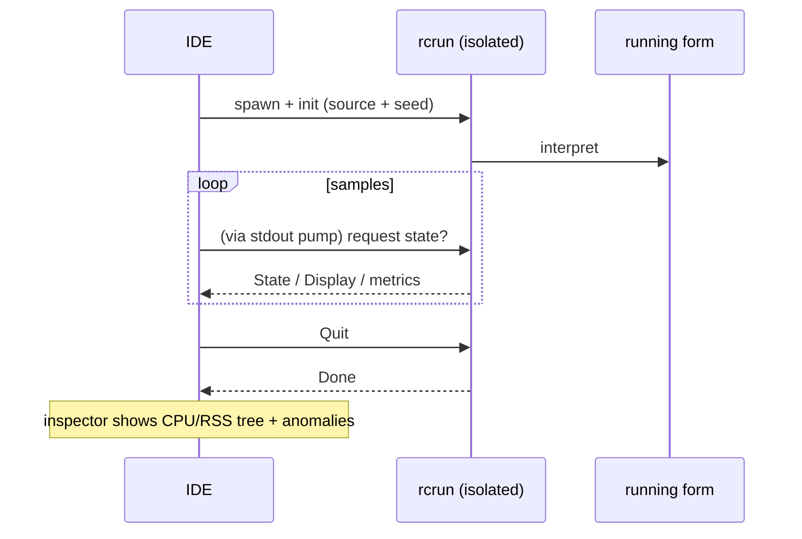

<!--
SPDX-License-Identifier: Apache-2.0
Copyright (c) 2026 Emerson Lopes and PowerRustCOBOL contributors

Licensed under the Apache License, Version 2.0.
See the LICENSE file in the project root for full license information.
-->

<!-- powerrustcobol: 1.65.124 -->

# PowerRustCOBOL 可观测性

这里是**观察**一个正在运行的 RustCOBOL 程序的一切归处——它做了什么、有多快，以及
底层存储是否健康。它从**索引文件事务日志**开始，并会逐步扩展到运行时的其他方面。

| 对象 | 状态 | 位置 |
|---------|--------|-------|
| **INDEXED 文件事务日志** | ✅ 可用 | 本文档 §1 |
| 运行时追踪（`COBOLT_LOG`） | ✅ 可用 | §2 |
| **崩溃日志与工作恢复** | ✅ 可用 | §5 |
| SQL 数据库运行时 | 🔭 计划中 | — |
| HTTP / REST 客户端 | 🔭 计划中 | — |

> **指导原则。** 可观测性是*被动的*：打开其中任何一项都绝不能改变程序的行为或结果。
> 日志与追踪的错误会被吞掉，热路径保持热态（任何昂贵的东西都是需显式开启且很少调用
> 的）。

---

## 1. INDEXED 文件事务日志

抗崩溃的 **redb** 索引引擎可以按文件写出每一笔事务的日志——对诊断、容量规划和仪表板
很有用。它**默认关闭**，且是 redb 引擎专有的；而自 1.62.73 起，redb 正是你不作任何
指定就会得到的引擎（参见
[`indexed-redb-engine-cn.md`](indexed-redb-engine-cn.md)），所以只需要打开日志本身。

### 1.1 如何开启

| 参数 / 环境变量 | 取值 | 含义 |
|------------|--------|---------|
| `--indexed-log` / `COBOL_INDEXED_LOG` | `off`（默认）、`basic`/`true`、`full` | 日志级别 |
| `--indexed-log-format` / `COBOL_INDEXED_LOG_FORMAT` | `text`（默认）、`json` | 行格式 |

```bash
# logfmt, per-transaction metrics
rcrun run app.cbl --indexed-log basic

# NDJSON + index page stats on close (for Grafana/Loki)
rcrun run app.cbl --indexed-log full --indexed-log-format json
```

- **`basic`** —— 只有按事务的指标（开销小，由引擎自行统计）。
- **`full`** —— 在 `basic` 的基础上，每次 `CLOSE` 再加上 redb 的索引统计。这些统计
  会**遍历索引**，因此其代价随文件大小增长；这正是 `full` 需要显式开启、且统计只在
  CLOSE 时输出（绝不在每次提交时输出）的原因。

### 1.2 位置

每个索引文件都会在**其数据文件旁边**得到一份伴生日志，名字是在 `ASSIGN` 路径后面
追加 `.log`：

```
customers.idx        →  customers.idx.log
/var/data/orders.dat →  /var/data/orders.dat.log
```

内容是**追加**写入的（永不截断），因此一份日志会跨多次运行不断累积。

#### 轮转（保持在 100 KiB 以内）

为了不让任何单个文件变大，活动日志在接近 **100 KiB**（`MAX_LOG_BYTES`）时就会
**轮转**，做法与 logrotate／Grafana 一致：

1. 把活动的 `<datafile>.log` 重命名为
   **`<user|no-user>.<datafile>.log.<timestamp>`**，然后
2. 开一份全新的空活动日志。

时间戳是紧凑的 UTC 标记，例如 `20260610T120230461Z`。`<user>` 是
`OPEN … WITH REGISTERED USER` 的值（已针对文件系统做过净化），若未提供则为
**`no-user`**。一次轮转之后的例子：

```
customers.idx.log                                 # active (< 100 KiB)
alice.customers.idx.log.20260610T120230461Z       # rotated archive (~100 KiB)
no-user.orders.dat.log.20260610T120051301Z        # rotated, no user supplied
```

运行时从不删除轮转后的文件——请用你的日志管道去清理或转运它们（例如先交给 Promtail
再删除）。每份归档本身都是一份完整、可解析的日志。

### 1.3 记录了什么

每个**事务事件**一行：`OPEN`、`COMMIT`、`ROLLBACK`、`CLOSE`。

| 字段 | 类型 | 含义 |
|-------|------|---------|
| `ts` | 字符串 | 毫秒精度的 ISO-8601 UTC 时间戳（`2026-06-10T07:30:00.123Z`） |
| `file` | 字符串 | 索引文件名 |
| `user` | 字符串 | 登记的用户（仅在提供时出现——参见 §1.3.1） |
| `tx` | 数值 | 事务计数器（**按 OPEN 会话计**） |
| `kind` | 字符串 | `OPEN` / `COMMIT` / `ROLLBACK` / `CLOSE` |
| `writes` | 数值 | 本次事务中的 `WRITE` |
| `rewrites` | 数值 | 本次事务中的 `REWRITE` |
| `deletes` | 数值 | 本次事务中的 `DELETE` |
| `records` | 数值 | 变更总数（`writes+rewrites+deletes`） |
| `bytes` | 数值 | 写入／重写的记录字节数 |
| `dur_ms` | 数值 | 事务的墙钟耗时 |
| `rec_per_s` | 数值 | 每秒记录数 |
| `bytes_per_s` | 数值 | 每秒字节数 |
| `order` | 字符串 | 写入的键若为升序则是 `ordered`，否则是 `unordered`（没有写入时为 `n/a`） |
| `in_order` | 数值 | 键向前推进的写入次数 |
| `out_of_order` | 数值 | 键往回退的写入次数 |

**`full` 级别的 CLOSE 行**会补上 redb 的索引统计：

| 字段 | 含义 |
|-------|---------|
| `tree_height` | 主 B+tree 的高度 |
| `leaf_pages` / `branch_pages` | 页数 |
| `allocated_pages` | 文件中已分配的页 |
| `stored_bytes` | 存活记录的字节数 |
| `fragmented_bytes` | 空闲／碎片空间（含文件预分配的余量） |
| `page_size` | redb 的页大小（4096） |

> **为什么 `order` 重要。** 升序键的写入会落在 B+tree 的同一个热点叶子上；分散的键
> 会碰到随机的叶子（更多 I/O，更多碎片）。`order` / `in_order` / `out_of_order` 这
> 三个字段一眼就能反映写入的局部性——它很好地代表了一次装载究竟是顺序的还是随机的。

> **`tx` 是按会话计的。** 引擎在每次 `OPEN` 时都会重建，因此计数器在每个
> OPEN…CLOSE 会话里从 1 重新开始；`ts` 字段用来消除歧义。

#### 1.3.1 记录登录用户 —— `OPEN … WITH REGISTERED USER`

COBOL 程序很少处在 OAuth 或任何认证引擎之后，因此操作者／用户是作为 PowerRustCOBOL
的扩展，在 `OPEN` 上**显式**提供的：

```cobol
       OPEN I-O CUSTOMER-FILE WITH REGISTERED USER "ALICE"
       OPEN I-O CUSTOMER-FILE WITH REGISTERED USER WS-OPERATOR
```

- 该值可以是一个**字符串字面量**或一个**数据项**（`USER` 可省略；
  `WITH REGISTERED "ALICE"` 也能解析）。
- 它适用于整个 `OPEN…CLOSE` 会话：该文件的**每一行**事件
  （`OPEN`/`COMMIT`/`ROLLBACK`/`CLOSE`）都会带上一个 `user=` 字段。
- 它纯粹是观测性的——不做任何认证或授权，日志关闭时也完全没有作用。

日志行示例（每个用户一个会话）：

```
ts=…Z file=customers.idx user=ALICE        tx=1 kind=OPEN   …
ts=…Z file=customers.idx user=ALICE        tx=2 kind=COMMIT …
ts=…Z file=customers.idx user=BOB-FROM-WS  tx=1 kind=OPEN   …
```

### 1.4 格式

#### logfmt（`text`，默认）

```
ts=2026-06-10T07:30:00.123Z file=customers.idx tx=2 kind=COMMIT writes=1 rewrites=0 \
   deletes=0 records=1 bytes=12 dur_ms=3 rec_per_s=272 bytes_per_s=3266 \
   order=ordered in_order=1 out_of_order=0
```

含空格的字符串值会加引号。Loki 用 `| logfmt` 解析它。

#### NDJSON（`json`）

```json
{"ts":"2026-06-10T07:30:00.123Z","file":"customers.idx","tx":2,"kind":"COMMIT","writes":1,"rewrites":0,"deletes":0,"records":1,"bytes":12,"dur_ms":3,"rec_per_s":272,"bytes_per_s":3266,"order":"ordered","in_order":1,"out_of_order":0}
```

每行一个 JSON 对象。**数值字段是裸的 JSON 数字**，这样 Grafana 就能直接作图；字符串
字段则加引号。Loki 用 `| json` 解析它。

### 1.5 Grafana / Loki

Grafana 不直接读文件——请用代理把日志运到 **Loki**，然后再查询。推荐用 `json` 格式。

1. 用 Promtail / Grafana Agent / Alloy **收集** `*.idx.log` → Loki。把*标签*保持在
   低基数（例如 `job`、`file`、`kind`）；让 `tx`、`ts` 和各项数值指标留作解析出的
   字段。
2. 在 Grafana 里**查询**（LogQL）：

   ```logql
   # commit throughput over time
   {job="rustcobol"} | json | kind="COMMIT" | unwrap rec_per_s

   # rolled-back work
   sum by (file) (count_over_time({job="rustcobol"} | json | kind="ROLLBACK" [5m]))

   # index growth (full level)
   {job="rustcobol"} | json | kind="CLOSE" | unwrap allocated_pages
   ```

Promtail 抓取配置示例（用 logfmt 也可以——把管道阶段换成 `logfmt` 即可）：

```yaml
scrape_configs:
  - job_name: rustcobol
    static_configs:
      - targets: [localhost]
        labels: { job: rustcobol, __path__: /var/data/*.idx.log }
    pipeline_stages:
      - json:
          expressions: { kind: kind, file: file }
      - labels: { kind: kind, file: file }
```

### 1.6 代价与安全性

- `basic` 级别的日志只是在每次操作上加几个计数器，并在每个事务事件上追加一行——可以
  忽略不计。
- `full` **只在 CLOSE 时**增加一次索引遍历；除非你确实想要那份快照，否则在非常大的
  文件上请避免使用。
- 日志绝不会影响程序行为：所有日志 I/O 错误都会被静默忽略，数据路径保持不变。

### 1.7 实现

`crates/cobolt-runtime/src/indexed_log.rs` —— `LogLevel`、`LogFormat`、把内容渲染成
logfmt 或 NDJSON 的 `LogRecord` 构造器（无依赖的 JSON）、负责追加写入的 `LogWriter`，
以及一个无依赖的 ISO-8601 格式化器。按事务的累加器位于
`crates/cobolt-runtime/src/indexed_redb.rs`；参数在
`crates/cobolt-cli/src/main.rs` 中解析，并通过
`Interpreter::set_indexed_log_level` / `set_indexed_log_format` 生效。

---

## 2. 运行时追踪（`COBOLT_LOG`）

`rcrun` 使用带环境过滤器的 `tracing` 框架。设置 `COBOLT_LOG` 可以提高内部运行时／
诊断消息的详细程度（默认只有警告）：

```bash
COBOLT_LOG=debug rcrun run app.cbl
COBOLT_LOG=cobolt-runtime=trace rcrun run app.cbl
```

这是面向开发者的诊断输出（写到 stderr），与 §1 中按文件的结构化事务日志是两回事。

---

## 3. IDE 中的调试开关

IDE 知道的每一个调试开关——上面的追踪过滤器、§1 的 INDEXED 事务日志、渲染叠加层、
数据绑定追踪和 AI 面板的布局追踪——都可以在 **Help → Debug Settings** 中编辑，按
领域分成一个个标签页。这些设置是 IDE 全局的（保存在本机，而不是 `cobolt.toml` 里），
并会作为此处记录的那些环境变量转发给每个 `rcrun run-form` 子进程，因此不需要手工
导出任何东西。

如果是从 shell 里独立运行 `rcrun`，导出环境变量依然有效。

---

## 4. Run Form 检查器（IDE）

当 **Run Form** 处于活动状态时，IDE 可以打开一个 **Run Form 检查器**（独立视口），
对隔离的子进程进行采样：

- 每次采样的 CPU 百分比、RSS 字节数、子进程数量、系统已用内存。
- 异常检测（突然增长、子进程过多等）。
- 实时的迷你折线图与进程树。
- 使用隔离 `rcrun` 的 IPC 通道（进程隔离的细节参见开发者指南）。

这在 IDE 中需显式开启，且不会影响正在运行的窗体。空闲时采样会被节流。日志与指标仅供
诊断使用。

mermaid 概览：



---

## 5. 崩溃日志与工作恢复

窗口应用程序没有挂接终端，因此当 IDE 死掉时，它的 panic 消息、它的 `file:line` 以及
它的回溯，全都去了一个没人在看的 stderr——窗口就这么消失，什么也没留下。有两套彼此
独立的机制来替代它，因为它们解决的是两个不同的问题。

**崩溃日志——好歹留下点可供诊断的东西。** 一个 panic 钩子会写出
`<data>/cobolt/crash/crash-<seconds>.log`，里面有 panic 消息、它的
`file:line:column`、一份强制取得的回溯、IDE 版本、操作系统、线程，以及当时打开着的
文件。把它附到缺陷报告里。

**自动保存——让工作活下来。** 每 **20 秒**，每个未保存的编辑器缓冲区和每个被修改过
的窗体都会被复制到 `<data>/cobolt/recovery/`，旁边还有一份 `manifest.toml`，把每份
副本对应回它的原件。一个标记文件记录着"有一个会话正在运行"，并在干净退出时被删除；
下次启动时若发现它还在，那正是"上一次会话结束得很糟"的含义，此时 IDE 就会提出恢复。

**恢复绝不覆盖。** 接受这项提议后，每份副本会以 `<name>.recovered.<ext>` 的名字写在
原件旁边，路径则列在输出面板里。那份副本出自一个早已失去立足点的进程，所以哪个版本
胜出是你的决定，不是 IDE 的。

> ⚠️ **panic 钩子并不能捕捉一切。** 栈溢出在保护页上出错，是以 `SIGSEGV` 送达的；
> 内存不足杀手发的是 `SIGKILL`；在栈展开过程中第二次 panic 会直接 abort。这三种情况
> 下钩子根本不会运行，**也不会写出任何崩溃日志**。覆盖这些情况的是自动保存，因为在
> 出事之前它就已经发生过了——这也正是为什么那个间隔才是真正的保证：最多损失 20 秒
> 的工作。

`<data>` 是操作系统的数据目录——macOS 上是 `~/Library/Application Support`，
Windows 上是 `%APPDATA%`，Linux 上是 `~/.local/share`。

---

## 路线图

计划中的补充，好让这份文档继续充当唯一的可观测性参考：

- **SQL 运行时** —— 面向 SQLite/PostgreSQL/MySQL 引擎的按连接／按语句的耗时与行数
  （参见 [`database-runtime-cn.md`](database-runtime-cn.md)）。
- **HTTP 客户端** —— 为内建的 REST 功能记录请求／延迟／状态。
- **运行汇总** —— 一份可选的、覆盖所有文件的运行结束报告。

.<<
