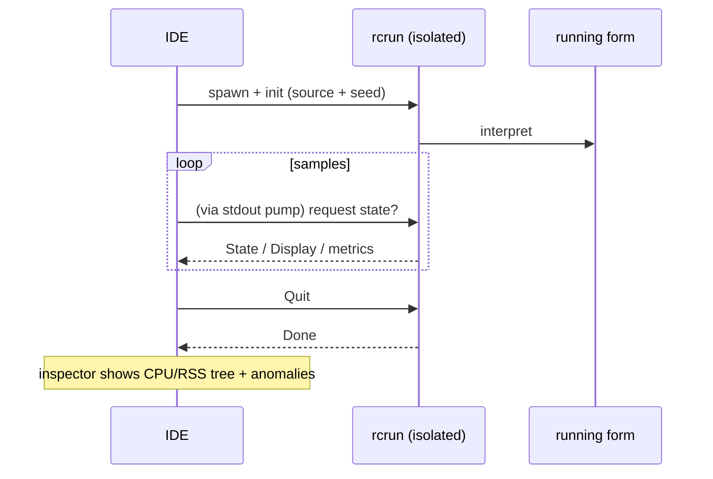

<!--
SPDX-License-Identifier: Apache-2.0
Copyright (c) 2026 Emerson Lopes and PowerRustCOBOL contributors

Licensed under the Apache License, Version 2.0.
See the LICENSE file in the project root for full license information.
-->

# PowerRustCOBOL 可观测性

这里是关于**观测**一个正在运行的 RustCOBOL 程序的一切：它做了什么、有多快，以及
底层存储的健康状况如何。本文从 **INDEXED 文件事务日志**开始，并将逐步扩展到运行时
的其他侧面。

| 侧面 | 状态 | 位置 |
|---------|--------|-------|
| **INDEXED 文件事务日志** | ✅ 可用 | 本文档 §1 |
| 运行时跟踪（`COBOLT_LOG`） | ✅ 可用 | §2 |
| SQL 数据库运行时 | 🔭 计划中 | — |
| HTTP / REST 客户端 | 🔭 计划中 | — |

> **指导原则。** 可观测性是*被动的*：启用其中任何一项都绝不能改变程序的行为或
> 结果。日志／跟踪的错误会被吞掉，热路径依然保持为热路径（凡是开销大的都需显式
> 开启，且调用频率极低）。

---

## 1. INDEXED 文件事务日志

具备崩溃安全性的 **redb** 索引引擎可以为每个文件写出一份记录每笔事务的日志——
这对诊断、容量规划和仪表盘都很有用。它**默认关闭**，且专属于 redb 引擎
（`--indexed-engine redb`；参见
[`indexed-redb-engine.md`](indexed-redb-engine.md)）。

### 1.1 如何启用

| 标志 / 环境变量 | 取值 | 含义 |
|------------|--------|---------|
| `--indexed-log` / `COBOL_INDEXED_LOG` | `off`（默认）、`basic`/`true`、`full` | 日志级别 |
| `--indexed-log-format` / `COBOL_INDEXED_LOG_FORMAT` | `text`（默认）、`json` | 行格式 |

```bash
# logfmt，按事务的指标
rcrun run app.cbl --indexed-engine redb --indexed-log basic

# NDJSON + 关闭时的索引页统计（供 Grafana/Loki 使用）
rcrun run app.cbl --indexed-engine redb --indexed-log full --indexed-log-format json
```

- **`basic`** —— 仅按事务的指标（开销小，由引擎自行统计）。
- **`full`** —— 在 `basic` 之外，每次 `CLOSE` 时附加 redb 的索引统计。这些统计会
  **遍历索引**，因此其开销随文件大小增长；这正是 `full` 需显式开启、且统计只在
  CLOSE 时（而非每次提交）输出的原因。

### 1.2 存放位置

每个索引文件都会在**其数据文件旁边**得到一份伴随日志，命名方式是在 `ASSIGN`
路径后追加 `.log`：

```
customers.idx        →  customers.idx.log
/var/data/orders.dat →  /var/data/orders.dat.log
```

日志行是**追加**写入的（从不截断），因此日志会跨多次运行不断累积。

#### 轮转（保持在 100 KiB 以下）

为避免任何单个文件过大，活动日志在接近 **100 KiB**（`MAX_LOG_BYTES`）时会按
logrotate/Grafana 的风格进行**轮转**：

1. 活动的 `<数据文件>.log` 被重命名为
   **`<用户|no-user>.<数据文件>.log.<时间戳>`**，然后
2. 开启一份全新的空活动日志。

时间戳是紧凑的 UTC 标记，例如 `20260610T120230461Z`。其中 `<用户>` 取自
`OPEN … WITH REGISTERED USER` 的值（已针对文件系统做过净化处理）；若未提供，则
为 **`no-user`**。一次轮转后的示例：

```
customers.idx.log                                 # 活动（< 100 KiB）
alice.customers.idx.log.20260610T120230461Z       # 已轮转的归档（约 100 KiB）
no-user.orders.dat.log.20260610T120051301Z        # 已轮转，未提供用户
```

运行时从不删除已轮转的文件——请用你的日志流水线来清理或转运它们（例如先由
Promtail 收集再删除）。每一份归档本身都是一份完整、可解析的日志。

### 1.3 记录了什么

每个**事务事件**一行：`OPEN`、`COMMIT`、`ROLLBACK`、`CLOSE`。

| 字段 | 类型 | 含义 |
|-------|------|---------|
| `ts` | 字符串 | ISO-8601 UTC 时间戳，毫秒精度（`2026-06-10T07:30:00.123Z`） |
| `file` | 字符串 | 索引文件名 |
| `user` | 字符串 | 已登记的用户（仅在提供时出现——参见 §1.3.1） |
| `tx` | 数字 | 事务计数器（**按 OPEN 会话计**） |
| `kind` | 字符串 | `OPEN` / `COMMIT` / `ROLLBACK` / `CLOSE` |
| `writes` | 数字 | 本事务中的 `WRITE` 次数 |
| `rewrites` | 数字 | 本事务中的 `REWRITE` 次数 |
| `deletes` | 数字 | 本事务中的 `DELETE` 次数 |
| `records` | 数字 | 变更总数（`writes+rewrites+deletes`） |
| `bytes` | 数字 | 写入／重写的记录字节数 |
| `dur_ms` | 数字 | 事务的墙钟时长 |
| `rec_per_s` | 数字 | 每秒记录数 |
| `bytes_per_s` | 数字 | 每秒字节数 |
| `order` | 字符串 | 若写入的键为升序则为 `ordered`，否则为 `unordered`（无写入时为 `n/a`） |
| `in_order` | 数字 | 键向前推进的写入次数 |
| `out_of_order` | 数字 | 键发生回退的写入次数 |

**`full` 级别的 CLOSE 行**会附加 redb 的索引统计：

| 字段 | 含义 |
|-------|---------|
| `tree_height` | 主 B+树的高度 |
| `leaf_pages` / `branch_pages` | 页数 |
| `allocated_pages` | 文件中已分配的页数 |
| `stored_bytes` | 存活的记录字节数 |
| `fragmented_bytes` | 空闲／碎片空间（含文件预分配的余量） |
| `page_size` | redb 的页大小（4096） |

> **`order` 为何重要。** 升序键的写入只会命中 B+树中一个热点叶子；分散的键则会
> 触及随机叶子（更多 I/O、更多碎片）。`order` / `in_order` / `out_of_order` 三个
> 字段能一眼看出写入的局部性——它很好地反映了一次装载究竟是顺序的还是随机的。

> **`tx` 是按会话计的。** 引擎在每次 `OPEN` 时都会重建，因此计数器在每个
> OPEN…CLOSE 会话中都从 1 重新开始；`ts` 字段可用于消除歧义。

#### 1.3.1 记录已登录用户 —— `OPEN … WITH REGISTERED USER`

COBOL 程序很少置于 OAuth 或任何认证引擎之后，因此操作员／用户是在 `OPEN` 上
**显式**提供的，这是 PowerRustCOBOL 的一项扩展：

```cobol
       OPEN I-O CUSTOMER-FILE WITH REGISTERED USER "ALICE"
       OPEN I-O CUSTOMER-FILE WITH REGISTERED USER WS-OPERATOR
```

- 该值可以是**字符串字面量**或**数据项**（`USER` 可省略；
  `WITH REGISTERED "ALICE"` 同样可以解析）。
- 它作用于整个 `OPEN…CLOSE` 会话：该文件的**每一条**事件行
  （`OPEN`/`COMMIT`/`ROLLBACK`/`CLOSE`）都会带上 `user=` 字段。
- 它纯粹用于观测——不进行任何认证或授权，日志关闭时也完全没有作用。

日志行示例（每个用户一个会话）：

```
ts=…Z file=customers.idx user=ALICE        tx=1 kind=OPEN   …
ts=…Z file=customers.idx user=ALICE        tx=2 kind=COMMIT …
ts=…Z file=customers.idx user=BOB-FROM-WS  tx=1 kind=OPEN   …
```

### 1.4 格式

#### logfmt（`text`，默认）

```
ts=2026-06-10T07:30:00.123Z file=customers.idx tx=2 kind=COMMIT writes=1 rewrites=0 \
   deletes=0 records=1 bytes=12 dur_ms=3 rec_per_s=272 bytes_per_s=3266 \
   order=ordered in_order=1 out_of_order=0
```

含空格的字符串值会被加上引号。Loki 用 `| logfmt` 解析它。

#### NDJSON（`json`）

```json
{"ts":"2026-06-10T07:30:00.123Z","file":"customers.idx","tx":2,"kind":"COMMIT","writes":1,"rewrites":0,"deletes":0,"records":1,"bytes":12,"dur_ms":3,"rec_per_s":272,"bytes_per_s":3266,"order":"ordered","in_order":1,"out_of_order":0}
```

每行一个 JSON 对象。**数值字段是裸的 JSON 数字**，这样 Grafana 可以直接把它们
画成图；字符串字段则加引号。Loki 用 `| json` 解析它。

### 1.5 Grafana / Loki

Grafana 不会直接读取文件——请用代理把日志送到 **Loki**，然后再查询。推荐使用
`json` 格式。

1. 用 Promtail / Grafana Agent / Alloy **收集** `*.idx.log` → Loki。让*标签*保持
   低基数（例如 `job`、`file`、`kind`）；把 `tx`、`ts` 以及各数值指标留作解析
   出来的字段。
2. 在 Grafana 中**查询**（LogQL）：

   ```logql
   # 提交吞吐随时间的变化
   {job="rustcobol"} | json | kind="COMMIT" | unwrap rec_per_s

   # 被回滚的工作
   sum by (file) (count_over_time({job="rustcobol"} | json | kind="ROLLBACK" [5m]))

   # 索引增长（full 级别）
   {job="rustcobol"} | json | kind="CLOSE" | unwrap allocated_pages
   ```

Promtail 抓取配置示例（用 logfmt 也可以——把流水线阶段换成 `logfmt` 即可）：

```yaml
scrape_configs:
  - job_name: rustcobol
    static_configs:
      - targets: [localhost]
        labels: { job: rustcobol, __path__: /var/data/*.idx.log }
    pipeline_stages:
      - json:
          expressions: { kind: kind, file: file }
      - labels: { kind: kind, file: file }
```

### 1.6 开销与安全性

- `basic` 级日志只是在每次操作时增加几个计数器，并在每个事务事件后追加一行——
  开销可以忽略。
- `full` 只在 **CLOSE 时**增加一次索引遍历；除非你确实需要那份快照，否则在超大
  文件上应避免使用。
- 日志绝不会影响程序行为：所有日志 I/O 错误都被静默忽略，数据路径保持不变。

### 1.7 实现

`crates/cobolt-runtime/src/indexed_log.rs` —— `LogLevel`、`LogFormat`、把内容
渲染为 logfmt 或 NDJSON（无依赖 JSON）的 `LogRecord` 构建器、负责追加写入的
`LogWriter`，以及一个无依赖的 ISO-8601 格式化器。按事务的累加器位于
`crates/cobolt-runtime/src/indexed_redb.rs`；各标志在
`crates/cobolt-cli/src/main.rs` 中解析，并通过
`Interpreter::set_indexed_log_level` / `set_indexed_log_format` 应用。

---

## 2. 运行时跟踪（`COBOLT_LOG`）

`rcrun` 使用带环境变量过滤器的 `tracing` 框架。设置 `COBOLT_LOG` 可以提高内部
运行时／诊断消息的详细程度（默认为警告级）：

```bash
COBOLT_LOG=debug rcrun run app.cbl
COBOLT_LOG=cobolt-runtime=trace rcrun run app.cbl
```

这是面向开发者的诊断输出（写到 stderr），与 §1 中按文件的结构化事务日志是两回事。

---

## 3. IDE 中的调试开关

IDE 知道的每一个调试开关——上面的跟踪过滤器、§1 的 INDEXED 事务日志、渲染叠加层、
data-bind 跟踪以及 AI 面板的布局跟踪——都可以在 **Help → Debug Settings** 中编辑，
并按领域分组在各自的标签页中。这些设置是 IDE 级的（保存在本机，而不是
`cobolt.toml` 中），并会作为本文所记录的环境变量转发给每个 `rcrun run-form` 子
进程，因此无需手工导出任何变量。

若要从 shell 中单独运行 `rcrun`，导出环境变量的方式依然有效。

---

## 4. Run-Form 检查器（IDE）

当 **Run Form** 处于活动状态时，IDE 可以打开一个 **Run-Form 检查器**（独立
viewport），对隔离的子进程进行采样：

- 每次采样的 CPU %、RSS 字节数、子进程数量、系统已用内存。
- 异常检测（突然增长、子进程过多等）。
- 实时迷你折线图与进程树。
- 使用来自隔离 `rcrun` 的 IPC 通道（进程隔离的细节参见开发者指南）。

这在 IDE 中是可选功能，不会影响正在运行的 form。空闲时采样会被节流。日志和指标
仅用于诊断。

mermaid 概览：



---

## 路线图

计划中的补充，以使本文档始终是可观测性的唯一参考：

- **SQL 运行时** —— 针对 SQLite/PostgreSQL/MySQL 各引擎，提供按连接／按语句的
  计时与行数（参见 [`database-runtime.md`](database-runtime.md)）。
- **HTTP 客户端** —— 为 REST 内置功能提供请求、延迟与状态的日志。
- **整体运行摘要** —— 一份可选的、覆盖所有文件的运行结束报告。
