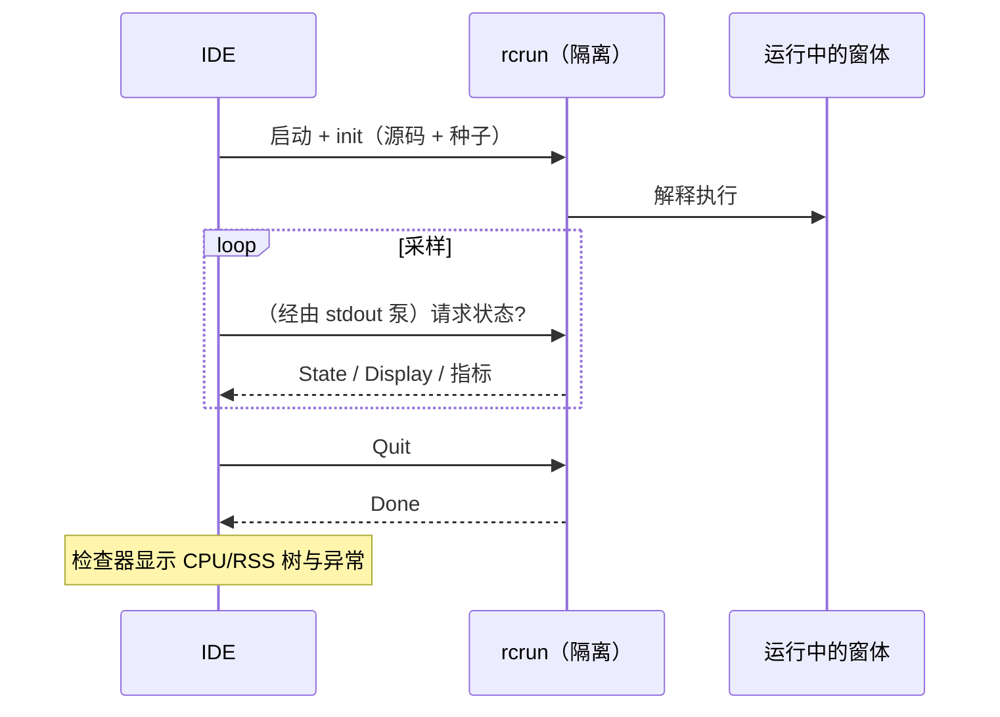

<!--
SPDX-License-Identifier: Apache-2.0
Copyright (c) 2026 Emerson Lopes and PowerRustCOBOL contributors

Licensed under the Apache License, Version 2.0.
See the LICENSE file in the project root for full license information.
-->

# PowerRustCOBOL 可观测性

这里汇集了**观测**运行中的 RustCOBOL 程序的一切内容——它做了什么、有多快，以及底层
存储是否健康。起点是**索引文件的事务日志**，之后会扩展到其他运行时侧面。

| 侧面 | 状态 | 位置 |
|---------|--------|-------|
| **INDEXED 文件事务日志** | ✅ 已提供 | 本文 §1 |
| 运行时跟踪（`COBOLT_LOG`） | ✅ 已提供 | §2 |
| **崩溃日志与工作恢复** | ✅ 已提供 | §5 |
| SQL 数据库运行时 | 🔭 计划中 | — |
| HTTP / REST 客户端 | 🔭 计划中 | — |

> **指导原则。** 可观测性是*被动的*：启用其中任何一项都绝不能改变程序的行为或结果。
> 日志与跟踪的错误会被静默吞掉，热路径也始终保持热态（凡是昂贵的动作都需显式开启，
> 且调用得很克制）。

---

## 1. INDEXED 文件事务日志

崩溃安全的 **redb** 索引引擎可以按文件记录每一笔事务——便于诊断、容量规划和仪表盘
展示。它**默认关闭**，且仅适用于 redb 引擎
（`--indexed-engine redb`；参见 [`indexed-redb-engine-cn.md`](indexed-redb-engine-cn.md)）。

### 1.1 如何启用

| 参数 / 环境变量 | 取值 | 含义 |
|------------|--------|---------|
| `--indexed-log` / `COBOL_INDEXED_LOG` | `off`（默认）、`basic`/`true`、`full` | 日志级别 |
| `--indexed-log-format` / `COBOL_INDEXED_LOG_FORMAT` | `text`（默认）、`json` | 行格式 |

```bash
# logfmt, per-transaction metrics
rcrun run app.cbl --indexed-engine redb --indexed-log basic

# NDJSON + index page stats on close (for Grafana/Loki)
rcrun run app.cbl --indexed-engine redb --indexed-log full --indexed-log-format json
```

- **`basic`**——只记录每笔事务的指标（开销低，由引擎自行统计）。
- **`full`**——在 `basic` 之上，每次 `CLOSE` 时附加 redb 的索引统计。这些统计会
  **遍历索引**，因此其代价随文件大小增长；这正是 `full` 需要显式开启、且统计只在
  CLOSE 时输出（绝不按每次提交输出）的原因。

### 1.2 位置

每个索引文件都会在**其数据文件旁边得到一个伴随日志**，命名方式是在 `ASSIGN` 路径后
追加 `.log`：

```
customers.idx        →  customers.idx.log
/var/data/orders.dat →  /var/data/orders.dat.log
```

日志行是**追加写入**的（从不截断），因此日志会跨多次运行不断累积。

#### 轮转（保持在 100 KiB 以内）

为了不让任何单个文件变大，活动日志在接近 **100 KiB**（`MAX_LOG_BYTES`）时会按
logrotate/Grafana 的风格**轮转**：

1. 把活动的 `<datafile>.log` 改名为
   **`<user|no-user>.<datafile>.log.<timestamp>`**，然后
2. 新建一个空的活动日志。

时间戳是紧凑的 UTC 标记，例如 `20260610T120230461Z`。`<user>` 取自
`OPEN … WITH REGISTERED USER` 的值（已按文件系统要求净化）；若未提供则为
**`no-user`**。轮转一次之后的例子：

```
customers.idx.log                                 # active (< 100 KiB)
alice.customers.idx.log.20260610T120230461Z       # rotated archive (~100 KiB)
no-user.orders.dat.log.20260610T120051301Z        # rotated, no user supplied
```

运行时从不删除已轮转的文件——请用你的日志管道清理或转运它们（例如先用 Promtail
发送再删除）。每个归档本身都是一份完整、可解析的日志。

### 1.3 记录了什么

每个**事务事件**一行：`OPEN`、`COMMIT`、`ROLLBACK`、`CLOSE`。

| 字段 | 类型 | 含义 |
|-------|------|---------|
| `ts` | 字符串 | ISO-8601 UTC 时间戳，毫秒精度（`2026-06-10T07:30:00.123Z`） |
| `file` | 字符串 | 索引文件名 |
| `user` | 字符串 | 登记的用户（仅在提供时出现——参见 §1.3.1） |
| `tx` | 数值 | 事务计数器（**按 OPEN 会话计**） |
| `kind` | 字符串 | `OPEN` / `COMMIT` / `ROLLBACK` / `CLOSE` |
| `writes` | 数值 | 本次事务中的 `WRITE` 次数 |
| `rewrites` | 数值 | 本次事务中的 `REWRITE` 次数 |
| `deletes` | 数值 | 本次事务中的 `DELETE` 次数 |
| `records` | 数值 | 变更总数（`writes+rewrites+deletes`） |
| `bytes` | 数值 | 写入或重写的记录字节数 |
| `dur_ms` | 数值 | 事务的挂钟耗时 |
| `rec_per_s` | 数值 | 每秒记录数 |
| `bytes_per_s` | 数值 | 每秒字节数 |
| `order` | 字符串 | 若写入的键递增则为 `ordered`，否则为 `unordered`（无写入时为 `n/a`） |
| `in_order` | 数值 | 键向前推进的写入次数 |
| `out_of_order` | 数值 | 键向后回退的写入次数 |

**`full` 级别的 CLOSE 行**会追加 redb 的索引统计：

| 字段 | 含义 |
|-------|---------|
| `tree_height` | 主 B+ 树高度 |
| `leaf_pages` / `branch_pages` | 页数统计 |
| `allocated_pages` | 文件中已分配的页数 |
| `stored_bytes` | 有效记录字节数 |
| `fragmented_bytes` | 空闲或碎片空间（含预分配的文件余量） |
| `page_size` | redb 页大小（4096） |

> **`order` 为什么重要。** 递增键的写入会集中命中 B+ 树的同一个热叶子；分散的键则
> 触及随机叶子（I/O 更多，碎片更多）。`order` / `in_order` / `out_of_order` 三个
> 字段一眼就能反映写入局部性——用来判断一次装载是顺序还是随机，是很好的近似指标。

> **`tx` 按会话计。** 引擎在每次 `OPEN` 时重建，因此计数器在每个 OPEN…CLOSE 会话都
> 从 1 重新开始；用 `ts` 字段来区分。

#### 1.3.1 记录登录用户——`OPEN … WITH REGISTERED USER`

COBOL 程序很少置于 OAuth 或任何认证引擎之后，因此操作员（用户）作为
PowerRustCOBOL 的扩展，在 `OPEN` 上**显式**给出：

```cobol
       OPEN I-O CUSTOMER-FILE WITH REGISTERED USER "ALICE"
       OPEN I-O CUSTOMER-FILE WITH REGISTERED USER WS-OPERATOR
```

- 该值可以是**字符串字面量**，也可以是**数据项**（`USER` 可省略，
  `WITH REGISTERED "ALICE"` 同样能解析）。
- 它作用于整个 `OPEN…CLOSE` 会话：该文件的**每一条**事件行
  （`OPEN`/`COMMIT`/`ROLLBACK`/`CLOSE`）都会带上 `user=` 字段。
- 它纯粹用于观测——既不认证也不授权，日志关闭时更没有任何作用。

日志行示例（每个用户一个会话）：

```
ts=…Z file=customers.idx user=ALICE        tx=1 kind=OPEN   …
ts=…Z file=customers.idx user=ALICE        tx=2 kind=COMMIT …
ts=…Z file=customers.idx user=BOB-FROM-WS  tx=1 kind=OPEN   …
```

### 1.4 格式

#### logfmt（`text`，默认）

```
ts=2026-06-10T07:30:00.123Z file=customers.idx tx=2 kind=COMMIT writes=1 rewrites=0 \
   deletes=0 records=1 bytes=12 dur_ms=3 rec_per_s=272 bytes_per_s=3266 \
   order=ordered in_order=1 out_of_order=0
```

含空格的字符串值会加引号。Loki 用 `| logfmt` 解析。

#### NDJSON（`json`）

```json
{"ts":"2026-06-10T07:30:00.123Z","file":"customers.idx","tx":2,"kind":"COMMIT","writes":1,"rewrites":0,"deletes":0,"records":1,"bytes":12,"dur_ms":3,"rec_per_s":272,"bytes_per_s":3266,"order":"ordered","in_order":1,"out_of_order":0}
```

每行一个 JSON 对象。**数值字段是裸的 JSON 数字**，便于 Grafana 直接绘图；字符串字段
则加引号。Loki 用 `| json` 解析。

### 1.5 Grafana / Loki

Grafana 不会直接读取文件——请用采集代理把日志送到 **Loki**，然后再查询。推荐使用
`json` 格式。

1. 用 Promtail / Grafana Agent / Alloy **采集** `*.idx.log` → Loki。把*标签*保持在低
   基数（例如 `job`、`file`、`kind`）；让 `tx`、`ts` 以及各数值指标停留在解析出的
   字段里。
2. 在 Grafana 中**查询**（LogQL）：

   ```logql
   # commit throughput over time
   {job="rustcobol"} | json | kind="COMMIT" | unwrap rec_per_s

   # rolled-back work
   sum by (file) (count_over_time({job="rustcobol"} | json | kind="ROLLBACK" [5m]))

   # index growth (full level)
   {job="rustcobol"} | json | kind="CLOSE" | unwrap allocated_pages
   ```

Promtail 抓取示例（logfmt 同样可行——把流水线阶段换成 `logfmt` 即可）：

```yaml
scrape_configs:
  - job_name: rustcobol
    static_configs:
      - targets: [localhost]
        labels: { job: rustcobol, __path__: /var/data/*.idx.log }
    pipeline_stages:
      - json:
          expressions: { kind: kind, file: file }
      - labels: { kind: kind, file: file }
```

### 1.6 代价与安全

- `basic` 日志只是在每次操作时增加几个计数器，并为每个事务事件追加一行——可以忽略
  不计。
- `full` 只在 **CLOSE 时**增加一次索引遍历；除非确实需要那份快照，否则不要在超大
  文件上使用。
- 日志绝不影响程序行为：所有日志 I/O 错误都会被静默忽略，数据路径也保持不变。

### 1.7 实现

`crates/cobolt-runtime/src/indexed_log.rs`——`LogLevel`、`LogFormat`、可渲染为
logfmt 或 NDJSON（无依赖的 JSON）的 `LogRecord` 构建器、负责追加写入的
`LogWriter`，以及一个无依赖的 ISO-8601 格式化器。按事务累计的计数器位于
`crates/cobolt-runtime/src/indexed_redb.rs`；参数在
`crates/cobolt-cli/src/main.rs` 中解析，并通过
`Interpreter::set_indexed_log_level` / `set_indexed_log_format` 生效。

---

## 2. 运行时跟踪（`COBOLT_LOG`）

`rcrun` 使用带环境变量过滤器的 `tracing` 框架。设置 `COBOLT_LOG` 可提高运行时内部与
诊断消息的详细程度（默认只到警告级）：

```bash
COBOLT_LOG=debug rcrun run app.cbl
COBOLT_LOG=cobolt-runtime=trace rcrun run app.cbl
```

这是面向开发者的诊断输出（写到 stderr），与 §1 中按文件的结构化事务日志是两回事。

---

## 3. IDE 中的调试开关

IDE 知道的每一个调试开关——上面的跟踪过滤器、§1 的 INDEXED 事务日志、渲染叠加层、
数据绑定跟踪，以及 AI 面板的布局跟踪——都可以在 **Help → Debug Settings** 中编辑，
并按领域分成一个个选项卡。这些设置作用于整个 IDE（保存在本机，而不是
`cobolt.toml` 里），并会以本文所述的环境变量形式转发给每个 `rcrun run-form` 子
进程，因此无需手工导出任何变量。

若要从 shell 单独运行 `rcrun`，导出环境变量的老办法依然有效。

---

## 4. Run-Form 检查器（IDE）

当 **Run Form** 处于活动状态时，IDE 可以打开一个 **Run-Form Inspector**（独立视口），
对隔离运行的子进程进行采样：

- 每次采样的 CPU 占用率、RSS 字节数、子进程数量、系统已用内存。
- 异常检测（突然增长、子进程过多等）。
- 实时迷你折线图与进程树。
- 使用隔离 `rcrun` 的 IPC 通道（进程隔离的细节参见开发者指南）。

这是 IDE 中需显式开启的功能，不会影响正在运行的窗体。空闲时采样会被降频。日志与
指标仅用于诊断。

mermaid 概览：



---

## 5. 崩溃日志与工作恢复

带窗口的应用没有挂接终端，所以当 IDE 死掉时，它的 panic 消息、`file:line` 和回溯全都
写进了无人阅读的 stderr——窗口就那么消失了，什么也没留下。有两套彼此独立的机制取而
代之，因为它们解决的是两个不同的问题。

**崩溃日志——让人有东西可诊断。** panic 钩子会写出
`<data>/cobolt/crash/crash-<seconds>.log`，其中包含 panic 消息、它的
`file:line:column`、强制生成的回溯、IDE 版本、操作系统、线程，以及当时打开的文件。
请把它附在缺陷报告里。

**自动保存——让工作活下来。** 每 **20 秒**，每个未保存的编辑器缓冲区和每个已修改的
窗体都会被复制到 `<data>/cobolt/recovery/`，旁边还有一份 `manifest.toml`，把每个副本
对应回它的原始文件。一个标记文件记录着有会话正在运行，正常退出时会被删除；下次启动
时发现它，恰恰就是"上一次会话结束得很糟糕"的含义，此时 IDE 会主动提出恢复。

**恢复绝不覆盖。** 接受这一提议后，每个副本都会以 `<name>.recovered.<ext>` 的名字写在
原始文件旁边，路径列在 **Output** 面板中。副本来自一个早已站不稳脚跟的进程，所以哪个
版本胜出由你决定，而不是由 IDE 决定。

> ⚠️ **panic 钩子无法捕获一切。** 栈溢出会在守护页上触发错误，并以 `SIGSEGV` 的形式
> 送达；OOM killer 发送的是 `SIGKILL`；栈展开过程中的第二次 panic 会直接 abort。这三
> 种情况下钩子都不会运行，**也不会写出任何崩溃日志**。覆盖这些情况的正是自动保存，
> 因为在出事之前它就已经完成了——这也正是"间隔"才是真正保证的原因：最多损失 20 秒的
> 工作。

`<data>` 是操作系统的数据目录——macOS 上是 `~/Library/Application Support`，Windows
上是 `%APPDATA%`，Linux 上是 `~/.local/share`。

---

## 路线图

计划中的补充，好让本文继续充当唯一的可观测性参考：

- **SQL 运行时**——为 SQLite/PostgreSQL/MySQL 引擎提供按连接、按语句的耗时与行数
  （参见 [`database-runtime-cn.md`](database-runtime-cn.md)）。
- **HTTP 客户端**——为 REST 内建函数记录请求、延迟与状态。
- **整体运行摘要**——一份可选的、覆盖全部文件的运行结束报告。
