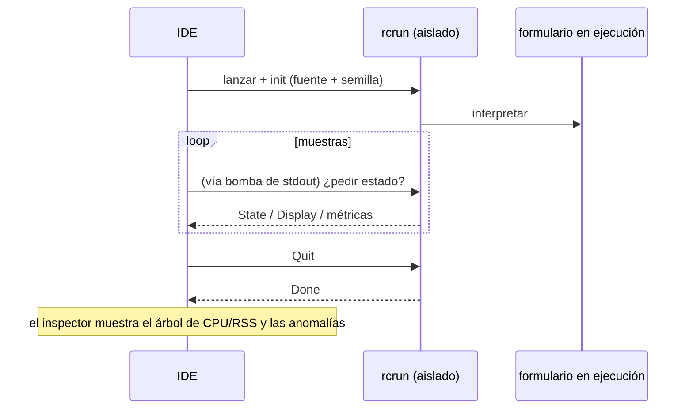

<!--
SPDX-License-Identifier: Apache-2.0
Copyright (c) 2026 Emerson Lopes and PowerRustCOBOL contributors

Licensed under the Apache License, Version 2.0.
See the LICENSE file in the project root for full license information.
-->

# Observabilidad de PowerRustCOBOL

Este es el hogar de todo lo relativo a **observar** un programa RustCOBOL en
ejecución: qué hizo, a qué velocidad y cuán sanos están los almacenes que hay
debajo. Empieza por los **registros de transacciones de archivos indexados** y
crecerá para cubrir otras superficies del runtime.

| Superficie | Estado | Dónde |
|---------|--------|-------|
| **Registro de transacciones de archivos INDEXED** | ✅ disponible | este documento, §1 |
| Trazado del runtime (`COBOLT_LOG`) | ✅ disponible | §2 |
| **Registros de caída y recuperación del trabajo** | ✅ disponible | §5 |
| Runtime de bases de datos SQL | 🔭 previsto | — |
| Cliente HTTP / REST | 🔭 previsto | — |

> **Principio rector.** La observabilidad es *pasiva*: activar cualquiera de sus
> piezas nunca debe cambiar el comportamiento ni los resultados del programa. Los
> errores de registro y de trazado se descartan en silencio, y los caminos
> calientes siguen calientes (todo lo costoso es opcional y se invoca con
> parsimonia).

---

## 1. Registro de transacciones de archivos INDEXED

El motor indexado **redb**, a prueba de caídas, puede escribir un registro por
archivo con cada transacción: útil para el diagnóstico, la planificación de
capacidad y los paneles de control. Está **desactivado por defecto** y es
específico del motor redb
(`--indexed-engine redb`; véase [`indexed-redb-engine-es.md`](indexed-redb-engine-es.md)).

### 1.1 Cómo activarlo

| Parámetro / variable | Valores | Significado |
|------------|--------|---------|
| `--indexed-log` / `COBOL_INDEXED_LOG` | `off` (por defecto), `basic`/`true`, `full` | Nivel de registro |
| `--indexed-log-format` / `COBOL_INDEXED_LOG_FORMAT` | `text` (por defecto), `json` | Formato de línea |

```bash
# logfmt, per-transaction metrics
rcrun run app.cbl --indexed-engine redb --indexed-log basic

# NDJSON + index page stats on close (for Grafana/Loki)
rcrun run app.cbl --indexed-engine redb --indexed-log full --indexed-log-format json
```

- **`basic`** — solo métricas por transacción (barato, contabilizado por el
  propio motor).
- **`full`** — lo de `basic` más las estadísticas del índice de redb en cada
  `CLOSE`. Esas estadísticas **recorren el índice**, así que su coste crece con
  el tamaño del archivo; por eso `full` es opcional y las estadísticas se emiten
  únicamente en el CLOSE (nunca por cada commit).

### 1.2 Ubicación

Cada archivo indexado obtiene un **registro adjunto junto a su archivo de
datos**, nombrado añadiendo `.log` a la ruta del `ASSIGN`:

```
customers.idx        →  customers.idx.log
/var/data/orders.dat →  /var/data/orders.dat.log
```

Las líneas se **añaden al final** (nunca se trunca el archivo), de modo que un
registro se acumula entre ejecuciones.

#### Rotación (se mantiene por debajo de 100 KiB)

Para que ningún archivo suelto crezca demasiado, el registro activo se **rota**
en cuanto se acerca a los **100 KiB** (`MAX_LOG_BYTES`), al estilo de
logrotate/Grafana:

1. el `<datafile>.log` activo se renombra a
   **`<user|no-user>.<datafile>.log.<timestamp>`**, y
2. se inicia un registro activo nuevo y vacío.

La marca de tiempo es un sello UTC compacto, por ejemplo `20260610T120230461Z`.
El `<user>` es el valor de `OPEN … WITH REGISTERED USER` (saneado para el sistema
de archivos), o **`no-user`** cuando no se suministró ninguno. Ejemplo tras una
rotación:

```
customers.idx.log                                 # active (< 100 KiB)
alice.customers.idx.log.20260610T120230461Z       # rotated archive (~100 KiB)
no-user.orders.dat.log.20260610T120051301Z        # rotated, no user supplied
```

El runtime nunca borra los archivos rotados: púrgalos o envíalos con tu tubería
de registros (por ejemplo Promtail y luego borrar). Cada archivo archivado es un
registro completo y analizable por sí mismo.

### 1.3 Qué se registra

Una línea por **evento de transacción**: `OPEN`, `COMMIT`, `ROLLBACK`, `CLOSE`.

| Campo | Tipo | Significado |
|-------|------|---------|
| `ts` | cadena | marca de tiempo ISO-8601 UTC, con precisión de ms (`2026-06-10T07:30:00.123Z`) |
| `file` | cadena | el nombre del archivo indexado |
| `user` | cadena | el usuario registrado (presente solo cuando se suministra — véase §1.3.1) |
| `tx` | número | contador de transacciones (**por sesión de OPEN**) |
| `kind` | cadena | `OPEN` / `COMMIT` / `ROLLBACK` / `CLOSE` |
| `writes` | número | `WRITE`s de esta transacción |
| `rewrites` | número | `REWRITE`s de esta transacción |
| `deletes` | número | `DELETE`s de esta transacción |
| `records` | número | mutaciones totales (`writes+rewrites+deletes`) |
| `bytes` | número | bytes de registro escritos o reescritos |
| `dur_ms` | número | duración de la transacción en tiempo de reloj |
| `rec_per_s` | número | registros por segundo |
| `bytes_per_s` | número | bytes por segundo |
| `order` | cadena | `ordered` si las claves escritas fueron ascendentes, si no `unordered` (`n/a` si no hubo escrituras) |
| `in_order` | número | número de escrituras cuya clave avanzó |
| `out_of_order` | número | número de escrituras cuya clave retrocedió |

**Las líneas de CLOSE del nivel `full`** añaden las estadísticas del índice de
redb:

| Campo | Significado |
|-------|---------|
| `tree_height` | altura del árbol B+ primario |
| `leaf_pages` / `branch_pages` | recuentos de páginas |
| `allocated_pages` | páginas asignadas en el archivo |
| `stored_bytes` | bytes de registro vivos |
| `fragmented_bytes` | espacio libre o fragmentado (incluye el sobrante preasignado del archivo) |
| `page_size` | tamaño de página de redb (4096) |

> **Por qué importa `order`.** Las escrituras con clave ascendente golpean una
> única hoja caliente del árbol B+; las claves dispersas tocan hojas aleatorias
> (más E/S, más fragmentación). Los campos `order` / `in_order` /
> `out_of_order` son una señal de un vistazo sobre la localidad de escritura: un
> buen indicador de si una carga fue secuencial o aleatoria.

> **`tx` es por sesión.** El motor se vuelve a crear en cada `OPEN`, así que el
> contador reinicia en 1 por cada sesión OPEN…CLOSE; el campo `ts` desambigua.

#### 1.3.1 Registrar al usuario conectado — `OPEN … WITH REGISTERED USER`

Los programas COBOL rara vez viven detrás de OAuth o de cualquier motor de
autenticación, así que el operador o usuario se suministra **explícitamente** en
el `OPEN`, como extensión de PowerRustCOBOL:

```cobol
       OPEN I-O CUSTOMER-FILE WITH REGISTERED USER "ALICE"
       OPEN I-O CUSTOMER-FILE WITH REGISTERED USER WS-OPERATOR
```

- El valor es un **literal de cadena** o un **elemento de datos** (`USER` es
  opcional; `WITH REGISTERED "ALICE"` también se analiza).
- Se aplica a toda la sesión `OPEN…CLOSE`: **todas** las líneas de evento de ese
  archivo (`OPEN`/`COMMIT`/`ROLLBACK`/`CLOSE`) llevan un campo `user=`.
- Es puramente observacional: no autentica ni autoriza nada, y no tiene efecto
  alguno cuando el registro está desactivado.

Ejemplo de líneas de registro (una sesión por usuario):

```
ts=…Z file=customers.idx user=ALICE        tx=1 kind=OPEN   …
ts=…Z file=customers.idx user=ALICE        tx=2 kind=COMMIT …
ts=…Z file=customers.idx user=BOB-FROM-WS  tx=1 kind=OPEN   …
```

### 1.4 Formatos

#### logfmt (`text`, por defecto)

```
ts=2026-06-10T07:30:00.123Z file=customers.idx tx=2 kind=COMMIT writes=1 rewrites=0 \
   deletes=0 records=1 bytes=12 dur_ms=3 rec_per_s=272 bytes_per_s=3266 \
   order=ordered in_order=1 out_of_order=0
```

Los valores de cadena que contienen espacios van entrecomillados. Loki analiza
esto con `| logfmt`.

#### NDJSON (`json`)

```json
{"ts":"2026-06-10T07:30:00.123Z","file":"customers.idx","tx":2,"kind":"COMMIT","writes":1,"rewrites":0,"deletes":0,"records":1,"bytes":12,"dur_ms":3,"rec_per_s":272,"bytes_per_s":3266,"order":"ordered","in_order":1,"out_of_order":0}
```

Un objeto JSON por línea. **Los campos numéricos son números JSON desnudos**,
para que Grafana pueda graficarlos directamente; los campos de cadena van
entrecomillados. Loki analiza esto con `| json`.

### 1.5 Grafana / Loki

Grafana no lee archivos directamente: envía los registros a **Loki** con un
agente y luego consulta. Recomendado: el formato `json`.

1. **Recoge** los `*.idx.log` con Promtail / Grafana Agent / Alloy → Loki.
   Mantén las *etiquetas* de baja cardinalidad (por ejemplo `job`, `file`,
   `kind`); deja `tx`, `ts` y las métricas numéricas como campos analizados.
2. **Consulta** en Grafana (LogQL):

   ```logql
   # commit throughput over time
   {job="rustcobol"} | json | kind="COMMIT" | unwrap rec_per_s

   # rolled-back work
   sum by (file) (count_over_time({job="rustcobol"} | json | kind="ROLLBACK" [5m]))

   # index growth (full level)
   {job="rustcobol"} | json | kind="CLOSE" | unwrap allocated_pages
   ```

Ejemplo de recolección con Promtail (logfmt también sirve: cambia la etapa de la
tubería por `logfmt`):

```yaml
scrape_configs:
  - job_name: rustcobol
    static_configs:
      - targets: [localhost]
        labels: { job: rustcobol, __path__: /var/data/*.idx.log }
    pipeline_stages:
      - json:
          expressions: { kind: kind, file: file }
      - labels: { kind: kind, file: file }
```

### 1.6 Coste y seguridad

- El registro `basic` añade unos pocos contadores por operación y una línea
  añadida al final por evento de transacción: despreciable.
- `full` añade un recorrido del índice **solo en el CLOSE**; evítalo en archivos
  muy grandes salvo que quieras esa instantánea.
- El registro nunca afecta al comportamiento del programa: todos los errores de
  E/S del registro se ignoran en silencio, y el camino de los datos no cambia.

### 1.7 Implementación

`crates/cobolt-runtime/src/indexed_log.rs` — `LogLevel`, `LogFormat`, el
constructor `LogRecord` que renderiza a logfmt o NDJSON (JSON sin dependencias),
el `LogWriter` que añade al final y un formateador ISO-8601 sin dependencias. Los
acumuladores por transacción viven en
`crates/cobolt-runtime/src/indexed_redb.rs`; los parámetros se resuelven en
`crates/cobolt-cli/src/main.rs` y se aplican mediante
`Interpreter::set_indexed_log_level` / `set_indexed_log_format`.

---

## 2. Trazado del runtime (`COBOLT_LOG`)

`rcrun` usa el framework `tracing` con un filtro por variable de entorno. Define
`COBOLT_LOG` para elevar el detalle de los mensajes internos de runtime y
diagnóstico (avisos por defecto):

```bash
COBOLT_LOG=debug rcrun run app.cbl
COBOLT_LOG=cobolt-runtime=trace rcrun run app.cbl
```

Esta es salida de diagnóstico dirigida al desarrollador (a stderr), distinta del
registro estructurado de transacciones por archivo de la §1.

---

## 3. Interruptores de depuración en el IDE

Todos los interruptores de depuración que el IDE conoce —el filtro de trazado de
arriba, el registro de transacciones INDEXED de la §1, las superposiciones de
renderizado, el trazado del enlace de datos y el trazado de la disposición del
panel de IA— son editables en **Help → Debug Settings**, agrupados en una pestaña
por área. Los ajustes son de ámbito IDE (se guardan en la máquina, no en
`cobolt.toml`) y se reenvían a cada proceso hijo `rcrun run-form` como las
variables de entorno documentadas aquí, de modo que no hay que exportar nada a
mano.

Exportar una variable sigue funcionando para una ejecución suelta de `rcrun`
desde un intérprete de comandos.

---

## 4. Inspector de Run-Form (IDE)

Cuando **Run Form** está activo, el IDE puede abrir un **Run-Form Inspector**
(ventana aparte) que muestrea el proceso hijo aislado:

- Porcentaje de CPU por muestra, bytes de RSS, número de procesos hijo y memoria
  del sistema usada.
- Detección de anomalías (crecimiento repentino, demasiados hijos, etc.).
- Minigráficos en vivo y árbol de procesos.
- Usa el canal IPC del `rcrun` aislado (véase la guía del desarrollador para los
  detalles del aislamiento de procesos).

Esto es opcional en el IDE y no afecta al formulario en ejecución. El muestreo se
ralentiza cuando no hay actividad. Los registros y las métricas son solo para
diagnóstico.

Vista general en mermaid:



---

## 5. Registros de caída y recuperación del trabajo

Una aplicación con ventanas no tiene terminal asociada, así que cuando el IDE
muere su mensaje de pánico, su `file:line` y su traza van a un stderr que nadie
está leyendo: la ventana simplemente desaparece y no deja nada tras de sí. Dos
mecanismos separados sustituyen aquello, porque resuelven dos problemas
distintos.

**Registros de caída — para que haya algo que diagnosticar.** Un gancho de pánico
escribe `<data>/cobolt/crash/crash-<seconds>.log` con el mensaje del pánico, su
`file:line:column`, una traza forzada, la versión del IDE, el sistema operativo,
el hilo y los archivos que estaban abiertos en ese momento. Adjúntalo al informe
de error.

**Autoguardado — para que el trabajo sobreviva.** Cada **20 segundos** se copia
cada búfer de editor sin guardar y cada formulario modificado a
`<data>/cobolt/recovery/`, junto a un `manifest.toml` que devuelve cada copia a su
original. Un archivo marcador registra que hay una sesión en marcha y se borra al
salir limpiamente; encontrar uno en el arranque siguiente es exactamente lo que
significa «la última sesión terminó mal», y entonces el IDE ofrece restaurar.

**Restaurar nunca sobrescribe.** Aceptar el ofrecimiento escribe cada copia junto
a su original como `<name>.recovered.<ext>` y lista las rutas en el panel
**Output**. La copia salió de un proceso que ya había perdido pie, así que qué
versión gana es decisión tuya, no del IDE.

> ⚠️ **Un gancho de pánico no puede atraparlo todo.** Un desbordamiento de pila
> falla en la página de guarda y llega como `SIGSEGV`; el asesino por falta de
> memoria envía `SIGKILL`; un segundo pánico mientras se desenrolla la pila
> aborta. En los tres casos el gancho nunca se ejecuta y **no se escribe ningún
> registro de caída**. El autoguardado es lo que cubre esos casos, porque ya ha
> ocurrido para cuando algo va mal, y por eso mismo el intervalo es la garantía
> real: como mucho 20 segundos de trabajo.

`<data>` es el directorio de datos del sistema operativo:
`~/Library/Application Support` en macOS, `%APPDATA%` en Windows,
`~/.local/share` en Linux.

---

## Hoja de ruta

Adiciones previstas, para que este documento siga siendo la referencia única de
observabilidad:

- **Runtime SQL** — tiempos y recuentos de filas por conexión y por sentencia
  para los motores SQLite/PostgreSQL/MySQL (véase
  [`database-runtime-es.md`](database-runtime-es.md)).
- **Cliente HTTP** — registro de petición, latencia y estado para las funciones
  REST integradas.
- **Resumen agregado de la ejecución** — un informe opcional de fin de ejecución
  que abarque todos los archivos.
