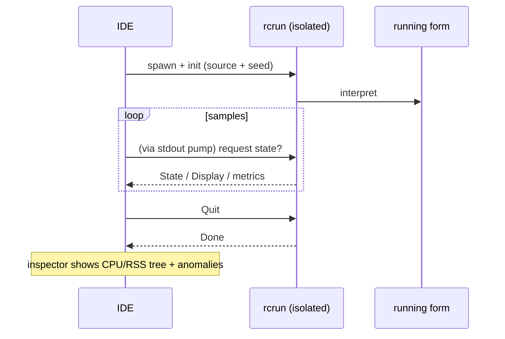

<!--
SPDX-License-Identifier: Apache-2.0
Copyright (c) 2026 Emerson Lopes and PowerRustCOBOL contributors

Licensed under the Apache License, Version 2.0.
See the LICENSE file in the project root for full license information.
-->

<!-- powerrustcobol: 1.65.124 -->

# Observabilidad de PowerRustCOBOL

Este es el hogar de todo lo relativo a **observar** un programa RustCOBOL en
ejecución: qué hizo, a qué velocidad y qué salud tienen los almacenes
subyacentes. Empieza por los **registros de transacciones de ficheros indexados**
y crecerá para cubrir otras superficies del entorno de ejecución.

| Superficie | Estado | Dónde |
|---------|--------|-------|
| **Registro de transacciones de ficheros INDEXED** | ✅ disponible | este documento, §1 |
| Trazas del entorno de ejecución (`COBOLT_LOG`) | ✅ disponible | §2 |
| **Registros de caída y recuperación del trabajo** | ✅ disponible | §5 |
| Entorno de ejecución de bases de datos SQL | 🔭 previsto | — |
| Cliente HTTP / REST | 🔭 previsto | — |

> **Principio rector.** La observabilidad es *pasiva*: activar cualquier parte de
> ella nunca debe cambiar el comportamiento ni los resultados del programa. Los
> errores de registro y traza se tragan, y los caminos calientes siguen calientes
> (todo lo caro es opcional y se invoca con moderación).

---

## 1. Registro de transacciones de ficheros INDEXED

El motor indexado **redb**, resistente a caídas, puede escribir un registro por
fichero de cada transacción: útil para diagnóstico, planificación de capacidad y
cuadros de mando. Está **desactivado por defecto** y es específico del motor
redb, que desde 1.62.73 es el que se obtiene sin pedirlo (véase
[`indexed-redb-engine-es.md`](indexed-redb-engine-es.md)); así que solo hay que
encender el registro en sí.

### 1.1 Cómo activarlo

| Opción / variable | Valores | Significado |
|------------|--------|---------|
| `--indexed-log` / `COBOL_INDEXED_LOG` | `off` (por defecto), `basic`/`true`, `full` | Nivel de registro |
| `--indexed-log-format` / `COBOL_INDEXED_LOG_FORMAT` | `text` (por defecto), `json` | Formato de línea |

```bash
# logfmt, per-transaction metrics
rcrun run app.cbl --indexed-log basic

# NDJSON + index page stats on close (for Grafana/Loki)
rcrun run app.cbl --indexed-log full --indexed-log-format json
```

- **`basic`** — solo métricas por transacción (barato, autocontabilizado).
- **`full`** — lo de `basic` más las estadísticas del índice de redb en cada
  `CLOSE`. Esas estadísticas **recorren el índice**, así que su coste crece con
  el tamaño del fichero; por eso `full` es opcional y las estadísticas se emiten
  solo en CLOSE (nunca en cada confirmación).

### 1.2 Ubicación

Cada fichero indexado obtiene un **registro acompañante junto a su fichero de
datos**, nombrado añadiendo `.log` a la ruta del `ASSIGN`:

```
customers.idx        →  customers.idx.log
/var/data/orders.dat →  /var/data/orders.dat.log
```

Las líneas se **añaden** (nunca se trunca el fichero), de modo que un registro se
acumula entre ejecuciones.

#### Rotación (se mantiene por debajo de 100 KiB)

Para que ningún fichero suelto crezca, el registro activo se **rota** cuando se
acerca a los **100 KiB** (`MAX_LOG_BYTES`), al estilo de logrotate o Grafana:

1. el `<datafile>.log` activo se renombra a
   **`<user|no-user>.<datafile>.log.<timestamp>`**, y
2. se inicia un registro activo nuevo y vacío.

La marca de tiempo es una marca UTC compacta, por ejemplo
`20260610T120230461Z`. El `<user>` es el valor de
`OPEN … WITH REGISTERED USER` (saneado para el sistema de ficheros), o
**`no-user`** cuando no se suministró ninguno. Ejemplo tras una rotación:

```
customers.idx.log                                 # active (< 100 KiB)
alice.customers.idx.log.20260610T120230461Z       # rotated archive (~100 KiB)
no-user.orders.dat.log.20260610T120051301Z        # rotated, no user supplied
```

El entorno de ejecución nunca borra los ficheros rotados: púrguelos o envíelos
con su canalización de registros (por ejemplo Promtail y después borrar). Cada
archivo es un registro completo y analizable por sí mismo.

### 1.3 Qué se registra

Una línea por **evento de transacción**: `OPEN`, `COMMIT`, `ROLLBACK`, `CLOSE`.

| Campo | Tipo | Significado |
|-------|------|---------|
| `ts` | cadena | marca de tiempo ISO-8601 UTC con precisión de ms (`2026-06-10T07:30:00.123Z`) |
| `file` | cadena | el nombre del fichero indexado |
| `user` | cadena | el usuario registrado (presente solo cuando se suministra — véase §1.3.1) |
| `tx` | número | contador de transacciones (**por sesión de OPEN**) |
| `kind` | cadena | `OPEN` / `COMMIT` / `ROLLBACK` / `CLOSE` |
| `writes` | número | `WRITE` de esta transacción |
| `rewrites` | número | `REWRITE` de esta transacción |
| `deletes` | número | `DELETE` de esta transacción |
| `records` | número | mutaciones totales (`writes+rewrites+deletes`) |
| `bytes` | número | bytes de registro escritos o reescritos |
| `dur_ms` | número | duración de reloj de la transacción |
| `rec_per_s` | número | registros por segundo |
| `bytes_per_s` | número | bytes por segundo |
| `order` | cadena | `ordered` si las claves escritas iban en ascenso, si no `unordered` (`n/a` si no hubo escrituras) |
| `in_order` | número | número de escrituras cuya clave avanzó |
| `out_of_order` | número | número de escrituras cuya clave retrocedió |

**Las líneas de CLOSE de nivel `full`** añaden estadísticas del índice de redb:

| Campo | Significado |
|-------|---------|
| `tree_height` | altura del B+tree primario |
| `leaf_pages` / `branch_pages` | recuentos de páginas |
| `allocated_pages` | páginas asignadas en el fichero |
| `stored_bytes` | bytes de registro vivos |
| `fragmented_bytes` | espacio libre o fragmentado (incluye la holgura preasignada del fichero) |
| `page_size` | tamaño de página de redb (4096) |

> **Por qué importa `order`.** Las escrituras con clave ascendente caen en una
> única hoja caliente del B+tree; las claves dispersas tocan hojas al azar (más
> E/S, más fragmentación). Los campos `order` / `in_order` / `out_of_order` son
> una señal de un vistazo sobre la localidad de escritura, y un buen indicador de
> si una carga fue secuencial o aleatoria.

> **`tx` es por sesión.** El motor se vuelve a crear en cada `OPEN`, así que el
> contador reinicia en 1 por cada sesión OPEN…CLOSE; el campo `ts` desambigua.

#### 1.3.1 Registrar al usuario conectado — `OPEN … WITH REGISTERED USER`

Los programas COBOL rara vez viven detrás de OAuth ni de ningún motor de
autenticación, así que el operador o usuario se suministra **explícitamente** en
el `OPEN`, como extensión de PowerRustCOBOL:

```cobol
       OPEN I-O CUSTOMER-FILE WITH REGISTERED USER "ALICE"
       OPEN I-O CUSTOMER-FILE WITH REGISTERED USER WS-OPERATOR
```

- El valor es un **literal de cadena** o un **elemento de datos** (`USER` es
  opcional; `WITH REGISTERED "ALICE"` también se analiza).
- Se aplica a toda la sesión `OPEN…CLOSE`: **todas** las líneas de evento de ese
  fichero (`OPEN`/`COMMIT`/`ROLLBACK`/`CLOSE`) llevan un campo `user=`.
- Es puramente observacional: no autentica ni autoriza nada, y no tiene efecto
  alguno si el registro está desactivado.

Ejemplo de líneas de registro (una sesión por usuario):

```
ts=…Z file=customers.idx user=ALICE        tx=1 kind=OPEN   …
ts=…Z file=customers.idx user=ALICE        tx=2 kind=COMMIT …
ts=…Z file=customers.idx user=BOB-FROM-WS  tx=1 kind=OPEN   …
```

### 1.4 Formatos

#### logfmt (`text`, por defecto)

```
ts=2026-06-10T07:30:00.123Z file=customers.idx tx=2 kind=COMMIT writes=1 rewrites=0 \
   deletes=0 records=1 bytes=12 dur_ms=3 rec_per_s=272 bytes_per_s=3266 \
   order=ordered in_order=1 out_of_order=0
```

Los valores de cadena que contienen espacios van entrecomillados. Loki los
analiza con `| logfmt`.

#### NDJSON (`json`)

```json
{"ts":"2026-06-10T07:30:00.123Z","file":"customers.idx","tx":2,"kind":"COMMIT","writes":1,"rewrites":0,"deletes":0,"records":1,"bytes":12,"dur_ms":3,"rec_per_s":272,"bytes_per_s":3266,"order":"ordered","in_order":1,"out_of_order":0}
```

Un objeto JSON por línea. **Los campos numéricos son números JSON desnudos**,
para que Grafana pueda graficarlos directamente; los campos de cadena van
entrecomillados. Loki los analiza con `| json`.

### 1.5 Grafana / Loki

Grafana no lee ficheros directamente: envíe los registros a **Loki** con un
agente y después consulte. Recomendado: el formato `json`.

1. **Recoja** los `*.idx.log` con Promtail / Grafana Agent / Alloy → Loki.
   Mantenga las *etiquetas* de baja cardinalidad (por ejemplo `job`, `file`,
   `kind`); deje `tx`, `ts` y las métricas numéricas como campos analizados.
2. **Consulte** en Grafana (LogQL):

   ```logql
   # commit throughput over time
   {job="rustcobol"} | json | kind="COMMIT" | unwrap rec_per_s

   # rolled-back work
   sum by (file) (count_over_time({job="rustcobol"} | json | kind="ROLLBACK" [5m]))

   # index growth (full level)
   {job="rustcobol"} | json | kind="CLOSE" | unwrap allocated_pages
   ```

Ejemplo de recolección con Promtail (logfmt también sirve: cambie la etapa de la
canalización por `logfmt`):

```yaml
scrape_configs:
  - job_name: rustcobol
    static_configs:
      - targets: [localhost]
        labels: { job: rustcobol, __path__: /var/data/*.idx.log }
    pipeline_stages:
      - json:
          expressions: { kind: kind, file: file }
      - labels: { kind: kind, file: file }
```

### 1.6 Coste y seguridad

- El registro `basic` añade unos pocos contadores por operación y una línea
  añadida por evento de transacción: despreciable.
- `full` añade un recorrido del índice **solo en CLOSE**; evítelo en ficheros muy
  grandes salvo que quiera esa instantánea.
- El registro nunca afecta al comportamiento del programa: todos los errores de
  E/S del registro se ignoran en silencio y el camino de datos no cambia.

### 1.7 Implementación

`crates/cobolt-runtime/src/indexed_log.rs` — `LogLevel`, `LogFormat`, el
constructor `LogRecord` que renderiza a logfmt o NDJSON (JSON sin dependencias),
el `LogWriter` que añade al final, y un formateador ISO-8601 sin dependencias.
Los acumuladores por transacción viven en
`crates/cobolt-runtime/src/indexed_redb.rs`; las opciones se resuelven en
`crates/cobolt-cli/src/main.rs` y se aplican mediante
`Interpreter::set_indexed_log_level` / `set_indexed_log_format`.

---

## 2. Trazas del entorno de ejecución (`COBOLT_LOG`)

`rcrun` usa el marco `tracing` con un filtro por entorno. Ponga `COBOLT_LOG` para
subir la verbosidad de los mensajes internos de ejecución y diagnóstico (por
defecto, avisos):

```bash
COBOLT_LOG=debug rcrun run app.cbl
COBOLT_LOG=cobolt-runtime=trace rcrun run app.cbl
```

Esta es salida de diagnóstico para desarrolladores (a stderr), distinta del
registro estructurado por fichero de la §1.

---

## 3. Interruptores de depuración en el IDE

Todos los interruptores de depuración que el IDE conoce —el filtro de trazas de
arriba, el registro de transacciones INDEXED de la §1, las superposiciones de
renderizado, la traza de enlace de datos y la traza de disposición del panel de
IA— se editan en **Help → Debug Settings**, agrupados en una pestaña por área.
Los ajustes son de todo el IDE (se guardan en la máquina, no en `cobolt.toml`) y
se reenvían a cada proceso hijo `rcrun run-form` como las variables de entorno
que aquí se documentan, así que no hay que exportar nada a mano.

Exportar una variable sigue funcionando para una ejecución de `rcrun`
independiente desde un intérprete de órdenes.

---

## 4. Inspector de Run Form (IDE)

Cuando **Run Form** está activo, el IDE puede abrir un **inspector de Run Form**
(en un viewport aparte) que muestrea el proceso hijo aislado:

- Porcentaje de CPU por muestra, bytes de RSS, número de procesos hijo, memoria
  del sistema usada.
- Detección de anomalías (crecimiento súbito, demasiados hijos, etc.).
- Gráficos en miniatura en vivo y árbol de procesos.
- Usa el canal IPC del `rcrun` aislado (véase la guía del desarrollador para los
  detalles del aislamiento de procesos).

Es opcional dentro del IDE y no afecta al formulario en ejecución. El muestreo se
ralentiza cuando no hay actividad. Los registros y las métricas son solo para
diagnóstico.

Vista general en mermaid:



---

## 5. Registros de caída y recuperación del trabajo

Una aplicación de ventana no tiene ningún terminal asociado, así que cuando el
IDE muere, su mensaje de pánico, su `file:line` y su traza de pila se van a un
stderr que nadie está leyendo: la ventana sencillamente desaparece y no deja
nada. Dos mecanismos distintos sustituyen eso, porque resuelven dos problemas
distintos.

**Registros de caída — para que haya algo que diagnosticar.** Un gancho de pánico
escribe `<data>/cobolt/crash/crash-<seconds>.log` con el mensaje del pánico, su
`file:line:column`, una traza de pila forzada, la versión del IDE, el sistema
operativo, el hilo y los ficheros que estaban abiertos en ese momento. Adjúntelo
a un informe de error.

**Autoguardado — para que el trabajo sobreviva.** Cada **20 segundos**, cada
búfer del editor sin guardar y cada formulario modificado se copian a
`<data>/cobolt/recovery/`, junto a un `manifest.toml` que hace corresponder cada
copia con su original. Un fichero marcador anota que hay una sesión en marcha y
se borra al salir limpiamente; encontrar uno en el siguiente arranque es
exactamente lo que significa «la última sesión terminó mal», y entonces el IDE se
ofrece a restaurar.

**Restaurar nunca sobrescribe.** Aceptar la oferta escribe cada copia junto a su
original como `<name>.recovered.<ext>` y enumera las rutas en el panel de salida.
La copia salió de un proceso que ya había perdido pie, así que qué versión gana
es decisión suya, no del IDE.

> ⚠️ **Un gancho de pánico no puede atraparlo todo.** Un desbordamiento de pila
> falla en la página de guarda y se entrega como `SIGSEGV`; el matador por falta
> de memoria envía `SIGKILL`; un segundo pánico durante el desenrollado aborta.
> En los tres casos el gancho no llega a ejecutarse y **no se escribe ningún
> registro de caída**. El autoguardado es lo que cubre esos casos, porque ya ha
> ocurrido antes de que nada vaya mal; que es también por lo que el intervalo es
> la garantía de verdad: como mucho, 20 segundos de trabajo.

`<data>` es el directorio de datos del sistema operativo:
`~/Library/Application Support` en macOS, `%APPDATA%` en Windows,
`~/.local/share` en Linux.

---

## Hoja de ruta

Adiciones previstas, para que este documento siga siendo la referencia única de
observabilidad:

- **Entorno SQL** — tiempos y recuentos de filas por conexión y por sentencia
  para los motores SQLite/PostgreSQL/MySQL (véase
  [`database-runtime-es.md`](database-runtime-es.md)).
- **Cliente HTTP** — registro de petición, latencia y estado para las funciones
  REST incorporadas.
- **Resumen agregado de la ejecución** — un informe opcional de fin de ejecución
  sobre todos los ficheros.

.<<
