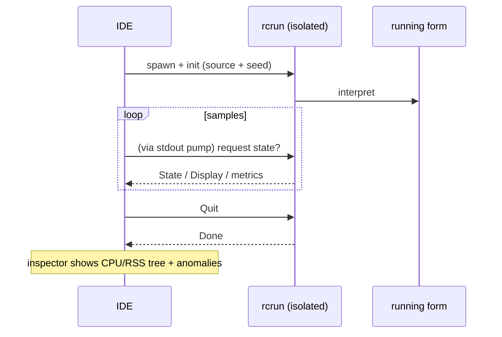

<!--
SPDX-License-Identifier: Apache-2.0
Copyright (c) 2026 Emerson Lopes and PowerRustCOBOL contributors

Licensed under the Apache License, Version 2.0.
See the LICENSE file in the project root for full license information.
-->

# Observabilidad de PowerRustCOBOL

Éste es el hogar de todo lo relativo a **observar** un programa RustCOBOL en
ejecución: qué hizo, a qué velocidad y en qué estado de salud están los almacenes
subyacentes. Comienza con los **logs de transacciones de ficheros indexados** y
crecerá para cubrir otras superficies del runtime.

| Superficie | Estado | Dónde |
|---------|--------|-------|
| **Log de transacciones de ficheros INDEXED** | ✅ disponible | este documento, §1 |
| Trazado del runtime (`COBOLT_LOG`) | ✅ disponible | §2 |
| **Registros de caída y recuperación del trabajo** | ✅ disponible | §5 |
| Runtime de bases de datos SQL | 🔭 previsto | — |
| Cliente HTTP / REST | 🔭 previsto | — |

> **Principio rector.** La observabilidad es *pasiva*: activar cualquiera de sus
> partes nunca debe cambiar el comportamiento ni los resultados del programa. Los
> errores de log/traza se ignoran, y los caminos calientes siguen calientes (todo
> lo costoso es opcional y se invoca con moderación).

---

## 1. Log de transacciones de ficheros INDEXED

El motor indexado **redb**, a prueba de caídas, puede escribir un log por fichero
de cada transacción — útil para diagnóstico, planificación de capacidad y
cuadros de mando. Está **desactivado por defecto** y es específico del motor redb
(`--indexed-engine redb`; véase
[`indexed-redb-engine.md`](indexed-redb-engine.md)).

### 1.1 Cómo activarlo

| Flag / variable | Valores | Significado |
|------------|--------|---------|
| `--indexed-log` / `COBOL_INDEXED_LOG` | `off` (por defecto), `basic`/`true`, `full` | Nivel de log |
| `--indexed-log-format` / `COBOL_INDEXED_LOG_FORMAT` | `text` (por defecto), `json` | Formato de línea |

```bash
# logfmt, métricas por transacción
rcrun run app.cbl --indexed-engine redb --indexed-log basic

# NDJSON + estadísticas de páginas del índice al cerrar (para Grafana/Loki)
rcrun run app.cbl --indexed-engine redb --indexed-log full --indexed-log-format json
```

- **`basic`** — sólo métricas por transacción (barato, contabilizado por el
  propio motor).
- **`full`** — `basic` más las estadísticas del índice de redb en cada `CLOSE`.
  Esas estadísticas **recorren el índice**, así que su coste escala con el tamaño
  del fichero; por eso `full` es opcional y las estadísticas se emiten sólo al
  CLOSE (nunca en cada commit).

### 1.2 Ubicación

Cada fichero indexado recibe un **log acompañante junto a su fichero de datos**,
nombrado añadiendo `.log` a la ruta del `ASSIGN`:

```
customers.idx        →  customers.idx.log
/var/data/orders.dat →  /var/data/orders.dat.log
```

Las líneas se **añaden al final** (nunca se trunca), así que un log se acumula
entre ejecuciones.

#### Rotación (se mantiene por debajo de 100 KiB)

Para que ningún fichero crezca demasiado, el log activo se **rota** cuando se
acerca a **100 KiB** (`MAX_LOG_BYTES`), al estilo de logrotate/Grafana:

1. el `<ficherodatos>.log` activo se renombra a
   **`<usuario|no-user>.<ficherodatos>.log.<marca-de-tiempo>`**, y
2. se inicia un log activo nuevo y vacío.

La marca de tiempo es un sello UTC compacto, p. ej. `20260610T120230461Z`. El
`<usuario>` es el valor de `OPEN … WITH REGISTERED USER` (saneado para el sistema
de ficheros), o **`no-user`** cuando no se indicó ninguno. Ejemplo tras una
rotación:

```
customers.idx.log                                 # activo (< 100 KiB)
alice.customers.idx.log.20260610T120230461Z       # archivo rotado (~100 KiB)
no-user.orders.dat.log.20260610T120051301Z        # rotado, sin usuario indicado
```

El runtime nunca borra los ficheros rotados — púrguelos o envíelos con su
canalización de logs (por ejemplo Promtail y después borrar). Cada archivo es un
log completo y analizable por sí mismo.

### 1.3 Qué se registra

Una línea por **evento de transacción**: `OPEN`, `COMMIT`, `ROLLBACK`, `CLOSE`.

| Campo | Tipo | Significado |
|-------|------|---------|
| `ts` | cadena | marca de tiempo ISO-8601 UTC, precisión de ms (`2026-06-10T07:30:00.123Z`) |
| `file` | cadena | el nombre del fichero indexado |
| `user` | cadena | el usuario registrado (presente sólo cuando se indicó — véase §1.3.1) |
| `tx` | número | contador de transacciones (**por sesión de OPEN**) |
| `kind` | cadena | `OPEN` / `COMMIT` / `ROLLBACK` / `CLOSE` |
| `writes` | número | `WRITE` en esta transacción |
| `rewrites` | número | `REWRITE` en esta transacción |
| `deletes` | número | `DELETE` en esta transacción |
| `records` | número | mutaciones totales (`writes+rewrites+deletes`) |
| `bytes` | número | bytes de registro escritos/reescritos |
| `dur_ms` | número | duración de reloj de la transacción |
| `rec_per_s` | número | registros por segundo |
| `bytes_per_s` | número | bytes por segundo |
| `order` | cadena | `ordered` si las claves escritas fueron ascendentes, si no `unordered` (`n/a` si no hubo escrituras) |
| `in_order` | número | número de escrituras cuya clave avanzó |
| `out_of_order` | número | número de escrituras cuya clave retrocedió |

**Las líneas CLOSE de nivel `full`** añaden estadísticas del índice de redb:

| Campo | Significado |
|-------|---------|
| `tree_height` | altura del B+tree primario |
| `leaf_pages` / `branch_pages` | recuento de páginas |
| `allocated_pages` | páginas asignadas en el fichero |
| `stored_bytes` | bytes de registro vivos |
| `fragmented_bytes` | espacio libre/fragmentado (incluye el margen preasignado del fichero) |
| `page_size` | tamaño de página de redb (4096) |

> **Por qué importa `order`.** Las escrituras con clave ascendente golpean una
> única hoja caliente del B+tree; las claves dispersas tocan hojas aleatorias
> (más E/S, más fragmentación). Los campos `order` / `in_order` / `out_of_order`
> son una señal de un vistazo sobre la localidad de escritura — un buen indicador
> de si una carga fue secuencial o aleatoria.

> **`tx` es por sesión.** El motor se recrea en cada `OPEN`, así que el contador
> vuelve a empezar en 1 por cada sesión OPEN…CLOSE; el campo `ts` desambigua.

#### 1.3.1 Registrar el usuario conectado — `OPEN … WITH REGISTERED USER`

Los programas COBOL rara vez se sitúan detrás de OAuth o de cualquier motor de
autenticación, así que el operador/usuario se suministra **explícitamente** en el
`OPEN`, como extensión de PowerRustCOBOL:

```cobol
       OPEN I-O CUSTOMER-FILE WITH REGISTERED USER "ALICE"
       OPEN I-O CUSTOMER-FILE WITH REGISTERED USER WS-OPERATOR
```

- El valor es un **literal de cadena** o un **data item** (`USER` es opcional;
  `WITH REGISTERED "ALICE"` también se analiza correctamente).
- Se aplica a toda la sesión `OPEN…CLOSE`: **todas** las líneas de evento de ese
  fichero (`OPEN`/`COMMIT`/`ROLLBACK`/`CLOSE`) llevan un campo `user=`.
- Es puramente observacional — no autentica ni autoriza nada, y no tiene efecto
  alguno cuando el log está desactivado.

Ejemplo de líneas de log (una sesión por usuario):

```
ts=…Z file=customers.idx user=ALICE        tx=1 kind=OPEN   …
ts=…Z file=customers.idx user=ALICE        tx=2 kind=COMMIT …
ts=…Z file=customers.idx user=BOB-FROM-WS  tx=1 kind=OPEN   …
```

### 1.4 Formatos

#### logfmt (`text`, por defecto)

```
ts=2026-06-10T07:30:00.123Z file=customers.idx tx=2 kind=COMMIT writes=1 rewrites=0 \
   deletes=0 records=1 bytes=12 dur_ms=3 rec_per_s=272 bytes_per_s=3266 \
   order=ordered in_order=1 out_of_order=0
```

Los valores de cadena que contienen espacios se entrecomillan. Loki lo analiza
con `| logfmt`.

#### NDJSON (`json`)

```json
{"ts":"2026-06-10T07:30:00.123Z","file":"customers.idx","tx":2,"kind":"COMMIT","writes":1,"rewrites":0,"deletes":0,"records":1,"bytes":12,"dur_ms":3,"rec_per_s":272,"bytes_per_s":3266,"order":"ordered","in_order":1,"out_of_order":0}
```

Un objeto JSON por línea. **Los campos numéricos son números JSON desnudos**, de
modo que Grafana puede graficarlos directamente; los campos de cadena van
entrecomillados. Loki lo analiza con `| json`.

### 1.5 Grafana / Loki

Grafana no lee ficheros directamente — envíe los logs a **Loki** con un agente y
después consulte. Recomendado: formato `json`.

1. **Recolecte** `*.idx.log` con Promtail / Grafana Agent / Alloy → Loki.
   Mantenga las *etiquetas* con cardinalidad baja (p. ej. `job`, `file`, `kind`);
   deje `tx`, `ts` y las métricas numéricas como campos analizados.
2. **Consulte** en Grafana (LogQL):

   ```logql
   # rendimiento de commits a lo largo del tiempo
   {job="rustcobol"} | json | kind="COMMIT" | unwrap rec_per_s

   # trabajo revertido
   sum by (file) (count_over_time({job="rustcobol"} | json | kind="ROLLBACK" [5m]))

   # crecimiento del índice (nivel full)
   {job="rustcobol"} | json | kind="CLOSE" | unwrap allocated_pages
   ```

Ejemplo de scrape de Promtail (logfmt también sirve — cambie la etapa de la
canalización por `logfmt`):

```yaml
scrape_configs:
  - job_name: rustcobol
    static_configs:
      - targets: [localhost]
        labels: { job: rustcobol, __path__: /var/data/*.idx.log }
    pipeline_stages:
      - json:
          expressions: { kind: kind, file: file }
      - labels: { kind: kind, file: file }
```

### 1.6 Coste y seguridad

- El log `basic` añade unos pocos contadores por operación y una línea añadida
  por evento de transacción — despreciable.
- `full` añade un recorrido del índice **sólo al CLOSE**; evítelo en ficheros muy
  grandes salvo que quiera esa instantánea.
- El log nunca afecta al comportamiento del programa: todos los errores de E/S
  del log se ignoran en silencio, y el camino de datos no cambia.

### 1.7 Implementación

`crates/cobolt-runtime/src/indexed_log.rs` — `LogLevel`, `LogFormat`, el
constructor `LogRecord` que renderiza a logfmt o NDJSON (JSON sin dependencias),
el `LogWriter` que añade al final, y un formateador ISO-8601 sin dependencias.
Los acumuladores por transacción viven en
`crates/cobolt-runtime/src/indexed_redb.rs`; los flags se resuelven en
`crates/cobolt-cli/src/main.rs` y se aplican mediante
`Interpreter::set_indexed_log_level` / `set_indexed_log_format`.

---

## 2. Trazado del runtime (`COBOLT_LOG`)

`rcrun` usa el framework `tracing` con un filtro por variable de entorno. Ponga
`COBOLT_LOG` para elevar el detalle de los mensajes internos de runtime y
diagnóstico (avisos por defecto):

```bash
COBOLT_LOG=debug rcrun run app.cbl
COBOLT_LOG=cobolt-runtime=trace rcrun run app.cbl
```

Ésta es salida de diagnóstico dirigida al desarrollador (a stderr), distinta del
log estructurado de transacciones por fichero de la §1.

---

## 3. Interruptores de depuración en la IDE

Todos los interruptores de depuración que la IDE conoce — el filtro de trazado de
arriba, el log de transacciones INDEXED de la §1, las superposiciones de
renderizado, la traza de data-bind y la traza de disposición del panel de IA — se
editan en **Help → Debug Settings**, agrupados en una pestaña por área. Los
ajustes son de ámbito IDE (se guardan en la máquina, no en `cobolt.toml`) y se
reenvían a cada hijo `rcrun run-form` como las variables de entorno documentadas
aquí, de modo que no hay que exportar nada a mano.

Exportar una variable sigue funcionando para una ejecución independiente de
`rcrun` desde un shell.

---

## 4. Inspector de Run-Form (IDE)

Cuando **Run Form** está activo, la IDE puede abrir un **Inspector de Run-Form**
(viewport aparte) que muestrea el proceso hijo aislado:

- CPU %, bytes de RSS, número de procesos hijo y memoria del sistema usada, por
  muestra.
- Detección de anomalías (crecimiento súbito, demasiados hijos, etc.).
- Sparklines en vivo y árbol de procesos.
- Usa el canal IPC del `rcrun` aislado (véase la guía del desarrollador para los
  detalles de aislamiento de procesos).

Es opcional en la IDE y no afecta al form en ejecución. El muestreo se ralentiza
cuando no hay actividad. Los logs y las métricas son sólo para diagnóstico.

Visión general en mermaid:



---

## 5. Registros de caída y recuperación del trabajo

Una aplicación con ventana no tiene un terminal asociado, así que cuando la IDE
muere su mensaje de pánico, su `file:line` y su traza van a un stderr que nadie
está leyendo: la ventana simplemente desaparece y no deja nada tras de sí. Dos
mecanismos distintos sustituyen eso, porque resuelven dos problemas distintos.

**Registros de caída — para que haya algo que diagnosticar.** Un manejador de
pánico escribe `<data>/cobolt/crash/crash-<segundos>.log` con el mensaje del
pánico, su `file:line:column`, una traza forzada, la versión de la IDE, el
sistema operativo, el hilo y los ficheros que estaban abiertos en ese momento.
Adjúntelo a un informe de error.

**Autoguardado — para que el trabajo sobreviva.** Cada **20 segundos**, cada
búfer del editor sin guardar y cada form modificado se copian a
`<data>/cobolt/recovery/`, junto a un `manifest.toml` que asocia cada copia con
su original. Un fichero marcador registra que hay una sesión en marcha y se
borra al salir limpiamente; encontrar uno en el siguiente arranque es
exactamente lo que significa «la última sesión terminó mal», y entonces la IDE
ofrece restaurar.

**Restaurar nunca sobrescribe.** Al aceptar el ofrecimiento, cada copia se
escribe junto a su original como `<nombre>.recovered.<ext>` y las rutas se
listan en el panel Output. La copia salió de un proceso que ya había perdido pie,
así que qué versión gana es decisión suya, no de la IDE.

> ⚠️ **Un manejador de pánico no puede atraparlo todo.** Un desbordamiento de
> pila falla en la página de guarda y llega como `SIGSEGV`; el asesino por falta
> de memoria envía `SIGKILL`; un segundo pánico durante el desenrollado aborta.
> En los tres casos el manejador nunca se ejecuta y **no se escribe ningún
> registro de caída**. El autoguardado es lo que cubre esos casos, porque ya ha
> ocurrido para cuando algo va mal — que es también por lo que el intervalo es la
> garantía real: como mucho 20 segundos de trabajo.

`<data>` es el directorio de datos del sistema operativo:
`~/Library/Application Support` en macOS, `%APPDATA%` en Windows,
`~/.local/share` en Linux.

---

## Hoja de ruta

Adiciones previstas, para que este documento siga siendo la referencia única de
observabilidad:

- **Runtime SQL** — tiempos por conexión/sentencia y recuentos de filas para los
  motores SQLite/PostgreSQL/MySQL (véase
  [`database-runtime.md`](database-runtime.md)).
- **Cliente HTTP** — log de peticiones, latencia y estado para los built-ins
  REST.
- **Resumen agregado de la ejecución** — un informe opcional de fin de ejecución
  que abarque todos los ficheros.
