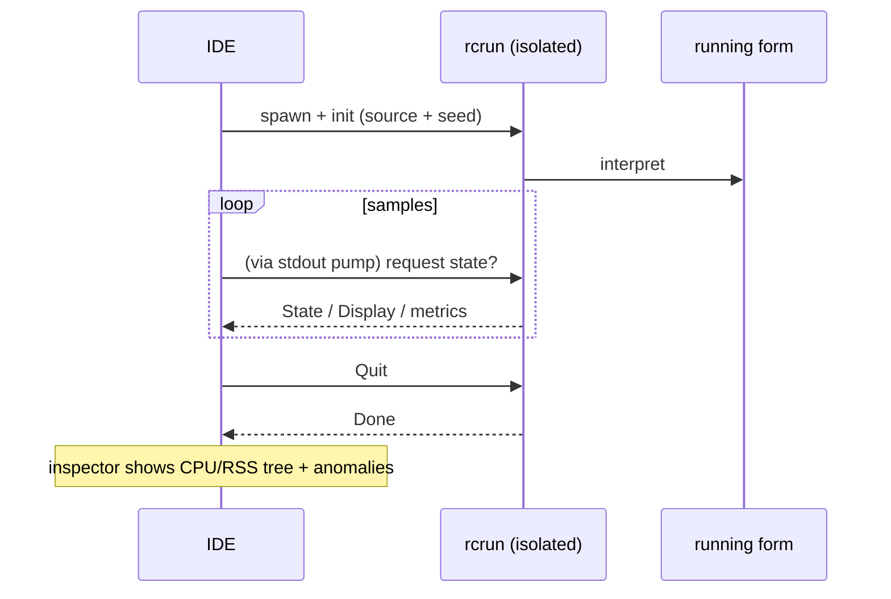

<!--
SPDX-License-Identifier: Apache-2.0
Copyright (c) 2026 Emerson Lopes and PowerRustCOBOL contributors

Licensed under the Apache License, Version 2.0.
See the LICENSE file in the project root for full license information.
-->

<!-- powerrustcobol: 1.65.124 -->

# Observabilité de PowerRustCOBOL

C'est ici que vit tout ce qui touche à l'**observation** d'un programme RustCOBOL
en cours d'exécution — ce qu'il a fait, à quelle vitesse, et dans quel état de
santé sont les magasins sous-jacents. Le document commence par les **journaux de
transactions des fichiers indexés** et s'étendra à d'autres surfaces du runtime.

| Surface | État | Où |
|---------|--------|-------|
| **Journal de transactions des fichiers INDEXED** | ✅ disponible | ce document, §1 |
| Traçage du runtime (`COBOLT_LOG`) | ✅ disponible | §2 |
| **Journaux de plantage et récupération du travail** | ✅ disponible | §5 |
| Runtime de bases de données SQL | 🔭 prévu | — |
| Client HTTP / REST | 🔭 prévu | — |

> **Principe directeur.** L'observabilité est *passive* : en activer une partie
> ne doit jamais changer le comportement ni les résultats du programme. Les
> erreurs de journal et de trace sont avalées, et les chemins chauds restent
> chauds (tout ce qui coûte cher est optionnel et appelé avec parcimonie).

---

## 1. Journal de transactions des fichiers INDEXED

Le moteur indexé **redb**, résistant aux pannes, peut écrire un journal par
fichier de chaque transaction — utile pour le diagnostic, la planification de
capacité et les tableaux de bord. Il est **désactivé par défaut** et propre au
moteur redb, qui depuis 1.62.73 est celui que l'on obtient sans le demander (voir
[`indexed-redb-engine-fr.md`](indexed-redb-engine-fr.md)) ; il n'y a donc que le
journal lui-même à allumer.

### 1.1 L'activer

| Option / variable | Valeurs | Signification |
|------------|--------|---------|
| `--indexed-log` / `COBOL_INDEXED_LOG` | `off` (par défaut), `basic`/`true`, `full` | Niveau de journalisation |
| `--indexed-log-format` / `COBOL_INDEXED_LOG_FORMAT` | `text` (par défaut), `json` | Format de ligne |

```bash
# logfmt, per-transaction metrics
rcrun run app.cbl --indexed-log basic

# NDJSON + index page stats on close (for Grafana/Loki)
rcrun run app.cbl --indexed-log full --indexed-log-format json
```

- **`basic`** — métriques par transaction seulement (peu coûteux, compté par le
  moteur lui-même).
- **`full`** — le contenu de `basic` plus les statistiques d'index de redb à
  chaque `CLOSE`. Ces statistiques **parcourent l'index** : leur coût croît donc
  avec la taille du fichier, d'où le caractère optionnel de `full` et l'émission
  des statistiques au seul CLOSE (jamais à chaque validation).

### 1.2 Emplacement

Chaque fichier indexé reçoit un **journal compagnon à côté de son fichier de
données**, nommé en ajoutant `.log` au chemin de l'`ASSIGN` :

```
customers.idx        →  customers.idx.log
/var/data/orders.dat →  /var/data/orders.dat.log
```

Les lignes sont **ajoutées** (le fichier n'est jamais tronqué), si bien qu'un
journal s'accumule d'une exécution à l'autre.

#### Rotation (maintenu sous 100 Kio)

Pour qu'aucun fichier isolé ne grossisse, le journal actif subit une **rotation**
dès qu'il approche des **100 Kio** (`MAX_LOG_BYTES`), à la manière de logrotate
ou de Grafana :

1. le `<datafile>.log` actif est renommé en
   **`<user|no-user>.<datafile>.log.<timestamp>`**, et
2. un journal actif neuf et vide est ouvert.

L'horodatage est un tampon UTC compact, par exemple `20260610T120230461Z`. Le
`<user>` est la valeur d'`OPEN … WITH REGISTERED USER` (assainie pour le système
de fichiers), ou **`no-user`** lorsqu'aucune n'a été fournie. Exemple après une
rotation :

```
customers.idx.log                                 # active (< 100 KiB)
alice.customers.idx.log.20260610T120230461Z       # rotated archive (~100 KiB)
no-user.orders.dat.log.20260610T120051301Z        # rotated, no user supplied
```

Le runtime ne supprime jamais les fichiers ayant subi une rotation — élaguez-les
ou expédiez-les avec votre chaîne de journalisation (par exemple Promtail, puis
suppression). Chaque archive est à elle seule un journal complet et analysable.

### 1.3 Ce qui est consigné

Une ligne par **événement de transaction** : `OPEN`, `COMMIT`, `ROLLBACK`,
`CLOSE`.

| Champ | Type | Signification |
|-------|------|---------|
| `ts` | chaîne | horodatage ISO-8601 UTC à la milliseconde (`2026-06-10T07:30:00.123Z`) |
| `file` | chaîne | le nom du fichier indexé |
| `user` | chaîne | l'utilisateur enregistré (présent seulement s'il a été fourni — voir §1.3.1) |
| `tx` | nombre | compteur de transactions (**par session d'OPEN**) |
| `kind` | chaîne | `OPEN` / `COMMIT` / `ROLLBACK` / `CLOSE` |
| `writes` | nombre | `WRITE` de cette transaction |
| `rewrites` | nombre | `REWRITE` de cette transaction |
| `deletes` | nombre | `DELETE` de cette transaction |
| `records` | nombre | mutations totales (`writes+rewrites+deletes`) |
| `bytes` | nombre | octets d'enregistrement écrits ou réécrits |
| `dur_ms` | nombre | durée horloge de la transaction |
| `rec_per_s` | nombre | enregistrements par seconde |
| `bytes_per_s` | nombre | octets par seconde |
| `order` | chaîne | `ordered` si les clés écrites montaient, sinon `unordered` (`n/a` s'il n'y a pas eu d'écriture) |
| `in_order` | nombre | nombre d'écritures dont la clé a avancé |
| `out_of_order` | nombre | nombre d'écritures dont la clé a reculé |

**Les lignes CLOSE de niveau `full`** ajoutent les statistiques d'index de redb :

| Champ | Signification |
|-------|---------|
| `tree_height` | hauteur du B+tree primaire |
| `leaf_pages` / `branch_pages` | nombres de pages |
| `allocated_pages` | pages allouées dans le fichier |
| `stored_bytes` | octets d'enregistrement vivants |
| `fragmented_bytes` | espace libre ou fragmenté (inclut le mou pré-alloué du fichier) |
| `page_size` | taille de page redb (4096) |

> **Pourquoi `order` compte.** Les écritures à clé ascendante tombent sur une
> unique feuille chaude du B+tree ; des clés dispersées touchent des feuilles au
> hasard (plus d'E/S, plus de fragmentation). Les champs `order` / `in_order` /
> `out_of_order` donnent d'un coup d'œil la localité d'écriture — un bon
> indicateur du caractère séquentiel ou aléatoire d'un chargement.

> **`tx` est propre à la session.** Le moteur est recréé à chaque `OPEN` : le
> compteur repart donc à 1 pour chaque session OPEN…CLOSE ; le champ `ts` lève
> l'ambiguïté.

#### 1.3.1 Consigner l'utilisateur connecté — `OPEN … WITH REGISTERED USER`

Les programmes COBOL vivent rarement derrière OAuth ou un quelconque moteur
d'authentification : l'opérateur ou l'utilisateur est donc fourni
**explicitement** sur l'`OPEN`, comme extension PowerRustCOBOL :

```cobol
       OPEN I-O CUSTOMER-FILE WITH REGISTERED USER "ALICE"
       OPEN I-O CUSTOMER-FILE WITH REGISTERED USER WS-OPERATOR
```

- La valeur est un **littéral chaîne** ou un **élément de données** (`USER` est
  optionnel ; `WITH REGISTERED "ALICE"` s'analyse aussi).
- Elle s'applique à toute la session `OPEN…CLOSE` : **chaque** ligne d'événement
  de ce fichier (`OPEN`/`COMMIT`/`ROLLBACK`/`CLOSE`) porte un champ `user=`.
- Elle est purement observationnelle — elle n'authentifie ni n'autorise rien, et
  n'a aucun effet lorsque la journalisation est éteinte.

Exemple de lignes de journal (une session par utilisateur) :

```
ts=…Z file=customers.idx user=ALICE        tx=1 kind=OPEN   …
ts=…Z file=customers.idx user=ALICE        tx=2 kind=COMMIT …
ts=…Z file=customers.idx user=BOB-FROM-WS  tx=1 kind=OPEN   …
```

### 1.4 Formats

#### logfmt (`text`, par défaut)

```
ts=2026-06-10T07:30:00.123Z file=customers.idx tx=2 kind=COMMIT writes=1 rewrites=0 \
   deletes=0 records=1 bytes=12 dur_ms=3 rec_per_s=272 bytes_per_s=3266 \
   order=ordered in_order=1 out_of_order=0
```

Les valeurs chaîne contenant des espaces sont mises entre guillemets. Loki
analyse cela avec `| logfmt`.

#### NDJSON (`json`)

```json
{"ts":"2026-06-10T07:30:00.123Z","file":"customers.idx","tx":2,"kind":"COMMIT","writes":1,"rewrites":0,"deletes":0,"records":1,"bytes":12,"dur_ms":3,"rec_per_s":272,"bytes_per_s":3266,"order":"ordered","in_order":1,"out_of_order":0}
```

Un objet JSON par ligne. **Les champs numériques sont des nombres JSON nus**,
afin que Grafana puisse les tracer directement ; les champs chaîne sont entre
guillemets. Loki analyse cela avec `| json`.

### 1.5 Grafana / Loki

Grafana ne lit pas les fichiers directement — expédiez les journaux vers **Loki**
au moyen d'un agent, puis interrogez. Recommandé : le format `json`.

1. **Collectez** les `*.idx.log` avec Promtail / Grafana Agent / Alloy → Loki.
   Gardez les *étiquettes* de faible cardinalité (par exemple `job`, `file`,
   `kind`) ; laissez `tx`, `ts` et les métriques numériques en champs analysés.
2. **Interrogez** dans Grafana (LogQL) :

   ```logql
   # commit throughput over time
   {job="rustcobol"} | json | kind="COMMIT" | unwrap rec_per_s

   # rolled-back work
   sum by (file) (count_over_time({job="rustcobol"} | json | kind="ROLLBACK" [5m]))

   # index growth (full level)
   {job="rustcobol"} | json | kind="CLOSE" | unwrap allocated_pages
   ```

Exemple de collecte Promtail (logfmt convient aussi — remplacez l'étape de la
chaîne par `logfmt`) :

```yaml
scrape_configs:
  - job_name: rustcobol
    static_configs:
      - targets: [localhost]
        labels: { job: rustcobol, __path__: /var/data/*.idx.log }
    pipeline_stages:
      - json:
          expressions: { kind: kind, file: file }
      - labels: { kind: kind, file: file }
```

### 1.6 Coût et sûreté

- La journalisation `basic` ajoute quelques compteurs par opération et une ligne
  ajoutée par événement de transaction — négligeable.
- `full` ajoute un parcours d'index **au seul CLOSE** ; évitez-le sur de très
  gros fichiers à moins de vouloir cet instantané.
- La journalisation n'affecte jamais le comportement du programme : toutes les
  erreurs d'E/S du journal sont silencieusement ignorées, et le chemin des
  données est inchangé.

### 1.7 Implémentation

`crates/cobolt-runtime/src/indexed_log.rs` — `LogLevel`, `LogFormat`, le
constructeur `LogRecord` qui rend en logfmt ou en NDJSON (JSON sans dépendance),
le `LogWriter` qui ajoute en fin de fichier, et un formateur ISO-8601 sans
dépendance. Les accumulateurs par transaction vivent dans
`crates/cobolt-runtime/src/indexed_redb.rs` ; les options sont résolues dans
`crates/cobolt-cli/src/main.rs` et appliquées via
`Interpreter::set_indexed_log_level` / `set_indexed_log_format`.

---

## 2. Traçage du runtime (`COBOLT_LOG`)

`rcrun` utilise le cadre `tracing` avec un filtre d'environnement. Réglez
`COBOLT_LOG` pour élever la verbosité des messages internes d'exécution et de
diagnostic (avertissements par défaut) :

```bash
COBOLT_LOG=debug rcrun run app.cbl
COBOLT_LOG=cobolt-runtime=trace rcrun run app.cbl
```

C'est une sortie de diagnostic destinée aux développeurs (sur stderr), distincte
du journal structuré par fichier de la §1.

---

## 3. Interrupteurs de débogage dans l'IDE

Tous les interrupteurs de débogage que connaît l'IDE — le filtre de traçage
ci-dessus, le journal de transactions INDEXED de la §1, les surimpressions de
rendu, la trace de liaison de données et la trace de mise en page du panneau IA —
s'éditent sous **Help → Debug Settings**, regroupés en un onglet par domaine. Ces
réglages valent pour tout l'IDE (stockés sur la machine, pas dans `cobolt.toml`)
et sont transmis à chaque processus fils `rcrun run-form` sous la forme des
variables d'environnement documentées ici : rien n'a donc à être exporté à la
main.

Exporter une variable fonctionne toujours pour une exécution autonome de `rcrun`
depuis un interpréteur de commandes.

---

## 4. Inspecteur Run Form (IDE)

Lorsque **Run Form** est actif, l'IDE peut ouvrir un **inspecteur Run Form** (un
viewport séparé) qui échantillonne le processus fils isolé :

- Pourcentage de CPU par échantillon, octets de RSS, nombre de processus fils,
  mémoire système utilisée.
- Détection d'anomalies (croissance soudaine, trop de fils, etc.).
- Courbes miniatures en direct et arbre des processus.
- Utilise le canal IPC du `rcrun` isolé (voir le guide du développeur pour les
  détails de l'isolation des processus).

C'est optionnel dans l'IDE et cela n'affecte pas le formulaire en cours
d'exécution. L'échantillonnage est ralenti en l'absence d'activité. Journaux et
métriques ne servent qu'au diagnostic.

Vue d'ensemble en mermaid :



---

## 5. Journaux de plantage et récupération du travail

Une application fenêtrée n'a aucun terminal attaché : quand l'IDE meurt, son
message de panique, son `file:line` et sa trace d'appels partent tous vers un
stderr que personne ne lit — la fenêtre disparaît simplement et ne laisse rien.
Deux mécanismes distincts remplacent cela, parce qu'ils résolvent deux problèmes
différents.

**Les journaux de plantage — pour qu'il y ait quelque chose à diagnostiquer.** Un
crochet de panique écrit `<data>/cobolt/crash/crash-<seconds>.log` contenant le
message de panique, son `file:line:column`, une trace d'appels forcée, la version
de l'IDE, le système, le fil d'exécution et les fichiers ouverts à ce moment-là.
Joignez-le à un rapport de bogue.

**L'enregistrement automatique — pour que le travail survive.** Toutes les
**20 secondes**, chaque tampon d'éditeur non enregistré et chaque formulaire
modifié sont copiés dans `<data>/cobolt/recovery/`, aux côtés d'un
`manifest.toml` qui relie chaque copie à son original. Un fichier témoin note
qu'une session est en cours et est supprimé à la fermeture propre ; en trouver un
au démarrage suivant est exactement ce que signifie « la dernière session s'est
mal terminée », et l'IDE propose alors une restauration.

**La restauration n'écrase jamais.** Accepter la proposition écrit chaque copie à
côté de son original sous le nom `<name>.recovered.<ext>` et liste les chemins
dans le panneau de sortie. La copie sort d'un processus qui avait déjà perdu
pied : laquelle des versions l'emporte est votre décision, pas celle de l'IDE.

> ⚠️ **Un crochet de panique ne peut pas tout attraper.** Un débordement de pile
> fait faute sur la page de garde et arrive sous forme de `SIGSEGV` ; le tueur en
> cas de manque de mémoire envoie `SIGKILL` ; une seconde panique pendant le
> déroulement provoque un abandon. Dans les trois cas le crochet ne s'exécute
> jamais et **aucun journal de plantage n'est écrit**. C'est l'enregistrement
> automatique qui couvre ces cas, parce qu'il a déjà eu lieu au moment où les
> choses tournent mal — ce qui explique aussi que l'intervalle soit la vraie
> garantie : au plus 20 secondes de travail.

`<data>` est le répertoire de données du système —
`~/Library/Application Support` sous macOS, `%APPDATA%` sous Windows,
`~/.local/share` sous Linux.

---

## Feuille de route

Ajouts prévus, pour que ce document reste la référence unique en matière
d'observabilité :

- **Runtime SQL** — chronométrages et nombres de lignes par connexion et par
  instruction pour les moteurs SQLite/PostgreSQL/MySQL (voir
  [`database-runtime-fr.md`](database-runtime-fr.md)).
- **Client HTTP** — journalisation des requêtes, des latences et des statuts pour
  les fonctions REST intégrées.
- **Résumé agrégé d'exécution** — un rapport optionnel de fin d'exécution
  couvrant tous les fichiers.

.<<
