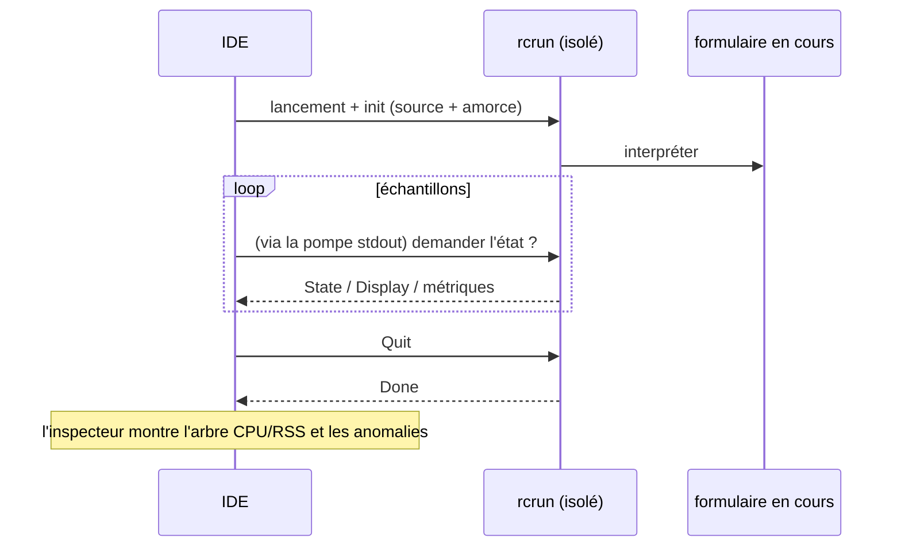

<!--
SPDX-License-Identifier: Apache-2.0
Copyright (c) 2026 Emerson Lopes and PowerRustCOBOL contributors

Licensed under the Apache License, Version 2.0.
See the LICENSE file in the project root for full license information.
-->

# Observabilité de PowerRustCOBOL

Voici le point de rassemblement de tout ce qui touche à l'**observation** d'un
programme RustCOBOL en cours d'exécution — ce qu'il a fait, à quelle vitesse, et
la santé des magasins sous-jacents. Cela commence par les **journaux de
transactions des fichiers indexés** et s'étendra à d'autres surfaces du runtime.

| Surface | État | Où |
|---------|--------|-------|
| **Journal de transactions des fichiers INDEXED** | ✅ disponible | ce document, §1 |
| Traçage du runtime (`COBOLT_LOG`) | ✅ disponible | §2 |
| **Journaux de plantage et récupération du travail** | ✅ disponible | §5 |
| Runtime des bases de données SQL | 🔭 prévu | — |
| Client HTTP / REST | 🔭 prévu | — |

> **Principe directeur.** L'observabilité est *passive* : l'activer, sous quelque
> forme que ce soit, ne doit jamais modifier le comportement ni les résultats du
> programme. Les erreurs de journalisation et de traçage sont avalées en silence,
> et les chemins chauds restent chauds (tout ce qui coûte cher est optionnel et
> appelé avec parcimonie).

---

## 1. Journal de transactions des fichiers INDEXED

Le moteur indexé **redb**, résistant aux pannes, sait écrire un journal par
fichier de chaque transaction — utile pour le diagnostic, la planification de
capacité et les tableaux de bord. Il est **désactivé par défaut** et propre au
moteur redb
(`--indexed-engine redb` ; voir [`indexed-redb-engine-fr.md`](indexed-redb-engine-fr.md)).

### 1.1 Comment l'activer

| Option / variable | Valeurs | Signification |
|------------|--------|---------|
| `--indexed-log` / `COBOL_INDEXED_LOG` | `off` (par défaut), `basic`/`true`, `full` | Niveau de journalisation |
| `--indexed-log-format` / `COBOL_INDEXED_LOG_FORMAT` | `text` (par défaut), `json` | Format de ligne |

```bash
# logfmt, per-transaction metrics
rcrun run app.cbl --indexed-engine redb --indexed-log basic

# NDJSON + index page stats on close (for Grafana/Loki)
rcrun run app.cbl --indexed-engine redb --indexed-log full --indexed-log-format json
```

- **`basic`** — uniquement les métriques par transaction (peu coûteux, comptées
  par le moteur lui-même).
- **`full`** — le contenu de `basic`, plus les statistiques d'index de redb à
  chaque `CLOSE`. Ces statistiques **parcourent l'index**, leur coût croît donc
  avec la taille du fichier ; c'est pourquoi `full` est optionnel et les
  statistiques ne sont émises qu'au CLOSE (jamais à chaque commit).

### 1.2 Emplacement

Chaque fichier indexé reçoit un **journal satellite à côté de son fichier de
données**, nommé en ajoutant `.log` au chemin de l'`ASSIGN` :

```
customers.idx        →  customers.idx.log
/var/data/orders.dat →  /var/data/orders.dat.log
```

Les lignes sont **ajoutées à la fin** (jamais tronquées), si bien qu'un journal
s'accumule d'une exécution à l'autre.

#### Rotation (maintenue sous 100 Kio)

Pour qu'aucun fichier ne devienne gros à lui seul, le journal actif subit une
**rotation** dès qu'il approche des **100 Kio** (`MAX_LOG_BYTES`), à la manière
de logrotate/Grafana :

1. le `<datafile>.log` actif est renommé en
   **`<user|no-user>.<datafile>.log.<timestamp>`**, et
2. un nouveau journal actif, vide, est démarré.

L'horodatage est un tampon UTC compact, par exemple `20260610T120230461Z`. Le
`<user>` est la valeur d'`OPEN … WITH REGISTERED USER` (assainie pour le système
de fichiers), ou **`no-user`** quand aucune n'a été fournie. Exemple après une
rotation :

```
customers.idx.log                                 # active (< 100 KiB)
alice.customers.idx.log.20260610T120230461Z       # rotated archive (~100 KiB)
no-user.orders.dat.log.20260610T120051301Z        # rotated, no user supplied
```

Les fichiers ayant subi une rotation ne sont jamais supprimés par le runtime —
élaguez-les ou expédiez-les avec votre chaîne de journalisation (par exemple
Promtail, puis suppression). Chaque archive est à elle seule un journal complet
et analysable.

### 1.3 Ce qui est enregistré

Une ligne par **événement de transaction** : `OPEN`, `COMMIT`, `ROLLBACK`,
`CLOSE`.

| Champ | Type | Signification |
|-------|------|---------|
| `ts` | chaîne | horodatage ISO-8601 UTC, précision à la ms (`2026-06-10T07:30:00.123Z`) |
| `file` | chaîne | le nom du fichier indexé |
| `user` | chaîne | l'utilisateur enregistré (présent seulement s'il a été fourni — voir §1.3.1) |
| `tx` | nombre | compteur de transactions (**par session d'OPEN**) |
| `kind` | chaîne | `OPEN` / `COMMIT` / `ROLLBACK` / `CLOSE` |
| `writes` | nombre | `WRITE` de cette transaction |
| `rewrites` | nombre | `REWRITE` de cette transaction |
| `deletes` | nombre | `DELETE` de cette transaction |
| `records` | nombre | total des mutations (`writes+rewrites+deletes`) |
| `bytes` | nombre | octets d'enregistrement écrits ou réécrits |
| `dur_ms` | nombre | durée de la transaction en temps réel |
| `rec_per_s` | nombre | enregistrements par seconde |
| `bytes_per_s` | nombre | octets par seconde |
| `order` | chaîne | `ordered` si les clés écrites étaient croissantes, sinon `unordered` (`n/a` s'il n'y a eu aucune écriture) |
| `in_order` | nombre | nombre d'écritures dont la clé a avancé |
| `out_of_order` | nombre | nombre d'écritures dont la clé a reculé |

**Les lignes de CLOSE du niveau `full`** ajoutent les statistiques d'index de
redb :

| Champ | Signification |
|-------|---------|
| `tree_height` | hauteur de l'arbre B+ primaire |
| `leaf_pages` / `branch_pages` | nombres de pages |
| `allocated_pages` | pages allouées dans le fichier |
| `stored_bytes` | octets d'enregistrement vivants |
| `fragmented_bytes` | espace libre ou fragmenté (inclut la marge préallouée du fichier) |
| `page_size` | taille de page de redb (4096) |

> **Pourquoi `order` compte.** Les écritures à clé croissante frappent une seule
> feuille chaude de l'arbre B+ ; des clés dispersées touchent des feuilles
> aléatoires (plus d'E/S, plus de fragmentation). Les champs `order` /
> `in_order` / `out_of_order` donnent d'un coup d'œil un signal sur la localité
> des écritures — un bon indicateur du caractère séquentiel ou aléatoire d'un
> chargement.

> **`tx` vaut pour une session.** Le moteur est recréé à chaque `OPEN`, donc le
> compteur repart à 1 pour chaque session OPEN…CLOSE ; le champ `ts` lève
> l'ambiguïté.

#### 1.3.1 Enregistrer l'utilisateur connecté — `OPEN … WITH REGISTERED USER`

Les programmes COBOL se trouvent rarement derrière OAuth ou un quelconque moteur
d'authentification : l'opérateur ou l'utilisateur est donc fourni
**explicitement** sur l'`OPEN`, sous forme d'extension PowerRustCOBOL :

```cobol
       OPEN I-O CUSTOMER-FILE WITH REGISTERED USER "ALICE"
       OPEN I-O CUSTOMER-FILE WITH REGISTERED USER WS-OPERATOR
```

- La valeur est un **littéral chaîne** ou un **élément de données** (`USER` est
  facultatif ; `WITH REGISTERED "ALICE"` s'analyse aussi).
- Elle s'applique à toute la session `OPEN…CLOSE` : **chaque** ligne d'événement
  de ce fichier (`OPEN`/`COMMIT`/`ROLLBACK`/`CLOSE`) porte un champ `user=`.
- Elle est purement observationnelle — elle n'authentifie ni n'autorise quoi que
  ce soit, et n'a aucun effet quand la journalisation est désactivée.

Exemple de lignes de journal (une session par utilisateur) :

```
ts=…Z file=customers.idx user=ALICE        tx=1 kind=OPEN   …
ts=…Z file=customers.idx user=ALICE        tx=2 kind=COMMIT …
ts=…Z file=customers.idx user=BOB-FROM-WS  tx=1 kind=OPEN   …
```

### 1.4 Formats

#### logfmt (`text`, par défaut)

```
ts=2026-06-10T07:30:00.123Z file=customers.idx tx=2 kind=COMMIT writes=1 rewrites=0 \
   deletes=0 records=1 bytes=12 dur_ms=3 rec_per_s=272 bytes_per_s=3266 \
   order=ordered in_order=1 out_of_order=0
```

Les valeurs chaîne contenant des espaces sont mises entre guillemets. Loki
analyse cela avec `| logfmt`.

#### NDJSON (`json`)

```json
{"ts":"2026-06-10T07:30:00.123Z","file":"customers.idx","tx":2,"kind":"COMMIT","writes":1,"rewrites":0,"deletes":0,"records":1,"bytes":12,"dur_ms":3,"rec_per_s":272,"bytes_per_s":3266,"order":"ordered","in_order":1,"out_of_order":0}
```

Un objet JSON par ligne. **Les champs numériques sont de simples nombres JSON**,
afin que Grafana puisse les tracer directement ; les champs chaîne sont entre
guillemets. Loki analyse cela avec `| json`.

### 1.5 Grafana / Loki

Grafana ne lit pas les fichiers directement — expédiez les journaux vers **Loki**
avec un agent, puis interrogez. Recommandé : le format `json`.

1. **Collectez** les `*.idx.log` avec Promtail / Grafana Agent / Alloy → Loki.
   Gardez les *étiquettes* à faible cardinalité (par exemple `job`, `file`,
   `kind`) ; laissez `tx`, `ts` et les métriques numériques comme champs
   analysés.
2. **Interrogez** dans Grafana (LogQL) :

   ```logql
   # commit throughput over time
   {job="rustcobol"} | json | kind="COMMIT" | unwrap rec_per_s

   # rolled-back work
   sum by (file) (count_over_time({job="rustcobol"} | json | kind="ROLLBACK" [5m]))

   # index growth (full level)
   {job="rustcobol"} | json | kind="CLOSE" | unwrap allocated_pages
   ```

Exemple de collecte Promtail (logfmt convient aussi — remplacez l'étape de la
chaîne par `logfmt`) :

```yaml
scrape_configs:
  - job_name: rustcobol
    static_configs:
      - targets: [localhost]
        labels: { job: rustcobol, __path__: /var/data/*.idx.log }
    pipeline_stages:
      - json:
          expressions: { kind: kind, file: file }
      - labels: { kind: kind, file: file }
```

### 1.6 Coût et sûreté

- La journalisation `basic` ajoute quelques compteurs par opération et une ligne
  ajoutée à la fin par événement de transaction — négligeable.
- `full` ajoute un parcours d'index **au CLOSE seulement** ; évitez-le sur de
  très gros fichiers, sauf si vous voulez cet instantané.
- La journalisation n'affecte jamais le comportement du programme : toutes les
  erreurs d'E/S du journal sont ignorées en silence, et le chemin des données
  reste inchangé.

### 1.7 Implémentation

`crates/cobolt-runtime/src/indexed_log.rs` — `LogLevel`, `LogFormat`, le
constructeur `LogRecord` qui rend du logfmt ou du NDJSON (JSON sans dépendance),
le `LogWriter` qui ajoute à la fin, et un formateur ISO-8601 sans dépendance. Les
accumulateurs par transaction vivent dans
`crates/cobolt-runtime/src/indexed_redb.rs` ; les options sont résolues dans
`crates/cobolt-cli/src/main.rs` et appliquées via
`Interpreter::set_indexed_log_level` / `set_indexed_log_format`.

---

## 2. Traçage du runtime (`COBOLT_LOG`)

`rcrun` utilise le cadre `tracing` avec un filtre par variable d'environnement.
Définissez `COBOLT_LOG` pour augmenter la verbosité des messages internes de
runtime et de diagnostic (avertissements par défaut) :

```bash
COBOLT_LOG=debug rcrun run app.cbl
COBOLT_LOG=cobolt-runtime=trace rcrun run app.cbl
```

Il s'agit d'une sortie de diagnostic destinée au développeur (sur stderr),
distincte du journal structuré de transactions par fichier de la §1.

---

## 3. Interrupteurs de débogage dans l'IDE

Tous les interrupteurs de débogage que connaît l'IDE — le filtre de traçage
ci-dessus, le journal de transactions INDEXED de la §1, les surimpressions de
rendu, la trace de liaison de données et la trace de mise en page du panneau
d'IA — se modifient sous **Help → Debug Settings**, regroupés par un onglet et
par domaine. Les réglages valent pour tout l'IDE (stockés sur la machine, pas
dans `cobolt.toml`) et sont transmis à chaque processus enfant `rcrun run-form`
sous forme des variables d'environnement documentées ici, si bien que rien n'a à
être exporté à la main.

Exporter une variable fonctionne toujours pour une exécution isolée de `rcrun`
depuis un interpréteur de commandes.

---

## 4. Inspecteur de Run-Form (IDE)

Lorsque **Run Form** est actif, l'IDE peut ouvrir un **Run-Form Inspector**
(fenêtre distincte) qui échantillonne le processus enfant isolé :

- Pourcentage de CPU par échantillon, octets de RSS, nombre de processus enfants,
  mémoire système utilisée.
- Détection d'anomalies (croissance soudaine, trop d'enfants, etc.).
- Mini-courbes en direct et arbre des processus.
- Utilise le canal IPC du `rcrun` isolé (voir le guide du développeur pour les
  détails de l'isolation des processus).

C'est optionnel dans l'IDE et sans effet sur le formulaire en cours.
L'échantillonnage est ralenti en l'absence d'activité. Les journaux et les
métriques ne servent qu'au diagnostic.

Vue d'ensemble en mermaid :



---

## 5. Journaux de plantage et récupération du travail

Une application fenêtrée n'a pas de terminal attaché : quand l'IDE meurt, son
message de panique, son `file:line` et sa trace d'appels partent tous vers un
stderr que personne ne lit — la fenêtre disparaît, tout simplement, et ne laisse
rien derrière elle. Deux mécanismes distincts remplacent cela, parce qu'ils
résolvent deux problèmes différents.

**Journaux de plantage — pour qu'il reste quelque chose à diagnostiquer.** Un
crochet de panique écrit `<data>/cobolt/crash/crash-<seconds>.log` contenant le
message de panique, son `file:line:column`, une trace d'appels forcée, la version
de l'IDE, le système d'exploitation, le fil d'exécution et les fichiers qui
étaient ouverts à ce moment-là. Joignez-le à votre rapport d'anomalie.

**Sauvegarde automatique — pour que le travail survive.** Toutes les **20
secondes**, chaque tampon d'éditeur non enregistré et chaque formulaire modifié
est copié dans `<data>/cobolt/recovery/`, aux côtés d'un `manifest.toml` qui
rattache chaque copie à son original. Un fichier témoin signale qu'une session
est en cours et il est supprimé à la sortie propre ; en trouver un au démarrage
suivant, c'est exactement ce que veut dire « la dernière session s'est mal
terminée », et l'IDE propose alors de restaurer.

**Restaurer n'écrase jamais.** Accepter la proposition écrit chaque copie à côté
de son original sous le nom `<name>.recovered.<ext>` et liste les chemins dans le
panneau **Output**. La copie provient d'un processus qui avait déjà perdu pied :
la version qui l'emporte relève donc de votre décision, pas de celle de l'IDE.

> ⚠️ **Un crochet de panique ne peut pas tout attraper.** Un débordement de pile
> faute sur la page de garde et arrive sous forme de `SIGSEGV` ; le tueur de
> mémoire envoie `SIGKILL` ; une seconde panique pendant le déroulement de la
> pile provoque un abandon. Dans ces trois cas, le crochet ne s'exécute jamais et
> **aucun journal de plantage n'est écrit**. C'est la sauvegarde automatique qui
> couvre ces cas, parce qu'elle a déjà eu lieu au moment où les choses tournent
> mal — et c'est aussi pourquoi l'intervalle est la vraie garantie : au pire 20
> secondes de travail.

`<data>` est le répertoire de données du système d'exploitation —
`~/Library/Application Support` sur macOS, `%APPDATA%` sous Windows,
`~/.local/share` sous Linux.

---

## Feuille de route

Ajouts prévus, pour que ce document reste l'unique référence d'observabilité :

- **Runtime SQL** — chronométrage et nombre de lignes par connexion et par
  instruction pour les moteurs SQLite/PostgreSQL/MySQL (voir
  [`database-runtime-fr.md`](database-runtime-fr.md)).
- **Client HTTP** — journalisation de la requête, de la latence et du statut pour
  les primitives REST.
- **Résumé agrégé d'exécution** — un rapport optionnel de fin d'exécution
  couvrant tous les fichiers.
