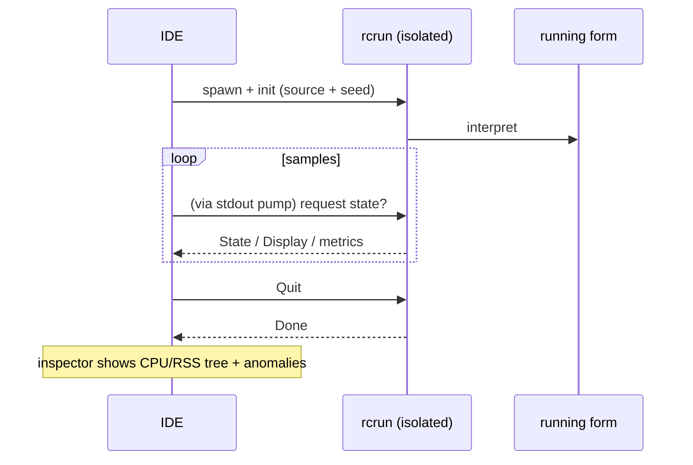

<!--
SPDX-License-Identifier: Apache-2.0
Copyright (c) 2026 Emerson Lopes and PowerRustCOBOL contributors

Licensed under the Apache License, Version 2.0.
See the LICENSE file in the project root for full license information.
-->

# Observabilité de PowerRustCOBOL

C'est ici que se trouve tout ce qui concerne l'**observation** d'un programme
RustCOBOL en cours d'exécution : ce qu'il a fait, à quelle vitesse, et dans quel
état de santé sont les magasins sous-jacents. Le document commence par les
**journaux de transactions des fichiers indexés** et s'étendra à d'autres
surfaces du runtime.

| Surface | État | Où |
|---------|--------|-------|
| **Journal de transactions des fichiers INDEXED** | ✅ disponible | ce document, §1 |
| Traçage du runtime (`COBOLT_LOG`) | ✅ disponible | §2 |
| **Journaux de plantage et récupération du travail** | ✅ disponible | §5 |
| Runtime de bases de données SQL | 🔭 prévu | — |
| Client HTTP / REST | 🔭 prévu | — |

> **Principe directeur.** L'observabilité est *passive* : en activer une partie
> ne doit jamais changer le comportement ni les résultats du programme. Les
> erreurs de journalisation ou de traçage sont avalées, et les chemins chauds
> restent chauds (tout ce qui coûte cher est optionnel et appelé avec
> parcimonie).

---

## 1. Journal de transactions des fichiers INDEXED

Le moteur indexé **redb**, résistant aux pannes, peut écrire un journal par
fichier de chaque transaction — utile pour le diagnostic, le dimensionnement et
les tableaux de bord. Il est **désactivé par défaut** et propre au moteur redb
(`--indexed-engine redb` ; voir
[`indexed-redb-engine.md`](indexed-redb-engine.md)).

### 1.1 L'activer

| Drapeau / variable | Valeurs | Signification |
|------------|--------|---------|
| `--indexed-log` / `COBOL_INDEXED_LOG` | `off` (défaut), `basic`/`true`, `full` | Niveau de journalisation |
| `--indexed-log-format` / `COBOL_INDEXED_LOG_FORMAT` | `text` (défaut), `json` | Format de ligne |

```bash
# logfmt, métriques par transaction
rcrun run app.cbl --indexed-engine redb --indexed-log basic

# NDJSON + statistiques de pages d'index à la fermeture (pour Grafana/Loki)
rcrun run app.cbl --indexed-engine redb --indexed-log full --indexed-log-format json
```

- **`basic`** — uniquement les métriques par transaction (peu coûteux, comptabilisé
  par le moteur lui-même).
- **`full`** — `basic` plus les statistiques d'index de redb à chaque `CLOSE`.
  Ces statistiques **parcourent l'index**, leur coût croît donc avec la taille du
  fichier ; c'est pourquoi `full` est optionnel et que les statistiques ne sont
  émises qu'au CLOSE (jamais à chaque commit).

### 1.2 Emplacement

Chaque fichier indexé reçoit un **journal satellite à côté de son fichier de
données**, nommé en ajoutant `.log` au chemin de l'`ASSIGN` :

```
customers.idx        →  customers.idx.log
/var/data/orders.dat →  /var/data/orders.dat.log
```

Les lignes sont **ajoutées à la fin** (jamais tronquées) : un journal s'accumule
donc d'une exécution à l'autre.

#### Rotation (maintenu sous 100 Kio)

Pour qu'aucun fichier ne grossisse trop, le journal actif est **tourné** dès
qu'il approche **100 Kio** (`MAX_LOG_BYTES`), à la manière de logrotate/Grafana :

1. le `<fichierdonnées>.log` actif est renommé en
   **`<utilisateur|no-user>.<fichierdonnées>.log.<horodatage>`**, puis
2. un nouveau journal actif, vide, est démarré.

L'horodatage est un tampon UTC compact, par ex. `20260610T120230461Z`.
L'`<utilisateur>` est la valeur de `OPEN … WITH REGISTERED USER` (assainie pour
le système de fichiers), ou **`no-user`** lorsqu'aucune n'a été fournie. Exemple
après une rotation :

```
customers.idx.log                                 # actif (< 100 Kio)
alice.customers.idx.log.20260610T120230461Z       # archive tournée (~100 Kio)
no-user.orders.dat.log.20260610T120051301Z        # tourné, aucun utilisateur fourni
```

Le runtime ne supprime jamais les fichiers tournés — élaguez-les ou expédiez-les
avec votre chaîne de journalisation (par exemple Promtail puis suppression).
Chaque archive est un journal complet et analysable à elle seule.

### 1.3 Ce qui est enregistré

Une ligne par **événement de transaction** : `OPEN`, `COMMIT`, `ROLLBACK`,
`CLOSE`.

| Champ | Type | Signification |
|-------|------|---------|
| `ts` | chaîne | horodatage ISO-8601 UTC, précision à la ms (`2026-06-10T07:30:00.123Z`) |
| `file` | chaîne | le nom du fichier indexé |
| `user` | chaîne | l'utilisateur enregistré (présent seulement s'il a été fourni — voir §1.3.1) |
| `tx` | nombre | compteur de transactions (**par session OPEN**) |
| `kind` | chaîne | `OPEN` / `COMMIT` / `ROLLBACK` / `CLOSE` |
| `writes` | nombre | `WRITE` dans cette transaction |
| `rewrites` | nombre | `REWRITE` dans cette transaction |
| `deletes` | nombre | `DELETE` dans cette transaction |
| `records` | nombre | mutations totales (`writes+rewrites+deletes`) |
| `bytes` | nombre | octets d'enregistrement écrits/réécrits |
| `dur_ms` | nombre | durée horloge de la transaction |
| `rec_per_s` | nombre | enregistrements par seconde |
| `bytes_per_s` | nombre | octets par seconde |
| `order` | chaîne | `ordered` si les clés écrites étaient croissantes, sinon `unordered` (`n/a` s'il n'y a pas eu d'écriture) |
| `in_order` | nombre | nombre d'écritures dont la clé a progressé |
| `out_of_order` | nombre | nombre d'écritures dont la clé a reculé |

**Les lignes CLOSE de niveau `full`** ajoutent les statistiques d'index de redb :

| Champ | Signification |
|-------|---------|
| `tree_height` | hauteur de la B+tree primaire |
| `leaf_pages` / `branch_pages` | nombre de pages |
| `allocated_pages` | pages allouées dans le fichier |
| `stored_bytes` | octets d'enregistrement vivants |
| `fragmented_bytes` | espace libre/fragmenté (inclut la marge préallouée du fichier) |
| `page_size` | taille de page redb (4096) |

> **Pourquoi `order` compte.** Les écritures à clé croissante frappent une seule
> feuille chaude de la B+tree ; des clés dispersées touchent des feuilles
> aléatoires (plus d'E/S, plus de fragmentation). Les champs `order` /
> `in_order` / `out_of_order` donnent d'un coup d'œil la localité d'écriture — un
> bon indicateur du caractère séquentiel ou aléatoire d'un chargement.

> **`tx` est propre à la session.** Le moteur est recréé à chaque `OPEN`, si bien
> que le compteur repart à 1 pour chaque session OPEN…CLOSE ; le champ `ts` lève
> l'ambiguïté.

#### 1.3.1 Enregistrer l'utilisateur connecté — `OPEN … WITH REGISTERED USER`

Les programmes COBOL se trouvent rarement derrière OAuth ou un quelconque moteur
d'authentification : l'opérateur/utilisateur est donc fourni **explicitement** sur
l'`OPEN`, en tant qu'extension PowerRustCOBOL :

```cobol
       OPEN I-O CUSTOMER-FILE WITH REGISTERED USER "ALICE"
       OPEN I-O CUSTOMER-FILE WITH REGISTERED USER WS-OPERATOR
```

- La valeur est un **littéral chaîne** ou un **data item** (`USER` est
  facultatif ; `WITH REGISTERED "ALICE"` s'analyse également).
- Elle s'applique à toute la session `OPEN…CLOSE` : **chaque** ligne d'événement
  de ce fichier (`OPEN`/`COMMIT`/`ROLLBACK`/`CLOSE`) porte un champ `user=`.
- Elle est purement observationnelle — elle n'authentifie ni n'autorise rien, et
  n'a aucun effet lorsque la journalisation est désactivée.

Exemple de lignes de journal (une session par utilisateur) :

```
ts=…Z file=customers.idx user=ALICE        tx=1 kind=OPEN   …
ts=…Z file=customers.idx user=ALICE        tx=2 kind=COMMIT …
ts=…Z file=customers.idx user=BOB-FROM-WS  tx=1 kind=OPEN   …
```

### 1.4 Formats

#### logfmt (`text`, par défaut)

```
ts=2026-06-10T07:30:00.123Z file=customers.idx tx=2 kind=COMMIT writes=1 rewrites=0 \
   deletes=0 records=1 bytes=12 dur_ms=3 rec_per_s=272 bytes_per_s=3266 \
   order=ordered in_order=1 out_of_order=0
```

Les valeurs chaîne contenant des espaces sont mises entre guillemets. Loki
analyse cela avec `| logfmt`.

#### NDJSON (`json`)

```json
{"ts":"2026-06-10T07:30:00.123Z","file":"customers.idx","tx":2,"kind":"COMMIT","writes":1,"rewrites":0,"deletes":0,"records":1,"bytes":12,"dur_ms":3,"rec_per_s":272,"bytes_per_s":3266,"order":"ordered","in_order":1,"out_of_order":0}
```

Un objet JSON par ligne. **Les champs numériques sont des nombres JSON bruts**,
afin que Grafana puisse les tracer directement ; les champs chaîne sont entre
guillemets. Loki analyse cela avec `| json`.

### 1.5 Grafana / Loki

Grafana ne lit pas les fichiers directement — expédiez les journaux vers **Loki**
au moyen d'un agent, puis interrogez. Recommandé : le format `json`.

1. **Collectez** `*.idx.log` avec Promtail / Grafana Agent / Alloy → Loki. Gardez
   des *labels* à faible cardinalité (par ex. `job`, `file`, `kind`) ; laissez
   `tx`, `ts` et les métriques numériques comme champs analysés.
2. **Interrogez** dans Grafana (LogQL) :

   ```logql
   # débit de commits dans le temps
   {job="rustcobol"} | json | kind="COMMIT" | unwrap rec_per_s

   # travail annulé
   sum by (file) (count_over_time({job="rustcobol"} | json | kind="ROLLBACK" [5m]))

   # croissance de l'index (niveau full)
   {job="rustcobol"} | json | kind="CLOSE" | unwrap allocated_pages
   ```

Exemple de collecte Promtail (logfmt convient aussi — remplacez l'étape du
pipeline par `logfmt`) :

```yaml
scrape_configs:
  - job_name: rustcobol
    static_configs:
      - targets: [localhost]
        labels: { job: rustcobol, __path__: /var/data/*.idx.log }
    pipeline_stages:
      - json:
          expressions: { kind: kind, file: file }
      - labels: { kind: kind, file: file }
```

### 1.6 Coût et sûreté

- La journalisation `basic` ajoute quelques compteurs par opération et une ligne
  ajoutée par événement de transaction — négligeable.
- `full` ajoute un parcours d'index **au CLOSE seulement** ; évitez-le sur de très
  gros fichiers à moins de vouloir cet instantané.
- La journalisation n'affecte jamais le comportement du programme : toutes les
  erreurs d'E/S de journal sont silencieusement ignorées, et le chemin des
  données est inchangé.

### 1.7 Implémentation

`crates/cobolt-runtime/src/indexed_log.rs` — `LogLevel`, `LogFormat`, le
constructeur `LogRecord` qui rend en logfmt ou NDJSON (JSON sans dépendance), le
`LogWriter` qui ajoute en fin de fichier, et un formateur ISO-8601 sans
dépendance. Les accumulateurs par transaction vivent dans
`crates/cobolt-runtime/src/indexed_redb.rs` ; les drapeaux sont résolus dans
`crates/cobolt-cli/src/main.rs` et appliqués via
`Interpreter::set_indexed_log_level` / `set_indexed_log_format`.

---

## 2. Traçage du runtime (`COBOLT_LOG`)

`rcrun` utilise le framework `tracing` avec un filtre par variable
d'environnement. Définissez `COBOLT_LOG` pour augmenter la verbosité des messages
internes de runtime et de diagnostic (avertissements par défaut) :

```bash
COBOLT_LOG=debug rcrun run app.cbl
COBOLT_LOG=cobolt-runtime=trace rcrun run app.cbl
```

Il s'agit d'une sortie de diagnostic destinée au développeur (sur stderr),
distincte du journal structuré de transactions par fichier de la §1.

---

## 3. Interrupteurs de débogage dans l'IDE

Tous les interrupteurs de débogage que l'IDE connaît — le filtre de traçage
ci-dessus, le journal de transactions INDEXED de la §1, les surimpressions de
rendu, la trace de data-bind et la trace de mise en page du panneau IA — sont
modifiables sous **Help → Debug Settings**, regroupés en un onglet par domaine.
Les réglages sont à l'échelle de l'IDE (stockés sur la machine, pas dans
`cobolt.toml`) et sont transmis à chaque processus fils `rcrun run-form` sous
forme des variables d'environnement documentées ici : rien n'a donc à être
exporté à la main.

Exporter une variable fonctionne toujours pour une exécution autonome de `rcrun`
depuis un shell.

---

## 4. Inspecteur Run-Form (IDE)

Lorsque **Run Form** est actif, l'IDE peut ouvrir un **inspecteur Run-Form**
(viewport distinct) qui échantillonne le processus fils isolé :

- Par échantillon : % CPU, octets de RSS, nombre de processus fils, mémoire
  système utilisée.
- Détection d'anomalies (croissance soudaine, fils trop nombreux, etc.).
- Sparklines en direct et arborescence des processus.
- Utilise le canal IPC du `rcrun` isolé (voir le guide du développeur pour les
  détails de l'isolation des processus).

C'est optionnel dans l'IDE et cela n'affecte pas le form en cours d'exécution.
L'échantillonnage est ralenti au repos. Journaux et métriques servent uniquement
au diagnostic.

Vue d'ensemble en mermaid :



---

## 5. Journaux de plantage et récupération du travail

Une application fenêtrée n'a aucun terminal attaché : lorsque l'IDE meurt, son
message de panique, son `file:line` et sa trace partent tous vers une sortie
d'erreur que personne ne lit — la fenêtre disparaît, sans rien laisser derrière
elle. Deux mécanismes distincts remplacent cela, car ils résolvent deux problèmes
distincts.

**Journaux de plantage — pour qu'il reste quelque chose à diagnostiquer.** Un
gestionnaire de panique écrit `<data>/cobolt/crash/crash-<secondes>.log`
contenant le message de panique, son `file:line:column`, une trace forcée, la
version de l'IDE, le système, le thread et les fichiers qui étaient ouverts.
Joignez-le à un rapport de bogue.

**Sauvegarde automatique — pour que le travail survive.** Toutes les
**20 secondes**, chaque tampon d'éditeur non enregistré et chaque form modifié
est copié dans `<data>/cobolt/recovery/`, avec un `manifest.toml` qui relie
chaque copie à son original. Un fichier témoin indique qu'une session est en
cours et il est supprimé lors d'une sortie propre ; en trouver un au démarrage
suivant est précisément ce que veut dire « la session précédente s'est mal
terminée », et l'IDE propose alors de restaurer.

**Restaurer n'écrase jamais.** En acceptant, chaque copie est écrite à côté de
son original sous la forme `<nom>.recovered.<ext>` et les chemins sont listés
dans le panneau Output. La copie provient d'un processus qui avait déjà perdu
pied : quelle version l'emporte est votre décision, pas celle de l'IDE.

> ⚠️ **Un gestionnaire de panique ne peut pas tout intercepter.** Un débordement
> de pile fait faute sur la page de garde et arrive sous forme de `SIGSEGV` ; le
> tueur de mémoire envoie `SIGKILL` ; une seconde panique pendant le déroulement
> avorte. Dans les trois cas le gestionnaire ne s'exécute jamais et **aucun
> journal de plantage n'est écrit**. C'est la sauvegarde automatique qui couvre
> ces cas, parce qu'elle a déjà eu lieu au moment où quelque chose tourne mal —
> et c'est aussi pourquoi l'intervalle est la vraie garantie : au plus
> 20 secondes de travail.

`<data>` est le répertoire de données du système :
`~/Library/Application Support` sous macOS, `%APPDATA%` sous Windows,
`~/.local/share` sous Linux.

---

## Feuille de route

Ajouts prévus, pour que ce document reste la référence unique en matière
d'observabilité :

- **Runtime SQL** — chronométrage par connexion/instruction et nombre de lignes
  pour les moteurs SQLite/PostgreSQL/MySQL (voir
  [`database-runtime.md`](database-runtime.md)).
- **Client HTTP** — journalisation des requêtes, de la latence et du statut pour
  les fonctions REST intégrées.
- **Synthèse d'exécution agrégée** — un rapport optionnel de fin d'exécution
  couvrant tous les fichiers.
