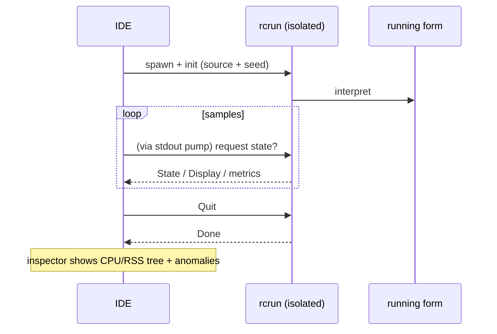

<!--
SPDX-License-Identifier: Apache-2.0
Copyright (c) 2026 Emerson Lopes and PowerRustCOBOL contributors

Licensed under the Apache License, Version 2.0.
See the LICENSE file in the project root for full license information.
-->

# PowerRustCOBOL の可観測性

ここは、実行中の RustCOBOL プログラムを**観測する**ことに関するすべての拠点で
す。何を行ったのか、どれだけ速かったのか、そして基盤となるストアがどれだけ健全
かを扱います。まず **INDEXED ファイルのトランザクションログ**から始まり、今後は
ランタイムの他の領域へも広がっていきます。

| 対象 | 状況 | 場所 |
|---------|--------|-------|
| **INDEXED ファイルのトランザクションログ** | ✅ 利用可能 | 本書 §1 |
| ランタイムのトレース（`COBOLT_LOG`） | ✅ 利用可能 | §2 |
| SQL データベースランタイム | 🔭 予定 | — |
| HTTP / REST クライアント | 🔭 予定 | — |

> **指針。** 可観測性は*受動的*です。どれを有効にしても、プログラムの動作や結果
> を決して変えてはなりません。ログやトレースのエラーは握りつぶされ、ホットパス
> はホットなまま保たれます（コストのかかる処理はすべてオプトインで、呼び出しは
> 最小限です）。

---

## 1. INDEXED ファイルのトランザクションログ

クラッシュに強い **redb** インデックスエンジンは、すべてのトランザクションを
ファイル単位のログに書き出せます。診断、キャパシティプランニング、ダッシュボード
に役立ちます。**既定では無効**で、redb エンジン専用です
（`--indexed-engine redb`。
[`indexed-redb-engine.md`](indexed-redb-engine.md) を参照）。

### 1.1 有効にする

| フラグ／環境変数 | 値 | 意味 |
|------------|--------|---------|
| `--indexed-log` / `COBOL_INDEXED_LOG` | `off`（既定）、`basic`/`true`、`full` | ログレベル |
| `--indexed-log-format` / `COBOL_INDEXED_LOG_FORMAT` | `text`（既定）、`json` | 行の書式 |

```bash
# logfmt、トランザクション単位のメトリクス
rcrun run app.cbl --indexed-engine redb --indexed-log basic

# NDJSON + クローズ時のインデックスページ統計（Grafana/Loki 向け）
rcrun run app.cbl --indexed-engine redb --indexed-log full --indexed-log-format json
```

- **`basic`** — トランザクション単位のメトリクスのみ（安価で、エンジン自身が
  集計します）。
- **`full`** — `basic` に加えて、`CLOSE` のたびに redb のインデックス統計を出力
  します。この統計は**インデックスを走査する**ため、コストはファイルサイズに
  比例します。`full` がオプトインであり、統計が CLOSE のときだけ（コミットごと
  ではなく）出力されるのはそのためです。

### 1.2 出力場所

インデックスファイルごとに、**データファイルの隣にサイドカーのログ**が作られ
ます。名前は `ASSIGN` のパスに `.log` を付けたものです。

```
customers.idx        →  customers.idx.log
/var/data/orders.dat →  /var/data/orders.dat.log
```

行は**追記**されます（切り詰められることはありません）。したがってログは実行を
またいで蓄積されます。

#### ローテーション（100 KiB 未満に保つ）

単一ファイルが大きくなりすぎないよう、アクティブなログは **100 KiB**
（`MAX_LOG_BYTES`）に近づいた時点で、logrotate や Grafana の流儀で
**ローテーション**されます。

1. アクティブな `<データファイル>.log` が
   **`<ユーザー|no-user>.<データファイル>.log.<タイムスタンプ>`** に改名され、
2. 新しい空のアクティブログが開始されます。

タイムスタンプは短縮形の UTC 表記で、例えば `20260610T120230461Z` です。
`<ユーザー>` は `OPEN … WITH REGISTERED USER` の値（ファイルシステム向けに
サニタイズ済み）で、指定がなければ **`no-user`** になります。1 回ローテーション
した後の例：

```
customers.idx.log                                 # アクティブ（< 100 KiB）
alice.customers.idx.log.20260610T120230461Z       # ローテーション済み（約 100 KiB）
no-user.orders.dat.log.20260610T120051301Z        # ローテーション済み、ユーザー指定なし
```

ローテーションされたファイルをランタイムが削除することはありません。ログ
パイプラインで整理するか転送してください（例：Promtail で収集後に削除）。
各アーカイブは、それ単体で完全に解析可能なログです。

### 1.3 記録される内容

**トランザクションイベント**ごとに 1 行：`OPEN`、`COMMIT`、`ROLLBACK`、`CLOSE`。

| フィールド | 型 | 意味 |
|-------|------|---------|
| `ts` | 文字列 | ISO-8601 UTC のタイムスタンプ、ミリ秒精度（`2026-06-10T07:30:00.123Z`） |
| `file` | 文字列 | インデックスファイル名 |
| `user` | 文字列 | 登録ユーザー（指定された場合のみ出力 — §1.3.1 参照） |
| `tx` | 数値 | トランザクションカウンタ（**OPEN セッション単位**） |
| `kind` | 文字列 | `OPEN` / `COMMIT` / `ROLLBACK` / `CLOSE` |
| `writes` | 数値 | このトランザクション内の `WRITE` |
| `rewrites` | 数値 | このトランザクション内の `REWRITE` |
| `deletes` | 数値 | このトランザクション内の `DELETE` |
| `records` | 数値 | 変更の合計（`writes+rewrites+deletes`） |
| `bytes` | 数値 | 書き込み／再書き込みしたレコードのバイト数 |
| `dur_ms` | 数値 | トランザクションの実時間 |
| `rec_per_s` | 数値 | 毎秒レコード数 |
| `bytes_per_s` | 数値 | 毎秒バイト数 |
| `order` | 文字列 | 書き込んだキーが昇順なら `ordered`、そうでなければ `unordered`（書き込みがなければ `n/a`） |
| `in_order` | 数値 | キーが前進した書き込みの件数 |
| `out_of_order` | 数値 | キーが後退した書き込みの件数 |

**`full` レベルの CLOSE 行**には redb のインデックス統計が加わります。

| フィールド | 意味 |
|-------|---------|
| `tree_height` | 主 B+tree の高さ |
| `leaf_pages` / `branch_pages` | ページ数 |
| `allocated_pages` | ファイル内に割り当て済みのページ数 |
| `stored_bytes` | 生存しているレコードのバイト数 |
| `fragmented_bytes` | 空き／断片化領域（事前割り当て分の余白を含む） |
| `page_size` | redb のページサイズ（4096） |

> **`order` が重要な理由。** 昇順キーの書き込みは B+tree の 1 枚のホットな
> リーフに集中しますが、散らばったキーはランダムなリーフに触れます（I/O が増え、
> 断片化も進みます）。`order` / `in_order` / `out_of_order` は書き込みの局所性を
> ひと目で示す指標であり、そのロードが逐次だったかランダムだったかをよく表し
> ます。

> **`tx` はセッション単位です。** エンジンは `OPEN` のたびに作り直されるため、
> カウンタは OPEN…CLOSE のセッションごとに 1 から始まります。`ts` フィールドが
> 区別の手がかりになります。

#### 1.3.1 ログイン中のユーザーを記録する — `OPEN … WITH REGISTERED USER`

COBOL プログラムが OAuth やその他の認証エンジンの背後に置かれることはまれです。
そこで PowerRustCOBOL の拡張として、操作者／ユーザーを `OPEN` で**明示的に**
与えます。

```cobol
       OPEN I-O CUSTOMER-FILE WITH REGISTERED USER "ALICE"
       OPEN I-O CUSTOMER-FILE WITH REGISTERED USER WS-OPERATOR
```

- 値は**文字列リテラル**または**データ項目**です（`USER` は省略可能で、
  `WITH REGISTERED "ALICE"` も解析できます）。
- `OPEN…CLOSE` のセッション全体に適用されます。そのファイルの**すべての**
  イベント行（`OPEN`/`COMMIT`/`ROLLBACK`/`CLOSE`）に `user=` フィールドが付き
  ます。
- 純粋に観測用です。認証も認可も行わず、ログが無効なときは何の効果もありません。

ログ行の例（ユーザーごとに 1 セッション）：

```
ts=…Z file=customers.idx user=ALICE        tx=1 kind=OPEN   …
ts=…Z file=customers.idx user=ALICE        tx=2 kind=COMMIT …
ts=…Z file=customers.idx user=BOB-FROM-WS  tx=1 kind=OPEN   …
```

### 1.4 書式

#### logfmt（`text`、既定）

```
ts=2026-06-10T07:30:00.123Z file=customers.idx tx=2 kind=COMMIT writes=1 rewrites=0 \
   deletes=0 records=1 bytes=12 dur_ms=3 rec_per_s=272 bytes_per_s=3266 \
   order=ordered in_order=1 out_of_order=0
```

空白を含む文字列値は引用符で囲まれます。Loki は `| logfmt` で解析します。

#### NDJSON（`json`）

```json
{"ts":"2026-06-10T07:30:00.123Z","file":"customers.idx","tx":2,"kind":"COMMIT","writes":1,"rewrites":0,"deletes":0,"records":1,"bytes":12,"dur_ms":3,"rec_per_s":272,"bytes_per_s":3266,"order":"ordered","in_order":1,"out_of_order":0}
```

1 行につき 1 つの JSON オブジェクト。**数値フィールドは裸の JSON 数値**なので、
Grafana はそのままグラフ化できます。文字列フィールドは引用符で囲まれます。Loki
は `| json` で解析します。

### 1.5 Grafana / Loki

Grafana はファイルを直接読みません。エージェントでログを **Loki** に送ってから
クエリしてください。推奨は `json` 形式です。

1. Promtail / Grafana Agent / Alloy で `*.idx.log` を**収集**し、Loki へ送り
   ます。*ラベル*は低カーディナリティに保ち（例：`job`、`file`、`kind`）、`tx`、
   `ts`、数値メトリクスは解析済みフィールドのままにします。
2. Grafana で**クエリ**します（LogQL）。

   ```logql
   # コミットのスループットの推移
   {job="rustcobol"} | json | kind="COMMIT" | unwrap rec_per_s

   # ロールバックされた作業
   sum by (file) (count_over_time({job="rustcobol"} | json | kind="ROLLBACK" [5m]))

   # インデックスの増加（full レベル）
   {job="rustcobol"} | json | kind="CLOSE" | unwrap allocated_pages
   ```

Promtail のスクレイプ例（logfmt でも構いません。パイプラインの段を `logfmt` に
差し替えてください）：

```yaml
scrape_configs:
  - job_name: rustcobol
    static_configs:
      - targets: [localhost]
        labels: { job: rustcobol, __path__: /var/data/*.idx.log }
    pipeline_stages:
      - json:
          expressions: { kind: kind, file: file }
      - labels: { kind: kind, file: file }
```

### 1.6 コストと安全性

- `basic` のログは、操作ごとにいくつかのカウンタを増やし、トランザクション
  イベントごとに 1 行を追記するだけです。無視できる程度です。
- `full` は **CLOSE のときだけ**インデックス走査を追加します。そのスナップ
  ショットが必要でない限り、非常に大きなファイルでは避けてください。
- ログがプログラムの動作に影響することはありません。ログ I/O のエラーはすべて
  黙って無視され、データ経路は変わりません。

### 1.7 実装

`crates/cobolt-runtime/src/indexed_log.rs` — `LogLevel`、`LogFormat`、logfmt か
NDJSON（依存関係なしの JSON）に描画する `LogRecord` ビルダー、追記を行う
`LogWriter`、そして依存関係のない ISO-8601 フォーマッタ。トランザクション単位の
集計は `crates/cobolt-runtime/src/indexed_redb.rs` にあります。フラグは
`crates/cobolt-cli/src/main.rs` で解決され、
`Interpreter::set_indexed_log_level` / `set_indexed_log_format` を通じて適用され
ます。

---

## 2. ランタイムのトレース（`COBOLT_LOG`）

`rcrun` は環境変数フィルタ付きの `tracing` フレームワークを使用します。
`COBOLT_LOG` を設定すると、内部のランタイム／診断メッセージの詳細度を上げられ
ます（既定は警告レベル）。

```bash
COBOLT_LOG=debug rcrun run app.cbl
COBOLT_LOG=cobolt-runtime=trace rcrun run app.cbl
```

これは開発者向けの診断出力（stderr）であり、§1 のファイル単位の構造化
トランザクションログとは別物です。

---

## 3. IDE のデバッグスイッチ

IDE が把握しているデバッグスイッチはすべて — 上記のトレースフィルタ、§1 の
INDEXED トランザクションログ、描画のオーバーレイ、data-bind のトレース、AI ペイン
のレイアウトトレース — **Help → Debug Settings** で編集でき、領域ごとに 1 つの
タブにまとめられています。設定は IDE 全体のもので（`cobolt.toml` ではなくマシン
に保存されます）、ここに記載した環境変数として `rcrun run-form` の各子プロセスへ
転送されるため、手作業で export する必要はありません。

シェルから `rcrun` を単独で実行する場合は、従来どおり環境変数の export も有効
です。

---

## 4. Run-Form インスペクタ（IDE）

**Run Form** が動作しているとき、IDE は隔離された子プロセスをサンプリングする
**Run-Form インスペクタ**（別ビューポート）を開けます。

- サンプルごとの CPU %、RSS バイト数、子プロセス数、システムメモリ使用量。
- 異常検知（急激な増加、子プロセスの過多など）。
- ライブのスパークラインとプロセスツリー。
- 隔離された `rcrun` の IPC チャネルを使用します（プロセス隔離の詳細は開発者
  ガイドを参照）。

これは IDE 上のオプトイン機能であり、実行中の form には影響しません。アイドル時
にはサンプリングが抑制されます。ログとメトリクスは診断専用です。

mermaid による概要：



---

## ロードマップ

本書を可観測性の唯一のリファレンスとして保つための、追加予定の項目です。

- **SQL ランタイム** — SQLite/PostgreSQL/MySQL の各エンジンについて、接続および
  文ごとの所要時間と行数（[`database-runtime.md`](database-runtime.md) を参照）。
- **HTTP クライアント** — REST の組み込み機能について、リクエスト・レイテンシ・
  ステータスのログ。
- **実行全体の集計サマリ** — 全ファイルを対象とした、任意の実行終了時レポート。
