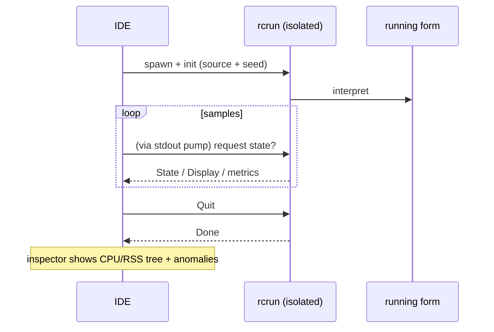

<!--
SPDX-License-Identifier: Apache-2.0
Copyright (c) 2026 Emerson Lopes and PowerRustCOBOL contributors

Licensed under the Apache License, Version 2.0.
See the LICENSE file in the project root for full license information.
-->

<!-- powerrustcobol: 1.65.124 -->

# PowerRustCOBOL の可観測性

ここは、動いている RustCOBOL プログラムを**観測する**ことに関するすべての置き場所で
す。何をしたのか、どれだけ速かったのか、下にあるストアはどれだけ健全なのか。まずは
**索引ファイルのトランザクションログ**から始め、ほかのランタイムの面へ広げていきま
す。

| 対象 | 状態 | 場所 |
|---------|--------|-------|
| **INDEXED ファイルのトランザクションログ** | ✅ 利用可能 | 本書 §1 |
| ランタイムのトレース (`COBOLT_LOG`) | ✅ 利用可能 | §2 |
| **クラッシュログと作業の復旧** | ✅ 利用可能 | §5 |
| SQL データベースランタイム | 🔭 予定 | — |
| HTTP / REST クライアント | 🔭 予定 | — |

> **指導原則。** 可観測性は*受動的*であること。どれを有効にしても、プログラムの挙動
> や結果を変えてはなりません。ログやトレースのエラーは飲み込み、ホットパスはホットの
> ままにします（高くつくものはすべて任意で、めったに呼ばれません）。

---

## 1. INDEXED ファイルのトランザクションログ

クラッシュに強い **redb** 索引エンジンは、ファイルごとにすべてのトランザクションの
ログを書き出せます。診断、容量計画、ダッシュボードに役立ちます。**既定では無効**で、
redb エンジン固有の機能です。redb は 1.62.73 以降、何も指定しなくても使われるエンジ
ンなので（[`indexed-redb-engine-jp.md`](indexed-redb-engine-jp.md) を参照）、有効に
するのはログそのものだけです。

### 1.1 有効にする

| フラグ / 環境変数 | 値 | 意味 |
|------------|--------|---------|
| `--indexed-log` / `COBOL_INDEXED_LOG` | `off`（既定）、`basic`/`true`、`full` | ログのレベル |
| `--indexed-log-format` / `COBOL_INDEXED_LOG_FORMAT` | `text`（既定）、`json` | 行の形式 |

```bash
# logfmt, per-transaction metrics
rcrun run app.cbl --indexed-log basic

# NDJSON + index page stats on close (for Grafana/Loki)
rcrun run app.cbl --indexed-log full --indexed-log-format json
```

- **`basic`** — トランザクションごとの指標だけ（安価で、エンジン自身が数えます）。
- **`full`** — `basic` に加えて、`CLOSE` のたびに redb の索引統計を出します。この
  統計は**索引を走査する**ため、コストはファイルサイズに比例します。だからこそ
  `full` は任意で、統計は CLOSE のときだけ出ます（コミットごとには決して出ません）。

### 1.2 置き場所

索引ファイルごとに、**データファイルの隣に付属のログ**が置かれます。名前は `ASSIGN`
のパスに `.log` を付けたものです。

```
customers.idx        →  customers.idx.log
/var/data/orders.dat →  /var/data/orders.dat.log
```

行は**追記**されます（切り詰められることはありません）。ですからログは実行をまたいで
積み上がります。

#### ローテーション（100 KiB 未満に保つ）

1 つのファイルが大きくなりすぎないよう、アクティブなログは **100 KiB**
（`MAX_LOG_BYTES`）に近づいた時点で、logrotate や Grafana の流儀で**ローテーション**
されます。

1. アクティブな `<datafile>.log` が
   **`<user|no-user>.<datafile>.log.<timestamp>`** にリネームされ、
2. 空の新しいアクティブログが始まります。

タイムスタンプは簡潔な UTC の刻印で、たとえば `20260610T120230461Z` です。`<user>`
は `OPEN … WITH REGISTERED USER` の値（ファイルシステム向けに無害化したもの）、
与えられなかった場合は **`no-user`** です。1 回ローテーションした後の例:

```
customers.idx.log                                 # active (< 100 KiB)
alice.customers.idx.log.20260610T120230461Z       # rotated archive (~100 KiB)
no-user.orders.dat.log.20260610T120051301Z        # rotated, no user supplied
```

ローテーション済みのファイルをランタイムが消すことはありません。お使いのログ
パイプラインで間引くか転送してください（たとえば Promtail に渡してから削除）。
アーカイブはそれぞれ単独で完結した、解析可能なログです。

### 1.3 何が記録されるか

**トランザクションイベント**ごとに 1 行です: `OPEN`、`COMMIT`、`ROLLBACK`、`CLOSE`。

| 項目 | 型 | 意味 |
|-------|------|---------|
| `ts` | 文字列 | ミリ秒精度の ISO-8601 UTC タイムスタンプ（`2026-06-10T07:30:00.123Z`） |
| `file` | 文字列 | 索引ファイルの名前 |
| `user` | 文字列 | 登録ユーザー（与えられた場合のみ現れます — §1.3.1 を参照） |
| `tx` | 数値 | トランザクションの通し番号（**OPEN セッションごと**） |
| `kind` | 文字列 | `OPEN` / `COMMIT` / `ROLLBACK` / `CLOSE` |
| `writes` | 数値 | このトランザクション中の `WRITE` |
| `rewrites` | 数値 | このトランザクション中の `REWRITE` |
| `deletes` | 数値 | このトランザクション中の `DELETE` |
| `records` | 数値 | 変更の総数（`writes+rewrites+deletes`） |
| `bytes` | 数値 | 書き込み／書き換えしたレコードのバイト数 |
| `dur_ms` | 数値 | トランザクションの実時間 |
| `rec_per_s` | 数値 | 毎秒のレコード数 |
| `bytes_per_s` | 数値 | 毎秒のバイト数 |
| `order` | 文字列 | 書き込んだキーが昇順なら `ordered`、そうでなければ `unordered`（書き込みが無ければ `n/a`） |
| `in_order` | 数値 | キーが前進した書き込みの数 |
| `out_of_order` | 数値 | キーが後退した書き込みの数 |

**`full` レベルの CLOSE 行**には redb の索引統計が加わります。

| 項目 | 意味 |
|-------|---------|
| `tree_height` | 主 B+tree の高さ |
| `leaf_pages` / `branch_pages` | ページ数 |
| `allocated_pages` | ファイル内で確保済みのページ |
| `stored_bytes` | 生きているレコードのバイト数 |
| `fragmented_bytes` | 空き／断片化した領域（ファイルの事前確保分も含む） |
| `page_size` | redb のページサイズ（4096） |

> **`order` が大事な理由。** 昇順キーの書き込みは B+tree の 1 つの熱い葉に集中しま
> す。散らばったキーはランダムな葉に触れます（I/O も断片化も増えます）。
> `order` / `in_order` / `out_of_order` は書き込みの局所性を一目で示す信号であり、
> その負荷が逐次だったのかランダムだったのかをよく表します。

> **`tx` はセッションごと。** エンジンは `OPEN` のたびに作り直されるので、カウンター
> は OPEN…CLOSE のセッションごとに 1 から始まります。曖昧さは `ts` が解きます。

#### 1.3.1 ログインしているユーザーを記録する — `OPEN … WITH REGISTERED USER`

COBOL のプログラムが OAuth や認証エンジンの背後に置かれることはまずありません。です
から操作者／ユーザーは、PowerRustCOBOL の拡張として `OPEN` で**明示的に**与えます。

```cobol
       OPEN I-O CUSTOMER-FILE WITH REGISTERED USER "ALICE"
       OPEN I-O CUSTOMER-FILE WITH REGISTERED USER WS-OPERATOR
```

- 値は**文字列定数**か**データ項目**です（`USER` は省略可で、
  `WITH REGISTERED "ALICE"` も解析されます）。
- `OPEN…CLOSE` セッション全体に適用されます。そのファイルの**すべての**イベント行
  （`OPEN`/`COMMIT`/`ROLLBACK`/`CLOSE`）に `user=` 項目が付きます。
- あくまで観測用です。何かを認証したり認可したりはしませんし、ログが無効なら何の効果
  もありません。

ログ行の例（ユーザーごとに 1 セッション）:

```
ts=…Z file=customers.idx user=ALICE        tx=1 kind=OPEN   …
ts=…Z file=customers.idx user=ALICE        tx=2 kind=COMMIT …
ts=…Z file=customers.idx user=BOB-FROM-WS  tx=1 kind=OPEN   …
```

### 1.4 形式

#### logfmt（`text`、既定）

```
ts=2026-06-10T07:30:00.123Z file=customers.idx tx=2 kind=COMMIT writes=1 rewrites=0 \
   deletes=0 records=1 bytes=12 dur_ms=3 rec_per_s=272 bytes_per_s=3266 \
   order=ordered in_order=1 out_of_order=0
```

空白を含む文字列値は引用符で囲まれます。Loki は `| logfmt` でこれを解析します。

#### NDJSON（`json`）

```json
{"ts":"2026-06-10T07:30:00.123Z","file":"customers.idx","tx":2,"kind":"COMMIT","writes":1,"rewrites":0,"deletes":0,"records":1,"bytes":12,"dur_ms":3,"rec_per_s":272,"bytes_per_s":3266,"order":"ordered","in_order":1,"out_of_order":0}
```

1 行に 1 つの JSON オブジェクトです。**数値の項目は裸の JSON 数値**なので、Grafana
がそのままグラフにできます。文字列の項目は引用符付きです。Loki は `| json` でこれを
解析します。

### 1.5 Grafana / Loki

Grafana はファイルを直接読みません。エージェントでログを **Loki** に送ってから問い合
わせてください。推奨は `json` 形式です。

1. `*.idx.log` を Promtail / Grafana Agent / Alloy で**収集**して Loki へ。*ラベル*
   は低カーディナリティに保ち（たとえば `job`、`file`、`kind`）、`tx`、`ts`、数値の
   指標は解析済みフィールドのままにしてください。
2. Grafana で**問い合わせ**（LogQL）:

   ```logql
   # commit throughput over time
   {job="rustcobol"} | json | kind="COMMIT" | unwrap rec_per_s

   # rolled-back work
   sum by (file) (count_over_time({job="rustcobol"} | json | kind="ROLLBACK" [5m]))

   # index growth (full level)
   {job="rustcobol"} | json | kind="CLOSE" | unwrap allocated_pages
   ```

Promtail のスクレイプ例（logfmt でも構いません — パイプラインの段を `logfmt` に差し
替えてください）:

```yaml
scrape_configs:
  - job_name: rustcobol
    static_configs:
      - targets: [localhost]
        labels: { job: rustcobol, __path__: /var/data/*.idx.log }
    pipeline_stages:
      - json:
          expressions: { kind: kind, file: file }
      - labels: { kind: kind, file: file }
```

### 1.6 コストと安全性

- `basic` のログは、操作ごとにいくつかのカウンターと、トランザクションイベントごとに
  1 行の追記を加えるだけです — 無視できる程度です。
- `full` は **CLOSE のときだけ**索引の走査を加えます。そのスナップショットが欲しいの
  でなければ、非常に大きなファイルでは避けてください。
- ログがプログラムの挙動に影響することはありません。ログの入出力エラーはすべて黙って
  無視され、データ経路は変わりません。

### 1.7 実装

`crates/cobolt-runtime/src/indexed_log.rs` — `LogLevel`、`LogFormat`、logfmt か
NDJSON に描き出す `LogRecord` ビルダー（依存関係の無い JSON）、追記する
`LogWriter`、そして依存関係の無い ISO-8601 フォーマッター。トランザクションごとの
集計は `crates/cobolt-runtime/src/indexed_redb.rs` にあります。フラグは
`crates/cobolt-cli/src/main.rs` で解決され、
`Interpreter::set_indexed_log_level` / `set_indexed_log_format` で適用されます。

---

## 2. ランタイムのトレース (`COBOLT_LOG`)

`rcrun` は環境変数フィルター付きの `tracing` フレームワークを使います。`COBOLT_LOG`
を設定すると、内部のランタイム／診断メッセージの詳細度を上げられます（既定は警告レベ
ル）。

```bash
COBOLT_LOG=debug rcrun run app.cbl
COBOLT_LOG=cobolt-runtime=trace rcrun run app.cbl
```

これは開発者向けの診断出力（stderr へ）で、§1 の構造化されたファイル単位のトランザク
ションログとは別物です。

---

## 3. IDE のデバッグスイッチ

IDE が知っているデバッグスイッチはすべて — 上のトレースフィルター、§1 の INDEXED
トランザクションログ、描画のオーバーレイ、データバインドのトレース、AI ペインの
レイアウトトレース — **Help → Debug Settings** で編集でき、領域ごとにタブで分かれて
います。設定は IDE 全体のもので（`cobolt.toml` ではなくマシンに保存されます）、ここに
記載された環境変数として `rcrun run-form` の各子プロセスへ引き継がれるので、手で
エクスポートする必要はありません。

シェルから単体で `rcrun` を動かす場合は、従来どおり変数のエクスポートも使えます。

---

## 4. Run Form インスペクター（IDE）

**Run Form** が動いているとき、IDE は分離された子プロセスをサンプリングする
**Run Form インスペクター**（別のビューポート）を開けます。

- サンプルごとの CPU 使用率、RSS のバイト数、子プロセスの数、使用中のシステムメモリ。
- 異常の検出（急な増大、子プロセスが多すぎる、など）。
- ライブのスパークラインとプロセスツリー。
- 分離された `rcrun` の IPC チャネルを使います（プロセス分離の詳細は開発者ガイドを
  参照）。

これは IDE 側で任意に有効化するもので、動いているフォームには影響しません。アイドル
時にはサンプリングが間引かれます。ログと指標は診断専用です。

mermaid による概観:



---

## 5. クラッシュログと作業の復旧

ウィンドウアプリケーションには端末が付いていません。ですから IDE が死ぬと、パニック
のメッセージも `file:line` もバックトレースも、誰も読んでいない stderr へ行ってしまい
ます。ウィンドウはただ消え、後には何も残りません。これを 2 つの別々の仕組みが置き換
えます。解く問題が別だからです。

**クラッシュログ — 診断できる何かを残すために。** パニックフックが
`<data>/cobolt/crash/crash-<seconds>.log` を書き出します。中身はパニックのメッセージ、
その `file:line:column`、強制取得したバックトレース、IDE のバージョン、OS、スレッド、
そしてそのとき開いていたファイルです。バグ報告に添えてください。

**自動保存 — 作業を生き延びさせるために。** **20 秒**ごとに、未保存のエディターバッ
ファーと変更済みのフォームがそれぞれ `<data>/cobolt/recovery/` にコピーされ、あわせて
各コピーを元のファイルへ対応づける `manifest.toml` が置かれます。マーカーファイルが
セッションの実行中であることを記録し、正常終了で削除されます。次回の起動時にそれが
残っていることが、まさに「前回のセッションは異常終了した」という意味であり、そのとき
IDE は復元を提案します。

**復元は決して上書きしません。** 提案を受け入れると、各コピーは元のファイルの隣に
`<name>.recovered.<ext>` として書き出され、パスが出力パネルに並びます。そのコピーは
すでに足を踏み外したプロセスから出てきたものですから、どちらの版を採るかはあなたの
判断であって、IDE の判断ではありません。

> ⚠️ **パニックフックですべてを捕まえることはできません。** スタックオーバーフローは
> ガードページで例外になり `SIGSEGV` として届きます。メモリ不足のキラーは `SIGKILL`
> を送ります。巻き戻し中の 2 度目のパニックはアボートします。この 3 つではフックは
> 動かず、**クラッシュログは書かれません**。それらを覆うのが自動保存です。何かが
> おかしくなる時点ではすでに済んでいるからで、だからこそ間隔こそが本当の保証になり
> ます — 失うのは最大でも 20 秒分の作業です。

`<data>` は OS のデータディレクトリです。macOS では
`~/Library/Application Support`、Windows では `%APPDATA%`、Linux では
`~/.local/share`。

---

## ロードマップ

この文書を可観測性の唯一のリファレンスであり続けさせるための、今後の追加予定です。

- **SQL ランタイム** — SQLite/PostgreSQL/MySQL エンジン向けの、接続ごと・文ごとの
  所要時間と行数（[`database-runtime-jp.md`](database-runtime-jp.md) を参照）。
- **HTTP クライアント** — 組込みの REST 機能に対するリクエスト／レイテンシー／
  ステータスのログ。
- **実行全体の集計サマリー** — 全ファイルにまたがる、任意の実行終了レポート。

.<<
