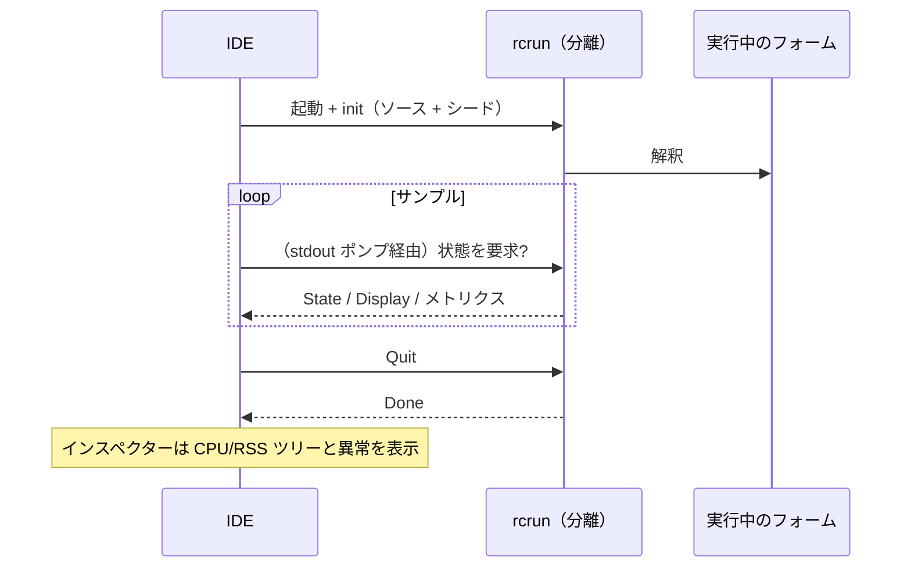

<!--
SPDX-License-Identifier: Apache-2.0
Copyright (c) 2026 Emerson Lopes and PowerRustCOBOL contributors

Licensed under the Apache License, Version 2.0.
See the LICENSE file in the project root for full license information.
-->

# PowerRustCOBOL のオブザーバビリティ

ここは、実行中の RustCOBOL プログラムを**観測する**ことに関わるすべての置き場所
です — 何をしたのか、どれくらい速かったのか、そして下層のストアがどれだけ健全か。
まずは**索引ファイルのトランザクションログ**から始まり、ほかのランタイム面へも
広がっていきます。

| 対象領域 | 状態 | 場所 |
|---------|--------|-------|
| **INDEXED ファイルのトランザクションログ** | ✅ 利用可能 | 本書 §1 |
| ランタイムのトレース（`COBOLT_LOG`） | ✅ 利用可能 | §2 |
| **クラッシュログと作業の復旧** | ✅ 利用可能 | §5 |
| SQL データベースランタイム | 🔭 予定 | — |
| HTTP / REST クライアント | 🔭 予定 | — |

> **指針。** オブザーバビリティは*受動的*です。どれを有効にしても、プログラムの
> 振る舞いや結果を変えてはなりません。ログやトレースのエラーは黙って握りつぶし、
> ホットパスはホットなままに保ちます（高価な処理はすべてオプトインで、呼び出しは
> 控えめです）。

---

## 1. INDEXED ファイルのトランザクションログ

クラッシュ安全な **redb** 索引エンジンは、すべてのトランザクションをファイル単位
で記録できます — 診断、キャパシティプランニング、ダッシュボードに役立ちます。
**既定では無効**で、redb エンジン専用の機能です
（`--indexed-engine redb`。[`indexed-redb-engine-jp.md`](indexed-redb-engine-jp.md) を参照）。

### 1.1 有効にする方法

| フラグ / 環境変数 | 値 | 意味 |
|------------|--------|---------|
| `--indexed-log` / `COBOL_INDEXED_LOG` | `off`（既定）、`basic`/`true`、`full` | ログレベル |
| `--indexed-log-format` / `COBOL_INDEXED_LOG_FORMAT` | `text`（既定）、`json` | 行の形式 |

```bash
# logfmt, per-transaction metrics
rcrun run app.cbl --indexed-engine redb --indexed-log basic

# NDJSON + index page stats on close (for Grafana/Loki)
rcrun run app.cbl --indexed-engine redb --indexed-log full --indexed-log-format json
```

- **`basic`** — トランザクションごとのメトリクスのみ（安価で、エンジン自身が
  数えます）。
- **`full`** — `basic` に加えて、`CLOSE` のたびに redb の索引統計を出します。この
  統計は**索引を走査する**ため、コストはファイルサイズに比例して増えます。だから
  こそ `full` はオプトインで、統計は CLOSE 時にのみ出力されます（コミットごとでは
  ありません）。

### 1.2 出力場所

索引ファイルにはそれぞれ、**データファイルの隣に置かれるサイドカーログ**が付き、
`ASSIGN` のパスに `.log` を付け足した名前になります:

```
customers.idx        →  customers.idx.log
/var/data/orders.dat →  /var/data/orders.dat.log
```

行は**末尾に追記**され（決して切り詰められません）、ログは実行をまたいで蓄積され
ます。

#### ローテーション（100 KiB 未満を保つ）

個々のファイルが大きくならないよう、アクティブなログは **100 KiB**
（`MAX_LOG_BYTES`）に近づいた時点で **ローテーション**されます。logrotate や
Grafana と同じ流儀です:

1. アクティブな `<datafile>.log` を
   **`<user|no-user>.<datafile>.log.<timestamp>`** へ改名し、
2. 空のアクティブログを新たに開始します。

タイムスタンプは簡潔な UTC の刻印で、たとえば `20260610T120230461Z` です。
`<user>` は `OPEN … WITH REGISTERED USER` の値（ファイルシステム向けに無害化済み）
で、値が与えられなかった場合は **`no-user`** になります。1 回ローテーションした
あとの例:

```
customers.idx.log                                 # active (< 100 KiB)
alice.customers.idx.log.20260610T120230461Z       # rotated archive (~100 KiB)
no-user.orders.dat.log.20260610T120051301Z        # rotated, no user supplied
```

ローテーション済みのファイルをランタイムが削除することはありません — ログ基盤で
刈り取るか転送してください（たとえば Promtail で送ってから削除）。各アーカイブは
それ自体で完結した、解析可能なログです。

### 1.3 記録される内容

**トランザクションイベント**ごとに 1 行:`OPEN`、`COMMIT`、`ROLLBACK`、`CLOSE`。

| フィールド | 型 | 意味 |
|-------|------|---------|
| `ts` | 文字列 | ISO-8601 UTC のタイムスタンプ、ミリ秒精度（`2026-06-10T07:30:00.123Z`） |
| `file` | 文字列 | 索引ファイル名 |
| `user` | 文字列 | 登録ユーザー（指定されたときのみ出力 — §1.3.1 を参照） |
| `tx` | 数値 | トランザクション通番（**OPEN セッションごと**） |
| `kind` | 文字列 | `OPEN` / `COMMIT` / `ROLLBACK` / `CLOSE` |
| `writes` | 数値 | このトランザクション中の `WRITE` 回数 |
| `rewrites` | 数値 | このトランザクション中の `REWRITE` 回数 |
| `deletes` | 数値 | このトランザクション中の `DELETE` 回数 |
| `records` | 数値 | 変更の総数（`writes+rewrites+deletes`） |
| `bytes` | 数値 | 書き込み・再書き込みしたレコードのバイト数 |
| `dur_ms` | 数値 | トランザクションの実時間 |
| `rec_per_s` | 数値 | 毎秒レコード数 |
| `bytes_per_s` | 数値 | 毎秒バイト数 |
| `order` | 文字列 | 書き込んだキーが昇順なら `ordered`、そうでなければ `unordered`（書き込みがなければ `n/a`） |
| `in_order` | 数値 | キーが前進した書き込みの件数 |
| `out_of_order` | 数値 | キーが後退した書き込みの件数 |

**`full` レベルの CLOSE 行**には、redb の索引統計が加わります:

| フィールド | 意味 |
|-------|---------|
| `tree_height` | 主 B+ 木の高さ |
| `leaf_pages` / `branch_pages` | ページ数 |
| `allocated_pages` | ファイル内で確保済みのページ数 |
| `stored_bytes` | 生きているレコードのバイト数 |
| `fragmented_bytes` | 空き・断片化した領域（事前確保したファイルの余白を含む） |
| `page_size` | redb のページサイズ（4096） |

> **`order` が重要な理由。** 昇順キーの書き込みは 1 枚のホットな B+ 木の葉に集中
> しますが、散らばったキーはランダムな葉に触れます（I/O が増え、断片化も進みま
> す）。`order` / `in_order` / `out_of_order` の各フィールドは、書き込みの局所性を
> 一目で示す信号 — 投入が逐次だったかランダムだったかの良い代理指標です。

> **`tx` はセッション単位です。** エンジンは `OPEN` のたびに作り直されるため、
> カウンタは OPEN…CLOSE セッションごとに 1 から始まります。区別には `ts`
> フィールドを使ってください。

#### 1.3.1 ログイン中のユーザーを記録する — `OPEN … WITH REGISTERED USER`

COBOL プログラムが OAuth や何らかの認証エンジンの背後に置かれることはまれです。
そこで、オペレーター（ユーザー）は PowerRustCOBOL の拡張として `OPEN` で
**明示的に**与えます:

```cobol
       OPEN I-O CUSTOMER-FILE WITH REGISTERED USER "ALICE"
       OPEN I-O CUSTOMER-FILE WITH REGISTERED USER WS-OPERATOR
```

- 値は**文字列リテラル**または**データ項目**です（`USER` は省略可能で、
  `WITH REGISTERED "ALICE"` も解析されます）。
- `OPEN…CLOSE` のセッション全体に適用され、そのファイルの**すべての**イベント行
  （`OPEN`/`COMMIT`/`ROLLBACK`/`CLOSE`）に `user=` フィールドが付きます。
- 純粋に観測用です — 認証も認可も行わず、ログが無効なときは何の効果もありません。

ログ行の例（ユーザーごとに 1 セッション）:

```
ts=…Z file=customers.idx user=ALICE        tx=1 kind=OPEN   …
ts=…Z file=customers.idx user=ALICE        tx=2 kind=COMMIT …
ts=…Z file=customers.idx user=BOB-FROM-WS  tx=1 kind=OPEN   …
```

### 1.4 形式

#### logfmt（`text`、既定）

```
ts=2026-06-10T07:30:00.123Z file=customers.idx tx=2 kind=COMMIT writes=1 rewrites=0 \
   deletes=0 records=1 bytes=12 dur_ms=3 rec_per_s=272 bytes_per_s=3266 \
   order=ordered in_order=1 out_of_order=0
```

空白を含む文字列値は引用符で囲まれます。Loki では `| logfmt` で解析できます。

#### NDJSON（`json`）

```json
{"ts":"2026-06-10T07:30:00.123Z","file":"customers.idx","tx":2,"kind":"COMMIT","writes":1,"rewrites":0,"deletes":0,"records":1,"bytes":12,"dur_ms":3,"rec_per_s":272,"bytes_per_s":3266,"order":"ordered","in_order":1,"out_of_order":0}
```

1 行につき JSON オブジェクト 1 つ。Grafana がそのままグラフ化できるよう、**数値
フィールドは裸の JSON 数値**です。文字列フィールドは引用符で囲まれます。Loki では
`| json` で解析できます。

### 1.5 Grafana / Loki

Grafana はファイルを直接読みません — エージェントでログを **Loki** へ送ってから
クエリしてください。推奨は `json` 形式です。

1. `*.idx.log` を Promtail / Grafana Agent / Alloy で **収集**して Loki へ。
   *ラベル*はカーディナリティを低く保ち（たとえば `job`、`file`、`kind`）、`tx`、
   `ts` と数値メトリクスは解析済みフィールドのままにします。
2. Grafana で **クエリ**します（LogQL）:

   ```logql
   # commit throughput over time
   {job="rustcobol"} | json | kind="COMMIT" | unwrap rec_per_s

   # rolled-back work
   sum by (file) (count_over_time({job="rustcobol"} | json | kind="ROLLBACK" [5m]))

   # index growth (full level)
   {job="rustcobol"} | json | kind="CLOSE" | unwrap allocated_pages
   ```

Promtail のスクレイプ例（logfmt でも問題ありません — パイプラインステージを
`logfmt` に差し替えてください）:

```yaml
scrape_configs:
  - job_name: rustcobol
    static_configs:
      - targets: [localhost]
        labels: { job: rustcobol, __path__: /var/data/*.idx.log }
    pipeline_stages:
      - json:
          expressions: { kind: kind, file: file }
      - labels: { kind: kind, file: file }
```

### 1.6 コストと安全性

- `basic` のログは、操作ごとにいくつかのカウンタを増やし、トランザクション
  イベントごとに 1 行追記するだけです — 無視できる負荷です。
- `full` は **CLOSE のときだけ**索引の走査を追加します。そのスナップショットが
  必要でない限り、非常に大きなファイルでは避けてください。
- ログがプログラムの振る舞いに影響することはありません。ログの I/O エラーはすべて
  黙って無視され、データ経路は変わりません。

### 1.7 実装

`crates/cobolt-runtime/src/indexed_log.rs` — `LogLevel`、`LogFormat`、logfmt か
NDJSON（依存関係なしの JSON）へ描き出す `LogRecord` ビルダー、追記を行う
`LogWriter`、そして依存関係のない ISO-8601 フォーマッタ。トランザクションごとの
アキュムレータは `crates/cobolt-runtime/src/indexed_redb.rs` にあります。フラグは
`crates/cobolt-cli/src/main.rs` で解決され、
`Interpreter::set_indexed_log_level` / `set_indexed_log_format` を通じて適用され
ます。

---

## 2. ランタイムのトレース（`COBOLT_LOG`）

`rcrun` は環境変数フィルタ付きの `tracing` フレームワークを使います。ランタイム
内部や診断メッセージの詳細度を上げるには `COBOLT_LOG` を設定します（既定は警告
まで）:

```bash
COBOLT_LOG=debug rcrun run app.cbl
COBOLT_LOG=cobolt-runtime=trace rcrun run app.cbl
```

これは開発者向けの診断出力（stderr 宛て）で、§1 のファイル単位の構造化
トランザクションログとは別物です。

---

## 3. IDE のデバッグスイッチ

IDE が把握しているデバッグスイッチはすべて — 上記のトレースフィルタ、§1 の
INDEXED トランザクションログ、描画オーバーレイ、データバインドのトレース、AI
ペインのレイアウトトレース — **Help → Debug Settings** で編集でき、領域ごとに
1 つのタブへまとめられています。設定は IDE 全体に効き（`cobolt.toml` ではなく
マシン側に保存されます）、本書に記した環境変数として `rcrun run-form` の各子
プロセスへ渡されるので、手でエクスポートする必要はありません。

シェルから単独で `rcrun` を実行する場合は、変数のエクスポートも従来どおり有効
です。

---

## 4. Run-Form インスペクター（IDE）

**Run Form** が動いているとき、IDE は分離された子プロセスをサンプリングする
**Run-Form Inspector**（別ビューポート）を開けます:

- サンプルごとの CPU 使用率、RSS バイト数、子プロセス数、システムメモリ使用量。
- 異常検知（急激な増加、子プロセスの過多など）。
- ライブのスパークラインとプロセスツリー。
- 分離された `rcrun` の IPC チャネルを使います（プロセス分離の詳細は開発者ガイド
  を参照）。

これは IDE 側のオプトインで、実行中のフォームには影響しません。アイドル時は
サンプリングが抑制されます。ログとメトリクスは診断専用です。

mermaid による概観:



---

## 5. クラッシュログと作業の復旧

ウィンドウを持つアプリケーションには端末が付いていません。だから IDE が死ぬと、
パニックメッセージも `file:line` もバックトレースも、誰も読んでいない stderr へ
流れていきます — ウィンドウはただ消え、あとには何も残りません。これを置き換える
仕組みは 2 つあり、それぞれ別の問題を解いています。

**クラッシュログ — 診断する材料を残すために。** パニックフックが
`<data>/cobolt/crash/crash-<seconds>.log` を書き出し、そこにパニックメッセージ、
`file:line:column`、強制取得したバックトレース、IDE のバージョン、OS、スレッド、
そのとき開いていたファイルを収めます。不具合報告に添付してください。

**自動保存 — 作業を生き延びさせるために。** **20 秒**ごとに、未保存の各エディタ
バッファと変更済みの各フォームが `<data>/cobolt/recovery/` へコピーされ、各コピー
を元のファイルへ対応づける `manifest.toml` が併置されます。セッションが動いている
ことはマーカーファイルが記録し、正常終了時に削除されます。次回起動時にそれが
見つかることこそ「前回のセッションは異常終了した」の意味であり、そのとき IDE は
復元を提案します。

**復元は決して上書きしません。** 提案を受け入れると、各コピーは元のファイルの隣に
`<name>.recovered.<ext>` として書き出され、そのパスが **Output** パネルに一覧
されます。コピーはすでに足元を失ったプロセスから出てきたものですから、どちらの版
を採るかを決めるのは IDE ではなくあなたです。

> ⚠️ **パニックフックはすべてを捕まえられません。** スタックオーバーフローは
> ガードページでフォールトし `SIGSEGV` として届きます。OOM キラーは `SIGKILL` を
> 送ります。巻き戻し中の二度目のパニックはアボートします。この 3 つではフックが
> 走らず、**クラッシュログは書かれません**。それらを補うのが自動保存です。何かが
> 起きた時点ですでに保存は済んでいるからで、だからこそ実際の保証は間隔そのもの —
> 失うのはせいぜい 20 秒分の作業です。

`<data>` は OS のデータディレクトリで、macOS では
`~/Library/Application Support`、Windows では `%APPDATA%`、Linux では
`~/.local/share` です。

---

## ロードマップ

本書をオブザーバビリティの唯一の参照であり続けさせるための、追加予定:

- **SQL ランタイム** — SQLite/PostgreSQL/MySQL の各エンジンについて、接続や
  ステートメント単位の所要時間と行数（[`database-runtime-jp.md`](database-runtime-jp.md)
  を参照）。
- **HTTP クライアント** — REST 組み込み関数のリクエスト・レイテンシ・ステータスの
  記録。
- **実行全体の集計サマリー** — 全ファイルを横断する、任意の実行終了レポート。
