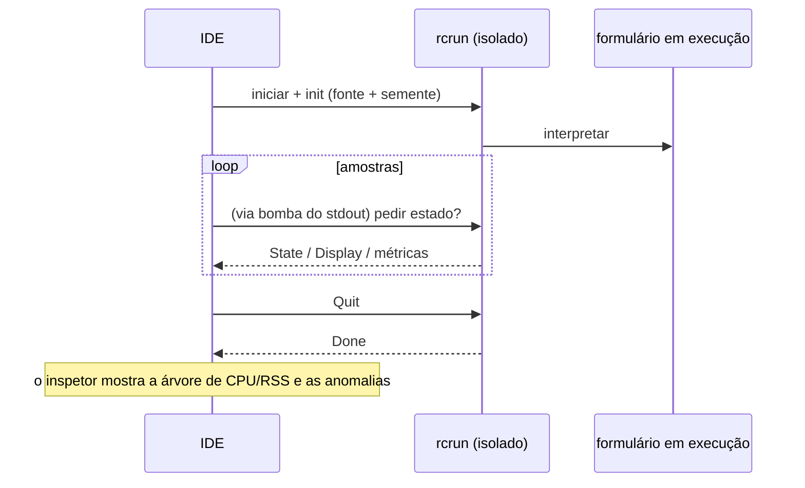

<!--
SPDX-License-Identifier: Apache-2.0
Copyright (c) 2026 Emerson Lopes and PowerRustCOBOL contributors

Licensed under the Apache License, Version 2.0.
See the LICENSE file in the project root for full license information.
-->

# Observabilidade do PowerRustCOBOL

Esta é a casa de tudo que diz respeito a **observar** um programa RustCOBOL em
execução — o que ele fez, com que rapidez e qual a saúde dos armazenamentos por
baixo. Começa pelos **registros de transações de arquivos indexados** e vai
crescer para cobrir outras superfícies do runtime.

| Superfície | Situação | Onde |
|---------|--------|-------|
| **Registro de transações de arquivos INDEXED** | ✅ disponível | este documento, §1 |
| Rastreamento do runtime (`COBOLT_LOG`) | ✅ disponível | §2 |
| **Registros de falha e recuperação do trabalho** | ✅ disponível | §5 |
| Runtime de bancos de dados SQL | 🔭 planejado | — |
| Cliente HTTP / REST | 🔭 planejado | — |

> **Princípio norteador.** A observabilidade é *passiva*: ligar qualquer parte
> dela jamais pode mudar o comportamento ou os resultados do programa. Os erros
> de registro e de rastreamento são engolidos em silêncio, e os caminhos quentes
> continuam quentes (tudo que é caro é opcional e chamado com parcimônia).

---

## 1. Registro de transações de arquivos INDEXED

O motor indexado **redb**, à prova de falhas, consegue escrever um registro por
arquivo de cada transação — útil para diagnóstico, planejamento de capacidade e
painéis. Ele vem **desligado por padrão** e é específico do motor redb
(`--indexed-engine redb`; veja [`indexed-redb-engine-pt.md`](indexed-redb-engine-pt.md)).

### 1.1 Como ligar

| Parâmetro / variável | Valores | Significado |
|------------|--------|---------|
| `--indexed-log` / `COBOL_INDEXED_LOG` | `off` (padrão), `basic`/`true`, `full` | Nível de registro |
| `--indexed-log-format` / `COBOL_INDEXED_LOG_FORMAT` | `text` (padrão), `json` | Formato da linha |

```bash
# logfmt, per-transaction metrics
rcrun run app.cbl --indexed-engine redb --indexed-log basic

# NDJSON + index page stats on close (for Grafana/Loki)
rcrun run app.cbl --indexed-engine redb --indexed-log full --indexed-log-format json
```

- **`basic`** — apenas métricas por transação (barato, contabilizado pelo próprio
  motor).
- **`full`** — o `basic` mais as estatísticas do índice do redb a cada `CLOSE`.
  Essas estatísticas **percorrem o índice**, então o custo delas cresce com o
  tamanho do arquivo; é por isso que `full` é opcional e as estatísticas saem
  somente no CLOSE (nunca a cada commit).

### 1.2 Localização

Cada arquivo indexado ganha um **registro lateral ao lado do seu arquivo de
dados**, nomeado acrescentando `.log` ao caminho do `ASSIGN`:

```
customers.idx        →  customers.idx.log
/var/data/orders.dat →  /var/data/orders.dat.log
```

As linhas são **acrescentadas ao fim** (nunca truncadas), de modo que um registro
se acumula entre execuções.

#### Rotação (mantida abaixo de 100 KiB)

Para que nenhum arquivo isolado fique grande, o registro ativo é **rotacionado**
assim que se aproxima de **100 KiB** (`MAX_LOG_BYTES`), ao estilo
logrotate/Grafana:

1. o `<datafile>.log` ativo é renomeado para
   **`<user|no-user>.<datafile>.log.<timestamp>`**, e
2. um registro ativo novo e vazio é iniciado.

O carimbo de tempo é um selo UTC compacto, por exemplo `20260610T120230461Z`. O
`<user>` é o valor de `OPEN … WITH REGISTERED USER` (higienizado para o sistema
de arquivos), ou **`no-user`** quando nenhum foi fornecido. Exemplo depois de uma
rotação:

```
customers.idx.log                                 # active (< 100 KiB)
alice.customers.idx.log.20260610T120230461Z       # rotated archive (~100 KiB)
no-user.orders.dat.log.20260610T120051301Z        # rotated, no user supplied
```

Os arquivos rotacionados nunca são apagados pelo runtime — descarte-os ou
embarque-os com o seu pipeline de logs (por exemplo, Promtail e depois apagar).
Cada arquivo arquivado é um registro completo e analisável por conta própria.

### 1.3 O que é registrado

Uma linha por **evento de transação**: `OPEN`, `COMMIT`, `ROLLBACK`, `CLOSE`.

| Campo | Tipo | Significado |
|-------|------|---------|
| `ts` | texto | carimbo de tempo ISO-8601 UTC, precisão de ms (`2026-06-10T07:30:00.123Z`) |
| `file` | texto | o nome do arquivo indexado |
| `user` | texto | o usuário registrado (presente só quando fornecido — veja §1.3.1) |
| `tx` | número | contador de transações (**por sessão de OPEN**) |
| `kind` | texto | `OPEN` / `COMMIT` / `ROLLBACK` / `CLOSE` |
| `writes` | número | `WRITE`s desta transação |
| `rewrites` | número | `REWRITE`s desta transação |
| `deletes` | número | `DELETE`s desta transação |
| `records` | número | total de mutações (`writes+rewrites+deletes`) |
| `bytes` | número | bytes de registro escritos ou reescritos |
| `dur_ms` | número | duração da transação em tempo de relógio |
| `rec_per_s` | número | registros por segundo |
| `bytes_per_s` | número | bytes por segundo |
| `order` | texto | `ordered` se as chaves escritas foram ascendentes, senão `unordered` (`n/a` se não houve escritas) |
| `in_order` | número | quantidade de escritas cuja chave avançou |
| `out_of_order` | número | quantidade de escritas cuja chave retrocedeu |

**As linhas de CLOSE do nível `full`** acrescentam as estatísticas do índice do
redb:

| Campo | Significado |
|-------|---------|
| `tree_height` | altura da árvore B+ primária |
| `leaf_pages` / `branch_pages` | contagem de páginas |
| `allocated_pages` | páginas alocadas no arquivo |
| `stored_bytes` | bytes de registro vivos |
| `fragmented_bytes` | espaço livre ou fragmentado (inclui a folga pré-alocada do arquivo) |
| `page_size` | tamanho de página do redb (4096) |

> **Por que `order` importa.** Escritas com chave ascendente batem numa única
> folha quente da árvore B+; chaves espalhadas tocam folhas aleatórias (mais E/S,
> mais fragmentação). Os campos `order` / `in_order` / `out_of_order` são um
> sinal de relance da localidade de escrita — uma boa aproximação para saber se
> uma carga foi sequencial ou aleatória.

> **`tx` é por sessão.** O motor é recriado a cada `OPEN`, então o contador
> recomeça em 1 a cada sessão OPEN…CLOSE; o campo `ts` desfaz a ambiguidade.

#### 1.3.1 Registrar o usuário conectado — `OPEN … WITH REGISTERED USER`

Programas COBOL raramente ficam atrás de OAuth ou de qualquer motor de
autenticação, então o operador ou usuário é fornecido **explicitamente** no
`OPEN`, como uma extensão do PowerRustCOBOL:

```cobol
       OPEN I-O CUSTOMER-FILE WITH REGISTERED USER "ALICE"
       OPEN I-O CUSTOMER-FILE WITH REGISTERED USER WS-OPERATOR
```

- O valor é um **literal de texto** ou um **item de dados** (`USER` é opcional;
  `WITH REGISTERED "ALICE"` também é analisado).
- Vale para toda a sessão `OPEN…CLOSE`: **todas** as linhas de evento daquele
  arquivo (`OPEN`/`COMMIT`/`ROLLBACK`/`CLOSE`) carregam um campo `user=`.
- É puramente observacional — não autentica nem autoriza coisa alguma, e não tem
  efeito nenhum quando o registro está desligado.

Exemplo de linhas de registro (uma sessão por usuário):

```
ts=…Z file=customers.idx user=ALICE        tx=1 kind=OPEN   …
ts=…Z file=customers.idx user=ALICE        tx=2 kind=COMMIT …
ts=…Z file=customers.idx user=BOB-FROM-WS  tx=1 kind=OPEN   …
```

### 1.4 Formatos

#### logfmt (`text`, padrão)

```
ts=2026-06-10T07:30:00.123Z file=customers.idx tx=2 kind=COMMIT writes=1 rewrites=0 \
   deletes=0 records=1 bytes=12 dur_ms=3 rec_per_s=272 bytes_per_s=3266 \
   order=ordered in_order=1 out_of_order=0
```

Valores de texto que contenham espaços saem entre aspas. O Loki analisa isso com
`| logfmt`.

#### NDJSON (`json`)

```json
{"ts":"2026-06-10T07:30:00.123Z","file":"customers.idx","tx":2,"kind":"COMMIT","writes":1,"rewrites":0,"deletes":0,"records":1,"bytes":12,"dur_ms":3,"rec_per_s":272,"bytes_per_s":3266,"order":"ordered","in_order":1,"out_of_order":0}
```

Um objeto JSON por linha. **Os campos numéricos são números JSON puros**, para
que o Grafana consiga plotá-los diretamente; os campos de texto saem entre
aspas. O Loki analisa isso com `| json`.

### 1.5 Grafana / Loki

O Grafana não lê arquivos diretamente — embarque os registros para o **Loki** com
um agente e depois consulte. Recomendado: o formato `json`.

1. **Colete** os `*.idx.log` com Promtail / Grafana Agent / Alloy → Loki. Mantenha
   os *rótulos* com baixa cardinalidade (por exemplo `job`, `file`, `kind`);
   deixe `tx`, `ts` e as métricas numéricas como campos analisados.
2. **Consulte** no Grafana (LogQL):

   ```logql
   # commit throughput over time
   {job="rustcobol"} | json | kind="COMMIT" | unwrap rec_per_s

   # rolled-back work
   sum by (file) (count_over_time({job="rustcobol"} | json | kind="ROLLBACK" [5m]))

   # index growth (full level)
   {job="rustcobol"} | json | kind="CLOSE" | unwrap allocated_pages
   ```

Exemplo de coleta com o Promtail (logfmt também serve — troque o estágio do
pipeline por `logfmt`):

```yaml
scrape_configs:
  - job_name: rustcobol
    static_configs:
      - targets: [localhost]
        labels: { job: rustcobol, __path__: /var/data/*.idx.log }
    pipeline_stages:
      - json:
          expressions: { kind: kind, file: file }
      - labels: { kind: kind, file: file }
```

### 1.6 Custo e segurança

- O registro `basic` acrescenta uns poucos contadores por operação e uma linha ao
  fim do arquivo por evento de transação — desprezível.
- `full` acrescenta um percurso do índice **somente no CLOSE**; evite-o em
  arquivos muito grandes, a menos que queira esse retrato.
- O registro nunca afeta o comportamento do programa: todos os erros de E/S do
  registro são ignorados em silêncio, e o caminho dos dados não muda.

### 1.7 Implementação

`crates/cobolt-runtime/src/indexed_log.rs` — `LogLevel`, `LogFormat`, o
construtor `LogRecord` que renderiza para logfmt ou NDJSON (JSON sem
dependências), o `LogWriter` que acrescenta ao fim e um formatador ISO-8601 sem
dependências. Os acumuladores por transação vivem em
`crates/cobolt-runtime/src/indexed_redb.rs`; os parâmetros são resolvidos em
`crates/cobolt-cli/src/main.rs` e aplicados via
`Interpreter::set_indexed_log_level` / `set_indexed_log_format`.

---

## 2. Rastreamento do runtime (`COBOLT_LOG`)

O `rcrun` usa o framework `tracing` com um filtro por variável de ambiente.
Defina `COBOLT_LOG` para aumentar o detalhamento das mensagens internas de
runtime e diagnóstico (avisos, por padrão):

```bash
COBOLT_LOG=debug rcrun run app.cbl
COBOLT_LOG=cobolt-runtime=trace rcrun run app.cbl
```

Essa é a saída de diagnóstico voltada ao desenvolvedor (para o stderr), distinta
do registro estruturado de transações por arquivo da §1.

---

## 3. Chaves de depuração no IDE

Toda chave de depuração que o IDE conhece — o filtro de rastreamento acima, o
registro de transações INDEXED da §1, as sobreposições de renderização, o
rastreamento da vinculação de dados e o rastreamento do leiaute do painel de IA —
é editável em **Help → Debug Settings**, agrupada em uma aba por área. Os ajustes
valem para o IDE inteiro (ficam guardados na máquina, não em `cobolt.toml`) e são
repassados a cada processo filho `rcrun run-form` como as variáveis de ambiente
documentadas aqui, de modo que nada precisa ser exportado à mão.

Exportar uma variável continua funcionando para uma execução avulsa do `rcrun` a
partir de um shell.

---

## 4. Inspetor de Run-Form (IDE)

Quando o **Run Form** está ativo, o IDE pode abrir um **Run-Form Inspector**
(janela separada) que amostra o processo filho isolado:

- Porcentagem de CPU por amostra, bytes de RSS, contagem de processos filhos e
  memória do sistema em uso.
- Detecção de anomalias (crescimento repentino, filhos demais etc.).
- Minigráficos ao vivo e árvore de processos.
- Usa o canal IPC do `rcrun` isolado (veja o guia do desenvolvedor para os
  detalhes do isolamento de processos).

Isso é opcional no IDE e não afeta o formulário em execução. A amostragem é
reduzida quando não há atividade. Registros e métricas servem só para
diagnóstico.

Visão geral em mermaid:



---

## 5. Registros de falha e recuperação do trabalho

Um aplicativo em janela não tem terminal anexado, então quando o IDE morre a
mensagem de pânico, o `file:line` e o backtrace vão todos para um stderr que
ninguém está lendo — a janela simplesmente some e não deixa nada para trás. Dois
mecanismos separados substituem isso, porque resolvem dois problemas diferentes.

**Registros de falha — para que haja algo a diagnosticar.** Um gancho de pânico
escreve `<data>/cobolt/crash/crash-<seconds>.log` com a mensagem do pânico, o
`file:line:column`, um backtrace forçado, a versão do IDE, o sistema operacional,
a thread e os arquivos que estavam abertos na hora. Anexe-o ao relato do defeito.

**Salvamento automático — para que o trabalho sobreviva.** A cada **20 segundos**
cada buffer de editor não salvo e cada formulário modificado é copiado para
`<data>/cobolt/recovery/`, ao lado de um `manifest.toml` que liga cada cópia de
volta ao seu original. Um arquivo marcador registra que há uma sessão em
andamento e é apagado na saída limpa; encontrar um no início seguinte é
exatamente o que significa "a última sessão terminou mal", e aí o IDE oferece
restaurar.

**Restaurar nunca sobrescreve.** Aceitar a oferta escreve cada cópia ao lado do
original como `<name>.recovered.<ext>` e lista os caminhos no painel **Output**.
A cópia saiu de um processo que já havia perdido o rumo, então qual versão vence
é decisão sua, não do IDE.

> ⚠️ **Um gancho de pânico não consegue pegar tudo.** Um estouro de pilha falha na
> página de guarda e chega como `SIGSEGV`; o matador por falta de memória manda
> `SIGKILL`; um segundo pânico durante o desenrolar aborta. Nos três casos o
> gancho nunca roda e **nenhum registro de falha é escrito**. O salvamento
> automático é o que cobre esses casos, porque já aconteceu quando algo dá
> errado — o que também é o motivo de o intervalo ser a garantia de verdade: no
> máximo 20 segundos de trabalho.

`<data>` é o diretório de dados do sistema operacional —
`~/Library/Application Support` no macOS, `%APPDATA%` no Windows,
`~/.local/share` no Linux.

---

## Roteiro

Acréscimos planejados, para manter este documento a referência única de
observabilidade:

- **Runtime SQL** — tempos e contagens de linhas por conexão e por comando para
  os motores SQLite/PostgreSQL/MySQL (veja
  [`database-runtime-pt.md`](database-runtime-pt.md)).
- **Cliente HTTP** — registro de requisição, latência e status para as funções
  REST embutidas.
- **Resumo agregado da execução** — um relatório opcional de fim de execução
  abrangendo todos os arquivos.
