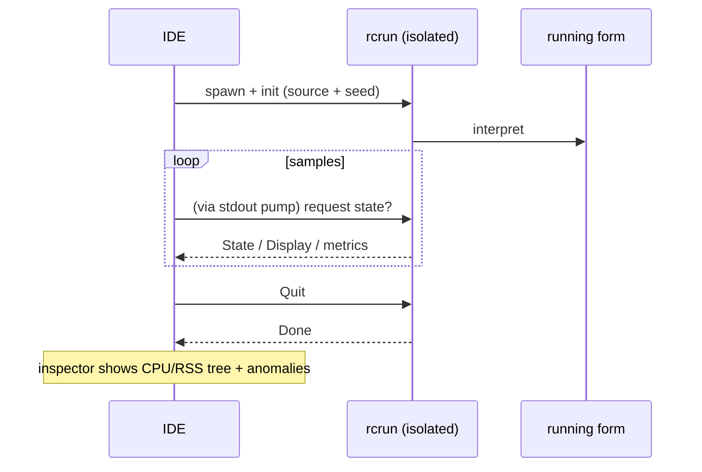

<!--
SPDX-License-Identifier: Apache-2.0
Copyright (c) 2026 Emerson Lopes and PowerRustCOBOL contributors

Licensed under the Apache License, Version 2.0.
See the LICENSE file in the project root for full license information.
-->

<!-- powerrustcobol: 1.65.124 -->

# Observabilidade do PowerRustCOBOL

Esta é a casa de tudo o que diz respeito a **observar** um programa RustCOBOL em
execução — o que fez, a que velocidade, e com que saúde estão os armazéns
subjacentes. Começa pelos **registos de transações de ficheiros indexados** e
crescerá para cobrir outras superfícies do ambiente de execução.

| Superfície | Estado | Onde |
|---------|--------|-------|
| **Registo de transações de ficheiros INDEXED** | ✅ disponível | este documento, §1 |
| Rastreio do ambiente de execução (`COBOLT_LOG`) | ✅ disponível | §2 |
| **Registos de falha e recuperação do trabalho** | ✅ disponível | §5 |
| Ambiente de execução de bases de dados SQL | 🔭 previsto | — |
| Cliente HTTP / REST | 🔭 previsto | — |

> **Princípio orientador.** A observabilidade é *passiva*: ligar qualquer parte
> dela nunca deve alterar o comportamento nem os resultados do programa. Os erros
> de registo e de rastreio são engolidos, e os caminhos quentes continuam quentes
> (tudo o que é caro é opcional e chamado com parcimónia).

---

## 1. Registo de transações de ficheiros INDEXED

O motor indexado **redb**, à prova de falhas, pode escrever um registo por
ficheiro de cada transação — útil para diagnóstico, planeamento de capacidade e
painéis. Está **desligado por omissão** e é específico do motor redb, que desde a
1.62.73 é o que se obtém sem pedir (ver
[`indexed-redb-engine-pt.md`](indexed-redb-engine-pt.md)); só é preciso ligar o
registo em si.

### 1.1 Como o ligar

| Opção / variável | Valores | Significado |
|------------|--------|---------|
| `--indexed-log` / `COBOL_INDEXED_LOG` | `off` (por omissão), `basic`/`true`, `full` | Nível de registo |
| `--indexed-log-format` / `COBOL_INDEXED_LOG_FORMAT` | `text` (por omissão), `json` | Formato da linha |

```bash
# logfmt, per-transaction metrics
rcrun run app.cbl --indexed-log basic

# NDJSON + index page stats on close (for Grafana/Loki)
rcrun run app.cbl --indexed-log full --indexed-log-format json
```

- **`basic`** — apenas métricas por transação (barato, contabilizado pelo próprio
  motor).
- **`full`** — o de `basic` mais as estatísticas do índice do redb em cada
  `CLOSE`. Essas estatísticas **percorrem o índice**, pelo que o seu custo cresce
  com o tamanho do ficheiro; é por isso que `full` é opcional e as estatísticas
  são emitidas apenas no CLOSE (nunca a cada confirmação).

### 1.2 Localização

Cada ficheiro indexado ganha um **registo acompanhante ao lado do seu ficheiro de
dados**, nomeado acrescentando `.log` ao caminho do `ASSIGN`:

```
customers.idx        →  customers.idx.log
/var/data/orders.dat →  /var/data/orders.dat.log
```

As linhas são **acrescentadas** (o ficheiro nunca é truncado), pelo que um
registo se acumula ao longo das execuções.

#### Rotação (mantido abaixo de 100 KiB)

Para que nenhum ficheiro isolado cresça, o registo ativo é **rodado** assim que se
aproxima dos **100 KiB** (`MAX_LOG_BYTES`), ao estilo do logrotate ou do Grafana:

1. o `<datafile>.log` ativo é renomeado para
   **`<user|no-user>.<datafile>.log.<timestamp>`**, e
2. é iniciado um registo ativo novo e vazio.

A marca temporal é uma marca UTC compacta, por exemplo `20260610T120230461Z`. O
`<user>` é o valor de `OPEN … WITH REGISTERED USER` (higienizado para o sistema
de ficheiros), ou **`no-user`** quando nenhum foi fornecido. Exemplo depois de uma
rotação:

```
customers.idx.log                                 # active (< 100 KiB)
alice.customers.idx.log.20260610T120230461Z       # rotated archive (~100 KiB)
no-user.orders.dat.log.20260610T120051301Z        # rotated, no user supplied
```

O ambiente de execução nunca apaga os ficheiros rodados — limpe-os ou envie-os
com a sua cadeia de registos (por exemplo Promtail e depois apagar). Cada arquivo
é, por si só, um registo completo e analisável.

### 1.3 O que é registado

Uma linha por **evento de transação**: `OPEN`, `COMMIT`, `ROLLBACK`, `CLOSE`.

| Campo | Tipo | Significado |
|-------|------|---------|
| `ts` | cadeia | marca temporal ISO-8601 UTC com precisão de ms (`2026-06-10T07:30:00.123Z`) |
| `file` | cadeia | o nome do ficheiro indexado |
| `user` | cadeia | o utilizador registado (presente apenas quando fornecido — ver §1.3.1) |
| `tx` | número | contador de transações (**por sessão de OPEN**) |
| `kind` | cadeia | `OPEN` / `COMMIT` / `ROLLBACK` / `CLOSE` |
| `writes` | número | `WRITE` nesta transação |
| `rewrites` | número | `REWRITE` nesta transação |
| `deletes` | número | `DELETE` nesta transação |
| `records` | número | mutações totais (`writes+rewrites+deletes`) |
| `bytes` | número | bytes de registo escritos ou reescritos |
| `dur_ms` | número | duração de relógio da transação |
| `rec_per_s` | número | registos por segundo |
| `bytes_per_s` | número | bytes por segundo |
| `order` | cadeia | `ordered` se as chaves escritas subiram, caso contrário `unordered` (`n/a` se não houve escritas) |
| `in_order` | número | número de escritas cuja chave avançou |
| `out_of_order` | número | número de escritas cuja chave recuou |

**As linhas de CLOSE do nível `full`** acrescentam estatísticas do índice do
redb:

| Campo | Significado |
|-------|---------|
| `tree_height` | altura do B+tree primário |
| `leaf_pages` / `branch_pages` | contagens de páginas |
| `allocated_pages` | páginas atribuídas no ficheiro |
| `stored_bytes` | bytes de registo vivos |
| `fragmented_bytes` | espaço livre ou fragmentado (inclui a folga pré-atribuída do ficheiro) |
| `page_size` | tamanho de página do redb (4096) |

> **Porque é que `order` importa.** As escritas com chave ascendente caem numa
> única folha quente do B+tree; chaves dispersas tocam folhas ao acaso (mais E/S,
> mais fragmentação). Os campos `order` / `in_order` / `out_of_order` são um sinal
> imediato da localidade de escrita — um bom indicador de se uma carga foi
> sequencial ou aleatória.

> **O `tx` é por sessão.** O motor é recriado em cada `OPEN`, pelo que o contador
> reinicia em 1 por cada sessão OPEN…CLOSE; o campo `ts` desfaz a ambiguidade.

#### 1.3.1 Registar o utilizador autenticado — `OPEN … WITH REGISTERED USER`

Os programas COBOL raramente vivem atrás de OAuth ou de qualquer motor de
autenticação, pelo que o operador ou utilizador é fornecido **explicitamente** no
`OPEN`, como extensão do PowerRustCOBOL:

```cobol
       OPEN I-O CUSTOMER-FILE WITH REGISTERED USER "ALICE"
       OPEN I-O CUSTOMER-FILE WITH REGISTERED USER WS-OPERATOR
```

- O valor é um **literal de cadeia** ou um **item de dados** (o `USER` é
  opcional; `WITH REGISTERED "ALICE"` também é analisado).
- Aplica-se a toda a sessão `OPEN…CLOSE`: **todas** as linhas de evento desse
  ficheiro (`OPEN`/`COMMIT`/`ROLLBACK`/`CLOSE`) levam um campo `user=`.
- É puramente observacional — não autentica nem autoriza nada, e não tem qualquer
  efeito se o registo estiver desligado.

Exemplo de linhas de registo (uma sessão por utilizador):

```
ts=…Z file=customers.idx user=ALICE        tx=1 kind=OPEN   …
ts=…Z file=customers.idx user=ALICE        tx=2 kind=COMMIT …
ts=…Z file=customers.idx user=BOB-FROM-WS  tx=1 kind=OPEN   …
```

### 1.4 Formatos

#### logfmt (`text`, por omissão)

```
ts=2026-06-10T07:30:00.123Z file=customers.idx tx=2 kind=COMMIT writes=1 rewrites=0 \
   deletes=0 records=1 bytes=12 dur_ms=3 rec_per_s=272 bytes_per_s=3266 \
   order=ordered in_order=1 out_of_order=0
```

Os valores de cadeia que contêm espaços vão entre aspas. O Loki analisa isto com
`| logfmt`.

#### NDJSON (`json`)

```json
{"ts":"2026-06-10T07:30:00.123Z","file":"customers.idx","tx":2,"kind":"COMMIT","writes":1,"rewrites":0,"deletes":0,"records":1,"bytes":12,"dur_ms":3,"rec_per_s":272,"bytes_per_s":3266,"order":"ordered","in_order":1,"out_of_order":0}
```

Um objeto JSON por linha. **Os campos numéricos são números JSON simples**, para
que o Grafana os possa representar diretamente; os campos de cadeia vão entre
aspas. O Loki analisa isto com `| json`.

### 1.5 Grafana / Loki

O Grafana não lê ficheiros diretamente — envie os registos para o **Loki** com um
agente e depois consulte. Recomendado: o formato `json`.

1. **Recolha** os `*.idx.log` com Promtail / Grafana Agent / Alloy → Loki.
   Mantenha as *etiquetas* de baixa cardinalidade (por exemplo `job`, `file`,
   `kind`); deixe `tx`, `ts` e as métricas numéricas como campos analisados.
2. **Consulte** no Grafana (LogQL):

   ```logql
   # commit throughput over time
   {job="rustcobol"} | json | kind="COMMIT" | unwrap rec_per_s

   # rolled-back work
   sum by (file) (count_over_time({job="rustcobol"} | json | kind="ROLLBACK" [5m]))

   # index growth (full level)
   {job="rustcobol"} | json | kind="CLOSE" | unwrap allocated_pages
   ```

Exemplo de recolha com o Promtail (o logfmt também serve — troque a etapa da
cadeia por `logfmt`):

```yaml
scrape_configs:
  - job_name: rustcobol
    static_configs:
      - targets: [localhost]
        labels: { job: rustcobol, __path__: /var/data/*.idx.log }
    pipeline_stages:
      - json:
          expressions: { kind: kind, file: file }
      - labels: { kind: kind, file: file }
```

### 1.6 Custo e segurança

- O registo `basic` acrescenta alguns contadores por operação e uma linha por
  evento de transação — desprezável.
- O `full` acrescenta um percurso do índice **apenas no CLOSE**; evite-o em
  ficheiros muito grandes a não ser que queira esse instantâneo.
- O registo nunca afeta o comportamento do programa: todos os erros de E/S do
  registo são ignorados em silêncio, e o caminho dos dados não muda.

### 1.7 Implementação

`crates/cobolt-runtime/src/indexed_log.rs` — `LogLevel`, `LogFormat`, o construtor
`LogRecord` que representa em logfmt ou NDJSON (JSON sem dependências), o
`LogWriter` que acrescenta ao fim, e um formatador ISO-8601 sem dependências. Os
acumuladores por transação vivem em `crates/cobolt-runtime/src/indexed_redb.rs`;
as opções são resolvidas em `crates/cobolt-cli/src/main.rs` e aplicadas via
`Interpreter::set_indexed_log_level` / `set_indexed_log_format`.

---

## 2. Rastreio do ambiente de execução (`COBOLT_LOG`)

O `rcrun` usa a infraestrutura `tracing` com um filtro por ambiente. Defina
`COBOLT_LOG` para aumentar a verbosidade das mensagens internas de execução e
diagnóstico (por omissão, avisos):

```bash
COBOLT_LOG=debug rcrun run app.cbl
COBOLT_LOG=cobolt-runtime=trace rcrun run app.cbl
```

Esta é saída de diagnóstico virada para quem desenvolve (para o stderr), distinta
do registo estruturado por ficheiro da §1.

---

## 3. Interruptores de depuração no IDE

Todos os interruptores de depuração que o IDE conhece — o filtro de rastreio
acima, o registo de transações INDEXED da §1, as sobreposições de renderização, o
rastreio de ligação de dados e o rastreio de disposição do painel de IA — são
editáveis em **Help → Debug Settings**, agrupados num separador por área. As
definições são de todo o IDE (guardadas na máquina, não no `cobolt.toml`) e são
reencaminhadas para cada processo filho `rcrun run-form` como as variáveis de
ambiente aqui documentadas, pelo que não é preciso exportar nada à mão.

Exportar uma variável continua a funcionar para uma execução isolada do `rcrun` a
partir de uma linha de comandos.

---

## 4. Inspetor do Run Form (IDE)

Quando o **Run Form** está ativo, o IDE pode abrir um **inspetor do Run Form**
(num viewport separado) que amostra o processo filho isolado:

- Percentagem de CPU por amostra, bytes de RSS, número de processos filhos,
  memória do sistema usada.
- Deteção de anomalias (crescimento súbito, demasiados filhos, etc.).
- Mini-gráficos ao vivo e árvore de processos.
- Usa o canal IPC do `rcrun` isolado (ver o guia do programador para os detalhes
  do isolamento de processos).

É opcional dentro do IDE e não afeta o formulário em execução. A amostragem é
travada quando não há atividade. Os registos e as métricas servem apenas para
diagnóstico.

Vista geral em mermaid:



---

## 5. Registos de falha e recuperação do trabalho

Uma aplicação de janela não tem qualquer terminal associado, por isso quando o
IDE morre, a sua mensagem de pânico, o seu `file:line` e o seu rasto de pilha vão
todos para um stderr que ninguém está a ler — a janela simplesmente desaparece e
não deixa nada. Dois mecanismos distintos substituem isso, porque resolvem dois
problemas diferentes.

**Registos de falha — para haver algo que diagnosticar.** Um gancho de pânico
escreve `<data>/cobolt/crash/crash-<seconds>.log` com a mensagem do pânico, o seu
`file:line:column`, um rasto de pilha forçado, a versão do IDE, o sistema
operativo, a linha de execução e os ficheiros que estavam abertos nesse momento.
Anexe-o a um relatório de erro.

**Gravação automática — para o trabalho sobreviver.** A cada **20 segundos**,
cada buffer do editor por gravar e cada formulário modificado são copiados para
`<data>/cobolt/recovery/`, ao lado de um `manifest.toml` que faz corresponder cada
cópia ao seu original. Um ficheiro marcador regista que há uma sessão a correr e
é apagado numa saída limpa; encontrar um no arranque seguinte é exatamente o que
significa «a última sessão acabou mal», e o IDE oferece-se então para restaurar.

**Restaurar nunca sobrescreve.** Aceitar a oferta escreve cada cópia ao lado do
seu original como `<name>.recovered.<ext>` e lista os caminhos no painel de saída.
A cópia saiu de um processo que já tinha perdido o pé, por isso qual das versões
ganha é decisão sua, não do IDE.

> ⚠️ **Um gancho de pânico não consegue apanhar tudo.** Um transbordo de pilha
> falha na página de guarda e é entregue como `SIGSEGV`; o matador por falta de
> memória envia `SIGKILL`; um segundo pânico durante o desenrolamento aborta. Nos
> três casos o gancho nunca chega a correr e **nenhum registo de falha é
> escrito**. A gravação automática é o que cobre esses casos, porque já aconteceu
> antes de algo correr mal — que é também a razão pela qual o intervalo é a
> verdadeira garantia: no máximo, 20 segundos de trabalho.

`<data>` é o diretório de dados do sistema operativo —
`~/Library/Application Support` no macOS, `%APPDATA%` no Windows,
`~/.local/share` no Linux.

---

## Roteiro

Adições previstas, para que este documento continue a ser a referência única de
observabilidade:

- **Ambiente SQL** — tempos e contagens de linhas por ligação e por instrução
  para os motores SQLite/PostgreSQL/MySQL (ver
  [`database-runtime-pt.md`](database-runtime-pt.md)).
- **Cliente HTTP** — registo de pedido, latência e estado para as funções REST
  incorporadas.
- **Resumo agregado da execução** — um relatório opcional de fim de execução
  abrangendo todos os ficheiros.

.<<
