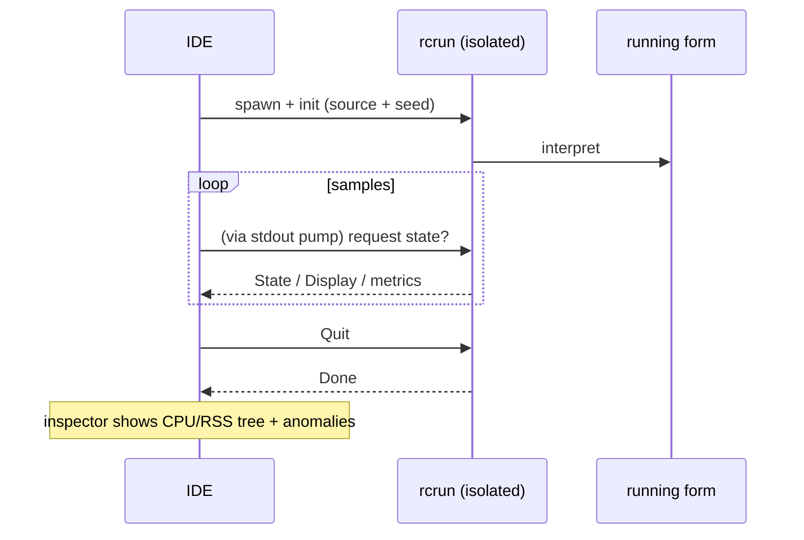

<!--
SPDX-License-Identifier: Apache-2.0
Copyright (c) 2026 Emerson Lopes and PowerRustCOBOL contributors

Licensed under the Apache License, Version 2.0.
See the LICENSE file in the project root for full license information.
-->

# Observabilidade do PowerRustCOBOL

Este é o lugar de tudo o que diz respeito a **observar** um programa RustCOBOL em
execução: o que ele fez, com que rapidez, e qual a saúde dos armazenamentos
subjacentes. Começa pelos **logs de transações de arquivos indexados** e vai
crescer para cobrir outras superfícies do runtime.

| Superfície | Situação | Onde |
|---------|--------|-------|
| **Log de transações de arquivos INDEXED** | ✅ disponível | este documento, §1 |
| Rastreamento do runtime (`COBOLT_LOG`) | ✅ disponível | §2 |
| **Logs de queda e recuperação do trabalho** | ✅ disponível | §5 |
| Runtime de bancos de dados SQL | 🔭 planejado | — |
| Cliente HTTP / REST | 🔭 planejado | — |

> **Princípio norteador.** A observabilidade é *passiva*: habilitar qualquer
> parte dela jamais pode alterar o comportamento ou os resultados do programa.
> Erros de log/rastreamento são engolidos, e os caminhos quentes continuam
> quentes (tudo o que é caro é opcional e chamado com parcimônia).

---

## 1. Log de transações de arquivos INDEXED

O motor indexado **redb**, à prova de falhas, pode escrever um log por arquivo de
cada transação — útil para diagnóstico, planejamento de capacidade e painéis.
Vem **desligado por padrão** e é específico do motor redb
(`--indexed-engine redb`; veja
[`indexed-redb-engine.md`](indexed-redb-engine.md)).

### 1.1 Como habilitar

| Flag / variável | Valores | Significado |
|------------|--------|---------|
| `--indexed-log` / `COBOL_INDEXED_LOG` | `off` (padrão), `basic`/`true`, `full` | Nível de log |
| `--indexed-log-format` / `COBOL_INDEXED_LOG_FORMAT` | `text` (padrão), `json` | Formato da linha |

```bash
# logfmt, métricas por transação
rcrun run app.cbl --indexed-engine redb --indexed-log basic

# NDJSON + estatísticas de páginas do índice ao fechar (para Grafana/Loki)
rcrun run app.cbl --indexed-engine redb --indexed-log full --indexed-log-format json
```

- **`basic`** — apenas métricas por transação (barato, contabilizado pelo próprio
  motor).
- **`full`** — `basic` mais as estatísticas de índice do redb a cada `CLOSE`.
  Essas estatísticas **percorrem o índice**, portanto o seu custo cresce com o
  tamanho do arquivo; é por isso que `full` é opcional e as estatísticas são
  emitidas somente no CLOSE (nunca a cada commit).

### 1.2 Localização

Cada arquivo indexado ganha um **log acompanhante ao lado do seu arquivo de
dados**, nomeado acrescentando `.log` ao caminho do `ASSIGN`:

```
customers.idx        →  customers.idx.log
/var/data/orders.dat →  /var/data/orders.dat.log
```

As linhas são **acrescentadas ao final** (nunca truncadas), de modo que um log se
acumula entre execuções.

#### Rotação (mantido abaixo de 100 KiB)

Para que nenhum arquivo isolado cresça demais, o log ativo é **rotacionado**
assim que se aproxima de **100 KiB** (`MAX_LOG_BYTES`), no estilo
logrotate/Grafana:

1. o `<arquivodados>.log` ativo é renomeado para
   **`<usuário|no-user>.<arquivodados>.log.<carimbo-de-tempo>`**, e
2. um log ativo novo e vazio é iniciado.

O carimbo é uma marca UTC compacta, p. ex. `20260610T120230461Z`. O `<usuário>` é
o valor de `OPEN … WITH REGISTERED USER` (higienizado para o sistema de
arquivos), ou **`no-user`** quando nenhum foi informado. Exemplo após uma
rotação:

```
customers.idx.log                                 # ativo (< 100 KiB)
alice.customers.idx.log.20260610T120230461Z       # arquivo rotacionado (~100 KiB)
no-user.orders.dat.log.20260610T120051301Z        # rotacionado, sem usuário informado
```

O runtime nunca apaga arquivos rotacionados — faça a poda ou envie-os com o seu
pipeline de logs (por exemplo Promtail e depois apagar). Cada arquivo é um log
completo e analisável por si só.

### 1.3 O que é registrado

Uma linha por **evento de transação**: `OPEN`, `COMMIT`, `ROLLBACK`, `CLOSE`.

| Campo | Tipo | Significado |
|-------|------|---------|
| `ts` | string | carimbo ISO-8601 UTC, precisão de ms (`2026-06-10T07:30:00.123Z`) |
| `file` | string | o nome do arquivo indexado |
| `user` | string | o usuário registrado (presente só quando informado — veja §1.3.1) |
| `tx` | número | contador de transações (**por sessão de OPEN**) |
| `kind` | string | `OPEN` / `COMMIT` / `ROLLBACK` / `CLOSE` |
| `writes` | número | `WRITE`s nesta transação |
| `rewrites` | número | `REWRITE`s nesta transação |
| `deletes` | número | `DELETE`s nesta transação |
| `records` | número | mutações totais (`writes+rewrites+deletes`) |
| `bytes` | número | bytes de registro escritos/reescritos |
| `dur_ms` | número | duração de relógio da transação |
| `rec_per_s` | número | registros por segundo |
| `bytes_per_s` | número | bytes por segundo |
| `order` | string | `ordered` se as chaves escritas foram ascendentes, senão `unordered` (`n/a` se não houve escritas) |
| `in_order` | número | quantidade de escritas cuja chave avançou |
| `out_of_order` | número | quantidade de escritas cuja chave retrocedeu |

**As linhas CLOSE de nível `full`** acrescentam estatísticas de índice do redb:

| Campo | Significado |
|-------|---------|
| `tree_height` | altura da B+tree primária |
| `leaf_pages` / `branch_pages` | contagem de páginas |
| `allocated_pages` | páginas alocadas no arquivo |
| `stored_bytes` | bytes de registro vivos |
| `fragmented_bytes` | espaço livre/fragmentado (inclui a folga pré-alocada do arquivo) |
| `page_size` | tamanho de página do redb (4096) |

> **Por que `order` importa.** Escritas com chave ascendente atingem uma única
> folha quente da B+tree; chaves espalhadas tocam folhas aleatórias (mais E/S,
> mais fragmentação). Os campos `order` / `in_order` / `out_of_order` são um
> sinal imediato da localidade de escrita — um bom indicador de se a carga foi
> sequencial ou aleatória.

> **`tx` é por sessão.** O motor é recriado a cada `OPEN`, então o contador
> recomeça em 1 a cada sessão OPEN…CLOSE; o campo `ts` desfaz a ambiguidade.

#### 1.3.1 Registrando o usuário conectado — `OPEN … WITH REGISTERED USER`

Programas COBOL raramente ficam atrás de OAuth ou de qualquer motor de
autenticação, portanto o operador/usuário é fornecido **explicitamente** no
`OPEN`, como uma extensão do PowerRustCOBOL:

```cobol
       OPEN I-O CUSTOMER-FILE WITH REGISTERED USER "ALICE"
       OPEN I-O CUSTOMER-FILE WITH REGISTERED USER WS-OPERATOR
```

- O valor é um **literal de string** ou um **data item** (`USER` é opcional;
  `WITH REGISTERED "ALICE"` também é analisado).
- Vale para toda a sessão `OPEN…CLOSE`: **toda** linha de evento daquele arquivo
  (`OPEN`/`COMMIT`/`ROLLBACK`/`CLOSE`) carrega um campo `user=`.
- É puramente observacional — não autentica nem autoriza nada, e não tem efeito
  algum quando o log está desligado.

Exemplo de linhas de log (uma sessão por usuário):

```
ts=…Z file=customers.idx user=ALICE        tx=1 kind=OPEN   …
ts=…Z file=customers.idx user=ALICE        tx=2 kind=COMMIT …
ts=…Z file=customers.idx user=BOB-FROM-WS  tx=1 kind=OPEN   …
```

### 1.4 Formatos

#### logfmt (`text`, padrão)

```
ts=2026-06-10T07:30:00.123Z file=customers.idx tx=2 kind=COMMIT writes=1 rewrites=0 \
   deletes=0 records=1 bytes=12 dur_ms=3 rec_per_s=272 bytes_per_s=3266 \
   order=ordered in_order=1 out_of_order=0
```

Valores de string que contêm espaços são colocados entre aspas. O Loki analisa
isso com `| logfmt`.

#### NDJSON (`json`)

```json
{"ts":"2026-06-10T07:30:00.123Z","file":"customers.idx","tx":2,"kind":"COMMIT","writes":1,"rewrites":0,"deletes":0,"records":1,"bytes":12,"dur_ms":3,"rec_per_s":272,"bytes_per_s":3266,"order":"ordered","in_order":1,"out_of_order":0}
```

Um objeto JSON por linha. **Os campos numéricos são números JSON puros**, para
que o Grafana possa plotá-los diretamente; os campos de string vão entre aspas.
O Loki analisa isso com `| json`.

### 1.5 Grafana / Loki

O Grafana não lê arquivos diretamente — envie os logs para o **Loki** com um
agente e depois consulte. Recomendado: formato `json`.

1. **Colete** `*.idx.log` com Promtail / Grafana Agent / Alloy → Loki. Mantenha
   os *labels* com baixa cardinalidade (p. ex. `job`, `file`, `kind`); deixe
   `tx`, `ts` e as métricas numéricas como campos analisados.
2. **Consulte** no Grafana (LogQL):

   ```logql
   # vazão de commits ao longo do tempo
   {job="rustcobol"} | json | kind="COMMIT" | unwrap rec_per_s

   # trabalho revertido
   sum by (file) (count_over_time({job="rustcobol"} | json | kind="ROLLBACK" [5m]))

   # crescimento do índice (nível full)
   {job="rustcobol"} | json | kind="CLOSE" | unwrap allocated_pages
   ```

Exemplo de scrape do Promtail (logfmt também serve — troque o estágio do pipeline
por `logfmt`):

```yaml
scrape_configs:
  - job_name: rustcobol
    static_configs:
      - targets: [localhost]
        labels: { job: rustcobol, __path__: /var/data/*.idx.log }
    pipeline_stages:
      - json:
          expressions: { kind: kind, file: file }
      - labels: { kind: kind, file: file }
```

### 1.6 Custo e segurança

- O log `basic` acrescenta alguns contadores por operação e uma linha
  acrescentada por evento de transação — desprezível.
- `full` acrescenta um percurso do índice **somente no CLOSE**; evite-o em
  arquivos muito grandes, a menos que queira esse instantâneo.
- O log nunca afeta o comportamento do programa: todos os erros de E/S do log são
  silenciosamente ignorados, e o caminho dos dados permanece inalterado.

### 1.7 Implementação

`crates/cobolt-runtime/src/indexed_log.rs` — `LogLevel`, `LogFormat`, o
construtor `LogRecord` que renderiza em logfmt ou NDJSON (JSON sem
dependências), o `LogWriter` que acrescenta ao final, e um formatador ISO-8601
sem dependências. Os acumuladores por transação vivem em
`crates/cobolt-runtime/src/indexed_redb.rs`; as flags são resolvidas em
`crates/cobolt-cli/src/main.rs` e aplicadas via
`Interpreter::set_indexed_log_level` / `set_indexed_log_format`.

---

## 2. Rastreamento do runtime (`COBOLT_LOG`)

O `rcrun` usa o framework `tracing` com um filtro por variável de ambiente.
Defina `COBOLT_LOG` para elevar o detalhe das mensagens internas de runtime e
diagnóstico (avisos, por padrão):

```bash
COBOLT_LOG=debug rcrun run app.cbl
COBOLT_LOG=cobolt-runtime=trace rcrun run app.cbl
```

Esta é uma saída de diagnóstico voltada ao desenvolvedor (em stderr), distinta do
log estruturado de transações por arquivo da §1.

---

## 3. Chaves de depuração na IDE

Toda chave de depuração que a IDE conhece — o filtro de rastreamento acima, o log
de transações INDEXED da §1, as sobreposições de renderização, o rastreamento de
data-bind e o rastreamento de layout do painel de IA — é editável em
**Help → Debug Settings**, agrupada em uma aba por área. As configurações são de
âmbito da IDE (guardadas na máquina, não em `cobolt.toml`) e são repassadas a
cada processo filho `rcrun run-form` como as variáveis de ambiente documentadas
aqui, de modo que nada precisa ser exportado à mão.

Exportar uma variável continua funcionando para uma execução avulsa de `rcrun` a
partir de um shell.

---

## 4. Inspetor de Run-Form (IDE)

Quando o **Run Form** está ativo, a IDE pode abrir um **Inspetor de Run-Form**
(viewport separado) que amostra o processo filho isolado:

- CPU %, bytes de RSS, contagem de processos filhos e memória do sistema em uso,
  por amostra.
- Detecção de anomalias (crescimento súbito, filhos demais, etc.).
- Sparklines ao vivo e árvore de processos.
- Usa o canal IPC do `rcrun` isolado (veja o guia do desenvolvedor para os
  detalhes do isolamento de processos).

É opcional na IDE e não afeta o form em execução. A amostragem é reduzida quando
há ociosidade. Logs e métricas servem apenas para diagnóstico.

Visão geral em mermaid:



---

## 5. Logs de queda e recuperação do trabalho

Uma aplicação com janela não tem terminal associado, portanto quando a IDE morre
a sua mensagem de pânico, o seu `file:line` e o seu backtrace vão todos para um
stderr que ninguém está lendo — a janela simplesmente desaparece e não deixa
nada para trás. Dois mecanismos distintos substituem isso, porque resolvem dois
problemas distintos.

**Logs de queda — para que haja algo a diagnosticar.** Um tratador de pânico
escreve `<data>/cobolt/crash/crash-<segundos>.log` com a mensagem do pânico, o
seu `file:line:column`, um backtrace forçado, a versão da IDE, o sistema
operacional, a thread e os arquivos que estavam abertos no momento. Anexe-o a um
relatório de erro.

**Autossalvamento — para que o trabalho sobreviva.** A cada **20 segundos**, cada
buffer não salvo do editor e cada form modificado é copiado para
`<data>/cobolt/recovery/`, junto de um `manifest.toml` que liga cada cópia ao seu
original. Um arquivo marcador registra que há uma sessão em execução e é apagado
na saída limpa; encontrar um no arranque seguinte é exatamente o que significa
"a última sessão terminou mal", e então a IDE oferece restaurar.

**Restaurar nunca sobrescreve.** Ao aceitar a oferta, cada cópia é gravada ao
lado do seu original como `<nome>.recovered.<ext>` e os caminhos são listados no
painel Output. A cópia veio de um processo que já havia perdido o pé, então qual
versão vence é decisão sua, não da IDE.

> ⚠️ **Um tratador de pânico não consegue capturar tudo.** Um estouro de pilha
> falha na página de guarda e chega como `SIGSEGV`; o matador por falta de
> memória envia `SIGKILL`; um segundo pânico durante o desenrolamento aborta. Nos
> três casos o tratador nunca roda e **nenhum log de queda é escrito**. O
> autossalvamento é o que cobre esses casos, porque já aconteceu quando algo dá
> errado — e é também por isso que o intervalo é a garantia real: no máximo 20
> segundos de trabalho.

`<data>` é o diretório de dados do sistema operacional:
`~/Library/Application Support` no macOS, `%APPDATA%` no Windows,
`~/.local/share` no Linux.

---

## Roteiro

Adições planejadas, para manter este documento como a referência única de
observabilidade:

- **Runtime SQL** — tempos por conexão/comando e contagens de linhas para os
  motores SQLite/PostgreSQL/MySQL (veja
  [`database-runtime.md`](database-runtime.md)).
- **Cliente HTTP** — log de requisição, latência e status para os built-ins REST.
- **Resumo agregado da execução** — um relatório opcional de fim de execução
  abrangendo todos os arquivos.
