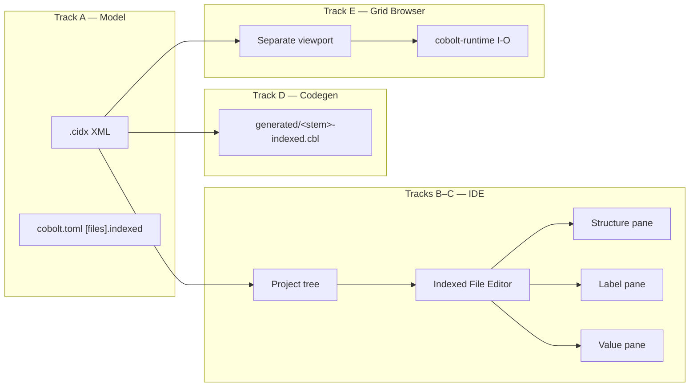

# Plan — Indexed File Editor & Grid Browser

- **Status:** implemented (layout revision 2026-06-16)
- **Spec:** ./spec.md   **Date:** 2026-06-15

## 1. Approach

Deliver R1–R27 in **five tracks** that build on existing IDE patterns (Form
Designer, Properties inspector, `regenerate_all_forms`, `show_viewport_immediate`).
Each track is independently testable; later tracks depend on the `.cidx` model.



### Track A — `.cidx` model & XML (R2, R8, R22a)

Add workspace crate **`cobolt-indexed`** (sibling to `cobolt-forms`):

| Module | Role |
|--------|------|
| `model.rs` | `IndexedDefinition`, `IndexedField`, `KeyBinding`, `RecordFormat`, flags |
| `xml.rs` | `load_indexed` / `save_indexed` via `quick-xml` (mirror `cobolt-forms/src/xml.rs`) |
| `pic.rs` | PIC/usage ↔ display string; reuse `cobolt_ast::PicClause` shapes where possible |
| `control_defaults.rs` | R15 auto-assign `ControlType` from PIC |
| `schema_support.rs` | R9 warn-only: detect composite keys, non-`Bytes` encodings |
| `paths.rs` | R4 relativize / resolve assign paths against project root |
| `inspect.rs` | Unified `inspect_any_path` → `IndexedFileInfo` (try `PRCIDX1` then `PRCIDXD1`) |

**`.cidx` XML shape (v1.0):**

```xml
<?xml version="1.0" encoding="UTF-8"?>
<IndexedFile name="CUSTOMER-FILE" finalized="true" version="1.0">
  <assign-path>data/customers.idx</assign-path>
  <access-mode>dynamic</access-mode>
  <record-format fixed-length="120"/>          <!-- or variable min="10" max="256" -->
  <storage mode="disk" compression="true" persistence="false"/>
  <comment><![CDATA[Customer master file]]></comment>

  <keys>
    <primary duplicates="false" ordering="ascending">
      <part field="CUST-ID" offset="0" length="8" encoding="bytes"/>
    </primary>
    <alternate name="CUST-NAME" duplicates="true" ordering="ascending">
      <part field="CUST-NAME" offset="8" length="30" encoding="bytes"/>
    </alternate>
  </keys>

  <fields>
    <Field level="01" name="CUSTOMER-RECORD">
      <Field level="05" name="CUST-ID"   pic="9(8)"  usage="display" offset="0"  length="8"/>
      <Field level="05" name="CUST-NAME" pic="X(30)" usage="display" offset="8"  length="30"/>
      <!-- … -->
      <Field level="05" name="CUST-NAME" comment="Display name"
             grid-control="TextBox"/>
    </Field>
  </fields>
</IndexedFile>
```

`finalized="false"` until R9 finalize; structural editors honour R10/R11.

### Track B — Project integration (R1–R4, R24)

Extend **`project_model.rs`**:

| Change | Detail |
|--------|--------|
| `ProjectFiles.indexed` | `Vec<String>` — relative `.cidx` paths |
| `Category::IndexedFiles` | Insert in `Category::TOP` **after Forms, before CommonCode** (R7) |
| `FileKind::Indexed` | Extension `cidx` → `Category::IndexedFiles` |
| `all_files()` | Include `files.indexed` + resolved data paths under project root |
| `package_project` | Pack `.cidx`; pack assign-path data files when relative; **warn** on absolute external paths (R24) |
| `ensure_standard_folders` | Add `indexed/` default folder (parallel `forms/`) |

**Import flow (R4, R12, R25):**

1. File picker → absolute path.
2. `inspect_any_path` → if `Some(info)`, map `IndexedFileInfo` + record length into
   `.cidx` fields (key-named parts become fields; gap bytes → synthetic `FILLER-n`
   `PIC X(n)` groups so offsets cover the full record).
3. If `None` (legacy `PRCISAM1`), show manual schema entry dialog or reject (R25).
4. Store assign path via `paths::store_path` (relative under root, else absolute).
5. Set `finalized="true"` immediately.

### Track C — Indexed File Editor UI (R5–R13, R27)

New panels under `crates/cobolt-ide/src/panels/`:

| File | Role |
|------|------|
| `indexed_editor.rs` | Structure tree, selection, indent/outdent, raw-record mode |
| `indexed_toolbar.rs` | Vector-icon toolbar strip (theme-aware colours) |
| `indexed_properties.rs` | Split **label** and **value** renderers per selection kind |
| `indexed_new_dialog.rs` | New-file wizard: name, assign path, fixed/variable record, storage flags |
| `indexed_import.rs` | Import orchestration + manual schema fallback |

**Viewport layout (R5b–R7):**

```
+--------------------------------------------------------------------------+
| <toolbar pane>                                                           |
+---------------------------------+------------------+---------------------+
| <structure pane>                | <label pane>     | <value pane>        |
+---------------------------------+------------------+---------------------+
```

| Pane | egui panel | Content |
|------|------------|---------|
| Toolbar | `TopBottomPanel::top` | Save, Save & Generate, add/remove field, raw edit, Finalize, Open Grid Browser |
| Structure | `SidePanel::left` | `>` marker + **Indexed File Properties** root + indented field tree |
| Labels | `SidePanel::right` (inner) | Property captions (`File name:`, `PIC:`, …) |
| Values | `SidePanel::right` (outer) | Text edits, combos, checkboxes, read-only offset |

**Selection → property rows:**

| Structure selection | Label / value rows |
|---------------------|------------------|
| Indexed File Properties | name, assign path, access mode, record format, finalized, comments |
| Group field | name, OCCURS, REDEFINES, SYNCHRONIZED, comments |
| Leaf field | name, PIC, length, usage, offset, comments, grid control |

**`app.rs` wiring** (mirror designers):

- `Vec<(PathBuf, IndexedEditorState)>` — open editors, dirty flag, `IndexedSelection`.
- `show_viewport_immediate` per open `.cidx` — title
  `PowerRustCOBOL Indexed File Editor — {stem}` (R5).
- **`apply_opaque_viewport_theme`** each frame (R5a) — same helper as Form Designer
  child viewports; passes `current_theme()` so Settings theme preview applies live.
- Project panel events: `OpenIndexedEditor`, `InspectIndexedField { cidx, field_id }`.
- Extend `project.rs`: Indexed Files section with ➕ / Import existing…, field
  sub-tree under each `.cidx` (like form controls).
- Inline inspector uses the same three-column body (structure | labels | values).
- **Raw mode (R7a):** hides label/value panes; `CentralPanel` shows COBOL-like text.
- **Finalize (R9):** call runtime helper `create_empty_indexed_file(def)` →
  `OPEN OUTPUT` equivalent for chosen storage mode; set `finalized`; run
  `schema_support::warnings` dialog (warn-only, R5 decision).
- **Schema drift (R26):** on editor open, `inspect_any_path` vs `.cidx` structural
  fingerprint; mismatch → modal, disable grid writes.

**Structural lock (R10):** value-pane controls use `ui.add_enabled_ui(!finalized, …)`
for PIC, offsets, keys, storage; comments and `grid-control` stay enabled (R11).

### Track D — Codegen (R22–R23)

Extend **`cobolt-codegen`** with `indexed.rs`:

```rust
pub fn generate_indexed(def: &IndexedDefinition) -> String
```

Emits a **fragment-oriented** COBOL file (not a full `PROGRAM-ID` program):

- Standard `write_header` banner (text references **Indexed File Editor**, not Form Designer).
- `ENVIRONMENT DIVISION` — single `SELECT` with `ORGANIZATION IS INDEXED`, access
  mode, `RECORD KEY` / `ALTERNATE RECORD KEY`, `STORAGE MODE`, `WITH COMPRESSION`,
  `WITH PERSISTENCE` as declared.
- `DATA DIVISION` / `FILE SECTION` — `FD` + `01` group mirroring `.cidx` fields and PICs.
- Variable-length: `RECORD CONTAINS min TO max CHARACTERS` (or equivalent supported syntax).

**IDE hooks** (`app.rs`):

- `write_generated_indexed_for(cidx, def)` → `generated/<stem>-indexed.cbl`.
- `regenerate_all_indexed_files()` — parallel to `regenerate_all_forms` (R23):
  open editors use live state; closed load from disk.
- `proj.add_generated(&rel)` for each `*-indexed.cbl`.
- Call `regenerate_all_indexed_files()` from the same Build/Run/Debug/Check paths
  that already call `regenerate_all_forms`.

### Track E — Grid Browser (R16–R21, R20a)

New `panels/indexed_grid.rs` + `IndexedGridState` in `app.rs`:

| Concern | Design |
|---------|--------|
| Window | Separate `show_viewport_immediate` viewport (R3 decision) |
| Engine | Direct `cobolt-runtime` Rust API — **not** a spun COBOL program |
| Open | Build `KeySpec` / `IndexedFile` or `DiskIndexedFile` / redb handle from `.cidx` + resolved assign path; `OPEN I-O` |
| Load | Sequential primary-key scan; **virtualize** rows (load page of N≈200) for large files |
| Display (R18) | Format cell text from raw record slice + field offset/length/PIC |
| Edit (R19) | Compact control renderers reused from designer (`ControlType` + minimal props) |
| Mutations (R20, R20a) | `WRITE` new row, `REWRITE` edited row, `DELETE` selected; map FILE STATUS to `Tr` + output panel |
| Transactions (R21) | Toolbar **Commit** / **Rollback** when storage mode supports it |

Add **`cobolt-runtime/src/indexed_ide.rs`** (or methods on existing types):

- `open_for_grid(def: &IndexedDefinition, path: &Path) -> GridSession`
- `create_empty_from_definition(def, path)` for finalize (Track C)
- `compare_schema(def, info: &IndexedFileInfo) -> SchemaDrift`

Record ↔ grid row: work on **display** byte layout (DISPLAY usage); COMP/COMP-3
fields use runtime pack/unpack helpers (add thin wrappers if missing).

### Track F — Docs & versioning

`/docsync` after implement: `developers-guide-en.md` §5 (six categories), new
§**Indexed File Editor & Grid Browser**; registry row in `specs/steering/docs.md`;
`/doc-shots` placeholders; `/doc-localize` work order. Minor bump + `CHANGELOG.md`.

---

## 2. Affected crates / files

| Path | Change |
|------|--------|
| **`crates/cobolt-indexed/`** (new) | Model, XML, pic, control defaults, inspect, paths |
| `Cargo.toml` (workspace) | Add `cobolt-indexed` member |
| `crates/cobolt-codegen/src/indexed.rs` (new) | `generate_indexed` |
| `crates/cobolt-codegen/src/lib.rs` | `pub mod indexed; pub use indexed::generate_indexed` |
| `crates/cobolt-runtime/src/indexed_ide.rs` (new) | Grid session, create-empty, schema compare |
| `crates/cobolt-runtime/src/lib.rs` | Re-export IDE helpers |
| `crates/cobolt-ide/src/project_model.rs` | `indexed` list, `Category::IndexedFiles`, package |
| `crates/cobolt-ide/src/app.rs` | Editors, grid viewports, regenerate hook, dialogs |
| `crates/cobolt-ide/src/panels/project.rs` | Indexed Files tree section |
| `crates/cobolt-ide/src/panels/indexed_*.rs` (new) | Editor, toolbar, properties, grid, new dialog |
| `crates/cobolt-ide/src/app.rs` (`apply_opaque_viewport_theme`) | Shared opaque child-viewport theme for designer + indexed editor + grid |
| `crates/cobolt-ide/src/panels/mod.rs` | Module exports |
| `crates/cobolt-ide/src/i18n.rs` | New `Tr` keys ×6 languages |
| `crates/cobolt-ide/Cargo.toml` | Dep on `cobolt-indexed` |
| `crates/cobolt-codegen/Cargo.toml` | Dep on `cobolt-indexed`, `cobolt-ast` |
| `docs/developers-guide-en.md` | §5 + new editor section |
| `specs/steering/docs.md` | Registry row |
| `CHANGELOG.md`, `crates/cobolt-ide/src/version.rs` | Feature minor bump |

**No changes** to `cobolt-forms` model (reuse `ControlType` only). Independent of
[`specs/001-indexed-wal-crash-recovery/`](../001-indexed-wal-crash-recovery/) except
grid/finalize should respect whichever engine is default at implement time.

---

## 3. Data / model changes

| Artifact | Change |
|----------|--------|
| **`.cidx`** | New XML definition file (v1.0); authoritative for structure + grid controls |
| **`cobolt.toml`** | `[files] indexed = ["indexed/customers.cidx", …]` |
| **`generated/<stem>-indexed.cbl`** | New generated artifact per definition (read-only in IDE) |
| **`indexed/`** folder | Convention for new `.cidx` files (like `forms/`) |
| **On-disk data files** | Unchanged formats (`PRCIDX1` / `PRCIDXD1` / redb); editor creates via runtime |
| **Backward compat** | Existing projects without `indexed` key deserialize with `#[serde(default)]` empty vec |

**Import limitation:** `inspect_path` returns keys + record length, not a full COBOL
`FD`. Import synthesizes fields from key parts + `FILLER` spans; user may add
comments/controls post-import but not restructure (R12). Designer-created files have
the full explicit field tree.

**Migration:** None required. Old projects open unchanged; Indexed Files category
empty until user adds definitions.

---

## 4. Key decisions & alternatives

| Decision | Why | Rejected |
|----------|-----|----------|
| **New `cobolt-indexed` crate** | Keeps `cobolt-forms` form-specific; shared by IDE + codegen | Stuffing indexed types into `cobolt-forms` (blurs domain) |
| **XML `.cidx`** (spec Q1) | Matches `.cfrm`, `quick-xml` already in workspace | JSON/TOML (inconsistent with forms RAD artifacts) |
| **One `generated/<stem>-indexed.cbl`** (Q2) | Mirrors one-form-one-cbl; easy `COPY` | Single merged indexed file (harder to trace, worse merge conflicts) |
| **Grid via runtime Rust API** | Fast, no COBOL harness; direct FILE STATUS | Mini COBOL driver program per browse session (heavy, slow) |
| **Separate grid window** (Q3) | Consistent with designer / Run Form | Docked tab (different UX, complicates layout) |
| **Relativized paths** (Q4) | Portable projects + packaging | Always absolute (breaks team repos) |
| **Warn-only unsupported keys** (Q5) | Future-proofs `.cidx` for importer | Block finalize (blocks advanced schema recording) |
| **Import field synthesis** | Makes grid usable after import without manual offset math | Require full manual field re-entry on every import |
| **Virtualized grid** | AC6 (200+ rows) without loading entire file into RAM | Load-all (breaks on large DISK files) |
| **Reuse designer control renderers** | R14 single catalogue | Parallel indexed-only controls (duplicate maintenance) |

---

## 5. Risks & mitigations

| Risk | Mitigation |
|------|------------|
| Import schema lacks named non-key fields | Synthesize `FILLER` spans; document in dev guide; grid still shows columns |
| `PRCIDXD1` vs `PRCIDX1` inspect divergence | `inspect_any_path` tries both; store detected storage in `.cidx` |
| Schema drift between `.cidx` and disk | R26 fingerprint on open; block grid writes |
| COMP/COMP-3 grid editing complexity | v1: support DISPLAY fields fully; COMP/COMP-3 read-only display in grid with edit via raw hex fallback or defer edit to row dialog — **flag in tasks** if COMP editing slips |
| Large file grid performance | Virtualized row window + background load thread |
| Codegen `SELECT` syntax edge cases | Golden-file tests per fixture; `rcrun check` in AC10 |
| Many new `Tr` strings | Batch-add all keys in one `i18n.rs` commit per task |
| Overlap with spec 001 default engine | `create_empty` uses project's `COBOL_INDEXED_ENGINE` / default at implement time |

---

## 6. Test strategy

### `cobolt-indexed`

- XML round-trip: rich fixture (fixed + variable, alternates, comments, controls).
- `control_defaults`: PIC → `ControlType` matrix.
- `paths::store_path` / `resolve_path`: inside root, outside root, already-relative.
- `schema_support::warnings`: composite key triggers warning list, no error.

### `cobolt-codegen`

- Golden files: `generate_indexed` → expected `SELECT`/`FD` for 3 fixtures
  (fixed DISK, variable MEMORY+compression, alternate WITH DUPLICATES).
- Assert banner present.

### `cobolt-runtime`

- `create_empty_from_definition` → `inspect_path` round-trip matches.
- `GridSession`: WRITE / REWRITE / DELETE on temp file; duplicate key → status `22`.
- `compare_schema`: detect offset mismatch.

### `cobolt-ide` (integration-light)

- `project_model`: serialize/deserialize `cobolt.toml` with `indexed` list;
  `Category::TOP` order; `all_files` includes data paths.

### Manual / visual (maps to AC1–AC13)

1. New project → Indexed Files ➕ → wizard (fixed + variable cases) → finalize →
   tree order AC2b.
2. Import sample `PRCIDX1` under `data/` → relative path in Properties.
3. Four-pane layout: structure | labels | values; `>` on selected row; theme matches IDE.
4. Finalize lock: PIC greyed out; comment + control editable.
5. Open Grid Browser → separate window; add/edit/delete rows; reopen confirms persistence.
6. Save & Generate → open `generated/*-indexed.cbl` read-only; `rcrun check`.
7. Build → mtime refresh (AC11).
8. Spot-check ES/JA menu labels (AC12).

---

## 7. Steering compliance

- [x] **i18n:** all new UI strings as `Tr` ×6 (R27) — editor, wizard, grid, warnings
- [x] **Generated-code contract:** `write_header` + regenerate on Build/Run/Debug/Check (R22–R23); generated `*-indexed.cbl` read-only in tree
- [ ] **English docs:** `developers-guide-en.md` §5 + new section; update screenshot placeholder for four-pane layout; `docs.md` registry row; translations untouched
- [x] **Fix vs feature:** **feature** → minor version bump + `CHANGELOG.md`
- [x] **No "cobolt"** in user-facing text; COBOL identifiers English
- [x] **Verify-first:** grid/key tests assert actual FILE STATUS from runtime, not assumed codes

---

**Next step:** Run **`/docsync`** to refresh English docs and screenshot placeholders for the four-pane layout.