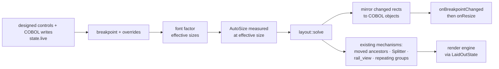

# Plan — Responsive design (spec 056, revision 2)

- **Status:** approved by the operator (2026-09-29)
- **Spec:** ./spec.md (R1–R88, AC1–AC45)   **Date:** 2026-09-29
- **Line:** `1.80.x` (local branch; pushed only when the operator allows)

> Every claim about existing code below was read for this plan on
> 2026-09-29 at `be8657e` (four read-only surveys: rect consumers per surface,
> property/event plumbing, golden-corpus infrastructure, and a design review).
> Line numbers rot within days here — `/tasks` names the code each task reads
> again before it changes it (R40/R41).

## 1. Approach

### 1.1 The shape of the solution

1. **A pure solver**, new module `crates/cobolt-forms/src/layout/`, no egui:
   `solve(&LayoutInput) -> LayoutOutput` (R22). It walks the control tree
   top-down (R20), resolves the active breakpoint and applies its overrides
   (R58–R61, no cascade R59), computes the font factor and effective sizes
   (R66–R69), places children per parent `LayoutMode` — anchors (R8), docks
   (R12–R14), flex/flow (R52–R54, R57), grid (R55–R56) — clamps to limits
   (R17), and reports the form minimum (R18). Controls owned by another
   mechanism are skipped (R27).
2. **Each surface prepares before rendering** — not the engine alone. The
   SideMenu `rail_view`, the Pane-mode construction shift and
   `stretch_window_bars` all run *before* the engine today
   (`cobolt-form-host/src/host.rs:459-490, 2464-2468, 2724, 5388`;
   `cobolt-ide/src/app.rs:16199`; `panels/designer.rs:8367`), and the host
   raises `onResize` *before* it renders (`host.rs:4918-4990` vs `5382`). R26
   and R39 need layout first. So a shared `layout::apply::prepare(...)` runs at
   each surface, then the existing mechanisms run on its result.
3. **The engine barely changes.** Laid-out controls enter the engine through a
   **`LaidOutState`** wrapper (a `FormState`) that restores the laid-out rect
   after `merge_props` (`cobolt-forms/src/render.rs:3360-3389`) — otherwise
   COBOL geometry would be applied twice and `moved_ancestor_offset`
   (`render.rs:1891-1910`) would offset containers twice. The only engine
   edits are an **AutoSize gate** (`render.rs:2312` skips a control marked
   `_LaidOut`, already measured before layout — R26 step 3) and the **font
   resolver** (R70).
4. **Non-responsive forms take no new path** (R3, G2): every surface branches
   on `form.responsive` *before* `prepare`; the `else` branch is today's code,
   unchanged. The Phase 0 golden proves it on every commit (§4.16).

### 1.2 Data flow per frame (responsive form)

### 1.3 Requirements → phases

| Requirements | Phase |
|---|---|
| §4.16 R78–R82 (golden, programs run, R81, reporting) | 0 (+ R81 in 4) |
| R6–R18, R19–R21, R22, R24, R58–R61 selection, R66–R69 factor, R85 defaults | 1 |
| R1–R2, R4, R11, R16, R32, R34–R36, R51, R63, R83 (pane), R86, R87 | 2 |
| R70–R71 | 3 |
| R3, R5, R23, R25, R26, R27, R28, R43, R18 (window min) | 4 |
| R49–R57 | 5 |
| R58–R62, R64 (overrides), R66–R69, R72 | 6 |
| R37–R39, R46–R48, R64 (COBOL wins), R84 | 7 |
| R29–R31, R33, R44, R45, R65, R88 | 8 |
| R73–R77 | 9 |
| AC19–AC21 docs/KB/i18n completeness | 10 |

## 2. Affected crates / files

- **`crates/cobolt-forms/src/layout/`** (new):
  - `mod.rs` — `LayoutInput`, `LayoutOutput`, `solve`.
  - `defaults.rs` — **the only place numeric layout literals live** (R85):
    control item and container property defaults, form defaults, the default
    breakpoint table (`Compact` 0 / `Medium` 600 / `Expanded` 1024, factor 1.0),
    `MinFontScale` 0.85, `MaxFontScale` 1.5, `MinFormWidth`/`MinFormHeight` 64,
    `anchor_default(ControlType)`. Read by `Control::new`, `Form::new`,
    `seed_missing_props`, `[forms]` defaults.
  - `props.rs` (typed parsing), `anchor.rs`, `dock.rs`, `limits.rs`,
    `minsize.rs`, `breakpoints.rs` (table, `select(width, pin)`, overrides,
    `me::Breakpoints` text), `fonts.rs` (factor, effective size, resolver),
    `inverse.rs` (R33/R38 inverse mapping), `flex.rs`, `grid.rs`, `tracks.rs`,
    `apply.rs` (render-gated: `prepare`, `laid_out_controls`, `LaidOutState`).
- **`crates/cobolt-forms/src/model.rs`** — `Form.responsive`, form layout bag;
  `seed_layout_props` shared by `Control::new` (`:4712-4733`) and
  `seed_missing_props`; `is_locked()` replacing `is_anchored` (`:6353`,
  deleted); `onBreakpointChanged` in `FORM_EVENT_GROUPS` (`:3852-3964`; count
  test `:10954` 57→58).
- **`crates/cobolt-forms/src/xml.rs`** — `responsive` attribute (pattern
  `main-form` `:297-299`, `:1475-1478`); `<FormLayout>` and `<Breakpoints>`
  elements (pattern `MenuPaneBackground`, round-trip test `:2419-2465`);
  default-omission on save (R87); migration via `seed_missing_props`
  (`:643-889`).
- **`crates/cobolt-forms/src/render.rs`** — AutoSize gate only; font resolver
  at `:7461, 8925, 9090, 11671, 11687`.
- **`crates/cobolt-forms/src/paint.rs`** — resolver behind `ctrl_font_size`
  (`:16809`), chart `:12806/12992`, Viewer `:10791`; `snackbar.rs:1076`;
  tab strip `model.rs:6282`.
- **`crates/cobolt-form-host/src/host.rs`** — responsive branches: root Window
  and Pane (`:5382-5412`, skip `stretch_window_bars`, construction shift moved
  after layout as a shared `sidebar::pane_shift`), `child_frame`
  (`:2592-2738`), fx face `paint_face` (`:4220-4243`); minimum inner size on
  the builders (`:300`, `:4081`) + `ViewportCommand::MinInnerSize`; layout
  before the size-observation block (`:4918`); mirroring; form writes in
  `apply_form_window_update` (`:2049`); `onBreakpointChanged`.
- **`crates/cobolt-form-host/src/state.rs`** — `CtrlState.written` (`:53`);
  `FormState::written`.
- **`crates/cobolt-form-host/src/seeding.rs`** — form entries `Responsive`,
  `Breakpoint`, `FontScale`, `Breakpoints`, layout bag (`:241-275`). Control
  properties need nothing: `property_names_for` (`model.rs:1355-1360`) derives
  the COBOL catalogue from what `Control::new` seeds.
- **`crates/cobolt-form-host/src/shell.rs`** — minimum inner size (`:1409`).
- **`crates/cobolt-form-host/`** — system text factor provider (R68): Windows
  `HKCU\Software\Microsoft\Accessibility\TextScaleFactor` (new `windows-sys`
  Registry feature, target-gated), Linux GNOME `text-scaling-factor` read once
  at start-up, macOS 1.0; injectable for tests.
- **`crates/cobolt-ide/src/panels/designer.rs`** — `canvas_view_controls`
  (generalising `rail_view_controls` `:11816`), `view_size`,
  `view_breakpoint`, `last_layout`; grip → view size on responsive forms
  (`:12986-13004`, R88); View at bar (presets `:14117` + breakpoints); inverse
  drag/resize at `:12911`/`:12937`; reorder in flex/grid; overlays and anchor
  gizmo; override editing (undoable `SetOverride`); form props through
  `set_form_prop_direct`/`get_form_prop`/`FORM_PROP_KEYS` (`:6322`, `:6589`,
  `:13862-13904`); drag-lock readers → `is_locked()` (`:4702`, `:12905`,
  `:13055`, test `:16408`).
- **`crates/cobolt-ide/src/panels/properties.rs`** — `Locked` row replacing
  the Anchor lock row (`:4143-4158`); Layout section (helpers `:11358`,
  `:11376`, `:11401`, `:11535`), shown only when the form is responsive (R32),
  breakpoint editor (R83), override marker + reset (R65).
- **`crates/cobolt-ide/src/agent.rs`** — `form_property_valid` (`:470`).
- **`crates/cobolt-ide/src/app.rs`** — preview responsive branch (`:16199`,
  `:16320-16355`); `create_new_form` writes `responsive` from the project
  (`:13424-13471`).
- **`crates/cobolt-ide/src/project_model.rs`** — `[forms] responsive` +
  default breakpoint table (`FormsConfig` `:331-433`: true in
  `new_project_defaults()`, false in `Default`).
- **`crates/cobolt-ide/src/panels/settings_form.rs`** — "New forms are
  responsive" (pattern `:59-62/151-161/238-248/1850-1893`).
- **`crates/cobolt-ide/src/i18n.rs`** — every new label ×6 (struct `:195`);
  **`prop_help_data.rs`** — hover help ×6 for every new property (tests
  `prop_help.rs:74`, `:101`).
- **`crates/cobolt-compiler/src/lib.rs`** — `FormsConfig` copy (`:789-820`);
  KB: `UNIVERSAL_PROPS` (`:4932`), `property_reference_for` (`:5007`), rewrite
  the "no anchoring or docking layout engine" text (`:4596`) and the Anchor
  entry (`:5160`), a form-property table (none exists, §9 F18), events text
  (`:4631-4666`, event guard `:10525`).
- **`assets/knowledge/chunked.data`** — rebuilt in every KB-touching commit.
- **`docs/developers-guide-en.md`** — chapter "Responsive design" + support
  matrix (Phase 10; translations regenerated at the 1.80 release, GOLDEN
  RULE #8).
- **Tests** — `crates/cobolt-forms/tests/example_corpus_golden.rs`,
  `crates/cobolt-codegen/tests/example_corpus_codegen.rs`, host corpus test
  inside `host.rs`'s test module, pure layout tests under `layout/`, and the
  AC tests per phase (§6).

## 3. Data / model changes

- **`Form`**: `responsive: bool` (default false; `.cfrm` attribute
  `responsive`, written only when true); `layout: BTreeMap<String, PropValue>`
  holding the form's own `LayoutMode` + container properties, `FontScaling`,
  `MinFontScale`, `MaxFontScale`, `MinFormWidth/Height`; `breakpoints:
  Vec<Breakpoint { name, min_width, font_factor, overrides:
  Vec<(control, property, PropValue)> }>`.
- **`.cfrm`**: `<FormLayout …/>` (attributes, only non-defaults) and
  `<Breakpoints><Breakpoint name min-width font-factor><Override control
  property>value</Override>…</Breakpoint></Breakpoints>`, written only when
  not the defaults (R63) — a form without them round-trips byte-identical.
- **Controls** (seeded on every visual control, containers get the container
  set): `Locked`, `Anchor` (edge set), `Dock`, `MinWidth/MinHeight/MaxWidth/
  MaxHeight`, `FlexGrow/FlexShrink/FlexBasis/AlignSelf/Order`,
  `GridColumn/GridRow/ColumnSpan/RowSpan/JustifySelf`, `FlowBreak`,
  `ScaleFont/MinFontSize/MaxFontSize`, `PaddingLeft/Top/Right/Bottom` (the
  existing `Padding` reused); containers also `LayoutMode`, `FlexDirection`,
  `FlexWrap`, `JustifyContent`, `AlignItems`, `AlignContent`, `Gap/RowGap/
  ColumnGap`, `GridColumns/GridRows`, `JustifyItems`, `FlowDirection`,
  `WrapContents`. **Saved only when not default** (R87).
- **Migration (R35)**, in `seed_layout_props` on load: `Anchor` as
  `Bool/Int` → `Locked` + `Anchor = anchor_default(type)`; a valid edge string
  is kept (`Locked = false`); anything else → default. One path for new and
  loaded controls (§9 F14). Every form saved after the change carries `Locked`
  instead of the boolean `Anchor`; no generated COBOL changes (golden 0c).
- **Host state**: `CtrlState.written: HashSet<String>` (R64).
- **Manifest**: `[forms] responsive` (serde default false) + optional default
  breakpoint table; mirrored in the compiler's copy.
- **Runtime objects**: form `Responsive`, `Breakpoint`, `FontScale`,
  `Breakpoints`, layout bag; laid-out control `X/Y/Width/Height` mirrored.

## 4. Key decisions & alternatives

- **Decision: surfaces prepare, the engine stays nearly untouched.** Why: the
  mechanisms R26 must order run outside the engine, and a single choke point in
  `render_form_inner` cannot reorder them. Rejected: laying out only at the top
  of `render_form_inner`/`render_faces` (would double-apply COBOL geometry via
  `merge_props` and leave `onResize` before layout).
- **Decision: `LaidOutState` wrapper** instead of changing `merge_props`. Why:
  zero effect on non-responsive forms. Rejected: a flag threaded through the
  engine.
- **Decision: new pure solver; the Viewer's CSS engine is not reused or moved.**
  Why: it lays out by painting and measures with egui galleys (§9 F25); moving
  its types would risk AC27. Rejected: generalising the Viewer.
- **Decision: CSS semantics for flex/grid, WinForms vocabulary for Flow**
  (Q7/Q8).
- **Decision: COBOL geometry writes = on-screen values through the inverse
  mapping** (operator, R38) — reads and writes agree.
- **Decision: `LayoutMode`** (operator, R86); **grip = view size** on
  responsive forms (operator, R88); **defaults not saved** (operator, R87).
- **Decision: goldens record sizes/families/colours and string hashes, not
  text widths.** Why: text measurement depends on the machine's installed
  fonts (`fonts.rs:19-24, 182-208`). The golden is captured on the operator's
  Mac; recapture is an explicit, named act (`COBOLT_WRITE_GOLDEN=1`).
- **Decision: the generated-COBOL snapshot is tracked in the repo**, because
  `examples/*/generated/` is gitignored (`.gitignore:34`).

## 5. Risks & mitigations

- **Double geometry / double container offsets** → `LaidOutState`; a
  responsive copy of `a_moved_container_carries_its_contents`.
- **COBOL read/write drift** → inverse mapping; AC43.
- **Mirror flooding the interpreter** → send only rects that differ from
  `last_mirrored` (seeded with the designed rects), through `input_tx` only;
  `drain_input` (`cobolt-runtime/src/interpreter.rs:2811`) sends nothing back.
- **Event order** → `prepare` before the size-observation block; the render
  reuses the same `LayoutOutput` (no second layout in the frame, R25).
- **Pane shift / SideMenu removal at construction** → skipped for responsive
  forms, applied after layout; host golden (0b) + R81 in Pane mode.
- **`.cfrm` churn from the Anchor→Locked migration** → R87 keeps new keys out;
  the migration itself is one key per control, pinned by AC16/AC44.
- **Machine-dependent fonts in goldens** → see §4.
- **`assets::set_base` is process-global** → one `#[test]` per corpus run.
- **Maps tiles (network)** → excluded from the digest.
- **Designer frame cost** → measured with `bench_render_frame.rs`; the solver
  is arithmetic over tens of rects.
- **New dependency** (`windows-sys` Registry, Windows only) → target-gated;
  fallback factor 1.0; recorded in CHANGELOG.

## 6. Test strategy

**Phase 0 comes first and gates everything (R78–R82):**
- **0a** `cobolt-forms/tests/example_corpus_golden.rs` (`render` feature):
  one test over the 62 forms (PowerDemo3 then PowerChat, `.bak` excluded);
  surfaces canvas (`render_faces` after `rail_view`), run (`render_form`,
  stringified live state), preview (`render_form_with_chrome` after
  `rail_view`); sizes 0.75×, 1×, 1.5× (floor 64); `RawInput.time` pinned,
  `max_texture_side` 8192, two frames, record the second; per control: id,
  rect, font size, shape-digest (`mask_corner_goldens.rs` helpers `r2`,
  `fnv64`, `dump`); themes resolved as `cobolt-cli/src/form_gui.rs:524-548`
  with `discover_packs(<repo>/assets/themes)`; files
  `tests/goldens/056_corpus/<project>/<form>.txt`; prints the R82 summary.
- **0b** host golden in `host.rs`'s test module: root Window, root Pane,
  ContentPane occupant, three sizes, `last_control_rects` — the only coverage
  of `stretch_window_bars`, the Pane shift and `rail_view`.
- **0c** `cobolt-codegen/tests/example_corpus_codegen.rs`: `generate(&load_form)`
  for the 62 forms vs tracked `tests/golden/corpus/<project>/<form>.cbl`.
- **R80 list** (run on every engine commit): `cobolt-ide` —
  `powerchat_compiles`, `powerchat_runs`, `props_demo_runs`,
  `viewer_demo_compiles`, `rest/maps/charts/snackbar_demo_compiles`;
  `cobolt-forms` — `inner_form2_corners_are_drawn_not_repaired`,
  `two_surfaces_one_frame_share_no_widget_ids`,
  `a_moved_container_carries_its_contents`, `test_maps_demo_form`;
  `cobolt-runtime` — `test_data_binding_runtime`, `test_sql`. (The
  `~/Documents/PowerDemo3`-path tests skip when absent; `/tasks` repoints them
  at `examples/PowerDemo3` or records the skip.)

**Per phase (each test prints what it measured — GOLDEN RULE #7):**
- Phase 1: AC4–AC7, pure halves of AC8/AC9, AC42 (literal scan).
- Phase 2: AC1, AC16, AC17, AC29, AC40, AC44; i18n/`PROP_HELP`/KB coverage.
- Phase 3: AC33 (source-scan guard + render walk of every control type).
- Phase 4: AC3, AC10 (non-designer), AC11, AC12, AC23, **AC38/R81** (each of
  the 62 forms with only `responsive="true"` equals the golden at designed size
  on canvas/run/preview/Window/Pane/occupant), AC8 window half.
- Phase 5: AC24–AC27.
- Phase 6: AC28, AC32, AC34.
- Phase 7: AC18, AC31, AC41, AC43 (host test module + one PowerChat-style run).
- Phase 8: AC13, AC14, AC15, AC30, AC45, AC10 designer half.
- Phase 9: AC35. Phase 10: AC19–AC21. AC22 in `/analyze`.

**Every phase ends with:** `cargo test -p cobolt-forms --features render
--no-fail-fast`, `-p cobolt-form-host`, `-p cobolt-codegen`, `-p cobolt-runtime`,
`-p cobolt-ide --bin cobolt-ide` plus the R80 `cobolt-ide` tests — every
`test result:` line read, never a failure-grep; KB freshness green after any
KB change.

**Manual (operator):** on 1.80.x, PowerChat's CHAT-FORM switched responsive
with anchors instead of its hand-written `onResize` — resize the window,
collapse the rail, cross 600/1024; the canvas grip, View at, a breakpoint
override; PowerDemo3 run unchanged.

## 7. Steering compliance

- [ ] i18n: every new label, section, value and hint in all six languages
      (`Tr` ×6) and every new property's hover help ×6 (`PROP_HELP`).
- [ ] Generated-code banner + regenerate-on-action preserved; generated COBOL
      of both examples byte-identical (0c) — layout is host-side.
- [ ] English dev guide updated (Phase 10); translations regenerated at the
      1.80 release per GOLDEN RULE #8, not patched.
- [ ] System KB updated and `chunked.data` rebuilt in the same commit as each
      property/event it documents.
- [ ] Feature line `1.80.x`: `z` bump + CHANGELOG per commit; no fix mixed in
      (a fix found on the way goes to `fixes` from `main`).
- [ ] No "cobolt" in user-facing text; COBOL identifiers English.
- [ ] No self-resizing window: only a minimum inner size is set (R18).
- [ ] Operator's golden rule: no engine commit without 0a/0b/0c and the R80
      tests green (§4.16).
