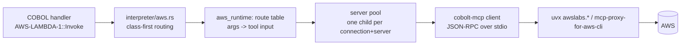

<!--
SPDX-License-Identifier: Apache-2.0
Copyright (c) 2026 Emerson Lopes and PowerRustCOBOL contributors
-->

# Plan — AWS controls through MCP

- **Status:** approved 2026-09-30 (amendments A1–A4 applied to spec.md)
- **Spec:** ./spec.md   **Date:** 2026-09-30
- **Author:** Anthropic Claude Codex Agent

This plan is based on three surveys made on 2026-09-30. Two covered the code: the MCP crate and the async controls, and every registration point of a non-visual control. The third covered AWS's MCP servers as published that day. §8 lists the spec amendments the surveys forced, and §9 how the open questions were settled.

## 1. Approach

Five layers. Each depends only on the ones before it, and each can be tested without AWS.



### 1.1 The MCP client, in `cobolt-mcp` (R1–R6)

- **New module `client.rs`**, pure and generic over `BufRead` + `Write`, like the server (R2):
  - an id counter, `request(method, params)` and `notify(method, params)`;
  - a `Message` classifier: a frame with `method` is a request or notification, one with `result`/`error` is a response.
- **One reader loop, `Session::pump`**, owned by the transport thread (§1.2). It routes each response to the caller waiting on that id. It also handles incoming traffic (R4):
  - drops `notifications/*`;
  - answers a server `ping` with `{}`;
  - answers `sampling/*`, `roots/list` and `elicitation/*` with `METHOD_NOT_FOUND`, which the protocol allows for a capability the client never declared.
- **Wire types move into `types.rs`,** next to the server's (R6): `InitializeParams`, `ClientInfo`, `ListToolsResult` with `nextCursor`, `CallToolParams`.
- **`Content` gains `#[serde(other)]`,** a raw-`Value` fallback, so an image or resource result from an AWS server no longer fails to decode. The server side keeps writing only `Text`.
- **Test AC4:** every client request is parsed back by `server::handle_one`.
- **Protocol (R3, amended in §8):**
  - the client opens with the **handshake**, `initialize` offering `2025-11-25`, and accepts `2025-06-18` and `2024-11-05` from the answer;
  - the stateless **2026-07-28** mode is implemented and tested against the fake server, and switched on per server in the route table (`protocol = "stateless"`).
- `SUPPORTED_VERSIONS` grows to the four revisions. The server's own `negotiate` keeps answering as it does today.

### 1.2 Stdio transport and the server pool, in `cobolt-runtime/src/aws/` behind feature `aws` (R7–R11, R29)

**`process.rs`** starts a server with `std::process::Command` (no new crate):
- stdin and stdout are piped;
- stderr is drained by a thread into a bounded ring (R10). `LastError` never shows it raw; `Verbose` shows it masked (R27).
- The environment is **built, never inherited wholesale**. It carries:
  - `AWS_PROFILE`, `AWS_REGION`, the route's own variables, `PATH` and `HOME`/`USERPROFILE`;
  - never `AWS_ACCESS_KEY_ID`, `AWS_SECRET_ACCESS_KEY` or `AWS_SESSION_TOKEN`. The builder strips those three even if the parent has them (R11, AC7).

**`pool.rs`** is one process-global `OnceLock<Mutex<HashMap<(connection id, server id), Handle>>>`:
- A handle owns the child, a writer and a reader thread that runs `Session::pump` and hands responses back over `mpsc`.
- A call waits on its own channel with the control's `TimeoutMs`, which enforces R5 without a blocking read.
- A dead child (EOF or broken pipe) fails the pending call with `onError`, and the handle is dropped so the next call starts a fresh one (R8, AC5).
- Everything that runs in one process — the root form, child forms (`host.rs`) and the compiled binary — shares the pool, because the pool is process-global.

**Leaving no process behind (R9).** The runtime has never spawned a process (survey), so this is new. It uses three independent mechanisms:
1. **Stdin EOF.** MCP stdio servers exit when their stdin closes, and the OS closes the pipe whenever the application dies, crash included. This alone covers most cases.
2. **Orderly exit.** `pool::shutdown()` closes stdin, waits 2 s, then kills. It is called from the host's exit path in all three hosts, and from `Drop` for the in-process case.
3. **Hard guarantee:**
   - **Windows:** a Job Object with `JOB_OBJECT_LIMIT_KILL_ON_JOB_CLOSE`, declared by hand in `aws/job_windows.rs`, the way `text_scale.rs` already declares `RegGetValueW`. This adds no crate.
   - **Linux:** `prctl(PR_SET_PDEATHSIG, SIGKILL)` in `pre_exec`, plus `process_group(0)` so that `uvx`'s Python child dies with it.
   - **macOS:** it has no death signal. It relies on 1 and 2, plus a watchdog thread in the child's process group.

**First launch.** The first `uvx` run downloads packages, which can take tens of seconds (AWS's own sample uses a 100 s timeout). The first call to a server therefore uses a separate `StartTimeoutMs` (default 120000), and only later calls use `TimeoutMs`. An end user who hits it sees `LastError`: *"Starting the AWS service for the first time… (downloading)"*.

### 1.3 The route table (R14–R17)

`crates/cobolt-runtime/src/aws/routes.toml` is compiled in with `include_str!` and versioned with the product (R16). It has two sections:

```toml
[servers.lambda]
command = "uvx"
args    = ["awslabs.lambda-tool-mcp-server@2.1.1"]
env     = { FUNCTION_PREFIX = "{Connection.FunctionPrefix}" }
readonly_flag = []                      # none; AllowWrite gates Invoke instead
protocol = "handshake"

[ops."AwsLambda.Invoke"]
server   = "lambda"
tool     = "{arg:1}"                    # the Lambda server names a tool after its function
input    = "{arg:2:json}"               # the payload is the tool input
result   = { ResponseBody = "$text", FunctionError = "$isError" }
mutating = true
```

- **Versions are pinned** (`@2.1.1`), not `@latest`, so a new server release cannot silently break a built application. Moving to a newer server is a data change plus a fixture re-record.
- **Placeholders** are data-driven, with no code per operation (R15):
  - `{arg:N}` / `{arg:N:json}` take a COBOL argument;
  - `{prop:Name}` takes a control property;
  - `{Connection.X}` takes a connection field.
- **Result mapping:** `$text`, `$isError` and `$json:/pointer` (a JSON Pointer into the structured result) fill the result properties. `$rows:/pointer` fills the row set.
- **Override (R16).** A connection's `routes_override` is a TOML string, merged per key over the shipped table. Test connection shows the merged result.
- **Fixtures (R17):** `crates/cobolt-runtime/tests/fixtures/aws-mcp/<server>.tools.json` holds recorded `tools/list` answers.
  - The test `every_route_names_a_real_tool_with_its_required_inputs` fails when a tool is missing or a required input is unfilled.
  - A mutated fixture proves it fails (AC9).
  - Lambda's tool names are dynamic, so its route is checked against the schema shape of the recorded `lambda` server rather than a tool name.

### 1.4 The controls (R18–R21, R25–R26)

- **Model (`cobolt-forms/src/model.rs`).** The 16 types are added to the enum and to:
  - `ALL`, `as_str`, `from_str`, `default_size` (56×56), `primary_event`, `supported_events` and `is_non_visual`;
  - `Control::new`, which seeds the common set `Connection`, `Mode=Async`, `Busy`, `TimeoutMs=30000`, `StartTimeoutMs=120000`, `AllowWrite=false`, `Verbose=false`, `LastError`, `ResponseBody` and `ResultJson`, plus each type's own inputs (for example `FunctionName`, `TableName`, `Bucket`, `VoiceId`);
  - `runtime_property_names_for`, as a new `AWS_ASYNC` const.
- **Events.** Each control has its own completion event (`onInvoked`, `onItem`, `onObject`, `onRows`, …) followed by `onComplete`, `onError`, `onTimeout` and `onCancelled`, mapped in `completion_event_for` (R19).
- **Dispatch (`interpreter/aws.rs`)** copies the KnowledgeBase pattern: `is_aws(obj)`, then `aws_method(obj, m, args) -> Option<String>`, called in `exec_method` **before** the global method match. Names such as `Get`, `Put`, `Delete` and `Query` would otherwise collide with RestClient and SqlDatabase.
  - A `#[cfg(not(feature = "aws"))]` stub answers `onError` "this application was built without AWS support", which never happens in practice (R29).
  - Every new method name is added to `cobolt_ast::methods::is_known_method`.
- **The async path** reuses the existing machinery unchanged:
  - `async_pending`, the generation stamp (stale discard), `Busy`, the `drain_async_ops` delivery and the timeout sweep;
  - one new `AsyncOutcome::Aws { props: Vec<(String, String)>, rows: Vec<Vec<(String, String)>>, event: &'static str }`;
  - `Mode=Sync` runs the same function on the interpreter thread and returns `ResponseBody`.
- **Row set (R20):**
  - `RowCount`, and `GetRow(i)` returning the row as JSON;
  - `GetField(i, "Name")`, 1-based like `GetCellValue(1, 1)`;
  - `ResultJson` holds the whole answer.
- **Safety (R21, R25, R26):**
  - JSON arguments are validated before anything is sent, and an invalid one names the argument.
  - `mutating = true` routes are refused while `AllowWrite` is off, before the pool is touched. The fake server's call log proves it (AC15).
  - Servers with a read-only mode start in it unless some control on the connection has `AllowWrite`: `--allow-write` is omitted, and the proxy runs with `--read-only`.
  - `AwsMcp` refuses any tool whose `annotations.readOnlyHint` is not true unless `AllowWrite` is on.
- **Cognito (Q6).** Tokens stay inside `aws_runtime`, in memory, keyed by control. COBOL sees only `SignedIn`, `UserName` and `GetAttribute(name)`. No property holds a token, and nothing is written to disk.

### 1.5 Connections, IDE, knowledge and docs (R12–R13, R22–R24, R30–R32)

- **Shared record.** `cobolt-forms/src/connections.rs` gets `AwsConnection { id, name, profile, region, function_prefix, function_list, routes_override }`.
  - It has **no secret field**, so none of the one-secret-per-control plumbing the survey flagged (`CREDENTIAL_PROPS`, the control and connection key slots) is touched.
  - The record is added to `Catalogue.aws` with `#[serde(default)]`, plus `apply_aws` and `resolve_aws_all`.
- **Where the list is kept.** The project's list lives in `[[integrations.aws_connections]]`, in both manifest copies: `cobolt-ide/src/project_model.rs` and `cobolt-compiler/src/lib.rs`.
- **The three hosts** publish the catalogue the way they already do for search connections:
  - `form_gui.rs` from `project_connections`;
  - `host.rs`, which reads the process global;
  - the compiled binary, from the baked `PROJECT_CONNECTIONS`.
- **Seeding.** `seeding.rs` gets `publish_aws_connections`, and `resolve_connections` fills `_ResolvedAwsProfile` and `_ResolvedAwsRegion` (R28).
- **A new control's connection (R13).** A newly dropped AWS control takes the project's only AWS connection, in `designer.rs`'s drop path.
- **The IDE's AWS connections section,** in Settings → Integrations:
  - It copies the Search connections list (`settings_form.rs`): name, profile, region, Lambda function prefix/list and route override.
  - **Test connection** is new there. It runs `cobolt_runtime::aws::diagnose(&conn)` on a thread, which the IDE can do because it already links `cobolt-runtime`. The diagnosis:
    - finds `uvx`;
    - runs `aws configure list --profile` for the profile;
    - starts each server the routes use and lists its tools;
    - checks them against the table.
  - It reports four plain-language outcomes in six languages (R24, AC14).
- **Toolbox (`toolbox.rs`):**
  - 16 `TOOLS` entries with `category: "AWS"`;
  - `("AWS", "AWS")` in `CATEGORIES`, and an entry in `TREE_CATEGORY_ORDER`;
  - `cat_aws` in `Tr`.
- **Icons (amended A5, 2026-10-06).** One **hand-drawn SVG** per service, in the style of AWS's official service icon (its colour tile and a simplified glyph), kept in `assets/icons/aws/<control>.svg`, compiled in with `include_str!`, rasterised by the `resvg` path `paint.rs` already has and cached as a texture. The toolbox and the canvas card draw the same picture ("one glyph, both places"). Drawn for this product, never traced from AWS's files; no wordmark or logo (R30).
- **Properties.** `show_type_specific` gets an `Aws*` arm that shows the Connection combo, copied from WebSearch's combo, then the type's own rows.
- **Help, KB and IntelliSense:**
  - `prop_help_data.rs`: every seeded property, in six languages;
  - `control_purpose`, `property_reference_for`, `event_reference`, `control_method_docs` and `control_usage_notes`, plus the hand-kept `methods_reference_doc` sections. IntelliSense reads `control_method_docs`, so it follows;
  - Grace's `type_aliases`;
  - `agent.rs`'s `ALL_CONTROL_TYPES`. The survey found it already stale; this change only adds the AWS names and does not repair the rest;
  - `chunked.data` regenerated in each change that touches the tables (R31).
- **No codegen.** KnowledgeBase and Snackbar show that event dispatch is generic, so the generated `.cbl` is unchanged and `tests/golden/` stays byte-identical.
- **Build feature `aws`:**
  - `cobolt-runtime` and `cobolt-form-host` get `aws = []` (it gates code and pulls no dependency);
  - `RuntimeFeatures` gets `aws`, `scan_forms` sets it for any `Aws*` type, and `all()`, `union()` and `as_toml_features()` are updated (R29, AC17).
- **Developer's Guide:** a new "Calling AWS" chapter, the `cobol-support-matrix-en.md` row, and deletion of the five translations (R32, GOLDEN RULE #8).

## 2. Affected crates / files

| Crate / file | Change |
|---|---|
| `cobolt-mcp/src/{client.rs (new), types.rs, lib.rs}` | Client, message classifier, wire types, tolerant `Content`, 4 revisions |
| `cobolt-runtime/Cargo.toml`, `cobolt-form-host/Cargo.toml` | `aws = []` feature |
| `cobolt-runtime/src/aws/{mod, process, pool, routes, routes.toml, job_windows, diagnose, cognito}.rs` (new) | Transport, pool, route table, process-lifetime guards, diagnosis |
| `cobolt-runtime/src/interpreter/aws.rs` (new), `interpreter.rs`, `async_op.rs` | `is_aws`/`aws_method`, `AsyncOutcome::Aws`, `completion_event_for`, shutdown hook |
| `cobolt-ast/src/methods.rs` | New method names |
| `cobolt-forms/src/{model.rs, connections.rs, paint.rs}` | 16 types, `AwsConnection`, glyphs |
| `cobolt-form-host/src/{seeding.rs, host.rs}` | `publish_aws_connections`, resolution, pool shutdown on exit |
| `cobolt-cli/src/form_gui.rs` | Publish the AWS catalogue, and shut down on exit |
| `cobolt-compiler/src/{lib.rs, runtime_features.rs}` | Manifest copy, baked catalogue, KB tables, `aws` feature detection, generated main's shutdown |
| `cobolt-ide/src/{project_model.rs, panels/settings_form.rs, panels/toolbox.rs, panels/properties.rs, panels/designer.rs, prop_help_data.rs, i18n.rs, grace_host.rs, agent.rs, app.rs}` | Connections UI + Test connection, toolbox category, inspector rows, auto-connection, help ×6, `Tr` ×6, aliases |
| `assets/knowledge/chunked.data` | Regenerated |
| `docs/developers-guide-en.md`, `docs/cobol-support-matrix-en.md` | AWS chapter, row; five translations of each deleted |
| `crates/cobolt-runtime/tests/{aws_*.rs, fixtures/aws-mcp/*}`, `tests/cobol/aws/*.cbl` | Fake server, fixtures, COBOL programs |

## 3. Data / model changes

- **`cobolt.toml`** gets `[[integrations.aws_connections]]` with `id`, `name`, `profile`, `region`, `function_prefix`, `function_list` and `routes_override`. Every field is `#[serde(default)]`, so old projects load unchanged. It holds no secret (AC8).
- **`.cfrm`:** 16 new type names, handled by the generic `as_str`/`from_str` round trip. Properties at their default are not written, as today. There is no migration: an older IDE opening such a form reads the controls as `Custom{unknown}`, the existing behaviour for any type it does not know.
- **Runtime-only seeds:** `_ResolvedAwsProfile` and `_ResolvedAwsRegion`. They are never saved.
- **The route table** is internal data, versioned with the product, with no user file format. The override is a TOML string inside the connection.

## 4. Key decisions & alternatives

- **The client lives in `cobolt-mcp`, and process spawning in the runtime.** This keeps spec 065's rule that the crate knows no OS resource, and lets the fake-server tests run the client over `io::Cursor`/pipes.
  - Rejected: a `stdio` feature inside `cobolt-mcp`. It would work, but it would put process lifetime, which is the hard part, in a crate with no host to call shutdown.
- **Handshake first over stdio.** The Python SDK the AWS servers use (mcp 2.x) rejects the 2026-07-28 envelope on a handshake connection, and its stateless stdio support is marked incomplete.
  - Rejected: stateless-first with a fallback, which is what spec R3 says. It would cost a failed round trip on every server start today, and could leave a server in a bad state (§8, A1).
- **Pinned server versions** instead of `@latest`, because reproducibility outranks freshness in a built application. Rejected: `@latest`, which is what AWS's samples use.
- **The hosted AWS MCP Server, through the proxy, for the nine services with no dedicated server.** Rejected: the local `awslabs.aws-api-mcp-server` and its documented `call_aws(cli_command)`, because AWS has **deprecated** it in favour of the hosted server.
- **The generic tool on the hosted server is settled by a live probe, not assumed** (Q1, §9):
  - If `aws___call_aws` is listed, with a schema, the routes use it.
  - If not, each operation uses `aws___run_script` with a **product-shipped** Python template in the route table. Its parameters are passed as JSON; COBOL never supplies script text.
  - Rejected: letting `AwsMcp` or any control send COBOL-built script source. That would be arbitrary code execution in the user's AWS account, driven by form data.
- **Class-first dispatch** (`aws_method` before the global match), as KnowledgeBase does. Rejected: adding arms to the global match, because `Get`, `Put`, `Delete`, `Query` and `Cancel` already mean something there.
- **No codegen.** Generic event dispatch already covers non-visual controls. A generator would only produce stubs nobody calls, and would move 62 golden files for nothing.
- **No credential anywhere.** Profiles and `aws login` / SSO are the only path. The survey's "multi-secret" concern therefore does not arise.
  - Rejected: an access-key field "for convenience". It would put a long-lived key in the OS store of every end user's machine, and it contradicts spec R11.

## 5. Risks & mitigations

- **Hosted-server tool uncertainty (Q1)** blocks the nine hosted-route controls. → Phase C starts with the probe (task C0). Phases A and B do not depend on it, and the route table keeps the answer out of code.
- **AWS renames packages.** The proxy moved to `mcp-proxy-for-aws-cli` this month. → Versions are pinned, the recorded fixtures fail the build on drift (R17), and Test connection names the package it tried.
- **An orphaned Python process on macOS after a hard crash.** → Stdin EOF ends the server in practice. AC6 measures it on all three platforms, and a failure there is a release blocker, not a caveat.
- **The first-launch download looks like a hang.** → `StartTimeoutMs`, a `Busy` state, and a plain-language `LastError`. The Guide tells developers to warm the cache (`uvx --help` of each package) in their installer.
- **End-user prerequisites** (`uv`, Python ≥ 3.10; ≥ 3.11 for S3 Tables; AWS CLI ≥ 2.32 for `aws login`). → R22/R23 messages and a Guide section. The application never tries to install anything.
- **Scale: 16 controls × help ×6 × KB rows.** → Three phases, each shippable on its own. Each is gated by `prop_help_tests`, `every_control_property_is_documented`, `prebuilt_chunked_kb_matches_the_published_documentation` and `test_nonvisual_property_readers`, and each extends those tests' hand lists in the same change. The survey showed the hand lists are how gaps hide.
- **The AgentCore server exposes 122 tools,** many of them able to create or delete resources. → Its route starts it with `AGENTCORE_ENABLE_TOOLS` set to only the tools the table uses.

## 6. Test strategy

- **Fake MCP server.** `crates/cobolt-runtime/tests/support/fake_mcp.rs` builds as a test binary. It is scriptable per test (tools, answers, delays, notifications, crash on the Nth call, a handshake or stateless revision) and writes a JSON call log the tests read back. No AWS and no network are needed; this covers AC1, AC3, AC5, AC12, AC13 and AC15.
- **Unit tests in `cobolt-mcp`:**
  - client round trip across two `tools/list` pages;
  - response matched by id with an interleaved notification and a server `ping`;
  - an unknown content type decoded;
  - every request parsed by the server (AC1, AC3, AC4).
- **Process tests** (AC5–AC7):
  - two controls on one connection make one spawn (counted in the fake's log);
  - kill → `onError` → a fresh spawn;
  - exit and kill of a Run Form, a child-form session and a built binary, then a scan of the process table for the fake's marker argument;
  - an environment scan for key, secret and token patterns;
  - a planted token masked in `Verbose`.
- **Route table** (AC9): fixtures plus a mutated fixture.
- **COBOL programs.** `tests/cobol/aws/<control>.cbl`, one per control, drive every operation against the fake. Following GOLDEN RULE #7, each prints a closing block: the operations exercised by name, calls made, ms per call, and the event order seen (for example `onInvoked → onComplete`) (AC11).
  - They run under `rcrun run-form`, as an embedded child form and as a built binary (AC16, the `interpreter-binary-parity` rule). The commit names the three hosts.
- **Build:** `cargo tree` checks (AC2), and a project without AWS controls builds without the `aws` feature (AC17).
- **IDE:**
  - `toolbox_layout_tests` gets the AWS category in six languages (AC10);
  - `prop_help_tests`, `every_control_property_is_documented`, `intellisense_offers_every_method_the_knowledge_base_documents` and `test_nonvisual_property_readers` are extended (AC18);
  - Test connection reports each of the four outcomes against the fake (AC14).
- **Live, opt-in** (AC20): `COBOLT_AWS_LIVE=1` plus an operator profile runs one read-only call per service and prints what answered. It is skipped otherwise, and is never part of a sweep.
- **Manual:** the operator drops each control, sees the card and glyph, sets a connection and runs Test connection. The agent never drives the IDE.

## 7. Steering compliance

- [ ] **i18n:** `cat_aws`, the connections section, the four Test-connection outcomes and the first-launch message are `Tr` entries in 6 languages; every property help has 6 texts.
- [ ] **Generated code:** unchanged (no codegen arm); `tests/golden/` stays byte-identical; built-ins in the Guide's examples are written inline (`COBOL::"…"`).
- [ ] **Docs:** English Guide chapter and support-matrix row; their five translations are deleted (GOLDEN RULE #8).
- [ ] **Fix vs feature:** a **feature**. Each commit bumps `z` and gets a CHANGELOG entry; it is announced on f=96 only when the operator asks.
- [ ] **No "cobolt" in user-facing text.** COBOL identifiers, methods and properties are English.
- [ ] **No C toolchain and no TLS crate:** no crate is added at all (AC2).
- [ ] **Interpreter-binary parity:** the three hosts are listed in every runtime commit (R28).
- [ ] **A window never resizes itself:** the Settings section follows the existing fixed-size modal.

## 8. Spec amendments this plan asks for

- **A1 — R3.** Replace "shall speak the current revision (2026-07-28) and fall back to the handshake-based revisions" with: *"shall open a stdio server with the handshake (offering 2025-11-25, accepting 2025-06-18 and 2024-11-05), and shall support the stateless 2026-07-28 revision for a server the route table marks stateless."* Reason: §4, second decision. AC1 is unchanged, since both paths are still exercised.
- **A2 — §1 table.** Record that the SigV4 proxy is now `mcp-proxy-for-aws-cli`; that the hosted server's endpoints are `us-east-1` and `eu-central-1`, with the operation region passed as `AWS_REGION` metadata; and that S3 Tables needs Python ≥ 3.11.
- **A3 — R8.** Add `StartTimeoutMs` for a server's first start, separate from the per-call `TimeoutMs`.
- **A4 — R25.** State that a server's read-only flag is dropped only when a control on that connection has `AllowWrite` on, since one server process serves the whole connection.

- **A5 — R30 (operator, 2026-10-06).** Icons are hand-drawn SVG look-alikes of AWS's service icons instead of original line glyphs.

## 9. Open questions — how the plan settles them

- **Q1 (generic hosted tool):** probe first, in task C0. That task needs an operator AWS profile for one `tools/list`. Then `aws___call_aws` if it exists, or else shipped `aws___run_script` templates (§4).
- **Q2 (end-user install):** no bundling. The first-use check and the Guide cover it, as the spec suggests.
- **Q3 (Streamable HTTP):** out of scope, as the spec suggests.
- **Q4 (Lambda):** the connection carries `function_prefix`/`function_list`, which become the server's `FUNCTION_PREFIX`/`FUNCTION_LIST`, and Test connection lists the functions found.
- **Q5 (phasing):** adopted, as three deliveries:
  - **A:** client, transport, pool, connections, route table, `AwsMcp`, `AwsLambda`.
  - **B:** `AwsKnowledgeBase`, `AwsAgentCore`, `AwsAgentMemory`, `AwsS3Tables`, `AwsGlue`, which have dedicated servers.
  - **C:** probe, then `AwsDynamoDB`, `AwsS3`, `AwsS3Vectors`, `AwsRekognition`, `AwsPolly`, `AwsComprehend`, `AwsTextract`, `AwsEC2`, `AwsCognito`, all through the hosted server.
  - Each phase carries its own IDE, KB, help and Guide work, and ships alone.
- **Q6 (Cognito tokens):** adopted: in memory only, never visible to COBOL (§1.4).
