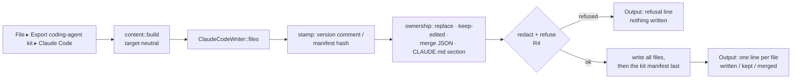

<!--
SPDX-License-Identifier: Apache-2.0
Copyright (c) 2026 Emerson Lopes and PowerRustCOBOL contributors
-->

# Plan — Coding-agent companion kit (Claude Code first)

- **Status:** draft → awaiting operator approval
- **Spec:** ./spec.md (R1–R22, R11a, R19a; AC1–AC11, AC6a, AC6b)   **Date:** 2026-10-01
- **Branch:** `feat/coding-agent-kit` (worktree `.claude/worktrees/agent-kit`), landed on
  `features` — this is a **feature** (spec §6).

> Every claim about existing code below was read for this plan on 2026-10-01
> at `ec18e93` (`Merge features into main (1.80.30-1.80.35)`; the IDE reads
> **1.80.37**, `crates/cobolt-ide/src/version.rs`). Line numbers rot within
> days in this repo — each task in `tasks.md` names the code it must read
> again before changing it. Nothing in §1–§4 is from memory; what could not be
> verified from the code is listed in §8 as an assumption.

## 1. Approach

### 1.1 The shape of the solution

Four pieces, split along the line the spec draws between *what the agent
knows* (the kit, written once) and *what the agent can do* (the tools, served
live):

```text
             IDE (cobolt-ide)                                   rcrun (cobolt-cli)
 ┌──────────────────────────────────────────┐            ┌───────────────────────────┐
 │ File ▸ Export coding-agent kit ▸ Claude  │            │ rcrun mcp [--project m]   │
 │   agent_kit::content  (target-neutral)   │            │   stdio, one JSON-RPC     │
 │   agent_kit::claude_code (writer)        │            │   message per line        │
 │   agent_kit::stamp / redact (R3–R5)      │            │   cobolt_mcp::serve       │
 │                                          │            └─────────────┬─────────────┘
 │ MCP over HTTP on 127.0.0.1:<mcp_port>    │                          │
 │   project_tools::http  ─▶ dispatch ──────┼────────┐                 │
 └──────────────────────────────────────────┘        ▼                 ▼
                                         ┌───────────────────────────────────────────┐
                                         │ cobolt-project-tools (NEW crate)          │
                                         │   ProjectTools: cobolt_mcp::McpHandler    │
                                         │   list_files · check · regenerate ·       │
                                         │   add_to_project · build · validate ·     │
                                         │   kb_lookup                               │
                                         │   ProjectHost trait (the one seam where   │
                                         │   IDE and headless differ)                │
                                         └───────────────────────────────────────────┘
                      reuses: cobolt-codegen · cobolt-compiler · cobolt-forms ·
                      cobolt-indexed · cobolt-lexer/parser/semantic · cobolt-runtime::builtins
```

1. **One tool set, two front doors (R11, R11a, AC6a).** A new crate,
   `cobolt-project-tools`, holds one `ProjectTools` value that implements
   `cobolt_mcp::McpHandler` (`crates/cobolt-mcp/src/server.rs:29-56`) exactly
   once. `rcrun mcp` drives it with the existing `cobolt_mcp::serve` over
   stdin/stdout (`server.rs:65-78`, framing `transport.rs:31-90`); the IDE
   drives it with a minimal Streamable-HTTP listener (§1.4) that hands each
   POST body to a newly public `cobolt_mcp::dispatch` (today the private
   `handle_one`, `server.rs:81-157`). The tool code never knows which door it
   came through. The only thing that differs between the two hosts —
   recording a generated or added file in the project manifest, and the IDE's
   unsaved-editor state — goes through a small `ProjectHost` trait (§1.5),
   which is the same pattern 065 used to keep `cobolt-mcp` transport-free
   (`specs/065-cobolt-mcp/plan.md` §1, "Layer 1").
2. **The tools reuse the IDE's own code paths, moved down, not copied.**
   Where the IDE's logic is a free function with no `CoboltApp` state, it
   moves into the new crate and the IDE calls it there, so "the same result as
   the IDE" (AC6, AC6a) is true by construction rather than by a parity test
   chasing two copies (§1.3 lists each).
3. **The kit is generated by the IDE, from the binary (R7, R20).** A new
   module tree `crates/cobolt-ide/src/agent_kit/` builds a target-neutral
   `KitContent` (rules, skills, reviewer, gap-report template, reference pack,
   connection and permission *intent*) and hands it to a per-target writer.
   Only `ClaudeCodeWriter` exists (R20); a test-only writer proves the split
   (AC9). The reference pack is produced from the System KB generator in
   `cobolt-compiler`, from `cobolt_runtime::builtins::BUILTINS`, and from the
   docs the IDE already embeds with `include_dir!`
   (`crates/cobolt-ide/src/docs_embed.rs:26`) — so the binary carries exactly
   what it exports.
4. **The IDE surfaces (R1, R6, R19a, R21).** A File-menu entry, a refresh
   offer on project open modelled on the structure-upgrade offer, a read-only
   **Compiler requests** tree node read from the folder, an MCP-port setting
   modelled on the inspection-port setting, and their `Tr` keys in all six
   tables.

### 1.2 Requirements → pieces

| Piece | Requirements |
|---|---|
| `cobolt-project-tools` (tools, HTTP transport, path confinement) | R11, R11a, R12, R13, R14 |
| `rcrun mcp` | R11, R11a, R12, R14 |
| IDE MCP listener + `IdeHost` | R11, R11a, R12, R14 |
| `agent_kit::content` + reference pack | R7, R8, R9, R10, R16, R17, R18, R19, R20, R22 |
| `agent_kit::claude_code` writer | R2, R15, R20 |
| `agent_kit::stamp` (manifest, CLAUDE.md section, ownership) | R3, R5 |
| `agent_kit::redact` (reuses `ai_bundle`) | R4 |
| File menu + Output listing | R1, R21 |
| Refresh offer on open | R6, R21 |
| Compiler requests node | R19a, R21 |

### 1.3 Reuse — what each tool calls

| Tool / need | Existing code it reuses | Where (read for this plan) |
|---|---|---|
| Framing + handshake + dispatch | `serve`, `McpHandler`, `Tool`, `ToolResult`, `negotiate` | `cobolt-mcp/src/server.rs:29-157`, `types.rs:26-45, 148-198` |
| An existing `McpHandler` to model on | `IndexedToolSet` delegating to plain functions | `cobolt-runtime/src/mcp_tool.rs:484-499` |
| Find the manifest | `find_project_manifest` (`*.project.toml` or legacy `cobolt.toml`) | `cobolt-compiler/src/lib.rs:1043-1076` |
| Read manifest lists (read-only) | precedent: `project_file_memory_limit`, `project_connections` read the private `CoboltProject` and expose one answer each | `cobolt-compiler/src/lib.rs:868-886, 914-921, 939` |
| **check** a form | `CoboltApp::validate_form_source_full` — a free associated fn (no `self`): `generate_with_map` → `preprocess_program` (COPY from the program's path) → `parse` → `analyze` | `cobolt-ide/src/app.rs:4058-4115` |
| **check** a diagnostic's location | `SourceMap::resolve` → `(CodeSite, site_line)`; the IDE's `resolve_diag_origin` turns it into Form ▸ Site | `cobolt-codegen/src/lib.rs:129-140`; `cobolt-ide/src/app.rs:550-586` |
| **check** semantic options | `external_crates_service::analyze_project` = `analyze_with(external_crates from the open project, form_formats: None, tolerate_undeclared: false)` | `cobolt-ide/src/external_crates_service.rs:112-127`; published per frame at `app.rs:14575-14579` from `CoboltProject::crates[].lib_name()` |
| **check** a hand-written source | IDE `do_check`: fixed/free heuristic, `preprocess_program`, `parse`, analyze | `cobolt-ide/src/app.rs:4181-4245`; lexer `preprocess_program` `cobolt-lexer/src/copybook.rs:130` |
| **check** exactly-one-main-form | `main_form_guard::read_designation` (`Err` = more than one form claims main) | `cobolt-compiler/src/main_form_guard.rs:134-185` |
| **check** binding blockers (the IDE's Build/Check gate) | `data_binding_guardian::validate_binding_action` — depends only on `cobolt_forms` (no `crate::` imports) | `cobolt-ide/src/data_binding_guardian.rs:105-110`; gate `app.rs:2349-2356` |
| **regenerate** a form | `cobolt_codegen::generate_with_map`; IDE `write_generated_for` / `do_generate_cobol` write it and call `add_generated` | `cobolt-codegen/src/lib.rs:311`; `cobolt-ide/src/app.rs:7232-7256, 11562-11610`; `project_model.rs:872-878` |
| **regenerate** — where the `.cbl` goes | `generated_cbl_path`: a tracked (relocated) `generated` entry with the same file name, else `generated/<stem>.cbl` | `cobolt-ide/src/app.rs:7338-7348`, helper `tracked_generated_rel` `app.rs:20045-20059` |
| **regenerate** an indexed facade | `generate_indexed`, `generate_indexed_select`, `generate_indexed_fd`; IDE writes `generated/<stem>-indexed.cbl` + `COPYBOOKS/<stem>.SEL/.FD` | `cobolt-ide/src/app.rs:7376-7388, 7500-7538` |
| **build** | `cobolt_compiler::build_project(manifest, &BuildOptions)`; the IDE passes `workspace_root: ui_prefs::load_workspace_root()` | `cobolt-compiler/src/lib.rs:1165-1256`; `cobolt-ide/src/app.rs:4885-4895` |
| **build** does not regenerate | `build_project` compiles whatever `files.generated` lists on disk | `cobolt-compiler/src/lib.rs:1235-1256, 1078-1150` |
| **add_to_project** + reseal | IDE `add_file_to` and `save_project`, which re-seals the main-form designation (`read_designation` + `seal`) on every save, skipping projects older than `STRUCTURE_MAIN_FORM_SEAL` | `cobolt-ide/src/project_model.rs:852-878, 1449-1489`; `main_form_guard.rs:108-126`; `project_upgrade.rs:49` |
| **validate** `.cfrm` | `cobolt_forms::load_form` | `cobolt-forms/src/xml.rs:493`, re-exported `lib.rs:85` |
| **validate** `.cidx` | `load_indexed`, `validate_definition`, `finalize_warnings` | `cobolt-indexed/src/xml.rs:35`, `structure.rs:159`, `schema_support.rs:14` |
| **kb_lookup** | the System KB generator: `controls_reference_doc` (`## Control: <name>` sections), `methods_reference_doc`, `property_reference_for`, `control_method_docs`; `BUILTINS` + `builtin(name)` | `cobolt-compiler/src/lib.rs:5089, 6252, 6767, 7364`; `cobolt-runtime/src/builtins.rs:35-82` |
| Reference pack from the KB | `publish_system_documentation(root)` writes 8 Markdown files from the binary | `cobolt-compiler/src/lib.rs:3968-4977` |
| Guide + syntax doc in the binary | `DOCS: Dir = include_dir!(".../docs")` | `cobolt-ide/src/docs_embed.rs:26` |
| Redaction + refusal (R4) | `ai_bundle::Personal` (home, login, git name/e-mail → placeholders; word-boundary, case-insensitive), `find_key` (refuse on any stored key ≥ 8 chars), refuse-if-still-present in `export` | `cobolt-ide/src/ai_bundle.rs:167-232, 234-266, 270-286, 535-544` |
| Port setting + startup + Output line | `LlmConfig::inspection_port` (default 5719), Settings row, `egui_inspection::serve` on `127.0.0.1:<port>` at app creation, `ai_inspection_listening` status | `cobolt-ide/src/llm.rs:62-65, 302-304, 891`; `panels/settings_form.rs:85, 184, 317-321, 1486-1498`; `app.rs:1980-1994, 2182-2193` |
| Locate `rcrun` | `find_cobolt_binary` (next to the IDE executable) | `cobolt-ide/src/project_model.rs:1675-1688`; runtime fallback to `PATH` `form_runtime.rs:453-454` |
| Project-open checks | `open_project_at` → `revalidate_all_forms` → `apply_main_form_invariant` → `detect_project_upgrades`; modal `show_project_upgrade_modal` | `cobolt-ide/src/app.rs:4504, 4590-4605, 12083-12142` |
| Project tree | `Category::TOP` (7 IDE-owned categories), `show_category`, loop over `TOP` | `cobolt-ide/src/project_model.rs:1101-1128`; `panels/project.rs:613-615, 955-1000` |
| Open a file in the editor from the tree | `ProjectPanelEvent::Open(PathBuf)` | `cobolt-ide/src/panels/project.rs:55-56` |
| Where Export AI… was added (1.80.30) | `SettingsFormAction::export_ai_config` button → `FileRequest::ExportAiConfig` → `export_ai_config` | `panels/settings_form.rs:388-390, 870-883`; `app.rs:1137, 10556-10569, 13912, 13927-13961` |
| File menu | `ui.menu_button(tr.menu_file, …)`, Package Project at `15085` | `cobolt-ide/src/app.rs:15079-15118` |

### 1.4 The IDE's MCP transport — the subset implemented

The IDE's existing "inspection endpoint" is not our code: it is the external
`egui_inspection::serve(&ctx, "127.0.0.1:<inspection_port>")`
(`app.rs:1984-1994`, dependency `cobolt-ide/Cargo.toml:52`), so there is no
in-house listener to copy. What *is* modelled on it: the port lives in
`LlmConfig` beside `inspection_port`, is edited in the same Settings row
pattern, is bound on `127.0.0.1` only at app creation, takes effect on restart,
and its outcome is one Output line (`app.rs:2182-2193`).

The listener itself is a `std::net::TcpListener` on `127.0.0.1:<mcp_port>` in
`cobolt-project-tools/src/http.rs` (no new dependency — the crate graph is
kept clear of HTTP stacks for the same reason `cobolt-mcp` is,
`cobolt-mcp/src/lib.rs:28-35`). It implements the **minimum of MCP's
Streamable HTTP transport** (protocol `2025-06-18`, which `cobolt-mcp`
already negotiates, `types.rs:26-29`):

| Request | Answer |
|---|---|
| `POST /mcp/<kit-id>` with a JSON-RPC request | `200`, `Content-Type: application/json`, the single response from `cobolt_mcp::dispatch`. No SSE, ever. |
| `POST` carrying a notification or a response (no `id`) | `202 Accepted`, empty body (`dispatch` returns `None`, `server.rs:159-166`). |
| `GET` or `DELETE` on the endpoint | `405 Method Not Allowed` — the server offers no server-initiated stream and keeps no session. |
| No `Mcp-Session-Id` is issued | Sessions are optional in the transport; the server is stateless per request. |
| `Origin` header present and not `http://127.0.0.1:<port>` / `http://localhost:<port>` | `403` — DNS-rebinding defence the transport requires of local servers. |
| `Host` not `127.0.0.1:<port>` / `localhost:<port>` | `403` — same defence, for clients that omit `Origin`. |
| `Content-Type` not `application/json` | `415` — a browser cannot send this cross-origin without a preflight, which is never answered. |
| `Transfer-Encoding: chunked`, or `Content-Length` missing | `411`. Body larger than `cobolt_mcp::transport::MAX_MESSAGE_BYTES` (`transport.rs:25`) → `413`. |
| Any other path | `404`. |
| Every response | `Connection: close`; one request per connection. |

Each accepted connection is handled on its own thread so a `check` can answer
while a `build` runs; tools that write (regenerate, add_to_project, build)
serialise on one project mutex.

**Binding the URL to one project (R14).** The kit manifest carries a random
`kit_id` (§3.2), and the IDE server's URL is `/mcp/<kit_id>`. When a request
arrives, the server compares that id with the `kit_id` in the open project's
`.claude/powerrustcobol-kit.json`:

- no project open → every tool answers **"no project open"** (AC5);
- a project open without a kit, or with a different `kit_id` → every tool
  answers **"the IDE has a different project open; open <the kit's project
  name> in the IDE, or use the `powerrustcobol` server"**, and acts on nothing;
- match → the tool runs against the open project.

`tools/list` always answers (the tool set is static), so a client can connect
before the developer opens the project.

### 1.5 The `ProjectHost` seam (where IDE and headless differ)

```rust
pub trait ProjectHost: Send {
    /// The project the tools act on, or why there is none (R14).
    fn project(&self) -> Result<ProjectRoot, NoProject>;
    /// Record a written generated file / an added file in the manifest,
    /// re-sealing the main-form designation exactly as an IDE save does.
    fn record(&mut self, rel: &str, list: FileList) -> Result<(), String>;
    /// A file the IDE holds unsaved changes for — writes touching it refuse.
    fn unsaved(&self, abs: &Path) -> bool { false }
    /// Tell the host what was written (IDE: reload tabs, re-light the tree).
    fn written(&mut self, _abs: &[PathBuf]) {}
    /// The SDK root a build uses (IDE: `ui_prefs::load_workspace_root()`).
    fn workspace_root(&self) -> Option<PathBuf> { None }
    fn external_crates(&self) -> Vec<String>;
}
```

- **`HeadlessHost`** (in the new crate, used by `rcrun mcp`): the project is
  the manifest it was started with; `record` edits the manifest as a
  `toml::Value` (adds to `[files] <list>`, deduplicated, `\` → `/` as
  `add_file_to` does, `project_model.rs:852-863`) and re-seals through a new
  `main_form_guard::designation_record(structure, dir, name, forms)` that the
  IDE's `save_project` is refactored to call too (`project_model.rs:1463-1484`),
  so the seal rule exists once; `external_crates` reads `[[crates]]`.
- **`IdeHost`** (in `cobolt-ide`): reads a snapshot the UI thread publishes
  each frame beside `set_active_project_crates` (`app.rs:14575`) — project
  dir, manifest path, kit id, `unsaved` paths (dirty designers
  `designer.rs:2501`, dirty editor tabs), whether the IDE is building, and the
  crate names. `record` and `written` are sent to the UI thread over an
  `mpsc` channel and applied there with `add_file_to` / `add_generated` +
  `do_save_project` (which re-seals), `editor.reload_file`
  (`editor.rs:2088`) and a re-validation of the touched form's tree
  semaphore; `record` waits up to 5 s for the UI thread's acknowledgement and
  the worker calls `ctx.request_repaint()` so an idle IDE wakes to apply it.
  The IDE's in-memory project is therefore the only writer of its manifest
  while it is open — the agent's work can never be clobbered by the next IDE
  save, nor the IDE's by the agent.

Both hosts run **the same tool functions**; neither is a special case of the
other (R11).

### 1.6 Tool contract

All results are one `Content::Text` holding compact JSON (the agent parses it;
the skills say so). Every path argument is project-relative.

| Tool | Arguments | Does | Writes? |
|---|---|---|---|
| `list_files` | — | The manifest's lists (forms, indexed, sources, generated, assets, documentation), each with an exists flag, plus `docs/compiler-requests/*.md`. | no |
| `check` | `path?` | One file, or the whole project: every form's generated program (in memory, as the IDE's form validation does — nothing written), every source, every `.cfrm`/`.cidx` load, the main-form designation, binding blockers. Diagnostics: `{file, line, col, severity, message, form?, site?}`, a form diagnostic located in the `.cfrm` and its code site (via `SourceMap::resolve`), never in the generated `.cbl` unless codegen authored the line. | no |
| `regenerate` | `path?` (`.cfrm` or `.cidx`) | One form or indexed definition, or all; writes the `.cbl` (+ `.SEL`/`.FD` for indexed) where the IDE writes it, records it as generated. | yes |
| `add_to_project` | `path`, `list?` | Puts an existing project file in its manifest list (routed by extension like `Category::of_path`, `project_model.rs:1152`), re-sealing. **Not in R11's list — see §4 D4.** | yes |
| `build` | `full?` | Regenerates all, refuses on any `check` error (the IDE's Build gate, `app.rs:4767-4857`), then starts `build_project` on a worker thread and waits at most 40 s. Finished → the binary path or the errors. Still running → `{"status":"running","elapsed_s":…}`; calling `build` again while it runs waits another 40 s on the **same** build instead of starting a second one (§8 A2: a ~60 s client timeout is reported). | yes |
| `validate` | `path` | `.cfrm` → `load_form`; `.cidx` → `load_indexed` + `validate_definition` + `finalize_warnings`. | no |
| `kb_lookup` | `name`, `kind?` | The control / property / method / event section, or the built-in entry, from the same generated text the reference pack carries. Bounded output. | no |

**Path confinement (R12, AC5).** `ProjectRoot::resolve(rel)` rejects an
absolute path, any `..` component, and — after `canonicalize` of the deepest
existing ancestor — anything whose real path leaves the canonical project
root (a symlink escape). Every tool goes through it; the refusal text names
the rule, not the machine's paths.

**What is not exposed (R13).** No tool reads or writes `LlmConfig`, keys,
`ui_prefs`, the SDK, the System KB store, or anything outside the project
root; `build` passes the SDK root as an option but never reveals it.

### 1.7 The kit

```text
<project>/
  CLAUDE.md                              ← kit owns only the delimited section (R3)
  .mcp.json                              ← powerrustcobol-ide (http) + powerrustcobol (stdio)
  .claude/settings.json                  ← permissions (R15)
  .claude/powerrustcobol-kit.json        ← kit manifest: version, kit_id, per-file hash (R5)
  .claude/skills/<name>/SKILL.md         ← 7 skills (R9)
  .claude/agents/powerrustcobol-reviewer.md   ← reviewer subagent (R10)
  docs/powerrustcobol/                   ← the reference pack (R7)
    README.md · developers-guide.md · cobol85-supported-syntax.md ·
    controls.md · control-methods.md · rustcobol-extensions.md ·
    form-layout-and-events.md · form-themes.md · project-model-and-settings.md ·
    builtins.md · cfrm-format.md · cidx-format.md
  docs/compiler-requests/                ← written by the agent, never by the kit (R17)
```

**Content model (R20).** `KitContent` is plain data, `Serialize`:
`brief_rules: Vec<Rule>` (R8, R16, R19 as instructions), `skills: Vec<Skill
{ name, summary, steps, uses_tools }>`, `reviewer: Reviewer`, `gap_template:
GapTemplate` (R18 fields), `reference: Vec<RefDoc { name, title, body }>`,
`servers: Servers { http_url, stdio_command, stdio_args }`, `permissions:
PermissionIntent { edit_inside_project, read_inside_project,
allow_project_tools, deny_shell }`. It is built once (`content::build`) and
never mentions a target. `trait KitWriter { fn files(&self, &KitContent) ->
Vec<KitFile> }` turns it into `KitFile { rel, body, kind: Markdown | Json |
SectionOf("CLAUDE.md") | FrontMatterMarkdown }`. The stamping, ownership and
redaction passes run on `Vec<KitFile>` and are target-neutral too.

**Reference pack sources (R7), generated at export, never stored in the repo:**

| Pack file | Generated from |
|---|---|
| `controls.md`, `control-methods.md`, `rustcobol-extensions.md`, `form-layout-and-events.md`, `form-themes.md`, `project-model-and-settings.md` | `cobolt_compiler::system_documentation()` — a new function returning the `(file name, text)` pairs `publish_system_documentation` writes today (`lib.rs:4374-4975`); `publish_system_documentation` becomes a loop over it, byte-identical. `agents_registry.md` and `ide_functionalities.md` are **left out**: they describe the in-IDE Grace mesh and its JSON designer ops (`lib.rs:4380-4414, 4431-4454`), which an external agent cannot use and would imitate. |
| `builtins.md` | `cobolt_runtime::builtins::BUILTINS` directly (`builtins.rs:35-79`), not the copy inside `rustcobol_extensions.md` (a literal table kept equal by `grace_host.rs:4483`). |
| `developers-guide.md` | the **whole** English Guide from `docs_embed` (Q4) — only `developers-guide-en.md` exists in `docs/` today (checked with `ls`). |
| `cobol85-supported-syntax.md` | `docs/cobol85-supported-syntax-en.md` from `docs_embed`. |
| `cfrm-format.md`, `cidx-format.md` | **No such documents exist in `docs/`** (`indexed-file-format-en.md` describes the `PRCIDX1` *data* container, not the `.cidx` XML). Generated instead: a fixed explanation in `agent_kit/reference.rs` plus a **live example** serialised at export by `cobolt_forms::form_to_string` / `cobolt_indexed::save_indexed_to_string` (`cobolt-forms/src/lib.rs:85`, `cobolt-indexed/src/lib.rs` re-exports) from a sample form (Label, TextBox, Button with a bound `onClick`, a Panel parent) and a sample definition (two keys). A test asserts every element and attribute name the serialiser emits is named in the prose, so the description cannot fall behind the format. The `.cfrm` doc comment `cobolt-forms/src/xml.rs:7-51` is the prose's source. |
| `README.md` | generated index: version, file list, the KB lookup tool's name. |

### 1.8 Data flow — export



## 2. Affected crates / files

**New**
- `crates/cobolt-project-tools/` — **new workspace crate** (`Cargo.toml`,
  `src/lib.rs`, `root.rs` path confinement, `host.rs` `ProjectHost` +
  `HeadlessHost`, `tools/{list,check,regenerate,register,build,validate,kb}.rs`,
  `gen_paths.rs`, `binding_guardian.rs` (moved), `http.rs`). Dependencies:
  `cobolt-mcp`, `cobolt-codegen`, `cobolt-compiler`, `cobolt-forms` (default
  features), `cobolt-indexed`, `cobolt-lexer`, `cobolt-parser`,
  `cobolt-semantic`, `cobolt-runtime` (for `builtins` only), `serde`,
  `serde_json`, `toml`. Not an SDK crate: it builds tooling, never output, like
  `cobolt-cli` (`cobolt-compiler/src/lib.rs:2743-2753`), so `SDK_CRATES` is
  untouched.
- `crates/cobolt-ide/src/agent_kit/` — `mod.rs`, `content.rs`,
  `reference.rs`, `claude_code.rs`, `stamp.rs`, `redact.rs`, `ide_host.rs`.
- `crates/cobolt-cli/tests/mcp_stdio.rs` — AC6a.

**Changed**
- `Cargo.toml` (workspace) — register the member after `cobolt-mcp` (line 25).
- `crates/cobolt-mcp/src/server.rs`, `lib.rs` — `pub fn dispatch(raw: &[u8],
  handler) -> Option<Response>` (the body of `handle_one`); `serve` calls it.
  No new dependency; 065's contract (`lib.rs:7-48`) holds.
- `crates/cobolt-compiler/src/lib.rs` — `pub fn system_documentation()`;
  `publish_system_documentation` writes from it. `pub fn
  project_manifest_view(manifest) -> ManifestView` (file lists, `[[crates]]`
  lib names, project name, `structure`) following the
  `project_file_memory_limit` precedent.
- `crates/cobolt-compiler/src/main_form_guard.rs` — `pub fn
  designation_record(...)`, the reseal rule lifted out of
  `cobolt-ide/src/project_model.rs:1463-1484`.
- `crates/cobolt-cli/src/main.rs` — `Some("mcp") => cmd_mcp(..)` in the
  dispatch (`main.rs:67-75`); `--project` takes a manifest or a folder (a
  folder is searched with `find_project_manifest` and must hold the manifest
  itself — an ancestor's is refused, since that function walks upwards,
  `lib.rs:1049`); no `--project` = the working directory, same rule; help text
  (`main.rs:347-391`), tracing writer
  switched to stderr **for `mcp` only** (`main.rs:57-63` writes to stdout by
  default, which would corrupt the protocol stream).
- `crates/cobolt-cli/Cargo.toml` — depend on `cobolt-project-tools`.
- `crates/cobolt-ide/Cargo.toml` — depend on `cobolt-project-tools`.
- `crates/cobolt-ide/src/app.rs` —
  - `validate_form_source_full` (4058) delegates to the moved function;
  - `generated_cbl_path` (7338) / `generated_indexed_cbl_path` (7376) delegate
    to `gen_paths`;
  - the fixed/free heuristic in `do_check` (4205-4212) delegates;
  - MCP listener start beside the inspection endpoint (1980-1994) and its
    Output line (2182-2193);
  - per-frame snapshot publish beside 14575; drain of the `IdeHost` channel;
  - File-menu entry after Package Project (15085-15087);
  - kit-refresh detection after `detect_project_upgrades` (4605) and its
    modal beside `show_project_upgrade_modal` (12093);
  - project-panel event for the Compiler requests node.
- `crates/cobolt-ide/src/data_binding_guardian.rs` — becomes a one-line
  re-export of the moved module, so its ~call sites are unchanged.
- `crates/cobolt-ide/src/project_model.rs` — `save_project` calls
  `designation_record`; `find_cobolt_binary` → `pub(crate)`.
- `crates/cobolt-ide/src/ai_bundle.rs` — `Personal::scrub`, `Personal::find`,
  `find_key` → `pub(crate)` (no behaviour change).
- `crates/cobolt-ide/src/docs_embed.rs` — `pub fn embedded_doc(name) ->
  Option<&'static str>`.
- `crates/cobolt-ide/src/llm.rs` — `mcp_port: u16`, `default_mcp_port() =
  5720`, persisted like `inspection_port` (`llm.rs:62-65, 302-304, 891`).
- `crates/cobolt-ide/src/panels/settings_form.rs` — MCP-port row beside the
  inspection-port row (1486-1498), draft field and clamp as at 85/184/317-321;
  refuses the inspection port's value.
- `crates/cobolt-ide/src/panels/project.rs` — Compiler requests node after
  the `Category::TOP` loop (613-615).
- `crates/cobolt-ide/src/i18n.rs` — new `Tr` keys ×6 (§3.4).
- `crates/cobolt-ide/src/main.rs` — `mod agent_kit;`.
- `docs/developers-guide-en.md` — "Working with a coding agent", `rcrun mcp`
  in §17, the MCP-port setting.
- `docs/DEPENDENCIES-en.md` — new crate row (its five translations deleted,
  GOLDEN RULE #8). `docs/cobol-support-matrix-en.md` — one capability row (its
  five translations deleted).
- `specs/steering/docs.md` — registry rows for the new code areas.
- `crates/cobolt-ide/src/version.rs`, `CHANGELOG.md` — every commit.

**Not touched:** `Category` / `Category::TOP` (the Compiler requests node is
not a category, §4 D6); the `.cfrm` / `.cidx` formats; `cobolt-codegen`; the
System KB *content* (no control, property, method or event changes — the KB
gate does not fire); `SDK_CRATES`.

## 3. Data / model changes

### 3.1 New IDE setting

`LlmConfig.mcp_port: u16`, `#[serde(default = "default_mcp_port")]` (5720 —
one above the inspection port's 5719, `llm.rs:302-304`), machine-level,
saved in `save_machine_at` like `inspection_port` (`llm.rs:891`). Old
configurations get the default. A change takes effect on restart, and the
Settings hint says the kit must be re-exported (R11a).

### 3.2 The kit manifest — `.claude/powerrustcobol-kit.json`

```json
{
  "format": "powerrustcobol-agent-kit",
  "version": 1,
  "target": "claude-code",
  "ide_version": "1.80.4x",
  "kit_id": "k-7f3a9c2e1b",
  "mcp_port": 5720,
  "files": [
    { "path": "CLAUDE.md", "section": true, "written_by": "1.80.4x", "sha256": "…" },
    { "path": ".mcp.json", "merged": false, "written_by": "1.80.4x", "sha256": "…" }
  ]
}
```

- `sha256` is of the bytes the kit wrote — of the section body for
  `CLAUDE.md`, of the kit-owned keys (canonical JSON) for a merged JSON file.
  It is the stamp R3 compares.
- `kit_id` is random (`tiny_id`, already a dependency, `cobolt-ide/Cargo.toml:109`),
  created on first export and **kept** on every re-export so `.mcp.json`'s URL
  stays valid. It identifies nothing about the developer.
- Written **last**, so an interrupted export leaves the previous manifest,
  and the next export treats any half-written file as edited rather than
  overwriting it.

### 3.3 Stamps (R5)

- Plain Markdown (pack files): first line `<!-- powerrustcobol-kit: <version> -->`,
  the shape `docs/indexed-file-format-en.md:9` already uses
  (`<!-- powerrustcobol: 1.65.124 -->`).
- `CLAUDE.md`: the kit's section is
  `<!-- powerrustcobol-kit:begin <version> -->` … `<!-- powerrustcobol-kit:end -->`;
  the version is on the begin marker. Because HTML comments are hidden from
  the model (§8 A6), the section's first visible line also says "Written by
  PowerRustCOBOL AI <version>" — the value a gap report quotes (R18). A new
  `CLAUDE.md` holds only the section; an existing one gets it appended after
  a blank line, everything else untouched.
- `SKILL.md` and the agent file: frontmatter must open the file (§8 A4), so
  the stamp comment is the first line **after** the closing `---`. This is the
  one place R5's "at its top" is read as "at the top of the body" — §9 F2.
- JSON (`.mcp.json`, `settings.json`): no comment; version and hash only in
  the kit manifest (R5 as clarified).

### 3.4 New `Tr` keys (all six tables, `i18n.rs`)

`menu_export_agent_kit` ("Export coding-agent kit…"),
`menu_export_agent_kit_hint`, `agent_kit_target_claude_code` ("Claude Code" —
a product name, identical in every table), `agent_kit_wrote` ("Coding-agent
kit: wrote {}"), `agent_kit_kept_edited`, `agent_kit_merged`, `agent_kit_done`,
`agent_kit_refused` ("Export refused: {}. Nothing was written."),
`agent_kit_refresh_title`, `agent_kit_refresh_detail` ("…written by {} — this
IDE is {}"), `agent_kit_refresh_apply`, `agent_kit_refresh_later`,
`cat_compiler_requests` ("Compiler requests"), `ai_mcp_port` ("Coding-agent
tools port"), `ai_mcp_port_hint`, `ai_mcp_listening`, `ai_mcp_failed`,
`mcp_activity` ("Coding agent: {} {}"). Placeholders `{}` are kept in every
language and a test checks them, as `i18n.rs:11520-11590` does for other keys.

Refusal *reasons* come from `redact.rs` as English today (the AI export does
the same: `ai_bundle.rs:275-284` returns English and `app.rs:13961` prints it
raw). The kit's reasons are `Tr` fields instead (`agent_kit_refused_key`,
`agent_kit_refused_personal`), so this feature does not copy that gap.

### 3.5 Project files the kit touches

Only the kit files of §1.7. No `.cfrm`, `.cidx`, manifest or source is changed
by an export. The MCP tools change `.cbl` under `generated/`, `COPYBOOKS/`
indexed copybooks and the manifest's lists — the same files the IDE's own
Generate / Build change.

## 4. Key decisions & alternatives

- **D1 — A new crate for the tools.** Why: `cobolt-cli` and `cobolt-ide` must
  both link one implementation, and the implementation needs codegen,
  compiler, forms, indexed, parser/semantic and `BUILTINS`. Checked
  `Cargo.toml`s: `cobolt-cli` has no `cobolt-codegen` or `cobolt-indexed`
  dependency today; `cobolt-compiler` depends on lexer/ast/parser/semantic/forms
  only and deliberately not on `cobolt-runtime` (its KB built-ins table is a
  literal kept in step by a test in `grace_host.rs:4483`). None of the reused
  crates depends on `cli` or `ide`, so there is no cycle. Rejected: putting the
  tools in `cobolt-compiler` (would add codegen + runtime + mcp to the
  compiler and blur its role); in `cobolt-runtime` (an SDK crate — every built
  application would link the compiler); in `cobolt-ide` (rcrun cannot link a
  binary crate — `cobolt-ide` has no `[lib]`, `Cargo.toml:16-18`).
- **D2 — Move, don't copy, the IDE logic the tools need**
  (`validate_form_source_full`, the generated-path rule, the fixed/free
  heuristic, `data_binding_guardian`). Why: AC6/AC6a promise the *same*
  result; two copies diverge. Each is already a free function without
  `CoboltApp` state. Rejected: a parity test over two copies (proves equality
  until the next edit).
- **D3 — HTTP done in-house, minimal.** Why: the subset in §1.4 is ~200 lines
  over `std::net`; the workspace avoids HTTP/TLS stacks in shared crates
  (`cobolt-mcp/src/lib.rs:28-35`). Rejected: `tiny_http`/`hyper` (new
  dependency for one endpoint); SSE (no server-initiated messages exist).
- **D4 — Add a seventh tool, `add_to_project`, beyond R11's list.** Why: the
  manifest carries a keyed seal over the project's form list
  (`main_form_guard.rs:108-126`, written by `save_project`,
  `project_model.rs:1463-1484`). An agent that adds a form by editing the
  manifest by hand breaks the seal, and `rcrun`/the binary then report the
  application corrupted (`main_form_guard.rs:1-30`, `StartVerdict::Corrupt`).
  With the IDE open, a hand edit is also overwritten by the next IDE save. The
  brief therefore forbids editing the manifest and routes every addition
  through this tool. Rejected: teaching the agent the seal (it is keyed; the
  key is a constant only the product should apply).
- **D5 — `regenerate` also covers `.cidx`.** R9 asks for a skill that defines
  "an indexed file and its generated facade", and the facade is generated
  (`app.rs:7500-7538`). R11 names forms only; covering indexed definitions is
  the smallest reading that makes R9 doable.
- **D6 — Compiler requests is a tree node, not a `Category`.** `Category::TOP`
  is IDE-owned and manifest-backed: every variant routes `add_file_to`, has a
  `root_subdir`, a `files_in` list and a `[+]` (`project_model.rs:1101-1160,
  880-896`). A folder-read, read-only list fits none of that, and adding a
  variant would ripple through every exhaustive `match`. The node is drawn
  after the `TOP` loop (`panels/project.rs:613-615`) by its own small function,
  cached on the folder's mtime (the `shell_pane_cache` pattern,
  `app.rs:958-966`), absent when the folder is empty, each row emitting
  `ProjectPanelEvent::Open`.
- **D7 — The kit binds the IDE URL to a `kit_id`, not to a path.** Why: R14
  needs the IDE to know which project a call is for, and an MCP client sends
  no working directory. A path in the URL would leak the home folder (R4); a
  random id does not. Rejected: one URL for all projects (cannot satisfy R14).
- **D8 — Redaction applies to what varies, refusal to everything.** The kit's
  text is ours; what can carry a developer's details is the *interpolated
  values* (project name, manifest name, rcrun path) and, in principle, any
  file. So personal details are **replaced in the interpolated values before
  rendering** (with `Personal::scrub`), and the **refusal scan runs over every
  final file** for stored keys (`find_key`) and over every generated file for
  personal details (`Personal::find`). The reference pack copied verbatim from
  the binary is scanned for keys but not rewritten — see §9 F1 for why
  scrubbing it would be wrong. Rejected: scrubbing whole files (a login of
  `main` or `form` would rewrite "main form" throughout the brief and the
  Guide; `replace_word_ci` matches whole words, `ai_bundle.rs:234-266`, and
  the minimum login length is 4, `ai_bundle.rs:189-194`).
- **D9 — Pre-existing developer JSON is merged, not replaced.** A
  `.mcp.json` or `.claude/settings.json` the kit did not write keeps every key
  it has; the kit adds or replaces only its own (`mcpServers.powerrustcobol*`;
  its permission rules, de-duplicated). The kit-owned subset's hash is the R3
  stamp; Output says "merged". Key order is normalised (`serde_json` has no
  `preserve_order` here, `Cargo.lock` serde_json 1.0.150 deps). Rejected:
  refusing to touch the file (leaves the developer with a kit that cannot
  reach the IDE).
- **D10 — Shell is denied outright; listing and searching go through the
  agent's own read tools and `list_files`.** Claude Code evaluates deny
  before allow (§8 A3), so "deny Bash except `ls`/`grep`" cannot be expressed
  as deny + allow; and allowing `Bash(grep:*)` cannot stop `grep` reading
  outside the project. Listing and searching go through the agent's own
  Glob/Grep tools (read-only, left at Claude Code's default — no rule is
  written for them, because a bare `Glob`/`Grep` allow would grant searching
  anywhere and break AC7) and the `list_files` tool. The rules written:
  `allow: ["Edit(./**)", "Read(./**)", <the 14 mcp__… tool names>]`,
  `deny: ["Bash"]`. Rejected: allowing `Bash(ls:*)`, `Bash(grep:*)`.
- **D11 — Export is a submenu, File ▸ Export coding-agent kit ▸ Claude Code.**
  It names the target (R1 "the chosen target") without a dialog — so no new
  window to keep from resizing itself. With one target the submenu has one
  item; a second writer adds a second item.
- **D12 — The IDE listener is always on, like the inspection endpoint.** R11
  says "while a project is open"; listening without one is harmless because
  every call then answers "no project open" (AC5 needs exactly that), and a
  bind failure is reported once in Output as the inspection endpoint's is.

## 5. Risks & mitigations

- **Risk: the agent's file edits race the IDE's in-memory state.** The agent
  edits `.cfrm` with its own file tools, not through MCP; an open designer
  holds the old form, and an IDE save would overwrite the agent's work.
  → `IdeHost::unsaved` makes every *writing* tool refuse when the target (or
  any form, for `build`) has unsaved IDE edits, naming the file; on every MCP
  call the IDE reloads *clean* open designers and the Main-Pane inspector
  whose `.cfrm` changed on disk (the `InspectState::reload_if_stale` pattern,
  `app.rs:1505-1533`). The brief tells the agent to ask the developer to save
  or close a form when a tool says so. The manifest race is closed by D4 +
  §1.5.
- **Risk: `rcrun mcp` stdout corruption.** `tracing_subscriber::fmt()` writes
  to stdout by default (`cobolt-cli/src/main.rs:57-63`); any warning would be
  an invalid JSON-RPC line. → stderr writer for `mcp`; `build_project` runs
  with `verbose: false` (it only `eprintln!`s when verbose, `lib.rs:1239-1241`)
  and pipes cargo's output (`lib.rs:2166-2171`); AC6a's test asserts every
  stdout line parses as JSON-RPC.
- **Risk: both servers write the same project at once** (headless `build`
  while the IDE is open). → The brief and the check-and-fix skill say: use
  `powerrustcobol-ide` whenever it is connected; `powerrustcobol` only when
  the IDE is closed. Not enforceable across processes; stated in the Guide.
- **Risk: unauthenticated local endpoint** (spec §6 accepts it). Anything on
  the machine that can reach the port can regenerate and build the open
  project. → `127.0.0.1` only; Host/Origin/Content-Type checks stop a web
  page (§1.4); the `kit_id` gate means only a project that has a kit, and is
  open, can be acted on; the tools are confined to that project (R12, R13).
  The Guide says plainly that there is no authentication.
- **Risk: `build` is long.** A synchronous `tools/call` would outlive the
  client's timeout (§8 A2 — about 60 s is reported for HTTP servers). → The
  bounded wait in §1.6: `build` never holds a call longer than 40 s, and a
  repeated call joins the build in flight. The check-and-fix skill says to
  call `check` first and to repeat `build` while it answers `running`.
- **Risk: the reference pack is 0.7 MB+ of Guide.** → Q4 settled it; the pack
  carries an index (`README.md`) and the `kb_lookup` tool so the agent rarely
  reads it whole.
- **Risk: moving `data_binding_guardian` (1 581 lines) is a large diff.** →
  `git mv` plus a re-export; no line of logic changes; its own tests move with
  it and must stay green.
- **Risk: the AC1 export target (a copy of PowerChat) is large.** → the test
  copies only `PowerChat.project.toml`, `forms/` and `src/` into a temp dir.
- **Risk: GOLDEN RULE #8 bill.** `DEPENDENCIES-en.md` and
  `cobol-support-matrix-en.md` have all five translations each; updating the
  English deletes ten files and turns `docs_embed`'s two guards red until the
  next minor (intended; do not re-add `#[ignore]`). The Guide has no
  translations today, so it costs nothing. `DEPENDENCIES-en.md` is already
  behind — it lists neither `cobolt-mcp`, `cobolt-docs` nor `cobolt-kb`
  (lines 40-58) — so its row update brings those in too, and is honest about
  it in the CHANGELOG.

## 6. Test strategy

Every new test prints a quantified summary (GOLDEN RULE #7): what it exercised
by name and the counts it measured. `cobolt-ide` tests are in-module
(`cargo test -p cobolt-ide --bin cobolt-ide …`; the crate has no `[lib]`).

| AC | Test (crate / location) | Asserts and reports |
|---|---|---|
| AC1 | `cobolt-ide` `agent_kit::tests::export_into_powerchat_copy` | Every R2 path exists; each Markdown file carries the version stamp in the right place; every JSON file is in the kit manifest with version and hash; the returned report (what Output prints) names every file. Reports: files written by kind. |
| AC2 | `agent_kit::stamp::tests::developer_text_and_edited_skill_survive` | A `CLAUDE.md` with text before and after the section is byte-equal outside it after re-export; a hand-edited `SKILL.md` is untouched and appears in the report as kept. Reports: bytes compared, files kept. |
| AC3 | `agent_kit::redact::tests::*` | With a stored key planted in the project name and in a fake rcrun path, and home/login/git name/e-mail planted in both: no written file contains any; a key (which is refused, never replaced) makes the export refuse and the temp project is byte-identical to before (directory hash). Reports: needles planted, files scanned, replacements made. |
| AC4 | `agent_kit::reference::tests::pack_names_every_kb_entry_and_builtin` | For every `ControlType::ALL`: its `## Control:` section exists in `controls.md` and names every property `Control::new` seeds (minus `UNIVERSAL_PROPS`, checked in the universal section), every `runtime_property_names_for`, every `supported_events()` entry, every `control_method_docs` method; every `BUILTINS` name is in `builtins.md`. Reports: controls, properties, events, methods, built-ins compared; misses listed. |
| AC4 (format docs) | `agent_kit::reference::tests::format_docs_name_every_serialised_name` | Every element/attribute in the live `.cfrm`/`.cidx` example is named in the prose. |
| AC5 | `cobolt-project-tools` `tests/tools.rs` | `tools/list` over `serve` lists 7 tools; `check` on a fixture project with a planted error returns its `.cfrm`, site and line; `../x`, `/etc/passwd`, and a symlink out are refused; with `HeadlessHost` on an unreadable manifest and with the IDE host's no-project snapshot, every tool answers "no project open". |
| AC5 (HTTP) | `cobolt-project-tools` `tests/http.rs` | Over a real `127.0.0.1:0` socket: initialize, tools/list, a notification → 202, GET → 405, foreign `Origin` → 403, wrong `Host` → 403, wrong kit id → the "different project" answer. |
| AC6 | `cobolt-project-tools` `tests/regenerate.rs`; `cobolt-ide` `app::tests` | `regenerate` writes byte-equal to `cobolt_codegen::generate_with_map(load_form(..)).0`, at the path the IDE's `generated_cbl_path` returns (both now one function). Build: `tests/build.rs`, `#[ignore]`d by default (needs cargo + SDK, minutes), run at the Phase 1 gate with `-- --ignored`; asserts the binary exists and reports its size and the elapsed time. |
| AC6a | `cobolt-cli/tests/mcp_stdio.rs` | Spawns `CARGO_BIN_EXE_rcrun mcp --project <fixture>`; `initialize`, `tools/list` equal (names + schemas) to `ProjectTools::list_tools()`; `check` equal to the in-process result; every stdout line is JSON-RPC. "Opens no network port": the `mcp` path's code links no listener (asserted by a test that greps `cobolt-cli/src` for `TcpListener` — none today), and on Unix, when `lsof` exists, `lsof -a -i -p <pid>` lists nothing (skipped with a printed reason otherwise). |
| AC6b | `cobolt-ide` `panels::project::tests::compiler_requests_*` | Two reports → node lists both, newest first (by the `YYYY-MM-DD` prefix, then mtime); none → no node. |
| AC7 | `agent_kit::claude_code::tests::settings_permissions` | `settings.json` parses; contains `Edit(./**)`, `Read(./**)`, the 14 `mcp__<server>__<tool>` names (equal to `ProjectTools::list_tools()` × both servers), `deny: ["Bash"]`; no rule with `//`, `~`, `..` or an absolute path, no bare `Glob`/`Grep`/`Edit`/`Read`/`Write`, no `additionalDirectories`, no `defaultMode`. |
| AC8 | `agent_kit::content::tests::gap_template_has_every_r18_field` | The seven R18 fields are present in the skill's template. |
| AC9 | `agent_kit::tests::a_second_writer_needs_no_content_change` | `content::build` serialised once to JSON; a `#[cfg(test)] struct FlatWriter` renders the same `KitContent` to a different layout; the content JSON is identical before and after. |
| AC10 | **Manual, operator-run** — tasks.md T7.2. | |
| AC11 | `i18n::tests::agent_kit_strings_in_every_language` | Each new key non-empty in all six tables; `{}` count equal to English. |

**Regression guards that must stay green:** `cobolt-mcp` suite;
`cobolt-runtime` `test_mcp_tool_parity`; `cobolt-compiler`
`published_documentation_tests`, `every_control_the_toolbox_offers_is_published_to_the_assistant`;
`cobolt-ide` `grace_host::…prebuilt_chunked_kb_matches_the_published_documentation`
(proves `system_documentation()` is byte-identical — no `chunked.data`
change), `project_model::main_form_seal_tests`, the moved
`data_binding_guardian` tests, `i18n` tests; `cobolt-cli`
`tests/main_form_gate.rs`.

**Manual / visual (operator):** File ▸ Export coding-agent kit ▸ Claude Code on
a project — Output lists files; reopen the project after bumping the version —
the refresh offer appears; drop a report in `docs/compiler-requests/` — the
node appears, newest first, opens in the editor; Settings shows the MCP port.
Then AC10.

## 7. Steering compliance

- [x] **i18n:** 20 new `Tr` keys ×6 (§3.4); the kit's own text stays English (R22).
- [x] **Generated-code banner + regenerate-on-action:** unchanged. `regenerate`
      and `build` use `cobolt_codegen::generate_with_map` exactly as the IDE
      does; `build` regenerates first because `build_project` does not.
- [ ] **English dev guide updated:** owed (T6.1). Only
      `developers-guide-en.md` exists, so no Guide translation is deleted;
      `DEPENDENCIES-en.md` and `cobol-support-matrix-en.md` each lose five.
- [x] **System KB:** no control/property/method/event or behaviour change; the
      KB content is refactored into `system_documentation()` byte-for-byte and
      the chunked-store freshness test proves it. No reindex.
- [x] **Fix vs feature:** feature → `features`; every commit bumps `z` with a
      CHANGELOG entry; no fix mixed in (a fix found on the way goes to `fixes`
      from `main`).
- [x] **No "cobolt" in user-facing text:** the kit says PowerRustCOBOL; the
      MCP server names are `powerrustcobol-ide` / `powerrustcobol`; the crate
      name is build-only. COBOL in examples is English.

## 8. Assumptions not verifiable from this repository

These are facts about Claude Code, not about our code. They were checked
against Claude Code's published documentation on 2026-10-01
(`code.claude.com/docs/en/{mcp,mcp-quickstart,permissions,skills,sub-agents}.md`,
through a documentation-lookup agent — not by running Claude Code). What the
documentation does **not** state is marked *unverified*; the operator
confirms all of them during AC10. A wrong one changes only `claude_code.rs`
(or `http.rs` for A2), never the content model.

- **A1 — `.mcp.json`.** Documented: `{"mcpServers": {"<name>": {"type":
  "http", "url": "…"}, "<name>": {"type": "stdio", "command": "…", "args":
  […]}}}`; `${VAR}` / `${VAR:-default}` expansion in `command`, `args`, `env`,
  `url`, `headers`; `${CLAUDE_PROJECT_DIR}` available to stdio servers;
  project-scoped servers need a one-time approval by the user. The writer
  therefore emits `"command": "${HOME}/…/rcrun"` when the rcrun path is under
  the home folder (§9 F3) and `"args": ["mcp", "--project",
  "${CLAUDE_PROJECT_DIR}"]`, `--project` accepting a folder as well as a
  manifest. *Unverified:* the settings key that pre-approves project servers
  — the kit writes none (approval stays the developer's act).
- **A2 — Streamable HTTP.** *Unverified:* that the `"type": "http"` client
  accepts an `application/json` reply (no SSE), runs without
  `Mcp-Session-Id`, tolerates `405` on GET, omits `Origin`, sends
  `Content-Length`, and copes with `Connection: close`. Reported, from the
  issue tracker rather than the docs: an effective ~60 s tool-call timeout on
  HTTP servers whatever `timeout` says — hence `build`'s bounded wait (§1.6).
- **A3 — Permissions.** Documented: `permissions.{allow,deny,ask,
  defaultMode,additionalDirectories}`; rules `Tool` or `Tool(pattern)`;
  `mcp__<server>__<tool>`; deny before ask before allow. `mcp__<server>__*`
  wildcards have a reported regression, so the writer lists the seven tools
  of each server by full name instead (14 rules). Read rules do **not**
  govern Glob/Grep (separate tools). *Unverified and reported against us:*
  Claude Code may read and edit outside the launch folder without asking by
  default — so R15's "edits only inside the project" is met by the allow-list
  plus R16's instruction plus the reviewer, not by a hard wall (§9 F7).
- **A4 — Skills and subagents.** Documented for skills: `SKILL.md` must open
  with `---` frontmatter, `name` + `description` required, `allowed-tools`
  optional; anything before `---` breaks parsing. Agents: `name` +
  `description` required, `tools`/`model` optional; *unverified* that content
  before frontmatter breaks it — treated the same way.
- **A5 — The stdio server's working directory** is not documented — which is
  why A1 passes `${CLAUDE_PROJECT_DIR}` instead of relying on it.
- **A6 — HTML comments in `CLAUDE.md`** are documented as hidden from the
  model at auto-injection. The kit's begin/end markers are therefore
  invisible to the agent, which is what we want; the **version the agent must
  quote in a gap report (R18) is repeated as visible text** in the section.

## 9. Findings — where the spec needs the operator

- **F1 — R4's refusal vs a static reference pack.** R4 refuses the export if a
  personal detail "still appears in any kit file". The pack copies the Guide
  (0.7 MB) verbatim from the binary; a login such as `main`, `form` or `data`
  appears in it as an ordinary word, so the letter of R4 makes export
  impossible for those developers, and scrubbing would rewrite the Guide. The
  plan (D8) scans static files for **keys** only and applies the personal-
  detail scan to generated files and interpolated values. **Operator: accept
  D8, or rule otherwise.**
- **F2 — R5 "a comment at its top" vs frontmatter.** `SKILL.md` and agent files
  must open with frontmatter (A4); the stamp goes right after it (§3.3).
- **F3 — The rcrun path may contain the home folder.** `.mcp.json` must name
  the `rcrun` command; if the IDE is installed under the home folder, the path
  is a personal detail R4 forbids. Plan: the home prefix is written as
  `${HOME}` (documented expansion, A1); outside the home folder the absolute
  path is written as is; with no `rcrun` beside the IDE, bare `rcrun` and a
  Guide note to put it on `PATH`. No home path is ever written.
- **F4 — R7 cites ".cfrm and .cidx format descriptions"** that do not exist as
  documents (`ls docs/`). The plan generates them (§1.7) and guards them with a
  test.
- **F5 — R11's tool list is not enough to add a form.** See D4 — the main-form
  seal. `add_to_project` is proposed as a seventh tool.
- **F6 — R11 regenerates "forms"; R9 needs the indexed facade too.** D5.
- **F7 — R15 cannot be enforced as written.** "Deny shell except read-only
  listing" cannot be expressed (deny wins over allow); D10 meets the intent
  with non-shell read tools. And "allow edits only inside the project" is an
  allow-list, not a wall: a deny rule on paths outside the project would also
  match the project when it lives under the home folder, and Claude Code is
  reported to edit outside the launch folder without asking by default (A3).
  The kit narrows it as far as rules can; R16's instruction and the reviewer
  carry the rest. AC7 ("no rule that grants access outside") still holds.
- **F8 — R6 compares the kit's version to "the running IDE's"; rcrun has no
  product version.** `rcrun version` prints `CARGO_PKG_VERSION`
  (`cobolt-cli/src/main.rs:343-345`), the workspace's `0.2.0`
  (`Cargo.toml:35`), not 1.80.x. The headless server therefore reports the
  version it is given by its host; only the IDE performs R6. Not a blocker;
  worth a fix of its own (rcrun showing the product version) on `fixes`.
- **F9 — `rcrun build` builds stale generated code.** `build_project` does not
  regenerate (`lib.rs:1235-1256`); only the IDE does, before Build
  (`app.rs:7258-7262`). The MCP `build` regenerates first, so the kit is not
  affected — but a developer running `rcrun build` by hand after editing a
  `.cfrm` outside the IDE ships the old code. A fix candidate on `fixes`, out
  of this spec.
- **F10 — The AI export's refusal text is not translated** (`ai_bundle.rs:275-284`
  printed raw at `app.rs:13961`). Not copied here (§3.4); a fix candidate.

## 10. Gate

Review this plan — §9 F1 (redaction scope) and F5 (`add_to_project`) need a
decision — then approve `tasks.md` and run **`/implement`**.
